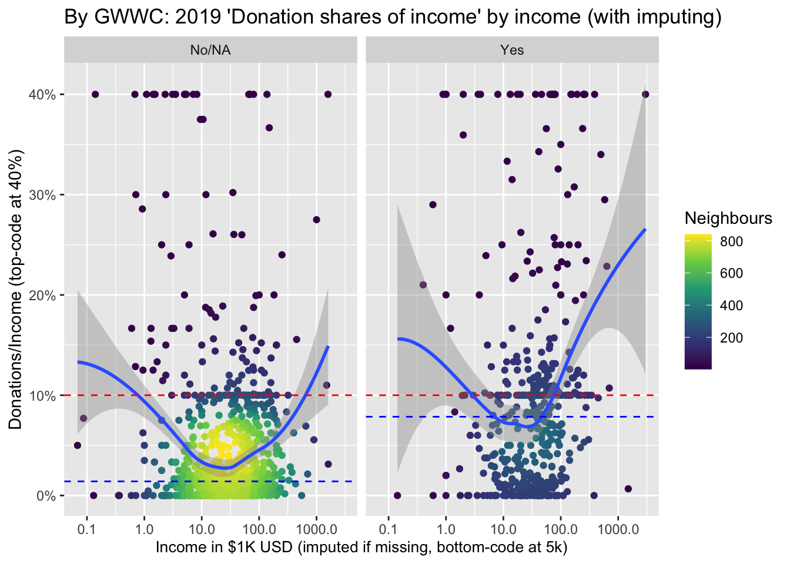
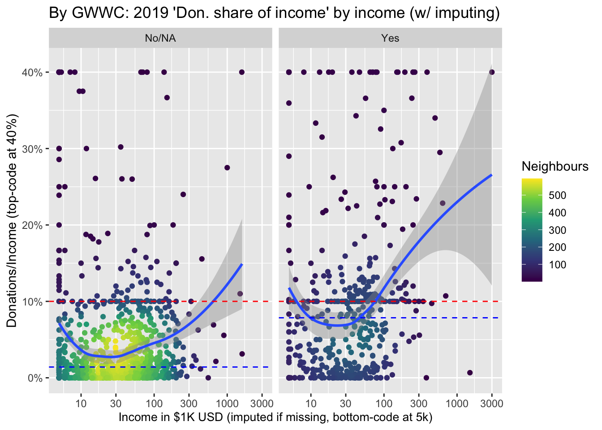
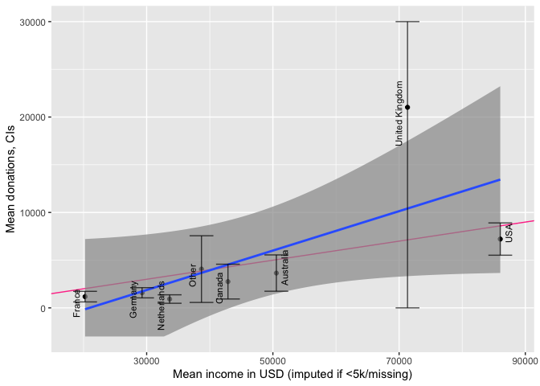
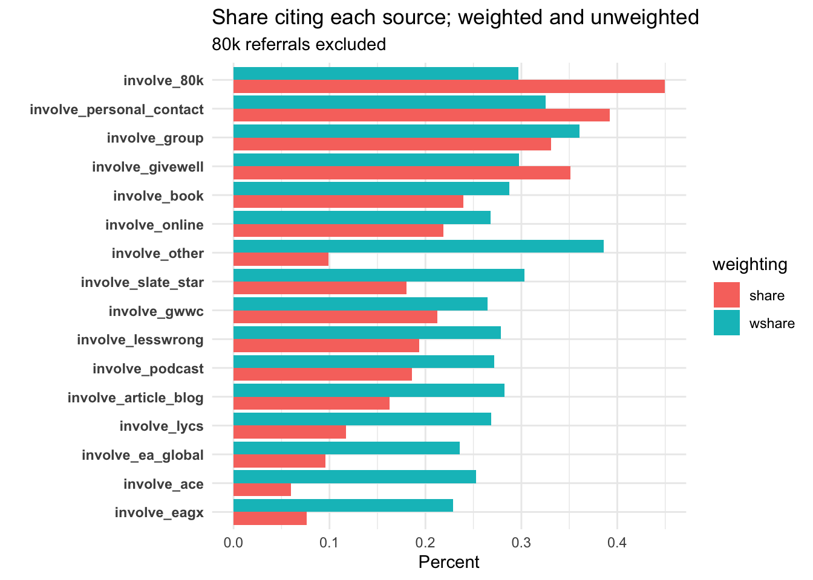

**Download, access and run project_setup.R -- moved to main_2020.R**


```{=html}
<!--  install.packages("bookdown") or the development version
# devtools::install_github("rstudio/bookdown")
-->
```
<!-- Download 'backup' bibtex file from dropbox (synced with Zotero), do the rename workaround -->

<!-- note installing packages is mainly removed because this is done in baseoptions.R -->


```r
#From https://stackoverflow.com/questions/62028925/how-do-i-catch-errors-in-inline-code-chunk-in-r-markdown

knitr::knit_hooks$set(
  evaluate.inline = function (code, envir = knit_global()) {
    v = try(eval(xfun::parse_only(code), envir = envir))
    knitr::knit_print(v, inline = TRUE, options = knitr::opts_chunk$get())
  },
  inline = function(x) {
  if (any(class(x) == "try-error")) {
    as.vector(x)
  } else x
})

# knitr::knit_hooks$set(inline = function(x) {
#   if(is.double(x))
#   x <- sprintf("%1.1f", x)
# })
```


```r
#TODO: Some of this repeats content in 'main' --- delete from one or the other?

#Define objects for 2020 survey

year_s <- "2020"
year_n <- 2020
```


```r
#formatting functions
op <- function(x, d=3) format(x, format="f", big.mark=",", digits=d, scientific=FALSE)
ops <- function(x, d=3, ns=2) format(x, format="f", big.mark=",", digits=d, nsmall=ns, scientific = FALSE)
options(scipen=999)
scatter_theme <- theme_minimal()
```

```
## Error in theme_minimal(): could not find function "theme_minimal"
```

```r
#TODO (high-priority) - is there an option to say:
# - "any CI's or other things that go outside of the limits should just be extended to the edge and not dropped)"?
# @Oska -- what about 'extending to the edge'? -- oob?
```

<!-- Global site tag (gtag.js) - Google Analytics -->

```{=html}
<!--Can define text blocks here, refer to them again and again if desired
-->

<script async src="https://www.googletagmanager.com/gtag/js?id=G-QLKFNFTGXX"></script>
```
```{=html}
<script>
  window.dataLayer = window.dataLayer || [];
  function gtag(){dataLayer.push(arguments);}
  gtag('js', new Date());

  gtag('config', 'G-QLKFNFTGXX');
</script>
```
</html>

<!--chapter:end:index.Rmd-->

---
bibliography: references.bib
---

# Donation {#eas_donations}

\BeginKnitrBlock{note}<div class="note">**Linked to forum post [Link] EA Survey 2020 Series: Donation Data** 
Note: this will be integrated into the larger set of hosted EA survey 'bookdown' work [HERE](https://rethinkpriorities.github.io/ea_data_public/outline-disc.html)
</div>\EndKnitrBlock{note}

<!-- https://forum.effectivealtruism.org/posts/29xPsh2MKkYGCuJhS/ea-survey-2019-series-donation-data -->


```r
source(here("code", "modeling_functions.R"))
eas_20 <- readRDS(here("data", "edited_data", "eas_20.Rdata"))
eas_all <- readRDS(here("data", "edited_data", "eas_all_private.Rdata"))

eas_20_cy <- readRDS(here("data", "edited_data", "eas_20_cy.Rdata"))

source(here::here("build","labelling_eas.R")) # needs to have been run also -- some of these objects are used below
```

**Note to internal reviewers** (unfold)

\BeginKnitrBlock{fold}<div class="fold">
I’d love to get your feedback on this report. It’s in the ‘bookdown’ format produced through Rmd, (with folded code as well as some other folding supplemental bits in case you are curious, but these could be ignored)

Written by me with heavy input from Oska Fentem and guidance from David Moss and others (including Peter Wildeford and Nik Vetr).
 
Much/most of this will be input into an EA Forum post, but that post may leave out some of the more technical and detailed content, and then refer/link to this hosted report (embedded with the other reports).

(Most) margin notes will become footnotes in the forum post. Folding boxes will mainly be dropped in the forum version.

Ideally, you could leave your feedback right in the web site using the Hypothes.is tool (in our private group; see thread, but public is OK too).

If you have difficulties with that, or with any part of this format, please let me know. Of course I also appreciate feedback in any form, including in Slack, a document, on the Github repo, etc.


I hope this work may be relevant even beyond this specific context, and thus would love loads of feedback because

- I think represents somewhat of a change in how we’re addressing the EA survey (e.g., the cross-year analysis)
- because I/we hope to apply some of these methods and formats to other projects and other data in the movement building, EA messaging, and fundraising space!

Thanks so much!!
</div>\EndKnitrBlock{fold}

## Introduction and summary {#introduction}

Charitable donation (and earning-to-give) has been, and continues to be a prominent, prevalent, and impactful component of the Effective Altruism movement. The EA Survey has been distributed in each year between 2014 and 2020 (other than 2016), released at various points in the year, ranging from April to August. In each survey we asked EAs about their charitable donations in the previous year, and their predicted donations for the year of the survey. Our work in this post/section reports on the 2020 survey (2019 giving), but our analysis extends to all the years of the EA survey.

In this post (and the accompanying supplement\*), we consider donation responses, presenting both raw numbers, and descriptive, predictive, and causally-suggestive analysis. We present simple numbers, statistical comparisons, vizualisations, and descriptive and 'predictive' (machine learning) models. We cover a range of topics and concerns, including:

-   the [total magnitude of EA giving](#total_mag) and its relationship to non-EA giving,
-   [career paths and 'earning to give'](#career-etg),
-   [the broad relationship between EA giving and individual characteristics](#descriptives) (such as [employment status](##emp-student) and [country](#don-by-country), and [income](#donshares)),
-   [donations versus income trends across recent years](#donation-and-income-trends-in-ea),
-   [which causes EAs are donating to](#which-charities), and
-   [EA's donation plans versus realized donations](#plan-actual) (and [future plans](#next-year)).

Our [modeling work](#modeling) work considers how donations (total, share-of-income, and 'donated over 1000 USD') jointly relates to a range of characteristics. We first present ['descriptive' results](#descriptive) focusing on a key set of observable features of interest, particularly [demographics](#demog_mod), [employment and careers](#mod_emp), and the 'continuous features' age, time-in-EA, income, and year of survey. We next fit ['predictive'](#predictive-models), allowing the 'machine learning' models themselves to choose which features seem to be most important for predicting donations.

\BeginKnitrBlock{note}<div class="note">\* *Note (to put in EA Forum post only):* A 'dynamic version' of this document (an R-markdown/Bookdown), with folded code, margin notes, some interactive graphs and tables, and some additional details, can be found [here](LINK). This may be helpful for anyone that wants to dig into this more deeply, and perhaps for those who are data, code, and statistics-inclined.</div>\EndKnitrBlock{note}

\BeginKnitrBlock{note}<div class="note">
In the narrative below, we simply refer to "donations" rather than "reported donations" for brevity.  Unless otherwise mentioned, all figures simply add, average, or otherwise summarize individual responses from the EA Survey years mentioned.</div>\EndKnitrBlock{note}

::: {.marginnote}
Programmers note: Most/many numbers included in the text below are soft-coded, and thus can automatically adjust to future data or adapted data. However, where we cite previous posts, these numbers are largely hand-coded from previous work.
:::


```r
#can also move stuff to plotting_functions.R

# Define breaks and limits
breaks <- c(0, 10^(1:10))
max_lim <- max(filter(eas_all, !year %in% c(2014, 2015))[c("donation_usd", "donation_plan_usd")], na.rm=TRUE)
density_breaks <- seq(0, 1, 0.2)[-1]

# Define same parameters for x and y axis
scales <- list(limits = c(0, max_lim), trans = scales::pseudo_log_trans(base=10),
               breaks = breaks,
               labels = label_number_si(prefix = "$"),
               expand=c(0,0))
```

```
## Error in label_number_si(prefix = "$"): could not find function "label_number_si"
```

```r
scatter_theme <- theme_minimal()
```

```{=html}
<!-- Coding notes:
`year` and `year_s` both set equal to the current year in main_2020.R. (The latter is numeric.)

Donation-relevant coding done (or to be done) in eas_stata_to_R_clean under 'Donation and income work', after currency conversions and removal of 'troll obs'.

(But I may separate importing and munging into separate R files later on).
-->
```

```r
donate_charity_names <- eas_20 %>%  dplyr::select(matches("donate_")) %>%  dplyr::select(-matches("action_|_later")) %>% names()


don_tot_freq <- eas_20 %>%
  summarise(across(c(all_of(donate_charity_names)), ~sum(as.numeric(.x) > 0, na.rm = TRUE)))  %>% slice(1) %>%
           unlist(., use.names=TRUE)

dev_health_chars <- c("donate_deworm_the_world_c", "donate_givewell_c", "donate_schistosomiasis_control_c", "donate_give_directly_c", "donate_against_malaria_found_c", "donate_global_health_develop_c")

animal_chars <- c("donate_mercy_for_animals_c", "donate_humane_league_c", "donate_ea_animal_welfare_fund_c", "donate_good_food_institute_c", "donate_ace_c")

ea_meta_chars <- c("donate_rethink_charity_c", "donate_80k_c", "donate_cea_c", "donate_ea_foundation_c", "donate_ea_meta_fund_c")

lt_ai_chars <- c("donate_machine_intelligence_c", "donate_long_term_future_fund_c")

other_chars <- c("donate_center_applied_rational_c", "donate_global_health_develop_c", "donate_other1_c",  "donate_other2_c", "donate_other3_c", "donate_other4_c",  "donate_other5_c")

all_chars <- c(dev_health_chars, animal_chars, ea_meta_chars, lt_ai_chars, other_chars)

#all_char_labels <- list(animal_don = "Animal welfare", dev_don = "Global health + development", ea_meta_don = "EA meta and organization", lt_ai_don="Long term & AI", other_don = "Other" ) -- moved to

#all_char_labels2 <- list(dev_don = "Global health + development", animal_don = "Animal welfare", ea_meta_don = "EA meta and organization", lt_ai_don="Long term & AI", other_don = "Other" ) -- moved to
#here::here("build","labelling_eas.R")

# moved to build side:
# eas_20 <- eas_20 %>% sjlabelled::var_labels(all_char_labels)

count_notna <- function(x) sum(!is.na(x))

where_don_dummies <- c("d_dev_don",  "d_animal_don",  "d_ea_meta_don",  "d_lt_ai_don",  "d_other_don")
```


```r
# Construct charity-specific aggregations (?move to build side)

where_don_vars <- c("dev_don", "animal_don", "ea_meta_don", "lt_ai_don", "other_don")

eas_20 <- eas_20 %>%
  mutate(
    num_named_dons  = rowSums(!is.na(select(., one_of(all_chars)))),
    dev_don = rowSums(across(all_of(dev_health_chars)), na.rm = TRUE),
    d_dev_don = dev_don > 0,
    animal_don = rowSums(across(all_of(animal_chars)), na.rm = TRUE),
    d_animal_don = animal_don>0,
    ea_meta_don = rowSums(across(all_of(ea_meta_chars)), na.rm = TRUE),
    d_ea_meta_don = ea_meta_don>0,
    lt_ai_don = rowSums(across(all_of(lt_ai_chars)), na.rm = TRUE),
    d_lt_ai_don = lt_ai_don>0,
    other_don = rowSums(across(all_of(other_chars)), na.rm = TRUE),
    d_other_don = other_don>0
    ) %>%
  mutate_at(.vars =where_don_vars,
            funs(ifelse(num_named_dons==0, NA, .))
         )

eas_20 %<>% labelled::set_variable_labels(.labels = as.list(all_char_labels), .strict=FALSE)
```

```
## Error in eas_20 %<>% labelled::set_variable_labels(.labels = as.list(all_char_labels), : could not find function "%<>%"
```


```r
pct_tot <- function(x) {
  x/NROW(eas_20)*100
}

num_don <- sum(eas_20$donation_2019_c>0, na.rm=TRUE)
num_na_don <- sum(is.na(eas_20$donation_2019_c))
zero_don <- sum(eas_20$donation_2019_c==0, na.rm=TRUE)

tot_don <- sum(eas_20$donation_2019_c, na.rm=TRUE)

#for all years, for USA nonstudents only
tot_don_all_usa <- sum(eas_all$donation_usd[d_live_usa==1 & d_student==0], na.rm=TRUE)
```

```
## Error in eval(expr, envir, enclos): object 'd_live_usa' not found
```

```r
tot_inc_all_usa <- sum(eas_all$income_c_imp_bc5k[d_live_usa==1 & d_student==0], na.rm=TRUE)
```

```
## Error in eval(expr, envir, enclos): object 'd_live_usa' not found
```

```r
tot_share_don_us_nonstudent <- tot_don_all_usa/tot_inc_all_usa
```

```
## Error in eval(expr, envir, enclos): object 'tot_don_all_usa' not found
```

```r
tot_don_dev <- sum(eas_20$dev_don, na.rm=TRUE)
tot_don_animal <- sum(eas_20$animal_don, na.rm=TRUE)
tot_don_ea_meta <- sum(eas_20$ea_meta_don, na.rm=TRUE)
tot_don_lt_ai <- sum(eas_20$lt_ai_don, na.rm=TRUE)

med_don <- median(eas_20$donation_2019_c, na.rm=TRUE)
mean_don <- mean(eas_20$donation_2019_c, na.rm=TRUE)
mean_don_not_new <- mean(eas_20$donation_2019_c[eas_20$year_involved_n!=year_s], na.rm=TRUE)

mean_don_18 <- mean(eas_all$donation_usd[eas_all$year==2019], na.rm=TRUE)
mean_don_18_not_new <- mean(eas_all$donation_usd[eas_all$year==2019 & eas_all$year_involved!="2019"], na.rm=TRUE)


plan_donate_2019_c <- filter(eas_all, year == 2019) %>% pull(donation_plan_usd)

mean_plan_18_19 <- mean(plan_donate_2019_c, na.rm=TRUE)
med_plan_18_19 <- median(plan_donate_2019_c, na.rm=TRUE)

med_not_new <- median(eas_20$donation_2019_c[eas_20$year_involved_n!=year_s], na.rm=TRUE)

top_1p3don <- eas_20 %>% select(donation_2019_c) %>% slice_max(donation_2019_c, prop =.013) %>% sum()
top_1p3share <- top_1p3don/tot_don
```

### Summary (some key results and numbers) {#sum-results}

-   55.5% of EAs in the 2020 survey reported making a charitable donation in 2019, 13.7% reported making zero donations, and 30.8% did not respond to this question. (Thus, of those who responded, 80.3% reported making a donation in the prior year.)

-   Participants reported total donations of 10,695,926 USD in 2019 (cf 16.1M USD in 2018).

-   However, the number of survey participants has declined somewhat, from 2509 in 2019 (1704 of whom answered the donation question) to 2056 (1,423 answering the donation question) in 2020.\*

    -   Over the past years, we see no strong trend in median or mean donation amounts reported.

::: {.marginnote}
\* All figures here refer to survey responses, so we won't write 'reported in the survey' each time. These (2019-20) numbers exclude a single survey donation response in the billions that was ruled to be implausible. A total of 2 observations were dropped for implausible income, donations, or ages. Averages are for those who answered the donation question(s), including those who reported donating zero. Nonresponses are not counted in these statistics except where specifically mentioned. Unless otherwise mentioned, all figures simply add, average or otherwise summarize individual responses from the EA Survey years mentioned.
:::

-   The median annual donation in 2019 was 528 USD (cf 683.92 USD in 2018).

-   The mean (reported) annual donation for 2019 was 7,516 USD (cf 9,370 for 2018) or 8,607 USD excluding those who joined in 2020 (cf 10,246 USD for 2018 excluding those who joined in 2019).

-   The median annual donation in 2019 excluding those who joined EA in 2020 was 761 USD (cf. 990 USD for the comparable median for 2018/2019 and 832 USD for 2017/2018). (See ['donation and income trends in EA](#donation-and-income-trends-in-ea)' for more details).

-   In 2019 1.3% of donors accounted for \$6,437,404 in donations or 60% of the survey total. (Cf in 2018 1.3% of donors accounted for 57% of donations.)


```r
med_don_share <-  median(eas_20$don_share_inc_19, na.rm = TRUE)
med_don_share_imp_bc <- median(eas_20$don_share_inc_19_imp_bc5k, na.rm = TRUE)

earn_filter <- quos(d_student==0, income_c>10000)

med_don_share_imp_ns_10k <- eas_20 %>%
  filter(!!!earn_filter) %>%
    summarise(med=median(don_share_inc_19, na.rm = TRUE))

tot_inc <- sum(eas_20$income_c, na.rm=TRUE)

tot_inc_imp_bc <- sum(eas_20$income_c_imp_bc5k, na.rm=TRUE)

share_don_gt_10pct <- sum(eas_20$don_share_inc_19>=.1, na.rm = TRUE)/sum(!is.na(eas_20$don_share_inc_19))

share_don_gt_10pct_imp <- sum(eas_20$don_share_inc_19_imp_bc5k>=.1, na.rm = TRUE)/sum(!is.na(eas_20$don_share_inc_19_imp_bc5k))

share_don_gt_5pct_imp <- sum(eas_20$don_share_inc_19_imp_bc5k>=.05, na.rm = TRUE)/sum(!is.na(eas_20$don_share_inc_19_imp_bc5k))

share_don_gt_10pct_earn <- eas_20 %>%
  filter(!!!earn_filter) %>%
      transmute(share_don_gt_10pct =  sum(don_share_inc_19>=.1, na.rm = TRUE)/sum(!is.na(don_share_inc_19)) ) %>%
    unlist %>%  .[1]

#don gt 10pct ... by gender

#eas_20 %>%
#     mutate(d_don_gte10_imp = don_share_inc_19_imp>=.1) %>%
#     tabyl(gender_manual, d_don_gte10_imp) %>% tabylstuff()
```

-   The median percentage of income donated in 2019 was 2.96% (cf 3.23% in 2018).

-   However, if we impute "0 and missing incomes" at "group medians for student-status and country",\* the median percentage of income donated was 2.00% for 2019.

::: {.marginnote}
\* Many respondents do not reveal their income, or report zero or implausibly small incomes (if we consider income to include transfers and family support); among these, many *do* report donations. To get a meaningful measure of average shares of income donated (and other stats) *including* these individuals, we need to put some measure reflecting yearly spending power in the denominator. We thus make a rough imputation, selecting the average income for individuals from their same country and same student-status who *do* report an income value. To avoid sensitivity to outliers, countries with small numbers of participants are lumped together into an "other" group for this imputation. Where this (or reported income) falls below 5000 USD, we 'bottom-code' it this as at 5000 USD.
:::

-   *Mean* share of *total* (imputed) income donated was 9.44% (imputing income where below 5k or missing) or 12.5% without imputation.

<!-- DR: note, I checked there indeed are 3 'median' obs donating exactly 3 percent of income in 2019 -->

-   20% of EAs who answered the donation question reported donating 10% or more of their income in 2019 (if we impute income; otherwise 25.6% without imputation; this compares to 20% in 2018, without imputation).

-   The median percent of income donated by full-time-employed non-students who earned more than \$10,000 was 2.92%, and of this group 23.89% donated 10% of their income or more in 2019 (cf 3.38% and 24% in 2018).

-   Overall, those taking the EA survey tend to report donating a substantially greater share of income than [those in the general US population](#usa-don)


```r
pct_don <- function(x) {
  sum(don_tot_freq[x])/sum(don_tot_freq)*100
}

pct_ddon <- function(x) {
  op(
    sum(x != 0, na.rm=TRUE)/sum(notNA(x), na.rm=TRUE)*100
  )
}
```


```r
don_stats <- eas_20 %>%
        filter(num_named_dons>0) %>%
  select(all_of(where_don_vars)) %>%
  vtable::sumtable(
                summ=c('notNA(x)', 'sum(x != 0)', 'sum(x != 0)/notNA(x)', 'mean(x)', 'sd(x)', 'pctile(x)[50]', 'pctile(x)[90]'),
                summ.names = c('N Responses', 'N positive', 'Share positive', 'Mean', 'Sd', "Median", "90th pct"),
                digits=c(0,0,2,0,0,0,0),
                simple.kable = TRUE,
                labels = all_char_labels2,  #it's a horrible workaround but we need to have the order of these the same as the table order ... I think it's a flaw of sumtable
                title = "Donations by category (where indicated)"
                )

#todo (low-priority) -- replace with .summ hijacked command

n_rep_char <- sum(eas_20$num_named_dons>0, na.rm=TRUE)
```


```r
don_stats_by_gwwc <- eas_20 %>%
        mutate(`GWWC Pledge` = case_when(
          action_gwwc==1 ~ "Yes",
          action_gwwc==0 ~ "No"
        )) %>%
        filter(num_named_dons>0) %>%
  select(all_of(where_don_vars),
         `GWWC Pledge`) %>%
  vtable::sumtable(group = "GWWC Pledge",
                   group.test=TRUE,
                 summ=c('notNA(x)','sum(x != 0)/notNA(x)', 'mean(x)', 'sqrt(var(x)/length(x))',
                        'pctile(x)[50]'),
                summ.names = c('N Responses', 'Share positive', 'Mean', "Median"),
                digits=c(0,2, 0,0,0),
                simple.kable = TRUE,
                labels = all_char_labels2,  #it's a horrible workaround but we need to have the order of these the same as the table order ... I think it's a flaw of sumtable
                title = "Donations by category (where indicated), by GWWC")
```


```r
ddon_stats_by_gwwc <- eas_20 %>%
        mutate(`GWWC Pledge` = case_when(
          action_gwwc==1 ~ "Yes",
          action_gwwc==0 ~ "No"
        )) %>%
        filter(num_named_dons>0) %>%
  select(all_of(where_don_dummies),
         `GWWC Pledge`) %>%
  vtable::sumtable(group = "GWWC Pledge",
                   group.test=TRUE,
                 summ=c('notNA(x)','sum(x != 0)/notNA(x)'),
                summ.names = c('N Responses', 'Donated to... ?'),
                digits=c(0,2),
                simple.kable = TRUE,
                labels = all_char_labels2,  #it's a horrible workaround but we need to have the order of these the same as the table order ... I think it's a flaw of sumtable
                title = "Binary: Indicated donating to category, by GWWC")
#  .kable() %>%
 # .kable_styling("striped")

#todo (low-priority) -- replace with .summ hijacked command
```

-   While 69.2% of respondents answered the donation question, only 20.9% answered at least one question about *where* they donated.

<!-- Todo: can we get a better default presentation of numbers and in line code so that I don't have to use this "op()" function all the time? -->

-   Among these, the charity that the most EAs stated that they donated to was the Against Malaria Foundation (AMF), with 122 reported donations.

<!--   against malaria found -->

-   Global Poverty charities continue to attract the largest counts and amounts of donations, with Error in notNA(x) : could not find function "notNA"
% of those who answered having reported donating to these, 26.9% of listed donation counts and a total of $\$$ 1,703,870 in reported (and categorized) donations,

    -   compared to Error in notNA(x) : could not find function "notNA"
% reporting donating, 10.5% of donations and $\$$ 645,086 total donated for animal charities,

        -   Error in notNA(x) : could not find function "notNA"
%, 5.81% and $\$$ 330,910 for EA movement/meta charities,
        -   and Error in notNA(x) : could not find function "notNA"
%, 5.61% and $\$$ 418,403 for long term and AI charities.

::: {.marginnote}
Todo (Medium priority): Maybe add additional summary points, especially on planned/achieved donations.
:::

-   [Evidence is mixed](#plan-actual) on whether EAs' donations in a year tend to exceed or fall short of the amount they planned to donate (as they reported in previous surveys). For the small share that *can* be tracked across years, donations tend to exceed plans (by around 60 USD at median, but over 1000 USD at mean). However, the *overall distribution* of donations for a particular year tends to fall short of the distribution of planned donations (by about 450 USD at median and over 2000 at mean).

-   While at median [EAs tend to report](#next-year) planning to donate the same amount this *next year* that they donate in each particular year, the average (mean) plan for next year is significantly larger.

<!-- EAS2019_draft10.do tabstat donate_cause_meta_2018_c donate_cause_cause_pri_2018_c donate_cause_poverty_2018_c donate_cause_animal_welfare_2018 donate_cause_far_future_2018_c, stat(sum mean median     ) -->

-   Our [descriptive models](#descriptives) basically find that:\*

    -   age, being in a named 'top EA' big city, having taken the GWWC pledge, and an Earning-to-Give career are positively associated with donations, while
    -   while being 'not employed' (and to a lesser extent non-male gender and student status\_ are negatively associated with this;
    -   donation are roughly proportionally associated with income (approximately 'unit elastic'),
    -   as well as with age and 'time in EA' (with elasticities around 0.54 to 0.63, respectively).

-   Our [predictive (ML) models](#predictive-models) highlight the importance of

    -   income and (to a lesser extent) age,
    -   as well as certain sources of 'where heard of EA'.

-   These models [perform moderately well](#model-perf), particularly in predicting 'whether donated 1k USD or more' (here it attains about 74% accuracy compared to 54% accuracy from simply 'guessing the most common outcome').

::: {.marginnote}
\* Caveat: not all of these coefficients are statistically significant by standard metrics. These results are 'statistically stronger' for our model of 'whether donated 1000 USD or more'.
:::

### Why does the EA Survey ask about donations? What does it tell us? What is the "theory of change" for how learning about donation behavior will improve outcomes? {#toc .unnumbered}

We present some reasons why this may be useful:\*

::: {.marginnote}
\* This should be considered a medium-run project: we will not be able to address all of these questions in the current post.
:::

-   The magnitude of EAs' donations informs 'how much weight can we throw around' in asking charities etc to appeal to us as a community? While we have other measures (discussed below) of the overall amounts and largest donations, the EA Survey conveys additional information about the donations of 'large groups of moderate-income people who explicitly identify with EA.'

```{=html}
<!--     \* Caveat: As noted, we have strong reasons to believe that donations are likely to be concentrated among the largest donors, and this survey might not tell us too much about that.
-->
```
-   This may offer insight into 'what motivates and impedes donation behavior'.

-   Donation behavior may be seen as one measure of EA engagement; our evidence may thus offer insight into 'what motivates engagement'.

-   Observing changes in donation patterns across time may alert us to potential problems and important changes in priorities, values, and the nature of the EA movement. Being able to predict future donation behavior may also help EA organizations better anticipate, budget, and plan (in conjunction with their existing data and models).

-   Predicting and describing typical donation rates can inform decisions like "which EAs seem likely to have more impact if they choose to go into direct work versus earning-to-give".\*

::: {.marginnote}
\* My impression is that previous work on 'should I work directly for good or earn-to-give' has tended to focus on earning potential, presuming that those who are in large amounts will donate at a certain planned rate. However, an equally important question may be "what share or amount of income should we expect people who pursue earning-to-give to end up donating? This question seems particularly important in the presence of value drift. (However, one might argue that the individual's own understanding of his or her future behavior might dominate, and not be easily integrated with the insight that we gain from the broad predictions using survey data.)
:::

-   Perhaps more controversially (and we are raising this idea but not promoting it), EAs' donation amounts might be seen as incentive-compatible 'votes' telling us what people in the movement want the EA movement to focus on? However, note people need not be truthfully reporting here, so if we allow for mis-statement, this is far from incentive compatible.

## Total EA donations, magnitudes in context {#total_mag .unnumbered}

**Considering the magnitude of the donations...**

The \$10,695,926 USD in donations reported above seems likely to be a small share of total EA-affiliated giving, perhaps less than 1/4 of the total. [Previous estimates](https://forum.effectivealtruism.org/posts/zQRHAFKGWcXXicYMo/ea-survey-2019-series-how-many-people-are-there-in-the-ea) suggest that, even among very highly-engaged EAs, only about 40% complete the EA survey. [Other estimates suggest](https://forum.effectivealtruism.org/posts/S6QHRyi7joCWN9dkv/community-vs-network?commentId=G9zwPKtkcAb4nm6EH) that only about 20% of GWWC members complete the survey. As noted above, only 69.2% of survey respondents answered this question in 2020. We present some extrapolations below, our own and others.

Even within the survey, the largest mass of donations are heavily concentrated among a few givers. We expect that the distribution of donations in EA overall is even more heavily skewed, with large donors and foundations (such as [Tuna and Moskowitz of Open Philanthropy](https://www.openphilanthropy.org/about/who-we-are) accounting for a lion's share. The table below uses data from Open Phil's [Grants database](https://www.openphilanthropy.org/giving/grants), divided by year and cause area).\*

::: {.marginnote}
[effectivealtruismdata.com](http://effectivealtruismdata.com/) provide further interesting visualizations of the magnitude, sources, and recipients of EA donations.
:::


```r
library(scales)

research_terms <- "research|univ|study|UC|trial|scholar|fellow|macreoeconomic|rethink|study|feasibility|analysis|evaluation"

focus_area_names <- c(
`Criminal Justice Reform` = "Crime/Justice",
`Farm Animal Welfare` = "Farm Animal",
`Global Health & Development` = "Glob. Health/Dev.",
`Scientific Research` = "Scient. Res.",
`Potential Risks from Advanced Artificial Intelligence` = "AI risk",
`Biosecurity and Pandemic Preparedness` = "Biosec.",
`Other areas` = "Other",
`Macroeconomic Stabilization Policy` = "Macro-econ",
`Global Catastrophic Risks` = "Glob. Catastr. Risk",
`Immigration Policy` = "Immig. Policy",
`Land Use Reform` = "Land Ref.",
`U.S. Policy` = "US policy",
`History of Philanthropy` = "Hist. of Phil."
  )


open_phil_grants <- read.csv("https://www.openphilanthropy.org/giving/grants/spreadsheet") %>%
  as_tibble() %>%
  mutate(
    amount = as.numeric(gsub('[$,]', '', Amount)),
    amount_usd_k = amount/1000,
    date = lubridate::my(Date),
    year = lubridate::year(date),
    focus_area = dplyr::recode(Focus.Area, !!!focus_area_names),
    focus_area = as.factor(focus_area))  %>%
  select(-Amount, -Date)
```


```r
(
  op_res_grants_tab_yr_area <-
open_phil_grants %>%
    dplyr::group_by(year, focus_area) %>% # drop_na(!!yvar, !!treatvar) %>%
    summarise(total = sum(amount_usd_k,  na.rm = TRUE)) %>%
    spread(year, total, fill=0) %>%
    adorn_totals("row") %>%
      adorn_rounding(digits = 0) %>%
    arrange(-`2020`) %>%
    rename_with(~snakecase::to_sentence_case(.)) %>% # Change focus_area to Focus Area
    .kable(caption = "Open Philanthropy grants by year and area, in $1000 USD",
          col.names = NA) %>%
    row_spec(1:1, bold = TRUE) %>%
    .kable_styling("striped")
)
```

```
## Error in .kable_styling(., "striped"): could not find function ".kable_styling"
```

**Extrapolations and further benchmarks:**

-   [Ben Todd's recent post](https://forum.effectivealtruism.org/posts/zA6AnNnYBwuokF8kB/is-effective-altruism-growing-an-update-on-the-stock-of) estimates that the EA community is donating \$420 million per year, which "has grown maybe about 21% per year since 2015", and "around 60% was through Open Philanthropy, 20% through other GiveWell donors, and 20% from everyone else."

-   [A recent post by tylermaule](https://forum.effectivealtruism.org/posts/mLHshJkq4T4gGvKyu/total-funding-by-cause-area) estimates \$263 million in 'funding 'global funding of EA causes'.\*

::: {.marginnote}
\* This relies on Open Phil's [Grants Database](https://www.openphilanthropy.org/giving/grants), GiveWell's [Metrics Report](https://files.givewell.org/files/metrics/GiveWell_Metrics_Report_2019.pdf), [EA funds intake figures](https://animalcharityevaluators.org/about/impact/giving-metrics/), and Animal Charity Evaluators' [Metrics report](https://animalcharityevaluators.org/about/impact/giving-metrics/).
:::

-   Giving What We Can reports roughly \$70 million in donations per year, in recent years.\*\*

::: {.marginnote}
\*\* [At end of Dec. 2020](https://web.archive.org/web/20201224021340/https://www.givingwhatwecan.org/) they reported that their roughly 5000 members "donated more than \$203,443,730 "to highly effective charities". In [December 2019 the comparable figure](https://web.archive.org/web/20191224103856/https://www.givingwhatwecan.org/) was 126.8 million, suggesting that roughly 77 million was donated in a single year. However, the same figure: \$25,309,348, was listed both in December of [2018](https://web.archive.org/web/20181231204839/https://www.givingwhatwecan.org/) and [2017](https://web.archive.org/web/20171220171159/https://www.givingwhatwecan.org/), so the figures may not be constantly updated. GWWC gives data on the destinations of 'GWWC donations that go through EA funds'.
:::

-   [GiveWell reported](https://forum.effectivealtruism.org/posts/j49XCMMWnmbTZuNNk/givewell-s-money-moved-in-2019) "GiveWell donors contributed over \$150 million to our recommended charities in 2019".

Of course, the above large donations/grant totals may not all be coming from donors aligned with EA, and may not entirely go towards the most effective charities. The donations also may not be well-described by the donations recorded in the EA survey.

In the fold, we consider the importance of EA-aligned donations in comparison to non-EA donations to similar causes. We return to this in a [supplemental appendix section](#usa-don), specifically focusing on US nonstudents, comparing these to results from a national survey.

\BeginKnitrBlock{fold}<div class="fold">
A further question is whether the few hundreds of millions of dollars in EA-aligned donations is substantial in comparison to non-EA donations to similar causes (e.g., [developmentaid "Top trends in private philanthropic donations for development"](https://www.developmentaid.org)
reports the OECD figure of \$7.8 Billion in private philanthropic donations for development in 2018, and 200-300 billion in total charitable donations per year from the USA alone.)

Some quick responses:

1. Naturally, we anticipate EA donations will tend to be much more effective per dollar, perhaps orders of magnitude more so.  (A basic case, with some references, is given [here](https://naaronr.github.io/ea_giving_barriers/present-puzzle.html). However, Tomasik and others present [credible arguments for being skeptical](https://reducing-suffering.org/why-charities-dont-differ-astronomically-in-cost-effectiveness/) of the claims of vast differences in effectiveness *within* a given domain.)

2. Even *if* EA donations were small in relation to global giving, they still have an important impact, and this is the domain we can control. (Relatedly, we should not fall victim to the 'drop in the bucket' and ['proportion dominance'](https://onlinelibrary.wiley.com/doi/abs/10.1002/bdm.1789) biases in considering this.)

3. "Where, when, and how much EAs are giving" may be an important informative measure of beliefs and priorities (discussed further below).
</div>\EndKnitrBlock{fold}


```r
extrap_tot_ea_don <- (tot_don +
                        tot_don*0.5 *
                        (num_na_don/(num_don+zero_don))) / 0.3
```

Our own rough extrapolations suggest, perhaps very conservatively \$43.6 million USD could be a reasonable central guess for the total amount of annual donations coming from non-billionaire EAs, i.e., the sort of EAs who respond to the EAS.\*

::: {.marginnote}
\* This extrapolation simply multiplies the reported \$10,695,926 USD by 1 + 0.445 $\times \frac{1}{2}$ to adjust for the share of respondents who did not answer this question, presuming they give at half the rate of those who do answer. Next we divide by 0.3, averaging the 20% and 40% estimates of EA survey nonresponse noted above. I presume that billionaire EAs are extremely unlikely to complete the survey or report their total donations in this form. Implicitly, we assume respondents are reporting accurately. This extrapolation should not be taken too seriously. David Moss has taken this one step further, with a [brief 'Fermi estimate' in Guesstimate](https://www.getguesstimate.com/models/18973) making the uncertainty over each parameter explicit, and expressing a confidence/credible interval with midpoint 56 million and 95% bounds 36-93 million USD.
:::

```{=html}
<!-- todo, (low-priority) time-permitting:

Compare to non-EA (e.g., PSID)... - Amounts donated to highest-impact charities globally - Amounts donated to all charities globally

-->
```
## Career paths: Earning-to-give {#career-etg}

Although there seems to have been decline in earning-to-give (ETG), it continues to be a popular career path. (We discuss career paths further in the EA Survey 2020: Demographics post under ['Careers and education'](https://forum.effectivealtruism.org/posts/ThdR8FzcfA8wckTJi/ea-survey-2020-demographics#Careers_and_Education)\*)

::: {.marginnote}
\* In an earlier version of that post, the "which of the following best describes your current career" result had been misstated, showing the share of *responses* to this multi-response question rather than the share of *individuals* selecting ETG.
:::

While there is a steep drop in the number indicating ETG from the 2019 to the 2020 survey, this might be overstated, perhaps stemming from requested changes to the wording of the questions and the numbers of options given, or from differences in the composition of responses to the EA Survey.\*

::: {.marginnote}
\* *Question texts*

2018: "What broad career path are you planning to follow?" [4 options]

2019: "If you had to guess, which broad career path(s) are you planning to follow?" [9 options]

2020: "Which of the following best describes your current career?" [11 options]
:::


```r
etg_rates_all <- eas_all %>%
  filter(year>2014) %>%
  group_by(year) %>%
  summarise( "Count" = n(),
             "Share ETG" = mean(as.numeric(d_career_etg))
             )

etg_rates_ns <- eas_all %>%
    filter(year>2014) %>%
  filter(d_student==0) %>%
  group_by(year) %>%
   summarise( "Count" = n(),
             "Share ETG" = mean(as.numeric(d_career_etg))
             )

(
etg_rates_tab <- bind_cols(etg_rates_all, etg_rates_ns[-1]) %>%
  magrittr::set_names(c("Year", "All responses", "Share EtG", "Nonstudents", "Nonstudents: Share EtG")) %>%
  kable(caption = "Rates of 'Earning-to-give' by year and student status (see caveats)", digits=3) %>%
  .kable_styling()
)
```

```
## Error in .kable_styling(.): could not find function ".kable_styling"
```

```r
  #     tabyl(year, d_career_etg) %>%
#     tabylstuff_nocol(cap = "Non-students only; Rates of 'Earning-to-give' (see caveat)")
#


# (
# etg_rates_ns <- eas_all %>%
#     filter(d_student==0) %>%
#     tabyl(year, d_career_etg) %>%
#     tabylstuff_nocol(cap = "Non-students only; Rates of 'Earning-to-give' (see caveat)")
# )


# (
#   etg_rates_tab <- eas_all %>%
#   group_by(year, d_student) %>%
#   filter(!is.na(d_student)) %>%
#   summarise( "Count" = n(),
#              "Share ETG" = mean(as.numeric(d_career_etg))
#              ) %>%
#   pivot_wider(names_from =d_student,
#               values_from=c(Count, "Share ETG")
#               ) %>%
#   set_names(c("Year", "Nonstudents", "Students", "Nonstudents: Share EtG", "Students: Share EtG")) %>%
#   kable() %>%
#     .kable_styling()
#)

#todo - medium priority: combine the above tables into a single table: overall, just for students  with just n,
```


```r
(etg_rates_plot <- eas_all %>%
  group_by(year, d_student) %>%
      filter(year>2014) %>%
  filter(!is.na(d_student)) %>%

        #@oska (low-med priority todo): we should functionalize these mutations for computing se and CIs (or find someone who has done). We do it again and again, and the code is bulky
        #maybe incorporate my se_bin function
        #@oska todo ... also functionalize or otherwise preserve a good version of this graph

  # Calculate standard error, confidence bands and change student factor levels
  summarise(
         m_etg = mean(as.numeric(d_career_etg)),
         se = se_bin(d_career_etg)) %>%
    mutate(
         etg_low = m_etg - 1.96*se,
         etg_high = m_etg + 1.96*se,
         d_student = as.factor(if_else(d_student == 0, "Non-student", "Student")),
         year = as.factor(year)) %>%

ggplot(aes(x=year, y=m_etg, colour = d_student, group = d_student))  +
  geom_pointrange(aes(ymin = etg_low,
                      ymax = etg_high),
                  position = position_dodge(width=0.5)) + # Ensure that bars don't overlap
  geom_line(position = position_dodge(width=0.5)) +
  xlab("Mean (and 95% CI) response share in 'Earning-to-give'") +
  ylab("Share of sample") +
  scale_color_discrete("") + # Remove legend title
   scale_y_continuous(labels = scales::percent_format(accuracy = 1L), limits=c(0,NA), oob = scales::squish) + # Change y-axis to percentages
  theme(legend.position = c(0.9, 0.95),
        #legend.background = element_rect(fill=alpha('blue', 0.001)),
        legend.key = element_blank())
)
```

```
## Error: Problem with `summarise()` column `se`.
## ℹ `se = se_bin(d_career_etg)`.
## x could not find function "se_bin"
## ℹ The error occurred in group 1: year = 2015, d_student = 0.
```

We expect non-students to be less sensitive to the changing wording of the survey question as they are more likely to be *in* a career path as their 'current career'. The decline in ETG is less dramatic among non-students (over 23% of non-student respondents still report ETG as their 'current career'), but it nonetheless appears to be fairly strong and consistent from 2017-present.\*

::: {.marginnote}
\* We do not include 2014 in the above tables and plots because of very low response rates to the student status and EtG-relevant questions.
:::

## Donation totals: descriptives {#descriptives}

### Overall donations, totals by groups {.unnumbered}

Below, we present a histogram of positive reported 2019 donations by all respondents. Note that:

-   the horizontal axis is on a logarithmic scale,
-   13.7% of the 2,056 total respondents reported donating zero, and
-   30.8% of the total respondents did not report their donation amount.
-   As noted above, we will often simply refer to 'donations' rather than 'reported donations', for brevity.

```{=html}
<!--
# plotting-funcs
# The plotting functions have been moved into `code/plotting_functions.R`

#Todo -- Medium priority: add or align a cumulative donation amounts histogram

-->
```

```r
eas_20$don_19_p1 <- as.numeric(eas_20$donation_2019_c+1)
#adapting from EA survey 2019 Rscript_analysis.md

donation_2019_c <- eas_20$donation_2019_c

require(scales)

don_breaks <- c(50, 100, 200, 300, 500,  1000, 2500, 5000, 10000, 25000, 50000, 100000, 250000, 500000, 1000000, 2500000)

eas_20 %<>%
  rowwise() %>%
      mutate(donation_2019_c_50 = max(donation_2019_c, 50)) %>%
  ungroup

(
  donhist_19 <- eas_20 %>%
    hist_plot_lscale(eas_20$donation_2019_c_50, breaks = don_breaks) +
    geom_vline_mean(donation_2019_c) +
    geom_vline_med(donation_2019_c) +
    geom_vline_90(donation_2019_c) +
    labs(title="Histogram of 2019 Donations", x="2019 $ Donations (bottom-coded at 50)", y = "Number of respondents")
)
```

```
## Error in hist_plot_lscale(., eas_20$donation_2019_c_50, breaks = don_breaks): could not find function "hist_plot_lscale"
```

```r
# Todo (medium importance): Overlay a display of 'overall percentage shares' ... so we know where the 80th and 90th percentile are, etc.
```

In 2019 we reported:

> a donation of 1000 USD per year ... would place one in the top half of EA donors (specifically, the 55th percentile), whereas being in the top 10% of donors would require donating 11,000 USD and the top 1% 110,000 USD.

The results for 2020 (for 2019 donations) are comparable; the median donation (of those reporting) is 528 USD, a donation of \$1000 puts you in the 59.5th percentile. Being in the top 10% requires donating 9,972 and being in the top 1% means donating 89,560 USD.

As in previous years, the mean far exceeds the median, (and falls close to the 90th percentile!); a very small number of very large donations dwarf the size of most others. We illustrate this in the 'treemap' plot below, which divides the total reported contributions into groups by size-of-contribution.

\


```r
#p_load(treemapify)

geom_treemap_opts <- list(geom_treemap(alpha = 0.7),
  geom_treemap_text(fontface = "italic", colour = "white", place = "centre",
                    grow = TRUE, min.size = 1 ),
  theme(legend.position = "none",
        plot.title = element_text(hjust = 0.5))
  )
```

```
## Error in geom_treemap(alpha = 0.7): could not find function "geom_treemap"
```

```r
(
  don_share_by_size <- eas_20 %>% select(donation_2019_c, donation_2019_c_split) %>%
  group_by(donation_2019_c_split) %>%
  summarise(total_don = sum(donation_2019_c, na.rm=TRUE)) %>%
  mutate(don_share = round(total_don/sum(total_don)*100)) %>%
  filter(!is.na(donation_2019_c_split)) %>%
  ggplot(aes(area = total_don, fill= donation_2019_c_split,
             # Include percentage of total donation
             label = paste(donation_2019_c_split, paste0(don_share, "%"), sep = "\n"))) +
    geom_treemap_opts +
  ggtitle("Share of total 2019 donation amount, by donation size")
)
```

```
## Error in eval(expr, envir, enclos): object 'geom_treemap_opts' not found
```

Over a third of total reported contributions reported for 2019 come from contributions over 500,000 USD, with another 20% coming from contributions between 25k and 100k. Contributions of under 2500 USD represent less than 5% of the total.

\

Next we consider 'which career paths are driving total donation totals?'; mapping the share of total 2019 donations similarly, accompanied by a table of their overall shares of respondents, for comparison.\*

::: {.marginnote}
\* This figure excludes 486 participants who provided no response to the career question, 0.236 of the sample. These participants reported a total of $\text{\$}$2,766,310 in donations which makes up 25.9% of the total reported donations for 2019.
:::


```r
#library(treemapify)

(
  don_by_career <- eas_20 %>% select(career_, donation_2019_c) %>%
  group_by(career_) %>%
      filter(!is.na(career_)) %>%
  summarise(total_don = sum(donation_2019_c, na.rm=TRUE),
            n = n()) %>%
  mutate(don_share = round(total_don/sum(total_don)*100),
         freq = n/sum(!is.na(eas_20$career_))
         ) %>%

  ggplot(aes(area = total_don , fill=freq,
             # Include percentage of total donation
             label = paste(career_,
                           paste0(don_share, "%"),
                           paste0("(Pop:", round(freq*100) , "%)"),
                                  sep = "\n"))) +
  geom_treemap_opts +
   # theme(legend.position = "bottom") + #todo -- add title to legend explaining that it's the survey pop; get better colors for this
  scale_fill_continuous(name = "Frequency",
                        label = scales::percent, trans = "reverse") +
labs(title= "Share of 2019 donations by career path",  subtitle = "(Share of survey population in parentheses; darker = larger share)")
)
```

```
## Error in eval(expr, envir, enclos): object 'geom_treemap_opts' not found
```

```r
career_tab <- eas_20 %>%
    mutate(Career = na_if(career_, "na")) %>%
      filter(!is.na(Career)) %>%
tabyl_ow_plus(Career, caption="Shares in each career path",
              title_case = TRUE)
```

```
## Error in tabyl_ow_plus(., Career, caption = "Shares in each career path", : could not find function "tabyl_ow_plus"
```

```r
 #Todo: the right column needs to be x100 or say 'share' instead of 'percent'
```

\
Those reporting 'for profit-earning to give' career paths represent the largest share, nearly half of the total donations, despite making up <!--softcode this stuff please--> only about 15% of the sample (of those answering this question). Those with 'for profit' careers who do not say they are earning to give donate about 15% of the total, roughly in proportion to their 12% share of the sample. However all of these differences may reflect differences in income and wealth levels, as well as differences in underlying characteristics of people who choose different career paths.

Direct work does not seem to be obviously coming at the expense of donations. Those pursuing careers working at EA-affiliated non-profits account for a somewhat higher share of donations (12%) than their (8%) share of the sample. (However, we do not know how much these particular EAs *would* have given had they chosen a different career.)

Obviously, income levels are different between these career paths. We put this in perspective in the plot below.


```r
grp_sum <- function(df, xvar, yvar, groupvar) {
  df %>%
      dplyr::select({{xvar}}, {{yvar}}, {{groupvar}}) %>%
      group_by({{groupvar}}) %>%
      drop_na({{xvar}}, {{yvar}}, {{groupvar}}) %>%
      summarise(
                      mn_y = mean({{yvar}}),
                      mn_x = mean({{xvar}}),
                      med_y = median({{yvar}}),
                      med_x = median({{xvar}}),
                      se_y = sd({{yvar}}, na.rm=TRUE)/sqrt(length({{yvar}})),
                      se_x = sd({{xvar}}, na.rm=TRUE)/sqrt(length({{xvar}}))
                      ) %>%
      group_by({{groupvar}}) %>%
    # Calculate confidence intervals
      mutate(
              lower = max(0, mn_y - 1.96*se_y),
              upper = mn_y + 1.96*se_y
              )
}


plot_grp <- function(df, groupvar, labsize=3) {
  df %>%
    ggplot(aes(x=mn_x, y=mn_y, label = {{groupvar}})) +
  geom_point() +
  #add median here
  # geom_line(color = "red", data = income_pred, aes(x = income_k_c, y = )) +
  geom_abline(intercept = 0, slope = 0.1, colour="violetred1") +
  geom_smooth(method=lm, alpha=0.7) +
  geom_errorbar(aes(ymin = lower,
                      ymax = upper), alpha=0.7) +
  scale_y_continuous( oob = scales::squish) +
    scale_x_continuous( oob = scales::squish) +
  ggrepel::geom_text_repel(size = labsize, angle = 90)
    }
```


```r
(
  don_inc_status_plot <- eas_20 %>%
     mutate(Career = na_if(career_, "na")) %>%
      filter(!is.na(Career)) %>%
  grp_sum(income_c_imp_bc5k, donation_2019_c, Career) %>%
  plot_grp(Career, labsize=2.5) +
  xlab("Mean income in USD (imputed if <5k/missing)") +
  ylab("Mean donations, CIs") +
      scale_y_continuous(limits=c(-10000, 30000),  oob = scales::squish)
)
```



The plot above depicts mean income and mean donations by 'career group', with 95% CI's for the latter. We superimpose a 'line of best fit' (blue, with smoothed 95% intervals for this rough fit) and a '10% of income donation' line (red). Unsurprisingly, for-profit 'not-EtG' are below the fitted line, and 'for-profit EtG' above this line, although 95% CIs are fairly wide. We also note that among people in non-profit careers, there are similar average incomes whether or not the non-profit is EA-aligned, but the non-profit *EA* people seem to donate somewhat more (although the CI's do overlap).

```{=html}
<!--
#todo -- low-to-medium  priority:
@Oska -- the second sets of tables could be left out if instead we put the 'comparable shares of population' as text within each treemap box (at least the larger ones) ... do-able?
Otherwise let's just make the table more condensed and smaller and neater
-->
```
\

Next, we present reported donation amounts by income groupings (imputing income where missing or below 5000 USD).\*

::: {.marginnote}
\* However, the figure *does* remove observations where income as well one of either country or student status is missing, thus income cannot be simply imputed from these.
:::


```r
#p_load(treemapify)

(
  don_share_by_income <- eas_20 %>%
    select(donation_2019_c, income_c_imp_bc_k, income_c_imp_split) %>%
    filter(!is.na(income_c_imp_bc_k)) %>%
  group_by(income_c_imp_split) %>%

    summarise(total_don = sum(donation_2019_c, na.rm=TRUE),
            n = n()) %>%

  mutate(don_share = round(total_don/sum(total_don)*100),
         freq = n/sum(!is.na(eas_20$income_c_imp_split))) %>%

  ggplot(aes(area = total_don, fill= freq,
             # Include percentage of total donation
             label = paste(income_c_imp_split,
                           paste0(don_share, "%"),
                           paste0("(Pop:", (round(freq*100, 1)) , "%)"),
                           sep = "\n"))) +
  geom_treemap_opts +
    scale_fill_continuous(name = "Frequency",
                        label = scales::percent, trans = "reverse") +
labs(title= "Share of 2019 donations by income groups",  subtitle = "(Share of survey population in parentheses; darker = larger share)")
)
```

```
## Error in eval(expr, envir, enclos): object 'geom_treemap_opts' not found
```

```r
earn_tab <- eas_20 %>%
tabyl_ow_plus(income_c_imp_split)
```

```
## Error in tabyl_ow_plus(., income_c_imp_split): could not find function "tabyl_ow_plus"
```

Compare the above graph to the 'donations by donations size' graph.

The largest *earners* (the 6 people earning 1 million USD or more) represent 35% of the donations (cf the largest *donors* represent 36% of the donations). However, the second-highest earners, the 8 people earning between 500k and 1 million USD represent only 6% of the donations (cf 20% from the second-highest *donation* group). In fact, the second largest share of total 2020 donations come from the second-largest (in *population*) income-group in our sample, the 395 people earning between 50K and 100K USD.

\

**Finally, we report donation totals by country.** <!--(see also the table XXX above):-->

First for 2019 donations alone:


```r
#p_load(treemapify)

(
  don_share_country <- eas_20 %>% select(donation_2019_c, country_big) %>%
  group_by(country_big) %>%
    summarise(total_don = sum(donation_2019_c, na.rm=TRUE),
            n = n()) %>%
  mutate(don_share = round(total_don/sum(total_don)*100),
         freq = n/sum(!is.na(eas_20$country))) %>%
    ungroup() %>%
  filter(don_share != 0 & !is.na(country_big)) %>%
  ggplot(aes(area = total_don, fill= freq,
             # Include percentage of total donation
            label = paste(country_big,
                           paste0(don_share, "%"),
                           paste0("(Pop:", op(round(freq*100, 0)) , "%)"),
                           sep = "\n"))) +
    geom_treemap_opts +
     #scale_fill_continuous(name = "Frequency", label = scales::percent, trans = "reverse") +
     scale_fill_continuous(name = "Frequency",
                        label = scales::percent, trans = "reverse") +
labs(title= "Share of 2019 donations by country",   subtitle = "(Share of survey population in parentheses; darker = larger share)")
)
```

```
## Error in eval(expr, envir, enclos): object 'geom_treemap_opts' not found
```

```r
#; darker = larger share
```

Next, pooling across all years of the EA survey (without any weighting or adjustment):


```r
(
  don_share_country_all_years <- eas_all %>% select(donation_usd, country, year) %>%
     filter(!is.na(country)) %>%
  group_by(country) %>%

    summarise(total_don = sum(donation_usd, na.rm=TRUE),
            n = n()) %>%

  mutate(don_share = round(total_don/sum(total_don)*100),
         freq = n/sum(!is.na(eas_all$country))) %>%

  filter(don_share > 0.1) %>%
  mutate(country = snakecase::to_title_case(country)) %>%
  ggplot(aes(area = total_don, fill= freq,
             # Include percentage of total donation
label = paste(country,
                           paste0(don_share, "%"),
                           paste0("(Pop:", op(round(freq*100, 0)) , "%)"),
                           sep = "\n"))) +
  geom_treemap_opts +
       scale_fill_continuous(name = "Frequency",
                        label = scales::percent, trans = "reverse") +
  theme(legend.position = "none",
        plot.title = element_text(hjust = 0.5)) +
  labs(title= "Share of total (all years) donation amounts by country", subtitle = "(Share of survey population in parentheses; darker = larger share)")
)
```

```
## Error in eval(expr, envir, enclos): object 'geom_treemap_opts' not found
```

```r
#TODO - @oska -- UK and USA in all-caps above
```

We also report this as a table:


```r
#TODO - @oska -- capitalization below
#TODO - @oska -- sort by shares below

(
  country_tab <- eas_all %>%
    group_by(country_big) %>%
   mutate(
          year_2020 = case_when(
            year==2020 ~ "2019 don.",
            TRUE ~ "pre-2019 don."
          ),
          `Country` = str_to_title(country_big),
          ) %>%
tabyl(`Country`, year_2020) %>%
 adorn_percentages("col")  %>%
  .kable(digits=2, caption="Share of total amounts donated by country; larger countries only", label=TRUE) %>%
    .kable_styling()
)
```

```
## Error in .kable_styling(.): could not find function ".kable_styling"
```

and we give a year-by-year animation:

\BeginKnitrBlock{note}<div class="note">HOST and LINK THIS animation (TODO)</div>\EndKnitrBlock{note}


```r
#d_anim <- "Y"

#library(gganimate)

if (exists("d_anim")) {
if (d_anim == "Y") {

animated_dons_country <- eas_all %>% select(year, donation_usd, country_big) %>%
  group_by(year, country_big) %>%
  filter(year>2014) %>%
  summarise(total_don = sum(donation_usd, na.rm=TRUE)) %>%
  mutate(don_share = round(total_don/sum(total_don)*100)) %>%
  ggplot(aes(area = total_don, fill= country_big,
           # Include percentage of total donation
           label = paste(country_big, paste0(don_share, "%"), sep = "\n"))) +
  geom_treemap_opts +
  ggtitle("Share of total 2019 reported donation amounts by country")


anim <- animated_dons_country + transition_states(year,
                                      state_length = 3) +
  ggtitle("Share of total {closest_state} reported donation amounts by country")

anim

}
}
#Todo (medium importance): slo
```

In 2019, the largest summed donation amount came from

-   the UK (about 11% of the sample but 41% of the donations)

-   and the USA (30% of the sample and 37% of the donations).

Across all years, the USA represents the largest amount of donations, with the UK a close second, again, with the latter especially 'punching far above its weight'. This may even be *understated*, if UK donors claim the matching 'Gift Aid' but do not report it as part of their donation.\*

::: {.marginnote}
\* In the UK the government's ['Gift Aid' policy](https://www.gov.uk/donating-to-charity/gift-aid) supplements all reported donations made by UK taxpayers by an additional 25%.
:::

Again, these raw difference may reflect differences in income and life circumstances among survey respondents from different countries, and there may also be driven by a few large outlying donations.

We have shown 'where the donations were in 2019' (and across years) but we should be careful in making general and specific conclusions from this about (e.g.) national differences in inherent generosity. We return to presenting a 'controlled descriptive picture' in our [modeling work](#descriptive).

### Donation (shares) versus income and GWWC pledge {#donshares}

2018:

> We also looked at the percentages of pre-tax income that EAs were donating, based on the 1,563 EAs who disclosed both income and donation data. As in previous years, most EAs were donating significantly less than the 10% Giving What We Can Pledge... However, as the graph below shows, there is a marked 'bump' in the donors giving at around the 10% figure, perhaps due to the Giving What We Can Pledge target around this amount, or due to the figure's wider popularity as a target (e.g. in tithing).\

Below, we depict donations as a share of income. The histograms below are first only for those with positive reported incomes, and next with the previously discussed income imputation. The blue vertical line depicts the share of *total* (imputed) income donated by all respondents, with the green line depicting the median and the red line the 90th percentile. These plots show similar patterns as in 2018.


```r
scale_x_set <- list(scale_x_continuous(limits=c(0,0.35), n.breaks=20))

(
  don_share_inc_19_hist <- eas_20 %>%
    hist_plot(don_share_inc_19) +
    geom_vline_med(eas_20$don_share_inc_19, tgap=0.01) +
    geom_vline_mean(tot_don/tot_inc, tgap=0.01, label = "Overall share") +
        geom_vline_90(eas_20$don_share_inc_19, tgap=0.005) +
    scale_x_set +
    labs(title="2019 Donations/Income (no imputing)", x="2019 Donations/income", y="Number of respondents") +
     ylim(0, 300)
)
```

```
## Error in hist_plot(., don_share_inc_19): could not find function "hist_plot"
```

```r
##Todo -- Medium priority: mean is missing
# todo -- low priority: make the above histogram bigger, it's smaller than the rest

don_share_inc_19_hist_imp <- eas_20 %>%
    hist_plot(don_share_inc_19_imp_bc5k) +
    geom_vline_mean(tot_don/tot_inc_imp_bc, tgap=0.01, label = "Overall share") +
    geom_vline_med(eas_20$don_share_inc_19_imp_bc5k, tgap=0.005) +
        geom_vline_90(eas_20$don_share_inc_19_imp_bc5k, tgap=0.005) +
    scale_x_set +
    labs(title="2019 Donations/Income (with imputing)", x="2019 Donations/income (with imputing)", y = "Number of respondents") +
  ylim(0, 300)
```

```
## Error in hist_plot(., don_share_inc_19_imp_bc5k): could not find function "hist_plot"
```

```r
don_share_inc_19_hist_imp %>% ggplotly()
```

```
## Error in ggplotly(.): could not find function "ggplotly"
```

```r
#Todo -- Medium priority(@oska): convert to 'share of respondents', add cumulative plot
```

The noticeable spike at 10% likely reflects the GWWC pledge (we return to this further below). As noted above, 20% of EAs reported a donation at or above 10% of their (imputed) income in 2019. 36% reported an amount at or above 5%.

```{=html}
<!-- TODOS:
- overlay (smoothed) histograms (low)
- compare/overlay prior years (medium to low, but would be very cool)
-- animate year to year (medium to low, but would be very cool)
-->
```
\


```r
#Donations and donation shares -- scatterplots by income and GWWC 'action'

p_load(ggpubr)

op_ax <- function(x) round(as.numeric(x), digits=2)

scale_y_don <- scale_y_log10(
    name = "Donation amount (bottom-coded at $50)",
    # labels = scales::dollar,
    labels = scales::label_number_si(prefix = "$"),
    n.breaks = 10,
    limits = c(50, NA)
  )

don_income_gwwc_sp <- eas_all %>%
  filter(year==2020) %>%
    ggpubr::ggscatter(
      x = "income_c_imp_bc_k", y = "donation_usd_min50", color = "d_gwwc_ever", size = 0.8, xlab = "Income in $1k USD (imputed where missing or lt 5k)", repel = TRUE, palette = "jco", yscale = "log10", xscale = "log10", add = "loess", add.params = list(color = "black", fill = "lightgray"), conf.int = TRUE
    ) +
    labs(title = "Donations by income (log scales)") +
    scale_x_log10(name="Income in $1K USD (imputed if <5k/missing)", labels = op_ax, n.breaks=5, limits=(c(5,5000)))  +
    labs(colour = "Mentioned taking GWWC pledge") +
    scale_y_don  +
    theme(axis.text.x = element_text( angle = 90, vjust = 0.5, hjust = 1 ))


don_income_gwwc_sp_gwwc <- eas_all %>%
  filter(year==2020) %>%
  ggplot(aes(x = income_c_imp_bc_k, y = donation_usd_min50, color = d_gwwc_ever)) +
  geom_point(size = 1, alpha = 0.7) + # draw the points
  geom_smooth(aes(method = 'loess',
                  fill = d_gwwc_ever)) + # @Oska -- note I am using  local smoothing here.
  scale_x_log10(name = "Income in $1K USD (imputed if below 5k/missing)", n.breaks = 5, limits = c(5, 5000)) +
  scale_y_log10(
    name = "Donation amount (bottom-coded at $50)",
    # labels = scales::dollar,
    labels = scales::label_number_si(prefix = "$"),
    n.breaks = 10,
    limits = c(50, NA)
  ) +
  scale_color_discrete(name = "GWWC pledge") +
  scale_fill_discrete(guide = "none") +
  theme(axis.text.x = element_text( angle = 90, vjust = 0.5, hjust = 1 ),
        legend.position = c(.87,.15),
        legend.background = element_rect(fill=alpha('blue', 0.01)))

##Todo -- Medium priority - clean up the above a bit more...  get the axes better so that we can really see the 'large mass in the middle a bit better. Maybe slightly smaller dots and bolder smoothed lines, perhaps different colors for the CI shading for each
# - perhaps use geom_pointdensity with different shapes to indicate regions of "larger mass"

# #TODO -- High Priority: do the comparable plot for 'donation as a share of income' (improve the below... ok it's getting pretty good but still needs better labeling etc.  Add some layer to better capture the masses *exactly at* 10pct

# REVIEW
# We should note that this doesn't include those who donate nothing due to the log scale (pseudo log scale is a bit weird here as well)

don_share_income_by_X  <- eas_all %>%
  filter(year==2020) %>%
  rowwise() %>%
  mutate(don_share_inc_19_imp_bc5k = min(don_share_inc_19_imp_bc5k, 0.4)) %>% 
  ungroup() %>%
   group_by(d_gwwc_ever_0) %>%
  mutate(med_gwwc = median(don_share_inc_19_imp_bc5k, na.rm=TRUE)) %>%
   ungroup() %>%
   group_by(engage_high_n) %>%
    mutate(med_eng = median(don_share_inc_19_imp_bc5k, na.rm=TRUE)) %>%
  ggplot(aes(x = income_c_imp_bc5k, y = don_share_inc_19_imp_bc5k)) +
  geom_pointdensity() +
  geom_smooth(method = "loess") +
 #geom_hline_med(y) +
  geom_hline(yintercept=0.1, linetype="dashed", size=0.5, color = "red") +
  scale_y_continuous(labels = scales::label_percent(accuracy = 1L)) +
  scale_x_log10(breaks = scales::log_breaks(n=7)) +
  scale_color_viridis_c("Neighbours") +
  xlab("Income in $1K USD (imputed if missing, bottom-code at 5k)") +
  theme(axis.title.x = element_text(size = 10)) +
  ylab("Donations/Income (top-code at 40%)")
```

```
## Error in geom_pointdensity(): could not find function "geom_pointdensity"
```

```r
don_share_income_by_engage_sp <- don_share_income_by_X +
       geom_hline(aes(yintercept=med_eng), linetype="dashed", size=0.5, color = "blue") +
   facet_wrap(~engage_high_n, nrow=3)  +
    ylab("Donations/Income (top-coded at 50%)") +
  labs(title="By 'High-engagement': 2019 'Don. shares of income' by income (w. imputing)")
```

```
## Error in eval(expr, envir, enclos): object 'don_share_income_by_X' not found
```

```r
don_share_income_by_gwwc_sp <- don_share_income_by_X +
       geom_hline(aes(yintercept=med_gwwc), linetype="dashed", size=0.5, color = "blue") +
   facet_wrap(~d_gwwc_ever_0)  +
  labs(title="By GWWC: 2019 'Don. share of income' by income (w/ imputing)")
```

```
## Error in eval(expr, envir, enclos): object 'don_share_income_by_X' not found
```

\

**How do donations relate to income, and does this relationship differ between those who mention that they took the Giving What We Can (10%) pledge?**

\

We first plot reported donations against income, dividing individuals (points) by whether they mention having taken the GWWC pledge. Unsurprisingly, those with higher incomes, and those who took the GWWC pledge tend to report donating more.\*

::: {.marginnote}
\* This agrees with what we reported in 2019:

"In the EA Survey 2019 data, the median percentage of income donated by someone who had taken the GWWC Pledge was 8.87%, short of the 10% target, though there could be some noise around how respondents reported income and donations. Nevertheless, this of course could be influenced by GWWC Pledge takers being students, not employed or only recently having taken the Pledge. We addressed this question in more depth last year (link): GWWC members donate more than non-GWWC members, both absolutely and as a percentage of income but \~40% of self-reported GWWC members were not reporting donation data that is consistent with keeping their pledge, a trend most likely to be the result of attrition over time."
:::


```r
don_income_gwwc_sp
```



\

We give a similar scatterplot, faceted by GWWC pledge, with separate locally-smoothed conditional means (and 95% confidence intervals for these conditional means). (The figure below is for 2019 donations only.)


```r
don_income_gwwc_sp_gwwc
```


On average, the GWWC pledgers report giving more throughout the whole range of income, and the 95% confidence intervals are distinct for most of the range.

\

Next we plot donations as *shares of income* against income for non-GWWC pledgers (combined with non-responders) and GWWC pledgers. The median for each group is given by the dashed blue line, and the dashed red line represents 10 percent of income.


```r
don_share_income_by_gwwc_sp
```

```
## Error in eval(expr, envir, enclos): object 'don_share_income_by_gwwc_sp' not found
```

The relationship between income and 'share of income donated' dips down for the lowest incomes, but for the mass of 'substantial donors' the curve is fairly flat, and then seems to increase at higher incomes. As expected, GWWC pledgers tend to donate closer to 10% of income than do the rest.

*Nonetheless, among those who report having ever taken a GWWC pledge (and who report donations), only a minority report donating 10% or more of their income.* Below, we tabulate this by donation year and by 'whether they report having ever made a GWWC pledge, for individuals who report income over 5000 USD and who report zero or positive donations:


```r
(
  tab_don_by_year_pledge <- eas_all %>%
  filter(!is.na(d_don_10pct_bc5k) & year>=2015) %>%
  mutate(`Survey year` = year,
         d_don_plan_10pct = as.numeric(donation_plan_usd/income_c_imp_bc5k >=0.1),
         d_don_plan_10pct = if_else(year<2018, NaN, d_don_plan_10pct)) %>%
  group_by(d_gwwc_ever_0, `Survey year`) %>%
  summarise(n = n(), "Donated 10% of income" = mean(d_don_10pct_bc5k),
            "Donated 10% of income (plan)" = mean(d_don_plan_10pct, na.rm=TRUE)
            ) %>%
  rename("Ever GWWC pledge" = d_gwwc_ever_0) %>%
  adorn_rounding(digits = 2) %>%
  kable(caption = "GWWC pledgers: Don.  10%+ of income by survey year (exclusions: see text)", label=TRUE) %>%
  .kable_styling()
)
```

```
## Error in .kable_styling(.): could not find function ".kable_styling"
```

In each year substantially larger shares of those who report having made a GWWC pledge report donating 10% or more. Still even among 'ever-pledgers',\* less than half report donating 10% in the past year, and, where present, only just at or above half report planning to donate 10% or more in the current year.\*\*

::: {.marginnote}
\* The 'past year' figure may be under-estimated as a measure of pledge fulfullment because some people are reporting having pledged for *this/next* year, while donation reports are for the previous year. The 'rate of fulfillment' issue was covered in more detail in a [2018 post](https://forum.effectivealtruism.org/posts/fZ3Y4iYwt36Pjmwhz/ea-survey-2018-series-do-ea-survey-takers-keep-their-gwwc#How_Many_Giving_What_We_Can_Members_Are_Keeping_Their_Pledge_). The rates we report here are somewhat lower than those reported in that post, perhaps because we exclude those earning less than 5000 USD.
:::

::: {.marginnote}
\*\* In the [online appendix](#don_eng) we also plot donations by income by self-reported level of engagement (1-3 versus 4-5). Unsurprisingly, those who report greater engagement tend to donate more.
:::

```{=html}
<!-- Future work on this

see thread here: https://rethinkpriorities.slack.com/archives/G01962YABHB/p1630510886012800?thread_ts=1630508970.010100&cid=G01962YABHB

was considering doing it also by
-   Joined in 2019 (high)
-   By referrer (medium)

(maybe do some of this ... for largest referrers ... either faceted or animated)
-->
```
<!-- Todo, time permitting ...  xt consider *cumulative* distributions. -->

```{=html}
<!-- Todo Medium to high --  @oska:
tables/cumulative distribution plot of share of income donated (what percentage donating more than 1%, more than 5%, more than 10%, etc);
use imputed value ... perhaps overlay this on the previous scatterplots?-->
```
### Employment and student status {#emp-student}

<!-- do similar for 'all donations in all years' -->

We present income and donation statistics for those "statuses" with more than 50 respondents in the forest plot below (a full table of statistics for each group can be found in the [bookdown appendix](#robust-appendix)).\*

::: {.marginnote}
\* In stratifying donation and income statistics by employment/student status we exclude those who gave no information on this question (or who answered that they prefer not to answer). (These nonresponses make up Error in propNA(eas_20$status_) : could not find function "propNA"
% of the sample).
:::


```r
se <- function(x) sqrt(var(x)/length(x))


sumstatvec <- c("{median}", "{p10}-{p90}", "{mean} [{se}] ({sd})")
```


```r
doninclabs <- list(income_k_c ~ "Income in $1000 USD",
                   donation_2019_c ~ "2019 donation (in USD)",
                   donation_2020_c ~ "2020 planned donation")
```


```r
don_inc_by_student <-
eas_20 %>%
  group_by(status_) %>%
  mutate(
    status_ = as.character(status_),
    large_group = case_when(
                          n()<50 ~ "Other",
                           TRUE ~ status_)
    ) %>%
  ungroup() %>%
  dplyr::select(income_k_c, donation_2019_c, donation_2020_c, large_group) %>%
  tbl_summary(by = large_group,
              type = c(all_continuous()) ~ "continuous2",
      statistic = list(all_continuous() ~ sumstatvec),
        label = doninclabs,
                  missing = c("no") ) %>%
      bold_labels() %>%
    add_n() %>%
    add_overall()
```

```
## Error in add_overall(.): could not find function "add_overall"
```

```r
#TODO: High -- fix the column labels
#todo (low) -- we use this several times and it's a good format; let's functionalise it
#Todo (medium): Bootstrapping the SE of the median would be nice, see, e.g., https://clayford.github.io/dwir/dwr_12_generating_data.html
```

In the graphs below, the blue line is a simple linear best-fit of these points, and the red line represents a 10% donation rate.


```r
library(ggrepel)
#
# 1.summarize donation and income (mean and 95pct CI for each) by status_
# 2. plot median (and mean) donation by income for each group (income lowest to highest)
# 3. fit a line/curve of donation by income for each group (do for ) -- replace with the regression line based on the population not the groups
# 4. Add error bars (for donations, not income) -- hard to do for median, though

#TODO -- High Priority: Make this nice in the ways discussed (@oska it seems you have already started this)

# why are the error bars not surrounding the point?
# make it pretty (use your judgment), fix labels, add median colored dot,

(
  don_inc_status_plot <- eas_20 %>%
  grp_sum(income_c_imp_bc5k, donation_2019_c, status_) %>%
  plot_grp(status_, labsize=2.5) +
  xlab("Mean income in USD (imputed if < 5k/missing)") +
  ylab("Mean donations, CIs") +
      scale_y_continuous(limits=c(-10000, 30000),  oob = scales::squish)
)
```


```r
# Todo (low): Plot regression line for full pop
# Todo: HIGH -- get this to look nicer, label it better, add better axis breaks (every 5k for donation, every 20k for income)
#Todo (Medium) -- add plots for the medians
#Todo
```

Donations generally track income by this aggregation, with some groups possibly 'under-performing' or 'over-performing'; we return to this in our [descriptive modeling](#descriptive).\*

::: {.marginnote}
\*Note that thus is reporting means and not medians. The 'self-employed' group clearly reflects outliers, and it's upper CI is truncated at 30000 to save space.
:::

### Donations by country {#don-by-country}

<!-- maybe we should skip ... 2018: by Region of Residence and by City of Residence -->

**Donations and income by country**

We report similar income and donation statistics for all countries with more than 50 respondents:

```{=html}
<!-- Note: I suspect there is 1+ (?inaccurate) donation and income outlier in France that skews the overall mean. I removed it in the data cleaning

Todo  (low): all figures in 1000Usd?


#TODO -- High Priority --  Do a grouped plot instead of just numbers ... average and disperson of income and donations by country, or?
-->
```

```r
(
  don_income_by_ctry <-
    eas_20 %>%
        dplyr::select(income_k_c, donation_2019_c, donation_2020_c, country_big) %>%
        tbl_summary( by = country_big,
                     sort = all_categorical() ~ "frequency", #reverse this ordering or maybe reverse sort by average income
                      type = c(all_continuous()) ~ "continuous2",
      statistic = list(all_continuous() ~ sumstatvec),
        label = doninclabs,
            missing = c("no")
        ) %>%
    bold_labels() %>%
    add_n() %>%
    add_overall()
)
```

```
## Error in add_overall(.): could not find function "add_overall"
```

```r
#todo (medium?): make a stem-leaf thing here 

#todo  (High): add *medians* to the above
```


```r
  # don_inc_status_plot <- eas_20 %>%
  # dplyr::select(status_, donation_2019_c, income_k_c) %>%
  # group_by(status_) %>%
  #     drop_na(status_, donation_2019_c, income_k_c) %>%
  #     summarise(across(c(donation_2019_c, income_k_c),
  #                     list(mean=mean,
  #                          median=median,
  #                          se = ~sd(.x)/sqrt(length(.x))))) %>%
  #   group_by(status_) %>%
p_load(ggimage)

country_codes <- tibble(country = c("Australia", "Canada", "France", "Germany", "Netherlands", "Other", "United Kingdom", "USA"),
                        code = c("ac", "ca", "fr", "de", "nl", "yt", "gb", "us"))

(
  don_inc_country_plot <-  eas_20 %>%
  grp_sum(income_c_imp_bc5k, donation_2019_c, country_big) %>%
  left_join(., country_codes, by = c("country_big" = "country")) %>%
  plot_grp(country_big) +
  xlab("Mean income in USD (imputed if <5k/missing)") +
  ylab("Mean donations, CIs") +
     scale_y_continuous(limits=c(-3000, 30000),  oob = scales::squish)
)
```



```r
  #+ggimage::geom_flag()
```

Above, we plot donations and income by country of residence for the countries with the largest number of EA respondents. We fit a simple best-fit (least-squares) line in blue, and add a red line depicting a 10% donation rate. Again, donations generally track income, with some under and over-performers (see later modeling). The UK clearly contains some notable donation outliers, leading to very large confidence intervals for the UK mean (truncated above at 30000 USD).


```r
plot_box_pt_viol <- function(df, yvar, groupvar, notch=TRUE) {
  df %>%
   dplyr::select({{yvar}}, {{groupvar}}) %>%
      ggplot() +
      aes({{groupvar}}, {{yvar}}) +
    geom_point(size = 0.30, colour = "grey", position = position_jitter(seed = 42,  width = 0.3, height = 0.01)) +
      geom_boxplot(alpha=0.7, notch=notch,  color="black") +
      geom_violin(alpha=0.4, color = "pink") +
scatter_theme +
  scale_y_log10()
}

(
  don_by_country_viol_20 <-  eas_20 %>%
       plot_box_pt_viol(donation_2019_c, country_big, notch=TRUE) +
  labs(title = "Donation amounts by country (2019)")
)

(
  don_by_country_viol_all <-  eas_all %>%
           plot_box_pt_viol(donation_usd, where_live_cat, notch=TRUE) +
  labs(title = "Donation amounts by country grouping (2013-2019)")
)


(
  don_by_yr_viol_all <-  eas_all %>%
    mutate(year=as.factor(year)) %>%
    plot_box_pt_viol(donation_usd, where_live_cat, year) +
      ggplot() +
  labs(title = "Donation amounts by year")
)
```

### Donations, age and years in EA {.unnumbered}

Next, we consider how donations may increase or decrease with 'time-in-EA' (i.e., 'tenure'). As discussed in [other posts](https://forum.effectivealtruism.org/posts/4xczoALF6adpQk3TN/ea-survey-2020-engagement#__Selection_and_differential_attrition__focus_on_recent__2017_2019__recruits___) and [bookdown chapters](https://rethinkpriorities.github.io/ea_data_public/eas-engagement.html#why-do-we-care-about-engagement), this may be reflecting differences in *who* stays in EA (and continues responding to the survey) as much as it reflects how people themselves change from year to year.

Below, we plot donations by tenure, breaking this down by age groups.

<!-- use or skip? Maybe all of this should simply be in a (regression-type) model? -->

<!-- todo (medium): try redoing the comparable faceted plots we did for engagement, swapping in a donation variable? done a bit, clean and improve?-->


```r
(
don_by_tenure_facet_age <-
  eas_all %>%
  filter(year==2020) %>%
  filter(!is.na(age_ranges)) %>%
  ggplot() +
  aes(x = tenure, y = donation_usd_min50) +
 geom_point(size = 0.15, colour = "#0c4c8a", position = position_jitter(seed = 42,  width = 0.1, height = 0.001)) +
  geom_smooth(span = 0.75) +
  scatter_theme +
  facet_grid(vars(), vars(age_ranges), scales = "free") +
labs(title = "2019 donation by time in EA",
     subtitle = "Faceted by Age ranges") +
    labs(x = get_label(eas_20$tenure)) +
  scale_y_don
) %>%
  ggplotly
```

```
## Error in ggplotly(.): could not find function "ggplotly"
```

Donations appear positively associated with tenure for nearly all age groups, with perhaps some flattening out after 5 or so years, for some age groups. Donations also appear positively associated with age for each level of tenure. We return to this in our [descriptive (and causally-suggestive) models](#descriptive).

We next report the comparable chart for *donation as share of income:*


```r
(
donshare_by_tenure_facet_age <- eas_20 %>%
  filter(!is.na(age_approx_ranges)) %>%
  ggplot() +
  aes(x = tenure, y = don_share_inc_19_imp_bc5k) +
 geom_point(size = 0.15, colour = "#0c4c8a", position = position_jitter(seed = 42,  width = 0.1, height = 0.001)) +
  geom_smooth(span = 0.75) +
  scatter_theme +
  facet_grid(vars(), vars(age_approx_ranges), scales = "free") +
labs(title = "2019 donation as share of (imputed) income by time in EA",
     subtitle = "Faceted by Age ranges") +
    labs(x = get_label(eas_20$tenure)) +
    ylab(element_blank()) +
  ylim(0, 0.3)
) %>%
  ggplotly
```

```
## Error in ggplotly(.): could not find function "ggplotly"
```

As a share of income, we again see donations positively associated with time in EA, at least for the older age groups.\*

::: {.marginnote}
\* This also holds when we look within groups of 'referrers' (which link took a respondent to the survey.) We report a graph on this [in the online appendix as a robustness check](#don_share_by_tenure_facet_referrer). This suggests that the association with tenure is not entirely driven by differences in the composition of those referred to the survey.
:::

### By referrer {.unnumbered}

Next, we consider how donations vary by 'which referrer' (i.e., which link) took an individual to the EA survey.

Again, the blue line gives linear fit (for group means), and the red line the slope for donating 10% of income.


```r
(
  don_inc_referrer_plot <-  eas_20 %>%
  grp_sum(income_c_imp_bc5k, donation_2019_c, referrer_cat) %>%
  plot_grp(referrer_cat) +
    scale_y_continuous(limits=c(0, 15000), oob = scales::squish) +
  xlab("Mean income by group in USD (imputed if <5k/missing)") +
    ylab("Mean donations by group, CIs") +
    ggtitle("Donation by income and referrer")
)
```


```r
# (Todo?) I wonder if we should get rid of the blue line and gray line for this … or replace it with one from an individual-based regression
```

At the referrer level we see no strong association of income and donation, however, these confidence intervals are very wide. While 80000 Hours and social media appear to be 'under-performers', for most groups of referrers the confidence intervals are too wide to make very strong inferences.

## Donation and income for recent years {#donation-and-income-trends-in-ea}

<!-- we will revisit this in tables coming out of multi-variable modeling below -->

We can consider the reported amounts donated in each year of the EA survey (EAS), as well as the average reported. However, neither of these can be easily interpreted to tell us whether EAs (as individual or in total) have been donating more or less in recent years; neither as individuals nor in total. The year-to-year change in survey responses, and differential representativeness makes this challenging.\* We discuss this in the fold below.

::: {.marginnote}
\* As discussed in other posts and the [online bookdown supplement](https://rethinkpriorities.github.io/ea_data_public/sensitivity.html), the EAS may also not be representative of the EA population cross-sectionally, i.e., it may over or under-represent certain demographic or interest-oriented subpopulations. Still, if this unrepresentativeness is 'constant from year to year', the total reported donations in each year will at least provide a reliable measure of how the donations of this (somewhat nonrepresentative) weighted average is changing from year to year. Note that the issue of cross-sectional representativeness (and changes in this) is equally relevant to questions of 'average donations' as it is to questions of 'total donations'.
:::

<!-- link the bookdown only here -->

\BeginKnitrBlock{fold}<div class="fold">
1.  If the EAS response rates (and the response rates to the donation question in particular) vary year-to-year in proportion to the total size of the EA population representative, we may want to simply focus on the totals, which should move in proportion to the *true* totals.\*


2.  On the other hand, suppose the number of responses to the EAS fluctuates from year to year *not* in proportion to the size of EA, but its composition *is* representative of the EA movement as a whole. In this case it may be more reliable to report mean or median donations of EAS respondents, and combine this with extrapolations and 'guesstimates' based on separate estimates of changes in the size of EA (themselves in informed by data including the EA survey).

3.  To the extent that the EAS response total is both fluctuating (independently of the size of EA) and nonrepresentative, we may be only able make statements about changes in donations among particular subgroups, and even then the within-subgroup composition may change.
</div>\EndKnitrBlock{fold}

Because of these limitations:

-   we report both totals and averages below,
-   we advise caution in interpreting the amounts and changes
-   we [return to this in a controlled model](#descriptive), which is also subject to similar limitations,
-   we defer more detailed analysis of this question for future work.

```{=html}
<!--
-   Total, per-capita, per-income
-   Per-capita, focusing on the largest `referrer` only (do we have this variable in previous years?)
-   Changes in causes supported
-   Adjusted and unadjusted (for differential sample composition)
-->
```
The plot and tests below depict and consider the year-to-year changes in donations as reported in the EA surveys for each year.\*

::: {.marginnote}
\*We exclude the year 2014, because of the very low response rate to the donation question in this survey.
:::

We first consider donation rates in each year for those who answer the donation question (reporting 0 or positive amounts). We give the share of positive responses, the mean, median, and 80th percentile donation, and the standard deviation for each year:


```r
library(ggstatsplot)
library(pairwiseComparisons)

(
  don_by_year_tab <- eas_all %>%
    filter (year>=2015) %>%
    sumtab(donation_usd, year, caption="Donations by year", digits=c(0, 0, 2, 0, 0, 0,0))
)
```

```
## Error in sumtab(., donation_usd, year, caption = "Donations by year", : could not find function "sumtab"
```

The above only considers people who *did* answer donation questions. At an extreme we could consider all non-responses as reflect people who made (little or) no donations, for a lower bound on on donation rates. As a compromise measure, probably a tighter lower bound, we might assume that people willing to report their incomes are generally willing to answer financial questions. Thus if they do not report their donations it seems *more* reasonable to suspect that they did not donate in a big way. We thusconsider the subset of the above who reported their income, considering similar statistics as above for a modified donation variable, coded as '0' where the donation was not reported.


```r
(
don0_by_year_tab <- eas_all %>%
  filter(!is.na(income_c) & year>2014) %>%
  #rowwise() %>%
  #mutate(donation_usd_0 = if_else(is.na(donation_usd), 0, donation_usd)) %>%
  #ungroup() %>%
  sumtab(donation_usd_0, year, caption="Donations by year for those reporting income (missings coded as 0)", digits=c(0, 0, 2, 0, 0, 0, -1, 0))
)
```

```
## Error in sumtab(., donation_usd_0, year, caption = "Donations by year for those reporting income (missings coded as 0)", : could not find function "sumtab"
```

```r
#todo  same for GWWC people (member_gwwc needs reconciling)

#todo -- include a 'total donations row'. maybe plot/graph this stuff;
```

Next, we present a combined scatterplot, violin plot, and stem and leaf plot, depicting the densities of donation amounts in each year. We present this first with level outcomes (but log scales) and then for the 'log (donation+1)' outcome.


```r
(
don_by_year_viol_test <- eas_all %>%
  #select(donation_usd_min50, year) %>%
  #select(donation_usd, year) %>%
  mutate(year = year-1) %>%
  filter(year>2014) %>%
  ggbetweenstats(y = donation_usd,
                           x = year,
                          ylab = "Donations (USD)",
                 # plot.type = "violin", # type of plot
                  type="parametric",
                  conf.level = 0.95,
                # pairwise.display = "significant",
                 #p.adjust.method = "hol",
                 #results.subtitle = "false",
    title = "Donations by year, 2016-2020"
                    ) +
    theme(legend.position="none") +
                     ylim(50, NA) +
  scale_y_continuous(trans = "pseudo_log",
                     breaks = breaks,
                     labels = scales::dollar_format())
)
```


```r
(
don_by_year_viol_test_ldon <- eas_all %>%
  #select(donation_usd_min50, year) %>%
  #select(donation_usd, year) %>%
  mutate(year = year-1,
         ldon1 = log(donation_usd+1)) %>%
  filter(year>2014) %>%
  ggbetweenstats(y = ldon1,
                           x = year,
                          ylab = "Log (Donations +1)",
                 # plot.type = "violin", # type of plot
                  type="parametric",
                  conf.level = 0.95,
                # pairwise.display = "significant",
                 #p.adjust.method = "hol",
                 #results.subtitle = "false",
    title = "(Log) donations by donation year, 2016-2019"
                    ) +
    theme(legend.position="none")
)
```


```r
#  +  geom_signif(comparisons = list(c("2018", "2019"),  c("2014", "2019")),   step_increase = 0.05, test = "wilcox.test")

#%>%  ggplotly()

#Below: replaced this with 'wilcox, the nonparametric test' ... but note that is on top of the tests given by the ggbetweenstats command
#+ geom_signif(comparisons = list(c("2018", "2019"), c("2017", "2019"), c("2013", "2019")),   step_increase = 0.1, test = "wilcox.test")
```

While the linear plots and tests of donation amounts suggest no substantial or significant differences in overall donations between these years, the log specification does suggest some year-to-year differences, with (log) 2019 donations being significantly lower than 2017 donations, even after accounting for multiple comparisons. We return to this, to some extent, in our descriptive modeling.\*

::: {.marginnote}
\*While this may merit further investigation, the differences in response composition across years make statistical inference challenging, and we thus do not make this our main focus. Cross-year differences could be inflated or masked by these changes.
:::

<!--Note that the results are similar whether or not we bottom-code at 50 USD.-->

## Which charities (causes and categories) are EAs donating to? {#which-charities}

As noted in the introduction, only a small share of respondents report *where* they are donating. We group this into several categories summarized below, reporting for only those 429 respondents who indicated at least one category of donations.


```r
#TODO - HIGH: add better cause labels to this, visualise it in a way that conveys the aggregate shares of donations counts and amounts
 #created near the top of this file

don_stats
```

<table>
<caption>(\#tab:don_stats)Donations by category (where indicated)</caption>
 <thead>
  <tr>
   <th style="text-align:left;"> Variable </th>
   <th style="text-align:left;"> N Responses </th>
   <th style="text-align:left;"> N positive </th>
   <th style="text-align:left;"> Share positive </th>
   <th style="text-align:left;"> Mean </th>
   <th style="text-align:left;"> Sd </th>
   <th style="text-align:left;"> Median </th>
   <th style="text-align:left;"> 90th pct </th>
  </tr>
 </thead>
<tbody>
  <tr>
   <td style="text-align:left;"> Global health + development </td>
   <td style="text-align:left;"> 429 </td>
   <td style="text-align:left;"> 266 </td>
   <td style="text-align:left;"> 0.62 </td>
   <td style="text-align:left;"> 3972 </td>
   <td style="text-align:left;"> 21405 </td>
   <td style="text-align:left;"> 154 </td>
   <td style="text-align:left;"> 6018 </td>
  </tr>
  <tr>
   <td style="text-align:left;"> Animal welfare </td>
   <td style="text-align:left;"> 429 </td>
   <td style="text-align:left;"> 117 </td>
   <td style="text-align:left;"> 0.27 </td>
   <td style="text-align:left;"> 1504 </td>
   <td style="text-align:left;"> 11025 </td>
   <td style="text-align:left;"> 0 </td>
   <td style="text-align:left;"> 965 </td>
  </tr>
  <tr>
   <td style="text-align:left;"> EA meta and organization </td>
   <td style="text-align:left;"> 429 </td>
   <td style="text-align:left;"> 74 </td>
   <td style="text-align:left;"> 0.17 </td>
   <td style="text-align:left;"> 771 </td>
   <td style="text-align:left;"> 7107 </td>
   <td style="text-align:left;"> 0 </td>
   <td style="text-align:left;"> 262 </td>
  </tr>
  <tr>
   <td style="text-align:left;"> Long term &amp; AI </td>
   <td style="text-align:left;"> 429 </td>
   <td style="text-align:left;"> 78 </td>
   <td style="text-align:left;"> 0.18 </td>
   <td style="text-align:left;"> 975 </td>
   <td style="text-align:left;"> 9964 </td>
   <td style="text-align:left;"> 0 </td>
   <td style="text-align:left;"> 346 </td>
  </tr>
  <tr>
   <td style="text-align:left;"> Other </td>
   <td style="text-align:left;"> 429 </td>
   <td style="text-align:left;"> 47 </td>
   <td style="text-align:left;"> 0.11 </td>
   <td style="text-align:left;"> 874 </td>
   <td style="text-align:left;"> 12864 </td>
   <td style="text-align:left;"> 0 </td>
   <td style="text-align:left;"> 25 </td>
  </tr>
</tbody>
</table>

As in previous years, 'Global health and development' is the largest category, both in terms of number of reported donations, and in terms of mean (and median, and 90th percentile) donations (we give the mean including zeroes, for those who reported *any* specific category of donation).

Below, we depict the amounts and density of donations for each category, with the vertical axis on a logarithmic scale. The width of the violin plot depicts the smoothed density. In the box, the horizontal lines represent medians for each, lower and upper margins of the box 25th and 75th percentiles, "whisker" lines extends from the box to to the largest (smallest) value no further than 1.5 $\times$ the inter-quartile range, and large dots represent outlying points beyond the edge of the whiskers.


```r
##TODO --
#sort by reverse frequency of donations to a cause

#TODO: bottom code and change the scale on this, time permitted

(
  don_by_cause_viol <-  eas_20 %>%
      filter(num_named_dons>0) %>%
      select(where_don_vars, action_gwwc_f) %>%
      gather(cause, don, -action_gwwc_f) %>%
      ggplot() +
      aes(cause, don) +
      geom_violin() +
      geom_boxplot() +
    ylab("Donation amount") +
    geom_point(size = 0.30, colour = "#0c4c8a", position = position_jitter(seed = 42,  width = 0.3, height = 0.01)) +
scatter_theme +
  scale_y_log10(labels = scales::label_number_si(prefix = "$"),
    n.breaks = 10) +
      scale_x_discrete(labels = function(x) str_wrap(all_char_labels, width = 10)) +
  labs(title = "Donation amounts by category: see description above")
)
```


```r
#Todo (Low to medium) ... @oska: if it's easy-ish, maybe gganimate this one across years?
#@David: Kinda difficult to do this as the variables in where_don_vars don't seem to align with eas_all

#@oska -- it is there, in variables like `donate_[charity]_year` but it would require considerable data cleaning work. Will ask/see if it's worth it.
```

\

We can also check whether donations to each cause (incidence and amounts) vary by whether the person (ever) took a GWWC pledge. Below, we present scatterplots + violin + box plots for donation (USD amounts) to each category, split by GWWC pledge status.


```r
#TODO -- High Priority (@oska): clean up the below to be more readable, add the mean and a CI for the mean

(
  don_by_cause_viol_gwwc <-  eas_20 %>%
      filter(num_named_dons>0 & !is.na(action_gwwc_f)) %>%
      select(where_don_vars, action_gwwc_f) %>%
      gather(cause, don, -action_gwwc_f) %>%
      ggplot() +
      aes(cause, don, color=action_gwwc_f) +
      scale_color_discrete(name="GWWC pledge",
                         labels=c("No", "Yes")) +
      geom_violin() +
      geom_boxplot(notch=TRUE) +
    geom_point(size = 0.30, colour = "#0c4c8a", position = position_jitter(seed = 42,  width = 0.3, height = 0.01)) +
scatter_theme +
  scale_y_log10() +
      scale_x_discrete(labels = function(x) str_wrap(all_char_labels, width = 10))
)
```


The details of these plots are similar to the previous plot ("Donation amounts by category...", see description above). However, here the lower and upper margins of the (now 'notched') box present an estimate of 95% confidence interval for medians (for those reporting at least one category of donations and reporting GWWC status). We see that these mainly overlap, but perhaps less so for "EA meta and organization", which GWWC pledgers seem to give more to.

Below, we tabulate donations to each cause, for each of these groups. The final column in each table presents a statistical test for significant differences in means each donation category by GWWC status.


```r
don_stats_by_gwwc
```

<table>
<caption>(\#tab:unnamed-chunk-7)Donations by category (where indicated), by GWWC</caption>
 <thead>
  <tr>
   <th style="text-align:left;"> Variable </th>
   <th style="text-align:left;"> N Responses </th>
   <th style="text-align:left;"> Share positive </th>
   <th style="text-align:left;"> Mean </th>
   <th style="text-align:left;"> Median </th>
   <th style="text-align:left;"> N Responses </th>
   <th style="text-align:left;"> Share positive </th>
   <th style="text-align:left;"> Mean </th>
   <th style="text-align:left;"> Median </th>
   <th style="text-align:left;"> Test </th>
  </tr>
 </thead>
<tbody>
  <tr>
   <td style="text-align:left;"> GWWC Pledge </td>
   <td style="text-align:left;"> No </td>
   <td style="text-align:left;">  </td>
   <td style="text-align:left;">  </td>
   <td style="text-align:left;">  </td>
   <td style="text-align:left;"> Yes </td>
   <td style="text-align:left;">  </td>
   <td style="text-align:left;">  </td>
   <td style="text-align:left;">  </td>
   <td style="text-align:left;">  </td>
  </tr>
  <tr>
   <td style="text-align:left;"> Global health + development </td>
   <td style="text-align:left;"> 241 </td>
   <td style="text-align:left;"> 0.59 </td>
   <td style="text-align:left;"> 2833 </td>
   <td style="text-align:left;"> 1144 </td>
   <td style="text-align:left;"> 187 </td>
   <td style="text-align:left;"> 0.66 </td>
   <td style="text-align:left;"> 5450 </td>
   <td style="text-align:left;"> 1855 </td>
   <td style="text-align:left;"> F=1.573&lt;sup&gt;&lt;/sup&gt; </td>
  </tr>
  <tr>
   <td style="text-align:left;"> Animal welfare </td>
   <td style="text-align:left;"> 241 </td>
   <td style="text-align:left;"> 0.22 </td>
   <td style="text-align:left;"> 1480 </td>
   <td style="text-align:left;"> 867 </td>
   <td style="text-align:left;"> 187 </td>
   <td style="text-align:left;"> 0.34 </td>
   <td style="text-align:left;"> 1531 </td>
   <td style="text-align:left;"> 495 </td>
   <td style="text-align:left;"> F=0.002&lt;sup&gt;&lt;/sup&gt; </td>
  </tr>
  <tr>
   <td style="text-align:left;"> EA meta and organization </td>
   <td style="text-align:left;"> 241 </td>
   <td style="text-align:left;"> 0.12 </td>
   <td style="text-align:left;"> 696 </td>
   <td style="text-align:left;"> 553 </td>
   <td style="text-align:left;"> 187 </td>
   <td style="text-align:left;"> 0.24 </td>
   <td style="text-align:left;"> 872 </td>
   <td style="text-align:left;"> 336 </td>
   <td style="text-align:left;"> F=0.064&lt;sup&gt;&lt;/sup&gt; </td>
  </tr>
  <tr>
   <td style="text-align:left;"> Long term &amp; AI </td>
   <td style="text-align:left;"> 241 </td>
   <td style="text-align:left;"> 0.13 </td>
   <td style="text-align:left;"> 1145 </td>
   <td style="text-align:left;"> 830 </td>
   <td style="text-align:left;"> 187 </td>
   <td style="text-align:left;"> 0.25 </td>
   <td style="text-align:left;"> 762 </td>
   <td style="text-align:left;"> 275 </td>
   <td style="text-align:left;"> F=0.155&lt;sup&gt;&lt;/sup&gt; </td>
  </tr>
  <tr>
   <td style="text-align:left;"> Other </td>
   <td style="text-align:left;"> 241 </td>
   <td style="text-align:left;"> 0.06 </td>
   <td style="text-align:left;"> 1289 </td>
   <td style="text-align:left;"> 1103 </td>
   <td style="text-align:left;"> 187 </td>
   <td style="text-align:left;"> 0.17 </td>
   <td style="text-align:left;"> 344 </td>
   <td style="text-align:left;"> 97 </td>
   <td style="text-align:left;"> F=0.567&lt;sup&gt;&lt;/sup&gt; </td>
  </tr>
</tbody>
</table>

Next, as above, but for donation *incidence* (i.e., for 'whether someone reports a donation in a particular cause category'):


```r
ddon_stats_by_gwwc
```

<table>
<caption>(\#tab:unnamed-chunk-8)Binary: Indicated donating to category, by GWWC</caption>
 <thead>
  <tr>
   <th style="text-align:left;"> Variable </th>
   <th style="text-align:left;"> N Responses </th>
   <th style="text-align:left;"> Donated to... ? </th>
   <th style="text-align:left;"> N Responses </th>
   <th style="text-align:left;"> Donated to... ? </th>
   <th style="text-align:left;"> Test </th>
  </tr>
 </thead>
<tbody>
  <tr>
   <td style="text-align:left;"> GWWC Pledge </td>
   <td style="text-align:left;"> No </td>
   <td style="text-align:left;">  </td>
   <td style="text-align:left;"> Yes </td>
   <td style="text-align:left;">  </td>
   <td style="text-align:left;">  </td>
  </tr>
  <tr>
   <td style="text-align:left;"> Global health + development </td>
   <td style="text-align:left;"> 241 </td>
   <td style="text-align:left;">  </td>
   <td style="text-align:left;"> 187 </td>
   <td style="text-align:left;">  </td>
   <td style="text-align:left;"> X2=2.399&lt;sup&gt;&lt;/sup&gt; </td>
  </tr>
  <tr>
   <td style="text-align:left;"> ... No </td>
   <td style="text-align:left;"> 100 </td>
   <td style="text-align:left;"> 41% </td>
   <td style="text-align:left;"> 63 </td>
   <td style="text-align:left;"> 34% </td>
   <td style="text-align:left;">  </td>
  </tr>
  <tr>
   <td style="text-align:left;"> ... Yes </td>
   <td style="text-align:left;"> 141 </td>
   <td style="text-align:left;"> 59% </td>
   <td style="text-align:left;"> 124 </td>
   <td style="text-align:left;"> 66% </td>
   <td style="text-align:left;">  </td>
  </tr>
  <tr>
   <td style="text-align:left;"> Animal welfare </td>
   <td style="text-align:left;"> 241 </td>
   <td style="text-align:left;">  </td>
   <td style="text-align:left;"> 187 </td>
   <td style="text-align:left;">  </td>
   <td style="text-align:left;"> X2=7.897&lt;sup&gt;***&lt;/sup&gt; </td>
  </tr>
  <tr>
   <td style="text-align:left;"> ... No </td>
   <td style="text-align:left;"> 189 </td>
   <td style="text-align:left;"> 78% </td>
   <td style="text-align:left;"> 123 </td>
   <td style="text-align:left;"> 66% </td>
   <td style="text-align:left;">  </td>
  </tr>
  <tr>
   <td style="text-align:left;"> ... Yes </td>
   <td style="text-align:left;"> 52 </td>
   <td style="text-align:left;"> 22% </td>
   <td style="text-align:left;"> 64 </td>
   <td style="text-align:left;"> 34% </td>
   <td style="text-align:left;">  </td>
  </tr>
  <tr>
   <td style="text-align:left;"> EA meta and organization </td>
   <td style="text-align:left;"> 241 </td>
   <td style="text-align:left;">  </td>
   <td style="text-align:left;"> 187 </td>
   <td style="text-align:left;">  </td>
   <td style="text-align:left;"> X2=8.283&lt;sup&gt;***&lt;/sup&gt; </td>
  </tr>
  <tr>
   <td style="text-align:left;"> ... No </td>
   <td style="text-align:left;"> 211 </td>
   <td style="text-align:left;"> 88% </td>
   <td style="text-align:left;"> 143 </td>
   <td style="text-align:left;"> 76% </td>
   <td style="text-align:left;">  </td>
  </tr>
  <tr>
   <td style="text-align:left;"> ... Yes </td>
   <td style="text-align:left;"> 30 </td>
   <td style="text-align:left;"> 12% </td>
   <td style="text-align:left;"> 44 </td>
   <td style="text-align:left;"> 24% </td>
   <td style="text-align:left;">  </td>
  </tr>
  <tr>
   <td style="text-align:left;"> Long term &amp; AI </td>
   <td style="text-align:left;"> 241 </td>
   <td style="text-align:left;">  </td>
   <td style="text-align:left;"> 187 </td>
   <td style="text-align:left;">  </td>
   <td style="text-align:left;"> X2=9.831&lt;sup&gt;***&lt;/sup&gt; </td>
  </tr>
  <tr>
   <td style="text-align:left;"> ... No </td>
   <td style="text-align:left;"> 210 </td>
   <td style="text-align:left;"> 87% </td>
   <td style="text-align:left;"> 140 </td>
   <td style="text-align:left;"> 75% </td>
   <td style="text-align:left;">  </td>
  </tr>
  <tr>
   <td style="text-align:left;"> ... Yes </td>
   <td style="text-align:left;"> 31 </td>
   <td style="text-align:left;"> 13% </td>
   <td style="text-align:left;"> 47 </td>
   <td style="text-align:left;"> 25% </td>
   <td style="text-align:left;">  </td>
  </tr>
  <tr>
   <td style="text-align:left;"> Other </td>
   <td style="text-align:left;"> 241 </td>
   <td style="text-align:left;">  </td>
   <td style="text-align:left;"> 187 </td>
   <td style="text-align:left;">  </td>
   <td style="text-align:left;"> X2=11.681&lt;sup&gt;***&lt;/sup&gt; </td>
  </tr>
  <tr>
   <td style="text-align:left;"> ... No </td>
   <td style="text-align:left;"> 226 </td>
   <td style="text-align:left;"> 94% </td>
   <td style="text-align:left;"> 155 </td>
   <td style="text-align:left;"> 83% </td>
   <td style="text-align:left;">  </td>
  </tr>
  <tr>
   <td style="text-align:left;"> ... Yes </td>
   <td style="text-align:left;"> 15 </td>
   <td style="text-align:left;"> 6% </td>
   <td style="text-align:left;"> 32 </td>
   <td style="text-align:left;"> 17% </td>
   <td style="text-align:left;">  </td>
  </tr>
</tbody>
</table>

Here, the differences are substantial, and in some cases, statistically significant.


```r
# #TODO -- High Priority (@oska): -- the below is a mess... we want both the frequency table and test for each of these ... but how to do it. I feel like I've done this before. maybe the function in rstuff `fisherme` would help?

# TODO (high-medium):  Once we get it to work, do similar plots and tests for different 'which cause' comparisons ...

fisher_cats <- eas_20 %>% filter(num_named_dons>0) %>%
  dplyr::select(all_of(where_don_vars)) %>%
  lapply(janitor::fisher.test, y = eas_20$action_gwwc_f[eas_20$num_named_dons>0], simulate.p.value=TRUE)
```

```{=html}
<!-- Todo (High to medium... some work done above in fisher tests): What justifies the above statement? Need numbers and tests; the scatterplot isn't informative. Simple (Fisher?) test for differences in counts of donations, GWWC vs no-pledge, separately for each charity group, perhaps?

@Oska: make a table, for those reporting at least 1 charity `filter(num_named_dons>0)`,
... of the shares indicating a donation for each charity category, separately for action_gwwc_f=0 and action_gwwc_f=1.
... and do simple tests for significant differences (perhaps Fisher test or something adjusted for multiple comparisons)
-->
```
```{=html}
<!-- todo: how it differs between groups ?
how it relates to cause prioritisation -->
```
As suggested in the two tables above, among those who report a charity category, those who took the GWWC pledge tend to give as much or more on average to each category (other than perhaps Long Term & AI), although none of these individual differences meet conventional statistical significance in simple F-tests (note that these tests are fairly low-powered due to small sample sizes). GWWC pledgers are more likely to have *donated* to each of these categories, and *this* difference *is* statistically significant in standard chi-sq tests for all categories except 'Global Health and Development'. This can be seen seen in the $\chi^2$ tests in the "Donated to category" table, as well as in uncorrected Fisher's exact tests: $p=$ 0.105 for 'Global Health and Development', $p<0.01$ for all other categories.

## Donations: plans and aspirations versus actual (reported) donations {#plan-actual}

<!-- **CODING NOTE**: All testing and setup for the sections below is done in the following chunks or the sourced code -->


```r
#filtering and shaping functions

f_don_plan_by_year <- function(df=eas_all) {
  #adjusting for comparing planned and actual donation for same year in question (but not always for 'same individuals')
  {df} %>%
  select(year, donation_usd, donation_plan_usd) %>%
  gather(donation_type, value, -year) %>%
  mutate(year = if_else(donation_type == "donation_plan_usd", year, year-1)) %>%
  mutate(year = fct_rev(as.factor(year)),
         donation_type = fct_recode(donation_type,
                                    "Planned Donation" = "donation_plan_usd",
                                    "Donation" = "donation_usd")) %>%
  filter(year %in% c(2016, 2017, 2018, 2019, 2020))
}

f_don_18_20 <- function(df=eas_all) {
  #this is for comparing to 'planned donation' (next year)
  df %>%
 dplyr::filter(year %in% c("2018", "2019","2020")) %>%
  group_by(year) %>%
  select(year, donation_usd, donation_plan_usd) %>%
  gather(donation_type, value, -year)
}

f_next_d_don <- function(df=eas_all) {
  #same as f_don_18_20, but instead of gather it constructs a differenced variable `next_d_don`
  df %>%
 dplyr::filter(year %in% c("2018", "2019","2020")) %>%
  select(year, donation_usd, donation_plan_usd) %>%
  transmute(next_d_don = donation_plan_usd - donation_usd)
}
```


```r
#Construct key tibbles to use in comparing planned and actual for 2019

demographics <- c('age', 'gender', 'country', 'employ_status')

# Filtering for those present in both datasets
planned_actual_2019 <- eas_all %>%
  filter(year %in% c(2019, 2020) & !is.na(ea_id)) %>%
  select(ea_id, donation_usd, donation_plan_usd, year) %>%
  distinct() %>%
  group_by(ea_id) %>% filter(n() == 2) %>% # Filter for those appearing in both years
  pivot_wider(names_from = "year",
              values_from = c("donation_usd", "donation_plan_usd")) %>%
  # Remove unnecessary columns
  select(-donation_plan_usd_2020, -donation_usd_2019) %>%
#  drop_na() %>% # Ensure that each participant had planned donation from 2019 and actual donation from 2020 # TODO - fix, this is dropping everything
  rename(donation_2019 = donation_usd_2020,
         planned_donation_2019 = donation_plan_usd_2019) %>%
  # Add demographic information
  left_join(., select(eas_20_cy, all_of(demographics), ea_id, action_gwwc, start_date, end_date, income_c), by = "ea_id")

#Convert to long format for ggplot
planned_actual_2019_l <- planned_actual_2019 %>%
  group_by(ea_id) %>%
  gather(donation_type, value, donation_2019, planned_donation_2019)
```


```r
## helper functions

f_19_hyp <- function(df) { #2019 data for donation difference
  df %>%
     filter(donation_2019>0 & planned_donation_2019>0) %>% #positive don in each year
  transmute(don_diff = donation_2019 - planned_donation_2019) #only the difference is used; this adds an 'attribute' to this object
}
```


```r
#test_rep_don_diff_mn_19
#point hypothesis of 0 mean (+attribute)
  #1000 replications of the relevant 'data'
#test_rep_don_diff_med_19: as above but for median

#test_rep_next_d_don_mn_18_20
#for actual vs *next* year's plan (means)
#test_rep_next_d_don_med_18_20 ... (medians)

#### Linked tests: New Purr testing framework #####
# ...Alternate between testing mean and median = 0 ####
mean_zero_hyp <- list(null = "point", mu = 0)
med_zero_hyp <- list(null = "point", med = 0)
hyps <- list(mean_zero_hyp, med_zero_hyp)

# ...Stats to calculate #####
stat_mean <- list(list(stat = "mean"))
stat_median <- list(list(stat = "median"))

bs_1000 <- list(reps = 1000, type = "bootstrap")

#dataframes for testing 'current less next donation' and 'actual less planned donation'
df_next_don <- eas_all %>% f_next_d_don
df_don_diff <- planned_actual_2019 %>% f_19_hyp

n <- 4 # Total number of tests ... mean and median for each dataframe (better to softcode this?)

responses <- c( rep("don_diff", n/2), rep("next_d_don", n/2))
p_value_directions <- rep("two_sided", n)

# ...  Functionalize ####
dfs <- list( rep(list(df_don_diff), n/2),
             rep(list(df_next_don), n/2))

linked_df_labels <- c(rep("2019-20 linked responses", 2),
                      rep("2018-2020 all responses", 2))
linked_test_var_type <- c(rep("Actual vs Planned", 2), rep("'Next year' vs Current", 2))
```


```r
linked_tests_df <- tibble(df = do.call(c, dfs), # Dataframes (needs tidying)

                          # Stats to calculate
                          stat = rep(c(stat_mean, stat_median), n/2),

                          # Hypotheses to test
                          hypothesis = rep(hyps, n/2),

                          # Samples to generate
                          gen = rep(list(bs_1000), n),

                          # Outcome variables
                          response = responses,

                          # Direction for p-value calculation
                          p_val_dir = rep("two_sided", n))

# .... actually run tests and collect pvalues etc ####
linked_tests_df <- linked_tests_df %>%
  mutate(results = pmap(., test_hypothesis))
```

```
## Error: Problem with `mutate()` column `results`.
## ℹ `results = pmap(., test_hypothesis)`.
## x object 'test_hypothesis' not found
```

```r
  #test_hypothesis was defined in `hypothesis_test.R`; it runs the steps in the Infer testing package with options selected based on the content of the arguments.

linked_tests_results <- extract_hyp_results(linked_tests_df) %>% #extract and label key results for reporting and plotting
  mutate(data_label = linked_df_labels,
         data_type = linked_test_var_type)
```

```
## Error in extract_hyp_results(linked_tests_df): could not find function "extract_hyp_results"
```


```r
# ... make a tibble of the relevant dataframes and 'test formula elements'  ####
unlinked_tests_df <- tibble(df = do.call(c, unlinked_data),

                            formula = rep(list(unlinked_formula), n),

                            hypothesis = rep(hyp_unlinked, n),

                            gen = rep(list(perm_200), n),

                            stat = c(rep(d_order_diff_means, n-1),
                                     d_order_next_diff_means),

                            p_val_dir = rep("two_sided", n))
```


```
## Error: Problem with `mutate()` column `results`.
## ℹ `results = pmap(., test_hypothesis)`.
## x object 'test_hypothesis' not found
```

```
## Error in extract_hyp_results(unlinked_diff_in_means): could not find function "extract_hyp_results"
```

```
## Error: Problem with `mutate()` column `results`.
## ℹ `results = pmap(., test_hypothesis)`.
## x object 'test_hypothesis' not found
```

```
## Error in extract_hyp_results(unlinked_diff_in_medians): could not find function "extract_hyp_results"
```


```r
# Column labels
rename_test_results <- c("Statistic" = "stat",
                         "Null type" = "null",
                         "Null value" = "null_value",
                         "Point estimate" = "point_estimate",
                         "CI Lower" = "lower_ci",
                         "CI Upper" = "upper_ci",
                         "P-value" = "p_value",
                         "Sample" = "data_label")

# This can be used for plotting
full_test_results <- dplyr::bind_rows(linked_tests_results, unlinked_diff_in_means_results, unlinked_diff_in_medians_results) %>%
  select(-c(order)) %>%
  mutate(across(c(stat, null, p_val_dir), ~ snakecase::to_sentence_case(.x)))
```

```
## Error in list2(...): object 'linked_tests_results' not found
```

```r
# This forms the basis for tables/displaying stats
full_test_results_clean <- full_test_results %>%
  select(-c(reps, type, formula, p_val_dir, response)) %>%
  rename(!!rename_test_results) %>%
  mutate(Statistic = str_replace_all(Statistic, c("means" = "Mean",
                                                  "medians" = "Median",
                                                  "Diff" = "Difference")))
```

```
## Error in select(., -c(reps, type, formula, p_val_dir, response)): object 'full_test_results' not found
```


```r
#making tables

#For linked tests:
current_next_test_results_clean <- full_test_results_clean %>%
  filter(data_type == "'Next year' vs Current") %>%
  select(-c(data_type, null_dist))
```

```
## Error in filter(., data_type == "'Next year' vs Current"): object 'full_test_results_clean' not found
```

```r
planned_v_actual_test_results_clean <- full_test_results_clean %>%
  filter(data_type == "Actual vs Planned") %>%
  select(-c(data_type, null_dist))
```

```
## Error in filter(., data_type == "Actual vs Planned"): object 'full_test_results_clean' not found
```

```r
planned_v_actual_test_table <- planned_v_actual_test_results_clean %>%
      select(-c(`Null value`, `Null type`, `Sample`)) %>%
  kable(caption = "Actual minus planned donations for 2019, linked participants (2019-20)",
        digits=c(0,0,0,3)) %>%
  kable_styling()
```

```
## Error in kable_styling(.): could not find function "kable_styling"
```

```r
current_next_test_table <- current_next_test_results_clean %>%
      select(-c(`Null value`, `Null type`, `Sample`)) %>%
  kable(digits=c(0,0,0,0,3), caption = "Planned minus last year's donation, 2018-20, all participants who report donations") %>%
  kable_styling()
```

```
## Error in kable_styling(.): could not find function "kable_styling"
```


```r
#making tables for UNLINKED tests:

planned_actual_unlinked_results_table <- full_test_results_clean %>%
  arrange(match(Sample,
                c("Full sample (2018-19 donation years)", "Involved before 2019 (2018-19 don)", "GwwC only (2018-19 don)", "'Matched individuals'"))) %>%
  filter(`Null type` == "Independence" & data_type == "Actual - Planned"
) %>%
      select(-c(data_type, null_dist, `Null value`, `Null type`)) %>%
    select(Sample, Statistic, everything()) %>%
  kable(caption = "Actual versus Planned donation distributions: permutation tests",
        digits=c(0,0,0,0,0,3)) %>%
  kable_styling()
```

```
## Error in kable_styling(.): could not find function "kable_styling"
```

```r
next_current_unlinked_results_table <- full_test_results_clean %>%
  filter(`Null type` == "Independence" & data_type == "'Next year' - 'this year'"
) %>%
      select(-c(data_type, null_dist, `Null value`, `Null type`)) %>%
    select(Sample, Statistic, everything()) %>%
  kable(caption = "'Next year (plan)' - 'this year' donation distributions: permutation tests",
        digits=c(1,1,1,3)) %>%
  kable_styling()
```

```
## Error in kable_styling(.): could not find function "kable_styling"
```

<!-- Note: Actual vs Planned also provides a check on the data and the year-to-year trend, to see if it is driven response -->

Do people meet or exceed the amount they intended or planned to donate for the next year? What factors relate to this? Our surveys provide some evidence.

In recent surveys, we have asked "In [current year] how much do you currently plan to donate?". We also ask "in [previous year], roughly how much money did you donate?".

The EA surveys have been released at various points in the year:

-   In 2017, the survey was released in April; thus the 'plan' was reported only about 1/3 of the way through the year (or slightly later, depending on response time).

-   In 2018, the survey was released in May.

-   In 2019, it was released in August, about 3/4 of the way throughout the year.

Thus, for each of these years, the year-to-year comparison may tell us something about whether people lived up to their plans. This could be particularly relevant for the 2017 and 2018 surveys, but also relevant for 2019-20, particularly if donations tend to be clustered at years' end (e.g., Christmas giving, Giving Tuesday in November).\*

<!--Oska -- you could report justgiving seasonal statistics here too if you like -->

::: {.marginote}
\* This clustering seems to hold true for giving in the USA overall. E.g., Charity Navigator (citing the 'Digital giving index') states that [31% of annual giving occurred in the month of December](https://www.charitynavigator.org/index.cfm?bay=content.view&cpid=360).
:::

In our [2019 post](https://forum.effectivealtruism.org/posts/29xPsh2MKkYGCuJhS/ea-survey-2019-series-donation-data) we wrote:

> We also asked respondents how much they planned to donate in 2019. ... The median planned donation for 2019 was 1,074.98 USD among all EAs, and 3,000 USD among full-time employed non-student EAs.

Below, we compare this 2019 report of planned-2019 donation to reports from the 2020 EAS of *actual* 2019 donations. We report this for several different groupings below, as well as for other pairings of surveys.

### 2019 Planned vs. actual: Individuals present in both surveys {.unnumbered}

We first consider those 441 respondents who can be matched across the 2019 and 2020 surveys (through an anonymized email).

The plots below cover only respondents who appear in both samples *and* provide planned and actual donation values. These individuals make up 22.9% of the total respondents that appear in the 2020 sample and 15% of the total respondents across 2019 and 2020.\*

::: {.marginnote}
\* These EAs, who happened to respond to the survey in both years and give a matchable email, may not be typical EAs; we discuss this further below
:::


```r
# Create plots for planned and actual donations matched across 2019

scales_point_density_min50 <- list(limits = c(50, 500000), trans = scales::pseudo_log_trans(base=10),
                     breaks = breaks,
                     labels = scales::dollar_format())

planned_actual_2019_density <- planned_actual_2019_l %>%
  rowwise() %>%
  mutate(value = max(value, 50)) %>%
  ungroup() %>%
  ggplot() + geom_density(aes(x = value, fill = donation_type), alpha = 0.5) +
  do.call(scale_x_continuous, scales_point_density_min50) +
  scale_y_continuous(breaks = density_breaks,
                     expand = c(0,0)) +
  ggtitle("Actual vs Planned 2019 donations", subtitle = "Donations bottom-coded at $50; subset: those who can be matched across surveys)") +
  theme(legend.position = "bottom",
        legend.margin=margin(t = -0.6, unit='cm')) + # Shift legend position up
  xlab("") + ylab("Density") +
  scale_fill_discrete(name = "",
                      labels = to_title_case(unique(planned_actual_2019_l$donation_type)))
```

```
## Error in to_title_case(unique(planned_actual_2019_l$donation_type)): could not find function "to_title_case"
```

```r
# Define same parameters for x and y axis
scales_point_density <- list(limits = c(0, max_lim), trans = scales::pseudo_log_trans(base=10),
                     breaks = breaks,
                     labels = scales::dollar_format())


planned_actual_2019_pointdensity <- planned_actual_2019 %>%
  # ggplot(aes(y = donation_2019, x = planned_donation_2019)) +
  rowwise() %>%
  mutate(planned_donation_2019 = max(planned_donation_2019, 50),
  donation_2019 = max(donation_2019, 50)) %>%
  ungroup() %>%
  ggplot(aes(y = donation_2019, x = planned_donation_2019)) +
  geom_pointdensity() +
  geom_abline(slope = 1,
              intercept=0,
              linetype = "dotted") +
   geom_smooth() +
  do.call(scale_x_continuous, scales_point_density_min50) +
  do.call(scale_y_continuous, scales_point_density_min50) +
  scale_color_viridis_c("Neighbours") +
  #scale_size_continuous("Income", labels = scales::label_number_si()) +
  ylab("Actual 2019 Donation (bottom-coded @ $50)") +
  xlab("Planned 2019 donation (bottom-coded @ $50)") +
  ggtitle("Planned & actual donations 2019 (cross-survey matches)")
```

```
## Error in geom_pointdensity(): could not find function "geom_pointdensity"
```

```r
#@oska I added a geom_smooth. If you can get it to work with the income-size and legends looking good, let's put that back (TODO)
#We can also trim the right horizontal  axis perhaps (maybe that can be set more generally above?)
```

Below, we plot planned and actual 2019 donations for these respondents.\*

::: {.marginnote}
\* As the distribution of values is highly negatively skewed, we present this on a logarithmic scale, with values from 0-50 USD 'bottom-coded' as 50 USD.
:::


```r
planned_actual_2019_density
```

```
## Error in eval(expr, envir, enclos): object 'planned_actual_2019_density' not found
```

Reassuringly, these distributions largely overlap. We separate the above graph by whether the individual made a GWWC pledge:


```r
(
  planned_actual_gwwc <- planned_actual_2019_l %>%
      rowwise() %>%
  mutate(value = max(value, 50)) %>%
  ungroup() %>%
  filter(!is.na(action_gwwc)) %>%
  mutate(action_gwwc = as.factor( if_else(action_gwwc == 1, "GWWC Pledge", "No GWWC Pledge") ) )%>%
  # mutate(value = value + 1) %>%
  ggplot() + geom_density(aes(x = value, fill = donation_type), alpha = 0.5)
  + scale_x_log10(labels = scales::label_number_si(prefix = "$"))
  + ggtitle("Actual vs Planned 2019 donations by 'made GWWC pledge'", subtitle="Linked individuals, log scale") +
    xlab("Donation value, bottom-coded at $50") +
    ylab("Density") + facet_grid(action_gwwc ~ . ) +
  scale_fill_discrete(name = "",
                      labels = to_title_case(unique(planned_actual_2019_l$donation_type)))
)
```

```
## Error in to_title_case(unique(planned_actual_2019_l$donation_type)): could not find function "to_title_case"
```

```r
#TODO (\@oska)  -- maybe do this specifically for a year in which there is a  large gap in timing -- perhaps 2018 is the best as it was <ay (1/2 the year) and we think it's a reliable data year

#TODO: Med-high -- test for difference in planned and actual (a 'shift') and ideally test for a difference in difference between GWWC and non-GWWC
```

The above graphs do not suggest large differences in these distributions.\*

::: {.marginnote}
However, 'visual inspection' risks reading patterns into noise, and vice-versa; this speaks for formal statistical testing. In future modeling we may also wish to consider whether this could also reflect 'regression to the mean'; those who report planning an unusually high (low) amount may tend to actually donate a more typical amount, i.e., a lower (higher) amount.

We ran a series of simulation-based 'permutation tests' to consider compare the medians and means of the *distributions* of planned and actual donations for these linked individuals. Results are included in the table "Actual minus planned donations for 2019, linked participants (2019-20)" in the section [Planned vs. actual: All respondents](#plan-actual-all). These tests are inconclusive (not statistically significant, with wide confidence intervals),

However, note that we are currently considering these *distributions* rather than the individual differences for linked individuals'; we present the latter in the next subsection.
:::

```{=html}
<!--
\*\* The overlap appears stronger for those who made a GWWC pledge. For the non-GWWC responses, we see:

-   for smaller donations (about 10-600 USD) 'actual donation' mass somewhat the exceeds 'planned donation' mass

-   for medium-large donations (about 600-5000 USD), the reverse, as 'planned donations' somewhat exceed 'actual donations', especially for non-GWWC people

-   for the largest donations, above about 8000 or so, the 'actual' again has a somewhat greater mass than planned

We do not present statistical tests on these small intervals, nor on the differences between GWWC and non-GWWC.
-->
```
#### Donations versus plans (same individuals, linked) {#don_v_plan .unnumbered}

While the graphs and figures above help us understand whether the *distribution* of planned and actual gifts differ, it does not tell us whether any *individual's* donation meets or exceeds his or her plan. As we are considering individuals present in *both* surveys, we can connect their donation responses across years.

The graph below shows the distribution over the *difference* in planned and actual 2019 donations for those matched across the years. Here a negative value corresponds to an actual donation being lower than planned.

<!-- Here we do not split by GWWC pledge, as the graphs are, once again, similar for both groups (this also allows us to reinclude those who did not answer the GWWC question). -->


```r
#TODO [Medium-High] -- incorporate it in so it will work for split plots, for 'same year', etc.

m_dd <- planned_actual_2019 %>%
  transmute(don_diff = donation_2019 - planned_donation_2019) %>%
  ungroup() %>%
  dplyr::summarize(mn_dd=mean(don_diff, na.rm=TRUE),
                   med_dd = median(don_diff, na.rm=TRUE)
  )

(
  actual_planned_2019 <- planned_actual_2019 %>%
  mutate(don_diff = donation_2019 - planned_donation_2019) %>%
  ggplot(aes(x = don_diff)) +
  geom_density(alpha=0.5,
               fill="blue") +
  scale_x_continuous(trans = pseudo_log_trans(base=10),
                     breaks = c((-1)*breaks*2, breaks*2),
                     labels = label_number_si(prefix = "$")) +
  geom_vline(xintercept=m_dd$mn_dd, size=1.5, color="green") + # this code is lame, we can improve it
  geom_vline(xintercept=m_dd$med_dd, size=1.5, color="red") + # this code is lame, we can improve it
  geom_vline(xintercept=0) +
#  coord_flip() +
  labs(title = "2019 donations: actual minus planned",
      caption = "Red line: Median, Green line: Mean" ) +
  xlab("Actual - planned for same year") +
  ylab("")
)
```


```r
# TODO: keep improving this guy
```

Planned and actual donations are highly correlated ($\rho =$ Error in correlate(planned_actual_2019$donation_2019, planned_actual_2019$planned_donation_2019) : 
  could not find function "correlate"
).

While substantial shares report substantially less or more than their plan, this more or less balances out, with some tendency towards donating *more* than planned. In fact, the mean difference between donation and plan is 1,139 USD in excess of plan (the green line), while the median of the differences is 67.9 USD.

Considering that the zeroes might have been quick and uncareful mis-responses, we repeat the same plot for those who report *positive* planned and actual donations in the consecutive years, and we also compare these for GWWC pledgers versus non-pledgers:


```r
(
  actual_planned_2019 <- planned_actual_2019 %>%
  mutate(don_diff = donation_2019 - planned_donation_2019) %>%
  ggplot(aes(x = don_diff)) +
  geom_density(alpha=0.5,
               fill="blue") +
  scale_x_continuous(trans = pseudo_log_trans(base=10),
                     breaks = c((-1)*breaks*2, breaks*2),
                     labels = label_number_si(prefix = "$")) +
  geom_vline(xintercept=m_dd$mn_dd, size=1.5, color="green") + # this code is lame, we can improve it
  geom_vline(xintercept=m_dd$med_dd, size=1.5, color="red") + # this code is lame, we can improve it
  geom_vline(xintercept=0) +
#  coord_flip() +
  labs(title = "2019 donations: actual minus planned",
      caption = "Red line: Median, Green line: Mean" ) +
  xlab("Actual - planned for same year") +
  ylab("")
)
```


```r
(
  actual_planned_2019_no_0_bygwwc <- planned_actual_2019 %>%
    filter(!is.na(action_gwwc)) %>%
     filter(donation_2019>0 & planned_donation_2019>0) %>%
  mutate(don_diff = donation_2019 - planned_donation_2019 )
         %>%
ggplot(aes(x = don_diff, y = as.factor(action_gwwc), fill = factor(stat(quantile)))) +
  stat_density_ridges(
    geom = "density_ridges_gradient",
    calc_ecdf = TRUE,
    quantiles = 4, quantile_lines = TRUE
  ) +
  scale_fill_viridis_d(name = "Quartiles") +
    scale_x_continuous(trans = pseudo_log_trans(base=10),
                     breaks = c((-1)*breaks*2, breaks*2),
                     labels = label_number_si(prefix = "$")) +
  geom_vline(xintercept=0) +
    ggtitle("2019 donations (no zeroes): actual minus planned, by GWWC-pledge") +
  xlab("") +
  ylab("")
)
```

```
## Error in stat_density_ridges(geom = "density_ridges_gradient", calc_ecdf = TRUE, : could not find function "stat_density_ridges"
```

The results are similar -- substantial shares outperformed their plans, and substantial shares underperformed, but the positives seem to outweigh the negatives. For both GWWC and non-GWWC pledgers the median donation exceeds the plan (by around 200 USD).

We do not see striking differences between the GWWC pledgers and non-pledgers by this measure.\*

::: {.marginnote}
\* Although the plot loosely suggests that the distribution for GWWC pledgers is shifted slightly to the right as for non-pledgers, the shift appears small. We do not pursue further testing here for several reasons. 1. There are many other differences between these groups. 2. The cross-survey tracked sample is a small share of the total sample. 3. As seen earlier, the base distribution of the *levels* of donations (planned or actual) differs between GWWC and non-GWWC; thus there is no single measure of 'which group comes closer to their plan on average'.
:::

<!-- Repeat for another year -->

We next present a scatterplot of planned versus actual donations for 2019, for those who can be matched across surveys. In the figure below, the brightness of a color indicates the density of respondents (number of 'neighbors') with a particular combination of planned and actual donations.

```{=html}
<!--
To do, future work

4.  Do across years (not 'for people present in every year' because there are few like that)

-   graph 'mean (and spread?) of p75 actual donations for year XX' versus 'planned donations for year XX'

Later, perhaps it's worth 'modeling' this a bit more formally.

Future work could involve: modeling donation and planned donation more carefully across all years

And further tests
- https://stats.stackexchange.com/questions/315601/chi-square-test-alternatives-to-test-for-shift-in-distributions
- Kolmogorov-Smirnov test (for shift in distribution)
- Mann-Whitney test (rank-sum)
- quantile regression or permutation test for difference in
   - medians
   - 75th percentiles of distribution

-->
```

```r
planned_actual_2019_pointdensity
```

```
## Error in eval(expr, envir, enclos): object 'planned_actual_2019_pointdensity' not found
```

```{=html}
<!--
Todo (low to medium) -- do something else with income or get rid of because width=size or number of obs in most people's heads.

Todo (medium) -- @Oska either animate or do separately for different years?

 add a regression line (perhaps outlier-insensitive) ...

 modeling question: what affects the 'slope of planned in actual' = function of (planned amount, time to realization, season, gwwc, cause prioritization, student status)
 -- alt -- model across years as 'percentage gap, actual-planned/planned, or  (actual-planned/planned)/(share of year remaining)

-->
```
Overall, the plot is more or less centered around the 45 degree line of 'plans=actual'. There are noticeable departures in each direction, but these seem to balance out. Thus, we might loosely conclude that 'on average Error in unique(planned_actual_2019_pointdensity$data$ea_id) : 
  object 'planned_actual_2019_pointdensity' not found
 individuals who can be matched across years tend to donate an amount close to what they planned'. However, there may nonetheless be important differences, so we test further.

We perform a Wilcoxon signed-rank test (paired data) to compare planned versus actual donations for these individuals; this test is depicted along with the 'violin' density plots below. The dashed lines show an individual's donation connected to her plan.


```r
(
matched_dons_wilcoxon <- planned_actual_2019_l %>%
  mutate(donation_type = to_title_case(donation_type)) %>%
ggstatsplot::ggwithinstats(
  x = donation_type,
  y = value,
  type = "nonparametric",
  paired = TRUE) +
  do.call(scale_y_continuous, scales) +
  xlab("") + ylab("") +
  scale_fill_discrete(name = "")
)
```

```
## Error: Problem with `mutate()` column `donation_type`.
## ℹ `donation_type = to_title_case(donation_type)`.
## x could not find function "to_title_case"
## ℹ The error occurred in group 1: ea_id = "01637791412889105a9f5a55721ac66f".
```

```r
w_signed_test_planned_actual <- wilcox.test(x = planned_actual_2019$donation_2019, y = planned_actual_2019$planned_donation_2019,
              alternative = c("greater"),
            mu = 0, paired = TRUE, exact = NULL, correct = TRUE,
            conf.int = TRUE, conf.level = 0.95,
            tol.root = 1e-4, digits.rank = Inf)

#a Wilcoxon signed rank test of the null that the distribution of ... x - y (in the paired two sample case) is symmetric about mu is performed.

#Here the CI estimates 'the median of the difference between a sample from x and a sample from y.'
```

The nonparametric tests reported above find a statistically significant difference: actual donations tend to exceed planned donations in this sample, and this difference is unlikely to be due to chance. The 'pseudo-median' of this difference is estimated as 281 USD with 95% lower CI bound 162. The "matched-pairs rank-biserial correlation" is also bounded between about 0.17 and 0.41, suggesting that "actual donation exceeds planned donation" is more likely than "planned exceeds actual" (in the population that this is drawn from).

The results are similar if we focus on the subset of these who report a donation in both years (see bookdown [robustness appendix](#robust-appendix)).


```r
planned_actual_2019_no_0 <- planned_actual_2019 %>%
  filter(donation_2019>0 & planned_donation_2019>0)

w_signed_test_planned_actual_no0s <- wilcox.test(x = planned_actual_2019$donation_2019, y = planned_actual_2019$planned_donation_2019,
              alternative = c("greater"),
            mu = 0, paired = TRUE, exact = NULL, correct = TRUE,
            conf.int = TRUE, conf.level = 0.95,
            tol.root = 1e-4, digits.rank = Inf)

#a Wilcoxon signed rank test of the null that the distribution of ... x - y (in the paired two sample case) is symmetric about mu is performed.

#Here the CI estimates 'the median of the difference between a sample from x and a sample from y.'
```

```{=html}
<!--

Todo (for above): clean up the dashed lines on this plot

Todo: @oska Make this a paired test, reverse the ordering so that 'planned' comes first

Has been changed to a Wilcoxon signed-rank (paired)

@Oska (todo)-- can you summarise the result, i.e., 'which ranks are higher, actual or planned'? Do we have a metric for the size of this difference?

-->
```
We also present simulation-based tests for whether the mean and median of the individual 'actual minus planned' donations exceeds or falls below zero. These are given in the table below.


```r
planned_v_actual_test_table
```

```
## Error in eval(expr, envir, enclos): object 'planned_v_actual_test_table' not found
```

<!-- Todo (@oska, medium-priority): add the graph of the simulated distribution for the median here, and then we can explain it a bit -->


```r
linked_ddmn <- linked_tests_results %>% filter(response=="don_diff" & stat=="mean")
```

```
## Error in filter(., response == "don_diff" & stat == "mean"): object 'linked_tests_results' not found
```

```r
linked_ddmed <- linked_tests_results %>% filter(response=="don_diff" & stat=="median")
```

```
## Error in filter(., response == "don_diff" & stat == "median"): object 'linked_tests_results' not found
```

The mean of 'actual minus planned' donations is Error in extract2(., "point_estimate") : 
  could not find function "extract2"
 USD, with simulation-based (bootstrapped) confidence intervals [Error in extract2(., "lower_ci") : could not find function "extract2"
, Error in linked_ddmn %>% magrittr::extract2("upper_ci") : 
  object 'linked_ddmn' not found
], with corresponding p-value Error in linked_ddmn %>% magrittr::extract2("p_value") : 
  object 'linked_ddmn' not found
. For the median of this difference we have point estimate Error in extract2(., "point_estimate") : 
  could not find function "extract2"
 USD, with simulation-based (bootstrapped) confidence intervals [Error in extract2(., "lower_ci") : could not find function "extract2"
, Error in linked_ddmed %>% magrittr::extract2("upper_ci") : 
  object 'linked_ddmed' not found
], with corresponding p-value Error in linked_ddmed %>% magrittr::extract2("p_value") : 
  object 'linked_ddmed' not found
. Thus, the evidence points towards 'actual donations exceeding planned donations for those EAs who can be linked across 2019-20'. However, (unlike in the Wilcoxon signed-rank tests) the differences are not strongly statistically significant in these simulation-based tests.

### Planned vs. actual: All respondents (across relevant years) {#plan-actual-all .unnumbered}

Those who responded to both 2019 and 2020 surveys (and left emails both times) might tend to be the more engaged EAs. In particular, having fulfilled one's planned donation might make one more likely to want to complete the follow-up survey, and perhaps more keen to provide one's *donation* data in particular. This suggest the above figures may be biased towards more 'fulfilled plans'.

Thus, we next overlay the planned and actual donations for *all respondents* across both surveys. Here we compare the 'amounts planned for the year of a survey' to the 'amounts reported for the previous year, in the following year's survey'. We do this separately for each available year.

While this offers us a larger sample, and may be less vulnerable to the bias just-mentioned, it brings up other sample selection issues, and these comparisons should also be treated with some caution (discussion in fold).

\BeginKnitrBlock{fold}<div class="fold">
Indeed, '2019 respondents who entered a planned donation amount' (call these '2019-planners') may not be precisely representative of the population of interest. Still, we might at least seek an 'internally-valid' measure of the 'distribution of actual 2019 donations for the 2019-planners', and compare their actual to their planned 2019 donations. This will still be imperfect: the composition of the 2019 and 2020 respondents may differ, as discussed elsewhere.

Thus, the distribution of 'reported 2019 donations for those who completed the survey in 2020' (call these '2020-reporters') may be different from the distribution of the actual 2019 donations made by 2019-planners. The direction and nature of this bias is unclear; we might get some hints at this by comparing the reported donations in 2018 and 2019 respectively by 2019-reporters and 2020-reporters. If the distribution of donations changes little from year to year, we might worry less about this bias. We defer this for future work.

Below, we  also report these measures for those who joined EA only before 2019 (plausibly a more stable group).</div>\EndKnitrBlock{fold}

<!-- If we have time/later,  ...  do the same for only those 'referrers' with similar numbers in each year. -->

<!-- @Oska; see above let's plot the distribution of reported donations for each year, or some statistics on this that gives us a sense of whether it's changing much. -->


```r
scales_set <- list(scale_y_discrete(expand = c(0,0)),
                   scale_x_continuous(limits = c(50, max_lim),
                     trans = scales::pseudo_log_trans(base=10),
                     breaks = breaks,
                     expand = c(0,0),
                     labels = scales::dollar_format())
               )

ridge_bottom_opts <- list(
  theme(legend.position = "bottom",
  legend.margin=margin(t = -0.6, unit='cm')),
  ylab(""),
  scale_fill_discrete(""))


(
  dons_planned_across_all <-  eas_all %>%
  f_don_plan_by_year %>%
  ggplot(aes(x = value, y = as.factor(year), fill = donation_type)) +
  geom_density_ridges(alpha=.6,
                      color = "black",
                      quantile_fun = median,
                      quantile_lines = TRUE,
                      rel_min_height = 0.005)  +
  # geom_vline_med(x) +
  scales_set +
  ridge_bottom_opts +
  xlab("") +
  guides(fill = guide_legend(override.aes = list(linetype = 0))) +
    labs(title= "Density of planned and actual donations for each year",  subtitle = "Vertical lines: medians for the year and donation type",
         caption = "Donations bottom-coded at $50")
)
```

```
## Error in geom_density_ridges(alpha = 0.6, color = "black", quantile_fun = median, : could not find function "geom_density_ridges"
```

```{=html}
<!--

(above)
TODO @oska -- can you move these lists of 'display format parameters' elsewhere, to a list, or a set of lists, as I've done for other things, and then "call these" in the command? otherwise it's hard to read the code
-->
```
For 2019 (2020 survey 'actual' and 2019 survey 'planned') and 2018 (2019 survey 'actual' and 2018 survey 'planned'), the histograms of planned and actual donations line up approximately (although planned donations tend to be a bit higher). However, for 2017 (2018 survey 'actual' and 2017 survey 'planned'), the planned donation distribution appears *far* lower. This seems likely to result from a different response and a different composition between the 2017 and 2018 responses.\*

::: {.marginnote}
\* There was a increase in the sample size and the response rate to the donation questions from 2017 to 2018 below. We report this in the [bookdown 'robustness' appendix](#robust-appendix).

Note that the number of EA survey respondents also declined in 2020, from 2,509 to 2,056. If the EA survey tends to select only the more engaged EAs, this would suggest that the extent 2019 donations under-performed plans may be even *higher*.
:::

(Thus we will *not* include 2017 in our "planned versus actual" comparisons.)

As noted, for the remaining relevant donation years (2018 and 2019) the median donation is somewhat *lower than* the median planned donation, suggesting *under-performance* relative to plans. We investigate this further below.

```{=html}
<!--
# Tidy this up

# todo:

# add lines for mean, median, 75th percentile for each (both planned and actual in each year ... or whatever can be done without too much clutter)

# todo ? consider cumulative depiction
-->
```
```{=html}
<!--
2017 seems to be an unusual year 'How much do I donate as a function of the amount planned, and other factors/interactors' -->
```
**Over 2018-19, how does the distributions of planned versus actual donations differ?**\*

In spite of the caveats above, we consider and test whether the distribution of planned donations for a year exceeds or falls short of actual donations, pooling the 2018-2019 and 2019-2020 data (to consider donations vs plans in 2018 and 2019).

We do this separately both

-   overall, and

-   excluding those who joined EA only before 2019 (plausibly a more stable group).

<!-- Todo: I want to also do this for a large/consistent set of 'referrers' or 'first heard' group but this will take a lot of cleaning ... see eas_all %>% tabyl(first_hear_ea, year) -->


```r
 #TODO -- medium-high priority: some depiction of quantiles/cutoffs within each smoothed histogram (for all the ones below, even the faceted ones). See, e.g., https://stackoverflow.com/questions/57563692/combining-facet-wrap-and-95-area-of-density-plots-using-ggplot2/57566951#57566951


dons_plan_hist_opts <- function(df) {
  df %>%
      ggplot(aes(x = value, fill = donation_type)) +
      geom_density(alpha=.35) +
  scales_set +
  #geom_vline_med(x) +
  ridge_bottom_opts +
    xlab("")
}


#crappy workaround here:
x <- eas_all %>%
  filter(year %in% c(2018, 2019, 2020)) %>% f_don_plan_by_year

xo <- eas_all %>% filter(year_involved<2019) %>%  filter(year %in% c(2018, 2019, 2020)) %>% f_don_plan_by_year

x_med_don <- median(x$value[x$donation_type== "Donation"], na.rm=TRUE)
x_med_don_plan <-  median(x$value[x$donation_type== "Planned Donation"], na.rm=TRUE)
xo_med_don <- median(x$value[xo$donation_type== "Donation"], na.rm=TRUE)
xo_med_don_plan <-  median(xo$value[x$donation_type== "Planned Donation"], na.rm=TRUE)


dons_planned_18_20 <- eas_all %>%
      filter(year %in% c(2018, 2019, 2020)) %>%
    f_don_plan_by_year %>%
  rowwise() %>%
  mutate(value = max(value, 50)) %>%
  ungroup() %>%
  dons_plan_hist_opts +
  geom_vline(xintercept=x_med_don, size=.5, color="green") +
  geom_vline(xintercept=x_med_don_plan, size=.75, color="pink") +
ggtitle("2018-19")


dons_planned_18_20_no_new <- eas_all %>%
          filter(year_involved<2019) %>%
      filter(year %in% c(2018, 2019, 2020)) %>%
        f_don_plan_by_year %>%
  dons_plan_hist_opts +
  geom_vline(xintercept=xo_med_don, size=.5, color="green") +
  geom_vline(xintercept=xo_med_don_plan, size=.75, color="pink") +
  ggtitle("2018-19")

(
dons_planned_18_20_arr_new <- ggarrange(dons_planned_18_20, dons_planned_18_20_no_new,
                                        ncol = 2, nrow=1,
                                        labels=c("All", "Involved pre-2019"),
                                        label.x=0.0,
   label.y=0.85,
   legend="bottom",
 common.legend=TRUE                                 ) +
     labs(title= "Density of planned and actual donations, split by year-invo",  subtitle = "Vertical lines: medians for the group and donation type",
         caption = "Donations bottom-coded at $50")
)
```


```r
 #todo (@oska) -- finish this; separate aligned plots for
 # - is it doing what I think? I think we want to use 2020 for the sums in  'actual' but not in 'planned'
 # - align the above, fix labels
 # - report some more stats within each as 'bars' or shading (geom lines could also be good)
 # - stat tests for each
```

Again, for both groups (where the survey entries are *linked*) the *planned* donation distribution appears to be somewhat higher than the actual distribution, although the difference is not dramatic.

We present the results of simulation-based permutation tests below. (Explanation in fold).

<!-- TODO (@oska, medium-highpriority): add the graph of the simulated distribution for the difference in median here for the full sample, with the CI's and point estimates overlaid, and then we can explain it a bit -->

\BeginKnitrBlock{fold}<div class="fold">
We use *permutation tests* for testing whether the median (and mean) of planned donations exceeded/fell short of the mean for actual donations, but using the data from different years’ surveys (without connected individuals).

The null hypothesis (for 2019 donations) is that:

'there is no difference in the median donation, in our survey sample, between actual 2019 donations (reported in 2020) and planned 2019 donations (reported in 2019).'

Suppose we maintain the hypothesis that

'individuals appeared in the 2019 survey versus the 2020 survey ‘as if randomly drawn’',

and we consider that under the null hypothesis "the distribution of planned and actual donations is identical" (this may be a stronger assumption than needed).

The permutation procedure repeatedly simulates a distribution of planned and actual donations that is consistent with this null, by using our original donation amount data and randomly re-assigning each observation to either 'planned' or 'actual'.  For each 'simulated null distribution' we can then compute the targeted statistic (difference between mean/median donation between the two groups). We can plot this 'simulated nll distribution of differences' and consider 'how often do we observe a difference as extreme as the 'point estimate' from our *actual* data'? This yields the p-values reported below.

The confidence intervals for the differences come from simply using the 95% interval range from the simulated distribution, shifted to be centered around our point estimate.
</div>\EndKnitrBlock{fold}

The figure below presents the simulated null distribution of differences in medians arising from this procedure, for the full sample (2018-19 donation years).

<!-- TODO (@oska), put this graph in -->

\BeginKnitrBlock{fold}<div class="fold">

[Graph to to be incorporated ... like this one](https://files.slack.com/files-pri/T017UKD8KU1-F02B2HLQT63/image.png)

The red line gives the point estimate of 'differences in median between planned and actual' from our data.  The grey bins present the ‘(simulated) distribution of differences between planned and actual, under the null hypothesis that planned and actual are drawn from the same distribution’.

The 'pink areas' depict the area of the simulated null distribution that is 'more extreme' than our point estimate; this iis the area represented by the 'p-value' of a two-tailed hypothesis test.

Finally the turquoise should represent a 95% CI for the actual median; essentially this comes from a simulated distribution under the hypothesis that the true difference between the medians is exactly equal to our point estimate.

Note that this turquoise region just crosses the 0, again confirming that we ‘just barely cannot reject the null’, but that a Bayesian analysis would probably put a lot of probability mass on fairly substantial differences.
</div>\EndKnitrBlock{fold}

In the table below we summarize the results of this test for means and medians, and for four distinct subsamples.


```r
planned_actual_unlinked_results_table
```

```
## Error in eval(expr, envir, enclos): object 'planned_actual_unlinked_results_table' not found
```

```r
# report on

#test_rep_mean_don_19_20
#test_rep_med_don_19_20

#test_rep_mean_don_19_20_gwwc
#test_rep_med_don_19_20_gwwc

#test_rep_mean_don_19_20_nonew
#test_rep_med_don_19_20_nonew
```

For the full sample, for the subset who have been in EA since before 2019, and for GWWC pledgers, both the mean and median donations fall short of the planned donations. Overall, the difference in medians is bounded between about Error in eval(xfun::parse_only(code), envir = envir) : 
  object 'full_test_results_clean' not found
 300 and 600 USD. Each of these differences (for the medians) are strongly statistically significant. Perhaps because of the large outliers, the differences in means are much more widely bounded, and thus this comparison is largely uninformative.

This contrasts with our results for individuals that can be *matched* across 2019 and 2020 surveys, for whom actual donations tend to *exceed* the reported plans in the prior year.\* As noted earlier, this contrast might be because people who *have* met or exceeded their donation plans are more likely to respond to surveys in subsequent years, and report donations in each.

::: {.marginnote}
\*As discussed earlier, for the 'matched individuals' (those who can be linked from 2019 and 2020 surveys) the mean and median of the distribution of actual donations exceeds that of planned, but these differences are not statistical significant in the permutation tests. However, for the matched individuals, these differences are positive and significant (or close to significant) in tests that take advantage of the linked nature of this data and look at the individual differences themselves.
:::

Given these contrasting findings, further work might be warranted. If donations *do* tend to underperform plans, we might look for patterns of underperformance that might suggest ways of improving this.

## Donations versus *next year's* plans {#next-year}

As noted, we can only match a subset of individuals across years. However, in each of the years where it was asked, most respondents who answered the retrospective donation question also answered the 'planned for this year' question. We can see how these tend to relate; we may particularly consider whether 2020 donations are expected to be higher or lower than 2019, in light of the pandemic (cf the [Giving Tuesday](https://www.givingtuesday.org/blog/givingtuesday-data-commons-report-donors-shifted-and-boosted-giving-in-response-to-crisis-in-2020/) report suggesting growth in overall US charitable giving in 2020). Below we overlay the distribution of 'last year's donations' and 'planned current year' donations for 2018-2020 surveys.

```{=html}
<!--
Todo @Oska: let's redo something like `planned_actual_2019_pointdensity` and `actual_planned_2019_no_0`

But
- across years (eas_all)
- for 'plans for this year' (y axis) vs 'actual last year' (x axis), but featured/overlaid or faceted by year (for the relevant years)

-->
```

```r
next_don_lab <- c(donation_usd = "Don: Last year", donation_plan_usd  = "Don: This year (plan)")

(
  dons_v_next_18_20 <- eas_all %>%
    f_don_18_20 %>% ggplot(aes(x = value, y = as.factor(year), fill = donation_type)) +
  geom_density_ridges(alpha=.6,
                      color = "black",
                      quantile_fun = median,
                      quantile_lines = TRUE)  +
  # geom_vline_med(x) +
  scales_set +
  ridge_bottom_opts +
  guides(fill = guide_legend(override.aes = list(linetype = 0))) +
    labs(title= "Density of last year vs current year planned donations",  subtitle = "Vertical lines: medians for the year and type of report") +
    scale_color_brewer(labels=next_don_lab) +
  scale_fill_brewer(labels=next_don_lab) +
  xlab("") +
    theme(legend.title=element_blank()) +
          guides(fill = guide_legend(reverse = TRUE))
)
```

```
## Error in geom_density_ridges(alpha = 0.6, color = "black", quantile_fun = median, : could not find function "geom_density_ridges"
```

```r
  #dons_plan_hist_opts  +
 #   facet_wrap(~factor(year, levels=c('2018','2019','2020')), nrow=3, ncol = 1)
#)


  # Todo -  medium: It's still not clear what is going on from year to year... maybe try animated?

  #  Todo -- medium/high: get bars or color separation for quantiles (probability mass) within each histogram


  #p_load("")
  #devtools::install_github('thomasp85/gganimate')
  #devtools::install_github('thomasp85/transformr')
  #dons_v_next_18_20_anim <- dons_v_next_18_20 + transition_states(year, state_length = 3) +  ggtitle("Donations and plans: {closest_state}")
```

In each year, the median of planned donations exceeds that of actual donations. The distribution of each of these appears fairly constant across years, with no obvious substantial drop for 2020.

Next we plot this in two dimensions: for each individual we plot their planned current year's donation against their reported donation for the year prior to the survey.


```r
current_planned_eas <- eas_all %>%
  select(ea_id, donation_usd, donation_plan_usd, year) %>%
  # Add demographic information -- cut because it was crap
  #left_join(., select(eas_20_cy, all_of(demographics), ea_id, action_gwwc, start_date, end_date, income_c), by = "ea_id") %>% #remove likely duplicate entries (do that elsewhere too?) ; this also removes entries from years without any responses to these I guess
  distinct()
```


```r
(
current_planned_pointdensity <- current_planned_eas %>%
  # ggplot(aes(y = donation_2019, x = planned_donation_2019)) +
  filter(year>=2018) %>%
  rowwise() %>%
  mutate(donation_usd = max(50, donation_usd),
         donation_plan_usd = max(50, donation_plan_usd)) %>%
  ungroup() %>%
  ggplot(aes(x = donation_usd, y = donation_plan_usd)) +
  geom_pointdensity() +
   geom_smooth() +
  do.call(scale_x_continuous, scales_point_density_min50) +
  do.call(scale_y_continuous, scales_point_density_min50) +
  scale_color_viridis_c("Neighbours") +
  #scale_size_continuous("Income", labels = scales::label_number_si()) +
  ylab("Planned (next year's) Donation") +
  xlab("Actual (this year's) donation") +
   labs(title= "Last year's donation vs this year's (planned) donation",
       subtitle = "2018-2020; donations 'bottom-coded' at 50 USD")
)
```

```
## Error in geom_pointdensity(): could not find function "geom_pointdensity"
```

```r
#TODO: --medium  importance -- facet or animate this across years'
```

The graph's implications are not obvious. There is a large mass *exactly* along the 45 degree line, where the donation amount planned for the current year equals the amount reported for last year. There seems to be some substantial mass where planned donations exceed actual donations (above the 45 degree line), the smoothed curve is largely positioned at or below this line, perhaps because of the very small and zero entries for planned donations.

We repeat the above plot but only for those who report positive values for both 'the previous year' and for 'planned for this year':

<!-- TODO: Move this one to the appendix because it looks almost identical to above -->


```r
(
current_planned_pointdensity_no0 <- current_planned_eas %>%
  # ggplot(aes(y = donation_2019, x = planned_donation_2019)) +
  filter(donation_usd >0 & donation_plan_usd>0) %>%
    filter(year>=2018) %>%
 rowwise() %>%
  mutate(donation_usd = max(50, donation_usd),
         donation_plan_usd = max(50, donation_plan_usd)) %>%
  ungroup() %>%
  ggplot(aes(x = donation_usd, y = donation_plan_usd)) +
  geom_pointdensity() +
   geom_smooth() +
  do.call(scale_x_continuous, scales_point_density_min50) +
  do.call(scale_y_continuous, scales_point_density_min50) +
  scale_color_viridis_c("Neighbours") +
  #scale_size_continuous("Income", labels = scales::label_number_si()) +
  ylab("Planned (next year's) Donation") +
  xlab("Actual (this year's) donation") +
labs(title= "Last year's vs this year's (planned) donation",  subtitle = "For EAs reporting a positive amount for each",
     caption="2018-20, donations 'bottom-coded' at 50 USD" )
)
```

```
## Error in geom_pointdensity(): could not find function "geom_pointdensity"
```

```r
#TODO: --medium  importance -- facet or animate this across years'
```

As in previous sections, we conduct replication-based tests. Here we can separately consider both (i) the (unpaired) differences in the medians and means of distributions and (ii) the medians and means of the differences themselves.\

First, considering the differences in these distributions:


```r
next_current_unlinked_results_table
```

```
## Error in eval(expr, envir, enclos): object 'next_current_unlinked_results_table' not found
```

The mean of the distribution of the current-years' planned donations is higher than the mean for the previousc year's, but we cannot reject equality (the p value is far above the conventional statistical threshold). However, the median is statistically significantly higher (by Error in format(x, format = "f", big.mark = ",", digits = d, scientific = FALSE) : 
  object 'full_test_results_clean' not found
 USD point estimate).

Next, considering the differences by individual:


```r
current_next_test_table
```

```
## Error in eval(expr, envir, enclos): object 'current_next_test_table' not found
```

The median difference is clearly 0 -- the great middle mass of participants report the same donation planned for the current year as for the previous one, and this is the case in all resampling simulations. However, the mean difference is strongly and significantly positive: if we consider the magnitude of the differences, people tend to report a greater planned donation for this year than they reported last year. However, this does *not* necessarily indicate over-optimism and underperformance: it is possible that the individuals responding to individual survey in this period in fact *did and do* increase their donations from year to year.

## Model of EA donation behavior {#modeling}

### Modeling 'questions' and approaches: {.unnumbered}

As discussed in other posts [and linked material](https://rethinkpriorities.github.io/ea_data_public/eas-engagement.html#modeling-engagement), we broadly imagine three categories of modeling: (See discussion in the fold.)

1.  Descriptive ('what relates to donation behavior'),

2.  Predictive ('what will people with particular characteristics donate in the future'), and

3.  Causal ('what factors actually *determine* the amount donated'; so if we changed these factors, donations would change).

\BeginKnitrBlock{fold}<div class="fold">1. Descriptive modeling: Essentially, offering a "dimension reduction" of the data, presenting 'which features relate to donation behavior'?
2. Predictive modeling: Training a model to produce the best out-of-sample (or out-of-time) fit for current (or future) donations based on individual characteristics. This model should not include 'leaks', i.e., it should excluding individual characteristics and outcomes that occur after the time we would be 'doing the prediction'.
3. Causal: Consider identification of 'causal paths', i.e., 'what actually determines amounts donated'.

However causal inference  requires strong assumptions and/or exogenous and random shifts in potential determinants of donation behavior. We don't have any obvious candidates for this in the current setting. At best, we can interpret our descriptive and predictive models as suggestive of causal relationships.
</div>\EndKnitrBlock{fold}

We may care about causality

i.  because we see potential to intervene and boost those variables that cause greater giving, and/or because

ii. a better understanding of what actually *drives* donation behavior may yield additional insights, helping us understand the world better.

*However*, we see little potential for very credible and convincing *causal* inference here. We thus first focus on description (and less so, prediction), while informally considering 'plausible causation'. We discuss (and implement) this in the [next section](#descriptive). (Discussion in bookdown fold here).\*

\BeginKnitrBlock{fold}<div class="fold">
\* [Bookdown only] Consider factors of potential interest, including those we could influence as a movement (e.g., 'recommended career paths') and those of fundamental interest (perhaps income, age or initial cause prioritization). Simply looking at differences in donation by these measures will not tell us their actual *impact* on donation; nor will a 'controlled regression': each of these are likely to be related to, and influenced by (observable and) unobserved components which may also drive donations.

E.g., suppose people who first went to an elite university tended to donate more. This would *not* this mean that attending an elite university causes greater donations. Individuals who attend elite university may have greater exposure to EA charitable appeals, or greater (unobserved wealth) or lifetime income, which may independently cause greater giving. Even age cannot be given an obvious causal interpretation, given our sample selection; e.g., in any sample we look at the older people will tend to have joined EA at a younger age, and people may have been driven to join at a younger age *because* they were more altruistic, or because they had a stronger EA peer network, etc.

For these reasons, we general look for sources of experimental or quasi-experimental variation in the factors of interest to justify causal inference. However, these are not present in our data. </div>\EndKnitrBlock{fold}

As mentioned in the introduction, being able to *predict* donations could be useful for several reasons. Thus, we follow our descriptive models with ["predictive models"](#predictive-models), with different goals and approaches, including elements of machine learning (see further discussion [below](#predictive-models)).

### Descriptive (and causally-suggestive) models {#descriptive}

[2019 post:](https://forum.effectivealtruism.org/posts/29xPsh2MKkYGCuJhS/ea-survey-2019-series-donation-data)

> The results of a regression analysis are again suggestive ... that those with higher incomes and GWWC members tend to donate more than those with lower incomes or who are students. ...

In this year's post we begin with a set of pre-specified models aimed at describing and providing suggestive inference about causal factors driving donations. (Further discussion in the Bookdown/fold [Link].\*\*

\BeginKnitrBlock{fold}<div class="fold">
\*\*  [Bookdown only] In our *descriptive* modeling we do *not* remove 'insignificant' features from the model (as in stepwise regression), nor do we shrink the coefficients towards zero (as in Ridge and Lasso models). Under the assumptions of the  classical linear model and its simple extensions the coefficients we present here would be unbiased or consistent. (However, we admit that the strong assumptions of this model, particularly those embodying exogeneity, are likely to fail in important ways in the current non-experimental setting.)</div>\EndKnitrBlock{fold}

We retain those features of most direct interest (such as 'how introduced to EA') and/or theoretical importance (such as income),\*\* 'controls' (especially time-in-EA and survey-year) that might allow us to better interpret the features of interest.

::: {.marginnote}
\*\* Classical economic theory suggests that most goods are 'normal', with the amount consumed increasing in income. Empirical evidence supports this for charitable giving; [recent work](https://econofact.org/are-rich-people-really-less-generous) suggests that *share of income* is relatively constant across the income distribution, implying that wealthier people give more in absolute terms.
:::

As discussed in [other posts](https://forum.effectivealtruism.org/posts/tzFcqGmCA6ePeD5wm/ea-survey-2020-how-people-get-involved-in-ea) 'how people were introduced to EA' has changed over the years. We also expect those who have been involved in EA for a longer period of time to be more engaged, and perhaps donate more (possibly due to differential attrition). Thus, it seems reasonable that in tracking the association between donation and introducer, we might want to 'control for' (difference out or hold constant) the differences in 'time-in-EA' between these groups. Still, we admit that these specifications are not based on an explicit causal model or identification strategy.

#### Choosing features and modeling targets {.unnumbered}

We construct several 'feature sets':

-   "Key demographics, student status, and geography", used in all models <!-- key_demog -->
-   "Career/Economics": (Income, employment status, top-6 university)\* <!-- feat_income_employ -- -->
-   "Pledges/commitments:" Whether ever taken a 'Giving What We Can Pledge', whether 'Earning to Give' <!-- feat_gwwc_etg -->
-   "Controls" for age, time-in-EA, and survey-year (used in all models)\*\* <!-- controls -->

::: {.marginnote}
\* "Top-6 university" refers to whether the individual lists any of the six universities (Oxford, Stanford, Harvard, CalTech, MIT, Cambridge) appearing in the top-10 of all of USNWR, QS, and THE rankings. However, university was not asked in the 2018 survey; we will check whether this has an impact on the coefficient for year 2018.
:::

::: {.marginnote}
\*\* We refer to the latter as "controls" because they aid our interpretation of other features of interest, as noted above. However, these are *also* of independent interest.
:::

**We focus on three key outcomes:**

1.  Amount donated (converted to US dollars)\*\*\*

::: {.marginnote}
\*\*\*Here we focus on the average of last-year's and next year's donation for each individual, where both are present, and otherwise we use whichever one is present. In the presence of recall and reporting error, we expect this will improve the reliability of our estimates. The [plots and figures above](#plan-actual) also suggest that planned and actual donations are closely related. We report a set of related results for the simpler donation outcome in the robustness appendix.
:::

2.  Donation as a share of income\*\*\*\*

::: {.marginnote}
\*\*\*\* Where income is missing or where income was reported as 0 we impute it based on student status and country.
:::

3.  Whether donated more than 1000 USD


```r
# Define vector for renaming terms in regression output
#"new_names'" moved to `build/labeling_eas.R'
```


```r
#TODO - medium -- try to move all this to build side

#We impute variables where missing and normalizing all variables to be mean-zero and to be on the same scale.

diqr <- function(x) {
  (x - mean(x, na.rm=TRUE))/IQR(x, na.rm=TRUE)
}

gtmed <- function(x) {
  x*(x>med(x))
}

#TODO -- HIGH importance -- why 43 missing values for donation_usd?

eas_all_s <- eas_all %>%
  filter(!is.na(don_av2_yr) & year_f %in% c("2018", "2019", "2020")) %>%
  mutate(
    #(re) code scaling and 2-part splits for the modeling sample (2018-20, reporting donations)
    age_d2sd = arm::rescale(age), #Todo (automate this with `mutate(across)` thing)
    age_if_older = gtmed(age),

    ln_age_if_older = gtmed(ln_age),
    ln_years_involved_post_med = gtmed(ln_years_involved),
    years_involved_d2sd = arm::rescale(year - as.numeric(year_involved)),
    years_inv_d2sd_post_med = gtmed(years_involved_d2sd),
    income_c_imp_diqr = diqr(income_c_imp_bc5k),
    age_d2sd_post_med = arm::rescale(age_if_older),
    income_c_imp_diqr_if_richer = gtmed(income_c_imp_diqr),
    ln_income_c_imp_if_richer= gtmed(ln_income_c_imp_bc5k)
  ) %>%
  rowwise() %>%
  mutate(don_share_inc_imp_bc5k = min(don_share_inc_imp_bc5k, 1)) %>%  #recode about 84 values so the range is between 0-1 for frac. logit to work
  ungroup() %>%
  dplyr::select(all_of(c(num_out, bin_out, controls, key_demog, feat_income_employ, feat_gwwc_etg, robust_controls)),
                income_c, income_c_imp_bc5k, income_c_imp_diqr, income_c_imp_diqr_if_richer, first_hear_ea_lump, years_involved, age,
                contains("d2sd"), contains("iqr")) %>% #I have added first_hear_ea_lump back even though we don't use it here because we want to use it in ML; I hope it doesn't mess anything up
  # years_involved included to put in sumstats
  labelled::set_variable_labels(.labels = as.list(key_eas_all_labels), .strict=FALSE)
```

```
## Error: Problem with `mutate()` column `age_if_older`.
## ℹ `age_if_older = gtmed(age)`.
## x could not find function "med"
```

```r
#eas_all_s_rl <- eas_all_s %>%
  #filter_all(any_vars(is.na(.), negate = TRUE)) %>% #(Alt: drop all rows with any missings)
  #mutate(
    #re-leveling should now be done on build side only because it removes labels
  #Hopefully everything above preserves levels
  #where_live_cat = relevel(where_live_cat, ref="USA"),
      #city_cat = relevel(city_cat, ref="Other"),
        #year_f = relevel(as.factor(year_f), ref="2017"),
      #student_cat = relevel(student_cat, ref="Non-student"),
      #not_male_cat = relevel(not_male_cat, ref="Male")
     # race_cat = relevel(race_cat, ref="Just white")
    #) %>%
  #gdata::drop.levels()  #drops unused factor levels

  #Recode missing as 0 for all dummies, as a 'NA category' for categoricals
  #also for normalized variables; i.e., set missings to the mean
eas_all_s_rl <- eas_all_s %>%
    mutate(across(matches("d_|not_just_white"), missing_to_zero))
```

```
## Error in mutate(., across(matches("d_|not_just_white"), missing_to_zero)): object 'eas_all_s' not found
```

```r
eas_all_s_rl_imp <- eas_all_s_rl %>%
      mutate(across(matches("d2sd|diqr"), missing_to_zero)) %>%
    labelled::set_variable_labels(.labels = as.list(key_eas_all_labels), .strict=FALSE)
```

```
## Error in mutate(., across(matches("d2sd|diqr"), missing_to_zero)): object 'eas_all_s_rl' not found
```

```r
#TODO: (future) -- check for sensitivity to this imputation vs dropping these obs

# Write imp dataset to csv and RDS for ML/predictive modeling in donation_pred.R etc.

saveRDS(eas_all_s_rl_imp, file = here("data","edited_data","eas_all_s_rl_imp.Rdata"))
```

```
## Error in saveRDS(eas_all_s_rl_imp, file = here("data", "edited_data", : object 'eas_all_s_rl_imp' not found
```

```r
eas_all_s_rl_imp %>% write_csv(here("data", "edited_data/eas_all_s_rl_imp.csv"))
```

```
## Error in is.data.frame(x): object 'eas_all_s_rl_imp' not found
```


```r
count_uniq <- eas_all_s_rl %>% #counts of unique values for each feature in each year
  grp_uniq(year_f)

recover_cols <- count_uniq %>%  #any columns *without* unique features in each year?
  select_if(~ any(.==1))%>%
  names()
```

\BeginKnitrBlock{technote}<div class="technote">
The remainder of this subsection will be part of the 'Bookdown' version only and not in the EA forum post. 

In the post we will note:

"In the more extensive we report the summary statistics for the data used in the models. See link [HERE]." 
</div>\EndKnitrBlock{technote}

We report summary statistics on a selection of these features and target outcomes below, limited to the subset who report a zero or positive previous or current-year donation (as in our modeling).

```{=html}
<!--
Todo: medium priority...
- mostly OK, still needs some labeling tweaks etc
-->
```

```r
#don_inc_career_tab

(
  don_inc_career_tab <- eas_all_s_rl_imp %>%
            filter(!is.na(don_av2_yr)) %>%
      mutate(`Earn-to-give` = as.factor(d_career_etg),
           `GwwC` = as.factor(d_gwwc_ever_0)) %>%
  ungroup() %>%
  filter(year_f %in% c("2018", "2019", "2020")) %>%
 dplyr::select(starts_with("don"), starts_with("d_don"), starts_with("inc"), -income_c_imp_diqr,
               d_pt_employment, d_not_employed,
               `Earn-to-give`, `GwwC`) %>%
  dplyr::select(-starts_with("l_"), -d_don_10pct, -ends_with("d2sd"),
                -matches("_if_|_post_")) %>%
    .summ(title = "Donations, income, career, 2018-2020,  (subset: reporting 0+ donation)",
          digits = c(0,0,1,1,2,1),
          labels=TRUE,
          logical.labels = c("No", "Yes"),
              factor.counts = FALSE)
)
```

```
## Error in .summ(., title = "Donations, income, career, 2018-2020,  (subset: reporting 0+ donation)", : could not find function ".summ"
```

Above, we report donations, income, career, and GWWC pledge rates. Note that the 'Don. avg.', the average of the current year and planned donation, is close, but slightly above the 'Donation' variable, and has somewhat more positive values. Note also that income imputation (where missing or stated as below 5000 USD) recodes about 10% of these values, and leads to a fairly similar average income figure (compare 'Income (not imp.)' and 'Income (imp. bc.)', where the latter refers to the income imputation and bottom-coding at 5000 USD). Note that, perhaps unsurprisingly, the rates of self-reported 'earning-to-give' careers and 'having ever made a Giving What We Can pledge' is higher among those in this sample (those who report a donation) than in the overall EAS sample.


```r
#TODO for future posts/time permitting: split by 'whether reported donation', test for differences

(
  demog_etc_tab <- eas_all_s_rl_imp %>% ungroup() %>%
    filter(year_f %in% c("2018", "2019", "2020")) %>%
    droplevels() %>%
        filter(!is.na(don_av2_yr)) %>%
 dplyr::select(-contains("don"), -starts_with("d_don"), -starts_with("inc"), -starts_with("ln_"), -d_don_10pct, -ln_income_c_imp_bc5k,  -matches("d2sd|_if_|_post_")) %>%
    select(-d_pt_employment, -d_not_employed, -d_career_etg, -d_gwwc_ever_0, -first_hear_ea_lump, -year_f, -years_involved, -age) %>%
  select(everything()) %>%
     labelled::set_variable_labels(.labels = as.list(key_eas_all_labels), .strict=FALSE) %>%
    sumtable(
    labels = TRUE, #uses assigned in Hmisc or sjlabelled
                simple.kable = TRUE, title = "Demography etc., 2018-2020 (subset: reporting 0+ donation)",
    digits = 1,
    factor.counts = FALSE
)
)
```

```
## Error in sumtable(., labels = TRUE, simple.kable = TRUE, title = "Demography etc., 2018-2020 (subset: reporting 0+ donation)", : could not find function "sumtable"
```

```r
(
  year_etc_tab <- eas_all_s_rl_imp %>% ungroup() %>%
    filter(year_f %in% c("2018", "2019", "2020")) %>%
    droplevels() %>%
        filter(!is.na(don_av2_yr)) %>%
 dplyr::select(year_f, years_involved, age) %>%
     labelled::set_variable_labels(.labels = as.list(key_eas_all_labels), .strict=FALSE) %>%
    sumtable(
    labels = TRUE, #uses assigned in Hmisc or sjlabelled
                simple.kable = TRUE, title = "Year, years-involved, age; 2018-2020 (subset: reporting 0+ donation)",
    digits = 1,
    factor.counts = FALSE
)
)
```

```
## Error in sumtable(., labels = TRUE, simple.kable = TRUE, title = "Year, years-involved, age; 2018-2020 (subset: reporting 0+ donation)", : could not find function "sumtable"
```

As the table above suggests, we are modeling EA survey years 2018-2020 only, with roughly equal shares of each year (although somewhat fewer in each subsequent year). The largest (or plurality) demographic groups (as in the sample overall, see other posts) are male, non-students, of 'white' ethnicity, and from the US. At least 43% come from one of cities named in the EA survey (over 50% of those responding), and 13% (where we have data) have some education at a 'top-6' global university.

#### Constructing models {.unnumbered}

**We focus on the following modeling specifications:** \*

::: {.marginnote}
\* We report log-linear models in the robustness appendix. <!-- Todo -->
:::

1.  Proportional-effects 'Quasi-Poisson' model for 'amount donated' outcomes (allowing the expected donation to be an exponential function of the features). \*\*

::: {.marginnote}
\*\*We focus on the 'average of planned and actual, where present, otherwise the non-missing value'. Although this outcome variable is continuous (and this cannot strictly follow a Poisson distribution, the quasi-poisson model is still able to obtain consistent parameter estimates, provided that the conditional mean is correctly specified [@silvaLOGGRAVITY2006].
:::

2.  Fractional logit (@papkePanelDataMethods2008) 'donation as a share of income'

3.  Logit regression for the binary 'donated over 1000 USD' outcome


```r
# Define models (For LINEAR models ... used only in appendix, but some of these are reused in other models)
#-----------------------------------------------------

feat_list = list(
  #better to make this a 'named list'? (TODO -- @oska would that improve the code?)
  c(key_demog, feat_income_employ, controls),
  c(key_demog, feat_income_employ, controls, robust_controls),
 # c(key_demog, feat_income_employ, feat_fh, controls, robust_controls), #robust controls here because 'first heard' is likely entangled with tenure and age
  c(key_demog, feat_income_employ, feat_gwwc_etg, controls) )

feat_list_n = list(
  #better to make this a 'named list'? (TODO -- @oska would that improve the code?)
  c(key_demog_n, feat_income_employ_n, controls_n),
  c(key_demog_n, feat_income_employ_n, controls_n, robust_controls_n),
  c(key_demog_n, feat_income_employ_n, feat_gwwc_etg, controls_n) )

feat_names = c("Baseline", "Robust controls",  "Base + EtG & GWWC")

rhs_vars_list <- rep(feat_list, length(targets_short))
#rhs_vars_list_iqr <- rep(feat_list_iqr, length(targets_short))

outcome_vars_list <- rep(as.list(targets_short), each=length(feat_list))

dfs <- rep(list(eas_all_s_rl_imp), length(outcome_vars_list))
```

```
## Error in eval(expr, envir, enclos): object 'eas_all_s_rl_imp' not found
```


```r
## Create dataframe for modeling
linear_models <- make_model_df(rhs_vars_list, outcome_vars_list, dfs)
```

```
## Error: Tibble columns must have compatible sizes.
## * Size 9: Existing data.
## * Size 2: Column `dfs`.
## ℹ Only values of size one are recycled.
```

```r
# Fit linear models
linear_models <- linear_models %>%
  mutate(
    lm_fit = fit_models(
      linear_models, "formulas", "dfs", fun = fit_lm)
    )
```

```
## Error in mutate(., lm_fit = fit_models(linear_models, "formulas", "dfs", : object 'linear_models' not found
```

```r
#warning `using type = "numeric" with a factor response will be ignored‘-’ not meaningful for factor`
# @DR: Why are these models being fit on binary outcomes? DR, @OM: It is fit on all the outcomes including the binary ones, no? However, we haven't reported it yet. Anyways, I think there is still a norm of considering 'linear probability models' in Economics, and arguments on its behalf, at least as a robustness check.

# Extract coefficients, fitted and residuals
model_feat_names <- rep(c(feat_names), times= length(targets_short))
model_oc_names <- rep(c(targets_short_names), each= length(feat_names))
model_names <- paste(model_oc_names, model_feat_names, sep = ": ")
```


```r
linear_models <- linear_models %>%
mutate(lm_coefficients = map(lm_fit,
                             extract_coefficients,
                             replacement_names = new_names,
                             robust_SE = TRUE),
#TODO -fix -- Medium importance (as linear is just for robustness checks...) error/warning: `'^’ not meaningful for factors`

       lm_resids = map(lm_fit, residuals),
       lm_fitted = map(lm_fit, fitted))

#note: in modeling_df, lm_fit and qp_fit are the 'model output' objects
# `lm_resids` are a list of vectors of residuals from each linear model
# `lm_fitted` are a list of vectors of predicted outcomes from each linear model

# Error: Problem with `mutate()` column `lm_coefficients`.
## ℹ `lm_coefficients = map(...)`.
## x only 0's may be mixed with negative subscripts
```


```r
#trying out some simple models just as a place to test what is going on

test_qp <- eas_all_s_rl_imp %>%
  glm(don_av2_yr ~ ln_income_c_imp_bc5k  + ln_age + not_male_cat + student_cat + race_cat + where_live_cat + city_cat + d_pt_employment +    d_not_employed + d_top6_uni + ln_years_involved + year_f, family=quasipoisson, data =.)


test_fl <- eas_all_s_rl_imp %>%  glm(don_share_inc_imp ~ ln_income_c_imp_bc5k + ln_age + not_male_cat + student_cat + race_cat +
    where_live_cat + city_cat  + d_pt_employment +
    d_not_employed + d_top6_uni + ln_years_involved + year_f, family = quasibinomial('logit'), data = .)


test_logit <- eas_all_s_rl_imp %>%  glm(d_don_1k ~ age_d2sd + not_male_cat + student_cat + race_cat +
    where_live_cat + city_cat + income_c_imp_diqr + d_pt_employment +
    d_not_employed + d_top6_uni + years_involved_d2sd + year_f,
    family = binomial, data = .)
```


```r
qp_targets_short <- c("don_av2_yr")
qp_outcome_vars <- rep(as.list(qp_targets_short), each=length(feat_list)) # List of outcome variables for quasi-poisson
qp_rhs_vars <- rep(feat_list, length(qp_targets_short)) # List of independent variables
qp_dfs <- rep(list(eas_all_s_rl_imp), length(qp_outcome_vars)) # List of dataframes to fit models to
```

```
## Error in eval(expr, envir, enclos): object 'eas_all_s_rl_imp' not found
```

```r
qp_models <- make_model_df(qp_rhs_vars, qp_outcome_vars, qp_dfs) # Create dataframe for models
```

```
## Error in eval_tidy(xs[[j]], mask): object 'qp_dfs' not found
```

```r
# Add model names
feat_group_names <- c("1. Baseline", "2. Robust controls",
                    "3. Base + ETG + GWWC")

qp_model_names <- feat_group_names

qp_models <- qp_models %>%
  mutate(model_name = rep(qp_model_names, length(qp_targets_short)))
```

```
## Error in mutate(., model_name = rep(qp_model_names, length(qp_targets_short))): object 'qp_models' not found
```

```r
# Fit quasi-poisson models
qp_models <- qp_models %>%
  mutate(
    qp_fit = fit_models(
      qp_models, "formulas", "dfs", fun = fit_glm)
    )
```

```
## Error in mutate(., qp_fit = fit_models(qp_models, "formulas", "dfs", fun = fit_glm)): object 'qp_models' not found
```

```r
# Extract coefficients
## Takes a little while, consider parallels package?
qp_models_noexp <- qp_models %>%
  mutate(qp_coefficients = map(qp_fit,
                               extract_coefficients,
                               replacement_names = new_names,
                               exponentiate = FALSE,
                               robust_SE = TRUE),
         qp_resids = map(qp_fit, residuals),
         qp_fitted = map(qp_fit, fitted))
```

```
## Error in mutate(., qp_coefficients = map(qp_fit, extract_coefficients, : object 'qp_models' not found
```

```r
qp_models <- qp_models %>%
  mutate(qp_coefficients = map(qp_fit,
                               extract_coefficients,
                               replacement_names = new_names,
                               exponentiate = TRUE,
                               robust_SE = TRUE),
         qp_resids = map(qp_fit, residuals),
         qp_fitted = map(qp_fit, fitted))
```

```
## Error in mutate(., qp_coefficients = map(qp_fit, extract_coefficients, : object 'qp_models' not found
```


```r
#Note: redone/redoing  - fractional logit instead of Quasi-poisson with offset
#Discussion:

fl_targets_short <- c("don_share_inc_imp_bc5k")
fl_outcome_vars <- rep(as.list(fl_targets_short), each=length(feat_list)) # List of outcome variables for quasi-poisson
fl_rhs_vars <- rep(feat_list, length(fl_targets_short)) # List of independent variables
fl_dfs <- rep(list(eas_all_s_rl_imp), length(fl_outcome_vars)) # List of dataframes to fit models to
```

```
## Error in eval(expr, envir, enclos): object 'eas_all_s_rl_imp' not found
```

```r
#----------

# Function to remove a particular string from a list
#remove_str_list (moved to rstuff functions)

# Create dataframe for models
fl_models <- make_model_df(fl_rhs_vars, fl_outcome_vars, fl_dfs)
```

```
## Error in eval_tidy(xs[[j]], mask): object 'fl_dfs' not found
```

```r
fl_models <- fl_models %>% mutate(model_name = rep(feat_group_names, length(fl_targets_short)))
```

```
## Error in mutate(., model_name = rep(feat_group_names, length(fl_targets_short))): object 'fl_models' not found
```


```r
# Fit fractional logit models

fl_models <- fl_models %>%
  mutate(
    fl_fit = fit_models(
      fl_models, "formulas", "dfs", fun = fit_glm,
          family = quasibinomial('logit'))
    )
```

```
## Error in mutate(., fl_fit = fit_models(fl_models, "formulas", "dfs", fun = fit_glm, : object 'fl_models' not found
```

```r
# Extract coefficients
## Takes a little while, consider parallels package?
fl_models_noexp <- fl_models %>%
  mutate(fl_coefficients = map(fl_fit,
                               extract_coefficients,
                               replacement_names = new_names,
                               exponentiate = FALSE,
                               robust_SE = TRUE),
         fl_resids = map(fl_fit, residuals),
         fl_fitted = map(fl_fit, fitted))
```

```
## Error in mutate(., fl_coefficients = map(fl_fit, extract_coefficients, : object 'fl_models' not found
```

```r
fl_models_noexp_nonrobust <- fl_models %>%
  mutate(fl_coefficients = map(fl_fit,
                               extract_coefficients,
                               replacement_names = new_names,
                               exponentiate = FALSE,
                               robust_SE = FALSE),
         fl_resids = map(fl_fit, residuals),
         fl_fitted = map(fl_fit, fitted))
```

```
## Error in mutate(., fl_coefficients = map(fl_fit, extract_coefficients, : object 'fl_models' not found
```

```r
fl_models <- fl_models %>%
  mutate(fl_coefficients = map(fl_fit,
                               extract_coefficients,
                               replacement_names = new_names,
                               exponentiate = TRUE,
                               robust_SE = TRUE),
         fl_resids = map(fl_fit, residuals),
         fl_fitted = map(fl_fit, fitted))
```

```
## Error in mutate(., fl_coefficients = map(fl_fit, extract_coefficients, : object 'fl_models' not found
```


```
## Error in eval(expr, envir, enclos): object 'eas_all_s_rl_imp' not found
```

```
## Error in eval_tidy(xs[[j]], mask): object 'logit_dfs' not found
```

```
## Error in mutate(., model_name = rep(logit_model_names, length(logit_targets_short))): object 'logit_models' not found
```

```
## Error in mutate(., logit_fit = fit_models(logit_models, "formulas", "dfs", : object 'logit_models' not found
```

```
## Error in mutate(., logit_coefficients = map(logit_fit, extract_coefficients, : object 'logit_models' not found
```

```{=html}
<!-- ## misc notes

# TODO --------------------------------------------------------------------
# Consider imputation (especially for income variable) #DR: the ad-hoc imputation we've used so far is probably good enough for now
## Should this be done before normalizing? #DR: it shouldn't matter, but yeah, it seems like better practice to impute before normalizing
-->
```
#### Models (Tables and plots of results; years 2018-20 combined) {.unnumbered}

We put together forest plots of (normalized) coefficients from the distinct set of models outlined above, where these can be compared on the same scales. Specifically, we consider,

-   for each of the three key outcomes ('amount donated (averaged)', 'donation as a share of income', 'donated over 1000 USD'),
-   models with three specific sets of features, yielding nine models in total (plus robustness checks in the appendix).

The feature sets, which we will refer to in the forest plots below, are:


```r
lab_list_to_text <- function(df) {
  df %>%
    var_label %>% unname %>% unlist() %>% paste(collapse = ', ')
}
```

**1. "Base"** (baseline model)

Demographics: Error in var_label(.) : could not find function "var_label"


Career-related: Error in var_label(.) : could not find function "var_label"


Controls: Error in var_label(.) : could not find function "var_label"


Where "imp" denotes that income is imputed where missing, "log" notes that the natural log was taken (allowing a proportional 'elasticity' relationship).

Note that for the Logit models we use standardizations instead of logged continuous variables.\*

::: {.marginnote}
\* We divide age and tenure by two sample standard deviations for each, following @gelmanScalingRegressionInputs2008. This allows the coefficients of continuous features like income to be compared to those for binary features like "whether employed". We divide income by the sample inter-quartile range (Error in quantile(as.numeric(x), c(0.25, 0.75), na.rm = na.rm, names = FALSE,  : 
  object 'eas_all_s' not found
 USD). As the distribution appears highly skewed, normalizing income by 2sd would yield extremely large and hard-to-interpret coefficients.
:::

**2. "Robust controls":** Including all of the features in *Base* as well as a second term for each of "Error in var_label(.) : could not find function "var_label"
" that takes a positive value only where these exceed their respective sample medians, and is otherwise set to zero. These represent 'adjustment terms' allowing us to see whether and how time-in-EA, age, and income may have a different relationship with donations at higher values of each of these.\*

::: {.marginnote}
\* This simple 'two part' specification is partially related to the DataColada discussion [here](http://datacolada.org/62).
:::

```{=html}
<!--
**3. "Base + Robust + First heard":** Including all of the features in *Robust controls* as well as binary variables for "where first heard of EA".\*\*

::: {.marginnote}
\*\* Here we use the robust controls to 'robustly control' for nonlinear background effects that might be entangled with 'where first heard of EA'.
:::
-->
```
**3. "Base + ETG + GWWC":** Including all of the features in *Base* as well as the binary variables "Error in var_label(.) : could not find function "var_label"
", i.e., whether reported ever having taken the Giving What We Can Pledge, and whether they report their career as 'earning-to-give'.

\

Note that we report models with *each of the three feature sets* in each of the forest plots below. However, each forest plot reports on a single outcome and a single 'theme', e.g., focusing reporting just the coefficients on demographics from across *each of the above three model feature sets* (with some repeated coefficients across plots).

**These themes are**

-   Demographics (including age and time-in-EA)\*
-   Employment/career, GWWC, EtG, Income\*\*
-   "Non-response" to particular questions (in the appendix)\*\*\*

However, it is important to remember that the reported estimates in each forest plot come from models that 'control for' other features (as reported).

Note that we exclude the 'two-part' coefficients (in the 'Robust controls' models) from the forest plots. We present the coefficients on 'Age, Time in EA, Income, and nonlinear adjustments for each of these' [in a separate set of tables](#nonlin).\*

::: {.marginnote}
\* In the 'Robust controls' model there are two coefficients for each of age, income and 'time in EA' for below-median values, and a second one representing the adjustment to this coefficient for above-median values of each of these. We leave these coefficients out of the forest plots to avoid confusion, reporting them in tables under "[Age, time-in-EA, Income, year; possible nonlinearity](#nonlin)" instead.
:::

::: {.marginnote}
\*\* We use the natural log of income in our models of donation amounts and 'donation/income' outcome. Here the (untransformed) coefficients have an elasticity interpretation --- percent increase in donations (or donation share) for a given percentage increase in income. As this scale is not comparable to our other coefficients, we do not report it in these forest plots. We report this in tables under "[Age, time-in-EA, Income; possible nonlinearity](#nonlin)" instead.
:::

::: {.marginnote}
\*\*\* To avoid clutter we present the results for nonresponse feature set in a [bookdown appendix table only](nonresponse).
:::


```r
# Create variable groupings for displaying coefficients
## Can't think of a tidier way to do this...
### Check that this extracts all necessary

demog_coefs <- c("Age", "Where live:", "Student", "city", "Gender:", "white", "race")
emp_gw_etg_coefs <- c("top-6 uni", "employ", "etg", "gwwc")
#fh_coefs <- c("hear")
nr_coefs <- c("response", "NA")

nonlin_coefs <- c("income", "age", "year") #coefficients of interest not (always) reported elsewhere, allowing us to consider nonlinearity

# Filter the coefficients returned from using broom::tidy
## Keep only those specified in character vector keep
extract_coefs <- function(df, keep, term_col = term,
                          ignore.case = TRUE,
                          exclude = NULL){

  # Add assertion statements in/doc string

  if (ignore.case == TRUE){
    keep <- tolower(keep)
  }

  keep <- paste(keep, collapse="|")

  coef_df <- df %>% filter(str_detect(tolower({{term_col}}), keep))

  if (!is.null(exclude)){
  exclude <- paste(exclude, collapse="|")
    coef_df <- coef_df %>% filter(!str_detect(tolower({{term_col}}), exclude))
  }

  return(coef_df)
}
```


```r
# Extract coefficients for each feature set, for making forest plots (and tables)

# forms <- list("qp", "fl", "logit")
#--> pmap (todo @oska)
qp_coefs <- qp_models %>%
  select(qp_coefficients, model_name, outcome) %>%
  tidyr::unnest(., cols = c(qp_coefficients))
```

```
## Error in select(., qp_coefficients, model_name, outcome): object 'qp_models' not found
```

```r
qp_coefs_noexp <- qp_models_noexp %>%
  select(qp_coefficients, model_name, outcome) %>%
  tidyr::unnest(., cols = c(qp_coefficients))
```

```
## Error in select(., qp_coefficients, model_name, outcome): object 'qp_models_noexp' not found
```

```r
fl_coefs <- fl_models %>%
  select(fl_coefficients, model_name, outcome) %>%
  tidyr::unnest(., cols = c(fl_coefficients))
```

```
## Error in select(., fl_coefficients, model_name, outcome): object 'fl_models' not found
```

```r
fl_coefs_noexp <- fl_models_noexp %>%
  select(fl_coefficients, model_name, outcome) %>%
  tidyr::unnest(., cols = c(fl_coefficients))
```

```
## Error in select(., fl_coefficients, model_name, outcome): object 'fl_models_noexp' not found
```

```r
fl_coefs_noexp_nonrobust <- fl_models_noexp_nonrobust %>%   select(fl_coefficients, model_name, outcome) %>%
  tidyr::unnest(., cols = c(fl_coefficients))
```

```
## Error in select(., fl_coefficients, model_name, outcome): object 'fl_models_noexp_nonrobust' not found
```

```r
logit_coefs <- logit_models %>%
  select(logit_coefficients, model_name, outcome) %>%
  tidyr::unnest(., cols = c(logit_coefficients))
```

```
## Error in select(., logit_coefficients, model_name, outcome): object 'logit_models' not found
```

```r
# feature_sets <- list("demog", "inc_emp_gw_etg", "fh", "nr")
#--> pmap2 feature_sets, forms (todo @oska) .. or maybe map across forms but not feature sets here, as we need bespoke exclusions

exclude_demog_coefs <- c("response","older", "post_med", "ln_" )

exclude_inc_coefs <- c("response", "if above", "older", "na")

#exclude_fh_coefs <- c("response", "if above", "older") #will prob need to add coefs for all the small fh categories if we put these all in

demog_coefs_qp <- extract_coefs(qp_coefs, demog_coefs, exclude = c(exclude_demog_coefs))
```

```
## Error in filter(., str_detect(tolower({: object 'qp_coefs' not found
```

```r
emp_gw_etg_coefs_qp <- extract_coefs(qp_coefs, emp_gw_etg_coefs, exclude = exclude_inc_coefs)
```

```
## Error in filter(., str_detect(tolower({: object 'qp_coefs' not found
```

```r
nr_coefs_qp <- extract_coefs(qp_coefs, nr_coefs)
```

```
## Error in filter(., str_detect(tolower({: object 'qp_coefs' not found
```

```r
nonlin_coefs_qp <- extract_coefs(qp_coefs, nonlin_coefs)
```

```
## Error in filter(., str_detect(tolower({: object 'qp_coefs' not found
```

```r
nonlin_coefs_qp_noexp <- extract_coefs(qp_coefs_noexp, nonlin_coefs)
```

```
## Error in filter(., str_detect(tolower({: object 'qp_coefs_noexp' not found
```

```r
nonlin_coefs_qp_combo  <- bind_rows(nonlin_coefs_qp_noexp %>% filter(str_detect(term, "Year of")==FALSE), nonlin_coefs_qp %>% filter(str_detect(term, "Year of")==TRUE))
```

```
## Error in filter(., str_detect(term, "Year of") == FALSE): object 'nonlin_coefs_qp_noexp' not found
```

```r
demog_coefs_fl  <- extract_coefs(fl_coefs, demog_coefs,  exclude = exclude_demog_coefs)
```

```
## Error in filter(., str_detect(tolower({: object 'fl_coefs' not found
```

```r
emp_gw_etg_coefs_fl <- extract_coefs(fl_coefs, emp_gw_etg_coefs, exclude = exclude_inc_coefs)
```

```
## Error in filter(., str_detect(tolower({: object 'fl_coefs' not found
```

```r
#TODO: doublecheck the income coefficients:

nr_coefs_fl <- extract_coefs(fl_coefs, nr_coefs)
```

```
## Error in filter(., str_detect(tolower({: object 'fl_coefs' not found
```

```r
nonlin_coefs_fl <- extract_coefs(fl_coefs, nonlin_coefs)
```

```
## Error in filter(., str_detect(tolower({: object 'fl_coefs' not found
```

```r
nonlin_coefs_fl_noexp <- extract_coefs(fl_coefs_noexp, nonlin_coefs)
```

```
## Error in filter(., str_detect(tolower({: object 'fl_coefs_noexp' not found
```

```r
nonlin_coefs_fl_noexp_nonrobust <- extract_coefs(fl_coefs_noexp_nonrobust, nonlin_coefs)
```

```
## Error in filter(., str_detect(tolower({: object 'fl_coefs_noexp_nonrobust' not found
```

```r
nonlin_coefs_fl_combo  <- bind_rows(nonlin_coefs_fl_noexp %>% filter(str_detect(term, "Year of")==FALSE), nonlin_coefs_fl %>% filter(str_detect(term, "Year of")==TRUE))
```

```
## Error in filter(., str_detect(term, "Year of") == FALSE): object 'nonlin_coefs_fl_noexp' not found
```

```r
demog_coefs_logit <- extract_coefs(logit_coefs, demog_coefs, exclude = exclude_demog_coefs)
```

```
## Error in filter(., str_detect(tolower({: object 'logit_coefs' not found
```

```r
emp_gw_etg_coefs_logit <- extract_coefs(logit_coefs, c("income", emp_gw_etg_coefs), exclude = exclude_inc_coefs)
```

```
## Error in filter(., str_detect(tolower({: object 'logit_coefs' not found
```

```r
nr_coefs_logit <- extract_coefs(logit_coefs, nr_coefs)
```

```
## Error in filter(., str_detect(tolower({: object 'logit_coefs' not found
```

```r
nonlin_coefs_logit <- extract_coefs(logit_coefs, nonlin_coefs)
```

```
## Error in filter(., str_detect(tolower({: object 'logit_coefs' not found
```


```r
group_fp_do <- function(df, groups=model_name, xlims=c(NA,NA), vl=1){
  df %>%
    grouped_forest_plot(., groups = {{groups}}, vline = {{vl}}) +
    coord_cartesian(xlim = {{xlims}}) +
    scale_colour_discrete(name = "",
                        labels = function(x) str_wrap(x, width = 15)) +
  theme_bw() +
  theme(legend.position = "bottom") +
  guides(fill=guide_legend(nrow=2,byrow=TRUE))
}
#TODO: Add to caption at bottom, automate, specify the exact models (or at least explain the control variables)
# Legend on top or bottom?
# Todo -- gray line in background
# add more grid lines


fp_qp_subtitle <- "Quasi-poisson: relative rates, 95% CIs (Robust SEs); colors = models"

fp_logit_subtitle <- "Logit model, proportional effects, 95% CIs; colors = models"

fp_fl_subtitle <- "Frac. Logit model, prop. effects, 95% CIs; colors = models"

fp_caption = str_wrap("Results come from three distinct models, each with different sets of features. These models and their features are fully described in the main text. All confidence intervals are heteroskedasticity-robust (White, 1980).", 120)

#todo (@oska) purr::map these too
fp_demog_coefs_qp <- demog_coefs_qp %>%
  group_fp_do(vl=1) +
  labs(title= "'Donation amount', demog. coefficients",
       subtitle = fp_logit_subtitle,
       caption = fp_caption ) +
  theme(plot.caption = element_text(size = 8, hjust = 0))
```

```
## Error in grouped_forest_plot(., groups = {: could not find function "grouped_forest_plot"
```

```r
fp_demog_coefs_fl <- demog_coefs_fl %>%
  group_fp_do(vl=1) +
  labs(title= "'Donation/income', demog. coefficients, 2018-20",  subtitle = fp_fl_subtitle,   caption = fp_caption) #TODO -- get me my ticks for 0.25, 0.5 etc
```

```
## Error in grouped_forest_plot(., groups = {: could not find function "grouped_forest_plot"
```

```r
fp_demog_coefs_logit <- demog_coefs_logit  %>%
  group_fp_do(vl=1) +
  labs(title= "'Donated $1000+', demog. coef., 2018-20",  subtitle = fp_logit_subtitle,   caption = fp_caption)
```

```
## Error in grouped_forest_plot(., groups = {: could not find function "grouped_forest_plot"
```

```r
#todo (@oska) purr::map these too
fp_emp_gw_etg_coefs_qp <- emp_gw_etg_coefs_qp %>%
  filter(!(str_detect(model_name, "Robust") & str_detect(term, "Income"))) %>%  #Don't show income in models with nonlinear income terms
  group_fp_do(vl=1) +
  labs(title= "'Donation amount', career-related coefs, 2018-20",  subtitle = fp_qp_subtitle,
         caption = fp_caption)
```

```
## Error in grouped_forest_plot(., groups = {: could not find function "grouped_forest_plot"
```

```r
#TODO -- NA STILL HERE!


fp_emp_gw_etg_coefs_fl <- emp_gw_etg_coefs_fl %>%
  filter(!(str_detect(model_name, "Robust") & str_detect(term, "Income"))) %>%
  group_fp_do(vl=1) +
  labs(title= "'Donation as share of income', proportional model, career-related coefs",  subtitle = fp_qp_subtitle,   caption = fp_caption)
```

```
## Error in grouped_forest_plot(., groups = {: could not find function "grouped_forest_plot"
```

```r
fp_emp_gw_etg_coefs_logit <- emp_gw_etg_coefs_logit %>%
  filter(!(str_detect(model_name, "Robust") & str_detect(term, "Income"))) %>%
  filter(!(str_detect(term, "NA"))) %>%
  group_fp_do(vl=1, xlims=c(0,NA)) +
  labs(title= "'Donated $1000+', Logit model, career-related coefs",  subtitle = fp_logit_subtitle,
         caption = c(fp_caption)
       )
```

```
## Error in grouped_forest_plot(., groups = {: could not find function "grouped_forest_plot"
```

```r
###
##TODO -- get NA out of here!
```

#### Model theme: Demographics {#demog_mod .unnumbered}

Below, we plot the estimates and ([heteroskedasticity-robust](https://en.wikipedia.org/wiki/Heteroscedasticity-consistent_standard_errors)) 95% confidence intervals for key demographic coefficients for each of the three models. Again, we want to emphasize that each these are from models which also 'control' for a wide set of characteristics (e.g., income, age, and time-in-EA), as cataloged above.

We first present the results from our Quasi-Poisson model of donation amount (expressed as the average of current and planned donation in a year, or whichever is noted). This model allows effects to be "proportional", as described and interpreted below.\*

::: {.marginnote}
\* The exponentiated coefficients presented here can be interpreted as 'in considering average donations for each group, by what amount should we multiply this if we look at an individual with the variable 'switched on' versus switched off', all else equal'? For continuous variables, it expresses 'how much do we multiply this if we increase our the variable by one (normalized) measure?
:::


```r
fp_demog_coefs_qp
```

```
## Error in eval(expr, envir, enclos): object 'fp_demog_coefs_qp' not found
```

In the figure above, the vertical bar at "1" represents the coefficient of "no difference in donation between these groups, all else equal". As all of the 95% confidence intervals cross this line (for City, just barely), we cannot rule out 'no difference' by conventional frequentist null-hypothesis testing.

Still, the evidence suggests that (all else equal), individuals from big cities named in the EA survey donate substantially more.\*\*

::: {.marginnote}
\*\* We did not run a Bayesian analysis here. However, in our experience such approaches, under a flat prior belief, put most of the posterior probability mass within similar ranges as do the frequentist confidence intervals. This would suggest we could be fairly confident that (e.g.) those from big EA cities tend to donate more, all else equal. However, further, explicit Bayesian analysis might be merited.
:::

Point estimates imply they donate about 18-19% more on average (considering our baseline model and our model with robust controls), or about 25% more on average, when we also adjust for earning-to-give and GWWC status.\*\*

::: {.marginnote}
\*\*\* However, GWWC and EtG can be seen as very closely related to the outcome we are looking for; thus, even in a descriptive sense, this coefficient is hard to interpret in model 3.
:::

Ethnicity seems to have very little relationship to donation here, or at least we have little evidence to suggest a relationship. The coefficients on "Not just white" are close to zero, with wide 95% confidence intervals.

The gender coefficients weakly suggest that women and nonbinary people donate somewhat less, all else equal. Students seem to donate substantially less, perhaps only 70-80% as much as nonstudents. Still, in a conventional sense (95% confidence interval), we cannot rule out that any of these differences observed in our sample are due to chance, and that in fact, the differences in the relevant *population* are zero, or in the opposite direction. (Also, see caveats in other post about potential non-representativeness, recall bias and measurement error, etc.)


```r
fp_demog_coefs_fl
```

```
## Error in eval(expr, envir, enclos): object 'fp_demog_coefs_fl' not found
```

Above we plot the estimates, for the same features, for our (Fractional Logit) models of the 'share of income donated' (where income is imputed where 0 or below 5000, as explained above).\*

::: {.marginnote}
\* Here, we topcode the (relatively few) responses that report donations in excess of income to have a value of 1 (donated 100% of income.) As in all of these plots, these are from models containing the three broad sets of features outlined above, including (the log of) reported income; thus we do not impose an exact proportional relationship between income and donations.
:::

We find generally similar results as in the models of donation amounts, with perhaps a slightly more important role for gender (non-males donating a lower share all else equal), and a slightly less important role for student status. However, none of these coefficients are statistically significant in a conventional sense.


```r
rpct <- function(x){ (round(x, 3) -1)*100}
```

EAs living in named cities donate a substantially higher share of their income, all else equal -- a roughly Error in rpct(demog_coefs_fl$estimate[demog_coefs_fl$term == "City: Named big city" &  : 
  object 'demog_coefs_fl' not found
% greater share in our baseline model.\*

::: {.marginnote}
\* Note -- this *doesn't* mean they donate 20 more percentage points of their income; the share of the income they donate, on average, is 20% larger. E.g., if a group of non-big-EA-city-people donated 10% of their income on average, we might expect a comparable big-EA-city group of people to donate 12% of their income on average.
:::

Again, we have little evidence that ethnicity is related to this outcome. Non-males seem to be donating a somewhat lower share of income, Error in format(x, format = "f", big.mark = ",", digits = d, scientific = FALSE) : 
  object 'demog_coefs_fl' not found
% as high a share in our baseline model. Students also seem to donate lower shares, Error in format(x, format = "f", big.mark = ",", digits = d, scientific = FALSE) : 
  object 'demog_coefs_fl' not found
% as high in our baseline model.


```r
fp_demog_coefs_logit
```

```
## Error in eval(expr, envir, enclos): object 'fp_demog_coefs_logit' not found
```

The final outcome variable is 'whether an individual donated \$1000 or more'. Here we also present the normalized age coefficient.\*

::: {.marginnote}
\* Recall, for the models of *other outcomes* we present age in a later table, in elasticity terms)
:::

Age has a strong relationship with this outcome: a two standard deviation increase in age (about Error in .sd(eas_all_s$age) : could not find function ".sd"
 years older) is associated with a near-doubling of the probability of donating 1000 USD or more in our model. (Error in eval(xfun::parse_only(code), envir = envir) : 
  object 'demog_coefs_logit' not found
 times as high in our baseline model.)

*Again, in our baseline model...*

-   EAs living in named big cities are more likely -- roughly Error in rpct(demog_coefs_logit$estimate[demog_coefs_logit$term == "City: Named big city" &  : 
  object 'demog_coefs_logit' not found
% more likely,

-   Non-males are about Error in eval(xfun::parse_only(code), envir = envir) : 
  object 'demog_coefs_logit' not found
% as likely as males,

-   'Not-just-white' people about Error in eval(xfun::parse_only(code), envir = envir) : 
  object 'demog_coefs_logit' not found
% as likely as white people,

-   and students Error in eval(xfun::parse_only(code), envir = envir) : 
  object 'demog_coefs_logit' not found
% as likely as nonstudents...

...to donate at least 1000 dollars, all else equal.

The graph suggests that each of these results are similar across the three models. Most of these coefficients are statistically significant in a conventional sense

#### Model theme: Employment/career, GwwC, EtG, (income) {#mod_emp .unnumbered}

Next we consider employment and career-related features.\*

::: {.marginnote}
\* We consider the relationship between income and donations and donations as a share of income [in the next](#nonlin) section. For these models we express income in natural logs, so the interpretation of the 'raw coefficients' are approximately *income elasticities*; these are not on the same scale as the standardized coefficients below.
:::


```r
fp_emp_gw_etg_coefs_qp
```

```
## Error in eval(expr, envir, enclos): object 'fp_emp_gw_etg_coefs_qp' not found
```

Unsurprisingly, those who report ever having taken the GWWC pledge, and those who report being in an Earning-to-Give career also report donating substantially more, all else equal. However, the magnitudes are strikingly large: they donate nearly twice as much, and over 50% more, respectively.

Those who attended global top-6 universities (defined above) also donate substantially more, about Error in rpct((emp_gw_etg_coefs_qp$estimate[emp_gw_etg_coefs_qp$term ==  : 
  object 'emp_gw_etg_coefs_qp' not found
% more in our baseline model point estimate.

Those part-time-employed seem to donate somewhat more, all else equal, although confidence intervals are very wide. Those who are not employed tend to donate less.


```r
fp_emp_gw_etg_coefs_fl
```

```
## Error in eval(expr, envir, enclos): object 'fp_emp_gw_etg_coefs_fl' not found
```

Similarly to above, those who report ever having taken the GWWC pledge, and those who report being in an Earning-to-Give career tend to donate a much larger *share of income* than the rest, all else equal. Specifically, over *twice as large a share* for GWWC, and over 50% more for EtG.

We see similar patterns as above for top-6 university and for those who are not employed. However the results for part-time employer contrast to the previous plot. While the part-time employed tend to donate somewhat more overall, they tend to donate a lower *share of their income* than the base group (the full-time employed), all else equal. (Again, recall that this already controls for income and other factors.)


```r
fp_emp_gw_etg_coefs_logit
```

```
## Error in eval(expr, envir, enclos): object 'fp_emp_gw_etg_coefs_logit' not found
```

We see similar patterns for our logit models of "whether donated at least 1000 USD", with some notable exceptions. Similarly, GWWC pledgers are *much more likely* to donate at least this amount. EtG people show a less dramatic difference, only being about Error in rpct((emp_gw_etg_coefs_logit$estimate[emp_gw_etg_coefs_logit$term ==  : 
  object 'emp_gw_etg_coefs_logit' not found
% more likely than the base group, all else equal.

Here (for models without the two-part controls) we also present the relationship to income. Unsurprisingly, income has a strong positive association with the probability of donating 1k or more: An income that is Error in quantile(as.numeric(x), c(0.25, 0.75), na.rm = na.rm, names = FALSE,  : 
  object 'eas_all_s' not found
 USD greater (the 25-75 'interquartile range') is associated with a Error in format(x, format = "f", big.mark = ",", digits = d, scientific = FALSE) : 
  object 'emp_gw_etg_coefs_logit' not found
 times greater probability of this.

Those from top-6 universities and the part-time employed appear slightly (but not 'significantly') more likely to donate 1k or more, all else equal. The not-employed are substantially *less* likely to donate 1k or more.

#### Age, time-in-EA, Income, Year; possible nonlinearity {#nonlin .unnumbered}

<!-- Todo: make table here including age, time-in-ea, income and 'nonlinear' coefficients where present, for all three models. -->


```r
#Making table of *raw coefficients* for logged income variables here, as these have elasticity interpretations

nonlin_tables <- bind_rows(nonlin_coefs_qp_combo, nonlin_coefs_fl_combo, nonlin_coefs_logit) %>%
    select(outcome, term, model_name, estimate, std.error, p.value, conf.low, conf.high) %>%
  mutate(
  term = str_replace_all(term, c("ln_" = "log ", "EApost_med"  = "EA (post median)")),
  term =  str_replace_all(term, key_eas_all_labels),
  term =  str_replace_all(term, c("Involved" = "in")),
  term =  str_replace_all(term, c("_bc5k" = "")),
  term =  str_replace_all(term, c("imp." = "imp., bc")),
  term =  str_replace_all(term, c("years_inv_d2spost_med" = "Years in EA (2sd norm) post-median"))
  ) %>%
    filter(!str_detect(model_name, "GWWC")) %>%
  mutate(
    outcome = str_replace_all(outcome,            key_eas_all_labels
    )
    ) %>%
    arrange(term) %>%
    group_by(outcome) %>%
    group_split
```

```
## Error in list2(...): object 'nonlin_coefs_qp_combo' not found
```

```r
nonlin_don_avg_tab <- nonlin_tables[[1]] %>% select(-outcome) %>%
  .kable(caption = nonlin_tables[[1]][[1,"outcome"]],
          col.names = NA, digits=3) %>%
    .kable_styling("striped")
```

```
## Error in .kable_styling(., "striped"): could not find function ".kable_styling"
```

```r
nonlin_don_gt1k_tab <- nonlin_tables[[2]] %>% select(-outcome) %>%
  .kable(caption = nonlin_tables[[2]][[1,"outcome"]],
          col.names = NA, digits=3) %>%
    .kable_styling("striped")
```

```
## Error in .kable_styling(., "striped"): could not find function ".kable_styling"
```

```r
nonlin_donshare_tab <- nonlin_tables[[3]] %>% select(-outcome) %>%
  .kable(caption = nonlin_tables[[3]][[1,"outcome"]],
          col.names = NA, digits=3) %>%
    .kable_styling("striped")
```

```
## Error in .kable_styling(., "striped"): could not find function ".kable_styling"
```

We next present the estimates, from six of the nine models (excluding models involving GWWC and earning-to-give), for the continuous-valued features (age, income, and years-in-EA) as well for the survey-year categorical feature. We present these for both the baseline and the 'Robust control' models; the latter allow us to consider distinct patterns where values are above-median. We present these in tables rather than forest plots, as the interpretation is subtle.

We first consider the models of amount donated, using the proportional (Quasi-Poisson) specification. Below, we do not exponentiate the coefficients on income, age, or years-in-EA, allowing these to be considered as elasticities (discussed below). The coefficient on the survey year dummies *are* exponentiated, and thus they have the 'proportional change' interpretation, as presented in previous plots.


```r
nonlin_don_avg_tab
```

```
## Error in eval(expr, envir, enclos): object 'nonlin_don_avg_tab' not found
```

In the Baseline model, we see that, unsurprisingly, donations clearly and strongly increase in income, all else equal; in the parlance of Economics, donation seems to be a 'Normal good.' The estimated income elasticity is Error in format(x, format = "f", big.mark = ",", digits = d, scientific = FALSE) : 
  object 'nonlin_coefs_qp_combo' not found
, suggesting that, all else equal, on average, as income increases in our data by some share 'X', donations increase by slightly less than this share. I.e. donations increase slightly less than proportionally with income, suggesting that donation are not a 'luxury good' in the strict Econ-1 sense. However, the upper confidence interval is still somewhat above 1 (and the usual caveats about sample selection, unobservable factors, and causality apply).

In model 2 we include an adjustment coefficient to allow nonlinearity, allowing the elasticity of donations in income to be distinct for income levels above the median. This coefficient is positive (very loosely suggesting that, for above-average levels of income, greater income leads to proportionally greater donations) but it is very small, and we cannot rule out zero difference. Arguably, the fact that even the upper confidence interval for this adjustment is rather small speaks against a very strong nonlinearity, and in favor of a 'proportional donations' model as a starting point.

Age has a positive relationship to donation; the baseline coefficient suggests that as age doubles, contributions increase by of Error in format(x, format = "f", big.mark = ",", digits = d, scientific = FALSE) : 
  object 'nonlin_coefs_qp_combo' not found
% on average, all else equal. Model 2 suggests that this 'age relationship' is approximately proportional in this way, with only a small (and statistically insignificant) positive adjustment for ages above the median (age Error in med(eas_all_s$age) : could not find function "med"
).

Time-in-EA is strongly related to donations, even 'controlling for age, etc.' (and vice versa). A doubling of years in EA is associated with a Error in format(x, format = "f", big.mark = ",", digits = d, scientific = FALSE) : 
  object 'nonlin_coefs_qp_combo' not found
% greater donation. The nonlinear adjustment term is again fairly small and statistically insignificant.

Each of the 'survey year difference' estimates (for 2019 and 2020, with 2018 as the base year) are fairly close to 1 (representing 'no difference'). However, 95% confidence intervals are rather wide, suggesting a lack of statistical power to discern a difference.\*

::: {.marginnote}
\* This suggests that we may have little power to discern whether (all else equal) there are strong differences between donations among respondents to each survey, all else equal. Still, our best guess might be something close to a zero difference, and we might reasonably put substantial probability that any differences are not extremely large. (Strictly speaking, we would need to estimate Bayesian credible intervals to make statements like this; we use the standard frequentist confidence intervals somewhat imprecisely.)
:::

We next present the corresponding coefficients for our fractional logit models of 'donations as a share of income'.


```r
nonlin_donshare_tab
```

```
## Error in eval(expr, envir, enclos): object 'nonlin_donshare_tab' not found
```

The baseline models suggest that donation as a share of income is roughly constant, or slightly increasing in income. For every doubling of income, the *share of income* donated is seen to increase by Error in format(x, format = "f", big.mark = ",", digits = d, scientific = FALSE) : 
  object 'nonlin_coefs_fl_combo' not found
%. While the 95% confidence intervals include small decreases or increases in this share as income doubles (from about -5% to +13%), the evidence suggests approximate proportionality. Model 2 suggests this pattern continues at larger incomes, with little apparent nonlinearity above median income (and fairly tight bounds on this).

Age is very strongly positively associated with 'donation as a share of income', with a doubling of age approximately relating to a Error in format(x, format = "f", big.mark = ",", digits = d, scientific = FALSE) : 
  object 'nonlin_coefs_fl_combo' not found
% increase in share of income donated (i.e., more than a doubling of this share, on average, all other observables held constant).\*

::: {.marginnote}
\* We want to emphasize each of these coefficients 'hold other observable things constant'. E.g., age has the mentioned very strong relationship to share of income donated---even holding time-in-EA constant and vice versa.
:::

Years-in-EA also shows a very strong association to share of income donated, with a doubling of this 'tenure' approximately relating to a Error in format(x, format = "f", big.mark = ",", digits = d, scientific = FALSE) : 
  object 'nonlin_coefs_fl_combo' not found
% increase in share of income donated.

The adjustment coefficients for each of these are small and fairly-tightly bounded, suggesting perhaps only small differences in the above relationships for values of age and tenure above the medians.

In these models we *do* find some statistically significant associations between survey year and share-of-income donated, all else equal, with 2019 and 2020 generally having lower values than 2018. However, we do not want to read too much into this, given possible differences in survey response composition, as discussed in other posts.

Finally, we consider the models of 'donated 1k or more':


```r
nonlin_don_gt1k_tab
```

```
## Error in eval(expr, envir, enclos): object 'nonlin_don_gt1k_tab' not found
```

Here we present exponentiated coefficients, representing relative proportional rates of this outcome for the distinct groups.

Age is strongly positively associated with this outcome (as for the other donation outcomes), with a 2 sd difference in age (about Error in .sd(eas_all$age) : could not find function ".sd"
) years associated with a near doubling of the probability of making a 1k donation. Unsurprisingly, income is also strongly associated with donating 1k or more.

The coefficients for the 2019 and (especially) 2020 EA survey year dummies are substantially below 1, suggesting donating 1k or more is becoming less prevalent among otherwise-similar individuals. However, as noted above, we are cautious about these 'year coefficients' because of potential changes in EA survey promotion and response that may not reflect actual changes in the EA population.

The 'years in EA' coefficients are also extremely strong. These suggest that a 2 sd increase in tenure in EA (Error in .sd(eas_all_s$years_involved) : could not find function ".sd"
 years) is associated with a Error in format(x, format = "f", big.mark = ",", digits = d, scientific = FALSE) : 
  object 'nonlin_coefs_logit' not found
 times greater relative chance of donating 1k or more relative to the base group), all else equal.

### Predictive models {#predictive-models}

We use elastic-net and random-forest modeling approaches with validation (these are standard in the modern 'machine learning' tooklit), to derive a model that 'predicts well'.\*

We discuss what these models may or may not be useful for in the fold below (in the Bookdown only).

::: {.marginnote}
\* In previous-years' posts we used a backwards-selection procedure. The approaches we are using in the current post are more common in modern applied statistics and data science (at least [according to Andrew Gelman](https://statmodeling.stat.columbia.edu/2014/06/02/hate-stepwise-regression/)). The elastic net models 'penalize' the magnitude of (the square or level) coefficients in a way that improves out-of-sample prediction. The penalization parameters are 'tuned' on 'cross-fold' data, and these models are trained and tested on separate partitions of the data.
:::

\BeginKnitrBlock{fold}<div class="fold">
[Bookdown only]

We focus on predicting the individual's donation in a year, focusing on the same set of outcomes used in the previous section. For this model to be useful for an *actual* prediction problem going forward, it would need to rely on 'ex-ante' characteristic that were already observable at the time of a career/EtG/pledge decision.\*

::: {.marginnote}
\*An alternate project might try to predict future total EA donations in total in subsequent years and decades. This could embody both a prediction problem for individuals and uncertainties at the aggregate level. This is even further from what we are doing here, but seems worthwhile for future work, combining the EA survey with other measures and assessments.
:::

These might include immutable demographics, career plans, and pledges previously taken, and consider year and trend effects.

Although we have these models in mind, this is not what we are doing here. We are not posing a specific 'prediction problem' per se. Instead we are using machine learning tools built for prediction problems to generate 'data-driven insights' about factors related to EA donation behavior. Here, we do not than directly specifying all of the included components of the model (features, interaction terms, etc.). Instead we provide a large set of possible 'inputs' and use ML techniques to train models that should predict well *outside of the data they are trained on*. These models should do a good job of accomplishing the task: 'if you gave me a set of features of an EA, I should have a fairly accurate guess at what they will donate.'

The insights from these models should also be treated with caution. Again, they may not be deriving causal relationships. Furthermore, the parameters derived from model-fitting ML procedures are not in general unbiased or consistent, and it is difficult to derive proper confidence intervals for these parameters.

Still, the benefit of this exercise may be considered 'the derivation of robust and predictive relationships in the data that are mainly driven by the data itself, rather than our preconcieved ideas.' These models may also be useful building blocks towards future predictive work.</div>\EndKnitrBlock{fold}

<!-- not sure this is worth doing -->

<!-- ## (TODO?) Model of 'planned versus actual' -->

\BeginKnitrBlock{technote}<div class="technote">
*Note: The content in the present note will be part of the 'Bookdown' version only and not in the EA forum post.*

*In the post we will note:*

"In the more extensive hosted version of this report we explain our use and choices of machine-learning approaches in more detail. See link [HERE]." 

...


In brief, the *elastic net* models involve linear models (log-linear in our case), i.e., '*regressions*', that carefully 'penalize' the (squared) magnitude of coefficients, in effect shrinking these towards zero. The penalties are specifically 'tuned' and 'validated' to maximize the predictive power of the model. As these are essentially regression approaches, we can report the sign and magnitude of the coefficients used in the 'optimally tuned' predictive model. (However, we should be careful about interpreting these parameters, and statistical inference is challenging. See e.g., @Mullainathan2017 for a detailed discussion.)

*Decision tree* models (which we do not report on here) take a different approach, attempting to discern optimal ways to split the data into conditional groups (e.g., 'income over 20k') and subgroups (e.g., 'students versus nonstudents with income below 20k'), and finally making a prediction for each subgroup at the 'bottom of the tree'. The *random forest* approach extends the above to allow a sort of averaging across an ensemble of trees that are derived independently, each selecting a random subset of the features.
</div>\EndKnitrBlock{technote}

We fit these models/approaches, starting with a wide set of potential features, to explain each of the three main outcomes considered above. The features include (nearly) all of those considered above, as well as 'where first heard of EA' responses.\* Below, we plot the seven most 'important' features (aka variables) for predicting the log of donation amount (average of planned and actual, where available) according to the random forest and elastic net ('regression') models.\*

::: {.marginnote}
\* 'Giving What we Can' pledge was not included here, because this seems to be too close to the outcome of interest (i.e., it seems to be a very strong collider). We do not include the decision-tree model in this plot: while such models are useful for interpretation, they are relatively unstable.
:::

```{=html}
<!-- DR, @Oska -- surprisingly, I don't see d_gwwc_ever_0. Was this dropped? I actually think it *should* be dropped (as well as  perhaps d_career_etg), as these seem way too leaky/collidery. But I'm wondering what actually went on and how and why it might have been dropped.
Also, should/could we allow interactions and quadratic terms at all?
-->
```
```{=html}
<!-- Work is in `donation_pred.R`

Consider sensitivity to outliers -- possibly do prediction for those below 500k income -->
```

```r
# Need to see each of these variables for all models
tuning_folder <- here("analysis", "intermed_results", "donation_prediction", "tuning_results")
final_models <- here("analysis", "intermed_results", "donation_prediction", "final_models")

l_don_av_2yr_best_params <- readRDS(here(final_models, "l_don_av_2yr.Rdata")) %>% 
  filter(!str_det(model, "decision"))
```

```
## Error: Problem with `filter()` input `..1`.
## ℹ Input `..1` is `!str_det(model, "decision")`.
## x could not find function "str_det"
```

```r
don_share_inc_imp_best_params <- readRDS(here(final_models, "don_share_inc_imp.Rdata")) %>% 
  filter(!str_det(model, "decision"))
```

```
## Error: Problem with `filter()` input `..1`.
## ℹ Input `..1` is `!str_det(model, "decision")`.
## x could not find function "str_det"
```

```r
d_don_1k_best_params <- readRDS(here(final_models, "d_don_1k.Rdata")) %>% 
  filter(!str_det(model, "decision"))
```

```
## Error: Problem with `filter()` input `..1`.
## ℹ Input `..1` is `!str_det(model, "decision")`.
## x could not find function "str_det"
```

```r
l_don_av_2yr_best_params_filter <- readRDS(here(final_models, "l_don_av_2yr_filter.Rdata"))  %>% 
  filter(!str_det(model, "decision"))
```

```
## Error: Problem with `filter()` input `..1`.
## ℹ Input `..1` is `!str_det(model, "decision")`.
## x could not find function "str_det"
```

```r
# don_share_inc_imp_best_params_filter <- readRDS(here(final_models, "don_share_inc_imp_filter.Rdata"))
# d_don_1k_best_params_filter <- readRDS(here(final_models, "d_don_1k_filter.Rdata"))

l_don_av_2yr_best_params <- l_don_av_2yr_best_params %>% 
  bind_rows(l_don_av_2yr_best_params_filter)
```

```
## Error in list2(...): object 'l_don_av_2yr_best_params' not found
```

```r
#don_share_inc_imp_best_params <- don_share_inc_imp_best_params %>% bind_rows(don_share_inc_imp_best_params_filter)

#d_don_1k_best_params <- d_don_1k_best_params %>%  bind_rows(d_don_1k_best_params_filter)
```


```r
recode_params <- function(df){
    # Shortcut function to tidy up variable names in parameter df
    df <- df %>% dplyr::select(model, vi) %>%
    tidyr::unnest(vi) %>%
    mutate(model = str_replace_all(model,
                                   c("preprocess_" = "", "_"  = " ")),
           Variable =  str_replace_all(Variable, key_eas_all_labels),
           Variable =  str_replace_all(Variable,
                                       c("_"  = " ", "_Student" ="", "ln" = "log")),
           Sign = if_else(is.na(Sign), "NA", Sign))
}


norm_vi <- function(df, slice_top = 7){
  # Shortcut function for calculating normalized variable importance
  # Not reproducible...
  df %>% group_by(model) %>%
    mutate(Norm = scale_var(Importance)) %>%
    group_by(Variable) %>%
    mutate(Total_Norm = sum(Norm)) %>%
    group_by(model) %>%
    slice_max(Total_Norm, n = slice_top) %>%
    mutate(Variable = fct_reorder(Variable, Norm))
}

plot_vi <- function(df, shapes = shape_colours){
  # Shortcut function for plotting normalized variable importance (output of norm_vi)
  df %>% ggplot(aes(y = Variable, x = Norm, colour = model, shape = Sign)) +
    scale_shape_manual(values = shapes) +
    geom_point(size = 4, stroke = 5) +
    xlab("Normalised feature importance") + ylab("")
}


#specific changing of variable  and signs for the below.
mutate_labels_sign_snip <- function(df) {
  df %>%
     mutate(
  Variable = str_replace_all(Variable,
    c("First-heard EA"="Heard EA:",
      "response" = "resp.",
      "Gender Gender" = "Gender",
      "Student Student" = "Student",
      "X80000" = "80000")),
  Sign = if_else(is.na(Sign), "NA", Sign)
    )
}

# Set colors for shapes as a named vector
shape_colours <- c("NA" = 120, "NEG" = 95, "POS" = 43)
```


```r
# Tidy up parameters
l_don_av_2yr_best_params_recode <- l_don_av_2yr_best_params %>% filter(is.na(filter_name)) %>% recode_params
```

```
## Error in filter(., is.na(filter_name)): object 'l_don_av_2yr_best_params' not found
```

```r
l_don_av_2yr_best_params_recode_filter <- l_don_av_2yr_best_params %>% filter(!is.na(filter_name)) %>% recode_params
```

```
## Error in filter(., !is.na(filter_name)): object 'l_don_av_2yr_best_params' not found
```

```r
don_share_inc_imp_best_params_recode <- don_share_inc_imp_best_params %>% recode_params
```

```
## Error in dplyr::select(., model, vi): object 'don_share_inc_imp_best_params' not found
```

```r
d_don_1k_best_params_recode <- d_don_1k_best_params %>% recode_params
```

```
## Error in dplyr::select(., model, vi): object 'd_don_1k_best_params' not found
```


```r
#NOT RUN
# Starting to plot decision trees (early stages)

#Case insensitive string_detect
str_det <- function(string, pattern, negate = FALSE) {
  str_detect(string, regex(pattern, ignore_case = T))
}


l_don_av_2yr_tree <- l_don_av_2yr_best_params %>%
  mutate(
    model = str_replace_all(
      model, c("preprocess_" = "", "_"  = " "))
  ) %>%
           filter(str_det(model, "decision")) %$%
  workflowsets::extract_fit_parsnip(fit[[1]])

# l_don_av_2yr_treeX <- l_don_av_2yr_best_params %>%
#    mutate(
#     model = str_replace_all(
#       model, c("preprocess_" = "", "_"  = " "))
#   ) %>% 
#   filter(str_det(model, "decision tree")) %$%
#   workflowsets::extract_fit_parsnip(fit[[1]])
```


```r
#, fig.dim = c(10, 10)

(
iplot_l_don_av_2yr_best_params <-
  l_don_av_2yr_best_params_recode %>%
      filter(!str_det(model, "tree")) %>%
    norm_vi(slice_top = 10) %>%
    mutate_labels_sign_snip %>%
  slice_max(Total_Norm, n = 10) %>%
  mutate(Variable = fct_reorder(Variable, Norm)) %>%
  ggplot(aes(y = Variable, x = Norm, colour = model, shape = Sign)) +
    scale_shape_manual(values = c(120, 95, 43)) +
  geom_point(
    position = position_jitter(seed = 42,  width = 0.1, height = 0.1),
    size = 4, stroke = 5) +
  xlab("Normalised feature importance") +
  ylab(element_blank()) +
  ggtitle("Normalized importance scores: predicting log(don.)")
)
```

```
## Error in filter(., !str_det(model, "tree")): object 'l_don_av_2yr_best_params_recode' not found
```

Above, we report the 'importance scores' for the ten most important features ('variables') for two distinct approaches to predicting log (average) donation.\*

::: {.marginnote}
\* Note that (as is common in machine learning modeling) all features have been normalized to be on the same scale; for continuous features such as age and income we take the natural log of each, and divide each by two standard deviations of the logged feature, following @gelmanScalingRegressionInputs2008
:::

These importance scores are technically defined [here](https://topepo.github.io/caret/variable-importance.html#model-specific-metrics). For the elastic net ("linear reg") approach, we depict the coefficients' signs with a "+" or "-"; for tree/forest-based modeling this is less straightforward.

Income (normalized, bottom-coded at 5000 USD, and logged) is the most important predictor in for each model, by a wide margin. After this, the relative importances vary. E.g., the random forest model deems age and student status to be particularly important, while linear model does not; in turn the linear model puts substantial importance on non-response to the student status question, but the random forest modeling does not. Both put substantial importance on years involved and 'not employed' statuses. Considering 'where one first-heard of EA, the linear model finds both 'Unknown' and (to a lesser extent) GiveWell to be positively related and important, and 80000 hours to be negatively related to the predicted donation. It also finds Earning to Give to be somewhat important (and positively related), but perhaps to a lesser extent than we might have expected.

As our data exhibited some large donation amount outliers, (which is naturally tied to high income), we re-trained models on a subset of the data with only respondents who earned less than \$500,000, with importance scores reported below.


```r
(
iplot_l_don_av_2yr_best_params_filter <-
  l_don_av_2yr_best_params_recode_filter %>%
      filter(!str_det(model, "tree")) %>%
    norm_vi(slice_top = 10) %>%
    mutate_labels_sign_snip %>%
  slice_max(Total_Norm, n = 10) %>%
  mutate(Variable = fct_reorder(Variable, Norm)) %>%
  ggplot(aes(y = Variable, x = Norm, colour = model, shape = Sign)) +
    scale_shape_manual(values = c(120, 95, 43)) +
  geom_point(
    position = position_jitter(seed = 42,  width = 0.1, height = 0.1),
    size = 4, stroke = 5) +
  xlab("Normalised feature importance") +
  ggtitle("Normalized importance scores: predict log(don.) (filter: income < 500k)")
)
```

```
## Error in filter(., !str_det(model, "tree")): object 'l_don_av_2yr_best_params_recode_filter' not found
```

The results are very similar. Again income is still the most important predictor for both models. The ranking of variables, and the importance scores are generally similar to the 'unfiltered' model above.\*

::: {.marginnote}
\* Earning to give is no longer one of the 'top 10 most important' features, while having heard of EA through LessWrong shows up as fairly important and negative in the linear model. However, this may tell us more about the variance and sensitivity of the importance scores in these prediction model approaches than about any real differences in the correlates of donations.
:::

\BeginKnitrBlock{technote}<div class="technote">
The remainder of this subsection will be part of the 'Bookdown' version only and not in the EA forum post. 

In the post we will note:

"In the more extensive we present further details and results from the elastic-net regression-based models (for this and other feature sets). See link [HERE]." 
</div>\EndKnitrBlock{technote}

We next focus specifically on the elastic-net regression-based model.


```r
# TODO -- important -- what are the base groups here, especially for 'first-heard'? I thought in previous work we made "don't remember" the base group! This is important for interpreting the coefficient signs!

# Plot all coefficients for elastic net model
#TODO (DR @ OF -- plot the coefficients rather than the importance weights? (the latter are absolute value t-values anyways))

#TODO/check DR @ OF -- why is 'year of survey 2015' (and 2017) in here? those years should have been removed from the dataset; I think they have been, but still it somehow reports an importance score? -- OK I am removing '0' importance scores for now

(
enet_coefs_ldon <- l_don_av_2yr_best_params_recode %>%
  filter(str_det(model, "regression") & Importance!=0) %>%
  mutate_labels_sign_snip %>%
  #mutate(Norm = scale_var(Importance)) %>%
    mutate(Variable = fct_reorder(Variable, Importance)) %>%

  ggplot(aes(y = Variable, x = Importance, shape = Sign)) +
      scale_shape_manual(values = c(95, 43)) +
  geom_point(size = 2, stroke = 4) +
  xlab("Feature importance") +
  ggtitle("Importance scores: predicting log(don.)")
)
```

```
## Error in filter(., str_det(model, "regression") & Importance != 0): object 'l_don_av_2yr_best_params_recode' not found
```

The graph above presents the overall ranking of importance scores within the elastic-net linear regression model, with symbols depicting whether these features take on a positive or negative sign. In addition to those mentioned above, substantial importance is assigned to other 'first heard' sources, e.g., GWWC and several related sources, as well as Ted Talks positively predict log donation, while 80000 Hours, Facebook, and Educational course negatively predict log donation.

#### Predictive model: Shares of income donated {.unnumbered}

Next we consider the shares of income donated, with income imputed and bottom-coded as mentioned in previous sections.


```r
(
  iplot_don_share_inc_imp_best_params <- don_share_inc_imp_best_params_recode %>%
    filter(!str_det(model, "tree")) %>%
    mutate_labels_sign_snip %>%
    norm_vi(slice_top = 10) %>%
  plot_vi() +
  ggtitle("Importance scores: predicting share of income donated ")
)
```

```
## Error in filter(., !str_det(model, "tree")): object 'don_share_inc_imp_best_params_recode' not found
```

(Log) Income is deemed highly important as a predictor of *share* of income donated, in the random forest models but not in the regression models.\*

::: {.marginnote}
\* We speculate that this might be due to mechanical differences in the models: while a linear model allows predicted donations shares to 'continuously scale with income', the random forest modeling needs to use discrete 'branches'. Also note that we explored the relationship between donations and income and income shares in more detail above, particularly in the final section of our [descriptive modeling](#nonlin).
:::

Both types of models assign some importance to age and years involved; but this is much stronger in the random forest (in the linear models these have positive signs but only middling importance). On the other hand, while both also assign importance to reporting that one 'could not remember or determine where they first heard of EA'; this is much stronger in the linear model (where it is deemed the most important feature, and it has a positive sign). Overall, the importance scores are rather divergent. The linear models assign some importance (and positive sign) to people indicating that they first heard of EA through 'Raising for Effective Giving, EA Funds, the Foundational Research Institute or the "Swiss group"', through GWWC and related 'pledge/charity orgs', and, to a much lesser extent, through GiveWell or through a Ted Talk.\*

::: {.marginnote}
\* We recognize that these 'first-heard' groupings are somewhat ad-hoc and only moderately homogeneous. This may merit future work. Note also that the random forest models also put some importance on the nonlinear 'years involved term'.
:::

\BeginKnitrBlock{technote}<div class="technote">
The remainder of this subsection (the figure below) will be part of the 'Bookdown' version only and not in the EA forum post, but we will give a link.
</div>\EndKnitrBlock{technote}

We present the remaining signed non-zero importance scores from the linear model in the figure below.


```r
(
plot_enet_coefs_don_share <- don_share_inc_imp_best_params_recode %>%
      filter(str_det(model, "regression") & Importance!=0) %>%
    mutate_labels_sign_snip %>%
  #mutate(Norm = scale_var(Importance)) %>%
    mutate(Variable = fct_reorder(Variable, Importance)) %>%

  ggplot(aes(y = Variable, x = Importance, shape = Sign)) +
      scale_shape_manual(values = c(95, 43)) +
  geom_point(size = 2, stroke = 4) +
  xlab("Feature importance") +
  ggtitle("Importance scores: predicting log(don.)")
)
```

```
## Error in filter(., str_det(model, "regression") & Importance != 0): object 'don_share_inc_imp_best_params_recode' not found
```

#### Predictive model: Donated 1k USD or more {.unnumbered}


```r
(
  iplot_don_1k_best_params <- d_don_1k_best_params_recode %>%
  filter(!str_det(model, "tree")) %>%
    mutate_labels_sign_snip %>%
    norm_vi(slice_top = 10) %>%
  plot_vi() +
  ggtitle("Importance scores: predicting donation > 1k USD ")
)
```

```
## Error in filter(., !str_det(model, "tree")): object 'd_don_1k_best_params_recode' not found
```

Both approaches deem (logged, imputed, bottom-coded) income to be the most important predictor of donating 1k USD or more. Both also consider (log) years involved and age to be substantially important. The logistic regression elastic-net model assigns importance to several sources of 'learning about EA', with Ted Talks, 'GWWC and related', and (less so) Givewell deemed particular important (with positive signs.) The random forest (but not the linear model) also deems student status to be a somewhat important associated feature.

\BeginKnitrBlock{technote}<div class="technote">

The remainder of this subsection (the figure below) will be part of the 'Bookdown' version only and not in the EA forum post, but we will give a link.
</div>\EndKnitrBlock{technote}

Next, we plot the (nonzero) importance scores for all of the coefficients in the elastic-net logistic model of donating 1k or more.


```r
(
plot_enet_coefs_don_1k <- d_don_1k_best_params_recode %>%
    filter(str_det(model, "logistic") & Importance!=0) %>%
    mutate_labels_sign_snip %>%
  #mutate(Norm = scale_var(Importance)) %>%
    mutate(Variable = fct_reorder(Variable, Importance)) %>%

  ggplot(aes(y = Variable, x = Importance, shape = Sign)) +
      scale_shape_manual(values = c(95, 43)) +
  geom_point(size = 2, stroke = 4) +
  xlab("Feature importance") +
  ggtitle("Importance scores: predicting donation > 1000k USD")
)
```

```
## Error in filter(., str_det(model, "logistic") & Importance != 0): object 'd_don_1k_best_params_recode' not found
```

#### Model Performance {#model-perf}

\BeginKnitrBlock{technote}<div class="technote">
This section (discussing performance) will be part of the 'Bookdown' version only and not in the EA forum post. 

We will link this in the post. (With a section header and then a link) and a few sentences summarizing the relative and absolute performance of these models. 
</div>\EndKnitrBlock{technote}

We may want to consider 'how successful' our prodictive models are at making practically useful predictions. In other words, 'how far off' are the predictions and classifications on average, from the actual outcomes. This procedure considers the fit on randomly-drawn *set-aside* 'testing data', data that has not been used in 'training' (or 'fitting') the model. Below, we consider some commonly-used metrics.

##### Regression Model Performance {.unnumbered}

\BeginKnitrBlock{technote}<div class="technote">
Reminder: this section (discussing performance) will be only very briefly summarized/linked in the EA Forum post.
</div>\EndKnitrBlock{technote}

In order to assess the usefulness of each predictive regression model we consider both root-mean-square-error (RMSE) and mean-absolute-error (MAE). RMSE (aka [RMSD](https://en.wikipedia.org/wiki/Root-mean-square_deviation)) can be interpreted as the average 'Euclidean distance' between the actual values and the model's prediction. For each observation (in the set-aside 'testing sample'), to construct RMSE we:

1.  Measure the differences between the actual and predicted outcome (e.g., donation)
2.  Square these differences
3.  Take the average of these squared differences across all observations
4.  Take the square root of this

To construct mean-absolute-error (MAE) we simply

1.  Measure the *absolute-value* differences between the actual and predicted outcome (e.g., donation) for each observation
2.  Take the average of these across all observations

MAE has a much more straightforward interpretation: it simply asks 'how far off are we, on average?'

While the RMSE is used in the model *fitting* for various reasons, it is arguably less-interpretable and less-relevant than MAE in *judging* the model's fit in cases like this one. RMSE error negatively assesses the model fit based on *squared* deviations, and is thus very sensitive to 'large mistakes'. This may be relevant where 'large errors are much much worse than small ones' -- here, this is not so clearly the case. In the presence of data with large outlying observations, prediction will tend to be poor by this measure.

To address this we:

1.  Present both RMSE and MAE
2.  Re-run the models of (log average) *donations* for the subset of individuals with incomes at or below 400,000 USD. For this subset, there are far fewer influential donation outliers.

The latter also allows us to consider how sensitive the *model fit* is to outliers.

Note that when considering models where the outcome is transformed (e.g., log(donations)) we construct the RMSE and MAE by exponentiating to generate predictions for the *level* outcomes, and then measure the deviations on the level scale.\*

::: {.marginnote}
\* When considering predicted outcomes on the *logarithmic* scale, both RMSE and MAE indicate roughly 'how many exponential orders of magnitude our predictions for the *non-logged outcomes* are off. E.g., a MSE of 1.5 for 'log donation' suggests an we are off by about $exp(1.5) =$ 4.48 times in terms of donations, getting them off by a factor of about 5. This conversion avoid such complications.
:::

<!-- Talk about filter for income, didn't make much different for non donation_amount models -->


```r
l_don_av_2yr_best_params <- l_don_av_2yr_best_params %>% mutate(dv = "Donation amount*")
```

```
## Error in mutate(., dv = "Donation amount*"): object 'l_don_av_2yr_best_params' not found
```

```r
don_share_inc_imp_best_params <- don_share_inc_imp_best_params %>% 
  mutate(dv = "Donation as a share of income") 
```

```
## Error in mutate(., dv = "Donation as a share of income"): object 'don_share_inc_imp_best_params' not found
```

```r
(
  reg_model_performance <- purrr::map(list(l_don_av_2yr_best_params, don_share_inc_imp_best_params), ~.x %>%
      dplyr::select(dv, rmse, mae, model, matches("filter_name"))
      ) %>%
  bind_rows() %>% 
    mutate(filter_name = if_else(is.na(filter_name), "None", filter_name)) %>%
  rename("Dependent variable" = dv,
         "RMSE" = rmse,
         "MAE" = mae,
         "Model" = model,
         "Filter" = filter_name) %>%
  kable(caption = "Regression model performance",
        digits = 2) %>%
  kable_styling() %>% 
  add_footnote("Note: This model was trained using logs of the dependent variable, RMSE and MAE were calculated in levels", notation = "symbol")
)
```

```
## Error in add_footnote(., "Note: This model was trained using logs of the dependent variable, RMSE and MAE were calculated in levels", : could not find function "add_footnote"
```

##### Classification Model Performance

\BeginKnitrBlock{technote}<div class="technote">
Reminder: this section (discussing performance) will be only very briefly summarized/linked in the EA Forum post.
</div>\EndKnitrBlock{technote}

In evaluating classification model performance there are a variety of metrics which can be used. Firstly we show a ROC curve to consider the differences in the predictive power of the various models, as well as how much predictive power is gained over the baseline of "flipping a coin".

<!-- DR @Oska -- maybe you can explain and label the ROC curve a bit more? Also, they look almost identical -- are you sure these are from the 3 distinct models? -->


```r
# Add column for ROC curve

roc_curve <- yardstick::roc_curve
unnest <- tidyr::unnest
pr_curve <- yardstick::pr_curve

# Calculate ROC curve
d_don_1k_best_params$roc_curve <- d_don_1k_best_params %>% select(true_y, preds, pred_prob, model) %>% 
  unnest(cols = everything()) %>% 
  group_by(model) %>%
  group_map(~ roc_curve(., true_y, .pred_FALSE))
```

```
## Error in select(., true_y, preds, pred_prob, model): object 'd_don_1k_best_params' not found
```

```r
# Calculate AUC
d_don_1k_best_params$auc <- d_don_1k_best_params %>% select(true_y, preds, pred_prob, model) %>% 
  unnest(cols = everything()) %>% 
  group_by(model) %>%
  group_map(~ yardstick::roc_auc(., truth = true_y, estimate = .pred_FALSE)) 
```

```
## Error in select(., true_y, preds, pred_prob, model): object 'd_don_1k_best_params' not found
```

```r
# Extract AUC
d_don_1k_best_params <- d_don_1k_best_params %>%
  unnest_wider(., col = auc) %>% 
  select(-c(.metric, .estimator)) %>%
  rename(auc = .estimate)
```

```
## Error in tbl_vars_dispatch(x): object 'd_don_1k_best_params' not found
```

```r
# Plot ROC curve
(roc_curve_d_don_1k <- d_don_1k_best_params %>% select(roc_curve, model) %>%
  unnest(cols = everything()) %>%
  rename_with(snakecase::to_title_case) %>%
  ggplot(aes(x = 1-Specificity, y = Sensitivity, colour = Model)) + 
  geom_line() + 
  geom_abline(slope=1, intercept = 0, linetype = "dotted") +
  theme_bw()
)
```

```
## Error in select(., roc_curve, model): object 'd_don_1k_best_params' not found
```

An ROC curve plots the true positive rate (sensitivity) as a function of the false positive rate (1-specificity). Here the true positive rate gives the rate at which our model correctly predicts a respondent to donate over \$1000, with the false positive rate giving the rate at which these predictions are incorrect.

Better classifiers will have an ROC curve that is further North-West, with the perfect classifier being an L-shaped curve passing through $(0,0) \rightarrow(0,1) \rightarrow(1,1)$. Where classifiers ROC curves do not cross, it is clear that one will be performing better than another. That is not the case here. All models seem to be performing relatively similar, with each ROC curve overlapping another. It is difficult to discern which model is performing the best.

We can use the area under the curve (AUC) measure to compare classifiers for all costs of misclassification. This measure quantifies how close the ROC curve is to the optimal L-shaped curve.


```r
calculate_metrics <- function(df, metrics, preds = preds, true_y = true_y){
  df %>% mutate(purrr::map2_dfr({{true_y}}, {{preds}}, ~ purrr::map_dfc(metrics, 
                                                                        do.call,
                                                                        list(.x, .y))))
}

class_metrics <- list(accuracy = yardstick::accuracy_vec,
                      recall = yardstick::recall_vec,
                      precision = yardstick::precision_vec,
                      f1_score = yardstick::f_meas_vec)

# Adding a no skill classifier to d_don_1k
## Messy code
truth <- d_don_1k_best_params$true_y[[1]]
```

```
## Error in eval(expr, envir, enclos): object 'd_don_1k_best_params' not found
```

```r
majority <- tail(names(sort(table(truth))), 1)
```

```
## Error in table(truth): object 'truth' not found
```

```r
pred_majority <- as.logical(rep(majority, length(truth)))
```

```
## Error in eval(expr, envir, enclos): object 'majority' not found
```

```r
.pred_FALSE <- 1 - pred_majority
```

```
## Error in eval(expr, envir, enclos): object 'pred_majority' not found
```

```r
.pred_TRUE <- 1 - .pred_FALSE
```

```
## Error in eval(expr, envir, enclos): object '.pred_FALSE' not found
```

```r
pred_prob <- tibble(.pred_FALSE, .pred_TRUE, truth)
```

```
## Error in eval_tidy(xs[[j]], mask): object '.pred_FALSE' not found
```

```r
no_skill <- tibble(model = "No Skill",
                   true_y = list(truth),
                   pred_prob = list(pred_prob),
                   preds = list(factor(pred_majority, levels = levels(truth)))) %>%
  calculate_metrics(class_metrics)
```

```
## Error in eval_tidy(xs[[j]], mask): object 'truth' not found
```

```r
no_skill$auc <- yardstick::roc_auc_vec(truth, .pred_TRUE)
```

```
## Error in is_multiclass(x): object 'truth' not found
```

```r
purrr::map_df(list(no_skill, d_don_1k_best_params), ~.x %>% 
             select(model, auc, accuracy)) %>%
  rename_with(snakecase::to_title_case) %>%
  rename(AUC = Auc) %>%
  kable(digits = 2) %>%
  kable_styling()
```

```
## Error in kable_styling(.): could not find function "kable_styling"
```

Here we see that the random forest performs best in terms of AUC. All models perform much better than a no-skill classifier which simply predicts the majority class. This would suggest that there is predictive power in the explanatory variables included in these models.

<!-- Classes aren't perfectly balanced, but I believe that ROC random classifier curve is correct as the baseline should be fixed in ROC (see https://machinelearningmastery.com/roc-curves-and-precision-recall-curves-for-classification-in-python/) -->


```r
# Calculate precision recall curve
# d_don_1k_best_params$pr_curve <- d_don_1k_best_params %>% select(true_y, preds, pred_prob, model) %>% 
#   unnest(cols = everything()) %>% 
#   group_by(model) %>%
#   group_map(~ pr_curve(., true_y, .pred_FALSE))
# 
# d_don_1k_best_params %>% select(pr_curve, model) %>%
#   unnest(cols = everything()) %>%
#   ggplot(aes(x = recall, y = precision, colour = model)) +
#   geom_path() +
#   coord_equal() +
#   theme_bw() + 
#   geom_hline(aes(yintercept = 0.46))
```


```r
best_d_don_1k_preds <- d_don_1k_best_params %>%
  filter(f1_score == max(f1_score)) %$% preds[[1]]
```

```
## Error in filter(., f1_score == max(f1_score)): object 'd_don_1k_best_params' not found
```

```r
d_don_1k_true <- d_don_1k_best_params %>%
  filter(f1_score == max(f1_score)) %$% true_y[[1]]
```

```
## Error in filter(., f1_score == max(f1_score)): object 'd_don_1k_best_params' not found
```

```r
#DR: @Oska, I'm just guessing this is what you wanted 

d_don_1k_preds_df <- tibble(preds = best_d_don_1k_preds,
                            truth = d_don_1k_true)
```

```
## Error in eval_tidy(xs[[j]], mask): object 'best_d_don_1k_preds' not found
```

```r
cm <- yardstick::conf_mat(d_don_1k_preds_df, truth, preds)
```

```
## Error in yardstick::conf_mat(d_don_1k_preds_df, truth, preds): object 'd_don_1k_preds_df' not found
```

```r
autoplot(cm, type = "heatmap") + 
  scale_fill_gradient(low="#D6EAF8",high = "#2E86C1") + 
  ggtitle("Predicting Donations over $1k")
```

```
## Error: Objects of type function not supported by autoplot.
```

<!-- Todo: add a discussion and explanation of this. I will explain or link an explanation of the concepts ... such as the one in the [scratch notes below](#classification_model_disc). -->

### Summary of modeling results -- see [the introduction](#sum-results) 

At the end of the introduction ['summary' section](#sum-results) (bullet points)  we give an overall characteristization of our modeling results; we do not repeat it here,


## Appendix: Extra analysis and robustness checks {#robust-appendix}

This appendix contains further and analysis and robustness checks, as mentioned or alluded to in the above 'main text'.

\BeginKnitrBlock{technote}<div class="technote">
This section will be part of the 'Bookdown' version only and not in the EA forum post. 

We will link this in the post. (With a section header and then a link).</div>\EndKnitrBlock{technote}

### Donations by engagement level {#don_eng .unnumbered}


```r
don_share_income_by_engage_sp
```

```
## Error in eval(expr, envir, enclos): object 'don_share_income_by_engage_sp' not found
```

### Donations and income by student/employment status {#don_inc_by_student .unnumbered}

low, we tabulate income and donations, split by student and employment status.


```r
don_inc_by_student
```

```
## Error in eval(expr, envir, enclos): object 'don_inc_by_student' not found
```

### Donation as share of income by tenure, 'faceted' by referrer to survey\* {#don_share_by_tenure_facet_referrer .unnumbered}


```r
(
don_share_by_tenure_facet_referrer <-
  eas_20 %>%
  filter(!is.na(age_approx_ranges)) %>%
  ggplot() +
  aes(x = tenure, y = don_share_inc_19_imp) +
 geom_point(size = 0.15, colour = "#0c4c8a", position = position_jitter(seed = 42,  width = 0.1, height = 0.001)) +
  geom_smooth(span = 0.75) +
  scatter_theme +
  facet_grid(vars(), vars(referrer_cat2), scales = "free") +
labs(title = "2019 donation as share of (imputed) income by time in EA faceted by referrer category") +
    labs(x = get_label(eas_20$referrer_cat2)) +
  ylim(0, 0.3)
) %>%
  ggplotly
```

```
## Error in ggplotly(.): could not find function "ggplotly"
```

For several major groups of referrers, we (again) see a strong positive association between time-in-EA and donations as a share of income.

### Additional: Donations and income by whether a Longtermist cause is top priority {.unnumbered}

We were asked to compare the donations of those who prioritize longtermist causes to the remainder of EAs. Below, we tabulate this by whether a respondent gives *some* longtermist cause as high a priority rating as any other cause.


```r
#eas_20 %>% tabyl(lt_above_mn_priority)

  #lt_4plus_priority = case_when(

(
  don_income_by_priority <-
    eas_20 %>%
        dplyr::select(income_k_c, donation_2019_c, donation_2020_c, don_share_inc_19_imp,  lt_top_priority) %>%
        tbl_summary( by = lt_top_priority,
                      type = c(all_continuous()) ~ "continuous2",
      statistic = list(all_continuous() ~ sumstatvec),
        label = list(income_k_c ~ "Income in $1000 USD",
                   donation_2019_c ~ "2019 donation (in USD)",
                   donation_2020_c ~ "2020 planned donation",
                  don_share_inc_19_imp ~ "2019 donation as share of (imputed) income"  ),
            missing = c("no")
        ) %>%
    bold_labels() %>%
    add_n() %>%
    add_overall()
)
```

```
## Error in add_overall(.): could not find function "add_overall"
```

```r
# Todo (medium): fix labeling and titles above
# Todo (High): add standard error and perhaps tests, perhaps  Bayes factors

# Todo (Medium-high): visualization of donations by top-priority category (poverty, animals, LT, meta/other)
```

```{=html}
<!--
  Considering this across major 'highest priority' categories (need to first create a categorical variable for this ... "Poverty highest", "Animals highest", "LT or AI highest", "Meta-highest", "Tie for highest")
-->
```

```r
don_inc_priority_plot <-  eas_20 %>%
  grp_sum(income_c_imp_bc5k, donation_2019_c, XXX) %>%
  plot_grp(country_big) +
  xlab("Mean income in USD (imputed if <5k/missing") +
  ylab("Mean donations, CIs")
```

The above presentation is meant to be broadly descriptive. Overall, it appears that those who prioritize long-term causes tend to donate a bit less at median but more at mean, and there is a lot of overlap between the two groups.

### Planned donation by year, comparison tests {#plan-don-by-year}

We report the amount people say they expect to donate in the current (survey) year below. Note the high share of missing values for 2017, and the substantially-larger sample in 2018. As noted above, this suggests that comparing the planned donations for 2018 (in EA survey 2018) to actual donations for 2018 (reported in 2019 EA survey) may not be informative.


```r
(
plan_don_per_year <- eas_all %>%
 filter(year>=2017) %>%
 group_by(year) %>%
 summarise("Number reported" = sum(!is.na(donation_plan_usd)), N = n(),
            "Number missing" = sum(is.na(donation_plan_usd)),
           "Proportion missing (%)" = sum(is.na(donation_plan_usd))/n()*100,
            "Mean planned donation" = mean(donation_plan_usd, na.rm=TRUE),
           "Median planned donation" = median(donation_plan_usd, na.rm=TRUE)) %>%
 kable(caption = "Planned donation per year") %>%
 kable_styling()
)
```

```
## Error in kable_styling(.): could not find function "kable_styling"
```

Below, the results of the signed rank test for plan versus actual donation, excluding 0 donations.


```r
w_signed_test_planned_actual_no0s
```

```
## 
## 	Wilcoxon signed rank test with continuity correction
## 
## data:  planned_actual_2019$donation_2019 and planned_actual_2019$planned_donation_2019
## V = 30124, p-value = 0.000009109
## alternative hypothesis: true location shift is greater than 0
## 95 percent confidence interval:
##  162.205     Inf
## sample estimates:
## (pseudo)median 
##            281
```

### Donations by income 'earning-to-give' career status


```r
(
  don_income_etg <- eas_all %>%
  filter(year_n>=2018) %>%
  ggplot(aes(x = income_c_imp_bc_k, y = donation_2019, color = d_career_etg)) +
  geom_point(size = 1, alpha = 0.7) + # draw the points
  geom_smooth(aes(method = 'loess',
                  fill = d_career_etg)) + # @Oska -- note I am using  local smoothing here.
  scale_x_log10(name = "Income in $1K USD (imputed if <5k/missing)", n.breaks = 5, limits = c(5, 5000)) +
  scale_y_log10(
    name = "Donation amount",
    # labels = scales::dollar,
    labels = scales::label_number_si(prefix = "$"),
    n.breaks = 10
  ) +
  scale_color_discrete(name = "Earning to give") +
  scale_fill_discrete(guide = "none") +
  theme(axis.text.x = element_text( angle = 90, vjust = 0.5, hjust = 1 ),
        legend.position = c(.87,.15),
        legend.background = element_rect(fill=alpha('blue', 0.01)))
)
```



```r
#don_income_etg + facet_wrap(~d_gwwc_ever)
```

### Donation shares by income (by US-residence, 2019) {#usa-don}

By request, we consider median and mean shares of income donated, separately tallying for US residents and others. This allows us to compare donation rates to those reported for the US overall. In particular, @meer2020 reports a roughly 1.6-2.1% percent share of income donated throughout all of the US income quantiles (except or the lowest 5%). The statistics below suggest that EAs who fill out the donation questions in the survey to donate a greater share of their income, perhaps at least twice as much.

Recall that the *mean* share of *total* (imputed) income donated (for 2019) was 9.44% (imputing income where below 5k or missing).

If we focus on US-resident nonstudents across all years, the mean share is Error in format(x, format = "f", big.mark = ",", digits = d, scientific = FALSE) : 
  object 'tot_share_don_us_nonstudent' not found
%.


```r
mean_don_sharenonstud_usa_w20 <-  eas_all %>%
  filter(d_live_usa==1 & d_student==0) %>%
  rowwise() %>%
  mutate(don_share_inc_imp_bc5k = min(don_share_inc_imp_bc5k, 0.2)) %>%
  ungroup() %>%
  summarize(mean_share_nonstud_usa_w20 = mean(don_share_inc_imp_bc5k, na.rm=TRUE) )
```

We could also 'average the individual shares donated'; as this is highly sensitive to outliers (e.g., people with the lowest incomes reporting donating many times this share), we 'Winsorise', capping each individual's 'share of income donate' at some percent. Following this procedure and capping at 20%, the mean share of income donated, across all years, for US-resident non-students in the EA survey, is 5.67%.

We plot donation shares on a log scale, for US and non-US residents separately (across all years). Below, the blue dash gives us the median for USA (vs non-USA), and the smoothed curve tries to best fit the mean. The left graph is 'Windsorised' at 20%, and right one at 40%


```r
don_share_income_by_usa  <- eas_all %>%
  filter(!is.na(d_live_usa)) %>%
  rowwise() %>%
  mutate(don_share_inc_imp_bc5k = min(don_share_inc_imp_bc5k, 0.4)) %>%
  ungroup() %>%
   group_by(d_live_usa) %>%
  mutate(med_usa = median(don_share_inc_imp_bc5k, na.rm=TRUE)) %>%
  ungroup() %>%
  ggplot(aes(x = income_c_imp_bc_k, y = don_share_inc_imp_bc5k)) +
  geom_pointdensity() +
  geom_smooth(method = "loess") +
geom_hline(aes(yintercept=med_usa), linetype="dashed", size=0.5, color = "blue") + 
  geom_hline(yintercept=0.1, linetype="dashed", size=0.5, color = "red") +
  scale_y_continuous(labels = scales::label_percent(accuracy = 1L)) +
  scale_x_log10(breaks = scales::log_breaks(n=7)) +
  scale_color_viridis_c("Neighbours") +
  xlab("Income in $1K USD (imputed if missing, bottom-code at 5k)") +
  theme(axis.title.x = element_text(size = 10)) +
   ylim(NA,.21) + 
  ylab("Donations/Income (top-code at 40%)") + 
  facet_wrap(~d_live_usa)  +
  labs(title="By US residence: 2019 'Don. share of income' by income (w/ imputing)") 
```

```
## Error in geom_pointdensity(): could not find function "geom_pointdensity"
```

```r
don_share_income_by_usa_w20  <- eas_all %>%
  filter(!is.na(d_live_usa)) %>%
  rowwise() %>%
  mutate(don_share_inc_imp_bc5k = min(don_share_inc_imp_bc5k, 0.2)) %>%
  ungroup() %>%
   group_by(d_live_usa) %>%
  mutate(med_usa = median(don_share_inc_imp_bc5k, na.rm=TRUE)) %>%
  ungroup() %>%
  ggplot(aes(x = income_c_imp_bc_k, y = don_share_inc_imp_bc5k)) +
  geom_pointdensity() +
  geom_smooth(method = "loess") +
geom_hline(aes(yintercept=med_usa), linetype="dashed", size=0.5, color = "blue") + 
  geom_hline(yintercept=0.1, linetype="dashed", size=0.5, color = "red") +
  scale_y_continuous(labels = scales::label_percent(accuracy = 1L)) +
  scale_x_log10(breaks = scales::log_breaks(n=7)) +
  scale_color_viridis_c("Neighbours") +
  xlab("Income in $1K USD (imputed if missing, bottom-code at 5k)") +
  theme(axis.title.x = element_text(size = 10)) +
  ylab("Donations/Income ('Windsorised' (top-coded) at 40%)") + 
  ylim(NA,.21) + 
  facet_wrap(~d_live_usa)  +
  labs(title="By US residence: 2019 'Don. share of income' by income (w/ imputing)")
```

```
## Error in geom_pointdensity(): could not find function "geom_pointdensity"
```

```r
mean_don_share_income_usa_nonstudent_w20  <- eas_all %>%
  filter(d_live_usa==1 & d_student==0) %>%
  rowwise() %>%
  mutate(don_share_inc_imp_bc5k = min(don_share_inc_imp_bc5k, 0.2)) %>%
  ungroup() %>% 
  dplyr::summarise(mean_don_share= mean(don_share_inc_imp_bc5k, na.rm=TRUE)
  )


#don_income_etg + facet_wrap(~d_gwwc_ever)
```

### Models: nonresponse coefficients {#nonresponse}

Below we report the 'no response' coefficients for all of the models presented above (recall that these are 'controls' included in each specification). These are exponentiated, as in the presentations above. We report these only here because we suspect they are of less direct interest.


```r
# make nice table (and/or forest plot?) of nonreseponses

(
  nr_coefs_table <-  bind_rows(nr_coefs_qp, nr_coefs_fl,nr_coefs_logit) %>%
    select(outcome, term, model_name, estimate, std.error, p.value, conf.low, conf.high) %>%
  filter(!str_detect(model_name, "GWWC"))  %>%
  filter(str_detect(term, "response|na|NA"))  %>%
     mutate(
    outcome = str_replace_all(outcome,  key_eas_all_labels)
    ) %>%
    arrange(term) %>%
  .kable(digits=3) %>%
    .kable_styling()
)
```

```
## Error in .kable_styling(.): could not find function ".kable_styling"
```

<!-- Todo (maybe): ADD a forest plot and some tables here? -->

## Discussion workspace

\BeginKnitrBlock{note}<div class="note">
INTERNAL REVIEWERS: please ignore any content below ... these are simply notes to ourselves
</div>\EndKnitrBlock{note}

<!-- (or see Gdoc?) -->

```{=html}
<!--  Notes on modeling in general and specific approaches (moved from above) {#modeling-notes .unnumbered}

Todo/considerations: Try to predict using earlier year data how much some people will donate in a later year.

Donation in year $t$ as a function of characteristics in year $t-T$. Could be a super-useful model - could also have models predicting future donations from past ... but we can only do this with 'pseudo panel' ... attrition is also a big issue.

Or perhaps a time trend?

Could also do out-of-time validation (e.g., leave one year out of the model)?

-->
```
#### Dimensions of modeling choices: {.unnumbered}

0.  Purpose and interpretation of model: **Descriptive** (in what way?)? Predictive (future projections?) Plausibly causal?

1.  Outcome variable (or transformation of it) (donations, log (don+1), don\>1000, **(don + plan)/2**, log(... +1), **don/income**)

2.  "Right-hand-side" variable choices

-   "Identification-ish": **'focal'**, ex-ante-only?, plausibly causal?,
-   **controls for suspected selection** (mainly year and tenure) helping to interpret focal variables
-   Power/inference: **select a single representative variable,**, 'principal components', many related variables (for power/avoid multi-colinearity), 'multi-level' modeling to capture aggregations of variables as well as individual components
-   Transformations/forms: (e.g,. time-trend vs **dummies**)

3.  Model type/procedure/functional form: Linear, **Quasi-poisson**, Logit, proportional, etc.

4.  **No-selection ('unbiased')** and/or variable selection and shrinkage (Random forest, Lasso/Ridge) (**later**)

#### Discussion of forest plots moved from above {.unnumbered}

In each plot we carefully explain the differences between the models.

<!-- (or REFER TO a prominent table explaining this). -->

I. Specification and outcome (and offset)

1.  Quasipoisson: (planned + actual)/2 <!-- ('just actual as robustness check') -->

2.  Quasipoisson with income offset

3.  Logit (for $don > 1000$)

Further robustness checks in bookdown appendix: log linear model

II. feature sets

-- use all three feature sets in all of the above

```{=html}
<!--  Discussion: Tests for shifts in distributions etc {#discussion-tests .unnumbered}

<https://stats.stackexchange.com/questions/315601/chi-square-test-alternatives-to-test-for-shift-in-distributions>

<https://bookdown.org/thomas_pernet/Tuto/non-parametric-tests.html#wilcoxon-whitney-wilcoxon-test>

<https://bookdown.org/egarpor/NP-UC3M/nptests-comp.html>

Some suggestions given by friends: `coin` package for permutation tests

[tidymodels/infer](https://infer.tidymodels.org) -- used above


Nik Vetr writes:

> for arbitrary sample statistics like differences at specific quantities I'd personally less look for named tests like "Mood's median test" or whatever and more just do a permutation test / bootstrap to approximate the sampling distribution under the null and then see where the observed values fall within that distribution (edited)

> gets the general idea across:

<https://uoftcoders.github.io/studyGroup/lessons/r/resampling/lesson/>

> or maybe this, focusing more on comparing quantiles: <https://rcompanion.org/handbook/F_15.html>

> For a nonparametric bootstrap, I was thinking more: combine the data from both groups into one big population, which represents samples from the distribution of the "one group" null model sample w/ replacement two groups of equal size to your original group. Calculate your desired quantile of interest in each group and substract one from the other to generate your sample statistic of interest repeat 2. some large number of times to approximate the distribution of this sample statistic examine where in this distribution your empirical difference lies. "Reject the null" if it's sufficiently far out into the tail(s), per your desired alpha

-->
```
```{=html}
<!--  Modeling -- other nice things todo in future years {.unnumbered}

Supplements: GWWC, top-cause priority (esp LT vs Animal vs Global Pov), introducer (who introduced into EA), career path

Robustness checks:

-   further outlier-sensitive procedure (e.g., 'quantile regression')

-   have donations increased YoY:

    -   average donations of a respondent -- 'year' coefficient (trend/and or dummies) ... the 'residual'
    
-   construct and interpret 'predictions for future' from the model ... (at least discuss these as a function of unknowns like population size)

-->
```
```{=html}
<!-- todo: (Low-priority) can we find US or UK statistics on the shares of the overall population giving 10pct or more of income? We may need to access the PSID or some extract. I used this so long ago that I don't know if I can recover it.

Mark's extracts HERE https://www.openicpsr.org/openicpsr/project/100915/version/V5/view may help .. I just downloaded a version into `data/supplemental/

@David: Can't seem to find any **recent** PSID data?
@Oska: Not sure if the 'copps' donation module continued past 2011. Or it might be that the more recent data has not yet been made into a handy extract and may need more work. Still, if you can get some quick summary statistics on percent of income donated/share donating over 10%, even in these earlier years, it could be a d benchmark. I doubt there has been a huge chance since 2011 in shares given in the US

-->
```
```{=html}
<!--

Moss models

- how relevant is it to report models without income
- think about a nonlinear term in income ... Oska -- look at 'gams'

For "Predicting and describing typical donation rates can inform decisions like “which EA’s seem likely to have more impact if they choose to go into direct work versus earning-to-give.”*"
... might leave out income...

Moss -- level of practical significance will be dominated by personal information... asked about career goal only in earlier years

... mainly argue in favor of controlling for income

Save the ETG thing for later ... involving a model of lifetime donations

Likes the 'mixed-effects route' with a cross-year model ... or maybe just 3 years of data


More worried about 'detecting differences between years' ... so maybe not focus on the year dummies ... or even mixed

Consider nonlinearity in age -- (moderately interested) .. evidence against value drift .. unless its differential attrition

GWWC status -- a confounder, but consider it as a confounder ... (do we know which year they joined GWWC ... not highest)

-->
```
## Loose discussion: classification models and precision/recall stuff {#classification_model_disc}

THREAD trying to explain "Classification problems", "Precision and Recall", and ROC and ROC-AUC (machine learning validation) by analogy ...

I will probably add this to my 'metrics tools' rough bookdown and link it in the EA Survey bookdown stuff. (edited)

**Spy-detection** We have been asked to come up with a method for classifying spies based on observable characteristics of a suspect population ('population' in the statistical sense). For example, some of them have mustaches, some wear pointed hats, some have sinister cackles and lapdogs to a greater or less or degree, and some appear to be more wealthy than others... Let us suppose that: We have previous similar suspect populations that we know to be the same in nature ('drawn from an identical pool') to the future suspect populations that we will need to make these predictions for We ultimately learned with certainty which of the previous suspect populations turned out to be spies (To keep intuition and calculation simple) suppose that in these populations know that half of all of these people are spies, and half are completely innocent. (This is called 'balanced classes').

We are asked to come up with a method to use the observable characteristics to classify each individual as more or less likely to be a spy. If we are given a group of individuals' characteristics our method needs to assign a number to each one that might be interpreted as the "likelihood this person is a spy". For example our 'model' we might say "anyone with a mustache is 75% likely to be a spy, and anyone without a mustache is 25% likely to be a spy." (If half of the population wears mustaches, this would also give us an average prediction in line with the known overall 50% spy rate.) Or, let's make the 'model' a bit more complicated (but to allow 'ordering' predictions) ... we might say ... we give the probability of being a spy as

$0.75 - 0.25*wtdev$

if they wear a moustache and

$0.25 - 0.25*wtdev$ otherwise.

where $wtdev$ represents some "normalized" measure of the person's weight relative to the average weight in the sample, We predict skinnier people are slightly more likely to be spies.

Note that, since everyone's weight is slightly different, this will yield a slightly different projected probability for any observed individual. Thus, our model could also be seen as a "ranking" where, for any group of individuals we are given we can order them from least likely to be a spy (the fattest clean-shaven people) to most likely to be a spy (the skinniest moustache-wearer).

How should we evaluate a model, in absolute terms, or against other models? This depends on how the models predictions will be used and on the cost of getting it right or wrong in either direction.

Our model might be applied by a very soft judge (think Mr. Van Driessen from B&B) who thinks it is much worse to convict an innocent person then to set free many spies. On the other hand it might be applied by a very tight-ass judge (think the gym coach) who puts almost no cost on convicting the innocent ... he just wants to cath spies. How can we conceive of the 'success' of our model? (edited)


We could compare across different models to see if one does 'universally better or worse' in a sense to be defined. Suppose each model both gives a probability of being a spy for each person. As noted, this implies that each model "rank-orders" a population of individuals in terms of most to least likely being a spy.

{width="20%"}

{width="20%"}

In a given (test) set of data, we might see something like the number line dots thing above. The person our model claims is most likely to be a spy is on the right and the one predicted least likely is on the left. In application the liberal judge ("vDriessen") might convict only the "top 1/3" of the distribution, while the tight-ass ("Coach") might put 2/3 of these 'dots' in prison. Each have made different types of mistakes in practice. vDriessen let a bunch of spies free (and falsely convicted only a few), while the Coach put a lot of innocent people in prison (and, in practice, but not in the dots example above, also let a few spies free). (edited)

We might consider that our model has some probability of being applied by various types of judges. It might be that our model performs "better" than an alternative model when applied by the liberal vDriessen but "worse" when applied by the strict Coach. On the other hand, we can imagine that some models might perform better for nearly all types of judge! How could we measure this? The ROC curve can be helpful:


Above we see models that are strictly ordered from best to worse ... the lines do not cross (this need not always be the case). The blue line to picks or model that is strictly better than the orange line, which is itself strictly better than a "random classifier". A 'random classifier' give us no information. If we use this we can only choose some probability to convict everyone. Using this, if we increase the rate we can convict people by 2 per 100, then on average we are convicting one more spy and one more innocent person, in our example. So, by what measure is the blue classifier 'better' than the orange one (and both are better than the random classifier)? (edited)

Remember, each classifier gives a 'ranked ordering' of the population. Suppose that we consider going down the list from the most guilty looking to the most innocent looking, and increasing the number of people that we choose to convict.

As we go down the ranking in general and decide to convict a larger share of the population we are adding some possibility of convicting and innocent person (the 'cost') to gain the 'benefit' of convicting some true spies. As depicted in the ROC curves above, as we do this the blue curve (classifier) is achieving a better tradeoff than the orange, green or red curve ... (this is because it gives us a 'better ordered list of who us more likely to be guilty')...

As the judge using the blue curve decides to go further down the 'blue curve list' (paying the cost of convicting more innocent people) he also catches more spies than if he had used the 'orange, green, or red curve list' . The benefit to cost ratio is higher at all 'rates of conviction' here. (edited)

This is fine in a relative sense ... we know blue is better here (better than all the others except for the purple 'perfect classifier' ... which is equivalent to a tool that always 'perfectly orders' guilt so there is no tradeoff)

But:

-   What if the curves cross? and
-   How do we consider the "overall" success of these classifier models? Maybe they are all doing a terrible job.

(gotta run now, will try to get back to this ... for question 2 the 'area under the curve' seems like a decent measure that somehow 'averages' the gain in insight over the random classifier for all possible types of judge, if I understand correctly)

I have been told that the following is the case:

> Given randomly chosen examples from class 1 and 2, the AUC is the probability that our classifier gives a larger probability of assigning the class 1 example to class 1 (true positive) than the class 2 example (false positive)

I am reinterpreting this more simply as...

> Compare a randomly chosen spy (case $i$ where $y_i=1$) to a randomly chosen innocent person (case $i$ where $y_i=0$) ... (in the testing data). Recall that a 'classifier' (at least typically, e.g., as in a logistic regression) assigns to each case $i$ some probability $\hat(p_i)$ of being a spy, based on its features. The AUC tells me "the *probability* that my classifier assigns a larger probability of guilt $\hat(p_i)$ to the randomly-chosen spy than to the randomly-chosen innocent person."

An analogy has also been made to the Wilcoxon Rank-sum measure.

<!--chapter:end:analysis/donations_20.Rmd-->

