**Download, access and run project_setup.R -- moved to main_2020.R**


```{=html}
<!--  install.packages("bookdown") or the development version
# devtools::install_github("rstudio/bookdown")
-->
```
<!-- Download 'backup' bibtex file from dropbox (synced with Zotero), do the rename workaround -->

<!-- note installing packages is mainly removed because this is done in baseoptions.R -->


```r
#From https://stackoverflow.com/questions/62028925/how-do-i-catch-errors-in-inline-code-chunk-in-r-markdown

knitr::knit_hooks$set(
  evaluate.inline = function (code, envir = knit_global()) {
    v = try(eval(xfun::parse_only(code), envir = envir))
    knitr::knit_print(v, inline = TRUE, options = knitr::opts_chunk$get())
  },
  inline = function(x) {
  if (any(class(x) == "try-error")) {
    as.vector(x)
  } else x
})

# knitr::knit_hooks$set(inline = function(x) {
#   if(is.double(x))
#   x <- sprintf("%1.1f", x)
# })
```


```r
#TODO: Some of this repeats content in 'main' --- delete from one or the other?

#Define objects for 2020 survey

year_s <- "2020"
year_n <- 2020
```


```r
#formatting functions
op <- function(x, d=3) format(x, format="f", big.mark=",", digits=d, scientific=FALSE)
ops <- function(x, d=3, ns=2) format(x, format="f", big.mark=",", digits=d, nsmall=ns, scientific = FALSE)
options(scipen=999)
scatter_theme <- theme_minimal()
#TODO (high-priority) - is there an option to say:
# - "any CI's or other things that go outside of the limits should just be extended to the edge and not dropped)"?
# @Oska -- what about 'extending to the edge'? -- oob?
```

<!-- Global site tag (gtag.js) - Google Analytics -->

```{=html}
<!--Can define text blocks here, refer to them again and again if desired
-->

<!-- Global site tag (gtag.js) - Google Analytics -->

```{=html}
<!--Can define text blocks here, refer to them again and again if desired
-->

<script async src="https://www.googletagmanager.com/gtag/js?id=G-N5J806X5T4"></script>

```{=html}
<!-- Global site tag (gtag.js) - Google Analytics -->
<script async src="https://www.googletagmanager.com/gtag/js?id=G-N5J806X5T4"></script>
<script>
  window.dataLayer = window.dataLayer || [];
  function gtag(){dataLayer.push(arguments);}
  gtag('js', new Date());

  gtag('config', 'G-N5J806X5T4');
</script>
```
</html>


<!--chapter:end:index.Rmd-->

# Notes on this 'bookdown' relating to the EA Survey {#outline_disc}

\BeginKnitrBlock{note}<div class="note">
This material is meant to supplement [EA Survey series posts on the EA forum](https://forum.effectivealtruism.org/tag/effective-altruism-survey), and may be linked in those posts.  It has been/is being put together by [David Reinstein](https://daaronr.github.io/markdown-cv/) of [Rethink Priorities](https://www.rethinkpriorities.org/our-team), with the collaboration and input from others at RP.

</div>\EndKnitrBlock{note}

<!--
## How shall we share/use this "current Bookdown"?


Currently (13 Mar 2021) this is shared on a private github repo but not 'hosted'. Only a few RP-staff are accessing and looking at this.

\


For the bookdown we might share publicly...

\BeginKnitrBlock{fold}<div class="fold">
I might hope that it indeed does contain materials from multiple posts/chapters — imho that’s a key feature, not a bug. You can easily jump/link across these and also it gives people perspective.

However, I understand

- not wanting to overwhelm/confuse people (but this could probably be dealt with using good sign-posting)

- not wanting to link incomplete content if it could leave a bad impression (thus, if this is a concern, perhaps a version of the Bookdown with only public-ready content)
</div>\EndKnitrBlock{fold}
-->

<!--
## The EA Survey, Codebooks and materials

**Codebooks:**

[2020 EA survey 'codebook'](codebooks/codebook_eas_2020.html)

[2019 EA survey 'codebook'](codebooks/codebook_eas_2019.html)

[2018 EA survey 'codebook'](codebooks/codebook_eas_2018.html)

[2017 EA survey 'codebook'](codebooks/codebook_eas_2017.html)

[2015 EA survey 'codebook'](codebooks/codebook_eas_2015.html)

[2014 EA survey 'codebook'](codebooks/codebook_eas_2014.html)


\

Survey instruments are/will be stored in the `survey_instruments_materials` folder


Note: we do not have permission to share the EAS data publicly, at least not for now.

## Methodological issues

- [Representativeness; weighting and sensitivity testing](s#sensitivity)


-->

<!--chapter:end:outline.Rmd-->

---
bibliography: references.bib
---

# Methodology: Representativeness; weighting and sensitivity testing {#sensitivity .unnumbered}

::: {.marginnote}
This chapter integrates with the [Demographics: considering representativeness](#demog) chapter The present could be released as a 'frozen' EA Forum post if necessary, but it will continue to be updated in the hosted Bookdown.)
:::

Getting surveys/polls right is difficult, as recent US electoral outcomes [and polling exercises](https://www.nytimes.com/interactive/2016/09/20/upshot/the-error-the-polling-world-rarely-talks-about.html) suggest. It hard to produce statistics that we can be confident are *representative* of a population-of-interest, particularly when:

1.  there are high non-response/non-participation rates, and these rates likely vary by groups and subgroups,

2.  we are considering a hidden/rare and fluctuating population, with 'coverage' limitations\*

::: {.marginnote}
\* We may not have have complete 'coverage' of relevant groups, e.g., some important parts of the EA population may not be reading the outlets that advertise the survey.
:::

3.  there are few or no *benchmarks* to target and train on (such as actual voting records); nor 'complete enumerations' of the population of interest.


## The challenge for the EA Survey (EAS) {#eas_challenges}

**Considering representativeness of a survey with potentially substantial under-coverage, low participation rates, and a rare population**

In measuring the demographics, psychometrics, economic status, attitudes, behaviors, preferences, etc., of ["the global population of those who identify with Effective Altruism and/or are influenced by EA ideas"](https://forum.effectivealtruism.org/posts/zQRHAFKGWcXXicYMo/ea-survey-2019-series-how-many-people-are-there-in-the-ea#fn-7uCZD36rnXqiP6D4r-2) we face the above trifecta.\

Selection issues are endemic to surveys. If the 'propensity to complete a survey' is related to any individual characteristic or response (and we don't know the exact nature of this relationship), than the measured outcomes will be biased measures of the population outcomes. It is difficult or impossible to correct for such biases without a benchmark (such as an election result, a legal national census or a survey that offers an incentive so strong that it guarantees a near-100% response rate).

\
We may not be able to ensure that we have 'reasonable confidence that we have a reasonably representative sample'. Without a benchmark, how would we know?

If certain groups are not being reached *at all* (e.g., those not on the internet), there is very little we can do. However, suppose the survey merely *under-represents* groups with certain (observed) characteristics; e.g., suppose 'mods' are less likely to notice or respond to the survey as 'rockers'. To recover unbiased estimates, we would simply need to weight each group by the inverse probability of sampling, i.e., weight each rocker as half as important as a mod in constructing summary statistics.

But for the EAS (and many other situations), we simply don't know the *extent* to which each group is under-responding. The best we may be able to do is to consider the sensitivity of our results to the extent of under/oversampling along observable lines. (For 2020, this is the approach we take in [considering demographics and key outcomes](#demography-sensitivity).)

### Considering academic/formal literature

\BeginKnitrBlock{note}<div class="note">I discuss this issue in a very general methodological sense [here (a work-in-progress)](https://daaronr.github.io/metrics_discussion/surveys.html#jazz-case), in my broad set of methodological notes, and offer some (rough) discussion of relevant academic work. I present some key points and reference below.
</div>\EndKnitrBlock{note}

I did a fairly shallow dive into the methodological literature to put our problem in the context of survey sampling methodology, and to consider approaches to similar problems.


'Probability sampling’ has been the standard approach in survey sampling since random-digit dialing was possible.\*
<div class="marginnote">
\*This paragraph draws from the  [Wikipedia entry on 'survey sampling'](https://en.wikipedia.org/wiki/Survey_sampling), as well as cited and connected articles. </div>
*Probability sampling* identifies a *population of interest* and a *sample frame* meant to capture this population. Rather than appealing to this entire population/frame, probability sampling randomly (or using stratification/clustering) samples a 'probability share' (e.g., 1/1000) from this frame. As only a smaller number of people are selected,  you can spend more time and money/incentives, trying to make sure they respond, and track and adjust for rates of responses. Furthermore,  probability sampling also allows ‘stratification’, and oversampling of harder-to-reach groups.  One can then potentially divide up (‘stratify’) that frame by observable groups, and randomly draw (sample) within each strata with a certain probability.  *If we have an informative estimate of the TRUE shares in each strata* we can sample/re-weight so that the heterogeneous parameter of interest can be said to represent the average value for the true population of interest.

In contrast, the  EA Survey is a 'non-probability sample' @bakerSummaryReportAAPOR2013. We have collected survey responses from  **self-selected 'convenience' samples** ('internet surveys') across several years.
Our current approach may be described as a combination of 'convenience sampling' ('river sampling' and 'opt-in') and 'snowball sampling'.\*
<div class="marginnote">
I have heard claims that 'internet surveys', if done right, with proper adjustments, can be as or more reliable than traditional polling. However, these adjustments depend on external measures and 'gold standards', such as actual electoral outcomes, and large scale repeated census enumerations.
</div>


\

In our context there seems to be little potential to reweight or 'post-stratify' to recover results that represent the EA population as a whole.

Consider the Wikipedia entry on 'convenience sampling':

> Another example would be a gaming company that wants to know how one of their games is doing in the market one day after its release. Its analyst may choose to create an online survey on Facebook to rate that game.

> **Bias** The results of the convenience sampling cannot be generalized to the target population because of the potential bias of the sampling technique due to under-representation of subgroups in the sample in comparison to the population of interest. **The bias of the sample cannot be measured.** [emphasis added] Therefore, inferences based on the convenience sampling should be made only about the sample itself. (Wikipedia, on 'Convenience sampling', cites Borenstein et al, 2017)


*This entry is deeply pessimistic... for our case*.
\


We might consider alternate or additional *sampling* approaches in future EA Surveys. Selected sampling will not, by itself, do anything to lessen the problem of differential non-participation. However, it is conceivable that we might take improve our representativeness through some combination of ...

1. Surveying the general (non-EA) population as part of larger representative surveys to get a sense of the overall composition of EAs (e.g., the gender ratio). However, differential non-response, to these larger surveys would again throw this in doubt. Standard corrections may not be easy: and relative non-response among EAs (e.g., male versus female EAs) may differ from the relative non-response to such surveys in other populations.

2. Tracking, and attempting to adjust for particular rates of non-participation among groups with known compostions, and extending this, by inference, to groups with unknown composition.^\*
<div class="marginnote">
E.g., suppose we knew the true gender composition of EA Global participants was 80/20 male/female, and we see a 90/10 split from EAG participants in the EAS. We might then assign a double weight to female EAG participants in the EAS, and perhaps also assign a double weight to females in other groups where we expect a similar pattern.
</div>

3. Additionally, taking probability samples from within known groups we expect to be 'broadly representative of EA' (or at least of particular interest) and offering much strong incentives to these individuals. If this lead to very-high participation rates among these probability samples, this would bring us closer to a gold-standard measure, at least for this group of interest.

\

In our posts for the 2020 survey, we aim to focus (as we have, to some extent [in the past](https://forum.effectivealtruism.org/posts/TuzkYANf7tmQDF2Hk/ea-survey-2017-series-distribution-and-analysis-methodology)) on 'sensitivity testing'.

We might also consider "respondent-driven sampling" in combination with a careful measurement of the network structure of the EA population, and the sharing of the EAS in this network.

As noted, the EAS considers a hidden/rare and fluctuating population, with ['coverage'](https://en.wikipedia.org/wiki/Coverage_error) limitations. @salganikSamplingEstimationHidden2004 suggest using "respondent-driven sampling" (or 'snowball sampling' or 'chain referral') in such contexts, and making adjustments to recover representativeness (which will work only under particular condidtions). The process involves

> a small number of seeds who are the first people to participate in the study. These seeds then recruit others to participate in the study. This process of existing sample members recruiting future sample members continues until the desired sample size is reached.

They note that

> This research is fairly well summarized by Berg (1988) when he writes, "as a rule, a snowball sample will be strongly biased toward inclusion of those who have many interrelationships with or are coupled to, a large number of individuals." In the absence of knowledge of individual inclusion probabilities in different waves of the snowball sample, unbiased estimation is not possible.

This motivates the authors' approach, involving measuring  the likelihood that an individual is reached as a function of their network, and then downweighting those individuals that are more likely to be sampled.

They claim  that through the process they propose, "it is possible to make unbiased estimates about hidden populations from these types of samples ... asymptotically unbiased no matter how the seeds are selected".

While this approach is compelling, and may hold some potential for future EAS work, this is not feasible with the data we have now. Furthermore, it is not clear whether it would be an improvement. Relying on chain referral may increase the extent to which the EAS participants are skewed towards certain groups. Even if we take on the adjustments advocated in @salganikSamplingEstimationHidden2004, this may add more 'bias' in net.

\

Given the data we have, we thus focus on 'sensitivity-testing', as discussed below.\*

::: {.marginnote}
\* We also sketch and discuss some *alternative analytical* approaches, perhaps for future years, [below](#future-bounding)).
:::

## Sensitivity-checks {#sens_checks}

In our posts for the 2020 EA survey, we will focus (as we have, to some extent [in the past](https://forum.effectivealtruism.org/posts/TuzkYANf7tmQDF2Hk/ea-survey-2017-series-distribution-and-analysis-methodology)) on 'sensitivity testing'.

**For key outcomes of interest, we will consider how our reported estimates vary ...**

1.  [by 'referrer'](#demog-by-ref) (the link that brought the respondent to the EAS), varying the weights assigned to referrers with different characteristics ('large pool' vs 'small pool', level of EA-alignment, etc.)

2.  by level of self-reported engagement,

(In our future 'Engagement' posts, we will also consider this by 'level of self-reported engagement').\*
<div class="marginnote">
\*Those less-engaged are presumably less interested in filling out the survey, and thus 'under-represented'. While we might imagine that the views of less-engaged EA's are less relevant to consider, this may not always be the case, and might not track 1-1 with their lower response rates.
</div>

3.  and by time-to-respond and 'agreement to respond to future surveys'.

\

### Why these groupings? {#why_these .unnumbered}

1.  Some referrers may be promoting the EAS more than others, and EA's who identify with certain referrers may visit them more often than EA's in other mileu.

2.  Those less-engaged are presumably less interested in filling out the survey, and thus 'under-represented'. While we might imagine that the views of less-engaged EA's are less relevant to consider, this may not always be the case, and might not track 1-1 with their lower response rates.

3.  Reasonably, 'being less eager to do something' may leads to procrastination, or to requiring more reminders before you do it. If so, those who took the longest to respond to the survey (at least relative to the first time they first learned about the survey) may better reflect, within each group, those 'less likely to take the survey' (or respond to followup surveys). Arguably, this group is under-represented.

*In future...*\*

::: {.marginnote}
\*In future we also aim to consider this by demographics and 'clusters/vectors of demographics' we particularly anticipate having differential response rates, in light of past survey research. Some demographics (particular considering career and family status) may face a greater time-cost, making them less likely to complete the survey, and leading to under-representation.
:::

## Modeling and bounding the biases {#bound-bias-discussion}

In the [sensitivity checks below](#demog) we report values of key demographics and other important outcomes for each of the groupings mentioned above. Taking the extreme values (minima and maxima) of the outcomes across these groupings could be seen to embody fairly extreme and ad-hoc assumptions.

For example [we report a series of key outcomes for each referrer](#demog-by-ref) (and for some groupings of these). We also did this for [groupings of level of self-reported engagement](#demog-by-engagement)).


```r
mean_don <- mean(eas_20$donation_2019_c, na.rm=TRUE)

n_shared_link <- sum(eas_20$referrer=="Shared link")
n_optin <- sum(eas_20$referrer=="Email; opt-in from prev. EAS")
male_rate_shared_link <-  mean(eas_20$d_male[eas_20$referrer=="Shared link"], na.rm=TRUE)
sd_male_rate_shared_link <- sqrt(male_rate_shared_link*(1-male_rate_shared_link))
male_rate_optin <-  mean(eas_20$d_male[eas_20$referrer=="Email; opt-in from prev. EAS"], na.rm=TRUE)
sd_male_rate_optin <- sqrt(male_rate_optin*(1-male_rate_optin))
```

## Modeling and bounding the biases {#bound-bias-discussion}

In the [sensitivity checks below](#demog) we report values of key demographics and other important outcomes for each of the groupings mentioned above. Taking the extreme values (minima and maxima) of the outcomes across these groupings could be seen to embody fairly extreme and ad-hoc assumptions.\*

<div class="marginnote">
\*
Consider the largest and smallest value of each measure, across all referrers, of, e.g., 'share identifying as Male.' This leads to a low of 59.4117647058824% male (from the 'shared link') and a high of 82.5641025641026% male (the opt-in from last year's survey). Constructing 80% standard statistical confidence intervals to each of these measures we have a lower-CI for 'shared link' of 55.0482069474871% and an upper-CI for 'opt-in link' of 85.8498321116085%.
 </div>

These bounds are clearly overly wide, i.e., overly conservative, at least in considering the impact of over/under-sampling from each referrer. Clearly, neither the 'opt-in link' (the most male group) nor the 'shared link' (the most female group) groups are so under-represented that they should constitute the virtual entirety of the EA population. We know that, e.g., 465 completed the survey from the 80K hours link, and 235 reported a level of engagement of 3 or more. This is not a drop in the bucket: estimates of the total number of "active EA's" range from [about 4700](https://forum.effectivealtruism.org/posts/zQRHAFKGWcXXicYMo/ea-survey-2019-series-how-many-people-are-there-in-the-ea) to [about 13000](https://forum.effectivealtruism.org/posts/S6QHRyi7joCWN9dkv/community-vs-network?commentId=G9zwPKtkcAb4nm6EH), or perhaps a few hundred thousand if we take the widest view (cf. ['over 150,000 subscribers' to the 80K hours newsletter](https://80000hours.org/newsletter/)).\*

::: {.marginnote}
\* Also note, from the same linked post, some benchmarks:

-   19% of GWWC members are present in 2018 survey ,,, but we might disagree about whether all GWWC members are EEA in terms of 'being influenced by EA thought'

-   Informal polls of relatively heavily-engaged audiences record 30-50% response to the EAS (39% in CEA/80K/FHI Oxford offices, 40% for EA forum, 43% of Local group members, and 31-50% for specific local groups

In future we might also use total known numbers in particular groups as upper-benchmarks
:::

We are working to address these methodological issues more carefully, and work towards a theoretically grounded approach, both in considering the data we have, and our future survey design and implementation. Below, we present some ideas in this direction.

## Other possible approaches (for future consideration)

We are working to address these methodological issues more carefully, and work towards a theoretically grounded approach, both in considering the data we have, and our future survey design and implementation. Below, we present some ideas in this direction.

### Re-weighting approaches? {.unnumbered}

We might consider 're-weighting (or 'post-stratification') to match key demographics of some known group. Suppose we knew the gender and country composition of the members of the [Effective Altruism Facebook Group](https://www.facebook.com/groups/effective.altruists/). Under standard assumptions, reweighting the EAS results to match this *might* reduce the bias of our estimates -- at least as a measure of the 'average responses for those on EA Facebook'. However:

1.  The 'EA Facebook group' may not be representative of the EA movement as a whole, and

2.  The re-weighting need not reduce the bias from differential response rates, even considering the EA FB group as the sampling frame of interest. For a particular outcome, considering particular subgroup weightings... this would only be guaranteed if the 'nonresponders within each subgroup' had the same distribution of this outcome as the overall population within each subgroup.

### Less extreme (but ad-hoc) sensitivity checking {.unnumbered}

We might also consider sensitivity tests that are 'less extreme' than the bounds that might be implied by the tests [below](#demography-sensitivity). E.g., we could consider....

\BeginKnitrBlock{fold}<div class="fold">
*Some ideas*

As a first-pass at these sensitivity checks, we might report bounds under 'somewhat less extreme' possibilities, under ad-hoc grouping assumptions


- Each individual referrer's response rate (among true EA's) is Normally distributed, with mean 40% and sd 20%.
- The 'response rate draws' are not following groupings of referrers may each have

Or drop or downweight by 50% half of the list of referrers with all combinations, report the most extreme one?


Or drop any single referrer one by one and find most extreme results

Try to classify these groups (or a ‘vector’ of groups and downweight along these lines)

- By 'time to respond' (how to present/test this?) or some 'likelihood of response?'

- For those willing/unwilling to respond to share email for future surveys

- Another formal test?

\

Consider sensitivity to downweighting

1.  by 'Referrer' (the link that brought the respondent to the EAS), varying the weights assigned to referrers with different characteristics ('large pool' vs 'small pool', level of EA-alignment, etc.)

-   Each referrer/grouping with over 100 responses

-   Ad-hoc groupings:
    -   80K, EA Forum, Email opt-in+shared link+Newsletter, Local Groups, Other
    -   80K, EA Organisations/link (EA Forum, EA Newsletter, opt-in from prev. EAS), Social media/rationalist/blogs (Reddit, LW, SSC, FB, memes), Personal (Groups, Shared link)

2.  by level of self-reported engagement

-   0-2, 3, 4, 5
-   0-2, 3, 4-5

3.  and by time-to-respond and 'agreement to respond to future surveys'.

-   Time to respond relative to survey start date: 4 quantiles, RR of 80%, 60%, 40%, and 20% assumed

-   Time to respond relative to others from same referrer ... quantiles and RR as above

-   Agreed to respond to future surveys (no/EAS only/EAS and followups) (20% vs 50% vs 80% RR assumed)
</div>\EndKnitrBlock{fold}

### Bayesian modeling of outcomes in light of (distributions) of response rates {.unnumbered}

### Bayesian modeling of outcomes in light of (distributions) of response rates {-#bayes-response}

Perhaps the best approach would be a model that
- makes our beliefs over the possible response rates for different groups explicit,
- adjusts these in light of new information,
- summarizes our uncertainty over possible outcome values in a 'posterior distribution'.


A very rough sketch of such a 'Bayesian model' is folded below.

\BeginKnitrBlock{fold}<div class="fold">
**Model components and assumptions:**

Probability  distribution over the total number of (E)EAs (does this matter?)

Suppose (all 3+ engaged EAs) for each referrer are in fact EA-affiliated.

Critical component: A probability distribution over the 'true response rate' for each (referrer) group

Benchmarks for this (as reported in [earlier post](https://forum.effectivealtruism.org/posts/zQRHAFKGWcXXicYMo/ea-survey-2019-series-how-many-people-are-there-in-the-ea))

-   19% of GWWC members present in 2018 survey (but are all GWWC members EEA?)

-   30-50% response rates in informal polls of relatively heavily-engaged audiences\*

::: {.marginnote}
\*  From an informal poll, 39% in the CEA/80K/FHI Oxford office. Comparing response numbers in the EAS with  the EA Groups survey implies 40% response rates for EA forum members, 43% Local group members, and 31-50% for a set of specific local groups,
:::

-   Total 'members' of specific referrers.

At first pass, we might converge on a conservative guesstimate of:

-   a normal distribution over EEA response rates for each referrer
-   a 40 percent mean response rate (by referrer, and thus overall)
-   A 90% CI for the response rate (of EEAs) for each referrer of 15 - 80 percent (this is totally ad-hoc)

However, the hardest component to consider is the correlation between the response rates of sets of referrers . We might expect, e.g., the response rates of SSC and LW to be correlated.

We can only partially deal with this by choosing larger groups and defining priors .grouping sets of of referrers. Thus we may need to define a prior over (e.g., if we assume multivatiate normality) the variance/covariance matrix.

::: {.marginnote}

We do have some benchmark datasets that *might* help us with this ... the SSC survey, EAGx demography ... calculate weights to minimize error between our surveys and others ...
:::
</div>\EndKnitrBlock{fold}

\

## References (work considered above and linked)

(To be integrated above as well)

@salganik2004

@baker2013

@särndal2003

@schwarcz2007

@wright2012

<!--chapter:end:Rmd/methods_representativeness.Rmd-->

# Demographics: considering representativeness {#demog}

<!--(EA Survey 2020: Community Demographics) -->


```r
#key binary/numeric demographics for summary comparisons

key_demog <- c("age_approx", "d_male", "d_student", "race_white", "d_live_usa", "income_k_c", "career_academia")

key_demog_plus <- c(key_demog, "engagement_num")

key_demog_cat <- key_demog_plus

key_outcomes <- c(key_demog_plus, "mn_priority_lt_rating", "lt_top_priority", "animal_top_priority", "don_share_inc_19_imp")
```


```r
#DR: usually I don't do this but perhaps it makes the code more readable?

attach(eas_20)
```

## 2020: Considering innovations in presentation and methodology

The EA survey has been run and analyzed by Rethink Charity and Rethink Priorities since 2018 with a fairly consistent survey sampling and recruitment [methodology](https://forum.effectivealtruism.org/posts/iSjttL9PPq9eiqrc3/ea-survey-2018-series-distribution-and-analysis-methodology&sa=D&ust=1575320539441000), and a series of core questions presented in each year.\*

::: {.marginnote}
Prior to this, EA Surveys were conducted in [2014](https://forum.effectivealtruism.org/posts/z5swaf6342AbG93Mp/the-2014-survey-of-effective-altruists-results-and-analysis), [2015](https://forum.effectivealtruism.org/posts/EqgF5amS96TahanzK/the-2015-survey-of-effective-altruists-results-and-analysis), and [2017](https://forum.effectivealtruism.org/posts/TuzkYANf7tmQDF2Hk/ea-survey-2017-series-distribution-and-analysis-methodology).
:::

```{=html}
<!-- I've started a bit of a discussion of the methodological and presentation concerns and innovations. I did some of this within the "demog" chapter itself, but we might ultimately want to shorten the discussion within this chapter/post and simply link a different post discussing these things.
-->
```
### See previous section: [Methods: Weighting, representativeness, and sensitivity testing](-#sensitivity) {.unnumbered}

*Recapping that discussion:*

In measuring the demographics of "the global population of those who identify with Effective Altruism" [see 'size of EA' post here](https://forum.effectivealtruism.org/posts/zQRHAFKGWcXXicYMo/ea-survey-2019-series-how-many-people-are-there-in-the-ea#fn-7uCZD36rnXqiP6D4r-2) we face:

-   high non-response/non-participation rates, which likely vary by groups and sub-groups,

-   a hidden/rare and fluctuating population,

-   no guarantee that we have complete ['coverage'](https://en.wikipedia.org/wiki/Coverage_error) of relevant groups,

-   and we have few or no *benchmarks* (e.g., no complete enumeration of the population of interest). This makes it difficult to be highly confident in the representativeness of the demographics reported in this post (or even in the year-to-year changes, as response rates).

\BeginKnitrBlock{note}<div class="note">
We present this sensitivity testing further  below.
</div>\EndKnitrBlock{note}

### See [Methods: interactive and dynamic formats, data sharing](-#dynamic-formats)

We also aim to present and link dynamic and interactive tables and visualizations, allowing the reader to test and delve further.

## Introduction

::: {.marginnote}
Some of the text below is drawn verbatim from our previous years' reports, such as [EA Survey 2019 Series: Community Demographics & Characteristics](https://forum.effectivealtruism.org/posts/wtQ3XCL35uxjXpwjE/ea-survey-2019-series-community-demographics-and). We don't see the need for "elegant variation" simply to minimally differentiate our prose.
:::

This is the first in a series analysing the results of the EA Survey 2020.

/

## Age

The mean reported age is about 29.7563862928349, and the median is 27.


```r
#plot agegroup distribution

(
bw_version_age_dist <- eas_20 %>%
ggplot(aes(x = age_approx, fill = age_approx)) +
  geom_bar(na.rm = TRUE, aes(y = (..count..)/sum(..count..)))  +
  labs(title = "Distribution of reported age", y = "Percent", x = "",  text=element_text(family="Tahoma")) + theme(legend.position = "none") +
  scale_x_continuous("Reported age", breaks=c(10,20,25,30,35,40,45,50,60,70,80), limits = c(10, 80))
)
```

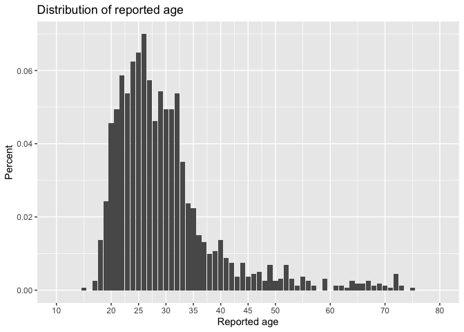

```r
#TODO: use a different thing to fill the scale... perhaps share from a particular referrer or gender or ??

age_breaks <- c(10,20,25,30,35,40,45,50,60,70,80)

(
  age_dist <- eas_20 %>%
ggplot(aes(age_approx)) +
 geom_histogram(breaks=seq(10, 80, by=2),
                 col="red",
                 aes(fill=..count..)) +
    scale_fill_gradient("Count", low="green", high="red") +
    xlim(c(10,80)) +
  scale_x_continuous("Reported age", breaks=age_breaks, limits = c(10, 80))  +
  theme(legend.position = "none") +
     theme_economist() +
    labs(title="Histogram for Age", x="Age", y="Count")  +
    geom_vline(xintercept = mean(age_approx, na.rm=TRUE), colour="blue") +  geom_text(aes(x=mean(age_approx + 1.3, na.rm=TRUE), label="Mean", y=100, ), colour="blue",  angle=90, size=3.5) +
    geom_vline(xintercept = median(age_approx, na.rm=TRUE), colour="turquoise", linetype = "dashed") +  geom_text(aes(x=median(age_approx + 1.3, na.rm=TRUE), label="Median", y=100, ), colour="turquoise",   angle=90, size=3.5) +
    theme(legend.position = "none")
)
```

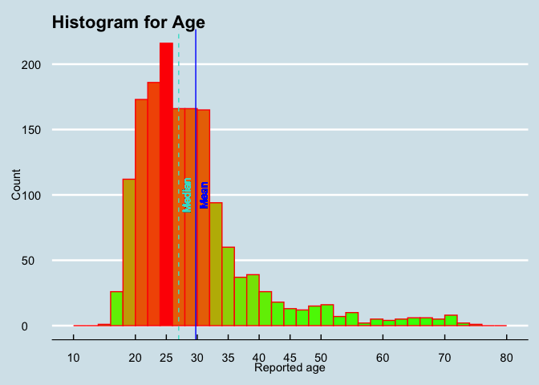

Ex-post addition: age in cross-year data


```r
eas_all %>% sumtab(age, year, caption="Age by year")
```

<table class="table" style="margin-left: auto; margin-right: auto;">
<caption>(\#tab:TRUE)Age by year</caption>
 <thead>
  <tr>
   <th style="text-align:right;"> year </th>
   <th style="text-align:right;"> N </th>
   <th style="text-align:right;"> share &gt; 0 </th>
   <th style="text-align:right;"> Mean </th>
   <th style="text-align:right;"> Median </th>
   <th style="text-align:right;"> P80 </th>
   <th style="text-align:left;"> Std.dev. </th>
  </tr>
 </thead>
<tbody>
  <tr>
   <td style="text-align:right;"> 2014 </td>
   <td style="text-align:right;"> 213 </td>
   <td style="text-align:right;"> 1 </td>
   <td style="text-align:right;"> 27.27 </td>
   <td style="text-align:right;"> 25 </td>
   <td style="text-align:right;"> 31 </td>
   <td style="text-align:left;"> (8.82) </td>
  </tr>
  <tr>
   <td style="text-align:right;"> 2015 </td>
   <td style="text-align:right;"> 1596 </td>
   <td style="text-align:right;"> 1 </td>
   <td style="text-align:right;"> 28.00 </td>
   <td style="text-align:right;"> 26 </td>
   <td style="text-align:right;"> 32 </td>
   <td style="text-align:left;"> (9.5) </td>
  </tr>
  <tr>
   <td style="text-align:right;"> 2018 </td>
   <td style="text-align:right;"> 1330 </td>
   <td style="text-align:right;"> 1 </td>
   <td style="text-align:right;"> 30.45 </td>
   <td style="text-align:right;"> 28 </td>
   <td style="text-align:right;"> 34 </td>
   <td style="text-align:left;"> (10.43) </td>
  </tr>
  <tr>
   <td style="text-align:right;"> 2019 </td>
   <td style="text-align:right;"> 1883 </td>
   <td style="text-align:right;"> 1 </td>
   <td style="text-align:right;"> 30.52 </td>
   <td style="text-align:right;"> 28 </td>
   <td style="text-align:right;"> 35 </td>
   <td style="text-align:left;"> (10.26) </td>
  </tr>
  <tr>
   <td style="text-align:right;"> 2020 </td>
   <td style="text-align:right;"> 1605 </td>
   <td style="text-align:right;"> 1 </td>
   <td style="text-align:right;"> 29.76 </td>
   <td style="text-align:right;"> 27 </td>
   <td style="text-align:right;"> 34 </td>
   <td style="text-align:left;"> (9.83) </td>
  </tr>
</tbody>
</table>

```r
#todo -- graph this with CIs, other adjustments?
```

/

## Gender


```r
tabyl(eas_20$gender_manual)
```

preservece05a3c1b1ce2ab6

Bar chart (so boring)...

```{=html}
<!--
##Gender: descriptives (Male, Female, Other)

  #get gender stats
  table(gender_b)
table2 <- table(gender_b)
prop.table(table2)
#plot gender distribution
EAS2<- na.omit(subset(EAS, select = c(gender_b)))
EAS2$gender_ordered = factor(EAS2$gender_b,levels(EAS2$gender_b)[c(2,1,3)])
ggplot(EAS2, aes(x = gender_ordered, fill=gender_ordered)) +
  geom_bar(na.rm = TRUE,aes(y = (..count..)/sum(..count..))) +
  geom_text(aes(y = ((..count..)/sum(..count..)), label = scales::percent((..count..)/sum(..count..))), stat = "count", vjust = -0.25) +
  scale_y_continuous(labels = percent) + theme_classic(base_size = 22) +
  labs(title = "Distribution of Gender", y = "Percent", x = "")+ theme(legend.position = "none")
#Drop "other" from gender
EAS2$gender_mf[EAS2$gender_ordered== "Male"] <- "Male"
EAS2$gender_mf[EAS2$gender_ordered== "Female"] <- "Female"
EAS2$gender_mf <-as.factor(EAS2$gender_mf)
levels(EAS2$gender_mf)
#get gender stats
EAS3<- na.omit(subset(EAS2, select = c(gender_mf)))
EAS3$gender_mf = factor(EAS3$gender_mf,levels(EAS3$gender_mf)[c(2,1)])
table(EAS3$gender_mf)
table2 <- table(EAS3$gender_mf)
prop.table(table2)
#Gender: comparison to 2018: Male (1,592, 69.82% ) Female (688, 30.18%)
#Plot gender distribution
ggplot(EAS3, aes(x = gender_mf, fill=gender_mf)) +
  geom_bar(na.rm = TRUE,aes(y = (..count..)/sum(..count..))) +
  geom_text(aes(y = ((..count..)/sum(..count..)), label = scales::percent((..count..)/sum(..count..))), stat = "count", vjust = -0.25) +
  scale_y_continuous(labels = percent) + theme_classic() +
  labs(title = "Distribution of Gender", y = "Percent", x = "")+ theme(legend.position = "none")
-->
```
Ideal presentation: What do we *want* to see here?

## Race/ethnicity (and engagement)

\
Race/ethnicity and engagement (Non-responses dropped)

\

Bar chart...

\
Race/ethnicity and engagement (Non-responses dropped)


```r
(
  ethnicity_engagement <- eas_20 %>%
  filter(!is.na(race)) %>%
 ggplot() +
 aes(x = forcats::fct_infreq(race), fill = engagement) +
 geom_bar() +
   coord_flip() +
 scale_fill_hue() +
 theme_minimal()  +
      guides(fill=guide_legend(title=NULL)) +
      theme(legend.position = "bottom")
)
```


Engagement levels in population (by ethnicity)

\

Ethnic diversity by age

\

## Sexual orientation

## Employment/student-status

## Career path

(Done in Gdoc)

### Career path by gender

Cut: For arbitrary first-response to career question (see previous commits if interested )

For multiple responses (more correct)


```r
career_rename <- function(df) {
    df %>%
    dplyr::rename_all(
      funs(
        stringr::str_replace_all(., 'career_', ' ')
      )
    ) %>%
    janitor::clean_names(to_any_case("title")) %>%
    rename("Non-profit: EA" = "Non Profit Ea",
           "Non-profit: not-EA" = "Non Profit",
           "Think tank / lobbying" = "Think Tank Lobby",
           "For-profit earn-to-give" = "For Profit Earn to Give",
            "For-profit" = "For Profit",
           "NA" = "Na"
           )
}


pre_career_bar <- function(df, crossvar) {
  df %>%
    dplyr::select(starts_with("career_"), -career_, d_student, age_approx) %>%
    career_rename %>%
          cbind(., eas_20 %>% dplyr::select({{crossvar}}, d_student, age_approx))  %>%
    filter(d_student!=1 &  (age_approx>16 | is.na(age_approx))) %>%
    dplyr::select(-matches("Age|Student"), {{crossvar}}) %>%
  filter(!is.na({{crossvar}}))
}

nval_f <- function(df) {
  df %>%
     group_by(variable)  %>%
    mutate( nval = mean(value, na.rm=TRUE) ) %>%
    ungroup()
}

(
cr_gender_bar <- eas_20 %>%
pre_career_bar(d_female) %>%
  melt(id = "d_female")  %>%
      nval_f %>%
ggplot(
  aes(x=reorder(variable, nval), y=value, fill=factor(d_female))) +
  stat_summary(fun.y=mean, geom="bar", position=position_dodge(1)) +
  stat_summary(fun.data = mean_cl_normal,
                 geom = "errorbar", width=0.5, color="blue", position=position_dodge(1)) +
  scale_fill_discrete("Female") +
     guides(fill = guide_legend(title="Female or not Male", reverse = TRUE)) +
        coord_flip() +
      theme_minimal() +
    labs(title = "Current career (multi-response), by gender", subtitle = "Bars: 95 percent CI's (normal approx). Nonstudents, age-over-16", y = "Share ticking box", x = "")
)
```


### Career path by ethnicity

Cut: For arbitrary first-response to career question

\

For multiple-responses (more correct)


```r
(
cr_ethnic_bar <- eas_20 %>%
pre_career_bar(not_just_white) %>%
  melt(id = "not_just_white")  %>%
      nval_f %>%
ggplot(
  aes(x=reorder(variable, nval), y=value, fill=factor(not_just_white))) +
  stat_summary(fun.y=mean, geom="bar", position=position_dodge(1)) +
  stat_summary(fun.data = mean_cl_normal,
                 geom = "errorbar", width=0.5, color="blue", position=position_dodge(1)) +
  scale_fill_discrete("Not just white") +
     guides(fill = guide_legend(title="Not just white", reverse = TRUE)) +
        coord_flip() +
      theme_minimal() +
    labs(title = "Current career (multi-response), by ethnicity", subtitle = "Bars: 95 percent CI's (normal approx). Nonstudents, age-over-16", y = "Share ticking box", x = "")
)
```


### Career path by high engagement

Cut -- For arbitrary first-response to career question

For multiple-responses (more correct)


```r
(
cr_eng_bar <- eas_20 %>%
pre_career_bar(engage_high_n) %>%
  melt(id = "engage_high_n")  %>%
      nval_f %>%
ggplot(
  aes(x=reorder(variable, nval), y=value, fill=factor(engage_high_n))) +
  stat_summary(fun.y=mean, geom="bar", position=position_dodge(1)) +
  stat_summary(fun.data = mean_cl_normal,
                 geom = "errorbar", width=0.5, color="blue", position=position_dodge(1)) +
  scale_fill_discrete("Highly engaged (4-5)") +
     guides(fill = guide_legend(title="Highly engaged (4-5)", reverse = TRUE)) +
        coord_flip() +
      theme_minimal() +
    labs(title = "Current career (multi-response), by engagement", subtitle = "Bars: 95 percent CI's (normal approx). Nonstudents, age-over-16", y = "Share ticking box", x = "")
)
```


### (Proposed) career path by student status

Cut: For arbitrary first-response to career question

For multiple-responses (more correct)


```r
(
cr_stud_bar <- eas_20 %>%
  dplyr::select(d_student, starts_with("career_"), -career_) %>%
  filter(!is.na(d_student)) %>%
  ungroup() %>%
  melt(id="d_student")  %>%
ggplot(
  aes(x=variable, y=value, fill=factor(d_student))) +
  stat_summary(fun.y=mean, geom="bar", position=position_dodge(1)) +
  stat_summary(fun.data = mean_cl_normal,
                 geom = "errorbar", width=0.5, color="blue", position=position_dodge(1)) +
  scale_fill_discrete("d_student") +
        coord_flip() +
      theme_minimal() +
    labs(title = "Current career (multi-response); by Students (turquoise) vs Nonstudents (red)", subtitle = "Bars: 95 percent CI's (normal approx).", y = "Percent", x = "")
)
```


## Childhood SES, Parents' education

-   First-generation students?

## 'Clustering': are these demographics co-related?

Consider other connections between these variables i.e. are younger EAs more ethnically diverse? what proportion of movement are white men etc?

### Gower distances

Below, we undertake a clustering exercise using 'Gower distances' to deal with both numeric (age, engagement level) and categorical (gender, student status, race, country, career orientation) following a [template from a data science post](https://towardsdatascience.com/clustering-datasets-having-both-numerical-and-categorical-variables-ed91cdca0677).


```r
# going through https://towardsdatascience.com/clustering-datasets-having-both-numerical-and-categorical-variables-ed91cdca0677

library(cluster)

#df <- scale(eas_20_cluster_demog)


eas_20_cluster_demog <- eas_20  %>%
  dplyr::select(age_approx, d_male, d_student, race, country, career_, engagement_num) %>%
    mutate(across(where(is_character),as_factor))

gower_df <- daisy(eas_20_cluster_demog,
                    metric = "gower")

#not sure what the logic behind this is
silhouette <- c()
silhouette = c(silhouette, NA)
for(i in 2:10){
  pam_clusters <- pam(as.matrix(gower_df),
                 diss = TRUE,
                 k = i)
  silhouette <- c(silhouette ,pam_clusters$silinfo$avg.width)
}

silhouette

print("hardcoded: 3-4  clusters seems like a decent sweet spot, but it's sort of a plateau")

pam_eas <- pam(gower_df, diss = TRUE, k = 4)

#eas_20_cluster_demog[pam_eas$medoids, ]

pam_summary <- eas_20_cluster_demog %>%
  mutate(cluster = pam_eas$clustering) %>%
  group_by(cluster) %>%
  do(cluster_summary = summary(.))
```

The 'optimised' four clusters are summarised below. TODO: need to make these expressed as shares as well as absolute numbers.


```r
pam_summary$cluster_summary
```

(Hardcoded notes)

-   The first cluster is entirely male, mostly nonstudents in for-profit and ETG careers. UK is overrepresented (?) in this cluster.

-   The second cluster is entirely students: unsurprisingly, they are younger. They rarely mention for-profit or ETG as Current career. Germany seems over-represented here.

-   The third cluster is entirely female.

-   The fourth cluster (503 respondents) tends NOT to respond to most questions. When they do respond, their reported engagement is a bit below-average.

\

Try an alternative:

\BeginKnitrBlock{fold}<div class="fold">
Hierarchical clustering?

With  'Maximum or complete linkage' distance? Will it work with Gower distance?

  The distance between two clusters is defined as the maximum value of all pairwise distances between the elements in cluster 1 and the elements in cluster 2. It tends to produce more compact clusters

</div>\EndKnitrBlock{fold}

\
`res.hc <- hclust(d = res.dist, method = "complete")`

### Just counting combinations {.unnumbered}


```r
library(plyr)

# These are the columns that determine a unique situation (change this if you need)
qualities <- c( "d_male", "race", "country", "employ_status", "age_approx_ranges")
qualities0 <- c( "d_male", "race", "d_live_usa", "d_student")
qualities_bin <- c( "d_male", "race_white", "d_live_usa", "d_student", "age_approx_split")

qualities_bin_expanded <- c( "d_male", "race_white", "d_live_usa", "d_student", "age_approx_split", "d_engage_3_5", "d_engage_4_5", "d_engage_5",  "involve_80k", "involve_givewell", "involve_ea_global", "action_chose_job_degree", "action_donated", "action_work_ea_org", "member_ea_group", "negative_personal_contact", "negative_none", "learned_80k", "learned_ea_forum", "career_for_profit_earn_to_give","career_non_profit_ea", "career_academia")

qualities_expanded <- c( "d_male", "race_white", "d_live_usa", "d_student", "age_approx", "income_k_c", "engagement_num", "involve_80k", "action_chose_job_degree", "action_donated", "action_work_ea_org",  "ea_community_satisfaction", "prioritize_global_poverty", "prioritize_animal_welfare", "prioritize_broad_longtermism", "prioritize_x_risks")

# The call to ddply() actually gives us what we want, which is the number
# of times that combination is present in the dataset
countedCombos <- ddply(eas_20,qualities,nrow)
countedCombos0 <- ddply(eas_20,qualities0,nrow)
countedCombosbin <- ddply(eas_20,qualities_bin,nrow)

# To be nice, let's give that newly added column a meaningful name
names(countedCombos) <- c(qualities,"count")
names(countedCombos0) <- c(qualities0,"count")
names(countedCombosbin) <- c(qualities_bin,"count")

# Finally, you probably want to order it (decreasing, in this case)
countedCombos <- countedCombos[with(countedCombos, order(-count)),]
countedCombos0 <- countedCombos0[with(countedCombos0, order(-count)),]
countedCombosbin <- countedCombosbin[with(countedCombosbin, order(-count)),]
```

The most common 'combinations' of some important demographic splits:


```r
countedCombos[1:15,1:6]
```

preserve03c6414f42663d7b

\

Limiting the features to split on:


```r
countedCombos0[1:15,]
```

preserve3b4dfd1f678add66

And limited to only binary features:


```r
 countedCombosbin[1:15,]
```

preservedc93def4a6f6f54d

\

::: {.marginnote}
`age_approx_split` divides our distribution in half: median age is Error in eval(xfun::parse_only(code), envir = envir) : 
  object 'age_split' not found

:::

\

Considering only those who did NOT identify exclusively as "White" (ethnicity), limiting the features:


```r
countedCombos0[1:40,] %>% filter(race!="white")
```

preservec42d0cd38a2cd42a

Considering only those who did not identify as Male, binary features only:


```r
countedCombosbin[1:40,] %>% filter(d_male!=1)
```

preservedf20d393c087ae3b

### A simpler **correlation matrix** approach: {.unnumbered}


```r
#p_load("remotes", "tidymodels/corrr", install = FALSE)
library(corrr)

bin_corr <- eas_20 %>%
  select(qualities_bin_expanded) %>%
  mutate_all(as.numeric) %>%
  correlate(use="pairwise.complete.obs")


bin_corr_arr <-  bin_corr %>%
  rearrange() %>%
    shave()


bin_corr_gt10 <- bin_corr_arr %>%
  mutate_all( funs(ifelse(.<0.1 & .>0, NA, .)) ) %>%
  mutate_all( funs(ifelse(.>-0.1 & .<0, NA, .)) )  %>%
  janitor::remove_empty(which = "cols")

(
  bin_corr_fmt <-  bin_corr_arr %>%
  fashion()
)
```

preservefb9ef8a4e607a7da

```r
axes <-   theme(axis.text.x = element_text(angle = 90, vjust = 0.5, hjust=1),
                            panel.grid.major = element_line(colour = "gray"))

rplot_f <- function(df) {
  {{df}} %>%
  rplot(shape = 15, colours = c("red", "green"),   print_cor = TRUE)
}

(
  bin_corr_plot <-  bin_corr %>%
      shave()  %>%
      rplot_f  + axes
)
```


```r
(
  bin_corr_plot_arr <-  bin_corr_arr %>%
          rplot_f + axes
)
```


```r
(
  bin_corr_plot_arr_gt10 <-  bin_corr_gt10 %>%
          rplot_f + axes
)
```


**Going beyond binaries**


```r
qual_corr <- eas_20 %>%
  select(qualities_expanded) %>%
  mutate_all(as.numeric) %>%
  correlate(use="pairwise.complete.obs")

qual_corr_arr <-  qual_corr %>%
  rearrange() %>%
    shave()


qual_corr_gt10 <- qual_corr_arr %>%
  mutate_all( funs(ifelse(.<0.1 & .>0, NA, .)) ) %>%
  mutate_all( funs(ifelse(.>-0.1 & .<0, NA, .)) )  %>%
  janitor::remove_empty(which = "cols")

(
  qual_corr_fmt <-  qual_corr_arr %>%
  fashion()
)
```

preservefdc233b016771da9

```r
(
  qual_corr_plot <-  qual_corr %>%
      shave()  %>%
      rplot_f  + axes
)
```


```r
(
  qual_corr_plot_arr <-  qual_corr_arr %>%
          rplot_f + axes
)
```


```r
(
  qual_corr_plot_arr_gt10 <-  qual_corr_gt10 %>%
          rplot_f + axes
)
```


## Demographics over time

Table of key demographics (means/medians/quantiles) in each year

(or graphic of this?)

-   Overall (unweighted)

-   For a constant 'top' referrer (or a constant weighting? ... Oaxaca decomposition stuff)

-   Fancy-- some sort of clusters, dynamic graph

```{=html}
<!-- Dumbell charts seem decent for looking at a bunch similarly scaled comparisons over two periods... perhaps members by ethnicity


dumbbell_chart(
  data = popeurope,
  x = country,
  y1 = pop1952,
  y2 = pop2007,
  top_n = 10,
  point_colors = c("lightgray", "#494F5C")
) +
  labs(
    x = NULL,
    y = "Population",
    title = "Europe's Largest Countries by Population in 2007"
  ) +
  scale_y_continuous(
    limits = c(0, NA),
    labels = function(x) paste(x, "Mn.")
  )
-->```
```{=html}
<!-- lollipops for changes (over time?) if the levels don't matter

diverging_lollipop_chart(
  data = mtcars_z,
  x = model,
  y = hpz,
  lollipop_colors = c("#006400", "#b32134"),
  text_color = c("#006400", "#b32134")
)
-->
```
### Key questions

#### How are recruitment patterns changing over time? Are we recruiting more women (or other under-represented group 'URG') in recent years? {.unnumbered}

\BeginKnitrBlock{fold}<div class="fold">
We known when people joined EA, at least those in the data. There should be some way of using this to get at questions like:
“Are we recruiting more women in recent years”
E.g., combining surveys across years we can look at people in each survey who say “I joined EA in the last 1-2 years”</div>\EndKnitrBlock{fold}

#### Are Women/URG more likely to leave EA? (We will return to this in the retention post.) {.unnumbered}

#### Is the age-composition changing, "is EA aging"? {.unnumbered}

## Age first heard of EA: does it have a (causal) impact on engagement?

--\>

::: {.marginnote}
This would require comparing to previous years' surveys and looking at changes across cohorts, though sampling issues loom large, c.f. [2019 post](https://forum.effectivealtruism.org/posts/wtQ3XCL35uxjXpwjE/ea-survey-2019-series-community-demographics-and#Is_EA_aging).
:::

## Sensitivity checks {#demography-sensitivity}

Following [the previous discussion on the unique issues faced by the EA survey](#eas_challenges), we present a series of sensitivity checks. (Why these groupings? See discussion [above](#why_these).)

::: {.marginnote}
Of course, we cannot report all measures for all sub-groups and weightings in a single post. We offer a summary of this, and we aim to offer more in the future (perhaps in a dynamic/interactive presentation.)
:::

### Widest, most-conservative bounds: smallest and largest estimates (across referrers, etc.)

[As noted above](#bound-bias-discussion), these bounds are clearly overly wide, i.e., overly conservative, at least in considering the impact of over/under-sampling from each referrer and from each 'willingness to respond' group.\


```r
mean_don <- mean(eas_20$donation_2019_c, na.rm=TRUE)

n_shared_link <- sum(eas_20$referrer=="Shared link")
n_optin <- sum(eas_20$referrer=="Email; opt-in from prev. EAS")
male_rate_shared_link <-  mean(eas_20$d_male[eas_20$referrer=="Shared link"], na.rm=TRUE)
sd_male_rate_shared_link <- sqrt(male_rate_shared_link*(1-male_rate_shared_link))
male_rate_optin <-  mean(eas_20$d_male[eas_20$referrer=="Email; opt-in from prev. EAS"], na.rm=TRUE)
sd_male_rate_optin <- sqrt(male_rate_optin*(1-male_rate_optin))
```

\

<!-- Note, the selection of referrers above is hard-coded -->

### Demographics by 'referrer' {#demog-by-ref .unnumbered}

Respondents come to this survey from a range of 'referrers'; we can track these links. The table and bar chart below breaks this down:


```r
cap <- "Referrer"

(
refer_tab <- eas_20 %>%
tabyl(referrer_cat) %>%
  arrange(-n) %>%
    .kable(caption=cap) %>%
    .kable_styling(latex_options = "scale_down")
)
```

<table class="table" style="width: auto !important; margin-left: auto; margin-right: auto;">
<caption>(\#tab:referrers)Referrer</caption>
 <thead>
  <tr>
   <th style="text-align:left;"> referrer_cat </th>
   <th style="text-align:right;"> n </th>
   <th style="text-align:right;"> percent </th>
  </tr>
 </thead>
<tbody>
  <tr>
   <td style="text-align:left;"> 80K hours </td>
   <td style="text-align:right;"> 465 </td>
   <td style="text-align:right;"> 0.2261673 </td>
  </tr>
  <tr>
   <td style="text-align:left;"> EA Forum </td>
   <td style="text-align:right;"> 407 </td>
   <td style="text-align:right;"> 0.1979572 </td>
  </tr>
  <tr>
   <td style="text-align:left;"> Groups (local) </td>
   <td style="text-align:right;"> 313 </td>
   <td style="text-align:right;"> 0.1522374 </td>
  </tr>
  <tr>
   <td style="text-align:left;"> Email; opt-in from prev. EAS </td>
   <td style="text-align:right;"> 219 </td>
   <td style="text-align:right;"> 0.1065175 </td>
  </tr>
  <tr>
   <td style="text-align:left;"> EA Newsletter </td>
   <td style="text-align:right;"> 210 </td>
   <td style="text-align:right;"> 0.1021401 </td>
  </tr>
  <tr>
   <td style="text-align:left;"> Shared link </td>
   <td style="text-align:right;"> 208 </td>
   <td style="text-align:right;"> 0.1011673 </td>
  </tr>
  <tr>
   <td style="text-align:left;"> Less Wrong or SlateStarCodex-Reddit </td>
   <td style="text-align:right;"> 90 </td>
   <td style="text-align:right;"> 0.0437743 </td>
  </tr>
  <tr>
   <td style="text-align:left;"> Social media (FB/memes) </td>
   <td style="text-align:right;"> 60 </td>
   <td style="text-align:right;"> 0.0291829 </td>
  </tr>
  <tr>
   <td style="text-align:left;"> Giving What We Can </td>
   <td style="text-align:right;"> 37 </td>
   <td style="text-align:right;"> 0.0179961 </td>
  </tr>
  <tr>
   <td style="text-align:left;"> Reddit </td>
   <td style="text-align:right;"> 35 </td>
   <td style="text-align:right;"> 0.0170233 </td>
  </tr>
  <tr>
   <td style="text-align:left;"> Other </td>
   <td style="text-align:right;"> 12 </td>
   <td style="text-align:right;"> 0.0058366 </td>
  </tr>
</tbody>
</table>

```r
library(viridis)


(
referrer_bar <- eas_20 %>%
    filter(referrer_cat!="Other") %>%
    mutate(
      referrer_sub = case_when(
      str_detect(referrer, "Groups") ~ as.factor(referrer),
      str_detect(referrer, "dankeamemes|EA FB|CEA FB|Hangouts") ~ as.factor(referrer),
      str_detect(referrer, "Less Wrong|Slate") ~ as.factor(referrer),
      TRUE ~ as.factor("")),
      ) %>%
  ggplot() +
 aes(x = forcats::fct_infreq(referrer_cat), fill = referrer_sub) +
 geom_bar(stat="count") +
scale_fill_hue() +
     coord_flip() +
 ggthemes::theme_fivethirtyeight() +
  scale_x_discrete(labels=c("Less Wrong or SlateStarCodex-Reddit"="LessWrong/SSC-Reddit",
                            "Email; opt-in from prev. EAS"="Email; opt-in prev. SSC"))+
    guides(fill=guide_legend(title=NULL)) +
    theme(legend.position = "bottom")
)
```


Plotly interactive version (attempt)


```r
ggplotly(referrer_bar)
```

```{=html}
<div id="htmlwidget-de80ea6ec23e73847fc1" style="width:80%;height:480px;" class="plotly html-widget"></div>
<script type="application/json" data-for="htmlwidget-de80ea6ec23e73847fc1">{"x":{"data":[{"orientation":"h","width":0.899999999999999,"base":46,"x":[14],"y":[8],"text":"count:  14<br />forcats::fct_infreq(referrer_cat): Social media (FB/memes)<br />referrer_sub: CEA FB","type":"bar","marker":{"autocolorscale":false,"color":"rgba(248,118,109,1)","line":{"width":1.88976377952756,"color":"transparent"}},"name":"CEA FB","legendgroup":"CEA FB","showlegend":true,"xaxis":"x","yaxis":"y","hoverinfo":"text","frame":null},{"orientation":"h","width":0.899999999999999,"base":24,"x":[22],"y":[8],"text":"count:  22<br />forcats::fct_infreq(referrer_cat): Social media (FB/memes)<br />referrer_sub: dankeamemes","type":"bar","marker":{"autocolorscale":false,"color":"rgba(205,150,0,1)","line":{"width":1.88976377952756,"color":"transparent"}},"name":"dankeamemes","legendgroup":"dankeamemes","showlegend":true,"xaxis":"x","yaxis":"y","hoverinfo":"text","frame":null},{"orientation":"h","width":0.899999999999999,"base":5,"x":[19],"y":[8],"text":"count:  19<br />forcats::fct_infreq(referrer_cat): Social media (FB/memes)<br />referrer_sub: EA FB","type":"bar","marker":{"autocolorscale":false,"color":"rgba(124,174,0,1)","line":{"width":1.88976377952756,"color":"transparent"}},"name":"EA FB","legendgroup":"EA FB","showlegend":true,"xaxis":"x","yaxis":"y","hoverinfo":"text","frame":null},{"orientation":"h","width":0.9,"base":302,"x":[11],"y":[3],"text":"count:  11<br />forcats::fct_infreq(referrer_cat): Groups (local)<br />referrer_sub: Groups FB","type":"bar","marker":{"autocolorscale":false,"color":"rgba(0,190,103,1)","line":{"width":1.88976377952756,"color":"transparent"}},"name":"Groups FB","legendgroup":"Groups FB","showlegend":true,"xaxis":"x","yaxis":"y","hoverinfo":"text","frame":null},{"orientation":"h","width":0.9,"base":116,"x":[186],"y":[3],"text":"count: 186<br />forcats::fct_infreq(referrer_cat): Groups (local)<br />referrer_sub: Groups personal email","type":"bar","marker":{"autocolorscale":false,"color":"rgba(0,191,196,1)","line":{"width":1.88976377952756,"color":"transparent"}},"name":"Groups personal email","legendgroup":"Groups personal email","showlegend":true,"xaxis":"x","yaxis":"y","hoverinfo":"text","frame":null},{"orientation":"h","width":0.9,"base":12,"x":[104],"y":[3],"text":"count: 104<br />forcats::fct_infreq(referrer_cat): Groups (local)<br />referrer_sub: Groups slack","type":"bar","marker":{"autocolorscale":false,"color":"rgba(0,169,255,1)","line":{"width":1.88976377952756,"color":"transparent"}},"name":"Groups slack","legendgroup":"Groups slack","showlegend":true,"xaxis":"x","yaxis":"y","hoverinfo":"text","frame":null},{"orientation":"h","width":0.9,"base":56,"x":[34],"y":[7],"text":"count:  34<br />forcats::fct_infreq(referrer_cat): Less Wrong or SlateStarCodex-Reddit<br />referrer_sub: Less Wrong","type":"bar","marker":{"autocolorscale":false,"color":"rgba(199,124,255,1)","line":{"width":1.88976377952756,"color":"transparent"}},"name":"Less Wrong","legendgroup":"Less Wrong","showlegend":true,"xaxis":"x","yaxis":"y","hoverinfo":"text","frame":null},{"orientation":"h","width":0.9,"base":0,"x":[56],"y":[7],"text":"count:  56<br />forcats::fct_infreq(referrer_cat): Less Wrong or SlateStarCodex-Reddit<br />referrer_sub: SlateStarCodex (Reddit group)","type":"bar","marker":{"autocolorscale":false,"color":"rgba(255,97,204,1)","line":{"width":1.88976377952756,"color":"transparent"}},"name":"SlateStarCodex (Reddit group)","legendgroup":"SlateStarCodex (Reddit group)","showlegend":true,"xaxis":"x","yaxis":"y","hoverinfo":"text","frame":null},{"orientation":"h","width":[0.9,0.9,0.9,0.9,0.9,0.9,0.899999999999999,0.899999999999999,0.899999999999999],"base":[0,0,0,0,0,0,0,0,0],"x":[465,407,12,219,210,208,5,37,35],"y":[1,2,3,4,5,6,8,9,10],"text":["count: 465<br />forcats::fct_infreq(referrer_cat): 80K hours<br />referrer_sub: NA","count: 407<br />forcats::fct_infreq(referrer_cat): EA Forum<br />referrer_sub: NA","count:  12<br />forcats::fct_infreq(referrer_cat): Groups (local)<br />referrer_sub: NA","count: 219<br />forcats::fct_infreq(referrer_cat): Email; opt-in from prev. EAS<br />referrer_sub: NA","count: 210<br />forcats::fct_infreq(referrer_cat): EA Newsletter<br />referrer_sub: NA","count: 208<br />forcats::fct_infreq(referrer_cat): Shared link<br />referrer_sub: NA","count:   5<br />forcats::fct_infreq(referrer_cat): Social media (FB/memes)<br />referrer_sub: NA","count:  37<br />forcats::fct_infreq(referrer_cat): Giving What We Can<br />referrer_sub: NA","count:  35<br />forcats::fct_infreq(referrer_cat): Reddit<br />referrer_sub: NA"],"type":"bar","marker":{"autocolorscale":false,"color":"rgba(127,127,127,1)","line":{"width":1.88976377952756,"color":"transparent"}},"name":"NA","legendgroup":"NA","showlegend":true,"xaxis":"x","yaxis":"y","hoverinfo":"text","frame":null}],"layout":{"margin":{"t":35.2,"r":19.2,"b":35.9372353673724,"l":169.835118306351},"plot_bgcolor":"rgba(240,240,240,1)","paper_bgcolor":"rgba(240,240,240,1)","font":{"color":"rgba(60,60,60,1)","family":"sans","size":15.9402241594022},"xaxis":{"domain":[0,1],"automargin":true,"type":"linear","autorange":false,"range":[-23.25,488.25],"tickmode":"array","ticktext":["0","100","200","300","400"],"tickvals":[0,100,200,300,400],"categoryorder":"array","categoryarray":["0","100","200","300","400"],"nticks":null,"ticks":"","tickcolor":null,"ticklen":3.98505603985056,"tickwidth":0,"showticklabels":true,"tickfont":{"color":"rgba(60,60,60,1)","family":"sans","size":12.7521793275218},"tickangle":-0,"showline":false,"linecolor":null,"linewidth":0,"showgrid":true,"gridcolor":"rgba(210,210,210,1)","gridwidth":0.724555643609193,"zeroline":false,"anchor":"y","title":{"text":"","font":{"color":null,"family":null,"size":0}},"hoverformat":".2f"},"yaxis":{"domain":[0,1],"automargin":true,"type":"linear","autorange":false,"range":[0.4,10.6],"tickmode":"array","ticktext":["80K hours","EA Forum","Groups (local)","Email; opt-in prev. SSC","EA Newsletter","Shared link","LessWrong/SSC-Reddit","Social media (FB/memes)","Giving What We Can","Reddit"],"tickvals":[1,2,3,4,5,6,7,8,9,10],"categoryorder":"array","categoryarray":["80K hours","EA Forum","Groups (local)","Email; opt-in prev. SSC","EA Newsletter","Shared link","LessWrong/SSC-Reddit","Social media (FB/memes)","Giving What We Can","Reddit"],"nticks":null,"ticks":"","tickcolor":null,"ticklen":3.98505603985056,"tickwidth":0,"showticklabels":true,"tickfont":{"color":"rgba(60,60,60,1)","family":"sans","size":12.7521793275218},"tickangle":-0,"showline":false,"linecolor":null,"linewidth":0,"showgrid":true,"gridcolor":"rgba(210,210,210,1)","gridwidth":0.724555643609193,"zeroline":false,"anchor":"x","title":{"text":"","font":{"color":null,"family":null,"size":0}},"hoverformat":".2f"},"shapes":[{"type":"rect","fillcolor":"transparent","line":{"color":"transparent","width":0.724555643609193,"linetype":"none"},"yref":"paper","xref":"paper","x0":0,"x1":1,"y0":0,"y1":1}],"showlegend":true,"legend":{"bgcolor":"rgba(240,240,240,1)","bordercolor":"transparent","borderwidth":2.06156048675734,"font":{"color":"rgba(60,60,60,1)","family":"sans","size":12.7521793275218},"y":1},"hovermode":"closest","barmode":"relative"},"config":{"doubleClick":"reset","showSendToCloud":false},"source":"A","attrs":{"cbdf25d2c3ba":{"x":{},"fill":{},"type":"bar"}},"cur_data":"cbdf25d2c3ba","visdat":{"cbdf25d2c3ba":["function (y) ","x"]},"highlight":{"on":"plotly_click","persistent":false,"dynamic":false,"selectize":false,"opacityDim":0.2,"selected":{"opacity":1},"debounce":0},"shinyEvents":["plotly_hover","plotly_click","plotly_selected","plotly_relayout","plotly_brushed","plotly_brushing","plotly_clickannotation","plotly_doubleclick","plotly_deselect","plotly_afterplot","plotly_sunburstclick"],"base_url":"https://plot.ly"},"evals":[],"jsHooks":[]}</script>
```

```{=html}
<!--
something like this for 'top referrers over time'?
biomedicalrevenue %>%
  filter(year %in% c(2012, 2015, 2018)) %>%
  bar_chart(x = company, y = revenue, facet = year, top_n = 10)
-->
```
\

Note on statistics (unfold):

\BeginKnitrBlock{fold}<div class="fold">
I include standard deviation for all nonbinary variables the SD for binary variables doesn’t provide any additional information so I never put this in. (The SD for any binary variable is simply a function of the shares in each category), I do not show the standard error or confidence intervals in these tables because I do not want to suggest “testing for differences in outcome” by these splits. The point here isn’t to show ’look there are no significant differences”;  of course there are. The point is “let’s consider what the range might be for the true mean or median of these outcomes”, if we allow that we may be over or under-representing groups along these observable lines.

As part of this exercise, I could have also reported confidence intervals for the largest and smallest value of each measure across all subgroups, but this would not add much value in my opinion. We can be pretty sure these extreme values are already overly wide. A more involved take on this would do better to quantify our uncertainty:

- uncertainty  due to standard 'sampling error' (any sample is only a *draw* from the population and may get averages wrong 'by change'), as well as
- uncertainty over differential rates of non-response for groups with different 'outcome variables'.

I sketch what that might look like very roughly [here](#bayes-response).
</div>\EndKnitrBlock{fold}

\

Below, we report **'engagement by referrer'** (with non-responses dropped, and 4 'other referrers' dropped), i.e., 'how engaged are those coming from each referrer'. This depiction also shows the relative magnitudes of each grouping and subgrouping, allowing us to consider 'where the action is'.


```r
(
  engage_by_ref <-
    eas_20 %>%
        filter(referrer_cat!="Other") %>%
  filter(!is.na(engagement)) %>%
 ggplot() +
 aes(x = forcats::fct_infreq(referrer_cat), fill = engagement) +
 geom_bar() +
   coord_flip() +
 scale_fill_brewer() +
 theme_minimal() +
      guides(fill=guide_legend(title="Self reported EA engagement level")) +
       labs(title="Engagement by Referrer (2020)",  x = "Referrer")

)
```


```r
#TODO: add an 'overall' bar to this; put NA's as 'zeroes', i.e., the bar to the left.
#TODO: try to preserve colors for each org (or for engagement?) across graphs -- see http://www.cookbook-r.com/Graphs/Colors_(ggplot2)/ 'use and reuse pallettes'
```

\

Next we consider **referrer by engagement**; i.e., the 'referrer composition' and size of each engagment group.

<!-- echo in engagement chapter?) -->

(Again, a few 'other referrers' are dropped.)


```r
(
  ref_by_engage <-
    eas_20 %>%
        filter(referrer_cat!="Other") %>%
 ggplot() +
 aes(engagement, fill = referrer_cat) +
 geom_bar() +
   coord_flip() +
 scale_fill_hue() +
 theme_minimal() +
      guides(fill=guide_legend(title="Referrer (groupings)")) +
          labs(title="Referrer by Engagment (2020)",  x = "Self-reported level of engagement")
  )
```

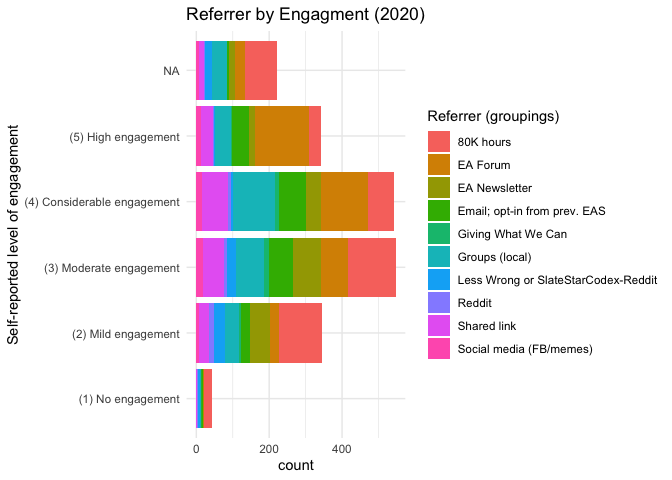

\

The table below considers how the key 'demographics' (as well as engagement) of EAS participants varied by referrer.

#### Characteristics by referrer - table {.unnumbered}

(Note: 12 'other referrers' are dropped.)


```r
label_list <- list(age_approx ~ "Age",
                   d_male ~ "Male",
                   d_student ~ "Student",
                   race_white ~ "White (ethnicity)",
                  d_live_usa ~ "USA-based",
                  income_k_c ~ "Income in $1000",
                  career_academia ~ "Academic current career",
                  mn_priority_lt_rating ~ "Mean prioritization LT (1-5)",
                  lt_top_priority ~ "LT cause(s) highest",
                  animal_top_priority ~ "Animal welfare highest",
                  don_share_inc_19_imp ~ "Donation as share of income, with imputation",
                  engagement_num ~ "Engagement (1-5 scale)"
                  )


(
  demo_tab_ref <- eas_20 %>%
    filter(referrer_cat!="Other") %>%
       mutate(referrer_cat = as.factor(referrer_cat),
                  referrer_cat= fct_drop(referrer_cat),
              ) %>%
    select(all_of(key_outcomes), referrer_cat) %>%
    tbl_summary(
      by = referrer_cat,
       type = c(all_continuous(), engagement_num, mn_priority_lt_rating, don_share_inc_19_imp) ~ "continuous2",
      statistic = list(all_continuous() ~ c("{median}",
                                            "{p10}-{p90}",
                                            "{mean} ({sd})"),
                       all_dichotomous() ~ "{p}%"),
      label = label_list,
      missing = c("no"),
          digits = list(engagement_num ~ 1, mn_priority_lt_rating ~1)
    ) %>%
 modify_footnote(
    update = all_stat_cols() ~ "* 'Age' imputed as current year minus birth-year; a few 'other referrer' responses dropped; 'Mean prioritization LT' averages priority assigned to X-risk, AI risks, Biosecurity, Nuclear, and broad-LT-ism'; 'LT causes highest' indicates that one of these causes was among those the individual ranked most-highly. (Same for 'Animal welfare highest')"
  ) %>%
    bold_labels() %>% add_n() %>% add_overall()
)
```

```{=html}
<div id="tfnrmcdzxg" style="overflow-x:auto;overflow-y:auto;width:auto;height:auto;">
<style>html {
  font-family: -apple-system, BlinkMacSystemFont, 'Segoe UI', Roboto, Oxygen, Ubuntu, Cantarell, 'Helvetica Neue', 'Fira Sans', 'Droid Sans', Arial, sans-serif;
}

#tfnrmcdzxg .gt_table {
  display: table;
  border-collapse: collapse;
  margin-left: auto;
  margin-right: auto;
  color: #333333;
  font-size: 16px;
  font-weight: normal;
  font-style: normal;
  background-color: #FFFFFF;
  width: auto;
  border-top-style: solid;
  border-top-width: 2px;
  border-top-color: #A8A8A8;
  border-right-style: none;
  border-right-width: 2px;
  border-right-color: #D3D3D3;
  border-bottom-style: solid;
  border-bottom-width: 2px;
  border-bottom-color: #A8A8A8;
  border-left-style: none;
  border-left-width: 2px;
  border-left-color: #D3D3D3;
}

#tfnrmcdzxg .gt_heading {
  background-color: #FFFFFF;
  text-align: center;
  border-bottom-color: #FFFFFF;
  border-left-style: none;
  border-left-width: 1px;
  border-left-color: #D3D3D3;
  border-right-style: none;
  border-right-width: 1px;
  border-right-color: #D3D3D3;
}

#tfnrmcdzxg .gt_title {
  color: #333333;
  font-size: 125%;
  font-weight: initial;
  padding-top: 4px;
  padding-bottom: 4px;
  border-bottom-color: #FFFFFF;
  border-bottom-width: 0;
}

#tfnrmcdzxg .gt_subtitle {
  color: #333333;
  font-size: 85%;
  font-weight: initial;
  padding-top: 0;
  padding-bottom: 6px;
  border-top-color: #FFFFFF;
  border-top-width: 0;
}

#tfnrmcdzxg .gt_bottom_border {
  border-bottom-style: solid;
  border-bottom-width: 2px;
  border-bottom-color: #D3D3D3;
}

#tfnrmcdzxg .gt_col_headings {
  border-top-style: solid;
  border-top-width: 2px;
  border-top-color: #D3D3D3;
  border-bottom-style: solid;
  border-bottom-width: 2px;
  border-bottom-color: #D3D3D3;
  border-left-style: none;
  border-left-width: 1px;
  border-left-color: #D3D3D3;
  border-right-style: none;
  border-right-width: 1px;
  border-right-color: #D3D3D3;
}

#tfnrmcdzxg .gt_col_heading {
  color: #333333;
  background-color: #FFFFFF;
  font-size: 100%;
  font-weight: normal;
  text-transform: inherit;
  border-left-style: none;
  border-left-width: 1px;
  border-left-color: #D3D3D3;
  border-right-style: none;
  border-right-width: 1px;
  border-right-color: #D3D3D3;
  vertical-align: bottom;
  padding-top: 5px;
  padding-bottom: 6px;
  padding-left: 5px;
  padding-right: 5px;
  overflow-x: hidden;
}

#tfnrmcdzxg .gt_column_spanner_outer {
  color: #333333;
  background-color: #FFFFFF;
  font-size: 100%;
  font-weight: normal;
  text-transform: inherit;
  padding-top: 0;
  padding-bottom: 0;
  padding-left: 4px;
  padding-right: 4px;
}

#tfnrmcdzxg .gt_column_spanner_outer:first-child {
  padding-left: 0;
}

#tfnrmcdzxg .gt_column_spanner_outer:last-child {
  padding-right: 0;
}

#tfnrmcdzxg .gt_column_spanner {
  border-bottom-style: solid;
  border-bottom-width: 2px;
  border-bottom-color: #D3D3D3;
  vertical-align: bottom;
  padding-top: 5px;
  padding-bottom: 5px;
  overflow-x: hidden;
  display: inline-block;
  width: 100%;
}

#tfnrmcdzxg .gt_group_heading {
  padding: 8px;
  color: #333333;
  background-color: #FFFFFF;
  font-size: 100%;
  font-weight: initial;
  text-transform: inherit;
  border-top-style: solid;
  border-top-width: 2px;
  border-top-color: #D3D3D3;
  border-bottom-style: solid;
  border-bottom-width: 2px;
  border-bottom-color: #D3D3D3;
  border-left-style: none;
  border-left-width: 1px;
  border-left-color: #D3D3D3;
  border-right-style: none;
  border-right-width: 1px;
  border-right-color: #D3D3D3;
  vertical-align: middle;
}

#tfnrmcdzxg .gt_empty_group_heading {
  padding: 0.5px;
  color: #333333;
  background-color: #FFFFFF;
  font-size: 100%;
  font-weight: initial;
  border-top-style: solid;
  border-top-width: 2px;
  border-top-color: #D3D3D3;
  border-bottom-style: solid;
  border-bottom-width: 2px;
  border-bottom-color: #D3D3D3;
  vertical-align: middle;
}

#tfnrmcdzxg .gt_from_md > :first-child {
  margin-top: 0;
}

#tfnrmcdzxg .gt_from_md > :last-child {
  margin-bottom: 0;
}

#tfnrmcdzxg .gt_row {
  padding-top: 8px;
  padding-bottom: 8px;
  padding-left: 5px;
  padding-right: 5px;
  margin: 10px;
  border-top-style: solid;
  border-top-width: 1px;
  border-top-color: #D3D3D3;
  border-left-style: none;
  border-left-width: 1px;
  border-left-color: #D3D3D3;
  border-right-style: none;
  border-right-width: 1px;
  border-right-color: #D3D3D3;
  vertical-align: middle;
  overflow-x: hidden;
}

#tfnrmcdzxg .gt_stub {
  color: #333333;
  background-color: #FFFFFF;
  font-size: 100%;
  font-weight: initial;
  text-transform: inherit;
  border-right-style: solid;
  border-right-width: 2px;
  border-right-color: #D3D3D3;
  padding-left: 12px;
}

#tfnrmcdzxg .gt_summary_row {
  color: #333333;
  background-color: #FFFFFF;
  text-transform: inherit;
  padding-top: 8px;
  padding-bottom: 8px;
  padding-left: 5px;
  padding-right: 5px;
}

#tfnrmcdzxg .gt_first_summary_row {
  padding-top: 8px;
  padding-bottom: 8px;
  padding-left: 5px;
  padding-right: 5px;
  border-top-style: solid;
  border-top-width: 2px;
  border-top-color: #D3D3D3;
}

#tfnrmcdzxg .gt_grand_summary_row {
  color: #333333;
  background-color: #FFFFFF;
  text-transform: inherit;
  padding-top: 8px;
  padding-bottom: 8px;
  padding-left: 5px;
  padding-right: 5px;
}

#tfnrmcdzxg .gt_first_grand_summary_row {
  padding-top: 8px;
  padding-bottom: 8px;
  padding-left: 5px;
  padding-right: 5px;
  border-top-style: double;
  border-top-width: 6px;
  border-top-color: #D3D3D3;
}

#tfnrmcdzxg .gt_striped {
  background-color: rgba(128, 128, 128, 0.05);
}

#tfnrmcdzxg .gt_table_body {
  border-top-style: solid;
  border-top-width: 2px;
  border-top-color: #D3D3D3;
  border-bottom-style: solid;
  border-bottom-width: 2px;
  border-bottom-color: #D3D3D3;
}

#tfnrmcdzxg .gt_footnotes {
  color: #333333;
  background-color: #FFFFFF;
  border-bottom-style: none;
  border-bottom-width: 2px;
  border-bottom-color: #D3D3D3;
  border-left-style: none;
  border-left-width: 2px;
  border-left-color: #D3D3D3;
  border-right-style: none;
  border-right-width: 2px;
  border-right-color: #D3D3D3;
}

#tfnrmcdzxg .gt_footnote {
  margin: 0px;
  font-size: 90%;
  padding: 4px;
}

#tfnrmcdzxg .gt_sourcenotes {
  color: #333333;
  background-color: #FFFFFF;
  border-bottom-style: none;
  border-bottom-width: 2px;
  border-bottom-color: #D3D3D3;
  border-left-style: none;
  border-left-width: 2px;
  border-left-color: #D3D3D3;
  border-right-style: none;
  border-right-width: 2px;
  border-right-color: #D3D3D3;
}

#tfnrmcdzxg .gt_sourcenote {
  font-size: 90%;
  padding: 4px;
}

#tfnrmcdzxg .gt_left {
  text-align: left;
}

#tfnrmcdzxg .gt_center {
  text-align: center;
}

#tfnrmcdzxg .gt_right {
  text-align: right;
  font-variant-numeric: tabular-nums;
}

#tfnrmcdzxg .gt_font_normal {
  font-weight: normal;
}

#tfnrmcdzxg .gt_font_bold {
  font-weight: bold;
}

#tfnrmcdzxg .gt_font_italic {
  font-style: italic;
}

#tfnrmcdzxg .gt_super {
  font-size: 65%;
}

#tfnrmcdzxg .gt_footnote_marks {
  font-style: italic;
  font-weight: normal;
  font-size: 65%;
}
</style>
<table class="gt_table">
  
  <thead class="gt_col_headings">
    <tr>
      <th class="gt_col_heading gt_columns_bottom_border gt_left" rowspan="1" colspan="1"><strong>Characteristic</strong></th>
      <th class="gt_col_heading gt_columns_bottom_border gt_center" rowspan="1" colspan="1"><strong>N</strong></th>
      <th class="gt_col_heading gt_columns_bottom_border gt_center" rowspan="1" colspan="1"><strong>Overall</strong>, N = 2,044<sup class="gt_footnote_marks">1</sup></th>
      <th class="gt_col_heading gt_columns_bottom_border gt_center" rowspan="1" colspan="1"><strong>80K hours</strong>, N = 465<sup class="gt_footnote_marks">2</sup></th>
      <th class="gt_col_heading gt_columns_bottom_border gt_center" rowspan="1" colspan="1"><strong>EA Forum</strong>, N = 407<sup class="gt_footnote_marks">2</sup></th>
      <th class="gt_col_heading gt_columns_bottom_border gt_center" rowspan="1" colspan="1"><strong>EA Newsletter</strong>, N = 210<sup class="gt_footnote_marks">2</sup></th>
      <th class="gt_col_heading gt_columns_bottom_border gt_center" rowspan="1" colspan="1"><strong>Email; opt-in from prev. EAS</strong>, N = 219<sup class="gt_footnote_marks">2</sup></th>
      <th class="gt_col_heading gt_columns_bottom_border gt_center" rowspan="1" colspan="1"><strong>Giving What We Can</strong>, N = 37<sup class="gt_footnote_marks">2</sup></th>
      <th class="gt_col_heading gt_columns_bottom_border gt_center" rowspan="1" colspan="1"><strong>Groups (local)</strong>, N = 313<sup class="gt_footnote_marks">2</sup></th>
      <th class="gt_col_heading gt_columns_bottom_border gt_center" rowspan="1" colspan="1"><strong>Less Wrong or SlateStarCodex-Reddit</strong>, N = 90<sup class="gt_footnote_marks">2</sup></th>
      <th class="gt_col_heading gt_columns_bottom_border gt_center" rowspan="1" colspan="1"><strong>Reddit</strong>, N = 35<sup class="gt_footnote_marks">2</sup></th>
      <th class="gt_col_heading gt_columns_bottom_border gt_center" rowspan="1" colspan="1"><strong>Shared link</strong>, N = 208<sup class="gt_footnote_marks">2</sup></th>
      <th class="gt_col_heading gt_columns_bottom_border gt_center" rowspan="1" colspan="1"><strong>Social media (FB/memes)</strong>, N = 60<sup class="gt_footnote_marks">2</sup></th>
    </tr>
  </thead>
  <tbody class="gt_table_body">
    <tr><td class="gt_row gt_left" style="font-weight: bold;">Age</td>
<td class="gt_row gt_center">1,598</td>
<td class="gt_row gt_center"></td>
<td class="gt_row gt_center"></td>
<td class="gt_row gt_center"></td>
<td class="gt_row gt_center"></td>
<td class="gt_row gt_center"></td>
<td class="gt_row gt_center"></td>
<td class="gt_row gt_center"></td>
<td class="gt_row gt_center"></td>
<td class="gt_row gt_center"></td>
<td class="gt_row gt_center"></td>
<td class="gt_row gt_center"></td></tr>
    <tr><td class="gt_row gt_left" style="text-align: left; text-indent: 10px;">Median</td>
<td class="gt_row gt_center"></td>
<td class="gt_row gt_center">27</td>
<td class="gt_row gt_center">29</td>
<td class="gt_row gt_center">26</td>
<td class="gt_row gt_center">30</td>
<td class="gt_row gt_center">29</td>
<td class="gt_row gt_center">31</td>
<td class="gt_row gt_center">26</td>
<td class="gt_row gt_center">28</td>
<td class="gt_row gt_center">30</td>
<td class="gt_row gt_center">28</td>
<td class="gt_row gt_center">28</td></tr>
    <tr><td class="gt_row gt_left" style="text-align: left; text-indent: 10px;">10%-90%</td>
<td class="gt_row gt_center"></td>
<td class="gt_row gt_center">21-40</td>
<td class="gt_row gt_center">21-48</td>
<td class="gt_row gt_center">20-33</td>
<td class="gt_row gt_center">22-53</td>
<td class="gt_row gt_center">22-40</td>
<td class="gt_row gt_center">23-37</td>
<td class="gt_row gt_center">20-38</td>
<td class="gt_row gt_center">22-41</td>
<td class="gt_row gt_center">24-41</td>
<td class="gt_row gt_center">21-38</td>
<td class="gt_row gt_center">21-35</td></tr>
    <tr><td class="gt_row gt_left" style="text-align: left; text-indent: 10px;">Mean (SD)</td>
<td class="gt_row gt_center"></td>
<td class="gt_row gt_center">30 (10)</td>
<td class="gt_row gt_center">32 (11)</td>
<td class="gt_row gt_center">27 (6)</td>
<td class="gt_row gt_center">34 (14)</td>
<td class="gt_row gt_center">31 (9)</td>
<td class="gt_row gt_center">30 (5)</td>
<td class="gt_row gt_center">28 (8)</td>
<td class="gt_row gt_center">31 (10)</td>
<td class="gt_row gt_center">31 (10)</td>
<td class="gt_row gt_center">29 (9)</td>
<td class="gt_row gt_center">27 (7)</td></tr>
    <tr><td class="gt_row gt_left" style="font-weight: bold;">Male</td>
<td class="gt_row gt_center">1,568</td>
<td class="gt_row gt_center">71%</td>
<td class="gt_row gt_center">70%</td>
<td class="gt_row gt_center">73%</td>
<td class="gt_row gt_center">70%</td>
<td class="gt_row gt_center">83%</td>
<td class="gt_row gt_center">73%</td>
<td class="gt_row gt_center">63%</td>
<td class="gt_row gt_center">84%</td>
<td class="gt_row gt_center">73%</td>
<td class="gt_row gt_center">59%</td>
<td class="gt_row gt_center">72%</td></tr>
    <tr><td class="gt_row gt_left" style="font-weight: bold;">Student</td>
<td class="gt_row gt_center">1,628</td>
<td class="gt_row gt_center">37%</td>
<td class="gt_row gt_center">33%</td>
<td class="gt_row gt_center">44%</td>
<td class="gt_row gt_center">27%</td>
<td class="gt_row gt_center">29%</td>
<td class="gt_row gt_center">17%</td>
<td class="gt_row gt_center">51%</td>
<td class="gt_row gt_center">31%</td>
<td class="gt_row gt_center">23%</td>
<td class="gt_row gt_center">37%</td>
<td class="gt_row gt_center">35%</td></tr>
    <tr><td class="gt_row gt_left" style="font-weight: bold;">White (ethnicity)</td>
<td class="gt_row gt_center">1,595</td>
<td class="gt_row gt_center">83%</td>
<td class="gt_row gt_center">84%</td>
<td class="gt_row gt_center">82%</td>
<td class="gt_row gt_center">86%</td>
<td class="gt_row gt_center">88%</td>
<td class="gt_row gt_center">79%</td>
<td class="gt_row gt_center">76%</td>
<td class="gt_row gt_center">85%</td>
<td class="gt_row gt_center">77%</td>
<td class="gt_row gt_center">85%</td>
<td class="gt_row gt_center">81%</td></tr>
    <tr><td class="gt_row gt_left" style="font-weight: bold;">USA-based</td>
<td class="gt_row gt_center">1,600</td>
<td class="gt_row gt_center">39%</td>
<td class="gt_row gt_center">45%</td>
<td class="gt_row gt_center">41%</td>
<td class="gt_row gt_center">45%</td>
<td class="gt_row gt_center">36%</td>
<td class="gt_row gt_center">43%</td>
<td class="gt_row gt_center">22%</td>
<td class="gt_row gt_center">65%</td>
<td class="gt_row gt_center">62%</td>
<td class="gt_row gt_center">32%</td>
<td class="gt_row gt_center">40%</td></tr>
    <tr><td class="gt_row gt_left" style="font-weight: bold;">Income in $1000</td>
<td class="gt_row gt_center">1,403</td>
<td class="gt_row gt_center"></td>
<td class="gt_row gt_center"></td>
<td class="gt_row gt_center"></td>
<td class="gt_row gt_center"></td>
<td class="gt_row gt_center"></td>
<td class="gt_row gt_center"></td>
<td class="gt_row gt_center"></td>
<td class="gt_row gt_center"></td>
<td class="gt_row gt_center"></td>
<td class="gt_row gt_center"></td>
<td class="gt_row gt_center"></td></tr>
    <tr><td class="gt_row gt_left" style="text-align: left; text-indent: 10px;">Median</td>
<td class="gt_row gt_center"></td>
<td class="gt_row gt_center">33</td>
<td class="gt_row gt_center">33</td>
<td class="gt_row gt_center">30</td>
<td class="gt_row gt_center">44</td>
<td class="gt_row gt_center">41</td>
<td class="gt_row gt_center">55</td>
<td class="gt_row gt_center">14</td>
<td class="gt_row gt_center">49</td>
<td class="gt_row gt_center">80</td>
<td class="gt_row gt_center">35</td>
<td class="gt_row gt_center">22</td></tr>
    <tr><td class="gt_row gt_left" style="text-align: left; text-indent: 10px;">10%-90%</td>
<td class="gt_row gt_center"></td>
<td class="gt_row gt_center">1-130</td>
<td class="gt_row gt_center">0-109</td>
<td class="gt_row gt_center">1-114</td>
<td class="gt_row gt_center">5-161</td>
<td class="gt_row gt_center">3-144</td>
<td class="gt_row gt_center">8-152</td>
<td class="gt_row gt_center">0-80</td>
<td class="gt_row gt_center">7-191</td>
<td class="gt_row gt_center">5-214</td>
<td class="gt_row gt_center">4-94</td>
<td class="gt_row gt_center">3-126</td></tr>
    <tr><td class="gt_row gt_left" style="text-align: left; text-indent: 10px;">Mean (SD)</td>
<td class="gt_row gt_center"></td>
<td class="gt_row gt_center">61 (138)</td>
<td class="gt_row gt_center">49 (76)</td>
<td class="gt_row gt_center">65 (202)</td>
<td class="gt_row gt_center">72 (98)</td>
<td class="gt_row gt_center">63 (81)</td>
<td class="gt_row gt_center">72 (75)</td>
<td class="gt_row gt_center">47 (135)</td>
<td class="gt_row gt_center">105 (229)</td>
<td class="gt_row gt_center">105 (149)</td>
<td class="gt_row gt_center">44 (42)</td>
<td class="gt_row gt_center">82 (235)</td></tr>
    <tr><td class="gt_row gt_left" style="font-weight: bold;">Academic current career</td>
<td class="gt_row gt_center">1,616</td>
<td class="gt_row gt_center">18%</td>
<td class="gt_row gt_center">22%</td>
<td class="gt_row gt_center">17%</td>
<td class="gt_row gt_center">16%</td>
<td class="gt_row gt_center">18%</td>
<td class="gt_row gt_center">17%</td>
<td class="gt_row gt_center">19%</td>
<td class="gt_row gt_center">15%</td>
<td class="gt_row gt_center">14%</td>
<td class="gt_row gt_center">14%</td>
<td class="gt_row gt_center">29%</td></tr>
    <tr><td class="gt_row gt_left" style="font-weight: bold;">Engagement (1-5 scale)</td>
<td class="gt_row gt_center">1,823</td>
<td class="gt_row gt_center"></td>
<td class="gt_row gt_center"></td>
<td class="gt_row gt_center"></td>
<td class="gt_row gt_center"></td>
<td class="gt_row gt_center"></td>
<td class="gt_row gt_center"></td>
<td class="gt_row gt_center"></td>
<td class="gt_row gt_center"></td>
<td class="gt_row gt_center"></td>
<td class="gt_row gt_center"></td>
<td class="gt_row gt_center"></td></tr>
    <tr><td class="gt_row gt_left" style="text-align: left; text-indent: 10px;">Median</td>
<td class="gt_row gt_center"></td>
<td class="gt_row gt_center">3.0</td>
<td class="gt_row gt_center">3.0</td>
<td class="gt_row gt_center">4.0</td>
<td class="gt_row gt_center">3.0</td>
<td class="gt_row gt_center">4.0</td>
<td class="gt_row gt_center">3.0</td>
<td class="gt_row gt_center">4.0</td>
<td class="gt_row gt_center">2.0</td>
<td class="gt_row gt_center">3.0</td>
<td class="gt_row gt_center">4.0</td>
<td class="gt_row gt_center">4.0</td></tr>
    <tr><td class="gt_row gt_left" style="text-align: left; text-indent: 10px;">10%-90%</td>
<td class="gt_row gt_center"></td>
<td class="gt_row gt_center">2.0-5.0</td>
<td class="gt_row gt_center">2.0-4.0</td>
<td class="gt_row gt_center">3.0-5.0</td>
<td class="gt_row gt_center">2.0-4.0</td>
<td class="gt_row gt_center">2.0-5.0</td>
<td class="gt_row gt_center">2.0-4.4</td>
<td class="gt_row gt_center">2.0-5.0</td>
<td class="gt_row gt_center">2.0-4.0</td>
<td class="gt_row gt_center">2.0-4.0</td>
<td class="gt_row gt_center">2.0-5.0</td>
<td class="gt_row gt_center">2.0-5.0</td></tr>
    <tr><td class="gt_row gt_left" style="text-align: left; text-indent: 10px;">Mean (SD)</td>
<td class="gt_row gt_center"></td>
<td class="gt_row gt_center">3.4 (1.1)</td>
<td class="gt_row gt_center">2.9 (1.1)</td>
<td class="gt_row gt_center">4.0 (1.0)</td>
<td class="gt_row gt_center">3.1 (0.9)</td>
<td class="gt_row gt_center">3.6 (1.0)</td>
<td class="gt_row gt_center">3.3 (1.0)</td>
<td class="gt_row gt_center">3.6 (0.9)</td>
<td class="gt_row gt_center">2.6 (0.9)</td>
<td class="gt_row gt_center">2.8 (1.1)</td>
<td class="gt_row gt_center">3.5 (1.0)</td>
<td class="gt_row gt_center">3.6 (1.0)</td></tr>
    <tr><td class="gt_row gt_left" style="font-weight: bold;">Mean prioritization LT (1-5)</td>
<td class="gt_row gt_center">1,578</td>
<td class="gt_row gt_center"></td>
<td class="gt_row gt_center"></td>
<td class="gt_row gt_center"></td>
<td class="gt_row gt_center"></td>
<td class="gt_row gt_center"></td>
<td class="gt_row gt_center"></td>
<td class="gt_row gt_center"></td>
<td class="gt_row gt_center"></td>
<td class="gt_row gt_center"></td>
<td class="gt_row gt_center"></td>
<td class="gt_row gt_center"></td></tr>
    <tr><td class="gt_row gt_left" style="text-align: left; text-indent: 10px;">Median</td>
<td class="gt_row gt_center"></td>
<td class="gt_row gt_center">3.4</td>
<td class="gt_row gt_center">3.2</td>
<td class="gt_row gt_center">3.4</td>
<td class="gt_row gt_center">3.2</td>
<td class="gt_row gt_center">3.4</td>
<td class="gt_row gt_center">2.8</td>
<td class="gt_row gt_center">3.4</td>
<td class="gt_row gt_center">3.0</td>
<td class="gt_row gt_center">3.0</td>
<td class="gt_row gt_center">3.4</td>
<td class="gt_row gt_center">3.2</td></tr>
    <tr><td class="gt_row gt_left" style="text-align: left; text-indent: 10px;">10%-90%</td>
<td class="gt_row gt_center"></td>
<td class="gt_row gt_center">2.3-4.0</td>
<td class="gt_row gt_center">2.2-4.2</td>
<td class="gt_row gt_center">2.6-4.2</td>
<td class="gt_row gt_center">2.2-4.0</td>
<td class="gt_row gt_center">2.2-4.0</td>
<td class="gt_row gt_center">1.8-3.8</td>
<td class="gt_row gt_center">2.5-4.2</td>
<td class="gt_row gt_center">2.0-3.9</td>
<td class="gt_row gt_center">2.0-3.8</td>
<td class="gt_row gt_center">2.4-4.2</td>
<td class="gt_row gt_center">2.5-4.0</td></tr>
    <tr><td class="gt_row gt_left" style="text-align: left; text-indent: 10px;">Mean (SD)</td>
<td class="gt_row gt_center"></td>
<td class="gt_row gt_center">3.3 (0.7)</td>
<td class="gt_row gt_center">3.3 (0.7)</td>
<td class="gt_row gt_center">3.4 (0.6)</td>
<td class="gt_row gt_center">3.2 (0.7)</td>
<td class="gt_row gt_center">3.2 (0.7)</td>
<td class="gt_row gt_center">2.7 (0.8)</td>
<td class="gt_row gt_center">3.4 (0.7)</td>
<td class="gt_row gt_center">2.9 (0.8)</td>
<td class="gt_row gt_center">2.9 (0.7)</td>
<td class="gt_row gt_center">3.3 (0.7)</td>
<td class="gt_row gt_center">3.3 (0.6)</td></tr>
    <tr><td class="gt_row gt_left" style="font-weight: bold;">LT cause(s) highest</td>
<td class="gt_row gt_center">1,608</td>
<td class="gt_row gt_center">51%</td>
<td class="gt_row gt_center">50%</td>
<td class="gt_row gt_center">57%</td>
<td class="gt_row gt_center">50%</td>
<td class="gt_row gt_center">49%</td>
<td class="gt_row gt_center">25%</td>
<td class="gt_row gt_center">51%</td>
<td class="gt_row gt_center">46%</td>
<td class="gt_row gt_center">45%</td>
<td class="gt_row gt_center">48%</td>
<td class="gt_row gt_center">56%</td></tr>
    <tr><td class="gt_row gt_left" style="font-weight: bold;">Animal welfare highest</td>
<td class="gt_row gt_center">1,542</td>
<td class="gt_row gt_center">19%</td>
<td class="gt_row gt_center">15%</td>
<td class="gt_row gt_center">20%</td>
<td class="gt_row gt_center">19%</td>
<td class="gt_row gt_center">20%</td>
<td class="gt_row gt_center">19%</td>
<td class="gt_row gt_center">20%</td>
<td class="gt_row gt_center">7.8%</td>
<td class="gt_row gt_center">20%</td>
<td class="gt_row gt_center">17%</td>
<td class="gt_row gt_center">31%</td></tr>
    <tr><td class="gt_row gt_left" style="font-weight: bold;">Donation as share of income, with imputation</td>
<td class="gt_row gt_center">1,416</td>
<td class="gt_row gt_center"></td>
<td class="gt_row gt_center"></td>
<td class="gt_row gt_center"></td>
<td class="gt_row gt_center"></td>
<td class="gt_row gt_center"></td>
<td class="gt_row gt_center"></td>
<td class="gt_row gt_center"></td>
<td class="gt_row gt_center"></td>
<td class="gt_row gt_center"></td>
<td class="gt_row gt_center"></td>
<td class="gt_row gt_center"></td></tr>
    <tr><td class="gt_row gt_left" style="text-align: left; text-indent: 10px;">Median</td>
<td class="gt_row gt_center"></td>
<td class="gt_row gt_center">0.02</td>
<td class="gt_row gt_center">0.02</td>
<td class="gt_row gt_center">0.02</td>
<td class="gt_row gt_center">0.02</td>
<td class="gt_row gt_center">0.05</td>
<td class="gt_row gt_center">0.07</td>
<td class="gt_row gt_center">0.02</td>
<td class="gt_row gt_center">0.01</td>
<td class="gt_row gt_center">0.02</td>
<td class="gt_row gt_center">0.02</td>
<td class="gt_row gt_center">0.03</td></tr>
    <tr><td class="gt_row gt_left" style="text-align: left; text-indent: 10px;">10%-90%</td>
<td class="gt_row gt_center"></td>
<td class="gt_row gt_center">0.00-0.14</td>
<td class="gt_row gt_center">0.00-0.11</td>
<td class="gt_row gt_center">0.00-0.15</td>
<td class="gt_row gt_center">0.00-0.12</td>
<td class="gt_row gt_center">0.00-0.21</td>
<td class="gt_row gt_center">0.00-0.18</td>
<td class="gt_row gt_center">0.00-0.20</td>
<td class="gt_row gt_center">0.00-0.11</td>
<td class="gt_row gt_center">0.00-0.12</td>
<td class="gt_row gt_center">0.00-0.12</td>
<td class="gt_row gt_center">0.00-0.10</td></tr>
    <tr><td class="gt_row gt_left" style="text-align: left; text-indent: 10px;">Mean (SD)</td>
<td class="gt_row gt_center"></td>
<td class="gt_row gt_center">0.12 (1.79)</td>
<td class="gt_row gt_center">0.09 (0.48)</td>
<td class="gt_row gt_center">0.07 (0.14)</td>
<td class="gt_row gt_center">0.07 (0.14)</td>
<td class="gt_row gt_center">0.09 (0.16)</td>
<td class="gt_row gt_center">0.09 (0.12)</td>
<td class="gt_row gt_center">0.08 (0.19)</td>
<td class="gt_row gt_center">0.03 (0.05)</td>
<td class="gt_row gt_center">0.10 (0.22)</td>
<td class="gt_row gt_center">0.48 (5.31)</td>
<td class="gt_row gt_center">0.05 (0.08)</td></tr>
  </tbody>
  
  <tfoot>
    <tr class="gt_footnotes">
      <td colspan="13">
        <p class="gt_footnote">
          <sup class="gt_footnote_marks">
            <em>1</em>
          </sup>
           
          c(&quot;Median&quot;, &quot;10%-90%&quot;, &quot;Mean (SD)&quot;); %
          <br />
        </p>
        <p class="gt_footnote">
          <sup class="gt_footnote_marks">
            <em>2</em>
          </sup>
           
          <ul>
<li>'Age' imputed as current year minus birth-year; a few 'other referrer' responses dropped; 'Mean prioritization LT' averages priority assigned to X-risk, AI risks, Biosecurity, Nuclear, and broad-LT-ism'; 'LT causes highest' indicates that one of these causes was among those the individual ranked most-highly. (Same for 'Animal welfare highest')</li>
</ul>

          <br />
        </p>
      </td>
    </tr>
  </tfoot>
</table>
</div>
```

```r
#work on putting in standard errors -- not successful
tbl_se_work <-
  demo_tab_ref$meta_data %>%
  select(summary_type, var_label, df_stats) %>%
  tidyr::unnest(df_stats) %>%
 mutate(
    se = case_when(
      summary_type %in% c("categorical", "dichotomous") ~ (sqrt(p * (1 - p) / N_nonmiss)),
      summary_type %in% c("continuous2") ~ (sd / sqrt(N_nonmiss))
      ),
    label = coalesce(variable_levels, var_label),
    row_type = ifelse(summary_type == "dichotomous", "label", "level")
    ) %>%
    select(variable, row_type, label, se)
```

As noted previously I do not show the standard error or confidence intervals in these tables because I do not want to suggest "testing for differences in outcome" by these splits; we are focusing on sensitivity testing. Nonetheless, I present estimated standard errors below, to put the differences in context.


```r
transpose_ok <- function(df) {
  df %>%
     t %>%
    row_to_names(row_number = 1) %>%
  .kable(format='html',
      digits=2,
      row.names=TRUE,
      align='cccccc',
      escape = FALSE,
      caption = "Standard errors of means; for smallest and largest groups")
}


hi_low_groups <- function(df) {
  df %>%
    mutate(count = n()) %>%
  ungroup() %>%
  filter(count==min(count) | count==max(count)) %>%
  select(-count)  }


eas_20 %>%
  select(all_of(key_outcomes), referrer_cat) %>%
  filter(referrer_cat!="Other") %>%
  group_by(referrer_cat) %>%
  hi_low_groups %>%
  group_by(referrer_cat) %>%
  summarise(across(everything(), list(se = ~sd(.x, na.rm=TRUE)/sqrt(length(.x))))) %>%
  transpose_ok
```

<table>
<caption>(\#tab:unnamed-chunk-32)Standard errors of means; for smallest and largest groups</caption>
 <thead>
  <tr>
   <th style="text-align:left;">   </th>
   <th style="text-align:center;"> 80K hours </th>
   <th style="text-align:center;"> Reddit </th>
  </tr>
 </thead>
<tbody>
  <tr>
   <td style="text-align:left;"> age_approx_se </td>
   <td style="text-align:center;"> 0.5279542 </td>
   <td style="text-align:center;"> 1.6443904 </td>
  </tr>
  <tr>
   <td style="text-align:left;"> d_male_se </td>
   <td style="text-align:center;"> 0.02129446 </td>
   <td style="text-align:center;"> 0.07705141 </td>
  </tr>
  <tr>
   <td style="text-align:left;"> d_student_se </td>
   <td style="text-align:center;"> 0.02189632 </td>
   <td style="text-align:center;"> 0.07250275 </td>
  </tr>
  <tr>
   <td style="text-align:left;"> race_white_se </td>
   <td style="text-align:center;"> 0.01690748 </td>
   <td style="text-align:center;"> 0.07250275 </td>
  </tr>
  <tr>
   <td style="text-align:left;"> d_live_usa_se </td>
   <td style="text-align:center;"> 0.02310065 </td>
   <td style="text-align:center;"> 0.08411201 </td>
  </tr>
  <tr>
   <td style="text-align:left;"> income_k_c_se </td>
   <td style="text-align:center;"> 3.504822 </td>
   <td style="text-align:center;"> 25.105259 </td>
  </tr>
  <tr>
   <td style="text-align:left;"> career_academia_se </td>
   <td style="text-align:center;"> 0.01910471 </td>
   <td style="text-align:center;"> 0.06060915 </td>
  </tr>
  <tr>
   <td style="text-align:left;"> engagement_num_se </td>
   <td style="text-align:center;"> 0.04875888 </td>
   <td style="text-align:center;"> 0.18215302 </td>
  </tr>
  <tr>
   <td style="text-align:left;"> mn_priority_lt_rating_se </td>
   <td style="text-align:center;"> 0.03429825 </td>
   <td style="text-align:center;"> 0.11709040 </td>
  </tr>
  <tr>
   <td style="text-align:left;"> lt_top_priority_se </td>
   <td style="text-align:center;"> 0.02322443 </td>
   <td style="text-align:center;"> 0.08614610 </td>
  </tr>
  <tr>
   <td style="text-align:left;"> animal_top_priority_se </td>
   <td style="text-align:center;"> 0.01666554 </td>
   <td style="text-align:center;"> 0.06936880 </td>
  </tr>
  <tr>
   <td style="text-align:left;"> don_share_inc_19_imp_se </td>
   <td style="text-align:center;"> 0.02216159 </td>
   <td style="text-align:center;"> 0.03788806 </td>
  </tr>
</tbody>
</table>

<!-- Todo (?) duplicate this table but report only overall (with CI's) and a 'Confidence intervals allowing for substantial variation in response rates by referrer ... or make that a graph of some sort? -->


```r
transpose_ok <- function(df) {
  df %>%
     t %>%
    row_to_names(row_number = 1) %>%
  kable(format='html',
      digits=2,
      row.names=TRUE,
      align='cccccc',
      escape = FALSE,
      caption = "Standard errors of means; for smallest and largest groups")
}


hi_low_groups <- function(df) {
  df %>%
    mutate(count = n()) %>%
  ungroup() %>%
  filter(count==min(count) | count==max(count)) %>%
  select(-count)  }


eas_20 %>%
  select(all_of(key_outcomes), referrer_cat) %>%
  filter(referrer_cat!="Other") %>%
  group_by(referrer_cat) %>%
  hi_low_groups %>%
  group_by(referrer_cat) %>%
  summarise(across(everything(), list(se = ~sd(.x, na.rm=TRUE)/sqrt(length(.x))))) %>%
  transpose_ok
```

<table>
<caption>(\#tab:unnamed-chunk-33)Standard errors of means; for smallest and largest groups</caption>
 <thead>
  <tr>
   <th style="text-align:left;">   </th>
   <th style="text-align:center;"> 80K hours </th>
   <th style="text-align:center;"> Reddit </th>
  </tr>
 </thead>
<tbody>
  <tr>
   <td style="text-align:left;"> age_approx_se </td>
   <td style="text-align:center;"> 0.5279542 </td>
   <td style="text-align:center;"> 1.6443904 </td>
  </tr>
  <tr>
   <td style="text-align:left;"> d_male_se </td>
   <td style="text-align:center;"> 0.02129446 </td>
   <td style="text-align:center;"> 0.07705141 </td>
  </tr>
  <tr>
   <td style="text-align:left;"> d_student_se </td>
   <td style="text-align:center;"> 0.02189632 </td>
   <td style="text-align:center;"> 0.07250275 </td>
  </tr>
  <tr>
   <td style="text-align:left;"> race_white_se </td>
   <td style="text-align:center;"> 0.01690748 </td>
   <td style="text-align:center;"> 0.07250275 </td>
  </tr>
  <tr>
   <td style="text-align:left;"> d_live_usa_se </td>
   <td style="text-align:center;"> 0.02310065 </td>
   <td style="text-align:center;"> 0.08411201 </td>
  </tr>
  <tr>
   <td style="text-align:left;"> income_k_c_se </td>
   <td style="text-align:center;"> 3.504822 </td>
   <td style="text-align:center;"> 25.105259 </td>
  </tr>
  <tr>
   <td style="text-align:left;"> career_academia_se </td>
   <td style="text-align:center;"> 0.01910471 </td>
   <td style="text-align:center;"> 0.06060915 </td>
  </tr>
  <tr>
   <td style="text-align:left;"> engagement_num_se </td>
   <td style="text-align:center;"> 0.04875888 </td>
   <td style="text-align:center;"> 0.18215302 </td>
  </tr>
  <tr>
   <td style="text-align:left;"> mn_priority_lt_rating_se </td>
   <td style="text-align:center;"> 0.03429825 </td>
   <td style="text-align:center;"> 0.11709040 </td>
  </tr>
  <tr>
   <td style="text-align:left;"> lt_top_priority_se </td>
   <td style="text-align:center;"> 0.02322443 </td>
   <td style="text-align:center;"> 0.08614610 </td>
  </tr>
  <tr>
   <td style="text-align:left;"> animal_top_priority_se </td>
   <td style="text-align:center;"> 0.01666554 </td>
   <td style="text-align:center;"> 0.06936880 </td>
  </tr>
  <tr>
   <td style="text-align:left;"> don_share_inc_19_imp_se </td>
   <td style="text-align:center;"> 0.02216159 </td>
   <td style="text-align:center;"> 0.03788806 </td>
  </tr>
</tbody>
</table>

### Demographics by willingness-to-respond to future surveys and by lateness of response {#demog-by-wtr_lateness .unnumbered}

-   those who did *not* wish to be contacted again for another EAS in future
-   those willing to be contacted again for another EAS but *not* for additional relevant surveys
-   those willing to be contacted again for another EAS *as well as* additional surveys

<!-- Hard-coded: -->

Some relevant outcomes are fairly constant across major referrers, such as Age, (White) ethnicity, and being in an academic career. About half of those coming from all referrers rank a long-term cause at least as highly as any other non-LT cause (with the notable exception of GWWC). Other outcomes show more substantial variation. E.g., those opting-in from the previous EAS are substantially more Male than those who were given a shared link. (Those referred from) the 'rationalist groups' (LW, SSC) are also a bit more Male than the average, while Local Groups are somewhat more Female. Local groups (referrers) also contain more students, a much lower share based in the US, and lower-earners, on average.

Considering attitudes and behaviors, those referred from rationalist groups are the least engaged on average, while those from EA-Forum are the most-engaged. Similar patterns hold for the response to (absolute, not relative) prioritization of the aggregated long-term cause categories. LW/SSC also appear less likely to prioritize animal welfare, while those coming from Social Media (Dank EA Memes, EA FB, CEA FB, and Hangouts) tend to prioritize this more. Median donations as share of (imputed-where-missing) income is fairly constant around 2% across most referrers at around 2%, although it appears substantially higher for email-opt-ins and GWWC-referrals, and potentially somewhat lower for the rationalist groups. <!-- HC -->

What does this tell us about the sensitivity of our results to under- or over-representation of particular referrers?. Some results are not particularly sensitive -- for example,"EA's tend to be young" across all groups of referrers.

## Demographics by engagement {#demog-by-engagement_d}

We repeat the above table but broken-down by self-reported 'engagement with EA'


```r
(
  demo_tab_engagement <- eas_20 %>%
       mutate(engage_cats_1 = as.factor(engage_cats_1),
                  engage_cats_1= fct_drop(engage_cats_1)
              ) %>%
    select(all_of(key_outcomes), engage_cats_1, -engagement_num) %>%
    tbl_summary(
      by = engage_cats_1,
       type = c(all_continuous(), mn_priority_lt_rating, don_share_inc_19_imp) ~ "continuous2",
      statistic = list(all_continuous() ~ c("{median}",
                                            "{p10}-{p90}",
                                            "{mean} ({sd})"),
                       all_dichotomous() ~ "{p}%"),
      label = label_list[1:11],
      missing = c("no"),
          digits = list(mn_priority_lt_rating ~1)
    ) %>%
    modify_spanning_header(c("stat_1", "stat_2", "stat_3", "stat_4") ~ "**Self-reported engagement**") %>%
 modify_footnote(
    update = all_stat_cols() ~ "* Dropped those who didn't report engagement.  'Mean prioritization LT' averages priority assigned to X-risk, AI risks, Biosecurity, Nuclear, and broad-LT-ism'; 'LT cause(s) highest' indicates that one of these causes was among those the individual ranked most-highly.") %>%
   bold_labels() %>% add_n() %>% add_overall()
)
```

```{=html}
<div id="ntbezxdfgy" style="overflow-x:auto;overflow-y:auto;width:auto;height:auto;">
<style>html {
  font-family: -apple-system, BlinkMacSystemFont, 'Segoe UI', Roboto, Oxygen, Ubuntu, Cantarell, 'Helvetica Neue', 'Fira Sans', 'Droid Sans', Arial, sans-serif;
}

#ntbezxdfgy .gt_table {
  display: table;
  border-collapse: collapse;
  margin-left: auto;
  margin-right: auto;
  color: #333333;
  font-size: 16px;
  font-weight: normal;
  font-style: normal;
  background-color: #FFFFFF;
  width: auto;
  border-top-style: solid;
  border-top-width: 2px;
  border-top-color: #A8A8A8;
  border-right-style: none;
  border-right-width: 2px;
  border-right-color: #D3D3D3;
  border-bottom-style: solid;
  border-bottom-width: 2px;
  border-bottom-color: #A8A8A8;
  border-left-style: none;
  border-left-width: 2px;
  border-left-color: #D3D3D3;
}

#ntbezxdfgy .gt_heading {
  background-color: #FFFFFF;
  text-align: center;
  border-bottom-color: #FFFFFF;
  border-left-style: none;
  border-left-width: 1px;
  border-left-color: #D3D3D3;
  border-right-style: none;
  border-right-width: 1px;
  border-right-color: #D3D3D3;
}

#ntbezxdfgy .gt_title {
  color: #333333;
  font-size: 125%;
  font-weight: initial;
  padding-top: 4px;
  padding-bottom: 4px;
  border-bottom-color: #FFFFFF;
  border-bottom-width: 0;
}

#ntbezxdfgy .gt_subtitle {
  color: #333333;
  font-size: 85%;
  font-weight: initial;
  padding-top: 0;
  padding-bottom: 6px;
  border-top-color: #FFFFFF;
  border-top-width: 0;
}

#ntbezxdfgy .gt_bottom_border {
  border-bottom-style: solid;
  border-bottom-width: 2px;
  border-bottom-color: #D3D3D3;
}

#ntbezxdfgy .gt_col_headings {
  border-top-style: solid;
  border-top-width: 2px;
  border-top-color: #D3D3D3;
  border-bottom-style: solid;
  border-bottom-width: 2px;
  border-bottom-color: #D3D3D3;
  border-left-style: none;
  border-left-width: 1px;
  border-left-color: #D3D3D3;
  border-right-style: none;
  border-right-width: 1px;
  border-right-color: #D3D3D3;
}

#ntbezxdfgy .gt_col_heading {
  color: #333333;
  background-color: #FFFFFF;
  font-size: 100%;
  font-weight: normal;
  text-transform: inherit;
  border-left-style: none;
  border-left-width: 1px;
  border-left-color: #D3D3D3;
  border-right-style: none;
  border-right-width: 1px;
  border-right-color: #D3D3D3;
  vertical-align: bottom;
  padding-top: 5px;
  padding-bottom: 6px;
  padding-left: 5px;
  padding-right: 5px;
  overflow-x: hidden;
}

#ntbezxdfgy .gt_column_spanner_outer {
  color: #333333;
  background-color: #FFFFFF;
  font-size: 100%;
  font-weight: normal;
  text-transform: inherit;
  padding-top: 0;
  padding-bottom: 0;
  padding-left: 4px;
  padding-right: 4px;
}

#ntbezxdfgy .gt_column_spanner_outer:first-child {
  padding-left: 0;
}

#ntbezxdfgy .gt_column_spanner_outer:last-child {
  padding-right: 0;
}

#ntbezxdfgy .gt_column_spanner {
  border-bottom-style: solid;
  border-bottom-width: 2px;
  border-bottom-color: #D3D3D3;
  vertical-align: bottom;
  padding-top: 5px;
  padding-bottom: 5px;
  overflow-x: hidden;
  display: inline-block;
  width: 100%;
}

#ntbezxdfgy .gt_group_heading {
  padding: 8px;
  color: #333333;
  background-color: #FFFFFF;
  font-size: 100%;
  font-weight: initial;
  text-transform: inherit;
  border-top-style: solid;
  border-top-width: 2px;
  border-top-color: #D3D3D3;
  border-bottom-style: solid;
  border-bottom-width: 2px;
  border-bottom-color: #D3D3D3;
  border-left-style: none;
  border-left-width: 1px;
  border-left-color: #D3D3D3;
  border-right-style: none;
  border-right-width: 1px;
  border-right-color: #D3D3D3;
  vertical-align: middle;
}

#ntbezxdfgy .gt_empty_group_heading {
  padding: 0.5px;
  color: #333333;
  background-color: #FFFFFF;
  font-size: 100%;
  font-weight: initial;
  border-top-style: solid;
  border-top-width: 2px;
  border-top-color: #D3D3D3;
  border-bottom-style: solid;
  border-bottom-width: 2px;
  border-bottom-color: #D3D3D3;
  vertical-align: middle;
}

#ntbezxdfgy .gt_from_md > :first-child {
  margin-top: 0;
}

#ntbezxdfgy .gt_from_md > :last-child {
  margin-bottom: 0;
}

#ntbezxdfgy .gt_row {
  padding-top: 8px;
  padding-bottom: 8px;
  padding-left: 5px;
  padding-right: 5px;
  margin: 10px;
  border-top-style: solid;
  border-top-width: 1px;
  border-top-color: #D3D3D3;
  border-left-style: none;
  border-left-width: 1px;
  border-left-color: #D3D3D3;
  border-right-style: none;
  border-right-width: 1px;
  border-right-color: #D3D3D3;
  vertical-align: middle;
  overflow-x: hidden;
}

#ntbezxdfgy .gt_stub {
  color: #333333;
  background-color: #FFFFFF;
  font-size: 100%;
  font-weight: initial;
  text-transform: inherit;
  border-right-style: solid;
  border-right-width: 2px;
  border-right-color: #D3D3D3;
  padding-left: 12px;
}

#ntbezxdfgy .gt_summary_row {
  color: #333333;
  background-color: #FFFFFF;
  text-transform: inherit;
  padding-top: 8px;
  padding-bottom: 8px;
  padding-left: 5px;
  padding-right: 5px;
}

#ntbezxdfgy .gt_first_summary_row {
  padding-top: 8px;
  padding-bottom: 8px;
  padding-left: 5px;
  padding-right: 5px;
  border-top-style: solid;
  border-top-width: 2px;
  border-top-color: #D3D3D3;
}

#ntbezxdfgy .gt_grand_summary_row {
  color: #333333;
  background-color: #FFFFFF;
  text-transform: inherit;
  padding-top: 8px;
  padding-bottom: 8px;
  padding-left: 5px;
  padding-right: 5px;
}

#ntbezxdfgy .gt_first_grand_summary_row {
  padding-top: 8px;
  padding-bottom: 8px;
  padding-left: 5px;
  padding-right: 5px;
  border-top-style: double;
  border-top-width: 6px;
  border-top-color: #D3D3D3;
}

#ntbezxdfgy .gt_striped {
  background-color: rgba(128, 128, 128, 0.05);
}

#ntbezxdfgy .gt_table_body {
  border-top-style: solid;
  border-top-width: 2px;
  border-top-color: #D3D3D3;
  border-bottom-style: solid;
  border-bottom-width: 2px;
  border-bottom-color: #D3D3D3;
}

#ntbezxdfgy .gt_footnotes {
  color: #333333;
  background-color: #FFFFFF;
  border-bottom-style: none;
  border-bottom-width: 2px;
  border-bottom-color: #D3D3D3;
  border-left-style: none;
  border-left-width: 2px;
  border-left-color: #D3D3D3;
  border-right-style: none;
  border-right-width: 2px;
  border-right-color: #D3D3D3;
}

#ntbezxdfgy .gt_footnote {
  margin: 0px;
  font-size: 90%;
  padding: 4px;
}

#ntbezxdfgy .gt_sourcenotes {
  color: #333333;
  background-color: #FFFFFF;
  border-bottom-style: none;
  border-bottom-width: 2px;
  border-bottom-color: #D3D3D3;
  border-left-style: none;
  border-left-width: 2px;
  border-left-color: #D3D3D3;
  border-right-style: none;
  border-right-width: 2px;
  border-right-color: #D3D3D3;
}

#ntbezxdfgy .gt_sourcenote {
  font-size: 90%;
  padding: 4px;
}

#ntbezxdfgy .gt_left {
  text-align: left;
}

#ntbezxdfgy .gt_center {
  text-align: center;
}

#ntbezxdfgy .gt_right {
  text-align: right;
  font-variant-numeric: tabular-nums;
}

#ntbezxdfgy .gt_font_normal {
  font-weight: normal;
}

#ntbezxdfgy .gt_font_bold {
  font-weight: bold;
}

#ntbezxdfgy .gt_font_italic {
  font-style: italic;
}

#ntbezxdfgy .gt_super {
  font-size: 65%;
}

#ntbezxdfgy .gt_footnote_marks {
  font-style: italic;
  font-weight: normal;
  font-size: 65%;
}
</style>
<table class="gt_table">
  
  <thead class="gt_col_headings">
    <tr>
      <th class="gt_col_heading gt_columns_bottom_border gt_left" rowspan="2" colspan="1"><strong>Characteristic</strong></th>
      <th class="gt_col_heading gt_columns_bottom_border gt_center" rowspan="2" colspan="1"><strong>N</strong></th>
      <th class="gt_col_heading gt_columns_bottom_border gt_center" rowspan="2" colspan="1"><strong>Overall</strong>, N = 1,834<sup class="gt_footnote_marks">1</sup></th>
      <th class="gt_center gt_columns_top_border gt_column_spanner_outer" rowspan="1" colspan="4">
        <span class="gt_column_spanner"><strong>Self-reported engagement</strong></span>
      </th>
    </tr>
    <tr>
      <th class="gt_col_heading gt_columns_bottom_border gt_center" rowspan="1" colspan="1"><strong>1-2</strong>, N = 396<sup class="gt_footnote_marks">2</sup></th>
      <th class="gt_col_heading gt_columns_bottom_border gt_center" rowspan="1" colspan="1"><strong>3</strong>, N = 549<sup class="gt_footnote_marks">2</sup></th>
      <th class="gt_col_heading gt_columns_bottom_border gt_center" rowspan="1" colspan="1"><strong>4</strong>, N = 544<sup class="gt_footnote_marks">2</sup></th>
      <th class="gt_col_heading gt_columns_bottom_border gt_center" rowspan="1" colspan="1"><strong>5</strong>, N = 345<sup class="gt_footnote_marks">2</sup></th>
    </tr>
  </thead>
  <tbody class="gt_table_body">
    <tr><td class="gt_row gt_left" style="font-weight: bold;">Age</td>
<td class="gt_row gt_center">1,604</td>
<td class="gt_row gt_center"></td>
<td class="gt_row gt_center"></td>
<td class="gt_row gt_center"></td>
<td class="gt_row gt_center"></td>
<td class="gt_row gt_center"></td></tr>
    <tr><td class="gt_row gt_left" style="text-align: left; text-indent: 10px;">Median</td>
<td class="gt_row gt_center"></td>
<td class="gt_row gt_center">27</td>
<td class="gt_row gt_center">30</td>
<td class="gt_row gt_center">28</td>
<td class="gt_row gt_center">26</td>
<td class="gt_row gt_center">28</td></tr>
    <tr><td class="gt_row gt_left" style="text-align: left; text-indent: 10px;">10%-90%</td>
<td class="gt_row gt_center"></td>
<td class="gt_row gt_center">21-41</td>
<td class="gt_row gt_center">21-55</td>
<td class="gt_row gt_center">21-41</td>
<td class="gt_row gt_center">20-34</td>
<td class="gt_row gt_center">22-37</td></tr>
    <tr><td class="gt_row gt_left" style="text-align: left; text-indent: 10px;">Mean (SD)</td>
<td class="gt_row gt_center"></td>
<td class="gt_row gt_center">30 (10)</td>
<td class="gt_row gt_center">35 (14)</td>
<td class="gt_row gt_center">30 (10)</td>
<td class="gt_row gt_center">27 (7)</td>
<td class="gt_row gt_center">29 (7)</td></tr>
    <tr><td class="gt_row gt_left" style="font-weight: bold;">Male</td>
<td class="gt_row gt_center">1,574</td>
<td class="gt_row gt_center">71%</td>
<td class="gt_row gt_center">62%</td>
<td class="gt_row gt_center">71%</td>
<td class="gt_row gt_center">73%</td>
<td class="gt_row gt_center">73%</td></tr>
    <tr><td class="gt_row gt_left" style="font-weight: bold;">Student</td>
<td class="gt_row gt_center">1,635</td>
<td class="gt_row gt_center">37%</td>
<td class="gt_row gt_center">29%</td>
<td class="gt_row gt_center">35%</td>
<td class="gt_row gt_center">46%</td>
<td class="gt_row gt_center">32%</td></tr>
    <tr><td class="gt_row gt_left" style="font-weight: bold;">White (ethnicity)</td>
<td class="gt_row gt_center">1,600</td>
<td class="gt_row gt_center">83%</td>
<td class="gt_row gt_center">84%</td>
<td class="gt_row gt_center">82%</td>
<td class="gt_row gt_center">83%</td>
<td class="gt_row gt_center">84%</td></tr>
    <tr><td class="gt_row gt_left" style="font-weight: bold;">USA-based</td>
<td class="gt_row gt_center">1,606</td>
<td class="gt_row gt_center">39%</td>
<td class="gt_row gt_center">36%</td>
<td class="gt_row gt_center">40%</td>
<td class="gt_row gt_center">39%</td>
<td class="gt_row gt_center">39%</td></tr>
    <tr><td class="gt_row gt_left" style="font-weight: bold;">Income in $1000</td>
<td class="gt_row gt_center">1,409</td>
<td class="gt_row gt_center"></td>
<td class="gt_row gt_center"></td>
<td class="gt_row gt_center"></td>
<td class="gt_row gt_center"></td>
<td class="gt_row gt_center"></td></tr>
    <tr><td class="gt_row gt_left" style="text-align: left; text-indent: 10px;">Median</td>
<td class="gt_row gt_center"></td>
<td class="gt_row gt_center">33</td>
<td class="gt_row gt_center">44</td>
<td class="gt_row gt_center">37</td>
<td class="gt_row gt_center">22</td>
<td class="gt_row gt_center">33</td></tr>
    <tr><td class="gt_row gt_left" style="text-align: left; text-indent: 10px;">10%-90%</td>
<td class="gt_row gt_center"></td>
<td class="gt_row gt_center">1-130</td>
<td class="gt_row gt_center">0-125</td>
<td class="gt_row gt_center">1-143</td>
<td class="gt_row gt_center">1-120</td>
<td class="gt_row gt_center">3-122</td></tr>
    <tr><td class="gt_row gt_left" style="text-align: left; text-indent: 10px;">Mean (SD)</td>
<td class="gt_row gt_center"></td>
<td class="gt_row gt_center">61 (137)</td>
<td class="gt_row gt_center">56 (75)</td>
<td class="gt_row gt_center">66 (133)</td>
<td class="gt_row gt_center">55 (124)</td>
<td class="gt_row gt_center">65 (192)</td></tr>
    <tr><td class="gt_row gt_left" style="font-weight: bold;">Academic current career</td>
<td class="gt_row gt_center">1,620</td>
<td class="gt_row gt_center">18%</td>
<td class="gt_row gt_center">16%</td>
<td class="gt_row gt_center">17%</td>
<td class="gt_row gt_center">20%</td>
<td class="gt_row gt_center">19%</td></tr>
    <tr><td class="gt_row gt_left" style="font-weight: bold;">Mean prioritization LT (1-5)</td>
<td class="gt_row gt_center">1,584</td>
<td class="gt_row gt_center"></td>
<td class="gt_row gt_center"></td>
<td class="gt_row gt_center"></td>
<td class="gt_row gt_center"></td>
<td class="gt_row gt_center"></td></tr>
    <tr><td class="gt_row gt_left" style="text-align: left; text-indent: 10px;">Median</td>
<td class="gt_row gt_center"></td>
<td class="gt_row gt_center">3.4</td>
<td class="gt_row gt_center">3.0</td>
<td class="gt_row gt_center">3.2</td>
<td class="gt_row gt_center">3.4</td>
<td class="gt_row gt_center">3.5</td></tr>
    <tr><td class="gt_row gt_left" style="text-align: left; text-indent: 10px;">10%-90%</td>
<td class="gt_row gt_center"></td>
<td class="gt_row gt_center">2.3-4.0</td>
<td class="gt_row gt_center">2.0-4.0</td>
<td class="gt_row gt_center">2.2-4.0</td>
<td class="gt_row gt_center">2.5-4.0</td>
<td class="gt_row gt_center">2.6-4.2</td></tr>
    <tr><td class="gt_row gt_left" style="text-align: left; text-indent: 10px;">Mean (SD)</td>
<td class="gt_row gt_center"></td>
<td class="gt_row gt_center">3.3 (0.7)</td>
<td class="gt_row gt_center">3.0 (0.8)</td>
<td class="gt_row gt_center">3.2 (0.7)</td>
<td class="gt_row gt_center">3.4 (0.6)</td>
<td class="gt_row gt_center">3.4 (0.6)</td></tr>
    <tr><td class="gt_row gt_left" style="font-weight: bold;">LT cause(s) highest</td>
<td class="gt_row gt_center">1,614</td>
<td class="gt_row gt_center">51%</td>
<td class="gt_row gt_center">38%</td>
<td class="gt_row gt_center">47%</td>
<td class="gt_row gt_center">58%</td>
<td class="gt_row gt_center">58%</td></tr>
    <tr><td class="gt_row gt_left" style="font-weight: bold;">Animal welfare highest</td>
<td class="gt_row gt_center">1,549</td>
<td class="gt_row gt_center">19%</td>
<td class="gt_row gt_center">14%</td>
<td class="gt_row gt_center">15%</td>
<td class="gt_row gt_center">26%</td>
<td class="gt_row gt_center">17%</td></tr>
    <tr><td class="gt_row gt_left" style="font-weight: bold;">Donation as share of income, with imputation</td>
<td class="gt_row gt_center">1,422</td>
<td class="gt_row gt_center"></td>
<td class="gt_row gt_center"></td>
<td class="gt_row gt_center"></td>
<td class="gt_row gt_center"></td>
<td class="gt_row gt_center"></td></tr>
    <tr><td class="gt_row gt_left" style="text-align: left; text-indent: 10px;">Median</td>
<td class="gt_row gt_center"></td>
<td class="gt_row gt_center">0.02</td>
<td class="gt_row gt_center">0.01</td>
<td class="gt_row gt_center">0.02</td>
<td class="gt_row gt_center">0.03</td>
<td class="gt_row gt_center">0.04</td></tr>
    <tr><td class="gt_row gt_left" style="text-align: left; text-indent: 10px;">10%-90%</td>
<td class="gt_row gt_center"></td>
<td class="gt_row gt_center">0.00-0.14</td>
<td class="gt_row gt_center">0.00-0.10</td>
<td class="gt_row gt_center">0.00-0.12</td>
<td class="gt_row gt_center">0.00-0.22</td>
<td class="gt_row gt_center">0.00-0.20</td></tr>
    <tr><td class="gt_row gt_left" style="text-align: left; text-indent: 10px;">Mean (SD)</td>
<td class="gt_row gt_center"></td>
<td class="gt_row gt_center">0.12 (1.78)</td>
<td class="gt_row gt_center">0.05 (0.13)</td>
<td class="gt_row gt_center">0.05 (0.12)</td>
<td class="gt_row gt_center">0.10 (0.38)</td>
<td class="gt_row gt_center">0.32 (3.95)</td></tr>
  </tbody>
  
  <tfoot>
    <tr class="gt_footnotes">
      <td colspan="7">
        <p class="gt_footnote">
          <sup class="gt_footnote_marks">
            <em>1</em>
          </sup>
           
          c(&quot;Median&quot;, &quot;10%-90%&quot;, &quot;Mean (SD)&quot;); %
          <br />
        </p>
        <p class="gt_footnote">
          <sup class="gt_footnote_marks">
            <em>2</em>
          </sup>
           
          <ul>
<li>Dropped those who didn't report engagement.  'Mean prioritization LT' averages priority assigned to X-risk, AI risks, Biosecurity, Nuclear, and broad-LT-ism'; 'LT cause(s) highest' indicates that one of these causes was among those the individual ranked most-highly.</li>
</ul>

          <br />
        </p>
      </td>
    </tr>
  </tfoot>
</table>
</div>
```

In the above table Gender, (White) ethnicity, student status and academic career don't seem to have a strong relationship to engagement. The least-engaged seem somewhat older, more female, less likely to be students, and less USA-based. The less-engaged also appear to be less long-termist. The most-engaged seem to donate a larger share of their income. Other patterns are less clear: median income seems to decline in engagement somewhat, while mean income is fairly constant.

### Demographics by willingness-to-respond to future surveys and by lateness of response {#demog-by-wtr_lateness .unnumbered}

We repeat the previous summary statistics by 'willingness to respond in future', divided into

-   those who did *not* wish to be contacted again for another EAS in future
-   those willing to be contacted again for another EAS but *not* for additional relevant surveys
-   those willing to be contacted again for another EAS *as well as* additional surveys

::: {.marginnote}
While this breakdown may not be of direct interest, but it is relevant to our sensitivity-checking. As discussed, those least willing to respond to future studies may be more representative of under-sampled populations in the current survey. However, in future, we may perhaps avoid using this as a measure for adjusting the importance weights of each response, as it could be prone to manipulation. E.g., those who wished their survey responses to be 'taken more seriously' would then have an incentive to respond negatively to these questions.

Note that we leave out the 10th and quantiles to save space here; these proved to be fairly similar across groups.
:::

\

Again, presenting standard errors below to put these differences in context:


```r
eas_20 %>%
  mutate(survey_willing = as.factor(survey_willing),
         survey_willing= fct_rev(survey_willing)
  ) %>%
  select(all_of(key_outcomes), survey_willing) %>%
  group_by(survey_willing) %>%
  hi_low_groups %>%
  group_by(survey_willing) %>%
  summarise(across(everything(), list(se = ~sd(.x, na.rm=TRUE)/sqrt(length(.x))))) %>%
  transpose_ok
```

<table>
<caption>(\#tab:unnamed-chunk-34)Standard errors of means; for smallest and largest groups</caption>
 <thead>
  <tr>
   <th style="text-align:left;">   </th>
   <th style="text-align:center;"> Next EAS only </th>
   <th style="text-align:center;"> Next EAS and followup surveys </th>
  </tr>
 </thead>
<tbody>
  <tr>
   <td style="text-align:left;"> age_approx_se </td>
   <td style="text-align:center;"> 0.4148638 </td>
   <td style="text-align:center;"> 0.3291991 </td>
  </tr>
  <tr>
   <td style="text-align:left;"> d_male_se </td>
   <td style="text-align:center;"> 0.02038997 </td>
   <td style="text-align:center;"> 0.01572996 </td>
  </tr>
  <tr>
   <td style="text-align:left;"> d_student_se </td>
   <td style="text-align:center;"> 0.02294615 </td>
   <td style="text-align:center;"> 0.01685293 </td>
  </tr>
  <tr>
   <td style="text-align:left;"> race_white_se </td>
   <td style="text-align:center;"> 0.01737497 </td>
   <td style="text-align:center;"> 0.01311695 </td>
  </tr>
  <tr>
   <td style="text-align:left;"> d_live_usa_se </td>
   <td style="text-align:center;"> 0.02262448 </td>
   <td style="text-align:center;"> 0.01722718 </td>
  </tr>
  <tr>
   <td style="text-align:left;"> income_k_c_se </td>
   <td style="text-align:center;"> 6.043911 </td>
   <td style="text-align:center;"> 3.324393 </td>
  </tr>
  <tr>
   <td style="text-align:left;"> career_academia_se </td>
   <td style="text-align:center;"> 0.01888274 </td>
   <td style="text-align:center;"> 0.01341166 </td>
  </tr>
  <tr>
   <td style="text-align:left;"> engagement_num_se </td>
   <td style="text-align:center;"> 0.04776964 </td>
   <td style="text-align:center;"> 0.03473368 </td>
  </tr>
  <tr>
   <td style="text-align:left;"> mn_priority_lt_rating_se </td>
   <td style="text-align:center;"> 0.03360644 </td>
   <td style="text-align:center;"> 0.02411332 </td>
  </tr>
  <tr>
   <td style="text-align:left;"> lt_top_priority_se </td>
   <td style="text-align:center;"> 0.02354177 </td>
   <td style="text-align:center;"> 0.01760127 </td>
  </tr>
  <tr>
   <td style="text-align:left;"> animal_top_priority_se </td>
   <td style="text-align:center;"> 0.01816273 </td>
   <td style="text-align:center;"> 0.01413515 </td>
  </tr>
  <tr>
   <td style="text-align:left;"> don_share_inc_19_imp_se </td>
   <td style="text-align:center;"> 0.006227659 </td>
   <td style="text-align:center;"> 0.089325948 </td>
  </tr>
</tbody>
</table>

\

### By start date (relative to others from same referrer) {.unnumbered}

Below, the results are meant to be grouped into 'quarters of the population responding within each referrer'. I.e., is the participant among the earliest 25th percentile, second, third, and latest percentile 'among those coming from the referrer they came in from.' \*

::: {.marginnote}
\* However, the middle groups are the largest: this is because of ties: large groups come in from a referrer on the same day, probably the day the survey is announced. We did not disaggregate this by times-of-day. Thus, to some extent this could also be picking up the effects of different time zones; e.g., if it is announced late in the (Chicago) evening, EAs in Germany are unlikely to respond until the next day
:::


```r
(
  demo_tab_timing <- eas_20 %>%
    select(all_of(key_outcomes), start_date_qtl_by_referrer) %>%
    tbl_summary(
      by = start_date_qtl_by_referrer,
       type = c(all_continuous(), engagement_num, mn_priority_lt_rating, don_share_inc_19_imp) ~ "continuous2",
      statistic = list(all_continuous() ~ c("{median}",
                                            "{mean} ({sd})"),
                       all_dichotomous() ~ "{p}%"),
      label = label_list,
      missing = c("no"),
          digits = list(engagement_num ~ 1, mn_priority_lt_rating ~1)
    ) %>%
    modify_spanning_header(c("stat_1", "stat_2", "stat_3", "stat_4") ~ "**Start date vs. others from same referrer**") %>%
   bold_labels() %>% add_n() %>% add_overall()
)
```

```{=html}
<div id="kmwwflckef" style="overflow-x:auto;overflow-y:auto;width:auto;height:auto;">
<style>html {
  font-family: -apple-system, BlinkMacSystemFont, 'Segoe UI', Roboto, Oxygen, Ubuntu, Cantarell, 'Helvetica Neue', 'Fira Sans', 'Droid Sans', Arial, sans-serif;
}

#kmwwflckef .gt_table {
  display: table;
  border-collapse: collapse;
  margin-left: auto;
  margin-right: auto;
  color: #333333;
  font-size: 16px;
  font-weight: normal;
  font-style: normal;
  background-color: #FFFFFF;
  width: auto;
  border-top-style: solid;
  border-top-width: 2px;
  border-top-color: #A8A8A8;
  border-right-style: none;
  border-right-width: 2px;
  border-right-color: #D3D3D3;
  border-bottom-style: solid;
  border-bottom-width: 2px;
  border-bottom-color: #A8A8A8;
  border-left-style: none;
  border-left-width: 2px;
  border-left-color: #D3D3D3;
}

#kmwwflckef .gt_heading {
  background-color: #FFFFFF;
  text-align: center;
  border-bottom-color: #FFFFFF;
  border-left-style: none;
  border-left-width: 1px;
  border-left-color: #D3D3D3;
  border-right-style: none;
  border-right-width: 1px;
  border-right-color: #D3D3D3;
}

#kmwwflckef .gt_title {
  color: #333333;
  font-size: 125%;
  font-weight: initial;
  padding-top: 4px;
  padding-bottom: 4px;
  border-bottom-color: #FFFFFF;
  border-bottom-width: 0;
}

#kmwwflckef .gt_subtitle {
  color: #333333;
  font-size: 85%;
  font-weight: initial;
  padding-top: 0;
  padding-bottom: 6px;
  border-top-color: #FFFFFF;
  border-top-width: 0;
}

#kmwwflckef .gt_bottom_border {
  border-bottom-style: solid;
  border-bottom-width: 2px;
  border-bottom-color: #D3D3D3;
}

#kmwwflckef .gt_col_headings {
  border-top-style: solid;
  border-top-width: 2px;
  border-top-color: #D3D3D3;
  border-bottom-style: solid;
  border-bottom-width: 2px;
  border-bottom-color: #D3D3D3;
  border-left-style: none;
  border-left-width: 1px;
  border-left-color: #D3D3D3;
  border-right-style: none;
  border-right-width: 1px;
  border-right-color: #D3D3D3;
}

#kmwwflckef .gt_col_heading {
  color: #333333;
  background-color: #FFFFFF;
  font-size: 100%;
  font-weight: normal;
  text-transform: inherit;
  border-left-style: none;
  border-left-width: 1px;
  border-left-color: #D3D3D3;
  border-right-style: none;
  border-right-width: 1px;
  border-right-color: #D3D3D3;
  vertical-align: bottom;
  padding-top: 5px;
  padding-bottom: 6px;
  padding-left: 5px;
  padding-right: 5px;
  overflow-x: hidden;
}

#kmwwflckef .gt_column_spanner_outer {
  color: #333333;
  background-color: #FFFFFF;
  font-size: 100%;
  font-weight: normal;
  text-transform: inherit;
  padding-top: 0;
  padding-bottom: 0;
  padding-left: 4px;
  padding-right: 4px;
}

#kmwwflckef .gt_column_spanner_outer:first-child {
  padding-left: 0;
}

#kmwwflckef .gt_column_spanner_outer:last-child {
  padding-right: 0;
}

#kmwwflckef .gt_column_spanner {
  border-bottom-style: solid;
  border-bottom-width: 2px;
  border-bottom-color: #D3D3D3;
  vertical-align: bottom;
  padding-top: 5px;
  padding-bottom: 5px;
  overflow-x: hidden;
  display: inline-block;
  width: 100%;
}

#kmwwflckef .gt_group_heading {
  padding: 8px;
  color: #333333;
  background-color: #FFFFFF;
  font-size: 100%;
  font-weight: initial;
  text-transform: inherit;
  border-top-style: solid;
  border-top-width: 2px;
  border-top-color: #D3D3D3;
  border-bottom-style: solid;
  border-bottom-width: 2px;
  border-bottom-color: #D3D3D3;
  border-left-style: none;
  border-left-width: 1px;
  border-left-color: #D3D3D3;
  border-right-style: none;
  border-right-width: 1px;
  border-right-color: #D3D3D3;
  vertical-align: middle;
}

#kmwwflckef .gt_empty_group_heading {
  padding: 0.5px;
  color: #333333;
  background-color: #FFFFFF;
  font-size: 100%;
  font-weight: initial;
  border-top-style: solid;
  border-top-width: 2px;
  border-top-color: #D3D3D3;
  border-bottom-style: solid;
  border-bottom-width: 2px;
  border-bottom-color: #D3D3D3;
  vertical-align: middle;
}

#kmwwflckef .gt_from_md > :first-child {
  margin-top: 0;
}

#kmwwflckef .gt_from_md > :last-child {
  margin-bottom: 0;
}

#kmwwflckef .gt_row {
  padding-top: 8px;
  padding-bottom: 8px;
  padding-left: 5px;
  padding-right: 5px;
  margin: 10px;
  border-top-style: solid;
  border-top-width: 1px;
  border-top-color: #D3D3D3;
  border-left-style: none;
  border-left-width: 1px;
  border-left-color: #D3D3D3;
  border-right-style: none;
  border-right-width: 1px;
  border-right-color: #D3D3D3;
  vertical-align: middle;
  overflow-x: hidden;
}

#kmwwflckef .gt_stub {
  color: #333333;
  background-color: #FFFFFF;
  font-size: 100%;
  font-weight: initial;
  text-transform: inherit;
  border-right-style: solid;
  border-right-width: 2px;
  border-right-color: #D3D3D3;
  padding-left: 12px;
}

#kmwwflckef .gt_summary_row {
  color: #333333;
  background-color: #FFFFFF;
  text-transform: inherit;
  padding-top: 8px;
  padding-bottom: 8px;
  padding-left: 5px;
  padding-right: 5px;
}

#kmwwflckef .gt_first_summary_row {
  padding-top: 8px;
  padding-bottom: 8px;
  padding-left: 5px;
  padding-right: 5px;
  border-top-style: solid;
  border-top-width: 2px;
  border-top-color: #D3D3D3;
}

#kmwwflckef .gt_grand_summary_row {
  color: #333333;
  background-color: #FFFFFF;
  text-transform: inherit;
  padding-top: 8px;
  padding-bottom: 8px;
  padding-left: 5px;
  padding-right: 5px;
}

#kmwwflckef .gt_first_grand_summary_row {
  padding-top: 8px;
  padding-bottom: 8px;
  padding-left: 5px;
  padding-right: 5px;
  border-top-style: double;
  border-top-width: 6px;
  border-top-color: #D3D3D3;
}

#kmwwflckef .gt_striped {
  background-color: rgba(128, 128, 128, 0.05);
}

#kmwwflckef .gt_table_body {
  border-top-style: solid;
  border-top-width: 2px;
  border-top-color: #D3D3D3;
  border-bottom-style: solid;
  border-bottom-width: 2px;
  border-bottom-color: #D3D3D3;
}

#kmwwflckef .gt_footnotes {
  color: #333333;
  background-color: #FFFFFF;
  border-bottom-style: none;
  border-bottom-width: 2px;
  border-bottom-color: #D3D3D3;
  border-left-style: none;
  border-left-width: 2px;
  border-left-color: #D3D3D3;
  border-right-style: none;
  border-right-width: 2px;
  border-right-color: #D3D3D3;
}

#kmwwflckef .gt_footnote {
  margin: 0px;
  font-size: 90%;
  padding: 4px;
}

#kmwwflckef .gt_sourcenotes {
  color: #333333;
  background-color: #FFFFFF;
  border-bottom-style: none;
  border-bottom-width: 2px;
  border-bottom-color: #D3D3D3;
  border-left-style: none;
  border-left-width: 2px;
  border-left-color: #D3D3D3;
  border-right-style: none;
  border-right-width: 2px;
  border-right-color: #D3D3D3;
}

#kmwwflckef .gt_sourcenote {
  font-size: 90%;
  padding: 4px;
}

#kmwwflckef .gt_left {
  text-align: left;
}

#kmwwflckef .gt_center {
  text-align: center;
}

#kmwwflckef .gt_right {
  text-align: right;
  font-variant-numeric: tabular-nums;
}

#kmwwflckef .gt_font_normal {
  font-weight: normal;
}

#kmwwflckef .gt_font_bold {
  font-weight: bold;
}

#kmwwflckef .gt_font_italic {
  font-style: italic;
}

#kmwwflckef .gt_super {
  font-size: 65%;
}

#kmwwflckef .gt_footnote_marks {
  font-style: italic;
  font-weight: normal;
  font-size: 65%;
}
</style>
<table class="gt_table">
  
  <thead class="gt_col_headings">
    <tr>
      <th class="gt_col_heading gt_columns_bottom_border gt_left" rowspan="2" colspan="1"><strong>Characteristic</strong></th>
      <th class="gt_col_heading gt_columns_bottom_border gt_center" rowspan="2" colspan="1"><strong>N</strong></th>
      <th class="gt_col_heading gt_columns_bottom_border gt_center" rowspan="2" colspan="1"><strong>Overall</strong>, N = 2,056<sup class="gt_footnote_marks">1</sup></th>
      <th class="gt_center gt_columns_top_border gt_column_spanner_outer" rowspan="1" colspan="4">
        <span class="gt_column_spanner"><strong>Start date vs. others from same referrer</strong></span>
      </th>
    </tr>
    <tr>
      <th class="gt_col_heading gt_columns_bottom_border gt_center" rowspan="1" colspan="1"><strong>[0%, 25%)</strong>, N = 334</th>
      <th class="gt_col_heading gt_columns_bottom_border gt_center" rowspan="1" colspan="1"><strong>[25%, 50%]</strong>, N = 757</th>
      <th class="gt_col_heading gt_columns_bottom_border gt_center" rowspan="1" colspan="1"><strong>(50%, 75%]</strong>, N = 577</th>
      <th class="gt_col_heading gt_columns_bottom_border gt_center" rowspan="1" colspan="1"><strong>(75%, 100%]</strong>, N = 388</th>
    </tr>
  </thead>
  <tbody class="gt_table_body">
    <tr><td class="gt_row gt_left" style="font-weight: bold;">Age</td>
<td class="gt_row gt_center">1,605</td>
<td class="gt_row gt_center"></td>
<td class="gt_row gt_center"></td>
<td class="gt_row gt_center"></td>
<td class="gt_row gt_center"></td>
<td class="gt_row gt_center"></td></tr>
    <tr><td class="gt_row gt_left" style="text-align: left; text-indent: 10px;">Median</td>
<td class="gt_row gt_center"></td>
<td class="gt_row gt_center">27</td>
<td class="gt_row gt_center">27</td>
<td class="gt_row gt_center">28</td>
<td class="gt_row gt_center">28</td>
<td class="gt_row gt_center">28</td></tr>
    <tr><td class="gt_row gt_left" style="text-align: left; text-indent: 10px;">Mean (SD)</td>
<td class="gt_row gt_center"></td>
<td class="gt_row gt_center">30 (10)</td>
<td class="gt_row gt_center">29 (8)</td>
<td class="gt_row gt_center">30 (11)</td>
<td class="gt_row gt_center">29 (9)</td>
<td class="gt_row gt_center">31 (11)</td></tr>
    <tr><td class="gt_row gt_left" style="font-weight: bold;">Male</td>
<td class="gt_row gt_center">1,575</td>
<td class="gt_row gt_center">71%</td>
<td class="gt_row gt_center">69%</td>
<td class="gt_row gt_center">71%</td>
<td class="gt_row gt_center">71%</td>
<td class="gt_row gt_center">71%</td></tr>
    <tr><td class="gt_row gt_left" style="font-weight: bold;">Student</td>
<td class="gt_row gt_center">1,636</td>
<td class="gt_row gt_center">37%</td>
<td class="gt_row gt_center">37%</td>
<td class="gt_row gt_center">37%</td>
<td class="gt_row gt_center">36%</td>
<td class="gt_row gt_center">36%</td></tr>
    <tr><td class="gt_row gt_left" style="font-weight: bold;">White (ethnicity)</td>
<td class="gt_row gt_center">1,602</td>
<td class="gt_row gt_center">83%</td>
<td class="gt_row gt_center">84%</td>
<td class="gt_row gt_center">83%</td>
<td class="gt_row gt_center">83%</td>
<td class="gt_row gt_center">83%</td></tr>
    <tr><td class="gt_row gt_left" style="font-weight: bold;">USA-based</td>
<td class="gt_row gt_center">1,607</td>
<td class="gt_row gt_center">39%</td>
<td class="gt_row gt_center">39%</td>
<td class="gt_row gt_center">40%</td>
<td class="gt_row gt_center">38%</td>
<td class="gt_row gt_center">37%</td></tr>
    <tr><td class="gt_row gt_left" style="font-weight: bold;">Income in $1000</td>
<td class="gt_row gt_center">1,409</td>
<td class="gt_row gt_center"></td>
<td class="gt_row gt_center"></td>
<td class="gt_row gt_center"></td>
<td class="gt_row gt_center"></td>
<td class="gt_row gt_center"></td></tr>
    <tr><td class="gt_row gt_left" style="text-align: left; text-indent: 10px;">Median</td>
<td class="gt_row gt_center"></td>
<td class="gt_row gt_center">33</td>
<td class="gt_row gt_center">30</td>
<td class="gt_row gt_center">33</td>
<td class="gt_row gt_center">36</td>
<td class="gt_row gt_center">31</td></tr>
    <tr><td class="gt_row gt_left" style="text-align: left; text-indent: 10px;">Mean (SD)</td>
<td class="gt_row gt_center"></td>
<td class="gt_row gt_center">61 (137)</td>
<td class="gt_row gt_center">67 (206)</td>
<td class="gt_row gt_center">59 (118)</td>
<td class="gt_row gt_center">59 (113)</td>
<td class="gt_row gt_center">61 (120)</td></tr>
    <tr><td class="gt_row gt_left" style="font-weight: bold;">Academic current career</td>
<td class="gt_row gt_center">1,624</td>
<td class="gt_row gt_center">18%</td>
<td class="gt_row gt_center">17%</td>
<td class="gt_row gt_center">20%</td>
<td class="gt_row gt_center">18%</td>
<td class="gt_row gt_center">16%</td></tr>
    <tr><td class="gt_row gt_left" style="font-weight: bold;">Engagement (1-5 scale)</td>
<td class="gt_row gt_center">1,834</td>
<td class="gt_row gt_center"></td>
<td class="gt_row gt_center"></td>
<td class="gt_row gt_center"></td>
<td class="gt_row gt_center"></td>
<td class="gt_row gt_center"></td></tr>
    <tr><td class="gt_row gt_left" style="text-align: left; text-indent: 10px;">Median</td>
<td class="gt_row gt_center"></td>
<td class="gt_row gt_center">3.0</td>
<td class="gt_row gt_center">4.0</td>
<td class="gt_row gt_center">3.0</td>
<td class="gt_row gt_center">3.0</td>
<td class="gt_row gt_center">3.0</td></tr>
    <tr><td class="gt_row gt_left" style="text-align: left; text-indent: 10px;">Mean (SD)</td>
<td class="gt_row gt_center"></td>
<td class="gt_row gt_center">3.4 (1.1)</td>
<td class="gt_row gt_center">3.7 (1.0)</td>
<td class="gt_row gt_center">3.4 (1.1)</td>
<td class="gt_row gt_center">3.4 (1.1)</td>
<td class="gt_row gt_center">3.4 (1.1)</td></tr>
    <tr><td class="gt_row gt_left" style="font-weight: bold;">Mean prioritization LT (1-5)</td>
<td class="gt_row gt_center">1,586</td>
<td class="gt_row gt_center"></td>
<td class="gt_row gt_center"></td>
<td class="gt_row gt_center"></td>
<td class="gt_row gt_center"></td>
<td class="gt_row gt_center"></td></tr>
    <tr><td class="gt_row gt_left" style="text-align: left; text-indent: 10px;">Median</td>
<td class="gt_row gt_center"></td>
<td class="gt_row gt_center">3.4</td>
<td class="gt_row gt_center">3.2</td>
<td class="gt_row gt_center">3.4</td>
<td class="gt_row gt_center">3.2</td>
<td class="gt_row gt_center">3.4</td></tr>
    <tr><td class="gt_row gt_left" style="text-align: left; text-indent: 10px;">Mean (SD)</td>
<td class="gt_row gt_center"></td>
<td class="gt_row gt_center">3.3 (0.7)</td>
<td class="gt_row gt_center">3.2 (0.7)</td>
<td class="gt_row gt_center">3.3 (0.7)</td>
<td class="gt_row gt_center">3.2 (0.8)</td>
<td class="gt_row gt_center">3.3 (0.7)</td></tr>
    <tr><td class="gt_row gt_left" style="font-weight: bold;">LT cause(s) highest</td>
<td class="gt_row gt_center">1,616</td>
<td class="gt_row gt_center">51%</td>
<td class="gt_row gt_center">50%</td>
<td class="gt_row gt_center">51%</td>
<td class="gt_row gt_center">51%</td>
<td class="gt_row gt_center">51%</td></tr>
    <tr><td class="gt_row gt_left" style="font-weight: bold;">Animal welfare highest</td>
<td class="gt_row gt_center">1,550</td>
<td class="gt_row gt_center">19%</td>
<td class="gt_row gt_center">22%</td>
<td class="gt_row gt_center">20%</td>
<td class="gt_row gt_center">18%</td>
<td class="gt_row gt_center">15%</td></tr>
    <tr><td class="gt_row gt_left" style="font-weight: bold;">Donation as share of income, with imputation</td>
<td class="gt_row gt_center">1,422</td>
<td class="gt_row gt_center"></td>
<td class="gt_row gt_center"></td>
<td class="gt_row gt_center"></td>
<td class="gt_row gt_center"></td>
<td class="gt_row gt_center"></td></tr>
    <tr><td class="gt_row gt_left" style="text-align: left; text-indent: 10px;">Median</td>
<td class="gt_row gt_center"></td>
<td class="gt_row gt_center">0.02</td>
<td class="gt_row gt_center">0.03</td>
<td class="gt_row gt_center">0.03</td>
<td class="gt_row gt_center">0.02</td>
<td class="gt_row gt_center">0.01</td></tr>
    <tr><td class="gt_row gt_left" style="text-align: left; text-indent: 10px;">Mean (SD)</td>
<td class="gt_row gt_center"></td>
<td class="gt_row gt_center">0.12 (1.78)</td>
<td class="gt_row gt_center">0.09 (0.19)</td>
<td class="gt_row gt_center">0.07 (0.15)</td>
<td class="gt_row gt_center">0.26 (3.42)</td>
<td class="gt_row gt_center">0.06 (0.14)</td></tr>
  </tbody>
  
  <tfoot>
    <tr class="gt_footnotes">
      <td colspan="7">
        <p class="gt_footnote">
          <sup class="gt_footnote_marks">
            <em>1</em>
          </sup>
           
          c(&quot;Median&quot;, &quot;Mean (SD)&quot;); %
          <br />
        </p>
      </td>
    </tr>
  </tfoot>
</table>
</div>
```

Looking across the response quartiles relative to others coming from the same referrers, we don't see any striking differences in age, gender, student-status, (white) ethnicity, income, LT-prioritization, or donations. Those responding latest are slightly less likely to be US-based (perhaps because of time-difference issues). Those responding earliest tend to be the most engaged (unsurprisingly). There also seems to be some positive relationship between promptness and prioritizing animal welfare.

Again, presenting standard errors below to put these differences in context:


```r
eas_20 %>%
  select(all_of(key_outcomes), start_date_qtl_by_referrer) %>%
  group_by(start_date_qtl_by_referrer) %>%
  hi_low_groups %>%
  group_by(start_date_qtl_by_referrer) %>%
  summarise(across(everything(), list(se = ~sd(.x, na.rm=TRUE)/sqrt(length(.x))))) %>%
  transpose_ok
```

<table>
<caption>(\#tab:unnamed-chunk-36)Standard errors of means; for smallest and largest groups</caption>
 <thead>
  <tr>
   <th style="text-align:left;">   </th>
   <th style="text-align:center;"> [0%, 25%) </th>
   <th style="text-align:center;"> [25%, 50%] </th>
  </tr>
 </thead>
<tbody>
  <tr>
   <td style="text-align:left;"> age_approx_se </td>
   <td style="text-align:center;"> 0.4586538 </td>
   <td style="text-align:center;"> 0.3835950 </td>
  </tr>
  <tr>
   <td style="text-align:left;"> d_male_se </td>
   <td style="text-align:center;"> 0.02536286 </td>
   <td style="text-align:center;"> 0.01644936 </td>
  </tr>
  <tr>
   <td style="text-align:left;"> d_student_se </td>
   <td style="text-align:center;"> 0.02653069 </td>
   <td style="text-align:center;"> 0.01759662 </td>
  </tr>
  <tr>
   <td style="text-align:left;"> race_white_se </td>
   <td style="text-align:center;"> 0.02034038 </td>
   <td style="text-align:center;"> 0.01372974 </td>
  </tr>
  <tr>
   <td style="text-align:left;"> d_live_usa_se </td>
   <td style="text-align:center;"> 0.02678810 </td>
   <td style="text-align:center;"> 0.01779304 </td>
  </tr>
  <tr>
   <td style="text-align:left;"> income_k_c_se </td>
   <td style="text-align:center;"> 11.288396 </td>
   <td style="text-align:center;"> 4.304395 </td>
  </tr>
  <tr>
   <td style="text-align:left;"> career_academia_se </td>
   <td style="text-align:center;"> 0.02051612 </td>
   <td style="text-align:center;"> 0.01459380 </td>
  </tr>
  <tr>
   <td style="text-align:left;"> engagement_num_se </td>
   <td style="text-align:center;"> 0.05543895 </td>
   <td style="text-align:center;"> 0.03856710 </td>
  </tr>
  <tr>
   <td style="text-align:left;"> mn_priority_lt_rating_se </td>
   <td style="text-align:center;"> 0.03727010 </td>
   <td style="text-align:center;"> 0.02503135 </td>
  </tr>
  <tr>
   <td style="text-align:left;"> lt_top_priority_se </td>
   <td style="text-align:center;"> 0.02740811 </td>
   <td style="text-align:center;"> 0.01818290 </td>
  </tr>
  <tr>
   <td style="text-align:left;"> animal_top_priority_se </td>
   <td style="text-align:center;"> 0.02276067 </td>
   <td style="text-align:center;"> 0.01441929 </td>
  </tr>
  <tr>
   <td style="text-align:left;"> don_share_inc_19_imp_se </td>
   <td style="text-align:center;"> 0.010515660 </td>
   <td style="text-align:center;"> 0.005554727 </td>
  </tr>
</tbody>
</table>

### "Engaged mainstream": By more/less survey-responsive {.unnumbered}

We might want to focus *only among the most engaged* and those who are highly connected to EA, and consider the sensitivity of these results by proxies of likelihood to complete the survey. Thus we finally consider:

-   those who who have a rating of 4-5 on their engagement score, and
-   is a member of EA FB, EA Forum, or a local EA group,
-   who has taken at least two 'EA actions'

We consider whether the same set of outcomes differs between the 'less responsive' among this group, and the rest.

We classify as 'less responsive' someone who either:

-   responded in last 20th percentile overall, implying they started after 2020-12-12 \* *or*

::: {.marginnote}
\* Note the earliest start date was 2020-11-13 and the latest was 2021-01-03.
:::

-   did not agree to get emailed to respond to future EAS surveys.


```r
engaged_resp_df <- eas_20 %>%
    filter(engagement_num>=4) %>%
    filter(num_actions>=2) %>%
    filter(member_none!=1) %>%
    mutate(
      less_willing = case_when(
        start_date_quantiles=="(80%, 100%]" & referrer_cat3=="Forum/Opt-in/Shared/Newsletter" ~ TRUE,
        start_date_quantiles=="(80%, 100%]" & referrer_cat3!="Forum/Opt-in/Shared/Newsletter" ~ TRUE,
        survey_willing=="No next EAS" ~TRUE,
        TRUE ~ FALSE
      ),
      inside_referrer= referrer_cat3=="Forum/Opt-in/Shared/Newsletter",
      willing_x_insider = case_when(
        less_willing & inside_referrer ~  "less willing, inside ref",
        less_willing & !inside_referrer ~  "less willing, outside",
        !less_willing & inside_referrer ~  "more willing, inside ref",
        !less_willing & !inside_referrer ~  "more willing, outside",
      )
    ) %>%
    select(all_of(key_outcomes), willing_x_insider, -engagement_num)

(
  demo_tab_engaged_responsive <- engaged_resp_df %>%
    tbl_summary(
      by = willing_x_insider,
       type = c(all_continuous(), mn_priority_lt_rating, don_share_inc_19_imp) ~ "continuous2",
      statistic = list(all_continuous() ~ c("{median}",
                                            "{mean} ({sd})"),
                       all_dichotomous() ~ "{p}%"),
      label = label_list[1:11],
      missing = c("no"),
          digits = list(mn_priority_lt_rating ~1)
    ) %>%
    modify_spanning_header(c("stat_1", "stat_2","stat_3", "stat_4" ) ~ "**Willingness measure x 'inside' vs 'outside' referrers**") %>%
    modify_footnote( update = all_stat_cols() ~
                       "'Inside' referrers: Forum/Opt-in/Shared link/Newsletter; Willingness measure described above") %>%
   bold_labels() %>% add_n() %>% add_overall()
)
```

```{=html}
<div id="hmnphrxcrf" style="overflow-x:auto;overflow-y:auto;width:auto;height:auto;">
<style>html {
  font-family: -apple-system, BlinkMacSystemFont, 'Segoe UI', Roboto, Oxygen, Ubuntu, Cantarell, 'Helvetica Neue', 'Fira Sans', 'Droid Sans', Arial, sans-serif;
}

#hmnphrxcrf .gt_table {
  display: table;
  border-collapse: collapse;
  margin-left: auto;
  margin-right: auto;
  color: #333333;
  font-size: 16px;
  font-weight: normal;
  font-style: normal;
  background-color: #FFFFFF;
  width: auto;
  border-top-style: solid;
  border-top-width: 2px;
  border-top-color: #A8A8A8;
  border-right-style: none;
  border-right-width: 2px;
  border-right-color: #D3D3D3;
  border-bottom-style: solid;
  border-bottom-width: 2px;
  border-bottom-color: #A8A8A8;
  border-left-style: none;
  border-left-width: 2px;
  border-left-color: #D3D3D3;
}

#hmnphrxcrf .gt_heading {
  background-color: #FFFFFF;
  text-align: center;
  border-bottom-color: #FFFFFF;
  border-left-style: none;
  border-left-width: 1px;
  border-left-color: #D3D3D3;
  border-right-style: none;
  border-right-width: 1px;
  border-right-color: #D3D3D3;
}

#hmnphrxcrf .gt_title {
  color: #333333;
  font-size: 125%;
  font-weight: initial;
  padding-top: 4px;
  padding-bottom: 4px;
  border-bottom-color: #FFFFFF;
  border-bottom-width: 0;
}

#hmnphrxcrf .gt_subtitle {
  color: #333333;
  font-size: 85%;
  font-weight: initial;
  padding-top: 0;
  padding-bottom: 6px;
  border-top-color: #FFFFFF;
  border-top-width: 0;
}

#hmnphrxcrf .gt_bottom_border {
  border-bottom-style: solid;
  border-bottom-width: 2px;
  border-bottom-color: #D3D3D3;
}

#hmnphrxcrf .gt_col_headings {
  border-top-style: solid;
  border-top-width: 2px;
  border-top-color: #D3D3D3;
  border-bottom-style: solid;
  border-bottom-width: 2px;
  border-bottom-color: #D3D3D3;
  border-left-style: none;
  border-left-width: 1px;
  border-left-color: #D3D3D3;
  border-right-style: none;
  border-right-width: 1px;
  border-right-color: #D3D3D3;
}

#hmnphrxcrf .gt_col_heading {
  color: #333333;
  background-color: #FFFFFF;
  font-size: 100%;
  font-weight: normal;
  text-transform: inherit;
  border-left-style: none;
  border-left-width: 1px;
  border-left-color: #D3D3D3;
  border-right-style: none;
  border-right-width: 1px;
  border-right-color: #D3D3D3;
  vertical-align: bottom;
  padding-top: 5px;
  padding-bottom: 6px;
  padding-left: 5px;
  padding-right: 5px;
  overflow-x: hidden;
}

#hmnphrxcrf .gt_column_spanner_outer {
  color: #333333;
  background-color: #FFFFFF;
  font-size: 100%;
  font-weight: normal;
  text-transform: inherit;
  padding-top: 0;
  padding-bottom: 0;
  padding-left: 4px;
  padding-right: 4px;
}

#hmnphrxcrf .gt_column_spanner_outer:first-child {
  padding-left: 0;
}

#hmnphrxcrf .gt_column_spanner_outer:last-child {
  padding-right: 0;
}

#hmnphrxcrf .gt_column_spanner {
  border-bottom-style: solid;
  border-bottom-width: 2px;
  border-bottom-color: #D3D3D3;
  vertical-align: bottom;
  padding-top: 5px;
  padding-bottom: 5px;
  overflow-x: hidden;
  display: inline-block;
  width: 100%;
}

#hmnphrxcrf .gt_group_heading {
  padding: 8px;
  color: #333333;
  background-color: #FFFFFF;
  font-size: 100%;
  font-weight: initial;
  text-transform: inherit;
  border-top-style: solid;
  border-top-width: 2px;
  border-top-color: #D3D3D3;
  border-bottom-style: solid;
  border-bottom-width: 2px;
  border-bottom-color: #D3D3D3;
  border-left-style: none;
  border-left-width: 1px;
  border-left-color: #D3D3D3;
  border-right-style: none;
  border-right-width: 1px;
  border-right-color: #D3D3D3;
  vertical-align: middle;
}

#hmnphrxcrf .gt_empty_group_heading {
  padding: 0.5px;
  color: #333333;
  background-color: #FFFFFF;
  font-size: 100%;
  font-weight: initial;
  border-top-style: solid;
  border-top-width: 2px;
  border-top-color: #D3D3D3;
  border-bottom-style: solid;
  border-bottom-width: 2px;
  border-bottom-color: #D3D3D3;
  vertical-align: middle;
}

#hmnphrxcrf .gt_from_md > :first-child {
  margin-top: 0;
}

#hmnphrxcrf .gt_from_md > :last-child {
  margin-bottom: 0;
}

#hmnphrxcrf .gt_row {
  padding-top: 8px;
  padding-bottom: 8px;
  padding-left: 5px;
  padding-right: 5px;
  margin: 10px;
  border-top-style: solid;
  border-top-width: 1px;
  border-top-color: #D3D3D3;
  border-left-style: none;
  border-left-width: 1px;
  border-left-color: #D3D3D3;
  border-right-style: none;
  border-right-width: 1px;
  border-right-color: #D3D3D3;
  vertical-align: middle;
  overflow-x: hidden;
}

#hmnphrxcrf .gt_stub {
  color: #333333;
  background-color: #FFFFFF;
  font-size: 100%;
  font-weight: initial;
  text-transform: inherit;
  border-right-style: solid;
  border-right-width: 2px;
  border-right-color: #D3D3D3;
  padding-left: 12px;
}

#hmnphrxcrf .gt_summary_row {
  color: #333333;
  background-color: #FFFFFF;
  text-transform: inherit;
  padding-top: 8px;
  padding-bottom: 8px;
  padding-left: 5px;
  padding-right: 5px;
}

#hmnphrxcrf .gt_first_summary_row {
  padding-top: 8px;
  padding-bottom: 8px;
  padding-left: 5px;
  padding-right: 5px;
  border-top-style: solid;
  border-top-width: 2px;
  border-top-color: #D3D3D3;
}

#hmnphrxcrf .gt_grand_summary_row {
  color: #333333;
  background-color: #FFFFFF;
  text-transform: inherit;
  padding-top: 8px;
  padding-bottom: 8px;
  padding-left: 5px;
  padding-right: 5px;
}

#hmnphrxcrf .gt_first_grand_summary_row {
  padding-top: 8px;
  padding-bottom: 8px;
  padding-left: 5px;
  padding-right: 5px;
  border-top-style: double;
  border-top-width: 6px;
  border-top-color: #D3D3D3;
}

#hmnphrxcrf .gt_striped {
  background-color: rgba(128, 128, 128, 0.05);
}

#hmnphrxcrf .gt_table_body {
  border-top-style: solid;
  border-top-width: 2px;
  border-top-color: #D3D3D3;
  border-bottom-style: solid;
  border-bottom-width: 2px;
  border-bottom-color: #D3D3D3;
}

#hmnphrxcrf .gt_footnotes {
  color: #333333;
  background-color: #FFFFFF;
  border-bottom-style: none;
  border-bottom-width: 2px;
  border-bottom-color: #D3D3D3;
  border-left-style: none;
  border-left-width: 2px;
  border-left-color: #D3D3D3;
  border-right-style: none;
  border-right-width: 2px;
  border-right-color: #D3D3D3;
}

#hmnphrxcrf .gt_footnote {
  margin: 0px;
  font-size: 90%;
  padding: 4px;
}

#hmnphrxcrf .gt_sourcenotes {
  color: #333333;
  background-color: #FFFFFF;
  border-bottom-style: none;
  border-bottom-width: 2px;
  border-bottom-color: #D3D3D3;
  border-left-style: none;
  border-left-width: 2px;
  border-left-color: #D3D3D3;
  border-right-style: none;
  border-right-width: 2px;
  border-right-color: #D3D3D3;
}

#hmnphrxcrf .gt_sourcenote {
  font-size: 90%;
  padding: 4px;
}

#hmnphrxcrf .gt_left {
  text-align: left;
}

#hmnphrxcrf .gt_center {
  text-align: center;
}

#hmnphrxcrf .gt_right {
  text-align: right;
  font-variant-numeric: tabular-nums;
}

#hmnphrxcrf .gt_font_normal {
  font-weight: normal;
}

#hmnphrxcrf .gt_font_bold {
  font-weight: bold;
}

#hmnphrxcrf .gt_font_italic {
  font-style: italic;
}

#hmnphrxcrf .gt_super {
  font-size: 65%;
}

#hmnphrxcrf .gt_footnote_marks {
  font-style: italic;
  font-weight: normal;
  font-size: 65%;
}
</style>
<table class="gt_table">
  
  <thead class="gt_col_headings">
    <tr>
      <th class="gt_col_heading gt_columns_bottom_border gt_left" rowspan="2" colspan="1"><strong>Characteristic</strong></th>
      <th class="gt_col_heading gt_columns_bottom_border gt_center" rowspan="2" colspan="1"><strong>N</strong></th>
      <th class="gt_col_heading gt_columns_bottom_border gt_center" rowspan="2" colspan="1"><strong>Overall</strong>, N = 743<sup class="gt_footnote_marks">1</sup></th>
      <th class="gt_center gt_columns_top_border gt_column_spanner_outer" rowspan="1" colspan="4">
        <span class="gt_column_spanner"><strong>Willingness measure x 'inside' vs 'outside' referrers</strong></span>
      </th>
    </tr>
    <tr>
      <th class="gt_col_heading gt_columns_bottom_border gt_center" rowspan="1" colspan="1"><strong>less willing, inside ref</strong>, N = 78<sup class="gt_footnote_marks">2</sup></th>
      <th class="gt_col_heading gt_columns_bottom_border gt_center" rowspan="1" colspan="1"><strong>less willing, outside</strong>, N = 105<sup class="gt_footnote_marks">2</sup></th>
      <th class="gt_col_heading gt_columns_bottom_border gt_center" rowspan="1" colspan="1"><strong>more willing, inside ref</strong>, N = 220<sup class="gt_footnote_marks">2</sup></th>
      <th class="gt_col_heading gt_columns_bottom_border gt_center" rowspan="1" colspan="1"><strong>more willing, outside</strong>, N = 340<sup class="gt_footnote_marks">2</sup></th>
    </tr>
  </thead>
  <tbody class="gt_table_body">
    <tr><td class="gt_row gt_left" style="font-weight: bold;">Age</td>
<td class="gt_row gt_center">738</td>
<td class="gt_row gt_center"></td>
<td class="gt_row gt_center"></td>
<td class="gt_row gt_center"></td>
<td class="gt_row gt_center"></td>
<td class="gt_row gt_center"></td></tr>
    <tr><td class="gt_row gt_left" style="text-align: left; text-indent: 10px;">Median</td>
<td class="gt_row gt_center"></td>
<td class="gt_row gt_center">26.0</td>
<td class="gt_row gt_center">26.0</td>
<td class="gt_row gt_center">26.0</td>
<td class="gt_row gt_center">26.0</td>
<td class="gt_row gt_center">27.0</td></tr>
    <tr><td class="gt_row gt_left" style="text-align: left; text-indent: 10px;">Mean (SD)</td>
<td class="gt_row gt_center"></td>
<td class="gt_row gt_center">27.5 (6.5)</td>
<td class="gt_row gt_center">27.2 (6.4)</td>
<td class="gt_row gt_center">27.8 (7.4)</td>
<td class="gt_row gt_center">26.8 (5.2)</td>
<td class="gt_row gt_center">27.8 (6.9)</td></tr>
    <tr><td class="gt_row gt_left" style="font-weight: bold;">Male</td>
<td class="gt_row gt_center">727</td>
<td class="gt_row gt_center">74%</td>
<td class="gt_row gt_center">61%</td>
<td class="gt_row gt_center">69%</td>
<td class="gt_row gt_center">79%</td>
<td class="gt_row gt_center">74%</td></tr>
    <tr><td class="gt_row gt_left" style="font-weight: bold;">Student</td>
<td class="gt_row gt_center">739</td>
<td class="gt_row gt_center">42%</td>
<td class="gt_row gt_center">40%</td>
<td class="gt_row gt_center">46%</td>
<td class="gt_row gt_center">41%</td>
<td class="gt_row gt_center">41%</td></tr>
    <tr><td class="gt_row gt_left" style="font-weight: bold;">White (ethnicity)</td>
<td class="gt_row gt_center">735</td>
<td class="gt_row gt_center">83%</td>
<td class="gt_row gt_center">78%</td>
<td class="gt_row gt_center">83%</td>
<td class="gt_row gt_center">85%</td>
<td class="gt_row gt_center">83%</td></tr>
    <tr><td class="gt_row gt_left" style="font-weight: bold;">USA-based</td>
<td class="gt_row gt_center">738</td>
<td class="gt_row gt_center">36%</td>
<td class="gt_row gt_center">37%</td>
<td class="gt_row gt_center">38%</td>
<td class="gt_row gt_center">42%</td>
<td class="gt_row gt_center">32%</td></tr>
    <tr><td class="gt_row gt_left" style="font-weight: bold;">Income in $1000</td>
<td class="gt_row gt_center">651</td>
<td class="gt_row gt_center"></td>
<td class="gt_row gt_center"></td>
<td class="gt_row gt_center"></td>
<td class="gt_row gt_center"></td>
<td class="gt_row gt_center"></td></tr>
    <tr><td class="gt_row gt_left" style="text-align: left; text-indent: 10px;">Median</td>
<td class="gt_row gt_center"></td>
<td class="gt_row gt_center">27</td>
<td class="gt_row gt_center">24</td>
<td class="gt_row gt_center">31</td>
<td class="gt_row gt_center">36</td>
<td class="gt_row gt_center">23</td></tr>
    <tr><td class="gt_row gt_left" style="text-align: left; text-indent: 10px;">Mean (SD)</td>
<td class="gt_row gt_center"></td>
<td class="gt_row gt_center">59 (162)</td>
<td class="gt_row gt_center">86 (359)</td>
<td class="gt_row gt_center">69 (166)</td>
<td class="gt_row gt_center">65 (139)</td>
<td class="gt_row gt_center">45 (78)</td></tr>
    <tr><td class="gt_row gt_left" style="font-weight: bold;">Academic current career</td>
<td class="gt_row gt_center">740</td>
<td class="gt_row gt_center">19%</td>
<td class="gt_row gt_center">21%</td>
<td class="gt_row gt_center">26%</td>
<td class="gt_row gt_center">16%</td>
<td class="gt_row gt_center">19%</td></tr>
    <tr><td class="gt_row gt_left" style="font-weight: bold;">Mean prioritization LT (1-5)</td>
<td class="gt_row gt_center">721</td>
<td class="gt_row gt_center"></td>
<td class="gt_row gt_center"></td>
<td class="gt_row gt_center"></td>
<td class="gt_row gt_center"></td>
<td class="gt_row gt_center"></td></tr>
    <tr><td class="gt_row gt_left" style="text-align: left; text-indent: 10px;">Median</td>
<td class="gt_row gt_center"></td>
<td class="gt_row gt_center">3.5</td>
<td class="gt_row gt_center">3.4</td>
<td class="gt_row gt_center">3.4</td>
<td class="gt_row gt_center">3.6</td>
<td class="gt_row gt_center">3.5</td></tr>
    <tr><td class="gt_row gt_left" style="text-align: left; text-indent: 10px;">Mean (SD)</td>
<td class="gt_row gt_center"></td>
<td class="gt_row gt_center">3.4 (0.6)</td>
<td class="gt_row gt_center">3.3 (0.8)</td>
<td class="gt_row gt_center">3.4 (0.6)</td>
<td class="gt_row gt_center">3.5 (0.6)</td>
<td class="gt_row gt_center">3.4 (0.6)</td></tr>
    <tr><td class="gt_row gt_left" style="font-weight: bold;">LT cause(s) highest</td>
<td class="gt_row gt_center">727</td>
<td class="gt_row gt_center">59%</td>
<td class="gt_row gt_center">58%</td>
<td class="gt_row gt_center">66%</td>
<td class="gt_row gt_center">58%</td>
<td class="gt_row gt_center">58%</td></tr>
    <tr><td class="gt_row gt_left" style="font-weight: bold;">Animal welfare highest</td>
<td class="gt_row gt_center">715</td>
<td class="gt_row gt_center">22%</td>
<td class="gt_row gt_center">24%</td>
<td class="gt_row gt_center">19%</td>
<td class="gt_row gt_center">18%</td>
<td class="gt_row gt_center">24%</td></tr>
    <tr><td class="gt_row gt_left" style="font-weight: bold;">Donation as share of income, with imputation</td>
<td class="gt_row gt_center">653</td>
<td class="gt_row gt_center"></td>
<td class="gt_row gt_center"></td>
<td class="gt_row gt_center"></td>
<td class="gt_row gt_center"></td>
<td class="gt_row gt_center"></td></tr>
    <tr><td class="gt_row gt_left" style="text-align: left; text-indent: 10px;">Median</td>
<td class="gt_row gt_center"></td>
<td class="gt_row gt_center">0.03</td>
<td class="gt_row gt_center">0.02</td>
<td class="gt_row gt_center">0.03</td>
<td class="gt_row gt_center">0.04</td>
<td class="gt_row gt_center">0.03</td></tr>
    <tr><td class="gt_row gt_left" style="text-align: left; text-indent: 10px;">Mean (SD)</td>
<td class="gt_row gt_center"></td>
<td class="gt_row gt_center">0.20 (2.63)</td>
<td class="gt_row gt_center">0.08 (0.16)</td>
<td class="gt_row gt_center">0.77 (6.81)</td>
<td class="gt_row gt_center">0.09 (0.16)</td>
<td class="gt_row gt_center">0.11 (0.46)</td></tr>
  </tbody>
  
  <tfoot>
    <tr class="gt_footnotes">
      <td colspan="7">
        <p class="gt_footnote">
          <sup class="gt_footnote_marks">
            <em>1</em>
          </sup>
           
          c(&quot;Median&quot;, &quot;Mean (SD)&quot;); %
          <br />
        </p>
        <p class="gt_footnote">
          <sup class="gt_footnote_marks">
            <em>2</em>
          </sup>
           
          'Inside' referrers: Forum/Opt-in/Shared link/Newsletter; Willingness measure described above
          <br />
        </p>
      </td>
    </tr>
  </tfoot>
</table>
</div>
```

Again, presenting standard errors below to put these differences in context:


```r
engaged_resp_df %>%
  group_by(willing_x_insider) %>%
  hi_low_groups %>%
  group_by(willing_x_insider) %>%
      summarise(across(everything(), list(se = ~sd(.x, na.rm=TRUE)/sqrt(length(.x))))) %>%
   transpose_ok
```

<table>
<caption>(\#tab:unnamed-chunk-38)Standard errors of means; for smallest and largest groups</caption>
 <thead>
  <tr>
   <th style="text-align:left;">   </th>
   <th style="text-align:center;"> less willing, inside ref </th>
   <th style="text-align:center;"> more willing, outside </th>
  </tr>
 </thead>
<tbody>
  <tr>
   <td style="text-align:left;"> age_approx_se </td>
   <td style="text-align:center;"> 0.7284186 </td>
   <td style="text-align:center;"> 0.3769116 </td>
  </tr>
  <tr>
   <td style="text-align:left;"> d_male_se </td>
   <td style="text-align:center;"> 0.05571278 </td>
   <td style="text-align:center;"> 0.02368125 </td>
  </tr>
  <tr>
   <td style="text-align:left;"> d_student_se </td>
   <td style="text-align:center;"> 0.05576861 </td>
   <td style="text-align:center;"> 0.02672521 </td>
  </tr>
  <tr>
   <td style="text-align:left;"> race_white_se </td>
   <td style="text-align:center;"> 0.04727164 </td>
   <td style="text-align:center;"> 0.02047766 </td>
  </tr>
  <tr>
   <td style="text-align:left;"> d_live_usa_se </td>
   <td style="text-align:center;"> 0.05498129 </td>
   <td style="text-align:center;"> 0.02538740 </td>
  </tr>
  <tr>
   <td style="text-align:left;"> income_k_c_se </td>
   <td style="text-align:center;"> 40.69231 </td>
   <td style="text-align:center;"> 4.20770 </td>
  </tr>
  <tr>
   <td style="text-align:left;"> career_academia_se </td>
   <td style="text-align:center;"> 0.04624081 </td>
   <td style="text-align:center;"> 0.02125488 </td>
  </tr>
  <tr>
   <td style="text-align:left;"> mn_priority_lt_rating_se </td>
   <td style="text-align:center;"> 0.09381151 </td>
   <td style="text-align:center;"> 0.03416881 </td>
  </tr>
  <tr>
   <td style="text-align:left;"> lt_top_priority_se </td>
   <td style="text-align:center;"> 0.05621375 </td>
   <td style="text-align:center;"> 0.02684385 </td>
  </tr>
  <tr>
   <td style="text-align:left;"> animal_top_priority_se </td>
   <td style="text-align:center;"> 0.04842427 </td>
   <td style="text-align:center;"> 0.02325260 </td>
  </tr>
  <tr>
   <td style="text-align:left;"> don_share_inc_19_imp_se </td>
   <td style="text-align:center;"> 0.01803829 </td>
   <td style="text-align:center;"> 0.02471396 </td>
  </tr>
</tbody>
</table>

## Other (?) bounding approaches

Fairly extreme bounds

We hope to focus on slightly-less conservative and more reasonable bounds for our 'sensitivity testing' going forward (as we did, to some extent [in the past](https://forum.effectivealtruism.org/posts/TuzkYANf7tmQDF2Hk/ea-survey-2017-series-distribution-and-analysis-methodology)).

However, for now, given our time constraints, we report fairly extreme bounds in the tables below. These 'rather extreme' bounds allow/assume:

-   A smaller-end estimate of the size of the entire EA movement (the 4700 referred to above)
-   For the 'most under-represented grouping', the response rates are 20%, while for all other groups, response rates are 60% (with some adjustments noted below)
-   The 'groupings' are defined below, using fairly ad-hoc intuitive criteria


```r
ea_pop_size <- 4700 #not sure if this will be used
rr_low <- 0.2
rr_hi <- 0.6

key_est <- c("mean", "median") #not sure I'll use this vector

groups_1 <- c("referrer_min100", "referrer_cat2", "referrer_cat3")
groups_2 <- c("engage_cats_1", "engage_cats_2")
groups_3 <- c("start_date_quantiles")
              # July 7th commented out OF, doesn't seem to exist in eas_20 , "start_date_thirds_by_referrer")
groups_4 <- "survey_willing"

groups_all <- as.character(c(groups_1, groups_2, groups_3, groups_4))
```

We (aim to) discuss these methodological issues further, and work towards a theoretically grounded approach. (See discussion [here](#sensitivity) also [Gdoc here](https://docs.google.com/document/d/1_z7OcUvhqY3NvdKBfmQhcq_u6cr_zgEt5eqpiaJr3fk/edit#)).

**Implementation**

-   Across each of all of the groupings in referrer_min100referrer_cat2referrer_cat3engage_cats_1engage_cats_2start_date_quantilessurvey_willing

-   Construct matrix of bounds of meanmedian of each of age_approxd_maled_studentrace_whited_live_usaincome_k_ccareer_academiaengagement_nummn_priority_lt_ratinglt_top_priorityanimal_top_prioritydon_share_inc_19_imp

    -   given the extreme assumptions on over/undersampling described above, including response rate bounds of 0.2 and 0.6

-   Report and plot these extrema by group categories and overall


```r
rr_bounding_data <- eas_20 %>%
          select(all_of(groups_all), key_outcomes) %>%
            mutate_at(groups_all, ~as.factor(.x)) %>%
          mutate_at(groups_all, ~fct_drop(.x)
                    )

(
  demo_by_engage <- rr_bounding_data %>%
    tbl_summary(
      by = engage_cats_1,
       type = c(all_continuous(), engagement_num, don_share_inc_19_imp) ~ "continuous2",
      statistic = list(all_continuous() ~ c("{median}", "{mean}"),
                       all_dichotomous() ~ "{p}%"),
      label = label_list,
      missing = c("no"),
          digits = list(engagement_num ~ 1, mn_priority_lt_rating ~1)
    ) %>%
    bold_labels() %>%
    add_n() %>%
    add_overall()
)
```

\

<!--chapter:end:analysis/demog_20.Rmd-->

# Engagement {#eas-engagement}

<!--   [Gdoc work here](https://docs.google.com/document/d/1b9rdRpbnXx-vWh-ECg7v1eQNE1TvdZQS4wHe-q5JYEI/edit) -->


```r
firstup <- function(x) {
  substr(x, 1, 1) <- toupper(substr(x, 1, 1))
  x
}

#moved to build side
# eas_20 <- eas_20 %>% sjlabelled::var_labels(engagement_num = "Engagement",
#                age_approx = "Age",
#                tenure = "Time in EA",
#                age_first_inv = "Age first-involved in EA")
```


```r
scatter_theme <- theme_minimal()
```

*Note:* This chapter presents (most) of the material from our EAS 2020: Engagement EA forum post [LINK], along with the code and dynamic graphs. The chapter goes into more technical depth than the EA forum post, and presents some additional work and results. (However, some of the material from the forum post is not here, particular where it was created directly in Google Sheets; this is noted and linked below.

::: {.marginnote}

This work also connects to the work in a previous post/chapter on ["Do introducers predict and/or drive engagement?"](#introducers-engagement)

See also [our 2019 post on the same topic](https://forum.effectivealtruism.org/posts/z73rJbz8PNi7aFfsW/ea-survey-2019-engagement-levels#Activities_and_engagement)

:::

## Introduction {#introduction}

We describe people's self-reported levels of engaged in EA, what activities related to effective altruism they have completed and their group membership. We also describe differences in these modes of engagement across groups (gender, race, age, time in EA etc.) and present a series of models looking at factors associated with higher engagement.

*This hosted 'bookdown' content covers this in more detail, with folded code and some dynamic depictions*.

\

### Why do we care about 'engagement'?

2019 introduction:

> In recent years there has been significant interest in the levels of engagement of EAs and in particular, the most engaged members of the community. The focus and resources devoted to those considered "contributors" or "core"(1, 2) (add links) are likely very different to those considered part of the EA "network". CEA has noted that the level of involvement with EA of typical applicants to EA Globals has risen so much that the typical person who didn't get accepted to attend has changed from someone who was barely involved with EA to someone who is probably pretty knowledgeable about EA and has been involved for at least a few years.

These points remain relevant. We present a descriptive picture of "who is more engaged" because this offers greater understanding of "what the EA movement looks like". Those who are more engaged are likely to have a greater impact, and thus may be of greater interest for some considerationss.

In addition to description, we are also interested in more ambitious *predictive* and even (at least suggestively) *causal* modeling of engagement for several reasons, also mentioned in previous posts. These serve three categories of goals *Outreach*, *Planning*, and *Policy*.

1.  *Outreach*: Knowing "who is likely to become engaged" may inform decisionmaking surrounding 'how much resources to devote to recruiting and supporting EAs', and 'at which age to recruit EAs' (see further analysis of the latter question [below](#which-age). This motivates a *predictive* approach: trying to forecast (lifetime) engagement based on factors (e.g., age, career background, source of 'first heard of EA') that can be measured, and are fixed at a point in time *before* the engagement and involvement journey. (Unfold further discussion...)

"EA lifetime value"?....

\BeginKnitrBlock{fold}<div class="fold">
In other words, this can help movement and group leaders (and active EAs) make better decisions about how many resources to put into recruiting and retaining people from different areas and in different ways. One might make an analogy to "customer lifetime value" in marketing -- companies will offer more costly promotions to those customers they think will be more valuable over the long term. This is not necessary the way we want to view this; it is just one perspective.
</div>\EndKnitrBlock{fold}

Prediction and extrapolation; modeling concerns...

\BeginKnitrBlock{fold}<div class="fold">
If we know 'which sorts of people were more likely to become engaged' in the past, this may predict 'which sorts... that we might recruit now, are likely to become engaged in the future.' Of course, we should be careful about making these extrapolations, as the nature of background processes may change over time, as well as the links between an observed and observed factors.


For example, 'jazzy people' in the years 2014-2016 may have tended to also have being a highly prosocially motivated, because the jazz movement was volunteer-based during this period. Thus, being jazzy in 2015 may have been highly predictive of EA engagement in 2020. But if the jazz movement started to pay people to join in 2020, then being jazzy in 2020 may poorly predict EA engagement in 2025.
</div>\EndKnitrBlock{fold}

\

Differential attrition issue...

\BeginKnitrBlock{fold}<div class="fold">
Another factor that limits this: If we use only the 2020 survey, these estimates may be driven by differential attrition from EA, and from filling out the survey, as noted elsewhere.

Suppose we find that people who are inherently jazzy (for simplicity, suppose this is an immutable characteristic), who we see in the 2020 survey, tend to be much more highly engaged. This could be because being jazzy is closely linked to engagement, or to another unobserved factor that predicts engagement. In such a case, we may expect this to be a good predictor of future engagement, and this would argue for us trying to heavily recruit jazzy people. However, another possibility is that jazzy people tend to only continue in the movement and fill out the surveys when they are heavily engaged, while non-jazzy people fill out the surveys equally regardless of their engagement level. We can only disentangle this by looking at earlier data and considering the differential rates of attrition.

We have some evidence for differential rates of attrition, e.g., by 'introducer' -- see [Attrition from EA/EA survey by introducer](#attrition-by-introducer) in the "How EAs get Involved in EA" post.

We are still considering how how to feasibly deal with this as we have fairly low rates of reseponses where people share their emails and thus limited connectivity across years. E.g., on average, an individual in any EA survey can be tracked over only 1.3 surveys.
</div>\EndKnitrBlock{fold}

::: {.marginnote}
From fold: E.g., on average, an individual in any EA survey can be tracked over only 1.3 surveys 1.31290397944085 surveys)
:::

Taking into account both engagement and attrition, over a medium run, this will also inform decisions surrounding "whether and how much to encourage growth", and how much to "focus on helping those already in the movement take further actions". A key measure informing this decision is the "conversion rate" between new recruits to EA (who tend to be less engaged. and later heavily engaged EAs.

*Caveat: Diversity and other concerns...*

\BeginKnitrBlock{fold}<div class="fold">'Likelihood of becoming engaged' may not be the only, or even the principle  concern; recruiting diverse EAs from a variety of contexts is likely to be a goal in itself, and may also unlock new networks, opportunities, and approaches.
</div>\EndKnitrBlock{fold}

\

2.  *Planning and anticipating movement growth*: How is EA (and engagement) likely to grow over time, and in what ways? (Unfold further discussion...)

\BeginKnitrBlock{fold}<div class="fold">
We may want to know how large the movement is likely to grow over time, and what level of engagement we can predict in the future. This could inform choices we make about infrastructure as well as which approaches to focus on. For example (hypothetically), if it is unlikely that we will ever become a large and engaged movement, this may make direct political action less feasible and less worth planning, and we might be less concerned about the dilution of core ideas. Knowing what the composition of the movement is likely to look like in the future (e.g., age, demographics and geography) may also help identify more fruitful possibilities. The EA Survey may help us learn the ways the different participants tend to become more or less engaged over time, as well as whether they leave the movement entirely. This may allow better forecasting and planning.

</div>\EndKnitrBlock{fold}

\

3.  *Policy/what works*: Knowing "what might lead to people becoming more engaged" will help us choose which approaches to take in bringing people into the movement, encouraging their participation, and promoting different activities and messages. However, this *causal* inference is a harder target.

4.  *Policy/what works*: Knowing "what might lead to people becoming more engaged" will help us choose 'policies', i.e., understand which approaches to take in bringing people into the movement, encouraging their participation, and promoting different activities and messages. However, this *causal* inference is a harder target (discussed in fold).

\BeginKnitrBlock{fold}<div class="fold">
To the extent that we do observe the 'policies' an individual EA faced (or things related to these, like the self-reported influences). These will tend to be related to other observable and unobservable characteristics (such as country, age, year-joined, individual's educational choices), which in turn may have direct and indirect effects and relate to other important on observable determinants of engagement.

As we do not have clear policy experiments or 'natural experiments' (see the literature on causal inference), we can, at best, look for patterns that *suggest* causal links. Because of this limitation, we will do this only sparingly in the current post/chapter.
</div>\EndKnitrBlock{fold}

## Measures of Engagement {#engage-measures}

### Engagement measures and validation

As stated in 2019:

> It is important to state at the outset that being involved in the community by posting on the Forum, attending lots of events, or working at EA related organizations is not necessarily the same as dedication to EA or having the most impact.

> Here we examine how engaged in different activities are the 2,513 EAs who responded to the 2019 EA Survey. Naturally, what measure we should use to determine the most engaged EAs in the survey is controversial. Any proxy we select will also necessarily be imperfect as there will almost certainly be exceptions to the rule. In this post we examine potential proxies, which may each capture distinct modes of EA involvement; group membership, activities, and self-reported engagement.

For the current post (for the 2020 survey) we focus on *self-reported engagement*.

We give a simple table of self-reported engagement below:


```r
eas_20 %>%
  tabyl(engagement) %>% adorn_pct_formatting(digits = 2) %>% .kable() %>% .kable_styling()
```

<table class="table" style="width: auto !important; margin-left: auto; margin-right: auto;">
 <thead>
  <tr>
   <th style="text-align:left;"> engagement </th>
   <th style="text-align:right;"> n </th>
   <th style="text-align:left;"> percent </th>
   <th style="text-align:left;"> valid_percent </th>
  </tr>
 </thead>
<tbody>
  <tr>
   <td style="text-align:left;"> (1) No engagement </td>
   <td style="text-align:right;"> 44 </td>
   <td style="text-align:left;"> 2.14% </td>
   <td style="text-align:left;"> 2.40% </td>
  </tr>
  <tr>
   <td style="text-align:left;"> (2) Mild engagement </td>
   <td style="text-align:right;"> 352 </td>
   <td style="text-align:left;"> 17.12% </td>
   <td style="text-align:left;"> 19.19% </td>
  </tr>
  <tr>
   <td style="text-align:left;"> (3) Moderate engagement </td>
   <td style="text-align:right;"> 549 </td>
   <td style="text-align:left;"> 26.70% </td>
   <td style="text-align:left;"> 29.93% </td>
  </tr>
  <tr>
   <td style="text-align:left;"> (4) Considerable engagement </td>
   <td style="text-align:right;"> 544 </td>
   <td style="text-align:left;"> 26.46% </td>
   <td style="text-align:left;"> 29.66% </td>
  </tr>
  <tr>
   <td style="text-align:left;"> (5) High engagement </td>
   <td style="text-align:right;"> 345 </td>
   <td style="text-align:left;"> 16.78% </td>
   <td style="text-align:left;"> 18.81% </td>
  </tr>
  <tr>
   <td style="text-align:left;"> NA </td>
   <td style="text-align:right;"> 222 </td>
   <td style="text-align:left;"> 10.80% </td>
   <td style="text-align:left;"> - </td>
  </tr>
</tbody>
</table>

```r
#eas_20 %>% tabyl(engagement_num, referrer_cat)
```

<!-- Then in the post we can show how the MCA shows the various things maps onto the engagement scale, as well as other things -->

In [a separate document linked HERE](https://docs.google.com/document/d/1llunQ0q-GxaOBjEbfzfO2IiMSeziOSVMlonDvFGO8P0/edit?ts=60931a20#) we present our work assessing whether the self-report engagement is meaningfully related to the behavior that are intuitively associated with engagement. The analysis strongly supports this association.

## Descriptives of engagement (see forum post [LINK])

*The content in this section was mainly created in created in Google Sheets. Thus we link the forum post here, rather than presenting it again.*


```r
eas_20_m <- eas_20 %>% select(
  engagement,
starts_with("action")) %>%
melt(id.vars="engagement")  %>%
mutate(counter=1) %>%
group_by(engagement, variable) %>%
  summarise(share =  mean(value, na.rm=TRUE))

eas_20_m %>%
ggplot(aes(x = engagement, y = share, fill = variable)) +
  geom_bar(stat = "identity") +
  coord_flip()
```


## Descriptives: Engagement by Demographics, Socio-Economic factors, Attitudes/Behaviors, and Paths (and vice-versa)

### Self-reported engagement: key comparisons

We consider differences in key characteristics by level of engagement. We first present a numerical table summarizing a key set of socio-demographics, priorities, and behaviors; we present these both overall and for each level of self-reported engagement.


```r
(
  demo_tab_engagement <- eas_20 %>%
       mutate(engage_cats_1 = as.factor(engage_cats_1),
                  engage_cats_1= fct_drop(engage_cats_1)
              ) %>%
    select(all_of(key_outcomes), engage_cats_1, -engagement_num) %>%
    tbl_summary(
      by = engage_cats_1,
       type = c(all_continuous(), mn_priority_lt_rating, don_share_inc_19_imp) ~ "continuous2",
      statistic = list(all_continuous() ~ c("{median}",
                                            "{p10}-{p90}",
                                            "{mean} ({sd})"),
                       all_dichotomous() ~ "{p}%"),
      label = label_list[1:11],
      missing = c("no"),
          digits = list(mn_priority_lt_rating ~1)
    ) %>%
    modify_spanning_header(c("stat_1", "stat_2", "stat_3", "stat_4") ~ "**Self-reported engagement**") %>%
 modify_footnote(
    update = all_stat_cols() ~ "*See notes in text.") %>%
   bold_labels() %>% add_n() %>% add_overall()
)
```

```{=html}
<div id="hefehdfoke" style="overflow-x:auto;overflow-y:auto;width:auto;height:auto;">
<style>html {
  font-family: -apple-system, BlinkMacSystemFont, 'Segoe UI', Roboto, Oxygen, Ubuntu, Cantarell, 'Helvetica Neue', 'Fira Sans', 'Droid Sans', Arial, sans-serif;
}

#hefehdfoke .gt_table {
  display: table;
  border-collapse: collapse;
  margin-left: auto;
  margin-right: auto;
  color: #333333;
  font-size: 16px;
  font-weight: normal;
  font-style: normal;
  background-color: #FFFFFF;
  width: auto;
  border-top-style: solid;
  border-top-width: 2px;
  border-top-color: #A8A8A8;
  border-right-style: none;
  border-right-width: 2px;
  border-right-color: #D3D3D3;
  border-bottom-style: solid;
  border-bottom-width: 2px;
  border-bottom-color: #A8A8A8;
  border-left-style: none;
  border-left-width: 2px;
  border-left-color: #D3D3D3;
}

#hefehdfoke .gt_heading {
  background-color: #FFFFFF;
  text-align: center;
  border-bottom-color: #FFFFFF;
  border-left-style: none;
  border-left-width: 1px;
  border-left-color: #D3D3D3;
  border-right-style: none;
  border-right-width: 1px;
  border-right-color: #D3D3D3;
}

#hefehdfoke .gt_title {
  color: #333333;
  font-size: 125%;
  font-weight: initial;
  padding-top: 4px;
  padding-bottom: 4px;
  border-bottom-color: #FFFFFF;
  border-bottom-width: 0;
}

#hefehdfoke .gt_subtitle {
  color: #333333;
  font-size: 85%;
  font-weight: initial;
  padding-top: 0;
  padding-bottom: 6px;
  border-top-color: #FFFFFF;
  border-top-width: 0;
}

#hefehdfoke .gt_bottom_border {
  border-bottom-style: solid;
  border-bottom-width: 2px;
  border-bottom-color: #D3D3D3;
}

#hefehdfoke .gt_col_headings {
  border-top-style: solid;
  border-top-width: 2px;
  border-top-color: #D3D3D3;
  border-bottom-style: solid;
  border-bottom-width: 2px;
  border-bottom-color: #D3D3D3;
  border-left-style: none;
  border-left-width: 1px;
  border-left-color: #D3D3D3;
  border-right-style: none;
  border-right-width: 1px;
  border-right-color: #D3D3D3;
}

#hefehdfoke .gt_col_heading {
  color: #333333;
  background-color: #FFFFFF;
  font-size: 100%;
  font-weight: normal;
  text-transform: inherit;
  border-left-style: none;
  border-left-width: 1px;
  border-left-color: #D3D3D3;
  border-right-style: none;
  border-right-width: 1px;
  border-right-color: #D3D3D3;
  vertical-align: bottom;
  padding-top: 5px;
  padding-bottom: 6px;
  padding-left: 5px;
  padding-right: 5px;
  overflow-x: hidden;
}

#hefehdfoke .gt_column_spanner_outer {
  color: #333333;
  background-color: #FFFFFF;
  font-size: 100%;
  font-weight: normal;
  text-transform: inherit;
  padding-top: 0;
  padding-bottom: 0;
  padding-left: 4px;
  padding-right: 4px;
}

#hefehdfoke .gt_column_spanner_outer:first-child {
  padding-left: 0;
}

#hefehdfoke .gt_column_spanner_outer:last-child {
  padding-right: 0;
}

#hefehdfoke .gt_column_spanner {
  border-bottom-style: solid;
  border-bottom-width: 2px;
  border-bottom-color: #D3D3D3;
  vertical-align: bottom;
  padding-top: 5px;
  padding-bottom: 5px;
  overflow-x: hidden;
  display: inline-block;
  width: 100%;
}

#hefehdfoke .gt_group_heading {
  padding: 8px;
  color: #333333;
  background-color: #FFFFFF;
  font-size: 100%;
  font-weight: initial;
  text-transform: inherit;
  border-top-style: solid;
  border-top-width: 2px;
  border-top-color: #D3D3D3;
  border-bottom-style: solid;
  border-bottom-width: 2px;
  border-bottom-color: #D3D3D3;
  border-left-style: none;
  border-left-width: 1px;
  border-left-color: #D3D3D3;
  border-right-style: none;
  border-right-width: 1px;
  border-right-color: #D3D3D3;
  vertical-align: middle;
}

#hefehdfoke .gt_empty_group_heading {
  padding: 0.5px;
  color: #333333;
  background-color: #FFFFFF;
  font-size: 100%;
  font-weight: initial;
  border-top-style: solid;
  border-top-width: 2px;
  border-top-color: #D3D3D3;
  border-bottom-style: solid;
  border-bottom-width: 2px;
  border-bottom-color: #D3D3D3;
  vertical-align: middle;
}

#hefehdfoke .gt_from_md > :first-child {
  margin-top: 0;
}

#hefehdfoke .gt_from_md > :last-child {
  margin-bottom: 0;
}

#hefehdfoke .gt_row {
  padding-top: 8px;
  padding-bottom: 8px;
  padding-left: 5px;
  padding-right: 5px;
  margin: 10px;
  border-top-style: solid;
  border-top-width: 1px;
  border-top-color: #D3D3D3;
  border-left-style: none;
  border-left-width: 1px;
  border-left-color: #D3D3D3;
  border-right-style: none;
  border-right-width: 1px;
  border-right-color: #D3D3D3;
  vertical-align: middle;
  overflow-x: hidden;
}

#hefehdfoke .gt_stub {
  color: #333333;
  background-color: #FFFFFF;
  font-size: 100%;
  font-weight: initial;
  text-transform: inherit;
  border-right-style: solid;
  border-right-width: 2px;
  border-right-color: #D3D3D3;
  padding-left: 12px;
}

#hefehdfoke .gt_summary_row {
  color: #333333;
  background-color: #FFFFFF;
  text-transform: inherit;
  padding-top: 8px;
  padding-bottom: 8px;
  padding-left: 5px;
  padding-right: 5px;
}

#hefehdfoke .gt_first_summary_row {
  padding-top: 8px;
  padding-bottom: 8px;
  padding-left: 5px;
  padding-right: 5px;
  border-top-style: solid;
  border-top-width: 2px;
  border-top-color: #D3D3D3;
}

#hefehdfoke .gt_grand_summary_row {
  color: #333333;
  background-color: #FFFFFF;
  text-transform: inherit;
  padding-top: 8px;
  padding-bottom: 8px;
  padding-left: 5px;
  padding-right: 5px;
}

#hefehdfoke .gt_first_grand_summary_row {
  padding-top: 8px;
  padding-bottom: 8px;
  padding-left: 5px;
  padding-right: 5px;
  border-top-style: double;
  border-top-width: 6px;
  border-top-color: #D3D3D3;
}

#hefehdfoke .gt_striped {
  background-color: rgba(128, 128, 128, 0.05);
}

#hefehdfoke .gt_table_body {
  border-top-style: solid;
  border-top-width: 2px;
  border-top-color: #D3D3D3;
  border-bottom-style: solid;
  border-bottom-width: 2px;
  border-bottom-color: #D3D3D3;
}

#hefehdfoke .gt_footnotes {
  color: #333333;
  background-color: #FFFFFF;
  border-bottom-style: none;
  border-bottom-width: 2px;
  border-bottom-color: #D3D3D3;
  border-left-style: none;
  border-left-width: 2px;
  border-left-color: #D3D3D3;
  border-right-style: none;
  border-right-width: 2px;
  border-right-color: #D3D3D3;
}

#hefehdfoke .gt_footnote {
  margin: 0px;
  font-size: 90%;
  padding: 4px;
}

#hefehdfoke .gt_sourcenotes {
  color: #333333;
  background-color: #FFFFFF;
  border-bottom-style: none;
  border-bottom-width: 2px;
  border-bottom-color: #D3D3D3;
  border-left-style: none;
  border-left-width: 2px;
  border-left-color: #D3D3D3;
  border-right-style: none;
  border-right-width: 2px;
  border-right-color: #D3D3D3;
}

#hefehdfoke .gt_sourcenote {
  font-size: 90%;
  padding: 4px;
}

#hefehdfoke .gt_left {
  text-align: left;
}

#hefehdfoke .gt_center {
  text-align: center;
}

#hefehdfoke .gt_right {
  text-align: right;
  font-variant-numeric: tabular-nums;
}

#hefehdfoke .gt_font_normal {
  font-weight: normal;
}

#hefehdfoke .gt_font_bold {
  font-weight: bold;
}

#hefehdfoke .gt_font_italic {
  font-style: italic;
}

#hefehdfoke .gt_super {
  font-size: 65%;
}

#hefehdfoke .gt_footnote_marks {
  font-style: italic;
  font-weight: normal;
  font-size: 65%;
}
</style>
<table class="gt_table">
  
  <thead class="gt_col_headings">
    <tr>
      <th class="gt_col_heading gt_columns_bottom_border gt_left" rowspan="2" colspan="1"><strong>Characteristic</strong></th>
      <th class="gt_col_heading gt_columns_bottom_border gt_center" rowspan="2" colspan="1"><strong>N</strong></th>
      <th class="gt_col_heading gt_columns_bottom_border gt_center" rowspan="2" colspan="1"><strong>Overall</strong>, N = 1,834<sup class="gt_footnote_marks">1</sup></th>
      <th class="gt_center gt_columns_top_border gt_column_spanner_outer" rowspan="1" colspan="4">
        <span class="gt_column_spanner"><strong>Self-reported engagement</strong></span>
      </th>
    </tr>
    <tr>
      <th class="gt_col_heading gt_columns_bottom_border gt_center" rowspan="1" colspan="1"><strong>1-2</strong>, N = 396<sup class="gt_footnote_marks">2</sup></th>
      <th class="gt_col_heading gt_columns_bottom_border gt_center" rowspan="1" colspan="1"><strong>3</strong>, N = 549<sup class="gt_footnote_marks">2</sup></th>
      <th class="gt_col_heading gt_columns_bottom_border gt_center" rowspan="1" colspan="1"><strong>4</strong>, N = 544<sup class="gt_footnote_marks">2</sup></th>
      <th class="gt_col_heading gt_columns_bottom_border gt_center" rowspan="1" colspan="1"><strong>5</strong>, N = 345<sup class="gt_footnote_marks">2</sup></th>
    </tr>
  </thead>
  <tbody class="gt_table_body">
    <tr><td class="gt_row gt_left" style="font-weight: bold;">Age</td>
<td class="gt_row gt_center">1,604</td>
<td class="gt_row gt_center"></td>
<td class="gt_row gt_center"></td>
<td class="gt_row gt_center"></td>
<td class="gt_row gt_center"></td>
<td class="gt_row gt_center"></td></tr>
    <tr><td class="gt_row gt_left" style="text-align: left; text-indent: 10px;">Median</td>
<td class="gt_row gt_center"></td>
<td class="gt_row gt_center">27</td>
<td class="gt_row gt_center">30</td>
<td class="gt_row gt_center">28</td>
<td class="gt_row gt_center">26</td>
<td class="gt_row gt_center">28</td></tr>
    <tr><td class="gt_row gt_left" style="text-align: left; text-indent: 10px;">10%-90%</td>
<td class="gt_row gt_center"></td>
<td class="gt_row gt_center">21-41</td>
<td class="gt_row gt_center">21-55</td>
<td class="gt_row gt_center">21-41</td>
<td class="gt_row gt_center">20-34</td>
<td class="gt_row gt_center">22-37</td></tr>
    <tr><td class="gt_row gt_left" style="text-align: left; text-indent: 10px;">Mean (SD)</td>
<td class="gt_row gt_center"></td>
<td class="gt_row gt_center">30 (10)</td>
<td class="gt_row gt_center">35 (14)</td>
<td class="gt_row gt_center">30 (10)</td>
<td class="gt_row gt_center">27 (7)</td>
<td class="gt_row gt_center">29 (7)</td></tr>
    <tr><td class="gt_row gt_left" style="font-weight: bold;">Male</td>
<td class="gt_row gt_center">1,574</td>
<td class="gt_row gt_center">71%</td>
<td class="gt_row gt_center">62%</td>
<td class="gt_row gt_center">71%</td>
<td class="gt_row gt_center">73%</td>
<td class="gt_row gt_center">73%</td></tr>
    <tr><td class="gt_row gt_left" style="font-weight: bold;">Student</td>
<td class="gt_row gt_center">1,635</td>
<td class="gt_row gt_center">37%</td>
<td class="gt_row gt_center">29%</td>
<td class="gt_row gt_center">35%</td>
<td class="gt_row gt_center">46%</td>
<td class="gt_row gt_center">32%</td></tr>
    <tr><td class="gt_row gt_left" style="font-weight: bold;">White (ethnicity)</td>
<td class="gt_row gt_center">1,600</td>
<td class="gt_row gt_center">83%</td>
<td class="gt_row gt_center">84%</td>
<td class="gt_row gt_center">82%</td>
<td class="gt_row gt_center">83%</td>
<td class="gt_row gt_center">84%</td></tr>
    <tr><td class="gt_row gt_left" style="font-weight: bold;">USA-based</td>
<td class="gt_row gt_center">1,606</td>
<td class="gt_row gt_center">39%</td>
<td class="gt_row gt_center">36%</td>
<td class="gt_row gt_center">40%</td>
<td class="gt_row gt_center">39%</td>
<td class="gt_row gt_center">39%</td></tr>
    <tr><td class="gt_row gt_left" style="font-weight: bold;">Income in $1000</td>
<td class="gt_row gt_center">1,409</td>
<td class="gt_row gt_center"></td>
<td class="gt_row gt_center"></td>
<td class="gt_row gt_center"></td>
<td class="gt_row gt_center"></td>
<td class="gt_row gt_center"></td></tr>
    <tr><td class="gt_row gt_left" style="text-align: left; text-indent: 10px;">Median</td>
<td class="gt_row gt_center"></td>
<td class="gt_row gt_center">33</td>
<td class="gt_row gt_center">44</td>
<td class="gt_row gt_center">37</td>
<td class="gt_row gt_center">22</td>
<td class="gt_row gt_center">33</td></tr>
    <tr><td class="gt_row gt_left" style="text-align: left; text-indent: 10px;">10%-90%</td>
<td class="gt_row gt_center"></td>
<td class="gt_row gt_center">1-130</td>
<td class="gt_row gt_center">0-125</td>
<td class="gt_row gt_center">1-143</td>
<td class="gt_row gt_center">1-120</td>
<td class="gt_row gt_center">3-122</td></tr>
    <tr><td class="gt_row gt_left" style="text-align: left; text-indent: 10px;">Mean (SD)</td>
<td class="gt_row gt_center"></td>
<td class="gt_row gt_center">61 (137)</td>
<td class="gt_row gt_center">56 (75)</td>
<td class="gt_row gt_center">66 (133)</td>
<td class="gt_row gt_center">55 (124)</td>
<td class="gt_row gt_center">65 (192)</td></tr>
    <tr><td class="gt_row gt_left" style="font-weight: bold;">Academic current career</td>
<td class="gt_row gt_center">1,620</td>
<td class="gt_row gt_center">18%</td>
<td class="gt_row gt_center">16%</td>
<td class="gt_row gt_center">17%</td>
<td class="gt_row gt_center">20%</td>
<td class="gt_row gt_center">19%</td></tr>
    <tr><td class="gt_row gt_left" style="font-weight: bold;">Mean prioritization LT (1-5)</td>
<td class="gt_row gt_center">1,584</td>
<td class="gt_row gt_center"></td>
<td class="gt_row gt_center"></td>
<td class="gt_row gt_center"></td>
<td class="gt_row gt_center"></td>
<td class="gt_row gt_center"></td></tr>
    <tr><td class="gt_row gt_left" style="text-align: left; text-indent: 10px;">Median</td>
<td class="gt_row gt_center"></td>
<td class="gt_row gt_center">3.4</td>
<td class="gt_row gt_center">3.0</td>
<td class="gt_row gt_center">3.2</td>
<td class="gt_row gt_center">3.4</td>
<td class="gt_row gt_center">3.5</td></tr>
    <tr><td class="gt_row gt_left" style="text-align: left; text-indent: 10px;">10%-90%</td>
<td class="gt_row gt_center"></td>
<td class="gt_row gt_center">2.3-4.0</td>
<td class="gt_row gt_center">2.0-4.0</td>
<td class="gt_row gt_center">2.2-4.0</td>
<td class="gt_row gt_center">2.5-4.0</td>
<td class="gt_row gt_center">2.6-4.2</td></tr>
    <tr><td class="gt_row gt_left" style="text-align: left; text-indent: 10px;">Mean (SD)</td>
<td class="gt_row gt_center"></td>
<td class="gt_row gt_center">3.3 (0.7)</td>
<td class="gt_row gt_center">3.0 (0.8)</td>
<td class="gt_row gt_center">3.2 (0.7)</td>
<td class="gt_row gt_center">3.4 (0.6)</td>
<td class="gt_row gt_center">3.4 (0.6)</td></tr>
    <tr><td class="gt_row gt_left" style="font-weight: bold;">LT cause(s) highest</td>
<td class="gt_row gt_center">1,614</td>
<td class="gt_row gt_center">51%</td>
<td class="gt_row gt_center">38%</td>
<td class="gt_row gt_center">47%</td>
<td class="gt_row gt_center">58%</td>
<td class="gt_row gt_center">58%</td></tr>
    <tr><td class="gt_row gt_left" style="font-weight: bold;">Animal welfare highest</td>
<td class="gt_row gt_center">1,549</td>
<td class="gt_row gt_center">19%</td>
<td class="gt_row gt_center">14%</td>
<td class="gt_row gt_center">15%</td>
<td class="gt_row gt_center">26%</td>
<td class="gt_row gt_center">17%</td></tr>
    <tr><td class="gt_row gt_left" style="font-weight: bold;">Donation as share of income, with imputation</td>
<td class="gt_row gt_center">1,422</td>
<td class="gt_row gt_center"></td>
<td class="gt_row gt_center"></td>
<td class="gt_row gt_center"></td>
<td class="gt_row gt_center"></td>
<td class="gt_row gt_center"></td></tr>
    <tr><td class="gt_row gt_left" style="text-align: left; text-indent: 10px;">Median</td>
<td class="gt_row gt_center"></td>
<td class="gt_row gt_center">0.02</td>
<td class="gt_row gt_center">0.01</td>
<td class="gt_row gt_center">0.02</td>
<td class="gt_row gt_center">0.03</td>
<td class="gt_row gt_center">0.04</td></tr>
    <tr><td class="gt_row gt_left" style="text-align: left; text-indent: 10px;">10%-90%</td>
<td class="gt_row gt_center"></td>
<td class="gt_row gt_center">0.00-0.14</td>
<td class="gt_row gt_center">0.00-0.10</td>
<td class="gt_row gt_center">0.00-0.12</td>
<td class="gt_row gt_center">0.00-0.22</td>
<td class="gt_row gt_center">0.00-0.20</td></tr>
    <tr><td class="gt_row gt_left" style="text-align: left; text-indent: 10px;">Mean (SD)</td>
<td class="gt_row gt_center"></td>
<td class="gt_row gt_center">0.12 (1.78)</td>
<td class="gt_row gt_center">0.05 (0.13)</td>
<td class="gt_row gt_center">0.05 (0.12)</td>
<td class="gt_row gt_center">0.10 (0.38)</td>
<td class="gt_row gt_center">0.32 (3.95)</td></tr>
  </tbody>
  
  <tfoot>
    <tr class="gt_footnotes">
      <td colspan="7">
        <p class="gt_footnote">
          <sup class="gt_footnote_marks">
            <em>1</em>
          </sup>
           
          c(&quot;Median&quot;, &quot;10%-90%&quot;, &quot;Mean (SD)&quot;); %
          <br />
        </p>
        <p class="gt_footnote">
          <sup class="gt_footnote_marks">
            <em>2</em>
          </sup>
           
          *See notes in text.
          <br />
        </p>
      </td>
    </tr>
  </tfoot>
</table>
</div>
```

*Notes on the above table...\**

::: {.marginnote}
\*\* This table removes respondents who didn't report their engagement. 'Mean prioritization LT' averages the priority assigned to X-risk, AI risks, Biosecurity, Nuclear, and broad-LT-ism'; 'LT cause(s) highest' indicates that one of these causes was among those the individual ranked most-highly.
:::

In the above table Gender, (White) ethnicity, student status and academic career don't seem to have a strong relationship to engagement. The least-engaged seem somewhat older, more female, less likely to be students, and less USA-based. The less-engaged also appear to be less long-termist. The most-engaged seem to donate a larger share of their income. Other patterns are less clear: median income seems to decline in engagement somewhat, while mean income is fairly constant.

### Summary charts

Descriptive measures also help us locate 'where the engaged people are', and help us compare which groupings are more engaged. Below, we present 'relative frequency stacked bar charts' showing the 'raw' (uncontrolled) relationships between key characteristics and the levels of self-reported engagement. All bars are grouped from 'highest to lowest share with 4-5 engagement', except for age, which is grouped by youngest to oldest. The bars depict 95% confidence intervals for the 'shares of each subgroup with 4-5 engagement', as well as the narrower 1-standard-error bars.


```r
mutate_eng <- function(df) {
{df} %>%
  filter(!is.na(engagement)) %>%
        mutate(engagement= fct_recode(engagement,
                              "(1) None" = "(1) No engagement",
                             "(2) Mild" = "(2) Mild engagement" ,
                             "(3) Moderate" = "(3) Moderate engagement",
                             "(4) Considerable" = "(4) Considerable engagement",
                             "(5) High" = "(5) High engagement",
                             ))
}


engage_stack_layers <- list(
  geom_bar(aes(fill=engagement), position="fill"),
    theme(axis.title.x = element_blank(),
          axis.text.x = element_blank(),
          axis.ticks.x = element_blank(),
          axis.ticks.y = element_blank(),
          axis.title.y = element_blank()
    ),
  stat_summary(aes(y = engage_high_n),
           fun.data = mean_cl_normal,  na.rm = TRUE,
           geom = "errorbar", colour = "pink", width = 0.2),
stat_summary(aes(y = engage_high_n),
           fun.data = mean_cl_normal,  na.rm = TRUE,
           geom = "errorbar",  colour = "purple", width = 0.2,
           fun.args = list(mult = 1)),
     coord_flip()
      )

engage_by_age <- eas_20 %>%
  mutate_eng %>%
    ggplot() +
 aes(x = fct_rev(age_approx_ranges) ) +
  engage_stack_layers +
    labs(title = "Engagement x 'Age'", x="Age", y="share", caption = "95% CI bars for 'share 4-5 engaged'  in pink, 1 SE in purple")

engage_by_gender <- eas_20 %>% filter(!is.na(engagement)) %>%
    ggplot() +
 aes(x = reorder(gender_cat, engage_high_n) ) +
  engage_stack_layers +
    labs(title = "... x Gender", x="Gender", y="share")

  engage_by_student <- eas_20 %>% filter(!is.na(engagement)) %>%
    ggplot() + aes(x = reorder(student_cat,  engage_high_n) ) + engage_stack_layers +
    labs(title = "... x Student", x="Student", y="share")

  engage_by_race <- eas_20 %>% filter(!is.na(engagement)) %>%
    ggplot() + aes(x = reorder(race_cat,  engage_high_n) ) + engage_stack_layers +
    labs(title = "... x Ethnicity", x="Ethnicity", y="share")


  engage_by_where_live_cat <- eas_20 %>% filter(!is.na(engagement)) %>%
    ggplot() + aes(x = reorder(where_live_cat,  engage_high_n) ) + engage_stack_layers +
    labs(title = "... x Location", x="Where live", y="share")


  engage_by_city_cat <- eas_20 %>% filter(!is.na(engagement)) %>%
    ggplot() + aes(x = reorder(city_cat,  engage_high_n) ) + engage_stack_layers +
    labs(title = "...  x (Named) big city", x="Big", y="share")


(
  engage_by_cat_stack <- ggarrange(engage_by_age, engage_by_gender, engage_by_student, engage_by_race, engage_by_where_live_cat, engage_by_city_cat,
                    ncol = 2, nrow = 3,
                    heights = c(1, 1),
                    align = "v",
                      common.legend = TRUE, legend = "bottom")
)
```


Examining the proportion of respondents who self-identified as levels 1-3 vs 4-5 in terms of engagement, we observe that:

-   Those \>34 years of age reported being less engaged

-   Male respondents reported being more engaged

-   Students reported being more engaged

-   Those living in one of the 22 big cities named in the survey \^[These were cities known to have relatively high EA populations: Amsterdam, Auckland, Berlin, Boston / Cambridge (USA), Cambridge (UK) , Canberra, Chicago, London Los Angeles Melbourne, New York City, Oslo, Oxford, Philadelphia, Seattle, SF Bay Area, Stockholm, Sydney, Toronto, Vienna, Washington DC, Zürich] reported being more engaged

-   In terms of country of residence groupings, UK + Ireland were the most engaged, and Canada + Australia + New Zealand the least engaged.

### When people get involved in EA/ Time in EA / Age / Age When First Involved in EA

*This subsection, given in the Forum post, is mainly subsumed by the [Engagement: age, tenure, period and cohort effects](#engage_time) subsection below.*

### Gender and self-reported engagement, ... and group membership - see forum post [LINK]

### Race and and group membership; Race and activities - see forum post

### Where people first heard of EA

We analyzed differences in engagement between respondents who reported first hearing about EA from different sources in this [earlier post](https://forum.effectivealtruism.org/posts/tzFcqGmCA6ePeD5wm/ea-survey-2020-how-people-get-involved-in-ea) and [section](#eas_how_involved). For a quick reference, we give a breakdown of engagement by groups of 'where first heard of EA'below (this is a simpler version of a chart presented in "How EAs get involved in EA").


```r
p_load(binom)
p_load(standardize)

fh_45_data_l <- eas_20 %>%
  select(d_engage_4_5, first_hear_ea_lump) %>%
    filter(!is.na(d_engage_4_5)) %>%
    group_by(d_engage_4_5, first_hear_ea_lump) %>%
    mutate(fheg_n = n()) %>%
      group_by(d_engage_4_5) %>%
        mutate(eng_n = n()) %>%
         unique() %>%
     mutate(fheg_share = fheg_n/eng_n) %>%
      mutate(eg_share_se = sqrt((fheg_share*(1-fheg_share))/eng_n)) %>%
    ungroup()

ci_s <- binom.confint(x=fh_45_data_l$fheg_share*fh_45_data_l$eng_n, n=fh_45_data_l$eng_n, methods="wilson")


fh_45_data_l <- cbind(fh_45_data_l, ci_s[,5:6])

(
  fh_e45_plotl <-  fh_45_data_l %>%
  ggplot() +
  aes(x = reorder(first_hear_ea_lump,fheg_share), fill=d_engage_4_5,  y = fheg_share) +
    dodge_thing +
     geom_errorbar(aes(ymin=fheg_share-1.96*eg_share_se, ymax=fheg_share+1.96*eg_share_se), width=.2,  colour = "pink", position=position_dodge(.9)) +
  labs(title = "First heard of EA (groupings) by 'highly engaged'", subtitle = "95 percent CI's (normal approx)", y = "Percent", x = "")
)
```

```
## Error in eval(expr, envir, enclos): object 'dodge_thing' not found
```

## Modeling engagement\* {#modeling_disc_eng}

::: {.marginnote}
\* This section slightly overlaps some of the material in our ["How EAs get involved"](#eas_how_involved) post.
:::

### Descriptive modeling

As mentioned in the [introduction](#introduction), we care "what is associated with engagement holding other things constant?" Although much of our analysis is merely meant to be descriptive, in general we try to leave out 'confounders' (especially things that are themselves proxies for engagement). However. we recognize that 'being in the sample' (considering attrition) may be a sort of confounder in itself.

### Predictive and causal modeling {#eng-pred-cause}

As noted in the introduction [LINK], predictive and/or causal models inform Outreach, Planning, and Policy.

We seek to build models that predict...

1.  Accurately:

-   predicting outside the data the model was trained on (see the problem of "Overfitting"),

-   and predicting throughout the range of the years of data, including the most recent data (Allowing for trends and trend-differences across years may make the model better at predicting well in the future.)

2.  ...Based on variables we can and do observe at the time we make relevant policy choices. Thus:

-   considering the limits of the EAS scope, and

-   without using 'ex-post' and 'outcome' variables such as 'participation in EA Forum' (aka 'leaks' and 'colliders').

3.  ...For EA individuals, not just for the subset of individuals who remain in EA/in the EA survey. Thus:

-   We need to take attrition (from EA and from the survey) seriously, and potentially make it part of our model.\

#### Ideal (future) modeling approach

Ideally we would, and will... (unfold)

\BeginKnitrBlock{fold}<div class="fold">
I. Create a measure $G$ (or set of measures) of 'engagement' (and or value-added) that captures the outcomes we think we are looking for.  Previous 'clustering' work (by Kim) may inform this.

For the present, we will use "self-reported engagment (or dichotomising this into 1-3 vs 4-5)". As noted above, this measure seems to be 'validated' by the cluster analysis.

<!-- This could also as a default or benchmark for analysis with the clusters as predicted outcomes.-->

II. Goals and relationships (theoretical structural model)

In a perfect world, we would like to estimate a function

-   for the (real or counterfactual) 'level of engagement'
-   of person $i$ in year $t$,
-   with permanent characteristics $X_i$ and time-varying characteristics $X_{it}$ (these are vectors),
-   who became involved in EA in year $t_0$,
-   who was 'exposed to a vector $S_t$ of EA stimuli in each year since joining', summarized as $S \equiv S_t \forall t \geq t_0$.

We can write this 'true structural model' as

$$G_{it} = f(t, X_i, X_{it}, S, t_0, t) + \epsilon_{it}$$,

where $\epsilon_{it}$ is an irreducible true random term.</div>\EndKnitrBlock{fold}

\

In principle, knowing the above 'true model'....

\BeginKnitrBlock{fold}<div class="fold">
... would allow us to address a range of causal questions about possible 'interventions', e.g.,

> how engaged would the average German Female who joins EA in 2021 be in 2025 if they were (A) exposed to a heavy diet of LessWrong and three 80K podcasts per month ... versus (B) if they were not exposed to Less Wrong but (induced?) to taking the GWWC pledge and becoming vegan. Thus "what is the (causal) effect of (B) relative to (A)"?

or similar 'retrospective' questions:

> ... who joined EA in 2014 have been in 2020 if they had been exposed to some set of stimuli (C) versus (D)? (Or if they had joined in 2015 instead, etc.)

More reasonably, we will never be able to observe *all* of the important characteristics of the individual, nor her exposures, never know the 'true functional form' of the model, nor be able to perfectly distinguish causal relationships from chance. (But we will do our best!)
</div>\EndKnitrBlock{fold}

We aim for a more 'predictive model' first, while considering issues of causality.

\BeginKnitrBlock{fold}<div class="fold">
For example, considering the previous questions, we may aim to predict...

> What will be the average level of engagement for a typical individual whom we see, in year 0, in observable group $A$, after $\tau=5$ years of being in EA'? How does the same measure differ from that of an individual whom we see in group $B$?

I.e., $$E\big(G_{t_0+5}|A\big) - E\big(G_{t_0+5}|B\big)$$

Consider "group", to embody any number of characteristics we observe in the EAS, such as 'place first heard of EA', or 'country of origin'. Here we are *not* asking the causal 'counterfactual' question 'for the same individual how would this differ depending on whether they were in (or had the characteristics of) group A versus B, all else equal'. All else is not equal: we realize that for any groupings A and B, people in these groups will have very different observable *and unobservable* characteristics ($X_i, X_{it}$) from one another, and also will be exposed to a different set of stimuli $S$.\*

::: {.marginnote}
\* They may also have joined EA in different calendar years ($t_0$), but we will explicitly try to keep this constant in our work.
:::
</div>\EndKnitrBlock{fold}

Instead, we will focus on making decent *predictions* to guide our policy choices.

\BeginKnitrBlock{fold}<div class="fold">
One might we mainly care most about making these predictions for people entering in *future* years, so as to better direct our resources (see above discussion of the 'three goals'). Knowing that 'EAs who joined through GWWC in 2014 are more active (in 2021) than those who joined through LW in 2017' only informs our choices to the extent that these differences are stable, and likely to persist into future years.
</div>\EndKnitrBlock{fold}

### Choices of variables/features {.unnumbered}

Prediction and outreach strategies: There are a range of categories on which we might want to make policy-relevant predictions about engagement. We may care specifically about the extent to which other things (demographics, initial alignment, etc) predict later engagement.

In assessing the *impact* of a factor such as 'introducer', a causal model might reasonably 'control' for other observable features, such as age and gender.\*

::: {.marginnote}
\* However, causal interpretation will still require strong assumptions, and 'controls' can sometimes introduce additional bias to causal estimates.
:::

On the other hand, a predictive model may not want to 'control' in the same way. Suppose we were specifically considering the potential of each (e.g., 'first-heard') 'channel' in recruiting EEAs. Here, e.g., we may want to know whether LessWrong can be expected to outperform 80K allowing that part of this difference may be driven by age or gender differences. Here we might not want to "difference out" the component of the LW effect that comes from these.\*\*

::: {.marginnote}
\*\* However, we might bring this decomposition back in a mixed-modeling context.
:::

\

We focus on a few of these below

**Predictors (and/or causal factors) of interest for outreach questions**

-   'Place first heard of EA'

-   Demographics, geography, other identifiable characteristics

**For forecasting growth (and as 'controls' in interpreting the predictive features)**

We have not (yet) built a full 'growth model'. However, the features below may be informative and suggestive.

-   Year entered EA ('Cohort'): Particularly important in considering the aggregated retrospective data

-   Time in EA (Tenure; hard to distinguish from cohort)

-   Period ('when' we are seeing the level of engagement)

However, it is difficult to separate period, cohort and [tenure/age effects](#tenure_disc) [in general](https://www.publichealth.columbia.edu/research/population-health-methods/age-period-cohort-analysis) as well as in our specific case.

In general, $Period = Cohort + Tenure$; we cannot identify the 'effect' of all three of these independently, without any further restrictions.

For 2020 retrospective data, $Period=2020$ and $Cohort = 2020 - Tenure$. Unless we are willing to make further assumptions (e.g., a linear impact of Tenure), we will necessarily pick up cohort and tenure effects together.\*

::: {.marginnote}

\* I discuss 'Traditional APC and APCC models' further in my notes [here](https://daaronr.github.io/metrics_discussion/causal-inference-other-paths-to-observational-identification.html#time-series-ish-panel-approaches-to-micro) ... see "Age-period-cohort effects"... which I hope to expand.

:::

<!-- as well as notes on classification/random forest future approaches in the [discussion section](#eas-engagement-disc).) -->

More broadly, the growth of 'engaged EA' will depend on recruitment rates, attrition, on how people's engagement changes with with tenure, and whether there are cohort (and secular period) trends towards less/more engagement.

### Choosing features and modeling target variables {#engage_features .unnumbered}

(Code below: I define a series of feature sets for modeling, and maybe define the contrast codings and labelings)


```r
#targets:
bin_out <- "d_engage_4_5"
num_out <- "engagement_norm"
cat_out <- "engagement"

geog <- c("where_live_cat", "city_cat")

key_demog <- c("age_approx_d2sd", "gender_cat", "student_cat", "race_cat", geog)
big_demog <- c("age_approx_d2sd", "female_cat",  "student_cat", "race_cat", "usa_cat", "city_cat")

#removed 'current career' as that seems closely tied to engagement ergo a potential confounder
#removed  "d_straight" because there is so much nonresponse there, and I think responding to that signals a high degree of engagement

#Add: elite university, country regions

#predictors
key_predictors <- c(key_demog)
controls <- c("years_involved_d2sd") #note this assumes those 2009 or earlier started in 2009
robust_controls <- c("year_involved_groups", "age_approx_ranges")
possible_endog <- c("income_d2sd", "uni_higher_rank_d2sd", "d_pt_employment", "d_not_employed", "d_retired")
other_predictors <- c("first_hear_ea_lump")

eas_20 %>% sm("d_live|d_not_em|straight|big_city|uni_higher_rank_d2sd") %>% vtable::sumtable()
```

<table class="table" style="margin-left: auto; margin-right: auto;">
<caption>(\#tab:feature_sets)Summary Statistics</caption>
 <thead>
  <tr>
   <th style="text-align:left;"> Variable </th>
   <th style="text-align:left;"> N </th>
   <th style="text-align:left;"> Mean </th>
   <th style="text-align:left;"> Std. Dev. </th>
   <th style="text-align:left;"> Min </th>
   <th style="text-align:left;"> Pctl. 25 </th>
   <th style="text-align:left;"> Pctl. 75 </th>
   <th style="text-align:left;"> Max </th>
  </tr>
 </thead>
<tbody>
  <tr>
   <td style="text-align:left;"> d_not_employed </td>
   <td style="text-align:left;"> 1636 </td>
   <td style="text-align:left;"> 0.049 </td>
   <td style="text-align:left;"> 0.216 </td>
   <td style="text-align:left;"> 0 </td>
   <td style="text-align:left;"> 0 </td>
   <td style="text-align:left;"> 0 </td>
   <td style="text-align:left;"> 1 </td>
  </tr>
  <tr>
   <td style="text-align:left;"> d_live_usa </td>
   <td style="text-align:left;"> 1607 </td>
   <td style="text-align:left;"> 0.386 </td>
   <td style="text-align:left;"> 0.487 </td>
   <td style="text-align:left;"> 0 </td>
   <td style="text-align:left;"> 0 </td>
   <td style="text-align:left;"> 1 </td>
   <td style="text-align:left;"> 1 </td>
  </tr>
  <tr>
   <td style="text-align:left;"> uni_higher_rank_d2sd </td>
   <td style="text-align:left;"> 1073 </td>
   <td style="text-align:left;"> 0 </td>
   <td style="text-align:left;"> 0.5 </td>
   <td style="text-align:left;"> -1.897 </td>
   <td style="text-align:left;"> -0.178 </td>
   <td style="text-align:left;"> 0.343 </td>
   <td style="text-align:left;"> 0.383 </td>
  </tr>
</tbody>
</table>

```r
#“no big city” — named ‘other’ as their city.
#d_straight — that’s low because so many people didn’t answer this question
#career_other: that’s not student nor full time employed

#contrasts(normtimeBP02$Nasality) = contr.treatment(4)
```

\

(Code below: Imputing and normalizing)


```r
#note: rescaling work moved to eas_stata_to_r_clean.R

eas_20_s <- eas_20 %>%
  dplyr::select(all_of(c(num_out, cat_out, bin_out, key_predictors, "usa_cat", "female_cat", controls, robust_controls,  possible_endog, other_predictors)))

eas_s_nomissing <- eas_20_s %>%
  select(all_of(c(cat_out, key_predictors, controls))) %>%
filter_all(all_vars(str_detect(as.character(.), pattern = "NA", negate = TRUE))) %>%
  gdata::drop.levels() %>%
  mutate(
where_live_cat = relevel(as.factor(where_live_cat), ref="USA"),
        city_cat = relevel(as.factor(city_cat), ref="Other"),
    student_cat = relevel(as.factor(student_cat), ref="Non-student"),
    gender_cat = relevel(as.factor(gender_cat), ref="Male"),
      race_cat = relevel(race_cat, ref="Just white")
  )
```

```
## Error in loadNamespace(x): there is no package called 'gdata'
```

```r
#missing_to_zero: moved to R-stuff functions.R thing

#Recode missing as 0 for all dummies, as a 'NA category' for categoricals
#also for normalized variables; i.e., set missings to the mean
eas_20_s <- eas_20_s %>%
    mutate(across(matches("d_|not_just_white"), missing_to_zero))

eas_20_s_imp <- eas_20_s %>%
      mutate(across(matches("d2sd"), missing_to_zero))

eas_20_s_imp %>% vtable::sumtable()
```

<table class="table" style="margin-left: auto; margin-right: auto;">
<caption>(\#tab:impute_norm_features)Summary Statistics</caption>
 <thead>
  <tr>
   <th style="text-align:left;"> Variable </th>
   <th style="text-align:left;"> N </th>
   <th style="text-align:left;"> Mean </th>
   <th style="text-align:left;"> Std. Dev. </th>
   <th style="text-align:left;"> Min </th>
   <th style="text-align:left;"> Pctl. 25 </th>
   <th style="text-align:left;"> Pctl. 75 </th>
   <th style="text-align:left;"> Max </th>
  </tr>
 </thead>
<tbody>
  <tr>
   <td style="text-align:left;"> engagement_norm </td>
   <td style="text-align:left;"> 1834 </td>
   <td style="text-align:left;"> 0 </td>
   <td style="text-align:left;"> 1 </td>
   <td style="text-align:left;"> -2.269 </td>
   <td style="text-align:left;"> -0.404 </td>
   <td style="text-align:left;"> 0.529 </td>
   <td style="text-align:left;"> 1.461 </td>
  </tr>
  <tr>
   <td style="text-align:left;"> engagement </td>
   <td style="text-align:left;"> 1834 </td>
   <td style="text-align:left;">  </td>
   <td style="text-align:left;">  </td>
   <td style="text-align:left;">  </td>
   <td style="text-align:left;">  </td>
   <td style="text-align:left;">  </td>
   <td style="text-align:left;">  </td>
  </tr>
  <tr>
   <td style="text-align:left;"> ... (1) No engagement </td>
   <td style="text-align:left;"> 44 </td>
   <td style="text-align:left;"> 2.4% </td>
   <td style="text-align:left;">  </td>
   <td style="text-align:left;">  </td>
   <td style="text-align:left;">  </td>
   <td style="text-align:left;">  </td>
   <td style="text-align:left;">  </td>
  </tr>
  <tr>
   <td style="text-align:left;"> ... (2) Mild engagement </td>
   <td style="text-align:left;"> 352 </td>
   <td style="text-align:left;"> 19.2% </td>
   <td style="text-align:left;">  </td>
   <td style="text-align:left;">  </td>
   <td style="text-align:left;">  </td>
   <td style="text-align:left;">  </td>
   <td style="text-align:left;">  </td>
  </tr>
  <tr>
   <td style="text-align:left;"> ... (3) Moderate engagement </td>
   <td style="text-align:left;"> 549 </td>
   <td style="text-align:left;"> 29.9% </td>
   <td style="text-align:left;">  </td>
   <td style="text-align:left;">  </td>
   <td style="text-align:left;">  </td>
   <td style="text-align:left;">  </td>
   <td style="text-align:left;">  </td>
  </tr>
  <tr>
   <td style="text-align:left;"> ... (4) Considerable engagement </td>
   <td style="text-align:left;"> 544 </td>
   <td style="text-align:left;"> 29.7% </td>
   <td style="text-align:left;">  </td>
   <td style="text-align:left;">  </td>
   <td style="text-align:left;">  </td>
   <td style="text-align:left;">  </td>
   <td style="text-align:left;">  </td>
  </tr>
  <tr>
   <td style="text-align:left;"> ... (5) High engagement </td>
   <td style="text-align:left;"> 345 </td>
   <td style="text-align:left;"> 18.8% </td>
   <td style="text-align:left;">  </td>
   <td style="text-align:left;">  </td>
   <td style="text-align:left;">  </td>
   <td style="text-align:left;">  </td>
   <td style="text-align:left;">  </td>
  </tr>
  <tr>
   <td style="text-align:left;"> d_engage_4_5 </td>
   <td style="text-align:left;"> 2056 </td>
   <td style="text-align:left;"> 0.432 </td>
   <td style="text-align:left;"> 0.496 </td>
   <td style="text-align:left;"> 0 </td>
   <td style="text-align:left;"> 0 </td>
   <td style="text-align:left;"> 1 </td>
   <td style="text-align:left;"> 1 </td>
  </tr>
  <tr>
   <td style="text-align:left;"> age_approx_d2sd </td>
   <td style="text-align:left;"> 2056 </td>
   <td style="text-align:left;"> 0 </td>
   <td style="text-align:left;"> 0.442 </td>
   <td style="text-align:left;"> -1.31 </td>
   <td style="text-align:left;"> -0.242 </td>
   <td style="text-align:left;"> 0.063 </td>
   <td style="text-align:left;"> 3.673 </td>
  </tr>
  <tr>
   <td style="text-align:left;"> gender_cat </td>
   <td style="text-align:left;"> 2056 </td>
   <td style="text-align:left;">  </td>
   <td style="text-align:left;">  </td>
   <td style="text-align:left;">  </td>
   <td style="text-align:left;">  </td>
   <td style="text-align:left;">  </td>
   <td style="text-align:left;">  </td>
  </tr>
  <tr>
   <td style="text-align:left;"> ... Male </td>
   <td style="text-align:left;"> 1112 </td>
   <td style="text-align:left;"> 54.1% </td>
   <td style="text-align:left;">  </td>
   <td style="text-align:left;">  </td>
   <td style="text-align:left;">  </td>
   <td style="text-align:left;">  </td>
   <td style="text-align:left;">  </td>
  </tr>
  <tr>
   <td style="text-align:left;"> ... Female </td>
   <td style="text-align:left;"> 423 </td>
   <td style="text-align:left;"> 20.6% </td>
   <td style="text-align:left;">  </td>
   <td style="text-align:left;">  </td>
   <td style="text-align:left;">  </td>
   <td style="text-align:left;">  </td>
   <td style="text-align:left;">  </td>
  </tr>
  <tr>
   <td style="text-align:left;"> ... NA </td>
   <td style="text-align:left;"> 481 </td>
   <td style="text-align:left;"> 23.4% </td>
   <td style="text-align:left;">  </td>
   <td style="text-align:left;">  </td>
   <td style="text-align:left;">  </td>
   <td style="text-align:left;">  </td>
   <td style="text-align:left;">  </td>
  </tr>
  <tr>
   <td style="text-align:left;"> ... Other </td>
   <td style="text-align:left;"> 40 </td>
   <td style="text-align:left;"> 1.9% </td>
   <td style="text-align:left;">  </td>
   <td style="text-align:left;">  </td>
   <td style="text-align:left;">  </td>
   <td style="text-align:left;">  </td>
   <td style="text-align:left;">  </td>
  </tr>
  <tr>
   <td style="text-align:left;"> student_cat </td>
   <td style="text-align:left;"> 2056 </td>
   <td style="text-align:left;">  </td>
   <td style="text-align:left;">  </td>
   <td style="text-align:left;">  </td>
   <td style="text-align:left;">  </td>
   <td style="text-align:left;">  </td>
   <td style="text-align:left;">  </td>
  </tr>
  <tr>
   <td style="text-align:left;"> ... Non-student </td>
   <td style="text-align:left;"> 1035 </td>
   <td style="text-align:left;"> 50.3% </td>
   <td style="text-align:left;">  </td>
   <td style="text-align:left;">  </td>
   <td style="text-align:left;">  </td>
   <td style="text-align:left;">  </td>
   <td style="text-align:left;">  </td>
  </tr>
  <tr>
   <td style="text-align:left;"> ... NA </td>
   <td style="text-align:left;"> 420 </td>
   <td style="text-align:left;"> 20.4% </td>
   <td style="text-align:left;">  </td>
   <td style="text-align:left;">  </td>
   <td style="text-align:left;">  </td>
   <td style="text-align:left;">  </td>
   <td style="text-align:left;">  </td>
  </tr>
  <tr>
   <td style="text-align:left;"> ... Student </td>
   <td style="text-align:left;"> 601 </td>
   <td style="text-align:left;"> 29.2% </td>
   <td style="text-align:left;">  </td>
   <td style="text-align:left;">  </td>
   <td style="text-align:left;">  </td>
   <td style="text-align:left;">  </td>
   <td style="text-align:left;">  </td>
  </tr>
  <tr>
   <td style="text-align:left;"> race_cat </td>
   <td style="text-align:left;"> 2056 </td>
   <td style="text-align:left;">  </td>
   <td style="text-align:left;">  </td>
   <td style="text-align:left;">  </td>
   <td style="text-align:left;">  </td>
   <td style="text-align:left;">  </td>
   <td style="text-align:left;">  </td>
  </tr>
  <tr>
   <td style="text-align:left;"> ... Just white </td>
   <td style="text-align:left;"> 1223 </td>
   <td style="text-align:left;"> 59.5% </td>
   <td style="text-align:left;">  </td>
   <td style="text-align:left;">  </td>
   <td style="text-align:left;">  </td>
   <td style="text-align:left;">  </td>
   <td style="text-align:left;">  </td>
  </tr>
  <tr>
   <td style="text-align:left;"> ... NA </td>
   <td style="text-align:left;"> 454 </td>
   <td style="text-align:left;"> 22.1% </td>
   <td style="text-align:left;">  </td>
   <td style="text-align:left;">  </td>
   <td style="text-align:left;">  </td>
   <td style="text-align:left;">  </td>
   <td style="text-align:left;">  </td>
  </tr>
  <tr>
   <td style="text-align:left;"> ... Not just white </td>
   <td style="text-align:left;"> 379 </td>
   <td style="text-align:left;"> 18.4% </td>
   <td style="text-align:left;">  </td>
   <td style="text-align:left;">  </td>
   <td style="text-align:left;">  </td>
   <td style="text-align:left;">  </td>
   <td style="text-align:left;">  </td>
  </tr>
  <tr>
   <td style="text-align:left;"> where_live_cat </td>
   <td style="text-align:left;"> 2056 </td>
   <td style="text-align:left;">  </td>
   <td style="text-align:left;">  </td>
   <td style="text-align:left;">  </td>
   <td style="text-align:left;">  </td>
   <td style="text-align:left;">  </td>
   <td style="text-align:left;">  </td>
  </tr>
  <tr>
   <td style="text-align:left;"> ... USA </td>
   <td style="text-align:left;"> 621 </td>
   <td style="text-align:left;"> 30.2% </td>
   <td style="text-align:left;">  </td>
   <td style="text-align:left;">  </td>
   <td style="text-align:left;">  </td>
   <td style="text-align:left;">  </td>
   <td style="text-align:left;">  </td>
  </tr>
  <tr>
   <td style="text-align:left;"> ... Can/Aus/NZ </td>
   <td style="text-align:left;"> 178 </td>
   <td style="text-align:left;"> 8.7% </td>
   <td style="text-align:left;">  </td>
   <td style="text-align:left;">  </td>
   <td style="text-align:left;">  </td>
   <td style="text-align:left;">  </td>
   <td style="text-align:left;">  </td>
  </tr>
  <tr>
   <td style="text-align:left;"> ... EEA not Anglo </td>
   <td style="text-align:left;"> 456 </td>
   <td style="text-align:left;"> 22.2% </td>
   <td style="text-align:left;">  </td>
   <td style="text-align:left;">  </td>
   <td style="text-align:left;">  </td>
   <td style="text-align:left;">  </td>
   <td style="text-align:left;">  </td>
  </tr>
  <tr>
   <td style="text-align:left;"> ... Other </td>
   <td style="text-align:left;"> 572 </td>
   <td style="text-align:left;"> 27.8% </td>
   <td style="text-align:left;">  </td>
   <td style="text-align:left;">  </td>
   <td style="text-align:left;">  </td>
   <td style="text-align:left;">  </td>
   <td style="text-align:left;">  </td>
  </tr>
  <tr>
   <td style="text-align:left;"> ... UK/IR </td>
   <td style="text-align:left;"> 229 </td>
   <td style="text-align:left;"> 11.1% </td>
   <td style="text-align:left;">  </td>
   <td style="text-align:left;">  </td>
   <td style="text-align:left;">  </td>
   <td style="text-align:left;">  </td>
   <td style="text-align:left;">  </td>
  </tr>
  <tr>
   <td style="text-align:left;"> city_cat </td>
   <td style="text-align:left;"> 2056 </td>
   <td style="text-align:left;">  </td>
   <td style="text-align:left;">  </td>
   <td style="text-align:left;">  </td>
   <td style="text-align:left;">  </td>
   <td style="text-align:left;">  </td>
   <td style="text-align:left;">  </td>
  </tr>
  <tr>
   <td style="text-align:left;"> ... Other </td>
   <td style="text-align:left;"> 839 </td>
   <td style="text-align:left;"> 40.8% </td>
   <td style="text-align:left;">  </td>
   <td style="text-align:left;">  </td>
   <td style="text-align:left;">  </td>
   <td style="text-align:left;">  </td>
   <td style="text-align:left;">  </td>
  </tr>
  <tr>
   <td style="text-align:left;"> ... NA </td>
   <td style="text-align:left;"> 507 </td>
   <td style="text-align:left;"> 24.7% </td>
   <td style="text-align:left;">  </td>
   <td style="text-align:left;">  </td>
   <td style="text-align:left;">  </td>
   <td style="text-align:left;">  </td>
   <td style="text-align:left;">  </td>
  </tr>
  <tr>
   <td style="text-align:left;"> ... Named big city </td>
   <td style="text-align:left;"> 710 </td>
   <td style="text-align:left;"> 34.5% </td>
   <td style="text-align:left;">  </td>
   <td style="text-align:left;">  </td>
   <td style="text-align:left;">  </td>
   <td style="text-align:left;">  </td>
   <td style="text-align:left;">  </td>
  </tr>
  <tr>
   <td style="text-align:left;"> usa_cat </td>
   <td style="text-align:left;"> 2056 </td>
   <td style="text-align:left;">  </td>
   <td style="text-align:left;">  </td>
   <td style="text-align:left;">  </td>
   <td style="text-align:left;">  </td>
   <td style="text-align:left;">  </td>
   <td style="text-align:left;">  </td>
  </tr>
  <tr>
   <td style="text-align:left;"> ... USA </td>
   <td style="text-align:left;"> 621 </td>
   <td style="text-align:left;"> 30.2% </td>
   <td style="text-align:left;">  </td>
   <td style="text-align:left;">  </td>
   <td style="text-align:left;">  </td>
   <td style="text-align:left;">  </td>
   <td style="text-align:left;">  </td>
  </tr>
  <tr>
   <td style="text-align:left;"> ... Not USA </td>
   <td style="text-align:left;"> 1435 </td>
   <td style="text-align:left;"> 69.8% </td>
   <td style="text-align:left;">  </td>
   <td style="text-align:left;">  </td>
   <td style="text-align:left;">  </td>
   <td style="text-align:left;">  </td>
   <td style="text-align:left;">  </td>
  </tr>
  <tr>
   <td style="text-align:left;"> female_cat </td>
   <td style="text-align:left;"> 2056 </td>
   <td style="text-align:left;">  </td>
   <td style="text-align:left;">  </td>
   <td style="text-align:left;">  </td>
   <td style="text-align:left;">  </td>
   <td style="text-align:left;">  </td>
   <td style="text-align:left;">  </td>
  </tr>
  <tr>
   <td style="text-align:left;"> ... Not female </td>
   <td style="text-align:left;"> 1152 </td>
   <td style="text-align:left;"> 56% </td>
   <td style="text-align:left;">  </td>
   <td style="text-align:left;">  </td>
   <td style="text-align:left;">  </td>
   <td style="text-align:left;">  </td>
   <td style="text-align:left;">  </td>
  </tr>
  <tr>
   <td style="text-align:left;"> ... Female </td>
   <td style="text-align:left;"> 423 </td>
   <td style="text-align:left;"> 20.6% </td>
   <td style="text-align:left;">  </td>
   <td style="text-align:left;">  </td>
   <td style="text-align:left;">  </td>
   <td style="text-align:left;">  </td>
   <td style="text-align:left;">  </td>
  </tr>
  <tr>
   <td style="text-align:left;"> ... NA </td>
   <td style="text-align:left;"> 481 </td>
   <td style="text-align:left;"> 23.4% </td>
   <td style="text-align:left;">  </td>
   <td style="text-align:left;">  </td>
   <td style="text-align:left;">  </td>
   <td style="text-align:left;">  </td>
   <td style="text-align:left;">  </td>
  </tr>
  <tr>
   <td style="text-align:left;"> years_involved_d2sd </td>
   <td style="text-align:left;"> 2056 </td>
   <td style="text-align:left;"> 0 </td>
   <td style="text-align:left;"> 0.463 </td>
   <td style="text-align:left;"> -0.585 </td>
   <td style="text-align:left;"> -0.398 </td>
   <td style="text-align:left;"> 0.165 </td>
   <td style="text-align:left;"> 1.477 </td>
  </tr>
  <tr>
   <td style="text-align:left;"> year_involved_groups </td>
   <td style="text-align:left;"> 1761 </td>
   <td style="text-align:left;">  </td>
   <td style="text-align:left;">  </td>
   <td style="text-align:left;">  </td>
   <td style="text-align:left;">  </td>
   <td style="text-align:left;">  </td>
   <td style="text-align:left;">  </td>
  </tr>
  <tr>
   <td style="text-align:left;"> ... 2014 or before </td>
   <td style="text-align:left;"> 287 </td>
   <td style="text-align:left;"> 16.3% </td>
   <td style="text-align:left;">  </td>
   <td style="text-align:left;">  </td>
   <td style="text-align:left;">  </td>
   <td style="text-align:left;">  </td>
   <td style="text-align:left;">  </td>
  </tr>
  <tr>
   <td style="text-align:left;"> ... 2015-16 </td>
   <td style="text-align:left;"> 385 </td>
   <td style="text-align:left;"> 21.9% </td>
   <td style="text-align:left;">  </td>
   <td style="text-align:left;">  </td>
   <td style="text-align:left;">  </td>
   <td style="text-align:left;">  </td>
   <td style="text-align:left;">  </td>
  </tr>
  <tr>
   <td style="text-align:left;"> ... 2017-18 </td>
   <td style="text-align:left;"> 525 </td>
   <td style="text-align:left;"> 29.8% </td>
   <td style="text-align:left;">  </td>
   <td style="text-align:left;">  </td>
   <td style="text-align:left;">  </td>
   <td style="text-align:left;">  </td>
   <td style="text-align:left;">  </td>
  </tr>
  <tr>
   <td style="text-align:left;"> ... 2019-20 </td>
   <td style="text-align:left;"> 564 </td>
   <td style="text-align:left;"> 32% </td>
   <td style="text-align:left;">  </td>
   <td style="text-align:left;">  </td>
   <td style="text-align:left;">  </td>
   <td style="text-align:left;">  </td>
   <td style="text-align:left;">  </td>
  </tr>
  <tr>
   <td style="text-align:left;"> age_approx_ranges </td>
   <td style="text-align:left;"> 1605 </td>
   <td style="text-align:left;">  </td>
   <td style="text-align:left;">  </td>
   <td style="text-align:left;">  </td>
   <td style="text-align:left;">  </td>
   <td style="text-align:left;">  </td>
   <td style="text-align:left;">  </td>
  </tr>
  <tr>
   <td style="text-align:left;"> ... [4, 23) </td>
   <td style="text-align:left;"> 313 </td>
   <td style="text-align:left;"> 19.5% </td>
   <td style="text-align:left;">  </td>
   <td style="text-align:left;">  </td>
   <td style="text-align:left;">  </td>
   <td style="text-align:left;">  </td>
   <td style="text-align:left;">  </td>
  </tr>
  <tr>
   <td style="text-align:left;"> ... [23, 26) </td>
   <td style="text-align:left;"> 290 </td>
   <td style="text-align:left;"> 18.1% </td>
   <td style="text-align:left;">  </td>
   <td style="text-align:left;">  </td>
   <td style="text-align:left;">  </td>
   <td style="text-align:left;">  </td>
   <td style="text-align:left;">  </td>
  </tr>
  <tr>
   <td style="text-align:left;"> ... [26, 29) </td>
   <td style="text-align:left;"> 278 </td>
   <td style="text-align:left;"> 17.3% </td>
   <td style="text-align:left;">  </td>
   <td style="text-align:left;">  </td>
   <td style="text-align:left;">  </td>
   <td style="text-align:left;">  </td>
   <td style="text-align:left;">  </td>
  </tr>
  <tr>
   <td style="text-align:left;"> ... [29, 34) </td>
   <td style="text-align:left;"> 387 </td>
   <td style="text-align:left;"> 24.1% </td>
   <td style="text-align:left;">  </td>
   <td style="text-align:left;">  </td>
   <td style="text-align:left;">  </td>
   <td style="text-align:left;">  </td>
   <td style="text-align:left;">  </td>
  </tr>
  <tr>
   <td style="text-align:left;"> ... [34, 120] </td>
   <td style="text-align:left;"> 337 </td>
   <td style="text-align:left;"> 21% </td>
   <td style="text-align:left;">  </td>
   <td style="text-align:left;">  </td>
   <td style="text-align:left;">  </td>
   <td style="text-align:left;">  </td>
   <td style="text-align:left;">  </td>
  </tr>
  <tr>
   <td style="text-align:left;"> income_d2sd </td>
   <td style="text-align:left;"> 2056 </td>
   <td style="text-align:left;"> 0 </td>
   <td style="text-align:left;"> 0.414 </td>
   <td style="text-align:left;"> -0.221 </td>
   <td style="text-align:left;"> -0.156 </td>
   <td style="text-align:left;"> 0 </td>
   <td style="text-align:left;"> 10.71 </td>
  </tr>
  <tr>
   <td style="text-align:left;"> uni_higher_rank_d2sd </td>
   <td style="text-align:left;"> 2056 </td>
   <td style="text-align:left;"> 0 </td>
   <td style="text-align:left;"> 0.361 </td>
   <td style="text-align:left;"> -1.897 </td>
   <td style="text-align:left;"> 0 </td>
   <td style="text-align:left;"> 0.227 </td>
   <td style="text-align:left;"> 0.383 </td>
  </tr>
  <tr>
   <td style="text-align:left;"> d_pt_employment </td>
   <td style="text-align:left;"> 2056 </td>
   <td style="text-align:left;"> 0.034 </td>
   <td style="text-align:left;"> 0.181 </td>
   <td style="text-align:left;"> 0 </td>
   <td style="text-align:left;"> 0 </td>
   <td style="text-align:left;"> 0 </td>
   <td style="text-align:left;"> 1 </td>
  </tr>
  <tr>
   <td style="text-align:left;"> d_not_employed </td>
   <td style="text-align:left;"> 2056 </td>
   <td style="text-align:left;"> 0.039 </td>
   <td style="text-align:left;"> 0.193 </td>
   <td style="text-align:left;"> 0 </td>
   <td style="text-align:left;"> 0 </td>
   <td style="text-align:left;"> 0 </td>
   <td style="text-align:left;"> 1 </td>
  </tr>
  <tr>
   <td style="text-align:left;"> d_retired </td>
   <td style="text-align:left;"> 2056 </td>
   <td style="text-align:left;"> 0.018 </td>
   <td style="text-align:left;"> 0.131 </td>
   <td style="text-align:left;"> 0 </td>
   <td style="text-align:left;"> 0 </td>
   <td style="text-align:left;"> 0 </td>
   <td style="text-align:left;"> 1 </td>
  </tr>
  <tr>
   <td style="text-align:left;"> first_hear_ea_lump </td>
   <td style="text-align:left;"> 1839 </td>
   <td style="text-align:left;">  </td>
   <td style="text-align:left;">  </td>
   <td style="text-align:left;">  </td>
   <td style="text-align:left;">  </td>
   <td style="text-align:left;">  </td>
   <td style="text-align:left;">  </td>
  </tr>
  <tr>
   <td style="text-align:left;"> ... Other/don't remember </td>
   <td style="text-align:left;"> 420 </td>
   <td style="text-align:left;"> 22.8% </td>
   <td style="text-align:left;">  </td>
   <td style="text-align:left;">  </td>
   <td style="text-align:left;">  </td>
   <td style="text-align:left;">  </td>
   <td style="text-align:left;">  </td>
  </tr>
  <tr>
   <td style="text-align:left;"> ... 80,000 Hours </td>
   <td style="text-align:left;"> 228 </td>
   <td style="text-align:left;"> 12.4% </td>
   <td style="text-align:left;">  </td>
   <td style="text-align:left;">  </td>
   <td style="text-align:left;">  </td>
   <td style="text-align:left;">  </td>
   <td style="text-align:left;">  </td>
  </tr>
  <tr>
   <td style="text-align:left;"> ... Book, article, or blog post </td>
   <td style="text-align:left;"> 173 </td>
   <td style="text-align:left;"> 9.4% </td>
   <td style="text-align:left;">  </td>
   <td style="text-align:left;">  </td>
   <td style="text-align:left;">  </td>
   <td style="text-align:left;">  </td>
   <td style="text-align:left;">  </td>
  </tr>
  <tr>
   <td style="text-align:left;"> ... Educational course </td>
   <td style="text-align:left;"> 35 </td>
   <td style="text-align:left;"> 1.9% </td>
   <td style="text-align:left;">  </td>
   <td style="text-align:left;">  </td>
   <td style="text-align:left;">  </td>
   <td style="text-align:left;">  </td>
   <td style="text-align:left;">  </td>
  </tr>
  <tr>
   <td style="text-align:left;"> ... GiveWell </td>
   <td style="text-align:left;"> 45 </td>
   <td style="text-align:left;"> 2.4% </td>
   <td style="text-align:left;">  </td>
   <td style="text-align:left;">  </td>
   <td style="text-align:left;">  </td>
   <td style="text-align:left;">  </td>
   <td style="text-align:left;">  </td>
  </tr>
  <tr>
   <td style="text-align:left;"> ... Giving What We Can </td>
   <td style="text-align:left;"> 32 </td>
   <td style="text-align:left;"> 1.7% </td>
   <td style="text-align:left;">  </td>
   <td style="text-align:left;">  </td>
   <td style="text-align:left;">  </td>
   <td style="text-align:left;">  </td>
   <td style="text-align:left;">  </td>
  </tr>
  <tr>
   <td style="text-align:left;"> ... LessWrong </td>
   <td style="text-align:left;"> 151 </td>
   <td style="text-align:left;"> 8.2% </td>
   <td style="text-align:left;">  </td>
   <td style="text-align:left;">  </td>
   <td style="text-align:left;">  </td>
   <td style="text-align:left;">  </td>
   <td style="text-align:left;">  </td>
  </tr>
  <tr>
   <td style="text-align:left;"> ... Local or university EA group </td>
   <td style="text-align:left;"> 141 </td>
   <td style="text-align:left;"> 7.7% </td>
   <td style="text-align:left;">  </td>
   <td style="text-align:left;">  </td>
   <td style="text-align:left;">  </td>
   <td style="text-align:left;">  </td>
   <td style="text-align:left;">  </td>
  </tr>
  <tr>
   <td style="text-align:left;"> ... Personal contact </td>
   <td style="text-align:left;"> 300 </td>
   <td style="text-align:left;"> 16.3% </td>
   <td style="text-align:left;">  </td>
   <td style="text-align:left;">  </td>
   <td style="text-align:left;">  </td>
   <td style="text-align:left;">  </td>
   <td style="text-align:left;">  </td>
  </tr>
  <tr>
   <td style="text-align:left;"> ... Podcast </td>
   <td style="text-align:left;"> 135 </td>
   <td style="text-align:left;"> 7.3% </td>
   <td style="text-align:left;">  </td>
   <td style="text-align:left;">  </td>
   <td style="text-align:left;">  </td>
   <td style="text-align:left;">  </td>
   <td style="text-align:left;">  </td>
  </tr>
  <tr>
   <td style="text-align:left;"> ... Slate Star Codex </td>
   <td style="text-align:left;"> 97 </td>
   <td style="text-align:left;"> 5.3% </td>
   <td style="text-align:left;">  </td>
   <td style="text-align:left;">  </td>
   <td style="text-align:left;">  </td>
   <td style="text-align:left;">  </td>
   <td style="text-align:left;">  </td>
  </tr>
  <tr>
   <td style="text-align:left;"> ... TED talk </td>
   <td style="text-align:left;"> 82 </td>
   <td style="text-align:left;"> 4.5% </td>
   <td style="text-align:left;">  </td>
   <td style="text-align:left;">  </td>
   <td style="text-align:left;">  </td>
   <td style="text-align:left;">  </td>
   <td style="text-align:left;">  </td>
  </tr>
</tbody>
</table>

### Ordered logit models of self-reported engagement level {#engage-ologit .unnumbered}

We consider the association between a range of features and the respondent's level of engagement. These (arguably) should still *not* be interpreted as causal relationships.

Below, we construct an ordered logit model, reporting the odds ratios. As noted in our 'community information' post, these can be loosely interpreted as the "relative probability of stating a 1 unit higher level of satisfaction", relative to the base group.

Interpreting these estimates...

\BeginKnitrBlock{fold}<div class="fold">E.g., if the coefficient for 'jazzy' is 1.5, this means that, controlling for everything else in the model, comparing any two levels of engagement (2 versus 1, 5 versus 4, etc) jazzy people are approximately 50% more likely to be in the higher group. Note that the ordered logit model imposes a particular functional form: a variable must have proportional relative 'effect' on the probability of being in a higher versus a lower category, with this proportional 'effect' being the same between any comparison of adjacent categories. However, a strong justification can be made that this is 'more realistic' than a linear model, which interprets the 1-5 engagement self report as if it were a meaningful *cardinal* outcome.</div>\EndKnitrBlock{fold}


```r
ol_mdl <- function(df, rhs) {
  polr(
    m_f(cat_out, {{rhs}}), data = df, Hess = TRUE
    ) %>%
    broom::tidy(conf.int = TRUE, exponentiate = TRUE) %>%
  filter(coef.type=="coefficient")  %>%
    dplyr::arrange(-str_detect(term, 'd2sd')) %>%
      mutate(
        term = str_replace_all(term, c("where_live_cat" = "Where live: ",
                                       "d2sd" = " (2 sd norm.)",
                                       "gender_cat" = "Gender: ",
                                       "female_catFemale" = "Female (vs. non-female)",
                                       "student_catNA" = "Student: NA",
                                       "student_cat" = "",
                                       "city_catNA" = "City: NA",
                                       "city_cat" = "",
                                       "usa_catNA" = "Where live: NA",
                                       "usa_cat" = "",
                                       "race_catNA" = "Race: NA",
                                       "race_cat" = "",
                                       "age_approx_" ="Age",
                                       "uni_higher_rank_" = "Univ. rank (+)",
                                       "years_involved" = "Years Involved EA",
                                       "d_retired" = "Retired",
                                       "d_" = "",
                                       "first_hear_ea_lump" = "1st heard EA: ",
                                       "pt_employment" = "Part-time Employed",
                                       "not_employed" = "Not Employed",
                                       "income_" ="Income",
                                       "Giving What We Can" = "GWWC",
                                       "Slate Star Codex" = "SSC"
                                       )
                              )
      )
}


rename_eng_mod_list <-  c("where_live_cat" = "Where live: ",
                                       "d2sd" = " (2 sd norm.)",
                                       "gender_cat" = "Gender: ",
                                       "female_catFemale" = "Female (vs. non-female)",
                                       "student_catNA" = "Student: NA",
                                       "student_cat" = "",
                                       "city_catNA" = "City: NA",
                                       "city_cat" = "",
                                       "usa_catNA" = "Where live: NA",
                                       "usa_cat" = "",
                                       "race_catNA" = "Race: NA",
                                       "race_cat" = "",
                                       "age_approx_" ="Age",
                                       "uni_higher_rank_" = "Univ. rank (+)",
                                       "years_involved" = "Years Involved EA",
                                       "d_retired" = "Retired",
                                       "d_" = "",
                                       "first_hear_ea_lump" = "1st heard EA: ",
                                       "pt_employment" = "Part-time Employed",
                                       "not_employed" = "Not Employed",
                                       "income_" ="Income",
                                       "Giving What We Can" = "GWWC",
                                       "Slate Star Codex" = "SSC"
                                       )

require("parallel")

clean_model_p <- function(polr_results) {
  parallel::mclapply(polr_results,  function(x) {
    broom::tidy(x, conf.int = TRUE, exponentiate = TRUE) %>%
      filter(coef.type=="coefficient")
  })
}
```


```r
ol_engage_naive_m <- eas_20_s_imp %>%  polr( m_f(cat_out, c(key_predictors)), data = ., Hess = TRUE )

ol_engage_naive <- eas_20_s_imp %>% ol_mdl(c(key_predictors))

ol_engage_noimp_m <- eas_20_s %>%  polr( m_f(cat_out, c(key_predictors, controls)), data = ., Hess = TRUE )
ol_engage_noimp <- eas_20_s %>%  ol_mdl(c(key_predictors, controls))


ol_engage_nomissing_m <- eas_s_nomissing %>%
  polr(m_f(cat_out, c(key_predictors, controls)), data = ., Hess = TRUE )
```

```
## Error in eval(expr, p): object 'eas_s_nomissing' not found
```

```r
ol_engage_imp_m <- eas_20_s_imp %>% polr(m_f(cat_out, c(key_predictors, controls)), data = ., Hess = TRUE)
ol_engage_imp <- eas_20_s_imp %>% ol_mdl(c(key_predictors, controls))


##Do: with more robust controls : year_involved_groups, age_approx_ranges
ol_engage_imp_m_r <- eas_20_s_imp %>% polr(m_f(cat_out, c(key_predictors, controls, robust_controls)), data = ., Hess = TRUE)
ol_engage_imp_r <- eas_20_s_imp %>% ol_mdl(c(key_predictors, controls, robust_controls))

ol_engage_imp_big_m <- eas_20_s_imp %>% polr(m_f(cat_out, c(big_demog,  controls)), data = ., Hess = TRUE)
ol_engage_imp_big <- eas_20_s_imp %>%
  ol_mdl(c(big_demog,  controls))

ol_engage_possible_endog_m <- eas_20_s_imp %>%  polr(m_f(cat_out, c(key_predictors, controls, possible_endog)), data = ., Hess = TRUE)
ol_engage_possible_endog <- eas_20_s_imp %>%
    ol_mdl(c(key_predictors, controls, possible_endog))

fh_imp_n <- eas_20_s_imp %>% smn("first_hear")

ol_engage_fh_imp_m <- eas_20_s_imp %>% polr(m_f(cat_out, c(key_predictors, controls, fh_imp_n)), data = ., Hess = TRUE)
ol_engage_fh_imp <- eas_20_s_imp %>%
    ol_mdl(c(key_predictors, controls, fh_imp_n))

#pseudo-r-sq

ol_engage_imp_m_nag_pr2 <-  DescTools::PseudoR2(ol_engage_imp_m, which = "Nagelkerke")
```

```
## Error in loadNamespace(x): there is no package called 'DescTools'
```

```r
ol_engage_noimp_m_nag_pr2 <-  DescTools::PseudoR2(ol_engage_noimp_m, which = "Nagelkerke")
```

```
## Error in loadNamespace(x): there is no package called 'DescTools'
```

```r
# Models to tidy tibbles for use in plots

ol_engage_tidymod <- clean_model_p(
  list(
        "(0) Naive" = ol_engage_naive_m,
        "(1) Baseline" = ol_engage_imp_m,
        "(1a) Baseline - no imputation" = ol_engage_noimp_m,
        "(1b) Larger groupings" = ol_engage_imp_big_m,
        "(4) Possibly endogenous" = ol_engage_possible_endog_m,
        "(5) First-heard" = ol_engage_fh_imp_m,
        "Robust controls" = ol_engage_imp_m_r
    )
)
```


```r
ol_na_terms <- ol_engage_possible_endog_m$term[grepl("NA", ol_engage_possible_endog_m$term)]

ol_key_pred_n_ctn <- grep("d2sd", names(coef(ol_engage_imp_m)), value = TRUE)
ol_key_pred_n_cat <- grep("first_hear_ea_lump|Intercept|NA|d2sd", names(coef(ol_engage_imp_m)), value = TRUE, invert=TRUE)

ol_na_pred <- grep("NA|Intercept", names(coef(ol_engage_imp_m)), value = TRUE)
names(ol_na_pred) <- gsub("_cat", ": ", ol_na_pred) %>%
  gsub("student", "Employment status", . ) %>%
  firstup(.)

ol_key_pred_n <- c(ol_key_pred_n_ctn, ol_key_pred_n_cat)
names(ol_key_pred_n) <- gsub("where_live_cat", "Live: ", ol_key_pred_n ) %>%
  gsub("age_approx_d2sd", "Age (2 sd norm.)",. ) %>%
    gsub("uni_higher_rank_d2sd", "Uni. rank (+)", .) %>%
 gsub("d2sd", "(2 sd norm.)", .) %>%
  gsub("student_catStudent", "Student", .) %>%
  gsub("cat", "- ", .)  %>%
  #gsub("canzaus", "Aus///Can///NZ", .) %>%
  gsub("city_-","", .) %>%
  firstup(.) %>%
  gsub("D_", "", .) %>%
  gsub("Race_- ", "", .) %>%
  gsub("_", " ", .) %>%
  firstup(.) %>%
  gsub("Pt", "PT", .)

fh_n <- grep("first_hear_ea_lump", names(coef(ol_engage_fh_imp_m)), value = TRUE)
names(fh_n) <- gsub("first_hear_ea_lump", "First-heard: ", fh_n)   %>%
    gsub("X80", "80", .)  %>%
    gsub("Giving What We Can", "GWWC", .) %>%
    gsub("Slate Star Codex", "SSC", .) %>%
    gsub("Book, article, or blog post", "Book/article/blog", .) %>%
    gsub("Local or university EA group", "Local/Univ. EA group", .)


names_pos_endog =c("Income (2sd norm)" = "income_d2sd",
                   "Univ. (+) rank, (2sd norm)" = "uni_higher_rank_d2sd" ,
                    "Retired" =  "d_retired",
                    "PT Employment" = "d_pt_employment" ,
                    "Not Employed" = "d_not_employed"
                   )

names_big <-  c("Binary: Female (vs. non-female)" = "female_catFemale",
                      "Binary: Not USA-based)" = "usa_catNot USA"
                        )

(
  ol_engage_tbl_m <- huxreg(
        "(1) Baseline" = ol_engage_imp_m,
        "(2) Possibly endogenous" = ol_engage_possible_endog_m,
        "(3) First-heard" = ol_engage_fh_imp_m,
      tidy_args = list(conf.int = TRUE, prob = 0.95, exponentiate =TRUE),
      coefs = c(ol_key_pred_n,  names_pos_endog,
              fh_n
              ),
     number_format = 2,
    statistics = c("N. obs." = "nobs"),
    error_pos = "right", ci_level = .95, error_format = "({conf.low}, {conf.high})") %>%
        huxreg_opts %>%
    set_col_width(c(1, rep(c(0.4, 0.4), times=5))) %>%
        set_caption("Ordered logistic models <br> Odds-ratios; 95% CI's in parentheses; NA ratios hidden") %>%
  set_caption_pos("top")  %>%
    head(-1) #get rid of missing p-value thing
  )
```

preserveaf64062fa3628675

In the Ordered Logit models summarized in the above table, continuous variables (income, age, university rank) are de-meaned and divided by two standard-deviations.\*

::: {.marginnote}
\* This is for comparability to dummy-coded categorical variables, see [Gelman, 2007](http://www.stat.columbia.edu/~gelman/research/published/standardizing7.pdf). Where these are missing they are coded as zero, the mean of the transformed variable.
:::

Base groups are set as the most numerous group in each category. Thus, all dummy coefficients represent adjustments from the 'overall base group': an individual who is male, works full-time, 'just White' ethnicity, USA-based, not based in a (survey-named) big city, and 'first heard of EA' response is 'other or don't remember'.

The above models include dummy variable 'controls' for nonresponses to each of the given categorical variables. These coefficients are hidden in the above table, but shown further below.

We next present a forest plot of the coefficients from the baseline model, considering only ex-ante factors (with imputation):\*

::: {.marginnote}
\* It is important to note that these are in *multivariable models*. Thus, while the odds-ratio shifter for 'Where live: Other' is among the most positive, this does *not* imply that the most-engaged EA's are necessarily in these other countries.
:::

We next present a forest plot of the coefficients from the baseline model, considering only ex-ante factors (with imputation).


```r
library(ggstatsplot)

(
ol_engage_imp_tree <- ol_engage_imp %>%
    filter(!grepl("NA|Ageranges|year_involvegroups",term)) %>%
  ggstatsplot::ggcoefstats(statistic=t,
              sort="ascending",
              stats.labels = "TRUE",
              title = "Engagement: ex-ante associated factors",
              subtitle = "Ordered logit model, 95% CI's; NA ratios hidden",
              vline=FALSE) +
  ggplot2::labs(
        x= NULL,
        y = "Characteristics (normalized)"
      ) +
      geom_vline(xintercept=1, colour="grey") +
    geom_text(aes(x=1, label="Odds=1", y=10), colour="brown", angle=90, vjust = -.9) +
      scale_x_continuous(trans='log2', limits=c(0.25, 8))
) %>%
  ggplotly()
```

```{=html}
<div id="htmlwidget-83d8af38fe4132c06e10" style="width:80%;height:480px;" class="plotly html-widget"></div>
<script type="application/json" data-for="htmlwidget-83d8af38fe4132c06e10">{"x":{"data":[{"x":[-1.43624913825042,2.1573001844385,-0.322100649322635,0.0564761350228518,0.380279520644122,-0.0180944069840995,-0.268713284330249,0.333482805663501,0.678701897112488,0.530423677644661,0.645119394555179],"y":[1,11,2,5,7,4,3,6,10,8,9],"text":["estimate: 0.3695268<br />term: Age (2 sd norm.)<br />conf.low: -1.749725249<br />conf.high: -1.1273971","estimate: 4.4607929<br />term: Years Involved EA_ (2 sd norm.)<br />conf.low:  1.872966527<br />conf.high:  2.4451159","estimate: 0.7999043<br />term: Gender: Female<br />conf.low: -0.621826442<br />conf.high: -0.0225455","estimate: 1.0399226<br />term: Gender: Other<br />conf.low: -0.782352024<br />conf.high:  0.8972459","estimate: 1.3015940<br />term: Student<br />conf.low:  0.073725547<br />conf.high:  0.6872810","estimate: 0.9875362<br />term: Not just white<br />conf.low: -0.339185263<br />conf.high:  0.3032889","estimate: 0.8300595<br />term: Where live: Can/Aus/NZ<br />conf.low: -0.715676325<br />conf.high:  0.1779632","estimate: 1.2600516<br />term: Where live: EEA not Anglo<br />conf.low: -0.009991439<br />conf.high:  0.6776002","estimate: 1.6006988<br />term: Where live: Other<br />conf.low:  0.174326037<br />conf.high:  1.1846077","estimate: 1.4443533<br />term: Where live: UK/IR<br />conf.low:  0.124385595<br />conf.high:  0.9379158","estimate: 1.5638687<br />term: Named big city<br />conf.low:  0.352510602<br />conf.high:  0.9383968"],"type":"scatter","mode":"lines","opacity":1,"line":{"color":"transparent"},"error_x":{"array":[0.308852009982543,0.287815679395646,0.299555146999764,0.840769716533196,0.307001521287244,0.321383307827393,0.446676452080663,0.344117401073632,0.505905826817682,0.40749213509286,0.293277418320767],"arrayminus":[0.313476110407729,0.284333657317523,0.299725792868114,0.83882815874619,0.306553973622638,0.321090855917299,0.446963040343514,0.343474245108117,0.504375859913154,0.406038082710082,0.292608792473242],"type":"data","width":0,"symmetric":false,"color":"rgba(0,0,0,1)"},"showlegend":false,"xaxis":"x","yaxis":"y","hoverinfo":"text","frame":null},{"x":[-1.43624913825042,2.1573001844385,-0.322100649322635,0.0564761350228518,0.380279520644122,-0.0180944069840995,-0.268713284330249,0.333482805663501,0.678701897112488,0.530423677644661,0.645119394555179],"y":[1,11,2,5,7,4,3,6,10,8,9],"text":["estimate: 0.3695268<br />term: Age (2 sd norm.)","estimate: 4.4607929<br />term: Years Involved EA_ (2 sd norm.)","estimate: 0.7999043<br />term: Gender: Female","estimate: 1.0399226<br />term: Gender: Other","estimate: 1.3015940<br />term: Student","estimate: 0.9875362<br />term: Not just white","estimate: 0.8300595<br />term: Where live: Can/Aus/NZ","estimate: 1.2600516<br />term: Where live: EEA not Anglo","estimate: 1.6006988<br />term: Where live: Other","estimate: 1.4443533<br />term: Where live: UK/IR","estimate: 1.5638687<br />term: Named big city"],"type":"scatter","mode":"markers","marker":{"autocolorscale":false,"color":"rgba(0,0,255,1)","opacity":1,"size":11.3385826771654,"symbol":"circle","line":{"width":1.88976377952756,"color":"rgba(0,0,255,1)"}},"hoveron":"points","showlegend":false,"xaxis":"x","yaxis":"y","hoverinfo":"text","frame":null},{"x":[0,0],"y":[0.4,11.6],"text":"xintercept: 0","type":"scatter","mode":"lines","line":{"width":1.88976377952756,"color":"rgba(190,190,190,1)","dash":"solid"},"hoveron":"points","showlegend":false,"xaxis":"x","yaxis":"y","hoverinfo":"text","frame":null},{"x":[0,0,0,0,0,0,0,0,0,0,0],"y":[10,10,10,10,10,10,10,10,10,10,10],"text":["Odds=1","Odds=1","Odds=1","Odds=1","Odds=1","Odds=1","Odds=1","Odds=1","Odds=1","Odds=1","Odds=1"],"hovertext":["x: 1<br />y: 10<br />label: Odds=1","x: 1<br />y: 10<br />label: Odds=1","x: 1<br />y: 10<br />label: Odds=1","x: 1<br />y: 10<br />label: Odds=1","x: 1<br />y: 10<br />label: Odds=1","x: 1<br />y: 10<br />label: Odds=1","x: 1<br />y: 10<br />label: Odds=1","x: 1<br />y: 10<br />label: Odds=1","x: 1<br />y: 10<br />label: Odds=1","x: 1<br />y: 10<br />label: Odds=1","x: 1<br />y: 10<br />label: Odds=1"],"textfont":{"size":14.6645669291339,"color":"rgba(165,42,42,1)"},"type":"scatter","mode":"text","hoveron":"points","showlegend":false,"xaxis":"x","yaxis":"y","hoverinfo":"text","frame":null}],"layout":{"margin":{"t":42.1685346616853,"r":7.30593607305936,"b":25.5707762557078,"l":206.75799086758},"plot_bgcolor":"rgba(255,255,255,1)","paper_bgcolor":"rgba(255,255,255,1)","font":{"color":"rgba(0,0,0,1)","family":"","size":14.6118721461187},"title":{"text":"<b> Engagement: ex-ante associated factors <\/b>","font":{"color":"rgba(0,0,0,1)","family":"","size":15.9402241594022},"x":0,"xref":"paper"},"xaxis":{"domain":[0,1],"automargin":true,"type":"linear","autorange":false,"range":[-2.25,3.25],"tickmode":"array","ticktext":["0.5","2.0","8.0"],"tickvals":[-1,1,3],"categoryorder":"array","categoryarray":["0.5","2.0","8.0"],"nticks":null,"ticks":"outside","tickcolor":"rgba(51,51,51,1)","ticklen":3.65296803652968,"tickwidth":0.66417600664176,"showticklabels":true,"tickfont":{"color":"rgba(77,77,77,1)","family":"","size":11.689497716895},"tickangle":-0,"showline":false,"linecolor":null,"linewidth":0,"showgrid":true,"gridcolor":"rgba(235,235,235,1)","gridwidth":0.66417600664176,"zeroline":false,"anchor":"y","title":{"text":"<b>  <\/b>","font":{"color":"rgba(0,0,0,1)","family":"","size":14.6118721461187}},"hoverformat":".2f"},"yaxis":{"domain":[0,1],"automargin":true,"type":"linear","autorange":false,"range":[0.4,11.6],"tickmode":"array","ticktext":["Age (2 sd norm.)","Gender: Female","Where live: Can/Aus/NZ","Not just white","Gender: Other","Where live: EEA not Anglo","Student","Where live: UK/IR","Named big city","Where live: Other","Years Involved EA_ (2 sd norm.)"],"tickvals":[1,2,3,4,5,6,7,8,9,10,11],"categoryorder":"array","categoryarray":["Age (2 sd norm.)","Gender: Female","Where live: Can/Aus/NZ","Not just white","Gender: Other","Where live: EEA not Anglo","Student","Where live: UK/IR","Named big city","Where live: Other","Years Involved EA_ (2 sd norm.)"],"nticks":null,"ticks":"outside","tickcolor":"rgba(51,51,51,1)","ticklen":3.65296803652968,"tickwidth":0.66417600664176,"showticklabels":true,"tickfont":{"color":"rgba(77,77,77,1)","family":"","size":11.689497716895},"tickangle":-0,"showline":false,"linecolor":null,"linewidth":0,"showgrid":true,"gridcolor":"rgba(235,235,235,1)","gridwidth":0.66417600664176,"zeroline":false,"anchor":"x","title":{"text":"<b> Characteristics (normalized) <\/b>","font":{"color":"rgba(0,0,0,1)","family":"","size":14.6118721461187}},"hoverformat":".2f"},"shapes":[{"type":"rect","fillcolor":null,"line":{"color":null,"width":0,"linetype":[]},"yref":"paper","xref":"paper","x0":0,"x1":1,"y0":0,"y1":1}],"showlegend":false,"legend":{"bgcolor":"rgba(255,255,255,1)","bordercolor":"transparent","borderwidth":1.88976377952756,"font":{"color":"rgba(0,0,0,1)","family":"","size":13.2835201328352}},"hovermode":"closest","barmode":"relative"},"config":{"doubleClick":"reset","showSendToCloud":false},"source":"A","attrs":{"cbdf1d846e82":{"x":{},"y":{},"xmin":{},"xmax":{},"type":"scatter"},"cbdf617327f1":{"x":{},"y":{}},"cbdf4f437132":{"xintercept":{}},"cbdf54bcb245":{"x":{},"y":{},"label":{}}},"cur_data":"cbdf1d846e82","visdat":{"cbdf1d846e82":["function (y) ","x"],"cbdf617327f1":["function (y) ","x"],"cbdf4f437132":["function (y) ","x"],"cbdf54bcb245":["function (y) ","x"]},"highlight":{"on":"plotly_click","persistent":false,"dynamic":false,"selectize":false,"opacityDim":0.2,"selected":{"opacity":1},"debounce":0},"shinyEvents":["plotly_hover","plotly_click","plotly_selected","plotly_relayout","plotly_brushed","plotly_brushing","plotly_clickannotation","plotly_doubleclick","plotly_deselect","plotly_afterplot","plotly_sunburstclick"],"base_url":"https://plot.ly"},"evals":[],"jsHooks":[]}</script>
```

\

Next, we present a similar forest plot of the model that includes some characteristics that may not be strictly ex-ante (model 2 in the first table):


```r
(
  ol_engage_possible_endog_tree <-  ol_engage_possible_endog %>%
        filter(!grepl("NA$",term)) %>%
  ggcoefstats(statistic=t,
              sort="ascending",
              stats.labels = "TRUE",
              title = "Engagement: associated factors ",
              subtitle = "Ordered logit model, 95% CI's; Model '(4) Possibly endogenous'; NA ratios hidden",
              vline=FALSE) +
  ggplot2::labs(
        x= NULL,
        y = "Characteristics (normalized)"
      ) +
      geom_vline(xintercept=1, colour="grey") +
    geom_text(aes(x=1, label="Odds=1", y=12), colour="brown", angle=90, vjust = -.9) +
      scale_x_continuous(trans='log2', limits=c(0.25, 7.5))
) %>%
  ggplotly()
```

```{=html}
<div id="htmlwidget-6b845b886a0075777b4c" style="width:80%;height:480px;" class="plotly html-widget"></div>
<script type="application/json" data-for="htmlwidget-6b845b886a0075777b4c">{"x":{"data":[{"x":[-1.42288998050262,2.14994320248758,-0.0692225787166685,0.2320237522438,-0.339781998275936,-0.000505112853233742,0.418878990847182,-0.0286289720709479,-0.293294188436167,0.333217732066637,0.690678529171705,0.490765830930245,0.638267931625118,0.0527418018514952,0.62610031789265,0.0393469376909923],"y":[1,16,4,9,2,6,11,5,3,10,15,12,14,8,13,7],"text":["estimate: 0.3729644<br />term: Age (2 sd norm.)<br />conf.low: -1.776306816<br />conf.high: -1.07491459","estimate: 4.4381032<br />term: Years Involved EA_ (2 sd norm.)<br />conf.low:  1.862206969<br />conf.high:  2.44120479","estimate: 0.9531515<br />term: Income (2 sd norm.)<br />conf.low: -0.385598001<br />conf.high:  0.22807057","estimate: 1.1744813<br />term: Univ. rank (+) (2 sd norm.)<br />conf.low: -0.094913237<br />conf.high:  0.55944945","estimate: 0.7901607<br />term: Gender: Female<br />conf.low: -0.641305466<br />conf.high: -0.03847523","estimate: 0.9996499<br />term: Gender: Other<br />conf.low: -0.839520368<br />conf.high:  0.84040985","estimate: 1.3368884<br />term: Student<br />conf.low:  0.097798930<br />conf.high:  0.74038764","estimate: 0.9803515<br />term: Not just white<br />conf.low: -0.350027287<br />conf.high:  0.29307385","estimate: 0.8160366<br />term: Where live: Can/Aus/NZ<br />conf.low: -0.741605238<br />conf.high:  0.15467783","estimate: 1.2598201<br />term: Where live: EEA not Anglo<br />conf.low: -0.014103287<br />conf.high:  0.68109178","estimate: 1.6140425<br />term: Where live: Other<br />conf.low:  0.185565963<br />conf.high:  1.19730360","estimate: 1.4051906<br />term: Where live: UK/IR<br />conf.low:  0.079718045<br />conf.high:  0.90320286","estimate: 1.5564594<br />term: Named big city<br />conf.low:  0.341356368<br />conf.high:  0.93588556","estimate: 1.0372343<br />term: Part-time Employed<br />conf.low: -0.579287049<br />conf.high:  0.68678446","estimate: 1.5433875<br />term: Not Employed<br />conf.low:  0.001933208<br />conf.high:  1.25247765","estimate: 1.0276485<br />term: Retired<br />conf.low: -0.964004407<br />conf.high:  1.04261075"],"type":"scatter","mode":"lines","opacity":1,"line":{"color":"transparent"},"error_x":{"array":[0.347975390626911,0.291261585787366,0.297293147903982,0.327425702149307,0.301306767239431,0.840914962376829,0.321508650982502,0.32170282324593,0.447972013993384,0.347874046052831,0.506625067177214,0.412437032377296,0.297617632251858,0.634042657054441,0.626377334145994,1.00326381444584],"arrayminus":[0.353416835899125,0.287736233418301,0.316375422049878,0.326936989218908,0.30152346793987,0.839015254915265,0.321080061116512,0.321398314910617,0.448311049282391,0.34732101908147,0.505112566195879,0.411047786106288,0.29691156379446,0.63202885083448,0.624167110312128,1.0033513448031],"type":"data","width":0,"symmetric":false,"color":"rgba(0,0,0,1)"},"showlegend":false,"xaxis":"x","yaxis":"y","hoverinfo":"text","frame":null},{"x":[-1.42288998050262,2.14994320248758,-0.0692225787166685,0.2320237522438,-0.339781998275936,-0.000505112853233742,0.418878990847182,-0.0286289720709479,-0.293294188436167,0.333217732066637,0.690678529171705,0.490765830930245,0.638267931625118,0.0527418018514952,0.62610031789265,0.0393469376909923],"y":[1,16,4,9,2,6,11,5,3,10,15,12,14,8,13,7],"text":["estimate: 0.3729644<br />term: Age (2 sd norm.)","estimate: 4.4381032<br />term: Years Involved EA_ (2 sd norm.)","estimate: 0.9531515<br />term: Income (2 sd norm.)","estimate: 1.1744813<br />term: Univ. rank (+) (2 sd norm.)","estimate: 0.7901607<br />term: Gender: Female","estimate: 0.9996499<br />term: Gender: Other","estimate: 1.3368884<br />term: Student","estimate: 0.9803515<br />term: Not just white","estimate: 0.8160366<br />term: Where live: Can/Aus/NZ","estimate: 1.2598201<br />term: Where live: EEA not Anglo","estimate: 1.6140425<br />term: Where live: Other","estimate: 1.4051906<br />term: Where live: UK/IR","estimate: 1.5564594<br />term: Named big city","estimate: 1.0372343<br />term: Part-time Employed","estimate: 1.5433875<br />term: Not Employed","estimate: 1.0276485<br />term: Retired"],"type":"scatter","mode":"markers","marker":{"autocolorscale":false,"color":"rgba(0,0,255,1)","opacity":1,"size":11.3385826771654,"symbol":"circle","line":{"width":1.88976377952756,"color":"rgba(0,0,255,1)"}},"hoveron":"points","showlegend":false,"xaxis":"x","yaxis":"y","hoverinfo":"text","frame":null},{"x":[0,0],"y":[0.4,16.6],"text":"xintercept: 0","type":"scatter","mode":"lines","line":{"width":1.88976377952756,"color":"rgba(190,190,190,1)","dash":"solid"},"hoveron":"points","showlegend":false,"xaxis":"x","yaxis":"y","hoverinfo":"text","frame":null},{"x":[0,0,0,0,0,0,0,0,0,0,0,0,0,0,0,0],"y":[12,12,12,12,12,12,12,12,12,12,12,12,12,12,12,12],"text":["Odds=1","Odds=1","Odds=1","Odds=1","Odds=1","Odds=1","Odds=1","Odds=1","Odds=1","Odds=1","Odds=1","Odds=1","Odds=1","Odds=1","Odds=1","Odds=1"],"hovertext":["x: 1<br />y: 12<br />label: Odds=1","x: 1<br />y: 12<br />label: Odds=1","x: 1<br />y: 12<br />label: Odds=1","x: 1<br />y: 12<br />label: Odds=1","x: 1<br />y: 12<br />label: Odds=1","x: 1<br />y: 12<br />label: Odds=1","x: 1<br />y: 12<br />label: Odds=1","x: 1<br />y: 12<br />label: Odds=1","x: 1<br />y: 12<br />label: Odds=1","x: 1<br />y: 12<br />label: Odds=1","x: 1<br />y: 12<br />label: Odds=1","x: 1<br />y: 12<br />label: Odds=1","x: 1<br />y: 12<br />label: Odds=1","x: 1<br />y: 12<br />label: Odds=1","x: 1<br />y: 12<br />label: Odds=1","x: 1<br />y: 12<br />label: Odds=1"],"textfont":{"size":14.6645669291339,"color":"rgba(165,42,42,1)"},"type":"scatter","mode":"text","hoveron":"points","showlegend":false,"xaxis":"x","yaxis":"y","hoverinfo":"text","frame":null}],"layout":{"margin":{"t":42.1685346616853,"r":7.30593607305936,"b":25.5707762557078,"l":206.75799086758},"plot_bgcolor":"rgba(255,255,255,1)","paper_bgcolor":"rgba(255,255,255,1)","font":{"color":"rgba(0,0,0,1)","family":"","size":14.6118721461187},"title":{"text":"<b> Engagement: associated factors  <\/b>","font":{"color":"rgba(0,0,0,1)","family":"","size":15.9402241594022},"x":0,"xref":"paper"},"xaxis":{"domain":[0,1],"automargin":true,"type":"linear","autorange":false,"range":[-2.24534452978043,3.15223512538894],"tickmode":"array","ticktext":["0.5","2.0","8.0"],"tickvals":[-1,1,3],"categoryorder":"array","categoryarray":["0.5","2.0","8.0"],"nticks":null,"ticks":"outside","tickcolor":"rgba(51,51,51,1)","ticklen":3.65296803652968,"tickwidth":0.66417600664176,"showticklabels":true,"tickfont":{"color":"rgba(77,77,77,1)","family":"","size":11.689497716895},"tickangle":-0,"showline":false,"linecolor":null,"linewidth":0,"showgrid":true,"gridcolor":"rgba(235,235,235,1)","gridwidth":0.66417600664176,"zeroline":false,"anchor":"y","title":{"text":"<b>  <\/b>","font":{"color":"rgba(0,0,0,1)","family":"","size":14.6118721461187}},"hoverformat":".2f"},"yaxis":{"domain":[0,1],"automargin":true,"type":"linear","autorange":false,"range":[0.4,16.6],"tickmode":"array","ticktext":["Age (2 sd norm.)","Gender: Female","Where live: Can/Aus/NZ","Income (2 sd norm.)","Not just white","Gender: Other","Retired","Part-time Employed","Univ. rank (+) (2 sd norm.)","Where live: EEA not Anglo","Student","Where live: UK/IR","Not Employed","Named big city","Where live: Other","Years Involved EA_ (2 sd norm.)"],"tickvals":[1,2,3,4,5,6,7,8,9,10,11,12,13,14,15,16],"categoryorder":"array","categoryarray":["Age (2 sd norm.)","Gender: Female","Where live: Can/Aus/NZ","Income (2 sd norm.)","Not just white","Gender: Other","Retired","Part-time Employed","Univ. rank (+) (2 sd norm.)","Where live: EEA not Anglo","Student","Where live: UK/IR","Not Employed","Named big city","Where live: Other","Years Involved EA_ (2 sd norm.)"],"nticks":null,"ticks":"outside","tickcolor":"rgba(51,51,51,1)","ticklen":3.65296803652968,"tickwidth":0.66417600664176,"showticklabels":true,"tickfont":{"color":"rgba(77,77,77,1)","family":"","size":11.689497716895},"tickangle":-0,"showline":false,"linecolor":null,"linewidth":0,"showgrid":true,"gridcolor":"rgba(235,235,235,1)","gridwidth":0.66417600664176,"zeroline":false,"anchor":"x","title":{"text":"<b> Characteristics (normalized) <\/b>","font":{"color":"rgba(0,0,0,1)","family":"","size":14.6118721461187}},"hoverformat":".2f"},"shapes":[{"type":"rect","fillcolor":null,"line":{"color":null,"width":0,"linetype":[]},"yref":"paper","xref":"paper","x0":0,"x1":1,"y0":0,"y1":1}],"showlegend":false,"legend":{"bgcolor":"rgba(255,255,255,1)","bordercolor":"transparent","borderwidth":1.88976377952756,"font":{"color":"rgba(0,0,0,1)","family":"","size":13.2835201328352}},"hovermode":"closest","barmode":"relative"},"config":{"doubleClick":"reset","showSendToCloud":false},"source":"A","attrs":{"cbdf476e3682":{"x":{},"y":{},"xmin":{},"xmax":{},"type":"scatter"},"cbdf14bcb571":{"x":{},"y":{}},"cbdf712c1859":{"xintercept":{}},"cbdf5f2b51b":{"x":{},"y":{},"label":{}}},"cur_data":"cbdf476e3682","visdat":{"cbdf476e3682":["function (y) ","x"],"cbdf14bcb571":["function (y) ","x"],"cbdf712c1859":["function (y) ","x"],"cbdf5f2b51b":["function (y) ","x"]},"highlight":{"on":"plotly_click","persistent":false,"dynamic":false,"selectize":false,"opacityDim":0.2,"selected":{"opacity":1},"debounce":0},"shinyEvents":["plotly_hover","plotly_click","plotly_selected","plotly_relayout","plotly_brushed","plotly_brushing","plotly_clickannotation","plotly_doubleclick","plotly_deselect","plotly_afterplot","plotly_sunburstclick"],"base_url":"https://plot.ly"},"evals":[],"jsHooks":[]}</script>
```

\

Nonresponse: The table below presents the coefficients from a selection of the above models, on the 'lack of a response to' (i.e., skipping) certain questions.

\

Finally the table below presents the coefficients (from a selection of the above models) on the 'lack of a response to' (i.e., skipping) certain questions.


```r
(
  ol_engage_tbl_na <- huxreg(
        "(1) Baseline " = ol_engage_imp_m,
        "(2) Baseline - no imputation" = ol_engage_noimp_m,
        "(4) Possibly endogenous" = ol_engage_possible_endog_m,
      "(5) First-heard" = ol_engage_fh_imp_m,
           tidy_args = list(conf.int = TRUE, prob = 0.95, exponentiate = TRUE),
            coefs = c(ol_na_pred),
     number_format = 2,
    statistics = c("N. obs." = "nobs"),
    error_pos = "right", ci_level = .95, error_format = "({conf.low},  {conf.high})") %>%
        huxreg_opts %>%
    set_caption("Engagement: Ordered logistic models <br> NA Odds-ratios; 95% CI's in parentheses") %>%
  set_caption_pos("top")
  #%>% head(-1) #get rid of missing p-value thing
  )
```

preserve03f827ffb49f1f1e

This nonresponse seems to largely be associated with *less* engagement, particularly for the race/ethnicity question. However, non-response to the 'location' question seems to be an exception, perhaps because the base group, USA-residence, tends to be lower-engagement.

### Interpretation, robustness, further exploration

#### Comparison across ordered logit models, adjusting variable choices and transformations {#comparisons_ologit .unnumbered}

We next present a series of similar (ordered logistic) models to delve more deeply into what is driving the above, and test robustness.\


```r
(
  ol_engage_tbl_m_compare <- huxreg(
        "(0) Naive" = ol_engage_naive_m,
        "(1) Baseline " = ol_engage_imp_m,
        "(1a) Baseline - no imputation" = ol_engage_noimp_m,
        "(1b) Larger groupings" = ol_engage_imp_big_m,
      tidy_args = list(conf.int = TRUE, prob = 0.95, exponentiate =TRUE),
        coefs = c(ol_key_pred_n,
                names_big
                  ),
     number_format = 2,
    statistics = c("N. obs." = "nobs"),
    error_pos = "right", ci_level = .95, error_format = "({conf.low},  {conf.high})") %>%
        huxreg_opts %>%
    set_col_width(c(1, rep(c(0.4, 0.4), times=4))) %>%
    set_caption("Comparisons: Ordered logistic models <br> Odds-ratios; 95% CI's in parentheses; NA ratios hidden") %>%
  set_caption_pos("top")  %>%
    head(-1) #get rid of missing p-value thing
  )
```

preserve0a2097f9bc961b7b

Column (0) presents a 'naive' model that does not control for time-in-EA. this model may be helpful as a *description* of the engagement levels of those currently in EA. However, it is confounded with differences that are driven by the changing nature of recruitment into the movement, as is not likely to be predictive (nor causal). Nonetheless, we mostly do not see strong differences from our baseline model, presented (again) in column (1). This does seeem to impact the odds-ratio for 'Students'. The naive model suggests students are less engaged, while the baseline model suggests they are engaged at about the same rate as others, given their (typically shorter) tenure in EA.\*

::: {.marginnote}
\* The control for 'years in EA' also had a more substantial effect on the coefficients of the different 'first-heard' coefficients in column (3) of the previous table.
:::

\
Column (1a) repeats the base model, but dropping (rather than imputing) participants that did not respond to the age or 'years involved' questions (note the smaller number of observations). These results are very close to the base model.\*\*

::: {.marginnote}
\*\* We also ran a comparable model that dropped all cases with missing values for *any* of the variables in this mode. Again, the results (available by request) are largely similar.
:::

Column 1b adjusts the baseline model to use larger groupings. The results here suggest that those based in the USA are less engaged, controlling for other factors. (Other results are similar to previously-reported columns).

These models are only able to "explain" a moderate share of the variation in engagement (but note we did not choose the models parameters to maximize this. The pseudo-r-sq for above models (Nagelkerke method) is 0.17 and 0.15 for the "(1) Baseline" and "(2) Baseline - no imputation", respectively. The comparable statistic for most of the other models is close to that of model (1).

Pseudo-r-sq for above models (Nagelkerke method):


```r
ol_engage_imp_m_nag_pr2
```

```
## Error in eval(expr, envir, enclos): object 'ol_engage_imp_m_nag_pr2' not found
```

```r
ol_engage_noimp_m_nag_pr2
```

```
## Error in eval(expr, envir, enclos): object 'ol_engage_noimp_m_nag_pr2' not found
```

For the "(1) Baseline" and "(2) Baseline - no imputation", respectively. The comparable statistic for most of the other models is close to that of model (1).

\

##### Further controls for age/tenure {#age_tenure_controls .unnumbered}

We present a similar model to the 'baseline model' (not shown in above table) with a robust set of controls for age and tenure -- in addition to the linear controls for age and tenure we include controls for five age-range groups and four time-in-ea-range groups. The graph below depicts the other coefficients in a model with these controls, lined up next to the previous graph.\*

::: {.marginnote}
The idea is 'flexibly control for X1, when we care about estimating the impact of X2'. We don't know the relationship between X1 and Y, but I believe I need to 'control for it'. The better I can control for it the more accurate my measurement of the impact of X2, call the latter a B2 coefficient. The standard approaches include (i) 'matching in neighborhoods of X1' (ii) estimate a flexible functional form for x1 like a polynomial and (iii) Control for ranges of X1 as well as a linear control to mop up the rest. One reason to do iii and not ii is that ii can easily go wrong and become sensitive to a few outliers in a way that may mess things up.
:::

<!-- ol_engage_imp_r_tree <-  ol_engage_tidymod$`Robust controls`%>% -->


```r
(
ol_engage_imp_r_tree <-  ol_engage_imp_r %>%
    filter(!grepl("NA$|Age|involve|Involved",term)) %>%
  ggcoefstats(statistic=t,
              sort="ascending",
              stats.labels = "TRUE",
              title = "Engagement: ex-ante associated factors, robust controls",
              subtitle = "Ordered logit model, 95% CI's; NA ratios hidden",
              vline=FALSE) +
  ggplot2::labs(
        x= NULL,
        y = "Characteristics (normalized)"
      ) +
      geom_vline(xintercept=1, colour="grey") +
    geom_text(aes(x=1, label="Odds=1", y=4), colour="brown", angle=90, vjust = -.9) +
      scale_x_continuous(limits=c(0, 5.5))
) %>%
  ggplotly()
```

```{=html}
<div id="htmlwidget-c5b1fb444184b0b771be" style="width:80%;height:480px;" class="plotly html-widget"></div>
<script type="application/json" data-for="htmlwidget-c5b1fb444184b0b771be">{"x":{"data":[{"x":[0.842171908533859,1.01298187695082,1.22927435711712,1.02049879255884,0.845710567895948,1.2990051191856,1.60215146278845,1.43396221975053,1.70629225722179],"y":[1,3,5,4,2,6,8,7,9],"text":["estimate: 0.8421719<br />term: Gender: Female<br />conf.low: 0.6790910<br />conf.high: 1.044315","estimate: 1.0129819<br />term: Gender: Other<br />conf.low: 0.5609184<br />conf.high: 1.830765","estimate: 1.2292744<br />term: Student<br />conf.low: 0.9622260<br />conf.high: 1.570847","estimate: 1.0204988<br />term: Not just white<br />conf.low: 0.8094019<br />conf.high: 1.287067","estimate: 0.8457106<br />term: Where live: Can/Aus/NZ<br />conf.low: 0.6104354<br />conf.high: 1.170941","estimate: 1.2990051<br />term: Where live: EEA not Anglo<br />conf.low: 1.0097740<br />conf.high: 1.671982","estimate: 1.6021515<br />term: Where live: Other<br />conf.low: 1.0998083<br />conf.high: 2.336013","estimate: 1.4339622<br />term: Where live: UK/IR<br />conf.low: 1.0714808<br />conf.high: 1.921070","estimate: 1.7062923<br />term: Named big city<br />conf.low: 1.3771992<br />conf.high: 2.115386"],"type":"scatter","mode":"lines","opacity":1,"line":{"color":"transparent"},"error_x":{"array":[0.202142751413076,0.817783042835975,0.341573082132616,0.266567826065102,0.325230055573787,0.372976796698341,0.733861389218549,0.487107414908685,0.409093323528229],"arrayminus":[0.163080917438421,0.452063519719227,0.267048386671274,0.211096937054736,0.235275163548329,0.289231140232607,0.502343183651366,0.362481414704502,0.329093092253795],"type":"data","width":0,"symmetric":false,"color":"rgba(0,0,0,1)"},"showlegend":false,"xaxis":"x","yaxis":"y","hoverinfo":"text","frame":null},{"x":[0.842171908533859,1.01298187695082,1.22927435711712,1.02049879255884,0.845710567895948,1.2990051191856,1.60215146278845,1.43396221975053,1.70629225722179],"y":[1,3,5,4,2,6,8,7,9],"text":["estimate: 0.8421719<br />term: Gender: Female","estimate: 1.0129819<br />term: Gender: Other","estimate: 1.2292744<br />term: Student","estimate: 1.0204988<br />term: Not just white","estimate: 0.8457106<br />term: Where live: Can/Aus/NZ","estimate: 1.2990051<br />term: Where live: EEA not Anglo","estimate: 1.6021515<br />term: Where live: Other","estimate: 1.4339622<br />term: Where live: UK/IR","estimate: 1.7062923<br />term: Named big city"],"type":"scatter","mode":"markers","marker":{"autocolorscale":false,"color":"rgba(0,0,255,1)","opacity":1,"size":11.3385826771654,"symbol":"circle","line":{"width":1.88976377952756,"color":"rgba(0,0,255,1)"}},"hoveron":"points","showlegend":false,"xaxis":"x","yaxis":"y","hoverinfo":"text","frame":null},{"x":[1,1],"y":[0.4,9.6],"text":"xintercept: 1","type":"scatter","mode":"lines","line":{"width":1.88976377952756,"color":"rgba(190,190,190,1)","dash":"solid"},"hoveron":"points","showlegend":false,"xaxis":"x","yaxis":"y","hoverinfo":"text","frame":null},{"x":[1,1,1,1,1,1,1,1,1],"y":[4,4,4,4,4,4,4,4,4],"text":["Odds=1","Odds=1","Odds=1","Odds=1","Odds=1","Odds=1","Odds=1","Odds=1","Odds=1"],"hovertext":["x: 1<br />y: 4<br />label: Odds=1","x: 1<br />y: 4<br />label: Odds=1","x: 1<br />y: 4<br />label: Odds=1","x: 1<br />y: 4<br />label: Odds=1","x: 1<br />y: 4<br />label: Odds=1","x: 1<br />y: 4<br />label: Odds=1","x: 1<br />y: 4<br />label: Odds=1","x: 1<br />y: 4<br />label: Odds=1","x: 1<br />y: 4<br />label: Odds=1"],"textfont":{"size":14.6645669291339,"color":"rgba(165,42,42,1)"},"type":"scatter","mode":"text","hoveron":"points","showlegend":false,"xaxis":"x","yaxis":"y","hoverinfo":"text","frame":null}],"layout":{"margin":{"t":42.1685346616853,"r":7.30593607305936,"b":25.5707762557078,"l":171.689497716895},"plot_bgcolor":"rgba(255,255,255,1)","paper_bgcolor":"rgba(255,255,255,1)","font":{"color":"rgba(0,0,0,1)","family":"","size":14.6118721461187},"title":{"text":"<b> Engagement: ex-ante associated factors, robust controls <\/b>","font":{"color":"rgba(0,0,0,1)","family":"","size":15.9402241594022},"x":0,"xref":"paper"},"xaxis":{"domain":[0,1],"automargin":true,"type":"linear","autorange":false,"range":[-0.275,5.775],"tickmode":"array","ticktext":["0","2","4"],"tickvals":[0,2,4],"categoryorder":"array","categoryarray":["0","2","4"],"nticks":null,"ticks":"outside","tickcolor":"rgba(51,51,51,1)","ticklen":3.65296803652968,"tickwidth":0.66417600664176,"showticklabels":true,"tickfont":{"color":"rgba(77,77,77,1)","family":"","size":11.689497716895},"tickangle":-0,"showline":false,"linecolor":null,"linewidth":0,"showgrid":true,"gridcolor":"rgba(235,235,235,1)","gridwidth":0.66417600664176,"zeroline":false,"anchor":"y","title":{"text":"<b>  <\/b>","font":{"color":"rgba(0,0,0,1)","family":"","size":14.6118721461187}},"hoverformat":".2f"},"yaxis":{"domain":[0,1],"automargin":true,"type":"linear","autorange":false,"range":[0.4,9.6],"tickmode":"array","ticktext":["Gender: Female","Where live: Can/Aus/NZ","Gender: Other","Not just white","Student","Where live: EEA not Anglo","Where live: UK/IR","Where live: Other","Named big city"],"tickvals":[1,2,3,4,5,6,7,8,9],"categoryorder":"array","categoryarray":["Gender: Female","Where live: Can/Aus/NZ","Gender: Other","Not just white","Student","Where live: EEA not Anglo","Where live: UK/IR","Where live: Other","Named big city"],"nticks":null,"ticks":"outside","tickcolor":"rgba(51,51,51,1)","ticklen":3.65296803652968,"tickwidth":0.66417600664176,"showticklabels":true,"tickfont":{"color":"rgba(77,77,77,1)","family":"","size":11.689497716895},"tickangle":-0,"showline":false,"linecolor":null,"linewidth":0,"showgrid":true,"gridcolor":"rgba(235,235,235,1)","gridwidth":0.66417600664176,"zeroline":false,"anchor":"x","title":{"text":"<b> Characteristics (normalized) <\/b>","font":{"color":"rgba(0,0,0,1)","family":"","size":14.6118721461187}},"hoverformat":".2f"},"shapes":[{"type":"rect","fillcolor":null,"line":{"color":null,"width":0,"linetype":[]},"yref":"paper","xref":"paper","x0":0,"x1":1,"y0":0,"y1":1}],"showlegend":false,"legend":{"bgcolor":"rgba(255,255,255,1)","bordercolor":"transparent","borderwidth":1.88976377952756,"font":{"color":"rgba(0,0,0,1)","family":"","size":13.2835201328352}},"hovermode":"closest","barmode":"relative"},"config":{"doubleClick":"reset","showSendToCloud":false},"source":"A","attrs":{"cbdf2cb028a9":{"x":{},"y":{},"xmin":{},"xmax":{},"type":"scatter"},"cbdf613d862a":{"x":{},"y":{}},"cbdfe336146":{"xintercept":{}},"cbdf4f3741f2":{"x":{},"y":{},"label":{}}},"cur_data":"cbdf2cb028a9","visdat":{"cbdf2cb028a9":["function (y) ","x"],"cbdf613d862a":["function (y) ","x"],"cbdfe336146":["function (y) ","x"],"cbdf4f3741f2":["function (y) ","x"]},"highlight":{"on":"plotly_click","persistent":false,"dynamic":false,"selectize":false,"opacityDim":0.2,"selected":{"opacity":1},"debounce":0},"shinyEvents":["plotly_hover","plotly_click","plotly_selected","plotly_relayout","plotly_brushed","plotly_brushing","plotly_clickannotation","plotly_doubleclick","plotly_deselect","plotly_afterplot","plotly_sunburstclick"],"base_url":"https://plot.ly"},"evals":[],"jsHooks":[]}</script>
```

```r
(
  engage_reg_v_robust <- ggarrange(ol_engage_imp_tree, ol_engage_imp_r_tree,
                    ncol = 1, nrow = 2,
                    heights = c(1, 1),
                    align = "v",
                      common.legend = TRUE, legend = "bottom")
)
```

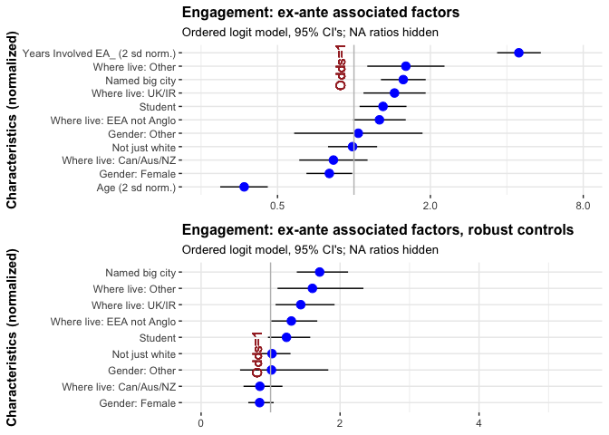

The results (for variables other than age and tenure are nearly identical, suggesting that these findings are not particularly sensitive to the functional form used to control for age and time in EA.\*

::: {.marginnote}
\* Recall: The USA is the base category for 'where live', and 'where live: other' is outside Europe and Anglosphere, mainly Asia (top countries in this category: Israel, Singapore, China, Phillippines, Brazil, India, South Africa).
:::

It is important to note that these are in *multivariable models*. Thus, while the odds-ratio shifter for 'Where live: Other' is among the most positive, this does *not* imply that the most-engaged EA's are necessarily in these other countries.\*\*

::: {.marginnote}
\*\* This is probably *not* driven by our use of an ordered logit model; the linear model of the standardized 1-5 engagement measure finds a similar positive shift.
:::

#### Selection and differential attrition: focus on recent recruits

We previously discussed how differential selection and attrition could drive the above models to suggest unwarranted predictions. We thus present a model isolating just those who say they became involved in 2019, 2018, or 2017. This includes most of 'those with have been in EA less than the average duration'. However it excludes those who joined in the survey year itself (2020), as those in their first year may be less able to gage their own engagment. We might suppose that the differential selection is less substantial over this shorter range of tenure. We might also imagine that patterns among 'newer recruits' are likely to be more reflective of future patterns. If so, the results below might be more predictive of engagement levels, and more useful for our 'policy choices.'


```r
newby_eas_20_s_imp <- eas_20_s_imp %>%
  filter(years_involved_d2sd < -0.001  & years_involved_d2sd > -0.5) %>%  #this captures people involved in 2018-2020
  mutate(year_involved = case_when( #recovering year_involved from trnasformed variable
    years_involved_d2sd < -.3  ~ "2019",
    years_involved_d2sd > -.3 & years_involved_d2sd < -.1  ~ "2018",
    years_involved_d2sd > -.1  ~ "2017"
        ),
    USA = where_live_cat=="USA"
  )


older_eas_20_s_imp <- eas_20_s_imp %>%
  filter(year_involved_groups  == "2014 or before" | year_involved_groups == "2015-16")  %>%  #this captures people involved in 2018-2020
  mutate(
    USA = where_live_cat=="USA"
  )

newby_ol_engage_imp <- newby_eas_20_s_imp %>%
    ol_mdl(c(key_predictors, "years_involved_d2sd"))

older_ol_engage_imp  <- older_eas_20_s_imp %>%
    ol_mdl(c(key_predictors, "years_involved_d2sd"))

newby_ol_engage_possible_endog <- newby_eas_20_s_imp %>%
    ol_mdl(c(key_predictors, "year_involved", possible_endog))

newby_ol_engage_possible_endog_USA <- newby_eas_20_s_imp %>%
    ol_mdl(c("age_approx_d2sd","gender_cat","student_cat", "race_cat","USA", "city_cat", "year_involved", possible_endog))

fh_imp_n <- newby_eas_20_s_imp %>% smn("first_hear")

newby_ol_engage_fh_imp <- newby_eas_20_s_imp %>%
    ol_mdl(c(key_predictors, "year_involved", fh_imp_n))
```

These models involve only 773 responses. As we are only considering three such tenure durations, we include a dummy for each 'year first involved'. Given the short tenure, we also do not anticipate that income or university rank could be particularly affected by EA engagement at this point; thus we focus on the larger set of features.


```r
(
newby_ol_engage_possible_endog_tree <- newby_ol_engage_possible_endog %>%
        filter(!grepl("NA$",term)) %>%
 ggcoefstats(statistic=t,
              sort="ascending",
              stats.labels = "TRUE",
              title = "Engagement of those involved in 2017-19: associated factors ",
              subtitle = "Ordered logit, 95% CI's; 'Possibly endogenous features'; NA ratios hidden",
              vline=FALSE) +
  ggplot2::labs(
        x= NULL,
        y = "Characteristics (normalized)"
      ) +
      geom_vline(xintercept=1, colour="grey") +
    geom_text(aes(x=1, label="Odds=1", y=12), colour="brown", angle=90, vjust = -.9) +
      scale_x_continuous(limits=c(0, 4))
) %>%
  ggplotly
```

```{=html}
<div id="htmlwidget-b9a25047a6e15057ce8f" style="width:80%;height:480px;" class="plotly html-widget"></div>
<script type="application/json" data-for="htmlwidget-b9a25047a6e15057ce8f">{"x":{"data":[{"x":[0.305411657664004,0.954636868946142,1.26405759460632,0.867841896540128,0.998565207597387,1.25142512488588,0.937594879797494,0.722595699308038,1.17619928175037,1.13221776749958,1.33230811338458,1.46817730001388,0.579742334516402,0.60875407467652,1.24614233694924,1.24611676751194,1.12547249165868],"y":[1,7,15,5,8,14,6,4,11,10,16,17,2,3,13,12,9],"text":["estimate: 0.3054117<br />term: Age (2 sd norm.)<br />conf.low: 0.1972666<br />conf.high: 0.4681587","estimate: 0.9546369<br />term: Income (2 sd norm.)<br />conf.low: 0.5746582<br />conf.high: 1.5847933","estimate: 1.2640576<br />term: Univ. rank (+) (2 sd norm.)<br />conf.low: 0.9007208<br />conf.high: 1.7796494","estimate: 0.8678419<br />term: Gender: Female<br />conf.low: 0.6291747<br />conf.high: 1.1968742","estimate: 0.9985652<br />term: Gender: Other<br />conf.low: 0.4173045<br />conf.high: 2.3787975","estimate: 1.2514251<br />term: Student<br />conf.low: 0.8882395<br />conf.high: 1.7644167","estimate: 0.9375949<br />term: Not just white<br />conf.low: 0.6608523<br />conf.high: 1.3302241","estimate: 0.7225957<br />term: Where live: Can/Aus/NZ<br />conf.low: 0.4497889<br />conf.high: 1.1596987","estimate: 1.1761993<br />term: Where live: EEA not Anglo<br />conf.low: 0.8047484<br />conf.high: 1.7209169","estimate: 1.1322178<br />term: Where live: Other<br />conf.low: 0.6700335<br />conf.high: 1.9140806","estimate: 1.3323081<br />term: Where live: UK/IR<br />conf.low: 0.8542002<br />conf.high: 2.0814497","estimate: 1.4681773<br />term: Named big city<br />conf.low: 1.0606259<br />conf.high: 2.0348721","estimate: 0.5797423<br />term: year_involved2018<br />conf.low: 0.4191821<br />conf.high: 0.8005872","estimate: 0.6087541<br />term: year_involved2019<br />conf.low: 0.4334386<br />conf.high: 0.8535581","estimate: 1.2461423<br />term: Part-time Employed<br />conf.low: 0.5978057<br />conf.high: 2.6087940","estimate: 1.2461168<br />term: Not Employed<br />conf.low: 0.5681776<br />conf.high: 2.7217447","estimate: 1.1254725<br />term: Retired<br />conf.low: 0.3335138<br />conf.high: 3.7564407"],"type":"scatter","mode":"lines","opacity":1,"line":{"color":"transparent"},"error_x":{"array":[0.162747057995357,0.630156438320813,0.515591829941124,0.329032353046021,1.38023232526716,0.512991546346357,0.392629187977035,0.43710304795216,0.544717645895337,0.781862857506163,0.749141585186398,0.566694832357063,0.220844853373376,0.244804009664338,1.36265164770791,1.47562796638034,2.63096822189897],"arrayminus":[0.108145054235156,0.379978643440351,0.363336770072268,0.238667179796003,0.581260743821809,0.36318559484438,0.276742575407871,0.272806814251422,0.371450908034045,0.462184313675754,0.478107912115887,0.407551435409802,0.16056020324615,0.175315468957175,0.648336632692727,0.67793916611791,0.791958664249211],"type":"data","width":0,"symmetric":false,"color":"rgba(0,0,0,1)"},"showlegend":false,"xaxis":"x","yaxis":"y","hoverinfo":"text","frame":null},{"x":[0.305411657664004,0.954636868946142,1.26405759460632,0.867841896540128,0.998565207597387,1.25142512488588,0.937594879797494,0.722595699308038,1.17619928175037,1.13221776749958,1.33230811338458,1.46817730001388,0.579742334516402,0.60875407467652,1.24614233694924,1.24611676751194,1.12547249165868],"y":[1,7,15,5,8,14,6,4,11,10,16,17,2,3,13,12,9],"text":["estimate: 0.3054117<br />term: Age (2 sd norm.)","estimate: 0.9546369<br />term: Income (2 sd norm.)","estimate: 1.2640576<br />term: Univ. rank (+) (2 sd norm.)","estimate: 0.8678419<br />term: Gender: Female","estimate: 0.9985652<br />term: Gender: Other","estimate: 1.2514251<br />term: Student","estimate: 0.9375949<br />term: Not just white","estimate: 0.7225957<br />term: Where live: Can/Aus/NZ","estimate: 1.1761993<br />term: Where live: EEA not Anglo","estimate: 1.1322178<br />term: Where live: Other","estimate: 1.3323081<br />term: Where live: UK/IR","estimate: 1.4681773<br />term: Named big city","estimate: 0.5797423<br />term: year_involved2018","estimate: 0.6087541<br />term: year_involved2019","estimate: 1.2461423<br />term: Part-time Employed","estimate: 1.2461168<br />term: Not Employed","estimate: 1.1254725<br />term: Retired"],"type":"scatter","mode":"markers","marker":{"autocolorscale":false,"color":"rgba(0,0,255,1)","opacity":1,"size":11.3385826771654,"symbol":"circle","line":{"width":1.88976377952756,"color":"rgba(0,0,255,1)"}},"hoveron":"points","showlegend":false,"xaxis":"x","yaxis":"y","hoverinfo":"text","frame":null},{"x":[1,1],"y":[0.4,17.6],"text":"xintercept: 1","type":"scatter","mode":"lines","line":{"width":1.88976377952756,"color":"rgba(190,190,190,1)","dash":"solid"},"hoveron":"points","showlegend":false,"xaxis":"x","yaxis":"y","hoverinfo":"text","frame":null},{"x":[1,1,1,1,1,1,1,1,1,1,1,1,1,1,1,1,1],"y":[12,12,12,12,12,12,12,12,12,12,12,12,12,12,12,12,12],"text":["Odds=1","Odds=1","Odds=1","Odds=1","Odds=1","Odds=1","Odds=1","Odds=1","Odds=1","Odds=1","Odds=1","Odds=1","Odds=1","Odds=1","Odds=1","Odds=1","Odds=1"],"hovertext":["x: 1<br />y: 12<br />label: Odds=1","x: 1<br />y: 12<br />label: Odds=1","x: 1<br />y: 12<br />label: Odds=1","x: 1<br />y: 12<br />label: Odds=1","x: 1<br />y: 12<br />label: Odds=1","x: 1<br />y: 12<br />label: Odds=1","x: 1<br />y: 12<br />label: Odds=1","x: 1<br />y: 12<br />label: Odds=1","x: 1<br />y: 12<br />label: Odds=1","x: 1<br />y: 12<br />label: Odds=1","x: 1<br />y: 12<br />label: Odds=1","x: 1<br />y: 12<br />label: Odds=1","x: 1<br />y: 12<br />label: Odds=1","x: 1<br />y: 12<br />label: Odds=1","x: 1<br />y: 12<br />label: Odds=1","x: 1<br />y: 12<br />label: Odds=1","x: 1<br />y: 12<br />label: Odds=1"],"textfont":{"size":14.6645669291339,"color":"rgba(165,42,42,1)"},"type":"scatter","mode":"text","hoveron":"points","showlegend":false,"xaxis":"x","yaxis":"y","hoverinfo":"text","frame":null}],"layout":{"margin":{"t":42.1685346616853,"r":7.30593607305936,"b":25.5707762557078,"l":183.37899543379},"plot_bgcolor":"rgba(255,255,255,1)","paper_bgcolor":"rgba(255,255,255,1)","font":{"color":"rgba(0,0,0,1)","family":"","size":14.6118721461187},"title":{"text":"<b> Engagement of those involved in 2017-19: associated factors  <\/b>","font":{"color":"rgba(0,0,0,1)","family":"","size":15.9402241594022},"x":0,"xref":"paper"},"xaxis":{"domain":[0,1],"automargin":true,"type":"linear","autorange":false,"range":[-0.2,4.2],"tickmode":"array","ticktext":["0","1","2","3","4"],"tickvals":[0,1,2,3,4],"categoryorder":"array","categoryarray":["0","1","2","3","4"],"nticks":null,"ticks":"outside","tickcolor":"rgba(51,51,51,1)","ticklen":3.65296803652968,"tickwidth":0.66417600664176,"showticklabels":true,"tickfont":{"color":"rgba(77,77,77,1)","family":"","size":11.689497716895},"tickangle":-0,"showline":false,"linecolor":null,"linewidth":0,"showgrid":true,"gridcolor":"rgba(235,235,235,1)","gridwidth":0.66417600664176,"zeroline":false,"anchor":"y","title":{"text":"<b>  <\/b>","font":{"color":"rgba(0,0,0,1)","family":"","size":14.6118721461187}},"hoverformat":".2f"},"yaxis":{"domain":[0,1],"automargin":true,"type":"linear","autorange":false,"range":[0.4,17.6],"tickmode":"array","ticktext":["Age (2 sd norm.)","year_involved2018","year_involved2019","Where live: Can/Aus/NZ","Gender: Female","Not just white","Income (2 sd norm.)","Gender: Other","Retired","Where live: Other","Where live: EEA not Anglo","Not Employed","Part-time Employed","Student","Univ. rank (+) (2 sd norm.)","Where live: UK/IR","Named big city"],"tickvals":[1,2,3,4,5,6,7,8,9,10,11,12,13,14,15,16,17],"categoryorder":"array","categoryarray":["Age (2 sd norm.)","year_involved2018","year_involved2019","Where live: Can/Aus/NZ","Gender: Female","Not just white","Income (2 sd norm.)","Gender: Other","Retired","Where live: Other","Where live: EEA not Anglo","Not Employed","Part-time Employed","Student","Univ. rank (+) (2 sd norm.)","Where live: UK/IR","Named big city"],"nticks":null,"ticks":"outside","tickcolor":"rgba(51,51,51,1)","ticklen":3.65296803652968,"tickwidth":0.66417600664176,"showticklabels":true,"tickfont":{"color":"rgba(77,77,77,1)","family":"","size":11.689497716895},"tickangle":-0,"showline":false,"linecolor":null,"linewidth":0,"showgrid":true,"gridcolor":"rgba(235,235,235,1)","gridwidth":0.66417600664176,"zeroline":false,"anchor":"x","title":{"text":"<b> Characteristics (normalized) <\/b>","font":{"color":"rgba(0,0,0,1)","family":"","size":14.6118721461187}},"hoverformat":".2f"},"shapes":[{"type":"rect","fillcolor":null,"line":{"color":null,"width":0,"linetype":[]},"yref":"paper","xref":"paper","x0":0,"x1":1,"y0":0,"y1":1}],"showlegend":false,"legend":{"bgcolor":"rgba(255,255,255,1)","bordercolor":"transparent","borderwidth":1.88976377952756,"font":{"color":"rgba(0,0,0,1)","family":"","size":13.2835201328352}},"hovermode":"closest","barmode":"relative"},"config":{"doubleClick":"reset","showSendToCloud":false},"source":"A","attrs":{"cbdf965cf76":{"x":{},"y":{},"xmin":{},"xmax":{},"type":"scatter"},"cbdf7b1750cb":{"x":{},"y":{}},"cbdf37b97e8f":{"xintercept":{}},"cbdf7323fadd":{"x":{},"y":{},"label":{}}},"cur_data":"cbdf965cf76","visdat":{"cbdf965cf76":["function (y) ","x"],"cbdf7b1750cb":["function (y) ","x"],"cbdf37b97e8f":["function (y) ","x"],"cbdf7323fadd":["function (y) ","x"]},"highlight":{"on":"plotly_click","persistent":false,"dynamic":false,"selectize":false,"opacityDim":0.2,"selected":{"opacity":1},"debounce":0},"shinyEvents":["plotly_hover","plotly_click","plotly_selected","plotly_relayout","plotly_brushed","plotly_brushing","plotly_clickannotation","plotly_doubleclick","plotly_deselect","plotly_afterplot","plotly_sunburstclick"],"base_url":"https://plot.ly"},"evals":[],"jsHooks":[]}</script>
```

Making inferences from the above graph, we see greater self-reported engagement among:\*

::: {.marginnote}
\* As some of the confidence intervals for these odds ratios cross the threshold of unit (even) odds, these are not all statistically significant in a conventional sense. Nonetheless, one might reasonably update beliefs in this direction.
:::

-   Those located in a (named) big city
-   UK and Ireland (and less so, the EEA)
-   Non-'western' countries
-   Those who attended high-ranked universities
-   Students
-   Younger people (the negative of "Age")

(The above list is reported in approximate order of the magnitudes of these odds, also considering the tightness of the confidence bounds.)

We see less engagement for living in Canada, Australia, or New Zealand. (The base group, the USA is marginally less engaged; see other models).

Comparing a simpler model for those involved from 2017-2019 to a separate model for those involved in earlier years (both of these models use the linear time-in-EA control and the smaller, ex-ante set of variables):


```r
(
newby_ol_engage_imp_tree <- newby_ol_engage_imp %>%
    filter(!grepl("NA$|Age|involve|Involved",term)) %>%
 ggcoefstats(statistic=t,
              sort="ascending",
              stats.labels = "TRUE",
              title = "Engagement of those involved in 2017-19: associated factors ",
              subtitle = "Ordered logit, 95% CI's; 'Ex-ante features'; NA ratios & age & tenure controls hidden",
              vline=FALSE) +
  ggplot2::labs(
        x= NULL,
        y = "Characteristics (normalized)"
      ) +
      geom_vline(xintercept=1, colour="grey") +
    geom_text(aes(x=1, label="Odds=1", y=5), colour="brown", angle=90, vjust = -.9) +
      scale_x_continuous(limits=c(0, 4.75))
) %>%
  ggplotly
```

```{=html}
<div id="htmlwidget-d7025511342da2c79187" style="width:80%;height:480px;" class="plotly html-widget"></div>
<script type="application/json" data-for="htmlwidget-d7025511342da2c79187">{"x":{"data":[{"x":[0.880642907644635,1.00076330962002,1.23415047616179,0.951681303984112,0.768981538883183,1.1615360360624,1.15188293614806,1.36570066103461,1.5138743465474],"y":[2,4,7,3,1,6,5,8,9],"text":["estimate: 0.8806429<br />term: Gender: Female<br />conf.low: 0.6392860<br />conf.high: 1.213117","estimate: 1.0007633<br />term: Gender: Other<br />conf.low: 0.4214930<br />conf.high: 2.367328","estimate: 1.2341505<br />term: Student<br />conf.low: 0.8956552<br />conf.high: 1.701620","estimate: 0.9516813<br />term: Not just white<br />conf.low: 0.6724504<br />conf.high: 1.346952","estimate: 0.7689815<br />term: Where live: Can/Aus/NZ<br />conf.low: 0.4805479<br />conf.high: 1.229296","estimate: 1.1615360<br />term: Where live: EEA not Anglo<br />conf.low: 0.8007660<br />conf.high: 1.686505","estimate: 1.1518829<br />term: Where live: Other<br />conf.low: 0.6835217<br />conf.high: 1.942550","estimate: 1.3657007<br />term: Where live: UK/IR<br />conf.low: 0.8818735<br />conf.high: 2.118528","estimate: 1.5138743<br />term: Named big city<br />conf.low: 1.0997199<br />conf.high: 2.086666"],"type":"scatter","mode":"lines","opacity":1,"line":{"color":"transparent"},"error_x":{"array":[0.332473904913748,1.36656485553843,0.467469280447696,0.395271069105845,0.46031404327752,0.524969417728023,0.790667297413804,0.752827763445612,0.572791551657238],"arrayminus":[0.241356919599278,0.579270277649617,0.338495307977152,0.279230938944552,0.288433628803007,0.36077007243428,0.46836125153395,0.48382715801198,0.414154484187523],"type":"data","width":0,"symmetric":false,"color":"rgba(0,0,0,1)"},"showlegend":false,"xaxis":"x","yaxis":"y","hoverinfo":"text","frame":null},{"x":[0.880642907644635,1.00076330962002,1.23415047616179,0.951681303984112,0.768981538883183,1.1615360360624,1.15188293614806,1.36570066103461,1.5138743465474],"y":[2,4,7,3,1,6,5,8,9],"text":["estimate: 0.8806429<br />term: Gender: Female","estimate: 1.0007633<br />term: Gender: Other","estimate: 1.2341505<br />term: Student","estimate: 0.9516813<br />term: Not just white","estimate: 0.7689815<br />term: Where live: Can/Aus/NZ","estimate: 1.1615360<br />term: Where live: EEA not Anglo","estimate: 1.1518829<br />term: Where live: Other","estimate: 1.3657007<br />term: Where live: UK/IR","estimate: 1.5138743<br />term: Named big city"],"type":"scatter","mode":"markers","marker":{"autocolorscale":false,"color":"rgba(0,0,255,1)","opacity":1,"size":11.3385826771654,"symbol":"circle","line":{"width":1.88976377952756,"color":"rgba(0,0,255,1)"}},"hoveron":"points","showlegend":false,"xaxis":"x","yaxis":"y","hoverinfo":"text","frame":null},{"x":[1,1],"y":[0.4,9.6],"text":"xintercept: 1","type":"scatter","mode":"lines","line":{"width":1.88976377952756,"color":"rgba(190,190,190,1)","dash":"solid"},"hoveron":"points","showlegend":false,"xaxis":"x","yaxis":"y","hoverinfo":"text","frame":null},{"x":[1,1,1,1,1,1,1,1,1],"y":[5,5,5,5,5,5,5,5,5],"text":["Odds=1","Odds=1","Odds=1","Odds=1","Odds=1","Odds=1","Odds=1","Odds=1","Odds=1"],"hovertext":["x: 1<br />y: 5<br />label: Odds=1","x: 1<br />y: 5<br />label: Odds=1","x: 1<br />y: 5<br />label: Odds=1","x: 1<br />y: 5<br />label: Odds=1","x: 1<br />y: 5<br />label: Odds=1","x: 1<br />y: 5<br />label: Odds=1","x: 1<br />y: 5<br />label: Odds=1","x: 1<br />y: 5<br />label: Odds=1","x: 1<br />y: 5<br />label: Odds=1"],"textfont":{"size":14.6645669291339,"color":"rgba(165,42,42,1)"},"type":"scatter","mode":"text","hoveron":"points","showlegend":false,"xaxis":"x","yaxis":"y","hoverinfo":"text","frame":null}],"layout":{"margin":{"t":42.1685346616853,"r":7.30593607305936,"b":25.5707762557078,"l":171.689497716895},"plot_bgcolor":"rgba(255,255,255,1)","paper_bgcolor":"rgba(255,255,255,1)","font":{"color":"rgba(0,0,0,1)","family":"","size":14.6118721461187},"title":{"text":"<b> Engagement of those involved in 2017-19: associated factors  <\/b>","font":{"color":"rgba(0,0,0,1)","family":"","size":15.9402241594022},"x":0,"xref":"paper"},"xaxis":{"domain":[0,1],"automargin":true,"type":"linear","autorange":false,"range":[-0.2375,4.9875],"tickmode":"array","ticktext":["0","1","2","3","4"],"tickvals":[0,1,2,3,4],"categoryorder":"array","categoryarray":["0","1","2","3","4"],"nticks":null,"ticks":"outside","tickcolor":"rgba(51,51,51,1)","ticklen":3.65296803652968,"tickwidth":0.66417600664176,"showticklabels":true,"tickfont":{"color":"rgba(77,77,77,1)","family":"","size":11.689497716895},"tickangle":-0,"showline":false,"linecolor":null,"linewidth":0,"showgrid":true,"gridcolor":"rgba(235,235,235,1)","gridwidth":0.66417600664176,"zeroline":false,"anchor":"y","title":{"text":"<b>  <\/b>","font":{"color":"rgba(0,0,0,1)","family":"","size":14.6118721461187}},"hoverformat":".2f"},"yaxis":{"domain":[0,1],"automargin":true,"type":"linear","autorange":false,"range":[0.4,9.6],"tickmode":"array","ticktext":["Where live: Can/Aus/NZ","Gender: Female","Not just white","Gender: Other","Where live: Other","Where live: EEA not Anglo","Student","Where live: UK/IR","Named big city"],"tickvals":[1,2,3,4,5,6,7,8,9],"categoryorder":"array","categoryarray":["Where live: Can/Aus/NZ","Gender: Female","Not just white","Gender: Other","Where live: Other","Where live: EEA not Anglo","Student","Where live: UK/IR","Named big city"],"nticks":null,"ticks":"outside","tickcolor":"rgba(51,51,51,1)","ticklen":3.65296803652968,"tickwidth":0.66417600664176,"showticklabels":true,"tickfont":{"color":"rgba(77,77,77,1)","family":"","size":11.689497716895},"tickangle":-0,"showline":false,"linecolor":null,"linewidth":0,"showgrid":true,"gridcolor":"rgba(235,235,235,1)","gridwidth":0.66417600664176,"zeroline":false,"anchor":"x","title":{"text":"<b> Characteristics (normalized) <\/b>","font":{"color":"rgba(0,0,0,1)","family":"","size":14.6118721461187}},"hoverformat":".2f"},"shapes":[{"type":"rect","fillcolor":null,"line":{"color":null,"width":0,"linetype":[]},"yref":"paper","xref":"paper","x0":0,"x1":1,"y0":0,"y1":1}],"showlegend":false,"legend":{"bgcolor":"rgba(255,255,255,1)","bordercolor":"transparent","borderwidth":1.88976377952756,"font":{"color":"rgba(0,0,0,1)","family":"","size":13.2835201328352}},"hovermode":"closest","barmode":"relative"},"config":{"doubleClick":"reset","showSendToCloud":false},"source":"A","attrs":{"cbdf353df020":{"x":{},"y":{},"xmin":{},"xmax":{},"type":"scatter"},"cbdf755fe02e":{"x":{},"y":{}},"cbdf69772835":{"xintercept":{}},"cbdfdf0e5ab":{"x":{},"y":{},"label":{}}},"cur_data":"cbdf353df020","visdat":{"cbdf353df020":["function (y) ","x"],"cbdf755fe02e":["function (y) ","x"],"cbdf69772835":["function (y) ","x"],"cbdfdf0e5ab":["function (y) ","x"]},"highlight":{"on":"plotly_click","persistent":false,"dynamic":false,"selectize":false,"opacityDim":0.2,"selected":{"opacity":1},"debounce":0},"shinyEvents":["plotly_hover","plotly_click","plotly_selected","plotly_relayout","plotly_brushed","plotly_brushing","plotly_clickannotation","plotly_doubleclick","plotly_deselect","plotly_afterplot","plotly_sunburstclick"],"base_url":"https://plot.ly"},"evals":[],"jsHooks":[]}</script>
```

```r
(
older_ol_engage_imp_tree <- older_ol_engage_imp %>%
    filter(!grepl("NA$|Age|involve|Involved",term)) %>%
 ggcoefstats(statistic=t,
              sort="ascending",
              stats.labels = "TRUE",
              title = "Engagement of those involved before 2017...",
              vline=FALSE) +
  ggplot2::labs(
        x= NULL,
        y = "Characteristics (normalized)"
      ) +
      geom_vline(xintercept=1, colour="grey") +
    geom_text(aes(x=1, label="Odds=1", y=5), colour="brown", angle=90, vjust = -.9) +
      scale_x_continuous(limits=c(0, 4.75))
) %>%
  ggplotly()
```

```{=html}
<div id="htmlwidget-f494730ef308bf1fa4ec" style="width:80%;height:480px;" class="plotly html-widget"></div>
<script type="application/json" data-for="htmlwidget-f494730ef308bf1fa4ec">{"x":{"data":[{"x":[0.847225371816169,1.22475764809937,1.36332359381779,0.876658672312473,1.23310577621971,1.73716268046937,2.2153414678064,1.87847898751537,1.94419526367794],"y":[1,3,5,2,4,6,9,7,8],"text":["estimate: 0.8472254<br />term: Gender: Female<br />conf.low: 0.5879699<br />conf.high: 1.222142","estimate: 1.2247576<br />term: Gender: Other<br />conf.low: 0.5164731<br />conf.high: 2.958250","estimate: 1.3633236<br />term: Student<br />conf.low: 0.9427040<br />conf.high: 1.975956","estimate: 0.8766587<br />term: Not just white<br />conf.low: 0.6029442<br />conf.high: 1.276128","estimate: 1.2331058<br />term: Where live: Can/Aus/NZ<br />conf.low: 0.7128980<br />conf.high: 2.142832","estimate: 1.7371627<br />term: Where live: EEA not Anglo<br />conf.low: 1.1781394<br />conf.high: 2.568639","estimate: 2.2153415<br />term: Where live: Other<br />conf.low: 1.1306727<br />conf.high: 4.378365","estimate: 1.8784790<br />term: Where live: UK/IR<br />conf.low: 1.2220986<br />conf.high: 2.904077","estimate: 1.9441953<br />term: Named big city<br />conf.low: 1.4028212<br />conf.high: 2.699596"],"type":"scatter","mode":"lines","opacity":1,"line":{"color":"transparent"},"error_x":{"array":[0.374917026818233,1.73349223813008,0.612632496088203,0.399469344745602,0.909726169850122,0.831476521671308,2.16302358700886,1.02559825946755,0.755400296465862],"arrayminus":[0.259255441689092,0.708284504691199,0.420619583104965,0.27371443076469,0.520207783669225,0.559023318903555,1.08466879232862,0.656380386095576,0.541374105086786],"type":"data","width":0,"symmetric":false,"color":"rgba(0,0,0,1)"},"showlegend":false,"xaxis":"x","yaxis":"y","hoverinfo":"text","frame":null},{"x":[0.847225371816169,1.22475764809937,1.36332359381779,0.876658672312473,1.23310577621971,1.73716268046937,2.2153414678064,1.87847898751537,1.94419526367794],"y":[1,3,5,2,4,6,9,7,8],"text":["estimate: 0.8472254<br />term: Gender: Female","estimate: 1.2247576<br />term: Gender: Other","estimate: 1.3633236<br />term: Student","estimate: 0.8766587<br />term: Not just white","estimate: 1.2331058<br />term: Where live: Can/Aus/NZ","estimate: 1.7371627<br />term: Where live: EEA not Anglo","estimate: 2.2153415<br />term: Where live: Other","estimate: 1.8784790<br />term: Where live: UK/IR","estimate: 1.9441953<br />term: Named big city"],"type":"scatter","mode":"markers","marker":{"autocolorscale":false,"color":"rgba(0,0,255,1)","opacity":1,"size":11.3385826771654,"symbol":"circle","line":{"width":1.88976377952756,"color":"rgba(0,0,255,1)"}},"hoveron":"points","showlegend":false,"xaxis":"x","yaxis":"y","hoverinfo":"text","frame":null},{"x":[1,1],"y":[0.4,9.6],"text":"xintercept: 1","type":"scatter","mode":"lines","line":{"width":1.88976377952756,"color":"rgba(190,190,190,1)","dash":"solid"},"hoveron":"points","showlegend":false,"xaxis":"x","yaxis":"y","hoverinfo":"text","frame":null},{"x":[1,1,1,1,1,1,1,1,1],"y":[5,5,5,5,5,5,5,5,5],"text":["Odds=1","Odds=1","Odds=1","Odds=1","Odds=1","Odds=1","Odds=1","Odds=1","Odds=1"],"hovertext":["x: 1<br />y: 5<br />label: Odds=1","x: 1<br />y: 5<br />label: Odds=1","x: 1<br />y: 5<br />label: Odds=1","x: 1<br />y: 5<br />label: Odds=1","x: 1<br />y: 5<br />label: Odds=1","x: 1<br />y: 5<br />label: Odds=1","x: 1<br />y: 5<br />label: Odds=1","x: 1<br />y: 5<br />label: Odds=1","x: 1<br />y: 5<br />label: Odds=1"],"textfont":{"size":14.6645669291339,"color":"rgba(165,42,42,1)"},"type":"scatter","mode":"text","hoveron":"points","showlegend":false,"xaxis":"x","yaxis":"y","hoverinfo":"text","frame":null}],"layout":{"margin":{"t":42.1685346616853,"r":7.30593607305936,"b":25.5707762557078,"l":171.689497716895},"plot_bgcolor":"rgba(255,255,255,1)","paper_bgcolor":"rgba(255,255,255,1)","font":{"color":"rgba(0,0,0,1)","family":"","size":14.6118721461187},"title":{"text":"<b> Engagement of those involved before 2017... <\/b>","font":{"color":"rgba(0,0,0,1)","family":"","size":15.9402241594022},"x":0,"xref":"paper"},"xaxis":{"domain":[0,1],"automargin":true,"type":"linear","autorange":false,"range":[-0.2375,4.9875],"tickmode":"array","ticktext":["0","1","2","3","4"],"tickvals":[0,1,2,3,4],"categoryorder":"array","categoryarray":["0","1","2","3","4"],"nticks":null,"ticks":"outside","tickcolor":"rgba(51,51,51,1)","ticklen":3.65296803652968,"tickwidth":0.66417600664176,"showticklabels":true,"tickfont":{"color":"rgba(77,77,77,1)","family":"","size":11.689497716895},"tickangle":-0,"showline":false,"linecolor":null,"linewidth":0,"showgrid":true,"gridcolor":"rgba(235,235,235,1)","gridwidth":0.66417600664176,"zeroline":false,"anchor":"y","title":{"text":"<b>  <\/b>","font":{"color":"rgba(0,0,0,1)","family":"","size":14.6118721461187}},"hoverformat":".2f"},"yaxis":{"domain":[0,1],"automargin":true,"type":"linear","autorange":false,"range":[0.4,9.6],"tickmode":"array","ticktext":["Gender: Female","Not just white","Gender: Other","Where live: Can/Aus/NZ","Student","Where live: EEA not Anglo","Where live: UK/IR","Named big city","Where live: Other"],"tickvals":[1,2,3,4,5,6,7,8,9],"categoryorder":"array","categoryarray":["Gender: Female","Not just white","Gender: Other","Where live: Can/Aus/NZ","Student","Where live: EEA not Anglo","Where live: UK/IR","Named big city","Where live: Other"],"nticks":null,"ticks":"outside","tickcolor":"rgba(51,51,51,1)","ticklen":3.65296803652968,"tickwidth":0.66417600664176,"showticklabels":true,"tickfont":{"color":"rgba(77,77,77,1)","family":"","size":11.689497716895},"tickangle":-0,"showline":false,"linecolor":null,"linewidth":0,"showgrid":true,"gridcolor":"rgba(235,235,235,1)","gridwidth":0.66417600664176,"zeroline":false,"anchor":"x","title":{"text":"<b> Characteristics (normalized) <\/b>","font":{"color":"rgba(0,0,0,1)","family":"","size":14.6118721461187}},"hoverformat":".2f"},"shapes":[{"type":"rect","fillcolor":null,"line":{"color":null,"width":0,"linetype":[]},"yref":"paper","xref":"paper","x0":0,"x1":1,"y0":0,"y1":1}],"showlegend":false,"legend":{"bgcolor":"rgba(255,255,255,1)","bordercolor":"transparent","borderwidth":1.88976377952756,"font":{"color":"rgba(0,0,0,1)","family":"","size":13.2835201328352}},"hovermode":"closest","barmode":"relative"},"config":{"doubleClick":"reset","showSendToCloud":false},"source":"A","attrs":{"cbdf20d67cf4":{"x":{},"y":{},"xmin":{},"xmax":{},"type":"scatter"},"cbdf61a58803":{"x":{},"y":{}},"cbdf3a84af0a":{"xintercept":{}},"cbdf5cffd789":{"x":{},"y":{},"label":{}}},"cur_data":"cbdf20d67cf4","visdat":{"cbdf20d67cf4":["function (y) ","x"],"cbdf61a58803":["function (y) ","x"],"cbdf3a84af0a":["function (y) ","x"],"cbdf5cffd789":["function (y) ","x"]},"highlight":{"on":"plotly_click","persistent":false,"dynamic":false,"selectize":false,"opacityDim":0.2,"selected":{"opacity":1},"debounce":0},"shinyEvents":["plotly_hover","plotly_click","plotly_selected","plotly_relayout","plotly_brushed","plotly_brushing","plotly_clickannotation","plotly_doubleclick","plotly_deselect","plotly_afterplot","plotly_sunburstclick"],"base_url":"https://plot.ly"},"evals":[],"jsHooks":[]}</script>
```

```r
(
  engage_newby_v_older <- ggarrange(newby_ol_engage_imp_tree, older_ol_engage_imp_tree,
                    ncol = 1, nrow = 2,
                    heights = c(1, 1),
                    align = "v",
                      common.legend = TRUE, legend = "bottom")
)
```


Although the confidence intervals are rather wide, especially for the longer tenure group, it looks fairly constant. The only major visual difference is that Can/Aus/NZ is 'positive' for those who joined in the earlier years (and persisted) and 'negative' for recent joiners. But again, this could be driven by differential selection.

#### Linear models (of levels and binary) {#linear_models .unnumbered}

To consider the previous results' sensitivity to functional form, we resent linear models considering:

1.  self-reported engagement (`engagement_num` =1-5) as if it were a meaningful cardinal outcome, and also

2.  the binary 'highly engaged' self-reported outcome of ('4-5 engagement' vs '1-3 engagement')

<!-- This model extends the work done in linear models in the "How EAs get involved" chapter. -->


```r
#satis_ologit_t0 \<- eas_20 %\>% polr(m_f(sat_outcome, t0_satis_vars), data = ., Hess=TRUE) %\>%

#OK my 'coefficients as deviations' is not working. Back to the old crappy treatment coding with base groups as modal group in each case

#todo: get this to run with a *list* and with purrr, then easy switch to ologit

options(contrasts = rep ("contr.treatment", 2))
#options(contrasts = rep ("contr.sum", 2))

lm_mdl <- function(df, rhs) {
  lm(
    m_f(num_out, {{rhs}}), data = df
    ) %>%
  coeftest(vcov = vcovHC)
}

##Fix this -- its inheriting from outside the environment

lm_engage_naive <- eas_20_s_imp %>%
  lm_mdl(c(key_predictors))
```

```
## Error in coeftest.default(., vcov = vcovHC): object 'vcovHC' not found
```

```r
  #lm(m_f(num_out, c("0", key_predictors)), data = .) %>%
  #lm(engagement_norm ~ 0 + gender_cat +  city_cat, data = .) %>%

lm_engage_noimp <- eas_20_s %>%
    lm_mdl(c(key_predictors, controls))
```

```
## Error in coeftest.default(., vcov = vcovHC): object 'vcovHC' not found
```

```r
lm_engage_imp_big <- eas_20_s_imp %>%
  lm(m_f(num_out, c(big_demog,  controls)), data = .) %>%
  coeftest(vcov = vcovHC)
```

```
## Error in coeftest.default(., vcov = vcovHC): object 'vcovHC' not found
```

```r
lm_engage_imp <- eas_20_s_imp %>%
    lm_mdl(c(key_predictors, controls))
```

```
## Error in coeftest.default(., vcov = vcovHC): object 'vcovHC' not found
```

```r
lm_engage_possible_endog <- eas_20_s_imp %>%
    lm_mdl(c(key_predictors, controls, possible_endog))
```

```
## Error in coeftest.default(., vcov = vcovHC): object 'vcovHC' not found
```

```r
fh_imp_n <- eas_20_s_imp %>% smn("first_hear")

lm_engage_fh_imp <- eas_20_s_imp %>%
    lm_mdl(c(key_predictors, controls, fh_imp_n))
```

```
## Error in coeftest.default(., vcov = vcovHC): object 'vcovHC' not found
```

```r
key_pred_n_cat <- grep("first_hear_ea_lump|Intercept|NA|d2sd", names(coef(lm_engage_fh_imp)), value = TRUE, invert=TRUE)
```

```
## Error in coef(lm_engage_fh_imp): object 'lm_engage_fh_imp' not found
```

```r
na_pred <- grep("NA|Intercept", names(coef(lm_engage_fh_imp)), value = TRUE)
```

```
## Error in coef(lm_engage_fh_imp): object 'lm_engage_fh_imp' not found
```

```r
key_pred_n_ctn <- grep("d2sd", names(coef(lm_engage_fh_imp)), value = TRUE)
```

```
## Error in coef(lm_engage_fh_imp): object 'lm_engage_fh_imp' not found
```

```r
key_pred_n<- c(key_pred_n_ctn, key_pred_n_cat)
```

```
## Error in eval(expr, envir, enclos): object 'key_pred_n_ctn' not found
```

```r
names(key_pred_n) <- gsub("d_live", "Live:", key_pred_n) %>%
  gsub("age_approx_d2sd", "Age (2sd norm)", .) %>%
  gsub("d2sd", " (norm)", .) %>%
  gsub("cat", "- ", .)  %>%
  #gsub("canzaus", "Aus///Can///NZ", .) %>%
  #gsub("d_", "", .) %>%
  gsub("_", " ", .)   %>%
  firstup(.)
```

```
## Error in is.factor(x): object 'key_pred_n' not found
```

```r
fh_n <- grep("first_hear_ea_lump", names(coef(lm_engage_fh_imp)), value = TRUE)
```

```
## Error in coef(lm_engage_fh_imp): object 'lm_engage_fh_imp' not found
```

```r
names(fh_n) <- gsub("first_hear_ea_lump", "First-heard: ", fh_n)   %>%
    gsub("X80", "80", .)

huxreg_opts  <- function(df) {
 df %>%
    set_bold(1, everywhere)             %>%
    set_bottom_border(1, everywhere) %>%
    map_background_color(by_rows("grey87", "white"))  %>%
    set_caption_pos("bottom")
}

(
  lm_engage_tbl <- huxreg(
    "(0) Naive" = lm_engage_naive,
    "(1) Baseline " = lm_engage_imp, "(2) Baseline - no imputation" = lm_engage_noimp, "(3) Possibly endogenous" = lm_engage_possible_endog,  "(3) First-heard" = lm_engage_fh_imp,
      statistics = c("N. obs." = "nobs"),
    error_pos = "right",
    coefs = c(key_pred_n,  # note intercept was removed above
              "Income (norm)"= "income_d2sd",
              "Employed: Part-Time" = "d_pt_employment",
              "Not Employed" = "d_not_employed", "Retired" = "d_retired",
              fh_n)) %>%
        huxreg_opts %>%
    set_col_width(c(.5, rep(.2, times=length(.)-1)))
)
```

```
## Error in huxreg(`(0) Naive` = lm_engage_naive, `(1) Baseline ` = lm_engage_imp, : object 'lm_engage_naive' not found
```

```r
(
  lm_engage_tbl_na <- huxreg(
    "(0) Naive" = lm_engage_naive,
    "(1) Baseline " = lm_engage_imp, "(2) Baseline - no imputation" = lm_engage_noimp, "(3) Possibly endogenous" = lm_engage_possible_endog,  "(3) First-heard" = lm_engage_fh_imp,
      statistics = c("N. obs." = "nobs"),
    error_pos = "right",
    coefs = c("(Intercept)", na_pred)) %>%
        huxreg_opts %>%
    set_col_width(c(.5, rep(.2, times=length(.)-1)))
)
```

```
## Error in huxreg(`(0) Naive` = lm_engage_naive, `(1) Baseline ` = lm_engage_imp, : object 'lm_engage_naive' not found
```

Trying to automate the above


```r
lm_mdl <- function(df, mod) {
  lm(
    m_f(num_out, {{rhs}}), data = df
    ) %>%
  coeftest(vcov = vcovHC)
}


eng_models_list <- list(
    lm_engage_naive = 'm_f(num_out, c(key_predictors)',
    lm_engage_imp = 'm_f(num_out, c(big_demog,  "uni_higher_rank_d2sd", controls)'
  )

eng_model_frame <- tibble(model = eng_models_list) %>%
  mutate(model_name = names(model)) %>%
    mutate(model_name = names(model))

eng_model_frame <- eng_model_frame %>%
  mutate(fit = map(eng_model_frame,
                   ~lm(., data = eas_20_s_imp) %>%
                     coeftest(vcov = vcovHC)
                     )
            )
```

Notes:

\BeginKnitrBlock{fold}<div class="fold">As in the Ordered Logit models, nonresponses for each response are included as separate categories. All "NA" coefficients are hidden. The outcome variable is standardized (de-meaned and divided by *one* SD).

Continuous variables (income, age, university rank) are de-meaned and divided by two standard-deviations. (This is for comparability to dummy-coded categorical variables, see Gelman [ref]) . Where these are missing they are coded as zero, the mean of the transformed variable (except in the "no imputation" column, where these are left out of the regression, leading to a smaller sample size.)

Base groups are set as the most numerous group in each category. All dummy coefficients represent adjustments from the 'overall base group': an individual who is Male, Works full-time, 'Just White' ethnicity, USA-based, not based in a (survey-named) big city, First heard of EA: 'Other or don't remember'.
</div>\EndKnitrBlock{fold}

## Engagement: age, tenure, period and cohort effects {#engage_time}

We examine the relationship between the year when people first got involved in EA (which tells us how long they've been in EA or their 'tenure'), their current age and the age they were when they first got involved in EA.

::: {.marginnote}
See also "Tenure and 'age first heard' vs engagement" in demography chapter/post.

Aspirationally:

We would like to separate cohort, trend, and age effects here; we will have more possibility to do this if we combine data from earlier years.

"Engagement by years since joining, controlling for year and age"

"Engagement by year, controlling for years since joining and age"...
:::

\

### Engagement by tenure/age: 'prediction for "outreach at what age?"' {#which-age}

A major concern might be: 'What is the optimal age to reach out to EA's'?

In a best-case we'd want to estimate the function (not 'customer lifetime value' but...) 'effective lifetime value' ($ELV$) as a function of 'age first heard of EA' ($afh$), and everything else ($X$): $$ELV = f(AFH, X)$$

and look for the values of AFH that maximizes this, perhaps averaging over the 'everything else' stuff.

Of course, we don't know ELV, and it would take a great effort (as well as controversial assumptions) to construct this:

More simply, we could plot:

1.  Engagement at age $A$ as a function of age-first-heard (AFH):

This would combine both

-   Tenure effects, as those who started younger have been in longer

    -   and unfortunately, differentially attrited, adding a possible bias, and

-   Receptiveness-at-age effects (e.g., earlier inculcation is stronger)

-   Selection-at-age effects (e.g., those who we tend to recruit younger might be more engage-prone)

2.  Engagement $T$ years after first-heard as a function of AFH, combining

-   Receptiveness-at-age effects (e.g., earlier inculcation is stronger)

-   standard life-cycle age effects

-   selection-at-age effects

3.  Simple 'engagement level by age'

-   roughly capturing the life-cycle age effects
-   but combining a variety of effects, including, e.g., 'younger people might be more active', and 'young people tend to have been in EA for less time'

### Engagement by age and tenure

Below, we plot the 'engagement level by age' for the 2020 survey data...


```r
#aet <- eas_20 %>% ungroup() %>%  dplyr::select(age_approx_ranges, engagement_num, tenure)

#p_load(scatterplot3d)

#scatterplot3d(eas_20$engagement, eas_20$age_approx, eas_20$tenure, highlight.3d=TRUE, col.axis="blue", col.grid="lightblue", main="scatterplot3d - 1", pch=20)
#ggExtra  to add densities

(
  engage_by_age <-  eas_20 %>%
  ggplot() +
  aes(x = age_approx, y = engagement_num) +
 geom_point(size = 0.30, colour = "#0c4c8a", position = position_jitter(seed = 42,  width = 0.1, height = 0.2)) +
 geom_smooth(span = 0.71) +
 scatter_theme +
 xlim(10L, 75L) +
    labs(y = get_label(eas_20$engagement_num),
         x = get_label(eas_20$age_approx))+
  labs(title = "Engagement (2020) by age")
) %>%
  ggplotly()
```

```{=html}
<div id="htmlwidget-192aec605c0609ba3b09" style="width:80%;height:480px;" class="plotly html-widget"></div>
<script type="application/json" data-for="htmlwidget-192aec605c0609ba3b09">{"x":{"data":[{"x":[22.0829612086993,24.0874150826596,28.9572279069573,32.0660895252135,44.0283491037786,23.003819189826,29.0473176629283,21.9269333194476,23.0313984580804,23.0410129568074,24.9915483552497,22.0438224503305,null,29.9510857648682,24.9924585645087,21.0880029045511,24.0956452856772,20.9234974723309,31.9949994163122,27.012066549249,23.0808062774595,21.9277420335449,22.0977783457842,null,38.9164875116199,30.00284235687,25.9780406934209,26.0811476261821,26.9893939256202,33.0672008519992,39.0475191235542,22.0622110282537,23.9776216565631,25.0370339458808,30.9007896677591,25.0665832160506,29.9014668293763,22.9415317945648,27.0813202815596,37.0223557286896,26.9759118481074,26.9871543169953,31.9074862065725,null,31.9863502497785,25.0915153193288,20.0775509811007,56.0279957538936,25.0941933220718,22.0237676414661,28.9666854422539,null,25.9796970822848,27.0569385551382,26.9077872982249,18.0497590772342,24.0354553660378,24.9342528660782,32.9522175927646,null,34.0351214549039,21.0965634395834,24.0519088535104,28.0132976848166,22.0699379437137,19.9378947870806,21.954257322941,24.0656316970475,26.0386409640778,28.948108947929,28.908597759204,20.9280958188232,41.9432770830113,29.9958797128405,null,34.043871167535,null,36.9750979929231,25.0028815416619,21.9003141108435,23.0163208005019,19.9315810416359,29.9718056611717,29.0291263756808,31.0551646725275,null,32.9467406797223,19.91799610327,21.9171224129852,30.9610436738934,44.0334853029344,null,26.9417139913887,35.0866068254691,23.0851289497223,40.0468188602012,63.9666143966839,null,22.0487949292641,23.0238318480086,24.0252490689047,21.9434315396473,29.9433134621941,27.9777890057303,21.0884911383968,24.0925216027535,null,22.0466491811443,35.0071522579994,26.900454593217,32.0217874905095,40.0673603118863,35.0503045125399,26.9905463145114,26.0071579987649,35.0074753390625,26.9002761687152,28.971133190766,31.0224266180303,29.0657884261105,54.9713443998713,18.9821270251647,33.0146951797884,27.0179356607143,34.0439314584713,64.978994609043,23.0838407858275,28.0925140587147,22.9467047051061,34.0448995199986,24.0807269050274,46.0206948169507,20.0263014597818,20.0874771699309,null,20.015964179812,28.064280784782,20.9227437218186,22.0529015517328,29.0247226914391,26.929689321341,26.9160528933164,46.9928139102645,null,null,27.0634460888803,26.9340324962512,31.0889440651052,null,27.9298144104891,24.0438757182565,31.9648171904963,30.055761899706,65.9788882003631,26.0357185735833,42.0551650085486,28.9375738088042,34.9058171637822,23.9271427594125,25.036032835627,42.0869645907544,null,28.0203532470856,65.9393988976255,24.0070473221131,26.9359111478552,50.9903772988822,37.9634106703568,null,25.937220431352,35.0459460193291,34.9823744142428,23.9828099363483,34.9960620258003,30.9854988931213,31.927298072027,22.064935881272,37.0184608485084,null,null,29.0836112834513,null,22.9633950475603,32.9518521151971,null,67.049472223362,19.0835808068048,30.0586382418405,25.9266659236513,23.9575499504339,25.9389352287631,44.0568218765315,29.9257744323462,null,31.9144506222568,32.910625896696,28.0063748872839,21.922461648332,20.0486375439446,67.0462630954571,22.0770235374104,29.0034222111106,null,26.9885592536535,32.9315760200843,23.9884649277665,41.0935467334464,null,26.9504916878883,19.9519379960373,24.0084031881765,26.0299751675222,36.9672838264611,21.9121899492573,33.9902621700428,35.0677510066889,null,28.9706700754818,28.0094852156471,30.0785437187646,36.9979981141165,31.9343264226336,39.0086061988026,33.0922935391776,23.9627367644105,36.0641029096208,39.9614108800888,21.9370907162316,21.9096693553496,25.9491348294541,25.9702213844284,21.9318044763524,30.9608195993584,null,30.0993105358444,23.0608786625322,37.9173161203507,27.073986653937,24.0109171726741,32.984275684366,26.9135273638181,20.0122875913046,25.914144378854,21.9422783877701,23.0099240826909,33.9963962896727,22.9318939709105,null,27.9998545760754,30.0881129756104,27.9668462653179,19.9376868659165,34.95394323566,20.0061488156207,22.9042900457047,40.0597520614974,null,29.0079596571624,22.014246779494,22.0237903093919,24.0429707386997,52.9246601157356,29.9622099237517,25.089147832524,29.0000050184783,35.9270460998174,null,28.9410099224187,28.0850091781933,31.0773507196456,21.9272591650486,18.0570698884316,28.9906606828328,31.9271484838799,26.0770442073699,23.967342708027,36.9638548230287,23.9807565629482,26.9958154614083,27.9735803640448,28.9931381135248,29.9099784305785,null,35.0965318827424,null,29.9341992781032,21.9976509789005,32.9037374823354,25.9678970167413,19.9059326751158,29.0734457326122,23.0463415199425,25.9630521593615,27.9772908023559,28.9664891981054,30.9179555942304,36.0514111205004,25.0205936994404,null,24.9065034966916,33.9967536283191,25.988913905574,25.9120771179907,null,29.0756858094595,21.0861209772527,23.9784356913995,null,25.9639895202126,28.9613931240514,21.9215622508898,22.0958668606821,30.9993806856219,20.9186149343848,24.9423547316343,31.0861001492478,25.9593692813534,27.0306436497718,38.0802140955813,22.0981591586489,20.9860666442662,21.9787553844508,28.9283817790914,20.9559613392688,18.0129644445144,25.0870279010851,20.971680029016,24.0684014361817,31.0444818428718,30.0501471978612,32.0847976904362,28.9004756213631,null,24.9798545902595,44.0350639154669,31.9960744032636,26.0067657561507,26.9633900314569,23.0629515180364,26.958443904249,25.9818264182657,null,20.0597193276044,30.9719570499379,26.9080975153483,26.9082172679715,25.0908868476748,34.9746682489756,25.061283933511,25.082011801796,29.9880152425729,20.0152673006058,27.9147335590329,52.9329254788812,51.0479781551752,null,29.0371041906532,28.0903029885609,20.9994928975124,28.9941001253203,32.0120383900125,30.0305020241067,32.9559146997519,37.0959815178998,19.0287728216033,26.0165156871546,31.0231742051896,35.0850280588958,43.9780045790598,35.9575839370023,34.918147192942,28.9644067808054,24.051654022513,19.9208825859241,25.0420555705205,null,null,null,30.9110804357566,23.0659447030164,31.0162395513151,null,24.973002824001,24.9560249254573,34.0199431709945,28.0637139225844,23.9195664560888,23.0927379052155,32.9337472886778,28.9172166811768,null,32.0049581204075,27.0313621750567,27.9459038745612,26.0442452062853,16.9981500789989,28.0930511184968,27.0813884960953,39.0102501055691,21.9151198199019,25.9045400022529,43.0026479055639,25.0261452303268,25.9837543248665,34.0758531890344,35.9215974146035,26.0960557392798,22.9529933262616,27.9168555046432,28.9771814351436,26.9249791654292,31.0163108443376,25.9480299216229,36.0443775777239,21.9291857381351,32.93056775406,null,null,33.9852932599373,null,32.9229665074032,24.9965513794683,52.095834716782,29.0623033573851,null,30.9144734174013,22.9932970492169,30.9679811291862,19.037983721029,28.0028314744122,null,28.0091028708033,31.9894914660137,32.9167769680731,29.0860267383512,19.903289637249,32.9828184798826,37.9453952186741,20.919928117469,33.9965847750194,22.0300257342868,25.0842659556773,34.9725203614216,24.0710269980133,18.9601812303066,17.9931324850302,18.9285461329855,27.0615437987261,22.0331615263596,38.9123881959822,29.9861851136666,18.9793710162863,21.0393913502805,29.0318639301229,18.9814701419324,31.9613840440754,17.9510214690119,33.0345136306714,30.0788786867168,34.0691472312435,19.9785803713836,24.9158101079985,19.0656846113969,18.9145783649757,43.9229525355156,20.0279968540184,21.9641132400371,23.9377499052323,null,28.072405203199,26.9695822813082,24.9002867796924,33.0822568907402,24.0903446897864,35.9981837966014,28.9927303430624,null,20.0812101914547,58.9346002358012,null,23.9465868769214,35.015409641806,43.0681754066609,25.926440755371,32.079178237915,31.9900274682324,24.0788285075687,28.9497090361081,31.9167390587274,25.9097282149363,22.0959631734062,35.9968335482292,23.0690786067862,22.9832587209065,19.9978685085662,20.9366575635038,28.0518322935794,25.9610286605079,null,25.9065618285909,24.9273010416422,38.9354272822849,36.003912090091,null,null,32.0786843573209,null,27.9293144788593,null,17.9506004938856,30.9301195200533,27.0537094319705,37.9460246662144,24.9610798656009,37.0037139224354,29.9669199333526,30.9308869936503,19.9532739137299,24.9701509233564,26.015691675758,29.061720359046,29.0866540629882,null,28.925400554901,32.0298907903023,26.0380703315139,22.9064089648891,25.0840978299733,31.9956937774085,23.9533041156828,48.0713021432515,23.9458292955533,null,26.0293549720664,21.9848669381347,20.9190136536025,30.9006935407873,18.0062267337926,43.004861423187,29.9426371109206,22.0433864159975,26.0922687152401,21.0036533199251,18.9349056044593,32.0125080269761,31.0518516339362,24.0333942675032,24.9449745846447,22.9691699524876,31.9639663519803,32.0809796795249,32.9398396760225,null,22.927503551729,20.9213989373762,34.9185718791559,29.0832897910383,null,24.07715877546,29.0545729299076,28.0590102472343,22.9411347186193,21.9096386645921,32.9077631862368,35.9569148259703,24.9697619664948,24.0474906650837,29.9503327162471,27.0034874006175,28.0518889445346,39.0272169055883,25.9407881370746,21.0986090564169,null,null,19.0268056181259,51.9034583650529,65.9053470942657,21.0215681190137,24.0141082705464,27.9491706695873,null,30.0344432403333,21.0290900878608,25.9416570909321,25.9961235471535,29.0973037166521,null,25.9901548073161,31.0429697572254,null,25.0667375121266,null,21.0991984516382,26.0611622426659,34.9972484334838,27.0077544001862,21.9682079816703,30.9104031208903,40.9917446226347,null,42.9565528450534,25.0552890164778,null,28.0031102363952,30.9955901546404,18.0537704449147,null,20.9883548299782,25.0046815339476,19.995383837726,null,50.0370456494391,20.970358404424,35.0679262570571,27.0843827383127,26.9212619242724,null,71.9973285823595,27.9647644047625,31.9943427850027,26.0172177004162,null,33.0468059440143,29.9300968198106,22.0395106733777,null,31.9852929844521,27.0442667146679,null,23.9677173921838,18.9481184277683,24.9432519355789,30.9484116238076,22.012980934605,25.0425136177801,26.9216193195898,26.0038151747081,21.0704380689189,31.0429263884202,31.9627963369712,25.9231634284835,20.015000813501,26.0662743844092,34.0040679515805,null,null,25.9708320797421,null,32.0844522508327,23.9409185413271,73.0909805865493,null,22.0394689662848,32.002518756967,29.9961633030791,22.9403601846192,39.9200458708685,25.9945177749265,22.9624359296169,23.0544798610266,47.0802148002665,33.967045856826,21.0647888492793,26.9440065719653,32.0532247476745,null,48.9846911075525,41.0677139576525,23.9574641175102,28.9941441401374,27.0561689066701,null,24.978903510049,22.9191322814673,23.9266666471958,22.9442252356093,27.9548239082098,null,29.9749573545065,24.9982904985081,64.0757205246948,35.049745965749,22.0910372046288,27.9663840426132,28.0648325592745,25.9265330766793,null,31.0456219423562,31.0096841657069,38.0217034825589,26.9245893401094,31.0752869397867,49.0684697631281,25.9092475627083,32.0414036657196,25.0069582110271,42.0890914468095,42.0824059958104,71.9911957032978,30.0531040957198,29.0010089159012,18.9405096965842,21.0434277444612,31.0536153928842,28.0412754090503,36.9383248272352,20.9595799602102,null,65.0143752469681,49.0764983050991,24.075420675287,28.9771705074236,33.0475544309709,24.0592638728209,22.0448322921526,27.9770877177827,27.9596304565202,25.911494230479,30.03473859285,27.9395983853843,47.0250215798151,null,31.9746157041285,null,26.0630369799677,26.9736636193935,null,23.9878116054926,21.0203656571452,20.9807813872583,20.0916636561975,27.0941535927355,27.0829056046437,26.9165747416671,23.9953719221987,null,29.034687162796,46.0272971890401,32.0718556229025,22.0896568849683,19.014793413179,23.0070538111031,25.0883388885763,30.0784710304346,74.9820612677373,null,32.0556538589299,25.0851922779344,25.9754954415839,58.9489841989242,19.9175271817017,19.9782216993626,23.9365122850519,44.9267249569297,25.9514925826807,null,51.9296138552949,23.0925793648232,32.0889045757707,33.0984571588226,null,22.9281556711532,20.901796524832,30.0372991077136,null,32.0835021764971,19.9816842428409,40.984487878019,null,20.9827292926144,21.9195289317053,26.9760535280686,28.9396001155023,null,24.9022018081974,19.0837715520058,33.0800457468256,19.0508307728916,null,21.0251174184494,null,null,30.9131211270578,19.0381761700846,28.9254967734683,19.9582637037151,20.0264441781677,22.9780047995504,20.9140851319768,null,20.9770380414091,30.0341520267539,20.9042392604519,24.0190457521472,20.9552482322324,22.9798253810033,32.9291630859021,24.0648163456935,22.9280819765292,20.0818095030263,18.0799849622883,null,25.00645805276,26.0044249481056,null,72.0039134035353,null,43.9563023980707,null,33.9317921297625,29.0841261478607,36.9998058919329,null,26.0487861753907,24.0233636421617,27.086028209189,17.9160756932106,null,null,27.9482405137736,29.0289675043896,20.9755473598372,26.9093707373366,27.909628099855,26.0925685384776,null,19.9022787139285,27.9436951276381,18.9111875137314,24.9469944293611,null,22.902860887209,21.9723526336718,26.0168999479618,39.0211587476544,null,null,33.0871612431947,28.9007182812784,30.0573942349758,30.0613866293803,35.9146076769102,32.0133998607285,31.0078381692059,30.9275350310374,20.9552665297873,28.9703687013593,34.0625610472634,47.9343082696199,20.0042324185371,27.0529245684855,null,20.9873556632083,20.0338901515584,null,18.0121292698197,29.0864766474348,44.9869244983885,26.0872465233784,25.0956605256069,23.0353524577338,31.9596537790727,21.9416506789159,26.9637792857829,36.0708749936894,36.9122119813692,22.9364092211239,25.9967673202045,23.9676567148417,null,24.0740864960011,19.9038322557695,null,35.9802536990494,null,29.9237344431225,28.995284867892,24.0850679927506,22.0149678683374,24.0825503159314,28.0510603848379,31.0261999848299,20.0588841300923,26.084709292464,39.9328937619459,null,29.9195285330992,52.0658218790777,null,27.9558539972641,31.989805915812,35.0251757414546,21.9741842832416,58.9764637896791,27.0828961752821,24.9780595509335,20.9140587518923,24.0415013221558,null,20.9192294580396,38.9073806459084,null,21.9023074450437,26.0135782031808,31.0889899851754,null,20.9488996559754,24.0083353954833,20.9235408755951,24.9749816910364,28.9655022233725,34.0894411502406,20.0821149824653,18.0524889430963,32.0516149832401,null,23.0160802809522,17.9426568362862,19.9267103796825,27.058456463227,null,25.0964097585063,24.9250886950176,null,55.0716373608448,25.9278775071725,19.973316104291,null,25.9895679668523,27.9971749158576,26.0900406080764,24.0809507760219,28.0880329403561,null,19.918442197144,66.9032486859243,21.9667019173969,22.9483706184663,23.0584141436499,19.9992774075363,31.0027758180629,31.9144803757314,21.9690278199501,24.0512649882585,39.9770238091238,19.9013842079788,21.0436878460459,59.0113938664552,25.9140165253077,null,30.9826011109166,26.9623310397845,null,null,23.0238848556299,27.0247082535643,null,25.0308135874569,null,31.9821509646717,24.0326506284997,33.9054235555232,null,33.9150085558183,20.0801930584479,null,23.9382246766705,21.0553858496249,29.9406267007347,null,null,34.0212590937503,24.0152891485486,null,35.9365330169909,24.9592243323568,27.9752158172429,31.0426191883627,null,null,22.9060754077043,30.9908337338828,33.0588616254274,null,31.9472779221367,25.0774070033338,51.9251905570272,24.9538622797932,31.0764916294254,23.0501039643772,22.9195385883097,30.0631134031806,29.0716786057688,29.923431459954,20.9274794324767,52.0096513994969,null,32.9991046582349,14.9014835046139,31.0696586444974,34.9125492663588,22.0639690175187,29.0078720588237,25.9998040197883,55.904445464164,22.0108186269179,null,null,24.0623759362381,28.9842947794124,32.0129821101669,51.9303381569218,37.9389584871009,21.9333566072863,20.0670219144318,25.9222156798467,30.9536140213255,36.0596961940639,26.9597858816385,29.0735137504991,21.9078846494202,35.9679647020064,22.9619192190934,27.9258907370735,28.9747668969911,23.9929931257851,26.9093216377776,24.0975032398477,32.081690466078,34.0958780293353,20.9340944427531,29.9085468748119,19.9285664727911,35.972116168309,21.0088841099292,41.0874793237075,42.0271097731777,30.9969493063167,29.9171792455018,29.0889826374128,24.9693427543622,24.9738692446612,null,null,null,23.0177430400159,24.0685794333927,19.0998758064583,31.9022876498755,null,25.9411247652955,24.9227609702386,30.0376171327196,30.9545922638848,null,37.0288792804349,null,null,null,null,31.0795735907275,22.9261937872972,31.9102888177615,32.9727893045638,48.0390961566009,30.0784618262667,21.9488552390132,28.9783932793885,20.0240309814457,19.012899395451,null,null,25.0898410466965,28.948066269001,30.0356283404399,54.0826864368282,40.9091163052246,null,38.9200708466116,31.9819309229963,null,30.972796930233,null,35.0405363094993,20.904962920025,35.0891997080762,23.006698301807,null,null,null,30.9065688441973,20.055459448183,null,29.9532243767288,null,19.0064990512095,31.917374047311,40.0831202859525,22.0128016524948,21.9118461052421,null,32.0254645355511,25.914571083989,25.9875410108361,21.0283081491943,23.0619938974269,17.9783505944069,32.0546845612116,20.0746790250298,null,null,31.0864513362292,null,23.9127135983203,24.9216407015454,29.0637555783149,46.0586153876036,null,null,26.0443277227227,null,24.0071428530384,51.9697078671306,69.0666586755309,33.0580657982267,27.0062818120699,18.0557437945157,22.9116717893165,30.991622085264,39.9044662080705,38.0479778223205,30.0411474171095,40.9011413339991,25.9941506440286,null,null,null,72.9755748580676,31.0060447761789,47.950195613876,34.0888172985055,31.9874976541847,null,null,null,null,46.9657542097382,21.9826182851102,21.921750911139,56.070410452038,71.9018119877204,64.0939527057577,31.0609293384477,null,33.0868358278181,37.9935704445466,25.0021953591611,25.0664443593472,29.932129919529,21.0042723049875,null,22.9663636168931,19.9896047501825,33.908233472053,24.9486728101503,17.9206339311786,null,19.0315484065097,21.9850079314318,36.9144385190681,26.0374282382894,null,null,null,null,22.9846512140241,25.0946516901255,null,32.0989305208903,16.9989763643593,null,57.0120771523099,25.9478585053701,null,45.0572054790333,48.9899563771207,24.9938159838319,null,null,null,40.0381993352901,null,null,null,25.0342038127594,null,null,67.0695581715088,null,30.9803760778625,25.9864428404253,null,32.9364738650154,null,20.0834745950066,null,null,22.9508918994106,24.0334490871523,27.0882198749576,26.0961522058584,61.9104594547767,null,30.0612355173565,null,null,null,20.9055191572756,26.0697987374384,26.9062067405321,31.0304583663121,33.0193682209589,16.9625222076196,24.0973820200656,null,null,21.9276225271635,21.0741854324471,26.015417548595,null,null,54.9512715480756,69.0513533826917,null,25.0047424497549,null,33.9975811211392,24.0163677196018,20.9200740045402,null,31.980498774955,null,26.0902915700804,null,34.0658594996668,30.0307322187349,23.0597030162811,null,33.0509415149689,24.0471840736922,25.0503571497276,null,26.9115097248461,28.0348830895033,null,26.0287126063835,31.9599209013861,25.978686216101,null,32.0358435587492,29.0435092616361,23.0434273242019,31.9456344117876,26.9817547880113,29.0142227925826,31.0758900297806,24.0189356053714,19.0836290291511,22.9702767452691,51.9507976815105,52.0428223093506,48.9436940976884,25.9886731307022,34.0392425363883,32.0347008284181,33.9361078348942,null,62.9653125965036,45.9704849182628,null,34.9729074138682,40.9566321869381,25.9521239188965,30.9053839552682,32.0312585392501,null,72.0262291015592,null,null,32.9175544949714,null,null,33.0413028696086,26.0594160714652,37.9268585751764,null,22.9718427377753,null,20.9731860141736,33.0601773132104,35.0974060550798,24.9966521407012,null,29.9268910113256,28.0788671195507,null,35.0748334483244,19.0807549741585,23.9954599917401,25.9133557171095,19.0439758092631,35.9543858053628,32.9653160696849,24.9770099253859,19.9661419194657,16.919716062909,20.0162357552443,23.0512384166941,33.0034008300863,23.9549051591661,null,28.0791212556884,31.0842565151397,null,33.053172597615,31.053344304394,29.0676459397189,19.0881499380339,63.9845570900477,32.0209471778013,43.9440395645797,28.0718397420831,null,23.0166877005715,71.0317689873278,24.9130616942421,18.9489095127676,28.0017872914672,22.0029886337463,24.052732668817,20.9535703028552,30.0375481820665,23.0115451086778,null,null,33.9223338198848,32.9632610084955,35.0481978603639,null,26.9359427762683,null,24.9210634202696,33.9577165781055,39.0448108217213,null,null,30.9835256015882,null,null,null,32.064944366971,60.9184108844027,37.9940818059724,27.0761879024561,21.9871457391419,29.9553311662748,25.911426918488,28.076985224057,20.9295770878438,null,null,25.9565252685454,null,29.9975089293905,29.948283124296,24.9720300666988,38.9138309423812,32.9721390462015,25.0965958312154,28.9380125869066,30.0743784767576,33.9225169164129,24.9388177701272,23.0460313162766,23.9540495802183,null,24.0165068506263,null,null,21.9611560004298,31.0781405172311,null,23.0042051275261,34.9028322827537,22.0053633186966,22.977109939605,29.9003067697398,18.0132766951341,null,28.0231771103572,23.910042647412,null,31.9646025194786,35.9316902381368,null,20.9744630816858,null,26.9313287038356,null,22.9525147048756,27.9699198678602,30.9226340035442,27.9586739744991,null,28.9916398962494,22.0471227664966,31.9107698313426,22.9785220999736,25.0683106195647,24.9795757791959,null,null,22.0551787985954,21.9953436241951,null,null,null,25.0545109468512,null,68.9626075616106,null,null,42.0614996810909,28.9705674006604,null,null,41.091546064755,48.9242756330874,41.9645949102007,22.0257572462782,null,null,28.0185602961108,50.9721833414864,null,null,null,30.0261113941204,21.0731745186728,null,null,30.0493230711203,null,null,31.0890237381682,20.9485864269547,21.9044491359033,26.9455588619225,null,32.0112582600675,21.0325411885511,26.9996850593016,39.9231146618258,31.0287080158945,23.0254300947301,24.9510960452259,null,null,50.9614409381524,null,22.9456801366527,33.9920656525996,26.0676053143572,null,39.9920748758595,30.0668533563614,23.9660539577715,null,null,null,49.098550526239,null,37.0034568381496,53.9242766027804,22.0126112222672,29.9074906527065,31.0908151482698,34.9024250790942,27.0153267397545,30.0485034825746,null,22.9594149440527,null,null,28.0314086765051,25.0227898361161,null,null,null,41.9107821999583,25.0910191539209,null,30.0841526278295,18.9733329489827,null,40.0138704693876,null,null,29.984274403844,null,null,null,46.9231306258123,null,20.9201997579541,null,null,29.0162391799968,33.0905047410633,null,39.9809145302977,null,38.0344280699268,23.9936464454979,20.9591484044213,32.0092335144058,28.0470051240642,25.0543228401802,24.0628786454909,31.9666257077828,31.0782489132136,27.9617406794336,41.0397537571844,27.9386949827429,21.0953415198717,null,20.9340853432193,null,45.0468391071074,null,null,34.933261526702,51.956059030816,25.9850531411357,24.0674586996902,null,32.0331707556732,22.063616744522,null,null,20.0768671945203,null,23.9939895534422,null,27.0481195900589,22.929175519431,23.9812806560658,28.991657871753,29.011649001902,20.9819379894529,33.0996239096858,37.0500550111756,19.9376897912472,25.9217484485824,55.0487629713025,null,30.0995640682057,38.0556244310457,null,26.9556466602255,20.0913391744252,19.9509064009879,22.9240212406963,59.0089980169199,21.0347056876402,35.9748666041996,45.9294231830165,32.0938011993188,null,null,null,32.0128347706981,26.9295204275288,null,21.9659051817376,23.9952198043931,null,23.0038873269223,null,23.9283327022567,27.0506561560091,29.9021849657875,39.9355923908297,25.9227352487389,35.0073406068143,null,null,25.9301464896649,62.0112675047014,19.0509055740666,null,32.0531598903239,19.9285684068687,null,21.0414537696168,null,33.0981794352643,18.9172036320437,26.0098230648786,null,23.9775441058911,39.965061867144,39.0992913206108,25.0492816191632,27.0559579919558,24.08093401324,26.0333449989557,33.0383657236584,null,null,null,22.0905277793296,17.9175705353729,20.0687673813198,37.0514245521277,37.0176870125346,67.9610005110502,null,null,31.933978729602,35.9437522156164,24.9945329461247,29.9016059567686,24.0553525612224,26.0582842482254,null,null,null,null,29.9010654683691,25.0447579456493,null,29.9045836886857,18.9795201159082,27.9355072735343,35.9507095589768,null,null,null,35.054215205228,24.9028633334208,27.9381958883256,25.0998612154275,20.9037268193439,34.0435762443114,26.0074706465937,19.9782932547852,40.9998547989409,41.0979852756485,34.9989547489677,26.0953357358463,22.0495846024249,27.0369009803049,null,null,null,null,null,null,null,27.9359696431085,null,31.9337464722339,null,null,27.0655226044357,30.9007285479922,38.9315031756181,21.0874408532865,40.0530874544755,null,28.9503602187615,25.9235111446586,null,null,22.9731745020486,21.9289546879008,27.0039701757487,22.0491580754984,null,null,null,57.0793947941158,54.9212697564624,29.0677999174222,45.0690739037935,null,70.053069641348,null,19.9301825254224,null,32.0422708952334,36.991243526293,23.9798274065368,null,27.9265540219378,17.9161283213645,31.0326389083173,28.0587081797887,null,29.0597774301656,null,null,27.9845499729738,27.9191744361538,null,31.9577339632902,null,31.0632210349664,19.0173776813317,null,28.0288836869877,26.9456539520528,20.0219838355202,29.9972687295172,null,null,null,28.9164066466503,19.9927599849645,29.0196743558627,null,24.9096049543004,38.063619077066,null,31.9541935886722,31.0694824222941,23.0837417140137,null,34.0115129933693,null,null,27.9375928494614,24.0134834351949,22.9131362998858,28.9875097095035,null,null,30.9508985458873,24.933035744587,null,27.9412315720692,19.0172931052279,46.0827091955114,31.9413933201227,null,null,37.9376844961662,null,21.9368071240839,null,null,null,null,32.0861444374546,null,null,24.9192812045105,23.0734615121502,null,21.0144228309859,20.0181619862095,null,30.0148143268656,null,33.0060689612292,25.9998407748993,null,41.9905051727314,23.9847959795035,19.9154092138167,null,19.9626179092098,19.982536072284,null,null,21.0184385647532,null,21.968484837329,null,22.0519878693391,20.0770120049361,19.0477409484331,null,30.9040935904719,23.0800324245356,null,29.0993612500839,24.9129245705437,31.0653768565506,21.9712004726287,26.9803659340832,41.0934173662215,null,null,25.9664338596631,17.9205843226518,27.0970643642824,25.0338815759402,30.9003088594414,23.9731774248648,null,20.0110645536799,22.0087699905504,null,null,22.9125387434848,25.9119276008103,36.0794705643784,22.01711771423,26.0649881770369,20.0148859799374,32.9670725136995,null,28.9137704839464,32.0399386023171,null,null,36.0645814547781,28.9338313817047,24.0631853089668,28.9900994162541,23.9503980477806,28.015205242997,27.0367266621441,30.0214545017574,25.0345531399827,32.948779857019,19.0905848164111,29.0860905617476,null,null,22.0946706577204,24.9106460201554,30.0197423515841,30.031267662812,24.0545330204535,39.0493665114976,27.0683211941272,null,22.9937717897817,34.9344015569426,null,22.9803911235183,null,24.9184033949394,23.0790813120548,null,27.0258675273973,null,26.0803641064093,50.0639158390462,29.9997868724633,null,20.0561911659315,26.9543487302959,34.0429161889479,26.0142578984611,31.078299341118,null,32.0357995797414,31.0384997948539,null,30.0667404492386,27.9589617215097,32.9381172958296,28.9338191037998,null,52.9229327422101,30.9127801849972,22.0610888981726,25.9265657672193,37.9180458818562,33.0785388300661,21.0467690635938,32.0002778183669,42.9553216803819,60.9215792228933,null,33.0421583436895,null,17.9029024815187,18.9507252404466,null,null,null,null,39.9732596828602,32.905558487447,27.0808256364893,25.0682152012363,21.0927397886757,27.023192573525,28.9242873224895,25.0850728492718,null,43.0112159069628,null,25.0976578112692,44.0403005880304,23.9509386187419,40.059632672416,55.9748589076567,28.0773389786016,null,51.0806218178943,null,24.0717953002546,24.0063795500901,34.0652680353727,null,null,null,null,26.0766999123152,22.9467740079854,37.0888653635047,27.0316430447623,null,50.090772869112,25.9310616520233,49.0911988168024,25.0304692500737,31.9054083564784,31.9845761926379,28.940428209817,47.0240095095243,null,22.0153637029696,21.9287278997246,null,33.9106619108003,null,37.0451367865317,20.9336293204688,null,28.912091878755,33.094694887707,20.9984378215857,25.0405842213426,33.044766234234,45.0528269177768,21.0758854033425,65.0424584263936,38.9490015984047,null,null,21.9000746957026,19.916766698705,37.0553165660705,24.958704529237,71.9695629560854,44.0298235261813,44.0687457384076,27.9138149394654,null,31.0420640587341,33.9102137675509,26.9670961649623,29.0786957439967,26.9456059690565,53.0143928689416,null,55.099952647835,27.000369928591,20.064011902269,47.0274196708575,null,25.0374211545568,null,29.9293300447986,43.9546251014341,null,20.9711062373593,49.9521861382294,26.0710776198655,null,null,46.0468611075077,70.0440087950788,72.0966678549536,41.9323854729533,35.0532359756995,47.0907938444987,39.9531814377289,22.9171675140038,52.9457851504907,18.9664859045763,null,26.0979931170586,23.9876987225376,null,null,19.066831894638,null,null,26.0685756535269,40.9319282503333,null,23.9550185017753,26.9249589045066,26.0131253898144,null,null,32.0601842444856,null,22.0333490877878,null,33.0904362942092,24.9765355154872,30.005275536282,null,23.9263455200475,27.0615436837077,null,null,24.9839897906408,68.0470522108022,18.0699642491061,24.915492917737,29.9567728509195,41.921962997783,29.9443878396414,39.9094109866768,null,26.006726039201,30.9196599182207,null,31.9241472803988,49.085066142166,33.9019259035122,null,20.0514448997565,null,28.055493857339,null,26.9324161607306,48.9623470139224,39.9879712791648,39.0302308866288,49.038119774079,null,null,32.0539479701314,null],"y":[4.85604978296906,5.06730881081894,4.86093365391716,5.03115151552483,3.04545209798962,3.86028985837474,5.01447149692103,4.02858977112919,5.04143179282546,5.13654273077846,4.01105539407581,3.89824477341026,null,4.1384591598995,4.9792812964879,5.07895842706785,5.17896036440507,4.02923409426585,4.99714450258762,2.99890324044973,3.83746797386557,5.18347917348146,3.87967129079625,4.01313867410645,4.85410843193531,4.89628248279914,4.87361445473507,4.06422269782051,3.84145572287962,4.91209960347041,4.80172866331413,4.89018383435905,5.09930929262191,4.81139838211238,5.09815456168726,5.04842037251219,3.96042461050674,4.93706892272457,4.89383803438395,3.10556196933612,3.88333748336881,4.88991319341585,3.06198220839724,null,5.03584737647325,2.97311167353764,5.06534296162426,5.04968387130648,4.00077202161774,4.91922895936295,5.09281460847706,4.13752186726779,3.06672580530867,5.00188054023311,3.08467377824709,2.19025743817911,3.0760156522505,4.19818257559091,3.18069286132231,null,4.85828189952299,4.87009214498103,3.17370570907369,3.99191691149026,3.94764442155138,2.93016292424873,3.98963786652312,4.17240300970152,5.01292457766831,5.1666082999669,1.93079963671044,3.92166203986853,2.80213104486465,3.99301055213436,null,4.85505101932213,2.00660190908238,5.12131815506145,3.81645174799487,4.08534434819594,5.08352784710005,4.15819789003581,2.91006493326277,2.85392206031829,5.17046214630827,null,3.04177778782323,2.92116110678762,2.88604778973386,4.12788650253788,4.02664120960981,null,5.04065426839516,3.88029796779156,4.12765124272555,2.06254670647904,1.97506908681244,4.85508985677734,4.80840291464701,2.08331647887826,1.83874310785905,3.83368126247078,2.87826127195731,4.19413354601711,4.06601709015667,3.19528569467366,0.955153917893767,4.12557303132489,3.90779436407611,2.99099685000256,2.87963435901329,3.09844950456172,3.02442994909361,4.88633278151974,2.87890585567802,3.82307799709961,2.93813767284155,5.04882072592154,3.86944585070014,2.80235851407051,1.8330119590275,2.87600258449093,4.13210312779993,2.95901942877099,2.83753451798111,2.15593873802572,3.01164341364056,5.13035114947706,2.91398175442591,4.11127124354243,3.85797000750899,2.89083075290546,4.04092133250087,4.15692317932844,2.05819033132866,3.97305986490101,3.15880183801055,5.17822718415409,5.0509978431277,3.83320721108466,3.97797421813011,4.94464031811804,3.19814889682457,null,null,2.08977570664138,4.86315449345857,3.92618299089372,1.91851421622559,3.07178914388642,3.9824161209166,4.80775472307578,4.0903560820967,0.930827094614506,4.06449532415718,3.94202490793541,2.9831560401246,4.03399408496916,2.87833733987063,3.90358200203627,2.14807917932048,null,5.12809615759179,4.02887366348878,2.89376654457301,4.02960817767307,2.10155561100692,4.84115160675719,4.06947028394788,4.84527475759387,3.14081588797271,2.95958060733974,5.02378853997216,2.99419694533572,4.85076839607209,4.13542439946905,4.11554717123508,5.06540863607079,1.89323501447216,2.18150182664394,3.0803903487511,null,3.18115338375792,4.16473944382742,null,2.82702183043584,4.176338200178,3.86691435687244,5.16479916097596,3.86732703894377,2.91940316418186,1.81541102938354,3.96032064398751,5.04512766543776,2.8985618329607,2.809211242944,4.91368567086756,4.12515707341954,5.08756735408679,3.01183069748804,1.87373489756137,4.06864885147661,1.96981012811884,4.02466617031023,4.97711535235867,4.17322726445273,0.984613155201078,null,3.02879660865292,4.07363770445809,4.1779278720729,3.81351565597579,3.9303500928916,5.12186675267294,3.88533663451672,4.95783722195774,4.11436102380976,1.80877072624862,5.05928102880716,5.02999422838911,3.0372805621475,5.03714535720646,3.08909434089437,4.1008943554014,3.83159410143271,3.09166094632819,1.14247043244541,4.0849198945798,2.07002241015434,5.19059148933738,5.13171089431271,5.17891257870942,1.90989890703931,4.02965128775686,3.8130967839621,4.97750497693196,4.9255935093388,2.89103652955964,2.87289755949751,5.13316526077688,3.19475363781676,3.87587717305869,3.93585295975208,2.98438137331978,3.96584839709103,3.1383921819739,5.14244166109711,null,5.09299406548962,5.07038659993559,3.09981901999563,4.18368953187019,1.19831084413454,4.19214157685637,2.0263866151683,5.16640022182837,5.18864854816347,5.18537106858566,3.04005737835541,3.87842313526198,2.82891181223094,2.96305790683255,2.80518613476306,5.19572597574443,4.09682066775858,3.12172668557614,null,4.12714816685766,2.00669585708529,4.15801793998107,4.18488778825849,2.10616767816246,4.05430918186903,4.18136847876012,4.95480754114687,3.89962170049548,4.81085646748543,3.94053938165307,3.88466696375981,4.9256596040912,4.9129746876657,3.9176657457836,3.10123094702139,2.96835586698726,null,3.18008555965498,2.00222816504538,3.87582290079445,1.0286077529192,2.06935739954934,1.95465047853068,3.18668307745829,4.00482283355668,2.81475320924073,4.04282547822222,5.1266414579004,3.06933652497828,1.8626084649004,null,5.16960073038936,4.8532255910337,4.11545224981383,4.17194713447243,2.05804755873978,5.09962117597461,2.98346776971594,3.82445336468518,2.81336442269385,3.95634877029806,3.87527439659461,4.90582490609959,4.88025333629921,4.87016394613311,5.1584977180697,3.82481527542695,4.96445283545181,3.92424682350829,1.97228425797075,4.93266022680327,4.89529315298423,2.94925655676052,3.99627889450639,3.80785844279453,3.81180475493893,3.06823015585542,4.12981938188896,4.10890894653276,4.10670640086755,3.11405272716656,5.16711463071406,5.11182784829289,2.96823571054265,4.03178307423368,5.11907972581685,5.17159816659987,3.84532533101738,2.87615649113432,3.10846660649404,2.84399424036965,5.05062775909901,4.05290293125436,3.1466474449262,4.06813192749396,5.13867851020768,3.89107110053301,2.8532888893038,5.00584018612281,5.07308346955106,3.05070784594864,3.1888364540413,5.05916281789541,2.91706141950563,3.12385448459536,2.11013506585732,3.12987606311217,2.02277725059539,4.80302971536294,3.98605365268886,4.18320214003325,5.10589234558865,3.07032238338143,4.13453115876764,4.91368666524068,4.92421281998977,3.85300228046253,4.03837330024689,4.12691372958943,3.10935174068436,2.05143218869343,2.84269718434662,3.14380127619952,2.17104304498062,2.99038086505607,3.87139745773748,3.96152070835233,null,null,null,2.80835021343082,2.91275211535394,4.06082790531218,null,5.05992485675961,4.01697382312268,5.06782357422635,3.18217660756782,4.08465036507696,3.93594843782485,4.95644719256088,4.92039510896429,null,4.96550295958295,4.80282336436212,4.83263147613034,2.88409859566018,2.06824159761891,3.9810321665369,2.97119696969166,4.02593036349863,3.81858964115381,2.06312193796039,2.08149300171062,2.09547964558005,4.02185103399679,3.82628442011774,3.02897866452113,4.00122404051945,2.98197546480224,3.07996766297147,2.96325073065236,3.16305430782959,4.89261131444946,2.98191609093919,3.11641825847328,3.17804252170026,4.11107456460595,3.9556610734202,5.14243607418612,2.99204071210697,2.85867050979286,3.02545751985163,3.86394881242886,3.92307996908203,4.11602066531777,null,3.13631093334407,2.83567422442138,2.92895278576761,2.9990994239226,4.87447629859671,1.91776458546519,4.04886511648074,4.9168656161055,2.84360534669831,5.15009019067511,5.07694992497563,1.14146024417132,3.18156887916848,5.17799258660525,3.80799797642976,1.95838730214164,1.90581518039107,2.00516951140016,3.1045578497462,2.82415239149705,3.17320174733177,2.93957664975896,2.96471915738657,3.18445859104395,4.01242916556075,4.93540477724746,3.05230189356953,3.84869550634176,5.15898746699095,3.00668344888836,2.12378609674051,3.15748302582651,3.95182992676273,4.8229144403711,4.93829284729436,2.95992685109377,3.04259568778798,5.0720188440755,3.88277654293925,3.19040364958346,3.81102477572858,4.90763094620779,4.92094810949638,2.17426871713251,2.04250255571678,4.93301818128675,4.02386474432424,3.86050650309771,3.98296310957521,2.8513308532536,2.82463621292263,null,4.01865396387875,3.9964234303683,4.0419801171869,3.94935391768813,5.19152552019805,4.14146056706086,3.80319020096213,4.03006626293063,3.86150457523763,2.98314382499084,4.05197127060965,3.90936102410778,2.84238272653893,4.83899399656802,5.18599221818149,3.8100149076432,2.15866059008986,3.03379883393645,5.065012163762,5.00404258845374,4.89887381643057,null,4.02891963496804,3.04580408595502,3.01402758089826,3.11493507642299,2.10584996649995,3.00653864974156,3.92148564513773,null,2.97691949447617,4.0455817649141,4.06072753984481,3.05319662811235,5.08856475474313,3.88274080744013,4.95491866543889,2.9954129057005,2.92398687563837,4.19091681251302,4.12892352445051,4.85175712145865,4.98851658375934,2.17180547080934,4.85819406760857,3.96407403126359,3.8328504239209,3.17234846511856,4.12733748452738,4.87983974022791,5.05066268201917,3.9894444626756,3.05348291974515,5.04887537537143,5.15557831097394,null,5.16374081168324,4.09798730155453,4.10324103664607,3.97349580703303,2.81400811569765,4.15465770857409,4.93590062446892,4.02706394381821,3.81503457641229,4.1022652306594,4.14968452053145,3.84716025413945,1.89862584853545,3.90205760318786,3.80329254968092,4.14481400894001,3.96443041190505,5.07781954407692,3.92762637156993,4.97837901944295,4.12302337698638,3.98267496405169,4.93566367300227,4.10993822123855,null,3.96458082478493,5.07093307022005,5.01194992559031,2.85142197301611,3.81995461471379,1.81488099722192,4.1847876788117,4.93882941724732,5.11126092216,4.88867102982476,4.11895070355386,4.9407819471322,2.81134412353858,5.05767408795655,3.99667518809438,null,2.93651763396338,1.82754942700267,2.83374041253701,2.17892691660672,3.10660752896219,4.18357217432931,3.15656916368753,null,3.91602195156738,3.11276750396937,2.96374422162771,2.95071689607576,4.1826008265838,2.00224096467718,3.81979644857347,2.8530200317502,null,4.12750895544887,null,2.817328172829,4.98163974964991,2.83834387185052,1.90824331110343,3.17365009244531,4.14544508364052,2.19965423606336,null,5.01811606548727,4.13285129098222,null,2.16808272516355,3.86281061526388,2.82013253001496,2.13294734917581,3.85195659855381,3.95343974046409,5.08916900260374,1.82325964532793,1.86778321759775,2.9528279854916,1.89784652199596,2.96677826130763,3.93121296912432,1.85121206808835,2.94609643211588,5.0384933212772,5.10367585038766,5.01564583256841,null,3.17439557099715,5.01423931149766,4.14826829656959,4.10783567987382,5.07972199534997,2.82469357568771,null,2.8980850928463,3.84708247678354,3.12201941823587,3.19314825898036,2.94130610991269,3.83459429144859,4.80224841143936,2.97586424900219,1.87819956326857,3.82321162894368,5.1171029927209,3.92499083233997,3.93393575279042,4.19416665397584,2.93714889390394,2.07771184118465,4.97682071477175,2.94555937889963,2.10562927611172,3.11028178157285,1.92467245375738,3.90417053382844,null,3.08986212983727,2.08669186942279,3.97500757286325,3.86165392827243,4.84309024829417,3.99013291392475,5.17217181771994,4.91807328555733,3.98139339443296,2.06465769680217,3.96622338332236,2.82629674877971,1.84156876429915,3.17524743387476,2.17566888555884,3.1643406637013,1.85782446525991,3.87986182216555,2.06476931655779,null,2.13451211657375,2.8727241480723,2.17917600050569,2.97827877784148,3.14509171713144,3.92326888060197,4.15250986656174,4.01793656023219,3.05488808695227,2.81215256052092,3.9637197073549,3.02519479952753,2.85603990424424,3.0024833412841,3.02603927431628,4.82189295412973,2.08367537343875,2.04348625466228,2.86054964959621,3.00876476000994,3.11732499348,3.96352925384417,2.92634477475658,1.99789104741067,4.05957200163975,2.05994498739019,3.00092103360221,2.05424022115767,4.94513096120208,3.93320457749069,4.8164871881716,3.14998588925228,3.00742600373924,3.99417160404846,4.85241633001715,null,2.88689463408664,3.13102921592072,4.12092433543876,2.13576452881098,4.18444656217471,3.896701825317,2.12044946411625,0.864331388100982,2.91717320391908,1.89608513945714,3.04029683154076,3.84793688897043,2.04706884017214,null,3.0503038614057,4.04878019941971,3.99372745947912,1.97692474815995,null,5.09589674016461,3.08497299384326,1.99973520394415,2.91059105657041,4.06351598743349,2.84755905987695,4.92397067807615,4.04832672895864,1.8674001770094,3.9769284363836,2.1127017872408,4.93470312235877,4.11068299543112,4.84786487184465,2.81659383364022,2.92716323230416,4.12393467668444,2.13010583305731,4.81523343427107,4.12772265775129,3.99271189384162,4.89057988263667,1.93858743533492,2.85713936947286,1.97962088920176,2.83267437443137,4.14540504897013,1.01631224630401,null,2.15344601450488,4.95812737429515,3.84981477931142,2.19786586230621,3.17048070961609,3.82786516007036,3.14976547826082,1.90618592388928,2.04975768718869,2.99345088461414,3.00945920553058,5.03169656498358,null,2.91876441026106,4.91613100180402,4.95804286366329,3.92329000942409,4.14434014763683,3.97088874951005,3.97131347144023,2.96269682357088,5.03972304062918,4.029111297708,4.05765527868643,null,4.06320343567058,3.01741167977452,3.07552752736956,3.81897204183042,3.00871376283467,4.1210912335664,3.89570535030216,3.18835255410522,1.99070659475401,1.80253240568563,4.86706717340276,4.16994226044044,3.01488177487627,2.07668305439875,2.94558288566768,2.10223561935127,4.98116053473204,4.91415044916794,1.85434567788616,3.13106281142682,null,4.11740761986002,2.8551660085097,3.00245937714353,1.93699767207727,null,1.08034839993343,null,3.03799906121567,3.9894157175906,4.12620152998716,4.16815804932267,4.07488551605493,4.085144962091,3.01783395046368,1.96774428142235,3.13637451445684,2.82616447759792,4.15332553684711,4.08983035283163,3.8323393587023,3.84018464647234,3.12553725000471,1.84895116202533,3.11268135961145,3.88081271257251,3.13075271844864,4.80865857284516,3.87269085589796,null,4.19680013405159,3.87349817510694,3.80189595073462,4.84726243894547,3.00109517425299,2.93077042186633,3.01880337176844,4.0847170281224,2.97620068201795,4.01483234390616,3.10909268213436,4.08978024180979,5.01974245607853,3.89878283003345,2.88730734875426,3.05663535268977,5.16829402809963,3.17500157328323,3.95376506019384,3.85835895314813,5.09171753013507,3.99469633586705,3.90101702501997,null,3.85783957792446,5.03781894957647,4.9089243715629,4.17624223064631,4.85811679083854,3.16437738463283,5.08120802631602,1.91064835302532,2.82412801254541,2.08242440409958,2.86556646032259,4.87072124117985,4.00434288447723,3.93541995119303,null,5.13726045656949,3.92272749589756,2.99256749693304,4.95208500670269,4.06320768054575,5.16434454256669,3.11924993693829,3.95935290092602,3.85570549955592,2.92015486937016,3.91192528260872,2.90143821360543,5.11288044545799,3.06905690487474,2.98175429981202,3.94987691193819,4.90931731453165,1.91731873201206,null,3.95594561379403,2.8099446230568,3.14264586372301,3.85592824006453,3.17661577844992,5.02403205800802,1.90403027730063,3.81595041155815,4.00327456807718,2.99859615843743,3.94915967704728,5.02810740238056,null,1.83271651854739,4.08906428646296,4.1137631431222,null,4.88050461485982,3.93284190222621,4.02678592223674,1.8043724860996,3.83412078833207,1.98518623616546,1.97996549606323,3.10370901636779,3.14724052613601,2.87421199399978,5.10367256784812,3.83993298457935,2.88843610743061,4.15816115140915,5.12151182480156,3.86694603450596,4.19392588650808,null,3.97732826508582,3.03390206880867,4.15460095629096,4.12433893745765,3.09710985971615,4.13678391212598,3.96264187796041,3.14913528105244,3.16248658681288,null,3.80332185728475,2.04646256286651,4.98188773375005,4.02727491734549,3.15975812459365,3.86787617402151,4.10675092767924,2.84522438915446,3.10646479297429,2.90951698143035,4.17767868032679,4.97839332753792,4.01671486459672,3.8647017845884,4.07722141612321,2.1189097462222,3.10943463565782,2.88531577587128,2.88144176723436,null,4.10440320428461,4.12318688919768,null,4.84742836393416,0.912537242099643,3.13872840665281,3.84339570133015,3.80699868388474,2.96536584459245,4.03634475562721,2.00652633216232,null,2.90420496370643,2.0842809766531,4.86725921202451,null,4.10004280982539,4.91599837206304,2.87192521439865,null,3.04492079494521,5.14628754388541,4.05588658023626,3.83675972400233,null,null,3.99819632265717,3.83174906922504,2.80866020126268,null,3.09267242951319,5.19825556911528,2.98203465491533,5.07808294882998,3.17786270314828,4.98552343640476,3.08269708249718,4.13446084624156,2.81950967926532,2.96147580277175,4.0162645204924,4.09318650066853,2.85835403949022,2.94607974160463,2.80799481123686,4.80370230209082,4.11840041866526,4.07266997518018,2.81043846569955,3.92180296974257,2.17933619925752,2.91324740424752,null,4.00060594445094,4.90612255949527,5.16411651447415,3.8722303070128,5.04647173173726,4.81916410205886,4.12001855419949,5.06463669743389,5.09413860738277,3.81740307854488,3.01618490889668,5.05023284787312,4.0995712948963,3.85981429591775,4.97799807498231,4.07971670534462,2.84231017548591,3.10876258565113,5.05437717298046,3.03692123340443,1.80454753637314,3.80799866458401,4.86480609681457,2.82732741339132,4.99050418566912,3.19328786116093,2.97445656554773,4.17921867109835,4.93484427584335,3.99692930607125,2.13542734375224,5.13041884489357,2.85695863803849,3.84618101390079,2.8017916476354,null,2.11297501465306,null,4.00719528924674,3.87668305560946,3.98272153493017,5.01063327109441,null,2.09660779582337,2.81832068897784,2.91385625079274,1.86814796803519,null,3.07762714074925,null,null,null,2.831185030099,3.00904220752418,2.09005495700985,2.8401198242791,5.11367097720504,1.97998487865552,2.97858040202409,4.09204462030903,2.99738520681858,2.84290031716228,3.16824126970023,null,null,2.1537043409422,3.15549755478278,2.19021288240328,1.99280915381387,2.83847195971757,null,1.92653525229543,2.9879341355525,2.0224215939641,5.12824988523498,3.05434585018083,4.94605214865878,2.99204858494923,2.85629581650719,4.89531542425975,null,2.12500626659021,null,5.09177275476977,3.94890331421047,2.00415147263557,4.17162563521415,null,null,2.88475479967892,5.12884994335473,1.99666454512626,2.86451386008412,3.08395685916767,3.04343604855239,3.84414131604135,1.88901384761557,4.01862921863794,2.83526789909229,3.85162341212854,2.09750959118828,1.15321704670787,3.17850500121713,1.90283540841192,2.88608004730195,3.88337037656456,2.87535261912271,3.87931627947837,1.8566977889277,2.07817934071645,null,3.95226392811164,2.09887265143916,2.91247555669397,5.10473530646414,1.82920965412632,2.06844023019075,2.16767504680902,4.11049973890185,2.09618939403445,2.92783141667023,3.05378529597074,0.972575879655778,2.93303055008873,1.10095852147788,2.80832754094154,2.95565352626145,null,null,null,1.83366226749495,2.88654331658036,2.19860311904922,2.85035444684327,1.81783690452576,2.15954140592366,null,null,null,2.86321851778775,3.11953890770674,4.86221050405875,3.97059148000553,4.87679423680529,1.0812388535589,3.1202840811573,2.18514631688595,1.81920595215634,4.0300798422657,2.96830078791827,1.9138593506068,3.93806974636391,4.17069372506812,null,3.18767525414005,4.11967428401113,2.86496855169535,1.90932494699955,4.10554183935747,null,3.02058343049139,3.85794688751921,2.10341942543164,0.834707869961858,null,2.13157220911235,3.99672681363299,2.01904452936724,3.06775914113969,2.81403363300487,null,3.07512142611668,2.83203876782209,1.92630623113364,3.10578722869977,2.93998160138726,null,5.15730467904359,1.97905744193122,4.93122178474441,2.81874560266733,null,null,1.90810318235308,4.03048369847238,5.05179463345557,0.925347645021975,3.0754871272482,null,null,1.05993728972971,2.99875375265256,1.97812680816278,4.92823091074824,2.06621052343398,1.80307930186391,null,3.13869839664549,1.95004346081987,2.13671311959624,2.95988267147914,4.0938065608032,3.09542076643556,3.93057121196762,1.11767819458619,3.12439109645784,3.19609631886706,2.14695630492643,null,null,2.8958564504981,3.99287290750071,4.09610425112769,4.81100741121918,2.17970169214532,2.17431301437318,5.15600902857259,null,2.92799902530387,3.06144988574088,1.89952504020184,4.1369672822766,2.18203805489466,null,2.17542641321197,1.87295958371833,2.03397286841646,3.95979907074943,null,1.86140600517392,2.99872550051659,5.09718059897423,4.88268281593919,4.96224057124928,null,1.98006224120036,null,2.94920146558434,2.8237722533755,2.14621246298775,2.97276644743979,2.84259243570268,3.93510066047311,2.97233278937638,5.07535528019071,2.82532038493082,3.91905209925026,null,3.07407008334994,3.99842800376937,5.08164851451293,2.05715175988153,4.95599920544773,4.00289708068594,2.9930594352074,4.09755426691845,4.19655168578029,3.99812494590878,4.1756770376116,2.01607120903209,2.17599944528192,2.1662390823476,3.00926799355075,2.11997827123851,2.88020646935329,2.17181950723752,4.0864168073982,3.10553337913007,5.01053204378113,2.92312121381983,1.1999324974604,3.01321490239352,3.81067448193207,3.81841305848211,4.9678531896323,2.03305606395006,2.17242310298607,3.9796383981593,1.80717191072181,3.13818848859519,null,null,3.0523343407549,4.14738453645259,0.965230681933463,3.19593731444329,3.87029089611024,2.87990015847608,null,3.98342952132225,null,4.99078897899017,3.83551037693396,4.91199795491993,3.16857666615397,3.18391727665439,4.12786177545786,2.86942431954667,null,2.96820678580552,2.82668351018801,3.05407566949725,4.00551048042253,4.02793818088248,4.04507027370855,2.98487106757239,3.15289197415113,3.96189969405532,1.99400939466432,5.00331917861477,4.06515719769523,3.91549172624946,5.16053751846775,3.92505717491731,4.1516552535817,2.12640633964911,null,5.17259764103219,4.05079983482137,4.86667033415288,3.05935199186206,1.98850177703425,5.15417528469115,2.10565857896581,5.14592555304989,null,3.99018982136622,1.1735588057898,4.05691649131477,3.91250550374389,4.18189185811207,2.93264189297333,5.17176162013784,4.07618479421362,4.86568931182846,2.94253999041393,2.17048786645755,3.19097035285085,1.98631623359397,1.92242142772302,2.82310813572258,null,2.1607615403831,null,3.01346309371293,2.85965602882206,2.1332957919687,4.14685944067314,2.18950248537585,3.83185729142278,2.14396021999419,1.87241002246737,1.94472870370373,4.19370484948158,1.97853453075513,4.14309686664492,1.86471554609016,2.87530557531863,3.88224860671908,2.80914647039026,3.07510682744905,1.80189630733803,null,3.18979933243245,4.09792512841523,4.16326314806938,3.11896443916485,2.88572994871065,4.05674823084846,1.834863385465,2.93803086169064,4.19094459312037,4.82683028774336,5.12496954891831,3.01825203038752,3.89815937466919,4.85987108657137,2.97540477085859,3.09634139183909,4.17550925416872,null,2.13469233168289,2.04960164800286,3.85191245358437,null,4.04844172606245,2.89003332238644,3.14038078030571,3.9246139600873,3.11460641659796,2.02340923110023,5.12367174625397,5.1963104179129,2.91261548465118,1.87144467560574,5.08844306236133,3.80620350260288,4.18997423090041,3.98083325186744,null,2.88026644429192,null,3.80596449784935,3.17290206784382,3.87639010865241,3.18816317133605,null,2.1729323156178,4.8540751456283,4.14167857710272,5.10515971975401,3.05615710411221,4.1271863409318,null,2.94906571200117,5.15629243021831,3.8276901028119,0.829598387423903,2.08952046828344,1.18138002064079,4.87852410655469,null,3.88131707971916,null,null,2.9500229768455,3.86579841785133,null,3.95364699549973,2.99424139810726,1.88814435955137,4.93392768213525,4.06103027975187,4.10122478883713,null,2.91430280553177,2.87976071313024,4.02659816090018,null,null,5.0017632340081,4.81882778704166,4.15512288976461,2.87871103873476,2.8748136731796,null,null,5.18798856763169,1.90234976727515,5.11972081530839,4.85527348825708,null,5.14495694292709,5.04714203523472,1.91384037444368,3.06134086912498,3.17898832727224,3.98362262425944,3.89841800313443,4.01270645540208,null,1.8615983016789,3.14665982946754,4.0578751636669,5.19354068832472,1.86412702426314,null,3.13593395389616,3.01218075966462,1.84648980181664,null,5.13791477996856,null,4.16128163048998,null,3.15333180939779,1.9333444038406,2.19850056041032,1.85141438059509,3.81112729748711,2.80505502792075,1.888383857999,3.0786390199326,3.81293762624264,2.94648416033015,1.00536409867927,null,2.84171653315425,2.85285207973793,2.04736797399819,null,0.99568137563765,3.116104988195,2.80612523611635,null,3.06954422686249,4.07489851778373,null,3.16477505909279,1.90582574438304,3.1941011368297,2.82710433788598,null,null,null,2.03566538337618,1.85561843905598,4.17312668329105,1.91693995436653,null,3.93394729765132,2.8864176443778,2.84517926741391,1.1468524267897,null,2.17434443840757,2.16910467315465,3.84389752699062,2.93150994870812,2.09338915124536,3.8596369985491,3.08155494686216,4.8405399796553,3.04676074190065,3.11175800822675,5.03151911217719,5.00502945007756,1.91505926018581,null,3.9241178104654,1.98030182644725,2.83491013934836,1.00005240105093,null,4.8797586559318,2.16142689557746,2.8443919650279,5.04239880731329,2.93011176306754,2.1445013997145,2.89649593308568,3.92005432220176,null,3.08544794674963,null,4.9705062167719,0.97625818932429,3.0596605759114,2.13144429828972,5.03288440508768,5.15049341563135,1.91363068502396,4.19239068264142,3.11683456972241,4.04184278035536,3.12470149695873,2.85855955947191,1.90337960971519,2.07691463856027,2.92363216113299,2.14572007050738,5.07245227191597,3.18815460950136,3.84958897000179,4.11655597863719,5.02369780363515,4.16877608066425,1.91325774267316,4.06789231495932,2.87579397996888,3.84028504230082,null,null,null,2.18816755479202,3.90142894731835,1.10372431930155,1.95774713642895,4.90086239967495,2.11864716270939,2.89607316162437,1.85988020841032,0.871439474448562,3.17519536390901,4.02360614538193,2.09164033550769,2.96051478665322,3.89056997764856,1.86926218708977,null,4.15506565347314,1.83176502501592,4.00296260332689,null,3.11028965301812,1.83916939487681,null,2.09550385037437,1.02777601219714,3.01770710907876,3.13972818795592,1.91093573039398,null,1.87298539206386,2.13068784885108,2.03979581044987,2.81355108069256,4.00188563726842,4.02813042933121,3.08546764981002,3.96957854051143,3.08839420313016,null,null,1.91500091087073,4.17551158294082,4.18124318448827,3.85740077039227,3.06663863761351,2.17720347195864,1.97700429409742,0.984024502150714,4.13045649128035,3.07190296370536,2.91708238180727,5.04829309368506,2.02208631997928,2.01602668873966,null,null,1.94788300935179,1.93839697241783,1.88483995813876,4.17472070259973,2.91669817948714,4.19830911699682,4.85867043798789,5.14058374129236,1.03989419098943,2.13452547304332,null,1.9816539994441,3.12156419781968,1.84858202710748,3.18568343706429,4.01470963060856,4.16801006421447,2.01650575697422,2.84220208842307,4.02334685008973,2.19088068539277,2.99793552746996,4.02215398130938,2.16785285715014,4.93980023767799,2.17771078627557,null,null,2.06639430588111,1.89241031883284,2.18330215942115,3.02051080688834,null,3.17196769155562,null,2.0969840218313,1.80986055284739,1.89789108643308,2.14804011462256,1.9524710457772,0.87489907220006,1.86239820634946,1.12328839302063,null,3.01908650919795,1.91743357898667,2.07267672596499,null,3.15894318353385,3.16639086138457,2.92549038669094,4.1309154715389,1.9288831663318,null,null,1.85584934251383,1.14220326496288,3.88662233361974,3.92698794389144,null,1.97213574014604,4.94596123863012,4.1148313080892,null,4.11277404986322,2.00237274747342,2.11488686017692,3.80620672460645,3.00782436113805,3.12444290397689,4.11086114589125,5.18828749684617,null,3.92282213838771,null,3.05721218362451,3.18576578861102,3.96029169959947,4.81249214541167,0.850493455398828,4.1204368205741,2.92357939844951,2.0534798020497,null,4.00363446567208,3.93951354911551,2.90818696124479,3.04687627470121,null,4.83393083633855,2.18580602947623,4.13622975321487,2.98454539533705,2.87142363218591,null,4.96884413370863,3.87594944294542,3.07173790475354,1.92403836138546,4.11669060662389,4.98656478496268,0.824588029552251,1.83491037860513,3.87093059159815,4.14936718633398,2.96598546467721,5.01558607378975,3.83737391177565,3.17141696345061,2.03273388259113,null,3.9634463282302,4.16855032285675,null,1.83631653990597,3.82384088821709,4.08756091305986,3.9585332906805,1.94349712766707,null,1.99252616725862,null,4.90977090355009,null,null,null,2.0149196206592,4.16131299166009,1.80680400421843,null,3.12120635667816,3.09852918097749,3.02453712020069,3.85345228686929,3.86622387543321,2.12529072668403,3.85414209822193,5.14570944607258,2.89800804136321,3.83022256270051,null,5.13812365429476,3.02191494004801,3.9598941700533,2.17339833760634,2.16937714973465,5.03058965969831,2.91568346237764,3.08038277272135,2.03635038007051,null,1.90105691039935,1.82475106073543,4.06849058708176,2.87400432033464,3.14619894418865,null,3.1054138449952,2.8752850628458,null,5.0847128495574,5.15567374378443,4.96537090688944,1.92675814507529,4.05974849294871,5.0389289858751,1.85974977584556,null,2.86852491190657,3.05173704735935,1.98340832544491,2.932236304041,2.96693475516513,3.06775475721806,null,3.93357118880376,2.08175814142451,1.95806027473882,1.81024246970192,4.18690003370866,4.93559405393898,2.1507325341925,3.00879296688363,2.03116939859465,2.89653586959466,3.83677633954212,1.83207335676998,2.18397975135595,4.93800458647311,null,null,4.83702090121806,2.87108909254894,5.12813806105405,3.83494080100209,5.10809400072321,1.84644831987098,5.09904590900987,4.91943216454238,2.08699082927778,3.93016348704696,4.08976983129978,3.16884847693145,1.07569567868486,0.839710870850831,4.13464071033522,4.05938145359978,1.90997980711982,2.93526713754982,4.03276610299945,5.01479726908728,3.02529776226729,null,3.01701489211991,5.11558510018513,null,4.81771052125841,null,4.02446339996532,2.96712711984292,2.00416057407856,5.0942024525255,3.14179387316108,5.01992130009458,2.96447877008468,4.89411965422332,3.07610525991768,4.09106521829963,3.06211477201432,2.07465657442808,3.90353768216446,3.92243786333129,2.98664901116863,4.94517958825454,1.97874042131007,2.19332074755803,4.14742347802967,3.02032926529646,3.0378131531179,1.92458493439481,null,4.91235342100263,4.19618028691039,4.09070993205532,4.06456162370741,4.05944865774363,3.05660148719326,5.08923215363175,4.08101083375514,1.9500122663565,1.1756775743328,2.91193132540211,4.13273865971714,null,4.05299309492111,3.09712556060404,2.90824613617733,null,null,null,2.02250637859106,4.09532937556505,1.81326291635633,4.83368985056877,3.82466184524819,4.94106459030882,1.81455041617155,3.97850765204057,2.16855784580112,3.04109898554161,null,4.94025092208758,1.80375009095296,3.10043787052855,3.07190454509109,3.93411262836307,3.01017919126898,1.03130292026326,1.95954994587228,2.13466915916651,2.89131214227527,4.13401233684272,3.84088641069829,null,null,2.11402329253033,null,2.14949245499447,2.97895456617698,3.93679802790284,5.08853616928682,null,2.08147006798536,3.8728001428768,2.93880334598944,3.97942074723542,2.91775536378846,2.16500359456986,4.04094252949581,2.96767139397562,null,3.89304067734629,4.04810015698895,null,3.02754536485299,1.9416769864969,2.03957193037495,4.18757904563099,null,5.1411258039996,3.81691502053291,4.96988894045353,2.808956218604,2.8128285410814,0.839284703414887,4.17711902102455,2.05710284272209,1.85875670053065,null,null,1.89257827717811,4.07497659046203,2.88684619683772,2.13241591444239,3.08375099478289,5.00928087653592,2.82144287703559,4.04982234630734,null,3.95303884902969,3.06935637453571,2.81155105382204,1.87685324782506,2.09331328663975,1.98442649133503,null,3.12563929744065,2.16387590393424,4.16465547112748,2.16652594907209,null,2.01581946229562,2.0578825071454,2.82427914505824,1.96603560643271,2.00685000000522,3.07024930892512,2.94496952770278,4.95926423296332,2.89797033369541,null,2.01229665586725,3.12028215518221,1.97710177488625,3.10254616672173,2.05524004772305,4.15853850217536,2.9532146781683,2.18087958581746,3.08426568321884,3.17178815286607,null,5.11401449879631,2.88764374675229,1.99418402882293,2.07249131817371,2.98545349854976,2.17565730167553,2.93594140904024,1.80015302971005,2.88695330163464,3.81442638048902,2.93929358934984,3.83918145243078,3.09213547138497,null,null,4.15426476458088,null,2.90797743024305,null,2.18860421190038,4.1606690610759,4.07849346669391,3.17238892186433,5.09925439758226,2.84422099022195,3.01534838816151,2.93589573344216,5.09004369620234,1.93642268637195,2.1002805580385,3.93037416925654,1.91519695902243,1.91445571137592,2.88219083342701,1.9150944785215,null,4.86635368019342,2.86574401706457,null,5.00471153855324,2.94797234581783,3.1766178640537,null,3.01485231760889,3.09104961445555,3.92675863569602,null,3.06446859901771,4.88464735383168,1.93922808254138,3.00678773513064,3.16243374021724,2.19609863171354,null,1.92883527325466,null],"text":["age_approx:  22<br />engagement_num:  5","age_approx:  24<br />engagement_num:  5","age_approx:  29<br />engagement_num:  5","age_approx:  32<br />engagement_num:  5","age_approx:  44<br />engagement_num:  3","age_approx:  23<br />engagement_num:  4","age_approx:  29<br />engagement_num:  5","age_approx:  22<br />engagement_num:  4","age_approx:  23<br />engagement_num:  5","age_approx:  23<br />engagement_num:  5","age_approx:  25<br />engagement_num:  4","age_approx:  22<br />engagement_num:  4","age_approx:  NA<br />engagement_num: NA","age_approx:  30<br />engagement_num:  4","age_approx:  25<br />engagement_num:  5","age_approx:  21<br />engagement_num:  5","age_approx:  24<br />engagement_num:  5","age_approx:  21<br />engagement_num:  4","age_approx:  32<br />engagement_num:  5","age_approx:  27<br />engagement_num:  3","age_approx:  23<br />engagement_num:  4","age_approx:  22<br />engagement_num:  5","age_approx:  22<br />engagement_num:  4","age_approx:  NA<br />engagement_num:  4","age_approx:  39<br />engagement_num:  5","age_approx:  30<br />engagement_num:  5","age_approx:  26<br />engagement_num:  5","age_approx:  26<br />engagement_num:  4","age_approx:  27<br />engagement_num:  4","age_approx:  33<br />engagement_num:  5","age_approx:  39<br />engagement_num:  5","age_approx:  22<br />engagement_num:  5","age_approx:  24<br />engagement_num:  5","age_approx:  25<br />engagement_num:  5","age_approx:  31<br />engagement_num:  5","age_approx:  25<br />engagement_num:  5","age_approx:  30<br />engagement_num:  4","age_approx:  23<br />engagement_num:  5","age_approx:  27<br />engagement_num:  5","age_approx:  37<br />engagement_num:  3","age_approx:  27<br />engagement_num:  4","age_approx:  27<br />engagement_num:  5","age_approx:  32<br />engagement_num:  3","age_approx:  NA<br />engagement_num: NA","age_approx:  32<br />engagement_num:  5","age_approx:  25<br />engagement_num:  3","age_approx:  20<br />engagement_num:  5","age_approx:  56<br />engagement_num:  5","age_approx:  25<br />engagement_num:  4","age_approx:  22<br />engagement_num:  5","age_approx:  29<br />engagement_num:  5","age_approx:  NA<br />engagement_num:  4","age_approx:  26<br />engagement_num:  3","age_approx:  27<br />engagement_num:  5","age_approx:  27<br />engagement_num:  3","age_approx:  18<br />engagement_num:  2","age_approx:  24<br />engagement_num:  3","age_approx:  25<br />engagement_num:  4","age_approx:  33<br />engagement_num:  3","age_approx:  NA<br />engagement_num: NA","age_approx:  34<br />engagement_num:  5","age_approx:  21<br />engagement_num:  5","age_approx:  24<br />engagement_num:  3","age_approx:  28<br />engagement_num:  4","age_approx:  22<br />engagement_num:  4","age_approx:  20<br />engagement_num:  3","age_approx:  22<br />engagement_num:  4","age_approx:  24<br />engagement_num:  4","age_approx:  26<br />engagement_num:  5","age_approx:  29<br />engagement_num:  5","age_approx:  29<br />engagement_num:  2","age_approx:  21<br />engagement_num:  4","age_approx:  42<br />engagement_num:  3","age_approx:  30<br />engagement_num:  4","age_approx:  NA<br />engagement_num: NA","age_approx:  34<br />engagement_num:  5","age_approx:  NA<br />engagement_num:  2","age_approx:  37<br />engagement_num:  5","age_approx:  25<br />engagement_num:  4","age_approx:  22<br />engagement_num:  4","age_approx:  23<br />engagement_num:  5","age_approx:  20<br />engagement_num:  4","age_approx:  30<br />engagement_num:  3","age_approx:  29<br />engagement_num:  3","age_approx:  31<br />engagement_num:  5","age_approx:  NA<br />engagement_num: NA","age_approx:  33<br />engagement_num:  3","age_approx:  20<br />engagement_num:  3","age_approx:  22<br />engagement_num:  3","age_approx:  31<br />engagement_num:  4","age_approx:  44<br />engagement_num:  4","age_approx:  NA<br />engagement_num: NA","age_approx:  27<br />engagement_num:  5","age_approx:  35<br />engagement_num:  4","age_approx:  23<br />engagement_num:  4","age_approx:  40<br />engagement_num:  2","age_approx:  64<br />engagement_num:  2","age_approx:  NA<br />engagement_num:  5","age_approx:  22<br />engagement_num:  5","age_approx:  23<br />engagement_num:  2","age_approx:  24<br />engagement_num:  2","age_approx:  22<br />engagement_num:  4","age_approx:  30<br />engagement_num:  3","age_approx:  28<br />engagement_num:  4","age_approx:  21<br />engagement_num:  4","age_approx:  24<br />engagement_num:  3","age_approx:  NA<br />engagement_num:  1","age_approx:  22<br />engagement_num:  4","age_approx:  35<br />engagement_num:  4","age_approx:  27<br />engagement_num:  3","age_approx:  32<br />engagement_num:  3","age_approx:  40<br />engagement_num:  3","age_approx:  35<br />engagement_num:  3","age_approx:  27<br />engagement_num:  5","age_approx:  26<br />engagement_num:  3","age_approx:  35<br />engagement_num:  4","age_approx:  27<br />engagement_num:  3","age_approx:  29<br />engagement_num:  5","age_approx:  31<br />engagement_num:  4","age_approx:  29<br />engagement_num:  3","age_approx:  55<br />engagement_num:  2","age_approx:  19<br />engagement_num:  3","age_approx:  33<br />engagement_num:  4","age_approx:  27<br />engagement_num:  3","age_approx:  34<br />engagement_num:  3","age_approx:  65<br />engagement_num:  2","age_approx:  23<br />engagement_num:  3","age_approx:  28<br />engagement_num:  5","age_approx:  23<br />engagement_num:  3","age_approx:  34<br />engagement_num:  4","age_approx:  24<br />engagement_num:  4","age_approx:  46<br />engagement_num:  3","age_approx:  20<br />engagement_num:  4","age_approx:  20<br />engagement_num:  4","age_approx:  NA<br />engagement_num:  2","age_approx:  20<br />engagement_num:  4","age_approx:  28<br />engagement_num:  3","age_approx:  21<br />engagement_num:  5","age_approx:  22<br />engagement_num:  5","age_approx:  29<br />engagement_num:  4","age_approx:  27<br />engagement_num:  4","age_approx:  27<br />engagement_num:  5","age_approx:  47<br />engagement_num:  3","age_approx:  NA<br />engagement_num: NA","age_approx:  NA<br />engagement_num: NA","age_approx:  27<br />engagement_num:  2","age_approx:  27<br />engagement_num:  5","age_approx:  31<br />engagement_num:  4","age_approx:  NA<br />engagement_num:  2","age_approx:  28<br />engagement_num:  3","age_approx:  24<br />engagement_num:  4","age_approx:  32<br />engagement_num:  5","age_approx:  30<br />engagement_num:  4","age_approx:  66<br />engagement_num:  1","age_approx:  26<br />engagement_num:  4","age_approx:  42<br />engagement_num:  4","age_approx:  29<br />engagement_num:  3","age_approx:  35<br />engagement_num:  4","age_approx:  24<br />engagement_num:  3","age_approx:  25<br />engagement_num:  4","age_approx:  42<br />engagement_num:  2","age_approx:  NA<br />engagement_num: NA","age_approx:  28<br />engagement_num:  5","age_approx:  66<br />engagement_num:  4","age_approx:  24<br />engagement_num:  3","age_approx:  27<br />engagement_num:  4","age_approx:  51<br />engagement_num:  2","age_approx:  38<br />engagement_num:  5","age_approx:  NA<br />engagement_num:  4","age_approx:  26<br />engagement_num:  5","age_approx:  35<br />engagement_num:  3","age_approx:  35<br />engagement_num:  3","age_approx:  24<br />engagement_num:  5","age_approx:  35<br />engagement_num:  3","age_approx:  31<br />engagement_num:  5","age_approx:  32<br />engagement_num:  4","age_approx:  22<br />engagement_num:  4","age_approx:  37<br />engagement_num:  5","age_approx:  NA<br />engagement_num:  2","age_approx:  NA<br />engagement_num:  2","age_approx:  29<br />engagement_num:  3","age_approx:  NA<br />engagement_num: NA","age_approx:  23<br />engagement_num:  3","age_approx:  33<br />engagement_num:  4","age_approx:  NA<br />engagement_num: NA","age_approx:  67<br />engagement_num:  3","age_approx:  19<br />engagement_num:  4","age_approx:  30<br />engagement_num:  4","age_approx:  26<br />engagement_num:  5","age_approx:  24<br />engagement_num:  4","age_approx:  26<br />engagement_num:  3","age_approx:  44<br />engagement_num:  2","age_approx:  30<br />engagement_num:  4","age_approx:  NA<br />engagement_num:  5","age_approx:  32<br />engagement_num:  3","age_approx:  33<br />engagement_num:  3","age_approx:  28<br />engagement_num:  5","age_approx:  22<br />engagement_num:  4","age_approx:  20<br />engagement_num:  5","age_approx:  67<br />engagement_num:  3","age_approx:  22<br />engagement_num:  2","age_approx:  29<br />engagement_num:  4","age_approx:  NA<br />engagement_num:  2","age_approx:  27<br />engagement_num:  4","age_approx:  33<br />engagement_num:  5","age_approx:  24<br />engagement_num:  4","age_approx:  41<br />engagement_num:  1","age_approx:  NA<br />engagement_num: NA","age_approx:  27<br />engagement_num:  3","age_approx:  20<br />engagement_num:  4","age_approx:  24<br />engagement_num:  4","age_approx:  26<br />engagement_num:  4","age_approx:  37<br />engagement_num:  4","age_approx:  22<br />engagement_num:  5","age_approx:  34<br />engagement_num:  4","age_approx:  35<br />engagement_num:  5","age_approx:  NA<br />engagement_num:  4","age_approx:  29<br />engagement_num:  2","age_approx:  28<br />engagement_num:  5","age_approx:  30<br />engagement_num:  5","age_approx:  37<br />engagement_num:  3","age_approx:  32<br />engagement_num:  5","age_approx:  39<br />engagement_num:  3","age_approx:  33<br />engagement_num:  4","age_approx:  24<br />engagement_num:  4","age_approx:  36<br />engagement_num:  3","age_approx:  40<br />engagement_num:  1","age_approx:  22<br />engagement_num:  4","age_approx:  22<br />engagement_num:  2","age_approx:  26<br />engagement_num:  5","age_approx:  26<br />engagement_num:  5","age_approx:  22<br />engagement_num:  5","age_approx:  31<br />engagement_num:  2","age_approx:  NA<br />engagement_num:  4","age_approx:  30<br />engagement_num:  4","age_approx:  23<br />engagement_num:  5","age_approx:  38<br />engagement_num:  5","age_approx:  27<br />engagement_num:  3","age_approx:  24<br />engagement_num:  3","age_approx:  33<br />engagement_num:  5","age_approx:  27<br />engagement_num:  3","age_approx:  20<br />engagement_num:  4","age_approx:  26<br />engagement_num:  4","age_approx:  22<br />engagement_num:  3","age_approx:  23<br />engagement_num:  4","age_approx:  34<br />engagement_num:  3","age_approx:  23<br />engagement_num:  5","age_approx:  NA<br />engagement_num: NA","age_approx:  28<br />engagement_num:  5","age_approx:  30<br />engagement_num:  5","age_approx:  28<br />engagement_num:  3","age_approx:  20<br />engagement_num:  4","age_approx:  35<br />engagement_num:  1","age_approx:  20<br />engagement_num:  4","age_approx:  23<br />engagement_num:  2","age_approx:  40<br />engagement_num:  5","age_approx:  NA<br />engagement_num:  5","age_approx:  29<br />engagement_num:  5","age_approx:  22<br />engagement_num:  3","age_approx:  22<br />engagement_num:  4","age_approx:  24<br />engagement_num:  3","age_approx:  53<br />engagement_num:  3","age_approx:  30<br />engagement_num:  3","age_approx:  25<br />engagement_num:  5","age_approx:  29<br />engagement_num:  4","age_approx:  36<br />engagement_num:  3","age_approx:  NA<br />engagement_num: NA","age_approx:  29<br />engagement_num:  4","age_approx:  28<br />engagement_num:  2","age_approx:  31<br />engagement_num:  4","age_approx:  22<br />engagement_num:  4","age_approx:  18<br />engagement_num:  2","age_approx:  29<br />engagement_num:  4","age_approx:  32<br />engagement_num:  4","age_approx:  26<br />engagement_num:  5","age_approx:  24<br />engagement_num:  4","age_approx:  37<br />engagement_num:  5","age_approx:  24<br />engagement_num:  4","age_approx:  27<br />engagement_num:  4","age_approx:  28<br />engagement_num:  5","age_approx:  29<br />engagement_num:  5","age_approx:  30<br />engagement_num:  4","age_approx:  NA<br />engagement_num:  3","age_approx:  35<br />engagement_num:  3","age_approx:  NA<br />engagement_num: NA","age_approx:  30<br />engagement_num:  3","age_approx:  22<br />engagement_num:  2","age_approx:  33<br />engagement_num:  4","age_approx:  26<br />engagement_num:  1","age_approx:  20<br />engagement_num:  2","age_approx:  29<br />engagement_num:  2","age_approx:  23<br />engagement_num:  3","age_approx:  26<br />engagement_num:  4","age_approx:  28<br />engagement_num:  3","age_approx:  29<br />engagement_num:  4","age_approx:  31<br />engagement_num:  5","age_approx:  36<br />engagement_num:  3","age_approx:  25<br />engagement_num:  2","age_approx:  NA<br />engagement_num: NA","age_approx:  25<br />engagement_num:  5","age_approx:  34<br />engagement_num:  5","age_approx:  26<br />engagement_num:  4","age_approx:  26<br />engagement_num:  4","age_approx:  NA<br />engagement_num:  2","age_approx:  29<br />engagement_num:  5","age_approx:  21<br />engagement_num:  3","age_approx:  24<br />engagement_num:  4","age_approx:  NA<br />engagement_num:  3","age_approx:  26<br />engagement_num:  4","age_approx:  29<br />engagement_num:  4","age_approx:  22<br />engagement_num:  5","age_approx:  22<br />engagement_num:  5","age_approx:  31<br />engagement_num:  5","age_approx:  21<br />engagement_num:  5","age_approx:  25<br />engagement_num:  4","age_approx:  31<br />engagement_num:  5","age_approx:  26<br />engagement_num:  4","age_approx:  27<br />engagement_num:  2","age_approx:  38<br />engagement_num:  5","age_approx:  22<br />engagement_num:  5","age_approx:  21<br />engagement_num:  3","age_approx:  22<br />engagement_num:  4","age_approx:  29<br />engagement_num:  4","age_approx:  21<br />engagement_num:  4","age_approx:  18<br />engagement_num:  3","age_approx:  25<br />engagement_num:  4","age_approx:  21<br />engagement_num:  4","age_approx:  24<br />engagement_num:  4","age_approx:  31<br />engagement_num:  3","age_approx:  30<br />engagement_num:  5","age_approx:  32<br />engagement_num:  5","age_approx:  29<br />engagement_num:  3","age_approx:  NA<br />engagement_num:  4","age_approx:  25<br />engagement_num:  5","age_approx:  44<br />engagement_num:  5","age_approx:  32<br />engagement_num:  4","age_approx:  26<br />engagement_num:  3","age_approx:  27<br />engagement_num:  3","age_approx:  23<br />engagement_num:  3","age_approx:  27<br />engagement_num:  5","age_approx:  26<br />engagement_num:  4","age_approx:  NA<br />engagement_num:  3","age_approx:  20<br />engagement_num:  4","age_approx:  31<br />engagement_num:  5","age_approx:  27<br />engagement_num:  4","age_approx:  27<br />engagement_num:  3","age_approx:  25<br />engagement_num:  5","age_approx:  35<br />engagement_num:  5","age_approx:  25<br />engagement_num:  3","age_approx:  25<br />engagement_num:  3","age_approx:  30<br />engagement_num:  5","age_approx:  20<br />engagement_num:  3","age_approx:  28<br />engagement_num:  3","age_approx:  53<br />engagement_num:  2","age_approx:  51<br />engagement_num:  3","age_approx:  NA<br />engagement_num:  2","age_approx:  29<br />engagement_num:  5","age_approx:  28<br />engagement_num:  4","age_approx:  21<br />engagement_num:  4","age_approx:  29<br />engagement_num:  5","age_approx:  32<br />engagement_num:  3","age_approx:  30<br />engagement_num:  4","age_approx:  33<br />engagement_num:  5","age_approx:  37<br />engagement_num:  5","age_approx:  19<br />engagement_num:  4","age_approx:  26<br />engagement_num:  4","age_approx:  31<br />engagement_num:  4","age_approx:  35<br />engagement_num:  3","age_approx:  44<br />engagement_num:  2","age_approx:  36<br />engagement_num:  3","age_approx:  35<br />engagement_num:  3","age_approx:  29<br />engagement_num:  2","age_approx:  24<br />engagement_num:  3","age_approx:  20<br />engagement_num:  4","age_approx:  25<br />engagement_num:  4","age_approx:  NA<br />engagement_num: NA","age_approx:  NA<br />engagement_num: NA","age_approx:  NA<br />engagement_num: NA","age_approx:  31<br />engagement_num:  3","age_approx:  23<br />engagement_num:  3","age_approx:  31<br />engagement_num:  4","age_approx:  NA<br />engagement_num: NA","age_approx:  25<br />engagement_num:  5","age_approx:  25<br />engagement_num:  4","age_approx:  34<br />engagement_num:  5","age_approx:  28<br />engagement_num:  3","age_approx:  24<br />engagement_num:  4","age_approx:  23<br />engagement_num:  4","age_approx:  33<br />engagement_num:  5","age_approx:  29<br />engagement_num:  5","age_approx:  NA<br />engagement_num: NA","age_approx:  32<br />engagement_num:  5","age_approx:  27<br />engagement_num:  5","age_approx:  28<br />engagement_num:  5","age_approx:  26<br />engagement_num:  3","age_approx:  17<br />engagement_num:  2","age_approx:  28<br />engagement_num:  4","age_approx:  27<br />engagement_num:  3","age_approx:  39<br />engagement_num:  4","age_approx:  22<br />engagement_num:  4","age_approx:  26<br />engagement_num:  2","age_approx:  43<br />engagement_num:  2","age_approx:  25<br />engagement_num:  2","age_approx:  26<br />engagement_num:  4","age_approx:  34<br />engagement_num:  4","age_approx:  36<br />engagement_num:  3","age_approx:  26<br />engagement_num:  4","age_approx:  23<br />engagement_num:  3","age_approx:  28<br />engagement_num:  3","age_approx:  29<br />engagement_num:  3","age_approx:  27<br />engagement_num:  3","age_approx:  31<br />engagement_num:  5","age_approx:  26<br />engagement_num:  3","age_approx:  36<br />engagement_num:  3","age_approx:  22<br />engagement_num:  3","age_approx:  33<br />engagement_num:  4","age_approx:  NA<br />engagement_num:  4","age_approx:  NA<br />engagement_num:  5","age_approx:  34<br />engagement_num:  3","age_approx:  NA<br />engagement_num:  3","age_approx:  33<br />engagement_num:  3","age_approx:  25<br />engagement_num:  4","age_approx:  52<br />engagement_num:  4","age_approx:  29<br />engagement_num:  4","age_approx:  NA<br />engagement_num: NA","age_approx:  31<br />engagement_num:  3","age_approx:  23<br />engagement_num:  3","age_approx:  31<br />engagement_num:  3","age_approx:  19<br />engagement_num:  3","age_approx:  28<br />engagement_num:  5","age_approx:  NA<br />engagement_num:  2","age_approx:  28<br />engagement_num:  4","age_approx:  32<br />engagement_num:  5","age_approx:  33<br />engagement_num:  3","age_approx:  29<br />engagement_num:  5","age_approx:  20<br />engagement_num:  5","age_approx:  33<br />engagement_num:  1","age_approx:  38<br />engagement_num:  3","age_approx:  21<br />engagement_num:  5","age_approx:  34<br />engagement_num:  4","age_approx:  22<br />engagement_num:  2","age_approx:  25<br />engagement_num:  2","age_approx:  35<br />engagement_num:  2","age_approx:  24<br />engagement_num:  3","age_approx:  19<br />engagement_num:  3","age_approx:  18<br />engagement_num:  3","age_approx:  19<br />engagement_num:  3","age_approx:  27<br />engagement_num:  3","age_approx:  22<br />engagement_num:  3","age_approx:  39<br />engagement_num:  4","age_approx:  30<br />engagement_num:  5","age_approx:  19<br />engagement_num:  3","age_approx:  21<br />engagement_num:  4","age_approx:  29<br />engagement_num:  5","age_approx:  19<br />engagement_num:  3","age_approx:  32<br />engagement_num:  2","age_approx:  18<br />engagement_num:  3","age_approx:  33<br />engagement_num:  4","age_approx:  30<br />engagement_num:  5","age_approx:  34<br />engagement_num:  5","age_approx:  20<br />engagement_num:  3","age_approx:  25<br />engagement_num:  3","age_approx:  19<br />engagement_num:  5","age_approx:  19<br />engagement_num:  4","age_approx:  44<br />engagement_num:  3","age_approx:  20<br />engagement_num:  4","age_approx:  22<br />engagement_num:  5","age_approx:  24<br />engagement_num:  5","age_approx:  NA<br />engagement_num:  2","age_approx:  28<br />engagement_num:  2","age_approx:  27<br />engagement_num:  5","age_approx:  25<br />engagement_num:  4","age_approx:  33<br />engagement_num:  4","age_approx:  24<br />engagement_num:  4","age_approx:  36<br />engagement_num:  3","age_approx:  29<br />engagement_num:  3","age_approx:  NA<br />engagement_num: NA","age_approx:  20<br />engagement_num:  4","age_approx:  59<br />engagement_num:  4","age_approx:  NA<br />engagement_num:  4","age_approx:  24<br />engagement_num:  4","age_approx:  35<br />engagement_num:  5","age_approx:  43<br />engagement_num:  4","age_approx:  26<br />engagement_num:  4","age_approx:  32<br />engagement_num:  4","age_approx:  32<br />engagement_num:  4","age_approx:  24<br />engagement_num:  3","age_approx:  29<br />engagement_num:  4","age_approx:  32<br />engagement_num:  4","age_approx:  26<br />engagement_num:  3","age_approx:  22<br />engagement_num:  5","age_approx:  36<br />engagement_num:  5","age_approx:  23<br />engagement_num:  4","age_approx:  23<br />engagement_num:  2","age_approx:  20<br />engagement_num:  3","age_approx:  21<br />engagement_num:  5","age_approx:  28<br />engagement_num:  5","age_approx:  26<br />engagement_num:  5","age_approx:  NA<br />engagement_num: NA","age_approx:  26<br />engagement_num:  4","age_approx:  25<br />engagement_num:  3","age_approx:  39<br />engagement_num:  3","age_approx:  36<br />engagement_num:  3","age_approx:  NA<br />engagement_num:  2","age_approx:  NA<br />engagement_num:  3","age_approx:  32<br />engagement_num:  4","age_approx:  NA<br />engagement_num: NA","age_approx:  28<br />engagement_num:  3","age_approx:  NA<br />engagement_num:  4","age_approx:  18<br />engagement_num:  4","age_approx:  31<br />engagement_num:  3","age_approx:  27<br />engagement_num:  5","age_approx:  38<br />engagement_num:  4","age_approx:  25<br />engagement_num:  5","age_approx:  37<br />engagement_num:  3","age_approx:  30<br />engagement_num:  3","age_approx:  31<br />engagement_num:  4","age_approx:  20<br />engagement_num:  4","age_approx:  25<br />engagement_num:  5","age_approx:  26<br />engagement_num:  5","age_approx:  29<br />engagement_num:  2","age_approx:  29<br />engagement_num:  5","age_approx:  NA<br />engagement_num:  4","age_approx:  29<br />engagement_num:  4","age_approx:  32<br />engagement_num:  3","age_approx:  26<br />engagement_num:  4","age_approx:  23<br />engagement_num:  5","age_approx:  25<br />engagement_num:  5","age_approx:  32<br />engagement_num:  4","age_approx:  24<br />engagement_num:  3","age_approx:  48<br />engagement_num:  5","age_approx:  24<br />engagement_num:  5","age_approx:  NA<br />engagement_num: NA","age_approx:  26<br />engagement_num:  5","age_approx:  22<br />engagement_num:  4","age_approx:  21<br />engagement_num:  4","age_approx:  31<br />engagement_num:  4","age_approx:  18<br />engagement_num:  3","age_approx:  43<br />engagement_num:  4","age_approx:  30<br />engagement_num:  5","age_approx:  22<br />engagement_num:  4","age_approx:  26<br />engagement_num:  4","age_approx:  21<br />engagement_num:  4","age_approx:  19<br />engagement_num:  4","age_approx:  32<br />engagement_num:  4","age_approx:  31<br />engagement_num:  2","age_approx:  24<br />engagement_num:  4","age_approx:  25<br />engagement_num:  4","age_approx:  23<br />engagement_num:  4","age_approx:  32<br />engagement_num:  4","age_approx:  32<br />engagement_num:  5","age_approx:  33<br />engagement_num:  4","age_approx:  NA<br />engagement_num:  5","age_approx:  23<br />engagement_num:  4","age_approx:  21<br />engagement_num:  4","age_approx:  35<br />engagement_num:  5","age_approx:  29<br />engagement_num:  4","age_approx:  NA<br />engagement_num: NA","age_approx:  24<br />engagement_num:  4","age_approx:  29<br />engagement_num:  5","age_approx:  28<br />engagement_num:  5","age_approx:  23<br />engagement_num:  3","age_approx:  22<br />engagement_num:  4","age_approx:  33<br />engagement_num:  2","age_approx:  36<br />engagement_num:  4","age_approx:  25<br />engagement_num:  5","age_approx:  24<br />engagement_num:  5","age_approx:  30<br />engagement_num:  5","age_approx:  27<br />engagement_num:  4","age_approx:  28<br />engagement_num:  5","age_approx:  39<br />engagement_num:  3","age_approx:  26<br />engagement_num:  5","age_approx:  21<br />engagement_num:  4","age_approx:  NA<br />engagement_num: NA","age_approx:  NA<br />engagement_num:  3","age_approx:  19<br />engagement_num:  2","age_approx:  52<br />engagement_num:  3","age_approx:  66<br />engagement_num:  2","age_approx:  21<br />engagement_num:  3","age_approx:  24<br />engagement_num:  4","age_approx:  28<br />engagement_num:  3","age_approx:  NA<br />engagement_num: NA","age_approx:  30<br />engagement_num:  4","age_approx:  21<br />engagement_num:  3","age_approx:  26<br />engagement_num:  3","age_approx:  26<br />engagement_num:  3","age_approx:  29<br />engagement_num:  4","age_approx:  NA<br />engagement_num:  2","age_approx:  26<br />engagement_num:  4","age_approx:  31<br />engagement_num:  3","age_approx:  NA<br />engagement_num: NA","age_approx:  25<br />engagement_num:  4","age_approx:  NA<br />engagement_num: NA","age_approx:  21<br />engagement_num:  3","age_approx:  26<br />engagement_num:  5","age_approx:  35<br />engagement_num:  3","age_approx:  27<br />engagement_num:  2","age_approx:  22<br />engagement_num:  3","age_approx:  31<br />engagement_num:  4","age_approx:  41<br />engagement_num:  2","age_approx:  NA<br />engagement_num: NA","age_approx:  43<br />engagement_num:  5","age_approx:  25<br />engagement_num:  4","age_approx:  NA<br />engagement_num: NA","age_approx:  28<br />engagement_num:  2","age_approx:  31<br />engagement_num:  4","age_approx:  18<br />engagement_num:  3","age_approx:  NA<br />engagement_num:  2","age_approx:  21<br />engagement_num:  4","age_approx:  25<br />engagement_num:  4","age_approx:  20<br />engagement_num:  5","age_approx:  NA<br />engagement_num:  2","age_approx:  50<br />engagement_num:  2","age_approx:  21<br />engagement_num:  3","age_approx:  35<br />engagement_num:  2","age_approx:  27<br />engagement_num:  3","age_approx:  27<br />engagement_num:  4","age_approx:  NA<br />engagement_num:  2","age_approx:  72<br />engagement_num:  3","age_approx:  28<br />engagement_num:  5","age_approx:  32<br />engagement_num:  5","age_approx:  26<br />engagement_num:  5","age_approx:  NA<br />engagement_num: NA","age_approx:  33<br />engagement_num:  3","age_approx:  30<br />engagement_num:  5","age_approx:  22<br />engagement_num:  4","age_approx:  NA<br />engagement_num:  4","age_approx:  32<br />engagement_num:  5","age_approx:  27<br />engagement_num:  3","age_approx:  NA<br />engagement_num: NA","age_approx:  24<br />engagement_num:  3","age_approx:  19<br />engagement_num:  4","age_approx:  25<br />engagement_num:  3","age_approx:  31<br />engagement_num:  3","age_approx:  22<br />engagement_num:  3","age_approx:  25<br />engagement_num:  4","age_approx:  27<br />engagement_num:  5","age_approx:  26<br />engagement_num:  3","age_approx:  21<br />engagement_num:  2","age_approx:  31<br />engagement_num:  4","age_approx:  32<br />engagement_num:  5","age_approx:  26<br />engagement_num:  4","age_approx:  20<br />engagement_num:  4","age_approx:  26<br />engagement_num:  4","age_approx:  34<br />engagement_num:  3","age_approx:  NA<br />engagement_num:  2","age_approx:  NA<br />engagement_num:  5","age_approx:  26<br />engagement_num:  3","age_approx:  NA<br />engagement_num:  2","age_approx:  32<br />engagement_num:  3","age_approx:  24<br />engagement_num:  2","age_approx:  73<br />engagement_num:  4","age_approx:  NA<br />engagement_num: NA","age_approx:  22<br />engagement_num:  3","age_approx:  32<br />engagement_num:  2","age_approx:  30<br />engagement_num:  4","age_approx:  23<br />engagement_num:  4","age_approx:  40<br />engagement_num:  5","age_approx:  26<br />engagement_num:  4","age_approx:  23<br />engagement_num:  5","age_approx:  23<br />engagement_num:  5","age_approx:  47<br />engagement_num:  4","age_approx:  34<br />engagement_num:  2","age_approx:  21<br />engagement_num:  4","age_approx:  27<br />engagement_num:  3","age_approx:  32<br />engagement_num:  2","age_approx:  NA<br />engagement_num:  3","age_approx:  49<br />engagement_num:  2","age_approx:  41<br />engagement_num:  3","age_approx:  24<br />engagement_num:  2","age_approx:  29<br />engagement_num:  4","age_approx:  27<br />engagement_num:  2","age_approx:  NA<br />engagement_num: NA","age_approx:  25<br />engagement_num:  2","age_approx:  23<br />engagement_num:  3","age_approx:  24<br />engagement_num:  2","age_approx:  23<br />engagement_num:  3","age_approx:  28<br />engagement_num:  3","age_approx:  NA<br />engagement_num:  4","age_approx:  30<br />engagement_num:  4","age_approx:  25<br />engagement_num:  4","age_approx:  64<br />engagement_num:  3","age_approx:  35<br />engagement_num:  3","age_approx:  22<br />engagement_num:  4","age_approx:  28<br />engagement_num:  3","age_approx:  28<br />engagement_num:  3","age_approx:  26<br />engagement_num:  3","age_approx:  NA<br />engagement_num:  3","age_approx:  31<br />engagement_num:  5","age_approx:  31<br />engagement_num:  2","age_approx:  38<br />engagement_num:  2","age_approx:  27<br />engagement_num:  3","age_approx:  31<br />engagement_num:  3","age_approx:  49<br />engagement_num:  3","age_approx:  26<br />engagement_num:  4","age_approx:  32<br />engagement_num:  3","age_approx:  25<br />engagement_num:  2","age_approx:  42<br />engagement_num:  4","age_approx:  42<br />engagement_num:  2","age_approx:  72<br />engagement_num:  3","age_approx:  30<br />engagement_num:  2","age_approx:  29<br />engagement_num:  5","age_approx:  19<br />engagement_num:  4","age_approx:  21<br />engagement_num:  5","age_approx:  31<br />engagement_num:  3","age_approx:  28<br />engagement_num:  3","age_approx:  37<br />engagement_num:  4","age_approx:  21<br />engagement_num:  5","age_approx:  NA<br />engagement_num: NA","age_approx:  65<br />engagement_num:  3","age_approx:  49<br />engagement_num:  3","age_approx:  24<br />engagement_num:  4","age_approx:  29<br />engagement_num:  2","age_approx:  33<br />engagement_num:  4","age_approx:  24<br />engagement_num:  4","age_approx:  22<br />engagement_num:  2","age_approx:  28<br />engagement_num:  1","age_approx:  28<br />engagement_num:  3","age_approx:  26<br />engagement_num:  2","age_approx:  30<br />engagement_num:  3","age_approx:  28<br />engagement_num:  4","age_approx:  47<br />engagement_num:  2","age_approx:  NA<br />engagement_num: NA","age_approx:  32<br />engagement_num:  3","age_approx:  NA<br />engagement_num:  4","age_approx:  26<br />engagement_num:  4","age_approx:  27<br />engagement_num:  2","age_approx:  NA<br />engagement_num: NA","age_approx:  24<br />engagement_num:  5","age_approx:  21<br />engagement_num:  3","age_approx:  21<br />engagement_num:  2","age_approx:  20<br />engagement_num:  3","age_approx:  27<br />engagement_num:  4","age_approx:  27<br />engagement_num:  3","age_approx:  27<br />engagement_num:  5","age_approx:  24<br />engagement_num:  4","age_approx:  NA<br />engagement_num:  2","age_approx:  29<br />engagement_num:  4","age_approx:  46<br />engagement_num:  2","age_approx:  32<br />engagement_num:  5","age_approx:  22<br />engagement_num:  4","age_approx:  19<br />engagement_num:  5","age_approx:  23<br />engagement_num:  3","age_approx:  25<br />engagement_num:  3","age_approx:  30<br />engagement_num:  4","age_approx:  75<br />engagement_num:  2","age_approx:  NA<br />engagement_num:  5","age_approx:  32<br />engagement_num:  4","age_approx:  25<br />engagement_num:  4","age_approx:  26<br />engagement_num:  5","age_approx:  59<br />engagement_num:  2","age_approx:  20<br />engagement_num:  3","age_approx:  20<br />engagement_num:  2","age_approx:  24<br />engagement_num:  3","age_approx:  45<br />engagement_num:  4","age_approx:  26<br />engagement_num:  1","age_approx:  NA<br />engagement_num: NA","age_approx:  52<br />engagement_num:  2","age_approx:  23<br />engagement_num:  5","age_approx:  32<br />engagement_num:  4","age_approx:  33<br />engagement_num:  2","age_approx:  NA<br />engagement_num:  3","age_approx:  23<br />engagement_num:  4","age_approx:  21<br />engagement_num:  3","age_approx:  30<br />engagement_num:  2","age_approx:  NA<br />engagement_num:  2","age_approx:  32<br />engagement_num:  3","age_approx:  20<br />engagement_num:  3","age_approx:  41<br />engagement_num:  5","age_approx:  NA<br />engagement_num: NA","age_approx:  21<br />engagement_num:  3","age_approx:  22<br />engagement_num:  5","age_approx:  27<br />engagement_num:  5","age_approx:  29<br />engagement_num:  4","age_approx:  NA<br />engagement_num:  4","age_approx:  25<br />engagement_num:  4","age_approx:  19<br />engagement_num:  4","age_approx:  33<br />engagement_num:  3","age_approx:  19<br />engagement_num:  5","age_approx:  NA<br />engagement_num:  4","age_approx:  21<br />engagement_num:  4","age_approx:  NA<br />engagement_num: NA","age_approx:  NA<br />engagement_num:  4","age_approx:  31<br />engagement_num:  3","age_approx:  19<br />engagement_num:  3","age_approx:  29<br />engagement_num:  4","age_approx:  20<br />engagement_num:  3","age_approx:  20<br />engagement_num:  4","age_approx:  23<br />engagement_num:  4","age_approx:  21<br />engagement_num:  3","age_approx:  NA<br />engagement_num:  2","age_approx:  21<br />engagement_num:  2","age_approx:  30<br />engagement_num:  5","age_approx:  21<br />engagement_num:  4","age_approx:  24<br />engagement_num:  3","age_approx:  21<br />engagement_num:  2","age_approx:  23<br />engagement_num:  3","age_approx:  33<br />engagement_num:  2","age_approx:  24<br />engagement_num:  5","age_approx:  23<br />engagement_num:  5","age_approx:  20<br />engagement_num:  2","age_approx:  18<br />engagement_num:  3","age_approx:  NA<br />engagement_num: NA","age_approx:  25<br />engagement_num:  4","age_approx:  26<br />engagement_num:  3","age_approx:  NA<br />engagement_num:  3","age_approx:  72<br />engagement_num:  2","age_approx:  NA<br />engagement_num: NA","age_approx:  44<br />engagement_num:  1","age_approx:  NA<br />engagement_num: NA","age_approx:  34<br />engagement_num:  3","age_approx:  29<br />engagement_num:  4","age_approx:  37<br />engagement_num:  4","age_approx:  NA<br />engagement_num:  4","age_approx:  26<br />engagement_num:  4","age_approx:  24<br />engagement_num:  4","age_approx:  27<br />engagement_num:  3","age_approx:  18<br />engagement_num:  2","age_approx:  NA<br />engagement_num:  3","age_approx:  NA<br />engagement_num:  3","age_approx:  28<br />engagement_num:  4","age_approx:  29<br />engagement_num:  4","age_approx:  21<br />engagement_num:  4","age_approx:  27<br />engagement_num:  4","age_approx:  28<br />engagement_num:  3","age_approx:  26<br />engagement_num:  2","age_approx:  NA<br />engagement_num:  3","age_approx:  20<br />engagement_num:  4","age_approx:  28<br />engagement_num:  3","age_approx:  19<br />engagement_num:  5","age_approx:  25<br />engagement_num:  4","age_approx:  NA<br />engagement_num: NA","age_approx:  23<br />engagement_num:  4","age_approx:  22<br />engagement_num:  4","age_approx:  26<br />engagement_num:  4","age_approx:  39<br />engagement_num:  5","age_approx:  NA<br />engagement_num:  3","age_approx:  NA<br />engagement_num:  3","age_approx:  33<br />engagement_num:  3","age_approx:  29<br />engagement_num:  4","age_approx:  30<br />engagement_num:  3","age_approx:  30<br />engagement_num:  4","age_approx:  36<br />engagement_num:  3","age_approx:  32<br />engagement_num:  4","age_approx:  31<br />engagement_num:  5","age_approx:  31<br />engagement_num:  4","age_approx:  21<br />engagement_num:  3","age_approx:  29<br />engagement_num:  3","age_approx:  34<br />engagement_num:  5","age_approx:  48<br />engagement_num:  3","age_approx:  20<br />engagement_num:  4","age_approx:  27<br />engagement_num:  4","age_approx:  NA<br />engagement_num:  5","age_approx:  21<br />engagement_num:  4","age_approx:  20<br />engagement_num:  4","age_approx:  NA<br />engagement_num: NA","age_approx:  18<br />engagement_num:  4","age_approx:  29<br />engagement_num:  5","age_approx:  45<br />engagement_num:  5","age_approx:  26<br />engagement_num:  4","age_approx:  25<br />engagement_num:  5","age_approx:  23<br />engagement_num:  3","age_approx:  32<br />engagement_num:  5","age_approx:  22<br />engagement_num:  2","age_approx:  27<br />engagement_num:  3","age_approx:  36<br />engagement_num:  2","age_approx:  37<br />engagement_num:  3","age_approx:  23<br />engagement_num:  5","age_approx:  26<br />engagement_num:  4","age_approx:  24<br />engagement_num:  4","age_approx:  NA<br />engagement_num: NA","age_approx:  24<br />engagement_num:  5","age_approx:  20<br />engagement_num:  4","age_approx:  NA<br />engagement_num:  3","age_approx:  36<br />engagement_num:  5","age_approx:  NA<br />engagement_num:  4","age_approx:  30<br />engagement_num:  5","age_approx:  29<br />engagement_num:  3","age_approx:  24<br />engagement_num:  4","age_approx:  22<br />engagement_num:  4","age_approx:  24<br />engagement_num:  3","age_approx:  28<br />engagement_num:  4","age_approx:  31<br />engagement_num:  3","age_approx:  20<br />engagement_num:  5","age_approx:  26<br />engagement_num:  3","age_approx:  40<br />engagement_num:  3","age_approx:  NA<br />engagement_num:  4","age_approx:  30<br />engagement_num:  5","age_approx:  52<br />engagement_num:  2","age_approx:  NA<br />engagement_num: NA","age_approx:  28<br />engagement_num:  4","age_approx:  32<br />engagement_num:  3","age_approx:  35<br />engagement_num:  3","age_approx:  22<br />engagement_num:  4","age_approx:  59<br />engagement_num:  3","age_approx:  27<br />engagement_num:  5","age_approx:  25<br />engagement_num:  2","age_approx:  21<br />engagement_num:  4","age_approx:  24<br />engagement_num:  4","age_approx:  NA<br />engagement_num:  3","age_approx:  21<br />engagement_num:  4","age_approx:  39<br />engagement_num:  5","age_approx:  NA<br />engagement_num: NA","age_approx:  22<br />engagement_num:  2","age_approx:  26<br />engagement_num:  4","age_approx:  31<br />engagement_num:  4","age_approx:  NA<br />engagement_num: NA","age_approx:  21<br />engagement_num:  5","age_approx:  24<br />engagement_num:  4","age_approx:  21<br />engagement_num:  4","age_approx:  25<br />engagement_num:  2","age_approx:  29<br />engagement_num:  4","age_approx:  34<br />engagement_num:  2","age_approx:  20<br />engagement_num:  2","age_approx:  18<br />engagement_num:  3","age_approx:  32<br />engagement_num:  3","age_approx:  NA<br />engagement_num:  3","age_approx:  23<br />engagement_num:  5","age_approx:  18<br />engagement_num:  4","age_approx:  20<br />engagement_num:  3","age_approx:  27<br />engagement_num:  4","age_approx:  NA<br />engagement_num:  5","age_approx:  25<br />engagement_num:  4","age_approx:  25<br />engagement_num:  4","age_approx:  NA<br />engagement_num: NA","age_approx:  55<br />engagement_num:  4","age_approx:  26<br />engagement_num:  3","age_approx:  20<br />engagement_num:  4","age_approx:  NA<br />engagement_num:  4","age_approx:  26<br />engagement_num:  3","age_approx:  28<br />engagement_num:  4","age_approx:  26<br />engagement_num:  4","age_approx:  24<br />engagement_num:  3","age_approx:  28<br />engagement_num:  3","age_approx:  NA<br />engagement_num: NA","age_approx:  20<br />engagement_num:  4","age_approx:  67<br />engagement_num:  2","age_approx:  22<br />engagement_num:  5","age_approx:  23<br />engagement_num:  4","age_approx:  23<br />engagement_num:  3","age_approx:  20<br />engagement_num:  4","age_approx:  31<br />engagement_num:  4","age_approx:  32<br />engagement_num:  3","age_approx:  22<br />engagement_num:  3","age_approx:  24<br />engagement_num:  3","age_approx:  40<br />engagement_num:  4","age_approx:  20<br />engagement_num:  5","age_approx:  21<br />engagement_num:  4","age_approx:  59<br />engagement_num:  4","age_approx:  26<br />engagement_num:  4","age_approx:  NA<br />engagement_num:  2","age_approx:  31<br />engagement_num:  3","age_approx:  27<br />engagement_num:  3","age_approx:  NA<br />engagement_num:  3","age_approx:  NA<br />engagement_num: NA","age_approx:  23<br />engagement_num:  4","age_approx:  27<br />engagement_num:  4","age_approx:  NA<br />engagement_num: NA","age_approx:  25<br />engagement_num:  5","age_approx:  NA<br />engagement_num:  1","age_approx:  32<br />engagement_num:  3","age_approx:  24<br />engagement_num:  4","age_approx:  34<br />engagement_num:  4","age_approx:  NA<br />engagement_num:  3","age_approx:  34<br />engagement_num:  4","age_approx:  20<br />engagement_num:  2","age_approx:  NA<br />engagement_num: NA","age_approx:  24<br />engagement_num:  3","age_approx:  21<br />engagement_num:  2","age_approx:  30<br />engagement_num:  5","age_approx:  NA<br />engagement_num: NA","age_approx:  NA<br />engagement_num:  4","age_approx:  34<br />engagement_num:  5","age_approx:  24<br />engagement_num:  3","age_approx:  NA<br />engagement_num: NA","age_approx:  36<br />engagement_num:  3","age_approx:  25<br />engagement_num:  5","age_approx:  28<br />engagement_num:  4","age_approx:  31<br />engagement_num:  4","age_approx:  NA<br />engagement_num: NA","age_approx:  NA<br />engagement_num: NA","age_approx:  23<br />engagement_num:  4","age_approx:  31<br />engagement_num:  4","age_approx:  33<br />engagement_num:  3","age_approx:  NA<br />engagement_num: NA","age_approx:  32<br />engagement_num:  3","age_approx:  25<br />engagement_num:  5","age_approx:  52<br />engagement_num:  3","age_approx:  25<br />engagement_num:  5","age_approx:  31<br />engagement_num:  3","age_approx:  23<br />engagement_num:  5","age_approx:  23<br />engagement_num:  3","age_approx:  30<br />engagement_num:  4","age_approx:  29<br />engagement_num:  3","age_approx:  30<br />engagement_num:  3","age_approx:  21<br />engagement_num:  4","age_approx:  52<br />engagement_num:  4","age_approx:  NA<br />engagement_num:  3","age_approx:  33<br />engagement_num:  3","age_approx:  15<br />engagement_num:  3","age_approx:  31<br />engagement_num:  5","age_approx:  35<br />engagement_num:  4","age_approx:  22<br />engagement_num:  4","age_approx:  29<br />engagement_num:  3","age_approx:  26<br />engagement_num:  4","age_approx:  56<br />engagement_num:  2","age_approx:  22<br />engagement_num:  3","age_approx:  NA<br />engagement_num: NA","age_approx:  NA<br />engagement_num:  4","age_approx:  24<br />engagement_num:  5","age_approx:  29<br />engagement_num:  5","age_approx:  32<br />engagement_num:  4","age_approx:  52<br />engagement_num:  5","age_approx:  38<br />engagement_num:  5","age_approx:  22<br />engagement_num:  4","age_approx:  20<br />engagement_num:  5","age_approx:  26<br />engagement_num:  5","age_approx:  31<br />engagement_num:  4","age_approx:  36<br />engagement_num:  3","age_approx:  27<br />engagement_num:  5","age_approx:  29<br />engagement_num:  4","age_approx:  22<br />engagement_num:  4","age_approx:  36<br />engagement_num:  5","age_approx:  23<br />engagement_num:  4","age_approx:  28<br />engagement_num:  3","age_approx:  29<br />engagement_num:  3","age_approx:  24<br />engagement_num:  5","age_approx:  27<br />engagement_num:  3","age_approx:  24<br />engagement_num:  2","age_approx:  32<br />engagement_num:  4","age_approx:  34<br />engagement_num:  5","age_approx:  21<br />engagement_num:  3","age_approx:  30<br />engagement_num:  5","age_approx:  20<br />engagement_num:  3","age_approx:  36<br />engagement_num:  3","age_approx:  21<br />engagement_num:  4","age_approx:  41<br />engagement_num:  5","age_approx:  42<br />engagement_num:  4","age_approx:  31<br />engagement_num:  2","age_approx:  30<br />engagement_num:  5","age_approx:  29<br />engagement_num:  3","age_approx:  25<br />engagement_num:  4","age_approx:  25<br />engagement_num:  3","age_approx:  NA<br />engagement_num: NA","age_approx:  NA<br />engagement_num:  2","age_approx:  NA<br />engagement_num: NA","age_approx:  23<br />engagement_num:  4","age_approx:  24<br />engagement_num:  4","age_approx:  19<br />engagement_num:  4","age_approx:  32<br />engagement_num:  5","age_approx:  NA<br />engagement_num: NA","age_approx:  26<br />engagement_num:  2","age_approx:  25<br />engagement_num:  3","age_approx:  30<br />engagement_num:  3","age_approx:  31<br />engagement_num:  2","age_approx:  NA<br />engagement_num: NA","age_approx:  37<br />engagement_num:  3","age_approx:  NA<br />engagement_num: NA","age_approx:  NA<br />engagement_num: NA","age_approx:  NA<br />engagement_num: NA","age_approx:  NA<br />engagement_num:  3","age_approx:  31<br />engagement_num:  3","age_approx:  23<br />engagement_num:  2","age_approx:  32<br />engagement_num:  3","age_approx:  33<br />engagement_num:  5","age_approx:  48<br />engagement_num:  2","age_approx:  30<br />engagement_num:  3","age_approx:  22<br />engagement_num:  4","age_approx:  29<br />engagement_num:  3","age_approx:  20<br />engagement_num:  3","age_approx:  19<br />engagement_num:  3","age_approx:  NA<br />engagement_num: NA","age_approx:  NA<br />engagement_num: NA","age_approx:  25<br />engagement_num:  2","age_approx:  29<br />engagement_num:  3","age_approx:  30<br />engagement_num:  2","age_approx:  54<br />engagement_num:  2","age_approx:  41<br />engagement_num:  3","age_approx:  NA<br />engagement_num: NA","age_approx:  39<br />engagement_num:  2","age_approx:  32<br />engagement_num:  3","age_approx:  NA<br />engagement_num:  2","age_approx:  31<br />engagement_num:  5","age_approx:  NA<br />engagement_num:  3","age_approx:  35<br />engagement_num:  5","age_approx:  21<br />engagement_num:  3","age_approx:  35<br />engagement_num:  3","age_approx:  23<br />engagement_num:  5","age_approx:  NA<br />engagement_num: NA","age_approx:  NA<br />engagement_num:  2","age_approx:  NA<br />engagement_num: NA","age_approx:  31<br />engagement_num:  5","age_approx:  20<br />engagement_num:  4","age_approx:  NA<br />engagement_num:  2","age_approx:  30<br />engagement_num:  4","age_approx:  NA<br />engagement_num: NA","age_approx:  19<br />engagement_num: NA","age_approx:  32<br />engagement_num:  3","age_approx:  40<br />engagement_num:  5","age_approx:  22<br />engagement_num:  2","age_approx:  22<br />engagement_num:  3","age_approx:  NA<br />engagement_num:  3","age_approx:  32<br />engagement_num:  3","age_approx:  26<br />engagement_num:  4","age_approx:  26<br />engagement_num:  2","age_approx:  21<br />engagement_num:  4","age_approx:  23<br />engagement_num:  3","age_approx:  18<br />engagement_num:  4","age_approx:  32<br />engagement_num:  2","age_approx:  20<br />engagement_num:  1","age_approx:  NA<br />engagement_num:  3","age_approx:  NA<br />engagement_num:  2","age_approx:  31<br />engagement_num:  3","age_approx:  NA<br />engagement_num:  4","age_approx:  24<br />engagement_num:  3","age_approx:  25<br />engagement_num:  4","age_approx:  29<br />engagement_num:  2","age_approx:  46<br />engagement_num:  2","age_approx:  NA<br />engagement_num: NA","age_approx:  NA<br />engagement_num:  4","age_approx:  26<br />engagement_num:  2","age_approx:  NA<br />engagement_num:  3","age_approx:  24<br />engagement_num:  5","age_approx:  52<br />engagement_num:  2","age_approx:  69<br />engagement_num:  2","age_approx:  33<br />engagement_num:  2","age_approx:  27<br />engagement_num:  4","age_approx:  18<br />engagement_num:  2","age_approx:  23<br />engagement_num:  3","age_approx:  31<br />engagement_num:  3","age_approx:  40<br />engagement_num:  1","age_approx:  38<br />engagement_num:  3","age_approx:  30<br />engagement_num:  1","age_approx:  41<br />engagement_num:  3","age_approx:  26<br />engagement_num:  3","age_approx:  NA<br />engagement_num: NA","age_approx:  NA<br />engagement_num: NA","age_approx:  NA<br />engagement_num: NA","age_approx:  73<br />engagement_num:  2","age_approx:  31<br />engagement_num:  3","age_approx:  48<br />engagement_num:  2","age_approx:  34<br />engagement_num:  3","age_approx:  32<br />engagement_num:  2","age_approx:  NA<br />engagement_num:  2","age_approx:  NA<br />engagement_num: NA","age_approx:  NA<br />engagement_num: NA","age_approx:  NA<br />engagement_num: NA","age_approx:  47<br />engagement_num:  3","age_approx:  22<br />engagement_num:  3","age_approx:  22<br />engagement_num:  5","age_approx:  56<br />engagement_num:  4","age_approx:  72<br />engagement_num:  5","age_approx:  64<br />engagement_num:  1","age_approx:  31<br />engagement_num:  3","age_approx:  NA<br />engagement_num:  2","age_approx:  33<br />engagement_num:  2","age_approx:  38<br />engagement_num:  4","age_approx:  25<br />engagement_num:  3","age_approx:  25<br />engagement_num:  2","age_approx:  30<br />engagement_num:  4","age_approx:  21<br />engagement_num:  4","age_approx:  NA<br />engagement_num: NA","age_approx:  23<br />engagement_num:  3","age_approx:  20<br />engagement_num:  4","age_approx:  34<br />engagement_num:  3","age_approx:  25<br />engagement_num:  2","age_approx:  18<br />engagement_num:  4","age_approx:  NA<br />engagement_num: NA","age_approx:  19<br />engagement_num:  3","age_approx:  22<br />engagement_num:  4","age_approx:  37<br />engagement_num:  2","age_approx:  26<br />engagement_num:  1","age_approx:  NA<br />engagement_num: NA","age_approx:  NA<br />engagement_num:  2","age_approx:  NA<br />engagement_num:  4","age_approx:  NA<br />engagement_num:  2","age_approx:  23<br />engagement_num:  3","age_approx:  25<br />engagement_num:  3","age_approx:  NA<br />engagement_num: NA","age_approx:  32<br />engagement_num:  3","age_approx:  17<br />engagement_num:  3","age_approx:  NA<br />engagement_num:  2","age_approx:  57<br />engagement_num:  3","age_approx:  26<br />engagement_num:  3","age_approx:  NA<br />engagement_num: NA","age_approx:  45<br />engagement_num:  5","age_approx:  49<br />engagement_num:  2","age_approx:  25<br />engagement_num:  5","age_approx:  NA<br />engagement_num:  3","age_approx:  NA<br />engagement_num: NA","age_approx:  NA<br />engagement_num: NA","age_approx:  40<br />engagement_num:  2","age_approx:  NA<br />engagement_num:  4","age_approx:  NA<br />engagement_num:  5","age_approx:  NA<br />engagement_num:  1","age_approx:  25<br />engagement_num:  3","age_approx:  NA<br />engagement_num: NA","age_approx:  NA<br />engagement_num: NA","age_approx:  67<br />engagement_num:  1","age_approx:  NA<br />engagement_num:  3","age_approx:  31<br />engagement_num:  2","age_approx:  26<br />engagement_num:  5","age_approx:  NA<br />engagement_num:  2","age_approx:  33<br />engagement_num:  2","age_approx:  NA<br />engagement_num: NA","age_approx:  20<br />engagement_num:  3","age_approx:  NA<br />engagement_num:  2","age_approx:  NA<br />engagement_num:  2","age_approx:  23<br />engagement_num:  3","age_approx:  24<br />engagement_num:  4","age_approx:  27<br />engagement_num:  3","age_approx:  26<br />engagement_num:  4","age_approx:  62<br />engagement_num:  1","age_approx:  NA<br />engagement_num:  3","age_approx:  30<br />engagement_num:  3","age_approx:  NA<br />engagement_num:  2","age_approx:  NA<br />engagement_num: NA","age_approx:  NA<br />engagement_num: NA","age_approx:  21<br />engagement_num:  3","age_approx:  26<br />engagement_num:  4","age_approx:  27<br />engagement_num:  4","age_approx:  31<br />engagement_num:  5","age_approx:  33<br />engagement_num:  2","age_approx:  17<br />engagement_num:  2","age_approx:  24<br />engagement_num:  5","age_approx:  NA<br />engagement_num: NA","age_approx:  NA<br />engagement_num:  3","age_approx:  22<br />engagement_num:  3","age_approx:  21<br />engagement_num:  2","age_approx:  26<br />engagement_num:  4","age_approx:  NA<br />engagement_num:  2","age_approx:  NA<br />engagement_num: NA","age_approx:  55<br />engagement_num:  2","age_approx:  69<br />engagement_num:  2","age_approx:  NA<br />engagement_num:  2","age_approx:  25<br />engagement_num:  4","age_approx:  NA<br />engagement_num: NA","age_approx:  34<br />engagement_num:  2","age_approx:  24<br />engagement_num:  3","age_approx:  21<br />engagement_num:  5","age_approx:  NA<br />engagement_num:  5","age_approx:  32<br />engagement_num:  5","age_approx:  NA<br />engagement_num: NA","age_approx:  26<br />engagement_num:  2","age_approx:  NA<br />engagement_num: NA","age_approx:  34<br />engagement_num:  3","age_approx:  30<br />engagement_num:  3","age_approx:  23<br />engagement_num:  2","age_approx:  NA<br />engagement_num:  3","age_approx:  33<br />engagement_num:  3","age_approx:  24<br />engagement_num:  4","age_approx:  25<br />engagement_num:  3","age_approx:  NA<br />engagement_num:  5","age_approx:  27<br />engagement_num:  3","age_approx:  28<br />engagement_num:  4","age_approx:  NA<br />engagement_num: NA","age_approx:  26<br />engagement_num:  3","age_approx:  32<br />engagement_num:  4","age_approx:  26<br />engagement_num:  5","age_approx:  NA<br />engagement_num:  2","age_approx:  32<br />engagement_num:  5","age_approx:  29<br />engagement_num:  4","age_approx:  23<br />engagement_num:  3","age_approx:  32<br />engagement_num:  4","age_approx:  27<br />engagement_num:  4","age_approx:  29<br />engagement_num:  4","age_approx:  31<br />engagement_num:  4","age_approx:  24<br />engagement_num:  2","age_approx:  19<br />engagement_num:  2","age_approx:  23<br />engagement_num:  2","age_approx:  52<br />engagement_num:  3","age_approx:  52<br />engagement_num:  2","age_approx:  49<br />engagement_num:  3","age_approx:  26<br />engagement_num:  2","age_approx:  34<br />engagement_num:  4","age_approx:  32<br />engagement_num:  3","age_approx:  34<br />engagement_num:  5","age_approx:  NA<br />engagement_num:  3","age_approx:  63<br />engagement_num:  1","age_approx:  46<br />engagement_num:  3","age_approx:  NA<br />engagement_num:  4","age_approx:  35<br />engagement_num:  4","age_approx:  41<br />engagement_num:  5","age_approx:  26<br />engagement_num:  2","age_approx:  31<br />engagement_num:  2","age_approx:  32<br />engagement_num:  4","age_approx:  NA<br />engagement_num:  2","age_approx:  72<br />engagement_num:  3","age_approx:  NA<br />engagement_num: NA","age_approx:  NA<br />engagement_num: NA","age_approx:  33<br />engagement_num:  3","age_approx:  NA<br />engagement_num:  4","age_approx:  NA<br />engagement_num:  1","age_approx:  33<br />engagement_num:  3","age_approx:  26<br />engagement_num:  4","age_approx:  38<br />engagement_num:  3","age_approx:  NA<br />engagement_num: NA","age_approx:  23<br />engagement_num:  4","age_approx:  NA<br />engagement_num: NA","age_approx:  21<br />engagement_num:  5","age_approx:  33<br />engagement_num:  4","age_approx:  35<br />engagement_num:  5","age_approx:  25<br />engagement_num:  3","age_approx:  NA<br />engagement_num:  3","age_approx:  30<br />engagement_num:  4","age_approx:  28<br />engagement_num:  3","age_approx:  NA<br />engagement_num: NA","age_approx:  35<br />engagement_num:  3","age_approx:  19<br />engagement_num:  3","age_approx:  24<br />engagement_num:  3","age_approx:  26<br />engagement_num:  4","age_approx:  19<br />engagement_num:  4","age_approx:  36<br />engagement_num:  4","age_approx:  33<br />engagement_num:  3","age_approx:  25<br />engagement_num:  3","age_approx:  20<br />engagement_num:  4","age_approx:  17<br />engagement_num:  2","age_approx:  20<br />engagement_num:  5","age_approx:  23<br />engagement_num:  4","age_approx:  33<br />engagement_num:  4","age_approx:  24<br />engagement_num:  5","age_approx:  NA<br />engagement_num:  4","age_approx:  28<br />engagement_num:  4","age_approx:  31<br />engagement_num:  2","age_approx:  NA<br />engagement_num: NA","age_approx:  33<br />engagement_num:  5","age_approx:  31<br />engagement_num:  4","age_approx:  29<br />engagement_num:  5","age_approx:  19<br />engagement_num:  3","age_approx:  64<br />engagement_num:  2","age_approx:  32<br />engagement_num:  5","age_approx:  44<br />engagement_num:  2","age_approx:  28<br />engagement_num:  5","age_approx:  NA<br />engagement_num: NA","age_approx:  23<br />engagement_num:  4","age_approx:  71<br />engagement_num:  1","age_approx:  25<br />engagement_num:  4","age_approx:  19<br />engagement_num:  4","age_approx:  28<br />engagement_num:  4","age_approx:  22<br />engagement_num:  3","age_approx:  24<br />engagement_num:  5","age_approx:  21<br />engagement_num:  4","age_approx:  30<br />engagement_num:  5","age_approx:  23<br />engagement_num:  3","age_approx:  NA<br />engagement_num:  2","age_approx:  NA<br />engagement_num:  3","age_approx:  34<br />engagement_num:  2","age_approx:  33<br />engagement_num:  2","age_approx:  35<br />engagement_num:  3","age_approx:  NA<br />engagement_num: NA","age_approx:  27<br />engagement_num:  2","age_approx:  NA<br />engagement_num: NA","age_approx:  25<br />engagement_num:  3","age_approx:  34<br />engagement_num:  3","age_approx:  39<br />engagement_num:  2","age_approx:  NA<br />engagement_num:  4","age_approx:  NA<br />engagement_num:  2","age_approx:  31<br />engagement_num:  4","age_approx:  NA<br />engagement_num:  2","age_approx:  NA<br />engagement_num:  2","age_approx:  NA<br />engagement_num:  2","age_approx:  32<br />engagement_num:  4","age_approx:  61<br />engagement_num:  2","age_approx:  38<br />engagement_num:  4","age_approx:  27<br />engagement_num:  2","age_approx:  22<br />engagement_num:  3","age_approx:  30<br />engagement_num:  4","age_approx:  26<br />engagement_num:  3","age_approx:  28<br />engagement_num:  3","age_approx:  21<br />engagement_num:  2","age_approx:  NA<br />engagement_num: NA","age_approx:  NA<br />engagement_num:  3","age_approx:  26<br />engagement_num:  4","age_approx:  NA<br />engagement_num:  4","age_approx:  30<br />engagement_num:  3","age_approx:  30<br />engagement_num:  3","age_approx:  25<br />engagement_num:  4","age_approx:  39<br />engagement_num:  2","age_approx:  33<br />engagement_num:  3","age_approx:  25<br />engagement_num:  4","age_approx:  29<br />engagement_num:  5","age_approx:  30<br />engagement_num:  5","age_approx:  34<br />engagement_num:  3","age_approx:  25<br />engagement_num:  4","age_approx:  23<br />engagement_num:  5","age_approx:  24<br />engagement_num:  3","age_approx:  NA<br />engagement_num:  3","age_approx:  24<br />engagement_num:  4","age_approx:  NA<br />engagement_num: NA","age_approx:  NA<br />engagement_num:  2","age_approx:  22<br />engagement_num:  2","age_approx:  31<br />engagement_num:  4","age_approx:  NA<br />engagement_num: NA","age_approx:  23<br />engagement_num:  4","age_approx:  35<br />engagement_num:  3","age_approx:  22<br />engagement_num:  3","age_approx:  23<br />engagement_num:  4","age_approx:  30<br />engagement_num:  3","age_approx:  18<br />engagement_num:  2","age_approx:   4<br />engagement_num:  5","age_approx:  28<br />engagement_num:  5","age_approx:  24<br />engagement_num:  3","age_approx:  NA<br />engagement_num:  2","age_approx:  32<br />engagement_num:  5","age_approx:  36<br />engagement_num:  4","age_approx:  NA<br />engagement_num:  4","age_approx:  21<br />engagement_num:  4","age_approx:  NA<br />engagement_num: NA","age_approx:  27<br />engagement_num:  3","age_approx:  NA<br />engagement_num: NA","age_approx:  23<br />engagement_num:  4","age_approx:  28<br />engagement_num:  3","age_approx:  31<br />engagement_num:  4","age_approx:  28<br />engagement_num:  3","age_approx:  NA<br />engagement_num: NA","age_approx:  29<br />engagement_num:  2","age_approx:  22<br />engagement_num:  5","age_approx:  32<br />engagement_num:  4","age_approx:  23<br />engagement_num:  5","age_approx:  25<br />engagement_num:  3","age_approx:  25<br />engagement_num:  4","age_approx:  NA<br />engagement_num: NA","age_approx:  NA<br />engagement_num:  3","age_approx:  22<br />engagement_num:  5","age_approx:  22<br />engagement_num:  4","age_approx:  NA<br />engagement_num:  1","age_approx:  NA<br />engagement_num:  2","age_approx:  NA<br />engagement_num:  1","age_approx:  25<br />engagement_num:  5","age_approx:  NA<br />engagement_num: NA","age_approx:  69<br />engagement_num:  4","age_approx:  NA<br />engagement_num: NA","age_approx:  NA<br />engagement_num: NA","age_approx:  42<br />engagement_num:  3","age_approx:  29<br />engagement_num:  4","age_approx:  NA<br />engagement_num: NA","age_approx:  NA<br />engagement_num:  4","age_approx:  41<br />engagement_num:  3","age_approx:  49<br />engagement_num:  2","age_approx:  42<br />engagement_num:  5","age_approx:  22<br />engagement_num:  4","age_approx:  NA<br />engagement_num:  4","age_approx:  NA<br />engagement_num: NA","age_approx:  28<br />engagement_num:  3","age_approx:  51<br />engagement_num:  3","age_approx:  NA<br />engagement_num:  4","age_approx:  NA<br />engagement_num: NA","age_approx:  NA<br />engagement_num: NA","age_approx:  30<br />engagement_num:  5","age_approx:  21<br />engagement_num:  5","age_approx:  NA<br />engagement_num:  4","age_approx:  NA<br />engagement_num:  3","age_approx:  30<br />engagement_num:  3","age_approx:  NA<br />engagement_num: NA","age_approx:  NA<br />engagement_num: NA","age_approx:  31<br />engagement_num:  5","age_approx:  21<br />engagement_num:  2","age_approx:  22<br />engagement_num:  5","age_approx:  27<br />engagement_num:  5","age_approx:  NA<br />engagement_num: NA","age_approx:  32<br />engagement_num:  5","age_approx:  21<br />engagement_num:  5","age_approx:  27<br />engagement_num:  2","age_approx:  40<br />engagement_num:  3","age_approx:  31<br />engagement_num:  3","age_approx:  23<br />engagement_num:  4","age_approx:  25<br />engagement_num:  4","age_approx:  NA<br />engagement_num:  4","age_approx:  NA<br />engagement_num: NA","age_approx:  51<br />engagement_num:  2","age_approx:  NA<br />engagement_num:  3","age_approx:  23<br />engagement_num:  4","age_approx:  34<br />engagement_num:  5","age_approx:  26<br />engagement_num:  2","age_approx:  NA<br />engagement_num: NA","age_approx:  40<br />engagement_num:  3","age_approx:  30<br />engagement_num:  3","age_approx:  24<br />engagement_num:  2","age_approx:  NA<br />engagement_num: NA","age_approx:  NA<br />engagement_num:  5","age_approx:  NA<br />engagement_num: NA","age_approx:  49<br />engagement_num:  4","age_approx:  NA<br />engagement_num: NA","age_approx:  37<br />engagement_num:  3","age_approx:  54<br />engagement_num:  2","age_approx:  22<br />engagement_num:  2","age_approx:  30<br />engagement_num:  2","age_approx:  31<br />engagement_num:  4","age_approx:  35<br />engagement_num:  3","age_approx:  27<br />engagement_num:  2","age_approx:  30<br />engagement_num:  3","age_approx:  NA<br />engagement_num:  4","age_approx:  23<br />engagement_num:  3","age_approx:  NA<br />engagement_num:  1","age_approx:  NA<br />engagement_num: NA","age_approx:  28<br />engagement_num:  3","age_approx:  25<br />engagement_num:  3","age_approx:  NA<br />engagement_num:  2","age_approx:  NA<br />engagement_num: NA","age_approx:  NA<br />engagement_num:  1","age_approx:  42<br />engagement_num:  3","age_approx:  25<br />engagement_num:  3","age_approx:  NA<br />engagement_num: NA","age_approx:  30<br />engagement_num:  3","age_approx:  19<br />engagement_num:  4","age_approx:  NA<br />engagement_num: NA","age_approx:  40<br />engagement_num:  3","age_approx:  NA<br />engagement_num:  2","age_approx:  NA<br />engagement_num:  3","age_approx:  30<br />engagement_num:  3","age_approx:  NA<br />engagement_num: NA","age_approx:  NA<br />engagement_num: NA","age_approx:  NA<br />engagement_num: NA","age_approx:  47<br />engagement_num:  2","age_approx:  NA<br />engagement_num:  2","age_approx:  21<br />engagement_num:  4","age_approx:  NA<br />engagement_num:  2","age_approx:  NA<br />engagement_num: NA","age_approx:  29<br />engagement_num:  4","age_approx:  33<br />engagement_num:  3","age_approx:  NA<br />engagement_num:  3","age_approx:  40<br />engagement_num:  1","age_approx:  NA<br />engagement_num: NA","age_approx:  38<br />engagement_num:  2","age_approx:  24<br />engagement_num:  2","age_approx:  21<br />engagement_num:  4","age_approx:  32<br />engagement_num:  3","age_approx:  28<br />engagement_num:  2","age_approx:  25<br />engagement_num:  4","age_approx:  24<br />engagement_num:  3","age_approx:  32<br />engagement_num:  5","age_approx:  31<br />engagement_num:  3","age_approx:  28<br />engagement_num:  3","age_approx:  41<br />engagement_num:  5","age_approx:  28<br />engagement_num:  5","age_approx:  21<br />engagement_num:  2","age_approx:  NA<br />engagement_num: NA","age_approx:  21<br />engagement_num:  4","age_approx:  NA<br />engagement_num:  2","age_approx:  45<br />engagement_num:  3","age_approx:  NA<br />engagement_num:  1","age_approx:  NA<br />engagement_num: NA","age_approx:  35<br />engagement_num:  5","age_approx:  52<br />engagement_num:  2","age_approx:  26<br />engagement_num:  3","age_approx:  24<br />engagement_num:  5","age_approx:  NA<br />engagement_num:  3","age_approx:  32<br />engagement_num:  2","age_approx:  22<br />engagement_num:  3","age_approx:  NA<br />engagement_num:  4","age_approx:  NA<br />engagement_num: NA","age_approx:  20<br />engagement_num:  3","age_approx:  NA<br />engagement_num: NA","age_approx:  24<br />engagement_num:  5","age_approx:  NA<br />engagement_num:  1","age_approx:  27<br />engagement_num:  3","age_approx:  23<br />engagement_num:  2","age_approx:  24<br />engagement_num:  5","age_approx:  29<br />engagement_num:  5","age_approx:  29<br />engagement_num:  2","age_approx:  21<br />engagement_num:  4","age_approx:  33<br />engagement_num:  3","age_approx:  37<br />engagement_num:  4","age_approx:  20<br />engagement_num:  3","age_approx:  26<br />engagement_num:  3","age_approx:  55<br />engagement_num:  2","age_approx:  NA<br />engagement_num:  2","age_approx:  30<br />engagement_num:  3","age_approx:  38<br />engagement_num:  2","age_approx:  NA<br />engagement_num:  5","age_approx:  27<br />engagement_num:  3","age_approx:  20<br />engagement_num:  4","age_approx:  20<br />engagement_num:  4","age_approx:  23<br />engagement_num:  5","age_approx:  59<br />engagement_num:  4","age_approx:  21<br />engagement_num:  2","age_approx:  36<br />engagement_num:  4","age_approx:  46<br />engagement_num:  3","age_approx:  32<br />engagement_num:  4","age_approx:  NA<br />engagement_num: NA","age_approx:  NA<br />engagement_num: NA","age_approx:  NA<br />engagement_num: NA","age_approx:  32<br />engagement_num:  2","age_approx:  27<br />engagement_num:  4","age_approx:  NA<br />engagement_num:  1","age_approx:  22<br />engagement_num:  2","age_approx:  24<br />engagement_num:  5","age_approx:  NA<br />engagement_num:  2","age_approx:  23<br />engagement_num:  3","age_approx:  NA<br />engagement_num:  2","age_approx:  24<br />engagement_num:  1","age_approx:  27<br />engagement_num:  3","age_approx:  30<br />engagement_num:  4","age_approx:  40<br />engagement_num:  2","age_approx:  26<br />engagement_num:  3","age_approx:  35<br />engagement_num:  4","age_approx:  NA<br />engagement_num:  2","age_approx:  NA<br />engagement_num: NA","age_approx:  26<br />engagement_num:  4","age_approx:  62<br />engagement_num:  2","age_approx:  19<br />engagement_num:  4","age_approx:  NA<br />engagement_num: NA","age_approx:  32<br />engagement_num:  3","age_approx:  20<br />engagement_num:  2","age_approx:  NA<br />engagement_num: NA","age_approx:  21<br />engagement_num:  2","age_approx:  NA<br />engagement_num:  1","age_approx:  33<br />engagement_num:  3","age_approx:  19<br />engagement_num:  3","age_approx:  26<br />engagement_num:  2","age_approx:  NA<br />engagement_num: NA","age_approx:  24<br />engagement_num:  2","age_approx:  40<br />engagement_num:  2","age_approx:  39<br />engagement_num:  2","age_approx:  25<br />engagement_num:  3","age_approx:  27<br />engagement_num:  4","age_approx:  24<br />engagement_num:  4","age_approx:  26<br />engagement_num:  3","age_approx:  33<br />engagement_num:  4","age_approx:  NA<br />engagement_num:  3","age_approx:  NA<br />engagement_num: NA","age_approx:  NA<br />engagement_num: NA","age_approx:  22<br />engagement_num:  2","age_approx:  18<br />engagement_num:  4","age_approx:  20<br />engagement_num:  4","age_approx:  37<br />engagement_num:  4","age_approx:  37<br />engagement_num:  3","age_approx:  68<br />engagement_num:  2","age_approx:  NA<br />engagement_num:  2","age_approx:  NA<br />engagement_num:  1","age_approx:  32<br />engagement_num:  4","age_approx:  36<br />engagement_num:  3","age_approx:  25<br />engagement_num:  3","age_approx:  30<br />engagement_num:  5","age_approx:  24<br />engagement_num:  2","age_approx:  26<br />engagement_num:  2","age_approx:  NA<br />engagement_num: NA","age_approx:  NA<br />engagement_num: NA","age_approx:  NA<br />engagement_num:  2","age_approx:  NA<br />engagement_num:  2","age_approx:  30<br />engagement_num:  2","age_approx:  25<br />engagement_num:  4","age_approx:  NA<br />engagement_num:  3","age_approx:  30<br />engagement_num:  4","age_approx:  19<br />engagement_num:  5","age_approx:  28<br />engagement_num:  5","age_approx:  36<br />engagement_num:  1","age_approx:  NA<br />engagement_num:  2","age_approx:  NA<br />engagement_num: NA","age_approx:  NA<br />engagement_num:  2","age_approx:  35<br />engagement_num:  3","age_approx:  25<br />engagement_num:  2","age_approx:  28<br />engagement_num:  3","age_approx:  25<br />engagement_num:  4","age_approx:  21<br />engagement_num:  4","age_approx:  34<br />engagement_num:  2","age_approx:  26<br />engagement_num:  3","age_approx:  20<br />engagement_num:  4","age_approx:  41<br />engagement_num:  2","age_approx:  41<br />engagement_num:  3","age_approx:  35<br />engagement_num:  4","age_approx:  26<br />engagement_num:  2","age_approx:  22<br />engagement_num:  5","age_approx:  27<br />engagement_num:  2","age_approx:  NA<br />engagement_num: NA","age_approx:  NA<br />engagement_num: NA","age_approx:  NA<br />engagement_num:  2","age_approx:  NA<br />engagement_num:  2","age_approx:  NA<br />engagement_num:  2","age_approx:  NA<br />engagement_num:  3","age_approx:  NA<br />engagement_num: NA","age_approx:  28<br />engagement_num:  3","age_approx:  NA<br />engagement_num: NA","age_approx:  32<br />engagement_num:  2","age_approx:  NA<br />engagement_num:  2","age_approx:  NA<br />engagement_num:  2","age_approx:  27<br />engagement_num:  2","age_approx:  31<br />engagement_num:  2","age_approx:  39<br />engagement_num:  1","age_approx:  21<br />engagement_num:  2","age_approx:  40<br />engagement_num:  1","age_approx:  NA<br />engagement_num: NA","age_approx:  29<br />engagement_num:  3","age_approx:  26<br />engagement_num:  2","age_approx:  NA<br />engagement_num:  2","age_approx:  NA<br />engagement_num: NA","age_approx:  23<br />engagement_num:  3","age_approx:  22<br />engagement_num:  3","age_approx:  27<br />engagement_num:  3","age_approx:  22<br />engagement_num:  4","age_approx:  NA<br />engagement_num:  2","age_approx:  NA<br />engagement_num: NA","age_approx:  NA<br />engagement_num: NA","age_approx:  57<br />engagement_num:  2","age_approx:  55<br />engagement_num:  1","age_approx:  29<br />engagement_num:  4","age_approx:  45<br />engagement_num:  4","age_approx:  NA<br />engagement_num: NA","age_approx:  70<br />engagement_num:  2","age_approx:  NA<br />engagement_num:  5","age_approx:  20<br />engagement_num:  4","age_approx:  NA<br />engagement_num: NA","age_approx:  32<br />engagement_num:  4","age_approx:  37<br />engagement_num:  2","age_approx:  24<br />engagement_num:  2","age_approx:  NA<br />engagement_num:  4","age_approx:  28<br />engagement_num:  3","age_approx:  18<br />engagement_num:  3","age_approx:  31<br />engagement_num:  4","age_approx:  28<br />engagement_num:  5","age_approx:  NA<br />engagement_num: NA","age_approx:  29<br />engagement_num:  4","age_approx:  NA<br />engagement_num: NA","age_approx:  NA<br />engagement_num:  3","age_approx:  28<br />engagement_num:  3","age_approx:  28<br />engagement_num:  4","age_approx:  NA<br />engagement_num:  5","age_approx:  32<br />engagement_num:  1","age_approx:  NA<br />engagement_num:  4","age_approx:  31<br />engagement_num:  3","age_approx:  19<br />engagement_num:  2","age_approx:  NA<br />engagement_num: NA","age_approx:  28<br />engagement_num:  4","age_approx:  27<br />engagement_num:  4","age_approx:  20<br />engagement_num:  3","age_approx:  30<br />engagement_num:  3","age_approx:  NA<br />engagement_num: NA","age_approx:  NA<br />engagement_num:  5","age_approx:  NA<br />engagement_num:  2","age_approx:  29<br />engagement_num:  4","age_approx:  20<br />engagement_num:  3","age_approx:  29<br />engagement_num:  3","age_approx:  NA<br />engagement_num: NA","age_approx:  25<br />engagement_num:  5","age_approx:  38<br />engagement_num:  4","age_approx:  NA<br />engagement_num:  3","age_approx:  32<br />engagement_num:  2","age_approx:  31<br />engagement_num:  4","age_approx:  23<br />engagement_num:  5","age_approx:  NA<br />engagement_num:  1","age_approx:  34<br />engagement_num:  2","age_approx:  NA<br />engagement_num:  4","age_approx:  NA<br />engagement_num:  4","age_approx:  28<br />engagement_num:  3","age_approx:  24<br />engagement_num:  5","age_approx:  23<br />engagement_num:  4","age_approx:  29<br />engagement_num:  3","age_approx:  NA<br />engagement_num:  2","age_approx:  NA<br />engagement_num: NA","age_approx:  31<br />engagement_num:  4","age_approx:  25<br />engagement_num:  4","age_approx:  NA<br />engagement_num: NA","age_approx:  28<br />engagement_num:  2","age_approx:  19<br />engagement_num:  4","age_approx:  46<br />engagement_num:  4","age_approx:  32<br />engagement_num:  4","age_approx:  NA<br />engagement_num:  2","age_approx:  NA<br />engagement_num: NA","age_approx:  38<br />engagement_num:  2","age_approx:  NA<br />engagement_num: NA","age_approx:  22<br />engagement_num:  5","age_approx:  NA<br />engagement_num: NA","age_approx:  NA<br />engagement_num: NA","age_approx:  NA<br />engagement_num: NA","age_approx:  NA<br />engagement_num:  2","age_approx:  32<br />engagement_num:  4","age_approx:  NA<br />engagement_num:  2","age_approx:  NA<br />engagement_num: NA","age_approx:  25<br />engagement_num:  3","age_approx:  23<br />engagement_num:  3","age_approx:  NA<br />engagement_num:  3","age_approx:  21<br />engagement_num:  4","age_approx:  20<br />engagement_num:  4","age_approx:  NA<br />engagement_num:  2","age_approx:  30<br />engagement_num:  4","age_approx:  NA<br />engagement_num:  5","age_approx:  33<br />engagement_num:  3","age_approx:  26<br />engagement_num:  4","age_approx:  NA<br />engagement_num: NA","age_approx:  42<br />engagement_num:  5","age_approx:  24<br />engagement_num:  3","age_approx:  20<br />engagement_num:  4","age_approx:  NA<br />engagement_num:  2","age_approx:  20<br />engagement_num:  2","age_approx:  20<br />engagement_num:  5","age_approx:  NA<br />engagement_num:  3","age_approx:  NA<br />engagement_num:  3","age_approx:  21<br />engagement_num:  2","age_approx:  NA<br />engagement_num: NA","age_approx:  22<br />engagement_num:  2","age_approx:  NA<br />engagement_num:  2","age_approx:  22<br />engagement_num:  4","age_approx:  20<br />engagement_num:  3","age_approx:  19<br />engagement_num:  3","age_approx:  NA<br />engagement_num: NA","age_approx:  31<br />engagement_num:  3","age_approx:  23<br />engagement_num:  3","age_approx:  NA<br />engagement_num: NA","age_approx:  29<br />engagement_num:  5","age_approx:  25<br />engagement_num:  5","age_approx:  31<br />engagement_num:  5","age_approx:  22<br />engagement_num:  2","age_approx:  27<br />engagement_num:  4","age_approx:  41<br />engagement_num:  5","age_approx:  NA<br />engagement_num:  2","age_approx:  NA<br />engagement_num: NA","age_approx:  26<br />engagement_num:  3","age_approx:  18<br />engagement_num:  3","age_approx:  27<br />engagement_num:  2","age_approx:  25<br />engagement_num:  3","age_approx:  31<br />engagement_num:  3","age_approx:  24<br />engagement_num:  3","age_approx:  NA<br />engagement_num: NA","age_approx:  20<br />engagement_num:  4","age_approx:  22<br />engagement_num:  2","age_approx:  NA<br />engagement_num:  2","age_approx:  NA<br />engagement_num:  2","age_approx:  23<br />engagement_num:  4","age_approx:  26<br />engagement_num:  5","age_approx:  36<br />engagement_num:  2","age_approx:  22<br />engagement_num:  3","age_approx:  26<br />engagement_num:  2","age_approx:  20<br />engagement_num:  3","age_approx:  33<br />engagement_num:  4","age_approx:  NA<br />engagement_num:  2","age_approx:  29<br />engagement_num:  2","age_approx:  32<br />engagement_num:  5","age_approx:  NA<br />engagement_num: NA","age_approx:  NA<br />engagement_num: NA","age_approx:  36<br />engagement_num:  5","age_approx:  29<br />engagement_num:  3","age_approx:  24<br />engagement_num:  5","age_approx:  29<br />engagement_num:  4","age_approx:  24<br />engagement_num:  5","age_approx:  28<br />engagement_num:  2","age_approx:  27<br />engagement_num:  5","age_approx:  30<br />engagement_num:  5","age_approx:  25<br />engagement_num:  2","age_approx:  33<br />engagement_num:  4","age_approx:  19<br />engagement_num:  4","age_approx:  29<br />engagement_num:  3","age_approx:  NA<br />engagement_num:  1","age_approx:  NA<br />engagement_num:  1","age_approx:  22<br />engagement_num:  4","age_approx:  25<br />engagement_num:  4","age_approx:  30<br />engagement_num:  2","age_approx:  30<br />engagement_num:  3","age_approx:  24<br />engagement_num:  4","age_approx:  39<br />engagement_num:  5","age_approx:  27<br />engagement_num:  3","age_approx:  NA<br />engagement_num: NA","age_approx:  23<br />engagement_num:  3","age_approx:  35<br />engagement_num:  5","age_approx:  NA<br />engagement_num: NA","age_approx:  23<br />engagement_num:  5","age_approx:  NA<br />engagement_num: NA","age_approx:  25<br />engagement_num:  4","age_approx:  23<br />engagement_num:  3","age_approx:  NA<br />engagement_num:  2","age_approx:  27<br />engagement_num:  5","age_approx:  NA<br />engagement_num:  3","age_approx:  26<br />engagement_num:  5","age_approx:  50<br />engagement_num:  3","age_approx:  30<br />engagement_num:  5","age_approx:  NA<br />engagement_num:  3","age_approx:  20<br />engagement_num:  4","age_approx:  27<br />engagement_num:  3","age_approx:  34<br />engagement_num:  2","age_approx:  26<br />engagement_num:  4","age_approx:  31<br />engagement_num:  4","age_approx:  NA<br />engagement_num:  3","age_approx:  32<br />engagement_num:  5","age_approx:  31<br />engagement_num:  2","age_approx:  NA<br />engagement_num:  2","age_approx:  30<br />engagement_num:  4","age_approx:  28<br />engagement_num:  3","age_approx:  33<br />engagement_num:  3","age_approx:  29<br />engagement_num:  2","age_approx:  NA<br />engagement_num: NA","age_approx:  53<br />engagement_num:  5","age_approx:  31<br />engagement_num:  4","age_approx:  22<br />engagement_num:  4","age_approx:  26<br />engagement_num:  4","age_approx:  38<br />engagement_num:  4","age_approx:  33<br />engagement_num:  3","age_approx:  21<br />engagement_num:  5","age_approx:  32<br />engagement_num:  4","age_approx:  43<br />engagement_num:  2","age_approx:  61<br />engagement_num:  1","age_approx:  NA<br />engagement_num:  3","age_approx:  33<br />engagement_num:  4","age_approx:  NA<br />engagement_num: NA","age_approx:  18<br />engagement_num:  4","age_approx:  19<br />engagement_num:  3","age_approx:  NA<br />engagement_num:  3","age_approx:  NA<br />engagement_num: NA","age_approx:  NA<br />engagement_num: NA","age_approx:  NA<br />engagement_num: NA","age_approx:  40<br />engagement_num:  2","age_approx:  33<br />engagement_num:  4","age_approx:  27<br />engagement_num:  2","age_approx:  25<br />engagement_num:  5","age_approx:  21<br />engagement_num:  4","age_approx:  27<br />engagement_num:  5","age_approx:  29<br />engagement_num:  2","age_approx:  25<br />engagement_num:  4","age_approx:  NA<br />engagement_num:  2","age_approx:  43<br />engagement_num:  3","age_approx:  NA<br />engagement_num: NA","age_approx:  25<br />engagement_num:  5","age_approx:  44<br />engagement_num:  2","age_approx:  24<br />engagement_num:  3","age_approx:  40<br />engagement_num:  3","age_approx:  56<br />engagement_num:  4","age_approx:  28<br />engagement_num:  3","age_approx:  83<br />engagement_num:  1","age_approx:  51<br />engagement_num:  2","age_approx:  NA<br />engagement_num:  2","age_approx:  24<br />engagement_num:  3","age_approx:  24<br />engagement_num:  4","age_approx:  34<br />engagement_num:  4","age_approx:  NA<br />engagement_num: NA","age_approx:  NA<br />engagement_num: NA","age_approx:  NA<br />engagement_num:  2","age_approx:  NA<br />engagement_num: NA","age_approx:  26<br />engagement_num:  2","age_approx:  23<br />engagement_num:  3","age_approx:  37<br />engagement_num:  4","age_approx:  27<br />engagement_num:  5","age_approx:  NA<br />engagement_num: NA","age_approx:  50<br />engagement_num:  2","age_approx:  26<br />engagement_num:  4","age_approx:  49<br />engagement_num:  3","age_approx:  25<br />engagement_num:  4","age_approx:  32<br />engagement_num:  3","age_approx:  32<br />engagement_num:  2","age_approx:  29<br />engagement_num:  4","age_approx:  47<br />engagement_num:  3","age_approx:  NA<br />engagement_num: NA","age_approx:  22<br />engagement_num:  4","age_approx:  22<br />engagement_num:  4","age_approx:  NA<br />engagement_num: NA","age_approx:  34<br />engagement_num:  3","age_approx:  NA<br />engagement_num:  2","age_approx:  37<br />engagement_num:  2","age_approx:  21<br />engagement_num:  4","age_approx:  NA<br />engagement_num: NA","age_approx:  29<br />engagement_num:  5","age_approx:  33<br />engagement_num:  4","age_approx:  21<br />engagement_num:  5","age_approx:  25<br />engagement_num:  3","age_approx:  33<br />engagement_num:  3","age_approx:  45<br />engagement_num:  1","age_approx:  21<br />engagement_num:  4","age_approx:  65<br />engagement_num:  2","age_approx:  39<br />engagement_num:  2","age_approx:  NA<br />engagement_num: NA","age_approx:  NA<br />engagement_num: NA","age_approx:  22<br />engagement_num:  2","age_approx:  20<br />engagement_num:  4","age_approx:  37<br />engagement_num:  3","age_approx:  25<br />engagement_num:  2","age_approx:  72<br />engagement_num:  3","age_approx:  44<br />engagement_num:  5","age_approx:  44<br />engagement_num:  3","age_approx:  28<br />engagement_num:  4","age_approx:  NA<br />engagement_num: NA","age_approx:  31<br />engagement_num:  4","age_approx:  34<br />engagement_num:  3","age_approx:  27<br />engagement_num:  3","age_approx:  29<br />engagement_num:  2","age_approx:  27<br />engagement_num:  2","age_approx:  53<br />engagement_num:  2","age_approx:  NA<br />engagement_num: NA","age_approx:  55<br />engagement_num:  3","age_approx:  27<br />engagement_num:  2","age_approx:  20<br />engagement_num:  4","age_approx:  47<br />engagement_num:  2","age_approx:  NA<br />engagement_num: NA","age_approx:  25<br />engagement_num:  2","age_approx:  NA<br />engagement_num:  2","age_approx:  30<br />engagement_num:  3","age_approx:  44<br />engagement_num:  2","age_approx:  NA<br />engagement_num:  2","age_approx:  21<br />engagement_num:  3","age_approx:  50<br />engagement_num:  3","age_approx:  26<br />engagement_num:  5","age_approx:  NA<br />engagement_num:  3","age_approx:  NA<br />engagement_num: NA","age_approx:  46<br />engagement_num:  2","age_approx:  70<br />engagement_num:  3","age_approx:  72<br />engagement_num:  2","age_approx:  42<br />engagement_num:  3","age_approx:  35<br />engagement_num:  2","age_approx:  47<br />engagement_num:  4","age_approx:  40<br />engagement_num:  3","age_approx:  23<br />engagement_num:  2","age_approx:  53<br />engagement_num:  3","age_approx:  19<br />engagement_num:  3","age_approx:  NA<br />engagement_num: NA","age_approx:  26<br />engagement_num:  5","age_approx:  24<br />engagement_num:  3","age_approx:  NA<br />engagement_num:  2","age_approx:  NA<br />engagement_num:  2","age_approx:  19<br />engagement_num:  3","age_approx:  NA<br />engagement_num:  2","age_approx:  NA<br />engagement_num:  3","age_approx:  26<br />engagement_num:  2","age_approx:  41<br />engagement_num:  3","age_approx:  NA<br />engagement_num:  4","age_approx:  24<br />engagement_num:  3","age_approx:  27<br />engagement_num:  4","age_approx:  26<br />engagement_num:  3","age_approx:  NA<br />engagement_num: NA","age_approx:  NA<br />engagement_num: NA","age_approx:  32<br />engagement_num:  4","age_approx:  NA<br />engagement_num: NA","age_approx:  22<br />engagement_num:  3","age_approx:  NA<br />engagement_num: NA","age_approx:  33<br />engagement_num:  2","age_approx:  25<br />engagement_num:  4","age_approx:  30<br />engagement_num:  4","age_approx:  NA<br />engagement_num:  3","age_approx:  24<br />engagement_num:  5","age_approx:  27<br />engagement_num:  3","age_approx:  NA<br />engagement_num:  3","age_approx:  NA<br />engagement_num:  3","age_approx:  25<br />engagement_num:  5","age_approx:  68<br />engagement_num:  2","age_approx:  18<br />engagement_num:  2","age_approx:  25<br />engagement_num:  4","age_approx:  30<br />engagement_num:  2","age_approx:  42<br />engagement_num:  2","age_approx:  30<br />engagement_num:  3","age_approx:  40<br />engagement_num:  2","age_approx:  NA<br />engagement_num: NA","age_approx:  26<br />engagement_num:  5","age_approx:  31<br />engagement_num:  3","age_approx:  NA<br />engagement_num: NA","age_approx:  32<br />engagement_num:  5","age_approx:  49<br />engagement_num:  3","age_approx:  34<br />engagement_num:  3","age_approx:  NA<br />engagement_num: NA","age_approx:  20<br />engagement_num:  3","age_approx: 102<br />engagement_num:  3","age_approx:  28<br />engagement_num:  4","age_approx:  NA<br />engagement_num: NA","age_approx:  27<br />engagement_num:  3","age_approx:  49<br />engagement_num:  5","age_approx:  40<br />engagement_num:  2","age_approx:  39<br />engagement_num:  3","age_approx:  49<br />engagement_num:  3","age_approx:  NA<br />engagement_num:  2","age_approx:  NA<br />engagement_num: NA","age_approx:  32<br />engagement_num:  2","age_approx:  NA<br />engagement_num: NA"],"type":"scatter","mode":"markers","marker":{"autocolorscale":false,"color":"rgba(12,76,138,1)","opacity":1,"size":1.13385826771654,"symbol":"circle","line":{"width":1.88976377952756,"color":"rgba(12,76,138,1)"}},"hoveron":"points","showlegend":false,"xaxis":"x","yaxis":"y","hoverinfo":"text","frame":null},{"x":[15,15.7594936708861,16.5189873417722,17.2784810126582,18.0379746835443,18.7974683544304,19.5569620253165,20.3164556962025,21.0759493670886,21.8354430379747,22.5949367088608,23.3544303797468,24.1139240506329,24.873417721519,25.6329113924051,26.3924050632911,27.1518987341772,27.9113924050633,28.6708860759494,29.4303797468354,30.1898734177215,30.9493670886076,31.7088607594937,32.4683544303797,33.2278481012658,33.9873417721519,34.746835443038,35.5063291139241,36.2658227848101,37.0253164556962,37.7848101265823,38.5443037974684,39.3037974683544,40.0632911392405,40.8227848101266,41.5822784810127,42.3417721518987,43.1012658227848,43.8607594936709,44.620253164557,45.379746835443,46.1392405063291,46.8987341772152,47.6582278481013,48.4177215189873,49.1772151898734,49.9367088607595,50.6962025316456,51.4556962025316,52.2151898734177,52.9746835443038,53.7341772151899,54.493670886076,55.253164556962,56.0126582278481,56.7721518987342,57.5316455696203,58.2911392405063,59.0506329113924,59.8101265822785,60.5696202531646,61.3291139240506,62.0886075949367,62.8481012658228,63.6075949367089,64.3670886075949,65.126582278481,65.8860759493671,66.6455696202532,67.4050632911392,68.1645569620253,68.9240506329114,69.6835443037975,70.4430379746835,71.2025316455696,71.9620253164557,72.7215189873418,73.4810126582279,74.2405063291139,75],"y":[3.35253049602657,3.38665122007188,3.42040388919193,3.45342044846148,3.48533284295526,3.51577301774802,3.54437291791451,3.57076448852947,3.59457967466765,3.61545042140379,3.63301758440578,3.64713615637775,3.65788050255801,3.66533494606914,3.66958381003368,3.6707114175742,3.66880209181325,3.66394015587342,3.65620979727122,3.64568455271769,3.6324198146166,3.6164692064077,3.59788635153076,3.57672487342557,3.55303839553189,3.52688054128948,3.49830500177764,3.46744291144169,3.43465181016078,3.40033039230535,3.36487735224582,3.32869138435264,3.29217118299621,3.25571544254698,3.21972285737538,3.18453811021311,3.15022505487229,3.11675656048476,3.08410544938295,3.05224454389931,3.02114666636629,2.99078463911631,2.96113128448183,2.93215829247428,2.90382645942308,2.87609049977442,2.84890506174497,2.8222247935514,2.79600434341036,2.77019835953854,2.7447614901526,2.71965262532751,2.69491658013454,2.67067808714581,2.64706491731364,2.62420484159035,2.60222563092826,2.58125505627969,2.56142088859695,2.54285089883237,2.52567285793827,2.51001453686697,2.49599398880819,2.48362959162004,2.47288121320749,2.46370797652693,2.45606900453477,2.44992342018741,2.44523034644126,2.44194890625272,2.44003599574517,2.43939945383387,2.43989923301469,2.44139329315113,2.44373959410668,2.4467960957448,2.450420757929,2.45447154052274,2.45880640338951,2.46328330639281],"text":["age_approx: 15.00000<br />engagement_num: 3.352530","age_approx: 15.75949<br />engagement_num: 3.386651","age_approx: 16.51899<br />engagement_num: 3.420404","age_approx: 17.27848<br />engagement_num: 3.453420","age_approx: 18.03797<br />engagement_num: 3.485333","age_approx: 18.79747<br />engagement_num: 3.515773","age_approx: 19.55696<br />engagement_num: 3.544373","age_approx: 20.31646<br />engagement_num: 3.570764","age_approx: 21.07595<br />engagement_num: 3.594580","age_approx: 21.83544<br />engagement_num: 3.615450","age_approx: 22.59494<br />engagement_num: 3.633018","age_approx: 23.35443<br />engagement_num: 3.647136","age_approx: 24.11392<br />engagement_num: 3.657881","age_approx: 24.87342<br />engagement_num: 3.665335","age_approx: 25.63291<br />engagement_num: 3.669584","age_approx: 26.39241<br />engagement_num: 3.670711","age_approx: 27.15190<br />engagement_num: 3.668802","age_approx: 27.91139<br />engagement_num: 3.663940","age_approx: 28.67089<br />engagement_num: 3.656210","age_approx: 29.43038<br />engagement_num: 3.645685","age_approx: 30.18987<br />engagement_num: 3.632420","age_approx: 30.94937<br />engagement_num: 3.616469","age_approx: 31.70886<br />engagement_num: 3.597886","age_approx: 32.46835<br />engagement_num: 3.576725","age_approx: 33.22785<br />engagement_num: 3.553038","age_approx: 33.98734<br />engagement_num: 3.526881","age_approx: 34.74684<br />engagement_num: 3.498305","age_approx: 35.50633<br />engagement_num: 3.467443","age_approx: 36.26582<br />engagement_num: 3.434652","age_approx: 37.02532<br />engagement_num: 3.400330","age_approx: 37.78481<br />engagement_num: 3.364877","age_approx: 38.54430<br />engagement_num: 3.328691","age_approx: 39.30380<br />engagement_num: 3.292171","age_approx: 40.06329<br />engagement_num: 3.255715","age_approx: 40.82278<br />engagement_num: 3.219723","age_approx: 41.58228<br />engagement_num: 3.184538","age_approx: 42.34177<br />engagement_num: 3.150225","age_approx: 43.10127<br />engagement_num: 3.116757","age_approx: 43.86076<br />engagement_num: 3.084105","age_approx: 44.62025<br />engagement_num: 3.052245","age_approx: 45.37975<br />engagement_num: 3.021147","age_approx: 46.13924<br />engagement_num: 2.990785","age_approx: 46.89873<br />engagement_num: 2.961131","age_approx: 47.65823<br />engagement_num: 2.932158","age_approx: 48.41772<br />engagement_num: 2.903826","age_approx: 49.17722<br />engagement_num: 2.876090","age_approx: 49.93671<br />engagement_num: 2.848905","age_approx: 50.69620<br />engagement_num: 2.822225","age_approx: 51.45570<br />engagement_num: 2.796004","age_approx: 52.21519<br />engagement_num: 2.770198","age_approx: 52.97468<br />engagement_num: 2.744761","age_approx: 53.73418<br />engagement_num: 2.719653","age_approx: 54.49367<br />engagement_num: 2.694917","age_approx: 55.25316<br />engagement_num: 2.670678","age_approx: 56.01266<br />engagement_num: 2.647065","age_approx: 56.77215<br />engagement_num: 2.624205","age_approx: 57.53165<br />engagement_num: 2.602226","age_approx: 58.29114<br />engagement_num: 2.581255","age_approx: 59.05063<br />engagement_num: 2.561421","age_approx: 59.81013<br />engagement_num: 2.542851","age_approx: 60.56962<br />engagement_num: 2.525673","age_approx: 61.32911<br />engagement_num: 2.510015","age_approx: 62.08861<br />engagement_num: 2.495994","age_approx: 62.84810<br />engagement_num: 2.483630","age_approx: 63.60759<br />engagement_num: 2.472881","age_approx: 64.36709<br />engagement_num: 2.463708","age_approx: 65.12658<br />engagement_num: 2.456069","age_approx: 65.88608<br />engagement_num: 2.449923","age_approx: 66.64557<br />engagement_num: 2.445230","age_approx: 67.40506<br />engagement_num: 2.441949","age_approx: 68.16456<br />engagement_num: 2.440036","age_approx: 68.92405<br />engagement_num: 2.439399","age_approx: 69.68354<br />engagement_num: 2.439899","age_approx: 70.44304<br />engagement_num: 2.441393","age_approx: 71.20253<br />engagement_num: 2.443740","age_approx: 71.96203<br />engagement_num: 2.446796","age_approx: 72.72152<br />engagement_num: 2.450421","age_approx: 73.48101<br />engagement_num: 2.454472","age_approx: 74.24051<br />engagement_num: 2.458806","age_approx: 75.00000<br />engagement_num: 2.463283"],"type":"scatter","mode":"lines","name":"fitted values","line":{"width":3.77952755905512,"color":"rgba(51,102,255,1)","dash":"solid"},"hoveron":"points","showlegend":false,"xaxis":"x","yaxis":"y","hoverinfo":"text","frame":null},{"x":[15,15.7594936708861,16.5189873417722,17.2784810126582,18.0379746835443,18.7974683544304,19.5569620253165,20.3164556962025,21.0759493670886,21.8354430379747,22.5949367088608,23.3544303797468,24.1139240506329,24.873417721519,25.6329113924051,26.3924050632911,27.1518987341772,27.9113924050633,28.6708860759494,29.4303797468354,30.1898734177215,30.9493670886076,31.7088607594937,32.4683544303797,33.2278481012658,33.9873417721519,34.746835443038,35.5063291139241,36.2658227848101,37.0253164556962,37.7848101265823,38.5443037974684,39.3037974683544,40.0632911392405,40.8227848101266,41.5822784810127,42.3417721518987,43.1012658227848,43.8607594936709,44.620253164557,45.379746835443,46.1392405063291,46.8987341772152,47.6582278481013,48.4177215189873,49.1772151898734,49.9367088607595,50.6962025316456,51.4556962025316,52.2151898734177,52.9746835443038,53.7341772151899,54.493670886076,55.253164556962,56.0126582278481,56.7721518987342,57.5316455696203,58.2911392405063,59.0506329113924,59.8101265822785,60.5696202531646,61.3291139240506,62.0886075949367,62.8481012658228,63.6075949367089,64.3670886075949,65.126582278481,65.8860759493671,66.6455696202532,67.4050632911392,68.1645569620253,68.9240506329114,69.6835443037975,70.4430379746835,71.2025316455696,71.9620253164557,72.7215189873418,73.4810126582279,74.2405063291139,75,75,75,74.2405063291139,73.4810126582279,72.7215189873418,71.9620253164557,71.2025316455696,70.4430379746835,69.6835443037975,68.9240506329114,68.1645569620253,67.4050632911392,66.6455696202532,65.8860759493671,65.126582278481,64.3670886075949,63.6075949367089,62.8481012658228,62.0886075949367,61.3291139240506,60.5696202531646,59.8101265822785,59.0506329113924,58.2911392405063,57.5316455696203,56.7721518987342,56.0126582278481,55.253164556962,54.493670886076,53.7341772151899,52.9746835443038,52.2151898734177,51.4556962025316,50.6962025316456,49.9367088607595,49.1772151898734,48.4177215189873,47.6582278481013,46.8987341772152,46.1392405063291,45.379746835443,44.620253164557,43.8607594936709,43.1012658227848,42.3417721518987,41.5822784810127,40.8227848101266,40.0632911392405,39.3037974683544,38.5443037974684,37.7848101265823,37.0253164556962,36.2658227848101,35.5063291139241,34.746835443038,33.9873417721519,33.2278481012658,32.4683544303797,31.7088607594937,30.9493670886076,30.1898734177215,29.4303797468354,28.6708860759494,27.9113924050633,27.1518987341772,26.3924050632911,25.6329113924051,24.873417721519,24.1139240506329,23.3544303797468,22.5949367088608,21.8354430379747,21.0759493670886,20.3164556962025,19.5569620253165,18.7974683544304,18.0379746835443,17.2784810126582,16.5189873417722,15.7594936708861,15,15],"y":[3.05506207575107,3.12516187847676,3.19359503161397,3.25924444556951,3.32094327391986,3.37749025367914,3.42772596068205,3.47073691388377,3.50620449510741,3.53468176686229,3.55738784360881,3.57536894227494,3.5889104921287,3.59786261605296,3.60210951141978,3.6019122176722,3.59797389637047,3.59123500854575,3.58253403607318,3.57191534608534,3.55840172706623,3.5409882534143,3.51916127542138,3.49312426563521,3.46366062381118,3.43177693817615,3.39834174251547,3.36365219999762,3.32723110760707,3.2886152377201,3.2477481472092,3.20510152663974,3.16159657260482,3.11839415054158,3.07664391178675,3.03705749866051,2.99910590396286,2.96193967845204,2.92495821435999,2.88795695460132,2.85114142494496,2.81501844424516,2.78020602242783,2.74714593423222,2.71547018968569,2.68439381227723,2.65326003033974,2.62171213860159,2.58976058135874,2.55774433611571,2.52620752326155,2.49571293320012,2.46643636174113,2.43815586707312,2.41060011461317,2.38357908279194,2.35706100893616,2.331204681036,2.30634853365031,2.28296264424402,2.2615725422349,2.24266132454328,2.22650294582315,2.21264662407772,2.20025100890854,2.18853061026279,2.17686894850746,2.16487336390504,2.15236285051082,2.13928854573943,2.12559242045551,2.11086465065648,2.09438216195544,2.07547196822605,2.05363965003152,2.02862793520921,2.00041956860148,1.96920166486483,1.93531279287824,1.89918974162537,1.89918974162537,3.02737687116024,2.98230001390079,2.93974141618065,2.90042194725651,2.8649642562804,2.83383953818183,2.80731461807622,2.78541630407395,2.76793425701126,2.75447957103483,2.744609266766,2.7380978423717,2.73497347646978,2.73526906056208,2.73888534279107,2.74551141750644,2.75461255916237,2.76548503179323,2.77736774919066,2.78977317364165,2.80273915342073,2.81649324354359,2.83130543152338,2.84739025292036,2.86483060038876,2.8835297200141,2.90320030721849,2.92339679852794,2.94359231745489,2.96331545704366,2.98265238296138,3.00224810546198,3.02273744850121,3.0445500931502,3.06778718727162,3.09218272916048,3.11717065071635,3.14205654653582,3.16655083398745,3.19115190778761,3.21653213319731,3.24325268440592,3.27157344251749,3.30134420578173,3.33201872176571,3.362801802964,3.39303673455239,3.4227457933876,3.45228124206553,3.48200655728245,3.51204554689059,3.54207251271449,3.57123362288575,3.59826826103982,3.62198414440282,3.64241616725259,3.66032548121593,3.67661142764014,3.6919501594011,3.70643790216697,3.71945375935005,3.72988555846925,3.73664530320108,3.73963028725604,3.73951061747619,3.73705810864757,3.73280727608531,3.72685051298733,3.71890337048055,3.70864732520275,3.69621907594529,3.68295485422788,3.67079206317517,3.66101987514697,3.6540557818169,3.64972241199066,3.64759645135344,3.64721274676989,3.64814056166699,3.64999891630207,3.05506207575107],"text":["age_approx: 15.00000<br />engagement_num: 3.352530","age_approx: 15.75949<br />engagement_num: 3.386651","age_approx: 16.51899<br />engagement_num: 3.420404","age_approx: 17.27848<br />engagement_num: 3.453420","age_approx: 18.03797<br />engagement_num: 3.485333","age_approx: 18.79747<br />engagement_num: 3.515773","age_approx: 19.55696<br />engagement_num: 3.544373","age_approx: 20.31646<br />engagement_num: 3.570764","age_approx: 21.07595<br />engagement_num: 3.594580","age_approx: 21.83544<br />engagement_num: 3.615450","age_approx: 22.59494<br />engagement_num: 3.633018","age_approx: 23.35443<br />engagement_num: 3.647136","age_approx: 24.11392<br />engagement_num: 3.657881","age_approx: 24.87342<br />engagement_num: 3.665335","age_approx: 25.63291<br />engagement_num: 3.669584","age_approx: 26.39241<br />engagement_num: 3.670711","age_approx: 27.15190<br />engagement_num: 3.668802","age_approx: 27.91139<br />engagement_num: 3.663940","age_approx: 28.67089<br />engagement_num: 3.656210","age_approx: 29.43038<br />engagement_num: 3.645685","age_approx: 30.18987<br />engagement_num: 3.632420","age_approx: 30.94937<br />engagement_num: 3.616469","age_approx: 31.70886<br />engagement_num: 3.597886","age_approx: 32.46835<br />engagement_num: 3.576725","age_approx: 33.22785<br />engagement_num: 3.553038","age_approx: 33.98734<br />engagement_num: 3.526881","age_approx: 34.74684<br />engagement_num: 3.498305","age_approx: 35.50633<br />engagement_num: 3.467443","age_approx: 36.26582<br />engagement_num: 3.434652","age_approx: 37.02532<br />engagement_num: 3.400330","age_approx: 37.78481<br />engagement_num: 3.364877","age_approx: 38.54430<br />engagement_num: 3.328691","age_approx: 39.30380<br />engagement_num: 3.292171","age_approx: 40.06329<br />engagement_num: 3.255715","age_approx: 40.82278<br />engagement_num: 3.219723","age_approx: 41.58228<br />engagement_num: 3.184538","age_approx: 42.34177<br />engagement_num: 3.150225","age_approx: 43.10127<br />engagement_num: 3.116757","age_approx: 43.86076<br />engagement_num: 3.084105","age_approx: 44.62025<br />engagement_num: 3.052245","age_approx: 45.37975<br />engagement_num: 3.021147","age_approx: 46.13924<br />engagement_num: 2.990785","age_approx: 46.89873<br />engagement_num: 2.961131","age_approx: 47.65823<br />engagement_num: 2.932158","age_approx: 48.41772<br />engagement_num: 2.903826","age_approx: 49.17722<br />engagement_num: 2.876090","age_approx: 49.93671<br />engagement_num: 2.848905","age_approx: 50.69620<br />engagement_num: 2.822225","age_approx: 51.45570<br />engagement_num: 2.796004","age_approx: 52.21519<br />engagement_num: 2.770198","age_approx: 52.97468<br />engagement_num: 2.744761","age_approx: 53.73418<br />engagement_num: 2.719653","age_approx: 54.49367<br />engagement_num: 2.694917","age_approx: 55.25316<br />engagement_num: 2.670678","age_approx: 56.01266<br />engagement_num: 2.647065","age_approx: 56.77215<br />engagement_num: 2.624205","age_approx: 57.53165<br />engagement_num: 2.602226","age_approx: 58.29114<br />engagement_num: 2.581255","age_approx: 59.05063<br />engagement_num: 2.561421","age_approx: 59.81013<br />engagement_num: 2.542851","age_approx: 60.56962<br />engagement_num: 2.525673","age_approx: 61.32911<br />engagement_num: 2.510015","age_approx: 62.08861<br />engagement_num: 2.495994","age_approx: 62.84810<br />engagement_num: 2.483630","age_approx: 63.60759<br />engagement_num: 2.472881","age_approx: 64.36709<br />engagement_num: 2.463708","age_approx: 65.12658<br />engagement_num: 2.456069","age_approx: 65.88608<br />engagement_num: 2.449923","age_approx: 66.64557<br />engagement_num: 2.445230","age_approx: 67.40506<br />engagement_num: 2.441949","age_approx: 68.16456<br />engagement_num: 2.440036","age_approx: 68.92405<br />engagement_num: 2.439399","age_approx: 69.68354<br />engagement_num: 2.439899","age_approx: 70.44304<br />engagement_num: 2.441393","age_approx: 71.20253<br />engagement_num: 2.443740","age_approx: 71.96203<br />engagement_num: 2.446796","age_approx: 72.72152<br />engagement_num: 2.450421","age_approx: 73.48101<br />engagement_num: 2.454472","age_approx: 74.24051<br />engagement_num: 2.458806","age_approx: 75.00000<br />engagement_num: 2.463283","age_approx: 75.00000<br />engagement_num: 2.463283","age_approx: 75.00000<br />engagement_num: 2.463283","age_approx: 74.24051<br />engagement_num: 2.458806","age_approx: 73.48101<br />engagement_num: 2.454472","age_approx: 72.72152<br />engagement_num: 2.450421","age_approx: 71.96203<br />engagement_num: 2.446796","age_approx: 71.20253<br />engagement_num: 2.443740","age_approx: 70.44304<br />engagement_num: 2.441393","age_approx: 69.68354<br />engagement_num: 2.439899","age_approx: 68.92405<br />engagement_num: 2.439399","age_approx: 68.16456<br />engagement_num: 2.440036","age_approx: 67.40506<br />engagement_num: 2.441949","age_approx: 66.64557<br />engagement_num: 2.445230","age_approx: 65.88608<br />engagement_num: 2.449923","age_approx: 65.12658<br />engagement_num: 2.456069","age_approx: 64.36709<br />engagement_num: 2.463708","age_approx: 63.60759<br />engagement_num: 2.472881","age_approx: 62.84810<br />engagement_num: 2.483630","age_approx: 62.08861<br />engagement_num: 2.495994","age_approx: 61.32911<br />engagement_num: 2.510015","age_approx: 60.56962<br />engagement_num: 2.525673","age_approx: 59.81013<br />engagement_num: 2.542851","age_approx: 59.05063<br />engagement_num: 2.561421","age_approx: 58.29114<br />engagement_num: 2.581255","age_approx: 57.53165<br />engagement_num: 2.602226","age_approx: 56.77215<br />engagement_num: 2.624205","age_approx: 56.01266<br />engagement_num: 2.647065","age_approx: 55.25316<br />engagement_num: 2.670678","age_approx: 54.49367<br />engagement_num: 2.694917","age_approx: 53.73418<br />engagement_num: 2.719653","age_approx: 52.97468<br />engagement_num: 2.744761","age_approx: 52.21519<br />engagement_num: 2.770198","age_approx: 51.45570<br />engagement_num: 2.796004","age_approx: 50.69620<br />engagement_num: 2.822225","age_approx: 49.93671<br />engagement_num: 2.848905","age_approx: 49.17722<br />engagement_num: 2.876090","age_approx: 48.41772<br />engagement_num: 2.903826","age_approx: 47.65823<br />engagement_num: 2.932158","age_approx: 46.89873<br />engagement_num: 2.961131","age_approx: 46.13924<br />engagement_num: 2.990785","age_approx: 45.37975<br />engagement_num: 3.021147","age_approx: 44.62025<br />engagement_num: 3.052245","age_approx: 43.86076<br />engagement_num: 3.084105","age_approx: 43.10127<br />engagement_num: 3.116757","age_approx: 42.34177<br />engagement_num: 3.150225","age_approx: 41.58228<br />engagement_num: 3.184538","age_approx: 40.82278<br />engagement_num: 3.219723","age_approx: 40.06329<br />engagement_num: 3.255715","age_approx: 39.30380<br />engagement_num: 3.292171","age_approx: 38.54430<br />engagement_num: 3.328691","age_approx: 37.78481<br />engagement_num: 3.364877","age_approx: 37.02532<br />engagement_num: 3.400330","age_approx: 36.26582<br />engagement_num: 3.434652","age_approx: 35.50633<br />engagement_num: 3.467443","age_approx: 34.74684<br />engagement_num: 3.498305","age_approx: 33.98734<br />engagement_num: 3.526881","age_approx: 33.22785<br />engagement_num: 3.553038","age_approx: 32.46835<br />engagement_num: 3.576725","age_approx: 31.70886<br />engagement_num: 3.597886","age_approx: 30.94937<br />engagement_num: 3.616469","age_approx: 30.18987<br />engagement_num: 3.632420","age_approx: 29.43038<br />engagement_num: 3.645685","age_approx: 28.67089<br />engagement_num: 3.656210","age_approx: 27.91139<br />engagement_num: 3.663940","age_approx: 27.15190<br />engagement_num: 3.668802","age_approx: 26.39241<br />engagement_num: 3.670711","age_approx: 25.63291<br />engagement_num: 3.669584","age_approx: 24.87342<br />engagement_num: 3.665335","age_approx: 24.11392<br />engagement_num: 3.657881","age_approx: 23.35443<br />engagement_num: 3.647136","age_approx: 22.59494<br />engagement_num: 3.633018","age_approx: 21.83544<br />engagement_num: 3.615450","age_approx: 21.07595<br />engagement_num: 3.594580","age_approx: 20.31646<br />engagement_num: 3.570764","age_approx: 19.55696<br />engagement_num: 3.544373","age_approx: 18.79747<br />engagement_num: 3.515773","age_approx: 18.03797<br />engagement_num: 3.485333","age_approx: 17.27848<br />engagement_num: 3.453420","age_approx: 16.51899<br />engagement_num: 3.420404","age_approx: 15.75949<br />engagement_num: 3.386651","age_approx: 15.00000<br />engagement_num: 3.352530","age_approx: 15.00000<br />engagement_num: 3.352530"],"type":"scatter","mode":"lines","line":{"width":3.77952755905512,"color":"transparent","dash":"solid"},"fill":"toself","fillcolor":"rgba(153,153,153,0.4)","hoveron":"points","hoverinfo":"x+y","showlegend":false,"xaxis":"x","yaxis":"y","frame":null}],"layout":{"margin":{"t":43.7625570776256,"r":7.30593607305936,"b":40.1826484018265,"l":31.4155251141553},"font":{"color":"rgba(0,0,0,1)","family":"","size":14.6118721461187},"title":{"text":"Engagement (2020) by age","font":{"color":"rgba(0,0,0,1)","family":"","size":17.5342465753425},"x":0,"xref":"paper"},"xaxis":{"domain":[0,1],"automargin":true,"type":"linear","autorange":false,"range":[6.75,78.25],"tickmode":"array","ticktext":["20","40","60"],"tickvals":[20,40,60],"categoryorder":"array","categoryarray":["20","40","60"],"nticks":null,"ticks":"","tickcolor":null,"ticklen":3.65296803652968,"tickwidth":0,"showticklabels":true,"tickfont":{"color":"rgba(77,77,77,1)","family":"","size":11.689497716895},"tickangle":-0,"showline":false,"linecolor":null,"linewidth":0,"showgrid":true,"gridcolor":"rgba(235,235,235,1)","gridwidth":0.66417600664176,"zeroline":false,"anchor":"y","title":{"text":"Age","font":{"color":"rgba(0,0,0,1)","family":"","size":14.6118721461187}},"hoverformat":".2f"},"yaxis":{"domain":[0,1],"automargin":true,"type":"linear","autorange":false,"range":[0.6059046525741,5.41693894609343],"tickmode":"array","ticktext":["1","2","3","4","5"],"tickvals":[1,2,3,4,5],"categoryorder":"array","categoryarray":["1","2","3","4","5"],"nticks":null,"ticks":"","tickcolor":null,"ticklen":3.65296803652968,"tickwidth":0,"showticklabels":true,"tickfont":{"color":"rgba(77,77,77,1)","family":"","size":11.689497716895},"tickangle":-0,"showline":false,"linecolor":null,"linewidth":0,"showgrid":true,"gridcolor":"rgba(235,235,235,1)","gridwidth":0.66417600664176,"zeroline":false,"anchor":"x","title":{"text":"Engagement","font":{"color":"rgba(0,0,0,1)","family":"","size":14.6118721461187}},"hoverformat":".2f"},"shapes":[{"type":"rect","fillcolor":null,"line":{"color":null,"width":0,"linetype":[]},"yref":"paper","xref":"paper","x0":0,"x1":1,"y0":0,"y1":1}],"showlegend":false,"legend":{"bgcolor":null,"bordercolor":null,"borderwidth":0,"font":{"color":"rgba(0,0,0,1)","family":"","size":11.689497716895}},"hovermode":"closest","barmode":"relative"},"config":{"doubleClick":"reset","showSendToCloud":false},"source":"A","attrs":{"cbdf571af8b8":{"x":{},"y":{},"type":"scatter"},"cbdf2bbf24b5":{"x":{},"y":{}}},"cur_data":"cbdf571af8b8","visdat":{"cbdf571af8b8":["function (y) ","x"],"cbdf2bbf24b5":["function (y) ","x"]},"highlight":{"on":"plotly_click","persistent":false,"dynamic":false,"selectize":false,"opacityDim":0.2,"selected":{"opacity":1},"debounce":0},"shinyEvents":["plotly_hover","plotly_click","plotly_selected","plotly_relayout","plotly_brushed","plotly_brushing","plotly_clickannotation","plotly_doubleclick","plotly_deselect","plotly_afterplot","plotly_sunburstclick"],"base_url":"https://plot.ly"},"evals":[],"jsHooks":[]}</script>
```

Looking at the average level of engagement of EAs of different ages, we observe a non-linear trend, with engagement flat or slightly increasing until the mid-to-late 20s and then declining. However, this should be expected to be strongly confounded with time-in-EA (or 'tenure'), as EAs who have been in longer might be expected to be both older and more engaged than those who have joined EA more recently. (And age, being tied to year-first-involved, may also reflect differences in the cohorts introduced to EA).)

\

Noting this, we plot tenure against age below:


```r
(
  tenure_by_age <-  eas_20 %>%
  ggplot() +
  aes(x = age_approx, y = tenure) +
 geom_point(size = 0.30, colour = "#0c4c8a", position = position_jitter(seed = 42,  width = 0.1, height = 0.2)) +
 geom_smooth(span = 0.71) +
scatter_theme +
xlim(10L, 75L) +
   labs(y = get_label(eas_20$tenure),
         x = get_label(eas_20$age_approx)) +
   labs(title = "Tenure by age (2020)")
) %>% ggplotly()
```

```{=html}
<div id="htmlwidget-0af2afca512010e54805" style="width:80%;height:480px;" class="plotly html-widget"></div>
<script type="application/json" data-for="htmlwidget-0af2afca512010e54805">{"x":{"data":[{"x":[22.0829612086993,24.0874150826596,28.9572279069573,32.0660895252135,44.0283491037786,23.003819189826,29.0473176629283,21.9269333194476,23.0313984580804,23.0410129568074,24.9915483552497,22.0438224503305,null,29.9510857648682,24.9924585645087,21.0880029045511,24.0956452856772,20.9234974723309,31.9949994163122,27.012066549249,23.0808062774595,21.9277420335449,22.0977783457842,null,38.9164875116199,30.00284235687,25.9780406934209,26.0811476261821,26.9893939256202,33.0672008519992,39.0475191235542,22.0622110282537,23.9776216565631,25.0370339458808,30.9007896677591,25.0665832160506,29.9014668293763,22.9415317945648,27.0813202815596,37.0223557286896,26.9759118481074,26.9871543169953,31.9074862065725,null,31.9863502497785,25.0915153193288,20.0775509811007,56.0279957538936,25.0941933220718,22.0237676414661,28.9666854422539,null,25.9796970822848,27.0569385551382,26.9077872982249,18.0497590772342,24.0354553660378,24.9342528660782,32.9522175927646,null,34.0351214549039,21.0965634395834,24.0519088535104,28.0132976848166,22.0699379437137,19.9378947870806,21.954257322941,24.0656316970475,26.0386409640778,28.948108947929,28.908597759204,20.9280958188232,41.9432770830113,29.9958797128405,null,34.043871167535,null,36.9750979929231,25.0028815416619,21.9003141108435,23.0163208005019,19.9315810416359,29.9718056611717,29.0291263756808,31.0551646725275,null,32.9467406797223,19.91799610327,21.9171224129852,30.9610436738934,44.0334853029344,null,26.9417139913887,35.0866068254691,23.0851289497223,40.0468188602012,63.9666143966839,null,22.0487949292641,23.0238318480086,24.0252490689047,21.9434315396473,29.9433134621941,27.9777890057303,21.0884911383968,24.0925216027535,null,22.0466491811443,35.0071522579994,26.900454593217,32.0217874905095,40.0673603118863,35.0503045125399,26.9905463145114,26.0071579987649,35.0074753390625,26.9002761687152,28.971133190766,31.0224266180303,29.0657884261105,54.9713443998713,18.9821270251647,33.0146951797884,27.0179356607143,34.0439314584713,64.978994609043,23.0838407858275,28.0925140587147,22.9467047051061,34.0448995199986,24.0807269050274,46.0206948169507,20.0263014597818,20.0874771699309,null,20.015964179812,28.064280784782,20.9227437218186,22.0529015517328,29.0247226914391,26.929689321341,26.9160528933164,46.9928139102645,null,null,27.0634460888803,26.9340324962512,31.0889440651052,null,27.9298144104891,24.0438757182565,31.9648171904963,30.055761899706,65.9788882003631,26.0357185735833,42.0551650085486,28.9375738088042,34.9058171637822,23.9271427594125,25.036032835627,42.0869645907544,null,28.0203532470856,65.9393988976255,24.0070473221131,26.9359111478552,50.9903772988822,37.9634106703568,null,25.937220431352,35.0459460193291,34.9823744142428,23.9828099363483,34.9960620258003,30.9854988931213,31.927298072027,22.064935881272,37.0184608485084,null,null,29.0836112834513,null,22.9633950475603,32.9518521151971,null,67.049472223362,19.0835808068048,30.0586382418405,25.9266659236513,23.9575499504339,25.9389352287631,44.0568218765315,29.9257744323462,null,31.9144506222568,32.910625896696,28.0063748872839,21.922461648332,20.0486375439446,67.0462630954571,22.0770235374104,29.0034222111106,null,26.9885592536535,32.9315760200843,23.9884649277665,41.0935467334464,null,26.9504916878883,19.9519379960373,24.0084031881765,26.0299751675222,36.9672838264611,21.9121899492573,33.9902621700428,35.0677510066889,null,28.9706700754818,28.0094852156471,30.0785437187646,36.9979981141165,31.9343264226336,39.0086061988026,33.0922935391776,23.9627367644105,36.0641029096208,39.9614108800888,21.9370907162316,21.9096693553496,25.9491348294541,25.9702213844284,21.9318044763524,30.9608195993584,null,30.0993105358444,23.0608786625322,37.9173161203507,27.073986653937,24.0109171726741,32.984275684366,26.9135273638181,20.0122875913046,25.914144378854,21.9422783877701,23.0099240826909,33.9963962896727,22.9318939709105,null,27.9998545760754,30.0881129756104,27.9668462653179,19.9376868659165,34.95394323566,20.0061488156207,22.9042900457047,40.0597520614974,null,29.0079596571624,22.014246779494,22.0237903093919,24.0429707386997,52.9246601157356,29.9622099237517,25.089147832524,29.0000050184783,35.9270460998174,null,28.9410099224187,28.0850091781933,31.0773507196456,21.9272591650486,18.0570698884316,28.9906606828328,31.9271484838799,26.0770442073699,23.967342708027,36.9638548230287,23.9807565629482,26.9958154614083,27.9735803640448,28.9931381135248,29.9099784305785,null,35.0965318827424,null,29.9341992781032,21.9976509789005,32.9037374823354,25.9678970167413,19.9059326751158,29.0734457326122,23.0463415199425,25.9630521593615,27.9772908023559,28.9664891981054,30.9179555942304,36.0514111205004,25.0205936994404,null,24.9065034966916,33.9967536283191,25.988913905574,25.9120771179907,null,29.0756858094595,21.0861209772527,23.9784356913995,null,25.9639895202126,28.9613931240514,21.9215622508898,22.0958668606821,30.9993806856219,20.9186149343848,24.9423547316343,31.0861001492478,25.9593692813534,27.0306436497718,38.0802140955813,22.0981591586489,20.9860666442662,21.9787553844508,28.9283817790914,20.9559613392688,18.0129644445144,25.0870279010851,20.971680029016,24.0684014361817,31.0444818428718,30.0501471978612,32.0847976904362,28.9004756213631,null,24.9798545902595,44.0350639154669,31.9960744032636,26.0067657561507,26.9633900314569,23.0629515180364,26.958443904249,25.9818264182657,null,20.0597193276044,30.9719570499379,26.9080975153483,26.9082172679715,25.0908868476748,34.9746682489756,25.061283933511,25.082011801796,29.9880152425729,20.0152673006058,27.9147335590329,52.9329254788812,51.0479781551752,null,29.0371041906532,28.0903029885609,20.9994928975124,28.9941001253203,32.0120383900125,30.0305020241067,32.9559146997519,37.0959815178998,19.0287728216033,26.0165156871546,31.0231742051896,35.0850280588958,43.9780045790598,35.9575839370023,34.918147192942,28.9644067808054,24.051654022513,19.9208825859241,25.0420555705205,null,null,null,30.9110804357566,23.0659447030164,31.0162395513151,null,24.973002824001,24.9560249254573,34.0199431709945,28.0637139225844,23.9195664560888,23.0927379052155,32.9337472886778,28.9172166811768,null,32.0049581204075,27.0313621750567,27.9459038745612,26.0442452062853,16.9981500789989,28.0930511184968,27.0813884960953,39.0102501055691,21.9151198199019,25.9045400022529,43.0026479055639,25.0261452303268,25.9837543248665,34.0758531890344,35.9215974146035,26.0960557392798,22.9529933262616,27.9168555046432,28.9771814351436,26.9249791654292,31.0163108443376,25.9480299216229,36.0443775777239,21.9291857381351,32.93056775406,null,null,33.9852932599373,null,32.9229665074032,24.9965513794683,52.095834716782,29.0623033573851,null,30.9144734174013,22.9932970492169,30.9679811291862,19.037983721029,28.0028314744122,null,28.0091028708033,31.9894914660137,32.9167769680731,29.0860267383512,19.903289637249,32.9828184798826,37.9453952186741,20.919928117469,33.9965847750194,22.0300257342868,25.0842659556773,34.9725203614216,24.0710269980133,18.9601812303066,17.9931324850302,18.9285461329855,27.0615437987261,22.0331615263596,38.9123881959822,29.9861851136666,18.9793710162863,21.0393913502805,29.0318639301229,18.9814701419324,31.9613840440754,17.9510214690119,33.0345136306714,30.0788786867168,34.0691472312435,19.9785803713836,24.9158101079985,19.0656846113969,18.9145783649757,43.9229525355156,20.0279968540184,21.9641132400371,23.9377499052323,null,28.072405203199,26.9695822813082,24.9002867796924,33.0822568907402,24.0903446897864,35.9981837966014,28.9927303430624,null,20.0812101914547,58.9346002358012,null,23.9465868769214,35.015409641806,43.0681754066609,25.926440755371,32.079178237915,31.9900274682324,24.0788285075687,28.9497090361081,31.9167390587274,25.9097282149363,22.0959631734062,35.9968335482292,23.0690786067862,22.9832587209065,19.9978685085662,20.9366575635038,28.0518322935794,25.9610286605079,null,25.9065618285909,24.9273010416422,38.9354272822849,36.003912090091,null,null,32.0786843573209,null,27.9293144788593,null,17.9506004938856,30.9301195200533,27.0537094319705,37.9460246662144,24.9610798656009,37.0037139224354,29.9669199333526,30.9308869936503,19.9532739137299,24.9701509233564,26.015691675758,29.061720359046,29.0866540629882,null,28.925400554901,32.0298907903023,26.0380703315139,22.9064089648891,25.0840978299733,31.9956937774085,23.9533041156828,48.0713021432515,23.9458292955533,null,26.0293549720664,21.9848669381347,20.9190136536025,30.9006935407873,18.0062267337926,43.004861423187,29.9426371109206,22.0433864159975,26.0922687152401,21.0036533199251,18.9349056044593,32.0125080269761,31.0518516339362,24.0333942675032,24.9449745846447,22.9691699524876,31.9639663519803,32.0809796795249,32.9398396760225,null,22.927503551729,20.9213989373762,34.9185718791559,29.0832897910383,null,24.07715877546,29.0545729299076,28.0590102472343,22.9411347186193,21.9096386645921,32.9077631862368,35.9569148259703,24.9697619664948,24.0474906650837,29.9503327162471,27.0034874006175,28.0518889445346,39.0272169055883,25.9407881370746,21.0986090564169,null,null,19.0268056181259,51.9034583650529,65.9053470942657,21.0215681190137,24.0141082705464,27.9491706695873,null,30.0344432403333,21.0290900878608,25.9416570909321,25.9961235471535,29.0973037166521,null,25.9901548073161,31.0429697572254,null,25.0667375121266,null,21.0991984516382,26.0611622426659,34.9972484334838,27.0077544001862,21.9682079816703,30.9104031208903,40.9917446226347,null,42.9565528450534,25.0552890164778,null,28.0031102363952,30.9955901546404,18.0537704449147,null,20.9883548299782,25.0046815339476,19.995383837726,null,50.0370456494391,20.970358404424,35.0679262570571,27.0843827383127,26.9212619242724,null,71.9973285823595,27.9647644047625,31.9943427850027,26.0172177004162,null,33.0468059440143,29.9300968198106,22.0395106733777,null,31.9852929844521,27.0442667146679,null,23.9677173921838,18.9481184277683,24.9432519355789,30.9484116238076,22.012980934605,25.0425136177801,26.9216193195898,26.0038151747081,21.0704380689189,31.0429263884202,31.9627963369712,25.9231634284835,20.015000813501,26.0662743844092,34.0040679515805,null,null,25.9708320797421,null,32.0844522508327,23.9409185413271,73.0909805865493,null,22.0394689662848,32.002518756967,29.9961633030791,22.9403601846192,39.9200458708685,25.9945177749265,22.9624359296169,23.0544798610266,47.0802148002665,33.967045856826,21.0647888492793,26.9440065719653,32.0532247476745,null,48.9846911075525,41.0677139576525,23.9574641175102,28.9941441401374,27.0561689066701,null,24.978903510049,22.9191322814673,23.9266666471958,22.9442252356093,27.9548239082098,null,29.9749573545065,24.9982904985081,64.0757205246948,35.049745965749,22.0910372046288,27.9663840426132,28.0648325592745,25.9265330766793,null,31.0456219423562,31.0096841657069,38.0217034825589,26.9245893401094,31.0752869397867,49.0684697631281,25.9092475627083,32.0414036657196,25.0069582110271,42.0890914468095,42.0824059958104,71.9911957032978,30.0531040957198,29.0010089159012,18.9405096965842,21.0434277444612,31.0536153928842,28.0412754090503,36.9383248272352,20.9595799602102,null,65.0143752469681,49.0764983050991,24.075420675287,28.9771705074236,33.0475544309709,24.0592638728209,22.0448322921526,27.9770877177827,27.9596304565202,25.911494230479,30.03473859285,27.9395983853843,47.0250215798151,null,31.9746157041285,null,26.0630369799677,26.9736636193935,null,23.9878116054926,21.0203656571452,20.9807813872583,20.0916636561975,27.0941535927355,27.0829056046437,26.9165747416671,23.9953719221987,null,29.034687162796,46.0272971890401,32.0718556229025,22.0896568849683,19.014793413179,23.0070538111031,25.0883388885763,30.0784710304346,74.9820612677373,null,32.0556538589299,25.0851922779344,25.9754954415839,58.9489841989242,19.9175271817017,19.9782216993626,23.9365122850519,44.9267249569297,25.9514925826807,null,51.9296138552949,23.0925793648232,32.0889045757707,33.0984571588226,null,22.9281556711532,20.901796524832,30.0372991077136,null,32.0835021764971,19.9816842428409,40.984487878019,null,20.9827292926144,21.9195289317053,26.9760535280686,28.9396001155023,null,24.9022018081974,19.0837715520058,33.0800457468256,19.0508307728916,null,21.0251174184494,null,null,30.9131211270578,19.0381761700846,28.9254967734683,19.9582637037151,20.0264441781677,22.9780047995504,20.9140851319768,null,20.9770380414091,30.0341520267539,20.9042392604519,24.0190457521472,20.9552482322324,22.9798253810033,32.9291630859021,24.0648163456935,22.9280819765292,20.0818095030263,18.0799849622883,null,25.00645805276,26.0044249481056,null,72.0039134035353,null,43.9563023980707,null,33.9317921297625,29.0841261478607,36.9998058919329,null,26.0487861753907,24.0233636421617,27.086028209189,17.9160756932106,null,null,27.9482405137736,29.0289675043896,20.9755473598372,26.9093707373366,27.909628099855,26.0925685384776,null,19.9022787139285,27.9436951276381,18.9111875137314,24.9469944293611,null,22.902860887209,21.9723526336718,26.0168999479618,39.0211587476544,null,null,33.0871612431947,28.9007182812784,30.0573942349758,30.0613866293803,35.9146076769102,32.0133998607285,31.0078381692059,30.9275350310374,20.9552665297873,28.9703687013593,34.0625610472634,47.9343082696199,20.0042324185371,27.0529245684855,null,20.9873556632083,20.0338901515584,null,18.0121292698197,29.0864766474348,44.9869244983885,26.0872465233784,25.0956605256069,23.0353524577338,31.9596537790727,21.9416506789159,26.9637792857829,36.0708749936894,36.9122119813692,22.9364092211239,25.9967673202045,23.9676567148417,null,24.0740864960011,19.9038322557695,null,35.9802536990494,null,29.9237344431225,28.995284867892,24.0850679927506,22.0149678683374,24.0825503159314,28.0510603848379,31.0261999848299,20.0588841300923,26.084709292464,39.9328937619459,null,29.9195285330992,52.0658218790777,null,27.9558539972641,31.989805915812,35.0251757414546,21.9741842832416,58.9764637896791,27.0828961752821,24.9780595509335,20.9140587518923,24.0415013221558,null,20.9192294580396,38.9073806459084,null,21.9023074450437,26.0135782031808,31.0889899851754,null,20.9488996559754,24.0083353954833,20.9235408755951,24.9749816910364,28.9655022233725,34.0894411502406,20.0821149824653,18.0524889430963,32.0516149832401,null,23.0160802809522,17.9426568362862,19.9267103796825,27.058456463227,null,25.0964097585063,24.9250886950176,null,55.0716373608448,25.9278775071725,19.973316104291,null,25.9895679668523,27.9971749158576,26.0900406080764,24.0809507760219,28.0880329403561,null,19.918442197144,66.9032486859243,21.9667019173969,22.9483706184663,23.0584141436499,19.9992774075363,31.0027758180629,31.9144803757314,21.9690278199501,24.0512649882585,39.9770238091238,19.9013842079788,21.0436878460459,59.0113938664552,25.9140165253077,null,30.9826011109166,26.9623310397845,null,null,23.0238848556299,27.0247082535643,null,25.0308135874569,null,31.9821509646717,24.0326506284997,33.9054235555232,null,33.9150085558183,20.0801930584479,null,23.9382246766705,21.0553858496249,29.9406267007347,null,null,34.0212590937503,24.0152891485486,null,35.9365330169909,24.9592243323568,27.9752158172429,31.0426191883627,null,null,22.9060754077043,30.9908337338828,33.0588616254274,null,31.9472779221367,25.0774070033338,51.9251905570272,24.9538622797932,31.0764916294254,23.0501039643772,22.9195385883097,30.0631134031806,29.0716786057688,29.923431459954,20.9274794324767,52.0096513994969,null,32.9991046582349,14.9014835046139,31.0696586444974,34.9125492663588,22.0639690175187,29.0078720588237,25.9998040197883,55.904445464164,22.0108186269179,null,null,24.0623759362381,28.9842947794124,32.0129821101669,51.9303381569218,37.9389584871009,21.9333566072863,20.0670219144318,25.9222156798467,30.9536140213255,36.0596961940639,26.9597858816385,29.0735137504991,21.9078846494202,35.9679647020064,22.9619192190934,27.9258907370735,28.9747668969911,23.9929931257851,26.9093216377776,24.0975032398477,32.081690466078,34.0958780293353,20.9340944427531,29.9085468748119,19.9285664727911,35.972116168309,21.0088841099292,41.0874793237075,42.0271097731777,30.9969493063167,29.9171792455018,29.0889826374128,24.9693427543622,24.9738692446612,null,null,null,23.0177430400159,24.0685794333927,19.0998758064583,31.9022876498755,null,25.9411247652955,24.9227609702386,30.0376171327196,30.9545922638848,null,37.0288792804349,null,null,null,null,31.0795735907275,22.9261937872972,31.9102888177615,32.9727893045638,48.0390961566009,30.0784618262667,21.9488552390132,28.9783932793885,20.0240309814457,19.012899395451,null,null,25.0898410466965,28.948066269001,30.0356283404399,54.0826864368282,40.9091163052246,null,38.9200708466116,31.9819309229963,null,30.972796930233,null,35.0405363094993,20.904962920025,35.0891997080762,23.006698301807,null,null,null,30.9065688441973,20.055459448183,null,29.9532243767288,null,19.0064990512095,31.917374047311,40.0831202859525,22.0128016524948,21.9118461052421,null,32.0254645355511,25.914571083989,25.9875410108361,21.0283081491943,23.0619938974269,17.9783505944069,32.0546845612116,20.0746790250298,null,null,31.0864513362292,null,23.9127135983203,24.9216407015454,29.0637555783149,46.0586153876036,null,null,26.0443277227227,null,24.0071428530384,51.9697078671306,69.0666586755309,33.0580657982267,27.0062818120699,18.0557437945157,22.9116717893165,30.991622085264,39.9044662080705,38.0479778223205,30.0411474171095,40.9011413339991,25.9941506440286,null,null,null,72.9755748580676,31.0060447761789,47.950195613876,34.0888172985055,31.9874976541847,null,null,null,null,46.9657542097382,21.9826182851102,21.921750911139,56.070410452038,71.9018119877204,64.0939527057577,31.0609293384477,null,33.0868358278181,37.9935704445466,25.0021953591611,25.0664443593472,29.932129919529,21.0042723049875,null,22.9663636168931,19.9896047501825,33.908233472053,24.9486728101503,17.9206339311786,null,19.0315484065097,21.9850079314318,36.9144385190681,26.0374282382894,null,null,null,null,22.9846512140241,25.0946516901255,null,32.0989305208903,16.9989763643593,null,57.0120771523099,25.9478585053701,null,45.0572054790333,48.9899563771207,24.9938159838319,null,null,null,40.0381993352901,null,null,null,25.0342038127594,null,null,67.0695581715088,null,30.9803760778625,25.9864428404253,null,32.9364738650154,null,20.0834745950066,null,null,22.9508918994106,24.0334490871523,27.0882198749576,26.0961522058584,61.9104594547767,null,30.0612355173565,null,null,null,20.9055191572756,26.0697987374384,26.9062067405321,31.0304583663121,33.0193682209589,16.9625222076196,24.0973820200656,null,null,21.9276225271635,21.0741854324471,26.015417548595,null,null,54.9512715480756,69.0513533826917,null,25.0047424497549,null,33.9975811211392,24.0163677196018,20.9200740045402,null,31.980498774955,null,26.0902915700804,null,34.0658594996668,30.0307322187349,23.0597030162811,null,33.0509415149689,24.0471840736922,25.0503571497276,null,26.9115097248461,28.0348830895033,null,26.0287126063835,31.9599209013861,25.978686216101,null,32.0358435587492,29.0435092616361,23.0434273242019,31.9456344117876,26.9817547880113,29.0142227925826,31.0758900297806,24.0189356053714,19.0836290291511,22.9702767452691,51.9507976815105,52.0428223093506,48.9436940976884,25.9886731307022,34.0392425363883,32.0347008284181,33.9361078348942,null,62.9653125965036,45.9704849182628,null,34.9729074138682,40.9566321869381,25.9521239188965,30.9053839552682,32.0312585392501,null,72.0262291015592,null,null,32.9175544949714,null,null,33.0413028696086,26.0594160714652,37.9268585751764,null,22.9718427377753,null,20.9731860141736,33.0601773132104,35.0974060550798,24.9966521407012,null,29.9268910113256,28.0788671195507,null,35.0748334483244,19.0807549741585,23.9954599917401,25.9133557171095,19.0439758092631,35.9543858053628,32.9653160696849,24.9770099253859,19.9661419194657,16.919716062909,20.0162357552443,23.0512384166941,33.0034008300863,23.9549051591661,null,28.0791212556884,31.0842565151397,null,33.053172597615,31.053344304394,29.0676459397189,19.0881499380339,63.9845570900477,32.0209471778013,43.9440395645797,28.0718397420831,null,23.0166877005715,71.0317689873278,24.9130616942421,18.9489095127676,28.0017872914672,22.0029886337463,24.052732668817,20.9535703028552,30.0375481820665,23.0115451086778,null,null,33.9223338198848,32.9632610084955,35.0481978603639,null,26.9359427762683,null,24.9210634202696,33.9577165781055,39.0448108217213,null,null,30.9835256015882,null,null,null,32.064944366971,60.9184108844027,37.9940818059724,27.0761879024561,21.9871457391419,29.9553311662748,25.911426918488,28.076985224057,20.9295770878438,null,null,25.9565252685454,null,29.9975089293905,29.948283124296,24.9720300666988,38.9138309423812,32.9721390462015,25.0965958312154,28.9380125869066,30.0743784767576,33.9225169164129,24.9388177701272,23.0460313162766,23.9540495802183,null,24.0165068506263,null,null,21.9611560004298,31.0781405172311,null,23.0042051275261,34.9028322827537,22.0053633186966,22.977109939605,29.9003067697398,18.0132766951341,null,28.0231771103572,23.910042647412,null,31.9646025194786,35.9316902381368,null,20.9744630816858,null,26.9313287038356,null,22.9525147048756,27.9699198678602,30.9226340035442,27.9586739744991,null,28.9916398962494,22.0471227664966,31.9107698313426,22.9785220999736,25.0683106195647,24.9795757791959,null,null,22.0551787985954,21.9953436241951,null,null,null,25.0545109468512,null,68.9626075616106,null,null,42.0614996810909,28.9705674006604,null,null,41.091546064755,48.9242756330874,41.9645949102007,22.0257572462782,null,null,28.0185602961108,50.9721833414864,null,null,null,30.0261113941204,21.0731745186728,null,null,30.0493230711203,null,null,31.0890237381682,20.9485864269547,21.9044491359033,26.9455588619225,null,32.0112582600675,21.0325411885511,26.9996850593016,39.9231146618258,31.0287080158945,23.0254300947301,24.9510960452259,null,null,50.9614409381524,null,22.9456801366527,33.9920656525996,26.0676053143572,null,39.9920748758595,30.0668533563614,23.9660539577715,null,null,null,49.098550526239,null,37.0034568381496,53.9242766027804,22.0126112222672,29.9074906527065,31.0908151482698,34.9024250790942,27.0153267397545,30.0485034825746,null,22.9594149440527,null,null,28.0314086765051,25.0227898361161,null,null,null,41.9107821999583,25.0910191539209,null,30.0841526278295,18.9733329489827,null,40.0138704693876,null,null,29.984274403844,null,null,null,46.9231306258123,null,20.9201997579541,null,null,29.0162391799968,33.0905047410633,null,39.9809145302977,null,38.0344280699268,23.9936464454979,20.9591484044213,32.0092335144058,28.0470051240642,25.0543228401802,24.0628786454909,31.9666257077828,31.0782489132136,27.9617406794336,41.0397537571844,27.9386949827429,21.0953415198717,null,20.9340853432193,null,45.0468391071074,null,null,34.933261526702,51.956059030816,25.9850531411357,24.0674586996902,null,32.0331707556732,22.063616744522,null,null,20.0768671945203,null,23.9939895534422,null,27.0481195900589,22.929175519431,23.9812806560658,28.991657871753,29.011649001902,20.9819379894529,33.0996239096858,37.0500550111756,19.9376897912472,25.9217484485824,55.0487629713025,null,30.0995640682057,38.0556244310457,null,26.9556466602255,20.0913391744252,19.9509064009879,22.9240212406963,59.0089980169199,21.0347056876402,35.9748666041996,45.9294231830165,32.0938011993188,null,null,null,32.0128347706981,26.9295204275288,null,21.9659051817376,23.9952198043931,null,23.0038873269223,null,23.9283327022567,27.0506561560091,29.9021849657875,39.9355923908297,25.9227352487389,35.0073406068143,null,null,25.9301464896649,62.0112675047014,19.0509055740666,null,32.0531598903239,19.9285684068687,null,21.0414537696168,null,33.0981794352643,18.9172036320437,26.0098230648786,null,23.9775441058911,39.965061867144,39.0992913206108,25.0492816191632,27.0559579919558,24.08093401324,26.0333449989557,33.0383657236584,null,null,null,22.0905277793296,17.9175705353729,20.0687673813198,37.0514245521277,37.0176870125346,67.9610005110502,null,null,31.933978729602,35.9437522156164,24.9945329461247,29.9016059567686,24.0553525612224,26.0582842482254,null,null,null,null,29.9010654683691,25.0447579456493,null,29.9045836886857,18.9795201159082,27.9355072735343,35.9507095589768,null,null,null,35.054215205228,24.9028633334208,27.9381958883256,25.0998612154275,20.9037268193439,34.0435762443114,26.0074706465937,19.9782932547852,40.9998547989409,41.0979852756485,34.9989547489677,26.0953357358463,22.0495846024249,27.0369009803049,null,null,null,null,null,null,null,27.9359696431085,null,31.9337464722339,null,null,27.0655226044357,30.9007285479922,38.9315031756181,21.0874408532865,40.0530874544755,null,28.9503602187615,25.9235111446586,null,null,22.9731745020486,21.9289546879008,27.0039701757487,22.0491580754984,null,null,null,57.0793947941158,54.9212697564624,29.0677999174222,45.0690739037935,null,70.053069641348,null,19.9301825254224,null,32.0422708952334,36.991243526293,23.9798274065368,null,27.9265540219378,17.9161283213645,31.0326389083173,28.0587081797887,null,29.0597774301656,null,null,27.9845499729738,27.9191744361538,null,31.9577339632902,null,31.0632210349664,19.0173776813317,null,28.0288836869877,26.9456539520528,20.0219838355202,29.9972687295172,null,null,null,28.9164066466503,19.9927599849645,29.0196743558627,null,24.9096049543004,38.063619077066,null,31.9541935886722,31.0694824222941,23.0837417140137,null,34.0115129933693,null,null,27.9375928494614,24.0134834351949,22.9131362998858,28.9875097095035,null,null,30.9508985458873,24.933035744587,null,27.9412315720692,19.0172931052279,46.0827091955114,31.9413933201227,null,null,37.9376844961662,null,21.9368071240839,null,null,null,null,32.0861444374546,null,null,24.9192812045105,23.0734615121502,null,21.0144228309859,20.0181619862095,null,30.0148143268656,null,33.0060689612292,25.9998407748993,null,41.9905051727314,23.9847959795035,19.9154092138167,null,19.9626179092098,19.982536072284,null,null,21.0184385647532,null,21.968484837329,null,22.0519878693391,20.0770120049361,19.0477409484331,null,30.9040935904719,23.0800324245356,null,29.0993612500839,24.9129245705437,31.0653768565506,21.9712004726287,26.9803659340832,41.0934173662215,null,null,25.9664338596631,17.9205843226518,27.0970643642824,25.0338815759402,30.9003088594414,23.9731774248648,null,20.0110645536799,22.0087699905504,null,null,22.9125387434848,25.9119276008103,36.0794705643784,22.01711771423,26.0649881770369,20.0148859799374,32.9670725136995,null,28.9137704839464,32.0399386023171,null,null,36.0645814547781,28.9338313817047,24.0631853089668,28.9900994162541,23.9503980477806,28.015205242997,27.0367266621441,30.0214545017574,25.0345531399827,32.948779857019,19.0905848164111,29.0860905617476,null,null,22.0946706577204,24.9106460201554,30.0197423515841,30.031267662812,24.0545330204535,39.0493665114976,27.0683211941272,null,22.9937717897817,34.9344015569426,null,22.9803911235183,null,24.9184033949394,23.0790813120548,null,27.0258675273973,null,26.0803641064093,50.0639158390462,29.9997868724633,null,20.0561911659315,26.9543487302959,34.0429161889479,26.0142578984611,31.078299341118,null,32.0357995797414,31.0384997948539,null,30.0667404492386,27.9589617215097,32.9381172958296,28.9338191037998,null,52.9229327422101,30.9127801849972,22.0610888981726,25.9265657672193,37.9180458818562,33.0785388300661,21.0467690635938,32.0002778183669,42.9553216803819,60.9215792228933,null,33.0421583436895,null,17.9029024815187,18.9507252404466,null,null,null,null,39.9732596828602,32.905558487447,27.0808256364893,25.0682152012363,21.0927397886757,27.023192573525,28.9242873224895,25.0850728492718,null,43.0112159069628,null,25.0976578112692,44.0403005880304,23.9509386187419,40.059632672416,55.9748589076567,28.0773389786016,null,51.0806218178943,null,24.0717953002546,24.0063795500901,34.0652680353727,null,null,null,null,26.0766999123152,22.9467740079854,37.0888653635047,27.0316430447623,null,50.090772869112,25.9310616520233,49.0911988168024,25.0304692500737,31.9054083564784,31.9845761926379,28.940428209817,47.0240095095243,null,22.0153637029696,21.9287278997246,null,33.9106619108003,null,37.0451367865317,20.9336293204688,null,28.912091878755,33.094694887707,20.9984378215857,25.0405842213426,33.044766234234,45.0528269177768,21.0758854033425,65.0424584263936,38.9490015984047,null,null,21.9000746957026,19.916766698705,37.0553165660705,24.958704529237,71.9695629560854,44.0298235261813,44.0687457384076,27.9138149394654,null,31.0420640587341,33.9102137675509,26.9670961649623,29.0786957439967,26.9456059690565,53.0143928689416,null,55.099952647835,27.000369928591,20.064011902269,47.0274196708575,null,25.0374211545568,null,29.9293300447986,43.9546251014341,null,20.9711062373593,49.9521861382294,26.0710776198655,null,null,46.0468611075077,70.0440087950788,72.0966678549536,41.9323854729533,35.0532359756995,47.0907938444987,39.9531814377289,22.9171675140038,52.9457851504907,18.9664859045763,null,26.0979931170586,23.9876987225376,null,null,19.066831894638,null,null,26.0685756535269,40.9319282503333,null,23.9550185017753,26.9249589045066,26.0131253898144,null,null,32.0601842444856,null,22.0333490877878,null,33.0904362942092,24.9765355154872,30.005275536282,null,23.9263455200475,27.0615436837077,null,null,24.9839897906408,68.0470522108022,18.0699642491061,24.915492917737,29.9567728509195,41.921962997783,29.9443878396414,39.9094109866768,null,26.006726039201,30.9196599182207,null,31.9241472803988,49.085066142166,33.9019259035122,null,20.0514448997565,null,28.055493857339,null,26.9324161607306,48.9623470139224,39.9879712791648,39.0302308866288,49.038119774079,null,null,32.0539479701314,null],"y":[4.85604978296906,4.06730881081894,3.86093365391716,3.03115151552483,4.04545209798962,4.86028985837474,6.01447149692103,3.02858977112919,5.04143179282546,3.13654273077846,1.01105539407581,2.89824477341026,null,5.1384591598995,8.9792812964879,4.07895842706785,4.17896036440507,1.02923409426585,7.99714450258762,2.99890324044973,1.83746797386557,4.18347917348146,2.87967129079625,0.0131386741064489,2.85410843193531,7.89628248279914,7.87361445473507,1.06422269782051,4.84145572287962,5.91209960347041,8.80172866331413,0.89018383435905,5.09930929262191,2.81139838211238,4.09815456168726,3.04842037251219,7.96042461050674,3.93706892272457,1.89383803438395,1.10556196933612,2.88333748336881,5.88991319341585,1.06198220839724,null,6.03584737647325,-0.0268883264623582,2.06534296162426,9.04968387130648,6.00077202161774,0.919228959362954,6.09281460847706,7.13752186726779,6.06672580530867,4.00188054023311,1.08467377824709,0.190257438179106,7.0760156522505,5.19818257559091,null,null,6.85828189952299,1.87009214498103,1.17370570907369,2.99191691149026,1.94764442155138,-0.0698370757512748,3.98963786652312,3.17240300970152,7.01292457766831,11.1666082999669,-0.0692003632895649,0.921662039868534,4.80213104486465,6.99301055213436,null,8.85505101932213,1.00660190908238,5.12131815506145,4.81645174799487,4.08534434819594,6.08352784710005,1.15819789003581,0.910064933262765,2.85392206031829,9.17046214630827,null,1.04177778782323,1.92116110678762,2.88604778973386,2.12788650253788,11.0266412096098,null,1.04065426839516,10.8802979677916,3.12765124272555,3.06254670647904,4.97506908681244,4.85508985677734,3.80840291464701,4.08331647887826,3.83874310785905,1.83368126247078,1.87826127195731,3.19413354601711,2.06601709015667,2.19528569467366,4.95515391789377,5.12557303132489,9.90779436407611,6.99099685000256,3.87963435901329,2.09844950456172,7.02442994909361,2.88633278151974,2.87890585567802,3.82307799709961,3.93813767284155,5.04882072592154,2.86944585070014,2.80235851407051,2.8330119590275,-0.123997415509075,3.13210312779993,4.95901942877099,8.83753451798111,2.15593873802572,4.01164341364056,6.13035114947706,0.913981754425913,3.11127124354243,3.85797000750899,1.89083075290546,4.04092133250087,1.15692317932844,4.05819033132866,1.97305986490101,5.15880183801055,4.17822718415409,4.0509978431277,10.8332072110847,9.97797421813011,4.94464031811804,2.19814889682457,null,null,4.08977570664138,7.86315449345857,5.92618299089372,-0.0814857837744057,6.07178914388642,4.98241612091661,10.8077547230758,3.0903560820967,null,7.06449532415718,3.94202490793541,7.9831560401246,11.0339940849692,3.87833733987063,3.90358200203627,2.14807917932048,null,6.12809615759179,3.02887366348878,1.89376654457301,9.02960817767307,7.10155561100692,6.84115160675719,2.06947028394789,7.84527475759387,6.14081588797271,5.95958060733974,4.02378853997216,2.99419694533572,6.85076839607209,5.13542439946905,3.11554717123508,1.06540863607079,2.89323501447216,5.18150182664394,6.0803903487511,null,5.18115338375792,10.1647394438274,null,0.827021830435842,2.176338200178,4.86691435687244,5.16479916097596,1.86732703894377,3.91940316418186,-0.18458897061646,5.96032064398751,5.04512766543776,4.8985618329607,8.809211242944,2.91368567086756,4.12515707341954,3.08756735408679,7.01183069748804,-0.126265102438629,3.06864885147661,3.96981012811884,6.02466617031023,8.97711535235867,1.17322726445273,-0.0153868447989225,null,4.02879660865292,4.07363770445809,1.17792787207291,2.81351565597579,5.9303500928916,2.12186675267294,7.88533663451672,2.95783722195774,9.11436102380976,6.80877072624862,6.05928102880716,4.02999422838911,2.0372805621475,5.03714535720646,6.08909434089437,9.1008943554014,4.83159410143271,3.09166094632819,0.142470432445407,3.0849198945798,0.0700224101543426,6.19059148933738,5.13171089431271,1.17891257870942,null,0.0296512877568603,4.8130967839621,4.97750497693196,3.9255935093388,2.89103652955964,3.87289755949751,11.1331652607769,8.19475363781676,4.87587717305869,3.93585295975208,2.98438137331978,3.96584839709103,3.1383921819739,5.14244166109711,null,4.09299406548962,10.0703865999356,8.09981901999563,1.18368953187019,null,1.19214157685637,0.0263866151683033,3.16640022182837,5.18864854816347,8.18537106858566,3.04005737835541,2.87842313526198,2.82891181223094,-0.036942093167454,4.80518613476306,5.19572597574443,8.09682066775858,null,null,3.12714816685766,4.00669585708529,7.15801793998107,0.184887788258493,1.10616767816246,1.05430918186903,2.18136847876012,0.954807541146874,4.89962170049548,5.81085646748543,0.94053938165307,3.88466696375981,6.9256596040912,2.9129746876657,4.9176657457836,8.1012309470214,1.96835586698726,null,null,3.00222816504538,7.87582290079445,4.0286077529192,0.0693573995493352,10.9546504785307,4.18668307745829,2.00482283355668,1.81475320924073,5.04282547822222,2.1266414579004,1.06933652497828,1.8626084649004,null,3.16960073038936,10.8532255910337,4.11545224981383,5.17194713447243,0.0580475587397814,2.09962117597461,1.98346776971594,3.82445336468518,5.81336442269385,6.95634877029806,4.87527439659461,-0.0941750939004123,1.88025333629921,2.87016394613311,4.1584977180697,8.82481527542695,4.96445283545181,1.92424682350829,4.97228425797075,6.93266022680327,0.895293152984232,-0.0507434432394803,1.99627889450639,3.80785844279453,0.81180475493893,0.0682301558554173,4.12981938188896,0.108908946532756,2.10670640086755,1.11405272716656,3.16711463071406,4.11182784829289,0.968235710542649,1.03178307423368,4.11907972581685,8.17159816659987,2.84532533101738,4.87615649113432,3.10846660649404,null,5.05062775909901,3.05290293125436,4.1466474449262,4.06813192749396,0.138678510207683,0.891071100533009,1.8532888893038,5.00584018612281,11.0730834695511,1.05070784594864,0.188836454041302,1.05916281789541,-0.082938580494374,9.12385448459536,2.11013506585732,null,0.0227772505953908,6.80302971536294,7.98605365268886,2.18320214003325,6.10589234558865,5.07032238338143,2.13453115876764,3.91368666524068,2.92421281998977,2.85300228046253,4.03837330024689,7.12691372958943,2.10935174068436,null,1.84269718434662,4.14380127619952,5.17104304498062,-0.00961913494393229,-0.128602542262524,2.96152070835233,null,null,null,7.80835021343082,3.91275211535394,9.06082790531218,null,5.05992485675961,2.01697382312268,5.06782357422635,0.182176607567817,4.08465036507696,0.935948437824845,9.95644719256088,6.92039510896429,null,5.96550295958295,2.80282336436212,6.83263147613034,1.88409859566018,0.0682415976189077,5.9810321665369,1.97119696969166,8.02593036349863,-0.181410358846188,4.06312193796039,2.08149300171062,1.09547964558005,0.0218510339967906,0.826284420117736,0.0289786645211279,3.00122404051945,5.98197546480224,2.07996766297147,1.96325073065236,5.16305430782959,3.89261131444946,3.98191609093919,3.11641825847328,4.17804252170026,4.11107456460595,3.9556610734202,1.14243607418612,2.99204071210697,0.858670509792864,5.02545751985163,5.86394881242886,1.92307996908203,6.11602066531777,null,4.13631093334407,-0.164325775578618,4.92895278576762,-0.000900576077401627,4.87447629859671,-0.0822354145348072,6.04886511648074,5.9168656161055,9.84360534669831,5.15009019067511,0.0769499249756336,6.14146024417132,null,3.17799258660525,-0.19200202357024,-0.0416126978583634,1.90581518039107,0.00516951140016317,2.1045578497462,1.82415239149705,0.173201747331768,-0.0604233502410352,7.96471915738657,3.18445859104395,2.01242916556075,5.93540477724746,0.0523018935695291,0.848695506341755,8.15898746699095,0.00668344888836145,8.12378609674051,0.157483025826514,-0.0481700732372701,4.8229144403711,2.93829284729436,-0.0400731489062309,1.04259568778798,2.0720188440755,-0.117223457060754,3.19040364958346,-0.188975224271417,-0.0923690537922084,4.92094810949638,0.174268717132509,3.04250255571678,4.93301818128675,1.02386474432424,3.86050650309771,2.98296310957521,0.851330853253603,2.82463621292263,null,2.01865396387875,3.9964234303683,2.0419801171869,3.94935391768813,9.19152552019805,10.1414605670609,0.803190200962126,4.03006626293063,1.86150457523763,-0.0168561750091612,1.05197127060965,5.90936102410778,1.84238272653893,4.83899399656802,9.18599221818149,2.8100149076432,0.158660590089858,0.0337988339364529,1.065012163762,5.00404258845374,3.89887381643057,null,2.02891963496804,1.04580408595502,9.01402758089825,3.11493507642299,0.105849966499954,1.00653864974156,3.92148564513773,null,0.976919494476169,1.0455817649141,1.06072753984481,5.05319662811235,6.08856475474313,3.88274080744013,3.95491866543889,7.9954129057005,-0.0760131243616343,4.19091681251302,1.12892352445051,2.85175712145865,4.98851658375934,0.17180547080934,7.85819406760857,5.96407403126359,0.8328504239209,6.17234846511856,2.12733748452738,1.87983974022791,3.05066268201917,9.9894444626756,1.05348291974515,0.0488753753714263,3.15557831097394,null,2.16374081168324,3.09798730155453,0.103241036646068,3.97349580703303,0.814008115697652,10.1546577085741,3.93590062446892,4.02706394381821,7.81503457641229,2.1022652306594,1.14968452053145,5.84716025413945,1.89862584853545,3.90205760318786,1.80329254968092,0.144814008940011,10.9644304119051,9.07781954407692,8.92762637156993,3.97837901944295,4.12302337698638,0.982674964051694,10.9356636730023,7.10993822123855,null,0.964580824784935,5.07093307022005,5.01194992559031,-0.148578026983887,3.81995461471379,1.81488099722192,7.1847876788117,1.93882941724733,4.11126092216,6.88867102982476,3.11895070355386,4.9407819471322,2.81134412353858,4.05767408795655,-0.00332481190562248,null,2.93651763396338,-0.172450572997332,0.833740412537008,1.17892691660672,2.10660752896219,1.18357217432931,0.156569163687527,null,0.916021951567382,0.112767503969371,-0.0362557783722877,-0.0492831039242446,7.1826008265838,3.00224096467718,2.81979644857347,4.8530200317502,11.1086514173076,4.12750895544887,null,0.817328172829002,4.98163974964991,1.83834387185052,4.90824331110343,2.17365009244531,5.14544508364052,null,null,2.01811606548727,1.13285129098222,null,1.16808272516355,0.862810615263879,-0.179867469985038,1.13294734917581,2.85195659855381,1.95343974046409,0.0891690026037395,-0.176740354672074,-0.132216782402247,1.9528279854916,1.89784652199596,null,5.93121296912432,-0.148787931911647,0.946096432115883,9.0384933212772,8.10367585038766,7.01564583256841,null,3.17439557099715,8.01423931149766,3.14826829656959,2.10783567987382,1.07972199534997,0.824693575687707,null,0.898085092846304,0.847082476783544,2.12201941823587,4.19314825898036,-0.0586938900873065,1.83459429144859,8.80224841143936,1.97586424900219,2.87819956326857,5.82321162894368,10.1171029927209,5.92499083233997,0.933935752790421,4.19416665397584,0.937148893903941,4.07771184118465,-0.0231792852282524,4.94555937889963,null,1.11028178157285,2.92467245375738,6.90417053382844,null,1.08986212983727,3.08669186942279,3.97500757286325,0.861653928272426,-0.156909751705825,0.990132913924754,5.17217181771994,2.91807328555733,null,4.06465769680217,5.96622338332236,1.82629674877971,0.841568764299154,5.17524743387476,6.17566888555884,0.164340663701296,-0.14217553474009,9.87986182216555,0.0647693165577948,null,2.13451211657375,3.8727241480723,4.17917600050569,1.97827877784148,6.14509171713144,0.923268880601972,7.15250986656174,4.01793656023219,3.05488808695227,3.81215256052092,1.9637197073549,null,4.85603990424424,2.0024833412841,2.02603927431628,3.82189295412973,1.08367537343875,0.0434862546622753,1.86054964959621,2.00876476000994,null,-0.0364707461558282,-0.0736552252434194,-0.00210895258933305,4.05957200163975,0.0599449873901904,11.0009210336022,4.05424022115767,5.94513096120208,1.93320457749069,0.816487188171595,6.14998588925228,0.0074260037392378,6.99417160404846,2.85241633001715,null,3.88689463408664,4.13102921592072,1.12092433543876,null,5.18444656217471,2.896701825317,3.12044946411625,-0.135668611899018,1.91717320391908,4.89608513945714,3.04029683154076,2.84793688897043,4.04706884017214,null,1.0503038614057,3.04878019941971,3.99372745947912,1.97692474815995,null,3.09589674016461,1.08497299384326,2.99973520394415,-0.0894089434295893,3.06351598743349,-0.152440940123051,4.92397067807615,2.04832672895864,-0.132599822990596,-0.023071563616395,1.1127017872408,4.93470312235877,1.11068299543113,0.847864871844649,-0.183406166359782,1.92716323230416,9.12393467668444,0.130105833057314,7.81523343427107,4.12772265775129,2.99271189384162,0.890579882636666,0.938587435334921,0.857139369472861,2.97962088920176,-0.167325625568628,5.14540504897013,4.01631224630401,null,0.15344601450488,0.958127374295145,1.84981477931142,4.19786586230621,1.17048070961609,2.82786516007036,0.149765478260815,1.90618592388928,2.04975768718869,-0.0065491153858602,0.00945920553058385,8.03169656498358,null,-0.0812355897389352,2.91613100180402,4.95804286366329,3.92329000942409,4.14434014763683,3.97088874951005,2.97131347144023,-0.0373031764291227,1.03972304062918,0.0291112977080047,1.05765527868643,null,3.06320343567058,2.01741167977452,1.07552752736956,2.81897204183042,1.00871376283467,2.1210912335664,1.89570535030216,0.188352554105222,1.99070659475401,0.802532405685633,6.86706717340276,1.16994226044044,0.0148817748762667,3.07668305439875,0.945582885667682,null,5.98116053473204,-0.085849550832063,-0.145654322113842,0.131062811426818,null,3.11740761986002,0.855166008509695,2.00245937714353,1.93699767207727,null,1.08034839993343,null,4.03799906121567,1.9894157175906,4.12620152998716,4.16815804932267,1.07488551605493,2.085144962091,0.0178339504636824,-0.0322557185776532,2.13637451445684,2.82616447759792,3.15332553684711,3.08983035283163,1.8323393587023,3.84018464647234,0.125537250004709,0.848951162025332,1.11268135961145,0.880812712572515,2.13075271844864,-0.191341427154839,0.872690855897963,null,5.19680013405159,0.873498175106943,2.80189595073462,null,1.00109517425299,1.93077042186633,5.01880337176844,3.0847170281224,-0.0237993179820478,3.01483234390616,5.10909268213436,4.08978024180979,5.01974245607853,1.89878283003345,0.887307348754257,0.0566353526897728,2.16829402809963,2.17500157328323,1.95376506019384,0.858358953148127,11.0917175301351,0.994696335867047,1.90101702501997,null,1.85783957792446,10.0378189495765,1.9089243715629,5.17624223064631,6.85811679083854,1.16437738463283,2.08120802631602,-0.0893516469746828,1.82412801254541,5.08242440409958,2.86556646032259,2.87072124117985,1.00434288447723,1.93541995119303,null,2.13726045656949,1.92272749589756,3.99256749693304,10.9520850067027,0.0632076805457473,11.1643445425667,1.11924993693829,1.95935290092602,1.85570549955592,1.92015486937016,1.91192528260872,2.90143821360543,4.11288044545799,2.06905690487474,2.98175429981202,4.94987691193819,7.90931731453165,0.917318732012063,null,8.95594561379403,2.8099446230568,0.14264586372301,1.85592824006453,null,5.02403205800802,0.904030277300626,1.81595041155815,0.0032745680771768,7.99859615843743,0.949159677047282,7.02810740238056,null,3.83271651854739,10.089064286463,6.1137631431222,null,-0.119495385140181,4.93284190222621,2.02678592223674,1.8043724860996,1.83412078833207,2.98518623616546,-0.0200345039367676,2.10370901636779,5.14724052613601,3.87421199399978,0.103672567848116,0.839932984579355,-0.111563892569393,4.15816115140915,8.12151182480156,4.86694603450596,1.19392588650808,null,4.97732826508582,4.03390206880867,0.15460095629096,2.12433893745765,6.09710985971615,3.13678391212598,2.96264187796041,3.14913528105244,4.16248658681288,null,0.803321857284754,6.04646256286651,0.981887733750045,2.02727491734549,0.159758124593645,1.86787617402151,8.10675092767924,9.84522438915446,0.106464792974293,-0.0904830185696483,11.1776786803268,1.97839332753792,2.01671486459672,3.8647017845884,6.07722141612321,0.118909746222198,5.10943463565782,2.88531577587128,3.88144176723436,null,3.10440320428461,2.12318688919768,null,9.84742836393416,0.912537242099643,2.13872840665281,2.84339570133015,10.8069986838847,-0.0346341554075479,5.03634475562721,0.00652633216232062,null,0.904204963706434,0.0842809766530991,4.86725921202451,null,7.10004280982539,7.91599837206304,2.87192521439865,null,3.04492079494521,2.14628754388541,1.05588658023626,1.83675972400233,null,null,3.99819632265717,4.83174906922504,2.80866020126268,null,0.0926724295131862,7.19825556911528,-0.0179653450846672,4.07808294882998,2.17786270314828,3.98552343640476,1.08269708249718,7.13446084624156,5.81950967926532,null,1.0162645204924,4.09318650066853,-0.141645960509777,10.9460797416046,-0.192005188763142,1.80370230209082,10.1184004186653,1.07266997518018,3.81043846569955,3.92180296974257,0.179336199257523,1.91324740424752,null,5.00060594445094,2.90612255949527,6.16411651447415,3.8722303070128,1.04647173173726,2.81916410205886,5.12001855419949,2.06463669743389,8.09413860738277,4.81740307854488,1.01618490889668,5.05023284787312,3.0995712948963,4.85981429591775,4.97799807498231,2.07971670534462,8.84231017548591,4.10876258565113,6.05437717298046,5.03692123340443,1.80454753637314,2.80799866458401,4.86480609681457,0.827327413391322,4.99050418566912,4.19328786116093,null,2.17921867109835,10.9348442758434,2.99692930607125,0.135427343752235,4.13041884489357,3.85695863803849,3.84618101390079,1.8017916476354,null,5.11297501465306,null,5.00719528924674,4.87668305560946,0.98272153493017,6.01063327109441,null,null,1.81832068897784,2.91385625079274,2.86814796803519,null,3.07762714074925,null,null,null,3.831185030099,6.00904220752418,4.09005495700985,-0.1598801757209,2.11367097720504,null,2.97858040202409,2.09204462030903,3.99738520681858,0.842900317162275,5.16824126970023,null,null,0.153704340942204,6.15549755478278,4.19021288240328,null,1.83847195971757,null,2.92653525229543,1.9879341355525,0.0224215939640999,3.12824988523498,3.05434585018083,3.94605214865878,-0.00795141505077482,0.85629581650719,0.895315424259752,null,null,null,8.09177275476977,0.948903314210474,null,3.17162563521415,null,-0.0374545122496784,0.884754799678922,8.12884994335473,2.99666454512626,-0.135486139915884,0.0839568591676653,0.0434360485523939,3.84414131604135,1.88901384761557,2.01862921863794,-0.164732100907713,-0.148376587871462,3.09750959118828,1.15321704670787,null,1.90283540841192,2.88608004730195,2.88337037656456,-0.124647380877286,0.879316279478371,3.8566977889277,1.07817934071645,null,-0.0477360718883574,1.09887265143916,7.91247555669397,4.10473530646414,-0.170790345873684,null,5.16767504680902,3.11049973890185,0.0961893940344453,-0.072168583329767,2.05378529597074,-0.0274241203442216,null,0.100958521477878,-0.191672459058464,2.95565352626145,null,null,null,1.83366226749495,9.88654331658035,0.198603119049221,-0.149645553156734,2.81783690452576,0.159541405923665,null,null,null,-0.136781482212245,4.11953890770674,1.86221050405875,2.97059148000553,-0.12320576319471,11.0812388535589,9.1202840811573,0.185146316885948,null,9.0300798422657,3.96830078791827,-0.0861406493932009,3.93806974636391,2.17069372506812,null,1.18767525414005,0.119674284011126,4.86496855169535,2.90932494699955,0.105541839357466,null,1.02058343049139,3.85794688751921,3.10341942543164,null,null,3.13157220911235,5.99672681363299,2.01904452936724,1.06775914113969,2.81403363300487,null,2.07512142611668,-0.167961232177913,-0.0736937688663602,2.10578722869977,-0.0600183986127377,null,null,1.97905744193122,1.93122178474441,-0.181254397332668,null,null,null,3.03048369847238,8.05179463345558,-0.074652354978025,4.0754871272482,null,null,null,0.998753752652556,0.978126808162779,4.92823091074824,0.0662105234339833,0.803079301863909,null,null,-0.0499565391801298,0.136713119596243,-0.0401173285208642,3.0938065608032,3.09542076643556,2.93057121196762,0.117678194586188,3.12439109645784,4.19609631886706,2.14695630492643,null,null,1.8958564504981,0.992872907500714,2.09610425112769,1.81100741121918,null,0.174313014373183,2.15600902857259,null,-0.0720009746961296,0.0614498857408762,2.89952504020184,5.1369672822766,0.182038054894656,null,0.175426413211972,0.87295958371833,1.03397286841646,2.95979907074943,null,3.86140600517392,-0.00127449948340655,4.09718059897423,2.88268281593919,4.96224057124928,null,1.98006224120036,null,null,2.8237722533755,0.146212462987751,4.97276644743979,1.84259243570268,3.93510066047311,-0.0276672106236219,5.07535528019071,1.82532038493082,0.919052099250257,null,2.07407008334994,2.99842800376937,9.08164851451293,1.05715175988153,2.95599920544773,11.0028970806859,null,3.09755426691845,11.1965516857803,2.99812494590878,4.1756770376116,0.0160712090320885,1.17599944528192,0.166239082347602,3.00926799355075,0.119978271238506,4.88020646935329,1.17181950723752,6.0864168073982,5.10553337913007,8.01053204378113,4.92312121381983,2.1999324974604,null,-0.189325518067926,4.81841305848211,10.9678531896323,0.0330560639500618,2.17242310298607,1.9796383981593,2.80717191072181,null,null,null,null,1.14738453645259,-0.0347693180665374,4.19593731444329,0.870290896110237,8.87990015847608,null,1.98342952132225,null,0.990788978990167,2.83551037693396,2.91199795491993,0.168576666153967,2.18391727665439,2.12786177545786,-0.13057568045333,null,0.968206785805523,0.826683510188013,0.0540756694972515,1.00551048042253,0.0279381808824837,2.04507027370855,8.98487106757239,0.152891974151134,0.961899694055319,-0.00599060533568263,1.00331917861477,4.06515719769523,2.91549172624946,4.16053751846775,1.92505717491731,1.1516552535817,null,null,5.17259764103219,7.05079983482137,8.86667033415288,1.05935199186206,null,9.15417528469115,null,2.14592555304989,null,2.99018982136622,0.173558805789798,1.05691649131477,1.91250550374389,1.18189185811207,1.93264189297333,5.17176162013784,1.07618479421362,8.86568931182846,0.942539990413934,2.17048786645755,0.190970352850854,-0.0136837664060295,-0.0775785722769797,3.82310813572258,null,1.1607615403831,null,1.01346309371293,3.85965602882206,4.1332957919687,1.14685944067314,0.189502485375851,0.831857291422784,0.143960219994187,-0.127589977532625,-0.0552712962962687,6.19370484948158,-0.0214654692448676,0.143096866644919,-0.135284453909844,0.875305575318635,3.88224860671908,1.80914647039026,5.07510682744905,-0.198103692661971,null,1.18979933243245,6.09792512841523,7.16326314806938,1.11896443916485,5.88572994871065,4.05674823084846,0.834863385464996,1.93803086169064,1.19094459312037,6.82683028774336,2.12496954891831,2.01825203038752,4.89815937466919,4.85987108657137,-0.0245952291414142,3.09634139183909,5.17550925416872,null,3.13469233168289,0.0496016480028629,9.85191245358437,null,2.04844172606245,3.89003332238644,2.14038078030571,3.9246139600873,3.11460641659796,0.0234092311002314,5.12367174625397,7.1963104179129,3.91261548465118,-0.128555324394256,6.08844306236133,10.8062035026029,6.18997423090041,3.98083325186744,null,1.88026644429192,null,3.80596449784935,4.17290206784382,2.87639010865241,2.18816317133605,null,0.1729323156178,2.8540751456283,8.14167857710272,4.10515971975401,1.05615710411221,3.1271863409318,null,1.94906571200117,6.15629243021831,2.8276901028119,3.8295983874239,2.08952046828344,5.18138002064079,4.87852410655469,null,8.88131707971916,null,null,-0.0499770231544971,3.86579841785133,null,1.95364699549973,1.99424139810726,10.8881443595514,2.93392768213525,2.06103027975187,5.10122478883713,null,0.91430280553177,-0.120239286869764,1.02659816090018,null,null,1.0017632340081,1.81882778704166,5.15512288976461,-0.121288961265236,3.8748136731796,null,null,3.18798856763169,1.90234976727515,1.11972081530839,3.85527348825708,null,2.14495694292709,2.04714203523472,0.91384037444368,2.06134086912498,11.1789883272722,0.983622624259442,3.89841800313443,5.01270645540208,null,1.8615983016789,0.146659829467535,2.0578751636669,6.19354068832472,0.864127024263144,null,4.13593395389617,null,-0.153510198183358,null,5.13791477996856,null,10.16128163049,null,8.15333180939779,2.9333444038406,2.19850056041032,1.85141438059509,5.81112729748711,0.805055027920753,8.888383857999,1.0786390199326,0.812937626242638,4.94648416033015,0.00536409867927432,null,4.84171653315425,3.85285207973793,null,null,null,null,3.80612523611635,null,7.06954422686249,2.07489851778373,null,8.16477505909279,0.905825744383037,2.1941011368297,5.82710433788598,null,null,null,5.03566538337618,0.855618439055979,1.17312668329105,-0.0830600456334651,null,1.93394729765132,-0.113582355622202,3.84517926741391,null,null,4.17434443840757,0.169104673154652,3.84389752699062,null,null,1.8596369985491,2.08155494686216,0.840539979655296,3.04676074190065,8.11175800822675,5.03151911217719,7.00502945007756,-0.0849407398141921,null,0.924117810465395,-0.0196981735527516,1.83491013934836,5.24010509252437e-05,null,4.8797586559318,0.161426895577461,4.8443919650279,3.04239880731329,null,1.1445013997145,2.89649593308568,-0.0799456777982414,null,0.0854479467496276,null,2.9705062167719,10.9762581893243,3.0596605759114,1.13144429828972,5.03288440508768,6.15049341563135,4.91363068502396,3.19239068264142,9.11683456972241,3.04184278035536,2.12470149695873,2.85855955947191,2.90337960971519,1.07691463856027,-0.0763678388670087,2.14572007050738,4.07245227191597,2.18815460950136,5.84958897000179,2.11655597863719,2.02369780363515,4.16877608066425,3.91325774267316,3.06789231495932,2.87579397996888,9.84028504230082,null,null,null,null,5.90142894731835,0.103724319301546,3.95774713642895,1.90086239967495,1.11864716270939,-0.103926838375628,null,-0.128560525551438,4.17519536390901,11.0236061453819,2.09164033550769,2.96051478665322,4.89056997764856,1.86926218708977,null,3.15506565347314,4.83176502501592,1.00296260332689,null,5.11028965301812,0.839169394876808,null,0.0955038503743708,null,3.01770710907876,1.13972818795592,1.91093573039398,null,1.87298539206386,2.13068784885108,2.03979581044987,0.813551080692559,3.00188563726842,1.02813042933121,4.08546764981002,2.96957854051143,5.08839420313016,null,null,-0.0849990891292691,0.175511582940817,0.181243184488267,5.85740077039227,11.0666386376135,null,1.97700429409742,null,2.13045649128035,5.07190296370536,-0.0829176181927323,4.04829309368506,3.02208631997928,3.01602668873966,null,null,-0.05211699064821,-0.0616030275821686,1.88483995813876,8.17472070259973,6.91669817948714,1.19830911699682,-0.141329562012106,6.14058374129236,null,2.13452547304332,null,null,1.12156419781968,6.84858202710748,1.18568343706429,5.01470963060856,1.16801006421447,0.0165057569742203,2.84220208842307,0.0233468500897288,1.19088068539277,3.99793552746996,1.02215398130938,6.16785285715014,1.93980023767799,2.17771078627557,null,null,0.0663943058811128,7.89241031883284,null,0.0205108068883419,null,0.171967691555619,null,6.0969840218313,1.80986055284739,-0.102108913566917,0.148040114622563,1.9524710457772,-0.12510092779994,3.86239820634946,null,null,2.01908650919795,3.91743357898667,2.07267672596499,null,5.15894318353385,0.166390861384571,3.92549038669094,3.1309154715389,2.9288831663318,null,null,2.85584934251383,0.142203264962882,4.88662233361974,3.92698794389144,null,-0.0278642598539591,1.94596123863012,1.1148313080892,null,5.11277404986322,2.00237274747342,2.11488686017692,0.806206724606454,3.00782436113805,0.124442903976887,3.11086114589125,3.18828749684617,null,1.92282213838771,null,0.057212183624506,3.18576578861102,-0.0397083004005253,-0.18750785458833,null,1.1204368205741,7.92357939844951,0.0534798020496964,null,3.00363446567208,5.93951354911551,-0.0918130387552083,4.04687627470121,null,5.83393083633855,3.18580602947623,3.13622975321487,1.98454539533705,4.87142363218591,null,2.96884413370863,-0.124050557054579,4.07173790475354,3.92403836138546,6.11669060662389,2.98656478496268,3.82458802955225,0.834910378605127,3.87093059159815,null,1.96598546467721,4.01558607378975,0.837373911775649,7.17141696345061,0.0327338825911284,null,2.9634463282302,2.16855032285675,null,1.83631653990597,0.823840888217092,8.08756091305986,2.9585332906805,3.94349712766707,null,1.99252616725862,-0.122992913611233,2.90977090355009,null,null,null,0.0149196206592023,2.16131299166009,-0.193195995781571,null,8.12120635667816,1.09852918097749,1.02453712020069,-0.146547713130713,-0.133776124566793,2.12529072668403,7.85414209822193,3.14570944607258,1.89800804136321,1.83022256270051,null,6.13812365429476,3.02191494004801,1.9598941700533,2.17339833760634,0.169377149734646,0.0305896596983075,1.91568346237764,3.08038277272135,0.0363503800705075,null,-0.0989430896006525,null,0.0684905870817601,-0.125995679665357,6.14619894418865,null,2.1054138449952,4.8752850628458,null,1.0847128495574,3.15567374378443,3.96537090688944,-0.0732418549247086,4.05974849294871,6.0389289858751,-0.140250224154443,null,4.86852491190657,0.0517370473593474,-0.0165916745550931,2.932236304041,7.96693475516513,1.06775475721806,null,1.93357118880376,2.08175814142451,-0.0419397252611816,0.810242469701916,5.18690003370866,3.93559405393898,8.1507325341925,0.00879296688362957,1.03116939859465,-0.103464130405337,2.83677633954212,3.83207335676998,0.183979751355946,4.93800458647311,null,null,3.83702090121806,-0.128910907451063,6.12813806105405,1.83494080100209,2.10809400072321,null,3.09904590900987,9.91943216454238,0.0869908292777836,0.930163487046957,0.0897698312997818,5.16884847693145,0.0756956786848605,null,0.134640710335225,2.05938145359978,0.909979807119817,1.93526713754982,4.03276610299945,10.0147972690873,2.02529776226729,null,5.01701489211991,6.11558510018513,null,2.81771052125841,null,7.02446339996532,1.96712711984292,1.00416057407856,3.0942024525255,4.14179387316108,5.01992130009458,4.96447877008468,4.89411965422332,5.07610525991768,1.09106521829963,2.06211477201432,2.07465657442808,6.90353768216446,3.92243786333129,3.98664901116863,3.94517958825454,4.97874042131007,7.19332074755803,7.14742347802967,1.02032926529646,0.0378131531178951,2.92458493439481,null,10.9123534210026,1.19618028691038,2.09070993205532,6.06456162370741,1.05944865774363,3.05660148719326,1.08923215363175,5.08101083375514,-0.049987733643502,null,-0.0880686745978892,3.13273865971714,null,0.052993094921112,2.09712556060404,-0.0917538638226688,null,null,null,2.02250637859106,4.09532937556505,-0.186737083643675,2.83368985056877,1.82466184524819,6.94106459030882,0.814550416171551,4.97850765204057,null,2.04109898554161,null,3.94025092208758,null,null,2.07190454509109,0.934112628363073,1.01017919126898,0.0313029202632606,-0.040450054127723,1.13466915916651,3.89131214227527,2.13401233684272,2.84088641069829,null,null,2.11402329253033,null,3.14949245499447,-0.0210454338230193,4.93679802790284,3.08853616928682,null,2.08147006798536,6.8728001428768,2.93880334598944,3.97942074723542,5.91775536378846,0.165003594569862,2.04094252949581,5.96767139397562,null,1.89304067734629,3.04810015698895,null,2.02754536485299,2.9416769864969,3.03957193037495,1.18757904563099,null,3.1411258039996,5.81691502053291,1.96988894045353,3.808956218604,4.8128285410814,-0.160715296585113,1.17711902102456,0.0571028427220881,-0.141243299469352,null,null,-0.107421722821891,0.074976590462029,5.88684619683772,0.13241591444239,1.08375099478289,4.00928087653592,-0.178557122964412,1.04982234630734,null,7.95303884902969,4.06935637453571,-0.188448946177959,3.87685324782506,0.09331328663975,-0.0155735086649656,null,1.12563929744065,3.16387590393424,2.16465547112748,null,null,0.0158194622956216,1.0578825071454,2.82427914505824,3.96603560643271,3.00685000000522,0.070249308925122,null,-0.0407357670366764,0.897970333695412,null,0.0122966558672488,0.120282155182213,null,11.1025461667217,0.0552400477230549,5.15853850217536,1.9532146781683,1.18087958581746,0.0842656832188368,0.171788152866066,null,0.114014498796314,-0.112356253247708,1.99418402882293,2.07249131817371,0.985453498549759,0.175657301675528,4.93594140904024,0.800153029710054,2.88695330163464,1.81442638048902,1.93929358934984,0.839181452430785,0.0921354713849724,null,null,8.15426476458088,null,-0.0920225697569549,null,0.188604211900383,2.1606690610759,9.07849346669391,1.17238892186433,0.0992543975822627,-0.155779009778053,3.01534838816151,4.93589573344216,4.09004369620234,-0.0635773136280477,0.100280558038503,2.93037416925654,-0.0848030409775674,1.91445571137592,4.88219083342701,8.9150944785215,null,1.86635368019342,3.86574401706457,null,3.00471153855324,-0.0520276541821659,3.1766178640537,null,3.01485231760889,6.09104961445555,3.92675863569602,null,6.06446859901771,8.88464735383168,null,null,1.16243374021724,9.19609863171354,null,1.92883527325466,null],"text":["age_approx:  22<br />tenure:  5","age_approx:  24<br />tenure:  4","age_approx:  29<br />tenure:  4","age_approx:  32<br />tenure:  3","age_approx:  44<br />tenure:  4","age_approx:  23<br />tenure:  5","age_approx:  29<br />tenure:  6","age_approx:  22<br />tenure:  3","age_approx:  23<br />tenure:  5","age_approx:  23<br />tenure:  3","age_approx:  25<br />tenure:  1","age_approx:  22<br />tenure:  3","age_approx:  NA<br />tenure: NA","age_approx:  30<br />tenure:  5","age_approx:  25<br />tenure:  9","age_approx:  21<br />tenure:  4","age_approx:  24<br />tenure:  4","age_approx:  21<br />tenure:  1","age_approx:  32<br />tenure:  8","age_approx:  27<br />tenure:  3","age_approx:  23<br />tenure:  2","age_approx:  22<br />tenure:  4","age_approx:  22<br />tenure:  3","age_approx:  NA<br />tenure:  0","age_approx:  39<br />tenure:  3","age_approx:  30<br />tenure:  8","age_approx:  26<br />tenure:  8","age_approx:  26<br />tenure:  1","age_approx:  27<br />tenure:  5","age_approx:  33<br />tenure:  6","age_approx:  39<br />tenure:  9","age_approx:  22<br />tenure:  1","age_approx:  24<br />tenure:  5","age_approx:  25<br />tenure:  3","age_approx:  31<br />tenure:  4","age_approx:  25<br />tenure:  3","age_approx:  30<br />tenure:  8","age_approx:  23<br />tenure:  4","age_approx:  27<br />tenure:  2","age_approx:  37<br />tenure:  1","age_approx:  27<br />tenure:  3","age_approx:  27<br />tenure:  6","age_approx:  32<br />tenure:  1","age_approx:  NA<br />tenure: NA","age_approx:  32<br />tenure:  6","age_approx:  25<br />tenure:  0","age_approx:  20<br />tenure:  2","age_approx:  56<br />tenure:  9","age_approx:  25<br />tenure:  6","age_approx:  22<br />tenure:  1","age_approx:  29<br />tenure:  6","age_approx:  NA<br />tenure:  7","age_approx:  26<br />tenure:  6","age_approx:  27<br />tenure:  4","age_approx:  27<br />tenure:  1","age_approx:  18<br />tenure:  0","age_approx:  24<br />tenure:  7","age_approx:  25<br />tenure:  5","age_approx:  33<br />tenure: NA","age_approx:  NA<br />tenure: NA","age_approx:  34<br />tenure:  7","age_approx:  21<br />tenure:  2","age_approx:  24<br />tenure:  1","age_approx:  28<br />tenure:  3","age_approx:  22<br />tenure:  2","age_approx:  20<br />tenure:  0","age_approx:  22<br />tenure:  4","age_approx:  24<br />tenure:  3","age_approx:  26<br />tenure:  7","age_approx:  29<br />tenure: 11","age_approx:  29<br />tenure:  0","age_approx:  21<br />tenure:  1","age_approx:  42<br />tenure:  5","age_approx:  30<br />tenure:  7","age_approx:  NA<br />tenure: NA","age_approx:  34<br />tenure:  9","age_approx:  NA<br />tenure:  1","age_approx:  37<br />tenure:  5","age_approx:  25<br />tenure:  5","age_approx:  22<br />tenure:  4","age_approx:  23<br />tenure:  6","age_approx:  20<br />tenure:  1","age_approx:  30<br />tenure:  1","age_approx:  29<br />tenure:  3","age_approx:  31<br />tenure:  9","age_approx:  NA<br />tenure: NA","age_approx:  33<br />tenure:  1","age_approx:  20<br />tenure:  2","age_approx:  22<br />tenure:  3","age_approx:  31<br />tenure:  2","age_approx:  44<br />tenure: 11","age_approx:  NA<br />tenure: NA","age_approx:  27<br />tenure:  1","age_approx:  35<br />tenure: 11","age_approx:  23<br />tenure:  3","age_approx:  40<br />tenure:  3","age_approx:  64<br />tenure:  5","age_approx:  NA<br />tenure:  5","age_approx:  22<br />tenure:  4","age_approx:  23<br />tenure:  4","age_approx:  24<br />tenure:  4","age_approx:  22<br />tenure:  2","age_approx:  30<br />tenure:  2","age_approx:  28<br />tenure:  3","age_approx:  21<br />tenure:  2","age_approx:  24<br />tenure:  2","age_approx:  NA<br />tenure:  5","age_approx:  22<br />tenure:  5","age_approx:  35<br />tenure: 10","age_approx:  27<br />tenure:  7","age_approx:  32<br />tenure:  4","age_approx:  40<br />tenure:  2","age_approx:  35<br />tenure:  7","age_approx:  27<br />tenure:  3","age_approx:  26<br />tenure:  3","age_approx:  35<br />tenure:  4","age_approx:  27<br />tenure:  4","age_approx:  29<br />tenure:  5","age_approx:  31<br />tenure:  3","age_approx:  29<br />tenure:  3","age_approx:  55<br />tenure:  3","age_approx:  19<br />tenure:  0","age_approx:  33<br />tenure:  3","age_approx:  27<br />tenure:  5","age_approx:  34<br />tenure:  9","age_approx:  65<br />tenure:  2","age_approx:  23<br />tenure:  4","age_approx:  28<br />tenure:  6","age_approx:  23<br />tenure:  1","age_approx:  34<br />tenure:  3","age_approx:  24<br />tenure:  4","age_approx:  46<br />tenure:  2","age_approx:  20<br />tenure:  4","age_approx:  20<br />tenure:  1","age_approx:  NA<br />tenure:  4","age_approx:  20<br />tenure:  2","age_approx:  28<br />tenure:  5","age_approx:  21<br />tenure:  4","age_approx:  22<br />tenure:  4","age_approx:  29<br />tenure: 11","age_approx:  27<br />tenure: 10","age_approx:  27<br />tenure:  5","age_approx:  47<br />tenure:  2","age_approx:  NA<br />tenure: NA","age_approx:  NA<br />tenure: NA","age_approx:  27<br />tenure:  4","age_approx:  27<br />tenure:  8","age_approx:  31<br />tenure:  6","age_approx:  NA<br />tenure:  0","age_approx:  28<br />tenure:  6","age_approx:  24<br />tenure:  5","age_approx:  32<br />tenure: 11","age_approx:  30<br />tenure:  3","age_approx:  66<br />tenure: NA","age_approx:  26<br />tenure:  7","age_approx:  42<br />tenure:  4","age_approx:  29<br />tenure:  8","age_approx:  35<br />tenure: 11","age_approx:  24<br />tenure:  4","age_approx:  25<br />tenure:  4","age_approx:  42<br />tenure:  2","age_approx:  NA<br />tenure: NA","age_approx:  28<br />tenure:  6","age_approx:  66<br />tenure:  3","age_approx:  24<br />tenure:  2","age_approx:  27<br />tenure:  9","age_approx:  51<br />tenure:  7","age_approx:  38<br />tenure:  7","age_approx:  NA<br />tenure:  2","age_approx:  26<br />tenure:  8","age_approx:  35<br />tenure:  6","age_approx:  35<br />tenure:  6","age_approx:  24<br />tenure:  4","age_approx:  35<br />tenure:  3","age_approx:  31<br />tenure:  7","age_approx:  32<br />tenure:  5","age_approx:  22<br />tenure:  3","age_approx:  37<br />tenure:  1","age_approx:  NA<br />tenure:  3","age_approx:  NA<br />tenure:  5","age_approx:  29<br />tenure:  6","age_approx:  NA<br />tenure: NA","age_approx:  23<br />tenure:  5","age_approx:  33<br />tenure: 10","age_approx:  NA<br />tenure: NA","age_approx:  67<br />tenure:  1","age_approx:  19<br />tenure:  2","age_approx:  30<br />tenure:  5","age_approx:  26<br />tenure:  5","age_approx:  24<br />tenure:  2","age_approx:  26<br />tenure:  4","age_approx:  44<br />tenure:  0","age_approx:  30<br />tenure:  6","age_approx:  NA<br />tenure:  5","age_approx:  32<br />tenure:  5","age_approx:  33<br />tenure:  9","age_approx:  28<br />tenure:  3","age_approx:  22<br />tenure:  4","age_approx:  20<br />tenure:  3","age_approx:  67<br />tenure:  7","age_approx:  22<br />tenure:  0","age_approx:  29<br />tenure:  3","age_approx:  NA<br />tenure:  4","age_approx:  27<br />tenure:  6","age_approx:  33<br />tenure:  9","age_approx:  24<br />tenure:  1","age_approx:  41<br />tenure:  0","age_approx:  NA<br />tenure: NA","age_approx:  27<br />tenure:  4","age_approx:  20<br />tenure:  4","age_approx:  24<br />tenure:  1","age_approx:  26<br />tenure:  3","age_approx:  37<br />tenure:  6","age_approx:  22<br />tenure:  2","age_approx:  34<br />tenure:  8","age_approx:  35<br />tenure:  3","age_approx:  NA<br />tenure:  9","age_approx:  29<br />tenure:  7","age_approx:  28<br />tenure:  6","age_approx:  30<br />tenure:  4","age_approx:  37<br />tenure:  2","age_approx:  32<br />tenure:  5","age_approx:  39<br />tenure:  6","age_approx:  33<br />tenure:  9","age_approx:  24<br />tenure:  5","age_approx:  36<br />tenure:  3","age_approx:  40<br />tenure:  0","age_approx:  22<br />tenure:  3","age_approx:  22<br />tenure:  0","age_approx:  26<br />tenure:  6","age_approx:  26<br />tenure:  5","age_approx:  22<br />tenure:  1","age_approx:  31<br />tenure: NA","age_approx:  NA<br />tenure:  0","age_approx:  30<br />tenure:  5","age_approx:  23<br />tenure:  5","age_approx:  38<br />tenure:  4","age_approx:  27<br />tenure:  3","age_approx:  24<br />tenure:  4","age_approx:  33<br />tenure: 11","age_approx:  27<br />tenure:  8","age_approx:  20<br />tenure:  5","age_approx:  26<br />tenure:  4","age_approx:  22<br />tenure:  3","age_approx:  23<br />tenure:  4","age_approx:  34<br />tenure:  3","age_approx:  23<br />tenure:  5","age_approx:  NA<br />tenure: NA","age_approx:  28<br />tenure:  4","age_approx:  30<br />tenure: 10","age_approx:  28<br />tenure:  8","age_approx:  20<br />tenure:  1","age_approx:  35<br />tenure: NA","age_approx:  20<br />tenure:  1","age_approx:  23<br />tenure:  0","age_approx:  40<br />tenure:  3","age_approx:  NA<br />tenure:  5","age_approx:  29<br />tenure:  8","age_approx:  22<br />tenure:  3","age_approx:  22<br />tenure:  3","age_approx:  24<br />tenure:  3","age_approx:  53<br />tenure:  0","age_approx:  30<br />tenure:  5","age_approx:  25<br />tenure:  5","age_approx:  29<br />tenure:  8","age_approx:  36<br />tenure: NA","age_approx:  NA<br />tenure: NA","age_approx:  29<br />tenure:  3","age_approx:  28<br />tenure:  4","age_approx:  31<br />tenure:  7","age_approx:  22<br />tenure:  0","age_approx:  18<br />tenure:  1","age_approx:  29<br />tenure:  1","age_approx:  32<br />tenure:  2","age_approx:  26<br />tenure:  1","age_approx:  24<br />tenure:  5","age_approx:  37<br />tenure:  6","age_approx:  24<br />tenure:  1","age_approx:  27<br />tenure:  4","age_approx:  28<br />tenure:  7","age_approx:  29<br />tenure:  3","age_approx:  30<br />tenure:  5","age_approx:  NA<br />tenure:  8","age_approx:  35<br />tenure:  2","age_approx:  NA<br />tenure: NA","age_approx:  30<br />tenure: NA","age_approx:  22<br />tenure:  3","age_approx:  33<br />tenure:  8","age_approx:  26<br />tenure:  4","age_approx:  20<br />tenure:  0","age_approx:  29<br />tenure: 11","age_approx:  23<br />tenure:  4","age_approx:  26<br />tenure:  2","age_approx:  28<br />tenure:  2","age_approx:  29<br />tenure:  5","age_approx:  31<br />tenure:  2","age_approx:  36<br />tenure:  1","age_approx:  25<br />tenure:  2","age_approx:  NA<br />tenure: NA","age_approx:  25<br />tenure:  3","age_approx:  34<br />tenure: 11","age_approx:  26<br />tenure:  4","age_approx:  26<br />tenure:  5","age_approx:  NA<br />tenure:  0","age_approx:  29<br />tenure:  2","age_approx:  21<br />tenure:  2","age_approx:  24<br />tenure:  4","age_approx:  NA<br />tenure:  6","age_approx:  26<br />tenure:  7","age_approx:  29<br />tenure:  5","age_approx:  22<br />tenure:  0","age_approx:  22<br />tenure:  2","age_approx:  31<br />tenure:  3","age_approx:  21<br />tenure:  4","age_approx:  25<br />tenure:  9","age_approx:  31<br />tenure:  5","age_approx:  26<br />tenure:  2","age_approx:  27<br />tenure:  5","age_approx:  38<br />tenure:  7","age_approx:  22<br />tenure:  1","age_approx:  21<br />tenure:  0","age_approx:  22<br />tenure:  2","age_approx:  29<br />tenure:  4","age_approx:  21<br />tenure:  1","age_approx:  18<br />tenure:  0","age_approx:  25<br />tenure:  4","age_approx:  21<br />tenure:  0","age_approx:  24<br />tenure:  2","age_approx:  31<br />tenure:  1","age_approx:  30<br />tenure:  3","age_approx:  32<br />tenure:  4","age_approx:  29<br />tenure:  1","age_approx:  NA<br />tenure:  1","age_approx:  25<br />tenure:  4","age_approx:  44<br />tenure:  8","age_approx:  32<br />tenure:  3","age_approx:  26<br />tenure:  5","age_approx:  27<br />tenure:  3","age_approx:  23<br />tenure: NA","age_approx:  27<br />tenure:  5","age_approx:  26<br />tenure:  3","age_approx:  NA<br />tenure:  4","age_approx:  20<br />tenure:  4","age_approx:  31<br />tenure:  0","age_approx:  27<br />tenure:  1","age_approx:  27<br />tenure:  2","age_approx:  25<br />tenure:  5","age_approx:  35<br />tenure: 11","age_approx:  25<br />tenure:  1","age_approx:  25<br />tenure:  0","age_approx:  30<br />tenure:  1","age_approx:  20<br />tenure:  0","age_approx:  28<br />tenure:  9","age_approx:  53<br />tenure:  2","age_approx:  51<br />tenure: NA","age_approx:  NA<br />tenure:  0","age_approx:  29<br />tenure:  7","age_approx:  28<br />tenure:  8","age_approx:  21<br />tenure:  2","age_approx:  29<br />tenure:  6","age_approx:  32<br />tenure:  5","age_approx:  30<br />tenure:  2","age_approx:  33<br />tenure:  4","age_approx:  37<br />tenure:  3","age_approx:  19<br />tenure:  3","age_approx:  26<br />tenure:  4","age_approx:  31<br />tenure:  7","age_approx:  35<br />tenure:  2","age_approx:  44<br />tenure: NA","age_approx:  36<br />tenure:  2","age_approx:  35<br />tenure:  4","age_approx:  29<br />tenure:  5","age_approx:  24<br />tenure:  0","age_approx:  20<br />tenure:  0","age_approx:  25<br />tenure:  3","age_approx:  NA<br />tenure: NA","age_approx:  NA<br />tenure: NA","age_approx:  NA<br />tenure: NA","age_approx:  31<br />tenure:  8","age_approx:  23<br />tenure:  4","age_approx:  31<br />tenure:  9","age_approx:  NA<br />tenure: NA","age_approx:  25<br />tenure:  5","age_approx:  25<br />tenure:  2","age_approx:  34<br />tenure:  5","age_approx:  28<br />tenure:  0","age_approx:  24<br />tenure:  4","age_approx:  23<br />tenure:  1","age_approx:  33<br />tenure: 10","age_approx:  29<br />tenure:  7","age_approx:  NA<br />tenure: NA","age_approx:  32<br />tenure:  6","age_approx:  27<br />tenure:  3","age_approx:  28<br />tenure:  7","age_approx:  26<br />tenure:  2","age_approx:  17<br />tenure:  0","age_approx:  28<br />tenure:  6","age_approx:  27<br />tenure:  2","age_approx:  39<br />tenure:  8","age_approx:  22<br />tenure:  0","age_approx:  26<br />tenure:  4","age_approx:  43<br />tenure:  2","age_approx:  25<br />tenure:  1","age_approx:  26<br />tenure:  0","age_approx:  34<br />tenure:  1","age_approx:  36<br />tenure:  0","age_approx:  26<br />tenure:  3","age_approx:  23<br />tenure:  6","age_approx:  28<br />tenure:  2","age_approx:  29<br />tenure:  2","age_approx:  27<br />tenure:  5","age_approx:  31<br />tenure:  4","age_approx:  26<br />tenure:  4","age_approx:  36<br />tenure:  3","age_approx:  22<br />tenure:  4","age_approx:  33<br />tenure:  4","age_approx:  NA<br />tenure:  4","age_approx:  NA<br />tenure:  1","age_approx:  34<br />tenure:  3","age_approx:  NA<br />tenure:  1","age_approx:  33<br />tenure:  5","age_approx:  25<br />tenure:  6","age_approx:  52<br />tenure:  2","age_approx:  29<br />tenure:  6","age_approx:  NA<br />tenure: NA","age_approx:  31<br />tenure:  4","age_approx:  23<br />tenure:  0","age_approx:  31<br />tenure:  5","age_approx:  19<br />tenure:  0","age_approx:  28<br />tenure:  5","age_approx:  NA<br />tenure:  0","age_approx:  28<br />tenure:  6","age_approx:  32<br />tenure:  6","age_approx:  33<br />tenure: 10","age_approx:  29<br />tenure:  5","age_approx:  20<br />tenure:  0","age_approx:  33<br />tenure:  6","age_approx:  38<br />tenure: NA","age_approx:  21<br />tenure:  3","age_approx:  34<br />tenure:  0","age_approx:  22<br />tenure:  0","age_approx:  25<br />tenure:  2","age_approx:  35<br />tenure:  0","age_approx:  24<br />tenure:  2","age_approx:  19<br />tenure:  2","age_approx:  18<br />tenure:  0","age_approx:  19<br />tenure:  0","age_approx:  27<br />tenure:  8","age_approx:  22<br />tenure:  3","age_approx:  39<br />tenure:  2","age_approx:  30<br />tenure:  6","age_approx:  19<br />tenure:  0","age_approx:  21<br />tenure:  1","age_approx:  29<br />tenure:  8","age_approx:  19<br />tenure:  0","age_approx:  32<br />tenure:  8","age_approx:  18<br />tenure:  0","age_approx:  33<br />tenure:  0","age_approx:  30<br />tenure:  5","age_approx:  34<br />tenure:  3","age_approx:  20<br />tenure:  0","age_approx:  25<br />tenure:  1","age_approx:  19<br />tenure:  2","age_approx:  19<br />tenure:  0","age_approx:  44<br />tenure:  3","age_approx:  20<br />tenure:  0","age_approx:  22<br />tenure:  0","age_approx:  24<br />tenure:  5","age_approx:  NA<br />tenure:  0","age_approx:  28<br />tenure:  3","age_approx:  27<br />tenure:  5","age_approx:  25<br />tenure:  1","age_approx:  33<br />tenure:  4","age_approx:  24<br />tenure:  3","age_approx:  36<br />tenure:  1","age_approx:  29<br />tenure:  3","age_approx:  NA<br />tenure: NA","age_approx:  20<br />tenure:  2","age_approx:  59<br />tenure:  4","age_approx:  NA<br />tenure:  2","age_approx:  24<br />tenure:  4","age_approx:  35<br />tenure:  9","age_approx:  43<br />tenure: 10","age_approx:  26<br />tenure:  1","age_approx:  32<br />tenure:  4","age_approx:  32<br />tenure:  2","age_approx:  24<br />tenure:  0","age_approx:  29<br />tenure:  1","age_approx:  32<br />tenure:  6","age_approx:  26<br />tenure:  2","age_approx:  22<br />tenure:  5","age_approx:  36<br />tenure:  9","age_approx:  23<br />tenure:  3","age_approx:  23<br />tenure:  0","age_approx:  20<br />tenure:  0","age_approx:  21<br />tenure:  1","age_approx:  28<br />tenure:  5","age_approx:  26<br />tenure:  4","age_approx:  NA<br />tenure: NA","age_approx:  26<br />tenure:  2","age_approx:  25<br />tenure:  1","age_approx:  39<br />tenure:  9","age_approx:  36<br />tenure:  3","age_approx:  NA<br />tenure:  0","age_approx:  NA<br />tenure:  1","age_approx:  32<br />tenure:  4","age_approx:  NA<br />tenure: NA","age_approx:  28<br />tenure:  1","age_approx:  NA<br />tenure:  1","age_approx:  18<br />tenure:  1","age_approx:  31<br />tenure:  5","age_approx:  27<br />tenure:  6","age_approx:  38<br />tenure:  4","age_approx:  25<br />tenure:  4","age_approx:  37<br />tenure:  8","age_approx:  30<br />tenure:  0","age_approx:  31<br />tenure:  4","age_approx:  20<br />tenure:  1","age_approx:  25<br />tenure:  3","age_approx:  26<br />tenure:  5","age_approx:  29<br />tenure:  0","age_approx:  29<br />tenure:  8","age_approx:  NA<br />tenure:  6","age_approx:  29<br />tenure:  1","age_approx:  32<br />tenure:  6","age_approx:  26<br />tenure:  2","age_approx:  23<br />tenure:  2","age_approx:  25<br />tenure:  3","age_approx:  32<br />tenure: 10","age_approx:  24<br />tenure:  1","age_approx:  48<br />tenure:  0","age_approx:  24<br />tenure:  3","age_approx:  NA<br />tenure: NA","age_approx:  26<br />tenure:  2","age_approx:  22<br />tenure:  3","age_approx:  21<br />tenure:  0","age_approx:  31<br />tenure:  4","age_approx:  18<br />tenure:  1","age_approx:  43<br />tenure: 10","age_approx:  30<br />tenure:  4","age_approx:  22<br />tenure:  4","age_approx:  26<br />tenure:  8","age_approx:  21<br />tenure:  2","age_approx:  19<br />tenure:  1","age_approx:  32<br />tenure:  6","age_approx:  31<br />tenure:  2","age_approx:  24<br />tenure:  4","age_approx:  25<br />tenure:  2","age_approx:  23<br />tenure:  0","age_approx:  32<br />tenure: 11","age_approx:  32<br />tenure:  9","age_approx:  33<br />tenure:  9","age_approx:  NA<br />tenure:  4","age_approx:  23<br />tenure:  4","age_approx:  21<br />tenure:  1","age_approx:  35<br />tenure: 11","age_approx:  29<br />tenure:  7","age_approx:  NA<br />tenure: NA","age_approx:  24<br />tenure:  1","age_approx:  29<br />tenure:  5","age_approx:  28<br />tenure:  5","age_approx:  23<br />tenure:  0","age_approx:  22<br />tenure:  4","age_approx:  33<br />tenure:  2","age_approx:  36<br />tenure:  7","age_approx:  25<br />tenure:  2","age_approx:  24<br />tenure:  4","age_approx:  30<br />tenure:  7","age_approx:  27<br />tenure:  3","age_approx:  28<br />tenure:  5","age_approx:  39<br />tenure:  3","age_approx:  26<br />tenure:  4","age_approx:  21<br />tenure:  0","age_approx:  NA<br />tenure: NA","age_approx:  NA<br />tenure:  3","age_approx:  19<br />tenure:  0","age_approx:  52<br />tenure:  1","age_approx:  66<br />tenure:  1","age_approx:  21<br />tenure:  2","age_approx:  24<br />tenure:  1","age_approx:  28<br />tenure:  0","age_approx:  NA<br />tenure: NA","age_approx:  30<br />tenure:  1","age_approx:  21<br />tenure:  0","age_approx:  26<br />tenure:  0","age_approx:  26<br />tenure:  0","age_approx:  29<br />tenure:  7","age_approx:  NA<br />tenure:  3","age_approx:  26<br />tenure:  3","age_approx:  31<br />tenure:  5","age_approx:  NA<br />tenure: 11","age_approx:  25<br />tenure:  4","age_approx:  NA<br />tenure: NA","age_approx:  21<br />tenure:  1","age_approx:  26<br />tenure:  5","age_approx:  35<br />tenure:  2","age_approx:  27<br />tenure:  5","age_approx:  22<br />tenure:  2","age_approx:  31<br />tenure:  5","age_approx:  41<br />tenure: NA","age_approx:  NA<br />tenure: NA","age_approx:  43<br />tenure:  2","age_approx:  25<br />tenure:  1","age_approx:  NA<br />tenure: NA","age_approx:  28<br />tenure:  1","age_approx:  31<br />tenure:  1","age_approx:  18<br />tenure:  0","age_approx:  NA<br />tenure:  1","age_approx:  21<br />tenure:  3","age_approx:  25<br />tenure:  2","age_approx:  20<br />tenure:  0","age_approx:  NA<br />tenure:  0","age_approx:  50<br />tenure:  0","age_approx:  21<br />tenure:  2","age_approx:  35<br />tenure:  2","age_approx:  27<br />tenure: NA","age_approx:  27<br />tenure:  6","age_approx:  NA<br />tenure:  0","age_approx:  72<br />tenure:  1","age_approx:  28<br />tenure:  9","age_approx:  32<br />tenure:  8","age_approx:  26<br />tenure:  7","age_approx:  NA<br />tenure: NA","age_approx:  33<br />tenure:  3","age_approx:  30<br />tenure:  8","age_approx:  22<br />tenure:  3","age_approx:  NA<br />tenure:  2","age_approx:  32<br />tenure:  1","age_approx:  27<br />tenure:  1","age_approx:  NA<br />tenure: NA","age_approx:  24<br />tenure:  1","age_approx:  19<br />tenure:  1","age_approx:  25<br />tenure:  2","age_approx:  31<br />tenure:  4","age_approx:  22<br />tenure:  0","age_approx:  25<br />tenure:  2","age_approx:  27<br />tenure:  9","age_approx:  26<br />tenure:  2","age_approx:  21<br />tenure:  3","age_approx:  31<br />tenure:  6","age_approx:  32<br />tenure: 10","age_approx:  26<br />tenure:  6","age_approx:  20<br />tenure:  1","age_approx:  26<br />tenure:  4","age_approx:  34<br />tenure:  1","age_approx:  NA<br />tenure:  4","age_approx:  NA<br />tenure:  0","age_approx:  26<br />tenure:  5","age_approx:  NA<br />tenure: NA","age_approx:  32<br />tenure:  1","age_approx:  24<br />tenure:  3","age_approx:  73<br />tenure:  7","age_approx:  NA<br />tenure: NA","age_approx:  22<br />tenure:  1","age_approx:  32<br />tenure:  3","age_approx:  30<br />tenure:  4","age_approx:  23<br />tenure:  1","age_approx:  40<br />tenure:  0","age_approx:  26<br />tenure:  1","age_approx:  23<br />tenure:  5","age_approx:  23<br />tenure:  3","age_approx:  47<br />tenure: NA","age_approx:  34<br />tenure:  4","age_approx:  21<br />tenure:  6","age_approx:  27<br />tenure:  2","age_approx:  32<br />tenure:  1","age_approx:  NA<br />tenure:  5","age_approx:  49<br />tenure:  6","age_approx:  41<br />tenure:  0","age_approx:  24<br />tenure:  0","age_approx:  29<br />tenure: 10","age_approx:  27<br />tenure:  0","age_approx:  NA<br />tenure: NA","age_approx:  25<br />tenure:  2","age_approx:  23<br />tenure:  4","age_approx:  24<br />tenure:  4","age_approx:  23<br />tenure:  2","age_approx:  28<br />tenure:  6","age_approx:  NA<br />tenure:  1","age_approx:  30<br />tenure:  7","age_approx:  25<br />tenure:  4","age_approx:  64<br />tenure:  3","age_approx:  35<br />tenure:  4","age_approx:  22<br />tenure:  2","age_approx:  28<br />tenure: NA","age_approx:  28<br />tenure:  5","age_approx:  26<br />tenure:  2","age_approx:  NA<br />tenure:  2","age_approx:  31<br />tenure:  4","age_approx:  31<br />tenure:  1","age_approx:  38<br />tenure:  0","age_approx:  27<br />tenure:  2","age_approx:  31<br />tenure:  2","age_approx:  49<br />tenure: NA","age_approx:  26<br />tenure:  0","age_approx:  32<br />tenure:  0","age_approx:  25<br />tenure:  0","age_approx:  42<br />tenure:  4","age_approx:  42<br />tenure:  0","age_approx:  72<br />tenure: 11","age_approx:  30<br />tenure:  4","age_approx:  29<br />tenure:  6","age_approx:  19<br />tenure:  2","age_approx:  21<br />tenure:  1","age_approx:  31<br />tenure:  6","age_approx:  28<br />tenure:  0","age_approx:  37<br />tenure:  7","age_approx:  21<br />tenure:  3","age_approx:  NA<br />tenure: NA","age_approx:  65<br />tenure:  4","age_approx:  49<br />tenure:  4","age_approx:  24<br />tenure:  1","age_approx:  29<br />tenure: NA","age_approx:  33<br />tenure:  5","age_approx:  24<br />tenure:  3","age_approx:  22<br />tenure:  3","age_approx:  28<br />tenure:  0","age_approx:  28<br />tenure:  2","age_approx:  26<br />tenure:  5","age_approx:  30<br />tenure:  3","age_approx:  28<br />tenure:  3","age_approx:  47<br />tenure:  4","age_approx:  NA<br />tenure: NA","age_approx:  32<br />tenure:  1","age_approx:  NA<br />tenure:  3","age_approx:  26<br />tenure:  4","age_approx:  27<br />tenure:  2","age_approx:  NA<br />tenure: NA","age_approx:  24<br />tenure:  3","age_approx:  21<br />tenure:  1","age_approx:  21<br />tenure:  3","age_approx:  20<br />tenure:  0","age_approx:  27<br />tenure:  3","age_approx:  27<br />tenure:  0","age_approx:  27<br />tenure:  5","age_approx:  24<br />tenure:  2","age_approx:  NA<br />tenure:  0","age_approx:  29<br />tenure:  0","age_approx:  46<br />tenure:  1","age_approx:  32<br />tenure:  5","age_approx:  22<br />tenure:  1","age_approx:  19<br />tenure:  1","age_approx:  23<br />tenure:  0","age_approx:  25<br />tenure:  2","age_approx:  30<br />tenure:  9","age_approx:  75<br />tenure:  0","age_approx:  NA<br />tenure:  8","age_approx:  32<br />tenure:  4","age_approx:  25<br />tenure:  3","age_approx:  26<br />tenure:  1","age_approx:  59<br />tenure:  1","age_approx:  20<br />tenure:  1","age_approx:  20<br />tenure:  3","age_approx:  24<br />tenure:  0","age_approx:  45<br />tenure:  5","age_approx:  26<br />tenure:  4","age_approx:  NA<br />tenure: NA","age_approx:  52<br />tenure:  0","age_approx:  23<br />tenure:  1","age_approx:  32<br />tenure:  2","age_approx:  33<br />tenure:  4","age_approx:  NA<br />tenure:  1","age_approx:  23<br />tenure:  3","age_approx:  21<br />tenure:  0","age_approx:  30<br />tenure:  2","age_approx:  NA<br />tenure:  2","age_approx:  32<br />tenure:  0","age_approx:  20<br />tenure:  0","age_approx:  41<br />tenure:  8","age_approx:  NA<br />tenure: NA","age_approx:  21<br />tenure:  0","age_approx:  22<br />tenure:  3","age_approx:  27<br />tenure:  5","age_approx:  29<br />tenure:  4","age_approx:  NA<br />tenure:  4","age_approx:  25<br />tenure:  4","age_approx:  19<br />tenure:  3","age_approx:  33<br />tenure:  0","age_approx:  19<br />tenure:  1","age_approx:  NA<br />tenure:  0","age_approx:  21<br />tenure:  1","age_approx:  NA<br />tenure: NA","age_approx:  NA<br />tenure:  3","age_approx:  31<br />tenure:  2","age_approx:  19<br />tenure:  1","age_approx:  29<br />tenure:  3","age_approx:  20<br />tenure:  1","age_approx:  20<br />tenure:  2","age_approx:  23<br />tenure:  2","age_approx:  21<br />tenure:  0","age_approx:  NA<br />tenure:  2","age_approx:  21<br />tenure:  1","age_approx:  30<br />tenure:  7","age_approx:  21<br />tenure:  1","age_approx:  24<br />tenure:  0","age_approx:  21<br />tenure:  3","age_approx:  23<br />tenure:  1","age_approx:  33<br />tenure: NA","age_approx:  24<br />tenure:  6","age_approx:  23<br />tenure:  0","age_approx:  20<br />tenure:  0","age_approx:  18<br />tenure:  0","age_approx:  NA<br />tenure: NA","age_approx:  25<br />tenure:  3","age_approx:  26<br />tenure:  1","age_approx:  NA<br />tenure:  2","age_approx:  72<br />tenure:  2","age_approx:  NA<br />tenure: NA","age_approx:  44<br />tenure:  1","age_approx:  NA<br />tenure: NA","age_approx:  34<br />tenure:  4","age_approx:  29<br />tenure:  2","age_approx:  37<br />tenure:  4","age_approx:  NA<br />tenure:  4","age_approx:  26<br />tenure:  1","age_approx:  24<br />tenure:  2","age_approx:  27<br />tenure:  0","age_approx:  18<br />tenure:  0","age_approx:  NA<br />tenure:  2","age_approx:  NA<br />tenure:  3","age_approx:  28<br />tenure:  3","age_approx:  29<br />tenure:  3","age_approx:  21<br />tenure:  2","age_approx:  27<br />tenure:  4","age_approx:  28<br />tenure:  0","age_approx:  26<br />tenure:  1","age_approx:  NA<br />tenure:  1","age_approx:  20<br />tenure:  1","age_approx:  28<br />tenure:  2","age_approx:  19<br />tenure:  0","age_approx:  25<br />tenure:  1","age_approx:  NA<br />tenure: NA","age_approx:  23<br />tenure:  5","age_approx:  22<br />tenure:  1","age_approx:  26<br />tenure:  3","age_approx:  39<br />tenure: NA","age_approx:  NA<br />tenure:  1","age_approx:  NA<br />tenure:  2","age_approx:  33<br />tenure:  5","age_approx:  29<br />tenure:  3","age_approx:  30<br />tenure:  0","age_approx:  30<br />tenure:  3","age_approx:  36<br />tenure:  5","age_approx:  32<br />tenure:  4","age_approx:  31<br />tenure:  5","age_approx:  31<br />tenure:  2","age_approx:  21<br />tenure:  1","age_approx:  29<br />tenure:  0","age_approx:  34<br />tenure:  2","age_approx:  48<br />tenure:  2","age_approx:  20<br />tenure:  2","age_approx:  27<br />tenure:  1","age_approx:  NA<br />tenure: 11","age_approx:  21<br />tenure:  1","age_approx:  20<br />tenure:  2","age_approx:  NA<br />tenure: NA","age_approx:  18<br />tenure:  2","age_approx:  29<br />tenure: 10","age_approx:  45<br />tenure:  2","age_approx:  26<br />tenure:  5","age_approx:  25<br />tenure:  7","age_approx:  23<br />tenure:  1","age_approx:  32<br />tenure:  2","age_approx:  22<br />tenure:  0","age_approx:  27<br />tenure:  2","age_approx:  36<br />tenure:  5","age_approx:  37<br />tenure:  3","age_approx:  23<br />tenure:  3","age_approx:  26<br />tenure:  1","age_approx:  24<br />tenure:  2","age_approx:  NA<br />tenure: NA","age_approx:  24<br />tenure:  2","age_approx:  20<br />tenure:  2","age_approx:  NA<br />tenure:  4","age_approx:  36<br />tenure: 11","age_approx:  NA<br />tenure:  0","age_approx:  30<br />tenure: 11","age_approx:  29<br />tenure:  1","age_approx:  24<br />tenure:  2","age_approx:  22<br />tenure:  2","age_approx:  24<br />tenure:  2","age_approx:  28<br />tenure:  2","age_approx:  31<br />tenure:  3","age_approx:  20<br />tenure:  4","age_approx:  26<br />tenure:  2","age_approx:  40<br />tenure:  3","age_approx:  NA<br />tenure:  5","age_approx:  30<br />tenure:  8","age_approx:  52<br />tenure:  1","age_approx:  NA<br />tenure: NA","age_approx:  28<br />tenure:  9","age_approx:  32<br />tenure:  3","age_approx:  35<br />tenure:  0","age_approx:  22<br />tenure:  2","age_approx:  59<br />tenure: NA","age_approx:  27<br />tenure:  5","age_approx:  25<br />tenure:  1","age_approx:  21<br />tenure:  2","age_approx:  24<br />tenure:  0","age_approx:  NA<br />tenure:  8","age_approx:  21<br />tenure:  1","age_approx:  39<br />tenure:  7","age_approx:  NA<br />tenure: NA","age_approx:  22<br />tenure:  4","age_approx:  26<br />tenure: 10","age_approx:  31<br />tenure:  6","age_approx:  NA<br />tenure: NA","age_approx:  21<br />tenure:  0","age_approx:  24<br />tenure:  5","age_approx:  21<br />tenure:  2","age_approx:  25<br />tenure:  2","age_approx:  29<br />tenure:  2","age_approx:  34<br />tenure:  3","age_approx:  20<br />tenure:  0","age_approx:  18<br />tenure:  2","age_approx:  32<br />tenure:  5","age_approx:  NA<br />tenure:  4","age_approx:  23<br />tenure:  0","age_approx:  18<br />tenure:  1","age_approx:  20<br />tenure:  0","age_approx:  27<br />tenure:  4","age_approx:  NA<br />tenure:  8","age_approx:  25<br />tenure:  5","age_approx:  25<br />tenure:  1","age_approx:  NA<br />tenure: NA","age_approx:  55<br />tenure:  5","age_approx:  26<br />tenure:  4","age_approx:  20<br />tenure:  0","age_approx:  NA<br />tenure:  2","age_approx:  26<br />tenure:  6","age_approx:  28<br />tenure:  3","age_approx:  26<br />tenure:  3","age_approx:  24<br />tenure:  3","age_approx:  28<br />tenure:  4","age_approx:  NA<br />tenure: NA","age_approx:  20<br />tenure:  1","age_approx:  67<br />tenure:  6","age_approx:  22<br />tenure:  1","age_approx:  23<br />tenure:  2","age_approx:  23<br />tenure:  0","age_approx:  20<br />tenure:  2","age_approx:  31<br />tenure:  8","age_approx:  32<br />tenure: 10","age_approx:  22<br />tenure:  0","age_approx:  24<br />tenure:  0","age_approx:  40<br />tenure: 11","age_approx:  20<br />tenure:  2","age_approx:  21<br />tenure:  2","age_approx:  59<br />tenure:  4","age_approx:  26<br />tenure:  6","age_approx:  NA<br />tenure:  0","age_approx:  31<br />tenure:  5","age_approx:  27<br />tenure:  3","age_approx:  NA<br />tenure:  4","age_approx:  NA<br />tenure: NA","age_approx:  23<br />tenure:  3","age_approx:  27<br />tenure:  2","age_approx:  NA<br />tenure: NA","age_approx:  25<br />tenure: 10","age_approx:  NA<br />tenure:  1","age_approx:  32<br />tenure:  2","age_approx:  24<br />tenure:  3","age_approx:  34<br />tenure: 11","age_approx:  NA<br />tenure:  0","age_approx:  34<br />tenure:  5","age_approx:  20<br />tenure:  0","age_approx:  NA<br />tenure: NA","age_approx:  24<br />tenure:  1","age_approx:  21<br />tenure:  0","age_approx:  30<br />tenure:  5","age_approx:  NA<br />tenure: NA","age_approx:  NA<br />tenure:  7","age_approx:  34<br />tenure:  8","age_approx:  24<br />tenure:  3","age_approx:  NA<br />tenure: NA","age_approx:  36<br />tenure:  3","age_approx:  25<br />tenure:  2","age_approx:  28<br />tenure:  1","age_approx:  31<br />tenure:  2","age_approx:  NA<br />tenure: NA","age_approx:  NA<br />tenure: NA","age_approx:  23<br />tenure:  4","age_approx:  31<br />tenure:  5","age_approx:  33<br />tenure:  3","age_approx:  NA<br />tenure: NA","age_approx:  32<br />tenure:  0","age_approx:  25<br />tenure:  7","age_approx:  52<br />tenure:  0","age_approx:  25<br />tenure:  4","age_approx:  31<br />tenure:  2","age_approx:  23<br />tenure:  4","age_approx:  23<br />tenure:  1","age_approx:  30<br />tenure:  7","age_approx:  29<br />tenure:  6","age_approx:  30<br />tenure: NA","age_approx:  21<br />tenure:  1","age_approx:  52<br />tenure:  4","age_approx:  NA<br />tenure:  0","age_approx:  33<br />tenure: 11","age_approx:  15<br />tenure:  0","age_approx:  31<br />tenure:  2","age_approx:  35<br />tenure: 10","age_approx:  22<br />tenure:  1","age_approx:  29<br />tenure:  4","age_approx:  26<br />tenure:  4","age_approx:  56<br />tenure:  0","age_approx:  22<br />tenure:  2","age_approx:  NA<br />tenure: NA","age_approx:  NA<br />tenure:  5","age_approx:  24<br />tenure:  3","age_approx:  29<br />tenure:  6","age_approx:  32<br />tenure:  4","age_approx:  52<br />tenure:  1","age_approx:  38<br />tenure:  3","age_approx:  22<br />tenure:  5","age_approx:  20<br />tenure:  2","age_approx:  26<br />tenure:  8","age_approx:  31<br />tenure:  5","age_approx:  36<br />tenure:  1","age_approx:  27<br />tenure:  5","age_approx:  29<br />tenure:  3","age_approx:  22<br />tenure:  5","age_approx:  36<br />tenure:  5","age_approx:  23<br />tenure:  2","age_approx:  28<br />tenure:  9","age_approx:  29<br />tenure:  4","age_approx:  24<br />tenure:  6","age_approx:  27<br />tenure:  5","age_approx:  24<br />tenure:  2","age_approx:  32<br />tenure:  3","age_approx:  34<br />tenure:  5","age_approx:  21<br />tenure:  1","age_approx:  30<br />tenure:  5","age_approx:  20<br />tenure:  4","age_approx:  36<br />tenure: NA","age_approx:  21<br />tenure:  2","age_approx:  41<br />tenure: 11","age_approx:  42<br />tenure:  3","age_approx:  31<br />tenure:  0","age_approx:  30<br />tenure:  4","age_approx:  29<br />tenure:  4","age_approx:  25<br />tenure:  4","age_approx:  25<br />tenure:  2","age_approx:  NA<br />tenure: NA","age_approx:  NA<br />tenure:  5","age_approx:  NA<br />tenure: NA","age_approx:  23<br />tenure:  5","age_approx:  24<br />tenure:  5","age_approx:  19<br />tenure:  1","age_approx:  32<br />tenure:  6","age_approx:  NA<br />tenure: NA","age_approx:  26<br />tenure: NA","age_approx:  25<br />tenure:  2","age_approx:  30<br />tenure:  3","age_approx:  31<br />tenure:  3","age_approx:  NA<br />tenure: NA","age_approx:  37<br />tenure:  3","age_approx:  NA<br />tenure: NA","age_approx:  NA<br />tenure: NA","age_approx:  NA<br />tenure: NA","age_approx:  NA<br />tenure:  4","age_approx:  31<br />tenure:  6","age_approx:  23<br />tenure:  4","age_approx:  32<br />tenure:  0","age_approx:  33<br />tenure:  2","age_approx:  48<br />tenure: NA","age_approx:  30<br />tenure:  3","age_approx:  22<br />tenure:  2","age_approx:  29<br />tenure:  4","age_approx:  20<br />tenure:  1","age_approx:  19<br />tenure:  5","age_approx:  NA<br />tenure: NA","age_approx:  NA<br />tenure: NA","age_approx:  25<br />tenure:  0","age_approx:  29<br />tenure:  6","age_approx:  30<br />tenure:  4","age_approx:  54<br />tenure: NA","age_approx:  41<br />tenure:  2","age_approx:  NA<br />tenure: NA","age_approx:  39<br />tenure:  3","age_approx:  32<br />tenure:  2","age_approx:  NA<br />tenure:  0","age_approx:  31<br />tenure:  3","age_approx:  NA<br />tenure:  3","age_approx:  35<br />tenure:  4","age_approx:  21<br />tenure:  0","age_approx:  35<br />tenure:  1","age_approx:  23<br />tenure:  1","age_approx:  NA<br />tenure: NA","age_approx:  NA<br />tenure: NA","age_approx:  NA<br />tenure: NA","age_approx:  31<br />tenure:  8","age_approx:  20<br />tenure:  1","age_approx:  NA<br />tenure: NA","age_approx:  30<br />tenure:  3","age_approx:  NA<br />tenure: NA","age_approx:  19<br />tenure:  0","age_approx:  32<br />tenure:  1","age_approx:  40<br />tenure:  8","age_approx:  22<br />tenure:  3","age_approx:  22<br />tenure:  0","age_approx:  NA<br />tenure:  0","age_approx:  32<br />tenure:  0","age_approx:  26<br />tenure:  4","age_approx:  26<br />tenure:  2","age_approx:  21<br />tenure:  2","age_approx:  23<br />tenure:  0","age_approx:  18<br />tenure:  0","age_approx:  32<br />tenure:  3","age_approx:  20<br />tenure:  1","age_approx:  NA<br />tenure: NA","age_approx:  NA<br />tenure:  2","age_approx:  31<br />tenure:  3","age_approx:  NA<br />tenure:  3","age_approx:  24<br />tenure:  0","age_approx:  25<br />tenure:  1","age_approx:  29<br />tenure:  4","age_approx:  46<br />tenure:  1","age_approx:  NA<br />tenure: NA","age_approx:  NA<br />tenure:  0","age_approx:  26<br />tenure:  1","age_approx:  NA<br />tenure:  8","age_approx:  24<br />tenure:  4","age_approx:  52<br />tenure:  0","age_approx:  69<br />tenure: NA","age_approx:  33<br />tenure:  5","age_approx:  27<br />tenure:  3","age_approx:  18<br />tenure:  0","age_approx:  23<br />tenure:  0","age_approx:  31<br />tenure:  2","age_approx:  40<br />tenure:  0","age_approx:  38<br />tenure: NA","age_approx:  30<br />tenure:  0","age_approx:  41<br />tenure:  0","age_approx:  26<br />tenure:  3","age_approx:  NA<br />tenure: NA","age_approx:  NA<br />tenure: NA","age_approx:  NA<br />tenure: NA","age_approx:  73<br />tenure:  2","age_approx:  31<br />tenure: 10","age_approx:  48<br />tenure:  0","age_approx:  34<br />tenure:  0","age_approx:  32<br />tenure:  3","age_approx:  NA<br />tenure:  0","age_approx:  NA<br />tenure: NA","age_approx:  NA<br />tenure: NA","age_approx:  NA<br />tenure: NA","age_approx:  47<br />tenure:  0","age_approx:  22<br />tenure:  4","age_approx:  22<br />tenure:  2","age_approx:  56<br />tenure:  3","age_approx:  72<br />tenure:  0","age_approx:  64<br />tenure: 11","age_approx:  31<br />tenure:  9","age_approx:  NA<br />tenure:  0","age_approx:  33<br />tenure: NA","age_approx:  38<br />tenure:  9","age_approx:  25<br />tenure:  4","age_approx:  25<br />tenure:  0","age_approx:  30<br />tenure:  4","age_approx:  21<br />tenure:  2","age_approx:  NA<br />tenure: NA","age_approx:  23<br />tenure:  1","age_approx:  20<br />tenure:  0","age_approx:  34<br />tenure:  5","age_approx:  25<br />tenure:  3","age_approx:  18<br />tenure:  0","age_approx:  NA<br />tenure: NA","age_approx:  19<br />tenure:  1","age_approx:  22<br />tenure:  4","age_approx:  37<br />tenure:  3","age_approx:  26<br />tenure: NA","age_approx:  NA<br />tenure: NA","age_approx:  NA<br />tenure:  3","age_approx:  NA<br />tenure:  6","age_approx:  NA<br />tenure:  2","age_approx:  23<br />tenure:  1","age_approx:  25<br />tenure:  3","age_approx:  NA<br />tenure: NA","age_approx:  32<br />tenure:  2","age_approx:  17<br />tenure:  0","age_approx:  NA<br />tenure:  0","age_approx:  57<br />tenure:  2","age_approx:  26<br />tenure:  0","age_approx:  NA<br />tenure: NA","age_approx:  45<br />tenure: NA","age_approx:  49<br />tenure:  2","age_approx:  25<br />tenure:  2","age_approx:  NA<br />tenure:  0","age_approx:  NA<br />tenure: NA","age_approx:  NA<br />tenure: NA","age_approx:  40<br />tenure: NA","age_approx:  NA<br />tenure:  3","age_approx:  NA<br />tenure:  8","age_approx:  NA<br />tenure:  0","age_approx:  25<br />tenure:  4","age_approx:  NA<br />tenure: NA","age_approx:  NA<br />tenure: NA","age_approx:  67<br />tenure: NA","age_approx:  NA<br />tenure:  1","age_approx:  31<br />tenure:  1","age_approx:  26<br />tenure:  5","age_approx:  NA<br />tenure:  0","age_approx:  33<br />tenure:  1","age_approx:  NA<br />tenure: NA","age_approx:  20<br />tenure: NA","age_approx:  NA<br />tenure:  0","age_approx:  NA<br />tenure:  0","age_approx:  23<br />tenure:  0","age_approx:  24<br />tenure:  3","age_approx:  27<br />tenure:  3","age_approx:  26<br />tenure:  3","age_approx:  62<br />tenure:  0","age_approx:  NA<br />tenure:  3","age_approx:  30<br />tenure:  4","age_approx:  NA<br />tenure:  2","age_approx:  NA<br />tenure: NA","age_approx:  NA<br />tenure: NA","age_approx:  21<br />tenure:  2","age_approx:  26<br />tenure:  1","age_approx:  27<br />tenure:  2","age_approx:  31<br />tenure:  2","age_approx:  33<br />tenure: NA","age_approx:  17<br />tenure:  0","age_approx:  24<br />tenure:  2","age_approx:  NA<br />tenure: NA","age_approx:  NA<br />tenure:  0","age_approx:  22<br />tenure:  0","age_approx:  21<br />tenure:  3","age_approx:  26<br />tenure:  5","age_approx:  NA<br />tenure:  0","age_approx:  NA<br />tenure: NA","age_approx:  55<br />tenure:  0","age_approx:  69<br />tenure:  1","age_approx:  NA<br />tenure:  1","age_approx:  25<br />tenure:  3","age_approx:  NA<br />tenure: NA","age_approx:  34<br />tenure:  4","age_approx:  24<br />tenure:  0","age_approx:  21<br />tenure:  4","age_approx:  NA<br />tenure:  3","age_approx:  32<br />tenure:  5","age_approx:  NA<br />tenure: NA","age_approx:  26<br />tenure:  2","age_approx:  NA<br />tenure: NA","age_approx:  34<br />tenure: NA","age_approx:  30<br />tenure:  3","age_approx:  23<br />tenure:  0","age_approx:  NA<br />tenure:  5","age_approx:  33<br />tenure:  2","age_approx:  24<br />tenure:  4","age_approx:  25<br />tenure:  0","age_approx:  NA<br />tenure:  5","age_approx:  27<br />tenure:  2","age_approx:  28<br />tenure:  1","age_approx:  NA<br />tenure: NA","age_approx:  26<br />tenure:  2","age_approx:  32<br />tenure:  3","age_approx:  26<br />tenure:  9","age_approx:  NA<br />tenure:  1","age_approx:  32<br />tenure:  3","age_approx:  29<br />tenure: 11","age_approx:  23<br />tenure: NA","age_approx:  32<br />tenure:  3","age_approx:  27<br />tenure: 11","age_approx:  29<br />tenure:  3","age_approx:  31<br />tenure:  4","age_approx:  24<br />tenure:  0","age_approx:  19<br />tenure:  1","age_approx:  23<br />tenure:  0","age_approx:  52<br />tenure:  3","age_approx:  52<br />tenure:  0","age_approx:  49<br />tenure:  5","age_approx:  26<br />tenure:  1","age_approx:  34<br />tenure:  6","age_approx:  32<br />tenure:  5","age_approx:  34<br />tenure:  8","age_approx:  NA<br />tenure:  5","age_approx:  63<br />tenure:  2","age_approx:  46<br />tenure: NA","age_approx:  NA<br />tenure:  0","age_approx:  35<br />tenure:  5","age_approx:  41<br />tenure: 11","age_approx:  26<br />tenure:  0","age_approx:  31<br />tenure:  2","age_approx:  32<br />tenure:  2","age_approx:  NA<br />tenure:  3","age_approx:  72<br />tenure: NA","age_approx:  NA<br />tenure: NA","age_approx:  NA<br />tenure: NA","age_approx:  33<br />tenure: NA","age_approx:  NA<br />tenure:  1","age_approx:  NA<br />tenure:  0","age_approx:  33<br />tenure:  4","age_approx:  26<br />tenure:  1","age_approx:  38<br />tenure:  9","age_approx:  NA<br />tenure: NA","age_approx:  23<br />tenure:  2","age_approx:  NA<br />tenure: NA","age_approx:  21<br />tenure:  1","age_approx:  33<br />tenure:  3","age_approx:  35<br />tenure:  3","age_approx:  25<br />tenure:  0","age_approx:  NA<br />tenure:  2","age_approx:  30<br />tenure:  2","age_approx:  28<br />tenure:  0","age_approx:  NA<br />tenure: NA","age_approx:  35<br />tenure:  1","age_approx:  19<br />tenure:  1","age_approx:  24<br />tenure:  0","age_approx:  26<br />tenure:  1","age_approx:  19<br />tenure:  0","age_approx:  36<br />tenure:  2","age_approx:  33<br />tenure:  9","age_approx:  25<br />tenure:  0","age_approx:  20<br />tenure:  1","age_approx:  17<br />tenure:  0","age_approx:  20<br />tenure:  1","age_approx:  23<br />tenure:  4","age_approx:  33<br />tenure:  3","age_approx:  24<br />tenure:  4","age_approx:  NA<br />tenure:  2","age_approx:  28<br />tenure:  1","age_approx:  31<br />tenure: NA","age_approx:  NA<br />tenure: NA","age_approx:  33<br />tenure:  5","age_approx:  31<br />tenure:  7","age_approx:  29<br />tenure:  9","age_approx:  19<br />tenure:  1","age_approx:  64<br />tenure: NA","age_approx:  32<br />tenure:  9","age_approx:  44<br />tenure: NA","age_approx:  28<br />tenure:  2","age_approx:  NA<br />tenure: NA","age_approx:  23<br />tenure:  3","age_approx:  71<br />tenure:  0","age_approx:  25<br />tenure:  1","age_approx:  19<br />tenure:  2","age_approx:  28<br />tenure:  1","age_approx:  22<br />tenure:  2","age_approx:  24<br />tenure:  5","age_approx:  21<br />tenure:  1","age_approx:  30<br />tenure:  9","age_approx:  23<br />tenure:  1","age_approx:  NA<br />tenure:  2","age_approx:  NA<br />tenure:  0","age_approx:  34<br />tenure:  0","age_approx:  33<br />tenure:  0","age_approx:  35<br />tenure:  4","age_approx:  NA<br />tenure: NA","age_approx:  27<br />tenure:  1","age_approx:  NA<br />tenure: NA","age_approx:  25<br />tenure:  1","age_approx:  34<br />tenure:  4","age_approx:  39<br />tenure:  4","age_approx:  NA<br />tenure:  1","age_approx:  NA<br />tenure:  0","age_approx:  31<br />tenure:  1","age_approx:  NA<br />tenure:  0","age_approx:  NA<br />tenure:  0","age_approx:  NA<br />tenure:  0","age_approx:  32<br />tenure:  6","age_approx:  61<br />tenure:  0","age_approx:  38<br />tenure:  0","age_approx:  27<br />tenure:  0","age_approx:  22<br />tenure:  1","age_approx:  30<br />tenure:  4","age_approx:  26<br />tenure:  2","age_approx:  28<br />tenure:  5","age_approx:  21<br />tenure:  0","age_approx:  NA<br />tenure: NA","age_approx:  NA<br />tenure:  1","age_approx:  26<br />tenure:  6","age_approx:  NA<br />tenure:  7","age_approx:  30<br />tenure:  1","age_approx:  30<br />tenure:  6","age_approx:  25<br />tenure:  4","age_approx:  39<br />tenure:  1","age_approx:  33<br />tenure:  2","age_approx:  25<br />tenure:  1","age_approx:  29<br />tenure:  7","age_approx:  30<br />tenure:  2","age_approx:  34<br />tenure:  2","age_approx:  25<br />tenure:  5","age_approx:  23<br />tenure:  5","age_approx:  24<br />tenure:  0","age_approx:  NA<br />tenure:  3","age_approx:  24<br />tenure:  5","age_approx:  NA<br />tenure: NA","age_approx:  NA<br />tenure:  3","age_approx:  22<br />tenure:  0","age_approx:  31<br />tenure: 10","age_approx:  NA<br />tenure: NA","age_approx:  23<br />tenure:  2","age_approx:  35<br />tenure:  4","age_approx:  22<br />tenure:  2","age_approx:  23<br />tenure:  4","age_approx:  30<br />tenure:  3","age_approx:  18<br />tenure:  0","age_approx:   4<br />tenure:  5","age_approx:  28<br />tenure:  7","age_approx:  24<br />tenure:  4","age_approx:  NA<br />tenure:  0","age_approx:  32<br />tenure:  6","age_approx:  36<br />tenure: 11","age_approx:  NA<br />tenure:  6","age_approx:  21<br />tenure:  4","age_approx:  NA<br />tenure: NA","age_approx:  27<br />tenure:  2","age_approx:  NA<br />tenure: NA","age_approx:  23<br />tenure:  4","age_approx:  28<br />tenure:  4","age_approx:  31<br />tenure:  3","age_approx:  28<br />tenure:  2","age_approx:  NA<br />tenure: NA","age_approx:  29<br />tenure:  0","age_approx:  22<br />tenure:  3","age_approx:  32<br />tenure:  8","age_approx:  23<br />tenure:  4","age_approx:  25<br />tenure:  1","age_approx:  25<br />tenure:  3","age_approx:  NA<br />tenure: NA","age_approx:  NA<br />tenure:  2","age_approx:  22<br />tenure:  6","age_approx:  22<br />tenure:  3","age_approx:  NA<br />tenure:  4","age_approx:  NA<br />tenure:  2","age_approx:  NA<br />tenure:  5","age_approx:  25<br />tenure:  5","age_approx:  NA<br />tenure: NA","age_approx:  69<br />tenure:  9","age_approx:  NA<br />tenure: NA","age_approx:  NA<br />tenure: NA","age_approx:  42<br />tenure:  0","age_approx:  29<br />tenure:  4","age_approx:  NA<br />tenure: NA","age_approx:  NA<br />tenure:  2","age_approx:  41<br />tenure:  2","age_approx:  49<br />tenure: 11","age_approx:  42<br />tenure:  3","age_approx:  22<br />tenure:  2","age_approx:  NA<br />tenure:  5","age_approx:  NA<br />tenure: NA","age_approx:  28<br />tenure:  1","age_approx:  51<br />tenure:  0","age_approx:  NA<br />tenure:  1","age_approx:  NA<br />tenure: NA","age_approx:  NA<br />tenure: NA","age_approx:  30<br />tenure:  1","age_approx:  21<br />tenure:  2","age_approx:  NA<br />tenure:  5","age_approx:  NA<br />tenure:  0","age_approx:  30<br />tenure:  4","age_approx:  NA<br />tenure: NA","age_approx:  NA<br />tenure: NA","age_approx:  31<br />tenure:  3","age_approx:  21<br />tenure:  2","age_approx:  22<br />tenure:  1","age_approx:  27<br />tenure:  4","age_approx:  NA<br />tenure: NA","age_approx:  32<br />tenure:  2","age_approx:  21<br />tenure:  2","age_approx:  27<br />tenure:  1","age_approx:  40<br />tenure:  2","age_approx:  31<br />tenure: 11","age_approx:  23<br />tenure:  1","age_approx:  25<br />tenure:  4","age_approx:  NA<br />tenure:  5","age_approx:  NA<br />tenure: NA","age_approx:  51<br />tenure:  2","age_approx:  NA<br />tenure:  0","age_approx:  23<br />tenure:  2","age_approx:  34<br />tenure:  6","age_approx:  26<br />tenure:  1","age_approx:  NA<br />tenure: NA","age_approx:  40<br />tenure:  4","age_approx:  30<br />tenure: NA","age_approx:  24<br />tenure:  0","age_approx:  NA<br />tenure: NA","age_approx:  NA<br />tenure:  5","age_approx:  NA<br />tenure: NA","age_approx:  49<br />tenure: 10","age_approx:  NA<br />tenure: NA","age_approx:  37<br />tenure:  8","age_approx:  54<br />tenure:  3","age_approx:  22<br />tenure:  2","age_approx:  30<br />tenure:  2","age_approx:  31<br />tenure:  6","age_approx:  35<br />tenure:  1","age_approx:  27<br />tenure:  9","age_approx:  30<br />tenure:  1","age_approx:  NA<br />tenure:  1","age_approx:  23<br />tenure:  5","age_approx:  NA<br />tenure:  0","age_approx:  NA<br />tenure: NA","age_approx:  28<br />tenure:  5","age_approx:  25<br />tenure:  4","age_approx:  NA<br />tenure: NA","age_approx:  NA<br />tenure: NA","age_approx:  NA<br />tenure: NA","age_approx:  42<br />tenure: NA","age_approx:  25<br />tenure:  4","age_approx:  NA<br />tenure: NA","age_approx:  30<br />tenure:  7","age_approx:  19<br />tenure:  2","age_approx:  NA<br />tenure: NA","age_approx:  40<br />tenure:  8","age_approx:  NA<br />tenure:  1","age_approx:  NA<br />tenure:  2","age_approx:  30<br />tenure:  6","age_approx:  NA<br />tenure: NA","age_approx:  NA<br />tenure: NA","age_approx:  NA<br />tenure: NA","age_approx:  47<br />tenure:  5","age_approx:  NA<br />tenure:  1","age_approx:  21<br />tenure:  1","age_approx:  NA<br />tenure:  0","age_approx:  NA<br />tenure: NA","age_approx:  29<br />tenure:  2","age_approx:  33<br />tenure:  0","age_approx:  NA<br />tenure:  4","age_approx:  40<br />tenure: NA","age_approx:  NA<br />tenure: NA","age_approx:  38<br />tenure:  4","age_approx:  24<br />tenure:  0","age_approx:  21<br />tenure:  4","age_approx:  32<br />tenure: NA","age_approx:  28<br />tenure: NA","age_approx:  25<br />tenure:  2","age_approx:  24<br />tenure:  2","age_approx:  32<br />tenure:  1","age_approx:  31<br />tenure:  3","age_approx:  28<br />tenure:  8","age_approx:  41<br />tenure:  5","age_approx:  28<br />tenure:  7","age_approx:  21<br />tenure:  0","age_approx:  NA<br />tenure: NA","age_approx:  21<br />tenure:  1","age_approx:  NA<br />tenure:  0","age_approx:  45<br />tenure:  2","age_approx:  NA<br />tenure:  0","age_approx:  NA<br />tenure: NA","age_approx:  35<br />tenure:  5","age_approx:  52<br />tenure:  0","age_approx:  26<br />tenure:  5","age_approx:  24<br />tenure:  3","age_approx:  NA<br />tenure: NA","age_approx:  32<br />tenure:  1","age_approx:  22<br />tenure:  3","age_approx:  NA<br />tenure:  0","age_approx:  NA<br />tenure: NA","age_approx:  20<br />tenure:  0","age_approx:  NA<br />tenure: NA","age_approx:  24<br />tenure:  3","age_approx:  NA<br />tenure: 11","age_approx:  27<br />tenure:  3","age_approx:  23<br />tenure:  1","age_approx:  24<br />tenure:  5","age_approx:  29<br />tenure:  6","age_approx:  29<br />tenure:  5","age_approx:  21<br />tenure:  3","age_approx:  33<br />tenure:  9","age_approx:  37<br />tenure:  3","age_approx:  20<br />tenure:  2","age_approx:  26<br />tenure:  3","age_approx:  55<br />tenure:  3","age_approx:  NA<br />tenure:  1","age_approx:  30<br />tenure:  0","age_approx:  38<br />tenure:  2","age_approx:  NA<br />tenure:  4","age_approx:  27<br />tenure:  2","age_approx:  20<br />tenure:  6","age_approx:  20<br />tenure:  2","age_approx:  23<br />tenure:  2","age_approx:  59<br />tenure:  4","age_approx:  21<br />tenure:  4","age_approx:  36<br />tenure:  3","age_approx:  46<br />tenure:  3","age_approx:  32<br />tenure: 10","age_approx:  NA<br />tenure: NA","age_approx:  NA<br />tenure: NA","age_approx:  NA<br />tenure: NA","age_approx:  32<br />tenure: NA","age_approx:  27<br />tenure:  6","age_approx:  NA<br />tenure:  0","age_approx:  22<br />tenure:  4","age_approx:  24<br />tenure:  2","age_approx:  NA<br />tenure:  1","age_approx:  23<br />tenure:  0","age_approx:  NA<br />tenure: NA","age_approx:  24<br />tenure:  0","age_approx:  27<br />tenure:  4","age_approx:  30<br />tenure: 11","age_approx:  40<br />tenure:  2","age_approx:  26<br />tenure:  3","age_approx:  35<br />tenure:  5","age_approx:  NA<br />tenure:  2","age_approx:  NA<br />tenure: NA","age_approx:  26<br />tenure:  3","age_approx:  62<br />tenure:  5","age_approx:  19<br />tenure:  1","age_approx:  NA<br />tenure: NA","age_approx:  32<br />tenure:  5","age_approx:  20<br />tenure:  1","age_approx:  NA<br />tenure: NA","age_approx:  21<br />tenure:  0","age_approx:  NA<br />tenure: NA","age_approx:  33<br />tenure:  3","age_approx:  19<br />tenure:  1","age_approx:  26<br />tenure:  2","age_approx:  NA<br />tenure: NA","age_approx:  24<br />tenure:  2","age_approx:  40<br />tenure:  2","age_approx:  39<br />tenure:  2","age_approx:  25<br />tenure:  1","age_approx:  27<br />tenure:  3","age_approx:  24<br />tenure:  1","age_approx:  26<br />tenure:  4","age_approx:  33<br />tenure:  3","age_approx:  NA<br />tenure:  5","age_approx:  NA<br />tenure: NA","age_approx:  NA<br />tenure: NA","age_approx:  22<br />tenure:  0","age_approx:  18<br />tenure:  0","age_approx:  20<br />tenure:  0","age_approx:  37<br />tenure:  6","age_approx:  37<br />tenure: 11","age_approx:  68<br />tenure: NA","age_approx:  NA<br />tenure:  2","age_approx:  NA<br />tenure: NA","age_approx:  32<br />tenure:  2","age_approx:  36<br />tenure:  5","age_approx:  25<br />tenure:  0","age_approx:  30<br />tenure:  4","age_approx:  24<br />tenure:  3","age_approx:  26<br />tenure:  3","age_approx:  NA<br />tenure: NA","age_approx:  NA<br />tenure: NA","age_approx:  NA<br />tenure:  0","age_approx:  NA<br />tenure:  0","age_approx:  30<br />tenure:  2","age_approx:  25<br />tenure:  8","age_approx:  NA<br />tenure:  7","age_approx:  30<br />tenure:  1","age_approx:  19<br />tenure:  0","age_approx:  28<br />tenure:  6","age_approx:  36<br />tenure: NA","age_approx:  NA<br />tenure:  2","age_approx:  NA<br />tenure: NA","age_approx:  NA<br />tenure: NA","age_approx:  35<br />tenure:  1","age_approx:  25<br />tenure:  7","age_approx:  28<br />tenure:  1","age_approx:  25<br />tenure:  5","age_approx:  21<br />tenure:  1","age_approx:  34<br />tenure:  0","age_approx:  26<br />tenure:  3","age_approx:  20<br />tenure:  0","age_approx:  41<br />tenure:  1","age_approx:  41<br />tenure:  4","age_approx:  35<br />tenure:  1","age_approx:  26<br />tenure:  6","age_approx:  22<br />tenure:  2","age_approx:  27<br />tenure:  2","age_approx:  NA<br />tenure: NA","age_approx:  NA<br />tenure: NA","age_approx:  NA<br />tenure:  0","age_approx:  NA<br />tenure:  8","age_approx:  NA<br />tenure: NA","age_approx:  NA<br />tenure:  0","age_approx:  NA<br />tenure: NA","age_approx:  28<br />tenure:  0","age_approx:  NA<br />tenure: NA","age_approx:  32<br />tenure:  6","age_approx:  NA<br />tenure:  2","age_approx:  NA<br />tenure:  0","age_approx:  27<br />tenure:  0","age_approx:  31<br />tenure:  2","age_approx:  39<br />tenure:  0","age_approx:  21<br />tenure:  4","age_approx:  40<br />tenure: NA","age_approx:  NA<br />tenure: NA","age_approx:  29<br />tenure:  2","age_approx:  26<br />tenure:  4","age_approx:  NA<br />tenure:  2","age_approx:  NA<br />tenure: NA","age_approx:  23<br />tenure:  5","age_approx:  22<br />tenure:  0","age_approx:  27<br />tenure:  4","age_approx:  22<br />tenure:  3","age_approx:  NA<br />tenure:  3","age_approx:  NA<br />tenure: NA","age_approx:  NA<br />tenure: NA","age_approx:  57<br />tenure:  3","age_approx:  55<br />tenure:  0","age_approx:  29<br />tenure:  5","age_approx:  45<br />tenure:  4","age_approx:  NA<br />tenure: NA","age_approx:  70<br />tenure:  0","age_approx:  NA<br />tenure:  2","age_approx:  20<br />tenure:  1","age_approx:  NA<br />tenure: NA","age_approx:  32<br />tenure:  5","age_approx:  37<br />tenure:  2","age_approx:  24<br />tenure:  2","age_approx:  NA<br />tenure:  1","age_approx:  28<br />tenure:  3","age_approx:  18<br />tenure:  0","age_approx:  31<br />tenure:  3","age_approx:  28<br />tenure:  3","age_approx:  NA<br />tenure: NA","age_approx:  29<br />tenure:  2","age_approx:  NA<br />tenure: NA","age_approx:  NA<br />tenure:  0","age_approx:  28<br />tenure:  3","age_approx:  28<br />tenure:  0","age_approx:  NA<br />tenure:  0","age_approx:  32<br />tenure: NA","age_approx:  NA<br />tenure:  1","age_approx:  31<br />tenure:  8","age_approx:  19<br />tenure:  0","age_approx:  NA<br />tenure: NA","age_approx:  28<br />tenure:  3","age_approx:  27<br />tenure:  6","age_approx:  20<br />tenure:  0","age_approx:  30<br />tenure:  4","age_approx:  NA<br />tenure: NA","age_approx:  NA<br />tenure:  6","age_approx:  NA<br />tenure:  3","age_approx:  29<br />tenure:  3","age_approx:  20<br />tenure:  2","age_approx:  29<br />tenure:  5","age_approx:  NA<br />tenure: NA","age_approx:  25<br />tenure:  3","age_approx:  38<br />tenure:  0","age_approx:  NA<br />tenure:  4","age_approx:  32<br />tenure:  4","age_approx:  31<br />tenure:  6","age_approx:  23<br />tenure:  3","age_approx:  NA<br />tenure:  4","age_approx:  34<br />tenure:  1","age_approx:  NA<br />tenure:  4","age_approx:  NA<br />tenure: NA","age_approx:  28<br />tenure:  2","age_approx:  24<br />tenure:  4","age_approx:  23<br />tenure:  1","age_approx:  29<br />tenure:  7","age_approx:  NA<br />tenure:  0","age_approx:  NA<br />tenure: NA","age_approx:  31<br />tenure:  3","age_approx:  25<br />tenure:  2","age_approx:  NA<br />tenure: NA","age_approx:  28<br />tenure:  2","age_approx:  19<br />tenure:  1","age_approx:  46<br />tenure:  8","age_approx:  32<br />tenure:  3","age_approx:  NA<br />tenure:  4","age_approx:  NA<br />tenure: NA","age_approx:  38<br />tenure:  2","age_approx:  NA<br />tenure:  0","age_approx:  22<br />tenure:  3","age_approx:  NA<br />tenure: NA","age_approx:  NA<br />tenure: NA","age_approx:  NA<br />tenure: NA","age_approx:  NA<br />tenure:  0","age_approx:  32<br />tenure:  2","age_approx:  NA<br />tenure:  0","age_approx:  NA<br />tenure: NA","age_approx:  25<br />tenure:  8","age_approx:  23<br />tenure:  1","age_approx:  NA<br />tenure:  1","age_approx:  21<br />tenure:  0","age_approx:  20<br />tenure:  0","age_approx:  NA<br />tenure:  2","age_approx:  30<br />tenure:  8","age_approx:  NA<br />tenure:  3","age_approx:  33<br />tenure:  2","age_approx:  26<br />tenure:  2","age_approx:  NA<br />tenure: NA","age_approx:  42<br />tenure:  6","age_approx:  24<br />tenure:  3","age_approx:  20<br />tenure:  2","age_approx:  NA<br />tenure:  2","age_approx:  20<br />tenure:  0","age_approx:  20<br />tenure:  0","age_approx:  NA<br />tenure:  2","age_approx:  NA<br />tenure:  3","age_approx:  21<br />tenure:  0","age_approx:  NA<br />tenure: NA","age_approx:  22<br />tenure:  0","age_approx:  NA<br />tenure: NA","age_approx:  22<br />tenure:  0","age_approx:  20<br />tenure:  0","age_approx:  19<br />tenure:  6","age_approx:  NA<br />tenure: NA","age_approx:  31<br />tenure:  2","age_approx:  23<br />tenure:  5","age_approx:  NA<br />tenure: NA","age_approx:  29<br />tenure:  1","age_approx:  25<br />tenure:  3","age_approx:  31<br />tenure:  4","age_approx:  22<br />tenure:  0","age_approx:  27<br />tenure:  4","age_approx:  41<br />tenure:  6","age_approx:  NA<br />tenure:  0","age_approx:  NA<br />tenure: NA","age_approx:  26<br />tenure:  5","age_approx:  18<br />tenure:  0","age_approx:  27<br />tenure:  0","age_approx:  25<br />tenure:  3","age_approx:  31<br />tenure:  8","age_approx:  24<br />tenure:  1","age_approx:  NA<br />tenure: NA","age_approx:  20<br />tenure:  2","age_approx:  22<br />tenure:  2","age_approx:  NA<br />tenure:  0","age_approx:  NA<br />tenure:  1","age_approx:  23<br />tenure:  5","age_approx:  26<br />tenure:  4","age_approx:  36<br />tenure:  8","age_approx:  22<br />tenure:  0","age_approx:  26<br />tenure:  1","age_approx:  20<br />tenure:  0","age_approx:  33<br />tenure:  3","age_approx:  NA<br />tenure:  4","age_approx:  29<br />tenure:  0","age_approx:  32<br />tenure:  5","age_approx:  NA<br />tenure: NA","age_approx:  NA<br />tenure: NA","age_approx:  36<br />tenure:  4","age_approx:  29<br />tenure:  0","age_approx:  24<br />tenure:  6","age_approx:  29<br />tenure:  2","age_approx:  24<br />tenure:  2","age_approx:  28<br />tenure: NA","age_approx:  27<br />tenure:  3","age_approx:  30<br />tenure: 10","age_approx:  25<br />tenure:  0","age_approx:  33<br />tenure:  1","age_approx:  19<br />tenure:  0","age_approx:  29<br />tenure:  5","age_approx:  NA<br />tenure:  0","age_approx:  NA<br />tenure: NA","age_approx:  22<br />tenure:  0","age_approx:  25<br />tenure:  2","age_approx:  30<br />tenure:  1","age_approx:  30<br />tenure:  2","age_approx:  24<br />tenure:  4","age_approx:  39<br />tenure: 10","age_approx:  27<br />tenure:  2","age_approx:  NA<br />tenure: NA","age_approx:  23<br />tenure:  5","age_approx:  35<br />tenure:  6","age_approx:  NA<br />tenure: NA","age_approx:  23<br />tenure:  3","age_approx:  NA<br />tenure: NA","age_approx:  25<br />tenure:  7","age_approx:  23<br />tenure:  2","age_approx:  NA<br />tenure:  1","age_approx:  27<br />tenure:  3","age_approx:  NA<br />tenure:  4","age_approx:  26<br />tenure:  5","age_approx:  50<br />tenure:  5","age_approx:  30<br />tenure:  5","age_approx:  NA<br />tenure:  5","age_approx:  20<br />tenure:  1","age_approx:  27<br />tenure:  2","age_approx:  34<br />tenure:  2","age_approx:  26<br />tenure:  7","age_approx:  31<br />tenure:  4","age_approx:  NA<br />tenure:  4","age_approx:  32<br />tenure:  4","age_approx:  31<br />tenure:  5","age_approx:  NA<br />tenure:  7","age_approx:  30<br />tenure:  7","age_approx:  28<br />tenure:  1","age_approx:  33<br />tenure:  0","age_approx:  29<br />tenure:  3","age_approx:  NA<br />tenure: NA","age_approx:  53<br />tenure: 11","age_approx:  31<br />tenure:  1","age_approx:  22<br />tenure:  2","age_approx:  26<br />tenure:  6","age_approx:  38<br />tenure:  1","age_approx:  33<br />tenure:  3","age_approx:  21<br />tenure:  1","age_approx:  32<br />tenure:  5","age_approx:  43<br />tenure:  0","age_approx:  61<br />tenure: NA","age_approx:  NA<br />tenure:  0","age_approx:  33<br />tenure:  3","age_approx:  NA<br />tenure: NA","age_approx:  18<br />tenure:  0","age_approx:  19<br />tenure:  2","age_approx:  NA<br />tenure:  0","age_approx:  NA<br />tenure: NA","age_approx:  NA<br />tenure: NA","age_approx:  NA<br />tenure: NA","age_approx:  40<br />tenure:  2","age_approx:  33<br />tenure:  4","age_approx:  27<br />tenure:  0","age_approx:  25<br />tenure:  3","age_approx:  21<br />tenure:  2","age_approx:  27<br />tenure:  7","age_approx:  29<br />tenure:  1","age_approx:  25<br />tenure:  5","age_approx:  NA<br />tenure: NA","age_approx:  43<br />tenure:  2","age_approx:  NA<br />tenure: NA","age_approx:  25<br />tenure:  4","age_approx:  44<br />tenure: NA","age_approx:  24<br />tenure: NA","age_approx:  40<br />tenure:  2","age_approx:  56<br />tenure:  1","age_approx:  28<br />tenure:  1","age_approx:  83<br />tenure:  0","age_approx:  51<br />tenure:  0","age_approx:  NA<br />tenure:  1","age_approx:  24<br />tenure:  4","age_approx:  24<br />tenure:  2","age_approx:  34<br />tenure:  3","age_approx:  NA<br />tenure: NA","age_approx:  NA<br />tenure: NA","age_approx:  NA<br />tenure:  2","age_approx:  NA<br />tenure: NA","age_approx:  26<br />tenure:  3","age_approx:  23<br />tenure:  0","age_approx:  37<br />tenure:  5","age_approx:  27<br />tenure:  3","age_approx:  NA<br />tenure: NA","age_approx:  50<br />tenure:  2","age_approx:  26<br />tenure:  7","age_approx:  49<br />tenure:  3","age_approx:  25<br />tenure:  4","age_approx:  32<br />tenure:  6","age_approx:  32<br />tenure:  0","age_approx:  29<br />tenure:  2","age_approx:  47<br />tenure:  6","age_approx:  NA<br />tenure: NA","age_approx:  22<br />tenure:  2","age_approx:  22<br />tenure:  3","age_approx:  NA<br />tenure: NA","age_approx:  34<br />tenure:  2","age_approx:  NA<br />tenure:  3","age_approx:  37<br />tenure:  3","age_approx:  21<br />tenure:  1","age_approx:  NA<br />tenure: NA","age_approx:  29<br />tenure:  3","age_approx:  33<br />tenure:  6","age_approx:  21<br />tenure:  2","age_approx:  25<br />tenure:  4","age_approx:  33<br />tenure:  5","age_approx:  45<br />tenure:  0","age_approx:  21<br />tenure:  1","age_approx:  65<br />tenure:  0","age_approx:  39<br />tenure:  0","age_approx:  NA<br />tenure: NA","age_approx:  NA<br />tenure: NA","age_approx:  22<br />tenure:  0","age_approx:  20<br />tenure:  0","age_approx:  37<br />tenure:  6","age_approx:  25<br />tenure:  0","age_approx:  72<br />tenure:  1","age_approx:  44<br />tenure:  4","age_approx:  44<br />tenure:  0","age_approx:  28<br />tenure:  1","age_approx:  NA<br />tenure: NA","age_approx:  31<br />tenure:  8","age_approx:  34<br />tenure:  4","age_approx:  27<br />tenure:  0","age_approx:  29<br />tenure:  4","age_approx:  27<br />tenure:  0","age_approx:  53<br />tenure:  0","age_approx:  NA<br />tenure: NA","age_approx:  55<br />tenure:  1","age_approx:  27<br />tenure:  3","age_approx:  20<br />tenure:  2","age_approx:  47<br />tenure: NA","age_approx:  NA<br />tenure: NA","age_approx:  25<br />tenure:  0","age_approx:  NA<br />tenure:  1","age_approx:  30<br />tenure:  3","age_approx:  44<br />tenure:  4","age_approx:  NA<br />tenure:  3","age_approx:  21<br />tenure:  0","age_approx:  50<br />tenure: NA","age_approx:  26<br />tenure:  0","age_approx:  NA<br />tenure:  1","age_approx:  NA<br />tenure: NA","age_approx:  46<br />tenure:  0","age_approx:  70<br />tenure:  0","age_approx:  72<br />tenure: NA","age_approx:  42<br />tenure: 11","age_approx:  35<br />tenure:  0","age_approx:  47<br />tenure:  5","age_approx:  40<br />tenure:  2","age_approx:  23<br />tenure:  1","age_approx:  53<br />tenure:  0","age_approx:  19<br />tenure:  0","age_approx:  NA<br />tenure: NA","age_approx:  26<br />tenure:  0","age_approx:  24<br />tenure:  0","age_approx:  NA<br />tenure:  2","age_approx:  NA<br />tenure:  2","age_approx:  19<br />tenure:  1","age_approx:  NA<br />tenure:  0","age_approx:  NA<br />tenure:  5","age_approx:  26<br />tenure:  1","age_approx:  41<br />tenure:  3","age_approx:  NA<br />tenure:  2","age_approx:  24<br />tenure:  2","age_approx:  27<br />tenure:  1","age_approx:  26<br />tenure:  0","age_approx:  NA<br />tenure: NA","age_approx:  NA<br />tenure: NA","age_approx:  32<br />tenure:  8","age_approx:  NA<br />tenure: NA","age_approx:  22<br />tenure:  0","age_approx:  NA<br />tenure: NA","age_approx:  33<br />tenure:  0","age_approx:  25<br />tenure:  2","age_approx:  30<br />tenure:  9","age_approx:  NA<br />tenure:  1","age_approx:  24<br />tenure:  0","age_approx:  27<br />tenure:  0","age_approx:  NA<br />tenure:  3","age_approx:  NA<br />tenure:  5","age_approx:  25<br />tenure:  4","age_approx:  68<br />tenure:  0","age_approx:  18<br />tenure:  0","age_approx:  25<br />tenure:  3","age_approx:  30<br />tenure:  0","age_approx:  42<br />tenure:  2","age_approx:  30<br />tenure:  5","age_approx:  40<br />tenure:  9","age_approx:  NA<br />tenure: NA","age_approx:  26<br />tenure:  2","age_approx:  31<br />tenure:  4","age_approx:  NA<br />tenure: NA","age_approx:  32<br />tenure:  3","age_approx:  49<br />tenure:  0","age_approx:  34<br />tenure:  3","age_approx:  NA<br />tenure: NA","age_approx:  20<br />tenure:  3","age_approx: 102<br />tenure:  6","age_approx:  28<br />tenure:  4","age_approx:  NA<br />tenure: NA","age_approx:  27<br />tenure:  6","age_approx:  49<br />tenure:  9","age_approx:  40<br />tenure: NA","age_approx:  39<br />tenure: NA","age_approx:  49<br />tenure:  1","age_approx:  NA<br />tenure:  9","age_approx:  NA<br />tenure: NA","age_approx:  32<br />tenure:  2","age_approx:  NA<br />tenure: NA"],"type":"scatter","mode":"markers","marker":{"autocolorscale":false,"color":"rgba(12,76,138,1)","opacity":1,"size":1.13385826771654,"symbol":"circle","line":{"width":1.88976377952756,"color":"rgba(12,76,138,1)"}},"hoveron":"points","showlegend":false,"xaxis":"x","yaxis":"y","hoverinfo":"text","frame":null},{"x":[15,15.7594936708861,16.5189873417722,17.2784810126582,18.0379746835443,18.7974683544304,19.5569620253165,20.3164556962025,21.0759493670886,21.8354430379747,22.5949367088608,23.3544303797468,24.1139240506329,24.873417721519,25.6329113924051,26.3924050632911,27.1518987341772,27.9113924050633,28.6708860759494,29.4303797468354,30.1898734177215,30.9493670886076,31.7088607594937,32.4683544303797,33.2278481012658,33.9873417721519,34.746835443038,35.5063291139241,36.2658227848101,37.0253164556962,37.7848101265823,38.5443037974684,39.3037974683544,40.0632911392405,40.8227848101266,41.5822784810127,42.3417721518987,43.1012658227848,43.8607594936709,44.620253164557,45.379746835443,46.1392405063291,46.8987341772152,47.6582278481013,48.4177215189873,49.1772151898734,49.9367088607595,50.6962025316456,51.4556962025316,52.2151898734177,52.9746835443038,53.7341772151899,54.493670886076,55.253164556962,56.0126582278481,56.7721518987342,57.5316455696203,58.2911392405063,59.0506329113924,59.8101265822785,60.5696202531646,61.3291139240506,62.0886075949367,62.8481012658228,63.6075949367089,64.3670886075949,65.126582278481,65.8860759493671,66.6455696202532,67.4050632911392,68.1645569620253,68.9240506329114,69.6835443037975,70.4430379746835,71.2025316455696,71.9620253164557,72.7215189873418,73.4810126582279,74.2405063291139,75],"y":[-0.479382248125589,-0.200887146890058,0.0773381630946689,0.355023890577788,0.631900244308494,0.907697433035981,1.18214566550945,1.45497515047809,1.7259160966911,1.99469871289768,2.26100123635028,2.52325293892835,2.77860359082512,3.02414488235734,3.25696850384175,3.4741661455951,3.67282949793414,3.8500502511756,4.00293943868746,4.13012734105423,4.23283237065647,4.3125252676065,4.37067677201667,4.40875762399931,4.42823856366676,4.43059033113136,4.41728366572218,4.38978840997057,4.34957178462256,4.29810053385333,4.23684140183804,4.16726113275183,4.09082647076987,4.00900416006732,3.92326094481934,3.83493716017723,3.74471588832897,3.65306727060583,3.56046133880962,3.46736812474217,3.37425766020529,3.2815999770008,3.18986510693052,3.0995834616642,3.01186634740367,2.92814938059852,2.84987170932017,2.77847248164009,2.7153908456297,2.66206594936047,2.61993694090381,2.59037061729913,2.57326820042296,2.56716780351836,2.57055571585691,2.5819182267102,2.59974162534982,2.62251220104734,2.64871624307435,2.67684004070242,2.70536988320316,2.73279205984812,2.75767204837797,2.77938756462221,2.79779311251584,2.81274926645865,2.82411660085042,2.83175569009093,2.83552710857998,2.83529143071734,2.83092205685478,2.82257494350957,2.81068185993949,2.79568605242267,2.7780307672372,2.75815925066119,2.73651474897276,2.71354050844999,2.68967977537102,2.66537579601394],"text":["age_approx: 15.00000<br />tenure: -0.47938225","age_approx: 15.75949<br />tenure: -0.20088715","age_approx: 16.51899<br />tenure:  0.07733816","age_approx: 17.27848<br />tenure:  0.35502389","age_approx: 18.03797<br />tenure:  0.63190024","age_approx: 18.79747<br />tenure:  0.90769743","age_approx: 19.55696<br />tenure:  1.18214567","age_approx: 20.31646<br />tenure:  1.45497515","age_approx: 21.07595<br />tenure:  1.72591610","age_approx: 21.83544<br />tenure:  1.99469871","age_approx: 22.59494<br />tenure:  2.26100124","age_approx: 23.35443<br />tenure:  2.52325294","age_approx: 24.11392<br />tenure:  2.77860359","age_approx: 24.87342<br />tenure:  3.02414488","age_approx: 25.63291<br />tenure:  3.25696850","age_approx: 26.39241<br />tenure:  3.47416615","age_approx: 27.15190<br />tenure:  3.67282950","age_approx: 27.91139<br />tenure:  3.85005025","age_approx: 28.67089<br />tenure:  4.00293944","age_approx: 29.43038<br />tenure:  4.13012734","age_approx: 30.18987<br />tenure:  4.23283237","age_approx: 30.94937<br />tenure:  4.31252527","age_approx: 31.70886<br />tenure:  4.37067677","age_approx: 32.46835<br />tenure:  4.40875762","age_approx: 33.22785<br />tenure:  4.42823856","age_approx: 33.98734<br />tenure:  4.43059033","age_approx: 34.74684<br />tenure:  4.41728367","age_approx: 35.50633<br />tenure:  4.38978841","age_approx: 36.26582<br />tenure:  4.34957178","age_approx: 37.02532<br />tenure:  4.29810053","age_approx: 37.78481<br />tenure:  4.23684140","age_approx: 38.54430<br />tenure:  4.16726113","age_approx: 39.30380<br />tenure:  4.09082647","age_approx: 40.06329<br />tenure:  4.00900416","age_approx: 40.82278<br />tenure:  3.92326094","age_approx: 41.58228<br />tenure:  3.83493716","age_approx: 42.34177<br />tenure:  3.74471589","age_approx: 43.10127<br />tenure:  3.65306727","age_approx: 43.86076<br />tenure:  3.56046134","age_approx: 44.62025<br />tenure:  3.46736812","age_approx: 45.37975<br />tenure:  3.37425766","age_approx: 46.13924<br />tenure:  3.28159998","age_approx: 46.89873<br />tenure:  3.18986511","age_approx: 47.65823<br />tenure:  3.09958346","age_approx: 48.41772<br />tenure:  3.01186635","age_approx: 49.17722<br />tenure:  2.92814938","age_approx: 49.93671<br />tenure:  2.84987171","age_approx: 50.69620<br />tenure:  2.77847248","age_approx: 51.45570<br />tenure:  2.71539085","age_approx: 52.21519<br />tenure:  2.66206595","age_approx: 52.97468<br />tenure:  2.61993694","age_approx: 53.73418<br />tenure:  2.59037062","age_approx: 54.49367<br />tenure:  2.57326820","age_approx: 55.25316<br />tenure:  2.56716780","age_approx: 56.01266<br />tenure:  2.57055572","age_approx: 56.77215<br />tenure:  2.58191823","age_approx: 57.53165<br />tenure:  2.59974163","age_approx: 58.29114<br />tenure:  2.62251220","age_approx: 59.05063<br />tenure:  2.64871624","age_approx: 59.81013<br />tenure:  2.67684004","age_approx: 60.56962<br />tenure:  2.70536988","age_approx: 61.32911<br />tenure:  2.73279206","age_approx: 62.08861<br />tenure:  2.75767205","age_approx: 62.84810<br />tenure:  2.77938756","age_approx: 63.60759<br />tenure:  2.79779311","age_approx: 64.36709<br />tenure:  2.81274927","age_approx: 65.12658<br />tenure:  2.82411660","age_approx: 65.88608<br />tenure:  2.83175569","age_approx: 66.64557<br />tenure:  2.83552711","age_approx: 67.40506<br />tenure:  2.83529143","age_approx: 68.16456<br />tenure:  2.83092206","age_approx: 68.92405<br />tenure:  2.82257494","age_approx: 69.68354<br />tenure:  2.81068186","age_approx: 70.44304<br />tenure:  2.79568605","age_approx: 71.20253<br />tenure:  2.77803077","age_approx: 71.96203<br />tenure:  2.75815925","age_approx: 72.72152<br />tenure:  2.73651475","age_approx: 73.48101<br />tenure:  2.71354051","age_approx: 74.24051<br />tenure:  2.68967978","age_approx: 75.00000<br />tenure:  2.66537580"],"type":"scatter","mode":"lines","name":"fitted values","line":{"width":3.77952755905512,"color":"rgba(51,102,255,1)","dash":"solid"},"hoveron":"points","showlegend":false,"xaxis":"x","yaxis":"y","hoverinfo":"text","frame":null},{"x":[15,15.7594936708861,16.5189873417722,17.2784810126582,18.0379746835443,18.7974683544304,19.5569620253165,20.3164556962025,21.0759493670886,21.8354430379747,22.5949367088608,23.3544303797468,24.1139240506329,24.873417721519,25.6329113924051,26.3924050632911,27.1518987341772,27.9113924050633,28.6708860759494,29.4303797468354,30.1898734177215,30.9493670886076,31.7088607594937,32.4683544303797,33.2278481012658,33.9873417721519,34.746835443038,35.5063291139241,36.2658227848101,37.0253164556962,37.7848101265823,38.5443037974684,39.3037974683544,40.0632911392405,40.8227848101266,41.5822784810127,42.3417721518987,43.1012658227848,43.8607594936709,44.620253164557,45.379746835443,46.1392405063291,46.8987341772152,47.6582278481013,48.4177215189873,49.1772151898734,49.9367088607595,50.6962025316456,51.4556962025316,52.2151898734177,52.9746835443038,53.7341772151899,54.493670886076,55.253164556962,56.0126582278481,56.7721518987342,57.5316455696203,58.2911392405063,59.0506329113924,59.8101265822785,60.5696202531646,61.3291139240506,62.0886075949367,62.8481012658228,63.6075949367089,64.3670886075949,65.126582278481,65.8860759493671,66.6455696202532,67.4050632911392,68.1645569620253,68.9240506329114,69.6835443037975,70.4430379746835,71.2025316455696,71.9620253164557,72.7215189873418,73.4810126582279,74.2405063291139,75,75,75,74.2405063291139,73.4810126582279,72.7215189873418,71.9620253164557,71.2025316455696,70.4430379746835,69.6835443037975,68.9240506329114,68.1645569620253,67.4050632911392,66.6455696202532,65.8860759493671,65.126582278481,64.3670886075949,63.6075949367089,62.8481012658228,62.0886075949367,61.3291139240506,60.5696202531646,59.8101265822785,59.0506329113924,58.2911392405063,57.5316455696203,56.7721518987342,56.0126582278481,55.253164556962,54.493670886076,53.7341772151899,52.9746835443038,52.2151898734177,51.4556962025316,50.6962025316456,49.9367088607595,49.1772151898734,48.4177215189873,47.6582278481013,46.8987341772152,46.1392405063291,45.379746835443,44.620253164557,43.8607594936709,43.1012658227848,42.3417721518987,41.5822784810127,40.8227848101266,40.0632911392405,39.3037974683544,38.5443037974684,37.7848101265823,37.0253164556962,36.2658227848101,35.5063291139241,34.746835443038,33.9873417721519,33.2278481012658,32.4683544303797,31.7088607594937,30.9493670886076,30.1898734177215,29.4303797468354,28.6708860759494,27.9113924050633,27.1518987341772,26.3924050632911,25.6329113924051,24.873417721519,24.1139240506329,23.3544303797468,22.5949367088608,21.8354430379747,21.0759493670886,20.3164556962025,19.5569620253165,18.7974683544304,18.0379746835443,17.2784810126582,16.5189873417722,15.7594936708861,15,15],"y":[-1.43073921471621,-1.02236339184644,-0.618604662433751,-0.222721458811983,0.161646103663641,0.53033120466197,0.878722294890195,1.20287165345887,1.5025657509064,1.78407774422478,2.0573910953101,2.32736607867435,2.59111706117767,2.84286657159309,3.07677591983238,3.28928078066881,3.47987387886835,3.64984257528997,3.80021908833847,3.92978042607982,4.03478743050312,4.11133882600963,4.15810779139314,4.17778073985681,4.17590053421248,4.15859532967564,4.13083369236611,4.0941504607955,4.04518743660292,3.9806706837176,3.89986389147634,3.80522212207604,3.70158406046568,3.59468237786093,3.4897542894853,3.38957449450503,3.29112785495064,3.19010573752133,3.0838235931626,2.97216799795367,2.8575908010141,2.74423790351493,2.63668382640127,2.53832185080722,2.44815429064495,2.36277272403556,2.2792824968907,2.19656019382017,2.11593109739076,2.04099285718318,1.97669707991566,1.92792615211073,1.89521404120479,1.87491206092609,1.86306168881473,1.85633955967904,1.85257321985561,1.85091005059992,1.85165540627278,1.85587880405884,1.86490832071731,1.87977466807098,1.90043556568755,1.92408821118117,1.94654922198883,1.96400820975457,1.97367067594497,1.97409150179191,1.96507971527629,1.94712949596081,1.92041632747552,1.88284356414111,1.83019353167751,1.75829991191661,1.66428031512255,1.54721565047012,1.40817566371226,1.24976705587522,1.07553445961189,0.889456694507441,0.889456694507441,4.44129489752044,4.30382509113015,4.17731396102477,4.06485383423325,3.96910285085226,3.89178121935185,3.83307219292873,3.79117018820148,3.76230632287802,3.74142778623404,3.72345336547386,3.70597450188366,3.68941987838995,3.67456252575587,3.66149032316273,3.64903700304285,3.63468691806325,3.61490853106838,3.58580945162527,3.545831445689,3.49780127734601,3.44577707987591,3.39411435149475,3.34691003084403,3.30749689374136,3.27804974289909,3.25942354611062,3.25132235964113,3.25281508248754,3.26317680189196,3.28313904153775,3.31485059386865,3.36038476946,3.42046092174965,3.49352603716148,3.5755784041624,3.66084507252119,3.74304638745978,3.81896205048667,3.89092451939648,3.96256825153067,4.03709908445664,4.11602880369033,4.19830392170731,4.28029982584943,4.35676760015339,4.42332594227372,4.48006888107406,4.52930014342762,4.57381891219973,4.61553038398906,4.6539561326422,4.68542635914563,4.70373363907826,4.70258533258709,4.68057659312104,4.6397345081418,4.5832457526402,4.51371170920337,4.43087731080982,4.33047425602865,4.20565978903645,4.05025792706123,3.86578511699992,3.65905151052139,3.43716108785112,3.20542319312158,2.96609012047256,2.71913979918234,2.46461137739046,2.20531968157059,1.94926644247581,1.70707864749731,1.4855690361287,1.28506366140999,1.10215438495335,0.932769239967558,0.773280988623089,0.620589098066319,0.471974718465027,-1.43073921471621],"text":["age_approx: 15.00000<br />tenure: -0.47938225","age_approx: 15.75949<br />tenure: -0.20088715","age_approx: 16.51899<br />tenure:  0.07733816","age_approx: 17.27848<br />tenure:  0.35502389","age_approx: 18.03797<br />tenure:  0.63190024","age_approx: 18.79747<br />tenure:  0.90769743","age_approx: 19.55696<br />tenure:  1.18214567","age_approx: 20.31646<br />tenure:  1.45497515","age_approx: 21.07595<br />tenure:  1.72591610","age_approx: 21.83544<br />tenure:  1.99469871","age_approx: 22.59494<br />tenure:  2.26100124","age_approx: 23.35443<br />tenure:  2.52325294","age_approx: 24.11392<br />tenure:  2.77860359","age_approx: 24.87342<br />tenure:  3.02414488","age_approx: 25.63291<br />tenure:  3.25696850","age_approx: 26.39241<br />tenure:  3.47416615","age_approx: 27.15190<br />tenure:  3.67282950","age_approx: 27.91139<br />tenure:  3.85005025","age_approx: 28.67089<br />tenure:  4.00293944","age_approx: 29.43038<br />tenure:  4.13012734","age_approx: 30.18987<br />tenure:  4.23283237","age_approx: 30.94937<br />tenure:  4.31252527","age_approx: 31.70886<br />tenure:  4.37067677","age_approx: 32.46835<br />tenure:  4.40875762","age_approx: 33.22785<br />tenure:  4.42823856","age_approx: 33.98734<br />tenure:  4.43059033","age_approx: 34.74684<br />tenure:  4.41728367","age_approx: 35.50633<br />tenure:  4.38978841","age_approx: 36.26582<br />tenure:  4.34957178","age_approx: 37.02532<br />tenure:  4.29810053","age_approx: 37.78481<br />tenure:  4.23684140","age_approx: 38.54430<br />tenure:  4.16726113","age_approx: 39.30380<br />tenure:  4.09082647","age_approx: 40.06329<br />tenure:  4.00900416","age_approx: 40.82278<br />tenure:  3.92326094","age_approx: 41.58228<br />tenure:  3.83493716","age_approx: 42.34177<br />tenure:  3.74471589","age_approx: 43.10127<br />tenure:  3.65306727","age_approx: 43.86076<br />tenure:  3.56046134","age_approx: 44.62025<br />tenure:  3.46736812","age_approx: 45.37975<br />tenure:  3.37425766","age_approx: 46.13924<br />tenure:  3.28159998","age_approx: 46.89873<br />tenure:  3.18986511","age_approx: 47.65823<br />tenure:  3.09958346","age_approx: 48.41772<br />tenure:  3.01186635","age_approx: 49.17722<br />tenure:  2.92814938","age_approx: 49.93671<br />tenure:  2.84987171","age_approx: 50.69620<br />tenure:  2.77847248","age_approx: 51.45570<br />tenure:  2.71539085","age_approx: 52.21519<br />tenure:  2.66206595","age_approx: 52.97468<br />tenure:  2.61993694","age_approx: 53.73418<br />tenure:  2.59037062","age_approx: 54.49367<br />tenure:  2.57326820","age_approx: 55.25316<br />tenure:  2.56716780","age_approx: 56.01266<br />tenure:  2.57055572","age_approx: 56.77215<br />tenure:  2.58191823","age_approx: 57.53165<br />tenure:  2.59974163","age_approx: 58.29114<br />tenure:  2.62251220","age_approx: 59.05063<br />tenure:  2.64871624","age_approx: 59.81013<br />tenure:  2.67684004","age_approx: 60.56962<br />tenure:  2.70536988","age_approx: 61.32911<br />tenure:  2.73279206","age_approx: 62.08861<br />tenure:  2.75767205","age_approx: 62.84810<br />tenure:  2.77938756","age_approx: 63.60759<br />tenure:  2.79779311","age_approx: 64.36709<br />tenure:  2.81274927","age_approx: 65.12658<br />tenure:  2.82411660","age_approx: 65.88608<br />tenure:  2.83175569","age_approx: 66.64557<br />tenure:  2.83552711","age_approx: 67.40506<br />tenure:  2.83529143","age_approx: 68.16456<br />tenure:  2.83092206","age_approx: 68.92405<br />tenure:  2.82257494","age_approx: 69.68354<br />tenure:  2.81068186","age_approx: 70.44304<br />tenure:  2.79568605","age_approx: 71.20253<br />tenure:  2.77803077","age_approx: 71.96203<br />tenure:  2.75815925","age_approx: 72.72152<br />tenure:  2.73651475","age_approx: 73.48101<br />tenure:  2.71354051","age_approx: 74.24051<br />tenure:  2.68967978","age_approx: 75.00000<br />tenure:  2.66537580","age_approx: 75.00000<br />tenure:  2.66537580","age_approx: 75.00000<br />tenure:  2.66537580","age_approx: 74.24051<br />tenure:  2.68967978","age_approx: 73.48101<br />tenure:  2.71354051","age_approx: 72.72152<br />tenure:  2.73651475","age_approx: 71.96203<br />tenure:  2.75815925","age_approx: 71.20253<br />tenure:  2.77803077","age_approx: 70.44304<br />tenure:  2.79568605","age_approx: 69.68354<br />tenure:  2.81068186","age_approx: 68.92405<br />tenure:  2.82257494","age_approx: 68.16456<br />tenure:  2.83092206","age_approx: 67.40506<br />tenure:  2.83529143","age_approx: 66.64557<br />tenure:  2.83552711","age_approx: 65.88608<br />tenure:  2.83175569","age_approx: 65.12658<br />tenure:  2.82411660","age_approx: 64.36709<br />tenure:  2.81274927","age_approx: 63.60759<br />tenure:  2.79779311","age_approx: 62.84810<br />tenure:  2.77938756","age_approx: 62.08861<br />tenure:  2.75767205","age_approx: 61.32911<br />tenure:  2.73279206","age_approx: 60.56962<br />tenure:  2.70536988","age_approx: 59.81013<br />tenure:  2.67684004","age_approx: 59.05063<br />tenure:  2.64871624","age_approx: 58.29114<br />tenure:  2.62251220","age_approx: 57.53165<br />tenure:  2.59974163","age_approx: 56.77215<br />tenure:  2.58191823","age_approx: 56.01266<br />tenure:  2.57055572","age_approx: 55.25316<br />tenure:  2.56716780","age_approx: 54.49367<br />tenure:  2.57326820","age_approx: 53.73418<br />tenure:  2.59037062","age_approx: 52.97468<br />tenure:  2.61993694","age_approx: 52.21519<br />tenure:  2.66206595","age_approx: 51.45570<br />tenure:  2.71539085","age_approx: 50.69620<br />tenure:  2.77847248","age_approx: 49.93671<br />tenure:  2.84987171","age_approx: 49.17722<br />tenure:  2.92814938","age_approx: 48.41772<br />tenure:  3.01186635","age_approx: 47.65823<br />tenure:  3.09958346","age_approx: 46.89873<br />tenure:  3.18986511","age_approx: 46.13924<br />tenure:  3.28159998","age_approx: 45.37975<br />tenure:  3.37425766","age_approx: 44.62025<br />tenure:  3.46736812","age_approx: 43.86076<br />tenure:  3.56046134","age_approx: 43.10127<br />tenure:  3.65306727","age_approx: 42.34177<br />tenure:  3.74471589","age_approx: 41.58228<br />tenure:  3.83493716","age_approx: 40.82278<br />tenure:  3.92326094","age_approx: 40.06329<br />tenure:  4.00900416","age_approx: 39.30380<br />tenure:  4.09082647","age_approx: 38.54430<br />tenure:  4.16726113","age_approx: 37.78481<br />tenure:  4.23684140","age_approx: 37.02532<br />tenure:  4.29810053","age_approx: 36.26582<br />tenure:  4.34957178","age_approx: 35.50633<br />tenure:  4.38978841","age_approx: 34.74684<br />tenure:  4.41728367","age_approx: 33.98734<br />tenure:  4.43059033","age_approx: 33.22785<br />tenure:  4.42823856","age_approx: 32.46835<br />tenure:  4.40875762","age_approx: 31.70886<br />tenure:  4.37067677","age_approx: 30.94937<br />tenure:  4.31252527","age_approx: 30.18987<br />tenure:  4.23283237","age_approx: 29.43038<br />tenure:  4.13012734","age_approx: 28.67089<br />tenure:  4.00293944","age_approx: 27.91139<br />tenure:  3.85005025","age_approx: 27.15190<br />tenure:  3.67282950","age_approx: 26.39241<br />tenure:  3.47416615","age_approx: 25.63291<br />tenure:  3.25696850","age_approx: 24.87342<br />tenure:  3.02414488","age_approx: 24.11392<br />tenure:  2.77860359","age_approx: 23.35443<br />tenure:  2.52325294","age_approx: 22.59494<br />tenure:  2.26100124","age_approx: 21.83544<br />tenure:  1.99469871","age_approx: 21.07595<br />tenure:  1.72591610","age_approx: 20.31646<br />tenure:  1.45497515","age_approx: 19.55696<br />tenure:  1.18214567","age_approx: 18.79747<br />tenure:  0.90769743","age_approx: 18.03797<br />tenure:  0.63190024","age_approx: 17.27848<br />tenure:  0.35502389","age_approx: 16.51899<br />tenure:  0.07733816","age_approx: 15.75949<br />tenure: -0.20088715","age_approx: 15.00000<br />tenure: -0.47938225","age_approx: 15.00000<br />tenure: -0.47938225"],"type":"scatter","mode":"lines","line":{"width":3.77952755905512,"color":"transparent","dash":"solid"},"fill":"toself","fillcolor":"rgba(153,153,153,0.4)","hoveron":"points","hoverinfo":"x+y","showlegend":false,"xaxis":"x","yaxis":"y","frame":null}],"layout":{"margin":{"t":43.7625570776256,"r":7.30593607305936,"b":40.1826484018265,"l":31.4155251141553},"font":{"color":"rgba(0,0,0,1)","family":"","size":14.6118721461187},"title":{"text":"Tenure by age (2020)","font":{"color":"rgba(0,0,0,1)","family":"","size":17.5342465753425},"x":0,"xref":"paper"},"xaxis":{"domain":[0,1],"automargin":true,"type":"linear","autorange":false,"range":[6.75,78.25],"tickmode":"array","ticktext":["20","40","60"],"tickvals":[20,40,60],"categoryorder":"array","categoryarray":["20","40","60"],"nticks":null,"ticks":"","tickcolor":null,"ticklen":3.65296803652968,"tickwidth":0,"showticklabels":true,"tickfont":{"color":"rgba(77,77,77,1)","family":"","size":11.689497716895},"tickangle":-0,"showline":false,"linecolor":null,"linewidth":0,"showgrid":true,"gridcolor":"rgba(235,235,235,1)","gridwidth":0.66417600664176,"zeroline":false,"anchor":"y","title":{"text":"Age","font":{"color":"rgba(0,0,0,1)","family":"","size":14.6118721461187}},"hoverformat":".2f"},"yaxis":{"domain":[0,1],"automargin":true,"type":"linear","autorange":false,"range":[-2.06210375974103,11.8279162308051],"tickmode":"array","ticktext":["0","4","8"],"tickvals":[0,4,8],"categoryorder":"array","categoryarray":["0","4","8"],"nticks":null,"ticks":"","tickcolor":null,"ticklen":3.65296803652968,"tickwidth":0,"showticklabels":true,"tickfont":{"color":"rgba(77,77,77,1)","family":"","size":11.689497716895},"tickangle":-0,"showline":false,"linecolor":null,"linewidth":0,"showgrid":true,"gridcolor":"rgba(235,235,235,1)","gridwidth":0.66417600664176,"zeroline":false,"anchor":"x","title":{"text":"Time in EA","font":{"color":"rgba(0,0,0,1)","family":"","size":14.6118721461187}},"hoverformat":".2f"},"shapes":[{"type":"rect","fillcolor":null,"line":{"color":null,"width":0,"linetype":[]},"yref":"paper","xref":"paper","x0":0,"x1":1,"y0":0,"y1":1}],"showlegend":false,"legend":{"bgcolor":null,"bordercolor":null,"borderwidth":0,"font":{"color":"rgba(0,0,0,1)","family":"","size":11.689497716895}},"hovermode":"closest","barmode":"relative"},"config":{"doubleClick":"reset","showSendToCloud":false},"source":"A","attrs":{"cbdf2468f72b":{"x":{},"y":{},"type":"scatter"},"cbdf673b3ab9":{"x":{},"y":{}}},"cur_data":"cbdf2468f72b","visdat":{"cbdf2468f72b":["function (y) ","x"],"cbdf673b3ab9":["function (y) ","x"]},"highlight":{"on":"plotly_click","persistent":false,"dynamic":false,"selectize":false,"opacityDim":0.2,"selected":{"opacity":1},"debounce":0},"shinyEvents":["plotly_hover","plotly_click","plotly_selected","plotly_relayout","plotly_brushed","plotly_brushing","plotly_clickannotation","plotly_doubleclick","plotly_deselect","plotly_afterplot","plotly_sunburstclick"],"base_url":"https://plot.ly"},"evals":[],"jsHooks":[]}</script>
```

Indeed, tenure seems to increase steeply in age for ages below about 30. This could occur mechanically from an age-barrier to being introduced to EA; perhaps most people are not introduced to it until university.

\

*Engagement by Age, 'faceted' by tenure (time in EA):*

We also plot the relationship between age and average engagement for different groups of cohorts (0-1, 1-2, 2-3, 3-5 and 5-11 years in EA).

Here we still see a pattern of average engagement sharply increasing and then declining with increasing age. However, for each successively earlier set of cohorts (i.e. people who have been in EA longer), the peak age for engagement is commensurately older.


```r
label_x <- function(p) {
  b <- ggplot_build(p)
  x <- b$plot$data[[b$plot$labels$x]]

  p + scale_x_continuous(
    attributes(x)$label,
    breaks = attributes(x)$labels,
    labels = names(attributes(x)$labels)
  )
}


(
engagement_by_age_facet_tenure <- eas_20 %>%
  ggplot() +
 aes(x = age_approx, y = engagement_num) +
 geom_point(size = 0.20, colour = "#0c4c8a", position = position_jitter(seed = 42,  width = 0.1, height = 0.2)) +
 geom_smooth(span = 0.71) +
scatter_theme +
 facet_grid(vars(), vars(tenure_ranges)) +
 xlim(10L, 75L) + ylim(0, 5.5) +
  labs(title = "Engagement by age",
    subtitle = "Faceted by time in EA") +
    labs(y = get_label(eas_20$engagement_num),
         x = get_label(eas_20$age_approx))
) %>%
  ggplotly()
```

```{=html}
<div id="htmlwidget-fd9923e541916eef165d" style="width:80%;height:480px;" class="plotly html-widget"></div>
<script type="application/json" data-for="htmlwidget-fd9923e541916eef165d">{"x":{"data":[{"x":[null,25.0915153193288,18.0497590772342,19.9378947870806,28.908597759204,18.9821270251647,null,44.0568218765315,22.0770235374104,41.0935467334464,39.9614108800888,21.9096693553496,null,22.9042900457047,52.9246601157356,21.9272591650486,19.9059326751158,null,21.9215622508898,20.9860666442662,18.0129644445144,20.971680029016,30.9719570499379,25.082011801796,20.0152673006058,null,24.051654022513,19.9208825859241,28.0637139225844,16.9981500789989,21.9151198199019,25.9837543248665,35.9215974146035,22.9932970492169,19.037983721029,null,19.903289637249,33.9965847750194,22.0300257342868,34.9725203614216,17.9931324850302,18.9285461329855,18.9793710162863,18.9814701419324,17.9510214690119,33.0345136306714,19.9785803713836,18.9145783649757,20.0279968540184,21.9641132400371,null,24.0788285075687,22.9832587209065,19.9978685085662,null,29.9669199333526,29.061720359046,48.0713021432515,20.9190136536025,22.9691699524876,22.9411347186193,21.0986090564169,19.0268056181259,27.9491706695873,21.0290900878608,25.9416570909321,25.9961235471535,18.0537704449147,19.995383837726,null,50.0370456494391,null,22.012980934605,null,39.9200458708685,41.0677139576525,23.9574641175102,27.0561689066701,38.0217034825589,25.9092475627083,32.0414036657196,25.0069582110271,42.0824059958104,28.0412754090503,27.9770877177827,20.0916636561975,27.0829056046437,null,29.034687162796,23.0070538111031,74.9820612677373,23.9365122850519,51.9296138552949,20.901796524832,32.0835021764971,19.9816842428409,20.9827292926144,33.0800457468256,null,20.9140851319768,24.0190457521472,22.9280819765292,20.0818095030263,18.0799849622883,27.086028209189,17.9160756932106,27.909628099855,18.9111875137314,30.0573942349758,28.9703687013593,21.9416506789159,null,35.0251757414546,24.0415013221558,20.9488996559754,20.0821149824653,23.0160802809522,19.9267103796825,19.973316104291,23.0584141436499,21.9690278199501,24.0512649882585,null,null,20.0801930584479,21.0553858496249,31.9472779221367,51.9251905570272,null,14.9014835046139,55.904445464164,30.9969493063167,31.9102888177615,25.0898410466965,null,20.904962920025,19.0064990512095,21.9118461052421,null,32.0254645355511,23.0619938974269,17.9783505944069,23.9127135983203,null,51.9697078671306,18.0557437945157,22.9116717893165,39.9044662080705,30.0411474171095,40.9011413339991,47.950195613876,34.0888172985055,null,46.9657542097382,71.9018119877204,null,25.0664443593472,19.9896047501825,17.9206339311786,16.9989763643593,null,25.9478585053701,null,null,null,null,null,22.9508918994106,61.9104594547767,16.9625222076196,null,21.9276225271635,null,54.9512715480756,24.0163677196018,23.0597030162811,25.0503571497276,24.0189356053714,22.9702767452691,52.0428223093506,null,25.9521239188965,null,24.9966521407012,28.0788671195507,23.9954599917401,19.0439758092631,24.9770099253859,16.919716062909,71.0317689873278,null,33.9223338198848,32.9632610084955,null,null,null,null,60.9184108844027,37.9940818059724,27.0761879024561,20.9295770878438,23.9540495802183,21.9611560004298,18.0132766951341,null,28.9916398962494,42.0614996810909,50.9721833414864,null,null,23.9660539577715,null,null,33.0905047410633,23.9936464454979,21.0953415198717,null,null,51.956059030816,null,20.0768671945203,30.0995640682057,null,23.0038873269223,23.9283327022567,21.0414537696168,22.0905277793296,17.9175705353729,20.0687673813198,24.9945329461247,null,null,18.9795201159082,34.0435762443114,19.9782932547852,null,null,27.9359696431085,null,27.0655226044357,38.9315031756181,21.9289546879008,54.9212697564624,70.053069641348,17.9161283213645,null,27.9191744361538,null,19.0173776813317,20.0219838355202,38.063619077066,null,null,null,null,21.0144228309859,20.0181619862095,19.9626179092098,19.982536072284,21.0184385647532,21.968484837329,22.0519878693391,20.0770120049361,21.9712004726287,null,17.9205843226518,27.0970643642824,null,22.01711771423,20.0148859799374,28.9137704839464,28.9338313817047,25.0345531399827,19.0905848164111,null,22.0946706577204,32.9381172958296,42.9553216803819,null,17.9029024815187,null,27.0808256364893,null,51.0806218178943,22.9467740079854,31.9845761926379,45.0528269177768,65.0424584263936,38.9490015984047,21.9000746957026,19.916766698705,24.958704529237,44.0687457384076,26.9670961649623,26.9456059690565,53.0143928689416,25.0374211545568,20.9711062373593,26.0710776198655,46.0468611075077,70.0440087950788,35.0532359756995,52.9457851504907,18.9664859045763,26.0979931170586,23.9876987225376,null,26.0131253898144,22.0333490877878,33.0904362942092,23.9263455200475,27.0615436837077,68.0470522108022,18.0699642491061,29.9567728509195,49.085066142166],"y":[4.01313867410645,2.97311167353764,2.19025743817911,2.93016292424873,1.93079963671044,2.87600258449093,1.91851421622559,1.81541102938354,1.87373489756137,0.984613155201078,1.14247043244541,2.07002241015434,4.02965128775686,2.0263866151683,2.96305790683255,4.18488778825849,2.06935739954934,2.05804755873978,4.90582490609959,2.94925655676052,3.06823015585542,4.10890894653276,5.13867851020768,3.1888364540413,2.91706141950563,2.02277725059539,2.99038086505607,3.87139745773748,3.18217660756782,2.06824159761891,3.81858964115381,4.02185103399679,3.02897866452113,2.83567422442138,2.9990994239226,1.91776458546519,5.07694992497563,3.80799797642976,1.95838730214164,2.00516951140016,3.17320174733177,2.93957664975896,3.05230189356953,3.00668344888836,3.15748302582651,3.95182992676273,2.95992685109377,3.88277654293925,3.81102477572858,4.90763094620779,2.17426871713251,2.98314382499084,2.15866059008986,3.03379883393645,2.10584996649995,2.92398687563837,2.17180547080934,5.04887537537143,4.10324103664607,4.14481400894001,2.85142197301611,3.99667518809438,1.82754942700267,3.15656916368753,3.11276750396937,2.96374422162771,2.95071689607576,2.82013253001496,5.08916900260374,1.82325964532793,1.86778321759775,1.85121206808835,2.94130610991269,4.97682071477175,4.84309024829417,3.1643406637013,1.85782446525991,2.06476931655779,2.04348625466228,3.96352925384417,2.92634477475658,1.99789104741067,2.05994498739019,3.00742600373924,0.864331388100982,2.91059105657041,2.84755905987695,1.8674001770094,3.9769284363836,2.81659383364022,2.13010583305731,2.83267437443137,2.15344601450488,3.14976547826082,2.99345088461414,3.00945920553058,2.91876441026106,2.96269682357088,4.029111297708,3.18835255410522,3.01488177487627,4.91415044916794,1.85434567788616,3.13106281142682,3.01783395046368,1.96774428142235,3.12553725000471,4.80865857284516,2.97620068201795,3.05663535268977,1.91064835302532,4.06320768054575,3.14264586372301,4.00327456807718,4.88050461485982,1.97996549606323,5.10367256784812,2.88843610743061,4.15460095629096,3.15975812459365,3.10646479297429,2.90951698143035,2.1189097462222,2.96536584459245,2.00652633216232,2.0842809766531,3.09267242951319,2.98203465491533,2.85835403949022,2.80799481123686,2.17933619925752,2.13542734375224,2.8401198242791,2.1537043409422,2.0224215939641,2.99204858494923,null,2.86451386008412,3.08395685916767,3.04343604855239,2.83526789909229,3.85162341212854,2.87535261912271,3.95226392811164,1.82920965412632,2.09618939403445,2.92783141667023,0.972575879655778,1.10095852147788,2.80832754094154,2.19860311904922,2.85035444684327,2.15954140592366,2.86321851778775,4.87679423680529,2.18514631688595,1.9138593506068,4.11967428401113,4.10554183935747,2.83203876782209,1.92630623113364,2.93998160138726,2.81874560266733,0.925347645021975,2.06621052343398,1.95004346081987,2.13671311959624,2.95988267147914,1.11767819458619,2.17431301437318,2.92799902530387,3.06144988574088,2.18203805489466,2.17542641321197,2.99872550051659,2.14621246298775,2.97233278937638,2.01607120903209,2.1662390823476,2.11997827123851,3.81067448193207,2.03305606395006,0.965230681933463,3.16857666615397,2.86942431954667,3.05407566949725,4.02793818088248,3.15289197415113,1.99400939466432,1.1735588057898,3.19097035285085,1.98631623359397,1.92242142772302,2.18950248537585,2.14396021999419,1.87241002246737,1.94472870370373,1.97853453075513,4.14309686664492,1.86471554609016,1.80189630733803,2.97540477085859,2.04960164800286,2.02340923110023,1.87144467560574,2.1729323156178,2.9500229768455,2.87976071313024,2.87871103873476,3.14665982946754,1.84648980181664,1.00536409867927,1.91693995436653,2.8864176443778,2.16910467315465,1.91505926018581,1.98030182644725,1.00005240105093,2.16142689557746,3.92005432220176,3.08544794674963,2.92363216113299,1.10372431930155,2.89607316162437,0.871439474448562,2.09550385037437,1.91500091087073,4.17551158294082,4.18124318448827,2.91708238180727,1.94788300935179,1.93839697241783,4.85867043798789,2.01650575697422,4.02334685008973,2.06639430588111,3.02051080688834,3.17196769155562,1.89789108643308,2.14804011462256,0.87489907220006,3.16639086138457,1.14220326496288,1.97213574014604,3.12444290397689,3.05721218362451,3.96029169959947,4.81249214541167,2.0534798020497,2.90818696124479,3.87594944294542,2.03273388259113,null,2.0149196206592,1.80680400421843,3.85345228686929,3.86622387543321,2.16937714973465,5.03058965969831,2.03635038007051,1.90105691039935,4.06849058708176,2.87400432033464,1.92675814507529,1.85974977584556,3.05173704735935,1.98340832544491,1.95806027473882,3.00879296688363,2.89653586959466,2.18397975135595,2.87108909254894,2.08699082927778,4.08976983129978,1.07569567868486,4.13464071033522,3.0378131531179,1.9500122663565,2.91193132540211,4.05299309492111,2.90824613617733,1.81326291635633,1.03130292026326,1.95954994587228,2.97895456617698,2.16500359456986,0.839284703414887,2.05710284272209,1.85875670053065,1.89257827717811,4.07497659046203,2.13241591444239,2.82144287703559,2.81155105382204,2.09331328663975,1.98442649133503,2.01581946229562,3.07024930892512,4.95926423296332,2.01229665586725,3.12028215518221,2.05524004772305,3.08426568321884,3.17178815286607,5.11401449879631,2.88764374675229,2.17565730167553,3.09213547138497,2.90797743024305,2.18860421190038,5.09925439758226,2.84422099022195,1.93642268637195,2.1002805580385,1.91519695902243,2.94797234581783],"text":["age_approx:  NA<br />engagement_num:  4","age_approx:  25<br />engagement_num:  3","age_approx:  18<br />engagement_num:  2","age_approx:  20<br />engagement_num:  3","age_approx:  29<br />engagement_num:  2","age_approx:  19<br />engagement_num:  3","age_approx:  NA<br />engagement_num:  2","age_approx:  44<br />engagement_num:  2","age_approx:  22<br />engagement_num:  2","age_approx:  41<br />engagement_num:  1","age_approx:  40<br />engagement_num:  1","age_approx:  22<br />engagement_num:  2","age_approx:  NA<br />engagement_num:  4","age_approx:  23<br />engagement_num:  2","age_approx:  53<br />engagement_num:  3","age_approx:  22<br />engagement_num:  4","age_approx:  20<br />engagement_num:  2","age_approx:  NA<br />engagement_num:  2","age_approx:  22<br />engagement_num:  5","age_approx:  21<br />engagement_num:  3","age_approx:  18<br />engagement_num:  3","age_approx:  21<br />engagement_num:  4","age_approx:  31<br />engagement_num:  5","age_approx:  25<br />engagement_num:  3","age_approx:  20<br />engagement_num:  3","age_approx:  NA<br />engagement_num:  2","age_approx:  24<br />engagement_num:  3","age_approx:  20<br />engagement_num:  4","age_approx:  28<br />engagement_num:  3","age_approx:  17<br />engagement_num:  2","age_approx:  22<br />engagement_num:  4","age_approx:  26<br />engagement_num:  4","age_approx:  36<br />engagement_num:  3","age_approx:  23<br />engagement_num:  3","age_approx:  19<br />engagement_num:  3","age_approx:  NA<br />engagement_num:  2","age_approx:  20<br />engagement_num:  5","age_approx:  34<br />engagement_num:  4","age_approx:  22<br />engagement_num:  2","age_approx:  35<br />engagement_num:  2","age_approx:  18<br />engagement_num:  3","age_approx:  19<br />engagement_num:  3","age_approx:  19<br />engagement_num:  3","age_approx:  19<br />engagement_num:  3","age_approx:  18<br />engagement_num:  3","age_approx:  33<br />engagement_num:  4","age_approx:  20<br />engagement_num:  3","age_approx:  19<br />engagement_num:  4","age_approx:  20<br />engagement_num:  4","age_approx:  22<br />engagement_num:  5","age_approx:  NA<br />engagement_num:  2","age_approx:  24<br />engagement_num:  3","age_approx:  23<br />engagement_num:  2","age_approx:  20<br />engagement_num:  3","age_approx:  NA<br />engagement_num:  2","age_approx:  30<br />engagement_num:  3","age_approx:  29<br />engagement_num:  2","age_approx:  48<br />engagement_num:  5","age_approx:  21<br />engagement_num:  4","age_approx:  23<br />engagement_num:  4","age_approx:  23<br />engagement_num:  3","age_approx:  21<br />engagement_num:  4","age_approx:  19<br />engagement_num:  2","age_approx:  28<br />engagement_num:  3","age_approx:  21<br />engagement_num:  3","age_approx:  26<br />engagement_num:  3","age_approx:  26<br />engagement_num:  3","age_approx:  18<br />engagement_num:  3","age_approx:  20<br />engagement_num:  5","age_approx:  NA<br />engagement_num:  2","age_approx:  50<br />engagement_num:  2","age_approx:  NA<br />engagement_num:  2","age_approx:  22<br />engagement_num:  3","age_approx:  NA<br />engagement_num:  5","age_approx:  40<br />engagement_num:  5","age_approx:  41<br />engagement_num:  3","age_approx:  24<br />engagement_num:  2","age_approx:  27<br />engagement_num:  2","age_approx:  38<br />engagement_num:  2","age_approx:  26<br />engagement_num:  4","age_approx:  32<br />engagement_num:  3","age_approx:  25<br />engagement_num:  2","age_approx:  42<br />engagement_num:  2","age_approx:  28<br />engagement_num:  3","age_approx:  28<br />engagement_num:  1","age_approx:  20<br />engagement_num:  3","age_approx:  27<br />engagement_num:  3","age_approx:  NA<br />engagement_num:  2","age_approx:  29<br />engagement_num:  4","age_approx:  23<br />engagement_num:  3","age_approx:  75<br />engagement_num:  2","age_approx:  24<br />engagement_num:  3","age_approx:  52<br />engagement_num:  2","age_approx:  21<br />engagement_num:  3","age_approx:  32<br />engagement_num:  3","age_approx:  20<br />engagement_num:  3","age_approx:  21<br />engagement_num:  3","age_approx:  33<br />engagement_num:  3","age_approx:  NA<br />engagement_num:  4","age_approx:  21<br />engagement_num:  3","age_approx:  24<br />engagement_num:  3","age_approx:  23<br />engagement_num:  5","age_approx:  20<br />engagement_num:  2","age_approx:  18<br />engagement_num:  3","age_approx:  27<br />engagement_num:  3","age_approx:  18<br />engagement_num:  2","age_approx:  28<br />engagement_num:  3","age_approx:  19<br />engagement_num:  5","age_approx:  30<br />engagement_num:  3","age_approx:  29<br />engagement_num:  3","age_approx:  22<br />engagement_num:  2","age_approx:  NA<br />engagement_num:  4","age_approx:  35<br />engagement_num:  3","age_approx:  24<br />engagement_num:  4","age_approx:  21<br />engagement_num:  5","age_approx:  20<br />engagement_num:  2","age_approx:  23<br />engagement_num:  5","age_approx:  20<br />engagement_num:  3","age_approx:  20<br />engagement_num:  4","age_approx:  23<br />engagement_num:  3","age_approx:  22<br />engagement_num:  3","age_approx:  24<br />engagement_num:  3","age_approx:  NA<br />engagement_num:  2","age_approx:  NA<br />engagement_num:  3","age_approx:  20<br />engagement_num:  2","age_approx:  21<br />engagement_num:  2","age_approx:  32<br />engagement_num:  3","age_approx:  52<br />engagement_num:  3","age_approx:  NA<br />engagement_num:  3","age_approx:  15<br />engagement_num:  3","age_approx:  56<br />engagement_num:  2","age_approx:  31<br />engagement_num:  2","age_approx:  32<br />engagement_num:  3","age_approx:  25<br />engagement_num:  2","age_approx:  NA<br />engagement_num:  2","age_approx:  21<br />engagement_num:  3","age_approx:  19<br />engagement_num: NA","age_approx:  22<br />engagement_num:  3","age_approx:  NA<br />engagement_num:  3","age_approx:  32<br />engagement_num:  3","age_approx:  23<br />engagement_num:  3","age_approx:  18<br />engagement_num:  4","age_approx:  24<br />engagement_num:  3","age_approx:  NA<br />engagement_num:  4","age_approx:  52<br />engagement_num:  2","age_approx:  18<br />engagement_num:  2","age_approx:  23<br />engagement_num:  3","age_approx:  40<br />engagement_num:  1","age_approx:  30<br />engagement_num:  1","age_approx:  41<br />engagement_num:  3","age_approx:  48<br />engagement_num:  2","age_approx:  34<br />engagement_num:  3","age_approx:  NA<br />engagement_num:  2","age_approx:  47<br />engagement_num:  3","age_approx:  72<br />engagement_num:  5","age_approx:  NA<br />engagement_num:  2","age_approx:  25<br />engagement_num:  2","age_approx:  20<br />engagement_num:  4","age_approx:  18<br />engagement_num:  4","age_approx:  17<br />engagement_num:  3","age_approx:  NA<br />engagement_num:  2","age_approx:  26<br />engagement_num:  3","age_approx:  NA<br />engagement_num:  3","age_approx:  NA<br />engagement_num:  1","age_approx:  NA<br />engagement_num:  2","age_approx:  NA<br />engagement_num:  2","age_approx:  NA<br />engagement_num:  2","age_approx:  23<br />engagement_num:  3","age_approx:  62<br />engagement_num:  1","age_approx:  17<br />engagement_num:  2","age_approx:  NA<br />engagement_num:  3","age_approx:  22<br />engagement_num:  3","age_approx:  NA<br />engagement_num:  2","age_approx:  55<br />engagement_num:  2","age_approx:  24<br />engagement_num:  3","age_approx:  23<br />engagement_num:  2","age_approx:  25<br />engagement_num:  3","age_approx:  24<br />engagement_num:  2","age_approx:  23<br />engagement_num:  2","age_approx:  52<br />engagement_num:  2","age_approx:  NA<br />engagement_num:  4","age_approx:  26<br />engagement_num:  2","age_approx:  NA<br />engagement_num:  1","age_approx:  25<br />engagement_num:  3","age_approx:  28<br />engagement_num:  3","age_approx:  24<br />engagement_num:  3","age_approx:  19<br />engagement_num:  4","age_approx:  25<br />engagement_num:  3","age_approx:  17<br />engagement_num:  2","age_approx:  71<br />engagement_num:  1","age_approx:  NA<br />engagement_num:  3","age_approx:  34<br />engagement_num:  2","age_approx:  33<br />engagement_num:  2","age_approx:  NA<br />engagement_num:  2","age_approx:  NA<br />engagement_num:  2","age_approx:  NA<br />engagement_num:  2","age_approx:  NA<br />engagement_num:  2","age_approx:  61<br />engagement_num:  2","age_approx:  38<br />engagement_num:  4","age_approx:  27<br />engagement_num:  2","age_approx:  21<br />engagement_num:  2","age_approx:  24<br />engagement_num:  3","age_approx:  22<br />engagement_num:  2","age_approx:  18<br />engagement_num:  2","age_approx:  NA<br />engagement_num:  2","age_approx:  29<br />engagement_num:  2","age_approx:  42<br />engagement_num:  3","age_approx:  51<br />engagement_num:  3","age_approx:  NA<br />engagement_num:  3","age_approx:  NA<br />engagement_num:  3","age_approx:  24<br />engagement_num:  2","age_approx:  NA<br />engagement_num:  1","age_approx:  NA<br />engagement_num:  2","age_approx:  33<br />engagement_num:  3","age_approx:  24<br />engagement_num:  2","age_approx:  21<br />engagement_num:  2","age_approx:  NA<br />engagement_num:  2","age_approx:  NA<br />engagement_num:  1","age_approx:  52<br />engagement_num:  2","age_approx:  NA<br />engagement_num:  4","age_approx:  20<br />engagement_num:  3","age_approx:  30<br />engagement_num:  3","age_approx:  NA<br />engagement_num:  1","age_approx:  23<br />engagement_num:  3","age_approx:  24<br />engagement_num:  1","age_approx:  21<br />engagement_num:  2","age_approx:  22<br />engagement_num:  2","age_approx:  18<br />engagement_num:  4","age_approx:  20<br />engagement_num:  4","age_approx:  25<br />engagement_num:  3","age_approx:  NA<br />engagement_num:  2","age_approx:  NA<br />engagement_num:  2","age_approx:  19<br />engagement_num:  5","age_approx:  34<br />engagement_num:  2","age_approx:  20<br />engagement_num:  4","age_approx:  NA<br />engagement_num:  2","age_approx:  NA<br />engagement_num:  3","age_approx:  28<br />engagement_num:  3","age_approx:  NA<br />engagement_num:  2","age_approx:  27<br />engagement_num:  2","age_approx:  39<br />engagement_num:  1","age_approx:  22<br />engagement_num:  3","age_approx:  55<br />engagement_num:  1","age_approx:  70<br />engagement_num:  2","age_approx:  18<br />engagement_num:  3","age_approx:  NA<br />engagement_num:  3","age_approx:  28<br />engagement_num:  4","age_approx:  NA<br />engagement_num:  5","age_approx:  19<br />engagement_num:  2","age_approx:  20<br />engagement_num:  3","age_approx:  38<br />engagement_num:  4","age_approx:  NA<br />engagement_num:  2","age_approx:  NA<br />engagement_num: NA","age_approx:  NA<br />engagement_num:  2","age_approx:  NA<br />engagement_num:  2","age_approx:  21<br />engagement_num:  4","age_approx:  20<br />engagement_num:  4","age_approx:  20<br />engagement_num:  2","age_approx:  20<br />engagement_num:  5","age_approx:  21<br />engagement_num:  2","age_approx:  22<br />engagement_num:  2","age_approx:  22<br />engagement_num:  4","age_approx:  20<br />engagement_num:  3","age_approx:  22<br />engagement_num:  2","age_approx:  NA<br />engagement_num:  2","age_approx:  18<br />engagement_num:  3","age_approx:  27<br />engagement_num:  2","age_approx:  NA<br />engagement_num:  2","age_approx:  22<br />engagement_num:  3","age_approx:  20<br />engagement_num:  3","age_approx:  29<br />engagement_num:  2","age_approx:  29<br />engagement_num:  3","age_approx:  25<br />engagement_num:  2","age_approx:  19<br />engagement_num:  4","age_approx:  NA<br />engagement_num:  1","age_approx:  22<br />engagement_num:  4","age_approx:  33<br />engagement_num:  3","age_approx:  43<br />engagement_num:  2","age_approx:  NA<br />engagement_num:  3","age_approx:  18<br />engagement_num:  4","age_approx:  NA<br />engagement_num:  3","age_approx:  27<br />engagement_num:  2","age_approx:  83<br />engagement_num:  1","age_approx:  51<br />engagement_num:  2","age_approx:  23<br />engagement_num:  3","age_approx:  32<br />engagement_num:  2","age_approx:  45<br />engagement_num:  1","age_approx:  65<br />engagement_num:  2","age_approx:  39<br />engagement_num:  2","age_approx:  22<br />engagement_num:  2","age_approx:  20<br />engagement_num:  4","age_approx:  25<br />engagement_num:  2","age_approx:  44<br />engagement_num:  3","age_approx:  27<br />engagement_num:  3","age_approx:  27<br />engagement_num:  2","age_approx:  53<br />engagement_num:  2","age_approx:  25<br />engagement_num:  2","age_approx:  21<br />engagement_num:  3","age_approx:  26<br />engagement_num:  5","age_approx:  46<br />engagement_num:  2","age_approx:  70<br />engagement_num:  3","age_approx:  35<br />engagement_num:  2","age_approx:  53<br />engagement_num:  3","age_approx:  19<br />engagement_num:  3","age_approx:  26<br />engagement_num:  5","age_approx:  24<br />engagement_num:  3","age_approx:  NA<br />engagement_num:  2","age_approx:  26<br />engagement_num:  3","age_approx:  22<br />engagement_num:  3","age_approx:  33<br />engagement_num:  2","age_approx:  24<br />engagement_num:  5","age_approx:  27<br />engagement_num:  3","age_approx:  68<br />engagement_num:  2","age_approx:  18<br />engagement_num:  2","age_approx:  30<br />engagement_num:  2","age_approx:  49<br />engagement_num:  3"],"type":"scatter","mode":"markers","marker":{"autocolorscale":false,"color":"rgba(12,76,138,1)","opacity":1,"size":0.755905511811024,"symbol":"circle","line":{"width":1.88976377952756,"color":"rgba(12,76,138,1)"}},"hoveron":"points","showlegend":false,"xaxis":"x","yaxis":"y","hoverinfo":"text","frame":null},{"x":[24.9915483552497,20.9234974723309,26.0811476261821,22.0622110282537,37.0223557286896,31.9074862065725,22.0237676414661,26.9077872982249,24.0519088535104,20.9280958188232,null,19.9315810416359,29.9718056611717,32.9467406797223,26.9417139913887,22.9467047051061,20.0874771699309,37.0184608485084,67.049472223362,23.9884649277665,24.0084031881765,21.9318044763524,19.9376868659165,20.0061488156207,18.0570698884316,28.9906606828328,26.0770442073699,23.9807565629482,36.0514111205004,22.0981591586489,20.9559613392688,31.0444818428718,28.9004756213631,null,26.9080975153483,25.061283933511,29.9880152425729,23.0927379052155,25.0261452303268,34.0758531890344,null,null,21.0393913502805,24.9158101079985,24.9002867796924,35.9981837966014,25.926440755371,28.9497090361081,20.9366575635038,24.9273010416422,null,27.9293144788593,null,17.9506004938856,19.9532739137299,28.925400554901,23.9533041156828,18.0062267337926,18.9349056044593,20.9213989373762,24.07715877546,51.9034583650529,65.9053470942657,24.0141082705464,30.0344432403333,21.0991984516382,25.0552890164778,28.0031102363952,30.9955901546404,null,71.9973285823595,31.9852929844521,27.0442667146679,23.9677173921838,18.9481184277683,20.015000813501,34.0040679515805,32.0844522508327,22.0394689662848,22.9403601846192,25.9945177749265,32.0532247476745,null,31.0096841657069,21.0434277444612,24.075420675287,31.9746157041285,21.0203656571452,46.0272971890401,22.0896568849683,19.014793413179,25.9754954415839,58.9489841989242,19.9175271817017,23.0925793648232,null,19.0508307728916,21.0251174184494,19.0381761700846,19.9582637037151,20.9770380414091,20.9042392604519,22.9798253810033,26.0044249481056,43.9563023980707,26.0487861753907,26.0925685384776,null,19.9022787139285,24.9469944293611,21.9723526336718,null,20.9552665297873,27.0529245684855,20.9873556632083,23.0353524577338,25.9967673202045,28.995284867892,52.0658218790777,24.9780595509335,20.9192294580396,17.9426568362862,24.9250886950176,19.918442197144,21.9667019173969,null,23.9382246766705,27.9752158172429,22.9195385883097,20.9274794324767,22.0639690175187,51.9303381569218,36.0596961940639,20.9340944427531,19.0998758064583,20.0240309814457,35.0891997080762,23.006698301807,20.055459448183,31.917374047311,20.0746790250298,24.9216407015454,46.0586153876036,26.0443277227227,22.9663636168931,19.0315484065097,22.9846512140241,null,30.9803760778625,32.9364738650154,26.0697987374384,69.0513533826917,null,28.0348830895033,null,19.0836290291511,25.9886731307022,null,26.0594160714652,20.9731860141736,35.0748334483244,19.0807549741585,25.9133557171095,19.9661419194657,20.0162357552443,28.0791212556884,19.0881499380339,24.9130616942421,28.0017872914672,20.9535703028552,23.0115451086778,26.9359427762683,24.9210634202696,null,30.9835256015882,21.9871457391419,null,29.9975089293905,38.9138309423812,25.0965958312154,25.0683106195647,28.0185602961108,null,30.0261113941204,21.9044491359033,26.9996850593016,23.0254300947301,26.0676053143572,34.9024250790942,30.0485034825746,null,null,null,20.9201997579541,31.9666257077828,20.9340853432193,32.0331707556732,22.929175519431,null,null,19.0509055740666,19.9285684068687,18.9172036320437,25.0492816191632,24.08093401324,29.9045836886857,35.054215205228,27.9381958883256,20.9037268193439,40.9998547989409,34.9989547489677,19.9301825254224,null,null,34.0115129933693,22.9131362998858,19.0172931052279,23.0734615121502,null,29.0993612500839,23.9731774248648,null,26.0649881770369,32.948779857019,30.0197423515841,null,20.0561911659315,27.9589617215097,30.9127801849972,37.9180458818562,21.0467690635938,28.9242873224895,55.9748589076567,28.0773389786016,null,20.9336293204688,21.0758854033425,71.9695629560854,27.9138149394654,55.099952647835,null,null,22.9171675140038,19.066831894638,26.0685756535269,26.9249589045066,null,49.038119774079],"y":[4.01105539407581,4.02923409426585,4.06422269782051,4.89018383435905,3.10556196933612,3.06198220839724,4.91922895936295,3.08467377824709,3.17370570907369,3.92166203986853,2.00660190908238,4.15819789003581,2.91006493326277,3.04177778782323,5.04065426839516,2.91398175442591,4.15692317932844,5.06540863607079,2.82702183043584,4.17322726445273,4.1779278720729,5.17891257870942,4.18368953187019,4.19214157685637,2.10616767816246,4.05430918186903,4.95480754114687,3.94053938165307,3.06933652497828,4.89529315298423,3.81180475493893,3.11405272716656,2.96823571054265,4.03178307423368,3.89107110053301,3.05070784594864,5.05916281789541,3.93594843782485,2.09547964558005,3.82628442011774,5.14243607418612,2.85867050979286,3.84869550634176,3.04259568778798,4.02386474432424,2.8513308532536,3.80319020096213,4.05197127060965,5.065012163762,3.04580408595502,3.00653864974156,2.97691949447617,4.0455817649141,4.06072753984481,4.12892352445051,3.8328504239209,3.05348291974515,2.81400811569765,4.14968452053145,3.98267496405169,3.96458082478493,2.83374041253701,2.17892691660672,4.18357217432931,3.91602195156738,2.817328172829,4.13285129098222,2.16808272516355,3.86281061526388,2.13294734917581,2.94609643211588,5.07972199534997,2.82469357568771,2.8980850928463,3.84708247678354,3.93393575279042,2.93714889390394,3.11028178157285,3.08986212983727,3.86165392827243,3.99013291392475,1.84156876429915,3.92326888060197,2.08367537343875,4.8164871881716,4.12092433543876,3.0503038614057,3.08497299384326,2.1127017872408,4.11068299543112,4.84786487184465,4.89057988263667,1.93858743533492,2.85713936947286,4.95812737429515,3.17048070961609,5.03972304062918,4.05765527868643,3.07552752736956,3.00871376283467,1.80253240568563,4.16994226044044,2.94558288566768,2.8551660085097,1.08034839993343,4.07488551605493,1.84895116202533,3.11268135961145,3.88081271257251,3.87269085589796,3.87349817510694,3.00109517425299,2.88730734875426,3.85835895314813,3.99469633586705,3.16437738463283,4.00434288447723,3.11924993693829,1.91731873201206,1.90403027730063,3.94915967704728,3.83993298457935,4.19392588650808,3.80332185728475,4.98188773375005,0.912537242099643,2.90420496370643,4.05588658023626,3.08269708249718,4.0162645204924,4.07266997518018,5.04647173173726,3.01618490889668,2.82732741339132,3.98272153493017,2.84290031716228,2.85629581650719,4.89531542425975,3.94890331421047,2.88475479967892,1.15321704670787,3.87931627947837,2.07817934071645,2.09887265143916,3.18767525414005,3.02058343049139,3.06775914113969,2.99875375265256,1.97812680816278,1.80307930186391,3.99287290750071,1.87295958371833,2.03397286841646,3.91905209925026,2.05715175988153,2.17599944528192,2.17181950723752,4.14738453645259,3.87029089611024,4.99078897899017,2.96820678580552,2.82668351018801,4.00551048042253,3.96189969405532,5.00331917861477,4.1516552535817,3.05935199186206,4.05691649131477,4.18189185811207,4.07618479421362,2.94253999041393,2.1607615403831,3.01346309371293,4.14685944067314,3.83185729142278,2.87530557531863,3.18979933243245,3.11896443916485,1.834863385465,4.19094459312037,3.05615710411221,2.91430280553177,4.02659816090018,5.0017632340081,5.11972081530839,1.91384037444368,3.98362262425944,1.86412702426314,2.80505502792075,3.0786390199326,3.81293762624264,1.90582574438304,1.85561843905598,4.17312668329105,4.8405399796553,3.9241178104654,2.1445013997145,2.13144429828972,2.07691463856027,2.11864716270939,4.00296260332689,1.83916939487681,3.13972818795592,2.81355108069256,4.02813042933121,4.19830911699682,3.12156419781968,3.18568343706429,4.16801006421447,2.19088068539277,4.02215398130938,4.1148313080892,3.80620672460645,4.1204368205741,1.83491037860513,3.83737391177565,3.82384088821709,3.09852918097749,3.02453712020069,5.0847128495574,3.06775475721806,1.81024246970192,2.03116939859465,3.93016348704696,1.90997980711982,2.00416057407856,4.09106521829963,3.02032926529646,4.19618028691039,4.05944865774363,5.08923215363175,1.81455041617155,3.93411262836307,3.01017919126898,2.13466915916651,4.18757904563099,4.17711902102455,3.08375099478289,4.04982234630734,3.12563929744065,2.0578825071454,2.89797033369541,2.18087958581746,2.98545349854976,1.80015302971005,3.83918145243078,3.17238892186433,3.16243374021724],"text":["age_approx:  25<br />engagement_num:  4","age_approx:  21<br />engagement_num:  4","age_approx:  26<br />engagement_num:  4","age_approx:  22<br />engagement_num:  5","age_approx:  37<br />engagement_num:  3","age_approx:  32<br />engagement_num:  3","age_approx:  22<br />engagement_num:  5","age_approx:  27<br />engagement_num:  3","age_approx:  24<br />engagement_num:  3","age_approx:  21<br />engagement_num:  4","age_approx:  NA<br />engagement_num:  2","age_approx:  20<br />engagement_num:  4","age_approx:  30<br />engagement_num:  3","age_approx:  33<br />engagement_num:  3","age_approx:  27<br />engagement_num:  5","age_approx:  23<br />engagement_num:  3","age_approx:  20<br />engagement_num:  4","age_approx:  37<br />engagement_num:  5","age_approx:  67<br />engagement_num:  3","age_approx:  24<br />engagement_num:  4","age_approx:  24<br />engagement_num:  4","age_approx:  22<br />engagement_num:  5","age_approx:  20<br />engagement_num:  4","age_approx:  20<br />engagement_num:  4","age_approx:  18<br />engagement_num:  2","age_approx:  29<br />engagement_num:  4","age_approx:  26<br />engagement_num:  5","age_approx:  24<br />engagement_num:  4","age_approx:  36<br />engagement_num:  3","age_approx:  22<br />engagement_num:  5","age_approx:  21<br />engagement_num:  4","age_approx:  31<br />engagement_num:  3","age_approx:  29<br />engagement_num:  3","age_approx:  NA<br />engagement_num:  4","age_approx:  27<br />engagement_num:  4","age_approx:  25<br />engagement_num:  3","age_approx:  30<br />engagement_num:  5","age_approx:  23<br />engagement_num:  4","age_approx:  25<br />engagement_num:  2","age_approx:  34<br />engagement_num:  4","age_approx:  NA<br />engagement_num:  5","age_approx:  NA<br />engagement_num:  3","age_approx:  21<br />engagement_num:  4","age_approx:  25<br />engagement_num:  3","age_approx:  25<br />engagement_num:  4","age_approx:  36<br />engagement_num:  3","age_approx:  26<br />engagement_num:  4","age_approx:  29<br />engagement_num:  4","age_approx:  21<br />engagement_num:  5","age_approx:  25<br />engagement_num:  3","age_approx:  NA<br />engagement_num:  3","age_approx:  28<br />engagement_num:  3","age_approx:  NA<br />engagement_num:  4","age_approx:  18<br />engagement_num:  4","age_approx:  20<br />engagement_num:  4","age_approx:  29<br />engagement_num:  4","age_approx:  24<br />engagement_num:  3","age_approx:  18<br />engagement_num:  3","age_approx:  19<br />engagement_num:  4","age_approx:  21<br />engagement_num:  4","age_approx:  24<br />engagement_num:  4","age_approx:  52<br />engagement_num:  3","age_approx:  66<br />engagement_num:  2","age_approx:  24<br />engagement_num:  4","age_approx:  30<br />engagement_num:  4","age_approx:  21<br />engagement_num:  3","age_approx:  25<br />engagement_num:  4","age_approx:  28<br />engagement_num:  2","age_approx:  31<br />engagement_num:  4","age_approx:  NA<br />engagement_num:  2","age_approx:  72<br />engagement_num:  3","age_approx:  32<br />engagement_num:  5","age_approx:  27<br />engagement_num:  3","age_approx:  24<br />engagement_num:  3","age_approx:  19<br />engagement_num:  4","age_approx:  20<br />engagement_num:  4","age_approx:  34<br />engagement_num:  3","age_approx:  32<br />engagement_num:  3","age_approx:  22<br />engagement_num:  3","age_approx:  23<br />engagement_num:  4","age_approx:  26<br />engagement_num:  4","age_approx:  32<br />engagement_num:  2","age_approx:  NA<br />engagement_num:  4","age_approx:  31<br />engagement_num:  2","age_approx:  21<br />engagement_num:  5","age_approx:  24<br />engagement_num:  4","age_approx:  32<br />engagement_num:  3","age_approx:  21<br />engagement_num:  3","age_approx:  46<br />engagement_num:  2","age_approx:  22<br />engagement_num:  4","age_approx:  19<br />engagement_num:  5","age_approx:  26<br />engagement_num:  5","age_approx:  59<br />engagement_num:  2","age_approx:  20<br />engagement_num:  3","age_approx:  23<br />engagement_num:  5","age_approx:  NA<br />engagement_num:  3","age_approx:  19<br />engagement_num:  5","age_approx:  21<br />engagement_num:  4","age_approx:  19<br />engagement_num:  3","age_approx:  20<br />engagement_num:  3","age_approx:  21<br />engagement_num:  2","age_approx:  21<br />engagement_num:  4","age_approx:  23<br />engagement_num:  3","age_approx:  26<br />engagement_num:  3","age_approx:  44<br />engagement_num:  1","age_approx:  26<br />engagement_num:  4","age_approx:  26<br />engagement_num:  2","age_approx:  NA<br />engagement_num:  3","age_approx:  20<br />engagement_num:  4","age_approx:  25<br />engagement_num:  4","age_approx:  22<br />engagement_num:  4","age_approx:  NA<br />engagement_num:  3","age_approx:  21<br />engagement_num:  3","age_approx:  27<br />engagement_num:  4","age_approx:  21<br />engagement_num:  4","age_approx:  23<br />engagement_num:  3","age_approx:  26<br />engagement_num:  4","age_approx:  29<br />engagement_num:  3","age_approx:  52<br />engagement_num:  2","age_approx:  25<br />engagement_num:  2","age_approx:  21<br />engagement_num:  4","age_approx:  18<br />engagement_num:  4","age_approx:  25<br />engagement_num:  4","age_approx:  20<br />engagement_num:  4","age_approx:  22<br />engagement_num:  5","age_approx:  NA<br />engagement_num:  1","age_approx:  24<br />engagement_num:  3","age_approx:  28<br />engagement_num:  4","age_approx:  23<br />engagement_num:  3","age_approx:  21<br />engagement_num:  4","age_approx:  22<br />engagement_num:  4","age_approx:  52<br />engagement_num:  5","age_approx:  36<br />engagement_num:  3","age_approx:  21<br />engagement_num:  3","age_approx:  19<br />engagement_num:  4","age_approx:  20<br />engagement_num:  3","age_approx:  35<br />engagement_num:  3","age_approx:  23<br />engagement_num:  5","age_approx:  20<br />engagement_num:  4","age_approx:  32<br />engagement_num:  3","age_approx:  20<br />engagement_num:  1","age_approx:  25<br />engagement_num:  4","age_approx:  46<br />engagement_num:  2","age_approx:  26<br />engagement_num:  2","age_approx:  23<br />engagement_num:  3","age_approx:  19<br />engagement_num:  3","age_approx:  23<br />engagement_num:  3","age_approx:  NA<br />engagement_num:  3","age_approx:  31<br />engagement_num:  2","age_approx:  33<br />engagement_num:  2","age_approx:  26<br />engagement_num:  4","age_approx:  69<br />engagement_num:  2","age_approx:  NA<br />engagement_num:  2","age_approx:  28<br />engagement_num:  4","age_approx:  NA<br />engagement_num:  2","age_approx:  19<br />engagement_num:  2","age_approx:  26<br />engagement_num:  2","age_approx:  NA<br />engagement_num:  4","age_approx:  26<br />engagement_num:  4","age_approx:  21<br />engagement_num:  5","age_approx:  35<br />engagement_num:  3","age_approx:  19<br />engagement_num:  3","age_approx:  26<br />engagement_num:  4","age_approx:  20<br />engagement_num:  4","age_approx:  20<br />engagement_num:  5","age_approx:  28<br />engagement_num:  4","age_approx:  19<br />engagement_num:  3","age_approx:  25<br />engagement_num:  4","age_approx:  28<br />engagement_num:  4","age_approx:  21<br />engagement_num:  4","age_approx:  23<br />engagement_num:  3","age_approx:  27<br />engagement_num:  2","age_approx:  25<br />engagement_num:  3","age_approx:  NA<br />engagement_num:  4","age_approx:  31<br />engagement_num:  4","age_approx:  22<br />engagement_num:  3","age_approx:  NA<br />engagement_num:  3","age_approx:  30<br />engagement_num:  3","age_approx:  39<br />engagement_num:  2","age_approx:  25<br />engagement_num:  4","age_approx:  25<br />engagement_num:  3","age_approx:  28<br />engagement_num:  3","age_approx:  NA<br />engagement_num:  4","age_approx:  30<br />engagement_num:  5","age_approx:  22<br />engagement_num:  5","age_approx:  27<br />engagement_num:  2","age_approx:  23<br />engagement_num:  4","age_approx:  26<br />engagement_num:  2","age_approx:  35<br />engagement_num:  3","age_approx:  30<br />engagement_num:  3","age_approx:  NA<br />engagement_num:  4","age_approx:  NA<br />engagement_num:  2","age_approx:  NA<br />engagement_num:  2","age_approx:  21<br />engagement_num:  4","age_approx:  32<br />engagement_num:  5","age_approx:  21<br />engagement_num:  4","age_approx:  32<br />engagement_num:  2","age_approx:  23<br />engagement_num:  2","age_approx:  NA<br />engagement_num:  2","age_approx:  NA<br />engagement_num:  2","age_approx:  19<br />engagement_num:  4","age_approx:  20<br />engagement_num:  2","age_approx:  19<br />engagement_num:  3","age_approx:  25<br />engagement_num:  3","age_approx:  24<br />engagement_num:  4","age_approx:  30<br />engagement_num:  4","age_approx:  35<br />engagement_num:  3","age_approx:  28<br />engagement_num:  3","age_approx:  21<br />engagement_num:  4","age_approx:  41<br />engagement_num:  2","age_approx:  35<br />engagement_num:  4","age_approx:  20<br />engagement_num:  4","age_approx:  NA<br />engagement_num:  4","age_approx:  NA<br />engagement_num:  4","age_approx:  34<br />engagement_num:  2","age_approx:  23<br />engagement_num:  4","age_approx:  19<br />engagement_num:  4","age_approx:  23<br />engagement_num:  3","age_approx:  NA<br />engagement_num:  3","age_approx:  29<br />engagement_num:  5","age_approx:  24<br />engagement_num:  3","age_approx:  NA<br />engagement_num:  2","age_approx:  26<br />engagement_num:  2","age_approx:  33<br />engagement_num:  4","age_approx:  30<br />engagement_num:  2","age_approx:  NA<br />engagement_num:  2","age_approx:  20<br />engagement_num:  4","age_approx:  28<br />engagement_num:  3","age_approx:  31<br />engagement_num:  4","age_approx:  38<br />engagement_num:  4","age_approx:  21<br />engagement_num:  5","age_approx:  29<br />engagement_num:  2","age_approx:  56<br />engagement_num:  4","age_approx:  28<br />engagement_num:  3","age_approx:  NA<br />engagement_num:  2","age_approx:  21<br />engagement_num:  4","age_approx:  21<br />engagement_num:  4","age_approx:  72<br />engagement_num:  3","age_approx:  28<br />engagement_num:  4","age_approx:  55<br />engagement_num:  3","age_approx:  NA<br />engagement_num:  2","age_approx:  NA<br />engagement_num:  3","age_approx:  23<br />engagement_num:  2","age_approx:  19<br />engagement_num:  3","age_approx:  26<br />engagement_num:  2","age_approx:  27<br />engagement_num:  4","age_approx:  NA<br />engagement_num:  3","age_approx:  49<br />engagement_num:  3"],"type":"scatter","mode":"markers","marker":{"autocolorscale":false,"color":"rgba(12,76,138,1)","opacity":1,"size":0.755905511811024,"symbol":"circle","line":{"width":1.88976377952756,"color":"rgba(12,76,138,1)"}},"hoveron":"points","showlegend":false,"xaxis":"x2","yaxis":"y","hoverinfo":"text","frame":null},{"x":[23.0808062774595,27.0813202815596,20.0775509811007,21.0965634395834,22.0699379437137,19.91799610327,30.9610436738934,21.9434315396473,29.9433134621941,21.0884911383968,24.0925216027535,40.0673603118863,64.978994609043,46.0206948169507,20.015964179812,46.9928139102645,42.0869645907544,24.0070473221131,null,19.0835808068048,23.9575499504339,21.9121899492573,36.9979981141165,31.9271484838799,35.0965318827424,25.9630521593615,27.9772908023559,30.9179555942304,25.0205936994404,29.0756858094595,21.0861209772527,22.0958668606821,25.9593692813534,21.9787553844508,24.0684014361817,26.9082172679715,52.9329254788812,20.9994928975124,30.0305020241067,35.0850280588958,35.9575839370023,24.9560249254573,26.0442452062853,27.0813884960953,43.0026479055639,27.9168555046432,28.9771814351436,52.095834716782,25.0842659556773,24.0710269980133,18.9601812303066,38.9123881959822,19.0656846113969,20.0812101914547,null,31.9900274682324,25.9097282149363,25.9065618285909,26.0380703315139,22.9064089648891,26.0293549720664,21.0036533199251,31.0518516339362,24.9449745846447,32.9077631862368,24.9697619664948,21.0215681190137,34.9972484334838,21.9682079816703,42.9565528450534,25.0046815339476,20.970358404424,35.0679262570571,null,24.9432519355789,25.0425136177801,26.0038151747081,26.9440065719653,24.978903510049,22.9442252356093,22.0910372046288,25.9265330766793,null,26.9245893401094,31.0752869397867,18.9405096965842,27.9596304565202,26.9736636193935,23.9953719221987,25.0883388885763,32.0889045757707,30.0372991077136,null,30.9131211270578,20.0264441781677,22.9780047995504,null,null,72.0039134035353,29.0841261478607,24.0233636421617,null,20.9755473598372,27.9436951276381,null,30.9275350310374,34.0625610472634,47.9343082696199,20.0042324185371,20.0338901515584,18.0121292698197,44.9869244983885,31.9596537790727,26.9637792857829,23.9676567148417,24.0740864960011,19.9038322557695,24.0850679927506,22.0149678683374,24.0825503159314,28.0510603848379,26.084709292464,21.9741842832416,20.9140587518923,20.9235408755951,24.9749816910364,28.9655022233725,18.0524889430963,null,22.9483706184663,19.9992774075363,19.9013842079788,21.0436878460459,27.0247082535643,31.9821509646717,24.9592243323568,31.0426191883627,31.0764916294254,31.0696586444974,22.0108186269179,20.0670219144318,22.9619192190934,24.0975032398477,21.0088841099292,24.9738692446612,24.9227609702386,32.9727893045638,21.9488552390132,40.9091163052246,31.9819309229963,25.9875410108361,21.0283081491943,null,30.991622085264,72.9755748580676,21.921750911139,21.0042723049875,null,32.0989305208903,57.0120771523099,48.9899563771207,24.9938159838319,null,20.9055191572756,26.9062067405321,31.0304583663121,24.0973820200656,26.0902915700804,33.0509415149689,26.9115097248461,26.0287126063835,62.9653125965036,30.9053839552682,32.0312585392501,22.9718427377753,null,29.9268910113256,35.9543858053628,null,28.0718397420831,18.9489095127676,22.0029886337463,null,25.911426918488,32.9721390462015,30.0743784767576,33.9225169164129,23.0042051275261,22.0053633186966,26.9313287038356,27.9586739744991,null,null,null,41.091546064755,22.0257572462782,21.0731745186728,20.9485864269547,32.0112582600675,21.0325411885511,39.9231146618258,50.9614409381524,22.9456801366527,22.0126112222672,29.9074906527065,18.9733329489827,null,29.0162391799968,25.0543228401802,24.0628786454909,45.0468391071074,19.9376897912472,38.0556244310457,26.9556466602255,19.9509064009879,22.9240212406963,23.9952198043931,39.9355923908297,null,26.0098230648786,23.9775441058911,39.965061867144,39.0992913206108,null,31.933978729602,29.9010654683691,null,22.0495846024249,27.0369009803049,null,30.9007285479922,28.9503602187615,null,null,36.991243526293,23.9798274065368,29.0597774301656,19.9927599849645,27.9375928494614,24.933035744587,27.9412315720692,37.9376844961662,32.0861444374546,null,33.0060689612292,25.9998407748993,19.9154092138167,null,null,30.9040935904719,20.0110645536799,22.0087699905504,28.9900994162541,23.9503980477806,24.9106460201554,30.031267662812,27.0683211941272,23.0790813120548,26.9543487302959,34.0429161889479,22.0610888981726,18.9507252404466,39.9732596828602,21.0927397886757,43.0112159069628,40.059632672416,24.0063795500901,null,50.090772869112,28.940428209817,22.0153637029696,33.9106619108003,20.9984378215857,20.064011902269,39.9531814377289,null,null,null,23.9550185017753,24.9765355154872,41.921962997783,26.006726039201,32.0539479701314],"y":[3.83746797386557,4.89383803438395,5.06534296162426,4.87009214498103,3.94764442155138,2.92116110678762,4.12788650253788,3.83368126247078,2.87826127195731,4.06601709015667,3.19528569467366,3.09844950456172,2.15593873802572,2.89083075290546,3.97305986490101,3.19814889682457,2.14807917932048,2.89376654457301,4.06947028394788,4.176338200178,3.86732703894377,5.12186675267294,3.0372805621475,4.18136847876012,2.96835586698726,4.00482283355668,2.81475320924073,5.1266414579004,1.8626084649004,5.09962117597461,2.98346776971594,4.88025333629921,3.92424682350829,3.99627889450639,4.10670640086755,2.8532888893038,2.11013506585732,4.18320214003325,4.13453115876764,3.10935174068436,2.84269718434662,4.01697382312268,2.88409859566018,2.97119696969166,2.08149300171062,3.07996766297147,2.96325073065236,3.92307996908203,1.90581518039107,3.1045578497462,2.82415239149705,4.01242916556075,5.0720188440755,4.01865396387875,4.0419801171869,3.86150457523763,2.84238272653893,4.02891963496804,4.12733748452738,4.87983974022791,5.16374081168324,4.1022652306594,1.89862584853545,3.80329254968092,1.81488099722192,4.93882941724732,3.10660752896219,2.83834387185052,3.17365009244531,5.01811606548727,3.95343974046409,2.9528279854916,1.89784652199596,4.10783567987382,3.12201941823587,3.83459429144859,2.97586424900219,2.82629674877971,2.13451211657375,2.97827877784148,3.9637197073549,3.0024833412841,3.02603927431628,2.86054964959621,3.00876476000994,3.93320457749069,2.91717320391908,1.97692474815995,4.04832672895864,2.92716323230416,3.84981477931142,1.90618592388928,2.04975768718869,3.01741167977452,4.1210912335664,3.89570535030216,1.99070659475401,3.00245937714353,1.93699767207727,3.9894157175906,4.085144962091,3.13637451445684,3.8323393587023,3.13075271844864,2.93077042186633,3.89878283003345,5.16829402809963,3.17500157328323,3.95376506019384,3.90101702501997,3.85783957792446,4.9089243715629,5.08120802631602,2.82412801254541,3.93541995119303,5.13726045656949,3.92272749589756,3.95935290092602,3.85570549955592,2.92015486937016,3.91192528260872,3.06905690487474,3.85592824006453,3.81595041155815,4.02678592223674,1.8043724860996,3.83412078833207,3.10370901636779,4.12433893745765,4.02727491734549,3.86787617402151,4.97839332753792,4.01671486459672,4.12318688919768,3.13872840665281,5.14628754388541,3.83675972400233,3.17786270314828,4.80370230209082,2.91324740424752,5.06463669743389,4.07971670534462,1.80454753637314,4.17921867109835,2.8017916476354,2.81832068897784,5.11367097720504,4.09204462030903,2.83847195971757,2.9879341355525,1.88901384761557,4.01862921863794,1.90283540841192,3.05378529597074,1.83366226749495,4.86221050405875,4.17069372506812,2.01904452936724,3.07512142611668,3.10578722869977,1.97905744193122,4.93122178474441,2.14695630492643,2.8958564504981,4.09610425112769,4.81100741121918,5.15600902857259,1.98006224120036,2.84259243570268,2.82532038493082,3.07407008334994,1.1999324974604,2.17242310298607,3.9796383981593,3.98342952132225,3.18391727665439,4.12786177545786,4.04507027370855,3.92505717491731,5.14592555304989,3.91250550374389,2.93264189297333,2.17048786645755,2.80914647039026,2.93803086169064,5.12496954891831,3.01825203038752,4.04844172606245,3.14038078030571,2.88026644429192,3.18816317133605,2.94906571200117,2.08952046828344,3.95364699549973,2.99424139810726,4.06103027975187,4.81882778704166,1.90234976727515,5.14495694292709,5.04714203523472,3.06134086912498,1.8615983016789,4.0578751636669,2.19850056041032,1.85141438059509,4.07489851778373,3.1941011368297,3.93394729765132,3.8596369985491,3.08155494686216,2.83491013934836,3.12470149695873,2.14572007050738,3.18815460950136,4.11655597863719,5.02369780363515,4.90086239967495,2.09164033550769,1.86926218708977,1.91093573039398,1.87298539206386,2.13068784885108,2.03979581044987,1.97700429409742,4.13045649128035,1.88483995813876,2.13452547304332,4.93980023767799,2.17771078627557,1.80986055284739,1.9524710457772,3.01908650919795,2.07267672596499,4.94596123863012,2.00237274747342,2.11488686017692,3.92282213838771,2.98454539533705,2.96598546467721,4.16855032285675,1.83631653990597,1.99252616725862,4.16131299166009,2.12529072668403,2.89800804136321,3.83022256270051,3.9598941700533,2.17339833760634,2.91568346237764,3.1054138449952,3.93357118880376,2.08175814142451,3.83494080100209,5.10809400072321,4.05938145359978,2.93526713754982,3.02529776226729,2.96712711984292,3.06211477201432,2.07465657442808,4.09070993205532,3.09712556060404,2.02250637859106,3.82466184524819,3.04109898554161,3.07190454509109,4.13401233684272,2.11402329253033,2.08147006798536,4.04094252949581,3.89304067734629,3.02754536485299,4.96988894045353,4.16465547112748,2.9532146781683,1.99418402882293,2.07249131817371,3.81442638048902,2.93929358934984,4.1606690610759,1.91445571137592,4.86635368019342,1.92883527325466],"text":["age_approx:  23<br />engagement_num:  4","age_approx:  27<br />engagement_num:  5","age_approx:  20<br />engagement_num:  5","age_approx:  21<br />engagement_num:  5","age_approx:  22<br />engagement_num:  4","age_approx:  20<br />engagement_num:  3","age_approx:  31<br />engagement_num:  4","age_approx:  22<br />engagement_num:  4","age_approx:  30<br />engagement_num:  3","age_approx:  21<br />engagement_num:  4","age_approx:  24<br />engagement_num:  3","age_approx:  40<br />engagement_num:  3","age_approx:  65<br />engagement_num:  2","age_approx:  46<br />engagement_num:  3","age_approx:  20<br />engagement_num:  4","age_approx:  47<br />engagement_num:  3","age_approx:  42<br />engagement_num:  2","age_approx:  24<br />engagement_num:  3","age_approx:  NA<br />engagement_num:  4","age_approx:  19<br />engagement_num:  4","age_approx:  24<br />engagement_num:  4","age_approx:  22<br />engagement_num:  5","age_approx:  37<br />engagement_num:  3","age_approx:  32<br />engagement_num:  4","age_approx:  35<br />engagement_num:  3","age_approx:  26<br />engagement_num:  4","age_approx:  28<br />engagement_num:  3","age_approx:  31<br />engagement_num:  5","age_approx:  25<br />engagement_num:  2","age_approx:  29<br />engagement_num:  5","age_approx:  21<br />engagement_num:  3","age_approx:  22<br />engagement_num:  5","age_approx:  26<br />engagement_num:  4","age_approx:  22<br />engagement_num:  4","age_approx:  24<br />engagement_num:  4","age_approx:  27<br />engagement_num:  3","age_approx:  53<br />engagement_num:  2","age_approx:  21<br />engagement_num:  4","age_approx:  30<br />engagement_num:  4","age_approx:  35<br />engagement_num:  3","age_approx:  36<br />engagement_num:  3","age_approx:  25<br />engagement_num:  4","age_approx:  26<br />engagement_num:  3","age_approx:  27<br />engagement_num:  3","age_approx:  43<br />engagement_num:  2","age_approx:  28<br />engagement_num:  3","age_approx:  29<br />engagement_num:  3","age_approx:  52<br />engagement_num:  4","age_approx:  25<br />engagement_num:  2","age_approx:  24<br />engagement_num:  3","age_approx:  19<br />engagement_num:  3","age_approx:  39<br />engagement_num:  4","age_approx:  19<br />engagement_num:  5","age_approx:  20<br />engagement_num:  4","age_approx:  NA<br />engagement_num:  4","age_approx:  32<br />engagement_num:  4","age_approx:  26<br />engagement_num:  3","age_approx:  26<br />engagement_num:  4","age_approx:  26<br />engagement_num:  4","age_approx:  23<br />engagement_num:  5","age_approx:  26<br />engagement_num:  5","age_approx:  21<br />engagement_num:  4","age_approx:  31<br />engagement_num:  2","age_approx:  25<br />engagement_num:  4","age_approx:  33<br />engagement_num:  2","age_approx:  25<br />engagement_num:  5","age_approx:  21<br />engagement_num:  3","age_approx:  35<br />engagement_num:  3","age_approx:  22<br />engagement_num:  3","age_approx:  43<br />engagement_num:  5","age_approx:  25<br />engagement_num:  4","age_approx:  21<br />engagement_num:  3","age_approx:  35<br />engagement_num:  2","age_approx:  NA<br />engagement_num:  4","age_approx:  25<br />engagement_num:  3","age_approx:  25<br />engagement_num:  4","age_approx:  26<br />engagement_num:  3","age_approx:  27<br />engagement_num:  3","age_approx:  25<br />engagement_num:  2","age_approx:  23<br />engagement_num:  3","age_approx:  22<br />engagement_num:  4","age_approx:  26<br />engagement_num:  3","age_approx:  NA<br />engagement_num:  3","age_approx:  27<br />engagement_num:  3","age_approx:  31<br />engagement_num:  3","age_approx:  19<br />engagement_num:  4","age_approx:  28<br />engagement_num:  3","age_approx:  27<br />engagement_num:  2","age_approx:  24<br />engagement_num:  4","age_approx:  25<br />engagement_num:  3","age_approx:  32<br />engagement_num:  4","age_approx:  30<br />engagement_num:  2","age_approx:  NA<br />engagement_num:  2","age_approx:  31<br />engagement_num:  3","age_approx:  20<br />engagement_num:  4","age_approx:  23<br />engagement_num:  4","age_approx:  NA<br />engagement_num:  2","age_approx:  NA<br />engagement_num:  3","age_approx:  72<br />engagement_num:  2","age_approx:  29<br />engagement_num:  4","age_approx:  24<br />engagement_num:  4","age_approx:  NA<br />engagement_num:  3","age_approx:  21<br />engagement_num:  4","age_approx:  28<br />engagement_num:  3","age_approx:  NA<br />engagement_num:  3","age_approx:  31<br />engagement_num:  4","age_approx:  34<br />engagement_num:  5","age_approx:  48<br />engagement_num:  3","age_approx:  20<br />engagement_num:  4","age_approx:  20<br />engagement_num:  4","age_approx:  18<br />engagement_num:  4","age_approx:  45<br />engagement_num:  5","age_approx:  32<br />engagement_num:  5","age_approx:  27<br />engagement_num:  3","age_approx:  24<br />engagement_num:  4","age_approx:  24<br />engagement_num:  5","age_approx:  20<br />engagement_num:  4","age_approx:  24<br />engagement_num:  4","age_approx:  22<br />engagement_num:  4","age_approx:  24<br />engagement_num:  3","age_approx:  28<br />engagement_num:  4","age_approx:  26<br />engagement_num:  3","age_approx:  22<br />engagement_num:  4","age_approx:  21<br />engagement_num:  4","age_approx:  21<br />engagement_num:  4","age_approx:  25<br />engagement_num:  2","age_approx:  29<br />engagement_num:  4","age_approx:  18<br />engagement_num:  3","age_approx:  NA<br />engagement_num:  4","age_approx:  23<br />engagement_num:  4","age_approx:  20<br />engagement_num:  4","age_approx:  20<br />engagement_num:  5","age_approx:  21<br />engagement_num:  4","age_approx:  27<br />engagement_num:  4","age_approx:  32<br />engagement_num:  3","age_approx:  25<br />engagement_num:  5","age_approx:  31<br />engagement_num:  4","age_approx:  31<br />engagement_num:  3","age_approx:  31<br />engagement_num:  5","age_approx:  22<br />engagement_num:  3","age_approx:  20<br />engagement_num:  5","age_approx:  23<br />engagement_num:  4","age_approx:  24<br />engagement_num:  2","age_approx:  21<br />engagement_num:  4","age_approx:  25<br />engagement_num:  3","age_approx:  25<br />engagement_num:  3","age_approx:  33<br />engagement_num:  5","age_approx:  22<br />engagement_num:  4","age_approx:  41<br />engagement_num:  3","age_approx:  32<br />engagement_num:  3","age_approx:  26<br />engagement_num:  2","age_approx:  21<br />engagement_num:  4","age_approx:  NA<br />engagement_num:  2","age_approx:  31<br />engagement_num:  3","age_approx:  73<br />engagement_num:  2","age_approx:  22<br />engagement_num:  5","age_approx:  21<br />engagement_num:  4","age_approx:  NA<br />engagement_num:  2","age_approx:  32<br />engagement_num:  3","age_approx:  57<br />engagement_num:  3","age_approx:  49<br />engagement_num:  2","age_approx:  25<br />engagement_num:  5","age_approx:  NA<br />engagement_num:  2","age_approx:  21<br />engagement_num:  3","age_approx:  27<br />engagement_num:  4","age_approx:  31<br />engagement_num:  5","age_approx:  24<br />engagement_num:  5","age_approx:  26<br />engagement_num:  2","age_approx:  33<br />engagement_num:  3","age_approx:  27<br />engagement_num:  3","age_approx:  26<br />engagement_num:  3","age_approx:  63<br />engagement_num:  1","age_approx:  31<br />engagement_num:  2","age_approx:  32<br />engagement_num:  4","age_approx:  23<br />engagement_num:  4","age_approx:  NA<br />engagement_num:  3","age_approx:  30<br />engagement_num:  4","age_approx:  36<br />engagement_num:  4","age_approx:  NA<br />engagement_num:  4","age_approx:  28<br />engagement_num:  5","age_approx:  19<br />engagement_num:  4","age_approx:  22<br />engagement_num:  3","age_approx:  NA<br />engagement_num:  2","age_approx:  26<br />engagement_num:  3","age_approx:  33<br />engagement_num:  3","age_approx:  30<br />engagement_num:  5","age_approx:  34<br />engagement_num:  3","age_approx:  23<br />engagement_num:  4","age_approx:  22<br />engagement_num:  3","age_approx:  27<br />engagement_num:  3","age_approx:  28<br />engagement_num:  3","age_approx:  NA<br />engagement_num:  3","age_approx:  NA<br />engagement_num:  2","age_approx:  NA<br />engagement_num:  4","age_approx:  41<br />engagement_num:  3","age_approx:  22<br />engagement_num:  4","age_approx:  21<br />engagement_num:  5","age_approx:  21<br />engagement_num:  2","age_approx:  32<br />engagement_num:  5","age_approx:  21<br />engagement_num:  5","age_approx:  40<br />engagement_num:  3","age_approx:  51<br />engagement_num:  2","age_approx:  23<br />engagement_num:  4","age_approx:  22<br />engagement_num:  2","age_approx:  30<br />engagement_num:  2","age_approx:  19<br />engagement_num:  4","age_approx:  NA<br />engagement_num:  3","age_approx:  29<br />engagement_num:  4","age_approx:  25<br />engagement_num:  4","age_approx:  24<br />engagement_num:  3","age_approx:  45<br />engagement_num:  3","age_approx:  20<br />engagement_num:  3","age_approx:  38<br />engagement_num:  2","age_approx:  27<br />engagement_num:  3","age_approx:  20<br />engagement_num:  4","age_approx:  23<br />engagement_num:  5","age_approx:  24<br />engagement_num:  5","age_approx:  40<br />engagement_num:  2","age_approx:  NA<br />engagement_num:  2","age_approx:  26<br />engagement_num:  2","age_approx:  24<br />engagement_num:  2","age_approx:  40<br />engagement_num:  2","age_approx:  39<br />engagement_num:  2","age_approx:  NA<br />engagement_num:  2","age_approx:  32<br />engagement_num:  4","age_approx:  30<br />engagement_num:  2","age_approx:  NA<br />engagement_num:  2","age_approx:  22<br />engagement_num:  5","age_approx:  27<br />engagement_num:  2","age_approx:  NA<br />engagement_num:  2","age_approx:  31<br />engagement_num:  2","age_approx:  29<br />engagement_num:  3","age_approx:  NA<br />engagement_num:  2","age_approx:  NA<br />engagement_num:  5","age_approx:  37<br />engagement_num:  2","age_approx:  24<br />engagement_num:  2","age_approx:  29<br />engagement_num:  4","age_approx:  20<br />engagement_num:  3","age_approx:  28<br />engagement_num:  3","age_approx:  25<br />engagement_num:  4","age_approx:  28<br />engagement_num:  2","age_approx:  38<br />engagement_num:  2","age_approx:  32<br />engagement_num:  4","age_approx:  NA<br />engagement_num:  2","age_approx:  33<br />engagement_num:  3","age_approx:  26<br />engagement_num:  4","age_approx:  20<br />engagement_num:  4","age_approx:  NA<br />engagement_num:  2","age_approx:  NA<br />engagement_num:  3","age_approx:  31<br />engagement_num:  3","age_approx:  20<br />engagement_num:  4","age_approx:  22<br />engagement_num:  2","age_approx:  29<br />engagement_num:  4","age_approx:  24<br />engagement_num:  5","age_approx:  25<br />engagement_num:  4","age_approx:  30<br />engagement_num:  3","age_approx:  27<br />engagement_num:  3","age_approx:  23<br />engagement_num:  3","age_approx:  27<br />engagement_num:  3","age_approx:  34<br />engagement_num:  2","age_approx:  22<br />engagement_num:  4","age_approx:  19<br />engagement_num:  3","age_approx:  40<br />engagement_num:  2","age_approx:  21<br />engagement_num:  4","age_approx:  43<br />engagement_num:  3","age_approx:  40<br />engagement_num:  3","age_approx:  24<br />engagement_num:  4","age_approx:  NA<br />engagement_num:  2","age_approx:  50<br />engagement_num:  2","age_approx:  29<br />engagement_num:  4","age_approx:  22<br />engagement_num:  4","age_approx:  34<br />engagement_num:  3","age_approx:  21<br />engagement_num:  5","age_approx:  20<br />engagement_num:  4","age_approx:  40<br />engagement_num:  3","age_approx:  NA<br />engagement_num:  2","age_approx:  NA<br />engagement_num:  2","age_approx:  NA<br />engagement_num:  4","age_approx:  24<br />engagement_num:  3","age_approx:  25<br />engagement_num:  4","age_approx:  42<br />engagement_num:  2","age_approx:  26<br />engagement_num:  5","age_approx:  32<br />engagement_num:  2"],"type":"scatter","mode":"markers","marker":{"autocolorscale":false,"color":"rgba(12,76,138,1)","opacity":1,"size":0.755905511811024,"symbol":"circle","line":{"width":1.88976377952756,"color":"rgba(12,76,138,1)"}},"hoveron":"points","showlegend":false,"xaxis":"x3","yaxis":"y","hoverinfo":"text","frame":null},{"x":[24.0874150826596,28.9572279069573,32.0660895252135,44.0283491037786,21.9269333194476,23.0410129568074,22.0438224503305,21.0880029045511,24.0956452856772,27.012066549249,21.9277420335449,22.0977783457842,38.9164875116199,25.0370339458808,30.9007896677591,25.0665832160506,22.9415317945648,26.9759118481074,27.0569385551382,28.0132976848166,21.954257322941,24.0656316970475,21.9003141108435,29.0291263756808,21.9171224129852,23.0851289497223,40.0468188602012,22.0487949292641,23.0238318480086,24.0252490689047,27.9777890057303,32.0217874905095,26.9905463145114,26.0071579987649,35.0074753390625,26.9002761687152,31.0224266180303,29.0657884261105,54.9713443998713,33.0146951797884,23.0838407858275,34.0448995199986,24.0807269050274,20.0263014597818,null,20.9227437218186,22.0529015517328,27.0634460888803,30.055761899706,42.0551650085486,23.9271427594125,25.036032835627,65.9393988976255,23.9828099363483,34.9960620258003,22.064935881272,null,25.9389352287631,28.0063748872839,21.922461648332,20.0486375439446,29.0034222111106,null,26.9504916878883,19.9519379960373,26.0299751675222,35.0677510066889,30.0785437187646,36.0641029096208,21.9370907162316,37.9173161203507,27.073986653937,24.0109171726741,25.914144378854,21.9422783877701,23.0099240826909,33.9963962896727,27.9998545760754,40.0597520614974,22.014246779494,22.0237903093919,24.0429707386997,28.9410099224187,28.0850091781933,26.9958154614083,28.9931381135248,21.9976509789005,25.9678970167413,23.0463415199425,24.9065034966916,25.988913905574,23.9784356913995,30.9993806856219,20.9186149343848,28.9283817790914,25.0870279010851,30.0501471978612,32.0847976904362,24.9798545902595,31.9960744032636,26.9633900314569,25.9818264182657,null,20.0597193276044,32.9559146997519,37.0959815178998,19.0287728216033,26.0165156871546,34.918147192942,25.0420555705205,23.0659447030164,23.9195664560888,27.0313621750567,25.9045400022529,26.0960557392798,31.0163108443376,25.9480299216229,36.0443775777239,21.9291857381351,32.93056775406,null,33.9852932599373,30.9144734174013,20.919928117469,22.0331615263596,34.0691472312435,43.9229525355156,28.072405203199,33.0822568907402,24.0903446897864,28.9927303430624,58.9346002358012,23.9465868769214,32.079178237915,23.0690786067862,25.9610286605079,36.003912090091,32.0786843573209,37.9460246662144,24.9610798656009,30.9308869936503,24.9701509233564,25.0840978299733,23.9458292955533,21.9848669381347,30.9006935407873,29.9426371109206,22.0433864159975,24.0333942675032,null,22.927503551729,21.9096386645921,24.0474906650837,27.0034874006175,39.0272169055883,25.9407881370746,null,null,25.9901548073161,25.0667375121266,20.9883548299782,33.0468059440143,22.0395106733777,30.9484116238076,21.0704380689189,26.0662743844092,null,23.9409185413271,32.002518756967,29.9961633030791,23.0544798610266,33.967045856826,22.9191322814673,23.9266666471958,24.9982904985081,64.0757205246948,35.049745965749,31.0456219423562,42.0890914468095,30.0531040957198,20.9595799602102,65.0143752469681,49.0764983050991,24.0592638728209,22.0448322921526,30.03473859285,27.9395983853843,47.0250215798151,null,26.0630369799677,23.9878116054926,20.9807813872583,27.0941535927355,32.0556538589299,25.0851922779344,19.9782216993626,25.9514925826807,33.0984571588226,22.9281556711532,21.9195289317053,28.9396001155023,null,24.9022018081974,19.0837715520058,null,28.9254967734683,20.9552482322324,25.00645805276,33.9317921297625,36.9998058919329,null,null,27.9482405137736,29.0289675043896,26.9093707373366,26.0168999479618,28.9007182812784,30.0613866293803,32.0133998607285,36.9122119813692,22.9364092211239,null,31.0261999848299,20.0588841300923,39.9328937619459,31.989805915812,21.9023074450437,34.0894411502406,null,27.058456463227,25.9278775071725,27.9971749158576,26.0900406080764,24.0809507760219,28.0880329403561,59.0113938664552,26.9623310397845,null,23.0238848556299,24.0326506284997,24.0152891485486,35.9365330169909,22.9060754077043,33.0588616254274,24.9538622797932,23.0501039643772,52.0096513994969,29.0078720588237,25.9998040197883,24.0623759362381,32.0129821101669,37.9389584871009,29.0735137504991,28.9747668969911,32.081690466078,19.9285664727911,42.0271097731777,29.9171792455018,29.0889826374128,24.9693427543622,30.0376171327196,30.9545922638848,37.0288792804349,null,22.9261937872972,30.0784618262667,28.9783932793885,30.0356283404399,38.9200708466116,30.972796930233,null,35.0405363094993,29.9532243767288,22.0128016524948,25.914571083989,32.0546845612116,31.0864513362292,null,29.0637555783149,24.0071428530384,27.0062818120699,25.9941506440286,31.9874976541847,21.9826182851102,56.070410452038,25.0021953591611,29.932129919529,24.9486728101503,21.9850079314318,36.9144385190681,null,25.0946516901255,null,25.0342038127594,24.0334490871523,27.0882198749576,26.0961522058584,null,30.0612355173565,21.0741854324471,25.0047424497549,33.9975811211392,20.9200740045402,null,30.0307322187349,24.0471840736922,31.9599209013861,32.0358435587492,31.9456344117876,29.0142227925826,31.0758900297806,51.9507976815105,null,33.0413028696086,33.0601773132104,35.0974060550798,23.0512384166941,33.0034008300863,23.9549051591661,23.0166877005715,35.0481978603639,33.9577165781055,39.0448108217213,29.9553311662748,24.9720300666988,null,null,34.9028322827537,22.977109939605,29.9003067697398,23.910042647412,20.9744630816858,22.9525147048756,27.9699198678602,30.9226340035442,22.0471227664966,22.9785220999736,24.9795757791959,21.9953436241951,null,28.9705674006604,41.9645949102007,30.0493230711203,31.0890237381682,26.9455588619225,24.9510960452259,39.9920748758595,53.9242766027804,25.0227898361161,25.0910191539209,null,38.0344280699268,20.9591484044213,31.0782489132136,24.0674586996902,22.063616744522,23.9939895534422,27.0481195900589,20.9819379894529,37.0500550111756,25.9217484485824,55.0487629713025,null,59.0089980169199,21.0347056876402,35.9748666041996,45.9294231830165,21.9659051817376,27.0506561560091,25.9227352487389,25.9301464896649,33.0981794352643,27.0559579919558,26.0333449989557,33.0383657236584,29.9016059567686,24.0553525612224,26.0582842482254,26.0074706465937,41.0979852756485,21.0874408532865,25.9235111446586,27.0039701757487,22.0491580754984,null,57.0793947941158,45.0690739037935,27.9265540219378,31.0326389083173,28.0587081797887,27.9845499729738,28.0288836869877,29.9972687295172,null,28.9164066466503,24.9096049543004,null,31.9541935886722,23.0837417140137,null,null,24.0134834351949,30.9508985458873,31.9413933201227,null,21.9368071240839,null,23.9847959795035,null,24.9129245705437,31.0653768565506,26.9803659340832,25.0338815759402,25.9119276008103,32.9670725136995,null,36.0645814547781,27.0367266621441,24.0545330204535,22.9803911235183,27.0258675273973,null,31.078299341118,null,32.0357995797414,28.9338191037998,33.0785388300661,33.0421583436895,32.905558487447,25.0682152012363,25.0976578112692,24.0717953002546,34.0652680353727,26.0766999123152,27.0316430447623,49.0911988168024,25.0304692500737,21.9287278997246,null,37.0451367865317,28.912091878755,25.0405842213426,44.0298235261813,33.9102137675509,29.0786957439967,27.000369928591,29.9293300447986,43.9546251014341,null,40.9319282503333,null,24.9839897906408,24.915492917737,30.9196599182207,31.9241472803988,33.9019259035122,20.0514448997565,28.055493857339],"y":[5.06730881081894,4.86093365391716,5.03115151552483,3.04545209798962,4.02858977112919,5.13654273077846,3.89824477341026,5.07895842706785,5.17896036440507,2.99890324044973,5.18347917348146,3.87967129079625,4.85410843193531,4.81139838211238,5.09815456168726,5.04842037251219,4.93706892272457,3.88333748336881,5.00188054023311,3.99191691149026,3.98963786652312,4.17240300970152,4.08534434819594,2.85392206031829,2.88604778973386,4.12765124272555,2.06254670647904,4.80840291464701,2.08331647887826,1.83874310785905,4.19413354601711,2.87963435901329,4.88633278151974,2.87890585567802,3.82307799709961,2.93813767284155,3.86944585070014,2.80235851407051,1.8330119590275,4.13210312779993,3.01164341364056,4.11127124354243,3.85797000750899,4.04092133250087,2.05819033132866,5.17822718415409,5.0509978431277,2.08977570664138,4.0903560820967,3.94202490793541,2.87833733987063,3.90358200203627,4.02887366348878,5.02378853997216,2.99419694533572,4.11554717123508,1.89323501447216,2.91940316418186,4.91368567086756,4.12515707341954,5.08756735408679,4.06864885147661,1.96981012811884,3.02879660865292,4.07363770445809,3.81351565597579,4.95783722195774,5.02999422838911,3.09166094632819,4.0849198945798,4.9255935093388,2.89103652955964,2.87289755949751,3.93585295975208,2.98438137331978,3.96584839709103,3.1383921819739,5.09299406548962,5.16640022182837,3.04005737835541,3.87842313526198,2.82891181223094,4.12714816685766,2.00669585708529,3.88466696375981,4.9129746876657,2.00222816504538,1.0286077529192,3.18668307745829,5.16960073038936,4.11545224981383,3.82445336468518,4.87016394613311,5.1584977180697,3.80785844279453,4.12981938188896,5.16711463071406,5.11182784829289,5.11907972581685,3.84532533101738,3.10846660649404,4.05290293125436,3.1466474449262,4.06813192749396,4.91368666524068,4.92421281998977,3.85300228046253,4.03837330024689,3.14380127619952,3.96152070835233,2.91275211535394,4.08465036507696,4.80282336436212,2.06312193796039,4.00122404051945,4.89261131444946,2.98191609093919,3.11641825847328,3.17804252170026,4.11107456460595,3.9556610734202,2.99204071210697,3.13631093334407,5.17799258660525,3.18445859104395,4.93829284729436,3.19040364958346,2.04250255571678,3.86050650309771,3.98296310957521,2.82463621292263,3.9964234303683,3.94935391768813,4.03006626293063,3.8100149076432,4.89887381643057,3.11493507642299,3.92148564513773,3.88274080744013,4.95491866543889,4.19091681251302,4.85175712145865,5.05066268201917,5.15557831097394,4.09798730155453,3.97349580703303,4.93590062446892,4.02706394381821,3.90205760318786,4.97837901944295,4.12302337698638,3.81995461471379,5.11126092216,4.11895070355386,2.81134412353858,5.05767408795655,2.93651763396338,2.00224096467718,3.81979644857347,4.12750895544887,3.85195659855381,3.17439557099715,4.14826829656959,3.19314825898036,1.87819956326857,4.19416665397584,2.07771184118465,1.92467245375738,2.08669186942279,3.97500757286325,4.91807328555733,2.06465769680217,2.8727241480723,2.17917600050569,4.01793656023219,3.05488808695227,2.81215256052092,4.82189295412973,4.05957200163975,2.05424022115767,4.85241633001715,2.88689463408664,3.13102921592072,3.896701825317,2.12044946411625,3.04029683154076,3.84793688897043,2.04706884017214,4.04878019941971,3.99372745947912,5.09589674016461,1.99973520394415,4.06351598743349,4.12772265775129,3.99271189384162,1.97962088920176,1.01631224630401,2.19786586230621,3.82786516007036,4.91613100180402,3.92329000942409,4.14434014763683,3.97088874951005,3.97131347144023,4.06320343567058,3.81897204183042,2.07668305439875,4.11740761986002,3.03799906121567,4.12620152998716,4.16815804932267,2.82616447759792,4.15332553684711,4.08983035283163,3.84018464647234,3.80189595073462,4.0847170281224,4.01483234390616,4.08978024180979,2.86556646032259,4.87072124117985,2.99256749693304,2.90143821360543,5.11288044545799,2.98175429981202,2.8099446230568,1.83271651854739,1.98518623616546,2.87421199399978,4.15816115140915,3.03390206880867,4.13678391212598,3.96264187796041,3.14913528105244,3.16248658681288,3.8647017845884,2.88531577587128,2.88144176723436,4.10440320428461,3.84339570133015,2.87192521439865,3.04492079494521,3.99819632265717,2.80866020126268,5.07808294882998,4.98552343640476,4.09318650066853,2.81043846569955,3.92180296974257,4.90612255949527,3.8722303070128,4.81916410205886,4.0995712948963,3.10876258565113,3.80799866458401,3.19328786116093,3.99692930607125,5.13041884489357,2.85695863803849,3.84618101390079,2.91385625079274,1.86814796803519,3.07762714074925,2.831185030099,2.09005495700985,2.97858040202409,2.99738520681858,2.19021288240328,1.92653525229543,5.12824988523498,3.05434585018083,4.94605214865878,4.17162563521415,1.99666454512626,3.84414131604135,2.09750959118828,2.88608004730195,3.88337037656456,1.8566977889277,5.10473530646414,4.11049973890185,2.95565352626145,1.81783690452576,3.11953890770674,3.97059148000553,2.96830078791827,3.93806974636391,1.90932494699955,3.85794688751921,2.10341942543164,2.13157220911235,2.81403363300487,4.03048369847238,3.0754871272482,4.0938065608032,3.09542076643556,3.93057121196762,3.12439109645784,3.19609631886706,1.89952504020184,3.95979907074943,1.86140600517392,5.09718059897423,4.88268281593919,2.8237722533755,3.93510066047311,3.99842800376937,4.95599920544773,4.09755426691845,3.99812494590878,4.1756770376116,3.00926799355075,1.80717191072181,3.19593731444329,3.83551037693396,4.91199795491993,4.06515719769523,3.91549172624946,5.16053751846775,3.99018982136622,2.82310813572258,2.85965602882206,2.1332957919687,3.88224860671908,4.05674823084846,3.09634139183909,2.13469233168289,2.89003332238644,3.9246139600873,3.11460641659796,2.91261548465118,3.98083325186744,3.80596449784935,3.17290206784382,3.87639010865241,4.8540751456283,5.10515971975401,4.1271863409318,3.8276901028119,0.829598387423903,3.86579841785133,4.93392768213525,2.8748136731796,5.18798856763169,4.85527348825708,3.89841800313443,3.13593395389616,1.9333444038406,2.85285207973793,2.80612523611635,2.84517926741391,2.17434443840757,3.84389752699062,3.04676074190065,5.04239880731329,2.89649593308568,4.9705062167719,3.0596605759114,4.19239068264142,4.04184278035536,2.85855955947191,1.90337960971519,5.07245227191597,4.16877608066425,1.91325774267316,4.06789231495932,2.87579397996888,1.95774713642895,3.17519536390901,2.96051478665322,4.15506565347314,3.01770710907876,4.00188563726842,3.08546764981002,3.96957854051143,5.04829309368506,2.02208631997928,2.01602668873966,2.84220208842307,2.99793552746996,1.86239820634946,1.91743357898667,2.92549038669094,4.1309154715389,1.9288831663318,1.85584934251383,3.92698794389144,3.00782436113805,4.11086114589125,5.18828749684617,3.18576578861102,4.00363446567208,3.04687627470121,2.18580602947623,4.13622975321487,4.96884413370863,3.07173790475354,1.92403836138546,4.98656478496268,0.824588029552251,3.87093059159815,5.01558607378975,3.9634463282302,3.9585332906805,1.94349712766707,4.90977090355009,5.14570944607258,3.02191494004801,3.08038277272135,5.15567374378443,4.96537090688944,4.05974849294871,2.932236304041,4.93559405393898,3.83677633954212,1.83207335676998,4.83702090121806,5.09904590900987,4.03276610299945,4.81771052125841,5.0942024525255,3.14179387316108,3.92243786333129,2.98664901116863,4.94517958825454,1.92458493439481,3.05660148719326,4.13273865971714,4.09532937556505,4.83368985056877,4.94025092208758,2.89131214227527,3.84088641069829,2.14949245499447,5.08853616928682,2.93880334598944,3.97942074723542,4.04810015698895,1.9416769864969,2.03957193037495,5.1411258039996,2.808956218604,5.00928087653592,3.06935637453571,1.87685324782506,2.16387590393424,2.82427914505824,1.96603560643271,2.00685000000522,2.88695330163464,3.01534838816151,5.09004369620234,3.93037416925654,2.86574401706457,5.00471153855324,3.1766178640537,3.01485231760889,3.92675863569602],"text":["age_approx:  24<br />engagement_num:  5","age_approx:  29<br />engagement_num:  5","age_approx:  32<br />engagement_num:  5","age_approx:  44<br />engagement_num:  3","age_approx:  22<br />engagement_num:  4","age_approx:  23<br />engagement_num:  5","age_approx:  22<br />engagement_num:  4","age_approx:  21<br />engagement_num:  5","age_approx:  24<br />engagement_num:  5","age_approx:  27<br />engagement_num:  3","age_approx:  22<br />engagement_num:  5","age_approx:  22<br />engagement_num:  4","age_approx:  39<br />engagement_num:  5","age_approx:  25<br />engagement_num:  5","age_approx:  31<br />engagement_num:  5","age_approx:  25<br />engagement_num:  5","age_approx:  23<br />engagement_num:  5","age_approx:  27<br />engagement_num:  4","age_approx:  27<br />engagement_num:  5","age_approx:  28<br />engagement_num:  4","age_approx:  22<br />engagement_num:  4","age_approx:  24<br />engagement_num:  4","age_approx:  22<br />engagement_num:  4","age_approx:  29<br />engagement_num:  3","age_approx:  22<br />engagement_num:  3","age_approx:  23<br />engagement_num:  4","age_approx:  40<br />engagement_num:  2","age_approx:  22<br />engagement_num:  5","age_approx:  23<br />engagement_num:  2","age_approx:  24<br />engagement_num:  2","age_approx:  28<br />engagement_num:  4","age_approx:  32<br />engagement_num:  3","age_approx:  27<br />engagement_num:  5","age_approx:  26<br />engagement_num:  3","age_approx:  35<br />engagement_num:  4","age_approx:  27<br />engagement_num:  3","age_approx:  31<br />engagement_num:  4","age_approx:  29<br />engagement_num:  3","age_approx:  55<br />engagement_num:  2","age_approx:  33<br />engagement_num:  4","age_approx:  23<br />engagement_num:  3","age_approx:  34<br />engagement_num:  4","age_approx:  24<br />engagement_num:  4","age_approx:  20<br />engagement_num:  4","age_approx:  NA<br />engagement_num:  2","age_approx:  21<br />engagement_num:  5","age_approx:  22<br />engagement_num:  5","age_approx:  27<br />engagement_num:  2","age_approx:  30<br />engagement_num:  4","age_approx:  42<br />engagement_num:  4","age_approx:  24<br />engagement_num:  3","age_approx:  25<br />engagement_num:  4","age_approx:  66<br />engagement_num:  4","age_approx:  24<br />engagement_num:  5","age_approx:  35<br />engagement_num:  3","age_approx:  22<br />engagement_num:  4","age_approx:  NA<br />engagement_num:  2","age_approx:  26<br />engagement_num:  3","age_approx:  28<br />engagement_num:  5","age_approx:  22<br />engagement_num:  4","age_approx:  20<br />engagement_num:  5","age_approx:  29<br />engagement_num:  4","age_approx:  NA<br />engagement_num:  2","age_approx:  27<br />engagement_num:  3","age_approx:  20<br />engagement_num:  4","age_approx:  26<br />engagement_num:  4","age_approx:  35<br />engagement_num:  5","age_approx:  30<br />engagement_num:  5","age_approx:  36<br />engagement_num:  3","age_approx:  22<br />engagement_num:  4","age_approx:  38<br />engagement_num:  5","age_approx:  27<br />engagement_num:  3","age_approx:  24<br />engagement_num:  3","age_approx:  26<br />engagement_num:  4","age_approx:  22<br />engagement_num:  3","age_approx:  23<br />engagement_num:  4","age_approx:  34<br />engagement_num:  3","age_approx:  28<br />engagement_num:  5","age_approx:  40<br />engagement_num:  5","age_approx:  22<br />engagement_num:  3","age_approx:  22<br />engagement_num:  4","age_approx:  24<br />engagement_num:  3","age_approx:  29<br />engagement_num:  4","age_approx:  28<br />engagement_num:  2","age_approx:  27<br />engagement_num:  4","age_approx:  29<br />engagement_num:  5","age_approx:  22<br />engagement_num:  2","age_approx:  26<br />engagement_num:  1","age_approx:  23<br />engagement_num:  3","age_approx:  25<br />engagement_num:  5","age_approx:  26<br />engagement_num:  4","age_approx:  24<br />engagement_num:  4","age_approx:  31<br />engagement_num:  5","age_approx:  21<br />engagement_num:  5","age_approx:  29<br />engagement_num:  4","age_approx:  25<br />engagement_num:  4","age_approx:  30<br />engagement_num:  5","age_approx:  32<br />engagement_num:  5","age_approx:  25<br />engagement_num:  5","age_approx:  32<br />engagement_num:  4","age_approx:  27<br />engagement_num:  3","age_approx:  26<br />engagement_num:  4","age_approx:  NA<br />engagement_num:  3","age_approx:  20<br />engagement_num:  4","age_approx:  33<br />engagement_num:  5","age_approx:  37<br />engagement_num:  5","age_approx:  19<br />engagement_num:  4","age_approx:  26<br />engagement_num:  4","age_approx:  35<br />engagement_num:  3","age_approx:  25<br />engagement_num:  4","age_approx:  23<br />engagement_num:  3","age_approx:  24<br />engagement_num:  4","age_approx:  27<br />engagement_num:  5","age_approx:  26<br />engagement_num:  2","age_approx:  26<br />engagement_num:  4","age_approx:  31<br />engagement_num:  5","age_approx:  26<br />engagement_num:  3","age_approx:  36<br />engagement_num:  3","age_approx:  22<br />engagement_num:  3","age_approx:  33<br />engagement_num:  4","age_approx:  NA<br />engagement_num:  4","age_approx:  34<br />engagement_num:  3","age_approx:  31<br />engagement_num:  3","age_approx:  21<br />engagement_num:  5","age_approx:  22<br />engagement_num:  3","age_approx:  34<br />engagement_num:  5","age_approx:  44<br />engagement_num:  3","age_approx:  28<br />engagement_num:  2","age_approx:  33<br />engagement_num:  4","age_approx:  24<br />engagement_num:  4","age_approx:  29<br />engagement_num:  3","age_approx:  59<br />engagement_num:  4","age_approx:  24<br />engagement_num:  4","age_approx:  32<br />engagement_num:  4","age_approx:  23<br />engagement_num:  4","age_approx:  26<br />engagement_num:  5","age_approx:  36<br />engagement_num:  3","age_approx:  32<br />engagement_num:  4","age_approx:  38<br />engagement_num:  4","age_approx:  25<br />engagement_num:  5","age_approx:  31<br />engagement_num:  4","age_approx:  25<br />engagement_num:  5","age_approx:  25<br />engagement_num:  5","age_approx:  24<br />engagement_num:  5","age_approx:  22<br />engagement_num:  4","age_approx:  31<br />engagement_num:  4","age_approx:  30<br />engagement_num:  5","age_approx:  22<br />engagement_num:  4","age_approx:  24<br />engagement_num:  4","age_approx:  NA<br />engagement_num:  5","age_approx:  23<br />engagement_num:  4","age_approx:  22<br />engagement_num:  4","age_approx:  24<br />engagement_num:  5","age_approx:  27<br />engagement_num:  4","age_approx:  39<br />engagement_num:  3","age_approx:  26<br />engagement_num:  5","age_approx:  NA<br />engagement_num:  3","age_approx:  NA<br />engagement_num:  2","age_approx:  26<br />engagement_num:  4","age_approx:  25<br />engagement_num:  4","age_approx:  21<br />engagement_num:  4","age_approx:  33<br />engagement_num:  3","age_approx:  22<br />engagement_num:  4","age_approx:  31<br />engagement_num:  3","age_approx:  21<br />engagement_num:  2","age_approx:  26<br />engagement_num:  4","age_approx:  NA<br />engagement_num:  2","age_approx:  24<br />engagement_num:  2","age_approx:  32<br />engagement_num:  2","age_approx:  30<br />engagement_num:  4","age_approx:  23<br />engagement_num:  5","age_approx:  34<br />engagement_num:  2","age_approx:  23<br />engagement_num:  3","age_approx:  24<br />engagement_num:  2","age_approx:  25<br />engagement_num:  4","age_approx:  64<br />engagement_num:  3","age_approx:  35<br />engagement_num:  3","age_approx:  31<br />engagement_num:  5","age_approx:  42<br />engagement_num:  4","age_approx:  30<br />engagement_num:  2","age_approx:  21<br />engagement_num:  5","age_approx:  65<br />engagement_num:  3","age_approx:  49<br />engagement_num:  3","age_approx:  24<br />engagement_num:  4","age_approx:  22<br />engagement_num:  2","age_approx:  30<br />engagement_num:  3","age_approx:  28<br />engagement_num:  4","age_approx:  47<br />engagement_num:  2","age_approx:  NA<br />engagement_num:  4","age_approx:  26<br />engagement_num:  4","age_approx:  24<br />engagement_num:  5","age_approx:  21<br />engagement_num:  2","age_approx:  27<br />engagement_num:  4","age_approx:  32<br />engagement_num:  4","age_approx:  25<br />engagement_num:  4","age_approx:  20<br />engagement_num:  2","age_approx:  26<br />engagement_num:  1","age_approx:  33<br />engagement_num:  2","age_approx:  23<br />engagement_num:  4","age_approx:  22<br />engagement_num:  5","age_approx:  29<br />engagement_num:  4","age_approx:  NA<br />engagement_num:  4","age_approx:  25<br />engagement_num:  4","age_approx:  19<br />engagement_num:  4","age_approx:  NA<br />engagement_num:  4","age_approx:  29<br />engagement_num:  4","age_approx:  21<br />engagement_num:  2","age_approx:  25<br />engagement_num:  4","age_approx:  34<br />engagement_num:  3","age_approx:  37<br />engagement_num:  4","age_approx:  NA<br />engagement_num:  4","age_approx:  NA<br />engagement_num:  3","age_approx:  28<br />engagement_num:  4","age_approx:  29<br />engagement_num:  4","age_approx:  27<br />engagement_num:  4","age_approx:  26<br />engagement_num:  4","age_approx:  29<br />engagement_num:  4","age_approx:  30<br />engagement_num:  4","age_approx:  32<br />engagement_num:  4","age_approx:  37<br />engagement_num:  3","age_approx:  23<br />engagement_num:  5","age_approx:  NA<br />engagement_num:  3","age_approx:  31<br />engagement_num:  3","age_approx:  20<br />engagement_num:  5","age_approx:  40<br />engagement_num:  3","age_approx:  32<br />engagement_num:  3","age_approx:  22<br />engagement_num:  2","age_approx:  34<br />engagement_num:  2","age_approx:  NA<br />engagement_num:  3","age_approx:  27<br />engagement_num:  4","age_approx:  26<br />engagement_num:  3","age_approx:  28<br />engagement_num:  4","age_approx:  26<br />engagement_num:  4","age_approx:  24<br />engagement_num:  3","age_approx:  28<br />engagement_num:  3","age_approx:  59<br />engagement_num:  4","age_approx:  27<br />engagement_num:  3","age_approx:  NA<br />engagement_num:  3","age_approx:  23<br />engagement_num:  4","age_approx:  24<br />engagement_num:  4","age_approx:  24<br />engagement_num:  3","age_approx:  36<br />engagement_num:  3","age_approx:  23<br />engagement_num:  4","age_approx:  33<br />engagement_num:  3","age_approx:  25<br />engagement_num:  5","age_approx:  23<br />engagement_num:  5","age_approx:  52<br />engagement_num:  4","age_approx:  29<br />engagement_num:  3","age_approx:  26<br />engagement_num:  4","age_approx:  24<br />engagement_num:  5","age_approx:  32<br />engagement_num:  4","age_approx:  38<br />engagement_num:  5","age_approx:  29<br />engagement_num:  4","age_approx:  29<br />engagement_num:  3","age_approx:  32<br />engagement_num:  4","age_approx:  20<br />engagement_num:  3","age_approx:  42<br />engagement_num:  4","age_approx:  30<br />engagement_num:  5","age_approx:  29<br />engagement_num:  3","age_approx:  25<br />engagement_num:  4","age_approx:  30<br />engagement_num:  3","age_approx:  31<br />engagement_num:  2","age_approx:  37<br />engagement_num:  3","age_approx:  NA<br />engagement_num:  3","age_approx:  23<br />engagement_num:  2","age_approx:  30<br />engagement_num:  3","age_approx:  29<br />engagement_num:  3","age_approx:  30<br />engagement_num:  2","age_approx:  39<br />engagement_num:  2","age_approx:  31<br />engagement_num:  5","age_approx:  NA<br />engagement_num:  3","age_approx:  35<br />engagement_num:  5","age_approx:  30<br />engagement_num:  4","age_approx:  22<br />engagement_num:  2","age_approx:  26<br />engagement_num:  4","age_approx:  32<br />engagement_num:  2","age_approx:  31<br />engagement_num:  3","age_approx:  NA<br />engagement_num:  4","age_approx:  29<br />engagement_num:  2","age_approx:  24<br />engagement_num:  5","age_approx:  27<br />engagement_num:  4","age_approx:  26<br />engagement_num:  3","age_approx:  32<br />engagement_num:  2","age_approx:  22<br />engagement_num:  3","age_approx:  56<br />engagement_num:  4","age_approx:  25<br />engagement_num:  3","age_approx:  30<br />engagement_num:  4","age_approx:  25<br />engagement_num:  2","age_approx:  22<br />engagement_num:  4","age_approx:  37<br />engagement_num:  2","age_approx:  NA<br />engagement_num:  2","age_approx:  25<br />engagement_num:  3","age_approx:  NA<br />engagement_num:  4","age_approx:  25<br />engagement_num:  3","age_approx:  24<br />engagement_num:  4","age_approx:  27<br />engagement_num:  3","age_approx:  26<br />engagement_num:  4","age_approx:  NA<br />engagement_num:  3","age_approx:  30<br />engagement_num:  3","age_approx:  21<br />engagement_num:  2","age_approx:  25<br />engagement_num:  4","age_approx:  34<br />engagement_num:  2","age_approx:  21<br />engagement_num:  5","age_approx:  NA<br />engagement_num:  5","age_approx:  30<br />engagement_num:  3","age_approx:  24<br />engagement_num:  4","age_approx:  32<br />engagement_num:  4","age_approx:  32<br />engagement_num:  5","age_approx:  32<br />engagement_num:  4","age_approx:  29<br />engagement_num:  4","age_approx:  31<br />engagement_num:  4","age_approx:  52<br />engagement_num:  3","age_approx:  NA<br />engagement_num:  2","age_approx:  33<br />engagement_num:  3","age_approx:  33<br />engagement_num:  4","age_approx:  35<br />engagement_num:  5","age_approx:  23<br />engagement_num:  4","age_approx:  33<br />engagement_num:  4","age_approx:  24<br />engagement_num:  5","age_approx:  23<br />engagement_num:  4","age_approx:  35<br />engagement_num:  3","age_approx:  34<br />engagement_num:  3","age_approx:  39<br />engagement_num:  2","age_approx:  30<br />engagement_num:  4","age_approx:  25<br />engagement_num:  4","age_approx:  NA<br />engagement_num:  3","age_approx:  NA<br />engagement_num:  2","age_approx:  35<br />engagement_num:  3","age_approx:  23<br />engagement_num:  4","age_approx:  30<br />engagement_num:  3","age_approx:  24<br />engagement_num:  3","age_approx:  21<br />engagement_num:  4","age_approx:  23<br />engagement_num:  4","age_approx:  28<br />engagement_num:  3","age_approx:  31<br />engagement_num:  4","age_approx:  22<br />engagement_num:  5","age_approx:  23<br />engagement_num:  5","age_approx:  25<br />engagement_num:  4","age_approx:  22<br />engagement_num:  4","age_approx:  NA<br />engagement_num:  1","age_approx:  29<br />engagement_num:  4","age_approx:  42<br />engagement_num:  5","age_approx:  30<br />engagement_num:  3","age_approx:  31<br />engagement_num:  5","age_approx:  27<br />engagement_num:  5","age_approx:  25<br />engagement_num:  4","age_approx:  40<br />engagement_num:  3","age_approx:  54<br />engagement_num:  2","age_approx:  25<br />engagement_num:  3","age_approx:  25<br />engagement_num:  3","age_approx:  NA<br />engagement_num:  3","age_approx:  38<br />engagement_num:  2","age_approx:  21<br />engagement_num:  4","age_approx:  31<br />engagement_num:  3","age_approx:  24<br />engagement_num:  5","age_approx:  22<br />engagement_num:  3","age_approx:  24<br />engagement_num:  5","age_approx:  27<br />engagement_num:  3","age_approx:  21<br />engagement_num:  4","age_approx:  37<br />engagement_num:  4","age_approx:  26<br />engagement_num:  3","age_approx:  55<br />engagement_num:  2","age_approx:  NA<br />engagement_num:  5","age_approx:  59<br />engagement_num:  4","age_approx:  21<br />engagement_num:  2","age_approx:  36<br />engagement_num:  4","age_approx:  46<br />engagement_num:  3","age_approx:  22<br />engagement_num:  2","age_approx:  27<br />engagement_num:  3","age_approx:  26<br />engagement_num:  3","age_approx:  26<br />engagement_num:  4","age_approx:  33<br />engagement_num:  3","age_approx:  27<br />engagement_num:  4","age_approx:  26<br />engagement_num:  3","age_approx:  33<br />engagement_num:  4","age_approx:  30<br />engagement_num:  5","age_approx:  24<br />engagement_num:  2","age_approx:  26<br />engagement_num:  2","age_approx:  26<br />engagement_num:  3","age_approx:  41<br />engagement_num:  3","age_approx:  21<br />engagement_num:  2","age_approx:  26<br />engagement_num:  2","age_approx:  27<br />engagement_num:  3","age_approx:  22<br />engagement_num:  4","age_approx:  NA<br />engagement_num:  2","age_approx:  57<br />engagement_num:  2","age_approx:  45<br />engagement_num:  4","age_approx:  28<br />engagement_num:  3","age_approx:  31<br />engagement_num:  4","age_approx:  28<br />engagement_num:  5","age_approx:  28<br />engagement_num:  3","age_approx:  28<br />engagement_num:  4","age_approx:  30<br />engagement_num:  3","age_approx:  NA<br />engagement_num:  2","age_approx:  29<br />engagement_num:  4","age_approx:  25<br />engagement_num:  5","age_approx:  NA<br />engagement_num:  3","age_approx:  32<br />engagement_num:  2","age_approx:  23<br />engagement_num:  5","age_approx:  NA<br />engagement_num:  1","age_approx:  NA<br />engagement_num:  4","age_approx:  24<br />engagement_num:  5","age_approx:  31<br />engagement_num:  4","age_approx:  32<br />engagement_num:  4","age_approx:  NA<br />engagement_num:  2","age_approx:  22<br />engagement_num:  5","age_approx:  NA<br />engagement_num:  5","age_approx:  24<br />engagement_num:  3","age_approx:  NA<br />engagement_num:  3","age_approx:  25<br />engagement_num:  5","age_approx:  31<br />engagement_num:  5","age_approx:  27<br />engagement_num:  4","age_approx:  25<br />engagement_num:  3","age_approx:  26<br />engagement_num:  5","age_approx:  33<br />engagement_num:  4","age_approx:  NA<br />engagement_num:  2","age_approx:  36<br />engagement_num:  5","age_approx:  27<br />engagement_num:  5","age_approx:  24<br />engagement_num:  4","age_approx:  23<br />engagement_num:  5","age_approx:  27<br />engagement_num:  5","age_approx:  NA<br />engagement_num:  3","age_approx:  31<br />engagement_num:  4","age_approx:  NA<br />engagement_num:  3","age_approx:  32<br />engagement_num:  5","age_approx:  29<br />engagement_num:  2","age_approx:  33<br />engagement_num:  3","age_approx:  33<br />engagement_num:  4","age_approx:  33<br />engagement_num:  4","age_approx:  25<br />engagement_num:  5","age_approx:  25<br />engagement_num:  5","age_approx:  24<br />engagement_num:  3","age_approx:  34<br />engagement_num:  4","age_approx:  26<br />engagement_num:  2","age_approx:  27<br />engagement_num:  5","age_approx:  49<br />engagement_num:  3","age_approx:  25<br />engagement_num:  4","age_approx:  22<br />engagement_num:  4","age_approx:  NA<br />engagement_num:  2","age_approx:  37<br />engagement_num:  2","age_approx:  29<br />engagement_num:  5","age_approx:  25<br />engagement_num:  3","age_approx:  44<br />engagement_num:  5","age_approx:  34<br />engagement_num:  3","age_approx:  29<br />engagement_num:  2","age_approx:  27<br />engagement_num:  2","age_approx:  30<br />engagement_num:  3","age_approx:  44<br />engagement_num:  2","age_approx:  NA<br />engagement_num:  2","age_approx:  41<br />engagement_num:  3","age_approx:  NA<br />engagement_num:  3","age_approx:  25<br />engagement_num:  5","age_approx:  25<br />engagement_num:  4","age_approx:  31<br />engagement_num:  3","age_approx:  32<br />engagement_num:  5","age_approx:  34<br />engagement_num:  3","age_approx:  20<br />engagement_num:  3","age_approx:  28<br />engagement_num:  4"],"type":"scatter","mode":"markers","marker":{"autocolorscale":false,"color":"rgba(12,76,138,1)","opacity":1,"size":0.755905511811024,"symbol":"circle","line":{"width":1.88976377952756,"color":"rgba(12,76,138,1)"}},"hoveron":"points","showlegend":false,"xaxis":"x4","yaxis":"y","hoverinfo":"text","frame":null},{"x":[22.0829612086993,23.003819189826,29.0473176629283,23.0313984580804,29.9510857648682,24.9924585645087,31.9949994163122,30.00284235687,25.9780406934209,26.9893939256202,33.0672008519992,39.0475191235542,23.9776216565631,29.9014668293763,26.9871543169953,31.9863502497785,56.0279957538936,25.0941933220718,28.9666854422539,null,25.9796970822848,24.0354553660378,24.9342528660782,34.0351214549039,26.0386409640778,28.948108947929,41.9432770830113,29.9958797128405,34.043871167535,36.9750979929231,25.0028815416619,23.0163208005019,31.0551646725275,44.0334853029344,35.0866068254691,63.9666143966839,null,null,22.0466491811443,35.0071522579994,26.900454593217,35.0503045125399,28.971133190766,27.0179356607143,34.0439314584713,28.0925140587147,28.064280784782,29.0247226914391,26.929689321341,26.9160528933164,26.9340324962512,31.0889440651052,27.9298144104891,24.0438757182565,31.9648171904963,26.0357185735833,28.9375738088042,34.9058171637822,28.0203532470856,26.9359111478552,50.9903772988822,37.9634106703568,25.937220431352,35.0459460193291,34.9823744142428,30.9854988931213,31.927298072027,null,29.0836112834513,22.9633950475603,32.9518521151971,30.0586382418405,25.9266659236513,29.9257744323462,null,31.9144506222568,32.910625896696,67.0462630954571,26.9885592536535,32.9315760200843,36.9672838264611,33.9902621700428,null,28.9706700754818,28.0094852156471,31.9343264226336,39.0086061988026,33.0922935391776,23.9627367644105,25.9491348294541,25.9702213844284,30.0993105358444,23.0608786625322,32.984275684366,26.9135273638181,20.0122875913046,22.9318939709105,30.0881129756104,27.9668462653179,null,29.0079596571624,29.9622099237517,25.089147832524,29.0000050184783,31.0773507196456,23.967342708027,36.9638548230287,27.9735803640448,29.9099784305785,null,32.9037374823354,29.0734457326122,28.9664891981054,33.9967536283191,25.9120771179907,null,25.9639895202126,28.9613931240514,24.9423547316343,31.0861001492478,27.0306436497718,38.0802140955813,44.0350639154669,26.0067657561507,26.958443904249,25.0908868476748,34.9746682489756,27.9147335590329,29.0371041906532,28.0903029885609,28.9941001253203,32.0120383900125,31.0231742051896,28.9644067808054,30.9110804357566,31.0162395513151,24.973002824001,34.0199431709945,32.9337472886778,28.9172166811768,32.0049581204075,27.9459038745612,28.0930511184968,39.0102501055691,22.9529933262616,26.9249791654292,32.9229665074032,24.9965513794683,29.0623033573851,30.9679811291862,28.0028314744122,28.0091028708033,31.9894914660137,32.9167769680731,29.0860267383512,32.9828184798826,27.0615437987261,29.9861851136666,29.0318639301229,31.9613840440754,30.0788786867168,23.9377499052323,26.9695822813082,35.015409641806,43.0681754066609,31.9167390587274,22.0959631734062,35.9968335482292,28.0518322935794,38.9354272822849,30.9301195200533,27.0537094319705,37.0037139224354,26.015691675758,29.0866540629882,null,32.0298907903023,31.9956937774085,43.004861423187,26.0922687152401,32.0125080269761,31.9639663519803,32.0809796795249,32.9398396760225,34.9185718791559,29.0832897910383,29.0545729299076,28.0590102472343,35.9569148259703,29.9503327162471,28.0518889445346,29.0973037166521,31.0429697572254,null,26.0611622426659,27.0077544001862,30.9104031208903,26.9212619242724,27.9647644047625,31.9943427850027,26.0172177004162,29.9300968198106,26.9216193195898,31.0429263884202,31.9627963369712,25.9231634284835,25.9708320797421,73.0909805865493,22.9624359296169,21.0647888492793,null,48.9846911075525,28.9941441401374,27.9548239082098,29.9749573545065,28.0648325592745,71.9911957032978,29.0010089159012,31.0536153928842,36.9383248272352,33.0475544309709,25.911494230479,26.9165747416671,32.0718556229025,30.0784710304346,null,44.9267249569297,40.984487878019,26.9760535280686,30.0341520267539,24.0648163456935,22.902860887209,33.0871612431947,35.9146076769102,31.0078381692059,null,29.0864766474348,26.0872465233784,25.0956605256069,36.0708749936894,35.9802536990494,29.9237344431225,null,29.9195285330992,27.9558539972641,27.0828961752821,null,38.9073806459084,26.0135782031808,31.0889899851754,24.0083353954833,32.0516149832401,null,25.0964097585063,55.0716373608448,25.9895679668523,66.9032486859243,31.0027758180629,31.9144803757314,39.9770238091238,25.9140165253077,30.9826011109166,25.0308135874569,33.9054235555232,33.9150085558183,29.9406267007347,null,34.0212590937503,30.9908337338828,25.0774070033338,30.0631134031806,29.0716786057688,32.9991046582349,34.9125492663588,null,28.9842947794124,21.9333566072863,25.9222156798467,30.9536140213255,26.9597858816385,21.9078846494202,35.9679647020064,27.9258907370735,23.9929931257851,26.9093216377776,34.0958780293353,29.9085468748119,41.0874793237075,null,23.0177430400159,24.0685794333927,31.9022876498755,31.0795735907275,19.012899395451,28.948066269001,30.9065688441973,40.0831202859525,null,33.0580657982267,31.0060447761789,64.0939527057577,31.0609293384477,37.9935704445466,33.908233472053,null,null,25.9864428404253,26.015417548595,31.980498774955,null,null,25.978686216101,29.0435092616361,26.9817547880113,48.9436940976884,34.0392425363883,32.0347008284181,33.9361078348942,null,34.9729074138682,40.9566321869381,37.9268585751764,32.9653160696849,33.053172597615,31.053344304394,29.0676459397189,32.0209471778013,24.052732668817,30.0375481820665,32.064944366971,28.076985224057,25.9565252685454,null,29.948283124296,28.9380125869066,24.9388177701272,23.0460313162766,24.0165068506263,31.0781405172311,null,28.0231771103572,31.9646025194786,35.9316902381368,null,31.9107698313426,22.0551787985954,null,25.0545109468512,68.9626075616106,48.9242756330874,null,null,31.0287080158945,null,33.9920656525996,null,49.098550526239,37.0034568381496,31.0908151482698,27.0153267397545,22.9594149440527,28.0314086765051,30.0841526278295,40.0138704693876,29.984274403844,46.9231306258123,27.9617406794336,41.0397537571844,27.9386949827429,34.933261526702,25.9850531411357,null,23.9812806560658,28.991657871753,29.011649001902,33.0996239096858,20.0913391744252,32.0938011993188,26.9295204275288,29.9021849657875,35.0073406068143,62.0112675047014,32.0531598903239,null,37.0514245521277,37.0176870125346,35.9437522156164,25.0447579456493,null,27.9355072735343,24.9028633334208,25.0998612154275,26.0953357358463,null,31.9337464722339,22.9731745020486,29.0677999174222,32.0422708952334,31.0632210349664,26.9456539520528,null,29.0196743558627,31.0694824222941,28.9875097095035,46.0827091955114,24.9192812045105,30.0148143268656,41.9905051727314,19.0477409484331,23.0800324245356,41.0934173662215,25.9664338596631,30.9003088594414,22.9125387434848,36.0794705643784,32.0399386023171,24.0631853089668,30.0214545017574,29.0860905617476,39.0493665114976,22.9937717897817,34.9344015569426,24.9184033949394,26.0803641064093,50.0639158390462,29.9997868724633,null,26.0142578984611,31.0384997948539,null,30.0667404492386,52.9229327422101,25.9265657672193,32.0002778183669,27.023192573525,25.0850728492718,37.0888653635047,25.9310616520233,31.9054083564784,47.0240095095243,33.094694887707,33.044766234234,37.0553165660705,31.0420640587341,41.9323854729533,47.0907938444987,null,32.0601842444856,30.005275536282,null,29.9443878396414,39.9094109866768,null,26.9324161607306,48.9623470139224,null],"y":[4.85604978296906,3.86028985837474,5.01447149692103,5.04143179282546,4.1384591598995,4.9792812964879,4.99714450258762,4.89628248279914,4.87361445473507,3.84145572287962,4.91209960347041,4.80172866331413,5.09930929262191,3.96042461050674,4.88991319341585,5.03584737647325,5.04968387130648,4.00077202161774,5.09281460847706,4.13752186726779,3.06672580530867,3.0760156522505,4.19818257559091,4.85828189952299,5.01292457766831,5.1666082999669,2.80213104486465,3.99301055213436,4.85505101932213,5.12131815506145,3.81645174799487,5.08352784710005,5.17046214630827,4.02664120960981,3.88029796779156,1.97506908681244,4.85508985677734,0.955153917893767,4.12557303132489,3.90779436407611,2.99099685000256,3.02442994909361,5.04882072592154,2.95901942877099,2.83753451798111,5.13035114947706,3.15880183801055,3.83320721108466,3.97797421813011,4.94464031811804,4.86315449345857,3.92618299089372,3.07178914388642,3.9824161209166,4.80775472307578,4.06449532415718,2.9831560401246,4.03399408496916,5.12809615759179,4.02960817767307,2.10155561100692,4.84115160675719,4.84527475759387,3.14081588797271,2.95958060733974,4.85076839607209,4.13542439946905,2.18150182664394,3.0803903487511,3.18115338375792,4.16473944382742,3.86691435687244,5.16479916097596,3.96032064398751,5.04512766543776,2.8985618329607,2.809211242944,3.01183069748804,4.02466617031023,4.97711535235867,3.9303500928916,3.88533663451672,4.11436102380976,1.80877072624862,5.05928102880716,5.03714535720646,3.08909434089437,4.1008943554014,3.83159410143271,5.19059148933738,5.13171089431271,3.8130967839621,4.97750497693196,5.13316526077688,3.19475363781676,3.87587717305869,5.14244166109711,5.07038659993559,3.09981901999563,5.18864854816347,5.18537106858566,2.80518613476306,5.19572597574443,4.09682066775858,4.15801793998107,3.89962170049548,4.81085646748543,4.9256596040912,3.9176657457836,3.10123094702139,3.87582290079445,1.95465047853068,4.04282547822222,4.8532255910337,4.17194713447243,2.81336442269385,3.95634877029806,3.87527439659461,3.82481527542695,4.96445283545181,1.97228425797075,4.93266022680327,5.17159816659987,2.87615649113432,5.05062775909901,5.00584018612281,5.07308346955106,3.12385448459536,4.80302971536294,3.98605365268886,5.10589234558865,3.07032238338143,4.12691372958943,2.17104304498062,2.80835021343082,4.06082790531218,5.05992485675961,5.06782357422635,4.95644719256088,4.92039510896429,4.96550295958295,4.83263147613034,3.9810321665369,4.02593036349863,2.98197546480224,3.16305430782959,3.02545751985163,3.86394881242886,4.11602066531777,2.92895278576761,4.87447629859671,4.04886511648074,4.9168656161055,2.84360534669831,5.15009019067511,1.14146024417132,2.96471915738657,4.93540477724746,5.15898746699095,2.12378609674051,4.8229144403711,4.92094810949638,4.93301818128675,5.19152552019805,4.14146056706086,3.90936102410778,4.83899399656802,5.18599221818149,5.00404258845374,3.01402758089826,3.05319662811235,5.08856475474313,2.9954129057005,4.98851658375934,4.85819406760857,3.96407403126359,3.17234846511856,3.9894444626756,4.15465770857409,3.81503457641229,3.84716025413945,3.96443041190505,5.07781954407692,3.92762637156993,4.93566367300227,4.10993822123855,5.07093307022005,5.01194992559031,4.1847876788117,4.88867102982476,4.9407819471322,4.1826008265838,2.8530200317502,null,4.98163974964991,1.90824331110343,4.14544508364052,3.93121296912432,5.0384933212772,5.10367585038766,5.01564583256841,5.01423931149766,4.80224841143936,3.82321162894368,5.1171029927209,3.92499083233997,2.94555937889963,3.90417053382844,5.17217181771994,3.96622338332236,3.17524743387476,2.17566888555884,3.87986182216555,3.14509171713144,4.15250986656174,2.85603990424424,3.00092103360221,4.94513096120208,3.14998588925228,3.99417160404846,4.18444656217471,1.89608513945714,4.92397067807615,4.93470312235877,4.12393467668444,4.81523343427107,4.14540504897013,5.03169656498358,4.95804286366329,4.86706717340276,4.98116053473204,4.19680013405159,3.01880337176844,3.10909268213436,5.01974245607853,5.09171753013507,5.03781894957647,4.17624223064631,4.85811679083854,2.08242440409958,4.95208500670269,5.16434454256669,3.94987691193819,4.90931731453165,3.95594561379403,5.02403205800802,2.99859615843743,5.02810740238056,4.08906428646296,4.1137631431222,3.93284190222621,3.14724052613601,5.12151182480156,3.86694603450596,3.97732826508582,3.09710985971615,2.04646256286651,4.10675092767924,2.84522438915446,4.17767868032679,4.07722141612321,3.10943463565782,4.84742836393416,3.80699868388474,4.03634475562721,4.86725921202451,4.10004280982539,4.91599837206304,3.83174906922504,5.19825556911528,4.13446084624156,2.81950967926532,2.94607974160463,4.11840041866526,4.00060594445094,5.16411651447415,4.12001855419949,5.09413860738277,3.81740307854488,5.05023284787312,3.85981429591775,4.97799807498231,2.84231017548591,5.05437717298046,3.03692123340443,4.86480609681457,4.99050418566912,4.93484427584335,2.11297501465306,4.00719528924674,3.87668305560946,5.01063327109441,3.00904220752418,3.16824126970023,3.15549755478278,5.09177275476977,5.12884994335473,2.91247555669397,2.16767504680902,2.88654331658036,1.0812388535589,3.1202840811573,4.0300798422657,2.86496855169535,3.99672681363299,5.05179463345557,4.92823091074824,4.1369672822766,4.96224057124928,2.97276644743979,5.07535528019071,5.08164851451293,4.00289708068594,4.19655168578029,2.88020646935329,4.0864168073982,3.10553337913007,5.01053204378113,2.92312121381983,3.81841305848211,4.9678531896323,2.87990015847608,2.98487106757239,5.17259764103219,4.05079983482137,4.86667033415288,5.15417528469115,5.17176162013784,4.86568931182846,4.19370484948158,3.07510682744905,4.09792512841523,4.16326314806938,2.88572994871065,4.82683028774336,3.89815937466919,4.85987108657137,4.17550925416872,3.85191245358437,5.12367174625397,5.1963104179129,5.08844306236133,3.80620350260288,4.18997423090041,4.14167857710272,5.15629243021831,1.18138002064079,4.87852410655469,3.88131707971916,1.88814435955137,4.10122478883713,4.15512288976461,3.17898832727224,4.01270645540208,5.19354068832472,5.13791477996856,4.16128163048998,3.15333180939779,3.81112729748711,1.888383857999,2.94648416033015,2.84171653315425,3.06954422686249,3.16477505909279,2.82710433788598,2.03566538337618,3.11175800822675,5.03151911217719,5.00502945007756,4.8797586559318,2.8443919650279,0.97625818932429,5.03288440508768,5.15049341563135,1.91363068502396,3.11683456972241,3.84958897000179,3.84028504230082,3.90142894731835,4.02360614538193,3.89056997764856,1.83176502501592,3.11028965301812,3.08839420313016,3.85740077039227,3.06663863761351,3.07190296370536,4.17472070259973,2.91669817948714,5.14058374129236,1.84858202710748,4.01470963060856,2.16785285715014,1.89241031883284,2.0969840218313,3.15894318353385,3.88662233361974,4.11277404986322,2.92357939844951,3.93951354911551,4.83393083633855,2.87142363218591,4.11669060662389,3.17141696345061,4.08756091305986,3.12120635667816,3.85414209822193,5.13812365429476,3.14619894418865,2.8752850628458,5.0389289858751,2.86852491190657,2.96693475516513,4.18690003370866,2.1507325341925,4.93800458647311,5.12813806105405,4.91943216454238,3.16884847693145,5.01479726908728,3.01701489211991,5.11558510018513,4.02446339996532,5.01992130009458,2.96447877008468,4.89411965422332,3.07610525991768,3.90353768216446,1.97874042131007,2.19332074755803,4.14742347802967,4.91235342100263,4.06456162370741,4.08101083375514,4.94106459030882,3.97850765204057,3.93679802790284,3.8728001428768,2.91775536378846,2.96767139397562,3.81691502053291,2.8128285410814,2.88684619683772,3.95303884902969,3.10254616672173,4.15853850217536,2.93594140904024,4.15426476458088,4.07849346669391,2.93589573344216,2.88219083342701,1.9150944785215,3.09104961445555,3.06446859901771,4.88464735383168,2.19609863171354],"text":["age_approx:  22<br />engagement_num:  5","age_approx:  23<br />engagement_num:  4","age_approx:  29<br />engagement_num:  5","age_approx:  23<br />engagement_num:  5","age_approx:  30<br />engagement_num:  4","age_approx:  25<br />engagement_num:  5","age_approx:  32<br />engagement_num:  5","age_approx:  30<br />engagement_num:  5","age_approx:  26<br />engagement_num:  5","age_approx:  27<br />engagement_num:  4","age_approx:  33<br />engagement_num:  5","age_approx:  39<br />engagement_num:  5","age_approx:  24<br />engagement_num:  5","age_approx:  30<br />engagement_num:  4","age_approx:  27<br />engagement_num:  5","age_approx:  32<br />engagement_num:  5","age_approx:  56<br />engagement_num:  5","age_approx:  25<br />engagement_num:  4","age_approx:  29<br />engagement_num:  5","age_approx:  NA<br />engagement_num:  4","age_approx:  26<br />engagement_num:  3","age_approx:  24<br />engagement_num:  3","age_approx:  25<br />engagement_num:  4","age_approx:  34<br />engagement_num:  5","age_approx:  26<br />engagement_num:  5","age_approx:  29<br />engagement_num:  5","age_approx:  42<br />engagement_num:  3","age_approx:  30<br />engagement_num:  4","age_approx:  34<br />engagement_num:  5","age_approx:  37<br />engagement_num:  5","age_approx:  25<br />engagement_num:  4","age_approx:  23<br />engagement_num:  5","age_approx:  31<br />engagement_num:  5","age_approx:  44<br />engagement_num:  4","age_approx:  35<br />engagement_num:  4","age_approx:  64<br />engagement_num:  2","age_approx:  NA<br />engagement_num:  5","age_approx:  NA<br />engagement_num:  1","age_approx:  22<br />engagement_num:  4","age_approx:  35<br />engagement_num:  4","age_approx:  27<br />engagement_num:  3","age_approx:  35<br />engagement_num:  3","age_approx:  29<br />engagement_num:  5","age_approx:  27<br />engagement_num:  3","age_approx:  34<br />engagement_num:  3","age_approx:  28<br />engagement_num:  5","age_approx:  28<br />engagement_num:  3","age_approx:  29<br />engagement_num:  4","age_approx:  27<br />engagement_num:  4","age_approx:  27<br />engagement_num:  5","age_approx:  27<br />engagement_num:  5","age_approx:  31<br />engagement_num:  4","age_approx:  28<br />engagement_num:  3","age_approx:  24<br />engagement_num:  4","age_approx:  32<br />engagement_num:  5","age_approx:  26<br />engagement_num:  4","age_approx:  29<br />engagement_num:  3","age_approx:  35<br />engagement_num:  4","age_approx:  28<br />engagement_num:  5","age_approx:  27<br />engagement_num:  4","age_approx:  51<br />engagement_num:  2","age_approx:  38<br />engagement_num:  5","age_approx:  26<br />engagement_num:  5","age_approx:  35<br />engagement_num:  3","age_approx:  35<br />engagement_num:  3","age_approx:  31<br />engagement_num:  5","age_approx:  32<br />engagement_num:  4","age_approx:  NA<br />engagement_num:  2","age_approx:  29<br />engagement_num:  3","age_approx:  23<br />engagement_num:  3","age_approx:  33<br />engagement_num:  4","age_approx:  30<br />engagement_num:  4","age_approx:  26<br />engagement_num:  5","age_approx:  30<br />engagement_num:  4","age_approx:  NA<br />engagement_num:  5","age_approx:  32<br />engagement_num:  3","age_approx:  33<br />engagement_num:  3","age_approx:  67<br />engagement_num:  3","age_approx:  27<br />engagement_num:  4","age_approx:  33<br />engagement_num:  5","age_approx:  37<br />engagement_num:  4","age_approx:  34<br />engagement_num:  4","age_approx:  NA<br />engagement_num:  4","age_approx:  29<br />engagement_num:  2","age_approx:  28<br />engagement_num:  5","age_approx:  32<br />engagement_num:  5","age_approx:  39<br />engagement_num:  3","age_approx:  33<br />engagement_num:  4","age_approx:  24<br />engagement_num:  4","age_approx:  26<br />engagement_num:  5","age_approx:  26<br />engagement_num:  5","age_approx:  30<br />engagement_num:  4","age_approx:  23<br />engagement_num:  5","age_approx:  33<br />engagement_num:  5","age_approx:  27<br />engagement_num:  3","age_approx:  20<br />engagement_num:  4","age_approx:  23<br />engagement_num:  5","age_approx:  30<br />engagement_num:  5","age_approx:  28<br />engagement_num:  3","age_approx:  NA<br />engagement_num:  5","age_approx:  29<br />engagement_num:  5","age_approx:  30<br />engagement_num:  3","age_approx:  25<br />engagement_num:  5","age_approx:  29<br />engagement_num:  4","age_approx:  31<br />engagement_num:  4","age_approx:  24<br />engagement_num:  4","age_approx:  37<br />engagement_num:  5","age_approx:  28<br />engagement_num:  5","age_approx:  30<br />engagement_num:  4","age_approx:  NA<br />engagement_num:  3","age_approx:  33<br />engagement_num:  4","age_approx:  29<br />engagement_num:  2","age_approx:  29<br />engagement_num:  4","age_approx:  34<br />engagement_num:  5","age_approx:  26<br />engagement_num:  4","age_approx:  NA<br />engagement_num:  3","age_approx:  26<br />engagement_num:  4","age_approx:  29<br />engagement_num:  4","age_approx:  25<br />engagement_num:  4","age_approx:  31<br />engagement_num:  5","age_approx:  27<br />engagement_num:  2","age_approx:  38<br />engagement_num:  5","age_approx:  44<br />engagement_num:  5","age_approx:  26<br />engagement_num:  3","age_approx:  27<br />engagement_num:  5","age_approx:  25<br />engagement_num:  5","age_approx:  35<br />engagement_num:  5","age_approx:  28<br />engagement_num:  3","age_approx:  29<br />engagement_num:  5","age_approx:  28<br />engagement_num:  4","age_approx:  29<br />engagement_num:  5","age_approx:  32<br />engagement_num:  3","age_approx:  31<br />engagement_num:  4","age_approx:  29<br />engagement_num:  2","age_approx:  31<br />engagement_num:  3","age_approx:  31<br />engagement_num:  4","age_approx:  25<br />engagement_num:  5","age_approx:  34<br />engagement_num:  5","age_approx:  33<br />engagement_num:  5","age_approx:  29<br />engagement_num:  5","age_approx:  32<br />engagement_num:  5","age_approx:  28<br />engagement_num:  5","age_approx:  28<br />engagement_num:  4","age_approx:  39<br />engagement_num:  4","age_approx:  23<br />engagement_num:  3","age_approx:  27<br />engagement_num:  3","age_approx:  33<br />engagement_num:  3","age_approx:  25<br />engagement_num:  4","age_approx:  29<br />engagement_num:  4","age_approx:  31<br />engagement_num:  3","age_approx:  28<br />engagement_num:  5","age_approx:  28<br />engagement_num:  4","age_approx:  32<br />engagement_num:  5","age_approx:  33<br />engagement_num:  3","age_approx:  29<br />engagement_num:  5","age_approx:  33<br />engagement_num:  1","age_approx:  27<br />engagement_num:  3","age_approx:  30<br />engagement_num:  5","age_approx:  29<br />engagement_num:  5","age_approx:  32<br />engagement_num:  2","age_approx:  30<br />engagement_num:  5","age_approx:  24<br />engagement_num:  5","age_approx:  27<br />engagement_num:  5","age_approx:  35<br />engagement_num:  5","age_approx:  43<br />engagement_num:  4","age_approx:  32<br />engagement_num:  4","age_approx:  22<br />engagement_num:  5","age_approx:  36<br />engagement_num:  5","age_approx:  28<br />engagement_num:  5","age_approx:  39<br />engagement_num:  3","age_approx:  31<br />engagement_num:  3","age_approx:  27<br />engagement_num:  5","age_approx:  37<br />engagement_num:  3","age_approx:  26<br />engagement_num:  5","age_approx:  29<br />engagement_num:  5","age_approx:  NA<br />engagement_num:  4","age_approx:  32<br />engagement_num:  3","age_approx:  32<br />engagement_num:  4","age_approx:  43<br />engagement_num:  4","age_approx:  26<br />engagement_num:  4","age_approx:  32<br />engagement_num:  4","age_approx:  32<br />engagement_num:  4","age_approx:  32<br />engagement_num:  5","age_approx:  33<br />engagement_num:  4","age_approx:  35<br />engagement_num:  5","age_approx:  29<br />engagement_num:  4","age_approx:  29<br />engagement_num:  5","age_approx:  28<br />engagement_num:  5","age_approx:  36<br />engagement_num:  4","age_approx:  30<br />engagement_num:  5","age_approx:  28<br />engagement_num:  5","age_approx:  29<br />engagement_num:  4","age_approx:  31<br />engagement_num:  3","age_approx:  NA<br />engagement_num: NA","age_approx:  26<br />engagement_num:  5","age_approx:  27<br />engagement_num:  2","age_approx:  31<br />engagement_num:  4","age_approx:  27<br />engagement_num:  4","age_approx:  28<br />engagement_num:  5","age_approx:  32<br />engagement_num:  5","age_approx:  26<br />engagement_num:  5","age_approx:  30<br />engagement_num:  5","age_approx:  27<br />engagement_num:  5","age_approx:  31<br />engagement_num:  4","age_approx:  32<br />engagement_num:  5","age_approx:  26<br />engagement_num:  4","age_approx:  26<br />engagement_num:  3","age_approx:  73<br />engagement_num:  4","age_approx:  23<br />engagement_num:  5","age_approx:  21<br />engagement_num:  4","age_approx:  NA<br />engagement_num:  3","age_approx:  49<br />engagement_num:  2","age_approx:  29<br />engagement_num:  4","age_approx:  28<br />engagement_num:  3","age_approx:  30<br />engagement_num:  4","age_approx:  28<br />engagement_num:  3","age_approx:  72<br />engagement_num:  3","age_approx:  29<br />engagement_num:  5","age_approx:  31<br />engagement_num:  3","age_approx:  37<br />engagement_num:  4","age_approx:  33<br />engagement_num:  4","age_approx:  26<br />engagement_num:  2","age_approx:  27<br />engagement_num:  5","age_approx:  32<br />engagement_num:  5","age_approx:  30<br />engagement_num:  4","age_approx:  NA<br />engagement_num:  5","age_approx:  45<br />engagement_num:  4","age_approx:  41<br />engagement_num:  5","age_approx:  27<br />engagement_num:  5","age_approx:  30<br />engagement_num:  5","age_approx:  24<br />engagement_num:  5","age_approx:  23<br />engagement_num:  4","age_approx:  33<br />engagement_num:  3","age_approx:  36<br />engagement_num:  3","age_approx:  31<br />engagement_num:  5","age_approx:  NA<br />engagement_num:  5","age_approx:  29<br />engagement_num:  5","age_approx:  26<br />engagement_num:  4","age_approx:  25<br />engagement_num:  5","age_approx:  36<br />engagement_num:  2","age_approx:  36<br />engagement_num:  5","age_approx:  30<br />engagement_num:  5","age_approx:  NA<br />engagement_num:  4","age_approx:  30<br />engagement_num:  5","age_approx:  28<br />engagement_num:  4","age_approx:  27<br />engagement_num:  5","age_approx:  NA<br />engagement_num:  3","age_approx:  39<br />engagement_num:  5","age_approx:  26<br />engagement_num:  4","age_approx:  31<br />engagement_num:  4","age_approx:  24<br />engagement_num:  4","age_approx:  32<br />engagement_num:  3","age_approx:  NA<br />engagement_num:  5","age_approx:  25<br />engagement_num:  4","age_approx:  55<br />engagement_num:  4","age_approx:  26<br />engagement_num:  3","age_approx:  67<br />engagement_num:  2","age_approx:  31<br />engagement_num:  4","age_approx:  32<br />engagement_num:  3","age_approx:  40<br />engagement_num:  4","age_approx:  26<br />engagement_num:  4","age_approx:  31<br />engagement_num:  3","age_approx:  25<br />engagement_num:  5","age_approx:  34<br />engagement_num:  4","age_approx:  34<br />engagement_num:  4","age_approx:  30<br />engagement_num:  5","age_approx:  NA<br />engagement_num:  4","age_approx:  34<br />engagement_num:  5","age_approx:  31<br />engagement_num:  4","age_approx:  25<br />engagement_num:  5","age_approx:  30<br />engagement_num:  4","age_approx:  29<br />engagement_num:  3","age_approx:  33<br />engagement_num:  3","age_approx:  35<br />engagement_num:  4","age_approx:  NA<br />engagement_num:  4","age_approx:  29<br />engagement_num:  5","age_approx:  22<br />engagement_num:  4","age_approx:  26<br />engagement_num:  5","age_approx:  31<br />engagement_num:  4","age_approx:  27<br />engagement_num:  5","age_approx:  22<br />engagement_num:  4","age_approx:  36<br />engagement_num:  5","age_approx:  28<br />engagement_num:  3","age_approx:  24<br />engagement_num:  5","age_approx:  27<br />engagement_num:  3","age_approx:  34<br />engagement_num:  5","age_approx:  30<br />engagement_num:  5","age_approx:  41<br />engagement_num:  5","age_approx:  NA<br />engagement_num:  2","age_approx:  23<br />engagement_num:  4","age_approx:  24<br />engagement_num:  4","age_approx:  32<br />engagement_num:  5","age_approx:  31<br />engagement_num:  3","age_approx:  19<br />engagement_num:  3","age_approx:  29<br />engagement_num:  3","age_approx:  31<br />engagement_num:  5","age_approx:  40<br />engagement_num:  5","age_approx:  NA<br />engagement_num:  3","age_approx:  33<br />engagement_num:  2","age_approx:  31<br />engagement_num:  3","age_approx:  64<br />engagement_num:  1","age_approx:  31<br />engagement_num:  3","age_approx:  38<br />engagement_num:  4","age_approx:  34<br />engagement_num:  3","age_approx:  NA<br />engagement_num:  4","age_approx:  NA<br />engagement_num:  5","age_approx:  26<br />engagement_num:  5","age_approx:  26<br />engagement_num:  4","age_approx:  32<br />engagement_num:  5","age_approx:  NA<br />engagement_num:  3","age_approx:  NA<br />engagement_num:  5","age_approx:  26<br />engagement_num:  5","age_approx:  29<br />engagement_num:  4","age_approx:  27<br />engagement_num:  4","age_approx:  49<br />engagement_num:  3","age_approx:  34<br />engagement_num:  4","age_approx:  32<br />engagement_num:  3","age_approx:  34<br />engagement_num:  5","age_approx:  NA<br />engagement_num:  3","age_approx:  35<br />engagement_num:  4","age_approx:  41<br />engagement_num:  5","age_approx:  38<br />engagement_num:  3","age_approx:  33<br />engagement_num:  3","age_approx:  33<br />engagement_num:  5","age_approx:  31<br />engagement_num:  4","age_approx:  29<br />engagement_num:  5","age_approx:  32<br />engagement_num:  5","age_approx:  24<br />engagement_num:  5","age_approx:  30<br />engagement_num:  5","age_approx:  32<br />engagement_num:  4","age_approx:  28<br />engagement_num:  3","age_approx:  26<br />engagement_num:  4","age_approx:  NA<br />engagement_num:  4","age_approx:  30<br />engagement_num:  3","age_approx:  29<br />engagement_num:  5","age_approx:  25<br />engagement_num:  4","age_approx:  23<br />engagement_num:  5","age_approx:  24<br />engagement_num:  4","age_approx:  31<br />engagement_num:  4","age_approx:   4<br />engagement_num:  5","age_approx:  28<br />engagement_num:  5","age_approx:  32<br />engagement_num:  5","age_approx:  36<br />engagement_num:  4","age_approx:  NA<br />engagement_num:  4","age_approx:  32<br />engagement_num:  4","age_approx:  22<br />engagement_num:  5","age_approx:  NA<br />engagement_num:  1","age_approx:  25<br />engagement_num:  5","age_approx:  69<br />engagement_num:  4","age_approx:  49<br />engagement_num:  2","age_approx:  NA<br />engagement_num:  4","age_approx:  NA<br />engagement_num:  4","age_approx:  31<br />engagement_num:  3","age_approx:  NA<br />engagement_num:  4","age_approx:  34<br />engagement_num:  5","age_approx:  NA<br />engagement_num:  5","age_approx:  49<br />engagement_num:  4","age_approx:  37<br />engagement_num:  3","age_approx:  31<br />engagement_num:  4","age_approx:  27<br />engagement_num:  2","age_approx:  23<br />engagement_num:  3","age_approx:  28<br />engagement_num:  3","age_approx:  30<br />engagement_num:  3","age_approx:  40<br />engagement_num:  3","age_approx:  30<br />engagement_num:  3","age_approx:  47<br />engagement_num:  2","age_approx:  28<br />engagement_num:  3","age_approx:  41<br />engagement_num:  5","age_approx:  28<br />engagement_num:  5","age_approx:  35<br />engagement_num:  5","age_approx:  26<br />engagement_num:  3","age_approx:  NA<br />engagement_num:  1","age_approx:  24<br />engagement_num:  5","age_approx:  29<br />engagement_num:  5","age_approx:  29<br />engagement_num:  2","age_approx:  33<br />engagement_num:  3","age_approx:  20<br />engagement_num:  4","age_approx:  32<br />engagement_num:  4","age_approx:  27<br />engagement_num:  4","age_approx:  30<br />engagement_num:  4","age_approx:  35<br />engagement_num:  4","age_approx:  62<br />engagement_num:  2","age_approx:  32<br />engagement_num:  3","age_approx:  NA<br />engagement_num:  3","age_approx:  37<br />engagement_num:  4","age_approx:  37<br />engagement_num:  3","age_approx:  36<br />engagement_num:  3","age_approx:  25<br />engagement_num:  4","age_approx:  NA<br />engagement_num:  3","age_approx:  28<br />engagement_num:  5","age_approx:  25<br />engagement_num:  2","age_approx:  25<br />engagement_num:  4","age_approx:  26<br />engagement_num:  2","age_approx:  NA<br />engagement_num:  2","age_approx:  32<br />engagement_num:  2","age_approx:  23<br />engagement_num:  3","age_approx:  29<br />engagement_num:  4","age_approx:  32<br />engagement_num:  4","age_approx:  31<br />engagement_num:  3","age_approx:  27<br />engagement_num:  4","age_approx:  NA<br />engagement_num:  5","age_approx:  29<br />engagement_num:  3","age_approx:  31<br />engagement_num:  4","age_approx:  29<br />engagement_num:  3","age_approx:  46<br />engagement_num:  4","age_approx:  25<br />engagement_num:  3","age_approx:  30<br />engagement_num:  4","age_approx:  42<br />engagement_num:  5","age_approx:  19<br />engagement_num:  3","age_approx:  23<br />engagement_num:  3","age_approx:  41<br />engagement_num:  5","age_approx:  26<br />engagement_num:  3","age_approx:  31<br />engagement_num:  3","age_approx:  23<br />engagement_num:  4","age_approx:  36<br />engagement_num:  2","age_approx:  32<br />engagement_num:  5","age_approx:  24<br />engagement_num:  5","age_approx:  30<br />engagement_num:  5","age_approx:  29<br />engagement_num:  3","age_approx:  39<br />engagement_num:  5","age_approx:  23<br />engagement_num:  3","age_approx:  35<br />engagement_num:  5","age_approx:  25<br />engagement_num:  4","age_approx:  26<br />engagement_num:  5","age_approx:  50<br />engagement_num:  3","age_approx:  30<br />engagement_num:  5","age_approx:  NA<br />engagement_num:  3","age_approx:  26<br />engagement_num:  4","age_approx:  31<br />engagement_num:  2","age_approx:  NA<br />engagement_num:  2","age_approx:  30<br />engagement_num:  4","age_approx:  53<br />engagement_num:  5","age_approx:  26<br />engagement_num:  4","age_approx:  32<br />engagement_num:  4","age_approx:  27<br />engagement_num:  5","age_approx:  25<br />engagement_num:  4","age_approx:  37<br />engagement_num:  4","age_approx:  26<br />engagement_num:  4","age_approx:  32<br />engagement_num:  3","age_approx:  47<br />engagement_num:  3","age_approx:  33<br />engagement_num:  4","age_approx:  33<br />engagement_num:  3","age_approx:  37<br />engagement_num:  3","age_approx:  31<br />engagement_num:  4","age_approx:  42<br />engagement_num:  3","age_approx:  47<br />engagement_num:  4","age_approx:  NA<br />engagement_num:  3","age_approx:  32<br />engagement_num:  4","age_approx:  30<br />engagement_num:  4","age_approx:  NA<br />engagement_num:  3","age_approx:  30<br />engagement_num:  3","age_approx:  40<br />engagement_num:  2","age_approx: 102<br />engagement_num:  3","age_approx:  27<br />engagement_num:  3","age_approx:  49<br />engagement_num:  5","age_approx:  NA<br />engagement_num:  2"],"type":"scatter","mode":"markers","marker":{"autocolorscale":false,"color":"rgba(12,76,138,1)","opacity":1,"size":0.755905511811024,"symbol":"circle","line":{"width":1.88976377952756,"color":"rgba(12,76,138,1)"}},"hoveron":"points","showlegend":false,"xaxis":"x5","yaxis":"y","hoverinfo":"text","frame":null},{"x":[null,null,32.9522175927646,null,null,null,null,null,null,65.9788882003631,null,null,null,null,30.9608195993584,null,34.95394323566,35.9270460998174,null,null,29.9341992781032,null,23.0629515180364,51.0479781551752,43.9780045790598,null,null,null,null,null,null,37.9453952186741,null,null,null,null,null,null,null,null,40.9917446226347,null,null,27.0843827383127,null,null,null,null,47.0802148002665,null,27.9663840426132,49.0684697631281,null,28.9771705074236,null,null,null,null,null,32.9291630859021,null,null,null,null,39.0211587476544,null,null,null,58.9764637896791,null,null,null,null,null,null,null,null,null,null,null,null,29.923431459954,null,35.972116168309,null,null,null,25.9411247652955,null,null,null,null,48.0390961566009,null,null,54.0826864368282,null,null,null,null,null,null,null,null,69.0666586755309,38.0479778223205,null,null,null,null,null,null,33.0868358278181,null,null,26.0374282382894,null,null,null,45.0572054790333,null,null,40.0381993352901,null,null,67.0695581715088,null,20.0834745950066,null,null,33.0193682209589,null,null,null,null,null,34.0658594996668,null,23.0434273242019,45.9704849182628,72.0262291015592,null,null,32.9175544949714,null,null,null,31.0842565151397,null,63.9845570900477,43.9440395645797,null,null,null,null,null,null,null,null,null,null,null,null,null,null,null,null,null,null,null,null,null,null,30.0668533563614,null,null,null,null,null,null,null,41.9107821999583,null,null,null,null,null,null,39.9809145302977,null,32.0092335144058,28.0470051240642,null,null,null,null,null,null,null,null,32.0128347706981,null,null,null,null,null,null,null,null,67.9610005110502,null,null,null,35.9507095589768,null,null,null,null,null,null,null,40.0530874544755,null,null,null,null,null,null,null,null,31.9577339632902,null,null,null,null,null,null,null,null,null,null,null,null,null,null,null,null,null,null,null,null,28.015205242997,null,null,null,null,null,60.9215792228933,null,null,null,null,null,null,44.0403005880304,23.9509386187419,null,null,null,null,null,null,null,null,null,null,null,47.0274196708575,null,49.9521861382294,null,72.0966678549536,null,null,null,null,null,null,null,null,null,39.9879712791648,39.0302308866288,null,null],"y":[null,null,3.18069286132231,null,null,null,null,null,null,0.930827094614506,null,null,null,null,1.90989890703931,null,1.19831084413454,3.12172668557614,null,null,3.18008555965498,null,2.84399424036965,3.12987606311217,2.05143218869343,null,null,null,null,null,null,3.18156887916848,null,null,null,null,null,null,null,null,2.19965423606336,null,null,2.96677826130763,null,null,2.10562927611172,null,3.98139339443296,null,3.02519479952753,3.11732499348,null,2.13576452881098,null,null,null,null,null,2.10223561935127,null,null,null,null,4.84726243894547,null,null,null,3.17661577844992,null,null,null,null,null,null,null,null,null,null,null,null,2.96147580277175,null,2.97445656554773,null,null,null,2.09660779582337,null,null,null,null,1.97998487865552,null,null,1.99280915381387,null,null,2.12500626659021,null,2.00415147263557,null,3.17850500121713,null,2.06844023019075,2.93303055008873,null,null,null,null,null,null,1.81920595215634,null,null,0.834707869961858,null,null,null,5.15730467904359,null,null,1.90810318235308,null,null,1.05993728972971,null,3.13869839664549,null,null,2.17970169214532,null,null,null,null,null,2.94920146558434,null,2.9930594352074,3.01321490239352,3.13818848859519,null,null,3.0523343407549,null,null,null,2.12640633964911,null,1.98850177703425,2.10565857896581,null,null,null,null,null,null,null,null,null,null,null,null,null,null,null,null,null,null,null,null,null,null,3.01218075966462,null,null,null,null,2.04736797399819,null,0.99568137563765,3.116104988195,null,null,null,null,null,null,1.1468524267897,null,2.93150994870812,2.09338915124536,null,null,2.93011176306754,null,null,null,null,null,2.18816755479202,1.85988020841032,null,null,null,1.02777601219714,null,null,null,2.17720347195864,0.984024502150714,null,null,1.03989419098943,null,1.9816539994441,null,null,2.18330215942115,null,null,1.12328839302063,null,null,null,null,null,null,null,null,0.850493455398828,null,null,null,4.14936718633398,null,null,null,null,null,null,null,null,null,1.82475106073543,null,null,null,null,null,null,1.84644831987098,0.839710870850831,null,null,null,null,1.1756775743328,null,null,null,null,2.16855784580112,null,1.80375009095296,3.10043787052855,null,null,null,null,null,null,null,null,null,null,null,2.16652594907209,null,2.94496952770278,null,1.97710177488625,null,null,null,null,null,null,null,null,null,1.93922808254138,3.00678773513064,null,null],"text":["age_approx:  NA<br />engagement_num: NA","age_approx:  NA<br />engagement_num: NA","age_approx:  33<br />engagement_num:  3","age_approx:  NA<br />engagement_num: NA","age_approx:  NA<br />engagement_num: NA","age_approx:  NA<br />engagement_num: NA","age_approx:  NA<br />engagement_num: NA","age_approx:  NA<br />engagement_num: NA","age_approx:  NA<br />engagement_num: NA","age_approx:  66<br />engagement_num:  1","age_approx:  NA<br />engagement_num: NA","age_approx:  NA<br />engagement_num: NA","age_approx:  NA<br />engagement_num: NA","age_approx:  NA<br />engagement_num: NA","age_approx:  31<br />engagement_num:  2","age_approx:  NA<br />engagement_num: NA","age_approx:  35<br />engagement_num:  1","age_approx:  36<br />engagement_num:  3","age_approx:  NA<br />engagement_num: NA","age_approx:  NA<br />engagement_num: NA","age_approx:  30<br />engagement_num:  3","age_approx:  NA<br />engagement_num: NA","age_approx:  23<br />engagement_num:  3","age_approx:  51<br />engagement_num:  3","age_approx:  44<br />engagement_num:  2","age_approx:  NA<br />engagement_num: NA","age_approx:  NA<br />engagement_num: NA","age_approx:  NA<br />engagement_num: NA","age_approx:  NA<br />engagement_num: NA","age_approx:  NA<br />engagement_num: NA","age_approx:  NA<br />engagement_num: NA","age_approx:  38<br />engagement_num:  3","age_approx:  NA<br />engagement_num: NA","age_approx:  NA<br />engagement_num: NA","age_approx:  NA<br />engagement_num: NA","age_approx:  NA<br />engagement_num: NA","age_approx:  NA<br />engagement_num: NA","age_approx:  NA<br />engagement_num: NA","age_approx:  NA<br />engagement_num: NA","age_approx:  NA<br />engagement_num: NA","age_approx:  41<br />engagement_num:  2","age_approx:  NA<br />engagement_num: NA","age_approx:  NA<br />engagement_num: NA","age_approx:  27<br />engagement_num:  3","age_approx:  NA<br />engagement_num: NA","age_approx:  NA<br />engagement_num: NA","age_approx:  NA<br />engagement_num:  2","age_approx:  NA<br />engagement_num: NA","age_approx:  47<br />engagement_num:  4","age_approx:  NA<br />engagement_num: NA","age_approx:  28<br />engagement_num:  3","age_approx:  49<br />engagement_num:  3","age_approx:  NA<br />engagement_num: NA","age_approx:  29<br />engagement_num:  2","age_approx:  NA<br />engagement_num: NA","age_approx:  NA<br />engagement_num: NA","age_approx:  NA<br />engagement_num: NA","age_approx:  NA<br />engagement_num: NA","age_approx:  NA<br />engagement_num: NA","age_approx:  33<br />engagement_num:  2","age_approx:  NA<br />engagement_num: NA","age_approx:  NA<br />engagement_num: NA","age_approx:  NA<br />engagement_num: NA","age_approx:  NA<br />engagement_num: NA","age_approx:  39<br />engagement_num:  5","age_approx:  NA<br />engagement_num: NA","age_approx:  NA<br />engagement_num: NA","age_approx:  NA<br />engagement_num: NA","age_approx:  59<br />engagement_num:  3","age_approx:  NA<br />engagement_num: NA","age_approx:  NA<br />engagement_num: NA","age_approx:  NA<br />engagement_num: NA","age_approx:  NA<br />engagement_num: NA","age_approx:  NA<br />engagement_num: NA","age_approx:  NA<br />engagement_num: NA","age_approx:  NA<br />engagement_num: NA","age_approx:  NA<br />engagement_num: NA","age_approx:  NA<br />engagement_num: NA","age_approx:  NA<br />engagement_num: NA","age_approx:  NA<br />engagement_num: NA","age_approx:  NA<br />engagement_num: NA","age_approx:  30<br />engagement_num:  3","age_approx:  NA<br />engagement_num: NA","age_approx:  36<br />engagement_num:  3","age_approx:  NA<br />engagement_num: NA","age_approx:  NA<br />engagement_num: NA","age_approx:  NA<br />engagement_num: NA","age_approx:  26<br />engagement_num:  2","age_approx:  NA<br />engagement_num: NA","age_approx:  NA<br />engagement_num: NA","age_approx:  NA<br />engagement_num: NA","age_approx:  NA<br />engagement_num: NA","age_approx:  48<br />engagement_num:  2","age_approx:  NA<br />engagement_num: NA","age_approx:  NA<br />engagement_num: NA","age_approx:  54<br />engagement_num:  2","age_approx:  NA<br />engagement_num: NA","age_approx:  NA<br />engagement_num: NA","age_approx:  NA<br />engagement_num:  2","age_approx:  NA<br />engagement_num: NA","age_approx:  NA<br />engagement_num:  2","age_approx:  NA<br />engagement_num: NA","age_approx:  NA<br />engagement_num:  3","age_approx:  NA<br />engagement_num: NA","age_approx:  69<br />engagement_num:  2","age_approx:  38<br />engagement_num:  3","age_approx:  NA<br />engagement_num: NA","age_approx:  NA<br />engagement_num: NA","age_approx:  NA<br />engagement_num: NA","age_approx:  NA<br />engagement_num: NA","age_approx:  NA<br />engagement_num: NA","age_approx:  NA<br />engagement_num: NA","age_approx:  33<br />engagement_num:  2","age_approx:  NA<br />engagement_num: NA","age_approx:  NA<br />engagement_num: NA","age_approx:  26<br />engagement_num:  1","age_approx:  NA<br />engagement_num: NA","age_approx:  NA<br />engagement_num: NA","age_approx:  NA<br />engagement_num: NA","age_approx:  45<br />engagement_num:  5","age_approx:  NA<br />engagement_num: NA","age_approx:  NA<br />engagement_num: NA","age_approx:  40<br />engagement_num:  2","age_approx:  NA<br />engagement_num: NA","age_approx:  NA<br />engagement_num: NA","age_approx:  67<br />engagement_num:  1","age_approx:  NA<br />engagement_num: NA","age_approx:  20<br />engagement_num:  3","age_approx:  NA<br />engagement_num: NA","age_approx:  NA<br />engagement_num: NA","age_approx:  33<br />engagement_num:  2","age_approx:  NA<br />engagement_num: NA","age_approx:  NA<br />engagement_num: NA","age_approx:  NA<br />engagement_num: NA","age_approx:  NA<br />engagement_num: NA","age_approx:  NA<br />engagement_num: NA","age_approx:  34<br />engagement_num:  3","age_approx:  NA<br />engagement_num: NA","age_approx:  23<br />engagement_num:  3","age_approx:  46<br />engagement_num:  3","age_approx:  72<br />engagement_num:  3","age_approx:  NA<br />engagement_num: NA","age_approx:  NA<br />engagement_num: NA","age_approx:  33<br />engagement_num:  3","age_approx:  NA<br />engagement_num: NA","age_approx:  NA<br />engagement_num: NA","age_approx:  NA<br />engagement_num: NA","age_approx:  31<br />engagement_num:  2","age_approx:  NA<br />engagement_num: NA","age_approx:  64<br />engagement_num:  2","age_approx:  44<br />engagement_num:  2","age_approx:  NA<br />engagement_num: NA","age_approx:  NA<br />engagement_num: NA","age_approx:  NA<br />engagement_num: NA","age_approx:  NA<br />engagement_num: NA","age_approx:  NA<br />engagement_num: NA","age_approx:  NA<br />engagement_num: NA","age_approx:  NA<br />engagement_num: NA","age_approx:  NA<br />engagement_num: NA","age_approx:  NA<br />engagement_num: NA","age_approx:  NA<br />engagement_num: NA","age_approx:  NA<br />engagement_num: NA","age_approx:  NA<br />engagement_num: NA","age_approx:  NA<br />engagement_num: NA","age_approx:  NA<br />engagement_num: NA","age_approx:  NA<br />engagement_num: NA","age_approx:  NA<br />engagement_num: NA","age_approx:  NA<br />engagement_num: NA","age_approx:  NA<br />engagement_num: NA","age_approx:  NA<br />engagement_num: NA","age_approx:  NA<br />engagement_num: NA","age_approx:  NA<br />engagement_num: NA","age_approx:  NA<br />engagement_num: NA","age_approx:  30<br />engagement_num:  3","age_approx:  NA<br />engagement_num: NA","age_approx:  NA<br />engagement_num: NA","age_approx:  NA<br />engagement_num: NA","age_approx:  NA<br />engagement_num: NA","age_approx:  NA<br />engagement_num:  2","age_approx:  NA<br />engagement_num: NA","age_approx:  NA<br />engagement_num:  1","age_approx:  42<br />engagement_num:  3","age_approx:  NA<br />engagement_num: NA","age_approx:  NA<br />engagement_num: NA","age_approx:  NA<br />engagement_num: NA","age_approx:  NA<br />engagement_num: NA","age_approx:  NA<br />engagement_num: NA","age_approx:  NA<br />engagement_num: NA","age_approx:  40<br />engagement_num:  1","age_approx:  NA<br />engagement_num: NA","age_approx:  32<br />engagement_num:  3","age_approx:  28<br />engagement_num:  2","age_approx:  NA<br />engagement_num: NA","age_approx:  NA<br />engagement_num: NA","age_approx:  NA<br />engagement_num:  3","age_approx:  NA<br />engagement_num: NA","age_approx:  NA<br />engagement_num: NA","age_approx:  NA<br />engagement_num: NA","age_approx:  NA<br />engagement_num: NA","age_approx:  NA<br />engagement_num: NA","age_approx:  32<br />engagement_num:  2","age_approx:  NA<br />engagement_num:  2","age_approx:  NA<br />engagement_num: NA","age_approx:  NA<br />engagement_num: NA","age_approx:  NA<br />engagement_num: NA","age_approx:  NA<br />engagement_num:  1","age_approx:  NA<br />engagement_num: NA","age_approx:  NA<br />engagement_num: NA","age_approx:  NA<br />engagement_num: NA","age_approx:  68<br />engagement_num:  2","age_approx:  NA<br />engagement_num:  1","age_approx:  NA<br />engagement_num: NA","age_approx:  NA<br />engagement_num: NA","age_approx:  36<br />engagement_num:  1","age_approx:  NA<br />engagement_num: NA","age_approx:  NA<br />engagement_num:  2","age_approx:  NA<br />engagement_num: NA","age_approx:  NA<br />engagement_num: NA","age_approx:  NA<br />engagement_num:  2","age_approx:  NA<br />engagement_num: NA","age_approx:  NA<br />engagement_num: NA","age_approx:  40<br />engagement_num:  1","age_approx:  NA<br />engagement_num: NA","age_approx:  NA<br />engagement_num: NA","age_approx:  NA<br />engagement_num: NA","age_approx:  NA<br />engagement_num: NA","age_approx:  NA<br />engagement_num: NA","age_approx:  NA<br />engagement_num: NA","age_approx:  NA<br />engagement_num: NA","age_approx:  NA<br />engagement_num: NA","age_approx:  32<br />engagement_num:  1","age_approx:  NA<br />engagement_num: NA","age_approx:  NA<br />engagement_num: NA","age_approx:  NA<br />engagement_num: NA","age_approx:  NA<br />engagement_num:  4","age_approx:  NA<br />engagement_num: NA","age_approx:  NA<br />engagement_num: NA","age_approx:  NA<br />engagement_num: NA","age_approx:  NA<br />engagement_num: NA","age_approx:  NA<br />engagement_num: NA","age_approx:  NA<br />engagement_num: NA","age_approx:  NA<br />engagement_num: NA","age_approx:  NA<br />engagement_num: NA","age_approx:  NA<br />engagement_num: NA","age_approx:  NA<br />engagement_num:  2","age_approx:  NA<br />engagement_num: NA","age_approx:  NA<br />engagement_num: NA","age_approx:  NA<br />engagement_num: NA","age_approx:  NA<br />engagement_num: NA","age_approx:  NA<br />engagement_num: NA","age_approx:  NA<br />engagement_num: NA","age_approx:  28<br />engagement_num:  2","age_approx:  NA<br />engagement_num:  1","age_approx:  NA<br />engagement_num: NA","age_approx:  NA<br />engagement_num: NA","age_approx:  NA<br />engagement_num: NA","age_approx:  NA<br />engagement_num: NA","age_approx:  61<br />engagement_num:  1","age_approx:  NA<br />engagement_num: NA","age_approx:  NA<br />engagement_num: NA","age_approx:  NA<br />engagement_num: NA","age_approx:  NA<br />engagement_num: NA","age_approx:  NA<br />engagement_num:  2","age_approx:  NA<br />engagement_num: NA","age_approx:  44<br />engagement_num:  2","age_approx:  24<br />engagement_num:  3","age_approx:  NA<br />engagement_num: NA","age_approx:  NA<br />engagement_num: NA","age_approx:  NA<br />engagement_num: NA","age_approx:  NA<br />engagement_num: NA","age_approx:  NA<br />engagement_num: NA","age_approx:  NA<br />engagement_num: NA","age_approx:  NA<br />engagement_num: NA","age_approx:  NA<br />engagement_num: NA","age_approx:  NA<br />engagement_num: NA","age_approx:  NA<br />engagement_num: NA","age_approx:  NA<br />engagement_num: NA","age_approx:  47<br />engagement_num:  2","age_approx:  NA<br />engagement_num: NA","age_approx:  50<br />engagement_num:  3","age_approx:  NA<br />engagement_num: NA","age_approx:  72<br />engagement_num:  2","age_approx:  NA<br />engagement_num: NA","age_approx:  NA<br />engagement_num: NA","age_approx:  NA<br />engagement_num: NA","age_approx:  NA<br />engagement_num: NA","age_approx:  NA<br />engagement_num: NA","age_approx:  NA<br />engagement_num: NA","age_approx:  NA<br />engagement_num: NA","age_approx:  NA<br />engagement_num: NA","age_approx:  NA<br />engagement_num: NA","age_approx:  40<br />engagement_num:  2","age_approx:  39<br />engagement_num:  3","age_approx:  NA<br />engagement_num: NA","age_approx:  NA<br />engagement_num: NA"],"type":"scatter","mode":"markers","marker":{"autocolorscale":false,"color":"rgba(12,76,138,1)","opacity":1,"size":0.755905511811024,"symbol":"circle","line":{"width":1.88976377952756,"color":"rgba(12,76,138,1)"}},"hoveron":"points","showlegend":false,"xaxis":"x6","yaxis":"y","hoverinfo":"text","frame":null},{"x":[15,15.7594936708861,16.5189873417722,17.2784810126582,18.0379746835443,18.7974683544304,19.5569620253165,20.3164556962025,21.0759493670886,21.8354430379747,22.5949367088608,23.3544303797468,24.1139240506329,24.873417721519,25.6329113924051,26.3924050632911,27.1518987341772,27.9113924050633,28.6708860759494,29.4303797468354,30.1898734177215,30.9493670886076,31.7088607594937,32.4683544303797,33.2278481012658,33.9873417721519,34.746835443038,35.5063291139241,36.2658227848101,37.0253164556962,37.7848101265823,38.5443037974684,39.3037974683544,40.0632911392405,40.8227848101266,41.5822784810127,42.3417721518987,43.1012658227848,43.8607594936709,44.620253164557,45.379746835443,46.1392405063291,46.8987341772152,47.6582278481013,48.4177215189873,49.1772151898734,49.9367088607595,50.6962025316456,51.4556962025316,52.2151898734177,52.9746835443038,53.7341772151899,54.493670886076,55.253164556962,56.0126582278481,56.7721518987342,57.5316455696203,58.2911392405063,59.0506329113924,59.8101265822785,60.5696202531646,61.3291139240506,62.0886075949367,62.8481012658228,63.6075949367089,64.3670886075949,65.126582278481,65.8860759493671,66.6455696202532,67.4050632911392,68.1645569620253,68.9240506329114,69.6835443037975,70.4430379746835,71.2025316455696,71.9620253164557,72.7215189873418,73.4810126582279,74.2405063291139,75],"y":[2.47178104271091,2.65016627655163,2.80322864517383,2.92928256250857,3.0266424424869,3.09362269903984,3.1293639869868,3.14141168818794,3.12918622092827,3.07620469288232,3.01367948473812,2.92288333084623,2.85883548502308,2.82055217898429,2.78805012867579,2.76143283581368,2.74092070670972,2.72961293089697,2.72627431821515,2.72741602104365,2.72954919176191,2.72918498274932,2.7228345463853,2.70914923143834,2.69445622385679,2.67951391747108,2.66433957264328,2.64895044973545,2.63336380910966,2.61759691112798,2.60166701615248,2.58559138454522,2.56938727666827,2.55307195288371,2.53666267355358,2.52017669903997,2.50363128970494,2.48704370591056,2.47043120801889,2.45400127563823,2.43814178682005,2.42287959375328,2.40823196243231,2.39421615885154,2.38084944900536,2.36814909888819,2.35613237449441,2.34481654181843,2.33421886685465,2.32435661559746,2.31524705404126,2.30690744818047,2.29935506400946,2.29260716752265,2.28668102471443,2.2815939015792,2.27736306411136,2.27400577830531,2.27153931015546,2.26998092565619,2.26934789080191,2.26965747158701,2.2709269340059,2.27317354405298,2.27641456772265,2.2806672710093,2.28594891990733,2.29227678041115,2.29966811851514,2.30814020021373,2.31771029150129,2.32839565837223,2.34021356682095,2.35318128284185,2.36731607242933,2.38263520157779,2.39915593628162,2.41689554253523,2.43587128633302,2.45610043366938],"text":["age_approx: 15.00000<br />engagement_num: 2.471781","age_approx: 15.75949<br />engagement_num: 2.650166","age_approx: 16.51899<br />engagement_num: 2.803229","age_approx: 17.27848<br />engagement_num: 2.929283","age_approx: 18.03797<br />engagement_num: 3.026642","age_approx: 18.79747<br />engagement_num: 3.093623","age_approx: 19.55696<br />engagement_num: 3.129364","age_approx: 20.31646<br />engagement_num: 3.141412","age_approx: 21.07595<br />engagement_num: 3.129186","age_approx: 21.83544<br />engagement_num: 3.076205","age_approx: 22.59494<br />engagement_num: 3.013679","age_approx: 23.35443<br />engagement_num: 2.922883","age_approx: 24.11392<br />engagement_num: 2.858835","age_approx: 24.87342<br />engagement_num: 2.820552","age_approx: 25.63291<br />engagement_num: 2.788050","age_approx: 26.39241<br />engagement_num: 2.761433","age_approx: 27.15190<br />engagement_num: 2.740921","age_approx: 27.91139<br />engagement_num: 2.729613","age_approx: 28.67089<br />engagement_num: 2.726274","age_approx: 29.43038<br />engagement_num: 2.727416","age_approx: 30.18987<br />engagement_num: 2.729549","age_approx: 30.94937<br />engagement_num: 2.729185","age_approx: 31.70886<br />engagement_num: 2.722835","age_approx: 32.46835<br />engagement_num: 2.709149","age_approx: 33.22785<br />engagement_num: 2.694456","age_approx: 33.98734<br />engagement_num: 2.679514","age_approx: 34.74684<br />engagement_num: 2.664340","age_approx: 35.50633<br />engagement_num: 2.648950","age_approx: 36.26582<br />engagement_num: 2.633364","age_approx: 37.02532<br />engagement_num: 2.617597","age_approx: 37.78481<br />engagement_num: 2.601667","age_approx: 38.54430<br />engagement_num: 2.585591","age_approx: 39.30380<br />engagement_num: 2.569387","age_approx: 40.06329<br />engagement_num: 2.553072","age_approx: 40.82278<br />engagement_num: 2.536663","age_approx: 41.58228<br />engagement_num: 2.520177","age_approx: 42.34177<br />engagement_num: 2.503631","age_approx: 43.10127<br />engagement_num: 2.487044","age_approx: 43.86076<br />engagement_num: 2.470431","age_approx: 44.62025<br />engagement_num: 2.454001","age_approx: 45.37975<br />engagement_num: 2.438142","age_approx: 46.13924<br />engagement_num: 2.422880","age_approx: 46.89873<br />engagement_num: 2.408232","age_approx: 47.65823<br />engagement_num: 2.394216","age_approx: 48.41772<br />engagement_num: 2.380849","age_approx: 49.17722<br />engagement_num: 2.368149","age_approx: 49.93671<br />engagement_num: 2.356132","age_approx: 50.69620<br />engagement_num: 2.344817","age_approx: 51.45570<br />engagement_num: 2.334219","age_approx: 52.21519<br />engagement_num: 2.324357","age_approx: 52.97468<br />engagement_num: 2.315247","age_approx: 53.73418<br />engagement_num: 2.306907","age_approx: 54.49367<br />engagement_num: 2.299355","age_approx: 55.25316<br />engagement_num: 2.292607","age_approx: 56.01266<br />engagement_num: 2.286681","age_approx: 56.77215<br />engagement_num: 2.281594","age_approx: 57.53165<br />engagement_num: 2.277363","age_approx: 58.29114<br />engagement_num: 2.274006","age_approx: 59.05063<br />engagement_num: 2.271539","age_approx: 59.81013<br />engagement_num: 2.269981","age_approx: 60.56962<br />engagement_num: 2.269348","age_approx: 61.32911<br />engagement_num: 2.269657","age_approx: 62.08861<br />engagement_num: 2.270927","age_approx: 62.84810<br />engagement_num: 2.273174","age_approx: 63.60759<br />engagement_num: 2.276415","age_approx: 64.36709<br />engagement_num: 2.280667","age_approx: 65.12658<br />engagement_num: 2.285949","age_approx: 65.88608<br />engagement_num: 2.292277","age_approx: 66.64557<br />engagement_num: 2.299668","age_approx: 67.40506<br />engagement_num: 2.308140","age_approx: 68.16456<br />engagement_num: 2.317710","age_approx: 68.92405<br />engagement_num: 2.328396","age_approx: 69.68354<br />engagement_num: 2.340214","age_approx: 70.44304<br />engagement_num: 2.353181","age_approx: 71.20253<br />engagement_num: 2.367316","age_approx: 71.96203<br />engagement_num: 2.382635","age_approx: 72.72152<br />engagement_num: 2.399156","age_approx: 73.48101<br />engagement_num: 2.416896","age_approx: 74.24051<br />engagement_num: 2.435871","age_approx: 75.00000<br />engagement_num: 2.456100"],"type":"scatter","mode":"lines","name":"fitted values","line":{"width":3.77952755905512,"color":"rgba(51,102,255,1)","dash":"solid"},"hoveron":"points","showlegend":false,"xaxis":"x","yaxis":"y","hoverinfo":"text","frame":null},{"x":[18,18.6835443037975,19.3670886075949,20.0506329113924,20.7341772151899,21.4177215189873,22.1012658227848,22.7848101265823,23.4683544303797,24.1518987341772,24.8354430379747,25.5189873417722,26.2025316455696,26.8860759493671,27.5696202531646,28.253164556962,28.9367088607595,29.620253164557,30.3037974683544,30.9873417721519,31.6708860759494,32.3544303797468,33.0379746835443,33.7215189873418,34.4050632911392,35.0886075949367,35.7721518987342,36.4556962025316,37.1392405063291,37.8227848101266,38.5063291139241,39.1898734177215,39.873417721519,40.5569620253165,41.2405063291139,41.9240506329114,42.6075949367089,43.2911392405063,43.9746835443038,44.6582278481013,45.3417721518987,46.0253164556962,46.7088607594937,47.3924050632911,48.0759493670886,48.7594936708861,49.4430379746835,50.126582278481,50.8101265822785,51.4936708860759,52.1772151898734,52.8607594936709,53.5443037974684,54.2278481012658,54.9113924050633,55.5949367088608,56.2784810126582,56.9620253164557,57.6455696202532,58.3291139240506,59.0126582278481,59.6962025316456,60.379746835443,61.0632911392405,61.746835443038,62.4303797468354,63.1139240506329,63.7974683544304,64.4810126582279,65.1645569620253,65.8481012658228,66.5316455696203,67.2151898734177,67.8987341772152,68.5822784810127,69.2658227848101,69.9493670886076,70.6329113924051,71.3164556962025,72],"y":[3.26854256989085,3.47574915564443,3.63246723984273,3.7449174978599,3.80981249586616,3.83409018428492,3.80522703937899,3.74506416196017,3.65839208130031,3.52882392065229,3.42319118561934,3.38514837457856,3.37268767248475,3.36509930632851,3.35709364681151,3.35992021051232,3.36470484587581,3.36207899792007,3.34525613144699,3.32692972680281,3.30868202804692,3.28843594887586,3.26411440298618,3.23364030407443,3.19493656583715,3.1460520784895,3.0945270529108,3.04572495925882,2.99958455592784,2.95604460131214,2.91504385380599,2.87652107180367,2.84041501369946,2.80666443788765,2.77520810276251,2.74598476671831,2.71893318814934,2.69399212544988,2.6711003370142,2.65019658123659,2.63121961651132,2.61410820123267,2.59880109379491,2.58523705259234,2.57335483601923,2.56309320246985,2.55439091033848,2.54718671801941,2.54141938390691,2.53702766639526,2.53395032387874,2.53212611475163,2.53149379740821,2.53199213024275,2.53355987164954,2.53613578002285,2.53965861375696,2.54406713124615,2.54930009088471,2.5552962510669,2.561994370187,2.56933320663931,2.57725151881808,2.58568806511762,2.59458160393218,2.60387089365605,2.61349469268351,2.62339175940884,2.63350085222632,2.64376072953023,2.65411014971483,2.66448787117442,2.67483265230328,2.68508325149567,2.69517842714588,2.70505693764819,2.71465754139688,2.72391899678622,2.7327800622105,2.74117949606399],"text":["age_approx: 18.00000<br />engagement_num: 3.268543","age_approx: 18.68354<br />engagement_num: 3.475749","age_approx: 19.36709<br />engagement_num: 3.632467","age_approx: 20.05063<br />engagement_num: 3.744917","age_approx: 20.73418<br />engagement_num: 3.809812","age_approx: 21.41772<br />engagement_num: 3.834090","age_approx: 22.10127<br />engagement_num: 3.805227","age_approx: 22.78481<br />engagement_num: 3.745064","age_approx: 23.46835<br />engagement_num: 3.658392","age_approx: 24.15190<br />engagement_num: 3.528824","age_approx: 24.83544<br />engagement_num: 3.423191","age_approx: 25.51899<br />engagement_num: 3.385148","age_approx: 26.20253<br />engagement_num: 3.372688","age_approx: 26.88608<br />engagement_num: 3.365099","age_approx: 27.56962<br />engagement_num: 3.357094","age_approx: 28.25316<br />engagement_num: 3.359920","age_approx: 28.93671<br />engagement_num: 3.364705","age_approx: 29.62025<br />engagement_num: 3.362079","age_approx: 30.30380<br />engagement_num: 3.345256","age_approx: 30.98734<br />engagement_num: 3.326930","age_approx: 31.67089<br />engagement_num: 3.308682","age_approx: 32.35443<br />engagement_num: 3.288436","age_approx: 33.03797<br />engagement_num: 3.264114","age_approx: 33.72152<br />engagement_num: 3.233640","age_approx: 34.40506<br />engagement_num: 3.194937","age_approx: 35.08861<br />engagement_num: 3.146052","age_approx: 35.77215<br />engagement_num: 3.094527","age_approx: 36.45570<br />engagement_num: 3.045725","age_approx: 37.13924<br />engagement_num: 2.999585","age_approx: 37.82278<br />engagement_num: 2.956045","age_approx: 38.50633<br />engagement_num: 2.915044","age_approx: 39.18987<br />engagement_num: 2.876521","age_approx: 39.87342<br />engagement_num: 2.840415","age_approx: 40.55696<br />engagement_num: 2.806664","age_approx: 41.24051<br />engagement_num: 2.775208","age_approx: 41.92405<br />engagement_num: 2.745985","age_approx: 42.60759<br />engagement_num: 2.718933","age_approx: 43.29114<br />engagement_num: 2.693992","age_approx: 43.97468<br />engagement_num: 2.671100","age_approx: 44.65823<br />engagement_num: 2.650197","age_approx: 45.34177<br />engagement_num: 2.631220","age_approx: 46.02532<br />engagement_num: 2.614108","age_approx: 46.70886<br />engagement_num: 2.598801","age_approx: 47.39241<br />engagement_num: 2.585237","age_approx: 48.07595<br />engagement_num: 2.573355","age_approx: 48.75949<br />engagement_num: 2.563093","age_approx: 49.44304<br />engagement_num: 2.554391","age_approx: 50.12658<br />engagement_num: 2.547187","age_approx: 50.81013<br />engagement_num: 2.541419","age_approx: 51.49367<br />engagement_num: 2.537028","age_approx: 52.17722<br />engagement_num: 2.533950","age_approx: 52.86076<br />engagement_num: 2.532126","age_approx: 53.54430<br />engagement_num: 2.531494","age_approx: 54.22785<br />engagement_num: 2.531992","age_approx: 54.91139<br />engagement_num: 2.533560","age_approx: 55.59494<br />engagement_num: 2.536136","age_approx: 56.27848<br />engagement_num: 2.539659","age_approx: 56.96203<br />engagement_num: 2.544067","age_approx: 57.64557<br />engagement_num: 2.549300","age_approx: 58.32911<br />engagement_num: 2.555296","age_approx: 59.01266<br />engagement_num: 2.561994","age_approx: 59.69620<br />engagement_num: 2.569333","age_approx: 60.37975<br />engagement_num: 2.577252","age_approx: 61.06329<br />engagement_num: 2.585688","age_approx: 61.74684<br />engagement_num: 2.594582","age_approx: 62.43038<br />engagement_num: 2.603871","age_approx: 63.11392<br />engagement_num: 2.613495","age_approx: 63.79747<br />engagement_num: 2.623392","age_approx: 64.48101<br />engagement_num: 2.633501","age_approx: 65.16456<br />engagement_num: 2.643761","age_approx: 65.84810<br />engagement_num: 2.654110","age_approx: 66.53165<br />engagement_num: 2.664488","age_approx: 67.21519<br />engagement_num: 2.674833","age_approx: 67.89873<br />engagement_num: 2.685083","age_approx: 68.58228<br />engagement_num: 2.695178","age_approx: 69.26582<br />engagement_num: 2.705057","age_approx: 69.94937<br />engagement_num: 2.714658","age_approx: 70.63291<br />engagement_num: 2.723919","age_approx: 71.31646<br />engagement_num: 2.732780","age_approx: 72.00000<br />engagement_num: 2.741179"],"type":"scatter","mode":"lines","name":"fitted values","line":{"width":3.77952755905512,"color":"rgba(51,102,255,1)","dash":"solid"},"hoveron":"points","showlegend":false,"xaxis":"x2","yaxis":"y","hoverinfo":"text","frame":null},{"x":[18,18.6962025316456,19.3924050632911,20.0886075949367,20.7848101265823,21.4810126582278,22.1772151898734,22.873417721519,23.5696202531646,24.2658227848101,24.9620253164557,25.6582278481013,26.3544303797468,27.0506329113924,27.746835443038,28.4430379746835,29.1392405063291,29.8354430379747,30.5316455696203,31.2278481012658,31.9240506329114,32.620253164557,33.3164556962025,34.0126582278481,34.7088607594937,35.4050632911392,36.1012658227848,36.7974683544304,37.4936708860759,38.1898734177215,38.8860759493671,39.5822784810127,40.2784810126582,40.9746835443038,41.6708860759494,42.3670886075949,43.0632911392405,43.7594936708861,44.4556962025316,45.1518987341772,45.8481012658228,46.5443037974684,47.2405063291139,47.9367088607595,48.6329113924051,49.3291139240506,50.0253164556962,50.7215189873418,51.4177215189873,52.1139240506329,52.8101265822785,53.5063291139241,54.2025316455696,54.8987341772152,55.5949367088608,56.2911392405063,56.9873417721519,57.6835443037975,58.379746835443,59.0759493670886,59.7721518987342,60.4683544303797,61.1645569620253,61.8607594936709,62.5569620253165,63.253164556962,63.9493670886076,64.6455696202532,65.3417721518987,66.0379746835443,66.7341772151899,67.4303797468355,68.126582278481,68.8227848101266,69.5189873417721,70.2151898734177,70.9113924050633,71.6075949367089,72.3037974683544,73],"y":[3.8792219236387,3.90479875079334,3.91763816259001,3.91222345786364,3.89123285171058,3.85571087717591,3.80802466959004,3.73951863857233,3.66015790287033,3.58340605843678,3.48885912327532,3.41044823048881,3.35783972013365,3.32658466414938,3.31057483290951,3.31675414724838,3.35478123031479,3.40105439196525,3.42950756689323,3.41690845258352,3.38362039086146,3.34175771152397,3.29359918803222,3.24142359384739,3.18750970243066,3.13413628724318,3.08358212174614,3.03812597940071,3.00004663366806,2.97120089929986,2.94532777790651,2.91962377864267,2.89408475696007,2.86870656831042,2.84348506814546,2.81841611191692,2.79349555507652,2.76871925307599,2.74408306136706,2.71958283540144,2.69521443063088,2.67097370250709,2.64685650648181,2.62285869800675,2.59897613253366,2.57520466551424,2.55154015240024,2.52797844864337,2.50451540969537,2.48114689100796,2.45786874803286,2.43467683622181,2.41156701102654,2.38853512789876,2.3655770422902,2.3426886096526,2.31986568543768,2.29710412509716,2.27439978408278,2.25174851784625,2.22914618183932,2.20658863151369,2.18407172232111,2.16159130971329,2.13914324914197,2.11672339605886,2.09432760591571,2.07195173416423,2.04959163625615,2.0272431676432,2.0049021837771,1.98256454010958,1.96022609209238,1.93788269517721,1.9155302048158,1.89316447645988,1.87078136556118,1.84837672757142,1.82594641794233,1.80348629212564],"text":["age_approx: 18.00000<br />engagement_num: 3.879222","age_approx: 18.69620<br />engagement_num: 3.904799","age_approx: 19.39241<br />engagement_num: 3.917638","age_approx: 20.08861<br />engagement_num: 3.912223","age_approx: 20.78481<br />engagement_num: 3.891233","age_approx: 21.48101<br />engagement_num: 3.855711","age_approx: 22.17722<br />engagement_num: 3.808025","age_approx: 22.87342<br />engagement_num: 3.739519","age_approx: 23.56962<br />engagement_num: 3.660158","age_approx: 24.26582<br />engagement_num: 3.583406","age_approx: 24.96203<br />engagement_num: 3.488859","age_approx: 25.65823<br />engagement_num: 3.410448","age_approx: 26.35443<br />engagement_num: 3.357840","age_approx: 27.05063<br />engagement_num: 3.326585","age_approx: 27.74684<br />engagement_num: 3.310575","age_approx: 28.44304<br />engagement_num: 3.316754","age_approx: 29.13924<br />engagement_num: 3.354781","age_approx: 29.83544<br />engagement_num: 3.401054","age_approx: 30.53165<br />engagement_num: 3.429508","age_approx: 31.22785<br />engagement_num: 3.416908","age_approx: 31.92405<br />engagement_num: 3.383620","age_approx: 32.62025<br />engagement_num: 3.341758","age_approx: 33.31646<br />engagement_num: 3.293599","age_approx: 34.01266<br />engagement_num: 3.241424","age_approx: 34.70886<br />engagement_num: 3.187510","age_approx: 35.40506<br />engagement_num: 3.134136","age_approx: 36.10127<br />engagement_num: 3.083582","age_approx: 36.79747<br />engagement_num: 3.038126","age_approx: 37.49367<br />engagement_num: 3.000047","age_approx: 38.18987<br />engagement_num: 2.971201","age_approx: 38.88608<br />engagement_num: 2.945328","age_approx: 39.58228<br />engagement_num: 2.919624","age_approx: 40.27848<br />engagement_num: 2.894085","age_approx: 40.97468<br />engagement_num: 2.868707","age_approx: 41.67089<br />engagement_num: 2.843485","age_approx: 42.36709<br />engagement_num: 2.818416","age_approx: 43.06329<br />engagement_num: 2.793496","age_approx: 43.75949<br />engagement_num: 2.768719","age_approx: 44.45570<br />engagement_num: 2.744083","age_approx: 45.15190<br />engagement_num: 2.719583","age_approx: 45.84810<br />engagement_num: 2.695214","age_approx: 46.54430<br />engagement_num: 2.670974","age_approx: 47.24051<br />engagement_num: 2.646857","age_approx: 47.93671<br />engagement_num: 2.622859","age_approx: 48.63291<br />engagement_num: 2.598976","age_approx: 49.32911<br />engagement_num: 2.575205","age_approx: 50.02532<br />engagement_num: 2.551540","age_approx: 50.72152<br />engagement_num: 2.527978","age_approx: 51.41772<br />engagement_num: 2.504515","age_approx: 52.11392<br />engagement_num: 2.481147","age_approx: 52.81013<br />engagement_num: 2.457869","age_approx: 53.50633<br />engagement_num: 2.434677","age_approx: 54.20253<br />engagement_num: 2.411567","age_approx: 54.89873<br />engagement_num: 2.388535","age_approx: 55.59494<br />engagement_num: 2.365577","age_approx: 56.29114<br />engagement_num: 2.342689","age_approx: 56.98734<br />engagement_num: 2.319866","age_approx: 57.68354<br />engagement_num: 2.297104","age_approx: 58.37975<br />engagement_num: 2.274400","age_approx: 59.07595<br />engagement_num: 2.251749","age_approx: 59.77215<br />engagement_num: 2.229146","age_approx: 60.46835<br />engagement_num: 2.206589","age_approx: 61.16456<br />engagement_num: 2.184072","age_approx: 61.86076<br />engagement_num: 2.161591","age_approx: 62.55696<br />engagement_num: 2.139143","age_approx: 63.25316<br />engagement_num: 2.116723","age_approx: 63.94937<br />engagement_num: 2.094328","age_approx: 64.64557<br />engagement_num: 2.071952","age_approx: 65.34177<br />engagement_num: 2.049592","age_approx: 66.03797<br />engagement_num: 2.027243","age_approx: 66.73418<br />engagement_num: 2.004902","age_approx: 67.43038<br />engagement_num: 1.982565","age_approx: 68.12658<br />engagement_num: 1.960226","age_approx: 68.82278<br />engagement_num: 1.937883","age_approx: 69.51899<br />engagement_num: 1.915530","age_approx: 70.21519<br />engagement_num: 1.893164","age_approx: 70.91139<br />engagement_num: 1.870781","age_approx: 71.60759<br />engagement_num: 1.848377","age_approx: 72.30380<br />engagement_num: 1.825946","age_approx: 73.00000<br />engagement_num: 1.803486"],"type":"scatter","mode":"lines","name":"fitted values","line":{"width":3.77952755905512,"color":"rgba(51,102,255,1)","dash":"solid"},"hoveron":"points","showlegend":false,"xaxis":"x3","yaxis":"y","hoverinfo":"text","frame":null},{"x":[19,19.5949367088608,20.1898734177215,20.7848101265823,21.379746835443,21.9746835443038,22.5696202531646,23.1645569620253,23.7594936708861,24.3544303797468,24.9493670886076,25.5443037974684,26.1392405063291,26.7341772151899,27.3291139240506,27.9240506329114,28.5189873417722,29.1139240506329,29.7088607594937,30.3037974683544,30.8987341772152,31.4936708860759,32.0886075949367,32.6835443037975,33.2784810126582,33.873417721519,34.4683544303797,35.0632911392405,35.6582278481013,36.253164556962,36.8481012658228,37.4430379746835,38.0379746835443,38.6329113924051,39.2278481012658,39.8227848101266,40.4177215189873,41.0126582278481,41.6075949367089,42.2025316455696,42.7974683544304,43.3924050632911,43.9873417721519,44.5822784810127,45.1772151898734,45.7721518987342,46.3670886075949,46.9620253164557,47.5569620253165,48.1518987341772,48.746835443038,49.3417721518987,49.9367088607595,50.5316455696203,51.126582278481,51.7215189873418,52.3164556962025,52.9113924050633,53.506329113924,54.1012658227848,54.6962025316456,55.2911392405063,55.8860759493671,56.4810126582278,57.0759493670886,57.6708860759494,58.2658227848101,58.8607594936709,59.4556962025316,60.0506329113924,60.6455696202532,61.2405063291139,61.8354430379747,62.4303797468354,63.0253164556962,63.620253164557,64.2151898734177,64.8101265822785,65.4050632911392,66],"y":[3.52419613838136,3.6038035140774,3.67315981582086,3.73171231547173,3.77884639217695,3.81505925388727,3.83962778586075,3.85494297342539,3.86124022193236,3.85836757598673,3.84471134299619,3.79722150581071,3.7401788555899,3.65656163827671,3.62205214089896,3.62917671160523,3.64926153682583,3.66193300909779,3.69265410816419,3.69525374612272,3.69278153029671,3.6885467844127,3.67541577644644,3.6553174058086,3.63281830108024,3.60932180020423,3.58623124112345,3.56494996178075,3.54688130011903,3.53290227642375,3.51962584350762,3.50620501469953,3.4926768699785,3.47907848932353,3.46544695271363,3.45181934012782,3.4382327315451,3.42472420694449,3.41133084630499,3.39808972960561,3.38503793682537,3.37221254794327,3.35965064293832,3.34738930178954,3.33546560447592,3.3239166309765,3.31277946127026,3.30209117533623,3.29188885315341,3.28220957470081,3.27309041995745,3.26456846890233,3.25668080151446,3.24946449777285,3.24295663765651,3.23719430114446,3.2322145682157,3.22805451884924,3.22475123302409,3.22234179071927,3.22086327191377,3.22035275658662,3.22084732471682,3.22238405628338,3.22500003126531,3.22873232964162,3.23361803139132,3.23969421649343,3.24699796492694,3.25556635667088,3.26543647170424,3.27664539000605,3.28923019155531,3.30322795633103,3.31867576431221,3.33561069547788,3.35406982980704,3.3740902472787,3.39570902787187,3.41896325156555],"text":["age_approx: 19.00000<br />engagement_num: 3.524196","age_approx: 19.59494<br />engagement_num: 3.603804","age_approx: 20.18987<br />engagement_num: 3.673160","age_approx: 20.78481<br />engagement_num: 3.731712","age_approx: 21.37975<br />engagement_num: 3.778846","age_approx: 21.97468<br />engagement_num: 3.815059","age_approx: 22.56962<br />engagement_num: 3.839628","age_approx: 23.16456<br />engagement_num: 3.854943","age_approx: 23.75949<br />engagement_num: 3.861240","age_approx: 24.35443<br />engagement_num: 3.858368","age_approx: 24.94937<br />engagement_num: 3.844711","age_approx: 25.54430<br />engagement_num: 3.797222","age_approx: 26.13924<br />engagement_num: 3.740179","age_approx: 26.73418<br />engagement_num: 3.656562","age_approx: 27.32911<br />engagement_num: 3.622052","age_approx: 27.92405<br />engagement_num: 3.629177","age_approx: 28.51899<br />engagement_num: 3.649262","age_approx: 29.11392<br />engagement_num: 3.661933","age_approx: 29.70886<br />engagement_num: 3.692654","age_approx: 30.30380<br />engagement_num: 3.695254","age_approx: 30.89873<br />engagement_num: 3.692782","age_approx: 31.49367<br />engagement_num: 3.688547","age_approx: 32.08861<br />engagement_num: 3.675416","age_approx: 32.68354<br />engagement_num: 3.655317","age_approx: 33.27848<br />engagement_num: 3.632818","age_approx: 33.87342<br />engagement_num: 3.609322","age_approx: 34.46835<br />engagement_num: 3.586231","age_approx: 35.06329<br />engagement_num: 3.564950","age_approx: 35.65823<br />engagement_num: 3.546881","age_approx: 36.25316<br />engagement_num: 3.532902","age_approx: 36.84810<br />engagement_num: 3.519626","age_approx: 37.44304<br />engagement_num: 3.506205","age_approx: 38.03797<br />engagement_num: 3.492677","age_approx: 38.63291<br />engagement_num: 3.479078","age_approx: 39.22785<br />engagement_num: 3.465447","age_approx: 39.82278<br />engagement_num: 3.451819","age_approx: 40.41772<br />engagement_num: 3.438233","age_approx: 41.01266<br />engagement_num: 3.424724","age_approx: 41.60759<br />engagement_num: 3.411331","age_approx: 42.20253<br />engagement_num: 3.398090","age_approx: 42.79747<br />engagement_num: 3.385038","age_approx: 43.39241<br />engagement_num: 3.372213","age_approx: 43.98734<br />engagement_num: 3.359651","age_approx: 44.58228<br />engagement_num: 3.347389","age_approx: 45.17722<br />engagement_num: 3.335466","age_approx: 45.77215<br />engagement_num: 3.323917","age_approx: 46.36709<br />engagement_num: 3.312779","age_approx: 46.96203<br />engagement_num: 3.302091","age_approx: 47.55696<br />engagement_num: 3.291889","age_approx: 48.15190<br />engagement_num: 3.282210","age_approx: 48.74684<br />engagement_num: 3.273090","age_approx: 49.34177<br />engagement_num: 3.264568","age_approx: 49.93671<br />engagement_num: 3.256681","age_approx: 50.53165<br />engagement_num: 3.249464","age_approx: 51.12658<br />engagement_num: 3.242957","age_approx: 51.72152<br />engagement_num: 3.237194","age_approx: 52.31646<br />engagement_num: 3.232215","age_approx: 52.91139<br />engagement_num: 3.228055","age_approx: 53.50633<br />engagement_num: 3.224751","age_approx: 54.10127<br />engagement_num: 3.222342","age_approx: 54.69620<br />engagement_num: 3.220863","age_approx: 55.29114<br />engagement_num: 3.220353","age_approx: 55.88608<br />engagement_num: 3.220847","age_approx: 56.48101<br />engagement_num: 3.222384","age_approx: 57.07595<br />engagement_num: 3.225000","age_approx: 57.67089<br />engagement_num: 3.228732","age_approx: 58.26582<br />engagement_num: 3.233618","age_approx: 58.86076<br />engagement_num: 3.239694","age_approx: 59.45570<br />engagement_num: 3.246998","age_approx: 60.05063<br />engagement_num: 3.255566","age_approx: 60.64557<br />engagement_num: 3.265436","age_approx: 61.24051<br />engagement_num: 3.276645","age_approx: 61.83544<br />engagement_num: 3.289230","age_approx: 62.43038<br />engagement_num: 3.303228","age_approx: 63.02532<br />engagement_num: 3.318676","age_approx: 63.62025<br />engagement_num: 3.335611","age_approx: 64.21519<br />engagement_num: 3.354070","age_approx: 64.81013<br />engagement_num: 3.374090","age_approx: 65.40506<br />engagement_num: 3.395709","age_approx: 66.00000<br />engagement_num: 3.418963"],"type":"scatter","mode":"lines","name":"fitted values","line":{"width":3.77952755905512,"color":"rgba(51,102,255,1)","dash":"solid"},"hoveron":"points","showlegend":false,"xaxis":"x4","yaxis":"y","hoverinfo":"text","frame":null},{"x":[19,19.6835443037975,20.3670886075949,21.0506329113924,21.7341772151899,22.4177215189873,23.1012658227848,23.7848101265823,24.4683544303797,25.1518987341772,25.8354430379747,26.5189873417722,27.2025316455696,27.8860759493671,28.5696202531646,29.253164556962,29.9367088607595,30.620253164557,31.3037974683544,31.9873417721519,32.6708860759494,33.3544303797468,34.0379746835443,34.7215189873418,35.4050632911392,36.0886075949367,36.7721518987342,37.4556962025316,38.1392405063291,38.8227848101266,39.5063291139241,40.1898734177215,40.873417721519,41.5569620253165,42.2405063291139,42.9240506329114,43.6075949367089,44.2911392405063,44.9746835443038,45.6582278481013,46.3417721518987,47.0253164556962,47.7088607594937,48.3924050632911,49.0759493670886,49.7594936708861,50.4430379746835,51.126582278481,51.8101265822785,52.4936708860759,53.1772151898734,53.8607594936709,54.5443037974684,55.2278481012658,55.9113924050633,56.5949367088608,57.2784810126582,57.9620253164557,58.6455696202532,59.3291139240506,60.0126582278481,60.6962025316456,61.379746835443,62.0632911392405,62.746835443038,63.4303797468354,64.1139240506329,64.7974683544304,65.4810126582279,66.1645569620253,66.8481012658228,67.5316455696203,68.2151898734177,68.8987341772152,69.5822784810127,70.2658227848101,70.9493670886076,71.6329113924051,72.3164556962025,73],"y":[3.65680394407728,3.7745878211325,3.87921749186024,3.96938262754469,4.04377289947005,4.10107797892053,4.13998753718032,4.15919124553363,4.15697750376438,4.13751855125753,4.11335371825449,4.09765609257463,4.09195856242387,4.08597512403166,4.08964337739906,4.08528514701834,4.06429309270775,4.01737270827612,3.98988328776632,3.96982644331928,3.96263074665166,3.95694069343522,3.95384126693451,3.95442470006093,3.95978322572588,3.97097170799312,3.98563978613773,4.00024957249632,4.01252220188427,4.02017880911697,4.02094052900983,4.01252849637823,3.99266384603756,3.96386110826561,3.934510123492,3.90488016088691,3.87500612142334,3.84492290607431,3.81466541581282,3.78426855161188,3.7537672144445,3.72319630528369,3.69259072510245,3.66198537487379,3.63141515557072,3.60091496816626,3.5705197136334,3.54026429294515,3.51018360707452,3.48031255699453,3.45068604367818,3.42133896809847,3.39230623122841,3.36362273404102,3.3353233775093,3.30744306260626,3.2800166903049,3.25307916157824,3.22666537739928,3.20081023874103,3.1755486465765,3.1509155018787,3.12694570562063,3.1036741587753,3.08113576231573,3.05936541721491,3.03839802444586,3.01826848498158,2.99901169979508,2.98066256985938,2.96325599614747,2.94682687963237,2.93141012128709,2.91704062208463,2.90375328299799,2.8915830050002,2.88056468906425,2.87073323616316,2.86212354726993,2.85477052335757],"text":["age_approx: 19.00000<br />engagement_num: 3.656804","age_approx: 19.68354<br />engagement_num: 3.774588","age_approx: 20.36709<br />engagement_num: 3.879217","age_approx: 21.05063<br />engagement_num: 3.969383","age_approx: 21.73418<br />engagement_num: 4.043773","age_approx: 22.41772<br />engagement_num: 4.101078","age_approx: 23.10127<br />engagement_num: 4.139988","age_approx: 23.78481<br />engagement_num: 4.159191","age_approx: 24.46835<br />engagement_num: 4.156978","age_approx: 25.15190<br />engagement_num: 4.137519","age_approx: 25.83544<br />engagement_num: 4.113354","age_approx: 26.51899<br />engagement_num: 4.097656","age_approx: 27.20253<br />engagement_num: 4.091959","age_approx: 27.88608<br />engagement_num: 4.085975","age_approx: 28.56962<br />engagement_num: 4.089643","age_approx: 29.25316<br />engagement_num: 4.085285","age_approx: 29.93671<br />engagement_num: 4.064293","age_approx: 30.62025<br />engagement_num: 4.017373","age_approx: 31.30380<br />engagement_num: 3.989883","age_approx: 31.98734<br />engagement_num: 3.969826","age_approx: 32.67089<br />engagement_num: 3.962631","age_approx: 33.35443<br />engagement_num: 3.956941","age_approx: 34.03797<br />engagement_num: 3.953841","age_approx: 34.72152<br />engagement_num: 3.954425","age_approx: 35.40506<br />engagement_num: 3.959783","age_approx: 36.08861<br />engagement_num: 3.970972","age_approx: 36.77215<br />engagement_num: 3.985640","age_approx: 37.45570<br />engagement_num: 4.000250","age_approx: 38.13924<br />engagement_num: 4.012522","age_approx: 38.82278<br />engagement_num: 4.020179","age_approx: 39.50633<br />engagement_num: 4.020941","age_approx: 40.18987<br />engagement_num: 4.012528","age_approx: 40.87342<br />engagement_num: 3.992664","age_approx: 41.55696<br />engagement_num: 3.963861","age_approx: 42.24051<br />engagement_num: 3.934510","age_approx: 42.92405<br />engagement_num: 3.904880","age_approx: 43.60759<br />engagement_num: 3.875006","age_approx: 44.29114<br />engagement_num: 3.844923","age_approx: 44.97468<br />engagement_num: 3.814665","age_approx: 45.65823<br />engagement_num: 3.784269","age_approx: 46.34177<br />engagement_num: 3.753767","age_approx: 47.02532<br />engagement_num: 3.723196","age_approx: 47.70886<br />engagement_num: 3.692591","age_approx: 48.39241<br />engagement_num: 3.661985","age_approx: 49.07595<br />engagement_num: 3.631415","age_approx: 49.75949<br />engagement_num: 3.600915","age_approx: 50.44304<br />engagement_num: 3.570520","age_approx: 51.12658<br />engagement_num: 3.540264","age_approx: 51.81013<br />engagement_num: 3.510184","age_approx: 52.49367<br />engagement_num: 3.480313","age_approx: 53.17722<br />engagement_num: 3.450686","age_approx: 53.86076<br />engagement_num: 3.421339","age_approx: 54.54430<br />engagement_num: 3.392306","age_approx: 55.22785<br />engagement_num: 3.363623","age_approx: 55.91139<br />engagement_num: 3.335323","age_approx: 56.59494<br />engagement_num: 3.307443","age_approx: 57.27848<br />engagement_num: 3.280017","age_approx: 57.96203<br />engagement_num: 3.253079","age_approx: 58.64557<br />engagement_num: 3.226665","age_approx: 59.32911<br />engagement_num: 3.200810","age_approx: 60.01266<br />engagement_num: 3.175549","age_approx: 60.69620<br />engagement_num: 3.150916","age_approx: 61.37975<br />engagement_num: 3.126946","age_approx: 62.06329<br />engagement_num: 3.103674","age_approx: 62.74684<br />engagement_num: 3.081136","age_approx: 63.43038<br />engagement_num: 3.059365","age_approx: 64.11392<br />engagement_num: 3.038398","age_approx: 64.79747<br />engagement_num: 3.018268","age_approx: 65.48101<br />engagement_num: 2.999012","age_approx: 66.16456<br />engagement_num: 2.980663","age_approx: 66.84810<br />engagement_num: 2.963256","age_approx: 67.53165<br />engagement_num: 2.946827","age_approx: 68.21519<br />engagement_num: 2.931410","age_approx: 68.89873<br />engagement_num: 2.917041","age_approx: 69.58228<br />engagement_num: 2.903753","age_approx: 70.26582<br />engagement_num: 2.891583","age_approx: 70.94937<br />engagement_num: 2.880565","age_approx: 71.63291<br />engagement_num: 2.870733","age_approx: 72.31646<br />engagement_num: 2.862124","age_approx: 73.00000<br />engagement_num: 2.854771"],"type":"scatter","mode":"lines","name":"fitted values","line":{"width":3.77952755905512,"color":"rgba(51,102,255,1)","dash":"solid"},"hoveron":"points","showlegend":false,"xaxis":"x5","yaxis":"y","hoverinfo":"text","frame":null},{"x":[20,20.6582278481013,21.3164556962025,21.9746835443038,22.6329113924051,23.2911392405063,23.9493670886076,24.6075949367089,25.2658227848101,25.9240506329114,26.5822784810127,27.2405063291139,27.8987341772152,28.5569620253165,29.2151898734177,29.873417721519,30.5316455696203,31.1898734177215,31.8481012658228,32.5063291139241,33.1645569620253,33.8227848101266,34.4810126582278,35.1392405063291,35.7974683544304,36.4556962025316,37.1139240506329,37.7721518987342,38.4303797468354,39.0886075949367,39.746835443038,40.4050632911392,41.0632911392405,41.7215189873418,42.379746835443,43.0379746835443,43.6962025316456,44.3544303797468,45.0126582278481,45.6708860759494,46.3291139240506,46.9873417721519,47.6455696202532,48.3037974683544,48.9620253164557,49.620253164557,50.2784810126582,50.9367088607595,51.5949367088608,52.253164556962,52.9113924050633,53.5696202531646,54.2278481012658,54.8860759493671,55.5443037974684,56.2025316455696,56.8607594936709,57.5189873417721,58.1772151898734,58.8354430379747,59.4936708860759,60.1518987341772,60.8101265822785,61.4683544303797,62.126582278481,62.7848101265823,63.4430379746835,64.1012658227848,64.7594936708861,65.4177215189873,66.0759493670886,66.7341772151899,67.3924050632911,68.0506329113924,68.7088607594937,69.3670886075949,70.0253164556962,70.6835443037975,71.3417721518987,72],"y":[3.07989477654447,2.99462679383505,2.91439115701776,2.83917145552465,2.76895127878775,2.70371421623911,2.64344385731077,2.58812379143475,2.53773760804312,2.4922688965679,2.45170124644114,2.41602418853607,2.3852477874358,2.35925746336682,2.33828339264636,2.32589560848634,2.31946695288474,2.31594381951121,2.33127349961098,2.3547888587902,2.36618371492495,2.36685487198491,2.36344189680751,2.35803579259155,2.35272756253579,2.34960820983904,2.35076873770008,2.3583001493177,2.37439799375994,2.3992488737346,2.43011529725256,2.46413148147095,2.49843164354688,2.53015000063747,2.55821438125151,2.5882419040216,2.61941626301269,2.6499899486801,2.6782154514791,2.70234526186498,2.72063187029304,2.73132776721857,2.73427191504243,2.7309083431913,2.72175337128981,2.70732284852247,2.68813262407381,2.66469854712836,2.63753646687063,2.60716223248515,2.57409169315644,2.53884069806903,2.50192509640743,2.46386073735617,2.42516347009977,2.38634914382276,2.34793360770966,2.31043271094498,2.27436230271326,2.24023823219901,2.20857634858677,2.17989250106104,2.15470253880636,2.13250594840944,2.11079618743594,2.08953661854694,2.06885222655592,2.04886799627637,2.02970891252178,2.01149996010564,1.99436612384143,1.97843238854265,1.96382373902277,1.95066516009528,1.93908163657368,1.92919815327145,1.92113969500207,1.91503124657904,1.91099779281584,1.90916431852595],"text":["age_approx: 20.00000<br />engagement_num: 3.079895","age_approx: 20.65823<br />engagement_num: 2.994627","age_approx: 21.31646<br />engagement_num: 2.914391","age_approx: 21.97468<br />engagement_num: 2.839171","age_approx: 22.63291<br />engagement_num: 2.768951","age_approx: 23.29114<br />engagement_num: 2.703714","age_approx: 23.94937<br />engagement_num: 2.643444","age_approx: 24.60759<br />engagement_num: 2.588124","age_approx: 25.26582<br />engagement_num: 2.537738","age_approx: 25.92405<br />engagement_num: 2.492269","age_approx: 26.58228<br />engagement_num: 2.451701","age_approx: 27.24051<br />engagement_num: 2.416024","age_approx: 27.89873<br />engagement_num: 2.385248","age_approx: 28.55696<br />engagement_num: 2.359257","age_approx: 29.21519<br />engagement_num: 2.338283","age_approx: 29.87342<br />engagement_num: 2.325896","age_approx: 30.53165<br />engagement_num: 2.319467","age_approx: 31.18987<br />engagement_num: 2.315944","age_approx: 31.84810<br />engagement_num: 2.331273","age_approx: 32.50633<br />engagement_num: 2.354789","age_approx: 33.16456<br />engagement_num: 2.366184","age_approx: 33.82278<br />engagement_num: 2.366855","age_approx: 34.48101<br />engagement_num: 2.363442","age_approx: 35.13924<br />engagement_num: 2.358036","age_approx: 35.79747<br />engagement_num: 2.352728","age_approx: 36.45570<br />engagement_num: 2.349608","age_approx: 37.11392<br />engagement_num: 2.350769","age_approx: 37.77215<br />engagement_num: 2.358300","age_approx: 38.43038<br />engagement_num: 2.374398","age_approx: 39.08861<br />engagement_num: 2.399249","age_approx: 39.74684<br />engagement_num: 2.430115","age_approx: 40.40506<br />engagement_num: 2.464131","age_approx: 41.06329<br />engagement_num: 2.498432","age_approx: 41.72152<br />engagement_num: 2.530150","age_approx: 42.37975<br />engagement_num: 2.558214","age_approx: 43.03797<br />engagement_num: 2.588242","age_approx: 43.69620<br />engagement_num: 2.619416","age_approx: 44.35443<br />engagement_num: 2.649990","age_approx: 45.01266<br />engagement_num: 2.678215","age_approx: 45.67089<br />engagement_num: 2.702345","age_approx: 46.32911<br />engagement_num: 2.720632","age_approx: 46.98734<br />engagement_num: 2.731328","age_approx: 47.64557<br />engagement_num: 2.734272","age_approx: 48.30380<br />engagement_num: 2.730908","age_approx: 48.96203<br />engagement_num: 2.721753","age_approx: 49.62025<br />engagement_num: 2.707323","age_approx: 50.27848<br />engagement_num: 2.688133","age_approx: 50.93671<br />engagement_num: 2.664699","age_approx: 51.59494<br />engagement_num: 2.637536","age_approx: 52.25316<br />engagement_num: 2.607162","age_approx: 52.91139<br />engagement_num: 2.574092","age_approx: 53.56962<br />engagement_num: 2.538841","age_approx: 54.22785<br />engagement_num: 2.501925","age_approx: 54.88608<br />engagement_num: 2.463861","age_approx: 55.54430<br />engagement_num: 2.425163","age_approx: 56.20253<br />engagement_num: 2.386349","age_approx: 56.86076<br />engagement_num: 2.347934","age_approx: 57.51899<br />engagement_num: 2.310433","age_approx: 58.17722<br />engagement_num: 2.274362","age_approx: 58.83544<br />engagement_num: 2.240238","age_approx: 59.49367<br />engagement_num: 2.208576","age_approx: 60.15190<br />engagement_num: 2.179893","age_approx: 60.81013<br />engagement_num: 2.154703","age_approx: 61.46835<br />engagement_num: 2.132506","age_approx: 62.12658<br />engagement_num: 2.110796","age_approx: 62.78481<br />engagement_num: 2.089537","age_approx: 63.44304<br />engagement_num: 2.068852","age_approx: 64.10127<br />engagement_num: 2.048868","age_approx: 64.75949<br />engagement_num: 2.029709","age_approx: 65.41772<br />engagement_num: 2.011500","age_approx: 66.07595<br />engagement_num: 1.994366","age_approx: 66.73418<br />engagement_num: 1.978432","age_approx: 67.39241<br />engagement_num: 1.963824","age_approx: 68.05063<br />engagement_num: 1.950665","age_approx: 68.70886<br />engagement_num: 1.939082","age_approx: 69.36709<br />engagement_num: 1.929198","age_approx: 70.02532<br />engagement_num: 1.921140","age_approx: 70.68354<br />engagement_num: 1.915031","age_approx: 71.34177<br />engagement_num: 1.910998","age_approx: 72.00000<br />engagement_num: 1.909164"],"type":"scatter","mode":"lines","name":"fitted values","line":{"width":3.77952755905512,"color":"rgba(51,102,255,1)","dash":"solid"},"hoveron":"points","showlegend":false,"xaxis":"x6","yaxis":"y","hoverinfo":"text","frame":null},{"x":[15,15.7594936708861,16.5189873417722,17.2784810126582,18.0379746835443,18.7974683544304,19.5569620253165,20.3164556962025,21.0759493670886,21.8354430379747,22.5949367088608,23.3544303797468,24.1139240506329,24.873417721519,25.6329113924051,26.3924050632911,27.1518987341772,27.9113924050633,28.6708860759494,29.4303797468354,30.1898734177215,30.9493670886076,31.7088607594937,32.4683544303797,33.2278481012658,33.9873417721519,34.746835443038,35.5063291139241,36.2658227848101,37.0253164556962,37.7848101265823,38.5443037974684,39.3037974683544,40.0632911392405,40.8227848101266,41.5822784810127,42.3417721518987,43.1012658227848,43.8607594936709,44.620253164557,45.379746835443,46.1392405063291,46.8987341772152,47.6582278481013,48.4177215189873,49.1772151898734,49.9367088607595,50.6962025316456,51.4556962025316,52.2151898734177,52.9746835443038,53.7341772151899,54.493670886076,55.253164556962,56.0126582278481,56.7721518987342,57.5316455696203,58.2911392405063,59.0506329113924,59.8101265822785,60.5696202531646,61.3291139240506,62.0886075949367,62.8481012658228,63.6075949367089,64.3670886075949,65.126582278481,65.8860759493671,66.6455696202532,67.4050632911392,68.1645569620253,68.9240506329114,69.6835443037975,70.4430379746835,71.2025316455696,71.9620253164557,72.7215189873418,73.4810126582279,74.2405063291139,75,75,75,74.2405063291139,73.4810126582279,72.7215189873418,71.9620253164557,71.2025316455696,70.4430379746835,69.6835443037975,68.9240506329114,68.1645569620253,67.4050632911392,66.6455696202532,65.8860759493671,65.126582278481,64.3670886075949,63.6075949367089,62.8481012658228,62.0886075949367,61.3291139240506,60.5696202531646,59.8101265822785,59.0506329113924,58.2911392405063,57.5316455696203,56.7721518987342,56.0126582278481,55.253164556962,54.493670886076,53.7341772151899,52.9746835443038,52.2151898734177,51.4556962025316,50.6962025316456,49.9367088607595,49.1772151898734,48.4177215189873,47.6582278481013,46.8987341772152,46.1392405063291,45.379746835443,44.620253164557,43.8607594936709,43.1012658227848,42.3417721518987,41.5822784810127,40.8227848101266,40.0632911392405,39.3037974683544,38.5443037974684,37.7848101265823,37.0253164556962,36.2658227848101,35.5063291139241,34.746835443038,33.9873417721519,33.2278481012658,32.4683544303797,31.7088607594937,30.9493670886076,30.1898734177215,29.4303797468354,28.6708860759494,27.9113924050633,27.1518987341772,26.3924050632911,25.6329113924051,24.873417721519,24.1139240506329,23.3544303797468,22.5949367088608,21.8354430379747,21.0759493670886,20.3164556962025,19.5569620253165,18.7974683544304,18.0379746835443,17.2784810126582,16.5189873417722,15.7594936708861,15,15],"y":[1.58179776303097,1.95855440036097,2.28179312818866,2.5465080219509,2.74698389995212,2.87847807659286,2.94328505466475,2.95997830049454,2.94182359155264,2.88043115525279,2.81493728099708,2.70974498706531,2.63171614722818,2.5995613636956,2.56697792545839,2.52679868495512,2.49679242337857,2.48602788635297,2.48477768991577,2.4837842764843,2.47748571979356,2.46509914143003,2.44879683993935,2.43115638587423,2.41452179061915,2.39892322507286,2.38394146540275,2.36903002554948,2.35362952486367,2.33726675495493,2.31963637935989,2.30065570514222,2.28048295018295,2.25949677753591,2.23824450256945,2.21737172723902,2.19754430582052,2.17936634048101,2.16328873904138,2.14863725684828,2.13383670724917,2.1190256112797,2.10436838488552,2.0900076818322,2.07606289597624,2.06262945901635,2.04977867086502,2.0375578460308,2.02599062231478,2.01507734547438,2.00479550887925,1.99510028766878,1.98592526062929,1.97718345694596,1.96876889358354,1.96055877376876,1.95241648759863,1.94419548354521,1.93574396303421,1.92691020088683,1.91754814004429,1.90752279022154,1.89671491825547,1.88502457768424,1.87237318079548,1.85870403027181,1.84398144351637,1.82818876831912,1.81132567356004,1.7934051015412,1.77445020981508,1.75449153980031,1.73356455426698,1.71170760412751,1.68896032507555,1.66536242701977,1.64095282021092,1.61576901621431,1.58984674445951,1.56321973208209,1.56321973208209,3.34898113525667,3.28189582820653,3.21802206885615,3.15735905235233,3.09990797613581,3.04567181978311,2.99465496155619,2.94686257937493,2.90229977694414,2.86097037318749,2.82287529888625,2.78801056347025,2.75636479250318,2.72791639629829,2.70263051174679,2.68045595464982,2.66132251042173,2.64513894975634,2.63179215295248,2.62114764155952,2.61305165042554,2.6073346572767,2.60381607306542,2.60230964062409,2.60262902938964,2.60459315584531,2.60803087809934,2.61278486738963,2.61871460869215,2.62569859920328,2.63363588572054,2.64244711139451,2.65207523760606,2.6624860781238,2.67366873876002,2.68563600203449,2.69842463587087,2.71209553997909,2.72673357622686,2.74244686639094,2.75936529442817,2.7775736769964,2.7947210713401,2.80971827358936,2.82298167084092,2.83508084453771,2.8466471282315,2.8582916031536,2.87052706394822,2.88369765294507,2.89792706730103,2.91309809335564,2.92887087392142,2.9447376798838,2.9601046098693,2.97439065709443,2.98714207700245,2.99687225283125,2.9932708240686,2.98161266373025,2.97104776560301,2.96777094651452,2.97319797544098,2.98504899004086,2.99606698667223,3.0091223318932,3.04154299427297,3.08595482281799,3.13602167462714,3.21242168847917,3.27197823051186,3.3165488503039,3.32284507588134,3.31544291930886,3.30876732148682,3.30630098502167,3.31205710306625,3.324664162159,3.34177815274228,3.36176432239086,1.58179776303097],"text":["age_approx: 15.00000<br />engagement_num: 2.471781","age_approx: 15.75949<br />engagement_num: 2.650166","age_approx: 16.51899<br />engagement_num: 2.803229","age_approx: 17.27848<br />engagement_num: 2.929283","age_approx: 18.03797<br />engagement_num: 3.026642","age_approx: 18.79747<br />engagement_num: 3.093623","age_approx: 19.55696<br />engagement_num: 3.129364","age_approx: 20.31646<br />engagement_num: 3.141412","age_approx: 21.07595<br />engagement_num: 3.129186","age_approx: 21.83544<br />engagement_num: 3.076205","age_approx: 22.59494<br />engagement_num: 3.013679","age_approx: 23.35443<br />engagement_num: 2.922883","age_approx: 24.11392<br />engagement_num: 2.858835","age_approx: 24.87342<br />engagement_num: 2.820552","age_approx: 25.63291<br />engagement_num: 2.788050","age_approx: 26.39241<br />engagement_num: 2.761433","age_approx: 27.15190<br />engagement_num: 2.740921","age_approx: 27.91139<br />engagement_num: 2.729613","age_approx: 28.67089<br />engagement_num: 2.726274","age_approx: 29.43038<br />engagement_num: 2.727416","age_approx: 30.18987<br />engagement_num: 2.729549","age_approx: 30.94937<br />engagement_num: 2.729185","age_approx: 31.70886<br />engagement_num: 2.722835","age_approx: 32.46835<br />engagement_num: 2.709149","age_approx: 33.22785<br />engagement_num: 2.694456","age_approx: 33.98734<br />engagement_num: 2.679514","age_approx: 34.74684<br />engagement_num: 2.664340","age_approx: 35.50633<br />engagement_num: 2.648950","age_approx: 36.26582<br />engagement_num: 2.633364","age_approx: 37.02532<br />engagement_num: 2.617597","age_approx: 37.78481<br />engagement_num: 2.601667","age_approx: 38.54430<br />engagement_num: 2.585591","age_approx: 39.30380<br />engagement_num: 2.569387","age_approx: 40.06329<br />engagement_num: 2.553072","age_approx: 40.82278<br />engagement_num: 2.536663","age_approx: 41.58228<br />engagement_num: 2.520177","age_approx: 42.34177<br />engagement_num: 2.503631","age_approx: 43.10127<br />engagement_num: 2.487044","age_approx: 43.86076<br />engagement_num: 2.470431","age_approx: 44.62025<br />engagement_num: 2.454001","age_approx: 45.37975<br />engagement_num: 2.438142","age_approx: 46.13924<br />engagement_num: 2.422880","age_approx: 46.89873<br />engagement_num: 2.408232","age_approx: 47.65823<br />engagement_num: 2.394216","age_approx: 48.41772<br />engagement_num: 2.380849","age_approx: 49.17722<br />engagement_num: 2.368149","age_approx: 49.93671<br />engagement_num: 2.356132","age_approx: 50.69620<br />engagement_num: 2.344817","age_approx: 51.45570<br />engagement_num: 2.334219","age_approx: 52.21519<br />engagement_num: 2.324357","age_approx: 52.97468<br />engagement_num: 2.315247","age_approx: 53.73418<br />engagement_num: 2.306907","age_approx: 54.49367<br />engagement_num: 2.299355","age_approx: 55.25316<br />engagement_num: 2.292607","age_approx: 56.01266<br />engagement_num: 2.286681","age_approx: 56.77215<br />engagement_num: 2.281594","age_approx: 57.53165<br />engagement_num: 2.277363","age_approx: 58.29114<br />engagement_num: 2.274006","age_approx: 59.05063<br />engagement_num: 2.271539","age_approx: 59.81013<br />engagement_num: 2.269981","age_approx: 60.56962<br />engagement_num: 2.269348","age_approx: 61.32911<br />engagement_num: 2.269657","age_approx: 62.08861<br />engagement_num: 2.270927","age_approx: 62.84810<br />engagement_num: 2.273174","age_approx: 63.60759<br />engagement_num: 2.276415","age_approx: 64.36709<br />engagement_num: 2.280667","age_approx: 65.12658<br />engagement_num: 2.285949","age_approx: 65.88608<br />engagement_num: 2.292277","age_approx: 66.64557<br />engagement_num: 2.299668","age_approx: 67.40506<br />engagement_num: 2.308140","age_approx: 68.16456<br />engagement_num: 2.317710","age_approx: 68.92405<br />engagement_num: 2.328396","age_approx: 69.68354<br />engagement_num: 2.340214","age_approx: 70.44304<br />engagement_num: 2.353181","age_approx: 71.20253<br />engagement_num: 2.367316","age_approx: 71.96203<br />engagement_num: 2.382635","age_approx: 72.72152<br />engagement_num: 2.399156","age_approx: 73.48101<br />engagement_num: 2.416896","age_approx: 74.24051<br />engagement_num: 2.435871","age_approx: 75.00000<br />engagement_num: 2.456100","age_approx: 75.00000<br />engagement_num: 2.456100","age_approx: 75.00000<br />engagement_num: 2.456100","age_approx: 74.24051<br />engagement_num: 2.435871","age_approx: 73.48101<br />engagement_num: 2.416896","age_approx: 72.72152<br />engagement_num: 2.399156","age_approx: 71.96203<br />engagement_num: 2.382635","age_approx: 71.20253<br />engagement_num: 2.367316","age_approx: 70.44304<br />engagement_num: 2.353181","age_approx: 69.68354<br />engagement_num: 2.340214","age_approx: 68.92405<br />engagement_num: 2.328396","age_approx: 68.16456<br />engagement_num: 2.317710","age_approx: 67.40506<br />engagement_num: 2.308140","age_approx: 66.64557<br />engagement_num: 2.299668","age_approx: 65.88608<br />engagement_num: 2.292277","age_approx: 65.12658<br />engagement_num: 2.285949","age_approx: 64.36709<br />engagement_num: 2.280667","age_approx: 63.60759<br />engagement_num: 2.276415","age_approx: 62.84810<br />engagement_num: 2.273174","age_approx: 62.08861<br />engagement_num: 2.270927","age_approx: 61.32911<br />engagement_num: 2.269657","age_approx: 60.56962<br />engagement_num: 2.269348","age_approx: 59.81013<br />engagement_num: 2.269981","age_approx: 59.05063<br />engagement_num: 2.271539","age_approx: 58.29114<br />engagement_num: 2.274006","age_approx: 57.53165<br />engagement_num: 2.277363","age_approx: 56.77215<br />engagement_num: 2.281594","age_approx: 56.01266<br />engagement_num: 2.286681","age_approx: 55.25316<br />engagement_num: 2.292607","age_approx: 54.49367<br />engagement_num: 2.299355","age_approx: 53.73418<br />engagement_num: 2.306907","age_approx: 52.97468<br />engagement_num: 2.315247","age_approx: 52.21519<br />engagement_num: 2.324357","age_approx: 51.45570<br />engagement_num: 2.334219","age_approx: 50.69620<br />engagement_num: 2.344817","age_approx: 49.93671<br />engagement_num: 2.356132","age_approx: 49.17722<br />engagement_num: 2.368149","age_approx: 48.41772<br />engagement_num: 2.380849","age_approx: 47.65823<br />engagement_num: 2.394216","age_approx: 46.89873<br />engagement_num: 2.408232","age_approx: 46.13924<br />engagement_num: 2.422880","age_approx: 45.37975<br />engagement_num: 2.438142","age_approx: 44.62025<br />engagement_num: 2.454001","age_approx: 43.86076<br />engagement_num: 2.470431","age_approx: 43.10127<br />engagement_num: 2.487044","age_approx: 42.34177<br />engagement_num: 2.503631","age_approx: 41.58228<br />engagement_num: 2.520177","age_approx: 40.82278<br />engagement_num: 2.536663","age_approx: 40.06329<br />engagement_num: 2.553072","age_approx: 39.30380<br />engagement_num: 2.569387","age_approx: 38.54430<br />engagement_num: 2.585591","age_approx: 37.78481<br />engagement_num: 2.601667","age_approx: 37.02532<br />engagement_num: 2.617597","age_approx: 36.26582<br />engagement_num: 2.633364","age_approx: 35.50633<br />engagement_num: 2.648950","age_approx: 34.74684<br />engagement_num: 2.664340","age_approx: 33.98734<br />engagement_num: 2.679514","age_approx: 33.22785<br />engagement_num: 2.694456","age_approx: 32.46835<br />engagement_num: 2.709149","age_approx: 31.70886<br />engagement_num: 2.722835","age_approx: 30.94937<br />engagement_num: 2.729185","age_approx: 30.18987<br />engagement_num: 2.729549","age_approx: 29.43038<br />engagement_num: 2.727416","age_approx: 28.67089<br />engagement_num: 2.726274","age_approx: 27.91139<br />engagement_num: 2.729613","age_approx: 27.15190<br />engagement_num: 2.740921","age_approx: 26.39241<br />engagement_num: 2.761433","age_approx: 25.63291<br />engagement_num: 2.788050","age_approx: 24.87342<br />engagement_num: 2.820552","age_approx: 24.11392<br />engagement_num: 2.858835","age_approx: 23.35443<br />engagement_num: 2.922883","age_approx: 22.59494<br />engagement_num: 3.013679","age_approx: 21.83544<br />engagement_num: 3.076205","age_approx: 21.07595<br />engagement_num: 3.129186","age_approx: 20.31646<br />engagement_num: 3.141412","age_approx: 19.55696<br />engagement_num: 3.129364","age_approx: 18.79747<br />engagement_num: 3.093623","age_approx: 18.03797<br />engagement_num: 3.026642","age_approx: 17.27848<br />engagement_num: 2.929283","age_approx: 16.51899<br />engagement_num: 2.803229","age_approx: 15.75949<br />engagement_num: 2.650166","age_approx: 15.00000<br />engagement_num: 2.471781","age_approx: 15.00000<br />engagement_num: 2.471781"],"type":"scatter","mode":"lines","line":{"width":3.77952755905512,"color":"transparent","dash":"solid"},"fill":"toself","fillcolor":"rgba(153,153,153,0.4)","hoveron":"points","hoverinfo":"x+y","showlegend":false,"xaxis":"x","yaxis":"y","frame":null},{"x":[18,18.6835443037975,19.3670886075949,20.0506329113924,20.7341772151899,21.4177215189873,22.1012658227848,22.7848101265823,23.4683544303797,24.1518987341772,24.8354430379747,25.5189873417722,26.2025316455696,26.8860759493671,27.5696202531646,28.253164556962,28.9367088607595,29.620253164557,30.3037974683544,30.9873417721519,31.6708860759494,32.3544303797468,33.0379746835443,33.7215189873418,34.4050632911392,35.0886075949367,35.7721518987342,36.4556962025316,37.1392405063291,37.8227848101266,38.5063291139241,39.1898734177215,39.873417721519,40.5569620253165,41.2405063291139,41.9240506329114,42.6075949367089,43.2911392405063,43.9746835443038,44.6582278481013,45.3417721518987,46.0253164556962,46.7088607594937,47.3924050632911,48.0759493670886,48.7594936708861,49.4430379746835,50.126582278481,50.8101265822785,51.4936708860759,52.1772151898734,52.8607594936709,53.5443037974684,54.2278481012658,54.9113924050633,55.5949367088608,56.2784810126582,56.9620253164557,57.6455696202532,58.3291139240506,59.0126582278481,59.6962025316456,60.379746835443,61.0632911392405,61.746835443038,62.4303797468354,63.1139240506329,63.7974683544304,64.4810126582279,65.1645569620253,65.8481012658228,66.5316455696203,67.2151898734177,67.8987341772152,68.5822784810127,69.2658227848101,69.9493670886076,70.6329113924051,71.3164556962025,72,72,71.3164556962025,70.6329113924051,69.9493670886076,69.2658227848101,68.5822784810127,67.8987341772152,67.2151898734177,66.5316455696203,65.8481012658228,65.1645569620253,64.4810126582279,63.7974683544304,63.1139240506329,62.4303797468354,61.746835443038,61.0632911392405,60.379746835443,59.6962025316456,59.0126582278481,58.3291139240506,57.6455696202532,56.9620253164557,56.2784810126582,55.5949367088608,54.9113924050633,54.2278481012658,53.5443037974684,52.8607594936709,52.1772151898734,51.4936708860759,50.8101265822785,50.126582278481,49.4430379746835,48.7594936708861,48.0759493670886,47.3924050632911,46.7088607594937,46.0253164556962,45.3417721518987,44.6582278481013,43.9746835443038,43.2911392405063,42.6075949367089,41.9240506329114,41.2405063291139,40.5569620253165,39.873417721519,39.1898734177215,38.5063291139241,37.8227848101266,37.1392405063291,36.4556962025316,35.7721518987342,35.0886075949367,34.4050632911392,33.7215189873418,33.0379746835443,32.3544303797468,31.6708860759494,30.9873417721519,30.3037974683544,29.620253164557,28.9367088607595,28.253164556962,27.5696202531646,26.8860759493671,26.2025316455696,25.5189873417722,24.8354430379747,24.1518987341772,23.4683544303797,22.7848101265823,22.1012658227848,21.4177215189873,20.7341772151899,20.0506329113924,19.3670886075949,18.6835443037975,18,18],"y":[2.7431657375569,3.1087162213285,3.37357420203745,3.5387590778645,3.61043780304085,3.62273221305946,3.57934665717943,3.50229344717872,3.42278406592638,3.30893942061301,3.19836693581167,3.16564384267256,3.15426309950223,3.13674014737546,3.12981821504957,3.1340340041774,3.13089250640194,3.11628293280338,3.09563757857943,3.07718958596093,3.05818871659432,3.03442672255457,3.002827915607,2.96168879351346,2.91033869674025,2.84850892747583,2.78276219547611,2.71815458063813,2.65552916230643,2.59548719517598,2.53843891366747,2.48465088189447,2.43428400253093,2.38742202846098,2.34409228126785,2.30428050515749,2.26794147594842,2.23500658591202,2.20538928107877,2.17898896659427,2.15569380849221,2.13538272939475,2.11792680522447,2.10319020782699,2.09103079581301,2.08130042704554,2.07384504712692,2.06850459648633,2.06511277269616,2.06349668356508,2.06347642986421,2.06486466389341,2.06746618103519,2.07107761510873,2.0754873230895,2.08047555782443,2.08581503458244,2.09127199315809,2.09660783570526,2.10158137639831,2.10595167071436,2.10948130416659,2.11193992545595,2.11310772760117,2.11277853620984,2.11076217565837,2.106885857616,2.10099446046927,2.09294971567369,2.0826284541717,2.06992016405814,2.05472415470482,2.0369466137951,2.01649779569125,1.99328951107005,1.96723301632219,1.93823733910617,1.90620802978868,1.87104629832541,1.83264848029137,3.6497105118366,3.59451382609558,3.54162996378376,3.49107774368759,3.44288085897419,3.39706734322171,3.35366870730009,3.31271869081146,3.27425158764403,3.23830013537153,3.20489300488875,3.17405198877895,3.14578905834842,3.12010352775103,3.09697961165373,3.07638467165452,3.05826840263406,3.04256311218021,3.02918510911202,3.01803706965965,3.00901112573548,3.00199234606415,2.99686226933422,2.99350219293148,2.99179600222127,2.99163242020958,2.99290664537678,2.99552141378123,2.99938756560985,3.00442421789328,3.01055864922545,3.01772599511767,3.02586883955249,3.03493677355004,3.04488597789416,3.05567887622544,3.06728389735769,3.07967538236535,3.09283367307059,3.10674542453042,3.1214041958789,3.13681139294963,3.15297766498774,3.16992490035027,3.18768902827913,3.20632392425716,3.22590684731432,3.24654602486799,3.26839126171287,3.2916487939445,3.31660200744829,3.34363994954925,3.37329533787952,3.4062919103455,3.44359522950317,3.47953443493406,3.5055918146354,3.52540089036536,3.54244517519715,3.55917533949951,3.57666986764469,3.59487468431456,3.60787506303676,3.59851718534967,3.58580641684725,3.58436907857344,3.59345846528156,3.59111224546727,3.60465290648456,3.64801543542702,3.74870842069157,3.89400009667424,3.98783487674163,4.03110742157855,4.04544815551039,4.00918718869147,3.95107591785531,3.891360277648,3.84278208996035,3.79391940222481,2.7431657375569],"text":["age_approx: 18.00000<br />engagement_num: 3.268543","age_approx: 18.68354<br />engagement_num: 3.475749","age_approx: 19.36709<br />engagement_num: 3.632467","age_approx: 20.05063<br />engagement_num: 3.744917","age_approx: 20.73418<br />engagement_num: 3.809812","age_approx: 21.41772<br />engagement_num: 3.834090","age_approx: 22.10127<br />engagement_num: 3.805227","age_approx: 22.78481<br />engagement_num: 3.745064","age_approx: 23.46835<br />engagement_num: 3.658392","age_approx: 24.15190<br />engagement_num: 3.528824","age_approx: 24.83544<br />engagement_num: 3.423191","age_approx: 25.51899<br />engagement_num: 3.385148","age_approx: 26.20253<br />engagement_num: 3.372688","age_approx: 26.88608<br />engagement_num: 3.365099","age_approx: 27.56962<br />engagement_num: 3.357094","age_approx: 28.25316<br />engagement_num: 3.359920","age_approx: 28.93671<br />engagement_num: 3.364705","age_approx: 29.62025<br />engagement_num: 3.362079","age_approx: 30.30380<br />engagement_num: 3.345256","age_approx: 30.98734<br />engagement_num: 3.326930","age_approx: 31.67089<br />engagement_num: 3.308682","age_approx: 32.35443<br />engagement_num: 3.288436","age_approx: 33.03797<br />engagement_num: 3.264114","age_approx: 33.72152<br />engagement_num: 3.233640","age_approx: 34.40506<br />engagement_num: 3.194937","age_approx: 35.08861<br />engagement_num: 3.146052","age_approx: 35.77215<br />engagement_num: 3.094527","age_approx: 36.45570<br />engagement_num: 3.045725","age_approx: 37.13924<br />engagement_num: 2.999585","age_approx: 37.82278<br />engagement_num: 2.956045","age_approx: 38.50633<br />engagement_num: 2.915044","age_approx: 39.18987<br />engagement_num: 2.876521","age_approx: 39.87342<br />engagement_num: 2.840415","age_approx: 40.55696<br />engagement_num: 2.806664","age_approx: 41.24051<br />engagement_num: 2.775208","age_approx: 41.92405<br />engagement_num: 2.745985","age_approx: 42.60759<br />engagement_num: 2.718933","age_approx: 43.29114<br />engagement_num: 2.693992","age_approx: 43.97468<br />engagement_num: 2.671100","age_approx: 44.65823<br />engagement_num: 2.650197","age_approx: 45.34177<br />engagement_num: 2.631220","age_approx: 46.02532<br />engagement_num: 2.614108","age_approx: 46.70886<br />engagement_num: 2.598801","age_approx: 47.39241<br />engagement_num: 2.585237","age_approx: 48.07595<br />engagement_num: 2.573355","age_approx: 48.75949<br />engagement_num: 2.563093","age_approx: 49.44304<br />engagement_num: 2.554391","age_approx: 50.12658<br />engagement_num: 2.547187","age_approx: 50.81013<br />engagement_num: 2.541419","age_approx: 51.49367<br />engagement_num: 2.537028","age_approx: 52.17722<br />engagement_num: 2.533950","age_approx: 52.86076<br />engagement_num: 2.532126","age_approx: 53.54430<br />engagement_num: 2.531494","age_approx: 54.22785<br />engagement_num: 2.531992","age_approx: 54.91139<br />engagement_num: 2.533560","age_approx: 55.59494<br />engagement_num: 2.536136","age_approx: 56.27848<br />engagement_num: 2.539659","age_approx: 56.96203<br />engagement_num: 2.544067","age_approx: 57.64557<br />engagement_num: 2.549300","age_approx: 58.32911<br />engagement_num: 2.555296","age_approx: 59.01266<br />engagement_num: 2.561994","age_approx: 59.69620<br />engagement_num: 2.569333","age_approx: 60.37975<br />engagement_num: 2.577252","age_approx: 61.06329<br />engagement_num: 2.585688","age_approx: 61.74684<br />engagement_num: 2.594582","age_approx: 62.43038<br />engagement_num: 2.603871","age_approx: 63.11392<br />engagement_num: 2.613495","age_approx: 63.79747<br />engagement_num: 2.623392","age_approx: 64.48101<br />engagement_num: 2.633501","age_approx: 65.16456<br />engagement_num: 2.643761","age_approx: 65.84810<br />engagement_num: 2.654110","age_approx: 66.53165<br />engagement_num: 2.664488","age_approx: 67.21519<br />engagement_num: 2.674833","age_approx: 67.89873<br />engagement_num: 2.685083","age_approx: 68.58228<br />engagement_num: 2.695178","age_approx: 69.26582<br />engagement_num: 2.705057","age_approx: 69.94937<br />engagement_num: 2.714658","age_approx: 70.63291<br />engagement_num: 2.723919","age_approx: 71.31646<br />engagement_num: 2.732780","age_approx: 72.00000<br />engagement_num: 2.741179","age_approx: 72.00000<br />engagement_num: 2.741179","age_approx: 71.31646<br />engagement_num: 2.732780","age_approx: 70.63291<br />engagement_num: 2.723919","age_approx: 69.94937<br />engagement_num: 2.714658","age_approx: 69.26582<br />engagement_num: 2.705057","age_approx: 68.58228<br />engagement_num: 2.695178","age_approx: 67.89873<br />engagement_num: 2.685083","age_approx: 67.21519<br />engagement_num: 2.674833","age_approx: 66.53165<br />engagement_num: 2.664488","age_approx: 65.84810<br />engagement_num: 2.654110","age_approx: 65.16456<br />engagement_num: 2.643761","age_approx: 64.48101<br />engagement_num: 2.633501","age_approx: 63.79747<br />engagement_num: 2.623392","age_approx: 63.11392<br />engagement_num: 2.613495","age_approx: 62.43038<br />engagement_num: 2.603871","age_approx: 61.74684<br />engagement_num: 2.594582","age_approx: 61.06329<br />engagement_num: 2.585688","age_approx: 60.37975<br />engagement_num: 2.577252","age_approx: 59.69620<br />engagement_num: 2.569333","age_approx: 59.01266<br />engagement_num: 2.561994","age_approx: 58.32911<br />engagement_num: 2.555296","age_approx: 57.64557<br />engagement_num: 2.549300","age_approx: 56.96203<br />engagement_num: 2.544067","age_approx: 56.27848<br />engagement_num: 2.539659","age_approx: 55.59494<br />engagement_num: 2.536136","age_approx: 54.91139<br />engagement_num: 2.533560","age_approx: 54.22785<br />engagement_num: 2.531992","age_approx: 53.54430<br />engagement_num: 2.531494","age_approx: 52.86076<br />engagement_num: 2.532126","age_approx: 52.17722<br />engagement_num: 2.533950","age_approx: 51.49367<br />engagement_num: 2.537028","age_approx: 50.81013<br />engagement_num: 2.541419","age_approx: 50.12658<br />engagement_num: 2.547187","age_approx: 49.44304<br />engagement_num: 2.554391","age_approx: 48.75949<br />engagement_num: 2.563093","age_approx: 48.07595<br />engagement_num: 2.573355","age_approx: 47.39241<br />engagement_num: 2.585237","age_approx: 46.70886<br />engagement_num: 2.598801","age_approx: 46.02532<br />engagement_num: 2.614108","age_approx: 45.34177<br />engagement_num: 2.631220","age_approx: 44.65823<br />engagement_num: 2.650197","age_approx: 43.97468<br />engagement_num: 2.671100","age_approx: 43.29114<br />engagement_num: 2.693992","age_approx: 42.60759<br />engagement_num: 2.718933","age_approx: 41.92405<br />engagement_num: 2.745985","age_approx: 41.24051<br />engagement_num: 2.775208","age_approx: 40.55696<br />engagement_num: 2.806664","age_approx: 39.87342<br />engagement_num: 2.840415","age_approx: 39.18987<br />engagement_num: 2.876521","age_approx: 38.50633<br />engagement_num: 2.915044","age_approx: 37.82278<br />engagement_num: 2.956045","age_approx: 37.13924<br />engagement_num: 2.999585","age_approx: 36.45570<br />engagement_num: 3.045725","age_approx: 35.77215<br />engagement_num: 3.094527","age_approx: 35.08861<br />engagement_num: 3.146052","age_approx: 34.40506<br />engagement_num: 3.194937","age_approx: 33.72152<br />engagement_num: 3.233640","age_approx: 33.03797<br />engagement_num: 3.264114","age_approx: 32.35443<br />engagement_num: 3.288436","age_approx: 31.67089<br />engagement_num: 3.308682","age_approx: 30.98734<br />engagement_num: 3.326930","age_approx: 30.30380<br />engagement_num: 3.345256","age_approx: 29.62025<br />engagement_num: 3.362079","age_approx: 28.93671<br />engagement_num: 3.364705","age_approx: 28.25316<br />engagement_num: 3.359920","age_approx: 27.56962<br />engagement_num: 3.357094","age_approx: 26.88608<br />engagement_num: 3.365099","age_approx: 26.20253<br />engagement_num: 3.372688","age_approx: 25.51899<br />engagement_num: 3.385148","age_approx: 24.83544<br />engagement_num: 3.423191","age_approx: 24.15190<br />engagement_num: 3.528824","age_approx: 23.46835<br />engagement_num: 3.658392","age_approx: 22.78481<br />engagement_num: 3.745064","age_approx: 22.10127<br />engagement_num: 3.805227","age_approx: 21.41772<br />engagement_num: 3.834090","age_approx: 20.73418<br />engagement_num: 3.809812","age_approx: 20.05063<br />engagement_num: 3.744917","age_approx: 19.36709<br />engagement_num: 3.632467","age_approx: 18.68354<br />engagement_num: 3.475749","age_approx: 18.00000<br />engagement_num: 3.268543","age_approx: 18.00000<br />engagement_num: 3.268543"],"type":"scatter","mode":"lines","line":{"width":3.77952755905512,"color":"transparent","dash":"solid"},"fill":"toself","fillcolor":"rgba(153,153,153,0.4)","hoveron":"points","hoverinfo":"x+y","showlegend":false,"xaxis":"x2","yaxis":"y","frame":null},{"x":[18,18.6962025316456,19.3924050632911,20.0886075949367,20.7848101265823,21.4810126582278,22.1772151898734,22.873417721519,23.5696202531646,24.2658227848101,24.9620253164557,25.6582278481013,26.3544303797468,27.0506329113924,27.746835443038,28.4430379746835,29.1392405063291,29.8354430379747,30.5316455696203,31.2278481012658,31.9240506329114,32.620253164557,33.3164556962025,34.0126582278481,34.7088607594937,35.4050632911392,36.1012658227848,36.7974683544304,37.4936708860759,38.1898734177215,38.8860759493671,39.5822784810127,40.2784810126582,40.9746835443038,41.6708860759494,42.3670886075949,43.0632911392405,43.7594936708861,44.4556962025316,45.1518987341772,45.8481012658228,46.5443037974684,47.2405063291139,47.9367088607595,48.6329113924051,49.3291139240506,50.0253164556962,50.7215189873418,51.4177215189873,52.1139240506329,52.8101265822785,53.5063291139241,54.2025316455696,54.8987341772152,55.5949367088608,56.2911392405063,56.9873417721519,57.6835443037975,58.379746835443,59.0759493670886,59.7721518987342,60.4683544303797,61.1645569620253,61.8607594936709,62.5569620253165,63.253164556962,63.9493670886076,64.6455696202532,65.3417721518987,66.0379746835443,66.7341772151899,67.4303797468355,68.126582278481,68.8227848101266,69.5189873417721,70.2151898734177,70.9113924050633,71.6075949367089,72.3037974683544,73,73,72.3037974683544,71.6075949367089,70.9113924050633,70.2151898734177,69.5189873417721,68.8227848101266,68.126582278481,67.4303797468355,66.7341772151899,66.0379746835443,65.3417721518987,64.6455696202532,63.9493670886076,63.253164556962,62.5569620253165,61.8607594936709,61.1645569620253,60.4683544303797,59.7721518987342,59.0759493670886,58.379746835443,57.6835443037975,56.9873417721519,56.2911392405063,55.5949367088608,54.8987341772152,54.2025316455696,53.5063291139241,52.8101265822785,52.1139240506329,51.4177215189873,50.7215189873418,50.0253164556962,49.3291139240506,48.6329113924051,47.9367088607595,47.2405063291139,46.5443037974684,45.8481012658228,45.1518987341772,44.4556962025316,43.7594936708861,43.0632911392405,42.3670886075949,41.6708860759494,40.9746835443038,40.2784810126582,39.5822784810127,38.8860759493671,38.1898734177215,37.4936708860759,36.7974683544304,36.1012658227848,35.4050632911392,34.7088607594937,34.0126582278481,33.3164556962025,32.620253164557,31.9240506329114,31.2278481012658,30.5316455696203,29.8354430379747,29.1392405063291,28.4430379746835,27.746835443038,27.0506329113924,26.3544303797468,25.6582278481013,24.9620253164557,24.2658227848101,23.5696202531646,22.873417721519,22.1772151898734,21.4810126582278,20.7848101265823,20.0886075949367,19.3924050632911,18.6962025316456,18,18],"y":[3.32755101084841,3.48764732172089,3.60772844215247,3.67762643440533,3.6990176568507,3.67750743204613,3.6275381627127,3.55362833433263,3.46809104544809,3.38809314421775,3.28427051690845,3.20581430341857,3.1497210456183,3.11599274465816,3.08681178639737,3.09376004681779,3.14006791780428,3.18698298377051,3.20832080349346,3.19240023210309,3.15779375115552,3.11427599945807,3.0637045344303,3.00774447492282,2.94832953598333,2.88791194236618,2.82948603280461,2.77642716303119,2.73222413203113,2.69956250032213,2.66953203087457,2.63853323891879,2.60693322555608,2.57503596419266,2.54308458556445,2.51126722552037,2.47972419850778,2.44855514624963,2.4178254769086,2.38757183291653,2.35780656183426,2.32852128001514,2.29968966482508,2.27126962136829,2.24320496386338,2.21542674059932,2.18785431975971,2.16039634304639,2.13295164476141,2.10541022451697,2.07765435013415,2.04955985151541,2.02099764463818,1.9918354965801,1.96194000847675,1.93117875635269,1.89942249465728,1.8665473001754,1.83243652078942,1.79698239852519,1.76008726020443,1.72166420854027,1.68163729483805,1.63994120302086,1.59652051542262,1.55132865808686,1.5043266350536,1.45548165850838,1.40476576821874,1.35215451387407,1.29762575203663,1.24115858869086,1.18273248088732,1.12232649760401,1.05991873071144,0.995485841318678,0.929002724042174,0.860442271088773,0.789775218773992,0.716970060640301,2.89000252361098,2.86211761711067,2.83631118405407,2.81256000708019,2.79084311160109,2.77114167892016,2.75343889275041,2.73771970329744,2.72397049152831,2.71217861551757,2.70233182141232,2.69441750429355,2.68842180982007,2.68432857677782,2.68211813403087,2.68176598286131,2.68324141640572,2.68650614980416,2.69151305448712,2.6982051034742,2.70651463716732,2.71636304737613,2.72766095001892,2.74030887621808,2.75419846295251,2.76921407610366,2.78523475921742,2.80213637741489,2.81979382092822,2.83808314593158,2.85688355749895,2.87607917462932,2.89556055424035,2.91522598504077,2.93498259042917,2.95474730120393,2.97444777464522,2.99402334813854,3.01342612499905,3.0326222994275,3.05159383788636,3.07034064582552,3.08888335990236,3.10726691164527,3.12556499831347,3.14388555072648,3.16237717242818,3.18123628836405,3.20071431836655,3.22112352493846,3.24283929827759,3.26786913530499,3.29982479577024,3.33767821068767,3.38036063212018,3.42668986887799,3.47510271277197,3.52349384163414,3.56923942358986,3.60944703056739,3.64141667306394,3.65069433029301,3.61512580015998,3.56949454282529,3.53974824767898,3.53433787942166,3.53717658364061,3.56595839464901,3.61508215755905,3.69344772964219,3.77871897265581,3.85222476029257,3.92540894281202,3.98851117646738,4.03391432230569,4.08344804657047,4.14682048132194,4.22754788302755,4.32195017986579,4.430892836429,3.32755101084841],"text":["age_approx: 18.00000<br />engagement_num: 3.879222","age_approx: 18.69620<br />engagement_num: 3.904799","age_approx: 19.39241<br />engagement_num: 3.917638","age_approx: 20.08861<br />engagement_num: 3.912223","age_approx: 20.78481<br />engagement_num: 3.891233","age_approx: 21.48101<br />engagement_num: 3.855711","age_approx: 22.17722<br />engagement_num: 3.808025","age_approx: 22.87342<br />engagement_num: 3.739519","age_approx: 23.56962<br />engagement_num: 3.660158","age_approx: 24.26582<br />engagement_num: 3.583406","age_approx: 24.96203<br />engagement_num: 3.488859","age_approx: 25.65823<br />engagement_num: 3.410448","age_approx: 26.35443<br />engagement_num: 3.357840","age_approx: 27.05063<br />engagement_num: 3.326585","age_approx: 27.74684<br />engagement_num: 3.310575","age_approx: 28.44304<br />engagement_num: 3.316754","age_approx: 29.13924<br />engagement_num: 3.354781","age_approx: 29.83544<br />engagement_num: 3.401054","age_approx: 30.53165<br />engagement_num: 3.429508","age_approx: 31.22785<br />engagement_num: 3.416908","age_approx: 31.92405<br />engagement_num: 3.383620","age_approx: 32.62025<br />engagement_num: 3.341758","age_approx: 33.31646<br />engagement_num: 3.293599","age_approx: 34.01266<br />engagement_num: 3.241424","age_approx: 34.70886<br />engagement_num: 3.187510","age_approx: 35.40506<br />engagement_num: 3.134136","age_approx: 36.10127<br />engagement_num: 3.083582","age_approx: 36.79747<br />engagement_num: 3.038126","age_approx: 37.49367<br />engagement_num: 3.000047","age_approx: 38.18987<br />engagement_num: 2.971201","age_approx: 38.88608<br />engagement_num: 2.945328","age_approx: 39.58228<br />engagement_num: 2.919624","age_approx: 40.27848<br />engagement_num: 2.894085","age_approx: 40.97468<br />engagement_num: 2.868707","age_approx: 41.67089<br />engagement_num: 2.843485","age_approx: 42.36709<br />engagement_num: 2.818416","age_approx: 43.06329<br />engagement_num: 2.793496","age_approx: 43.75949<br />engagement_num: 2.768719","age_approx: 44.45570<br />engagement_num: 2.744083","age_approx: 45.15190<br />engagement_num: 2.719583","age_approx: 45.84810<br />engagement_num: 2.695214","age_approx: 46.54430<br />engagement_num: 2.670974","age_approx: 47.24051<br />engagement_num: 2.646857","age_approx: 47.93671<br />engagement_num: 2.622859","age_approx: 48.63291<br />engagement_num: 2.598976","age_approx: 49.32911<br />engagement_num: 2.575205","age_approx: 50.02532<br />engagement_num: 2.551540","age_approx: 50.72152<br />engagement_num: 2.527978","age_approx: 51.41772<br />engagement_num: 2.504515","age_approx: 52.11392<br />engagement_num: 2.481147","age_approx: 52.81013<br />engagement_num: 2.457869","age_approx: 53.50633<br />engagement_num: 2.434677","age_approx: 54.20253<br />engagement_num: 2.411567","age_approx: 54.89873<br />engagement_num: 2.388535","age_approx: 55.59494<br />engagement_num: 2.365577","age_approx: 56.29114<br />engagement_num: 2.342689","age_approx: 56.98734<br />engagement_num: 2.319866","age_approx: 57.68354<br />engagement_num: 2.297104","age_approx: 58.37975<br />engagement_num: 2.274400","age_approx: 59.07595<br />engagement_num: 2.251749","age_approx: 59.77215<br />engagement_num: 2.229146","age_approx: 60.46835<br />engagement_num: 2.206589","age_approx: 61.16456<br />engagement_num: 2.184072","age_approx: 61.86076<br />engagement_num: 2.161591","age_approx: 62.55696<br />engagement_num: 2.139143","age_approx: 63.25316<br />engagement_num: 2.116723","age_approx: 63.94937<br />engagement_num: 2.094328","age_approx: 64.64557<br />engagement_num: 2.071952","age_approx: 65.34177<br />engagement_num: 2.049592","age_approx: 66.03797<br />engagement_num: 2.027243","age_approx: 66.73418<br />engagement_num: 2.004902","age_approx: 67.43038<br />engagement_num: 1.982565","age_approx: 68.12658<br />engagement_num: 1.960226","age_approx: 68.82278<br />engagement_num: 1.937883","age_approx: 69.51899<br />engagement_num: 1.915530","age_approx: 70.21519<br />engagement_num: 1.893164","age_approx: 70.91139<br />engagement_num: 1.870781","age_approx: 71.60759<br />engagement_num: 1.848377","age_approx: 72.30380<br />engagement_num: 1.825946","age_approx: 73.00000<br />engagement_num: 1.803486","age_approx: 73.00000<br />engagement_num: 1.803486","age_approx: 72.30380<br />engagement_num: 1.825946","age_approx: 71.60759<br />engagement_num: 1.848377","age_approx: 70.91139<br />engagement_num: 1.870781","age_approx: 70.21519<br />engagement_num: 1.893164","age_approx: 69.51899<br />engagement_num: 1.915530","age_approx: 68.82278<br />engagement_num: 1.937883","age_approx: 68.12658<br />engagement_num: 1.960226","age_approx: 67.43038<br />engagement_num: 1.982565","age_approx: 66.73418<br />engagement_num: 2.004902","age_approx: 66.03797<br />engagement_num: 2.027243","age_approx: 65.34177<br />engagement_num: 2.049592","age_approx: 64.64557<br />engagement_num: 2.071952","age_approx: 63.94937<br />engagement_num: 2.094328","age_approx: 63.25316<br />engagement_num: 2.116723","age_approx: 62.55696<br />engagement_num: 2.139143","age_approx: 61.86076<br />engagement_num: 2.161591","age_approx: 61.16456<br />engagement_num: 2.184072","age_approx: 60.46835<br />engagement_num: 2.206589","age_approx: 59.77215<br />engagement_num: 2.229146","age_approx: 59.07595<br />engagement_num: 2.251749","age_approx: 58.37975<br />engagement_num: 2.274400","age_approx: 57.68354<br />engagement_num: 2.297104","age_approx: 56.98734<br />engagement_num: 2.319866","age_approx: 56.29114<br />engagement_num: 2.342689","age_approx: 55.59494<br />engagement_num: 2.365577","age_approx: 54.89873<br />engagement_num: 2.388535","age_approx: 54.20253<br />engagement_num: 2.411567","age_approx: 53.50633<br />engagement_num: 2.434677","age_approx: 52.81013<br />engagement_num: 2.457869","age_approx: 52.11392<br />engagement_num: 2.481147","age_approx: 51.41772<br />engagement_num: 2.504515","age_approx: 50.72152<br />engagement_num: 2.527978","age_approx: 50.02532<br />engagement_num: 2.551540","age_approx: 49.32911<br />engagement_num: 2.575205","age_approx: 48.63291<br />engagement_num: 2.598976","age_approx: 47.93671<br />engagement_num: 2.622859","age_approx: 47.24051<br />engagement_num: 2.646857","age_approx: 46.54430<br />engagement_num: 2.670974","age_approx: 45.84810<br />engagement_num: 2.695214","age_approx: 45.15190<br />engagement_num: 2.719583","age_approx: 44.45570<br />engagement_num: 2.744083","age_approx: 43.75949<br />engagement_num: 2.768719","age_approx: 43.06329<br />engagement_num: 2.793496","age_approx: 42.36709<br />engagement_num: 2.818416","age_approx: 41.67089<br />engagement_num: 2.843485","age_approx: 40.97468<br />engagement_num: 2.868707","age_approx: 40.27848<br />engagement_num: 2.894085","age_approx: 39.58228<br />engagement_num: 2.919624","age_approx: 38.88608<br />engagement_num: 2.945328","age_approx: 38.18987<br />engagement_num: 2.971201","age_approx: 37.49367<br />engagement_num: 3.000047","age_approx: 36.79747<br />engagement_num: 3.038126","age_approx: 36.10127<br />engagement_num: 3.083582","age_approx: 35.40506<br />engagement_num: 3.134136","age_approx: 34.70886<br />engagement_num: 3.187510","age_approx: 34.01266<br />engagement_num: 3.241424","age_approx: 33.31646<br />engagement_num: 3.293599","age_approx: 32.62025<br />engagement_num: 3.341758","age_approx: 31.92405<br />engagement_num: 3.383620","age_approx: 31.22785<br />engagement_num: 3.416908","age_approx: 30.53165<br />engagement_num: 3.429508","age_approx: 29.83544<br />engagement_num: 3.401054","age_approx: 29.13924<br />engagement_num: 3.354781","age_approx: 28.44304<br />engagement_num: 3.316754","age_approx: 27.74684<br />engagement_num: 3.310575","age_approx: 27.05063<br />engagement_num: 3.326585","age_approx: 26.35443<br />engagement_num: 3.357840","age_approx: 25.65823<br />engagement_num: 3.410448","age_approx: 24.96203<br />engagement_num: 3.488859","age_approx: 24.26582<br />engagement_num: 3.583406","age_approx: 23.56962<br />engagement_num: 3.660158","age_approx: 22.87342<br />engagement_num: 3.739519","age_approx: 22.17722<br />engagement_num: 3.808025","age_approx: 21.48101<br />engagement_num: 3.855711","age_approx: 20.78481<br />engagement_num: 3.891233","age_approx: 20.08861<br />engagement_num: 3.912223","age_approx: 19.39241<br />engagement_num: 3.917638","age_approx: 18.69620<br />engagement_num: 3.904799","age_approx: 18.00000<br />engagement_num: 3.879222","age_approx: 18.00000<br />engagement_num: 3.879222"],"type":"scatter","mode":"lines","line":{"width":3.77952755905512,"color":"transparent","dash":"solid"},"fill":"toself","fillcolor":"rgba(153,153,153,0.4)","hoveron":"points","hoverinfo":"x+y","showlegend":false,"xaxis":"x3","yaxis":"y","frame":null},{"x":[19,19.5949367088608,20.1898734177215,20.7848101265823,21.379746835443,21.9746835443038,22.5696202531646,23.1645569620253,23.7594936708861,24.3544303797468,24.9493670886076,25.5443037974684,26.1392405063291,26.7341772151899,27.3291139240506,27.9240506329114,28.5189873417722,29.1139240506329,29.7088607594937,30.3037974683544,30.8987341772152,31.4936708860759,32.0886075949367,32.6835443037975,33.2784810126582,33.873417721519,34.4683544303797,35.0632911392405,35.6582278481013,36.253164556962,36.8481012658228,37.4430379746835,38.0379746835443,38.6329113924051,39.2278481012658,39.8227848101266,40.4177215189873,41.0126582278481,41.6075949367089,42.2025316455696,42.7974683544304,43.3924050632911,43.9873417721519,44.5822784810127,45.1772151898734,45.7721518987342,46.3670886075949,46.9620253164557,47.5569620253165,48.1518987341772,48.746835443038,49.3417721518987,49.9367088607595,50.5316455696203,51.126582278481,51.7215189873418,52.3164556962025,52.9113924050633,53.506329113924,54.1012658227848,54.6962025316456,55.2911392405063,55.8860759493671,56.4810126582278,57.0759493670886,57.6708860759494,58.2658227848101,58.8607594936709,59.4556962025316,60.0506329113924,60.6455696202532,61.2405063291139,61.8354430379747,62.4303797468354,63.0253164556962,63.620253164557,64.2151898734177,64.8101265822785,65.4050632911392,66,66,65.4050632911392,64.8101265822785,64.2151898734177,63.620253164557,63.0253164556962,62.4303797468354,61.8354430379747,61.2405063291139,60.6455696202532,60.0506329113924,59.4556962025316,58.8607594936709,58.2658227848101,57.6708860759494,57.0759493670886,56.4810126582278,55.8860759493671,55.2911392405063,54.6962025316456,54.1012658227848,53.506329113924,52.9113924050633,52.3164556962025,51.7215189873418,51.126582278481,50.5316455696203,49.9367088607595,49.3417721518987,48.746835443038,48.1518987341772,47.5569620253165,46.9620253164557,46.3670886075949,45.7721518987342,45.1772151898734,44.5822784810127,43.9873417721519,43.3924050632911,42.7974683544304,42.2025316455696,41.6075949367089,41.0126582278481,40.4177215189873,39.8227848101266,39.2278481012658,38.6329113924051,38.0379746835443,37.4430379746835,36.8481012658228,36.253164556962,35.6582278481013,35.0632911392405,34.4683544303797,33.873417721519,33.2784810126582,32.6835443037975,32.0886075949367,31.4936708860759,30.8987341772152,30.3037974683544,29.7088607594937,29.1139240506329,28.5189873417722,27.9240506329114,27.3291139240506,26.7341772151899,26.1392405063291,25.5443037974684,24.9493670886076,24.3544303797468,23.7594936708861,23.1645569620253,22.5696202531646,21.9746835443038,21.379746835443,20.7848101265823,20.1898734177215,19.5949367088608,19,19],"y":[2.94462305118714,3.14620904640954,3.31887813790271,3.45907418343205,3.56528460907775,3.63819519549553,3.67985607395338,3.69891629150927,3.70387287696721,3.69752005775618,3.67777317193522,3.62415554532307,3.55756442811401,3.46416574461268,3.42611134516085,3.44167742023975,3.45779315189955,3.46708991468886,3.5062134939374,3.51177013447818,3.51239554617505,3.50443080494567,3.48774698709662,3.46704226778305,3.44297721851932,3.41601798344546,3.38744171584737,3.35940912088389,3.33462822654402,3.31490904162709,3.29485486232749,3.27357829149712,3.25159375524598,3.22931150644773,3.20705095616064,3.18505682323872,3.16351430032595,3.14256178593264,3.1223009498629,3.10280441028838,3.08412144942863,3.06628218555689,3.04930055540091,3.03317638920864,3.01789679861282,3.00343705000881,2.98976106338694,2.97682165662222,2.96456064583381,2.95290891109359,2.94178654060093,2.93110317181272,2.92075865023198,2.91064411987603,2.90064363767943,2.89063636204031,2.88049930145988,2.87011052666766,2.85935266027498,2.84811638030065,2.83630362915699,2.82383022494813,2.81062763267055,2.79664375896004,2.78184276179379,2.76620398688218,2.74972023065215,2.73239557277493,2.71424301976809,2.69528216620658,2.67553702683469,2.65503413573828,2.63380095792086,2.61186461940534,2.58925093553819,2.56598370209347,2.54208420746257,2.5175709238973,2.49245933905404,2.46676189415562,4.37116460897549,4.29895871668969,4.23060957066009,4.16605545215151,4.10523768886229,4.04810059308624,3.99459129325671,3.94465942518976,3.89825664427383,3.8553359165738,3.81585054713518,3.77975291008579,3.74699286021193,3.7175158321305,3.69126067240106,3.66815730073683,3.64812435360671,3.63106701676309,3.61687528822511,3.60542291467055,3.59656720113788,3.5901498057732,3.58599851103082,3.58392983497152,3.58375224024861,3.5852696376336,3.58828487566966,3.59260295279694,3.59803376599193,3.60439429931397,3.61151023830803,3.61921706047301,3.62736069405024,3.63579785915358,3.64439621194418,3.65303441033902,3.66160221437043,3.67000073047573,3.67814291032964,3.6859544242221,3.69337504892284,3.70036074274707,3.70688662795633,3.71295116276426,3.71858185701692,3.72384294926662,3.72884547219933,3.73375998471101,3.73883173790195,3.74439682468775,3.75089551122041,3.75913437369404,3.77049080267762,3.78502076639952,3.802625616963,3.82265938364116,3.84359254383416,3.86308456579625,3.87266276387973,3.87316751441837,3.87873735776725,3.87909472239098,3.85677610350671,3.84072992175211,3.8166760029707,3.81799293663706,3.84895753194074,3.92279328306579,3.97028746629834,4.01164951405716,4.01921509421728,4.01860756689751,4.0109696553415,3.99939949776811,3.99192331227902,3.99240817527614,4.0043504475114,4.02744149373901,4.06139798174527,4.10376922557558,2.94462305118714],"text":["age_approx: 19.00000<br />engagement_num: 3.524196","age_approx: 19.59494<br />engagement_num: 3.603804","age_approx: 20.18987<br />engagement_num: 3.673160","age_approx: 20.78481<br />engagement_num: 3.731712","age_approx: 21.37975<br />engagement_num: 3.778846","age_approx: 21.97468<br />engagement_num: 3.815059","age_approx: 22.56962<br />engagement_num: 3.839628","age_approx: 23.16456<br />engagement_num: 3.854943","age_approx: 23.75949<br />engagement_num: 3.861240","age_approx: 24.35443<br />engagement_num: 3.858368","age_approx: 24.94937<br />engagement_num: 3.844711","age_approx: 25.54430<br />engagement_num: 3.797222","age_approx: 26.13924<br />engagement_num: 3.740179","age_approx: 26.73418<br />engagement_num: 3.656562","age_approx: 27.32911<br />engagement_num: 3.622052","age_approx: 27.92405<br />engagement_num: 3.629177","age_approx: 28.51899<br />engagement_num: 3.649262","age_approx: 29.11392<br />engagement_num: 3.661933","age_approx: 29.70886<br />engagement_num: 3.692654","age_approx: 30.30380<br />engagement_num: 3.695254","age_approx: 30.89873<br />engagement_num: 3.692782","age_approx: 31.49367<br />engagement_num: 3.688547","age_approx: 32.08861<br />engagement_num: 3.675416","age_approx: 32.68354<br />engagement_num: 3.655317","age_approx: 33.27848<br />engagement_num: 3.632818","age_approx: 33.87342<br />engagement_num: 3.609322","age_approx: 34.46835<br />engagement_num: 3.586231","age_approx: 35.06329<br />engagement_num: 3.564950","age_approx: 35.65823<br />engagement_num: 3.546881","age_approx: 36.25316<br />engagement_num: 3.532902","age_approx: 36.84810<br />engagement_num: 3.519626","age_approx: 37.44304<br />engagement_num: 3.506205","age_approx: 38.03797<br />engagement_num: 3.492677","age_approx: 38.63291<br />engagement_num: 3.479078","age_approx: 39.22785<br />engagement_num: 3.465447","age_approx: 39.82278<br />engagement_num: 3.451819","age_approx: 40.41772<br />engagement_num: 3.438233","age_approx: 41.01266<br />engagement_num: 3.424724","age_approx: 41.60759<br />engagement_num: 3.411331","age_approx: 42.20253<br />engagement_num: 3.398090","age_approx: 42.79747<br />engagement_num: 3.385038","age_approx: 43.39241<br />engagement_num: 3.372213","age_approx: 43.98734<br />engagement_num: 3.359651","age_approx: 44.58228<br />engagement_num: 3.347389","age_approx: 45.17722<br />engagement_num: 3.335466","age_approx: 45.77215<br />engagement_num: 3.323917","age_approx: 46.36709<br />engagement_num: 3.312779","age_approx: 46.96203<br />engagement_num: 3.302091","age_approx: 47.55696<br />engagement_num: 3.291889","age_approx: 48.15190<br />engagement_num: 3.282210","age_approx: 48.74684<br />engagement_num: 3.273090","age_approx: 49.34177<br />engagement_num: 3.264568","age_approx: 49.93671<br />engagement_num: 3.256681","age_approx: 50.53165<br />engagement_num: 3.249464","age_approx: 51.12658<br />engagement_num: 3.242957","age_approx: 51.72152<br />engagement_num: 3.237194","age_approx: 52.31646<br />engagement_num: 3.232215","age_approx: 52.91139<br />engagement_num: 3.228055","age_approx: 53.50633<br />engagement_num: 3.224751","age_approx: 54.10127<br />engagement_num: 3.222342","age_approx: 54.69620<br />engagement_num: 3.220863","age_approx: 55.29114<br />engagement_num: 3.220353","age_approx: 55.88608<br />engagement_num: 3.220847","age_approx: 56.48101<br />engagement_num: 3.222384","age_approx: 57.07595<br />engagement_num: 3.225000","age_approx: 57.67089<br />engagement_num: 3.228732","age_approx: 58.26582<br />engagement_num: 3.233618","age_approx: 58.86076<br />engagement_num: 3.239694","age_approx: 59.45570<br />engagement_num: 3.246998","age_approx: 60.05063<br />engagement_num: 3.255566","age_approx: 60.64557<br />engagement_num: 3.265436","age_approx: 61.24051<br />engagement_num: 3.276645","age_approx: 61.83544<br />engagement_num: 3.289230","age_approx: 62.43038<br />engagement_num: 3.303228","age_approx: 63.02532<br />engagement_num: 3.318676","age_approx: 63.62025<br />engagement_num: 3.335611","age_approx: 64.21519<br />engagement_num: 3.354070","age_approx: 64.81013<br />engagement_num: 3.374090","age_approx: 65.40506<br />engagement_num: 3.395709","age_approx: 66.00000<br />engagement_num: 3.418963","age_approx: 66.00000<br />engagement_num: 3.418963","age_approx: 65.40506<br />engagement_num: 3.395709","age_approx: 64.81013<br />engagement_num: 3.374090","age_approx: 64.21519<br />engagement_num: 3.354070","age_approx: 63.62025<br />engagement_num: 3.335611","age_approx: 63.02532<br />engagement_num: 3.318676","age_approx: 62.43038<br />engagement_num: 3.303228","age_approx: 61.83544<br />engagement_num: 3.289230","age_approx: 61.24051<br />engagement_num: 3.276645","age_approx: 60.64557<br />engagement_num: 3.265436","age_approx: 60.05063<br />engagement_num: 3.255566","age_approx: 59.45570<br />engagement_num: 3.246998","age_approx: 58.86076<br />engagement_num: 3.239694","age_approx: 58.26582<br />engagement_num: 3.233618","age_approx: 57.67089<br />engagement_num: 3.228732","age_approx: 57.07595<br />engagement_num: 3.225000","age_approx: 56.48101<br />engagement_num: 3.222384","age_approx: 55.88608<br />engagement_num: 3.220847","age_approx: 55.29114<br />engagement_num: 3.220353","age_approx: 54.69620<br />engagement_num: 3.220863","age_approx: 54.10127<br />engagement_num: 3.222342","age_approx: 53.50633<br />engagement_num: 3.224751","age_approx: 52.91139<br />engagement_num: 3.228055","age_approx: 52.31646<br />engagement_num: 3.232215","age_approx: 51.72152<br />engagement_num: 3.237194","age_approx: 51.12658<br />engagement_num: 3.242957","age_approx: 50.53165<br />engagement_num: 3.249464","age_approx: 49.93671<br />engagement_num: 3.256681","age_approx: 49.34177<br />engagement_num: 3.264568","age_approx: 48.74684<br />engagement_num: 3.273090","age_approx: 48.15190<br />engagement_num: 3.282210","age_approx: 47.55696<br />engagement_num: 3.291889","age_approx: 46.96203<br />engagement_num: 3.302091","age_approx: 46.36709<br />engagement_num: 3.312779","age_approx: 45.77215<br />engagement_num: 3.323917","age_approx: 45.17722<br />engagement_num: 3.335466","age_approx: 44.58228<br />engagement_num: 3.347389","age_approx: 43.98734<br />engagement_num: 3.359651","age_approx: 43.39241<br />engagement_num: 3.372213","age_approx: 42.79747<br />engagement_num: 3.385038","age_approx: 42.20253<br />engagement_num: 3.398090","age_approx: 41.60759<br />engagement_num: 3.411331","age_approx: 41.01266<br />engagement_num: 3.424724","age_approx: 40.41772<br />engagement_num: 3.438233","age_approx: 39.82278<br />engagement_num: 3.451819","age_approx: 39.22785<br />engagement_num: 3.465447","age_approx: 38.63291<br />engagement_num: 3.479078","age_approx: 38.03797<br />engagement_num: 3.492677","age_approx: 37.44304<br />engagement_num: 3.506205","age_approx: 36.84810<br />engagement_num: 3.519626","age_approx: 36.25316<br />engagement_num: 3.532902","age_approx: 35.65823<br />engagement_num: 3.546881","age_approx: 35.06329<br />engagement_num: 3.564950","age_approx: 34.46835<br />engagement_num: 3.586231","age_approx: 33.87342<br />engagement_num: 3.609322","age_approx: 33.27848<br />engagement_num: 3.632818","age_approx: 32.68354<br />engagement_num: 3.655317","age_approx: 32.08861<br />engagement_num: 3.675416","age_approx: 31.49367<br />engagement_num: 3.688547","age_approx: 30.89873<br />engagement_num: 3.692782","age_approx: 30.30380<br />engagement_num: 3.695254","age_approx: 29.70886<br />engagement_num: 3.692654","age_approx: 29.11392<br />engagement_num: 3.661933","age_approx: 28.51899<br />engagement_num: 3.649262","age_approx: 27.92405<br />engagement_num: 3.629177","age_approx: 27.32911<br />engagement_num: 3.622052","age_approx: 26.73418<br />engagement_num: 3.656562","age_approx: 26.13924<br />engagement_num: 3.740179","age_approx: 25.54430<br />engagement_num: 3.797222","age_approx: 24.94937<br />engagement_num: 3.844711","age_approx: 24.35443<br />engagement_num: 3.858368","age_approx: 23.75949<br />engagement_num: 3.861240","age_approx: 23.16456<br />engagement_num: 3.854943","age_approx: 22.56962<br />engagement_num: 3.839628","age_approx: 21.97468<br />engagement_num: 3.815059","age_approx: 21.37975<br />engagement_num: 3.778846","age_approx: 20.78481<br />engagement_num: 3.731712","age_approx: 20.18987<br />engagement_num: 3.673160","age_approx: 19.59494<br />engagement_num: 3.603804","age_approx: 19.00000<br />engagement_num: 3.524196","age_approx: 19.00000<br />engagement_num: 3.524196"],"type":"scatter","mode":"lines","line":{"width":3.77952755905512,"color":"transparent","dash":"solid"},"fill":"toself","fillcolor":"rgba(153,153,153,0.4)","hoveron":"points","hoverinfo":"x+y","showlegend":false,"xaxis":"x4","yaxis":"y","frame":null},{"x":[19,19.6835443037975,20.3670886075949,21.0506329113924,21.7341772151899,22.4177215189873,23.1012658227848,23.7848101265823,24.4683544303797,25.1518987341772,25.8354430379747,26.5189873417722,27.2025316455696,27.8860759493671,28.5696202531646,29.253164556962,29.9367088607595,30.620253164557,31.3037974683544,31.9873417721519,32.6708860759494,33.3544303797468,34.0379746835443,34.7215189873418,35.4050632911392,36.0886075949367,36.7721518987342,37.4556962025316,38.1392405063291,38.8227848101266,39.5063291139241,40.1898734177215,40.873417721519,41.5569620253165,42.2405063291139,42.9240506329114,43.6075949367089,44.2911392405063,44.9746835443038,45.6582278481013,46.3417721518987,47.0253164556962,47.7088607594937,48.3924050632911,49.0759493670886,49.7594936708861,50.4430379746835,51.126582278481,51.8101265822785,52.4936708860759,53.1772151898734,53.8607594936709,54.5443037974684,55.2278481012658,55.9113924050633,56.5949367088608,57.2784810126582,57.9620253164557,58.6455696202532,59.3291139240506,60.0126582278481,60.6962025316456,61.379746835443,62.0632911392405,62.746835443038,63.4303797468354,64.1139240506329,64.7974683544304,65.4810126582279,66.1645569620253,66.8481012658228,67.5316455696203,68.2151898734177,68.8987341772152,69.5822784810127,70.2658227848101,70.9493670886076,71.6329113924051,72.3164556962025,73,73,72.3164556962025,71.6329113924051,70.9493670886076,70.2658227848101,69.5822784810127,68.8987341772152,68.2151898734177,67.5316455696203,66.8481012658228,66.1645569620253,65.4810126582279,64.7974683544304,64.1139240506329,63.4303797468354,62.746835443038,62.0632911392405,61.379746835443,60.6962025316456,60.0126582278481,59.3291139240506,58.6455696202532,57.9620253164557,57.2784810126582,56.5949367088608,55.9113924050633,55.2278481012658,54.5443037974684,53.8607594936709,53.1772151898734,52.4936708860759,51.8101265822785,51.126582278481,50.4430379746835,49.7594936708861,49.0759493670886,48.3924050632911,47.7088607594937,47.0253164556962,46.3417721518987,45.6582278481013,44.9746835443038,44.2911392405063,43.6075949367089,42.9240506329114,42.2405063291139,41.5569620253165,40.873417721519,40.1898734177215,39.5063291139241,38.8227848101266,38.1392405063291,37.4556962025316,36.7721518987342,36.0886075949367,35.4050632911392,34.7215189873418,34.0379746835443,33.3544303797468,32.6708860759494,31.9873417721519,31.3037974683544,30.620253164557,29.9367088607595,29.253164556962,28.5696202531646,27.8860759493671,27.2025316455696,26.5189873417722,25.8354430379747,25.1518987341772,24.4683544303797,23.7848101265823,23.1012658227848,22.4177215189873,21.7341772151899,21.0506329113924,20.3670886075949,19.6835443037975,19,19],"y":[2.8336842178549,3.10639302744355,3.34571586889448,3.54890969769401,3.71320041613196,3.83647453144161,3.91878521311208,3.96358399131482,3.97612481095909,3.96393777303852,3.93956069182797,3.9283937489826,3.92804504416133,3.91411152282761,3.92052317513612,3.91634787981913,3.89631400833468,3.85967637019036,3.83210194233084,3.80163307321739,3.79342876418404,3.78633664344621,3.77660121536828,3.76523348250519,3.75789449178394,3.76129034896496,3.77085523061161,3.7797054650475,3.78515010672563,3.78495608920185,3.77744941571546,3.76135428604252,3.7354591294807,3.70164092779651,3.66608962074138,3.629445970058,3.59211021911796,3.55440882542179,3.51660266035936,3.47889671126285,3.44144942556365,3.40438085047188,3.36777931468077,3.33170669742205,3.29620245498826,3.26128660900986,3.22696189406327,3.19321524144098,3.1600187544427,3.12733031425054,3.09509394632904,3.06324007517431,3.03168579847552,3.00033531733241,2.9690806626179,2.93780285299572,2.90637360072763,2.87465764095737,2.84251569516584,2.80980799216518,2.77639817059405,2.7421572938859,2.70696764543546,2.67072595929624,2.63334579064418,2.59475883433281,2.55491513681321,2.51378228508901,2.47134376656469,2.42759675705261,2.38254960721906,2.33621926951144,2.28862885407456,2.2398054398097,2.18977820827958,2.13857692099875,2.08623072731028,2.03276726973278,1.97821204383089,1.9225879672989,3.78695307941623,3.74603505070897,3.70869920259354,3.67489865081822,3.64458908900165,3.6177283577164,3.59427580435955,3.57419138849961,3.55743448975331,3.54396238507589,3.53372838266615,3.52667963302548,3.52275468487414,3.5218809120785,3.52397200009701,3.52892573398727,3.53662235825437,3.5469237658058,3.55967370987149,3.57469912255896,3.59181248531688,3.61081505963272,3.63150068219911,3.65365977988218,3.67708327221679,3.7015660924007,3.72691015074963,3.7529266639813,3.77943786102263,3.80627814102731,3.83329479973853,3.86034845970635,3.88731334444932,3.91407753320352,3.94054332732266,3.96662785615319,3.99226405232553,4.01740213552412,4.04201176009549,4.06608500332534,4.08964039196091,4.11272817126627,4.13543698672682,4.15790202372873,4.18031435171581,4.20293062624262,4.22608128873471,4.24986856259443,4.26370270671394,4.2644316423042,4.2554015290321,4.2398942970429,4.22079367994513,4.20042434166386,4.18065306702129,4.16167195966782,4.14361591761667,4.13108131850074,4.12754474342422,4.13183272911928,4.13801981342116,4.1476646332018,4.17506904636188,4.23227217708083,4.25422241421755,4.25876357966201,4.25783872523571,4.25587208068641,4.26691843616667,4.287146744681,4.31109932947654,4.33783019656967,4.35479849975243,4.36118986124856,4.36568142639945,4.37434538280814,4.38985555739536,4.412719114826,4.44278261482145,4.47992367029966,2.8336842178549],"text":["age_approx: 19.00000<br />engagement_num: 3.656804","age_approx: 19.68354<br />engagement_num: 3.774588","age_approx: 20.36709<br />engagement_num: 3.879217","age_approx: 21.05063<br />engagement_num: 3.969383","age_approx: 21.73418<br />engagement_num: 4.043773","age_approx: 22.41772<br />engagement_num: 4.101078","age_approx: 23.10127<br />engagement_num: 4.139988","age_approx: 23.78481<br />engagement_num: 4.159191","age_approx: 24.46835<br />engagement_num: 4.156978","age_approx: 25.15190<br />engagement_num: 4.137519","age_approx: 25.83544<br />engagement_num: 4.113354","age_approx: 26.51899<br />engagement_num: 4.097656","age_approx: 27.20253<br />engagement_num: 4.091959","age_approx: 27.88608<br />engagement_num: 4.085975","age_approx: 28.56962<br />engagement_num: 4.089643","age_approx: 29.25316<br />engagement_num: 4.085285","age_approx: 29.93671<br />engagement_num: 4.064293","age_approx: 30.62025<br />engagement_num: 4.017373","age_approx: 31.30380<br />engagement_num: 3.989883","age_approx: 31.98734<br />engagement_num: 3.969826","age_approx: 32.67089<br />engagement_num: 3.962631","age_approx: 33.35443<br />engagement_num: 3.956941","age_approx: 34.03797<br />engagement_num: 3.953841","age_approx: 34.72152<br />engagement_num: 3.954425","age_approx: 35.40506<br />engagement_num: 3.959783","age_approx: 36.08861<br />engagement_num: 3.970972","age_approx: 36.77215<br />engagement_num: 3.985640","age_approx: 37.45570<br />engagement_num: 4.000250","age_approx: 38.13924<br />engagement_num: 4.012522","age_approx: 38.82278<br />engagement_num: 4.020179","age_approx: 39.50633<br />engagement_num: 4.020941","age_approx: 40.18987<br />engagement_num: 4.012528","age_approx: 40.87342<br />engagement_num: 3.992664","age_approx: 41.55696<br />engagement_num: 3.963861","age_approx: 42.24051<br />engagement_num: 3.934510","age_approx: 42.92405<br />engagement_num: 3.904880","age_approx: 43.60759<br />engagement_num: 3.875006","age_approx: 44.29114<br />engagement_num: 3.844923","age_approx: 44.97468<br />engagement_num: 3.814665","age_approx: 45.65823<br />engagement_num: 3.784269","age_approx: 46.34177<br />engagement_num: 3.753767","age_approx: 47.02532<br />engagement_num: 3.723196","age_approx: 47.70886<br />engagement_num: 3.692591","age_approx: 48.39241<br />engagement_num: 3.661985","age_approx: 49.07595<br />engagement_num: 3.631415","age_approx: 49.75949<br />engagement_num: 3.600915","age_approx: 50.44304<br />engagement_num: 3.570520","age_approx: 51.12658<br />engagement_num: 3.540264","age_approx: 51.81013<br />engagement_num: 3.510184","age_approx: 52.49367<br />engagement_num: 3.480313","age_approx: 53.17722<br />engagement_num: 3.450686","age_approx: 53.86076<br />engagement_num: 3.421339","age_approx: 54.54430<br />engagement_num: 3.392306","age_approx: 55.22785<br />engagement_num: 3.363623","age_approx: 55.91139<br />engagement_num: 3.335323","age_approx: 56.59494<br />engagement_num: 3.307443","age_approx: 57.27848<br />engagement_num: 3.280017","age_approx: 57.96203<br />engagement_num: 3.253079","age_approx: 58.64557<br />engagement_num: 3.226665","age_approx: 59.32911<br />engagement_num: 3.200810","age_approx: 60.01266<br />engagement_num: 3.175549","age_approx: 60.69620<br />engagement_num: 3.150916","age_approx: 61.37975<br />engagement_num: 3.126946","age_approx: 62.06329<br />engagement_num: 3.103674","age_approx: 62.74684<br />engagement_num: 3.081136","age_approx: 63.43038<br />engagement_num: 3.059365","age_approx: 64.11392<br />engagement_num: 3.038398","age_approx: 64.79747<br />engagement_num: 3.018268","age_approx: 65.48101<br />engagement_num: 2.999012","age_approx: 66.16456<br />engagement_num: 2.980663","age_approx: 66.84810<br />engagement_num: 2.963256","age_approx: 67.53165<br />engagement_num: 2.946827","age_approx: 68.21519<br />engagement_num: 2.931410","age_approx: 68.89873<br />engagement_num: 2.917041","age_approx: 69.58228<br />engagement_num: 2.903753","age_approx: 70.26582<br />engagement_num: 2.891583","age_approx: 70.94937<br />engagement_num: 2.880565","age_approx: 71.63291<br />engagement_num: 2.870733","age_approx: 72.31646<br />engagement_num: 2.862124","age_approx: 73.00000<br />engagement_num: 2.854771","age_approx: 73.00000<br />engagement_num: 2.854771","age_approx: 72.31646<br />engagement_num: 2.862124","age_approx: 71.63291<br />engagement_num: 2.870733","age_approx: 70.94937<br />engagement_num: 2.880565","age_approx: 70.26582<br />engagement_num: 2.891583","age_approx: 69.58228<br />engagement_num: 2.903753","age_approx: 68.89873<br />engagement_num: 2.917041","age_approx: 68.21519<br />engagement_num: 2.931410","age_approx: 67.53165<br />engagement_num: 2.946827","age_approx: 66.84810<br />engagement_num: 2.963256","age_approx: 66.16456<br />engagement_num: 2.980663","age_approx: 65.48101<br />engagement_num: 2.999012","age_approx: 64.79747<br />engagement_num: 3.018268","age_approx: 64.11392<br />engagement_num: 3.038398","age_approx: 63.43038<br />engagement_num: 3.059365","age_approx: 62.74684<br />engagement_num: 3.081136","age_approx: 62.06329<br />engagement_num: 3.103674","age_approx: 61.37975<br />engagement_num: 3.126946","age_approx: 60.69620<br />engagement_num: 3.150916","age_approx: 60.01266<br />engagement_num: 3.175549","age_approx: 59.32911<br />engagement_num: 3.200810","age_approx: 58.64557<br />engagement_num: 3.226665","age_approx: 57.96203<br />engagement_num: 3.253079","age_approx: 57.27848<br />engagement_num: 3.280017","age_approx: 56.59494<br />engagement_num: 3.307443","age_approx: 55.91139<br />engagement_num: 3.335323","age_approx: 55.22785<br />engagement_num: 3.363623","age_approx: 54.54430<br />engagement_num: 3.392306","age_approx: 53.86076<br />engagement_num: 3.421339","age_approx: 53.17722<br />engagement_num: 3.450686","age_approx: 52.49367<br />engagement_num: 3.480313","age_approx: 51.81013<br />engagement_num: 3.510184","age_approx: 51.12658<br />engagement_num: 3.540264","age_approx: 50.44304<br />engagement_num: 3.570520","age_approx: 49.75949<br />engagement_num: 3.600915","age_approx: 49.07595<br />engagement_num: 3.631415","age_approx: 48.39241<br />engagement_num: 3.661985","age_approx: 47.70886<br />engagement_num: 3.692591","age_approx: 47.02532<br />engagement_num: 3.723196","age_approx: 46.34177<br />engagement_num: 3.753767","age_approx: 45.65823<br />engagement_num: 3.784269","age_approx: 44.97468<br />engagement_num: 3.814665","age_approx: 44.29114<br />engagement_num: 3.844923","age_approx: 43.60759<br />engagement_num: 3.875006","age_approx: 42.92405<br />engagement_num: 3.904880","age_approx: 42.24051<br />engagement_num: 3.934510","age_approx: 41.55696<br />engagement_num: 3.963861","age_approx: 40.87342<br />engagement_num: 3.992664","age_approx: 40.18987<br />engagement_num: 4.012528","age_approx: 39.50633<br />engagement_num: 4.020941","age_approx: 38.82278<br />engagement_num: 4.020179","age_approx: 38.13924<br />engagement_num: 4.012522","age_approx: 37.45570<br />engagement_num: 4.000250","age_approx: 36.77215<br />engagement_num: 3.985640","age_approx: 36.08861<br />engagement_num: 3.970972","age_approx: 35.40506<br />engagement_num: 3.959783","age_approx: 34.72152<br />engagement_num: 3.954425","age_approx: 34.03797<br />engagement_num: 3.953841","age_approx: 33.35443<br />engagement_num: 3.956941","age_approx: 32.67089<br />engagement_num: 3.962631","age_approx: 31.98734<br />engagement_num: 3.969826","age_approx: 31.30380<br />engagement_num: 3.989883","age_approx: 30.62025<br />engagement_num: 4.017373","age_approx: 29.93671<br />engagement_num: 4.064293","age_approx: 29.25316<br />engagement_num: 4.085285","age_approx: 28.56962<br />engagement_num: 4.089643","age_approx: 27.88608<br />engagement_num: 4.085975","age_approx: 27.20253<br />engagement_num: 4.091959","age_approx: 26.51899<br />engagement_num: 4.097656","age_approx: 25.83544<br />engagement_num: 4.113354","age_approx: 25.15190<br />engagement_num: 4.137519","age_approx: 24.46835<br />engagement_num: 4.156978","age_approx: 23.78481<br />engagement_num: 4.159191","age_approx: 23.10127<br />engagement_num: 4.139988","age_approx: 22.41772<br />engagement_num: 4.101078","age_approx: 21.73418<br />engagement_num: 4.043773","age_approx: 21.05063<br />engagement_num: 3.969383","age_approx: 20.36709<br />engagement_num: 3.879217","age_approx: 19.68354<br />engagement_num: 3.774588","age_approx: 19.00000<br />engagement_num: 3.656804","age_approx: 19.00000<br />engagement_num: 3.656804"],"type":"scatter","mode":"lines","line":{"width":3.77952755905512,"color":"transparent","dash":"solid"},"fill":"toself","fillcolor":"rgba(153,153,153,0.4)","hoveron":"points","hoverinfo":"x+y","showlegend":false,"xaxis":"x5","yaxis":"y","frame":null},{"x":[20,20.6582278481013,21.3164556962025,21.9746835443038,22.6329113924051,23.2911392405063,23.9493670886076,24.6075949367089,25.2658227848101,25.9240506329114,26.5822784810127,27.2405063291139,27.8987341772152,28.5569620253165,29.2151898734177,29.873417721519,30.5316455696203,31.1898734177215,31.8481012658228,32.5063291139241,33.1645569620253,33.8227848101266,34.4810126582278,35.1392405063291,35.7974683544304,36.4556962025316,37.1139240506329,37.7721518987342,38.4303797468354,39.0886075949367,39.746835443038,40.4050632911392,41.0632911392405,41.7215189873418,42.379746835443,43.0379746835443,43.6962025316456,44.3544303797468,45.0126582278481,45.6708860759494,46.3291139240506,46.9873417721519,47.6455696202532,48.3037974683544,48.9620253164557,49.620253164557,50.2784810126582,50.9367088607595,51.5949367088608,52.253164556962,52.9113924050633,53.5696202531646,54.2278481012658,54.8860759493671,55.5443037974684,56.2025316455696,56.8607594936709,57.5189873417721,58.1772151898734,58.8354430379747,59.4936708860759,60.1518987341772,60.8101265822785,61.4683544303797,62.126582278481,62.7848101265823,63.4430379746835,64.1012658227848,64.7594936708861,65.4177215189873,66.0759493670886,66.7341772151899,67.3924050632911,68.0506329113924,68.7088607594937,69.3670886075949,70.0253164556962,70.6835443037975,71.3417721518987,72,72,71.3417721518987,70.6835443037975,70.0253164556962,69.3670886075949,68.7088607594937,68.0506329113924,67.3924050632911,66.7341772151899,66.0759493670886,65.4177215189873,64.7594936708861,64.1012658227848,63.4430379746835,62.7848101265823,62.126582278481,61.4683544303797,60.8101265822785,60.1518987341772,59.4936708860759,58.8354430379747,58.1772151898734,57.5189873417721,56.8607594936709,56.2025316455696,55.5443037974684,54.8860759493671,54.2278481012658,53.5696202531646,52.9113924050633,52.253164556962,51.5949367088608,50.9367088607595,50.2784810126582,49.620253164557,48.9620253164557,48.3037974683544,47.6455696202532,46.9873417721519,46.3291139240506,45.6708860759494,45.0126582278481,44.3544303797468,43.6962025316456,43.0379746835443,42.379746835443,41.7215189873418,41.0632911392405,40.4050632911392,39.746835443038,39.0886075949367,38.4303797468354,37.7721518987342,37.1139240506329,36.4556962025316,35.7974683544304,35.1392405063291,34.4810126582278,33.8227848101266,33.1645569620253,32.5063291139241,31.8481012658228,31.1898734177215,30.5316455696203,29.873417721519,29.2151898734177,28.5569620253165,27.8987341772152,27.2405063291139,26.5822784810127,25.9240506329114,25.2658227848101,24.6075949367089,23.9493670886076,23.2911392405063,22.6329113924051,21.9746835443038,21.3164556962025,20.6582278481013,20,20],"y":[1.84889339677207,1.90079704763306,1.94612023431814,1.98440268533902,2.01512881461529,2.03776475666974,2.05184495152253,2.05712897814368,2.05382323726926,2.04279990231853,2.02568139519115,2.00477031939575,1.9830868900065,1.96182749373252,1.94228662871139,1.93032879698957,1.92143439583862,1.91510632836961,1.92832076577377,1.94383670798642,1.94963190936667,1.95642899748951,1.96252226872852,1.95962995593586,1.94387607598843,1.91915024559775,1.89593126240995,1.88720222828279,1.9030363149028,1.93705441061756,1.97744335492111,2.01570157180961,2.04886201032432,2.07901249797911,2.11094519328907,2.1482388081235,2.18506895742853,2.21603103361707,2.23808472516819,2.25090495355897,2.25622326063287,2.25654671178631,2.25180712449346,2.24079009114604,2.22413892031495,2.20238774161944,2.1760092673604,2.14545331207774,2.11117655811573,2.07366454324468,2.03344658059229,1.99110421045003,1.94727381975524,1.90264416804734,1.85794963219459,1.81395995081652,1.77146707495996,1.73126940951471,1.69415327169399,1.66087080685439,1.63211288085686,1.60847459603565,1.59041007251589,1.57669087577726,1.56304139454285,1.54876171871442,1.53329589603802,1.51600232420672,1.49617676144278,1.4730920806527,1.44605269279151,1.41445533396848,1.37784280642451,1.33593702748858,1.28864380973645,1.23603127633993,1.17829142096729,1.11569661678885,1.04856035398817,0.97720698618084,2.84112165087107,2.77343523164351,2.71436587636922,2.66398796903685,2.62236503020296,2.58951946341092,2.56539329270199,2.54980467162102,2.54240944311681,2.54267955489136,2.54990783955859,2.56324106360079,2.58173366834602,2.60440855707382,2.63031151837946,2.65855098032903,2.68832102104162,2.71899500509683,2.75131040608644,2.78503981631668,2.81960565754364,2.85457133373253,2.88959601237526,2.92440014045935,2.958738336829,2.99237730800495,3.025077306665,3.05657637305962,3.08657718568802,3.1147368057206,3.14065992172562,3.16389637562553,3.18394378217898,3.20025598078723,3.2122579554255,3.21936782226467,3.22102659523656,3.2167367055914,3.20610882265083,3.18504047995321,3.15378557017099,3.11834617779,3.08394886374313,3.05376356859686,3.02824499991969,3.00548356921395,2.98128750329582,2.94800127676944,2.91256139113229,2.88278723958401,2.86144333685164,2.84575967261709,2.82939807035262,2.80560621299022,2.78006617408033,2.76157904908316,2.75644162924723,2.76436152488651,2.77728074648031,2.78273552048322,2.76574100959399,2.73422623344819,2.71678131065281,2.71749950993086,2.7214624199831,2.73428015658133,2.75668743300111,2.7874086848651,2.8272780576764,2.87772109769113,2.94173789081728,3.02165197881698,3.11911860472583,3.235042763099,3.36966367580848,3.52277374296022,3.69394022571028,3.88266207971739,4.08845654003703,4.31089615631687,1.84889339677207],"text":["age_approx: 20.00000<br />engagement_num: 3.079895","age_approx: 20.65823<br />engagement_num: 2.994627","age_approx: 21.31646<br />engagement_num: 2.914391","age_approx: 21.97468<br />engagement_num: 2.839171","age_approx: 22.63291<br />engagement_num: 2.768951","age_approx: 23.29114<br />engagement_num: 2.703714","age_approx: 23.94937<br />engagement_num: 2.643444","age_approx: 24.60759<br />engagement_num: 2.588124","age_approx: 25.26582<br />engagement_num: 2.537738","age_approx: 25.92405<br />engagement_num: 2.492269","age_approx: 26.58228<br />engagement_num: 2.451701","age_approx: 27.24051<br />engagement_num: 2.416024","age_approx: 27.89873<br />engagement_num: 2.385248","age_approx: 28.55696<br />engagement_num: 2.359257","age_approx: 29.21519<br />engagement_num: 2.338283","age_approx: 29.87342<br />engagement_num: 2.325896","age_approx: 30.53165<br />engagement_num: 2.319467","age_approx: 31.18987<br />engagement_num: 2.315944","age_approx: 31.84810<br />engagement_num: 2.331273","age_approx: 32.50633<br />engagement_num: 2.354789","age_approx: 33.16456<br />engagement_num: 2.366184","age_approx: 33.82278<br />engagement_num: 2.366855","age_approx: 34.48101<br />engagement_num: 2.363442","age_approx: 35.13924<br />engagement_num: 2.358036","age_approx: 35.79747<br />engagement_num: 2.352728","age_approx: 36.45570<br />engagement_num: 2.349608","age_approx: 37.11392<br />engagement_num: 2.350769","age_approx: 37.77215<br />engagement_num: 2.358300","age_approx: 38.43038<br />engagement_num: 2.374398","age_approx: 39.08861<br />engagement_num: 2.399249","age_approx: 39.74684<br />engagement_num: 2.430115","age_approx: 40.40506<br />engagement_num: 2.464131","age_approx: 41.06329<br />engagement_num: 2.498432","age_approx: 41.72152<br />engagement_num: 2.530150","age_approx: 42.37975<br />engagement_num: 2.558214","age_approx: 43.03797<br />engagement_num: 2.588242","age_approx: 43.69620<br />engagement_num: 2.619416","age_approx: 44.35443<br />engagement_num: 2.649990","age_approx: 45.01266<br />engagement_num: 2.678215","age_approx: 45.67089<br />engagement_num: 2.702345","age_approx: 46.32911<br />engagement_num: 2.720632","age_approx: 46.98734<br />engagement_num: 2.731328","age_approx: 47.64557<br />engagement_num: 2.734272","age_approx: 48.30380<br />engagement_num: 2.730908","age_approx: 48.96203<br />engagement_num: 2.721753","age_approx: 49.62025<br />engagement_num: 2.707323","age_approx: 50.27848<br />engagement_num: 2.688133","age_approx: 50.93671<br />engagement_num: 2.664699","age_approx: 51.59494<br />engagement_num: 2.637536","age_approx: 52.25316<br />engagement_num: 2.607162","age_approx: 52.91139<br />engagement_num: 2.574092","age_approx: 53.56962<br />engagement_num: 2.538841","age_approx: 54.22785<br />engagement_num: 2.501925","age_approx: 54.88608<br />engagement_num: 2.463861","age_approx: 55.54430<br />engagement_num: 2.425163","age_approx: 56.20253<br />engagement_num: 2.386349","age_approx: 56.86076<br />engagement_num: 2.347934","age_approx: 57.51899<br />engagement_num: 2.310433","age_approx: 58.17722<br />engagement_num: 2.274362","age_approx: 58.83544<br />engagement_num: 2.240238","age_approx: 59.49367<br />engagement_num: 2.208576","age_approx: 60.15190<br />engagement_num: 2.179893","age_approx: 60.81013<br />engagement_num: 2.154703","age_approx: 61.46835<br />engagement_num: 2.132506","age_approx: 62.12658<br />engagement_num: 2.110796","age_approx: 62.78481<br />engagement_num: 2.089537","age_approx: 63.44304<br />engagement_num: 2.068852","age_approx: 64.10127<br />engagement_num: 2.048868","age_approx: 64.75949<br />engagement_num: 2.029709","age_approx: 65.41772<br />engagement_num: 2.011500","age_approx: 66.07595<br />engagement_num: 1.994366","age_approx: 66.73418<br />engagement_num: 1.978432","age_approx: 67.39241<br />engagement_num: 1.963824","age_approx: 68.05063<br />engagement_num: 1.950665","age_approx: 68.70886<br />engagement_num: 1.939082","age_approx: 69.36709<br />engagement_num: 1.929198","age_approx: 70.02532<br />engagement_num: 1.921140","age_approx: 70.68354<br />engagement_num: 1.915031","age_approx: 71.34177<br />engagement_num: 1.910998","age_approx: 72.00000<br />engagement_num: 1.909164","age_approx: 72.00000<br />engagement_num: 1.909164","age_approx: 71.34177<br />engagement_num: 1.910998","age_approx: 70.68354<br />engagement_num: 1.915031","age_approx: 70.02532<br />engagement_num: 1.921140","age_approx: 69.36709<br />engagement_num: 1.929198","age_approx: 68.70886<br />engagement_num: 1.939082","age_approx: 68.05063<br />engagement_num: 1.950665","age_approx: 67.39241<br />engagement_num: 1.963824","age_approx: 66.73418<br />engagement_num: 1.978432","age_approx: 66.07595<br />engagement_num: 1.994366","age_approx: 65.41772<br />engagement_num: 2.011500","age_approx: 64.75949<br />engagement_num: 2.029709","age_approx: 64.10127<br />engagement_num: 2.048868","age_approx: 63.44304<br />engagement_num: 2.068852","age_approx: 62.78481<br />engagement_num: 2.089537","age_approx: 62.12658<br />engagement_num: 2.110796","age_approx: 61.46835<br />engagement_num: 2.132506","age_approx: 60.81013<br />engagement_num: 2.154703","age_approx: 60.15190<br />engagement_num: 2.179893","age_approx: 59.49367<br />engagement_num: 2.208576","age_approx: 58.83544<br />engagement_num: 2.240238","age_approx: 58.17722<br />engagement_num: 2.274362","age_approx: 57.51899<br />engagement_num: 2.310433","age_approx: 56.86076<br />engagement_num: 2.347934","age_approx: 56.20253<br />engagement_num: 2.386349","age_approx: 55.54430<br />engagement_num: 2.425163","age_approx: 54.88608<br />engagement_num: 2.463861","age_approx: 54.22785<br />engagement_num: 2.501925","age_approx: 53.56962<br />engagement_num: 2.538841","age_approx: 52.91139<br />engagement_num: 2.574092","age_approx: 52.25316<br />engagement_num: 2.607162","age_approx: 51.59494<br />engagement_num: 2.637536","age_approx: 50.93671<br />engagement_num: 2.664699","age_approx: 50.27848<br />engagement_num: 2.688133","age_approx: 49.62025<br />engagement_num: 2.707323","age_approx: 48.96203<br />engagement_num: 2.721753","age_approx: 48.30380<br />engagement_num: 2.730908","age_approx: 47.64557<br />engagement_num: 2.734272","age_approx: 46.98734<br />engagement_num: 2.731328","age_approx: 46.32911<br />engagement_num: 2.720632","age_approx: 45.67089<br />engagement_num: 2.702345","age_approx: 45.01266<br />engagement_num: 2.678215","age_approx: 44.35443<br />engagement_num: 2.649990","age_approx: 43.69620<br />engagement_num: 2.619416","age_approx: 43.03797<br />engagement_num: 2.588242","age_approx: 42.37975<br />engagement_num: 2.558214","age_approx: 41.72152<br />engagement_num: 2.530150","age_approx: 41.06329<br />engagement_num: 2.498432","age_approx: 40.40506<br />engagement_num: 2.464131","age_approx: 39.74684<br />engagement_num: 2.430115","age_approx: 39.08861<br />engagement_num: 2.399249","age_approx: 38.43038<br />engagement_num: 2.374398","age_approx: 37.77215<br />engagement_num: 2.358300","age_approx: 37.11392<br />engagement_num: 2.350769","age_approx: 36.45570<br />engagement_num: 2.349608","age_approx: 35.79747<br />engagement_num: 2.352728","age_approx: 35.13924<br />engagement_num: 2.358036","age_approx: 34.48101<br />engagement_num: 2.363442","age_approx: 33.82278<br />engagement_num: 2.366855","age_approx: 33.16456<br />engagement_num: 2.366184","age_approx: 32.50633<br />engagement_num: 2.354789","age_approx: 31.84810<br />engagement_num: 2.331273","age_approx: 31.18987<br />engagement_num: 2.315944","age_approx: 30.53165<br />engagement_num: 2.319467","age_approx: 29.87342<br />engagement_num: 2.325896","age_approx: 29.21519<br />engagement_num: 2.338283","age_approx: 28.55696<br />engagement_num: 2.359257","age_approx: 27.89873<br />engagement_num: 2.385248","age_approx: 27.24051<br />engagement_num: 2.416024","age_approx: 26.58228<br />engagement_num: 2.451701","age_approx: 25.92405<br />engagement_num: 2.492269","age_approx: 25.26582<br />engagement_num: 2.537738","age_approx: 24.60759<br />engagement_num: 2.588124","age_approx: 23.94937<br />engagement_num: 2.643444","age_approx: 23.29114<br />engagement_num: 2.703714","age_approx: 22.63291<br />engagement_num: 2.768951","age_approx: 21.97468<br />engagement_num: 2.839171","age_approx: 21.31646<br />engagement_num: 2.914391","age_approx: 20.65823<br />engagement_num: 2.994627","age_approx: 20.00000<br />engagement_num: 3.079895","age_approx: 20.00000<br />engagement_num: 3.079895"],"type":"scatter","mode":"lines","line":{"width":3.77952755905512,"color":"transparent","dash":"solid"},"fill":"toself","fillcolor":"rgba(153,153,153,0.4)","hoveron":"points","hoverinfo":"x+y","showlegend":false,"xaxis":"x6","yaxis":"y","frame":null}],"layout":{"margin":{"t":55.4520547945205,"r":18.9954337899543,"b":40.1826484018265,"l":31.4155251141553},"font":{"color":"rgba(0,0,0,1)","family":"","size":14.6118721461187},"title":{"text":"Engagement by age","font":{"color":"rgba(0,0,0,1)","family":"","size":17.5342465753425},"x":0,"xref":"paper"},"xaxis":{"domain":[0,0.155794737986519],"automargin":true,"type":"linear","autorange":false,"range":[6.75,78.25],"tickmode":"array","ticktext":["20","40","60"],"tickvals":[20,40,60],"categoryorder":"array","categoryarray":["20","40","60"],"nticks":null,"ticks":"","tickcolor":null,"ticklen":3.65296803652968,"tickwidth":0,"showticklabels":true,"tickfont":{"color":"rgba(77,77,77,1)","family":"","size":11.689497716895},"tickangle":-0,"showline":false,"linecolor":null,"linewidth":0,"showgrid":true,"gridcolor":"rgba(235,235,235,1)","gridwidth":0.66417600664176,"zeroline":false,"anchor":"y","title":"","hoverformat":".2f"},"annotations":[{"text":"Age","x":0.5,"y":-0.0471841704718417,"showarrow":false,"ax":0,"ay":0,"font":{"color":"rgba(0,0,0,1)","family":"","size":14.6118721461187},"xref":"paper","yref":"paper","textangle":-0,"xanchor":"center","yanchor":"top","annotationType":"axis"},{"text":"Engagement","x":-0.0250054359643401,"y":0.5,"showarrow":false,"ax":0,"ay":0,"font":{"color":"rgba(0,0,0,1)","family":"","size":14.6118721461187},"xref":"paper","yref":"paper","textangle":-90,"xanchor":"right","yanchor":"center","annotationType":"axis"},{"text":"[0, 1)","x":0.0778973689932594,"y":1,"showarrow":false,"ax":0,"ay":0,"font":{"color":"rgba(26,26,26,1)","family":"","size":11.689497716895},"xref":"paper","yref":"paper","textangle":-0,"xanchor":"center","yanchor":"bottom"},{"text":"[1, 2)","x":0.25,"y":1,"showarrow":false,"ax":0,"ay":0,"font":{"color":"rgba(26,26,26,1)","family":"","size":11.689497716895},"xref":"paper","yref":"paper","textangle":-0,"xanchor":"center","yanchor":"bottom"},{"text":"[2, 3)","x":0.416666666666667,"y":1,"showarrow":false,"ax":0,"ay":0,"font":{"color":"rgba(26,26,26,1)","family":"","size":11.689497716895},"xref":"paper","yref":"paper","textangle":-0,"xanchor":"center","yanchor":"bottom"},{"text":"[3, 5)","x":0.583333333333333,"y":1,"showarrow":false,"ax":0,"ay":0,"font":{"color":"rgba(26,26,26,1)","family":"","size":11.689497716895},"xref":"paper","yref":"paper","textangle":-0,"xanchor":"center","yanchor":"bottom"},{"text":"[5, 11]","x":0.75,"y":1,"showarrow":false,"ax":0,"ay":0,"font":{"color":"rgba(26,26,26,1)","family":"","size":11.689497716895},"xref":"paper","yref":"paper","textangle":-0,"xanchor":"center","yanchor":"bottom"},{"text":"NA","x":0.922102631006741,"y":1,"showarrow":false,"ax":0,"ay":0,"font":{"color":"rgba(26,26,26,1)","family":"","size":11.689497716895},"xref":"paper","yref":"paper","textangle":-0,"xanchor":"center","yanchor":"bottom"}],"yaxis":{"domain":[0,1],"automargin":true,"type":"linear","autorange":false,"range":[-0.275,5.775],"tickmode":"array","ticktext":["0","2","4"],"tickvals":[0,2,4],"categoryorder":"array","categoryarray":["0","2","4"],"nticks":null,"ticks":"","tickcolor":null,"ticklen":3.65296803652968,"tickwidth":0,"showticklabels":true,"tickfont":{"color":"rgba(77,77,77,1)","family":"","size":11.689497716895},"tickangle":-0,"showline":false,"linecolor":null,"linewidth":0,"showgrid":true,"gridcolor":"rgba(235,235,235,1)","gridwidth":0.66417600664176,"zeroline":false,"anchor":"x","title":"","hoverformat":".2f"},"shapes":[{"type":"rect","fillcolor":null,"line":{"color":null,"width":0,"linetype":[]},"yref":"paper","xref":"paper","x0":0,"x1":0.155794737986519,"y0":0,"y1":1},{"type":"rect","fillcolor":null,"line":{"color":null,"width":0,"linetype":[]},"yref":"paper","xref":"paper","x0":0,"x1":0.155794737986519,"y0":0,"y1":23.37899543379,"yanchor":1,"ysizemode":"pixel"},{"type":"rect","fillcolor":null,"line":{"color":null,"width":0,"linetype":[]},"yref":"paper","xref":"paper","x0":0.177538595346815,"x1":0.322461404653185,"y0":0,"y1":1},{"type":"rect","fillcolor":null,"line":{"color":null,"width":0,"linetype":[]},"yref":"paper","xref":"paper","x0":0.177538595346815,"x1":0.322461404653185,"y0":0,"y1":23.37899543379,"yanchor":1,"ysizemode":"pixel"},{"type":"rect","fillcolor":null,"line":{"color":null,"width":0,"linetype":[]},"yref":"paper","xref":"paper","x0":0.344205262013481,"x1":0.489128071319852,"y0":0,"y1":1},{"type":"rect","fillcolor":null,"line":{"color":null,"width":0,"linetype":[]},"yref":"paper","xref":"paper","x0":0.344205262013481,"x1":0.489128071319852,"y0":0,"y1":23.37899543379,"yanchor":1,"ysizemode":"pixel"},{"type":"rect","fillcolor":null,"line":{"color":null,"width":0,"linetype":[]},"yref":"paper","xref":"paper","x0":0.510871928680148,"x1":0.655794737986519,"y0":0,"y1":1},{"type":"rect","fillcolor":null,"line":{"color":null,"width":0,"linetype":[]},"yref":"paper","xref":"paper","x0":0.510871928680148,"x1":0.655794737986519,"y0":0,"y1":23.37899543379,"yanchor":1,"ysizemode":"pixel"},{"type":"rect","fillcolor":null,"line":{"color":null,"width":0,"linetype":[]},"yref":"paper","xref":"paper","x0":0.677538595346814,"x1":0.822461404653185,"y0":0,"y1":1},{"type":"rect","fillcolor":null,"line":{"color":null,"width":0,"linetype":[]},"yref":"paper","xref":"paper","x0":0.677538595346814,"x1":0.822461404653185,"y0":0,"y1":23.37899543379,"yanchor":1,"ysizemode":"pixel"},{"type":"rect","fillcolor":null,"line":{"color":null,"width":0,"linetype":[]},"yref":"paper","xref":"paper","x0":0.844205262013481,"x1":1,"y0":0,"y1":1},{"type":"rect","fillcolor":null,"line":{"color":null,"width":0,"linetype":[]},"yref":"paper","xref":"paper","x0":0.844205262013481,"x1":1,"y0":0,"y1":23.37899543379,"yanchor":1,"ysizemode":"pixel"}],"xaxis2":{"type":"linear","autorange":false,"range":[6.75,78.25],"tickmode":"array","ticktext":["20","40","60"],"tickvals":[20,40,60],"categoryorder":"array","categoryarray":["20","40","60"],"nticks":null,"ticks":"","tickcolor":null,"ticklen":3.65296803652968,"tickwidth":0,"showticklabels":true,"tickfont":{"color":"rgba(77,77,77,1)","family":"","size":11.689497716895},"tickangle":-0,"showline":false,"linecolor":null,"linewidth":0,"showgrid":true,"domain":[0.177538595346815,0.322461404653185],"gridcolor":"rgba(235,235,235,1)","gridwidth":0.66417600664176,"zeroline":false,"anchor":"y","title":"","hoverformat":".2f"},"xaxis3":{"type":"linear","autorange":false,"range":[6.75,78.25],"tickmode":"array","ticktext":["20","40","60"],"tickvals":[20,40,60],"categoryorder":"array","categoryarray":["20","40","60"],"nticks":null,"ticks":"","tickcolor":null,"ticklen":3.65296803652968,"tickwidth":0,"showticklabels":true,"tickfont":{"color":"rgba(77,77,77,1)","family":"","size":11.689497716895},"tickangle":-0,"showline":false,"linecolor":null,"linewidth":0,"showgrid":true,"domain":[0.344205262013481,0.489128071319852],"gridcolor":"rgba(235,235,235,1)","gridwidth":0.66417600664176,"zeroline":false,"anchor":"y","title":"","hoverformat":".2f"},"xaxis4":{"type":"linear","autorange":false,"range":[6.75,78.25],"tickmode":"array","ticktext":["20","40","60"],"tickvals":[20,40,60],"categoryorder":"array","categoryarray":["20","40","60"],"nticks":null,"ticks":"","tickcolor":null,"ticklen":3.65296803652968,"tickwidth":0,"showticklabels":true,"tickfont":{"color":"rgba(77,77,77,1)","family":"","size":11.689497716895},"tickangle":-0,"showline":false,"linecolor":null,"linewidth":0,"showgrid":true,"domain":[0.510871928680148,0.655794737986519],"gridcolor":"rgba(235,235,235,1)","gridwidth":0.66417600664176,"zeroline":false,"anchor":"y","title":"","hoverformat":".2f"},"xaxis5":{"type":"linear","autorange":false,"range":[6.75,78.25],"tickmode":"array","ticktext":["20","40","60"],"tickvals":[20,40,60],"categoryorder":"array","categoryarray":["20","40","60"],"nticks":null,"ticks":"","tickcolor":null,"ticklen":3.65296803652968,"tickwidth":0,"showticklabels":true,"tickfont":{"color":"rgba(77,77,77,1)","family":"","size":11.689497716895},"tickangle":-0,"showline":false,"linecolor":null,"linewidth":0,"showgrid":true,"domain":[0.677538595346814,0.822461404653185],"gridcolor":"rgba(235,235,235,1)","gridwidth":0.66417600664176,"zeroline":false,"anchor":"y","title":"","hoverformat":".2f"},"xaxis6":{"type":"linear","autorange":false,"range":[6.75,78.25],"tickmode":"array","ticktext":["20","40","60"],"tickvals":[20,40,60],"categoryorder":"array","categoryarray":["20","40","60"],"nticks":null,"ticks":"","tickcolor":null,"ticklen":3.65296803652968,"tickwidth":0,"showticklabels":true,"tickfont":{"color":"rgba(77,77,77,1)","family":"","size":11.689497716895},"tickangle":-0,"showline":false,"linecolor":null,"linewidth":0,"showgrid":true,"domain":[0.844205262013481,1],"gridcolor":"rgba(235,235,235,1)","gridwidth":0.66417600664176,"zeroline":false,"anchor":"y","title":"","hoverformat":".2f"},"showlegend":false,"legend":{"bgcolor":null,"bordercolor":null,"borderwidth":0,"font":{"color":"rgba(0,0,0,1)","family":"","size":11.689497716895}},"hovermode":"closest","barmode":"relative"},"config":{"doubleClick":"reset","showSendToCloud":false},"source":"A","attrs":{"cbdf4937e699":{"x":{},"y":{},"type":"scatter"},"cbdf75046c5c":{"x":{},"y":{}}},"cur_data":"cbdf4937e699","visdat":{"cbdf4937e699":["function (y) ","x"],"cbdf75046c5c":["function (y) ","x"]},"highlight":{"on":"plotly_click","persistent":false,"dynamic":false,"selectize":false,"opacityDim":0.2,"selected":{"opacity":1},"debounce":0},"shinyEvents":["plotly_hover","plotly_click","plotly_selected","plotly_relayout","plotly_brushed","plotly_brushing","plotly_clickannotation","plotly_doubleclick","plotly_deselect","plotly_afterplot","plotly_sunburstclick"],"base_url":"https://plot.ly"},"evals":[],"jsHooks":[]}</script>
```

Engagement appears to decrease in age for *all* tenure ranges. The peak of engagement is around 20-years-old.

However, this apparent 'peak' at age 20 may be illusory. Further data and modeling are needed (see note).

::: {.marginnote}
It might be that the age-20 thing is a 'real peak' (i.e., that people age 20 are more active than people age 18). But the CI's are wide in the faceted data. To get a more precise estimate of 'age 18' vs 'age 20' (holding tenure constant) we need to look more carefully, within a model with, e.g., a linear tenure term Even within the tenure facets, there are variations in tenure, which may be driving the 'bump at the beginning' ... those who are older still tend to have more tenure. (Also remember that this could be driven by a persistence/selection effect).
:::

\

*Engagement by tenure:*


```r
(
engagement_by_tenure_overall <-
  eas_20 %>%
  ggplot() +
  aes(x = tenure, y = engagement_num) +
 geom_point(size = 0.30, colour = "#0c4c8a", position = position_jitter(seed = 42,  width = 0.1, height = 0.2)) +
  geom_smooth(span = 0.75) +
  scatter_theme +
labs(title = "Engagement by time in EA") +
    labs(y = get_label(eas_20$tenure),
         x = get_label(eas_20$engagement_num))
) %>%
  ggplotly()
```

```{=html}
<div id="htmlwidget-fe34cc743e01c60e7768" style="width:80%;height:480px;" class="plotly html-widget"></div>
<script type="application/json" data-for="htmlwidget-fe34cc743e01c60e7768">{"x":{"data":[{"x":[5.08296120869927,4.08741508265957,3.95722790695727,3.06608952521347,4.0283491037786,5.00381918982603,6.04731766292825,2.92693331944756,5.03139845808037,3.04101295680739,0.991548355249688,3.04382245033048,null,4.95108576486818,8.99245856450871,4.0880029045511,4.09564528567716,0.923497472330928,7.9949994163122,3.01206654924899,2.08080627745949,3.92774203354493,3.09777834578417,0.089333646511659,2.91648751161993,8.00284235686995,7.97804069342092,1.08114762618206,4.98939392562024,6.06720085199922,9.04751912355423,1.06221102825366,4.97762165656313,3.03703394588083,3.90078966775909,3.06658321605064,7.90146682937629,3.9415317945648,2.0813202815596,1.02235572868958,2.97591184810735,5.98715431699529,0.907486206572503,null,5.98635024977848,0.0915153193287551,2.07755098110065,9.02799575389363,6.09419332207181,1.02376764146611,5.96668544225395,6.96934964964166,5.97969708228484,4.05693855513819,0.907787298224866,0.0497590772341937,7.03545536603779,4.93425286607817,null,null,7.03512145490386,2.09656343958341,1.05190885351039,3.01329768481664,2.06993794371374,-0.062105212919414,3.95425732294098,3.0656316970475,7.03864096407779,10.948108947929,-0.0914022407960147,0.928095818823203,4.94327708301134,6.99587971284054,null,9.04387116753496,0.901576947746798,4.97509799292311,5.00288154166192,3.90031411084346,6.01632080050185,0.931581041635945,0.971805661171675,3.02912637568079,9.05516467252746,null,0.946740679722279,1.91799610326998,2.91712241298519,1.96104367389344,11.0334853029344,null,0.941713991388679,11.0866068254691,3.08512894972228,3.04681886020116,4.96661439668387,5.00301266596653,4.04879492926411,4.02383184800856,4.02524906890467,1.94343153964728,1.94331346219406,2.9777890057303,2.08849113839678,2.09252160275355,5.04797105584294,5.04664918114431,10.0071522579994,6.900454593217,4.02178749050945,2.0673603118863,7.05030451253988,2.99054631451145,3.00715799876489,4.00747533906251,3.90027616871521,4.97113319076598,3.02242661803029,3.06578842611052,2.9713443998713,-0.0178729748353362,3.0146951797884,5.01793566071428,9.04393145847134,1.978994609043,4.08384078582749,6.09251405871473,0.946704705106095,3.04489951999858,4.0807269050274,2.02069481695071,4.02630145978183,1.08747716993093,4.0700965501368,2.015964179812,5.06428078478202,3.92274372181855,4.05290155173279,11.0247226914391,9.92968932134099,4.91605289331637,1.99281391026452,null,null,4.0634460888803,7.93403249625117,6.08894406510517,-0.0412752317264676,5.92981441048905,5.04387571825646,10.9648171904963,3.05576189970598,null,7.03571857358329,4.05516500854865,7.93757380880415,10.9058171637822,3.92714275941253,4.03603283562697,2.08696459075436,null,6.02035324708559,2.93939889762551,2.00704732211307,8.93591114785522,6.99037729888223,6.96341067035682,1.92323493408039,7.93722043135203,6.04594601932913,5.9823744142428,3.98280993634835,2.99606202580035,6.98549889312126,4.92729807202704,3.06493588127196,1.0184608485084,3.05887939552777,5.05380648514256,6.08361128345132,null,4.96339504756033,9.95185211519711,null,1.04947222336195,2.08358080680482,5.05863824184053,4.92666592365131,1.95754995043389,3.93893522876315,0.0568218765314668,5.92577443234623,4.92581785670482,4.91445062225685,8.910625896696,3.00637488728389,3.92246164833195,3.04863754394464,7.04626309545711,0.0770235374104232,3.00342221111059,4.07038619699888,5.98855925365351,8.93157602008432,0.988464927766472,0.0935467334464193,null,3.95049168788828,3.9519379960373,1.00840318817645,3.02997516752221,5.96728382646106,1.9121899492573,7.99026217004284,3.06775100668892,9.01492746686563,6.97067007548176,6.00948521564715,4.07854371876456,1.99799811411649,4.9343264226336,6.00860619880259,9.09229353917763,4.96273676441051,3.06410290962085,-0.0385891199111938,2.93709071623161,-0.0903306446503848,5.94913482945412,4.97022138442844,0.931804476352408,null,-0.0964903350453824,5.09931053584442,5.0608786625322,3.91731612035073,3.07398665393703,4.01091717267409,10.984275684366,7.91352736381814,5.01228759130463,3.91414437885396,2.94227838777006,4.00992408269085,2.9963962896727,4.93189397091046,null,3.99985457607545,10.0881129756104,7.96684626531787,0.937686865916476,null,1.00614881562069,-0.0957099542953074,3.05975206149742,4.92206702004187,8.00795965716243,3.01424677949399,3.02379030939192,3.04297073869966,-0.0753398842643946,4.96220992375165,5.08914783252403,8.00000501847826,null,null,2.94100992241874,4.08500917819329,7.07735071964562,-0.0727408349514008,1.05706988843158,0.990660682832822,1.92714848387986,1.07704420736991,4.96734270802699,5.96385482302867,0.980756562948227,3.99581546140835,6.97358036404476,2.99313811352476,4.90997843057849,7.93747134231962,2.09653188274242,null,null,2.99765097890049,7.90373748233542,3.96789701674134,-0.0940673248842359,11.0734457326122,4.04634151994251,1.96305215936154,1.97729080235586,4.96648919810541,1.91795559423044,1.05141112050042,2.02059369944036,null,2.90650349669158,10.9967536283191,3.98891390557401,4.9120771179907,-0.0344987955875695,2.07568580945954,2.08612097725272,3.9784356913995,5.9317693549674,6.96398952021264,4.96139312405139,-0.0784377491101623,2.09586686068214,2.99938068562187,3.91861493438482,8.94235473163426,5.0861001492478,1.95936928135343,5.03064364977181,7.08021409558132,1.09815915864892,-0.0139333557337522,1.97875538445078,3.92838177909143,0.955961339268833,0.012964444514364,4.08702790108509,-0.0283199709840119,2.06840143618174,1.04448184287176,3.05014719786122,4.08479769043624,0.900475621363148,0.93208598298952,3.97985459025949,8.03506391546689,2.99607440326363,5.00676575615071,2.96339003145695,null,4.958443904249,2.9818264182657,3.91818366153166,4.0597193276044,-0.0280429500620812,0.908097515348345,1.90821726797149,5.09088684767485,10.9746682489757,1.061283933511,0.082011801796034,0.988015242572874,0.0152673006057739,8.9147335590329,1.93292547888122,null,-0.0048577974550426,7.03710419065319,8.09030298856087,1.99949289751239,5.99410012532026,5.01203839001246,2.03050202410668,3.95591469975188,3.09598151789978,3.02877282160334,4.01651568715461,7.02317420518957,2.08502805889584,null,1.95758393700235,3.91814719294198,4.96440678080544,0.0516540225129574,-0.0791174140758812,3.04205557052046,null,null,null,7.91108043575659,4.06594470301643,9.01623955131508,null,4.97300282400101,1.95602492545731,5.01994317099452,0.0637139225844294,3.9195664560888,1.09273790521547,9.93374728867784,6.9172166811768,null,6.00495812040754,3.03136217505671,6.94590387456119,2.04424520628527,-0.0018499210011214,6.09305111849681,2.08138849609531,8.01025010556914,-0.0848801800981164,3.90454000225291,2.00264790556394,1.0261452303268,-0.0162456751335412,1.07585318903439,-0.0784025853965432,3.09605573927984,5.95299332626164,1.91685550464317,1.97718143514358,4.92497916542925,4.01631084433757,3.94802992162295,3.04437757772394,3.92918573813513,3.93056775406003,3.95184453404509,1.05557725201361,2.98529325993732,0.912009667232633,4.92296650740318,5.99655137946829,2.09583471678197,6.0623033573851,null,3.91447341740131,-0.0067029507830739,4.96798112918623,0.0379837210290134,5.00283147441223,0.00298460312187672,6.00910287080333,5.98949146601371,9.9167769680731,5.08602673835121,-0.0967103627510369,5.98281847988255,null,2.91992811746895,-0.00341522498056293,0.0300257342867553,2.08426595567726,-0.0274796385783702,2.07102699801326,1.96018123030663,-0.00686751496978104,-0.0714538670144975,8.06154379872605,3.03316152635962,1.9123881959822,5.98618511366658,-0.0206289837136865,1.03939135028049,8.03186393012293,-0.0185298580676317,7.96138404407538,-0.0489785309880972,0.0345136306714267,5.07887868671678,3.06914723124355,-0.0214196286164224,0.91581010799855,2.06568461139686,-0.0854216350242496,2.92295253551565,0.02799685401842,-0.0358867599628866,4.93774990523234,-0.0212340717669576,3.07240520319901,4.96958228130825,0.900286779692397,4.08225689074025,3.09034468978643,0.99818379660137,2.99273034306243,null,2.08121019145474,3.93460023580119,2.05717621534131,3.94658687692136,9.01540964180604,10.0681754066609,0.926440755371004,4.07917823791504,1.99002746823244,0.0788285075686872,0.949709036108106,5.9167390587274,1.90972821493633,5.0959631734062,8.99683354822919,3.06907860678621,-0.0167412790935487,-0.00213149143382907,0.936657563503832,5.05183229357935,3.96102866050787,null,1.90656182859093,0.927301041642204,8.93542728228494,3.00391209009103,0.0622241570148617,0.923072402505204,4.07868435732089,null,0.929314478859305,1.08056115927175,0.950600493885577,4.93011952005327,6.05370943197049,3.94602466621436,3.96107986560091,8.00371392243542,-0.0330800666473806,3.93088699365035,0.953273913729936,2.97015092335641,5.01569167575799,0.0617203590460122,8.08665406298824,6.06677266750485,0.925400554900989,6.02989079030231,2.03807033151388,1.90640896488912,3.08409782997333,9.99569377740845,0.95330411568284,0.0713021432515234,2.94582929555327,null,2.02935497206636,2.98486693813466,-0.0809863463975489,3.90069354078732,1.00622673379257,10.004861423187,3.94263711092062,4.04338641599752,8.09226871524006,2.00365331992507,0.934905604459345,6.01250802697614,2.05185163393617,4.03339426750317,1.94497458464466,-0.030830047512427,10.9639663519803,9.0809796795249,8.93983967602253,4.03619260331616,3.92750355172902,0.921398937376216,10.9185718791559,7.08328979103826,null,1.07715877545997,5.05457292990759,5.05901024723426,-0.058865281380713,3.90963866459206,1.90776318623684,6.95691482597031,1.96976196649484,4.04749066508375,6.95033271624707,3.00348740061745,5.05188894453458,3.02721690558828,3.94078813707456,0.098609056416899,null,2.94131400501356,0.0268056181259453,0.903458365052938,0.905347094265744,2.02156811901368,1.01410827054642,-0.050829330412671,null,1.03444324033335,0.0290900878608227,-0.0583429090678692,-0.00387645284645259,7.0973037166521,3.09862396954559,2.99015480731614,5.04296975722536,10.9633123225067,4.06673751212656,null,1.09919845163822,5.06116224266589,1.99724843348376,5.00775440018624,1.96820798167028,4.91040312089026,null,null,1.95655284505337,1.05528901647776,null,1.00311023639515,0.995590154640377,0.0537704449146986,0.932785771135241,2.9883548299782,2.00468153394759,-0.00461616227403283,0.00492865755222738,0.0370456494390964,1.97035840442404,2.06792625705712,null,5.9212619242724,-0.0586942163761705,0.997328582359478,8.96476440476254,7.99434278500266,7.01721770041622,null,3.04680594401434,7.93009681981057,3.03951067337766,1.95282158097252,0.985292984452099,1.0442667146679,null,0.96771739218384,0.94811842776835,1.94325193557888,3.94841162380762,0.0129809346050024,2.04251361778006,8.92161931958981,2.00381517470814,3.07043806891888,6.04292638842016,9.96279633697122,5.92316342848353,1.01500081350096,4.06627438440919,1.00406795158051,4.03880220572464,-1.92021019756738e-05,4.9708320797421,null,1.08445225083269,2.94091854132712,7.09098058654927,null,1.03946896628477,3.00251875696704,3.99616330307908,0.940360184619203,-0.0799541291315109,0.994517774926499,4.96243592961691,3.05447986102663,null,3.96704585682601,6.06478884927928,1.94400657196529,1.05322474767454,5.01214157021604,5.9846911075525,0.0677139576524496,-0.0425358824897558,9.99414414013736,0.0561689066700637,null,1.97890351004899,3.91913228146732,3.92666664719582,1.94422523560934,5.9548239082098,0.959811849938706,6.97495735450648,3.99829049850814,3.07572052469477,4.04974596574903,2.09103720462881,null,5.06483255927451,1.92653307667933,1.92493937076069,4.04562194235623,1.00968416570686,0.0217034825589508,1.92458934010938,2.07528693978675,null,-0.0907524372916669,0.0414036657195538,0.00695821102708578,4.08909144680947,0.0824059958104044,10.9911957032979,4.05310409571976,6.00100891590118,1.94050969658419,1.04342774446122,6.05361539288424,0.0412754090502858,6.93832482723519,2.95957996021025,null,4.01437524696812,4.07649830509908,1.07542067528702,null,5.04755443097092,3.05926387282088,3.04483229215257,-0.022912282217294,1.95963045652024,4.911494230479,3.03473859285004,2.93959838538431,4.02502157981507,null,0.974615704128519,2.96281796656549,4.06303697996773,1.97366361939348,null,2.98781160549261,1.02036565714516,2.98078138725832,0.0916636561974883,3.09415359273553,0.0829056046437472,4.91657474166714,1.99537192219868,-0.0321729468181729,0.0346871627960354,1.02729718904011,5.07185562290251,1.08965688496828,1.014793413179,0.00705381110310555,2.08833888857625,9.07847103043459,-0.0179387322627008,7.91000614948571,4.05565385892987,3.0851922779344,0.975495441583917,0.948984198924154,0.917527181701735,2.97822169936262,-0.0634877149481326,4.92672495692968,3.95149258268066,null,-0.0703861447051168,1.09257936482318,2.08890457577072,4.09845715882257,1.04124211412854,2.92815567115322,-0.0982034751679748,2.03729910771362,2.0362436383497,0.0835021764971316,-0.0183157571591437,7.98448787801899,null,-0.0172707073856145,2.91952893170528,4.97605352806859,3.93960011550225,4.04500484527089,3.90220180819742,3.08377155200578,0.0800457468256354,1.05083077289164,0.0903843630105257,1.02511741844937,null,2.9762751235161,1.91312112705782,1.03817617008463,2.92549677346833,0.958263703715056,2.02644417816773,1.9780047995504,-0.0859148680232465,2.07271458618343,0.977038041409105,7.03415202675387,0.904239260451868,0.0190457521472126,2.95524823223241,0.97982538100332,null,6.06481634569354,-0.0719180234707892,0.0818095030263066,0.0799849622882903,null,3.00645805275999,1.00442494810559,1.93206714619882,2.00391340353526,null,0.956302398070693,null,3.93179212976247,2.08412614786066,3.99980589193292,4.02306881542318,1.04878617539071,2.02336364216171,0.086028209188953,-0.0839243067894131,1.90562423821539,3.00830569374375,2.94824051377363,3.02896750438958,1.97554735983722,3.90937073733658,-0.0903719001449645,1.09256853847764,0.945293350098655,0.902278713928536,1.94369512763806,-0.08881248626858,0.946994429361075,null,4.90286088720895,0.972352633671835,3.01689994796179,null,0.952743722638115,2.03502973541617,5.08716124319471,2.90071828127839,0.0573942349757999,3.06138662938029,4.91460767691024,4.01339986072853,5.00783816920593,1.92753503103741,0.955266529787332,-0.0296312986407429,2.06256104726344,1.93430826961994,2.00423241853714,1.05292456848547,10.9577511294745,0.987355663208291,2.03389015155844,null,2.01212926981971,10.0864766474348,1.98692449838854,5.08724652337842,7.09566052560695,1.03535245773382,1.95965377907269,-0.058349321084097,1.96377928578295,5.07087499368936,2.91221198136918,2.9364092211239,0.996767320204526,1.96765671484172,null,2.07408649600111,1.90383225576952,4.06494963644072,10.9802536990494,0.0344116576481611,10.9237344431225,0.995284867892042,2.08506799275056,2.01496786833741,2.08255031593144,2.05106038483791,3.02619998482987,4.05888413009234,2.08470929246396,2.93289376194589,4.93857678887434,7.91952853309922,1.0658218790777,null,8.95585399726406,2.98980591581203,0.0251757414545864,1.97418428324163,null,5.08289617528208,0.97805955093354,1.9140587518923,0.0415013221558183,8.03859936278313,0.919229458039627,6.90738064590842,null,3.9023074450437,10.0135782031808,6.08898998517543,null,-0.0511003440245986,5.0083353954833,1.92354087559506,1.97498169103637,1.96550222337246,3.0894411502406,0.0821149824652821,2.05248894309625,5.05161498324014,4.09969816687517,0.0160802809521556,0.942656836286187,-0.0732896203175187,4.05845646322705,8.09638116746209,5.09640975850634,0.925088695017621,null,5.07163736084476,3.92787750717252,-0.0266838957089931,1.93142604543827,5.98956796685234,2.99717491585761,3.09004060807638,3.08095077602193,4.08803294035606,null,0.918442197144032,5.90324868592434,0.966701917396858,1.94837061846629,0.0584141436498612,1.99927740753628,8.00277581806295,9.91448037573136,-0.0309721800498664,0.051264988258481,10.9770238091238,1.90138420797884,2.04368784604594,4.01139386645518,5.91401652530767,-0.0304366937838495,4.98260111091659,2.96233103978448,4.04751359364018,null,3.02388485562988,2.02470825356431,null,10.0308135874569,1.03589062360115,1.98215096467175,3.03265062849969,10.9054235555232,0.0631857929285616,4.91500855581835,0.0801930584479123,null,0.938224676670507,0.0553858496248722,4.94062670073472,null,6.98923612562939,8.02125909375027,3.01528914854862,null,2.93653301699087,1.95922433235683,0.975215817242861,2.04261918836273,null,null,3.90607540770434,4.99083373388275,3.05886162542738,null,-0.0527220778632909,7.07740700333379,-0.0748094429727644,3.95386227979325,2.07649162942544,4.05010396437719,0.919538588309661,7.06311340318061,6.07167860576883,null,0.927479432476684,4.00965139949694,-0.0881940699648112,10.9991046582349,-0.0985164953861386,2.06965864449739,9.91254926635884,1.06396901751868,4.0078720588237,3.99980401978828,-0.0955545358359814,2.0108186269179,null,4.94714304585941,3.0623759362381,5.98429477941245,4.01298211016692,0.930338156921789,2.9389584871009,4.93335660728626,2.06702191443183,7.9222156798467,4.95361402132548,1.05969619406387,4.95978588163853,3.07351375049911,4.90788464942016,4.96796470200643,1.9619192190934,8.9258907370735,3.97476689699106,5.99299312578514,4.90932163777761,2.09750323984772,3.081690466078,5.09587802933529,0.934094442753121,4.90854687481187,3.92856647279114,null,2.0088841099292,11.0874793237075,3.02710977317765,-0.00305069368332625,3.91717924550176,4.08898263741285,3.96934275436215,1.97386924466118,null,5.0454811650794,null,5.01774304001592,5.06857943339273,1.09987580645829,5.90228764987551,null,null,1.9227609702386,3.03761713271961,2.95459226388484,null,3.02887928043492,null,null,null,3.90711670569144,6.07957359072752,3.92619378729723,-0.0897111822385341,1.97278930456378,null,3.07846182626672,1.94885523901321,3.97839327938855,1.02403098144568,5.01289939545095,null,null,0.0898410466965288,5.94806626900099,4.03562834043987,null,1.9091163052246,null,2.92007084661163,1.98193092299625,0.093989569041878,2.97279693023302,3.044980282709,4.04053630949929,-0.095037079975009,1.08919970807619,1.00669830180705,null,null,null,7.90656884419732,1.05545944818296,null,2.95322437672876,null,0.00649905120953917,0.917374047311023,8.08312028595246,3.01280165249482,-0.088153894757852,0.0345451388508081,0.0254645355511457,3.91457108398899,1.98754101083614,2.02830814919434,0.0619938974268734,-0.0216494055930525,3.05468456121162,1.07467902502976,null,1.97154683680274,3.08645133622922,3.04894585921429,-0.0872864016797394,0.921640701545402,4.06375557831489,1.05861538760364,null,0.0815241235308349,1.04432772272266,8.08054139893502,4.00714285303839,-0.0302921328693628,null,5.05806579822674,3.00628181206994,0.0557437945157289,-0.0883282106835395,1.99162208526395,-0.0955337919294834,null,0.0411474171094596,-0.0988586660008878,2.99415064402856,null,null,null,1.97557485806756,10.0060447761789,-0.0498043861240149,0.0888172985054552,2.9874976541847,0.0402133615221828,null,null,null,-0.0342457902617753,3.98261828511022,1.92175091113895,3.07041045203805,-0.0981880122795701,11.0939527057577,9.06092933844775,0.000207943748682743,null,8.99357044454664,4.00219535916112,0.0664443593472242,3.93212991952896,2.00427230498754,null,0.966363616893068,-0.0103952498175204,4.90823347205296,2.94867281015031,-0.0793660688214004,null,1.03154840650968,3.98500793143176,2.91443851906806,null,null,3.07344351056963,5.91781637188978,1.90260762264952,0.984651214024052,3.09465169012547,null,2.09893052089028,-0.0010236356407404,-0.0753928797319531,2.01207715230994,-0.0521414946299046,null,null,1.98995637712069,1.99381598383188,-0.0196279952302575,null,null,null,2.96645484738983,7.91897282125428,0.0875807648524642,4.03420381275937,null,null,null,0.989363888371736,0.980376077862456,4.9864428404253,0.0327208827715367,0.936473865015432,null,null,0.0596602126490325,0.000611256342381239,-0.0491081005893648,3.03344908715226,3.08821987495758,3.09615220585838,-0.0895405452232808,2.9764809042681,4.06123551735655,2.00957753979601,null,null,1.90551915727556,1.0697987374384,1.90620674053207,2.03045836631209,null,-0.0374777923803777,2.09738202006556,null,0.0215435860212892,-0.0723774728365243,3.07418543244712,5.015417548595,0.0598345141392201,null,-0.0487284519243985,1.05135338269174,1.06598966098391,3.00474244975485,null,3.99758112113923,0.0163677196018398,3.92007400454022,3.06832279372029,4.98049877495505,null,2.09029157008044,null,null,3.03073221873492,0.0597030162811279,4.93723029093817,2.05094151496887,4.04718407369219,0.0503571497276425,4.96652289689519,1.91150972484611,1.03488308950327,null,2.02871260638349,2.95992090138607,8.97868621610105,1.08470085244626,3.03584355874918,11.0435092616361,null,2.94563441178761,10.9817547880113,3.01422279258259,4.07589002978057,0.0189356053713709,1.08362902915105,-0.029723254730925,2.95079768151045,0.0428223093505949,4.94369409768842,0.988673130702227,6.03924253638834,5.03470082841814,7.93610783489421,5.04634903529659,1.96531259650365,null,0.0577986366581172,4.97290741386823,10.9566321869381,-0.047876081103459,1.90538395526819,2.03125853925012,3.0493559806142,null,null,null,null,0.954057505819947,-0.0997454943601042,4.04130286960863,1.05941607146524,8.92685857517645,null,1.9718427377753,null,0.973186014173552,3.06017731321044,3.09740605507977,-0.00334785929881036,1.91574029684998,1.92689101132564,0.078867119550705,null,1.07483344832435,1.08075497415848,-0.00454000825993717,0.913355717109516,0.0439758092630655,1.95438580536284,8.96531606968492,-0.0229900746140629,0.966141919465736,-0.0802839370910078,1.01623575524427,4.0512384166941,3.00340083008632,3.95490515916608,1.9889235550072,1.07912125568837,null,null,5.05317259761505,7.05334430439398,9.06764593971893,1.08814993803389,null,9.02094717780128,null,2.0718397420831,null,3.01668770057149,0.0317689873278141,0.91306169424206,1.94890951276757,1.00178729146719,2.00298863374628,5.05273266881704,0.953570302855223,9.03754818206653,1.01154510867782,1.9861953211017,0.0721830088179559,-0.0776661801151931,-0.0367389915045351,4.04819786036387,null,0.935942776268348,null,0.921063420269638,3.95771657810546,4.04481082172133,0.90907823164016,-0.0782353594899178,0.98352560158819,0.0193051411304623,-0.0605588742531836,0.000221187481656671,6.06494436697103,-0.0815891155973077,-0.00591819402761758,0.0761879024561495,0.987145739141852,3.95533116627485,1.911426918488,5.07698522405699,-0.0704229121562094,null,1.03612319682725,5.95652526854537,6.98494842252694,0.99750892939046,5.94828312429599,3.97203006669879,0.913830942381173,1.97213904620148,1.09659583121538,6.93801258690655,2.07437847675756,1.92251691641286,4.93881777012721,5.04603131627664,-0.0459504197817296,2.94201256106608,5.01650685062632,null,2.99438116992824,-0.0388439995702356,10.0781405172311,null,2.00420512752607,3.90283228275366,2.00536331869662,3.977109939605,2.90030676973984,0.0132766951341182,4.98956518433988,7.02317711035721,3.91004264741205,0.0305489408783615,5.96460251947865,10.9316902381368,5.94237485667691,3.97446308168583,null,1.93132870383561,null,3.95251470487565,3.96991986786015,2.92263400354423,1.95867397449911,null,-0.00836010375060141,3.04712276649661,7.91076983134262,3.97852209997363,1.06831061956473,2.97957577919588,null,2.09162907507271,6.05517879859544,2.99534362419508,4.09691394590773,1.95912235551514,4.93626788300462,5.05451094685122,null,8.96260756161064,null,null,0.0614996810909361,3.97056740066037,null,1.95377937867306,2.09154606475495,10.9242756330874,2.96459491020069,2.02575724627823,4.94838589914143,null,1.01856029611081,-0.0278166585136205,1.02167165772989,null,null,1.02611139412038,2.07317451867275,5.08450298337266,0.0137557582464069,4.04932307112031,null,null,3.08902373816818,1.94858642695472,0.904449135903269,3.94555886192247,null,2.01125826006755,2.03254118855111,0.999685059301555,1.92311466182582,11.0287080158945,1.02543009473011,3.95109604522586,4.94715095125139,null,1.96144093815237,0.0541524847969413,1.94568013665266,5.99206565259956,1.06760531435721,null,3.99207487585954,null,-0.0339460422284901,null,5.05433342661709,null,10.098550526239,null,8.00345683814958,2.92427660278045,2.01261122226715,1.90749065270647,6.09081514826976,0.902425079094246,9.01532673975453,1.0485034825746,0.937733449228108,4.9594149440527,-0.0106026695109904,null,5.03140867650509,4.02278983611613,null,null,null,null,4.09101915392093,null,7.08415262782946,1.97333294898272,null,8.01387046938762,0.956802227301523,1.90227398374118,5.98427440384403,null,null,null,4.92313062581234,1.08045891602524,0.920199757954106,0.0130830915179104,null,2.01623917999677,0.0905047410633415,4.04545576060191,null,null,4.0344280699268,-0.00635355450212956,3.95914840442128,null,null,2.05432284018025,2.06287864549085,0.966625707782805,3.07824891321361,7.96174067943357,5.03975375718437,6.93869498274289,0.0953415198717266,null,0.93408534321934,0.0256180809810758,2.04683910710737,0.0878226483706385,null,4.93326152670197,-0.043940969184041,4.98505314113572,3.06745869969018,null,1.0331707556732,3.06361674452201,0.0347236559726298,null,0.0768671945203096,null,2.99398955344222,11.0272180983797,3.04811959005892,0.92917551943101,4.98128065606579,5.99165787175298,5.01164900190197,2.98193798945285,9.09962390968576,3.05005501117557,1.93768979124725,2.92174844858237,3.04876297130249,0.92301542731002,0.0995640682056546,2.05562443104573,3.9816366079729,1.95564666022547,6.09133917442523,1.95090640098788,1.92402124069631,4.00899801691994,4.03470568764024,2.97486660419963,2.92942318301648,10.0938011993188,null,null,null,null,5.92952042752877,0.064818518422544,3.96590518173762,1.99521980439313,0.937956716120243,0.00388732692226768,null,-0.0716672977432609,4.05065615600906,10.9021849657875,1.9355923908297,2.9227352487389,5.00734060681425,2.00908489590511,null,2.93014648966491,5.01126750470139,1.05090557406656,null,5.05315989032388,0.928568406868726,null,0.0414537696167827,null,3.09817943526432,0.917203632043675,2.00982306487858,null,1.97754410589114,1.96506186714396,2.09929132061079,1.04928161916323,3.0559579919558,1.08093401324004,4.03334499895573,3.03836572365835,5.08921388508752,null,null,0.0905277793295682,-0.0824294646270573,0.0687673813197762,6.05142455212772,11.0176870125346,null,1.90273500913754,null,1.93397872960195,4.9437522156164,-0.00546705387532712,3.90160595676862,3.05535256122239,3.05828424822539,null,null,0.0998678164556623,0.0806462801061571,1.90106546836905,8.04475794564933,6.98134839278646,0.904583688685671,-0.0204798840917647,5.93550727353431,null,2.08272895202972,null,null,1.05421520522796,6.90286333342083,0.938195888325572,5.09986121542752,0.903726819343865,0.0435762443114072,3.00747064659372,-0.0217067452147603,0.999854798940942,4.09798527564853,0.998954748967662,6.09533573584631,2.04958460242487,2.03690098030493,null,null,0.0562278781086206,7.96925798240118,null,0.0245549086015671,null,-0.0640303568914533,null,5.93374647223391,1.972416454833,-0.0558150990400463,0.0655226044356823,1.90072854799218,-0.068496824381873,4.08744085328653,null,null,1.95036021876149,3.92351114465855,1.92656911611557,null,4.97317450204864,-0.0710453120991588,4.00397017574869,3.04915807549842,2.92195663871244,null,null,3.0793947941158,-0.078730243537575,5.06779991742224,4.06907390379347,null,0.0530696413479745,1.95496504786424,0.930182525422424,null,5.04227089523338,1.99124352629296,1.97982740653679,1.02319060843438,2.92655402193777,-0.083871678635478,3.03263890831731,3.05870817978866,null,2.05977743016556,null,0.0729232608806342,2.98454997297376,-0.080825563846156,0.0765188253950328,null,0.961021644435823,8.06322103496641,0.017377681331709,null,3.02888368698768,5.94565395205282,0.0219838355202228,3.99726872951724,null,6.06253440203145,2.99896305641159,2.91640664665028,1.9927599849645,5.01967435586266,null,2.90960495430045,0.0636190770659596,3.9175289654173,3.95419358867221,6.0694824222941,3.08374171401374,3.91640829388052,1.01151299336925,3.9085458339192,null,1.93759284946136,4.01348343519494,0.913136299885809,6.9875097095035,0.0106205062009394,null,2.95089854588732,1.93303574458696,null,1.94123157206923,1.01729310522787,8.08270919551142,2.94139332012273,4.06636343146674,null,1.93768449616618,0.00378894349560141,2.93680712408386,null,null,null,0.0943743345793337,2.08614443745464,-0.0562924526631832,null,7.91928120451048,1.07346151215024,1.09912967304699,0.014422830985859,0.0181619862094522,2.04006634382531,8.0148143268656,2.93265629010275,2.00606896122918,1.99984077489935,null,5.99050517273136,2.98479597950354,1.91540921381675,2.085554279387,-0.0373820907901973,-0.0174639277160168,1.97895717327483,3.0386543631088,0.0184385647531599,null,-0.0315151626709849,null,0.0519878693390638,0.077012004936114,6.04774094843306,null,1.90409359047189,5.0800324245356,null,1.09936125008389,2.91292457054369,4.06537685655057,-0.0287995273713022,3.98036593408324,6.09341736622155,0.00768597284331918,null,4.96643385966308,-0.0794156773481518,0.0970643642824143,3.03388157594018,7.90030885944143,0.973177424864843,null,2.0110645536799,2.00876999055035,0.00995268803089858,1.01690227128565,4.91253874348476,3.9119276008103,8.07947056437843,0.0171177142299712,1.06498817703687,0.0148859799373895,2.96707251369953,4.07918331534602,-0.0862295160535723,5.03993860231712,null,null,4.06458145477809,-0.0661686182953417,6.06318530896679,1.99009941625409,1.95039804778062,null,3.03672666214406,10.0214545017574,0.0345531399827451,0.948779857018963,0.0905848164111376,5.08609056174755,0.0399120367132127,null,0.0946706577204168,1.9106460201554,1.01974235158414,2.03126766281202,4.05453302045353,10.0493665114976,2.0683211941272,null,4.99377178978175,5.93440155694261,null,2.98039112351835,null,6.91840339493938,2.07908131205477,1.06017572376877,3.02586752739735,4.02719320473261,5.08036410640925,5.06391583904624,4.9997868724633,5.04569946001284,1.05619116593152,1.9543487302959,2.04291618894786,7.01425789846107,4.07829934111796,3.90563383223489,4.03579957974143,5.03849979485385,7.01420802576467,7.06674044923857,0.958961721509695,-0.0618827041704208,2.93381910379976,null,10.9229327422101,0.912780184997246,2.0610888981726,5.92656576721929,0.918045881856233,3.0785388300661,1.04676906359382,5.00027781836689,-0.0446783196181059,null,0.0694052564911544,3.04215834368952,null,-0.0970975184813142,1.95072524044663,-0.0195110704284161,null,null,null,1.97325968286023,3.90555848744698,0.0808256364893168,3.06821520123631,2.09273978867568,7.02319257352501,0.924287322489545,5.08507284927182,null,2.01121590696275,null,4.09765781126916,null,null,2.05963267241605,0.974858907656744,1.07733897860162,-0.0726926689967513,0.08062181789428,1.08046962860972,4.0717953002546,2.00637955009006,3.06526803537272,null,null,1.97890276596881,null,3.07669991231523,-0.0532259920146316,5.08886536350474,3.03164304476231,null,2.09077286911197,6.93106165202335,3.09119881680235,4.03046925007366,5.90540835647844,-0.0154238073620945,1.94042820981704,6.02400950952433,null,2.01536370296963,2.92872789972462,null,1.91066191080026,2.92311319252476,3.04513678653166,0.933629320468754,null,2.91209187875502,6.09469488770701,1.99843782158569,4.04058422134258,5.04476623423398,0.052826917776838,1.07588540334255,0.0424584263935685,-0.0509984015952796,null,null,-0.0999253042973578,-0.0832333012949675,6.05531656607054,-0.0412954707629979,0.969562956085429,4.02982352618128,0.068745738407597,0.913814939465374,null,8.0420640587341,3.91021376755089,-0.0329038350377232,4.07869574399665,-0.0543940309435129,0.0143928689416498,null,1.09995264783502,3.00036992859095,2.06401190226898,null,null,0.037421154556796,1.05550284376368,2.92933004479855,3.95462510143407,2.95208421973512,-0.028893762640655,null,0.0710776198655367,1.04697185005061,null,0.0468611075077206,0.0440087950788438,null,10.9323854729533,0.0532359756994993,5.09079384449869,1.95318143772893,0.917167514003813,-0.0542148495092988,-0.0335140954237431,null,0.0979931170586497,-0.012301277462393,2.03998064352199,2.07781539112329,1.06683189463802,0.0468842920847237,5.02938066148199,1.06857565352693,2.93192825033329,1.97274124547839,1.95501850177534,0.924958904506639,0.0131253898143768,null,null,8.06018424448557,null,0.0333490877877921,null,0.0904362942092121,1.97653551548719,9.00527553628199,0.977670822991058,-0.0736544799525291,0.0615436837077141,3.03724993760698,4.95861970181577,3.98398979064077,0.0470522108022124,0.0699642491061241,2.91549291773699,-0.0432271490804851,1.92196299778298,4.94438783964142,8.90941098667681,null,2.00672603920102,3.91965991822071,null,2.92414728039876,0.0850661421660334,2.90192590351216,null,3.05144489975646,6.08241852773353,4.05549385733902,null,5.93241616073064,8.96234701392241,null,null,1.03811977407895,8.93981704362668,null,2.05394797013141,null],"y":[4.85604978296906,5.06730881081894,4.86093365391716,5.03115151552483,3.04545209798962,3.86028985837474,5.01447149692103,4.02858977112919,5.04143179282546,5.13654273077846,4.01105539407581,3.89824477341026,null,4.1384591598995,4.9792812964879,5.07895842706785,5.17896036440507,4.02923409426585,4.99714450258762,2.99890324044973,3.83746797386557,5.18347917348146,3.87967129079625,4.01313867410645,4.85410843193531,4.89628248279914,4.87361445473507,4.06422269782051,3.84145572287962,4.91209960347041,4.80172866331413,4.89018383435905,5.09930929262191,4.81139838211238,5.09815456168726,5.04842037251219,3.96042461050674,4.93706892272457,4.89383803438395,3.10556196933612,3.88333748336881,4.88991319341585,3.06198220839724,null,5.03584737647325,2.97311167353764,5.06534296162426,5.04968387130648,4.00077202161774,4.91922895936295,5.09281460847706,4.13752186726779,3.06672580530867,5.00188054023311,3.08467377824709,2.19025743817911,3.0760156522505,4.19818257559091,3.18069286132231,null,4.85828189952299,4.87009214498103,3.17370570907369,3.99191691149026,3.94764442155138,2.93016292424873,3.98963786652312,4.17240300970152,5.01292457766831,5.1666082999669,1.93079963671044,3.92166203986853,2.80213104486465,3.99301055213436,null,4.85505101932213,2.00660190908238,5.12131815506145,3.81645174799487,4.08534434819594,5.08352784710005,4.15819789003581,2.91006493326277,2.85392206031829,5.17046214630827,null,3.04177778782323,2.92116110678762,2.88604778973386,4.12788650253788,4.02664120960981,null,5.04065426839516,3.88029796779156,4.12765124272555,2.06254670647904,1.97506908681244,4.85508985677734,4.80840291464701,2.08331647887826,1.83874310785905,3.83368126247078,2.87826127195731,4.19413354601711,4.06601709015667,3.19528569467366,0.955153917893767,4.12557303132489,3.90779436407611,2.99099685000256,2.87963435901329,3.09844950456172,3.02442994909361,4.88633278151974,2.87890585567802,3.82307799709961,2.93813767284155,5.04882072592154,3.86944585070014,2.80235851407051,1.8330119590275,2.87600258449093,4.13210312779993,2.95901942877099,2.83753451798111,2.15593873802572,3.01164341364056,5.13035114947706,2.91398175442591,4.11127124354243,3.85797000750899,2.89083075290546,4.04092133250087,4.15692317932844,2.05819033132866,3.97305986490101,3.15880183801055,5.17822718415409,5.0509978431277,3.83320721108466,3.97797421813011,4.94464031811804,3.19814889682457,null,null,2.08977570664138,4.86315449345857,3.92618299089372,1.91851421622559,3.07178914388642,3.9824161209166,4.80775472307578,4.0903560820967,0.930827094614506,4.06449532415718,3.94202490793541,2.9831560401246,4.03399408496916,2.87833733987063,3.90358200203627,2.14807917932048,null,5.12809615759179,4.02887366348878,2.89376654457301,4.02960817767307,2.10155561100692,4.84115160675719,4.06947028394788,4.84527475759387,3.14081588797271,2.95958060733974,5.02378853997216,2.99419694533572,4.85076839607209,4.13542439946905,4.11554717123508,5.06540863607079,1.89323501447216,2.18150182664394,3.0803903487511,null,3.18115338375792,4.16473944382742,null,2.82702183043584,4.176338200178,3.86691435687244,5.16479916097596,3.86732703894377,2.91940316418186,1.81541102938354,3.96032064398751,5.04512766543776,2.8985618329607,2.809211242944,4.91368567086756,4.12515707341954,5.08756735408679,3.01183069748804,1.87373489756137,4.06864885147661,1.96981012811884,4.02466617031023,4.97711535235867,4.17322726445273,0.984613155201078,null,3.02879660865292,4.07363770445809,4.1779278720729,3.81351565597579,3.9303500928916,5.12186675267294,3.88533663451672,4.95783722195774,4.11436102380976,1.80877072624862,5.05928102880716,5.02999422838911,3.0372805621475,5.03714535720646,3.08909434089437,4.1008943554014,3.83159410143271,3.09166094632819,1.14247043244541,4.0849198945798,2.07002241015434,5.19059148933738,5.13171089431271,5.17891257870942,1.90989890703931,4.02965128775686,3.8130967839621,4.97750497693196,4.9255935093388,2.89103652955964,2.87289755949751,5.13316526077688,3.19475363781676,3.87587717305869,3.93585295975208,2.98438137331978,3.96584839709103,3.1383921819739,5.14244166109711,null,5.09299406548962,5.07038659993559,3.09981901999563,4.18368953187019,1.19831084413454,4.19214157685637,2.0263866151683,5.16640022182837,5.18864854816347,5.18537106858566,3.04005737835541,3.87842313526198,2.82891181223094,2.96305790683255,2.80518613476306,5.19572597574443,4.09682066775858,3.12172668557614,null,4.12714816685766,2.00669585708529,4.15801793998107,4.18488778825849,2.10616767816246,4.05430918186903,4.18136847876012,4.95480754114687,3.89962170049548,4.81085646748543,3.94053938165307,3.88466696375981,4.9256596040912,4.9129746876657,3.9176657457836,3.10123094702139,2.96835586698726,null,3.18008555965498,2.00222816504538,3.87582290079445,1.0286077529192,2.06935739954934,1.95465047853068,3.18668307745829,4.00482283355668,2.81475320924073,4.04282547822222,5.1266414579004,3.06933652497828,1.8626084649004,null,5.16960073038936,4.8532255910337,4.11545224981383,4.17194713447243,2.05804755873978,5.09962117597461,2.98346776971594,3.82445336468518,2.81336442269385,3.95634877029806,3.87527439659461,4.90582490609959,4.88025333629921,4.87016394613311,5.1584977180697,3.82481527542695,4.96445283545181,3.92424682350829,1.97228425797075,4.93266022680327,4.89529315298423,2.94925655676052,3.99627889450639,3.80785844279453,3.81180475493893,3.06823015585542,4.12981938188896,4.10890894653276,4.10670640086755,3.11405272716656,5.16711463071406,5.11182784829289,2.96823571054265,4.03178307423368,5.11907972581685,5.17159816659987,3.84532533101738,2.87615649113432,3.10846660649404,2.84399424036965,5.05062775909901,4.05290293125436,3.1466474449262,4.06813192749396,5.13867851020768,3.89107110053301,2.8532888893038,5.00584018612281,5.07308346955106,3.05070784594864,3.1888364540413,5.05916281789541,2.91706141950563,3.12385448459536,2.11013506585732,3.12987606311217,2.02277725059539,4.80302971536294,3.98605365268886,4.18320214003325,5.10589234558865,3.07032238338143,4.13453115876764,4.91368666524068,4.92421281998977,3.85300228046253,4.03837330024689,4.12691372958943,3.10935174068436,2.05143218869343,2.84269718434662,3.14380127619952,2.17104304498062,2.99038086505607,3.87139745773748,3.96152070835233,null,null,null,2.80835021343082,2.91275211535394,4.06082790531218,null,5.05992485675961,4.01697382312268,5.06782357422635,3.18217660756782,4.08465036507696,3.93594843782485,4.95644719256088,4.92039510896429,null,4.96550295958295,4.80282336436212,4.83263147613034,2.88409859566018,2.06824159761891,3.9810321665369,2.97119696969166,4.02593036349863,3.81858964115381,2.06312193796039,2.08149300171062,2.09547964558005,4.02185103399679,3.82628442011774,3.02897866452113,4.00122404051945,2.98197546480224,3.07996766297147,2.96325073065236,3.16305430782959,4.89261131444946,2.98191609093919,3.11641825847328,3.17804252170026,4.11107456460595,3.9556610734202,5.14243607418612,2.99204071210697,2.85867050979286,3.02545751985163,3.86394881242886,3.92307996908203,4.11602066531777,null,3.13631093334407,2.83567422442138,2.92895278576761,2.9990994239226,4.87447629859671,1.91776458546519,4.04886511648074,4.9168656161055,2.84360534669831,5.15009019067511,5.07694992497563,1.14146024417132,3.18156887916848,5.17799258660525,3.80799797642976,1.95838730214164,1.90581518039107,2.00516951140016,3.1045578497462,2.82415239149705,3.17320174733177,2.93957664975896,2.96471915738657,3.18445859104395,4.01242916556075,4.93540477724746,3.05230189356953,3.84869550634176,5.15898746699095,3.00668344888836,2.12378609674051,3.15748302582651,3.95182992676273,4.8229144403711,4.93829284729436,2.95992685109377,3.04259568778798,5.0720188440755,3.88277654293925,3.19040364958346,3.81102477572858,4.90763094620779,4.92094810949638,2.17426871713251,2.04250255571678,4.93301818128675,4.02386474432424,3.86050650309771,3.98296310957521,2.8513308532536,2.82463621292263,null,4.01865396387875,3.9964234303683,4.0419801171869,3.94935391768813,5.19152552019805,4.14146056706086,3.80319020096213,4.03006626293063,3.86150457523763,2.98314382499084,4.05197127060965,3.90936102410778,2.84238272653893,4.83899399656802,5.18599221818149,3.8100149076432,2.15866059008986,3.03379883393645,5.065012163762,5.00404258845374,4.89887381643057,null,4.02891963496804,3.04580408595502,3.01402758089826,3.11493507642299,2.10584996649995,3.00653864974156,3.92148564513773,null,2.97691949447617,4.0455817649141,4.06072753984481,3.05319662811235,5.08856475474313,3.88274080744013,4.95491866543889,2.9954129057005,2.92398687563837,4.19091681251302,4.12892352445051,4.85175712145865,4.98851658375934,2.17180547080934,4.85819406760857,3.96407403126359,3.8328504239209,3.17234846511856,4.12733748452738,4.87983974022791,5.05066268201917,3.9894444626756,3.05348291974515,5.04887537537143,5.15557831097394,null,5.16374081168324,4.09798730155453,4.10324103664607,3.97349580703303,2.81400811569765,4.15465770857409,4.93590062446892,4.02706394381821,3.81503457641229,4.1022652306594,4.14968452053145,3.84716025413945,1.89862584853545,3.90205760318786,3.80329254968092,4.14481400894001,3.96443041190505,5.07781954407692,3.92762637156993,4.97837901944295,4.12302337698638,3.98267496405169,4.93566367300227,4.10993822123855,null,3.96458082478493,5.07093307022005,5.01194992559031,2.85142197301611,3.81995461471379,1.81488099722192,4.1847876788117,4.93882941724732,5.11126092216,4.88867102982476,4.11895070355386,4.9407819471322,2.81134412353858,5.05767408795655,3.99667518809438,null,2.93651763396338,1.82754942700267,2.83374041253701,2.17892691660672,3.10660752896219,4.18357217432931,3.15656916368753,null,3.91602195156738,3.11276750396937,2.96374422162771,2.95071689607576,4.1826008265838,2.00224096467718,3.81979644857347,2.8530200317502,null,4.12750895544887,null,2.817328172829,4.98163974964991,2.83834387185052,1.90824331110343,3.17365009244531,4.14544508364052,2.19965423606336,null,5.01811606548727,4.13285129098222,null,2.16808272516355,3.86281061526388,2.82013253001496,2.13294734917581,3.85195659855381,3.95343974046409,5.08916900260374,1.82325964532793,1.86778321759775,2.9528279854916,1.89784652199596,2.96677826130763,3.93121296912432,1.85121206808835,2.94609643211588,5.0384933212772,5.10367585038766,5.01564583256841,null,3.17439557099715,5.01423931149766,4.14826829656959,4.10783567987382,5.07972199534997,2.82469357568771,null,2.8980850928463,3.84708247678354,3.12201941823587,3.19314825898036,2.94130610991269,3.83459429144859,4.80224841143936,2.97586424900219,1.87819956326857,3.82321162894368,5.1171029927209,3.92499083233997,3.93393575279042,4.19416665397584,2.93714889390394,2.07771184118465,4.97682071477175,2.94555937889963,2.10562927611172,3.11028178157285,1.92467245375738,3.90417053382844,null,3.08986212983727,2.08669186942279,3.97500757286325,3.86165392827243,4.84309024829417,3.99013291392475,5.17217181771994,4.91807328555733,3.98139339443296,2.06465769680217,3.96622338332236,2.82629674877971,1.84156876429915,3.17524743387476,2.17566888555884,3.1643406637013,1.85782446525991,3.87986182216555,2.06476931655779,null,2.13451211657375,2.8727241480723,2.17917600050569,2.97827877784148,3.14509171713144,3.92326888060197,4.15250986656174,4.01793656023219,3.05488808695227,2.81215256052092,3.9637197073549,3.02519479952753,2.85603990424424,3.0024833412841,3.02603927431628,4.82189295412973,2.08367537343875,2.04348625466228,2.86054964959621,3.00876476000994,3.11732499348,3.96352925384417,2.92634477475658,1.99789104741067,4.05957200163975,2.05994498739019,3.00092103360221,2.05424022115767,4.94513096120208,3.93320457749069,4.8164871881716,3.14998588925228,3.00742600373924,3.99417160404846,4.85241633001715,null,2.88689463408664,3.13102921592072,4.12092433543876,2.13576452881098,4.18444656217471,3.896701825317,2.12044946411625,0.864331388100982,2.91717320391908,1.89608513945714,3.04029683154076,3.84793688897043,2.04706884017214,null,3.0503038614057,4.04878019941971,3.99372745947912,1.97692474815995,null,5.09589674016461,3.08497299384326,1.99973520394415,2.91059105657041,4.06351598743349,2.84755905987695,4.92397067807615,4.04832672895864,1.8674001770094,3.9769284363836,2.1127017872408,4.93470312235877,4.11068299543112,4.84786487184465,2.81659383364022,2.92716323230416,4.12393467668444,2.13010583305731,4.81523343427107,4.12772265775129,3.99271189384162,4.89057988263667,1.93858743533492,2.85713936947286,1.97962088920176,2.83267437443137,4.14540504897013,1.01631224630401,null,2.15344601450488,4.95812737429515,3.84981477931142,2.19786586230621,3.17048070961609,3.82786516007036,3.14976547826082,1.90618592388928,2.04975768718869,2.99345088461414,3.00945920553058,5.03169656498358,null,2.91876441026106,4.91613100180402,4.95804286366329,3.92329000942409,4.14434014763683,3.97088874951005,3.97131347144023,2.96269682357088,5.03972304062918,4.029111297708,4.05765527868643,null,4.06320343567058,3.01741167977452,3.07552752736956,3.81897204183042,3.00871376283467,4.1210912335664,3.89570535030216,3.18835255410522,1.99070659475401,1.80253240568563,4.86706717340276,4.16994226044044,3.01488177487627,2.07668305439875,2.94558288566768,2.10223561935127,4.98116053473204,4.91415044916794,1.85434567788616,3.13106281142682,null,4.11740761986002,2.8551660085097,3.00245937714353,1.93699767207727,null,1.08034839993343,null,3.03799906121567,3.9894157175906,4.12620152998716,4.16815804932267,4.07488551605493,4.085144962091,3.01783395046368,1.96774428142235,3.13637451445684,2.82616447759792,4.15332553684711,4.08983035283163,3.8323393587023,3.84018464647234,3.12553725000471,1.84895116202533,3.11268135961145,3.88081271257251,3.13075271844864,4.80865857284516,3.87269085589796,null,4.19680013405159,3.87349817510694,3.80189595073462,4.84726243894547,3.00109517425299,2.93077042186633,3.01880337176844,4.0847170281224,2.97620068201795,4.01483234390616,3.10909268213436,4.08978024180979,5.01974245607853,3.89878283003345,2.88730734875426,3.05663535268977,5.16829402809963,3.17500157328323,3.95376506019384,3.85835895314813,5.09171753013507,3.99469633586705,3.90101702501997,null,3.85783957792446,5.03781894957647,4.9089243715629,4.17624223064631,4.85811679083854,3.16437738463283,5.08120802631602,1.91064835302532,2.82412801254541,2.08242440409958,2.86556646032259,4.87072124117985,4.00434288447723,3.93541995119303,null,5.13726045656949,3.92272749589756,2.99256749693304,4.95208500670269,4.06320768054575,5.16434454256669,3.11924993693829,3.95935290092602,3.85570549955592,2.92015486937016,3.91192528260872,2.90143821360543,5.11288044545799,3.06905690487474,2.98175429981202,3.94987691193819,4.90931731453165,1.91731873201206,null,3.95594561379403,2.8099446230568,3.14264586372301,3.85592824006453,3.17661577844992,5.02403205800802,1.90403027730063,3.81595041155815,4.00327456807718,2.99859615843743,3.94915967704728,5.02810740238056,null,1.83271651854739,4.08906428646296,4.1137631431222,null,4.88050461485982,3.93284190222621,4.02678592223674,1.8043724860996,3.83412078833207,1.98518623616546,1.97996549606323,3.10370901636779,3.14724052613601,2.87421199399978,5.10367256784812,3.83993298457935,2.88843610743061,4.15816115140915,5.12151182480156,3.86694603450596,4.19392588650808,null,3.97732826508582,3.03390206880867,4.15460095629096,4.12433893745765,3.09710985971615,4.13678391212598,3.96264187796041,3.14913528105244,3.16248658681288,null,3.80332185728475,2.04646256286651,4.98188773375005,4.02727491734549,3.15975812459365,3.86787617402151,4.10675092767924,2.84522438915446,3.10646479297429,2.90951698143035,4.17767868032679,4.97839332753792,4.01671486459672,3.8647017845884,4.07722141612321,2.1189097462222,3.10943463565782,2.88531577587128,2.88144176723436,null,4.10440320428461,4.12318688919768,null,4.84742836393416,0.912537242099643,3.13872840665281,3.84339570133015,3.80699868388474,2.96536584459245,4.03634475562721,2.00652633216232,null,2.90420496370643,2.0842809766531,4.86725921202451,null,4.10004280982539,4.91599837206304,2.87192521439865,null,3.04492079494521,5.14628754388541,4.05588658023626,3.83675972400233,null,null,3.99819632265717,3.83174906922504,2.80866020126268,null,3.09267242951319,5.19825556911528,2.98203465491533,5.07808294882998,3.17786270314828,4.98552343640476,3.08269708249718,4.13446084624156,2.81950967926532,2.96147580277175,4.0162645204924,4.09318650066853,2.85835403949022,2.94607974160463,2.80799481123686,4.80370230209082,4.11840041866526,4.07266997518018,2.81043846569955,3.92180296974257,2.17933619925752,2.91324740424752,null,4.00060594445094,4.90612255949527,5.16411651447415,3.8722303070128,5.04647173173726,4.81916410205886,4.12001855419949,5.06463669743389,5.09413860738277,3.81740307854488,3.01618490889668,5.05023284787312,4.0995712948963,3.85981429591775,4.97799807498231,4.07971670534462,2.84231017548591,3.10876258565113,5.05437717298046,3.03692123340443,1.80454753637314,3.80799866458401,4.86480609681457,2.82732741339132,4.99050418566912,3.19328786116093,2.97445656554773,4.17921867109835,4.93484427584335,3.99692930607125,2.13542734375224,5.13041884489357,2.85695863803849,3.84618101390079,2.8017916476354,null,2.11297501465306,null,4.00719528924674,3.87668305560946,3.98272153493017,5.01063327109441,null,2.09660779582337,2.81832068897784,2.91385625079274,1.86814796803519,null,3.07762714074925,null,null,null,2.831185030099,3.00904220752418,2.09005495700985,2.8401198242791,5.11367097720504,1.97998487865552,2.97858040202409,4.09204462030903,2.99738520681858,2.84290031716228,3.16824126970023,null,null,2.1537043409422,3.15549755478278,2.19021288240328,1.99280915381387,2.83847195971757,null,1.92653525229543,2.9879341355525,2.0224215939641,5.12824988523498,3.05434585018083,4.94605214865878,2.99204858494923,2.85629581650719,4.89531542425975,null,2.12500626659021,null,5.09177275476977,3.94890331421047,2.00415147263557,4.17162563521415,null,null,2.88475479967892,5.12884994335473,1.99666454512626,2.86451386008412,3.08395685916767,3.04343604855239,3.84414131604135,1.88901384761557,4.01862921863794,2.83526789909229,3.85162341212854,2.09750959118828,1.15321704670787,3.17850500121713,1.90283540841192,2.88608004730195,3.88337037656456,2.87535261912271,3.87931627947837,1.8566977889277,2.07817934071645,null,3.95226392811164,2.09887265143916,2.91247555669397,5.10473530646414,1.82920965412632,2.06844023019075,2.16767504680902,4.11049973890185,2.09618939403445,2.92783141667023,3.05378529597074,0.972575879655778,2.93303055008873,1.10095852147788,2.80832754094154,2.95565352626145,null,null,null,1.83366226749495,2.88654331658036,2.19860311904922,2.85035444684327,1.81783690452576,2.15954140592366,null,null,null,2.86321851778775,3.11953890770674,4.86221050405875,3.97059148000553,4.87679423680529,1.0812388535589,3.1202840811573,2.18514631688595,1.81920595215634,4.0300798422657,2.96830078791827,1.9138593506068,3.93806974636391,4.17069372506812,null,3.18767525414005,4.11967428401113,2.86496855169535,1.90932494699955,4.10554183935747,null,3.02058343049139,3.85794688751921,2.10341942543164,0.834707869961858,null,2.13157220911235,3.99672681363299,2.01904452936724,3.06775914113969,2.81403363300487,null,3.07512142611668,2.83203876782209,1.92630623113364,3.10578722869977,2.93998160138726,null,5.15730467904359,1.97905744193122,4.93122178474441,2.81874560266733,null,null,1.90810318235308,4.03048369847238,5.05179463345557,0.925347645021975,3.0754871272482,null,null,1.05993728972971,2.99875375265256,1.97812680816278,4.92823091074824,2.06621052343398,1.80307930186391,null,3.13869839664549,1.95004346081987,2.13671311959624,2.95988267147914,4.0938065608032,3.09542076643556,3.93057121196762,1.11767819458619,3.12439109645784,3.19609631886706,2.14695630492643,null,null,2.8958564504981,3.99287290750071,4.09610425112769,4.81100741121918,2.17970169214532,2.17431301437318,5.15600902857259,null,2.92799902530387,3.06144988574088,1.89952504020184,4.1369672822766,2.18203805489466,null,2.17542641321197,1.87295958371833,2.03397286841646,3.95979907074943,null,1.86140600517392,2.99872550051659,5.09718059897423,4.88268281593919,4.96224057124928,null,1.98006224120036,null,2.94920146558434,2.8237722533755,2.14621246298775,2.97276644743979,2.84259243570268,3.93510066047311,2.97233278937638,5.07535528019071,2.82532038493082,3.91905209925026,null,3.07407008334994,3.99842800376937,5.08164851451293,2.05715175988153,4.95599920544773,4.00289708068594,2.9930594352074,4.09755426691845,4.19655168578029,3.99812494590878,4.1756770376116,2.01607120903209,2.17599944528192,2.1662390823476,3.00926799355075,2.11997827123851,2.88020646935329,2.17181950723752,4.0864168073982,3.10553337913007,5.01053204378113,2.92312121381983,1.1999324974604,3.01321490239352,3.81067448193207,3.81841305848211,4.9678531896323,2.03305606395006,2.17242310298607,3.9796383981593,1.80717191072181,3.13818848859519,null,null,3.0523343407549,4.14738453645259,0.965230681933463,3.19593731444329,3.87029089611024,2.87990015847608,null,3.98342952132225,null,4.99078897899017,3.83551037693396,4.91199795491993,3.16857666615397,3.18391727665439,4.12786177545786,2.86942431954667,null,2.96820678580552,2.82668351018801,3.05407566949725,4.00551048042253,4.02793818088248,4.04507027370855,2.98487106757239,3.15289197415113,3.96189969405532,1.99400939466432,5.00331917861477,4.06515719769523,3.91549172624946,5.16053751846775,3.92505717491731,4.1516552535817,2.12640633964911,null,5.17259764103219,4.05079983482137,4.86667033415288,3.05935199186206,1.98850177703425,5.15417528469115,2.10565857896581,5.14592555304989,null,3.99018982136622,1.1735588057898,4.05691649131477,3.91250550374389,4.18189185811207,2.93264189297333,5.17176162013784,4.07618479421362,4.86568931182846,2.94253999041393,2.17048786645755,3.19097035285085,1.98631623359397,1.92242142772302,2.82310813572258,null,2.1607615403831,null,3.01346309371293,2.85965602882206,2.1332957919687,4.14685944067314,2.18950248537585,3.83185729142278,2.14396021999419,1.87241002246737,1.94472870370373,4.19370484948158,1.97853453075513,4.14309686664492,1.86471554609016,2.87530557531863,3.88224860671908,2.80914647039026,3.07510682744905,1.80189630733803,null,3.18979933243245,4.09792512841523,4.16326314806938,3.11896443916485,2.88572994871065,4.05674823084846,1.834863385465,2.93803086169064,4.19094459312037,4.82683028774336,5.12496954891831,3.01825203038752,3.89815937466919,4.85987108657137,2.97540477085859,3.09634139183909,4.17550925416872,null,2.13469233168289,2.04960164800286,3.85191245358437,null,4.04844172606245,2.89003332238644,3.14038078030571,3.9246139600873,3.11460641659796,2.02340923110023,5.12367174625397,5.1963104179129,2.91261548465118,1.87144467560574,5.08844306236133,3.80620350260288,4.18997423090041,3.98083325186744,null,2.88026644429192,null,3.80596449784935,3.17290206784382,3.87639010865241,3.18816317133605,null,2.1729323156178,4.8540751456283,4.14167857710272,5.10515971975401,3.05615710411221,4.1271863409318,null,2.94906571200117,5.15629243021831,3.8276901028119,0.829598387423903,2.08952046828344,1.18138002064079,4.87852410655469,null,3.88131707971916,null,null,2.9500229768455,3.86579841785133,null,3.95364699549973,2.99424139810726,1.88814435955137,4.93392768213525,4.06103027975187,4.10122478883713,null,2.91430280553177,2.87976071313024,4.02659816090018,null,null,5.0017632340081,4.81882778704166,4.15512288976461,2.87871103873476,2.8748136731796,null,null,5.18798856763169,1.90234976727515,5.11972081530839,4.85527348825708,null,5.14495694292709,5.04714203523472,1.91384037444368,3.06134086912498,3.17898832727224,3.98362262425944,3.89841800313443,4.01270645540208,null,1.8615983016789,3.14665982946754,4.0578751636669,5.19354068832472,1.86412702426314,null,3.13593395389616,3.01218075966462,1.84648980181664,null,5.13791477996856,null,4.16128163048998,null,3.15333180939779,1.9333444038406,2.19850056041032,1.85141438059509,3.81112729748711,2.80505502792075,1.888383857999,3.0786390199326,3.81293762624264,2.94648416033015,1.00536409867927,null,2.84171653315425,2.85285207973793,2.04736797399819,null,0.99568137563765,3.116104988195,2.80612523611635,null,3.06954422686249,4.07489851778373,null,3.16477505909279,1.90582574438304,3.1941011368297,2.82710433788598,null,null,null,2.03566538337618,1.85561843905598,4.17312668329105,1.91693995436653,null,3.93394729765132,2.8864176443778,2.84517926741391,1.1468524267897,null,2.17434443840757,2.16910467315465,3.84389752699062,2.93150994870812,2.09338915124536,3.8596369985491,3.08155494686216,4.8405399796553,3.04676074190065,3.11175800822675,5.03151911217719,5.00502945007756,1.91505926018581,null,3.9241178104654,1.98030182644725,2.83491013934836,1.00005240105093,null,4.8797586559318,2.16142689557746,2.8443919650279,5.04239880731329,2.93011176306754,2.1445013997145,2.89649593308568,3.92005432220176,null,3.08544794674963,null,4.9705062167719,0.97625818932429,3.0596605759114,2.13144429828972,5.03288440508768,5.15049341563135,1.91363068502396,4.19239068264142,3.11683456972241,4.04184278035536,3.12470149695873,2.85855955947191,1.90337960971519,2.07691463856027,2.92363216113299,2.14572007050738,5.07245227191597,3.18815460950136,3.84958897000179,4.11655597863719,5.02369780363515,4.16877608066425,1.91325774267316,4.06789231495932,2.87579397996888,3.84028504230082,null,null,null,2.18816755479202,3.90142894731835,1.10372431930155,1.95774713642895,4.90086239967495,2.11864716270939,2.89607316162437,1.85988020841032,0.871439474448562,3.17519536390901,4.02360614538193,2.09164033550769,2.96051478665322,3.89056997764856,1.86926218708977,null,4.15506565347314,1.83176502501592,4.00296260332689,null,3.11028965301812,1.83916939487681,null,2.09550385037437,1.02777601219714,3.01770710907876,3.13972818795592,1.91093573039398,null,1.87298539206386,2.13068784885108,2.03979581044987,2.81355108069256,4.00188563726842,4.02813042933121,3.08546764981002,3.96957854051143,3.08839420313016,null,null,1.91500091087073,4.17551158294082,4.18124318448827,3.85740077039227,3.06663863761351,2.17720347195864,1.97700429409742,0.984024502150714,4.13045649128035,3.07190296370536,2.91708238180727,5.04829309368506,2.02208631997928,2.01602668873966,null,null,1.94788300935179,1.93839697241783,1.88483995813876,4.17472070259973,2.91669817948714,4.19830911699682,4.85867043798789,5.14058374129236,1.03989419098943,2.13452547304332,null,1.9816539994441,3.12156419781968,1.84858202710748,3.18568343706429,4.01470963060856,4.16801006421447,2.01650575697422,2.84220208842307,4.02334685008973,2.19088068539277,2.99793552746996,4.02215398130938,2.16785285715014,4.93980023767799,2.17771078627557,null,null,2.06639430588111,1.89241031883284,2.18330215942115,3.02051080688834,null,3.17196769155562,null,2.0969840218313,1.80986055284739,1.89789108643308,2.14804011462256,1.9524710457772,0.87489907220006,1.86239820634946,1.12328839302063,null,3.01908650919795,1.91743357898667,2.07267672596499,null,3.15894318353385,3.16639086138457,2.92549038669094,4.1309154715389,1.9288831663318,null,null,1.85584934251383,1.14220326496288,3.88662233361974,3.92698794389144,null,1.97213574014604,4.94596123863012,4.1148313080892,null,4.11277404986322,2.00237274747342,2.11488686017692,3.80620672460645,3.00782436113805,3.12444290397689,4.11086114589125,5.18828749684617,null,3.92282213838771,null,3.05721218362451,3.18576578861102,3.96029169959947,4.81249214541167,0.850493455398828,4.1204368205741,2.92357939844951,2.0534798020497,null,4.00363446567208,3.93951354911551,2.90818696124479,3.04687627470121,null,4.83393083633855,2.18580602947623,4.13622975321487,2.98454539533705,2.87142363218591,null,4.96884413370863,3.87594944294542,3.07173790475354,1.92403836138546,4.11669060662389,4.98656478496268,0.824588029552251,1.83491037860513,3.87093059159815,4.14936718633398,2.96598546467721,5.01558607378975,3.83737391177565,3.17141696345061,2.03273388259113,null,3.9634463282302,4.16855032285675,null,1.83631653990597,3.82384088821709,4.08756091305986,3.9585332906805,1.94349712766707,null,1.99252616725862,null,4.90977090355009,null,null,null,2.0149196206592,4.16131299166009,1.80680400421843,null,3.12120635667816,3.09852918097749,3.02453712020069,3.85345228686929,3.86622387543321,2.12529072668403,3.85414209822193,5.14570944607258,2.89800804136321,3.83022256270051,null,5.13812365429476,3.02191494004801,3.9598941700533,2.17339833760634,2.16937714973465,5.03058965969831,2.91568346237764,3.08038277272135,2.03635038007051,null,1.90105691039935,1.82475106073543,4.06849058708176,2.87400432033464,3.14619894418865,null,3.1054138449952,2.8752850628458,null,5.0847128495574,5.15567374378443,4.96537090688944,1.92675814507529,4.05974849294871,5.0389289858751,1.85974977584556,null,2.86852491190657,3.05173704735935,1.98340832544491,2.932236304041,2.96693475516513,3.06775475721806,null,3.93357118880376,2.08175814142451,1.95806027473882,1.81024246970192,4.18690003370866,4.93559405393898,2.1507325341925,3.00879296688363,2.03116939859465,2.89653586959466,3.83677633954212,1.83207335676998,2.18397975135595,4.93800458647311,null,null,4.83702090121806,2.87108909254894,5.12813806105405,3.83494080100209,5.10809400072321,1.84644831987098,5.09904590900987,4.91943216454238,2.08699082927778,3.93016348704696,4.08976983129978,3.16884847693145,1.07569567868486,0.839710870850831,4.13464071033522,4.05938145359978,1.90997980711982,2.93526713754982,4.03276610299945,5.01479726908728,3.02529776226729,null,3.01701489211991,5.11558510018513,null,4.81771052125841,null,4.02446339996532,2.96712711984292,2.00416057407856,5.0942024525255,3.14179387316108,5.01992130009458,2.96447877008468,4.89411965422332,3.07610525991768,4.09106521829963,3.06211477201432,2.07465657442808,3.90353768216446,3.92243786333129,2.98664901116863,4.94517958825454,1.97874042131007,2.19332074755803,4.14742347802967,3.02032926529646,3.0378131531179,1.92458493439481,null,4.91235342100263,4.19618028691039,4.09070993205532,4.06456162370741,4.05944865774363,3.05660148719326,5.08923215363175,4.08101083375514,1.9500122663565,1.1756775743328,2.91193132540211,4.13273865971714,null,4.05299309492111,3.09712556060404,2.90824613617733,null,null,null,2.02250637859106,4.09532937556505,1.81326291635633,4.83368985056877,3.82466184524819,4.94106459030882,1.81455041617155,3.97850765204057,2.16855784580112,3.04109898554161,null,4.94025092208758,1.80375009095296,3.10043787052855,3.07190454509109,3.93411262836307,3.01017919126898,1.03130292026326,1.95954994587228,2.13466915916651,2.89131214227527,4.13401233684272,3.84088641069829,null,null,2.11402329253033,null,2.14949245499447,2.97895456617698,3.93679802790284,5.08853616928682,null,2.08147006798536,3.8728001428768,2.93880334598944,3.97942074723542,2.91775536378846,2.16500359456986,4.04094252949581,2.96767139397562,null,3.89304067734629,4.04810015698895,null,3.02754536485299,1.9416769864969,2.03957193037495,4.18757904563099,null,5.1411258039996,3.81691502053291,4.96988894045353,2.808956218604,2.8128285410814,0.839284703414887,4.17711902102455,2.05710284272209,1.85875670053065,null,null,1.89257827717811,4.07497659046203,2.88684619683772,2.13241591444239,3.08375099478289,5.00928087653592,2.82144287703559,4.04982234630734,null,3.95303884902969,3.06935637453571,2.81155105382204,1.87685324782506,2.09331328663975,1.98442649133503,null,3.12563929744065,2.16387590393424,4.16465547112748,2.16652594907209,null,2.01581946229562,2.0578825071454,2.82427914505824,1.96603560643271,2.00685000000522,3.07024930892512,2.94496952770278,4.95926423296332,2.89797033369541,null,2.01229665586725,3.12028215518221,1.97710177488625,3.10254616672173,2.05524004772305,4.15853850217536,2.9532146781683,2.18087958581746,3.08426568321884,3.17178815286607,null,5.11401449879631,2.88764374675229,1.99418402882293,2.07249131817371,2.98545349854976,2.17565730167553,2.93594140904024,1.80015302971005,2.88695330163464,3.81442638048902,2.93929358934984,3.83918145243078,3.09213547138497,null,null,4.15426476458088,null,2.90797743024305,null,2.18860421190038,4.1606690610759,4.07849346669391,3.17238892186433,5.09925439758226,2.84422099022195,3.01534838816151,2.93589573344216,5.09004369620234,1.93642268637195,2.1002805580385,3.93037416925654,1.91519695902243,1.91445571137592,2.88219083342701,1.9150944785215,null,4.86635368019342,2.86574401706457,null,5.00471153855324,2.94797234581783,3.1766178640537,null,3.01485231760889,3.09104961445555,3.92675863569602,null,3.06446859901771,4.88464735383168,1.93922808254138,3.00678773513064,3.16243374021724,2.19609863171354,null,1.92883527325466,null],"text":["tenure:  5<br />engagement_num:  5","tenure:  4<br />engagement_num:  5","tenure:  4<br />engagement_num:  5","tenure:  3<br />engagement_num:  5","tenure:  4<br />engagement_num:  3","tenure:  5<br />engagement_num:  4","tenure:  6<br />engagement_num:  5","tenure:  3<br />engagement_num:  4","tenure:  5<br />engagement_num:  5","tenure:  3<br />engagement_num:  5","tenure:  1<br />engagement_num:  4","tenure:  3<br />engagement_num:  4","tenure: NA<br />engagement_num: NA","tenure:  5<br />engagement_num:  4","tenure:  9<br />engagement_num:  5","tenure:  4<br />engagement_num:  5","tenure:  4<br />engagement_num:  5","tenure:  1<br />engagement_num:  4","tenure:  8<br />engagement_num:  5","tenure:  3<br />engagement_num:  3","tenure:  2<br />engagement_num:  4","tenure:  4<br />engagement_num:  5","tenure:  3<br />engagement_num:  4","tenure:  0<br />engagement_num:  4","tenure:  3<br />engagement_num:  5","tenure:  8<br />engagement_num:  5","tenure:  8<br />engagement_num:  5","tenure:  1<br />engagement_num:  4","tenure:  5<br />engagement_num:  4","tenure:  6<br />engagement_num:  5","tenure:  9<br />engagement_num:  5","tenure:  1<br />engagement_num:  5","tenure:  5<br />engagement_num:  5","tenure:  3<br />engagement_num:  5","tenure:  4<br />engagement_num:  5","tenure:  3<br />engagement_num:  5","tenure:  8<br />engagement_num:  4","tenure:  4<br />engagement_num:  5","tenure:  2<br />engagement_num:  5","tenure:  1<br />engagement_num:  3","tenure:  3<br />engagement_num:  4","tenure:  6<br />engagement_num:  5","tenure:  1<br />engagement_num:  3","tenure: NA<br />engagement_num: NA","tenure:  6<br />engagement_num:  5","tenure:  0<br />engagement_num:  3","tenure:  2<br />engagement_num:  5","tenure:  9<br />engagement_num:  5","tenure:  6<br />engagement_num:  4","tenure:  1<br />engagement_num:  5","tenure:  6<br />engagement_num:  5","tenure:  7<br />engagement_num:  4","tenure:  6<br />engagement_num:  3","tenure:  4<br />engagement_num:  5","tenure:  1<br />engagement_num:  3","tenure:  0<br />engagement_num:  2","tenure:  7<br />engagement_num:  3","tenure:  5<br />engagement_num:  4","tenure: NA<br />engagement_num:  3","tenure: NA<br />engagement_num: NA","tenure:  7<br />engagement_num:  5","tenure:  2<br />engagement_num:  5","tenure:  1<br />engagement_num:  3","tenure:  3<br />engagement_num:  4","tenure:  2<br />engagement_num:  4","tenure:  0<br />engagement_num:  3","tenure:  4<br />engagement_num:  4","tenure:  3<br />engagement_num:  4","tenure:  7<br />engagement_num:  5","tenure: 11<br />engagement_num:  5","tenure:  0<br />engagement_num:  2","tenure:  1<br />engagement_num:  4","tenure:  5<br />engagement_num:  3","tenure:  7<br />engagement_num:  4","tenure: NA<br />engagement_num: NA","tenure:  9<br />engagement_num:  5","tenure:  1<br />engagement_num:  2","tenure:  5<br />engagement_num:  5","tenure:  5<br />engagement_num:  4","tenure:  4<br />engagement_num:  4","tenure:  6<br />engagement_num:  5","tenure:  1<br />engagement_num:  4","tenure:  1<br />engagement_num:  3","tenure:  3<br />engagement_num:  3","tenure:  9<br />engagement_num:  5","tenure: NA<br />engagement_num: NA","tenure:  1<br />engagement_num:  3","tenure:  2<br />engagement_num:  3","tenure:  3<br />engagement_num:  3","tenure:  2<br />engagement_num:  4","tenure: 11<br />engagement_num:  4","tenure: NA<br />engagement_num: NA","tenure:  1<br />engagement_num:  5","tenure: 11<br />engagement_num:  4","tenure:  3<br />engagement_num:  4","tenure:  3<br />engagement_num:  2","tenure:  5<br />engagement_num:  2","tenure:  5<br />engagement_num:  5","tenure:  4<br />engagement_num:  5","tenure:  4<br />engagement_num:  2","tenure:  4<br />engagement_num:  2","tenure:  2<br />engagement_num:  4","tenure:  2<br />engagement_num:  3","tenure:  3<br />engagement_num:  4","tenure:  2<br />engagement_num:  4","tenure:  2<br />engagement_num:  3","tenure:  5<br />engagement_num:  1","tenure:  5<br />engagement_num:  4","tenure: 10<br />engagement_num:  4","tenure:  7<br />engagement_num:  3","tenure:  4<br />engagement_num:  3","tenure:  2<br />engagement_num:  3","tenure:  7<br />engagement_num:  3","tenure:  3<br />engagement_num:  5","tenure:  3<br />engagement_num:  3","tenure:  4<br />engagement_num:  4","tenure:  4<br />engagement_num:  3","tenure:  5<br />engagement_num:  5","tenure:  3<br />engagement_num:  4","tenure:  3<br />engagement_num:  3","tenure:  3<br />engagement_num:  2","tenure:  0<br />engagement_num:  3","tenure:  3<br />engagement_num:  4","tenure:  5<br />engagement_num:  3","tenure:  9<br />engagement_num:  3","tenure:  2<br />engagement_num:  2","tenure:  4<br />engagement_num:  3","tenure:  6<br />engagement_num:  5","tenure:  1<br />engagement_num:  3","tenure:  3<br />engagement_num:  4","tenure:  4<br />engagement_num:  4","tenure:  2<br />engagement_num:  3","tenure:  4<br />engagement_num:  4","tenure:  1<br />engagement_num:  4","tenure:  4<br />engagement_num:  2","tenure:  2<br />engagement_num:  4","tenure:  5<br />engagement_num:  3","tenure:  4<br />engagement_num:  5","tenure:  4<br />engagement_num:  5","tenure: 11<br />engagement_num:  4","tenure: 10<br />engagement_num:  4","tenure:  5<br />engagement_num:  5","tenure:  2<br />engagement_num:  3","tenure: NA<br />engagement_num: NA","tenure: NA<br />engagement_num: NA","tenure:  4<br />engagement_num:  2","tenure:  8<br />engagement_num:  5","tenure:  6<br />engagement_num:  4","tenure:  0<br />engagement_num:  2","tenure:  6<br />engagement_num:  3","tenure:  5<br />engagement_num:  4","tenure: 11<br />engagement_num:  5","tenure:  3<br />engagement_num:  4","tenure: NA<br />engagement_num:  1","tenure:  7<br />engagement_num:  4","tenure:  4<br />engagement_num:  4","tenure:  8<br />engagement_num:  3","tenure: 11<br />engagement_num:  4","tenure:  4<br />engagement_num:  3","tenure:  4<br />engagement_num:  4","tenure:  2<br />engagement_num:  2","tenure: NA<br />engagement_num: NA","tenure:  6<br />engagement_num:  5","tenure:  3<br />engagement_num:  4","tenure:  2<br />engagement_num:  3","tenure:  9<br />engagement_num:  4","tenure:  7<br />engagement_num:  2","tenure:  7<br />engagement_num:  5","tenure:  2<br />engagement_num:  4","tenure:  8<br />engagement_num:  5","tenure:  6<br />engagement_num:  3","tenure:  6<br />engagement_num:  3","tenure:  4<br />engagement_num:  5","tenure:  3<br />engagement_num:  3","tenure:  7<br />engagement_num:  5","tenure:  5<br />engagement_num:  4","tenure:  3<br />engagement_num:  4","tenure:  1<br />engagement_num:  5","tenure:  3<br />engagement_num:  2","tenure:  5<br />engagement_num:  2","tenure:  6<br />engagement_num:  3","tenure: NA<br />engagement_num: NA","tenure:  5<br />engagement_num:  3","tenure: 10<br />engagement_num:  4","tenure: NA<br />engagement_num: NA","tenure:  1<br />engagement_num:  3","tenure:  2<br />engagement_num:  4","tenure:  5<br />engagement_num:  4","tenure:  5<br />engagement_num:  5","tenure:  2<br />engagement_num:  4","tenure:  4<br />engagement_num:  3","tenure:  0<br />engagement_num:  2","tenure:  6<br />engagement_num:  4","tenure:  5<br />engagement_num:  5","tenure:  5<br />engagement_num:  3","tenure:  9<br />engagement_num:  3","tenure:  3<br />engagement_num:  5","tenure:  4<br />engagement_num:  4","tenure:  3<br />engagement_num:  5","tenure:  7<br />engagement_num:  3","tenure:  0<br />engagement_num:  2","tenure:  3<br />engagement_num:  4","tenure:  4<br />engagement_num:  2","tenure:  6<br />engagement_num:  4","tenure:  9<br />engagement_num:  5","tenure:  1<br />engagement_num:  4","tenure:  0<br />engagement_num:  1","tenure: NA<br />engagement_num: NA","tenure:  4<br />engagement_num:  3","tenure:  4<br />engagement_num:  4","tenure:  1<br />engagement_num:  4","tenure:  3<br />engagement_num:  4","tenure:  6<br />engagement_num:  4","tenure:  2<br />engagement_num:  5","tenure:  8<br />engagement_num:  4","tenure:  3<br />engagement_num:  5","tenure:  9<br />engagement_num:  4","tenure:  7<br />engagement_num:  2","tenure:  6<br />engagement_num:  5","tenure:  4<br />engagement_num:  5","tenure:  2<br />engagement_num:  3","tenure:  5<br />engagement_num:  5","tenure:  6<br />engagement_num:  3","tenure:  9<br />engagement_num:  4","tenure:  5<br />engagement_num:  4","tenure:  3<br />engagement_num:  3","tenure:  0<br />engagement_num:  1","tenure:  3<br />engagement_num:  4","tenure:  0<br />engagement_num:  2","tenure:  6<br />engagement_num:  5","tenure:  5<br />engagement_num:  5","tenure:  1<br />engagement_num:  5","tenure: NA<br />engagement_num:  2","tenure:  0<br />engagement_num:  4","tenure:  5<br />engagement_num:  4","tenure:  5<br />engagement_num:  5","tenure:  4<br />engagement_num:  5","tenure:  3<br />engagement_num:  3","tenure:  4<br />engagement_num:  3","tenure: 11<br />engagement_num:  5","tenure:  8<br />engagement_num:  3","tenure:  5<br />engagement_num:  4","tenure:  4<br />engagement_num:  4","tenure:  3<br />engagement_num:  3","tenure:  4<br />engagement_num:  4","tenure:  3<br />engagement_num:  3","tenure:  5<br />engagement_num:  5","tenure: NA<br />engagement_num: NA","tenure:  4<br />engagement_num:  5","tenure: 10<br />engagement_num:  5","tenure:  8<br />engagement_num:  3","tenure:  1<br />engagement_num:  4","tenure: NA<br />engagement_num:  1","tenure:  1<br />engagement_num:  4","tenure:  0<br />engagement_num:  2","tenure:  3<br />engagement_num:  5","tenure:  5<br />engagement_num:  5","tenure:  8<br />engagement_num:  5","tenure:  3<br />engagement_num:  3","tenure:  3<br />engagement_num:  4","tenure:  3<br />engagement_num:  3","tenure:  0<br />engagement_num:  3","tenure:  5<br />engagement_num:  3","tenure:  5<br />engagement_num:  5","tenure:  8<br />engagement_num:  4","tenure: NA<br />engagement_num:  3","tenure: NA<br />engagement_num: NA","tenure:  3<br />engagement_num:  4","tenure:  4<br />engagement_num:  2","tenure:  7<br />engagement_num:  4","tenure:  0<br />engagement_num:  4","tenure:  1<br />engagement_num:  2","tenure:  1<br />engagement_num:  4","tenure:  2<br />engagement_num:  4","tenure:  1<br />engagement_num:  5","tenure:  5<br />engagement_num:  4","tenure:  6<br />engagement_num:  5","tenure:  1<br />engagement_num:  4","tenure:  4<br />engagement_num:  4","tenure:  7<br />engagement_num:  5","tenure:  3<br />engagement_num:  5","tenure:  5<br />engagement_num:  4","tenure:  8<br />engagement_num:  3","tenure:  2<br />engagement_num:  3","tenure: NA<br />engagement_num: NA","tenure: NA<br />engagement_num:  3","tenure:  3<br />engagement_num:  2","tenure:  8<br />engagement_num:  4","tenure:  4<br />engagement_num:  1","tenure:  0<br />engagement_num:  2","tenure: 11<br />engagement_num:  2","tenure:  4<br />engagement_num:  3","tenure:  2<br />engagement_num:  4","tenure:  2<br />engagement_num:  3","tenure:  5<br />engagement_num:  4","tenure:  2<br />engagement_num:  5","tenure:  1<br />engagement_num:  3","tenure:  2<br />engagement_num:  2","tenure: NA<br />engagement_num: NA","tenure:  3<br />engagement_num:  5","tenure: 11<br />engagement_num:  5","tenure:  4<br />engagement_num:  4","tenure:  5<br />engagement_num:  4","tenure:  0<br />engagement_num:  2","tenure:  2<br />engagement_num:  5","tenure:  2<br />engagement_num:  3","tenure:  4<br />engagement_num:  4","tenure:  6<br />engagement_num:  3","tenure:  7<br />engagement_num:  4","tenure:  5<br />engagement_num:  4","tenure:  0<br />engagement_num:  5","tenure:  2<br />engagement_num:  5","tenure:  3<br />engagement_num:  5","tenure:  4<br />engagement_num:  5","tenure:  9<br />engagement_num:  4","tenure:  5<br />engagement_num:  5","tenure:  2<br />engagement_num:  4","tenure:  5<br />engagement_num:  2","tenure:  7<br />engagement_num:  5","tenure:  1<br />engagement_num:  5","tenure:  0<br />engagement_num:  3","tenure:  2<br />engagement_num:  4","tenure:  4<br />engagement_num:  4","tenure:  1<br />engagement_num:  4","tenure:  0<br />engagement_num:  3","tenure:  4<br />engagement_num:  4","tenure:  0<br />engagement_num:  4","tenure:  2<br />engagement_num:  4","tenure:  1<br />engagement_num:  3","tenure:  3<br />engagement_num:  5","tenure:  4<br />engagement_num:  5","tenure:  1<br />engagement_num:  3","tenure:  1<br />engagement_num:  4","tenure:  4<br />engagement_num:  5","tenure:  8<br />engagement_num:  5","tenure:  3<br />engagement_num:  4","tenure:  5<br />engagement_num:  3","tenure:  3<br />engagement_num:  3","tenure: NA<br />engagement_num:  3","tenure:  5<br />engagement_num:  5","tenure:  3<br />engagement_num:  4","tenure:  4<br />engagement_num:  3","tenure:  4<br />engagement_num:  4","tenure:  0<br />engagement_num:  5","tenure:  1<br />engagement_num:  4","tenure:  2<br />engagement_num:  3","tenure:  5<br />engagement_num:  5","tenure: 11<br />engagement_num:  5","tenure:  1<br />engagement_num:  3","tenure:  0<br />engagement_num:  3","tenure:  1<br />engagement_num:  5","tenure:  0<br />engagement_num:  3","tenure:  9<br />engagement_num:  3","tenure:  2<br />engagement_num:  2","tenure: NA<br />engagement_num:  3","tenure:  0<br />engagement_num:  2","tenure:  7<br />engagement_num:  5","tenure:  8<br />engagement_num:  4","tenure:  2<br />engagement_num:  4","tenure:  6<br />engagement_num:  5","tenure:  5<br />engagement_num:  3","tenure:  2<br />engagement_num:  4","tenure:  4<br />engagement_num:  5","tenure:  3<br />engagement_num:  5","tenure:  3<br />engagement_num:  4","tenure:  4<br />engagement_num:  4","tenure:  7<br />engagement_num:  4","tenure:  2<br />engagement_num:  3","tenure: NA<br />engagement_num:  2","tenure:  2<br />engagement_num:  3","tenure:  4<br />engagement_num:  3","tenure:  5<br />engagement_num:  2","tenure:  0<br />engagement_num:  3","tenure:  0<br />engagement_num:  4","tenure:  3<br />engagement_num:  4","tenure: NA<br />engagement_num: NA","tenure: NA<br />engagement_num: NA","tenure: NA<br />engagement_num: NA","tenure:  8<br />engagement_num:  3","tenure:  4<br />engagement_num:  3","tenure:  9<br />engagement_num:  4","tenure: NA<br />engagement_num: NA","tenure:  5<br />engagement_num:  5","tenure:  2<br />engagement_num:  4","tenure:  5<br />engagement_num:  5","tenure:  0<br />engagement_num:  3","tenure:  4<br />engagement_num:  4","tenure:  1<br />engagement_num:  4","tenure: 10<br />engagement_num:  5","tenure:  7<br />engagement_num:  5","tenure: NA<br />engagement_num: NA","tenure:  6<br />engagement_num:  5","tenure:  3<br />engagement_num:  5","tenure:  7<br />engagement_num:  5","tenure:  2<br />engagement_num:  3","tenure:  0<br />engagement_num:  2","tenure:  6<br />engagement_num:  4","tenure:  2<br />engagement_num:  3","tenure:  8<br />engagement_num:  4","tenure:  0<br />engagement_num:  4","tenure:  4<br />engagement_num:  2","tenure:  2<br />engagement_num:  2","tenure:  1<br />engagement_num:  2","tenure:  0<br />engagement_num:  4","tenure:  1<br />engagement_num:  4","tenure:  0<br />engagement_num:  3","tenure:  3<br />engagement_num:  4","tenure:  6<br />engagement_num:  3","tenure:  2<br />engagement_num:  3","tenure:  2<br />engagement_num:  3","tenure:  5<br />engagement_num:  3","tenure:  4<br />engagement_num:  5","tenure:  4<br />engagement_num:  3","tenure:  3<br />engagement_num:  3","tenure:  4<br />engagement_num:  3","tenure:  4<br />engagement_num:  4","tenure:  4<br />engagement_num:  4","tenure:  1<br />engagement_num:  5","tenure:  3<br />engagement_num:  3","tenure:  1<br />engagement_num:  3","tenure:  5<br />engagement_num:  3","tenure:  6<br />engagement_num:  4","tenure:  2<br />engagement_num:  4","tenure:  6<br />engagement_num:  4","tenure: NA<br />engagement_num: NA","tenure:  4<br />engagement_num:  3","tenure:  0<br />engagement_num:  3","tenure:  5<br />engagement_num:  3","tenure:  0<br />engagement_num:  3","tenure:  5<br />engagement_num:  5","tenure:  0<br />engagement_num:  2","tenure:  6<br />engagement_num:  4","tenure:  6<br />engagement_num:  5","tenure: 10<br />engagement_num:  3","tenure:  5<br />engagement_num:  5","tenure:  0<br />engagement_num:  5","tenure:  6<br />engagement_num:  1","tenure: NA<br />engagement_num:  3","tenure:  3<br />engagement_num:  5","tenure:  0<br />engagement_num:  4","tenure:  0<br />engagement_num:  2","tenure:  2<br />engagement_num:  2","tenure:  0<br />engagement_num:  2","tenure:  2<br />engagement_num:  3","tenure:  2<br />engagement_num:  3","tenure:  0<br />engagement_num:  3","tenure:  0<br />engagement_num:  3","tenure:  8<br />engagement_num:  3","tenure:  3<br />engagement_num:  3","tenure:  2<br />engagement_num:  4","tenure:  6<br />engagement_num:  5","tenure:  0<br />engagement_num:  3","tenure:  1<br />engagement_num:  4","tenure:  8<br />engagement_num:  5","tenure:  0<br />engagement_num:  3","tenure:  8<br />engagement_num:  2","tenure:  0<br />engagement_num:  3","tenure:  0<br />engagement_num:  4","tenure:  5<br />engagement_num:  5","tenure:  3<br />engagement_num:  5","tenure:  0<br />engagement_num:  3","tenure:  1<br />engagement_num:  3","tenure:  2<br />engagement_num:  5","tenure:  0<br />engagement_num:  4","tenure:  3<br />engagement_num:  3","tenure:  0<br />engagement_num:  4","tenure:  0<br />engagement_num:  5","tenure:  5<br />engagement_num:  5","tenure:  0<br />engagement_num:  2","tenure:  3<br />engagement_num:  2","tenure:  5<br />engagement_num:  5","tenure:  1<br />engagement_num:  4","tenure:  4<br />engagement_num:  4","tenure:  3<br />engagement_num:  4","tenure:  1<br />engagement_num:  3","tenure:  3<br />engagement_num:  3","tenure: NA<br />engagement_num: NA","tenure:  2<br />engagement_num:  4","tenure:  4<br />engagement_num:  4","tenure:  2<br />engagement_num:  4","tenure:  4<br />engagement_num:  4","tenure:  9<br />engagement_num:  5","tenure: 10<br />engagement_num:  4","tenure:  1<br />engagement_num:  4","tenure:  4<br />engagement_num:  4","tenure:  2<br />engagement_num:  4","tenure:  0<br />engagement_num:  3","tenure:  1<br />engagement_num:  4","tenure:  6<br />engagement_num:  4","tenure:  2<br />engagement_num:  3","tenure:  5<br />engagement_num:  5","tenure:  9<br />engagement_num:  5","tenure:  3<br />engagement_num:  4","tenure:  0<br />engagement_num:  2","tenure:  0<br />engagement_num:  3","tenure:  1<br />engagement_num:  5","tenure:  5<br />engagement_num:  5","tenure:  4<br />engagement_num:  5","tenure: NA<br />engagement_num: NA","tenure:  2<br />engagement_num:  4","tenure:  1<br />engagement_num:  3","tenure:  9<br />engagement_num:  3","tenure:  3<br />engagement_num:  3","tenure:  0<br />engagement_num:  2","tenure:  1<br />engagement_num:  3","tenure:  4<br />engagement_num:  4","tenure: NA<br />engagement_num: NA","tenure:  1<br />engagement_num:  3","tenure:  1<br />engagement_num:  4","tenure:  1<br />engagement_num:  4","tenure:  5<br />engagement_num:  3","tenure:  6<br />engagement_num:  5","tenure:  4<br />engagement_num:  4","tenure:  4<br />engagement_num:  5","tenure:  8<br />engagement_num:  3","tenure:  0<br />engagement_num:  3","tenure:  4<br />engagement_num:  4","tenure:  1<br />engagement_num:  4","tenure:  3<br />engagement_num:  5","tenure:  5<br />engagement_num:  5","tenure:  0<br />engagement_num:  2","tenure:  8<br />engagement_num:  5","tenure:  6<br />engagement_num:  4","tenure:  1<br />engagement_num:  4","tenure:  6<br />engagement_num:  3","tenure:  2<br />engagement_num:  4","tenure:  2<br />engagement_num:  5","tenure:  3<br />engagement_num:  5","tenure: 10<br />engagement_num:  4","tenure:  1<br />engagement_num:  3","tenure:  0<br />engagement_num:  5","tenure:  3<br />engagement_num:  5","tenure: NA<br />engagement_num: NA","tenure:  2<br />engagement_num:  5","tenure:  3<br />engagement_num:  4","tenure:  0<br />engagement_num:  4","tenure:  4<br />engagement_num:  4","tenure:  1<br />engagement_num:  3","tenure: 10<br />engagement_num:  4","tenure:  4<br />engagement_num:  5","tenure:  4<br />engagement_num:  4","tenure:  8<br />engagement_num:  4","tenure:  2<br />engagement_num:  4","tenure:  1<br />engagement_num:  4","tenure:  6<br />engagement_num:  4","tenure:  2<br />engagement_num:  2","tenure:  4<br />engagement_num:  4","tenure:  2<br />engagement_num:  4","tenure:  0<br />engagement_num:  4","tenure: 11<br />engagement_num:  4","tenure:  9<br />engagement_num:  5","tenure:  9<br />engagement_num:  4","tenure:  4<br />engagement_num:  5","tenure:  4<br />engagement_num:  4","tenure:  1<br />engagement_num:  4","tenure: 11<br />engagement_num:  5","tenure:  7<br />engagement_num:  4","tenure: NA<br />engagement_num: NA","tenure:  1<br />engagement_num:  4","tenure:  5<br />engagement_num:  5","tenure:  5<br />engagement_num:  5","tenure:  0<br />engagement_num:  3","tenure:  4<br />engagement_num:  4","tenure:  2<br />engagement_num:  2","tenure:  7<br />engagement_num:  4","tenure:  2<br />engagement_num:  5","tenure:  4<br />engagement_num:  5","tenure:  7<br />engagement_num:  5","tenure:  3<br />engagement_num:  4","tenure:  5<br />engagement_num:  5","tenure:  3<br />engagement_num:  3","tenure:  4<br />engagement_num:  5","tenure:  0<br />engagement_num:  4","tenure: NA<br />engagement_num: NA","tenure:  3<br />engagement_num:  3","tenure:  0<br />engagement_num:  2","tenure:  1<br />engagement_num:  3","tenure:  1<br />engagement_num:  2","tenure:  2<br />engagement_num:  3","tenure:  1<br />engagement_num:  4","tenure:  0<br />engagement_num:  3","tenure: NA<br />engagement_num: NA","tenure:  1<br />engagement_num:  4","tenure:  0<br />engagement_num:  3","tenure:  0<br />engagement_num:  3","tenure:  0<br />engagement_num:  3","tenure:  7<br />engagement_num:  4","tenure:  3<br />engagement_num:  2","tenure:  3<br />engagement_num:  4","tenure:  5<br />engagement_num:  3","tenure: 11<br />engagement_num: NA","tenure:  4<br />engagement_num:  4","tenure: NA<br />engagement_num: NA","tenure:  1<br />engagement_num:  3","tenure:  5<br />engagement_num:  5","tenure:  2<br />engagement_num:  3","tenure:  5<br />engagement_num:  2","tenure:  2<br />engagement_num:  3","tenure:  5<br />engagement_num:  4","tenure: NA<br />engagement_num:  2","tenure: NA<br />engagement_num: NA","tenure:  2<br />engagement_num:  5","tenure:  1<br />engagement_num:  4","tenure: NA<br />engagement_num: NA","tenure:  1<br />engagement_num:  2","tenure:  1<br />engagement_num:  4","tenure:  0<br />engagement_num:  3","tenure:  1<br />engagement_num:  2","tenure:  3<br />engagement_num:  4","tenure:  2<br />engagement_num:  4","tenure:  0<br />engagement_num:  5","tenure:  0<br />engagement_num:  2","tenure:  0<br />engagement_num:  2","tenure:  2<br />engagement_num:  3","tenure:  2<br />engagement_num:  2","tenure: NA<br />engagement_num:  3","tenure:  6<br />engagement_num:  4","tenure:  0<br />engagement_num:  2","tenure:  1<br />engagement_num:  3","tenure:  9<br />engagement_num:  5","tenure:  8<br />engagement_num:  5","tenure:  7<br />engagement_num:  5","tenure: NA<br />engagement_num: NA","tenure:  3<br />engagement_num:  3","tenure:  8<br />engagement_num:  5","tenure:  3<br />engagement_num:  4","tenure:  2<br />engagement_num:  4","tenure:  1<br />engagement_num:  5","tenure:  1<br />engagement_num:  3","tenure: NA<br />engagement_num: NA","tenure:  1<br />engagement_num:  3","tenure:  1<br />engagement_num:  4","tenure:  2<br />engagement_num:  3","tenure:  4<br />engagement_num:  3","tenure:  0<br />engagement_num:  3","tenure:  2<br />engagement_num:  4","tenure:  9<br />engagement_num:  5","tenure:  2<br />engagement_num:  3","tenure:  3<br />engagement_num:  2","tenure:  6<br />engagement_num:  4","tenure: 10<br />engagement_num:  5","tenure:  6<br />engagement_num:  4","tenure:  1<br />engagement_num:  4","tenure:  4<br />engagement_num:  4","tenure:  1<br />engagement_num:  3","tenure:  4<br />engagement_num:  2","tenure:  0<br />engagement_num:  5","tenure:  5<br />engagement_num:  3","tenure: NA<br />engagement_num:  2","tenure:  1<br />engagement_num:  3","tenure:  3<br />engagement_num:  2","tenure:  7<br />engagement_num:  4","tenure: NA<br />engagement_num: NA","tenure:  1<br />engagement_num:  3","tenure:  3<br />engagement_num:  2","tenure:  4<br />engagement_num:  4","tenure:  1<br />engagement_num:  4","tenure:  0<br />engagement_num:  5","tenure:  1<br />engagement_num:  4","tenure:  5<br />engagement_num:  5","tenure:  3<br />engagement_num:  5","tenure: NA<br />engagement_num:  4","tenure:  4<br />engagement_num:  2","tenure:  6<br />engagement_num:  4","tenure:  2<br />engagement_num:  3","tenure:  1<br />engagement_num:  2","tenure:  5<br />engagement_num:  3","tenure:  6<br />engagement_num:  2","tenure:  0<br />engagement_num:  3","tenure:  0<br />engagement_num:  2","tenure: 10<br />engagement_num:  4","tenure:  0<br />engagement_num:  2","tenure: NA<br />engagement_num: NA","tenure:  2<br />engagement_num:  2","tenure:  4<br />engagement_num:  3","tenure:  4<br />engagement_num:  2","tenure:  2<br />engagement_num:  3","tenure:  6<br />engagement_num:  3","tenure:  1<br />engagement_num:  4","tenure:  7<br />engagement_num:  4","tenure:  4<br />engagement_num:  4","tenure:  3<br />engagement_num:  3","tenure:  4<br />engagement_num:  3","tenure:  2<br />engagement_num:  4","tenure: NA<br />engagement_num:  3","tenure:  5<br />engagement_num:  3","tenure:  2<br />engagement_num:  3","tenure:  2<br />engagement_num:  3","tenure:  4<br />engagement_num:  5","tenure:  1<br />engagement_num:  2","tenure:  0<br />engagement_num:  2","tenure:  2<br />engagement_num:  3","tenure:  2<br />engagement_num:  3","tenure: NA<br />engagement_num:  3","tenure:  0<br />engagement_num:  4","tenure:  0<br />engagement_num:  3","tenure:  0<br />engagement_num:  2","tenure:  4<br />engagement_num:  4","tenure:  0<br />engagement_num:  2","tenure: 11<br />engagement_num:  3","tenure:  4<br />engagement_num:  2","tenure:  6<br />engagement_num:  5","tenure:  2<br />engagement_num:  4","tenure:  1<br />engagement_num:  5","tenure:  6<br />engagement_num:  3","tenure:  0<br />engagement_num:  3","tenure:  7<br />engagement_num:  4","tenure:  3<br />engagement_num:  5","tenure: NA<br />engagement_num: NA","tenure:  4<br />engagement_num:  3","tenure:  4<br />engagement_num:  3","tenure:  1<br />engagement_num:  4","tenure: NA<br />engagement_num:  2","tenure:  5<br />engagement_num:  4","tenure:  3<br />engagement_num:  4","tenure:  3<br />engagement_num:  2","tenure:  0<br />engagement_num:  1","tenure:  2<br />engagement_num:  3","tenure:  5<br />engagement_num:  2","tenure:  3<br />engagement_num:  3","tenure:  3<br />engagement_num:  4","tenure:  4<br />engagement_num:  2","tenure: NA<br />engagement_num: NA","tenure:  1<br />engagement_num:  3","tenure:  3<br />engagement_num:  4","tenure:  4<br />engagement_num:  4","tenure:  2<br />engagement_num:  2","tenure: NA<br />engagement_num: NA","tenure:  3<br />engagement_num:  5","tenure:  1<br />engagement_num:  3","tenure:  3<br />engagement_num:  2","tenure:  0<br />engagement_num:  3","tenure:  3<br />engagement_num:  4","tenure:  0<br />engagement_num:  3","tenure:  5<br />engagement_num:  5","tenure:  2<br />engagement_num:  4","tenure:  0<br />engagement_num:  2","tenure:  0<br />engagement_num:  4","tenure:  1<br />engagement_num:  2","tenure:  5<br />engagement_num:  5","tenure:  1<br />engagement_num:  4","tenure:  1<br />engagement_num:  5","tenure:  0<br />engagement_num:  3","tenure:  2<br />engagement_num:  3","tenure:  9<br />engagement_num:  4","tenure:  0<br />engagement_num:  2","tenure:  8<br />engagement_num:  5","tenure:  4<br />engagement_num:  4","tenure:  3<br />engagement_num:  4","tenure:  1<br />engagement_num:  5","tenure:  1<br />engagement_num:  2","tenure:  1<br />engagement_num:  3","tenure:  3<br />engagement_num:  2","tenure:  0<br />engagement_num:  3","tenure:  5<br />engagement_num:  4","tenure:  4<br />engagement_num:  1","tenure: NA<br />engagement_num: NA","tenure:  0<br />engagement_num:  2","tenure:  1<br />engagement_num:  5","tenure:  2<br />engagement_num:  4","tenure:  4<br />engagement_num:  2","tenure:  1<br />engagement_num:  3","tenure:  3<br />engagement_num:  4","tenure:  0<br />engagement_num:  3","tenure:  2<br />engagement_num:  2","tenure:  2<br />engagement_num:  2","tenure:  0<br />engagement_num:  3","tenure:  0<br />engagement_num:  3","tenure:  8<br />engagement_num:  5","tenure: NA<br />engagement_num: NA","tenure:  0<br />engagement_num:  3","tenure:  3<br />engagement_num:  5","tenure:  5<br />engagement_num:  5","tenure:  4<br />engagement_num:  4","tenure:  4<br />engagement_num:  4","tenure:  4<br />engagement_num:  4","tenure:  3<br />engagement_num:  4","tenure:  0<br />engagement_num:  3","tenure:  1<br />engagement_num:  5","tenure:  0<br />engagement_num:  4","tenure:  1<br />engagement_num:  4","tenure: NA<br />engagement_num: NA","tenure:  3<br />engagement_num:  4","tenure:  2<br />engagement_num:  3","tenure:  1<br />engagement_num:  3","tenure:  3<br />engagement_num:  4","tenure:  1<br />engagement_num:  3","tenure:  2<br />engagement_num:  4","tenure:  2<br />engagement_num:  4","tenure:  0<br />engagement_num:  3","tenure:  2<br />engagement_num:  2","tenure:  1<br />engagement_num:  2","tenure:  7<br />engagement_num:  5","tenure:  1<br />engagement_num:  4","tenure:  0<br />engagement_num:  3","tenure:  3<br />engagement_num:  2","tenure:  1<br />engagement_num:  3","tenure: NA<br />engagement_num:  2","tenure:  6<br />engagement_num:  5","tenure:  0<br />engagement_num:  5","tenure:  0<br />engagement_num:  2","tenure:  0<br />engagement_num:  3","tenure: NA<br />engagement_num: NA","tenure:  3<br />engagement_num:  4","tenure:  1<br />engagement_num:  3","tenure:  2<br />engagement_num:  3","tenure:  2<br />engagement_num:  2","tenure: NA<br />engagement_num: NA","tenure:  1<br />engagement_num:  1","tenure: NA<br />engagement_num: NA","tenure:  4<br />engagement_num:  3","tenure:  2<br />engagement_num:  4","tenure:  4<br />engagement_num:  4","tenure:  4<br />engagement_num:  4","tenure:  1<br />engagement_num:  4","tenure:  2<br />engagement_num:  4","tenure:  0<br />engagement_num:  3","tenure:  0<br />engagement_num:  2","tenure:  2<br />engagement_num:  3","tenure:  3<br />engagement_num:  3","tenure:  3<br />engagement_num:  4","tenure:  3<br />engagement_num:  4","tenure:  2<br />engagement_num:  4","tenure:  4<br />engagement_num:  4","tenure:  0<br />engagement_num:  3","tenure:  1<br />engagement_num:  2","tenure:  1<br />engagement_num:  3","tenure:  1<br />engagement_num:  4","tenure:  2<br />engagement_num:  3","tenure:  0<br />engagement_num:  5","tenure:  1<br />engagement_num:  4","tenure: NA<br />engagement_num: NA","tenure:  5<br />engagement_num:  4","tenure:  1<br />engagement_num:  4","tenure:  3<br />engagement_num:  4","tenure: NA<br />engagement_num:  5","tenure:  1<br />engagement_num:  3","tenure:  2<br />engagement_num:  3","tenure:  5<br />engagement_num:  3","tenure:  3<br />engagement_num:  4","tenure:  0<br />engagement_num:  3","tenure:  3<br />engagement_num:  4","tenure:  5<br />engagement_num:  3","tenure:  4<br />engagement_num:  4","tenure:  5<br />engagement_num:  5","tenure:  2<br />engagement_num:  4","tenure:  1<br />engagement_num:  3","tenure:  0<br />engagement_num:  3","tenure:  2<br />engagement_num:  5","tenure:  2<br />engagement_num:  3","tenure:  2<br />engagement_num:  4","tenure:  1<br />engagement_num:  4","tenure: 11<br />engagement_num:  5","tenure:  1<br />engagement_num:  4","tenure:  2<br />engagement_num:  4","tenure: NA<br />engagement_num: NA","tenure:  2<br />engagement_num:  4","tenure: 10<br />engagement_num:  5","tenure:  2<br />engagement_num:  5","tenure:  5<br />engagement_num:  4","tenure:  7<br />engagement_num:  5","tenure:  1<br />engagement_num:  3","tenure:  2<br />engagement_num:  5","tenure:  0<br />engagement_num:  2","tenure:  2<br />engagement_num:  3","tenure:  5<br />engagement_num:  2","tenure:  3<br />engagement_num:  3","tenure:  3<br />engagement_num:  5","tenure:  1<br />engagement_num:  4","tenure:  2<br />engagement_num:  4","tenure: NA<br />engagement_num: NA","tenure:  2<br />engagement_num:  5","tenure:  2<br />engagement_num:  4","tenure:  4<br />engagement_num:  3","tenure: 11<br />engagement_num:  5","tenure:  0<br />engagement_num:  4","tenure: 11<br />engagement_num:  5","tenure:  1<br />engagement_num:  3","tenure:  2<br />engagement_num:  4","tenure:  2<br />engagement_num:  4","tenure:  2<br />engagement_num:  3","tenure:  2<br />engagement_num:  4","tenure:  3<br />engagement_num:  3","tenure:  4<br />engagement_num:  5","tenure:  2<br />engagement_num:  3","tenure:  3<br />engagement_num:  3","tenure:  5<br />engagement_num:  4","tenure:  8<br />engagement_num:  5","tenure:  1<br />engagement_num:  2","tenure: NA<br />engagement_num: NA","tenure:  9<br />engagement_num:  4","tenure:  3<br />engagement_num:  3","tenure:  0<br />engagement_num:  3","tenure:  2<br />engagement_num:  4","tenure: NA<br />engagement_num:  3","tenure:  5<br />engagement_num:  5","tenure:  1<br />engagement_num:  2","tenure:  2<br />engagement_num:  4","tenure:  0<br />engagement_num:  4","tenure:  8<br />engagement_num:  3","tenure:  1<br />engagement_num:  4","tenure:  7<br />engagement_num:  5","tenure: NA<br />engagement_num: NA","tenure:  4<br />engagement_num:  2","tenure: 10<br />engagement_num:  4","tenure:  6<br />engagement_num:  4","tenure: NA<br />engagement_num: NA","tenure:  0<br />engagement_num:  5","tenure:  5<br />engagement_num:  4","tenure:  2<br />engagement_num:  4","tenure:  2<br />engagement_num:  2","tenure:  2<br />engagement_num:  4","tenure:  3<br />engagement_num:  2","tenure:  0<br />engagement_num:  2","tenure:  2<br />engagement_num:  3","tenure:  5<br />engagement_num:  3","tenure:  4<br />engagement_num:  3","tenure:  0<br />engagement_num:  5","tenure:  1<br />engagement_num:  4","tenure:  0<br />engagement_num:  3","tenure:  4<br />engagement_num:  4","tenure:  8<br />engagement_num:  5","tenure:  5<br />engagement_num:  4","tenure:  1<br />engagement_num:  4","tenure: NA<br />engagement_num: NA","tenure:  5<br />engagement_num:  4","tenure:  4<br />engagement_num:  3","tenure:  0<br />engagement_num:  4","tenure:  2<br />engagement_num:  4","tenure:  6<br />engagement_num:  3","tenure:  3<br />engagement_num:  4","tenure:  3<br />engagement_num:  4","tenure:  3<br />engagement_num:  3","tenure:  4<br />engagement_num:  3","tenure: NA<br />engagement_num: NA","tenure:  1<br />engagement_num:  4","tenure:  6<br />engagement_num:  2","tenure:  1<br />engagement_num:  5","tenure:  2<br />engagement_num:  4","tenure:  0<br />engagement_num:  3","tenure:  2<br />engagement_num:  4","tenure:  8<br />engagement_num:  4","tenure: 10<br />engagement_num:  3","tenure:  0<br />engagement_num:  3","tenure:  0<br />engagement_num:  3","tenure: 11<br />engagement_num:  4","tenure:  2<br />engagement_num:  5","tenure:  2<br />engagement_num:  4","tenure:  4<br />engagement_num:  4","tenure:  6<br />engagement_num:  4","tenure:  0<br />engagement_num:  2","tenure:  5<br />engagement_num:  3","tenure:  3<br />engagement_num:  3","tenure:  4<br />engagement_num:  3","tenure: NA<br />engagement_num: NA","tenure:  3<br />engagement_num:  4","tenure:  2<br />engagement_num:  4","tenure: NA<br />engagement_num: NA","tenure: 10<br />engagement_num:  5","tenure:  1<br />engagement_num:  1","tenure:  2<br />engagement_num:  3","tenure:  3<br />engagement_num:  4","tenure: 11<br />engagement_num:  4","tenure:  0<br />engagement_num:  3","tenure:  5<br />engagement_num:  4","tenure:  0<br />engagement_num:  2","tenure: NA<br />engagement_num: NA","tenure:  1<br />engagement_num:  3","tenure:  0<br />engagement_num:  2","tenure:  5<br />engagement_num:  5","tenure: NA<br />engagement_num: NA","tenure:  7<br />engagement_num:  4","tenure:  8<br />engagement_num:  5","tenure:  3<br />engagement_num:  3","tenure: NA<br />engagement_num: NA","tenure:  3<br />engagement_num:  3","tenure:  2<br />engagement_num:  5","tenure:  1<br />engagement_num:  4","tenure:  2<br />engagement_num:  4","tenure: NA<br />engagement_num: NA","tenure: NA<br />engagement_num: NA","tenure:  4<br />engagement_num:  4","tenure:  5<br />engagement_num:  4","tenure:  3<br />engagement_num:  3","tenure: NA<br />engagement_num: NA","tenure:  0<br />engagement_num:  3","tenure:  7<br />engagement_num:  5","tenure:  0<br />engagement_num:  3","tenure:  4<br />engagement_num:  5","tenure:  2<br />engagement_num:  3","tenure:  4<br />engagement_num:  5","tenure:  1<br />engagement_num:  3","tenure:  7<br />engagement_num:  4","tenure:  6<br />engagement_num:  3","tenure: NA<br />engagement_num:  3","tenure:  1<br />engagement_num:  4","tenure:  4<br />engagement_num:  4","tenure:  0<br />engagement_num:  3","tenure: 11<br />engagement_num:  3","tenure:  0<br />engagement_num:  3","tenure:  2<br />engagement_num:  5","tenure: 10<br />engagement_num:  4","tenure:  1<br />engagement_num:  4","tenure:  4<br />engagement_num:  3","tenure:  4<br />engagement_num:  4","tenure:  0<br />engagement_num:  2","tenure:  2<br />engagement_num:  3","tenure: NA<br />engagement_num: NA","tenure:  5<br />engagement_num:  4","tenure:  3<br />engagement_num:  5","tenure:  6<br />engagement_num:  5","tenure:  4<br />engagement_num:  4","tenure:  1<br />engagement_num:  5","tenure:  3<br />engagement_num:  5","tenure:  5<br />engagement_num:  4","tenure:  2<br />engagement_num:  5","tenure:  8<br />engagement_num:  5","tenure:  5<br />engagement_num:  4","tenure:  1<br />engagement_num:  3","tenure:  5<br />engagement_num:  5","tenure:  3<br />engagement_num:  4","tenure:  5<br />engagement_num:  4","tenure:  5<br />engagement_num:  5","tenure:  2<br />engagement_num:  4","tenure:  9<br />engagement_num:  3","tenure:  4<br />engagement_num:  3","tenure:  6<br />engagement_num:  5","tenure:  5<br />engagement_num:  3","tenure:  2<br />engagement_num:  2","tenure:  3<br />engagement_num:  4","tenure:  5<br />engagement_num:  5","tenure:  1<br />engagement_num:  3","tenure:  5<br />engagement_num:  5","tenure:  4<br />engagement_num:  3","tenure: NA<br />engagement_num:  3","tenure:  2<br />engagement_num:  4","tenure: 11<br />engagement_num:  5","tenure:  3<br />engagement_num:  4","tenure:  0<br />engagement_num:  2","tenure:  4<br />engagement_num:  5","tenure:  4<br />engagement_num:  3","tenure:  4<br />engagement_num:  4","tenure:  2<br />engagement_num:  3","tenure: NA<br />engagement_num: NA","tenure:  5<br />engagement_num:  2","tenure: NA<br />engagement_num: NA","tenure:  5<br />engagement_num:  4","tenure:  5<br />engagement_num:  4","tenure:  1<br />engagement_num:  4","tenure:  6<br />engagement_num:  5","tenure: NA<br />engagement_num: NA","tenure: NA<br />engagement_num:  2","tenure:  2<br />engagement_num:  3","tenure:  3<br />engagement_num:  3","tenure:  3<br />engagement_num:  2","tenure: NA<br />engagement_num: NA","tenure:  3<br />engagement_num:  3","tenure: NA<br />engagement_num: NA","tenure: NA<br />engagement_num: NA","tenure: NA<br />engagement_num: NA","tenure:  4<br />engagement_num:  3","tenure:  6<br />engagement_num:  3","tenure:  4<br />engagement_num:  2","tenure:  0<br />engagement_num:  3","tenure:  2<br />engagement_num:  5","tenure: NA<br />engagement_num:  2","tenure:  3<br />engagement_num:  3","tenure:  2<br />engagement_num:  4","tenure:  4<br />engagement_num:  3","tenure:  1<br />engagement_num:  3","tenure:  5<br />engagement_num:  3","tenure: NA<br />engagement_num: NA","tenure: NA<br />engagement_num: NA","tenure:  0<br />engagement_num:  2","tenure:  6<br />engagement_num:  3","tenure:  4<br />engagement_num:  2","tenure: NA<br />engagement_num:  2","tenure:  2<br />engagement_num:  3","tenure: NA<br />engagement_num: NA","tenure:  3<br />engagement_num:  2","tenure:  2<br />engagement_num:  3","tenure:  0<br />engagement_num:  2","tenure:  3<br />engagement_num:  5","tenure:  3<br />engagement_num:  3","tenure:  4<br />engagement_num:  5","tenure:  0<br />engagement_num:  3","tenure:  1<br />engagement_num:  3","tenure:  1<br />engagement_num:  5","tenure: NA<br />engagement_num: NA","tenure: NA<br />engagement_num:  2","tenure: NA<br />engagement_num: NA","tenure:  8<br />engagement_num:  5","tenure:  1<br />engagement_num:  4","tenure: NA<br />engagement_num:  2","tenure:  3<br />engagement_num:  4","tenure: NA<br />engagement_num: NA","tenure:  0<br />engagement_num: NA","tenure:  1<br />engagement_num:  3","tenure:  8<br />engagement_num:  5","tenure:  3<br />engagement_num:  2","tenure:  0<br />engagement_num:  3","tenure:  0<br />engagement_num:  3","tenure:  0<br />engagement_num:  3","tenure:  4<br />engagement_num:  4","tenure:  2<br />engagement_num:  2","tenure:  2<br />engagement_num:  4","tenure:  0<br />engagement_num:  3","tenure:  0<br />engagement_num:  4","tenure:  3<br />engagement_num:  2","tenure:  1<br />engagement_num:  1","tenure: NA<br />engagement_num:  3","tenure:  2<br />engagement_num:  2","tenure:  3<br />engagement_num:  3","tenure:  3<br />engagement_num:  4","tenure:  0<br />engagement_num:  3","tenure:  1<br />engagement_num:  4","tenure:  4<br />engagement_num:  2","tenure:  1<br />engagement_num:  2","tenure: NA<br />engagement_num: NA","tenure:  0<br />engagement_num:  4","tenure:  1<br />engagement_num:  2","tenure:  8<br />engagement_num:  3","tenure:  4<br />engagement_num:  5","tenure:  0<br />engagement_num:  2","tenure: NA<br />engagement_num:  2","tenure:  5<br />engagement_num:  2","tenure:  3<br />engagement_num:  4","tenure:  0<br />engagement_num:  2","tenure:  0<br />engagement_num:  3","tenure:  2<br />engagement_num:  3","tenure:  0<br />engagement_num:  1","tenure: NA<br />engagement_num:  3","tenure:  0<br />engagement_num:  1","tenure:  0<br />engagement_num:  3","tenure:  3<br />engagement_num:  3","tenure: NA<br />engagement_num: NA","tenure: NA<br />engagement_num: NA","tenure: NA<br />engagement_num: NA","tenure:  2<br />engagement_num:  2","tenure: 10<br />engagement_num:  3","tenure:  0<br />engagement_num:  2","tenure:  0<br />engagement_num:  3","tenure:  3<br />engagement_num:  2","tenure:  0<br />engagement_num:  2","tenure: NA<br />engagement_num: NA","tenure: NA<br />engagement_num: NA","tenure: NA<br />engagement_num: NA","tenure:  0<br />engagement_num:  3","tenure:  4<br />engagement_num:  3","tenure:  2<br />engagement_num:  5","tenure:  3<br />engagement_num:  4","tenure:  0<br />engagement_num:  5","tenure: 11<br />engagement_num:  1","tenure:  9<br />engagement_num:  3","tenure:  0<br />engagement_num:  2","tenure: NA<br />engagement_num:  2","tenure:  9<br />engagement_num:  4","tenure:  4<br />engagement_num:  3","tenure:  0<br />engagement_num:  2","tenure:  4<br />engagement_num:  4","tenure:  2<br />engagement_num:  4","tenure: NA<br />engagement_num: NA","tenure:  1<br />engagement_num:  3","tenure:  0<br />engagement_num:  4","tenure:  5<br />engagement_num:  3","tenure:  3<br />engagement_num:  2","tenure:  0<br />engagement_num:  4","tenure: NA<br />engagement_num: NA","tenure:  1<br />engagement_num:  3","tenure:  4<br />engagement_num:  4","tenure:  3<br />engagement_num:  2","tenure: NA<br />engagement_num:  1","tenure: NA<br />engagement_num: NA","tenure:  3<br />engagement_num:  2","tenure:  6<br />engagement_num:  4","tenure:  2<br />engagement_num:  2","tenure:  1<br />engagement_num:  3","tenure:  3<br />engagement_num:  3","tenure: NA<br />engagement_num: NA","tenure:  2<br />engagement_num:  3","tenure:  0<br />engagement_num:  3","tenure:  0<br />engagement_num:  2","tenure:  2<br />engagement_num:  3","tenure:  0<br />engagement_num:  3","tenure: NA<br />engagement_num: NA","tenure: NA<br />engagement_num:  5","tenure:  2<br />engagement_num:  2","tenure:  2<br />engagement_num:  5","tenure:  0<br />engagement_num:  3","tenure: NA<br />engagement_num: NA","tenure: NA<br />engagement_num: NA","tenure: NA<br />engagement_num:  2","tenure:  3<br />engagement_num:  4","tenure:  8<br />engagement_num:  5","tenure:  0<br />engagement_num:  1","tenure:  4<br />engagement_num:  3","tenure: NA<br />engagement_num: NA","tenure: NA<br />engagement_num: NA","tenure: NA<br />engagement_num:  1","tenure:  1<br />engagement_num:  3","tenure:  1<br />engagement_num:  2","tenure:  5<br />engagement_num:  5","tenure:  0<br />engagement_num:  2","tenure:  1<br />engagement_num:  2","tenure: NA<br />engagement_num: NA","tenure: NA<br />engagement_num:  3","tenure:  0<br />engagement_num:  2","tenure:  0<br />engagement_num:  2","tenure:  0<br />engagement_num:  3","tenure:  3<br />engagement_num:  4","tenure:  3<br />engagement_num:  3","tenure:  3<br />engagement_num:  4","tenure:  0<br />engagement_num:  1","tenure:  3<br />engagement_num:  3","tenure:  4<br />engagement_num:  3","tenure:  2<br />engagement_num:  2","tenure: NA<br />engagement_num: NA","tenure: NA<br />engagement_num: NA","tenure:  2<br />engagement_num:  3","tenure:  1<br />engagement_num:  4","tenure:  2<br />engagement_num:  4","tenure:  2<br />engagement_num:  5","tenure: NA<br />engagement_num:  2","tenure:  0<br />engagement_num:  2","tenure:  2<br />engagement_num:  5","tenure: NA<br />engagement_num: NA","tenure:  0<br />engagement_num:  3","tenure:  0<br />engagement_num:  3","tenure:  3<br />engagement_num:  2","tenure:  5<br />engagement_num:  4","tenure:  0<br />engagement_num:  2","tenure: NA<br />engagement_num: NA","tenure:  0<br />engagement_num:  2","tenure:  1<br />engagement_num:  2","tenure:  1<br />engagement_num:  2","tenure:  3<br />engagement_num:  4","tenure: NA<br />engagement_num: NA","tenure:  4<br />engagement_num:  2","tenure:  0<br />engagement_num:  3","tenure:  4<br />engagement_num:  5","tenure:  3<br />engagement_num:  5","tenure:  5<br />engagement_num:  5","tenure: NA<br />engagement_num: NA","tenure:  2<br />engagement_num:  2","tenure: NA<br />engagement_num: NA","tenure: NA<br />engagement_num:  3","tenure:  3<br />engagement_num:  3","tenure:  0<br />engagement_num:  2","tenure:  5<br />engagement_num:  3","tenure:  2<br />engagement_num:  3","tenure:  4<br />engagement_num:  4","tenure:  0<br />engagement_num:  3","tenure:  5<br />engagement_num:  5","tenure:  2<br />engagement_num:  3","tenure:  1<br />engagement_num:  4","tenure: NA<br />engagement_num: NA","tenure:  2<br />engagement_num:  3","tenure:  3<br />engagement_num:  4","tenure:  9<br />engagement_num:  5","tenure:  1<br />engagement_num:  2","tenure:  3<br />engagement_num:  5","tenure: 11<br />engagement_num:  4","tenure: NA<br />engagement_num:  3","tenure:  3<br />engagement_num:  4","tenure: 11<br />engagement_num:  4","tenure:  3<br />engagement_num:  4","tenure:  4<br />engagement_num:  4","tenure:  0<br />engagement_num:  2","tenure:  1<br />engagement_num:  2","tenure:  0<br />engagement_num:  2","tenure:  3<br />engagement_num:  3","tenure:  0<br />engagement_num:  2","tenure:  5<br />engagement_num:  3","tenure:  1<br />engagement_num:  2","tenure:  6<br />engagement_num:  4","tenure:  5<br />engagement_num:  3","tenure:  8<br />engagement_num:  5","tenure:  5<br />engagement_num:  3","tenure:  2<br />engagement_num:  1","tenure: NA<br />engagement_num:  3","tenure:  0<br />engagement_num:  4","tenure:  5<br />engagement_num:  4","tenure: 11<br />engagement_num:  5","tenure:  0<br />engagement_num:  2","tenure:  2<br />engagement_num:  2","tenure:  2<br />engagement_num:  4","tenure:  3<br />engagement_num:  2","tenure: NA<br />engagement_num:  3","tenure: NA<br />engagement_num: NA","tenure: NA<br />engagement_num: NA","tenure: NA<br />engagement_num:  3","tenure:  1<br />engagement_num:  4","tenure:  0<br />engagement_num:  1","tenure:  4<br />engagement_num:  3","tenure:  1<br />engagement_num:  4","tenure:  9<br />engagement_num:  3","tenure: NA<br />engagement_num: NA","tenure:  2<br />engagement_num:  4","tenure: NA<br />engagement_num: NA","tenure:  1<br />engagement_num:  5","tenure:  3<br />engagement_num:  4","tenure:  3<br />engagement_num:  5","tenure:  0<br />engagement_num:  3","tenure:  2<br />engagement_num:  3","tenure:  2<br />engagement_num:  4","tenure:  0<br />engagement_num:  3","tenure: NA<br />engagement_num: NA","tenure:  1<br />engagement_num:  3","tenure:  1<br />engagement_num:  3","tenure:  0<br />engagement_num:  3","tenure:  1<br />engagement_num:  4","tenure:  0<br />engagement_num:  4","tenure:  2<br />engagement_num:  4","tenure:  9<br />engagement_num:  3","tenure:  0<br />engagement_num:  3","tenure:  1<br />engagement_num:  4","tenure:  0<br />engagement_num:  2","tenure:  1<br />engagement_num:  5","tenure:  4<br />engagement_num:  4","tenure:  3<br />engagement_num:  4","tenure:  4<br />engagement_num:  5","tenure:  2<br />engagement_num:  4","tenure:  1<br />engagement_num:  4","tenure: NA<br />engagement_num:  2","tenure: NA<br />engagement_num: NA","tenure:  5<br />engagement_num:  5","tenure:  7<br />engagement_num:  4","tenure:  9<br />engagement_num:  5","tenure:  1<br />engagement_num:  3","tenure: NA<br />engagement_num:  2","tenure:  9<br />engagement_num:  5","tenure: NA<br />engagement_num:  2","tenure:  2<br />engagement_num:  5","tenure: NA<br />engagement_num: NA","tenure:  3<br />engagement_num:  4","tenure:  0<br />engagement_num:  1","tenure:  1<br />engagement_num:  4","tenure:  2<br />engagement_num:  4","tenure:  1<br />engagement_num:  4","tenure:  2<br />engagement_num:  3","tenure:  5<br />engagement_num:  5","tenure:  1<br />engagement_num:  4","tenure:  9<br />engagement_num:  5","tenure:  1<br />engagement_num:  3","tenure:  2<br />engagement_num:  2","tenure:  0<br />engagement_num:  3","tenure:  0<br />engagement_num:  2","tenure:  0<br />engagement_num:  2","tenure:  4<br />engagement_num:  3","tenure: NA<br />engagement_num: NA","tenure:  1<br />engagement_num:  2","tenure: NA<br />engagement_num: NA","tenure:  1<br />engagement_num:  3","tenure:  4<br />engagement_num:  3","tenure:  4<br />engagement_num:  2","tenure:  1<br />engagement_num:  4","tenure:  0<br />engagement_num:  2","tenure:  1<br />engagement_num:  4","tenure:  0<br />engagement_num:  2","tenure:  0<br />engagement_num:  2","tenure:  0<br />engagement_num:  2","tenure:  6<br />engagement_num:  4","tenure:  0<br />engagement_num:  2","tenure:  0<br />engagement_num:  4","tenure:  0<br />engagement_num:  2","tenure:  1<br />engagement_num:  3","tenure:  4<br />engagement_num:  4","tenure:  2<br />engagement_num:  3","tenure:  5<br />engagement_num:  3","tenure:  0<br />engagement_num:  2","tenure: NA<br />engagement_num: NA","tenure:  1<br />engagement_num:  3","tenure:  6<br />engagement_num:  4","tenure:  7<br />engagement_num:  4","tenure:  1<br />engagement_num:  3","tenure:  6<br />engagement_num:  3","tenure:  4<br />engagement_num:  4","tenure:  1<br />engagement_num:  2","tenure:  2<br />engagement_num:  3","tenure:  1<br />engagement_num:  4","tenure:  7<br />engagement_num:  5","tenure:  2<br />engagement_num:  5","tenure:  2<br />engagement_num:  3","tenure:  5<br />engagement_num:  4","tenure:  5<br />engagement_num:  5","tenure:  0<br />engagement_num:  3","tenure:  3<br />engagement_num:  3","tenure:  5<br />engagement_num:  4","tenure: NA<br />engagement_num: NA","tenure:  3<br />engagement_num:  2","tenure:  0<br />engagement_num:  2","tenure: 10<br />engagement_num:  4","tenure: NA<br />engagement_num: NA","tenure:  2<br />engagement_num:  4","tenure:  4<br />engagement_num:  3","tenure:  2<br />engagement_num:  3","tenure:  4<br />engagement_num:  4","tenure:  3<br />engagement_num:  3","tenure:  0<br />engagement_num:  2","tenure:  5<br />engagement_num:  5","tenure:  7<br />engagement_num:  5","tenure:  4<br />engagement_num:  3","tenure:  0<br />engagement_num:  2","tenure:  6<br />engagement_num:  5","tenure: 11<br />engagement_num:  4","tenure:  6<br />engagement_num:  4","tenure:  4<br />engagement_num:  4","tenure: NA<br />engagement_num: NA","tenure:  2<br />engagement_num:  3","tenure: NA<br />engagement_num: NA","tenure:  4<br />engagement_num:  4","tenure:  4<br />engagement_num:  3","tenure:  3<br />engagement_num:  4","tenure:  2<br />engagement_num:  3","tenure: NA<br />engagement_num: NA","tenure:  0<br />engagement_num:  2","tenure:  3<br />engagement_num:  5","tenure:  8<br />engagement_num:  4","tenure:  4<br />engagement_num:  5","tenure:  1<br />engagement_num:  3","tenure:  3<br />engagement_num:  4","tenure: NA<br />engagement_num: NA","tenure:  2<br />engagement_num:  3","tenure:  6<br />engagement_num:  5","tenure:  3<br />engagement_num:  4","tenure:  4<br />engagement_num:  1","tenure:  2<br />engagement_num:  2","tenure:  5<br />engagement_num:  1","tenure:  5<br />engagement_num:  5","tenure: NA<br />engagement_num: NA","tenure:  9<br />engagement_num:  4","tenure: NA<br />engagement_num: NA","tenure: NA<br />engagement_num: NA","tenure:  0<br />engagement_num:  3","tenure:  4<br />engagement_num:  4","tenure: NA<br />engagement_num: NA","tenure:  2<br />engagement_num:  4","tenure:  2<br />engagement_num:  3","tenure: 11<br />engagement_num:  2","tenure:  3<br />engagement_num:  5","tenure:  2<br />engagement_num:  4","tenure:  5<br />engagement_num:  4","tenure: NA<br />engagement_num: NA","tenure:  1<br />engagement_num:  3","tenure:  0<br />engagement_num:  3","tenure:  1<br />engagement_num:  4","tenure: NA<br />engagement_num: NA","tenure: NA<br />engagement_num: NA","tenure:  1<br />engagement_num:  5","tenure:  2<br />engagement_num:  5","tenure:  5<br />engagement_num:  4","tenure:  0<br />engagement_num:  3","tenure:  4<br />engagement_num:  3","tenure: NA<br />engagement_num: NA","tenure: NA<br />engagement_num: NA","tenure:  3<br />engagement_num:  5","tenure:  2<br />engagement_num:  2","tenure:  1<br />engagement_num:  5","tenure:  4<br />engagement_num:  5","tenure: NA<br />engagement_num: NA","tenure:  2<br />engagement_num:  5","tenure:  2<br />engagement_num:  5","tenure:  1<br />engagement_num:  2","tenure:  2<br />engagement_num:  3","tenure: 11<br />engagement_num:  3","tenure:  1<br />engagement_num:  4","tenure:  4<br />engagement_num:  4","tenure:  5<br />engagement_num:  4","tenure: NA<br />engagement_num: NA","tenure:  2<br />engagement_num:  2","tenure:  0<br />engagement_num:  3","tenure:  2<br />engagement_num:  4","tenure:  6<br />engagement_num:  5","tenure:  1<br />engagement_num:  2","tenure: NA<br />engagement_num: NA","tenure:  4<br />engagement_num:  3","tenure: NA<br />engagement_num:  3","tenure:  0<br />engagement_num:  2","tenure: NA<br />engagement_num: NA","tenure:  5<br />engagement_num:  5","tenure: NA<br />engagement_num: NA","tenure: 10<br />engagement_num:  4","tenure: NA<br />engagement_num: NA","tenure:  8<br />engagement_num:  3","tenure:  3<br />engagement_num:  2","tenure:  2<br />engagement_num:  2","tenure:  2<br />engagement_num:  2","tenure:  6<br />engagement_num:  4","tenure:  1<br />engagement_num:  3","tenure:  9<br />engagement_num:  2","tenure:  1<br />engagement_num:  3","tenure:  1<br />engagement_num:  4","tenure:  5<br />engagement_num:  3","tenure:  0<br />engagement_num:  1","tenure: NA<br />engagement_num: NA","tenure:  5<br />engagement_num:  3","tenure:  4<br />engagement_num:  3","tenure: NA<br />engagement_num:  2","tenure: NA<br />engagement_num: NA","tenure: NA<br />engagement_num:  1","tenure: NA<br />engagement_num:  3","tenure:  4<br />engagement_num:  3","tenure: NA<br />engagement_num: NA","tenure:  7<br />engagement_num:  3","tenure:  2<br />engagement_num:  4","tenure: NA<br />engagement_num: NA","tenure:  8<br />engagement_num:  3","tenure:  1<br />engagement_num:  2","tenure:  2<br />engagement_num:  3","tenure:  6<br />engagement_num:  3","tenure: NA<br />engagement_num: NA","tenure: NA<br />engagement_num: NA","tenure: NA<br />engagement_num: NA","tenure:  5<br />engagement_num:  2","tenure:  1<br />engagement_num:  2","tenure:  1<br />engagement_num:  4","tenure:  0<br />engagement_num:  2","tenure: NA<br />engagement_num: NA","tenure:  2<br />engagement_num:  4","tenure:  0<br />engagement_num:  3","tenure:  4<br />engagement_num:  3","tenure: NA<br />engagement_num:  1","tenure: NA<br />engagement_num: NA","tenure:  4<br />engagement_num:  2","tenure:  0<br />engagement_num:  2","tenure:  4<br />engagement_num:  4","tenure: NA<br />engagement_num:  3","tenure: NA<br />engagement_num:  2","tenure:  2<br />engagement_num:  4","tenure:  2<br />engagement_num:  3","tenure:  1<br />engagement_num:  5","tenure:  3<br />engagement_num:  3","tenure:  8<br />engagement_num:  3","tenure:  5<br />engagement_num:  5","tenure:  7<br />engagement_num:  5","tenure:  0<br />engagement_num:  2","tenure: NA<br />engagement_num: NA","tenure:  1<br />engagement_num:  4","tenure:  0<br />engagement_num:  2","tenure:  2<br />engagement_num:  3","tenure:  0<br />engagement_num:  1","tenure: NA<br />engagement_num: NA","tenure:  5<br />engagement_num:  5","tenure:  0<br />engagement_num:  2","tenure:  5<br />engagement_num:  3","tenure:  3<br />engagement_num:  5","tenure: NA<br />engagement_num:  3","tenure:  1<br />engagement_num:  2","tenure:  3<br />engagement_num:  3","tenure:  0<br />engagement_num:  4","tenure: NA<br />engagement_num: NA","tenure:  0<br />engagement_num:  3","tenure: NA<br />engagement_num: NA","tenure:  3<br />engagement_num:  5","tenure: 11<br />engagement_num:  1","tenure:  3<br />engagement_num:  3","tenure:  1<br />engagement_num:  2","tenure:  5<br />engagement_num:  5","tenure:  6<br />engagement_num:  5","tenure:  5<br />engagement_num:  2","tenure:  3<br />engagement_num:  4","tenure:  9<br />engagement_num:  3","tenure:  3<br />engagement_num:  4","tenure:  2<br />engagement_num:  3","tenure:  3<br />engagement_num:  3","tenure:  3<br />engagement_num:  2","tenure:  1<br />engagement_num:  2","tenure:  0<br />engagement_num:  3","tenure:  2<br />engagement_num:  2","tenure:  4<br />engagement_num:  5","tenure:  2<br />engagement_num:  3","tenure:  6<br />engagement_num:  4","tenure:  2<br />engagement_num:  4","tenure:  2<br />engagement_num:  5","tenure:  4<br />engagement_num:  4","tenure:  4<br />engagement_num:  2","tenure:  3<br />engagement_num:  4","tenure:  3<br />engagement_num:  3","tenure: 10<br />engagement_num:  4","tenure: NA<br />engagement_num: NA","tenure: NA<br />engagement_num: NA","tenure: NA<br />engagement_num: NA","tenure: NA<br />engagement_num:  2","tenure:  6<br />engagement_num:  4","tenure:  0<br />engagement_num:  1","tenure:  4<br />engagement_num:  2","tenure:  2<br />engagement_num:  5","tenure:  1<br />engagement_num:  2","tenure:  0<br />engagement_num:  3","tenure: NA<br />engagement_num:  2","tenure:  0<br />engagement_num:  1","tenure:  4<br />engagement_num:  3","tenure: 11<br />engagement_num:  4","tenure:  2<br />engagement_num:  2","tenure:  3<br />engagement_num:  3","tenure:  5<br />engagement_num:  4","tenure:  2<br />engagement_num:  2","tenure: NA<br />engagement_num: NA","tenure:  3<br />engagement_num:  4","tenure:  5<br />engagement_num:  2","tenure:  1<br />engagement_num:  4","tenure: NA<br />engagement_num: NA","tenure:  5<br />engagement_num:  3","tenure:  1<br />engagement_num:  2","tenure: NA<br />engagement_num: NA","tenure:  0<br />engagement_num:  2","tenure: NA<br />engagement_num:  1","tenure:  3<br />engagement_num:  3","tenure:  1<br />engagement_num:  3","tenure:  2<br />engagement_num:  2","tenure: NA<br />engagement_num: NA","tenure:  2<br />engagement_num:  2","tenure:  2<br />engagement_num:  2","tenure:  2<br />engagement_num:  2","tenure:  1<br />engagement_num:  3","tenure:  3<br />engagement_num:  4","tenure:  1<br />engagement_num:  4","tenure:  4<br />engagement_num:  3","tenure:  3<br />engagement_num:  4","tenure:  5<br />engagement_num:  3","tenure: NA<br />engagement_num: NA","tenure: NA<br />engagement_num: NA","tenure:  0<br />engagement_num:  2","tenure:  0<br />engagement_num:  4","tenure:  0<br />engagement_num:  4","tenure:  6<br />engagement_num:  4","tenure: 11<br />engagement_num:  3","tenure: NA<br />engagement_num:  2","tenure:  2<br />engagement_num:  2","tenure: NA<br />engagement_num:  1","tenure:  2<br />engagement_num:  4","tenure:  5<br />engagement_num:  3","tenure:  0<br />engagement_num:  3","tenure:  4<br />engagement_num:  5","tenure:  3<br />engagement_num:  2","tenure:  3<br />engagement_num:  2","tenure: NA<br />engagement_num: NA","tenure: NA<br />engagement_num: NA","tenure:  0<br />engagement_num:  2","tenure:  0<br />engagement_num:  2","tenure:  2<br />engagement_num:  2","tenure:  8<br />engagement_num:  4","tenure:  7<br />engagement_num:  3","tenure:  1<br />engagement_num:  4","tenure:  0<br />engagement_num:  5","tenure:  6<br />engagement_num:  5","tenure: NA<br />engagement_num:  1","tenure:  2<br />engagement_num:  2","tenure: NA<br />engagement_num: NA","tenure: NA<br />engagement_num:  2","tenure:  1<br />engagement_num:  3","tenure:  7<br />engagement_num:  2","tenure:  1<br />engagement_num:  3","tenure:  5<br />engagement_num:  4","tenure:  1<br />engagement_num:  4","tenure:  0<br />engagement_num:  2","tenure:  3<br />engagement_num:  3","tenure:  0<br />engagement_num:  4","tenure:  1<br />engagement_num:  2","tenure:  4<br />engagement_num:  3","tenure:  1<br />engagement_num:  4","tenure:  6<br />engagement_num:  2","tenure:  2<br />engagement_num:  5","tenure:  2<br />engagement_num:  2","tenure: NA<br />engagement_num: NA","tenure: NA<br />engagement_num: NA","tenure:  0<br />engagement_num:  2","tenure:  8<br />engagement_num:  2","tenure: NA<br />engagement_num:  2","tenure:  0<br />engagement_num:  3","tenure: NA<br />engagement_num: NA","tenure:  0<br />engagement_num:  3","tenure: NA<br />engagement_num: NA","tenure:  6<br />engagement_num:  2","tenure:  2<br />engagement_num:  2","tenure:  0<br />engagement_num:  2","tenure:  0<br />engagement_num:  2","tenure:  2<br />engagement_num:  2","tenure:  0<br />engagement_num:  1","tenure:  4<br />engagement_num:  2","tenure: NA<br />engagement_num:  1","tenure: NA<br />engagement_num: NA","tenure:  2<br />engagement_num:  3","tenure:  4<br />engagement_num:  2","tenure:  2<br />engagement_num:  2","tenure: NA<br />engagement_num: NA","tenure:  5<br />engagement_num:  3","tenure:  0<br />engagement_num:  3","tenure:  4<br />engagement_num:  3","tenure:  3<br />engagement_num:  4","tenure:  3<br />engagement_num:  2","tenure: NA<br />engagement_num: NA","tenure: NA<br />engagement_num: NA","tenure:  3<br />engagement_num:  2","tenure:  0<br />engagement_num:  1","tenure:  5<br />engagement_num:  4","tenure:  4<br />engagement_num:  4","tenure: NA<br />engagement_num: NA","tenure:  0<br />engagement_num:  2","tenure:  2<br />engagement_num:  5","tenure:  1<br />engagement_num:  4","tenure: NA<br />engagement_num: NA","tenure:  5<br />engagement_num:  4","tenure:  2<br />engagement_num:  2","tenure:  2<br />engagement_num:  2","tenure:  1<br />engagement_num:  4","tenure:  3<br />engagement_num:  3","tenure:  0<br />engagement_num:  3","tenure:  3<br />engagement_num:  4","tenure:  3<br />engagement_num:  5","tenure: NA<br />engagement_num: NA","tenure:  2<br />engagement_num:  4","tenure: NA<br />engagement_num: NA","tenure:  0<br />engagement_num:  3","tenure:  3<br />engagement_num:  3","tenure:  0<br />engagement_num:  4","tenure:  0<br />engagement_num:  5","tenure: NA<br />engagement_num:  1","tenure:  1<br />engagement_num:  4","tenure:  8<br />engagement_num:  3","tenure:  0<br />engagement_num:  2","tenure: NA<br />engagement_num: NA","tenure:  3<br />engagement_num:  4","tenure:  6<br />engagement_num:  4","tenure:  0<br />engagement_num:  3","tenure:  4<br />engagement_num:  3","tenure: NA<br />engagement_num: NA","tenure:  6<br />engagement_num:  5","tenure:  3<br />engagement_num:  2","tenure:  3<br />engagement_num:  4","tenure:  2<br />engagement_num:  3","tenure:  5<br />engagement_num:  3","tenure: NA<br />engagement_num: NA","tenure:  3<br />engagement_num:  5","tenure:  0<br />engagement_num:  4","tenure:  4<br />engagement_num:  3","tenure:  4<br />engagement_num:  2","tenure:  6<br />engagement_num:  4","tenure:  3<br />engagement_num:  5","tenure:  4<br />engagement_num:  1","tenure:  1<br />engagement_num:  2","tenure:  4<br />engagement_num:  4","tenure: NA<br />engagement_num:  4","tenure:  2<br />engagement_num:  3","tenure:  4<br />engagement_num:  5","tenure:  1<br />engagement_num:  4","tenure:  7<br />engagement_num:  3","tenure:  0<br />engagement_num:  2","tenure: NA<br />engagement_num: NA","tenure:  3<br />engagement_num:  4","tenure:  2<br />engagement_num:  4","tenure: NA<br />engagement_num: NA","tenure:  2<br />engagement_num:  2","tenure:  1<br />engagement_num:  4","tenure:  8<br />engagement_num:  4","tenure:  3<br />engagement_num:  4","tenure:  4<br />engagement_num:  2","tenure: NA<br />engagement_num: NA","tenure:  2<br />engagement_num:  2","tenure:  0<br />engagement_num: NA","tenure:  3<br />engagement_num:  5","tenure: NA<br />engagement_num: NA","tenure: NA<br />engagement_num: NA","tenure: NA<br />engagement_num: NA","tenure:  0<br />engagement_num:  2","tenure:  2<br />engagement_num:  4","tenure:  0<br />engagement_num:  2","tenure: NA<br />engagement_num: NA","tenure:  8<br />engagement_num:  3","tenure:  1<br />engagement_num:  3","tenure:  1<br />engagement_num:  3","tenure:  0<br />engagement_num:  4","tenure:  0<br />engagement_num:  4","tenure:  2<br />engagement_num:  2","tenure:  8<br />engagement_num:  4","tenure:  3<br />engagement_num:  5","tenure:  2<br />engagement_num:  3","tenure:  2<br />engagement_num:  4","tenure: NA<br />engagement_num: NA","tenure:  6<br />engagement_num:  5","tenure:  3<br />engagement_num:  3","tenure:  2<br />engagement_num:  4","tenure:  2<br />engagement_num:  2","tenure:  0<br />engagement_num:  2","tenure:  0<br />engagement_num:  5","tenure:  2<br />engagement_num:  3","tenure:  3<br />engagement_num:  3","tenure:  0<br />engagement_num:  2","tenure: NA<br />engagement_num: NA","tenure:  0<br />engagement_num:  2","tenure: NA<br />engagement_num:  2","tenure:  0<br />engagement_num:  4","tenure:  0<br />engagement_num:  3","tenure:  6<br />engagement_num:  3","tenure: NA<br />engagement_num: NA","tenure:  2<br />engagement_num:  3","tenure:  5<br />engagement_num:  3","tenure: NA<br />engagement_num: NA","tenure:  1<br />engagement_num:  5","tenure:  3<br />engagement_num:  5","tenure:  4<br />engagement_num:  5","tenure:  0<br />engagement_num:  2","tenure:  4<br />engagement_num:  4","tenure:  6<br />engagement_num:  5","tenure:  0<br />engagement_num:  2","tenure: NA<br />engagement_num: NA","tenure:  5<br />engagement_num:  3","tenure:  0<br />engagement_num:  3","tenure:  0<br />engagement_num:  2","tenure:  3<br />engagement_num:  3","tenure:  8<br />engagement_num:  3","tenure:  1<br />engagement_num:  3","tenure: NA<br />engagement_num: NA","tenure:  2<br />engagement_num:  4","tenure:  2<br />engagement_num:  2","tenure:  0<br />engagement_num:  2","tenure:  1<br />engagement_num:  2","tenure:  5<br />engagement_num:  4","tenure:  4<br />engagement_num:  5","tenure:  8<br />engagement_num:  2","tenure:  0<br />engagement_num:  3","tenure:  1<br />engagement_num:  2","tenure:  0<br />engagement_num:  3","tenure:  3<br />engagement_num:  4","tenure:  4<br />engagement_num:  2","tenure:  0<br />engagement_num:  2","tenure:  5<br />engagement_num:  5","tenure: NA<br />engagement_num: NA","tenure: NA<br />engagement_num: NA","tenure:  4<br />engagement_num:  5","tenure:  0<br />engagement_num:  3","tenure:  6<br />engagement_num:  5","tenure:  2<br />engagement_num:  4","tenure:  2<br />engagement_num:  5","tenure: NA<br />engagement_num:  2","tenure:  3<br />engagement_num:  5","tenure: 10<br />engagement_num:  5","tenure:  0<br />engagement_num:  2","tenure:  1<br />engagement_num:  4","tenure:  0<br />engagement_num:  4","tenure:  5<br />engagement_num:  3","tenure:  0<br />engagement_num:  1","tenure: NA<br />engagement_num:  1","tenure:  0<br />engagement_num:  4","tenure:  2<br />engagement_num:  4","tenure:  1<br />engagement_num:  2","tenure:  2<br />engagement_num:  3","tenure:  4<br />engagement_num:  4","tenure: 10<br />engagement_num:  5","tenure:  2<br />engagement_num:  3","tenure: NA<br />engagement_num: NA","tenure:  5<br />engagement_num:  3","tenure:  6<br />engagement_num:  5","tenure: NA<br />engagement_num: NA","tenure:  3<br />engagement_num:  5","tenure: NA<br />engagement_num: NA","tenure:  7<br />engagement_num:  4","tenure:  2<br />engagement_num:  3","tenure:  1<br />engagement_num:  2","tenure:  3<br />engagement_num:  5","tenure:  4<br />engagement_num:  3","tenure:  5<br />engagement_num:  5","tenure:  5<br />engagement_num:  3","tenure:  5<br />engagement_num:  5","tenure:  5<br />engagement_num:  3","tenure:  1<br />engagement_num:  4","tenure:  2<br />engagement_num:  3","tenure:  2<br />engagement_num:  2","tenure:  7<br />engagement_num:  4","tenure:  4<br />engagement_num:  4","tenure:  4<br />engagement_num:  3","tenure:  4<br />engagement_num:  5","tenure:  5<br />engagement_num:  2","tenure:  7<br />engagement_num:  2","tenure:  7<br />engagement_num:  4","tenure:  1<br />engagement_num:  3","tenure:  0<br />engagement_num:  3","tenure:  3<br />engagement_num:  2","tenure: NA<br />engagement_num: NA","tenure: 11<br />engagement_num:  5","tenure:  1<br />engagement_num:  4","tenure:  2<br />engagement_num:  4","tenure:  6<br />engagement_num:  4","tenure:  1<br />engagement_num:  4","tenure:  3<br />engagement_num:  3","tenure:  1<br />engagement_num:  5","tenure:  5<br />engagement_num:  4","tenure:  0<br />engagement_num:  2","tenure: NA<br />engagement_num:  1","tenure:  0<br />engagement_num:  3","tenure:  3<br />engagement_num:  4","tenure: NA<br />engagement_num: NA","tenure:  0<br />engagement_num:  4","tenure:  2<br />engagement_num:  3","tenure:  0<br />engagement_num:  3","tenure: NA<br />engagement_num: NA","tenure: NA<br />engagement_num: NA","tenure: NA<br />engagement_num: NA","tenure:  2<br />engagement_num:  2","tenure:  4<br />engagement_num:  4","tenure:  0<br />engagement_num:  2","tenure:  3<br />engagement_num:  5","tenure:  2<br />engagement_num:  4","tenure:  7<br />engagement_num:  5","tenure:  1<br />engagement_num:  2","tenure:  5<br />engagement_num:  4","tenure: NA<br />engagement_num:  2","tenure:  2<br />engagement_num:  3","tenure: NA<br />engagement_num: NA","tenure:  4<br />engagement_num:  5","tenure: NA<br />engagement_num:  2","tenure: NA<br />engagement_num:  3","tenure:  2<br />engagement_num:  3","tenure:  1<br />engagement_num:  4","tenure:  1<br />engagement_num:  3","tenure:  0<br />engagement_num:  1","tenure:  0<br />engagement_num:  2","tenure:  1<br />engagement_num:  2","tenure:  4<br />engagement_num:  3","tenure:  2<br />engagement_num:  4","tenure:  3<br />engagement_num:  4","tenure: NA<br />engagement_num: NA","tenure: NA<br />engagement_num: NA","tenure:  2<br />engagement_num:  2","tenure: NA<br />engagement_num: NA","tenure:  3<br />engagement_num:  2","tenure:  0<br />engagement_num:  3","tenure:  5<br />engagement_num:  4","tenure:  3<br />engagement_num:  5","tenure: NA<br />engagement_num: NA","tenure:  2<br />engagement_num:  2","tenure:  7<br />engagement_num:  4","tenure:  3<br />engagement_num:  3","tenure:  4<br />engagement_num:  4","tenure:  6<br />engagement_num:  3","tenure:  0<br />engagement_num:  2","tenure:  2<br />engagement_num:  4","tenure:  6<br />engagement_num:  3","tenure: NA<br />engagement_num: NA","tenure:  2<br />engagement_num:  4","tenure:  3<br />engagement_num:  4","tenure: NA<br />engagement_num: NA","tenure:  2<br />engagement_num:  3","tenure:  3<br />engagement_num:  2","tenure:  3<br />engagement_num:  2","tenure:  1<br />engagement_num:  4","tenure: NA<br />engagement_num: NA","tenure:  3<br />engagement_num:  5","tenure:  6<br />engagement_num:  4","tenure:  2<br />engagement_num:  5","tenure:  4<br />engagement_num:  3","tenure:  5<br />engagement_num:  3","tenure:  0<br />engagement_num:  1","tenure:  1<br />engagement_num:  4","tenure:  0<br />engagement_num:  2","tenure:  0<br />engagement_num:  2","tenure: NA<br />engagement_num: NA","tenure: NA<br />engagement_num: NA","tenure:  0<br />engagement_num:  2","tenure:  0<br />engagement_num:  4","tenure:  6<br />engagement_num:  3","tenure:  0<br />engagement_num:  2","tenure:  1<br />engagement_num:  3","tenure:  4<br />engagement_num:  5","tenure:  0<br />engagement_num:  3","tenure:  1<br />engagement_num:  4","tenure: NA<br />engagement_num: NA","tenure:  8<br />engagement_num:  4","tenure:  4<br />engagement_num:  3","tenure:  0<br />engagement_num:  3","tenure:  4<br />engagement_num:  2","tenure:  0<br />engagement_num:  2","tenure:  0<br />engagement_num:  2","tenure: NA<br />engagement_num: NA","tenure:  1<br />engagement_num:  3","tenure:  3<br />engagement_num:  2","tenure:  2<br />engagement_num:  4","tenure: NA<br />engagement_num:  2","tenure: NA<br />engagement_num: NA","tenure:  0<br />engagement_num:  2","tenure:  1<br />engagement_num:  2","tenure:  3<br />engagement_num:  3","tenure:  4<br />engagement_num:  2","tenure:  3<br />engagement_num:  2","tenure:  0<br />engagement_num:  3","tenure: NA<br />engagement_num:  3","tenure:  0<br />engagement_num:  5","tenure:  1<br />engagement_num:  3","tenure: NA<br />engagement_num: NA","tenure:  0<br />engagement_num:  2","tenure:  0<br />engagement_num:  3","tenure: NA<br />engagement_num:  2","tenure: 11<br />engagement_num:  3","tenure:  0<br />engagement_num:  2","tenure:  5<br />engagement_num:  4","tenure:  2<br />engagement_num:  3","tenure:  1<br />engagement_num:  2","tenure:  0<br />engagement_num:  3","tenure:  0<br />engagement_num:  3","tenure: NA<br />engagement_num: NA","tenure:  0<br />engagement_num:  5","tenure:  0<br />engagement_num:  3","tenure:  2<br />engagement_num:  2","tenure:  2<br />engagement_num:  2","tenure:  1<br />engagement_num:  3","tenure:  0<br />engagement_num:  2","tenure:  5<br />engagement_num:  3","tenure:  1<br />engagement_num:  2","tenure:  3<br />engagement_num:  3","tenure:  2<br />engagement_num:  4","tenure:  2<br />engagement_num:  3","tenure:  1<br />engagement_num:  4","tenure:  0<br />engagement_num:  3","tenure: NA<br />engagement_num: NA","tenure: NA<br />engagement_num: NA","tenure:  8<br />engagement_num:  4","tenure: NA<br />engagement_num: NA","tenure:  0<br />engagement_num:  3","tenure: NA<br />engagement_num: NA","tenure:  0<br />engagement_num:  2","tenure:  2<br />engagement_num:  4","tenure:  9<br />engagement_num:  4","tenure:  1<br />engagement_num:  3","tenure:  0<br />engagement_num:  5","tenure:  0<br />engagement_num:  3","tenure:  3<br />engagement_num:  3","tenure:  5<br />engagement_num:  3","tenure:  4<br />engagement_num:  5","tenure:  0<br />engagement_num:  2","tenure:  0<br />engagement_num:  2","tenure:  3<br />engagement_num:  4","tenure:  0<br />engagement_num:  2","tenure:  2<br />engagement_num:  2","tenure:  5<br />engagement_num:  3","tenure:  9<br />engagement_num:  2","tenure: NA<br />engagement_num: NA","tenure:  2<br />engagement_num:  5","tenure:  4<br />engagement_num:  3","tenure: NA<br />engagement_num: NA","tenure:  3<br />engagement_num:  5","tenure:  0<br />engagement_num:  3","tenure:  3<br />engagement_num:  3","tenure: NA<br />engagement_num: NA","tenure:  3<br />engagement_num:  3","tenure:  6<br />engagement_num:  3","tenure:  4<br />engagement_num:  4","tenure: NA<br />engagement_num: NA","tenure:  6<br />engagement_num:  3","tenure:  9<br />engagement_num:  5","tenure: NA<br />engagement_num:  2","tenure: NA<br />engagement_num:  3","tenure:  1<br />engagement_num:  3","tenure:  9<br />engagement_num:  2","tenure: NA<br />engagement_num: NA","tenure:  2<br />engagement_num:  2","tenure: NA<br />engagement_num: NA"],"type":"scatter","mode":"markers","marker":{"autocolorscale":false,"color":"rgba(12,76,138,1)","opacity":1,"size":1.13385826771654,"symbol":"circle","line":{"width":1.88976377952756,"color":"rgba(12,76,138,1)"}},"hoveron":"points","showlegend":false,"xaxis":"x","yaxis":"y","hoverinfo":"text","frame":null},{"x":[0,0.139240506329114,0.278481012658228,0.417721518987342,0.556962025316456,0.69620253164557,0.835443037974684,0.974683544303797,1.11392405063291,1.25316455696203,1.39240506329114,1.53164556962025,1.67088607594937,1.81012658227848,1.94936708860759,2.08860759493671,2.22784810126582,2.36708860759494,2.50632911392405,2.64556962025316,2.78481012658228,2.92405063291139,3.06329113924051,3.20253164556962,3.34177215189873,3.48101265822785,3.62025316455696,3.75949367088608,3.89873417721519,4.0379746835443,4.17721518987342,4.31645569620253,4.45569620253165,4.59493670886076,4.73417721518987,4.87341772151899,5.0126582278481,5.15189873417722,5.29113924050633,5.43037974683544,5.56962025316456,5.70886075949367,5.84810126582278,5.9873417721519,6.12658227848101,6.26582278481013,6.40506329113924,6.54430379746835,6.68354430379747,6.82278481012658,6.9620253164557,7.10126582278481,7.24050632911392,7.37974683544304,7.51898734177215,7.65822784810127,7.79746835443038,7.93670886075949,8.07594936708861,8.21518987341772,8.35443037974684,8.49367088607595,8.63291139240506,8.77215189873418,8.91139240506329,9.05063291139241,9.18987341772152,9.32911392405063,9.46835443037975,9.60759493670886,9.74683544303797,9.88607594936709,10.0253164556962,10.1645569620253,10.3037974683544,10.4430379746835,10.5822784810127,10.7215189873418,10.8607594936709,11],"y":[2.81507987153305,2.87888494731853,2.94205022547529,3.00393590837462,3.06390219838782,3.12130929788617,3.17551740924095,3.22588673482346,3.27177747700498,3.31255219955972,3.34795689906075,3.37854162977485,3.40495769111891,3.42785638250982,3.44788900336449,3.46570685309981,3.48196123113268,3.49730343687999,3.51237614527833,3.52756046694728,3.54293511666539,3.55856196452314,3.57450288061098,3.59081973501937,3.60757439783877,3.62482873915964,3.64264462907244,3.66107570622494,3.6800799187436,3.69955347893466,3.71939157017404,3.73948937583767,3.75974207930146,3.78004486394134,3.80029291313321,3.820381410253,3.84020353330392,3.85964123881893,3.87857258225437,3.89687561514988,3.91442838904507,3.93110895547956,3.94679536599297,3.96136567212492,3.97469796811624,3.98671287861598,3.99745336724861,4.00698426065967,4.01537038549472,4.02267656839931,4.02896763601901,4.03430841499936,4.03876373198592,4.04239846536217,4.04528059778721,4.04748292354734,4.04907865083228,4.05014098783174,4.05074314273545,4.05095832373312,4.05085973901447,4.05052059676922,4.05000988735424,4.04932088259135,4.04838135979405,4.04711693674546,4.04545323122868,4.04331586102683,4.04063044392299,4.03732259770029,4.03331794014182,4.02855495920031,4.02307435373817,4.01696556416395,4.0103183310651,4.00322239502905,3.99576749664325,3.98804337649512,3.98013977517212,3.97214643326169],"text":["tenure:  0.0000000<br />engagement_num: 2.815080","tenure:  0.1392405<br />engagement_num: 2.878885","tenure:  0.2784810<br />engagement_num: 2.942050","tenure:  0.4177215<br />engagement_num: 3.003936","tenure:  0.5569620<br />engagement_num: 3.063902","tenure:  0.6962025<br />engagement_num: 3.121309","tenure:  0.8354430<br />engagement_num: 3.175517","tenure:  0.9746835<br />engagement_num: 3.225887","tenure:  1.1139241<br />engagement_num: 3.271777","tenure:  1.2531646<br />engagement_num: 3.312552","tenure:  1.3924051<br />engagement_num: 3.347957","tenure:  1.5316456<br />engagement_num: 3.378542","tenure:  1.6708861<br />engagement_num: 3.404958","tenure:  1.8101266<br />engagement_num: 3.427856","tenure:  1.9493671<br />engagement_num: 3.447889","tenure:  2.0886076<br />engagement_num: 3.465707","tenure:  2.2278481<br />engagement_num: 3.481961","tenure:  2.3670886<br />engagement_num: 3.497303","tenure:  2.5063291<br />engagement_num: 3.512376","tenure:  2.6455696<br />engagement_num: 3.527560","tenure:  2.7848101<br />engagement_num: 3.542935","tenure:  2.9240506<br />engagement_num: 3.558562","tenure:  3.0632911<br />engagement_num: 3.574503","tenure:  3.2025316<br />engagement_num: 3.590820","tenure:  3.3417722<br />engagement_num: 3.607574","tenure:  3.4810127<br />engagement_num: 3.624829","tenure:  3.6202532<br />engagement_num: 3.642645","tenure:  3.7594937<br />engagement_num: 3.661076","tenure:  3.8987342<br />engagement_num: 3.680080","tenure:  4.0379747<br />engagement_num: 3.699553","tenure:  4.1772152<br />engagement_num: 3.719392","tenure:  4.3164557<br />engagement_num: 3.739489","tenure:  4.4556962<br />engagement_num: 3.759742","tenure:  4.5949367<br />engagement_num: 3.780045","tenure:  4.7341772<br />engagement_num: 3.800293","tenure:  4.8734177<br />engagement_num: 3.820381","tenure:  5.0126582<br />engagement_num: 3.840204","tenure:  5.1518987<br />engagement_num: 3.859641","tenure:  5.2911392<br />engagement_num: 3.878573","tenure:  5.4303797<br />engagement_num: 3.896876","tenure:  5.5696203<br />engagement_num: 3.914428","tenure:  5.7088608<br />engagement_num: 3.931109","tenure:  5.8481013<br />engagement_num: 3.946795","tenure:  5.9873418<br />engagement_num: 3.961366","tenure:  6.1265823<br />engagement_num: 3.974698","tenure:  6.2658228<br />engagement_num: 3.986713","tenure:  6.4050633<br />engagement_num: 3.997453","tenure:  6.5443038<br />engagement_num: 4.006984","tenure:  6.6835443<br />engagement_num: 4.015370","tenure:  6.8227848<br />engagement_num: 4.022677","tenure:  6.9620253<br />engagement_num: 4.028968","tenure:  7.1012658<br />engagement_num: 4.034308","tenure:  7.2405063<br />engagement_num: 4.038764","tenure:  7.3797468<br />engagement_num: 4.042398","tenure:  7.5189873<br />engagement_num: 4.045281","tenure:  7.6582278<br />engagement_num: 4.047483","tenure:  7.7974684<br />engagement_num: 4.049079","tenure:  7.9367089<br />engagement_num: 4.050141","tenure:  8.0759494<br />engagement_num: 4.050743","tenure:  8.2151899<br />engagement_num: 4.050958","tenure:  8.3544304<br />engagement_num: 4.050860","tenure:  8.4936709<br />engagement_num: 4.050521","tenure:  8.6329114<br />engagement_num: 4.050010","tenure:  8.7721519<br />engagement_num: 4.049321","tenure:  8.9113924<br />engagement_num: 4.048381","tenure:  9.0506329<br />engagement_num: 4.047117","tenure:  9.1898734<br />engagement_num: 4.045453","tenure:  9.3291139<br />engagement_num: 4.043316","tenure:  9.4683544<br />engagement_num: 4.040630","tenure:  9.6075949<br />engagement_num: 4.037323","tenure:  9.7468354<br />engagement_num: 4.033318","tenure:  9.8860759<br />engagement_num: 4.028555","tenure: 10.0253165<br />engagement_num: 4.023074","tenure: 10.1645570<br />engagement_num: 4.016966","tenure: 10.3037975<br />engagement_num: 4.010318","tenure: 10.4430380<br />engagement_num: 4.003222","tenure: 10.5822785<br />engagement_num: 3.995767","tenure: 10.7215190<br />engagement_num: 3.988043","tenure: 10.8607595<br />engagement_num: 3.980140","tenure: 11.0000000<br />engagement_num: 3.972146"],"type":"scatter","mode":"lines","name":"fitted values","line":{"width":3.77952755905512,"color":"rgba(51,102,255,1)","dash":"solid"},"hoveron":"points","showlegend":false,"xaxis":"x","yaxis":"y","hoverinfo":"text","frame":null},{"x":[0,0.139240506329114,0.278481012658228,0.417721518987342,0.556962025316456,0.69620253164557,0.835443037974684,0.974683544303797,1.11392405063291,1.25316455696203,1.39240506329114,1.53164556962025,1.67088607594937,1.81012658227848,1.94936708860759,2.08860759493671,2.22784810126582,2.36708860759494,2.50632911392405,2.64556962025316,2.78481012658228,2.92405063291139,3.06329113924051,3.20253164556962,3.34177215189873,3.48101265822785,3.62025316455696,3.75949367088608,3.89873417721519,4.0379746835443,4.17721518987342,4.31645569620253,4.45569620253165,4.59493670886076,4.73417721518987,4.87341772151899,5.0126582278481,5.15189873417722,5.29113924050633,5.43037974683544,5.56962025316456,5.70886075949367,5.84810126582278,5.9873417721519,6.12658227848101,6.26582278481013,6.40506329113924,6.54430379746835,6.68354430379747,6.82278481012658,6.9620253164557,7.10126582278481,7.24050632911392,7.37974683544304,7.51898734177215,7.65822784810127,7.79746835443038,7.93670886075949,8.07594936708861,8.21518987341772,8.35443037974684,8.49367088607595,8.63291139240506,8.77215189873418,8.91139240506329,9.05063291139241,9.18987341772152,9.32911392405063,9.46835443037975,9.60759493670886,9.74683544303797,9.88607594936709,10.0253164556962,10.1645569620253,10.3037974683544,10.4430379746835,10.5822784810127,10.7215189873418,10.8607594936709,11,11,11,10.8607594936709,10.7215189873418,10.5822784810127,10.4430379746835,10.3037974683544,10.1645569620253,10.0253164556962,9.88607594936709,9.74683544303797,9.60759493670886,9.46835443037975,9.32911392405063,9.18987341772152,9.05063291139241,8.91139240506329,8.77215189873418,8.63291139240506,8.49367088607595,8.35443037974684,8.21518987341772,8.07594936708861,7.93670886075949,7.79746835443038,7.65822784810127,7.51898734177215,7.37974683544304,7.24050632911392,7.10126582278481,6.9620253164557,6.82278481012658,6.68354430379747,6.54430379746835,6.40506329113924,6.26582278481013,6.12658227848101,5.9873417721519,5.84810126582278,5.70886075949367,5.56962025316456,5.43037974683544,5.29113924050633,5.15189873417722,5.0126582278481,4.87341772151899,4.73417721518987,4.59493670886076,4.45569620253165,4.31645569620253,4.17721518987342,4.0379746835443,3.89873417721519,3.75949367088608,3.62025316455696,3.48101265822785,3.34177215189873,3.20253164556962,3.06329113924051,2.92405063291139,2.78481012658228,2.64556962025316,2.50632911392405,2.36708860759494,2.22784810126582,2.08860759493671,1.94936708860759,1.81012658227848,1.67088607594937,1.53164556962025,1.39240506329114,1.25316455696203,1.11392405063291,0.974683544303797,0.835443037974684,0.69620253164557,0.556962025316456,0.417721518987342,0.278481012658228,0.139240506329114,0,0],"y":[2.71284083929236,2.78743190992938,2.85844840757994,2.9247490081724,2.98582468073351,3.04185450180477,3.09340285416455,3.14102993495682,3.18505714534668,3.22547136642667,3.26202737796493,3.29452717826422,3.32276469802235,3.34669664582157,3.36664077750847,3.38338008237627,3.39810110551591,3.41219563705175,3.42698974801371,3.44290234006414,3.45934688129337,3.47565530181834,3.49136400734834,3.506396303639,3.52110802651893,3.53617424927016,3.55238052558093,3.57033696690203,3.58976775912103,3.60981152467644,3.6296384853051,3.64868312389248,3.66678646991983,3.68419124141395,3.70139479249932,3.71892965821317,3.73703903138249,3.75516109105202,3.77246769246514,3.78829505797645,3.80231547036177,3.81458696847691,3.82547567589863,3.83549767119619,3.84513445554953,3.8545251970498,3.86321450592671,3.87066453981118,3.87650596205024,3.88064977738983,3.88331381446171,3.88496402085765,3.88619308477998,3.88755768229667,3.88916015399289,3.89051703675417,3.89111235333279,3.89059342490656,3.88887226369615,3.8861512348862,3.88286865878595,3.87958044249056,3.87677920150114,3.87439267910097,3.87187935694966,3.86871072213787,3.86451175303355,3.85912937491922,3.85263282430647,3.84524940280397,3.83725011162764,3.82876546103067,3.81940914174154,3.80846205615091,3.79516288335529,3.77887157643858,3.75920173976369,3.73608912923532,3.70978244150582,3.68077568939762,3.68077568939762,4.26351717712575,4.25049710883842,4.23999762375493,4.2323332535228,4.22757321361952,4.2254737787749,4.22546907217699,4.2267395657348,4.22834445736995,4.229385768656,4.2293957925966,4.22862806353951,4.22750234713443,4.22639470942382,4.22552315135306,4.22488336263845,4.22424908608173,4.22324057320734,4.22146075104787,4.218850819243,4.21576541258004,4.21261402177476,4.20968855075693,4.20704494833177,4.20444881034051,4.20140104158154,4.19723924842768,4.19133437919186,4.18365280914107,4.17462145757631,4.16470335940879,4.15423480893919,4.14330398150815,4.1316922285705,4.11890056018216,4.10426148068296,4.08723367305365,4.06811505608731,4.04763094248221,4.02654130772837,4.00545617232332,3.98467747204361,3.96412138658584,3.94336803522536,3.92183316229282,3.89919103376709,3.87589848646872,3.8526976886831,3.83029562778286,3.80914465504299,3.78929543319287,3.77039207836616,3.75181444554786,3.73290873256396,3.71348322904913,3.69404076915861,3.67524316639973,3.65764175387362,3.64146862722795,3.62652335203742,3.61221859383041,3.59776254254296,3.58241123670823,3.56582135674944,3.54803362382334,3.5291372292205,3.50901611919807,3.48715068421546,3.46255608128548,3.43388642015658,3.39963303269278,3.35849780866329,3.31074353469011,3.25763196431736,3.20076409396757,3.14197971604213,3.08312280857684,3.02565204337063,2.97033798470767,2.91731890377375,2.71284083929236],"text":["tenure:  0.0000000<br />engagement_num: 2.815080","tenure:  0.1392405<br />engagement_num: 2.878885","tenure:  0.2784810<br />engagement_num: 2.942050","tenure:  0.4177215<br />engagement_num: 3.003936","tenure:  0.5569620<br />engagement_num: 3.063902","tenure:  0.6962025<br />engagement_num: 3.121309","tenure:  0.8354430<br />engagement_num: 3.175517","tenure:  0.9746835<br />engagement_num: 3.225887","tenure:  1.1139241<br />engagement_num: 3.271777","tenure:  1.2531646<br />engagement_num: 3.312552","tenure:  1.3924051<br />engagement_num: 3.347957","tenure:  1.5316456<br />engagement_num: 3.378542","tenure:  1.6708861<br />engagement_num: 3.404958","tenure:  1.8101266<br />engagement_num: 3.427856","tenure:  1.9493671<br />engagement_num: 3.447889","tenure:  2.0886076<br />engagement_num: 3.465707","tenure:  2.2278481<br />engagement_num: 3.481961","tenure:  2.3670886<br />engagement_num: 3.497303","tenure:  2.5063291<br />engagement_num: 3.512376","tenure:  2.6455696<br />engagement_num: 3.527560","tenure:  2.7848101<br />engagement_num: 3.542935","tenure:  2.9240506<br />engagement_num: 3.558562","tenure:  3.0632911<br />engagement_num: 3.574503","tenure:  3.2025316<br />engagement_num: 3.590820","tenure:  3.3417722<br />engagement_num: 3.607574","tenure:  3.4810127<br />engagement_num: 3.624829","tenure:  3.6202532<br />engagement_num: 3.642645","tenure:  3.7594937<br />engagement_num: 3.661076","tenure:  3.8987342<br />engagement_num: 3.680080","tenure:  4.0379747<br />engagement_num: 3.699553","tenure:  4.1772152<br />engagement_num: 3.719392","tenure:  4.3164557<br />engagement_num: 3.739489","tenure:  4.4556962<br />engagement_num: 3.759742","tenure:  4.5949367<br />engagement_num: 3.780045","tenure:  4.7341772<br />engagement_num: 3.800293","tenure:  4.8734177<br />engagement_num: 3.820381","tenure:  5.0126582<br />engagement_num: 3.840204","tenure:  5.1518987<br />engagement_num: 3.859641","tenure:  5.2911392<br />engagement_num: 3.878573","tenure:  5.4303797<br />engagement_num: 3.896876","tenure:  5.5696203<br />engagement_num: 3.914428","tenure:  5.7088608<br />engagement_num: 3.931109","tenure:  5.8481013<br />engagement_num: 3.946795","tenure:  5.9873418<br />engagement_num: 3.961366","tenure:  6.1265823<br />engagement_num: 3.974698","tenure:  6.2658228<br />engagement_num: 3.986713","tenure:  6.4050633<br />engagement_num: 3.997453","tenure:  6.5443038<br />engagement_num: 4.006984","tenure:  6.6835443<br />engagement_num: 4.015370","tenure:  6.8227848<br />engagement_num: 4.022677","tenure:  6.9620253<br />engagement_num: 4.028968","tenure:  7.1012658<br />engagement_num: 4.034308","tenure:  7.2405063<br />engagement_num: 4.038764","tenure:  7.3797468<br />engagement_num: 4.042398","tenure:  7.5189873<br />engagement_num: 4.045281","tenure:  7.6582278<br />engagement_num: 4.047483","tenure:  7.7974684<br />engagement_num: 4.049079","tenure:  7.9367089<br />engagement_num: 4.050141","tenure:  8.0759494<br />engagement_num: 4.050743","tenure:  8.2151899<br />engagement_num: 4.050958","tenure:  8.3544304<br />engagement_num: 4.050860","tenure:  8.4936709<br />engagement_num: 4.050521","tenure:  8.6329114<br />engagement_num: 4.050010","tenure:  8.7721519<br />engagement_num: 4.049321","tenure:  8.9113924<br />engagement_num: 4.048381","tenure:  9.0506329<br />engagement_num: 4.047117","tenure:  9.1898734<br />engagement_num: 4.045453","tenure:  9.3291139<br />engagement_num: 4.043316","tenure:  9.4683544<br />engagement_num: 4.040630","tenure:  9.6075949<br />engagement_num: 4.037323","tenure:  9.7468354<br />engagement_num: 4.033318","tenure:  9.8860759<br />engagement_num: 4.028555","tenure: 10.0253165<br />engagement_num: 4.023074","tenure: 10.1645570<br />engagement_num: 4.016966","tenure: 10.3037975<br />engagement_num: 4.010318","tenure: 10.4430380<br />engagement_num: 4.003222","tenure: 10.5822785<br />engagement_num: 3.995767","tenure: 10.7215190<br />engagement_num: 3.988043","tenure: 10.8607595<br />engagement_num: 3.980140","tenure: 11.0000000<br />engagement_num: 3.972146","tenure: 11.0000000<br />engagement_num: 3.972146","tenure: 11.0000000<br />engagement_num: 3.972146","tenure: 10.8607595<br />engagement_num: 3.980140","tenure: 10.7215190<br />engagement_num: 3.988043","tenure: 10.5822785<br />engagement_num: 3.995767","tenure: 10.4430380<br />engagement_num: 4.003222","tenure: 10.3037975<br />engagement_num: 4.010318","tenure: 10.1645570<br />engagement_num: 4.016966","tenure: 10.0253165<br />engagement_num: 4.023074","tenure:  9.8860759<br />engagement_num: 4.028555","tenure:  9.7468354<br />engagement_num: 4.033318","tenure:  9.6075949<br />engagement_num: 4.037323","tenure:  9.4683544<br />engagement_num: 4.040630","tenure:  9.3291139<br />engagement_num: 4.043316","tenure:  9.1898734<br />engagement_num: 4.045453","tenure:  9.0506329<br />engagement_num: 4.047117","tenure:  8.9113924<br />engagement_num: 4.048381","tenure:  8.7721519<br />engagement_num: 4.049321","tenure:  8.6329114<br />engagement_num: 4.050010","tenure:  8.4936709<br />engagement_num: 4.050521","tenure:  8.3544304<br />engagement_num: 4.050860","tenure:  8.2151899<br />engagement_num: 4.050958","tenure:  8.0759494<br />engagement_num: 4.050743","tenure:  7.9367089<br />engagement_num: 4.050141","tenure:  7.7974684<br />engagement_num: 4.049079","tenure:  7.6582278<br />engagement_num: 4.047483","tenure:  7.5189873<br />engagement_num: 4.045281","tenure:  7.3797468<br />engagement_num: 4.042398","tenure:  7.2405063<br />engagement_num: 4.038764","tenure:  7.1012658<br />engagement_num: 4.034308","tenure:  6.9620253<br />engagement_num: 4.028968","tenure:  6.8227848<br />engagement_num: 4.022677","tenure:  6.6835443<br />engagement_num: 4.015370","tenure:  6.5443038<br />engagement_num: 4.006984","tenure:  6.4050633<br />engagement_num: 3.997453","tenure:  6.2658228<br />engagement_num: 3.986713","tenure:  6.1265823<br />engagement_num: 3.974698","tenure:  5.9873418<br />engagement_num: 3.961366","tenure:  5.8481013<br />engagement_num: 3.946795","tenure:  5.7088608<br />engagement_num: 3.931109","tenure:  5.5696203<br />engagement_num: 3.914428","tenure:  5.4303797<br />engagement_num: 3.896876","tenure:  5.2911392<br />engagement_num: 3.878573","tenure:  5.1518987<br />engagement_num: 3.859641","tenure:  5.0126582<br />engagement_num: 3.840204","tenure:  4.8734177<br />engagement_num: 3.820381","tenure:  4.7341772<br />engagement_num: 3.800293","tenure:  4.5949367<br />engagement_num: 3.780045","tenure:  4.4556962<br />engagement_num: 3.759742","tenure:  4.3164557<br />engagement_num: 3.739489","tenure:  4.1772152<br />engagement_num: 3.719392","tenure:  4.0379747<br />engagement_num: 3.699553","tenure:  3.8987342<br />engagement_num: 3.680080","tenure:  3.7594937<br />engagement_num: 3.661076","tenure:  3.6202532<br />engagement_num: 3.642645","tenure:  3.4810127<br />engagement_num: 3.624829","tenure:  3.3417722<br />engagement_num: 3.607574","tenure:  3.2025316<br />engagement_num: 3.590820","tenure:  3.0632911<br />engagement_num: 3.574503","tenure:  2.9240506<br />engagement_num: 3.558562","tenure:  2.7848101<br />engagement_num: 3.542935","tenure:  2.6455696<br />engagement_num: 3.527560","tenure:  2.5063291<br />engagement_num: 3.512376","tenure:  2.3670886<br />engagement_num: 3.497303","tenure:  2.2278481<br />engagement_num: 3.481961","tenure:  2.0886076<br />engagement_num: 3.465707","tenure:  1.9493671<br />engagement_num: 3.447889","tenure:  1.8101266<br />engagement_num: 3.427856","tenure:  1.6708861<br />engagement_num: 3.404958","tenure:  1.5316456<br />engagement_num: 3.378542","tenure:  1.3924051<br />engagement_num: 3.347957","tenure:  1.2531646<br />engagement_num: 3.312552","tenure:  1.1139241<br />engagement_num: 3.271777","tenure:  0.9746835<br />engagement_num: 3.225887","tenure:  0.8354430<br />engagement_num: 3.175517","tenure:  0.6962025<br />engagement_num: 3.121309","tenure:  0.5569620<br />engagement_num: 3.063902","tenure:  0.4177215<br />engagement_num: 3.003936","tenure:  0.2784810<br />engagement_num: 2.942050","tenure:  0.1392405<br />engagement_num: 2.878885","tenure:  0.0000000<br />engagement_num: 2.815080","tenure:  0.0000000<br />engagement_num: 2.815080"],"type":"scatter","mode":"lines","line":{"width":3.77952755905512,"color":"transparent","dash":"solid"},"fill":"toself","fillcolor":"rgba(153,153,153,0.4)","hoveron":"points","hoverinfo":"x+y","showlegend":false,"xaxis":"x","yaxis":"y","frame":null}],"layout":{"margin":{"t":43.7625570776256,"r":7.30593607305936,"b":40.1826484018265,"l":31.4155251141553},"font":{"color":"rgba(0,0,0,1)","family":"","size":14.6118721461187},"title":{"text":"Engagement by time in EA","font":{"color":"rgba(0,0,0,1)","family":"","size":17.5342465753425},"x":0,"xref":"paper"},"xaxis":{"domain":[0,1],"automargin":true,"type":"linear","autorange":false,"range":[-0.65961920480011,11.6536466062604],"tickmode":"array","ticktext":["0","3","6","9"],"tickvals":[0,3,6,9],"categoryorder":"array","categoryarray":["0","3","6","9"],"nticks":null,"ticks":"","tickcolor":null,"ticklen":3.65296803652968,"tickwidth":0,"showticklabels":true,"tickfont":{"color":"rgba(77,77,77,1)","family":"","size":11.689497716895},"tickangle":-0,"showline":false,"linecolor":null,"linewidth":0,"showgrid":true,"gridcolor":"rgba(235,235,235,1)","gridwidth":0.66417600664176,"zeroline":false,"anchor":"y","title":{"text":"Engagement","font":{"color":"rgba(0,0,0,1)","family":"","size":14.6118721461187}},"hoverformat":".2f"},"yaxis":{"domain":[0,1],"automargin":true,"type":"linear","autorange":false,"range":[0.6059046525741,5.41693894609343],"tickmode":"array","ticktext":["1","2","3","4","5"],"tickvals":[1,2,3,4,5],"categoryorder":"array","categoryarray":["1","2","3","4","5"],"nticks":null,"ticks":"","tickcolor":null,"ticklen":3.65296803652968,"tickwidth":0,"showticklabels":true,"tickfont":{"color":"rgba(77,77,77,1)","family":"","size":11.689497716895},"tickangle":-0,"showline":false,"linecolor":null,"linewidth":0,"showgrid":true,"gridcolor":"rgba(235,235,235,1)","gridwidth":0.66417600664176,"zeroline":false,"anchor":"x","title":{"text":"Time in EA","font":{"color":"rgba(0,0,0,1)","family":"","size":14.6118721461187}},"hoverformat":".2f"},"shapes":[{"type":"rect","fillcolor":null,"line":{"color":null,"width":0,"linetype":[]},"yref":"paper","xref":"paper","x0":0,"x1":1,"y0":0,"y1":1}],"showlegend":false,"legend":{"bgcolor":null,"bordercolor":null,"borderwidth":0,"font":{"color":"rgba(0,0,0,1)","family":"","size":11.689497716895}},"hovermode":"closest","barmode":"relative"},"config":{"doubleClick":"reset","showSendToCloud":false},"source":"A","attrs":{"cbdf63823bcb":{"x":{},"y":{},"type":"scatter"},"cbdf7b23bf76":{"x":{},"y":{}}},"cur_data":"cbdf63823bcb","visdat":{"cbdf63823bcb":["function (y) ","x"],"cbdf7b23bf76":["function (y) ","x"]},"highlight":{"on":"plotly_click","persistent":false,"dynamic":false,"selectize":false,"opacityDim":0.2,"selected":{"opacity":1},"debounce":0},"shinyEvents":["plotly_hover","plotly_click","plotly_selected","plotly_relayout","plotly_brushed","plotly_brushing","plotly_clickannotation","plotly_doubleclick","plotly_deselect","plotly_afterplot","plotly_sunburstclick"],"base_url":"https://plot.ly"},"evals":[],"jsHooks":[]}</script>
```

*Engagement by tenure, 'faceted' by age groupings:*


```r
(
engagement_by_tenure_facet_age <-
  eas_20 %>%
  ggplot() +
  aes(x = tenure, y = engagement_num) +
 geom_point(size = 0.30, colour = "#0c4c8a", position = position_jitter(seed = 42,  width = 0.1, height = 0.2)) +
  geom_smooth(span = 0.75) +
  scatter_theme +
  facet_grid(vars(), vars(age_approx_ranges), scales = "free") +
labs(title = "Engagement by time in EA",
     subtitle = "Faceted by Age") +
    labs(y = get_label(eas_20$engagement_num),
         x = get_label(eas_20$tenure))

) %>%
  ggplotly
```

```{=html}
<div id="htmlwidget-1c25d6d3b2c2462b459f" style="width:80%;height:480px;" class="plotly html-widget"></div>
<script type="application/json" data-for="htmlwidget-1c25d6d3b2c2462b459f">{"x":{"data":[{"x":[5.08296120869927,2.92693331944756,3.04382245033048,4.0880029045511,0.923497472330928,3.92774203354493,3.09777834578417,1.06221102825366,2.07755098110065,1.02376764146611,0.0497590772341937,2.09656343958341,2.06993794371374,-0.062105212919414,3.95425732294098,0.928095818823203,3.90031411084346,0.931581041635945,1.91799610326998,2.91712241298519,4.04879492926411,1.94343153964728,2.08849113839678,5.04664918114431,-0.0178729748353362,4.02630145978183,1.08747716993093,2.015964179812,3.92274372181855,4.05290155173279,3.06493588127196,2.08358080680482,3.92246164833195,3.04863754394464,0.0770235374104232,3.9519379960373,1.9121899492573,2.93709071623161,-0.0903306446503848,0.931804476352408,5.01228759130463,2.94227838777006,0.937686865916476,1.00614881562069,3.01424677949399,3.02379030939192,-0.0727408349514008,1.05706988843158,2.99765097890049,-0.0940673248842359,2.08612097725272,-0.0784377491101623,2.09586686068214,3.91861493438482,1.09815915864892,-0.0139333557337522,1.97875538445078,0.955961339268833,0.012964444514364,-0.0283199709840119,4.0597193276044,0.0152673006057739,1.99949289751239,3.02877282160334,-0.0791174140758812,-0.0018499210011214,-0.0848801800981164,3.92918573813513,0.0379837210290134,-0.0967103627510369,2.91992811746895,0.0300257342867553,1.96018123030663,-0.00686751496978104,-0.0714538670144975,3.03316152635962,-0.0206289837136865,1.03939135028049,-0.0185298580676317,-0.0489785309880972,-0.0214196286164224,2.06568461139686,-0.0854216350242496,0.02799685401842,-0.0358867599628866,2.08121019145474,5.0959631734062,-0.00213149143382907,0.936657563503832,0.950600493885577,0.953273913729936,2.98486693813466,-0.0809863463975489,1.00622673379257,4.04338641599752,2.00365331992507,0.934905604459345,0.921398937376216,3.90963866459206,0.098609056416899,0.0268056181259453,2.02156811901368,0.0290900878608227,1.09919845163822,1.96820798167028,0.0537704449146986,2.9883548299782,-0.00461616227403283,1.97035840442404,3.03951067337766,0.94811842776835,0.0129809346050024,3.07043806891888,1.01500081350096,1.03946896628477,6.06478884927928,2.09103720462881,1.94050969658419,1.04342774446122,2.95957996021025,3.04483229215257,1.02036565714516,2.98078138725832,0.0916636561974883,1.08965688496828,1.014793413179,0.917527181701735,2.97822169936262,-0.0982034751679748,-0.0183157571591437,-0.0172707073856145,2.91952893170528,3.08377155200578,1.05083077289164,1.02511741844937,1.03817617008463,0.958263703715056,2.02644417816773,-0.0859148680232465,0.977038041409105,0.904239260451868,2.95524823223241,0.0818095030263066,0.0799849622882903,-0.0839243067894131,1.97554735983722,0.902278713928536,-0.08881248626858,0.972352633671835,0.955266529787332,2.00423241853714,0.987355663208291,2.03389015155844,2.01212926981971,-0.058349321084097,1.90383225576952,2.01496786833741,4.05888413009234,1.97418428324163,1.9140587518923,0.919229458039627,3.9023074450437,-0.0511003440245986,1.92354087559506,0.0821149824652821,2.05248894309625,0.942656836286187,-0.0732896203175187,-0.0266838957089931,0.918442197144032,0.966701917396858,1.99927740753628,-0.0309721800498664,1.90138420797884,2.04368784604594,0.0801930584479123,0.0553858496248722,0.927479432476684,-0.0985164953861386,1.06396901751868,2.0108186269179,4.93335660728626,2.06702191443183,4.90788464942016,0.934094442753121,3.92856647279114,2.0088841099292,1.09987580645829,1.94885523901321,1.02403098144568,5.01289939545095,-0.095037079975009,1.05545944818296,0.00649905120953917,3.01280165249482,-0.088153894757852,2.02830814919434,-0.0216494055930525,1.07467902502976,0.0557437945157289,3.98261828511022,1.92175091113895,2.00427230498754,-0.0103952498175204,-0.0793660688214004,1.03154840650968,3.98500793143176,-0.0010236356407404,null,1.90551915727556,-0.0374777923803777,-0.0723774728365243,3.07418543244712,3.92007400454022,1.08362902915105,0.973186014173552,1.08075497415848,0.0439758092630655,0.966141919465736,-0.0802839370910078,1.01623575524427,1.08814993803389,1.94890951276757,2.00298863374628,0.953570302855223,0.987145739141852,-0.0704229121562094,-0.0388439995702356,2.00536331869662,0.0132766951341182,4.98956518433988,3.97446308168583,3.04712276649661,6.05517879859544,2.99534362419508,2.02575724627823,2.07317451867275,1.94858642695472,0.904449135903269,2.03254118855111,2.01261122226715,1.97333294898272,0.920199757954106,3.95914840442128,0.0953415198717266,0.93408534321934,3.06361674452201,0.0768671945203096,2.98193798945285,1.93768979124725,6.09133917442523,1.95090640098788,4.03470568764024,3.96590518173762,1.05090557406656,0.928568406868726,0.0414537696167827,0.917203632043675,0.0905277793295682,-0.0824294646270573,0.0687673813197762,-0.0204798840917647,0.903726819343865,-0.0217067452147603,2.04958460242487,4.08744085328653,-0.0710453120991588,3.04915807549842,0.930182525422424,-0.083871678635478,0.017377681331709,0.0219838355202228,1.9927599849645,1.01729310522787,2.93680712408386,0.014422830985859,0.0181619862094522,1.91540921381675,-0.0373820907901973,-0.0174639277160168,0.0184385647531599,-0.0315151626709849,0.0519878693390638,0.077012004936114,6.04774094843306,-0.0287995273713022,-0.0794156773481518,2.0110645536799,2.00876999055035,0.0171177142299712,0.0148859799373895,0.0905848164111376,0.0946706577204168,1.05619116593152,2.0610888981726,1.04676906359382,-0.0970975184813142,1.95072524044663,2.09273978867568,2.01536370296963,2.92872789972462,0.933629320468754,1.99843782158569,1.07588540334255,-0.0999253042973578,-0.0832333012949675,2.06401190226898,-0.028893762640655,-0.0335140954237431,1.06683189463802,0.0333490877877921,0.0699642491061241,3.05144489975646],"y":[4.85604978296906,4.02858977112919,3.89824477341026,5.07895842706785,4.02923409426585,5.18347917348146,3.87967129079625,4.89018383435905,5.06534296162426,4.91922895936295,2.19025743817911,4.87009214498103,3.94764442155138,2.93016292424873,3.98963786652312,3.92166203986853,4.08534434819594,4.15819789003581,2.92116110678762,2.88604778973386,4.80840291464701,3.83368126247078,4.06601709015667,4.12557303132489,2.87600258449093,4.04092133250087,4.15692317932844,3.97305986490101,5.17822718415409,5.0509978431277,4.11554717123508,4.176338200178,4.12515707341954,5.08756735408679,1.87373489756137,4.07363770445809,5.12186675267294,4.0849198945798,2.07002241015434,5.17891257870942,3.87587717305869,2.98438137331978,4.18368953187019,4.19214157685637,3.04005737835541,3.87842313526198,4.18488778825849,2.10616767816246,2.00222816504538,2.06935739954934,2.98346776971594,4.90582490609959,4.88025333629921,5.1584977180697,4.89529315298423,2.94925655676052,3.99627889450639,3.81180475493893,3.06823015585542,4.10890894653276,4.06813192749396,2.91706141950563,4.18320214003325,3.85300228046253,3.87139745773748,2.06824159761891,3.81858964115381,3.17804252170026,2.9990994239226,5.07694992497563,5.17799258660525,1.95838730214164,2.82415239149705,3.17320174733177,2.93957664975896,3.18445859104395,3.05230189356953,3.84869550634176,3.00668344888836,3.15748302582651,2.95992685109377,5.0720188440755,3.88277654293925,3.81102477572858,4.90763094620779,4.01865396387875,4.83899399656802,3.03379883393645,5.065012163762,4.06072753984481,4.12892352445051,4.09798730155453,4.10324103664607,2.81400811569765,4.02706394381821,4.1022652306594,4.14968452053145,3.98267496405169,3.81995461471379,3.99667518809438,1.82754942700267,3.10660752896219,3.11276750396937,2.817328172829,3.17365009244531,2.82013253001496,3.85195659855381,5.08916900260374,2.9528279854916,4.14826829656959,3.84708247678354,2.94130610991269,1.87819956326857,3.93393575279042,3.08986212983727,3.96622338332236,3.9637197073549,3.93320457749069,4.8164871881716,4.85241633001715,2.12044946411625,3.08497299384326,1.99973520394415,2.91059105657041,4.11068299543112,4.84786487184465,2.85713936947286,1.97962088920176,3.14976547826082,3.00945920553058,2.91876441026106,4.91613100180402,3.97131347144023,5.03972304062918,4.05765527868643,3.07552752736956,3.00871376283467,4.1210912335664,3.18835255410522,1.80253240568563,4.16994226044044,2.07668305439875,1.85434567788616,3.13106281142682,1.96774428142235,3.8323393587023,3.88081271257251,4.80865857284516,3.87349817510694,2.88730734875426,3.95376506019384,3.99469633586705,3.90101702501997,3.85783957792446,1.91064835302532,3.92272749589756,3.85570549955592,5.11288044545799,3.85592824006453,3.81595041155815,3.94915967704728,1.83271651854739,4.88050461485982,4.02678592223674,1.97996549606323,3.10370901636779,3.83993298457935,2.88843610743061,4.15460095629096,3.80332185728475,4.98188773375005,3.86787617402151,3.10646479297429,4.97839332753792,4.01671486459672,2.00652633216232,2.0842809766531,4.0162645204924,2.80799481123686,4.07266997518018,2.91324740424752,4.12001855419949,5.06463669743389,3.85981429591775,2.82732741339132,3.19328786116093,4.17921867109835,3.98272153493017,4.09204462030903,2.84290031716228,3.16824126970023,2.99204858494923,3.94890331421047,null,1.99666454512626,2.86451386008412,4.01862921863794,3.85162341212854,1.15321704670787,2.09618939403445,3.11953890770674,4.86221050405875,4.17069372506812,4.11967428401113,4.10554183935747,3.02058343049139,3.85794688751921,2.83203876782209,3.13869839664549,2.8958564504981,2.17431301437318,3.06144988574088,1.89952504020184,5.09718059897423,2.17599944528192,4.99078897899017,2.82668351018801,4.02793818088248,3.96189969405532,1.99400939466432,5.00331917861477,3.05935199186206,3.91250550374389,2.93264189297333,4.07618479421362,2.87530557531863,1.80189630733803,2.04960164800286,3.14038078030571,2.02340923110023,5.12367174625397,3.98083325186744,4.8540751456283,5.15629243021831,3.8276901028119,4.06103027975187,4.81882778704166,1.90234976727515,5.11972081530839,5.04714203523472,2.19850056041032,4.07489851778373,4.17312668329105,3.84389752699062,1.91505926018581,3.9241178104654,2.89649593308568,3.08544794674963,4.19239068264142,3.12470149695873,3.84958897000179,4.11655597863719,1.91325774267316,1.95774713642895,4.00296260332689,1.83916939487681,2.09550385037437,3.13972818795592,1.91500091087073,4.17551158294082,4.18124318448827,4.85867043798789,4.16801006421447,4.02334685008973,4.93980023767799,1.86239820634946,3.16639086138457,4.1309154715389,4.1148313080892,3.12444290397689,2.0534798020497,2.90818696124479,2.98454539533705,3.82384088821709,4.90977090355009,3.85345228686929,3.86622387543321,3.9598941700533,2.16937714973465,5.03058965969831,2.03635038007051,1.90105691039935,4.06849058708176,2.87400432033464,3.14619894418865,1.92675814507529,3.05173704735935,3.93357118880376,2.08175814142451,3.00879296688363,2.89653586959466,4.08976983129978,4.13464071033522,4.09106521829963,4.09070993205532,5.08923215363175,4.05299309492111,3.09712556060404,3.82466184524819,3.89304067734629,4.04810015698895,4.18757904563099,4.96988894045353,4.17711902102455,1.89257827717811,4.07497659046203,4.16465547112748,3.07024930892512,3.17178815286607,2.98545349854976,2.90797743024305,2.1002805580385,3.01485231760889],"text":["tenure:  5<br />engagement_num:  5","tenure:  3<br />engagement_num:  4","tenure:  3<br />engagement_num:  4","tenure:  4<br />engagement_num:  5","tenure:  1<br />engagement_num:  4","tenure:  4<br />engagement_num:  5","tenure:  3<br />engagement_num:  4","tenure:  1<br />engagement_num:  5","tenure:  2<br />engagement_num:  5","tenure:  1<br />engagement_num:  5","tenure:  0<br />engagement_num:  2","tenure:  2<br />engagement_num:  5","tenure:  2<br />engagement_num:  4","tenure:  0<br />engagement_num:  3","tenure:  4<br />engagement_num:  4","tenure:  1<br />engagement_num:  4","tenure:  4<br />engagement_num:  4","tenure:  1<br />engagement_num:  4","tenure:  2<br />engagement_num:  3","tenure:  3<br />engagement_num:  3","tenure:  4<br />engagement_num:  5","tenure:  2<br />engagement_num:  4","tenure:  2<br />engagement_num:  4","tenure:  5<br />engagement_num:  4","tenure:  0<br />engagement_num:  3","tenure:  4<br />engagement_num:  4","tenure:  1<br />engagement_num:  4","tenure:  2<br />engagement_num:  4","tenure:  4<br />engagement_num:  5","tenure:  4<br />engagement_num:  5","tenure:  3<br />engagement_num:  4","tenure:  2<br />engagement_num:  4","tenure:  4<br />engagement_num:  4","tenure:  3<br />engagement_num:  5","tenure:  0<br />engagement_num:  2","tenure:  4<br />engagement_num:  4","tenure:  2<br />engagement_num:  5","tenure:  3<br />engagement_num:  4","tenure:  0<br />engagement_num:  2","tenure:  1<br />engagement_num:  5","tenure:  5<br />engagement_num:  4","tenure:  3<br />engagement_num:  3","tenure:  1<br />engagement_num:  4","tenure:  1<br />engagement_num:  4","tenure:  3<br />engagement_num:  3","tenure:  3<br />engagement_num:  4","tenure:  0<br />engagement_num:  4","tenure:  1<br />engagement_num:  2","tenure:  3<br />engagement_num:  2","tenure:  0<br />engagement_num:  2","tenure:  2<br />engagement_num:  3","tenure:  0<br />engagement_num:  5","tenure:  2<br />engagement_num:  5","tenure:  4<br />engagement_num:  5","tenure:  1<br />engagement_num:  5","tenure:  0<br />engagement_num:  3","tenure:  2<br />engagement_num:  4","tenure:  1<br />engagement_num:  4","tenure:  0<br />engagement_num:  3","tenure:  0<br />engagement_num:  4","tenure:  4<br />engagement_num:  4","tenure:  0<br />engagement_num:  3","tenure:  2<br />engagement_num:  4","tenure:  3<br />engagement_num:  4","tenure:  0<br />engagement_num:  4","tenure:  0<br />engagement_num:  2","tenure:  0<br />engagement_num:  4","tenure:  4<br />engagement_num:  3","tenure:  0<br />engagement_num:  3","tenure:  0<br />engagement_num:  5","tenure:  3<br />engagement_num:  5","tenure:  0<br />engagement_num:  2","tenure:  2<br />engagement_num:  3","tenure:  0<br />engagement_num:  3","tenure:  0<br />engagement_num:  3","tenure:  3<br />engagement_num:  3","tenure:  0<br />engagement_num:  3","tenure:  1<br />engagement_num:  4","tenure:  0<br />engagement_num:  3","tenure:  0<br />engagement_num:  3","tenure:  0<br />engagement_num:  3","tenure:  2<br />engagement_num:  5","tenure:  0<br />engagement_num:  4","tenure:  0<br />engagement_num:  4","tenure:  0<br />engagement_num:  5","tenure:  2<br />engagement_num:  4","tenure:  5<br />engagement_num:  5","tenure:  0<br />engagement_num:  3","tenure:  1<br />engagement_num:  5","tenure:  1<br />engagement_num:  4","tenure:  1<br />engagement_num:  4","tenure:  3<br />engagement_num:  4","tenure:  0<br />engagement_num:  4","tenure:  1<br />engagement_num:  3","tenure:  4<br />engagement_num:  4","tenure:  2<br />engagement_num:  4","tenure:  1<br />engagement_num:  4","tenure:  1<br />engagement_num:  4","tenure:  4<br />engagement_num:  4","tenure:  0<br />engagement_num:  4","tenure:  0<br />engagement_num:  2","tenure:  2<br />engagement_num:  3","tenure:  0<br />engagement_num:  3","tenure:  1<br />engagement_num:  3","tenure:  2<br />engagement_num:  3","tenure:  0<br />engagement_num:  3","tenure:  3<br />engagement_num:  4","tenure:  0<br />engagement_num:  5","tenure:  2<br />engagement_num:  3","tenure:  3<br />engagement_num:  4","tenure:  1<br />engagement_num:  4","tenure:  0<br />engagement_num:  3","tenure:  3<br />engagement_num:  2","tenure:  1<br />engagement_num:  4","tenure:  1<br />engagement_num:  3","tenure:  6<br />engagement_num:  4","tenure:  2<br />engagement_num:  4","tenure:  2<br />engagement_num:  4","tenure:  1<br />engagement_num:  5","tenure:  3<br />engagement_num:  5","tenure:  3<br />engagement_num:  2","tenure:  1<br />engagement_num:  3","tenure:  3<br />engagement_num:  2","tenure:  0<br />engagement_num:  3","tenure:  1<br />engagement_num:  4","tenure:  1<br />engagement_num:  5","tenure:  1<br />engagement_num:  3","tenure:  3<br />engagement_num:  2","tenure:  0<br />engagement_num:  3","tenure:  0<br />engagement_num:  3","tenure:  0<br />engagement_num:  3","tenure:  3<br />engagement_num:  5","tenure:  3<br />engagement_num:  4","tenure:  1<br />engagement_num:  5","tenure:  1<br />engagement_num:  4","tenure:  1<br />engagement_num:  3","tenure:  1<br />engagement_num:  3","tenure:  2<br />engagement_num:  4","tenure:  0<br />engagement_num:  3","tenure:  1<br />engagement_num:  2","tenure:  1<br />engagement_num:  4","tenure:  3<br />engagement_num:  2","tenure:  0<br />engagement_num:  2","tenure:  0<br />engagement_num:  3","tenure:  0<br />engagement_num:  2","tenure:  2<br />engagement_num:  4","tenure:  1<br />engagement_num:  4","tenure:  0<br />engagement_num:  5","tenure:  1<br />engagement_num:  4","tenure:  1<br />engagement_num:  3","tenure:  2<br />engagement_num:  4","tenure:  1<br />engagement_num:  4","tenure:  2<br />engagement_num:  4","tenure:  2<br />engagement_num:  4","tenure:  0<br />engagement_num:  2","tenure:  2<br />engagement_num:  4","tenure:  2<br />engagement_num:  4","tenure:  4<br />engagement_num:  5","tenure:  2<br />engagement_num:  4","tenure:  2<br />engagement_num:  4","tenure:  1<br />engagement_num:  4","tenure:  4<br />engagement_num:  2","tenure:  0<br />engagement_num:  5","tenure:  2<br />engagement_num:  4","tenure:  0<br />engagement_num:  2","tenure:  2<br />engagement_num:  3","tenure:  1<br />engagement_num:  4","tenure:  0<br />engagement_num:  3","tenure:  0<br />engagement_num:  4","tenure:  1<br />engagement_num:  4","tenure:  1<br />engagement_num:  5","tenure:  2<br />engagement_num:  4","tenure:  0<br />engagement_num:  3","tenure:  2<br />engagement_num:  5","tenure:  2<br />engagement_num:  4","tenure:  0<br />engagement_num:  2","tenure:  0<br />engagement_num:  2","tenure:  1<br />engagement_num:  4","tenure:  0<br />engagement_num:  3","tenure:  1<br />engagement_num:  4","tenure:  2<br />engagement_num:  3","tenure:  5<br />engagement_num:  4","tenure:  2<br />engagement_num:  5","tenure:  5<br />engagement_num:  4","tenure:  1<br />engagement_num:  3","tenure:  4<br />engagement_num:  3","tenure:  2<br />engagement_num:  4","tenure:  1<br />engagement_num:  4","tenure:  2<br />engagement_num:  4","tenure:  1<br />engagement_num:  3","tenure:  5<br />engagement_num:  3","tenure:  0<br />engagement_num:  3","tenure:  1<br />engagement_num:  4","tenure:  0<br />engagement_num: NA","tenure:  3<br />engagement_num:  2","tenure:  0<br />engagement_num:  3","tenure:  2<br />engagement_num:  4","tenure:  0<br />engagement_num:  4","tenure:  1<br />engagement_num:  1","tenure:  0<br />engagement_num:  2","tenure:  4<br />engagement_num:  3","tenure:  2<br />engagement_num:  5","tenure:  2<br />engagement_num:  4","tenure:  0<br />engagement_num:  4","tenure:  0<br />engagement_num:  4","tenure:  1<br />engagement_num:  3","tenure:  4<br />engagement_num:  4","tenure:  0<br />engagement_num:  3","tenure: NA<br />engagement_num:  3","tenure:  2<br />engagement_num:  3","tenure:  0<br />engagement_num:  2","tenure:  0<br />engagement_num:  3","tenure:  3<br />engagement_num:  2","tenure:  4<br />engagement_num:  5","tenure:  1<br />engagement_num:  2","tenure:  1<br />engagement_num:  5","tenure:  1<br />engagement_num:  3","tenure:  0<br />engagement_num:  4","tenure:  1<br />engagement_num:  4","tenure:  0<br />engagement_num:  2","tenure:  1<br />engagement_num:  5","tenure:  1<br />engagement_num:  3","tenure:  2<br />engagement_num:  4","tenure:  2<br />engagement_num:  3","tenure:  1<br />engagement_num:  4","tenure:  1<br />engagement_num:  3","tenure:  0<br />engagement_num:  2","tenure:  0<br />engagement_num:  2","tenure:  2<br />engagement_num:  3","tenure:  0<br />engagement_num:  2","tenure:  5<br />engagement_num:  5","tenure:  4<br />engagement_num:  4","tenure:  3<br />engagement_num:  5","tenure:  6<br />engagement_num:  5","tenure:  3<br />engagement_num:  4","tenure:  2<br />engagement_num:  4","tenure:  2<br />engagement_num:  5","tenure:  2<br />engagement_num:  2","tenure:  1<br />engagement_num:  5","tenure:  2<br />engagement_num:  5","tenure:  2<br />engagement_num:  2","tenure:  2<br />engagement_num:  4","tenure:  1<br />engagement_num:  4","tenure:  4<br />engagement_num:  4","tenure:  0<br />engagement_num:  2","tenure:  1<br />engagement_num:  4","tenure:  3<br />engagement_num:  3","tenure:  0<br />engagement_num:  3","tenure:  3<br />engagement_num:  4","tenure:  2<br />engagement_num:  3","tenure:  6<br />engagement_num:  4","tenure:  2<br />engagement_num:  4","tenure:  4<br />engagement_num:  2","tenure:  4<br />engagement_num:  2","tenure:  1<br />engagement_num:  4","tenure:  1<br />engagement_num:  2","tenure:  0<br />engagement_num:  2","tenure:  1<br />engagement_num:  3","tenure:  0<br />engagement_num:  2","tenure:  0<br />engagement_num:  4","tenure:  0<br />engagement_num:  4","tenure:  0<br />engagement_num:  5","tenure:  1<br />engagement_num:  4","tenure:  0<br />engagement_num:  4","tenure:  2<br />engagement_num:  5","tenure:  4<br />engagement_num:  2","tenure:  0<br />engagement_num:  3","tenure:  3<br />engagement_num:  4","tenure:  1<br />engagement_num:  4","tenure:  0<br />engagement_num:  3","tenure:  0<br />engagement_num:  2","tenure:  0<br />engagement_num:  3","tenure:  2<br />engagement_num:  3","tenure:  1<br />engagement_num:  4","tenure:  3<br />engagement_num:  5","tenure:  0<br />engagement_num:  4","tenure:  0<br />engagement_num:  4","tenure:  2<br />engagement_num:  4","tenure:  0<br />engagement_num:  2","tenure:  0<br />engagement_num:  5","tenure:  0<br />engagement_num:  2","tenure:  0<br />engagement_num:  2","tenure:  0<br />engagement_num:  4","tenure:  0<br />engagement_num:  3","tenure:  6<br />engagement_num:  3","tenure:  0<br />engagement_num:  2","tenure:  0<br />engagement_num:  3","tenure:  2<br />engagement_num:  4","tenure:  2<br />engagement_num:  2","tenure:  0<br />engagement_num:  3","tenure:  0<br />engagement_num:  3","tenure:  0<br />engagement_num:  4","tenure:  0<br />engagement_num:  4","tenure:  1<br />engagement_num:  4","tenure:  2<br />engagement_num:  4","tenure:  1<br />engagement_num:  5","tenure:  0<br />engagement_num:  4","tenure:  2<br />engagement_num:  3","tenure:  2<br />engagement_num:  4","tenure:  2<br />engagement_num:  4","tenure:  3<br />engagement_num:  4","tenure:  1<br />engagement_num:  4","tenure:  2<br />engagement_num:  5","tenure:  1<br />engagement_num:  4","tenure:  0<br />engagement_num:  2","tenure:  0<br />engagement_num:  4","tenure:  2<br />engagement_num:  4","tenure:  0<br />engagement_num:  3","tenure:  0<br />engagement_num:  3","tenure:  1<br />engagement_num:  3","tenure:  0<br />engagement_num:  3","tenure:  0<br />engagement_num:  2","tenure:  3<br />engagement_num:  3"],"type":"scatter","mode":"markers","marker":{"autocolorscale":false,"color":"rgba(12,76,138,1)","opacity":1,"size":1.13385826771654,"symbol":"circle","line":{"width":1.88976377952756,"color":"rgba(12,76,138,1)"}},"hoveron":"points","showlegend":false,"xaxis":"x","yaxis":"y","hoverinfo":"text","frame":null},{"x":[4.08741508265957,5.00381918982603,5.03139845808037,3.04101295680739,0.991548355249688,8.99245856450871,4.09564528567716,2.08080627745949,4.97762165656313,3.03703394588083,3.06658321605064,3.9415317945648,0.0915153193287551,6.09419332207181,7.03545536603779,4.93425286607817,1.05190885351039,3.0656316970475,5.00288154166192,6.01632080050185,3.08512894972228,4.02383184800856,4.02524906890467,2.09252160275355,4.08384078582749,0.946704705106095,4.0807269050274,5.04387571825646,3.92714275941253,4.03603283562697,2.00704732211307,3.98280993634835,4.96339504756033,1.95754995043389,0.988464927766472,1.00840318817645,4.96273676441051,5.0608786625322,4.01091717267409,4.00992408269085,4.93189397091046,-0.0957099542953074,3.04297073869966,5.08914783252403,4.96734270802699,0.980756562948227,4.04634151994251,2.02059369944036,2.90650349669158,3.9784356913995,8.94235473163426,4.08702790108509,2.06840143618174,3.97985459025949,null,5.09088684767485,1.061283933511,0.082011801796034,0.0516540225129574,3.04205557052046,4.06594470301643,4.97300282400101,1.95602492545731,3.9195664560888,1.09273790521547,1.0261452303268,5.95299332626164,5.99655137946829,-0.0067029507830739,2.08426595567726,2.07102699801326,0.91581010799855,4.93774990523234,0.900286779692397,3.09034468978643,3.94658687692136,0.0788285075686872,3.06907860678621,-0.0167412790935487,0.927301041642204,3.96107986560091,2.97015092335641,1.90640896488912,3.08409782997333,0.95330411568284,2.94582929555327,4.03339426750317,1.94497458464466,-0.030830047512427,3.92750355172902,1.07715877545997,-0.058865281380713,1.96976196649484,4.04749066508375,1.01410827054642,4.06673751212656,1.05528901647776,2.00468153394759,0.96771739218384,1.94325193557888,2.04251361778006,2.94091854132712,0.940360184619203,4.96243592961691,3.05447986102663,-0.0425358824897558,1.97890351004899,3.91913228146732,3.92666664719582,1.94422523560934,3.99829049850814,0.00695821102708578,1.07542067528702,3.05926387282088,2.98781160549261,1.99537192219868,0.00705381110310555,2.08833888857625,3.0851922779344,-0.0634877149481326,1.09257936482318,2.92815567115322,3.90220180819742,1.9780047995504,0.0190457521472126,0.97982538100332,6.06481634569354,-0.0719180234707892,3.00645805275999,2.02336364216171,0.946994429361075,4.90286088720895,7.09566052560695,1.03535245773382,2.9364092211239,1.96765671484172,2.07408649600111,2.08506799275056,2.08255031593144,0.97805955093354,0.0415013221558183,5.0083353954833,1.97498169103637,0.0160802809521556,5.09640975850634,0.925088695017621,3.08095077602193,1.94837061846629,0.0584141436498612,0.051264988258481,3.02388485562988,10.0308135874569,3.03265062849969,0.938224676670507,3.01528914854862,1.95922433235683,3.90607540770434,7.07740700333379,3.95386227979325,4.05010396437719,0.919538588309661,3.0623759362381,1.9619192190934,5.99299312578514,2.09750323984772,3.96934275436215,1.97386924466118,5.01774304001592,5.06857943339273,1.9227609702386,3.92619378729723,0.0898410466965288,1.00669830180705,0.0619938974268734,-0.0872864016797394,0.921640701545402,4.00714285303839,-0.0883282106835395,4.00219535916112,0.0664443593472242,0.966363616893068,2.94867281015031,0.984651214024052,3.09465169012547,1.99381598383188,4.03420381275937,-0.0491081005893648,3.03344908715226,2.09738202006556,3.00474244975485,0.0163677196018398,0.0597030162811279,4.04718407369219,0.0503571497276425,null,0.0189356053713709,-0.029723254730925,1.9718427377753,-0.00334785929881036,-0.00454000825993717,-0.0229900746140629,4.0512384166941,3.95490515916608,3.01668770057149,0.91306169424206,5.05273266881704,1.01154510867782,0.921063420269638,3.97203006669879,1.09659583121538,4.93881777012721,5.04603131627664,-0.0459504197817296,5.01650685062632,2.00420512752607,3.977109939605,3.91004264741205,3.95251470487565,3.97852209997363,1.06831061956473,2.97957577919588,5.05451094685122,1.02543009473011,3.95109604522586,1.94568013665266,-0.0339460422284901,4.9594149440527,4.02278983611613,4.09101915392093,-0.00635355450212956,2.05432284018025,2.06287864549085,3.06745869969018,2.99398955344222,0.92917551943101,4.98128065606579,1.92402124069631,1.99521980439313,0.00388732692226768,-0.0716672977432609,1.97754410589114,1.04928161916323,1.08093401324004,-0.00546705387532712,3.05535256122239,8.04475794564933,6.90286333342083,5.09986121542752,4.97317450204864,1.97982740653679,2.90960495430045,3.08374171401374,4.01348343519494,0.913136299885809,1.93303574458696,7.91928120451048,1.07346151215024,2.98479597950354,5.0800324245356,2.91292457054369,3.03388157594018,0.973177424864843,4.91253874348476,6.06318530896679,1.95039804778062,0.0345531399827451,1.9106460201554,4.05453302045353,4.99377178978175,2.98039112351835,6.91840339493938,2.07908131205477,3.06821520123631,5.08507284927182,4.09765781126916,null,4.0717953002546,2.00637955009006,-0.0532259920146316,4.03046925007366,4.04058422134258,-0.0412954707629979,0.037421154556796,0.917167514003813,-0.012301277462393,1.95501850177534,1.97653551548719,-0.0736544799525291,3.98398979064077,2.91549291773699],"y":[5.06730881081894,3.86028985837474,5.04143179282546,5.13654273077846,4.01105539407581,4.9792812964879,5.17896036440507,3.83746797386557,5.09930929262191,4.81139838211238,5.04842037251219,4.93706892272457,2.97311167353764,4.00077202161774,3.0760156522505,4.19818257559091,3.17370570907369,4.17240300970152,3.81645174799487,5.08352784710005,4.12765124272555,2.08331647887826,1.83874310785905,3.19528569467366,3.01164341364056,2.91398175442591,3.85797000750899,3.9824161209166,2.87833733987063,3.90358200203627,2.89376654457301,5.02378853997216,3.18115338375792,3.86732703894377,4.17322726445273,4.1779278720729,3.83159410143271,4.97750497693196,2.87289755949751,3.96584839709103,5.14244166109711,2.0263866151683,2.82891181223094,5.19572597574443,3.89962170049548,3.94053938165307,3.18668307745829,1.8626084649004,5.16960073038936,3.82445336468518,3.82481527542695,4.12981938188896,4.10670640086755,5.11907972581685,2.84399424036965,5.00584018612281,3.05070784594864,3.1888364540413,2.99038086505607,3.96152070835233,2.91275211535394,5.05992485675961,4.01697382312268,4.08465036507696,3.93594843782485,2.09547964558005,2.98197546480224,3.86394881242886,2.83567422442138,1.90581518039107,3.1045578497462,3.04259568778798,4.92094810949638,4.02386474432424,3.98296310957521,3.94935391768813,2.98314382499084,3.8100149076432,2.15866059008986,3.04580408595502,4.95491866543889,4.85175712145865,4.87983974022791,5.05066268201917,3.05348291974515,5.15557831097394,3.90205760318786,3.80329254968092,4.14481400894001,4.12302337698638,3.96458082478493,2.85142197301611,4.93882941724732,5.11126092216,4.18357217432931,4.12750895544887,4.13285129098222,3.95343974046409,2.8980850928463,3.12201941823587,3.83459429144859,1.92467245375738,3.86165392827243,5.17217181771994,4.91807328555733,1.85782446525991,2.13451211657375,2.8727241480723,2.17917600050569,2.97827877784148,4.01793656023219,1.99789104741067,4.12092433543876,3.896701825317,5.09589674016461,4.04832672895864,2.81659383364022,2.92716323230416,3.99271189384162,2.83267437443137,4.95812737429515,3.82786516007036,3.97088874951005,3.89570535030216,3.01488177487627,2.94558288566768,4.98116053473204,4.91415044916794,4.11740761986002,4.085144962091,3.87269085589796,4.19680013405159,4.85811679083854,3.16437738463283,4.87072124117985,3.93541995119303,5.13726045656949,3.95935290092602,2.92015486937016,1.90403027730063,4.00327456807718,3.93284190222621,1.8043724860996,5.10367256784812,3.86694603450596,4.19392588650808,3.14913528105244,4.02727491734549,3.15975812459365,2.90951698143035,4.10440320428461,4.84742836393416,3.84339570133015,2.90420496370643,2.87192521439865,5.14628754388541,3.99819632265717,5.19825556911528,5.07808294882998,4.98552343640476,3.08269708249718,4.90612255949527,4.07971670534462,5.05437717298046,1.80454753637314,3.84618101390079,2.8017916476354,4.00719528924674,3.87668305560946,2.81832068897784,2.09005495700985,2.1537043409422,4.89531542425975,2.83526789909229,2.87535261912271,3.87931627947837,5.10473530646414,2.92783141667023,2.96830078791827,1.9138593506068,3.18767525414005,1.90932494699955,3.06775914113969,2.81403363300487,4.93122178474441,3.0754871272482,2.95988267147914,4.0938065608032,5.15600902857259,3.95979907074943,2.99872550051659,2.14621246298775,3.93510066047311,2.97233278937638,2.9930594352074,2.01607120903209,2.1662390823476,3.98342952132225,3.16857666615397,3.05407566949725,3.15289197415113,4.06515719769523,5.16053751846775,3.99018982136622,4.05691649131477,5.17176162013784,2.94253999041393,3.01346309371293,4.05674823084846,4.19094459312037,3.89815937466919,4.85987108657137,2.97540477085859,4.17550925416872,4.04844172606245,3.9246139600873,2.91261548465118,3.80596449784935,5.10515971975401,3.05615710411221,4.1271863409318,4.87852410655469,3.98362262425944,3.89841800313443,4.0578751636669,1.84648980181664,2.94648416033015,2.85285207973793,2.80612523611635,2.16910467315465,3.8596369985491,3.08155494686216,5.04239880731329,4.9705062167719,2.13144429828972,5.03288440508768,5.02369780363515,4.90086239967495,2.89607316162437,0.871439474448562,1.87298539206386,2.81355108069256,4.02813042933121,2.91708238180727,2.02208631997928,4.17472070259973,1.84858202710748,4.01470963060856,3.15894318353385,2.11488686017692,4.96884413370863,4.98656478496268,5.01558607378975,3.83737391177565,4.16855032285675,3.12120635667816,3.09852918097749,3.02191494004801,2.8752850628458,5.15567374378443,2.932236304041,3.06775475721806,4.18690003370866,5.12813806105405,5.10809400072321,2.08699082927778,4.05938145359978,4.03276610299945,3.01701489211991,4.81771052125841,4.02446339996532,2.96712711984292,4.83368985056877,3.97850765204057,4.94025092208758,3.10043787052855,2.89131214227527,4.13401233684272,2.97895456617698,3.97942074723542,2.808956218604,2.13241591444239,2.01581946229562,2.18087958581746,2.88764374675229,2.93929358934984,4.1606690610759,5.09925439758226,5.09004369620234,3.93037416925654],"text":["tenure:  4<br />engagement_num:  5","tenure:  5<br />engagement_num:  4","tenure:  5<br />engagement_num:  5","tenure:  3<br />engagement_num:  5","tenure:  1<br />engagement_num:  4","tenure:  9<br />engagement_num:  5","tenure:  4<br />engagement_num:  5","tenure:  2<br />engagement_num:  4","tenure:  5<br />engagement_num:  5","tenure:  3<br />engagement_num:  5","tenure:  3<br />engagement_num:  5","tenure:  4<br />engagement_num:  5","tenure:  0<br />engagement_num:  3","tenure:  6<br />engagement_num:  4","tenure:  7<br />engagement_num:  3","tenure:  5<br />engagement_num:  4","tenure:  1<br />engagement_num:  3","tenure:  3<br />engagement_num:  4","tenure:  5<br />engagement_num:  4","tenure:  6<br />engagement_num:  5","tenure:  3<br />engagement_num:  4","tenure:  4<br />engagement_num:  2","tenure:  4<br />engagement_num:  2","tenure:  2<br />engagement_num:  3","tenure:  4<br />engagement_num:  3","tenure:  1<br />engagement_num:  3","tenure:  4<br />engagement_num:  4","tenure:  5<br />engagement_num:  4","tenure:  4<br />engagement_num:  3","tenure:  4<br />engagement_num:  4","tenure:  2<br />engagement_num:  3","tenure:  4<br />engagement_num:  5","tenure:  5<br />engagement_num:  3","tenure:  2<br />engagement_num:  4","tenure:  1<br />engagement_num:  4","tenure:  1<br />engagement_num:  4","tenure:  5<br />engagement_num:  4","tenure:  5<br />engagement_num:  5","tenure:  4<br />engagement_num:  3","tenure:  4<br />engagement_num:  4","tenure:  5<br />engagement_num:  5","tenure:  0<br />engagement_num:  2","tenure:  3<br />engagement_num:  3","tenure:  5<br />engagement_num:  5","tenure:  5<br />engagement_num:  4","tenure:  1<br />engagement_num:  4","tenure:  4<br />engagement_num:  3","tenure:  2<br />engagement_num:  2","tenure:  3<br />engagement_num:  5","tenure:  4<br />engagement_num:  4","tenure:  9<br />engagement_num:  4","tenure:  4<br />engagement_num:  4","tenure:  2<br />engagement_num:  4","tenure:  4<br />engagement_num:  5","tenure: NA<br />engagement_num:  3","tenure:  5<br />engagement_num:  5","tenure:  1<br />engagement_num:  3","tenure:  0<br />engagement_num:  3","tenure:  0<br />engagement_num:  3","tenure:  3<br />engagement_num:  4","tenure:  4<br />engagement_num:  3","tenure:  5<br />engagement_num:  5","tenure:  2<br />engagement_num:  4","tenure:  4<br />engagement_num:  4","tenure:  1<br />engagement_num:  4","tenure:  1<br />engagement_num:  2","tenure:  6<br />engagement_num:  3","tenure:  6<br />engagement_num:  4","tenure:  0<br />engagement_num:  3","tenure:  2<br />engagement_num:  2","tenure:  2<br />engagement_num:  3","tenure:  1<br />engagement_num:  3","tenure:  5<br />engagement_num:  5","tenure:  1<br />engagement_num:  4","tenure:  3<br />engagement_num:  4","tenure:  4<br />engagement_num:  4","tenure:  0<br />engagement_num:  3","tenure:  3<br />engagement_num:  4","tenure:  0<br />engagement_num:  2","tenure:  1<br />engagement_num:  3","tenure:  4<br />engagement_num:  5","tenure:  3<br />engagement_num:  5","tenure:  2<br />engagement_num:  5","tenure:  3<br />engagement_num:  5","tenure:  1<br />engagement_num:  3","tenure:  3<br />engagement_num:  5","tenure:  4<br />engagement_num:  4","tenure:  2<br />engagement_num:  4","tenure:  0<br />engagement_num:  4","tenure:  4<br />engagement_num:  4","tenure:  1<br />engagement_num:  4","tenure:  0<br />engagement_num:  3","tenure:  2<br />engagement_num:  5","tenure:  4<br />engagement_num:  5","tenure:  1<br />engagement_num:  4","tenure:  4<br />engagement_num:  4","tenure:  1<br />engagement_num:  4","tenure:  2<br />engagement_num:  4","tenure:  1<br />engagement_num:  3","tenure:  2<br />engagement_num:  3","tenure:  2<br />engagement_num:  4","tenure:  3<br />engagement_num:  2","tenure:  1<br />engagement_num:  4","tenure:  5<br />engagement_num:  5","tenure:  3<br />engagement_num:  5","tenure:  0<br />engagement_num:  2","tenure:  2<br />engagement_num:  2","tenure:  4<br />engagement_num:  3","tenure:  4<br />engagement_num:  2","tenure:  2<br />engagement_num:  3","tenure:  4<br />engagement_num:  4","tenure:  0<br />engagement_num:  2","tenure:  1<br />engagement_num:  4","tenure:  3<br />engagement_num:  4","tenure:  3<br />engagement_num:  5","tenure:  2<br />engagement_num:  4","tenure:  0<br />engagement_num:  3","tenure:  2<br />engagement_num:  3","tenure:  3<br />engagement_num:  4","tenure:  0<br />engagement_num:  3","tenure:  1<br />engagement_num:  5","tenure:  3<br />engagement_num:  4","tenure:  4<br />engagement_num:  4","tenure:  2<br />engagement_num:  4","tenure:  0<br />engagement_num:  3","tenure:  1<br />engagement_num:  3","tenure:  6<br />engagement_num:  5","tenure:  0<br />engagement_num:  5","tenure:  3<br />engagement_num:  4","tenure:  2<br />engagement_num:  4","tenure:  1<br />engagement_num:  4","tenure:  5<br />engagement_num:  4","tenure:  7<br />engagement_num:  5","tenure:  1<br />engagement_num:  3","tenure:  3<br />engagement_num:  5","tenure:  2<br />engagement_num:  4","tenure:  2<br />engagement_num:  5","tenure:  2<br />engagement_num:  4","tenure:  2<br />engagement_num:  3","tenure:  1<br />engagement_num:  2","tenure:  0<br />engagement_num:  4","tenure:  5<br />engagement_num:  4","tenure:  2<br />engagement_num:  2","tenure:  0<br />engagement_num:  5","tenure:  5<br />engagement_num:  4","tenure:  1<br />engagement_num:  4","tenure:  3<br />engagement_num:  3","tenure:  2<br />engagement_num:  4","tenure:  0<br />engagement_num:  3","tenure:  0<br />engagement_num:  3","tenure:  3<br />engagement_num:  4","tenure: 10<br />engagement_num:  5","tenure:  3<br />engagement_num:  4","tenure:  1<br />engagement_num:  3","tenure:  3<br />engagement_num:  3","tenure:  2<br />engagement_num:  5","tenure:  4<br />engagement_num:  4","tenure:  7<br />engagement_num:  5","tenure:  4<br />engagement_num:  5","tenure:  4<br />engagement_num:  5","tenure:  1<br />engagement_num:  3","tenure:  3<br />engagement_num:  5","tenure:  2<br />engagement_num:  4","tenure:  6<br />engagement_num:  5","tenure:  2<br />engagement_num:  2","tenure:  4<br />engagement_num:  4","tenure:  2<br />engagement_num:  3","tenure:  5<br />engagement_num:  4","tenure:  5<br />engagement_num:  4","tenure:  2<br />engagement_num:  3","tenure:  4<br />engagement_num:  2","tenure:  0<br />engagement_num:  2","tenure:  1<br />engagement_num:  5","tenure:  0<br />engagement_num:  3","tenure:  0<br />engagement_num:  3","tenure:  1<br />engagement_num:  4","tenure:  4<br />engagement_num:  5","tenure:  0<br />engagement_num:  3","tenure:  4<br />engagement_num:  3","tenure:  0<br />engagement_num:  2","tenure:  1<br />engagement_num:  3","tenure:  3<br />engagement_num:  2","tenure:  1<br />engagement_num:  3","tenure:  3<br />engagement_num:  3","tenure:  2<br />engagement_num:  5","tenure:  4<br />engagement_num:  3","tenure:  0<br />engagement_num:  3","tenure:  3<br />engagement_num:  4","tenure:  2<br />engagement_num:  5","tenure:  3<br />engagement_num:  4","tenure:  0<br />engagement_num:  3","tenure:  0<br />engagement_num:  2","tenure:  4<br />engagement_num:  4","tenure:  0<br />engagement_num:  3","tenure: NA<br />engagement_num:  3","tenure:  0<br />engagement_num:  2","tenure:  0<br />engagement_num:  2","tenure:  2<br />engagement_num:  4","tenure:  0<br />engagement_num:  3","tenure:  0<br />engagement_num:  3","tenure:  0<br />engagement_num:  3","tenure:  4<br />engagement_num:  4","tenure:  4<br />engagement_num:  5","tenure:  3<br />engagement_num:  4","tenure:  1<br />engagement_num:  4","tenure:  5<br />engagement_num:  5","tenure:  1<br />engagement_num:  3","tenure:  1<br />engagement_num:  3","tenure:  4<br />engagement_num:  4","tenure:  1<br />engagement_num:  4","tenure:  5<br />engagement_num:  4","tenure:  5<br />engagement_num:  5","tenure:  0<br />engagement_num:  3","tenure:  5<br />engagement_num:  4","tenure:  2<br />engagement_num:  4","tenure:  4<br />engagement_num:  4","tenure:  4<br />engagement_num:  3","tenure:  4<br />engagement_num:  4","tenure:  4<br />engagement_num:  5","tenure:  1<br />engagement_num:  3","tenure:  3<br />engagement_num:  4","tenure:  5<br />engagement_num:  5","tenure:  1<br />engagement_num:  4","tenure:  4<br />engagement_num:  4","tenure:  2<br />engagement_num:  4","tenure:  0<br />engagement_num:  2","tenure:  5<br />engagement_num:  3","tenure:  4<br />engagement_num:  3","tenure:  4<br />engagement_num:  3","tenure:  0<br />engagement_num:  2","tenure:  2<br />engagement_num:  4","tenure:  2<br />engagement_num:  3","tenure:  3<br />engagement_num:  5","tenure:  3<br />engagement_num:  5","tenure:  1<br />engagement_num:  2","tenure:  5<br />engagement_num:  5","tenure:  2<br />engagement_num:  5","tenure:  2<br />engagement_num:  5","tenure:  0<br />engagement_num:  3","tenure:  0<br />engagement_num:  1","tenure:  2<br />engagement_num:  2","tenure:  1<br />engagement_num:  3","tenure:  1<br />engagement_num:  4","tenure:  0<br />engagement_num:  3","tenure:  3<br />engagement_num:  2","tenure:  8<br />engagement_num:  4","tenure:  7<br />engagement_num:  2","tenure:  5<br />engagement_num:  4","tenure:  5<br />engagement_num:  3","tenure:  2<br />engagement_num:  2","tenure:  3<br />engagement_num:  5","tenure:  3<br />engagement_num:  5","tenure:  4<br />engagement_num:  5","tenure:  1<br />engagement_num:  4","tenure:  2<br />engagement_num:  4","tenure:  8<br />engagement_num:  3","tenure:  1<br />engagement_num:  3","tenure:  3<br />engagement_num:  3","tenure:  5<br />engagement_num:  3","tenure:  3<br />engagement_num:  5","tenure:  3<br />engagement_num:  3","tenure:  1<br />engagement_num:  3","tenure:  5<br />engagement_num:  4","tenure:  6<br />engagement_num:  5","tenure:  2<br />engagement_num:  5","tenure:  0<br />engagement_num:  2","tenure:  2<br />engagement_num:  4","tenure:  4<br />engagement_num:  4","tenure:  5<br />engagement_num:  3","tenure:  3<br />engagement_num:  5","tenure:  7<br />engagement_num:  4","tenure:  2<br />engagement_num:  3","tenure:  3<br />engagement_num:  5","tenure:  5<br />engagement_num:  4","tenure:  4<br />engagement_num:  5","tenure: NA<br />engagement_num:  3","tenure:  4<br />engagement_num:  3","tenure:  2<br />engagement_num:  4","tenure:  0<br />engagement_num:  3","tenure:  4<br />engagement_num:  4","tenure:  4<br />engagement_num:  3","tenure:  0<br />engagement_num:  2","tenure:  0<br />engagement_num:  2","tenure:  1<br />engagement_num:  2","tenure:  0<br />engagement_num:  3","tenure:  2<br />engagement_num:  3","tenure:  2<br />engagement_num:  4","tenure:  0<br />engagement_num:  5","tenure:  4<br />engagement_num:  5","tenure:  3<br />engagement_num:  4"],"type":"scatter","mode":"markers","marker":{"autocolorscale":false,"color":"rgba(12,76,138,1)","opacity":1,"size":1.13385826771654,"symbol":"circle","line":{"width":1.88976377952756,"color":"rgba(12,76,138,1)"}},"hoveron":"points","showlegend":false,"xaxis":"x2","yaxis":"y","hoverinfo":"text","frame":null},{"x":[3.01206654924899,7.97804069342092,1.08114762618206,4.98939392562024,2.0813202815596,2.97591184810735,5.98715431699529,5.97969708228484,4.05693855513819,0.907787298224866,3.01329768481664,7.03864096407779,0.941713991388679,2.9777890057303,6.900454593217,2.99054631451145,3.00715799876489,3.90027616871521,5.01793566071428,6.09251405871473,5.06428078478202,9.92968932134099,4.91605289331637,4.0634460888803,7.93403249625117,5.92981441048905,7.03571857358329,6.02035324708559,8.93591114785522,7.93722043135203,4.92666592365131,3.93893522876315,3.00637488728389,5.98855925365351,3.95049168788828,3.02997516752221,6.00948521564715,5.94913482945412,4.97022138442844,3.07398665393703,7.91352736381814,3.91414437885396,3.99985457607545,7.96684626531787,4.08500917819329,1.07704420736991,3.99581546140835,6.97358036404476,3.96789701674134,1.96305215936154,1.97729080235586,3.98891390557401,4.9120771179907,6.96398952021264,1.95936928135343,5.03064364977181,5.00676575615071,2.96339003145695,4.958443904249,2.9818264182657,0.908097515348345,1.90821726797149,8.9147335590329,8.09030298856087,4.01651568715461,0.0637139225844294,3.03136217505671,6.94590387456119,2.04424520628527,6.09305111849681,2.08138849609531,3.90454000225291,-0.0162456751335412,3.09605573927984,1.91685550464317,4.92497916542925,3.94802992162295,5.00283147441223,6.00910287080333,8.06154379872605,3.07240520319901,4.96958228130825,0.926440755371004,1.90972821493633,5.05183229357935,3.96102866050787,1.90656182859093,0.929314478859305,6.05370943197049,5.01569167575799,2.03807033151388,2.02935497206636,8.09226871524006,5.05901024723426,3.00348740061745,5.05188894453458,3.94078813707456,-0.050829330412671,-0.0583429090678692,-0.00387645284645259,2.99015480731614,5.06116224266589,5.00775440018624,1.00311023639515,null,5.9212619242724,8.96476440476254,7.01721770041622,1.0442667146679,8.92161931958981,2.00381517470814,5.92316342848353,4.06627438440919,4.9708320797421,0.994517774926499,1.94400657196529,0.0561689066700637,5.9548239082098,null,5.06483255927451,1.92653307667933,1.92458934010938,-0.0907524372916669,0.0412754090502858,-0.022912282217294,1.95963045652024,4.911494230479,2.93959838538431,4.06303697996773,1.97366361939348,3.09415359273553,0.0829056046437472,4.91657474166714,0.975495441583917,3.95149258268066,4.97605352806859,1.00442494810559,1.04878617539071,0.086028209188953,2.94824051377363,3.90937073733658,-0.0903719001449645,1.09256853847764,1.94369512763806,3.01689994796179,1.05292456848547,5.08724652337842,1.96377928578295,0.996767320204526,2.05106038483791,2.08470929246396,8.95585399726406,5.08289617528208,10.0135782031808,4.05845646322705,3.92787750717252,5.98956796685234,2.99717491585761,3.09004060807638,4.08803294035606,5.91401652530767,2.96233103978448,2.02470825356431,0.975215817242861,3.99980401978828,7.9222156798467,4.95978588163853,8.9258907370735,4.90932163777761,null,3.91457108398899,1.98754101083614,1.04432772272266,3.00628181206994,2.99415064402856,null,-0.0521414946299046,4.9864428404253,3.08821987495758,3.09615220585838,1.0697987374384,1.90620674053207,5.015417548595,2.09029157008044,1.91150972484611,1.03488308950327,2.02871260638349,8.97868621610105,10.9817547880113,0.988673130702227,-0.047876081103459,1.05941607146524,0.078867119550705,0.913355717109516,1.07912125568837,2.0718397420831,1.00178729146719,0.935942776268348,0.0761879024561495,1.911426918488,5.07698522405699,5.95652526854537,7.02317711035721,1.93132870383561,3.96991986786015,1.95867397449911,1.01856029611081,3.94555886192247,0.999685059301555,1.06760531435721,9.01532673975453,5.03140867650509,null,7.96174067943357,6.93869498274289,4.98505314113572,3.04811959005892,2.92174844858237,1.95564666022547,5.92952042752877,4.05065615600906,2.9227352487389,2.93014648966491,2.00982306487858,3.0559579919558,4.03334499895573,3.05828424822539,5.93550727353431,0.938195888325572,3.00747064659372,6.09533573584631,2.03690098030493,-0.0640303568914533,0.0655226044356823,3.92351114465855,4.00397017574869,2.92655402193777,3.05870817978866,2.98454997297376,-0.080825563846156,3.02888368698768,5.94565395205282,1.93759284946136,1.94123157206923,1.99984077489935,3.98036593408324,4.96643385966308,0.0970643642824143,3.9119276008103,1.06498817703687,null,3.03672666214406,2.0683211941272,3.02586752739735,5.08036410640925,1.9543487302959,7.01425789846107,0.958961721509695,5.92656576721929,0.0808256364893168,7.02319257352501,1.07733897860162,3.07669991231523,3.03164304476231,6.93106165202335,0.913814939465374,-0.0329038350377232,-0.0543940309435129,3.00036992859095,0.0710776198655367,0.0979931170586497,1.06857565352693,0.924958904506639,0.0131253898143768,0.0615436837077141,2.00672603920102,4.05549385733902,5.93241616073064],"y":[2.99890324044973,4.87361445473507,4.06422269782051,3.84145572287962,4.89383803438395,3.88333748336881,4.88991319341585,3.06672580530867,5.00188054023311,3.08467377824709,3.99191691149026,5.01292457766831,5.04065426839516,4.19413354601711,2.99099685000256,4.88633278151974,2.87890585567802,2.93813767284155,2.95901942877099,5.13035114947706,3.15880183801055,3.97797421813011,4.94464031811804,2.08977570664138,4.86315449345857,3.07178914388642,4.06449532415718,5.12809615759179,4.02960817767307,4.84527475759387,5.16479916097596,2.91940316418186,4.91368567086756,4.02466617031023,3.02879660865292,3.81351565597579,5.05928102880716,5.19059148933738,5.13171089431271,2.89103652955964,3.19475363781676,3.93585295975208,5.09299406548962,3.09981901999563,2.00669585708529,4.95480754114687,3.88466696375981,4.9256596040912,1.0286077529192,4.00482283355668,2.81475320924073,4.11545224981383,4.17194713447243,3.95634877029806,3.92424682350829,1.97228425797075,2.87615649113432,3.10846660649404,5.05062775909901,4.05290293125436,3.89107110053301,2.8532888893038,3.12385448459536,3.98605365268886,4.03837330024689,3.18217660756782,4.80282336436212,4.83263147613034,2.88409859566018,3.9810321665369,2.97119696969166,2.06312193796039,4.02185103399679,4.00122404051945,3.07996766297147,3.16305430782959,2.98191609093919,4.87447629859671,4.04886511648074,2.96471915738657,2.04250255571678,4.93301818128675,3.80319020096213,2.84238272653893,5.00404258845374,4.89887381643057,4.02891963496804,2.97691949447617,5.08856475474313,4.98851658375934,4.12733748452738,5.16374081168324,3.81503457641229,5.01194992559031,4.11895070355386,4.9407819471322,5.05767408795655,3.15656916368753,2.96374422162771,2.95071689607576,3.81979644857347,4.98163974964991,1.90824331110343,2.16808272516355,2.96677826130763,3.93121296912432,5.0384933212772,5.01564583256841,2.82469357568771,4.80224841143936,2.97586424900219,3.92499083233997,4.19416665397584,2.94555937889963,3.99013291392475,2.82629674877971,2.06476931655779,3.14509171713144,3.02519479952753,2.85603990424424,3.0024833412841,2.86054964959621,3.96352925384417,3.00742600373924,0.864331388100982,2.91717320391908,1.89608513945714,3.84793688897043,3.99372745947912,1.97692474815995,4.06351598743349,2.84755905987695,4.92397067807615,4.89057988263667,1.01631224630401,4.95804286366329,2.8551660085097,4.07488551605493,3.01783395046368,4.15332553684711,3.84018464647234,3.12553725000471,1.84895116202533,3.13075271844864,3.80189595073462,3.85835895314813,4.17624223064631,2.82412801254541,4.00434288447723,3.91192528260872,3.06905690487474,3.95594561379403,5.02403205800802,4.08906428646296,4.15816115140915,3.03390206880867,3.09710985971615,4.13678391212598,3.96264187796041,3.16248658681288,4.07722141612321,2.88531577587128,4.12318688919768,4.05588658023626,3.92180296974257,5.09413860738277,5.05023284787312,2.84231017548591,3.03692123340443,2.09660779582337,3.84414131604135,1.88901384761557,2.09887265143916,4.11049973890185,2.95565352626145,0.834707869961858,2.93998160138726,4.92823091074824,3.09542076643556,3.93057121196762,3.99287290750071,4.09610425112769,4.1369672822766,1.98006224120036,2.82532038493082,3.91905209925026,3.07407008334994,5.08164851451293,4.19655168578029,2.17181950723752,2.03305606395006,3.87029089611024,2.86942431954667,4.00551048042253,4.1516552535817,5.14592555304989,4.18189185811207,2.1607615403831,1.86471554609016,2.80914647039026,3.07510682744905,4.09792512841523,5.1963104179129,2.88026644429192,3.17290206784382,3.18816317133605,2.91430280553177,4.85527348825708,1.91384037444368,1.86412702426314,1.888383857999,2.84171653315425,2.09338915124536,3.11175800822675,5.00502945007756,2.8443919650279,3.0596605759114,2.85855955947191,3.18815460950136,3.90142894731835,3.17519536390901,2.96051478665322,4.15506565347314,1.91093573039398,4.00188563726842,3.08546764981002,2.01602668873966,5.14058374129236,3.18568343706429,2.84220208842307,2.16785285715014,2.17771078627557,3.17196769155562,2.14804011462256,1.91743357898667,2.92549038669094,3.00782436113805,5.18828749684617,3.18576578861102,3.96029169959947,4.00363446567208,3.93951354911551,2.96598546467721,1.83631653990597,3.83022256270051,4.05974849294871,2.86852491190657,1.98340832544491,4.93559405393898,2.03116939859465,1.84644831987098,5.09904590900987,3.02529776226729,5.0942024525255,5.01992130009458,3.06211477201432,3.90353768216446,3.02032926529646,4.06456162370741,1.81326291635633,4.94106459030882,3.01017919126898,2.14949245499447,5.08853616928682,3.8728001428768,4.04982234630734,2.81155105382204,2.09331328663975,2.16387590393424,4.95926423296332,5.11401449879631,1.80015302971005,3.83918145243078,3.09213547138497,2.84422099022195,4.86635368019342,3.92675863569602,3.06446859901771],"text":["tenure:  3<br />engagement_num:  3","tenure:  8<br />engagement_num:  5","tenure:  1<br />engagement_num:  4","tenure:  5<br />engagement_num:  4","tenure:  2<br />engagement_num:  5","tenure:  3<br />engagement_num:  4","tenure:  6<br />engagement_num:  5","tenure:  6<br />engagement_num:  3","tenure:  4<br />engagement_num:  5","tenure:  1<br />engagement_num:  3","tenure:  3<br />engagement_num:  4","tenure:  7<br />engagement_num:  5","tenure:  1<br />engagement_num:  5","tenure:  3<br />engagement_num:  4","tenure:  7<br />engagement_num:  3","tenure:  3<br />engagement_num:  5","tenure:  3<br />engagement_num:  3","tenure:  4<br />engagement_num:  3","tenure:  5<br />engagement_num:  3","tenure:  6<br />engagement_num:  5","tenure:  5<br />engagement_num:  3","tenure: 10<br />engagement_num:  4","tenure:  5<br />engagement_num:  5","tenure:  4<br />engagement_num:  2","tenure:  8<br />engagement_num:  5","tenure:  6<br />engagement_num:  3","tenure:  7<br />engagement_num:  4","tenure:  6<br />engagement_num:  5","tenure:  9<br />engagement_num:  4","tenure:  8<br />engagement_num:  5","tenure:  5<br />engagement_num:  5","tenure:  4<br />engagement_num:  3","tenure:  3<br />engagement_num:  5","tenure:  6<br />engagement_num:  4","tenure:  4<br />engagement_num:  3","tenure:  3<br />engagement_num:  4","tenure:  6<br />engagement_num:  5","tenure:  6<br />engagement_num:  5","tenure:  5<br />engagement_num:  5","tenure:  3<br />engagement_num:  3","tenure:  8<br />engagement_num:  3","tenure:  4<br />engagement_num:  4","tenure:  4<br />engagement_num:  5","tenure:  8<br />engagement_num:  3","tenure:  4<br />engagement_num:  2","tenure:  1<br />engagement_num:  5","tenure:  4<br />engagement_num:  4","tenure:  7<br />engagement_num:  5","tenure:  4<br />engagement_num:  1","tenure:  2<br />engagement_num:  4","tenure:  2<br />engagement_num:  3","tenure:  4<br />engagement_num:  4","tenure:  5<br />engagement_num:  4","tenure:  7<br />engagement_num:  4","tenure:  2<br />engagement_num:  4","tenure:  5<br />engagement_num:  2","tenure:  5<br />engagement_num:  3","tenure:  3<br />engagement_num:  3","tenure:  5<br />engagement_num:  5","tenure:  3<br />engagement_num:  4","tenure:  1<br />engagement_num:  4","tenure:  2<br />engagement_num:  3","tenure:  9<br />engagement_num:  3","tenure:  8<br />engagement_num:  4","tenure:  4<br />engagement_num:  4","tenure:  0<br />engagement_num:  3","tenure:  3<br />engagement_num:  5","tenure:  7<br />engagement_num:  5","tenure:  2<br />engagement_num:  3","tenure:  6<br />engagement_num:  4","tenure:  2<br />engagement_num:  3","tenure:  4<br />engagement_num:  2","tenure:  0<br />engagement_num:  4","tenure:  3<br />engagement_num:  4","tenure:  2<br />engagement_num:  3","tenure:  5<br />engagement_num:  3","tenure:  4<br />engagement_num:  3","tenure:  5<br />engagement_num:  5","tenure:  6<br />engagement_num:  4","tenure:  8<br />engagement_num:  3","tenure:  3<br />engagement_num:  2","tenure:  5<br />engagement_num:  5","tenure:  1<br />engagement_num:  4","tenure:  2<br />engagement_num:  3","tenure:  5<br />engagement_num:  5","tenure:  4<br />engagement_num:  5","tenure:  2<br />engagement_num:  4","tenure:  1<br />engagement_num:  3","tenure:  6<br />engagement_num:  5","tenure:  5<br />engagement_num:  5","tenure:  2<br />engagement_num:  4","tenure:  2<br />engagement_num:  5","tenure:  8<br />engagement_num:  4","tenure:  5<br />engagement_num:  5","tenure:  3<br />engagement_num:  4","tenure:  5<br />engagement_num:  5","tenure:  4<br />engagement_num:  5","tenure:  0<br />engagement_num:  3","tenure:  0<br />engagement_num:  3","tenure:  0<br />engagement_num:  3","tenure:  3<br />engagement_num:  4","tenure:  5<br />engagement_num:  5","tenure:  5<br />engagement_num:  2","tenure:  1<br />engagement_num:  2","tenure: NA<br />engagement_num:  3","tenure:  6<br />engagement_num:  4","tenure:  9<br />engagement_num:  5","tenure:  7<br />engagement_num:  5","tenure:  1<br />engagement_num:  3","tenure:  9<br />engagement_num:  5","tenure:  2<br />engagement_num:  3","tenure:  6<br />engagement_num:  4","tenure:  4<br />engagement_num:  4","tenure:  5<br />engagement_num:  3","tenure:  1<br />engagement_num:  4","tenure:  2<br />engagement_num:  3","tenure:  0<br />engagement_num:  2","tenure:  6<br />engagement_num:  3","tenure: NA<br />engagement_num:  3","tenure:  5<br />engagement_num:  3","tenure:  2<br />engagement_num:  3","tenure:  2<br />engagement_num:  3","tenure:  0<br />engagement_num:  4","tenure:  0<br />engagement_num:  3","tenure:  0<br />engagement_num:  1","tenure:  2<br />engagement_num:  3","tenure:  5<br />engagement_num:  2","tenure:  3<br />engagement_num:  4","tenure:  4<br />engagement_num:  4","tenure:  2<br />engagement_num:  2","tenure:  3<br />engagement_num:  4","tenure:  0<br />engagement_num:  3","tenure:  5<br />engagement_num:  5","tenure:  1<br />engagement_num:  5","tenure:  4<br />engagement_num:  1","tenure:  5<br />engagement_num:  5","tenure:  1<br />engagement_num:  3","tenure:  1<br />engagement_num:  4","tenure:  0<br />engagement_num:  3","tenure:  3<br />engagement_num:  4","tenure:  4<br />engagement_num:  4","tenure:  0<br />engagement_num:  3","tenure:  1<br />engagement_num:  2","tenure:  2<br />engagement_num:  3","tenure:  3<br />engagement_num:  4","tenure:  1<br />engagement_num:  4","tenure:  5<br />engagement_num:  4","tenure:  2<br />engagement_num:  3","tenure:  1<br />engagement_num:  4","tenure:  2<br />engagement_num:  4","tenure:  2<br />engagement_num:  3","tenure:  9<br />engagement_num:  4","tenure:  5<br />engagement_num:  5","tenure: 10<br />engagement_num:  4","tenure:  4<br />engagement_num:  4","tenure:  4<br />engagement_num:  3","tenure:  6<br />engagement_num:  3","tenure:  3<br />engagement_num:  4","tenure:  3<br />engagement_num:  4","tenure:  4<br />engagement_num:  3","tenure:  6<br />engagement_num:  4","tenure:  3<br />engagement_num:  3","tenure:  2<br />engagement_num:  4","tenure:  1<br />engagement_num:  4","tenure:  4<br />engagement_num:  4","tenure:  8<br />engagement_num:  5","tenure:  5<br />engagement_num:  5","tenure:  9<br />engagement_num:  3","tenure:  5<br />engagement_num:  3","tenure: NA<br />engagement_num:  2","tenure:  4<br />engagement_num:  4","tenure:  2<br />engagement_num:  2","tenure:  1<br />engagement_num:  2","tenure:  3<br />engagement_num:  4","tenure:  3<br />engagement_num:  3","tenure: NA<br />engagement_num:  1","tenure:  0<br />engagement_num:  3","tenure:  5<br />engagement_num:  5","tenure:  3<br />engagement_num:  3","tenure:  3<br />engagement_num:  4","tenure:  1<br />engagement_num:  4","tenure:  2<br />engagement_num:  4","tenure:  5<br />engagement_num:  4","tenure:  2<br />engagement_num:  2","tenure:  2<br />engagement_num:  3","tenure:  1<br />engagement_num:  4","tenure:  2<br />engagement_num:  3","tenure:  9<br />engagement_num:  5","tenure: 11<br />engagement_num:  4","tenure:  1<br />engagement_num:  2","tenure:  0<br />engagement_num:  2","tenure:  1<br />engagement_num:  4","tenure:  0<br />engagement_num:  3","tenure:  1<br />engagement_num:  4","tenure:  1<br />engagement_num:  4","tenure:  2<br />engagement_num:  5","tenure:  1<br />engagement_num:  4","tenure:  1<br />engagement_num:  2","tenure:  0<br />engagement_num:  2","tenure:  2<br />engagement_num:  3","tenure:  5<br />engagement_num:  3","tenure:  6<br />engagement_num:  4","tenure:  7<br />engagement_num:  5","tenure:  2<br />engagement_num:  3","tenure:  4<br />engagement_num:  3","tenure:  2<br />engagement_num:  3","tenure:  1<br />engagement_num:  3","tenure:  4<br />engagement_num:  5","tenure:  1<br />engagement_num:  2","tenure:  1<br />engagement_num:  2","tenure:  9<br />engagement_num:  2","tenure:  5<br />engagement_num:  3","tenure: NA<br />engagement_num:  2","tenure:  8<br />engagement_num:  3","tenure:  7<br />engagement_num:  5","tenure:  5<br />engagement_num:  3","tenure:  3<br />engagement_num:  3","tenure:  3<br />engagement_num:  3","tenure:  2<br />engagement_num:  3","tenure:  6<br />engagement_num:  4","tenure:  4<br />engagement_num:  3","tenure:  3<br />engagement_num:  3","tenure:  3<br />engagement_num:  4","tenure:  2<br />engagement_num:  2","tenure:  3<br />engagement_num:  4","tenure:  4<br />engagement_num:  3","tenure:  3<br />engagement_num:  2","tenure:  6<br />engagement_num:  5","tenure:  1<br />engagement_num:  3","tenure:  3<br />engagement_num:  3","tenure:  6<br />engagement_num:  2","tenure:  2<br />engagement_num:  2","tenure:  0<br />engagement_num:  3","tenure:  0<br />engagement_num:  2","tenure:  4<br />engagement_num:  2","tenure:  4<br />engagement_num:  3","tenure:  3<br />engagement_num:  3","tenure:  3<br />engagement_num:  5","tenure:  3<br />engagement_num:  3","tenure:  0<br />engagement_num:  4","tenure:  3<br />engagement_num:  4","tenure:  6<br />engagement_num:  4","tenure:  2<br />engagement_num:  3","tenure:  2<br />engagement_num:  2","tenure:  2<br />engagement_num:  4","tenure:  4<br />engagement_num:  4","tenure:  5<br />engagement_num:  3","tenure:  0<br />engagement_num:  2","tenure:  4<br />engagement_num:  5","tenure:  1<br />engagement_num:  2","tenure: NA<br />engagement_num:  2","tenure:  3<br />engagement_num:  5","tenure:  2<br />engagement_num:  3","tenure:  3<br />engagement_num:  5","tenure:  5<br />engagement_num:  5","tenure:  2<br />engagement_num:  3","tenure:  7<br />engagement_num:  4","tenure:  1<br />engagement_num:  3","tenure:  6<br />engagement_num:  4","tenure:  0<br />engagement_num:  2","tenure:  7<br />engagement_num:  5","tenure:  1<br />engagement_num:  3","tenure:  3<br />engagement_num:  2","tenure:  3<br />engagement_num:  5","tenure:  7<br />engagement_num:  4","tenure:  1<br />engagement_num:  4","tenure:  0<br />engagement_num:  3","tenure:  0<br />engagement_num:  2","tenure:  3<br />engagement_num:  2","tenure:  0<br />engagement_num:  5","tenure:  0<br />engagement_num:  5","tenure:  1<br />engagement_num:  2","tenure:  1<br />engagement_num:  4","tenure:  0<br />engagement_num:  3","tenure:  0<br />engagement_num:  3","tenure:  2<br />engagement_num:  5","tenure:  4<br />engagement_num:  4","tenure:  6<br />engagement_num:  3"],"type":"scatter","mode":"markers","marker":{"autocolorscale":false,"color":"rgba(12,76,138,1)","opacity":1,"size":1.13385826771654,"symbol":"circle","line":{"width":1.88976377952756,"color":"rgba(12,76,138,1)"}},"hoveron":"points","showlegend":false,"xaxis":"x3","yaxis":"y","hoverinfo":"text","frame":null},{"x":[3.95722790695727,3.06608952521347,6.04731766292825,4.95108576486818,7.9949994163122,8.00284235686995,6.06720085199922,3.90078966775909,7.90146682937629,0.907486206572503,5.98635024977848,5.96668544225395,null,10.948108947929,-0.0914022407960147,6.99587971284054,0.971805661171675,3.02912637568079,9.05516467252746,0.946740679722279,1.96104367389344,1.94331346219406,4.02178749050945,4.97113319076598,3.02242661803029,3.06578842611052,3.0146951797884,11.0247226914391,6.08894406510517,10.9648171904963,3.05576189970598,7.93757380880415,6.98549889312126,4.92729807202704,6.08361128345132,9.95185211519711,5.05863824184053,5.92577443234623,4.91445062225685,8.910625896696,3.00342221111059,8.93157602008432,6.97067007548176,4.07854371876456,4.9343264226336,9.09229353917763,null,5.09931053584442,10.984275684366,10.0881129756104,8.00795965716243,4.96220992375165,8.00000501847826,2.94100992241874,7.07735071964562,0.990660682832822,1.92714848387986,2.99313811352476,4.90997843057849,null,7.90373748233542,11.0734457326122,4.96648919810541,1.91795559423044,2.07568580945954,4.96139312405139,2.99938068562187,5.0861001492478,3.92838177909143,1.04448184287176,3.05014719786122,4.08479769043624,0.900475621363148,2.99607440326363,-0.0280429500620812,0.988015242572874,7.03710419065319,5.99410012532026,5.01203839001246,2.03050202410668,3.95591469975188,7.02317420518957,4.96440678080544,7.91108043575659,9.01623955131508,9.93374728867784,6.9172166811768,6.00495812040754,1.97718143514358,4.01631084433757,3.93056775406003,4.92296650740318,6.0623033573851,3.91447341740131,4.96798112918623,5.98949146601371,9.9167769680731,5.08602673835121,5.98281847988255,5.98618511366658,8.03186393012293,7.96138404407538,0.0345136306714267,5.07887868671678,4.08225689074025,2.99273034306243,4.07917823791504,1.99002746823244,0.949709036108106,5.9167390587274,4.07868435732089,4.93011952005327,-0.0330800666473806,3.93088699365035,0.0617203590460122,8.08665406298824,0.925400554900989,6.02989079030231,9.99569377740845,3.90069354078732,3.94263711092062,6.01250802697614,2.05185163393617,10.9639663519803,9.0809796795249,8.93983967602253,7.08328979103826,5.05457292990759,1.90776318623684,6.95033271624707,1.03444324033335,7.0973037166521,5.04296975722536,4.91040312089026,0.995590154640377,7.99434278500266,3.04680594401434,7.93009681981057,0.985292984452099,3.94841162380762,6.04292638842016,9.96279633697122,1.08445225083269,3.00251875696704,3.99616330307908,1.05322474767454,9.99414414013736,6.97495735450648,4.04562194235623,1.00968416570686,2.07528693978675,0.0414036657195538,4.05310409571976,6.00100891590118,6.05361539288424,null,5.04755443097092,3.03473859285004,0.974615704128519,0.0346871627960354,5.07185562290251,9.07847103043459,4.05565385892987,2.08890457577072,4.09845715882257,2.03729910771362,0.0835021764971316,3.93960011550225,0.0800457468256354,1.91312112705782,2.92549677346833,7.03415202675387,null,2.08412614786066,3.02896750438958,5.08716124319471,2.90071828127839,0.0573942349757999,3.06138662938029,4.01339986072853,5.00783816920593,1.92753503103741,-0.0296312986407429,10.0864766474348,1.95965377907269,10.9237344431225,0.995284867892042,3.02619998482987,7.91952853309922,2.98980591581203,6.08898998517543,1.96550222337246,5.05161498324014,8.00277581806295,9.91448037573136,4.98260111091659,1.98215096467175,4.94062670073472,2.04261918836273,4.99083373388275,3.05886162542738,-0.0527220778632909,2.07649162942544,7.06311340318061,6.07167860576883,null,10.9991046582349,2.06965864449739,4.0078720588237,5.98429477941245,4.01298211016692,4.95361402132548,3.07351375049911,3.97476689699106,3.081690466078,4.90854687481187,-0.00305069368332625,3.91717924550176,4.08898263741285,5.90228764987551,3.03761713271961,2.95459226388484,6.07957359072752,-0.0897111822385341,1.97278930456378,3.07846182626672,3.97839327938855,5.94806626900099,4.03562834043987,1.98193092299625,2.97279693023302,7.90656884419732,2.95322437672876,0.917374047311023,0.0254645355511457,3.05468456121162,3.08645133622922,4.06375557831489,5.05806579822674,1.99162208526395,0.0411474171094596,10.0060447761789,2.9874976541847,9.06092933844775,null,3.93212991952896,2.09893052089028,0.980376077862456,0.936473865015432,4.06123551735655,2.03045836631209,null,4.98049877495505,3.03073221873492,2.05094151496887,2.95992090138607,3.03584355874918,11.0435092616361,2.94563441178761,3.01422279258259,4.07589002978057,5.03470082841814,1.90538395526819,2.03125853925012,null,4.04130286960863,3.06017731321044,1.92689101132564,8.96531606968492,3.00340083008632,null,5.05317259761505,7.05334430439398,9.06764593971893,9.02094717780128,9.03754818206653,-0.0367389915045351,0.98352560158819,6.06494436697103,3.95533116627485,0.99750892939046,5.94828312429599,1.97213904620148,6.93801258690655,2.07437847675756,10.0781405172311,2.90030676973984,5.96460251947865,2.92263400354423,-0.00836010375060141,7.91076983134262,3.97056740066037,1.02611139412038,4.04932307112031,3.08902373816818,2.01125826006755,11.0287080158945,null,1.90749065270647,6.09081514826976,1.0485034825746,7.08415262782946,5.98427440384403,2.01623917999677,0.0905047410633415,null,0.966625707782805,3.07824891321361,1.0331707556732,5.99165787175298,5.01164900190197,9.09962390968576,0.0995640682056546,10.0938011993188,null,10.9021849657875,5.05315989032388,3.09817943526432,3.03836572365835,1.93397872960195,3.90160595676862,1.90106546836905,0.904583688685671,5.93374647223391,1.90072854799218,1.95036021876149,5.06779991742224,5.04227089523338,3.03263890831731,2.05977743016556,null,8.06322103496641,3.99726872951724,2.91640664665028,5.01967435586266,3.95419358867221,6.0694824222941,6.9875097095035,2.95089854588732,2.94139332012273,2.08614443745464,8.0148143268656,2.00606896122918,1.90409359047189,1.09936125008389,4.06537685655057,7.90030885944143,2.96707251369953,-0.0862295160535723,5.03993860231712,-0.0661686182953417,1.99009941625409,10.0214545017574,0.948779857018963,5.08609056174755,1.01974235158414,2.03126766281202,4.9997868724633,4.07829934111796,4.03579957974143,5.03849979485385,7.06674044923857,-0.0618827041704208,2.93381910379976,0.912780184997246,3.0785388300661,5.00027781836689,3.04215834368952,3.90555848744698,0.924287322489545,5.90540835647844,-0.0154238073620945,1.94042820981704,2.91209187875502,6.09469488770701,5.04476623423398,8.0420640587341,4.07869574399665,2.92933004479855,8.06018424448557,0.0904362942092121,9.00527553628199,-0.0432271490804851,4.94438783964142,3.91965991822071,2.92414728039876,2.05394797013141],"y":[4.86093365391716,5.03115151552483,5.01447149692103,4.1384591598995,4.99714450258762,4.89628248279914,4.91209960347041,5.09815456168726,3.96042461050674,3.06198220839724,5.03584737647325,5.09281460847706,3.18069286132231,5.1666082999669,1.93079963671044,3.99301055213436,2.91006493326277,2.85392206031829,5.17046214630827,3.04177778782323,4.12788650253788,2.87826127195731,2.87963435901329,5.04882072592154,3.86944585070014,2.80235851407051,4.13210312779993,3.83320721108466,3.92618299089372,4.80775472307578,4.0903560820967,2.9831560401246,4.85076839607209,4.13542439946905,3.0803903487511,4.16473944382742,3.86691435687244,3.96032064398751,2.8985618329607,2.809211242944,4.06864885147661,4.97711535235867,1.80877072624862,5.02999422838911,5.03714535720646,4.1008943554014,1.90989890703931,3.8130967839621,5.13316526077688,5.07038659993559,5.18537106858566,2.80518613476306,4.09682066775858,4.12714816685766,4.15801793998107,4.05430918186903,4.18136847876012,4.9129746876657,3.9176657457836,3.18008555965498,3.87582290079445,1.95465047853068,4.04282547822222,5.1266414579004,5.09962117597461,3.87527439659461,4.87016394613311,4.96445283545181,3.80785844279453,3.11405272716656,5.16711463071406,5.11182784829289,2.96823571054265,3.84532533101738,5.13867851020768,5.05916281789541,4.80302971536294,5.10589234558865,3.07032238338143,4.13453115876764,4.91368666524068,4.12691372958943,2.17104304498062,2.80835021343082,4.06082790531218,4.95644719256088,4.92039510896429,4.96550295958295,2.96325073065236,4.89261131444946,4.11107456460595,3.02545751985163,4.11602066531777,3.13631093334407,2.92895278576761,4.9168656161055,2.84360534669831,5.15009019067511,1.14146024417132,4.93540477724746,5.15898746699095,2.12378609674051,3.95182992676273,4.8229144403711,3.86050650309771,2.82463621292263,4.03006626293063,3.86150457523763,4.05197127060965,3.90936102410778,3.92148564513773,3.05319662811235,2.92398687563837,4.19091681251302,2.17180547080934,4.85819406760857,3.8328504239209,3.17234846511856,3.9894444626756,3.97349580703303,4.93590062446892,3.84716025413945,1.89862584853545,3.96443041190505,5.07781954407692,3.92762637156993,4.10993822123855,5.07093307022005,1.81488099722192,4.88867102982476,3.91602195156738,4.1826008265838,2.8530200317502,4.14544508364052,3.86281061526388,5.10367585038766,3.17439557099715,5.01423931149766,5.07972199534997,3.19314825898036,3.82321162894368,5.1171029927209,3.11028178157285,2.08669186942279,3.97500757286325,1.84156876429915,3.87986182216555,4.15250986656174,4.82189295412973,2.08367537343875,3.00876476000994,2.92634477475658,2.05424022115767,4.94513096120208,3.14998588925228,2.13576452881098,4.18444656217471,3.04029683154076,3.0503038614057,3.9769284363836,4.93470312235877,4.12393467668444,4.12772265775129,3.84981477931142,2.19786586230621,1.90618592388928,2.99345088461414,3.92329000942409,2.96269682357088,3.01741167977452,3.81897204183042,4.86706717340276,2.10223561935127,3.9894157175906,4.08983035283163,3.01880337176844,4.0847170281224,2.97620068201795,4.01483234390616,4.08978024180979,5.01974245607853,3.89878283003345,3.05663535268977,5.03781894957647,5.08120802631602,5.16434454256669,3.11924993693829,2.90143821360543,4.90931731453165,2.8099446230568,4.1137631431222,3.83412078833207,3.14724052613601,4.10675092767924,2.84522438915446,3.10943463565782,3.13872840665281,4.86725921202451,3.83675972400233,3.83174906922504,2.80866020126268,3.09267242951319,3.17786270314828,4.13446084624156,2.81950967926532,2.96147580277175,2.94607974160463,4.80370230209082,2.81043846569955,5.16411651447415,3.8722303070128,3.81740307854488,4.0995712948963,3.10876258565113,3.80799866458401,4.99050418566912,2.13542734375224,5.13041884489357,2.85695863803849,5.01063327109441,2.91385625079274,1.86814796803519,3.00904220752418,2.8401198242791,5.11367097720504,2.97858040202409,2.99738520681858,3.15549755478278,2.19021288240328,2.9879341355525,5.12824988523498,5.09177275476977,4.17162563521415,2.88475479967892,3.04343604855239,2.09750959118828,2.88608004730195,1.8566977889277,2.16767504680902,3.05378529597074,1.10095852147788,2.88654331658036,1.81783690452576,3.1202840811573,1.81920595215634,3.93806974636391,3.07512142611668,1.97812680816278,1.80307930186391,3.19609631886706,4.81100741121918,2.17970169214532,4.96224057124928,2.8237722533755,2.84259243570268,3.99842800376937,4.95599920544773,4.00289708068594,4.09755426691845,3.99812494590878,4.1756770376116,3.10553337913007,2.17242310298607,3.9796383981593,3.0523343407549,3.19593731444329,3.83551037693396,4.12786177545786,2.98487106757239,3.91549172624946,2.12640633964911,5.17259764103219,4.05079983482137,4.86667033415288,5.15417528469115,4.86568931182846,1.92242142772302,3.83185729142278,4.19370484948158,3.88224860671908,3.11896443916485,2.88572994871065,2.93803086169064,4.82683028774336,5.12496954891831,3.85191245358437,3.11460641659796,5.08844306236133,3.87639010865241,2.1729323156178,4.14167857710272,3.86579841785133,5.0017632340081,2.8748136731796,5.18798856763169,5.14495694292709,3.17898832727224,3.01218075966462,1.85141438059509,3.81112729748711,3.0786390199326,3.06954422686249,2.82710433788598,3.93394729765132,2.8864176443778,2.93150994870812,4.8405399796553,3.04676074190065,2.1445013997145,5.15049341563135,1.91363068502396,3.11683456972241,2.92363216113299,3.84028504230082,2.18816755479202,4.02360614538193,3.11028965301812,3.01770710907876,3.96957854051143,4.13045649128035,5.04829309368506,1.88483995813876,4.19830911699682,2.0969840218313,1.9524710457772,3.01908650919795,3.88662233361974,4.11277404986322,4.11086114589125,3.92282213838771,0.850493455398828,2.92357939844951,3.04687627470121,4.13622975321487,2.87142363218591,1.92403836138546,4.11669060662389,3.17141696345061,3.9634463282302,3.9585332906805,4.16131299166009,3.85414209822193,2.89800804136321,3.1054138449952,5.0847128495574,4.96537090688944,2.96693475516513,3.83677633954212,2.18397975135595,4.93800458647311,2.87108909254894,3.83494080100209,4.91943216454238,3.93016348704696,3.16884847693145,1.90997980711982,2.93526713754982,4.89411965422332,3.92243786333129,4.94517958825454,1.97874042131007,4.14742347802967,3.0378131531179,1.92458493439481,4.19618028691039,3.05660148719326,4.08101083375514,4.13273865971714,4.09532937556505,1.81455041617155,2.91775536378846,2.16500359456986,4.04094252949581,5.1411258039996,3.81691502053291,2.8128285410814,3.95303884902969,1.87685324782506,2.82427914505824,4.15426476458088,2.18860421190038,4.07849346669391,1.91519695902243,2.88219083342701,2.86574401706457,5.00471153855324,1.92883527325466],"text":["tenure:  4<br />engagement_num:  5","tenure:  3<br />engagement_num:  5","tenure:  6<br />engagement_num:  5","tenure:  5<br />engagement_num:  4","tenure:  8<br />engagement_num:  5","tenure:  8<br />engagement_num:  5","tenure:  6<br />engagement_num:  5","tenure:  4<br />engagement_num:  5","tenure:  8<br />engagement_num:  4","tenure:  1<br />engagement_num:  3","tenure:  6<br />engagement_num:  5","tenure:  6<br />engagement_num:  5","tenure: NA<br />engagement_num:  3","tenure: 11<br />engagement_num:  5","tenure:  0<br />engagement_num:  2","tenure:  7<br />engagement_num:  4","tenure:  1<br />engagement_num:  3","tenure:  3<br />engagement_num:  3","tenure:  9<br />engagement_num:  5","tenure:  1<br />engagement_num:  3","tenure:  2<br />engagement_num:  4","tenure:  2<br />engagement_num:  3","tenure:  4<br />engagement_num:  3","tenure:  5<br />engagement_num:  5","tenure:  3<br />engagement_num:  4","tenure:  3<br />engagement_num:  3","tenure:  3<br />engagement_num:  4","tenure: 11<br />engagement_num:  4","tenure:  6<br />engagement_num:  4","tenure: 11<br />engagement_num:  5","tenure:  3<br />engagement_num:  4","tenure:  8<br />engagement_num:  3","tenure:  7<br />engagement_num:  5","tenure:  5<br />engagement_num:  4","tenure:  6<br />engagement_num:  3","tenure: 10<br />engagement_num:  4","tenure:  5<br />engagement_num:  4","tenure:  6<br />engagement_num:  4","tenure:  5<br />engagement_num:  3","tenure:  9<br />engagement_num:  3","tenure:  3<br />engagement_num:  4","tenure:  9<br />engagement_num:  5","tenure:  7<br />engagement_num:  2","tenure:  4<br />engagement_num:  5","tenure:  5<br />engagement_num:  5","tenure:  9<br />engagement_num:  4","tenure: NA<br />engagement_num:  2","tenure:  5<br />engagement_num:  4","tenure: 11<br />engagement_num:  5","tenure: 10<br />engagement_num:  5","tenure:  8<br />engagement_num:  5","tenure:  5<br />engagement_num:  3","tenure:  8<br />engagement_num:  4","tenure:  3<br />engagement_num:  4","tenure:  7<br />engagement_num:  4","tenure:  1<br />engagement_num:  4","tenure:  2<br />engagement_num:  4","tenure:  3<br />engagement_num:  5","tenure:  5<br />engagement_num:  4","tenure: NA<br />engagement_num:  3","tenure:  8<br />engagement_num:  4","tenure: 11<br />engagement_num:  2","tenure:  5<br />engagement_num:  4","tenure:  2<br />engagement_num:  5","tenure:  2<br />engagement_num:  5","tenure:  5<br />engagement_num:  4","tenure:  3<br />engagement_num:  5","tenure:  5<br />engagement_num:  5","tenure:  4<br />engagement_num:  4","tenure:  1<br />engagement_num:  3","tenure:  3<br />engagement_num:  5","tenure:  4<br />engagement_num:  5","tenure:  1<br />engagement_num:  3","tenure:  3<br />engagement_num:  4","tenure:  0<br />engagement_num:  5","tenure:  1<br />engagement_num:  5","tenure:  7<br />engagement_num:  5","tenure:  6<br />engagement_num:  5","tenure:  5<br />engagement_num:  3","tenure:  2<br />engagement_num:  4","tenure:  4<br />engagement_num:  5","tenure:  7<br />engagement_num:  4","tenure:  5<br />engagement_num:  2","tenure:  8<br />engagement_num:  3","tenure:  9<br />engagement_num:  4","tenure: 10<br />engagement_num:  5","tenure:  7<br />engagement_num:  5","tenure:  6<br />engagement_num:  5","tenure:  2<br />engagement_num:  3","tenure:  4<br />engagement_num:  5","tenure:  4<br />engagement_num:  4","tenure:  5<br />engagement_num:  3","tenure:  6<br />engagement_num:  4","tenure:  4<br />engagement_num:  3","tenure:  5<br />engagement_num:  3","tenure:  6<br />engagement_num:  5","tenure: 10<br />engagement_num:  3","tenure:  5<br />engagement_num:  5","tenure:  6<br />engagement_num:  1","tenure:  6<br />engagement_num:  5","tenure:  8<br />engagement_num:  5","tenure:  8<br />engagement_num:  2","tenure:  0<br />engagement_num:  4","tenure:  5<br />engagement_num:  5","tenure:  4<br />engagement_num:  4","tenure:  3<br />engagement_num:  3","tenure:  4<br />engagement_num:  4","tenure:  2<br />engagement_num:  4","tenure:  1<br />engagement_num:  4","tenure:  6<br />engagement_num:  4","tenure:  4<br />engagement_num:  4","tenure:  5<br />engagement_num:  3","tenure:  0<br />engagement_num:  3","tenure:  4<br />engagement_num:  4","tenure:  0<br />engagement_num:  2","tenure:  8<br />engagement_num:  5","tenure:  1<br />engagement_num:  4","tenure:  6<br />engagement_num:  3","tenure: 10<br />engagement_num:  4","tenure:  4<br />engagement_num:  4","tenure:  4<br />engagement_num:  5","tenure:  6<br />engagement_num:  4","tenure:  2<br />engagement_num:  2","tenure: 11<br />engagement_num:  4","tenure:  9<br />engagement_num:  5","tenure:  9<br />engagement_num:  4","tenure:  7<br />engagement_num:  4","tenure:  5<br />engagement_num:  5","tenure:  2<br />engagement_num:  2","tenure:  7<br />engagement_num:  5","tenure:  1<br />engagement_num:  4","tenure:  7<br />engagement_num:  4","tenure:  5<br />engagement_num:  3","tenure:  5<br />engagement_num:  4","tenure:  1<br />engagement_num:  4","tenure:  8<br />engagement_num:  5","tenure:  3<br />engagement_num:  3","tenure:  8<br />engagement_num:  5","tenure:  1<br />engagement_num:  5","tenure:  4<br />engagement_num:  3","tenure:  6<br />engagement_num:  4","tenure: 10<br />engagement_num:  5","tenure:  1<br />engagement_num:  3","tenure:  3<br />engagement_num:  2","tenure:  4<br />engagement_num:  4","tenure:  1<br />engagement_num:  2","tenure: 10<br />engagement_num:  4","tenure:  7<br />engagement_num:  4","tenure:  4<br />engagement_num:  5","tenure:  1<br />engagement_num:  2","tenure:  2<br />engagement_num:  3","tenure:  0<br />engagement_num:  3","tenure:  4<br />engagement_num:  2","tenure:  6<br />engagement_num:  5","tenure:  6<br />engagement_num:  3","tenure: NA<br />engagement_num:  2","tenure:  5<br />engagement_num:  4","tenure:  3<br />engagement_num:  3","tenure:  1<br />engagement_num:  3","tenure:  0<br />engagement_num:  4","tenure:  5<br />engagement_num:  5","tenure:  9<br />engagement_num:  4","tenure:  4<br />engagement_num:  4","tenure:  2<br />engagement_num:  4","tenure:  4<br />engagement_num:  2","tenure:  2<br />engagement_num:  2","tenure:  0<br />engagement_num:  3","tenure:  4<br />engagement_num:  4","tenure:  0<br />engagement_num:  3","tenure:  2<br />engagement_num:  3","tenure:  3<br />engagement_num:  4","tenure:  7<br />engagement_num:  5","tenure: NA<br />engagement_num:  2","tenure:  2<br />engagement_num:  4","tenure:  3<br />engagement_num:  4","tenure:  5<br />engagement_num:  3","tenure:  3<br />engagement_num:  4","tenure:  0<br />engagement_num:  3","tenure:  3<br />engagement_num:  4","tenure:  4<br />engagement_num:  4","tenure:  5<br />engagement_num:  5","tenure:  2<br />engagement_num:  4","tenure:  0<br />engagement_num:  3","tenure: 10<br />engagement_num:  5","tenure:  2<br />engagement_num:  5","tenure: 11<br />engagement_num:  5","tenure:  1<br />engagement_num:  3","tenure:  3<br />engagement_num:  3","tenure:  8<br />engagement_num:  5","tenure:  3<br />engagement_num:  3","tenure:  6<br />engagement_num:  4","tenure:  2<br />engagement_num:  4","tenure:  5<br />engagement_num:  3","tenure:  8<br />engagement_num:  4","tenure: 10<br />engagement_num:  3","tenure:  5<br />engagement_num:  3","tenure:  2<br />engagement_num:  3","tenure:  5<br />engagement_num:  5","tenure:  2<br />engagement_num:  4","tenure:  5<br />engagement_num:  4","tenure:  3<br />engagement_num:  3","tenure:  0<br />engagement_num:  3","tenure:  2<br />engagement_num:  3","tenure:  7<br />engagement_num:  4","tenure:  6<br />engagement_num:  3","tenure: NA<br />engagement_num:  3","tenure: 11<br />engagement_num:  3","tenure:  2<br />engagement_num:  5","tenure:  4<br />engagement_num:  3","tenure:  6<br />engagement_num:  5","tenure:  4<br />engagement_num:  4","tenure:  5<br />engagement_num:  4","tenure:  3<br />engagement_num:  4","tenure:  4<br />engagement_num:  3","tenure:  3<br />engagement_num:  4","tenure:  5<br />engagement_num:  5","tenure:  0<br />engagement_num:  2","tenure:  4<br />engagement_num:  5","tenure:  4<br />engagement_num:  3","tenure:  6<br />engagement_num:  5","tenure:  3<br />engagement_num:  3","tenure:  3<br />engagement_num:  2","tenure:  6<br />engagement_num:  3","tenure:  0<br />engagement_num:  3","tenure:  2<br />engagement_num:  5","tenure:  3<br />engagement_num:  3","tenure:  4<br />engagement_num:  3","tenure:  6<br />engagement_num:  3","tenure:  4<br />engagement_num:  2","tenure:  2<br />engagement_num:  3","tenure:  3<br />engagement_num:  5","tenure:  8<br />engagement_num:  5","tenure:  3<br />engagement_num:  4","tenure:  1<br />engagement_num:  3","tenure:  0<br />engagement_num:  3","tenure:  3<br />engagement_num:  2","tenure:  3<br />engagement_num:  3","tenure:  4<br />engagement_num:  2","tenure:  5<br />engagement_num:  2","tenure:  2<br />engagement_num:  3","tenure:  0<br />engagement_num:  1","tenure: 10<br />engagement_num:  3","tenure:  3<br />engagement_num:  2","tenure:  9<br />engagement_num:  3","tenure: NA<br />engagement_num:  2","tenure:  4<br />engagement_num:  4","tenure:  2<br />engagement_num:  3","tenure:  1<br />engagement_num:  2","tenure:  1<br />engagement_num:  2","tenure:  4<br />engagement_num:  3","tenure:  2<br />engagement_num:  5","tenure: NA<br />engagement_num:  2","tenure:  5<br />engagement_num:  5","tenure:  3<br />engagement_num:  3","tenure:  2<br />engagement_num:  3","tenure:  3<br />engagement_num:  4","tenure:  3<br />engagement_num:  5","tenure: 11<br />engagement_num:  4","tenure:  3<br />engagement_num:  4","tenure:  3<br />engagement_num:  4","tenure:  4<br />engagement_num:  4","tenure:  5<br />engagement_num:  3","tenure:  2<br />engagement_num:  2","tenure:  2<br />engagement_num:  4","tenure: NA<br />engagement_num:  3","tenure:  4<br />engagement_num:  3","tenure:  3<br />engagement_num:  4","tenure:  2<br />engagement_num:  4","tenure:  9<br />engagement_num:  3","tenure:  3<br />engagement_num:  4","tenure: NA<br />engagement_num:  2","tenure:  5<br />engagement_num:  5","tenure:  7<br />engagement_num:  4","tenure:  9<br />engagement_num:  5","tenure:  9<br />engagement_num:  5","tenure:  9<br />engagement_num:  5","tenure:  0<br />engagement_num:  2","tenure:  1<br />engagement_num:  4","tenure:  6<br />engagement_num:  4","tenure:  4<br />engagement_num:  4","tenure:  1<br />engagement_num:  3","tenure:  6<br />engagement_num:  3","tenure:  2<br />engagement_num:  3","tenure:  7<br />engagement_num:  5","tenure:  2<br />engagement_num:  5","tenure: 10<br />engagement_num:  4","tenure:  3<br />engagement_num:  3","tenure:  6<br />engagement_num:  5","tenure:  3<br />engagement_num:  4","tenure:  0<br />engagement_num:  2","tenure:  8<br />engagement_num:  4","tenure:  4<br />engagement_num:  4","tenure:  1<br />engagement_num:  5","tenure:  4<br />engagement_num:  3","tenure:  3<br />engagement_num:  5","tenure:  2<br />engagement_num:  5","tenure: 11<br />engagement_num:  3","tenure: NA<br />engagement_num:  3","tenure:  2<br />engagement_num:  2","tenure:  6<br />engagement_num:  4","tenure:  1<br />engagement_num:  3","tenure:  7<br />engagement_num:  3","tenure:  6<br />engagement_num:  3","tenure:  2<br />engagement_num:  4","tenure:  0<br />engagement_num:  3","tenure: NA<br />engagement_num:  3","tenure:  1<br />engagement_num:  5","tenure:  3<br />engagement_num:  3","tenure:  1<br />engagement_num:  2","tenure:  6<br />engagement_num:  5","tenure:  5<br />engagement_num:  2","tenure:  9<br />engagement_num:  3","tenure:  0<br />engagement_num:  3","tenure: 10<br />engagement_num:  4","tenure: NA<br />engagement_num:  2","tenure: 11<br />engagement_num:  4","tenure:  5<br />engagement_num:  3","tenure:  3<br />engagement_num:  3","tenure:  3<br />engagement_num:  4","tenure:  2<br />engagement_num:  4","tenure:  4<br />engagement_num:  5","tenure:  2<br />engagement_num:  2","tenure:  1<br />engagement_num:  4","tenure:  6<br />engagement_num:  2","tenure:  2<br />engagement_num:  2","tenure:  2<br />engagement_num:  3","tenure:  5<br />engagement_num:  4","tenure:  5<br />engagement_num:  4","tenure:  3<br />engagement_num:  4","tenure:  2<br />engagement_num:  4","tenure: NA<br />engagement_num:  1","tenure:  8<br />engagement_num:  3","tenure:  4<br />engagement_num:  3","tenure:  3<br />engagement_num:  4","tenure:  5<br />engagement_num:  3","tenure:  4<br />engagement_num:  2","tenure:  6<br />engagement_num:  4","tenure:  7<br />engagement_num:  3","tenure:  3<br />engagement_num:  4","tenure:  3<br />engagement_num:  4","tenure:  2<br />engagement_num:  4","tenure:  8<br />engagement_num:  4","tenure:  2<br />engagement_num:  3","tenure:  2<br />engagement_num:  3","tenure:  1<br />engagement_num:  5","tenure:  4<br />engagement_num:  5","tenure:  8<br />engagement_num:  3","tenure:  3<br />engagement_num:  4","tenure:  0<br />engagement_num:  2","tenure:  5<br />engagement_num:  5","tenure:  0<br />engagement_num:  3","tenure:  2<br />engagement_num:  4","tenure: 10<br />engagement_num:  5","tenure:  1<br />engagement_num:  4","tenure:  5<br />engagement_num:  3","tenure:  1<br />engagement_num:  2","tenure:  2<br />engagement_num:  3","tenure:  5<br />engagement_num:  5","tenure:  4<br />engagement_num:  4","tenure:  4<br />engagement_num:  5","tenure:  5<br />engagement_num:  2","tenure:  7<br />engagement_num:  4","tenure:  0<br />engagement_num:  3","tenure:  3<br />engagement_num:  2","tenure:  1<br />engagement_num:  4","tenure:  3<br />engagement_num:  3","tenure:  5<br />engagement_num:  4","tenure:  3<br />engagement_num:  4","tenure:  4<br />engagement_num:  4","tenure:  1<br />engagement_num:  2","tenure:  6<br />engagement_num:  3","tenure:  0<br />engagement_num:  2","tenure:  2<br />engagement_num:  4","tenure:  3<br />engagement_num:  5","tenure:  6<br />engagement_num:  4","tenure:  5<br />engagement_num:  3","tenure:  8<br />engagement_num:  4","tenure:  4<br />engagement_num:  2","tenure:  3<br />engagement_num:  3","tenure:  8<br />engagement_num:  4","tenure:  0<br />engagement_num:  2","tenure:  9<br />engagement_num:  4","tenure:  0<br />engagement_num:  2","tenure:  5<br />engagement_num:  3","tenure:  4<br />engagement_num:  3","tenure:  3<br />engagement_num:  5","tenure:  2<br />engagement_num:  2"],"type":"scatter","mode":"markers","marker":{"autocolorscale":false,"color":"rgba(12,76,138,1)","opacity":1,"size":1.13385826771654,"symbol":"circle","line":{"width":1.88976377952756,"color":"rgba(12,76,138,1)"}},"hoveron":"points","showlegend":false,"xaxis":"x4","yaxis":"y","hoverinfo":"text","frame":null},{"x":[4.0283491037786,2.91648751161993,9.04751912355423,1.02235572868958,9.02799575389363,7.03512145490386,4.94327708301134,9.04387116753496,4.97509799292311,11.0334853029344,11.0866068254691,3.04681886020116,4.96661439668387,10.0071522579994,2.0673603118863,7.05030451253988,4.00747533906251,2.9713443998713,9.04393145847134,1.978994609043,3.04489951999858,2.02069481695071,1.99281391026452,null,4.05516500854865,10.9058171637822,2.08696459075436,2.93939889762551,6.99037729888223,6.96341067035682,6.04594601932913,5.9823744142428,2.99606202580035,1.0184608485084,1.04947222336195,0.0568218765314668,7.04626309545711,0.0935467334464193,5.96728382646106,7.99026217004284,3.06775100668892,1.99799811411649,6.00860619880259,3.06410290962085,-0.0385891199111938,3.91731612035073,2.9963962896727,null,3.05975206149742,-0.0753398842643946,null,5.96385482302867,2.09653188274242,1.05141112050042,10.9967536283191,7.08021409558132,8.03506391546689,10.9746682489757,1.93292547888122,null,3.09598151789978,2.08502805889584,null,1.95758393700235,3.91814719294198,5.01994317099452,8.01025010556914,2.00264790556394,1.07585318903439,-0.0784025853965432,3.04437757772394,2.98529325993732,2.09583471678197,null,-0.00341522498056293,-0.0274796385783702,1.9123881959822,3.06914723124355,2.92295253551565,0.99818379660137,3.93460023580119,9.01540964180604,10.0681754066609,8.99683354822919,8.93542728228494,3.00391209009103,3.94602466621436,8.00371392243542,0.0713021432515234,10.004861423187,10.9185718791559,6.95691482597031,3.02721690558828,0.903458365052938,0.905347094265744,1.99724843348376,null,1.95655284505337,0.0370456494390964,2.06792625705712,0.997328582359478,1.00406795158051,7.09098058654927,-0.0799541291315109,null,3.96704585682601,5.9846911075525,0.0677139576524496,3.07572052469477,4.04974596574903,0.0217034825589508,null,4.08909144680947,0.0824059958104044,10.9911957032979,6.93832482723519,4.01437524696812,4.07649830509908,4.02502157981507,1.02729718904011,-0.0179387322627008,0.948984198924154,4.92672495692968,-0.0703861447051168,7.98448787801899,2.00391340353526,0.956302398070693,3.93179212976247,3.99980589193292,null,4.91460767691024,2.06256104726344,1.93430826961994,1.98692449838854,5.07087499368936,2.91221198136918,10.9802536990494,2.93289376194589,1.0658218790777,0.0251757414545864,null,6.90738064590842,3.0894411502406,5.07163736084476,5.90324868592434,10.9770238091238,4.01139386645518,10.9054235555232,4.91500855581835,8.02125909375027,2.93653301699087,-0.0748094429727644,4.00965139949694,9.91254926635884,-0.0955545358359814,0.930338156921789,2.9389584871009,1.05969619406387,4.96796470200643,5.09587802933529,null,11.0874793237075,3.02710977317765,3.02887928043492,null,null,1.9091163052246,2.92007084661163,4.04053630949929,1.08919970807619,8.08312028595246,1.05861538760364,-0.0302921328693628,null,-0.0955337919294834,null,-0.0988586660008878,1.97557485806756,-0.0498043861240149,0.0888172985054552,-0.0342457902617753,3.07041045203805,-0.0981880122795701,11.0939527057577,8.99357044454664,4.90823347205296,2.91443851906806,2.01207715230994,null,1.98995637712069,null,null,-0.0895405452232808,-0.0487284519243985,1.05135338269174,3.99758112113923,null,2.95079768151045,0.0428223093505949,4.94369409768842,6.03924253638834,7.93610783489421,1.96531259650365,null,4.97290741386823,10.9566321869381,null,8.92685857517645,3.09740605507977,1.07483344832435,1.95438580536284,null,null,0.0317689873278141,-0.0776661801151931,4.04819786036387,3.95771657810546,4.04481082172133,-0.0815891155973077,-0.00591819402761758,0.913830942381173,1.92251691641286,3.90283228275366,10.9316902381368,8.96260756161064,0.0614996810909361,2.09154606475495,10.9242756330874,2.96459491020069,-0.0278166585136205,1.92311466182582,1.96144093815237,5.99206565259956,3.99207487585954,10.098550526239,8.00345683814958,2.92427660278045,0.902425079094246,null,8.01387046938762,4.92313062581234,null,4.0344280699268,5.03975375718437,2.04683910710737,4.93326152670197,-0.043940969184041,3.05005501117557,3.04876297130249,2.05562443104573,4.00899801691994,2.97486660419963,2.92942318301648,1.9355923908297,5.00734060681425,5.01126750470139,1.96506186714396,2.09929132061079,6.05142455212772,11.0176870125346,null,4.9437522156164,null,1.05421520522796,0.0435762443114072,0.999854798940942,4.09798527564853,0.998954748967662,-0.068496824381873,null,3.0793947941158,-0.078730243537575,4.06907390379347,0.0530696413479745,1.99124352629296,0.0636190770659596,1.01151299336925,8.08270919551142,1.93768449616618,5.99050517273136,6.09341736622155,8.07947056437843,4.06458145477809,10.0493665114976,5.93440155694261,5.06391583904624,2.04291618894786,10.9229327422101,0.918045881856233,-0.0446783196181059,null,1.97325968286023,2.01121590696275,null,2.05963267241605,0.974858907656744,-0.0726926689967513,0.08062181789428,3.06526803537272,5.08886536350474,2.09077286911197,3.09119881680235,6.02400950952433,1.91066191080026,3.04513678653166,0.052826917776838,0.0424584263935685,-0.0509984015952796,6.05531656607054,0.969562956085429,4.02982352618128,0.068745738407597,3.91021376755089,0.0143928689416498,1.09995264783502,null,3.95462510143407,null,0.0468611075077206,0.0440087950788438,null,10.9323854729533,0.0532359756994993,5.09079384449869,1.95318143772893,-0.0542148495092988,2.93192825033329,0.0470522108022124,1.92196299778298,8.90941098667681,0.0850661421660334,2.90192590351216,6.08241852773353,8.96234701392241,null,null,1.03811977407895],"y":[3.04545209798962,4.85410843193531,4.80172866331413,3.10556196933612,5.04968387130648,4.85828189952299,2.80213104486465,4.85505101932213,5.12131815506145,4.02664120960981,3.88029796779156,2.06254670647904,1.97506908681244,3.90779436407611,3.09844950456172,3.02442994909361,3.82307799709961,1.8330119590275,2.83753451798111,2.15593873802572,4.11127124354243,2.89083075290546,3.19814889682457,0.930827094614506,3.94202490793541,4.03399408496916,2.14807917932048,4.02887366348878,2.10155561100692,4.84115160675719,3.14081588797271,2.95958060733974,2.99419694533572,5.06540863607079,2.82702183043584,1.81541102938354,3.01183069748804,0.984613155201078,3.9303500928916,3.88533663451672,4.95783722195774,3.0372805621475,3.08909434089437,3.09166094632819,1.14247043244541,4.9255935093388,3.1383921819739,1.19831084413454,5.16640022182837,2.96305790683255,3.12172668557614,4.81085646748543,2.96835586698726,3.06933652497828,4.8532255910337,4.93266022680327,5.17159816659987,5.07308346955106,2.11013506585732,3.12987606311217,4.92421281998977,3.10935174068436,2.05143218869343,2.84269718434662,3.14380127619952,5.06782357422635,4.02593036349863,2.08149300171062,3.82628442011774,3.02897866452113,3.11641825847328,2.99204071210697,3.92307996908203,3.18156887916848,3.80799797642976,2.00516951140016,4.01242916556075,4.93829284729436,3.19040364958346,2.8513308532536,3.9964234303683,5.19152552019805,4.14146056706086,5.18599221818149,3.01402758089826,3.11493507642299,3.88274080744013,2.9954129057005,5.04887537537143,4.15465770857409,4.93566367300227,4.1847876788117,2.81134412353858,2.83374041253701,2.17892691660672,2.83834387185052,2.19965423606336,5.01811606548727,1.86778321759775,1.89784652199596,2.94609643211588,2.93714889390394,3.90417053382844,4.84309024829417,3.98139339443296,2.06465769680217,2.17566888555884,3.1643406637013,3.05488808695227,2.81215256052092,2.04348625466228,3.11732499348,4.05957200163975,2.05994498739019,3.00092103360221,3.99417160404846,2.88689463408664,3.13102921592072,2.04706884017214,2.1127017872408,2.13010583305731,1.93858743533492,4.14540504897013,2.15344601450488,5.03169656498358,1.93699767207727,1.08034839993343,3.03799906121567,4.12620152998716,4.84726243894547,3.10909268213436,5.16829402809963,3.17500157328323,4.9089243715629,2.08242440409958,2.86556646032259,4.95208500670269,2.98175429981202,1.91731873201206,3.14264586372301,3.17661577844992,5.02810740238056,1.98518623616546,3.97732826508582,2.04646256286651,4.17767868032679,3.8647017845884,3.80699868388474,4.03634475562721,4.91599837206304,3.04492079494521,2.98203465491533,4.09318650066853,4.11840041866526,2.17933619925752,5.04647173173726,4.81916410205886,3.01618490889668,4.97799807498231,4.86480609681457,2.97445656554773,4.93484427584335,3.99692930607125,3.07762714074925,1.97998487865552,1.99280915381387,2.83847195971757,1.92653525229543,4.94605214865878,2.85629581650719,5.12884994335473,2.07817934071645,1.82920965412632,2.06844023019075,0.972575879655778,2.93303055008873,2.80832754094154,1.83366226749495,2.19860311904922,2.85035444684327,2.86321851778775,3.97059148000553,4.87679423680529,1.0812388535589,4.0300798422657,2.86496855169535,2.10341942543164,3.10578722869977,5.15730467904359,1.97905744193122,1.90810318235308,1.05993728972971,1.11767819458619,2.17542641321197,1.87295958371833,1.86140600517392,2.94920146558434,3.00926799355075,2.11997827123851,2.88020646935329,4.0864168073982,5.01053204378113,1.1999324974604,3.01321490239352,3.81841305848211,4.9678531896323,3.13818848859519,2.87990015847608,4.91199795491993,2.96820678580552,4.04507027370855,1.98850177703425,2.10565857896581,1.1735588057898,1.98631623359397,2.82310813572258,2.85965602882206,2.1332957919687,1.97853453075513,4.14309686664492,1.834863385465,3.01825203038752,2.89003332238644,3.80620350260288,3.88131707971916,2.9500229768455,2.99424139810726,1.88814435955137,4.93392768213525,2.87976071313024,3.06134086912498,1.8615983016789,5.19354068832472,3.13593395389616,4.16128163048998,3.15333180939779,1.9333444038406,2.80505502792075,3.116104988195,3.16477505909279,2.03566538337618,1.1468524267897,2.17434443840757,5.03151911217719,2.83491013934836,4.8797586559318,2.16142689557746,4.04184278035536,1.90337960971519,2.14572007050738,4.16877608066425,4.06789231495932,2.87579397996888,2.09164033550769,3.89056997764856,1.83176502501592,2.13068784885108,2.03979581044987,3.85740077039227,3.06663863761351,2.17720347195864,3.07190296370536,1.03989419098943,3.12156419781968,2.01650575697422,2.19088068539277,2.99793552746996,4.02215398130938,0.87489907220006,1.12328839302063,1.85584934251383,1.14220326496288,3.92698794389144,1.97213574014604,2.00237274747342,3.87594944294542,1.83491037860513,4.08756091305986,1.99252616725862,5.13812365429476,5.0389289858751,2.1507325341925,4.83702090121806,5.01479726908728,5.11558510018513,2.96447877008468,2.07465657442808,4.91235342100263,4.05944865774363,1.9500122663565,1.1756775743328,2.02250637859106,3.04109898554161,1.80375009095296,3.07190454509109,3.93411262836307,1.03130292026326,1.95954994587228,3.84088641069829,3.93679802790284,2.08147006798536,2.93880334598944,2.96767139397562,3.02754536485299,2.03957193037495,0.839284703414887,2.05710284272209,1.85875670053065,2.88684619683772,3.08375099478289,5.00928087653592,2.82144287703559,3.06935637453571,1.98442649133503,3.12563929744065,2.16652594907209,1.96603560643271,2.94496952770278,2.01229665586725,3.12028215518221,1.97710177488625,3.10254616672173,2.05524004772305,4.15853850217536,2.9532146781683,3.08426568321884,2.88695330163464,1.93642268637195,1.91445571137592,1.9150944785215,2.94797234581783,3.1766178640537,3.09104961445555,4.88464735383168,1.93922808254138,3.00678773513064,3.16243374021724],"text":["tenure:  4<br />engagement_num:  3","tenure:  3<br />engagement_num:  5","tenure:  9<br />engagement_num:  5","tenure:  1<br />engagement_num:  3","tenure:  9<br />engagement_num:  5","tenure:  7<br />engagement_num:  5","tenure:  5<br />engagement_num:  3","tenure:  9<br />engagement_num:  5","tenure:  5<br />engagement_num:  5","tenure: 11<br />engagement_num:  4","tenure: 11<br />engagement_num:  4","tenure:  3<br />engagement_num:  2","tenure:  5<br />engagement_num:  2","tenure: 10<br />engagement_num:  4","tenure:  2<br />engagement_num:  3","tenure:  7<br />engagement_num:  3","tenure:  4<br />engagement_num:  4","tenure:  3<br />engagement_num:  2","tenure:  9<br />engagement_num:  3","tenure:  2<br />engagement_num:  2","tenure:  3<br />engagement_num:  4","tenure:  2<br />engagement_num:  3","tenure:  2<br />engagement_num:  3","tenure: NA<br />engagement_num:  1","tenure:  4<br />engagement_num:  4","tenure: 11<br />engagement_num:  4","tenure:  2<br />engagement_num:  2","tenure:  3<br />engagement_num:  4","tenure:  7<br />engagement_num:  2","tenure:  7<br />engagement_num:  5","tenure:  6<br />engagement_num:  3","tenure:  6<br />engagement_num:  3","tenure:  3<br />engagement_num:  3","tenure:  1<br />engagement_num:  5","tenure:  1<br />engagement_num:  3","tenure:  0<br />engagement_num:  2","tenure:  7<br />engagement_num:  3","tenure:  0<br />engagement_num:  1","tenure:  6<br />engagement_num:  4","tenure:  8<br />engagement_num:  4","tenure:  3<br />engagement_num:  5","tenure:  2<br />engagement_num:  3","tenure:  6<br />engagement_num:  3","tenure:  3<br />engagement_num:  3","tenure:  0<br />engagement_num:  1","tenure:  4<br />engagement_num:  5","tenure:  3<br />engagement_num:  3","tenure: NA<br />engagement_num:  1","tenure:  3<br />engagement_num:  5","tenure:  0<br />engagement_num:  3","tenure: NA<br />engagement_num:  3","tenure:  6<br />engagement_num:  5","tenure:  2<br />engagement_num:  3","tenure:  1<br />engagement_num:  3","tenure: 11<br />engagement_num:  5","tenure:  7<br />engagement_num:  5","tenure:  8<br />engagement_num:  5","tenure: 11<br />engagement_num:  5","tenure:  2<br />engagement_num:  2","tenure: NA<br />engagement_num:  3","tenure:  3<br />engagement_num:  5","tenure:  2<br />engagement_num:  3","tenure: NA<br />engagement_num:  2","tenure:  2<br />engagement_num:  3","tenure:  4<br />engagement_num:  3","tenure:  5<br />engagement_num:  5","tenure:  8<br />engagement_num:  4","tenure:  2<br />engagement_num:  2","tenure:  1<br />engagement_num:  4","tenure:  0<br />engagement_num:  3","tenure:  3<br />engagement_num:  3","tenure:  3<br />engagement_num:  3","tenure:  2<br />engagement_num:  4","tenure: NA<br />engagement_num:  3","tenure:  0<br />engagement_num:  4","tenure:  0<br />engagement_num:  2","tenure:  2<br />engagement_num:  4","tenure:  3<br />engagement_num:  5","tenure:  3<br />engagement_num:  3","tenure:  1<br />engagement_num:  3","tenure:  4<br />engagement_num:  4","tenure:  9<br />engagement_num:  5","tenure: 10<br />engagement_num:  4","tenure:  9<br />engagement_num:  5","tenure:  9<br />engagement_num:  3","tenure:  3<br />engagement_num:  3","tenure:  4<br />engagement_num:  4","tenure:  8<br />engagement_num:  3","tenure:  0<br />engagement_num:  5","tenure: 10<br />engagement_num:  4","tenure: 11<br />engagement_num:  5","tenure:  7<br />engagement_num:  4","tenure:  3<br />engagement_num:  3","tenure:  1<br />engagement_num:  3","tenure:  1<br />engagement_num:  2","tenure:  2<br />engagement_num:  3","tenure: NA<br />engagement_num:  2","tenure:  2<br />engagement_num:  5","tenure:  0<br />engagement_num:  2","tenure:  2<br />engagement_num:  2","tenure:  1<br />engagement_num:  3","tenure:  1<br />engagement_num:  3","tenure:  7<br />engagement_num:  4","tenure:  0<br />engagement_num:  5","tenure: NA<br />engagement_num:  4","tenure:  4<br />engagement_num:  2","tenure:  6<br />engagement_num:  2","tenure:  0<br />engagement_num:  3","tenure:  3<br />engagement_num:  3","tenure:  4<br />engagement_num:  3","tenure:  0<br />engagement_num:  2","tenure: NA<br />engagement_num:  3","tenure:  4<br />engagement_num:  4","tenure:  0<br />engagement_num:  2","tenure: 11<br />engagement_num:  3","tenure:  7<br />engagement_num:  4","tenure:  4<br />engagement_num:  3","tenure:  4<br />engagement_num:  3","tenure:  4<br />engagement_num:  2","tenure:  1<br />engagement_num:  2","tenure:  0<br />engagement_num:  2","tenure:  1<br />engagement_num:  2","tenure:  5<br />engagement_num:  4","tenure:  0<br />engagement_num:  2","tenure:  8<br />engagement_num:  5","tenure:  2<br />engagement_num:  2","tenure:  1<br />engagement_num:  1","tenure:  4<br />engagement_num:  3","tenure:  4<br />engagement_num:  4","tenure: NA<br />engagement_num:  5","tenure:  5<br />engagement_num:  3","tenure:  2<br />engagement_num:  5","tenure:  2<br />engagement_num:  3","tenure:  2<br />engagement_num:  5","tenure:  5<br />engagement_num:  2","tenure:  3<br />engagement_num:  3","tenure: 11<br />engagement_num:  5","tenure:  3<br />engagement_num:  3","tenure:  1<br />engagement_num:  2","tenure:  0<br />engagement_num:  3","tenure: NA<br />engagement_num:  3","tenure:  7<br />engagement_num:  5","tenure:  3<br />engagement_num:  2","tenure:  5<br />engagement_num:  4","tenure:  6<br />engagement_num:  2","tenure: 11<br />engagement_num:  4","tenure:  4<br />engagement_num:  4","tenure: 11<br />engagement_num:  4","tenure:  5<br />engagement_num:  4","tenure:  8<br />engagement_num:  5","tenure:  3<br />engagement_num:  3","tenure:  0<br />engagement_num:  3","tenure:  4<br />engagement_num:  4","tenure: 10<br />engagement_num:  4","tenure:  0<br />engagement_num:  2","tenure:  1<br />engagement_num:  5","tenure:  3<br />engagement_num:  5","tenure:  1<br />engagement_num:  3","tenure:  5<br />engagement_num:  5","tenure:  5<br />engagement_num:  5","tenure: NA<br />engagement_num:  3","tenure: 11<br />engagement_num:  5","tenure:  3<br />engagement_num:  4","tenure:  3<br />engagement_num:  3","tenure: NA<br />engagement_num:  2","tenure: NA<br />engagement_num:  2","tenure:  2<br />engagement_num:  3","tenure:  3<br />engagement_num:  2","tenure:  4<br />engagement_num:  5","tenure:  1<br />engagement_num:  3","tenure:  8<br />engagement_num:  5","tenure:  1<br />engagement_num:  2","tenure:  0<br />engagement_num:  2","tenure: NA<br />engagement_num:  2","tenure:  0<br />engagement_num:  1","tenure: NA<br />engagement_num:  3","tenure:  0<br />engagement_num:  3","tenure:  2<br />engagement_num:  2","tenure:  0<br />engagement_num:  2","tenure:  0<br />engagement_num:  3","tenure:  0<br />engagement_num:  3","tenure:  3<br />engagement_num:  4","tenure:  0<br />engagement_num:  5","tenure: 11<br />engagement_num:  1","tenure:  9<br />engagement_num:  4","tenure:  5<br />engagement_num:  3","tenure:  3<br />engagement_num:  2","tenure:  2<br />engagement_num:  3","tenure: NA<br />engagement_num:  5","tenure:  2<br />engagement_num:  2","tenure: NA<br />engagement_num:  2","tenure: NA<br />engagement_num:  1","tenure:  0<br />engagement_num:  1","tenure:  0<br />engagement_num:  2","tenure:  1<br />engagement_num:  2","tenure:  4<br />engagement_num:  2","tenure: NA<br />engagement_num:  3","tenure:  3<br />engagement_num:  3","tenure:  0<br />engagement_num:  2","tenure:  5<br />engagement_num:  3","tenure:  6<br />engagement_num:  4","tenure:  8<br />engagement_num:  5","tenure:  2<br />engagement_num:  1","tenure: NA<br />engagement_num:  3","tenure:  5<br />engagement_num:  4","tenure: 11<br />engagement_num:  5","tenure: NA<br />engagement_num:  3","tenure:  9<br />engagement_num:  3","tenure:  3<br />engagement_num:  5","tenure:  1<br />engagement_num:  3","tenure:  2<br />engagement_num:  4","tenure: NA<br />engagement_num:  2","tenure: NA<br />engagement_num:  2","tenure:  0<br />engagement_num:  1","tenure:  0<br />engagement_num:  2","tenure:  4<br />engagement_num:  3","tenure:  4<br />engagement_num:  3","tenure:  4<br />engagement_num:  2","tenure:  0<br />engagement_num:  2","tenure:  0<br />engagement_num:  4","tenure:  1<br />engagement_num:  2","tenure:  2<br />engagement_num:  3","tenure:  4<br />engagement_num:  3","tenure: 11<br />engagement_num:  4","tenure:  9<br />engagement_num:  4","tenure:  0<br />engagement_num:  3","tenure:  2<br />engagement_num:  3","tenure: 11<br />engagement_num:  2","tenure:  3<br />engagement_num:  5","tenure:  0<br />engagement_num:  3","tenure:  2<br />engagement_num:  3","tenure:  2<br />engagement_num:  2","tenure:  6<br />engagement_num:  5","tenure:  4<br />engagement_num:  3","tenure: 10<br />engagement_num:  4","tenure:  8<br />engagement_num:  3","tenure:  3<br />engagement_num:  2","tenure:  1<br />engagement_num:  3","tenure: NA<br />engagement_num:  3","tenure:  8<br />engagement_num:  3","tenure:  5<br />engagement_num:  2","tenure: NA<br />engagement_num:  1","tenure:  4<br />engagement_num:  2","tenure:  5<br />engagement_num:  5","tenure:  2<br />engagement_num:  3","tenure:  5<br />engagement_num:  5","tenure:  0<br />engagement_num:  2","tenure:  3<br />engagement_num:  4","tenure:  3<br />engagement_num:  2","tenure:  2<br />engagement_num:  2","tenure:  4<br />engagement_num:  4","tenure:  3<br />engagement_num:  4","tenure:  3<br />engagement_num:  3","tenure:  2<br />engagement_num:  2","tenure:  5<br />engagement_num:  4","tenure:  5<br />engagement_num:  2","tenure:  2<br />engagement_num:  2","tenure:  2<br />engagement_num:  2","tenure:  6<br />engagement_num:  4","tenure: 11<br />engagement_num:  3","tenure: NA<br />engagement_num:  2","tenure:  5<br />engagement_num:  3","tenure: NA<br />engagement_num:  1","tenure:  1<br />engagement_num:  3","tenure:  0<br />engagement_num:  2","tenure:  1<br />engagement_num:  2","tenure:  4<br />engagement_num:  3","tenure:  1<br />engagement_num:  4","tenure:  0<br />engagement_num:  1","tenure: NA<br />engagement_num:  1","tenure:  3<br />engagement_num:  2","tenure:  0<br />engagement_num:  1","tenure:  4<br />engagement_num:  4","tenure:  0<br />engagement_num:  2","tenure:  2<br />engagement_num:  2","tenure:  0<br />engagement_num:  4","tenure:  1<br />engagement_num:  2","tenure:  8<br />engagement_num:  4","tenure:  2<br />engagement_num:  2","tenure:  6<br />engagement_num:  5","tenure:  6<br />engagement_num:  5","tenure:  8<br />engagement_num:  2","tenure:  4<br />engagement_num:  5","tenure: 10<br />engagement_num:  5","tenure:  6<br />engagement_num:  5","tenure:  5<br />engagement_num:  3","tenure:  2<br />engagement_num:  2","tenure: 11<br />engagement_num:  5","tenure:  1<br />engagement_num:  4","tenure:  0<br />engagement_num:  2","tenure: NA<br />engagement_num:  1","tenure:  2<br />engagement_num:  2","tenure:  2<br />engagement_num:  3","tenure: NA<br />engagement_num:  2","tenure:  2<br />engagement_num:  3","tenure:  1<br />engagement_num:  4","tenure:  0<br />engagement_num:  1","tenure:  0<br />engagement_num:  2","tenure:  3<br />engagement_num:  4","tenure:  5<br />engagement_num:  4","tenure:  2<br />engagement_num:  2","tenure:  3<br />engagement_num:  3","tenure:  6<br />engagement_num:  3","tenure:  2<br />engagement_num:  3","tenure:  3<br />engagement_num:  2","tenure:  0<br />engagement_num:  1","tenure:  0<br />engagement_num:  2","tenure:  0<br />engagement_num:  2","tenure:  6<br />engagement_num:  3","tenure:  1<br />engagement_num:  3","tenure:  4<br />engagement_num:  5","tenure:  0<br />engagement_num:  3","tenure:  4<br />engagement_num:  3","tenure:  0<br />engagement_num:  2","tenure:  1<br />engagement_num:  3","tenure: NA<br />engagement_num:  2","tenure:  4<br />engagement_num:  2","tenure: NA<br />engagement_num:  3","tenure:  0<br />engagement_num:  2","tenure:  0<br />engagement_num:  3","tenure: NA<br />engagement_num:  2","tenure: 11<br />engagement_num:  3","tenure:  0<br />engagement_num:  2","tenure:  5<br />engagement_num:  4","tenure:  2<br />engagement_num:  3","tenure:  0<br />engagement_num:  3","tenure:  3<br />engagement_num:  3","tenure:  0<br />engagement_num:  2","tenure:  2<br />engagement_num:  2","tenure:  9<br />engagement_num:  2","tenure:  0<br />engagement_num:  3","tenure:  3<br />engagement_num:  3","tenure:  6<br />engagement_num:  3","tenure:  9<br />engagement_num:  5","tenure: NA<br />engagement_num:  2","tenure: NA<br />engagement_num:  3","tenure:  1<br />engagement_num:  3"],"type":"scatter","mode":"markers","marker":{"autocolorscale":false,"color":"rgba(12,76,138,1)","opacity":1,"size":1.13385826771654,"symbol":"circle","line":{"width":1.88976377952756,"color":"rgba(12,76,138,1)"}},"hoveron":"points","showlegend":false,"xaxis":"x5","yaxis":"y","hoverinfo":"text","frame":null},{"x":[null,0.089333646511659,null,6.96934964964166,null,null,0.901576947746798,null,null,5.00301266596653,5.04797105584294,4.0700965501368,null,null,-0.0412752317264676,null,1.92323493408039,3.05887939552777,5.05380648514256,null,null,4.92581785670482,4.07038619699888,null,9.01492746686563,-0.0964903350453824,null,4.92206702004187,null,7.93747134231962,null,null,-0.0344987955875695,5.9317693549674,0.93208598298952,3.91818366153166,-0.0048577974550426,null,null,null,null,null,3.95184453404509,1.05557725201361,0.912009667232633,null,0.00298460312187672,-0.0212340717669576,null,2.05717621534131,null,0.0622241570148617,0.923072402505204,null,1.08056115927175,6.06677266750485,null,4.03619260331616,null,null,2.94131400501356,null,3.09862396954559,10.9633123225067,null,null,null,0.932785771135241,0.00492865755222738,-0.0586942163761705,null,1.95282158097252,null,4.03880220572464,-1.92021019756738e-05,null,null,5.01214157021604,null,0.959811849938706,1.92493937076069,null,null,2.96281796656549,null,-0.0321729468181729,7.91000614948571,null,1.04124211412854,2.0362436383497,null,4.04500484527089,0.0903843630105257,null,2.9762751235161,2.07271458618343,null,1.93206714619882,null,null,4.02306881542318,1.90562423821539,3.00830569374375,0.945293350098655,null,0.952743722638115,2.03502973541617,10.9577511294745,null,null,4.06494963644072,0.0344116576481611,4.93857678887434,null,8.03859936278313,null,null,4.09969816687517,8.09638116746209,null,1.93142604543827,null,-0.0304366937838495,4.04751359364018,null,null,1.03589062360115,0.0631857929285616,null,null,6.98923612562939,null,null,null,null,-0.0881940699648112,null,4.94714304585941,null,5.0454811650794,null,null,null,null,null,null,3.90711670569144,null,null,null,0.093989569041878,3.044980282709,null,null,null,null,null,0.0345451388508081,null,1.97154683680274,3.04894585921429,null,0.0815241235308349,8.08054139893502,null,null,null,0.0402133615221828,null,null,null,0.000207943748682743,null,null,null,3.07344351056963,5.91781637188978,1.90260762264952,null,-0.0753928797319531,null,-0.0196279952302575,null,null,2.96645484738983,7.91897282125428,0.0875807648524642,null,null,0.989363888371736,0.0327208827715367,null,0.0596602126490325,0.000611256342381239,2.9764809042681,2.00957753979601,null,null,null,0.0215435860212892,0.0598345141392201,null,1.06598966098391,null,3.06832279372029,null,null,4.93723029093817,4.96652289689519,null,1.08470085244626,5.04634903529659,0.0577986366581172,3.0493559806142,null,null,0.954057505819947,-0.0997454943601042,null,null,1.91574029684998,null,1.9889235550072,null,null,1.9861953211017,0.0721830088179559,null,null,0.90907823164016,-0.0782353594899178,0.0193051411304623,-0.0605588742531836,0.000221187481656671,null,1.03612319682725,6.98494842252694,2.94201256106608,null,2.99438116992824,null,0.0305489408783615,5.94237485667691,null,null,null,null,2.09162907507271,4.09691394590773,1.95912235551514,4.93626788300462,null,null,null,null,1.95377937867306,4.94838589914143,null,1.02167165772989,null,null,5.08450298337266,0.0137557582464069,null,null,null,4.94715095125139,null,0.0541524847969413,null,null,5.05433342661709,null,null,0.937733449228108,-0.0106026695109904,null,null,null,null,null,null,0.956802227301523,1.90227398374118,null,null,null,1.08045891602524,0.0130830915179104,null,4.04545576060191,null,null,0.0256180809810758,0.0878226483706385,null,null,0.0347236559726298,null,null,11.0272180983797,0.92301542731002,3.9816366079729,null,null,null,0.064818518422544,0.937956716120243,null,2.00908489590511,null,null,null,null,null,5.08921388508752,null,null,1.90273500913754,null,null,null,0.0998678164556623,0.0806462801061571,6.98134839278646,2.08272895202972,null,null,null,null,0.0562278781086206,7.96925798240118,null,0.0245549086015671,null,null,1.972416454833,-0.0558150990400463,null,1.92656911611557,null,2.92195663871244,null,null,null,1.95496504786424,null,1.02319060843438,null,null,0.0729232608806342,0.0765188253950328,0.961021644435823,null,null,6.06253440203145,2.99896305641159,null,3.9175289654173,3.91640829388052,3.9085458339192,null,0.0106205062009394,null,null,4.06636343146674,null,0.00378894349560141,null,null,null,0.0943743345793337,-0.0562924526631832,null,1.09912967304699,2.04006634382531,2.93265629010275,null,2.085554279387,1.97895717327483,3.0386543631088,null,null,null,null,0.00768597284331918,null,null,0.00995268803089858,1.01690227128565,4.07918331534602,null,null,0.0399120367132127,null,null,null,null,1.06017572376877,4.02719320473261,5.04569946001284,3.90563383223489,7.01420802576467,null,0.0694052564911544,null,-0.0195110704284161,null,null,null,null,null,1.08046962860972,null,null,1.97890276596881,null,null,null,null,2.92311319252476,null,null,null,null,null,null,1.05550284376368,2.95208421973512,1.04697185005061,null,null,2.03998064352199,2.07781539112329,0.0468842920847237,5.02938066148199,1.97274124547839,null,null,null,null,0.977670822991058,3.03724993760698,4.95861970181577,null,null,null,null,8.93981704362668,null,null],"y":[null,4.01313867410645,null,4.13752186726779,null,null,2.00660190908238,null,null,4.85508985677734,0.955153917893767,2.05819033132866,null,null,1.91851421622559,null,4.06947028394788,1.89323501447216,2.18150182664394,null,null,5.04512766543776,1.96981012811884,null,4.11436102380976,4.02965128775686,null,5.18864854816347,null,3.10123094702139,null,null,2.05804755873978,2.81336442269385,4.03178307423368,3.1466474449262,2.02277725059539,null,null,null,null,null,3.9556610734202,5.14243607418612,2.85867050979286,null,1.91776458546519,2.17426871713251,null,4.0419801171869,null,2.10584996649995,3.00653864974156,null,4.0455817649141,3.96407403126359,null,4.97837901944295,null,null,2.93651763396338,null,2.00224096467718,null,null,null,null,2.13294734917581,1.82325964532793,1.85121206808835,null,4.10783567987382,null,2.07771184118465,4.97682071477175,2.10562927611172,null,3.17524743387476,null,3.92326888060197,3.02603927431628,null,null,4.04878019941971,null,1.8674001770094,4.81523343427107,null,3.17048070961609,2.04975768718869,null,4.14434014763683,4.029111297708,null,4.06320343567058,1.99070659475401,null,3.00245937714353,null,null,4.16815804932267,3.13637451445684,2.82616447759792,3.11268135961145,null,3.00109517425299,2.93077042186633,5.09171753013507,null,null,2.99256749693304,4.06320768054575,3.94987691193819,null,2.99859615843743,null,null,2.87421199399978,5.12151182480156,null,4.12433893745765,null,2.1189097462222,2.88144176723436,null,null,0.912537242099643,2.96536584459245,null,null,4.10004280982539,null,null,null,null,2.85835403949022,null,4.00060594445094,null,2.11297501465306,null,null,null,null,null,null,2.831185030099,null,null,null,2.0224215939641,3.05434585018083,null,2.12500626659021,null,2.00415147263557,null,3.08395685916767,3.17850500121713,1.90283540841192,3.88337037656456,null,3.95226392811164,2.91247555669397,null,null,null,2.15954140592366,null,null,null,2.18514631688595,null,null,null,2.13157220911235,3.99672681363299,2.01904452936724,null,1.92630623113364,null,2.81874560266733,null,null,4.03048369847238,5.05179463345557,0.925347645021975,null,null,2.99875375265256,2.06621052343398,null,1.95004346081987,2.13671311959624,3.12439109645784,2.14695630492643,null,null,null,2.92799902530387,2.18203805489466,null,2.03397286841646,null,4.88268281593919,null,null,2.97276644743979,5.07535528019071,null,2.05715175988153,2.92312121381983,3.81067448193207,1.80717191072181,null,null,4.14738453645259,0.965230681933463,null,null,3.18391727665439,null,3.92505717491731,null,null,2.17048786645755,3.19097035285085,null,null,4.14685944067314,2.18950248537585,2.14396021999419,1.87241002246737,1.94472870370373,null,3.18979933243245,4.16326314806938,3.09634139183909,null,2.13469233168289,null,1.87144467560574,4.18997423090041,null,null,null,null,2.94906571200117,0.829598387423903,2.08952046828344,1.18138002064079,null,null,null,null,3.95364699549973,4.10122478883713,null,4.02659816090018,null,null,4.15512288976461,2.87871103873476,null,null,null,4.01270645540208,null,3.14665982946754,null,null,5.13791477996856,null,null,3.81293762624264,1.00536409867927,null,2.04736797399819,null,0.99568137563765,null,null,1.90582574438304,3.1941011368297,null,null,null,1.85561843905598,1.91693995436653,null,2.84517926741391,null,null,1.98030182644725,1.00005240105093,null,2.93011176306754,3.92005432220176,null,null,0.97625818932429,2.07691463856027,5.07245227191597,null,null,null,1.10372431930155,2.11864716270939,1.85988020841032,1.86926218708977,null,null,null,1.02777601219714,null,3.08839420313016,null,null,1.97700429409742,0.984024502150714,null,null,1.94788300935179,1.93839697241783,2.91669817948714,2.13452547304332,null,1.9816539994441,null,null,2.06639430588111,1.89241031883284,2.18330215942115,3.02051080688834,null,null,1.80986055284739,1.89789108643308,null,2.07267672596499,null,1.9288831663318,null,null,null,4.94596123863012,null,3.80620672460645,null,null,3.05721218362451,4.81249214541167,4.1204368205741,null,null,4.83393083633855,2.18580602947623,null,3.07173790475354,0.824588029552251,3.87093059159815,4.14936718633398,2.03273388259113,null,null,1.94349712766707,null,null,null,null,null,2.0149196206592,1.80680400421843,null,3.02453712020069,2.12529072668403,5.14570944607258,null,2.17339833760634,2.91568346237764,3.08038277272135,null,1.82475106073543,null,null,1.85974977584556,null,null,1.95806027473882,1.81024246970192,1.83207335676998,null,null,1.07569567868486,0.839710870850831,null,null,null,2.00416057407856,3.14179387316108,3.07610525991768,2.98664901116863,2.19332074755803,null,2.91193132540211,null,2.90824613617733,null,null,null,2.16855784580112,null,2.13466915916651,null,null,2.11402329253033,null,null,null,null,1.9416769864969,null,null,null,null,null,null,2.0578825071454,2.00685000000522,2.89797033369541,null,null,1.99418402882293,2.07249131817371,2.17565730167553,2.93594140904024,3.81442638048902,null,null,null,null,3.17238892186433,3.01534838816151,2.93589573344216,null,null,null,null,2.19609863171354,null,null],"text":["tenure: NA<br />engagement_num: NA","tenure:  0<br />engagement_num:  4","tenure: NA<br />engagement_num: NA","tenure:  7<br />engagement_num:  4","tenure: NA<br />engagement_num: NA","tenure: NA<br />engagement_num: NA","tenure:  1<br />engagement_num:  2","tenure: NA<br />engagement_num: NA","tenure: NA<br />engagement_num: NA","tenure:  5<br />engagement_num:  5","tenure:  5<br />engagement_num:  1","tenure:  4<br />engagement_num:  2","tenure: NA<br />engagement_num: NA","tenure: NA<br />engagement_num: NA","tenure:  0<br />engagement_num:  2","tenure: NA<br />engagement_num: NA","tenure:  2<br />engagement_num:  4","tenure:  3<br />engagement_num:  2","tenure:  5<br />engagement_num:  2","tenure: NA<br />engagement_num: NA","tenure: NA<br />engagement_num: NA","tenure:  5<br />engagement_num:  5","tenure:  4<br />engagement_num:  2","tenure: NA<br />engagement_num: NA","tenure:  9<br />engagement_num:  4","tenure:  0<br />engagement_num:  4","tenure: NA<br />engagement_num: NA","tenure:  5<br />engagement_num:  5","tenure: NA<br />engagement_num: NA","tenure:  8<br />engagement_num:  3","tenure: NA<br />engagement_num: NA","tenure: NA<br />engagement_num: NA","tenure:  0<br />engagement_num:  2","tenure:  6<br />engagement_num:  3","tenure:  1<br />engagement_num:  4","tenure:  4<br />engagement_num:  3","tenure:  0<br />engagement_num:  2","tenure: NA<br />engagement_num: NA","tenure: NA<br />engagement_num: NA","tenure: NA<br />engagement_num: NA","tenure: NA<br />engagement_num: NA","tenure: NA<br />engagement_num: NA","tenure:  4<br />engagement_num:  4","tenure:  1<br />engagement_num:  5","tenure:  1<br />engagement_num:  3","tenure: NA<br />engagement_num: NA","tenure:  0<br />engagement_num:  2","tenure:  0<br />engagement_num:  2","tenure: NA<br />engagement_num: NA","tenure:  2<br />engagement_num:  4","tenure: NA<br />engagement_num: NA","tenure:  0<br />engagement_num:  2","tenure:  1<br />engagement_num:  3","tenure: NA<br />engagement_num: NA","tenure:  1<br />engagement_num:  4","tenure:  6<br />engagement_num:  4","tenure: NA<br />engagement_num: NA","tenure:  4<br />engagement_num:  5","tenure: NA<br />engagement_num: NA","tenure: NA<br />engagement_num: NA","tenure:  3<br />engagement_num:  3","tenure: NA<br />engagement_num: NA","tenure:  3<br />engagement_num:  2","tenure: 11<br />engagement_num: NA","tenure: NA<br />engagement_num: NA","tenure: NA<br />engagement_num: NA","tenure: NA<br />engagement_num: NA","tenure:  1<br />engagement_num:  2","tenure:  0<br />engagement_num:  2","tenure:  0<br />engagement_num:  2","tenure: NA<br />engagement_num: NA","tenure:  2<br />engagement_num:  4","tenure: NA<br />engagement_num: NA","tenure:  4<br />engagement_num:  2","tenure:  0<br />engagement_num:  5","tenure: NA<br />engagement_num:  2","tenure: NA<br />engagement_num: NA","tenure:  5<br />engagement_num:  3","tenure: NA<br />engagement_num: NA","tenure:  1<br />engagement_num:  4","tenure:  2<br />engagement_num:  3","tenure: NA<br />engagement_num: NA","tenure: NA<br />engagement_num: NA","tenure:  3<br />engagement_num:  4","tenure: NA<br />engagement_num: NA","tenure:  0<br />engagement_num:  2","tenure:  8<br />engagement_num:  5","tenure: NA<br />engagement_num: NA","tenure:  1<br />engagement_num:  3","tenure:  2<br />engagement_num:  2","tenure: NA<br />engagement_num: NA","tenure:  4<br />engagement_num:  4","tenure:  0<br />engagement_num:  4","tenure: NA<br />engagement_num: NA","tenure:  3<br />engagement_num:  4","tenure:  2<br />engagement_num:  2","tenure: NA<br />engagement_num: NA","tenure:  2<br />engagement_num:  3","tenure: NA<br />engagement_num: NA","tenure: NA<br />engagement_num: NA","tenure:  4<br />engagement_num:  4","tenure:  2<br />engagement_num:  3","tenure:  3<br />engagement_num:  3","tenure:  1<br />engagement_num:  3","tenure: NA<br />engagement_num: NA","tenure:  1<br />engagement_num:  3","tenure:  2<br />engagement_num:  3","tenure: 11<br />engagement_num:  5","tenure: NA<br />engagement_num: NA","tenure: NA<br />engagement_num: NA","tenure:  4<br />engagement_num:  3","tenure:  0<br />engagement_num:  4","tenure:  5<br />engagement_num:  4","tenure: NA<br />engagement_num: NA","tenure:  8<br />engagement_num:  3","tenure: NA<br />engagement_num: NA","tenure: NA<br />engagement_num: NA","tenure:  4<br />engagement_num:  3","tenure:  8<br />engagement_num:  5","tenure: NA<br />engagement_num: NA","tenure:  2<br />engagement_num:  4","tenure: NA<br />engagement_num: NA","tenure:  0<br />engagement_num:  2","tenure:  4<br />engagement_num:  3","tenure: NA<br />engagement_num: NA","tenure: NA<br />engagement_num: NA","tenure:  1<br />engagement_num:  1","tenure:  0<br />engagement_num:  3","tenure: NA<br />engagement_num: NA","tenure: NA<br />engagement_num: NA","tenure:  7<br />engagement_num:  4","tenure: NA<br />engagement_num: NA","tenure: NA<br />engagement_num: NA","tenure: NA<br />engagement_num: NA","tenure: NA<br />engagement_num: NA","tenure:  0<br />engagement_num:  3","tenure: NA<br />engagement_num: NA","tenure:  5<br />engagement_num:  4","tenure: NA<br />engagement_num: NA","tenure:  5<br />engagement_num:  2","tenure: NA<br />engagement_num: NA","tenure: NA<br />engagement_num: NA","tenure: NA<br />engagement_num: NA","tenure: NA<br />engagement_num: NA","tenure: NA<br />engagement_num: NA","tenure: NA<br />engagement_num: NA","tenure:  4<br />engagement_num:  3","tenure: NA<br />engagement_num: NA","tenure: NA<br />engagement_num: NA","tenure: NA<br />engagement_num: NA","tenure:  0<br />engagement_num:  2","tenure:  3<br />engagement_num:  3","tenure: NA<br />engagement_num: NA","tenure: NA<br />engagement_num:  2","tenure: NA<br />engagement_num: NA","tenure: NA<br />engagement_num:  2","tenure: NA<br />engagement_num: NA","tenure:  0<br />engagement_num:  3","tenure: NA<br />engagement_num:  3","tenure:  2<br />engagement_num:  2","tenure:  3<br />engagement_num:  4","tenure: NA<br />engagement_num: NA","tenure:  0<br />engagement_num:  4","tenure:  8<br />engagement_num:  3","tenure: NA<br />engagement_num: NA","tenure: NA<br />engagement_num: NA","tenure: NA<br />engagement_num: NA","tenure:  0<br />engagement_num:  2","tenure: NA<br />engagement_num: NA","tenure: NA<br />engagement_num: NA","tenure: NA<br />engagement_num: NA","tenure:  0<br />engagement_num:  2","tenure: NA<br />engagement_num: NA","tenure: NA<br />engagement_num: NA","tenure: NA<br />engagement_num: NA","tenure:  3<br />engagement_num:  2","tenure:  6<br />engagement_num:  4","tenure:  2<br />engagement_num:  2","tenure: NA<br />engagement_num: NA","tenure:  0<br />engagement_num:  2","tenure: NA<br />engagement_num: NA","tenure:  0<br />engagement_num:  3","tenure: NA<br />engagement_num: NA","tenure: NA<br />engagement_num: NA","tenure:  3<br />engagement_num:  4","tenure:  8<br />engagement_num:  5","tenure:  0<br />engagement_num:  1","tenure: NA<br />engagement_num: NA","tenure: NA<br />engagement_num: NA","tenure:  1<br />engagement_num:  3","tenure:  0<br />engagement_num:  2","tenure: NA<br />engagement_num: NA","tenure:  0<br />engagement_num:  2","tenure:  0<br />engagement_num:  2","tenure:  3<br />engagement_num:  3","tenure:  2<br />engagement_num:  2","tenure: NA<br />engagement_num: NA","tenure: NA<br />engagement_num: NA","tenure: NA<br />engagement_num: NA","tenure:  0<br />engagement_num:  3","tenure:  0<br />engagement_num:  2","tenure: NA<br />engagement_num: NA","tenure:  1<br />engagement_num:  2","tenure: NA<br />engagement_num: NA","tenure:  3<br />engagement_num:  5","tenure: NA<br />engagement_num: NA","tenure: NA<br />engagement_num: NA","tenure:  5<br />engagement_num:  3","tenure:  5<br />engagement_num:  5","tenure: NA<br />engagement_num: NA","tenure:  1<br />engagement_num:  2","tenure:  5<br />engagement_num:  3","tenure:  0<br />engagement_num:  4","tenure:  3<br />engagement_num:  2","tenure: NA<br />engagement_num: NA","tenure: NA<br />engagement_num: NA","tenure:  1<br />engagement_num:  4","tenure:  0<br />engagement_num:  1","tenure: NA<br />engagement_num: NA","tenure: NA<br />engagement_num: NA","tenure:  2<br />engagement_num:  3","tenure: NA<br />engagement_num: NA","tenure:  2<br />engagement_num:  4","tenure: NA<br />engagement_num: NA","tenure: NA<br />engagement_num: NA","tenure:  2<br />engagement_num:  2","tenure:  0<br />engagement_num:  3","tenure: NA<br />engagement_num: NA","tenure: NA<br />engagement_num: NA","tenure:  1<br />engagement_num:  4","tenure:  0<br />engagement_num:  2","tenure:  0<br />engagement_num:  2","tenure:  0<br />engagement_num:  2","tenure:  0<br />engagement_num:  2","tenure: NA<br />engagement_num: NA","tenure:  1<br />engagement_num:  3","tenure:  7<br />engagement_num:  4","tenure:  3<br />engagement_num:  3","tenure: NA<br />engagement_num: NA","tenure:  3<br />engagement_num:  2","tenure: NA<br />engagement_num: NA","tenure:  0<br />engagement_num:  2","tenure:  6<br />engagement_num:  4","tenure: NA<br />engagement_num: NA","tenure: NA<br />engagement_num: NA","tenure: NA<br />engagement_num: NA","tenure: NA<br />engagement_num: NA","tenure:  2<br />engagement_num:  3","tenure:  4<br />engagement_num:  1","tenure:  2<br />engagement_num:  2","tenure:  5<br />engagement_num:  1","tenure: NA<br />engagement_num: NA","tenure: NA<br />engagement_num: NA","tenure: NA<br />engagement_num: NA","tenure: NA<br />engagement_num: NA","tenure:  2<br />engagement_num:  4","tenure:  5<br />engagement_num:  4","tenure: NA<br />engagement_num: NA","tenure:  1<br />engagement_num:  4","tenure: NA<br />engagement_num: NA","tenure: NA<br />engagement_num: NA","tenure:  5<br />engagement_num:  4","tenure:  0<br />engagement_num:  3","tenure: NA<br />engagement_num: NA","tenure: NA<br />engagement_num: NA","tenure: NA<br />engagement_num: NA","tenure:  5<br />engagement_num:  4","tenure: NA<br />engagement_num: NA","tenure:  0<br />engagement_num:  3","tenure: NA<br />engagement_num: NA","tenure: NA<br />engagement_num: NA","tenure:  5<br />engagement_num:  5","tenure: NA<br />engagement_num: NA","tenure: NA<br />engagement_num: NA","tenure:  1<br />engagement_num:  4","tenure:  0<br />engagement_num:  1","tenure: NA<br />engagement_num: NA","tenure: NA<br />engagement_num:  2","tenure: NA<br />engagement_num: NA","tenure: NA<br />engagement_num:  1","tenure: NA<br />engagement_num: NA","tenure: NA<br />engagement_num: NA","tenure:  1<br />engagement_num:  2","tenure:  2<br />engagement_num:  3","tenure: NA<br />engagement_num: NA","tenure: NA<br />engagement_num: NA","tenure: NA<br />engagement_num: NA","tenure:  1<br />engagement_num:  2","tenure:  0<br />engagement_num:  2","tenure: NA<br />engagement_num: NA","tenure:  4<br />engagement_num:  3","tenure: NA<br />engagement_num: NA","tenure: NA<br />engagement_num: NA","tenure:  0<br />engagement_num:  2","tenure:  0<br />engagement_num:  1","tenure: NA<br />engagement_num: NA","tenure: NA<br />engagement_num:  3","tenure:  0<br />engagement_num:  4","tenure: NA<br />engagement_num: NA","tenure: NA<br />engagement_num: NA","tenure: 11<br />engagement_num:  1","tenure:  1<br />engagement_num:  2","tenure:  4<br />engagement_num:  5","tenure: NA<br />engagement_num: NA","tenure: NA<br />engagement_num: NA","tenure: NA<br />engagement_num: NA","tenure:  0<br />engagement_num:  1","tenure:  1<br />engagement_num:  2","tenure: NA<br />engagement_num:  2","tenure:  2<br />engagement_num:  2","tenure: NA<br />engagement_num: NA","tenure: NA<br />engagement_num: NA","tenure: NA<br />engagement_num: NA","tenure: NA<br />engagement_num:  1","tenure: NA<br />engagement_num: NA","tenure:  5<br />engagement_num:  3","tenure: NA<br />engagement_num: NA","tenure: NA<br />engagement_num: NA","tenure:  2<br />engagement_num:  2","tenure: NA<br />engagement_num:  1","tenure: NA<br />engagement_num: NA","tenure: NA<br />engagement_num: NA","tenure:  0<br />engagement_num:  2","tenure:  0<br />engagement_num:  2","tenure:  7<br />engagement_num:  3","tenure:  2<br />engagement_num:  2","tenure: NA<br />engagement_num: NA","tenure: NA<br />engagement_num:  2","tenure: NA<br />engagement_num: NA","tenure: NA<br />engagement_num: NA","tenure:  0<br />engagement_num:  2","tenure:  8<br />engagement_num:  2","tenure: NA<br />engagement_num:  2","tenure:  0<br />engagement_num:  3","tenure: NA<br />engagement_num: NA","tenure: NA<br />engagement_num: NA","tenure:  2<br />engagement_num:  2","tenure:  0<br />engagement_num:  2","tenure: NA<br />engagement_num: NA","tenure:  2<br />engagement_num:  2","tenure: NA<br />engagement_num: NA","tenure:  3<br />engagement_num:  2","tenure: NA<br />engagement_num: NA","tenure: NA<br />engagement_num: NA","tenure: NA<br />engagement_num: NA","tenure:  2<br />engagement_num:  5","tenure: NA<br />engagement_num: NA","tenure:  1<br />engagement_num:  4","tenure: NA<br />engagement_num: NA","tenure: NA<br />engagement_num: NA","tenure:  0<br />engagement_num:  3","tenure:  0<br />engagement_num:  5","tenure:  1<br />engagement_num:  4","tenure: NA<br />engagement_num: NA","tenure: NA<br />engagement_num: NA","tenure:  6<br />engagement_num:  5","tenure:  3<br />engagement_num:  2","tenure: NA<br />engagement_num: NA","tenure:  4<br />engagement_num:  3","tenure:  4<br />engagement_num:  1","tenure:  4<br />engagement_num:  4","tenure: NA<br />engagement_num:  4","tenure:  0<br />engagement_num:  2","tenure: NA<br />engagement_num: NA","tenure: NA<br />engagement_num: NA","tenure:  4<br />engagement_num:  2","tenure: NA<br />engagement_num: NA","tenure:  0<br />engagement_num: NA","tenure: NA<br />engagement_num: NA","tenure: NA<br />engagement_num: NA","tenure: NA<br />engagement_num: NA","tenure:  0<br />engagement_num:  2","tenure:  0<br />engagement_num:  2","tenure: NA<br />engagement_num: NA","tenure:  1<br />engagement_num:  3","tenure:  2<br />engagement_num:  2","tenure:  3<br />engagement_num:  5","tenure: NA<br />engagement_num: NA","tenure:  2<br />engagement_num:  2","tenure:  2<br />engagement_num:  3","tenure:  3<br />engagement_num:  3","tenure: NA<br />engagement_num: NA","tenure: NA<br />engagement_num:  2","tenure: NA<br />engagement_num: NA","tenure: NA<br />engagement_num: NA","tenure:  0<br />engagement_num:  2","tenure: NA<br />engagement_num: NA","tenure: NA<br />engagement_num: NA","tenure:  0<br />engagement_num:  2","tenure:  1<br />engagement_num:  2","tenure:  4<br />engagement_num:  2","tenure: NA<br />engagement_num: NA","tenure: NA<br />engagement_num: NA","tenure:  0<br />engagement_num:  1","tenure: NA<br />engagement_num:  1","tenure: NA<br />engagement_num: NA","tenure: NA<br />engagement_num: NA","tenure: NA<br />engagement_num: NA","tenure:  1<br />engagement_num:  2","tenure:  4<br />engagement_num:  3","tenure:  5<br />engagement_num:  3","tenure:  4<br />engagement_num:  3","tenure:  7<br />engagement_num:  2","tenure: NA<br />engagement_num: NA","tenure:  0<br />engagement_num:  3","tenure: NA<br />engagement_num: NA","tenure:  0<br />engagement_num:  3","tenure: NA<br />engagement_num: NA","tenure: NA<br />engagement_num: NA","tenure: NA<br />engagement_num: NA","tenure: NA<br />engagement_num:  2","tenure: NA<br />engagement_num: NA","tenure:  1<br />engagement_num:  2","tenure: NA<br />engagement_num: NA","tenure: NA<br />engagement_num: NA","tenure:  2<br />engagement_num:  2","tenure: NA<br />engagement_num: NA","tenure: NA<br />engagement_num: NA","tenure: NA<br />engagement_num: NA","tenure: NA<br />engagement_num: NA","tenure:  3<br />engagement_num:  2","tenure: NA<br />engagement_num: NA","tenure: NA<br />engagement_num: NA","tenure: NA<br />engagement_num: NA","tenure: NA<br />engagement_num: NA","tenure: NA<br />engagement_num: NA","tenure: NA<br />engagement_num: NA","tenure:  1<br />engagement_num:  2","tenure:  3<br />engagement_num:  2","tenure:  1<br />engagement_num:  3","tenure: NA<br />engagement_num: NA","tenure: NA<br />engagement_num: NA","tenure:  2<br />engagement_num:  2","tenure:  2<br />engagement_num:  2","tenure:  0<br />engagement_num:  2","tenure:  5<br />engagement_num:  3","tenure:  2<br />engagement_num:  4","tenure: NA<br />engagement_num: NA","tenure: NA<br />engagement_num: NA","tenure: NA<br />engagement_num: NA","tenure: NA<br />engagement_num: NA","tenure:  1<br />engagement_num:  3","tenure:  3<br />engagement_num:  3","tenure:  5<br />engagement_num:  3","tenure: NA<br />engagement_num: NA","tenure: NA<br />engagement_num: NA","tenure: NA<br />engagement_num: NA","tenure: NA<br />engagement_num: NA","tenure:  9<br />engagement_num:  2","tenure: NA<br />engagement_num: NA","tenure: NA<br />engagement_num: NA"],"type":"scatter","mode":"markers","marker":{"autocolorscale":false,"color":"rgba(12,76,138,1)","opacity":1,"size":1.13385826771654,"symbol":"circle","line":{"width":1.88976377952756,"color":"rgba(12,76,138,1)"}},"hoveron":"points","showlegend":false,"xaxis":"x6","yaxis":"y","hoverinfo":"text","frame":null},{"x":[0,0.0759493670886076,0.151898734177215,0.227848101265823,0.30379746835443,0.379746835443038,0.455696202531646,0.531645569620253,0.607594936708861,0.683544303797468,0.759493670886076,0.835443037974684,0.911392405063291,0.987341772151899,1.06329113924051,1.13924050632911,1.21518987341772,1.29113924050633,1.36708860759494,1.44303797468354,1.51898734177215,1.59493670886076,1.67088607594937,1.74683544303797,1.82278481012658,1.89873417721519,1.9746835443038,2.05063291139241,2.12658227848101,2.20253164556962,2.27848101265823,2.35443037974684,2.43037974683544,2.50632911392405,2.58227848101266,2.65822784810127,2.73417721518987,2.81012658227848,2.88607594936709,2.9620253164557,3.0379746835443,3.11392405063291,3.18987341772152,3.26582278481013,3.34177215189873,3.41772151898734,3.49367088607595,3.56962025316456,3.64556962025316,3.72151898734177,3.79746835443038,3.87341772151899,3.9493670886076,4.0253164556962,4.10126582278481,4.17721518987342,4.25316455696203,4.32911392405063,4.40506329113924,4.48101265822785,4.55696202531646,4.63291139240506,4.70886075949367,4.78481012658228,4.86075949367089,4.93670886075949,5.0126582278481,5.08860759493671,5.16455696202532,5.24050632911392,5.31645569620253,5.39240506329114,5.46835443037975,5.54430379746835,5.62025316455696,5.69620253164557,5.77215189873418,5.84810126582278,5.92405063291139,6],"y":[3.1,3.1344693151387,3.18243614264457,3.24111855248774,3.30773461463833,3.37950239906647,3.45363997574229,3.5273654146359,3.59789678571743,3.662452158957,3.71824960432475,3.76250719179078,3.79244299132523,3.80527507289823,3.80689133115564,3.81161162852084,3.81904299932053,3.82845518336585,3.83911792046798,3.85030095043806,3.86127401308725,3.87130684822672,3.87966919566762,3.8856307952211,3.88846138669833,3.88743070991046,3.88180850466865,3.87156764734777,3.85885998678022,3.84439650711913,3.82873628498426,3.81243839699538,3.79606191977227,3.78016592993469,3.7653095041024,3.75205171889519,3.74095165093281,3.73256837683503,3.72746097322163,3.72618851671236,3.72878347230045,3.73243581441392,3.73664279182995,3.74140499468202,3.7467230131036,3.75259743722816,3.75902885718918,3.76601786312014,3.77356504515451,3.78167099342576,3.79033629806737,3.79956154921282,3.80934733699557,3.8196942515491,3.83060288300689,3.84207382150242,3.85410765716915,3.86670498014056,3.87986638055013,3.89359244853133,3.90788377421763,3.92274094774251,3.93816455923945,3.95415519884192,3.97071345668339,3.98783992289733,4.00553518761724,4.02379984097657,4.0426344731088,4.06203967414741,4.08201603422587,4.10256414347766,4.12368459203624,4.14537797003511,4.16764486760772,4.19048587488756,4.2139015820081,4.23789257910281,4.26245945630518,4.28760280374866],"text":["tenure:  0.00000000<br />engagement_num: 3.100000","tenure:  0.07594937<br />engagement_num: 3.134469","tenure:  0.15189873<br />engagement_num: 3.182436","tenure:  0.22784810<br />engagement_num: 3.241119","tenure:  0.30379747<br />engagement_num: 3.307735","tenure:  0.37974684<br />engagement_num: 3.379502","tenure:  0.45569620<br />engagement_num: 3.453640","tenure:  0.53164557<br />engagement_num: 3.527365","tenure:  0.60759494<br />engagement_num: 3.597897","tenure:  0.68354430<br />engagement_num: 3.662452","tenure:  0.75949367<br />engagement_num: 3.718250","tenure:  0.83544304<br />engagement_num: 3.762507","tenure:  0.91139241<br />engagement_num: 3.792443","tenure:  0.98734177<br />engagement_num: 3.805275","tenure:  1.06329114<br />engagement_num: 3.806891","tenure:  1.13924051<br />engagement_num: 3.811612","tenure:  1.21518987<br />engagement_num: 3.819043","tenure:  1.29113924<br />engagement_num: 3.828455","tenure:  1.36708861<br />engagement_num: 3.839118","tenure:  1.44303797<br />engagement_num: 3.850301","tenure:  1.51898734<br />engagement_num: 3.861274","tenure:  1.59493671<br />engagement_num: 3.871307","tenure:  1.67088608<br />engagement_num: 3.879669","tenure:  1.74683544<br />engagement_num: 3.885631","tenure:  1.82278481<br />engagement_num: 3.888461","tenure:  1.89873418<br />engagement_num: 3.887431","tenure:  1.97468354<br />engagement_num: 3.881809","tenure:  2.05063291<br />engagement_num: 3.871568","tenure:  2.12658228<br />engagement_num: 3.858860","tenure:  2.20253165<br />engagement_num: 3.844397","tenure:  2.27848101<br />engagement_num: 3.828736","tenure:  2.35443038<br />engagement_num: 3.812438","tenure:  2.43037975<br />engagement_num: 3.796062","tenure:  2.50632911<br />engagement_num: 3.780166","tenure:  2.58227848<br />engagement_num: 3.765310","tenure:  2.65822785<br />engagement_num: 3.752052","tenure:  2.73417722<br />engagement_num: 3.740952","tenure:  2.81012658<br />engagement_num: 3.732568","tenure:  2.88607595<br />engagement_num: 3.727461","tenure:  2.96202532<br />engagement_num: 3.726189","tenure:  3.03797468<br />engagement_num: 3.728783","tenure:  3.11392405<br />engagement_num: 3.732436","tenure:  3.18987342<br />engagement_num: 3.736643","tenure:  3.26582278<br />engagement_num: 3.741405","tenure:  3.34177215<br />engagement_num: 3.746723","tenure:  3.41772152<br />engagement_num: 3.752597","tenure:  3.49367089<br />engagement_num: 3.759029","tenure:  3.56962025<br />engagement_num: 3.766018","tenure:  3.64556962<br />engagement_num: 3.773565","tenure:  3.72151899<br />engagement_num: 3.781671","tenure:  3.79746835<br />engagement_num: 3.790336","tenure:  3.87341772<br />engagement_num: 3.799562","tenure:  3.94936709<br />engagement_num: 3.809347","tenure:  4.02531646<br />engagement_num: 3.819694","tenure:  4.10126582<br />engagement_num: 3.830603","tenure:  4.17721519<br />engagement_num: 3.842074","tenure:  4.25316456<br />engagement_num: 3.854108","tenure:  4.32911392<br />engagement_num: 3.866705","tenure:  4.40506329<br />engagement_num: 3.879866","tenure:  4.48101266<br />engagement_num: 3.893592","tenure:  4.55696203<br />engagement_num: 3.907884","tenure:  4.63291139<br />engagement_num: 3.922741","tenure:  4.70886076<br />engagement_num: 3.938165","tenure:  4.78481013<br />engagement_num: 3.954155","tenure:  4.86075949<br />engagement_num: 3.970713","tenure:  4.93670886<br />engagement_num: 3.987840","tenure:  5.01265823<br />engagement_num: 4.005535","tenure:  5.08860759<br />engagement_num: 4.023800","tenure:  5.16455696<br />engagement_num: 4.042634","tenure:  5.24050633<br />engagement_num: 4.062040","tenure:  5.31645570<br />engagement_num: 4.082016","tenure:  5.39240506<br />engagement_num: 4.102564","tenure:  5.46835443<br />engagement_num: 4.123685","tenure:  5.54430380<br />engagement_num: 4.145378","tenure:  5.62025316<br />engagement_num: 4.167645","tenure:  5.69620253<br />engagement_num: 4.190486","tenure:  5.77215190<br />engagement_num: 4.213902","tenure:  5.84810127<br />engagement_num: 4.237893","tenure:  5.92405063<br />engagement_num: 4.262459","tenure:  6.00000000<br />engagement_num: 4.287603"],"type":"scatter","mode":"lines","name":"fitted values","line":{"width":3.77952755905512,"color":"rgba(51,102,255,1)","dash":"solid"},"hoveron":"points","showlegend":false,"xaxis":"x","yaxis":"y","hoverinfo":"text","frame":null},{"x":[0,0.126582278481013,0.253164556962025,0.379746835443038,0.506329113924051,0.632911392405063,0.759493670886076,0.886075949367089,1.0126582278481,1.13924050632911,1.26582278481013,1.39240506329114,1.51898734177215,1.64556962025316,1.77215189873418,1.89873417721519,2.0253164556962,2.15189873417722,2.27848101265823,2.40506329113924,2.53164556962025,2.65822784810127,2.78481012658228,2.91139240506329,3.0379746835443,3.16455696202532,3.29113924050633,3.41772151898734,3.54430379746835,3.67088607594937,3.79746835443038,3.92405063291139,4.05063291139241,4.17721518987342,4.30379746835443,4.43037974683544,4.55696202531646,4.68354430379747,4.81012658227848,4.93670886075949,5.06329113924051,5.18987341772152,5.31645569620253,5.44303797468354,5.56962025316456,5.69620253164557,5.82278481012658,5.9493670886076,6.07594936708861,6.20253164556962,6.32911392405063,6.45569620253165,6.58227848101266,6.70886075949367,6.83544303797468,6.9620253164557,7.08860759493671,7.21518987341772,7.34177215189873,7.46835443037975,7.59493670886076,7.72151898734177,7.84810126582279,7.9746835443038,8.10126582278481,8.22784810126582,8.35443037974684,8.48101265822785,8.60759493670886,8.73417721518987,8.86075949367089,8.9873417721519,9.11392405063291,9.24050632911393,9.36708860759494,9.49367088607595,9.62025316455696,9.74683544303798,9.87341772151899,10],"y":[2.84469519015729,2.9161744298273,2.98477918995534,3.05077259380356,3.11441776463413,3.1759778257092,3.23571590029092,3.29389511164147,3.35073597430512,3.4018377335115,3.4455732840709,3.48401046334489,3.51921710869507,3.55326105748301,3.58821014707031,3.62613221481855,3.66934556890696,3.72625393853739,3.79575012612411,3.8718617809357,3.94861655224072,4.02004208930772,4.08016604140528,4.12301605780196,4.14294323023875,4.14229506410893,4.12734760296705,4.10354856473563,4.07634566733719,4.05118662869425,4.03351916672931,4.02879099936492,4.04064302216772,4.05593610231027,4.07066081357534,4.08452892299279,4.0972521975925,4.10854240440436,4.11811131045823,4.125670682784,4.13124690422136,4.13654869624948,4.14188166066126,4.14724892339428,4.15265361038614,4.15809884757441,4.16358776089668,4.16912347629052,4.17470911969353,4.18034781704328,4.18604269427736,4.19179687733334,4.19761349214882,4.20349566466138,4.20944652080859,4.21546918652804,4.22156678775731,4.22774245043399,4.23399930049566,4.24034046387989,4.24676906652428,4.25328823436641,4.25990109334386,4.26661076939421,4.27342038845504,4.28033307646394,4.28735195935849,4.29448016307627,4.30172081355487,4.30907703673186,4.31655195854484,4.32414870493137,4.33187040182906,4.33972017517547,4.34770115090819,4.35581645496481,4.3640692132829,4.37246255180006,4.38099959645385,4.38968347318187],"text":["tenure:  0.00000000<br />engagement_num: 2.844695","tenure:  0.12658228<br />engagement_num: 2.916174","tenure:  0.25316456<br />engagement_num: 2.984779","tenure:  0.37974684<br />engagement_num: 3.050773","tenure:  0.50632911<br />engagement_num: 3.114418","tenure:  0.63291139<br />engagement_num: 3.175978","tenure:  0.75949367<br />engagement_num: 3.235716","tenure:  0.88607595<br />engagement_num: 3.293895","tenure:  1.01265823<br />engagement_num: 3.350736","tenure:  1.13924051<br />engagement_num: 3.401838","tenure:  1.26582278<br />engagement_num: 3.445573","tenure:  1.39240506<br />engagement_num: 3.484010","tenure:  1.51898734<br />engagement_num: 3.519217","tenure:  1.64556962<br />engagement_num: 3.553261","tenure:  1.77215190<br />engagement_num: 3.588210","tenure:  1.89873418<br />engagement_num: 3.626132","tenure:  2.02531646<br />engagement_num: 3.669346","tenure:  2.15189873<br />engagement_num: 3.726254","tenure:  2.27848101<br />engagement_num: 3.795750","tenure:  2.40506329<br />engagement_num: 3.871862","tenure:  2.53164557<br />engagement_num: 3.948617","tenure:  2.65822785<br />engagement_num: 4.020042","tenure:  2.78481013<br />engagement_num: 4.080166","tenure:  2.91139241<br />engagement_num: 4.123016","tenure:  3.03797468<br />engagement_num: 4.142943","tenure:  3.16455696<br />engagement_num: 4.142295","tenure:  3.29113924<br />engagement_num: 4.127348","tenure:  3.41772152<br />engagement_num: 4.103549","tenure:  3.54430380<br />engagement_num: 4.076346","tenure:  3.67088608<br />engagement_num: 4.051187","tenure:  3.79746835<br />engagement_num: 4.033519","tenure:  3.92405063<br />engagement_num: 4.028791","tenure:  4.05063291<br />engagement_num: 4.040643","tenure:  4.17721519<br />engagement_num: 4.055936","tenure:  4.30379747<br />engagement_num: 4.070661","tenure:  4.43037975<br />engagement_num: 4.084529","tenure:  4.55696203<br />engagement_num: 4.097252","tenure:  4.68354430<br />engagement_num: 4.108542","tenure:  4.81012658<br />engagement_num: 4.118111","tenure:  4.93670886<br />engagement_num: 4.125671","tenure:  5.06329114<br />engagement_num: 4.131247","tenure:  5.18987342<br />engagement_num: 4.136549","tenure:  5.31645570<br />engagement_num: 4.141882","tenure:  5.44303797<br />engagement_num: 4.147249","tenure:  5.56962025<br />engagement_num: 4.152654","tenure:  5.69620253<br />engagement_num: 4.158099","tenure:  5.82278481<br />engagement_num: 4.163588","tenure:  5.94936709<br />engagement_num: 4.169123","tenure:  6.07594937<br />engagement_num: 4.174709","tenure:  6.20253165<br />engagement_num: 4.180348","tenure:  6.32911392<br />engagement_num: 4.186043","tenure:  6.45569620<br />engagement_num: 4.191797","tenure:  6.58227848<br />engagement_num: 4.197613","tenure:  6.70886076<br />engagement_num: 4.203496","tenure:  6.83544304<br />engagement_num: 4.209447","tenure:  6.96202532<br />engagement_num: 4.215469","tenure:  7.08860759<br />engagement_num: 4.221567","tenure:  7.21518987<br />engagement_num: 4.227742","tenure:  7.34177215<br />engagement_num: 4.233999","tenure:  7.46835443<br />engagement_num: 4.240340","tenure:  7.59493671<br />engagement_num: 4.246769","tenure:  7.72151899<br />engagement_num: 4.253288","tenure:  7.84810127<br />engagement_num: 4.259901","tenure:  7.97468354<br />engagement_num: 4.266611","tenure:  8.10126582<br />engagement_num: 4.273420","tenure:  8.22784810<br />engagement_num: 4.280333","tenure:  8.35443038<br />engagement_num: 4.287352","tenure:  8.48101266<br />engagement_num: 4.294480","tenure:  8.60759494<br />engagement_num: 4.301721","tenure:  8.73417722<br />engagement_num: 4.309077","tenure:  8.86075949<br />engagement_num: 4.316552","tenure:  8.98734177<br />engagement_num: 4.324149","tenure:  9.11392405<br />engagement_num: 4.331870","tenure:  9.24050633<br />engagement_num: 4.339720","tenure:  9.36708861<br />engagement_num: 4.347701","tenure:  9.49367089<br />engagement_num: 4.355816","tenure:  9.62025316<br />engagement_num: 4.364069","tenure:  9.74683544<br />engagement_num: 4.372463","tenure:  9.87341772<br />engagement_num: 4.381000","tenure: 10.00000000<br />engagement_num: 4.389683"],"type":"scatter","mode":"lines","name":"fitted values","line":{"width":3.77952755905512,"color":"rgba(51,102,255,1)","dash":"solid"},"hoveron":"points","showlegend":false,"xaxis":"x2","yaxis":"y","hoverinfo":"text","frame":null},{"x":[0,0.139240506329114,0.278481012658228,0.417721518987342,0.556962025316456,0.69620253164557,0.835443037974684,0.974683544303797,1.11392405063291,1.25316455696203,1.39240506329114,1.53164556962025,1.67088607594937,1.81012658227848,1.94936708860759,2.08860759493671,2.22784810126582,2.36708860759494,2.50632911392405,2.64556962025316,2.78481012658228,2.92405063291139,3.06329113924051,3.20253164556962,3.34177215189873,3.48101265822785,3.62025316455696,3.75949367088608,3.89873417721519,4.0379746835443,4.17721518987342,4.31645569620253,4.45569620253165,4.59493670886076,4.73417721518987,4.87341772151899,5.0126582278481,5.15189873417722,5.29113924050633,5.43037974683544,5.56962025316456,5.70886075949367,5.84810126582278,5.9873417721519,6.12658227848101,6.26582278481013,6.40506329113924,6.54430379746835,6.68354430379747,6.82278481012658,6.9620253164557,7.10126582278481,7.24050632911392,7.37974683544304,7.51898734177215,7.65822784810127,7.79746835443038,7.93670886075949,8.07594936708861,8.21518987341772,8.35443037974684,8.49367088607595,8.63291139240506,8.77215189873418,8.91139240506329,9.05063291139241,9.18987341772152,9.32911392405063,9.46835443037975,9.60759493670886,9.74683544303797,9.88607594936709,10.0253164556962,10.1645569620253,10.3037974683544,10.4430379746835,10.5822784810127,10.7215189873418,10.8607594936709,11],"y":[2.97797120919816,3.01640085600246,3.05349232232037,3.08928714098511,3.12382684482992,3.15715296668802,3.18930703939264,3.22033059577702,3.25037574064852,3.27957273966876,3.307741903846,3.33469682798717,3.36025110689924,3.38421833538917,3.40641210826391,3.42558240741944,3.43874860199216,3.44767309972127,3.45451735395999,3.46144281806158,3.47061094537925,3.48418318926626,3.50390480669946,3.5278129822263,3.55447533525311,3.58290257260304,3.61210540109927,3.64109452756496,3.6688806588233,3.69461351165647,3.72013934143141,3.74621816503533,3.77269503525009,3.79941500485754,3.82622312663954,3.85296445337795,3.87950608850889,3.90848685418175,3.94058587259081,3.9740581915547,4.00715885889208,4.0381429224216,4.0652654299619,4.08678142933165,4.10351341368899,4.11840082839337,4.13147409462558,4.14274037249083,4.15220682209433,4.1598806035413,4.16576887693693,4.16987880238643,4.17221753999502,4.17279224986791,4.1716100921103,4.16867822682739,4.16400381412441,4.15759401410656,4.14945598687904,4.13959689254706,4.12802389121584,4.11474414299058,4.09976480797649,4.08309304627879,4.06473601800266,4.04470088325334,4.02299480213602,3.99962493475591,3.97459844121822,3.94792248162817,3.91960421609095,3.88965080471179,3.85806940759587,3.82486718484843,3.79005129657465,3.75362890287976,3.71560716386896,3.67599323964746,3.63479429032046,3.59201747599318],"text":["tenure:  0.00000000<br />engagement_num: 2.977971","tenure:  0.13924051<br />engagement_num: 3.016401","tenure:  0.27848101<br />engagement_num: 3.053492","tenure:  0.41772152<br />engagement_num: 3.089287","tenure:  0.55696203<br />engagement_num: 3.123827","tenure:  0.69620253<br />engagement_num: 3.157153","tenure:  0.83544304<br />engagement_num: 3.189307","tenure:  0.97468354<br />engagement_num: 3.220331","tenure:  1.11392405<br />engagement_num: 3.250376","tenure:  1.25316456<br />engagement_num: 3.279573","tenure:  1.39240506<br />engagement_num: 3.307742","tenure:  1.53164557<br />engagement_num: 3.334697","tenure:  1.67088608<br />engagement_num: 3.360251","tenure:  1.81012658<br />engagement_num: 3.384218","tenure:  1.94936709<br />engagement_num: 3.406412","tenure:  2.08860759<br />engagement_num: 3.425582","tenure:  2.22784810<br />engagement_num: 3.438749","tenure:  2.36708861<br />engagement_num: 3.447673","tenure:  2.50632911<br />engagement_num: 3.454517","tenure:  2.64556962<br />engagement_num: 3.461443","tenure:  2.78481013<br />engagement_num: 3.470611","tenure:  2.92405063<br />engagement_num: 3.484183","tenure:  3.06329114<br />engagement_num: 3.503905","tenure:  3.20253165<br />engagement_num: 3.527813","tenure:  3.34177215<br />engagement_num: 3.554475","tenure:  3.48101266<br />engagement_num: 3.582903","tenure:  3.62025316<br />engagement_num: 3.612105","tenure:  3.75949367<br />engagement_num: 3.641095","tenure:  3.89873418<br />engagement_num: 3.668881","tenure:  4.03797468<br />engagement_num: 3.694614","tenure:  4.17721519<br />engagement_num: 3.720139","tenure:  4.31645570<br />engagement_num: 3.746218","tenure:  4.45569620<br />engagement_num: 3.772695","tenure:  4.59493671<br />engagement_num: 3.799415","tenure:  4.73417722<br />engagement_num: 3.826223","tenure:  4.87341772<br />engagement_num: 3.852964","tenure:  5.01265823<br />engagement_num: 3.879506","tenure:  5.15189873<br />engagement_num: 3.908487","tenure:  5.29113924<br />engagement_num: 3.940586","tenure:  5.43037975<br />engagement_num: 3.974058","tenure:  5.56962025<br />engagement_num: 4.007159","tenure:  5.70886076<br />engagement_num: 4.038143","tenure:  5.84810127<br />engagement_num: 4.065265","tenure:  5.98734177<br />engagement_num: 4.086781","tenure:  6.12658228<br />engagement_num: 4.103513","tenure:  6.26582278<br />engagement_num: 4.118401","tenure:  6.40506329<br />engagement_num: 4.131474","tenure:  6.54430380<br />engagement_num: 4.142740","tenure:  6.68354430<br />engagement_num: 4.152207","tenure:  6.82278481<br />engagement_num: 4.159881","tenure:  6.96202532<br />engagement_num: 4.165769","tenure:  7.10126582<br />engagement_num: 4.169879","tenure:  7.24050633<br />engagement_num: 4.172218","tenure:  7.37974684<br />engagement_num: 4.172792","tenure:  7.51898734<br />engagement_num: 4.171610","tenure:  7.65822785<br />engagement_num: 4.168678","tenure:  7.79746835<br />engagement_num: 4.164004","tenure:  7.93670886<br />engagement_num: 4.157594","tenure:  8.07594937<br />engagement_num: 4.149456","tenure:  8.21518987<br />engagement_num: 4.139597","tenure:  8.35443038<br />engagement_num: 4.128024","tenure:  8.49367089<br />engagement_num: 4.114744","tenure:  8.63291139<br />engagement_num: 4.099765","tenure:  8.77215190<br />engagement_num: 4.083093","tenure:  8.91139241<br />engagement_num: 4.064736","tenure:  9.05063291<br />engagement_num: 4.044701","tenure:  9.18987342<br />engagement_num: 4.022995","tenure:  9.32911392<br />engagement_num: 3.999625","tenure:  9.46835443<br />engagement_num: 3.974598","tenure:  9.60759494<br />engagement_num: 3.947922","tenure:  9.74683544<br />engagement_num: 3.919604","tenure:  9.88607595<br />engagement_num: 3.889651","tenure: 10.02531646<br />engagement_num: 3.858069","tenure: 10.16455696<br />engagement_num: 3.824867","tenure: 10.30379747<br />engagement_num: 3.790051","tenure: 10.44303797<br />engagement_num: 3.753629","tenure: 10.58227848<br />engagement_num: 3.715607","tenure: 10.72151899<br />engagement_num: 3.675993","tenure: 10.86075949<br />engagement_num: 3.634794","tenure: 11.00000000<br />engagement_num: 3.592017"],"type":"scatter","mode":"lines","name":"fitted values","line":{"width":3.77952755905512,"color":"rgba(51,102,255,1)","dash":"solid"},"hoveron":"points","showlegend":false,"xaxis":"x3","yaxis":"y","hoverinfo":"text","frame":null},{"x":[0,0.139240506329114,0.278481012658228,0.417721518987342,0.556962025316456,0.69620253164557,0.835443037974684,0.974683544303797,1.11392405063291,1.25316455696203,1.39240506329114,1.53164556962025,1.67088607594937,1.81012658227848,1.94936708860759,2.08860759493671,2.22784810126582,2.36708860759494,2.50632911392405,2.64556962025316,2.78481012658228,2.92405063291139,3.06329113924051,3.20253164556962,3.34177215189873,3.48101265822785,3.62025316455696,3.75949367088608,3.89873417721519,4.0379746835443,4.17721518987342,4.31645569620253,4.45569620253165,4.59493670886076,4.73417721518987,4.87341772151899,5.0126582278481,5.15189873417722,5.29113924050633,5.43037974683544,5.56962025316456,5.70886075949367,5.84810126582278,5.9873417721519,6.12658227848101,6.26582278481013,6.40506329113924,6.54430379746835,6.68354430379747,6.82278481012658,6.9620253164557,7.10126582278481,7.24050632911392,7.37974683544304,7.51898734177215,7.65822784810127,7.79746835443038,7.93670886075949,8.07594936708861,8.21518987341772,8.35443037974684,8.49367088607595,8.63291139240506,8.77215189873418,8.91139240506329,9.05063291139241,9.18987341772152,9.32911392405063,9.46835443037975,9.60759493670886,9.74683544303797,9.88607594936709,10.0253164556962,10.1645569620253,10.3037974683544,10.4430379746835,10.5822784810127,10.7215189873418,10.8607594936709,11],"y":[2.80345753020729,2.87337478069819,2.94049346627009,3.0048100530676,3.06632100723537,3.12502279491802,3.18091188226019,3.23398473540651,3.28413059405253,3.33122278442737,3.37540535033158,3.41682847763965,3.45564235222607,3.49199715996532,3.5260430867319,3.55706117263744,3.58252400386848,3.6033103001391,3.62060539707924,3.63559463031881,3.64946333548776,3.66339684821599,3.67805367256857,3.6906506246341,3.7011986263466,3.71044554441997,3.7191392455681,3.72802759650492,3.73785846394431,3.74928574898932,3.76113439114219,3.77294884422731,3.78489001932301,3.79711882750763,3.80979617985951,3.82308298745697,3.83713829789614,3.85180077677592,3.86678635118936,3.8819559808322,3.89717062540015,3.91229124458895,3.92717879809432,3.94169424561198,3.95601019259019,3.97043836083209,3.98486147197244,3.99915915690639,4.01321104652908,4.02689677173565,4.04009596342125,4.05268825248102,4.06455326981011,4.07557064630366,4.08562001285681,4.09458100036472,4.10233323972252,4.10875636182536,4.1138524951131,4.11816266752104,4.12176195876171,4.12464431736592,4.12680369186452,4.12823403078833,4.12892928266819,4.12888339603491,4.12809031941934,4.12654400135231,4.12423839036464,4.12116743498717,4.11732508375072,4.11270528518613,4.10730198782422,4.10110914019584,4.0941206908318,4.08633058826294,4.0777327810201,4.06832121763409,4.05808984663575,4.04703261655592],"text":["tenure:  0.00000000<br />engagement_num: 2.803458","tenure:  0.13924051<br />engagement_num: 2.873375","tenure:  0.27848101<br />engagement_num: 2.940493","tenure:  0.41772152<br />engagement_num: 3.004810","tenure:  0.55696203<br />engagement_num: 3.066321","tenure:  0.69620253<br />engagement_num: 3.125023","tenure:  0.83544304<br />engagement_num: 3.180912","tenure:  0.97468354<br />engagement_num: 3.233985","tenure:  1.11392405<br />engagement_num: 3.284131","tenure:  1.25316456<br />engagement_num: 3.331223","tenure:  1.39240506<br />engagement_num: 3.375405","tenure:  1.53164557<br />engagement_num: 3.416828","tenure:  1.67088608<br />engagement_num: 3.455642","tenure:  1.81012658<br />engagement_num: 3.491997","tenure:  1.94936709<br />engagement_num: 3.526043","tenure:  2.08860759<br />engagement_num: 3.557061","tenure:  2.22784810<br />engagement_num: 3.582524","tenure:  2.36708861<br />engagement_num: 3.603310","tenure:  2.50632911<br />engagement_num: 3.620605","tenure:  2.64556962<br />engagement_num: 3.635595","tenure:  2.78481013<br />engagement_num: 3.649463","tenure:  2.92405063<br />engagement_num: 3.663397","tenure:  3.06329114<br />engagement_num: 3.678054","tenure:  3.20253165<br />engagement_num: 3.690651","tenure:  3.34177215<br />engagement_num: 3.701199","tenure:  3.48101266<br />engagement_num: 3.710446","tenure:  3.62025316<br />engagement_num: 3.719139","tenure:  3.75949367<br />engagement_num: 3.728028","tenure:  3.89873418<br />engagement_num: 3.737858","tenure:  4.03797468<br />engagement_num: 3.749286","tenure:  4.17721519<br />engagement_num: 3.761134","tenure:  4.31645570<br />engagement_num: 3.772949","tenure:  4.45569620<br />engagement_num: 3.784890","tenure:  4.59493671<br />engagement_num: 3.797119","tenure:  4.73417722<br />engagement_num: 3.809796","tenure:  4.87341772<br />engagement_num: 3.823083","tenure:  5.01265823<br />engagement_num: 3.837138","tenure:  5.15189873<br />engagement_num: 3.851801","tenure:  5.29113924<br />engagement_num: 3.866786","tenure:  5.43037975<br />engagement_num: 3.881956","tenure:  5.56962025<br />engagement_num: 3.897171","tenure:  5.70886076<br />engagement_num: 3.912291","tenure:  5.84810127<br />engagement_num: 3.927179","tenure:  5.98734177<br />engagement_num: 3.941694","tenure:  6.12658228<br />engagement_num: 3.956010","tenure:  6.26582278<br />engagement_num: 3.970438","tenure:  6.40506329<br />engagement_num: 3.984861","tenure:  6.54430380<br />engagement_num: 3.999159","tenure:  6.68354430<br />engagement_num: 4.013211","tenure:  6.82278481<br />engagement_num: 4.026897","tenure:  6.96202532<br />engagement_num: 4.040096","tenure:  7.10126582<br />engagement_num: 4.052688","tenure:  7.24050633<br />engagement_num: 4.064553","tenure:  7.37974684<br />engagement_num: 4.075571","tenure:  7.51898734<br />engagement_num: 4.085620","tenure:  7.65822785<br />engagement_num: 4.094581","tenure:  7.79746835<br />engagement_num: 4.102333","tenure:  7.93670886<br />engagement_num: 4.108756","tenure:  8.07594937<br />engagement_num: 4.113852","tenure:  8.21518987<br />engagement_num: 4.118163","tenure:  8.35443038<br />engagement_num: 4.121762","tenure:  8.49367089<br />engagement_num: 4.124644","tenure:  8.63291139<br />engagement_num: 4.126804","tenure:  8.77215190<br />engagement_num: 4.128234","tenure:  8.91139241<br />engagement_num: 4.128929","tenure:  9.05063291<br />engagement_num: 4.128883","tenure:  9.18987342<br />engagement_num: 4.128090","tenure:  9.32911392<br />engagement_num: 4.126544","tenure:  9.46835443<br />engagement_num: 4.124238","tenure:  9.60759494<br />engagement_num: 4.121167","tenure:  9.74683544<br />engagement_num: 4.117325","tenure:  9.88607595<br />engagement_num: 4.112705","tenure: 10.02531646<br />engagement_num: 4.107302","tenure: 10.16455696<br />engagement_num: 4.101109","tenure: 10.30379747<br />engagement_num: 4.094121","tenure: 10.44303797<br />engagement_num: 4.086331","tenure: 10.58227848<br />engagement_num: 4.077733","tenure: 10.72151899<br />engagement_num: 4.068321","tenure: 10.86075949<br />engagement_num: 4.058090","tenure: 11.00000000<br />engagement_num: 4.047033"],"type":"scatter","mode":"lines","name":"fitted values","line":{"width":3.77952755905512,"color":"rgba(51,102,255,1)","dash":"solid"},"hoveron":"points","showlegend":false,"xaxis":"x4","yaxis":"y","hoverinfo":"text","frame":null},{"x":[0,0.139240506329114,0.278481012658228,0.417721518987342,0.556962025316456,0.69620253164557,0.835443037974684,0.974683544303797,1.11392405063291,1.25316455696203,1.39240506329114,1.53164556962025,1.67088607594937,1.81012658227848,1.94936708860759,2.08860759493671,2.22784810126582,2.36708860759494,2.50632911392405,2.64556962025316,2.78481012658228,2.92405063291139,3.06329113924051,3.20253164556962,3.34177215189873,3.48101265822785,3.62025316455696,3.75949367088608,3.89873417721519,4.0379746835443,4.17721518987342,4.31645569620253,4.45569620253165,4.59493670886076,4.73417721518987,4.87341772151899,5.0126582278481,5.15189873417722,5.29113924050633,5.43037974683544,5.56962025316456,5.70886075949367,5.84810126582278,5.9873417721519,6.12658227848101,6.26582278481013,6.40506329113924,6.54430379746835,6.68354430379747,6.82278481012658,6.9620253164557,7.10126582278481,7.24050632911392,7.37974683544304,7.51898734177215,7.65822784810127,7.79746835443038,7.93670886075949,8.07594936708861,8.21518987341772,8.35443037974684,8.49367088607595,8.63291139240506,8.77215189873418,8.91139240506329,9.05063291139241,9.18987341772152,9.32911392405063,9.46835443037975,9.60759493670886,9.74683544303797,9.88607594936709,10.0253164556962,10.1645569620253,10.3037974683544,10.4430379746835,10.5822784810127,10.7215189873418,10.8607594936709,11],"y":[2.41159804273228,2.44822272256166,2.48433399532023,2.52007209045514,2.55557723741356,2.59098966564263,2.6264496045895,2.66209728370133,2.69789885888501,2.73359729085991,2.76921615304476,2.80478701641325,2.84034145193906,2.87591103059589,2.9115273233574,2.94701918486437,2.98179289217598,3.01604822644506,3.05005644423988,3.08408880212871,3.11841655667983,3.15331096446151,3.18915122080108,3.2265911955717,3.26498251588773,3.30346528689745,3.34117961374913,3.37726560159104,3.41086335557146,3.44122914565284,3.46992768184214,3.49774684711962,3.52472790447645,3.5509121169038,3.57634074739282,3.60105505893469,3.62509631452057,3.64850577714162,3.67132470978901,3.69359437545391,3.71535603712748,3.73665095780088,3.75752040046529,3.77800562811187,3.79802001344021,3.81738849522437,3.83609187567767,3.85411215428618,3.87143133053595,3.88803140391304,3.90389437390353,3.91900223999347,3.93333700166892,3.94688065841594,3.9596152097206,3.97152265506896,3.98258499394708,3.99278422584102,4.00210235023684,4.01052136662061,4.01802327447839,4.02459007329623,4.03020376256021,4.03484634175638,4.0384998103708,4.04115829381503,4.04294234220746,4.04388435260421,4.04398054628792,4.04322714454125,4.04162036864682,4.03915643988729,4.03583157954529,4.03164200890347,4.02658394924446,4.02065362185091,4.01384724800546,4.00616104899074,3.99759124608941,3.98813406058411],"text":["tenure:  0.00000000<br />engagement_num: 2.411598","tenure:  0.13924051<br />engagement_num: 2.448223","tenure:  0.27848101<br />engagement_num: 2.484334","tenure:  0.41772152<br />engagement_num: 2.520072","tenure:  0.55696203<br />engagement_num: 2.555577","tenure:  0.69620253<br />engagement_num: 2.590990","tenure:  0.83544304<br />engagement_num: 2.626450","tenure:  0.97468354<br />engagement_num: 2.662097","tenure:  1.11392405<br />engagement_num: 2.697899","tenure:  1.25316456<br />engagement_num: 2.733597","tenure:  1.39240506<br />engagement_num: 2.769216","tenure:  1.53164557<br />engagement_num: 2.804787","tenure:  1.67088608<br />engagement_num: 2.840341","tenure:  1.81012658<br />engagement_num: 2.875911","tenure:  1.94936709<br />engagement_num: 2.911527","tenure:  2.08860759<br />engagement_num: 2.947019","tenure:  2.22784810<br />engagement_num: 2.981793","tenure:  2.36708861<br />engagement_num: 3.016048","tenure:  2.50632911<br />engagement_num: 3.050056","tenure:  2.64556962<br />engagement_num: 3.084089","tenure:  2.78481013<br />engagement_num: 3.118417","tenure:  2.92405063<br />engagement_num: 3.153311","tenure:  3.06329114<br />engagement_num: 3.189151","tenure:  3.20253165<br />engagement_num: 3.226591","tenure:  3.34177215<br />engagement_num: 3.264983","tenure:  3.48101266<br />engagement_num: 3.303465","tenure:  3.62025316<br />engagement_num: 3.341180","tenure:  3.75949367<br />engagement_num: 3.377266","tenure:  3.89873418<br />engagement_num: 3.410863","tenure:  4.03797468<br />engagement_num: 3.441229","tenure:  4.17721519<br />engagement_num: 3.469928","tenure:  4.31645570<br />engagement_num: 3.497747","tenure:  4.45569620<br />engagement_num: 3.524728","tenure:  4.59493671<br />engagement_num: 3.550912","tenure:  4.73417722<br />engagement_num: 3.576341","tenure:  4.87341772<br />engagement_num: 3.601055","tenure:  5.01265823<br />engagement_num: 3.625096","tenure:  5.15189873<br />engagement_num: 3.648506","tenure:  5.29113924<br />engagement_num: 3.671325","tenure:  5.43037975<br />engagement_num: 3.693594","tenure:  5.56962025<br />engagement_num: 3.715356","tenure:  5.70886076<br />engagement_num: 3.736651","tenure:  5.84810127<br />engagement_num: 3.757520","tenure:  5.98734177<br />engagement_num: 3.778006","tenure:  6.12658228<br />engagement_num: 3.798020","tenure:  6.26582278<br />engagement_num: 3.817388","tenure:  6.40506329<br />engagement_num: 3.836092","tenure:  6.54430380<br />engagement_num: 3.854112","tenure:  6.68354430<br />engagement_num: 3.871431","tenure:  6.82278481<br />engagement_num: 3.888031","tenure:  6.96202532<br />engagement_num: 3.903894","tenure:  7.10126582<br />engagement_num: 3.919002","tenure:  7.24050633<br />engagement_num: 3.933337","tenure:  7.37974684<br />engagement_num: 3.946881","tenure:  7.51898734<br />engagement_num: 3.959615","tenure:  7.65822785<br />engagement_num: 3.971523","tenure:  7.79746835<br />engagement_num: 3.982585","tenure:  7.93670886<br />engagement_num: 3.992784","tenure:  8.07594937<br />engagement_num: 4.002102","tenure:  8.21518987<br />engagement_num: 4.010521","tenure:  8.35443038<br />engagement_num: 4.018023","tenure:  8.49367089<br />engagement_num: 4.024590","tenure:  8.63291139<br />engagement_num: 4.030204","tenure:  8.77215190<br />engagement_num: 4.034846","tenure:  8.91139241<br />engagement_num: 4.038500","tenure:  9.05063291<br />engagement_num: 4.041158","tenure:  9.18987342<br />engagement_num: 4.042942","tenure:  9.32911392<br />engagement_num: 4.043884","tenure:  9.46835443<br />engagement_num: 4.043981","tenure:  9.60759494<br />engagement_num: 4.043227","tenure:  9.74683544<br />engagement_num: 4.041620","tenure:  9.88607595<br />engagement_num: 4.039156","tenure: 10.02531646<br />engagement_num: 4.035832","tenure: 10.16455696<br />engagement_num: 4.031642","tenure: 10.30379747<br />engagement_num: 4.026584","tenure: 10.44303797<br />engagement_num: 4.020654","tenure: 10.58227848<br />engagement_num: 4.013847","tenure: 10.72151899<br />engagement_num: 4.006161","tenure: 10.86075949<br />engagement_num: 3.997591","tenure: 11.00000000<br />engagement_num: 3.988134"],"type":"scatter","mode":"lines","name":"fitted values","line":{"width":3.77952755905512,"color":"rgba(51,102,255,1)","dash":"solid"},"hoveron":"points","showlegend":false,"xaxis":"x5","yaxis":"y","hoverinfo":"text","frame":null},{"x":[0,0.139240506329114,0.278481012658228,0.417721518987342,0.556962025316456,0.69620253164557,0.835443037974684,0.974683544303797,1.11392405063291,1.25316455696203,1.39240506329114,1.53164556962025,1.67088607594937,1.81012658227848,1.94936708860759,2.08860759493671,2.22784810126582,2.36708860759494,2.50632911392405,2.64556962025316,2.78481012658228,2.92405063291139,3.06329113924051,3.20253164556962,3.34177215189873,3.48101265822785,3.62025316455696,3.75949367088608,3.89873417721519,4.0379746835443,4.17721518987342,4.31645569620253,4.45569620253165,4.59493670886076,4.73417721518987,4.87341772151899,5.0126582278481,5.15189873417722,5.29113924050633,5.43037974683544,5.56962025316456,5.70886075949367,5.84810126582278,5.9873417721519,6.12658227848101,6.26582278481013,6.40506329113924,6.54430379746835,6.68354430379747,6.82278481012658,6.9620253164557,7.10126582278481,7.24050632911392,7.37974683544304,7.51898734177215,7.65822784810127,7.79746835443038,7.93670886075949,8.07594936708861,8.21518987341772,8.35443037974684,8.49367088607595,8.63291139240506,8.77215189873418,8.91139240506329,9.05063291139241,9.18987341772152,9.32911392405063,9.46835443037975,9.60759493670886,9.74683544303797,9.88607594936709,10.0253164556962,10.1645569620253,10.3037974683544,10.4430379746835,10.5822784810127,10.7215189873418,10.8607594936709,11],"y":[2.4362582525947,2.50393974298176,2.56426440194493,2.61791666574158,2.66558097062909,2.70794175286485,2.74568344870622,2.7794904944106,2.80423767339279,2.81168687778194,2.80645599192376,2.79347317801072,2.77766659823531,2.76396441479002,2.75729478986733,2.76050748935517,2.76847302735688,2.77985300522649,2.79386175981031,2.80971362795462,2.82662294650573,2.84380405230995,2.86126969996136,2.883832750183,2.91136665893286,2.94256956396281,2.97613960302472,3.01077491387045,3.04517363425187,3.07823890393658,3.11255312045181,3.14838967637341,3.18457552807702,3.21993763193827,3.25330294433279,3.28349842163622,3.30936802522477,3.33236807774858,3.35403311832675,3.37435806184878,3.39333782320419,3.41096731728249,3.42724145897321,3.44215516316586,3.45570334474995,3.46788091861499,3.47868279965051,3.48810390274601,3.49613914279101,3.50278343467504,3.50803169328759,3.5118788335182,3.51431977025636,3.51534941839161,3.51496269281345,3.5131545084114,3.50991978007497,3.50525342269368,3.49915035115704,3.49160548035458,3.4826137251758,3.47217000051022,3.46026922124735,3.44690630227671,3.43207615848782,3.41577370477019,3.39799385601334,3.37873152710678,3.35798163294002,3.33573908840258,3.31199880838399,3.28675570777374,3.26000470146136,3.23174070433636,3.20195863128826,3.17065339720657,3.13781991698081,3.10345310550049,3.06754787765513,3.03009914833424],"text":["tenure:  0.00000000<br />engagement_num: 2.436258","tenure:  0.13924051<br />engagement_num: 2.503940","tenure:  0.27848101<br />engagement_num: 2.564264","tenure:  0.41772152<br />engagement_num: 2.617917","tenure:  0.55696203<br />engagement_num: 2.665581","tenure:  0.69620253<br />engagement_num: 2.707942","tenure:  0.83544304<br />engagement_num: 2.745683","tenure:  0.97468354<br />engagement_num: 2.779490","tenure:  1.11392405<br />engagement_num: 2.804238","tenure:  1.25316456<br />engagement_num: 2.811687","tenure:  1.39240506<br />engagement_num: 2.806456","tenure:  1.53164557<br />engagement_num: 2.793473","tenure:  1.67088608<br />engagement_num: 2.777667","tenure:  1.81012658<br />engagement_num: 2.763964","tenure:  1.94936709<br />engagement_num: 2.757295","tenure:  2.08860759<br />engagement_num: 2.760507","tenure:  2.22784810<br />engagement_num: 2.768473","tenure:  2.36708861<br />engagement_num: 2.779853","tenure:  2.50632911<br />engagement_num: 2.793862","tenure:  2.64556962<br />engagement_num: 2.809714","tenure:  2.78481013<br />engagement_num: 2.826623","tenure:  2.92405063<br />engagement_num: 2.843804","tenure:  3.06329114<br />engagement_num: 2.861270","tenure:  3.20253165<br />engagement_num: 2.883833","tenure:  3.34177215<br />engagement_num: 2.911367","tenure:  3.48101266<br />engagement_num: 2.942570","tenure:  3.62025316<br />engagement_num: 2.976140","tenure:  3.75949367<br />engagement_num: 3.010775","tenure:  3.89873418<br />engagement_num: 3.045174","tenure:  4.03797468<br />engagement_num: 3.078239","tenure:  4.17721519<br />engagement_num: 3.112553","tenure:  4.31645570<br />engagement_num: 3.148390","tenure:  4.45569620<br />engagement_num: 3.184576","tenure:  4.59493671<br />engagement_num: 3.219938","tenure:  4.73417722<br />engagement_num: 3.253303","tenure:  4.87341772<br />engagement_num: 3.283498","tenure:  5.01265823<br />engagement_num: 3.309368","tenure:  5.15189873<br />engagement_num: 3.332368","tenure:  5.29113924<br />engagement_num: 3.354033","tenure:  5.43037975<br />engagement_num: 3.374358","tenure:  5.56962025<br />engagement_num: 3.393338","tenure:  5.70886076<br />engagement_num: 3.410967","tenure:  5.84810127<br />engagement_num: 3.427241","tenure:  5.98734177<br />engagement_num: 3.442155","tenure:  6.12658228<br />engagement_num: 3.455703","tenure:  6.26582278<br />engagement_num: 3.467881","tenure:  6.40506329<br />engagement_num: 3.478683","tenure:  6.54430380<br />engagement_num: 3.488104","tenure:  6.68354430<br />engagement_num: 3.496139","tenure:  6.82278481<br />engagement_num: 3.502783","tenure:  6.96202532<br />engagement_num: 3.508032","tenure:  7.10126582<br />engagement_num: 3.511879","tenure:  7.24050633<br />engagement_num: 3.514320","tenure:  7.37974684<br />engagement_num: 3.515349","tenure:  7.51898734<br />engagement_num: 3.514963","tenure:  7.65822785<br />engagement_num: 3.513155","tenure:  7.79746835<br />engagement_num: 3.509920","tenure:  7.93670886<br />engagement_num: 3.505253","tenure:  8.07594937<br />engagement_num: 3.499150","tenure:  8.21518987<br />engagement_num: 3.491605","tenure:  8.35443038<br />engagement_num: 3.482614","tenure:  8.49367089<br />engagement_num: 3.472170","tenure:  8.63291139<br />engagement_num: 3.460269","tenure:  8.77215190<br />engagement_num: 3.446906","tenure:  8.91139241<br />engagement_num: 3.432076","tenure:  9.05063291<br />engagement_num: 3.415774","tenure:  9.18987342<br />engagement_num: 3.397994","tenure:  9.32911392<br />engagement_num: 3.378732","tenure:  9.46835443<br />engagement_num: 3.357982","tenure:  9.60759494<br />engagement_num: 3.335739","tenure:  9.74683544<br />engagement_num: 3.311999","tenure:  9.88607595<br />engagement_num: 3.286756","tenure: 10.02531646<br />engagement_num: 3.260005","tenure: 10.16455696<br />engagement_num: 3.231741","tenure: 10.30379747<br />engagement_num: 3.201959","tenure: 10.44303797<br />engagement_num: 3.170653","tenure: 10.58227848<br />engagement_num: 3.137820","tenure: 10.72151899<br />engagement_num: 3.103453","tenure: 10.86075949<br />engagement_num: 3.067548","tenure: 11.00000000<br />engagement_num: 3.030099"],"type":"scatter","mode":"lines","name":"fitted values","line":{"width":3.77952755905512,"color":"rgba(51,102,255,1)","dash":"solid"},"hoveron":"points","showlegend":false,"xaxis":"x6","yaxis":"y","hoverinfo":"text","frame":null},{"x":[0,0.0759493670886076,0.151898734177215,0.227848101265823,0.30379746835443,0.379746835443038,0.455696202531646,0.531645569620253,0.607594936708861,0.683544303797468,0.759493670886076,0.835443037974684,0.911392405063291,0.987341772151899,1.06329113924051,1.13924050632911,1.21518987341772,1.29113924050633,1.36708860759494,1.44303797468354,1.51898734177215,1.59493670886076,1.67088607594937,1.74683544303797,1.82278481012658,1.89873417721519,1.9746835443038,2.05063291139241,2.12658227848101,2.20253164556962,2.27848101265823,2.35443037974684,2.43037974683544,2.50632911392405,2.58227848101266,2.65822784810127,2.73417721518987,2.81012658227848,2.88607594936709,2.9620253164557,3.0379746835443,3.11392405063291,3.18987341772152,3.26582278481013,3.34177215189873,3.41772151898734,3.49367088607595,3.56962025316456,3.64556962025316,3.72151898734177,3.79746835443038,3.87341772151899,3.9493670886076,4.0253164556962,4.10126582278481,4.17721518987342,4.25316455696203,4.32911392405063,4.40506329113924,4.48101265822785,4.55696202531646,4.63291139240506,4.70886075949367,4.78481012658228,4.86075949367089,4.93670886075949,5.0126582278481,5.08860759493671,5.16455696202532,5.24050632911392,5.31645569620253,5.39240506329114,5.46835443037975,5.54430379746835,5.62025316455696,5.69620253164557,5.77215189873418,5.84810126582278,5.92405063291139,6,6,5.92405063291139,5.84810126582278,5.77215189873418,5.69620253164557,5.62025316455696,5.54430379746835,5.46835443037975,5.39240506329114,5.31645569620253,5.24050632911392,5.16455696202532,5.08860759493671,5.0126582278481,4.93670886075949,4.86075949367089,4.78481012658228,4.70886075949367,4.63291139240506,4.55696202531646,4.48101265822785,4.40506329113924,4.32911392405063,4.25316455696203,4.17721518987342,4.10126582278481,4.0253164556962,3.9493670886076,3.87341772151899,3.79746835443038,3.72151898734177,3.64556962025316,3.56962025316456,3.49367088607595,3.41772151898734,3.34177215189873,3.26582278481013,3.18987341772152,3.11392405063291,3.0379746835443,2.9620253164557,2.88607594936709,2.81012658227848,2.73417721518987,2.65822784810127,2.58227848101266,2.50632911392405,2.43037974683544,2.35443037974684,2.27848101265823,2.20253164556962,2.12658227848101,2.05063291139241,1.9746835443038,1.89873417721519,1.82278481012658,1.74683544303797,1.67088607594937,1.59493670886076,1.51898734177215,1.44303797468354,1.36708860759494,1.29113924050633,1.21518987341772,1.13924050632911,1.06329113924051,0.987341772151899,0.911392405063291,0.835443037974684,0.759493670886076,0.683544303797468,0.607594936708861,0.531645569620253,0.455696202531646,0.379746835443038,0.30379746835443,0.227848101265823,0.151898734177215,0.0759493670886076,0,0],"y":[2.9248359439068,2.96755779100659,3.02586905535281,3.09503293315102,3.17000706814894,3.24580271733524,3.31821867202896,3.3845201406894,3.4433677608238,3.4940974925072,3.5360669625862,3.56837514261601,3.58982051862105,3.59892430550571,3.6024314942061,3.61400540760066,3.63158079656926,3.65226265456847,3.67280494167748,3.68997003572181,3.70124790961802,3.70562841970978,3.70373334030557,3.69717475611967,3.68778203370197,3.67716299641518,3.66655541026709,3.65639732763071,3.64577734585979,3.63463475372615,3.62297024718988,3.61080041496868,3.59820310483724,3.58536430484185,3.57261933631043,3.56047730176772,3.54961890158309,3.54086426688646,3.53511535767655,3.53328125164796,3.53558749749792,3.53887251891327,3.54258567087209,3.5467422621205,3.55134499002749,3.55638397150199,3.56183688219443,3.5676692223511,3.5738347506968,3.58027614516093,3.58692595785599,3.59370792762242,3.60053869306461,3.60732991049088,3.6139907264566,3.62043049098984,3.62656153781472,3.63230181777856,3.63757716516809,3.64232301003492,3.64648541816147,3.65002142846975,3.65289874478786,3.65509490624424,3.65659609731911,3.65739576371097,3.65749318044774,3.65689208456644,3.65559944641833,3.65362441871547,3.65097747487009,3.64766972911791,3.64371241958514,3.63911653018445,3.63389252615594,3.628050179581,3.62159846405169,3.61454550102712,3.60689854373001,3.59866398744757,4.97654162004976,4.91802036888034,4.8612396571785,4.80620469996451,4.75292157019412,4.70139720905951,4.65163940988577,4.60365676448735,4.5574585578374,4.51305459358164,4.47045492957935,4.42966949979927,4.3907075973867,4.35357719478673,4.3182840820837,4.28483081604767,4.25321549143959,4.22343037369104,4.19546046701527,4.16928213027379,4.14486188702773,4.12215559593216,4.10110814250256,4.08165377652358,4.063717152015,4.04721503955719,4.03205859260733,4.01815598092653,4.00541517080321,3.99374663827875,3.98306584169059,3.97329533961222,3.96436650388919,3.95622083218394,3.94881090295432,3.9421010361797,3.93606772724353,3.93069991278781,3.92599910991457,3.92197944710298,3.91909578177677,3.9198065887667,3.9242724867836,3.93228440028253,3.94362613602265,3.95799967189438,3.97496755502753,3.99392073470729,4.01407637902208,4.03450232277863,4.0541582605121,4.07194262770065,4.08673796706483,4.09706159907021,4.09769842340574,4.08914073969469,4.07408683432254,4.05560505102967,4.03698527674366,4.02130011655648,4.0106318651543,4.00543089925847,4.00464771216323,4.00650520207179,4.00921784944102,4.01135116810518,4.01162584029074,3.99506546402942,3.95663924096556,3.90043224606329,3.83080682540681,3.75242581061106,3.6702106885824,3.58906127945562,3.51320208079771,3.44546216112772,3.38720417182445,3.33900322993632,3.3013808392708,3.27516405609321,2.9248359439068],"text":["tenure:  0.00000000<br />engagement_num: 3.100000","tenure:  0.07594937<br />engagement_num: 3.134469","tenure:  0.15189873<br />engagement_num: 3.182436","tenure:  0.22784810<br />engagement_num: 3.241119","tenure:  0.30379747<br />engagement_num: 3.307735","tenure:  0.37974684<br />engagement_num: 3.379502","tenure:  0.45569620<br />engagement_num: 3.453640","tenure:  0.53164557<br />engagement_num: 3.527365","tenure:  0.60759494<br />engagement_num: 3.597897","tenure:  0.68354430<br />engagement_num: 3.662452","tenure:  0.75949367<br />engagement_num: 3.718250","tenure:  0.83544304<br />engagement_num: 3.762507","tenure:  0.91139241<br />engagement_num: 3.792443","tenure:  0.98734177<br />engagement_num: 3.805275","tenure:  1.06329114<br />engagement_num: 3.806891","tenure:  1.13924051<br />engagement_num: 3.811612","tenure:  1.21518987<br />engagement_num: 3.819043","tenure:  1.29113924<br />engagement_num: 3.828455","tenure:  1.36708861<br />engagement_num: 3.839118","tenure:  1.44303797<br />engagement_num: 3.850301","tenure:  1.51898734<br />engagement_num: 3.861274","tenure:  1.59493671<br />engagement_num: 3.871307","tenure:  1.67088608<br />engagement_num: 3.879669","tenure:  1.74683544<br />engagement_num: 3.885631","tenure:  1.82278481<br />engagement_num: 3.888461","tenure:  1.89873418<br />engagement_num: 3.887431","tenure:  1.97468354<br />engagement_num: 3.881809","tenure:  2.05063291<br />engagement_num: 3.871568","tenure:  2.12658228<br />engagement_num: 3.858860","tenure:  2.20253165<br />engagement_num: 3.844397","tenure:  2.27848101<br />engagement_num: 3.828736","tenure:  2.35443038<br />engagement_num: 3.812438","tenure:  2.43037975<br />engagement_num: 3.796062","tenure:  2.50632911<br />engagement_num: 3.780166","tenure:  2.58227848<br />engagement_num: 3.765310","tenure:  2.65822785<br />engagement_num: 3.752052","tenure:  2.73417722<br />engagement_num: 3.740952","tenure:  2.81012658<br />engagement_num: 3.732568","tenure:  2.88607595<br />engagement_num: 3.727461","tenure:  2.96202532<br />engagement_num: 3.726189","tenure:  3.03797468<br />engagement_num: 3.728783","tenure:  3.11392405<br />engagement_num: 3.732436","tenure:  3.18987342<br />engagement_num: 3.736643","tenure:  3.26582278<br />engagement_num: 3.741405","tenure:  3.34177215<br />engagement_num: 3.746723","tenure:  3.41772152<br />engagement_num: 3.752597","tenure:  3.49367089<br />engagement_num: 3.759029","tenure:  3.56962025<br />engagement_num: 3.766018","tenure:  3.64556962<br />engagement_num: 3.773565","tenure:  3.72151899<br />engagement_num: 3.781671","tenure:  3.79746835<br />engagement_num: 3.790336","tenure:  3.87341772<br />engagement_num: 3.799562","tenure:  3.94936709<br />engagement_num: 3.809347","tenure:  4.02531646<br />engagement_num: 3.819694","tenure:  4.10126582<br />engagement_num: 3.830603","tenure:  4.17721519<br />engagement_num: 3.842074","tenure:  4.25316456<br />engagement_num: 3.854108","tenure:  4.32911392<br />engagement_num: 3.866705","tenure:  4.40506329<br />engagement_num: 3.879866","tenure:  4.48101266<br />engagement_num: 3.893592","tenure:  4.55696203<br />engagement_num: 3.907884","tenure:  4.63291139<br />engagement_num: 3.922741","tenure:  4.70886076<br />engagement_num: 3.938165","tenure:  4.78481013<br />engagement_num: 3.954155","tenure:  4.86075949<br />engagement_num: 3.970713","tenure:  4.93670886<br />engagement_num: 3.987840","tenure:  5.01265823<br />engagement_num: 4.005535","tenure:  5.08860759<br />engagement_num: 4.023800","tenure:  5.16455696<br />engagement_num: 4.042634","tenure:  5.24050633<br />engagement_num: 4.062040","tenure:  5.31645570<br />engagement_num: 4.082016","tenure:  5.39240506<br />engagement_num: 4.102564","tenure:  5.46835443<br />engagement_num: 4.123685","tenure:  5.54430380<br />engagement_num: 4.145378","tenure:  5.62025316<br />engagement_num: 4.167645","tenure:  5.69620253<br />engagement_num: 4.190486","tenure:  5.77215190<br />engagement_num: 4.213902","tenure:  5.84810127<br />engagement_num: 4.237893","tenure:  5.92405063<br />engagement_num: 4.262459","tenure:  6.00000000<br />engagement_num: 4.287603","tenure:  6.00000000<br />engagement_num: 4.287603","tenure:  5.92405063<br />engagement_num: 4.262459","tenure:  5.84810127<br />engagement_num: 4.237893","tenure:  5.77215190<br />engagement_num: 4.213902","tenure:  5.69620253<br />engagement_num: 4.190486","tenure:  5.62025316<br />engagement_num: 4.167645","tenure:  5.54430380<br />engagement_num: 4.145378","tenure:  5.46835443<br />engagement_num: 4.123685","tenure:  5.39240506<br />engagement_num: 4.102564","tenure:  5.31645570<br />engagement_num: 4.082016","tenure:  5.24050633<br />engagement_num: 4.062040","tenure:  5.16455696<br />engagement_num: 4.042634","tenure:  5.08860759<br />engagement_num: 4.023800","tenure:  5.01265823<br />engagement_num: 4.005535","tenure:  4.93670886<br />engagement_num: 3.987840","tenure:  4.86075949<br />engagement_num: 3.970713","tenure:  4.78481013<br />engagement_num: 3.954155","tenure:  4.70886076<br />engagement_num: 3.938165","tenure:  4.63291139<br />engagement_num: 3.922741","tenure:  4.55696203<br />engagement_num: 3.907884","tenure:  4.48101266<br />engagement_num: 3.893592","tenure:  4.40506329<br />engagement_num: 3.879866","tenure:  4.32911392<br />engagement_num: 3.866705","tenure:  4.25316456<br />engagement_num: 3.854108","tenure:  4.17721519<br />engagement_num: 3.842074","tenure:  4.10126582<br />engagement_num: 3.830603","tenure:  4.02531646<br />engagement_num: 3.819694","tenure:  3.94936709<br />engagement_num: 3.809347","tenure:  3.87341772<br />engagement_num: 3.799562","tenure:  3.79746835<br />engagement_num: 3.790336","tenure:  3.72151899<br />engagement_num: 3.781671","tenure:  3.64556962<br />engagement_num: 3.773565","tenure:  3.56962025<br />engagement_num: 3.766018","tenure:  3.49367089<br />engagement_num: 3.759029","tenure:  3.41772152<br />engagement_num: 3.752597","tenure:  3.34177215<br />engagement_num: 3.746723","tenure:  3.26582278<br />engagement_num: 3.741405","tenure:  3.18987342<br />engagement_num: 3.736643","tenure:  3.11392405<br />engagement_num: 3.732436","tenure:  3.03797468<br />engagement_num: 3.728783","tenure:  2.96202532<br />engagement_num: 3.726189","tenure:  2.88607595<br />engagement_num: 3.727461","tenure:  2.81012658<br />engagement_num: 3.732568","tenure:  2.73417722<br />engagement_num: 3.740952","tenure:  2.65822785<br />engagement_num: 3.752052","tenure:  2.58227848<br />engagement_num: 3.765310","tenure:  2.50632911<br />engagement_num: 3.780166","tenure:  2.43037975<br />engagement_num: 3.796062","tenure:  2.35443038<br />engagement_num: 3.812438","tenure:  2.27848101<br />engagement_num: 3.828736","tenure:  2.20253165<br />engagement_num: 3.844397","tenure:  2.12658228<br />engagement_num: 3.858860","tenure:  2.05063291<br />engagement_num: 3.871568","tenure:  1.97468354<br />engagement_num: 3.881809","tenure:  1.89873418<br />engagement_num: 3.887431","tenure:  1.82278481<br />engagement_num: 3.888461","tenure:  1.74683544<br />engagement_num: 3.885631","tenure:  1.67088608<br />engagement_num: 3.879669","tenure:  1.59493671<br />engagement_num: 3.871307","tenure:  1.51898734<br />engagement_num: 3.861274","tenure:  1.44303797<br />engagement_num: 3.850301","tenure:  1.36708861<br />engagement_num: 3.839118","tenure:  1.29113924<br />engagement_num: 3.828455","tenure:  1.21518987<br />engagement_num: 3.819043","tenure:  1.13924051<br />engagement_num: 3.811612","tenure:  1.06329114<br />engagement_num: 3.806891","tenure:  0.98734177<br />engagement_num: 3.805275","tenure:  0.91139241<br />engagement_num: 3.792443","tenure:  0.83544304<br />engagement_num: 3.762507","tenure:  0.75949367<br />engagement_num: 3.718250","tenure:  0.68354430<br />engagement_num: 3.662452","tenure:  0.60759494<br />engagement_num: 3.597897","tenure:  0.53164557<br />engagement_num: 3.527365","tenure:  0.45569620<br />engagement_num: 3.453640","tenure:  0.37974684<br />engagement_num: 3.379502","tenure:  0.30379747<br />engagement_num: 3.307735","tenure:  0.22784810<br />engagement_num: 3.241119","tenure:  0.15189873<br />engagement_num: 3.182436","tenure:  0.07594937<br />engagement_num: 3.134469","tenure:  0.00000000<br />engagement_num: 3.100000","tenure:  0.00000000<br />engagement_num: 3.100000"],"type":"scatter","mode":"lines","line":{"width":3.77952755905512,"color":"transparent","dash":"solid"},"fill":"toself","fillcolor":"rgba(153,153,153,0.4)","hoveron":"points","hoverinfo":"x+y","showlegend":false,"xaxis":"x","yaxis":"y","frame":null},{"x":[0,0.126582278481013,0.253164556962025,0.379746835443038,0.506329113924051,0.632911392405063,0.759493670886076,0.886075949367089,1.0126582278481,1.13924050632911,1.26582278481013,1.39240506329114,1.51898734177215,1.64556962025316,1.77215189873418,1.89873417721519,2.0253164556962,2.15189873417722,2.27848101265823,2.40506329113924,2.53164556962025,2.65822784810127,2.78481012658228,2.91139240506329,3.0379746835443,3.16455696202532,3.29113924050633,3.41772151898734,3.54430379746835,3.67088607594937,3.79746835443038,3.92405063291139,4.05063291139241,4.17721518987342,4.30379746835443,4.43037974683544,4.55696202531646,4.68354430379747,4.81012658227848,4.93670886075949,5.06329113924051,5.18987341772152,5.31645569620253,5.44303797468354,5.56962025316456,5.69620253164557,5.82278481012658,5.9493670886076,6.07594936708861,6.20253164556962,6.32911392405063,6.45569620253165,6.58227848101266,6.70886075949367,6.83544303797468,6.9620253164557,7.08860759493671,7.21518987341772,7.34177215189873,7.46835443037975,7.59493670886076,7.72151898734177,7.84810126582279,7.9746835443038,8.10126582278481,8.22784810126582,8.35443037974684,8.48101265822785,8.60759493670886,8.73417721518987,8.86075949367089,8.9873417721519,9.11392405063291,9.24050632911393,9.36708860759494,9.49367088607595,9.62025316455696,9.74683544303798,9.87341772151899,10,10,9.87341772151899,9.74683544303798,9.62025316455696,9.49367088607595,9.36708860759494,9.24050632911393,9.11392405063291,8.9873417721519,8.86075949367089,8.73417721518987,8.60759493670886,8.48101265822785,8.35443037974684,8.22784810126582,8.10126582278481,7.9746835443038,7.84810126582279,7.72151898734177,7.59493670886076,7.46835443037975,7.34177215189873,7.21518987341772,7.08860759493671,6.9620253164557,6.83544303797468,6.70886075949367,6.58227848101266,6.45569620253165,6.32911392405063,6.20253164556962,6.07594936708861,5.9493670886076,5.82278481012658,5.69620253164557,5.56962025316456,5.44303797468354,5.31645569620253,5.18987341772152,5.06329113924051,4.93670886075949,4.81012658227848,4.68354430379747,4.55696202531646,4.43037974683544,4.30379746835443,4.17721518987342,4.05063291139241,3.92405063291139,3.79746835443038,3.67088607594937,3.54430379746835,3.41772151898734,3.29113924050633,3.16455696202532,3.0379746835443,2.91139240506329,2.78481012658228,2.65822784810127,2.53164556962025,2.40506329113924,2.27848101265823,2.15189873417722,2.0253164556962,1.89873417721519,1.77215189873418,1.64556962025316,1.51898734177215,1.39240506329114,1.26582278481013,1.13924050632911,1.0126582278481,0.886075949367089,0.759493670886076,0.632911392405063,0.506329113924051,0.379746835443038,0.253164556962025,0.126582278481013,0,0],"y":[2.59822095572843,2.70054204358056,2.79145081972538,2.8713536661624,2.94141332467096,3.00353072172595,3.0599495746741,3.11279211907635,3.16376935599205,3.21036954242331,3.25053295427873,3.28408320927033,3.31158807420576,3.33535664027317,3.35947183998441,3.38912452161596,3.4302016579873,3.49690104781454,3.58295500952683,3.67158118010382,3.74773217537944,3.80436641259433,3.84322978463314,3.86904631820922,3.88528380015555,3.89367545347802,3.89522331810671,3.89040619539407,3.87990924631112,3.86590937168627,3.85349751008083,3.85071414623915,3.86448772055862,3.88181966260518,3.89784253256135,3.91174940892749,3.92301995001586,3.93143836024326,3.93703045045259,3.93993546403114,3.94045100235202,3.93992941609256,3.938858182444,3.93745851054889,3.93588022080895,3.93421147110991,3.93248833294171,3.93070332712555,3.92881277343032,3.9267431537445,3.92439680111252,3.92165721423695,3.91839421882297,3.9144690865143,3.90973960156016,3.90406495505453,3.8973102665076,3.8893504988714,3.88007355316008,3.86938239691071,3.85719617920254,3.84345038936096,3.82809620359008,3.81109921835263,3.79243778697518,3.77210116185593,3.75008760943843,3.72640262050518,3.70105729395132,3.67406693414644,3.6454498730072,3.61522650818116,3.58341853700649,3.55004836029357,3.51513862859102,3.47871190485547,3.44079042013431,3.40139590216009,3.36054946011733,3.31827151197574,5.46109543438801,5.40144973279037,5.34352920144002,5.2873480064315,5.23292100507415,5.18026367322537,5.12939199005736,5.08032226665162,5.03307090168159,4.98765404408247,4.94408713931728,4.90238433315841,4.86255770564736,4.82461630927854,4.78856499107194,4.7544029899349,4.72212232043578,4.69170598309764,4.66312607937187,4.63634195384602,4.61129853084908,4.58792504783123,4.56613440199658,4.54582330900702,4.52687341800155,4.50915344005701,4.49252224280845,4.47683276547468,4.46193654042974,4.4476885874422,4.43395248034206,4.42060546595675,4.4075436254555,4.39468718885165,4.38198622403891,4.36942699996334,4.35703933623968,4.34490513887852,4.33316797640639,4.3220428060907,4.31140590153686,4.29919217046387,4.28564644856546,4.27148444516915,4.25730843705809,4.24347909458933,4.23005254201537,4.21679832377682,4.20686785249069,4.2135408233778,4.23646388570222,4.27278208836326,4.3166909340772,4.3594718878274,4.39091467473985,4.40060266032196,4.3769857973947,4.31710229817742,4.23571776602111,4.14950092910199,4.07214238176759,4.0085452427214,3.95560682926024,3.90848947982662,3.86313990802114,3.81694845415621,3.77116547469285,3.72684614318437,3.68393771741945,3.64061361386306,3.5933059245997,3.5377025926182,3.47499810420659,3.41148222590774,3.34842492969244,3.2874222045973,3.23019152144473,3.17810756018531,3.13180681607405,3.09116942458615,2.59822095572843],"text":["tenure:  0.00000000<br />engagement_num: 2.844695","tenure:  0.12658228<br />engagement_num: 2.916174","tenure:  0.25316456<br />engagement_num: 2.984779","tenure:  0.37974684<br />engagement_num: 3.050773","tenure:  0.50632911<br />engagement_num: 3.114418","tenure:  0.63291139<br />engagement_num: 3.175978","tenure:  0.75949367<br />engagement_num: 3.235716","tenure:  0.88607595<br />engagement_num: 3.293895","tenure:  1.01265823<br />engagement_num: 3.350736","tenure:  1.13924051<br />engagement_num: 3.401838","tenure:  1.26582278<br />engagement_num: 3.445573","tenure:  1.39240506<br />engagement_num: 3.484010","tenure:  1.51898734<br />engagement_num: 3.519217","tenure:  1.64556962<br />engagement_num: 3.553261","tenure:  1.77215190<br />engagement_num: 3.588210","tenure:  1.89873418<br />engagement_num: 3.626132","tenure:  2.02531646<br />engagement_num: 3.669346","tenure:  2.15189873<br />engagement_num: 3.726254","tenure:  2.27848101<br />engagement_num: 3.795750","tenure:  2.40506329<br />engagement_num: 3.871862","tenure:  2.53164557<br />engagement_num: 3.948617","tenure:  2.65822785<br />engagement_num: 4.020042","tenure:  2.78481013<br />engagement_num: 4.080166","tenure:  2.91139241<br />engagement_num: 4.123016","tenure:  3.03797468<br />engagement_num: 4.142943","tenure:  3.16455696<br />engagement_num: 4.142295","tenure:  3.29113924<br />engagement_num: 4.127348","tenure:  3.41772152<br />engagement_num: 4.103549","tenure:  3.54430380<br />engagement_num: 4.076346","tenure:  3.67088608<br />engagement_num: 4.051187","tenure:  3.79746835<br />engagement_num: 4.033519","tenure:  3.92405063<br />engagement_num: 4.028791","tenure:  4.05063291<br />engagement_num: 4.040643","tenure:  4.17721519<br />engagement_num: 4.055936","tenure:  4.30379747<br />engagement_num: 4.070661","tenure:  4.43037975<br />engagement_num: 4.084529","tenure:  4.55696203<br />engagement_num: 4.097252","tenure:  4.68354430<br />engagement_num: 4.108542","tenure:  4.81012658<br />engagement_num: 4.118111","tenure:  4.93670886<br />engagement_num: 4.125671","tenure:  5.06329114<br />engagement_num: 4.131247","tenure:  5.18987342<br />engagement_num: 4.136549","tenure:  5.31645570<br />engagement_num: 4.141882","tenure:  5.44303797<br />engagement_num: 4.147249","tenure:  5.56962025<br />engagement_num: 4.152654","tenure:  5.69620253<br />engagement_num: 4.158099","tenure:  5.82278481<br />engagement_num: 4.163588","tenure:  5.94936709<br />engagement_num: 4.169123","tenure:  6.07594937<br />engagement_num: 4.174709","tenure:  6.20253165<br />engagement_num: 4.180348","tenure:  6.32911392<br />engagement_num: 4.186043","tenure:  6.45569620<br />engagement_num: 4.191797","tenure:  6.58227848<br />engagement_num: 4.197613","tenure:  6.70886076<br />engagement_num: 4.203496","tenure:  6.83544304<br />engagement_num: 4.209447","tenure:  6.96202532<br />engagement_num: 4.215469","tenure:  7.08860759<br />engagement_num: 4.221567","tenure:  7.21518987<br />engagement_num: 4.227742","tenure:  7.34177215<br />engagement_num: 4.233999","tenure:  7.46835443<br />engagement_num: 4.240340","tenure:  7.59493671<br />engagement_num: 4.246769","tenure:  7.72151899<br />engagement_num: 4.253288","tenure:  7.84810127<br />engagement_num: 4.259901","tenure:  7.97468354<br />engagement_num: 4.266611","tenure:  8.10126582<br />engagement_num: 4.273420","tenure:  8.22784810<br />engagement_num: 4.280333","tenure:  8.35443038<br />engagement_num: 4.287352","tenure:  8.48101266<br />engagement_num: 4.294480","tenure:  8.60759494<br />engagement_num: 4.301721","tenure:  8.73417722<br />engagement_num: 4.309077","tenure:  8.86075949<br />engagement_num: 4.316552","tenure:  8.98734177<br />engagement_num: 4.324149","tenure:  9.11392405<br />engagement_num: 4.331870","tenure:  9.24050633<br />engagement_num: 4.339720","tenure:  9.36708861<br />engagement_num: 4.347701","tenure:  9.49367089<br />engagement_num: 4.355816","tenure:  9.62025316<br />engagement_num: 4.364069","tenure:  9.74683544<br />engagement_num: 4.372463","tenure:  9.87341772<br />engagement_num: 4.381000","tenure: 10.00000000<br />engagement_num: 4.389683","tenure: 10.00000000<br />engagement_num: 4.389683","tenure:  9.87341772<br />engagement_num: 4.381000","tenure:  9.74683544<br />engagement_num: 4.372463","tenure:  9.62025316<br />engagement_num: 4.364069","tenure:  9.49367089<br />engagement_num: 4.355816","tenure:  9.36708861<br />engagement_num: 4.347701","tenure:  9.24050633<br />engagement_num: 4.339720","tenure:  9.11392405<br />engagement_num: 4.331870","tenure:  8.98734177<br />engagement_num: 4.324149","tenure:  8.86075949<br />engagement_num: 4.316552","tenure:  8.73417722<br />engagement_num: 4.309077","tenure:  8.60759494<br />engagement_num: 4.301721","tenure:  8.48101266<br />engagement_num: 4.294480","tenure:  8.35443038<br />engagement_num: 4.287352","tenure:  8.22784810<br />engagement_num: 4.280333","tenure:  8.10126582<br />engagement_num: 4.273420","tenure:  7.97468354<br />engagement_num: 4.266611","tenure:  7.84810127<br />engagement_num: 4.259901","tenure:  7.72151899<br />engagement_num: 4.253288","tenure:  7.59493671<br />engagement_num: 4.246769","tenure:  7.46835443<br />engagement_num: 4.240340","tenure:  7.34177215<br />engagement_num: 4.233999","tenure:  7.21518987<br />engagement_num: 4.227742","tenure:  7.08860759<br />engagement_num: 4.221567","tenure:  6.96202532<br />engagement_num: 4.215469","tenure:  6.83544304<br />engagement_num: 4.209447","tenure:  6.70886076<br />engagement_num: 4.203496","tenure:  6.58227848<br />engagement_num: 4.197613","tenure:  6.45569620<br />engagement_num: 4.191797","tenure:  6.32911392<br />engagement_num: 4.186043","tenure:  6.20253165<br />engagement_num: 4.180348","tenure:  6.07594937<br />engagement_num: 4.174709","tenure:  5.94936709<br />engagement_num: 4.169123","tenure:  5.82278481<br />engagement_num: 4.163588","tenure:  5.69620253<br />engagement_num: 4.158099","tenure:  5.56962025<br />engagement_num: 4.152654","tenure:  5.44303797<br />engagement_num: 4.147249","tenure:  5.31645570<br />engagement_num: 4.141882","tenure:  5.18987342<br />engagement_num: 4.136549","tenure:  5.06329114<br />engagement_num: 4.131247","tenure:  4.93670886<br />engagement_num: 4.125671","tenure:  4.81012658<br />engagement_num: 4.118111","tenure:  4.68354430<br />engagement_num: 4.108542","tenure:  4.55696203<br />engagement_num: 4.097252","tenure:  4.43037975<br />engagement_num: 4.084529","tenure:  4.30379747<br />engagement_num: 4.070661","tenure:  4.17721519<br />engagement_num: 4.055936","tenure:  4.05063291<br />engagement_num: 4.040643","tenure:  3.92405063<br />engagement_num: 4.028791","tenure:  3.79746835<br />engagement_num: 4.033519","tenure:  3.67088608<br />engagement_num: 4.051187","tenure:  3.54430380<br />engagement_num: 4.076346","tenure:  3.41772152<br />engagement_num: 4.103549","tenure:  3.29113924<br />engagement_num: 4.127348","tenure:  3.16455696<br />engagement_num: 4.142295","tenure:  3.03797468<br />engagement_num: 4.142943","tenure:  2.91139241<br />engagement_num: 4.123016","tenure:  2.78481013<br />engagement_num: 4.080166","tenure:  2.65822785<br />engagement_num: 4.020042","tenure:  2.53164557<br />engagement_num: 3.948617","tenure:  2.40506329<br />engagement_num: 3.871862","tenure:  2.27848101<br />engagement_num: 3.795750","tenure:  2.15189873<br />engagement_num: 3.726254","tenure:  2.02531646<br />engagement_num: 3.669346","tenure:  1.89873418<br />engagement_num: 3.626132","tenure:  1.77215190<br />engagement_num: 3.588210","tenure:  1.64556962<br />engagement_num: 3.553261","tenure:  1.51898734<br />engagement_num: 3.519217","tenure:  1.39240506<br />engagement_num: 3.484010","tenure:  1.26582278<br />engagement_num: 3.445573","tenure:  1.13924051<br />engagement_num: 3.401838","tenure:  1.01265823<br />engagement_num: 3.350736","tenure:  0.88607595<br />engagement_num: 3.293895","tenure:  0.75949367<br />engagement_num: 3.235716","tenure:  0.63291139<br />engagement_num: 3.175978","tenure:  0.50632911<br />engagement_num: 3.114418","tenure:  0.37974684<br />engagement_num: 3.050773","tenure:  0.25316456<br />engagement_num: 2.984779","tenure:  0.12658228<br />engagement_num: 2.916174","tenure:  0.00000000<br />engagement_num: 2.844695","tenure:  0.00000000<br />engagement_num: 2.844695"],"type":"scatter","mode":"lines","line":{"width":3.77952755905512,"color":"transparent","dash":"solid"},"fill":"toself","fillcolor":"rgba(153,153,153,0.4)","hoveron":"points","hoverinfo":"x+y","showlegend":false,"xaxis":"x2","yaxis":"y","frame":null},{"x":[0,0.139240506329114,0.278481012658228,0.417721518987342,0.556962025316456,0.69620253164557,0.835443037974684,0.974683544303797,1.11392405063291,1.25316455696203,1.39240506329114,1.53164556962025,1.67088607594937,1.81012658227848,1.94936708860759,2.08860759493671,2.22784810126582,2.36708860759494,2.50632911392405,2.64556962025316,2.78481012658228,2.92405063291139,3.06329113924051,3.20253164556962,3.34177215189873,3.48101265822785,3.62025316455696,3.75949367088608,3.89873417721519,4.0379746835443,4.17721518987342,4.31645569620253,4.45569620253165,4.59493670886076,4.73417721518987,4.87341772151899,5.0126582278481,5.15189873417722,5.29113924050633,5.43037974683544,5.56962025316456,5.70886075949367,5.84810126582278,5.9873417721519,6.12658227848101,6.26582278481013,6.40506329113924,6.54430379746835,6.68354430379747,6.82278481012658,6.9620253164557,7.10126582278481,7.24050632911392,7.37974683544304,7.51898734177215,7.65822784810127,7.79746835443038,7.93670886075949,8.07594936708861,8.21518987341772,8.35443037974684,8.49367088607595,8.63291139240506,8.77215189873418,8.91139240506329,9.05063291139241,9.18987341772152,9.32911392405063,9.46835443037975,9.60759493670886,9.74683544303797,9.88607594936709,10.0253164556962,10.1645569620253,10.3037974683544,10.4430379746835,10.5822784810127,10.7215189873418,10.8607594936709,11,11,10.8607594936709,10.7215189873418,10.5822784810127,10.4430379746835,10.3037974683544,10.1645569620253,10.0253164556962,9.88607594936709,9.74683544303797,9.60759493670886,9.46835443037975,9.32911392405063,9.18987341772152,9.05063291139241,8.91139240506329,8.77215189873418,8.63291139240506,8.49367088607595,8.35443037974684,8.21518987341772,8.07594936708861,7.93670886075949,7.79746835443038,7.65822784810127,7.51898734177215,7.37974683544304,7.24050632911392,7.10126582278481,6.9620253164557,6.82278481012658,6.68354430379747,6.54430379746835,6.40506329113924,6.26582278481013,6.12658227848101,5.9873417721519,5.84810126582278,5.70886075949367,5.56962025316456,5.43037974683544,5.29113924050633,5.15189873417722,5.0126582278481,4.87341772151899,4.73417721518987,4.59493670886076,4.45569620253165,4.31645569620253,4.17721518987342,4.0379746835443,3.89873417721519,3.75949367088608,3.62025316455696,3.48101265822785,3.34177215189873,3.20253164556962,3.06329113924051,2.92405063291139,2.78481012658228,2.64556962025316,2.50632911392405,2.36708860759494,2.22784810126582,2.08860759493671,1.94936708860759,1.81012658227848,1.67088607594937,1.53164556962025,1.39240506329114,1.25316455696203,1.11392405063291,0.974683544303797,0.835443037974684,0.69620253164557,0.556962025316456,0.417721518987342,0.278481012658228,0.139240506329114,0,0],"y":[2.6424510456586,2.72069735790238,2.79090038209847,2.85285027057779,2.90655167493394,2.95239676402191,2.99125794368109,3.02440817256611,3.05368966578795,3.08099786382963,3.10689902036389,3.13160787443045,3.15519435883709,3.17770370761197,3.19921108164335,3.21961087464342,3.23759466362843,3.25155443991385,3.26051878994576,3.26542814330698,3.26972770881331,3.27872887222664,3.29769771321745,3.32453312800152,3.35428893726631,3.38293512047552,3.40838818324164,3.4310702755938,3.4532461928514,3.4777824110403,3.50685384396752,3.53847073327468,3.56997045084997,3.5995304781441,3.62666420971083,3.65221928495551,3.67778054868528,3.70621021803324,3.73663178306245,3.76633973961283,3.79354347057974,3.81748224548787,3.8381462818567,3.8557983033607,3.87095107704291,3.88424953413636,3.89576232358081,3.90551504767892,3.91349512199305,3.91965228958743,3.92389909740601,3.92611164302028,3.92613106606807,3.92376637231442,3.91879918921078,3.91099089427872,3.90009218196475,3.88585455925955,3.86804261758668,3.84644545510197,3.82088556313018,3.79122394251032,3.75736104234548,3.71923399769779,3.67681126673861,3.63008597853568,3.57906914758987,3.52378355572054,3.46425871617814,3.40052702633655,3.33262101970307,3.26057153351982,3.18440658426565,3.10415075926571,3.0198249656911,2.93144641468015,2.83902875120006,2.74258226701436,2.64211415449758,2.53762877386518,4.64640617812119,4.62747442614335,4.60940421228056,4.59218557653786,4.57581139107937,4.5602776274582,4.54558361043115,4.5317322309261,4.51873007590375,4.50658741247884,4.49531793691979,4.48493816625831,4.47546631379128,4.46692045668216,4.45931578797099,4.45266076926672,4.44695209485978,4.44216857360751,4.43826434347085,4.4351622193015,4.43274832999216,4.43086935617139,4.42933346895356,4.42791544628407,4.42636555937607,4.42442099500981,4.4218181274214,4.41830401392198,4.41364596175259,4.40763865646784,4.40010891749517,4.39091852219562,4.37996569730274,4.36718586567035,4.35255212265037,4.33607575033507,4.3177645553026,4.2923845780671,4.25880359935532,4.22077424720441,4.18177664349657,4.14453996211916,4.11076349033026,4.08123162833249,4.05370962180038,4.02578204356825,3.99929953157098,3.9754196196502,3.95396559679597,3.93342483889529,3.91144461227263,3.88451512479519,3.85111877953613,3.81582261895689,3.78287002473056,3.7546617332399,3.73109283645109,3.71011190018148,3.68963750630588,3.6714941819452,3.65745749281617,3.64851591797423,3.64379175952869,3.63990254035589,3.63155394019546,3.61361313488446,3.59073296316637,3.5653078549614,3.5377857815439,3.5085847873281,3.4781476155079,3.44706181550909,3.41625301898793,3.38735613510419,3.36190916935412,3.34110201472589,3.32572401139243,3.31608426254227,3.31210435410254,3.31349137273772,2.6424510456586],"text":["tenure:  0.00000000<br />engagement_num: 2.977971","tenure:  0.13924051<br />engagement_num: 3.016401","tenure:  0.27848101<br />engagement_num: 3.053492","tenure:  0.41772152<br />engagement_num: 3.089287","tenure:  0.55696203<br />engagement_num: 3.123827","tenure:  0.69620253<br />engagement_num: 3.157153","tenure:  0.83544304<br />engagement_num: 3.189307","tenure:  0.97468354<br />engagement_num: 3.220331","tenure:  1.11392405<br />engagement_num: 3.250376","tenure:  1.25316456<br />engagement_num: 3.279573","tenure:  1.39240506<br />engagement_num: 3.307742","tenure:  1.53164557<br />engagement_num: 3.334697","tenure:  1.67088608<br />engagement_num: 3.360251","tenure:  1.81012658<br />engagement_num: 3.384218","tenure:  1.94936709<br />engagement_num: 3.406412","tenure:  2.08860759<br />engagement_num: 3.425582","tenure:  2.22784810<br />engagement_num: 3.438749","tenure:  2.36708861<br />engagement_num: 3.447673","tenure:  2.50632911<br />engagement_num: 3.454517","tenure:  2.64556962<br />engagement_num: 3.461443","tenure:  2.78481013<br />engagement_num: 3.470611","tenure:  2.92405063<br />engagement_num: 3.484183","tenure:  3.06329114<br />engagement_num: 3.503905","tenure:  3.20253165<br />engagement_num: 3.527813","tenure:  3.34177215<br />engagement_num: 3.554475","tenure:  3.48101266<br />engagement_num: 3.582903","tenure:  3.62025316<br />engagement_num: 3.612105","tenure:  3.75949367<br />engagement_num: 3.641095","tenure:  3.89873418<br />engagement_num: 3.668881","tenure:  4.03797468<br />engagement_num: 3.694614","tenure:  4.17721519<br />engagement_num: 3.720139","tenure:  4.31645570<br />engagement_num: 3.746218","tenure:  4.45569620<br />engagement_num: 3.772695","tenure:  4.59493671<br />engagement_num: 3.799415","tenure:  4.73417722<br />engagement_num: 3.826223","tenure:  4.87341772<br />engagement_num: 3.852964","tenure:  5.01265823<br />engagement_num: 3.879506","tenure:  5.15189873<br />engagement_num: 3.908487","tenure:  5.29113924<br />engagement_num: 3.940586","tenure:  5.43037975<br />engagement_num: 3.974058","tenure:  5.56962025<br />engagement_num: 4.007159","tenure:  5.70886076<br />engagement_num: 4.038143","tenure:  5.84810127<br />engagement_num: 4.065265","tenure:  5.98734177<br />engagement_num: 4.086781","tenure:  6.12658228<br />engagement_num: 4.103513","tenure:  6.26582278<br />engagement_num: 4.118401","tenure:  6.40506329<br />engagement_num: 4.131474","tenure:  6.54430380<br />engagement_num: 4.142740","tenure:  6.68354430<br />engagement_num: 4.152207","tenure:  6.82278481<br />engagement_num: 4.159881","tenure:  6.96202532<br />engagement_num: 4.165769","tenure:  7.10126582<br />engagement_num: 4.169879","tenure:  7.24050633<br />engagement_num: 4.172218","tenure:  7.37974684<br />engagement_num: 4.172792","tenure:  7.51898734<br />engagement_num: 4.171610","tenure:  7.65822785<br />engagement_num: 4.168678","tenure:  7.79746835<br />engagement_num: 4.164004","tenure:  7.93670886<br />engagement_num: 4.157594","tenure:  8.07594937<br />engagement_num: 4.149456","tenure:  8.21518987<br />engagement_num: 4.139597","tenure:  8.35443038<br />engagement_num: 4.128024","tenure:  8.49367089<br />engagement_num: 4.114744","tenure:  8.63291139<br />engagement_num: 4.099765","tenure:  8.77215190<br />engagement_num: 4.083093","tenure:  8.91139241<br />engagement_num: 4.064736","tenure:  9.05063291<br />engagement_num: 4.044701","tenure:  9.18987342<br />engagement_num: 4.022995","tenure:  9.32911392<br />engagement_num: 3.999625","tenure:  9.46835443<br />engagement_num: 3.974598","tenure:  9.60759494<br />engagement_num: 3.947922","tenure:  9.74683544<br />engagement_num: 3.919604","tenure:  9.88607595<br />engagement_num: 3.889651","tenure: 10.02531646<br />engagement_num: 3.858069","tenure: 10.16455696<br />engagement_num: 3.824867","tenure: 10.30379747<br />engagement_num: 3.790051","tenure: 10.44303797<br />engagement_num: 3.753629","tenure: 10.58227848<br />engagement_num: 3.715607","tenure: 10.72151899<br />engagement_num: 3.675993","tenure: 10.86075949<br />engagement_num: 3.634794","tenure: 11.00000000<br />engagement_num: 3.592017","tenure: 11.00000000<br />engagement_num: 3.592017","tenure: 10.86075949<br />engagement_num: 3.634794","tenure: 10.72151899<br />engagement_num: 3.675993","tenure: 10.58227848<br />engagement_num: 3.715607","tenure: 10.44303797<br />engagement_num: 3.753629","tenure: 10.30379747<br />engagement_num: 3.790051","tenure: 10.16455696<br />engagement_num: 3.824867","tenure: 10.02531646<br />engagement_num: 3.858069","tenure:  9.88607595<br />engagement_num: 3.889651","tenure:  9.74683544<br />engagement_num: 3.919604","tenure:  9.60759494<br />engagement_num: 3.947922","tenure:  9.46835443<br />engagement_num: 3.974598","tenure:  9.32911392<br />engagement_num: 3.999625","tenure:  9.18987342<br />engagement_num: 4.022995","tenure:  9.05063291<br />engagement_num: 4.044701","tenure:  8.91139241<br />engagement_num: 4.064736","tenure:  8.77215190<br />engagement_num: 4.083093","tenure:  8.63291139<br />engagement_num: 4.099765","tenure:  8.49367089<br />engagement_num: 4.114744","tenure:  8.35443038<br />engagement_num: 4.128024","tenure:  8.21518987<br />engagement_num: 4.139597","tenure:  8.07594937<br />engagement_num: 4.149456","tenure:  7.93670886<br />engagement_num: 4.157594","tenure:  7.79746835<br />engagement_num: 4.164004","tenure:  7.65822785<br />engagement_num: 4.168678","tenure:  7.51898734<br />engagement_num: 4.171610","tenure:  7.37974684<br />engagement_num: 4.172792","tenure:  7.24050633<br />engagement_num: 4.172218","tenure:  7.10126582<br />engagement_num: 4.169879","tenure:  6.96202532<br />engagement_num: 4.165769","tenure:  6.82278481<br />engagement_num: 4.159881","tenure:  6.68354430<br />engagement_num: 4.152207","tenure:  6.54430380<br />engagement_num: 4.142740","tenure:  6.40506329<br />engagement_num: 4.131474","tenure:  6.26582278<br />engagement_num: 4.118401","tenure:  6.12658228<br />engagement_num: 4.103513","tenure:  5.98734177<br />engagement_num: 4.086781","tenure:  5.84810127<br />engagement_num: 4.065265","tenure:  5.70886076<br />engagement_num: 4.038143","tenure:  5.56962025<br />engagement_num: 4.007159","tenure:  5.43037975<br />engagement_num: 3.974058","tenure:  5.29113924<br />engagement_num: 3.940586","tenure:  5.15189873<br />engagement_num: 3.908487","tenure:  5.01265823<br />engagement_num: 3.879506","tenure:  4.87341772<br />engagement_num: 3.852964","tenure:  4.73417722<br />engagement_num: 3.826223","tenure:  4.59493671<br />engagement_num: 3.799415","tenure:  4.45569620<br />engagement_num: 3.772695","tenure:  4.31645570<br />engagement_num: 3.746218","tenure:  4.17721519<br />engagement_num: 3.720139","tenure:  4.03797468<br />engagement_num: 3.694614","tenure:  3.89873418<br />engagement_num: 3.668881","tenure:  3.75949367<br />engagement_num: 3.641095","tenure:  3.62025316<br />engagement_num: 3.612105","tenure:  3.48101266<br />engagement_num: 3.582903","tenure:  3.34177215<br />engagement_num: 3.554475","tenure:  3.20253165<br />engagement_num: 3.527813","tenure:  3.06329114<br />engagement_num: 3.503905","tenure:  2.92405063<br />engagement_num: 3.484183","tenure:  2.78481013<br />engagement_num: 3.470611","tenure:  2.64556962<br />engagement_num: 3.461443","tenure:  2.50632911<br />engagement_num: 3.454517","tenure:  2.36708861<br />engagement_num: 3.447673","tenure:  2.22784810<br />engagement_num: 3.438749","tenure:  2.08860759<br />engagement_num: 3.425582","tenure:  1.94936709<br />engagement_num: 3.406412","tenure:  1.81012658<br />engagement_num: 3.384218","tenure:  1.67088608<br />engagement_num: 3.360251","tenure:  1.53164557<br />engagement_num: 3.334697","tenure:  1.39240506<br />engagement_num: 3.307742","tenure:  1.25316456<br />engagement_num: 3.279573","tenure:  1.11392405<br />engagement_num: 3.250376","tenure:  0.97468354<br />engagement_num: 3.220331","tenure:  0.83544304<br />engagement_num: 3.189307","tenure:  0.69620253<br />engagement_num: 3.157153","tenure:  0.55696203<br />engagement_num: 3.123827","tenure:  0.41772152<br />engagement_num: 3.089287","tenure:  0.27848101<br />engagement_num: 3.053492","tenure:  0.13924051<br />engagement_num: 3.016401","tenure:  0.00000000<br />engagement_num: 2.977971","tenure:  0.00000000<br />engagement_num: 2.977971"],"type":"scatter","mode":"lines","line":{"width":3.77952755905512,"color":"transparent","dash":"solid"},"fill":"toself","fillcolor":"rgba(153,153,153,0.4)","hoveron":"points","hoverinfo":"x+y","showlegend":false,"xaxis":"x3","yaxis":"y","frame":null},{"x":[0,0.139240506329114,0.278481012658228,0.417721518987342,0.556962025316456,0.69620253164557,0.835443037974684,0.974683544303797,1.11392405063291,1.25316455696203,1.39240506329114,1.53164556962025,1.67088607594937,1.81012658227848,1.94936708860759,2.08860759493671,2.22784810126582,2.36708860759494,2.50632911392405,2.64556962025316,2.78481012658228,2.92405063291139,3.06329113924051,3.20253164556962,3.34177215189873,3.48101265822785,3.62025316455696,3.75949367088608,3.89873417721519,4.0379746835443,4.17721518987342,4.31645569620253,4.45569620253165,4.59493670886076,4.73417721518987,4.87341772151899,5.0126582278481,5.15189873417722,5.29113924050633,5.43037974683544,5.56962025316456,5.70886075949367,5.84810126582278,5.9873417721519,6.12658227848101,6.26582278481013,6.40506329113924,6.54430379746835,6.68354430379747,6.82278481012658,6.9620253164557,7.10126582278481,7.24050632911392,7.37974683544304,7.51898734177215,7.65822784810127,7.79746835443038,7.93670886075949,8.07594936708861,8.21518987341772,8.35443037974684,8.49367088607595,8.63291139240506,8.77215189873418,8.91139240506329,9.05063291139241,9.18987341772152,9.32911392405063,9.46835443037975,9.60759493670886,9.74683544303797,9.88607594936709,10.0253164556962,10.1645569620253,10.3037974683544,10.4430379746835,10.5822784810127,10.7215189873418,10.8607594936709,11,11,10.8607594936709,10.7215189873418,10.5822784810127,10.4430379746835,10.3037974683544,10.1645569620253,10.0253164556962,9.88607594936709,9.74683544303797,9.60759493670886,9.46835443037975,9.32911392405063,9.18987341772152,9.05063291139241,8.91139240506329,8.77215189873418,8.63291139240506,8.49367088607595,8.35443037974684,8.21518987341772,8.07594936708861,7.93670886075949,7.79746835443038,7.65822784810127,7.51898734177215,7.37974683544304,7.24050632911392,7.10126582278481,6.9620253164557,6.82278481012658,6.68354430379747,6.54430379746835,6.40506329113924,6.26582278481013,6.12658227848101,5.9873417721519,5.84810126582278,5.70886075949367,5.56962025316456,5.43037974683544,5.29113924050633,5.15189873417722,5.0126582278481,4.87341772151899,4.73417721518987,4.59493670886076,4.45569620253165,4.31645569620253,4.17721518987342,4.0379746835443,3.89873417721519,3.75949367088608,3.62025316455696,3.48101265822785,3.34177215189873,3.20253164556962,3.06329113924051,2.92405063291139,2.78481012658228,2.64556962025316,2.50632911392405,2.36708860759494,2.22784810126582,2.08860759493671,1.94936708860759,1.81012658227848,1.67088607594937,1.53164556962025,1.39240506329114,1.25316455696203,1.11392405063291,0.974683544303797,0.835443037974684,0.69620253164557,0.556962025316456,0.417721518987342,0.278481012658228,0.139240506329114,0,0],"y":[2.48461995261096,2.58567430160436,2.68047290914842,2.76885275654005,2.85068572567316,2.92591999131483,2.99462841301053,3.05704772335791,3.11353864318114,3.16462579003738,3.21098824508657,3.25324861960396,3.29196378738301,3.32762799051182,3.3606794588259,3.39092043100308,3.41652503151754,3.43732584972754,3.45350757158295,3.46595241310233,3.47645047641612,3.48754390099572,3.50170631325848,3.51703839325138,3.53094198567318,3.54153434965509,3.54837790207494,3.55304855635017,3.55873827855166,3.56911624606577,3.58415160146799,3.6012330638973,3.61811371426384,3.6332620610468,3.64639988277898,3.65856451460655,3.67152498947568,3.68569094574139,3.69964686464547,3.71236341552964,3.72351990411015,3.73364648722934,3.74394110196774,3.75589769473414,3.76979756955085,3.78434009739648,3.79914416733034,3.81385358987187,3.82814946999118,3.84176801148398,3.85451307886299,3.86626164689649,3.87696104372433,3.8866181824342,3.89528212146833,3.9030217272017,3.90989974643263,3.91594343668562,3.92113555706594,3.9254853371017,3.92887187221881,3.93113976701004,3.93211778974874,3.93162268823371,3.92946484455613,3.92545556244875,3.91941533021211,3.9111819918509,3.9006175735501,3.88761268452285,3.87208792223713,3.85399237791191,3.83329990679794,3.81000411948482,3.78411303601133,3.75564411930135,3.72462010507717,3.69106577833327,3.65500566155041,3.61646248050273,4.4776027526091,4.46117403172109,4.44557665693491,4.43084545696302,4.41701705722454,4.40412834565227,4.39221416090686,4.38130406885051,4.37141819246035,4.36256224526431,4.35472218545148,4.34785920717918,4.34190601085372,4.33676530862658,4.33231122962108,4.32839372078024,4.32484537334296,4.32148959398031,4.3181488677218,4.3146520453046,4.31083999794039,4.30656943316025,4.3015692869651,4.29476673301241,4.28614027352774,4.2759579042453,4.26452311017312,4.25214549589588,4.23911485806554,4.2256788479795,4.21202553198731,4.19827262306698,4.18446472394091,4.17057877661455,4.15653662426771,4.14222281562953,4.12749079648983,4.11041649422089,4.09093600194856,4.07082134669016,4.05154854613475,4.03392583773325,4.01791060781044,4.0027516063166,3.98760146030738,3.97319247694004,3.96097559396847,3.95166632438218,3.94466462455731,3.93811718081638,3.92945525191286,3.91697864933696,3.90300663665967,3.88990058906126,3.87935673918485,3.87145526702002,3.86426285601683,3.85440103187866,3.83924979543626,3.82247619455939,3.80523684753529,3.78770322257552,3.76929475055066,3.74852297621942,3.72320191427181,3.69140671463789,3.65636632941882,3.61932091706913,3.58040833567534,3.5398224555766,3.49781977881736,3.45472254492391,3.41092174745511,3.36719535150986,3.32412559852121,3.28195628879758,3.24076734959516,3.20051402339175,3.16107525979202,3.12229510780362,2.48461995261096],"text":["tenure:  0.00000000<br />engagement_num: 2.803458","tenure:  0.13924051<br />engagement_num: 2.873375","tenure:  0.27848101<br />engagement_num: 2.940493","tenure:  0.41772152<br />engagement_num: 3.004810","tenure:  0.55696203<br />engagement_num: 3.066321","tenure:  0.69620253<br />engagement_num: 3.125023","tenure:  0.83544304<br />engagement_num: 3.180912","tenure:  0.97468354<br />engagement_num: 3.233985","tenure:  1.11392405<br />engagement_num: 3.284131","tenure:  1.25316456<br />engagement_num: 3.331223","tenure:  1.39240506<br />engagement_num: 3.375405","tenure:  1.53164557<br />engagement_num: 3.416828","tenure:  1.67088608<br />engagement_num: 3.455642","tenure:  1.81012658<br />engagement_num: 3.491997","tenure:  1.94936709<br />engagement_num: 3.526043","tenure:  2.08860759<br />engagement_num: 3.557061","tenure:  2.22784810<br />engagement_num: 3.582524","tenure:  2.36708861<br />engagement_num: 3.603310","tenure:  2.50632911<br />engagement_num: 3.620605","tenure:  2.64556962<br />engagement_num: 3.635595","tenure:  2.78481013<br />engagement_num: 3.649463","tenure:  2.92405063<br />engagement_num: 3.663397","tenure:  3.06329114<br />engagement_num: 3.678054","tenure:  3.20253165<br />engagement_num: 3.690651","tenure:  3.34177215<br />engagement_num: 3.701199","tenure:  3.48101266<br />engagement_num: 3.710446","tenure:  3.62025316<br />engagement_num: 3.719139","tenure:  3.75949367<br />engagement_num: 3.728028","tenure:  3.89873418<br />engagement_num: 3.737858","tenure:  4.03797468<br />engagement_num: 3.749286","tenure:  4.17721519<br />engagement_num: 3.761134","tenure:  4.31645570<br />engagement_num: 3.772949","tenure:  4.45569620<br />engagement_num: 3.784890","tenure:  4.59493671<br />engagement_num: 3.797119","tenure:  4.73417722<br />engagement_num: 3.809796","tenure:  4.87341772<br />engagement_num: 3.823083","tenure:  5.01265823<br />engagement_num: 3.837138","tenure:  5.15189873<br />engagement_num: 3.851801","tenure:  5.29113924<br />engagement_num: 3.866786","tenure:  5.43037975<br />engagement_num: 3.881956","tenure:  5.56962025<br />engagement_num: 3.897171","tenure:  5.70886076<br />engagement_num: 3.912291","tenure:  5.84810127<br />engagement_num: 3.927179","tenure:  5.98734177<br />engagement_num: 3.941694","tenure:  6.12658228<br />engagement_num: 3.956010","tenure:  6.26582278<br />engagement_num: 3.970438","tenure:  6.40506329<br />engagement_num: 3.984861","tenure:  6.54430380<br />engagement_num: 3.999159","tenure:  6.68354430<br />engagement_num: 4.013211","tenure:  6.82278481<br />engagement_num: 4.026897","tenure:  6.96202532<br />engagement_num: 4.040096","tenure:  7.10126582<br />engagement_num: 4.052688","tenure:  7.24050633<br />engagement_num: 4.064553","tenure:  7.37974684<br />engagement_num: 4.075571","tenure:  7.51898734<br />engagement_num: 4.085620","tenure:  7.65822785<br />engagement_num: 4.094581","tenure:  7.79746835<br />engagement_num: 4.102333","tenure:  7.93670886<br />engagement_num: 4.108756","tenure:  8.07594937<br />engagement_num: 4.113852","tenure:  8.21518987<br />engagement_num: 4.118163","tenure:  8.35443038<br />engagement_num: 4.121762","tenure:  8.49367089<br />engagement_num: 4.124644","tenure:  8.63291139<br />engagement_num: 4.126804","tenure:  8.77215190<br />engagement_num: 4.128234","tenure:  8.91139241<br />engagement_num: 4.128929","tenure:  9.05063291<br />engagement_num: 4.128883","tenure:  9.18987342<br />engagement_num: 4.128090","tenure:  9.32911392<br />engagement_num: 4.126544","tenure:  9.46835443<br />engagement_num: 4.124238","tenure:  9.60759494<br />engagement_num: 4.121167","tenure:  9.74683544<br />engagement_num: 4.117325","tenure:  9.88607595<br />engagement_num: 4.112705","tenure: 10.02531646<br />engagement_num: 4.107302","tenure: 10.16455696<br />engagement_num: 4.101109","tenure: 10.30379747<br />engagement_num: 4.094121","tenure: 10.44303797<br />engagement_num: 4.086331","tenure: 10.58227848<br />engagement_num: 4.077733","tenure: 10.72151899<br />engagement_num: 4.068321","tenure: 10.86075949<br />engagement_num: 4.058090","tenure: 11.00000000<br />engagement_num: 4.047033","tenure: 11.00000000<br />engagement_num: 4.047033","tenure: 10.86075949<br />engagement_num: 4.058090","tenure: 10.72151899<br />engagement_num: 4.068321","tenure: 10.58227848<br />engagement_num: 4.077733","tenure: 10.44303797<br />engagement_num: 4.086331","tenure: 10.30379747<br />engagement_num: 4.094121","tenure: 10.16455696<br />engagement_num: 4.101109","tenure: 10.02531646<br />engagement_num: 4.107302","tenure:  9.88607595<br />engagement_num: 4.112705","tenure:  9.74683544<br />engagement_num: 4.117325","tenure:  9.60759494<br />engagement_num: 4.121167","tenure:  9.46835443<br />engagement_num: 4.124238","tenure:  9.32911392<br />engagement_num: 4.126544","tenure:  9.18987342<br />engagement_num: 4.128090","tenure:  9.05063291<br />engagement_num: 4.128883","tenure:  8.91139241<br />engagement_num: 4.128929","tenure:  8.77215190<br />engagement_num: 4.128234","tenure:  8.63291139<br />engagement_num: 4.126804","tenure:  8.49367089<br />engagement_num: 4.124644","tenure:  8.35443038<br />engagement_num: 4.121762","tenure:  8.21518987<br />engagement_num: 4.118163","tenure:  8.07594937<br />engagement_num: 4.113852","tenure:  7.93670886<br />engagement_num: 4.108756","tenure:  7.79746835<br />engagement_num: 4.102333","tenure:  7.65822785<br />engagement_num: 4.094581","tenure:  7.51898734<br />engagement_num: 4.085620","tenure:  7.37974684<br />engagement_num: 4.075571","tenure:  7.24050633<br />engagement_num: 4.064553","tenure:  7.10126582<br />engagement_num: 4.052688","tenure:  6.96202532<br />engagement_num: 4.040096","tenure:  6.82278481<br />engagement_num: 4.026897","tenure:  6.68354430<br />engagement_num: 4.013211","tenure:  6.54430380<br />engagement_num: 3.999159","tenure:  6.40506329<br />engagement_num: 3.984861","tenure:  6.26582278<br />engagement_num: 3.970438","tenure:  6.12658228<br />engagement_num: 3.956010","tenure:  5.98734177<br />engagement_num: 3.941694","tenure:  5.84810127<br />engagement_num: 3.927179","tenure:  5.70886076<br />engagement_num: 3.912291","tenure:  5.56962025<br />engagement_num: 3.897171","tenure:  5.43037975<br />engagement_num: 3.881956","tenure:  5.29113924<br />engagement_num: 3.866786","tenure:  5.15189873<br />engagement_num: 3.851801","tenure:  5.01265823<br />engagement_num: 3.837138","tenure:  4.87341772<br />engagement_num: 3.823083","tenure:  4.73417722<br />engagement_num: 3.809796","tenure:  4.59493671<br />engagement_num: 3.797119","tenure:  4.45569620<br />engagement_num: 3.784890","tenure:  4.31645570<br />engagement_num: 3.772949","tenure:  4.17721519<br />engagement_num: 3.761134","tenure:  4.03797468<br />engagement_num: 3.749286","tenure:  3.89873418<br />engagement_num: 3.737858","tenure:  3.75949367<br />engagement_num: 3.728028","tenure:  3.62025316<br />engagement_num: 3.719139","tenure:  3.48101266<br />engagement_num: 3.710446","tenure:  3.34177215<br />engagement_num: 3.701199","tenure:  3.20253165<br />engagement_num: 3.690651","tenure:  3.06329114<br />engagement_num: 3.678054","tenure:  2.92405063<br />engagement_num: 3.663397","tenure:  2.78481013<br />engagement_num: 3.649463","tenure:  2.64556962<br />engagement_num: 3.635595","tenure:  2.50632911<br />engagement_num: 3.620605","tenure:  2.36708861<br />engagement_num: 3.603310","tenure:  2.22784810<br />engagement_num: 3.582524","tenure:  2.08860759<br />engagement_num: 3.557061","tenure:  1.94936709<br />engagement_num: 3.526043","tenure:  1.81012658<br />engagement_num: 3.491997","tenure:  1.67088608<br />engagement_num: 3.455642","tenure:  1.53164557<br />engagement_num: 3.416828","tenure:  1.39240506<br />engagement_num: 3.375405","tenure:  1.25316456<br />engagement_num: 3.331223","tenure:  1.11392405<br />engagement_num: 3.284131","tenure:  0.97468354<br />engagement_num: 3.233985","tenure:  0.83544304<br />engagement_num: 3.180912","tenure:  0.69620253<br />engagement_num: 3.125023","tenure:  0.55696203<br />engagement_num: 3.066321","tenure:  0.41772152<br />engagement_num: 3.004810","tenure:  0.27848101<br />engagement_num: 2.940493","tenure:  0.13924051<br />engagement_num: 2.873375","tenure:  0.00000000<br />engagement_num: 2.803458","tenure:  0.00000000<br />engagement_num: 2.803458"],"type":"scatter","mode":"lines","line":{"width":3.77952755905512,"color":"transparent","dash":"solid"},"fill":"toself","fillcolor":"rgba(153,153,153,0.4)","hoveron":"points","hoverinfo":"x+y","showlegend":false,"xaxis":"x4","yaxis":"y","frame":null},{"x":[0,0.139240506329114,0.278481012658228,0.417721518987342,0.556962025316456,0.69620253164557,0.835443037974684,0.974683544303797,1.11392405063291,1.25316455696203,1.39240506329114,1.53164556962025,1.67088607594937,1.81012658227848,1.94936708860759,2.08860759493671,2.22784810126582,2.36708860759494,2.50632911392405,2.64556962025316,2.78481012658228,2.92405063291139,3.06329113924051,3.20253164556962,3.34177215189873,3.48101265822785,3.62025316455696,3.75949367088608,3.89873417721519,4.0379746835443,4.17721518987342,4.31645569620253,4.45569620253165,4.59493670886076,4.73417721518987,4.87341772151899,5.0126582278481,5.15189873417722,5.29113924050633,5.43037974683544,5.56962025316456,5.70886075949367,5.84810126582278,5.9873417721519,6.12658227848101,6.26582278481013,6.40506329113924,6.54430379746835,6.68354430379747,6.82278481012658,6.9620253164557,7.10126582278481,7.24050632911392,7.37974683544304,7.51898734177215,7.65822784810127,7.79746835443038,7.93670886075949,8.07594936708861,8.21518987341772,8.35443037974684,8.49367088607595,8.63291139240506,8.77215189873418,8.91139240506329,9.05063291139241,9.18987341772152,9.32911392405063,9.46835443037975,9.60759493670886,9.74683544303797,9.88607594936709,10.0253164556962,10.1645569620253,10.3037974683544,10.4430379746835,10.5822784810127,10.7215189873418,10.8607594936709,11,11,10.8607594936709,10.7215189873418,10.5822784810127,10.4430379746835,10.3037974683544,10.1645569620253,10.0253164556962,9.88607594936709,9.74683544303797,9.60759493670886,9.46835443037975,9.32911392405063,9.18987341772152,9.05063291139241,8.91139240506329,8.77215189873418,8.63291139240506,8.49367088607595,8.35443037974684,8.21518987341772,8.07594936708861,7.93670886075949,7.79746835443038,7.65822784810127,7.51898734177215,7.37974683544304,7.24050632911392,7.10126582278481,6.9620253164557,6.82278481012658,6.68354430379747,6.54430379746835,6.40506329113924,6.26582278481013,6.12658227848101,5.9873417721519,5.84810126582278,5.70886075949367,5.56962025316456,5.43037974683544,5.29113924050633,5.15189873417722,5.0126582278481,4.87341772151899,4.73417721518987,4.59493670886076,4.45569620253165,4.31645569620253,4.17721518987342,4.0379746835443,3.89873417721519,3.75949367088608,3.62025316455696,3.48101265822785,3.34177215189873,3.20253164556962,3.06329113924051,2.92405063291139,2.78481012658228,2.64556962025316,2.50632911392405,2.36708860759494,2.22784810126582,2.08860759493671,1.94936708860759,1.81012658227848,1.67088607594937,1.53164556962025,1.39240506329114,1.25316455696203,1.11392405063291,0.974683544303797,0.835443037974684,0.69620253164557,0.556962025316456,0.417721518987342,0.278481012658228,0.139240506329114,0,0],"y":[2.15404777127147,2.21919496479075,2.27612777089823,2.32518184319819,2.36724960142602,2.40375739902486,2.43640791232045,2.46686069931394,2.49673740465366,2.52732249127711,2.55892289188085,2.59158849455127,2.6253069776133,2.66010249279435,2.69606833159589,2.73392499825846,2.77425535623846,2.81358819992136,2.84895878973738,2.87963479835372,2.90764441186746,2.93691817641774,2.97164210127306,3.01199254999049,3.05463227041119,3.09642915231904,3.13522234031255,3.17020615202108,3.20177080099364,3.23088867140257,3.25953737077202,3.28789347171414,3.31542923202841,3.34166688686414,3.3662372349267,3.38893050366623,3.40972811679957,3.42880672147946,3.44651416896727,3.46332576867413,3.47979268834248,3.49649184533848,3.51398092282072,3.53275645798575,3.55230498105017,3.57143196196461,3.59005963350869,3.60812429814775,3.62556899439947,3.64234435377044,3.6584090591913,3.67372987219632,3.68828120051786,3.70204418563746,3.71500529844697,3.72715443791558,3.73848253057131,3.7489786269578,3.75862648604443,3.76740063314788,3.7752618774155,3.78215229103899,3.78798969807245,3.79266181421258,3.79602034019715,3.79786934168064,3.79792987322365,3.79599968385372,3.79190755988246,3.7854976226271,3.7766356950134,3.76521393846417,3.75115311291233,3.73440228328802,3.71493628748162,3.69275163367871,3.66786162571538,3.64029143931936,3.61007367102896,3.57724464831817,4.39902347285005,4.38510882114987,4.37203065866212,4.35983287029553,4.3485556100231,4.3382316110073,4.32888173451892,4.32051004617826,4.31309894131042,4.30660504228025,4.3009566664554,4.29605353269339,4.29176902135469,4.28795481119126,4.28444724594943,4.28097928054445,4.27703086930017,4.27241782704797,4.26702785555347,4.26078467154127,4.25364210009333,4.24557821442925,4.23658982472423,4.22668745732284,4.21589087222234,4.20422512099423,4.19171713119442,4.17839280281997,4.16427460779061,4.14937968861576,4.13371845405565,4.11729366667242,4.1001000104246,4.08212411784665,4.06334502848413,4.04373504583024,4.02325479823798,4.00105987810987,3.97681007026329,3.95091938591248,3.92386298223369,3.89613525061075,3.86820483280377,3.84046451224156,3.81317961420314,3.78644425985894,3.76015734694345,3.73402657692449,3.7076002225251,3.68031799291226,3.65156961990312,3.61995591014928,3.584325051161,3.54713688718571,3.51050142147587,3.47533276136428,3.44118984115291,3.40666034032911,3.36970375250528,3.3291887014922,3.2885428059037,3.25115409874237,3.21850825296875,3.1893304281135,3.16011337147028,3.12698631511891,3.09171956839742,3.05537592626483,3.01798553827522,2.97950941420866,2.9398720904427,2.89906031311636,2.85733386808873,2.81649129685855,2.77822193226039,2.7439048734011,2.71496233771209,2.69254021974223,2.67725048033257,2.6691483141931,2.15404777127147],"text":["tenure:  0.00000000<br />engagement_num: 2.411598","tenure:  0.13924051<br />engagement_num: 2.448223","tenure:  0.27848101<br />engagement_num: 2.484334","tenure:  0.41772152<br />engagement_num: 2.520072","tenure:  0.55696203<br />engagement_num: 2.555577","tenure:  0.69620253<br />engagement_num: 2.590990","tenure:  0.83544304<br />engagement_num: 2.626450","tenure:  0.97468354<br />engagement_num: 2.662097","tenure:  1.11392405<br />engagement_num: 2.697899","tenure:  1.25316456<br />engagement_num: 2.733597","tenure:  1.39240506<br />engagement_num: 2.769216","tenure:  1.53164557<br />engagement_num: 2.804787","tenure:  1.67088608<br />engagement_num: 2.840341","tenure:  1.81012658<br />engagement_num: 2.875911","tenure:  1.94936709<br />engagement_num: 2.911527","tenure:  2.08860759<br />engagement_num: 2.947019","tenure:  2.22784810<br />engagement_num: 2.981793","tenure:  2.36708861<br />engagement_num: 3.016048","tenure:  2.50632911<br />engagement_num: 3.050056","tenure:  2.64556962<br />engagement_num: 3.084089","tenure:  2.78481013<br />engagement_num: 3.118417","tenure:  2.92405063<br />engagement_num: 3.153311","tenure:  3.06329114<br />engagement_num: 3.189151","tenure:  3.20253165<br />engagement_num: 3.226591","tenure:  3.34177215<br />engagement_num: 3.264983","tenure:  3.48101266<br />engagement_num: 3.303465","tenure:  3.62025316<br />engagement_num: 3.341180","tenure:  3.75949367<br />engagement_num: 3.377266","tenure:  3.89873418<br />engagement_num: 3.410863","tenure:  4.03797468<br />engagement_num: 3.441229","tenure:  4.17721519<br />engagement_num: 3.469928","tenure:  4.31645570<br />engagement_num: 3.497747","tenure:  4.45569620<br />engagement_num: 3.524728","tenure:  4.59493671<br />engagement_num: 3.550912","tenure:  4.73417722<br />engagement_num: 3.576341","tenure:  4.87341772<br />engagement_num: 3.601055","tenure:  5.01265823<br />engagement_num: 3.625096","tenure:  5.15189873<br />engagement_num: 3.648506","tenure:  5.29113924<br />engagement_num: 3.671325","tenure:  5.43037975<br />engagement_num: 3.693594","tenure:  5.56962025<br />engagement_num: 3.715356","tenure:  5.70886076<br />engagement_num: 3.736651","tenure:  5.84810127<br />engagement_num: 3.757520","tenure:  5.98734177<br />engagement_num: 3.778006","tenure:  6.12658228<br />engagement_num: 3.798020","tenure:  6.26582278<br />engagement_num: 3.817388","tenure:  6.40506329<br />engagement_num: 3.836092","tenure:  6.54430380<br />engagement_num: 3.854112","tenure:  6.68354430<br />engagement_num: 3.871431","tenure:  6.82278481<br />engagement_num: 3.888031","tenure:  6.96202532<br />engagement_num: 3.903894","tenure:  7.10126582<br />engagement_num: 3.919002","tenure:  7.24050633<br />engagement_num: 3.933337","tenure:  7.37974684<br />engagement_num: 3.946881","tenure:  7.51898734<br />engagement_num: 3.959615","tenure:  7.65822785<br />engagement_num: 3.971523","tenure:  7.79746835<br />engagement_num: 3.982585","tenure:  7.93670886<br />engagement_num: 3.992784","tenure:  8.07594937<br />engagement_num: 4.002102","tenure:  8.21518987<br />engagement_num: 4.010521","tenure:  8.35443038<br />engagement_num: 4.018023","tenure:  8.49367089<br />engagement_num: 4.024590","tenure:  8.63291139<br />engagement_num: 4.030204","tenure:  8.77215190<br />engagement_num: 4.034846","tenure:  8.91139241<br />engagement_num: 4.038500","tenure:  9.05063291<br />engagement_num: 4.041158","tenure:  9.18987342<br />engagement_num: 4.042942","tenure:  9.32911392<br />engagement_num: 4.043884","tenure:  9.46835443<br />engagement_num: 4.043981","tenure:  9.60759494<br />engagement_num: 4.043227","tenure:  9.74683544<br />engagement_num: 4.041620","tenure:  9.88607595<br />engagement_num: 4.039156","tenure: 10.02531646<br />engagement_num: 4.035832","tenure: 10.16455696<br />engagement_num: 4.031642","tenure: 10.30379747<br />engagement_num: 4.026584","tenure: 10.44303797<br />engagement_num: 4.020654","tenure: 10.58227848<br />engagement_num: 4.013847","tenure: 10.72151899<br />engagement_num: 4.006161","tenure: 10.86075949<br />engagement_num: 3.997591","tenure: 11.00000000<br />engagement_num: 3.988134","tenure: 11.00000000<br />engagement_num: 3.988134","tenure: 10.86075949<br />engagement_num: 3.997591","tenure: 10.72151899<br />engagement_num: 4.006161","tenure: 10.58227848<br />engagement_num: 4.013847","tenure: 10.44303797<br />engagement_num: 4.020654","tenure: 10.30379747<br />engagement_num: 4.026584","tenure: 10.16455696<br />engagement_num: 4.031642","tenure: 10.02531646<br />engagement_num: 4.035832","tenure:  9.88607595<br />engagement_num: 4.039156","tenure:  9.74683544<br />engagement_num: 4.041620","tenure:  9.60759494<br />engagement_num: 4.043227","tenure:  9.46835443<br />engagement_num: 4.043981","tenure:  9.32911392<br />engagement_num: 4.043884","tenure:  9.18987342<br />engagement_num: 4.042942","tenure:  9.05063291<br />engagement_num: 4.041158","tenure:  8.91139241<br />engagement_num: 4.038500","tenure:  8.77215190<br />engagement_num: 4.034846","tenure:  8.63291139<br />engagement_num: 4.030204","tenure:  8.49367089<br />engagement_num: 4.024590","tenure:  8.35443038<br />engagement_num: 4.018023","tenure:  8.21518987<br />engagement_num: 4.010521","tenure:  8.07594937<br />engagement_num: 4.002102","tenure:  7.93670886<br />engagement_num: 3.992784","tenure:  7.79746835<br />engagement_num: 3.982585","tenure:  7.65822785<br />engagement_num: 3.971523","tenure:  7.51898734<br />engagement_num: 3.959615","tenure:  7.37974684<br />engagement_num: 3.946881","tenure:  7.24050633<br />engagement_num: 3.933337","tenure:  7.10126582<br />engagement_num: 3.919002","tenure:  6.96202532<br />engagement_num: 3.903894","tenure:  6.82278481<br />engagement_num: 3.888031","tenure:  6.68354430<br />engagement_num: 3.871431","tenure:  6.54430380<br />engagement_num: 3.854112","tenure:  6.40506329<br />engagement_num: 3.836092","tenure:  6.26582278<br />engagement_num: 3.817388","tenure:  6.12658228<br />engagement_num: 3.798020","tenure:  5.98734177<br />engagement_num: 3.778006","tenure:  5.84810127<br />engagement_num: 3.757520","tenure:  5.70886076<br />engagement_num: 3.736651","tenure:  5.56962025<br />engagement_num: 3.715356","tenure:  5.43037975<br />engagement_num: 3.693594","tenure:  5.29113924<br />engagement_num: 3.671325","tenure:  5.15189873<br />engagement_num: 3.648506","tenure:  5.01265823<br />engagement_num: 3.625096","tenure:  4.87341772<br />engagement_num: 3.601055","tenure:  4.73417722<br />engagement_num: 3.576341","tenure:  4.59493671<br />engagement_num: 3.550912","tenure:  4.45569620<br />engagement_num: 3.524728","tenure:  4.31645570<br />engagement_num: 3.497747","tenure:  4.17721519<br />engagement_num: 3.469928","tenure:  4.03797468<br />engagement_num: 3.441229","tenure:  3.89873418<br />engagement_num: 3.410863","tenure:  3.75949367<br />engagement_num: 3.377266","tenure:  3.62025316<br />engagement_num: 3.341180","tenure:  3.48101266<br />engagement_num: 3.303465","tenure:  3.34177215<br />engagement_num: 3.264983","tenure:  3.20253165<br />engagement_num: 3.226591","tenure:  3.06329114<br />engagement_num: 3.189151","tenure:  2.92405063<br />engagement_num: 3.153311","tenure:  2.78481013<br />engagement_num: 3.118417","tenure:  2.64556962<br />engagement_num: 3.084089","tenure:  2.50632911<br />engagement_num: 3.050056","tenure:  2.36708861<br />engagement_num: 3.016048","tenure:  2.22784810<br />engagement_num: 2.981793","tenure:  2.08860759<br />engagement_num: 2.947019","tenure:  1.94936709<br />engagement_num: 2.911527","tenure:  1.81012658<br />engagement_num: 2.875911","tenure:  1.67088608<br />engagement_num: 2.840341","tenure:  1.53164557<br />engagement_num: 2.804787","tenure:  1.39240506<br />engagement_num: 2.769216","tenure:  1.25316456<br />engagement_num: 2.733597","tenure:  1.11392405<br />engagement_num: 2.697899","tenure:  0.97468354<br />engagement_num: 2.662097","tenure:  0.83544304<br />engagement_num: 2.626450","tenure:  0.69620253<br />engagement_num: 2.590990","tenure:  0.55696203<br />engagement_num: 2.555577","tenure:  0.41772152<br />engagement_num: 2.520072","tenure:  0.27848101<br />engagement_num: 2.484334","tenure:  0.13924051<br />engagement_num: 2.448223","tenure:  0.00000000<br />engagement_num: 2.411598","tenure:  0.00000000<br />engagement_num: 2.411598"],"type":"scatter","mode":"lines","line":{"width":3.77952755905512,"color":"transparent","dash":"solid"},"fill":"toself","fillcolor":"rgba(153,153,153,0.4)","hoveron":"points","hoverinfo":"x+y","showlegend":false,"xaxis":"x5","yaxis":"y","frame":null},{"x":[0,0.139240506329114,0.278481012658228,0.417721518987342,0.556962025316456,0.69620253164557,0.835443037974684,0.974683544303797,1.11392405063291,1.25316455696203,1.39240506329114,1.53164556962025,1.67088607594937,1.81012658227848,1.94936708860759,2.08860759493671,2.22784810126582,2.36708860759494,2.50632911392405,2.64556962025316,2.78481012658228,2.92405063291139,3.06329113924051,3.20253164556962,3.34177215189873,3.48101265822785,3.62025316455696,3.75949367088608,3.89873417721519,4.0379746835443,4.17721518987342,4.31645569620253,4.45569620253165,4.59493670886076,4.73417721518987,4.87341772151899,5.0126582278481,5.15189873417722,5.29113924050633,5.43037974683544,5.56962025316456,5.70886075949367,5.84810126582278,5.9873417721519,6.12658227848101,6.26582278481013,6.40506329113924,6.54430379746835,6.68354430379747,6.82278481012658,6.9620253164557,7.10126582278481,7.24050632911392,7.37974683544304,7.51898734177215,7.65822784810127,7.79746835443038,7.93670886075949,8.07594936708861,8.21518987341772,8.35443037974684,8.49367088607595,8.63291139240506,8.77215189873418,8.91139240506329,9.05063291139241,9.18987341772152,9.32911392405063,9.46835443037975,9.60759493670886,9.74683544303797,9.88607594936709,10.0253164556962,10.1645569620253,10.3037974683544,10.4430379746835,10.5822784810127,10.7215189873418,10.8607594936709,11,11,11,10.8607594936709,10.7215189873418,10.5822784810127,10.4430379746835,10.3037974683544,10.1645569620253,10.0253164556962,9.88607594936709,9.74683544303797,9.60759493670886,9.46835443037975,9.32911392405063,9.18987341772152,9.05063291139241,8.91139240506329,8.77215189873418,8.63291139240506,8.49367088607595,8.35443037974684,8.21518987341772,8.07594936708861,7.93670886075949,7.79746835443038,7.65822784810127,7.51898734177215,7.37974683544304,7.24050632911392,7.10126582278481,6.9620253164557,6.82278481012658,6.68354430379747,6.54430379746835,6.40506329113924,6.26582278481013,6.12658227848101,5.9873417721519,5.84810126582278,5.70886075949367,5.56962025316456,5.43037974683544,5.29113924050633,5.15189873417722,5.0126582278481,4.87341772151899,4.73417721518987,4.59493670886076,4.45569620253165,4.31645569620253,4.17721518987342,4.0379746835443,3.89873417721519,3.75949367088608,3.62025316455696,3.48101265822785,3.34177215189873,3.20253164556962,3.06329113924051,2.92405063291139,2.78481012658228,2.64556962025316,2.50632911392405,2.36708860759494,2.22784810126582,2.08860759493671,1.94936708860759,1.81012658227848,1.67088607594937,1.53164556962025,1.39240506329114,1.25316455696203,1.11392405063291,0.974683544303797,0.835443037974684,0.69620253164557,0.556962025316456,0.417721518987342,0.278481012658228,0.139240506329114,0,0],"y":[2.18587570704847,2.28477097913885,2.35884306030298,2.41189478597657,2.44973805980205,2.47797568248186,2.50082291846277,2.52115367415336,2.53622363590046,2.53768330131112,2.52438759802999,2.49736999770429,2.46238603651088,2.42956495752997,2.4111045927673,2.4164887491939,2.43956174106617,2.47152481464904,2.50379086724173,2.53008610192476,2.54899331899997,2.56397423254987,2.5809566659245,2.60801419273802,2.64245733094672,2.68007936735652,2.71769304308512,2.75364389482632,2.7877606105576,2.82078778688327,2.85554824169517,2.89134114651528,2.92643433304751,2.95956067618331,2.98990963648997,3.01700248195799,3.0404890750644,3.06144269378531,3.08084458740146,3.09873505098358,3.11513589657635,3.1300509252699,3.14346651943196,3.15535232128578,3.16566200174044,3.1743341526798,3.18129335575932,3.18645148983009,3.1897093357573,3.19095852014316,3.19008380795424,3.18696571024403,3.18148332223698,3.17351725749261,3.16295250625555,3.14968103043708,3.13360392019417,3.11463297760977,3.09269165434588,3.06771534001139,3.03965106262224,3.00845671080694,2.9740999135001,2.93655671679489,2.8958101839053,2.85184901953896,2.80466629111354,2.75425829143232,2.70062356392822,2.64376209378317,2.58367465614818,2.52036230553781,2.45382598712901,2.38406625001941,2.31108304351778,2.2348755794924,2.15544224615824,2.07278056109323,1.98688715353271,1.89775776799516,1.89775776799516,4.16244052867333,4.14820860177755,4.13412564990775,4.12019758780338,4.10643121492074,4.09283421905873,4.07941515865331,4.06618341579371,4.05314911000966,4.04032296061979,4.027716083022,4.01533970195182,4.00320476278123,3.99132142091314,3.97969839000143,3.96834213307035,3.95725588775854,3.9464385289946,3.9358832902135,3.92557638772935,3.91549562069777,3.9056090479682,3.89587386777758,3.88623563995576,3.87662798638571,3.86697287937135,3.85718157929062,3.84715621827575,3.83679195679236,3.82597957862095,3.81460834920692,3.80256894982473,3.78975631566193,3.77607224354169,3.76142768455018,3.74574468775946,3.72895800504594,3.71101639851447,3.69188370929509,3.67153974983203,3.64998107271397,3.62722164925203,3.60329346171185,3.57824697538513,3.54999436131444,3.51669625217561,3.48031458769322,3.44271672310652,3.40543820623153,3.36955799920844,3.33569002098989,3.30258665794613,3.26790593291458,3.23458616296432,3.20505976056911,3.18027598691901,3.15965130762798,3.14158273399823,3.12363387207002,3.10425257401149,3.08934115398448,3.08393265237889,3.08818119580395,3.0973843136476,3.10452622951644,3.10348498696735,3.09836387205007,3.09294715995974,3.08957635831715,3.08852438581753,3.08569045425277,3.07225171088513,3.03782731466784,2.99054397894968,2.93790782324783,2.88142388145613,2.82393854550659,2.76968574358688,2.72310850682468,2.68664079814093,2.18587570704847],"text":["tenure:  0.00000000<br />engagement_num: 2.436258","tenure:  0.13924051<br />engagement_num: 2.503940","tenure:  0.27848101<br />engagement_num: 2.564264","tenure:  0.41772152<br />engagement_num: 2.617917","tenure:  0.55696203<br />engagement_num: 2.665581","tenure:  0.69620253<br />engagement_num: 2.707942","tenure:  0.83544304<br />engagement_num: 2.745683","tenure:  0.97468354<br />engagement_num: 2.779490","tenure:  1.11392405<br />engagement_num: 2.804238","tenure:  1.25316456<br />engagement_num: 2.811687","tenure:  1.39240506<br />engagement_num: 2.806456","tenure:  1.53164557<br />engagement_num: 2.793473","tenure:  1.67088608<br />engagement_num: 2.777667","tenure:  1.81012658<br />engagement_num: 2.763964","tenure:  1.94936709<br />engagement_num: 2.757295","tenure:  2.08860759<br />engagement_num: 2.760507","tenure:  2.22784810<br />engagement_num: 2.768473","tenure:  2.36708861<br />engagement_num: 2.779853","tenure:  2.50632911<br />engagement_num: 2.793862","tenure:  2.64556962<br />engagement_num: 2.809714","tenure:  2.78481013<br />engagement_num: 2.826623","tenure:  2.92405063<br />engagement_num: 2.843804","tenure:  3.06329114<br />engagement_num: 2.861270","tenure:  3.20253165<br />engagement_num: 2.883833","tenure:  3.34177215<br />engagement_num: 2.911367","tenure:  3.48101266<br />engagement_num: 2.942570","tenure:  3.62025316<br />engagement_num: 2.976140","tenure:  3.75949367<br />engagement_num: 3.010775","tenure:  3.89873418<br />engagement_num: 3.045174","tenure:  4.03797468<br />engagement_num: 3.078239","tenure:  4.17721519<br />engagement_num: 3.112553","tenure:  4.31645570<br />engagement_num: 3.148390","tenure:  4.45569620<br />engagement_num: 3.184576","tenure:  4.59493671<br />engagement_num: 3.219938","tenure:  4.73417722<br />engagement_num: 3.253303","tenure:  4.87341772<br />engagement_num: 3.283498","tenure:  5.01265823<br />engagement_num: 3.309368","tenure:  5.15189873<br />engagement_num: 3.332368","tenure:  5.29113924<br />engagement_num: 3.354033","tenure:  5.43037975<br />engagement_num: 3.374358","tenure:  5.56962025<br />engagement_num: 3.393338","tenure:  5.70886076<br />engagement_num: 3.410967","tenure:  5.84810127<br />engagement_num: 3.427241","tenure:  5.98734177<br />engagement_num: 3.442155","tenure:  6.12658228<br />engagement_num: 3.455703","tenure:  6.26582278<br />engagement_num: 3.467881","tenure:  6.40506329<br />engagement_num: 3.478683","tenure:  6.54430380<br />engagement_num: 3.488104","tenure:  6.68354430<br />engagement_num: 3.496139","tenure:  6.82278481<br />engagement_num: 3.502783","tenure:  6.96202532<br />engagement_num: 3.508032","tenure:  7.10126582<br />engagement_num: 3.511879","tenure:  7.24050633<br />engagement_num: 3.514320","tenure:  7.37974684<br />engagement_num: 3.515349","tenure:  7.51898734<br />engagement_num: 3.514963","tenure:  7.65822785<br />engagement_num: 3.513155","tenure:  7.79746835<br />engagement_num: 3.509920","tenure:  7.93670886<br />engagement_num: 3.505253","tenure:  8.07594937<br />engagement_num: 3.499150","tenure:  8.21518987<br />engagement_num: 3.491605","tenure:  8.35443038<br />engagement_num: 3.482614","tenure:  8.49367089<br />engagement_num: 3.472170","tenure:  8.63291139<br />engagement_num: 3.460269","tenure:  8.77215190<br />engagement_num: 3.446906","tenure:  8.91139241<br />engagement_num: 3.432076","tenure:  9.05063291<br />engagement_num: 3.415774","tenure:  9.18987342<br />engagement_num: 3.397994","tenure:  9.32911392<br />engagement_num: 3.378732","tenure:  9.46835443<br />engagement_num: 3.357982","tenure:  9.60759494<br />engagement_num: 3.335739","tenure:  9.74683544<br />engagement_num: 3.311999","tenure:  9.88607595<br />engagement_num: 3.286756","tenure: 10.02531646<br />engagement_num: 3.260005","tenure: 10.16455696<br />engagement_num: 3.231741","tenure: 10.30379747<br />engagement_num: 3.201959","tenure: 10.44303797<br />engagement_num: 3.170653","tenure: 10.58227848<br />engagement_num: 3.137820","tenure: 10.72151899<br />engagement_num: 3.103453","tenure: 10.86075949<br />engagement_num: 3.067548","tenure: 11.00000000<br />engagement_num: 3.030099","tenure: 11.00000000<br />engagement_num: 3.030099","tenure: 11.00000000<br />engagement_num: 3.030099","tenure: 10.86075949<br />engagement_num: 3.067548","tenure: 10.72151899<br />engagement_num: 3.103453","tenure: 10.58227848<br />engagement_num: 3.137820","tenure: 10.44303797<br />engagement_num: 3.170653","tenure: 10.30379747<br />engagement_num: 3.201959","tenure: 10.16455696<br />engagement_num: 3.231741","tenure: 10.02531646<br />engagement_num: 3.260005","tenure:  9.88607595<br />engagement_num: 3.286756","tenure:  9.74683544<br />engagement_num: 3.311999","tenure:  9.60759494<br />engagement_num: 3.335739","tenure:  9.46835443<br />engagement_num: 3.357982","tenure:  9.32911392<br />engagement_num: 3.378732","tenure:  9.18987342<br />engagement_num: 3.397994","tenure:  9.05063291<br />engagement_num: 3.415774","tenure:  8.91139241<br />engagement_num: 3.432076","tenure:  8.77215190<br />engagement_num: 3.446906","tenure:  8.63291139<br />engagement_num: 3.460269","tenure:  8.49367089<br />engagement_num: 3.472170","tenure:  8.35443038<br />engagement_num: 3.482614","tenure:  8.21518987<br />engagement_num: 3.491605","tenure:  8.07594937<br />engagement_num: 3.499150","tenure:  7.93670886<br />engagement_num: 3.505253","tenure:  7.79746835<br />engagement_num: 3.509920","tenure:  7.65822785<br />engagement_num: 3.513155","tenure:  7.51898734<br />engagement_num: 3.514963","tenure:  7.37974684<br />engagement_num: 3.515349","tenure:  7.24050633<br />engagement_num: 3.514320","tenure:  7.10126582<br />engagement_num: 3.511879","tenure:  6.96202532<br />engagement_num: 3.508032","tenure:  6.82278481<br />engagement_num: 3.502783","tenure:  6.68354430<br />engagement_num: 3.496139","tenure:  6.54430380<br />engagement_num: 3.488104","tenure:  6.40506329<br />engagement_num: 3.478683","tenure:  6.26582278<br />engagement_num: 3.467881","tenure:  6.12658228<br />engagement_num: 3.455703","tenure:  5.98734177<br />engagement_num: 3.442155","tenure:  5.84810127<br />engagement_num: 3.427241","tenure:  5.70886076<br />engagement_num: 3.410967","tenure:  5.56962025<br />engagement_num: 3.393338","tenure:  5.43037975<br />engagement_num: 3.374358","tenure:  5.29113924<br />engagement_num: 3.354033","tenure:  5.15189873<br />engagement_num: 3.332368","tenure:  5.01265823<br />engagement_num: 3.309368","tenure:  4.87341772<br />engagement_num: 3.283498","tenure:  4.73417722<br />engagement_num: 3.253303","tenure:  4.59493671<br />engagement_num: 3.219938","tenure:  4.45569620<br />engagement_num: 3.184576","tenure:  4.31645570<br />engagement_num: 3.148390","tenure:  4.17721519<br />engagement_num: 3.112553","tenure:  4.03797468<br />engagement_num: 3.078239","tenure:  3.89873418<br />engagement_num: 3.045174","tenure:  3.75949367<br />engagement_num: 3.010775","tenure:  3.62025316<br />engagement_num: 2.976140","tenure:  3.48101266<br />engagement_num: 2.942570","tenure:  3.34177215<br />engagement_num: 2.911367","tenure:  3.20253165<br />engagement_num: 2.883833","tenure:  3.06329114<br />engagement_num: 2.861270","tenure:  2.92405063<br />engagement_num: 2.843804","tenure:  2.78481013<br />engagement_num: 2.826623","tenure:  2.64556962<br />engagement_num: 2.809714","tenure:  2.50632911<br />engagement_num: 2.793862","tenure:  2.36708861<br />engagement_num: 2.779853","tenure:  2.22784810<br />engagement_num: 2.768473","tenure:  2.08860759<br />engagement_num: 2.760507","tenure:  1.94936709<br />engagement_num: 2.757295","tenure:  1.81012658<br />engagement_num: 2.763964","tenure:  1.67088608<br />engagement_num: 2.777667","tenure:  1.53164557<br />engagement_num: 2.793473","tenure:  1.39240506<br />engagement_num: 2.806456","tenure:  1.25316456<br />engagement_num: 2.811687","tenure:  1.11392405<br />engagement_num: 2.804238","tenure:  0.97468354<br />engagement_num: 2.779490","tenure:  0.83544304<br />engagement_num: 2.745683","tenure:  0.69620253<br />engagement_num: 2.707942","tenure:  0.55696203<br />engagement_num: 2.665581","tenure:  0.41772152<br />engagement_num: 2.617917","tenure:  0.27848101<br />engagement_num: 2.564264","tenure:  0.13924051<br />engagement_num: 2.503940","tenure:  0.00000000<br />engagement_num: 2.436258","tenure:  0.00000000<br />engagement_num: 2.436258"],"type":"scatter","mode":"lines","line":{"width":3.77952755905512,"color":"transparent","dash":"solid"},"fill":"toself","fillcolor":"rgba(153,153,153,0.4)","hoveron":"points","hoverinfo":"x+y","showlegend":false,"xaxis":"x6","yaxis":"y","frame":null}],"layout":{"margin":{"t":55.4520547945205,"r":18.9954337899543,"b":40.1826484018265,"l":31.4155251141553},"font":{"color":"rgba(0,0,0,1)","family":"","size":14.6118721461187},"title":{"text":"Engagement by time in EA","font":{"color":"rgba(0,0,0,1)","family":"","size":17.5342465753425},"x":0,"xref":"paper"},"xaxis":{"domain":[0,0.155794737986519],"automargin":true,"type":"linear","autorange":false,"range":[-0.409488528233487,6.40090239836136],"tickmode":"array","ticktext":["0","2","4","6"],"tickvals":[0,2,4,6],"categoryorder":"array","categoryarray":["0","2","4","6"],"nticks":null,"ticks":"","tickcolor":null,"ticklen":3.65296803652968,"tickwidth":0,"showticklabels":true,"tickfont":{"color":"rgba(77,77,77,1)","family":"","size":11.689497716895},"tickangle":-0,"showline":false,"linecolor":null,"linewidth":0,"showgrid":true,"gridcolor":"rgba(235,235,235,1)","gridwidth":0.66417600664176,"zeroline":false,"anchor":"y","title":"","hoverformat":".2f"},"annotations":[{"text":"Time in EA","x":0.5,"y":-0.0471841704718417,"showarrow":false,"ax":0,"ay":0,"font":{"color":"rgba(0,0,0,1)","family":"","size":14.6118721461187},"xref":"paper","yref":"paper","textangle":-0,"xanchor":"center","yanchor":"top","annotationType":"axis"},{"text":"Engagement","x":-0.0250054359643401,"y":0.5,"showarrow":false,"ax":0,"ay":0,"font":{"color":"rgba(0,0,0,1)","family":"","size":14.6118721461187},"xref":"paper","yref":"paper","textangle":-90,"xanchor":"right","yanchor":"center","annotationType":"axis"},{"text":"[4, 23)","x":0.0778973689932594,"y":1,"showarrow":false,"ax":0,"ay":0,"font":{"color":"rgba(26,26,26,1)","family":"","size":11.689497716895},"xref":"paper","yref":"paper","textangle":-0,"xanchor":"center","yanchor":"bottom"},{"text":"[23, 26)","x":0.25,"y":1,"showarrow":false,"ax":0,"ay":0,"font":{"color":"rgba(26,26,26,1)","family":"","size":11.689497716895},"xref":"paper","yref":"paper","textangle":-0,"xanchor":"center","yanchor":"bottom"},{"text":"[26, 29)","x":0.416666666666667,"y":1,"showarrow":false,"ax":0,"ay":0,"font":{"color":"rgba(26,26,26,1)","family":"","size":11.689497716895},"xref":"paper","yref":"paper","textangle":-0,"xanchor":"center","yanchor":"bottom"},{"text":"[29, 34)","x":0.583333333333333,"y":1,"showarrow":false,"ax":0,"ay":0,"font":{"color":"rgba(26,26,26,1)","family":"","size":11.689497716895},"xref":"paper","yref":"paper","textangle":-0,"xanchor":"center","yanchor":"bottom"},{"text":"[34, 120]","x":0.75,"y":1,"showarrow":false,"ax":0,"ay":0,"font":{"color":"rgba(26,26,26,1)","family":"","size":11.689497716895},"xref":"paper","yref":"paper","textangle":-0,"xanchor":"center","yanchor":"bottom"},{"text":"NA","x":0.922102631006741,"y":1,"showarrow":false,"ax":0,"ay":0,"font":{"color":"rgba(26,26,26,1)","family":"","size":11.689497716895},"xref":"paper","yref":"paper","textangle":-0,"xanchor":"center","yanchor":"bottom"}],"yaxis":{"domain":[0,1],"automargin":true,"type":"linear","autorange":false,"range":[0.592762659310463,5.6929208046298],"tickmode":"array","ticktext":["1","2","3","4","5"],"tickvals":[1,2,3,4,5],"categoryorder":"array","categoryarray":["1","2","3","4","5"],"nticks":null,"ticks":"","tickcolor":null,"ticklen":3.65296803652968,"tickwidth":0,"showticklabels":true,"tickfont":{"color":"rgba(77,77,77,1)","family":"","size":11.689497716895},"tickangle":-0,"showline":false,"linecolor":null,"linewidth":0,"showgrid":true,"gridcolor":"rgba(235,235,235,1)","gridwidth":0.66417600664176,"zeroline":false,"anchor":"x","title":"","hoverformat":".2f"},"shapes":[{"type":"rect","fillcolor":null,"line":{"color":null,"width":0,"linetype":[]},"yref":"paper","xref":"paper","x0":0,"x1":0.155794737986519,"y0":0,"y1":1},{"type":"rect","fillcolor":null,"line":{"color":null,"width":0,"linetype":[]},"yref":"paper","xref":"paper","x0":0,"x1":0.155794737986519,"y0":0,"y1":23.37899543379,"yanchor":1,"ysizemode":"pixel"},{"type":"rect","fillcolor":null,"line":{"color":null,"width":0,"linetype":[]},"yref":"paper","xref":"paper","x0":0.177538595346815,"x1":0.322461404653185,"y0":0,"y1":1},{"type":"rect","fillcolor":null,"line":{"color":null,"width":0,"linetype":[]},"yref":"paper","xref":"paper","x0":0.177538595346815,"x1":0.322461404653185,"y0":0,"y1":23.37899543379,"yanchor":1,"ysizemode":"pixel"},{"type":"rect","fillcolor":null,"line":{"color":null,"width":0,"linetype":[]},"yref":"paper","xref":"paper","x0":0.344205262013481,"x1":0.489128071319852,"y0":0,"y1":1},{"type":"rect","fillcolor":null,"line":{"color":null,"width":0,"linetype":[]},"yref":"paper","xref":"paper","x0":0.344205262013481,"x1":0.489128071319852,"y0":0,"y1":23.37899543379,"yanchor":1,"ysizemode":"pixel"},{"type":"rect","fillcolor":null,"line":{"color":null,"width":0,"linetype":[]},"yref":"paper","xref":"paper","x0":0.510871928680148,"x1":0.655794737986519,"y0":0,"y1":1},{"type":"rect","fillcolor":null,"line":{"color":null,"width":0,"linetype":[]},"yref":"paper","xref":"paper","x0":0.510871928680148,"x1":0.655794737986519,"y0":0,"y1":23.37899543379,"yanchor":1,"ysizemode":"pixel"},{"type":"rect","fillcolor":null,"line":{"color":null,"width":0,"linetype":[]},"yref":"paper","xref":"paper","x0":0.677538595346814,"x1":0.822461404653185,"y0":0,"y1":1},{"type":"rect","fillcolor":null,"line":{"color":null,"width":0,"linetype":[]},"yref":"paper","xref":"paper","x0":0.677538595346814,"x1":0.822461404653185,"y0":0,"y1":23.37899543379,"yanchor":1,"ysizemode":"pixel"},{"type":"rect","fillcolor":null,"line":{"color":null,"width":0,"linetype":[]},"yref":"paper","xref":"paper","x0":0.844205262013481,"x1":1,"y0":0,"y1":1},{"type":"rect","fillcolor":null,"line":{"color":null,"width":0,"linetype":[]},"yref":"paper","xref":"paper","x0":0.844205262013481,"x1":1,"y0":0,"y1":23.37899543379,"yanchor":1,"ysizemode":"pixel"}],"xaxis2":{"type":"linear","autorange":false,"range":[-0.60203613138292,10.5371397645446],"tickmode":"array","ticktext":["0.0","2.5","5.0","7.5","10.0"],"tickvals":[0,2.5,5,7.5,10],"categoryorder":"array","categoryarray":["0.0","2.5","5.0","7.5","10.0"],"nticks":null,"ticks":"","tickcolor":null,"ticklen":3.65296803652968,"tickwidth":0,"showticklabels":true,"tickfont":{"color":"rgba(77,77,77,1)","family":"","size":11.689497716895},"tickangle":-0,"showline":false,"linecolor":null,"linewidth":0,"showgrid":true,"domain":[0.177538595346815,0.322461404653185],"gridcolor":"rgba(235,235,235,1)","gridwidth":0.66417600664176,"zeroline":false,"anchor":"y","title":"","hoverformat":".2f"},"xaxis3":{"type":"linear","autorange":false,"range":[-0.64529005915625,11.5545376218646],"tickmode":"array","ticktext":["0","3","6","9"],"tickvals":[0,3,6,9],"categoryorder":"array","categoryarray":["0","3","6","9"],"nticks":null,"ticks":"","tickcolor":null,"ticklen":3.65296803652968,"tickwidth":0,"showticklabels":true,"tickfont":{"color":"rgba(77,77,77,1)","family":"","size":11.689497716895},"tickangle":-0,"showline":false,"linecolor":null,"linewidth":0,"showgrid":true,"domain":[0.344205262013481,0.489128071319852],"gridcolor":"rgba(235,235,235,1)","gridwidth":0.66417600664176,"zeroline":false,"anchor":"y","title":"","hoverformat":".2f"},"xaxis4":{"type":"linear","autorange":false,"range":[-0.649644639466424,11.6316881312826],"tickmode":"array","ticktext":["0","3","6","9"],"tickvals":[0,3,6,9],"categoryorder":"array","categoryarray":["0","3","6","9"],"nticks":null,"ticks":"","tickcolor":null,"ticklen":3.65296803652968,"tickwidth":0,"showticklabels":true,"tickfont":{"color":"rgba(77,77,77,1)","family":"","size":11.689497716895},"tickangle":-0,"showline":false,"linecolor":null,"linewidth":0,"showgrid":true,"domain":[0.510871928680148,0.655794737986519],"gridcolor":"rgba(235,235,235,1)","gridwidth":0.66417600664176,"zeroline":false,"anchor":"y","title":"","hoverformat":".2f"},"xaxis5":{"type":"linear","autorange":false,"range":[-0.658499234588817,11.6535932743456],"tickmode":"array","ticktext":["0","3","6","9"],"tickvals":[0,3,6,9],"categoryorder":"array","categoryarray":["0","3","6","9"],"nticks":null,"ticks":"","tickcolor":null,"ticklen":3.65296803652968,"tickwidth":0,"showticklabels":true,"tickfont":{"color":"rgba(77,77,77,1)","family":"","size":11.689497716895},"tickangle":-0,"showline":false,"linecolor":null,"linewidth":0,"showgrid":true,"domain":[0.677538595346814,0.822461404653185],"gridcolor":"rgba(235,235,235,1)","gridwidth":0.66417600664176,"zeroline":false,"anchor":"y","title":"","hoverformat":".2f"},"xaxis6":{"type":"linear","autorange":false,"range":[-0.656093673997093,11.5835662780167],"tickmode":"array","ticktext":["0","3","6","9"],"tickvals":[0,3,6,9],"categoryorder":"array","categoryarray":["0","3","6","9"],"nticks":null,"ticks":"","tickcolor":null,"ticklen":3.65296803652968,"tickwidth":0,"showticklabels":true,"tickfont":{"color":"rgba(77,77,77,1)","family":"","size":11.689497716895},"tickangle":-0,"showline":false,"linecolor":null,"linewidth":0,"showgrid":true,"domain":[0.844205262013481,1],"gridcolor":"rgba(235,235,235,1)","gridwidth":0.66417600664176,"zeroline":false,"anchor":"y","title":"","hoverformat":".2f"},"showlegend":false,"legend":{"bgcolor":null,"bordercolor":null,"borderwidth":0,"font":{"color":"rgba(0,0,0,1)","family":"","size":11.689497716895}},"hovermode":"closest","barmode":"relative"},"config":{"doubleClick":"reset","showSendToCloud":false},"source":"A","attrs":{"cbdf24b27a38":{"x":{},"y":{},"type":"scatter"},"cbdf4176055a":{"x":{},"y":{}}},"cur_data":"cbdf24b27a38","visdat":{"cbdf24b27a38":["function (y) ","x"],"cbdf4176055a":["function (y) ","x"]},"highlight":{"on":"plotly_click","persistent":false,"dynamic":false,"selectize":false,"opacityDim":0.2,"selected":{"opacity":1},"debounce":0},"shinyEvents":["plotly_hover","plotly_click","plotly_selected","plotly_relayout","plotly_brushed","plotly_brushing","plotly_clickannotation","plotly_doubleclick","plotly_deselect","plotly_afterplot","plotly_sunburstclick"],"base_url":"https://plot.ly"},"evals":[],"jsHooks":[]}</script>
```

Engagement appears to increase in tenure for all age range (the 'dip' for the 26-29 age range has very wide confidence intervals and appears driven by a few observations). The slope appears particular positive in the first few years. However, given that this is recall data (2020 retrospective only), we cannot rule out that this is driven by a selectivity effect (only those who are engaged choose to persist).

We plot this again on a single graph:


```r
(engage_age_group_tenure <-
eas_20 %>%
  ggplot() +
  aes(x = age_approx, y = engagement_num, colour = tenure_ranges, group = tenure_ranges) +
  geom_point(size = 0.20, colour = "#0c4c8a",
            position = position_jitter(seed = 42,  width = 0.1, height = 0.2)) +
    geom_smooth(span = 0.71, se=F) +
  scatter_theme +
  xlim(15L, 75L) +
  ylim(0, 5.5) +
  labs(title = "Engagement by age, grouped by tenure:")
)  %>%
  ggplotly
```

```{=html}
<div id="htmlwidget-2803db3b26c1fc113566" style="width:80%;height:480px;" class="plotly html-widget"></div>
<script type="application/json" data-for="htmlwidget-2803db3b26c1fc113566">{"x":{"data":[{"x":[22.0829612086993,24.0874150826596,28.9572279069573,32.0660895252135,44.0283491037786,23.003819189826,29.0473176629283,21.9269333194476,23.0313984580804,23.0410129568074,24.9915483552497,22.0438224503305,null,29.9510857648682,24.9924585645087,21.0880029045511,24.0956452856772,20.9234974723309,31.9949994163122,27.012066549249,23.0808062774595,21.9277420335449,22.0977783457842,null,38.9164875116199,30.00284235687,25.9780406934209,26.0811476261821,26.9893939256202,33.0672008519992,39.0475191235542,22.0622110282537,23.9776216565631,25.0370339458808,30.9007896677591,25.0665832160506,29.9014668293763,22.9415317945648,27.0813202815596,37.0223557286896,26.9759118481074,26.9871543169953,31.9074862065725,null,31.9863502497785,25.0915153193288,20.0775509811007,56.0279957538936,25.0941933220718,22.0237676414661,28.9666854422539,null,25.9796970822848,27.0569385551382,26.9077872982249,18.0497590772342,24.0354553660378,24.9342528660782,32.9522175927646,null,34.0351214549039,21.0965634395834,24.0519088535104,28.0132976848166,22.0699379437137,19.9378947870806,21.954257322941,24.0656316970475,26.0386409640778,28.948108947929,28.908597759204,20.9280958188232,41.9432770830113,29.9958797128405,null,34.043871167535,null,36.9750979929231,25.0028815416619,21.9003141108435,23.0163208005019,19.9315810416359,29.9718056611717,29.0291263756808,31.0551646725275,null,32.9467406797223,19.91799610327,21.9171224129852,30.9610436738934,44.0334853029344,null,26.9417139913887,35.0866068254691,23.0851289497223,40.0468188602012,63.9666143966839,null,22.0487949292641,23.0238318480086,24.0252490689047,21.9434315396473,29.9433134621941,27.9777890057303,21.0884911383968,24.0925216027535,null,22.0466491811443,35.0071522579994,26.900454593217,32.0217874905095,40.0673603118863,35.0503045125399,26.9905463145114,26.0071579987649,35.0074753390625,26.9002761687152,28.971133190766,31.0224266180303,29.0657884261105,54.9713443998713,18.9821270251647,33.0146951797884,27.0179356607143,34.0439314584713,64.978994609043,23.0838407858275,28.0925140587147,22.9467047051061,34.0448995199986,24.0807269050274,46.0206948169507,20.0263014597818,20.0874771699309,null,20.015964179812,28.064280784782,20.9227437218186,22.0529015517328,29.0247226914391,26.929689321341,26.9160528933164,46.9928139102645,null,null,27.0634460888803,26.9340324962512,31.0889440651052,null,27.9298144104891,24.0438757182565,31.9648171904963,30.055761899706,65.9788882003631,26.0357185735833,42.0551650085486,28.9375738088042,34.9058171637822,23.9271427594125,25.036032835627,42.0869645907544,null,28.0203532470856,65.9393988976255,24.0070473221131,26.9359111478552,50.9903772988822,37.9634106703568,null,25.937220431352,35.0459460193291,34.9823744142428,23.9828099363483,34.9960620258003,30.9854988931213,31.927298072027,22.064935881272,37.0184608485084,null,null,29.0836112834513,null,22.9633950475603,32.9518521151971,null,67.049472223362,19.0835808068048,30.0586382418405,25.9266659236513,23.9575499504339,25.9389352287631,44.0568218765315,29.9257744323462,null,31.9144506222568,32.910625896696,28.0063748872839,21.922461648332,20.0486375439446,67.0462630954571,22.0770235374104,29.0034222111106,null,26.9885592536535,32.9315760200843,23.9884649277665,41.0935467334464,null,26.9504916878883,19.9519379960373,24.0084031881765,26.0299751675222,36.9672838264611,21.9121899492573,33.9902621700428,35.0677510066889,null,28.9706700754818,28.0094852156471,30.0785437187646,36.9979981141165,31.9343264226336,39.0086061988026,33.0922935391776,23.9627367644105,36.0641029096208,39.9614108800888,21.9370907162316,21.9096693553496,25.9491348294541,25.9702213844284,21.9318044763524,30.9608195993584,null,30.0993105358444,23.0608786625322,37.9173161203507,27.073986653937,24.0109171726741,32.984275684366,26.9135273638181,20.0122875913046,25.914144378854,21.9422783877701,23.0099240826909,33.9963962896727,22.9318939709105,null,27.9998545760754,30.0881129756104,27.9668462653179,19.9376868659165,34.95394323566,20.0061488156207,22.9042900457047,40.0597520614974,null,29.0079596571624,22.014246779494,22.0237903093919,24.0429707386997,52.9246601157356,29.9622099237517,25.089147832524,29.0000050184783,35.9270460998174,null,28.9410099224187,28.0850091781933,31.0773507196456,21.9272591650486,18.0570698884316,28.9906606828328,31.9271484838799,26.0770442073699,23.967342708027,36.9638548230287,23.9807565629482,26.9958154614083,27.9735803640448,28.9931381135248,29.9099784305785,null,35.0965318827424,null,29.9341992781032,21.9976509789005,32.9037374823354,25.9678970167413,19.9059326751158,29.0734457326122,23.0463415199425,25.9630521593615,27.9772908023559,28.9664891981054,30.9179555942304,36.0514111205004,25.0205936994404,null,24.9065034966916,33.9967536283191,25.988913905574,25.9120771179907,null,29.0756858094595,21.0861209772527,23.9784356913995,null,25.9639895202126,28.9613931240514,21.9215622508898,22.0958668606821,30.9993806856219,20.9186149343848,24.9423547316343,31.0861001492478,25.9593692813534,27.0306436497718,38.0802140955813,22.0981591586489,20.9860666442662,21.9787553844508,28.9283817790914,20.9559613392688,18.0129644445144,25.0870279010851,20.971680029016,24.0684014361817,31.0444818428718,30.0501471978612,32.0847976904362,28.9004756213631,null,24.9798545902595,44.0350639154669,31.9960744032636,26.0067657561507,26.9633900314569,23.0629515180364,26.958443904249,25.9818264182657,null,20.0597193276044,30.9719570499379,26.9080975153483,26.9082172679715,25.0908868476748,34.9746682489756,25.061283933511,25.082011801796,29.9880152425729,20.0152673006058,27.9147335590329,52.9329254788812,51.0479781551752,null,29.0371041906532,28.0903029885609,20.9994928975124,28.9941001253203,32.0120383900125,30.0305020241067,32.9559146997519,37.0959815178998,19.0287728216033,26.0165156871546,31.0231742051896,35.0850280588958,43.9780045790598,35.9575839370023,34.918147192942,28.9644067808054,24.051654022513,19.9208825859241,25.0420555705205,null,null,null,30.9110804357566,23.0659447030164,31.0162395513151,null,24.973002824001,24.9560249254573,34.0199431709945,28.0637139225844,23.9195664560888,23.0927379052155,32.9337472886778,28.9172166811768,null,32.0049581204075,27.0313621750567,27.9459038745612,26.0442452062853,16.9981500789989,28.0930511184968,27.0813884960953,39.0102501055691,21.9151198199019,25.9045400022529,43.0026479055639,25.0261452303268,25.9837543248665,34.0758531890344,35.9215974146035,26.0960557392798,22.9529933262616,27.9168555046432,28.9771814351436,26.9249791654292,31.0163108443376,25.9480299216229,36.0443775777239,21.9291857381351,32.93056775406,null,null,33.9852932599373,null,32.9229665074032,24.9965513794683,52.095834716782,29.0623033573851,null,30.9144734174013,22.9932970492169,30.9679811291862,19.037983721029,28.0028314744122,null,28.0091028708033,31.9894914660137,32.9167769680731,29.0860267383512,19.903289637249,32.9828184798826,37.9453952186741,20.919928117469,33.9965847750194,22.0300257342868,25.0842659556773,34.9725203614216,24.0710269980133,18.9601812303066,17.9931324850302,18.9285461329855,27.0615437987261,22.0331615263596,38.9123881959822,29.9861851136666,18.9793710162863,21.0393913502805,29.0318639301229,18.9814701419324,31.9613840440754,17.9510214690119,33.0345136306714,30.0788786867168,34.0691472312435,19.9785803713836,24.9158101079985,19.0656846113969,18.9145783649757,43.9229525355156,20.0279968540184,21.9641132400371,23.9377499052323,null,28.072405203199,26.9695822813082,24.9002867796924,33.0822568907402,24.0903446897864,35.9981837966014,28.9927303430624,null,20.0812101914547,58.9346002358012,null,23.9465868769214,35.015409641806,43.0681754066609,25.926440755371,32.079178237915,31.9900274682324,24.0788285075687,28.9497090361081,31.9167390587274,25.9097282149363,22.0959631734062,35.9968335482292,23.0690786067862,22.9832587209065,19.9978685085662,20.9366575635038,28.0518322935794,25.9610286605079,null,25.9065618285909,24.9273010416422,38.9354272822849,36.003912090091,null,null,32.0786843573209,null,27.9293144788593,null,17.9506004938856,30.9301195200533,27.0537094319705,37.9460246662144,24.9610798656009,37.0037139224354,29.9669199333526,30.9308869936503,19.9532739137299,24.9701509233564,26.015691675758,29.061720359046,29.0866540629882,null,28.925400554901,32.0298907903023,26.0380703315139,22.9064089648891,25.0840978299733,31.9956937774085,23.9533041156828,48.0713021432515,23.9458292955533,null,26.0293549720664,21.9848669381347,20.9190136536025,30.9006935407873,18.0062267337926,43.004861423187,29.9426371109206,22.0433864159975,26.0922687152401,21.0036533199251,18.9349056044593,32.0125080269761,31.0518516339362,24.0333942675032,24.9449745846447,22.9691699524876,31.9639663519803,32.0809796795249,32.9398396760225,null,22.927503551729,20.9213989373762,34.9185718791559,29.0832897910383,null,24.07715877546,29.0545729299076,28.0590102472343,22.9411347186193,21.9096386645921,32.9077631862368,35.9569148259703,24.9697619664948,24.0474906650837,29.9503327162471,27.0034874006175,28.0518889445346,39.0272169055883,25.9407881370746,21.0986090564169,null,null,19.0268056181259,51.9034583650529,65.9053470942657,21.0215681190137,24.0141082705464,27.9491706695873,null,30.0344432403333,21.0290900878608,25.9416570909321,25.9961235471535,29.0973037166521,null,25.9901548073161,31.0429697572254,null,25.0667375121266,null,21.0991984516382,26.0611622426659,34.9972484334838,27.0077544001862,21.9682079816703,30.9104031208903,40.9917446226347,null,42.9565528450534,25.0552890164778,null,28.0031102363952,30.9955901546404,18.0537704449147,null,20.9883548299782,25.0046815339476,19.995383837726,null,50.0370456494391,20.970358404424,35.0679262570571,27.0843827383127,26.9212619242724,null,71.9973285823595,27.9647644047625,31.9943427850027,26.0172177004162,null,33.0468059440143,29.9300968198106,22.0395106733777,null,31.9852929844521,27.0442667146679,null,23.9677173921838,18.9481184277683,24.9432519355789,30.9484116238076,22.012980934605,25.0425136177801,26.9216193195898,26.0038151747081,21.0704380689189,31.0429263884202,31.9627963369712,25.9231634284835,20.015000813501,26.0662743844092,34.0040679515805,null,null,25.9708320797421,null,32.0844522508327,23.9409185413271,73.0909805865493,null,22.0394689662848,32.002518756967,29.9961633030791,22.9403601846192,39.9200458708685,25.9945177749265,22.9624359296169,23.0544798610266,47.0802148002665,33.967045856826,21.0647888492793,26.9440065719653,32.0532247476745,null,48.9846911075525,41.0677139576525,23.9574641175102,28.9941441401374,27.0561689066701,null,24.978903510049,22.9191322814673,23.9266666471958,22.9442252356093,27.9548239082098,null,29.9749573545065,24.9982904985081,64.0757205246948,35.049745965749,22.0910372046288,27.9663840426132,28.0648325592745,25.9265330766793,null,31.0456219423562,31.0096841657069,38.0217034825589,26.9245893401094,31.0752869397867,49.0684697631281,25.9092475627083,32.0414036657196,25.0069582110271,42.0890914468095,42.0824059958104,71.9911957032978,30.0531040957198,29.0010089159012,18.9405096965842,21.0434277444612,31.0536153928842,28.0412754090503,36.9383248272352,20.9595799602102,null,65.0143752469681,49.0764983050991,24.075420675287,28.9771705074236,33.0475544309709,24.0592638728209,22.0448322921526,27.9770877177827,27.9596304565202,25.911494230479,30.03473859285,27.9395983853843,47.0250215798151,null,31.9746157041285,null,26.0630369799677,26.9736636193935,null,23.9878116054926,21.0203656571452,20.9807813872583,20.0916636561975,27.0941535927355,27.0829056046437,26.9165747416671,23.9953719221987,null,29.034687162796,46.0272971890401,32.0718556229025,22.0896568849683,19.014793413179,23.0070538111031,25.0883388885763,30.0784710304346,74.9820612677373,null,32.0556538589299,25.0851922779344,25.9754954415839,58.9489841989242,19.9175271817017,19.9782216993626,23.9365122850519,44.9267249569297,25.9514925826807,null,51.9296138552949,23.0925793648232,32.0889045757707,33.0984571588226,null,22.9281556711532,20.901796524832,30.0372991077136,null,32.0835021764971,19.9816842428409,40.984487878019,null,20.9827292926144,21.9195289317053,26.9760535280686,28.9396001155023,null,24.9022018081974,19.0837715520058,33.0800457468256,19.0508307728916,null,21.0251174184494,null,null,30.9131211270578,19.0381761700846,28.9254967734683,19.9582637037151,20.0264441781677,22.9780047995504,20.9140851319768,null,20.9770380414091,30.0341520267539,20.9042392604519,24.0190457521472,20.9552482322324,22.9798253810033,32.9291630859021,24.0648163456935,22.9280819765292,20.0818095030263,18.0799849622883,null,25.00645805276,26.0044249481056,null,72.0039134035353,null,43.9563023980707,null,33.9317921297625,29.0841261478607,36.9998058919329,null,26.0487861753907,24.0233636421617,27.086028209189,17.9160756932106,null,null,27.9482405137736,29.0289675043896,20.9755473598372,26.9093707373366,27.909628099855,26.0925685384776,null,19.9022787139285,27.9436951276381,18.9111875137314,24.9469944293611,null,22.902860887209,21.9723526336718,26.0168999479618,39.0211587476544,null,null,33.0871612431947,28.9007182812784,30.0573942349758,30.0613866293803,35.9146076769102,32.0133998607285,31.0078381692059,30.9275350310374,20.9552665297873,28.9703687013593,34.0625610472634,47.9343082696199,20.0042324185371,27.0529245684855,null,20.9873556632083,20.0338901515584,null,18.0121292698197,29.0864766474348,44.9869244983885,26.0872465233784,25.0956605256069,23.0353524577338,31.9596537790727,21.9416506789159,26.9637792857829,36.0708749936894,36.9122119813692,22.9364092211239,25.9967673202045,23.9676567148417,null,24.0740864960011,19.9038322557695,null,35.9802536990494,null,29.9237344431225,28.995284867892,24.0850679927506,22.0149678683374,24.0825503159314,28.0510603848379,31.0261999848299,20.0588841300923,26.084709292464,39.9328937619459,null,29.9195285330992,52.0658218790777,null,27.9558539972641,31.989805915812,35.0251757414546,21.9741842832416,58.9764637896791,27.0828961752821,24.9780595509335,20.9140587518923,24.0415013221558,null,20.9192294580396,38.9073806459084,null,21.9023074450437,26.0135782031808,31.0889899851754,null,20.9488996559754,24.0083353954833,20.9235408755951,24.9749816910364,28.9655022233725,34.0894411502406,20.0821149824653,18.0524889430963,32.0516149832401,null,23.0160802809522,17.9426568362862,19.9267103796825,27.058456463227,null,25.0964097585063,24.9250886950176,null,55.0716373608448,25.9278775071725,19.973316104291,null,25.9895679668523,27.9971749158576,26.0900406080764,24.0809507760219,28.0880329403561,null,19.918442197144,66.9032486859243,21.9667019173969,22.9483706184663,23.0584141436499,19.9992774075363,31.0027758180629,31.9144803757314,21.9690278199501,24.0512649882585,39.9770238091238,19.9013842079788,21.0436878460459,59.0113938664552,25.9140165253077,null,30.9826011109166,26.9623310397845,null,null,23.0238848556299,27.0247082535643,null,25.0308135874569,null,31.9821509646717,24.0326506284997,33.9054235555232,null,33.9150085558183,20.0801930584479,null,23.9382246766705,21.0553858496249,29.9406267007347,null,null,34.0212590937503,24.0152891485486,null,35.9365330169909,24.9592243323568,27.9752158172429,31.0426191883627,null,null,22.9060754077043,30.9908337338828,33.0588616254274,null,31.9472779221367,25.0774070033338,51.9251905570272,24.9538622797932,31.0764916294254,23.0501039643772,22.9195385883097,30.0631134031806,29.0716786057688,29.923431459954,20.9274794324767,52.0096513994969,null,32.9991046582349,null,31.0696586444974,34.9125492663588,22.0639690175187,29.0078720588237,25.9998040197883,55.904445464164,22.0108186269179,null,null,24.0623759362381,28.9842947794124,32.0129821101669,51.9303381569218,37.9389584871009,21.9333566072863,20.0670219144318,25.9222156798467,30.9536140213255,36.0596961940639,26.9597858816385,29.0735137504991,21.9078846494202,35.9679647020064,22.9619192190934,27.9258907370735,28.9747668969911,23.9929931257851,26.9093216377776,24.0975032398477,32.081690466078,34.0958780293353,20.9340944427531,29.9085468748119,19.9285664727911,35.972116168309,21.0088841099292,41.0874793237075,42.0271097731777,30.9969493063167,29.9171792455018,29.0889826374128,24.9693427543622,24.9738692446612,null,null,null,23.0177430400159,24.0685794333927,19.0998758064583,31.9022876498755,null,25.9411247652955,24.9227609702386,30.0376171327196,30.9545922638848,null,37.0288792804349,null,null,null,null,31.0795735907275,22.9261937872972,31.9102888177615,32.9727893045638,48.0390961566009,30.0784618262667,21.9488552390132,28.9783932793885,20.0240309814457,19.012899395451,null,null,25.0898410466965,28.948066269001,30.0356283404399,54.0826864368282,40.9091163052246,null,38.9200708466116,31.9819309229963,null,30.972796930233,null,35.0405363094993,20.904962920025,35.0891997080762,23.006698301807,null,null,null,30.9065688441973,20.055459448183,null,29.9532243767288,null,19.0064990512095,31.917374047311,40.0831202859525,22.0128016524948,21.9118461052421,null,32.0254645355511,25.914571083989,25.9875410108361,21.0283081491943,23.0619938974269,17.9783505944069,32.0546845612116,20.0746790250298,null,null,31.0864513362292,null,23.9127135983203,24.9216407015454,29.0637555783149,46.0586153876036,null,null,26.0443277227227,null,24.0071428530384,51.9697078671306,69.0666586755309,33.0580657982267,27.0062818120699,18.0557437945157,22.9116717893165,30.991622085264,39.9044662080705,38.0479778223205,30.0411474171095,40.9011413339991,25.9941506440286,null,null,null,72.9755748580676,31.0060447761789,47.950195613876,34.0888172985055,31.9874976541847,null,null,null,null,46.9657542097382,21.9826182851102,21.921750911139,56.070410452038,71.9018119877204,64.0939527057577,31.0609293384477,null,33.0868358278181,37.9935704445466,25.0021953591611,25.0664443593472,29.932129919529,21.0042723049875,null,22.9663636168931,19.9896047501825,33.908233472053,24.9486728101503,17.9206339311786,null,19.0315484065097,21.9850079314318,36.9144385190681,26.0374282382894,null,null,null,null,22.9846512140241,25.0946516901255,null,32.0989305208903,16.9989763643593,null,57.0120771523099,25.9478585053701,null,45.0572054790333,48.9899563771207,24.9938159838319,null,null,null,40.0381993352901,null,null,null,25.0342038127594,null,null,67.0695581715088,null,30.9803760778625,25.9864428404253,null,32.9364738650154,null,20.0834745950066,null,null,22.9508918994106,24.0334490871523,27.0882198749576,26.0961522058584,61.9104594547767,null,30.0612355173565,null,null,null,20.9055191572756,26.0697987374384,26.9062067405321,31.0304583663121,33.0193682209589,16.9625222076196,24.0973820200656,null,null,21.9276225271635,21.0741854324471,26.015417548595,null,null,54.9512715480756,69.0513533826917,null,25.0047424497549,null,33.9975811211392,24.0163677196018,20.9200740045402,null,31.980498774955,null,26.0902915700804,null,34.0658594996668,30.0307322187349,23.0597030162811,null,33.0509415149689,24.0471840736922,25.0503571497276,null,26.9115097248461,28.0348830895033,null,26.0287126063835,31.9599209013861,25.978686216101,null,32.0358435587492,29.0435092616361,23.0434273242019,31.9456344117876,26.9817547880113,29.0142227925826,31.0758900297806,24.0189356053714,19.0836290291511,22.9702767452691,51.9507976815105,52.0428223093506,48.9436940976884,25.9886731307022,34.0392425363883,32.0347008284181,33.9361078348942,null,62.9653125965036,45.9704849182628,null,34.9729074138682,40.9566321869381,25.9521239188965,30.9053839552682,32.0312585392501,null,72.0262291015592,null,null,32.9175544949714,null,null,33.0413028696086,26.0594160714652,37.9268585751764,null,22.9718427377753,null,20.9731860141736,33.0601773132104,35.0974060550798,24.9966521407012,null,29.9268910113256,28.0788671195507,null,35.0748334483244,19.0807549741585,23.9954599917401,25.9133557171095,19.0439758092631,35.9543858053628,32.9653160696849,24.9770099253859,19.9661419194657,16.919716062909,20.0162357552443,23.0512384166941,33.0034008300863,23.9549051591661,null,28.0791212556884,31.0842565151397,null,33.053172597615,31.053344304394,29.0676459397189,19.0881499380339,63.9845570900477,32.0209471778013,43.9440395645797,28.0718397420831,null,23.0166877005715,71.0317689873278,24.9130616942421,18.9489095127676,28.0017872914672,22.0029886337463,24.052732668817,20.9535703028552,30.0375481820665,23.0115451086778,null,null,33.9223338198848,32.9632610084955,35.0481978603639,null,26.9359427762683,null,24.9210634202696,33.9577165781055,39.0448108217213,null,null,30.9835256015882,null,null,null,32.064944366971,60.9184108844027,37.9940818059724,27.0761879024561,21.9871457391419,29.9553311662748,25.911426918488,28.076985224057,20.9295770878438,null,null,25.9565252685454,null,29.9975089293905,29.948283124296,24.9720300666988,38.9138309423812,32.9721390462015,25.0965958312154,28.9380125869066,30.0743784767576,33.9225169164129,24.9388177701272,23.0460313162766,23.9540495802183,null,24.0165068506263,null,null,21.9611560004298,31.0781405172311,null,23.0042051275261,34.9028322827537,22.0053633186966,22.977109939605,29.9003067697398,18.0132766951341,null,28.0231771103572,23.910042647412,null,31.9646025194786,35.9316902381368,null,20.9744630816858,null,26.9313287038356,null,22.9525147048756,27.9699198678602,30.9226340035442,27.9586739744991,null,28.9916398962494,22.0471227664966,31.9107698313426,22.9785220999736,25.0683106195647,24.9795757791959,null,null,22.0551787985954,21.9953436241951,null,null,null,25.0545109468512,null,68.9626075616106,null,null,42.0614996810909,28.9705674006604,null,null,41.091546064755,48.9242756330874,41.9645949102007,22.0257572462782,null,null,28.0185602961108,50.9721833414864,null,null,null,30.0261113941204,21.0731745186728,null,null,30.0493230711203,null,null,31.0890237381682,20.9485864269547,21.9044491359033,26.9455588619225,null,32.0112582600675,21.0325411885511,26.9996850593016,39.9231146618258,31.0287080158945,23.0254300947301,24.9510960452259,null,null,50.9614409381524,null,22.9456801366527,33.9920656525996,26.0676053143572,null,39.9920748758595,30.0668533563614,23.9660539577715,null,null,null,49.098550526239,null,37.0034568381496,53.9242766027804,22.0126112222672,29.9074906527065,31.0908151482698,34.9024250790942,27.0153267397545,30.0485034825746,null,22.9594149440527,null,null,28.0314086765051,25.0227898361161,null,null,null,41.9107821999583,25.0910191539209,null,30.0841526278295,18.9733329489827,null,40.0138704693876,null,null,29.984274403844,null,null,null,46.9231306258123,null,20.9201997579541,null,null,29.0162391799968,33.0905047410633,null,39.9809145302977,null,38.0344280699268,23.9936464454979,20.9591484044213,32.0092335144058,28.0470051240642,25.0543228401802,24.0628786454909,31.9666257077828,31.0782489132136,27.9617406794336,41.0397537571844,27.9386949827429,21.0953415198717,null,20.9340853432193,null,45.0468391071074,null,null,34.933261526702,51.956059030816,25.9850531411357,24.0674586996902,null,32.0331707556732,22.063616744522,null,null,20.0768671945203,null,23.9939895534422,null,27.0481195900589,22.929175519431,23.9812806560658,28.991657871753,29.011649001902,20.9819379894529,33.0996239096858,37.0500550111756,19.9376897912472,25.9217484485824,55.0487629713025,null,30.0995640682057,38.0556244310457,null,26.9556466602255,20.0913391744252,19.9509064009879,22.9240212406963,59.0089980169199,21.0347056876402,35.9748666041996,45.9294231830165,32.0938011993188,null,null,null,32.0128347706981,26.9295204275288,null,21.9659051817376,23.9952198043931,null,23.0038873269223,null,23.9283327022567,27.0506561560091,29.9021849657875,39.9355923908297,25.9227352487389,35.0073406068143,null,null,25.9301464896649,62.0112675047014,19.0509055740666,null,32.0531598903239,19.9285684068687,null,21.0414537696168,null,33.0981794352643,18.9172036320437,26.0098230648786,null,23.9775441058911,39.965061867144,39.0992913206108,25.0492816191632,27.0559579919558,24.08093401324,26.0333449989557,33.0383657236584,null,null,null,22.0905277793296,17.9175705353729,20.0687673813198,37.0514245521277,37.0176870125346,67.9610005110502,null,null,31.933978729602,35.9437522156164,24.9945329461247,29.9016059567686,24.0553525612224,26.0582842482254,null,null,null,null,29.9010654683691,25.0447579456493,null,29.9045836886857,18.9795201159082,27.9355072735343,35.9507095589768,null,null,null,35.054215205228,24.9028633334208,27.9381958883256,25.0998612154275,20.9037268193439,34.0435762443114,26.0074706465937,19.9782932547852,40.9998547989409,41.0979852756485,34.9989547489677,26.0953357358463,22.0495846024249,27.0369009803049,null,null,null,null,null,null,null,27.9359696431085,null,31.9337464722339,null,null,27.0655226044357,30.9007285479922,38.9315031756181,21.0874408532865,40.0530874544755,null,28.9503602187615,25.9235111446586,null,null,22.9731745020486,21.9289546879008,27.0039701757487,22.0491580754984,null,null,null,57.0793947941158,54.9212697564624,29.0677999174222,45.0690739037935,null,70.053069641348,null,19.9301825254224,null,32.0422708952334,36.991243526293,23.9798274065368,null,27.9265540219378,17.9161283213645,31.0326389083173,28.0587081797887,null,29.0597774301656,null,null,27.9845499729738,27.9191744361538,null,31.9577339632902,null,31.0632210349664,19.0173776813317,null,28.0288836869877,26.9456539520528,20.0219838355202,29.9972687295172,null,null,null,28.9164066466503,19.9927599849645,29.0196743558627,null,24.9096049543004,38.063619077066,null,31.9541935886722,31.0694824222941,23.0837417140137,null,34.0115129933693,null,null,27.9375928494614,24.0134834351949,22.9131362998858,28.9875097095035,null,null,30.9508985458873,24.933035744587,null,27.9412315720692,19.0172931052279,46.0827091955114,31.9413933201227,null,null,37.9376844961662,null,21.9368071240839,null,null,null,null,32.0861444374546,null,null,24.9192812045105,23.0734615121502,null,21.0144228309859,20.0181619862095,null,30.0148143268656,null,33.0060689612292,25.9998407748993,null,41.9905051727314,23.9847959795035,19.9154092138167,null,19.9626179092098,19.982536072284,null,null,21.0184385647532,null,21.968484837329,null,22.0519878693391,20.0770120049361,19.0477409484331,null,30.9040935904719,23.0800324245356,null,29.0993612500839,24.9129245705437,31.0653768565506,21.9712004726287,26.9803659340832,41.0934173662215,null,null,25.9664338596631,17.9205843226518,27.0970643642824,25.0338815759402,30.9003088594414,23.9731774248648,null,20.0110645536799,22.0087699905504,null,null,22.9125387434848,25.9119276008103,36.0794705643784,22.01711771423,26.0649881770369,20.0148859799374,32.9670725136995,null,28.9137704839464,32.0399386023171,null,null,36.0645814547781,28.9338313817047,24.0631853089668,28.9900994162541,23.9503980477806,28.015205242997,27.0367266621441,30.0214545017574,25.0345531399827,32.948779857019,19.0905848164111,29.0860905617476,null,null,22.0946706577204,24.9106460201554,30.0197423515841,30.031267662812,24.0545330204535,39.0493665114976,27.0683211941272,null,22.9937717897817,34.9344015569426,null,22.9803911235183,null,24.9184033949394,23.0790813120548,null,27.0258675273973,null,26.0803641064093,50.0639158390462,29.9997868724633,null,20.0561911659315,26.9543487302959,34.0429161889479,26.0142578984611,31.078299341118,null,32.0357995797414,31.0384997948539,null,30.0667404492386,27.9589617215097,32.9381172958296,28.9338191037998,null,52.9229327422101,30.9127801849972,22.0610888981726,25.9265657672193,37.9180458818562,33.0785388300661,21.0467690635938,32.0002778183669,42.9553216803819,60.9215792228933,null,33.0421583436895,null,17.9029024815187,18.9507252404466,null,null,null,null,39.9732596828602,32.905558487447,27.0808256364893,25.0682152012363,21.0927397886757,27.023192573525,28.9242873224895,25.0850728492718,null,43.0112159069628,null,25.0976578112692,44.0403005880304,23.9509386187419,40.059632672416,55.9748589076567,28.0773389786016,null,51.0806218178943,null,24.0717953002546,24.0063795500901,34.0652680353727,null,null,null,null,26.0766999123152,22.9467740079854,37.0888653635047,27.0316430447623,null,50.090772869112,25.9310616520233,49.0911988168024,25.0304692500737,31.9054083564784,31.9845761926379,28.940428209817,47.0240095095243,null,22.0153637029696,21.9287278997246,null,33.9106619108003,null,37.0451367865317,20.9336293204688,null,28.912091878755,33.094694887707,20.9984378215857,25.0405842213426,33.044766234234,45.0528269177768,21.0758854033425,65.0424584263936,38.9490015984047,null,null,21.9000746957026,19.916766698705,37.0553165660705,24.958704529237,71.9695629560854,44.0298235261813,44.0687457384076,27.9138149394654,null,31.0420640587341,33.9102137675509,26.9670961649623,29.0786957439967,26.9456059690565,53.0143928689416,null,55.099952647835,27.000369928591,20.064011902269,47.0274196708575,null,25.0374211545568,null,29.9293300447986,43.9546251014341,null,20.9711062373593,49.9521861382294,26.0710776198655,null,null,46.0468611075077,70.0440087950788,72.0966678549536,41.9323854729533,35.0532359756995,47.0907938444987,39.9531814377289,22.9171675140038,52.9457851504907,18.9664859045763,null,26.0979931170586,23.9876987225376,null,null,19.066831894638,null,null,26.0685756535269,40.9319282503333,null,23.9550185017753,26.9249589045066,26.0131253898144,null,null,32.0601842444856,null,22.0333490877878,null,33.0904362942092,24.9765355154872,30.005275536282,null,23.9263455200475,27.0615436837077,null,null,24.9839897906408,68.0470522108022,18.0699642491061,24.915492917737,29.9567728509195,41.921962997783,29.9443878396414,39.9094109866768,null,26.006726039201,30.9196599182207,null,31.9241472803988,49.085066142166,33.9019259035122,null,20.0514448997565,null,28.055493857339,null,26.9324161607306,48.9623470139224,39.9879712791648,39.0302308866288,49.038119774079,null,null,32.0539479701314,null],"y":[4.85604978296906,5.06730881081894,4.86093365391716,5.03115151552483,3.04545209798962,3.86028985837474,5.01447149692103,4.02858977112919,5.04143179282546,5.13654273077846,4.01105539407581,3.89824477341026,null,4.1384591598995,4.9792812964879,5.07895842706785,5.17896036440507,4.02923409426585,4.99714450258762,2.99890324044973,3.83746797386557,5.18347917348146,3.87967129079625,4.01313867410645,4.85410843193531,4.89628248279914,4.87361445473507,4.06422269782051,3.84145572287962,4.91209960347041,4.80172866331413,4.89018383435905,5.09930929262191,4.81139838211238,5.09815456168726,5.04842037251219,3.96042461050674,4.93706892272457,4.89383803438395,3.10556196933612,3.88333748336881,4.88991319341585,3.06198220839724,null,5.03584737647325,2.97311167353764,5.06534296162426,5.04968387130648,4.00077202161774,4.91922895936295,5.09281460847706,4.13752186726779,3.06672580530867,5.00188054023311,3.08467377824709,2.19025743817911,3.0760156522505,4.19818257559091,3.18069286132231,null,4.85828189952299,4.87009214498103,3.17370570907369,3.99191691149026,3.94764442155138,2.93016292424873,3.98963786652312,4.17240300970152,5.01292457766831,5.1666082999669,1.93079963671044,3.92166203986853,2.80213104486465,3.99301055213436,null,4.85505101932213,2.00660190908238,5.12131815506145,3.81645174799487,4.08534434819594,5.08352784710005,4.15819789003581,2.91006493326277,2.85392206031829,5.17046214630827,null,3.04177778782323,2.92116110678762,2.88604778973386,4.12788650253788,4.02664120960981,null,5.04065426839516,3.88029796779156,4.12765124272555,2.06254670647904,1.97506908681244,4.85508985677734,4.80840291464701,2.08331647887826,1.83874310785905,3.83368126247078,2.87826127195731,4.19413354601711,4.06601709015667,3.19528569467366,0.955153917893767,4.12557303132489,3.90779436407611,2.99099685000256,2.87963435901329,3.09844950456172,3.02442994909361,4.88633278151974,2.87890585567802,3.82307799709961,2.93813767284155,5.04882072592154,3.86944585070014,2.80235851407051,1.8330119590275,2.87600258449093,4.13210312779993,2.95901942877099,2.83753451798111,2.15593873802572,3.01164341364056,5.13035114947706,2.91398175442591,4.11127124354243,3.85797000750899,2.89083075290546,4.04092133250087,4.15692317932844,2.05819033132866,3.97305986490101,3.15880183801055,5.17822718415409,5.0509978431277,3.83320721108466,3.97797421813011,4.94464031811804,3.19814889682457,null,null,2.08977570664138,4.86315449345857,3.92618299089372,1.91851421622559,3.07178914388642,3.9824161209166,4.80775472307578,4.0903560820967,0.930827094614506,4.06449532415718,3.94202490793541,2.9831560401246,4.03399408496916,2.87833733987063,3.90358200203627,2.14807917932048,null,5.12809615759179,4.02887366348878,2.89376654457301,4.02960817767307,2.10155561100692,4.84115160675719,4.06947028394788,4.84527475759387,3.14081588797271,2.95958060733974,5.02378853997216,2.99419694533572,4.85076839607209,4.13542439946905,4.11554717123508,5.06540863607079,1.89323501447216,2.18150182664394,3.0803903487511,null,3.18115338375792,4.16473944382742,null,2.82702183043584,4.176338200178,3.86691435687244,5.16479916097596,3.86732703894377,2.91940316418186,1.81541102938354,3.96032064398751,5.04512766543776,2.8985618329607,2.809211242944,4.91368567086756,4.12515707341954,5.08756735408679,3.01183069748804,1.87373489756137,4.06864885147661,1.96981012811884,4.02466617031023,4.97711535235867,4.17322726445273,0.984613155201078,null,3.02879660865292,4.07363770445809,4.1779278720729,3.81351565597579,3.9303500928916,5.12186675267294,3.88533663451672,4.95783722195774,4.11436102380976,1.80877072624862,5.05928102880716,5.02999422838911,3.0372805621475,5.03714535720646,3.08909434089437,4.1008943554014,3.83159410143271,3.09166094632819,1.14247043244541,4.0849198945798,2.07002241015434,5.19059148933738,5.13171089431271,5.17891257870942,1.90989890703931,4.02965128775686,3.8130967839621,4.97750497693196,4.9255935093388,2.89103652955964,2.87289755949751,5.13316526077688,3.19475363781676,3.87587717305869,3.93585295975208,2.98438137331978,3.96584839709103,3.1383921819739,5.14244166109711,null,5.09299406548962,5.07038659993559,3.09981901999563,4.18368953187019,1.19831084413454,4.19214157685637,2.0263866151683,5.16640022182837,5.18864854816347,5.18537106858566,3.04005737835541,3.87842313526198,2.82891181223094,2.96305790683255,2.80518613476306,5.19572597574443,4.09682066775858,3.12172668557614,null,4.12714816685766,2.00669585708529,4.15801793998107,4.18488778825849,2.10616767816246,4.05430918186903,4.18136847876012,4.95480754114687,3.89962170049548,4.81085646748543,3.94053938165307,3.88466696375981,4.9256596040912,4.9129746876657,3.9176657457836,3.10123094702139,2.96835586698726,null,3.18008555965498,2.00222816504538,3.87582290079445,1.0286077529192,2.06935739954934,1.95465047853068,3.18668307745829,4.00482283355668,2.81475320924073,4.04282547822222,5.1266414579004,3.06933652497828,1.8626084649004,null,5.16960073038936,4.8532255910337,4.11545224981383,4.17194713447243,2.05804755873978,5.09962117597461,2.98346776971594,3.82445336468518,2.81336442269385,3.95634877029806,3.87527439659461,4.90582490609959,4.88025333629921,4.87016394613311,5.1584977180697,3.82481527542695,4.96445283545181,3.92424682350829,1.97228425797075,4.93266022680327,4.89529315298423,2.94925655676052,3.99627889450639,3.80785844279453,3.81180475493893,3.06823015585542,4.12981938188896,4.10890894653276,4.10670640086755,3.11405272716656,5.16711463071406,5.11182784829289,2.96823571054265,4.03178307423368,5.11907972581685,5.17159816659987,3.84532533101738,2.87615649113432,3.10846660649404,2.84399424036965,5.05062775909901,4.05290293125436,3.1466474449262,4.06813192749396,5.13867851020768,3.89107110053301,2.8532888893038,5.00584018612281,5.07308346955106,3.05070784594864,3.1888364540413,5.05916281789541,2.91706141950563,3.12385448459536,2.11013506585732,3.12987606311217,2.02277725059539,4.80302971536294,3.98605365268886,4.18320214003325,5.10589234558865,3.07032238338143,4.13453115876764,4.91368666524068,4.92421281998977,3.85300228046253,4.03837330024689,4.12691372958943,3.10935174068436,2.05143218869343,2.84269718434662,3.14380127619952,2.17104304498062,2.99038086505607,3.87139745773748,3.96152070835233,null,null,null,2.80835021343082,2.91275211535394,4.06082790531218,null,5.05992485675961,4.01697382312268,5.06782357422635,3.18217660756782,4.08465036507696,3.93594843782485,4.95644719256088,4.92039510896429,null,4.96550295958295,4.80282336436212,4.83263147613034,2.88409859566018,2.06824159761891,3.9810321665369,2.97119696969166,4.02593036349863,3.81858964115381,2.06312193796039,2.08149300171062,2.09547964558005,4.02185103399679,3.82628442011774,3.02897866452113,4.00122404051945,2.98197546480224,3.07996766297147,2.96325073065236,3.16305430782959,4.89261131444946,2.98191609093919,3.11641825847328,3.17804252170026,4.11107456460595,3.9556610734202,5.14243607418612,2.99204071210697,2.85867050979286,3.02545751985163,3.86394881242886,3.92307996908203,4.11602066531777,null,3.13631093334407,2.83567422442138,2.92895278576761,2.9990994239226,4.87447629859671,1.91776458546519,4.04886511648074,4.9168656161055,2.84360534669831,5.15009019067511,5.07694992497563,1.14146024417132,3.18156887916848,5.17799258660525,3.80799797642976,1.95838730214164,1.90581518039107,2.00516951140016,3.1045578497462,2.82415239149705,3.17320174733177,2.93957664975896,2.96471915738657,3.18445859104395,4.01242916556075,4.93540477724746,3.05230189356953,3.84869550634176,5.15898746699095,3.00668344888836,2.12378609674051,3.15748302582651,3.95182992676273,4.8229144403711,4.93829284729436,2.95992685109377,3.04259568778798,5.0720188440755,3.88277654293925,3.19040364958346,3.81102477572858,4.90763094620779,4.92094810949638,2.17426871713251,2.04250255571678,4.93301818128675,4.02386474432424,3.86050650309771,3.98296310957521,2.8513308532536,2.82463621292263,null,4.01865396387875,3.9964234303683,4.0419801171869,3.94935391768813,5.19152552019805,4.14146056706086,3.80319020096213,4.03006626293063,3.86150457523763,2.98314382499084,4.05197127060965,3.90936102410778,2.84238272653893,4.83899399656802,5.18599221818149,3.8100149076432,2.15866059008986,3.03379883393645,5.065012163762,5.00404258845374,4.89887381643057,null,4.02891963496804,3.04580408595502,3.01402758089826,3.11493507642299,2.10584996649995,3.00653864974156,3.92148564513773,null,2.97691949447617,4.0455817649141,4.06072753984481,3.05319662811235,5.08856475474313,3.88274080744013,4.95491866543889,2.9954129057005,2.92398687563837,4.19091681251302,4.12892352445051,4.85175712145865,4.98851658375934,2.17180547080934,4.85819406760857,3.96407403126359,3.8328504239209,3.17234846511856,4.12733748452738,4.87983974022791,5.05066268201917,3.9894444626756,3.05348291974515,5.04887537537143,5.15557831097394,null,5.16374081168324,4.09798730155453,4.10324103664607,3.97349580703303,2.81400811569765,4.15465770857409,4.93590062446892,4.02706394381821,3.81503457641229,4.1022652306594,4.14968452053145,3.84716025413945,1.89862584853545,3.90205760318786,3.80329254968092,4.14481400894001,3.96443041190505,5.07781954407692,3.92762637156993,4.97837901944295,4.12302337698638,3.98267496405169,4.93566367300227,4.10993822123855,null,3.96458082478493,5.07093307022005,5.01194992559031,2.85142197301611,3.81995461471379,1.81488099722192,4.1847876788117,4.93882941724732,5.11126092216,4.88867102982476,4.11895070355386,4.9407819471322,2.81134412353858,5.05767408795655,3.99667518809438,null,2.93651763396338,1.82754942700267,2.83374041253701,2.17892691660672,3.10660752896219,4.18357217432931,3.15656916368753,null,3.91602195156738,3.11276750396937,2.96374422162771,2.95071689607576,4.1826008265838,2.00224096467718,3.81979644857347,2.8530200317502,null,4.12750895544887,null,2.817328172829,4.98163974964991,2.83834387185052,1.90824331110343,3.17365009244531,4.14544508364052,2.19965423606336,null,5.01811606548727,4.13285129098222,null,2.16808272516355,3.86281061526388,2.82013253001496,2.13294734917581,3.85195659855381,3.95343974046409,5.08916900260374,1.82325964532793,1.86778321759775,2.9528279854916,1.89784652199596,2.96677826130763,3.93121296912432,1.85121206808835,2.94609643211588,5.0384933212772,5.10367585038766,5.01564583256841,null,3.17439557099715,5.01423931149766,4.14826829656959,4.10783567987382,5.07972199534997,2.82469357568771,null,2.8980850928463,3.84708247678354,3.12201941823587,3.19314825898036,2.94130610991269,3.83459429144859,4.80224841143936,2.97586424900219,1.87819956326857,3.82321162894368,5.1171029927209,3.92499083233997,3.93393575279042,4.19416665397584,2.93714889390394,2.07771184118465,4.97682071477175,2.94555937889963,2.10562927611172,3.11028178157285,1.92467245375738,3.90417053382844,null,3.08986212983727,2.08669186942279,3.97500757286325,3.86165392827243,4.84309024829417,3.99013291392475,5.17217181771994,4.91807328555733,3.98139339443296,2.06465769680217,3.96622338332236,2.82629674877971,1.84156876429915,3.17524743387476,2.17566888555884,3.1643406637013,1.85782446525991,3.87986182216555,2.06476931655779,null,2.13451211657375,2.8727241480723,2.17917600050569,2.97827877784148,3.14509171713144,3.92326888060197,4.15250986656174,4.01793656023219,3.05488808695227,2.81215256052092,3.9637197073549,3.02519479952753,2.85603990424424,3.0024833412841,3.02603927431628,4.82189295412973,2.08367537343875,2.04348625466228,2.86054964959621,3.00876476000994,3.11732499348,3.96352925384417,2.92634477475658,1.99789104741067,4.05957200163975,2.05994498739019,3.00092103360221,2.05424022115767,4.94513096120208,3.93320457749069,4.8164871881716,3.14998588925228,3.00742600373924,3.99417160404846,4.85241633001715,null,2.88689463408664,3.13102921592072,4.12092433543876,2.13576452881098,4.18444656217471,3.896701825317,2.12044946411625,0.864331388100982,2.91717320391908,1.89608513945714,3.04029683154076,3.84793688897043,2.04706884017214,null,3.0503038614057,4.04878019941971,3.99372745947912,1.97692474815995,null,5.09589674016461,3.08497299384326,1.99973520394415,2.91059105657041,4.06351598743349,2.84755905987695,4.92397067807615,4.04832672895864,1.8674001770094,3.9769284363836,2.1127017872408,4.93470312235877,4.11068299543112,4.84786487184465,2.81659383364022,2.92716323230416,4.12393467668444,2.13010583305731,4.81523343427107,4.12772265775129,3.99271189384162,4.89057988263667,1.93858743533492,2.85713936947286,1.97962088920176,2.83267437443137,4.14540504897013,1.01631224630401,null,2.15344601450488,4.95812737429515,3.84981477931142,2.19786586230621,3.17048070961609,3.82786516007036,3.14976547826082,1.90618592388928,2.04975768718869,2.99345088461414,3.00945920553058,5.03169656498358,null,2.91876441026106,4.91613100180402,4.95804286366329,3.92329000942409,4.14434014763683,3.97088874951005,3.97131347144023,2.96269682357088,5.03972304062918,4.029111297708,4.05765527868643,null,4.06320343567058,3.01741167977452,3.07552752736956,3.81897204183042,3.00871376283467,4.1210912335664,3.89570535030216,3.18835255410522,1.99070659475401,1.80253240568563,4.86706717340276,4.16994226044044,3.01488177487627,2.07668305439875,2.94558288566768,2.10223561935127,4.98116053473204,4.91415044916794,1.85434567788616,3.13106281142682,null,4.11740761986002,2.8551660085097,3.00245937714353,1.93699767207727,null,1.08034839993343,null,3.03799906121567,3.9894157175906,4.12620152998716,4.16815804932267,4.07488551605493,4.085144962091,3.01783395046368,1.96774428142235,3.13637451445684,2.82616447759792,4.15332553684711,4.08983035283163,3.8323393587023,3.84018464647234,3.12553725000471,1.84895116202533,3.11268135961145,3.88081271257251,3.13075271844864,4.80865857284516,3.87269085589796,null,4.19680013405159,3.87349817510694,3.80189595073462,4.84726243894547,3.00109517425299,2.93077042186633,3.01880337176844,4.0847170281224,2.97620068201795,4.01483234390616,3.10909268213436,4.08978024180979,5.01974245607853,3.89878283003345,2.88730734875426,3.05663535268977,5.16829402809963,3.17500157328323,3.95376506019384,3.85835895314813,5.09171753013507,3.99469633586705,3.90101702501997,null,3.85783957792446,5.03781894957647,4.9089243715629,4.17624223064631,4.85811679083854,3.16437738463283,5.08120802631602,1.91064835302532,2.82412801254541,2.08242440409958,2.86556646032259,4.87072124117985,4.00434288447723,3.93541995119303,null,5.13726045656949,3.92272749589756,2.99256749693304,4.95208500670269,4.06320768054575,5.16434454256669,3.11924993693829,3.95935290092602,3.85570549955592,2.92015486937016,3.91192528260872,2.90143821360543,5.11288044545799,3.06905690487474,2.98175429981202,3.94987691193819,4.90931731453165,1.91731873201206,null,3.95594561379403,2.8099446230568,3.14264586372301,3.85592824006453,3.17661577844992,5.02403205800802,1.90403027730063,3.81595041155815,4.00327456807718,2.99859615843743,3.94915967704728,5.02810740238056,null,1.83271651854739,4.08906428646296,4.1137631431222,null,4.88050461485982,3.93284190222621,4.02678592223674,1.8043724860996,3.83412078833207,1.98518623616546,1.97996549606323,3.10370901636779,3.14724052613601,2.87421199399978,5.10367256784812,3.83993298457935,2.88843610743061,4.15816115140915,5.12151182480156,3.86694603450596,4.19392588650808,null,3.97732826508582,3.03390206880867,4.15460095629096,4.12433893745765,3.09710985971615,4.13678391212598,3.96264187796041,3.14913528105244,3.16248658681288,null,3.80332185728475,2.04646256286651,4.98188773375005,4.02727491734549,3.15975812459365,3.86787617402151,4.10675092767924,2.84522438915446,3.10646479297429,2.90951698143035,4.17767868032679,4.97839332753792,4.01671486459672,3.8647017845884,4.07722141612321,2.1189097462222,3.10943463565782,2.88531577587128,2.88144176723436,null,4.10440320428461,4.12318688919768,null,4.84742836393416,0.912537242099643,3.13872840665281,3.84339570133015,3.80699868388474,2.96536584459245,4.03634475562721,2.00652633216232,null,2.90420496370643,2.0842809766531,4.86725921202451,null,4.10004280982539,4.91599837206304,2.87192521439865,null,3.04492079494521,5.14628754388541,4.05588658023626,3.83675972400233,null,null,3.99819632265717,3.83174906922504,2.80866020126268,null,3.09267242951319,5.19825556911528,2.98203465491533,5.07808294882998,3.17786270314828,4.98552343640476,3.08269708249718,4.13446084624156,2.81950967926532,2.96147580277175,4.0162645204924,4.09318650066853,2.85835403949022,2.94607974160463,2.80799481123686,4.80370230209082,4.11840041866526,4.07266997518018,2.81043846569955,3.92180296974257,2.17933619925752,2.91324740424752,null,4.00060594445094,4.90612255949527,5.16411651447415,3.8722303070128,5.04647173173726,4.81916410205886,4.12001855419949,5.06463669743389,5.09413860738277,3.81740307854488,3.01618490889668,5.05023284787312,4.0995712948963,3.85981429591775,4.97799807498231,4.07971670534462,2.84231017548591,3.10876258565113,5.05437717298046,3.03692123340443,1.80454753637314,3.80799866458401,4.86480609681457,2.82732741339132,4.99050418566912,3.19328786116093,2.97445656554773,4.17921867109835,4.93484427584335,3.99692930607125,2.13542734375224,5.13041884489357,2.85695863803849,3.84618101390079,2.8017916476354,null,2.11297501465306,null,4.00719528924674,3.87668305560946,3.98272153493017,5.01063327109441,null,2.09660779582337,2.81832068897784,2.91385625079274,1.86814796803519,null,3.07762714074925,null,null,null,2.831185030099,3.00904220752418,2.09005495700985,2.8401198242791,5.11367097720504,1.97998487865552,2.97858040202409,4.09204462030903,2.99738520681858,2.84290031716228,3.16824126970023,null,null,2.1537043409422,3.15549755478278,2.19021288240328,1.99280915381387,2.83847195971757,null,1.92653525229543,2.9879341355525,2.0224215939641,5.12824988523498,3.05434585018083,4.94605214865878,2.99204858494923,2.85629581650719,4.89531542425975,null,2.12500626659021,null,5.09177275476977,3.94890331421047,2.00415147263557,4.17162563521415,null,null,2.88475479967892,5.12884994335473,1.99666454512626,2.86451386008412,3.08395685916767,3.04343604855239,3.84414131604135,1.88901384761557,4.01862921863794,2.83526789909229,3.85162341212854,2.09750959118828,1.15321704670787,3.17850500121713,1.90283540841192,2.88608004730195,3.88337037656456,2.87535261912271,3.87931627947837,1.8566977889277,2.07817934071645,null,3.95226392811164,2.09887265143916,2.91247555669397,5.10473530646414,1.82920965412632,2.06844023019075,2.16767504680902,4.11049973890185,2.09618939403445,2.92783141667023,3.05378529597074,0.972575879655778,2.93303055008873,1.10095852147788,2.80832754094154,2.95565352626145,null,null,null,1.83366226749495,2.88654331658036,2.19860311904922,2.85035444684327,1.81783690452576,2.15954140592366,null,null,null,2.86321851778775,3.11953890770674,4.86221050405875,3.97059148000553,4.87679423680529,1.0812388535589,3.1202840811573,2.18514631688595,1.81920595215634,4.0300798422657,2.96830078791827,1.9138593506068,3.93806974636391,4.17069372506812,null,3.18767525414005,4.11967428401113,2.86496855169535,1.90932494699955,4.10554183935747,null,3.02058343049139,3.85794688751921,2.10341942543164,0.834707869961858,null,2.13157220911235,3.99672681363299,2.01904452936724,3.06775914113969,2.81403363300487,null,3.07512142611668,2.83203876782209,1.92630623113364,3.10578722869977,2.93998160138726,null,5.15730467904359,1.97905744193122,4.93122178474441,2.81874560266733,null,null,1.90810318235308,4.03048369847238,5.05179463345557,0.925347645021975,3.0754871272482,null,null,1.05993728972971,2.99875375265256,1.97812680816278,4.92823091074824,2.06621052343398,1.80307930186391,null,3.13869839664549,1.95004346081987,2.13671311959624,2.95988267147914,4.0938065608032,3.09542076643556,3.93057121196762,1.11767819458619,3.12439109645784,3.19609631886706,2.14695630492643,null,null,2.8958564504981,3.99287290750071,4.09610425112769,4.81100741121918,2.17970169214532,2.17431301437318,5.15600902857259,null,2.92799902530387,3.06144988574088,1.89952504020184,4.1369672822766,2.18203805489466,null,2.17542641321197,1.87295958371833,2.03397286841646,3.95979907074943,null,1.86140600517392,2.99872550051659,5.09718059897423,4.88268281593919,4.96224057124928,null,1.98006224120036,null,2.94920146558434,2.8237722533755,2.14621246298775,2.97276644743979,2.84259243570268,3.93510066047311,2.97233278937638,5.07535528019071,2.82532038493082,3.91905209925026,null,3.07407008334994,3.99842800376937,5.08164851451293,2.05715175988153,4.95599920544773,4.00289708068594,2.9930594352074,4.09755426691845,4.19655168578029,3.99812494590878,4.1756770376116,2.01607120903209,2.17599944528192,2.1662390823476,3.00926799355075,2.11997827123851,2.88020646935329,2.17181950723752,4.0864168073982,3.10553337913007,5.01053204378113,2.92312121381983,1.1999324974604,3.01321490239352,3.81067448193207,3.81841305848211,4.9678531896323,2.03305606395006,2.17242310298607,3.9796383981593,1.80717191072181,3.13818848859519,null,null,3.0523343407549,4.14738453645259,0.965230681933463,3.19593731444329,3.87029089611024,2.87990015847608,null,3.98342952132225,null,4.99078897899017,3.83551037693396,4.91199795491993,3.16857666615397,3.18391727665439,4.12786177545786,2.86942431954667,null,2.96820678580552,2.82668351018801,3.05407566949725,4.00551048042253,4.02793818088248,4.04507027370855,2.98487106757239,3.15289197415113,3.96189969405532,1.99400939466432,5.00331917861477,4.06515719769523,3.91549172624946,5.16053751846775,3.92505717491731,4.1516552535817,2.12640633964911,null,5.17259764103219,4.05079983482137,4.86667033415288,3.05935199186206,1.98850177703425,5.15417528469115,2.10565857896581,5.14592555304989,null,3.99018982136622,1.1735588057898,4.05691649131477,3.91250550374389,4.18189185811207,2.93264189297333,5.17176162013784,4.07618479421362,4.86568931182846,2.94253999041393,2.17048786645755,3.19097035285085,1.98631623359397,1.92242142772302,2.82310813572258,null,2.1607615403831,null,3.01346309371293,2.85965602882206,2.1332957919687,4.14685944067314,2.18950248537585,3.83185729142278,2.14396021999419,1.87241002246737,1.94472870370373,4.19370484948158,1.97853453075513,4.14309686664492,1.86471554609016,2.87530557531863,3.88224860671908,2.80914647039026,3.07510682744905,1.80189630733803,null,3.18979933243245,4.09792512841523,4.16326314806938,3.11896443916485,2.88572994871065,4.05674823084846,1.834863385465,2.93803086169064,4.19094459312037,4.82683028774336,5.12496954891831,3.01825203038752,3.89815937466919,4.85987108657137,2.97540477085859,3.09634139183909,4.17550925416872,null,2.13469233168289,2.04960164800286,3.85191245358437,null,4.04844172606245,2.89003332238644,3.14038078030571,3.9246139600873,3.11460641659796,2.02340923110023,5.12367174625397,5.1963104179129,2.91261548465118,1.87144467560574,5.08844306236133,3.80620350260288,4.18997423090041,3.98083325186744,null,2.88026644429192,null,3.80596449784935,3.17290206784382,3.87639010865241,3.18816317133605,null,2.1729323156178,4.8540751456283,4.14167857710272,5.10515971975401,3.05615710411221,4.1271863409318,null,2.94906571200117,5.15629243021831,3.8276901028119,0.829598387423903,2.08952046828344,1.18138002064079,4.87852410655469,null,3.88131707971916,null,null,2.9500229768455,3.86579841785133,null,3.95364699549973,2.99424139810726,1.88814435955137,4.93392768213525,4.06103027975187,4.10122478883713,null,2.91430280553177,2.87976071313024,4.02659816090018,null,null,5.0017632340081,4.81882778704166,4.15512288976461,2.87871103873476,2.8748136731796,null,null,5.18798856763169,1.90234976727515,5.11972081530839,4.85527348825708,null,5.14495694292709,5.04714203523472,1.91384037444368,3.06134086912498,3.17898832727224,3.98362262425944,3.89841800313443,4.01270645540208,null,1.8615983016789,3.14665982946754,4.0578751636669,5.19354068832472,1.86412702426314,null,3.13593395389616,3.01218075966462,1.84648980181664,null,5.13791477996856,null,4.16128163048998,null,3.15333180939779,1.9333444038406,2.19850056041032,1.85141438059509,3.81112729748711,2.80505502792075,1.888383857999,3.0786390199326,3.81293762624264,2.94648416033015,1.00536409867927,null,2.84171653315425,2.85285207973793,2.04736797399819,null,0.99568137563765,3.116104988195,2.80612523611635,null,3.06954422686249,4.07489851778373,null,3.16477505909279,1.90582574438304,3.1941011368297,2.82710433788598,null,null,null,2.03566538337618,1.85561843905598,4.17312668329105,1.91693995436653,null,3.93394729765132,2.8864176443778,2.84517926741391,1.1468524267897,null,2.17434443840757,2.16910467315465,3.84389752699062,2.93150994870812,2.09338915124536,3.8596369985491,3.08155494686216,4.8405399796553,3.04676074190065,3.11175800822675,5.03151911217719,5.00502945007756,1.91505926018581,null,3.9241178104654,1.98030182644725,2.83491013934836,1.00005240105093,null,4.8797586559318,2.16142689557746,2.8443919650279,5.04239880731329,2.93011176306754,2.1445013997145,2.89649593308568,3.92005432220176,null,3.08544794674963,null,4.9705062167719,0.97625818932429,3.0596605759114,2.13144429828972,5.03288440508768,5.15049341563135,1.91363068502396,4.19239068264142,3.11683456972241,4.04184278035536,3.12470149695873,2.85855955947191,1.90337960971519,2.07691463856027,2.92363216113299,2.14572007050738,5.07245227191597,3.18815460950136,3.84958897000179,4.11655597863719,5.02369780363515,4.16877608066425,1.91325774267316,4.06789231495932,2.87579397996888,3.84028504230082,null,null,null,2.18816755479202,3.90142894731835,1.10372431930155,1.95774713642895,4.90086239967495,2.11864716270939,2.89607316162437,1.85988020841032,0.871439474448562,3.17519536390901,4.02360614538193,2.09164033550769,2.96051478665322,3.89056997764856,1.86926218708977,null,4.15506565347314,1.83176502501592,4.00296260332689,null,3.11028965301812,1.83916939487681,null,2.09550385037437,1.02777601219714,3.01770710907876,3.13972818795592,1.91093573039398,null,1.87298539206386,2.13068784885108,2.03979581044987,2.81355108069256,4.00188563726842,4.02813042933121,3.08546764981002,3.96957854051143,3.08839420313016,null,null,1.91500091087073,4.17551158294082,4.18124318448827,3.85740077039227,3.06663863761351,2.17720347195864,1.97700429409742,0.984024502150714,4.13045649128035,3.07190296370536,2.91708238180727,5.04829309368506,2.02208631997928,2.01602668873966,null,null,1.94788300935179,1.93839697241783,1.88483995813876,4.17472070259973,2.91669817948714,4.19830911699682,4.85867043798789,5.14058374129236,1.03989419098943,2.13452547304332,null,1.9816539994441,3.12156419781968,1.84858202710748,3.18568343706429,4.01470963060856,4.16801006421447,2.01650575697422,2.84220208842307,4.02334685008973,2.19088068539277,2.99793552746996,4.02215398130938,2.16785285715014,4.93980023767799,2.17771078627557,null,null,2.06639430588111,1.89241031883284,2.18330215942115,3.02051080688834,null,3.17196769155562,null,2.0969840218313,1.80986055284739,1.89789108643308,2.14804011462256,1.9524710457772,0.87489907220006,1.86239820634946,1.12328839302063,null,3.01908650919795,1.91743357898667,2.07267672596499,null,3.15894318353385,3.16639086138457,2.92549038669094,4.1309154715389,1.9288831663318,null,null,1.85584934251383,1.14220326496288,3.88662233361974,3.92698794389144,null,1.97213574014604,4.94596123863012,4.1148313080892,null,4.11277404986322,2.00237274747342,2.11488686017692,3.80620672460645,3.00782436113805,3.12444290397689,4.11086114589125,5.18828749684617,null,3.92282213838771,null,3.05721218362451,3.18576578861102,3.96029169959947,4.81249214541167,0.850493455398828,4.1204368205741,2.92357939844951,2.0534798020497,null,4.00363446567208,3.93951354911551,2.90818696124479,3.04687627470121,null,4.83393083633855,2.18580602947623,4.13622975321487,2.98454539533705,2.87142363218591,null,4.96884413370863,3.87594944294542,3.07173790475354,1.92403836138546,4.11669060662389,4.98656478496268,0.824588029552251,1.83491037860513,3.87093059159815,4.14936718633398,2.96598546467721,5.01558607378975,3.83737391177565,3.17141696345061,2.03273388259113,null,3.9634463282302,4.16855032285675,null,1.83631653990597,3.82384088821709,4.08756091305986,3.9585332906805,1.94349712766707,null,1.99252616725862,null,4.90977090355009,null,null,null,2.0149196206592,4.16131299166009,1.80680400421843,null,3.12120635667816,3.09852918097749,3.02453712020069,3.85345228686929,3.86622387543321,2.12529072668403,3.85414209822193,5.14570944607258,2.89800804136321,3.83022256270051,null,5.13812365429476,3.02191494004801,3.9598941700533,2.17339833760634,2.16937714973465,5.03058965969831,2.91568346237764,3.08038277272135,2.03635038007051,null,1.90105691039935,1.82475106073543,4.06849058708176,2.87400432033464,3.14619894418865,null,3.1054138449952,2.8752850628458,null,5.0847128495574,5.15567374378443,4.96537090688944,1.92675814507529,4.05974849294871,5.0389289858751,1.85974977584556,null,2.86852491190657,3.05173704735935,1.98340832544491,2.932236304041,2.96693475516513,3.06775475721806,null,3.93357118880376,2.08175814142451,1.95806027473882,1.81024246970192,4.18690003370866,4.93559405393898,2.1507325341925,3.00879296688363,2.03116939859465,2.89653586959466,3.83677633954212,1.83207335676998,2.18397975135595,4.93800458647311,null,null,4.83702090121806,2.87108909254894,5.12813806105405,3.83494080100209,5.10809400072321,1.84644831987098,5.09904590900987,4.91943216454238,2.08699082927778,3.93016348704696,4.08976983129978,3.16884847693145,1.07569567868486,0.839710870850831,4.13464071033522,4.05938145359978,1.90997980711982,2.93526713754982,4.03276610299945,5.01479726908728,3.02529776226729,null,3.01701489211991,5.11558510018513,null,4.81771052125841,null,4.02446339996532,2.96712711984292,2.00416057407856,5.0942024525255,3.14179387316108,5.01992130009458,2.96447877008468,4.89411965422332,3.07610525991768,4.09106521829963,3.06211477201432,2.07465657442808,3.90353768216446,3.92243786333129,2.98664901116863,4.94517958825454,1.97874042131007,2.19332074755803,4.14742347802967,3.02032926529646,3.0378131531179,1.92458493439481,null,4.91235342100263,4.19618028691039,4.09070993205532,4.06456162370741,4.05944865774363,3.05660148719326,5.08923215363175,4.08101083375514,1.9500122663565,1.1756775743328,2.91193132540211,4.13273865971714,null,4.05299309492111,3.09712556060404,2.90824613617733,null,null,null,2.02250637859106,4.09532937556505,1.81326291635633,4.83368985056877,3.82466184524819,4.94106459030882,1.81455041617155,3.97850765204057,2.16855784580112,3.04109898554161,null,4.94025092208758,1.80375009095296,3.10043787052855,3.07190454509109,3.93411262836307,3.01017919126898,1.03130292026326,1.95954994587228,2.13466915916651,2.89131214227527,4.13401233684272,3.84088641069829,null,null,2.11402329253033,null,2.14949245499447,2.97895456617698,3.93679802790284,5.08853616928682,null,2.08147006798536,3.8728001428768,2.93880334598944,3.97942074723542,2.91775536378846,2.16500359456986,4.04094252949581,2.96767139397562,null,3.89304067734629,4.04810015698895,null,3.02754536485299,1.9416769864969,2.03957193037495,4.18757904563099,null,5.1411258039996,3.81691502053291,4.96988894045353,2.808956218604,2.8128285410814,0.839284703414887,4.17711902102455,2.05710284272209,1.85875670053065,null,null,1.89257827717811,4.07497659046203,2.88684619683772,2.13241591444239,3.08375099478289,5.00928087653592,2.82144287703559,4.04982234630734,null,3.95303884902969,3.06935637453571,2.81155105382204,1.87685324782506,2.09331328663975,1.98442649133503,null,3.12563929744065,2.16387590393424,4.16465547112748,2.16652594907209,null,2.01581946229562,2.0578825071454,2.82427914505824,1.96603560643271,2.00685000000522,3.07024930892512,2.94496952770278,4.95926423296332,2.89797033369541,null,2.01229665586725,3.12028215518221,1.97710177488625,3.10254616672173,2.05524004772305,4.15853850217536,2.9532146781683,2.18087958581746,3.08426568321884,3.17178815286607,null,5.11401449879631,2.88764374675229,1.99418402882293,2.07249131817371,2.98545349854976,2.17565730167553,2.93594140904024,1.80015302971005,2.88695330163464,3.81442638048902,2.93929358934984,3.83918145243078,3.09213547138497,null,null,4.15426476458088,null,2.90797743024305,null,2.18860421190038,4.1606690610759,4.07849346669391,3.17238892186433,5.09925439758226,2.84422099022195,3.01534838816151,2.93589573344216,5.09004369620234,1.93642268637195,2.1002805580385,3.93037416925654,1.91519695902243,1.91445571137592,2.88219083342701,1.9150944785215,null,4.86635368019342,2.86574401706457,null,5.00471153855324,2.94797234581783,3.1766178640537,null,3.01485231760889,3.09104961445555,3.92675863569602,null,3.06446859901771,4.88464735383168,1.93922808254138,3.00678773513064,3.16243374021724,2.19609863171354,null,1.92883527325466,null],"text":["age_approx:  22<br />engagement_num:  5<br />tenure_ranges: #0c4c8a<br />tenure_ranges: [5, 11]","age_approx:  24<br />engagement_num:  5<br />tenure_ranges: #0c4c8a<br />tenure_ranges: [3, 5)","age_approx:  29<br />engagement_num:  5<br />tenure_ranges: #0c4c8a<br />tenure_ranges: [3, 5)","age_approx:  32<br />engagement_num:  5<br />tenure_ranges: #0c4c8a<br />tenure_ranges: [3, 5)","age_approx:  44<br />engagement_num:  3<br />tenure_ranges: #0c4c8a<br />tenure_ranges: [3, 5)","age_approx:  23<br />engagement_num:  4<br />tenure_ranges: #0c4c8a<br />tenure_ranges: [5, 11]","age_approx:  29<br />engagement_num:  5<br />tenure_ranges: #0c4c8a<br />tenure_ranges: [5, 11]","age_approx:  22<br />engagement_num:  4<br />tenure_ranges: #0c4c8a<br />tenure_ranges: [3, 5)","age_approx:  23<br />engagement_num:  5<br />tenure_ranges: #0c4c8a<br />tenure_ranges: [5, 11]","age_approx:  23<br />engagement_num:  5<br />tenure_ranges: #0c4c8a<br />tenure_ranges: [3, 5)","age_approx:  25<br />engagement_num:  4<br />tenure_ranges: #0c4c8a<br />tenure_ranges: [1, 2)","age_approx:  22<br />engagement_num:  4<br />tenure_ranges: #0c4c8a<br />tenure_ranges: [3, 5)","age_approx:  NA<br />engagement_num: NA<br />tenure_ranges: #0c4c8a<br />tenure_ranges: NA","age_approx:  30<br />engagement_num:  4<br />tenure_ranges: #0c4c8a<br />tenure_ranges: [5, 11]","age_approx:  25<br />engagement_num:  5<br />tenure_ranges: #0c4c8a<br />tenure_ranges: [5, 11]","age_approx:  21<br />engagement_num:  5<br />tenure_ranges: #0c4c8a<br />tenure_ranges: [3, 5)","age_approx:  24<br />engagement_num:  5<br />tenure_ranges: #0c4c8a<br />tenure_ranges: [3, 5)","age_approx:  21<br />engagement_num:  4<br />tenure_ranges: #0c4c8a<br />tenure_ranges: [1, 2)","age_approx:  32<br />engagement_num:  5<br />tenure_ranges: #0c4c8a<br />tenure_ranges: [5, 11]","age_approx:  27<br />engagement_num:  3<br />tenure_ranges: #0c4c8a<br />tenure_ranges: [3, 5)","age_approx:  23<br />engagement_num:  4<br />tenure_ranges: #0c4c8a<br />tenure_ranges: [2, 3)","age_approx:  22<br />engagement_num:  5<br />tenure_ranges: #0c4c8a<br />tenure_ranges: [3, 5)","age_approx:  22<br />engagement_num:  4<br />tenure_ranges: #0c4c8a<br />tenure_ranges: [3, 5)","age_approx:  NA<br />engagement_num:  4<br />tenure_ranges: #0c4c8a<br />tenure_ranges: [0, 1)","age_approx:  39<br />engagement_num:  5<br />tenure_ranges: #0c4c8a<br />tenure_ranges: [3, 5)","age_approx:  30<br />engagement_num:  5<br />tenure_ranges: #0c4c8a<br />tenure_ranges: [5, 11]","age_approx:  26<br />engagement_num:  5<br />tenure_ranges: #0c4c8a<br />tenure_ranges: [5, 11]","age_approx:  26<br />engagement_num:  4<br />tenure_ranges: #0c4c8a<br />tenure_ranges: [1, 2)","age_approx:  27<br />engagement_num:  4<br />tenure_ranges: #0c4c8a<br />tenure_ranges: [5, 11]","age_approx:  33<br />engagement_num:  5<br />tenure_ranges: #0c4c8a<br />tenure_ranges: [5, 11]","age_approx:  39<br />engagement_num:  5<br />tenure_ranges: #0c4c8a<br />tenure_ranges: [5, 11]","age_approx:  22<br />engagement_num:  5<br />tenure_ranges: #0c4c8a<br />tenure_ranges: [1, 2)","age_approx:  24<br />engagement_num:  5<br />tenure_ranges: #0c4c8a<br />tenure_ranges: [5, 11]","age_approx:  25<br />engagement_num:  5<br />tenure_ranges: #0c4c8a<br />tenure_ranges: [3, 5)","age_approx:  31<br />engagement_num:  5<br />tenure_ranges: #0c4c8a<br />tenure_ranges: [3, 5)","age_approx:  25<br />engagement_num:  5<br />tenure_ranges: #0c4c8a<br />tenure_ranges: [3, 5)","age_approx:  30<br />engagement_num:  4<br />tenure_ranges: #0c4c8a<br />tenure_ranges: [5, 11]","age_approx:  23<br />engagement_num:  5<br />tenure_ranges: #0c4c8a<br />tenure_ranges: [3, 5)","age_approx:  27<br />engagement_num:  5<br />tenure_ranges: #0c4c8a<br />tenure_ranges: [2, 3)","age_approx:  37<br />engagement_num:  3<br />tenure_ranges: #0c4c8a<br />tenure_ranges: [1, 2)","age_approx:  27<br />engagement_num:  4<br />tenure_ranges: #0c4c8a<br />tenure_ranges: [3, 5)","age_approx:  27<br />engagement_num:  5<br />tenure_ranges: #0c4c8a<br />tenure_ranges: [5, 11]","age_approx:  32<br />engagement_num:  3<br />tenure_ranges: #0c4c8a<br />tenure_ranges: [1, 2)","age_approx:  NA<br />engagement_num: NA<br />tenure_ranges: #0c4c8a<br />tenure_ranges: NA","age_approx:  32<br />engagement_num:  5<br />tenure_ranges: #0c4c8a<br />tenure_ranges: [5, 11]","age_approx:  25<br />engagement_num:  3<br />tenure_ranges: #0c4c8a<br />tenure_ranges: [0, 1)","age_approx:  20<br />engagement_num:  5<br />tenure_ranges: #0c4c8a<br />tenure_ranges: [2, 3)","age_approx:  56<br />engagement_num:  5<br />tenure_ranges: #0c4c8a<br />tenure_ranges: [5, 11]","age_approx:  25<br />engagement_num:  4<br />tenure_ranges: #0c4c8a<br />tenure_ranges: [5, 11]","age_approx:  22<br />engagement_num:  5<br />tenure_ranges: #0c4c8a<br />tenure_ranges: [1, 2)","age_approx:  29<br />engagement_num:  5<br />tenure_ranges: #0c4c8a<br />tenure_ranges: [5, 11]","age_approx:  NA<br />engagement_num:  4<br />tenure_ranges: #0c4c8a<br />tenure_ranges: [5, 11]","age_approx:  26<br />engagement_num:  3<br />tenure_ranges: #0c4c8a<br />tenure_ranges: [5, 11]","age_approx:  27<br />engagement_num:  5<br />tenure_ranges: #0c4c8a<br />tenure_ranges: [3, 5)","age_approx:  27<br />engagement_num:  3<br />tenure_ranges: #0c4c8a<br />tenure_ranges: [1, 2)","age_approx:  18<br />engagement_num:  2<br />tenure_ranges: #0c4c8a<br />tenure_ranges: [0, 1)","age_approx:  24<br />engagement_num:  3<br />tenure_ranges: #0c4c8a<br />tenure_ranges: [5, 11]","age_approx:  25<br />engagement_num:  4<br />tenure_ranges: #0c4c8a<br />tenure_ranges: [5, 11]","age_approx:  33<br />engagement_num:  3<br />tenure_ranges: #0c4c8a<br />tenure_ranges: NA","age_approx:  NA<br />engagement_num: NA<br />tenure_ranges: #0c4c8a<br />tenure_ranges: NA","age_approx:  34<br />engagement_num:  5<br />tenure_ranges: #0c4c8a<br />tenure_ranges: [5, 11]","age_approx:  21<br />engagement_num:  5<br />tenure_ranges: #0c4c8a<br />tenure_ranges: [2, 3)","age_approx:  24<br />engagement_num:  3<br />tenure_ranges: #0c4c8a<br />tenure_ranges: [1, 2)","age_approx:  28<br />engagement_num:  4<br />tenure_ranges: #0c4c8a<br />tenure_ranges: [3, 5)","age_approx:  22<br />engagement_num:  4<br />tenure_ranges: #0c4c8a<br />tenure_ranges: [2, 3)","age_approx:  20<br />engagement_num:  3<br />tenure_ranges: #0c4c8a<br />tenure_ranges: [0, 1)","age_approx:  22<br />engagement_num:  4<br />tenure_ranges: #0c4c8a<br />tenure_ranges: [3, 5)","age_approx:  24<br />engagement_num:  4<br />tenure_ranges: #0c4c8a<br />tenure_ranges: [3, 5)","age_approx:  26<br />engagement_num:  5<br />tenure_ranges: #0c4c8a<br />tenure_ranges: [5, 11]","age_approx:  29<br />engagement_num:  5<br />tenure_ranges: #0c4c8a<br />tenure_ranges: [5, 11]","age_approx:  29<br />engagement_num:  2<br />tenure_ranges: #0c4c8a<br />tenure_ranges: [0, 1)","age_approx:  21<br />engagement_num:  4<br />tenure_ranges: #0c4c8a<br />tenure_ranges: [1, 2)","age_approx:  42<br />engagement_num:  3<br />tenure_ranges: #0c4c8a<br />tenure_ranges: [5, 11]","age_approx:  30<br />engagement_num:  4<br />tenure_ranges: #0c4c8a<br />tenure_ranges: [5, 11]","age_approx:  NA<br />engagement_num: NA<br />tenure_ranges: #0c4c8a<br />tenure_ranges: NA","age_approx:  34<br />engagement_num:  5<br />tenure_ranges: #0c4c8a<br />tenure_ranges: [5, 11]","age_approx:  NA<br />engagement_num:  2<br />tenure_ranges: #0c4c8a<br />tenure_ranges: [1, 2)","age_approx:  37<br />engagement_num:  5<br />tenure_ranges: #0c4c8a<br />tenure_ranges: [5, 11]","age_approx:  25<br />engagement_num:  4<br />tenure_ranges: #0c4c8a<br />tenure_ranges: [5, 11]","age_approx:  22<br />engagement_num:  4<br />tenure_ranges: #0c4c8a<br />tenure_ranges: [3, 5)","age_approx:  23<br />engagement_num:  5<br />tenure_ranges: #0c4c8a<br />tenure_ranges: [5, 11]","age_approx:  20<br />engagement_num:  4<br />tenure_ranges: #0c4c8a<br />tenure_ranges: [1, 2)","age_approx:  30<br />engagement_num:  3<br />tenure_ranges: #0c4c8a<br />tenure_ranges: [1, 2)","age_approx:  29<br />engagement_num:  3<br />tenure_ranges: #0c4c8a<br />tenure_ranges: [3, 5)","age_approx:  31<br />engagement_num:  5<br />tenure_ranges: #0c4c8a<br />tenure_ranges: [5, 11]","age_approx:  NA<br />engagement_num: NA<br />tenure_ranges: #0c4c8a<br />tenure_ranges: NA","age_approx:  33<br />engagement_num:  3<br />tenure_ranges: #0c4c8a<br />tenure_ranges: [1, 2)","age_approx:  20<br />engagement_num:  3<br />tenure_ranges: #0c4c8a<br />tenure_ranges: [2, 3)","age_approx:  22<br />engagement_num:  3<br />tenure_ranges: #0c4c8a<br />tenure_ranges: [3, 5)","age_approx:  31<br />engagement_num:  4<br />tenure_ranges: #0c4c8a<br />tenure_ranges: [2, 3)","age_approx:  44<br />engagement_num:  4<br />tenure_ranges: #0c4c8a<br />tenure_ranges: [5, 11]","age_approx:  NA<br />engagement_num: NA<br />tenure_ranges: #0c4c8a<br />tenure_ranges: NA","age_approx:  27<br />engagement_num:  5<br />tenure_ranges: #0c4c8a<br />tenure_ranges: [1, 2)","age_approx:  35<br />engagement_num:  4<br />tenure_ranges: #0c4c8a<br />tenure_ranges: [5, 11]","age_approx:  23<br />engagement_num:  4<br />tenure_ranges: #0c4c8a<br />tenure_ranges: [3, 5)","age_approx:  40<br />engagement_num:  2<br />tenure_ranges: #0c4c8a<br />tenure_ranges: [3, 5)","age_approx:  64<br />engagement_num:  2<br />tenure_ranges: #0c4c8a<br />tenure_ranges: [5, 11]","age_approx:  NA<br />engagement_num:  5<br />tenure_ranges: #0c4c8a<br />tenure_ranges: [5, 11]","age_approx:  22<br />engagement_num:  5<br />tenure_ranges: #0c4c8a<br />tenure_ranges: [3, 5)","age_approx:  23<br />engagement_num:  2<br />tenure_ranges: #0c4c8a<br />tenure_ranges: [3, 5)","age_approx:  24<br />engagement_num:  2<br />tenure_ranges: #0c4c8a<br />tenure_ranges: [3, 5)","age_approx:  22<br />engagement_num:  4<br />tenure_ranges: #0c4c8a<br />tenure_ranges: [2, 3)","age_approx:  30<br />engagement_num:  3<br />tenure_ranges: #0c4c8a<br />tenure_ranges: [2, 3)","age_approx:  28<br />engagement_num:  4<br />tenure_ranges: #0c4c8a<br />tenure_ranges: [3, 5)","age_approx:  21<br />engagement_num:  4<br />tenure_ranges: #0c4c8a<br />tenure_ranges: [2, 3)","age_approx:  24<br />engagement_num:  3<br />tenure_ranges: #0c4c8a<br />tenure_ranges: [2, 3)","age_approx:  NA<br />engagement_num:  1<br />tenure_ranges: #0c4c8a<br />tenure_ranges: [5, 11]","age_approx:  22<br />engagement_num:  4<br />tenure_ranges: #0c4c8a<br />tenure_ranges: [5, 11]","age_approx:  35<br />engagement_num:  4<br />tenure_ranges: #0c4c8a<br />tenure_ranges: [5, 11]","age_approx:  27<br />engagement_num:  3<br />tenure_ranges: #0c4c8a<br />tenure_ranges: [5, 11]","age_approx:  32<br />engagement_num:  3<br />tenure_ranges: #0c4c8a<br />tenure_ranges: [3, 5)","age_approx:  40<br />engagement_num:  3<br />tenure_ranges: #0c4c8a<br />tenure_ranges: [2, 3)","age_approx:  35<br />engagement_num:  3<br />tenure_ranges: #0c4c8a<br />tenure_ranges: [5, 11]","age_approx:  27<br />engagement_num:  5<br />tenure_ranges: #0c4c8a<br />tenure_ranges: [3, 5)","age_approx:  26<br />engagement_num:  3<br />tenure_ranges: #0c4c8a<br />tenure_ranges: [3, 5)","age_approx:  35<br />engagement_num:  4<br />tenure_ranges: #0c4c8a<br />tenure_ranges: [3, 5)","age_approx:  27<br />engagement_num:  3<br />tenure_ranges: #0c4c8a<br />tenure_ranges: [3, 5)","age_approx:  29<br />engagement_num:  5<br />tenure_ranges: #0c4c8a<br />tenure_ranges: [5, 11]","age_approx:  31<br />engagement_num:  4<br />tenure_ranges: #0c4c8a<br />tenure_ranges: [3, 5)","age_approx:  29<br />engagement_num:  3<br />tenure_ranges: #0c4c8a<br />tenure_ranges: [3, 5)","age_approx:  55<br />engagement_num:  2<br />tenure_ranges: #0c4c8a<br />tenure_ranges: [3, 5)","age_approx:  19<br />engagement_num:  3<br />tenure_ranges: #0c4c8a<br />tenure_ranges: [0, 1)","age_approx:  33<br />engagement_num:  4<br />tenure_ranges: #0c4c8a<br />tenure_ranges: [3, 5)","age_approx:  27<br />engagement_num:  3<br />tenure_ranges: #0c4c8a<br />tenure_ranges: [5, 11]","age_approx:  34<br />engagement_num:  3<br />tenure_ranges: #0c4c8a<br />tenure_ranges: [5, 11]","age_approx:  65<br />engagement_num:  2<br />tenure_ranges: #0c4c8a<br />tenure_ranges: [2, 3)","age_approx:  23<br />engagement_num:  3<br />tenure_ranges: #0c4c8a<br />tenure_ranges: [3, 5)","age_approx:  28<br />engagement_num:  5<br />tenure_ranges: #0c4c8a<br />tenure_ranges: [5, 11]","age_approx:  23<br />engagement_num:  3<br />tenure_ranges: #0c4c8a<br />tenure_ranges: [1, 2)","age_approx:  34<br />engagement_num:  4<br />tenure_ranges: #0c4c8a<br />tenure_ranges: [3, 5)","age_approx:  24<br />engagement_num:  4<br />tenure_ranges: #0c4c8a<br />tenure_ranges: [3, 5)","age_approx:  46<br />engagement_num:  3<br />tenure_ranges: #0c4c8a<br />tenure_ranges: [2, 3)","age_approx:  20<br />engagement_num:  4<br />tenure_ranges: #0c4c8a<br />tenure_ranges: [3, 5)","age_approx:  20<br />engagement_num:  4<br />tenure_ranges: #0c4c8a<br />tenure_ranges: [1, 2)","age_approx:  NA<br />engagement_num:  2<br />tenure_ranges: #0c4c8a<br />tenure_ranges: [3, 5)","age_approx:  20<br />engagement_num:  4<br />tenure_ranges: #0c4c8a<br />tenure_ranges: [2, 3)","age_approx:  28<br />engagement_num:  3<br />tenure_ranges: #0c4c8a<br />tenure_ranges: [5, 11]","age_approx:  21<br />engagement_num:  5<br />tenure_ranges: #0c4c8a<br />tenure_ranges: [3, 5)","age_approx:  22<br />engagement_num:  5<br />tenure_ranges: #0c4c8a<br />tenure_ranges: [3, 5)","age_approx:  29<br />engagement_num:  4<br />tenure_ranges: #0c4c8a<br />tenure_ranges: [5, 11]","age_approx:  27<br />engagement_num:  4<br />tenure_ranges: #0c4c8a<br />tenure_ranges: [5, 11]","age_approx:  27<br />engagement_num:  5<br />tenure_ranges: #0c4c8a<br />tenure_ranges: [5, 11]","age_approx:  47<br />engagement_num:  3<br />tenure_ranges: #0c4c8a<br />tenure_ranges: [2, 3)","age_approx:  NA<br />engagement_num: NA<br />tenure_ranges: #0c4c8a<br />tenure_ranges: NA","age_approx:  NA<br />engagement_num: NA<br />tenure_ranges: #0c4c8a<br />tenure_ranges: NA","age_approx:  27<br />engagement_num:  2<br />tenure_ranges: #0c4c8a<br />tenure_ranges: [3, 5)","age_approx:  27<br />engagement_num:  5<br />tenure_ranges: #0c4c8a<br />tenure_ranges: [5, 11]","age_approx:  31<br />engagement_num:  4<br />tenure_ranges: #0c4c8a<br />tenure_ranges: [5, 11]","age_approx:  NA<br />engagement_num:  2<br />tenure_ranges: #0c4c8a<br />tenure_ranges: [0, 1)","age_approx:  28<br />engagement_num:  3<br />tenure_ranges: #0c4c8a<br />tenure_ranges: [5, 11]","age_approx:  24<br />engagement_num:  4<br />tenure_ranges: #0c4c8a<br />tenure_ranges: [5, 11]","age_approx:  32<br />engagement_num:  5<br />tenure_ranges: #0c4c8a<br />tenure_ranges: [5, 11]","age_approx:  30<br />engagement_num:  4<br />tenure_ranges: #0c4c8a<br />tenure_ranges: [3, 5)","age_approx:  66<br />engagement_num:  1<br />tenure_ranges: #0c4c8a<br />tenure_ranges: NA","age_approx:  26<br />engagement_num:  4<br />tenure_ranges: #0c4c8a<br />tenure_ranges: [5, 11]","age_approx:  42<br />engagement_num:  4<br />tenure_ranges: #0c4c8a<br />tenure_ranges: [3, 5)","age_approx:  29<br />engagement_num:  3<br />tenure_ranges: #0c4c8a<br />tenure_ranges: [5, 11]","age_approx:  35<br />engagement_num:  4<br />tenure_ranges: #0c4c8a<br />tenure_ranges: [5, 11]","age_approx:  24<br />engagement_num:  3<br />tenure_ranges: #0c4c8a<br />tenure_ranges: [3, 5)","age_approx:  25<br />engagement_num:  4<br />tenure_ranges: #0c4c8a<br />tenure_ranges: [3, 5)","age_approx:  42<br />engagement_num:  2<br />tenure_ranges: #0c4c8a<br />tenure_ranges: [2, 3)","age_approx:  NA<br />engagement_num: NA<br />tenure_ranges: #0c4c8a<br />tenure_ranges: NA","age_approx:  28<br />engagement_num:  5<br />tenure_ranges: #0c4c8a<br />tenure_ranges: [5, 11]","age_approx:  66<br />engagement_num:  4<br />tenure_ranges: #0c4c8a<br />tenure_ranges: [3, 5)","age_approx:  24<br />engagement_num:  3<br />tenure_ranges: #0c4c8a<br />tenure_ranges: [2, 3)","age_approx:  27<br />engagement_num:  4<br />tenure_ranges: #0c4c8a<br />tenure_ranges: [5, 11]","age_approx:  51<br />engagement_num:  2<br />tenure_ranges: #0c4c8a<br />tenure_ranges: [5, 11]","age_approx:  38<br />engagement_num:  5<br />tenure_ranges: #0c4c8a<br />tenure_ranges: [5, 11]","age_approx:  NA<br />engagement_num:  4<br />tenure_ranges: #0c4c8a<br />tenure_ranges: [2, 3)","age_approx:  26<br />engagement_num:  5<br />tenure_ranges: #0c4c8a<br />tenure_ranges: [5, 11]","age_approx:  35<br />engagement_num:  3<br />tenure_ranges: #0c4c8a<br />tenure_ranges: [5, 11]","age_approx:  35<br />engagement_num:  3<br />tenure_ranges: #0c4c8a<br />tenure_ranges: [5, 11]","age_approx:  24<br />engagement_num:  5<br />tenure_ranges: #0c4c8a<br />tenure_ranges: [3, 5)","age_approx:  35<br />engagement_num:  3<br />tenure_ranges: #0c4c8a<br />tenure_ranges: [3, 5)","age_approx:  31<br />engagement_num:  5<br />tenure_ranges: #0c4c8a<br />tenure_ranges: [5, 11]","age_approx:  32<br />engagement_num:  4<br />tenure_ranges: #0c4c8a<br />tenure_ranges: [5, 11]","age_approx:  22<br />engagement_num:  4<br />tenure_ranges: #0c4c8a<br />tenure_ranges: [3, 5)","age_approx:  37<br />engagement_num:  5<br />tenure_ranges: #0c4c8a<br />tenure_ranges: [1, 2)","age_approx:  NA<br />engagement_num:  2<br />tenure_ranges: #0c4c8a<br />tenure_ranges: [3, 5)","age_approx:  NA<br />engagement_num:  2<br />tenure_ranges: #0c4c8a<br />tenure_ranges: [5, 11]","age_approx:  29<br />engagement_num:  3<br />tenure_ranges: #0c4c8a<br />tenure_ranges: [5, 11]","age_approx:  NA<br />engagement_num: NA<br />tenure_ranges: #0c4c8a<br />tenure_ranges: NA","age_approx:  23<br />engagement_num:  3<br />tenure_ranges: #0c4c8a<br />tenure_ranges: [5, 11]","age_approx:  33<br />engagement_num:  4<br />tenure_ranges: #0c4c8a<br />tenure_ranges: [5, 11]","age_approx:  NA<br />engagement_num: NA<br />tenure_ranges: #0c4c8a<br />tenure_ranges: NA","age_approx:  67<br />engagement_num:  3<br />tenure_ranges: #0c4c8a<br />tenure_ranges: [1, 2)","age_approx:  19<br />engagement_num:  4<br />tenure_ranges: #0c4c8a<br />tenure_ranges: [2, 3)","age_approx:  30<br />engagement_num:  4<br />tenure_ranges: #0c4c8a<br />tenure_ranges: [5, 11]","age_approx:  26<br />engagement_num:  5<br />tenure_ranges: #0c4c8a<br />tenure_ranges: [5, 11]","age_approx:  24<br />engagement_num:  4<br />tenure_ranges: #0c4c8a<br />tenure_ranges: [2, 3)","age_approx:  26<br />engagement_num:  3<br />tenure_ranges: #0c4c8a<br />tenure_ranges: [3, 5)","age_approx:  44<br />engagement_num:  2<br />tenure_ranges: #0c4c8a<br />tenure_ranges: [0, 1)","age_approx:  30<br />engagement_num:  4<br />tenure_ranges: #0c4c8a<br />tenure_ranges: [5, 11]","age_approx:  NA<br />engagement_num:  5<br />tenure_ranges: #0c4c8a<br />tenure_ranges: [5, 11]","age_approx:  32<br />engagement_num:  3<br />tenure_ranges: #0c4c8a<br />tenure_ranges: [5, 11]","age_approx:  33<br />engagement_num:  3<br />tenure_ranges: #0c4c8a<br />tenure_ranges: [5, 11]","age_approx:  28<br />engagement_num:  5<br />tenure_ranges: #0c4c8a<br />tenure_ranges: [3, 5)","age_approx:  22<br />engagement_num:  4<br />tenure_ranges: #0c4c8a<br />tenure_ranges: [3, 5)","age_approx:  20<br />engagement_num:  5<br />tenure_ranges: #0c4c8a<br />tenure_ranges: [3, 5)","age_approx:  67<br />engagement_num:  3<br />tenure_ranges: #0c4c8a<br />tenure_ranges: [5, 11]","age_approx:  22<br />engagement_num:  2<br />tenure_ranges: #0c4c8a<br />tenure_ranges: [0, 1)","age_approx:  29<br />engagement_num:  4<br />tenure_ranges: #0c4c8a<br />tenure_ranges: [3, 5)","age_approx:  NA<br />engagement_num:  2<br />tenure_ranges: #0c4c8a<br />tenure_ranges: [3, 5)","age_approx:  27<br />engagement_num:  4<br />tenure_ranges: #0c4c8a<br />tenure_ranges: [5, 11]","age_approx:  33<br />engagement_num:  5<br />tenure_ranges: #0c4c8a<br />tenure_ranges: [5, 11]","age_approx:  24<br />engagement_num:  4<br />tenure_ranges: #0c4c8a<br />tenure_ranges: [1, 2)","age_approx:  41<br />engagement_num:  1<br />tenure_ranges: #0c4c8a<br />tenure_ranges: [0, 1)","age_approx:  NA<br />engagement_num: NA<br />tenure_ranges: #0c4c8a<br />tenure_ranges: NA","age_approx:  27<br />engagement_num:  3<br />tenure_ranges: #0c4c8a<br />tenure_ranges: [3, 5)","age_approx:  20<br />engagement_num:  4<br />tenure_ranges: #0c4c8a<br />tenure_ranges: [3, 5)","age_approx:  24<br />engagement_num:  4<br />tenure_ranges: #0c4c8a<br />tenure_ranges: [1, 2)","age_approx:  26<br />engagement_num:  4<br />tenure_ranges: #0c4c8a<br />tenure_ranges: [3, 5)","age_approx:  37<br />engagement_num:  4<br />tenure_ranges: #0c4c8a<br />tenure_ranges: [5, 11]","age_approx:  22<br />engagement_num:  5<br />tenure_ranges: #0c4c8a<br />tenure_ranges: [2, 3)","age_approx:  34<br />engagement_num:  4<br />tenure_ranges: #0c4c8a<br />tenure_ranges: [5, 11]","age_approx:  35<br />engagement_num:  5<br />tenure_ranges: #0c4c8a<br />tenure_ranges: [3, 5)","age_approx:  NA<br />engagement_num:  4<br />tenure_ranges: #0c4c8a<br />tenure_ranges: [5, 11]","age_approx:  29<br />engagement_num:  2<br />tenure_ranges: #0c4c8a<br />tenure_ranges: [5, 11]","age_approx:  28<br />engagement_num:  5<br />tenure_ranges: #0c4c8a<br />tenure_ranges: [5, 11]","age_approx:  30<br />engagement_num:  5<br />tenure_ranges: #0c4c8a<br />tenure_ranges: [3, 5)","age_approx:  37<br />engagement_num:  3<br />tenure_ranges: #0c4c8a<br />tenure_ranges: [2, 3)","age_approx:  32<br />engagement_num:  5<br />tenure_ranges: #0c4c8a<br />tenure_ranges: [5, 11]","age_approx:  39<br />engagement_num:  3<br />tenure_ranges: #0c4c8a<br />tenure_ranges: [5, 11]","age_approx:  33<br />engagement_num:  4<br />tenure_ranges: #0c4c8a<br />tenure_ranges: [5, 11]","age_approx:  24<br />engagement_num:  4<br />tenure_ranges: #0c4c8a<br />tenure_ranges: [5, 11]","age_approx:  36<br />engagement_num:  3<br />tenure_ranges: #0c4c8a<br />tenure_ranges: [3, 5)","age_approx:  40<br />engagement_num:  1<br />tenure_ranges: #0c4c8a<br />tenure_ranges: [0, 1)","age_approx:  22<br />engagement_num:  4<br />tenure_ranges: #0c4c8a<br />tenure_ranges: [3, 5)","age_approx:  22<br />engagement_num:  2<br />tenure_ranges: #0c4c8a<br />tenure_ranges: [0, 1)","age_approx:  26<br />engagement_num:  5<br />tenure_ranges: #0c4c8a<br />tenure_ranges: [5, 11]","age_approx:  26<br />engagement_num:  5<br />tenure_ranges: #0c4c8a<br />tenure_ranges: [5, 11]","age_approx:  22<br />engagement_num:  5<br />tenure_ranges: #0c4c8a<br />tenure_ranges: [1, 2)","age_approx:  31<br />engagement_num:  2<br />tenure_ranges: #0c4c8a<br />tenure_ranges: NA","age_approx:  NA<br />engagement_num:  4<br />tenure_ranges: #0c4c8a<br />tenure_ranges: [0, 1)","age_approx:  30<br />engagement_num:  4<br />tenure_ranges: #0c4c8a<br />tenure_ranges: [5, 11]","age_approx:  23<br />engagement_num:  5<br />tenure_ranges: #0c4c8a<br />tenure_ranges: [5, 11]","age_approx:  38<br />engagement_num:  5<br />tenure_ranges: #0c4c8a<br />tenure_ranges: [3, 5)","age_approx:  27<br />engagement_num:  3<br />tenure_ranges: #0c4c8a<br />tenure_ranges: [3, 5)","age_approx:  24<br />engagement_num:  3<br />tenure_ranges: #0c4c8a<br />tenure_ranges: [3, 5)","age_approx:  33<br />engagement_num:  5<br />tenure_ranges: #0c4c8a<br />tenure_ranges: [5, 11]","age_approx:  27<br />engagement_num:  3<br />tenure_ranges: #0c4c8a<br />tenure_ranges: [5, 11]","age_approx:  20<br />engagement_num:  4<br />tenure_ranges: #0c4c8a<br />tenure_ranges: [5, 11]","age_approx:  26<br />engagement_num:  4<br />tenure_ranges: #0c4c8a<br />tenure_ranges: [3, 5)","age_approx:  22<br />engagement_num:  3<br />tenure_ranges: #0c4c8a<br />tenure_ranges: [3, 5)","age_approx:  23<br />engagement_num:  4<br />tenure_ranges: #0c4c8a<br />tenure_ranges: [3, 5)","age_approx:  34<br />engagement_num:  3<br />tenure_ranges: #0c4c8a<br />tenure_ranges: [3, 5)","age_approx:  23<br />engagement_num:  5<br />tenure_ranges: #0c4c8a<br />tenure_ranges: [5, 11]","age_approx:  NA<br />engagement_num: NA<br />tenure_ranges: #0c4c8a<br />tenure_ranges: NA","age_approx:  28<br />engagement_num:  5<br />tenure_ranges: #0c4c8a<br />tenure_ranges: [3, 5)","age_approx:  30<br />engagement_num:  5<br />tenure_ranges: #0c4c8a<br />tenure_ranges: [5, 11]","age_approx:  28<br />engagement_num:  3<br />tenure_ranges: #0c4c8a<br />tenure_ranges: [5, 11]","age_approx:  20<br />engagement_num:  4<br />tenure_ranges: #0c4c8a<br />tenure_ranges: [1, 2)","age_approx:  35<br />engagement_num:  1<br />tenure_ranges: #0c4c8a<br />tenure_ranges: NA","age_approx:  20<br />engagement_num:  4<br />tenure_ranges: #0c4c8a<br />tenure_ranges: [1, 2)","age_approx:  23<br />engagement_num:  2<br />tenure_ranges: #0c4c8a<br />tenure_ranges: [0, 1)","age_approx:  40<br />engagement_num:  5<br />tenure_ranges: #0c4c8a<br />tenure_ranges: [3, 5)","age_approx:  NA<br />engagement_num:  5<br />tenure_ranges: #0c4c8a<br />tenure_ranges: [5, 11]","age_approx:  29<br />engagement_num:  5<br />tenure_ranges: #0c4c8a<br />tenure_ranges: [5, 11]","age_approx:  22<br />engagement_num:  3<br />tenure_ranges: #0c4c8a<br />tenure_ranges: [3, 5)","age_approx:  22<br />engagement_num:  4<br />tenure_ranges: #0c4c8a<br />tenure_ranges: [3, 5)","age_approx:  24<br />engagement_num:  3<br />tenure_ranges: #0c4c8a<br />tenure_ranges: [3, 5)","age_approx:  53<br />engagement_num:  3<br />tenure_ranges: #0c4c8a<br />tenure_ranges: [0, 1)","age_approx:  30<br />engagement_num:  3<br />tenure_ranges: #0c4c8a<br />tenure_ranges: [5, 11]","age_approx:  25<br />engagement_num:  5<br />tenure_ranges: #0c4c8a<br />tenure_ranges: [5, 11]","age_approx:  29<br />engagement_num:  4<br />tenure_ranges: #0c4c8a<br />tenure_ranges: [5, 11]","age_approx:  36<br />engagement_num:  3<br />tenure_ranges: #0c4c8a<br />tenure_ranges: NA","age_approx:  NA<br />engagement_num: NA<br />tenure_ranges: #0c4c8a<br />tenure_ranges: NA","age_approx:  29<br />engagement_num:  4<br />tenure_ranges: #0c4c8a<br />tenure_ranges: [3, 5)","age_approx:  28<br />engagement_num:  2<br />tenure_ranges: #0c4c8a<br />tenure_ranges: [3, 5)","age_approx:  31<br />engagement_num:  4<br />tenure_ranges: #0c4c8a<br />tenure_ranges: [5, 11]","age_approx:  22<br />engagement_num:  4<br />tenure_ranges: #0c4c8a<br />tenure_ranges: [0, 1)","age_approx:  18<br />engagement_num:  2<br />tenure_ranges: #0c4c8a<br />tenure_ranges: [1, 2)","age_approx:  29<br />engagement_num:  4<br />tenure_ranges: #0c4c8a<br />tenure_ranges: [1, 2)","age_approx:  32<br />engagement_num:  4<br />tenure_ranges: #0c4c8a<br />tenure_ranges: [2, 3)","age_approx:  26<br />engagement_num:  5<br />tenure_ranges: #0c4c8a<br />tenure_ranges: [1, 2)","age_approx:  24<br />engagement_num:  4<br />tenure_ranges: #0c4c8a<br />tenure_ranges: [5, 11]","age_approx:  37<br />engagement_num:  5<br />tenure_ranges: #0c4c8a<br />tenure_ranges: [5, 11]","age_approx:  24<br />engagement_num:  4<br />tenure_ranges: #0c4c8a<br />tenure_ranges: [1, 2)","age_approx:  27<br />engagement_num:  4<br />tenure_ranges: #0c4c8a<br />tenure_ranges: [3, 5)","age_approx:  28<br />engagement_num:  5<br />tenure_ranges: #0c4c8a<br />tenure_ranges: [5, 11]","age_approx:  29<br />engagement_num:  5<br />tenure_ranges: #0c4c8a<br />tenure_ranges: [3, 5)","age_approx:  30<br />engagement_num:  4<br />tenure_ranges: #0c4c8a<br />tenure_ranges: [5, 11]","age_approx:  NA<br />engagement_num:  3<br />tenure_ranges: #0c4c8a<br />tenure_ranges: [5, 11]","age_approx:  35<br />engagement_num:  3<br />tenure_ranges: #0c4c8a<br />tenure_ranges: [2, 3)","age_approx:  NA<br />engagement_num: NA<br />tenure_ranges: #0c4c8a<br />tenure_ranges: NA","age_approx:  30<br />engagement_num:  3<br />tenure_ranges: #0c4c8a<br />tenure_ranges: NA","age_approx:  22<br />engagement_num:  2<br />tenure_ranges: #0c4c8a<br />tenure_ranges: [3, 5)","age_approx:  33<br />engagement_num:  4<br />tenure_ranges: #0c4c8a<br />tenure_ranges: [5, 11]","age_approx:  26<br />engagement_num:  1<br />tenure_ranges: #0c4c8a<br />tenure_ranges: [3, 5)","age_approx:  20<br />engagement_num:  2<br />tenure_ranges: #0c4c8a<br />tenure_ranges: [0, 1)","age_approx:  29<br />engagement_num:  2<br />tenure_ranges: #0c4c8a<br />tenure_ranges: [5, 11]","age_approx:  23<br />engagement_num:  3<br />tenure_ranges: #0c4c8a<br />tenure_ranges: [3, 5)","age_approx:  26<br />engagement_num:  4<br />tenure_ranges: #0c4c8a<br />tenure_ranges: [2, 3)","age_approx:  28<br />engagement_num:  3<br />tenure_ranges: #0c4c8a<br />tenure_ranges: [2, 3)","age_approx:  29<br />engagement_num:  4<br />tenure_ranges: #0c4c8a<br />tenure_ranges: [5, 11]","age_approx:  31<br />engagement_num:  5<br />tenure_ranges: #0c4c8a<br />tenure_ranges: [2, 3)","age_approx:  36<br />engagement_num:  3<br />tenure_ranges: #0c4c8a<br />tenure_ranges: [1, 2)","age_approx:  25<br />engagement_num:  2<br />tenure_ranges: #0c4c8a<br />tenure_ranges: [2, 3)","age_approx:  NA<br />engagement_num: NA<br />tenure_ranges: #0c4c8a<br />tenure_ranges: NA","age_approx:  25<br />engagement_num:  5<br />tenure_ranges: #0c4c8a<br />tenure_ranges: [3, 5)","age_approx:  34<br />engagement_num:  5<br />tenure_ranges: #0c4c8a<br />tenure_ranges: [5, 11]","age_approx:  26<br />engagement_num:  4<br />tenure_ranges: #0c4c8a<br />tenure_ranges: [3, 5)","age_approx:  26<br />engagement_num:  4<br />tenure_ranges: #0c4c8a<br />tenure_ranges: [5, 11]","age_approx:  NA<br />engagement_num:  2<br />tenure_ranges: #0c4c8a<br />tenure_ranges: [0, 1)","age_approx:  29<br />engagement_num:  5<br />tenure_ranges: #0c4c8a<br />tenure_ranges: [2, 3)","age_approx:  21<br />engagement_num:  3<br />tenure_ranges: #0c4c8a<br />tenure_ranges: [2, 3)","age_approx:  24<br />engagement_num:  4<br />tenure_ranges: #0c4c8a<br />tenure_ranges: [3, 5)","age_approx:  NA<br />engagement_num:  3<br />tenure_ranges: #0c4c8a<br />tenure_ranges: [5, 11]","age_approx:  26<br />engagement_num:  4<br />tenure_ranges: #0c4c8a<br />tenure_ranges: [5, 11]","age_approx:  29<br />engagement_num:  4<br />tenure_ranges: #0c4c8a<br />tenure_ranges: [5, 11]","age_approx:  22<br />engagement_num:  5<br />tenure_ranges: #0c4c8a<br />tenure_ranges: [0, 1)","age_approx:  22<br />engagement_num:  5<br />tenure_ranges: #0c4c8a<br />tenure_ranges: [2, 3)","age_approx:  31<br />engagement_num:  5<br />tenure_ranges: #0c4c8a<br />tenure_ranges: [3, 5)","age_approx:  21<br />engagement_num:  5<br />tenure_ranges: #0c4c8a<br />tenure_ranges: [3, 5)","age_approx:  25<br />engagement_num:  4<br />tenure_ranges: #0c4c8a<br />tenure_ranges: [5, 11]","age_approx:  31<br />engagement_num:  5<br />tenure_ranges: #0c4c8a<br />tenure_ranges: [5, 11]","age_approx:  26<br />engagement_num:  4<br />tenure_ranges: #0c4c8a<br />tenure_ranges: [2, 3)","age_approx:  27<br />engagement_num:  2<br />tenure_ranges: #0c4c8a<br />tenure_ranges: [5, 11]","age_approx:  38<br />engagement_num:  5<br />tenure_ranges: #0c4c8a<br />tenure_ranges: [5, 11]","age_approx:  22<br />engagement_num:  5<br />tenure_ranges: #0c4c8a<br />tenure_ranges: [1, 2)","age_approx:  21<br />engagement_num:  3<br />tenure_ranges: #0c4c8a<br />tenure_ranges: [0, 1)","age_approx:  22<br />engagement_num:  4<br />tenure_ranges: #0c4c8a<br />tenure_ranges: [2, 3)","age_approx:  29<br />engagement_num:  4<br />tenure_ranges: #0c4c8a<br />tenure_ranges: [3, 5)","age_approx:  21<br />engagement_num:  4<br />tenure_ranges: #0c4c8a<br />tenure_ranges: [1, 2)","age_approx:  18<br />engagement_num:  3<br />tenure_ranges: #0c4c8a<br />tenure_ranges: [0, 1)","age_approx:  25<br />engagement_num:  4<br />tenure_ranges: #0c4c8a<br />tenure_ranges: [3, 5)","age_approx:  21<br />engagement_num:  4<br />tenure_ranges: #0c4c8a<br />tenure_ranges: [0, 1)","age_approx:  24<br />engagement_num:  4<br />tenure_ranges: #0c4c8a<br />tenure_ranges: [2, 3)","age_approx:  31<br />engagement_num:  3<br />tenure_ranges: #0c4c8a<br />tenure_ranges: [1, 2)","age_approx:  30<br />engagement_num:  5<br />tenure_ranges: #0c4c8a<br />tenure_ranges: [3, 5)","age_approx:  32<br />engagement_num:  5<br />tenure_ranges: #0c4c8a<br />tenure_ranges: [3, 5)","age_approx:  29<br />engagement_num:  3<br />tenure_ranges: #0c4c8a<br />tenure_ranges: [1, 2)","age_approx:  NA<br />engagement_num:  4<br />tenure_ranges: #0c4c8a<br />tenure_ranges: [1, 2)","age_approx:  25<br />engagement_num:  5<br />tenure_ranges: #0c4c8a<br />tenure_ranges: [3, 5)","age_approx:  44<br />engagement_num:  5<br />tenure_ranges: #0c4c8a<br />tenure_ranges: [5, 11]","age_approx:  32<br />engagement_num:  4<br />tenure_ranges: #0c4c8a<br />tenure_ranges: [3, 5)","age_approx:  26<br />engagement_num:  3<br />tenure_ranges: #0c4c8a<br />tenure_ranges: [5, 11]","age_approx:  27<br />engagement_num:  3<br />tenure_ranges: #0c4c8a<br />tenure_ranges: [3, 5)","age_approx:  23<br />engagement_num:  3<br />tenure_ranges: #0c4c8a<br />tenure_ranges: NA","age_approx:  27<br />engagement_num:  5<br />tenure_ranges: #0c4c8a<br />tenure_ranges: [5, 11]","age_approx:  26<br />engagement_num:  4<br />tenure_ranges: #0c4c8a<br />tenure_ranges: [3, 5)","age_approx:  NA<br />engagement_num:  3<br />tenure_ranges: #0c4c8a<br />tenure_ranges: [3, 5)","age_approx:  20<br />engagement_num:  4<br />tenure_ranges: #0c4c8a<br />tenure_ranges: [3, 5)","age_approx:  31<br />engagement_num:  5<br />tenure_ranges: #0c4c8a<br />tenure_ranges: [0, 1)","age_approx:  27<br />engagement_num:  4<br />tenure_ranges: #0c4c8a<br />tenure_ranges: [1, 2)","age_approx:  27<br />engagement_num:  3<br />tenure_ranges: #0c4c8a<br />tenure_ranges: [2, 3)","age_approx:  25<br />engagement_num:  5<br />tenure_ranges: #0c4c8a<br />tenure_ranges: [5, 11]","age_approx:  35<br />engagement_num:  5<br />tenure_ranges: #0c4c8a<br />tenure_ranges: [5, 11]","age_approx:  25<br />engagement_num:  3<br />tenure_ranges: #0c4c8a<br />tenure_ranges: [1, 2)","age_approx:  25<br />engagement_num:  3<br />tenure_ranges: #0c4c8a<br />tenure_ranges: [0, 1)","age_approx:  30<br />engagement_num:  5<br />tenure_ranges: #0c4c8a<br />tenure_ranges: [1, 2)","age_approx:  20<br />engagement_num:  3<br />tenure_ranges: #0c4c8a<br />tenure_ranges: [0, 1)","age_approx:  28<br />engagement_num:  3<br />tenure_ranges: #0c4c8a<br />tenure_ranges: [5, 11]","age_approx:  53<br />engagement_num:  2<br />tenure_ranges: #0c4c8a<br />tenure_ranges: [2, 3)","age_approx:  51<br />engagement_num:  3<br />tenure_ranges: #0c4c8a<br />tenure_ranges: NA","age_approx:  NA<br />engagement_num:  2<br />tenure_ranges: #0c4c8a<br />tenure_ranges: [0, 1)","age_approx:  29<br />engagement_num:  5<br />tenure_ranges: #0c4c8a<br />tenure_ranges: [5, 11]","age_approx:  28<br />engagement_num:  4<br />tenure_ranges: #0c4c8a<br />tenure_ranges: [5, 11]","age_approx:  21<br />engagement_num:  4<br />tenure_ranges: #0c4c8a<br />tenure_ranges: [2, 3)","age_approx:  29<br />engagement_num:  5<br />tenure_ranges: #0c4c8a<br />tenure_ranges: [5, 11]","age_approx:  32<br />engagement_num:  3<br />tenure_ranges: #0c4c8a<br />tenure_ranges: [5, 11]","age_approx:  30<br />engagement_num:  4<br />tenure_ranges: #0c4c8a<br />tenure_ranges: [2, 3)","age_approx:  33<br />engagement_num:  5<br />tenure_ranges: #0c4c8a<br />tenure_ranges: [3, 5)","age_approx:  37<br />engagement_num:  5<br />tenure_ranges: #0c4c8a<br />tenure_ranges: [3, 5)","age_approx:  19<br />engagement_num:  4<br />tenure_ranges: #0c4c8a<br />tenure_ranges: [3, 5)","age_approx:  26<br />engagement_num:  4<br />tenure_ranges: #0c4c8a<br />tenure_ranges: [3, 5)","age_approx:  31<br />engagement_num:  4<br />tenure_ranges: #0c4c8a<br />tenure_ranges: [5, 11]","age_approx:  35<br />engagement_num:  3<br />tenure_ranges: #0c4c8a<br />tenure_ranges: [2, 3)","age_approx:  44<br />engagement_num:  2<br />tenure_ranges: #0c4c8a<br />tenure_ranges: NA","age_approx:  36<br />engagement_num:  3<br />tenure_ranges: #0c4c8a<br />tenure_ranges: [2, 3)","age_approx:  35<br />engagement_num:  3<br />tenure_ranges: #0c4c8a<br />tenure_ranges: [3, 5)","age_approx:  29<br />engagement_num:  2<br />tenure_ranges: #0c4c8a<br />tenure_ranges: [5, 11]","age_approx:  24<br />engagement_num:  3<br />tenure_ranges: #0c4c8a<br />tenure_ranges: [0, 1)","age_approx:  20<br />engagement_num:  4<br />tenure_ranges: #0c4c8a<br />tenure_ranges: [0, 1)","age_approx:  25<br />engagement_num:  4<br />tenure_ranges: #0c4c8a<br />tenure_ranges: [3, 5)","age_approx:  NA<br />engagement_num: NA<br />tenure_ranges: #0c4c8a<br />tenure_ranges: NA","age_approx:  NA<br />engagement_num: NA<br />tenure_ranges: #0c4c8a<br />tenure_ranges: NA","age_approx:  NA<br />engagement_num: NA<br />tenure_ranges: #0c4c8a<br />tenure_ranges: NA","age_approx:  31<br />engagement_num:  3<br />tenure_ranges: #0c4c8a<br />tenure_ranges: [5, 11]","age_approx:  23<br />engagement_num:  3<br />tenure_ranges: #0c4c8a<br />tenure_ranges: [3, 5)","age_approx:  31<br />engagement_num:  4<br />tenure_ranges: #0c4c8a<br />tenure_ranges: [5, 11]","age_approx:  NA<br />engagement_num: NA<br />tenure_ranges: #0c4c8a<br />tenure_ranges: NA","age_approx:  25<br />engagement_num:  5<br />tenure_ranges: #0c4c8a<br />tenure_ranges: [5, 11]","age_approx:  25<br />engagement_num:  4<br />tenure_ranges: #0c4c8a<br />tenure_ranges: [2, 3)","age_approx:  34<br />engagement_num:  5<br />tenure_ranges: #0c4c8a<br />tenure_ranges: [5, 11]","age_approx:  28<br />engagement_num:  3<br />tenure_ranges: #0c4c8a<br />tenure_ranges: [0, 1)","age_approx:  24<br />engagement_num:  4<br />tenure_ranges: #0c4c8a<br />tenure_ranges: [3, 5)","age_approx:  23<br />engagement_num:  4<br />tenure_ranges: #0c4c8a<br />tenure_ranges: [1, 2)","age_approx:  33<br />engagement_num:  5<br />tenure_ranges: #0c4c8a<br />tenure_ranges: [5, 11]","age_approx:  29<br />engagement_num:  5<br />tenure_ranges: #0c4c8a<br />tenure_ranges: [5, 11]","age_approx:  NA<br />engagement_num: NA<br />tenure_ranges: #0c4c8a<br />tenure_ranges: NA","age_approx:  32<br />engagement_num:  5<br />tenure_ranges: #0c4c8a<br />tenure_ranges: [5, 11]","age_approx:  27<br />engagement_num:  5<br />tenure_ranges: #0c4c8a<br />tenure_ranges: [3, 5)","age_approx:  28<br />engagement_num:  5<br />tenure_ranges: #0c4c8a<br />tenure_ranges: [5, 11]","age_approx:  26<br />engagement_num:  3<br />tenure_ranges: #0c4c8a<br />tenure_ranges: [2, 3)","age_approx:  17<br />engagement_num:  2<br />tenure_ranges: #0c4c8a<br />tenure_ranges: [0, 1)","age_approx:  28<br />engagement_num:  4<br />tenure_ranges: #0c4c8a<br />tenure_ranges: [5, 11]","age_approx:  27<br />engagement_num:  3<br />tenure_ranges: #0c4c8a<br />tenure_ranges: [2, 3)","age_approx:  39<br />engagement_num:  4<br />tenure_ranges: #0c4c8a<br />tenure_ranges: [5, 11]","age_approx:  22<br />engagement_num:  4<br />tenure_ranges: #0c4c8a<br />tenure_ranges: [0, 1)","age_approx:  26<br />engagement_num:  2<br />tenure_ranges: #0c4c8a<br />tenure_ranges: [3, 5)","age_approx:  43<br />engagement_num:  2<br />tenure_ranges: #0c4c8a<br />tenure_ranges: [2, 3)","age_approx:  25<br />engagement_num:  2<br />tenure_ranges: #0c4c8a<br />tenure_ranges: [1, 2)","age_approx:  26<br />engagement_num:  4<br />tenure_ranges: #0c4c8a<br />tenure_ranges: [0, 1)","age_approx:  34<br />engagement_num:  4<br />tenure_ranges: #0c4c8a<br />tenure_ranges: [1, 2)","age_approx:  36<br />engagement_num:  3<br />tenure_ranges: #0c4c8a<br />tenure_ranges: [0, 1)","age_approx:  26<br />engagement_num:  4<br />tenure_ranges: #0c4c8a<br />tenure_ranges: [3, 5)","age_approx:  23<br />engagement_num:  3<br />tenure_ranges: #0c4c8a<br />tenure_ranges: [5, 11]","age_approx:  28<br />engagement_num:  3<br />tenure_ranges: #0c4c8a<br />tenure_ranges: [2, 3)","age_approx:  29<br />engagement_num:  3<br />tenure_ranges: #0c4c8a<br />tenure_ranges: [2, 3)","age_approx:  27<br />engagement_num:  3<br />tenure_ranges: #0c4c8a<br />tenure_ranges: [5, 11]","age_approx:  31<br />engagement_num:  5<br />tenure_ranges: #0c4c8a<br />tenure_ranges: [3, 5)","age_approx:  26<br />engagement_num:  3<br />tenure_ranges: #0c4c8a<br />tenure_ranges: [3, 5)","age_approx:  36<br />engagement_num:  3<br />tenure_ranges: #0c4c8a<br />tenure_ranges: [3, 5)","age_approx:  22<br />engagement_num:  3<br />tenure_ranges: #0c4c8a<br />tenure_ranges: [3, 5)","age_approx:  33<br />engagement_num:  4<br />tenure_ranges: #0c4c8a<br />tenure_ranges: [3, 5)","age_approx:  NA<br />engagement_num:  4<br />tenure_ranges: #0c4c8a<br />tenure_ranges: [3, 5)","age_approx:  NA<br />engagement_num:  5<br />tenure_ranges: #0c4c8a<br />tenure_ranges: [1, 2)","age_approx:  34<br />engagement_num:  3<br />tenure_ranges: #0c4c8a<br />tenure_ranges: [3, 5)","age_approx:  NA<br />engagement_num:  3<br />tenure_ranges: #0c4c8a<br />tenure_ranges: [1, 2)","age_approx:  33<br />engagement_num:  3<br />tenure_ranges: #0c4c8a<br />tenure_ranges: [5, 11]","age_approx:  25<br />engagement_num:  4<br />tenure_ranges: #0c4c8a<br />tenure_ranges: [5, 11]","age_approx:  52<br />engagement_num:  4<br />tenure_ranges: #0c4c8a<br />tenure_ranges: [2, 3)","age_approx:  29<br />engagement_num:  4<br />tenure_ranges: #0c4c8a<br />tenure_ranges: [5, 11]","age_approx:  NA<br />engagement_num: NA<br />tenure_ranges: #0c4c8a<br />tenure_ranges: NA","age_approx:  31<br />engagement_num:  3<br />tenure_ranges: #0c4c8a<br />tenure_ranges: [3, 5)","age_approx:  23<br />engagement_num:  3<br />tenure_ranges: #0c4c8a<br />tenure_ranges: [0, 1)","age_approx:  31<br />engagement_num:  3<br />tenure_ranges: #0c4c8a<br />tenure_ranges: [5, 11]","age_approx:  19<br />engagement_num:  3<br />tenure_ranges: #0c4c8a<br />tenure_ranges: [0, 1)","age_approx:  28<br />engagement_num:  5<br />tenure_ranges: #0c4c8a<br />tenure_ranges: [5, 11]","age_approx:  NA<br />engagement_num:  2<br />tenure_ranges: #0c4c8a<br />tenure_ranges: [0, 1)","age_approx:  28<br />engagement_num:  4<br />tenure_ranges: #0c4c8a<br />tenure_ranges: [5, 11]","age_approx:  32<br />engagement_num:  5<br />tenure_ranges: #0c4c8a<br />tenure_ranges: [5, 11]","age_approx:  33<br />engagement_num:  3<br />tenure_ranges: #0c4c8a<br />tenure_ranges: [5, 11]","age_approx:  29<br />engagement_num:  5<br />tenure_ranges: #0c4c8a<br />tenure_ranges: [5, 11]","age_approx:  20<br />engagement_num:  5<br />tenure_ranges: #0c4c8a<br />tenure_ranges: [0, 1)","age_approx:  33<br />engagement_num:  1<br />tenure_ranges: #0c4c8a<br />tenure_ranges: [5, 11]","age_approx:  38<br />engagement_num:  3<br />tenure_ranges: #0c4c8a<br />tenure_ranges: NA","age_approx:  21<br />engagement_num:  5<br />tenure_ranges: #0c4c8a<br />tenure_ranges: [3, 5)","age_approx:  34<br />engagement_num:  4<br />tenure_ranges: #0c4c8a<br />tenure_ranges: [0, 1)","age_approx:  22<br />engagement_num:  2<br />tenure_ranges: #0c4c8a<br />tenure_ranges: [0, 1)","age_approx:  25<br />engagement_num:  2<br />tenure_ranges: #0c4c8a<br />tenure_ranges: [2, 3)","age_approx:  35<br />engagement_num:  2<br />tenure_ranges: #0c4c8a<br />tenure_ranges: [0, 1)","age_approx:  24<br />engagement_num:  3<br />tenure_ranges: #0c4c8a<br />tenure_ranges: [2, 3)","age_approx:  19<br />engagement_num:  3<br />tenure_ranges: #0c4c8a<br />tenure_ranges: [2, 3)","age_approx:  18<br />engagement_num:  3<br />tenure_ranges: #0c4c8a<br />tenure_ranges: [0, 1)","age_approx:  19<br />engagement_num:  3<br />tenure_ranges: #0c4c8a<br />tenure_ranges: [0, 1)","age_approx:  27<br />engagement_num:  3<br />tenure_ranges: #0c4c8a<br />tenure_ranges: [5, 11]","age_approx:  22<br />engagement_num:  3<br />tenure_ranges: #0c4c8a<br />tenure_ranges: [3, 5)","age_approx:  39<br />engagement_num:  4<br />tenure_ranges: #0c4c8a<br />tenure_ranges: [2, 3)","age_approx:  30<br />engagement_num:  5<br />tenure_ranges: #0c4c8a<br />tenure_ranges: [5, 11]","age_approx:  19<br />engagement_num:  3<br />tenure_ranges: #0c4c8a<br />tenure_ranges: [0, 1)","age_approx:  21<br />engagement_num:  4<br />tenure_ranges: #0c4c8a<br />tenure_ranges: [1, 2)","age_approx:  29<br />engagement_num:  5<br />tenure_ranges: #0c4c8a<br />tenure_ranges: [5, 11]","age_approx:  19<br />engagement_num:  3<br />tenure_ranges: #0c4c8a<br />tenure_ranges: [0, 1)","age_approx:  32<br />engagement_num:  2<br />tenure_ranges: #0c4c8a<br />tenure_ranges: [5, 11]","age_approx:  18<br />engagement_num:  3<br />tenure_ranges: #0c4c8a<br />tenure_ranges: [0, 1)","age_approx:  33<br />engagement_num:  4<br />tenure_ranges: #0c4c8a<br />tenure_ranges: [0, 1)","age_approx:  30<br />engagement_num:  5<br />tenure_ranges: #0c4c8a<br />tenure_ranges: [5, 11]","age_approx:  34<br />engagement_num:  5<br />tenure_ranges: #0c4c8a<br />tenure_ranges: [3, 5)","age_approx:  20<br />engagement_num:  3<br />tenure_ranges: #0c4c8a<br />tenure_ranges: [0, 1)","age_approx:  25<br />engagement_num:  3<br />tenure_ranges: #0c4c8a<br />tenure_ranges: [1, 2)","age_approx:  19<br />engagement_num:  5<br />tenure_ranges: #0c4c8a<br />tenure_ranges: [2, 3)","age_approx:  19<br />engagement_num:  4<br />tenure_ranges: #0c4c8a<br />tenure_ranges: [0, 1)","age_approx:  44<br />engagement_num:  3<br />tenure_ranges: #0c4c8a<br />tenure_ranges: [3, 5)","age_approx:  20<br />engagement_num:  4<br />tenure_ranges: #0c4c8a<br />tenure_ranges: [0, 1)","age_approx:  22<br />engagement_num:  5<br />tenure_ranges: #0c4c8a<br />tenure_ranges: [0, 1)","age_approx:  24<br />engagement_num:  5<br />tenure_ranges: #0c4c8a<br />tenure_ranges: [5, 11]","age_approx:  NA<br />engagement_num:  2<br />tenure_ranges: #0c4c8a<br />tenure_ranges: [0, 1)","age_approx:  28<br />engagement_num:  2<br />tenure_ranges: #0c4c8a<br />tenure_ranges: [3, 5)","age_approx:  27<br />engagement_num:  5<br />tenure_ranges: #0c4c8a<br />tenure_ranges: [5, 11]","age_approx:  25<br />engagement_num:  4<br />tenure_ranges: #0c4c8a<br />tenure_ranges: [1, 2)","age_approx:  33<br />engagement_num:  4<br />tenure_ranges: #0c4c8a<br />tenure_ranges: [3, 5)","age_approx:  24<br />engagement_num:  4<br />tenure_ranges: #0c4c8a<br />tenure_ranges: [3, 5)","age_approx:  36<br />engagement_num:  3<br />tenure_ranges: #0c4c8a<br />tenure_ranges: [1, 2)","age_approx:  29<br />engagement_num:  3<br />tenure_ranges: #0c4c8a<br />tenure_ranges: [3, 5)","age_approx:  NA<br />engagement_num: NA<br />tenure_ranges: #0c4c8a<br />tenure_ranges: NA","age_approx:  20<br />engagement_num:  4<br />tenure_ranges: #0c4c8a<br />tenure_ranges: [2, 3)","age_approx:  59<br />engagement_num:  4<br />tenure_ranges: #0c4c8a<br />tenure_ranges: [3, 5)","age_approx:  NA<br />engagement_num:  4<br />tenure_ranges: #0c4c8a<br />tenure_ranges: [2, 3)","age_approx:  24<br />engagement_num:  4<br />tenure_ranges: #0c4c8a<br />tenure_ranges: [3, 5)","age_approx:  35<br />engagement_num:  5<br />tenure_ranges: #0c4c8a<br />tenure_ranges: [5, 11]","age_approx:  43<br />engagement_num:  4<br />tenure_ranges: #0c4c8a<br />tenure_ranges: [5, 11]","age_approx:  26<br />engagement_num:  4<br />tenure_ranges: #0c4c8a<br />tenure_ranges: [1, 2)","age_approx:  32<br />engagement_num:  4<br />tenure_ranges: #0c4c8a<br />tenure_ranges: [3, 5)","age_approx:  32<br />engagement_num:  4<br />tenure_ranges: #0c4c8a<br />tenure_ranges: [2, 3)","age_approx:  24<br />engagement_num:  3<br />tenure_ranges: #0c4c8a<br />tenure_ranges: [0, 1)","age_approx:  29<br />engagement_num:  4<br />tenure_ranges: #0c4c8a<br />tenure_ranges: [1, 2)","age_approx:  32<br />engagement_num:  4<br />tenure_ranges: #0c4c8a<br />tenure_ranges: [5, 11]","age_approx:  26<br />engagement_num:  3<br />tenure_ranges: #0c4c8a<br />tenure_ranges: [2, 3)","age_approx:  22<br />engagement_num:  5<br />tenure_ranges: #0c4c8a<br />tenure_ranges: [5, 11]","age_approx:  36<br />engagement_num:  5<br />tenure_ranges: #0c4c8a<br />tenure_ranges: [5, 11]","age_approx:  23<br />engagement_num:  4<br />tenure_ranges: #0c4c8a<br />tenure_ranges: [3, 5)","age_approx:  23<br />engagement_num:  2<br />tenure_ranges: #0c4c8a<br />tenure_ranges: [0, 1)","age_approx:  20<br />engagement_num:  3<br />tenure_ranges: #0c4c8a<br />tenure_ranges: [0, 1)","age_approx:  21<br />engagement_num:  5<br />tenure_ranges: #0c4c8a<br />tenure_ranges: [1, 2)","age_approx:  28<br />engagement_num:  5<br />tenure_ranges: #0c4c8a<br />tenure_ranges: [5, 11]","age_approx:  26<br />engagement_num:  5<br />tenure_ranges: #0c4c8a<br />tenure_ranges: [3, 5)","age_approx:  NA<br />engagement_num: NA<br />tenure_ranges: #0c4c8a<br />tenure_ranges: NA","age_approx:  26<br />engagement_num:  4<br />tenure_ranges: #0c4c8a<br />tenure_ranges: [2, 3)","age_approx:  25<br />engagement_num:  3<br />tenure_ranges: #0c4c8a<br />tenure_ranges: [1, 2)","age_approx:  39<br />engagement_num:  3<br />tenure_ranges: #0c4c8a<br />tenure_ranges: [5, 11]","age_approx:  36<br />engagement_num:  3<br />tenure_ranges: #0c4c8a<br />tenure_ranges: [3, 5)","age_approx:  NA<br />engagement_num:  2<br />tenure_ranges: #0c4c8a<br />tenure_ranges: [0, 1)","age_approx:  NA<br />engagement_num:  3<br />tenure_ranges: #0c4c8a<br />tenure_ranges: [1, 2)","age_approx:  32<br />engagement_num:  4<br />tenure_ranges: #0c4c8a<br />tenure_ranges: [3, 5)","age_approx:  NA<br />engagement_num: NA<br />tenure_ranges: #0c4c8a<br />tenure_ranges: NA","age_approx:  28<br />engagement_num:  3<br />tenure_ranges: #0c4c8a<br />tenure_ranges: [1, 2)","age_approx:  NA<br />engagement_num:  4<br />tenure_ranges: #0c4c8a<br />tenure_ranges: [1, 2)","age_approx:  18<br />engagement_num:  4<br />tenure_ranges: #0c4c8a<br />tenure_ranges: [1, 2)","age_approx:  31<br />engagement_num:  3<br />tenure_ranges: #0c4c8a<br />tenure_ranges: [5, 11]","age_approx:  27<br />engagement_num:  5<br />tenure_ranges: #0c4c8a<br />tenure_ranges: [5, 11]","age_approx:  38<br />engagement_num:  4<br />tenure_ranges: #0c4c8a<br />tenure_ranges: [3, 5)","age_approx:  25<br />engagement_num:  5<br />tenure_ranges: #0c4c8a<br />tenure_ranges: [3, 5)","age_approx:  37<br />engagement_num:  3<br />tenure_ranges: #0c4c8a<br />tenure_ranges: [5, 11]","age_approx:  30<br />engagement_num:  3<br />tenure_ranges: #0c4c8a<br />tenure_ranges: [0, 1)","age_approx:  31<br />engagement_num:  4<br />tenure_ranges: #0c4c8a<br />tenure_ranges: [3, 5)","age_approx:  20<br />engagement_num:  4<br />tenure_ranges: #0c4c8a<br />tenure_ranges: [1, 2)","age_approx:  25<br />engagement_num:  5<br />tenure_ranges: #0c4c8a<br />tenure_ranges: [3, 5)","age_approx:  26<br />engagement_num:  5<br />tenure_ranges: #0c4c8a<br />tenure_ranges: [5, 11]","age_approx:  29<br />engagement_num:  2<br />tenure_ranges: #0c4c8a<br />tenure_ranges: [0, 1)","age_approx:  29<br />engagement_num:  5<br />tenure_ranges: #0c4c8a<br />tenure_ranges: [5, 11]","age_approx:  NA<br />engagement_num:  4<br />tenure_ranges: #0c4c8a<br />tenure_ranges: [5, 11]","age_approx:  29<br />engagement_num:  4<br />tenure_ranges: #0c4c8a<br />tenure_ranges: [1, 2)","age_approx:  32<br />engagement_num:  3<br />tenure_ranges: #0c4c8a<br />tenure_ranges: [5, 11]","age_approx:  26<br />engagement_num:  4<br />tenure_ranges: #0c4c8a<br />tenure_ranges: [2, 3)","age_approx:  23<br />engagement_num:  5<br />tenure_ranges: #0c4c8a<br />tenure_ranges: [2, 3)","age_approx:  25<br />engagement_num:  5<br />tenure_ranges: #0c4c8a<br />tenure_ranges: [3, 5)","age_approx:  32<br />engagement_num:  4<br />tenure_ranges: #0c4c8a<br />tenure_ranges: [5, 11]","age_approx:  24<br />engagement_num:  3<br />tenure_ranges: #0c4c8a<br />tenure_ranges: [1, 2)","age_approx:  48<br />engagement_num:  5<br />tenure_ranges: #0c4c8a<br />tenure_ranges: [0, 1)","age_approx:  24<br />engagement_num:  5<br />tenure_ranges: #0c4c8a<br />tenure_ranges: [3, 5)","age_approx:  NA<br />engagement_num: NA<br />tenure_ranges: #0c4c8a<br />tenure_ranges: NA","age_approx:  26<br />engagement_num:  5<br />tenure_ranges: #0c4c8a<br />tenure_ranges: [2, 3)","age_approx:  22<br />engagement_num:  4<br />tenure_ranges: #0c4c8a<br />tenure_ranges: [3, 5)","age_approx:  21<br />engagement_num:  4<br />tenure_ranges: #0c4c8a<br />tenure_ranges: [0, 1)","age_approx:  31<br />engagement_num:  4<br />tenure_ranges: #0c4c8a<br />tenure_ranges: [3, 5)","age_approx:  18<br />engagement_num:  3<br />tenure_ranges: #0c4c8a<br />tenure_ranges: [1, 2)","age_approx:  43<br />engagement_num:  4<br />tenure_ranges: #0c4c8a<br />tenure_ranges: [5, 11]","age_approx:  30<br />engagement_num:  5<br />tenure_ranges: #0c4c8a<br />tenure_ranges: [3, 5)","age_approx:  22<br />engagement_num:  4<br />tenure_ranges: #0c4c8a<br />tenure_ranges: [3, 5)","age_approx:  26<br />engagement_num:  4<br />tenure_ranges: #0c4c8a<br />tenure_ranges: [5, 11]","age_approx:  21<br />engagement_num:  4<br />tenure_ranges: #0c4c8a<br />tenure_ranges: [2, 3)","age_approx:  19<br />engagement_num:  4<br />tenure_ranges: #0c4c8a<br />tenure_ranges: [1, 2)","age_approx:  32<br />engagement_num:  4<br />tenure_ranges: #0c4c8a<br />tenure_ranges: [5, 11]","age_approx:  31<br />engagement_num:  2<br />tenure_ranges: #0c4c8a<br />tenure_ranges: [2, 3)","age_approx:  24<br />engagement_num:  4<br />tenure_ranges: #0c4c8a<br />tenure_ranges: [3, 5)","age_approx:  25<br />engagement_num:  4<br />tenure_ranges: #0c4c8a<br />tenure_ranges: [2, 3)","age_approx:  23<br />engagement_num:  4<br />tenure_ranges: #0c4c8a<br />tenure_ranges: [0, 1)","age_approx:  32<br />engagement_num:  4<br />tenure_ranges: #0c4c8a<br />tenure_ranges: [5, 11]","age_approx:  32<br />engagement_num:  5<br />tenure_ranges: #0c4c8a<br />tenure_ranges: [5, 11]","age_approx:  33<br />engagement_num:  4<br />tenure_ranges: #0c4c8a<br />tenure_ranges: [5, 11]","age_approx:  NA<br />engagement_num:  5<br />tenure_ranges: #0c4c8a<br />tenure_ranges: [3, 5)","age_approx:  23<br />engagement_num:  4<br />tenure_ranges: #0c4c8a<br />tenure_ranges: [3, 5)","age_approx:  21<br />engagement_num:  4<br />tenure_ranges: #0c4c8a<br />tenure_ranges: [1, 2)","age_approx:  35<br />engagement_num:  5<br />tenure_ranges: #0c4c8a<br />tenure_ranges: [5, 11]","age_approx:  29<br />engagement_num:  4<br />tenure_ranges: #0c4c8a<br />tenure_ranges: [5, 11]","age_approx:  NA<br />engagement_num: NA<br />tenure_ranges: #0c4c8a<br />tenure_ranges: NA","age_approx:  24<br />engagement_num:  4<br />tenure_ranges: #0c4c8a<br />tenure_ranges: [1, 2)","age_approx:  29<br />engagement_num:  5<br />tenure_ranges: #0c4c8a<br />tenure_ranges: [5, 11]","age_approx:  28<br />engagement_num:  5<br />tenure_ranges: #0c4c8a<br />tenure_ranges: [5, 11]","age_approx:  23<br />engagement_num:  3<br />tenure_ranges: #0c4c8a<br />tenure_ranges: [0, 1)","age_approx:  22<br />engagement_num:  4<br />tenure_ranges: #0c4c8a<br />tenure_ranges: [3, 5)","age_approx:  33<br />engagement_num:  2<br />tenure_ranges: #0c4c8a<br />tenure_ranges: [2, 3)","age_approx:  36<br />engagement_num:  4<br />tenure_ranges: #0c4c8a<br />tenure_ranges: [5, 11]","age_approx:  25<br />engagement_num:  5<br />tenure_ranges: #0c4c8a<br />tenure_ranges: [2, 3)","age_approx:  24<br />engagement_num:  5<br />tenure_ranges: #0c4c8a<br />tenure_ranges: [3, 5)","age_approx:  30<br />engagement_num:  5<br />tenure_ranges: #0c4c8a<br />tenure_ranges: [5, 11]","age_approx:  27<br />engagement_num:  4<br />tenure_ranges: #0c4c8a<br />tenure_ranges: [3, 5)","age_approx:  28<br />engagement_num:  5<br />tenure_ranges: #0c4c8a<br />tenure_ranges: [5, 11]","age_approx:  39<br />engagement_num:  3<br />tenure_ranges: #0c4c8a<br />tenure_ranges: [3, 5)","age_approx:  26<br />engagement_num:  5<br />tenure_ranges: #0c4c8a<br />tenure_ranges: [3, 5)","age_approx:  21<br />engagement_num:  4<br />tenure_ranges: #0c4c8a<br />tenure_ranges: [0, 1)","age_approx:  NA<br />engagement_num: NA<br />tenure_ranges: #0c4c8a<br />tenure_ranges: NA","age_approx:  NA<br />engagement_num:  3<br />tenure_ranges: #0c4c8a<br />tenure_ranges: [3, 5)","age_approx:  19<br />engagement_num:  2<br />tenure_ranges: #0c4c8a<br />tenure_ranges: [0, 1)","age_approx:  52<br />engagement_num:  3<br />tenure_ranges: #0c4c8a<br />tenure_ranges: [1, 2)","age_approx:  66<br />engagement_num:  2<br />tenure_ranges: #0c4c8a<br />tenure_ranges: [1, 2)","age_approx:  21<br />engagement_num:  3<br />tenure_ranges: #0c4c8a<br />tenure_ranges: [2, 3)","age_approx:  24<br />engagement_num:  4<br />tenure_ranges: #0c4c8a<br />tenure_ranges: [1, 2)","age_approx:  28<br />engagement_num:  3<br />tenure_ranges: #0c4c8a<br />tenure_ranges: [0, 1)","age_approx:  NA<br />engagement_num: NA<br />tenure_ranges: #0c4c8a<br />tenure_ranges: NA","age_approx:  30<br />engagement_num:  4<br />tenure_ranges: #0c4c8a<br />tenure_ranges: [1, 2)","age_approx:  21<br />engagement_num:  3<br />tenure_ranges: #0c4c8a<br />tenure_ranges: [0, 1)","age_approx:  26<br />engagement_num:  3<br />tenure_ranges: #0c4c8a<br />tenure_ranges: [0, 1)","age_approx:  26<br />engagement_num:  3<br />tenure_ranges: #0c4c8a<br />tenure_ranges: [0, 1)","age_approx:  29<br />engagement_num:  4<br />tenure_ranges: #0c4c8a<br />tenure_ranges: [5, 11]","age_approx:  NA<br />engagement_num:  2<br />tenure_ranges: #0c4c8a<br />tenure_ranges: [3, 5)","age_approx:  26<br />engagement_num:  4<br />tenure_ranges: #0c4c8a<br />tenure_ranges: [3, 5)","age_approx:  31<br />engagement_num:  3<br />tenure_ranges: #0c4c8a<br />tenure_ranges: [5, 11]","age_approx:  NA<br />engagement_num: NA<br />tenure_ranges: #0c4c8a<br />tenure_ranges: [5, 11]","age_approx:  25<br />engagement_num:  4<br />tenure_ranges: #0c4c8a<br />tenure_ranges: [3, 5)","age_approx:  NA<br />engagement_num: NA<br />tenure_ranges: #0c4c8a<br />tenure_ranges: NA","age_approx:  21<br />engagement_num:  3<br />tenure_ranges: #0c4c8a<br />tenure_ranges: [1, 2)","age_approx:  26<br />engagement_num:  5<br />tenure_ranges: #0c4c8a<br />tenure_ranges: [5, 11]","age_approx:  35<br />engagement_num:  3<br />tenure_ranges: #0c4c8a<br />tenure_ranges: [2, 3)","age_approx:  27<br />engagement_num:  2<br />tenure_ranges: #0c4c8a<br />tenure_ranges: [5, 11]","age_approx:  22<br />engagement_num:  3<br />tenure_ranges: #0c4c8a<br />tenure_ranges: [2, 3)","age_approx:  31<br />engagement_num:  4<br />tenure_ranges: #0c4c8a<br />tenure_ranges: [5, 11]","age_approx:  41<br />engagement_num:  2<br />tenure_ranges: #0c4c8a<br />tenure_ranges: NA","age_approx:  NA<br />engagement_num: NA<br />tenure_ranges: #0c4c8a<br />tenure_ranges: NA","age_approx:  43<br />engagement_num:  5<br />tenure_ranges: #0c4c8a<br />tenure_ranges: [2, 3)","age_approx:  25<br />engagement_num:  4<br />tenure_ranges: #0c4c8a<br />tenure_ranges: [1, 2)","age_approx:  NA<br />engagement_num: NA<br />tenure_ranges: #0c4c8a<br />tenure_ranges: NA","age_approx:  28<br />engagement_num:  2<br />tenure_ranges: #0c4c8a<br />tenure_ranges: [1, 2)","age_approx:  31<br />engagement_num:  4<br />tenure_ranges: #0c4c8a<br />tenure_ranges: [1, 2)","age_approx:  18<br />engagement_num:  3<br />tenure_ranges: #0c4c8a<br />tenure_ranges: [0, 1)","age_approx:  NA<br />engagement_num:  2<br />tenure_ranges: #0c4c8a<br />tenure_ranges: [1, 2)","age_approx:  21<br />engagement_num:  4<br />tenure_ranges: #0c4c8a<br />tenure_ranges: [3, 5)","age_approx:  25<br />engagement_num:  4<br />tenure_ranges: #0c4c8a<br />tenure_ranges: [2, 3)","age_approx:  20<br />engagement_num:  5<br />tenure_ranges: #0c4c8a<br />tenure_ranges: [0, 1)","age_approx:  NA<br />engagement_num:  2<br />tenure_ranges: #0c4c8a<br />tenure_ranges: [0, 1)","age_approx:  50<br />engagement_num:  2<br />tenure_ranges: #0c4c8a<br />tenure_ranges: [0, 1)","age_approx:  21<br />engagement_num:  3<br />tenure_ranges: #0c4c8a<br />tenure_ranges: [2, 3)","age_approx:  35<br />engagement_num:  2<br />tenure_ranges: #0c4c8a<br />tenure_ranges: [2, 3)","age_approx:  27<br />engagement_num:  3<br />tenure_ranges: #0c4c8a<br />tenure_ranges: NA","age_approx:  27<br />engagement_num:  4<br />tenure_ranges: #0c4c8a<br />tenure_ranges: [5, 11]","age_approx:  NA<br />engagement_num:  2<br />tenure_ranges: #0c4c8a<br />tenure_ranges: [0, 1)","age_approx:  72<br />engagement_num:  3<br />tenure_ranges: #0c4c8a<br />tenure_ranges: [1, 2)","age_approx:  28<br />engagement_num:  5<br />tenure_ranges: #0c4c8a<br />tenure_ranges: [5, 11]","age_approx:  32<br />engagement_num:  5<br />tenure_ranges: #0c4c8a<br />tenure_ranges: [5, 11]","age_approx:  26<br />engagement_num:  5<br />tenure_ranges: #0c4c8a<br />tenure_ranges: [5, 11]","age_approx:  NA<br />engagement_num: NA<br />tenure_ranges: #0c4c8a<br />tenure_ranges: NA","age_approx:  33<br />engagement_num:  3<br />tenure_ranges: #0c4c8a<br />tenure_ranges: [3, 5)","age_approx:  30<br />engagement_num:  5<br />tenure_ranges: #0c4c8a<br />tenure_ranges: [5, 11]","age_approx:  22<br />engagement_num:  4<br />tenure_ranges: #0c4c8a<br />tenure_ranges: [3, 5)","age_approx:  NA<br />engagement_num:  4<br />tenure_ranges: #0c4c8a<br />tenure_ranges: [2, 3)","age_approx:  32<br />engagement_num:  5<br />tenure_ranges: #0c4c8a<br />tenure_ranges: [1, 2)","age_approx:  27<br />engagement_num:  3<br />tenure_ranges: #0c4c8a<br />tenure_ranges: [1, 2)","age_approx:  NA<br />engagement_num: NA<br />tenure_ranges: #0c4c8a<br />tenure_ranges: NA","age_approx:  24<br />engagement_num:  3<br />tenure_ranges: #0c4c8a<br />tenure_ranges: [1, 2)","age_approx:  19<br />engagement_num:  4<br />tenure_ranges: #0c4c8a<br />tenure_ranges: [1, 2)","age_approx:  25<br />engagement_num:  3<br />tenure_ranges: #0c4c8a<br />tenure_ranges: [2, 3)","age_approx:  31<br />engagement_num:  3<br />tenure_ranges: #0c4c8a<br />tenure_ranges: [3, 5)","age_approx:  22<br />engagement_num:  3<br />tenure_ranges: #0c4c8a<br />tenure_ranges: [0, 1)","age_approx:  25<br />engagement_num:  4<br />tenure_ranges: #0c4c8a<br />tenure_ranges: [2, 3)","age_approx:  27<br />engagement_num:  5<br />tenure_ranges: #0c4c8a<br />tenure_ranges: [5, 11]","age_approx:  26<br />engagement_num:  3<br />tenure_ranges: #0c4c8a<br />tenure_ranges: [2, 3)","age_approx:  21<br />engagement_num:  2<br />tenure_ranges: #0c4c8a<br />tenure_ranges: [3, 5)","age_approx:  31<br />engagement_num:  4<br />tenure_ranges: #0c4c8a<br />tenure_ranges: [5, 11]","age_approx:  32<br />engagement_num:  5<br />tenure_ranges: #0c4c8a<br />tenure_ranges: [5, 11]","age_approx:  26<br />engagement_num:  4<br />tenure_ranges: #0c4c8a<br />tenure_ranges: [5, 11]","age_approx:  20<br />engagement_num:  4<br />tenure_ranges: #0c4c8a<br />tenure_ranges: [1, 2)","age_approx:  26<br />engagement_num:  4<br />tenure_ranges: #0c4c8a<br />tenure_ranges: [3, 5)","age_approx:  34<br />engagement_num:  3<br />tenure_ranges: #0c4c8a<br />tenure_ranges: [1, 2)","age_approx:  NA<br />engagement_num:  2<br />tenure_ranges: #0c4c8a<br />tenure_ranges: [3, 5)","age_approx:  NA<br />engagement_num:  5<br />tenure_ranges: #0c4c8a<br />tenure_ranges: [0, 1)","age_approx:  26<br />engagement_num:  3<br />tenure_ranges: #0c4c8a<br />tenure_ranges: [5, 11]","age_approx:  NA<br />engagement_num:  2<br />tenure_ranges: #0c4c8a<br />tenure_ranges: NA","age_approx:  32<br />engagement_num:  3<br />tenure_ranges: #0c4c8a<br />tenure_ranges: [1, 2)","age_approx:  24<br />engagement_num:  2<br />tenure_ranges: #0c4c8a<br />tenure_ranges: [3, 5)","age_approx:  73<br />engagement_num:  4<br />tenure_ranges: #0c4c8a<br />tenure_ranges: [5, 11]","age_approx:  NA<br />engagement_num: NA<br />tenure_ranges: #0c4c8a<br />tenure_ranges: NA","age_approx:  22<br />engagement_num:  3<br />tenure_ranges: #0c4c8a<br />tenure_ranges: [1, 2)","age_approx:  32<br />engagement_num:  2<br />tenure_ranges: #0c4c8a<br />tenure_ranges: [3, 5)","age_approx:  30<br />engagement_num:  4<br />tenure_ranges: #0c4c8a<br />tenure_ranges: [3, 5)","age_approx:  23<br />engagement_num:  4<br />tenure_ranges: #0c4c8a<br />tenure_ranges: [1, 2)","age_approx:  40<br />engagement_num:  5<br />tenure_ranges: #0c4c8a<br />tenure_ranges: [0, 1)","age_approx:  26<br />engagement_num:  4<br />tenure_ranges: #0c4c8a<br />tenure_ranges: [1, 2)","age_approx:  23<br />engagement_num:  5<br />tenure_ranges: #0c4c8a<br />tenure_ranges: [5, 11]","age_approx:  23<br />engagement_num:  5<br />tenure_ranges: #0c4c8a<br />tenure_ranges: [3, 5)","age_approx:  47<br />engagement_num:  4<br />tenure_ranges: #0c4c8a<br />tenure_ranges: NA","age_approx:  34<br />engagement_num:  2<br />tenure_ranges: #0c4c8a<br />tenure_ranges: [3, 5)","age_approx:  21<br />engagement_num:  4<br />tenure_ranges: #0c4c8a<br />tenure_ranges: [5, 11]","age_approx:  27<br />engagement_num:  3<br />tenure_ranges: #0c4c8a<br />tenure_ranges: [2, 3)","age_approx:  32<br />engagement_num:  2<br />tenure_ranges: #0c4c8a<br />tenure_ranges: [1, 2)","age_approx:  NA<br />engagement_num:  3<br />tenure_ranges: #0c4c8a<br />tenure_ranges: [5, 11]","age_approx:  49<br />engagement_num:  2<br />tenure_ranges: #0c4c8a<br />tenure_ranges: [5, 11]","age_approx:  41<br />engagement_num:  3<br />tenure_ranges: #0c4c8a<br />tenure_ranges: [0, 1)","age_approx:  24<br />engagement_num:  2<br />tenure_ranges: #0c4c8a<br />tenure_ranges: [0, 1)","age_approx:  29<br />engagement_num:  4<br />tenure_ranges: #0c4c8a<br />tenure_ranges: [5, 11]","age_approx:  27<br />engagement_num:  2<br />tenure_ranges: #0c4c8a<br />tenure_ranges: [0, 1)","age_approx:  NA<br />engagement_num: NA<br />tenure_ranges: #0c4c8a<br />tenure_ranges: NA","age_approx:  25<br />engagement_num:  2<br />tenure_ranges: #0c4c8a<br />tenure_ranges: [2, 3)","age_approx:  23<br />engagement_num:  3<br />tenure_ranges: #0c4c8a<br />tenure_ranges: [3, 5)","age_approx:  24<br />engagement_num:  2<br />tenure_ranges: #0c4c8a<br />tenure_ranges: [3, 5)","age_approx:  23<br />engagement_num:  3<br />tenure_ranges: #0c4c8a<br />tenure_ranges: [2, 3)","age_approx:  28<br />engagement_num:  3<br />tenure_ranges: #0c4c8a<br />tenure_ranges: [5, 11]","age_approx:  NA<br />engagement_num:  4<br />tenure_ranges: #0c4c8a<br />tenure_ranges: [1, 2)","age_approx:  30<br />engagement_num:  4<br />tenure_ranges: #0c4c8a<br />tenure_ranges: [5, 11]","age_approx:  25<br />engagement_num:  4<br />tenure_ranges: #0c4c8a<br />tenure_ranges: [3, 5)","age_approx:  64<br />engagement_num:  3<br />tenure_ranges: #0c4c8a<br />tenure_ranges: [3, 5)","age_approx:  35<br />engagement_num:  3<br />tenure_ranges: #0c4c8a<br />tenure_ranges: [3, 5)","age_approx:  22<br />engagement_num:  4<br />tenure_ranges: #0c4c8a<br />tenure_ranges: [2, 3)","age_approx:  28<br />engagement_num:  3<br />tenure_ranges: #0c4c8a<br />tenure_ranges: NA","age_approx:  28<br />engagement_num:  3<br />tenure_ranges: #0c4c8a<br />tenure_ranges: [5, 11]","age_approx:  26<br />engagement_num:  3<br />tenure_ranges: #0c4c8a<br />tenure_ranges: [2, 3)","age_approx:  NA<br />engagement_num:  3<br />tenure_ranges: #0c4c8a<br />tenure_ranges: [2, 3)","age_approx:  31<br />engagement_num:  5<br />tenure_ranges: #0c4c8a<br />tenure_ranges: [3, 5)","age_approx:  31<br />engagement_num:  2<br />tenure_ranges: #0c4c8a<br />tenure_ranges: [1, 2)","age_approx:  38<br />engagement_num:  2<br />tenure_ranges: #0c4c8a<br />tenure_ranges: [0, 1)","age_approx:  27<br />engagement_num:  3<br />tenure_ranges: #0c4c8a<br />tenure_ranges: [2, 3)","age_approx:  31<br />engagement_num:  3<br />tenure_ranges: #0c4c8a<br />tenure_ranges: [2, 3)","age_approx:  49<br />engagement_num:  3<br />tenure_ranges: #0c4c8a<br />tenure_ranges: NA","age_approx:  26<br />engagement_num:  4<br />tenure_ranges: #0c4c8a<br />tenure_ranges: [0, 1)","age_approx:  32<br />engagement_num:  3<br />tenure_ranges: #0c4c8a<br />tenure_ranges: [0, 1)","age_approx:  25<br />engagement_num:  2<br />tenure_ranges: #0c4c8a<br />tenure_ranges: [0, 1)","age_approx:  42<br />engagement_num:  4<br />tenure_ranges: #0c4c8a<br />tenure_ranges: [3, 5)","age_approx:  42<br />engagement_num:  2<br />tenure_ranges: #0c4c8a<br />tenure_ranges: [0, 1)","age_approx:  72<br />engagement_num:  3<br />tenure_ranges: #0c4c8a<br />tenure_ranges: [5, 11]","age_approx:  30<br />engagement_num:  2<br />tenure_ranges: #0c4c8a<br />tenure_ranges: [3, 5)","age_approx:  29<br />engagement_num:  5<br />tenure_ranges: #0c4c8a<br />tenure_ranges: [5, 11]","age_approx:  19<br />engagement_num:  4<br />tenure_ranges: #0c4c8a<br />tenure_ranges: [2, 3)","age_approx:  21<br />engagement_num:  5<br />tenure_ranges: #0c4c8a<br />tenure_ranges: [1, 2)","age_approx:  31<br />engagement_num:  3<br />tenure_ranges: #0c4c8a<br />tenure_ranges: [5, 11]","age_approx:  28<br />engagement_num:  3<br />tenure_ranges: #0c4c8a<br />tenure_ranges: [0, 1)","age_approx:  37<br />engagement_num:  4<br />tenure_ranges: #0c4c8a<br />tenure_ranges: [5, 11]","age_approx:  21<br />engagement_num:  5<br />tenure_ranges: #0c4c8a<br />tenure_ranges: [3, 5)","age_approx:  NA<br />engagement_num: NA<br />tenure_ranges: #0c4c8a<br />tenure_ranges: NA","age_approx:  65<br />engagement_num:  3<br />tenure_ranges: #0c4c8a<br />tenure_ranges: [3, 5)","age_approx:  49<br />engagement_num:  3<br />tenure_ranges: #0c4c8a<br />tenure_ranges: [3, 5)","age_approx:  24<br />engagement_num:  4<br />tenure_ranges: #0c4c8a<br />tenure_ranges: [1, 2)","age_approx:  29<br />engagement_num:  2<br />tenure_ranges: #0c4c8a<br />tenure_ranges: NA","age_approx:  33<br />engagement_num:  4<br />tenure_ranges: #0c4c8a<br />tenure_ranges: [5, 11]","age_approx:  24<br />engagement_num:  4<br />tenure_ranges: #0c4c8a<br />tenure_ranges: [3, 5)","age_approx:  22<br />engagement_num:  2<br />tenure_ranges: #0c4c8a<br />tenure_ranges: [3, 5)","age_approx:  28<br />engagement_num:  1<br />tenure_ranges: #0c4c8a<br />tenure_ranges: [0, 1)","age_approx:  28<br />engagement_num:  3<br />tenure_ranges: #0c4c8a<br />tenure_ranges: [2, 3)","age_approx:  26<br />engagement_num:  2<br />tenure_ranges: #0c4c8a<br />tenure_ranges: [5, 11]","age_approx:  30<br />engagement_num:  3<br />tenure_ranges: #0c4c8a<br />tenure_ranges: [3, 5)","age_approx:  28<br />engagement_num:  4<br />tenure_ranges: #0c4c8a<br />tenure_ranges: [3, 5)","age_approx:  47<br />engagement_num:  2<br />tenure_ranges: #0c4c8a<br />tenure_ranges: [3, 5)","age_approx:  NA<br />engagement_num: NA<br />tenure_ranges: #0c4c8a<br />tenure_ranges: NA","age_approx:  32<br />engagement_num:  3<br />tenure_ranges: #0c4c8a<br />tenure_ranges: [1, 2)","age_approx:  NA<br />engagement_num:  4<br />tenure_ranges: #0c4c8a<br />tenure_ranges: [3, 5)","age_approx:  26<br />engagement_num:  4<br />tenure_ranges: #0c4c8a<br />tenure_ranges: [3, 5)","age_approx:  27<br />engagement_num:  2<br />tenure_ranges: #0c4c8a<br />tenure_ranges: [2, 3)","age_approx:  NA<br />engagement_num: NA<br />tenure_ranges: #0c4c8a<br />tenure_ranges: NA","age_approx:  24<br />engagement_num:  5<br />tenure_ranges: #0c4c8a<br />tenure_ranges: [3, 5)","age_approx:  21<br />engagement_num:  3<br />tenure_ranges: #0c4c8a<br />tenure_ranges: [1, 2)","age_approx:  21<br />engagement_num:  2<br />tenure_ranges: #0c4c8a<br />tenure_ranges: [3, 5)","age_approx:  20<br />engagement_num:  3<br />tenure_ranges: #0c4c8a<br />tenure_ranges: [0, 1)","age_approx:  27<br />engagement_num:  4<br />tenure_ranges: #0c4c8a<br />tenure_ranges: [3, 5)","age_approx:  27<br />engagement_num:  3<br />tenure_ranges: #0c4c8a<br />tenure_ranges: [0, 1)","age_approx:  27<br />engagement_num:  5<br />tenure_ranges: #0c4c8a<br />tenure_ranges: [5, 11]","age_approx:  24<br />engagement_num:  4<br />tenure_ranges: #0c4c8a<br />tenure_ranges: [2, 3)","age_approx:  NA<br />engagement_num:  2<br />tenure_ranges: #0c4c8a<br />tenure_ranges: [0, 1)","age_approx:  29<br />engagement_num:  4<br />tenure_ranges: #0c4c8a<br />tenure_ranges: [0, 1)","age_approx:  46<br />engagement_num:  2<br />tenure_ranges: #0c4c8a<br />tenure_ranges: [1, 2)","age_approx:  32<br />engagement_num:  5<br />tenure_ranges: #0c4c8a<br />tenure_ranges: [5, 11]","age_approx:  22<br />engagement_num:  4<br />tenure_ranges: #0c4c8a<br />tenure_ranges: [1, 2)","age_approx:  19<br />engagement_num:  5<br />tenure_ranges: #0c4c8a<br />tenure_ranges: [1, 2)","age_approx:  23<br />engagement_num:  3<br />tenure_ranges: #0c4c8a<br />tenure_ranges: [0, 1)","age_approx:  25<br />engagement_num:  3<br />tenure_ranges: #0c4c8a<br />tenure_ranges: [2, 3)","age_approx:  30<br />engagement_num:  4<br />tenure_ranges: #0c4c8a<br />tenure_ranges: [5, 11]","age_approx:  75<br />engagement_num:  2<br />tenure_ranges: #0c4c8a<br />tenure_ranges: [0, 1)","age_approx:  NA<br />engagement_num:  5<br />tenure_ranges: #0c4c8a<br />tenure_ranges: [5, 11]","age_approx:  32<br />engagement_num:  4<br />tenure_ranges: #0c4c8a<br />tenure_ranges: [3, 5)","age_approx:  25<br />engagement_num:  4<br />tenure_ranges: #0c4c8a<br />tenure_ranges: [3, 5)","age_approx:  26<br />engagement_num:  5<br />tenure_ranges: #0c4c8a<br />tenure_ranges: [1, 2)","age_approx:  59<br />engagement_num:  2<br />tenure_ranges: #0c4c8a<br />tenure_ranges: [1, 2)","age_approx:  20<br />engagement_num:  3<br />tenure_ranges: #0c4c8a<br />tenure_ranges: [1, 2)","age_approx:  20<br />engagement_num:  2<br />tenure_ranges: #0c4c8a<br />tenure_ranges: [3, 5)","age_approx:  24<br />engagement_num:  3<br />tenure_ranges: #0c4c8a<br />tenure_ranges: [0, 1)","age_approx:  45<br />engagement_num:  4<br />tenure_ranges: #0c4c8a<br />tenure_ranges: [5, 11]","age_approx:  26<br />engagement_num:  1<br />tenure_ranges: #0c4c8a<br />tenure_ranges: [3, 5)","age_approx:  NA<br />engagement_num: NA<br />tenure_ranges: #0c4c8a<br />tenure_ranges: NA","age_approx:  52<br />engagement_num:  2<br />tenure_ranges: #0c4c8a<br />tenure_ranges: [0, 1)","age_approx:  23<br />engagement_num:  5<br />tenure_ranges: #0c4c8a<br />tenure_ranges: [1, 2)","age_approx:  32<br />engagement_num:  4<br />tenure_ranges: #0c4c8a<br />tenure_ranges: [2, 3)","age_approx:  33<br />engagement_num:  2<br />tenure_ranges: #0c4c8a<br />tenure_ranges: [3, 5)","age_approx:  NA<br />engagement_num:  3<br />tenure_ranges: #0c4c8a<br />tenure_ranges: [1, 2)","age_approx:  23<br />engagement_num:  4<br />tenure_ranges: #0c4c8a<br />tenure_ranges: [3, 5)","age_approx:  21<br />engagement_num:  3<br />tenure_ranges: #0c4c8a<br />tenure_ranges: [0, 1)","age_approx:  30<br />engagement_num:  2<br />tenure_ranges: #0c4c8a<br />tenure_ranges: [2, 3)","age_approx:  NA<br />engagement_num:  2<br />tenure_ranges: #0c4c8a<br />tenure_ranges: [2, 3)","age_approx:  32<br />engagement_num:  3<br />tenure_ranges: #0c4c8a<br />tenure_ranges: [0, 1)","age_approx:  20<br />engagement_num:  3<br />tenure_ranges: #0c4c8a<br />tenure_ranges: [0, 1)","age_approx:  41<br />engagement_num:  5<br />tenure_ranges: #0c4c8a<br />tenure_ranges: [5, 11]","age_approx:  NA<br />engagement_num: NA<br />tenure_ranges: #0c4c8a<br />tenure_ranges: NA","age_approx:  21<br />engagement_num:  3<br />tenure_ranges: #0c4c8a<br />tenure_ranges: [0, 1)","age_approx:  22<br />engagement_num:  5<br />tenure_ranges: #0c4c8a<br />tenure_ranges: [3, 5)","age_approx:  27<br />engagement_num:  5<br />tenure_ranges: #0c4c8a<br />tenure_ranges: [5, 11]","age_approx:  29<br />engagement_num:  4<br />tenure_ranges: #0c4c8a<br />tenure_ranges: [3, 5)","age_approx:  NA<br />engagement_num:  4<br />tenure_ranges: #0c4c8a<br />tenure_ranges: [3, 5)","age_approx:  25<br />engagement_num:  4<br />tenure_ranges: #0c4c8a<br />tenure_ranges: [3, 5)","age_approx:  19<br />engagement_num:  4<br />tenure_ranges: #0c4c8a<br />tenure_ranges: [3, 5)","age_approx:  33<br />engagement_num:  3<br />tenure_ranges: #0c4c8a<br />tenure_ranges: [0, 1)","age_approx:  19<br />engagement_num:  5<br />tenure_ranges: #0c4c8a<br />tenure_ranges: [1, 2)","age_approx:  NA<br />engagement_num:  4<br />tenure_ranges: #0c4c8a<br />tenure_ranges: [0, 1)","age_approx:  21<br />engagement_num:  4<br />tenure_ranges: #0c4c8a<br />tenure_ranges: [1, 2)","age_approx:  NA<br />engagement_num: NA<br />tenure_ranges: #0c4c8a<br />tenure_ranges: NA","age_approx:  NA<br />engagement_num:  4<br />tenure_ranges: #0c4c8a<br />tenure_ranges: [3, 5)","age_approx:  31<br />engagement_num:  3<br />tenure_ranges: #0c4c8a<br />tenure_ranges: [2, 3)","age_approx:  19<br />engagement_num:  3<br />tenure_ranges: #0c4c8a<br />tenure_ranges: [1, 2)","age_approx:  29<br />engagement_num:  4<br />tenure_ranges: #0c4c8a<br />tenure_ranges: [3, 5)","age_approx:  20<br />engagement_num:  3<br />tenure_ranges: #0c4c8a<br />tenure_ranges: [1, 2)","age_approx:  20<br />engagement_num:  4<br />tenure_ranges: #0c4c8a<br />tenure_ranges: [2, 3)","age_approx:  23<br />engagement_num:  4<br />tenure_ranges: #0c4c8a<br />tenure_ranges: [2, 3)","age_approx:  21<br />engagement_num:  3<br />tenure_ranges: #0c4c8a<br />tenure_ranges: [0, 1)","age_approx:  NA<br />engagement_num:  2<br />tenure_ranges: #0c4c8a<br />tenure_ranges: [2, 3)","age_approx:  21<br />engagement_num:  2<br />tenure_ranges: #0c4c8a<br />tenure_ranges: [1, 2)","age_approx:  30<br />engagement_num:  5<br />tenure_ranges: #0c4c8a<br />tenure_ranges: [5, 11]","age_approx:  21<br />engagement_num:  4<br />tenure_ranges: #0c4c8a<br />tenure_ranges: [1, 2)","age_approx:  24<br />engagement_num:  3<br />tenure_ranges: #0c4c8a<br />tenure_ranges: [0, 1)","age_approx:  21<br />engagement_num:  2<br />tenure_ranges: #0c4c8a<br />tenure_ranges: [3, 5)","age_approx:  23<br />engagement_num:  3<br />tenure_ranges: #0c4c8a<br />tenure_ranges: [1, 2)","age_approx:  33<br />engagement_num:  2<br />tenure_ranges: #0c4c8a<br />tenure_ranges: NA","age_approx:  24<br />engagement_num:  5<br />tenure_ranges: #0c4c8a<br />tenure_ranges: [5, 11]","age_approx:  23<br />engagement_num:  5<br />tenure_ranges: #0c4c8a<br />tenure_ranges: [0, 1)","age_approx:  20<br />engagement_num:  2<br />tenure_ranges: #0c4c8a<br />tenure_ranges: [0, 1)","age_approx:  18<br />engagement_num:  3<br />tenure_ranges: #0c4c8a<br />tenure_ranges: [0, 1)","age_approx:  NA<br />engagement_num: NA<br />tenure_ranges: #0c4c8a<br />tenure_ranges: NA","age_approx:  25<br />engagement_num:  4<br />tenure_ranges: #0c4c8a<br />tenure_ranges: [3, 5)","age_approx:  26<br />engagement_num:  3<br />tenure_ranges: #0c4c8a<br />tenure_ranges: [1, 2)","age_approx:  NA<br />engagement_num:  3<br />tenure_ranges: #0c4c8a<br />tenure_ranges: [2, 3)","age_approx:  72<br />engagement_num:  2<br />tenure_ranges: #0c4c8a<br />tenure_ranges: [2, 3)","age_approx:  NA<br />engagement_num: NA<br />tenure_ranges: #0c4c8a<br />tenure_ranges: NA","age_approx:  44<br />engagement_num:  1<br />tenure_ranges: #0c4c8a<br />tenure_ranges: [1, 2)","age_approx:  NA<br />engagement_num: NA<br />tenure_ranges: #0c4c8a<br />tenure_ranges: NA","age_approx:  34<br />engagement_num:  3<br />tenure_ranges: #0c4c8a<br />tenure_ranges: [3, 5)","age_approx:  29<br />engagement_num:  4<br />tenure_ranges: #0c4c8a<br />tenure_ranges: [2, 3)","age_approx:  37<br />engagement_num:  4<br />tenure_ranges: #0c4c8a<br />tenure_ranges: [3, 5)","age_approx:  NA<br />engagement_num:  4<br />tenure_ranges: #0c4c8a<br />tenure_ranges: [3, 5)","age_approx:  26<br />engagement_num:  4<br />tenure_ranges: #0c4c8a<br />tenure_ranges: [1, 2)","age_approx:  24<br />engagement_num:  4<br />tenure_ranges: #0c4c8a<br />tenure_ranges: [2, 3)","age_approx:  27<br />engagement_num:  3<br />tenure_ranges: #0c4c8a<br />tenure_ranges: [0, 1)","age_approx:  18<br />engagement_num:  2<br />tenure_ranges: #0c4c8a<br />tenure_ranges: [0, 1)","age_approx:  NA<br />engagement_num:  3<br />tenure_ranges: #0c4c8a<br />tenure_ranges: [2, 3)","age_approx:  NA<br />engagement_num:  3<br />tenure_ranges: #0c4c8a<br />tenure_ranges: [3, 5)","age_approx:  28<br />engagement_num:  4<br />tenure_ranges: #0c4c8a<br />tenure_ranges: [3, 5)","age_approx:  29<br />engagement_num:  4<br />tenure_ranges: #0c4c8a<br />tenure_ranges: [3, 5)","age_approx:  21<br />engagement_num:  4<br />tenure_ranges: #0c4c8a<br />tenure_ranges: [2, 3)","age_approx:  27<br />engagement_num:  4<br />tenure_ranges: #0c4c8a<br />tenure_ranges: [3, 5)","age_approx:  28<br />engagement_num:  3<br />tenure_ranges: #0c4c8a<br />tenure_ranges: [0, 1)","age_approx:  26<br />engagement_num:  2<br />tenure_ranges: #0c4c8a<br />tenure_ranges: [1, 2)","age_approx:  NA<br />engagement_num:  3<br />tenure_ranges: #0c4c8a<br />tenure_ranges: [1, 2)","age_approx:  20<br />engagement_num:  4<br />tenure_ranges: #0c4c8a<br />tenure_ranges: [1, 2)","age_approx:  28<br />engagement_num:  3<br />tenure_ranges: #0c4c8a<br />tenure_ranges: [2, 3)","age_approx:  19<br />engagement_num:  5<br />tenure_ranges: #0c4c8a<br />tenure_ranges: [0, 1)","age_approx:  25<br />engagement_num:  4<br />tenure_ranges: #0c4c8a<br />tenure_ranges: [1, 2)","age_approx:  NA<br />engagement_num: NA<br />tenure_ranges: #0c4c8a<br />tenure_ranges: NA","age_approx:  23<br />engagement_num:  4<br />tenure_ranges: #0c4c8a<br />tenure_ranges: [5, 11]","age_approx:  22<br />engagement_num:  4<br />tenure_ranges: #0c4c8a<br />tenure_ranges: [1, 2)","age_approx:  26<br />engagement_num:  4<br />tenure_ranges: #0c4c8a<br />tenure_ranges: [3, 5)","age_approx:  39<br />engagement_num:  5<br />tenure_ranges: #0c4c8a<br />tenure_ranges: NA","age_approx:  NA<br />engagement_num:  3<br />tenure_ranges: #0c4c8a<br />tenure_ranges: [1, 2)","age_approx:  NA<br />engagement_num:  3<br />tenure_ranges: #0c4c8a<br />tenure_ranges: [2, 3)","age_approx:  33<br />engagement_num:  3<br />tenure_ranges: #0c4c8a<br />tenure_ranges: [5, 11]","age_approx:  29<br />engagement_num:  4<br />tenure_ranges: #0c4c8a<br />tenure_ranges: [3, 5)","age_approx:  30<br />engagement_num:  3<br />tenure_ranges: #0c4c8a<br />tenure_ranges: [0, 1)","age_approx:  30<br />engagement_num:  4<br />tenure_ranges: #0c4c8a<br />tenure_ranges: [3, 5)","age_approx:  36<br />engagement_num:  3<br />tenure_ranges: #0c4c8a<br />tenure_ranges: [5, 11]","age_approx:  32<br />engagement_num:  4<br />tenure_ranges: #0c4c8a<br />tenure_ranges: [3, 5)","age_approx:  31<br />engagement_num:  5<br />tenure_ranges: #0c4c8a<br />tenure_ranges: [5, 11]","age_approx:  31<br />engagement_num:  4<br />tenure_ranges: #0c4c8a<br />tenure_ranges: [2, 3)","age_approx:  21<br />engagement_num:  3<br />tenure_ranges: #0c4c8a<br />tenure_ranges: [1, 2)","age_approx:  29<br />engagement_num:  3<br />tenure_ranges: #0c4c8a<br />tenure_ranges: [0, 1)","age_approx:  34<br />engagement_num:  5<br />tenure_ranges: #0c4c8a<br />tenure_ranges: [2, 3)","age_approx:  48<br />engagement_num:  3<br />tenure_ranges: #0c4c8a<br />tenure_ranges: [2, 3)","age_approx:  20<br />engagement_num:  4<br />tenure_ranges: #0c4c8a<br />tenure_ranges: [2, 3)","age_approx:  27<br />engagement_num:  4<br />tenure_ranges: #0c4c8a<br />tenure_ranges: [1, 2)","age_approx:  NA<br />engagement_num:  5<br />tenure_ranges: #0c4c8a<br />tenure_ranges: [5, 11]","age_approx:  21<br />engagement_num:  4<br />tenure_ranges: #0c4c8a<br />tenure_ranges: [1, 2)","age_approx:  20<br />engagement_num:  4<br />tenure_ranges: #0c4c8a<br />tenure_ranges: [2, 3)","age_approx:  NA<br />engagement_num: NA<br />tenure_ranges: #0c4c8a<br />tenure_ranges: NA","age_approx:  18<br />engagement_num:  4<br />tenure_ranges: #0c4c8a<br />tenure_ranges: [2, 3)","age_approx:  29<br />engagement_num:  5<br />tenure_ranges: #0c4c8a<br />tenure_ranges: [5, 11]","age_approx:  45<br />engagement_num:  5<br />tenure_ranges: #0c4c8a<br />tenure_ranges: [2, 3)","age_approx:  26<br />engagement_num:  4<br />tenure_ranges: #0c4c8a<br />tenure_ranges: [5, 11]","age_approx:  25<br />engagement_num:  5<br />tenure_ranges: #0c4c8a<br />tenure_ranges: [5, 11]","age_approx:  23<br />engagement_num:  3<br />tenure_ranges: #0c4c8a<br />tenure_ranges: [1, 2)","age_approx:  32<br />engagement_num:  5<br />tenure_ranges: #0c4c8a<br />tenure_ranges: [2, 3)","age_approx:  22<br />engagement_num:  2<br />tenure_ranges: #0c4c8a<br />tenure_ranges: [0, 1)","age_approx:  27<br />engagement_num:  3<br />tenure_ranges: #0c4c8a<br />tenure_ranges: [2, 3)","age_approx:  36<br />engagement_num:  2<br />tenure_ranges: #0c4c8a<br />tenure_ranges: [5, 11]","age_approx:  37<br />engagement_num:  3<br />tenure_ranges: #0c4c8a<br />tenure_ranges: [3, 5)","age_approx:  23<br />engagement_num:  5<br />tenure_ranges: #0c4c8a<br />tenure_ranges: [3, 5)","age_approx:  26<br />engagement_num:  4<br />tenure_ranges: #0c4c8a<br />tenure_ranges: [1, 2)","age_approx:  24<br />engagement_num:  4<br />tenure_ranges: #0c4c8a<br />tenure_ranges: [2, 3)","age_approx:  NA<br />engagement_num: NA<br />tenure_ranges: #0c4c8a<br />tenure_ranges: NA","age_approx:  24<br />engagement_num:  5<br />tenure_ranges: #0c4c8a<br />tenure_ranges: [2, 3)","age_approx:  20<br />engagement_num:  4<br />tenure_ranges: #0c4c8a<br />tenure_ranges: [2, 3)","age_approx:  NA<br />engagement_num:  3<br />tenure_ranges: #0c4c8a<br />tenure_ranges: [3, 5)","age_approx:  36<br />engagement_num:  5<br />tenure_ranges: #0c4c8a<br />tenure_ranges: [5, 11]","age_approx:  NA<br />engagement_num:  4<br />tenure_ranges: #0c4c8a<br />tenure_ranges: [0, 1)","age_approx:  30<br />engagement_num:  5<br />tenure_ranges: #0c4c8a<br />tenure_ranges: [5, 11]","age_approx:  29<br />engagement_num:  3<br />tenure_ranges: #0c4c8a<br />tenure_ranges: [1, 2)","age_approx:  24<br />engagement_num:  4<br />tenure_ranges: #0c4c8a<br />tenure_ranges: [2, 3)","age_approx:  22<br />engagement_num:  4<br />tenure_ranges: #0c4c8a<br />tenure_ranges: [2, 3)","age_approx:  24<br />engagement_num:  3<br />tenure_ranges: #0c4c8a<br />tenure_ranges: [2, 3)","age_approx:  28<br />engagement_num:  4<br />tenure_ranges: #0c4c8a<br />tenure_ranges: [2, 3)","age_approx:  31<br />engagement_num:  3<br />tenure_ranges: #0c4c8a<br />tenure_ranges: [3, 5)","age_approx:  20<br />engagement_num:  5<br />tenure_ranges: #0c4c8a<br />tenure_ranges: [3, 5)","age_approx:  26<br />engagement_num:  3<br />tenure_ranges: #0c4c8a<br />tenure_ranges: [2, 3)","age_approx:  40<br />engagement_num:  3<br />tenure_ranges: #0c4c8a<br />tenure_ranges: [3, 5)","age_approx:  NA<br />engagement_num:  4<br />tenure_ranges: #0c4c8a<br />tenure_ranges: [5, 11]","age_approx:  30<br />engagement_num:  5<br />tenure_ranges: #0c4c8a<br />tenure_ranges: [5, 11]","age_approx:  52<br />engagement_num:  2<br />tenure_ranges: #0c4c8a<br />tenure_ranges: [1, 2)","age_approx:  NA<br />engagement_num: NA<br />tenure_ranges: #0c4c8a<br />tenure_ranges: NA","age_approx:  28<br />engagement_num:  4<br />tenure_ranges: #0c4c8a<br />tenure_ranges: [5, 11]","age_approx:  32<br />engagement_num:  3<br />tenure_ranges: #0c4c8a<br />tenure_ranges: [3, 5)","age_approx:  35<br />engagement_num:  3<br />tenure_ranges: #0c4c8a<br />tenure_ranges: [0, 1)","age_approx:  22<br />engagement_num:  4<br />tenure_ranges: #0c4c8a<br />tenure_ranges: [2, 3)","age_approx:  59<br />engagement_num:  3<br />tenure_ranges: #0c4c8a<br />tenure_ranges: NA","age_approx:  27<br />engagement_num:  5<br />tenure_ranges: #0c4c8a<br />tenure_ranges: [5, 11]","age_approx:  25<br />engagement_num:  2<br />tenure_ranges: #0c4c8a<br />tenure_ranges: [1, 2)","age_approx:  21<br />engagement_num:  4<br />tenure_ranges: #0c4c8a<br />tenure_ranges: [2, 3)","age_approx:  24<br />engagement_num:  4<br />tenure_ranges: #0c4c8a<br />tenure_ranges: [0, 1)","age_approx:  NA<br />engagement_num:  3<br />tenure_ranges: #0c4c8a<br />tenure_ranges: [5, 11]","age_approx:  21<br />engagement_num:  4<br />tenure_ranges: #0c4c8a<br />tenure_ranges: [1, 2)","age_approx:  39<br />engagement_num:  5<br />tenure_ranges: #0c4c8a<br />tenure_ranges: [5, 11]","age_approx:  NA<br />engagement_num: NA<br />tenure_ranges: #0c4c8a<br />tenure_ranges: NA","age_approx:  22<br />engagement_num:  2<br />tenure_ranges: #0c4c8a<br />tenure_ranges: [3, 5)","age_approx:  26<br />engagement_num:  4<br />tenure_ranges: #0c4c8a<br />tenure_ranges: [5, 11]","age_approx:  31<br />engagement_num:  4<br />tenure_ranges: #0c4c8a<br />tenure_ranges: [5, 11]","age_approx:  NA<br />engagement_num: NA<br />tenure_ranges: #0c4c8a<br />tenure_ranges: NA","age_approx:  21<br />engagement_num:  5<br />tenure_ranges: #0c4c8a<br />tenure_ranges: [0, 1)","age_approx:  24<br />engagement_num:  4<br />tenure_ranges: #0c4c8a<br />tenure_ranges: [5, 11]","age_approx:  21<br />engagement_num:  4<br />tenure_ranges: #0c4c8a<br />tenure_ranges: [2, 3)","age_approx:  25<br />engagement_num:  2<br />tenure_ranges: #0c4c8a<br />tenure_ranges: [2, 3)","age_approx:  29<br />engagement_num:  4<br />tenure_ranges: #0c4c8a<br />tenure_ranges: [2, 3)","age_approx:  34<br />engagement_num:  2<br />tenure_ranges: #0c4c8a<br />tenure_ranges: [3, 5)","age_approx:  20<br />engagement_num:  2<br />tenure_ranges: #0c4c8a<br />tenure_ranges: [0, 1)","age_approx:  18<br />engagement_num:  3<br />tenure_ranges: #0c4c8a<br />tenure_ranges: [2, 3)","age_approx:  32<br />engagement_num:  3<br />tenure_ranges: #0c4c8a<br />tenure_ranges: [5, 11]","age_approx:  NA<br />engagement_num:  3<br />tenure_ranges: #0c4c8a<br />tenure_ranges: [3, 5)","age_approx:  23<br />engagement_num:  5<br />tenure_ranges: #0c4c8a<br />tenure_ranges: [0, 1)","age_approx:  18<br />engagement_num:  4<br />tenure_ranges: #0c4c8a<br />tenure_ranges: [1, 2)","age_approx:  20<br />engagement_num:  3<br />tenure_ranges: #0c4c8a<br />tenure_ranges: [0, 1)","age_approx:  27<br />engagement_num:  4<br />tenure_ranges: #0c4c8a<br />tenure_ranges: [3, 5)","age_approx:  NA<br />engagement_num:  5<br />tenure_ranges: #0c4c8a<br />tenure_ranges: [5, 11]","age_approx:  25<br />engagement_num:  4<br />tenure_ranges: #0c4c8a<br />tenure_ranges: [5, 11]","age_approx:  25<br />engagement_num:  4<br />tenure_ranges: #0c4c8a<br />tenure_ranges: [1, 2)","age_approx:  NA<br />engagement_num: NA<br />tenure_ranges: #0c4c8a<br />tenure_ranges: NA","age_approx:  55<br />engagement_num:  4<br />tenure_ranges: #0c4c8a<br />tenure_ranges: [5, 11]","age_approx:  26<br />engagement_num:  3<br />tenure_ranges: #0c4c8a<br />tenure_ranges: [3, 5)","age_approx:  20<br />engagement_num:  4<br />tenure_ranges: #0c4c8a<br />tenure_ranges: [0, 1)","age_approx:  NA<br />engagement_num:  4<br />tenure_ranges: #0c4c8a<br />tenure_ranges: [2, 3)","age_approx:  26<br />engagement_num:  3<br />tenure_ranges: #0c4c8a<br />tenure_ranges: [5, 11]","age_approx:  28<br />engagement_num:  4<br />tenure_ranges: #0c4c8a<br />tenure_ranges: [3, 5)","age_approx:  26<br />engagement_num:  4<br />tenure_ranges: #0c4c8a<br />tenure_ranges: [3, 5)","age_approx:  24<br />engagement_num:  3<br />tenure_ranges: #0c4c8a<br />tenure_ranges: [3, 5)","age_approx:  28<br />engagement_num:  3<br />tenure_ranges: #0c4c8a<br />tenure_ranges: [3, 5)","age_approx:  NA<br />engagement_num: NA<br />tenure_ranges: #0c4c8a<br />tenure_ranges: NA","age_approx:  20<br />engagement_num:  4<br />tenure_ranges: #0c4c8a<br />tenure_ranges: [1, 2)","age_approx:  67<br />engagement_num:  2<br />tenure_ranges: #0c4c8a<br />tenure_ranges: [5, 11]","age_approx:  22<br />engagement_num:  5<br />tenure_ranges: #0c4c8a<br />tenure_ranges: [1, 2)","age_approx:  23<br />engagement_num:  4<br />tenure_ranges: #0c4c8a<br />tenure_ranges: [2, 3)","age_approx:  23<br />engagement_num:  3<br />tenure_ranges: #0c4c8a<br />tenure_ranges: [0, 1)","age_approx:  20<br />engagement_num:  4<br />tenure_ranges: #0c4c8a<br />tenure_ranges: [2, 3)","age_approx:  31<br />engagement_num:  4<br />tenure_ranges: #0c4c8a<br />tenure_ranges: [5, 11]","age_approx:  32<br />engagement_num:  3<br />tenure_ranges: #0c4c8a<br />tenure_ranges: [5, 11]","age_approx:  22<br />engagement_num:  3<br />tenure_ranges: #0c4c8a<br />tenure_ranges: [0, 1)","age_approx:  24<br />engagement_num:  3<br />tenure_ranges: #0c4c8a<br />tenure_ranges: [0, 1)","age_approx:  40<br />engagement_num:  4<br />tenure_ranges: #0c4c8a<br />tenure_ranges: [5, 11]","age_approx:  20<br />engagement_num:  5<br />tenure_ranges: #0c4c8a<br />tenure_ranges: [2, 3)","age_approx:  21<br />engagement_num:  4<br />tenure_ranges: #0c4c8a<br />tenure_ranges: [2, 3)","age_approx:  59<br />engagement_num:  4<br />tenure_ranges: #0c4c8a<br />tenure_ranges: [3, 5)","age_approx:  26<br />engagement_num:  4<br />tenure_ranges: #0c4c8a<br />tenure_ranges: [5, 11]","age_approx:  NA<br />engagement_num:  2<br />tenure_ranges: #0c4c8a<br />tenure_ranges: [0, 1)","age_approx:  31<br />engagement_num:  3<br />tenure_ranges: #0c4c8a<br />tenure_ranges: [5, 11]","age_approx:  27<br />engagement_num:  3<br />tenure_ranges: #0c4c8a<br />tenure_ranges: [3, 5)","age_approx:  NA<br />engagement_num:  3<br />tenure_ranges: #0c4c8a<br />tenure_ranges: [3, 5)","age_approx:  NA<br />engagement_num: NA<br />tenure_ranges: #0c4c8a<br />tenure_ranges: NA","age_approx:  23<br />engagement_num:  4<br />tenure_ranges: #0c4c8a<br />tenure_ranges: [3, 5)","age_approx:  27<br />engagement_num:  4<br />tenure_ranges: #0c4c8a<br />tenure_ranges: [2, 3)","age_approx:  NA<br />engagement_num: NA<br />tenure_ranges: #0c4c8a<br />tenure_ranges: NA","age_approx:  25<br />engagement_num:  5<br />tenure_ranges: #0c4c8a<br />tenure_ranges: [5, 11]","age_approx:  NA<br />engagement_num:  1<br />tenure_ranges: #0c4c8a<br />tenure_ranges: [1, 2)","age_approx:  32<br />engagement_num:  3<br />tenure_ranges: #0c4c8a<br />tenure_ranges: [2, 3)","age_approx:  24<br />engagement_num:  4<br />tenure_ranges: #0c4c8a<br />tenure_ranges: [3, 5)","age_approx:  34<br />engagement_num:  4<br />tenure_ranges: #0c4c8a<br />tenure_ranges: [5, 11]","age_approx:  NA<br />engagement_num:  3<br />tenure_ranges: #0c4c8a<br />tenure_ranges: [0, 1)","age_approx:  34<br />engagement_num:  4<br />tenure_ranges: #0c4c8a<br />tenure_ranges: [5, 11]","age_approx:  20<br />engagement_num:  2<br />tenure_ranges: #0c4c8a<br />tenure_ranges: [0, 1)","age_approx:  NA<br />engagement_num: NA<br />tenure_ranges: #0c4c8a<br />tenure_ranges: NA","age_approx:  24<br />engagement_num:  3<br />tenure_ranges: #0c4c8a<br />tenure_ranges: [1, 2)","age_approx:  21<br />engagement_num:  2<br />tenure_ranges: #0c4c8a<br />tenure_ranges: [0, 1)","age_approx:  30<br />engagement_num:  5<br />tenure_ranges: #0c4c8a<br />tenure_ranges: [5, 11]","age_approx:  NA<br />engagement_num: NA<br />tenure_ranges: #0c4c8a<br />tenure_ranges: NA","age_approx:  NA<br />engagement_num:  4<br />tenure_ranges: #0c4c8a<br />tenure_ranges: [5, 11]","age_approx:  34<br />engagement_num:  5<br />tenure_ranges: #0c4c8a<br />tenure_ranges: [5, 11]","age_approx:  24<br />engagement_num:  3<br />tenure_ranges: #0c4c8a<br />tenure_ranges: [3, 5)","age_approx:  NA<br />engagement_num: NA<br />tenure_ranges: #0c4c8a<br />tenure_ranges: NA","age_approx:  36<br />engagement_num:  3<br />tenure_ranges: #0c4c8a<br />tenure_ranges: [3, 5)","age_approx:  25<br />engagement_num:  5<br />tenure_ranges: #0c4c8a<br />tenure_ranges: [2, 3)","age_approx:  28<br />engagement_num:  4<br />tenure_ranges: #0c4c8a<br />tenure_ranges: [1, 2)","age_approx:  31<br />engagement_num:  4<br />tenure_ranges: #0c4c8a<br />tenure_ranges: [2, 3)","age_approx:  NA<br />engagement_num: NA<br />tenure_ranges: #0c4c8a<br />tenure_ranges: NA","age_approx:  NA<br />engagement_num: NA<br />tenure_ranges: #0c4c8a<br />tenure_ranges: NA","age_approx:  23<br />engagement_num:  4<br />tenure_ranges: #0c4c8a<br />tenure_ranges: [3, 5)","age_approx:  31<br />engagement_num:  4<br />tenure_ranges: #0c4c8a<br />tenure_ranges: [5, 11]","age_approx:  33<br />engagement_num:  3<br />tenure_ranges: #0c4c8a<br />tenure_ranges: [3, 5)","age_approx:  NA<br />engagement_num: NA<br />tenure_ranges: #0c4c8a<br />tenure_ranges: NA","age_approx:  32<br />engagement_num:  3<br />tenure_ranges: #0c4c8a<br />tenure_ranges: [0, 1)","age_approx:  25<br />engagement_num:  5<br />tenure_ranges: #0c4c8a<br />tenure_ranges: [5, 11]","age_approx:  52<br />engagement_num:  3<br />tenure_ranges: #0c4c8a<br />tenure_ranges: [0, 1)","age_approx:  25<br />engagement_num:  5<br />tenure_ranges: #0c4c8a<br />tenure_ranges: [3, 5)","age_approx:  31<br />engagement_num:  3<br />tenure_ranges: #0c4c8a<br />tenure_ranges: [2, 3)","age_approx:  23<br />engagement_num:  5<br />tenure_ranges: #0c4c8a<br />tenure_ranges: [3, 5)","age_approx:  23<br />engagement_num:  3<br />tenure_ranges: #0c4c8a<br />tenure_ranges: [1, 2)","age_approx:  30<br />engagement_num:  4<br />tenure_ranges: #0c4c8a<br />tenure_ranges: [5, 11]","age_approx:  29<br />engagement_num:  3<br />tenure_ranges: #0c4c8a<br />tenure_ranges: [5, 11]","age_approx:  30<br />engagement_num:  3<br />tenure_ranges: #0c4c8a<br />tenure_ranges: NA","age_approx:  21<br />engagement_num:  4<br />tenure_ranges: #0c4c8a<br />tenure_ranges: [1, 2)","age_approx:  52<br />engagement_num:  4<br />tenure_ranges: #0c4c8a<br />tenure_ranges: [3, 5)","age_approx:  NA<br />engagement_num:  3<br />tenure_ranges: #0c4c8a<br />tenure_ranges: [0, 1)","age_approx:  33<br />engagement_num:  3<br />tenure_ranges: #0c4c8a<br />tenure_ranges: [5, 11]","age_approx:  15<br />engagement_num:  3<br />tenure_ranges: #0c4c8a<br />tenure_ranges: [0, 1)","age_approx:  31<br />engagement_num:  5<br />tenure_ranges: #0c4c8a<br />tenure_ranges: [2, 3)","age_approx:  35<br />engagement_num:  4<br />tenure_ranges: #0c4c8a<br />tenure_ranges: [5, 11]","age_approx:  22<br />engagement_num:  4<br />tenure_ranges: #0c4c8a<br />tenure_ranges: [1, 2)","age_approx:  29<br />engagement_num:  3<br />tenure_ranges: #0c4c8a<br />tenure_ranges: [3, 5)","age_approx:  26<br />engagement_num:  4<br />tenure_ranges: #0c4c8a<br />tenure_ranges: [3, 5)","age_approx:  56<br />engagement_num:  2<br />tenure_ranges: #0c4c8a<br />tenure_ranges: [0, 1)","age_approx:  22<br />engagement_num:  3<br />tenure_ranges: #0c4c8a<br />tenure_ranges: [2, 3)","age_approx:  NA<br />engagement_num: NA<br />tenure_ranges: #0c4c8a<br />tenure_ranges: NA","age_approx:  NA<br />engagement_num:  4<br />tenure_ranges: #0c4c8a<br />tenure_ranges: [5, 11]","age_approx:  24<br />engagement_num:  5<br />tenure_ranges: #0c4c8a<br />tenure_ranges: [3, 5)","age_approx:  29<br />engagement_num:  5<br />tenure_ranges: #0c4c8a<br />tenure_ranges: [5, 11]","age_approx:  32<br />engagement_num:  4<br />tenure_ranges: #0c4c8a<br />tenure_ranges: [3, 5)","age_approx:  52<br />engagement_num:  5<br />tenure_ranges: #0c4c8a<br />tenure_ranges: [1, 2)","age_approx:  38<br />engagement_num:  5<br />tenure_ranges: #0c4c8a<br />tenure_ranges: [3, 5)","age_approx:  22<br />engagement_num:  4<br />tenure_ranges: #0c4c8a<br />tenure_ranges: [5, 11]","age_approx:  20<br />engagement_num:  5<br />tenure_ranges: #0c4c8a<br />tenure_ranges: [2, 3)","age_approx:  26<br />engagement_num:  5<br />tenure_ranges: #0c4c8a<br />tenure_ranges: [5, 11]","age_approx:  31<br />engagement_num:  4<br />tenure_ranges: #0c4c8a<br />tenure_ranges: [5, 11]","age_approx:  36<br />engagement_num:  3<br />tenure_ranges: #0c4c8a<br />tenure_ranges: [1, 2)","age_approx:  27<br />engagement_num:  5<br />tenure_ranges: #0c4c8a<br />tenure_ranges: [5, 11]","age_approx:  29<br />engagement_num:  4<br />tenure_ranges: #0c4c8a<br />tenure_ranges: [3, 5)","age_approx:  22<br />engagement_num:  4<br />tenure_ranges: #0c4c8a<br />tenure_ranges: [5, 11]","age_approx:  36<br />engagement_num:  5<br />tenure_ranges: #0c4c8a<br />tenure_ranges: [5, 11]","age_approx:  23<br />engagement_num:  4<br />tenure_ranges: #0c4c8a<br />tenure_ranges: [2, 3)","age_approx:  28<br />engagement_num:  3<br />tenure_ranges: #0c4c8a<br />tenure_ranges: [5, 11]","age_approx:  29<br />engagement_num:  3<br />tenure_ranges: #0c4c8a<br />tenure_ranges: [3, 5)","age_approx:  24<br />engagement_num:  5<br />tenure_ranges: #0c4c8a<br />tenure_ranges: [5, 11]","age_approx:  27<br />engagement_num:  3<br />tenure_ranges: #0c4c8a<br />tenure_ranges: [5, 11]","age_approx:  24<br />engagement_num:  2<br />tenure_ranges: #0c4c8a<br />tenure_ranges: [2, 3)","age_approx:  32<br />engagement_num:  4<br />tenure_ranges: #0c4c8a<br />tenure_ranges: [3, 5)","age_approx:  34<br />engagement_num:  5<br />tenure_ranges: #0c4c8a<br />tenure_ranges: [5, 11]","age_approx:  21<br />engagement_num:  3<br />tenure_ranges: #0c4c8a<br />tenure_ranges: [1, 2)","age_approx:  30<br />engagement_num:  5<br />tenure_ranges: #0c4c8a<br />tenure_ranges: [5, 11]","age_approx:  20<br />engagement_num:  3<br />tenure_ranges: #0c4c8a<br />tenure_ranges: [3, 5)","age_approx:  36<br />engagement_num:  3<br />tenure_ranges: #0c4c8a<br />tenure_ranges: NA","age_approx:  21<br />engagement_num:  4<br />tenure_ranges: #0c4c8a<br />tenure_ranges: [2, 3)","age_approx:  41<br />engagement_num:  5<br />tenure_ranges: #0c4c8a<br />tenure_ranges: [5, 11]","age_approx:  42<br />engagement_num:  4<br />tenure_ranges: #0c4c8a<br />tenure_ranges: [3, 5)","age_approx:  31<br />engagement_num:  2<br />tenure_ranges: #0c4c8a<br />tenure_ranges: [0, 1)","age_approx:  30<br />engagement_num:  5<br />tenure_ranges: #0c4c8a<br />tenure_ranges: [3, 5)","age_approx:  29<br />engagement_num:  3<br />tenure_ranges: #0c4c8a<br />tenure_ranges: [3, 5)","age_approx:  25<br />engagement_num:  4<br />tenure_ranges: #0c4c8a<br />tenure_ranges: [3, 5)","age_approx:  25<br />engagement_num:  3<br />tenure_ranges: #0c4c8a<br />tenure_ranges: [2, 3)","age_approx:  NA<br />engagement_num: NA<br />tenure_ranges: #0c4c8a<br />tenure_ranges: NA","age_approx:  NA<br />engagement_num:  2<br />tenure_ranges: #0c4c8a<br />tenure_ranges: [5, 11]","age_approx:  NA<br />engagement_num: NA<br />tenure_ranges: #0c4c8a<br />tenure_ranges: NA","age_approx:  23<br />engagement_num:  4<br />tenure_ranges: #0c4c8a<br />tenure_ranges: [5, 11]","age_approx:  24<br />engagement_num:  4<br />tenure_ranges: #0c4c8a<br />tenure_ranges: [5, 11]","age_approx:  19<br />engagement_num:  4<br />tenure_ranges: #0c4c8a<br />tenure_ranges: [1, 2)","age_approx:  32<br />engagement_num:  5<br />tenure_ranges: #0c4c8a<br />tenure_ranges: [5, 11]","age_approx:  NA<br />engagement_num: NA<br />tenure_ranges: #0c4c8a<br />tenure_ranges: NA","age_approx:  26<br />engagement_num:  2<br />tenure_ranges: #0c4c8a<br />tenure_ranges: NA","age_approx:  25<br />engagement_num:  3<br />tenure_ranges: #0c4c8a<br />tenure_ranges: [2, 3)","age_approx:  30<br />engagement_num:  3<br />tenure_ranges: #0c4c8a<br />tenure_ranges: [3, 5)","age_approx:  31<br />engagement_num:  2<br />tenure_ranges: #0c4c8a<br />tenure_ranges: [3, 5)","age_approx:  NA<br />engagement_num: NA<br />tenure_ranges: #0c4c8a<br />tenure_ranges: NA","age_approx:  37<br />engagement_num:  3<br />tenure_ranges: #0c4c8a<br />tenure_ranges: [3, 5)","age_approx:  NA<br />engagement_num: NA<br />tenure_ranges: #0c4c8a<br />tenure_ranges: NA","age_approx:  NA<br />engagement_num: NA<br />tenure_ranges: #0c4c8a<br />tenure_ranges: NA","age_approx:  NA<br />engagement_num: NA<br />tenure_ranges: #0c4c8a<br />tenure_ranges: NA","age_approx:  NA<br />engagement_num:  3<br />tenure_ranges: #0c4c8a<br />tenure_ranges: [3, 5)","age_approx:  31<br />engagement_num:  3<br />tenure_ranges: #0c4c8a<br />tenure_ranges: [5, 11]","age_approx:  23<br />engagement_num:  2<br />tenure_ranges: #0c4c8a<br />tenure_ranges: [3, 5)","age_approx:  32<br />engagement_num:  3<br />tenure_ranges: #0c4c8a<br />tenure_ranges: [0, 1)","age_approx:  33<br />engagement_num:  5<br />tenure_ranges: #0c4c8a<br />tenure_ranges: [2, 3)","age_approx:  48<br />engagement_num:  2<br />tenure_ranges: #0c4c8a<br />tenure_ranges: NA","age_approx:  30<br />engagement_num:  3<br />tenure_ranges: #0c4c8a<br />tenure_ranges: [3, 5)","age_approx:  22<br />engagement_num:  4<br />tenure_ranges: #0c4c8a<br />tenure_ranges: [2, 3)","age_approx:  29<br />engagement_num:  3<br />tenure_ranges: #0c4c8a<br />tenure_ranges: [3, 5)","age_approx:  20<br />engagement_num:  3<br />tenure_ranges: #0c4c8a<br />tenure_ranges: [1, 2)","age_approx:  19<br />engagement_num:  3<br />tenure_ranges: #0c4c8a<br />tenure_ranges: [5, 11]","age_approx:  NA<br />engagement_num: NA<br />tenure_ranges: #0c4c8a<br />tenure_ranges: NA","age_approx:  NA<br />engagement_num: NA<br />tenure_ranges: #0c4c8a<br />tenure_ranges: NA","age_approx:  25<br />engagement_num:  2<br />tenure_ranges: #0c4c8a<br />tenure_ranges: [0, 1)","age_approx:  29<br />engagement_num:  3<br />tenure_ranges: #0c4c8a<br />tenure_ranges: [5, 11]","age_approx:  30<br />engagement_num:  2<br />tenure_ranges: #0c4c8a<br />tenure_ranges: [3, 5)","age_approx:  54<br />engagement_num:  2<br />tenure_ranges: #0c4c8a<br />tenure_ranges: NA","age_approx:  41<br />engagement_num:  3<br />tenure_ranges: #0c4c8a<br />tenure_ranges: [2, 3)","age_approx:  NA<br />engagement_num: NA<br />tenure_ranges: #0c4c8a<br />tenure_ranges: NA","age_approx:  39<br />engagement_num:  2<br />tenure_ranges: #0c4c8a<br />tenure_ranges: [3, 5)","age_approx:  32<br />engagement_num:  3<br />tenure_ranges: #0c4c8a<br />tenure_ranges: [2, 3)","age_approx:  NA<br />engagement_num:  2<br />tenure_ranges: #0c4c8a<br />tenure_ranges: [0, 1)","age_approx:  31<br />engagement_num:  5<br />tenure_ranges: #0c4c8a<br />tenure_ranges: [3, 5)","age_approx:  NA<br />engagement_num:  3<br />tenure_ranges: #0c4c8a<br />tenure_ranges: [3, 5)","age_approx:  35<br />engagement_num:  5<br />tenure_ranges: #0c4c8a<br />tenure_ranges: [3, 5)","age_approx:  21<br />engagement_num:  3<br />tenure_ranges: #0c4c8a<br />tenure_ranges: [0, 1)","age_approx:  35<br />engagement_num:  3<br />tenure_ranges: #0c4c8a<br />tenure_ranges: [1, 2)","age_approx:  23<br />engagement_num:  5<br />tenure_ranges: #0c4c8a<br />tenure_ranges: [1, 2)","age_approx:  NA<br />engagement_num: NA<br />tenure_ranges: #0c4c8a<br />tenure_ranges: NA","age_approx:  NA<br />engagement_num:  2<br />tenure_ranges: #0c4c8a<br />tenure_ranges: NA","age_approx:  NA<br />engagement_num: NA<br />tenure_ranges: #0c4c8a<br />tenure_ranges: NA","age_approx:  31<br />engagement_num:  5<br />tenure_ranges: #0c4c8a<br />tenure_ranges: [5, 11]","age_approx:  20<br />engagement_num:  4<br />tenure_ranges: #0c4c8a<br />tenure_ranges: [1, 2)","age_approx:  NA<br />engagement_num:  2<br />tenure_ranges: #0c4c8a<br />tenure_ranges: NA","age_approx:  30<br />engagement_num:  4<br />tenure_ranges: #0c4c8a<br />tenure_ranges: [3, 5)","age_approx:  NA<br />engagement_num: NA<br />tenure_ranges: #0c4c8a<br />tenure_ranges: NA","age_approx:  19<br />engagement_num: NA<br />tenure_ranges: #0c4c8a<br />tenure_ranges: [0, 1)","age_approx:  32<br />engagement_num:  3<br />tenure_ranges: #0c4c8a<br />tenure_ranges: [1, 2)","age_approx:  40<br />engagement_num:  5<br />tenure_ranges: #0c4c8a<br />tenure_ranges: [5, 11]","age_approx:  22<br />engagement_num:  2<br />tenure_ranges: #0c4c8a<br />tenure_ranges: [3, 5)","age_approx:  22<br />engagement_num:  3<br />tenure_ranges: #0c4c8a<br />tenure_ranges: [0, 1)","age_approx:  NA<br />engagement_num:  3<br />tenure_ranges: #0c4c8a<br />tenure_ranges: [0, 1)","age_approx:  32<br />engagement_num:  3<br />tenure_ranges: #0c4c8a<br />tenure_ranges: [0, 1)","age_approx:  26<br />engagement_num:  4<br />tenure_ranges: #0c4c8a<br />tenure_ranges: [3, 5)","age_approx:  26<br />engagement_num:  2<br />tenure_ranges: #0c4c8a<br />tenure_ranges: [2, 3)","age_approx:  21<br />engagement_num:  4<br />tenure_ranges: #0c4c8a<br />tenure_ranges: [2, 3)","age_approx:  23<br />engagement_num:  3<br />tenure_ranges: #0c4c8a<br />tenure_ranges: [0, 1)","age_approx:  18<br />engagement_num:  4<br />tenure_ranges: #0c4c8a<br />tenure_ranges: [0, 1)","age_approx:  32<br />engagement_num:  2<br />tenure_ranges: #0c4c8a<br />tenure_ranges: [3, 5)","age_approx:  20<br />engagement_num:  1<br />tenure_ranges: #0c4c8a<br />tenure_ranges: [1, 2)","age_approx:  NA<br />engagement_num:  3<br />tenure_ranges: #0c4c8a<br />tenure_ranges: NA","age_approx:  NA<br />engagement_num:  2<br />tenure_ranges: #0c4c8a<br />tenure_ranges: [2, 3)","age_approx:  31<br />engagement_num:  3<br />tenure_ranges: #0c4c8a<br />tenure_ranges: [3, 5)","age_approx:  NA<br />engagement_num:  4<br />tenure_ranges: #0c4c8a<br />tenure_ranges: [3, 5)","age_approx:  24<br />engagement_num:  3<br />tenure_ranges: #0c4c8a<br />tenure_ranges: [0, 1)","age_approx:  25<br />engagement_num:  4<br />tenure_ranges: #0c4c8a<br />tenure_ranges: [1, 2)","age_approx:  29<br />engagement_num:  2<br />tenure_ranges: #0c4c8a<br />tenure_ranges: [3, 5)","age_approx:  46<br />engagement_num:  2<br />tenure_ranges: #0c4c8a<br />tenure_ranges: [1, 2)","age_approx:  NA<br />engagement_num: NA<br />tenure_ranges: #0c4c8a<br />tenure_ranges: NA","age_approx:  NA<br />engagement_num:  4<br />tenure_ranges: #0c4c8a<br />tenure_ranges: [0, 1)","age_approx:  26<br />engagement_num:  2<br />tenure_ranges: #0c4c8a<br />tenure_ranges: [1, 2)","age_approx:  NA<br />engagement_num:  3<br />tenure_ranges: #0c4c8a<br />tenure_ranges: [5, 11]","age_approx:  24<br />engagement_num:  5<br />tenure_ranges: #0c4c8a<br />tenure_ranges: [3, 5)","age_approx:  52<br />engagement_num:  2<br />tenure_ranges: #0c4c8a<br />tenure_ranges: [0, 1)","age_approx:  69<br />engagement_num:  2<br />tenure_ranges: #0c4c8a<br />tenure_ranges: NA","age_approx:  33<br />engagement_num:  2<br />tenure_ranges: #0c4c8a<br />tenure_ranges: [5, 11]","age_approx:  27<br />engagement_num:  4<br />tenure_ranges: #0c4c8a<br />tenure_ranges: [3, 5)","age_approx:  18<br />engagement_num:  2<br />tenure_ranges: #0c4c8a<br />tenure_ranges: [0, 1)","age_approx:  23<br />engagement_num:  3<br />tenure_ranges: #0c4c8a<br />tenure_ranges: [0, 1)","age_approx:  31<br />engagement_num:  3<br />tenure_ranges: #0c4c8a<br />tenure_ranges: [2, 3)","age_approx:  40<br />engagement_num:  1<br />tenure_ranges: #0c4c8a<br />tenure_ranges: [0, 1)","age_approx:  38<br />engagement_num:  3<br />tenure_ranges: #0c4c8a<br />tenure_ranges: NA","age_approx:  30<br />engagement_num:  1<br />tenure_ranges: #0c4c8a<br />tenure_ranges: [0, 1)","age_approx:  41<br />engagement_num:  3<br />tenure_ranges: #0c4c8a<br />tenure_ranges: [0, 1)","age_approx:  26<br />engagement_num:  3<br />tenure_ranges: #0c4c8a<br />tenure_ranges: [3, 5)","age_approx:  NA<br />engagement_num: NA<br />tenure_ranges: #0c4c8a<br />tenure_ranges: NA","age_approx:  NA<br />engagement_num: NA<br />tenure_ranges: #0c4c8a<br />tenure_ranges: NA","age_approx:  NA<br />engagement_num: NA<br />tenure_ranges: #0c4c8a<br />tenure_ranges: NA","age_approx:  73<br />engagement_num:  2<br />tenure_ranges: #0c4c8a<br />tenure_ranges: [2, 3)","age_approx:  31<br />engagement_num:  3<br />tenure_ranges: #0c4c8a<br />tenure_ranges: [5, 11]","age_approx:  48<br />engagement_num:  2<br />tenure_ranges: #0c4c8a<br />tenure_ranges: [0, 1)","age_approx:  34<br />engagement_num:  3<br />tenure_ranges: #0c4c8a<br />tenure_ranges: [0, 1)","age_approx:  32<br />engagement_num:  2<br />tenure_ranges: #0c4c8a<br />tenure_ranges: [3, 5)","age_approx:  NA<br />engagement_num:  2<br />tenure_ranges: #0c4c8a<br />tenure_ranges: [0, 1)","age_approx:  NA<br />engagement_num: NA<br />tenure_ranges: #0c4c8a<br />tenure_ranges: NA","age_approx:  NA<br />engagement_num: NA<br />tenure_ranges: #0c4c8a<br />tenure_ranges: NA","age_approx:  NA<br />engagement_num: NA<br />tenure_ranges: #0c4c8a<br />tenure_ranges: NA","age_approx:  47<br />engagement_num:  3<br />tenure_ranges: #0c4c8a<br />tenure_ranges: [0, 1)","age_approx:  22<br />engagement_num:  3<br />tenure_ranges: #0c4c8a<br />tenure_ranges: [3, 5)","age_approx:  22<br />engagement_num:  5<br />tenure_ranges: #0c4c8a<br />tenure_ranges: [2, 3)","age_approx:  56<br />engagement_num:  4<br />tenure_ranges: #0c4c8a<br />tenure_ranges: [3, 5)","age_approx:  72<br />engagement_num:  5<br />tenure_ranges: #0c4c8a<br />tenure_ranges: [0, 1)","age_approx:  64<br />engagement_num:  1<br />tenure_ranges: #0c4c8a<br />tenure_ranges: [5, 11]","age_approx:  31<br />engagement_num:  3<br />tenure_ranges: #0c4c8a<br />tenure_ranges: [5, 11]","age_approx:  NA<br />engagement_num:  2<br />tenure_ranges: #0c4c8a<br />tenure_ranges: [0, 1)","age_approx:  33<br />engagement_num:  2<br />tenure_ranges: #0c4c8a<br />tenure_ranges: NA","age_approx:  38<br />engagement_num:  4<br />tenure_ranges: #0c4c8a<br />tenure_ranges: [5, 11]","age_approx:  25<br />engagement_num:  3<br />tenure_ranges: #0c4c8a<br />tenure_ranges: [3, 5)","age_approx:  25<br />engagement_num:  2<br />tenure_ranges: #0c4c8a<br />tenure_ranges: [0, 1)","age_approx:  30<br />engagement_num:  4<br />tenure_ranges: #0c4c8a<br />tenure_ranges: [3, 5)","age_approx:  21<br />engagement_num:  4<br />tenure_ranges: #0c4c8a<br />tenure_ranges: [2, 3)","age_approx:  NA<br />engagement_num: NA<br />tenure_ranges: #0c4c8a<br />tenure_ranges: NA","age_approx:  23<br />engagement_num:  3<br />tenure_ranges: #0c4c8a<br />tenure_ranges: [1, 2)","age_approx:  20<br />engagement_num:  4<br />tenure_ranges: #0c4c8a<br />tenure_ranges: [0, 1)","age_approx:  34<br />engagement_num:  3<br />tenure_ranges: #0c4c8a<br />tenure_ranges: [5, 11]","age_approx:  25<br />engagement_num:  2<br />tenure_ranges: #0c4c8a<br />tenure_ranges: [3, 5)","age_approx:  18<br />engagement_num:  4<br />tenure_ranges: #0c4c8a<br />tenure_ranges: [0, 1)","age_approx:  NA<br />engagement_num: NA<br />tenure_ranges: #0c4c8a<br />tenure_ranges: NA","age_approx:  19<br />engagement_num:  3<br />tenure_ranges: #0c4c8a<br />tenure_ranges: [1, 2)","age_approx:  22<br />engagement_num:  4<br />tenure_ranges: #0c4c8a<br />tenure_ranges: [3, 5)","age_approx:  37<br />engagement_num:  2<br />tenure_ranges: #0c4c8a<br />tenure_ranges: [3, 5)","age_approx:  26<br />engagement_num:  1<br />tenure_ranges: #0c4c8a<br />tenure_ranges: NA","age_approx:  NA<br />engagement_num: NA<br />tenure_ranges: #0c4c8a<br />tenure_ranges: NA","age_approx:  NA<br />engagement_num:  2<br />tenure_ranges: #0c4c8a<br />tenure_ranges: [3, 5)","age_approx:  NA<br />engagement_num:  4<br />tenure_ranges: #0c4c8a<br />tenure_ranges: [5, 11]","age_approx:  NA<br />engagement_num:  2<br />tenure_ranges: #0c4c8a<br />tenure_ranges: [2, 3)","age_approx:  23<br />engagement_num:  3<br />tenure_ranges: #0c4c8a<br />tenure_ranges: [1, 2)","age_approx:  25<br />engagement_num:  3<br />tenure_ranges: #0c4c8a<br />tenure_ranges: [3, 5)","age_approx:  NA<br />engagement_num: NA<br />tenure_ranges: #0c4c8a<br />tenure_ranges: NA","age_approx:  32<br />engagement_num:  3<br />tenure_ranges: #0c4c8a<br />tenure_ranges: [2, 3)","age_approx:  17<br />engagement_num:  3<br />tenure_ranges: #0c4c8a<br />tenure_ranges: [0, 1)","age_approx:  NA<br />engagement_num:  2<br />tenure_ranges: #0c4c8a<br />tenure_ranges: [0, 1)","age_approx:  57<br />engagement_num:  3<br />tenure_ranges: #0c4c8a<br />tenure_ranges: [2, 3)","age_approx:  26<br />engagement_num:  3<br />tenure_ranges: #0c4c8a<br />tenure_ranges: [0, 1)","age_approx:  NA<br />engagement_num: NA<br />tenure_ranges: #0c4c8a<br />tenure_ranges: NA","age_approx:  45<br />engagement_num:  5<br />tenure_ranges: #0c4c8a<br />tenure_ranges: NA","age_approx:  49<br />engagement_num:  2<br />tenure_ranges: #0c4c8a<br />tenure_ranges: [2, 3)","age_approx:  25<br />engagement_num:  5<br />tenure_ranges: #0c4c8a<br />tenure_ranges: [2, 3)","age_approx:  NA<br />engagement_num:  3<br />tenure_ranges: #0c4c8a<br />tenure_ranges: [0, 1)","age_approx:  NA<br />engagement_num: NA<br />tenure_ranges: #0c4c8a<br />tenure_ranges: NA","age_approx:  NA<br />engagement_num: NA<br />tenure_ranges: #0c4c8a<br />tenure_ranges: NA","age_approx:  40<br />engagement_num:  2<br />tenure_ranges: #0c4c8a<br />tenure_ranges: NA","age_approx:  NA<br />engagement_num:  4<br />tenure_ranges: #0c4c8a<br />tenure_ranges: [3, 5)","age_approx:  NA<br />engagement_num:  5<br />tenure_ranges: #0c4c8a<br />tenure_ranges: [5, 11]","age_approx:  NA<br />engagement_num:  1<br />tenure_ranges: #0c4c8a<br />tenure_ranges: [0, 1)","age_approx:  25<br />engagement_num:  3<br />tenure_ranges: #0c4c8a<br />tenure_ranges: [3, 5)","age_approx:  NA<br />engagement_num: NA<br />tenure_ranges: #0c4c8a<br />tenure_ranges: NA","age_approx:  NA<br />engagement_num: NA<br />tenure_ranges: #0c4c8a<br />tenure_ranges: NA","age_approx:  67<br />engagement_num:  1<br />tenure_ranges: #0c4c8a<br />tenure_ranges: NA","age_approx:  NA<br />engagement_num:  3<br />tenure_ranges: #0c4c8a<br />tenure_ranges: [1, 2)","age_approx:  31<br />engagement_num:  2<br />tenure_ranges: #0c4c8a<br />tenure_ranges: [1, 2)","age_approx:  26<br />engagement_num:  5<br />tenure_ranges: #0c4c8a<br />tenure_ranges: [5, 11]","age_approx:  NA<br />engagement_num:  2<br />tenure_ranges: #0c4c8a<br />tenure_ranges: [0, 1)","age_approx:  33<br />engagement_num:  2<br />tenure_ranges: #0c4c8a<br />tenure_ranges: [1, 2)","age_approx:  NA<br />engagement_num: NA<br />tenure_ranges: #0c4c8a<br />tenure_ranges: NA","age_approx:  20<br />engagement_num:  3<br />tenure_ranges: #0c4c8a<br />tenure_ranges: NA","age_approx:  NA<br />engagement_num:  2<br />tenure_ranges: #0c4c8a<br />tenure_ranges: [0, 1)","age_approx:  NA<br />engagement_num:  2<br />tenure_ranges: #0c4c8a<br />tenure_ranges: [0, 1)","age_approx:  23<br />engagement_num:  3<br />tenure_ranges: #0c4c8a<br />tenure_ranges: [0, 1)","age_approx:  24<br />engagement_num:  4<br />tenure_ranges: #0c4c8a<br />tenure_ranges: [3, 5)","age_approx:  27<br />engagement_num:  3<br />tenure_ranges: #0c4c8a<br />tenure_ranges: [3, 5)","age_approx:  26<br />engagement_num:  4<br />tenure_ranges: #0c4c8a<br />tenure_ranges: [3, 5)","age_approx:  62<br />engagement_num:  1<br />tenure_ranges: #0c4c8a<br />tenure_ranges: [0, 1)","age_approx:  NA<br />engagement_num:  3<br />tenure_ranges: #0c4c8a<br />tenure_ranges: [3, 5)","age_approx:  30<br />engagement_num:  3<br />tenure_ranges: #0c4c8a<br />tenure_ranges: [3, 5)","age_approx:  NA<br />engagement_num:  2<br />tenure_ranges: #0c4c8a<br />tenure_ranges: [2, 3)","age_approx:  NA<br />engagement_num: NA<br />tenure_ranges: #0c4c8a<br />tenure_ranges: NA","age_approx:  NA<br />engagement_num: NA<br />tenure_ranges: #0c4c8a<br />tenure_ranges: NA","age_approx:  21<br />engagement_num:  3<br />tenure_ranges: #0c4c8a<br />tenure_ranges: [2, 3)","age_approx:  26<br />engagement_num:  4<br />tenure_ranges: #0c4c8a<br />tenure_ranges: [1, 2)","age_approx:  27<br />engagement_num:  4<br />tenure_ranges: #0c4c8a<br />tenure_ranges: [2, 3)","age_approx:  31<br />engagement_num:  5<br />tenure_ranges: #0c4c8a<br />tenure_ranges: [2, 3)","age_approx:  33<br />engagement_num:  2<br />tenure_ranges: #0c4c8a<br />tenure_ranges: NA","age_approx:  17<br />engagement_num:  2<br />tenure_ranges: #0c4c8a<br />tenure_ranges: [0, 1)","age_approx:  24<br />engagement_num:  5<br />tenure_ranges: #0c4c8a<br />tenure_ranges: [2, 3)","age_approx:  NA<br />engagement_num: NA<br />tenure_ranges: #0c4c8a<br />tenure_ranges: NA","age_approx:  NA<br />engagement_num:  3<br />tenure_ranges: #0c4c8a<br />tenure_ranges: [0, 1)","age_approx:  22<br />engagement_num:  3<br />tenure_ranges: #0c4c8a<br />tenure_ranges: [0, 1)","age_approx:  21<br />engagement_num:  2<br />tenure_ranges: #0c4c8a<br />tenure_ranges: [3, 5)","age_approx:  26<br />engagement_num:  4<br />tenure_ranges: #0c4c8a<br />tenure_ranges: [5, 11]","age_approx:  NA<br />engagement_num:  2<br />tenure_ranges: #0c4c8a<br />tenure_ranges: [0, 1)","age_approx:  NA<br />engagement_num: NA<br />tenure_ranges: #0c4c8a<br />tenure_ranges: NA","age_approx:  55<br />engagement_num:  2<br />tenure_ranges: #0c4c8a<br />tenure_ranges: [0, 1)","age_approx:  69<br />engagement_num:  2<br />tenure_ranges: #0c4c8a<br />tenure_ranges: [1, 2)","age_approx:  NA<br />engagement_num:  2<br />tenure_ranges: #0c4c8a<br />tenure_ranges: [1, 2)","age_approx:  25<br />engagement_num:  4<br />tenure_ranges: #0c4c8a<br />tenure_ranges: [3, 5)","age_approx:  NA<br />engagement_num: NA<br />tenure_ranges: #0c4c8a<br />tenure_ranges: NA","age_approx:  34<br />engagement_num:  2<br />tenure_ranges: #0c4c8a<br />tenure_ranges: [3, 5)","age_approx:  24<br />engagement_num:  3<br />tenure_ranges: #0c4c8a<br />tenure_ranges: [0, 1)","age_approx:  21<br />engagement_num:  5<br />tenure_ranges: #0c4c8a<br />tenure_ranges: [3, 5)","age_approx:  NA<br />engagement_num:  5<br />tenure_ranges: #0c4c8a<br />tenure_ranges: [3, 5)","age_approx:  32<br />engagement_num:  5<br />tenure_ranges: #0c4c8a<br />tenure_ranges: [5, 11]","age_approx:  NA<br />engagement_num: NA<br />tenure_ranges: #0c4c8a<br />tenure_ranges: NA","age_approx:  26<br />engagement_num:  2<br />tenure_ranges: #0c4c8a<br />tenure_ranges: [2, 3)","age_approx:  NA<br />engagement_num: NA<br />tenure_ranges: #0c4c8a<br />tenure_ranges: NA","age_approx:  34<br />engagement_num:  3<br />tenure_ranges: #0c4c8a<br />tenure_ranges: NA","age_approx:  30<br />engagement_num:  3<br />tenure_ranges: #0c4c8a<br />tenure_ranges: [3, 5)","age_approx:  23<br />engagement_num:  2<br />tenure_ranges: #0c4c8a<br />tenure_ranges: [0, 1)","age_approx:  NA<br />engagement_num:  3<br />tenure_ranges: #0c4c8a<br />tenure_ranges: [5, 11]","age_approx:  33<br />engagement_num:  3<br />tenure_ranges: #0c4c8a<br />tenure_ranges: [2, 3)","age_approx:  24<br />engagement_num:  4<br />tenure_ranges: #0c4c8a<br />tenure_ranges: [3, 5)","age_approx:  25<br />engagement_num:  3<br />tenure_ranges: #0c4c8a<br />tenure_ranges: [0, 1)","age_approx:  NA<br />engagement_num:  5<br />tenure_ranges: #0c4c8a<br />tenure_ranges: [5, 11]","age_approx:  27<br />engagement_num:  3<br />tenure_ranges: #0c4c8a<br />tenure_ranges: [2, 3)","age_approx:  28<br />engagement_num:  4<br />tenure_ranges: #0c4c8a<br />tenure_ranges: [1, 2)","age_approx:  NA<br />engagement_num: NA<br />tenure_ranges: #0c4c8a<br />tenure_ranges: NA","age_approx:  26<br />engagement_num:  3<br />tenure_ranges: #0c4c8a<br />tenure_ranges: [2, 3)","age_approx:  32<br />engagement_num:  4<br />tenure_ranges: #0c4c8a<br />tenure_ranges: [3, 5)","age_approx:  26<br />engagement_num:  5<br />tenure_ranges: #0c4c8a<br />tenure_ranges: [5, 11]","age_approx:  NA<br />engagement_num:  2<br />tenure_ranges: #0c4c8a<br />tenure_ranges: [1, 2)","age_approx:  32<br />engagement_num:  5<br />tenure_ranges: #0c4c8a<br />tenure_ranges: [3, 5)","age_approx:  29<br />engagement_num:  4<br />tenure_ranges: #0c4c8a<br />tenure_ranges: [5, 11]","age_approx:  23<br />engagement_num:  3<br />tenure_ranges: #0c4c8a<br />tenure_ranges: NA","age_approx:  32<br />engagement_num:  4<br />tenure_ranges: #0c4c8a<br />tenure_ranges: [3, 5)","age_approx:  27<br />engagement_num:  4<br />tenure_ranges: #0c4c8a<br />tenure_ranges: [5, 11]","age_approx:  29<br />engagement_num:  4<br />tenure_ranges: #0c4c8a<br />tenure_ranges: [3, 5)","age_approx:  31<br />engagement_num:  4<br />tenure_ranges: #0c4c8a<br />tenure_ranges: [3, 5)","age_approx:  24<br />engagement_num:  2<br />tenure_ranges: #0c4c8a<br />tenure_ranges: [0, 1)","age_approx:  19<br />engagement_num:  2<br />tenure_ranges: #0c4c8a<br />tenure_ranges: [1, 2)","age_approx:  23<br />engagement_num:  2<br />tenure_ranges: #0c4c8a<br />tenure_ranges: [0, 1)","age_approx:  52<br />engagement_num:  3<br />tenure_ranges: #0c4c8a<br />tenure_ranges: [3, 5)","age_approx:  52<br />engagement_num:  2<br />tenure_ranges: #0c4c8a<br />tenure_ranges: [0, 1)","age_approx:  49<br />engagement_num:  3<br />tenure_ranges: #0c4c8a<br />tenure_ranges: [5, 11]","age_approx:  26<br />engagement_num:  2<br />tenure_ranges: #0c4c8a<br />tenure_ranges: [1, 2)","age_approx:  34<br />engagement_num:  4<br />tenure_ranges: #0c4c8a<br />tenure_ranges: [5, 11]","age_approx:  32<br />engagement_num:  3<br />tenure_ranges: #0c4c8a<br />tenure_ranges: [5, 11]","age_approx:  34<br />engagement_num:  5<br />tenure_ranges: #0c4c8a<br />tenure_ranges: [5, 11]","age_approx:  NA<br />engagement_num:  3<br />tenure_ranges: #0c4c8a<br />tenure_ranges: [5, 11]","age_approx:  63<br />engagement_num:  1<br />tenure_ranges: #0c4c8a<br />tenure_ranges: [2, 3)","age_approx:  46<br />engagement_num:  3<br />tenure_ranges: #0c4c8a<br />tenure_ranges: NA","age_approx:  NA<br />engagement_num:  4<br />tenure_ranges: #0c4c8a<br />tenure_ranges: [0, 1)","age_approx:  35<br />engagement_num:  4<br />tenure_ranges: #0c4c8a<br />tenure_ranges: [5, 11]","age_approx:  41<br />engagement_num:  5<br />tenure_ranges: #0c4c8a<br />tenure_ranges: [5, 11]","age_approx:  26<br />engagement_num:  2<br />tenure_ranges: #0c4c8a<br />tenure_ranges: [0, 1)","age_approx:  31<br />engagement_num:  2<br />tenure_ranges: #0c4c8a<br />tenure_ranges: [2, 3)","age_approx:  32<br />engagement_num:  4<br />tenure_ranges: #0c4c8a<br />tenure_ranges: [2, 3)","age_approx:  NA<br />engagement_num:  2<br />tenure_ranges: #0c4c8a<br />tenure_ranges: [3, 5)","age_approx:  72<br />engagement_num:  3<br />tenure_ranges: #0c4c8a<br />tenure_ranges: NA","age_approx:  NA<br />engagement_num: NA<br />tenure_ranges: #0c4c8a<br />tenure_ranges: NA","age_approx:  NA<br />engagement_num: NA<br />tenure_ranges: #0c4c8a<br />tenure_ranges: NA","age_approx:  33<br />engagement_num:  3<br />tenure_ranges: #0c4c8a<br />tenure_ranges: NA","age_approx:  NA<br />engagement_num:  4<br />tenure_ranges: #0c4c8a<br />tenure_ranges: [1, 2)","age_approx:  NA<br />engagement_num:  1<br />tenure_ranges: #0c4c8a<br />tenure_ranges: [0, 1)","age_approx:  33<br />engagement_num:  3<br />tenure_ranges: #0c4c8a<br />tenure_ranges: [3, 5)","age_approx:  26<br />engagement_num:  4<br />tenure_ranges: #0c4c8a<br />tenure_ranges: [1, 2)","age_approx:  38<br />engagement_num:  3<br />tenure_ranges: #0c4c8a<br />tenure_ranges: [5, 11]","age_approx:  NA<br />engagement_num: NA<br />tenure_ranges: #0c4c8a<br />tenure_ranges: NA","age_approx:  23<br />engagement_num:  4<br />tenure_ranges: #0c4c8a<br />tenure_ranges: [2, 3)","age_approx:  NA<br />engagement_num: NA<br />tenure_ranges: #0c4c8a<br />tenure_ranges: NA","age_approx:  21<br />engagement_num:  5<br />tenure_ranges: #0c4c8a<br />tenure_ranges: [1, 2)","age_approx:  33<br />engagement_num:  4<br />tenure_ranges: #0c4c8a<br />tenure_ranges: [3, 5)","age_approx:  35<br />engagement_num:  5<br />tenure_ranges: #0c4c8a<br />tenure_ranges: [3, 5)","age_approx:  25<br />engagement_num:  3<br />tenure_ranges: #0c4c8a<br />tenure_ranges: [0, 1)","age_approx:  NA<br />engagement_num:  3<br />tenure_ranges: #0c4c8a<br />tenure_ranges: [2, 3)","age_approx:  30<br />engagement_num:  4<br />tenure_ranges: #0c4c8a<br />tenure_ranges: [2, 3)","age_approx:  28<br />engagement_num:  3<br />tenure_ranges: #0c4c8a<br />tenure_ranges: [0, 1)","age_approx:  NA<br />engagement_num: NA<br />tenure_ranges: #0c4c8a<br />tenure_ranges: NA","age_approx:  35<br />engagement_num:  3<br />tenure_ranges: #0c4c8a<br />tenure_ranges: [1, 2)","age_approx:  19<br />engagement_num:  3<br />tenure_ranges: #0c4c8a<br />tenure_ranges: [1, 2)","age_approx:  24<br />engagement_num:  3<br />tenure_ranges: #0c4c8a<br />tenure_ranges: [0, 1)","age_approx:  26<br />engagement_num:  4<br />tenure_ranges: #0c4c8a<br />tenure_ranges: [1, 2)","age_approx:  19<br />engagement_num:  4<br />tenure_ranges: #0c4c8a<br />tenure_ranges: [0, 1)","age_approx:  36<br />engagement_num:  4<br />tenure_ranges: #0c4c8a<br />tenure_ranges: [2, 3)","age_approx:  33<br />engagement_num:  3<br />tenure_ranges: #0c4c8a<br />tenure_ranges: [5, 11]","age_approx:  25<br />engagement_num:  3<br />tenure_ranges: #0c4c8a<br />tenure_ranges: [0, 1)","age_approx:  20<br />engagement_num:  4<br />tenure_ranges: #0c4c8a<br />tenure_ranges: [1, 2)","age_approx:  17<br />engagement_num:  2<br />tenure_ranges: #0c4c8a<br />tenure_ranges: [0, 1)","age_approx:  20<br />engagement_num:  5<br />tenure_ranges: #0c4c8a<br />tenure_ranges: [1, 2)","age_approx:  23<br />engagement_num:  4<br />tenure_ranges: #0c4c8a<br />tenure_ranges: [3, 5)","age_approx:  33<br />engagement_num:  4<br />tenure_ranges: #0c4c8a<br />tenure_ranges: [3, 5)","age_approx:  24<br />engagement_num:  5<br />tenure_ranges: #0c4c8a<br />tenure_ranges: [3, 5)","age_approx:  NA<br />engagement_num:  4<br />tenure_ranges: #0c4c8a<br />tenure_ranges: [2, 3)","age_approx:  28<br />engagement_num:  4<br />tenure_ranges: #0c4c8a<br />tenure_ranges: [1, 2)","age_approx:  31<br />engagement_num:  2<br />tenure_ranges: #0c4c8a<br />tenure_ranges: NA","age_approx:  NA<br />engagement_num: NA<br />tenure_ranges: #0c4c8a<br />tenure_ranges: NA","age_approx:  33<br />engagement_num:  5<br />tenure_ranges: #0c4c8a<br />tenure_ranges: [5, 11]","age_approx:  31<br />engagement_num:  4<br />tenure_ranges: #0c4c8a<br />tenure_ranges: [5, 11]","age_approx:  29<br />engagement_num:  5<br />tenure_ranges: #0c4c8a<br />tenure_ranges: [5, 11]","age_approx:  19<br />engagement_num:  3<br />tenure_ranges: #0c4c8a<br />tenure_ranges: [1, 2)","age_approx:  64<br />engagement_num:  2<br />tenure_ranges: #0c4c8a<br />tenure_ranges: NA","age_approx:  32<br />engagement_num:  5<br />tenure_ranges: #0c4c8a<br />tenure_ranges: [5, 11]","age_approx:  44<br />engagement_num:  2<br />tenure_ranges: #0c4c8a<br />tenure_ranges: NA","age_approx:  28<br />engagement_num:  5<br />tenure_ranges: #0c4c8a<br />tenure_ranges: [2, 3)","age_approx:  NA<br />engagement_num: NA<br />tenure_ranges: #0c4c8a<br />tenure_ranges: NA","age_approx:  23<br />engagement_num:  4<br />tenure_ranges: #0c4c8a<br />tenure_ranges: [3, 5)","age_approx:  71<br />engagement_num:  1<br />tenure_ranges: #0c4c8a<br />tenure_ranges: [0, 1)","age_approx:  25<br />engagement_num:  4<br />tenure_ranges: #0c4c8a<br />tenure_ranges: [1, 2)","age_approx:  19<br />engagement_num:  4<br />tenure_ranges: #0c4c8a<br />tenure_ranges: [2, 3)","age_approx:  28<br />engagement_num:  4<br />tenure_ranges: #0c4c8a<br />tenure_ranges: [1, 2)","age_approx:  22<br />engagement_num:  3<br />tenure_ranges: #0c4c8a<br />tenure_ranges: [2, 3)","age_approx:  24<br />engagement_num:  5<br />tenure_ranges: #0c4c8a<br />tenure_ranges: [5, 11]","age_approx:  21<br />engagement_num:  4<br />tenure_ranges: #0c4c8a<br />tenure_ranges: [1, 2)","age_approx:  30<br />engagement_num:  5<br />tenure_ranges: #0c4c8a<br />tenure_ranges: [5, 11]","age_approx:  23<br />engagement_num:  3<br />tenure_ranges: #0c4c8a<br />tenure_ranges: [1, 2)","age_approx:  NA<br />engagement_num:  2<br />tenure_ranges: #0c4c8a<br />tenure_ranges: [2, 3)","age_approx:  NA<br />engagement_num:  3<br />tenure_ranges: #0c4c8a<br />tenure_ranges: [0, 1)","age_approx:  34<br />engagement_num:  2<br />tenure_ranges: #0c4c8a<br />tenure_ranges: [0, 1)","age_approx:  33<br />engagement_num:  2<br />tenure_ranges: #0c4c8a<br />tenure_ranges: [0, 1)","age_approx:  35<br />engagement_num:  3<br />tenure_ranges: #0c4c8a<br />tenure_ranges: [3, 5)","age_approx:  NA<br />engagement_num: NA<br />tenure_ranges: #0c4c8a<br />tenure_ranges: NA","age_approx:  27<br />engagement_num:  2<br />tenure_ranges: #0c4c8a<br />tenure_ranges: [1, 2)","age_approx:  NA<br />engagement_num: NA<br />tenure_ranges: #0c4c8a<br />tenure_ranges: NA","age_approx:  25<br />engagement_num:  3<br />tenure_ranges: #0c4c8a<br />tenure_ranges: [1, 2)","age_approx:  34<br />engagement_num:  3<br />tenure_ranges: #0c4c8a<br />tenure_ranges: [3, 5)","age_approx:  39<br />engagement_num:  2<br />tenure_ranges: #0c4c8a<br />tenure_ranges: [3, 5)","age_approx:  NA<br />engagement_num:  4<br />tenure_ranges: #0c4c8a<br />tenure_ranges: [1, 2)","age_approx:  NA<br />engagement_num:  2<br />tenure_ranges: #0c4c8a<br />tenure_ranges: [0, 1)","age_approx:  31<br />engagement_num:  4<br />tenure_ranges: #0c4c8a<br />tenure_ranges: [1, 2)","age_approx:  NA<br />engagement_num:  2<br />tenure_ranges: #0c4c8a<br />tenure_ranges: [0, 1)","age_approx:  NA<br />engagement_num:  2<br />tenure_ranges: #0c4c8a<br />tenure_ranges: [0, 1)","age_approx:  NA<br />engagement_num:  2<br />tenure_ranges: #0c4c8a<br />tenure_ranges: [0, 1)","age_approx:  32<br />engagement_num:  4<br />tenure_ranges: #0c4c8a<br />tenure_ranges: [5, 11]","age_approx:  61<br />engagement_num:  2<br />tenure_ranges: #0c4c8a<br />tenure_ranges: [0, 1)","age_approx:  38<br />engagement_num:  4<br />tenure_ranges: #0c4c8a<br />tenure_ranges: [0, 1)","age_approx:  27<br />engagement_num:  2<br />tenure_ranges: #0c4c8a<br />tenure_ranges: [0, 1)","age_approx:  22<br />engagement_num:  3<br />tenure_ranges: #0c4c8a<br />tenure_ranges: [1, 2)","age_approx:  30<br />engagement_num:  4<br />tenure_ranges: #0c4c8a<br />tenure_ranges: [3, 5)","age_approx:  26<br />engagement_num:  3<br />tenure_ranges: #0c4c8a<br />tenure_ranges: [2, 3)","age_approx:  28<br />engagement_num:  3<br />tenure_ranges: #0c4c8a<br />tenure_ranges: [5, 11]","age_approx:  21<br />engagement_num:  2<br />tenure_ranges: #0c4c8a<br />tenure_ranges: [0, 1)","age_approx:  NA<br />engagement_num: NA<br />tenure_ranges: #0c4c8a<br />tenure_ranges: NA","age_approx:  NA<br />engagement_num:  3<br />tenure_ranges: #0c4c8a<br />tenure_ranges: [1, 2)","age_approx:  26<br />engagement_num:  4<br />tenure_ranges: #0c4c8a<br />tenure_ranges: [5, 11]","age_approx:  NA<br />engagement_num:  4<br />tenure_ranges: #0c4c8a<br />tenure_ranges: [5, 11]","age_approx:  30<br />engagement_num:  3<br />tenure_ranges: #0c4c8a<br />tenure_ranges: [1, 2)","age_approx:  30<br />engagement_num:  3<br />tenure_ranges: #0c4c8a<br />tenure_ranges: [5, 11]","age_approx:  25<br />engagement_num:  4<br />tenure_ranges: #0c4c8a<br />tenure_ranges: [3, 5)","age_approx:  39<br />engagement_num:  2<br />tenure_ranges: #0c4c8a<br />tenure_ranges: [1, 2)","age_approx:  33<br />engagement_num:  3<br />tenure_ranges: #0c4c8a<br />tenure_ranges: [2, 3)","age_approx:  25<br />engagement_num:  4<br />tenure_ranges: #0c4c8a<br />tenure_ranges: [1, 2)","age_approx:  29<br />engagement_num:  5<br />tenure_ranges: #0c4c8a<br />tenure_ranges: [5, 11]","age_approx:  30<br />engagement_num:  5<br />tenure_ranges: #0c4c8a<br />tenure_ranges: [2, 3)","age_approx:  34<br />engagement_num:  3<br />tenure_ranges: #0c4c8a<br />tenure_ranges: [2, 3)","age_approx:  25<br />engagement_num:  4<br />tenure_ranges: #0c4c8a<br />tenure_ranges: [5, 11]","age_approx:  23<br />engagement_num:  5<br />tenure_ranges: #0c4c8a<br />tenure_ranges: [5, 11]","age_approx:  24<br />engagement_num:  3<br />tenure_ranges: #0c4c8a<br />tenure_ranges: [0, 1)","age_approx:  NA<br />engagement_num:  3<br />tenure_ranges: #0c4c8a<br />tenure_ranges: [3, 5)","age_approx:  24<br />engagement_num:  4<br />tenure_ranges: #0c4c8a<br />tenure_ranges: [5, 11]","age_approx:  NA<br />engagement_num: NA<br />tenure_ranges: #0c4c8a<br />tenure_ranges: NA","age_approx:  NA<br />engagement_num:  2<br />tenure_ranges: #0c4c8a<br />tenure_ranges: [3, 5)","age_approx:  22<br />engagement_num:  2<br />tenure_ranges: #0c4c8a<br />tenure_ranges: [0, 1)","age_approx:  31<br />engagement_num:  4<br />tenure_ranges: #0c4c8a<br />tenure_ranges: [5, 11]","age_approx:  NA<br />engagement_num: NA<br />tenure_ranges: #0c4c8a<br />tenure_ranges: NA","age_approx:  23<br />engagement_num:  4<br />tenure_ranges: #0c4c8a<br />tenure_ranges: [2, 3)","age_approx:  35<br />engagement_num:  3<br />tenure_ranges: #0c4c8a<br />tenure_ranges: [3, 5)","age_approx:  22<br />engagement_num:  3<br />tenure_ranges: #0c4c8a<br />tenure_ranges: [2, 3)","age_approx:  23<br />engagement_num:  4<br />tenure_ranges: #0c4c8a<br />tenure_ranges: [3, 5)","age_approx:  30<br />engagement_num:  3<br />tenure_ranges: #0c4c8a<br />tenure_ranges: [3, 5)","age_approx:  18<br />engagement_num:  2<br />tenure_ranges: #0c4c8a<br />tenure_ranges: [0, 1)","age_approx:   4<br />engagement_num:  5<br />tenure_ranges: #0c4c8a<br />tenure_ranges: [5, 11]","age_approx:  28<br />engagement_num:  5<br />tenure_ranges: #0c4c8a<br />tenure_ranges: [5, 11]","age_approx:  24<br />engagement_num:  3<br />tenure_ranges: #0c4c8a<br />tenure_ranges: [3, 5)","age_approx:  NA<br />engagement_num:  2<br />tenure_ranges: #0c4c8a<br />tenure_ranges: [0, 1)","age_approx:  32<br />engagement_num:  5<br />tenure_ranges: #0c4c8a<br />tenure_ranges: [5, 11]","age_approx:  36<br />engagement_num:  4<br />tenure_ranges: #0c4c8a<br />tenure_ranges: [5, 11]","age_approx:  NA<br />engagement_num:  4<br />tenure_ranges: #0c4c8a<br />tenure_ranges: [5, 11]","age_approx:  21<br />engagement_num:  4<br />tenure_ranges: #0c4c8a<br />tenure_ranges: [3, 5)","age_approx:  NA<br />engagement_num: NA<br />tenure_ranges: #0c4c8a<br />tenure_ranges: NA","age_approx:  27<br />engagement_num:  3<br />tenure_ranges: #0c4c8a<br />tenure_ranges: [2, 3)","age_approx:  NA<br />engagement_num: NA<br />tenure_ranges: #0c4c8a<br />tenure_ranges: NA","age_approx:  23<br />engagement_num:  4<br />tenure_ranges: #0c4c8a<br />tenure_ranges: [3, 5)","age_approx:  28<br />engagement_num:  3<br />tenure_ranges: #0c4c8a<br />tenure_ranges: [3, 5)","age_approx:  31<br />engagement_num:  4<br />tenure_ranges: #0c4c8a<br />tenure_ranges: [3, 5)","age_approx:  28<br />engagement_num:  3<br />tenure_ranges: #0c4c8a<br />tenure_ranges: [2, 3)","age_approx:  NA<br />engagement_num: NA<br />tenure_ranges: #0c4c8a<br />tenure_ranges: NA","age_approx:  29<br />engagement_num:  2<br />tenure_ranges: #0c4c8a<br />tenure_ranges: [0, 1)","age_approx:  22<br />engagement_num:  5<br />tenure_ranges: #0c4c8a<br />tenure_ranges: [3, 5)","age_approx:  32<br />engagement_num:  4<br />tenure_ranges: #0c4c8a<br />tenure_ranges: [5, 11]","age_approx:  23<br />engagement_num:  5<br />tenure_ranges: #0c4c8a<br />tenure_ranges: [3, 5)","age_approx:  25<br />engagement_num:  3<br />tenure_ranges: #0c4c8a<br />tenure_ranges: [1, 2)","age_approx:  25<br />engagement_num:  4<br />tenure_ranges: #0c4c8a<br />tenure_ranges: [3, 5)","age_approx:  NA<br />engagement_num: NA<br />tenure_ranges: #0c4c8a<br />tenure_ranges: NA","age_approx:  NA<br />engagement_num:  3<br />tenure_ranges: #0c4c8a<br />tenure_ranges: [2, 3)","age_approx:  22<br />engagement_num:  5<br />tenure_ranges: #0c4c8a<br />tenure_ranges: [5, 11]","age_approx:  22<br />engagement_num:  4<br />tenure_ranges: #0c4c8a<br />tenure_ranges: [3, 5)","age_approx:  NA<br />engagement_num:  1<br />tenure_ranges: #0c4c8a<br />tenure_ranges: [3, 5)","age_approx:  NA<br />engagement_num:  2<br />tenure_ranges: #0c4c8a<br />tenure_ranges: [2, 3)","age_approx:  NA<br />engagement_num:  1<br />tenure_ranges: #0c4c8a<br />tenure_ranges: [5, 11]","age_approx:  25<br />engagement_num:  5<br />tenure_ranges: #0c4c8a<br />tenure_ranges: [5, 11]","age_approx:  NA<br />engagement_num: NA<br />tenure_ranges: #0c4c8a<br />tenure_ranges: NA","age_approx:  69<br />engagement_num:  4<br />tenure_ranges: #0c4c8a<br />tenure_ranges: [5, 11]","age_approx:  NA<br />engagement_num: NA<br />tenure_ranges: #0c4c8a<br />tenure_ranges: NA","age_approx:  NA<br />engagement_num: NA<br />tenure_ranges: #0c4c8a<br />tenure_ranges: NA","age_approx:  42<br />engagement_num:  3<br />tenure_ranges: #0c4c8a<br />tenure_ranges: [0, 1)","age_approx:  29<br />engagement_num:  4<br />tenure_ranges: #0c4c8a<br />tenure_ranges: [3, 5)","age_approx:  NA<br />engagement_num: NA<br />tenure_ranges: #0c4c8a<br />tenure_ranges: NA","age_approx:  NA<br />engagement_num:  4<br />tenure_ranges: #0c4c8a<br />tenure_ranges: [2, 3)","age_approx:  41<br />engagement_num:  3<br />tenure_ranges: #0c4c8a<br />tenure_ranges: [2, 3)","age_approx:  49<br />engagement_num:  2<br />tenure_ranges: #0c4c8a<br />tenure_ranges: [5, 11]","age_approx:  42<br />engagement_num:  5<br />tenure_ranges: #0c4c8a<br />tenure_ranges: [3, 5)","age_approx:  22<br />engagement_num:  4<br />tenure_ranges: #0c4c8a<br />tenure_ranges: [2, 3)","age_approx:  NA<br />engagement_num:  4<br />tenure_ranges: #0c4c8a<br />tenure_ranges: [5, 11]","age_approx:  NA<br />engagement_num: NA<br />tenure_ranges: #0c4c8a<br />tenure_ranges: NA","age_approx:  28<br />engagement_num:  3<br />tenure_ranges: #0c4c8a<br />tenure_ranges: [1, 2)","age_approx:  51<br />engagement_num:  3<br />tenure_ranges: #0c4c8a<br />tenure_ranges: [0, 1)","age_approx:  NA<br />engagement_num:  4<br />tenure_ranges: #0c4c8a<br />tenure_ranges: [1, 2)","age_approx:  NA<br />engagement_num: NA<br />tenure_ranges: #0c4c8a<br />tenure_ranges: NA","age_approx:  NA<br />engagement_num: NA<br />tenure_ranges: #0c4c8a<br />tenure_ranges: NA","age_approx:  30<br />engagement_num:  5<br />tenure_ranges: #0c4c8a<br />tenure_ranges: [1, 2)","age_approx:  21<br />engagement_num:  5<br />tenure_ranges: #0c4c8a<br />tenure_ranges: [2, 3)","age_approx:  NA<br />engagement_num:  4<br />tenure_ranges: #0c4c8a<br />tenure_ranges: [5, 11]","age_approx:  NA<br />engagement_num:  3<br />tenure_ranges: #0c4c8a<br />tenure_ranges: [0, 1)","age_approx:  30<br />engagement_num:  3<br />tenure_ranges: #0c4c8a<br />tenure_ranges: [3, 5)","age_approx:  NA<br />engagement_num: NA<br />tenure_ranges: #0c4c8a<br />tenure_ranges: NA","age_approx:  NA<br />engagement_num: NA<br />tenure_ranges: #0c4c8a<br />tenure_ranges: NA","age_approx:  31<br />engagement_num:  5<br />tenure_ranges: #0c4c8a<br />tenure_ranges: [3, 5)","age_approx:  21<br />engagement_num:  2<br />tenure_ranges: #0c4c8a<br />tenure_ranges: [2, 3)","age_approx:  22<br />engagement_num:  5<br />tenure_ranges: #0c4c8a<br />tenure_ranges: [1, 2)","age_approx:  27<br />engagement_num:  5<br />tenure_ranges: #0c4c8a<br />tenure_ranges: [3, 5)","age_approx:  NA<br />engagement_num: NA<br />tenure_ranges: #0c4c8a<br />tenure_ranges: NA","age_approx:  32<br />engagement_num:  5<br />tenure_ranges: #0c4c8a<br />tenure_ranges: [2, 3)","age_approx:  21<br />engagement_num:  5<br />tenure_ranges: #0c4c8a<br />tenure_ranges: [2, 3)","age_approx:  27<br />engagement_num:  2<br />tenure_ranges: #0c4c8a<br />tenure_ranges: [1, 2)","age_approx:  40<br />engagement_num:  3<br />tenure_ranges: #0c4c8a<br />tenure_ranges: [2, 3)","age_approx:  31<br />engagement_num:  3<br />tenure_ranges: #0c4c8a<br />tenure_ranges: [5, 11]","age_approx:  23<br />engagement_num:  4<br />tenure_ranges: #0c4c8a<br />tenure_ranges: [1, 2)","age_approx:  25<br />engagement_num:  4<br />tenure_ranges: #0c4c8a<br />tenure_ranges: [3, 5)","age_approx:  NA<br />engagement_num:  4<br />tenure_ranges: #0c4c8a<br />tenure_ranges: [5, 11]","age_approx:  NA<br />engagement_num: NA<br />tenure_ranges: #0c4c8a<br />tenure_ranges: NA","age_approx:  51<br />engagement_num:  2<br />tenure_ranges: #0c4c8a<br />tenure_ranges: [2, 3)","age_approx:  NA<br />engagement_num:  3<br />tenure_ranges: #0c4c8a<br />tenure_ranges: [0, 1)","age_approx:  23<br />engagement_num:  4<br />tenure_ranges: #0c4c8a<br />tenure_ranges: [2, 3)","age_approx:  34<br />engagement_num:  5<br />tenure_ranges: #0c4c8a<br />tenure_ranges: [5, 11]","age_approx:  26<br />engagement_num:  2<br />tenure_ranges: #0c4c8a<br />tenure_ranges: [1, 2)","age_approx:  NA<br />engagement_num: NA<br />tenure_ranges: #0c4c8a<br />tenure_ranges: NA","age_approx:  40<br />engagement_num:  3<br />tenure_ranges: #0c4c8a<br />tenure_ranges: [3, 5)","age_approx:  30<br />engagement_num:  3<br />tenure_ranges: #0c4c8a<br />tenure_ranges: NA","age_approx:  24<br />engagement_num:  2<br />tenure_ranges: #0c4c8a<br />tenure_ranges: [0, 1)","age_approx:  NA<br />engagement_num: NA<br />tenure_ranges: #0c4c8a<br />tenure_ranges: NA","age_approx:  NA<br />engagement_num:  5<br />tenure_ranges: #0c4c8a<br />tenure_ranges: [5, 11]","age_approx:  NA<br />engagement_num: NA<br />tenure_ranges: #0c4c8a<br />tenure_ranges: NA","age_approx:  49<br />engagement_num:  4<br />tenure_ranges: #0c4c8a<br />tenure_ranges: [5, 11]","age_approx:  NA<br />engagement_num: NA<br />tenure_ranges: #0c4c8a<br />tenure_ranges: NA","age_approx:  37<br />engagement_num:  3<br />tenure_ranges: #0c4c8a<br />tenure_ranges: [5, 11]","age_approx:  54<br />engagement_num:  2<br />tenure_ranges: #0c4c8a<br />tenure_ranges: [3, 5)","age_approx:  22<br />engagement_num:  2<br />tenure_ranges: #0c4c8a<br />tenure_ranges: [2, 3)","age_approx:  30<br />engagement_num:  2<br />tenure_ranges: #0c4c8a<br />tenure_ranges: [2, 3)","age_approx:  31<br />engagement_num:  4<br />tenure_ranges: #0c4c8a<br />tenure_ranges: [5, 11]","age_approx:  35<br />engagement_num:  3<br />tenure_ranges: #0c4c8a<br />tenure_ranges: [1, 2)","age_approx:  27<br />engagement_num:  2<br />tenure_ranges: #0c4c8a<br />tenure_ranges: [5, 11]","age_approx:  30<br />engagement_num:  3<br />tenure_ranges: #0c4c8a<br />tenure_ranges: [1, 2)","age_approx:  NA<br />engagement_num:  4<br />tenure_ranges: #0c4c8a<br />tenure_ranges: [1, 2)","age_approx:  23<br />engagement_num:  3<br />tenure_ranges: #0c4c8a<br />tenure_ranges: [5, 11]","age_approx:  NA<br />engagement_num:  1<br />tenure_ranges: #0c4c8a<br />tenure_ranges: [0, 1)","age_approx:  NA<br />engagement_num: NA<br />tenure_ranges: #0c4c8a<br />tenure_ranges: NA","age_approx:  28<br />engagement_num:  3<br />tenure_ranges: #0c4c8a<br />tenure_ranges: [5, 11]","age_approx:  25<br />engagement_num:  3<br />tenure_ranges: #0c4c8a<br />tenure_ranges: [3, 5)","age_approx:  NA<br />engagement_num:  2<br />tenure_ranges: #0c4c8a<br />tenure_ranges: NA","age_approx:  NA<br />engagement_num: NA<br />tenure_ranges: #0c4c8a<br />tenure_ranges: NA","age_approx:  NA<br />engagement_num:  1<br />tenure_ranges: #0c4c8a<br />tenure_ranges: NA","age_approx:  42<br />engagement_num:  3<br />tenure_ranges: #0c4c8a<br />tenure_ranges: NA","age_approx:  25<br />engagement_num:  3<br />tenure_ranges: #0c4c8a<br />tenure_ranges: [3, 5)","age_approx:  NA<br />engagement_num: NA<br />tenure_ranges: #0c4c8a<br />tenure_ranges: NA","age_approx:  30<br />engagement_num:  3<br />tenure_ranges: #0c4c8a<br />tenure_ranges: [5, 11]","age_approx:  19<br />engagement_num:  4<br />tenure_ranges: #0c4c8a<br />tenure_ranges: [2, 3)","age_approx:  NA<br />engagement_num: NA<br />tenure_ranges: #0c4c8a<br />tenure_ranges: NA","age_approx:  40<br />engagement_num:  3<br />tenure_ranges: #0c4c8a<br />tenure_ranges: [5, 11]","age_approx:  NA<br />engagement_num:  2<br />tenure_ranges: #0c4c8a<br />tenure_ranges: [1, 2)","age_approx:  NA<br />engagement_num:  3<br />tenure_ranges: #0c4c8a<br />tenure_ranges: [2, 3)","age_approx:  30<br />engagement_num:  3<br />tenure_ranges: #0c4c8a<br />tenure_ranges: [5, 11]","age_approx:  NA<br />engagement_num: NA<br />tenure_ranges: #0c4c8a<br />tenure_ranges: NA","age_approx:  NA<br />engagement_num: NA<br />tenure_ranges: #0c4c8a<br />tenure_ranges: NA","age_approx:  NA<br />engagement_num: NA<br />tenure_ranges: #0c4c8a<br />tenure_ranges: NA","age_approx:  47<br />engagement_num:  2<br />tenure_ranges: #0c4c8a<br />tenure_ranges: [5, 11]","age_approx:  NA<br />engagement_num:  2<br />tenure_ranges: #0c4c8a<br />tenure_ranges: [1, 2)","age_approx:  21<br />engagement_num:  4<br />tenure_ranges: #0c4c8a<br />tenure_ranges: [1, 2)","age_approx:  NA<br />engagement_num:  2<br />tenure_ranges: #0c4c8a<br />tenure_ranges: [0, 1)","age_approx:  NA<br />engagement_num: NA<br />tenure_ranges: #0c4c8a<br />tenure_ranges: NA","age_approx:  29<br />engagement_num:  4<br />tenure_ranges: #0c4c8a<br />tenure_ranges: [2, 3)","age_approx:  33<br />engagement_num:  3<br />tenure_ranges: #0c4c8a<br />tenure_ranges: [0, 1)","age_approx:  NA<br />engagement_num:  3<br />tenure_ranges: #0c4c8a<br />tenure_ranges: [3, 5)","age_approx:  40<br />engagement_num:  1<br />tenure_ranges: #0c4c8a<br />tenure_ranges: NA","age_approx:  NA<br />engagement_num: NA<br />tenure_ranges: #0c4c8a<br />tenure_ranges: NA","age_approx:  38<br />engagement_num:  2<br />tenure_ranges: #0c4c8a<br />tenure_ranges: [3, 5)","age_approx:  24<br />engagement_num:  2<br />tenure_ranges: #0c4c8a<br />tenure_ranges: [0, 1)","age_approx:  21<br />engagement_num:  4<br />tenure_ranges: #0c4c8a<br />tenure_ranges: [3, 5)","age_approx:  32<br />engagement_num:  3<br />tenure_ranges: #0c4c8a<br />tenure_ranges: NA","age_approx:  28<br />engagement_num:  2<br />tenure_ranges: #0c4c8a<br />tenure_ranges: NA","age_approx:  25<br />engagement_num:  4<br />tenure_ranges: #0c4c8a<br />tenure_ranges: [2, 3)","age_approx:  24<br />engagement_num:  3<br />tenure_ranges: #0c4c8a<br />tenure_ranges: [2, 3)","age_approx:  32<br />engagement_num:  5<br />tenure_ranges: #0c4c8a<br />tenure_ranges: [1, 2)","age_approx:  31<br />engagement_num:  3<br />tenure_ranges: #0c4c8a<br />tenure_ranges: [3, 5)","age_approx:  28<br />engagement_num:  3<br />tenure_ranges: #0c4c8a<br />tenure_ranges: [5, 11]","age_approx:  41<br />engagement_num:  5<br />tenure_ranges: #0c4c8a<br />tenure_ranges: [5, 11]","age_approx:  28<br />engagement_num:  5<br />tenure_ranges: #0c4c8a<br />tenure_ranges: [5, 11]","age_approx:  21<br />engagement_num:  2<br />tenure_ranges: #0c4c8a<br />tenure_ranges: [0, 1)","age_approx:  NA<br />engagement_num: NA<br />tenure_ranges: #0c4c8a<br />tenure_ranges: NA","age_approx:  21<br />engagement_num:  4<br />tenure_ranges: #0c4c8a<br />tenure_ranges: [1, 2)","age_approx:  NA<br />engagement_num:  2<br />tenure_ranges: #0c4c8a<br />tenure_ranges: [0, 1)","age_approx:  45<br />engagement_num:  3<br />tenure_ranges: #0c4c8a<br />tenure_ranges: [2, 3)","age_approx:  NA<br />engagement_num:  1<br />tenure_ranges: #0c4c8a<br />tenure_ranges: [0, 1)","age_approx:  NA<br />engagement_num: NA<br />tenure_ranges: #0c4c8a<br />tenure_ranges: NA","age_approx:  35<br />engagement_num:  5<br />tenure_ranges: #0c4c8a<br />tenure_ranges: [5, 11]","age_approx:  52<br />engagement_num:  2<br />tenure_ranges: #0c4c8a<br />tenure_ranges: [0, 1)","age_approx:  26<br />engagement_num:  3<br />tenure_ranges: #0c4c8a<br />tenure_ranges: [5, 11]","age_approx:  24<br />engagement_num:  5<br />tenure_ranges: #0c4c8a<br />tenure_ranges: [3, 5)","age_approx:  NA<br />engagement_num:  3<br />tenure_ranges: #0c4c8a<br />tenure_ranges: NA","age_approx:  32<br />engagement_num:  2<br />tenure_ranges: #0c4c8a<br />tenure_ranges: [1, 2)","age_approx:  22<br />engagement_num:  3<br />tenure_ranges: #0c4c8a<br />tenure_ranges: [3, 5)","age_approx:  NA<br />engagement_num:  4<br />tenure_ranges: #0c4c8a<br />tenure_ranges: [0, 1)","age_approx:  NA<br />engagement_num: NA<br />tenure_ranges: #0c4c8a<br />tenure_ranges: NA","age_approx:  20<br />engagement_num:  3<br />tenure_ranges: #0c4c8a<br />tenure_ranges: [0, 1)","age_approx:  NA<br />engagement_num: NA<br />tenure_ranges: #0c4c8a<br />tenure_ranges: NA","age_approx:  24<br />engagement_num:  5<br />tenure_ranges: #0c4c8a<br />tenure_ranges: [3, 5)","age_approx:  NA<br />engagement_num:  1<br />tenure_ranges: #0c4c8a<br />tenure_ranges: [5, 11]","age_approx:  27<br />engagement_num:  3<br />tenure_ranges: #0c4c8a<br />tenure_ranges: [3, 5)","age_approx:  23<br />engagement_num:  2<br />tenure_ranges: #0c4c8a<br />tenure_ranges: [1, 2)","age_approx:  24<br />engagement_num:  5<br />tenure_ranges: #0c4c8a<br />tenure_ranges: [5, 11]","age_approx:  29<br />engagement_num:  5<br />tenure_ranges: #0c4c8a<br />tenure_ranges: [5, 11]","age_approx:  29<br />engagement_num:  2<br />tenure_ranges: #0c4c8a<br />tenure_ranges: [5, 11]","age_approx:  21<br />engagement_num:  4<br />tenure_ranges: #0c4c8a<br />tenure_ranges: [3, 5)","age_approx:  33<br />engagement_num:  3<br />tenure_ranges: #0c4c8a<br />tenure_ranges: [5, 11]","age_approx:  37<br />engagement_num:  4<br />tenure_ranges: #0c4c8a<br />tenure_ranges: [3, 5)","age_approx:  20<br />engagement_num:  3<br />tenure_ranges: #0c4c8a<br />tenure_ranges: [2, 3)","age_approx:  26<br />engagement_num:  3<br />tenure_ranges: #0c4c8a<br />tenure_ranges: [3, 5)","age_approx:  55<br />engagement_num:  2<br />tenure_ranges: #0c4c8a<br />tenure_ranges: [3, 5)","age_approx:  NA<br />engagement_num:  2<br />tenure_ranges: #0c4c8a<br />tenure_ranges: [1, 2)","age_approx:  30<br />engagement_num:  3<br />tenure_ranges: #0c4c8a<br />tenure_ranges: [0, 1)","age_approx:  38<br />engagement_num:  2<br />tenure_ranges: #0c4c8a<br />tenure_ranges: [2, 3)","age_approx:  NA<br />engagement_num:  5<br />tenure_ranges: #0c4c8a<br />tenure_ranges: [3, 5)","age_approx:  27<br />engagement_num:  3<br />tenure_ranges: #0c4c8a<br />tenure_ranges: [2, 3)","age_approx:  20<br />engagement_num:  4<br />tenure_ranges: #0c4c8a<br />tenure_ranges: [5, 11]","age_approx:  20<br />engagement_num:  4<br />tenure_ranges: #0c4c8a<br />tenure_ranges: [2, 3)","age_approx:  23<br />engagement_num:  5<br />tenure_ranges: #0c4c8a<br />tenure_ranges: [2, 3)","age_approx:  59<br />engagement_num:  4<br />tenure_ranges: #0c4c8a<br />tenure_ranges: [3, 5)","age_approx:  21<br />engagement_num:  2<br />tenure_ranges: #0c4c8a<br />tenure_ranges: [3, 5)","age_approx:  36<br />engagement_num:  4<br />tenure_ranges: #0c4c8a<br />tenure_ranges: [3, 5)","age_approx:  46<br />engagement_num:  3<br />tenure_ranges: #0c4c8a<br />tenure_ranges: [3, 5)","age_approx:  32<br />engagement_num:  4<br />tenure_ranges: #0c4c8a<br />tenure_ranges: [5, 11]","age_approx:  NA<br />engagement_num: NA<br />tenure_ranges: #0c4c8a<br />tenure_ranges: NA","age_approx:  NA<br />engagement_num: NA<br />tenure_ranges: #0c4c8a<br />tenure_ranges: NA","age_approx:  NA<br />engagement_num: NA<br />tenure_ranges: #0c4c8a<br />tenure_ranges: NA","age_approx:  32<br />engagement_num:  2<br />tenure_ranges: #0c4c8a<br />tenure_ranges: NA","age_approx:  27<br />engagement_num:  4<br />tenure_ranges: #0c4c8a<br />tenure_ranges: [5, 11]","age_approx:  NA<br />engagement_num:  1<br />tenure_ranges: #0c4c8a<br />tenure_ranges: [0, 1)","age_approx:  22<br />engagement_num:  2<br />tenure_ranges: #0c4c8a<br />tenure_ranges: [3, 5)","age_approx:  24<br />engagement_num:  5<br />tenure_ranges: #0c4c8a<br />tenure_ranges: [2, 3)","age_approx:  NA<br />engagement_num:  2<br />tenure_ranges: #0c4c8a<br />tenure_ranges: [1, 2)","age_approx:  23<br />engagement_num:  3<br />tenure_ranges: #0c4c8a<br />tenure_ranges: [0, 1)","age_approx:  NA<br />engagement_num:  2<br />tenure_ranges: #0c4c8a<br />tenure_ranges: NA","age_approx:  24<br />engagement_num:  1<br />tenure_ranges: #0c4c8a<br />tenure_ranges: [0, 1)","age_approx:  27<br />engagement_num:  3<br />tenure_ranges: #0c4c8a<br />tenure_ranges: [3, 5)","age_approx:  30<br />engagement_num:  4<br />tenure_ranges: #0c4c8a<br />tenure_ranges: [5, 11]","age_approx:  40<br />engagement_num:  2<br />tenure_ranges: #0c4c8a<br />tenure_ranges: [2, 3)","age_approx:  26<br />engagement_num:  3<br />tenure_ranges: #0c4c8a<br />tenure_ranges: [3, 5)","age_approx:  35<br />engagement_num:  4<br />tenure_ranges: #0c4c8a<br />tenure_ranges: [5, 11]","age_approx:  NA<br />engagement_num:  2<br />tenure_ranges: #0c4c8a<br />tenure_ranges: [2, 3)","age_approx:  NA<br />engagement_num: NA<br />tenure_ranges: #0c4c8a<br />tenure_ranges: NA","age_approx:  26<br />engagement_num:  4<br />tenure_ranges: #0c4c8a<br />tenure_ranges: [3, 5)","age_approx:  62<br />engagement_num:  2<br />tenure_ranges: #0c4c8a<br />tenure_ranges: [5, 11]","age_approx:  19<br />engagement_num:  4<br />tenure_ranges: #0c4c8a<br />tenure_ranges: [1, 2)","age_approx:  NA<br />engagement_num: NA<br />tenure_ranges: #0c4c8a<br />tenure_ranges: NA","age_approx:  32<br />engagement_num:  3<br />tenure_ranges: #0c4c8a<br />tenure_ranges: [5, 11]","age_approx:  20<br />engagement_num:  2<br />tenure_ranges: #0c4c8a<br />tenure_ranges: [1, 2)","age_approx:  NA<br />engagement_num: NA<br />tenure_ranges: #0c4c8a<br />tenure_ranges: NA","age_approx:  21<br />engagement_num:  2<br />tenure_ranges: #0c4c8a<br />tenure_ranges: [0, 1)","age_approx:  NA<br />engagement_num:  1<br />tenure_ranges: #0c4c8a<br />tenure_ranges: NA","age_approx:  33<br />engagement_num:  3<br />tenure_ranges: #0c4c8a<br />tenure_ranges: [3, 5)","age_approx:  19<br />engagement_num:  3<br />tenure_ranges: #0c4c8a<br />tenure_ranges: [1, 2)","age_approx:  26<br />engagement_num:  2<br />tenure_ranges: #0c4c8a<br />tenure_ranges: [2, 3)","age_approx:  NA<br />engagement_num: NA<br />tenure_ranges: #0c4c8a<br />tenure_ranges: NA","age_approx:  24<br />engagement_num:  2<br />tenure_ranges: #0c4c8a<br />tenure_ranges: [2, 3)","age_approx:  40<br />engagement_num:  2<br />tenure_ranges: #0c4c8a<br />tenure_ranges: [2, 3)","age_approx:  39<br />engagement_num:  2<br />tenure_ranges: #0c4c8a<br />tenure_ranges: [2, 3)","age_approx:  25<br />engagement_num:  3<br />tenure_ranges: #0c4c8a<br />tenure_ranges: [1, 2)","age_approx:  27<br />engagement_num:  4<br />tenure_ranges: #0c4c8a<br />tenure_ranges: [3, 5)","age_approx:  24<br />engagement_num:  4<br />tenure_ranges: #0c4c8a<br />tenure_ranges: [1, 2)","age_approx:  26<br />engagement_num:  3<br />tenure_ranges: #0c4c8a<br />tenure_ranges: [3, 5)","age_approx:  33<br />engagement_num:  4<br />tenure_ranges: #0c4c8a<br />tenure_ranges: [3, 5)","age_approx:  NA<br />engagement_num:  3<br />tenure_ranges: #0c4c8a<br />tenure_ranges: [5, 11]","age_approx:  NA<br />engagement_num: NA<br />tenure_ranges: #0c4c8a<br />tenure_ranges: NA","age_approx:  NA<br />engagement_num: NA<br />tenure_ranges: #0c4c8a<br />tenure_ranges: NA","age_approx:  22<br />engagement_num:  2<br />tenure_ranges: #0c4c8a<br />tenure_ranges: [0, 1)","age_approx:  18<br />engagement_num:  4<br />tenure_ranges: #0c4c8a<br />tenure_ranges: [0, 1)","age_approx:  20<br />engagement_num:  4<br />tenure_ranges: #0c4c8a<br />tenure_ranges: [0, 1)","age_approx:  37<br />engagement_num:  4<br />tenure_ranges: #0c4c8a<br />tenure_ranges: [5, 11]","age_approx:  37<br />engagement_num:  3<br />tenure_ranges: #0c4c8a<br />tenure_ranges: [5, 11]","age_approx:  68<br />engagement_num:  2<br />tenure_ranges: #0c4c8a<br />tenure_ranges: NA","age_approx:  NA<br />engagement_num:  2<br />tenure_ranges: #0c4c8a<br />tenure_ranges: [2, 3)","age_approx:  NA<br />engagement_num:  1<br />tenure_ranges: #0c4c8a<br />tenure_ranges: NA","age_approx:  32<br />engagement_num:  4<br />tenure_ranges: #0c4c8a<br />tenure_ranges: [2, 3)","age_approx:  36<br />engagement_num:  3<br />tenure_ranges: #0c4c8a<br />tenure_ranges: [5, 11]","age_approx:  25<br />engagement_num:  3<br />tenure_ranges: #0c4c8a<br />tenure_ranges: [0, 1)","age_approx:  30<br />engagement_num:  5<br />tenure_ranges: #0c4c8a<br />tenure_ranges: [3, 5)","age_approx:  24<br />engagement_num:  2<br />tenure_ranges: #0c4c8a<br />tenure_ranges: [3, 5)","age_approx:  26<br />engagement_num:  2<br />tenure_ranges: #0c4c8a<br />tenure_ranges: [3, 5)","age_approx:  NA<br />engagement_num: NA<br />tenure_ranges: #0c4c8a<br />tenure_ranges: NA","age_approx:  NA<br />engagement_num: NA<br />tenure_ranges: #0c4c8a<br />tenure_ranges: NA","age_approx:  NA<br />engagement_num:  2<br />tenure_ranges: #0c4c8a<br />tenure_ranges: [0, 1)","age_approx:  NA<br />engagement_num:  2<br />tenure_ranges: #0c4c8a<br />tenure_ranges: [0, 1)","age_approx:  30<br />engagement_num:  2<br />tenure_ranges: #0c4c8a<br />tenure_ranges: [2, 3)","age_approx:  25<br />engagement_num:  4<br />tenure_ranges: #0c4c8a<br />tenure_ranges: [5, 11]","age_approx:  NA<br />engagement_num:  3<br />tenure_ranges: #0c4c8a<br />tenure_ranges: [5, 11]","age_approx:  30<br />engagement_num:  4<br />tenure_ranges: #0c4c8a<br />tenure_ranges: [1, 2)","age_approx:  19<br />engagement_num:  5<br />tenure_ranges: #0c4c8a<br />tenure_ranges: [0, 1)","age_approx:  28<br />engagement_num:  5<br />tenure_ranges: #0c4c8a<br />tenure_ranges: [5, 11]","age_approx:  36<br />engagement_num:  1<br />tenure_ranges: #0c4c8a<br />tenure_ranges: NA","age_approx:  NA<br />engagement_num:  2<br />tenure_ranges: #0c4c8a<br />tenure_ranges: [2, 3)","age_approx:  NA<br />engagement_num: NA<br />tenure_ranges: #0c4c8a<br />tenure_ranges: NA","age_approx:  NA<br />engagement_num:  2<br />tenure_ranges: #0c4c8a<br />tenure_ranges: NA","age_approx:  35<br />engagement_num:  3<br />tenure_ranges: #0c4c8a<br />tenure_ranges: [1, 2)","age_approx:  25<br />engagement_num:  2<br />tenure_ranges: #0c4c8a<br />tenure_ranges: [5, 11]","age_approx:  28<br />engagement_num:  3<br />tenure_ranges: #0c4c8a<br />tenure_ranges: [1, 2)","age_approx:  25<br />engagement_num:  4<br />tenure_ranges: #0c4c8a<br />tenure_ranges: [5, 11]","age_approx:  21<br />engagement_num:  4<br />tenure_ranges: #0c4c8a<br />tenure_ranges: [1, 2)","age_approx:  34<br />engagement_num:  2<br />tenure_ranges: #0c4c8a<br />tenure_ranges: [0, 1)","age_approx:  26<br />engagement_num:  3<br />tenure_ranges: #0c4c8a<br />tenure_ranges: [3, 5)","age_approx:  20<br />engagement_num:  4<br />tenure_ranges: #0c4c8a<br />tenure_ranges: [0, 1)","age_approx:  41<br />engagement_num:  2<br />tenure_ranges: #0c4c8a<br />tenure_ranges: [1, 2)","age_approx:  41<br />engagement_num:  3<br />tenure_ranges: #0c4c8a<br />tenure_ranges: [3, 5)","age_approx:  35<br />engagement_num:  4<br />tenure_ranges: #0c4c8a<br />tenure_ranges: [1, 2)","age_approx:  26<br />engagement_num:  2<br />tenure_ranges: #0c4c8a<br />tenure_ranges: [5, 11]","age_approx:  22<br />engagement_num:  5<br />tenure_ranges: #0c4c8a<br />tenure_ranges: [2, 3)","age_approx:  27<br />engagement_num:  2<br />tenure_ranges: #0c4c8a<br />tenure_ranges: [2, 3)","age_approx:  NA<br />engagement_num: NA<br />tenure_ranges: #0c4c8a<br />tenure_ranges: NA","age_approx:  NA<br />engagement_num: NA<br />tenure_ranges: #0c4c8a<br />tenure_ranges: NA","age_approx:  NA<br />engagement_num:  2<br />tenure_ranges: #0c4c8a<br />tenure_ranges: [0, 1)","age_approx:  NA<br />engagement_num:  2<br />tenure_ranges: #0c4c8a<br />tenure_ranges: [5, 11]","age_approx:  NA<br />engagement_num:  2<br />tenure_ranges: #0c4c8a<br />tenure_ranges: NA","age_approx:  NA<br />engagement_num:  3<br />tenure_ranges: #0c4c8a<br />tenure_ranges: [0, 1)","age_approx:  NA<br />engagement_num: NA<br />tenure_ranges: #0c4c8a<br />tenure_ranges: NA","age_approx:  28<br />engagement_num:  3<br />tenure_ranges: #0c4c8a<br />tenure_ranges: [0, 1)","age_approx:  NA<br />engagement_num: NA<br />tenure_ranges: #0c4c8a<br />tenure_ranges: NA","age_approx:  32<br />engagement_num:  2<br />tenure_ranges: #0c4c8a<br />tenure_ranges: [5, 11]","age_approx:  NA<br />engagement_num:  2<br />tenure_ranges: #0c4c8a<br />tenure_ranges: [2, 3)","age_approx:  NA<br />engagement_num:  2<br />tenure_ranges: #0c4c8a<br />tenure_ranges: [0, 1)","age_approx:  27<br />engagement_num:  2<br />tenure_ranges: #0c4c8a<br />tenure_ranges: [0, 1)","age_approx:  31<br />engagement_num:  2<br />tenure_ranges: #0c4c8a<br />tenure_ranges: [2, 3)","age_approx:  39<br />engagement_num:  1<br />tenure_ranges: #0c4c8a<br />tenure_ranges: [0, 1)","age_approx:  21<br />engagement_num:  2<br />tenure_ranges: #0c4c8a<br />tenure_ranges: [3, 5)","age_approx:  40<br />engagement_num:  1<br />tenure_ranges: #0c4c8a<br />tenure_ranges: NA","age_approx:  NA<br />engagement_num: NA<br />tenure_ranges: #0c4c8a<br />tenure_ranges: NA","age_approx:  29<br />engagement_num:  3<br />tenure_ranges: #0c4c8a<br />tenure_ranges: [2, 3)","age_approx:  26<br />engagement_num:  2<br />tenure_ranges: #0c4c8a<br />tenure_ranges: [3, 5)","age_approx:  NA<br />engagement_num:  2<br />tenure_ranges: #0c4c8a<br />tenure_ranges: [2, 3)","age_approx:  NA<br />engagement_num: NA<br />tenure_ranges: #0c4c8a<br />tenure_ranges: NA","age_approx:  23<br />engagement_num:  3<br />tenure_ranges: #0c4c8a<br />tenure_ranges: [5, 11]","age_approx:  22<br />engagement_num:  3<br />tenure_ranges: #0c4c8a<br />tenure_ranges: [0, 1)","age_approx:  27<br />engagement_num:  3<br />tenure_ranges: #0c4c8a<br />tenure_ranges: [3, 5)","age_approx:  22<br />engagement_num:  4<br />tenure_ranges: #0c4c8a<br />tenure_ranges: [3, 5)","age_approx:  NA<br />engagement_num:  2<br />tenure_ranges: #0c4c8a<br />tenure_ranges: [3, 5)","age_approx:  NA<br />engagement_num: NA<br />tenure_ranges: #0c4c8a<br />tenure_ranges: NA","age_approx:  NA<br />engagement_num: NA<br />tenure_ranges: #0c4c8a<br />tenure_ranges: NA","age_approx:  57<br />engagement_num:  2<br />tenure_ranges: #0c4c8a<br />tenure_ranges: [3, 5)","age_approx:  55<br />engagement_num:  1<br />tenure_ranges: #0c4c8a<br />tenure_ranges: [0, 1)","age_approx:  29<br />engagement_num:  4<br />tenure_ranges: #0c4c8a<br />tenure_ranges: [5, 11]","age_approx:  45<br />engagement_num:  4<br />tenure_ranges: #0c4c8a<br />tenure_ranges: [3, 5)","age_approx:  NA<br />engagement_num: NA<br />tenure_ranges: #0c4c8a<br />tenure_ranges: NA","age_approx:  70<br />engagement_num:  2<br />tenure_ranges: #0c4c8a<br />tenure_ranges: [0, 1)","age_approx:  NA<br />engagement_num:  5<br />tenure_ranges: #0c4c8a<br />tenure_ranges: [2, 3)","age_approx:  20<br />engagement_num:  4<br />tenure_ranges: #0c4c8a<br />tenure_ranges: [1, 2)","age_approx:  NA<br />engagement_num: NA<br />tenure_ranges: #0c4c8a<br />tenure_ranges: NA","age_approx:  32<br />engagement_num:  4<br />tenure_ranges: #0c4c8a<br />tenure_ranges: [5, 11]","age_approx:  37<br />engagement_num:  2<br />tenure_ranges: #0c4c8a<br />tenure_ranges: [2, 3)","age_approx:  24<br />engagement_num:  2<br />tenure_ranges: #0c4c8a<br />tenure_ranges: [2, 3)","age_approx:  NA<br />engagement_num:  4<br />tenure_ranges: #0c4c8a<br />tenure_ranges: [1, 2)","age_approx:  28<br />engagement_num:  3<br />tenure_ranges: #0c4c8a<br />tenure_ranges: [3, 5)","age_approx:  18<br />engagement_num:  3<br />tenure_ranges: #0c4c8a<br />tenure_ranges: [0, 1)","age_approx:  31<br />engagement_num:  4<br />tenure_ranges: #0c4c8a<br />tenure_ranges: [3, 5)","age_approx:  28<br />engagement_num:  5<br />tenure_ranges: #0c4c8a<br />tenure_ranges: [3, 5)","age_approx:  NA<br />engagement_num: NA<br />tenure_ranges: #0c4c8a<br />tenure_ranges: NA","age_approx:  29<br />engagement_num:  4<br />tenure_ranges: #0c4c8a<br />tenure_ranges: [2, 3)","age_approx:  NA<br />engagement_num: NA<br />tenure_ranges: #0c4c8a<br />tenure_ranges: NA","age_approx:  NA<br />engagement_num:  3<br />tenure_ranges: #0c4c8a<br />tenure_ranges: [0, 1)","age_approx:  28<br />engagement_num:  3<br />tenure_ranges: #0c4c8a<br />tenure_ranges: [3, 5)","age_approx:  28<br />engagement_num:  4<br />tenure_ranges: #0c4c8a<br />tenure_ranges: [0, 1)","age_approx:  NA<br />engagement_num:  5<br />tenure_ranges: #0c4c8a<br />tenure_ranges: [0, 1)","age_approx:  32<br />engagement_num:  1<br />tenure_ranges: #0c4c8a<br />tenure_ranges: NA","age_approx:  NA<br />engagement_num:  4<br />tenure_ranges: #0c4c8a<br />tenure_ranges: [1, 2)","age_approx:  31<br />engagement_num:  3<br />tenure_ranges: #0c4c8a<br />tenure_ranges: [5, 11]","age_approx:  19<br />engagement_num:  2<br />tenure_ranges: #0c4c8a<br />tenure_ranges: [0, 1)","age_approx:  NA<br />engagement_num: NA<br />tenure_ranges: #0c4c8a<br />tenure_ranges: NA","age_approx:  28<br />engagement_num:  4<br />tenure_ranges: #0c4c8a<br />tenure_ranges: [3, 5)","age_approx:  27<br />engagement_num:  4<br />tenure_ranges: #0c4c8a<br />tenure_ranges: [5, 11]","age_approx:  20<br />engagement_num:  3<br />tenure_ranges: #0c4c8a<br />tenure_ranges: [0, 1)","age_approx:  30<br />engagement_num:  3<br />tenure_ranges: #0c4c8a<br />tenure_ranges: [3, 5)","age_approx:  NA<br />engagement_num: NA<br />tenure_ranges: #0c4c8a<br />tenure_ranges: NA","age_approx:  NA<br />engagement_num:  5<br />tenure_ranges: #0c4c8a<br />tenure_ranges: [5, 11]","age_approx:  NA<br />engagement_num:  2<br />tenure_ranges: #0c4c8a<br />tenure_ranges: [3, 5)","age_approx:  29<br />engagement_num:  4<br />tenure_ranges: #0c4c8a<br />tenure_ranges: [3, 5)","age_approx:  20<br />engagement_num:  3<br />tenure_ranges: #0c4c8a<br />tenure_ranges: [2, 3)","age_approx:  29<br />engagement_num:  3<br />tenure_ranges: #0c4c8a<br />tenure_ranges: [5, 11]","age_approx:  NA<br />engagement_num: NA<br />tenure_ranges: #0c4c8a<br />tenure_ranges: NA","age_approx:  25<br />engagement_num:  5<br />tenure_ranges: #0c4c8a<br />tenure_ranges: [3, 5)","age_approx:  38<br />engagement_num:  4<br />tenure_ranges: #0c4c8a<br />tenure_ranges: [0, 1)","age_approx:  NA<br />engagement_num:  3<br />tenure_ranges: #0c4c8a<br />tenure_ranges: [3, 5)","age_approx:  32<br />engagement_num:  2<br />tenure_ranges: #0c4c8a<br />tenure_ranges: [3, 5)","age_approx:  31<br />engagement_num:  4<br />tenure_ranges: #0c4c8a<br />tenure_ranges: [5, 11]","age_approx:  23<br />engagement_num:  5<br />tenure_ranges: #0c4c8a<br />tenure_ranges: [3, 5)","age_approx:  NA<br />engagement_num:  1<br />tenure_ranges: #0c4c8a<br />tenure_ranges: [3, 5)","age_approx:  34<br />engagement_num:  2<br />tenure_ranges: #0c4c8a<br />tenure_ranges: [1, 2)","age_approx:  NA<br />engagement_num:  4<br />tenure_ranges: #0c4c8a<br />tenure_ranges: [3, 5)","age_approx:  NA<br />engagement_num:  4<br />tenure_ranges: #0c4c8a<br />tenure_ranges: NA","age_approx:  28<br />engagement_num:  3<br />tenure_ranges: #0c4c8a<br />tenure_ranges: [2, 3)","age_approx:  24<br />engagement_num:  5<br />tenure_ranges: #0c4c8a<br />tenure_ranges: [3, 5)","age_approx:  23<br />engagement_num:  4<br />tenure_ranges: #0c4c8a<br />tenure_ranges: [1, 2)","age_approx:  29<br />engagement_num:  3<br />tenure_ranges: #0c4c8a<br />tenure_ranges: [5, 11]","age_approx:  NA<br />engagement_num:  2<br />tenure_ranges: #0c4c8a<br />tenure_ranges: [0, 1)","age_approx:  NA<br />engagement_num: NA<br />tenure_ranges: #0c4c8a<br />tenure_ranges: NA","age_approx:  31<br />engagement_num:  4<br />tenure_ranges: #0c4c8a<br />tenure_ranges: [3, 5)","age_approx:  25<br />engagement_num:  4<br />tenure_ranges: #0c4c8a<br />tenure_ranges: [2, 3)","age_approx:  NA<br />engagement_num: NA<br />tenure_ranges: #0c4c8a<br />tenure_ranges: NA","age_approx:  28<br />engagement_num:  2<br />tenure_ranges: #0c4c8a<br />tenure_ranges: [2, 3)","age_approx:  19<br />engagement_num:  4<br />tenure_ranges: #0c4c8a<br />tenure_ranges: [1, 2)","age_approx:  46<br />engagement_num:  4<br />tenure_ranges: #0c4c8a<br />tenure_ranges: [5, 11]","age_approx:  32<br />engagement_num:  4<br />tenure_ranges: #0c4c8a<br />tenure_ranges: [3, 5)","age_approx:  NA<br />engagement_num:  2<br />tenure_ranges: #0c4c8a<br />tenure_ranges: [3, 5)","age_approx:  NA<br />engagement_num: NA<br />tenure_ranges: #0c4c8a<br />tenure_ranges: NA","age_approx:  38<br />engagement_num:  2<br />tenure_ranges: #0c4c8a<br />tenure_ranges: [2, 3)","age_approx:  NA<br />engagement_num: NA<br />tenure_ranges: #0c4c8a<br />tenure_ranges: [0, 1)","age_approx:  22<br />engagement_num:  5<br />tenure_ranges: #0c4c8a<br />tenure_ranges: [3, 5)","age_approx:  NA<br />engagement_num: NA<br />tenure_ranges: #0c4c8a<br />tenure_ranges: NA","age_approx:  NA<br />engagement_num: NA<br />tenure_ranges: #0c4c8a<br />tenure_ranges: NA","age_approx:  NA<br />engagement_num: NA<br />tenure_ranges: #0c4c8a<br />tenure_ranges: NA","age_approx:  NA<br />engagement_num:  2<br />tenure_ranges: #0c4c8a<br />tenure_ranges: [0, 1)","age_approx:  32<br />engagement_num:  4<br />tenure_ranges: #0c4c8a<br />tenure_ranges: [2, 3)","age_approx:  NA<br />engagement_num:  2<br />tenure_ranges: #0c4c8a<br />tenure_ranges: [0, 1)","age_approx:  NA<br />engagement_num: NA<br />tenure_ranges: #0c4c8a<br />tenure_ranges: NA","age_approx:  25<br />engagement_num:  3<br />tenure_ranges: #0c4c8a<br />tenure_ranges: [5, 11]","age_approx:  23<br />engagement_num:  3<br />tenure_ranges: #0c4c8a<br />tenure_ranges: [1, 2)","age_approx:  NA<br />engagement_num:  3<br />tenure_ranges: #0c4c8a<br />tenure_ranges: [1, 2)","age_approx:  21<br />engagement_num:  4<br />tenure_ranges: #0c4c8a<br />tenure_ranges: [0, 1)","age_approx:  20<br />engagement_num:  4<br />tenure_ranges: #0c4c8a<br />tenure_ranges: [0, 1)","age_approx:  NA<br />engagement_num:  2<br />tenure_ranges: #0c4c8a<br />tenure_ranges: [2, 3)","age_approx:  30<br />engagement_num:  4<br />tenure_ranges: #0c4c8a<br />tenure_ranges: [5, 11]","age_approx:  NA<br />engagement_num:  5<br />tenure_ranges: #0c4c8a<br />tenure_ranges: [3, 5)","age_approx:  33<br />engagement_num:  3<br />tenure_ranges: #0c4c8a<br />tenure_ranges: [2, 3)","age_approx:  26<br />engagement_num:  4<br />tenure_ranges: #0c4c8a<br />tenure_ranges: [2, 3)","age_approx:  NA<br />engagement_num: NA<br />tenure_ranges: #0c4c8a<br />tenure_ranges: NA","age_approx:  42<br />engagement_num:  5<br />tenure_ranges: #0c4c8a<br />tenure_ranges: [5, 11]","age_approx:  24<br />engagement_num:  3<br />tenure_ranges: #0c4c8a<br />tenure_ranges: [3, 5)","age_approx:  20<br />engagement_num:  4<br />tenure_ranges: #0c4c8a<br />tenure_ranges: [2, 3)","age_approx:  NA<br />engagement_num:  2<br />tenure_ranges: #0c4c8a<br />tenure_ranges: [2, 3)","age_approx:  20<br />engagement_num:  2<br />tenure_ranges: #0c4c8a<br />tenure_ranges: [0, 1)","age_approx:  20<br />engagement_num:  5<br />tenure_ranges: #0c4c8a<br />tenure_ranges: [0, 1)","age_approx:  NA<br />engagement_num:  3<br />tenure_ranges: #0c4c8a<br />tenure_ranges: [2, 3)","age_approx:  NA<br />engagement_num:  3<br />tenure_ranges: #0c4c8a<br />tenure_ranges: [3, 5)","age_approx:  21<br />engagement_num:  2<br />tenure_ranges: #0c4c8a<br />tenure_ranges: [0, 1)","age_approx:  NA<br />engagement_num: NA<br />tenure_ranges: #0c4c8a<br />tenure_ranges: NA","age_approx:  22<br />engagement_num:  2<br />tenure_ranges: #0c4c8a<br />tenure_ranges: [0, 1)","age_approx:  NA<br />engagement_num:  2<br />tenure_ranges: #0c4c8a<br />tenure_ranges: NA","age_approx:  22<br />engagement_num:  4<br />tenure_ranges: #0c4c8a<br />tenure_ranges: [0, 1)","age_approx:  20<br />engagement_num:  3<br />tenure_ranges: #0c4c8a<br />tenure_ranges: [0, 1)","age_approx:  19<br />engagement_num:  3<br />tenure_ranges: #0c4c8a<br />tenure_ranges: [5, 11]","age_approx:  NA<br />engagement_num: NA<br />tenure_ranges: #0c4c8a<br />tenure_ranges: NA","age_approx:  31<br />engagement_num:  3<br />tenure_ranges: #0c4c8a<br />tenure_ranges: [2, 3)","age_approx:  23<br />engagement_num:  3<br />tenure_ranges: #0c4c8a<br />tenure_ranges: [5, 11]","age_approx:  NA<br />engagement_num: NA<br />tenure_ranges: #0c4c8a<br />tenure_ranges: NA","age_approx:  29<br />engagement_num:  5<br />tenure_ranges: #0c4c8a<br />tenure_ranges: [1, 2)","age_approx:  25<br />engagement_num:  5<br />tenure_ranges: #0c4c8a<br />tenure_ranges: [3, 5)","age_approx:  31<br />engagement_num:  5<br />tenure_ranges: #0c4c8a<br />tenure_ranges: [3, 5)","age_approx:  22<br />engagement_num:  2<br />tenure_ranges: #0c4c8a<br />tenure_ranges: [0, 1)","age_approx:  27<br />engagement_num:  4<br />tenure_ranges: #0c4c8a<br />tenure_ranges: [3, 5)","age_approx:  41<br />engagement_num:  5<br />tenure_ranges: #0c4c8a<br />tenure_ranges: [5, 11]","age_approx:  NA<br />engagement_num:  2<br />tenure_ranges: #0c4c8a<br />tenure_ranges: [0, 1)","age_approx:  NA<br />engagement_num: NA<br />tenure_ranges: #0c4c8a<br />tenure_ranges: NA","age_approx:  26<br />engagement_num:  3<br />tenure_ranges: #0c4c8a<br />tenure_ranges: [5, 11]","age_approx:  18<br />engagement_num:  3<br />tenure_ranges: #0c4c8a<br />tenure_ranges: [0, 1)","age_approx:  27<br />engagement_num:  2<br />tenure_ranges: #0c4c8a<br />tenure_ranges: [0, 1)","age_approx:  25<br />engagement_num:  3<br />tenure_ranges: #0c4c8a<br />tenure_ranges: [3, 5)","age_approx:  31<br />engagement_num:  3<br />tenure_ranges: #0c4c8a<br />tenure_ranges: [5, 11]","age_approx:  24<br />engagement_num:  3<br />tenure_ranges: #0c4c8a<br />tenure_ranges: [1, 2)","age_approx:  NA<br />engagement_num: NA<br />tenure_ranges: #0c4c8a<br />tenure_ranges: NA","age_approx:  20<br />engagement_num:  4<br />tenure_ranges: #0c4c8a<br />tenure_ranges: [2, 3)","age_approx:  22<br />engagement_num:  2<br />tenure_ranges: #0c4c8a<br />tenure_ranges: [2, 3)","age_approx:  NA<br />engagement_num:  2<br />tenure_ranges: #0c4c8a<br />tenure_ranges: [0, 1)","age_approx:  NA<br />engagement_num:  2<br />tenure_ranges: #0c4c8a<br />tenure_ranges: [1, 2)","age_approx:  23<br />engagement_num:  4<br />tenure_ranges: #0c4c8a<br />tenure_ranges: [5, 11]","age_approx:  26<br />engagement_num:  5<br />tenure_ranges: #0c4c8a<br />tenure_ranges: [3, 5)","age_approx:  36<br />engagement_num:  2<br />tenure_ranges: #0c4c8a<br />tenure_ranges: [5, 11]","age_approx:  22<br />engagement_num:  3<br />tenure_ranges: #0c4c8a<br />tenure_ranges: [0, 1)","age_approx:  26<br />engagement_num:  2<br />tenure_ranges: #0c4c8a<br />tenure_ranges: [1, 2)","age_approx:  20<br />engagement_num:  3<br />tenure_ranges: #0c4c8a<br />tenure_ranges: [0, 1)","age_approx:  33<br />engagement_num:  4<br />tenure_ranges: #0c4c8a<br />tenure_ranges: [3, 5)","age_approx:  NA<br />engagement_num:  2<br />tenure_ranges: #0c4c8a<br />tenure_ranges: [3, 5)","age_approx:  29<br />engagement_num:  2<br />tenure_ranges: #0c4c8a<br />tenure_ranges: [0, 1)","age_approx:  32<br />engagement_num:  5<br />tenure_ranges: #0c4c8a<br />tenure_ranges: [5, 11]","age_approx:  NA<br />engagement_num: NA<br />tenure_ranges: #0c4c8a<br />tenure_ranges: NA","age_approx:  NA<br />engagement_num: NA<br />tenure_ranges: #0c4c8a<br />tenure_ranges: NA","age_approx:  36<br />engagement_num:  5<br />tenure_ranges: #0c4c8a<br />tenure_ranges: [3, 5)","age_approx:  29<br />engagement_num:  3<br />tenure_ranges: #0c4c8a<br />tenure_ranges: [0, 1)","age_approx:  24<br />engagement_num:  5<br />tenure_ranges: #0c4c8a<br />tenure_ranges: [5, 11]","age_approx:  29<br />engagement_num:  4<br />tenure_ranges: #0c4c8a<br />tenure_ranges: [2, 3)","age_approx:  24<br />engagement_num:  5<br />tenure_ranges: #0c4c8a<br />tenure_ranges: [2, 3)","age_approx:  28<br />engagement_num:  2<br />tenure_ranges: #0c4c8a<br />tenure_ranges: NA","age_approx:  27<br />engagement_num:  5<br />tenure_ranges: #0c4c8a<br />tenure_ranges: [3, 5)","age_approx:  30<br />engagement_num:  5<br />tenure_ranges: #0c4c8a<br />tenure_ranges: [5, 11]","age_approx:  25<br />engagement_num:  2<br />tenure_ranges: #0c4c8a<br />tenure_ranges: [0, 1)","age_approx:  33<br />engagement_num:  4<br />tenure_ranges: #0c4c8a<br />tenure_ranges: [1, 2)","age_approx:  19<br />engagement_num:  4<br />tenure_ranges: #0c4c8a<br />tenure_ranges: [0, 1)","age_approx:  29<br />engagement_num:  3<br />tenure_ranges: #0c4c8a<br />tenure_ranges: [5, 11]","age_approx:  NA<br />engagement_num:  1<br />tenure_ranges: #0c4c8a<br />tenure_ranges: [0, 1)","age_approx:  NA<br />engagement_num:  1<br />tenure_ranges: #0c4c8a<br />tenure_ranges: NA","age_approx:  22<br />engagement_num:  4<br />tenure_ranges: #0c4c8a<br />tenure_ranges: [0, 1)","age_approx:  25<br />engagement_num:  4<br />tenure_ranges: #0c4c8a<br />tenure_ranges: [2, 3)","age_approx:  30<br />engagement_num:  2<br />tenure_ranges: #0c4c8a<br />tenure_ranges: [1, 2)","age_approx:  30<br />engagement_num:  3<br />tenure_ranges: #0c4c8a<br />tenure_ranges: [2, 3)","age_approx:  24<br />engagement_num:  4<br />tenure_ranges: #0c4c8a<br />tenure_ranges: [3, 5)","age_approx:  39<br />engagement_num:  5<br />tenure_ranges: #0c4c8a<br />tenure_ranges: [5, 11]","age_approx:  27<br />engagement_num:  3<br />tenure_ranges: #0c4c8a<br />tenure_ranges: [2, 3)","age_approx:  NA<br />engagement_num: NA<br />tenure_ranges: #0c4c8a<br />tenure_ranges: NA","age_approx:  23<br />engagement_num:  3<br />tenure_ranges: #0c4c8a<br />tenure_ranges: [5, 11]","age_approx:  35<br />engagement_num:  5<br />tenure_ranges: #0c4c8a<br />tenure_ranges: [5, 11]","age_approx:  NA<br />engagement_num: NA<br />tenure_ranges: #0c4c8a<br />tenure_ranges: NA","age_approx:  23<br />engagement_num:  5<br />tenure_ranges: #0c4c8a<br />tenure_ranges: [3, 5)","age_approx:  NA<br />engagement_num: NA<br />tenure_ranges: #0c4c8a<br />tenure_ranges: NA","age_approx:  25<br />engagement_num:  4<br />tenure_ranges: #0c4c8a<br />tenure_ranges: [5, 11]","age_approx:  23<br />engagement_num:  3<br />tenure_ranges: #0c4c8a<br />tenure_ranges: [2, 3)","age_approx:  NA<br />engagement_num:  2<br />tenure_ranges: #0c4c8a<br />tenure_ranges: [1, 2)","age_approx:  27<br />engagement_num:  5<br />tenure_ranges: #0c4c8a<br />tenure_ranges: [3, 5)","age_approx:  NA<br />engagement_num:  3<br />tenure_ranges: #0c4c8a<br />tenure_ranges: [3, 5)","age_approx:  26<br />engagement_num:  5<br />tenure_ranges: #0c4c8a<br />tenure_ranges: [5, 11]","age_approx:  50<br />engagement_num:  3<br />tenure_ranges: #0c4c8a<br />tenure_ranges: [5, 11]","age_approx:  30<br />engagement_num:  5<br />tenure_ranges: #0c4c8a<br />tenure_ranges: [5, 11]","age_approx:  NA<br />engagement_num:  3<br />tenure_ranges: #0c4c8a<br />tenure_ranges: [5, 11]","age_approx:  20<br />engagement_num:  4<br />tenure_ranges: #0c4c8a<br />tenure_ranges: [1, 2)","age_approx:  27<br />engagement_num:  3<br />tenure_ranges: #0c4c8a<br />tenure_ranges: [2, 3)","age_approx:  34<br />engagement_num:  2<br />tenure_ranges: #0c4c8a<br />tenure_ranges: [2, 3)","age_approx:  26<br />engagement_num:  4<br />tenure_ranges: #0c4c8a<br />tenure_ranges: [5, 11]","age_approx:  31<br />engagement_num:  4<br />tenure_ranges: #0c4c8a<br />tenure_ranges: [3, 5)","age_approx:  NA<br />engagement_num:  3<br />tenure_ranges: #0c4c8a<br />tenure_ranges: [3, 5)","age_approx:  32<br />engagement_num:  5<br />tenure_ranges: #0c4c8a<br />tenure_ranges: [3, 5)","age_approx:  31<br />engagement_num:  2<br />tenure_ranges: #0c4c8a<br />tenure_ranges: [5, 11]","age_approx:  NA<br />engagement_num:  2<br />tenure_ranges: #0c4c8a<br />tenure_ranges: [5, 11]","age_approx:  30<br />engagement_num:  4<br />tenure_ranges: #0c4c8a<br />tenure_ranges: [5, 11]","age_approx:  28<br />engagement_num:  3<br />tenure_ranges: #0c4c8a<br />tenure_ranges: [1, 2)","age_approx:  33<br />engagement_num:  3<br />tenure_ranges: #0c4c8a<br />tenure_ranges: [0, 1)","age_approx:  29<br />engagement_num:  2<br />tenure_ranges: #0c4c8a<br />tenure_ranges: [3, 5)","age_approx:  NA<br />engagement_num: NA<br />tenure_ranges: #0c4c8a<br />tenure_ranges: NA","age_approx:  53<br />engagement_num:  5<br />tenure_ranges: #0c4c8a<br />tenure_ranges: [5, 11]","age_approx:  31<br />engagement_num:  4<br />tenure_ranges: #0c4c8a<br />tenure_ranges: [1, 2)","age_approx:  22<br />engagement_num:  4<br />tenure_ranges: #0c4c8a<br />tenure_ranges: [2, 3)","age_approx:  26<br />engagement_num:  4<br />tenure_ranges: #0c4c8a<br />tenure_ranges: [5, 11]","age_approx:  38<br />engagement_num:  4<br />tenure_ranges: #0c4c8a<br />tenure_ranges: [1, 2)","age_approx:  33<br />engagement_num:  3<br />tenure_ranges: #0c4c8a<br />tenure_ranges: [3, 5)","age_approx:  21<br />engagement_num:  5<br />tenure_ranges: #0c4c8a<br />tenure_ranges: [1, 2)","age_approx:  32<br />engagement_num:  4<br />tenure_ranges: #0c4c8a<br />tenure_ranges: [5, 11]","age_approx:  43<br />engagement_num:  2<br />tenure_ranges: #0c4c8a<br />tenure_ranges: [0, 1)","age_approx:  61<br />engagement_num:  1<br />tenure_ranges: #0c4c8a<br />tenure_ranges: NA","age_approx:  NA<br />engagement_num:  3<br />tenure_ranges: #0c4c8a<br />tenure_ranges: [0, 1)","age_approx:  33<br />engagement_num:  4<br />tenure_ranges: #0c4c8a<br />tenure_ranges: [3, 5)","age_approx:  NA<br />engagement_num: NA<br />tenure_ranges: #0c4c8a<br />tenure_ranges: NA","age_approx:  18<br />engagement_num:  4<br />tenure_ranges: #0c4c8a<br />tenure_ranges: [0, 1)","age_approx:  19<br />engagement_num:  3<br />tenure_ranges: #0c4c8a<br />tenure_ranges: [2, 3)","age_approx:  NA<br />engagement_num:  3<br />tenure_ranges: #0c4c8a<br />tenure_ranges: [0, 1)","age_approx:  NA<br />engagement_num: NA<br />tenure_ranges: #0c4c8a<br />tenure_ranges: NA","age_approx:  NA<br />engagement_num: NA<br />tenure_ranges: #0c4c8a<br />tenure_ranges: NA","age_approx:  NA<br />engagement_num: NA<br />tenure_ranges: #0c4c8a<br />tenure_ranges: NA","age_approx:  40<br />engagement_num:  2<br />tenure_ranges: #0c4c8a<br />tenure_ranges: [2, 3)","age_approx:  33<br />engagement_num:  4<br />tenure_ranges: #0c4c8a<br />tenure_ranges: [3, 5)","age_approx:  27<br />engagement_num:  2<br />tenure_ranges: #0c4c8a<br />tenure_ranges: [0, 1)","age_approx:  25<br />engagement_num:  5<br />tenure_ranges: #0c4c8a<br />tenure_ranges: [3, 5)","age_approx:  21<br />engagement_num:  4<br />tenure_ranges: #0c4c8a<br />tenure_ranges: [2, 3)","age_approx:  27<br />engagement_num:  5<br />tenure_ranges: #0c4c8a<br />tenure_ranges: [5, 11]","age_approx:  29<br />engagement_num:  2<br />tenure_ranges: #0c4c8a<br />tenure_ranges: [1, 2)","age_approx:  25<br />engagement_num:  4<br />tenure_ranges: #0c4c8a<br />tenure_ranges: [5, 11]","age_approx:  NA<br />engagement_num:  2<br />tenure_ranges: #0c4c8a<br />tenure_ranges: NA","age_approx:  43<br />engagement_num:  3<br />tenure_ranges: #0c4c8a<br />tenure_ranges: [2, 3)","age_approx:  NA<br />engagement_num: NA<br />tenure_ranges: #0c4c8a<br />tenure_ranges: NA","age_approx:  25<br />engagement_num:  5<br />tenure_ranges: #0c4c8a<br />tenure_ranges: [3, 5)","age_approx:  44<br />engagement_num:  2<br />tenure_ranges: #0c4c8a<br />tenure_ranges: NA","age_approx:  24<br />engagement_num:  3<br />tenure_ranges: #0c4c8a<br />tenure_ranges: NA","age_approx:  40<br />engagement_num:  3<br />tenure_ranges: #0c4c8a<br />tenure_ranges: [2, 3)","age_approx:  56<br />engagement_num:  4<br />tenure_ranges: #0c4c8a<br />tenure_ranges: [1, 2)","age_approx:  28<br />engagement_num:  3<br />tenure_ranges: #0c4c8a<br />tenure_ranges: [1, 2)","age_approx:  83<br />engagement_num:  1<br />tenure_ranges: #0c4c8a<br />tenure_ranges: [0, 1)","age_approx:  51<br />engagement_num:  2<br />tenure_ranges: #0c4c8a<br />tenure_ranges: [0, 1)","age_approx:  NA<br />engagement_num:  2<br />tenure_ranges: #0c4c8a<br />tenure_ranges: [1, 2)","age_approx:  24<br />engagement_num:  3<br />tenure_ranges: #0c4c8a<br />tenure_ranges: [3, 5)","age_approx:  24<br />engagement_num:  4<br />tenure_ranges: #0c4c8a<br />tenure_ranges: [2, 3)","age_approx:  34<br />engagement_num:  4<br />tenure_ranges: #0c4c8a<br />tenure_ranges: [3, 5)","age_approx:  NA<br />engagement_num: NA<br />tenure_ranges: #0c4c8a<br />tenure_ranges: NA","age_approx:  NA<br />engagement_num: NA<br />tenure_ranges: #0c4c8a<br />tenure_ranges: NA","age_approx:  NA<br />engagement_num:  2<br />tenure_ranges: #0c4c8a<br />tenure_ranges: [2, 3)","age_approx:  NA<br />engagement_num: NA<br />tenure_ranges: #0c4c8a<br />tenure_ranges: NA","age_approx:  26<br />engagement_num:  2<br />tenure_ranges: #0c4c8a<br />tenure_ranges: [3, 5)","age_approx:  23<br />engagement_num:  3<br />tenure_ranges: #0c4c8a<br />tenure_ranges: [0, 1)","age_approx:  37<br />engagement_num:  4<br />tenure_ranges: #0c4c8a<br />tenure_ranges: [5, 11]","age_approx:  27<br />engagement_num:  5<br />tenure_ranges: #0c4c8a<br />tenure_ranges: [3, 5)","age_approx:  NA<br />engagement_num: NA<br />tenure_ranges: #0c4c8a<br />tenure_ranges: NA","age_approx:  50<br />engagement_num:  2<br />tenure_ranges: #0c4c8a<br />tenure_ranges: [2, 3)","age_approx:  26<br />engagement_num:  4<br />tenure_ranges: #0c4c8a<br />tenure_ranges: [5, 11]","age_approx:  49<br />engagement_num:  3<br />tenure_ranges: #0c4c8a<br />tenure_ranges: [3, 5)","age_approx:  25<br />engagement_num:  4<br />tenure_ranges: #0c4c8a<br />tenure_ranges: [3, 5)","age_approx:  32<br />engagement_num:  3<br />tenure_ranges: #0c4c8a<br />tenure_ranges: [5, 11]","age_approx:  32<br />engagement_num:  2<br />tenure_ranges: #0c4c8a<br />tenure_ranges: [0, 1)","age_approx:  29<br />engagement_num:  4<br />tenure_ranges: #0c4c8a<br />tenure_ranges: [2, 3)","age_approx:  47<br />engagement_num:  3<br />tenure_ranges: #0c4c8a<br />tenure_ranges: [5, 11]","age_approx:  NA<br />engagement_num: NA<br />tenure_ranges: #0c4c8a<br />tenure_ranges: NA","age_approx:  22<br />engagement_num:  4<br />tenure_ranges: #0c4c8a<br />tenure_ranges: [2, 3)","age_approx:  22<br />engagement_num:  4<br />tenure_ranges: #0c4c8a<br />tenure_ranges: [3, 5)","age_approx:  NA<br />engagement_num: NA<br />tenure_ranges: #0c4c8a<br />tenure_ranges: NA","age_approx:  34<br />engagement_num:  3<br />tenure_ranges: #0c4c8a<br />tenure_ranges: [2, 3)","age_approx:  NA<br />engagement_num:  2<br />tenure_ranges: #0c4c8a<br />tenure_ranges: [3, 5)","age_approx:  37<br />engagement_num:  2<br />tenure_ranges: #0c4c8a<br />tenure_ranges: [3, 5)","age_approx:  21<br />engagement_num:  4<br />tenure_ranges: #0c4c8a<br />tenure_ranges: [1, 2)","age_approx:  NA<br />engagement_num: NA<br />tenure_ranges: #0c4c8a<br />tenure_ranges: NA","age_approx:  29<br />engagement_num:  5<br />tenure_ranges: #0c4c8a<br />tenure_ranges: [3, 5)","age_approx:  33<br />engagement_num:  4<br />tenure_ranges: #0c4c8a<br />tenure_ranges: [5, 11]","age_approx:  21<br />engagement_num:  5<br />tenure_ranges: #0c4c8a<br />tenure_ranges: [2, 3)","age_approx:  25<br />engagement_num:  3<br />tenure_ranges: #0c4c8a<br />tenure_ranges: [3, 5)","age_approx:  33<br />engagement_num:  3<br />tenure_ranges: #0c4c8a<br />tenure_ranges: [5, 11]","age_approx:  45<br />engagement_num:  1<br />tenure_ranges: #0c4c8a<br />tenure_ranges: [0, 1)","age_approx:  21<br />engagement_num:  4<br />tenure_ranges: #0c4c8a<br />tenure_ranges: [1, 2)","age_approx:  65<br />engagement_num:  2<br />tenure_ranges: #0c4c8a<br />tenure_ranges: [0, 1)","age_approx:  39<br />engagement_num:  2<br />tenure_ranges: #0c4c8a<br />tenure_ranges: [0, 1)","age_approx:  NA<br />engagement_num: NA<br />tenure_ranges: #0c4c8a<br />tenure_ranges: NA","age_approx:  NA<br />engagement_num: NA<br />tenure_ranges: #0c4c8a<br />tenure_ranges: NA","age_approx:  22<br />engagement_num:  2<br />tenure_ranges: #0c4c8a<br />tenure_ranges: [0, 1)","age_approx:  20<br />engagement_num:  4<br />tenure_ranges: #0c4c8a<br />tenure_ranges: [0, 1)","age_approx:  37<br />engagement_num:  3<br />tenure_ranges: #0c4c8a<br />tenure_ranges: [5, 11]","age_approx:  25<br />engagement_num:  2<br />tenure_ranges: #0c4c8a<br />tenure_ranges: [0, 1)","age_approx:  72<br />engagement_num:  3<br />tenure_ranges: #0c4c8a<br />tenure_ranges: [1, 2)","age_approx:  44<br />engagement_num:  5<br />tenure_ranges: #0c4c8a<br />tenure_ranges: [3, 5)","age_approx:  44<br />engagement_num:  3<br />tenure_ranges: #0c4c8a<br />tenure_ranges: [0, 1)","age_approx:  28<br />engagement_num:  4<br />tenure_ranges: #0c4c8a<br />tenure_ranges: [1, 2)","age_approx:  NA<br />engagement_num: NA<br />tenure_ranges: #0c4c8a<br />tenure_ranges: NA","age_approx:  31<br />engagement_num:  4<br />tenure_ranges: #0c4c8a<br />tenure_ranges: [5, 11]","age_approx:  34<br />engagement_num:  3<br />tenure_ranges: #0c4c8a<br />tenure_ranges: [3, 5)","age_approx:  27<br />engagement_num:  3<br />tenure_ranges: #0c4c8a<br />tenure_ranges: [0, 1)","age_approx:  29<br />engagement_num:  2<br />tenure_ranges: #0c4c8a<br />tenure_ranges: [3, 5)","age_approx:  27<br />engagement_num:  2<br />tenure_ranges: #0c4c8a<br />tenure_ranges: [0, 1)","age_approx:  53<br />engagement_num:  2<br />tenure_ranges: #0c4c8a<br />tenure_ranges: [0, 1)","age_approx:  NA<br />engagement_num: NA<br />tenure_ranges: #0c4c8a<br />tenure_ranges: NA","age_approx:  55<br />engagement_num:  3<br />tenure_ranges: #0c4c8a<br />tenure_ranges: [1, 2)","age_approx:  27<br />engagement_num:  2<br />tenure_ranges: #0c4c8a<br />tenure_ranges: [3, 5)","age_approx:  20<br />engagement_num:  4<br />tenure_ranges: #0c4c8a<br />tenure_ranges: [2, 3)","age_approx:  47<br />engagement_num:  2<br />tenure_ranges: #0c4c8a<br />tenure_ranges: NA","age_approx:  NA<br />engagement_num: NA<br />tenure_ranges: #0c4c8a<br />tenure_ranges: NA","age_approx:  25<br />engagement_num:  2<br />tenure_ranges: #0c4c8a<br />tenure_ranges: [0, 1)","age_approx:  NA<br />engagement_num:  2<br />tenure_ranges: #0c4c8a<br />tenure_ranges: [1, 2)","age_approx:  30<br />engagement_num:  3<br />tenure_ranges: #0c4c8a<br />tenure_ranges: [3, 5)","age_approx:  44<br />engagement_num:  2<br />tenure_ranges: #0c4c8a<br />tenure_ranges: [3, 5)","age_approx:  NA<br />engagement_num:  2<br />tenure_ranges: #0c4c8a<br />tenure_ranges: [3, 5)","age_approx:  21<br />engagement_num:  3<br />tenure_ranges: #0c4c8a<br />tenure_ranges: [0, 1)","age_approx:  50<br />engagement_num:  3<br />tenure_ranges: #0c4c8a<br />tenure_ranges: NA","age_approx:  26<br />engagement_num:  5<br />tenure_ranges: #0c4c8a<br />tenure_ranges: [0, 1)","age_approx:  NA<br />engagement_num:  3<br />tenure_ranges: #0c4c8a<br />tenure_ranges: [1, 2)","age_approx:  NA<br />engagement_num: NA<br />tenure_ranges: #0c4c8a<br />tenure_ranges: NA","age_approx:  46<br />engagement_num:  2<br />tenure_ranges: #0c4c8a<br />tenure_ranges: [0, 1)","age_approx:  70<br />engagement_num:  3<br />tenure_ranges: #0c4c8a<br />tenure_ranges: [0, 1)","age_approx:  72<br />engagement_num:  2<br />tenure_ranges: #0c4c8a<br />tenure_ranges: NA","age_approx:  42<br />engagement_num:  3<br />tenure_ranges: #0c4c8a<br />tenure_ranges: [5, 11]","age_approx:  35<br />engagement_num:  2<br />tenure_ranges: #0c4c8a<br />tenure_ranges: [0, 1)","age_approx:  47<br />engagement_num:  4<br />tenure_ranges: #0c4c8a<br />tenure_ranges: [5, 11]","age_approx:  40<br />engagement_num:  3<br />tenure_ranges: #0c4c8a<br />tenure_ranges: [2, 3)","age_approx:  23<br />engagement_num:  2<br />tenure_ranges: #0c4c8a<br />tenure_ranges: [1, 2)","age_approx:  53<br />engagement_num:  3<br />tenure_ranges: #0c4c8a<br />tenure_ranges: [0, 1)","age_approx:  19<br />engagement_num:  3<br />tenure_ranges: #0c4c8a<br />tenure_ranges: [0, 1)","age_approx:  NA<br />engagement_num: NA<br />tenure_ranges: #0c4c8a<br />tenure_ranges: NA","age_approx:  26<br />engagement_num:  5<br />tenure_ranges: #0c4c8a<br />tenure_ranges: [0, 1)","age_approx:  24<br />engagement_num:  3<br />tenure_ranges: #0c4c8a<br />tenure_ranges: [0, 1)","age_approx:  NA<br />engagement_num:  2<br />tenure_ranges: #0c4c8a<br />tenure_ranges: [2, 3)","age_approx:  NA<br />engagement_num:  2<br />tenure_ranges: #0c4c8a<br />tenure_ranges: [2, 3)","age_approx:  19<br />engagement_num:  3<br />tenure_ranges: #0c4c8a<br />tenure_ranges: [1, 2)","age_approx:  NA<br />engagement_num:  2<br />tenure_ranges: #0c4c8a<br />tenure_ranges: [0, 1)","age_approx:  NA<br />engagement_num:  3<br />tenure_ranges: #0c4c8a<br />tenure_ranges: [5, 11]","age_approx:  26<br />engagement_num:  2<br />tenure_ranges: #0c4c8a<br />tenure_ranges: [1, 2)","age_approx:  41<br />engagement_num:  3<br />tenure_ranges: #0c4c8a<br />tenure_ranges: [3, 5)","age_approx:  NA<br />engagement_num:  4<br />tenure_ranges: #0c4c8a<br />tenure_ranges: [2, 3)","age_approx:  24<br />engagement_num:  3<br />tenure_ranges: #0c4c8a<br />tenure_ranges: [2, 3)","age_approx:  27<br />engagement_num:  4<br />tenure_ranges: #0c4c8a<br />tenure_ranges: [1, 2)","age_approx:  26<br />engagement_num:  3<br />tenure_ranges: #0c4c8a<br />tenure_ranges: [0, 1)","age_approx:  NA<br />engagement_num: NA<br />tenure_ranges: #0c4c8a<br />tenure_ranges: NA","age_approx:  NA<br />engagement_num: NA<br />tenure_ranges: #0c4c8a<br />tenure_ranges: NA","age_approx:  32<br />engagement_num:  4<br />tenure_ranges: #0c4c8a<br />tenure_ranges: [5, 11]","age_approx:  NA<br />engagement_num: NA<br />tenure_ranges: #0c4c8a<br />tenure_ranges: NA","age_approx:  22<br />engagement_num:  3<br />tenure_ranges: #0c4c8a<br />tenure_ranges: [0, 1)","age_approx:  NA<br />engagement_num: NA<br />tenure_ranges: #0c4c8a<br />tenure_ranges: NA","age_approx:  33<br />engagement_num:  2<br />tenure_ranges: #0c4c8a<br />tenure_ranges: [0, 1)","age_approx:  25<br />engagement_num:  4<br />tenure_ranges: #0c4c8a<br />tenure_ranges: [2, 3)","age_approx:  30<br />engagement_num:  4<br />tenure_ranges: #0c4c8a<br />tenure_ranges: [5, 11]","age_approx:  NA<br />engagement_num:  3<br />tenure_ranges: #0c4c8a<br />tenure_ranges: [1, 2)","age_approx:  24<br />engagement_num:  5<br />tenure_ranges: #0c4c8a<br />tenure_ranges: [0, 1)","age_approx:  27<br />engagement_num:  3<br />tenure_ranges: #0c4c8a<br />tenure_ranges: [0, 1)","age_approx:  NA<br />engagement_num:  3<br />tenure_ranges: #0c4c8a<br />tenure_ranges: [3, 5)","age_approx:  NA<br />engagement_num:  3<br />tenure_ranges: #0c4c8a<br />tenure_ranges: [5, 11]","age_approx:  25<br />engagement_num:  5<br />tenure_ranges: #0c4c8a<br />tenure_ranges: [3, 5)","age_approx:  68<br />engagement_num:  2<br />tenure_ranges: #0c4c8a<br />tenure_ranges: [0, 1)","age_approx:  18<br />engagement_num:  2<br />tenure_ranges: #0c4c8a<br />tenure_ranges: [0, 1)","age_approx:  25<br />engagement_num:  4<br />tenure_ranges: #0c4c8a<br />tenure_ranges: [3, 5)","age_approx:  30<br />engagement_num:  2<br />tenure_ranges: #0c4c8a<br />tenure_ranges: [0, 1)","age_approx:  42<br />engagement_num:  2<br />tenure_ranges: #0c4c8a<br />tenure_ranges: [2, 3)","age_approx:  30<br />engagement_num:  3<br />tenure_ranges: #0c4c8a<br />tenure_ranges: [5, 11]","age_approx:  40<br />engagement_num:  2<br />tenure_ranges: #0c4c8a<br />tenure_ranges: [5, 11]","age_approx:  NA<br />engagement_num: NA<br />tenure_ranges: #0c4c8a<br />tenure_ranges: NA","age_approx:  26<br />engagement_num:  5<br />tenure_ranges: #0c4c8a<br />tenure_ranges: [2, 3)","age_approx:  31<br />engagement_num:  3<br />tenure_ranges: #0c4c8a<br />tenure_ranges: [3, 5)","age_approx:  NA<br />engagement_num: NA<br />tenure_ranges: #0c4c8a<br />tenure_ranges: NA","age_approx:  32<br />engagement_num:  5<br />tenure_ranges: #0c4c8a<br />tenure_ranges: [3, 5)","age_approx:  49<br />engagement_num:  3<br />tenure_ranges: #0c4c8a<br />tenure_ranges: [0, 1)","age_approx:  34<br />engagement_num:  3<br />tenure_ranges: #0c4c8a<br />tenure_ranges: [3, 5)","age_approx:  NA<br />engagement_num: NA<br />tenure_ranges: #0c4c8a<br />tenure_ranges: NA","age_approx:  20<br />engagement_num:  3<br />tenure_ranges: #0c4c8a<br />tenure_ranges: [3, 5)","age_approx: 102<br />engagement_num:  3<br />tenure_ranges: #0c4c8a<br />tenure_ranges: [5, 11]","age_approx:  28<br />engagement_num:  4<br />tenure_ranges: #0c4c8a<br />tenure_ranges: [3, 5)","age_approx:  NA<br />engagement_num: NA<br />tenure_ranges: #0c4c8a<br />tenure_ranges: NA","age_approx:  27<br />engagement_num:  3<br />tenure_ranges: #0c4c8a<br />tenure_ranges: [5, 11]","age_approx:  49<br />engagement_num:  5<br />tenure_ranges: #0c4c8a<br />tenure_ranges: [5, 11]","age_approx:  40<br />engagement_num:  2<br />tenure_ranges: #0c4c8a<br />tenure_ranges: NA","age_approx:  39<br />engagement_num:  3<br />tenure_ranges: #0c4c8a<br />tenure_ranges: NA","age_approx:  49<br />engagement_num:  3<br />tenure_ranges: #0c4c8a<br />tenure_ranges: [1, 2)","age_approx:  NA<br />engagement_num:  2<br />tenure_ranges: #0c4c8a<br />tenure_ranges: [5, 11]","age_approx:  NA<br />engagement_num: NA<br />tenure_ranges: #0c4c8a<br />tenure_ranges: NA","age_approx:  32<br />engagement_num:  2<br />tenure_ranges: #0c4c8a<br />tenure_ranges: [2, 3)","age_approx:  NA<br />engagement_num: NA<br />tenure_ranges: #0c4c8a<br />tenure_ranges: NA"],"type":"scatter","mode":"markers","marker":{"autocolorscale":false,"color":"rgba(12,76,138,1)","opacity":1,"size":0.755905511811024,"symbol":"circle","line":{"width":1.88976377952756,"color":"rgba(12,76,138,1)"}},"hoveron":"points","showlegend":false,"xaxis":"x","yaxis":"y","hoverinfo":"text","frame":null},{"x":[15,15.7594936708861,16.5189873417722,17.2784810126582,18.0379746835443,18.7974683544304,19.5569620253165,20.3164556962025,21.0759493670886,21.8354430379747,22.5949367088608,23.3544303797468,24.1139240506329,24.873417721519,25.6329113924051,26.3924050632911,27.1518987341772,27.9113924050633,28.6708860759494,29.4303797468354,30.1898734177215,30.9493670886076,31.7088607594937,32.4683544303797,33.2278481012658,33.9873417721519,34.746835443038,35.5063291139241,36.2658227848101,37.0253164556962,37.7848101265823,38.5443037974684,39.3037974683544,40.0632911392405,40.8227848101266,41.5822784810127,42.3417721518987,43.1012658227848,43.8607594936709,44.620253164557,45.379746835443,46.1392405063291,46.8987341772152,47.6582278481013,48.4177215189873,49.1772151898734,49.9367088607595,50.6962025316456,51.4556962025316,52.2151898734177,52.9746835443038,53.7341772151899,54.493670886076,55.253164556962,56.0126582278481,56.7721518987342,57.5316455696203,58.2911392405063,59.0506329113924,59.8101265822785,60.5696202531646,61.3291139240506,62.0886075949367,62.8481012658228,63.6075949367089,64.3670886075949,65.126582278481,65.8860759493671,66.6455696202532,67.4050632911392,68.1645569620253,68.9240506329114,69.6835443037975,70.4430379746835,71.2025316455696,71.9620253164557,72.7215189873418,73.4810126582279,74.2405063291139,75],"y":[2.47178104271091,2.65016627655163,2.80322864517383,2.92928256250857,3.0266424424869,3.09362269903984,3.1293639869868,3.14141168818794,3.12918622092827,3.07620469288232,3.01367948473812,2.92288333084623,2.85883548502308,2.82055217898429,2.78805012867579,2.76143283581368,2.74092070670972,2.72961293089697,2.72627431821515,2.72741602104365,2.72954919176191,2.72918498274932,2.7228345463853,2.70914923143834,2.69445622385679,2.67951391747108,2.66433957264328,2.64895044973545,2.63336380910966,2.61759691112798,2.60166701615248,2.58559138454522,2.56938727666827,2.55307195288371,2.53666267355358,2.52017669903997,2.50363128970494,2.48704370591056,2.47043120801889,2.45400127563823,2.43814178682005,2.42287959375328,2.40823196243231,2.39421615885154,2.38084944900536,2.36814909888819,2.35613237449441,2.34481654181843,2.33421886685465,2.32435661559746,2.31524705404126,2.30690744818047,2.29935506400946,2.29260716752265,2.28668102471443,2.2815939015792,2.27736306411136,2.27400577830531,2.27153931015546,2.26998092565619,2.26934789080191,2.26965747158701,2.2709269340059,2.27317354405298,2.27641456772265,2.2806672710093,2.28594891990733,2.29227678041115,2.29966811851514,2.30814020021373,2.31771029150129,2.32839565837223,2.34021356682095,2.35318128284185,2.36731607242933,2.38263520157779,2.39915593628162,2.41689554253523,2.43587128633302,2.45610043366938],"text":["age_approx: 15.00000<br />engagement_num: 2.471781<br />tenure_ranges: [0, 1)<br />tenure_ranges: [0, 1)","age_approx: 15.75949<br />engagement_num: 2.650166<br />tenure_ranges: [0, 1)<br />tenure_ranges: [0, 1)","age_approx: 16.51899<br />engagement_num: 2.803229<br />tenure_ranges: [0, 1)<br />tenure_ranges: [0, 1)","age_approx: 17.27848<br />engagement_num: 2.929283<br />tenure_ranges: [0, 1)<br />tenure_ranges: [0, 1)","age_approx: 18.03797<br />engagement_num: 3.026642<br />tenure_ranges: [0, 1)<br />tenure_ranges: [0, 1)","age_approx: 18.79747<br />engagement_num: 3.093623<br />tenure_ranges: [0, 1)<br />tenure_ranges: [0, 1)","age_approx: 19.55696<br />engagement_num: 3.129364<br />tenure_ranges: [0, 1)<br />tenure_ranges: [0, 1)","age_approx: 20.31646<br />engagement_num: 3.141412<br />tenure_ranges: [0, 1)<br />tenure_ranges: [0, 1)","age_approx: 21.07595<br />engagement_num: 3.129186<br />tenure_ranges: [0, 1)<br />tenure_ranges: [0, 1)","age_approx: 21.83544<br />engagement_num: 3.076205<br />tenure_ranges: [0, 1)<br />tenure_ranges: [0, 1)","age_approx: 22.59494<br />engagement_num: 3.013679<br />tenure_ranges: [0, 1)<br />tenure_ranges: [0, 1)","age_approx: 23.35443<br />engagement_num: 2.922883<br />tenure_ranges: [0, 1)<br />tenure_ranges: [0, 1)","age_approx: 24.11392<br />engagement_num: 2.858835<br />tenure_ranges: [0, 1)<br />tenure_ranges: [0, 1)","age_approx: 24.87342<br />engagement_num: 2.820552<br />tenure_ranges: [0, 1)<br />tenure_ranges: [0, 1)","age_approx: 25.63291<br />engagement_num: 2.788050<br />tenure_ranges: [0, 1)<br />tenure_ranges: [0, 1)","age_approx: 26.39241<br />engagement_num: 2.761433<br />tenure_ranges: [0, 1)<br />tenure_ranges: [0, 1)","age_approx: 27.15190<br />engagement_num: 2.740921<br />tenure_ranges: [0, 1)<br />tenure_ranges: [0, 1)","age_approx: 27.91139<br />engagement_num: 2.729613<br />tenure_ranges: [0, 1)<br />tenure_ranges: [0, 1)","age_approx: 28.67089<br />engagement_num: 2.726274<br />tenure_ranges: [0, 1)<br />tenure_ranges: [0, 1)","age_approx: 29.43038<br />engagement_num: 2.727416<br />tenure_ranges: [0, 1)<br />tenure_ranges: [0, 1)","age_approx: 30.18987<br />engagement_num: 2.729549<br />tenure_ranges: [0, 1)<br />tenure_ranges: [0, 1)","age_approx: 30.94937<br />engagement_num: 2.729185<br />tenure_ranges: [0, 1)<br />tenure_ranges: [0, 1)","age_approx: 31.70886<br />engagement_num: 2.722835<br />tenure_ranges: [0, 1)<br />tenure_ranges: [0, 1)","age_approx: 32.46835<br />engagement_num: 2.709149<br />tenure_ranges: [0, 1)<br />tenure_ranges: [0, 1)","age_approx: 33.22785<br />engagement_num: 2.694456<br />tenure_ranges: [0, 1)<br />tenure_ranges: [0, 1)","age_approx: 33.98734<br />engagement_num: 2.679514<br />tenure_ranges: [0, 1)<br />tenure_ranges: [0, 1)","age_approx: 34.74684<br />engagement_num: 2.664340<br />tenure_ranges: [0, 1)<br />tenure_ranges: [0, 1)","age_approx: 35.50633<br />engagement_num: 2.648950<br />tenure_ranges: [0, 1)<br />tenure_ranges: [0, 1)","age_approx: 36.26582<br />engagement_num: 2.633364<br />tenure_ranges: [0, 1)<br />tenure_ranges: [0, 1)","age_approx: 37.02532<br />engagement_num: 2.617597<br />tenure_ranges: [0, 1)<br />tenure_ranges: [0, 1)","age_approx: 37.78481<br />engagement_num: 2.601667<br />tenure_ranges: [0, 1)<br />tenure_ranges: [0, 1)","age_approx: 38.54430<br />engagement_num: 2.585591<br />tenure_ranges: [0, 1)<br />tenure_ranges: [0, 1)","age_approx: 39.30380<br />engagement_num: 2.569387<br />tenure_ranges: [0, 1)<br />tenure_ranges: [0, 1)","age_approx: 40.06329<br />engagement_num: 2.553072<br />tenure_ranges: [0, 1)<br />tenure_ranges: [0, 1)","age_approx: 40.82278<br />engagement_num: 2.536663<br />tenure_ranges: [0, 1)<br />tenure_ranges: [0, 1)","age_approx: 41.58228<br />engagement_num: 2.520177<br />tenure_ranges: [0, 1)<br />tenure_ranges: [0, 1)","age_approx: 42.34177<br />engagement_num: 2.503631<br />tenure_ranges: [0, 1)<br />tenure_ranges: [0, 1)","age_approx: 43.10127<br />engagement_num: 2.487044<br />tenure_ranges: [0, 1)<br />tenure_ranges: [0, 1)","age_approx: 43.86076<br />engagement_num: 2.470431<br />tenure_ranges: [0, 1)<br />tenure_ranges: [0, 1)","age_approx: 44.62025<br />engagement_num: 2.454001<br />tenure_ranges: [0, 1)<br />tenure_ranges: [0, 1)","age_approx: 45.37975<br />engagement_num: 2.438142<br />tenure_ranges: [0, 1)<br />tenure_ranges: [0, 1)","age_approx: 46.13924<br />engagement_num: 2.422880<br />tenure_ranges: [0, 1)<br />tenure_ranges: [0, 1)","age_approx: 46.89873<br />engagement_num: 2.408232<br />tenure_ranges: [0, 1)<br />tenure_ranges: [0, 1)","age_approx: 47.65823<br />engagement_num: 2.394216<br />tenure_ranges: [0, 1)<br />tenure_ranges: [0, 1)","age_approx: 48.41772<br />engagement_num: 2.380849<br />tenure_ranges: [0, 1)<br />tenure_ranges: [0, 1)","age_approx: 49.17722<br />engagement_num: 2.368149<br />tenure_ranges: [0, 1)<br />tenure_ranges: [0, 1)","age_approx: 49.93671<br />engagement_num: 2.356132<br />tenure_ranges: [0, 1)<br />tenure_ranges: [0, 1)","age_approx: 50.69620<br />engagement_num: 2.344817<br />tenure_ranges: [0, 1)<br />tenure_ranges: [0, 1)","age_approx: 51.45570<br />engagement_num: 2.334219<br />tenure_ranges: [0, 1)<br />tenure_ranges: [0, 1)","age_approx: 52.21519<br />engagement_num: 2.324357<br />tenure_ranges: [0, 1)<br />tenure_ranges: [0, 1)","age_approx: 52.97468<br />engagement_num: 2.315247<br />tenure_ranges: [0, 1)<br />tenure_ranges: [0, 1)","age_approx: 53.73418<br />engagement_num: 2.306907<br />tenure_ranges: [0, 1)<br />tenure_ranges: [0, 1)","age_approx: 54.49367<br />engagement_num: 2.299355<br />tenure_ranges: [0, 1)<br />tenure_ranges: [0, 1)","age_approx: 55.25316<br />engagement_num: 2.292607<br />tenure_ranges: [0, 1)<br />tenure_ranges: [0, 1)","age_approx: 56.01266<br />engagement_num: 2.286681<br />tenure_ranges: [0, 1)<br />tenure_ranges: [0, 1)","age_approx: 56.77215<br />engagement_num: 2.281594<br />tenure_ranges: [0, 1)<br />tenure_ranges: [0, 1)","age_approx: 57.53165<br />engagement_num: 2.277363<br />tenure_ranges: [0, 1)<br />tenure_ranges: [0, 1)","age_approx: 58.29114<br />engagement_num: 2.274006<br />tenure_ranges: [0, 1)<br />tenure_ranges: [0, 1)","age_approx: 59.05063<br />engagement_num: 2.271539<br />tenure_ranges: [0, 1)<br />tenure_ranges: [0, 1)","age_approx: 59.81013<br />engagement_num: 2.269981<br />tenure_ranges: [0, 1)<br />tenure_ranges: [0, 1)","age_approx: 60.56962<br />engagement_num: 2.269348<br />tenure_ranges: [0, 1)<br />tenure_ranges: [0, 1)","age_approx: 61.32911<br />engagement_num: 2.269657<br />tenure_ranges: [0, 1)<br />tenure_ranges: [0, 1)","age_approx: 62.08861<br />engagement_num: 2.270927<br />tenure_ranges: [0, 1)<br />tenure_ranges: [0, 1)","age_approx: 62.84810<br />engagement_num: 2.273174<br />tenure_ranges: [0, 1)<br />tenure_ranges: [0, 1)","age_approx: 63.60759<br />engagement_num: 2.276415<br />tenure_ranges: [0, 1)<br />tenure_ranges: [0, 1)","age_approx: 64.36709<br />engagement_num: 2.280667<br />tenure_ranges: [0, 1)<br />tenure_ranges: [0, 1)","age_approx: 65.12658<br />engagement_num: 2.285949<br />tenure_ranges: [0, 1)<br />tenure_ranges: [0, 1)","age_approx: 65.88608<br />engagement_num: 2.292277<br />tenure_ranges: [0, 1)<br />tenure_ranges: [0, 1)","age_approx: 66.64557<br />engagement_num: 2.299668<br />tenure_ranges: [0, 1)<br />tenure_ranges: [0, 1)","age_approx: 67.40506<br />engagement_num: 2.308140<br />tenure_ranges: [0, 1)<br />tenure_ranges: [0, 1)","age_approx: 68.16456<br />engagement_num: 2.317710<br />tenure_ranges: [0, 1)<br />tenure_ranges: [0, 1)","age_approx: 68.92405<br />engagement_num: 2.328396<br />tenure_ranges: [0, 1)<br />tenure_ranges: [0, 1)","age_approx: 69.68354<br />engagement_num: 2.340214<br />tenure_ranges: [0, 1)<br />tenure_ranges: [0, 1)","age_approx: 70.44304<br />engagement_num: 2.353181<br />tenure_ranges: [0, 1)<br />tenure_ranges: [0, 1)","age_approx: 71.20253<br />engagement_num: 2.367316<br />tenure_ranges: [0, 1)<br />tenure_ranges: [0, 1)","age_approx: 71.96203<br />engagement_num: 2.382635<br />tenure_ranges: [0, 1)<br />tenure_ranges: [0, 1)","age_approx: 72.72152<br />engagement_num: 2.399156<br />tenure_ranges: [0, 1)<br />tenure_ranges: [0, 1)","age_approx: 73.48101<br />engagement_num: 2.416896<br />tenure_ranges: [0, 1)<br />tenure_ranges: [0, 1)","age_approx: 74.24051<br />engagement_num: 2.435871<br />tenure_ranges: [0, 1)<br />tenure_ranges: [0, 1)","age_approx: 75.00000<br />engagement_num: 2.456100<br />tenure_ranges: [0, 1)<br />tenure_ranges: [0, 1)"],"type":"scatter","mode":"lines","name":"[0, 1)","line":{"width":3.77952755905512,"color":"rgba(248,118,109,1)","dash":"solid"},"hoveron":"points","legendgroup":"[0, 1)","showlegend":true,"xaxis":"x","yaxis":"y","hoverinfo":"text","frame":null},{"x":[18,18.6835443037975,19.3670886075949,20.0506329113924,20.7341772151899,21.4177215189873,22.1012658227848,22.7848101265823,23.4683544303797,24.1518987341772,24.8354430379747,25.5189873417722,26.2025316455696,26.8860759493671,27.5696202531646,28.253164556962,28.9367088607595,29.620253164557,30.3037974683544,30.9873417721519,31.6708860759494,32.3544303797468,33.0379746835443,33.7215189873418,34.4050632911392,35.0886075949367,35.7721518987342,36.4556962025316,37.1392405063291,37.8227848101266,38.5063291139241,39.1898734177215,39.873417721519,40.5569620253165,41.2405063291139,41.9240506329114,42.6075949367089,43.2911392405063,43.9746835443038,44.6582278481013,45.3417721518987,46.0253164556962,46.7088607594937,47.3924050632911,48.0759493670886,48.7594936708861,49.4430379746835,50.126582278481,50.8101265822785,51.4936708860759,52.1772151898734,52.8607594936709,53.5443037974684,54.2278481012658,54.9113924050633,55.5949367088608,56.2784810126582,56.9620253164557,57.6455696202532,58.3291139240506,59.0126582278481,59.6962025316456,60.379746835443,61.0632911392405,61.746835443038,62.4303797468354,63.1139240506329,63.7974683544304,64.4810126582279,65.1645569620253,65.8481012658228,66.5316455696203,67.2151898734177,67.8987341772152,68.5822784810127,69.2658227848101,69.9493670886076,70.6329113924051,71.3164556962025,72],"y":[3.26854256989085,3.47574915564443,3.63246723984273,3.7449174978599,3.80981249586616,3.83409018428492,3.80522703937899,3.74506416196017,3.65839208130031,3.52882392065229,3.42319118561934,3.38514837457856,3.37268767248475,3.36509930632851,3.35709364681151,3.35992021051232,3.36470484587581,3.36207899792007,3.34525613144699,3.32692972680281,3.30868202804692,3.28843594887586,3.26411440298618,3.23364030407443,3.19493656583715,3.1460520784895,3.0945270529108,3.04572495925882,2.99958455592784,2.95604460131214,2.91504385380599,2.87652107180367,2.84041501369946,2.80666443788765,2.77520810276251,2.74598476671831,2.71893318814934,2.69399212544988,2.6711003370142,2.65019658123659,2.63121961651132,2.61410820123267,2.59880109379491,2.58523705259234,2.57335483601923,2.56309320246985,2.55439091033848,2.54718671801941,2.54141938390691,2.53702766639526,2.53395032387874,2.53212611475163,2.53149379740821,2.53199213024275,2.53355987164954,2.53613578002285,2.53965861375696,2.54406713124615,2.54930009088471,2.5552962510669,2.561994370187,2.56933320663931,2.57725151881808,2.58568806511762,2.59458160393218,2.60387089365605,2.61349469268351,2.62339175940884,2.63350085222632,2.64376072953023,2.65411014971483,2.66448787117442,2.67483265230328,2.68508325149567,2.69517842714588,2.70505693764819,2.71465754139688,2.72391899678622,2.7327800622105,2.74117949606399],"text":["age_approx: 18.00000<br />engagement_num: 3.268543<br />tenure_ranges: [1, 2)<br />tenure_ranges: [1, 2)","age_approx: 18.68354<br />engagement_num: 3.475749<br />tenure_ranges: [1, 2)<br />tenure_ranges: [1, 2)","age_approx: 19.36709<br />engagement_num: 3.632467<br />tenure_ranges: [1, 2)<br />tenure_ranges: [1, 2)","age_approx: 20.05063<br />engagement_num: 3.744917<br />tenure_ranges: [1, 2)<br />tenure_ranges: [1, 2)","age_approx: 20.73418<br />engagement_num: 3.809812<br />tenure_ranges: [1, 2)<br />tenure_ranges: [1, 2)","age_approx: 21.41772<br />engagement_num: 3.834090<br />tenure_ranges: [1, 2)<br />tenure_ranges: [1, 2)","age_approx: 22.10127<br />engagement_num: 3.805227<br />tenure_ranges: [1, 2)<br />tenure_ranges: [1, 2)","age_approx: 22.78481<br />engagement_num: 3.745064<br />tenure_ranges: [1, 2)<br />tenure_ranges: [1, 2)","age_approx: 23.46835<br />engagement_num: 3.658392<br />tenure_ranges: [1, 2)<br />tenure_ranges: [1, 2)","age_approx: 24.15190<br />engagement_num: 3.528824<br />tenure_ranges: [1, 2)<br />tenure_ranges: [1, 2)","age_approx: 24.83544<br />engagement_num: 3.423191<br />tenure_ranges: [1, 2)<br />tenure_ranges: [1, 2)","age_approx: 25.51899<br />engagement_num: 3.385148<br />tenure_ranges: [1, 2)<br />tenure_ranges: [1, 2)","age_approx: 26.20253<br />engagement_num: 3.372688<br />tenure_ranges: [1, 2)<br />tenure_ranges: [1, 2)","age_approx: 26.88608<br />engagement_num: 3.365099<br />tenure_ranges: [1, 2)<br />tenure_ranges: [1, 2)","age_approx: 27.56962<br />engagement_num: 3.357094<br />tenure_ranges: [1, 2)<br />tenure_ranges: [1, 2)","age_approx: 28.25316<br />engagement_num: 3.359920<br />tenure_ranges: [1, 2)<br />tenure_ranges: [1, 2)","age_approx: 28.93671<br />engagement_num: 3.364705<br />tenure_ranges: [1, 2)<br />tenure_ranges: [1, 2)","age_approx: 29.62025<br />engagement_num: 3.362079<br />tenure_ranges: [1, 2)<br />tenure_ranges: [1, 2)","age_approx: 30.30380<br />engagement_num: 3.345256<br />tenure_ranges: [1, 2)<br />tenure_ranges: [1, 2)","age_approx: 30.98734<br />engagement_num: 3.326930<br />tenure_ranges: [1, 2)<br />tenure_ranges: [1, 2)","age_approx: 31.67089<br />engagement_num: 3.308682<br />tenure_ranges: [1, 2)<br />tenure_ranges: [1, 2)","age_approx: 32.35443<br />engagement_num: 3.288436<br />tenure_ranges: [1, 2)<br />tenure_ranges: [1, 2)","age_approx: 33.03797<br />engagement_num: 3.264114<br />tenure_ranges: [1, 2)<br />tenure_ranges: [1, 2)","age_approx: 33.72152<br />engagement_num: 3.233640<br />tenure_ranges: [1, 2)<br />tenure_ranges: [1, 2)","age_approx: 34.40506<br />engagement_num: 3.194937<br />tenure_ranges: [1, 2)<br />tenure_ranges: [1, 2)","age_approx: 35.08861<br />engagement_num: 3.146052<br />tenure_ranges: [1, 2)<br />tenure_ranges: [1, 2)","age_approx: 35.77215<br />engagement_num: 3.094527<br />tenure_ranges: [1, 2)<br />tenure_ranges: [1, 2)","age_approx: 36.45570<br />engagement_num: 3.045725<br />tenure_ranges: [1, 2)<br />tenure_ranges: [1, 2)","age_approx: 37.13924<br />engagement_num: 2.999585<br />tenure_ranges: [1, 2)<br />tenure_ranges: [1, 2)","age_approx: 37.82278<br />engagement_num: 2.956045<br />tenure_ranges: [1, 2)<br />tenure_ranges: [1, 2)","age_approx: 38.50633<br />engagement_num: 2.915044<br />tenure_ranges: [1, 2)<br />tenure_ranges: [1, 2)","age_approx: 39.18987<br />engagement_num: 2.876521<br />tenure_ranges: [1, 2)<br />tenure_ranges: [1, 2)","age_approx: 39.87342<br />engagement_num: 2.840415<br />tenure_ranges: [1, 2)<br />tenure_ranges: [1, 2)","age_approx: 40.55696<br />engagement_num: 2.806664<br />tenure_ranges: [1, 2)<br />tenure_ranges: [1, 2)","age_approx: 41.24051<br />engagement_num: 2.775208<br />tenure_ranges: [1, 2)<br />tenure_ranges: [1, 2)","age_approx: 41.92405<br />engagement_num: 2.745985<br />tenure_ranges: [1, 2)<br />tenure_ranges: [1, 2)","age_approx: 42.60759<br />engagement_num: 2.718933<br />tenure_ranges: [1, 2)<br />tenure_ranges: [1, 2)","age_approx: 43.29114<br />engagement_num: 2.693992<br />tenure_ranges: [1, 2)<br />tenure_ranges: [1, 2)","age_approx: 43.97468<br />engagement_num: 2.671100<br />tenure_ranges: [1, 2)<br />tenure_ranges: [1, 2)","age_approx: 44.65823<br />engagement_num: 2.650197<br />tenure_ranges: [1, 2)<br />tenure_ranges: [1, 2)","age_approx: 45.34177<br />engagement_num: 2.631220<br />tenure_ranges: [1, 2)<br />tenure_ranges: [1, 2)","age_approx: 46.02532<br />engagement_num: 2.614108<br />tenure_ranges: [1, 2)<br />tenure_ranges: [1, 2)","age_approx: 46.70886<br />engagement_num: 2.598801<br />tenure_ranges: [1, 2)<br />tenure_ranges: [1, 2)","age_approx: 47.39241<br />engagement_num: 2.585237<br />tenure_ranges: [1, 2)<br />tenure_ranges: [1, 2)","age_approx: 48.07595<br />engagement_num: 2.573355<br />tenure_ranges: [1, 2)<br />tenure_ranges: [1, 2)","age_approx: 48.75949<br />engagement_num: 2.563093<br />tenure_ranges: [1, 2)<br />tenure_ranges: [1, 2)","age_approx: 49.44304<br />engagement_num: 2.554391<br />tenure_ranges: [1, 2)<br />tenure_ranges: [1, 2)","age_approx: 50.12658<br />engagement_num: 2.547187<br />tenure_ranges: [1, 2)<br />tenure_ranges: [1, 2)","age_approx: 50.81013<br />engagement_num: 2.541419<br />tenure_ranges: [1, 2)<br />tenure_ranges: [1, 2)","age_approx: 51.49367<br />engagement_num: 2.537028<br />tenure_ranges: [1, 2)<br />tenure_ranges: [1, 2)","age_approx: 52.17722<br />engagement_num: 2.533950<br />tenure_ranges: [1, 2)<br />tenure_ranges: [1, 2)","age_approx: 52.86076<br />engagement_num: 2.532126<br />tenure_ranges: [1, 2)<br />tenure_ranges: [1, 2)","age_approx: 53.54430<br />engagement_num: 2.531494<br />tenure_ranges: [1, 2)<br />tenure_ranges: [1, 2)","age_approx: 54.22785<br />engagement_num: 2.531992<br />tenure_ranges: [1, 2)<br />tenure_ranges: [1, 2)","age_approx: 54.91139<br />engagement_num: 2.533560<br />tenure_ranges: [1, 2)<br />tenure_ranges: [1, 2)","age_approx: 55.59494<br />engagement_num: 2.536136<br />tenure_ranges: [1, 2)<br />tenure_ranges: [1, 2)","age_approx: 56.27848<br />engagement_num: 2.539659<br />tenure_ranges: [1, 2)<br />tenure_ranges: [1, 2)","age_approx: 56.96203<br />engagement_num: 2.544067<br />tenure_ranges: [1, 2)<br />tenure_ranges: [1, 2)","age_approx: 57.64557<br />engagement_num: 2.549300<br />tenure_ranges: [1, 2)<br />tenure_ranges: [1, 2)","age_approx: 58.32911<br />engagement_num: 2.555296<br />tenure_ranges: [1, 2)<br />tenure_ranges: [1, 2)","age_approx: 59.01266<br />engagement_num: 2.561994<br />tenure_ranges: [1, 2)<br />tenure_ranges: [1, 2)","age_approx: 59.69620<br />engagement_num: 2.569333<br />tenure_ranges: [1, 2)<br />tenure_ranges: [1, 2)","age_approx: 60.37975<br />engagement_num: 2.577252<br />tenure_ranges: [1, 2)<br />tenure_ranges: [1, 2)","age_approx: 61.06329<br />engagement_num: 2.585688<br />tenure_ranges: [1, 2)<br />tenure_ranges: [1, 2)","age_approx: 61.74684<br />engagement_num: 2.594582<br />tenure_ranges: [1, 2)<br />tenure_ranges: [1, 2)","age_approx: 62.43038<br />engagement_num: 2.603871<br />tenure_ranges: [1, 2)<br />tenure_ranges: [1, 2)","age_approx: 63.11392<br />engagement_num: 2.613495<br />tenure_ranges: [1, 2)<br />tenure_ranges: [1, 2)","age_approx: 63.79747<br />engagement_num: 2.623392<br />tenure_ranges: [1, 2)<br />tenure_ranges: [1, 2)","age_approx: 64.48101<br />engagement_num: 2.633501<br />tenure_ranges: [1, 2)<br />tenure_ranges: [1, 2)","age_approx: 65.16456<br />engagement_num: 2.643761<br />tenure_ranges: [1, 2)<br />tenure_ranges: [1, 2)","age_approx: 65.84810<br />engagement_num: 2.654110<br />tenure_ranges: [1, 2)<br />tenure_ranges: [1, 2)","age_approx: 66.53165<br />engagement_num: 2.664488<br />tenure_ranges: [1, 2)<br />tenure_ranges: [1, 2)","age_approx: 67.21519<br />engagement_num: 2.674833<br />tenure_ranges: [1, 2)<br />tenure_ranges: [1, 2)","age_approx: 67.89873<br />engagement_num: 2.685083<br />tenure_ranges: [1, 2)<br />tenure_ranges: [1, 2)","age_approx: 68.58228<br />engagement_num: 2.695178<br />tenure_ranges: [1, 2)<br />tenure_ranges: [1, 2)","age_approx: 69.26582<br />engagement_num: 2.705057<br />tenure_ranges: [1, 2)<br />tenure_ranges: [1, 2)","age_approx: 69.94937<br />engagement_num: 2.714658<br />tenure_ranges: [1, 2)<br />tenure_ranges: [1, 2)","age_approx: 70.63291<br />engagement_num: 2.723919<br />tenure_ranges: [1, 2)<br />tenure_ranges: [1, 2)","age_approx: 71.31646<br />engagement_num: 2.732780<br />tenure_ranges: [1, 2)<br />tenure_ranges: [1, 2)","age_approx: 72.00000<br />engagement_num: 2.741179<br />tenure_ranges: [1, 2)<br />tenure_ranges: [1, 2)"],"type":"scatter","mode":"lines","name":"[1, 2)","line":{"width":3.77952755905512,"color":"rgba(163,165,0,1)","dash":"solid"},"hoveron":"points","legendgroup":"[1, 2)","showlegend":true,"xaxis":"x","yaxis":"y","hoverinfo":"text","frame":null},{"x":[18,18.6962025316456,19.3924050632911,20.0886075949367,20.7848101265823,21.4810126582278,22.1772151898734,22.873417721519,23.5696202531646,24.2658227848101,24.9620253164557,25.6582278481013,26.3544303797468,27.0506329113924,27.746835443038,28.4430379746835,29.1392405063291,29.8354430379747,30.5316455696203,31.2278481012658,31.9240506329114,32.620253164557,33.3164556962025,34.0126582278481,34.7088607594937,35.4050632911392,36.1012658227848,36.7974683544304,37.4936708860759,38.1898734177215,38.8860759493671,39.5822784810127,40.2784810126582,40.9746835443038,41.6708860759494,42.3670886075949,43.0632911392405,43.7594936708861,44.4556962025316,45.1518987341772,45.8481012658228,46.5443037974684,47.2405063291139,47.9367088607595,48.6329113924051,49.3291139240506,50.0253164556962,50.7215189873418,51.4177215189873,52.1139240506329,52.8101265822785,53.5063291139241,54.2025316455696,54.8987341772152,55.5949367088608,56.2911392405063,56.9873417721519,57.6835443037975,58.379746835443,59.0759493670886,59.7721518987342,60.4683544303797,61.1645569620253,61.8607594936709,62.5569620253165,63.253164556962,63.9493670886076,64.6455696202532,65.3417721518987,66.0379746835443,66.7341772151899,67.4303797468355,68.126582278481,68.8227848101266,69.5189873417721,70.2151898734177,70.9113924050633,71.6075949367089,72.3037974683544,73],"y":[3.8792219236387,3.90479875079334,3.91763816259001,3.91222345786364,3.89123285171058,3.85571087717591,3.80802466959004,3.73951863857233,3.66015790287033,3.58340605843678,3.48885912327532,3.41044823048881,3.35783972013365,3.32658466414938,3.31057483290951,3.31675414724838,3.35478123031479,3.40105439196525,3.42950756689323,3.41690845258352,3.38362039086146,3.34175771152397,3.29359918803222,3.24142359384739,3.18750970243066,3.13413628724318,3.08358212174614,3.03812597940071,3.00004663366806,2.97120089929986,2.94532777790651,2.91962377864267,2.89408475696007,2.86870656831042,2.84348506814546,2.81841611191692,2.79349555507652,2.76871925307599,2.74408306136706,2.71958283540144,2.69521443063088,2.67097370250709,2.64685650648181,2.62285869800675,2.59897613253366,2.57520466551424,2.55154015240024,2.52797844864337,2.50451540969537,2.48114689100796,2.45786874803286,2.43467683622181,2.41156701102654,2.38853512789876,2.3655770422902,2.3426886096526,2.31986568543768,2.29710412509716,2.27439978408278,2.25174851784625,2.22914618183932,2.20658863151369,2.18407172232111,2.16159130971329,2.13914324914197,2.11672339605886,2.09432760591571,2.07195173416423,2.04959163625615,2.0272431676432,2.0049021837771,1.98256454010958,1.96022609209238,1.93788269517721,1.9155302048158,1.89316447645988,1.87078136556118,1.84837672757142,1.82594641794233,1.80348629212564],"text":["age_approx: 18.00000<br />engagement_num: 3.879222<br />tenure_ranges: [2, 3)<br />tenure_ranges: [2, 3)","age_approx: 18.69620<br />engagement_num: 3.904799<br />tenure_ranges: [2, 3)<br />tenure_ranges: [2, 3)","age_approx: 19.39241<br />engagement_num: 3.917638<br />tenure_ranges: [2, 3)<br />tenure_ranges: [2, 3)","age_approx: 20.08861<br />engagement_num: 3.912223<br />tenure_ranges: [2, 3)<br />tenure_ranges: [2, 3)","age_approx: 20.78481<br />engagement_num: 3.891233<br />tenure_ranges: [2, 3)<br />tenure_ranges: [2, 3)","age_approx: 21.48101<br />engagement_num: 3.855711<br />tenure_ranges: [2, 3)<br />tenure_ranges: [2, 3)","age_approx: 22.17722<br />engagement_num: 3.808025<br />tenure_ranges: [2, 3)<br />tenure_ranges: [2, 3)","age_approx: 22.87342<br />engagement_num: 3.739519<br />tenure_ranges: [2, 3)<br />tenure_ranges: [2, 3)","age_approx: 23.56962<br />engagement_num: 3.660158<br />tenure_ranges: [2, 3)<br />tenure_ranges: [2, 3)","age_approx: 24.26582<br />engagement_num: 3.583406<br />tenure_ranges: [2, 3)<br />tenure_ranges: [2, 3)","age_approx: 24.96203<br />engagement_num: 3.488859<br />tenure_ranges: [2, 3)<br />tenure_ranges: [2, 3)","age_approx: 25.65823<br />engagement_num: 3.410448<br />tenure_ranges: [2, 3)<br />tenure_ranges: [2, 3)","age_approx: 26.35443<br />engagement_num: 3.357840<br />tenure_ranges: [2, 3)<br />tenure_ranges: [2, 3)","age_approx: 27.05063<br />engagement_num: 3.326585<br />tenure_ranges: [2, 3)<br />tenure_ranges: [2, 3)","age_approx: 27.74684<br />engagement_num: 3.310575<br />tenure_ranges: [2, 3)<br />tenure_ranges: [2, 3)","age_approx: 28.44304<br />engagement_num: 3.316754<br />tenure_ranges: [2, 3)<br />tenure_ranges: [2, 3)","age_approx: 29.13924<br />engagement_num: 3.354781<br />tenure_ranges: [2, 3)<br />tenure_ranges: [2, 3)","age_approx: 29.83544<br />engagement_num: 3.401054<br />tenure_ranges: [2, 3)<br />tenure_ranges: [2, 3)","age_approx: 30.53165<br />engagement_num: 3.429508<br />tenure_ranges: [2, 3)<br />tenure_ranges: [2, 3)","age_approx: 31.22785<br />engagement_num: 3.416908<br />tenure_ranges: [2, 3)<br />tenure_ranges: [2, 3)","age_approx: 31.92405<br />engagement_num: 3.383620<br />tenure_ranges: [2, 3)<br />tenure_ranges: [2, 3)","age_approx: 32.62025<br />engagement_num: 3.341758<br />tenure_ranges: [2, 3)<br />tenure_ranges: [2, 3)","age_approx: 33.31646<br />engagement_num: 3.293599<br />tenure_ranges: [2, 3)<br />tenure_ranges: [2, 3)","age_approx: 34.01266<br />engagement_num: 3.241424<br />tenure_ranges: [2, 3)<br />tenure_ranges: [2, 3)","age_approx: 34.70886<br />engagement_num: 3.187510<br />tenure_ranges: [2, 3)<br />tenure_ranges: [2, 3)","age_approx: 35.40506<br />engagement_num: 3.134136<br />tenure_ranges: [2, 3)<br />tenure_ranges: [2, 3)","age_approx: 36.10127<br />engagement_num: 3.083582<br />tenure_ranges: [2, 3)<br />tenure_ranges: [2, 3)","age_approx: 36.79747<br />engagement_num: 3.038126<br />tenure_ranges: [2, 3)<br />tenure_ranges: [2, 3)","age_approx: 37.49367<br />engagement_num: 3.000047<br />tenure_ranges: [2, 3)<br />tenure_ranges: [2, 3)","age_approx: 38.18987<br />engagement_num: 2.971201<br />tenure_ranges: [2, 3)<br />tenure_ranges: [2, 3)","age_approx: 38.88608<br />engagement_num: 2.945328<br />tenure_ranges: [2, 3)<br />tenure_ranges: [2, 3)","age_approx: 39.58228<br />engagement_num: 2.919624<br />tenure_ranges: [2, 3)<br />tenure_ranges: [2, 3)","age_approx: 40.27848<br />engagement_num: 2.894085<br />tenure_ranges: [2, 3)<br />tenure_ranges: [2, 3)","age_approx: 40.97468<br />engagement_num: 2.868707<br />tenure_ranges: [2, 3)<br />tenure_ranges: [2, 3)","age_approx: 41.67089<br />engagement_num: 2.843485<br />tenure_ranges: [2, 3)<br />tenure_ranges: [2, 3)","age_approx: 42.36709<br />engagement_num: 2.818416<br />tenure_ranges: [2, 3)<br />tenure_ranges: [2, 3)","age_approx: 43.06329<br />engagement_num: 2.793496<br />tenure_ranges: [2, 3)<br />tenure_ranges: [2, 3)","age_approx: 43.75949<br />engagement_num: 2.768719<br />tenure_ranges: [2, 3)<br />tenure_ranges: [2, 3)","age_approx: 44.45570<br />engagement_num: 2.744083<br />tenure_ranges: [2, 3)<br />tenure_ranges: [2, 3)","age_approx: 45.15190<br />engagement_num: 2.719583<br />tenure_ranges: [2, 3)<br />tenure_ranges: [2, 3)","age_approx: 45.84810<br />engagement_num: 2.695214<br />tenure_ranges: [2, 3)<br />tenure_ranges: [2, 3)","age_approx: 46.54430<br />engagement_num: 2.670974<br />tenure_ranges: [2, 3)<br />tenure_ranges: [2, 3)","age_approx: 47.24051<br />engagement_num: 2.646857<br />tenure_ranges: [2, 3)<br />tenure_ranges: [2, 3)","age_approx: 47.93671<br />engagement_num: 2.622859<br />tenure_ranges: [2, 3)<br />tenure_ranges: [2, 3)","age_approx: 48.63291<br />engagement_num: 2.598976<br />tenure_ranges: [2, 3)<br />tenure_ranges: [2, 3)","age_approx: 49.32911<br />engagement_num: 2.575205<br />tenure_ranges: [2, 3)<br />tenure_ranges: [2, 3)","age_approx: 50.02532<br />engagement_num: 2.551540<br />tenure_ranges: [2, 3)<br />tenure_ranges: [2, 3)","age_approx: 50.72152<br />engagement_num: 2.527978<br />tenure_ranges: [2, 3)<br />tenure_ranges: [2, 3)","age_approx: 51.41772<br />engagement_num: 2.504515<br />tenure_ranges: [2, 3)<br />tenure_ranges: [2, 3)","age_approx: 52.11392<br />engagement_num: 2.481147<br />tenure_ranges: [2, 3)<br />tenure_ranges: [2, 3)","age_approx: 52.81013<br />engagement_num: 2.457869<br />tenure_ranges: [2, 3)<br />tenure_ranges: [2, 3)","age_approx: 53.50633<br />engagement_num: 2.434677<br />tenure_ranges: [2, 3)<br />tenure_ranges: [2, 3)","age_approx: 54.20253<br />engagement_num: 2.411567<br />tenure_ranges: [2, 3)<br />tenure_ranges: [2, 3)","age_approx: 54.89873<br />engagement_num: 2.388535<br />tenure_ranges: [2, 3)<br />tenure_ranges: [2, 3)","age_approx: 55.59494<br />engagement_num: 2.365577<br />tenure_ranges: [2, 3)<br />tenure_ranges: [2, 3)","age_approx: 56.29114<br />engagement_num: 2.342689<br />tenure_ranges: [2, 3)<br />tenure_ranges: [2, 3)","age_approx: 56.98734<br />engagement_num: 2.319866<br />tenure_ranges: [2, 3)<br />tenure_ranges: [2, 3)","age_approx: 57.68354<br />engagement_num: 2.297104<br />tenure_ranges: [2, 3)<br />tenure_ranges: [2, 3)","age_approx: 58.37975<br />engagement_num: 2.274400<br />tenure_ranges: [2, 3)<br />tenure_ranges: [2, 3)","age_approx: 59.07595<br />engagement_num: 2.251749<br />tenure_ranges: [2, 3)<br />tenure_ranges: [2, 3)","age_approx: 59.77215<br />engagement_num: 2.229146<br />tenure_ranges: [2, 3)<br />tenure_ranges: [2, 3)","age_approx: 60.46835<br />engagement_num: 2.206589<br />tenure_ranges: [2, 3)<br />tenure_ranges: [2, 3)","age_approx: 61.16456<br />engagement_num: 2.184072<br />tenure_ranges: [2, 3)<br />tenure_ranges: [2, 3)","age_approx: 61.86076<br />engagement_num: 2.161591<br />tenure_ranges: [2, 3)<br />tenure_ranges: [2, 3)","age_approx: 62.55696<br />engagement_num: 2.139143<br />tenure_ranges: [2, 3)<br />tenure_ranges: [2, 3)","age_approx: 63.25316<br />engagement_num: 2.116723<br />tenure_ranges: [2, 3)<br />tenure_ranges: [2, 3)","age_approx: 63.94937<br />engagement_num: 2.094328<br />tenure_ranges: [2, 3)<br />tenure_ranges: [2, 3)","age_approx: 64.64557<br />engagement_num: 2.071952<br />tenure_ranges: [2, 3)<br />tenure_ranges: [2, 3)","age_approx: 65.34177<br />engagement_num: 2.049592<br />tenure_ranges: [2, 3)<br />tenure_ranges: [2, 3)","age_approx: 66.03797<br />engagement_num: 2.027243<br />tenure_ranges: [2, 3)<br />tenure_ranges: [2, 3)","age_approx: 66.73418<br />engagement_num: 2.004902<br />tenure_ranges: [2, 3)<br />tenure_ranges: [2, 3)","age_approx: 67.43038<br />engagement_num: 1.982565<br />tenure_ranges: [2, 3)<br />tenure_ranges: [2, 3)","age_approx: 68.12658<br />engagement_num: 1.960226<br />tenure_ranges: [2, 3)<br />tenure_ranges: [2, 3)","age_approx: 68.82278<br />engagement_num: 1.937883<br />tenure_ranges: [2, 3)<br />tenure_ranges: [2, 3)","age_approx: 69.51899<br />engagement_num: 1.915530<br />tenure_ranges: [2, 3)<br />tenure_ranges: [2, 3)","age_approx: 70.21519<br />engagement_num: 1.893164<br />tenure_ranges: [2, 3)<br />tenure_ranges: [2, 3)","age_approx: 70.91139<br />engagement_num: 1.870781<br />tenure_ranges: [2, 3)<br />tenure_ranges: [2, 3)","age_approx: 71.60759<br />engagement_num: 1.848377<br />tenure_ranges: [2, 3)<br />tenure_ranges: [2, 3)","age_approx: 72.30380<br />engagement_num: 1.825946<br />tenure_ranges: [2, 3)<br />tenure_ranges: [2, 3)","age_approx: 73.00000<br />engagement_num: 1.803486<br />tenure_ranges: [2, 3)<br />tenure_ranges: [2, 3)"],"type":"scatter","mode":"lines","name":"[2, 3)","line":{"width":3.77952755905512,"color":"rgba(0,191,125,1)","dash":"solid"},"hoveron":"points","legendgroup":"[2, 3)","showlegend":true,"xaxis":"x","yaxis":"y","hoverinfo":"text","frame":null},{"x":[19,19.5949367088608,20.1898734177215,20.7848101265823,21.379746835443,21.9746835443038,22.5696202531646,23.1645569620253,23.7594936708861,24.3544303797468,24.9493670886076,25.5443037974684,26.1392405063291,26.7341772151899,27.3291139240506,27.9240506329114,28.5189873417722,29.1139240506329,29.7088607594937,30.3037974683544,30.8987341772152,31.4936708860759,32.0886075949367,32.6835443037975,33.2784810126582,33.873417721519,34.4683544303797,35.0632911392405,35.6582278481013,36.253164556962,36.8481012658228,37.4430379746835,38.0379746835443,38.6329113924051,39.2278481012658,39.8227848101266,40.4177215189873,41.0126582278481,41.6075949367089,42.2025316455696,42.7974683544304,43.3924050632911,43.9873417721519,44.5822784810127,45.1772151898734,45.7721518987342,46.3670886075949,46.9620253164557,47.5569620253165,48.1518987341772,48.746835443038,49.3417721518987,49.9367088607595,50.5316455696203,51.126582278481,51.7215189873418,52.3164556962025,52.9113924050633,53.506329113924,54.1012658227848,54.6962025316456,55.2911392405063,55.8860759493671,56.4810126582278,57.0759493670886,57.6708860759494,58.2658227848101,58.8607594936709,59.4556962025316,60.0506329113924,60.6455696202532,61.2405063291139,61.8354430379747,62.4303797468354,63.0253164556962,63.620253164557,64.2151898734177,64.8101265822785,65.4050632911392,66],"y":[3.52419613838136,3.6038035140774,3.67315981582086,3.73171231547173,3.77884639217695,3.81505925388727,3.83962778586075,3.85494297342539,3.86124022193236,3.85836757598673,3.84471134299619,3.79722150581071,3.7401788555899,3.65656163827671,3.62205214089896,3.62917671160523,3.64926153682583,3.66193300909779,3.69265410816419,3.69525374612272,3.69278153029671,3.6885467844127,3.67541577644644,3.6553174058086,3.63281830108024,3.60932180020423,3.58623124112345,3.56494996178075,3.54688130011903,3.53290227642375,3.51962584350762,3.50620501469953,3.4926768699785,3.47907848932353,3.46544695271363,3.45181934012782,3.4382327315451,3.42472420694449,3.41133084630499,3.39808972960561,3.38503793682537,3.37221254794327,3.35965064293832,3.34738930178954,3.33546560447592,3.3239166309765,3.31277946127026,3.30209117533623,3.29188885315341,3.28220957470081,3.27309041995745,3.26456846890233,3.25668080151446,3.24946449777285,3.24295663765651,3.23719430114446,3.2322145682157,3.22805451884924,3.22475123302409,3.22234179071927,3.22086327191377,3.22035275658662,3.22084732471682,3.22238405628338,3.22500003126531,3.22873232964162,3.23361803139132,3.23969421649343,3.24699796492694,3.25556635667088,3.26543647170424,3.27664539000605,3.28923019155531,3.30322795633103,3.31867576431221,3.33561069547788,3.35406982980704,3.3740902472787,3.39570902787187,3.41896325156555],"text":["age_approx: 19.00000<br />engagement_num: 3.524196<br />tenure_ranges: [3, 5)<br />tenure_ranges: [3, 5)","age_approx: 19.59494<br />engagement_num: 3.603804<br />tenure_ranges: [3, 5)<br />tenure_ranges: [3, 5)","age_approx: 20.18987<br />engagement_num: 3.673160<br />tenure_ranges: [3, 5)<br />tenure_ranges: [3, 5)","age_approx: 20.78481<br />engagement_num: 3.731712<br />tenure_ranges: [3, 5)<br />tenure_ranges: [3, 5)","age_approx: 21.37975<br />engagement_num: 3.778846<br />tenure_ranges: [3, 5)<br />tenure_ranges: [3, 5)","age_approx: 21.97468<br />engagement_num: 3.815059<br />tenure_ranges: [3, 5)<br />tenure_ranges: [3, 5)","age_approx: 22.56962<br />engagement_num: 3.839628<br />tenure_ranges: [3, 5)<br />tenure_ranges: [3, 5)","age_approx: 23.16456<br />engagement_num: 3.854943<br />tenure_ranges: [3, 5)<br />tenure_ranges: [3, 5)","age_approx: 23.75949<br />engagement_num: 3.861240<br />tenure_ranges: [3, 5)<br />tenure_ranges: [3, 5)","age_approx: 24.35443<br />engagement_num: 3.858368<br />tenure_ranges: [3, 5)<br />tenure_ranges: [3, 5)","age_approx: 24.94937<br />engagement_num: 3.844711<br />tenure_ranges: [3, 5)<br />tenure_ranges: [3, 5)","age_approx: 25.54430<br />engagement_num: 3.797222<br />tenure_ranges: [3, 5)<br />tenure_ranges: [3, 5)","age_approx: 26.13924<br />engagement_num: 3.740179<br />tenure_ranges: [3, 5)<br />tenure_ranges: [3, 5)","age_approx: 26.73418<br />engagement_num: 3.656562<br />tenure_ranges: [3, 5)<br />tenure_ranges: [3, 5)","age_approx: 27.32911<br />engagement_num: 3.622052<br />tenure_ranges: [3, 5)<br />tenure_ranges: [3, 5)","age_approx: 27.92405<br />engagement_num: 3.629177<br />tenure_ranges: [3, 5)<br />tenure_ranges: [3, 5)","age_approx: 28.51899<br />engagement_num: 3.649262<br />tenure_ranges: [3, 5)<br />tenure_ranges: [3, 5)","age_approx: 29.11392<br />engagement_num: 3.661933<br />tenure_ranges: [3, 5)<br />tenure_ranges: [3, 5)","age_approx: 29.70886<br />engagement_num: 3.692654<br />tenure_ranges: [3, 5)<br />tenure_ranges: [3, 5)","age_approx: 30.30380<br />engagement_num: 3.695254<br />tenure_ranges: [3, 5)<br />tenure_ranges: [3, 5)","age_approx: 30.89873<br />engagement_num: 3.692782<br />tenure_ranges: [3, 5)<br />tenure_ranges: [3, 5)","age_approx: 31.49367<br />engagement_num: 3.688547<br />tenure_ranges: [3, 5)<br />tenure_ranges: [3, 5)","age_approx: 32.08861<br />engagement_num: 3.675416<br />tenure_ranges: [3, 5)<br />tenure_ranges: [3, 5)","age_approx: 32.68354<br />engagement_num: 3.655317<br />tenure_ranges: [3, 5)<br />tenure_ranges: [3, 5)","age_approx: 33.27848<br />engagement_num: 3.632818<br />tenure_ranges: [3, 5)<br />tenure_ranges: [3, 5)","age_approx: 33.87342<br />engagement_num: 3.609322<br />tenure_ranges: [3, 5)<br />tenure_ranges: [3, 5)","age_approx: 34.46835<br />engagement_num: 3.586231<br />tenure_ranges: [3, 5)<br />tenure_ranges: [3, 5)","age_approx: 35.06329<br />engagement_num: 3.564950<br />tenure_ranges: [3, 5)<br />tenure_ranges: [3, 5)","age_approx: 35.65823<br />engagement_num: 3.546881<br />tenure_ranges: [3, 5)<br />tenure_ranges: [3, 5)","age_approx: 36.25316<br />engagement_num: 3.532902<br />tenure_ranges: [3, 5)<br />tenure_ranges: [3, 5)","age_approx: 36.84810<br />engagement_num: 3.519626<br />tenure_ranges: [3, 5)<br />tenure_ranges: [3, 5)","age_approx: 37.44304<br />engagement_num: 3.506205<br />tenure_ranges: [3, 5)<br />tenure_ranges: [3, 5)","age_approx: 38.03797<br />engagement_num: 3.492677<br />tenure_ranges: [3, 5)<br />tenure_ranges: [3, 5)","age_approx: 38.63291<br />engagement_num: 3.479078<br />tenure_ranges: [3, 5)<br />tenure_ranges: [3, 5)","age_approx: 39.22785<br />engagement_num: 3.465447<br />tenure_ranges: [3, 5)<br />tenure_ranges: [3, 5)","age_approx: 39.82278<br />engagement_num: 3.451819<br />tenure_ranges: [3, 5)<br />tenure_ranges: [3, 5)","age_approx: 40.41772<br />engagement_num: 3.438233<br />tenure_ranges: [3, 5)<br />tenure_ranges: [3, 5)","age_approx: 41.01266<br />engagement_num: 3.424724<br />tenure_ranges: [3, 5)<br />tenure_ranges: [3, 5)","age_approx: 41.60759<br />engagement_num: 3.411331<br />tenure_ranges: [3, 5)<br />tenure_ranges: [3, 5)","age_approx: 42.20253<br />engagement_num: 3.398090<br />tenure_ranges: [3, 5)<br />tenure_ranges: [3, 5)","age_approx: 42.79747<br />engagement_num: 3.385038<br />tenure_ranges: [3, 5)<br />tenure_ranges: [3, 5)","age_approx: 43.39241<br />engagement_num: 3.372213<br />tenure_ranges: [3, 5)<br />tenure_ranges: [3, 5)","age_approx: 43.98734<br />engagement_num: 3.359651<br />tenure_ranges: [3, 5)<br />tenure_ranges: [3, 5)","age_approx: 44.58228<br />engagement_num: 3.347389<br />tenure_ranges: [3, 5)<br />tenure_ranges: [3, 5)","age_approx: 45.17722<br />engagement_num: 3.335466<br />tenure_ranges: [3, 5)<br />tenure_ranges: [3, 5)","age_approx: 45.77215<br />engagement_num: 3.323917<br />tenure_ranges: [3, 5)<br />tenure_ranges: [3, 5)","age_approx: 46.36709<br />engagement_num: 3.312779<br />tenure_ranges: [3, 5)<br />tenure_ranges: [3, 5)","age_approx: 46.96203<br />engagement_num: 3.302091<br />tenure_ranges: [3, 5)<br />tenure_ranges: [3, 5)","age_approx: 47.55696<br />engagement_num: 3.291889<br />tenure_ranges: [3, 5)<br />tenure_ranges: [3, 5)","age_approx: 48.15190<br />engagement_num: 3.282210<br />tenure_ranges: [3, 5)<br />tenure_ranges: [3, 5)","age_approx: 48.74684<br />engagement_num: 3.273090<br />tenure_ranges: [3, 5)<br />tenure_ranges: [3, 5)","age_approx: 49.34177<br />engagement_num: 3.264568<br />tenure_ranges: [3, 5)<br />tenure_ranges: [3, 5)","age_approx: 49.93671<br />engagement_num: 3.256681<br />tenure_ranges: [3, 5)<br />tenure_ranges: [3, 5)","age_approx: 50.53165<br />engagement_num: 3.249464<br />tenure_ranges: [3, 5)<br />tenure_ranges: [3, 5)","age_approx: 51.12658<br />engagement_num: 3.242957<br />tenure_ranges: [3, 5)<br />tenure_ranges: [3, 5)","age_approx: 51.72152<br />engagement_num: 3.237194<br />tenure_ranges: [3, 5)<br />tenure_ranges: [3, 5)","age_approx: 52.31646<br />engagement_num: 3.232215<br />tenure_ranges: [3, 5)<br />tenure_ranges: [3, 5)","age_approx: 52.91139<br />engagement_num: 3.228055<br />tenure_ranges: [3, 5)<br />tenure_ranges: [3, 5)","age_approx: 53.50633<br />engagement_num: 3.224751<br />tenure_ranges: [3, 5)<br />tenure_ranges: [3, 5)","age_approx: 54.10127<br />engagement_num: 3.222342<br />tenure_ranges: [3, 5)<br />tenure_ranges: [3, 5)","age_approx: 54.69620<br />engagement_num: 3.220863<br />tenure_ranges: [3, 5)<br />tenure_ranges: [3, 5)","age_approx: 55.29114<br />engagement_num: 3.220353<br />tenure_ranges: [3, 5)<br />tenure_ranges: [3, 5)","age_approx: 55.88608<br />engagement_num: 3.220847<br />tenure_ranges: [3, 5)<br />tenure_ranges: [3, 5)","age_approx: 56.48101<br />engagement_num: 3.222384<br />tenure_ranges: [3, 5)<br />tenure_ranges: [3, 5)","age_approx: 57.07595<br />engagement_num: 3.225000<br />tenure_ranges: [3, 5)<br />tenure_ranges: [3, 5)","age_approx: 57.67089<br />engagement_num: 3.228732<br />tenure_ranges: [3, 5)<br />tenure_ranges: [3, 5)","age_approx: 58.26582<br />engagement_num: 3.233618<br />tenure_ranges: [3, 5)<br />tenure_ranges: [3, 5)","age_approx: 58.86076<br />engagement_num: 3.239694<br />tenure_ranges: [3, 5)<br />tenure_ranges: [3, 5)","age_approx: 59.45570<br />engagement_num: 3.246998<br />tenure_ranges: [3, 5)<br />tenure_ranges: [3, 5)","age_approx: 60.05063<br />engagement_num: 3.255566<br />tenure_ranges: [3, 5)<br />tenure_ranges: [3, 5)","age_approx: 60.64557<br />engagement_num: 3.265436<br />tenure_ranges: [3, 5)<br />tenure_ranges: [3, 5)","age_approx: 61.24051<br />engagement_num: 3.276645<br />tenure_ranges: [3, 5)<br />tenure_ranges: [3, 5)","age_approx: 61.83544<br />engagement_num: 3.289230<br />tenure_ranges: [3, 5)<br />tenure_ranges: [3, 5)","age_approx: 62.43038<br />engagement_num: 3.303228<br />tenure_ranges: [3, 5)<br />tenure_ranges: [3, 5)","age_approx: 63.02532<br />engagement_num: 3.318676<br />tenure_ranges: [3, 5)<br />tenure_ranges: [3, 5)","age_approx: 63.62025<br />engagement_num: 3.335611<br />tenure_ranges: [3, 5)<br />tenure_ranges: [3, 5)","age_approx: 64.21519<br />engagement_num: 3.354070<br />tenure_ranges: [3, 5)<br />tenure_ranges: [3, 5)","age_approx: 64.81013<br />engagement_num: 3.374090<br />tenure_ranges: [3, 5)<br />tenure_ranges: [3, 5)","age_approx: 65.40506<br />engagement_num: 3.395709<br />tenure_ranges: [3, 5)<br />tenure_ranges: [3, 5)","age_approx: 66.00000<br />engagement_num: 3.418963<br />tenure_ranges: [3, 5)<br />tenure_ranges: [3, 5)"],"type":"scatter","mode":"lines","name":"[3, 5)","line":{"width":3.77952755905512,"color":"rgba(0,176,246,1)","dash":"solid"},"hoveron":"points","legendgroup":"[3, 5)","showlegend":true,"xaxis":"x","yaxis":"y","hoverinfo":"text","frame":null},{"x":[19,19.6835443037975,20.3670886075949,21.0506329113924,21.7341772151899,22.4177215189873,23.1012658227848,23.7848101265823,24.4683544303797,25.1518987341772,25.8354430379747,26.5189873417722,27.2025316455696,27.8860759493671,28.5696202531646,29.253164556962,29.9367088607595,30.620253164557,31.3037974683544,31.9873417721519,32.6708860759494,33.3544303797468,34.0379746835443,34.7215189873418,35.4050632911392,36.0886075949367,36.7721518987342,37.4556962025316,38.1392405063291,38.8227848101266,39.5063291139241,40.1898734177215,40.873417721519,41.5569620253165,42.2405063291139,42.9240506329114,43.6075949367089,44.2911392405063,44.9746835443038,45.6582278481013,46.3417721518987,47.0253164556962,47.7088607594937,48.3924050632911,49.0759493670886,49.7594936708861,50.4430379746835,51.126582278481,51.8101265822785,52.4936708860759,53.1772151898734,53.8607594936709,54.5443037974684,55.2278481012658,55.9113924050633,56.5949367088608,57.2784810126582,57.9620253164557,58.6455696202532,59.3291139240506,60.0126582278481,60.6962025316456,61.379746835443,62.0632911392405,62.746835443038,63.4303797468354,64.1139240506329,64.7974683544304,65.4810126582279,66.1645569620253,66.8481012658228,67.5316455696203,68.2151898734177,68.8987341772152,69.5822784810127,70.2658227848101,70.9493670886076,71.6329113924051,72.3164556962025,73],"y":[3.65680394407728,3.7745878211325,3.87921749186024,3.96938262754469,4.04377289947005,4.10107797892053,4.13998753718032,4.15919124553363,4.15697750376438,4.13751855125753,4.11335371825449,4.09765609257463,4.09195856242387,4.08597512403166,4.08964337739906,4.08528514701834,4.06429309270775,4.01737270827612,3.98988328776632,3.96982644331928,3.96263074665166,3.95694069343522,3.95384126693451,3.95442470006093,3.95978322572588,3.97097170799312,3.98563978613773,4.00024957249632,4.01252220188427,4.02017880911697,4.02094052900983,4.01252849637823,3.99266384603756,3.96386110826561,3.934510123492,3.90488016088691,3.87500612142334,3.84492290607431,3.81466541581282,3.78426855161188,3.7537672144445,3.72319630528369,3.69259072510245,3.66198537487379,3.63141515557072,3.60091496816626,3.5705197136334,3.54026429294515,3.51018360707452,3.48031255699453,3.45068604367818,3.42133896809847,3.39230623122841,3.36362273404102,3.3353233775093,3.30744306260626,3.2800166903049,3.25307916157824,3.22666537739928,3.20081023874103,3.1755486465765,3.1509155018787,3.12694570562063,3.1036741587753,3.08113576231573,3.05936541721491,3.03839802444586,3.01826848498158,2.99901169979508,2.98066256985938,2.96325599614747,2.94682687963237,2.93141012128709,2.91704062208463,2.90375328299799,2.8915830050002,2.88056468906425,2.87073323616316,2.86212354726993,2.85477052335757],"text":["age_approx: 19.00000<br />engagement_num: 3.656804<br />tenure_ranges: [5, 11]<br />tenure_ranges: [5, 11]","age_approx: 19.68354<br />engagement_num: 3.774588<br />tenure_ranges: [5, 11]<br />tenure_ranges: [5, 11]","age_approx: 20.36709<br />engagement_num: 3.879217<br />tenure_ranges: [5, 11]<br />tenure_ranges: [5, 11]","age_approx: 21.05063<br />engagement_num: 3.969383<br />tenure_ranges: [5, 11]<br />tenure_ranges: [5, 11]","age_approx: 21.73418<br />engagement_num: 4.043773<br />tenure_ranges: [5, 11]<br />tenure_ranges: [5, 11]","age_approx: 22.41772<br />engagement_num: 4.101078<br />tenure_ranges: [5, 11]<br />tenure_ranges: [5, 11]","age_approx: 23.10127<br />engagement_num: 4.139988<br />tenure_ranges: [5, 11]<br />tenure_ranges: [5, 11]","age_approx: 23.78481<br />engagement_num: 4.159191<br />tenure_ranges: [5, 11]<br />tenure_ranges: [5, 11]","age_approx: 24.46835<br />engagement_num: 4.156978<br />tenure_ranges: [5, 11]<br />tenure_ranges: [5, 11]","age_approx: 25.15190<br />engagement_num: 4.137519<br />tenure_ranges: [5, 11]<br />tenure_ranges: [5, 11]","age_approx: 25.83544<br />engagement_num: 4.113354<br />tenure_ranges: [5, 11]<br />tenure_ranges: [5, 11]","age_approx: 26.51899<br />engagement_num: 4.097656<br />tenure_ranges: [5, 11]<br />tenure_ranges: [5, 11]","age_approx: 27.20253<br />engagement_num: 4.091959<br />tenure_ranges: [5, 11]<br />tenure_ranges: [5, 11]","age_approx: 27.88608<br />engagement_num: 4.085975<br />tenure_ranges: [5, 11]<br />tenure_ranges: [5, 11]","age_approx: 28.56962<br />engagement_num: 4.089643<br />tenure_ranges: [5, 11]<br />tenure_ranges: [5, 11]","age_approx: 29.25316<br />engagement_num: 4.085285<br />tenure_ranges: [5, 11]<br />tenure_ranges: [5, 11]","age_approx: 29.93671<br />engagement_num: 4.064293<br />tenure_ranges: [5, 11]<br />tenure_ranges: [5, 11]","age_approx: 30.62025<br />engagement_num: 4.017373<br />tenure_ranges: [5, 11]<br />tenure_ranges: [5, 11]","age_approx: 31.30380<br />engagement_num: 3.989883<br />tenure_ranges: [5, 11]<br />tenure_ranges: [5, 11]","age_approx: 31.98734<br />engagement_num: 3.969826<br />tenure_ranges: [5, 11]<br />tenure_ranges: [5, 11]","age_approx: 32.67089<br />engagement_num: 3.962631<br />tenure_ranges: [5, 11]<br />tenure_ranges: [5, 11]","age_approx: 33.35443<br />engagement_num: 3.956941<br />tenure_ranges: [5, 11]<br />tenure_ranges: [5, 11]","age_approx: 34.03797<br />engagement_num: 3.953841<br />tenure_ranges: [5, 11]<br />tenure_ranges: [5, 11]","age_approx: 34.72152<br />engagement_num: 3.954425<br />tenure_ranges: [5, 11]<br />tenure_ranges: [5, 11]","age_approx: 35.40506<br />engagement_num: 3.959783<br />tenure_ranges: [5, 11]<br />tenure_ranges: [5, 11]","age_approx: 36.08861<br />engagement_num: 3.970972<br />tenure_ranges: [5, 11]<br />tenure_ranges: [5, 11]","age_approx: 36.77215<br />engagement_num: 3.985640<br />tenure_ranges: [5, 11]<br />tenure_ranges: [5, 11]","age_approx: 37.45570<br />engagement_num: 4.000250<br />tenure_ranges: [5, 11]<br />tenure_ranges: [5, 11]","age_approx: 38.13924<br />engagement_num: 4.012522<br />tenure_ranges: [5, 11]<br />tenure_ranges: [5, 11]","age_approx: 38.82278<br />engagement_num: 4.020179<br />tenure_ranges: [5, 11]<br />tenure_ranges: [5, 11]","age_approx: 39.50633<br />engagement_num: 4.020941<br />tenure_ranges: [5, 11]<br />tenure_ranges: [5, 11]","age_approx: 40.18987<br />engagement_num: 4.012528<br />tenure_ranges: [5, 11]<br />tenure_ranges: [5, 11]","age_approx: 40.87342<br />engagement_num: 3.992664<br />tenure_ranges: [5, 11]<br />tenure_ranges: [5, 11]","age_approx: 41.55696<br />engagement_num: 3.963861<br />tenure_ranges: [5, 11]<br />tenure_ranges: [5, 11]","age_approx: 42.24051<br />engagement_num: 3.934510<br />tenure_ranges: [5, 11]<br />tenure_ranges: [5, 11]","age_approx: 42.92405<br />engagement_num: 3.904880<br />tenure_ranges: [5, 11]<br />tenure_ranges: [5, 11]","age_approx: 43.60759<br />engagement_num: 3.875006<br />tenure_ranges: [5, 11]<br />tenure_ranges: [5, 11]","age_approx: 44.29114<br />engagement_num: 3.844923<br />tenure_ranges: [5, 11]<br />tenure_ranges: [5, 11]","age_approx: 44.97468<br />engagement_num: 3.814665<br />tenure_ranges: [5, 11]<br />tenure_ranges: [5, 11]","age_approx: 45.65823<br />engagement_num: 3.784269<br />tenure_ranges: [5, 11]<br />tenure_ranges: [5, 11]","age_approx: 46.34177<br />engagement_num: 3.753767<br />tenure_ranges: [5, 11]<br />tenure_ranges: [5, 11]","age_approx: 47.02532<br />engagement_num: 3.723196<br />tenure_ranges: [5, 11]<br />tenure_ranges: [5, 11]","age_approx: 47.70886<br />engagement_num: 3.692591<br />tenure_ranges: [5, 11]<br />tenure_ranges: [5, 11]","age_approx: 48.39241<br />engagement_num: 3.661985<br />tenure_ranges: [5, 11]<br />tenure_ranges: [5, 11]","age_approx: 49.07595<br />engagement_num: 3.631415<br />tenure_ranges: [5, 11]<br />tenure_ranges: [5, 11]","age_approx: 49.75949<br />engagement_num: 3.600915<br />tenure_ranges: [5, 11]<br />tenure_ranges: [5, 11]","age_approx: 50.44304<br />engagement_num: 3.570520<br />tenure_ranges: [5, 11]<br />tenure_ranges: [5, 11]","age_approx: 51.12658<br />engagement_num: 3.540264<br />tenure_ranges: [5, 11]<br />tenure_ranges: [5, 11]","age_approx: 51.81013<br />engagement_num: 3.510184<br />tenure_ranges: [5, 11]<br />tenure_ranges: [5, 11]","age_approx: 52.49367<br />engagement_num: 3.480313<br />tenure_ranges: [5, 11]<br />tenure_ranges: [5, 11]","age_approx: 53.17722<br />engagement_num: 3.450686<br />tenure_ranges: [5, 11]<br />tenure_ranges: [5, 11]","age_approx: 53.86076<br />engagement_num: 3.421339<br />tenure_ranges: [5, 11]<br />tenure_ranges: [5, 11]","age_approx: 54.54430<br />engagement_num: 3.392306<br />tenure_ranges: [5, 11]<br />tenure_ranges: [5, 11]","age_approx: 55.22785<br />engagement_num: 3.363623<br />tenure_ranges: [5, 11]<br />tenure_ranges: [5, 11]","age_approx: 55.91139<br />engagement_num: 3.335323<br />tenure_ranges: [5, 11]<br />tenure_ranges: [5, 11]","age_approx: 56.59494<br />engagement_num: 3.307443<br />tenure_ranges: [5, 11]<br />tenure_ranges: [5, 11]","age_approx: 57.27848<br />engagement_num: 3.280017<br />tenure_ranges: [5, 11]<br />tenure_ranges: [5, 11]","age_approx: 57.96203<br />engagement_num: 3.253079<br />tenure_ranges: [5, 11]<br />tenure_ranges: [5, 11]","age_approx: 58.64557<br />engagement_num: 3.226665<br />tenure_ranges: [5, 11]<br />tenure_ranges: [5, 11]","age_approx: 59.32911<br />engagement_num: 3.200810<br />tenure_ranges: [5, 11]<br />tenure_ranges: [5, 11]","age_approx: 60.01266<br />engagement_num: 3.175549<br />tenure_ranges: [5, 11]<br />tenure_ranges: [5, 11]","age_approx: 60.69620<br />engagement_num: 3.150916<br />tenure_ranges: [5, 11]<br />tenure_ranges: [5, 11]","age_approx: 61.37975<br />engagement_num: 3.126946<br />tenure_ranges: [5, 11]<br />tenure_ranges: [5, 11]","age_approx: 62.06329<br />engagement_num: 3.103674<br />tenure_ranges: [5, 11]<br />tenure_ranges: [5, 11]","age_approx: 62.74684<br />engagement_num: 3.081136<br />tenure_ranges: [5, 11]<br />tenure_ranges: [5, 11]","age_approx: 63.43038<br />engagement_num: 3.059365<br />tenure_ranges: [5, 11]<br />tenure_ranges: [5, 11]","age_approx: 64.11392<br />engagement_num: 3.038398<br />tenure_ranges: [5, 11]<br />tenure_ranges: [5, 11]","age_approx: 64.79747<br />engagement_num: 3.018268<br />tenure_ranges: [5, 11]<br />tenure_ranges: [5, 11]","age_approx: 65.48101<br />engagement_num: 2.999012<br />tenure_ranges: [5, 11]<br />tenure_ranges: [5, 11]","age_approx: 66.16456<br />engagement_num: 2.980663<br />tenure_ranges: [5, 11]<br />tenure_ranges: [5, 11]","age_approx: 66.84810<br />engagement_num: 2.963256<br />tenure_ranges: [5, 11]<br />tenure_ranges: [5, 11]","age_approx: 67.53165<br />engagement_num: 2.946827<br />tenure_ranges: [5, 11]<br />tenure_ranges: [5, 11]","age_approx: 68.21519<br />engagement_num: 2.931410<br />tenure_ranges: [5, 11]<br />tenure_ranges: [5, 11]","age_approx: 68.89873<br />engagement_num: 2.917041<br />tenure_ranges: [5, 11]<br />tenure_ranges: [5, 11]","age_approx: 69.58228<br />engagement_num: 2.903753<br />tenure_ranges: [5, 11]<br />tenure_ranges: [5, 11]","age_approx: 70.26582<br />engagement_num: 2.891583<br />tenure_ranges: [5, 11]<br />tenure_ranges: [5, 11]","age_approx: 70.94937<br />engagement_num: 2.880565<br />tenure_ranges: [5, 11]<br />tenure_ranges: [5, 11]","age_approx: 71.63291<br />engagement_num: 2.870733<br />tenure_ranges: [5, 11]<br />tenure_ranges: [5, 11]","age_approx: 72.31646<br />engagement_num: 2.862124<br />tenure_ranges: [5, 11]<br />tenure_ranges: [5, 11]","age_approx: 73.00000<br />engagement_num: 2.854771<br />tenure_ranges: [5, 11]<br />tenure_ranges: [5, 11]"],"type":"scatter","mode":"lines","name":"[5, 11]","line":{"width":3.77952755905512,"color":"rgba(231,107,243,1)","dash":"solid"},"hoveron":"points","legendgroup":"[5, 11]","showlegend":true,"xaxis":"x","yaxis":"y","hoverinfo":"text","frame":null},{"x":[20,20.6582278481013,21.3164556962025,21.9746835443038,22.6329113924051,23.2911392405063,23.9493670886076,24.6075949367089,25.2658227848101,25.9240506329114,26.5822784810127,27.2405063291139,27.8987341772152,28.5569620253165,29.2151898734177,29.873417721519,30.5316455696203,31.1898734177215,31.8481012658228,32.5063291139241,33.1645569620253,33.8227848101266,34.4810126582278,35.1392405063291,35.7974683544304,36.4556962025316,37.1139240506329,37.7721518987342,38.4303797468354,39.0886075949367,39.746835443038,40.4050632911392,41.0632911392405,41.7215189873418,42.379746835443,43.0379746835443,43.6962025316456,44.3544303797468,45.0126582278481,45.6708860759494,46.3291139240506,46.9873417721519,47.6455696202532,48.3037974683544,48.9620253164557,49.620253164557,50.2784810126582,50.9367088607595,51.5949367088608,52.253164556962,52.9113924050633,53.5696202531646,54.2278481012658,54.8860759493671,55.5443037974684,56.2025316455696,56.8607594936709,57.5189873417721,58.1772151898734,58.8354430379747,59.4936708860759,60.1518987341772,60.8101265822785,61.4683544303797,62.126582278481,62.7848101265823,63.4430379746835,64.1012658227848,64.7594936708861,65.4177215189873,66.0759493670886,66.7341772151899,67.3924050632911,68.0506329113924,68.7088607594937,69.3670886075949,70.0253164556962,70.6835443037975,71.3417721518987,72],"y":[3.07989477654447,2.99462679383505,2.91439115701776,2.83917145552465,2.76895127878775,2.70371421623911,2.64344385731077,2.58812379143475,2.53773760804312,2.4922688965679,2.45170124644114,2.41602418853607,2.3852477874358,2.35925746336682,2.33828339264636,2.32589560848634,2.31946695288474,2.31594381951121,2.33127349961098,2.3547888587902,2.36618371492495,2.36685487198491,2.36344189680751,2.35803579259155,2.35272756253579,2.34960820983904,2.35076873770008,2.3583001493177,2.37439799375994,2.3992488737346,2.43011529725256,2.46413148147095,2.49843164354688,2.53015000063747,2.55821438125151,2.5882419040216,2.61941626301269,2.6499899486801,2.6782154514791,2.70234526186498,2.72063187029304,2.73132776721857,2.73427191504243,2.7309083431913,2.72175337128981,2.70732284852247,2.68813262407381,2.66469854712836,2.63753646687063,2.60716223248515,2.57409169315644,2.53884069806903,2.50192509640743,2.46386073735617,2.42516347009977,2.38634914382276,2.34793360770966,2.31043271094498,2.27436230271326,2.24023823219901,2.20857634858677,2.17989250106104,2.15470253880636,2.13250594840944,2.11079618743594,2.08953661854694,2.06885222655592,2.04886799627637,2.02970891252178,2.01149996010564,1.99436612384143,1.97843238854265,1.96382373902277,1.95066516009528,1.93908163657368,1.92919815327145,1.92113969500207,1.91503124657904,1.91099779281584,1.90916431852595],"text":["age_approx: 20.00000<br />engagement_num: 3.079895<br />tenure_ranges: NA<br />tenure_ranges: NA","age_approx: 20.65823<br />engagement_num: 2.994627<br />tenure_ranges: NA<br />tenure_ranges: NA","age_approx: 21.31646<br />engagement_num: 2.914391<br />tenure_ranges: NA<br />tenure_ranges: NA","age_approx: 21.97468<br />engagement_num: 2.839171<br />tenure_ranges: NA<br />tenure_ranges: NA","age_approx: 22.63291<br />engagement_num: 2.768951<br />tenure_ranges: NA<br />tenure_ranges: NA","age_approx: 23.29114<br />engagement_num: 2.703714<br />tenure_ranges: NA<br />tenure_ranges: NA","age_approx: 23.94937<br />engagement_num: 2.643444<br />tenure_ranges: NA<br />tenure_ranges: NA","age_approx: 24.60759<br />engagement_num: 2.588124<br />tenure_ranges: NA<br />tenure_ranges: NA","age_approx: 25.26582<br />engagement_num: 2.537738<br />tenure_ranges: NA<br />tenure_ranges: NA","age_approx: 25.92405<br />engagement_num: 2.492269<br />tenure_ranges: NA<br />tenure_ranges: NA","age_approx: 26.58228<br />engagement_num: 2.451701<br />tenure_ranges: NA<br />tenure_ranges: NA","age_approx: 27.24051<br />engagement_num: 2.416024<br />tenure_ranges: NA<br />tenure_ranges: NA","age_approx: 27.89873<br />engagement_num: 2.385248<br />tenure_ranges: NA<br />tenure_ranges: NA","age_approx: 28.55696<br />engagement_num: 2.359257<br />tenure_ranges: NA<br />tenure_ranges: NA","age_approx: 29.21519<br />engagement_num: 2.338283<br />tenure_ranges: NA<br />tenure_ranges: NA","age_approx: 29.87342<br />engagement_num: 2.325896<br />tenure_ranges: NA<br />tenure_ranges: NA","age_approx: 30.53165<br />engagement_num: 2.319467<br />tenure_ranges: NA<br />tenure_ranges: NA","age_approx: 31.18987<br />engagement_num: 2.315944<br />tenure_ranges: NA<br />tenure_ranges: NA","age_approx: 31.84810<br />engagement_num: 2.331273<br />tenure_ranges: NA<br />tenure_ranges: NA","age_approx: 32.50633<br />engagement_num: 2.354789<br />tenure_ranges: NA<br />tenure_ranges: NA","age_approx: 33.16456<br />engagement_num: 2.366184<br />tenure_ranges: NA<br />tenure_ranges: NA","age_approx: 33.82278<br />engagement_num: 2.366855<br />tenure_ranges: NA<br />tenure_ranges: NA","age_approx: 34.48101<br />engagement_num: 2.363442<br />tenure_ranges: NA<br />tenure_ranges: NA","age_approx: 35.13924<br />engagement_num: 2.358036<br />tenure_ranges: NA<br />tenure_ranges: NA","age_approx: 35.79747<br />engagement_num: 2.352728<br />tenure_ranges: NA<br />tenure_ranges: NA","age_approx: 36.45570<br />engagement_num: 2.349608<br />tenure_ranges: NA<br />tenure_ranges: NA","age_approx: 37.11392<br />engagement_num: 2.350769<br />tenure_ranges: NA<br />tenure_ranges: NA","age_approx: 37.77215<br />engagement_num: 2.358300<br />tenure_ranges: NA<br />tenure_ranges: NA","age_approx: 38.43038<br />engagement_num: 2.374398<br />tenure_ranges: NA<br />tenure_ranges: NA","age_approx: 39.08861<br />engagement_num: 2.399249<br />tenure_ranges: NA<br />tenure_ranges: NA","age_approx: 39.74684<br />engagement_num: 2.430115<br />tenure_ranges: NA<br />tenure_ranges: NA","age_approx: 40.40506<br />engagement_num: 2.464131<br />tenure_ranges: NA<br />tenure_ranges: NA","age_approx: 41.06329<br />engagement_num: 2.498432<br />tenure_ranges: NA<br />tenure_ranges: NA","age_approx: 41.72152<br />engagement_num: 2.530150<br />tenure_ranges: NA<br />tenure_ranges: NA","age_approx: 42.37975<br />engagement_num: 2.558214<br />tenure_ranges: NA<br />tenure_ranges: NA","age_approx: 43.03797<br />engagement_num: 2.588242<br />tenure_ranges: NA<br />tenure_ranges: NA","age_approx: 43.69620<br />engagement_num: 2.619416<br />tenure_ranges: NA<br />tenure_ranges: NA","age_approx: 44.35443<br />engagement_num: 2.649990<br />tenure_ranges: NA<br />tenure_ranges: NA","age_approx: 45.01266<br />engagement_num: 2.678215<br />tenure_ranges: NA<br />tenure_ranges: NA","age_approx: 45.67089<br />engagement_num: 2.702345<br />tenure_ranges: NA<br />tenure_ranges: NA","age_approx: 46.32911<br />engagement_num: 2.720632<br />tenure_ranges: NA<br />tenure_ranges: NA","age_approx: 46.98734<br />engagement_num: 2.731328<br />tenure_ranges: NA<br />tenure_ranges: NA","age_approx: 47.64557<br />engagement_num: 2.734272<br />tenure_ranges: NA<br />tenure_ranges: NA","age_approx: 48.30380<br />engagement_num: 2.730908<br />tenure_ranges: NA<br />tenure_ranges: NA","age_approx: 48.96203<br />engagement_num: 2.721753<br />tenure_ranges: NA<br />tenure_ranges: NA","age_approx: 49.62025<br />engagement_num: 2.707323<br />tenure_ranges: NA<br />tenure_ranges: NA","age_approx: 50.27848<br />engagement_num: 2.688133<br />tenure_ranges: NA<br />tenure_ranges: NA","age_approx: 50.93671<br />engagement_num: 2.664699<br />tenure_ranges: NA<br />tenure_ranges: NA","age_approx: 51.59494<br />engagement_num: 2.637536<br />tenure_ranges: NA<br />tenure_ranges: NA","age_approx: 52.25316<br />engagement_num: 2.607162<br />tenure_ranges: NA<br />tenure_ranges: NA","age_approx: 52.91139<br />engagement_num: 2.574092<br />tenure_ranges: NA<br />tenure_ranges: NA","age_approx: 53.56962<br />engagement_num: 2.538841<br />tenure_ranges: NA<br />tenure_ranges: NA","age_approx: 54.22785<br />engagement_num: 2.501925<br />tenure_ranges: NA<br />tenure_ranges: NA","age_approx: 54.88608<br />engagement_num: 2.463861<br />tenure_ranges: NA<br />tenure_ranges: NA","age_approx: 55.54430<br />engagement_num: 2.425163<br />tenure_ranges: NA<br />tenure_ranges: NA","age_approx: 56.20253<br />engagement_num: 2.386349<br />tenure_ranges: NA<br />tenure_ranges: NA","age_approx: 56.86076<br />engagement_num: 2.347934<br />tenure_ranges: NA<br />tenure_ranges: NA","age_approx: 57.51899<br />engagement_num: 2.310433<br />tenure_ranges: NA<br />tenure_ranges: NA","age_approx: 58.17722<br />engagement_num: 2.274362<br />tenure_ranges: NA<br />tenure_ranges: NA","age_approx: 58.83544<br />engagement_num: 2.240238<br />tenure_ranges: NA<br />tenure_ranges: NA","age_approx: 59.49367<br />engagement_num: 2.208576<br />tenure_ranges: NA<br />tenure_ranges: NA","age_approx: 60.15190<br />engagement_num: 2.179893<br />tenure_ranges: NA<br />tenure_ranges: NA","age_approx: 60.81013<br />engagement_num: 2.154703<br />tenure_ranges: NA<br />tenure_ranges: NA","age_approx: 61.46835<br />engagement_num: 2.132506<br />tenure_ranges: NA<br />tenure_ranges: NA","age_approx: 62.12658<br />engagement_num: 2.110796<br />tenure_ranges: NA<br />tenure_ranges: NA","age_approx: 62.78481<br />engagement_num: 2.089537<br />tenure_ranges: NA<br />tenure_ranges: NA","age_approx: 63.44304<br />engagement_num: 2.068852<br />tenure_ranges: NA<br />tenure_ranges: NA","age_approx: 64.10127<br />engagement_num: 2.048868<br />tenure_ranges: NA<br />tenure_ranges: NA","age_approx: 64.75949<br />engagement_num: 2.029709<br />tenure_ranges: NA<br />tenure_ranges: NA","age_approx: 65.41772<br />engagement_num: 2.011500<br />tenure_ranges: NA<br />tenure_ranges: NA","age_approx: 66.07595<br />engagement_num: 1.994366<br />tenure_ranges: NA<br />tenure_ranges: NA","age_approx: 66.73418<br />engagement_num: 1.978432<br />tenure_ranges: NA<br />tenure_ranges: NA","age_approx: 67.39241<br />engagement_num: 1.963824<br />tenure_ranges: NA<br />tenure_ranges: NA","age_approx: 68.05063<br />engagement_num: 1.950665<br />tenure_ranges: NA<br />tenure_ranges: NA","age_approx: 68.70886<br />engagement_num: 1.939082<br />tenure_ranges: NA<br />tenure_ranges: NA","age_approx: 69.36709<br />engagement_num: 1.929198<br />tenure_ranges: NA<br />tenure_ranges: NA","age_approx: 70.02532<br />engagement_num: 1.921140<br />tenure_ranges: NA<br />tenure_ranges: NA","age_approx: 70.68354<br />engagement_num: 1.915031<br />tenure_ranges: NA<br />tenure_ranges: NA","age_approx: 71.34177<br />engagement_num: 1.910998<br />tenure_ranges: NA<br />tenure_ranges: NA","age_approx: 72.00000<br />engagement_num: 1.909164<br />tenure_ranges: NA<br />tenure_ranges: NA"],"type":"scatter","mode":"lines","name":"NA","line":{"width":3.77952755905512,"color":"rgba(127,127,127,1)","dash":"solid"},"hoveron":"points","legendgroup":"NA","showlegend":true,"xaxis":"x","yaxis":"y","hoverinfo":"text","frame":null}],"layout":{"margin":{"t":43.7625570776256,"r":7.30593607305936,"b":40.1826484018265,"l":31.4155251141553},"font":{"color":"rgba(0,0,0,1)","family":"","size":14.6118721461187},"title":{"text":"Engagement by age, grouped by tenure:","font":{"color":"rgba(0,0,0,1)","family":"","size":17.5342465753425},"x":0,"xref":"paper"},"xaxis":{"domain":[0,1],"automargin":true,"type":"linear","autorange":false,"range":[12,78],"tickmode":"array","ticktext":["20","40","60"],"tickvals":[20,40,60],"categoryorder":"array","categoryarray":["20","40","60"],"nticks":null,"ticks":"","tickcolor":null,"ticklen":3.65296803652968,"tickwidth":0,"showticklabels":true,"tickfont":{"color":"rgba(77,77,77,1)","family":"","size":11.689497716895},"tickangle":-0,"showline":false,"linecolor":null,"linewidth":0,"showgrid":true,"gridcolor":"rgba(235,235,235,1)","gridwidth":0.66417600664176,"zeroline":false,"anchor":"y","title":{"text":"age_approx","font":{"color":"rgba(0,0,0,1)","family":"","size":14.6118721461187}},"hoverformat":".2f"},"yaxis":{"domain":[0,1],"automargin":true,"type":"linear","autorange":false,"range":[-0.275,5.775],"tickmode":"array","ticktext":["0","2","4"],"tickvals":[0,2,4],"categoryorder":"array","categoryarray":["0","2","4"],"nticks":null,"ticks":"","tickcolor":null,"ticklen":3.65296803652968,"tickwidth":0,"showticklabels":true,"tickfont":{"color":"rgba(77,77,77,1)","family":"","size":11.689497716895},"tickangle":-0,"showline":false,"linecolor":null,"linewidth":0,"showgrid":true,"gridcolor":"rgba(235,235,235,1)","gridwidth":0.66417600664176,"zeroline":false,"anchor":"x","title":{"text":"engagement_num","font":{"color":"rgba(0,0,0,1)","family":"","size":14.6118721461187}},"hoverformat":".2f"},"shapes":[{"type":"rect","fillcolor":null,"line":{"color":null,"width":0,"linetype":[]},"yref":"paper","xref":"paper","x0":0,"x1":1,"y0":0,"y1":1}],"showlegend":true,"legend":{"bgcolor":null,"bordercolor":null,"borderwidth":0,"font":{"color":"rgba(0,0,0,1)","family":"","size":11.689497716895},"y":0.913385826771654},"annotations":[{"text":"tenure_ranges","x":1.02,"y":1,"showarrow":false,"ax":0,"ay":0,"font":{"color":"rgba(0,0,0,1)","family":"","size":14.6118721461187},"xref":"paper","yref":"paper","textangle":-0,"xanchor":"left","yanchor":"bottom","legendTitle":true}],"hovermode":"closest","barmode":"relative"},"config":{"doubleClick":"reset","showSendToCloud":false},"source":"A","attrs":{"cbdf2cdc2d93":{"x":{},"y":{},"colour":{},"type":"scatter"},"cbdf2b3424e7":{"x":{},"y":{},"colour":{}}},"cur_data":"cbdf2cdc2d93","visdat":{"cbdf2cdc2d93":["function (y) ","x"],"cbdf2b3424e7":["function (y) ","x"]},"highlight":{"on":"plotly_click","persistent":false,"dynamic":false,"selectize":false,"opacityDim":0.2,"selected":{"opacity":1},"debounce":0},"shinyEvents":["plotly_hover","plotly_click","plotly_selected","plotly_relayout","plotly_brushed","plotly_brushing","plotly_clickannotation","plotly_doubleclick","plotly_deselect","plotly_afterplot","plotly_sunburstclick"],"base_url":"https://plot.ly"},"evals":[],"jsHooks":[]}</script>
```

### Engagement by 'Age-first-involved' and tenure

Below, we also depict each of the above graphs in terms of *'age-first-involved'* (AFI) and tenure. Note again that, as we are only using 2020 recall data here, $tenure = 2020 - year\_first\_involved$. Thus, this simply implies a re-labeling and a shifting, as seen below.


```r
(
  engage_by_age_first_involved <-  eas_20 %>%
  ggplot() +
  aes(x = age_first_inv, y = engagement_num) +
 geom_point(size = 0.20, colour = "#0c4c8a", position = position_jitter(seed = 42,  width = 0.1, height = 0.2)) +
 geom_smooth(span = 0.71) +
 theme_minimal() +
 xlim(10L, 75L) +
  labs(title = "Engagement by age first involved")
)  %>%
  ggplotly
```

```{=html}
<div id="htmlwidget-5d67af08d90178a02831" style="width:80%;height:480px;" class="plotly html-widget"></div>
<script type="application/json" data-for="htmlwidget-5d67af08d90178a02831">{"x":{"data":[{"x":[17.0829612086993,20.0874150826596,24.9572279069573,29.0660895252135,40.0283491037786,18.003819189826,23.0473176629283,18.9269333194476,18.0313984580804,20.0410129568074,23.9915483552497,19.0438224503305,null,24.9510857648682,15.9924585645087,17.0880029045511,20.0956452856772,19.9234974723309,23.9949994163122,24.012066549249,21.0808062774595,17.9277420335449,19.0977783457842,null,35.9164875116199,22.00284235687,17.9780406934209,25.0811476261821,21.9893939256202,27.0672008519992,30.0475191235542,21.0622110282537,18.9776216565631,22.0370339458808,26.9007896677591,22.0665832160506,21.9014668293763,18.9415317945648,25.0813202815596,36.0223557286896,23.9759118481074,20.9871543169953,30.9074862065725,null,25.9863502497785,25.0915153193288,18.0775509811007,47.0279957538936,19.0941933220718,21.0237676414661,22.9666854422539,null,19.9796970822848,23.0569385551382,25.9077872982249,18.0497590772342,17.0354553660378,19.9342528660782,null,null,27.0351214549039,19.0965634395834,23.0519088535104,25.0132976848166,20.0699379437137,19.9378947870806,17.954257322941,21.0656316970475,19.0386409640778,17.948108947929,28.908597759204,19.9280958188232,36.9432770830113,22.9958797128405,null,25.043871167535,null,31.9750979929231,20.0028815416619,17.9003141108435,17.0163208005019,18.9315810416359,28.9718056611717,26.0291263756808,22.0551646725275,null,31.9467406797223,17.91799610327,18.9171224129852,28.9610436738934,33.0334853029344,null,25.9417139913887,24.0866068254691,20.0851289497223,37.0468188602012,58.9666143966839,null,18.0487949292641,19.0238318480086,20.0252490689047,19.9434315396473,27.9433134621941,24.9777890057303,19.0884911383968,22.0925216027535,null,17.0466491811443,25.0071522579994,19.900454593217,28.0217874905094,38.0673603118863,28.0503045125399,23.9905463145114,23.0071579987649,31.0074753390625,22.9002761687152,23.971133190766,28.0224266180303,26.0657884261105,51.9713443998713,18.9821270251647,30.0146951797884,22.0179356607143,25.0439314584713,62.978994609043,19.0838407858275,22.0925140587147,21.9467047051061,31.0448995199986,20.0807269050274,44.0206948169507,16.0263014597818,19.0874771699309,null,18.015964179812,23.064280784782,16.9227437218186,18.0529015517328,18.0247226914391,16.929689321341,21.9160528933164,44.9928139102645,null,null,23.0634460888803,18.9340324962512,25.0889440651052,null,21.9298144104891,19.0438757182565,20.9648171904963,27.055761899706,null,19.0357185735833,38.0551650085486,20.9375738088042,23.9058171637822,19.9271427594125,21.036032835627,40.0869645907544,null,22.0203532470856,62.9393988976255,22.0070473221131,17.9359111478552,43.9903772988822,30.9634106703568,null,17.937220431352,29.0459460193291,28.9823744142428,19.9828099363483,31.9960620258003,23.9854988931213,26.927298072027,19.064935881272,36.0184608485084,null,null,23.0836112834513,null,17.9633950475603,22.9518521151971,null,66.049472223362,17.0835808068048,25.0586382418405,20.9266659236513,21.9575499504339,21.9389352287631,44.0568218765315,23.9257744323462,null,26.9144506222568,23.910625896696,25.0063748872839,17.922461648332,17.0486375439446,60.0462630954571,22.0770235374104,26.0034222111106,null,20.9885592536535,23.9315760200843,22.9884649277665,41.0935467334464,null,22.9504916878883,15.9519379960373,23.0084031881765,23.0299751675222,30.9672838264611,19.9121899492573,25.9902621700428,32.0677510066889,null,21.9706700754818,22.0094852156471,26.0785437187646,34.9979981141165,26.9343264226336,33.0086061988026,24.0922935391776,18.9627367644105,33.0641029096208,39.9614108800888,18.9370907162316,21.9096693553496,19.9491348294541,20.9702213844284,20.9318044763524,null,null,25.0993105358444,18.0608786625322,33.9173161203507,24.073986653937,20.0109171726741,21.984275684366,18.9135273638181,15.0122875913046,21.914144378854,18.9422783877701,19.0099240826909,30.9963962896727,17.9318939709105,null,23.9998545760754,20.0881129756104,19.9668462653179,18.9376868659165,null,19.0061488156207,22.9042900457047,37.0597520614974,null,21.0079596571624,19.014246779494,19.0237903093919,21.0429707386997,52.9246601157356,24.9622099237517,20.089147832524,21.0000050184783,null,null,25.9410099224187,24.0850091781933,24.0773507196456,21.9272591650486,17.0570698884316,27.9906606828328,29.9271484838799,25.0770442073699,18.967342708027,30.9638548230287,22.9807565629482,22.9958154614083,20.9735803640448,25.9931381135248,24.9099784305785,null,33.0965318827424,null,null,18.9976509789005,24.9037374823354,21.9678970167413,19.9059326751158,18.0734457326122,19.0463415199425,23.9630521593615,25.9772908023559,23.9664891981054,28.9179555942304,35.0514111205004,23.0205936994404,null,21.9065034966916,22.9967536283191,21.988913905574,20.9120771179907,null,27.0756858094595,19.0861209772527,19.9784356913995,null,18.9639895202126,23.9613931240514,21.9215622508898,20.0958668606821,27.9993806856219,16.9186149343848,15.9423547316343,26.0861001492478,23.9593692813534,22.0306436497718,31.0802140955813,21.0981591586489,20.9860666442662,19.9787553844508,24.9283817790914,19.9559613392688,18.0129644445144,21.0870279010851,20.971680029016,22.0684014361817,30.0444818428718,27.0501471978612,28.0847976904362,27.9004756213631,null,20.9798545902595,36.0350639154669,28.9960744032636,21.0067657561507,23.9633900314569,null,21.958443904249,22.9818264182657,null,16.0597193276044,30.9719570499379,25.9080975153483,24.9082172679715,20.0908868476748,23.9746682489757,24.061283933511,25.082011801796,28.9880152425729,20.0152673006058,18.9147335590329,50.9329254788812,null,null,22.0371041906532,20.0903029885609,18.9994928975124,22.9941001253203,27.0120383900125,28.0305020241067,28.9559146997519,34.0959815178998,16.0287728216033,22.0165156871546,24.0231742051896,33.0850280588958,null,33.9575839370023,30.918147192942,23.9644067808054,24.051654022513,19.9208825859241,22.0420555705205,null,null,null,22.9110804357566,19.0659447030164,22.0162395513151,null,19.973002824001,22.9560249254573,29.0199431709945,28.0637139225844,19.9195664560888,22.0927379052155,22.9337472886778,21.9172166811768,null,26.0049581204075,24.0313621750567,20.9459038745612,24.0442452062853,16.9981500789989,22.0930511184968,25.0813884960953,31.0102501055691,21.9151198199019,21.9045400022529,41.0026479055639,24.0261452303268,25.9837543248665,33.0758531890344,35.9215974146035,23.0960557392798,16.9529933262616,25.9168555046432,26.9771814351436,21.9249791654292,27.0163108443376,21.9480299216229,33.0443775777239,17.9291857381351,28.93056775406,null,null,30.9852932599373,null,27.9229665074032,18.9965513794683,50.095834716782,23.0623033573851,null,26.9144734174013,22.9932970492169,25.9679811291862,19.037983721029,23.0028314744122,null,22.0091028708033,25.9894914660137,22.9167769680731,24.0860267383512,19.903289637249,26.9828184798826,null,17.919928117469,33.9965847750194,22.0300257342868,23.0842659556773,34.9725203614216,22.0710269980133,16.9601812303066,17.9931324850302,18.9285461329855,19.0615437987261,19.0331615263596,36.9123881959822,23.9861851136666,18.9793710162863,20.0393913502805,21.0318639301229,18.9814701419324,23.9613840440754,17.9510214690119,33.0345136306714,25.0788786867168,31.0691472312436,19.9785803713836,23.9158101079985,17.0656846113969,18.9145783649757,40.9229525355156,20.0279968540184,21.9641132400371,18.9377499052323,null,25.072405203199,21.9695822813082,23.9002867796924,29.0822568907402,21.0903446897864,34.9981837966014,25.9927303430624,null,18.0812101914547,54.9346002358012,null,19.9465868769214,26.015409641806,33.0681754066609,24.926440755371,28.079178237915,29.9900274682324,24.0788285075687,27.9497090361081,25.9167390587274,23.9097282149363,17.0959631734062,26.9968335482292,20.0690786067862,22.9832587209065,19.9978685085662,19.9366575635038,23.0518322935794,21.9610286605079,null,23.9065618285909,23.9273010416422,29.9354272822849,33.003912090091,null,null,28.0786843573209,null,26.9293144788593,null,16.9506004938856,25.9301195200533,21.0537094319705,33.9460246662144,20.9610798656009,29.0037139224354,29.9669199333526,26.9308869936503,18.9532739137299,21.9701509233564,21.015691675758,29.061720359046,21.0866540629882,null,27.925400554901,26.0298907903023,24.0380703315139,20.9064089648891,22.0840978299733,21.9956937774085,22.9533041156828,48.0713021432515,20.9458292955533,null,24.0293549720664,18.9848669381347,20.9190136536025,26.9006935407873,17.0062267337926,33.004861423187,25.9426371109206,18.0433864159975,18.0922687152401,19.0036533199251,17.9349056044593,26.0125080269761,29.0518516339362,20.0333942675032,22.9449745846447,22.9691699524876,20.9639663519803,23.0809796795249,23.9398396760225,null,18.927503551729,19.9213989373762,23.9185718791559,22.0832897910383,null,23.07715877546,24.0545729299076,23.0590102472343,22.9411347186193,17.9096386645921,30.9077631862368,28.9569148259703,22.9697619664948,20.0474906650837,22.9503327162471,24.0034874006175,23.0518889445346,36.0272169055883,21.9407881370746,21.0986090564169,null,null,19.0268056181259,50.9034583650529,64.9053470942657,19.0215681190137,23.0141082705464,27.9491706695873,null,29.0344432403333,21.0290900878608,25.9416570909321,25.9961235471535,22.0973037166521,null,22.9901548073161,26.0429697572254,null,21.0667375121266,null,20.0991984516382,21.0611622426659,32.9972484334838,22.0077544001862,19.9682079816703,25.9104031208903,null,null,40.9565528450534,24.0552890164778,null,27.0031102363952,29.9955901546404,18.0537704449147,null,17.9883548299782,23.0046815339476,19.995383837726,null,50.0370456494391,18.970358404424,33.0679262570571,null,20.9212619242724,null,70.9973285823595,18.9647644047625,23.9943427850027,19.0172177004162,null,30.0468059440143,21.9300968198106,19.0395106733777,null,30.9852929844521,26.0442667146679,null,22.9677173921838,17.9481184277683,22.9432519355789,26.9484116238076,22.012980934605,23.0425136177801,17.9216193195898,24.0038151747081,18.0704380689189,25.0429263884202,21.9627963369712,19.9231634284835,19.015000813501,22.0662743844092,33.0040679515805,null,null,20.9708320797421,null,31.0844522508327,20.9409185413271,66.0909805865493,null,21.0394689662848,29.002518756967,25.9961633030791,21.9403601846192,39.9200458708685,24.9945177749265,17.9624359296169,20.0544798610266,null,29.967045856826,15.0647888492793,24.9440065719653,31.0532247476745,null,42.9846911075525,41.0677139576525,23.9574641175102,18.9941441401374,27.0561689066701,null,22.978903510049,18.9191322814673,19.9266666471958,20.9442252356093,21.9548239082098,null,22.9749573545065,20.9982904985081,61.0757205246948,31.049745965749,20.0910372046288,null,23.0648325592745,23.9265330766793,null,27.0456219423562,30.0096841657069,38.0217034825589,24.9245893401094,29.0752869397867,null,25.9092475627083,32.0414036657196,25.0069582110271,38.0890914468095,42.0824059958104,60.9911957032979,26.0531040957198,23.0010089159012,16.9405096965842,20.0434277444612,25.0536153928842,28.0412754090503,29.9383248272352,17.9595799602102,null,61.0143752469681,45.0764983050991,23.075420675287,null,28.0475544309709,21.0592638728209,19.0448322921526,27.9770877177827,25.9596304565202,20.911494230479,27.03473859285,24.9395983853843,43.0250215798151,null,30.9746157041285,null,22.0630369799677,24.9736636193935,null,20.9878116054926,20.0203656571452,17.9807813872583,20.0916636561975,24.0941535927355,27.0829056046437,21.9165747416671,21.9953719221987,null,29.034687162796,45.0272971890401,27.0718556229025,21.0896568849683,18.014793413179,23.0070538111031,23.0883388885763,21.0784710304346,74.9820612677373,null,28.0556538589299,22.0851922779344,24.9754954415839,57.9489841989242,18.9175271817017,16.9782216993626,23.9365122850519,39.9267249569297,21.9514925826807,null,51.9296138552949,22.0925793648232,30.0889045757707,29.0984571588226,null,19.9281556711532,20.901796524832,28.0372991077136,null,32.0835021764971,19.9816842428409,32.984487878019,null,20.9827292926144,18.9195289317053,21.9760535280686,24.9396001155023,null,20.9022018081974,16.0837715520058,33.0800457468256,18.0508307728916,null,20.0251174184494,null,null,28.9131211270578,18.0381761700846,25.9254967734683,18.9582637037151,18.0264441781677,20.9780047995504,20.9140851319768,null,19.9770380414091,23.0341520267539,19.9042392604519,24.0190457521472,17.9552482322324,21.9798253810033,null,18.0648163456935,22.9280819765292,20.0818095030263,18.0799849622883,null,22.00645805276,25.0044249481056,null,70.0039134035353,null,42.9563023980707,null,29.9317921297625,27.0841261478607,32.9998058919329,null,25.0487861753907,22.0233636421617,27.086028209189,17.9160756932106,null,null,24.9482405137736,26.0289675043896,18.9755473598372,22.9093707373366,27.909628099855,25.0925685384776,null,18.9022787139285,25.9436951276381,18.9111875137314,23.9469944293611,null,17.902860887209,20.9723526336718,23.0168999479618,null,null,null,28.0871612431947,25.9007182812784,30.0573942349758,27.0613866293803,30.9146076769102,28.0133998607285,26.0078381692059,28.9275350310374,19.9552665297873,28.9703687013593,32.0625610472634,45.9343082696199,18.0042324185371,26.0529245684855,null,19.9873556632083,18.0338901515584,null,16.0121292698197,19.0864766474348,42.9869244983885,21.0872465233784,18.0956605256069,22.0353524577338,29.9596537790727,21.9416506789159,24.9637792857829,31.0708749936894,33.9122119813692,19.9364092211239,24.9967673202045,21.9676567148417,null,22.0740864960011,17.9038322557695,null,24.9802536990494,null,18.9237344431225,27.995284867892,22.0850679927506,20.0149678683374,22.0825503159314,26.0510603848379,28.0261999848299,16.0588841300923,24.084709292464,36.9328937619459,null,21.9195285330992,51.0658218790777,null,18.9558539972641,28.989805915812,35.0251757414546,19.9741842832416,null,22.0828961752821,23.9780595509335,18.9140587518923,24.0415013221558,null,19.9192294580396,31.9073806459084,null,17.9023074450437,16.0135782031808,25.0889899851754,null,20.9488996559754,19.0083353954833,18.9235408755951,22.9749816910364,26.9655022233725,31.0894411502406,20.0821149824653,16.0524889430963,27.0516149832401,null,23.0160802809522,16.9426568362862,19.9267103796825,23.058456463227,null,20.0964097585063,23.9250886950176,null,50.0716373608448,21.9278775071725,19.973316104291,null,19.9895679668523,24.9971749158576,23.0900406080764,21.0809507760219,24.0880329403561,null,18.918442197144,60.9032486859243,20.9667019173969,20.9483706184663,23.0584141436499,17.9992774075363,23.0027758180629,21.9144803757314,21.9690278199501,24.0512649882585,28.9770238091238,17.9013842079788,19.0436878460459,55.0113938664552,19.9140165253077,null,25.9826011109166,23.9623310397845,null,null,20.0238848556299,25.0247082535643,null,15.0308135874569,null,29.9821509646717,21.0326506284997,22.9054235555232,null,28.9150085558183,20.0801930584479,null,22.9382246766705,21.0553858496249,24.9406267007347,null,null,26.0212590937503,21.0152891485486,null,32.9365330169909,22.9592243323568,26.9752158172429,29.0426191883627,null,null,18.9060754077043,25.9908337338828,30.0588616254274,null,31.9472779221367,18.0774070033338,51.9251905570272,20.9538622797932,29.0764916294254,19.0501039643772,21.9195385883097,23.0631134031806,23.0716786057688,null,19.9274794324767,48.0096513994969,null,21.9991046582349,14.9014835046139,29.0696586444974,24.9125492663588,21.0639690175187,25.0078720588237,21.9998040197883,55.904445464164,20.0108186269179,null,null,21.0623759362381,22.9842947794124,28.0129821101669,50.9303381569218,34.9389584871009,16.9333566072863,18.0670219144318,17.9222156798467,25.9536140213255,35.0596961940639,21.9597858816385,26.0735137504991,16.9078846494202,30.9679647020064,20.9619192190934,18.9258907370735,24.9747668969911,17.9929931257851,21.9093216377776,22.0975032398477,29.081690466078,29.0958780293353,19.9340944427531,24.9085468748119,15.9285664727911,null,19.0088841099292,30.0874793237075,39.0271097731777,30.9969493063167,25.9171792455018,25.0889826374128,20.9693427543622,22.9738692446612,null,null,null,18.0177430400159,19.0685794333927,18.0998758064583,25.9022876498755,null,null,22.9227609702386,27.0376171327196,27.9545922638848,null,34.0288792804349,null,null,null,null,25.0795735907275,18.9261937872972,31.9102888177615,30.9727893045638,null,27.0784618262667,19.9488552390132,24.9783932793885,19.0240309814457,14.0128993954509,null,null,25.0898410466965,22.948066269001,26.0356283404399,null,38.9091163052246,null,35.9200708466116,29.9819309229963,null,27.972796930233,null,31.0405363094993,20.904962920025,34.0891997080762,22.006698301807,null,null,null,22.9065688441973,19.055459448183,null,26.9532243767288,null,19.0064990512095,30.917374047311,32.0831202859525,19.0128016524948,21.9118461052421,null,32.0254645355511,21.914571083989,23.9875410108361,19.0283081491943,23.0619938974269,17.9783505944069,29.0546845612116,19.0746790250298,null,null,28.0864513362292,null,23.9127135983203,23.9216407015454,25.0637555783149,45.0586153876036,null,null,25.0443277227227,null,20.0071428530384,51.9697078671306,null,28.0580657982267,24.0062818120699,18.0557437945157,22.9116717893165,28.991622085264,39.9044662080705,null,30.0411474171095,40.9011413339991,22.9941506440286,null,null,null,70.9755748580676,21.0060447761789,47.950195613876,34.0888172985055,28.9874976541847,null,null,null,null,46.9657542097382,17.9826182851102,19.921750911139,53.070410452038,71.9018119877204,53.0939527057577,22.0609293384477,null,null,28.9935704445466,21.0021953591611,25.0664443593472,25.932129919529,19.0042723049875,null,21.9663636168931,19.9896047501825,28.908233472053,21.9486728101503,17.9206339311786,null,18.0315484065097,17.9850079314318,33.9144385190681,null,null,null,null,null,21.9846512140241,22.0946516901255,null,30.0989305208903,16.9989763643593,null,55.0120771523099,25.9478585053701,null,null,46.9899563771207,22.9938159838319,null,null,null,null,null,null,null,21.0342038127594,null,null,null,null,29.9803760778625,20.9864428404253,null,31.9364738650154,null,null,null,null,22.9508918994106,21.0334490871523,24.0882198749576,23.0961522058584,61.9104594547767,null,26.0612355173565,null,null,null,18.9055191572756,25.0697987374384,24.9062067405321,29.0304583663121,null,16.9625222076196,22.0973820200656,null,null,21.9276225271635,18.0741854324471,21.015417548595,null,null,54.9512715480756,68.0513533826917,null,22.0047424497549,null,29.9975811211392,24.0163677196018,16.9200740045402,null,26.980498774955,null,24.0902915700804,null,null,27.0307322187349,23.0597030162811,null,31.0509415149689,20.0471840736922,25.0503571497276,null,24.9115097248461,27.0348830895033,null,24.0287126063835,28.9599209013861,16.978686216101,null,29.0358435587492,18.0435092616361,null,28.9456344117876,15.9817547880113,26.0142227925826,27.0758900297806,24.0189356053714,18.0836290291511,22.9702767452691,48.9507976815105,52.0428223093506,43.9436940976884,24.9886731307022,28.0392425363883,27.0347008284181,25.9361078348942,null,60.9653125965036,null,null,29.9729074138682,29.9566321869381,25.9521239188965,28.9053839552682,30.0312585392501,null,null,null,null,null,null,null,29.0413028696086,25.0594160714652,28.9268585751764,null,20.9718427377753,null,19.9731860141736,30.0601773132104,32.0974060550798,24.9966521407012,null,27.9268910113256,28.0788671195507,null,34.0748334483244,18.0807549741585,23.9954599917401,24.9133557171095,19.0439758092631,33.9543858053628,23.9653160696849,24.9770099253859,18.9661419194657,16.919716062909,19.0162357552443,19.0512384166941,30.0034008300863,19.9549051591661,null,27.0791212556884,null,null,28.053172597615,24.053344304394,20.0676459397189,18.0881499380339,null,23.0209471778013,null,26.0718397420831,null,20.0166877005715,71.0317689873278,23.9130616942421,16.9489095127676,27.0017872914672,20.0029886337463,19.052732668817,19.9535703028552,21.0375481820665,22.0115451086778,null,null,33.9223338198848,32.9632610084955,31.0481978603639,null,25.9359427762683,null,23.9210634202696,29.9577165781055,35.0448108217213,null,null,29.9835256015882,null,null,null,26.064944366971,60.9184108844027,37.9940818059724,27.0761879024561,20.9871457391419,25.9553311662748,23.911426918488,23.076985224057,20.9295770878438,null,null,19.9565252685454,null,28.9975089293905,23.948283124296,20.9720300666988,37.9138309423812,30.9721390462015,24.0965958312154,21.9380125869066,28.0743784767576,31.9225169164129,19.9388177701272,18.0460313162766,23.9540495802183,null,19.0165068506263,null,null,21.9611560004298,21.0781405172311,null,21.0042051275261,30.9028322827537,20.0053633186966,18.977109939605,26.9003067697398,18.0132766951341,null,21.0231771103572,19.910042647412,null,25.9646025194786,24.9316902381368,null,16.9744630816858,null,24.9313287038356,null,18.9525147048756,23.9699198678602,27.9226340035442,25.9586739744991,null,28.9916398962494,19.0471227664966,23.9107698313426,18.9785220999736,24.0683106195647,21.9795757791959,null,null,16.0551787985954,18.9953436241951,null,null,null,20.0545109468512,null,59.9626075616106,null,null,42.0614996810909,24.9705674006604,null,null,39.091546064755,37.9242756330874,38.9645949102007,20.0257572462782,null,null,27.0185602961108,50.9721833414864,null,null,null,29.0261113941204,19.0731745186728,null,null,26.0493230711203,null,null,28.0890237381682,18.9485864269547,20.9044491359033,22.9455588619225,null,30.0112582600676,19.0325411885511,25.9996850593016,37.9231146618258,20.0287080158945,22.0254300947301,20.9510960452259,null,null,48.9614409381524,null,20.9456801366527,27.9920656525996,25.0676053143572,null,35.9920748758595,null,23.9660539577715,null,null,null,39.098550526239,null,29.0034568381496,50.9242766027804,20.0126112222672,27.9074906527065,25.0908151482698,33.9024250790942,18.0153267397545,29.0485034825746,null,17.9594149440527,null,null,23.0314086765051,21.0227898361161,null,null,null,null,21.0910191539209,null,23.0841526278295,16.9733329489827,null,32.0138704693876,null,null,23.984274403844,null,null,null,41.9231306258123,null,19.9201997579541,null,null,27.0162391799968,33.0905047410633,null,null,null,34.0344280699268,23.9936464454979,16.9591484044213,null,null,23.0543228401802,22.0628786454909,30.9666257077828,28.0782489132136,19.9617406794336,36.0397537571844,20.9386949827429,21.0953415198717,null,19.9340853432193,null,43.0468391071074,null,null,29.933261526702,51.956059030816,20.9850531411357,21.0674586996902,null,31.0331707556732,19.063616744522,null,null,20.0768671945203,null,20.9939895534422,null,24.0481195900589,21.929175519431,18.9812806560658,22.991657871753,24.011649001902,17.9819379894529,24.0996239096858,34.0500550111756,17.9376897912472,22.9217484485824,52.0487629713025,null,30.0995640682057,36.0556244310457,null,24.9556466602255,14.0913391744252,17.9509064009879,20.9240212406963,55.0089980169199,17.0347056876402,32.9748666041996,42.9294231830165,22.0938011993188,null,null,null,null,20.9295204275288,null,17.9659051817376,21.9952198043931,null,23.0038873269223,null,23.9283327022567,23.0506561560091,18.9021849657875,37.9355923908297,22.9227352487389,30.0073406068142,null,null,22.9301464896649,57.0112675047014,18.0509055740666,null,27.0531598903239,18.9285684068687,null,21.0414537696168,null,30.0981794352643,17.9172036320437,24.0098230648786,null,21.9775441058911,37.965061867144,37.0992913206108,24.0492816191632,24.0559579919558,23.08093401324,22.0333449989557,30.0383657236584,null,null,null,22.0905277793296,17.9175705353729,20.0687673813198,31.0514245521277,26.0176870125346,null,null,null,29.933978729602,30.9437522156164,24.9945329461247,25.9016059567686,21.0553525612224,23.0582842482254,null,null,null,null,27.9010654683691,17.0447579456493,null,28.9045836886857,18.9795201159082,21.9355072735343,null,null,null,null,34.054215205228,17.9028633334208,26.9381958883256,20.0998612154275,19.9037268193439,34.0435762443114,23.0074706465937,19.9782932547852,39.9998547989409,37.0979852756485,33.9989547489677,20.0953357358463,20.0495846024249,25.0369009803049,null,null,null,null,null,null,null,27.9359696431085,null,25.9337464722339,null,null,27.0655226044357,28.9007285479922,38.9315031756181,17.0874408532865,null,null,26.9503602187615,21.9235111446586,null,null,17.9731745020486,21.9289546879008,23.0039701757487,19.0491580754984,null,null,null,54.0793947941158,54.9212697564624,24.0677999174222,41.0690739037935,null,70.053069641348,null,18.9301825254224,null,27.0422708952334,34.991243526293,21.9798274065368,null,24.9265540219378,17.9161283213645,28.0326389083173,25.0587081797887,null,27.0597774301656,null,null,24.9845499729738,27.9191744361538,null,null,null,23.0632210349664,19.0173776813317,null,25.0288836869877,20.9456539520528,20.0219838355202,25.9972687295172,null,null,null,25.9164066466503,17.9927599849645,24.0196743558627,null,21.9096049543004,38.063619077066,null,27.9541935886722,25.0694824222941,20.0837417140137,null,33.0115129933693,null,null,25.9375928494614,20.0134834351949,21.9131362998858,21.9875097095035,null,null,27.9508985458873,22.933035744587,null,25.9412315720692,18.0172931052279,38.0827091955114,28.9413933201227,null,null,35.9376844961662,null,18.9368071240839,null,null,null,null,30.0861444374546,null,null,16.9192812045105,22.0734615121502,null,21.0144228309859,20.0181619862095,null,22.0148143268656,null,31.0060689612292,23.9998407748993,null,35.9905051727314,20.9847959795035,17.9154092138167,null,19.9626179092098,19.982536072284,null,null,21.0184385647532,null,21.968484837329,null,22.0519878693391,20.0770120049361,13.0477409484331,null,28.9040935904719,18.0800324245356,null,28.0993612500839,21.9129245705437,27.0653768565506,21.9712004726287,22.9803659340832,35.0934173662215,null,null,20.9664338596631,17.9205843226518,27.0970643642824,22.0338815759402,22.9003088594414,22.9731774248648,null,18.0110645536799,20.0087699905504,null,null,17.9125387434848,21.9119276008103,28.0794705643784,22.01711771423,25.0649881770369,20.0148859799374,29.9670725136995,null,28.9137704839464,27.0399386023171,null,null,32.0645814547781,28.9338313817047,18.0631853089668,26.9900994162541,21.9503980477806,null,24.0367266621441,20.0214545017574,25.0345531399827,31.948779857019,19.0905848164111,24.0860905617476,null,null,22.0946706577204,22.9106460201554,29.0197423515841,28.031267662812,20.0545330204535,29.0493665114976,25.0683211941272,null,17.9937717897817,28.9344015569426,null,19.9803911235183,null,17.9184033949394,21.0790813120548,null,24.0258675273973,null,21.0803641064093,45.0639158390462,24.9997868724633,null,19.0561911659315,24.9543487302959,32.0429161889479,19.0142578984611,27.078299341118,null,28.0357995797414,26.0384997948539,null,23.0667404492386,26.9589617215097,32.9381172958296,25.9338191037998,null,41.9229327422101,29.9127801849972,20.0610888981726,19.9265657672193,36.9180458818562,30.0785388300661,20.0467690635938,27.0002778183669,42.9553216803819,null,null,30.0421583436895,null,17.9029024815187,16.9507252404466,null,null,null,null,37.9732596828602,28.905558487447,27.0808256364893,22.0682152012363,19.0927397886757,20.023192573525,27.9242873224895,20.0850728492718,null,41.0112159069628,null,21.0976578112692,null,null,38.059632672416,54.9748589076567,27.0773389786016,null,51.0806218178943,null,20.0717953002546,22.0063795500901,31.0652680353727,null,null,null,null,23.0766999123152,22.9467740079854,32.0888653635047,24.0316430447623,null,48.090772869112,18.9310616520233,46.0911988168024,21.0304692500737,25.9054083564784,31.9845761926379,26.940428209817,41.0240095095243,null,20.0153637029696,18.9287278997246,null,31.9106619108003,null,34.0451367865317,19.9336293204688,null,25.912091878755,27.094694887707,18.9984378215857,21.0405842213426,28.044766234234,45.0528269177768,20.0758854033425,65.0424584263936,38.9490015984047,null,null,21.9000746957026,19.916766698705,31.0553165660705,24.958704529237,70.9695629560854,40.0298235261813,44.0687457384076,26.9138149394654,null,23.0420640587341,29.9102137675509,26.9670961649623,25.0786957439967,26.9456059690565,53.0143928689416,null,54.099952647835,24.000369928591,18.064011902269,null,null,25.0374211545568,null,26.9293300447986,39.9546251014341,null,20.9711062373593,null,26.0710776198655,null,null,46.0468611075077,70.0440087950788,null,30.9323854729533,35.0532359756995,42.0907938444987,37.9531814377289,21.9171675140038,52.9457851504907,18.9664859045763,null,26.0979931170586,23.9876987225376,null,null,18.066831894638,null,null,25.0685756535269,37.9319282503333,null,21.9550185017753,25.9249589045066,26.0131253898144,null,null,24.0601842444856,null,22.0333490877878,null,33.0904362942092,22.9765355154872,21.005275536282,null,23.9263455200475,27.0615436837077,null,null,20.9839897906408,68.0470522108022,18.0699642491061,21.915492917737,29.9567728509195,39.921962997783,24.9443878396414,30.9094109866768,null,24.006726039201,26.9196599182207,null,28.9241472803988,49.085066142166,30.9019259035122,null,17.0514448997565,null,24.055493857339,null,20.9324161607306,39.9623470139224,null,null,48.038119774079,null,null,30.0539479701314,null],"y":[4.85604978296906,5.06730881081894,4.86093365391716,5.03115151552483,3.04545209798962,3.86028985837474,5.01447149692103,4.02858977112919,5.04143179282546,5.13654273077846,4.01105539407581,3.89824477341026,null,4.1384591598995,4.9792812964879,5.07895842706785,5.17896036440507,4.02923409426585,4.99714450258762,2.99890324044973,3.83746797386557,5.18347917348146,3.87967129079625,4.01313867410645,4.85410843193531,4.89628248279914,4.87361445473507,4.06422269782051,3.84145572287962,4.91209960347041,4.80172866331413,4.89018383435905,5.09930929262191,4.81139838211238,5.09815456168726,5.04842037251219,3.96042461050674,4.93706892272457,4.89383803438395,3.10556196933612,3.88333748336881,4.88991319341585,3.06198220839724,null,5.03584737647325,2.97311167353764,5.06534296162426,5.04968387130648,4.00077202161774,4.91922895936295,5.09281460847706,4.13752186726779,3.06672580530867,5.00188054023311,3.08467377824709,2.19025743817911,3.0760156522505,4.19818257559091,3.18069286132231,null,4.85828189952299,4.87009214498103,3.17370570907369,3.99191691149026,3.94764442155138,2.93016292424873,3.98963786652312,4.17240300970152,5.01292457766831,5.1666082999669,1.93079963671044,3.92166203986853,2.80213104486465,3.99301055213436,null,4.85505101932213,2.00660190908238,5.12131815506145,3.81645174799487,4.08534434819594,5.08352784710005,4.15819789003581,2.91006493326277,2.85392206031829,5.17046214630827,null,3.04177778782323,2.92116110678762,2.88604778973386,4.12788650253788,4.02664120960981,null,5.04065426839516,3.88029796779156,4.12765124272555,2.06254670647904,1.97506908681244,4.85508985677734,4.80840291464701,2.08331647887826,1.83874310785905,3.83368126247078,2.87826127195731,4.19413354601711,4.06601709015667,3.19528569467366,0.955153917893767,4.12557303132489,3.90779436407611,2.99099685000256,2.87963435901329,3.09844950456172,3.02442994909361,4.88633278151974,2.87890585567802,3.82307799709961,2.93813767284155,5.04882072592154,3.86944585070014,2.80235851407051,1.8330119590275,2.87600258449093,4.13210312779993,2.95901942877099,2.83753451798111,2.15593873802572,3.01164341364056,5.13035114947706,2.91398175442591,4.11127124354243,3.85797000750899,2.89083075290546,4.04092133250087,4.15692317932844,2.05819033132866,3.97305986490101,3.15880183801055,5.17822718415409,5.0509978431277,3.83320721108466,3.97797421813011,4.94464031811804,3.19814889682457,null,null,2.08977570664138,4.86315449345857,3.92618299089372,1.91851421622559,3.07178914388642,3.9824161209166,4.80775472307578,4.0903560820967,0.930827094614506,4.06449532415718,3.94202490793541,2.9831560401246,4.03399408496916,2.87833733987063,3.90358200203627,2.14807917932048,null,5.12809615759179,4.02887366348878,2.89376654457301,4.02960817767307,2.10155561100692,4.84115160675719,4.06947028394788,4.84527475759387,3.14081588797271,2.95958060733974,5.02378853997216,2.99419694533572,4.85076839607209,4.13542439946905,4.11554717123508,5.06540863607079,1.89323501447216,2.18150182664394,3.0803903487511,null,3.18115338375792,4.16473944382742,null,2.82702183043584,4.176338200178,3.86691435687244,5.16479916097596,3.86732703894377,2.91940316418186,1.81541102938354,3.96032064398751,5.04512766543776,2.8985618329607,2.809211242944,4.91368567086756,4.12515707341954,5.08756735408679,3.01183069748804,1.87373489756137,4.06864885147661,1.96981012811884,4.02466617031023,4.97711535235867,4.17322726445273,0.984613155201078,null,3.02879660865292,4.07363770445809,4.1779278720729,3.81351565597579,3.9303500928916,5.12186675267294,3.88533663451672,4.95783722195774,4.11436102380976,1.80877072624862,5.05928102880716,5.02999422838911,3.0372805621475,5.03714535720646,3.08909434089437,4.1008943554014,3.83159410143271,3.09166094632819,1.14247043244541,4.0849198945798,2.07002241015434,5.19059148933738,5.13171089431271,5.17891257870942,1.90989890703931,4.02965128775686,3.8130967839621,4.97750497693196,4.9255935093388,2.89103652955964,2.87289755949751,5.13316526077688,3.19475363781676,3.87587717305869,3.93585295975208,2.98438137331978,3.96584839709103,3.1383921819739,5.14244166109711,null,5.09299406548962,5.07038659993559,3.09981901999563,4.18368953187019,1.19831084413454,4.19214157685637,2.0263866151683,5.16640022182837,5.18864854816347,5.18537106858566,3.04005737835541,3.87842313526198,2.82891181223094,2.96305790683255,2.80518613476306,5.19572597574443,4.09682066775858,3.12172668557614,null,4.12714816685766,2.00669585708529,4.15801793998107,4.18488778825849,2.10616767816246,4.05430918186903,4.18136847876012,4.95480754114687,3.89962170049548,4.81085646748543,3.94053938165307,3.88466696375981,4.9256596040912,4.9129746876657,3.9176657457836,3.10123094702139,2.96835586698726,null,3.18008555965498,2.00222816504538,3.87582290079445,1.0286077529192,2.06935739954934,1.95465047853068,3.18668307745829,4.00482283355668,2.81475320924073,4.04282547822222,5.1266414579004,3.06933652497828,1.8626084649004,null,5.16960073038936,4.8532255910337,4.11545224981383,4.17194713447243,2.05804755873978,5.09962117597461,2.98346776971594,3.82445336468518,2.81336442269385,3.95634877029806,3.87527439659461,4.90582490609959,4.88025333629921,4.87016394613311,5.1584977180697,3.82481527542695,4.96445283545181,3.92424682350829,1.97228425797075,4.93266022680327,4.89529315298423,2.94925655676052,3.99627889450639,3.80785844279453,3.81180475493893,3.06823015585542,4.12981938188896,4.10890894653276,4.10670640086755,3.11405272716656,5.16711463071406,5.11182784829289,2.96823571054265,4.03178307423368,5.11907972581685,5.17159816659987,3.84532533101738,2.87615649113432,3.10846660649404,2.84399424036965,5.05062775909901,4.05290293125436,3.1466474449262,4.06813192749396,5.13867851020768,3.89107110053301,2.8532888893038,5.00584018612281,5.07308346955106,3.05070784594864,3.1888364540413,5.05916281789541,2.91706141950563,3.12385448459536,2.11013506585732,3.12987606311217,2.02277725059539,4.80302971536294,3.98605365268886,4.18320214003325,5.10589234558865,3.07032238338143,4.13453115876764,4.91368666524068,4.92421281998977,3.85300228046253,4.03837330024689,4.12691372958943,3.10935174068436,2.05143218869343,2.84269718434662,3.14380127619952,2.17104304498062,2.99038086505607,3.87139745773748,3.96152070835233,null,null,null,2.80835021343082,2.91275211535394,4.06082790531218,null,5.05992485675961,4.01697382312268,5.06782357422635,3.18217660756782,4.08465036507696,3.93594843782485,4.95644719256088,4.92039510896429,null,4.96550295958295,4.80282336436212,4.83263147613034,2.88409859566018,2.06824159761891,3.9810321665369,2.97119696969166,4.02593036349863,3.81858964115381,2.06312193796039,2.08149300171062,2.09547964558005,4.02185103399679,3.82628442011774,3.02897866452113,4.00122404051945,2.98197546480224,3.07996766297147,2.96325073065236,3.16305430782959,4.89261131444946,2.98191609093919,3.11641825847328,3.17804252170026,4.11107456460595,3.9556610734202,5.14243607418612,2.99204071210697,2.85867050979286,3.02545751985163,3.86394881242886,3.92307996908203,4.11602066531777,null,3.13631093334407,2.83567422442138,2.92895278576761,2.9990994239226,4.87447629859671,1.91776458546519,4.04886511648074,4.9168656161055,2.84360534669831,5.15009019067511,5.07694992497563,1.14146024417132,3.18156887916848,5.17799258660525,3.80799797642976,1.95838730214164,1.90581518039107,2.00516951140016,3.1045578497462,2.82415239149705,3.17320174733177,2.93957664975896,2.96471915738657,3.18445859104395,4.01242916556075,4.93540477724746,3.05230189356953,3.84869550634176,5.15898746699095,3.00668344888836,2.12378609674051,3.15748302582651,3.95182992676273,4.8229144403711,4.93829284729436,2.95992685109377,3.04259568778798,5.0720188440755,3.88277654293925,3.19040364958346,3.81102477572858,4.90763094620779,4.92094810949638,2.17426871713251,2.04250255571678,4.93301818128675,4.02386474432424,3.86050650309771,3.98296310957521,2.8513308532536,2.82463621292263,null,4.01865396387875,3.9964234303683,4.0419801171869,3.94935391768813,5.19152552019805,4.14146056706086,3.80319020096213,4.03006626293063,3.86150457523763,2.98314382499084,4.05197127060965,3.90936102410778,2.84238272653893,4.83899399656802,5.18599221818149,3.8100149076432,2.15866059008986,3.03379883393645,5.065012163762,5.00404258845374,4.89887381643057,null,4.02891963496804,3.04580408595502,3.01402758089826,3.11493507642299,2.10584996649995,3.00653864974156,3.92148564513773,null,2.97691949447617,4.0455817649141,4.06072753984481,3.05319662811235,5.08856475474313,3.88274080744013,4.95491866543889,2.9954129057005,2.92398687563837,4.19091681251302,4.12892352445051,4.85175712145865,4.98851658375934,2.17180547080934,4.85819406760857,3.96407403126359,3.8328504239209,3.17234846511856,4.12733748452738,4.87983974022791,5.05066268201917,3.9894444626756,3.05348291974515,5.04887537537143,5.15557831097394,null,5.16374081168324,4.09798730155453,4.10324103664607,3.97349580703303,2.81400811569765,4.15465770857409,4.93590062446892,4.02706394381821,3.81503457641229,4.1022652306594,4.14968452053145,3.84716025413945,1.89862584853545,3.90205760318786,3.80329254968092,4.14481400894001,3.96443041190505,5.07781954407692,3.92762637156993,4.97837901944295,4.12302337698638,3.98267496405169,4.93566367300227,4.10993822123855,null,3.96458082478493,5.07093307022005,5.01194992559031,2.85142197301611,3.81995461471379,1.81488099722192,4.1847876788117,4.93882941724732,5.11126092216,4.88867102982476,4.11895070355386,4.9407819471322,2.81134412353858,5.05767408795655,3.99667518809438,null,2.93651763396338,1.82754942700267,2.83374041253701,2.17892691660672,3.10660752896219,4.18357217432931,3.15656916368753,null,3.91602195156738,3.11276750396937,2.96374422162771,2.95071689607576,4.1826008265838,2.00224096467718,3.81979644857347,2.8530200317502,null,4.12750895544887,null,2.817328172829,4.98163974964991,2.83834387185052,1.90824331110343,3.17365009244531,4.14544508364052,2.19965423606336,null,5.01811606548727,4.13285129098222,null,2.16808272516355,3.86281061526388,2.82013253001496,2.13294734917581,3.85195659855381,3.95343974046409,5.08916900260374,1.82325964532793,1.86778321759775,2.9528279854916,1.89784652199596,2.96677826130763,3.93121296912432,1.85121206808835,2.94609643211588,5.0384933212772,5.10367585038766,5.01564583256841,null,3.17439557099715,5.01423931149766,4.14826829656959,4.10783567987382,5.07972199534997,2.82469357568771,null,2.8980850928463,3.84708247678354,3.12201941823587,3.19314825898036,2.94130610991269,3.83459429144859,4.80224841143936,2.97586424900219,1.87819956326857,3.82321162894368,5.1171029927209,3.92499083233997,3.93393575279042,4.19416665397584,2.93714889390394,2.07771184118465,4.97682071477175,2.94555937889963,2.10562927611172,3.11028178157285,1.92467245375738,3.90417053382844,null,3.08986212983727,2.08669186942279,3.97500757286325,3.86165392827243,4.84309024829417,3.99013291392475,5.17217181771994,4.91807328555733,3.98139339443296,2.06465769680217,3.96622338332236,2.82629674877971,1.84156876429915,3.17524743387476,2.17566888555884,3.1643406637013,1.85782446525991,3.87986182216555,2.06476931655779,null,2.13451211657375,2.8727241480723,2.17917600050569,2.97827877784148,3.14509171713144,3.92326888060197,4.15250986656174,4.01793656023219,3.05488808695227,2.81215256052092,3.9637197073549,3.02519479952753,2.85603990424424,3.0024833412841,3.02603927431628,4.82189295412973,2.08367537343875,2.04348625466228,2.86054964959621,3.00876476000994,3.11732499348,3.96352925384417,2.92634477475658,1.99789104741067,4.05957200163975,2.05994498739019,3.00092103360221,2.05424022115767,4.94513096120208,3.93320457749069,4.8164871881716,3.14998588925228,3.00742600373924,3.99417160404846,4.85241633001715,null,2.88689463408664,3.13102921592072,4.12092433543876,2.13576452881098,4.18444656217471,3.896701825317,2.12044946411625,0.864331388100982,2.91717320391908,1.89608513945714,3.04029683154076,3.84793688897043,2.04706884017214,null,3.0503038614057,4.04878019941971,3.99372745947912,1.97692474815995,null,5.09589674016461,3.08497299384326,1.99973520394415,2.91059105657041,4.06351598743349,2.84755905987695,4.92397067807615,4.04832672895864,1.8674001770094,3.9769284363836,2.1127017872408,4.93470312235877,4.11068299543112,4.84786487184465,2.81659383364022,2.92716323230416,4.12393467668444,2.13010583305731,4.81523343427107,4.12772265775129,3.99271189384162,4.89057988263667,1.93858743533492,2.85713936947286,1.97962088920176,2.83267437443137,4.14540504897013,1.01631224630401,null,2.15344601450488,4.95812737429515,3.84981477931142,2.19786586230621,3.17048070961609,3.82786516007036,3.14976547826082,1.90618592388928,2.04975768718869,2.99345088461414,3.00945920553058,5.03169656498358,null,2.91876441026106,4.91613100180402,4.95804286366329,3.92329000942409,4.14434014763683,3.97088874951005,3.97131347144023,2.96269682357088,5.03972304062918,4.029111297708,4.05765527868643,null,4.06320343567058,3.01741167977452,3.07552752736956,3.81897204183042,3.00871376283467,4.1210912335664,3.89570535030216,3.18835255410522,1.99070659475401,1.80253240568563,4.86706717340276,4.16994226044044,3.01488177487627,2.07668305439875,2.94558288566768,2.10223561935127,4.98116053473204,4.91415044916794,1.85434567788616,3.13106281142682,null,4.11740761986002,2.8551660085097,3.00245937714353,1.93699767207727,null,1.08034839993343,null,3.03799906121567,3.9894157175906,4.12620152998716,4.16815804932267,4.07488551605493,4.085144962091,3.01783395046368,1.96774428142235,3.13637451445684,2.82616447759792,4.15332553684711,4.08983035283163,3.8323393587023,3.84018464647234,3.12553725000471,1.84895116202533,3.11268135961145,3.88081271257251,3.13075271844864,4.80865857284516,3.87269085589796,null,4.19680013405159,3.87349817510694,3.80189595073462,4.84726243894547,3.00109517425299,2.93077042186633,3.01880337176844,4.0847170281224,2.97620068201795,4.01483234390616,3.10909268213436,4.08978024180979,5.01974245607853,3.89878283003345,2.88730734875426,3.05663535268977,5.16829402809963,3.17500157328323,3.95376506019384,3.85835895314813,5.09171753013507,3.99469633586705,3.90101702501997,null,3.85783957792446,5.03781894957647,4.9089243715629,4.17624223064631,4.85811679083854,3.16437738463283,5.08120802631602,1.91064835302532,2.82412801254541,2.08242440409958,2.86556646032259,4.87072124117985,4.00434288447723,3.93541995119303,null,5.13726045656949,3.92272749589756,2.99256749693304,4.95208500670269,4.06320768054575,5.16434454256669,3.11924993693829,3.95935290092602,3.85570549955592,2.92015486937016,3.91192528260872,2.90143821360543,5.11288044545799,3.06905690487474,2.98175429981202,3.94987691193819,4.90931731453165,1.91731873201206,null,3.95594561379403,2.8099446230568,3.14264586372301,3.85592824006453,3.17661577844992,5.02403205800802,1.90403027730063,3.81595041155815,4.00327456807718,2.99859615843743,3.94915967704728,5.02810740238056,null,1.83271651854739,4.08906428646296,4.1137631431222,null,4.88050461485982,3.93284190222621,4.02678592223674,1.8043724860996,3.83412078833207,1.98518623616546,1.97996549606323,3.10370901636779,3.14724052613601,2.87421199399978,5.10367256784812,3.83993298457935,2.88843610743061,4.15816115140915,5.12151182480156,3.86694603450596,4.19392588650808,null,3.97732826508582,3.03390206880867,4.15460095629096,4.12433893745765,3.09710985971615,4.13678391212598,3.96264187796041,3.14913528105244,3.16248658681288,null,3.80332185728475,2.04646256286651,4.98188773375005,4.02727491734549,3.15975812459365,3.86787617402151,4.10675092767924,2.84522438915446,3.10646479297429,2.90951698143035,4.17767868032679,4.97839332753792,4.01671486459672,3.8647017845884,4.07722141612321,2.1189097462222,3.10943463565782,2.88531577587128,2.88144176723436,null,4.10440320428461,4.12318688919768,null,4.84742836393416,0.912537242099643,3.13872840665281,3.84339570133015,3.80699868388474,2.96536584459245,4.03634475562721,2.00652633216232,null,2.90420496370643,2.0842809766531,4.86725921202451,null,4.10004280982539,4.91599837206304,2.87192521439865,null,3.04492079494521,5.14628754388541,4.05588658023626,3.83675972400233,null,null,3.99819632265717,3.83174906922504,2.80866020126268,null,3.09267242951319,5.19825556911528,2.98203465491533,5.07808294882998,3.17786270314828,4.98552343640476,3.08269708249718,4.13446084624156,2.81950967926532,2.96147580277175,4.0162645204924,4.09318650066853,2.85835403949022,2.94607974160463,2.80799481123686,4.80370230209082,4.11840041866526,4.07266997518018,2.81043846569955,3.92180296974257,2.17933619925752,2.91324740424752,null,4.00060594445094,4.90612255949527,5.16411651447415,3.8722303070128,5.04647173173726,4.81916410205886,4.12001855419949,5.06463669743389,5.09413860738277,3.81740307854488,3.01618490889668,5.05023284787312,4.0995712948963,3.85981429591775,4.97799807498231,4.07971670534462,2.84231017548591,3.10876258565113,5.05437717298046,3.03692123340443,1.80454753637314,3.80799866458401,4.86480609681457,2.82732741339132,4.99050418566912,3.19328786116093,2.97445656554773,4.17921867109835,4.93484427584335,3.99692930607125,2.13542734375224,5.13041884489357,2.85695863803849,3.84618101390079,2.8017916476354,null,2.11297501465306,null,4.00719528924674,3.87668305560946,3.98272153493017,5.01063327109441,null,2.09660779582337,2.81832068897784,2.91385625079274,1.86814796803519,null,3.07762714074925,null,null,null,2.831185030099,3.00904220752418,2.09005495700985,2.8401198242791,5.11367097720504,1.97998487865552,2.97858040202409,4.09204462030903,2.99738520681858,2.84290031716228,3.16824126970023,null,null,2.1537043409422,3.15549755478278,2.19021288240328,1.99280915381387,2.83847195971757,null,1.92653525229543,2.9879341355525,2.0224215939641,5.12824988523498,3.05434585018083,4.94605214865878,2.99204858494923,2.85629581650719,4.89531542425975,null,2.12500626659021,null,5.09177275476977,3.94890331421047,2.00415147263557,4.17162563521415,null,null,2.88475479967892,5.12884994335473,1.99666454512626,2.86451386008412,3.08395685916767,3.04343604855239,3.84414131604135,1.88901384761557,4.01862921863794,2.83526789909229,3.85162341212854,2.09750959118828,1.15321704670787,3.17850500121713,1.90283540841192,2.88608004730195,3.88337037656456,2.87535261912271,3.87931627947837,1.8566977889277,2.07817934071645,null,3.95226392811164,2.09887265143916,2.91247555669397,5.10473530646414,1.82920965412632,2.06844023019075,2.16767504680902,4.11049973890185,2.09618939403445,2.92783141667023,3.05378529597074,0.972575879655778,2.93303055008873,1.10095852147788,2.80832754094154,2.95565352626145,null,null,null,1.83366226749495,2.88654331658036,2.19860311904922,2.85035444684327,1.81783690452576,2.15954140592366,null,null,null,2.86321851778775,3.11953890770674,4.86221050405875,3.97059148000553,4.87679423680529,1.0812388535589,3.1202840811573,2.18514631688595,1.81920595215634,4.0300798422657,2.96830078791827,1.9138593506068,3.93806974636391,4.17069372506812,null,3.18767525414005,4.11967428401113,2.86496855169535,1.90932494699955,4.10554183935747,null,3.02058343049139,3.85794688751921,2.10341942543164,0.834707869961858,null,2.13157220911235,3.99672681363299,2.01904452936724,3.06775914113969,2.81403363300487,null,3.07512142611668,2.83203876782209,1.92630623113364,3.10578722869977,2.93998160138726,null,5.15730467904359,1.97905744193122,4.93122178474441,2.81874560266733,null,null,1.90810318235308,4.03048369847238,5.05179463345557,0.925347645021975,3.0754871272482,null,null,1.05993728972971,2.99875375265256,1.97812680816278,4.92823091074824,2.06621052343398,1.80307930186391,null,3.13869839664549,1.95004346081987,2.13671311959624,2.95988267147914,4.0938065608032,3.09542076643556,3.93057121196762,1.11767819458619,3.12439109645784,3.19609631886706,2.14695630492643,null,null,2.8958564504981,3.99287290750071,4.09610425112769,4.81100741121918,2.17970169214532,2.17431301437318,5.15600902857259,null,2.92799902530387,3.06144988574088,1.89952504020184,4.1369672822766,2.18203805489466,null,2.17542641321197,1.87295958371833,2.03397286841646,3.95979907074943,null,1.86140600517392,2.99872550051659,5.09718059897423,4.88268281593919,4.96224057124928,null,1.98006224120036,null,2.94920146558434,2.8237722533755,2.14621246298775,2.97276644743979,2.84259243570268,3.93510066047311,2.97233278937638,5.07535528019071,2.82532038493082,3.91905209925026,null,3.07407008334994,3.99842800376937,5.08164851451293,2.05715175988153,4.95599920544773,4.00289708068594,2.9930594352074,4.09755426691845,4.19655168578029,3.99812494590878,4.1756770376116,2.01607120903209,2.17599944528192,2.1662390823476,3.00926799355075,2.11997827123851,2.88020646935329,2.17181950723752,4.0864168073982,3.10553337913007,5.01053204378113,2.92312121381983,1.1999324974604,3.01321490239352,3.81067448193207,3.81841305848211,4.9678531896323,2.03305606395006,2.17242310298607,3.9796383981593,1.80717191072181,3.13818848859519,null,null,3.0523343407549,4.14738453645259,0.965230681933463,3.19593731444329,3.87029089611024,2.87990015847608,null,3.98342952132225,null,4.99078897899017,3.83551037693396,4.91199795491993,3.16857666615397,3.18391727665439,4.12786177545786,2.86942431954667,null,2.96820678580552,2.82668351018801,3.05407566949725,4.00551048042253,4.02793818088248,4.04507027370855,2.98487106757239,3.15289197415113,3.96189969405532,1.99400939466432,5.00331917861477,4.06515719769523,3.91549172624946,5.16053751846775,3.92505717491731,4.1516552535817,2.12640633964911,null,5.17259764103219,4.05079983482137,4.86667033415288,3.05935199186206,1.98850177703425,5.15417528469115,2.10565857896581,5.14592555304989,null,3.99018982136622,1.1735588057898,4.05691649131477,3.91250550374389,4.18189185811207,2.93264189297333,5.17176162013784,4.07618479421362,4.86568931182846,2.94253999041393,2.17048786645755,3.19097035285085,1.98631623359397,1.92242142772302,2.82310813572258,null,2.1607615403831,null,3.01346309371293,2.85965602882206,2.1332957919687,4.14685944067314,2.18950248537585,3.83185729142278,2.14396021999419,1.87241002246737,1.94472870370373,4.19370484948158,1.97853453075513,4.14309686664492,1.86471554609016,2.87530557531863,3.88224860671908,2.80914647039026,3.07510682744905,1.80189630733803,null,3.18979933243245,4.09792512841523,4.16326314806938,3.11896443916485,2.88572994871065,4.05674823084846,1.834863385465,2.93803086169064,4.19094459312037,4.82683028774336,5.12496954891831,3.01825203038752,3.89815937466919,4.85987108657137,2.97540477085859,3.09634139183909,4.17550925416872,null,2.13469233168289,2.04960164800286,3.85191245358437,null,4.04844172606245,2.89003332238644,3.14038078030571,3.9246139600873,3.11460641659796,2.02340923110023,5.12367174625397,5.1963104179129,2.91261548465118,1.87144467560574,5.08844306236133,3.80620350260288,4.18997423090041,3.98083325186744,null,2.88026644429192,null,3.80596449784935,3.17290206784382,3.87639010865241,3.18816317133605,null,2.1729323156178,4.8540751456283,4.14167857710272,5.10515971975401,3.05615710411221,4.1271863409318,null,2.94906571200117,5.15629243021831,3.8276901028119,0.829598387423903,2.08952046828344,1.18138002064079,4.87852410655469,null,3.88131707971916,null,null,2.9500229768455,3.86579841785133,null,3.95364699549973,2.99424139810726,1.88814435955137,4.93392768213525,4.06103027975187,4.10122478883713,null,2.91430280553177,2.87976071313024,4.02659816090018,null,null,5.0017632340081,4.81882778704166,4.15512288976461,2.87871103873476,2.8748136731796,null,null,5.18798856763169,1.90234976727515,5.11972081530839,4.85527348825708,null,5.14495694292709,5.04714203523472,1.91384037444368,3.06134086912498,3.17898832727224,3.98362262425944,3.89841800313443,4.01270645540208,null,1.8615983016789,3.14665982946754,4.0578751636669,5.19354068832472,1.86412702426314,null,3.13593395389616,3.01218075966462,1.84648980181664,null,5.13791477996856,null,4.16128163048998,null,3.15333180939779,1.9333444038406,2.19850056041032,1.85141438059509,3.81112729748711,2.80505502792075,1.888383857999,3.0786390199326,3.81293762624264,2.94648416033015,1.00536409867927,null,2.84171653315425,2.85285207973793,2.04736797399819,null,0.99568137563765,3.116104988195,2.80612523611635,null,3.06954422686249,4.07489851778373,null,3.16477505909279,1.90582574438304,3.1941011368297,2.82710433788598,null,null,null,2.03566538337618,1.85561843905598,4.17312668329105,1.91693995436653,null,3.93394729765132,2.8864176443778,2.84517926741391,1.1468524267897,null,2.17434443840757,2.16910467315465,3.84389752699062,2.93150994870812,2.09338915124536,3.8596369985491,3.08155494686216,4.8405399796553,3.04676074190065,3.11175800822675,5.03151911217719,5.00502945007756,1.91505926018581,null,3.9241178104654,1.98030182644725,2.83491013934836,1.00005240105093,null,4.8797586559318,2.16142689557746,2.8443919650279,5.04239880731329,2.93011176306754,2.1445013997145,2.89649593308568,3.92005432220176,null,3.08544794674963,null,4.9705062167719,0.97625818932429,3.0596605759114,2.13144429828972,5.03288440508768,5.15049341563135,1.91363068502396,4.19239068264142,3.11683456972241,4.04184278035536,3.12470149695873,2.85855955947191,1.90337960971519,2.07691463856027,2.92363216113299,2.14572007050738,5.07245227191597,3.18815460950136,3.84958897000179,4.11655597863719,5.02369780363515,4.16877608066425,1.91325774267316,4.06789231495932,2.87579397996888,3.84028504230082,null,null,null,2.18816755479202,3.90142894731835,1.10372431930155,1.95774713642895,4.90086239967495,2.11864716270939,2.89607316162437,1.85988020841032,0.871439474448562,3.17519536390901,4.02360614538193,2.09164033550769,2.96051478665322,3.89056997764856,1.86926218708977,null,4.15506565347314,1.83176502501592,4.00296260332689,null,3.11028965301812,1.83916939487681,null,2.09550385037437,1.02777601219714,3.01770710907876,3.13972818795592,1.91093573039398,null,1.87298539206386,2.13068784885108,2.03979581044987,2.81355108069256,4.00188563726842,4.02813042933121,3.08546764981002,3.96957854051143,3.08839420313016,null,null,1.91500091087073,4.17551158294082,4.18124318448827,3.85740077039227,3.06663863761351,2.17720347195864,1.97700429409742,0.984024502150714,4.13045649128035,3.07190296370536,2.91708238180727,5.04829309368506,2.02208631997928,2.01602668873966,null,null,1.94788300935179,1.93839697241783,1.88483995813876,4.17472070259973,2.91669817948714,4.19830911699682,4.85867043798789,5.14058374129236,1.03989419098943,2.13452547304332,null,1.9816539994441,3.12156419781968,1.84858202710748,3.18568343706429,4.01470963060856,4.16801006421447,2.01650575697422,2.84220208842307,4.02334685008973,2.19088068539277,2.99793552746996,4.02215398130938,2.16785285715014,4.93980023767799,2.17771078627557,null,null,2.06639430588111,1.89241031883284,2.18330215942115,3.02051080688834,null,3.17196769155562,null,2.0969840218313,1.80986055284739,1.89789108643308,2.14804011462256,1.9524710457772,0.87489907220006,1.86239820634946,1.12328839302063,null,3.01908650919795,1.91743357898667,2.07267672596499,null,3.15894318353385,3.16639086138457,2.92549038669094,4.1309154715389,1.9288831663318,null,null,1.85584934251383,1.14220326496288,3.88662233361974,3.92698794389144,null,1.97213574014604,4.94596123863012,4.1148313080892,null,4.11277404986322,2.00237274747342,2.11488686017692,3.80620672460645,3.00782436113805,3.12444290397689,4.11086114589125,5.18828749684617,null,3.92282213838771,null,3.05721218362451,3.18576578861102,3.96029169959947,4.81249214541167,0.850493455398828,4.1204368205741,2.92357939844951,2.0534798020497,null,4.00363446567208,3.93951354911551,2.90818696124479,3.04687627470121,null,4.83393083633855,2.18580602947623,4.13622975321487,2.98454539533705,2.87142363218591,null,4.96884413370863,3.87594944294542,3.07173790475354,1.92403836138546,4.11669060662389,4.98656478496268,0.824588029552251,1.83491037860513,3.87093059159815,4.14936718633398,2.96598546467721,5.01558607378975,3.83737391177565,3.17141696345061,2.03273388259113,null,3.9634463282302,4.16855032285675,null,1.83631653990597,3.82384088821709,4.08756091305986,3.9585332906805,1.94349712766707,null,1.99252616725862,null,4.90977090355009,null,null,null,2.0149196206592,4.16131299166009,1.80680400421843,null,3.12120635667816,3.09852918097749,3.02453712020069,3.85345228686929,3.86622387543321,2.12529072668403,3.85414209822193,5.14570944607258,2.89800804136321,3.83022256270051,null,5.13812365429476,3.02191494004801,3.9598941700533,2.17339833760634,2.16937714973465,5.03058965969831,2.91568346237764,3.08038277272135,2.03635038007051,null,1.90105691039935,1.82475106073543,4.06849058708176,2.87400432033464,3.14619894418865,null,3.1054138449952,2.8752850628458,null,5.0847128495574,5.15567374378443,4.96537090688944,1.92675814507529,4.05974849294871,5.0389289858751,1.85974977584556,null,2.86852491190657,3.05173704735935,1.98340832544491,2.932236304041,2.96693475516513,3.06775475721806,null,3.93357118880376,2.08175814142451,1.95806027473882,1.81024246970192,4.18690003370866,4.93559405393898,2.1507325341925,3.00879296688363,2.03116939859465,2.89653586959466,3.83677633954212,1.83207335676998,2.18397975135595,4.93800458647311,null,null,4.83702090121806,2.87108909254894,5.12813806105405,3.83494080100209,5.10809400072321,1.84644831987098,5.09904590900987,4.91943216454238,2.08699082927778,3.93016348704696,4.08976983129978,3.16884847693145,1.07569567868486,0.839710870850831,4.13464071033522,4.05938145359978,1.90997980711982,2.93526713754982,4.03276610299945,5.01479726908728,3.02529776226729,null,3.01701489211991,5.11558510018513,null,4.81771052125841,null,4.02446339996532,2.96712711984292,2.00416057407856,5.0942024525255,3.14179387316108,5.01992130009458,2.96447877008468,4.89411965422332,3.07610525991768,4.09106521829963,3.06211477201432,2.07465657442808,3.90353768216446,3.92243786333129,2.98664901116863,4.94517958825454,1.97874042131007,2.19332074755803,4.14742347802967,3.02032926529646,3.0378131531179,1.92458493439481,null,4.91235342100263,4.19618028691039,4.09070993205532,4.06456162370741,4.05944865774363,3.05660148719326,5.08923215363175,4.08101083375514,1.9500122663565,1.1756775743328,2.91193132540211,4.13273865971714,null,4.05299309492111,3.09712556060404,2.90824613617733,null,null,null,2.02250637859106,4.09532937556505,1.81326291635633,4.83368985056877,3.82466184524819,4.94106459030882,1.81455041617155,3.97850765204057,2.16855784580112,3.04109898554161,null,4.94025092208758,1.80375009095296,3.10043787052855,3.07190454509109,3.93411262836307,3.01017919126898,1.03130292026326,1.95954994587228,2.13466915916651,2.89131214227527,4.13401233684272,3.84088641069829,null,null,2.11402329253033,null,2.14949245499447,2.97895456617698,3.93679802790284,5.08853616928682,null,2.08147006798536,3.8728001428768,2.93880334598944,3.97942074723542,2.91775536378846,2.16500359456986,4.04094252949581,2.96767139397562,null,3.89304067734629,4.04810015698895,null,3.02754536485299,1.9416769864969,2.03957193037495,4.18757904563099,null,5.1411258039996,3.81691502053291,4.96988894045353,2.808956218604,2.8128285410814,0.839284703414887,4.17711902102455,2.05710284272209,1.85875670053065,null,null,1.89257827717811,4.07497659046203,2.88684619683772,2.13241591444239,3.08375099478289,5.00928087653592,2.82144287703559,4.04982234630734,null,3.95303884902969,3.06935637453571,2.81155105382204,1.87685324782506,2.09331328663975,1.98442649133503,null,3.12563929744065,2.16387590393424,4.16465547112748,2.16652594907209,null,2.01581946229562,2.0578825071454,2.82427914505824,1.96603560643271,2.00685000000522,3.07024930892512,2.94496952770278,4.95926423296332,2.89797033369541,null,2.01229665586725,3.12028215518221,1.97710177488625,3.10254616672173,2.05524004772305,4.15853850217536,2.9532146781683,2.18087958581746,3.08426568321884,3.17178815286607,null,5.11401449879631,2.88764374675229,1.99418402882293,2.07249131817371,2.98545349854976,2.17565730167553,2.93594140904024,1.80015302971005,2.88695330163464,3.81442638048902,2.93929358934984,3.83918145243078,3.09213547138497,null,null,4.15426476458088,null,2.90797743024305,null,2.18860421190038,4.1606690610759,4.07849346669391,3.17238892186433,5.09925439758226,2.84422099022195,3.01534838816151,2.93589573344216,5.09004369620234,1.93642268637195,2.1002805580385,3.93037416925654,1.91519695902243,1.91445571137592,2.88219083342701,1.9150944785215,null,4.86635368019342,2.86574401706457,null,5.00471153855324,2.94797234581783,3.1766178640537,null,3.01485231760889,3.09104961445555,3.92675863569602,null,3.06446859901771,4.88464735383168,1.93922808254138,3.00678773513064,3.16243374021724,2.19609863171354,null,1.92883527325466,null],"text":["age_first_inv: 17<br />engagement_num:  5","age_first_inv: 20<br />engagement_num:  5","age_first_inv: 25<br />engagement_num:  5","age_first_inv: 29<br />engagement_num:  5","age_first_inv: 40<br />engagement_num:  3","age_first_inv: 18<br />engagement_num:  4","age_first_inv: 23<br />engagement_num:  5","age_first_inv: 19<br />engagement_num:  4","age_first_inv: 18<br />engagement_num:  5","age_first_inv: 20<br />engagement_num:  5","age_first_inv: 24<br />engagement_num:  4","age_first_inv: 19<br />engagement_num:  4","age_first_inv: NA<br />engagement_num: NA","age_first_inv: 25<br />engagement_num:  4","age_first_inv: 16<br />engagement_num:  5","age_first_inv: 17<br />engagement_num:  5","age_first_inv: 20<br />engagement_num:  5","age_first_inv: 20<br />engagement_num:  4","age_first_inv: 24<br />engagement_num:  5","age_first_inv: 24<br />engagement_num:  3","age_first_inv: 21<br />engagement_num:  4","age_first_inv: 18<br />engagement_num:  5","age_first_inv: 19<br />engagement_num:  4","age_first_inv: NA<br />engagement_num:  4","age_first_inv: 36<br />engagement_num:  5","age_first_inv: 22<br />engagement_num:  5","age_first_inv: 18<br />engagement_num:  5","age_first_inv: 25<br />engagement_num:  4","age_first_inv: 22<br />engagement_num:  4","age_first_inv: 27<br />engagement_num:  5","age_first_inv: 30<br />engagement_num:  5","age_first_inv: 21<br />engagement_num:  5","age_first_inv: 19<br />engagement_num:  5","age_first_inv: 22<br />engagement_num:  5","age_first_inv: 27<br />engagement_num:  5","age_first_inv: 22<br />engagement_num:  5","age_first_inv: 22<br />engagement_num:  4","age_first_inv: 19<br />engagement_num:  5","age_first_inv: 25<br />engagement_num:  5","age_first_inv: 36<br />engagement_num:  3","age_first_inv: 24<br />engagement_num:  4","age_first_inv: 21<br />engagement_num:  5","age_first_inv: 31<br />engagement_num:  3","age_first_inv: NA<br />engagement_num: NA","age_first_inv: 26<br />engagement_num:  5","age_first_inv: 25<br />engagement_num:  3","age_first_inv: 18<br />engagement_num:  5","age_first_inv: 47<br />engagement_num:  5","age_first_inv: 19<br />engagement_num:  4","age_first_inv: 21<br />engagement_num:  5","age_first_inv: 23<br />engagement_num:  5","age_first_inv: NA<br />engagement_num:  4","age_first_inv: 20<br />engagement_num:  3","age_first_inv: 23<br />engagement_num:  5","age_first_inv: 26<br />engagement_num:  3","age_first_inv: 18<br />engagement_num:  2","age_first_inv: 17<br />engagement_num:  3","age_first_inv: 20<br />engagement_num:  4","age_first_inv: NA<br />engagement_num:  3","age_first_inv: NA<br />engagement_num: NA","age_first_inv: 27<br />engagement_num:  5","age_first_inv: 19<br />engagement_num:  5","age_first_inv: 23<br />engagement_num:  3","age_first_inv: 25<br />engagement_num:  4","age_first_inv: 20<br />engagement_num:  4","age_first_inv: 20<br />engagement_num:  3","age_first_inv: 18<br />engagement_num:  4","age_first_inv: 21<br />engagement_num:  4","age_first_inv: 19<br />engagement_num:  5","age_first_inv: 18<br />engagement_num:  5","age_first_inv: 29<br />engagement_num:  2","age_first_inv: 20<br />engagement_num:  4","age_first_inv: 37<br />engagement_num:  3","age_first_inv: 23<br />engagement_num:  4","age_first_inv: NA<br />engagement_num: NA","age_first_inv: 25<br />engagement_num:  5","age_first_inv: NA<br />engagement_num:  2","age_first_inv: 32<br />engagement_num:  5","age_first_inv: 20<br />engagement_num:  4","age_first_inv: 18<br />engagement_num:  4","age_first_inv: 17<br />engagement_num:  5","age_first_inv: 19<br />engagement_num:  4","age_first_inv: 29<br />engagement_num:  3","age_first_inv: 26<br />engagement_num:  3","age_first_inv: 22<br />engagement_num:  5","age_first_inv: NA<br />engagement_num: NA","age_first_inv: 32<br />engagement_num:  3","age_first_inv: 18<br />engagement_num:  3","age_first_inv: 19<br />engagement_num:  3","age_first_inv: 29<br />engagement_num:  4","age_first_inv: 33<br />engagement_num:  4","age_first_inv: NA<br />engagement_num: NA","age_first_inv: 26<br />engagement_num:  5","age_first_inv: 24<br />engagement_num:  4","age_first_inv: 20<br />engagement_num:  4","age_first_inv: 37<br />engagement_num:  2","age_first_inv: 59<br />engagement_num:  2","age_first_inv: NA<br />engagement_num:  5","age_first_inv: 18<br />engagement_num:  5","age_first_inv: 19<br />engagement_num:  2","age_first_inv: 20<br />engagement_num:  2","age_first_inv: 20<br />engagement_num:  4","age_first_inv: 28<br />engagement_num:  3","age_first_inv: 25<br />engagement_num:  4","age_first_inv: 19<br />engagement_num:  4","age_first_inv: 22<br />engagement_num:  3","age_first_inv: NA<br />engagement_num:  1","age_first_inv: 17<br />engagement_num:  4","age_first_inv: 25<br />engagement_num:  4","age_first_inv: 20<br />engagement_num:  3","age_first_inv: 28<br />engagement_num:  3","age_first_inv: 38<br />engagement_num:  3","age_first_inv: 28<br />engagement_num:  3","age_first_inv: 24<br />engagement_num:  5","age_first_inv: 23<br />engagement_num:  3","age_first_inv: 31<br />engagement_num:  4","age_first_inv: 23<br />engagement_num:  3","age_first_inv: 24<br />engagement_num:  5","age_first_inv: 28<br />engagement_num:  4","age_first_inv: 26<br />engagement_num:  3","age_first_inv: 52<br />engagement_num:  2","age_first_inv: 19<br />engagement_num:  3","age_first_inv: 30<br />engagement_num:  4","age_first_inv: 22<br />engagement_num:  3","age_first_inv: 25<br />engagement_num:  3","age_first_inv: 63<br />engagement_num:  2","age_first_inv: 19<br />engagement_num:  3","age_first_inv: 22<br />engagement_num:  5","age_first_inv: 22<br />engagement_num:  3","age_first_inv: 31<br />engagement_num:  4","age_first_inv: 20<br />engagement_num:  4","age_first_inv: 44<br />engagement_num:  3","age_first_inv: 16<br />engagement_num:  4","age_first_inv: 19<br />engagement_num:  4","age_first_inv: NA<br />engagement_num:  2","age_first_inv: 18<br />engagement_num:  4","age_first_inv: 23<br />engagement_num:  3","age_first_inv: 17<br />engagement_num:  5","age_first_inv: 18<br />engagement_num:  5","age_first_inv: 18<br />engagement_num:  4","age_first_inv: 17<br />engagement_num:  4","age_first_inv: 22<br />engagement_num:  5","age_first_inv: 45<br />engagement_num:  3","age_first_inv: NA<br />engagement_num: NA","age_first_inv: NA<br />engagement_num: NA","age_first_inv: 23<br />engagement_num:  2","age_first_inv: 19<br />engagement_num:  5","age_first_inv: 25<br />engagement_num:  4","age_first_inv: NA<br />engagement_num:  2","age_first_inv: 22<br />engagement_num:  3","age_first_inv: 19<br />engagement_num:  4","age_first_inv: 21<br />engagement_num:  5","age_first_inv: 27<br />engagement_num:  4","age_first_inv: NA<br />engagement_num:  1","age_first_inv: 19<br />engagement_num:  4","age_first_inv: 38<br />engagement_num:  4","age_first_inv: 21<br />engagement_num:  3","age_first_inv: 24<br />engagement_num:  4","age_first_inv: 20<br />engagement_num:  3","age_first_inv: 21<br />engagement_num:  4","age_first_inv: 40<br />engagement_num:  2","age_first_inv: NA<br />engagement_num: NA","age_first_inv: 22<br />engagement_num:  5","age_first_inv: 63<br />engagement_num:  4","age_first_inv: 22<br />engagement_num:  3","age_first_inv: 18<br />engagement_num:  4","age_first_inv: 44<br />engagement_num:  2","age_first_inv: 31<br />engagement_num:  5","age_first_inv: NA<br />engagement_num:  4","age_first_inv: 18<br />engagement_num:  5","age_first_inv: 29<br />engagement_num:  3","age_first_inv: 29<br />engagement_num:  3","age_first_inv: 20<br />engagement_num:  5","age_first_inv: 32<br />engagement_num:  3","age_first_inv: 24<br />engagement_num:  5","age_first_inv: 27<br />engagement_num:  4","age_first_inv: 19<br />engagement_num:  4","age_first_inv: 36<br />engagement_num:  5","age_first_inv: NA<br />engagement_num:  2","age_first_inv: NA<br />engagement_num:  2","age_first_inv: 23<br />engagement_num:  3","age_first_inv: NA<br />engagement_num: NA","age_first_inv: 18<br />engagement_num:  3","age_first_inv: 23<br />engagement_num:  4","age_first_inv: NA<br />engagement_num: NA","age_first_inv: 66<br />engagement_num:  3","age_first_inv: 17<br />engagement_num:  4","age_first_inv: 25<br />engagement_num:  4","age_first_inv: 21<br />engagement_num:  5","age_first_inv: 22<br />engagement_num:  4","age_first_inv: 22<br />engagement_num:  3","age_first_inv: 44<br />engagement_num:  2","age_first_inv: 24<br />engagement_num:  4","age_first_inv: NA<br />engagement_num:  5","age_first_inv: 27<br />engagement_num:  3","age_first_inv: 24<br />engagement_num:  3","age_first_inv: 25<br />engagement_num:  5","age_first_inv: 18<br />engagement_num:  4","age_first_inv: 17<br />engagement_num:  5","age_first_inv: 60<br />engagement_num:  3","age_first_inv: 22<br />engagement_num:  2","age_first_inv: 26<br />engagement_num:  4","age_first_inv: NA<br />engagement_num:  2","age_first_inv: 21<br />engagement_num:  4","age_first_inv: 24<br />engagement_num:  5","age_first_inv: 23<br />engagement_num:  4","age_first_inv: 41<br />engagement_num:  1","age_first_inv: NA<br />engagement_num: NA","age_first_inv: 23<br />engagement_num:  3","age_first_inv: 16<br />engagement_num:  4","age_first_inv: 23<br />engagement_num:  4","age_first_inv: 23<br />engagement_num:  4","age_first_inv: 31<br />engagement_num:  4","age_first_inv: 20<br />engagement_num:  5","age_first_inv: 26<br />engagement_num:  4","age_first_inv: 32<br />engagement_num:  5","age_first_inv: NA<br />engagement_num:  4","age_first_inv: 22<br />engagement_num:  2","age_first_inv: 22<br />engagement_num:  5","age_first_inv: 26<br />engagement_num:  5","age_first_inv: 35<br />engagement_num:  3","age_first_inv: 27<br />engagement_num:  5","age_first_inv: 33<br />engagement_num:  3","age_first_inv: 24<br />engagement_num:  4","age_first_inv: 19<br />engagement_num:  4","age_first_inv: 33<br />engagement_num:  3","age_first_inv: 40<br />engagement_num:  1","age_first_inv: 19<br />engagement_num:  4","age_first_inv: 22<br />engagement_num:  2","age_first_inv: 20<br />engagement_num:  5","age_first_inv: 21<br />engagement_num:  5","age_first_inv: 21<br />engagement_num:  5","age_first_inv: NA<br />engagement_num:  2","age_first_inv: NA<br />engagement_num:  4","age_first_inv: 25<br />engagement_num:  4","age_first_inv: 18<br />engagement_num:  5","age_first_inv: 34<br />engagement_num:  5","age_first_inv: 24<br />engagement_num:  3","age_first_inv: 20<br />engagement_num:  3","age_first_inv: 22<br />engagement_num:  5","age_first_inv: 19<br />engagement_num:  3","age_first_inv: 15<br />engagement_num:  4","age_first_inv: 22<br />engagement_num:  4","age_first_inv: 19<br />engagement_num:  3","age_first_inv: 19<br />engagement_num:  4","age_first_inv: 31<br />engagement_num:  3","age_first_inv: 18<br />engagement_num:  5","age_first_inv: NA<br />engagement_num: NA","age_first_inv: 24<br />engagement_num:  5","age_first_inv: 20<br />engagement_num:  5","age_first_inv: 20<br />engagement_num:  3","age_first_inv: 19<br />engagement_num:  4","age_first_inv: NA<br />engagement_num:  1","age_first_inv: 19<br />engagement_num:  4","age_first_inv: 23<br />engagement_num:  2","age_first_inv: 37<br />engagement_num:  5","age_first_inv: NA<br />engagement_num:  5","age_first_inv: 21<br />engagement_num:  5","age_first_inv: 19<br />engagement_num:  3","age_first_inv: 19<br />engagement_num:  4","age_first_inv: 21<br />engagement_num:  3","age_first_inv: 53<br />engagement_num:  3","age_first_inv: 25<br />engagement_num:  3","age_first_inv: 20<br />engagement_num:  5","age_first_inv: 21<br />engagement_num:  4","age_first_inv: NA<br />engagement_num:  3","age_first_inv: NA<br />engagement_num: NA","age_first_inv: 26<br />engagement_num:  4","age_first_inv: 24<br />engagement_num:  2","age_first_inv: 24<br />engagement_num:  4","age_first_inv: 22<br />engagement_num:  4","age_first_inv: 17<br />engagement_num:  2","age_first_inv: 28<br />engagement_num:  4","age_first_inv: 30<br />engagement_num:  4","age_first_inv: 25<br />engagement_num:  5","age_first_inv: 19<br />engagement_num:  4","age_first_inv: 31<br />engagement_num:  5","age_first_inv: 23<br />engagement_num:  4","age_first_inv: 23<br />engagement_num:  4","age_first_inv: 21<br />engagement_num:  5","age_first_inv: 26<br />engagement_num:  5","age_first_inv: 25<br />engagement_num:  4","age_first_inv: NA<br />engagement_num:  3","age_first_inv: 33<br />engagement_num:  3","age_first_inv: NA<br />engagement_num: NA","age_first_inv: NA<br />engagement_num:  3","age_first_inv: 19<br />engagement_num:  2","age_first_inv: 25<br />engagement_num:  4","age_first_inv: 22<br />engagement_num:  1","age_first_inv: 20<br />engagement_num:  2","age_first_inv: 18<br />engagement_num:  2","age_first_inv: 19<br />engagement_num:  3","age_first_inv: 24<br />engagement_num:  4","age_first_inv: 26<br />engagement_num:  3","age_first_inv: 24<br />engagement_num:  4","age_first_inv: 29<br />engagement_num:  5","age_first_inv: 35<br />engagement_num:  3","age_first_inv: 23<br />engagement_num:  2","age_first_inv: NA<br />engagement_num: NA","age_first_inv: 22<br />engagement_num:  5","age_first_inv: 23<br />engagement_num:  5","age_first_inv: 22<br />engagement_num:  4","age_first_inv: 21<br />engagement_num:  4","age_first_inv: NA<br />engagement_num:  2","age_first_inv: 27<br />engagement_num:  5","age_first_inv: 19<br />engagement_num:  3","age_first_inv: 20<br />engagement_num:  4","age_first_inv: NA<br />engagement_num:  3","age_first_inv: 19<br />engagement_num:  4","age_first_inv: 24<br />engagement_num:  4","age_first_inv: 22<br />engagement_num:  5","age_first_inv: 20<br />engagement_num:  5","age_first_inv: 28<br />engagement_num:  5","age_first_inv: 17<br />engagement_num:  5","age_first_inv: 16<br />engagement_num:  4","age_first_inv: 26<br />engagement_num:  5","age_first_inv: 24<br />engagement_num:  4","age_first_inv: 22<br />engagement_num:  2","age_first_inv: 31<br />engagement_num:  5","age_first_inv: 21<br />engagement_num:  5","age_first_inv: 21<br />engagement_num:  3","age_first_inv: 20<br />engagement_num:  4","age_first_inv: 25<br />engagement_num:  4","age_first_inv: 20<br />engagement_num:  4","age_first_inv: 18<br />engagement_num:  3","age_first_inv: 21<br />engagement_num:  4","age_first_inv: 21<br />engagement_num:  4","age_first_inv: 22<br />engagement_num:  4","age_first_inv: 30<br />engagement_num:  3","age_first_inv: 27<br />engagement_num:  5","age_first_inv: 28<br />engagement_num:  5","age_first_inv: 28<br />engagement_num:  3","age_first_inv: NA<br />engagement_num:  4","age_first_inv: 21<br />engagement_num:  5","age_first_inv: 36<br />engagement_num:  5","age_first_inv: 29<br />engagement_num:  4","age_first_inv: 21<br />engagement_num:  3","age_first_inv: 24<br />engagement_num:  3","age_first_inv: NA<br />engagement_num:  3","age_first_inv: 22<br />engagement_num:  5","age_first_inv: 23<br />engagement_num:  4","age_first_inv: NA<br />engagement_num:  3","age_first_inv: 16<br />engagement_num:  4","age_first_inv: 31<br />engagement_num:  5","age_first_inv: 26<br />engagement_num:  4","age_first_inv: 25<br />engagement_num:  3","age_first_inv: 20<br />engagement_num:  5","age_first_inv: 24<br />engagement_num:  5","age_first_inv: 24<br />engagement_num:  3","age_first_inv: 25<br />engagement_num:  3","age_first_inv: 29<br />engagement_num:  5","age_first_inv: 20<br />engagement_num:  3","age_first_inv: 19<br />engagement_num:  3","age_first_inv: 51<br />engagement_num:  2","age_first_inv: NA<br />engagement_num:  3","age_first_inv: NA<br />engagement_num:  2","age_first_inv: 22<br />engagement_num:  5","age_first_inv: 20<br />engagement_num:  4","age_first_inv: 19<br />engagement_num:  4","age_first_inv: 23<br />engagement_num:  5","age_first_inv: 27<br />engagement_num:  3","age_first_inv: 28<br />engagement_num:  4","age_first_inv: 29<br />engagement_num:  5","age_first_inv: 34<br />engagement_num:  5","age_first_inv: 16<br />engagement_num:  4","age_first_inv: 22<br />engagement_num:  4","age_first_inv: 24<br />engagement_num:  4","age_first_inv: 33<br />engagement_num:  3","age_first_inv: NA<br />engagement_num:  2","age_first_inv: 34<br />engagement_num:  3","age_first_inv: 31<br />engagement_num:  3","age_first_inv: 24<br />engagement_num:  2","age_first_inv: 24<br />engagement_num:  3","age_first_inv: 20<br />engagement_num:  4","age_first_inv: 22<br />engagement_num:  4","age_first_inv: NA<br />engagement_num: NA","age_first_inv: NA<br />engagement_num: NA","age_first_inv: NA<br />engagement_num: NA","age_first_inv: 23<br />engagement_num:  3","age_first_inv: 19<br />engagement_num:  3","age_first_inv: 22<br />engagement_num:  4","age_first_inv: NA<br />engagement_num: NA","age_first_inv: 20<br />engagement_num:  5","age_first_inv: 23<br />engagement_num:  4","age_first_inv: 29<br />engagement_num:  5","age_first_inv: 28<br />engagement_num:  3","age_first_inv: 20<br />engagement_num:  4","age_first_inv: 22<br />engagement_num:  4","age_first_inv: 23<br />engagement_num:  5","age_first_inv: 22<br />engagement_num:  5","age_first_inv: NA<br />engagement_num: NA","age_first_inv: 26<br />engagement_num:  5","age_first_inv: 24<br />engagement_num:  5","age_first_inv: 21<br />engagement_num:  5","age_first_inv: 24<br />engagement_num:  3","age_first_inv: 17<br />engagement_num:  2","age_first_inv: 22<br />engagement_num:  4","age_first_inv: 25<br />engagement_num:  3","age_first_inv: 31<br />engagement_num:  4","age_first_inv: 22<br />engagement_num:  4","age_first_inv: 22<br />engagement_num:  2","age_first_inv: 41<br />engagement_num:  2","age_first_inv: 24<br />engagement_num:  2","age_first_inv: 26<br />engagement_num:  4","age_first_inv: 33<br />engagement_num:  4","age_first_inv: 36<br />engagement_num:  3","age_first_inv: 23<br />engagement_num:  4","age_first_inv: 17<br />engagement_num:  3","age_first_inv: 26<br />engagement_num:  3","age_first_inv: 27<br />engagement_num:  3","age_first_inv: 22<br />engagement_num:  3","age_first_inv: 27<br />engagement_num:  5","age_first_inv: 22<br />engagement_num:  3","age_first_inv: 33<br />engagement_num:  3","age_first_inv: 18<br />engagement_num:  3","age_first_inv: 29<br />engagement_num:  4","age_first_inv: NA<br />engagement_num:  4","age_first_inv: NA<br />engagement_num:  5","age_first_inv: 31<br />engagement_num:  3","age_first_inv: NA<br />engagement_num:  3","age_first_inv: 28<br />engagement_num:  3","age_first_inv: 19<br />engagement_num:  4","age_first_inv: 50<br />engagement_num:  4","age_first_inv: 23<br />engagement_num:  4","age_first_inv: NA<br />engagement_num: NA","age_first_inv: 27<br />engagement_num:  3","age_first_inv: 23<br />engagement_num:  3","age_first_inv: 26<br />engagement_num:  3","age_first_inv: 19<br />engagement_num:  3","age_first_inv: 23<br />engagement_num:  5","age_first_inv: NA<br />engagement_num:  2","age_first_inv: 22<br />engagement_num:  4","age_first_inv: 26<br />engagement_num:  5","age_first_inv: 23<br />engagement_num:  3","age_first_inv: 24<br />engagement_num:  5","age_first_inv: 20<br />engagement_num:  5","age_first_inv: 27<br />engagement_num:  1","age_first_inv: NA<br />engagement_num:  3","age_first_inv: 18<br />engagement_num:  5","age_first_inv: 34<br />engagement_num:  4","age_first_inv: 22<br />engagement_num:  2","age_first_inv: 23<br />engagement_num:  2","age_first_inv: 35<br />engagement_num:  2","age_first_inv: 22<br />engagement_num:  3","age_first_inv: 17<br />engagement_num:  3","age_first_inv: 18<br />engagement_num:  3","age_first_inv: 19<br />engagement_num:  3","age_first_inv: 19<br />engagement_num:  3","age_first_inv: 19<br />engagement_num:  3","age_first_inv: 37<br />engagement_num:  4","age_first_inv: 24<br />engagement_num:  5","age_first_inv: 19<br />engagement_num:  3","age_first_inv: 20<br />engagement_num:  4","age_first_inv: 21<br />engagement_num:  5","age_first_inv: 19<br />engagement_num:  3","age_first_inv: 24<br />engagement_num:  2","age_first_inv: 18<br />engagement_num:  3","age_first_inv: 33<br />engagement_num:  4","age_first_inv: 25<br />engagement_num:  5","age_first_inv: 31<br />engagement_num:  5","age_first_inv: 20<br />engagement_num:  3","age_first_inv: 24<br />engagement_num:  3","age_first_inv: 17<br />engagement_num:  5","age_first_inv: 19<br />engagement_num:  4","age_first_inv: 41<br />engagement_num:  3","age_first_inv: 20<br />engagement_num:  4","age_first_inv: 22<br />engagement_num:  5","age_first_inv: 19<br />engagement_num:  5","age_first_inv: NA<br />engagement_num:  2","age_first_inv: 25<br />engagement_num:  2","age_first_inv: 22<br />engagement_num:  5","age_first_inv: 24<br />engagement_num:  4","age_first_inv: 29<br />engagement_num:  4","age_first_inv: 21<br />engagement_num:  4","age_first_inv: 35<br />engagement_num:  3","age_first_inv: 26<br />engagement_num:  3","age_first_inv: NA<br />engagement_num: NA","age_first_inv: 18<br />engagement_num:  4","age_first_inv: 55<br />engagement_num:  4","age_first_inv: NA<br />engagement_num:  4","age_first_inv: 20<br />engagement_num:  4","age_first_inv: 26<br />engagement_num:  5","age_first_inv: 33<br />engagement_num:  4","age_first_inv: 25<br />engagement_num:  4","age_first_inv: 28<br />engagement_num:  4","age_first_inv: 30<br />engagement_num:  4","age_first_inv: 24<br />engagement_num:  3","age_first_inv: 28<br />engagement_num:  4","age_first_inv: 26<br />engagement_num:  4","age_first_inv: 24<br />engagement_num:  3","age_first_inv: 17<br />engagement_num:  5","age_first_inv: 27<br />engagement_num:  5","age_first_inv: 20<br />engagement_num:  4","age_first_inv: 23<br />engagement_num:  2","age_first_inv: 20<br />engagement_num:  3","age_first_inv: 20<br />engagement_num:  5","age_first_inv: 23<br />engagement_num:  5","age_first_inv: 22<br />engagement_num:  5","age_first_inv: NA<br />engagement_num: NA","age_first_inv: 24<br />engagement_num:  4","age_first_inv: 24<br />engagement_num:  3","age_first_inv: 30<br />engagement_num:  3","age_first_inv: 33<br />engagement_num:  3","age_first_inv: NA<br />engagement_num:  2","age_first_inv: NA<br />engagement_num:  3","age_first_inv: 28<br />engagement_num:  4","age_first_inv: NA<br />engagement_num: NA","age_first_inv: 27<br />engagement_num:  3","age_first_inv: NA<br />engagement_num:  4","age_first_inv: 17<br />engagement_num:  4","age_first_inv: 26<br />engagement_num:  3","age_first_inv: 21<br />engagement_num:  5","age_first_inv: 34<br />engagement_num:  4","age_first_inv: 21<br />engagement_num:  5","age_first_inv: 29<br />engagement_num:  3","age_first_inv: 30<br />engagement_num:  3","age_first_inv: 27<br />engagement_num:  4","age_first_inv: 19<br />engagement_num:  4","age_first_inv: 22<br />engagement_num:  5","age_first_inv: 21<br />engagement_num:  5","age_first_inv: 29<br />engagement_num:  2","age_first_inv: 21<br />engagement_num:  5","age_first_inv: NA<br />engagement_num:  4","age_first_inv: 28<br />engagement_num:  4","age_first_inv: 26<br />engagement_num:  3","age_first_inv: 24<br />engagement_num:  4","age_first_inv: 21<br />engagement_num:  5","age_first_inv: 22<br />engagement_num:  5","age_first_inv: 22<br />engagement_num:  4","age_first_inv: 23<br />engagement_num:  3","age_first_inv: 48<br />engagement_num:  5","age_first_inv: 21<br />engagement_num:  5","age_first_inv: NA<br />engagement_num: NA","age_first_inv: 24<br />engagement_num:  5","age_first_inv: 19<br />engagement_num:  4","age_first_inv: 21<br />engagement_num:  4","age_first_inv: 27<br />engagement_num:  4","age_first_inv: 17<br />engagement_num:  3","age_first_inv: 33<br />engagement_num:  4","age_first_inv: 26<br />engagement_num:  5","age_first_inv: 18<br />engagement_num:  4","age_first_inv: 18<br />engagement_num:  4","age_first_inv: 19<br />engagement_num:  4","age_first_inv: 18<br />engagement_num:  4","age_first_inv: 26<br />engagement_num:  4","age_first_inv: 29<br />engagement_num:  2","age_first_inv: 20<br />engagement_num:  4","age_first_inv: 23<br />engagement_num:  4","age_first_inv: 23<br />engagement_num:  4","age_first_inv: 21<br />engagement_num:  4","age_first_inv: 23<br />engagement_num:  5","age_first_inv: 24<br />engagement_num:  4","age_first_inv: NA<br />engagement_num:  5","age_first_inv: 19<br />engagement_num:  4","age_first_inv: 20<br />engagement_num:  4","age_first_inv: 24<br />engagement_num:  5","age_first_inv: 22<br />engagement_num:  4","age_first_inv: NA<br />engagement_num: NA","age_first_inv: 23<br />engagement_num:  4","age_first_inv: 24<br />engagement_num:  5","age_first_inv: 23<br />engagement_num:  5","age_first_inv: 23<br />engagement_num:  3","age_first_inv: 18<br />engagement_num:  4","age_first_inv: 31<br />engagement_num:  2","age_first_inv: 29<br />engagement_num:  4","age_first_inv: 23<br />engagement_num:  5","age_first_inv: 20<br />engagement_num:  5","age_first_inv: 23<br />engagement_num:  5","age_first_inv: 24<br />engagement_num:  4","age_first_inv: 23<br />engagement_num:  5","age_first_inv: 36<br />engagement_num:  3","age_first_inv: 22<br />engagement_num:  5","age_first_inv: 21<br />engagement_num:  4","age_first_inv: NA<br />engagement_num: NA","age_first_inv: NA<br />engagement_num:  3","age_first_inv: 19<br />engagement_num:  2","age_first_inv: 51<br />engagement_num:  3","age_first_inv: 65<br />engagement_num:  2","age_first_inv: 19<br />engagement_num:  3","age_first_inv: 23<br />engagement_num:  4","age_first_inv: 28<br />engagement_num:  3","age_first_inv: NA<br />engagement_num: NA","age_first_inv: 29<br />engagement_num:  4","age_first_inv: 21<br />engagement_num:  3","age_first_inv: 26<br />engagement_num:  3","age_first_inv: 26<br />engagement_num:  3","age_first_inv: 22<br />engagement_num:  4","age_first_inv: NA<br />engagement_num:  2","age_first_inv: 23<br />engagement_num:  4","age_first_inv: 26<br />engagement_num:  3","age_first_inv: NA<br />engagement_num: NA","age_first_inv: 21<br />engagement_num:  4","age_first_inv: NA<br />engagement_num: NA","age_first_inv: 20<br />engagement_num:  3","age_first_inv: 21<br />engagement_num:  5","age_first_inv: 33<br />engagement_num:  3","age_first_inv: 22<br />engagement_num:  2","age_first_inv: 20<br />engagement_num:  3","age_first_inv: 26<br />engagement_num:  4","age_first_inv: NA<br />engagement_num:  2","age_first_inv: NA<br />engagement_num: NA","age_first_inv: 41<br />engagement_num:  5","age_first_inv: 24<br />engagement_num:  4","age_first_inv: NA<br />engagement_num: NA","age_first_inv: 27<br />engagement_num:  2","age_first_inv: 30<br />engagement_num:  4","age_first_inv: 18<br />engagement_num:  3","age_first_inv: NA<br />engagement_num:  2","age_first_inv: 18<br />engagement_num:  4","age_first_inv: 23<br />engagement_num:  4","age_first_inv: 20<br />engagement_num:  5","age_first_inv: NA<br />engagement_num:  2","age_first_inv: 50<br />engagement_num:  2","age_first_inv: 19<br />engagement_num:  3","age_first_inv: 33<br />engagement_num:  2","age_first_inv: NA<br />engagement_num:  3","age_first_inv: 21<br />engagement_num:  4","age_first_inv: NA<br />engagement_num:  2","age_first_inv: 71<br />engagement_num:  3","age_first_inv: 19<br />engagement_num:  5","age_first_inv: 24<br />engagement_num:  5","age_first_inv: 19<br />engagement_num:  5","age_first_inv: NA<br />engagement_num: NA","age_first_inv: 30<br />engagement_num:  3","age_first_inv: 22<br />engagement_num:  5","age_first_inv: 19<br />engagement_num:  4","age_first_inv: NA<br />engagement_num:  4","age_first_inv: 31<br />engagement_num:  5","age_first_inv: 26<br />engagement_num:  3","age_first_inv: NA<br />engagement_num: NA","age_first_inv: 23<br />engagement_num:  3","age_first_inv: 18<br />engagement_num:  4","age_first_inv: 23<br />engagement_num:  3","age_first_inv: 27<br />engagement_num:  3","age_first_inv: 22<br />engagement_num:  3","age_first_inv: 23<br />engagement_num:  4","age_first_inv: 18<br />engagement_num:  5","age_first_inv: 24<br />engagement_num:  3","age_first_inv: 18<br />engagement_num:  2","age_first_inv: 25<br />engagement_num:  4","age_first_inv: 22<br />engagement_num:  5","age_first_inv: 20<br />engagement_num:  4","age_first_inv: 19<br />engagement_num:  4","age_first_inv: 22<br />engagement_num:  4","age_first_inv: 33<br />engagement_num:  3","age_first_inv: NA<br />engagement_num:  2","age_first_inv: NA<br />engagement_num:  5","age_first_inv: 21<br />engagement_num:  3","age_first_inv: NA<br />engagement_num:  2","age_first_inv: 31<br />engagement_num:  3","age_first_inv: 21<br />engagement_num:  2","age_first_inv: 66<br />engagement_num:  4","age_first_inv: NA<br />engagement_num: NA","age_first_inv: 21<br />engagement_num:  3","age_first_inv: 29<br />engagement_num:  2","age_first_inv: 26<br />engagement_num:  4","age_first_inv: 22<br />engagement_num:  4","age_first_inv: 40<br />engagement_num:  5","age_first_inv: 25<br />engagement_num:  4","age_first_inv: 18<br />engagement_num:  5","age_first_inv: 20<br />engagement_num:  5","age_first_inv: NA<br />engagement_num:  4","age_first_inv: 30<br />engagement_num:  2","age_first_inv: 15<br />engagement_num:  4","age_first_inv: 25<br />engagement_num:  3","age_first_inv: 31<br />engagement_num:  2","age_first_inv: NA<br />engagement_num:  3","age_first_inv: 43<br />engagement_num:  2","age_first_inv: 41<br />engagement_num:  3","age_first_inv: 24<br />engagement_num:  2","age_first_inv: 19<br />engagement_num:  4","age_first_inv: 27<br />engagement_num:  2","age_first_inv: NA<br />engagement_num: NA","age_first_inv: 23<br />engagement_num:  2","age_first_inv: 19<br />engagement_num:  3","age_first_inv: 20<br />engagement_num:  2","age_first_inv: 21<br />engagement_num:  3","age_first_inv: 22<br />engagement_num:  3","age_first_inv: NA<br />engagement_num:  4","age_first_inv: 23<br />engagement_num:  4","age_first_inv: 21<br />engagement_num:  4","age_first_inv: 61<br />engagement_num:  3","age_first_inv: 31<br />engagement_num:  3","age_first_inv: 20<br />engagement_num:  4","age_first_inv: NA<br />engagement_num:  3","age_first_inv: 23<br />engagement_num:  3","age_first_inv: 24<br />engagement_num:  3","age_first_inv: NA<br />engagement_num:  3","age_first_inv: 27<br />engagement_num:  5","age_first_inv: 30<br />engagement_num:  2","age_first_inv: 38<br />engagement_num:  2","age_first_inv: 25<br />engagement_num:  3","age_first_inv: 29<br />engagement_num:  3","age_first_inv: NA<br />engagement_num:  3","age_first_inv: 26<br />engagement_num:  4","age_first_inv: 32<br />engagement_num:  3","age_first_inv: 25<br />engagement_num:  2","age_first_inv: 38<br />engagement_num:  4","age_first_inv: 42<br />engagement_num:  2","age_first_inv: 61<br />engagement_num:  3","age_first_inv: 26<br />engagement_num:  2","age_first_inv: 23<br />engagement_num:  5","age_first_inv: 17<br />engagement_num:  4","age_first_inv: 20<br />engagement_num:  5","age_first_inv: 25<br />engagement_num:  3","age_first_inv: 28<br />engagement_num:  3","age_first_inv: 30<br />engagement_num:  4","age_first_inv: 18<br />engagement_num:  5","age_first_inv: NA<br />engagement_num: NA","age_first_inv: 61<br />engagement_num:  3","age_first_inv: 45<br />engagement_num:  3","age_first_inv: 23<br />engagement_num:  4","age_first_inv: NA<br />engagement_num:  2","age_first_inv: 28<br />engagement_num:  4","age_first_inv: 21<br />engagement_num:  4","age_first_inv: 19<br />engagement_num:  2","age_first_inv: 28<br />engagement_num:  1","age_first_inv: 26<br />engagement_num:  3","age_first_inv: 21<br />engagement_num:  2","age_first_inv: 27<br />engagement_num:  3","age_first_inv: 25<br />engagement_num:  4","age_first_inv: 43<br />engagement_num:  2","age_first_inv: NA<br />engagement_num: NA","age_first_inv: 31<br />engagement_num:  3","age_first_inv: NA<br />engagement_num:  4","age_first_inv: 22<br />engagement_num:  4","age_first_inv: 25<br />engagement_num:  2","age_first_inv: NA<br />engagement_num: NA","age_first_inv: 21<br />engagement_num:  5","age_first_inv: 20<br />engagement_num:  3","age_first_inv: 18<br />engagement_num:  2","age_first_inv: 20<br />engagement_num:  3","age_first_inv: 24<br />engagement_num:  4","age_first_inv: 27<br />engagement_num:  3","age_first_inv: 22<br />engagement_num:  5","age_first_inv: 22<br />engagement_num:  4","age_first_inv: NA<br />engagement_num:  2","age_first_inv: 29<br />engagement_num:  4","age_first_inv: 45<br />engagement_num:  2","age_first_inv: 27<br />engagement_num:  5","age_first_inv: 21<br />engagement_num:  4","age_first_inv: 18<br />engagement_num:  5","age_first_inv: 23<br />engagement_num:  3","age_first_inv: 23<br />engagement_num:  3","age_first_inv: 21<br />engagement_num:  4","age_first_inv: 75<br />engagement_num:  2","age_first_inv: NA<br />engagement_num:  5","age_first_inv: 28<br />engagement_num:  4","age_first_inv: 22<br />engagement_num:  4","age_first_inv: 25<br />engagement_num:  5","age_first_inv: 58<br />engagement_num:  2","age_first_inv: 19<br />engagement_num:  3","age_first_inv: 17<br />engagement_num:  2","age_first_inv: 24<br />engagement_num:  3","age_first_inv: 40<br />engagement_num:  4","age_first_inv: 22<br />engagement_num:  1","age_first_inv: NA<br />engagement_num: NA","age_first_inv: 52<br />engagement_num:  2","age_first_inv: 22<br />engagement_num:  5","age_first_inv: 30<br />engagement_num:  4","age_first_inv: 29<br />engagement_num:  2","age_first_inv: NA<br />engagement_num:  3","age_first_inv: 20<br />engagement_num:  4","age_first_inv: 21<br />engagement_num:  3","age_first_inv: 28<br />engagement_num:  2","age_first_inv: NA<br />engagement_num:  2","age_first_inv: 32<br />engagement_num:  3","age_first_inv: 20<br />engagement_num:  3","age_first_inv: 33<br />engagement_num:  5","age_first_inv: NA<br />engagement_num: NA","age_first_inv: 21<br />engagement_num:  3","age_first_inv: 19<br />engagement_num:  5","age_first_inv: 22<br />engagement_num:  5","age_first_inv: 25<br />engagement_num:  4","age_first_inv: NA<br />engagement_num:  4","age_first_inv: 21<br />engagement_num:  4","age_first_inv: 16<br />engagement_num:  4","age_first_inv: 33<br />engagement_num:  3","age_first_inv: 18<br />engagement_num:  5","age_first_inv: NA<br />engagement_num:  4","age_first_inv: 20<br />engagement_num:  4","age_first_inv: NA<br />engagement_num: NA","age_first_inv: NA<br />engagement_num:  4","age_first_inv: 29<br />engagement_num:  3","age_first_inv: 18<br />engagement_num:  3","age_first_inv: 26<br />engagement_num:  4","age_first_inv: 19<br />engagement_num:  3","age_first_inv: 18<br />engagement_num:  4","age_first_inv: 21<br />engagement_num:  4","age_first_inv: 21<br />engagement_num:  3","age_first_inv: NA<br />engagement_num:  2","age_first_inv: 20<br />engagement_num:  2","age_first_inv: 23<br />engagement_num:  5","age_first_inv: 20<br />engagement_num:  4","age_first_inv: 24<br />engagement_num:  3","age_first_inv: 18<br />engagement_num:  2","age_first_inv: 22<br />engagement_num:  3","age_first_inv: NA<br />engagement_num:  2","age_first_inv: 18<br />engagement_num:  5","age_first_inv: 23<br />engagement_num:  5","age_first_inv: 20<br />engagement_num:  2","age_first_inv: 18<br />engagement_num:  3","age_first_inv: NA<br />engagement_num: NA","age_first_inv: 22<br />engagement_num:  4","age_first_inv: 25<br />engagement_num:  3","age_first_inv: NA<br />engagement_num:  3","age_first_inv: 70<br />engagement_num:  2","age_first_inv: NA<br />engagement_num: NA","age_first_inv: 43<br />engagement_num:  1","age_first_inv: NA<br />engagement_num: NA","age_first_inv: 30<br />engagement_num:  3","age_first_inv: 27<br />engagement_num:  4","age_first_inv: 33<br />engagement_num:  4","age_first_inv: NA<br />engagement_num:  4","age_first_inv: 25<br />engagement_num:  4","age_first_inv: 22<br />engagement_num:  4","age_first_inv: 27<br />engagement_num:  3","age_first_inv: 18<br />engagement_num:  2","age_first_inv: NA<br />engagement_num:  3","age_first_inv: NA<br />engagement_num:  3","age_first_inv: 25<br />engagement_num:  4","age_first_inv: 26<br />engagement_num:  4","age_first_inv: 19<br />engagement_num:  4","age_first_inv: 23<br />engagement_num:  4","age_first_inv: 28<br />engagement_num:  3","age_first_inv: 25<br />engagement_num:  2","age_first_inv: NA<br />engagement_num:  3","age_first_inv: 19<br />engagement_num:  4","age_first_inv: 26<br />engagement_num:  3","age_first_inv: 19<br />engagement_num:  5","age_first_inv: 24<br />engagement_num:  4","age_first_inv: NA<br />engagement_num: NA","age_first_inv: 18<br />engagement_num:  4","age_first_inv: 21<br />engagement_num:  4","age_first_inv: 23<br />engagement_num:  4","age_first_inv: NA<br />engagement_num:  5","age_first_inv: NA<br />engagement_num:  3","age_first_inv: NA<br />engagement_num:  3","age_first_inv: 28<br />engagement_num:  3","age_first_inv: 26<br />engagement_num:  4","age_first_inv: 30<br />engagement_num:  3","age_first_inv: 27<br />engagement_num:  4","age_first_inv: 31<br />engagement_num:  3","age_first_inv: 28<br />engagement_num:  4","age_first_inv: 26<br />engagement_num:  5","age_first_inv: 29<br />engagement_num:  4","age_first_inv: 20<br />engagement_num:  3","age_first_inv: 29<br />engagement_num:  3","age_first_inv: 32<br />engagement_num:  5","age_first_inv: 46<br />engagement_num:  3","age_first_inv: 18<br />engagement_num:  4","age_first_inv: 26<br />engagement_num:  4","age_first_inv: NA<br />engagement_num:  5","age_first_inv: 20<br />engagement_num:  4","age_first_inv: 18<br />engagement_num:  4","age_first_inv: NA<br />engagement_num: NA","age_first_inv: 16<br />engagement_num:  4","age_first_inv: 19<br />engagement_num:  5","age_first_inv: 43<br />engagement_num:  5","age_first_inv: 21<br />engagement_num:  4","age_first_inv: 18<br />engagement_num:  5","age_first_inv: 22<br />engagement_num:  3","age_first_inv: 30<br />engagement_num:  5","age_first_inv: 22<br />engagement_num:  2","age_first_inv: 25<br />engagement_num:  3","age_first_inv: 31<br />engagement_num:  2","age_first_inv: 34<br />engagement_num:  3","age_first_inv: 20<br />engagement_num:  5","age_first_inv: 25<br />engagement_num:  4","age_first_inv: 22<br />engagement_num:  4","age_first_inv: NA<br />engagement_num: NA","age_first_inv: 22<br />engagement_num:  5","age_first_inv: 18<br />engagement_num:  4","age_first_inv: NA<br />engagement_num:  3","age_first_inv: 25<br />engagement_num:  5","age_first_inv: NA<br />engagement_num:  4","age_first_inv: 19<br />engagement_num:  5","age_first_inv: 28<br />engagement_num:  3","age_first_inv: 22<br />engagement_num:  4","age_first_inv: 20<br />engagement_num:  4","age_first_inv: 22<br />engagement_num:  3","age_first_inv: 26<br />engagement_num:  4","age_first_inv: 28<br />engagement_num:  3","age_first_inv: 16<br />engagement_num:  5","age_first_inv: 24<br />engagement_num:  3","age_first_inv: 37<br />engagement_num:  3","age_first_inv: NA<br />engagement_num:  4","age_first_inv: 22<br />engagement_num:  5","age_first_inv: 51<br />engagement_num:  2","age_first_inv: NA<br />engagement_num: NA","age_first_inv: 19<br />engagement_num:  4","age_first_inv: 29<br />engagement_num:  3","age_first_inv: 35<br />engagement_num:  3","age_first_inv: 20<br />engagement_num:  4","age_first_inv: NA<br />engagement_num:  3","age_first_inv: 22<br />engagement_num:  5","age_first_inv: 24<br />engagement_num:  2","age_first_inv: 19<br />engagement_num:  4","age_first_inv: 24<br />engagement_num:  4","age_first_inv: NA<br />engagement_num:  3","age_first_inv: 20<br />engagement_num:  4","age_first_inv: 32<br />engagement_num:  5","age_first_inv: NA<br />engagement_num: NA","age_first_inv: 18<br />engagement_num:  2","age_first_inv: 16<br />engagement_num:  4","age_first_inv: 25<br />engagement_num:  4","age_first_inv: NA<br />engagement_num: NA","age_first_inv: 21<br />engagement_num:  5","age_first_inv: 19<br />engagement_num:  4","age_first_inv: 19<br />engagement_num:  4","age_first_inv: 23<br />engagement_num:  2","age_first_inv: 27<br />engagement_num:  4","age_first_inv: 31<br />engagement_num:  2","age_first_inv: 20<br />engagement_num:  2","age_first_inv: 16<br />engagement_num:  3","age_first_inv: 27<br />engagement_num:  3","age_first_inv: NA<br />engagement_num:  3","age_first_inv: 23<br />engagement_num:  5","age_first_inv: 17<br />engagement_num:  4","age_first_inv: 20<br />engagement_num:  3","age_first_inv: 23<br />engagement_num:  4","age_first_inv: NA<br />engagement_num:  5","age_first_inv: 20<br />engagement_num:  4","age_first_inv: 24<br />engagement_num:  4","age_first_inv: NA<br />engagement_num: NA","age_first_inv: 50<br />engagement_num:  4","age_first_inv: 22<br />engagement_num:  3","age_first_inv: 20<br />engagement_num:  4","age_first_inv: NA<br />engagement_num:  4","age_first_inv: 20<br />engagement_num:  3","age_first_inv: 25<br />engagement_num:  4","age_first_inv: 23<br />engagement_num:  4","age_first_inv: 21<br />engagement_num:  3","age_first_inv: 24<br />engagement_num:  3","age_first_inv: NA<br />engagement_num: NA","age_first_inv: 19<br />engagement_num:  4","age_first_inv: 61<br />engagement_num:  2","age_first_inv: 21<br />engagement_num:  5","age_first_inv: 21<br />engagement_num:  4","age_first_inv: 23<br />engagement_num:  3","age_first_inv: 18<br />engagement_num:  4","age_first_inv: 23<br />engagement_num:  4","age_first_inv: 22<br />engagement_num:  3","age_first_inv: 22<br />engagement_num:  3","age_first_inv: 24<br />engagement_num:  3","age_first_inv: 29<br />engagement_num:  4","age_first_inv: 18<br />engagement_num:  5","age_first_inv: 19<br />engagement_num:  4","age_first_inv: 55<br />engagement_num:  4","age_first_inv: 20<br />engagement_num:  4","age_first_inv: NA<br />engagement_num:  2","age_first_inv: 26<br />engagement_num:  3","age_first_inv: 24<br />engagement_num:  3","age_first_inv: NA<br />engagement_num:  3","age_first_inv: NA<br />engagement_num: NA","age_first_inv: 20<br />engagement_num:  4","age_first_inv: 25<br />engagement_num:  4","age_first_inv: NA<br />engagement_num: NA","age_first_inv: 15<br />engagement_num:  5","age_first_inv: NA<br />engagement_num:  1","age_first_inv: 30<br />engagement_num:  3","age_first_inv: 21<br />engagement_num:  4","age_first_inv: 23<br />engagement_num:  4","age_first_inv: NA<br />engagement_num:  3","age_first_inv: 29<br />engagement_num:  4","age_first_inv: 20<br />engagement_num:  2","age_first_inv: NA<br />engagement_num: NA","age_first_inv: 23<br />engagement_num:  3","age_first_inv: 21<br />engagement_num:  2","age_first_inv: 25<br />engagement_num:  5","age_first_inv: NA<br />engagement_num: NA","age_first_inv: NA<br />engagement_num:  4","age_first_inv: 26<br />engagement_num:  5","age_first_inv: 21<br />engagement_num:  3","age_first_inv: NA<br />engagement_num: NA","age_first_inv: 33<br />engagement_num:  3","age_first_inv: 23<br />engagement_num:  5","age_first_inv: 27<br />engagement_num:  4","age_first_inv: 29<br />engagement_num:  4","age_first_inv: NA<br />engagement_num: NA","age_first_inv: NA<br />engagement_num: NA","age_first_inv: 19<br />engagement_num:  4","age_first_inv: 26<br />engagement_num:  4","age_first_inv: 30<br />engagement_num:  3","age_first_inv: NA<br />engagement_num: NA","age_first_inv: 32<br />engagement_num:  3","age_first_inv: 18<br />engagement_num:  5","age_first_inv: 52<br />engagement_num:  3","age_first_inv: 21<br />engagement_num:  5","age_first_inv: 29<br />engagement_num:  3","age_first_inv: 19<br />engagement_num:  5","age_first_inv: 22<br />engagement_num:  3","age_first_inv: 23<br />engagement_num:  4","age_first_inv: 23<br />engagement_num:  3","age_first_inv: NA<br />engagement_num:  3","age_first_inv: 20<br />engagement_num:  4","age_first_inv: 48<br />engagement_num:  4","age_first_inv: NA<br />engagement_num:  3","age_first_inv: 22<br />engagement_num:  3","age_first_inv: 15<br />engagement_num:  3","age_first_inv: 29<br />engagement_num:  5","age_first_inv: 25<br />engagement_num:  4","age_first_inv: 21<br />engagement_num:  4","age_first_inv: 25<br />engagement_num:  3","age_first_inv: 22<br />engagement_num:  4","age_first_inv: 56<br />engagement_num:  2","age_first_inv: 20<br />engagement_num:  3","age_first_inv: NA<br />engagement_num: NA","age_first_inv: NA<br />engagement_num:  4","age_first_inv: 21<br />engagement_num:  5","age_first_inv: 23<br />engagement_num:  5","age_first_inv: 28<br />engagement_num:  4","age_first_inv: 51<br />engagement_num:  5","age_first_inv: 35<br />engagement_num:  5","age_first_inv: 17<br />engagement_num:  4","age_first_inv: 18<br />engagement_num:  5","age_first_inv: 18<br />engagement_num:  5","age_first_inv: 26<br />engagement_num:  4","age_first_inv: 35<br />engagement_num:  3","age_first_inv: 22<br />engagement_num:  5","age_first_inv: 26<br />engagement_num:  4","age_first_inv: 17<br />engagement_num:  4","age_first_inv: 31<br />engagement_num:  5","age_first_inv: 21<br />engagement_num:  4","age_first_inv: 19<br />engagement_num:  3","age_first_inv: 25<br />engagement_num:  3","age_first_inv: 18<br />engagement_num:  5","age_first_inv: 22<br />engagement_num:  3","age_first_inv: 22<br />engagement_num:  2","age_first_inv: 29<br />engagement_num:  4","age_first_inv: 29<br />engagement_num:  5","age_first_inv: 20<br />engagement_num:  3","age_first_inv: 25<br />engagement_num:  5","age_first_inv: 16<br />engagement_num:  3","age_first_inv: NA<br />engagement_num:  3","age_first_inv: 19<br />engagement_num:  4","age_first_inv: 30<br />engagement_num:  5","age_first_inv: 39<br />engagement_num:  4","age_first_inv: 31<br />engagement_num:  2","age_first_inv: 26<br />engagement_num:  5","age_first_inv: 25<br />engagement_num:  3","age_first_inv: 21<br />engagement_num:  4","age_first_inv: 23<br />engagement_num:  3","age_first_inv: NA<br />engagement_num: NA","age_first_inv: NA<br />engagement_num:  2","age_first_inv: NA<br />engagement_num: NA","age_first_inv: 18<br />engagement_num:  4","age_first_inv: 19<br />engagement_num:  4","age_first_inv: 18<br />engagement_num:  4","age_first_inv: 26<br />engagement_num:  5","age_first_inv: NA<br />engagement_num: NA","age_first_inv: NA<br />engagement_num:  2","age_first_inv: 23<br />engagement_num:  3","age_first_inv: 27<br />engagement_num:  3","age_first_inv: 28<br />engagement_num:  2","age_first_inv: NA<br />engagement_num: NA","age_first_inv: 34<br />engagement_num:  3","age_first_inv: NA<br />engagement_num: NA","age_first_inv: NA<br />engagement_num: NA","age_first_inv: NA<br />engagement_num: NA","age_first_inv: NA<br />engagement_num:  3","age_first_inv: 25<br />engagement_num:  3","age_first_inv: 19<br />engagement_num:  2","age_first_inv: 32<br />engagement_num:  3","age_first_inv: 31<br />engagement_num:  5","age_first_inv: NA<br />engagement_num:  2","age_first_inv: 27<br />engagement_num:  3","age_first_inv: 20<br />engagement_num:  4","age_first_inv: 25<br />engagement_num:  3","age_first_inv: 19<br />engagement_num:  3","age_first_inv: 14<br />engagement_num:  3","age_first_inv: NA<br />engagement_num: NA","age_first_inv: NA<br />engagement_num: NA","age_first_inv: 25<br />engagement_num:  2","age_first_inv: 23<br />engagement_num:  3","age_first_inv: 26<br />engagement_num:  2","age_first_inv: NA<br />engagement_num:  2","age_first_inv: 39<br />engagement_num:  3","age_first_inv: NA<br />engagement_num: NA","age_first_inv: 36<br />engagement_num:  2","age_first_inv: 30<br />engagement_num:  3","age_first_inv: NA<br />engagement_num:  2","age_first_inv: 28<br />engagement_num:  5","age_first_inv: NA<br />engagement_num:  3","age_first_inv: 31<br />engagement_num:  5","age_first_inv: 21<br />engagement_num:  3","age_first_inv: 34<br />engagement_num:  3","age_first_inv: 22<br />engagement_num:  5","age_first_inv: NA<br />engagement_num: NA","age_first_inv: NA<br />engagement_num:  2","age_first_inv: NA<br />engagement_num: NA","age_first_inv: 23<br />engagement_num:  5","age_first_inv: 19<br />engagement_num:  4","age_first_inv: NA<br />engagement_num:  2","age_first_inv: 27<br />engagement_num:  4","age_first_inv: NA<br />engagement_num: NA","age_first_inv: 19<br />engagement_num: NA","age_first_inv: 31<br />engagement_num:  3","age_first_inv: 32<br />engagement_num:  5","age_first_inv: 19<br />engagement_num:  2","age_first_inv: 22<br />engagement_num:  3","age_first_inv: NA<br />engagement_num:  3","age_first_inv: 32<br />engagement_num:  3","age_first_inv: 22<br />engagement_num:  4","age_first_inv: 24<br />engagement_num:  2","age_first_inv: 19<br />engagement_num:  4","age_first_inv: 23<br />engagement_num:  3","age_first_inv: 18<br />engagement_num:  4","age_first_inv: 29<br />engagement_num:  2","age_first_inv: 19<br />engagement_num:  1","age_first_inv: NA<br />engagement_num:  3","age_first_inv: NA<br />engagement_num:  2","age_first_inv: 28<br />engagement_num:  3","age_first_inv: NA<br />engagement_num:  4","age_first_inv: 24<br />engagement_num:  3","age_first_inv: 24<br />engagement_num:  4","age_first_inv: 25<br />engagement_num:  2","age_first_inv: 45<br />engagement_num:  2","age_first_inv: NA<br />engagement_num: NA","age_first_inv: NA<br />engagement_num:  4","age_first_inv: 25<br />engagement_num:  2","age_first_inv: NA<br />engagement_num:  3","age_first_inv: 20<br />engagement_num:  5","age_first_inv: 52<br />engagement_num:  2","age_first_inv: NA<br />engagement_num:  2","age_first_inv: 28<br />engagement_num:  2","age_first_inv: 24<br />engagement_num:  4","age_first_inv: 18<br />engagement_num:  2","age_first_inv: 23<br />engagement_num:  3","age_first_inv: 29<br />engagement_num:  3","age_first_inv: 40<br />engagement_num:  1","age_first_inv: NA<br />engagement_num:  3","age_first_inv: 30<br />engagement_num:  1","age_first_inv: 41<br />engagement_num:  3","age_first_inv: 23<br />engagement_num:  3","age_first_inv: NA<br />engagement_num: NA","age_first_inv: NA<br />engagement_num: NA","age_first_inv: NA<br />engagement_num: NA","age_first_inv: 71<br />engagement_num:  2","age_first_inv: 21<br />engagement_num:  3","age_first_inv: 48<br />engagement_num:  2","age_first_inv: 34<br />engagement_num:  3","age_first_inv: 29<br />engagement_num:  2","age_first_inv: NA<br />engagement_num:  2","age_first_inv: NA<br />engagement_num: NA","age_first_inv: NA<br />engagement_num: NA","age_first_inv: NA<br />engagement_num: NA","age_first_inv: 47<br />engagement_num:  3","age_first_inv: 18<br />engagement_num:  3","age_first_inv: 20<br />engagement_num:  5","age_first_inv: 53<br />engagement_num:  4","age_first_inv: 72<br />engagement_num:  5","age_first_inv: 53<br />engagement_num:  1","age_first_inv: 22<br />engagement_num:  3","age_first_inv: NA<br />engagement_num:  2","age_first_inv: NA<br />engagement_num:  2","age_first_inv: 29<br />engagement_num:  4","age_first_inv: 21<br />engagement_num:  3","age_first_inv: 25<br />engagement_num:  2","age_first_inv: 26<br />engagement_num:  4","age_first_inv: 19<br />engagement_num:  4","age_first_inv: NA<br />engagement_num: NA","age_first_inv: 22<br />engagement_num:  3","age_first_inv: 20<br />engagement_num:  4","age_first_inv: 29<br />engagement_num:  3","age_first_inv: 22<br />engagement_num:  2","age_first_inv: 18<br />engagement_num:  4","age_first_inv: NA<br />engagement_num: NA","age_first_inv: 18<br />engagement_num:  3","age_first_inv: 18<br />engagement_num:  4","age_first_inv: 34<br />engagement_num:  2","age_first_inv: NA<br />engagement_num:  1","age_first_inv: NA<br />engagement_num: NA","age_first_inv: NA<br />engagement_num:  2","age_first_inv: NA<br />engagement_num:  4","age_first_inv: NA<br />engagement_num:  2","age_first_inv: 22<br />engagement_num:  3","age_first_inv: 22<br />engagement_num:  3","age_first_inv: NA<br />engagement_num: NA","age_first_inv: 30<br />engagement_num:  3","age_first_inv: 17<br />engagement_num:  3","age_first_inv: NA<br />engagement_num:  2","age_first_inv: 55<br />engagement_num:  3","age_first_inv: 26<br />engagement_num:  3","age_first_inv: NA<br />engagement_num: NA","age_first_inv: NA<br />engagement_num:  5","age_first_inv: 47<br />engagement_num:  2","age_first_inv: 23<br />engagement_num:  5","age_first_inv: NA<br />engagement_num:  3","age_first_inv: NA<br />engagement_num: NA","age_first_inv: NA<br />engagement_num: NA","age_first_inv: NA<br />engagement_num:  2","age_first_inv: NA<br />engagement_num:  4","age_first_inv: NA<br />engagement_num:  5","age_first_inv: NA<br />engagement_num:  1","age_first_inv: 21<br />engagement_num:  3","age_first_inv: NA<br />engagement_num: NA","age_first_inv: NA<br />engagement_num: NA","age_first_inv: NA<br />engagement_num:  1","age_first_inv: NA<br />engagement_num:  3","age_first_inv: 30<br />engagement_num:  2","age_first_inv: 21<br />engagement_num:  5","age_first_inv: NA<br />engagement_num:  2","age_first_inv: 32<br />engagement_num:  2","age_first_inv: NA<br />engagement_num: NA","age_first_inv: NA<br />engagement_num:  3","age_first_inv: NA<br />engagement_num:  2","age_first_inv: NA<br />engagement_num:  2","age_first_inv: 23<br />engagement_num:  3","age_first_inv: 21<br />engagement_num:  4","age_first_inv: 24<br />engagement_num:  3","age_first_inv: 23<br />engagement_num:  4","age_first_inv: 62<br />engagement_num:  1","age_first_inv: NA<br />engagement_num:  3","age_first_inv: 26<br />engagement_num:  3","age_first_inv: NA<br />engagement_num:  2","age_first_inv: NA<br />engagement_num: NA","age_first_inv: NA<br />engagement_num: NA","age_first_inv: 19<br />engagement_num:  3","age_first_inv: 25<br />engagement_num:  4","age_first_inv: 25<br />engagement_num:  4","age_first_inv: 29<br />engagement_num:  5","age_first_inv: NA<br />engagement_num:  2","age_first_inv: 17<br />engagement_num:  2","age_first_inv: 22<br />engagement_num:  5","age_first_inv: NA<br />engagement_num: NA","age_first_inv: NA<br />engagement_num:  3","age_first_inv: 22<br />engagement_num:  3","age_first_inv: 18<br />engagement_num:  2","age_first_inv: 21<br />engagement_num:  4","age_first_inv: NA<br />engagement_num:  2","age_first_inv: NA<br />engagement_num: NA","age_first_inv: 55<br />engagement_num:  2","age_first_inv: 68<br />engagement_num:  2","age_first_inv: NA<br />engagement_num:  2","age_first_inv: 22<br />engagement_num:  4","age_first_inv: NA<br />engagement_num: NA","age_first_inv: 30<br />engagement_num:  2","age_first_inv: 24<br />engagement_num:  3","age_first_inv: 17<br />engagement_num:  5","age_first_inv: NA<br />engagement_num:  5","age_first_inv: 27<br />engagement_num:  5","age_first_inv: NA<br />engagement_num: NA","age_first_inv: 24<br />engagement_num:  2","age_first_inv: NA<br />engagement_num: NA","age_first_inv: NA<br />engagement_num:  3","age_first_inv: 27<br />engagement_num:  3","age_first_inv: 23<br />engagement_num:  2","age_first_inv: NA<br />engagement_num:  3","age_first_inv: 31<br />engagement_num:  3","age_first_inv: 20<br />engagement_num:  4","age_first_inv: 25<br />engagement_num:  3","age_first_inv: NA<br />engagement_num:  5","age_first_inv: 25<br />engagement_num:  3","age_first_inv: 27<br />engagement_num:  4","age_first_inv: NA<br />engagement_num: NA","age_first_inv: 24<br />engagement_num:  3","age_first_inv: 29<br />engagement_num:  4","age_first_inv: 17<br />engagement_num:  5","age_first_inv: NA<br />engagement_num:  2","age_first_inv: 29<br />engagement_num:  5","age_first_inv: 18<br />engagement_num:  4","age_first_inv: NA<br />engagement_num:  3","age_first_inv: 29<br />engagement_num:  4","age_first_inv: 16<br />engagement_num:  4","age_first_inv: 26<br />engagement_num:  4","age_first_inv: 27<br />engagement_num:  4","age_first_inv: 24<br />engagement_num:  2","age_first_inv: 18<br />engagement_num:  2","age_first_inv: 23<br />engagement_num:  2","age_first_inv: 49<br />engagement_num:  3","age_first_inv: 52<br />engagement_num:  2","age_first_inv: 44<br />engagement_num:  3","age_first_inv: 25<br />engagement_num:  2","age_first_inv: 28<br />engagement_num:  4","age_first_inv: 27<br />engagement_num:  3","age_first_inv: 26<br />engagement_num:  5","age_first_inv: NA<br />engagement_num:  3","age_first_inv: 61<br />engagement_num:  1","age_first_inv: NA<br />engagement_num:  3","age_first_inv: NA<br />engagement_num:  4","age_first_inv: 30<br />engagement_num:  4","age_first_inv: 30<br />engagement_num:  5","age_first_inv: 26<br />engagement_num:  2","age_first_inv: 29<br />engagement_num:  2","age_first_inv: 30<br />engagement_num:  4","age_first_inv: NA<br />engagement_num:  2","age_first_inv: NA<br />engagement_num:  3","age_first_inv: NA<br />engagement_num: NA","age_first_inv: NA<br />engagement_num: NA","age_first_inv: NA<br />engagement_num:  3","age_first_inv: NA<br />engagement_num:  4","age_first_inv: NA<br />engagement_num:  1","age_first_inv: 29<br />engagement_num:  3","age_first_inv: 25<br />engagement_num:  4","age_first_inv: 29<br />engagement_num:  3","age_first_inv: NA<br />engagement_num: NA","age_first_inv: 21<br />engagement_num:  4","age_first_inv: NA<br />engagement_num: NA","age_first_inv: 20<br />engagement_num:  5","age_first_inv: 30<br />engagement_num:  4","age_first_inv: 32<br />engagement_num:  5","age_first_inv: 25<br />engagement_num:  3","age_first_inv: NA<br />engagement_num:  3","age_first_inv: 28<br />engagement_num:  4","age_first_inv: 28<br />engagement_num:  3","age_first_inv: NA<br />engagement_num: NA","age_first_inv: 34<br />engagement_num:  3","age_first_inv: 18<br />engagement_num:  3","age_first_inv: 24<br />engagement_num:  3","age_first_inv: 25<br />engagement_num:  4","age_first_inv: 19<br />engagement_num:  4","age_first_inv: 34<br />engagement_num:  4","age_first_inv: 24<br />engagement_num:  3","age_first_inv: 25<br />engagement_num:  3","age_first_inv: 19<br />engagement_num:  4","age_first_inv: 17<br />engagement_num:  2","age_first_inv: 19<br />engagement_num:  5","age_first_inv: 19<br />engagement_num:  4","age_first_inv: 30<br />engagement_num:  4","age_first_inv: 20<br />engagement_num:  5","age_first_inv: NA<br />engagement_num:  4","age_first_inv: 27<br />engagement_num:  4","age_first_inv: NA<br />engagement_num:  2","age_first_inv: NA<br />engagement_num: NA","age_first_inv: 28<br />engagement_num:  5","age_first_inv: 24<br />engagement_num:  4","age_first_inv: 20<br />engagement_num:  5","age_first_inv: 18<br />engagement_num:  3","age_first_inv: NA<br />engagement_num:  2","age_first_inv: 23<br />engagement_num:  5","age_first_inv: NA<br />engagement_num:  2","age_first_inv: 26<br />engagement_num:  5","age_first_inv: NA<br />engagement_num: NA","age_first_inv: 20<br />engagement_num:  4","age_first_inv: 71<br />engagement_num:  1","age_first_inv: 24<br />engagement_num:  4","age_first_inv: 17<br />engagement_num:  4","age_first_inv: 27<br />engagement_num:  4","age_first_inv: 20<br />engagement_num:  3","age_first_inv: 19<br />engagement_num:  5","age_first_inv: 20<br />engagement_num:  4","age_first_inv: 21<br />engagement_num:  5","age_first_inv: 22<br />engagement_num:  3","age_first_inv: NA<br />engagement_num:  2","age_first_inv: NA<br />engagement_num:  3","age_first_inv: 34<br />engagement_num:  2","age_first_inv: 33<br />engagement_num:  2","age_first_inv: 31<br />engagement_num:  3","age_first_inv: NA<br />engagement_num: NA","age_first_inv: 26<br />engagement_num:  2","age_first_inv: NA<br />engagement_num: NA","age_first_inv: 24<br />engagement_num:  3","age_first_inv: 30<br />engagement_num:  3","age_first_inv: 35<br />engagement_num:  2","age_first_inv: NA<br />engagement_num:  4","age_first_inv: NA<br />engagement_num:  2","age_first_inv: 30<br />engagement_num:  4","age_first_inv: NA<br />engagement_num:  2","age_first_inv: NA<br />engagement_num:  2","age_first_inv: NA<br />engagement_num:  2","age_first_inv: 26<br />engagement_num:  4","age_first_inv: 61<br />engagement_num:  2","age_first_inv: 38<br />engagement_num:  4","age_first_inv: 27<br />engagement_num:  2","age_first_inv: 21<br />engagement_num:  3","age_first_inv: 26<br />engagement_num:  4","age_first_inv: 24<br />engagement_num:  3","age_first_inv: 23<br />engagement_num:  3","age_first_inv: 21<br />engagement_num:  2","age_first_inv: NA<br />engagement_num: NA","age_first_inv: NA<br />engagement_num:  3","age_first_inv: 20<br />engagement_num:  4","age_first_inv: NA<br />engagement_num:  4","age_first_inv: 29<br />engagement_num:  3","age_first_inv: 24<br />engagement_num:  3","age_first_inv: 21<br />engagement_num:  4","age_first_inv: 38<br />engagement_num:  2","age_first_inv: 31<br />engagement_num:  3","age_first_inv: 24<br />engagement_num:  4","age_first_inv: 22<br />engagement_num:  5","age_first_inv: 28<br />engagement_num:  5","age_first_inv: 32<br />engagement_num:  3","age_first_inv: 20<br />engagement_num:  4","age_first_inv: 18<br />engagement_num:  5","age_first_inv: 24<br />engagement_num:  3","age_first_inv: NA<br />engagement_num:  3","age_first_inv: 19<br />engagement_num:  4","age_first_inv: NA<br />engagement_num: NA","age_first_inv: NA<br />engagement_num:  2","age_first_inv: 22<br />engagement_num:  2","age_first_inv: 21<br />engagement_num:  4","age_first_inv: NA<br />engagement_num: NA","age_first_inv: 21<br />engagement_num:  4","age_first_inv: 31<br />engagement_num:  3","age_first_inv: 20<br />engagement_num:  3","age_first_inv: 19<br />engagement_num:  4","age_first_inv: 27<br />engagement_num:  3","age_first_inv: 18<br />engagement_num:  2","age_first_inv: -1<br />engagement_num:  5","age_first_inv: 21<br />engagement_num:  5","age_first_inv: 20<br />engagement_num:  3","age_first_inv: NA<br />engagement_num:  2","age_first_inv: 26<br />engagement_num:  5","age_first_inv: 25<br />engagement_num:  4","age_first_inv: NA<br />engagement_num:  4","age_first_inv: 17<br />engagement_num:  4","age_first_inv: NA<br />engagement_num: NA","age_first_inv: 25<br />engagement_num:  3","age_first_inv: NA<br />engagement_num: NA","age_first_inv: 19<br />engagement_num:  4","age_first_inv: 24<br />engagement_num:  3","age_first_inv: 28<br />engagement_num:  4","age_first_inv: 26<br />engagement_num:  3","age_first_inv: NA<br />engagement_num: NA","age_first_inv: 29<br />engagement_num:  2","age_first_inv: 19<br />engagement_num:  5","age_first_inv: 24<br />engagement_num:  4","age_first_inv: 19<br />engagement_num:  5","age_first_inv: 24<br />engagement_num:  3","age_first_inv: 22<br />engagement_num:  4","age_first_inv: NA<br />engagement_num: NA","age_first_inv: NA<br />engagement_num:  3","age_first_inv: 16<br />engagement_num:  5","age_first_inv: 19<br />engagement_num:  4","age_first_inv: NA<br />engagement_num:  1","age_first_inv: NA<br />engagement_num:  2","age_first_inv: NA<br />engagement_num:  1","age_first_inv: 20<br />engagement_num:  5","age_first_inv: NA<br />engagement_num: NA","age_first_inv: 60<br />engagement_num:  4","age_first_inv: NA<br />engagement_num: NA","age_first_inv: NA<br />engagement_num: NA","age_first_inv: 42<br />engagement_num:  3","age_first_inv: 25<br />engagement_num:  4","age_first_inv: NA<br />engagement_num: NA","age_first_inv: NA<br />engagement_num:  4","age_first_inv: 39<br />engagement_num:  3","age_first_inv: 38<br />engagement_num:  2","age_first_inv: 39<br />engagement_num:  5","age_first_inv: 20<br />engagement_num:  4","age_first_inv: NA<br />engagement_num:  4","age_first_inv: NA<br />engagement_num: NA","age_first_inv: 27<br />engagement_num:  3","age_first_inv: 51<br />engagement_num:  3","age_first_inv: NA<br />engagement_num:  4","age_first_inv: NA<br />engagement_num: NA","age_first_inv: NA<br />engagement_num: NA","age_first_inv: 29<br />engagement_num:  5","age_first_inv: 19<br />engagement_num:  5","age_first_inv: NA<br />engagement_num:  4","age_first_inv: NA<br />engagement_num:  3","age_first_inv: 26<br />engagement_num:  3","age_first_inv: NA<br />engagement_num: NA","age_first_inv: NA<br />engagement_num: NA","age_first_inv: 28<br />engagement_num:  5","age_first_inv: 19<br />engagement_num:  2","age_first_inv: 21<br />engagement_num:  5","age_first_inv: 23<br />engagement_num:  5","age_first_inv: NA<br />engagement_num: NA","age_first_inv: 30<br />engagement_num:  5","age_first_inv: 19<br />engagement_num:  5","age_first_inv: 26<br />engagement_num:  2","age_first_inv: 38<br />engagement_num:  3","age_first_inv: 20<br />engagement_num:  3","age_first_inv: 22<br />engagement_num:  4","age_first_inv: 21<br />engagement_num:  4","age_first_inv: NA<br />engagement_num:  4","age_first_inv: NA<br />engagement_num: NA","age_first_inv: 49<br />engagement_num:  2","age_first_inv: NA<br />engagement_num:  3","age_first_inv: 21<br />engagement_num:  4","age_first_inv: 28<br />engagement_num:  5","age_first_inv: 25<br />engagement_num:  2","age_first_inv: NA<br />engagement_num: NA","age_first_inv: 36<br />engagement_num:  3","age_first_inv: NA<br />engagement_num:  3","age_first_inv: 24<br />engagement_num:  2","age_first_inv: NA<br />engagement_num: NA","age_first_inv: NA<br />engagement_num:  5","age_first_inv: NA<br />engagement_num: NA","age_first_inv: 39<br />engagement_num:  4","age_first_inv: NA<br />engagement_num: NA","age_first_inv: 29<br />engagement_num:  3","age_first_inv: 51<br />engagement_num:  2","age_first_inv: 20<br />engagement_num:  2","age_first_inv: 28<br />engagement_num:  2","age_first_inv: 25<br />engagement_num:  4","age_first_inv: 34<br />engagement_num:  3","age_first_inv: 18<br />engagement_num:  2","age_first_inv: 29<br />engagement_num:  3","age_first_inv: NA<br />engagement_num:  4","age_first_inv: 18<br />engagement_num:  3","age_first_inv: NA<br />engagement_num:  1","age_first_inv: NA<br />engagement_num: NA","age_first_inv: 23<br />engagement_num:  3","age_first_inv: 21<br />engagement_num:  3","age_first_inv: NA<br />engagement_num:  2","age_first_inv: NA<br />engagement_num: NA","age_first_inv: NA<br />engagement_num:  1","age_first_inv: NA<br />engagement_num:  3","age_first_inv: 21<br />engagement_num:  3","age_first_inv: NA<br />engagement_num: NA","age_first_inv: 23<br />engagement_num:  3","age_first_inv: 17<br />engagement_num:  4","age_first_inv: NA<br />engagement_num: NA","age_first_inv: 32<br />engagement_num:  3","age_first_inv: NA<br />engagement_num:  2","age_first_inv: NA<br />engagement_num:  3","age_first_inv: 24<br />engagement_num:  3","age_first_inv: NA<br />engagement_num: NA","age_first_inv: NA<br />engagement_num: NA","age_first_inv: NA<br />engagement_num: NA","age_first_inv: 42<br />engagement_num:  2","age_first_inv: NA<br />engagement_num:  2","age_first_inv: 20<br />engagement_num:  4","age_first_inv: NA<br />engagement_num:  2","age_first_inv: NA<br />engagement_num: NA","age_first_inv: 27<br />engagement_num:  4","age_first_inv: 33<br />engagement_num:  3","age_first_inv: NA<br />engagement_num:  3","age_first_inv: NA<br />engagement_num:  1","age_first_inv: NA<br />engagement_num: NA","age_first_inv: 34<br />engagement_num:  2","age_first_inv: 24<br />engagement_num:  2","age_first_inv: 17<br />engagement_num:  4","age_first_inv: NA<br />engagement_num:  3","age_first_inv: NA<br />engagement_num:  2","age_first_inv: 23<br />engagement_num:  4","age_first_inv: 22<br />engagement_num:  3","age_first_inv: 31<br />engagement_num:  5","age_first_inv: 28<br />engagement_num:  3","age_first_inv: 20<br />engagement_num:  3","age_first_inv: 36<br />engagement_num:  5","age_first_inv: 21<br />engagement_num:  5","age_first_inv: 21<br />engagement_num:  2","age_first_inv: NA<br />engagement_num: NA","age_first_inv: 20<br />engagement_num:  4","age_first_inv: NA<br />engagement_num:  2","age_first_inv: 43<br />engagement_num:  3","age_first_inv: NA<br />engagement_num:  1","age_first_inv: NA<br />engagement_num: NA","age_first_inv: 30<br />engagement_num:  5","age_first_inv: 52<br />engagement_num:  2","age_first_inv: 21<br />engagement_num:  3","age_first_inv: 21<br />engagement_num:  5","age_first_inv: NA<br />engagement_num:  3","age_first_inv: 31<br />engagement_num:  2","age_first_inv: 19<br />engagement_num:  3","age_first_inv: NA<br />engagement_num:  4","age_first_inv: NA<br />engagement_num: NA","age_first_inv: 20<br />engagement_num:  3","age_first_inv: NA<br />engagement_num: NA","age_first_inv: 21<br />engagement_num:  5","age_first_inv: NA<br />engagement_num:  1","age_first_inv: 24<br />engagement_num:  3","age_first_inv: 22<br />engagement_num:  2","age_first_inv: 19<br />engagement_num:  5","age_first_inv: 23<br />engagement_num:  5","age_first_inv: 24<br />engagement_num:  2","age_first_inv: 18<br />engagement_num:  4","age_first_inv: 24<br />engagement_num:  3","age_first_inv: 34<br />engagement_num:  4","age_first_inv: 18<br />engagement_num:  3","age_first_inv: 23<br />engagement_num:  3","age_first_inv: 52<br />engagement_num:  2","age_first_inv: NA<br />engagement_num:  2","age_first_inv: 30<br />engagement_num:  3","age_first_inv: 36<br />engagement_num:  2","age_first_inv: NA<br />engagement_num:  5","age_first_inv: 25<br />engagement_num:  3","age_first_inv: 14<br />engagement_num:  4","age_first_inv: 18<br />engagement_num:  4","age_first_inv: 21<br />engagement_num:  5","age_first_inv: 55<br />engagement_num:  4","age_first_inv: 17<br />engagement_num:  2","age_first_inv: 33<br />engagement_num:  4","age_first_inv: 43<br />engagement_num:  3","age_first_inv: 22<br />engagement_num:  4","age_first_inv: NA<br />engagement_num: NA","age_first_inv: NA<br />engagement_num: NA","age_first_inv: NA<br />engagement_num: NA","age_first_inv: NA<br />engagement_num:  2","age_first_inv: 21<br />engagement_num:  4","age_first_inv: NA<br />engagement_num:  1","age_first_inv: 18<br />engagement_num:  2","age_first_inv: 22<br />engagement_num:  5","age_first_inv: NA<br />engagement_num:  2","age_first_inv: 23<br />engagement_num:  3","age_first_inv: NA<br />engagement_num:  2","age_first_inv: 24<br />engagement_num:  1","age_first_inv: 23<br />engagement_num:  3","age_first_inv: 19<br />engagement_num:  4","age_first_inv: 38<br />engagement_num:  2","age_first_inv: 23<br />engagement_num:  3","age_first_inv: 30<br />engagement_num:  4","age_first_inv: NA<br />engagement_num:  2","age_first_inv: NA<br />engagement_num: NA","age_first_inv: 23<br />engagement_num:  4","age_first_inv: 57<br />engagement_num:  2","age_first_inv: 18<br />engagement_num:  4","age_first_inv: NA<br />engagement_num: NA","age_first_inv: 27<br />engagement_num:  3","age_first_inv: 19<br />engagement_num:  2","age_first_inv: NA<br />engagement_num: NA","age_first_inv: 21<br />engagement_num:  2","age_first_inv: NA<br />engagement_num:  1","age_first_inv: 30<br />engagement_num:  3","age_first_inv: 18<br />engagement_num:  3","age_first_inv: 24<br />engagement_num:  2","age_first_inv: NA<br />engagement_num: NA","age_first_inv: 22<br />engagement_num:  2","age_first_inv: 38<br />engagement_num:  2","age_first_inv: 37<br />engagement_num:  2","age_first_inv: 24<br />engagement_num:  3","age_first_inv: 24<br />engagement_num:  4","age_first_inv: 23<br />engagement_num:  4","age_first_inv: 22<br />engagement_num:  3","age_first_inv: 30<br />engagement_num:  4","age_first_inv: NA<br />engagement_num:  3","age_first_inv: NA<br />engagement_num: NA","age_first_inv: NA<br />engagement_num: NA","age_first_inv: 22<br />engagement_num:  2","age_first_inv: 18<br />engagement_num:  4","age_first_inv: 20<br />engagement_num:  4","age_first_inv: 31<br />engagement_num:  4","age_first_inv: 26<br />engagement_num:  3","age_first_inv: NA<br />engagement_num:  2","age_first_inv: NA<br />engagement_num:  2","age_first_inv: NA<br />engagement_num:  1","age_first_inv: 30<br />engagement_num:  4","age_first_inv: 31<br />engagement_num:  3","age_first_inv: 25<br />engagement_num:  3","age_first_inv: 26<br />engagement_num:  5","age_first_inv: 21<br />engagement_num:  2","age_first_inv: 23<br />engagement_num:  2","age_first_inv: NA<br />engagement_num: NA","age_first_inv: NA<br />engagement_num: NA","age_first_inv: NA<br />engagement_num:  2","age_first_inv: NA<br />engagement_num:  2","age_first_inv: 28<br />engagement_num:  2","age_first_inv: 17<br />engagement_num:  4","age_first_inv: NA<br />engagement_num:  3","age_first_inv: 29<br />engagement_num:  4","age_first_inv: 19<br />engagement_num:  5","age_first_inv: 22<br />engagement_num:  5","age_first_inv: NA<br />engagement_num:  1","age_first_inv: NA<br />engagement_num:  2","age_first_inv: NA<br />engagement_num: NA","age_first_inv: NA<br />engagement_num:  2","age_first_inv: 34<br />engagement_num:  3","age_first_inv: 18<br />engagement_num:  2","age_first_inv: 27<br />engagement_num:  3","age_first_inv: 20<br />engagement_num:  4","age_first_inv: 20<br />engagement_num:  4","age_first_inv: 34<br />engagement_num:  2","age_first_inv: 23<br />engagement_num:  3","age_first_inv: 20<br />engagement_num:  4","age_first_inv: 40<br />engagement_num:  2","age_first_inv: 37<br />engagement_num:  3","age_first_inv: 34<br />engagement_num:  4","age_first_inv: 20<br />engagement_num:  2","age_first_inv: 20<br />engagement_num:  5","age_first_inv: 25<br />engagement_num:  2","age_first_inv: NA<br />engagement_num: NA","age_first_inv: NA<br />engagement_num: NA","age_first_inv: NA<br />engagement_num:  2","age_first_inv: NA<br />engagement_num:  2","age_first_inv: NA<br />engagement_num:  2","age_first_inv: NA<br />engagement_num:  3","age_first_inv: NA<br />engagement_num: NA","age_first_inv: 28<br />engagement_num:  3","age_first_inv: NA<br />engagement_num: NA","age_first_inv: 26<br />engagement_num:  2","age_first_inv: NA<br />engagement_num:  2","age_first_inv: NA<br />engagement_num:  2","age_first_inv: 27<br />engagement_num:  2","age_first_inv: 29<br />engagement_num:  2","age_first_inv: 39<br />engagement_num:  1","age_first_inv: 17<br />engagement_num:  2","age_first_inv: NA<br />engagement_num:  1","age_first_inv: NA<br />engagement_num: NA","age_first_inv: 27<br />engagement_num:  3","age_first_inv: 22<br />engagement_num:  2","age_first_inv: NA<br />engagement_num:  2","age_first_inv: NA<br />engagement_num: NA","age_first_inv: 18<br />engagement_num:  3","age_first_inv: 22<br />engagement_num:  3","age_first_inv: 23<br />engagement_num:  3","age_first_inv: 19<br />engagement_num:  4","age_first_inv: NA<br />engagement_num:  2","age_first_inv: NA<br />engagement_num: NA","age_first_inv: NA<br />engagement_num: NA","age_first_inv: 54<br />engagement_num:  2","age_first_inv: 55<br />engagement_num:  1","age_first_inv: 24<br />engagement_num:  4","age_first_inv: 41<br />engagement_num:  4","age_first_inv: NA<br />engagement_num: NA","age_first_inv: 70<br />engagement_num:  2","age_first_inv: NA<br />engagement_num:  5","age_first_inv: 19<br />engagement_num:  4","age_first_inv: NA<br />engagement_num: NA","age_first_inv: 27<br />engagement_num:  4","age_first_inv: 35<br />engagement_num:  2","age_first_inv: 22<br />engagement_num:  2","age_first_inv: NA<br />engagement_num:  4","age_first_inv: 25<br />engagement_num:  3","age_first_inv: 18<br />engagement_num:  3","age_first_inv: 28<br />engagement_num:  4","age_first_inv: 25<br />engagement_num:  5","age_first_inv: NA<br />engagement_num: NA","age_first_inv: 27<br />engagement_num:  4","age_first_inv: NA<br />engagement_num: NA","age_first_inv: NA<br />engagement_num:  3","age_first_inv: 25<br />engagement_num:  3","age_first_inv: 28<br />engagement_num:  4","age_first_inv: NA<br />engagement_num:  5","age_first_inv: NA<br />engagement_num:  1","age_first_inv: NA<br />engagement_num:  4","age_first_inv: 23<br />engagement_num:  3","age_first_inv: 19<br />engagement_num:  2","age_first_inv: NA<br />engagement_num: NA","age_first_inv: 25<br />engagement_num:  4","age_first_inv: 21<br />engagement_num:  4","age_first_inv: 20<br />engagement_num:  3","age_first_inv: 26<br />engagement_num:  3","age_first_inv: NA<br />engagement_num: NA","age_first_inv: NA<br />engagement_num:  5","age_first_inv: NA<br />engagement_num:  2","age_first_inv: 26<br />engagement_num:  4","age_first_inv: 18<br />engagement_num:  3","age_first_inv: 24<br />engagement_num:  3","age_first_inv: NA<br />engagement_num: NA","age_first_inv: 22<br />engagement_num:  5","age_first_inv: 38<br />engagement_num:  4","age_first_inv: NA<br />engagement_num:  3","age_first_inv: 28<br />engagement_num:  2","age_first_inv: 25<br />engagement_num:  4","age_first_inv: 20<br />engagement_num:  5","age_first_inv: NA<br />engagement_num:  1","age_first_inv: 33<br />engagement_num:  2","age_first_inv: NA<br />engagement_num:  4","age_first_inv: NA<br />engagement_num:  4","age_first_inv: 26<br />engagement_num:  3","age_first_inv: 20<br />engagement_num:  5","age_first_inv: 22<br />engagement_num:  4","age_first_inv: 22<br />engagement_num:  3","age_first_inv: NA<br />engagement_num:  2","age_first_inv: NA<br />engagement_num: NA","age_first_inv: 28<br />engagement_num:  4","age_first_inv: 23<br />engagement_num:  4","age_first_inv: NA<br />engagement_num: NA","age_first_inv: 26<br />engagement_num:  2","age_first_inv: 18<br />engagement_num:  4","age_first_inv: 38<br />engagement_num:  4","age_first_inv: 29<br />engagement_num:  4","age_first_inv: NA<br />engagement_num:  2","age_first_inv: NA<br />engagement_num: NA","age_first_inv: 36<br />engagement_num:  2","age_first_inv: NA<br />engagement_num: NA","age_first_inv: 19<br />engagement_num:  5","age_first_inv: NA<br />engagement_num: NA","age_first_inv: NA<br />engagement_num: NA","age_first_inv: NA<br />engagement_num: NA","age_first_inv: NA<br />engagement_num:  2","age_first_inv: 30<br />engagement_num:  4","age_first_inv: NA<br />engagement_num:  2","age_first_inv: NA<br />engagement_num: NA","age_first_inv: 17<br />engagement_num:  3","age_first_inv: 22<br />engagement_num:  3","age_first_inv: NA<br />engagement_num:  3","age_first_inv: 21<br />engagement_num:  4","age_first_inv: 20<br />engagement_num:  4","age_first_inv: NA<br />engagement_num:  2","age_first_inv: 22<br />engagement_num:  4","age_first_inv: NA<br />engagement_num:  5","age_first_inv: 31<br />engagement_num:  3","age_first_inv: 24<br />engagement_num:  4","age_first_inv: NA<br />engagement_num: NA","age_first_inv: 36<br />engagement_num:  5","age_first_inv: 21<br />engagement_num:  3","age_first_inv: 18<br />engagement_num:  4","age_first_inv: NA<br />engagement_num:  2","age_first_inv: 20<br />engagement_num:  2","age_first_inv: 20<br />engagement_num:  5","age_first_inv: NA<br />engagement_num:  3","age_first_inv: NA<br />engagement_num:  3","age_first_inv: 21<br />engagement_num:  2","age_first_inv: NA<br />engagement_num: NA","age_first_inv: 22<br />engagement_num:  2","age_first_inv: NA<br />engagement_num:  2","age_first_inv: 22<br />engagement_num:  4","age_first_inv: 20<br />engagement_num:  3","age_first_inv: 13<br />engagement_num:  3","age_first_inv: NA<br />engagement_num: NA","age_first_inv: 29<br />engagement_num:  3","age_first_inv: 18<br />engagement_num:  3","age_first_inv: NA<br />engagement_num: NA","age_first_inv: 28<br />engagement_num:  5","age_first_inv: 22<br />engagement_num:  5","age_first_inv: 27<br />engagement_num:  5","age_first_inv: 22<br />engagement_num:  2","age_first_inv: 23<br />engagement_num:  4","age_first_inv: 35<br />engagement_num:  5","age_first_inv: NA<br />engagement_num:  2","age_first_inv: NA<br />engagement_num: NA","age_first_inv: 21<br />engagement_num:  3","age_first_inv: 18<br />engagement_num:  3","age_first_inv: 27<br />engagement_num:  2","age_first_inv: 22<br />engagement_num:  3","age_first_inv: 23<br />engagement_num:  3","age_first_inv: 23<br />engagement_num:  3","age_first_inv: NA<br />engagement_num: NA","age_first_inv: 18<br />engagement_num:  4","age_first_inv: 20<br />engagement_num:  2","age_first_inv: NA<br />engagement_num:  2","age_first_inv: NA<br />engagement_num:  2","age_first_inv: 18<br />engagement_num:  4","age_first_inv: 22<br />engagement_num:  5","age_first_inv: 28<br />engagement_num:  2","age_first_inv: 22<br />engagement_num:  3","age_first_inv: 25<br />engagement_num:  2","age_first_inv: 20<br />engagement_num:  3","age_first_inv: 30<br />engagement_num:  4","age_first_inv: NA<br />engagement_num:  2","age_first_inv: 29<br />engagement_num:  2","age_first_inv: 27<br />engagement_num:  5","age_first_inv: NA<br />engagement_num: NA","age_first_inv: NA<br />engagement_num: NA","age_first_inv: 32<br />engagement_num:  5","age_first_inv: 29<br />engagement_num:  3","age_first_inv: 18<br />engagement_num:  5","age_first_inv: 27<br />engagement_num:  4","age_first_inv: 22<br />engagement_num:  5","age_first_inv: NA<br />engagement_num:  2","age_first_inv: 24<br />engagement_num:  5","age_first_inv: 20<br />engagement_num:  5","age_first_inv: 25<br />engagement_num:  2","age_first_inv: 32<br />engagement_num:  4","age_first_inv: 19<br />engagement_num:  4","age_first_inv: 24<br />engagement_num:  3","age_first_inv: NA<br />engagement_num:  1","age_first_inv: NA<br />engagement_num:  1","age_first_inv: 22<br />engagement_num:  4","age_first_inv: 23<br />engagement_num:  4","age_first_inv: 29<br />engagement_num:  2","age_first_inv: 28<br />engagement_num:  3","age_first_inv: 20<br />engagement_num:  4","age_first_inv: 29<br />engagement_num:  5","age_first_inv: 25<br />engagement_num:  3","age_first_inv: NA<br />engagement_num: NA","age_first_inv: 18<br />engagement_num:  3","age_first_inv: 29<br />engagement_num:  5","age_first_inv: NA<br />engagement_num: NA","age_first_inv: 20<br />engagement_num:  5","age_first_inv: NA<br />engagement_num: NA","age_first_inv: 18<br />engagement_num:  4","age_first_inv: 21<br />engagement_num:  3","age_first_inv: NA<br />engagement_num:  2","age_first_inv: 24<br />engagement_num:  5","age_first_inv: NA<br />engagement_num:  3","age_first_inv: 21<br />engagement_num:  5","age_first_inv: 45<br />engagement_num:  3","age_first_inv: 25<br />engagement_num:  5","age_first_inv: NA<br />engagement_num:  3","age_first_inv: 19<br />engagement_num:  4","age_first_inv: 25<br />engagement_num:  3","age_first_inv: 32<br />engagement_num:  2","age_first_inv: 19<br />engagement_num:  4","age_first_inv: 27<br />engagement_num:  4","age_first_inv: NA<br />engagement_num:  3","age_first_inv: 28<br />engagement_num:  5","age_first_inv: 26<br />engagement_num:  2","age_first_inv: NA<br />engagement_num:  2","age_first_inv: 23<br />engagement_num:  4","age_first_inv: 27<br />engagement_num:  3","age_first_inv: 33<br />engagement_num:  3","age_first_inv: 26<br />engagement_num:  2","age_first_inv: NA<br />engagement_num: NA","age_first_inv: 42<br />engagement_num:  5","age_first_inv: 30<br />engagement_num:  4","age_first_inv: 20<br />engagement_num:  4","age_first_inv: 20<br />engagement_num:  4","age_first_inv: 37<br />engagement_num:  4","age_first_inv: 30<br />engagement_num:  3","age_first_inv: 20<br />engagement_num:  5","age_first_inv: 27<br />engagement_num:  4","age_first_inv: 43<br />engagement_num:  2","age_first_inv: NA<br />engagement_num:  1","age_first_inv: NA<br />engagement_num:  3","age_first_inv: 30<br />engagement_num:  4","age_first_inv: NA<br />engagement_num: NA","age_first_inv: 18<br />engagement_num:  4","age_first_inv: 17<br />engagement_num:  3","age_first_inv: NA<br />engagement_num:  3","age_first_inv: NA<br />engagement_num: NA","age_first_inv: NA<br />engagement_num: NA","age_first_inv: NA<br />engagement_num: NA","age_first_inv: 38<br />engagement_num:  2","age_first_inv: 29<br />engagement_num:  4","age_first_inv: 27<br />engagement_num:  2","age_first_inv: 22<br />engagement_num:  5","age_first_inv: 19<br />engagement_num:  4","age_first_inv: 20<br />engagement_num:  5","age_first_inv: 28<br />engagement_num:  2","age_first_inv: 20<br />engagement_num:  4","age_first_inv: NA<br />engagement_num:  2","age_first_inv: 41<br />engagement_num:  3","age_first_inv: NA<br />engagement_num: NA","age_first_inv: 21<br />engagement_num:  5","age_first_inv: NA<br />engagement_num:  2","age_first_inv: NA<br />engagement_num:  3","age_first_inv: 38<br />engagement_num:  3","age_first_inv: 55<br />engagement_num:  4","age_first_inv: 27<br />engagement_num:  3","age_first_inv: 83<br />engagement_num:  1","age_first_inv: 51<br />engagement_num:  2","age_first_inv: NA<br />engagement_num:  2","age_first_inv: 20<br />engagement_num:  3","age_first_inv: 22<br />engagement_num:  4","age_first_inv: 31<br />engagement_num:  4","age_first_inv: NA<br />engagement_num: NA","age_first_inv: NA<br />engagement_num: NA","age_first_inv: NA<br />engagement_num:  2","age_first_inv: NA<br />engagement_num: NA","age_first_inv: 23<br />engagement_num:  2","age_first_inv: 23<br />engagement_num:  3","age_first_inv: 32<br />engagement_num:  4","age_first_inv: 24<br />engagement_num:  5","age_first_inv: NA<br />engagement_num: NA","age_first_inv: 48<br />engagement_num:  2","age_first_inv: 19<br />engagement_num:  4","age_first_inv: 46<br />engagement_num:  3","age_first_inv: 21<br />engagement_num:  4","age_first_inv: 26<br />engagement_num:  3","age_first_inv: 32<br />engagement_num:  2","age_first_inv: 27<br />engagement_num:  4","age_first_inv: 41<br />engagement_num:  3","age_first_inv: NA<br />engagement_num: NA","age_first_inv: 20<br />engagement_num:  4","age_first_inv: 19<br />engagement_num:  4","age_first_inv: NA<br />engagement_num: NA","age_first_inv: 32<br />engagement_num:  3","age_first_inv: NA<br />engagement_num:  2","age_first_inv: 34<br />engagement_num:  2","age_first_inv: 20<br />engagement_num:  4","age_first_inv: NA<br />engagement_num: NA","age_first_inv: 26<br />engagement_num:  5","age_first_inv: 27<br />engagement_num:  4","age_first_inv: 19<br />engagement_num:  5","age_first_inv: 21<br />engagement_num:  3","age_first_inv: 28<br />engagement_num:  3","age_first_inv: 45<br />engagement_num:  1","age_first_inv: 20<br />engagement_num:  4","age_first_inv: 65<br />engagement_num:  2","age_first_inv: 39<br />engagement_num:  2","age_first_inv: NA<br />engagement_num: NA","age_first_inv: NA<br />engagement_num: NA","age_first_inv: 22<br />engagement_num:  2","age_first_inv: 20<br />engagement_num:  4","age_first_inv: 31<br />engagement_num:  3","age_first_inv: 25<br />engagement_num:  2","age_first_inv: 71<br />engagement_num:  3","age_first_inv: 40<br />engagement_num:  5","age_first_inv: 44<br />engagement_num:  3","age_first_inv: 27<br />engagement_num:  4","age_first_inv: NA<br />engagement_num: NA","age_first_inv: 23<br />engagement_num:  4","age_first_inv: 30<br />engagement_num:  3","age_first_inv: 27<br />engagement_num:  3","age_first_inv: 25<br />engagement_num:  2","age_first_inv: 27<br />engagement_num:  2","age_first_inv: 53<br />engagement_num:  2","age_first_inv: NA<br />engagement_num: NA","age_first_inv: 54<br />engagement_num:  3","age_first_inv: 24<br />engagement_num:  2","age_first_inv: 18<br />engagement_num:  4","age_first_inv: NA<br />engagement_num:  2","age_first_inv: NA<br />engagement_num: NA","age_first_inv: 25<br />engagement_num:  2","age_first_inv: NA<br />engagement_num:  2","age_first_inv: 27<br />engagement_num:  3","age_first_inv: 40<br />engagement_num:  2","age_first_inv: NA<br />engagement_num:  2","age_first_inv: 21<br />engagement_num:  3","age_first_inv: NA<br />engagement_num:  3","age_first_inv: 26<br />engagement_num:  5","age_first_inv: NA<br />engagement_num:  3","age_first_inv: NA<br />engagement_num: NA","age_first_inv: 46<br />engagement_num:  2","age_first_inv: 70<br />engagement_num:  3","age_first_inv: NA<br />engagement_num:  2","age_first_inv: 31<br />engagement_num:  3","age_first_inv: 35<br />engagement_num:  2","age_first_inv: 42<br />engagement_num:  4","age_first_inv: 38<br />engagement_num:  3","age_first_inv: 22<br />engagement_num:  2","age_first_inv: 53<br />engagement_num:  3","age_first_inv: 19<br />engagement_num:  3","age_first_inv: NA<br />engagement_num: NA","age_first_inv: 26<br />engagement_num:  5","age_first_inv: 24<br />engagement_num:  3","age_first_inv: NA<br />engagement_num:  2","age_first_inv: NA<br />engagement_num:  2","age_first_inv: 18<br />engagement_num:  3","age_first_inv: NA<br />engagement_num:  2","age_first_inv: NA<br />engagement_num:  3","age_first_inv: 25<br />engagement_num:  2","age_first_inv: 38<br />engagement_num:  3","age_first_inv: NA<br />engagement_num:  4","age_first_inv: 22<br />engagement_num:  3","age_first_inv: 26<br />engagement_num:  4","age_first_inv: 26<br />engagement_num:  3","age_first_inv: NA<br />engagement_num: NA","age_first_inv: NA<br />engagement_num: NA","age_first_inv: 24<br />engagement_num:  4","age_first_inv: NA<br />engagement_num: NA","age_first_inv: 22<br />engagement_num:  3","age_first_inv: NA<br />engagement_num: NA","age_first_inv: 33<br />engagement_num:  2","age_first_inv: 23<br />engagement_num:  4","age_first_inv: 21<br />engagement_num:  4","age_first_inv: NA<br />engagement_num:  3","age_first_inv: 24<br />engagement_num:  5","age_first_inv: 27<br />engagement_num:  3","age_first_inv: NA<br />engagement_num:  3","age_first_inv: NA<br />engagement_num:  3","age_first_inv: 21<br />engagement_num:  5","age_first_inv: 68<br />engagement_num:  2","age_first_inv: 18<br />engagement_num:  2","age_first_inv: 22<br />engagement_num:  4","age_first_inv: 30<br />engagement_num:  2","age_first_inv: 40<br />engagement_num:  2","age_first_inv: 25<br />engagement_num:  3","age_first_inv: 31<br />engagement_num:  2","age_first_inv: NA<br />engagement_num: NA","age_first_inv: 24<br />engagement_num:  5","age_first_inv: 27<br />engagement_num:  3","age_first_inv: NA<br />engagement_num: NA","age_first_inv: 29<br />engagement_num:  5","age_first_inv: 49<br />engagement_num:  3","age_first_inv: 31<br />engagement_num:  3","age_first_inv: NA<br />engagement_num: NA","age_first_inv: 17<br />engagement_num:  3","age_first_inv: 96<br />engagement_num:  3","age_first_inv: 24<br />engagement_num:  4","age_first_inv: NA<br />engagement_num: NA","age_first_inv: 21<br />engagement_num:  3","age_first_inv: 40<br />engagement_num:  5","age_first_inv: NA<br />engagement_num:  2","age_first_inv: NA<br />engagement_num:  3","age_first_inv: 48<br />engagement_num:  3","age_first_inv: NA<br />engagement_num:  2","age_first_inv: NA<br />engagement_num: NA","age_first_inv: 30<br />engagement_num:  2","age_first_inv: NA<br />engagement_num: NA"],"type":"scatter","mode":"markers","marker":{"autocolorscale":false,"color":"rgba(12,76,138,1)","opacity":1,"size":0.755905511811024,"symbol":"circle","line":{"width":1.88976377952756,"color":"rgba(12,76,138,1)"}},"hoveron":"points","showlegend":false,"xaxis":"x","yaxis":"y","hoverinfo":"text","frame":null},{"x":[13,13.7848101265823,14.5696202531646,15.3544303797468,16.1392405063291,16.9240506329114,17.7088607594937,18.493670886076,19.2784810126582,20.0632911392405,20.8481012658228,21.6329113924051,22.4177215189873,23.2025316455696,23.9873417721519,24.7721518987342,25.5569620253165,26.3417721518987,27.126582278481,27.9113924050633,28.6962025316456,29.4810126582278,30.2658227848101,31.0506329113924,31.8354430379747,32.620253164557,33.4050632911392,34.1898734177215,34.9746835443038,35.7594936708861,36.5443037974684,37.3291139240506,38.1139240506329,38.8987341772152,39.6835443037975,40.4683544303797,41.253164556962,42.0379746835443,42.8227848101266,43.6075949367089,44.3924050632911,45.1772151898734,45.9620253164557,46.746835443038,47.5316455696203,48.3164556962025,49.1012658227848,49.8860759493671,50.6708860759494,51.4556962025316,52.2405063291139,53.0253164556962,53.8101265822785,54.5949367088608,55.379746835443,56.1645569620253,56.9493670886076,57.7341772151899,58.5189873417722,59.3037974683544,60.0886075949367,60.873417721519,61.6582278481013,62.4430379746835,63.2278481012658,64.0126582278481,64.7974683544304,65.5822784810127,66.3670886075949,67.1518987341772,67.9367088607595,68.7215189873418,69.506329113924,70.2911392405063,71.0759493670886,71.8607594936709,72.6455696202532,73.4303797468354,74.2151898734177,75],"y":[3.98335292212381,3.95943156788556,3.93548003329903,3.9114681380159,3.8873657016879,3.86314254396674,3.83876848450411,3.81421334295173,3.7894469389613,3.76444432258601,3.7392063613426,3.71374187465634,3.68805968417182,3.66216861153366,3.63607747838646,3.60979510637483,3.58333031714339,3.55669144484821,3.52988384376037,3.5029117425209,3.475779367679,3.4484909457839,3.42105070338479,3.39346286703089,3.3657316632714,3.33786570077192,3.30990700039681,3.28191296941674,3.25394109693483,3.2260488720542,3.19829378387799,3.17073332150933,3.14342497405134,3.11642400527827,3.08976427420121,3.06346769160795,3.0375560382424,3.0120510948485,2.98697464217015,2.96234846095129,2.93819433193584,2.91453250080541,2.89136428171934,2.86867823846626,2.8464626968715,2.82470598276039,2.80339642195826,2.78252234029046,2.76207206358231,2.74203389908513,2.72239585365232,2.70314569082777,2.68427116715826,2.66576003919056,2.64760006347146,2.62977899654773,2.61228459496615,2.59510444668134,2.57822245101351,2.56161892068217,2.54527402022641,2.52916791418534,2.51328076709807,2.4975927435037,2.48208400794132,2.46673472495006,2.45152540929838,2.43644199900409,2.42147470241616,2.40661384339239,2.39184974579057,2.37717273346852,2.36257313028404,2.34804126009492,2.33356744675899,2.31914201413403,2.30475528607786,2.29039758644827,2.27605923910308,2.26173056790008],"text":["age_first_inv: 13.00000<br />engagement_num: 3.983353","age_first_inv: 13.78481<br />engagement_num: 3.959432","age_first_inv: 14.56962<br />engagement_num: 3.935480","age_first_inv: 15.35443<br />engagement_num: 3.911468","age_first_inv: 16.13924<br />engagement_num: 3.887366","age_first_inv: 16.92405<br />engagement_num: 3.863143","age_first_inv: 17.70886<br />engagement_num: 3.838768","age_first_inv: 18.49367<br />engagement_num: 3.814213","age_first_inv: 19.27848<br />engagement_num: 3.789447","age_first_inv: 20.06329<br />engagement_num: 3.764444","age_first_inv: 20.84810<br />engagement_num: 3.739206","age_first_inv: 21.63291<br />engagement_num: 3.713742","age_first_inv: 22.41772<br />engagement_num: 3.688060","age_first_inv: 23.20253<br />engagement_num: 3.662169","age_first_inv: 23.98734<br />engagement_num: 3.636077","age_first_inv: 24.77215<br />engagement_num: 3.609795","age_first_inv: 25.55696<br />engagement_num: 3.583330","age_first_inv: 26.34177<br />engagement_num: 3.556691","age_first_inv: 27.12658<br />engagement_num: 3.529884","age_first_inv: 27.91139<br />engagement_num: 3.502912","age_first_inv: 28.69620<br />engagement_num: 3.475779","age_first_inv: 29.48101<br />engagement_num: 3.448491","age_first_inv: 30.26582<br />engagement_num: 3.421051","age_first_inv: 31.05063<br />engagement_num: 3.393463","age_first_inv: 31.83544<br />engagement_num: 3.365732","age_first_inv: 32.62025<br />engagement_num: 3.337866","age_first_inv: 33.40506<br />engagement_num: 3.309907","age_first_inv: 34.18987<br />engagement_num: 3.281913","age_first_inv: 34.97468<br />engagement_num: 3.253941","age_first_inv: 35.75949<br />engagement_num: 3.226049","age_first_inv: 36.54430<br />engagement_num: 3.198294","age_first_inv: 37.32911<br />engagement_num: 3.170733","age_first_inv: 38.11392<br />engagement_num: 3.143425","age_first_inv: 38.89873<br />engagement_num: 3.116424","age_first_inv: 39.68354<br />engagement_num: 3.089764","age_first_inv: 40.46835<br />engagement_num: 3.063468","age_first_inv: 41.25316<br />engagement_num: 3.037556","age_first_inv: 42.03797<br />engagement_num: 3.012051","age_first_inv: 42.82278<br />engagement_num: 2.986975","age_first_inv: 43.60759<br />engagement_num: 2.962348","age_first_inv: 44.39241<br />engagement_num: 2.938194","age_first_inv: 45.17722<br />engagement_num: 2.914533","age_first_inv: 45.96203<br />engagement_num: 2.891364","age_first_inv: 46.74684<br />engagement_num: 2.868678","age_first_inv: 47.53165<br />engagement_num: 2.846463","age_first_inv: 48.31646<br />engagement_num: 2.824706","age_first_inv: 49.10127<br />engagement_num: 2.803396","age_first_inv: 49.88608<br />engagement_num: 2.782522","age_first_inv: 50.67089<br />engagement_num: 2.762072","age_first_inv: 51.45570<br />engagement_num: 2.742034","age_first_inv: 52.24051<br />engagement_num: 2.722396","age_first_inv: 53.02532<br />engagement_num: 2.703146","age_first_inv: 53.81013<br />engagement_num: 2.684271","age_first_inv: 54.59494<br />engagement_num: 2.665760","age_first_inv: 55.37975<br />engagement_num: 2.647600","age_first_inv: 56.16456<br />engagement_num: 2.629779","age_first_inv: 56.94937<br />engagement_num: 2.612285","age_first_inv: 57.73418<br />engagement_num: 2.595104","age_first_inv: 58.51899<br />engagement_num: 2.578222","age_first_inv: 59.30380<br />engagement_num: 2.561619","age_first_inv: 60.08861<br />engagement_num: 2.545274","age_first_inv: 60.87342<br />engagement_num: 2.529168","age_first_inv: 61.65823<br />engagement_num: 2.513281","age_first_inv: 62.44304<br />engagement_num: 2.497593","age_first_inv: 63.22785<br />engagement_num: 2.482084","age_first_inv: 64.01266<br />engagement_num: 2.466735","age_first_inv: 64.79747<br />engagement_num: 2.451525","age_first_inv: 65.58228<br />engagement_num: 2.436442","age_first_inv: 66.36709<br />engagement_num: 2.421475","age_first_inv: 67.15190<br />engagement_num: 2.406614","age_first_inv: 67.93671<br />engagement_num: 2.391850","age_first_inv: 68.72152<br />engagement_num: 2.377173","age_first_inv: 69.50633<br />engagement_num: 2.362573","age_first_inv: 70.29114<br />engagement_num: 2.348041","age_first_inv: 71.07595<br />engagement_num: 2.333567","age_first_inv: 71.86076<br />engagement_num: 2.319142","age_first_inv: 72.64557<br />engagement_num: 2.304755","age_first_inv: 73.43038<br />engagement_num: 2.290398","age_first_inv: 74.21519<br />engagement_num: 2.276059","age_first_inv: 75.00000<br />engagement_num: 2.261731"],"type":"scatter","mode":"lines","name":"fitted values","line":{"width":3.77952755905512,"color":"rgba(51,102,255,1)","dash":"solid"},"hoveron":"points","showlegend":false,"xaxis":"x","yaxis":"y","hoverinfo":"text","frame":null},{"x":[13,13.7848101265823,14.5696202531646,15.3544303797468,16.1392405063291,16.9240506329114,17.7088607594937,18.493670886076,19.2784810126582,20.0632911392405,20.8481012658228,21.6329113924051,22.4177215189873,23.2025316455696,23.9873417721519,24.7721518987342,25.5569620253165,26.3417721518987,27.126582278481,27.9113924050633,28.6962025316456,29.4810126582278,30.2658227848101,31.0506329113924,31.8354430379747,32.620253164557,33.4050632911392,34.1898734177215,34.9746835443038,35.7594936708861,36.5443037974684,37.3291139240506,38.1139240506329,38.8987341772152,39.6835443037975,40.4683544303797,41.253164556962,42.0379746835443,42.8227848101266,43.6075949367089,44.3924050632911,45.1772151898734,45.9620253164557,46.746835443038,47.5316455696203,48.3164556962025,49.1012658227848,49.8860759493671,50.6708860759494,51.4556962025316,52.2405063291139,53.0253164556962,53.8101265822785,54.5949367088608,55.379746835443,56.1645569620253,56.9493670886076,57.7341772151899,58.5189873417722,59.3037974683544,60.0886075949367,60.873417721519,61.6582278481013,62.4430379746835,63.2278481012658,64.0126582278481,64.7974683544304,65.5822784810127,66.3670886075949,67.1518987341772,67.9367088607595,68.7215189873418,69.506329113924,70.2911392405063,71.0759493670886,71.8607594936709,72.6455696202532,73.4303797468354,74.2151898734177,75,75,75,74.2151898734177,73.4303797468354,72.6455696202532,71.8607594936709,71.0759493670886,70.2911392405063,69.506329113924,68.7215189873418,67.9367088607595,67.1518987341772,66.3670886075949,65.5822784810127,64.7974683544304,64.0126582278481,63.2278481012658,62.4430379746835,61.6582278481013,60.873417721519,60.0886075949367,59.3037974683544,58.5189873417722,57.7341772151899,56.9493670886076,56.1645569620253,55.379746835443,54.5949367088608,53.8101265822785,53.0253164556962,52.2405063291139,51.4556962025316,50.6708860759494,49.8860759493671,49.1012658227848,48.3164556962025,47.5316455696203,46.746835443038,45.9620253164557,45.1772151898734,44.3924050632911,43.6075949367089,42.8227848101266,42.0379746835443,41.253164556962,40.4683544303797,39.6835443037975,38.8987341772152,38.1139240506329,37.3291139240506,36.5443037974684,35.7594936708861,34.9746835443038,34.1898734177215,33.4050632911392,32.620253164557,31.8354430379747,31.0506329113924,30.2658227848101,29.4810126582278,28.6962025316456,27.9113924050633,27.126582278481,26.3417721518987,25.5569620253165,24.7721518987342,23.9873417721519,23.2025316455696,22.4177215189873,21.6329113924051,20.8481012658228,20.0632911392405,19.2784810126582,18.493670886076,17.7088607594937,16.9240506329114,16.1392405063291,15.3544303797468,14.5696202531646,13.7848101265823,13,13],"y":[3.82423683885585,3.81471326460836,3.80457651202607,3.79358481908152,3.78151598072265,3.76818128122837,3.75344166842878,3.7372211070547,3.71950651605523,3.70031285063162,3.67959736486613,3.65727555328777,3.63331198018484,3.6077987433693,3.58097790900133,3.55319187790382,3.52479110578454,3.49601990385138,3.46688023993971,3.43728634684193,3.40718917687093,3.37661266866517,3.34565432042989,3.31445998743769,3.28318340076499,3.25192868449442,3.22066584753694,3.18932266616371,3.15786961156432,3.12634338426432,3.09484766162454,3.06353598099361,3.03258179337875,3.00212814394436,2.97216020560229,2.94258680598084,2.91334412089464,2.88441772885575,2.85584698976549,2.82771496121859,2.8001265854688,2.77317025087506,2.74680667021591,2.72091746947344,2.6954006583762,2.67019186093854,2.64527042808222,2.62065314062617,2.59637732897659,2.57247214012883,2.54888490319659,2.52550365530085,2.50222864349676,2.47899182631437,2.45576319094083,2.43254653750248,2.40936647672997,2.38624644689578,2.36314292208611,2.33994934472307,2.3165610931876,2.29289287326556,2.26888659087182,2.24451260659846,2.21976552855145,2.19465582553118,2.16919720494342,2.14337489591244,2.11714512652666,2.09045774007577,2.06326408996502,2.03552252108106,2.00720211799692,1.9782849737257,1.94876723079656,1.91865914461444,1.88798440996805,1.85677897189208,1.82508951264492,1.79297177074467,1.79297177074467,2.7304893650555,2.72702896556124,2.72401620100447,2.72152616218767,2.71962488365362,2.71836766272141,2.71779754646415,2.71794414257115,2.71882294585598,2.72043540161613,2.722769946709,2.72580427830566,2.72950910209574,2.73385361365333,2.73881362436894,2.7444024873312,2.75067288040893,2.75767494332432,2.76544295510513,2.77398694726522,2.78328849664126,2.79330197994091,2.8039624464669,2.81520271320232,2.82701145559298,2.83943693600209,2.85252825206675,2.86631369081976,2.88078772635469,2.89590680410805,2.91159565804143,2.92776679818804,2.94439153995475,2.96152241583431,2.97922010458223,2.99752473536679,3.01643900745908,3.03592189322277,3.05589475073575,3.07626207840287,3.096981960684,3.11810229457482,3.13968446084124,3.16176795559017,3.18434857723505,3.20736834280013,3.23071986661217,3.25426815472393,3.27793066202504,3.30173990613144,3.32575435984408,3.35001258230533,3.37450327266977,3.39914815325669,3.42380271704941,3.4482799257778,3.47246574662408,3.49644708633969,3.52036922290263,3.54436955848708,3.56853713819986,3.59288744758103,3.61736298584504,3.64186952850223,3.66639833484585,3.69117704777159,3.71653847969801,3.74280738815881,3.77020819602491,3.79881535781908,3.82857579454041,3.85938736186738,3.89120557884875,3.92409530057944,3.9581038067051,3.99321542265316,4.02935145695028,4.06638355457198,4.10414987116277,4.14246900539177,3.82423683885585],"text":["age_first_inv: 13.00000<br />engagement_num: 3.983353","age_first_inv: 13.78481<br />engagement_num: 3.959432","age_first_inv: 14.56962<br />engagement_num: 3.935480","age_first_inv: 15.35443<br />engagement_num: 3.911468","age_first_inv: 16.13924<br />engagement_num: 3.887366","age_first_inv: 16.92405<br />engagement_num: 3.863143","age_first_inv: 17.70886<br />engagement_num: 3.838768","age_first_inv: 18.49367<br />engagement_num: 3.814213","age_first_inv: 19.27848<br />engagement_num: 3.789447","age_first_inv: 20.06329<br />engagement_num: 3.764444","age_first_inv: 20.84810<br />engagement_num: 3.739206","age_first_inv: 21.63291<br />engagement_num: 3.713742","age_first_inv: 22.41772<br />engagement_num: 3.688060","age_first_inv: 23.20253<br />engagement_num: 3.662169","age_first_inv: 23.98734<br />engagement_num: 3.636077","age_first_inv: 24.77215<br />engagement_num: 3.609795","age_first_inv: 25.55696<br />engagement_num: 3.583330","age_first_inv: 26.34177<br />engagement_num: 3.556691","age_first_inv: 27.12658<br />engagement_num: 3.529884","age_first_inv: 27.91139<br />engagement_num: 3.502912","age_first_inv: 28.69620<br />engagement_num: 3.475779","age_first_inv: 29.48101<br />engagement_num: 3.448491","age_first_inv: 30.26582<br />engagement_num: 3.421051","age_first_inv: 31.05063<br />engagement_num: 3.393463","age_first_inv: 31.83544<br />engagement_num: 3.365732","age_first_inv: 32.62025<br />engagement_num: 3.337866","age_first_inv: 33.40506<br />engagement_num: 3.309907","age_first_inv: 34.18987<br />engagement_num: 3.281913","age_first_inv: 34.97468<br />engagement_num: 3.253941","age_first_inv: 35.75949<br />engagement_num: 3.226049","age_first_inv: 36.54430<br />engagement_num: 3.198294","age_first_inv: 37.32911<br />engagement_num: 3.170733","age_first_inv: 38.11392<br />engagement_num: 3.143425","age_first_inv: 38.89873<br />engagement_num: 3.116424","age_first_inv: 39.68354<br />engagement_num: 3.089764","age_first_inv: 40.46835<br />engagement_num: 3.063468","age_first_inv: 41.25316<br />engagement_num: 3.037556","age_first_inv: 42.03797<br />engagement_num: 3.012051","age_first_inv: 42.82278<br />engagement_num: 2.986975","age_first_inv: 43.60759<br />engagement_num: 2.962348","age_first_inv: 44.39241<br />engagement_num: 2.938194","age_first_inv: 45.17722<br />engagement_num: 2.914533","age_first_inv: 45.96203<br />engagement_num: 2.891364","age_first_inv: 46.74684<br />engagement_num: 2.868678","age_first_inv: 47.53165<br />engagement_num: 2.846463","age_first_inv: 48.31646<br />engagement_num: 2.824706","age_first_inv: 49.10127<br />engagement_num: 2.803396","age_first_inv: 49.88608<br />engagement_num: 2.782522","age_first_inv: 50.67089<br />engagement_num: 2.762072","age_first_inv: 51.45570<br />engagement_num: 2.742034","age_first_inv: 52.24051<br />engagement_num: 2.722396","age_first_inv: 53.02532<br />engagement_num: 2.703146","age_first_inv: 53.81013<br />engagement_num: 2.684271","age_first_inv: 54.59494<br />engagement_num: 2.665760","age_first_inv: 55.37975<br />engagement_num: 2.647600","age_first_inv: 56.16456<br />engagement_num: 2.629779","age_first_inv: 56.94937<br />engagement_num: 2.612285","age_first_inv: 57.73418<br />engagement_num: 2.595104","age_first_inv: 58.51899<br />engagement_num: 2.578222","age_first_inv: 59.30380<br />engagement_num: 2.561619","age_first_inv: 60.08861<br />engagement_num: 2.545274","age_first_inv: 60.87342<br />engagement_num: 2.529168","age_first_inv: 61.65823<br />engagement_num: 2.513281","age_first_inv: 62.44304<br />engagement_num: 2.497593","age_first_inv: 63.22785<br />engagement_num: 2.482084","age_first_inv: 64.01266<br />engagement_num: 2.466735","age_first_inv: 64.79747<br />engagement_num: 2.451525","age_first_inv: 65.58228<br />engagement_num: 2.436442","age_first_inv: 66.36709<br />engagement_num: 2.421475","age_first_inv: 67.15190<br />engagement_num: 2.406614","age_first_inv: 67.93671<br />engagement_num: 2.391850","age_first_inv: 68.72152<br />engagement_num: 2.377173","age_first_inv: 69.50633<br />engagement_num: 2.362573","age_first_inv: 70.29114<br />engagement_num: 2.348041","age_first_inv: 71.07595<br />engagement_num: 2.333567","age_first_inv: 71.86076<br />engagement_num: 2.319142","age_first_inv: 72.64557<br />engagement_num: 2.304755","age_first_inv: 73.43038<br />engagement_num: 2.290398","age_first_inv: 74.21519<br />engagement_num: 2.276059","age_first_inv: 75.00000<br />engagement_num: 2.261731","age_first_inv: 75.00000<br />engagement_num: 2.261731","age_first_inv: 75.00000<br />engagement_num: 2.261731","age_first_inv: 74.21519<br />engagement_num: 2.276059","age_first_inv: 73.43038<br />engagement_num: 2.290398","age_first_inv: 72.64557<br />engagement_num: 2.304755","age_first_inv: 71.86076<br />engagement_num: 2.319142","age_first_inv: 71.07595<br />engagement_num: 2.333567","age_first_inv: 70.29114<br />engagement_num: 2.348041","age_first_inv: 69.50633<br />engagement_num: 2.362573","age_first_inv: 68.72152<br />engagement_num: 2.377173","age_first_inv: 67.93671<br />engagement_num: 2.391850","age_first_inv: 67.15190<br />engagement_num: 2.406614","age_first_inv: 66.36709<br />engagement_num: 2.421475","age_first_inv: 65.58228<br />engagement_num: 2.436442","age_first_inv: 64.79747<br />engagement_num: 2.451525","age_first_inv: 64.01266<br />engagement_num: 2.466735","age_first_inv: 63.22785<br />engagement_num: 2.482084","age_first_inv: 62.44304<br />engagement_num: 2.497593","age_first_inv: 61.65823<br />engagement_num: 2.513281","age_first_inv: 60.87342<br />engagement_num: 2.529168","age_first_inv: 60.08861<br />engagement_num: 2.545274","age_first_inv: 59.30380<br />engagement_num: 2.561619","age_first_inv: 58.51899<br />engagement_num: 2.578222","age_first_inv: 57.73418<br />engagement_num: 2.595104","age_first_inv: 56.94937<br />engagement_num: 2.612285","age_first_inv: 56.16456<br />engagement_num: 2.629779","age_first_inv: 55.37975<br />engagement_num: 2.647600","age_first_inv: 54.59494<br />engagement_num: 2.665760","age_first_inv: 53.81013<br />engagement_num: 2.684271","age_first_inv: 53.02532<br />engagement_num: 2.703146","age_first_inv: 52.24051<br />engagement_num: 2.722396","age_first_inv: 51.45570<br />engagement_num: 2.742034","age_first_inv: 50.67089<br />engagement_num: 2.762072","age_first_inv: 49.88608<br />engagement_num: 2.782522","age_first_inv: 49.10127<br />engagement_num: 2.803396","age_first_inv: 48.31646<br />engagement_num: 2.824706","age_first_inv: 47.53165<br />engagement_num: 2.846463","age_first_inv: 46.74684<br />engagement_num: 2.868678","age_first_inv: 45.96203<br />engagement_num: 2.891364","age_first_inv: 45.17722<br />engagement_num: 2.914533","age_first_inv: 44.39241<br />engagement_num: 2.938194","age_first_inv: 43.60759<br />engagement_num: 2.962348","age_first_inv: 42.82278<br />engagement_num: 2.986975","age_first_inv: 42.03797<br />engagement_num: 3.012051","age_first_inv: 41.25316<br />engagement_num: 3.037556","age_first_inv: 40.46835<br />engagement_num: 3.063468","age_first_inv: 39.68354<br />engagement_num: 3.089764","age_first_inv: 38.89873<br />engagement_num: 3.116424","age_first_inv: 38.11392<br />engagement_num: 3.143425","age_first_inv: 37.32911<br />engagement_num: 3.170733","age_first_inv: 36.54430<br />engagement_num: 3.198294","age_first_inv: 35.75949<br />engagement_num: 3.226049","age_first_inv: 34.97468<br />engagement_num: 3.253941","age_first_inv: 34.18987<br />engagement_num: 3.281913","age_first_inv: 33.40506<br />engagement_num: 3.309907","age_first_inv: 32.62025<br />engagement_num: 3.337866","age_first_inv: 31.83544<br />engagement_num: 3.365732","age_first_inv: 31.05063<br />engagement_num: 3.393463","age_first_inv: 30.26582<br />engagement_num: 3.421051","age_first_inv: 29.48101<br />engagement_num: 3.448491","age_first_inv: 28.69620<br />engagement_num: 3.475779","age_first_inv: 27.91139<br />engagement_num: 3.502912","age_first_inv: 27.12658<br />engagement_num: 3.529884","age_first_inv: 26.34177<br />engagement_num: 3.556691","age_first_inv: 25.55696<br />engagement_num: 3.583330","age_first_inv: 24.77215<br />engagement_num: 3.609795","age_first_inv: 23.98734<br />engagement_num: 3.636077","age_first_inv: 23.20253<br />engagement_num: 3.662169","age_first_inv: 22.41772<br />engagement_num: 3.688060","age_first_inv: 21.63291<br />engagement_num: 3.713742","age_first_inv: 20.84810<br />engagement_num: 3.739206","age_first_inv: 20.06329<br />engagement_num: 3.764444","age_first_inv: 19.27848<br />engagement_num: 3.789447","age_first_inv: 18.49367<br />engagement_num: 3.814213","age_first_inv: 17.70886<br />engagement_num: 3.838768","age_first_inv: 16.92405<br />engagement_num: 3.863143","age_first_inv: 16.13924<br />engagement_num: 3.887366","age_first_inv: 15.35443<br />engagement_num: 3.911468","age_first_inv: 14.56962<br />engagement_num: 3.935480","age_first_inv: 13.78481<br />engagement_num: 3.959432","age_first_inv: 13.00000<br />engagement_num: 3.983353","age_first_inv: 13.00000<br />engagement_num: 3.983353"],"type":"scatter","mode":"lines","line":{"width":3.77952755905512,"color":"transparent","dash":"solid"},"fill":"toself","fillcolor":"rgba(153,153,153,0.4)","hoveron":"points","hoverinfo":"x+y","showlegend":false,"xaxis":"x","yaxis":"y","frame":null}],"layout":{"margin":{"t":43.7625570776256,"r":7.30593607305936,"b":40.1826484018265,"l":31.4155251141553},"font":{"color":"rgba(0,0,0,1)","family":"","size":14.6118721461187},"title":{"text":"Engagement by age first involved","font":{"color":"rgba(0,0,0,1)","family":"","size":17.5342465753425},"x":0,"xref":"paper"},"xaxis":{"domain":[0,1],"automargin":true,"type":"linear","autorange":false,"range":[6.75,78.25],"tickmode":"array","ticktext":["20","40","60"],"tickvals":[20,40,60],"categoryorder":"array","categoryarray":["20","40","60"],"nticks":null,"ticks":"","tickcolor":null,"ticklen":3.65296803652968,"tickwidth":0,"showticklabels":true,"tickfont":{"color":"rgba(77,77,77,1)","family":"","size":11.689497716895},"tickangle":-0,"showline":false,"linecolor":null,"linewidth":0,"showgrid":true,"gridcolor":"rgba(235,235,235,1)","gridwidth":0.66417600664176,"zeroline":false,"anchor":"y","title":{"text":"age_first_inv","font":{"color":"rgba(0,0,0,1)","family":"","size":14.6118721461187}},"hoverformat":".2f"},"yaxis":{"domain":[0,1],"automargin":true,"type":"linear","autorange":false,"range":[0.6059046525741,5.41693894609343],"tickmode":"array","ticktext":["1","2","3","4","5"],"tickvals":[1,2,3,4,5],"categoryorder":"array","categoryarray":["1","2","3","4","5"],"nticks":null,"ticks":"","tickcolor":null,"ticklen":3.65296803652968,"tickwidth":0,"showticklabels":true,"tickfont":{"color":"rgba(77,77,77,1)","family":"","size":11.689497716895},"tickangle":-0,"showline":false,"linecolor":null,"linewidth":0,"showgrid":true,"gridcolor":"rgba(235,235,235,1)","gridwidth":0.66417600664176,"zeroline":false,"anchor":"x","title":{"text":"engagement_num","font":{"color":"rgba(0,0,0,1)","family":"","size":14.6118721461187}},"hoverformat":".2f"},"shapes":[{"type":"rect","fillcolor":null,"line":{"color":null,"width":0,"linetype":[]},"yref":"paper","xref":"paper","x0":0,"x1":1,"y0":0,"y1":1}],"showlegend":false,"legend":{"bgcolor":null,"bordercolor":null,"borderwidth":0,"font":{"color":"rgba(0,0,0,1)","family":"","size":11.689497716895}},"hovermode":"closest","barmode":"relative"},"config":{"doubleClick":"reset","showSendToCloud":false},"source":"A","attrs":{"cbdf530942d4":{"x":{},"y":{},"type":"scatter"},"cbdf50296e3":{"x":{},"y":{}}},"cur_data":"cbdf530942d4","visdat":{"cbdf530942d4":["function (y) ","x"],"cbdf50296e3":["function (y) ","x"]},"highlight":{"on":"plotly_click","persistent":false,"dynamic":false,"selectize":false,"opacityDim":0.2,"selected":{"opacity":1},"debounce":0},"shinyEvents":["plotly_hover","plotly_click","plotly_selected","plotly_relayout","plotly_brushed","plotly_brushing","plotly_clickannotation","plotly_doubleclick","plotly_deselect","plotly_afterplot","plotly_sunburstclick"],"base_url":"https://plot.ly"},"evals":[],"jsHooks":[]}</script>
```

```r
require("ggpubr")
(
  figure <- ggarrange(engage_by_age_first_involved, engage_by_age,
                    ncol = 2, nrow = 1,
                    heights = c(1, 1),
                    align = "v",
                      common.legend = TRUE, legend = "bottom")
)
```


\
Engagement by age first involved, faceted by tenure:


```r
(
engagement_by_afi_facet_tenure <- eas_20 %>%
  ggplot() +
 aes(x = age_first_inv, y = engagement_num) +
 geom_point(size = 0.20, colour = "#0c4c8a", position = position_jitter(seed = 42,  width = 0.1, height = 0.2)) +
 geom_smooth(span = 0.71) +
scatter_theme +
  facet_grid(vars(), vars(tenure_ranges)) +
 xlim(10L, 75L) +
 ylim(0, 5.5) +
labs(title = "Engagement by age first involved, faceted by tenure",
     subtitle = "Faceted by time in EA") +
    labs(y = get_label(eas_20$engagement_num),
         x = get_label(eas_20$age_first_inv))
)
```


```r
(
  engage_afi_vs_age_facet_tenure <- ggarrange(engagement_by_afi_facet_tenure, engagement_by_age_facet_tenure,
                    ncol = 1, nrow = 2,
                    heights = c(1, 1),
                    align = "v",
                      common.legend = TRUE, legend = "bottom")
)
```


Note that above, these are simply shifted versions of the same graphs.\*

::: {.marginnote}
\* I prefer the bottom graph, as I suspect that that 'age' is the more important thing to emphasise.

I suspect that, holding tenure constant... ... life-cycle-age: "I'm now 20, so I can be active vs. I'm 35 and I have a mortgage and 4 kids" plays a greater effect than

-   "receptivity at the age when I joined EA" ('I got involved at 20 when I was impressionable')
:::

\

Next, the 'effect' of tenure, faceted by age first involved (vs. age)


```r
engagement_by_tenure_facet_afi <-
  eas_20 %>%
  ggplot() +
  aes(x = tenure, y = engagement_num) +
 geom_point(size = 0.30, colour = "#0c4c8a", position = position_jitter(seed = 42,  width = 0.1, height = 0.2)) +
  geom_smooth(span = 0.75) +
  ggthemes::theme_solarized_2() +
 facet_grid(vars(), vars(age_first_inv_ranges), scales = "free") +
  labs(title = "Engagement by tenure, faceted by age-first-involved")


(
  engagement_by_tenure_facet_afi_vs_age <- ggarrange(engagement_by_tenure_facet_afi, engagement_by_tenure_facet_age,
                    ncol = 1, nrow = 2,
                    heights = c(1, 1),
                    align = "v",
                      common.legend = TRUE, legend = "bottom")
)
```


The above graphs differ only slightly, as the definition of the quantiles used for faceting are slightly different.

Finally, the analogue to the grouped (single-graph) plots:


```r
engage_afi_group_tenure <-
eas_20 %>%
  ggplot() +
  aes(x = age_first_inv, y = engagement_num, colour = tenure_ranges, group = tenure_ranges) +
  geom_point(size = 0.20, colour = "#0c4c8a",
            position = position_jitter(seed = 42,  width = 0.1, height = 0.2)) +
    geom_smooth(span = 0.71, se=F) +
  theme_minimal() +
  xlim(15L, 75L) +
  ylim(0, 5.5) +
  labs(title = "Engagement by age-first-involved, grouped by tenure:")


(
  engage_afi_vs_age_group_tenure <- ggarrange(engage_afi_group_tenure, engage_age_group_tenure,
                    ncol = 2, nrow = 1,
                    heights = c(1, 1),
                    align = "h", legend = "bottom")
)
```


The above graphs are nearly identical but for the slight shift in the x-axis, and the inclusion of the NA tenure-range category (we cannot infer age-first-involved where individual's did not answer this question).\*

::: {.marginnote}
\* There also seem to be some very small differences in the shape of the smoothed plots; this might result from a quirk in the smoothing algorithm, or some rounding issue, I am not sure.
:::

```{=html}
<!--
Moss:

One thing I noted this year is that I found an apparently roughly linear association between age-first-heard-of-EA and engagement, whereas last year there was an apparent non-linear trend (best age was early 20s, slightly lower engagement for people who heard about it younger). Would be interested if you can have a look at 2019 vs 2020 and see if you a) confirm these observations, b) have any thoughts about an explanation?


One thing you might immediately think of c is that this is doubtless confounded by # of years in EA. This is messy of c but last year when we looked at the association for each cohort there was a similar hump at early-20s for each cohort. For this year's data... this is much less clear: there do appear to be some humps in early 20s for individual cohorts but for whatever reason that trend is not visible just looking at the aggregate data


DR:  which_year_EA is ‘which year you became involved with EA’. But that picks up both cohort effects and tenure effects, as those who became involved earlier … have been in longer.

DM:  Definitely. Is there a good way around that with the data we have though?

DR: Yes, I think there is, once we join together the data across EA surveys (which I was working on).

E.g., compare the EAS-2017 engagement score of someone who became involved in 2014 to the EAS-2020 engagement score of someone who became involved in 2017 Each have 3 years tenure, but they are from different cohorts. However period effects could frustrate our identification of this…

E.g., suppose 2017 made people much more engaged than did 2020. (Or the selection to the EAS was different among these) … then we couldn’t attribute the above difference to cohort differences .


DR: Trying to flesh out my understanding of the APC stuff [HERE](https://daaronr.github.io/metrics_discussion/causal-inference-other-paths-to-observational-identification.html) sec 7.4.2 Age-period-cohort effects. Was trying to do the reading and writing there.


-->
```
### See also: [Attrition from EA/EA survey by introducer](#attrition-by-introducer)

## Additional -- CEA request: cities/areas by group engagement and retention, adapted:


```r
(
retain_engage_by_area <- eas_20 %>%
  mutate(
    city = as.character(city),
    country = as.character(country),
    cea_region_selection = case_when(
      str_detect(city, "London|New York|SF Bay|DC") ~ city,
      str_detect(country, "Netherlands|Germany") ~ country,
    TRUE ~ "Other",
      ),
    group_made_more_engaged = as.numeric(engaged_local_groups=="Made me a lot more likely to stay engaged"|engaged_local_groups=="Made me more likely to stay engaged")
    )  %>%
  filter(!is.na(engaged_local_groups)) %>%
 ggplot() +
 aes(x = reorder(cea_region_selection, group_made_more_engaged) ) +
  geom_bar(aes(fill=engaged_local_groups), position="fill")  +
  stat_summary(aes(y = group_made_more_engaged),
           fun.data = mean_cl_normal,  na.rm = TRUE,
           geom = "errorbar", colour = "white", width = 0.35) +
stat_summary(aes(y = group_made_more_engaged),
           fun.data = mean_cl_normal,  na.rm = TRUE,
           geom = "errorbar",  colour = "brown", width = 0.35,
           fun.args = list(mult = 1)) +
  theme(axis.text.x = element_text(angle = 90, vjust = 0.5, hjust=1)) +
    labs(title = "'Impact of groups on engagement' by select areas", x="City/country", y="share", caption = "95% CI bars for 'Made more/ a lot more likely' in white, 1 SE in brown") +
     coord_flip(ylim = c(0, 1))
)
```


Above, for a select list requested by CEA. Note that this excludes some larger cities and countries.

The above should be treated cautiously. There are several other things wrong with the inferences one might draw from this analysis.

-   Differential selection (e.g., one city's EA group is very insular and exclusive, so only those who are really in the clique join it and report high levels)

-   Differential baseline characteristics of EA's in different cities

```{=html}
<!--

I think just engaged_local_groups ordered from Made me a lot less likely to stay engaged $\rightarrow$ Made me a lot more likely to stay engaged, with "Significant interaction , but neutral effect" in the middle I think we may have dropped "No significant interaction" from the data… but if we still had that the super-ideal option would be to have that as a separate block from the scale off to the side (to give an impression of how many people did/did not interact with local groups)

Moss --

fairly simple

patterns within 2020 data

meta-caveat ... could do some sensitivity checks outside of this post

who are the most engaged people in 2020 ... e.g., if SF people are less engaged all else equal

time in EA as main control

simple ordinal regression on a set of variables we adhoc think are likely to be important considering policy, selection and controls for things likely to make a difference

age, gender, year involved, country variable (regions?), ethnicity, sex-orientation, student-status, elite universities

include/exclude the first heard?

-->
```
## Conclusions and Future work

This post has presented a descriptive picture of the ways EAs engage, how they rate their own engagement, and how these relate to other attitudes and observable characteristics. This broadly aids our understanding of "what engagement in the EA movement looks like" and "who/what/where" EA's engage.

Summarizing some of our findings (unfold)

\BeginKnitrBlock{fold}<div class="fold">
- Self-reported engagement is strongly associated with membership in EA groups and with taking more EA-relevant actions, arguing for the validity of this measure
- ‘Engagement tends to decrease in age after age-20 but increase with time-in-EA’
-  People reporting that they  ‘first heard of EA’  from certain sources (such as “Educational Courses, and Personal Contact” tend to have higher engagement than average, even after controlling for factors like age and time-in-EA
- Those living in the (named) big cities, as well as certain geographic regions tend to have higher engagement than average, even after controlling for other factors

*However*, given our retrospective data, many of these differences could reflect differential attrition processes between groups, as discussed above.
</div>\EndKnitrBlock{fold}

In addition to description, we are also interested in more ambitious predictive and even causal modeling of engagement for several reasons. As discussed in the supplement [LINK], we may care about (i) Outreach, (ii) Planning, and (iii) Policy. Key questions include

1.  Which types of people are more or less likely to become engaged in EA, and how does this inform EA organizations' optimal outreach strategies, if at all?

2.  What approaches lead people to become more involved in EA?

3.  How large is the EA movement likely to grow over time, and what levels (and types) of engagement  can predict this? This could inform our plans for building infrastructure, as well as our impact strategies and approaches. 

We suspect that more in-depth analysis of these issues is warranted, and we hope to pursue this going forward. For example:, 

-   We are working to bring together the EA survey data across years, allowing us to separate "time in EA" from "year joined EA", and perform "Age-Period-Cohort" analysis.

    -   Considering "movement growth": We hope to combine this with medium-term prediction models explicitly quantifying our uncertainty into probabilistic forecasts of key outcomes.

-   We aim to build (ML) models to predict engagement outcomes from initially-observable characteristics. 

    -   In particular, we could initial characteristics/responses from earlier EAS data to predict presence in later surveys, as one measure of engagement. (We can connect some participants across surveys through anonymized emails.)

We expect causal inference, learning what approaches would "make people become more involved", will  be more difficult. Key explanatory variables are entangled, and were not 'experimentally assigned': the ways that people are introduced to EA, the groups they are associated with, their experiences, and the ways that EA groups and organizations interact with members, etc. Nonetheless, further analysis, using techniques from the fields of causal inference, statistics, and econometrics, may allow us to make some reasonable causal inferences

### Future engagement and retention modeling (after forum-post additions)

-   see [Ben West post](https://forum.effectivealtruism.org/posts/8QvSJicS23ezxiGHz/some-2021-cea-retention-statistics)

-   CEA published a new analysis of retention based on their own data <https://forum.effectivealtruism.org/posts/TeCsTp7pZPFQtJhme/estimates-of-highly-engaged-ea-retention>

## After-post followups/further work

### Does engagement in EA make people more long-termist?

From post:

> As we can see, average support for Near-termist causes declines with increases in engagement, while support for Longtermist and Meta causes increases.

[Question from Arepo](https://forum.effectivealtruism.org/posts/83tEL2sHDTiWR6nwo/ea-survey-2020-cause-prioritization?commentId=WmB25QxcMgfajLmfv)

> I would love to see research into the direction of causality here. I think it's very easy to assume engagement drives the realisation of belief in longtermism, and much EA messaging supports this - eg Will's(?) statement that longtermism might be the biggest breakthrough of the EA movement. But I know many people for whom it seemed to run the other way - they lost interest over time in part because of the movement's obsession with replacing concrete short term value with (as they see it) motivated speculation.

We can separate at possible mechanisms that might be driving the above observation; we may seek to measure to what extent:

1.  Engagement $\rightarrow$ Lt-ism: Time spent in EA and/or engagement in EA leads people to become more long-termist?

2.  LT-ism $\rightarrow$ engagement: People who are less long-termist become less engaged and/or drop out?

In measuring this, we need to consider underlying year-on-year trends that may complicate estimation:

3.  Trends to Lt-ism in the underlying population: Considering any fixed group of potential recruits (e.g., those people that *would have joined EA* in 2015). This group may themselves be becoming more (or less) LT-ist over the years, even before exposure to EA.

4.  Differential (self) selection of recruits over time: As the EA movement trends to LT-ism, people who are less long-termist are less likely to join.

**Approaches to answering this**

For 2.  LT-ism --\> Engagement: (?) 

A. With 'connected data' we could measure whether those in the earlier years' data who express LT-ist attitudes are more likely to appear in later years' data, and to be more engaged (this relates to the 'next project' I've been discussing possibly working on with @Oska Fentem)

B. Even with unconnected multi-year data we can consider people coming from groups that... presumably are likely to be more LT-ist ('first-heard = LessWrong' etc.)\
...coming from the same cohorts (e.g., joined EA in 2015) ... get bigger or smaller across EA surveys, relative to less-LT-ist-seeming groups (And we could do the same for 'number of 4+ engaged' in each group) ... E.g., suppose the cohort "joined in 2015, heard of EA from GWWC" shrinks from 2017-2020, while the cohort "joined in 2015, heard of EA from LW" increases ... this may suggest less-LT-ist people are dropping out more.

(But all of this assumes that dropout from the survey is proportional to dropout from the movement)

```{=html}
<!-- DM: I think the main potential limitation here is that groups may be more predisposed to longtermism largely in virtue of their being predisposed to being higher in engagement. So if we observe LWers being less likely to drop out this could be due to them being more disposed to higher engagement. (This is unless we can disentangle these with some relatively LTist but no more engaged pops)

DR:  I think the main potential limitation here is that groups may be more predisposed to longtermism largely in virtue of their being predisposed to being higher in engagement. So if we observe LWers being less likely to drop out this could be due to them being more disposed to higher engagement. (This is unless we can disentangle these with some relatively LTist but no more engaged pops)

I understand the second sentence but not the first one about “predisposed to longtermism largely in virtue of their being predisposed to being higher in engagement.”

So, taking the second sentence alone, I agree that we could not easily separate
“groups we suspect to be LT-ist are surviving more because they like how LT-ist EA is becoming” from
“groups we suspect to be LT-ist are surviving more because they tend to be more engaged and serious overall than other groups”

We could do something like ‘controlling/adjusting for the initial engagement scores of a group’ … but this may not be so clean

Still, I think it could provide “some convergent insight” in combination with the connected data.
-->
```

```{=html}
<!-- DM:


One thing that I think could work (in theory) with cross year data is that:
we know that 57% of the 40% of people who had changed cause prioritisation from what they originally prioritised (when we asked them about this in 2019) had changed from Global Poverty mostly to longtermism

We could (quite easily) see how those individuals are spread across cohorts (in 2019)
This would give us a sense of how many neartermists in a given year/cohort should be expected to switch to longtermism (absent dropout)

We can then look at the proportion of neartermists in previous surveys, see how much they decrease across surveys, and see if there are 'missing neartermists' i.e. if the reduction in % neartermists across years is larger than that implied by people switching cause (i.e. dropout)
-->

```{=html}
    <!-- DM:

    Something else related to the "Neartermists dropout" vs "Engagement drives longtermism" debate

    On the whole we observe that engagement is more clearly associated with cause prioritisation than time in EA/cohort. [this is maybe weakly suggestive]

    > DR: Measured differently, how to compare? But OK, I'll accept this for now.

    If neartermist dropout were driving the association between engagement and cause prioritisation, I would expect to see more of a clear trend across time as more neartermists presumably dropout over time*
    If we look at the relationship between engagement and time in EA and cause prioritisation we see that more engaged EAs are more longtermist and less neartermist even within cohorts [this is maybe weakly suggestive]
    * That said, if we look within the most highly engaged EAs (level 5) we actually do see what looks like a pretty clear downwards trend as we move through less recent cohorts for neartermism. I'm not sure what I should make of this given what I said above-->
```

<!--chapter:end:analysis/engagement_20.Rmd-->

---
always_allow_html: true
bibliography: references.bib
---


```r
#From https://stackoverflow.com/questions/62028925/how-do-i-catch-errors-in-inline-code-chunk-in-r-markdown

knitr::knit_hooks$set(
  evaluate.inline = function (code, envir = knit_global()) {
    v = try(eval(xfun::parse_only(code), envir = envir))
    knitr::knit_print(v, inline = TRUE, options = knitr::opts_chunk$get())
  },
  inline = function(x) {
  if (any(class(x) == "try-error")) {
    as.vector(x)
  } else x
})

# knitr::knit_hooks$set(inline = function(x) {
#   if(is.double(x))
#   x <- sprintf("%1.1f", x)
# })
```


# Donation {#eas_donations}

\BeginKnitrBlock{note}<div class="note">**Linked to forum post [Link] EA Survey 2020 Series: Donation Data**
Note: this will be integrated into the larger set of hosted EA survey 'bookdown' work [HERE](https://rethinkpriorities.github.io/ea_data_public/outline-disc.html)
</div>\EndKnitrBlock{note}

<!-- https://forum.effectivealtruism.org/posts/29xPsh2MKkYGCuJhS/ea-survey-2019-series-donation-data -->


```r
#eval=FALSE because this is already done in Main

source(here("code", "modeling_functions.R"))
eas_20 <- readRDS(here("data", "edited_data", "eas_20.Rdata"))
eas_all <- readRDS(here("data", "edited_data", "eas_all_private.Rdata"))

eas_20_cy <- readRDS(here("data", "edited_data", "eas_20_cy.Rdata"))

source(here::here("build","labelling_eas.R")) # needs to have been run also -- some of these objects are used below
```


```r
# Folder to save plots in
plots_folder <- here("analysis", "plots", "donations_20")
```

<!-- bookdown_start -->


**Note to internal reviewers** (unfold)

\BeginKnitrBlock{fold}<div class="fold">
I’d love to get your feedback on this report. It’s in the ‘bookdown’ format produced through Rmd, (with folded code as well as some other folding supplemental bits in case you are curious, but these could be ignored)

Written by me with heavy input from Oska Fentem and guidance from David Moss and others (including Peter Wildeford and Nik Vetr).

Much/most of this will be input into an EA Forum post, but that post may leave out some of the more technical and detailed content, and then refer/link to this hosted report (embedded with the other reports).

(Most) margin notes will become footnotes in the forum post. Folding boxes will mainly be dropped in the forum version.

Ideally, you could leave your feedback right in the web site using the Hypothes.is tool (in our private group; see thread, but public is OK too).

If you have difficulties with that, or with any part of this format, please let me know. Of course I also appreciate feedback in any form, including in Slack, a document, on the Github repo, etc.


I hope this work may be relevant even beyond this specific context, and thus would love loads of feedback because

- I think represents somewhat of a change in how we’re addressing the EA survey (e.g., the cross-year analysis)
- because I/we hope to apply some of these methods and formats to other projects and other data in the movement building, EA messaging, and fundraising space!

Thanks so much!!
</div>\EndKnitrBlock{fold}

<!-- bookdown_end -->

## Introduction and summary {#introduction}

Charitable donation (and earning-to-give) has been, and continues to be a prominent, prevalent, and impactful component of the Effective Altruism movement. The EA Survey has been distributed between 2014 and 2020, at roughly 15 month intervals. As a result, surveys were released at various points in the year, ranging from April to August, and no survey was released in 2016. In each survey we asked EAs about their charitable donations in the previous year, and their predicted donations for the year of the survey. Our work in this post/section reports on the 2020 survey (2019 giving), but our analysis extends to all the years of the EA survey.

In this post (and the accompanying ['bookdown' supplement](https://rethinkpriorities.github.io/ea_data_public/eas-donations.html chapter)), we consider donation responses, presenting both raw numbers, and descriptive, predictive, and causally-suggestive analysis. We present simple numbers, statistical comparisons, vizualisations, and descriptive and 'predictive' (machine learning) models. We cover a range of topics and concerns, including:

-   the [total magnitude of EA giving](#total_mag) and its relationship to non-EA giving,
-   [career paths and 'earning to give'](#career-etg),
-   [the broad relationship between EA giving and individual characteristics](#descriptives) (such as [employment status](##emp-student) and [country](#don-by-country), and [income](#donshares)),
-   [donations versus income trends across recent years](#donation-and-income-trends-in-ea),
-   [which causes EAs are donating to](#which-charities), and
-   [EA's donation plans versus realized donations](#plan-actual) (and [future plans](#next-year)).

Our [modeling work](#modeling) work considers how donations (total, share-of-income, and 'donated over 1000 USD') jointly relates to a range of characteristics. We first present ['descriptive' results](#descriptive) focusing on a key set of observable features of interest, particularly [demographics](#demog_mod), [employment and careers](#mod_emp), and the 'continuous features' age, time-in-EA, income, and year of survey. We next fit ['predictive'](#predictive-models), allowing the 'machine learning' models themselves to choose which features seem to be most important for predicting donations.

\BeginKnitrBlock{note}<div class="note">\* *Note (to put in EA Forum post only):* A 'dynamic version' of this document (an R-markdown/Bookdown), with folded code, margin notes, some interactive graphs and tables, and some additional details, can be found [here](https://rethinkpriorities.github.io/ea_data_public/eas-donations.html). This may be helpful for anyone that wants to dig into this more deeply, and perhaps for those who are data, code, and statistics-inclined.</div>\EndKnitrBlock{note}

\BeginKnitrBlock{note}<div class="note">
In the narrative below, we simply refer to "donations" rather than "reported donations" for brevity.  Unless otherwise mentioned, all figures simply add, average, or otherwise summarize individual responses from the EA Survey years mentioned.</div>\EndKnitrBlock{note}

::: {.marginnote}
Programmers note: Most/many numbers included in the text below are soft-coded, and thus can automatically adjust to future data or adapted data. However, where we cite previous posts, these numbers are largely hand-coded from previous work.
:::


```r
require(scales)

#can also move stuff to plotting_functions.R

# Define breaks and limits
breaks <- c(0, 10^(1:10))
max_lim <- max(filter(eas_all, !year %in% c(2014, 2015))[c("donation_usd", "donation_plan_usd")], na.rm=TRUE)
density_breaks <- seq(0, 1, 0.2)[-1]

# Define same parameters for x and y axis
scales <- list(limits = c(0, max_lim), trans = scales::pseudo_log_trans(base=10),
               breaks = breaks,
               labels = scales::label_number_si(prefix = "$"),
               expand=c(0,0))


scatter_theme <- theme_minimal()
```

```{=html}
<!-- Coding notes:
`year` and `year_s` both set equal to the current year in main_2020.R. (The latter is numeric.)

Donation-relevant coding done (or to be done) in eas_stata_to_R_clean under 'Donation and income work', after currency conversions and removal of 'troll obs'.

(But I may separate importing and munging into separate R files later on).
-->
```

```r
donate_charity_names <- eas_20 %>%  dplyr::select(matches("donate_")) %>%  dplyr::select(-matches("action_|_later")) %>% names()


don_tot_freq <- eas_20 %>%
  summarise(across(c(all_of(donate_charity_names)), ~sum(as.numeric(.x) > 0, na.rm = TRUE)))  %>% slice(1) %>%
           unlist(., use.names=TRUE)

dev_health_chars <- c("donate_deworm_the_world_c", "donate_givewell_c", "donate_schistosomiasis_control_c", "donate_give_directly_c", "donate_against_malaria_found_c", "donate_global_health_develop_c")

animal_chars <- c("donate_mercy_for_animals_c", "donate_humane_league_c", "donate_ea_animal_welfare_fund_c", "donate_good_food_institute_c", "donate_ace_c")

ea_meta_chars <- c("donate_rethink_charity_c", "donate_80k_c", "donate_cea_c", "donate_ea_foundation_c", "donate_ea_meta_fund_c")

lt_ai_chars <- c("donate_machine_intelligence_c", "donate_long_term_future_fund_c")

other_chars <- c("donate_center_applied_rational_c", "donate_global_health_develop_c", "donate_other1_c",  "donate_other2_c", "donate_other3_c", "donate_other4_c",  "donate_other5_c")

all_chars <- c(dev_health_chars, animal_chars, ea_meta_chars, lt_ai_chars, other_chars)

#all_char_labels <- list(animal_don = "Animal welfare", dev_don = "Global health + development", ea_meta_don = "EA meta and organization", lt_ai_don="Long term & AI", other_don = "Other" ) -- moved to

#all_char_labels2 <- list(dev_don = "Global health + development", animal_don = "Animal welfare", ea_meta_don = "EA meta and organization", lt_ai_don="Long term & AI", other_don = "Other" ) -- moved to
#here::here("build","labelling_eas.R")

# moved to build side:
# eas_20 <- eas_20 %>% sjlabelled::var_labels(all_char_labels)

count_notna <- function(x) sum(!is.na(x))

where_don_dummies <- c("d_dev_don",  "d_animal_don",  "d_ea_meta_don",  "d_lt_ai_don",  "d_other_don")
```


```r
# Construct charity-specific aggregations (?move to build side)

where_don_vars <- c("dev_don", "animal_don", "ea_meta_don", "lt_ai_don", "other_don")

eas_20 <- eas_20 %>%
  mutate(
    num_named_dons  = rowSums(!is.na(select(., one_of(all_chars)))),
    dev_don = rowSums(across(all_of(dev_health_chars)), na.rm = TRUE),
    d_dev_don = dev_don > 0,
    animal_don = rowSums(across(all_of(animal_chars)), na.rm = TRUE),
    d_animal_don = animal_don>0,
    ea_meta_don = rowSums(across(all_of(ea_meta_chars)), na.rm = TRUE),
    d_ea_meta_don = ea_meta_don>0,
    lt_ai_don = rowSums(across(all_of(lt_ai_chars)), na.rm = TRUE),
    d_lt_ai_don = lt_ai_don>0,
    other_don = rowSums(across(all_of(other_chars)), na.rm = TRUE),
    d_other_don = other_don>0
    ) %>%
  mutate_at(.vars =where_don_vars,
            funs(ifelse(num_named_dons==0, NA, .))
         )

eas_20 %<>% labelled::set_variable_labels(.labels = as.list(all_char_labels), .strict=FALSE)
```


```r
pct_tot <- function(x) {
  x/NROW(eas_20)*100
}

num_don <- sum(eas_20$donation_2019_c>0, na.rm=TRUE)
num_na_don <- sum(is.na(eas_20$donation_2019_c))
zero_don <- sum(eas_20$donation_2019_c==0, na.rm=TRUE)

tot_don <- sum(eas_20$donation_2019_c, na.rm=TRUE)

#for all years, for USA nonstudents only
tot_don_all_usa <- sum(eas_all$donation_usd[eas_all$d_live_usa==1 & eas_all$d_student==0], na.rm=TRUE)

tot_inc_all_usa <- sum(eas_all$income_c_imp_bc5k[eas_all$d_live_usa==1 & eas_all$d_student==0], na.rm=TRUE)

tot_share_don_us_nonstudent <- tot_don_all_usa/tot_inc_all_usa

tot_don_dev <- sum(eas_20$dev_don, na.rm=TRUE)
tot_don_animal <- sum(eas_20$animal_don, na.rm=TRUE)
tot_don_ea_meta <- sum(eas_20$ea_meta_don, na.rm=TRUE)
tot_don_lt_ai <- sum(eas_20$lt_ai_don, na.rm=TRUE)

med_don <- median(eas_20$donation_2019_c, na.rm=TRUE)
mean_don <- mean(eas_20$donation_2019_c, na.rm=TRUE)
mean_don_not_new <- mean(eas_20$donation_2019_c[eas_20$year_involved_n!=year_s], na.rm=TRUE)

mean_don_18 <- mean(eas_all$donation_usd[eas_all$year==2019], na.rm=TRUE)
mean_don_18_not_new <- mean(eas_all$donation_usd[eas_all$year==2019 & eas_all$year_involved!="2019"], na.rm=TRUE)


plan_donate_2019_c <- filter(eas_all, year == 2019) %>% pull(donation_plan_usd)

mean_plan_18_19 <- mean(plan_donate_2019_c, na.rm=TRUE)
med_plan_18_19 <- median(plan_donate_2019_c, na.rm=TRUE)

med_not_new <- median(eas_20$donation_2019_c[eas_20$year_involved_n!=year_s], na.rm=TRUE)

top_1p3don <- eas_20 %>% select(donation_2019_c) %>% slice_max(donation_2019_c, prop =.013) %>% sum()
top_1p3share <- top_1p3don/tot_don
```

### Summary (some key results and numbers) {#sum-results}

-   55.5% of EAs in the 2020 survey reported making a charitable donation in 2019, 13.7% reported making zero donations, and 30.8% did not respond to this question. (Thus, of those who responded, 80.3% reported making a donation in the prior year.)

-   Participants reported total donations of 10,695,926 USD in 2019 (cf 16.1M USD in 2018).

-   However, the number of survey participants has declined somewhat, from 2509 in 2019 (1704 of whom answered the donation question) to 2056 (1423 answering the donation question) in 2020.\*

    -   Over the past years, we see no strong trend in median or mean donation amounts reported.

::: {.marginnote}
\* All figures here refer to survey responses, so we won't write 'reported in the survey' each time. These (2019-20) numbers exclude a single survey donation response in the billions that was ruled to be implausible. A total of 2 observations were dropped for implausible income, donations, or ages. Averages are for those who answered the donation question(s), including those who reported donating zero. Nonresponses are not counted in these statistics except where specifically mentioned. Unless otherwise mentioned, all figures simply add, average or otherwise summarize individual responses from the EA Survey years mentioned.
:::

-   The median annual donation in 2019 was 528 USD (cf 683.92 USD in 2018).

-   The mean (reported) annual donation for 2019 was 7,516 USD (cf 9,370 for 2018) or 8,607 USD excluding those who joined in 2020 (cf 10,246 USD for 2018 excluding those who joined in 2019).

-   The median annual donation in 2019 excluding those who joined EA in 2020 was 761 USD (cf. 990 USD for the comparable median for 2018/2019 and 832 USD for 2017/2018). (See ['donation and income trends in EA](#donation-and-income-trends-in-ea)' for more details).

-   In 2019 1.3% of donors accounted for \$6,437,404 in donations or 60% of the survey total. (Cf [in 2018 1.3% of donors accounted for 57% of donations](https://forum.effectivealtruism.org/posts/29xPsh2MKkYGCuJhS/ea-survey-2019-series-donation-data).)


```r
med_don_share <-  median(eas_20$don_share_inc_19, na.rm = TRUE)
med_don_share_imp_bc <- median(eas_20$don_share_inc_19_imp_bc5k, na.rm = TRUE)

earn_filter <- quos(d_student==0, income_c>10000)

med_don_share_imp_ns_10k <- eas_20 %>%
  filter(!!!earn_filter) %>%
    summarise(med=median(don_share_inc_19, na.rm = TRUE))

tot_inc <- sum(eas_20$income_c, na.rm=TRUE)

tot_inc_imp_bc <- sum(eas_20$income_c_imp_bc5k, na.rm=TRUE)

share_don_gt_10pct <- sum(eas_20$don_share_inc_19>=.1, na.rm = TRUE)/sum(!is.na(eas_20$don_share_inc_19))

share_don_gt_10pct_imp <- sum(eas_20$don_share_inc_19_imp_bc5k>=.1, na.rm = TRUE)/sum(!is.na(eas_20$don_share_inc_19_imp_bc5k))

share_don_gt_5pct_imp <- sum(eas_20$don_share_inc_19_imp_bc5k>=.05, na.rm = TRUE)/sum(!is.na(eas_20$don_share_inc_19_imp_bc5k))

share_don_gt_10pct_earn <- eas_20 %>%
  filter(!!!earn_filter) %>%
      transmute(share_don_gt_10pct =  sum(don_share_inc_19>=.1, na.rm = TRUE)/sum(!is.na(don_share_inc_19)) ) %>%
    unlist %>%  .[1]

#don gt 10pct ... by gender

#eas_20 %>%
#     mutate(d_don_gte10_imp = don_share_inc_19_imp>=.1) %>%
#     tabyl(gender_manual, d_don_gte10_imp) %>% tabylstuff()
```

-   The median percentage of income donated in 2019 was 2.96% (cf 3.23% in 2018).

-   However, if we impute "0 and missing incomes" at "group medians for student-status and country",\* the median percentage of income donated was 2.00% for 2019.

::: {.marginnote}
\* Many respondents do not reveal their income, or report zero or implausibly small incomes (if we consider income to include transfers and family support); among these, many *do* report donations. To get a meaningful measure of average shares of income donated (and other stats) *including* these individuals, we need to put some measure reflecting yearly spending power in the denominator. We thus make a rough imputation, selecting the average income for individuals from their same country and same student-status who *do* report an income value. To avoid sensitivity to outliers, countries with small numbers of participants are lumped together into an "other" group for this imputation. Where this (or reported income) falls below 5000 USD, we 'bottom-code' it this as at 5000 USD. (Note that we hope to improve this imputation in future work, incorporating features such as age in the imputation.)
:::

-   *Mean* share of *total* (imputed) income donated was 9.44% (imputing income where below 5k or missing) or 12.5% without imputation.

<!-- DR: note, I checked there indeed are 3 'median' obs donating exactly 3 percent of income in 2019 -->

-   20% of EAs who answered the donation question reported donating 10% or more of their income in 2019 (if we impute income; otherwise 25.6% without imputation; this compares to 20% in 2018, without imputation).

-   The median percent of income donated by full-time-employed non-students who earned more than \$10,000 was 2.92%, and of this group 23.89% donated 10% of their income or more in 2019 (cf 3.38% and 24% in 2018).

-   Overall, those taking the EA survey tend to report donating a substantially greater share of income than [those in the general US population](#usa-don)


```r
pct_don <- function(x) {
  sum(don_tot_freq[x])/sum(don_tot_freq)*100
}

pct_ddon <- function(x) {
  op(
    sum(x != 0, na.rm=TRUE)/sum(notNA(x), na.rm=TRUE)*100
  )
}
```


```r
don_stats <- eas_20 %>%
        filter(num_named_dons>0) %>%
  select(all_of(where_don_vars)) %>%
  vtable::sumtable(
                summ=c('notNA(x)', 'sum(x != 0)', 'sum(x != 0)/notNA(x)', 'mean(x)', 'sd(x)', 'pctile(x)[50]', 'pctile(x)[90]'),
                summ.names = c('Number of Responses', 'Number reporting donation to cause', 'Share of reporters donating to cause', "Mean donation of reporters (including 0's)", 'Sd', "Median", "90th pct"),
                digits=c(0,0,2,0,0,0,0),
                simple.kable = TRUE,
                labels = all_char_labels2,  #it's a horrible workaround but we need to have the order of these the same as the table order ... I think it's a flaw of sumtable
                title = "Donations by category (where indicated)",
                out="kable") %>% 
  kable_styling()
                 


#todo (low-priority) -- replace with .summ hijacked command

n_rep_char <- sum(eas_20$num_named_dons>0, na.rm=TRUE)
```


```r
don_stats_by_gwwc <- eas_20 %>%
        mutate(`GWWC Pledge` = case_when(
          action_gwwc==1 ~ "Yes",
          action_gwwc==0 ~ "No"
        )) %>%
        filter(num_named_dons>0) %>%
  select(all_of(where_don_vars),
         `GWWC Pledge`) %>%
  vtable::sumtable(group = "GWWC Pledge",
                   group.test=TRUE,
                 summ=c('notNA(x)','sum(x != 0)/notNA(x)', 'mean(x)', 'sqrt(var(x)/length(x))',
                        'pctile(x)[50]'),
                summ.names = c('N Responses', 'Share positive', 'Mean', "Median"),
                digits=c(0,2, 0,0,0),
                simple.kable = TRUE,
                labels = all_char_labels2,  #it's a horrible workaround but we need to have the order of these the same as the table order ... I think it's a flaw of sumtable
                title = "Donations by category (where indicated), by GWWC", out="kable")  %>% 
      row_spec(1:1, bold = TRUE) %>%
  kable_styling()
```


```r
ddon_stats_by_gwwc <- eas_20 %>%
        mutate(`GWWC Pledge` = case_when(
          action_gwwc==1 ~ "Yes",
          action_gwwc==0 ~ "No"
        )) %>%
        filter(num_named_dons>0) %>%
  select(all_of(where_don_dummies),
         `GWWC Pledge`) %>%
  vtable::sumtable(group = "GWWC Pledge",
                   group.test=TRUE,
                 summ=c('notNA(x)','sum(x != 0)/notNA(x)'),
                summ.names = c('N Responses', 'Donated to... ?'),
                digits=c(0,2),
                simple.kable = TRUE,
                labels = all_char_labels2,  #it's a horrible workaround but we need to have the order of these the same as the table order ... I think it's a flaw of sumtable
                title = "Binary: Indicated donating to category, by GWWC",
                out="kable") %>%
        row_spec(1:1, bold = TRUE) %>%
  kable_styling()
                

#  .kable() %>%
 # .kable_styling("striped")

#todo (low-priority) -- replace with .summ hijacked command
```

-   While 69.2% of respondents answered the donation question, only 20.9% answered at least one question about *where* they donated.

<!-- Todo: can we get a better default presentation of numbers and in line code so that I don't have to use this "op()" function all the time? -->

-   Among these, the charity that the most EAs stated that they donated to was the Against Malaria Foundation (AMF), with 122 reported donations (out of a total of 1462 reported donations).

<!--   against malaria found -->

-   Global Poverty charities continue to attract the largest counts and amounts of donations, with 62% of those who answered having reported donating to these, 26.9% of listed donation counts and a total of $\$$ 1,703,870 in reported (and categorized) donations,

    -   compared to 27.3% reporting donating, 10.5% of donations and $\$$ 645,086 total donated for animal charities,

        -   17.2%, 5.81% and $\$$ 330,910 for EA movement/meta charities,
        -   and 18.2%, 5.61% and $\$$ 418,403 for long term and AI charities.

::: {.marginnote}
Todo (Medium priority): Maybe add additional summary points, especially on planned/achieved donations.
:::

-   [Evidence is mixed](#plan-actual) on whether EAs' donations in a year tend to exceed or fall short of the amount they planned to donate (as they reported in previous surveys). For the small share that *can* be tracked across years, donations tend to exceed plans (by around 60 USD at median, but over 1000 USD at mean). However, the *overall distribution* of donations for a particular year (including all respondents) tends to fall short of the distribution of planned donations (by about 450 USD at median and over 2000 at mean).

-   While at median [EAs tend to report](#next-year) planning to donate the same amount this *next year* that they donate in each particular year, the average (mean) plan for next year is significantly larger.

<!-- EAS2019_draft10.do tabstat donate_cause_meta_2018_c donate_cause_cause_pri_2018_c donate_cause_poverty_2018_c donate_cause_animal_welfare_2018 donate_cause_far_future_2018_c, stat(sum mean median     ) -->

-   Our [descriptive models](#descriptives) basically find that:\*

    -   age, being in a named 'top EA' big city, having taken the GWWC pledge, and an Earning-to-Give career are positively associated with donations, 
    -   while being 'not employed' (and to a lesser extent non-male gender and student status are negatively associated with this;
    -   donation are roughly proportionally associated with income (approximately 'unit elastic'),
    -   as well as with age and 'time in EA' (with elasticities around 0.54 to 0.63, respectively).

-   Our [predictive (ML) models](#predictive-models) highlight the importance of income and (to a lesser extent) age (each positively related to donation incidence and amounts).
<!--    -   as well as certain sources of 'where heard of EA'. --> 

    -   These models [perform moderately well](#model-perf), particularly in predicting 'whether donated 1k USD or more' (here it attains about 74% accuracy compared to 54% accuracy from simply 'guessing the most common outcome').

::: {.marginnote}
\* Caveat: not all of these coefficients are statistically significant by standard metrics. These results are 'statistically stronger' for our model of 'whether donated 1000 USD or more'.
:::

### Why does the EA Survey ask about donations? What does it tell us? What is the "theory of change" for how learning about donation behavior will improve outcomes? {#toc .unnumbered}

We present some reasons why this may be useful:\*

::: {.marginnote}
\* This should be considered a medium-run project: we will not be able to address all of these questions in the current post.
:::

-   The magnitude of EAs' donations informs 'how much weight can we throw around' in asking charities etc to appeal to us as a community? While we have other measures (discussed below) of the overall amounts and largest donations, the EA Survey conveys additional information about the donations of 'large groups of moderate-income people who explicitly identify with EA.'

```{=html}
<!--     \* Caveat: As noted, we have strong reasons to believe that donations are likely to be concentrated among the largest donors, and this survey might not tell us too much about that.
-->
```
-   This may offer insight into 'what motivates and impedes donation behavior'.

-   Donation behavior may be seen as one measure of EA engagement; our evidence may thus offer insight into 'what motivates engagement'.

-   Observing changes in donation patterns across time may alert us to potential problems and important changes in priorities, values, and the nature of the EA movement. Being able to predict future donation behavior may also help EA organizations better anticipate, budget, and plan (in conjunction with their existing data and models).

-   Predicting and describing typical donation rates can inform decisions like "which EAs seem likely to have more impact if they choose to go into direct work versus earning-to-give".\*

::: {.marginnote}
\* My impression is that previous work on 'should I work directly for good or earn-to-give' has tended to focus on earning potential, presuming that those who are in large amounts will donate at a certain planned rate. However, an equally important question may be "what share or amount of income should we expect people who pursue earning-to-give to end up donating? This question seems particularly important in the presence of value drift. (However, one might argue that the individual's own understanding of his or her future behavior might dominate, and not be easily integrated with the insight that we gain from the broad predictions using survey data.)
:::

-   Perhaps more controversially (and we are raising this idea but not promoting it), EAs' donation amounts might be seen as incentive-compatible 'votes' telling us what people in the movement want the EA movement to focus on? However, note people need not be truthfully reporting here, so if we allow for mis-statement, this is far from incentive compatible.

## Total EA donations, magnitudes in context {#total_mag .unnumbered}

**Considering the magnitude of the donations...**

The \$10,695,926 USD in donations reported above seems likely to be a small share of total EA-affiliated giving, perhaps less than 1/4 of the total (excluding the super-rich and institutional givers), perhaps even a far smaller share (see extrapolations below).

[Previous estimates](https://forum.effectivealtruism.org/posts/zQRHAFKGWcXXicYMo/ea-survey-2019-series-how-many-people-are-there-in-the-ea) suggest that, even among very highly-engaged EAs, only about 40% complete the EA survey. Presumably, EAs with a lower 'cost of time' (and, all equal, lower incomes) are likely to be over-represented. [Other estimates suggest](https://forum.effectivealtruism.org/posts/S6QHRyi7joCWN9dkv/community-vs-network?commentId=G9zwPKtkcAb4nm6EH) that only about 20% of GWWC members complete the survey. As noted above, only 69.2% of survey respondents answered this question in 2020. We present some extrapolations below, our own and others.

Even within the survey, the largest mass of donations are heavily concentrated among a few givers. We expect that the distribution of donations in EA overall is even more heavily skewed, with large donors and foundations (such as [Tuna and Moskowitz of Open Philanthropy](https://www.openphilanthropy.org/about/who-we-are) accounting for a lion's share. The table below uses data from Open Phil's [Grants database](https://www.openphilanthropy.org/giving/grants), divided by year and cause area).\*

::: {.marginnote}
[effectivealtruismdata.com](http://effectivealtruismdata.com/) provide further interesting visualizations of the magnitude, sources, and recipients of EA donations.
:::


```r
library(scales)

research_terms <- "research|univ|study|UC|trial|scholar|fellow|macreoeconomic|rethink|study|feasibility|analysis|evaluation"

focus_area_names <- c(
`Criminal Justice Reform` = "Crime/Justice",
`Farm Animal Welfare` = "Farm Animal",
`Global Health & Development` = "Glob. Health/Dev.",
`Scientific Research` = "Scient. Res.",
`Potential Risks from Advanced Artificial Intelligence` = "AI risk",
`Biosecurity and Pandemic Preparedness` = "Biosec.",
`Other areas` = "Other",
`Macroeconomic Stabilization Policy` = "Macro-econ",
`Global Catastrophic Risks` = "Glob. Catastr. Risk",
`Immigration Policy` = "Immig. Policy",
`Land Use Reform` = "Land Ref.",
`U.S. Policy` = "US policy",
`History of Philanthropy` = "Hist. of Phil."
  )


open_phil_grants <- read.csv("https://www.openphilanthropy.org/giving/grants/spreadsheet") %>%
  as_tibble() %>%
  mutate(
    amount = as.numeric(gsub('[$,]', '', Amount)),
    amount_usd_k = amount/1000,
    date = lubridate::my(Date),
    year = lubridate::year(date),
    focus_area = dplyr::recode(Focus.Area, !!!focus_area_names),
    focus_area = as.factor(focus_area))  %>%
  select(-Amount, -Date)
```


```r
(
  op_res_grants_tab_yr_area <-
open_phil_grants %>%
    dplyr::group_by(year, focus_area) %>% # drop_na(!!yvar, !!treatvar) %>%
    summarise(total = sum(amount_usd_k,  na.rm = TRUE)) %>%
    spread(year, total, fill=0) %>%
    adorn_totals("row") %>%
      adorn_rounding(digits = 0) %>%
    arrange(-`2020`) %>%
    rename_with(~snakecase::to_sentence_case(.)) %>% # Change focus_area to Focus Area
    .kable(caption = "Open Philanthropy grants by year and area, in $1000 USD",
          col.names = NA) %>%
    row_spec(1:1, bold = TRUE) %>%
    .kable_styling("striped")
)
```

<table class="table table-striped" style="width: auto !important; margin-left: auto; margin-right: auto;">
<caption>(\#tab:unnamed-chunk-86)Open Philanthropy grants by year and area, in $1000 USD</caption>
 <thead>
  <tr>
   <th style="text-align:left;"> Focus area </th>
   <th style="text-align:right;"> 2012 </th>
   <th style="text-align:right;"> 2013 </th>
   <th style="text-align:right;"> 2014 </th>
   <th style="text-align:right;"> 2015 </th>
   <th style="text-align:right;"> 2016 </th>
   <th style="text-align:right;"> 2017 </th>
   <th style="text-align:right;"> 2018 </th>
   <th style="text-align:right;"> 2019 </th>
   <th style="text-align:right;"> 2020 </th>
   <th style="text-align:right;"> 2021 </th>
  </tr>
 </thead>
<tbody>
  <tr>
   <td style="text-align:left;font-weight: bold;"> Total </td>
   <td style="text-align:right;font-weight: bold;"> 3,100 </td>
   <td style="text-align:right;font-weight: bold;"> 3,045 </td>
   <td style="text-align:right;font-weight: bold;"> 29,978 </td>
   <td style="text-align:right;font-weight: bold;"> 34,627 </td>
   <td style="text-align:right;font-weight: bold;"> 135,666 </td>
   <td style="text-align:right;font-weight: bold;"> 312,480 </td>
   <td style="text-align:right;font-weight: bold;"> 197,047 </td>
   <td style="text-align:right;font-weight: bold;"> 297,963 </td>
   <td style="text-align:right;font-weight: bold;"> 273,500 </td>
   <td style="text-align:right;font-weight: bold;"> 139,571 </td>
  </tr>
  <tr>
   <td style="text-align:left;"> Glob. Health/Dev. </td>
   <td style="text-align:right;"> 2,000 </td>
   <td style="text-align:right;"> 2,550 </td>
   <td style="text-align:right;"> 22,134 </td>
   <td style="text-align:right;"> 26,971 </td>
   <td style="text-align:right;"> 66,054 </td>
   <td style="text-align:right;"> 124,217 </td>
   <td style="text-align:right;"> 75,105 </td>
   <td style="text-align:right;"> 40,706 </td>
   <td style="text-align:right;"> 101,671 </td>
   <td style="text-align:right;"> 30,658 </td>
  </tr>
  <tr>
   <td style="text-align:left;"> Scient. Res. </td>
   <td style="text-align:right;"> 0 </td>
   <td style="text-align:right;"> 0 </td>
   <td style="text-align:right;"> 0 </td>
   <td style="text-align:right;"> 0 </td>
   <td style="text-align:right;"> 9,039 </td>
   <td style="text-align:right;"> 47,550 </td>
   <td style="text-align:right;"> 25,160 </td>
   <td style="text-align:right;"> 53,860 </td>
   <td style="text-align:right;"> 67,203 </td>
   <td style="text-align:right;"> 3,163 </td>
  </tr>
  <tr>
   <td style="text-align:left;"> Biosec. </td>
   <td style="text-align:right;"> 0 </td>
   <td style="text-align:right;"> 0 </td>
   <td style="text-align:right;"> 0 </td>
   <td style="text-align:right;"> 300 </td>
   <td style="text-align:right;"> 5,323 </td>
   <td style="text-align:right;"> 28,841 </td>
   <td style="text-align:right;"> 9,388 </td>
   <td style="text-align:right;"> 21,566 </td>
   <td style="text-align:right;"> 26,468 </td>
   <td style="text-align:right;"> 4,580 </td>
  </tr>
  <tr>
   <td style="text-align:left;"> Farm Animal </td>
   <td style="text-align:right;"> 0 </td>
   <td style="text-align:right;"> 0 </td>
   <td style="text-align:right;"> 0 </td>
   <td style="text-align:right;"> 0 </td>
   <td style="text-align:right;"> 14,436 </td>
   <td style="text-align:right;"> 27,957 </td>
   <td style="text-align:right;"> 27,977 </td>
   <td style="text-align:right;"> 39,870 </td>
   <td style="text-align:right;"> 25,057 </td>
   <td style="text-align:right;"> 14,319 </td>
  </tr>
  <tr>
   <td style="text-align:left;"> AI risk </td>
   <td style="text-align:right;"> 0 </td>
   <td style="text-align:right;"> 0 </td>
   <td style="text-align:right;"> 0 </td>
   <td style="text-align:right;"> 1,186 </td>
   <td style="text-align:right;"> 6,564 </td>
   <td style="text-align:right;"> 43,222 </td>
   <td style="text-align:right;"> 4,160 </td>
   <td style="text-align:right;"> 63,244 </td>
   <td style="text-align:right;"> 15,571 </td>
   <td style="text-align:right;"> 62,670 </td>
  </tr>
  <tr>
   <td style="text-align:left;"> Other </td>
   <td style="text-align:right;"> 1,100 </td>
   <td style="text-align:right;"> 0 </td>
   <td style="text-align:right;"> 1,300 </td>
   <td style="text-align:right;"> 210 </td>
   <td style="text-align:right;"> 2,872 </td>
   <td style="text-align:right;"> 6,144 </td>
   <td style="text-align:right;"> 18,140 </td>
   <td style="text-align:right;"> 13,018 </td>
   <td style="text-align:right;"> 14,677 </td>
   <td style="text-align:right;"> 11,098 </td>
  </tr>
  <tr>
   <td style="text-align:left;"> Crime/Justice </td>
   <td style="text-align:right;"> 0 </td>
   <td style="text-align:right;"> 445 </td>
   <td style="text-align:right;"> 3,000 </td>
   <td style="text-align:right;"> 1,141 </td>
   <td style="text-align:right;"> 24,591 </td>
   <td style="text-align:right;"> 21,421 </td>
   <td style="text-align:right;"> 20,375 </td>
   <td style="text-align:right;"> 55,522 </td>
   <td style="text-align:right;"> 10,534 </td>
   <td style="text-align:right;"> 2,537 </td>
  </tr>
  <tr>
   <td style="text-align:left;"> Glob. Catastr. Risk </td>
   <td style="text-align:right;"> 0 </td>
   <td style="text-align:right;"> 0 </td>
   <td style="text-align:right;"> 0 </td>
   <td style="text-align:right;"> 500 </td>
   <td style="text-align:right;"> 3,170 </td>
   <td style="text-align:right;"> 9,118 </td>
   <td style="text-align:right;"> 12,901 </td>
   <td style="text-align:right;"> 1,803 </td>
   <td style="text-align:right;"> 5,701 </td>
   <td style="text-align:right;"> 4,622 </td>
  </tr>
  <tr>
   <td style="text-align:left;"> Immig. Policy </td>
   <td style="text-align:right;"> 0 </td>
   <td style="text-align:right;"> 0 </td>
   <td style="text-align:right;"> 2,780 </td>
   <td style="text-align:right;"> 915 </td>
   <td style="text-align:right;"> 1,324 </td>
   <td style="text-align:right;"> 1,800 </td>
   <td style="text-align:right;"> 400 </td>
   <td style="text-align:right;"> 1,785 </td>
   <td style="text-align:right;"> 3,700 </td>
   <td style="text-align:right;"> 0 </td>
  </tr>
  <tr>
   <td style="text-align:left;"> Macro-econ </td>
   <td style="text-align:right;"> 0 </td>
   <td style="text-align:right;"> 0 </td>
   <td style="text-align:right;"> 435 </td>
   <td style="text-align:right;"> 2,179 </td>
   <td style="text-align:right;"> 1,906 </td>
   <td style="text-align:right;"> 1,405 </td>
   <td style="text-align:right;"> 2,450 </td>
   <td style="text-align:right;"> 3,150 </td>
   <td style="text-align:right;"> 2,317 </td>
   <td style="text-align:right;"> 5,323 </td>
  </tr>
  <tr>
   <td style="text-align:left;"> Land Ref. </td>
   <td style="text-align:right;"> 0 </td>
   <td style="text-align:right;"> 0 </td>
   <td style="text-align:right;"> 0 </td>
   <td style="text-align:right;"> 773 </td>
   <td style="text-align:right;"> 387 </td>
   <td style="text-align:right;"> 640 </td>
   <td style="text-align:right;"> 890 </td>
   <td style="text-align:right;"> 3,440 </td>
   <td style="text-align:right;"> 600 </td>
   <td style="text-align:right;"> 600 </td>
  </tr>
  <tr>
   <td style="text-align:left;"> Hist. of Phil. </td>
   <td style="text-align:right;"> 0 </td>
   <td style="text-align:right;"> 50 </td>
   <td style="text-align:right;"> 25 </td>
   <td style="text-align:right;"> 2 </td>
   <td style="text-align:right;"> 0 </td>
   <td style="text-align:right;"> 166 </td>
   <td style="text-align:right;"> 0 </td>
   <td style="text-align:right;"> 0 </td>
   <td style="text-align:right;"> 0 </td>
   <td style="text-align:right;"> 0 </td>
  </tr>
  <tr>
   <td style="text-align:left;"> US policy </td>
   <td style="text-align:right;"> 0 </td>
   <td style="text-align:right;"> 0 </td>
   <td style="text-align:right;"> 303 </td>
   <td style="text-align:right;"> 450 </td>
   <td style="text-align:right;"> 0 </td>
   <td style="text-align:right;"> 0 </td>
   <td style="text-align:right;"> 100 </td>
   <td style="text-align:right;"> 0 </td>
   <td style="text-align:right;"> 0 </td>
   <td style="text-align:right;"> 0 </td>
  </tr>
</tbody>
</table>

**Extrapolations and further benchmarks:**

-   [Ben Todd's recent post](https://forum.effectivealtruism.org/posts/zA6AnNnYBwuokF8kB/is-effective-altruism-growing-an-update-on-the-stock-of) estimates that the EA community is donating \$420 million per year, which "has grown maybe about 21% per year since 2015", and "around 60% was through Open Philanthropy, 20% through other GiveWell donors, and 20% from everyone else."

-   [A recent post by tylermaule](https://forum.effectivealtruism.org/posts/mLHshJkq4T4gGvKyu/total-funding-by-cause-area) estimates \$263 million in 'funding 'global funding of EA causes'.\*

::: {.marginnote}
\* This relies on Open Phil's [Grants Database](https://www.openphilanthropy.org/giving/grants), GiveWell's [Metrics Report](https://files.givewell.org/files/metrics/GiveWell_Metrics_Report_2019.pdf), [EA funds intake figures](https://animalcharityevaluators.org/about/impact/giving-metrics/), and Animal Charity Evaluators' [Metrics report](https://animalcharityevaluators.org/about/impact/giving-metrics/).
:::

-   Giving What We Can reports roughly \$70 million in donations per year, in recent years.\*\*

::: {.marginnote}
\*\* [At end of Dec. 2020](https://web.archive.org/web/20201224021340/https://www.givingwhatwecan.org/) they reported that their roughly 5000 members "donated more than \$203,443,730 "to highly effective charities". In [December 2019 the comparable figure](https://web.archive.org/web/20191224103856/https://www.givingwhatwecan.org/) was 126.8 million, suggesting that roughly 77 million was donated in a single year. However, the same figure: \$25,309,348, was listed both in December of [2018](https://web.archive.org/web/20181231204839/https://www.givingwhatwecan.org/) and [2017](https://web.archive.org/web/20171220171159/https://www.givingwhatwecan.org/), so the figures may not be constantly updated. GWWC gives data on the destinations of 'GWWC donations that go through EA funds'.
:::

-   [GiveWell reported](https://forum.effectivealtruism.org/posts/j49XCMMWnmbTZuNNk/givewell-s-money-moved-in-2019) "GiveWell donors contributed over \$150 million to our recommended charities in 2019".

Of course, the above large donations/grant totals may not all be coming from donors aligned with EA, and may not entirely go towards the most effective charities. The donations also may not be well-described by the donations recorded in the EA survey.

In the fold, we consider the importance of EA-aligned donations in comparison to non-EA donations to similar causes. We return to this in a [supplemental appendix section](#usa-don), specifically focusing on US nonstudents, comparing these to results from a national survey.

\BeginKnitrBlock{fold}<div class="fold">
A further question is whether the few hundreds of millions of dollars in EA-aligned donations is substantial in comparison to non-EA donations to similar causes (e.g., [developmentaid "Top trends in private philanthropic donations for development"](https://www.developmentaid.org)
reports the OECD figure of \$7.8 Billion in private philanthropic donations for development in 2018, and 200-300 billion in total charitable donations per year from the USA alone.)

Some quick responses:

1. Naturally, we anticipate EA donations will tend to be much more effective per dollar, perhaps orders of magnitude more so.  (A basic case, with some references, is given [here](https://naaronr.github.io/ea_giving_barriers/present-puzzle.html). However, Tomasik and others present [credible arguments for being skeptical](https://reducing-suffering.org/why-charities-dont-differ-astronomically-in-cost-effectiveness/) of the claims of vast differences in effectiveness *within* a given domain.)

2. Even *if* EA donations were small in relation to global giving, they still have an important impact, and this is the domain we can control. (Relatedly, we should not fall victim to the 'drop in the bucket' and ['proportion dominance'](https://onlinelibrary.wiley.com/doi/abs/10.1002/bdm.1789) biases in considering this.)

3. "Where, when, and how much EAs are giving" may be an important informative measure of beliefs and priorities (discussed further below).
</div>\EndKnitrBlock{fold}


```r
extrap_tot_ea_don <- (tot_don +
                        tot_don*0.5 *
                        (num_na_don/(num_don+zero_don))) / 0.3
```

Our own rough extrapolations suggest, perhaps very conservatively, \$43.6 million USD could be a reasonable central guess for the total amount of annual donations coming from non-billionaire EAs, i.e., the sort of EAs who respond to the EAS.\*

::: {.marginnote}
\* This extrapolation simply multiplies the reported \$10,695,926 USD by 1 + 0.445  and divides by 2,  to adjust for the share of respondents who did not answer this question, presuming they give at half the rate of those who do answer. Next we divide by 0.3, averaging the 20% and 40% estimates of EA survey nonresponse noted above. I presume that billionaire EAs are extremely unlikely to complete the survey or report their total donations in this form. Implicitly, we assume respondents are reporting accurately. This extrapolation should not be taken too seriously. David Moss has taken this one step further, with a [brief 'Fermi estimate' in Guesstimate](https://www.getguesstimate.com/models/18973) making the uncertainty over each parameter explicit, and expressing a confidence/credible interval with midpoint 56 million and 95% bounds 36-93 million USD.
:::

```{=html}
<!-- todo, (low-priority) time-permitting:

Compare to non-EA (e.g., PSID)... - Amounts donated to highest-impact charities globally - Amounts donated to all charities globally

-->
```
## Career paths: Earning-to-give {#career-etg}

Although there seems to have been decline in earning-to-give (ETG), it continues to be a popular career path. (We discuss career paths further in the EA Survey 2020: Demographics post under ['Careers and education'](https://forum.effectivealtruism.org/posts/ThdR8FzcfA8wckTJi/ea-survey-2020-demographics#Careers_and_Education)\*)

::: {.marginnote}
\* In an earlier version of that post, the "which of the following best describes your current career" result had been misstated, showing the share of *responses* to this multi-response question rather than the share of *individuals* selecting ETG.
:::

While there is a steep drop in the number indicating ETG from the 2019 to the 2020 survey, this might be overstated, perhaps stemming from requested changes to the wording of the questions and the numbers of options given, or from differences in the composition of responses to the EA Survey.\*

::: {.marginnote}
\* *Question texts*

2018: "What broad career path are you planning to follow?" [4 options]

2019: "If you had to guess, which broad career path(s) are you planning to follow?" [9 options]

2020: "Which of the following best describes your current career?" [11 options]
:::


```r
etg_rates_all <- eas_all %>%
  filter(year>2014) %>%
  group_by(year) %>%
  summarise( "Count" = n(),
             "Share ETG" = mean(as.numeric(d_career_etg))
             )

etg_rates_ns <- eas_all %>%
    filter(year>2014) %>%
  filter(d_student==0) %>%
  group_by(year) %>%
   summarise( "Count" = n(),
             "Share ETG" = mean(as.numeric(d_career_etg))
             )

(
etg_rates_tab <- bind_cols(etg_rates_all, etg_rates_ns[-1]) %>%
  magrittr::set_names(c("Year", "All responses", "Share EtG", "Nonstudents", "Nonstudents: Share EtG")) %>%
  kable(caption = "Rates of 'Earning-to-give' by year and student status (see caveats)", digits=3) %>%
  .kable_styling()
)
```

<table class="table" style="width: auto !important; margin-left: auto; margin-right: auto;">
<caption>(\#tab:unnamed-chunk-88)Rates of 'Earning-to-give' by year and student status (see caveats)</caption>
 <thead>
  <tr>
   <th style="text-align:right;"> Year </th>
   <th style="text-align:right;"> All responses </th>
   <th style="text-align:right;"> Share EtG </th>
   <th style="text-align:right;"> Nonstudents </th>
   <th style="text-align:right;"> Nonstudents: Share EtG </th>
  </tr>
 </thead>
<tbody>
  <tr>
   <td style="text-align:right;"> 2015 </td>
   <td style="text-align:right;"> 2362 </td>
   <td style="text-align:right;"> 0.217 </td>
   <td style="text-align:right;"> 980 </td>
   <td style="text-align:right;"> 0.322 </td>
  </tr>
  <tr>
   <td style="text-align:right;"> 2017 </td>
   <td style="text-align:right;"> 1845 </td>
   <td style="text-align:right;"> 0.220 </td>
   <td style="text-align:right;"> 671 </td>
   <td style="text-align:right;"> 0.380 </td>
  </tr>
  <tr>
   <td style="text-align:right;"> 2018 </td>
   <td style="text-align:right;"> 2599 </td>
   <td style="text-align:right;"> 0.303 </td>
   <td style="text-align:right;"> 1791 </td>
   <td style="text-align:right;"> 0.336 </td>
  </tr>
  <tr>
   <td style="text-align:right;"> 2019 </td>
   <td style="text-align:right;"> 2509 </td>
   <td style="text-align:right;"> 0.283 </td>
   <td style="text-align:right;"> 1898 </td>
   <td style="text-align:right;"> 0.262 </td>
  </tr>
  <tr>
   <td style="text-align:right;"> 2020 </td>
   <td style="text-align:right;"> 2056 </td>
   <td style="text-align:right;"> 0.151 </td>
   <td style="text-align:right;"> 1035 </td>
   <td style="text-align:right;"> 0.232 </td>
  </tr>
</tbody>
</table>

```r
  #     tabyl(year, d_career_etg) %>%
#     tabylstuff_nocol(cap = "Non-students only; Rates of 'Earning-to-give' (see caveat)")
#


# (
# etg_rates_ns <- eas_all %>%
#     filter(d_student==0) %>%
#     tabyl(year, d_career_etg) %>%
#     tabylstuff_nocol(cap = "Non-students only; Rates of 'Earning-to-give' (see caveat)")
# )


# (
#   etg_rates_tab <- eas_all %>%
#   group_by(year, d_student) %>%
#   filter(!is.na(d_student)) %>%
#   summarise( "Count" = n(),
#              "Share ETG" = mean(as.numeric(d_career_etg))
#              ) %>%
#   pivot_wider(names_from =d_student,
#               values_from=c(Count, "Share ETG")
#               ) %>%
#   set_names(c("Year", "Nonstudents", "Students", "Nonstudents: Share EtG", "Students: Share EtG")) %>%
#   kable() %>%
#     .kable_styling()
#)

#todo - medium priority: combine the above tables into a single table: overall, just for students  with just n,
```


```r
(etg_rates_plot <- eas_all %>%
  group_by(year, d_student) %>%
      filter(year>2014) %>%
  filter(!is.na(d_student)) %>%

        #@oska (low-med priority todo): we should functionalize these mutations for computing se and CIs (or find someone who has done). We do it again and again, and the code is bulky
        #maybe incorporate my se_bin function
        #@oska todo ... also functionalize or otherwise preserve a good version of this graph

  # Calculate standard error, confidence bands and change student factor levels
  summarise(
         m_etg = mean(as.numeric(d_career_etg)),
         se = se_bin(d_career_etg)) %>%
    mutate(
         etg_low = m_etg - 1.96*se,
         etg_high = m_etg + 1.96*se,
         d_student = as.factor(if_else(d_student == 0, "Non-student", "Student")),
         year = as.factor(year)) %>%

ggplot(aes(x=year, y=m_etg, colour = d_student, group = d_student))  +
  geom_pointrange(aes(ymin = etg_low,
                      ymax = etg_high),
                  position = position_dodge(width=0.5)) + # Ensure that bars don't overlap
  geom_line(position = position_dodge(width=0.5)) +
  xlab("Mean (and 95% CI) response share in 'Earning-to-give'") +
  ylab("Share of sample") +
  scale_color_discrete("") + # Remove legend title
   scale_y_continuous(labels = scales::percent_format(accuracy = 1L), limits=c(0,NA), oob = scales::squish) + # Change y-axis to percentages
  theme(legend.position = c(0.9, 0.95),
        #legend.background = element_rect(fill=alpha('blue', 0.001)),
        legend.key = element_blank())
)
```


We expect non-students to be less sensitive to the changing wording of the survey question as they are more likely to be *in* a career path as their 'current career'. The decline in ETG is less dramatic among non-students (over 23% of non-student respondents still report ETG as their 'current career'), but it nonetheless appears to be fairly strong and consistent from 2017-present.\*

::: {.marginnote}
\* We do not include 2014 in the above tables and plots because of very low response rates to the student status and EtG-relevant questions.
:::

## Donation totals: descriptives {#descriptives}

### Overall donations, totals by groups {.unnumbered}

Below, we present a histogram of positive reported 2019 donations by all respondents. Note that:

-   the horizontal axis is on a logarithmic scale,
-   13.7% of the 2,056 total respondents reported donating zero, and
-   30.8% of the total respondents did not report their donation amount.
-   As noted above, we will often simply refer to 'donations' rather than 'reported donations', for brevity.

```{=html}
<!--
# plotting-funcs
# The plotting functions have been moved into `code/plotting_functions.R`

#Todo -- Medium priority: add or align a cumulative donation amounts histogram

-->
```

```r
eas_20$don_19_p1 <- as.numeric(eas_20$donation_2019_c+1)
#adapting from EA survey 2019 Rscript_analysis.md

donation_2019_c <- eas_20$donation_2019_c

require(scales)

don_breaks <- c(50, 100, 200, 300, 500,  1000, 2500, 5000, 10000, 25000, 50000, 100000, 250000, 500000, 1000000, 2500000)

eas_20 %<>%
  rowwise() %>%
      mutate(donation_2019_c_50 = max(donation_2019_c, 50)) %>%
  ungroup

(
  donhist_19 <- eas_20 %>%
    hist_plot_lscale(eas_20$donation_2019_c_50, breaks = don_breaks) +
    geom_vline_mean(donation_2019_c) +
    geom_vline_med(donation_2019_c) +
    geom_vline_90(donation_2019_c) +
    labs(title="Histogram of 2019 Donations", x="2019 $ Donations (bottom-coded at 50)", y = "Number of respondents")
)
```


```r
# Todo (medium importance): Overlay a display of 'overall percentage shares' ... so we know where the 80th and 90th percentile are, etc.
```

In 2019 we reported:

> a donation of 1000 USD per year ... would place one in the top half of EA donors (specifically, the 55th percentile), whereas being in the top 10% of donors would require donating 11,000 USD and the top 1% 110,000 USD.

The results for 2020 (for 2019 donations) are comparable; the median donation (of those reporting) is 528 USD, a donation of \$1000 puts you in the 59.5th percentile. Being in the top 10% requires donating 9,972 and being in the top 1% means donating 89,560 USD.

As in previous years, the mean far exceeds the median, (and falls close to the 90th percentile!); a very small number of very large donations dwarf the size of most others. We illustrate this in the 'treemap' plot below, which divides the total reported contributions into groups by size-of-contribution.

\


```r
require(treemapify)

geom_treemap_opts <- list(treemapify::geom_treemap(alpha = 0.7),
  geom_treemap_text(fontface = "italic", colour = "white", place = "centre",
                    grow = TRUE, min.size = 1 ),
  theme(legend.position = "none",
        plot.title = element_text(hjust = 0.5))
  )

(
  don_share_by_size <- eas_20 %>% select(donation_2019_c, donation_2019_c_split) %>%
  group_by(donation_2019_c_split) %>%
  summarise(total_don = sum(donation_2019_c, na.rm=TRUE)) %>%
  mutate(don_share = round(total_don/sum(total_don)*100)) %>%
  filter(!is.na(donation_2019_c_split)) %>%
  ggplot(aes(area = total_don, fill= donation_2019_c_split,
             # Include percentage of total donation
             label = paste(donation_2019_c_split, paste0(don_share, "%"), sep = "\n"))) +
    geom_treemap_opts +
  ggtitle("Share of total 2019 donation amount, by donation size")
)
```


Over a third of total reported contributions reported for 2019 come from contributions over 500,000 USD, with another 20% coming from contributions between 25k and 100k. Contributions of under 2500 USD represent less than 5% of the total.

\

Next we consider 'which career paths are driving total donation totals?'; mapping the share of total 2019 donations similarly, accompanied by a table of their overall shares of respondents, for comparison.\*

::: {.marginnote}
\* This figure excludes 486 participants who provided no response to the career question, 0.236 of the sample. These participants reported a total of $\text{\$}$2,766,310 in donations which makes up 25.9% of the total reported donations for 2019.
:::


```r
#library(treemapify)

(
  don_by_career <- eas_20 %>% select(career_, donation_2019_c) %>%
  group_by(career_) %>%
      filter(!is.na(career_)) %>%
  summarise(total_don = sum(donation_2019_c, na.rm=TRUE),
            n = n()) %>%
  mutate(don_share = round(total_don/sum(total_don)*100),
         freq = n/sum(!is.na(eas_20$career_))
         ) %>%

  ggplot(aes(area = total_don , fill=freq,
             # Include percentage of total donation
             label = paste(career_,
                           paste0(don_share, "%"),
                           paste0("(Pop:", round(freq*100) , "%)"),
                                  sep = "\n"))) +
  geom_treemap_opts +
   # theme(legend.position = "bottom") + #todo -- add title to legend explaining that it's the survey pop; get better colors for this
  scale_fill_continuous(name = "Frequency",
                        label = scales::percent, trans = "reverse") +
labs(title= "Share of 2019 donations by career path",  subtitle = "(Share of survey population in parentheses; darker = larger share)")
)
```


```r
career_tab <- eas_20 %>%
    mutate(Career = na_if(career_, "na")) %>%
      filter(!is.na(Career)) %>%
tabyl_ow_plus(Career, caption="Shares in each career path",
              title_case = TRUE)
 #Todo: the right column needs to be x100 or say 'share' instead of 'percent'
```

\
Those reporting 'for profit-earning to give' career paths represent the largest share, nearly half of the total donations, despite making up <!--softcode this stuff please--> only about 15% of the sample (of those answering this question). Those with 'for profit' careers who do not say they are earning to give donate about 15% of the total, roughly in proportion to their 12% share of the sample. However all of these differences may reflect differences in income and wealth levels, as well as differences in underlying characteristics of people who choose different career paths.

Direct work does not seem to be obviously coming at the expense of donations. Those pursuing careers working at EA-affiliated non-profits account for a somewhat higher share of donations (12%) than their (8%) share of the sample. (However, we do not know how much these particular EAs *would* have given had they chosen a different career.)

Obviously, income levels are different between these career paths. We put this in perspective in the plot below.


```r
grp_sum <- function(df, xvar, yvar, groupvar) {
  df %>%
      dplyr::select({{xvar}}, {{yvar}}, {{groupvar}}) %>%
      group_by({{groupvar}}) %>%
      drop_na({{xvar}}, {{yvar}}, {{groupvar}}) %>%
      summarise(
                      mn_y = mean({{yvar}}),
                      mn_x = mean({{xvar}}),
                      med_y = median({{yvar}}),
                      med_x = median({{xvar}}),
                      se_y = sd({{yvar}}, na.rm=TRUE)/sqrt(length({{yvar}})),
                      se_x = sd({{xvar}}, na.rm=TRUE)/sqrt(length({{xvar}}))
                      ) %>%
      group_by({{groupvar}}) %>%
    # Calculate confidence intervals
      mutate(
              lower = max(0, mn_y - 1.96*se_y),
              upper = mn_y + 1.96*se_y
              )
}

plot_grp <- function(df, groupvar, labsize=4, labangle=90, force = 1, fp = 1, mo=10, bp=1, arrow=NULL) {
  df %>%
    ggplot(aes(x=mn_x, y=mn_y, label = {{groupvar}})) +
  geom_point() +
  geom_abline(intercept = 0, slope = 0.1, colour="violetred1") +
  geom_smooth(method=lm, alpha=0.7) +
  geom_errorbar(aes(ymin = lower,
                      ymax = upper), alpha=0.7) +
  scale_y_continuous( oob = scales::squish) +
    scale_x_continuous( oob = scales::squish) +
  ggrepel::geom_text_repel(
    size = labsize, angle = labangle, max.overlaps=mo, force=1, force_pull = fp, 
                           box.padding = bp,
                           arrow = arrow,
    color="brown", alpha=0.75)
    }
```


```r
(
  don_inc_career_plot <- eas_20 %>%
     mutate(Career = na_if(career_, "na")) %>%
      filter(!is.na(Career)) %>%
  grp_sum(income_c_imp_bc5k, donation_2019_c, Career) %>%
  plot_grp(Career, labsize=3) +
  xlab("Mean income in USD (imputed if <5k/missing)") +
  ylab("Mean donations, CIs") +
      scale_y_continuous(limits=c(-10000, 30000),  oob = scales::squish)
)
```


The plot above depicts mean income and mean donations by 'career group', with 95% CI's for the latter. We superimpose a 'line of best fit' (blue, with smoothed 95% intervals for this rough fit) and a '10% of income donation' line (red). Unsurprisingly, for-profit 'not-EtG' are below the fitted line, and 'for-profit EtG' above this line, although 95% CIs are fairly wide. We also note that among people in non-profit careers, there are similar average incomes whether or not the non-profit is EA-aligned, but the non-profit *EA* people seem to donate somewhat more (although the CI's do overlap).

```{=html}
<!--
#todo -- low-to-medium  priority:
@Oska -- the second sets of tables could be left out if instead we put the 'comparable shares of population' as text within each treemap box (at least the larger ones) ... do-able?
Otherwise let's just make the table more condensed and smaller and neater
-->
```
\

Next, we present reported donation amounts by income groupings (imputing income where missing or below 5000 USD).\*

::: {.marginnote}
\* However, the figure *does* remove observations where income as well one of either country or student status is missing, thus income cannot be simply imputed from these.
:::


```r
#p_load(treemapify)

(
  don_share_by_income <- eas_20 %>%
    select(donation_2019_c, income_c_imp_bc_k, income_c_imp_split) %>%
    filter(!is.na(income_c_imp_bc_k)) %>%
  group_by(income_c_imp_split) %>%

    summarise(total_don = sum(donation_2019_c, na.rm=TRUE),
            n = n()) %>%

  mutate(don_share = round(total_don/sum(total_don)*100),
         freq = n/sum(!is.na(eas_20$income_c_imp_split))) %>%

  ggplot(aes(area = total_don, fill= freq,
             # Include percentage of total donation
             label = paste(income_c_imp_split,
                           paste0(don_share, "%"),
                           paste0("(Pop:", (round(freq*100, 1)) , "%)"),
                           sep = "\n"))) +
  geom_treemap_opts +
    scale_fill_continuous(name = "Frequency",
                        label = scales::percent, trans = "reverse") +
labs(title= "Share of 2019 donations by income groups",  subtitle = "(Share of survey population in parentheses; darker = larger share)")
)
```


```r
earn_tab <- eas_20 %>%
tabyl_ow_plus(income_c_imp_split)
```

Compare the above graph to the 'donations by donations size' graph.

The largest *earners* (the 6 people earning 1 million USD or more) represent 35% of the donations (cf the largest *donors* represent 36% of the donations). However, the second-highest earners, the 8 people earning between 500k and 1 million USD represent only 6% of the donations (cf 20% from the second-highest *donation* group). In fact, the second largest share of total 2020 donations come from the second-largest (in *population*) income-group in our sample, the 395 people earning between 50K and 100K USD.

\

**Finally, we report donation totals by country.** <!--(see also the table XXX above):-->

First for 2019 donations alone:


```r
#p_load(treemapify)

(
  don_share_country <- eas_20 %>% select(donation_2019_c, country_big) %>%
  group_by(country_big) %>%
    summarise(total_don = sum(donation_2019_c, na.rm=TRUE),
            n = n()) %>%
  mutate(don_share = round(total_don/sum(total_don)*100),
         freq = n/sum(!is.na(eas_20$country))) %>%
    ungroup() %>%
  filter(don_share != 0 & !is.na(country_big)) %>%
  ggplot(aes(area = total_don, fill= freq,
             # Include percentage of total donation
            label = paste(country_big,
                           paste0(don_share, "%"),
                           paste0("(Pop:", op(round(freq*100, 0)) , "%)"),
                           sep = "\n"))) +
    geom_treemap_opts +
     #scale_fill_continuous(name = "Frequency", label = scales::percent, trans = "reverse") +
     scale_fill_continuous(name = "Frequency",
                        label = scales::percent, trans = "reverse") +
labs(title= "Share of 2019 donations by country",   subtitle = "(Share of survey population in parentheses; darker = larger share)")
)
```


```r
#; darker = larger share
```

Next, pooling across all years of the EA survey (without any weighting or adjustment):


```r
(
  don_share_country_all_years <- eas_all %>% select(donation_usd, country, year) %>%
     filter(!is.na(country)) %>%
  group_by(country) %>%

    summarise(total_don = sum(donation_usd, na.rm=TRUE),
            n = n()) %>%
    ungroup() %>% 
  mutate(don_share = round(total_don/sum(total_don)*100),
         freq = n/sum(!is.na(eas_all$country))) %>%

  filter(don_share > 0.1) %>%
  mutate(country = snakecase::to_title_case(country)) %>%
  ggplot(aes(area = total_don, fill= freq,
             # Include percentage of total donation
label = paste(country,
                           paste0(don_share, "%"),
                           paste0("(Pop:", op(round(freq*100, 0)) , "%)"),
                           sep = "\n"))) +
  geom_treemap_opts +
       scale_fill_continuous(name = "Frequency",
                        label = scales::percent, trans = "reverse") +
  theme(legend.position = "none",
        plot.title = element_text(hjust = 0.5)) +
  labs(title= "Share of total (all years) donation amounts by country", subtitle = "(Share of survey population in parentheses; darker = larger share)")
)
```


And again, 'Winsorizing' donations at 100K USD (setting larger donations at this value), to reduce the impact of outliers:


```r
(
  don_share_country_all_years_w <- eas_all %>% select(donation_usd, country, year) %>%
     filter(!is.na(country)) %>%
    rowwise() %>% 
    mutate(donation_usd_w = min(donation_usd, 100000)) %>% 
    ungroup() %>% 
  group_by(country) %>%

    summarise(total_don_w = sum(donation_usd_w, na.rm=TRUE),
            n = n()) %>%
    ungroup() %>% 
  mutate(don_share = round(total_don_w/sum(total_don_w)*100),
         freq = n/sum(!is.na(eas_all$country))) %>%

  filter(don_share > 0.1) %>%
  mutate(country = snakecase::to_title_case(country)) %>%
  ggplot(aes(area = total_don_w, fill= freq,
             # Include percentage of total donation
label = paste(country,
                           paste0(don_share, "%"),
                           paste0("(Pop:", op(round(freq*100, 0)) , "%)"),
                           sep = "\n"))) +
  geom_treemap_opts +
       scale_fill_continuous(name = "Frequency",
                        label = scales::percent, trans = "reverse") +
  theme(legend.position = "none",
        plot.title = element_text(hjust = 0.5)) +
  labs(title= "Share of 100k-Winsorised donations by country; all years", subtitle = "(Share of survey population in parentheses; darker = larger share)")
)
```


```r
#TODO - @oska -- UK and USA in all-caps above
```

We report the population shares as a table:


```r
#TODO - @oska -- capitalization below
#TODO - @oska -- sort by shares below

(
  country_tab <- eas_all %>%
    group_by(country_big) %>%
   mutate(
          year_2020 = case_when(
            year==2020 ~ "2019 share.",
            TRUE ~ "pre-2019 share."
          ),
          `Country` = str_to_title(country_big),
          ) %>%
tabyl(`Country`, year_2020) %>%
 adorn_percentages("col")  %>%
  .kable(digits=2, caption="Share of survey population by country; larger countries only", label=TRUE) %>%
    .kable_styling()
)
```

<table class="table" style="width: auto !important; margin-left: auto; margin-right: auto;">
<caption>(\#tab:TRUE)Share of survey population by country; larger countries only</caption>
 <thead>
  <tr>
   <th style="text-align:left;"> Country </th>
   <th style="text-align:right;"> 2019 share. </th>
   <th style="text-align:right;"> pre-2019 share. </th>
  </tr>
 </thead>
<tbody>
  <tr>
   <td style="text-align:left;"> Australia </td>
   <td style="text-align:right;"> 0.04 </td>
   <td style="text-align:right;"> 0.04 </td>
  </tr>
  <tr>
   <td style="text-align:left;"> Canada </td>
   <td style="text-align:right;"> 0.03 </td>
   <td style="text-align:right;"> 0.03 </td>
  </tr>
  <tr>
   <td style="text-align:left;"> Czech Republic </td>
   <td style="text-align:right;"> 0.02 </td>
   <td style="text-align:right;"> 0.00 </td>
  </tr>
  <tr>
   <td style="text-align:left;"> France </td>
   <td style="text-align:right;"> 0.02 </td>
   <td style="text-align:right;"> 0.01 </td>
  </tr>
  <tr>
   <td style="text-align:left;"> Germany </td>
   <td style="text-align:right;"> 0.06 </td>
   <td style="text-align:right;"> 0.05 </td>
  </tr>
  <tr>
   <td style="text-align:left;"> Netherlands </td>
   <td style="text-align:right;"> 0.02 </td>
   <td style="text-align:right;"> 0.01 </td>
  </tr>
  <tr>
   <td style="text-align:left;"> New Zealand </td>
   <td style="text-align:right;"> 0.02 </td>
   <td style="text-align:right;"> 0.01 </td>
  </tr>
  <tr>
   <td style="text-align:left;"> Norway </td>
   <td style="text-align:right;"> 0.02 </td>
   <td style="text-align:right;"> 0.01 </td>
  </tr>
  <tr>
   <td style="text-align:left;"> Other </td>
   <td style="text-align:right;"> 0.11 </td>
   <td style="text-align:right;"> 0.05 </td>
  </tr>
  <tr>
   <td style="text-align:left;"> Sweden </td>
   <td style="text-align:right;"> 0.01 </td>
   <td style="text-align:right;"> 0.01 </td>
  </tr>
  <tr>
   <td style="text-align:left;"> Switzerland </td>
   <td style="text-align:right;"> 0.02 </td>
   <td style="text-align:right;"> 0.01 </td>
  </tr>
  <tr>
   <td style="text-align:left;"> Uk </td>
   <td style="text-align:right;"> 0.11 </td>
   <td style="text-align:right;"> 0.12 </td>
  </tr>
  <tr>
   <td style="text-align:left;"> Usa </td>
   <td style="text-align:right;"> 0.30 </td>
   <td style="text-align:right;"> 0.28 </td>
  </tr>
  <tr>
   <td style="text-align:left;"> NA </td>
   <td style="text-align:right;"> 0.22 </td>
   <td style="text-align:right;"> 0.36 </td>
  </tr>
</tbody>
</table>

```r
(
  country_tab <- eas_all %>%
    group_by(country_big) %>%
   mutate(
          year_2020 = case_when(
            year==2020 ~ "2019 don.",
            TRUE ~ "pre-2019 don."
          ),
          `Country` = str_to_title(country_big),
          ) %>%
tabyl(`Country`, year_2020) %>%
 adorn_percentages("col")  %>%
  .kable(digits=2, caption="Share of total amounts donated by country; larger countries only", label=TRUE) %>%
    .kable_styling()
)
```

<table class="table" style="width: auto !important; margin-left: auto; margin-right: auto;">
<caption>(\#tab:TRUE)Share of total amounts donated by country; larger countries only</caption>
 <thead>
  <tr>
   <th style="text-align:left;"> Country </th>
   <th style="text-align:right;"> 2019 don. </th>
   <th style="text-align:right;"> pre-2019 don. </th>
  </tr>
 </thead>
<tbody>
  <tr>
   <td style="text-align:left;"> Australia </td>
   <td style="text-align:right;"> 0.04 </td>
   <td style="text-align:right;"> 0.04 </td>
  </tr>
  <tr>
   <td style="text-align:left;"> Canada </td>
   <td style="text-align:right;"> 0.03 </td>
   <td style="text-align:right;"> 0.03 </td>
  </tr>
  <tr>
   <td style="text-align:left;"> Czech Republic </td>
   <td style="text-align:right;"> 0.02 </td>
   <td style="text-align:right;"> 0.00 </td>
  </tr>
  <tr>
   <td style="text-align:left;"> France </td>
   <td style="text-align:right;"> 0.02 </td>
   <td style="text-align:right;"> 0.01 </td>
  </tr>
  <tr>
   <td style="text-align:left;"> Germany </td>
   <td style="text-align:right;"> 0.06 </td>
   <td style="text-align:right;"> 0.05 </td>
  </tr>
  <tr>
   <td style="text-align:left;"> Netherlands </td>
   <td style="text-align:right;"> 0.02 </td>
   <td style="text-align:right;"> 0.01 </td>
  </tr>
  <tr>
   <td style="text-align:left;"> New Zealand </td>
   <td style="text-align:right;"> 0.02 </td>
   <td style="text-align:right;"> 0.01 </td>
  </tr>
  <tr>
   <td style="text-align:left;"> Norway </td>
   <td style="text-align:right;"> 0.02 </td>
   <td style="text-align:right;"> 0.01 </td>
  </tr>
  <tr>
   <td style="text-align:left;"> Other </td>
   <td style="text-align:right;"> 0.11 </td>
   <td style="text-align:right;"> 0.05 </td>
  </tr>
  <tr>
   <td style="text-align:left;"> Sweden </td>
   <td style="text-align:right;"> 0.01 </td>
   <td style="text-align:right;"> 0.01 </td>
  </tr>
  <tr>
   <td style="text-align:left;"> Switzerland </td>
   <td style="text-align:right;"> 0.02 </td>
   <td style="text-align:right;"> 0.01 </td>
  </tr>
  <tr>
   <td style="text-align:left;"> Uk </td>
   <td style="text-align:right;"> 0.11 </td>
   <td style="text-align:right;"> 0.12 </td>
  </tr>
  <tr>
   <td style="text-align:left;"> Usa </td>
   <td style="text-align:right;"> 0.30 </td>
   <td style="text-align:right;"> 0.28 </td>
  </tr>
  <tr>
   <td style="text-align:left;"> NA </td>
   <td style="text-align:right;"> 0.22 </td>
   <td style="text-align:right;"> 0.36 </td>
  </tr>
</tbody>
</table>


and we give a year-by-year animation:


```r
knitr::include_graphics(here("analysis", "plots", "donations_20", "animated_tree_plot.gif"))
```


```r
#d_anim <- "Y"

#library(gganimate)

anim_filename <- here(plots_folder, "animated_tree_plot.gif")

if (exists("d_anim")) {
if (d_anim == "Y") {

animated_dons_country <- eas_all %>% select(year, donation_usd, country_big) %>%
  group_by(year, country_big) %>%
  filter(year>2014) %>%
  summarise(total_don = sum(donation_usd, na.rm=TRUE)) %>%
  mutate(don_share = round(total_don/sum(total_don)*100)) %>%
  ggplot(aes(area = total_don, fill= country_big,
           # Include percentage of total donation
           label = paste(country_big, paste0(don_share, "%"), sep = "\n"))) +
  geom_treemap_opts +
  ggtitle("Share of total 2019 reported donation amounts by country")


anim <- animated_dons_country + transition_states(year,
                                      state_length = 3) +
  ggtitle("Share of total {closest_state} reported donation amounts by country")

gganimate::anim_save(anim_filename, anim)

anim

}
else{
  knitr::include_graphics(anim_filename)
}
}

if (!exists("d_anim")){
  knitr::include_graphics(anim_filename)
}
```


```r
#Todo (medium importance): slo
```

In 2019, the largest summed donation amount came from

-   the UK (about 11% of the sample but 41% of the donations)

-   and the USA (30% of the sample and 37% of the donations).

Across all years: 

- the USA represents the largest amount of donations, 

- with the UK a close second, 

Again, with the UK 'punches far above its weight.'  Note that the UK share may be *understated*, if UK donors claim the matching 'Gift Aid' but do not report it as part of their donation.\*

::: {.marginnote}
\* In the UK the government's ['Gift Aid' policy](https://www.gov.uk/donating-to-charity/gift-aid) supplements all reported donations made by UK taxpayers by an additional 25%.
:::


Again, these raw difference may reflect differences in income and life circumstances among survey respondents from different countries. The outsized UK share also seems to be driven by a few large outlying donations -- when we Winsorise donations at 100K USD, the UK no longer overperforms. 

We have shown 'where the donations were in 2019' (and across years) but we should be careful in making general and specific conclusions from this about (e.g.) national differences in inherent generosity. We return to presenting a 'controlled descriptive picture' in our [modeling work](#descriptive).

### Donation (shares) versus income and GWWC pledge {#donshares}

[2018 post](https://forum.effectivealtruism.org/posts/29xPsh2MKkYGCuJhS/ea-survey-2019-series-donation-data#Percentages_of_Income_Donated):

> We also looked at the percentages of pre-tax income that EAs were donating, based on the 1,563 EAs who disclosed both income and donation data. As in previous years, most EAs were donating significantly less than the 10% Giving What We Can Pledge... However, as the graph below shows, there is a marked 'bump' in the donors giving at around the 10% figure, perhaps due to the Giving What We Can Pledge target around this amount, or due to the figure's wider popularity as a target (e.g. in tithing).\

Below, we depict donations as a share of income. The histograms below are first only for those with positive reported incomes, and next with the previously discussed income imputation. The blue vertical line depicts the share of *total* (imputed) income donated by all respondents, with the green line depicting the median and the red line the 90th percentile. These plots show similar patterns as in 2018.


```r
scale_x_set <- list(scale_x_continuous(limits=c(0,0.35), n.breaks=20))

(
  don_share_inc_19_hist <- eas_20 %>%
    hist_plot(don_share_inc_19) +
    geom_vline_med(eas_20$don_share_inc_19, tgap=0.01) +
    geom_vline_mean(tot_don/tot_inc, tgap=0.01, label = "Overall share") +
        geom_vline_90(eas_20$don_share_inc_19, tgap=0.005) +
    scale_x_set +
    labs(title="2019 Donations/Income (no imputing)", x="2019 Donations/income", y="Number of respondents") +
     ylim(0, 300)
)
```


```r
##Todo -- Medium priority: mean is missing
# todo -- low priority: make the above histogram bigger, it's smaller than the rest

don_share_inc_19_hist_imp <- eas_20 %>%
    hist_plot(don_share_inc_19_imp_bc5k) +
    geom_vline_mean(tot_don/tot_inc_imp_bc, tgap=0.01, label = "Overall share") +
    geom_vline_med(eas_20$don_share_inc_19_imp_bc5k, tgap=0.005) +
        geom_vline_90(eas_20$don_share_inc_19_imp_bc5k, tgap=0.005) +
    scale_x_set +
    labs(title="2019 Donations/Income (with imputing)", x="2019 Donations/income (with imputing)", y = "Number of respondents") +
  ylim(0, 300)

don_share_inc_19_hist_imp %>% ggplotly()
```

```{=html}
<div id="htmlwidget-b4ee115e74cf9960e3be" style="width:80%;height:480px;" class="plotly html-widget"></div>
<script type="application/json" data-for="htmlwidget-b4ee115e74cf9960e3be">{"x":{"data":[{"orientation":"v","width":[null,0.0120689655172414,0.0120689655172414,0.0120689655172414,0.0120689655172414,0.0120689655172414,0.0120689655172414,0.0120689655172414,0.0120689655172414,0.0120689655172414,0.0120689655172413,0.0120689655172414,0.0120689655172413,0.0120689655172413,0.0120689655172413,0.0120689655172413,0.0120689655172413,0.0120689655172413,0.0120689655172413,0.0120689655172413,0.0120689655172414,0.0120689655172413,0.0120689655172415,0.0120689655172415,0.0120689655172413,0.0120689655172415,0.0120689655172413,0.0120689655172415,0.0120689655172413,null],"base":[0,0,0,0,0,0,0,0,0,0,0,0,0,0,0,0,0,0,0,0,0,0,0,0,0,0,0,0,0,0],"x":[null,0.0120689655172414,0.0241379310344828,0.0362068965517241,0.0482758620689655,0.0603448275862069,0.0724137931034483,0.0844827586206897,0.096551724137931,0.108620689655172,0.120689655172414,0.132758620689655,0.144827586206897,0.156896551724138,0.168965517241379,0.181034482758621,0.193103448275862,0.205172413793103,0.217241379310345,0.229310344827586,0.241379310344828,0.253448275862069,0.26551724137931,0.277586206896552,0.289655172413793,0.301724137931034,0.313793103448276,0.325862068965517,0.337931034482759,null],"y":[null,236,133,72,64,51,51,40,120,44,25,16,18,9,5,5,4,11,4,7,4,7,4,1,1,4,1,1,3,1],"text":["count:  NA<br />don_share_inc_19_imp_bc5k: 0.00000000","count: 236<br />don_share_inc_19_imp_bc5k: 0.01206897","count: 133<br />don_share_inc_19_imp_bc5k: 0.02413793","count:  72<br />don_share_inc_19_imp_bc5k: 0.03620690","count:  64<br />don_share_inc_19_imp_bc5k: 0.04827586","count:  51<br />don_share_inc_19_imp_bc5k: 0.06034483","count:  51<br />don_share_inc_19_imp_bc5k: 0.07241379","count:  40<br />don_share_inc_19_imp_bc5k: 0.08448276","count: 120<br />don_share_inc_19_imp_bc5k: 0.09655172","count:  44<br />don_share_inc_19_imp_bc5k: 0.10862069","count:  25<br />don_share_inc_19_imp_bc5k: 0.12068966","count:  16<br />don_share_inc_19_imp_bc5k: 0.13275862","count:  18<br />don_share_inc_19_imp_bc5k: 0.14482759","count:   9<br />don_share_inc_19_imp_bc5k: 0.15689655","count:   5<br />don_share_inc_19_imp_bc5k: 0.16896552","count:   5<br />don_share_inc_19_imp_bc5k: 0.18103448","count:   4<br />don_share_inc_19_imp_bc5k: 0.19310345","count:  11<br />don_share_inc_19_imp_bc5k: 0.20517241","count:   4<br />don_share_inc_19_imp_bc5k: 0.21724138","count:   7<br />don_share_inc_19_imp_bc5k: 0.22931034","count:   4<br />don_share_inc_19_imp_bc5k: 0.24137931","count:   7<br />don_share_inc_19_imp_bc5k: 0.25344828","count:   4<br />don_share_inc_19_imp_bc5k: 0.26551724","count:   1<br />don_share_inc_19_imp_bc5k: 0.27758621","count:   1<br />don_share_inc_19_imp_bc5k: 0.28965517","count:   4<br />don_share_inc_19_imp_bc5k: 0.30172414","count:   1<br />don_share_inc_19_imp_bc5k: 0.31379310","count:   1<br />don_share_inc_19_imp_bc5k: 0.32586207","count:   3<br />don_share_inc_19_imp_bc5k: 0.33793103","count:   1<br />don_share_inc_19_imp_bc5k: 0.35000000"],"type":"bar","marker":{"autocolorscale":false,"color":"rgba(255,255,255,1)","line":{"width":1.88976377952756,"color":"rgba(0,0,0,1)"}},"showlegend":false,"xaxis":"x","yaxis":"y","hoverinfo":"text","frame":null},{"x":[0.0943649198990258,0.0943649198990258],"y":[-15,315],"text":"xintercept: 0.09436492","type":"scatter","mode":"lines","line":{"width":1.88976377952756,"color":"rgba(0,0,255,1)","dash":"solid"},"hoveron":"points","showlegend":false,"xaxis":"x","yaxis":"y","hoverinfo":"text","frame":null},{"x":[0.104364919899026,0.104364919899026,0.104364919899026,0.104364919899026,0.104364919899026,0.104364919899026,0.104364919899026,0.104364919899026,0.104364919899026,0.104364919899026,0.104364919899026,0.104364919899026,0.104364919899026,0.104364919899026,0.104364919899026,0.104364919899026,0.104364919899026,0.104364919899026,0.104364919899026,0.104364919899026,0.104364919899026,0.104364919899026,0.104364919899026,0.104364919899026,0.104364919899026,0.104364919899026,0.104364919899026,0.104364919899026,0.104364919899026,0.104364919899026,0.104364919899026,0.104364919899026,0.104364919899026,0.104364919899026,0.104364919899026,0.104364919899026,0.104364919899026,0.104364919899026,0.104364919899026,0.104364919899026,0.104364919899026,0.104364919899026,0.104364919899026,0.104364919899026,0.104364919899026,0.104364919899026,0.104364919899026,0.104364919899026,0.104364919899026,0.104364919899026,0.104364919899026,0.104364919899026,0.104364919899026,0.104364919899026,0.104364919899026,0.104364919899026,0.104364919899026,0.104364919899026,0.104364919899026,0.104364919899026,0.104364919899026,0.104364919899026,0.104364919899026,0.104364919899026,0.104364919899026,0.104364919899026,0.104364919899026,0.104364919899026,0.104364919899026,0.104364919899026,0.104364919899026,0.104364919899026,0.104364919899026,0.104364919899026,0.104364919899026,0.104364919899026,0.104364919899026,0.104364919899026,0.104364919899026,0.104364919899026,0.104364919899026,0.104364919899026,0.104364919899026,0.104364919899026,0.104364919899026,0.104364919899026,0.104364919899026,0.104364919899026,0.104364919899026,0.104364919899026,0.104364919899026,0.104364919899026,0.104364919899026,0.104364919899026,0.104364919899026,0.104364919899026,0.104364919899026,0.104364919899026,0.104364919899026,0.104364919899026,0.104364919899026,0.104364919899026,0.104364919899026,0.104364919899026,0.104364919899026,0.104364919899026,0.104364919899026,0.104364919899026,0.104364919899026,0.104364919899026,0.104364919899026,0.104364919899026,0.104364919899026,0.104364919899026,0.104364919899026,0.104364919899026,0.104364919899026,0.104364919899026,0.104364919899026,0.104364919899026,0.104364919899026,0.104364919899026,0.104364919899026,0.104364919899026,0.104364919899026,0.104364919899026,0.104364919899026,0.104364919899026,0.104364919899026,0.104364919899026,0.104364919899026,0.104364919899026,0.104364919899026,0.104364919899026,0.104364919899026,0.104364919899026,0.104364919899026,0.104364919899026,0.104364919899026,0.104364919899026,0.104364919899026,0.104364919899026,0.104364919899026,0.104364919899026,0.104364919899026,0.104364919899026,0.104364919899026,0.104364919899026,0.104364919899026,0.104364919899026,0.104364919899026,0.104364919899026,0.104364919899026,0.104364919899026,0.104364919899026,0.104364919899026,0.104364919899026,0.104364919899026,0.104364919899026,0.104364919899026,0.104364919899026,0.104364919899026,0.104364919899026,0.104364919899026,0.104364919899026,0.104364919899026,0.104364919899026,0.104364919899026,0.104364919899026,0.104364919899026,0.104364919899026,0.104364919899026,0.104364919899026,0.104364919899026,0.104364919899026,0.104364919899026,0.104364919899026,0.104364919899026,0.104364919899026,0.104364919899026,0.104364919899026,0.104364919899026,0.104364919899026,0.104364919899026,0.104364919899026,0.104364919899026,0.104364919899026,0.104364919899026,0.104364919899026,0.104364919899026,0.104364919899026,0.104364919899026,0.104364919899026,0.104364919899026,0.104364919899026,0.104364919899026,0.104364919899026,0.104364919899026,0.104364919899026,0.104364919899026,0.104364919899026,0.104364919899026,0.104364919899026,0.104364919899026,0.104364919899026,0.104364919899026,0.104364919899026,0.104364919899026,0.104364919899026,0.104364919899026,0.104364919899026,0.104364919899026,0.104364919899026,0.104364919899026,0.104364919899026,0.104364919899026,0.104364919899026,0.104364919899026,0.104364919899026,0.104364919899026,0.104364919899026,0.104364919899026,0.104364919899026,0.104364919899026,0.104364919899026,0.104364919899026,0.104364919899026,0.104364919899026,0.104364919899026,0.104364919899026,0.104364919899026,0.104364919899026,0.104364919899026,0.104364919899026,0.104364919899026,0.104364919899026,0.104364919899026,0.104364919899026,0.104364919899026,0.104364919899026,0.104364919899026,0.104364919899026,0.104364919899026,0.104364919899026,0.104364919899026,0.104364919899026,0.104364919899026,0.104364919899026,0.104364919899026,0.104364919899026,0.104364919899026,0.104364919899026,0.104364919899026,0.104364919899026,0.104364919899026,0.104364919899026,0.104364919899026,0.104364919899026,0.104364919899026,0.104364919899026,0.104364919899026,0.104364919899026,0.104364919899026,0.104364919899026,0.104364919899026,0.104364919899026,0.104364919899026,0.104364919899026,0.104364919899026,0.104364919899026,0.104364919899026,0.104364919899026,0.104364919899026,0.104364919899026,0.104364919899026,0.104364919899026,0.104364919899026,0.104364919899026,0.104364919899026,0.104364919899026,0.104364919899026,0.104364919899026,0.104364919899026,0.104364919899026,0.104364919899026,0.104364919899026,0.104364919899026,0.104364919899026,0.104364919899026,0.104364919899026,0.104364919899026,0.104364919899026,0.104364919899026,0.104364919899026,0.104364919899026,0.104364919899026,0.104364919899026,0.104364919899026,0.104364919899026,0.104364919899026,0.104364919899026,0.104364919899026,0.104364919899026,0.104364919899026,0.104364919899026,0.104364919899026,0.104364919899026,0.104364919899026,0.104364919899026,0.104364919899026,0.104364919899026,0.104364919899026,0.104364919899026,0.104364919899026,0.104364919899026,0.104364919899026,0.104364919899026,0.104364919899026,0.104364919899026,0.104364919899026,0.104364919899026,0.104364919899026,0.104364919899026,0.104364919899026,0.104364919899026,0.104364919899026,0.104364919899026,0.104364919899026,0.104364919899026,0.104364919899026,0.104364919899026,0.104364919899026,0.104364919899026,0.104364919899026,0.104364919899026,0.104364919899026,0.104364919899026,0.104364919899026,0.104364919899026,0.104364919899026,0.104364919899026,0.104364919899026,0.104364919899026,0.104364919899026,0.104364919899026,0.104364919899026,0.104364919899026,0.104364919899026,0.104364919899026,0.104364919899026,0.104364919899026,0.104364919899026,0.104364919899026,0.104364919899026,0.104364919899026,0.104364919899026,0.104364919899026,0.104364919899026,0.104364919899026,0.104364919899026,0.104364919899026,0.104364919899026,0.104364919899026,0.104364919899026,0.104364919899026,0.104364919899026,0.104364919899026,0.104364919899026,0.104364919899026,0.104364919899026,0.104364919899026,0.104364919899026,0.104364919899026,0.104364919899026,0.104364919899026,0.104364919899026,0.104364919899026,0.104364919899026,0.104364919899026,0.104364919899026,0.104364919899026,0.104364919899026,0.104364919899026,0.104364919899026,0.104364919899026,0.104364919899026,0.104364919899026,0.104364919899026,0.104364919899026,0.104364919899026,0.104364919899026,0.104364919899026,0.104364919899026,0.104364919899026,0.104364919899026,0.104364919899026,0.104364919899026,0.104364919899026,0.104364919899026,0.104364919899026,0.104364919899026,0.104364919899026,0.104364919899026,0.104364919899026,0.104364919899026,0.104364919899026,0.104364919899026,0.104364919899026,0.104364919899026,0.104364919899026,0.104364919899026,0.104364919899026,0.104364919899026,0.104364919899026,0.104364919899026,0.104364919899026,0.104364919899026,0.104364919899026,0.104364919899026,0.104364919899026,0.104364919899026,0.104364919899026,0.104364919899026,0.104364919899026,0.104364919899026,0.104364919899026,0.104364919899026,0.104364919899026,0.104364919899026,0.104364919899026,0.104364919899026,0.104364919899026,0.104364919899026,0.104364919899026,0.104364919899026,0.104364919899026,0.104364919899026,0.104364919899026,0.104364919899026,0.104364919899026,0.104364919899026,0.104364919899026,0.104364919899026,0.104364919899026,0.104364919899026,0.104364919899026,0.104364919899026,0.104364919899026,0.104364919899026,0.104364919899026,0.104364919899026,0.104364919899026,0.104364919899026,0.104364919899026,0.104364919899026,0.104364919899026,0.104364919899026,0.104364919899026,0.104364919899026,0.104364919899026,0.104364919899026,0.104364919899026,0.104364919899026,0.104364919899026,0.104364919899026,0.104364919899026,0.104364919899026,0.104364919899026,0.104364919899026,0.104364919899026,0.104364919899026,0.104364919899026,0.104364919899026,0.104364919899026,0.104364919899026,0.104364919899026,0.104364919899026,0.104364919899026,0.104364919899026,0.104364919899026,0.104364919899026,0.104364919899026,0.104364919899026,0.104364919899026,0.104364919899026,0.104364919899026,0.104364919899026,0.104364919899026,0.104364919899026,0.104364919899026,0.104364919899026,0.104364919899026,0.104364919899026,0.104364919899026,0.104364919899026,0.104364919899026,0.104364919899026,0.104364919899026,0.104364919899026,0.104364919899026,0.104364919899026,0.104364919899026,0.104364919899026,0.104364919899026,0.104364919899026,0.104364919899026,0.104364919899026,0.104364919899026,0.104364919899026,0.104364919899026,0.104364919899026,0.104364919899026,0.104364919899026,0.104364919899026,0.104364919899026,0.104364919899026,0.104364919899026,0.104364919899026,0.104364919899026,0.104364919899026,0.104364919899026,0.104364919899026,0.104364919899026,0.104364919899026,0.104364919899026,0.104364919899026,0.104364919899026,0.104364919899026,0.104364919899026,0.104364919899026,0.104364919899026,0.104364919899026,0.104364919899026,0.104364919899026,0.104364919899026,0.104364919899026,0.104364919899026,0.104364919899026,0.104364919899026,0.104364919899026,0.104364919899026,0.104364919899026,0.104364919899026,0.104364919899026,0.104364919899026,0.104364919899026,0.104364919899026,0.104364919899026,0.104364919899026,0.104364919899026,0.104364919899026,0.104364919899026,0.104364919899026,0.104364919899026,0.104364919899026,0.104364919899026,0.104364919899026,0.104364919899026,0.104364919899026,0.104364919899026,0.104364919899026,0.104364919899026,0.104364919899026,0.104364919899026,0.104364919899026,0.104364919899026,0.104364919899026,0.104364919899026,0.104364919899026,0.104364919899026,0.104364919899026,0.104364919899026,0.104364919899026,0.104364919899026,0.104364919899026,0.104364919899026,0.104364919899026,0.104364919899026,0.104364919899026,0.104364919899026,0.104364919899026,0.104364919899026,0.104364919899026,0.104364919899026,0.104364919899026,0.104364919899026,0.104364919899026,0.104364919899026,0.104364919899026,0.104364919899026,0.104364919899026,0.104364919899026,0.104364919899026,0.104364919899026,0.104364919899026,0.104364919899026,0.104364919899026,0.104364919899026,0.104364919899026,0.104364919899026,0.104364919899026,0.104364919899026,0.104364919899026,0.104364919899026,0.104364919899026,0.104364919899026,0.104364919899026,0.104364919899026,0.104364919899026,0.104364919899026,0.104364919899026,0.104364919899026,0.104364919899026,0.104364919899026,0.104364919899026,0.104364919899026,0.104364919899026,0.104364919899026,0.104364919899026,0.104364919899026,0.104364919899026,0.104364919899026,0.104364919899026,0.104364919899026,0.104364919899026,0.104364919899026,0.104364919899026,0.104364919899026,0.104364919899026,0.104364919899026,0.104364919899026,0.104364919899026,0.104364919899026,0.104364919899026,0.104364919899026,0.104364919899026,0.104364919899026,0.104364919899026,0.104364919899026,0.104364919899026,0.104364919899026,0.104364919899026,0.104364919899026,0.104364919899026,0.104364919899026,0.104364919899026,0.104364919899026,0.104364919899026,0.104364919899026,0.104364919899026,0.104364919899026,0.104364919899026,0.104364919899026,0.104364919899026,0.104364919899026,0.104364919899026,0.104364919899026,0.104364919899026,0.104364919899026,0.104364919899026,0.104364919899026,0.104364919899026,0.104364919899026,0.104364919899026,0.104364919899026,0.104364919899026,0.104364919899026,0.104364919899026,0.104364919899026,0.104364919899026,0.104364919899026,0.104364919899026,0.104364919899026,0.104364919899026,0.104364919899026,0.104364919899026,0.104364919899026,0.104364919899026,0.104364919899026,0.104364919899026,0.104364919899026,0.104364919899026,0.104364919899026,0.104364919899026,0.104364919899026,0.104364919899026,0.104364919899026,0.104364919899026,0.104364919899026,0.104364919899026,0.104364919899026,0.104364919899026,0.104364919899026,0.104364919899026,0.104364919899026,0.104364919899026,0.104364919899026,0.104364919899026,0.104364919899026,0.104364919899026,0.104364919899026,0.104364919899026,0.104364919899026,0.104364919899026,0.104364919899026,0.104364919899026,0.104364919899026,0.104364919899026,0.104364919899026,0.104364919899026,0.104364919899026,0.104364919899026,0.104364919899026,0.104364919899026,0.104364919899026,0.104364919899026,0.104364919899026,0.104364919899026,0.104364919899026,0.104364919899026,0.104364919899026,0.104364919899026,0.104364919899026,0.104364919899026,0.104364919899026,0.104364919899026,0.104364919899026,0.104364919899026,0.104364919899026,0.104364919899026,0.104364919899026,0.104364919899026,0.104364919899026,0.104364919899026,0.104364919899026,0.104364919899026,0.104364919899026,0.104364919899026,0.104364919899026,0.104364919899026,0.104364919899026,0.104364919899026,0.104364919899026,0.104364919899026,0.104364919899026,0.104364919899026,0.104364919899026,0.104364919899026,0.104364919899026,0.104364919899026,0.104364919899026,0.104364919899026,0.104364919899026,0.104364919899026,0.104364919899026,0.104364919899026,0.104364919899026,0.104364919899026,0.104364919899026,0.104364919899026,0.104364919899026,0.104364919899026,0.104364919899026,0.104364919899026,0.104364919899026,0.104364919899026,0.104364919899026,0.104364919899026,0.104364919899026,0.104364919899026,0.104364919899026,0.104364919899026,0.104364919899026,0.104364919899026,0.104364919899026,0.104364919899026,0.104364919899026,0.104364919899026,0.104364919899026,0.104364919899026,0.104364919899026,0.104364919899026,0.104364919899026,0.104364919899026,0.104364919899026,0.104364919899026,0.104364919899026,0.104364919899026,0.104364919899026,0.104364919899026,0.104364919899026,0.104364919899026,0.104364919899026,0.104364919899026,0.104364919899026,0.104364919899026,0.104364919899026,0.104364919899026,0.104364919899026,0.104364919899026,0.104364919899026,0.104364919899026,0.104364919899026,0.104364919899026,0.104364919899026,0.104364919899026,0.104364919899026,0.104364919899026,0.104364919899026,0.104364919899026,0.104364919899026,0.104364919899026,0.104364919899026,0.104364919899026,0.104364919899026,0.104364919899026,0.104364919899026,0.104364919899026,0.104364919899026,0.104364919899026,0.104364919899026,0.104364919899026,0.104364919899026,0.104364919899026,0.104364919899026,0.104364919899026,0.104364919899026,0.104364919899026,0.104364919899026,0.104364919899026,0.104364919899026,0.104364919899026,0.104364919899026,0.104364919899026,0.104364919899026,0.104364919899026,0.104364919899026,0.104364919899026,0.104364919899026,0.104364919899026,0.104364919899026,0.104364919899026,0.104364919899026,0.104364919899026,0.104364919899026,0.104364919899026,0.104364919899026,0.104364919899026,0.104364919899026,0.104364919899026,0.104364919899026,0.104364919899026,0.104364919899026,0.104364919899026,0.104364919899026,0.104364919899026,0.104364919899026,0.104364919899026,0.104364919899026,0.104364919899026,0.104364919899026,0.104364919899026,0.104364919899026,0.104364919899026,0.104364919899026,0.104364919899026,0.104364919899026,0.104364919899026,0.104364919899026,0.104364919899026,0.104364919899026,0.104364919899026,0.104364919899026,0.104364919899026,0.104364919899026,0.104364919899026,0.104364919899026,0.104364919899026,0.104364919899026,0.104364919899026,0.104364919899026,0.104364919899026,0.104364919899026,0.104364919899026,0.104364919899026,0.104364919899026,0.104364919899026,0.104364919899026,0.104364919899026,0.104364919899026,0.104364919899026,0.104364919899026,0.104364919899026,0.104364919899026,0.104364919899026,0.104364919899026,0.104364919899026,0.104364919899026,0.104364919899026,0.104364919899026,0.104364919899026,0.104364919899026,0.104364919899026,0.104364919899026,0.104364919899026,0.104364919899026,0.104364919899026,0.104364919899026,0.104364919899026,0.104364919899026,0.104364919899026,0.104364919899026,0.104364919899026,0.104364919899026,0.104364919899026,0.104364919899026,0.104364919899026,0.104364919899026,0.104364919899026,0.104364919899026,0.104364919899026,0.104364919899026,0.104364919899026,0.104364919899026,0.104364919899026,0.104364919899026,0.104364919899026,0.104364919899026,0.104364919899026,0.104364919899026,0.104364919899026,0.104364919899026,0.104364919899026,0.104364919899026,0.104364919899026,0.104364919899026,0.104364919899026,0.104364919899026,0.104364919899026,0.104364919899026,0.104364919899026,0.104364919899026,0.104364919899026,0.104364919899026,0.104364919899026,0.104364919899026,0.104364919899026,0.104364919899026,0.104364919899026,0.104364919899026,0.104364919899026,0.104364919899026,0.104364919899026,0.104364919899026,0.104364919899026,0.104364919899026,0.104364919899026,0.104364919899026,0.104364919899026,0.104364919899026,0.104364919899026,0.104364919899026,0.104364919899026,0.104364919899026,0.104364919899026,0.104364919899026,0.104364919899026,0.104364919899026,0.104364919899026,0.104364919899026,0.104364919899026,0.104364919899026,0.104364919899026,0.104364919899026,0.104364919899026,0.104364919899026,0.104364919899026,0.104364919899026,0.104364919899026,0.104364919899026,0.104364919899026,0.104364919899026,0.104364919899026,0.104364919899026,0.104364919899026,0.104364919899026,0.104364919899026,0.104364919899026,0.104364919899026,0.104364919899026,0.104364919899026,0.104364919899026,0.104364919899026,0.104364919899026,0.104364919899026,0.104364919899026,0.104364919899026,0.104364919899026,0.104364919899026,0.104364919899026,0.104364919899026,0.104364919899026,0.104364919899026,0.104364919899026,0.104364919899026,0.104364919899026,0.104364919899026,0.104364919899026,0.104364919899026,0.104364919899026,0.104364919899026,0.104364919899026,0.104364919899026,0.104364919899026,0.104364919899026,0.104364919899026,0.104364919899026,0.104364919899026,0.104364919899026,0.104364919899026,0.104364919899026,0.104364919899026,0.104364919899026,0.104364919899026,0.104364919899026,0.104364919899026,0.104364919899026,0.104364919899026,0.104364919899026,0.104364919899026,0.104364919899026,0.104364919899026,0.104364919899026,0.104364919899026,0.104364919899026,0.104364919899026,0.104364919899026,0.104364919899026,0.104364919899026,0.104364919899026,0.104364919899026,0.104364919899026,0.104364919899026,0.104364919899026,0.104364919899026,0.104364919899026,0.104364919899026,0.104364919899026,0.104364919899026,0.104364919899026,0.104364919899026,0.104364919899026,0.104364919899026,0.104364919899026,0.104364919899026,0.104364919899026,0.104364919899026,0.104364919899026,0.104364919899026,0.104364919899026,0.104364919899026,0.104364919899026,0.104364919899026,0.104364919899026,0.104364919899026,0.104364919899026,0.104364919899026,0.104364919899026,0.104364919899026,0.104364919899026,0.104364919899026,0.104364919899026,0.104364919899026,0.104364919899026,0.104364919899026,0.104364919899026,0.104364919899026,0.104364919899026,0.104364919899026,0.104364919899026,0.104364919899026,0.104364919899026,0.104364919899026,0.104364919899026,0.104364919899026,0.104364919899026,0.104364919899026,0.104364919899026,0.104364919899026,0.104364919899026,0.104364919899026,0.104364919899026,0.104364919899026,0.104364919899026,0.104364919899026,0.104364919899026,0.104364919899026,0.104364919899026,0.104364919899026,0.104364919899026,0.104364919899026,0.104364919899026,0.104364919899026,0.104364919899026,0.104364919899026,0.104364919899026,0.104364919899026,0.104364919899026,0.104364919899026,0.104364919899026,0.104364919899026,0.104364919899026,0.104364919899026,0.104364919899026,0.104364919899026,0.104364919899026,0.104364919899026,0.104364919899026,0.104364919899026,0.104364919899026,0.104364919899026,0.104364919899026,0.104364919899026,0.104364919899026,0.104364919899026,0.104364919899026,0.104364919899026,0.104364919899026,0.104364919899026,0.104364919899026,0.104364919899026,0.104364919899026,0.104364919899026,0.104364919899026,0.104364919899026,0.104364919899026,0.104364919899026,0.104364919899026,0.104364919899026,0.104364919899026,0.104364919899026,0.104364919899026,0.104364919899026,0.104364919899026,0.104364919899026,0.104364919899026,0.104364919899026,0.104364919899026,0.104364919899026,0.104364919899026,0.104364919899026,0.104364919899026,0.104364919899026,0.104364919899026,0.104364919899026,0.104364919899026,0.104364919899026,0.104364919899026,0.104364919899026,0.104364919899026,0.104364919899026,0.104364919899026,0.104364919899026,0.104364919899026,0.104364919899026,0.104364919899026,0.104364919899026,0.104364919899026,0.104364919899026,0.104364919899026,0.104364919899026,0.104364919899026,0.104364919899026,0.104364919899026,0.104364919899026,0.104364919899026,0.104364919899026,0.104364919899026,0.104364919899026,0.104364919899026,0.104364919899026,0.104364919899026,0.104364919899026,0.104364919899026,0.104364919899026,0.104364919899026,0.104364919899026,0.104364919899026,0.104364919899026,0.104364919899026,0.104364919899026,0.104364919899026,0.104364919899026,0.104364919899026,0.104364919899026,0.104364919899026,0.104364919899026,0.104364919899026,0.104364919899026,0.104364919899026,0.104364919899026,0.104364919899026,0.104364919899026,0.104364919899026,0.104364919899026,0.104364919899026,0.104364919899026,0.104364919899026,0.104364919899026,0.104364919899026,0.104364919899026,0.104364919899026,0.104364919899026,0.104364919899026,0.104364919899026,0.104364919899026,0.104364919899026,0.104364919899026,0.104364919899026,0.104364919899026,0.104364919899026,0.104364919899026,0.104364919899026,0.104364919899026,0.104364919899026,0.104364919899026,0.104364919899026,0.104364919899026,0.104364919899026,0.104364919899026,0.104364919899026,0.104364919899026,0.104364919899026,0.104364919899026,0.104364919899026,0.104364919899026,0.104364919899026,0.104364919899026,0.104364919899026,0.104364919899026,0.104364919899026,0.104364919899026,0.104364919899026,0.104364919899026,0.104364919899026,0.104364919899026,0.104364919899026,0.104364919899026,0.104364919899026,0.104364919899026,0.104364919899026,0.104364919899026,0.104364919899026,0.104364919899026,0.104364919899026,0.104364919899026,0.104364919899026,0.104364919899026,0.104364919899026,0.104364919899026,0.104364919899026,0.104364919899026,0.104364919899026,0.104364919899026,0.104364919899026,0.104364919899026,0.104364919899026,0.104364919899026,0.104364919899026,0.104364919899026,0.104364919899026,0.104364919899026,0.104364919899026,0.104364919899026,0.104364919899026,0.104364919899026,0.104364919899026,0.104364919899026,0.104364919899026,0.104364919899026,0.104364919899026,0.104364919899026,0.104364919899026,0.104364919899026,0.104364919899026,0.104364919899026,0.104364919899026,0.104364919899026,0.104364919899026,0.104364919899026,0.104364919899026,0.104364919899026,0.104364919899026,0.104364919899026,0.104364919899026,0.104364919899026,0.104364919899026,0.104364919899026,0.104364919899026,0.104364919899026,0.104364919899026,0.104364919899026,0.104364919899026,0.104364919899026,0.104364919899026,0.104364919899026,0.104364919899026,0.104364919899026,0.104364919899026,0.104364919899026,0.104364919899026,0.104364919899026,0.104364919899026,0.104364919899026,0.104364919899026,0.104364919899026,0.104364919899026,0.104364919899026,0.104364919899026,0.104364919899026,0.104364919899026,0.104364919899026,0.104364919899026,0.104364919899026,0.104364919899026,0.104364919899026,0.104364919899026,0.104364919899026,0.104364919899026,0.104364919899026,0.104364919899026,0.104364919899026,0.104364919899026,0.104364919899026,0.104364919899026,0.104364919899026,0.104364919899026,0.104364919899026,0.104364919899026,0.104364919899026,0.104364919899026,0.104364919899026,0.104364919899026,0.104364919899026,0.104364919899026,0.104364919899026,0.104364919899026,0.104364919899026,0.104364919899026,0.104364919899026,0.104364919899026,0.104364919899026,0.104364919899026,0.104364919899026,0.104364919899026,0.104364919899026,0.104364919899026,0.104364919899026,0.104364919899026,0.104364919899026,0.104364919899026,0.104364919899026,0.104364919899026,0.104364919899026,0.104364919899026,0.104364919899026,0.104364919899026,0.104364919899026,0.104364919899026,0.104364919899026,0.104364919899026,0.104364919899026,0.104364919899026,0.104364919899026,0.104364919899026,0.104364919899026,0.104364919899026,0.104364919899026,0.104364919899026,0.104364919899026,0.104364919899026,0.104364919899026,0.104364919899026,0.104364919899026,0.104364919899026,0.104364919899026,0.104364919899026,0.104364919899026,0.104364919899026,0.104364919899026,0.104364919899026,0.104364919899026,0.104364919899026,0.104364919899026,0.104364919899026,0.104364919899026,0.104364919899026,0.104364919899026,0.104364919899026,0.104364919899026,0.104364919899026,0.104364919899026,0.104364919899026,0.104364919899026,0.104364919899026,0.104364919899026,0.104364919899026,0.104364919899026,0.104364919899026,0.104364919899026,0.104364919899026,0.104364919899026,0.104364919899026,0.104364919899026,0.104364919899026,0.104364919899026,0.104364919899026,0.104364919899026,0.104364919899026,0.104364919899026,0.104364919899026,0.104364919899026,0.104364919899026,0.104364919899026,0.104364919899026,0.104364919899026,0.104364919899026,0.104364919899026,0.104364919899026,0.104364919899026,0.104364919899026,0.104364919899026,0.104364919899026,0.104364919899026,0.104364919899026,0.104364919899026,0.104364919899026,0.104364919899026,0.104364919899026,0.104364919899026,0.104364919899026,0.104364919899026,0.104364919899026,0.104364919899026,0.104364919899026,0.104364919899026,0.104364919899026,0.104364919899026,0.104364919899026,0.104364919899026,0.104364919899026,0.104364919899026,0.104364919899026,0.104364919899026,0.104364919899026,0.104364919899026,0.104364919899026,0.104364919899026,0.104364919899026,0.104364919899026,0.104364919899026,0.104364919899026,0.104364919899026,0.104364919899026,0.104364919899026,0.104364919899026,0.104364919899026,0.104364919899026,0.104364919899026,0.104364919899026,0.104364919899026,0.104364919899026,0.104364919899026,0.104364919899026,0.104364919899026,0.104364919899026,0.104364919899026,0.104364919899026,0.104364919899026,0.104364919899026,0.104364919899026,0.104364919899026,0.104364919899026,0.104364919899026,0.104364919899026,0.104364919899026,0.104364919899026,0.104364919899026,0.104364919899026,0.104364919899026,0.104364919899026,0.104364919899026,0.104364919899026,0.104364919899026,0.104364919899026,0.104364919899026,0.104364919899026,0.104364919899026,0.104364919899026,0.104364919899026,0.104364919899026,0.104364919899026,0.104364919899026,0.104364919899026,0.104364919899026,0.104364919899026,0.104364919899026,0.104364919899026,0.104364919899026,0.104364919899026,0.104364919899026,0.104364919899026,0.104364919899026,0.104364919899026,0.104364919899026,0.104364919899026,0.104364919899026,0.104364919899026,0.104364919899026,0.104364919899026,0.104364919899026,0.104364919899026,0.104364919899026,0.104364919899026,0.104364919899026,0.104364919899026,0.104364919899026,0.104364919899026,0.104364919899026,0.104364919899026,0.104364919899026,0.104364919899026,0.104364919899026,0.104364919899026,0.104364919899026,0.104364919899026,0.104364919899026,0.104364919899026,0.104364919899026,0.104364919899026,0.104364919899026,0.104364919899026,0.104364919899026,0.104364919899026,0.104364919899026,0.104364919899026,0.104364919899026,0.104364919899026,0.104364919899026,0.104364919899026,0.104364919899026,0.104364919899026,0.104364919899026,0.104364919899026,0.104364919899026,0.104364919899026,0.104364919899026,0.104364919899026,0.104364919899026,0.104364919899026,0.104364919899026,0.104364919899026,0.104364919899026,0.104364919899026,0.104364919899026,0.104364919899026,0.104364919899026,0.104364919899026,0.104364919899026,0.104364919899026,0.104364919899026,0.104364919899026,0.104364919899026,0.104364919899026,0.104364919899026,0.104364919899026,0.104364919899026,0.104364919899026,0.104364919899026,0.104364919899026,0.104364919899026,0.104364919899026,0.104364919899026,0.104364919899026,0.104364919899026,0.104364919899026,0.104364919899026,0.104364919899026,0.104364919899026,0.104364919899026,0.104364919899026,0.104364919899026,0.104364919899026,0.104364919899026,0.104364919899026,0.104364919899026,0.104364919899026,0.104364919899026,0.104364919899026,0.104364919899026,0.104364919899026,0.104364919899026,0.104364919899026,0.104364919899026,0.104364919899026,0.104364919899026,0.104364919899026,0.104364919899026,0.104364919899026,0.104364919899026,0.104364919899026,0.104364919899026,0.104364919899026,0.104364919899026,0.104364919899026,0.104364919899026,0.104364919899026,0.104364919899026,0.104364919899026,0.104364919899026,0.104364919899026,0.104364919899026,0.104364919899026,0.104364919899026,0.104364919899026,0.104364919899026,0.104364919899026,0.104364919899026,0.104364919899026,0.104364919899026,0.104364919899026,0.104364919899026,0.104364919899026,0.104364919899026,0.104364919899026,0.104364919899026,0.104364919899026,0.104364919899026,0.104364919899026,0.104364919899026,0.104364919899026,0.104364919899026,0.104364919899026,0.104364919899026,0.104364919899026,0.104364919899026,0.104364919899026,0.104364919899026,0.104364919899026,0.104364919899026,0.104364919899026,0.104364919899026,0.104364919899026,0.104364919899026,0.104364919899026,0.104364919899026,0.104364919899026,0.104364919899026,0.104364919899026,0.104364919899026,0.104364919899026,0.104364919899026,0.104364919899026,0.104364919899026,0.104364919899026,0.104364919899026,0.104364919899026,0.104364919899026,0.104364919899026,0.104364919899026,0.104364919899026,0.104364919899026,0.104364919899026,0.104364919899026,0.104364919899026,0.104364919899026,0.104364919899026,0.104364919899026,0.104364919899026,0.104364919899026,0.104364919899026,0.104364919899026,0.104364919899026,0.104364919899026,0.104364919899026,0.104364919899026,0.104364919899026,0.104364919899026,0.104364919899026,0.104364919899026,0.104364919899026,0.104364919899026,0.104364919899026,0.104364919899026,0.104364919899026,0.104364919899026,0.104364919899026,0.104364919899026,0.104364919899026,0.104364919899026,0.104364919899026,0.104364919899026,0.104364919899026,0.104364919899026,0.104364919899026,0.104364919899026,0.104364919899026,0.104364919899026,0.104364919899026,0.104364919899026,0.104364919899026,0.104364919899026,0.104364919899026,0.104364919899026,0.104364919899026,0.104364919899026,0.104364919899026,0.104364919899026,0.104364919899026,0.104364919899026,0.104364919899026,0.104364919899026,0.104364919899026,0.104364919899026,0.104364919899026,0.104364919899026,0.104364919899026,0.104364919899026,0.104364919899026,0.104364919899026,0.104364919899026,0.104364919899026,0.104364919899026,0.104364919899026,0.104364919899026,0.104364919899026,0.104364919899026,0.104364919899026,0.104364919899026,0.104364919899026,0.104364919899026,0.104364919899026,0.104364919899026,0.104364919899026,0.104364919899026,0.104364919899026,0.104364919899026,0.104364919899026,0.104364919899026,0.104364919899026,0.104364919899026,0.104364919899026,0.104364919899026,0.104364919899026,0.104364919899026,0.104364919899026,0.104364919899026,0.104364919899026,0.104364919899026,0.104364919899026,0.104364919899026,0.104364919899026,0.104364919899026,0.104364919899026,0.104364919899026,0.104364919899026,0.104364919899026,0.104364919899026,0.104364919899026,0.104364919899026,0.104364919899026,0.104364919899026,0.104364919899026,0.104364919899026,0.104364919899026,0.104364919899026,0.104364919899026,0.104364919899026,0.104364919899026,0.104364919899026,0.104364919899026,0.104364919899026,0.104364919899026,0.104364919899026,0.104364919899026,0.104364919899026,0.104364919899026,0.104364919899026,0.104364919899026,0.104364919899026,0.104364919899026,0.104364919899026,0.104364919899026,0.104364919899026,0.104364919899026,0.104364919899026,0.104364919899026,0.104364919899026,0.104364919899026,0.104364919899026,0.104364919899026,0.104364919899026,0.104364919899026,0.104364919899026,0.104364919899026,0.104364919899026,0.104364919899026,0.104364919899026,0.104364919899026,0.104364919899026,0.104364919899026,0.104364919899026,0.104364919899026,0.104364919899026,0.104364919899026,0.104364919899026,0.104364919899026,0.104364919899026,0.104364919899026,0.104364919899026,0.104364919899026,0.104364919899026,0.104364919899026,0.104364919899026,0.104364919899026,0.104364919899026,0.104364919899026,0.104364919899026,0.104364919899026,0.104364919899026,0.104364919899026,0.104364919899026,0.104364919899026,0.104364919899026,0.104364919899026,0.104364919899026,0.104364919899026,0.104364919899026,0.104364919899026,0.104364919899026,0.104364919899026,0.104364919899026,0.104364919899026,0.104364919899026,0.104364919899026,0.104364919899026,0.104364919899026,0.104364919899026,0.104364919899026,0.104364919899026,0.104364919899026,0.104364919899026,0.104364919899026,0.104364919899026,0.104364919899026,0.104364919899026,0.104364919899026,0.104364919899026,0.104364919899026,0.104364919899026,0.104364919899026,0.104364919899026,0.104364919899026,0.104364919899026,0.104364919899026,0.104364919899026,0.104364919899026,0.104364919899026,0.104364919899026,0.104364919899026,0.104364919899026,0.104364919899026,0.104364919899026,0.104364919899026,0.104364919899026,0.104364919899026,0.104364919899026,0.104364919899026,0.104364919899026,0.104364919899026,0.104364919899026,0.104364919899026,0.104364919899026,0.104364919899026,0.104364919899026,0.104364919899026,0.104364919899026,0.104364919899026,0.104364919899026,0.104364919899026,0.104364919899026,0.104364919899026,0.104364919899026,0.104364919899026,0.104364919899026,0.104364919899026,0.104364919899026,0.104364919899026,0.104364919899026,0.104364919899026,0.104364919899026,0.104364919899026,0.104364919899026,0.104364919899026,0.104364919899026,0.104364919899026,0.104364919899026,0.104364919899026,0.104364919899026,0.104364919899026,0.104364919899026,0.104364919899026,0.104364919899026,0.104364919899026,0.104364919899026,0.104364919899026,0.104364919899026,0.104364919899026,0.104364919899026,0.104364919899026,0.104364919899026,0.104364919899026,0.104364919899026,0.104364919899026,0.104364919899026,0.104364919899026,0.104364919899026,0.104364919899026,0.104364919899026,0.104364919899026,0.104364919899026,0.104364919899026,0.104364919899026,0.104364919899026,0.104364919899026,0.104364919899026,0.104364919899026,0.104364919899026,0.104364919899026,0.104364919899026,0.104364919899026,0.104364919899026,0.104364919899026,0.104364919899026,0.104364919899026,0.104364919899026,0.104364919899026,0.104364919899026,0.104364919899026,0.104364919899026,0.104364919899026,0.104364919899026,0.104364919899026,0.104364919899026,0.104364919899026,0.104364919899026,0.104364919899026,0.104364919899026,0.104364919899026,0.104364919899026,0.104364919899026,0.104364919899026,0.104364919899026,0.104364919899026,0.104364919899026,0.104364919899026,0.104364919899026,0.104364919899026,0.104364919899026,0.104364919899026,0.104364919899026,0.104364919899026,0.104364919899026,0.104364919899026,0.104364919899026,0.104364919899026,0.104364919899026,0.104364919899026,0.104364919899026,0.104364919899026,0.104364919899026,0.104364919899026,0.104364919899026,0.104364919899026,0.104364919899026,0.104364919899026,0.104364919899026,0.104364919899026,0.104364919899026,0.104364919899026,0.104364919899026,0.104364919899026,0.104364919899026,0.104364919899026,0.104364919899026,0.104364919899026,0.104364919899026,0.104364919899026,0.104364919899026,0.104364919899026,0.104364919899026,0.104364919899026,0.104364919899026,0.104364919899026,0.104364919899026,0.104364919899026,0.104364919899026,0.104364919899026,0.104364919899026,0.104364919899026,0.104364919899026,0.104364919899026,0.104364919899026,0.104364919899026,0.104364919899026,0.104364919899026,0.104364919899026,0.104364919899026,0.104364919899026,0.104364919899026,0.104364919899026,0.104364919899026,0.104364919899026,0.104364919899026,0.104364919899026,0.104364919899026,0.104364919899026,0.104364919899026,0.104364919899026,0.104364919899026,0.104364919899026,0.104364919899026,0.104364919899026,0.104364919899026,0.104364919899026,0.104364919899026,0.104364919899026,0.104364919899026,0.104364919899026,0.104364919899026,0.104364919899026,0.104364919899026,0.104364919899026,0.104364919899026,0.104364919899026,0.104364919899026,0.104364919899026,0.104364919899026,0.104364919899026,0.104364919899026,0.104364919899026,0.104364919899026,0.104364919899026,0.104364919899026,0.104364919899026,0.104364919899026],"y":[100,100,100,100,100,100,100,100,100,100,100,100,100,100,100,100,100,100,100,100,100,100,100,100,100,100,100,100,100,100,100,100,100,100,100,100,100,100,100,100,100,100,100,100,100,100,100,100,100,100,100,100,100,100,100,100,100,100,100,100,100,100,100,100,100,100,100,100,100,100,100,100,100,100,100,100,100,100,100,100,100,100,100,100,100,100,100,100,100,100,100,100,100,100,100,100,100,100,100,100,100,100,100,100,100,100,100,100,100,100,100,100,100,100,100,100,100,100,100,100,100,100,100,100,100,100,100,100,100,100,100,100,100,100,100,100,100,100,100,100,100,100,100,100,100,100,100,100,100,100,100,100,100,100,100,100,100,100,100,100,100,100,100,100,100,100,100,100,100,100,100,100,100,100,100,100,100,100,100,100,100,100,100,100,100,100,100,100,100,100,100,100,100,100,100,100,100,100,100,100,100,100,100,100,100,100,100,100,100,100,100,100,100,100,100,100,100,100,100,100,100,100,100,100,100,100,100,100,100,100,100,100,100,100,100,100,100,100,100,100,100,100,100,100,100,100,100,100,100,100,100,100,100,100,100,100,100,100,100,100,100,100,100,100,100,100,100,100,100,100,100,100,100,100,100,100,100,100,100,100,100,100,100,100,100,100,100,100,100,100,100,100,100,100,100,100,100,100,100,100,100,100,100,100,100,100,100,100,100,100,100,100,100,100,100,100,100,100,100,100,100,100,100,100,100,100,100,100,100,100,100,100,100,100,100,100,100,100,100,100,100,100,100,100,100,100,100,100,100,100,100,100,100,100,100,100,100,100,100,100,100,100,100,100,100,100,100,100,100,100,100,100,100,100,100,100,100,100,100,100,100,100,100,100,100,100,100,100,100,100,100,100,100,100,100,100,100,100,100,100,100,100,100,100,100,100,100,100,100,100,100,100,100,100,100,100,100,100,100,100,100,100,100,100,100,100,100,100,100,100,100,100,100,100,100,100,100,100,100,100,100,100,100,100,100,100,100,100,100,100,100,100,100,100,100,100,100,100,100,100,100,100,100,100,100,100,100,100,100,100,100,100,100,100,100,100,100,100,100,100,100,100,100,100,100,100,100,100,100,100,100,100,100,100,100,100,100,100,100,100,100,100,100,100,100,100,100,100,100,100,100,100,100,100,100,100,100,100,100,100,100,100,100,100,100,100,100,100,100,100,100,100,100,100,100,100,100,100,100,100,100,100,100,100,100,100,100,100,100,100,100,100,100,100,100,100,100,100,100,100,100,100,100,100,100,100,100,100,100,100,100,100,100,100,100,100,100,100,100,100,100,100,100,100,100,100,100,100,100,100,100,100,100,100,100,100,100,100,100,100,100,100,100,100,100,100,100,100,100,100,100,100,100,100,100,100,100,100,100,100,100,100,100,100,100,100,100,100,100,100,100,100,100,100,100,100,100,100,100,100,100,100,100,100,100,100,100,100,100,100,100,100,100,100,100,100,100,100,100,100,100,100,100,100,100,100,100,100,100,100,100,100,100,100,100,100,100,100,100,100,100,100,100,100,100,100,100,100,100,100,100,100,100,100,100,100,100,100,100,100,100,100,100,100,100,100,100,100,100,100,100,100,100,100,100,100,100,100,100,100,100,100,100,100,100,100,100,100,100,100,100,100,100,100,100,100,100,100,100,100,100,100,100,100,100,100,100,100,100,100,100,100,100,100,100,100,100,100,100,100,100,100,100,100,100,100,100,100,100,100,100,100,100,100,100,100,100,100,100,100,100,100,100,100,100,100,100,100,100,100,100,100,100,100,100,100,100,100,100,100,100,100,100,100,100,100,100,100,100,100,100,100,100,100,100,100,100,100,100,100,100,100,100,100,100,100,100,100,100,100,100,100,100,100,100,100,100,100,100,100,100,100,100,100,100,100,100,100,100,100,100,100,100,100,100,100,100,100,100,100,100,100,100,100,100,100,100,100,100,100,100,100,100,100,100,100,100,100,100,100,100,100,100,100,100,100,100,100,100,100,100,100,100,100,100,100,100,100,100,100,100,100,100,100,100,100,100,100,100,100,100,100,100,100,100,100,100,100,100,100,100,100,100,100,100,100,100,100,100,100,100,100,100,100,100,100,100,100,100,100,100,100,100,100,100,100,100,100,100,100,100,100,100,100,100,100,100,100,100,100,100,100,100,100,100,100,100,100,100,100,100,100,100,100,100,100,100,100,100,100,100,100,100,100,100,100,100,100,100,100,100,100,100,100,100,100,100,100,100,100,100,100,100,100,100,100,100,100,100,100,100,100,100,100,100,100,100,100,100,100,100,100,100,100,100,100,100,100,100,100,100,100,100,100,100,100,100,100,100,100,100,100,100,100,100,100,100,100,100,100,100,100,100,100,100,100,100,100,100,100,100,100,100,100,100,100,100,100,100,100,100,100,100,100,100,100,100,100,100,100,100,100,100,100,100,100,100,100,100,100,100,100,100,100,100,100,100,100,100,100,100,100,100,100,100,100,100,100,100,100,100,100,100,100,100,100,100,100,100,100,100,100,100,100,100,100,100,100,100,100,100,100,100,100,100,100,100,100,100,100,100,100,100,100,100,100,100,100,100,100,100,100,100,100,100,100,100,100,100,100,100,100,100,100,100,100,100,100,100,100,100,100,100,100,100,100,100,100,100,100,100,100,100,100,100,100,100,100,100,100,100,100,100,100,100,100,100,100,100,100,100,100,100,100,100,100,100,100,100,100,100,100,100,100,100,100,100,100,100,100,100,100,100,100,100,100,100,100,100,100,100,100,100,100,100,100,100,100,100,100,100,100,100,100,100,100,100,100,100,100,100,100,100,100,100,100,100,100,100,100,100,100,100,100,100,100,100,100,100,100,100,100,100,100,100,100,100,100,100,100,100,100,100,100,100,100,100,100,100,100,100,100,100,100,100,100,100,100,100,100,100,100,100,100,100,100,100,100,100,100,100,100,100,100,100,100,100,100,100,100,100,100,100,100,100,100,100,100,100,100,100,100,100,100,100,100,100,100,100,100,100,100,100,100,100,100,100,100,100,100,100,100,100,100,100,100,100,100,100,100,100,100,100,100,100,100,100,100,100,100,100,100,100,100,100,100,100,100,100,100,100,100,100,100,100,100,100,100,100,100,100,100,100,100,100,100,100,100,100,100,100,100,100,100,100,100,100,100,100,100,100,100,100,100,100,100,100,100,100,100,100,100,100,100,100,100,100,100,100,100,100,100,100,100,100,100,100,100,100,100,100,100,100,100,100,100,100,100,100,100,100,100,100,100,100,100,100,100,100,100,100,100,100,100,100,100,100,100,100,100,100,100,100,100,100,100,100,100,100,100,100,100,100,100,100,100,100,100,100,100,100,100,100,100,100,100,100,100,100,100,100,100,100,100,100,100,100,100,100,100,100,100,100,100,100,100,100,100,100,100,100,100,100,100,100,100,100,100,100,100,100,100,100,100,100,100,100,100,100,100,100,100,100,100,100,100,100,100,100,100,100,100,100,100,100,100,100,100,100,100,100,100,100,100,100,100,100,100,100,100,100,100,100,100,100,100,100,100,100,100,100,100,100,100,100,100,100,100,100,100,100,100,100,100,100,100,100,100,100,100,100,100,100,100,100,100,100,100,100,100,100,100,100,100,100,100,100,100,100,100,100,100,100,100,100,100,100,100,100,100,100,100,100,100,100,100,100,100,100,100,100,100,100,100,100,100,100,100,100,100,100,100,100,100,100,100,100,100,100,100,100,100,100,100,100,100,100,100,100,100,100,100,100,100,100,100,100,100,100,100,100,100,100,100,100,100,100,100,100,100,100,100,100,100,100,100,100,100,100,100,100,100,100,100,100,100,100,100,100,100,100,100,100,100,100,100,100,100,100,100,100,100,100,100,100,100,100,100,100,100,100,100,100,100,100,100,100,100,100,100,100,100,100,100,100,100,100,100,100,100,100,100,100,100,100,100,100,100,100,100,100,100,100,100,100,100,100,100,100,100,100,100,100,100,100,100,100,100,100,100,100,100,100,100,100,100,100,100,100,100,100,100,100,100,100,100,100,100,100,100,100,100,100,100,100,100,100,100,100,100,100,100,100,100,100,100,100,100,100,100,100,100,100,100,100,100,100,100,100,100,100,100,100,100,100,100,100,100,100,100,100,100,100,100,100,100,100,100,100,100,100,100,100,100,100,100,100,100,100,100,100,100,100,100,100,100,100,100,100,100,100,100,100,100,100,100,100,100,100,100,100,100,100,100,100,100,100,100,100,100,100,100,100,100,100,100,100,100,100,100,100,100,100,100,100,100,100,100,100,100,100,100,100,100,100,100,100,100,100,100,100,100,100,100,100,100,100,100,100,100,100,100,100,100,100,100,100,100,100,100,100,100,100,100,100,100,100,100,100,100,100,100,100,100,100,100,100,100,100,100,100,100,100,100,100,100,100,100,100,100,100,100,100,100,100,100,100,100,100,100,100,100,100,100,100,100,100,100,100,100,100,100,100,100,100,100,100,100,100,100,100,100,100,100,100,100,100,100,100,100,100,100,100,100,100,100,100,100,100,100,100,100,100,100,100,100,100,100,100,100,100,100,100,100,100,100,100,100,100,100,100,100,100,100,100,100,100,100,100,100,100,100,100,100,100,100],"text":["Overall share","Overall share","Overall share","Overall share","Overall share","Overall share","Overall share","Overall share","Overall share","Overall share","Overall share","Overall share","Overall share","Overall share","Overall share","Overall share","Overall share","Overall share","Overall share","Overall share","Overall share","Overall share","Overall share","Overall share","Overall share","Overall share","Overall share","Overall share","Overall share","Overall share","Overall share","Overall share","Overall share","Overall share","Overall share","Overall share","Overall share","Overall share","Overall share","Overall share","Overall share","Overall share","Overall share","Overall share","Overall share","Overall share","Overall share","Overall share","Overall share","Overall share","Overall share","Overall share","Overall share","Overall share","Overall share","Overall share","Overall share","Overall share","Overall share","Overall share","Overall share","Overall share","Overall share","Overall share","Overall share","Overall share","Overall share","Overall share","Overall share","Overall share","Overall share","Overall share","Overall share","Overall share","Overall share","Overall share","Overall share","Overall share","Overall share","Overall share","Overall share","Overall share","Overall share","Overall share","Overall share","Overall share","Overall share","Overall share","Overall share","Overall share","Overall share","Overall share","Overall share","Overall share","Overall share","Overall share","Overall share","Overall share","Overall share","Overall share","Overall share","Overall share","Overall share","Overall share","Overall share","Overall share","Overall share","Overall share","Overall share","Overall share","Overall share","Overall share","Overall share","Overall share","Overall share","Overall share","Overall share","Overall share","Overall share","Overall share","Overall share","Overall share","Overall share","Overall share","Overall share","Overall share","Overall share","Overall share","Overall share","Overall share","Overall share","Overall share","Overall share","Overall share","Overall share","Overall share","Overall share","Overall share","Overall share","Overall share","Overall share","Overall share","Overall share","Overall share","Overall share","Overall share","Overall share","Overall share","Overall share","Overall share","Overall share","Overall share","Overall share","Overall share","Overall share","Overall share","Overall share","Overall share","Overall share","Overall share","Overall share","Overall share","Overall share","Overall share","Overall share","Overall share","Overall share","Overall share","Overall share","Overall share","Overall share","Overall share","Overall share","Overall share","Overall share","Overall share","Overall share","Overall share","Overall share","Overall share","Overall share","Overall share","Overall share","Overall share","Overall share","Overall share","Overall share","Overall share","Overall share","Overall share","Overall share","Overall share","Overall share","Overall share","Overall share","Overall share","Overall share","Overall share","Overall share","Overall share","Overall share","Overall share","Overall share","Overall share","Overall share","Overall share","Overall share","Overall share","Overall share","Overall share","Overall share","Overall share","Overall share","Overall share","Overall share","Overall share","Overall share","Overall share","Overall share","Overall share","Overall share","Overall share","Overall share","Overall share","Overall share","Overall share","Overall share","Overall share","Overall share","Overall share","Overall share","Overall share","Overall share","Overall share","Overall share","Overall share","Overall share","Overall share","Overall share","Overall share","Overall share","Overall share","Overall share","Overall share","Overall share","Overall share","Overall share","Overall share","Overall share","Overall share","Overall share","Overall share","Overall share","Overall share","Overall share","Overall share","Overall share","Overall share","Overall share","Overall share","Overall share","Overall share","Overall share","Overall share","Overall share","Overall share","Overall share","Overall share","Overall share","Overall share","Overall share","Overall share","Overall share","Overall share","Overall share","Overall share","Overall share","Overall share","Overall share","Overall share","Overall share","Overall share","Overall share","Overall share","Overall share","Overall share","Overall share","Overall share","Overall share","Overall share","Overall share","Overall share","Overall share","Overall share","Overall share","Overall share","Overall share","Overall share","Overall share","Overall share","Overall share","Overall share","Overall share","Overall share","Overall share","Overall share","Overall share","Overall share","Overall share","Overall share","Overall share","Overall share","Overall share","Overall share","Overall share","Overall share","Overall share","Overall share","Overall share","Overall share","Overall share","Overall share","Overall share","Overall share","Overall share","Overall share","Overall share","Overall share","Overall share","Overall share","Overall share","Overall share","Overall share","Overall share","Overall share","Overall share","Overall share","Overall share","Overall share","Overall share","Overall share","Overall share","Overall share","Overall share","Overall share","Overall share","Overall share","Overall share","Overall share","Overall share","Overall share","Overall share","Overall share","Overall share","Overall share","Overall share","Overall share","Overall share","Overall share","Overall share","Overall share","Overall share","Overall share","Overall share","Overall share","Overall share","Overall share","Overall share","Overall share","Overall share","Overall share","Overall share","Overall share","Overall share","Overall share","Overall share","Overall share","Overall share","Overall share","Overall share","Overall share","Overall share","Overall share","Overall share","Overall share","Overall share","Overall share","Overall share","Overall share","Overall share","Overall share","Overall share","Overall share","Overall share","Overall share","Overall share","Overall share","Overall share","Overall share","Overall share","Overall share","Overall share","Overall share","Overall share","Overall share","Overall share","Overall share","Overall share","Overall share","Overall share","Overall share","Overall share","Overall share","Overall share","Overall share","Overall share","Overall share","Overall share","Overall share","Overall share","Overall share","Overall share","Overall share","Overall share","Overall share","Overall share","Overall share","Overall share","Overall share","Overall share","Overall share","Overall share","Overall share","Overall share","Overall share","Overall share","Overall share","Overall share","Overall share","Overall share","Overall share","Overall share","Overall share","Overall share","Overall share","Overall share","Overall share","Overall share","Overall share","Overall share","Overall share","Overall share","Overall share","Overall share","Overall share","Overall share","Overall share","Overall share","Overall share","Overall share","Overall share","Overall share","Overall share","Overall share","Overall share","Overall share","Overall share","Overall share","Overall share","Overall share","Overall share","Overall share","Overall share","Overall share","Overall share","Overall share","Overall share","Overall share","Overall share","Overall share","Overall share","Overall share","Overall share","Overall share","Overall share","Overall share","Overall share","Overall share","Overall share","Overall share","Overall share","Overall share","Overall share","Overall share","Overall share","Overall share","Overall share","Overall share","Overall share","Overall share","Overall share","Overall share","Overall share","Overall share","Overall share","Overall share","Overall share","Overall share","Overall share","Overall share","Overall share","Overall share","Overall share","Overall share","Overall share","Overall share","Overall share","Overall share","Overall share","Overall share","Overall share","Overall share","Overall share","Overall share","Overall share","Overall share","Overall share","Overall share","Overall share","Overall share","Overall share","Overall share","Overall share","Overall share","Overall share","Overall share","Overall share","Overall share","Overall share","Overall share","Overall share","Overall share","Overall share","Overall share","Overall share","Overall share","Overall share","Overall share","Overall share","Overall share","Overall share","Overall share","Overall share","Overall share","Overall share","Overall share","Overall share","Overall share","Overall share","Overall share","Overall share","Overall share","Overall share","Overall share","Overall share","Overall share","Overall share","Overall share","Overall share","Overall share","Overall share","Overall share","Overall share","Overall share","Overall share","Overall share","Overall share","Overall share","Overall share","Overall share","Overall share","Overall share","Overall share","Overall share","Overall share","Overall share","Overall share","Overall share","Overall share","Overall share","Overall share","Overall share","Overall share","Overall share","Overall share","Overall share","Overall share","Overall share","Overall share","Overall share","Overall share","Overall share","Overall share","Overall share","Overall share","Overall share","Overall share","Overall share","Overall share","Overall share","Overall share","Overall share","Overall share","Overall share","Overall share","Overall share","Overall share","Overall share","Overall share","Overall share","Overall share","Overall share","Overall share","Overall share","Overall share","Overall share","Overall share","Overall share","Overall share","Overall share","Overall share","Overall share","Overall share","Overall share","Overall share","Overall share","Overall share","Overall share","Overall share","Overall share","Overall share","Overall share","Overall share","Overall share","Overall share","Overall share","Overall share","Overall share","Overall share","Overall share","Overall share","Overall share","Overall share","Overall share","Overall share","Overall share","Overall share","Overall share","Overall share","Overall share","Overall share","Overall share","Overall share","Overall share","Overall share","Overall share","Overall share","Overall share","Overall share","Overall share","Overall share","Overall share","Overall share","Overall share","Overall share","Overall share","Overall share","Overall share","Overall share","Overall share","Overall share","Overall share","Overall share","Overall share","Overall share","Overall share","Overall share","Overall share","Overall share","Overall share","Overall share","Overall share","Overall share","Overall share","Overall share","Overall share","Overall share","Overall share","Overall share","Overall share","Overall share","Overall share","Overall share","Overall share","Overall share","Overall share","Overall share","Overall share","Overall share","Overall share","Overall share","Overall share","Overall share","Overall share","Overall share","Overall share","Overall share","Overall share","Overall share","Overall share","Overall share","Overall share","Overall share","Overall share","Overall share","Overall share","Overall share","Overall share","Overall share","Overall share","Overall share","Overall share","Overall share","Overall share","Overall share","Overall share","Overall share","Overall share","Overall share","Overall share","Overall share","Overall share","Overall share","Overall share","Overall share","Overall share","Overall share","Overall share","Overall share","Overall share","Overall share","Overall share","Overall share","Overall share","Overall share","Overall share","Overall share","Overall share","Overall share","Overall share","Overall share","Overall share","Overall share","Overall share","Overall share","Overall share","Overall share","Overall share","Overall share","Overall share","Overall share","Overall share","Overall share","Overall share","Overall share","Overall share","Overall share","Overall share","Overall share","Overall share","Overall share","Overall share","Overall share","Overall share","Overall share","Overall share","Overall share","Overall share","Overall share","Overall share","Overall share","Overall share","Overall share","Overall share","Overall share","Overall share","Overall share","Overall share","Overall share","Overall share","Overall share","Overall share","Overall share","Overall share","Overall share","Overall share","Overall share","Overall share","Overall share","Overall share","Overall share","Overall share","Overall share","Overall share","Overall share","Overall share","Overall share","Overall share","Overall share","Overall share","Overall share","Overall share","Overall share","Overall share","Overall share","Overall share","Overall share","Overall share","Overall share","Overall share","Overall share","Overall share","Overall share","Overall share","Overall share","Overall share","Overall share","Overall share","Overall share","Overall share","Overall share","Overall share","Overall share","Overall share","Overall share","Overall share","Overall share","Overall share","Overall share","Overall share","Overall share","Overall share","Overall share","Overall share","Overall share","Overall share","Overall share","Overall share","Overall share","Overall share","Overall share","Overall share","Overall share","Overall share","Overall share","Overall share","Overall share","Overall share","Overall share","Overall share","Overall share","Overall share","Overall share","Overall share","Overall share","Overall share","Overall share","Overall share","Overall share","Overall share","Overall share","Overall share","Overall share","Overall share","Overall share","Overall share","Overall share","Overall share","Overall share","Overall share","Overall share","Overall share","Overall share","Overall share","Overall share","Overall share","Overall share","Overall share","Overall share","Overall share","Overall share","Overall share","Overall share","Overall share","Overall share","Overall share","Overall share","Overall share","Overall share","Overall share","Overall share","Overall share","Overall share","Overall share","Overall share","Overall share","Overall share","Overall share","Overall share","Overall share","Overall share","Overall share","Overall share","Overall share","Overall share","Overall share","Overall share","Overall share","Overall share","Overall share","Overall share","Overall share","Overall share","Overall share","Overall share","Overall share","Overall share","Overall share","Overall share","Overall share","Overall share","Overall share","Overall share","Overall share","Overall share","Overall share","Overall share","Overall share","Overall share","Overall share","Overall share","Overall share","Overall share","Overall share","Overall share","Overall share","Overall share","Overall share","Overall share","Overall share","Overall share","Overall share","Overall share","Overall share","Overall share","Overall share","Overall share","Overall share","Overall share","Overall share","Overall share","Overall share","Overall share","Overall share","Overall share","Overall share","Overall share","Overall share","Overall share","Overall share","Overall share","Overall share","Overall share","Overall share","Overall share","Overall share","Overall share","Overall share","Overall share","Overall share","Overall share","Overall share","Overall share","Overall share","Overall share","Overall share","Overall share","Overall share","Overall share","Overall share","Overall share","Overall share","Overall share","Overall share","Overall share","Overall share","Overall share","Overall share","Overall share","Overall share","Overall share","Overall share","Overall share","Overall share","Overall share","Overall share","Overall share","Overall share","Overall share","Overall share","Overall share","Overall share","Overall share","Overall share","Overall share","Overall share","Overall share","Overall share","Overall share","Overall share","Overall share","Overall share","Overall share","Overall share","Overall share","Overall share","Overall share","Overall share","Overall share","Overall share","Overall share","Overall share","Overall share","Overall share","Overall share","Overall share","Overall share","Overall share","Overall share","Overall share","Overall share","Overall share","Overall share","Overall share","Overall share","Overall share","Overall share","Overall share","Overall share","Overall share","Overall share","Overall share","Overall share","Overall share","Overall share","Overall share","Overall share","Overall share","Overall share","Overall share","Overall share","Overall share","Overall share","Overall share","Overall share","Overall share","Overall share","Overall share","Overall share","Overall share","Overall share","Overall share","Overall share","Overall share","Overall share","Overall share","Overall share","Overall share","Overall share","Overall share","Overall share","Overall share","Overall share","Overall share","Overall share","Overall share","Overall share","Overall share","Overall share","Overall share","Overall share","Overall share","Overall share","Overall share","Overall share","Overall share","Overall share","Overall share","Overall share","Overall share","Overall share","Overall share","Overall share","Overall share","Overall share","Overall share","Overall share","Overall share","Overall share","Overall share","Overall share","Overall share","Overall share","Overall share","Overall share","Overall share","Overall share","Overall share","Overall share","Overall share","Overall share","Overall share","Overall share","Overall share","Overall share","Overall share","Overall share","Overall share","Overall share","Overall share","Overall share","Overall share","Overall share","Overall share","Overall share","Overall share","Overall share","Overall share","Overall share","Overall share","Overall share","Overall share","Overall share","Overall share","Overall share","Overall share","Overall share","Overall share","Overall share","Overall share","Overall share","Overall share","Overall share","Overall share","Overall share","Overall share","Overall share","Overall share","Overall share","Overall share","Overall share","Overall share","Overall share","Overall share","Overall share","Overall share","Overall share","Overall share","Overall share","Overall share","Overall share","Overall share","Overall share","Overall share","Overall share","Overall share","Overall share","Overall share","Overall share","Overall share","Overall share","Overall share","Overall share","Overall share","Overall share","Overall share","Overall share","Overall share","Overall share","Overall share","Overall share","Overall share","Overall share","Overall share","Overall share","Overall share","Overall share","Overall share","Overall share","Overall share","Overall share","Overall share","Overall share","Overall share","Overall share","Overall share","Overall share","Overall share","Overall share","Overall share","Overall share","Overall share","Overall share","Overall share","Overall share","Overall share","Overall share","Overall share","Overall share","Overall share","Overall share","Overall share","Overall share","Overall share","Overall share","Overall share","Overall share","Overall share","Overall share","Overall share","Overall share","Overall share","Overall share","Overall share","Overall share","Overall share","Overall share","Overall share","Overall share","Overall share","Overall share","Overall share","Overall share","Overall share","Overall share","Overall share","Overall share","Overall share","Overall share","Overall share","Overall share","Overall share","Overall share","Overall share","Overall share","Overall share","Overall share","Overall share","Overall share","Overall share","Overall share","Overall share","Overall share","Overall share","Overall share","Overall share","Overall share","Overall share","Overall share","Overall share","Overall share","Overall share","Overall share","Overall share","Overall share","Overall share","Overall share","Overall share","Overall share","Overall share","Overall share","Overall share","Overall share","Overall share","Overall share","Overall share","Overall share","Overall share","Overall share","Overall share","Overall share","Overall share","Overall share","Overall share","Overall share","Overall share","Overall share","Overall share","Overall share","Overall share","Overall share","Overall share","Overall share","Overall share","Overall share","Overall share","Overall share","Overall share","Overall share","Overall share","Overall share","Overall share","Overall share","Overall share","Overall share","Overall share","Overall share","Overall share","Overall share","Overall share","Overall share","Overall share","Overall share","Overall share","Overall share","Overall share","Overall share","Overall share","Overall share","Overall share","Overall share","Overall share","Overall share","Overall share","Overall share","Overall share","Overall share","Overall share","Overall share","Overall share","Overall share","Overall share","Overall share","Overall share","Overall share","Overall share","Overall share","Overall share","Overall share","Overall share","Overall share","Overall share","Overall share","Overall share","Overall share","Overall share","Overall share","Overall share","Overall share","Overall share","Overall share","Overall share","Overall share","Overall share","Overall share","Overall share","Overall share","Overall share","Overall share","Overall share","Overall share","Overall share","Overall share","Overall share","Overall share","Overall share","Overall share","Overall share","Overall share","Overall share","Overall share","Overall share","Overall share","Overall share","Overall share","Overall share","Overall share","Overall share","Overall share","Overall share","Overall share","Overall share","Overall share","Overall share","Overall share","Overall share","Overall share","Overall share","Overall share","Overall share","Overall share","Overall share","Overall share","Overall share","Overall share","Overall share","Overall share","Overall share","Overall share","Overall share","Overall share","Overall share","Overall share","Overall share","Overall share","Overall share","Overall share","Overall share","Overall share","Overall share","Overall share","Overall share","Overall share","Overall share","Overall share","Overall share","Overall share","Overall share","Overall share","Overall share","Overall share","Overall share","Overall share","Overall share","Overall share","Overall share","Overall share","Overall share","Overall share","Overall share","Overall share","Overall share","Overall share","Overall share","Overall share","Overall share","Overall share","Overall share","Overall share","Overall share","Overall share","Overall share","Overall share","Overall share","Overall share","Overall share","Overall share","Overall share","Overall share","Overall share","Overall share","Overall share","Overall share","Overall share","Overall share","Overall share","Overall share","Overall share","Overall share","Overall share","Overall share","Overall share","Overall share","Overall share","Overall share","Overall share","Overall share","Overall share","Overall share","Overall share","Overall share","Overall share","Overall share","Overall share","Overall share","Overall share","Overall share","Overall share","Overall share","Overall share","Overall share","Overall share","Overall share","Overall share","Overall share","Overall share","Overall share","Overall share","Overall share","Overall share","Overall share","Overall share","Overall share","Overall share","Overall share","Overall share","Overall share","Overall share","Overall share","Overall share","Overall share","Overall share","Overall share","Overall share","Overall share","Overall share","Overall share","Overall share","Overall share","Overall share","Overall share","Overall share","Overall share","Overall share","Overall share","Overall share","Overall share","Overall share","Overall share","Overall share","Overall share","Overall share","Overall share","Overall share","Overall share","Overall share","Overall share","Overall share","Overall share","Overall share","Overall share","Overall share","Overall share","Overall share","Overall share","Overall share","Overall share","Overall share","Overall share","Overall share","Overall share","Overall share","Overall share","Overall share","Overall share","Overall share","Overall share","Overall share","Overall share","Overall share","Overall share","Overall share","Overall share","Overall share","Overall share","Overall share","Overall share","Overall share","Overall share","Overall share","Overall share","Overall share","Overall share","Overall share","Overall share","Overall share","Overall share","Overall share","Overall share","Overall share","Overall share","Overall share","Overall share","Overall share","Overall share","Overall share","Overall share","Overall share","Overall share","Overall share","Overall share","Overall share","Overall share","Overall share","Overall share","Overall share","Overall share","Overall share","Overall share","Overall share","Overall share","Overall share","Overall share","Overall share","Overall share","Overall share","Overall share","Overall share","Overall share","Overall share","Overall share","Overall share","Overall share","Overall share","Overall share","Overall share","Overall share","Overall share","Overall share","Overall share","Overall share","Overall share","Overall share","Overall share","Overall share","Overall share","Overall share","Overall share","Overall share","Overall share","Overall share","Overall share","Overall share","Overall share","Overall share","Overall share","Overall share","Overall share","Overall share","Overall share","Overall share","Overall share","Overall share","Overall share","Overall share","Overall share","Overall share","Overall share","Overall share","Overall share","Overall share","Overall share","Overall share","Overall share","Overall share","Overall share","Overall share","Overall share","Overall share","Overall share","Overall share","Overall share","Overall share","Overall share","Overall share","Overall share","Overall share","Overall share","Overall share","Overall share","Overall share","Overall share","Overall share","Overall share","Overall share","Overall share","Overall share","Overall share","Overall share","Overall share","Overall share","Overall share","Overall share","Overall share","Overall share","Overall share","Overall share","Overall share","Overall share","Overall share","Overall share","Overall share","Overall share","Overall share","Overall share","Overall share","Overall share","Overall share","Overall share","Overall share","Overall share","Overall share","Overall share","Overall share","Overall share","Overall share","Overall share","Overall share","Overall share","Overall share","Overall share","Overall share","Overall share","Overall share","Overall share","Overall share","Overall share","Overall share","Overall share","Overall share","Overall share","Overall share","Overall share","Overall share","Overall share","Overall share","Overall share","Overall share","Overall share","Overall share","Overall share","Overall share","Overall share","Overall share","Overall share","Overall share","Overall share","Overall share","Overall share","Overall share","Overall share","Overall share","Overall share","Overall share","Overall share","Overall share","Overall share","Overall share","Overall share","Overall share","Overall share","Overall share","Overall share","Overall share","Overall share","Overall share","Overall share","Overall share","Overall share","Overall share","Overall share","Overall share","Overall share","Overall share","Overall share","Overall share","Overall share","Overall share","Overall share","Overall share","Overall share","Overall share","Overall share","Overall share","Overall share","Overall share","Overall share","Overall share","Overall share","Overall share","Overall share","Overall share","Overall share","Overall share","Overall share","Overall share","Overall share","Overall share","Overall share","Overall share","Overall share","Overall share","Overall share","Overall share","Overall share","Overall share","Overall share","Overall share","Overall share","Overall share","Overall share","Overall share","Overall share","Overall share","Overall share","Overall share","Overall share","Overall share","Overall share","Overall share","Overall share","Overall share","Overall share","Overall share","Overall share","Overall share","Overall share","Overall share","Overall share","Overall share","Overall share","Overall share","Overall share","Overall share","Overall share","Overall share","Overall share","Overall share","Overall share","Overall share","Overall share","Overall share","Overall share","Overall share","Overall share","Overall share","Overall share","Overall share","Overall share","Overall share","Overall share","Overall share","Overall share","Overall share","Overall share","Overall share","Overall share","Overall share","Overall share","Overall share","Overall share","Overall share","Overall share","Overall share","Overall share","Overall share","Overall share","Overall share","Overall share","Overall share","Overall share","Overall share","Overall share","Overall share","Overall share","Overall share","Overall share","Overall share","Overall share","Overall share","Overall share","Overall share","Overall share","Overall share","Overall share","Overall share","Overall share","Overall share","Overall share","Overall share","Overall share","Overall share","Overall share","Overall share","Overall share","Overall share","Overall share","Overall share","Overall share","Overall share","Overall share","Overall share","Overall share","Overall share","Overall share","Overall share","Overall share","Overall share","Overall share","Overall share","Overall share","Overall share","Overall share","Overall share","Overall share","Overall share","Overall share","Overall share","Overall share","Overall share","Overall share","Overall share","Overall share","Overall share","Overall share","Overall share","Overall share","Overall share","Overall share","Overall share","Overall share","Overall share","Overall share","Overall share","Overall share","Overall share","Overall share","Overall share","Overall share","Overall share","Overall share","Overall share","Overall share","Overall share","Overall share","Overall share","Overall share","Overall share","Overall share","Overall share","Overall share","Overall share","Overall share","Overall share","Overall share","Overall share","Overall share","Overall share","Overall share","Overall share","Overall share","Overall share","Overall share","Overall share","Overall share","Overall share","Overall share","Overall share","Overall share","Overall share","Overall share","Overall share","Overall share","Overall share","Overall share","Overall share","Overall share","Overall share","Overall share","Overall share","Overall share","Overall share","Overall share","Overall share","Overall share","Overall share","Overall share","Overall share","Overall share","Overall share","Overall share","Overall share","Overall share","Overall share","Overall share","Overall share","Overall share","Overall share","Overall share","Overall share","Overall share","Overall share","Overall share","Overall share","Overall share","Overall share","Overall share","Overall share","Overall share","Overall share","Overall share","Overall share","Overall share","Overall share","Overall share","Overall share","Overall share","Overall share","Overall share","Overall share","Overall share","Overall share","Overall share","Overall share","Overall share","Overall share","Overall share","Overall share","Overall share","Overall share","Overall share","Overall share","Overall share","Overall share","Overall share","Overall share","Overall share","Overall share","Overall share","Overall share","Overall share","Overall share","Overall share","Overall share","Overall share","Overall share","Overall share","Overall share","Overall share","Overall share","Overall share","Overall share","Overall share","Overall share","Overall share","Overall share"],"hovertext":["base::mean(x + tgap, na.rm = TRUE): 0.1043649<br />y: 100<br />label: Overall share","base::mean(x + tgap, na.rm = TRUE): 0.1043649<br />y: 100<br />label: Overall share","base::mean(x + tgap, na.rm = TRUE): 0.1043649<br />y: 100<br />label: Overall share","base::mean(x + tgap, na.rm = TRUE): 0.1043649<br />y: 100<br />label: Overall share","base::mean(x + tgap, na.rm = TRUE): 0.1043649<br />y: 100<br />label: Overall share","base::mean(x + tgap, na.rm = TRUE): 0.1043649<br />y: 100<br />label: Overall share","base::mean(x + tgap, na.rm = TRUE): 0.1043649<br />y: 100<br />label: Overall share","base::mean(x + tgap, na.rm = TRUE): 0.1043649<br />y: 100<br />label: Overall share","base::mean(x + tgap, na.rm = TRUE): 0.1043649<br />y: 100<br />label: Overall share","base::mean(x + tgap, na.rm = TRUE): 0.1043649<br />y: 100<br />label: Overall share","base::mean(x + tgap, na.rm = TRUE): 0.1043649<br />y: 100<br />label: Overall share","base::mean(x + tgap, na.rm = TRUE): 0.1043649<br />y: 100<br />label: Overall share","base::mean(x + tgap, na.rm = TRUE): 0.1043649<br />y: 100<br />label: Overall share","base::mean(x + tgap, na.rm = TRUE): 0.1043649<br />y: 100<br />label: Overall share","base::mean(x + tgap, na.rm = TRUE): 0.1043649<br />y: 100<br />label: Overall share","base::mean(x + tgap, na.rm = TRUE): 0.1043649<br />y: 100<br />label: Overall share","base::mean(x + tgap, na.rm = TRUE): 0.1043649<br />y: 100<br />label: Overall share","base::mean(x + tgap, na.rm = TRUE): 0.1043649<br />y: 100<br />label: Overall share","base::mean(x + tgap, na.rm = TRUE): 0.1043649<br />y: 100<br />label: Overall share","base::mean(x + tgap, na.rm = TRUE): 0.1043649<br />y: 100<br />label: Overall share","base::mean(x + tgap, na.rm = TRUE): 0.1043649<br />y: 100<br />label: Overall share","base::mean(x + tgap, na.rm = TRUE): 0.1043649<br />y: 100<br />label: Overall share","base::mean(x + tgap, na.rm = TRUE): 0.1043649<br />y: 100<br />label: Overall share","base::mean(x + tgap, na.rm = TRUE): 0.1043649<br />y: 100<br />label: Overall share","base::mean(x + tgap, na.rm = TRUE): 0.1043649<br />y: 100<br />label: Overall share","base::mean(x + tgap, na.rm = TRUE): 0.1043649<br />y: 100<br />label: Overall share","base::mean(x + tgap, na.rm = TRUE): 0.1043649<br />y: 100<br />label: Overall share","base::mean(x + tgap, na.rm = TRUE): 0.1043649<br />y: 100<br />label: Overall share","base::mean(x + tgap, na.rm = TRUE): 0.1043649<br />y: 100<br />label: Overall share","base::mean(x + tgap, na.rm = TRUE): 0.1043649<br />y: 100<br />label: Overall share","base::mean(x + tgap, na.rm = TRUE): 0.1043649<br />y: 100<br />label: Overall share","base::mean(x + tgap, na.rm = TRUE): 0.1043649<br />y: 100<br />label: Overall share","base::mean(x + tgap, na.rm = TRUE): 0.1043649<br />y: 100<br />label: Overall share","base::mean(x + tgap, na.rm = TRUE): 0.1043649<br />y: 100<br />label: Overall share","base::mean(x + tgap, na.rm = TRUE): 0.1043649<br />y: 100<br />label: Overall share","base::mean(x + tgap, na.rm = TRUE): 0.1043649<br />y: 100<br />label: Overall share","base::mean(x + tgap, na.rm = TRUE): 0.1043649<br />y: 100<br />label: Overall share","base::mean(x + tgap, na.rm = TRUE): 0.1043649<br />y: 100<br />label: Overall share","base::mean(x + tgap, na.rm = TRUE): 0.1043649<br />y: 100<br />label: Overall share","base::mean(x + tgap, na.rm = TRUE): 0.1043649<br />y: 100<br />label: Overall share","base::mean(x + tgap, na.rm = TRUE): 0.1043649<br />y: 100<br />label: Overall share","base::mean(x + tgap, na.rm = TRUE): 0.1043649<br />y: 100<br />label: Overall share","base::mean(x + tgap, na.rm = TRUE): 0.1043649<br />y: 100<br />label: Overall share","base::mean(x + tgap, na.rm = TRUE): 0.1043649<br />y: 100<br />label: Overall share","base::mean(x + tgap, na.rm = TRUE): 0.1043649<br />y: 100<br />label: Overall share","base::mean(x + tgap, na.rm = TRUE): 0.1043649<br />y: 100<br />label: Overall share","base::mean(x + tgap, na.rm = TRUE): 0.1043649<br />y: 100<br />label: Overall share","base::mean(x + tgap, na.rm = TRUE): 0.1043649<br />y: 100<br />label: Overall share","base::mean(x + tgap, na.rm = TRUE): 0.1043649<br />y: 100<br />label: Overall share","base::mean(x + tgap, na.rm = TRUE): 0.1043649<br />y: 100<br />label: Overall share","base::mean(x + tgap, na.rm = TRUE): 0.1043649<br />y: 100<br />label: Overall share","base::mean(x + tgap, na.rm = TRUE): 0.1043649<br />y: 100<br />label: Overall share","base::mean(x + tgap, na.rm = TRUE): 0.1043649<br />y: 100<br />label: Overall share","base::mean(x + tgap, na.rm = TRUE): 0.1043649<br />y: 100<br />label: Overall share","base::mean(x + tgap, na.rm = TRUE): 0.1043649<br />y: 100<br />label: Overall share","base::mean(x + tgap, na.rm = TRUE): 0.1043649<br />y: 100<br />label: Overall share","base::mean(x + tgap, na.rm = TRUE): 0.1043649<br />y: 100<br />label: Overall share","base::mean(x + tgap, na.rm = TRUE): 0.1043649<br />y: 100<br />label: Overall share","base::mean(x + tgap, na.rm = TRUE): 0.1043649<br />y: 100<br />label: Overall share","base::mean(x + tgap, na.rm = TRUE): 0.1043649<br />y: 100<br />label: Overall share","base::mean(x + tgap, na.rm = TRUE): 0.1043649<br />y: 100<br />label: Overall share","base::mean(x + tgap, na.rm = TRUE): 0.1043649<br />y: 100<br />label: Overall share","base::mean(x + tgap, na.rm = TRUE): 0.1043649<br />y: 100<br />label: Overall share","base::mean(x + tgap, na.rm = TRUE): 0.1043649<br />y: 100<br />label: Overall share","base::mean(x + tgap, na.rm = TRUE): 0.1043649<br />y: 100<br />label: Overall share","base::mean(x + tgap, na.rm = TRUE): 0.1043649<br />y: 100<br />label: Overall share","base::mean(x + tgap, na.rm = TRUE): 0.1043649<br />y: 100<br />label: Overall share","base::mean(x + tgap, na.rm = TRUE): 0.1043649<br />y: 100<br />label: Overall share","base::mean(x + tgap, na.rm = TRUE): 0.1043649<br />y: 100<br />label: Overall share","base::mean(x + tgap, na.rm = TRUE): 0.1043649<br />y: 100<br />label: Overall share","base::mean(x + tgap, na.rm = TRUE): 0.1043649<br />y: 100<br />label: Overall share","base::mean(x + tgap, na.rm = TRUE): 0.1043649<br />y: 100<br />label: Overall share","base::mean(x + tgap, na.rm = TRUE): 0.1043649<br />y: 100<br />label: Overall share","base::mean(x + tgap, na.rm = TRUE): 0.1043649<br />y: 100<br />label: Overall share","base::mean(x + tgap, na.rm = TRUE): 0.1043649<br />y: 100<br />label: Overall share","base::mean(x + tgap, na.rm = TRUE): 0.1043649<br />y: 100<br />label: Overall share","base::mean(x + tgap, na.rm = TRUE): 0.1043649<br />y: 100<br />label: Overall share","base::mean(x + tgap, na.rm = TRUE): 0.1043649<br />y: 100<br />label: Overall share","base::mean(x + tgap, na.rm = TRUE): 0.1043649<br />y: 100<br />label: Overall share","base::mean(x + tgap, na.rm = TRUE): 0.1043649<br />y: 100<br />label: Overall share","base::mean(x + tgap, na.rm = TRUE): 0.1043649<br />y: 100<br />label: Overall share","base::mean(x + tgap, na.rm = TRUE): 0.1043649<br />y: 100<br />label: Overall share","base::mean(x + tgap, na.rm = TRUE): 0.1043649<br />y: 100<br />label: Overall share","base::mean(x + tgap, na.rm = TRUE): 0.1043649<br />y: 100<br />label: Overall share","base::mean(x + tgap, na.rm = TRUE): 0.1043649<br />y: 100<br />label: Overall share","base::mean(x + tgap, na.rm = TRUE): 0.1043649<br />y: 100<br />label: Overall share","base::mean(x + tgap, na.rm = TRUE): 0.1043649<br />y: 100<br />label: Overall share","base::mean(x + tgap, na.rm = TRUE): 0.1043649<br />y: 100<br />label: Overall share","base::mean(x + tgap, na.rm = TRUE): 0.1043649<br />y: 100<br />label: Overall share","base::mean(x + tgap, na.rm = TRUE): 0.1043649<br />y: 100<br />label: Overall share","base::mean(x + tgap, na.rm = TRUE): 0.1043649<br />y: 100<br />label: Overall share","base::mean(x + tgap, na.rm = TRUE): 0.1043649<br />y: 100<br />label: Overall share","base::mean(x + tgap, na.rm = TRUE): 0.1043649<br />y: 100<br />label: Overall share","base::mean(x + tgap, na.rm = TRUE): 0.1043649<br />y: 100<br />label: Overall share","base::mean(x + tgap, na.rm = TRUE): 0.1043649<br />y: 100<br />label: Overall share","base::mean(x + tgap, na.rm = TRUE): 0.1043649<br />y: 100<br />label: Overall share","base::mean(x + tgap, na.rm = TRUE): 0.1043649<br />y: 100<br />label: Overall share","base::mean(x + tgap, na.rm = TRUE): 0.1043649<br />y: 100<br />label: Overall share","base::mean(x + tgap, na.rm = TRUE): 0.1043649<br />y: 100<br />label: Overall share","base::mean(x + tgap, na.rm = TRUE): 0.1043649<br />y: 100<br />label: Overall share","base::mean(x + tgap, na.rm = TRUE): 0.1043649<br />y: 100<br />label: Overall share","base::mean(x + tgap, na.rm = TRUE): 0.1043649<br />y: 100<br />label: Overall share","base::mean(x + tgap, na.rm = TRUE): 0.1043649<br />y: 100<br />label: Overall share","base::mean(x + tgap, na.rm = TRUE): 0.1043649<br />y: 100<br />label: Overall share","base::mean(x + tgap, na.rm = TRUE): 0.1043649<br />y: 100<br />label: Overall share","base::mean(x + tgap, na.rm = TRUE): 0.1043649<br />y: 100<br />label: Overall share","base::mean(x + tgap, na.rm = TRUE): 0.1043649<br />y: 100<br />label: Overall share","base::mean(x + tgap, na.rm = TRUE): 0.1043649<br />y: 100<br />label: Overall share","base::mean(x + tgap, na.rm = TRUE): 0.1043649<br />y: 100<br />label: Overall share","base::mean(x + tgap, na.rm = TRUE): 0.1043649<br />y: 100<br />label: Overall share","base::mean(x + tgap, na.rm = TRUE): 0.1043649<br />y: 100<br />label: Overall share","base::mean(x + tgap, na.rm = TRUE): 0.1043649<br />y: 100<br />label: Overall share","base::mean(x + tgap, na.rm = TRUE): 0.1043649<br />y: 100<br />label: Overall share","base::mean(x + tgap, na.rm = TRUE): 0.1043649<br />y: 100<br />label: Overall share","base::mean(x + tgap, na.rm = TRUE): 0.1043649<br />y: 100<br />label: Overall share","base::mean(x + tgap, na.rm = TRUE): 0.1043649<br />y: 100<br />label: Overall share","base::mean(x + tgap, na.rm = TRUE): 0.1043649<br />y: 100<br />label: Overall share","base::mean(x + tgap, na.rm = TRUE): 0.1043649<br />y: 100<br />label: Overall share","base::mean(x + tgap, na.rm = TRUE): 0.1043649<br />y: 100<br />label: Overall share","base::mean(x + tgap, na.rm = TRUE): 0.1043649<br />y: 100<br />label: Overall share","base::mean(x + tgap, na.rm = TRUE): 0.1043649<br />y: 100<br />label: Overall share","base::mean(x + tgap, na.rm = TRUE): 0.1043649<br />y: 100<br />label: Overall share","base::mean(x + tgap, na.rm = TRUE): 0.1043649<br />y: 100<br />label: Overall share","base::mean(x + tgap, na.rm = TRUE): 0.1043649<br />y: 100<br />label: Overall share","base::mean(x + tgap, na.rm = TRUE): 0.1043649<br />y: 100<br />label: Overall share","base::mean(x + tgap, na.rm = TRUE): 0.1043649<br />y: 100<br />label: Overall share","base::mean(x + tgap, na.rm = TRUE): 0.1043649<br />y: 100<br />label: Overall share","base::mean(x + tgap, na.rm = TRUE): 0.1043649<br />y: 100<br />label: Overall share","base::mean(x + tgap, na.rm = TRUE): 0.1043649<br />y: 100<br />label: Overall share","base::mean(x + tgap, na.rm = TRUE): 0.1043649<br />y: 100<br />label: Overall share","base::mean(x + tgap, na.rm = TRUE): 0.1043649<br />y: 100<br />label: Overall share","base::mean(x + tgap, na.rm = TRUE): 0.1043649<br />y: 100<br />label: Overall share","base::mean(x + tgap, na.rm = TRUE): 0.1043649<br />y: 100<br />label: Overall share","base::mean(x + tgap, na.rm = TRUE): 0.1043649<br />y: 100<br />label: Overall share","base::mean(x + tgap, na.rm = TRUE): 0.1043649<br />y: 100<br />label: Overall share","base::mean(x + tgap, na.rm = TRUE): 0.1043649<br />y: 100<br />label: Overall share","base::mean(x + tgap, na.rm = TRUE): 0.1043649<br />y: 100<br />label: Overall share","base::mean(x + tgap, na.rm = TRUE): 0.1043649<br />y: 100<br />label: Overall share","base::mean(x + tgap, na.rm = TRUE): 0.1043649<br />y: 100<br />label: Overall share","base::mean(x + tgap, na.rm = TRUE): 0.1043649<br />y: 100<br />label: Overall share","base::mean(x + tgap, na.rm = TRUE): 0.1043649<br />y: 100<br />label: Overall share","base::mean(x + tgap, na.rm = TRUE): 0.1043649<br />y: 100<br />label: Overall share","base::mean(x + tgap, na.rm = TRUE): 0.1043649<br />y: 100<br />label: Overall share","base::mean(x + tgap, na.rm = TRUE): 0.1043649<br />y: 100<br />label: Overall share","base::mean(x + tgap, na.rm = TRUE): 0.1043649<br />y: 100<br />label: Overall share","base::mean(x + tgap, na.rm = TRUE): 0.1043649<br />y: 100<br />label: Overall share","base::mean(x + tgap, na.rm = TRUE): 0.1043649<br />y: 100<br />label: Overall share","base::mean(x + tgap, na.rm = TRUE): 0.1043649<br />y: 100<br />label: Overall share","base::mean(x + tgap, na.rm = TRUE): 0.1043649<br />y: 100<br />label: Overall share","base::mean(x + tgap, na.rm = TRUE): 0.1043649<br />y: 100<br />label: Overall share","base::mean(x + tgap, na.rm = TRUE): 0.1043649<br />y: 100<br />label: Overall share","base::mean(x + tgap, na.rm = TRUE): 0.1043649<br />y: 100<br />label: Overall share","base::mean(x + tgap, na.rm = TRUE): 0.1043649<br />y: 100<br />label: Overall share","base::mean(x + tgap, na.rm = TRUE): 0.1043649<br />y: 100<br />label: Overall share","base::mean(x + tgap, na.rm = TRUE): 0.1043649<br />y: 100<br />label: Overall share","base::mean(x + tgap, na.rm = TRUE): 0.1043649<br />y: 100<br />label: Overall share","base::mean(x + tgap, na.rm = TRUE): 0.1043649<br />y: 100<br />label: Overall share","base::mean(x + tgap, na.rm = TRUE): 0.1043649<br />y: 100<br />label: Overall share","base::mean(x + tgap, na.rm = TRUE): 0.1043649<br />y: 100<br />label: Overall share","base::mean(x + tgap, na.rm = TRUE): 0.1043649<br />y: 100<br />label: Overall share","base::mean(x + tgap, na.rm = TRUE): 0.1043649<br />y: 100<br />label: Overall share","base::mean(x + tgap, na.rm = TRUE): 0.1043649<br />y: 100<br />label: Overall share","base::mean(x + tgap, na.rm = TRUE): 0.1043649<br />y: 100<br />label: Overall share","base::mean(x + tgap, na.rm = TRUE): 0.1043649<br />y: 100<br />label: Overall share","base::mean(x + tgap, na.rm = TRUE): 0.1043649<br />y: 100<br />label: Overall share","base::mean(x + tgap, na.rm = TRUE): 0.1043649<br />y: 100<br />label: Overall share","base::mean(x + tgap, na.rm = TRUE): 0.1043649<br />y: 100<br />label: Overall share","base::mean(x + tgap, na.rm = TRUE): 0.1043649<br />y: 100<br />label: Overall share","base::mean(x + tgap, na.rm = TRUE): 0.1043649<br />y: 100<br />label: Overall share","base::mean(x + tgap, na.rm = TRUE): 0.1043649<br />y: 100<br />label: Overall share","base::mean(x + tgap, na.rm = TRUE): 0.1043649<br />y: 100<br />label: Overall share","base::mean(x + tgap, na.rm = TRUE): 0.1043649<br />y: 100<br />label: Overall share","base::mean(x + tgap, na.rm = TRUE): 0.1043649<br />y: 100<br />label: Overall share","base::mean(x + tgap, na.rm = TRUE): 0.1043649<br />y: 100<br />label: Overall share","base::mean(x + tgap, na.rm = TRUE): 0.1043649<br />y: 100<br />label: Overall share","base::mean(x + tgap, na.rm = TRUE): 0.1043649<br />y: 100<br />label: Overall share","base::mean(x + tgap, na.rm = TRUE): 0.1043649<br />y: 100<br />label: Overall share","base::mean(x + tgap, na.rm = TRUE): 0.1043649<br />y: 100<br />label: Overall share","base::mean(x + tgap, na.rm = TRUE): 0.1043649<br />y: 100<br />label: Overall share","base::mean(x + tgap, na.rm = TRUE): 0.1043649<br />y: 100<br />label: Overall share","base::mean(x + tgap, na.rm = TRUE): 0.1043649<br />y: 100<br />label: Overall share","base::mean(x + tgap, na.rm = TRUE): 0.1043649<br />y: 100<br />label: Overall share","base::mean(x + tgap, na.rm = TRUE): 0.1043649<br />y: 100<br />label: Overall share","base::mean(x + tgap, na.rm = TRUE): 0.1043649<br />y: 100<br />label: Overall share","base::mean(x + tgap, na.rm = TRUE): 0.1043649<br />y: 100<br />label: Overall share","base::mean(x + tgap, na.rm = TRUE): 0.1043649<br />y: 100<br />label: Overall share","base::mean(x + tgap, na.rm = TRUE): 0.1043649<br />y: 100<br />label: Overall share","base::mean(x + tgap, na.rm = TRUE): 0.1043649<br />y: 100<br />label: Overall share","base::mean(x + tgap, na.rm = TRUE): 0.1043649<br />y: 100<br />label: Overall share","base::mean(x + tgap, na.rm = TRUE): 0.1043649<br />y: 100<br />label: Overall share","base::mean(x + tgap, na.rm = TRUE): 0.1043649<br />y: 100<br />label: Overall share","base::mean(x + tgap, na.rm = TRUE): 0.1043649<br />y: 100<br />label: Overall share","base::mean(x + tgap, na.rm = TRUE): 0.1043649<br />y: 100<br />label: Overall share","base::mean(x + tgap, na.rm = TRUE): 0.1043649<br />y: 100<br />label: Overall share","base::mean(x + tgap, na.rm = TRUE): 0.1043649<br />y: 100<br />label: Overall share","base::mean(x + tgap, na.rm = TRUE): 0.1043649<br />y: 100<br />label: Overall share","base::mean(x + tgap, na.rm = TRUE): 0.1043649<br />y: 100<br />label: Overall share","base::mean(x + tgap, na.rm = TRUE): 0.1043649<br />y: 100<br />label: Overall share","base::mean(x + tgap, na.rm = TRUE): 0.1043649<br />y: 100<br />label: Overall share","base::mean(x + tgap, na.rm = TRUE): 0.1043649<br />y: 100<br />label: Overall share","base::mean(x + tgap, na.rm = TRUE): 0.1043649<br />y: 100<br />label: Overall share","base::mean(x + tgap, na.rm = TRUE): 0.1043649<br />y: 100<br />label: Overall share","base::mean(x + tgap, na.rm = TRUE): 0.1043649<br />y: 100<br />label: Overall share","base::mean(x + tgap, na.rm = TRUE): 0.1043649<br />y: 100<br />label: Overall share","base::mean(x + tgap, na.rm = TRUE): 0.1043649<br />y: 100<br />label: Overall share","base::mean(x + tgap, na.rm = TRUE): 0.1043649<br />y: 100<br />label: Overall share","base::mean(x + tgap, na.rm = TRUE): 0.1043649<br />y: 100<br />label: Overall share","base::mean(x + tgap, na.rm = TRUE): 0.1043649<br />y: 100<br />label: Overall share","base::mean(x + tgap, na.rm = TRUE): 0.1043649<br />y: 100<br />label: Overall share","base::mean(x + tgap, na.rm = TRUE): 0.1043649<br />y: 100<br />label: Overall share","base::mean(x + tgap, na.rm = TRUE): 0.1043649<br />y: 100<br />label: Overall share","base::mean(x + tgap, na.rm = TRUE): 0.1043649<br />y: 100<br />label: Overall share","base::mean(x + tgap, na.rm = TRUE): 0.1043649<br />y: 100<br />label: Overall share","base::mean(x + tgap, na.rm = TRUE): 0.1043649<br />y: 100<br />label: Overall share","base::mean(x + tgap, na.rm = TRUE): 0.1043649<br />y: 100<br />label: Overall share","base::mean(x + tgap, na.rm = TRUE): 0.1043649<br />y: 100<br />label: Overall share","base::mean(x + tgap, na.rm = TRUE): 0.1043649<br />y: 100<br />label: Overall share","base::mean(x + tgap, na.rm = TRUE): 0.1043649<br />y: 100<br />label: Overall share","base::mean(x + tgap, na.rm = TRUE): 0.1043649<br />y: 100<br />label: Overall share","base::mean(x + tgap, na.rm = TRUE): 0.1043649<br />y: 100<br />label: Overall share","base::mean(x + tgap, na.rm = TRUE): 0.1043649<br />y: 100<br />label: Overall share","base::mean(x + tgap, na.rm = TRUE): 0.1043649<br />y: 100<br />label: Overall share","base::mean(x + tgap, na.rm = TRUE): 0.1043649<br />y: 100<br />label: Overall share","base::mean(x + tgap, na.rm = TRUE): 0.1043649<br />y: 100<br />label: Overall share","base::mean(x + tgap, na.rm = TRUE): 0.1043649<br />y: 100<br />label: Overall share","base::mean(x + tgap, na.rm = TRUE): 0.1043649<br />y: 100<br />label: Overall share","base::mean(x + tgap, na.rm = TRUE): 0.1043649<br />y: 100<br />label: Overall share","base::mean(x + tgap, na.rm = TRUE): 0.1043649<br />y: 100<br />label: Overall share","base::mean(x + tgap, na.rm = TRUE): 0.1043649<br />y: 100<br />label: Overall share","base::mean(x + tgap, na.rm = TRUE): 0.1043649<br />y: 100<br />label: Overall share","base::mean(x + tgap, na.rm = TRUE): 0.1043649<br />y: 100<br />label: Overall share","base::mean(x + tgap, na.rm = TRUE): 0.1043649<br />y: 100<br />label: Overall share","base::mean(x + tgap, na.rm = TRUE): 0.1043649<br />y: 100<br />label: Overall share","base::mean(x + tgap, na.rm = TRUE): 0.1043649<br />y: 100<br />label: Overall share","base::mean(x + tgap, na.rm = TRUE): 0.1043649<br />y: 100<br />label: Overall share","base::mean(x + tgap, na.rm = TRUE): 0.1043649<br />y: 100<br />label: Overall share","base::mean(x + tgap, na.rm = TRUE): 0.1043649<br />y: 100<br />label: Overall share","base::mean(x + tgap, na.rm = TRUE): 0.1043649<br />y: 100<br />label: Overall share","base::mean(x + tgap, na.rm = TRUE): 0.1043649<br />y: 100<br />label: Overall share","base::mean(x + tgap, na.rm = TRUE): 0.1043649<br />y: 100<br />label: Overall share","base::mean(x + tgap, na.rm = TRUE): 0.1043649<br />y: 100<br />label: Overall share","base::mean(x + tgap, na.rm = TRUE): 0.1043649<br />y: 100<br />label: Overall share","base::mean(x + tgap, na.rm = TRUE): 0.1043649<br />y: 100<br />label: Overall share","base::mean(x + tgap, na.rm = TRUE): 0.1043649<br />y: 100<br />label: Overall share","base::mean(x + tgap, na.rm = TRUE): 0.1043649<br />y: 100<br />label: Overall share","base::mean(x + tgap, na.rm = TRUE): 0.1043649<br />y: 100<br />label: Overall share","base::mean(x + tgap, na.rm = TRUE): 0.1043649<br />y: 100<br />label: Overall share","base::mean(x + tgap, na.rm = TRUE): 0.1043649<br />y: 100<br />label: Overall share","base::mean(x + tgap, na.rm = TRUE): 0.1043649<br />y: 100<br />label: Overall share","base::mean(x + tgap, na.rm = TRUE): 0.1043649<br />y: 100<br />label: Overall share","base::mean(x + tgap, na.rm = TRUE): 0.1043649<br />y: 100<br />label: Overall share","base::mean(x + tgap, na.rm = TRUE): 0.1043649<br />y: 100<br />label: Overall share","base::mean(x + tgap, na.rm = TRUE): 0.1043649<br />y: 100<br />label: Overall share","base::mean(x + tgap, na.rm = TRUE): 0.1043649<br />y: 100<br />label: Overall share","base::mean(x + tgap, na.rm = TRUE): 0.1043649<br />y: 100<br />label: Overall share","base::mean(x + tgap, na.rm = TRUE): 0.1043649<br />y: 100<br />label: Overall share","base::mean(x + tgap, na.rm = TRUE): 0.1043649<br />y: 100<br />label: Overall share","base::mean(x + tgap, na.rm = TRUE): 0.1043649<br />y: 100<br />label: Overall share","base::mean(x + tgap, na.rm = TRUE): 0.1043649<br />y: 100<br />label: Overall share","base::mean(x + tgap, na.rm = TRUE): 0.1043649<br />y: 100<br />label: Overall share","base::mean(x + tgap, na.rm = TRUE): 0.1043649<br />y: 100<br />label: Overall share","base::mean(x + tgap, na.rm = TRUE): 0.1043649<br />y: 100<br />label: Overall share","base::mean(x + tgap, na.rm = TRUE): 0.1043649<br />y: 100<br />label: Overall share","base::mean(x + tgap, na.rm = TRUE): 0.1043649<br />y: 100<br />label: Overall share","base::mean(x + tgap, na.rm = TRUE): 0.1043649<br />y: 100<br />label: Overall share","base::mean(x + tgap, na.rm = TRUE): 0.1043649<br />y: 100<br />label: Overall share","base::mean(x + tgap, na.rm = TRUE): 0.1043649<br />y: 100<br />label: Overall share","base::mean(x + tgap, na.rm = TRUE): 0.1043649<br />y: 100<br />label: Overall share","base::mean(x + tgap, na.rm = TRUE): 0.1043649<br />y: 100<br />label: Overall share","base::mean(x + tgap, na.rm = TRUE): 0.1043649<br />y: 100<br />label: Overall share","base::mean(x + tgap, na.rm = TRUE): 0.1043649<br />y: 100<br />label: Overall share","base::mean(x + tgap, na.rm = TRUE): 0.1043649<br />y: 100<br />label: Overall share","base::mean(x + tgap, na.rm = TRUE): 0.1043649<br />y: 100<br />label: Overall share","base::mean(x + tgap, na.rm = TRUE): 0.1043649<br />y: 100<br />label: Overall share","base::mean(x + tgap, na.rm = TRUE): 0.1043649<br />y: 100<br />label: Overall share","base::mean(x + tgap, na.rm = TRUE): 0.1043649<br />y: 100<br />label: Overall share","base::mean(x + tgap, na.rm = TRUE): 0.1043649<br />y: 100<br />label: Overall share","base::mean(x + tgap, na.rm = TRUE): 0.1043649<br />y: 100<br />label: Overall share","base::mean(x + tgap, na.rm = TRUE): 0.1043649<br />y: 100<br />label: Overall share","base::mean(x + tgap, na.rm = TRUE): 0.1043649<br />y: 100<br />label: Overall share","base::mean(x + tgap, na.rm = TRUE): 0.1043649<br />y: 100<br />label: Overall share","base::mean(x + tgap, na.rm = TRUE): 0.1043649<br />y: 100<br />label: Overall share","base::mean(x + tgap, na.rm = TRUE): 0.1043649<br />y: 100<br />label: Overall share","base::mean(x + tgap, na.rm = TRUE): 0.1043649<br />y: 100<br />label: Overall share","base::mean(x + tgap, na.rm = TRUE): 0.1043649<br />y: 100<br />label: Overall share","base::mean(x + tgap, na.rm = TRUE): 0.1043649<br />y: 100<br />label: Overall share","base::mean(x + tgap, na.rm = TRUE): 0.1043649<br />y: 100<br />label: Overall share","base::mean(x + tgap, na.rm = TRUE): 0.1043649<br />y: 100<br />label: Overall share","base::mean(x + tgap, na.rm = TRUE): 0.1043649<br />y: 100<br />label: Overall share","base::mean(x + tgap, na.rm = TRUE): 0.1043649<br />y: 100<br />label: Overall share","base::mean(x + tgap, na.rm = TRUE): 0.1043649<br />y: 100<br />label: Overall share","base::mean(x + tgap, na.rm = TRUE): 0.1043649<br />y: 100<br />label: Overall share","base::mean(x + tgap, na.rm = TRUE): 0.1043649<br />y: 100<br />label: Overall share","base::mean(x + tgap, na.rm = TRUE): 0.1043649<br />y: 100<br />label: Overall share","base::mean(x + tgap, na.rm = TRUE): 0.1043649<br />y: 100<br />label: Overall share","base::mean(x + tgap, na.rm = TRUE): 0.1043649<br />y: 100<br />label: Overall share","base::mean(x + tgap, na.rm = TRUE): 0.1043649<br />y: 100<br />label: Overall share","base::mean(x + tgap, na.rm = TRUE): 0.1043649<br />y: 100<br />label: Overall share","base::mean(x + tgap, na.rm = TRUE): 0.1043649<br />y: 100<br />label: Overall share","base::mean(x + tgap, na.rm = TRUE): 0.1043649<br />y: 100<br />label: Overall share","base::mean(x + tgap, na.rm = TRUE): 0.1043649<br />y: 100<br />label: Overall share","base::mean(x + tgap, na.rm = TRUE): 0.1043649<br />y: 100<br />label: Overall share","base::mean(x + tgap, na.rm = TRUE): 0.1043649<br />y: 100<br />label: Overall share","base::mean(x + tgap, na.rm = TRUE): 0.1043649<br />y: 100<br />label: Overall share","base::mean(x + tgap, na.rm = TRUE): 0.1043649<br />y: 100<br />label: Overall share","base::mean(x + tgap, na.rm = TRUE): 0.1043649<br />y: 100<br />label: Overall share","base::mean(x + tgap, na.rm = TRUE): 0.1043649<br />y: 100<br />label: Overall share","base::mean(x + tgap, na.rm = TRUE): 0.1043649<br />y: 100<br />label: Overall share","base::mean(x + tgap, na.rm = TRUE): 0.1043649<br />y: 100<br />label: Overall share","base::mean(x + tgap, na.rm = TRUE): 0.1043649<br />y: 100<br />label: Overall share","base::mean(x + tgap, na.rm = TRUE): 0.1043649<br />y: 100<br />label: Overall share","base::mean(x + tgap, na.rm = TRUE): 0.1043649<br />y: 100<br />label: Overall share","base::mean(x + tgap, na.rm = TRUE): 0.1043649<br />y: 100<br />label: Overall share","base::mean(x + tgap, na.rm = TRUE): 0.1043649<br />y: 100<br />label: Overall share","base::mean(x + tgap, na.rm = TRUE): 0.1043649<br />y: 100<br />label: Overall share","base::mean(x + tgap, na.rm = TRUE): 0.1043649<br />y: 100<br />label: Overall share","base::mean(x + tgap, na.rm = TRUE): 0.1043649<br />y: 100<br />label: Overall share","base::mean(x + tgap, na.rm = TRUE): 0.1043649<br />y: 100<br />label: Overall share","base::mean(x + tgap, na.rm = TRUE): 0.1043649<br />y: 100<br />label: Overall share","base::mean(x + tgap, na.rm = TRUE): 0.1043649<br />y: 100<br />label: Overall share","base::mean(x + tgap, na.rm = TRUE): 0.1043649<br />y: 100<br />label: Overall share","base::mean(x + tgap, na.rm = TRUE): 0.1043649<br />y: 100<br />label: Overall share","base::mean(x + tgap, na.rm = TRUE): 0.1043649<br />y: 100<br />label: Overall share","base::mean(x + tgap, na.rm = TRUE): 0.1043649<br />y: 100<br />label: Overall share","base::mean(x + tgap, na.rm = TRUE): 0.1043649<br />y: 100<br />label: Overall share","base::mean(x + tgap, na.rm = TRUE): 0.1043649<br />y: 100<br />label: Overall share","base::mean(x + tgap, na.rm = TRUE): 0.1043649<br />y: 100<br />label: Overall share","base::mean(x + tgap, na.rm = TRUE): 0.1043649<br />y: 100<br />label: Overall share","base::mean(x + tgap, na.rm = TRUE): 0.1043649<br />y: 100<br />label: Overall share","base::mean(x + tgap, na.rm = TRUE): 0.1043649<br />y: 100<br />label: Overall share","base::mean(x + tgap, na.rm = TRUE): 0.1043649<br />y: 100<br />label: Overall share","base::mean(x + tgap, na.rm = TRUE): 0.1043649<br />y: 100<br />label: Overall share","base::mean(x + tgap, na.rm = TRUE): 0.1043649<br />y: 100<br />label: Overall share","base::mean(x + tgap, na.rm = TRUE): 0.1043649<br />y: 100<br />label: Overall share","base::mean(x + tgap, na.rm = TRUE): 0.1043649<br />y: 100<br />label: Overall share","base::mean(x + tgap, na.rm = TRUE): 0.1043649<br />y: 100<br />label: Overall share","base::mean(x + tgap, na.rm = TRUE): 0.1043649<br />y: 100<br />label: Overall share","base::mean(x + tgap, na.rm = TRUE): 0.1043649<br />y: 100<br />label: Overall share","base::mean(x + tgap, na.rm = TRUE): 0.1043649<br />y: 100<br />label: Overall share","base::mean(x + tgap, na.rm = TRUE): 0.1043649<br />y: 100<br />label: Overall share","base::mean(x + tgap, na.rm = TRUE): 0.1043649<br />y: 100<br />label: Overall share","base::mean(x + tgap, na.rm = TRUE): 0.1043649<br />y: 100<br />label: Overall share","base::mean(x + tgap, na.rm = TRUE): 0.1043649<br />y: 100<br />label: Overall share","base::mean(x + tgap, na.rm = TRUE): 0.1043649<br />y: 100<br />label: Overall share","base::mean(x + tgap, na.rm = TRUE): 0.1043649<br />y: 100<br />label: Overall share","base::mean(x + tgap, na.rm = TRUE): 0.1043649<br />y: 100<br />label: Overall share","base::mean(x + tgap, na.rm = TRUE): 0.1043649<br />y: 100<br />label: Overall share","base::mean(x + tgap, na.rm = TRUE): 0.1043649<br />y: 100<br />label: Overall share","base::mean(x + tgap, na.rm = TRUE): 0.1043649<br />y: 100<br />label: Overall share","base::mean(x + tgap, na.rm = TRUE): 0.1043649<br />y: 100<br />label: Overall share","base::mean(x + tgap, na.rm = TRUE): 0.1043649<br />y: 100<br />label: Overall share","base::mean(x + tgap, na.rm = TRUE): 0.1043649<br />y: 100<br />label: Overall share","base::mean(x + tgap, na.rm = TRUE): 0.1043649<br />y: 100<br />label: Overall share","base::mean(x + tgap, na.rm = TRUE): 0.1043649<br />y: 100<br />label: Overall share","base::mean(x + tgap, na.rm = TRUE): 0.1043649<br />y: 100<br />label: Overall share","base::mean(x + tgap, na.rm = TRUE): 0.1043649<br />y: 100<br />label: Overall share","base::mean(x + tgap, na.rm = TRUE): 0.1043649<br />y: 100<br />label: Overall share","base::mean(x + tgap, na.rm = TRUE): 0.1043649<br />y: 100<br />label: Overall share","base::mean(x + tgap, na.rm = TRUE): 0.1043649<br />y: 100<br />label: Overall share","base::mean(x + tgap, na.rm = TRUE): 0.1043649<br />y: 100<br />label: Overall share","base::mean(x + tgap, na.rm = TRUE): 0.1043649<br />y: 100<br />label: Overall share","base::mean(x + tgap, na.rm = TRUE): 0.1043649<br />y: 100<br />label: Overall share","base::mean(x + tgap, na.rm = TRUE): 0.1043649<br />y: 100<br />label: Overall share","base::mean(x + tgap, na.rm = TRUE): 0.1043649<br />y: 100<br />label: Overall share","base::mean(x + tgap, na.rm = TRUE): 0.1043649<br />y: 100<br />label: Overall share","base::mean(x + tgap, na.rm = TRUE): 0.1043649<br />y: 100<br />label: Overall share","base::mean(x + tgap, na.rm = TRUE): 0.1043649<br />y: 100<br />label: Overall share","base::mean(x + tgap, na.rm = TRUE): 0.1043649<br />y: 100<br />label: Overall share","base::mean(x + tgap, na.rm = TRUE): 0.1043649<br />y: 100<br />label: Overall share","base::mean(x + tgap, na.rm = TRUE): 0.1043649<br />y: 100<br />label: Overall share","base::mean(x + tgap, na.rm = TRUE): 0.1043649<br />y: 100<br />label: Overall share","base::mean(x + tgap, na.rm = TRUE): 0.1043649<br />y: 100<br />label: Overall share","base::mean(x + tgap, na.rm = TRUE): 0.1043649<br />y: 100<br />label: Overall share","base::mean(x + tgap, na.rm = TRUE): 0.1043649<br />y: 100<br />label: Overall share","base::mean(x + tgap, na.rm = TRUE): 0.1043649<br />y: 100<br />label: Overall share","base::mean(x + tgap, na.rm = TRUE): 0.1043649<br />y: 100<br />label: Overall share","base::mean(x + tgap, na.rm = TRUE): 0.1043649<br />y: 100<br />label: Overall share","base::mean(x + tgap, na.rm = TRUE): 0.1043649<br />y: 100<br />label: Overall share","base::mean(x + tgap, na.rm = TRUE): 0.1043649<br />y: 100<br />label: Overall share","base::mean(x + tgap, na.rm = TRUE): 0.1043649<br />y: 100<br />label: Overall share","base::mean(x + tgap, na.rm = TRUE): 0.1043649<br />y: 100<br />label: Overall share","base::mean(x + tgap, na.rm = TRUE): 0.1043649<br />y: 100<br />label: Overall share","base::mean(x + tgap, na.rm = TRUE): 0.1043649<br />y: 100<br />label: Overall share","base::mean(x + tgap, na.rm = TRUE): 0.1043649<br />y: 100<br />label: Overall share","base::mean(x + tgap, na.rm = TRUE): 0.1043649<br />y: 100<br />label: Overall share","base::mean(x + tgap, na.rm = TRUE): 0.1043649<br />y: 100<br />label: Overall share","base::mean(x + tgap, na.rm = TRUE): 0.1043649<br />y: 100<br />label: Overall share","base::mean(x + tgap, na.rm = TRUE): 0.1043649<br />y: 100<br />label: Overall share","base::mean(x + tgap, na.rm = TRUE): 0.1043649<br />y: 100<br />label: Overall share","base::mean(x + tgap, na.rm = TRUE): 0.1043649<br />y: 100<br />label: Overall share","base::mean(x + tgap, na.rm = TRUE): 0.1043649<br />y: 100<br />label: Overall share","base::mean(x + tgap, na.rm = TRUE): 0.1043649<br />y: 100<br />label: Overall share","base::mean(x + tgap, na.rm = TRUE): 0.1043649<br />y: 100<br />label: Overall share","base::mean(x + tgap, na.rm = TRUE): 0.1043649<br />y: 100<br />label: Overall share","base::mean(x + tgap, na.rm = TRUE): 0.1043649<br />y: 100<br />label: Overall share","base::mean(x + tgap, na.rm = TRUE): 0.1043649<br />y: 100<br />label: Overall share","base::mean(x + tgap, na.rm = TRUE): 0.1043649<br />y: 100<br />label: Overall share","base::mean(x + tgap, na.rm = TRUE): 0.1043649<br />y: 100<br />label: Overall share","base::mean(x + tgap, na.rm = TRUE): 0.1043649<br />y: 100<br />label: Overall share","base::mean(x + tgap, na.rm = TRUE): 0.1043649<br />y: 100<br />label: Overall share","base::mean(x + tgap, na.rm = TRUE): 0.1043649<br />y: 100<br />label: Overall share","base::mean(x + tgap, na.rm = TRUE): 0.1043649<br />y: 100<br />label: Overall share","base::mean(x + tgap, na.rm = TRUE): 0.1043649<br />y: 100<br />label: Overall share","base::mean(x + tgap, na.rm = TRUE): 0.1043649<br />y: 100<br />label: Overall share","base::mean(x + tgap, na.rm = TRUE): 0.1043649<br />y: 100<br />label: Overall share","base::mean(x + tgap, na.rm = TRUE): 0.1043649<br />y: 100<br />label: Overall share","base::mean(x + tgap, na.rm = TRUE): 0.1043649<br />y: 100<br />label: Overall share","base::mean(x + tgap, na.rm = TRUE): 0.1043649<br />y: 100<br />label: Overall share","base::mean(x + tgap, na.rm = TRUE): 0.1043649<br />y: 100<br />label: Overall share","base::mean(x + tgap, na.rm = TRUE): 0.1043649<br />y: 100<br />label: Overall share","base::mean(x + tgap, na.rm = TRUE): 0.1043649<br />y: 100<br />label: Overall share","base::mean(x + tgap, na.rm = TRUE): 0.1043649<br />y: 100<br />label: Overall share","base::mean(x + tgap, na.rm = TRUE): 0.1043649<br />y: 100<br />label: Overall share","base::mean(x + tgap, na.rm = TRUE): 0.1043649<br />y: 100<br />label: Overall share","base::mean(x + tgap, na.rm = TRUE): 0.1043649<br />y: 100<br />label: Overall share","base::mean(x + tgap, na.rm = TRUE): 0.1043649<br />y: 100<br />label: Overall share","base::mean(x + tgap, na.rm = TRUE): 0.1043649<br />y: 100<br />label: Overall share","base::mean(x + tgap, na.rm = TRUE): 0.1043649<br />y: 100<br />label: Overall share","base::mean(x + tgap, na.rm = TRUE): 0.1043649<br />y: 100<br />label: Overall share","base::mean(x + tgap, na.rm = TRUE): 0.1043649<br />y: 100<br />label: Overall share","base::mean(x + tgap, na.rm = TRUE): 0.1043649<br />y: 100<br />label: Overall share","base::mean(x + tgap, na.rm = TRUE): 0.1043649<br />y: 100<br />label: Overall share","base::mean(x + tgap, na.rm = TRUE): 0.1043649<br />y: 100<br />label: Overall share","base::mean(x + tgap, na.rm = TRUE): 0.1043649<br />y: 100<br />label: Overall share","base::mean(x + tgap, na.rm = TRUE): 0.1043649<br />y: 100<br />label: Overall share","base::mean(x + tgap, na.rm = TRUE): 0.1043649<br />y: 100<br />label: Overall share","base::mean(x + tgap, na.rm = TRUE): 0.1043649<br />y: 100<br />label: Overall share","base::mean(x + tgap, na.rm = TRUE): 0.1043649<br />y: 100<br />label: Overall share","base::mean(x + tgap, na.rm = TRUE): 0.1043649<br />y: 100<br />label: Overall share","base::mean(x + tgap, na.rm = TRUE): 0.1043649<br />y: 100<br />label: Overall share","base::mean(x + tgap, na.rm = TRUE): 0.1043649<br />y: 100<br />label: Overall share","base::mean(x + tgap, na.rm = TRUE): 0.1043649<br />y: 100<br />label: Overall share","base::mean(x + tgap, na.rm = TRUE): 0.1043649<br />y: 100<br />label: Overall share","base::mean(x + tgap, na.rm = TRUE): 0.1043649<br />y: 100<br />label: Overall share","base::mean(x + tgap, na.rm = TRUE): 0.1043649<br />y: 100<br />label: Overall share","base::mean(x + tgap, na.rm = TRUE): 0.1043649<br />y: 100<br />label: Overall share","base::mean(x + tgap, na.rm = TRUE): 0.1043649<br />y: 100<br />label: Overall share","base::mean(x + tgap, na.rm = TRUE): 0.1043649<br />y: 100<br />label: Overall share","base::mean(x + tgap, na.rm = TRUE): 0.1043649<br />y: 100<br />label: Overall share","base::mean(x + tgap, na.rm = TRUE): 0.1043649<br />y: 100<br />label: Overall share","base::mean(x + tgap, na.rm = TRUE): 0.1043649<br />y: 100<br />label: Overall share","base::mean(x + tgap, na.rm = TRUE): 0.1043649<br />y: 100<br />label: Overall share","base::mean(x + tgap, na.rm = TRUE): 0.1043649<br />y: 100<br />label: Overall share","base::mean(x + tgap, na.rm = TRUE): 0.1043649<br />y: 100<br />label: Overall share","base::mean(x + tgap, na.rm = TRUE): 0.1043649<br />y: 100<br />label: Overall share","base::mean(x + tgap, na.rm = TRUE): 0.1043649<br />y: 100<br />label: Overall share","base::mean(x + tgap, na.rm = TRUE): 0.1043649<br />y: 100<br />label: Overall share","base::mean(x + tgap, na.rm = TRUE): 0.1043649<br />y: 100<br />label: Overall share","base::mean(x + tgap, na.rm = TRUE): 0.1043649<br />y: 100<br />label: Overall share","base::mean(x + tgap, na.rm = TRUE): 0.1043649<br />y: 100<br />label: Overall share","base::mean(x + tgap, na.rm = TRUE): 0.1043649<br />y: 100<br />label: Overall share","base::mean(x + tgap, na.rm = TRUE): 0.1043649<br />y: 100<br />label: Overall share","base::mean(x + tgap, na.rm = TRUE): 0.1043649<br />y: 100<br />label: Overall share","base::mean(x + tgap, na.rm = TRUE): 0.1043649<br />y: 100<br />label: Overall share","base::mean(x + tgap, na.rm = TRUE): 0.1043649<br />y: 100<br />label: Overall share","base::mean(x + tgap, na.rm = TRUE): 0.1043649<br />y: 100<br />label: Overall share","base::mean(x + tgap, na.rm = TRUE): 0.1043649<br />y: 100<br />label: Overall share","base::mean(x + tgap, na.rm = TRUE): 0.1043649<br />y: 100<br />label: Overall share","base::mean(x + tgap, na.rm = TRUE): 0.1043649<br />y: 100<br />label: Overall share","base::mean(x + tgap, na.rm = TRUE): 0.1043649<br />y: 100<br />label: Overall share","base::mean(x + tgap, na.rm = TRUE): 0.1043649<br />y: 100<br />label: Overall share","base::mean(x + tgap, na.rm = TRUE): 0.1043649<br />y: 100<br />label: Overall share","base::mean(x + tgap, na.rm = TRUE): 0.1043649<br />y: 100<br />label: Overall share","base::mean(x + tgap, na.rm = TRUE): 0.1043649<br />y: 100<br />label: Overall share","base::mean(x + tgap, na.rm = TRUE): 0.1043649<br />y: 100<br />label: Overall share","base::mean(x + tgap, na.rm = TRUE): 0.1043649<br />y: 100<br />label: Overall share","base::mean(x + tgap, na.rm = TRUE): 0.1043649<br />y: 100<br />label: Overall share","base::mean(x + tgap, na.rm = TRUE): 0.1043649<br />y: 100<br />label: Overall share","base::mean(x + tgap, na.rm = TRUE): 0.1043649<br />y: 100<br />label: Overall share","base::mean(x + tgap, na.rm = TRUE): 0.1043649<br />y: 100<br />label: Overall share","base::mean(x + tgap, na.rm = TRUE): 0.1043649<br />y: 100<br />label: Overall share","base::mean(x + tgap, na.rm = TRUE): 0.1043649<br />y: 100<br />label: Overall share","base::mean(x + tgap, na.rm = TRUE): 0.1043649<br />y: 100<br />label: Overall share","base::mean(x + tgap, na.rm = TRUE): 0.1043649<br />y: 100<br />label: Overall share","base::mean(x + tgap, na.rm = TRUE): 0.1043649<br />y: 100<br />label: Overall share","base::mean(x + tgap, na.rm = TRUE): 0.1043649<br />y: 100<br />label: Overall share","base::mean(x + tgap, na.rm = TRUE): 0.1043649<br />y: 100<br />label: Overall share","base::mean(x + tgap, na.rm = TRUE): 0.1043649<br />y: 100<br />label: Overall share","base::mean(x + tgap, na.rm = TRUE): 0.1043649<br />y: 100<br />label: Overall share","base::mean(x + tgap, na.rm = TRUE): 0.1043649<br />y: 100<br />label: Overall share","base::mean(x + tgap, na.rm = TRUE): 0.1043649<br />y: 100<br />label: Overall share","base::mean(x + tgap, na.rm = TRUE): 0.1043649<br />y: 100<br />label: Overall share","base::mean(x + tgap, na.rm = TRUE): 0.1043649<br />y: 100<br />label: Overall share","base::mean(x + tgap, na.rm = TRUE): 0.1043649<br />y: 100<br />label: Overall share","base::mean(x + tgap, na.rm = TRUE): 0.1043649<br />y: 100<br />label: Overall share","base::mean(x + tgap, na.rm = TRUE): 0.1043649<br />y: 100<br />label: Overall share","base::mean(x + tgap, na.rm = TRUE): 0.1043649<br />y: 100<br />label: Overall share","base::mean(x + tgap, na.rm = TRUE): 0.1043649<br />y: 100<br />label: Overall share","base::mean(x + tgap, na.rm = TRUE): 0.1043649<br />y: 100<br />label: Overall share","base::mean(x + tgap, na.rm = TRUE): 0.1043649<br />y: 100<br />label: Overall share","base::mean(x + tgap, na.rm = TRUE): 0.1043649<br />y: 100<br />label: Overall share","base::mean(x + tgap, na.rm = TRUE): 0.1043649<br />y: 100<br />label: Overall share","base::mean(x + tgap, na.rm = TRUE): 0.1043649<br />y: 100<br />label: Overall share","base::mean(x + tgap, na.rm = TRUE): 0.1043649<br />y: 100<br />label: Overall share","base::mean(x + tgap, na.rm = TRUE): 0.1043649<br />y: 100<br />label: Overall share","base::mean(x + tgap, na.rm = TRUE): 0.1043649<br />y: 100<br />label: Overall share","base::mean(x + tgap, na.rm = TRUE): 0.1043649<br />y: 100<br />label: Overall share","base::mean(x + tgap, na.rm = TRUE): 0.1043649<br />y: 100<br />label: Overall share","base::mean(x + tgap, na.rm = TRUE): 0.1043649<br />y: 100<br />label: Overall share","base::mean(x + tgap, na.rm = TRUE): 0.1043649<br />y: 100<br />label: Overall share","base::mean(x + tgap, na.rm = TRUE): 0.1043649<br />y: 100<br />label: Overall share","base::mean(x + tgap, na.rm = TRUE): 0.1043649<br />y: 100<br />label: Overall share","base::mean(x + tgap, na.rm = TRUE): 0.1043649<br />y: 100<br />label: Overall share","base::mean(x + tgap, na.rm = TRUE): 0.1043649<br />y: 100<br />label: Overall share","base::mean(x + tgap, na.rm = TRUE): 0.1043649<br />y: 100<br />label: Overall share","base::mean(x + tgap, na.rm = TRUE): 0.1043649<br />y: 100<br />label: Overall share","base::mean(x + tgap, na.rm = TRUE): 0.1043649<br />y: 100<br />label: Overall share","base::mean(x + tgap, na.rm = TRUE): 0.1043649<br />y: 100<br />label: Overall share","base::mean(x + tgap, na.rm = TRUE): 0.1043649<br />y: 100<br />label: Overall share","base::mean(x + tgap, na.rm = TRUE): 0.1043649<br />y: 100<br />label: Overall share","base::mean(x + tgap, na.rm = TRUE): 0.1043649<br />y: 100<br />label: Overall share","base::mean(x + tgap, na.rm = TRUE): 0.1043649<br />y: 100<br />label: Overall share","base::mean(x + tgap, na.rm = TRUE): 0.1043649<br />y: 100<br />label: Overall share","base::mean(x + tgap, na.rm = TRUE): 0.1043649<br />y: 100<br />label: Overall share","base::mean(x + tgap, na.rm = TRUE): 0.1043649<br />y: 100<br />label: Overall share","base::mean(x + tgap, na.rm = TRUE): 0.1043649<br />y: 100<br />label: Overall share","base::mean(x + tgap, na.rm = TRUE): 0.1043649<br />y: 100<br />label: Overall share","base::mean(x + tgap, na.rm = TRUE): 0.1043649<br />y: 100<br />label: Overall share","base::mean(x + tgap, na.rm = TRUE): 0.1043649<br />y: 100<br />label: Overall share","base::mean(x + tgap, na.rm = TRUE): 0.1043649<br />y: 100<br />label: Overall share","base::mean(x + tgap, na.rm = TRUE): 0.1043649<br />y: 100<br />label: Overall share","base::mean(x + tgap, na.rm = TRUE): 0.1043649<br />y: 100<br />label: Overall share","base::mean(x + tgap, na.rm = TRUE): 0.1043649<br />y: 100<br />label: Overall share","base::mean(x + tgap, na.rm = TRUE): 0.1043649<br />y: 100<br />label: Overall share","base::mean(x + tgap, na.rm = TRUE): 0.1043649<br />y: 100<br />label: Overall share","base::mean(x + tgap, na.rm = TRUE): 0.1043649<br />y: 100<br />label: Overall share","base::mean(x + tgap, na.rm = TRUE): 0.1043649<br />y: 100<br />label: Overall share","base::mean(x + tgap, na.rm = TRUE): 0.1043649<br />y: 100<br />label: Overall share","base::mean(x + tgap, na.rm = TRUE): 0.1043649<br />y: 100<br />label: Overall share","base::mean(x + tgap, na.rm = TRUE): 0.1043649<br />y: 100<br />label: Overall share","base::mean(x + tgap, na.rm = TRUE): 0.1043649<br />y: 100<br />label: Overall share","base::mean(x + tgap, na.rm = TRUE): 0.1043649<br />y: 100<br />label: Overall share","base::mean(x + tgap, na.rm = TRUE): 0.1043649<br />y: 100<br />label: Overall share","base::mean(x + tgap, na.rm = TRUE): 0.1043649<br />y: 100<br />label: Overall share","base::mean(x + tgap, na.rm = TRUE): 0.1043649<br />y: 100<br />label: Overall share","base::mean(x + tgap, na.rm = TRUE): 0.1043649<br />y: 100<br />label: Overall share","base::mean(x + tgap, na.rm = TRUE): 0.1043649<br />y: 100<br />label: Overall share","base::mean(x + tgap, na.rm = TRUE): 0.1043649<br />y: 100<br />label: Overall share","base::mean(x + tgap, na.rm = TRUE): 0.1043649<br />y: 100<br />label: Overall share","base::mean(x + tgap, na.rm = TRUE): 0.1043649<br />y: 100<br />label: Overall share","base::mean(x + tgap, na.rm = TRUE): 0.1043649<br />y: 100<br />label: Overall share","base::mean(x + tgap, na.rm = TRUE): 0.1043649<br />y: 100<br />label: Overall share","base::mean(x + tgap, na.rm = TRUE): 0.1043649<br />y: 100<br />label: Overall share","base::mean(x + tgap, na.rm = TRUE): 0.1043649<br />y: 100<br />label: Overall share","base::mean(x + tgap, na.rm = TRUE): 0.1043649<br />y: 100<br />label: Overall share","base::mean(x + tgap, na.rm = TRUE): 0.1043649<br />y: 100<br />label: Overall share","base::mean(x + tgap, na.rm = TRUE): 0.1043649<br />y: 100<br />label: Overall share","base::mean(x + tgap, na.rm = TRUE): 0.1043649<br />y: 100<br />label: Overall share","base::mean(x + tgap, na.rm = TRUE): 0.1043649<br />y: 100<br />label: Overall share","base::mean(x + tgap, na.rm = TRUE): 0.1043649<br />y: 100<br />label: Overall share","base::mean(x + tgap, na.rm = TRUE): 0.1043649<br />y: 100<br />label: Overall share","base::mean(x + tgap, na.rm = TRUE): 0.1043649<br />y: 100<br />label: Overall share","base::mean(x + tgap, na.rm = TRUE): 0.1043649<br />y: 100<br />label: Overall share","base::mean(x + tgap, na.rm = TRUE): 0.1043649<br />y: 100<br />label: Overall share","base::mean(x + tgap, na.rm = TRUE): 0.1043649<br />y: 100<br />label: Overall share","base::mean(x + tgap, na.rm = TRUE): 0.1043649<br />y: 100<br />label: Overall share","base::mean(x + tgap, na.rm = TRUE): 0.1043649<br />y: 100<br />label: Overall share","base::mean(x + tgap, na.rm = TRUE): 0.1043649<br />y: 100<br />label: Overall share","base::mean(x + tgap, na.rm = TRUE): 0.1043649<br />y: 100<br />label: Overall share","base::mean(x + tgap, na.rm = TRUE): 0.1043649<br />y: 100<br />label: Overall share","base::mean(x + tgap, na.rm = TRUE): 0.1043649<br />y: 100<br />label: Overall share","base::mean(x + tgap, na.rm = TRUE): 0.1043649<br />y: 100<br />label: Overall share","base::mean(x + tgap, na.rm = TRUE): 0.1043649<br />y: 100<br />label: Overall share","base::mean(x + tgap, na.rm = TRUE): 0.1043649<br />y: 100<br />label: Overall share","base::mean(x + tgap, na.rm = TRUE): 0.1043649<br />y: 100<br />label: Overall share","base::mean(x + tgap, na.rm = TRUE): 0.1043649<br />y: 100<br />label: Overall share","base::mean(x + tgap, na.rm = TRUE): 0.1043649<br />y: 100<br />label: Overall share","base::mean(x + tgap, na.rm = TRUE): 0.1043649<br />y: 100<br />label: Overall share","base::mean(x + tgap, na.rm = TRUE): 0.1043649<br />y: 100<br />label: Overall share","base::mean(x + tgap, na.rm = TRUE): 0.1043649<br />y: 100<br />label: Overall share","base::mean(x + tgap, na.rm = TRUE): 0.1043649<br />y: 100<br />label: Overall share","base::mean(x + tgap, na.rm = TRUE): 0.1043649<br />y: 100<br />label: Overall share","base::mean(x + tgap, na.rm = TRUE): 0.1043649<br />y: 100<br />label: Overall share","base::mean(x + tgap, na.rm = TRUE): 0.1043649<br />y: 100<br />label: Overall share","base::mean(x + tgap, na.rm = TRUE): 0.1043649<br />y: 100<br />label: Overall share","base::mean(x + tgap, na.rm = TRUE): 0.1043649<br />y: 100<br />label: Overall share","base::mean(x + tgap, na.rm = TRUE): 0.1043649<br />y: 100<br />label: Overall share","base::mean(x + tgap, na.rm = TRUE): 0.1043649<br />y: 100<br />label: Overall share","base::mean(x + tgap, na.rm = TRUE): 0.1043649<br />y: 100<br />label: Overall share","base::mean(x + tgap, na.rm = TRUE): 0.1043649<br />y: 100<br />label: Overall share","base::mean(x + tgap, na.rm = TRUE): 0.1043649<br />y: 100<br />label: Overall share","base::mean(x + tgap, na.rm = TRUE): 0.1043649<br />y: 100<br />label: Overall share","base::mean(x + tgap, na.rm = TRUE): 0.1043649<br />y: 100<br />label: Overall share","base::mean(x + tgap, na.rm = TRUE): 0.1043649<br />y: 100<br />label: Overall share","base::mean(x + tgap, na.rm = TRUE): 0.1043649<br />y: 100<br />label: Overall share","base::mean(x + tgap, na.rm = TRUE): 0.1043649<br />y: 100<br />label: Overall share","base::mean(x + tgap, na.rm = TRUE): 0.1043649<br />y: 100<br />label: Overall share","base::mean(x + tgap, na.rm = TRUE): 0.1043649<br />y: 100<br />label: Overall share","base::mean(x + tgap, na.rm = TRUE): 0.1043649<br />y: 100<br />label: Overall share","base::mean(x + tgap, na.rm = TRUE): 0.1043649<br />y: 100<br />label: Overall share","base::mean(x + tgap, na.rm = TRUE): 0.1043649<br />y: 100<br />label: Overall share","base::mean(x + tgap, na.rm = TRUE): 0.1043649<br />y: 100<br />label: Overall share","base::mean(x + tgap, na.rm = TRUE): 0.1043649<br />y: 100<br />label: Overall share","base::mean(x + tgap, na.rm = TRUE): 0.1043649<br />y: 100<br />label: Overall share","base::mean(x + tgap, na.rm = TRUE): 0.1043649<br />y: 100<br />label: Overall share","base::mean(x + tgap, na.rm = TRUE): 0.1043649<br />y: 100<br />label: Overall share","base::mean(x + tgap, na.rm = TRUE): 0.1043649<br />y: 100<br />label: Overall share","base::mean(x + tgap, na.rm = TRUE): 0.1043649<br />y: 100<br />label: Overall share","base::mean(x + tgap, na.rm = TRUE): 0.1043649<br />y: 100<br />label: Overall share","base::mean(x + tgap, na.rm = TRUE): 0.1043649<br />y: 100<br />label: Overall share","base::mean(x + tgap, na.rm = TRUE): 0.1043649<br />y: 100<br />label: Overall share","base::mean(x + tgap, na.rm = TRUE): 0.1043649<br />y: 100<br />label: Overall share","base::mean(x + tgap, na.rm = TRUE): 0.1043649<br />y: 100<br />label: Overall share","base::mean(x + tgap, na.rm = TRUE): 0.1043649<br />y: 100<br />label: Overall share","base::mean(x + tgap, na.rm = TRUE): 0.1043649<br />y: 100<br />label: Overall share","base::mean(x + tgap, na.rm = TRUE): 0.1043649<br />y: 100<br />label: Overall share","base::mean(x + tgap, na.rm = TRUE): 0.1043649<br />y: 100<br />label: Overall share","base::mean(x + tgap, na.rm = TRUE): 0.1043649<br />y: 100<br />label: Overall share","base::mean(x + tgap, na.rm = TRUE): 0.1043649<br />y: 100<br />label: Overall share","base::mean(x + tgap, na.rm = TRUE): 0.1043649<br />y: 100<br />label: Overall share","base::mean(x + tgap, na.rm = TRUE): 0.1043649<br />y: 100<br />label: Overall share","base::mean(x + tgap, na.rm = TRUE): 0.1043649<br />y: 100<br />label: Overall share","base::mean(x + tgap, na.rm = TRUE): 0.1043649<br />y: 100<br />label: Overall share","base::mean(x + tgap, na.rm = TRUE): 0.1043649<br />y: 100<br />label: Overall share","base::mean(x + tgap, na.rm = TRUE): 0.1043649<br />y: 100<br />label: Overall share","base::mean(x + tgap, na.rm = TRUE): 0.1043649<br />y: 100<br />label: Overall share","base::mean(x + tgap, na.rm = TRUE): 0.1043649<br />y: 100<br />label: Overall share","base::mean(x + tgap, na.rm = TRUE): 0.1043649<br />y: 100<br />label: Overall share","base::mean(x + tgap, na.rm = TRUE): 0.1043649<br />y: 100<br />label: Overall share","base::mean(x + tgap, na.rm = TRUE): 0.1043649<br />y: 100<br />label: Overall share","base::mean(x + tgap, na.rm = TRUE): 0.1043649<br />y: 100<br />label: Overall share","base::mean(x + tgap, na.rm = TRUE): 0.1043649<br />y: 100<br />label: Overall share","base::mean(x + tgap, na.rm = TRUE): 0.1043649<br />y: 100<br />label: Overall share","base::mean(x + tgap, na.rm = TRUE): 0.1043649<br />y: 100<br />label: Overall share","base::mean(x + tgap, na.rm = TRUE): 0.1043649<br />y: 100<br />label: Overall share","base::mean(x + tgap, na.rm = TRUE): 0.1043649<br />y: 100<br />label: Overall share","base::mean(x + tgap, na.rm = TRUE): 0.1043649<br />y: 100<br />label: Overall share","base::mean(x + tgap, na.rm = TRUE): 0.1043649<br />y: 100<br />label: Overall share","base::mean(x + tgap, na.rm = TRUE): 0.1043649<br />y: 100<br />label: Overall share","base::mean(x + tgap, na.rm = TRUE): 0.1043649<br />y: 100<br />label: Overall share","base::mean(x + tgap, na.rm = TRUE): 0.1043649<br />y: 100<br />label: Overall share","base::mean(x + tgap, na.rm = TRUE): 0.1043649<br />y: 100<br />label: Overall share","base::mean(x + tgap, na.rm = TRUE): 0.1043649<br />y: 100<br />label: Overall share","base::mean(x + tgap, na.rm = TRUE): 0.1043649<br />y: 100<br />label: Overall share","base::mean(x + tgap, na.rm = TRUE): 0.1043649<br />y: 100<br />label: Overall share","base::mean(x + tgap, na.rm = TRUE): 0.1043649<br />y: 100<br />label: Overall share","base::mean(x + tgap, na.rm = TRUE): 0.1043649<br />y: 100<br />label: Overall share","base::mean(x + tgap, na.rm = TRUE): 0.1043649<br />y: 100<br />label: Overall share","base::mean(x + tgap, na.rm = TRUE): 0.1043649<br />y: 100<br />label: Overall share","base::mean(x + tgap, na.rm = TRUE): 0.1043649<br />y: 100<br />label: Overall share","base::mean(x + tgap, na.rm = TRUE): 0.1043649<br />y: 100<br />label: Overall share","base::mean(x + tgap, na.rm = TRUE): 0.1043649<br />y: 100<br />label: Overall share","base::mean(x + tgap, na.rm = TRUE): 0.1043649<br />y: 100<br />label: Overall share","base::mean(x + tgap, na.rm = TRUE): 0.1043649<br />y: 100<br />label: Overall share","base::mean(x + tgap, na.rm = TRUE): 0.1043649<br />y: 100<br />label: Overall share","base::mean(x + tgap, na.rm = TRUE): 0.1043649<br />y: 100<br />label: Overall share","base::mean(x + tgap, na.rm = TRUE): 0.1043649<br />y: 100<br />label: Overall share","base::mean(x + tgap, na.rm = TRUE): 0.1043649<br />y: 100<br />label: Overall share","base::mean(x + tgap, na.rm = TRUE): 0.1043649<br />y: 100<br />label: Overall share","base::mean(x + tgap, na.rm = TRUE): 0.1043649<br />y: 100<br />label: Overall share","base::mean(x + tgap, na.rm = TRUE): 0.1043649<br />y: 100<br />label: Overall share","base::mean(x + tgap, na.rm = TRUE): 0.1043649<br />y: 100<br />label: Overall share","base::mean(x + tgap, na.rm = TRUE): 0.1043649<br />y: 100<br />label: Overall share","base::mean(x + tgap, na.rm = TRUE): 0.1043649<br />y: 100<br />label: Overall share","base::mean(x + tgap, na.rm = TRUE): 0.1043649<br />y: 100<br />label: Overall share","base::mean(x + tgap, na.rm = TRUE): 0.1043649<br />y: 100<br />label: Overall share","base::mean(x + tgap, na.rm = TRUE): 0.1043649<br />y: 100<br />label: Overall share","base::mean(x + tgap, na.rm = TRUE): 0.1043649<br />y: 100<br />label: Overall share","base::mean(x + tgap, na.rm = TRUE): 0.1043649<br />y: 100<br />label: Overall share","base::mean(x + tgap, na.rm = TRUE): 0.1043649<br />y: 100<br />label: Overall share","base::mean(x + tgap, na.rm = TRUE): 0.1043649<br />y: 100<br />label: Overall share","base::mean(x + tgap, na.rm = TRUE): 0.1043649<br />y: 100<br />label: Overall share","base::mean(x + tgap, na.rm = TRUE): 0.1043649<br />y: 100<br />label: Overall share","base::mean(x + tgap, na.rm = TRUE): 0.1043649<br />y: 100<br />label: Overall share","base::mean(x + tgap, na.rm = TRUE): 0.1043649<br />y: 100<br />label: Overall share","base::mean(x + tgap, na.rm = TRUE): 0.1043649<br />y: 100<br />label: Overall share","base::mean(x + tgap, na.rm = TRUE): 0.1043649<br />y: 100<br />label: Overall share","base::mean(x + tgap, na.rm = TRUE): 0.1043649<br />y: 100<br />label: Overall share","base::mean(x + tgap, na.rm = TRUE): 0.1043649<br />y: 100<br />label: Overall share","base::mean(x + tgap, na.rm = TRUE): 0.1043649<br />y: 100<br />label: Overall share","base::mean(x + tgap, na.rm = TRUE): 0.1043649<br />y: 100<br />label: Overall share","base::mean(x + tgap, na.rm = TRUE): 0.1043649<br />y: 100<br />label: Overall share","base::mean(x + tgap, na.rm = TRUE): 0.1043649<br />y: 100<br />label: Overall share","base::mean(x + tgap, na.rm = TRUE): 0.1043649<br />y: 100<br />label: Overall share","base::mean(x + tgap, na.rm = TRUE): 0.1043649<br />y: 100<br />label: Overall share","base::mean(x + tgap, na.rm = TRUE): 0.1043649<br />y: 100<br />label: Overall share","base::mean(x + tgap, na.rm = TRUE): 0.1043649<br />y: 100<br />label: Overall share","base::mean(x + tgap, na.rm = TRUE): 0.1043649<br />y: 100<br />label: Overall share","base::mean(x + tgap, na.rm = TRUE): 0.1043649<br />y: 100<br />label: Overall share","base::mean(x + tgap, na.rm = TRUE): 0.1043649<br />y: 100<br />label: Overall share","base::mean(x + tgap, na.rm = TRUE): 0.1043649<br />y: 100<br />label: Overall share","base::mean(x + tgap, na.rm = TRUE): 0.1043649<br />y: 100<br />label: Overall share","base::mean(x + tgap, na.rm = TRUE): 0.1043649<br />y: 100<br />label: Overall share","base::mean(x + tgap, na.rm = TRUE): 0.1043649<br />y: 100<br />label: Overall share","base::mean(x + tgap, na.rm = TRUE): 0.1043649<br />y: 100<br />label: Overall share","base::mean(x + tgap, na.rm = TRUE): 0.1043649<br />y: 100<br />label: Overall share","base::mean(x + tgap, na.rm = TRUE): 0.1043649<br />y: 100<br />label: Overall share","base::mean(x + tgap, na.rm = TRUE): 0.1043649<br />y: 100<br />label: Overall share","base::mean(x + tgap, na.rm = TRUE): 0.1043649<br />y: 100<br />label: Overall share","base::mean(x + tgap, na.rm = TRUE): 0.1043649<br />y: 100<br />label: Overall share","base::mean(x + tgap, na.rm = TRUE): 0.1043649<br />y: 100<br />label: Overall share","base::mean(x + tgap, na.rm = TRUE): 0.1043649<br />y: 100<br />label: Overall share","base::mean(x + tgap, na.rm = TRUE): 0.1043649<br />y: 100<br />label: Overall share","base::mean(x + tgap, na.rm = TRUE): 0.1043649<br />y: 100<br />label: Overall share","base::mean(x + tgap, na.rm = TRUE): 0.1043649<br />y: 100<br />label: Overall share","base::mean(x + tgap, na.rm = TRUE): 0.1043649<br />y: 100<br />label: Overall share","base::mean(x + tgap, na.rm = TRUE): 0.1043649<br />y: 100<br />label: Overall share","base::mean(x + tgap, na.rm = TRUE): 0.1043649<br />y: 100<br />label: Overall share","base::mean(x + tgap, na.rm = TRUE): 0.1043649<br />y: 100<br />label: Overall share","base::mean(x + tgap, na.rm = TRUE): 0.1043649<br />y: 100<br />label: Overall share","base::mean(x + tgap, na.rm = TRUE): 0.1043649<br />y: 100<br />label: Overall share","base::mean(x + tgap, na.rm = TRUE): 0.1043649<br />y: 100<br />label: Overall share","base::mean(x + tgap, na.rm = TRUE): 0.1043649<br />y: 100<br />label: Overall share","base::mean(x + tgap, na.rm = TRUE): 0.1043649<br />y: 100<br />label: Overall share","base::mean(x + tgap, na.rm = TRUE): 0.1043649<br />y: 100<br />label: Overall share","base::mean(x + tgap, na.rm = TRUE): 0.1043649<br />y: 100<br />label: Overall share","base::mean(x + tgap, na.rm = TRUE): 0.1043649<br />y: 100<br />label: Overall share","base::mean(x + tgap, na.rm = TRUE): 0.1043649<br />y: 100<br />label: Overall share","base::mean(x + tgap, na.rm = TRUE): 0.1043649<br />y: 100<br />label: Overall share","base::mean(x + tgap, na.rm = TRUE): 0.1043649<br />y: 100<br />label: Overall share","base::mean(x + tgap, na.rm = TRUE): 0.1043649<br />y: 100<br />label: Overall share","base::mean(x + tgap, na.rm = TRUE): 0.1043649<br />y: 100<br />label: Overall share","base::mean(x + tgap, na.rm = TRUE): 0.1043649<br />y: 100<br />label: Overall share","base::mean(x + tgap, na.rm = TRUE): 0.1043649<br />y: 100<br />label: Overall share","base::mean(x + tgap, na.rm = TRUE): 0.1043649<br />y: 100<br />label: Overall share","base::mean(x + tgap, na.rm = TRUE): 0.1043649<br />y: 100<br />label: Overall share","base::mean(x + tgap, na.rm = TRUE): 0.1043649<br />y: 100<br />label: Overall share","base::mean(x + tgap, na.rm = TRUE): 0.1043649<br />y: 100<br />label: Overall share","base::mean(x + tgap, na.rm = TRUE): 0.1043649<br />y: 100<br />label: Overall share","base::mean(x + tgap, na.rm = TRUE): 0.1043649<br />y: 100<br />label: Overall share","base::mean(x + tgap, na.rm = TRUE): 0.1043649<br />y: 100<br />label: Overall share","base::mean(x + tgap, na.rm = TRUE): 0.1043649<br />y: 100<br />label: Overall share","base::mean(x + tgap, na.rm = TRUE): 0.1043649<br />y: 100<br />label: Overall share","base::mean(x + tgap, na.rm = TRUE): 0.1043649<br />y: 100<br />label: Overall share","base::mean(x + tgap, na.rm = TRUE): 0.1043649<br />y: 100<br />label: Overall share","base::mean(x + tgap, na.rm = TRUE): 0.1043649<br />y: 100<br />label: Overall share","base::mean(x + tgap, na.rm = TRUE): 0.1043649<br />y: 100<br />label: Overall share","base::mean(x + tgap, na.rm = TRUE): 0.1043649<br />y: 100<br />label: Overall share","base::mean(x + tgap, na.rm = TRUE): 0.1043649<br />y: 100<br />label: Overall share","base::mean(x + tgap, na.rm = TRUE): 0.1043649<br />y: 100<br />label: Overall share","base::mean(x + tgap, na.rm = TRUE): 0.1043649<br />y: 100<br />label: Overall share","base::mean(x + tgap, na.rm = TRUE): 0.1043649<br />y: 100<br />label: Overall share","base::mean(x + tgap, na.rm = TRUE): 0.1043649<br />y: 100<br />label: Overall share","base::mean(x + tgap, na.rm = TRUE): 0.1043649<br />y: 100<br />label: Overall share","base::mean(x + tgap, na.rm = TRUE): 0.1043649<br />y: 100<br />label: Overall share","base::mean(x + tgap, na.rm = TRUE): 0.1043649<br />y: 100<br />label: Overall share","base::mean(x + tgap, na.rm = TRUE): 0.1043649<br />y: 100<br />label: Overall share","base::mean(x + tgap, na.rm = TRUE): 0.1043649<br />y: 100<br />label: Overall share","base::mean(x + tgap, na.rm = TRUE): 0.1043649<br />y: 100<br />label: Overall share","base::mean(x + tgap, na.rm = TRUE): 0.1043649<br />y: 100<br />label: Overall share","base::mean(x + tgap, na.rm = TRUE): 0.1043649<br />y: 100<br />label: Overall share","base::mean(x + tgap, na.rm = TRUE): 0.1043649<br />y: 100<br />label: Overall share","base::mean(x + tgap, na.rm = TRUE): 0.1043649<br />y: 100<br />label: Overall share","base::mean(x + tgap, na.rm = TRUE): 0.1043649<br />y: 100<br />label: Overall share","base::mean(x + tgap, na.rm = TRUE): 0.1043649<br />y: 100<br />label: Overall share","base::mean(x + tgap, na.rm = TRUE): 0.1043649<br />y: 100<br />label: Overall share","base::mean(x + tgap, na.rm = TRUE): 0.1043649<br />y: 100<br />label: Overall share","base::mean(x + tgap, na.rm = TRUE): 0.1043649<br />y: 100<br />label: Overall share","base::mean(x + tgap, na.rm = TRUE): 0.1043649<br />y: 100<br />label: Overall share","base::mean(x + tgap, na.rm = TRUE): 0.1043649<br />y: 100<br />label: Overall share","base::mean(x + tgap, na.rm = TRUE): 0.1043649<br />y: 100<br />label: Overall share","base::mean(x + tgap, na.rm = TRUE): 0.1043649<br />y: 100<br />label: Overall share","base::mean(x + tgap, na.rm = TRUE): 0.1043649<br />y: 100<br />label: Overall share","base::mean(x + tgap, na.rm = TRUE): 0.1043649<br />y: 100<br />label: Overall share","base::mean(x + tgap, na.rm = TRUE): 0.1043649<br />y: 100<br />label: Overall share","base::mean(x + tgap, na.rm = TRUE): 0.1043649<br />y: 100<br />label: Overall share","base::mean(x + tgap, na.rm = TRUE): 0.1043649<br />y: 100<br />label: Overall share","base::mean(x + tgap, na.rm = TRUE): 0.1043649<br />y: 100<br />label: Overall share","base::mean(x + tgap, na.rm = TRUE): 0.1043649<br />y: 100<br />label: Overall share","base::mean(x + tgap, na.rm = TRUE): 0.1043649<br />y: 100<br />label: Overall share","base::mean(x + tgap, na.rm = TRUE): 0.1043649<br />y: 100<br />label: Overall share","base::mean(x + tgap, na.rm = TRUE): 0.1043649<br />y: 100<br />label: Overall share","base::mean(x + tgap, na.rm = TRUE): 0.1043649<br />y: 100<br />label: Overall share","base::mean(x + tgap, na.rm = TRUE): 0.1043649<br />y: 100<br />label: Overall share","base::mean(x + tgap, na.rm = TRUE): 0.1043649<br />y: 100<br />label: Overall share","base::mean(x + tgap, na.rm = TRUE): 0.1043649<br />y: 100<br />label: Overall share","base::mean(x + tgap, na.rm = TRUE): 0.1043649<br />y: 100<br />label: Overall share","base::mean(x + tgap, na.rm = TRUE): 0.1043649<br />y: 100<br />label: Overall share","base::mean(x + tgap, na.rm = TRUE): 0.1043649<br />y: 100<br />label: Overall share","base::mean(x + tgap, na.rm = TRUE): 0.1043649<br />y: 100<br />label: Overall share","base::mean(x + tgap, na.rm = TRUE): 0.1043649<br />y: 100<br />label: Overall share","base::mean(x + tgap, na.rm = TRUE): 0.1043649<br />y: 100<br />label: Overall share","base::mean(x + tgap, na.rm = TRUE): 0.1043649<br />y: 100<br />label: Overall share","base::mean(x + tgap, na.rm = TRUE): 0.1043649<br />y: 100<br />label: Overall share","base::mean(x + tgap, na.rm = TRUE): 0.1043649<br />y: 100<br />label: Overall share","base::mean(x + tgap, na.rm = TRUE): 0.1043649<br />y: 100<br />label: Overall share","base::mean(x + tgap, na.rm = TRUE): 0.1043649<br />y: 100<br />label: Overall share","base::mean(x + tgap, na.rm = TRUE): 0.1043649<br />y: 100<br />label: Overall share","base::mean(x + tgap, na.rm = TRUE): 0.1043649<br />y: 100<br />label: Overall share","base::mean(x + tgap, na.rm = TRUE): 0.1043649<br />y: 100<br />label: Overall share","base::mean(x + tgap, na.rm = TRUE): 0.1043649<br />y: 100<br />label: Overall share","base::mean(x + tgap, na.rm = TRUE): 0.1043649<br />y: 100<br />label: Overall share","base::mean(x + tgap, na.rm = TRUE): 0.1043649<br />y: 100<br />label: Overall share","base::mean(x + tgap, na.rm = TRUE): 0.1043649<br />y: 100<br />label: Overall share","base::mean(x + tgap, na.rm = TRUE): 0.1043649<br />y: 100<br />label: Overall share","base::mean(x + tgap, na.rm = TRUE): 0.1043649<br />y: 100<br />label: Overall share","base::mean(x + tgap, na.rm = TRUE): 0.1043649<br />y: 100<br />label: Overall share","base::mean(x + tgap, na.rm = TRUE): 0.1043649<br />y: 100<br />label: Overall share","base::mean(x + tgap, na.rm = TRUE): 0.1043649<br />y: 100<br />label: Overall share","base::mean(x + tgap, na.rm = TRUE): 0.1043649<br />y: 100<br />label: Overall share","base::mean(x + tgap, na.rm = TRUE): 0.1043649<br />y: 100<br />label: Overall share","base::mean(x + tgap, na.rm = TRUE): 0.1043649<br />y: 100<br />label: Overall share","base::mean(x + tgap, na.rm = TRUE): 0.1043649<br />y: 100<br />label: Overall share","base::mean(x + tgap, na.rm = TRUE): 0.1043649<br />y: 100<br />label: Overall share","base::mean(x + tgap, na.rm = TRUE): 0.1043649<br />y: 100<br />label: Overall share","base::mean(x + tgap, na.rm = TRUE): 0.1043649<br />y: 100<br />label: Overall share","base::mean(x + tgap, na.rm = TRUE): 0.1043649<br />y: 100<br />label: Overall share","base::mean(x + tgap, na.rm = TRUE): 0.1043649<br />y: 100<br />label: Overall share","base::mean(x + tgap, na.rm = TRUE): 0.1043649<br />y: 100<br />label: Overall share","base::mean(x + tgap, na.rm = TRUE): 0.1043649<br />y: 100<br />label: Overall share","base::mean(x + tgap, na.rm = TRUE): 0.1043649<br />y: 100<br />label: Overall share","base::mean(x + tgap, na.rm = TRUE): 0.1043649<br />y: 100<br />label: Overall share","base::mean(x + tgap, na.rm = TRUE): 0.1043649<br />y: 100<br />label: Overall share","base::mean(x + tgap, na.rm = TRUE): 0.1043649<br />y: 100<br />label: Overall share","base::mean(x + tgap, na.rm = TRUE): 0.1043649<br />y: 100<br />label: Overall share","base::mean(x + tgap, na.rm = TRUE): 0.1043649<br />y: 100<br />label: Overall share","base::mean(x + tgap, na.rm = TRUE): 0.1043649<br />y: 100<br />label: Overall share","base::mean(x + tgap, na.rm = TRUE): 0.1043649<br />y: 100<br />label: Overall share","base::mean(x + tgap, na.rm = TRUE): 0.1043649<br />y: 100<br />label: Overall share","base::mean(x + tgap, na.rm = TRUE): 0.1043649<br />y: 100<br />label: Overall share","base::mean(x + tgap, na.rm = TRUE): 0.1043649<br />y: 100<br />label: Overall share","base::mean(x + tgap, na.rm = TRUE): 0.1043649<br />y: 100<br />label: Overall share","base::mean(x + tgap, na.rm = TRUE): 0.1043649<br />y: 100<br />label: Overall share","base::mean(x + tgap, na.rm = TRUE): 0.1043649<br />y: 100<br />label: Overall share","base::mean(x + tgap, na.rm = TRUE): 0.1043649<br />y: 100<br />label: Overall share","base::mean(x + tgap, na.rm = TRUE): 0.1043649<br />y: 100<br />label: Overall share","base::mean(x + tgap, na.rm = TRUE): 0.1043649<br />y: 100<br />label: Overall share","base::mean(x + tgap, na.rm = TRUE): 0.1043649<br />y: 100<br />label: Overall share","base::mean(x + tgap, na.rm = TRUE): 0.1043649<br />y: 100<br />label: Overall share","base::mean(x + tgap, na.rm = TRUE): 0.1043649<br />y: 100<br />label: Overall share","base::mean(x + tgap, na.rm = TRUE): 0.1043649<br />y: 100<br />label: Overall share","base::mean(x + tgap, na.rm = TRUE): 0.1043649<br />y: 100<br />label: Overall share","base::mean(x + tgap, na.rm = TRUE): 0.1043649<br />y: 100<br />label: Overall share","base::mean(x + tgap, na.rm = TRUE): 0.1043649<br />y: 100<br />label: Overall share","base::mean(x + tgap, na.rm = TRUE): 0.1043649<br />y: 100<br />label: Overall share","base::mean(x + tgap, na.rm = TRUE): 0.1043649<br />y: 100<br />label: Overall share","base::mean(x + tgap, na.rm = TRUE): 0.1043649<br />y: 100<br />label: Overall share","base::mean(x + tgap, na.rm = TRUE): 0.1043649<br />y: 100<br />label: Overall share","base::mean(x + tgap, na.rm = TRUE): 0.1043649<br />y: 100<br />label: Overall share","base::mean(x + tgap, na.rm = TRUE): 0.1043649<br />y: 100<br />label: Overall share","base::mean(x + tgap, na.rm = TRUE): 0.1043649<br />y: 100<br />label: Overall share","base::mean(x + tgap, na.rm = TRUE): 0.1043649<br />y: 100<br />label: Overall share","base::mean(x + tgap, na.rm = TRUE): 0.1043649<br />y: 100<br />label: Overall share","base::mean(x + tgap, na.rm = TRUE): 0.1043649<br />y: 100<br />label: Overall share","base::mean(x + tgap, na.rm = TRUE): 0.1043649<br />y: 100<br />label: Overall share","base::mean(x + tgap, na.rm = TRUE): 0.1043649<br />y: 100<br />label: Overall share","base::mean(x + tgap, na.rm = TRUE): 0.1043649<br />y: 100<br />label: Overall share","base::mean(x + tgap, na.rm = TRUE): 0.1043649<br />y: 100<br />label: Overall share","base::mean(x + tgap, na.rm = TRUE): 0.1043649<br />y: 100<br />label: Overall share","base::mean(x + tgap, na.rm = TRUE): 0.1043649<br />y: 100<br />label: Overall share","base::mean(x + tgap, na.rm = TRUE): 0.1043649<br />y: 100<br />label: Overall share","base::mean(x + tgap, na.rm = TRUE): 0.1043649<br />y: 100<br />label: Overall share","base::mean(x + tgap, na.rm = TRUE): 0.1043649<br />y: 100<br />label: Overall share","base::mean(x + tgap, na.rm = TRUE): 0.1043649<br />y: 100<br />label: Overall share","base::mean(x + tgap, na.rm = TRUE): 0.1043649<br />y: 100<br />label: Overall share","base::mean(x + tgap, na.rm = TRUE): 0.1043649<br />y: 100<br />label: Overall share","base::mean(x + tgap, na.rm = TRUE): 0.1043649<br />y: 100<br />label: Overall share","base::mean(x + tgap, na.rm = TRUE): 0.1043649<br />y: 100<br />label: Overall share","base::mean(x + tgap, na.rm = TRUE): 0.1043649<br />y: 100<br />label: Overall share","base::mean(x + tgap, na.rm = TRUE): 0.1043649<br />y: 100<br />label: Overall share","base::mean(x + tgap, na.rm = TRUE): 0.1043649<br />y: 100<br />label: Overall share","base::mean(x + tgap, na.rm = TRUE): 0.1043649<br />y: 100<br />label: Overall share","base::mean(x + tgap, na.rm = TRUE): 0.1043649<br />y: 100<br />label: Overall share","base::mean(x + tgap, na.rm = TRUE): 0.1043649<br />y: 100<br />label: Overall share","base::mean(x + tgap, na.rm = TRUE): 0.1043649<br />y: 100<br />label: Overall share","base::mean(x + tgap, na.rm = TRUE): 0.1043649<br />y: 100<br />label: Overall share","base::mean(x + tgap, na.rm = TRUE): 0.1043649<br />y: 100<br />label: Overall share","base::mean(x + tgap, na.rm = TRUE): 0.1043649<br />y: 100<br />label: Overall share","base::mean(x + tgap, na.rm = TRUE): 0.1043649<br />y: 100<br />label: Overall share","base::mean(x + tgap, na.rm = TRUE): 0.1043649<br />y: 100<br />label: Overall share","base::mean(x + tgap, na.rm = TRUE): 0.1043649<br />y: 100<br />label: Overall share","base::mean(x + tgap, na.rm = TRUE): 0.1043649<br />y: 100<br />label: Overall share","base::mean(x + tgap, na.rm = TRUE): 0.1043649<br />y: 100<br />label: Overall share","base::mean(x + tgap, na.rm = TRUE): 0.1043649<br />y: 100<br />label: Overall share","base::mean(x + tgap, na.rm = TRUE): 0.1043649<br />y: 100<br />label: Overall share","base::mean(x + tgap, na.rm = TRUE): 0.1043649<br />y: 100<br />label: Overall share","base::mean(x + tgap, na.rm = TRUE): 0.1043649<br />y: 100<br />label: Overall share","base::mean(x + tgap, na.rm = TRUE): 0.1043649<br />y: 100<br />label: Overall share","base::mean(x + tgap, na.rm = TRUE): 0.1043649<br />y: 100<br />label: Overall share","base::mean(x + tgap, na.rm = TRUE): 0.1043649<br />y: 100<br />label: Overall share","base::mean(x + tgap, na.rm = TRUE): 0.1043649<br />y: 100<br />label: Overall share","base::mean(x + tgap, na.rm = TRUE): 0.1043649<br />y: 100<br />label: Overall share","base::mean(x + tgap, na.rm = TRUE): 0.1043649<br />y: 100<br />label: Overall share","base::mean(x + tgap, na.rm = TRUE): 0.1043649<br />y: 100<br />label: Overall share","base::mean(x + tgap, na.rm = TRUE): 0.1043649<br />y: 100<br />label: Overall share","base::mean(x + tgap, na.rm = TRUE): 0.1043649<br />y: 100<br />label: Overall share","base::mean(x + tgap, na.rm = TRUE): 0.1043649<br />y: 100<br />label: Overall share","base::mean(x + tgap, na.rm = TRUE): 0.1043649<br />y: 100<br />label: Overall share","base::mean(x + tgap, na.rm = TRUE): 0.1043649<br />y: 100<br />label: Overall share","base::mean(x + tgap, na.rm = TRUE): 0.1043649<br />y: 100<br />label: Overall share","base::mean(x + tgap, na.rm = TRUE): 0.1043649<br />y: 100<br />label: Overall share","base::mean(x + tgap, na.rm = TRUE): 0.1043649<br />y: 100<br />label: Overall share","base::mean(x + tgap, na.rm = TRUE): 0.1043649<br />y: 100<br />label: Overall share","base::mean(x + tgap, na.rm = TRUE): 0.1043649<br />y: 100<br />label: Overall share","base::mean(x + tgap, na.rm = TRUE): 0.1043649<br />y: 100<br />label: Overall share","base::mean(x + tgap, na.rm = TRUE): 0.1043649<br />y: 100<br />label: Overall share","base::mean(x + tgap, na.rm = TRUE): 0.1043649<br />y: 100<br />label: Overall share","base::mean(x + tgap, na.rm = TRUE): 0.1043649<br />y: 100<br />label: Overall share","base::mean(x + tgap, na.rm = TRUE): 0.1043649<br />y: 100<br />label: Overall share","base::mean(x + tgap, na.rm = TRUE): 0.1043649<br />y: 100<br />label: Overall share","base::mean(x + tgap, na.rm = TRUE): 0.1043649<br />y: 100<br />label: Overall share","base::mean(x + tgap, na.rm = TRUE): 0.1043649<br />y: 100<br />label: Overall share","base::mean(x + tgap, na.rm = TRUE): 0.1043649<br />y: 100<br />label: Overall share","base::mean(x + tgap, na.rm = TRUE): 0.1043649<br />y: 100<br />label: Overall share","base::mean(x + tgap, na.rm = TRUE): 0.1043649<br />y: 100<br />label: Overall share","base::mean(x + tgap, na.rm = TRUE): 0.1043649<br />y: 100<br />label: Overall share","base::mean(x + tgap, na.rm = TRUE): 0.1043649<br />y: 100<br />label: Overall share","base::mean(x + tgap, na.rm = TRUE): 0.1043649<br />y: 100<br />label: Overall share","base::mean(x + tgap, na.rm = TRUE): 0.1043649<br />y: 100<br />label: Overall share","base::mean(x + tgap, na.rm = TRUE): 0.1043649<br />y: 100<br />label: Overall share","base::mean(x + tgap, na.rm = TRUE): 0.1043649<br />y: 100<br />label: Overall share","base::mean(x + tgap, na.rm = TRUE): 0.1043649<br />y: 100<br />label: Overall share","base::mean(x + tgap, na.rm = TRUE): 0.1043649<br />y: 100<br />label: Overall share","base::mean(x + tgap, na.rm = TRUE): 0.1043649<br />y: 100<br />label: Overall share","base::mean(x + tgap, na.rm = TRUE): 0.1043649<br />y: 100<br />label: Overall share","base::mean(x + tgap, na.rm = TRUE): 0.1043649<br />y: 100<br />label: Overall share","base::mean(x + tgap, na.rm = TRUE): 0.1043649<br />y: 100<br />label: Overall share","base::mean(x + tgap, na.rm = TRUE): 0.1043649<br />y: 100<br />label: Overall share","base::mean(x + tgap, na.rm = TRUE): 0.1043649<br />y: 100<br />label: Overall share","base::mean(x + tgap, na.rm = TRUE): 0.1043649<br />y: 100<br />label: Overall share","base::mean(x + tgap, na.rm = TRUE): 0.1043649<br />y: 100<br />label: Overall share","base::mean(x + tgap, na.rm = TRUE): 0.1043649<br />y: 100<br />label: Overall share","base::mean(x + tgap, na.rm = TRUE): 0.1043649<br />y: 100<br />label: Overall share","base::mean(x + tgap, na.rm = TRUE): 0.1043649<br />y: 100<br />label: Overall share","base::mean(x + tgap, na.rm = TRUE): 0.1043649<br />y: 100<br />label: Overall share","base::mean(x + tgap, na.rm = TRUE): 0.1043649<br />y: 100<br />label: Overall share","base::mean(x + tgap, na.rm = TRUE): 0.1043649<br />y: 100<br />label: Overall share","base::mean(x + tgap, na.rm = TRUE): 0.1043649<br />y: 100<br />label: Overall share","base::mean(x + tgap, na.rm = TRUE): 0.1043649<br />y: 100<br />label: Overall share","base::mean(x + tgap, na.rm = TRUE): 0.1043649<br />y: 100<br />label: Overall share","base::mean(x + tgap, na.rm = TRUE): 0.1043649<br />y: 100<br />label: Overall share","base::mean(x + tgap, na.rm = TRUE): 0.1043649<br />y: 100<br />label: Overall share","base::mean(x + tgap, na.rm = TRUE): 0.1043649<br />y: 100<br />label: Overall share","base::mean(x + tgap, na.rm = TRUE): 0.1043649<br />y: 100<br />label: Overall share","base::mean(x + tgap, na.rm = TRUE): 0.1043649<br />y: 100<br />label: Overall share","base::mean(x + tgap, na.rm = TRUE): 0.1043649<br />y: 100<br />label: Overall share","base::mean(x + tgap, na.rm = TRUE): 0.1043649<br />y: 100<br />label: Overall share","base::mean(x + tgap, na.rm = TRUE): 0.1043649<br />y: 100<br />label: Overall share","base::mean(x + tgap, na.rm = TRUE): 0.1043649<br />y: 100<br />label: Overall share","base::mean(x + tgap, na.rm = TRUE): 0.1043649<br />y: 100<br />label: Overall share","base::mean(x + tgap, na.rm = TRUE): 0.1043649<br />y: 100<br />label: Overall share","base::mean(x + tgap, na.rm = TRUE): 0.1043649<br />y: 100<br />label: Overall share","base::mean(x + tgap, na.rm = TRUE): 0.1043649<br />y: 100<br />label: Overall share","base::mean(x + tgap, na.rm = TRUE): 0.1043649<br />y: 100<br />label: Overall share","base::mean(x + tgap, na.rm = TRUE): 0.1043649<br />y: 100<br />label: Overall share","base::mean(x + tgap, na.rm = TRUE): 0.1043649<br />y: 100<br />label: Overall share","base::mean(x + tgap, na.rm = TRUE): 0.1043649<br />y: 100<br />label: Overall share","base::mean(x + tgap, na.rm = TRUE): 0.1043649<br />y: 100<br />label: Overall share","base::mean(x + tgap, na.rm = TRUE): 0.1043649<br />y: 100<br />label: Overall share","base::mean(x + tgap, na.rm = TRUE): 0.1043649<br />y: 100<br />label: Overall share","base::mean(x + tgap, na.rm = TRUE): 0.1043649<br />y: 100<br />label: Overall share","base::mean(x + tgap, na.rm = TRUE): 0.1043649<br />y: 100<br />label: Overall share","base::mean(x + tgap, na.rm = TRUE): 0.1043649<br />y: 100<br />label: Overall share","base::mean(x + tgap, na.rm = TRUE): 0.1043649<br />y: 100<br />label: Overall share","base::mean(x + tgap, na.rm = TRUE): 0.1043649<br />y: 100<br />label: Overall share","base::mean(x + tgap, na.rm = TRUE): 0.1043649<br />y: 100<br />label: Overall share","base::mean(x + tgap, na.rm = TRUE): 0.1043649<br />y: 100<br />label: Overall share","base::mean(x + tgap, na.rm = TRUE): 0.1043649<br />y: 100<br />label: Overall share","base::mean(x + tgap, na.rm = TRUE): 0.1043649<br />y: 100<br />label: Overall share","base::mean(x + tgap, na.rm = TRUE): 0.1043649<br />y: 100<br />label: Overall share","base::mean(x + tgap, na.rm = TRUE): 0.1043649<br />y: 100<br />label: Overall share","base::mean(x + tgap, na.rm = TRUE): 0.1043649<br />y: 100<br />label: Overall share","base::mean(x + tgap, na.rm = TRUE): 0.1043649<br />y: 100<br />label: Overall share","base::mean(x + tgap, na.rm = TRUE): 0.1043649<br />y: 100<br />label: Overall share","base::mean(x + tgap, na.rm = TRUE): 0.1043649<br />y: 100<br />label: Overall share","base::mean(x + tgap, na.rm = TRUE): 0.1043649<br />y: 100<br />label: Overall share","base::mean(x + tgap, na.rm = TRUE): 0.1043649<br />y: 100<br />label: Overall share","base::mean(x + tgap, na.rm = TRUE): 0.1043649<br />y: 100<br />label: Overall share","base::mean(x + tgap, na.rm = TRUE): 0.1043649<br />y: 100<br />label: Overall share","base::mean(x + tgap, na.rm = TRUE): 0.1043649<br />y: 100<br />label: Overall share","base::mean(x + tgap, na.rm = TRUE): 0.1043649<br />y: 100<br />label: Overall share","base::mean(x + tgap, na.rm = TRUE): 0.1043649<br />y: 100<br />label: Overall share","base::mean(x + tgap, na.rm = TRUE): 0.1043649<br />y: 100<br />label: Overall share","base::mean(x + tgap, na.rm = TRUE): 0.1043649<br />y: 100<br />label: Overall share","base::mean(x + tgap, na.rm = TRUE): 0.1043649<br />y: 100<br />label: Overall share","base::mean(x + tgap, na.rm = TRUE): 0.1043649<br />y: 100<br />label: Overall share","base::mean(x + tgap, na.rm = TRUE): 0.1043649<br />y: 100<br />label: Overall share","base::mean(x + tgap, na.rm = TRUE): 0.1043649<br />y: 100<br />label: Overall share","base::mean(x + tgap, na.rm = TRUE): 0.1043649<br />y: 100<br />label: Overall share","base::mean(x + tgap, na.rm = TRUE): 0.1043649<br />y: 100<br />label: Overall share","base::mean(x + tgap, na.rm = TRUE): 0.1043649<br />y: 100<br />label: Overall share","base::mean(x + tgap, na.rm = TRUE): 0.1043649<br />y: 100<br />label: Overall share","base::mean(x + tgap, na.rm = TRUE): 0.1043649<br />y: 100<br />label: Overall share","base::mean(x + tgap, na.rm = TRUE): 0.1043649<br />y: 100<br />label: Overall share","base::mean(x + tgap, na.rm = TRUE): 0.1043649<br />y: 100<br />label: Overall share","base::mean(x + tgap, na.rm = TRUE): 0.1043649<br />y: 100<br />label: Overall share","base::mean(x + tgap, na.rm = TRUE): 0.1043649<br />y: 100<br />label: Overall share","base::mean(x + tgap, na.rm = TRUE): 0.1043649<br />y: 100<br />label: Overall share","base::mean(x + tgap, na.rm = TRUE): 0.1043649<br />y: 100<br />label: Overall share","base::mean(x + tgap, na.rm = TRUE): 0.1043649<br />y: 100<br />label: Overall share","base::mean(x + tgap, na.rm = TRUE): 0.1043649<br />y: 100<br />label: Overall share","base::mean(x + tgap, na.rm = TRUE): 0.1043649<br />y: 100<br />label: Overall share","base::mean(x + tgap, na.rm = TRUE): 0.1043649<br />y: 100<br />label: Overall share","base::mean(x + tgap, na.rm = TRUE): 0.1043649<br />y: 100<br />label: Overall share","base::mean(x + tgap, na.rm = TRUE): 0.1043649<br />y: 100<br />label: Overall share","base::mean(x + tgap, na.rm = TRUE): 0.1043649<br />y: 100<br />label: Overall share","base::mean(x + tgap, na.rm = TRUE): 0.1043649<br />y: 100<br />label: Overall share","base::mean(x + tgap, na.rm = TRUE): 0.1043649<br />y: 100<br />label: Overall share","base::mean(x + tgap, na.rm = TRUE): 0.1043649<br />y: 100<br />label: Overall share","base::mean(x + tgap, na.rm = TRUE): 0.1043649<br />y: 100<br />label: Overall share","base::mean(x + tgap, na.rm = TRUE): 0.1043649<br />y: 100<br />label: Overall share","base::mean(x + tgap, na.rm = TRUE): 0.1043649<br />y: 100<br />label: Overall share","base::mean(x + tgap, na.rm = TRUE): 0.1043649<br />y: 100<br />label: Overall share","base::mean(x + tgap, na.rm = TRUE): 0.1043649<br />y: 100<br />label: Overall share","base::mean(x + tgap, na.rm = TRUE): 0.1043649<br />y: 100<br />label: Overall share","base::mean(x + tgap, na.rm = TRUE): 0.1043649<br />y: 100<br />label: Overall share","base::mean(x + tgap, na.rm = TRUE): 0.1043649<br />y: 100<br />label: Overall share","base::mean(x + tgap, na.rm = TRUE): 0.1043649<br />y: 100<br />label: Overall share","base::mean(x + tgap, na.rm = TRUE): 0.1043649<br />y: 100<br />label: Overall share","base::mean(x + tgap, na.rm = TRUE): 0.1043649<br />y: 100<br />label: Overall share","base::mean(x + tgap, na.rm = TRUE): 0.1043649<br />y: 100<br />label: Overall share","base::mean(x + tgap, na.rm = TRUE): 0.1043649<br />y: 100<br />label: Overall share","base::mean(x + tgap, na.rm = TRUE): 0.1043649<br />y: 100<br />label: Overall share","base::mean(x + tgap, na.rm = TRUE): 0.1043649<br />y: 100<br />label: Overall share","base::mean(x + tgap, na.rm = TRUE): 0.1043649<br />y: 100<br />label: Overall share","base::mean(x + tgap, na.rm = TRUE): 0.1043649<br />y: 100<br />label: Overall share","base::mean(x + tgap, na.rm = TRUE): 0.1043649<br />y: 100<br />label: Overall share","base::mean(x + tgap, na.rm = TRUE): 0.1043649<br />y: 100<br />label: Overall share","base::mean(x + tgap, na.rm = TRUE): 0.1043649<br />y: 100<br />label: Overall share","base::mean(x + tgap, na.rm = TRUE): 0.1043649<br />y: 100<br />label: Overall share","base::mean(x + tgap, na.rm = TRUE): 0.1043649<br />y: 100<br />label: Overall share","base::mean(x + tgap, na.rm = TRUE): 0.1043649<br />y: 100<br />label: Overall share","base::mean(x + tgap, na.rm = TRUE): 0.1043649<br />y: 100<br />label: Overall share","base::mean(x + tgap, na.rm = TRUE): 0.1043649<br />y: 100<br />label: Overall share","base::mean(x + tgap, na.rm = TRUE): 0.1043649<br />y: 100<br />label: Overall share","base::mean(x + tgap, na.rm = TRUE): 0.1043649<br />y: 100<br />label: Overall share","base::mean(x + tgap, na.rm = TRUE): 0.1043649<br />y: 100<br />label: Overall share","base::mean(x + tgap, na.rm = TRUE): 0.1043649<br />y: 100<br />label: Overall share","base::mean(x + tgap, na.rm = TRUE): 0.1043649<br />y: 100<br />label: Overall share","base::mean(x + tgap, na.rm = TRUE): 0.1043649<br />y: 100<br />label: Overall share","base::mean(x + tgap, na.rm = TRUE): 0.1043649<br />y: 100<br />label: Overall share","base::mean(x + tgap, na.rm = TRUE): 0.1043649<br />y: 100<br />label: Overall share","base::mean(x + tgap, na.rm = TRUE): 0.1043649<br />y: 100<br />label: Overall share","base::mean(x + tgap, na.rm = TRUE): 0.1043649<br />y: 100<br />label: Overall share","base::mean(x + tgap, na.rm = TRUE): 0.1043649<br />y: 100<br />label: Overall share","base::mean(x + tgap, na.rm = TRUE): 0.1043649<br />y: 100<br />label: Overall share","base::mean(x + tgap, na.rm = TRUE): 0.1043649<br />y: 100<br />label: Overall share","base::mean(x + tgap, na.rm = TRUE): 0.1043649<br />y: 100<br />label: Overall share","base::mean(x + tgap, na.rm = TRUE): 0.1043649<br />y: 100<br />label: Overall share","base::mean(x + tgap, na.rm = TRUE): 0.1043649<br />y: 100<br />label: Overall share","base::mean(x + tgap, na.rm = TRUE): 0.1043649<br />y: 100<br />label: Overall share","base::mean(x + tgap, na.rm = TRUE): 0.1043649<br />y: 100<br />label: Overall share","base::mean(x + tgap, na.rm = TRUE): 0.1043649<br />y: 100<br />label: Overall share","base::mean(x + tgap, na.rm = TRUE): 0.1043649<br />y: 100<br />label: Overall share","base::mean(x + tgap, na.rm = TRUE): 0.1043649<br />y: 100<br />label: Overall share","base::mean(x + tgap, na.rm = TRUE): 0.1043649<br />y: 100<br />label: Overall share","base::mean(x + tgap, na.rm = TRUE): 0.1043649<br />y: 100<br />label: Overall share","base::mean(x + tgap, na.rm = TRUE): 0.1043649<br />y: 100<br />label: Overall share","base::mean(x + tgap, na.rm = TRUE): 0.1043649<br />y: 100<br />label: Overall share","base::mean(x + tgap, na.rm = TRUE): 0.1043649<br />y: 100<br />label: Overall share","base::mean(x + tgap, na.rm = TRUE): 0.1043649<br />y: 100<br />label: Overall share","base::mean(x + tgap, na.rm = TRUE): 0.1043649<br />y: 100<br />label: Overall share","base::mean(x + tgap, na.rm = TRUE): 0.1043649<br />y: 100<br />label: Overall share","base::mean(x + tgap, na.rm = TRUE): 0.1043649<br />y: 100<br />label: Overall share","base::mean(x + tgap, na.rm = TRUE): 0.1043649<br />y: 100<br />label: Overall share","base::mean(x + tgap, na.rm = TRUE): 0.1043649<br />y: 100<br />label: Overall share","base::mean(x + tgap, na.rm = TRUE): 0.1043649<br />y: 100<br />label: Overall share","base::mean(x + tgap, na.rm = TRUE): 0.1043649<br />y: 100<br />label: Overall share","base::mean(x + tgap, na.rm = TRUE): 0.1043649<br />y: 100<br />label: Overall share","base::mean(x + tgap, na.rm = TRUE): 0.1043649<br />y: 100<br />label: Overall share","base::mean(x + tgap, na.rm = TRUE): 0.1043649<br />y: 100<br />label: Overall share","base::mean(x + tgap, na.rm = TRUE): 0.1043649<br />y: 100<br />label: Overall share","base::mean(x + tgap, na.rm = TRUE): 0.1043649<br />y: 100<br />label: Overall share","base::mean(x + tgap, na.rm = TRUE): 0.1043649<br />y: 100<br />label: Overall share","base::mean(x + tgap, na.rm = TRUE): 0.1043649<br />y: 100<br />label: Overall share","base::mean(x + tgap, na.rm = TRUE): 0.1043649<br />y: 100<br />label: Overall share","base::mean(x + tgap, na.rm = TRUE): 0.1043649<br />y: 100<br />label: Overall share","base::mean(x + tgap, na.rm = TRUE): 0.1043649<br />y: 100<br />label: Overall share","base::mean(x + tgap, na.rm = TRUE): 0.1043649<br />y: 100<br />label: Overall share","base::mean(x + tgap, na.rm = TRUE): 0.1043649<br />y: 100<br />label: Overall share","base::mean(x + tgap, na.rm = TRUE): 0.1043649<br />y: 100<br />label: Overall share","base::mean(x + tgap, na.rm = TRUE): 0.1043649<br />y: 100<br />label: Overall share","base::mean(x + tgap, na.rm = TRUE): 0.1043649<br />y: 100<br />label: Overall share","base::mean(x + tgap, na.rm = TRUE): 0.1043649<br />y: 100<br />label: Overall share","base::mean(x + tgap, na.rm = TRUE): 0.1043649<br />y: 100<br />label: Overall share","base::mean(x + tgap, na.rm = TRUE): 0.1043649<br />y: 100<br />label: Overall share","base::mean(x + tgap, na.rm = TRUE): 0.1043649<br />y: 100<br />label: Overall share","base::mean(x + tgap, na.rm = TRUE): 0.1043649<br />y: 100<br />label: Overall share","base::mean(x + tgap, na.rm = TRUE): 0.1043649<br />y: 100<br />label: Overall share","base::mean(x + tgap, na.rm = TRUE): 0.1043649<br />y: 100<br />label: Overall share","base::mean(x + tgap, na.rm = TRUE): 0.1043649<br />y: 100<br />label: Overall share","base::mean(x + tgap, na.rm = TRUE): 0.1043649<br />y: 100<br />label: Overall share","base::mean(x + tgap, na.rm = TRUE): 0.1043649<br />y: 100<br />label: Overall share","base::mean(x + tgap, na.rm = TRUE): 0.1043649<br />y: 100<br />label: Overall share","base::mean(x + tgap, na.rm = TRUE): 0.1043649<br />y: 100<br />label: Overall share","base::mean(x + tgap, na.rm = TRUE): 0.1043649<br />y: 100<br />label: Overall share","base::mean(x + tgap, na.rm = TRUE): 0.1043649<br />y: 100<br />label: Overall share","base::mean(x + tgap, na.rm = TRUE): 0.1043649<br />y: 100<br />label: Overall share","base::mean(x + tgap, na.rm = TRUE): 0.1043649<br />y: 100<br />label: Overall share","base::mean(x + tgap, na.rm = TRUE): 0.1043649<br />y: 100<br />label: Overall share","base::mean(x + tgap, na.rm = TRUE): 0.1043649<br />y: 100<br />label: Overall share","base::mean(x + tgap, na.rm = TRUE): 0.1043649<br />y: 100<br />label: Overall share","base::mean(x + tgap, na.rm = TRUE): 0.1043649<br />y: 100<br />label: Overall share","base::mean(x + tgap, na.rm = TRUE): 0.1043649<br />y: 100<br />label: Overall share","base::mean(x + tgap, na.rm = TRUE): 0.1043649<br />y: 100<br />label: Overall share","base::mean(x + tgap, na.rm = TRUE): 0.1043649<br />y: 100<br />label: Overall share","base::mean(x + tgap, na.rm = TRUE): 0.1043649<br />y: 100<br />label: Overall share","base::mean(x + tgap, na.rm = TRUE): 0.1043649<br />y: 100<br />label: Overall share","base::mean(x + tgap, na.rm = TRUE): 0.1043649<br />y: 100<br />label: Overall share","base::mean(x + tgap, na.rm = TRUE): 0.1043649<br />y: 100<br />label: Overall share","base::mean(x + tgap, na.rm = TRUE): 0.1043649<br />y: 100<br />label: Overall share","base::mean(x + tgap, na.rm = TRUE): 0.1043649<br />y: 100<br />label: Overall share","base::mean(x + tgap, na.rm = TRUE): 0.1043649<br />y: 100<br />label: Overall share","base::mean(x + tgap, na.rm = TRUE): 0.1043649<br />y: 100<br />label: Overall share","base::mean(x + tgap, na.rm = TRUE): 0.1043649<br />y: 100<br />label: Overall share","base::mean(x + tgap, na.rm = TRUE): 0.1043649<br />y: 100<br />label: Overall share","base::mean(x + tgap, na.rm = TRUE): 0.1043649<br />y: 100<br />label: Overall share","base::mean(x + tgap, na.rm = TRUE): 0.1043649<br />y: 100<br />label: Overall share","base::mean(x + tgap, na.rm = TRUE): 0.1043649<br />y: 100<br />label: Overall share","base::mean(x + tgap, na.rm = TRUE): 0.1043649<br />y: 100<br />label: Overall share","base::mean(x + tgap, na.rm = TRUE): 0.1043649<br />y: 100<br />label: Overall share","base::mean(x + tgap, na.rm = TRUE): 0.1043649<br />y: 100<br />label: Overall share","base::mean(x + tgap, na.rm = TRUE): 0.1043649<br />y: 100<br />label: Overall share","base::mean(x + tgap, na.rm = TRUE): 0.1043649<br />y: 100<br />label: Overall share","base::mean(x + tgap, na.rm = TRUE): 0.1043649<br />y: 100<br />label: Overall share","base::mean(x + tgap, na.rm = TRUE): 0.1043649<br />y: 100<br />label: Overall share","base::mean(x + tgap, na.rm = TRUE): 0.1043649<br />y: 100<br />label: Overall share","base::mean(x + tgap, na.rm = TRUE): 0.1043649<br />y: 100<br />label: Overall share","base::mean(x + tgap, na.rm = TRUE): 0.1043649<br />y: 100<br />label: Overall share","base::mean(x + tgap, na.rm = TRUE): 0.1043649<br />y: 100<br />label: Overall share","base::mean(x + tgap, na.rm = TRUE): 0.1043649<br />y: 100<br />label: Overall share","base::mean(x + tgap, na.rm = TRUE): 0.1043649<br />y: 100<br />label: Overall share","base::mean(x + tgap, na.rm = TRUE): 0.1043649<br />y: 100<br />label: Overall share","base::mean(x + tgap, na.rm = TRUE): 0.1043649<br />y: 100<br />label: Overall share","base::mean(x + tgap, na.rm = TRUE): 0.1043649<br />y: 100<br />label: Overall share","base::mean(x + tgap, na.rm = TRUE): 0.1043649<br />y: 100<br />label: Overall share","base::mean(x + tgap, na.rm = TRUE): 0.1043649<br />y: 100<br />label: Overall share","base::mean(x + tgap, na.rm = TRUE): 0.1043649<br />y: 100<br />label: Overall share","base::mean(x + tgap, na.rm = TRUE): 0.1043649<br />y: 100<br />label: Overall share","base::mean(x + tgap, na.rm = TRUE): 0.1043649<br />y: 100<br />label: Overall share","base::mean(x + tgap, na.rm = TRUE): 0.1043649<br />y: 100<br />label: Overall share","base::mean(x + tgap, na.rm = TRUE): 0.1043649<br />y: 100<br />label: Overall share","base::mean(x + tgap, na.rm = TRUE): 0.1043649<br />y: 100<br />label: Overall share","base::mean(x + tgap, na.rm = TRUE): 0.1043649<br />y: 100<br />label: Overall share","base::mean(x + tgap, na.rm = TRUE): 0.1043649<br />y: 100<br />label: Overall share","base::mean(x + tgap, na.rm = TRUE): 0.1043649<br />y: 100<br />label: Overall share","base::mean(x + tgap, na.rm = TRUE): 0.1043649<br />y: 100<br />label: Overall share","base::mean(x + tgap, na.rm = TRUE): 0.1043649<br />y: 100<br />label: Overall share","base::mean(x + tgap, na.rm = TRUE): 0.1043649<br />y: 100<br />label: Overall share","base::mean(x + tgap, na.rm = TRUE): 0.1043649<br />y: 100<br />label: Overall share","base::mean(x + tgap, na.rm = TRUE): 0.1043649<br />y: 100<br />label: Overall share","base::mean(x + tgap, na.rm = TRUE): 0.1043649<br />y: 100<br />label: Overall share","base::mean(x + tgap, na.rm = TRUE): 0.1043649<br />y: 100<br />label: Overall share","base::mean(x + tgap, na.rm = TRUE): 0.1043649<br />y: 100<br />label: Overall share","base::mean(x + tgap, na.rm = TRUE): 0.1043649<br />y: 100<br />label: Overall share","base::mean(x + tgap, na.rm = TRUE): 0.1043649<br />y: 100<br />label: Overall share","base::mean(x + tgap, na.rm = TRUE): 0.1043649<br />y: 100<br />label: Overall share","base::mean(x + tgap, na.rm = TRUE): 0.1043649<br />y: 100<br />label: Overall share","base::mean(x + tgap, na.rm = TRUE): 0.1043649<br />y: 100<br />label: Overall share","base::mean(x + tgap, na.rm = TRUE): 0.1043649<br />y: 100<br />label: Overall share","base::mean(x + tgap, na.rm = TRUE): 0.1043649<br />y: 100<br />label: Overall share","base::mean(x + tgap, na.rm = TRUE): 0.1043649<br />y: 100<br />label: Overall share","base::mean(x + tgap, na.rm = TRUE): 0.1043649<br />y: 100<br />label: Overall share","base::mean(x + tgap, na.rm = TRUE): 0.1043649<br />y: 100<br />label: Overall share","base::mean(x + tgap, na.rm = TRUE): 0.1043649<br />y: 100<br />label: Overall share","base::mean(x + tgap, na.rm = TRUE): 0.1043649<br />y: 100<br />label: Overall share","base::mean(x + tgap, na.rm = TRUE): 0.1043649<br />y: 100<br />label: Overall share","base::mean(x + tgap, na.rm = TRUE): 0.1043649<br />y: 100<br />label: Overall share","base::mean(x + tgap, na.rm = TRUE): 0.1043649<br />y: 100<br />label: Overall share","base::mean(x + tgap, na.rm = TRUE): 0.1043649<br />y: 100<br />label: Overall share","base::mean(x + tgap, na.rm = TRUE): 0.1043649<br />y: 100<br />label: Overall share","base::mean(x + tgap, na.rm = TRUE): 0.1043649<br />y: 100<br />label: Overall share","base::mean(x + tgap, na.rm = TRUE): 0.1043649<br />y: 100<br />label: Overall share","base::mean(x + tgap, na.rm = TRUE): 0.1043649<br />y: 100<br />label: Overall share","base::mean(x + tgap, na.rm = TRUE): 0.1043649<br />y: 100<br />label: Overall share","base::mean(x + tgap, na.rm = TRUE): 0.1043649<br />y: 100<br />label: Overall share","base::mean(x + tgap, na.rm = TRUE): 0.1043649<br />y: 100<br />label: Overall share","base::mean(x + tgap, na.rm = TRUE): 0.1043649<br />y: 100<br />label: Overall share","base::mean(x + tgap, na.rm = TRUE): 0.1043649<br />y: 100<br />label: Overall share","base::mean(x + tgap, na.rm = TRUE): 0.1043649<br />y: 100<br />label: Overall share","base::mean(x + tgap, na.rm = TRUE): 0.1043649<br />y: 100<br />label: Overall share","base::mean(x + tgap, na.rm = TRUE): 0.1043649<br />y: 100<br />label: Overall share","base::mean(x + tgap, na.rm = TRUE): 0.1043649<br />y: 100<br />label: Overall share","base::mean(x + tgap, na.rm = TRUE): 0.1043649<br />y: 100<br />label: Overall share","base::mean(x + tgap, na.rm = TRUE): 0.1043649<br />y: 100<br />label: Overall share","base::mean(x + tgap, na.rm = TRUE): 0.1043649<br />y: 100<br />label: Overall share","base::mean(x + tgap, na.rm = TRUE): 0.1043649<br />y: 100<br />label: Overall share","base::mean(x + tgap, na.rm = TRUE): 0.1043649<br />y: 100<br />label: Overall share","base::mean(x + tgap, na.rm = TRUE): 0.1043649<br />y: 100<br />label: Overall share","base::mean(x + tgap, na.rm = TRUE): 0.1043649<br />y: 100<br />label: Overall share","base::mean(x + tgap, na.rm = TRUE): 0.1043649<br />y: 100<br />label: Overall share","base::mean(x + tgap, na.rm = TRUE): 0.1043649<br />y: 100<br />label: Overall share","base::mean(x + tgap, na.rm = TRUE): 0.1043649<br />y: 100<br />label: Overall share","base::mean(x + tgap, na.rm = TRUE): 0.1043649<br />y: 100<br />label: Overall share","base::mean(x + tgap, na.rm = TRUE): 0.1043649<br />y: 100<br />label: Overall share","base::mean(x + tgap, na.rm = TRUE): 0.1043649<br />y: 100<br />label: Overall share","base::mean(x + tgap, na.rm = TRUE): 0.1043649<br />y: 100<br />label: Overall share","base::mean(x + tgap, na.rm = TRUE): 0.1043649<br />y: 100<br />label: Overall share","base::mean(x + tgap, na.rm = TRUE): 0.1043649<br />y: 100<br />label: Overall share","base::mean(x + tgap, na.rm = TRUE): 0.1043649<br />y: 100<br />label: Overall share","base::mean(x + tgap, na.rm = TRUE): 0.1043649<br />y: 100<br />label: Overall share","base::mean(x + tgap, na.rm = TRUE): 0.1043649<br />y: 100<br />label: Overall share","base::mean(x + tgap, na.rm = TRUE): 0.1043649<br />y: 100<br />label: Overall share","base::mean(x + tgap, na.rm = TRUE): 0.1043649<br />y: 100<br />label: Overall share","base::mean(x + tgap, na.rm = TRUE): 0.1043649<br />y: 100<br />label: Overall share","base::mean(x + tgap, na.rm = TRUE): 0.1043649<br />y: 100<br />label: Overall share","base::mean(x + tgap, na.rm = TRUE): 0.1043649<br />y: 100<br />label: Overall share","base::mean(x + tgap, na.rm = TRUE): 0.1043649<br />y: 100<br />label: Overall share","base::mean(x + tgap, na.rm = TRUE): 0.1043649<br />y: 100<br />label: Overall share","base::mean(x + tgap, na.rm = TRUE): 0.1043649<br />y: 100<br />label: Overall share","base::mean(x + tgap, na.rm = TRUE): 0.1043649<br />y: 100<br />label: Overall share","base::mean(x + tgap, na.rm = TRUE): 0.1043649<br />y: 100<br />label: Overall share","base::mean(x + tgap, na.rm = TRUE): 0.1043649<br />y: 100<br />label: Overall share","base::mean(x + tgap, na.rm = TRUE): 0.1043649<br />y: 100<br />label: Overall share","base::mean(x + tgap, na.rm = TRUE): 0.1043649<br />y: 100<br />label: Overall share","base::mean(x + tgap, na.rm = TRUE): 0.1043649<br />y: 100<br />label: Overall share","base::mean(x + tgap, na.rm = TRUE): 0.1043649<br />y: 100<br />label: Overall share","base::mean(x + tgap, na.rm = TRUE): 0.1043649<br />y: 100<br />label: Overall share","base::mean(x + tgap, na.rm = TRUE): 0.1043649<br />y: 100<br />label: Overall share","base::mean(x + tgap, na.rm = TRUE): 0.1043649<br />y: 100<br />label: Overall share","base::mean(x + tgap, na.rm = TRUE): 0.1043649<br />y: 100<br />label: Overall share","base::mean(x + tgap, na.rm = TRUE): 0.1043649<br />y: 100<br />label: Overall share","base::mean(x + tgap, na.rm = TRUE): 0.1043649<br />y: 100<br />label: Overall share","base::mean(x + tgap, na.rm = TRUE): 0.1043649<br />y: 100<br />label: Overall share","base::mean(x + tgap, na.rm = TRUE): 0.1043649<br />y: 100<br />label: Overall share","base::mean(x + tgap, na.rm = TRUE): 0.1043649<br />y: 100<br />label: Overall share","base::mean(x + tgap, na.rm = TRUE): 0.1043649<br />y: 100<br />label: Overall share","base::mean(x + tgap, na.rm = TRUE): 0.1043649<br />y: 100<br />label: Overall share","base::mean(x + tgap, na.rm = TRUE): 0.1043649<br />y: 100<br />label: Overall share","base::mean(x + tgap, na.rm = TRUE): 0.1043649<br />y: 100<br />label: Overall share","base::mean(x + tgap, na.rm = TRUE): 0.1043649<br />y: 100<br />label: Overall share","base::mean(x + tgap, na.rm = TRUE): 0.1043649<br />y: 100<br />label: Overall share","base::mean(x + tgap, na.rm = TRUE): 0.1043649<br />y: 100<br />label: Overall share","base::mean(x + tgap, na.rm = TRUE): 0.1043649<br />y: 100<br />label: Overall share","base::mean(x + tgap, na.rm = TRUE): 0.1043649<br />y: 100<br />label: Overall share","base::mean(x + tgap, na.rm = TRUE): 0.1043649<br />y: 100<br />label: Overall share","base::mean(x + tgap, na.rm = TRUE): 0.1043649<br />y: 100<br />label: Overall share","base::mean(x + tgap, na.rm = TRUE): 0.1043649<br />y: 100<br />label: Overall share","base::mean(x + tgap, na.rm = TRUE): 0.1043649<br />y: 100<br />label: Overall share","base::mean(x + tgap, na.rm = TRUE): 0.1043649<br />y: 100<br />label: Overall share","base::mean(x + tgap, na.rm = TRUE): 0.1043649<br />y: 100<br />label: Overall share","base::mean(x + tgap, na.rm = TRUE): 0.1043649<br />y: 100<br />label: Overall share","base::mean(x + tgap, na.rm = TRUE): 0.1043649<br />y: 100<br />label: Overall share","base::mean(x + tgap, na.rm = TRUE): 0.1043649<br />y: 100<br />label: Overall share","base::mean(x + tgap, na.rm = TRUE): 0.1043649<br />y: 100<br />label: Overall share","base::mean(x + tgap, na.rm = TRUE): 0.1043649<br />y: 100<br />label: Overall share","base::mean(x + tgap, na.rm = TRUE): 0.1043649<br />y: 100<br />label: Overall share","base::mean(x + tgap, na.rm = TRUE): 0.1043649<br />y: 100<br />label: Overall share","base::mean(x + tgap, na.rm = TRUE): 0.1043649<br />y: 100<br />label: Overall share","base::mean(x + tgap, na.rm = TRUE): 0.1043649<br />y: 100<br />label: Overall share","base::mean(x + tgap, na.rm = TRUE): 0.1043649<br />y: 100<br />label: Overall share","base::mean(x + tgap, na.rm = TRUE): 0.1043649<br />y: 100<br />label: Overall share","base::mean(x + tgap, na.rm = TRUE): 0.1043649<br />y: 100<br />label: Overall share","base::mean(x + tgap, na.rm = TRUE): 0.1043649<br />y: 100<br />label: Overall share","base::mean(x + tgap, na.rm = TRUE): 0.1043649<br />y: 100<br />label: Overall share","base::mean(x + tgap, na.rm = TRUE): 0.1043649<br />y: 100<br />label: Overall share","base::mean(x + tgap, na.rm = TRUE): 0.1043649<br />y: 100<br />label: Overall share","base::mean(x + tgap, na.rm = TRUE): 0.1043649<br />y: 100<br />label: Overall share","base::mean(x + tgap, na.rm = TRUE): 0.1043649<br />y: 100<br />label: Overall share","base::mean(x + tgap, na.rm = TRUE): 0.1043649<br />y: 100<br />label: Overall share","base::mean(x + tgap, na.rm = TRUE): 0.1043649<br />y: 100<br />label: Overall share","base::mean(x + tgap, na.rm = TRUE): 0.1043649<br />y: 100<br />label: Overall share","base::mean(x + tgap, na.rm = TRUE): 0.1043649<br />y: 100<br />label: Overall share","base::mean(x + tgap, na.rm = TRUE): 0.1043649<br />y: 100<br />label: Overall share","base::mean(x + tgap, na.rm = TRUE): 0.1043649<br />y: 100<br />label: Overall share","base::mean(x + tgap, na.rm = TRUE): 0.1043649<br />y: 100<br />label: Overall share","base::mean(x + tgap, na.rm = TRUE): 0.1043649<br />y: 100<br />label: Overall share","base::mean(x + tgap, na.rm = TRUE): 0.1043649<br />y: 100<br />label: Overall share","base::mean(x + tgap, na.rm = TRUE): 0.1043649<br />y: 100<br />label: Overall share","base::mean(x + tgap, na.rm = TRUE): 0.1043649<br />y: 100<br />label: Overall share","base::mean(x + tgap, na.rm = TRUE): 0.1043649<br />y: 100<br />label: Overall share","base::mean(x + tgap, na.rm = TRUE): 0.1043649<br />y: 100<br />label: Overall share","base::mean(x + tgap, na.rm = TRUE): 0.1043649<br />y: 100<br />label: Overall share","base::mean(x + tgap, na.rm = TRUE): 0.1043649<br />y: 100<br />label: Overall share","base::mean(x + tgap, na.rm = TRUE): 0.1043649<br />y: 100<br />label: Overall share","base::mean(x + tgap, na.rm = TRUE): 0.1043649<br />y: 100<br />label: Overall share","base::mean(x + tgap, na.rm = TRUE): 0.1043649<br />y: 100<br />label: Overall share","base::mean(x + tgap, na.rm = TRUE): 0.1043649<br />y: 100<br />label: Overall share","base::mean(x + tgap, na.rm = TRUE): 0.1043649<br />y: 100<br />label: Overall share","base::mean(x + tgap, na.rm = TRUE): 0.1043649<br />y: 100<br />label: Overall share","base::mean(x + tgap, na.rm = TRUE): 0.1043649<br />y: 100<br />label: Overall share","base::mean(x + tgap, na.rm = TRUE): 0.1043649<br />y: 100<br />label: Overall share","base::mean(x + tgap, na.rm = TRUE): 0.1043649<br />y: 100<br />label: Overall share","base::mean(x + tgap, na.rm = TRUE): 0.1043649<br />y: 100<br />label: Overall share","base::mean(x + tgap, na.rm = TRUE): 0.1043649<br />y: 100<br />label: Overall share","base::mean(x + tgap, na.rm = TRUE): 0.1043649<br />y: 100<br />label: Overall share","base::mean(x + tgap, na.rm = TRUE): 0.1043649<br />y: 100<br />label: Overall share","base::mean(x + tgap, na.rm = TRUE): 0.1043649<br />y: 100<br />label: Overall share","base::mean(x + tgap, na.rm = TRUE): 0.1043649<br />y: 100<br />label: Overall share","base::mean(x + tgap, na.rm = TRUE): 0.1043649<br />y: 100<br />label: Overall share","base::mean(x + tgap, na.rm = TRUE): 0.1043649<br />y: 100<br />label: Overall share","base::mean(x + tgap, na.rm = TRUE): 0.1043649<br />y: 100<br />label: Overall share","base::mean(x + tgap, na.rm = TRUE): 0.1043649<br />y: 100<br />label: Overall share","base::mean(x + tgap, na.rm = TRUE): 0.1043649<br />y: 100<br />label: Overall share","base::mean(x + tgap, na.rm = TRUE): 0.1043649<br />y: 100<br />label: Overall share","base::mean(x + tgap, na.rm = TRUE): 0.1043649<br />y: 100<br />label: Overall share","base::mean(x + tgap, na.rm = TRUE): 0.1043649<br />y: 100<br />label: Overall share","base::mean(x + tgap, na.rm = TRUE): 0.1043649<br />y: 100<br />label: Overall share","base::mean(x + tgap, na.rm = TRUE): 0.1043649<br />y: 100<br />label: Overall share","base::mean(x + tgap, na.rm = TRUE): 0.1043649<br />y: 100<br />label: Overall share","base::mean(x + tgap, na.rm = TRUE): 0.1043649<br />y: 100<br />label: Overall share","base::mean(x + tgap, na.rm = TRUE): 0.1043649<br />y: 100<br />label: Overall share","base::mean(x + tgap, na.rm = TRUE): 0.1043649<br />y: 100<br />label: Overall share","base::mean(x + tgap, na.rm = TRUE): 0.1043649<br />y: 100<br />label: Overall share","base::mean(x + tgap, na.rm = TRUE): 0.1043649<br />y: 100<br />label: Overall share","base::mean(x + tgap, na.rm = TRUE): 0.1043649<br />y: 100<br />label: Overall share","base::mean(x + tgap, na.rm = TRUE): 0.1043649<br />y: 100<br />label: Overall share","base::mean(x + tgap, na.rm = TRUE): 0.1043649<br />y: 100<br />label: Overall share","base::mean(x + tgap, na.rm = TRUE): 0.1043649<br />y: 100<br />label: Overall share","base::mean(x + tgap, na.rm = TRUE): 0.1043649<br />y: 100<br />label: Overall share","base::mean(x + tgap, na.rm = TRUE): 0.1043649<br />y: 100<br />label: Overall share","base::mean(x + tgap, na.rm = TRUE): 0.1043649<br />y: 100<br />label: Overall share","base::mean(x + tgap, na.rm = TRUE): 0.1043649<br />y: 100<br />label: Overall share","base::mean(x + tgap, na.rm = TRUE): 0.1043649<br />y: 100<br />label: Overall share","base::mean(x + tgap, na.rm = TRUE): 0.1043649<br />y: 100<br />label: Overall share","base::mean(x + tgap, na.rm = TRUE): 0.1043649<br />y: 100<br />label: Overall share","base::mean(x + tgap, na.rm = TRUE): 0.1043649<br />y: 100<br />label: Overall share","base::mean(x + tgap, na.rm = TRUE): 0.1043649<br />y: 100<br />label: Overall share","base::mean(x + tgap, na.rm = TRUE): 0.1043649<br />y: 100<br />label: Overall share","base::mean(x + tgap, na.rm = TRUE): 0.1043649<br />y: 100<br />label: Overall share","base::mean(x + tgap, na.rm = TRUE): 0.1043649<br />y: 100<br />label: Overall share","base::mean(x + tgap, na.rm = TRUE): 0.1043649<br />y: 100<br />label: Overall share","base::mean(x + tgap, na.rm = TRUE): 0.1043649<br />y: 100<br />label: Overall share","base::mean(x + tgap, na.rm = TRUE): 0.1043649<br />y: 100<br />label: Overall share","base::mean(x + tgap, na.rm = TRUE): 0.1043649<br />y: 100<br />label: Overall share","base::mean(x + tgap, na.rm = TRUE): 0.1043649<br />y: 100<br />label: Overall share","base::mean(x + tgap, na.rm = TRUE): 0.1043649<br />y: 100<br />label: Overall share","base::mean(x + tgap, na.rm = TRUE): 0.1043649<br />y: 100<br />label: Overall share","base::mean(x + tgap, na.rm = TRUE): 0.1043649<br />y: 100<br />label: Overall share","base::mean(x + tgap, na.rm = TRUE): 0.1043649<br />y: 100<br />label: Overall share","base::mean(x + tgap, na.rm = TRUE): 0.1043649<br />y: 100<br />label: Overall share","base::mean(x + tgap, na.rm = TRUE): 0.1043649<br />y: 100<br />label: Overall share","base::mean(x + tgap, na.rm = TRUE): 0.1043649<br />y: 100<br />label: Overall share","base::mean(x + tgap, na.rm = TRUE): 0.1043649<br />y: 100<br />label: Overall share","base::mean(x + tgap, na.rm = TRUE): 0.1043649<br />y: 100<br />label: Overall share","base::mean(x + tgap, na.rm = TRUE): 0.1043649<br />y: 100<br />label: Overall share","base::mean(x + tgap, na.rm = TRUE): 0.1043649<br />y: 100<br />label: Overall share","base::mean(x + tgap, na.rm = TRUE): 0.1043649<br />y: 100<br />label: Overall share","base::mean(x + tgap, na.rm = TRUE): 0.1043649<br />y: 100<br />label: Overall share","base::mean(x + tgap, na.rm = TRUE): 0.1043649<br />y: 100<br />label: Overall share","base::mean(x + tgap, na.rm = TRUE): 0.1043649<br />y: 100<br />label: Overall share","base::mean(x + tgap, na.rm = TRUE): 0.1043649<br />y: 100<br />label: Overall share","base::mean(x + tgap, na.rm = TRUE): 0.1043649<br />y: 100<br />label: Overall share","base::mean(x + tgap, na.rm = TRUE): 0.1043649<br />y: 100<br />label: Overall share","base::mean(x + tgap, na.rm = TRUE): 0.1043649<br />y: 100<br />label: Overall share","base::mean(x + tgap, na.rm = TRUE): 0.1043649<br />y: 100<br />label: Overall share","base::mean(x + tgap, na.rm = TRUE): 0.1043649<br />y: 100<br />label: Overall share","base::mean(x + tgap, na.rm = TRUE): 0.1043649<br />y: 100<br />label: Overall share","base::mean(x + tgap, na.rm = TRUE): 0.1043649<br />y: 100<br />label: Overall share","base::mean(x + tgap, na.rm = TRUE): 0.1043649<br />y: 100<br />label: Overall share","base::mean(x + tgap, na.rm = TRUE): 0.1043649<br />y: 100<br />label: Overall share","base::mean(x + tgap, na.rm = TRUE): 0.1043649<br />y: 100<br />label: Overall share","base::mean(x + tgap, na.rm = TRUE): 0.1043649<br />y: 100<br />label: Overall share","base::mean(x + tgap, na.rm = TRUE): 0.1043649<br />y: 100<br />label: Overall share","base::mean(x + tgap, na.rm = TRUE): 0.1043649<br />y: 100<br />label: Overall share","base::mean(x + tgap, na.rm = TRUE): 0.1043649<br />y: 100<br />label: Overall share","base::mean(x + tgap, na.rm = TRUE): 0.1043649<br />y: 100<br />label: Overall share","base::mean(x + tgap, na.rm = TRUE): 0.1043649<br />y: 100<br />label: Overall share","base::mean(x + tgap, na.rm = TRUE): 0.1043649<br />y: 100<br />label: Overall share","base::mean(x + tgap, na.rm = TRUE): 0.1043649<br />y: 100<br />label: Overall share","base::mean(x + tgap, na.rm = TRUE): 0.1043649<br />y: 100<br />label: Overall share","base::mean(x + tgap, na.rm = TRUE): 0.1043649<br />y: 100<br />label: Overall share","base::mean(x + tgap, na.rm = TRUE): 0.1043649<br />y: 100<br />label: Overall share","base::mean(x + tgap, na.rm = TRUE): 0.1043649<br />y: 100<br />label: Overall share","base::mean(x + tgap, na.rm = TRUE): 0.1043649<br />y: 100<br />label: Overall share","base::mean(x + tgap, na.rm = TRUE): 0.1043649<br />y: 100<br />label: Overall share","base::mean(x + tgap, na.rm = TRUE): 0.1043649<br />y: 100<br />label: Overall share","base::mean(x + tgap, na.rm = TRUE): 0.1043649<br />y: 100<br />label: Overall share","base::mean(x + tgap, na.rm = TRUE): 0.1043649<br />y: 100<br />label: Overall share","base::mean(x + tgap, na.rm = TRUE): 0.1043649<br />y: 100<br />label: Overall share","base::mean(x + tgap, na.rm = TRUE): 0.1043649<br />y: 100<br />label: Overall share","base::mean(x + tgap, na.rm = TRUE): 0.1043649<br />y: 100<br />label: Overall share","base::mean(x + tgap, na.rm = TRUE): 0.1043649<br />y: 100<br />label: Overall share","base::mean(x + tgap, na.rm = TRUE): 0.1043649<br />y: 100<br />label: Overall share","base::mean(x + tgap, na.rm = TRUE): 0.1043649<br />y: 100<br />label: Overall share","base::mean(x + tgap, na.rm = TRUE): 0.1043649<br />y: 100<br />label: Overall share","base::mean(x + tgap, na.rm = TRUE): 0.1043649<br />y: 100<br />label: Overall share","base::mean(x + tgap, na.rm = TRUE): 0.1043649<br />y: 100<br />label: Overall share","base::mean(x + tgap, na.rm = TRUE): 0.1043649<br />y: 100<br />label: Overall share","base::mean(x + tgap, na.rm = TRUE): 0.1043649<br />y: 100<br />label: Overall share","base::mean(x + tgap, na.rm = TRUE): 0.1043649<br />y: 100<br />label: Overall share","base::mean(x + tgap, na.rm = TRUE): 0.1043649<br />y: 100<br />label: Overall share","base::mean(x + tgap, na.rm = TRUE): 0.1043649<br />y: 100<br />label: Overall share","base::mean(x + tgap, na.rm = TRUE): 0.1043649<br />y: 100<br />label: Overall share","base::mean(x + tgap, na.rm = TRUE): 0.1043649<br />y: 100<br />label: Overall share","base::mean(x + tgap, na.rm = TRUE): 0.1043649<br />y: 100<br />label: Overall share","base::mean(x + tgap, na.rm = TRUE): 0.1043649<br />y: 100<br />label: Overall share","base::mean(x + tgap, na.rm = TRUE): 0.1043649<br />y: 100<br />label: Overall share","base::mean(x + tgap, na.rm = TRUE): 0.1043649<br />y: 100<br />label: Overall share","base::mean(x + tgap, na.rm = TRUE): 0.1043649<br />y: 100<br />label: Overall share","base::mean(x + tgap, na.rm = TRUE): 0.1043649<br />y: 100<br />label: Overall share","base::mean(x + tgap, na.rm = TRUE): 0.1043649<br />y: 100<br />label: Overall share","base::mean(x + tgap, na.rm = TRUE): 0.1043649<br />y: 100<br />label: Overall share","base::mean(x + tgap, na.rm = TRUE): 0.1043649<br />y: 100<br />label: Overall share","base::mean(x + tgap, na.rm = TRUE): 0.1043649<br />y: 100<br />label: Overall share","base::mean(x + tgap, na.rm = TRUE): 0.1043649<br />y: 100<br />label: Overall share","base::mean(x + tgap, na.rm = TRUE): 0.1043649<br />y: 100<br />label: Overall share","base::mean(x + tgap, na.rm = TRUE): 0.1043649<br />y: 100<br />label: Overall share","base::mean(x + tgap, na.rm = TRUE): 0.1043649<br />y: 100<br />label: Overall share","base::mean(x + tgap, na.rm = TRUE): 0.1043649<br />y: 100<br />label: Overall share","base::mean(x + tgap, na.rm = TRUE): 0.1043649<br />y: 100<br />label: Overall share","base::mean(x + tgap, na.rm = TRUE): 0.1043649<br />y: 100<br />label: Overall share","base::mean(x + tgap, na.rm = TRUE): 0.1043649<br />y: 100<br />label: Overall share","base::mean(x + tgap, na.rm = TRUE): 0.1043649<br />y: 100<br />label: Overall share","base::mean(x + tgap, na.rm = TRUE): 0.1043649<br />y: 100<br />label: Overall share","base::mean(x + tgap, na.rm = TRUE): 0.1043649<br />y: 100<br />label: Overall share","base::mean(x + tgap, na.rm = TRUE): 0.1043649<br />y: 100<br />label: Overall share","base::mean(x + tgap, na.rm = TRUE): 0.1043649<br />y: 100<br />label: Overall share","base::mean(x + tgap, na.rm = TRUE): 0.1043649<br />y: 100<br />label: Overall share","base::mean(x + tgap, na.rm = TRUE): 0.1043649<br />y: 100<br />label: Overall share","base::mean(x + tgap, na.rm = TRUE): 0.1043649<br />y: 100<br />label: Overall share","base::mean(x + tgap, na.rm = TRUE): 0.1043649<br />y: 100<br />label: Overall share","base::mean(x + tgap, na.rm = TRUE): 0.1043649<br />y: 100<br />label: Overall share","base::mean(x + tgap, na.rm = TRUE): 0.1043649<br />y: 100<br />label: Overall share","base::mean(x + tgap, na.rm = TRUE): 0.1043649<br />y: 100<br />label: Overall share","base::mean(x + tgap, na.rm = TRUE): 0.1043649<br />y: 100<br />label: Overall share","base::mean(x + tgap, na.rm = TRUE): 0.1043649<br />y: 100<br />label: Overall share","base::mean(x + tgap, na.rm = TRUE): 0.1043649<br />y: 100<br />label: Overall share","base::mean(x + tgap, na.rm = TRUE): 0.1043649<br />y: 100<br />label: Overall share","base::mean(x + tgap, na.rm = TRUE): 0.1043649<br />y: 100<br />label: Overall share","base::mean(x + tgap, na.rm = TRUE): 0.1043649<br />y: 100<br />label: Overall share","base::mean(x + tgap, na.rm = TRUE): 0.1043649<br />y: 100<br />label: Overall share","base::mean(x + tgap, na.rm = TRUE): 0.1043649<br />y: 100<br />label: Overall share","base::mean(x + tgap, na.rm = TRUE): 0.1043649<br />y: 100<br />label: Overall share","base::mean(x + tgap, na.rm = TRUE): 0.1043649<br />y: 100<br />label: Overall share","base::mean(x + tgap, na.rm = TRUE): 0.1043649<br />y: 100<br />label: Overall share","base::mean(x + tgap, na.rm = TRUE): 0.1043649<br />y: 100<br />label: Overall share","base::mean(x + tgap, na.rm = TRUE): 0.1043649<br />y: 100<br />label: Overall share","base::mean(x + tgap, na.rm = TRUE): 0.1043649<br />y: 100<br />label: Overall share","base::mean(x + tgap, na.rm = TRUE): 0.1043649<br />y: 100<br />label: Overall share","base::mean(x + tgap, na.rm = TRUE): 0.1043649<br />y: 100<br />label: Overall share","base::mean(x + tgap, na.rm = TRUE): 0.1043649<br />y: 100<br />label: Overall share","base::mean(x + tgap, na.rm = TRUE): 0.1043649<br />y: 100<br />label: Overall share","base::mean(x + tgap, na.rm = TRUE): 0.1043649<br />y: 100<br />label: Overall share","base::mean(x + tgap, na.rm = TRUE): 0.1043649<br />y: 100<br />label: Overall share","base::mean(x + tgap, na.rm = TRUE): 0.1043649<br />y: 100<br />label: Overall share","base::mean(x + tgap, na.rm = TRUE): 0.1043649<br />y: 100<br />label: Overall share","base::mean(x + tgap, na.rm = TRUE): 0.1043649<br />y: 100<br />label: Overall share","base::mean(x + tgap, na.rm = TRUE): 0.1043649<br />y: 100<br />label: Overall share","base::mean(x + tgap, na.rm = TRUE): 0.1043649<br />y: 100<br />label: Overall share","base::mean(x + tgap, na.rm = TRUE): 0.1043649<br />y: 100<br />label: Overall share","base::mean(x + tgap, na.rm = TRUE): 0.1043649<br />y: 100<br />label: Overall share","base::mean(x + tgap, na.rm = TRUE): 0.1043649<br />y: 100<br />label: Overall share","base::mean(x + tgap, na.rm = TRUE): 0.1043649<br />y: 100<br />label: Overall share","base::mean(x + tgap, na.rm = TRUE): 0.1043649<br />y: 100<br />label: Overall share","base::mean(x + tgap, na.rm = TRUE): 0.1043649<br />y: 100<br />label: Overall share","base::mean(x + tgap, na.rm = TRUE): 0.1043649<br />y: 100<br />label: Overall share","base::mean(x + tgap, na.rm = TRUE): 0.1043649<br />y: 100<br />label: Overall share","base::mean(x + tgap, na.rm = TRUE): 0.1043649<br />y: 100<br />label: Overall share","base::mean(x + tgap, na.rm = TRUE): 0.1043649<br />y: 100<br />label: Overall share","base::mean(x + tgap, na.rm = TRUE): 0.1043649<br />y: 100<br />label: Overall share","base::mean(x + tgap, na.rm = TRUE): 0.1043649<br />y: 100<br />label: Overall share","base::mean(x + tgap, na.rm = TRUE): 0.1043649<br />y: 100<br />label: Overall share","base::mean(x + tgap, na.rm = TRUE): 0.1043649<br />y: 100<br />label: Overall share","base::mean(x + tgap, na.rm = TRUE): 0.1043649<br />y: 100<br />label: Overall share","base::mean(x + tgap, na.rm = TRUE): 0.1043649<br />y: 100<br />label: Overall share","base::mean(x + tgap, na.rm = TRUE): 0.1043649<br />y: 100<br />label: Overall share","base::mean(x + tgap, na.rm = TRUE): 0.1043649<br />y: 100<br />label: Overall share","base::mean(x + tgap, na.rm = TRUE): 0.1043649<br />y: 100<br />label: Overall share","base::mean(x + tgap, na.rm = TRUE): 0.1043649<br />y: 100<br />label: Overall share","base::mean(x + tgap, na.rm = TRUE): 0.1043649<br />y: 100<br />label: Overall share","base::mean(x + tgap, na.rm = TRUE): 0.1043649<br />y: 100<br />label: Overall share","base::mean(x + tgap, na.rm = TRUE): 0.1043649<br />y: 100<br />label: Overall share","base::mean(x + tgap, na.rm = TRUE): 0.1043649<br />y: 100<br />label: Overall share","base::mean(x + tgap, na.rm = TRUE): 0.1043649<br />y: 100<br />label: Overall share","base::mean(x + tgap, na.rm = TRUE): 0.1043649<br />y: 100<br />label: Overall share","base::mean(x + tgap, na.rm = TRUE): 0.1043649<br />y: 100<br />label: Overall share","base::mean(x + tgap, na.rm = TRUE): 0.1043649<br />y: 100<br />label: Overall share","base::mean(x + tgap, na.rm = TRUE): 0.1043649<br />y: 100<br />label: Overall share","base::mean(x + tgap, na.rm = TRUE): 0.1043649<br />y: 100<br />label: Overall share","base::mean(x + tgap, na.rm = TRUE): 0.1043649<br />y: 100<br />label: Overall share","base::mean(x + tgap, na.rm = TRUE): 0.1043649<br />y: 100<br />label: Overall share","base::mean(x + tgap, na.rm = TRUE): 0.1043649<br />y: 100<br />label: Overall share","base::mean(x + tgap, na.rm = TRUE): 0.1043649<br />y: 100<br />label: Overall share","base::mean(x + tgap, na.rm = TRUE): 0.1043649<br />y: 100<br />label: Overall share","base::mean(x + tgap, na.rm = TRUE): 0.1043649<br />y: 100<br />label: Overall share","base::mean(x + tgap, na.rm = TRUE): 0.1043649<br />y: 100<br />label: Overall share","base::mean(x + tgap, na.rm = TRUE): 0.1043649<br />y: 100<br />label: Overall share","base::mean(x + tgap, na.rm = TRUE): 0.1043649<br />y: 100<br />label: Overall share","base::mean(x + tgap, na.rm = TRUE): 0.1043649<br />y: 100<br />label: Overall share","base::mean(x + tgap, na.rm = TRUE): 0.1043649<br />y: 100<br />label: Overall share","base::mean(x + tgap, na.rm = TRUE): 0.1043649<br />y: 100<br />label: Overall share","base::mean(x + tgap, na.rm = TRUE): 0.1043649<br />y: 100<br />label: Overall share","base::mean(x + tgap, na.rm = TRUE): 0.1043649<br />y: 100<br />label: Overall share","base::mean(x + tgap, na.rm = TRUE): 0.1043649<br />y: 100<br />label: Overall share","base::mean(x + tgap, na.rm = TRUE): 0.1043649<br />y: 100<br />label: Overall share","base::mean(x + tgap, na.rm = TRUE): 0.1043649<br />y: 100<br />label: Overall share","base::mean(x + tgap, na.rm = TRUE): 0.1043649<br />y: 100<br />label: Overall share","base::mean(x + tgap, na.rm = TRUE): 0.1043649<br />y: 100<br />label: Overall share","base::mean(x + tgap, na.rm = TRUE): 0.1043649<br />y: 100<br />label: Overall share","base::mean(x + tgap, na.rm = TRUE): 0.1043649<br />y: 100<br />label: Overall share","base::mean(x + tgap, na.rm = TRUE): 0.1043649<br />y: 100<br />label: Overall share","base::mean(x + tgap, na.rm = TRUE): 0.1043649<br />y: 100<br />label: Overall share","base::mean(x + tgap, na.rm = TRUE): 0.1043649<br />y: 100<br />label: Overall share","base::mean(x + tgap, na.rm = TRUE): 0.1043649<br />y: 100<br />label: Overall share","base::mean(x + tgap, na.rm = TRUE): 0.1043649<br />y: 100<br />label: Overall share","base::mean(x + tgap, na.rm = TRUE): 0.1043649<br />y: 100<br />label: Overall share","base::mean(x + tgap, na.rm = TRUE): 0.1043649<br />y: 100<br />label: Overall share","base::mean(x + tgap, na.rm = TRUE): 0.1043649<br />y: 100<br />label: Overall share","base::mean(x + tgap, na.rm = TRUE): 0.1043649<br />y: 100<br />label: Overall share","base::mean(x + tgap, na.rm = TRUE): 0.1043649<br />y: 100<br />label: Overall share","base::mean(x + tgap, na.rm = TRUE): 0.1043649<br />y: 100<br />label: Overall share","base::mean(x + tgap, na.rm = TRUE): 0.1043649<br />y: 100<br />label: Overall share","base::mean(x + tgap, na.rm = TRUE): 0.1043649<br />y: 100<br />label: Overall share","base::mean(x + tgap, na.rm = TRUE): 0.1043649<br />y: 100<br />label: Overall share","base::mean(x + tgap, na.rm = TRUE): 0.1043649<br />y: 100<br />label: Overall share","base::mean(x + tgap, na.rm = TRUE): 0.1043649<br />y: 100<br />label: Overall share","base::mean(x + tgap, na.rm = TRUE): 0.1043649<br />y: 100<br />label: Overall share","base::mean(x + tgap, na.rm = TRUE): 0.1043649<br />y: 100<br />label: Overall share","base::mean(x + tgap, na.rm = TRUE): 0.1043649<br />y: 100<br />label: Overall share","base::mean(x + tgap, na.rm = TRUE): 0.1043649<br />y: 100<br />label: Overall share","base::mean(x + tgap, na.rm = TRUE): 0.1043649<br />y: 100<br />label: Overall share","base::mean(x + tgap, na.rm = TRUE): 0.1043649<br />y: 100<br />label: Overall share","base::mean(x + tgap, na.rm = TRUE): 0.1043649<br />y: 100<br />label: Overall share","base::mean(x + tgap, na.rm = TRUE): 0.1043649<br />y: 100<br />label: Overall share","base::mean(x + tgap, na.rm = TRUE): 0.1043649<br />y: 100<br />label: Overall share","base::mean(x + tgap, na.rm = TRUE): 0.1043649<br />y: 100<br />label: Overall share","base::mean(x + tgap, na.rm = TRUE): 0.1043649<br />y: 100<br />label: Overall share","base::mean(x + tgap, na.rm = TRUE): 0.1043649<br />y: 100<br />label: Overall share","base::mean(x + tgap, na.rm = TRUE): 0.1043649<br />y: 100<br />label: Overall share","base::mean(x + tgap, na.rm = TRUE): 0.1043649<br />y: 100<br />label: Overall share","base::mean(x + tgap, na.rm = TRUE): 0.1043649<br />y: 100<br />label: Overall share","base::mean(x + tgap, na.rm = TRUE): 0.1043649<br />y: 100<br />label: Overall share","base::mean(x + tgap, na.rm = TRUE): 0.1043649<br />y: 100<br />label: Overall share","base::mean(x + tgap, na.rm = TRUE): 0.1043649<br />y: 100<br />label: Overall share","base::mean(x + tgap, na.rm = TRUE): 0.1043649<br />y: 100<br />label: Overall share","base::mean(x + tgap, na.rm = TRUE): 0.1043649<br />y: 100<br />label: Overall share","base::mean(x + tgap, na.rm = TRUE): 0.1043649<br />y: 100<br />label: Overall share","base::mean(x + tgap, na.rm = TRUE): 0.1043649<br />y: 100<br />label: Overall share","base::mean(x + tgap, na.rm = TRUE): 0.1043649<br />y: 100<br />label: Overall share","base::mean(x + tgap, na.rm = TRUE): 0.1043649<br />y: 100<br />label: Overall share","base::mean(x + tgap, na.rm = TRUE): 0.1043649<br />y: 100<br />label: Overall share","base::mean(x + tgap, na.rm = TRUE): 0.1043649<br />y: 100<br />label: Overall share","base::mean(x + tgap, na.rm = TRUE): 0.1043649<br />y: 100<br />label: Overall share","base::mean(x + tgap, na.rm = TRUE): 0.1043649<br />y: 100<br />label: Overall share","base::mean(x + tgap, na.rm = TRUE): 0.1043649<br />y: 100<br />label: Overall share","base::mean(x + tgap, na.rm = TRUE): 0.1043649<br />y: 100<br />label: Overall share","base::mean(x + tgap, na.rm = TRUE): 0.1043649<br />y: 100<br />label: Overall share","base::mean(x + tgap, na.rm = TRUE): 0.1043649<br />y: 100<br />label: Overall share","base::mean(x + tgap, na.rm = TRUE): 0.1043649<br />y: 100<br />label: Overall share","base::mean(x + tgap, na.rm = TRUE): 0.1043649<br />y: 100<br />label: Overall share","base::mean(x + tgap, na.rm = TRUE): 0.1043649<br />y: 100<br />label: Overall share","base::mean(x + tgap, na.rm = TRUE): 0.1043649<br />y: 100<br />label: Overall share","base::mean(x + tgap, na.rm = TRUE): 0.1043649<br />y: 100<br />label: Overall share","base::mean(x + tgap, na.rm = TRUE): 0.1043649<br />y: 100<br />label: Overall share","base::mean(x + tgap, na.rm = TRUE): 0.1043649<br />y: 100<br />label: Overall share","base::mean(x + tgap, na.rm = TRUE): 0.1043649<br />y: 100<br />label: Overall share","base::mean(x + tgap, na.rm = TRUE): 0.1043649<br />y: 100<br />label: Overall share","base::mean(x + tgap, na.rm = TRUE): 0.1043649<br />y: 100<br />label: Overall share","base::mean(x + tgap, na.rm = TRUE): 0.1043649<br />y: 100<br />label: Overall share","base::mean(x + tgap, na.rm = TRUE): 0.1043649<br />y: 100<br />label: Overall share","base::mean(x + tgap, na.rm = TRUE): 0.1043649<br />y: 100<br />label: Overall share","base::mean(x + tgap, na.rm = TRUE): 0.1043649<br />y: 100<br />label: Overall share","base::mean(x + tgap, na.rm = TRUE): 0.1043649<br />y: 100<br />label: Overall share","base::mean(x + tgap, na.rm = TRUE): 0.1043649<br />y: 100<br />label: Overall share","base::mean(x + tgap, na.rm = TRUE): 0.1043649<br />y: 100<br />label: Overall share","base::mean(x + tgap, na.rm = TRUE): 0.1043649<br />y: 100<br />label: Overall share","base::mean(x + tgap, na.rm = TRUE): 0.1043649<br />y: 100<br />label: Overall share","base::mean(x + tgap, na.rm = TRUE): 0.1043649<br />y: 100<br />label: Overall share","base::mean(x + tgap, na.rm = TRUE): 0.1043649<br />y: 100<br />label: Overall share","base::mean(x + tgap, na.rm = TRUE): 0.1043649<br />y: 100<br />label: Overall share","base::mean(x + tgap, na.rm = TRUE): 0.1043649<br />y: 100<br />label: Overall share","base::mean(x + tgap, na.rm = TRUE): 0.1043649<br />y: 100<br />label: Overall share","base::mean(x + tgap, na.rm = TRUE): 0.1043649<br />y: 100<br />label: Overall share","base::mean(x + tgap, na.rm = TRUE): 0.1043649<br />y: 100<br />label: Overall share","base::mean(x + tgap, na.rm = TRUE): 0.1043649<br />y: 100<br />label: Overall share","base::mean(x + tgap, na.rm = TRUE): 0.1043649<br />y: 100<br />label: Overall share","base::mean(x + tgap, na.rm = TRUE): 0.1043649<br />y: 100<br />label: Overall share","base::mean(x + tgap, na.rm = TRUE): 0.1043649<br />y: 100<br />label: Overall share","base::mean(x + tgap, na.rm = TRUE): 0.1043649<br />y: 100<br />label: Overall share","base::mean(x + tgap, na.rm = TRUE): 0.1043649<br />y: 100<br />label: Overall share","base::mean(x + tgap, na.rm = TRUE): 0.1043649<br />y: 100<br />label: Overall share","base::mean(x + tgap, na.rm = TRUE): 0.1043649<br />y: 100<br />label: Overall share","base::mean(x + tgap, na.rm = TRUE): 0.1043649<br />y: 100<br />label: Overall share","base::mean(x + tgap, na.rm = TRUE): 0.1043649<br />y: 100<br />label: Overall share","base::mean(x + tgap, na.rm = TRUE): 0.1043649<br />y: 100<br />label: Overall share","base::mean(x + tgap, na.rm = TRUE): 0.1043649<br />y: 100<br />label: Overall share","base::mean(x + tgap, na.rm = TRUE): 0.1043649<br />y: 100<br />label: Overall share","base::mean(x + tgap, na.rm = TRUE): 0.1043649<br />y: 100<br />label: Overall share","base::mean(x + tgap, na.rm = TRUE): 0.1043649<br />y: 100<br />label: Overall share","base::mean(x + tgap, na.rm = TRUE): 0.1043649<br />y: 100<br />label: Overall share","base::mean(x + tgap, na.rm = TRUE): 0.1043649<br />y: 100<br />label: Overall share","base::mean(x + tgap, na.rm = TRUE): 0.1043649<br />y: 100<br />label: Overall share","base::mean(x + tgap, na.rm = TRUE): 0.1043649<br />y: 100<br />label: Overall share","base::mean(x + tgap, na.rm = TRUE): 0.1043649<br />y: 100<br />label: Overall share","base::mean(x + tgap, na.rm = TRUE): 0.1043649<br />y: 100<br />label: Overall share","base::mean(x + tgap, na.rm = TRUE): 0.1043649<br />y: 100<br />label: Overall share","base::mean(x + tgap, na.rm = TRUE): 0.1043649<br />y: 100<br />label: Overall share","base::mean(x + tgap, na.rm = TRUE): 0.1043649<br />y: 100<br />label: Overall share","base::mean(x + tgap, na.rm = TRUE): 0.1043649<br />y: 100<br />label: Overall share","base::mean(x + tgap, na.rm = TRUE): 0.1043649<br />y: 100<br />label: Overall share","base::mean(x + tgap, na.rm = TRUE): 0.1043649<br />y: 100<br />label: Overall share","base::mean(x + tgap, na.rm = TRUE): 0.1043649<br />y: 100<br />label: Overall share","base::mean(x + tgap, na.rm = TRUE): 0.1043649<br />y: 100<br />label: Overall share","base::mean(x + tgap, na.rm = TRUE): 0.1043649<br />y: 100<br />label: Overall share","base::mean(x + tgap, na.rm = TRUE): 0.1043649<br />y: 100<br />label: Overall share","base::mean(x + tgap, na.rm = TRUE): 0.1043649<br />y: 100<br />label: Overall share","base::mean(x + tgap, na.rm = TRUE): 0.1043649<br />y: 100<br />label: Overall share","base::mean(x + tgap, na.rm = TRUE): 0.1043649<br />y: 100<br />label: Overall share","base::mean(x + tgap, na.rm = TRUE): 0.1043649<br />y: 100<br />label: Overall share","base::mean(x + tgap, na.rm = TRUE): 0.1043649<br />y: 100<br />label: Overall share","base::mean(x + tgap, na.rm = TRUE): 0.1043649<br />y: 100<br />label: Overall share","base::mean(x + tgap, na.rm = TRUE): 0.1043649<br />y: 100<br />label: Overall share","base::mean(x + tgap, na.rm = TRUE): 0.1043649<br />y: 100<br />label: Overall share","base::mean(x + tgap, na.rm = TRUE): 0.1043649<br />y: 100<br />label: Overall share","base::mean(x + tgap, na.rm = TRUE): 0.1043649<br />y: 100<br />label: Overall share","base::mean(x + tgap, na.rm = TRUE): 0.1043649<br />y: 100<br />label: Overall share","base::mean(x + tgap, na.rm = TRUE): 0.1043649<br />y: 100<br />label: Overall share","base::mean(x + tgap, na.rm = TRUE): 0.1043649<br />y: 100<br />label: Overall share","base::mean(x + tgap, na.rm = TRUE): 0.1043649<br />y: 100<br />label: Overall share","base::mean(x + tgap, na.rm = TRUE): 0.1043649<br />y: 100<br />label: Overall share","base::mean(x + tgap, na.rm = TRUE): 0.1043649<br />y: 100<br />label: Overall share","base::mean(x + tgap, na.rm = TRUE): 0.1043649<br />y: 100<br />label: Overall share","base::mean(x + tgap, na.rm = TRUE): 0.1043649<br />y: 100<br />label: Overall share","base::mean(x + tgap, na.rm = TRUE): 0.1043649<br />y: 100<br />label: Overall share","base::mean(x + tgap, na.rm = TRUE): 0.1043649<br />y: 100<br />label: Overall share","base::mean(x + tgap, na.rm = TRUE): 0.1043649<br />y: 100<br />label: Overall share","base::mean(x + tgap, na.rm = TRUE): 0.1043649<br />y: 100<br />label: Overall share","base::mean(x + tgap, na.rm = TRUE): 0.1043649<br />y: 100<br />label: Overall share","base::mean(x + tgap, na.rm = TRUE): 0.1043649<br />y: 100<br />label: Overall share","base::mean(x + tgap, na.rm = TRUE): 0.1043649<br />y: 100<br />label: Overall share","base::mean(x + tgap, na.rm = TRUE): 0.1043649<br />y: 100<br />label: Overall share","base::mean(x + tgap, na.rm = TRUE): 0.1043649<br />y: 100<br />label: Overall share","base::mean(x + tgap, na.rm = TRUE): 0.1043649<br />y: 100<br />label: Overall share","base::mean(x + tgap, na.rm = TRUE): 0.1043649<br />y: 100<br />label: Overall share","base::mean(x + tgap, na.rm = TRUE): 0.1043649<br />y: 100<br />label: Overall share","base::mean(x + tgap, na.rm = TRUE): 0.1043649<br />y: 100<br />label: Overall share","base::mean(x + tgap, na.rm = TRUE): 0.1043649<br />y: 100<br />label: Overall share","base::mean(x + tgap, na.rm = TRUE): 0.1043649<br />y: 100<br />label: Overall share","base::mean(x + tgap, na.rm = TRUE): 0.1043649<br />y: 100<br />label: Overall share","base::mean(x + tgap, na.rm = TRUE): 0.1043649<br />y: 100<br />label: Overall share","base::mean(x + tgap, na.rm = TRUE): 0.1043649<br />y: 100<br />label: Overall share","base::mean(x + tgap, na.rm = TRUE): 0.1043649<br />y: 100<br />label: Overall share","base::mean(x + tgap, na.rm = TRUE): 0.1043649<br />y: 100<br />label: Overall share","base::mean(x + tgap, na.rm = TRUE): 0.1043649<br />y: 100<br />label: Overall share","base::mean(x + tgap, na.rm = TRUE): 0.1043649<br />y: 100<br />label: Overall share","base::mean(x + tgap, na.rm = TRUE): 0.1043649<br />y: 100<br />label: Overall share","base::mean(x + tgap, na.rm = TRUE): 0.1043649<br />y: 100<br />label: Overall share","base::mean(x + tgap, na.rm = TRUE): 0.1043649<br />y: 100<br />label: Overall share","base::mean(x + tgap, na.rm = TRUE): 0.1043649<br />y: 100<br />label: Overall share","base::mean(x + tgap, na.rm = TRUE): 0.1043649<br />y: 100<br />label: Overall share","base::mean(x + tgap, na.rm = TRUE): 0.1043649<br />y: 100<br />label: Overall share","base::mean(x + tgap, na.rm = TRUE): 0.1043649<br />y: 100<br />label: Overall share","base::mean(x + tgap, na.rm = TRUE): 0.1043649<br />y: 100<br />label: Overall share","base::mean(x + tgap, na.rm = TRUE): 0.1043649<br />y: 100<br />label: Overall share","base::mean(x + tgap, na.rm = TRUE): 0.1043649<br />y: 100<br />label: Overall share","base::mean(x + tgap, na.rm = TRUE): 0.1043649<br />y: 100<br />label: Overall share","base::mean(x + tgap, na.rm = TRUE): 0.1043649<br />y: 100<br />label: Overall share","base::mean(x + tgap, na.rm = TRUE): 0.1043649<br />y: 100<br />label: Overall share","base::mean(x + tgap, na.rm = TRUE): 0.1043649<br />y: 100<br />label: Overall share","base::mean(x + tgap, na.rm = TRUE): 0.1043649<br />y: 100<br />label: Overall share","base::mean(x + tgap, na.rm = TRUE): 0.1043649<br />y: 100<br />label: Overall share","base::mean(x + tgap, na.rm = TRUE): 0.1043649<br />y: 100<br />label: Overall share","base::mean(x + tgap, na.rm = TRUE): 0.1043649<br />y: 100<br />label: Overall share","base::mean(x + tgap, na.rm = TRUE): 0.1043649<br />y: 100<br />label: Overall share","base::mean(x + tgap, na.rm = TRUE): 0.1043649<br />y: 100<br />label: Overall share","base::mean(x + tgap, na.rm = TRUE): 0.1043649<br />y: 100<br />label: Overall share","base::mean(x + tgap, na.rm = TRUE): 0.1043649<br />y: 100<br />label: Overall share","base::mean(x + tgap, na.rm = TRUE): 0.1043649<br />y: 100<br />label: Overall share","base::mean(x + tgap, na.rm = TRUE): 0.1043649<br />y: 100<br />label: Overall share","base::mean(x + tgap, na.rm = TRUE): 0.1043649<br />y: 100<br />label: Overall share","base::mean(x + tgap, na.rm = TRUE): 0.1043649<br />y: 100<br />label: Overall share","base::mean(x + tgap, na.rm = TRUE): 0.1043649<br />y: 100<br />label: Overall share","base::mean(x + tgap, na.rm = TRUE): 0.1043649<br />y: 100<br />label: Overall share","base::mean(x + tgap, na.rm = TRUE): 0.1043649<br />y: 100<br />label: Overall share","base::mean(x + tgap, na.rm = TRUE): 0.1043649<br />y: 100<br />label: Overall share","base::mean(x + tgap, na.rm = TRUE): 0.1043649<br />y: 100<br />label: Overall share","base::mean(x + tgap, na.rm = TRUE): 0.1043649<br />y: 100<br />label: Overall share","base::mean(x + tgap, na.rm = TRUE): 0.1043649<br />y: 100<br />label: Overall share","base::mean(x + tgap, na.rm = TRUE): 0.1043649<br />y: 100<br />label: Overall share","base::mean(x + tgap, na.rm = TRUE): 0.1043649<br />y: 100<br />label: Overall share","base::mean(x + tgap, na.rm = TRUE): 0.1043649<br />y: 100<br />label: Overall share","base::mean(x + tgap, na.rm = TRUE): 0.1043649<br />y: 100<br />label: Overall share","base::mean(x + tgap, na.rm = TRUE): 0.1043649<br />y: 100<br />label: Overall share","base::mean(x + tgap, na.rm = TRUE): 0.1043649<br />y: 100<br />label: Overall share","base::mean(x + tgap, na.rm = TRUE): 0.1043649<br />y: 100<br />label: Overall share","base::mean(x + tgap, na.rm = TRUE): 0.1043649<br />y: 100<br />label: Overall share","base::mean(x + tgap, na.rm = TRUE): 0.1043649<br />y: 100<br />label: Overall share","base::mean(x + tgap, na.rm = TRUE): 0.1043649<br />y: 100<br />label: Overall share","base::mean(x + tgap, na.rm = TRUE): 0.1043649<br />y: 100<br />label: Overall share","base::mean(x + tgap, na.rm = TRUE): 0.1043649<br />y: 100<br />label: Overall share","base::mean(x + tgap, na.rm = TRUE): 0.1043649<br />y: 100<br />label: Overall share","base::mean(x + tgap, na.rm = TRUE): 0.1043649<br />y: 100<br />label: Overall share","base::mean(x + tgap, na.rm = TRUE): 0.1043649<br />y: 100<br />label: Overall share","base::mean(x + tgap, na.rm = TRUE): 0.1043649<br />y: 100<br />label: Overall share","base::mean(x + tgap, na.rm = TRUE): 0.1043649<br />y: 100<br />label: Overall share","base::mean(x + tgap, na.rm = TRUE): 0.1043649<br />y: 100<br />label: Overall share","base::mean(x + tgap, na.rm = TRUE): 0.1043649<br />y: 100<br />label: Overall share","base::mean(x + tgap, na.rm = TRUE): 0.1043649<br />y: 100<br />label: Overall share","base::mean(x + tgap, na.rm = TRUE): 0.1043649<br />y: 100<br />label: Overall share","base::mean(x + tgap, na.rm = TRUE): 0.1043649<br />y: 100<br />label: Overall share","base::mean(x + tgap, na.rm = TRUE): 0.1043649<br />y: 100<br />label: Overall share","base::mean(x + tgap, na.rm = TRUE): 0.1043649<br />y: 100<br />label: Overall share","base::mean(x + tgap, na.rm = TRUE): 0.1043649<br />y: 100<br />label: Overall share","base::mean(x + tgap, na.rm = TRUE): 0.1043649<br />y: 100<br />label: Overall share","base::mean(x + tgap, na.rm = TRUE): 0.1043649<br />y: 100<br />label: Overall share","base::mean(x + tgap, na.rm = TRUE): 0.1043649<br />y: 100<br />label: Overall share","base::mean(x + tgap, na.rm = TRUE): 0.1043649<br />y: 100<br />label: Overall share","base::mean(x + tgap, na.rm = TRUE): 0.1043649<br />y: 100<br />label: Overall share","base::mean(x + tgap, na.rm = TRUE): 0.1043649<br />y: 100<br />label: Overall share","base::mean(x + tgap, na.rm = TRUE): 0.1043649<br />y: 100<br />label: Overall share","base::mean(x + tgap, na.rm = TRUE): 0.1043649<br />y: 100<br />label: Overall share","base::mean(x + tgap, na.rm = TRUE): 0.1043649<br />y: 100<br />label: Overall share","base::mean(x + tgap, na.rm = TRUE): 0.1043649<br />y: 100<br />label: Overall share","base::mean(x + tgap, na.rm = TRUE): 0.1043649<br />y: 100<br />label: Overall share","base::mean(x + tgap, na.rm = TRUE): 0.1043649<br />y: 100<br />label: Overall share","base::mean(x + tgap, na.rm = TRUE): 0.1043649<br />y: 100<br />label: Overall share","base::mean(x + tgap, na.rm = TRUE): 0.1043649<br />y: 100<br />label: Overall share","base::mean(x + tgap, na.rm = TRUE): 0.1043649<br />y: 100<br />label: Overall share","base::mean(x + tgap, na.rm = TRUE): 0.1043649<br />y: 100<br />label: Overall share","base::mean(x + tgap, na.rm = TRUE): 0.1043649<br />y: 100<br />label: Overall share","base::mean(x + tgap, na.rm = TRUE): 0.1043649<br />y: 100<br />label: Overall share","base::mean(x + tgap, na.rm = TRUE): 0.1043649<br />y: 100<br />label: Overall share","base::mean(x + tgap, na.rm = TRUE): 0.1043649<br />y: 100<br />label: Overall share","base::mean(x + tgap, na.rm = TRUE): 0.1043649<br />y: 100<br />label: Overall share","base::mean(x + tgap, na.rm = TRUE): 0.1043649<br />y: 100<br />label: Overall share","base::mean(x + tgap, na.rm = TRUE): 0.1043649<br />y: 100<br />label: Overall share","base::mean(x + tgap, na.rm = TRUE): 0.1043649<br />y: 100<br />label: Overall share","base::mean(x + tgap, na.rm = TRUE): 0.1043649<br />y: 100<br />label: Overall share","base::mean(x + tgap, na.rm = TRUE): 0.1043649<br />y: 100<br />label: Overall share","base::mean(x + tgap, na.rm = TRUE): 0.1043649<br />y: 100<br />label: Overall share","base::mean(x + tgap, na.rm = TRUE): 0.1043649<br />y: 100<br />label: Overall share","base::mean(x + tgap, na.rm = TRUE): 0.1043649<br />y: 100<br />label: Overall share","base::mean(x + tgap, na.rm = TRUE): 0.1043649<br />y: 100<br />label: Overall share","base::mean(x + tgap, na.rm = TRUE): 0.1043649<br />y: 100<br />label: Overall share","base::mean(x + tgap, na.rm = TRUE): 0.1043649<br />y: 100<br />label: Overall share","base::mean(x + tgap, na.rm = TRUE): 0.1043649<br />y: 100<br />label: Overall share","base::mean(x + tgap, na.rm = TRUE): 0.1043649<br />y: 100<br />label: Overall share","base::mean(x + tgap, na.rm = TRUE): 0.1043649<br />y: 100<br />label: Overall share","base::mean(x + tgap, na.rm = TRUE): 0.1043649<br />y: 100<br />label: Overall share","base::mean(x + tgap, na.rm = TRUE): 0.1043649<br />y: 100<br />label: Overall share","base::mean(x + tgap, na.rm = TRUE): 0.1043649<br />y: 100<br />label: Overall share","base::mean(x + tgap, na.rm = TRUE): 0.1043649<br />y: 100<br />label: Overall share","base::mean(x + tgap, na.rm = TRUE): 0.1043649<br />y: 100<br />label: Overall share","base::mean(x + tgap, na.rm = TRUE): 0.1043649<br />y: 100<br />label: Overall share","base::mean(x + tgap, na.rm = TRUE): 0.1043649<br />y: 100<br />label: Overall share","base::mean(x + tgap, na.rm = TRUE): 0.1043649<br />y: 100<br />label: Overall share","base::mean(x + tgap, na.rm = TRUE): 0.1043649<br />y: 100<br />label: Overall share","base::mean(x + tgap, na.rm = TRUE): 0.1043649<br />y: 100<br />label: Overall share","base::mean(x + tgap, na.rm = TRUE): 0.1043649<br />y: 100<br />label: Overall share","base::mean(x + tgap, na.rm = TRUE): 0.1043649<br />y: 100<br />label: Overall share","base::mean(x + tgap, na.rm = TRUE): 0.1043649<br />y: 100<br />label: Overall share","base::mean(x + tgap, na.rm = TRUE): 0.1043649<br />y: 100<br />label: Overall share","base::mean(x + tgap, na.rm = TRUE): 0.1043649<br />y: 100<br />label: Overall share","base::mean(x + tgap, na.rm = TRUE): 0.1043649<br />y: 100<br />label: Overall share","base::mean(x + tgap, na.rm = TRUE): 0.1043649<br />y: 100<br />label: Overall share","base::mean(x + tgap, na.rm = TRUE): 0.1043649<br />y: 100<br />label: Overall share","base::mean(x + tgap, na.rm = TRUE): 0.1043649<br />y: 100<br />label: Overall share","base::mean(x + tgap, na.rm = TRUE): 0.1043649<br />y: 100<br />label: Overall share","base::mean(x + tgap, na.rm = TRUE): 0.1043649<br />y: 100<br />label: Overall share","base::mean(x + tgap, na.rm = TRUE): 0.1043649<br />y: 100<br />label: Overall share","base::mean(x + tgap, na.rm = TRUE): 0.1043649<br />y: 100<br />label: Overall share","base::mean(x + tgap, na.rm = TRUE): 0.1043649<br />y: 100<br />label: Overall share","base::mean(x + tgap, na.rm = TRUE): 0.1043649<br />y: 100<br />label: Overall share","base::mean(x + tgap, na.rm = TRUE): 0.1043649<br />y: 100<br />label: Overall share","base::mean(x + tgap, na.rm = TRUE): 0.1043649<br />y: 100<br />label: Overall share","base::mean(x + tgap, na.rm = TRUE): 0.1043649<br />y: 100<br />label: Overall share","base::mean(x + tgap, na.rm = TRUE): 0.1043649<br />y: 100<br />label: Overall share","base::mean(x + tgap, na.rm = TRUE): 0.1043649<br />y: 100<br />label: Overall share","base::mean(x + tgap, na.rm = TRUE): 0.1043649<br />y: 100<br />label: Overall share","base::mean(x + tgap, na.rm = TRUE): 0.1043649<br />y: 100<br />label: Overall share","base::mean(x + tgap, na.rm = TRUE): 0.1043649<br />y: 100<br />label: Overall share","base::mean(x + tgap, na.rm = TRUE): 0.1043649<br />y: 100<br />label: Overall share","base::mean(x + tgap, na.rm = TRUE): 0.1043649<br />y: 100<br />label: Overall share","base::mean(x + tgap, na.rm = TRUE): 0.1043649<br />y: 100<br />label: Overall share","base::mean(x + tgap, na.rm = TRUE): 0.1043649<br />y: 100<br />label: Overall share","base::mean(x + tgap, na.rm = TRUE): 0.1043649<br />y: 100<br />label: Overall share","base::mean(x + tgap, na.rm = TRUE): 0.1043649<br />y: 100<br />label: Overall share","base::mean(x + tgap, na.rm = TRUE): 0.1043649<br />y: 100<br />label: Overall share","base::mean(x + tgap, na.rm = TRUE): 0.1043649<br />y: 100<br />label: Overall share","base::mean(x + tgap, na.rm = TRUE): 0.1043649<br />y: 100<br />label: Overall share","base::mean(x + tgap, na.rm = TRUE): 0.1043649<br />y: 100<br />label: Overall share","base::mean(x + tgap, na.rm = TRUE): 0.1043649<br />y: 100<br />label: Overall share","base::mean(x + tgap, na.rm = TRUE): 0.1043649<br />y: 100<br />label: Overall share","base::mean(x + tgap, na.rm = TRUE): 0.1043649<br />y: 100<br />label: Overall share","base::mean(x + tgap, na.rm = TRUE): 0.1043649<br />y: 100<br />label: Overall share","base::mean(x + tgap, na.rm = TRUE): 0.1043649<br />y: 100<br />label: Overall share","base::mean(x + tgap, na.rm = TRUE): 0.1043649<br />y: 100<br />label: Overall share","base::mean(x + tgap, na.rm = TRUE): 0.1043649<br />y: 100<br />label: Overall share","base::mean(x + tgap, na.rm = TRUE): 0.1043649<br />y: 100<br />label: Overall share","base::mean(x + tgap, na.rm = TRUE): 0.1043649<br />y: 100<br />label: Overall share","base::mean(x + tgap, na.rm = TRUE): 0.1043649<br />y: 100<br />label: Overall share","base::mean(x + tgap, na.rm = TRUE): 0.1043649<br />y: 100<br />label: Overall share","base::mean(x + tgap, na.rm = TRUE): 0.1043649<br />y: 100<br />label: Overall share","base::mean(x + tgap, na.rm = TRUE): 0.1043649<br />y: 100<br />label: Overall share","base::mean(x + tgap, na.rm = TRUE): 0.1043649<br />y: 100<br />label: Overall share","base::mean(x + tgap, na.rm = TRUE): 0.1043649<br />y: 100<br />label: Overall share","base::mean(x + tgap, na.rm = TRUE): 0.1043649<br />y: 100<br />label: Overall share","base::mean(x + tgap, na.rm = TRUE): 0.1043649<br />y: 100<br />label: Overall share","base::mean(x + tgap, na.rm = TRUE): 0.1043649<br />y: 100<br />label: Overall share","base::mean(x + tgap, na.rm = TRUE): 0.1043649<br />y: 100<br />label: Overall share","base::mean(x + tgap, na.rm = TRUE): 0.1043649<br />y: 100<br />label: Overall share","base::mean(x + tgap, na.rm = TRUE): 0.1043649<br />y: 100<br />label: Overall share","base::mean(x + tgap, na.rm = TRUE): 0.1043649<br />y: 100<br />label: Overall share","base::mean(x + tgap, na.rm = TRUE): 0.1043649<br />y: 100<br />label: Overall share","base::mean(x + tgap, na.rm = TRUE): 0.1043649<br />y: 100<br />label: Overall share","base::mean(x + tgap, na.rm = TRUE): 0.1043649<br />y: 100<br />label: Overall share","base::mean(x + tgap, na.rm = TRUE): 0.1043649<br />y: 100<br />label: Overall share","base::mean(x + tgap, na.rm = TRUE): 0.1043649<br />y: 100<br />label: Overall share","base::mean(x + tgap, na.rm = TRUE): 0.1043649<br />y: 100<br />label: Overall share","base::mean(x + tgap, na.rm = TRUE): 0.1043649<br />y: 100<br />label: Overall share","base::mean(x + tgap, na.rm = TRUE): 0.1043649<br />y: 100<br />label: Overall share","base::mean(x + tgap, na.rm = TRUE): 0.1043649<br />y: 100<br />label: Overall share","base::mean(x + tgap, na.rm = TRUE): 0.1043649<br />y: 100<br />label: Overall share","base::mean(x + tgap, na.rm = TRUE): 0.1043649<br />y: 100<br />label: Overall share","base::mean(x + tgap, na.rm = TRUE): 0.1043649<br />y: 100<br />label: Overall share","base::mean(x + tgap, na.rm = TRUE): 0.1043649<br />y: 100<br />label: Overall share","base::mean(x + tgap, na.rm = TRUE): 0.1043649<br />y: 100<br />label: Overall share","base::mean(x + tgap, na.rm = TRUE): 0.1043649<br />y: 100<br />label: Overall share","base::mean(x + tgap, na.rm = TRUE): 0.1043649<br />y: 100<br />label: Overall share","base::mean(x + tgap, na.rm = TRUE): 0.1043649<br />y: 100<br />label: Overall share","base::mean(x + tgap, na.rm = TRUE): 0.1043649<br />y: 100<br />label: Overall share","base::mean(x + tgap, na.rm = TRUE): 0.1043649<br />y: 100<br />label: Overall share","base::mean(x + tgap, na.rm = TRUE): 0.1043649<br />y: 100<br />label: Overall share","base::mean(x + tgap, na.rm = TRUE): 0.1043649<br />y: 100<br />label: Overall share","base::mean(x + tgap, na.rm = TRUE): 0.1043649<br />y: 100<br />label: Overall share","base::mean(x + tgap, na.rm = TRUE): 0.1043649<br />y: 100<br />label: Overall share","base::mean(x + tgap, na.rm = TRUE): 0.1043649<br />y: 100<br />label: Overall share","base::mean(x + tgap, na.rm = TRUE): 0.1043649<br />y: 100<br />label: Overall share","base::mean(x + tgap, na.rm = TRUE): 0.1043649<br />y: 100<br />label: Overall share","base::mean(x + tgap, na.rm = TRUE): 0.1043649<br />y: 100<br />label: Overall share","base::mean(x + tgap, na.rm = TRUE): 0.1043649<br />y: 100<br />label: Overall share","base::mean(x + tgap, na.rm = TRUE): 0.1043649<br />y: 100<br />label: Overall share","base::mean(x + tgap, na.rm = TRUE): 0.1043649<br />y: 100<br />label: Overall share","base::mean(x + tgap, na.rm = TRUE): 0.1043649<br />y: 100<br />label: Overall share","base::mean(x + tgap, na.rm = TRUE): 0.1043649<br />y: 100<br />label: Overall share","base::mean(x + tgap, na.rm = TRUE): 0.1043649<br />y: 100<br />label: Overall share","base::mean(x + tgap, na.rm = TRUE): 0.1043649<br />y: 100<br />label: Overall share","base::mean(x + tgap, na.rm = TRUE): 0.1043649<br />y: 100<br />label: Overall share","base::mean(x + tgap, na.rm = TRUE): 0.1043649<br />y: 100<br />label: Overall share","base::mean(x + tgap, na.rm = TRUE): 0.1043649<br />y: 100<br />label: Overall share","base::mean(x + tgap, na.rm = TRUE): 0.1043649<br />y: 100<br />label: Overall share","base::mean(x + tgap, na.rm = TRUE): 0.1043649<br />y: 100<br />label: Overall share","base::mean(x + tgap, na.rm = TRUE): 0.1043649<br />y: 100<br />label: Overall share","base::mean(x + tgap, na.rm = TRUE): 0.1043649<br />y: 100<br />label: Overall share","base::mean(x + tgap, na.rm = TRUE): 0.1043649<br />y: 100<br />label: Overall share","base::mean(x + tgap, na.rm = TRUE): 0.1043649<br />y: 100<br />label: Overall share","base::mean(x + tgap, na.rm = TRUE): 0.1043649<br />y: 100<br />label: Overall share","base::mean(x + tgap, na.rm = TRUE): 0.1043649<br />y: 100<br />label: Overall share","base::mean(x + tgap, na.rm = TRUE): 0.1043649<br />y: 100<br />label: Overall share","base::mean(x + tgap, na.rm = TRUE): 0.1043649<br />y: 100<br />label: Overall share","base::mean(x + tgap, na.rm = TRUE): 0.1043649<br />y: 100<br />label: Overall share","base::mean(x + tgap, na.rm = TRUE): 0.1043649<br />y: 100<br />label: Overall share","base::mean(x + tgap, na.rm = TRUE): 0.1043649<br />y: 100<br />label: Overall share","base::mean(x + tgap, na.rm = TRUE): 0.1043649<br />y: 100<br />label: Overall share","base::mean(x + tgap, na.rm = TRUE): 0.1043649<br />y: 100<br />label: Overall share","base::mean(x + tgap, na.rm = TRUE): 0.1043649<br />y: 100<br />label: Overall share","base::mean(x + tgap, na.rm = TRUE): 0.1043649<br />y: 100<br />label: Overall share","base::mean(x + tgap, na.rm = TRUE): 0.1043649<br />y: 100<br />label: Overall share","base::mean(x + tgap, na.rm = TRUE): 0.1043649<br />y: 100<br />label: Overall share","base::mean(x + tgap, na.rm = TRUE): 0.1043649<br />y: 100<br />label: Overall share","base::mean(x + tgap, na.rm = TRUE): 0.1043649<br />y: 100<br />label: Overall share","base::mean(x + tgap, na.rm = TRUE): 0.1043649<br />y: 100<br />label: Overall share","base::mean(x + tgap, na.rm = TRUE): 0.1043649<br />y: 100<br />label: Overall share","base::mean(x + tgap, na.rm = TRUE): 0.1043649<br />y: 100<br />label: Overall share","base::mean(x + tgap, na.rm = TRUE): 0.1043649<br />y: 100<br />label: Overall share","base::mean(x + tgap, na.rm = TRUE): 0.1043649<br />y: 100<br />label: Overall share","base::mean(x + tgap, na.rm = TRUE): 0.1043649<br />y: 100<br />label: Overall share","base::mean(x + tgap, na.rm = TRUE): 0.1043649<br />y: 100<br />label: Overall share","base::mean(x + tgap, na.rm = TRUE): 0.1043649<br />y: 100<br />label: Overall share","base::mean(x + tgap, na.rm = TRUE): 0.1043649<br />y: 100<br />label: Overall share","base::mean(x + tgap, na.rm = TRUE): 0.1043649<br />y: 100<br />label: Overall share","base::mean(x + tgap, na.rm = TRUE): 0.1043649<br />y: 100<br />label: Overall share","base::mean(x + tgap, na.rm = TRUE): 0.1043649<br />y: 100<br />label: Overall share","base::mean(x + tgap, na.rm = TRUE): 0.1043649<br />y: 100<br />label: Overall share","base::mean(x + tgap, na.rm = TRUE): 0.1043649<br />y: 100<br />label: Overall share","base::mean(x + tgap, na.rm = TRUE): 0.1043649<br />y: 100<br />label: Overall share","base::mean(x + tgap, na.rm = TRUE): 0.1043649<br />y: 100<br />label: Overall share","base::mean(x + tgap, na.rm = TRUE): 0.1043649<br />y: 100<br />label: Overall share","base::mean(x + tgap, na.rm = TRUE): 0.1043649<br />y: 100<br />label: Overall share","base::mean(x + tgap, na.rm = TRUE): 0.1043649<br />y: 100<br />label: Overall share","base::mean(x + tgap, na.rm = TRUE): 0.1043649<br />y: 100<br />label: Overall share","base::mean(x + tgap, na.rm = TRUE): 0.1043649<br />y: 100<br />label: Overall share","base::mean(x + tgap, na.rm = TRUE): 0.1043649<br />y: 100<br />label: Overall share","base::mean(x + tgap, na.rm = TRUE): 0.1043649<br />y: 100<br />label: Overall share","base::mean(x + tgap, na.rm = TRUE): 0.1043649<br />y: 100<br />label: Overall share","base::mean(x + tgap, na.rm = TRUE): 0.1043649<br />y: 100<br />label: Overall share","base::mean(x + tgap, na.rm = TRUE): 0.1043649<br />y: 100<br />label: Overall share","base::mean(x + tgap, na.rm = TRUE): 0.1043649<br />y: 100<br />label: Overall share","base::mean(x + tgap, na.rm = TRUE): 0.1043649<br />y: 100<br />label: Overall share","base::mean(x + tgap, na.rm = TRUE): 0.1043649<br />y: 100<br />label: Overall share","base::mean(x + tgap, na.rm = TRUE): 0.1043649<br />y: 100<br />label: Overall share","base::mean(x + tgap, na.rm = TRUE): 0.1043649<br />y: 100<br />label: Overall share","base::mean(x + tgap, na.rm = TRUE): 0.1043649<br />y: 100<br />label: Overall share","base::mean(x + tgap, na.rm = TRUE): 0.1043649<br />y: 100<br />label: Overall share","base::mean(x + tgap, na.rm = TRUE): 0.1043649<br />y: 100<br />label: Overall share","base::mean(x + tgap, na.rm = TRUE): 0.1043649<br />y: 100<br />label: Overall share","base::mean(x + tgap, na.rm = TRUE): 0.1043649<br />y: 100<br />label: Overall share","base::mean(x + tgap, na.rm = TRUE): 0.1043649<br />y: 100<br />label: Overall share","base::mean(x + tgap, na.rm = TRUE): 0.1043649<br />y: 100<br />label: Overall share","base::mean(x + tgap, na.rm = TRUE): 0.1043649<br />y: 100<br />label: Overall share","base::mean(x + tgap, na.rm = TRUE): 0.1043649<br />y: 100<br />label: Overall share","base::mean(x + tgap, na.rm = TRUE): 0.1043649<br />y: 100<br />label: Overall share","base::mean(x + tgap, na.rm = TRUE): 0.1043649<br />y: 100<br />label: Overall share","base::mean(x + tgap, na.rm = TRUE): 0.1043649<br />y: 100<br />label: Overall share","base::mean(x + tgap, na.rm = TRUE): 0.1043649<br />y: 100<br />label: Overall share","base::mean(x + tgap, na.rm = TRUE): 0.1043649<br />y: 100<br />label: Overall share","base::mean(x + tgap, na.rm = TRUE): 0.1043649<br />y: 100<br />label: Overall share","base::mean(x + tgap, na.rm = TRUE): 0.1043649<br />y: 100<br />label: Overall share","base::mean(x + tgap, na.rm = TRUE): 0.1043649<br />y: 100<br />label: Overall share","base::mean(x + tgap, na.rm = TRUE): 0.1043649<br />y: 100<br />label: Overall share","base::mean(x + tgap, na.rm = TRUE): 0.1043649<br />y: 100<br />label: Overall share","base::mean(x + tgap, na.rm = TRUE): 0.1043649<br />y: 100<br />label: Overall share","base::mean(x + tgap, na.rm = TRUE): 0.1043649<br />y: 100<br />label: Overall share","base::mean(x + tgap, na.rm = TRUE): 0.1043649<br />y: 100<br />label: Overall share","base::mean(x + tgap, na.rm = TRUE): 0.1043649<br />y: 100<br />label: Overall share","base::mean(x + tgap, na.rm = TRUE): 0.1043649<br />y: 100<br />label: Overall share","base::mean(x + tgap, na.rm = TRUE): 0.1043649<br />y: 100<br />label: Overall share","base::mean(x + tgap, na.rm = TRUE): 0.1043649<br />y: 100<br />label: Overall share","base::mean(x + tgap, na.rm = TRUE): 0.1043649<br />y: 100<br />label: Overall share","base::mean(x + tgap, na.rm = TRUE): 0.1043649<br />y: 100<br />label: Overall share","base::mean(x + tgap, na.rm = TRUE): 0.1043649<br />y: 100<br />label: Overall share","base::mean(x + tgap, na.rm = TRUE): 0.1043649<br />y: 100<br />label: Overall share","base::mean(x + tgap, na.rm = TRUE): 0.1043649<br />y: 100<br />label: Overall share","base::mean(x + tgap, na.rm = TRUE): 0.1043649<br />y: 100<br />label: Overall share","base::mean(x + tgap, na.rm = TRUE): 0.1043649<br />y: 100<br />label: Overall share","base::mean(x + tgap, na.rm = TRUE): 0.1043649<br />y: 100<br />label: Overall share","base::mean(x + tgap, na.rm = TRUE): 0.1043649<br />y: 100<br />label: Overall share","base::mean(x + tgap, na.rm = TRUE): 0.1043649<br />y: 100<br />label: Overall share","base::mean(x + tgap, na.rm = TRUE): 0.1043649<br />y: 100<br />label: Overall share","base::mean(x + tgap, na.rm = TRUE): 0.1043649<br />y: 100<br />label: Overall share","base::mean(x + tgap, na.rm = TRUE): 0.1043649<br />y: 100<br />label: Overall share","base::mean(x + tgap, na.rm = TRUE): 0.1043649<br />y: 100<br />label: Overall share","base::mean(x + tgap, na.rm = TRUE): 0.1043649<br />y: 100<br />label: Overall share","base::mean(x + tgap, na.rm = TRUE): 0.1043649<br />y: 100<br />label: Overall share","base::mean(x + tgap, na.rm = TRUE): 0.1043649<br />y: 100<br />label: Overall share","base::mean(x + tgap, na.rm = TRUE): 0.1043649<br />y: 100<br />label: Overall share","base::mean(x + tgap, na.rm = TRUE): 0.1043649<br />y: 100<br />label: Overall share","base::mean(x + tgap, na.rm = TRUE): 0.1043649<br />y: 100<br />label: Overall share","base::mean(x + tgap, na.rm = TRUE): 0.1043649<br />y: 100<br />label: Overall share","base::mean(x + tgap, na.rm = TRUE): 0.1043649<br />y: 100<br />label: Overall share","base::mean(x + tgap, na.rm = TRUE): 0.1043649<br />y: 100<br />label: Overall share","base::mean(x + tgap, na.rm = TRUE): 0.1043649<br />y: 100<br />label: Overall share","base::mean(x + tgap, na.rm = TRUE): 0.1043649<br />y: 100<br />label: Overall share","base::mean(x + tgap, na.rm = TRUE): 0.1043649<br />y: 100<br />label: Overall share","base::mean(x + tgap, na.rm = TRUE): 0.1043649<br />y: 100<br />label: Overall share","base::mean(x + tgap, na.rm = TRUE): 0.1043649<br />y: 100<br />label: Overall share","base::mean(x + tgap, na.rm = TRUE): 0.1043649<br />y: 100<br />label: Overall share","base::mean(x + tgap, na.rm = TRUE): 0.1043649<br />y: 100<br />label: Overall share","base::mean(x + tgap, na.rm = TRUE): 0.1043649<br />y: 100<br />label: Overall share","base::mean(x + tgap, na.rm = TRUE): 0.1043649<br />y: 100<br />label: Overall share","base::mean(x + tgap, na.rm = TRUE): 0.1043649<br />y: 100<br />label: Overall share","base::mean(x + tgap, na.rm = TRUE): 0.1043649<br />y: 100<br />label: Overall share","base::mean(x + tgap, na.rm = TRUE): 0.1043649<br />y: 100<br />label: Overall share","base::mean(x + tgap, na.rm = TRUE): 0.1043649<br />y: 100<br />label: Overall share","base::mean(x + tgap, na.rm = TRUE): 0.1043649<br />y: 100<br />label: Overall share","base::mean(x + tgap, na.rm = TRUE): 0.1043649<br />y: 100<br />label: Overall share","base::mean(x + tgap, na.rm = TRUE): 0.1043649<br />y: 100<br />label: Overall share","base::mean(x + tgap, na.rm = TRUE): 0.1043649<br />y: 100<br />label: Overall share","base::mean(x + tgap, na.rm = TRUE): 0.1043649<br />y: 100<br />label: Overall share","base::mean(x + tgap, na.rm = TRUE): 0.1043649<br />y: 100<br />label: Overall share","base::mean(x + tgap, na.rm = TRUE): 0.1043649<br />y: 100<br />label: Overall share","base::mean(x + tgap, na.rm = TRUE): 0.1043649<br />y: 100<br />label: Overall share","base::mean(x + tgap, na.rm = TRUE): 0.1043649<br />y: 100<br />label: Overall share","base::mean(x + tgap, na.rm = TRUE): 0.1043649<br />y: 100<br />label: Overall share","base::mean(x + tgap, na.rm = TRUE): 0.1043649<br />y: 100<br />label: Overall share","base::mean(x + tgap, na.rm = TRUE): 0.1043649<br />y: 100<br />label: Overall share","base::mean(x + tgap, na.rm = TRUE): 0.1043649<br />y: 100<br />label: Overall share","base::mean(x + tgap, na.rm = TRUE): 0.1043649<br />y: 100<br />label: Overall share","base::mean(x + tgap, na.rm = TRUE): 0.1043649<br />y: 100<br />label: Overall share","base::mean(x + tgap, na.rm = TRUE): 0.1043649<br />y: 100<br />label: Overall share","base::mean(x + tgap, na.rm = TRUE): 0.1043649<br />y: 100<br />label: Overall share","base::mean(x + tgap, na.rm = TRUE): 0.1043649<br />y: 100<br />label: Overall share","base::mean(x + tgap, na.rm = TRUE): 0.1043649<br />y: 100<br />label: Overall share","base::mean(x + tgap, na.rm = TRUE): 0.1043649<br />y: 100<br />label: Overall share","base::mean(x + tgap, na.rm = TRUE): 0.1043649<br />y: 100<br />label: Overall share","base::mean(x + tgap, na.rm = TRUE): 0.1043649<br />y: 100<br />label: Overall share","base::mean(x + tgap, na.rm = TRUE): 0.1043649<br />y: 100<br />label: Overall share","base::mean(x + tgap, na.rm = TRUE): 0.1043649<br />y: 100<br />label: Overall share","base::mean(x + tgap, na.rm = TRUE): 0.1043649<br />y: 100<br />label: Overall share","base::mean(x + tgap, na.rm = TRUE): 0.1043649<br />y: 100<br />label: Overall share","base::mean(x + tgap, na.rm = TRUE): 0.1043649<br />y: 100<br />label: Overall share","base::mean(x + tgap, na.rm = TRUE): 0.1043649<br />y: 100<br />label: Overall share","base::mean(x + tgap, na.rm = TRUE): 0.1043649<br />y: 100<br />label: Overall share","base::mean(x + tgap, na.rm = TRUE): 0.1043649<br />y: 100<br />label: Overall share","base::mean(x + tgap, na.rm = TRUE): 0.1043649<br />y: 100<br />label: Overall share","base::mean(x + tgap, na.rm = TRUE): 0.1043649<br />y: 100<br />label: Overall share","base::mean(x + tgap, na.rm = TRUE): 0.1043649<br />y: 100<br />label: Overall share","base::mean(x + tgap, na.rm = TRUE): 0.1043649<br />y: 100<br />label: Overall share","base::mean(x + tgap, na.rm = TRUE): 0.1043649<br />y: 100<br />label: Overall share","base::mean(x + tgap, na.rm = TRUE): 0.1043649<br />y: 100<br />label: Overall share","base::mean(x + tgap, na.rm = TRUE): 0.1043649<br />y: 100<br />label: Overall share","base::mean(x + tgap, na.rm = TRUE): 0.1043649<br />y: 100<br />label: Overall share","base::mean(x + tgap, na.rm = TRUE): 0.1043649<br />y: 100<br />label: Overall share","base::mean(x + tgap, na.rm = TRUE): 0.1043649<br />y: 100<br />label: Overall share","base::mean(x + tgap, na.rm = TRUE): 0.1043649<br />y: 100<br />label: Overall share","base::mean(x + tgap, na.rm = TRUE): 0.1043649<br />y: 100<br />label: Overall share","base::mean(x + tgap, na.rm = TRUE): 0.1043649<br />y: 100<br />label: Overall share","base::mean(x + tgap, na.rm = TRUE): 0.1043649<br />y: 100<br />label: Overall share","base::mean(x + tgap, na.rm = TRUE): 0.1043649<br />y: 100<br />label: Overall share","base::mean(x + tgap, na.rm = TRUE): 0.1043649<br />y: 100<br />label: Overall share","base::mean(x + tgap, na.rm = TRUE): 0.1043649<br />y: 100<br />label: Overall share","base::mean(x + tgap, na.rm = TRUE): 0.1043649<br />y: 100<br />label: Overall share","base::mean(x + tgap, na.rm = TRUE): 0.1043649<br />y: 100<br />label: Overall share","base::mean(x + tgap, na.rm = TRUE): 0.1043649<br />y: 100<br />label: Overall share","base::mean(x + tgap, na.rm = TRUE): 0.1043649<br />y: 100<br />label: Overall share","base::mean(x + tgap, na.rm = TRUE): 0.1043649<br />y: 100<br />label: Overall share","base::mean(x + tgap, na.rm = TRUE): 0.1043649<br />y: 100<br />label: Overall share","base::mean(x + tgap, na.rm = TRUE): 0.1043649<br />y: 100<br />label: Overall share","base::mean(x + tgap, na.rm = TRUE): 0.1043649<br />y: 100<br />label: Overall share","base::mean(x + tgap, na.rm = TRUE): 0.1043649<br />y: 100<br />label: Overall share","base::mean(x + tgap, na.rm = TRUE): 0.1043649<br />y: 100<br />label: Overall share","base::mean(x + tgap, na.rm = TRUE): 0.1043649<br />y: 100<br />label: Overall share","base::mean(x + tgap, na.rm = TRUE): 0.1043649<br />y: 100<br />label: Overall share","base::mean(x + tgap, na.rm = TRUE): 0.1043649<br />y: 100<br />label: Overall share","base::mean(x + tgap, na.rm = TRUE): 0.1043649<br />y: 100<br />label: Overall share","base::mean(x + tgap, na.rm = TRUE): 0.1043649<br />y: 100<br />label: Overall share","base::mean(x + tgap, na.rm = TRUE): 0.1043649<br />y: 100<br />label: Overall share","base::mean(x + tgap, na.rm = TRUE): 0.1043649<br />y: 100<br />label: Overall share","base::mean(x + tgap, na.rm = TRUE): 0.1043649<br />y: 100<br />label: Overall share","base::mean(x + tgap, na.rm = TRUE): 0.1043649<br />y: 100<br />label: Overall share","base::mean(x + tgap, na.rm = TRUE): 0.1043649<br />y: 100<br />label: Overall share","base::mean(x + tgap, na.rm = TRUE): 0.1043649<br />y: 100<br />label: Overall share","base::mean(x + tgap, na.rm = TRUE): 0.1043649<br />y: 100<br />label: Overall share","base::mean(x + tgap, na.rm = TRUE): 0.1043649<br />y: 100<br />label: Overall share","base::mean(x + tgap, na.rm = TRUE): 0.1043649<br />y: 100<br />label: Overall share","base::mean(x + tgap, na.rm = TRUE): 0.1043649<br />y: 100<br />label: Overall share","base::mean(x + tgap, na.rm = TRUE): 0.1043649<br />y: 100<br />label: Overall share","base::mean(x + tgap, na.rm = TRUE): 0.1043649<br />y: 100<br />label: Overall share","base::mean(x + tgap, na.rm = TRUE): 0.1043649<br />y: 100<br />label: Overall share","base::mean(x + tgap, na.rm = TRUE): 0.1043649<br />y: 100<br />label: Overall share","base::mean(x + tgap, na.rm = TRUE): 0.1043649<br />y: 100<br />label: Overall share","base::mean(x + tgap, na.rm = TRUE): 0.1043649<br />y: 100<br />label: Overall share","base::mean(x + tgap, na.rm = TRUE): 0.1043649<br />y: 100<br />label: Overall share","base::mean(x + tgap, na.rm = TRUE): 0.1043649<br />y: 100<br />label: Overall share","base::mean(x + tgap, na.rm = TRUE): 0.1043649<br />y: 100<br />label: Overall share","base::mean(x + tgap, na.rm = TRUE): 0.1043649<br />y: 100<br />label: Overall share","base::mean(x + tgap, na.rm = TRUE): 0.1043649<br />y: 100<br />label: Overall share","base::mean(x + tgap, na.rm = TRUE): 0.1043649<br />y: 100<br />label: Overall share","base::mean(x + tgap, na.rm = TRUE): 0.1043649<br />y: 100<br />label: Overall share","base::mean(x + tgap, na.rm = TRUE): 0.1043649<br />y: 100<br />label: Overall share","base::mean(x + tgap, na.rm = TRUE): 0.1043649<br />y: 100<br />label: Overall share","base::mean(x + tgap, na.rm = TRUE): 0.1043649<br />y: 100<br />label: Overall share","base::mean(x + tgap, na.rm = TRUE): 0.1043649<br />y: 100<br />label: Overall share","base::mean(x + tgap, na.rm = TRUE): 0.1043649<br />y: 100<br />label: Overall share","base::mean(x + tgap, na.rm = TRUE): 0.1043649<br />y: 100<br />label: Overall share","base::mean(x + tgap, na.rm = TRUE): 0.1043649<br />y: 100<br />label: Overall share","base::mean(x + tgap, na.rm = TRUE): 0.1043649<br />y: 100<br />label: Overall share","base::mean(x + tgap, na.rm = TRUE): 0.1043649<br />y: 100<br />label: Overall share","base::mean(x + tgap, na.rm = TRUE): 0.1043649<br />y: 100<br />label: Overall share","base::mean(x + tgap, na.rm = TRUE): 0.1043649<br />y: 100<br />label: Overall share","base::mean(x + tgap, na.rm = TRUE): 0.1043649<br />y: 100<br />label: Overall share","base::mean(x + tgap, na.rm = TRUE): 0.1043649<br />y: 100<br />label: Overall share","base::mean(x + tgap, na.rm = TRUE): 0.1043649<br />y: 100<br />label: Overall share","base::mean(x + tgap, na.rm = TRUE): 0.1043649<br />y: 100<br />label: Overall share","base::mean(x + tgap, na.rm = TRUE): 0.1043649<br />y: 100<br />label: Overall share","base::mean(x + tgap, na.rm = TRUE): 0.1043649<br />y: 100<br />label: Overall share","base::mean(x + tgap, na.rm = TRUE): 0.1043649<br />y: 100<br />label: Overall share","base::mean(x + tgap, na.rm = TRUE): 0.1043649<br />y: 100<br />label: Overall share","base::mean(x + tgap, na.rm = TRUE): 0.1043649<br />y: 100<br />label: Overall share","base::mean(x + tgap, na.rm = TRUE): 0.1043649<br />y: 100<br />label: Overall share","base::mean(x + tgap, na.rm = TRUE): 0.1043649<br />y: 100<br />label: Overall share","base::mean(x + tgap, na.rm = TRUE): 0.1043649<br />y: 100<br />label: Overall share","base::mean(x + tgap, na.rm = TRUE): 0.1043649<br />y: 100<br />label: Overall share","base::mean(x + tgap, na.rm = TRUE): 0.1043649<br />y: 100<br />label: Overall share","base::mean(x + tgap, na.rm = TRUE): 0.1043649<br />y: 100<br />label: Overall share","base::mean(x + tgap, na.rm = TRUE): 0.1043649<br />y: 100<br />label: Overall share","base::mean(x + tgap, na.rm = TRUE): 0.1043649<br />y: 100<br />label: Overall share","base::mean(x + tgap, na.rm = TRUE): 0.1043649<br />y: 100<br />label: Overall share","base::mean(x + tgap, na.rm = TRUE): 0.1043649<br />y: 100<br />label: Overall share","base::mean(x + tgap, na.rm = TRUE): 0.1043649<br />y: 100<br />label: Overall share","base::mean(x + tgap, na.rm = TRUE): 0.1043649<br />y: 100<br />label: Overall share","base::mean(x + tgap, na.rm = TRUE): 0.1043649<br />y: 100<br />label: Overall share","base::mean(x + tgap, na.rm = TRUE): 0.1043649<br />y: 100<br />label: Overall share","base::mean(x + tgap, na.rm = TRUE): 0.1043649<br />y: 100<br />label: Overall share","base::mean(x + tgap, na.rm = TRUE): 0.1043649<br />y: 100<br />label: Overall share","base::mean(x + tgap, na.rm = TRUE): 0.1043649<br />y: 100<br />label: Overall share","base::mean(x + tgap, na.rm = TRUE): 0.1043649<br />y: 100<br />label: Overall share","base::mean(x + tgap, na.rm = TRUE): 0.1043649<br />y: 100<br />label: Overall share","base::mean(x + tgap, na.rm = TRUE): 0.1043649<br />y: 100<br />label: Overall share","base::mean(x + tgap, na.rm = TRUE): 0.1043649<br />y: 100<br />label: Overall share","base::mean(x + tgap, na.rm = TRUE): 0.1043649<br />y: 100<br />label: Overall share","base::mean(x + tgap, na.rm = TRUE): 0.1043649<br />y: 100<br />label: Overall share","base::mean(x + tgap, na.rm = TRUE): 0.1043649<br />y: 100<br />label: Overall share","base::mean(x + tgap, na.rm = TRUE): 0.1043649<br />y: 100<br />label: Overall share","base::mean(x + tgap, na.rm = TRUE): 0.1043649<br />y: 100<br />label: Overall share"],"textfont":{"size":13.2283464566929,"color":"rgba(0,0,255,1)"},"type":"scatter","mode":"text","hoveron":"points","showlegend":false,"xaxis":"x","yaxis":"y","hoverinfo":"text","frame":null},{"x":[0.02,0.02],"y":[-15,315],"text":"xintercept: 0.02","type":"scatter","mode":"lines","line":{"width":1.88976377952756,"color":"rgba(34,139,34,1)","dash":"dash"},"hoveron":"points","showlegend":false,"xaxis":"x","yaxis":"y","hoverinfo":"text","frame":null},{"x":[0.025,0.025,0.025,0.025,0.025,0.025,0.025,0.025,0.025,0.025,0.025,0.025,0.025,0.025,0.025,0.025,0.025,0.025,0.025,0.025,0.025,0.025,0.025,0.025,0.025,0.025,0.025,0.025,0.025,0.025,0.025,0.025,0.025,0.025,0.025,0.025,0.025,0.025,0.025,0.025,0.025,0.025,0.025,0.025,0.025,0.025,0.025,0.025,0.025,0.025,0.025,0.025,0.025,0.025,0.025,0.025,0.025,0.025,0.025,0.025,0.025,0.025,0.025,0.025,0.025,0.025,0.025,0.025,0.025,0.025,0.025,0.025,0.025,0.025,0.025,0.025,0.025,0.025,0.025,0.025,0.025,0.025,0.025,0.025,0.025,0.025,0.025,0.025,0.025,0.025,0.025,0.025,0.025,0.025,0.025,0.025,0.025,0.025,0.025,0.025,0.025,0.025,0.025,0.025,0.025,0.025,0.025,0.025,0.025,0.025,0.025,0.025,0.025,0.025,0.025,0.025,0.025,0.025,0.025,0.025,0.025,0.025,0.025,0.025,0.025,0.025,0.025,0.025,0.025,0.025,0.025,0.025,0.025,0.025,0.025,0.025,0.025,0.025,0.025,0.025,0.025,0.025,0.025,0.025,0.025,0.025,0.025,0.025,0.025,0.025,0.025,0.025,0.025,0.025,0.025,0.025,0.025,0.025,0.025,0.025,0.025,0.025,0.025,0.025,0.025,0.025,0.025,0.025,0.025,0.025,0.025,0.025,0.025,0.025,0.025,0.025,0.025,0.025,0.025,0.025,0.025,0.025,0.025,0.025,0.025,0.025,0.025,0.025,0.025,0.025,0.025,0.025,0.025,0.025,0.025,0.025,0.025,0.025,0.025,0.025,0.025,0.025,0.025,0.025,0.025,0.025,0.025,0.025,0.025,0.025,0.025,0.025,0.025,0.025,0.025,0.025,0.025,0.025,0.025,0.025,0.025,0.025,0.025,0.025,0.025,0.025,0.025,0.025,0.025,0.025,0.025,0.025,0.025,0.025,0.025,0.025,0.025,0.025,0.025,0.025,0.025,0.025,0.025,0.025,0.025,0.025,0.025,0.025,0.025,0.025,0.025,0.025,0.025,0.025,0.025,0.025,0.025,0.025,0.025,0.025,0.025,0.025,0.025,0.025,0.025,0.025,0.025,0.025,0.025,0.025,0.025,0.025,0.025,0.025,0.025,0.025,0.025,0.025,0.025,0.025,0.025,0.025,0.025,0.025,0.025,0.025,0.025,0.025,0.025,0.025,0.025,0.025,0.025,0.025,0.025,0.025,0.025,0.025,0.025,0.025,0.025,0.025,0.025,0.025,0.025,0.025,0.025,0.025,0.025,0.025,0.025,0.025,0.025,0.025,0.025,0.025,0.025,0.025,0.025,0.025,0.025,0.025,0.025,0.025,0.025,0.025,0.025,0.025,0.025,0.025,0.025,0.025,0.025,0.025,0.025,0.025,0.025,0.025,0.025,0.025,0.025,0.025,0.025,0.025,0.025,0.025,0.025,0.025,0.025,0.025,0.025,0.025,0.025,0.025,0.025,0.025,0.025,0.025,0.025,0.025,0.025,0.025,0.025,0.025,0.025,0.025,0.025,0.025,0.025,0.025,0.025,0.025,0.025,0.025,0.025,0.025,0.025,0.025,0.025,0.025,0.025,0.025,0.025,0.025,0.025,0.025,0.025,0.025,0.025,0.025,0.025,0.025,0.025,0.025,0.025,0.025,0.025,0.025,0.025,0.025,0.025,0.025,0.025,0.025,0.025,0.025,0.025,0.025,0.025,0.025,0.025,0.025,0.025,0.025,0.025,0.025,0.025,0.025,0.025,0.025,0.025,0.025,0.025,0.025,0.025,0.025,0.025,0.025,0.025,0.025,0.025,0.025,0.025,0.025,0.025,0.025,0.025,0.025,0.025,0.025,0.025,0.025,0.025,0.025,0.025,0.025,0.025,0.025,0.025,0.025,0.025,0.025,0.025,0.025,0.025,0.025,0.025,0.025,0.025,0.025,0.025,0.025,0.025,0.025,0.025,0.025,0.025,0.025,0.025,0.025,0.025,0.025,0.025,0.025,0.025,0.025,0.025,0.025,0.025,0.025,0.025,0.025,0.025,0.025,0.025,0.025,0.025,0.025,0.025,0.025,0.025,0.025,0.025,0.025,0.025,0.025,0.025,0.025,0.025,0.025,0.025,0.025,0.025,0.025,0.025,0.025,0.025,0.025,0.025,0.025,0.025,0.025,0.025,0.025,0.025,0.025,0.025,0.025,0.025,0.025,0.025,0.025,0.025,0.025,0.025,0.025,0.025,0.025,0.025,0.025,0.025,0.025,0.025,0.025,0.025,0.025,0.025,0.025,0.025,0.025,0.025,0.025,0.025,0.025,0.025,0.025,0.025,0.025,0.025,0.025,0.025,0.025,0.025,0.025,0.025,0.025,0.025,0.025,0.025,0.025,0.025,0.025,0.025,0.025,0.025,0.025,0.025,0.025,0.025,0.025,0.025,0.025,0.025,0.025,0.025,0.025,0.025,0.025,0.025,0.025,0.025,0.025,0.025,0.025,0.025,0.025,0.025,0.025,0.025,0.025,0.025,0.025,0.025,0.025,0.025,0.025,0.025,0.025,0.025,0.025,0.025,0.025,0.025,0.025,0.025,0.025,0.025,0.025,0.025,0.025,0.025,0.025,0.025,0.025,0.025,0.025,0.025,0.025,0.025,0.025,0.025,0.025,0.025,0.025,0.025,0.025,0.025,0.025,0.025,0.025,0.025,0.025,0.025,0.025,0.025,0.025,0.025,0.025,0.025,0.025,0.025,0.025,0.025,0.025,0.025,0.025,0.025,0.025,0.025,0.025,0.025,0.025,0.025,0.025,0.025,0.025,0.025,0.025,0.025,0.025,0.025,0.025,0.025,0.025,0.025,0.025,0.025,0.025,0.025,0.025,0.025,0.025,0.025,0.025,0.025,0.025,0.025,0.025,0.025,0.025,0.025,0.025,0.025,0.025,0.025,0.025,0.025,0.025,0.025,0.025,0.025,0.025,0.025,0.025,0.025,0.025,0.025,0.025,0.025,0.025,0.025,0.025,0.025,0.025,0.025,0.025,0.025,0.025,0.025,0.025,0.025,0.025,0.025,0.025,0.025,0.025,0.025,0.025,0.025,0.025,0.025,0.025,0.025,0.025,0.025,0.025,0.025,0.025,0.025,0.025,0.025,0.025,0.025,0.025,0.025,0.025,0.025,0.025,0.025,0.025,0.025,0.025,0.025,0.025,0.025,0.025,0.025,0.025,0.025,0.025,0.025,0.025,0.025,0.025,0.025,0.025,0.025,0.025,0.025,0.025,0.025,0.025,0.025,0.025,0.025,0.025,0.025,0.025,0.025,0.025,0.025,0.025,0.025,0.025,0.025,0.025,0.025,0.025,0.025,0.025,0.025,0.025,0.025,0.025,0.025,0.025,0.025,0.025,0.025,0.025,0.025,0.025,0.025,0.025,0.025,0.025,0.025,0.025,0.025,0.025,0.025,0.025,0.025,0.025,0.025,0.025,0.025,0.025,0.025,0.025,0.025,0.025,0.025,0.025,0.025,0.025,0.025,0.025,0.025,0.025,0.025,0.025,0.025,0.025,0.025,0.025,0.025,0.025,0.025,0.025,0.025,0.025,0.025,0.025,0.025,0.025,0.025,0.025,0.025,0.025,0.025,0.025,0.025,0.025,0.025,0.025,0.025,0.025,0.025,0.025,0.025,0.025,0.025,0.025,0.025,0.025,0.025,0.025,0.025,0.025,0.025,0.025,0.025,0.025,0.025,0.025,0.025,0.025,0.025,0.025,0.025,0.025,0.025,0.025,0.025,0.025,0.025,0.025,0.025,0.025,0.025,0.025,0.025,0.025,0.025,0.025,0.025,0.025,0.025,0.025,0.025,0.025,0.025,0.025,0.025,0.025,0.025,0.025,0.025,0.025,0.025,0.025,0.025,0.025,0.025,0.025,0.025,0.025,0.025,0.025,0.025,0.025,0.025,0.025,0.025,0.025,0.025,0.025,0.025,0.025,0.025,0.025,0.025,0.025,0.025,0.025,0.025,0.025,0.025,0.025,0.025,0.025,0.025,0.025,0.025,0.025,0.025,0.025,0.025,0.025,0.025,0.025,0.025,0.025,0.025,0.025,0.025,0.025,0.025,0.025,0.025,0.025,0.025,0.025,0.025,0.025,0.025,0.025,0.025,0.025,0.025,0.025,0.025,0.025,0.025,0.025,0.025,0.025,0.025,0.025,0.025,0.025,0.025,0.025,0.025,0.025,0.025,0.025,0.025,0.025,0.025,0.025,0.025,0.025,0.025,0.025,0.025,0.025,0.025,0.025,0.025,0.025,0.025,0.025,0.025,0.025,0.025,0.025,0.025,0.025,0.025,0.025,0.025,0.025,0.025,0.025,0.025,0.025,0.025,0.025,0.025,0.025,0.025,0.025,0.025,0.025,0.025,0.025,0.025,0.025,0.025,0.025,0.025,0.025,0.025,0.025,0.025,0.025,0.025,0.025,0.025,0.025,0.025,0.025,0.025,0.025,0.025,0.025,0.025,0.025,0.025,0.025,0.025,0.025,0.025,0.025,0.025,0.025,0.025,0.025,0.025,0.025,0.025,0.025,0.025,0.025,0.025,0.025,0.025,0.025,0.025,0.025,0.025,0.025,0.025,0.025,0.025,0.025,0.025,0.025,0.025,0.025,0.025,0.025,0.025,0.025,0.025,0.025,0.025,0.025,0.025,0.025,0.025,0.025,0.025,0.025,0.025,0.025,0.025,0.025,0.025,0.025,0.025,0.025,0.025,0.025,0.025,0.025,0.025,0.025,0.025,0.025,0.025,0.025,0.025,0.025,0.025,0.025,0.025,0.025,0.025,0.025,0.025,0.025,0.025,0.025,0.025,0.025,0.025,0.025,0.025,0.025,0.025,0.025,0.025,0.025,0.025,0.025,0.025,0.025,0.025,0.025,0.025,0.025,0.025,0.025,0.025,0.025,0.025,0.025,0.025,0.025,0.025,0.025,0.025,0.025,0.025,0.025,0.025,0.025,0.025,0.025,0.025,0.025,0.025,0.025,0.025,0.025,0.025,0.025,0.025,0.025,0.025,0.025,0.025,0.025,0.025,0.025,0.025,0.025,0.025,0.025,0.025,0.025,0.025,0.025,0.025,0.025,0.025,0.025,0.025,0.025,0.025,0.025,0.025,0.025,0.025,0.025,0.025,0.025,0.025,0.025,0.025,0.025,0.025,0.025,0.025,0.025,0.025,0.025,0.025,0.025,0.025,0.025,0.025,0.025,0.025,0.025,0.025,0.025,0.025,0.025,0.025,0.025,0.025,0.025,0.025,0.025,0.025,0.025,0.025,0.025,0.025,0.025,0.025,0.025,0.025,0.025,0.025,0.025,0.025,0.025,0.025,0.025,0.025,0.025,0.025,0.025,0.025,0.025,0.025,0.025,0.025,0.025,0.025,0.025,0.025,0.025,0.025,0.025,0.025,0.025,0.025,0.025,0.025,0.025,0.025,0.025,0.025,0.025,0.025,0.025,0.025,0.025,0.025,0.025,0.025,0.025,0.025,0.025,0.025,0.025,0.025,0.025,0.025,0.025,0.025,0.025,0.025,0.025,0.025,0.025,0.025,0.025,0.025,0.025,0.025,0.025,0.025,0.025,0.025,0.025,0.025,0.025,0.025,0.025,0.025,0.025,0.025,0.025,0.025,0.025,0.025,0.025,0.025,0.025,0.025,0.025,0.025,0.025,0.025,0.025,0.025,0.025,0.025,0.025,0.025,0.025,0.025,0.025,0.025,0.025,0.025,0.025,0.025,0.025,0.025,0.025,0.025,0.025,0.025,0.025,0.025,0.025,0.025,0.025,0.025,0.025,0.025,0.025,0.025,0.025,0.025,0.025,0.025,0.025,0.025,0.025,0.025,0.025,0.025,0.025,0.025,0.025,0.025,0.025,0.025,0.025,0.025,0.025,0.025,0.025,0.025,0.025,0.025,0.025,0.025,0.025,0.025,0.025,0.025,0.025,0.025,0.025,0.025,0.025,0.025,0.025,0.025,0.025,0.025,0.025,0.025,0.025,0.025,0.025,0.025,0.025,0.025,0.025,0.025,0.025,0.025,0.025,0.025,0.025,0.025,0.025,0.025,0.025,0.025,0.025,0.025,0.025,0.025,0.025,0.025,0.025,0.025,0.025,0.025,0.025,0.025,0.025,0.025,0.025,0.025,0.025,0.025,0.025,0.025,0.025,0.025,0.025,0.025,0.025,0.025,0.025,0.025,0.025,0.025,0.025,0.025,0.025,0.025,0.025,0.025,0.025,0.025,0.025,0.025,0.025,0.025,0.025,0.025,0.025,0.025,0.025,0.025,0.025,0.025,0.025,0.025,0.025,0.025,0.025,0.025,0.025,0.025,0.025,0.025,0.025,0.025,0.025,0.025,0.025,0.025,0.025,0.025,0.025,0.025,0.025,0.025,0.025,0.025,0.025,0.025,0.025,0.025,0.025,0.025,0.025,0.025,0.025,0.025,0.025,0.025,0.025,0.025,0.025,0.025,0.025,0.025,0.025,0.025,0.025,0.025,0.025,0.025,0.025,0.025,0.025,0.025,0.025,0.025,0.025,0.025,0.025,0.025,0.025,0.025,0.025,0.025,0.025,0.025,0.025,0.025,0.025,0.025,0.025,0.025,0.025,0.025,0.025,0.025,0.025,0.025,0.025,0.025,0.025,0.025,0.025,0.025,0.025,0.025,0.025,0.025,0.025,0.025,0.025,0.025,0.025,0.025,0.025,0.025,0.025,0.025,0.025,0.025,0.025,0.025,0.025,0.025,0.025,0.025,0.025,0.025,0.025,0.025,0.025,0.025,0.025,0.025,0.025,0.025,0.025,0.025,0.025,0.025,0.025,0.025,0.025,0.025,0.025,0.025,0.025,0.025,0.025,0.025,0.025,0.025,0.025,0.025,0.025,0.025,0.025,0.025,0.025,0.025,0.025,0.025,0.025,0.025,0.025,0.025,0.025,0.025,0.025,0.025,0.025,0.025,0.025,0.025,0.025,0.025,0.025,0.025,0.025,0.025,0.025,0.025,0.025,0.025,0.025,0.025,0.025,0.025,0.025,0.025,0.025,0.025,0.025,0.025,0.025,0.025,0.025,0.025,0.025,0.025,0.025,0.025,0.025,0.025,0.025,0.025,0.025,0.025,0.025,0.025,0.025,0.025,0.025,0.025,0.025,0.025,0.025,0.025,0.025,0.025,0.025,0.025,0.025,0.025,0.025,0.025,0.025,0.025,0.025,0.025,0.025,0.025,0.025,0.025,0.025,0.025,0.025,0.025,0.025,0.025,0.025,0.025,0.025,0.025,0.025,0.025,0.025,0.025,0.025,0.025,0.025,0.025,0.025,0.025,0.025,0.025,0.025,0.025,0.025,0.025,0.025,0.025,0.025,0.025,0.025,0.025,0.025,0.025,0.025,0.025,0.025,0.025,0.025,0.025,0.025,0.025,0.025,0.025,0.025,0.025,0.025,0.025,0.025,0.025,0.025,0.025,0.025,0.025,0.025,0.025,0.025,0.025,0.025,0.025,0.025,0.025,0.025,0.025,0.025,0.025,0.025,0.025,0.025,0.025,0.025,0.025,0.025,0.025,0.025,0.025,0.025,0.025,0.025,0.025,0.025,0.025,0.025,0.025,0.025,0.025,0.025,0.025,0.025,0.025,0.025,0.025,0.025,0.025,0.025,0.025,0.025,0.025,0.025,0.025,0.025,0.025,0.025,0.025,0.025,0.025,0.025,0.025,0.025,0.025,0.025,0.025,0.025,0.025,0.025,0.025,0.025,0.025,0.025,0.025,0.025,0.025,0.025,0.025,0.025,0.025,0.025,0.025,0.025,0.025,0.025,0.025,0.025,0.025,0.025,0.025,0.025,0.025,0.025,0.025,0.025,0.025,0.025,0.025,0.025,0.025,0.025,0.025,0.025,0.025,0.025,0.025,0.025,0.025,0.025,0.025,0.025,0.025,0.025,0.025,0.025,0.025,0.025,0.025,0.025,0.025,0.025,0.025,0.025,0.025,0.025,0.025,0.025,0.025,0.025,0.025,0.025,0.025,0.025,0.025,0.025,0.025,0.025,0.025,0.025,0.025,0.025,0.025,0.025,0.025,0.025,0.025,0.025,0.025,0.025,0.025,0.025,0.025,0.025,0.025,0.025,0.025,0.025,0.025,0.025,0.025,0.025,0.025,0.025,0.025,0.025,0.025,0.025,0.025,0.025,0.025,0.025,0.025,0.025,0.025,0.025,0.025,0.025,0.025,0.025,0.025,0.025,0.025,0.025,0.025,0.025,0.025,0.025,0.025,0.025,0.025,0.025,0.025,0.025,0.025,0.025,0.025,0.025,0.025,0.025,0.025,0.025,0.025,0.025,0.025,0.025,0.025,0.025,0.025,0.025,0.025,0.025,0.025,0.025,0.025,0.025,0.025,0.025,0.025,0.025,0.025,0.025,0.025,0.025,0.025,0.025,0.025,0.025,0.025,0.025,0.025,0.025,0.025,0.025,0.025,0.025,0.025,0.025,0.025,0.025,0.025,0.025,0.025,0.025,0.025,0.025,0.025,0.025,0.025,0.025,0.025,0.025,0.025,0.025,0.025,0.025,0.025,0.025,0.025,0.025,0.025,0.025,0.025,0.025,0.025,0.025,0.025,0.025,0.025,0.025,0.025,0.025,0.025,0.025,0.025,0.025,0.025,0.025,0.025,0.025,0.025,0.025,0.025,0.025,0.025,0.025,0.025,0.025,0.025,0.025,0.025,0.025,0.025,0.025,0.025,0.025,0.025,0.025,0.025,0.025,0.025,0.025,0.025,0.025,0.025,0.025,0.025,0.025,0.025,0.025,0.025,0.025,0.025,0.025,0.025,0.025,0.025,0.025,0.025,0.025,0.025,0.025,0.025,0.025,0.025,0.025,0.025,0.025,0.025,0.025,0.025,0.025,0.025,0.025,0.025,0.025,0.025,0.025,0.025,0.025,0.025,0.025,0.025,0.025,0.025,0.025,0.025,0.025],"y":[120,120,120,120,120,120,120,120,120,120,120,120,120,120,120,120,120,120,120,120,120,120,120,120,120,120,120,120,120,120,120,120,120,120,120,120,120,120,120,120,120,120,120,120,120,120,120,120,120,120,120,120,120,120,120,120,120,120,120,120,120,120,120,120,120,120,120,120,120,120,120,120,120,120,120,120,120,120,120,120,120,120,120,120,120,120,120,120,120,120,120,120,120,120,120,120,120,120,120,120,120,120,120,120,120,120,120,120,120,120,120,120,120,120,120,120,120,120,120,120,120,120,120,120,120,120,120,120,120,120,120,120,120,120,120,120,120,120,120,120,120,120,120,120,120,120,120,120,120,120,120,120,120,120,120,120,120,120,120,120,120,120,120,120,120,120,120,120,120,120,120,120,120,120,120,120,120,120,120,120,120,120,120,120,120,120,120,120,120,120,120,120,120,120,120,120,120,120,120,120,120,120,120,120,120,120,120,120,120,120,120,120,120,120,120,120,120,120,120,120,120,120,120,120,120,120,120,120,120,120,120,120,120,120,120,120,120,120,120,120,120,120,120,120,120,120,120,120,120,120,120,120,120,120,120,120,120,120,120,120,120,120,120,120,120,120,120,120,120,120,120,120,120,120,120,120,120,120,120,120,120,120,120,120,120,120,120,120,120,120,120,120,120,120,120,120,120,120,120,120,120,120,120,120,120,120,120,120,120,120,120,120,120,120,120,120,120,120,120,120,120,120,120,120,120,120,120,120,120,120,120,120,120,120,120,120,120,120,120,120,120,120,120,120,120,120,120,120,120,120,120,120,120,120,120,120,120,120,120,120,120,120,120,120,120,120,120,120,120,120,120,120,120,120,120,120,120,120,120,120,120,120,120,120,120,120,120,120,120,120,120,120,120,120,120,120,120,120,120,120,120,120,120,120,120,120,120,120,120,120,120,120,120,120,120,120,120,120,120,120,120,120,120,120,120,120,120,120,120,120,120,120,120,120,120,120,120,120,120,120,120,120,120,120,120,120,120,120,120,120,120,120,120,120,120,120,120,120,120,120,120,120,120,120,120,120,120,120,120,120,120,120,120,120,120,120,120,120,120,120,120,120,120,120,120,120,120,120,120,120,120,120,120,120,120,120,120,120,120,120,120,120,120,120,120,120,120,120,120,120,120,120,120,120,120,120,120,120,120,120,120,120,120,120,120,120,120,120,120,120,120,120,120,120,120,120,120,120,120,120,120,120,120,120,120,120,120,120,120,120,120,120,120,120,120,120,120,120,120,120,120,120,120,120,120,120,120,120,120,120,120,120,120,120,120,120,120,120,120,120,120,120,120,120,120,120,120,120,120,120,120,120,120,120,120,120,120,120,120,120,120,120,120,120,120,120,120,120,120,120,120,120,120,120,120,120,120,120,120,120,120,120,120,120,120,120,120,120,120,120,120,120,120,120,120,120,120,120,120,120,120,120,120,120,120,120,120,120,120,120,120,120,120,120,120,120,120,120,120,120,120,120,120,120,120,120,120,120,120,120,120,120,120,120,120,120,120,120,120,120,120,120,120,120,120,120,120,120,120,120,120,120,120,120,120,120,120,120,120,120,120,120,120,120,120,120,120,120,120,120,120,120,120,120,120,120,120,120,120,120,120,120,120,120,120,120,120,120,120,120,120,120,120,120,120,120,120,120,120,120,120,120,120,120,120,120,120,120,120,120,120,120,120,120,120,120,120,120,120,120,120,120,120,120,120,120,120,120,120,120,120,120,120,120,120,120,120,120,120,120,120,120,120,120,120,120,120,120,120,120,120,120,120,120,120,120,120,120,120,120,120,120,120,120,120,120,120,120,120,120,120,120,120,120,120,120,120,120,120,120,120,120,120,120,120,120,120,120,120,120,120,120,120,120,120,120,120,120,120,120,120,120,120,120,120,120,120,120,120,120,120,120,120,120,120,120,120,120,120,120,120,120,120,120,120,120,120,120,120,120,120,120,120,120,120,120,120,120,120,120,120,120,120,120,120,120,120,120,120,120,120,120,120,120,120,120,120,120,120,120,120,120,120,120,120,120,120,120,120,120,120,120,120,120,120,120,120,120,120,120,120,120,120,120,120,120,120,120,120,120,120,120,120,120,120,120,120,120,120,120,120,120,120,120,120,120,120,120,120,120,120,120,120,120,120,120,120,120,120,120,120,120,120,120,120,120,120,120,120,120,120,120,120,120,120,120,120,120,120,120,120,120,120,120,120,120,120,120,120,120,120,120,120,120,120,120,120,120,120,120,120,120,120,120,120,120,120,120,120,120,120,120,120,120,120,120,120,120,120,120,120,120,120,120,120,120,120,120,120,120,120,120,120,120,120,120,120,120,120,120,120,120,120,120,120,120,120,120,120,120,120,120,120,120,120,120,120,120,120,120,120,120,120,120,120,120,120,120,120,120,120,120,120,120,120,120,120,120,120,120,120,120,120,120,120,120,120,120,120,120,120,120,120,120,120,120,120,120,120,120,120,120,120,120,120,120,120,120,120,120,120,120,120,120,120,120,120,120,120,120,120,120,120,120,120,120,120,120,120,120,120,120,120,120,120,120,120,120,120,120,120,120,120,120,120,120,120,120,120,120,120,120,120,120,120,120,120,120,120,120,120,120,120,120,120,120,120,120,120,120,120,120,120,120,120,120,120,120,120,120,120,120,120,120,120,120,120,120,120,120,120,120,120,120,120,120,120,120,120,120,120,120,120,120,120,120,120,120,120,120,120,120,120,120,120,120,120,120,120,120,120,120,120,120,120,120,120,120,120,120,120,120,120,120,120,120,120,120,120,120,120,120,120,120,120,120,120,120,120,120,120,120,120,120,120,120,120,120,120,120,120,120,120,120,120,120,120,120,120,120,120,120,120,120,120,120,120,120,120,120,120,120,120,120,120,120,120,120,120,120,120,120,120,120,120,120,120,120,120,120,120,120,120,120,120,120,120,120,120,120,120,120,120,120,120,120,120,120,120,120,120,120,120,120,120,120,120,120,120,120,120,120,120,120,120,120,120,120,120,120,120,120,120,120,120,120,120,120,120,120,120,120,120,120,120,120,120,120,120,120,120,120,120,120,120,120,120,120,120,120,120,120,120,120,120,120,120,120,120,120,120,120,120,120,120,120,120,120,120,120,120,120,120,120,120,120,120,120,120,120,120,120,120,120,120,120,120,120,120,120,120,120,120,120,120,120,120,120,120,120,120,120,120,120,120,120,120,120,120,120,120,120,120,120,120,120,120,120,120,120,120,120,120,120,120,120,120,120,120,120,120,120,120,120,120,120,120,120,120,120,120,120,120,120,120,120,120,120,120,120,120,120,120,120,120,120,120,120,120,120,120,120,120,120,120,120,120,120,120,120,120,120,120,120,120,120,120,120,120,120,120,120,120,120,120,120,120,120,120,120,120,120,120,120,120,120,120,120,120,120,120,120,120,120,120,120,120,120,120,120,120,120,120,120,120,120,120,120,120,120,120,120,120,120,120,120,120,120,120,120,120,120,120,120,120,120,120,120,120,120,120,120,120,120,120,120,120,120,120,120,120,120,120,120,120,120,120,120,120,120,120,120,120,120,120,120,120,120,120,120,120,120,120,120,120,120,120,120,120,120,120,120,120,120,120,120,120,120,120,120,120,120,120,120,120,120,120,120,120,120,120,120,120,120,120,120,120,120,120,120,120,120,120,120,120,120,120,120,120,120,120,120,120,120,120,120,120,120,120,120,120,120,120,120,120,120,120,120,120,120,120,120,120,120,120,120,120,120,120,120,120,120,120,120,120,120,120,120,120,120,120,120,120,120,120,120,120,120,120,120,120,120,120,120,120,120,120,120,120,120,120,120,120,120,120,120,120,120,120,120,120,120,120,120,120,120,120,120,120,120,120,120,120,120,120,120,120,120,120,120,120,120,120,120,120,120,120,120,120,120,120,120,120,120,120,120,120,120,120,120,120,120,120,120,120,120,120,120,120,120,120,120,120,120,120,120,120,120,120,120,120,120,120,120,120,120,120,120,120,120,120,120,120,120,120,120,120,120,120,120,120,120,120,120,120,120,120,120,120,120,120,120,120,120,120,120,120,120,120,120,120,120,120,120,120,120,120,120,120,120,120,120,120,120,120,120,120,120,120,120,120,120,120,120,120,120,120,120,120,120,120,120,120,120,120,120,120,120,120,120,120,120,120,120,120,120,120,120,120,120,120,120,120,120,120,120,120,120,120,120,120,120,120,120,120,120,120,120,120,120,120,120,120,120,120,120,120,120,120,120,120,120,120,120,120,120,120,120,120,120,120,120,120,120,120,120,120,120,120,120,120,120,120,120,120,120,120,120,120,120,120,120,120,120,120,120,120,120,120,120,120,120,120,120,120,120,120,120,120,120,120,120,120,120,120,120,120,120,120,120,120,120,120,120,120,120,120,120,120,120,120,120,120,120,120,120,120,120,120,120,120,120,120,120,120,120,120,120,120,120,120,120,120,120,120,120,120,120,120,120,120,120,120,120,120,120,120,120,120,120,120,120,120,120,120,120,120,120,120,120,120,120,120,120,120,120,120,120,120,120,120,120,120,120,120,120,120,120,120,120,120,120,120,120,120,120,120,120,120,120,120,120,120,120,120,120,120,120,120,120,120,120,120,120,120,120],"text":["Median","Median","Median","Median","Median","Median","Median","Median","Median","Median","Median","Median","Median","Median","Median","Median","Median","Median","Median","Median","Median","Median","Median","Median","Median","Median","Median","Median","Median","Median","Median","Median","Median","Median","Median","Median","Median","Median","Median","Median","Median","Median","Median","Median","Median","Median","Median","Median","Median","Median","Median","Median","Median","Median","Median","Median","Median","Median","Median","Median","Median","Median","Median","Median","Median","Median","Median","Median","Median","Median","Median","Median","Median","Median","Median","Median","Median","Median","Median","Median","Median","Median","Median","Median","Median","Median","Median","Median","Median","Median","Median","Median","Median","Median","Median","Median","Median","Median","Median","Median","Median","Median","Median","Median","Median","Median","Median","Median","Median","Median","Median","Median","Median","Median","Median","Median","Median","Median","Median","Median","Median","Median","Median","Median","Median","Median","Median","Median","Median","Median","Median","Median","Median","Median","Median","Median","Median","Median","Median","Median","Median","Median","Median","Median","Median","Median","Median","Median","Median","Median","Median","Median","Median","Median","Median","Median","Median","Median","Median","Median","Median","Median","Median","Median","Median","Median","Median","Median","Median","Median","Median","Median","Median","Median","Median","Median","Median","Median","Median","Median","Median","Median","Median","Median","Median","Median","Median","Median","Median","Median","Median","Median","Median","Median","Median","Median","Median","Median","Median","Median","Median","Median","Median","Median","Median","Median","Median","Median","Median","Median","Median","Median","Median","Median","Median","Median","Median","Median","Median","Median","Median","Median","Median","Median","Median","Median","Median","Median","Median","Median","Median","Median","Median","Median","Median","Median","Median","Median","Median","Median","Median","Median","Median","Median","Median","Median","Median","Median","Median","Median","Median","Median","Median","Median","Median","Median","Median","Median","Median","Median","Median","Median","Median","Median","Median","Median","Median","Median","Median","Median","Median","Median","Median","Median","Median","Median","Median","Median","Median","Median","Median","Median","Median","Median","Median","Median","Median","Median","Median","Median","Median","Median","Median","Median","Median","Median","Median","Median","Median","Median","Median","Median","Median","Median","Median","Median","Median","Median","Median","Median","Median","Median","Median","Median","Median","Median","Median","Median","Median","Median","Median","Median","Median","Median","Median","Median","Median","Median","Median","Median","Median","Median","Median","Median","Median","Median","Median","Median","Median","Median","Median","Median","Median","Median","Median","Median","Median","Median","Median","Median","Median","Median","Median","Median","Median","Median","Median","Median","Median","Median","Median","Median","Median","Median","Median","Median","Median","Median","Median","Median","Median","Median","Median","Median","Median","Median","Median","Median","Median","Median","Median","Median","Median","Median","Median","Median","Median","Median","Median","Median","Median","Median","Median","Median","Median","Median","Median","Median","Median","Median","Median","Median","Median","Median","Median","Median","Median","Median","Median","Median","Median","Median","Median","Median","Median","Median","Median","Median","Median","Median","Median","Median","Median","Median","Median","Median","Median","Median","Median","Median","Median","Median","Median","Median","Median","Median","Median","Median","Median","Median","Median","Median","Median","Median","Median","Median","Median","Median","Median","Median","Median","Median","Median","Median","Median","Median","Median","Median","Median","Median","Median","Median","Median","Median","Median","Median","Median","Median","Median","Median","Median","Median","Median","Median","Median","Median","Median","Median","Median","Median","Median","Median","Median","Median","Median","Median","Median","Median","Median","Median","Median","Median","Median","Median","Median","Median","Median","Median","Median","Median","Median","Median","Median","Median","Median","Median","Median","Median","Median","Median","Median","Median","Median","Median","Median","Median","Median","Median","Median","Median","Median","Median","Median","Median","Median","Median","Median","Median","Median","Median","Median","Median","Median","Median","Median","Median","Median","Median","Median","Median","Median","Median","Median","Median","Median","Median","Median","Median","Median","Median","Median","Median","Median","Median","Median","Median","Median","Median","Median","Median","Median","Median","Median","Median","Median","Median","Median","Median","Median","Median","Median","Median","Median","Median","Median","Median","Median","Median","Median","Median","Median","Median","Median","Median","Median","Median","Median","Median","Median","Median","Median","Median","Median","Median","Median","Median","Median","Median","Median","Median","Median","Median","Median","Median","Median","Median","Median","Median","Median","Median","Median","Median","Median","Median","Median","Median","Median","Median","Median","Median","Median","Median","Median","Median","Median","Median","Median","Median","Median","Median","Median","Median","Median","Median","Median","Median","Median","Median","Median","Median","Median","Median","Median","Median","Median","Median","Median","Median","Median","Median","Median","Median","Median","Median","Median","Median","Median","Median","Median","Median","Median","Median","Median","Median","Median","Median","Median","Median","Median","Median","Median","Median","Median","Median","Median","Median","Median","Median","Median","Median","Median","Median","Median","Median","Median","Median","Median","Median","Median","Median","Median","Median","Median","Median","Median","Median","Median","Median","Median","Median","Median","Median","Median","Median","Median","Median","Median","Median","Median","Median","Median","Median","Median","Median","Median","Median","Median","Median","Median","Median","Median","Median","Median","Median","Median","Median","Median","Median","Median","Median","Median","Median","Median","Median","Median","Median","Median","Median","Median","Median","Median","Median","Median","Median","Median","Median","Median","Median","Median","Median","Median","Median","Median","Median","Median","Median","Median","Median","Median","Median","Median","Median","Median","Median","Median","Median","Median","Median","Median","Median","Median","Median","Median","Median","Median","Median","Median","Median","Median","Median","Median","Median","Median","Median","Median","Median","Median","Median","Median","Median","Median","Median","Median","Median","Median","Median","Median","Median","Median","Median","Median","Median","Median","Median","Median","Median","Median","Median","Median","Median","Median","Median","Median","Median","Median","Median","Median","Median","Median","Median","Median","Median","Median","Median","Median","Median","Median","Median","Median","Median","Median","Median","Median","Median","Median","Median","Median","Median","Median","Median","Median","Median","Median","Median","Median","Median","Median","Median","Median","Median","Median","Median","Median","Median","Median","Median","Median","Median","Median","Median","Median","Median","Median","Median","Median","Median","Median","Median","Median","Median","Median","Median","Median","Median","Median","Median","Median","Median","Median","Median","Median","Median","Median","Median","Median","Median","Median","Median","Median","Median","Median","Median","Median","Median","Median","Median","Median","Median","Median","Median","Median","Median","Median","Median","Median","Median","Median","Median","Median","Median","Median","Median","Median","Median","Median","Median","Median","Median","Median","Median","Median","Median","Median","Median","Median","Median","Median","Median","Median","Median","Median","Median","Median","Median","Median","Median","Median","Median","Median","Median","Median","Median","Median","Median","Median","Median","Median","Median","Median","Median","Median","Median","Median","Median","Median","Median","Median","Median","Median","Median","Median","Median","Median","Median","Median","Median","Median","Median","Median","Median","Median","Median","Median","Median","Median","Median","Median","Median","Median","Median","Median","Median","Median","Median","Median","Median","Median","Median","Median","Median","Median","Median","Median","Median","Median","Median","Median","Median","Median","Median","Median","Median","Median","Median","Median","Median","Median","Median","Median","Median","Median","Median","Median","Median","Median","Median","Median","Median","Median","Median","Median","Median","Median","Median","Median","Median","Median","Median","Median","Median","Median","Median","Median","Median","Median","Median","Median","Median","Median","Median","Median","Median","Median","Median","Median","Median","Median","Median","Median","Median","Median","Median","Median","Median","Median","Median","Median","Median","Median","Median","Median","Median","Median","Median","Median","Median","Median","Median","Median","Median","Median","Median","Median","Median","Median","Median","Median","Median","Median","Median","Median","Median","Median","Median","Median","Median","Median","Median","Median","Median","Median","Median","Median","Median","Median","Median","Median","Median","Median","Median","Median","Median","Median","Median","Median","Median","Median","Median","Median","Median","Median","Median","Median","Median","Median","Median","Median","Median","Median","Median","Median","Median","Median","Median","Median","Median","Median","Median","Median","Median","Median","Median","Median","Median","Median","Median","Median","Median","Median","Median","Median","Median","Median","Median","Median","Median","Median","Median","Median","Median","Median","Median","Median","Median","Median","Median","Median","Median","Median","Median","Median","Median","Median","Median","Median","Median","Median","Median","Median","Median","Median","Median","Median","Median","Median","Median","Median","Median","Median","Median","Median","Median","Median","Median","Median","Median","Median","Median","Median","Median","Median","Median","Median","Median","Median","Median","Median","Median","Median","Median","Median","Median","Median","Median","Median","Median","Median","Median","Median","Median","Median","Median","Median","Median","Median","Median","Median","Median","Median","Median","Median","Median","Median","Median","Median","Median","Median","Median","Median","Median","Median","Median","Median","Median","Median","Median","Median","Median","Median","Median","Median","Median","Median","Median","Median","Median","Median","Median","Median","Median","Median","Median","Median","Median","Median","Median","Median","Median","Median","Median","Median","Median","Median","Median","Median","Median","Median","Median","Median","Median","Median","Median","Median","Median","Median","Median","Median","Median","Median","Median","Median","Median","Median","Median","Median","Median","Median","Median","Median","Median","Median","Median","Median","Median","Median","Median","Median","Median","Median","Median","Median","Median","Median","Median","Median","Median","Median","Median","Median","Median","Median","Median","Median","Median","Median","Median","Median","Median","Median","Median","Median","Median","Median","Median","Median","Median","Median","Median","Median","Median","Median","Median","Median","Median","Median","Median","Median","Median","Median","Median","Median","Median","Median","Median","Median","Median","Median","Median","Median","Median","Median","Median","Median","Median","Median","Median","Median","Median","Median","Median","Median","Median","Median","Median","Median","Median","Median","Median","Median","Median","Median","Median","Median","Median","Median","Median","Median","Median","Median","Median","Median","Median","Median","Median","Median","Median","Median","Median","Median","Median","Median","Median","Median","Median","Median","Median","Median","Median","Median","Median","Median","Median","Median","Median","Median","Median","Median","Median","Median","Median","Median","Median","Median","Median","Median","Median","Median","Median","Median","Median","Median","Median","Median","Median","Median","Median","Median","Median","Median","Median","Median","Median","Median","Median","Median","Median","Median","Median","Median","Median","Median","Median","Median","Median","Median","Median","Median","Median","Median","Median","Median","Median","Median","Median","Median","Median","Median","Median","Median","Median","Median","Median","Median","Median","Median","Median","Median","Median","Median","Median","Median","Median","Median","Median","Median","Median","Median","Median","Median","Median","Median","Median","Median","Median","Median","Median","Median","Median","Median","Median","Median","Median","Median","Median","Median","Median","Median","Median","Median","Median","Median","Median","Median","Median","Median","Median","Median","Median","Median","Median","Median","Median","Median","Median","Median","Median","Median","Median","Median","Median","Median","Median","Median","Median","Median","Median","Median","Median","Median","Median","Median","Median","Median","Median","Median","Median","Median","Median","Median","Median","Median","Median","Median","Median","Median","Median","Median","Median","Median","Median","Median","Median","Median","Median","Median","Median","Median","Median","Median","Median","Median","Median","Median","Median","Median","Median","Median","Median","Median","Median","Median","Median","Median","Median","Median","Median","Median","Median","Median","Median","Median","Median","Median","Median","Median","Median","Median","Median","Median","Median","Median","Median","Median","Median","Median","Median","Median","Median","Median","Median","Median","Median","Median","Median","Median","Median","Median","Median","Median","Median","Median","Median","Median","Median","Median","Median","Median","Median","Median","Median","Median","Median","Median","Median","Median","Median","Median","Median","Median","Median","Median","Median","Median","Median","Median","Median","Median","Median","Median","Median","Median","Median","Median","Median","Median","Median","Median","Median","Median","Median","Median","Median","Median","Median","Median","Median","Median","Median","Median","Median","Median","Median","Median","Median","Median","Median","Median","Median","Median","Median","Median","Median","Median","Median","Median","Median","Median","Median","Median","Median","Median","Median","Median","Median","Median","Median","Median","Median","Median","Median","Median","Median","Median","Median","Median","Median","Median","Median","Median","Median","Median","Median","Median","Median","Median","Median","Median","Median","Median","Median","Median","Median","Median","Median","Median","Median","Median","Median","Median","Median","Median","Median","Median","Median","Median","Median","Median","Median","Median","Median","Median","Median","Median","Median","Median","Median","Median","Median","Median","Median","Median","Median","Median","Median","Median","Median","Median","Median","Median","Median","Median","Median","Median","Median","Median","Median","Median","Median","Median","Median","Median","Median","Median","Median","Median","Median","Median","Median","Median","Median","Median","Median","Median","Median","Median","Median","Median","Median","Median","Median","Median","Median","Median","Median","Median","Median","Median","Median","Median","Median","Median","Median","Median","Median","Median","Median","Median","Median","Median","Median","Median","Median","Median","Median","Median","Median","Median","Median","Median","Median","Median","Median","Median","Median","Median","Median","Median","Median","Median","Median","Median","Median","Median","Median","Median","Median","Median","Median","Median","Median","Median","Median","Median","Median","Median","Median","Median","Median","Median","Median","Median","Median","Median","Median","Median","Median","Median","Median","Median","Median","Median","Median","Median","Median","Median","Median","Median","Median","Median","Median","Median","Median","Median","Median","Median","Median","Median","Median","Median","Median","Median","Median","Median","Median","Median","Median","Median","Median","Median","Median","Median","Median","Median","Median","Median","Median","Median","Median","Median","Median","Median","Median","Median","Median","Median","Median","Median","Median","Median","Median","Median","Median","Median","Median","Median","Median","Median","Median","Median","Median","Median","Median","Median","Median","Median","Median","Median","Median","Median","Median","Median","Median","Median","Median","Median","Median","Median","Median","Median","Median","Median","Median","Median","Median","Median","Median","Median","Median","Median","Median","Median","Median","Median","Median","Median","Median","Median","Median","Median","Median","Median","Median","Median","Median","Median","Median","Median","Median","Median","Median","Median","Median","Median","Median","Median","Median","Median","Median","Median","Median","Median","Median","Median","Median","Median","Median","Median","Median","Median","Median","Median","Median","Median","Median","Median","Median","Median","Median","Median","Median","Median","Median","Median","Median","Median","Median","Median","Median","Median","Median","Median","Median","Median","Median","Median","Median","Median","Median","Median","Median","Median","Median","Median","Median","Median","Median","Median","Median","Median","Median","Median","Median","Median","Median","Median","Median","Median","Median","Median","Median","Median","Median","Median","Median","Median","Median","Median","Median","Median","Median","Median","Median","Median","Median","Median","Median","Median","Median","Median","Median","Median","Median","Median","Median","Median","Median"],"hovertext":["median(x + tgap, na.rm = TRUE): 0.025<br />y: 120<br />label: Median","median(x + tgap, na.rm = TRUE): 0.025<br />y: 120<br />label: Median","median(x + tgap, na.rm = TRUE): 0.025<br />y: 120<br />label: Median","median(x + tgap, na.rm = TRUE): 0.025<br />y: 120<br />label: Median","median(x + tgap, na.rm = TRUE): 0.025<br />y: 120<br />label: Median","median(x + tgap, na.rm = TRUE): 0.025<br />y: 120<br />label: Median","median(x + tgap, na.rm = TRUE): 0.025<br />y: 120<br />label: Median","median(x + tgap, na.rm = TRUE): 0.025<br />y: 120<br />label: Median","median(x + tgap, na.rm = TRUE): 0.025<br />y: 120<br />label: Median","median(x + tgap, na.rm = TRUE): 0.025<br />y: 120<br />label: Median","median(x + tgap, na.rm = TRUE): 0.025<br />y: 120<br />label: Median","median(x + tgap, na.rm = TRUE): 0.025<br />y: 120<br />label: Median","median(x + tgap, na.rm = TRUE): 0.025<br />y: 120<br />label: Median","median(x + tgap, na.rm = TRUE): 0.025<br />y: 120<br />label: Median","median(x + tgap, na.rm = TRUE): 0.025<br />y: 120<br />label: Median","median(x + tgap, na.rm = TRUE): 0.025<br />y: 120<br />label: Median","median(x + tgap, na.rm = TRUE): 0.025<br />y: 120<br />label: Median","median(x + tgap, na.rm = TRUE): 0.025<br />y: 120<br />label: Median","median(x + tgap, na.rm = TRUE): 0.025<br />y: 120<br />label: Median","median(x + tgap, na.rm = TRUE): 0.025<br />y: 120<br />label: Median","median(x + tgap, na.rm = TRUE): 0.025<br />y: 120<br />label: Median","median(x + tgap, na.rm = TRUE): 0.025<br />y: 120<br />label: Median","median(x + tgap, na.rm = TRUE): 0.025<br />y: 120<br />label: Median","median(x + tgap, na.rm = TRUE): 0.025<br />y: 120<br />label: Median","median(x + tgap, na.rm = TRUE): 0.025<br />y: 120<br />label: Median","median(x + tgap, na.rm = TRUE): 0.025<br />y: 120<br />label: Median","median(x + tgap, na.rm = TRUE): 0.025<br />y: 120<br />label: Median","median(x + tgap, na.rm = TRUE): 0.025<br />y: 120<br />label: Median","median(x + tgap, na.rm = TRUE): 0.025<br />y: 120<br />label: Median","median(x + tgap, na.rm = TRUE): 0.025<br />y: 120<br />label: Median","median(x + tgap, na.rm = TRUE): 0.025<br />y: 120<br />label: Median","median(x + tgap, na.rm = TRUE): 0.025<br />y: 120<br />label: Median","median(x + tgap, na.rm = TRUE): 0.025<br />y: 120<br />label: Median","median(x + tgap, na.rm = TRUE): 0.025<br />y: 120<br />label: Median","median(x + tgap, na.rm = TRUE): 0.025<br />y: 120<br />label: Median","median(x + tgap, na.rm = TRUE): 0.025<br />y: 120<br />label: Median","median(x + tgap, na.rm = TRUE): 0.025<br />y: 120<br />label: Median","median(x + tgap, na.rm = TRUE): 0.025<br />y: 120<br />label: Median","median(x + tgap, na.rm = TRUE): 0.025<br />y: 120<br />label: Median","median(x + tgap, na.rm = TRUE): 0.025<br />y: 120<br />label: Median","median(x + tgap, na.rm = TRUE): 0.025<br />y: 120<br />label: Median","median(x + tgap, na.rm = TRUE): 0.025<br />y: 120<br />label: Median","median(x + tgap, na.rm = TRUE): 0.025<br />y: 120<br />label: Median","median(x + tgap, na.rm = TRUE): 0.025<br />y: 120<br />label: Median","median(x + tgap, na.rm = TRUE): 0.025<br />y: 120<br />label: Median","median(x + tgap, na.rm = TRUE): 0.025<br />y: 120<br />label: Median","median(x + tgap, na.rm = TRUE): 0.025<br />y: 120<br />label: Median","median(x + tgap, na.rm = TRUE): 0.025<br />y: 120<br />label: Median","median(x + tgap, na.rm = TRUE): 0.025<br />y: 120<br />label: Median","median(x + tgap, na.rm = TRUE): 0.025<br />y: 120<br />label: Median","median(x + tgap, na.rm = TRUE): 0.025<br />y: 120<br />label: Median","median(x + tgap, na.rm = TRUE): 0.025<br />y: 120<br />label: Median","median(x + tgap, na.rm = TRUE): 0.025<br />y: 120<br />label: Median","median(x + tgap, na.rm = TRUE): 0.025<br />y: 120<br />label: Median","median(x + tgap, na.rm = TRUE): 0.025<br />y: 120<br />label: Median","median(x + tgap, na.rm = TRUE): 0.025<br />y: 120<br />label: Median","median(x + tgap, na.rm = TRUE): 0.025<br />y: 120<br />label: Median","median(x + tgap, na.rm = TRUE): 0.025<br />y: 120<br />label: Median","median(x + tgap, na.rm = TRUE): 0.025<br />y: 120<br />label: Median","median(x + tgap, na.rm = TRUE): 0.025<br />y: 120<br />label: Median","median(x + tgap, na.rm = TRUE): 0.025<br />y: 120<br />label: Median","median(x + tgap, na.rm = TRUE): 0.025<br />y: 120<br />label: Median","median(x + tgap, na.rm = TRUE): 0.025<br />y: 120<br />label: Median","median(x + tgap, na.rm = TRUE): 0.025<br />y: 120<br />label: Median","median(x + tgap, na.rm = TRUE): 0.025<br />y: 120<br />label: Median","median(x + tgap, na.rm = TRUE): 0.025<br />y: 120<br />label: Median","median(x + tgap, na.rm = TRUE): 0.025<br />y: 120<br />label: Median","median(x + tgap, na.rm = TRUE): 0.025<br />y: 120<br />label: Median","median(x + tgap, na.rm = TRUE): 0.025<br />y: 120<br />label: Median","median(x + tgap, na.rm = TRUE): 0.025<br />y: 120<br />label: Median","median(x + tgap, na.rm = TRUE): 0.025<br />y: 120<br />label: Median","median(x + tgap, na.rm = TRUE): 0.025<br />y: 120<br />label: Median","median(x + tgap, na.rm = TRUE): 0.025<br />y: 120<br />label: Median","median(x + tgap, na.rm = TRUE): 0.025<br />y: 120<br />label: Median","median(x + tgap, na.rm = TRUE): 0.025<br />y: 120<br />label: Median","median(x + tgap, na.rm = TRUE): 0.025<br />y: 120<br />label: Median","median(x + tgap, na.rm = TRUE): 0.025<br />y: 120<br />label: Median","median(x + tgap, na.rm = TRUE): 0.025<br />y: 120<br />label: Median","median(x + tgap, na.rm = TRUE): 0.025<br />y: 120<br />label: Median","median(x + tgap, na.rm = TRUE): 0.025<br />y: 120<br />label: Median","median(x + tgap, na.rm = TRUE): 0.025<br />y: 120<br />label: Median","median(x + tgap, na.rm = TRUE): 0.025<br />y: 120<br />label: Median","median(x + tgap, na.rm = TRUE): 0.025<br />y: 120<br />label: Median","median(x + tgap, na.rm = TRUE): 0.025<br />y: 120<br />label: Median","median(x + tgap, na.rm = TRUE): 0.025<br />y: 120<br />label: Median","median(x + tgap, na.rm = TRUE): 0.025<br />y: 120<br />label: Median","median(x + tgap, na.rm = TRUE): 0.025<br />y: 120<br />label: Median","median(x + tgap, na.rm = TRUE): 0.025<br />y: 120<br />label: Median","median(x + tgap, na.rm = TRUE): 0.025<br />y: 120<br />label: Median","median(x + tgap, na.rm = TRUE): 0.025<br />y: 120<br />label: Median","median(x + tgap, na.rm = TRUE): 0.025<br />y: 120<br />label: Median","median(x + tgap, na.rm = TRUE): 0.025<br />y: 120<br />label: Median","median(x + tgap, na.rm = TRUE): 0.025<br />y: 120<br />label: Median","median(x + tgap, na.rm = TRUE): 0.025<br />y: 120<br />label: Median","median(x + tgap, na.rm = TRUE): 0.025<br />y: 120<br />label: Median","median(x + tgap, na.rm = TRUE): 0.025<br />y: 120<br />label: Median","median(x + tgap, na.rm = TRUE): 0.025<br />y: 120<br />label: Median","median(x + tgap, na.rm = TRUE): 0.025<br />y: 120<br />label: Median","median(x + tgap, na.rm = TRUE): 0.025<br />y: 120<br />label: Median","median(x + tgap, na.rm = TRUE): 0.025<br />y: 120<br />label: Median","median(x + tgap, na.rm = TRUE): 0.025<br />y: 120<br />label: Median","median(x + tgap, na.rm = TRUE): 0.025<br />y: 120<br />label: Median","median(x + tgap, na.rm = TRUE): 0.025<br />y: 120<br />label: Median","median(x + tgap, na.rm = TRUE): 0.025<br />y: 120<br />label: Median","median(x + tgap, na.rm = TRUE): 0.025<br />y: 120<br />label: Median","median(x + tgap, na.rm = TRUE): 0.025<br />y: 120<br />label: Median","median(x + tgap, na.rm = TRUE): 0.025<br />y: 120<br />label: Median","median(x + tgap, na.rm = TRUE): 0.025<br />y: 120<br />label: Median","median(x + tgap, na.rm = TRUE): 0.025<br />y: 120<br />label: Median","median(x + tgap, na.rm = TRUE): 0.025<br />y: 120<br />label: Median","median(x + tgap, na.rm = TRUE): 0.025<br />y: 120<br />label: Median","median(x + tgap, na.rm = TRUE): 0.025<br />y: 120<br />label: Median","median(x + tgap, na.rm = TRUE): 0.025<br />y: 120<br />label: Median","median(x + tgap, na.rm = TRUE): 0.025<br />y: 120<br />label: Median","median(x + tgap, na.rm = TRUE): 0.025<br />y: 120<br />label: Median","median(x + tgap, na.rm = TRUE): 0.025<br />y: 120<br />label: Median","median(x + tgap, na.rm = TRUE): 0.025<br />y: 120<br />label: Median","median(x + tgap, na.rm = TRUE): 0.025<br />y: 120<br />label: Median","median(x + tgap, na.rm = TRUE): 0.025<br />y: 120<br />label: Median","median(x + tgap, na.rm = TRUE): 0.025<br />y: 120<br />label: Median","median(x + tgap, na.rm = TRUE): 0.025<br />y: 120<br />label: Median","median(x + tgap, na.rm = TRUE): 0.025<br />y: 120<br />label: Median","median(x + tgap, na.rm = TRUE): 0.025<br />y: 120<br />label: Median","median(x + tgap, na.rm = TRUE): 0.025<br />y: 120<br />label: Median","median(x + tgap, na.rm = TRUE): 0.025<br />y: 120<br />label: Median","median(x + tgap, na.rm = TRUE): 0.025<br />y: 120<br />label: Median","median(x + tgap, na.rm = TRUE): 0.025<br />y: 120<br />label: Median","median(x + tgap, na.rm = TRUE): 0.025<br />y: 120<br />label: Median","median(x + tgap, na.rm = TRUE): 0.025<br />y: 120<br />label: Median","median(x + tgap, na.rm = TRUE): 0.025<br />y: 120<br />label: Median","median(x + tgap, na.rm = TRUE): 0.025<br />y: 120<br />label: Median","median(x + tgap, na.rm = TRUE): 0.025<br />y: 120<br />label: Median","median(x + tgap, na.rm = TRUE): 0.025<br />y: 120<br />label: Median","median(x + tgap, na.rm = TRUE): 0.025<br />y: 120<br />label: Median","median(x + tgap, na.rm = TRUE): 0.025<br />y: 120<br />label: Median","median(x + tgap, na.rm = TRUE): 0.025<br />y: 120<br />label: Median","median(x + tgap, na.rm = TRUE): 0.025<br />y: 120<br />label: Median","median(x + tgap, na.rm = TRUE): 0.025<br />y: 120<br />label: Median","median(x + tgap, na.rm = TRUE): 0.025<br />y: 120<br />label: Median","median(x + tgap, na.rm = TRUE): 0.025<br />y: 120<br />label: Median","median(x + tgap, na.rm = TRUE): 0.025<br />y: 120<br />label: Median","median(x + tgap, na.rm = TRUE): 0.025<br />y: 120<br />label: Median","median(x + tgap, na.rm = TRUE): 0.025<br />y: 120<br />label: Median","median(x + tgap, na.rm = TRUE): 0.025<br />y: 120<br />label: Median","median(x + tgap, na.rm = TRUE): 0.025<br />y: 120<br />label: Median","median(x + tgap, na.rm = TRUE): 0.025<br />y: 120<br />label: Median","median(x + tgap, na.rm = TRUE): 0.025<br />y: 120<br />label: Median","median(x + tgap, na.rm = TRUE): 0.025<br />y: 120<br />label: Median","median(x + tgap, na.rm = TRUE): 0.025<br />y: 120<br />label: Median","median(x + tgap, na.rm = TRUE): 0.025<br />y: 120<br />label: Median","median(x + tgap, na.rm = TRUE): 0.025<br />y: 120<br />label: Median","median(x + tgap, na.rm = TRUE): 0.025<br />y: 120<br />label: Median","median(x + tgap, na.rm = TRUE): 0.025<br />y: 120<br />label: Median","median(x + tgap, na.rm = TRUE): 0.025<br />y: 120<br />label: Median","median(x + tgap, na.rm = TRUE): 0.025<br />y: 120<br />label: Median","median(x + tgap, na.rm = TRUE): 0.025<br />y: 120<br />label: Median","median(x + tgap, na.rm = TRUE): 0.025<br />y: 120<br />label: Median","median(x + tgap, na.rm = TRUE): 0.025<br />y: 120<br />label: Median","median(x + tgap, na.rm = TRUE): 0.025<br />y: 120<br />label: Median","median(x + tgap, na.rm = TRUE): 0.025<br />y: 120<br />label: Median","median(x + tgap, na.rm = TRUE): 0.025<br />y: 120<br />label: Median","median(x + tgap, na.rm = TRUE): 0.025<br />y: 120<br />label: Median","median(x + tgap, na.rm = TRUE): 0.025<br />y: 120<br />label: Median","median(x + tgap, na.rm = TRUE): 0.025<br />y: 120<br />label: Median","median(x + tgap, na.rm = TRUE): 0.025<br />y: 120<br />label: Median","median(x + tgap, na.rm = TRUE): 0.025<br />y: 120<br />label: Median","median(x + tgap, na.rm = TRUE): 0.025<br />y: 120<br />label: Median","median(x + tgap, na.rm = TRUE): 0.025<br />y: 120<br />label: Median","median(x + tgap, na.rm = TRUE): 0.025<br />y: 120<br />label: Median","median(x + tgap, na.rm = TRUE): 0.025<br />y: 120<br />label: Median","median(x + tgap, na.rm = TRUE): 0.025<br />y: 120<br />label: Median","median(x + tgap, na.rm = TRUE): 0.025<br />y: 120<br />label: Median","median(x + tgap, na.rm = TRUE): 0.025<br />y: 120<br />label: Median","median(x + tgap, na.rm = TRUE): 0.025<br />y: 120<br />label: Median","median(x + tgap, na.rm = TRUE): 0.025<br />y: 120<br />label: Median","median(x + tgap, na.rm = TRUE): 0.025<br />y: 120<br />label: Median","median(x + tgap, na.rm = TRUE): 0.025<br />y: 120<br />label: Median","median(x + tgap, na.rm = TRUE): 0.025<br />y: 120<br />label: Median","median(x + tgap, na.rm = TRUE): 0.025<br />y: 120<br />label: Median","median(x + tgap, na.rm = TRUE): 0.025<br />y: 120<br />label: Median","median(x + tgap, na.rm = TRUE): 0.025<br />y: 120<br />label: Median","median(x + tgap, na.rm = TRUE): 0.025<br />y: 120<br />label: Median","median(x + tgap, na.rm = TRUE): 0.025<br />y: 120<br />label: Median","median(x + tgap, na.rm = TRUE): 0.025<br />y: 120<br />label: Median","median(x + tgap, na.rm = TRUE): 0.025<br />y: 120<br />label: Median","median(x + tgap, na.rm = TRUE): 0.025<br />y: 120<br />label: Median","median(x + tgap, na.rm = TRUE): 0.025<br />y: 120<br />label: Median","median(x + tgap, na.rm = TRUE): 0.025<br />y: 120<br />label: Median","median(x + tgap, na.rm = TRUE): 0.025<br />y: 120<br />label: Median","median(x + tgap, na.rm = TRUE): 0.025<br />y: 120<br />label: Median","median(x + tgap, na.rm = TRUE): 0.025<br />y: 120<br />label: Median","median(x + tgap, na.rm = TRUE): 0.025<br />y: 120<br />label: Median","median(x + tgap, na.rm = TRUE): 0.025<br />y: 120<br />label: Median","median(x + tgap, na.rm = TRUE): 0.025<br />y: 120<br />label: Median","median(x + tgap, na.rm = TRUE): 0.025<br />y: 120<br />label: Median","median(x + tgap, na.rm = TRUE): 0.025<br />y: 120<br />label: Median","median(x + tgap, na.rm = TRUE): 0.025<br />y: 120<br />label: Median","median(x + tgap, na.rm = TRUE): 0.025<br />y: 120<br />label: Median","median(x + tgap, na.rm = TRUE): 0.025<br />y: 120<br />label: Median","median(x + tgap, na.rm = TRUE): 0.025<br />y: 120<br />label: Median","median(x + tgap, na.rm = TRUE): 0.025<br />y: 120<br />label: Median","median(x + tgap, na.rm = TRUE): 0.025<br />y: 120<br />label: Median","median(x + tgap, na.rm = TRUE): 0.025<br />y: 120<br />label: Median","median(x + tgap, na.rm = TRUE): 0.025<br />y: 120<br />label: Median","median(x + tgap, na.rm = TRUE): 0.025<br />y: 120<br />label: Median","median(x + tgap, na.rm = TRUE): 0.025<br />y: 120<br />label: Median","median(x + tgap, na.rm = TRUE): 0.025<br />y: 120<br />label: Median","median(x + tgap, na.rm = TRUE): 0.025<br />y: 120<br />label: Median","median(x + tgap, na.rm = TRUE): 0.025<br />y: 120<br />label: Median","median(x + tgap, na.rm = TRUE): 0.025<br />y: 120<br />label: Median","median(x + tgap, na.rm = TRUE): 0.025<br />y: 120<br />label: Median","median(x + tgap, na.rm = TRUE): 0.025<br />y: 120<br />label: Median","median(x + tgap, na.rm = TRUE): 0.025<br />y: 120<br />label: Median","median(x + tgap, na.rm = TRUE): 0.025<br />y: 120<br />label: Median","median(x + tgap, na.rm = TRUE): 0.025<br />y: 120<br />label: Median","median(x + tgap, na.rm = TRUE): 0.025<br />y: 120<br />label: Median","median(x + tgap, na.rm = TRUE): 0.025<br />y: 120<br />label: Median","median(x + tgap, na.rm = TRUE): 0.025<br />y: 120<br />label: Median","median(x + tgap, na.rm = TRUE): 0.025<br />y: 120<br />label: Median","median(x + tgap, na.rm = TRUE): 0.025<br />y: 120<br />label: Median","median(x + tgap, na.rm = TRUE): 0.025<br />y: 120<br />label: Median","median(x + tgap, na.rm = TRUE): 0.025<br />y: 120<br />label: Median","median(x + tgap, na.rm = TRUE): 0.025<br />y: 120<br />label: Median","median(x + tgap, na.rm = TRUE): 0.025<br />y: 120<br />label: Median","median(x + tgap, na.rm = TRUE): 0.025<br />y: 120<br />label: Median","median(x + tgap, na.rm = TRUE): 0.025<br />y: 120<br />label: Median","median(x + tgap, na.rm = TRUE): 0.025<br />y: 120<br />label: Median","median(x + tgap, na.rm = TRUE): 0.025<br />y: 120<br />label: Median","median(x + tgap, na.rm = TRUE): 0.025<br />y: 120<br />label: Median","median(x + tgap, na.rm = TRUE): 0.025<br />y: 120<br />label: Median","median(x + tgap, na.rm = TRUE): 0.025<br />y: 120<br />label: Median","median(x + tgap, na.rm = TRUE): 0.025<br />y: 120<br />label: Median","median(x + tgap, na.rm = TRUE): 0.025<br />y: 120<br />label: Median","median(x + tgap, na.rm = TRUE): 0.025<br />y: 120<br />label: Median","median(x + tgap, na.rm = TRUE): 0.025<br />y: 120<br />label: Median","median(x + tgap, na.rm = TRUE): 0.025<br />y: 120<br />label: Median","median(x + tgap, na.rm = TRUE): 0.025<br />y: 120<br />label: Median","median(x + tgap, na.rm = TRUE): 0.025<br />y: 120<br />label: Median","median(x + tgap, na.rm = TRUE): 0.025<br />y: 120<br />label: Median","median(x + tgap, na.rm = TRUE): 0.025<br />y: 120<br />label: Median","median(x + tgap, na.rm = TRUE): 0.025<br />y: 120<br />label: Median","median(x + tgap, na.rm = TRUE): 0.025<br />y: 120<br />label: Median","median(x + tgap, na.rm = TRUE): 0.025<br />y: 120<br />label: Median","median(x + tgap, na.rm = TRUE): 0.025<br />y: 120<br />label: Median","median(x + tgap, na.rm = TRUE): 0.025<br />y: 120<br />label: Median","median(x + tgap, na.rm = TRUE): 0.025<br />y: 120<br />label: Median","median(x + tgap, na.rm = TRUE): 0.025<br />y: 120<br />label: Median","median(x + tgap, na.rm = TRUE): 0.025<br />y: 120<br />label: Median","median(x + tgap, na.rm = TRUE): 0.025<br />y: 120<br />label: Median","median(x + tgap, na.rm = TRUE): 0.025<br />y: 120<br />label: Median","median(x + tgap, na.rm = TRUE): 0.025<br />y: 120<br />label: Median","median(x + tgap, na.rm = TRUE): 0.025<br />y: 120<br />label: Median","median(x + tgap, na.rm = TRUE): 0.025<br />y: 120<br />label: Median","median(x + tgap, na.rm = TRUE): 0.025<br />y: 120<br />label: Median","median(x + tgap, na.rm = TRUE): 0.025<br />y: 120<br />label: Median","median(x + tgap, na.rm = TRUE): 0.025<br />y: 120<br />label: Median","median(x + tgap, na.rm = TRUE): 0.025<br />y: 120<br />label: Median","median(x + tgap, na.rm = TRUE): 0.025<br />y: 120<br />label: Median","median(x + tgap, na.rm = TRUE): 0.025<br />y: 120<br />label: Median","median(x + tgap, na.rm = TRUE): 0.025<br />y: 120<br />label: Median","median(x + tgap, na.rm = TRUE): 0.025<br />y: 120<br />label: Median","median(x + tgap, na.rm = TRUE): 0.025<br />y: 120<br />label: Median","median(x + tgap, na.rm = TRUE): 0.025<br />y: 120<br />label: Median","median(x + tgap, na.rm = TRUE): 0.025<br />y: 120<br />label: Median","median(x + tgap, na.rm = TRUE): 0.025<br />y: 120<br />label: Median","median(x + tgap, na.rm = TRUE): 0.025<br />y: 120<br />label: Median","median(x + tgap, na.rm = TRUE): 0.025<br />y: 120<br />label: Median","median(x + tgap, na.rm = TRUE): 0.025<br />y: 120<br />label: Median","median(x + tgap, na.rm = TRUE): 0.025<br />y: 120<br />label: Median","median(x + tgap, na.rm = TRUE): 0.025<br />y: 120<br />label: Median","median(x + tgap, na.rm = TRUE): 0.025<br />y: 120<br />label: Median","median(x + tgap, na.rm = TRUE): 0.025<br />y: 120<br />label: Median","median(x + tgap, na.rm = TRUE): 0.025<br />y: 120<br />label: Median","median(x + tgap, na.rm = TRUE): 0.025<br />y: 120<br />label: Median","median(x + tgap, na.rm = TRUE): 0.025<br />y: 120<br />label: Median","median(x + tgap, na.rm = TRUE): 0.025<br />y: 120<br />label: Median","median(x + tgap, na.rm = TRUE): 0.025<br />y: 120<br />label: Median","median(x + tgap, na.rm = TRUE): 0.025<br />y: 120<br />label: Median","median(x + tgap, na.rm = TRUE): 0.025<br />y: 120<br />label: Median","median(x + tgap, na.rm = TRUE): 0.025<br />y: 120<br />label: Median","median(x + tgap, na.rm = TRUE): 0.025<br />y: 120<br />label: Median","median(x + tgap, na.rm = TRUE): 0.025<br />y: 120<br />label: Median","median(x + tgap, na.rm = TRUE): 0.025<br />y: 120<br />label: Median","median(x + tgap, na.rm = TRUE): 0.025<br />y: 120<br />label: Median","median(x + tgap, na.rm = TRUE): 0.025<br />y: 120<br />label: Median","median(x + tgap, na.rm = TRUE): 0.025<br />y: 120<br />label: Median","median(x + tgap, na.rm = TRUE): 0.025<br />y: 120<br />label: Median","median(x + tgap, na.rm = TRUE): 0.025<br />y: 120<br />label: Median","median(x + tgap, na.rm = TRUE): 0.025<br />y: 120<br />label: Median","median(x + tgap, na.rm = TRUE): 0.025<br />y: 120<br />label: Median","median(x + tgap, na.rm = TRUE): 0.025<br />y: 120<br />label: Median","median(x + tgap, na.rm = TRUE): 0.025<br />y: 120<br />label: Median","median(x + tgap, na.rm = TRUE): 0.025<br />y: 120<br />label: Median","median(x + tgap, na.rm = TRUE): 0.025<br />y: 120<br />label: Median","median(x + tgap, na.rm = TRUE): 0.025<br />y: 120<br />label: Median","median(x + tgap, na.rm = TRUE): 0.025<br />y: 120<br />label: Median","median(x + tgap, na.rm = TRUE): 0.025<br />y: 120<br />label: Median","median(x + tgap, na.rm = TRUE): 0.025<br />y: 120<br />label: Median","median(x + tgap, na.rm = TRUE): 0.025<br />y: 120<br />label: Median","median(x + tgap, na.rm = TRUE): 0.025<br />y: 120<br />label: Median","median(x + tgap, na.rm = TRUE): 0.025<br />y: 120<br />label: Median","median(x + tgap, na.rm = TRUE): 0.025<br />y: 120<br />label: Median","median(x + tgap, na.rm = TRUE): 0.025<br />y: 120<br />label: Median","median(x + tgap, na.rm = TRUE): 0.025<br />y: 120<br />label: Median","median(x + tgap, na.rm = TRUE): 0.025<br />y: 120<br />label: Median","median(x + tgap, na.rm = TRUE): 0.025<br />y: 120<br />label: Median","median(x + tgap, na.rm = TRUE): 0.025<br />y: 120<br />label: Median","median(x + tgap, na.rm = TRUE): 0.025<br />y: 120<br />label: Median","median(x + tgap, na.rm = TRUE): 0.025<br />y: 120<br />label: Median","median(x + tgap, na.rm = TRUE): 0.025<br />y: 120<br />label: Median","median(x + tgap, na.rm = TRUE): 0.025<br />y: 120<br />label: Median","median(x + tgap, na.rm = TRUE): 0.025<br />y: 120<br />label: Median","median(x + tgap, na.rm = TRUE): 0.025<br />y: 120<br />label: Median","median(x + tgap, na.rm = TRUE): 0.025<br />y: 120<br />label: Median","median(x + tgap, na.rm = TRUE): 0.025<br />y: 120<br />label: Median","median(x + tgap, na.rm = TRUE): 0.025<br />y: 120<br />label: Median","median(x + tgap, na.rm = TRUE): 0.025<br />y: 120<br />label: Median","median(x + tgap, na.rm = TRUE): 0.025<br />y: 120<br />label: Median","median(x + tgap, na.rm = TRUE): 0.025<br />y: 120<br />label: Median","median(x + tgap, na.rm = TRUE): 0.025<br />y: 120<br />label: Median","median(x + tgap, na.rm = TRUE): 0.025<br />y: 120<br />label: Median","median(x + tgap, na.rm = TRUE): 0.025<br />y: 120<br />label: Median","median(x + tgap, na.rm = TRUE): 0.025<br />y: 120<br />label: Median","median(x + tgap, na.rm = TRUE): 0.025<br />y: 120<br />label: Median","median(x + tgap, na.rm = TRUE): 0.025<br />y: 120<br />label: Median","median(x + tgap, na.rm = TRUE): 0.025<br />y: 120<br />label: Median","median(x + tgap, na.rm = TRUE): 0.025<br />y: 120<br />label: Median","median(x + tgap, na.rm = TRUE): 0.025<br />y: 120<br />label: Median","median(x + tgap, na.rm = TRUE): 0.025<br />y: 120<br />label: Median","median(x + tgap, na.rm = TRUE): 0.025<br />y: 120<br />label: Median","median(x + tgap, na.rm = TRUE): 0.025<br />y: 120<br />label: Median","median(x + tgap, na.rm = TRUE): 0.025<br />y: 120<br />label: Median","median(x + tgap, na.rm = TRUE): 0.025<br />y: 120<br />label: Median","median(x + tgap, na.rm = TRUE): 0.025<br />y: 120<br />label: Median","median(x + tgap, na.rm = TRUE): 0.025<br />y: 120<br />label: Median","median(x + tgap, na.rm = TRUE): 0.025<br />y: 120<br />label: Median","median(x + tgap, na.rm = TRUE): 0.025<br />y: 120<br />label: Median","median(x + tgap, na.rm = TRUE): 0.025<br />y: 120<br />label: Median","median(x + tgap, na.rm = TRUE): 0.025<br />y: 120<br />label: Median","median(x + tgap, na.rm = TRUE): 0.025<br />y: 120<br />label: Median","median(x + tgap, na.rm = TRUE): 0.025<br />y: 120<br />label: Median","median(x + tgap, na.rm = TRUE): 0.025<br />y: 120<br />label: Median","median(x + tgap, na.rm = TRUE): 0.025<br />y: 120<br />label: Median","median(x + tgap, na.rm = TRUE): 0.025<br />y: 120<br />label: Median","median(x + tgap, na.rm = TRUE): 0.025<br />y: 120<br />label: Median","median(x + tgap, na.rm = TRUE): 0.025<br />y: 120<br />label: Median","median(x + tgap, na.rm = TRUE): 0.025<br />y: 120<br />label: Median","median(x + tgap, na.rm = TRUE): 0.025<br />y: 120<br />label: Median","median(x + tgap, na.rm = TRUE): 0.025<br />y: 120<br />label: Median","median(x + tgap, na.rm = TRUE): 0.025<br />y: 120<br />label: Median","median(x + tgap, na.rm = TRUE): 0.025<br />y: 120<br />label: Median","median(x + tgap, na.rm = TRUE): 0.025<br />y: 120<br />label: Median","median(x + tgap, na.rm = TRUE): 0.025<br />y: 120<br />label: Median","median(x + tgap, na.rm = TRUE): 0.025<br />y: 120<br />label: Median","median(x + tgap, na.rm = TRUE): 0.025<br />y: 120<br />label: Median","median(x + tgap, na.rm = TRUE): 0.025<br />y: 120<br />label: Median","median(x + tgap, na.rm = TRUE): 0.025<br />y: 120<br />label: Median","median(x + tgap, na.rm = TRUE): 0.025<br />y: 120<br />label: Median","median(x + tgap, na.rm = TRUE): 0.025<br />y: 120<br />label: Median","median(x + tgap, na.rm = TRUE): 0.025<br />y: 120<br />label: Median","median(x + tgap, na.rm = TRUE): 0.025<br />y: 120<br />label: Median","median(x + tgap, na.rm = TRUE): 0.025<br />y: 120<br />label: Median","median(x + tgap, na.rm = TRUE): 0.025<br />y: 120<br />label: Median","median(x + tgap, na.rm = TRUE): 0.025<br />y: 120<br />label: Median","median(x + tgap, na.rm = TRUE): 0.025<br />y: 120<br />label: Median","median(x + tgap, na.rm = TRUE): 0.025<br />y: 120<br />label: Median","median(x + tgap, na.rm = TRUE): 0.025<br />y: 120<br />label: Median","median(x + tgap, na.rm = TRUE): 0.025<br />y: 120<br />label: Median","median(x + tgap, na.rm = TRUE): 0.025<br />y: 120<br />label: Median","median(x + tgap, na.rm = TRUE): 0.025<br />y: 120<br />label: Median","median(x + tgap, na.rm = TRUE): 0.025<br />y: 120<br />label: Median","median(x + tgap, na.rm = TRUE): 0.025<br />y: 120<br />label: Median","median(x + tgap, na.rm = TRUE): 0.025<br />y: 120<br />label: Median","median(x + tgap, na.rm = TRUE): 0.025<br />y: 120<br />label: Median","median(x + tgap, na.rm = TRUE): 0.025<br />y: 120<br />label: Median","median(x + tgap, na.rm = TRUE): 0.025<br />y: 120<br />label: Median","median(x + tgap, na.rm = TRUE): 0.025<br />y: 120<br />label: Median","median(x + tgap, na.rm = TRUE): 0.025<br />y: 120<br />label: Median","median(x + tgap, na.rm = TRUE): 0.025<br />y: 120<br />label: Median","median(x + tgap, na.rm = TRUE): 0.025<br />y: 120<br />label: Median","median(x + tgap, na.rm = TRUE): 0.025<br />y: 120<br />label: Median","median(x + tgap, na.rm = TRUE): 0.025<br />y: 120<br />label: Median","median(x + tgap, na.rm = TRUE): 0.025<br />y: 120<br />label: Median","median(x + tgap, na.rm = TRUE): 0.025<br />y: 120<br />label: Median","median(x + tgap, na.rm = TRUE): 0.025<br />y: 120<br />label: Median","median(x + tgap, na.rm = TRUE): 0.025<br />y: 120<br />label: Median","median(x + tgap, na.rm = TRUE): 0.025<br />y: 120<br />label: Median","median(x + tgap, na.rm = TRUE): 0.025<br />y: 120<br />label: Median","median(x + tgap, na.rm = TRUE): 0.025<br />y: 120<br />label: Median","median(x + tgap, na.rm = TRUE): 0.025<br />y: 120<br />label: Median","median(x + tgap, na.rm = TRUE): 0.025<br />y: 120<br />label: Median","median(x + tgap, na.rm = TRUE): 0.025<br />y: 120<br />label: Median","median(x + tgap, na.rm = TRUE): 0.025<br />y: 120<br />label: Median","median(x + tgap, na.rm = TRUE): 0.025<br />y: 120<br />label: Median","median(x + tgap, na.rm = TRUE): 0.025<br />y: 120<br />label: Median","median(x + tgap, na.rm = TRUE): 0.025<br />y: 120<br />label: Median","median(x + tgap, na.rm = TRUE): 0.025<br />y: 120<br />label: Median","median(x + tgap, na.rm = TRUE): 0.025<br />y: 120<br />label: Median","median(x + tgap, na.rm = TRUE): 0.025<br />y: 120<br />label: Median","median(x + tgap, na.rm = TRUE): 0.025<br />y: 120<br />label: Median","median(x + tgap, na.rm = TRUE): 0.025<br />y: 120<br />label: Median","median(x + tgap, na.rm = TRUE): 0.025<br />y: 120<br />label: Median","median(x + tgap, na.rm = TRUE): 0.025<br />y: 120<br />label: Median","median(x + tgap, na.rm = TRUE): 0.025<br />y: 120<br />label: Median","median(x + tgap, na.rm = TRUE): 0.025<br />y: 120<br />label: Median","median(x + tgap, na.rm = TRUE): 0.025<br />y: 120<br />label: Median","median(x + tgap, na.rm = TRUE): 0.025<br />y: 120<br />label: Median","median(x + tgap, na.rm = TRUE): 0.025<br />y: 120<br />label: Median","median(x + tgap, na.rm = TRUE): 0.025<br />y: 120<br />label: Median","median(x + tgap, na.rm = TRUE): 0.025<br />y: 120<br />label: Median","median(x + tgap, na.rm = TRUE): 0.025<br />y: 120<br />label: Median","median(x + tgap, na.rm = TRUE): 0.025<br />y: 120<br />label: Median","median(x + tgap, na.rm = TRUE): 0.025<br />y: 120<br />label: Median","median(x + tgap, na.rm = TRUE): 0.025<br />y: 120<br />label: Median","median(x + tgap, na.rm = TRUE): 0.025<br />y: 120<br />label: Median","median(x + tgap, na.rm = TRUE): 0.025<br />y: 120<br />label: Median","median(x + tgap, na.rm = TRUE): 0.025<br />y: 120<br />label: Median","median(x + tgap, na.rm = TRUE): 0.025<br />y: 120<br />label: Median","median(x + tgap, na.rm = TRUE): 0.025<br />y: 120<br />label: Median","median(x + tgap, na.rm = TRUE): 0.025<br />y: 120<br />label: Median","median(x + tgap, na.rm = TRUE): 0.025<br />y: 120<br />label: Median","median(x + tgap, na.rm = TRUE): 0.025<br />y: 120<br />label: Median","median(x + tgap, na.rm = TRUE): 0.025<br />y: 120<br />label: Median","median(x + tgap, na.rm = TRUE): 0.025<br />y: 120<br />label: Median","median(x + tgap, na.rm = TRUE): 0.025<br />y: 120<br />label: Median","median(x + tgap, na.rm = TRUE): 0.025<br />y: 120<br />label: Median","median(x + tgap, na.rm = TRUE): 0.025<br />y: 120<br />label: Median","median(x + tgap, na.rm = TRUE): 0.025<br />y: 120<br />label: Median","median(x + tgap, na.rm = TRUE): 0.025<br />y: 120<br />label: Median","median(x + tgap, na.rm = TRUE): 0.025<br />y: 120<br />label: Median","median(x + tgap, na.rm = TRUE): 0.025<br />y: 120<br />label: Median","median(x + tgap, na.rm = TRUE): 0.025<br />y: 120<br />label: Median","median(x + tgap, na.rm = TRUE): 0.025<br />y: 120<br />label: Median","median(x + tgap, na.rm = TRUE): 0.025<br />y: 120<br />label: Median","median(x + tgap, na.rm = TRUE): 0.025<br />y: 120<br />label: Median","median(x + tgap, na.rm = TRUE): 0.025<br />y: 120<br />label: Median","median(x + tgap, na.rm = TRUE): 0.025<br />y: 120<br />label: Median","median(x + tgap, na.rm = TRUE): 0.025<br />y: 120<br />label: Median","median(x + tgap, na.rm = TRUE): 0.025<br />y: 120<br />label: Median","median(x + tgap, na.rm = TRUE): 0.025<br />y: 120<br />label: Median","median(x + tgap, na.rm = TRUE): 0.025<br />y: 120<br />label: Median","median(x + tgap, na.rm = TRUE): 0.025<br />y: 120<br />label: Median","median(x + tgap, na.rm = TRUE): 0.025<br />y: 120<br />label: Median","median(x + tgap, na.rm = TRUE): 0.025<br />y: 120<br />label: Median","median(x + tgap, na.rm = TRUE): 0.025<br />y: 120<br />label: Median","median(x + tgap, na.rm = TRUE): 0.025<br />y: 120<br />label: Median","median(x + tgap, na.rm = TRUE): 0.025<br />y: 120<br />label: Median","median(x + tgap, na.rm = TRUE): 0.025<br />y: 120<br />label: Median","median(x + tgap, na.rm = TRUE): 0.025<br />y: 120<br />label: Median","median(x + tgap, na.rm = TRUE): 0.025<br />y: 120<br />label: Median","median(x + tgap, na.rm = TRUE): 0.025<br />y: 120<br />label: Median","median(x + tgap, na.rm = TRUE): 0.025<br />y: 120<br />label: Median","median(x + tgap, na.rm = TRUE): 0.025<br />y: 120<br />label: Median","median(x + tgap, na.rm = TRUE): 0.025<br />y: 120<br />label: Median","median(x + tgap, na.rm = TRUE): 0.025<br />y: 120<br />label: Median","median(x + tgap, na.rm = TRUE): 0.025<br />y: 120<br />label: Median","median(x + tgap, na.rm = TRUE): 0.025<br />y: 120<br />label: Median","median(x + tgap, na.rm = TRUE): 0.025<br />y: 120<br />label: Median","median(x + tgap, na.rm = TRUE): 0.025<br />y: 120<br />label: Median","median(x + tgap, na.rm = TRUE): 0.025<br />y: 120<br />label: Median","median(x + tgap, na.rm = TRUE): 0.025<br />y: 120<br />label: Median","median(x + tgap, na.rm = TRUE): 0.025<br />y: 120<br />label: Median","median(x + tgap, na.rm = TRUE): 0.025<br />y: 120<br />label: Median","median(x + tgap, na.rm = TRUE): 0.025<br />y: 120<br />label: Median","median(x + tgap, na.rm = TRUE): 0.025<br />y: 120<br />label: Median","median(x + tgap, na.rm = TRUE): 0.025<br />y: 120<br />label: Median","median(x + tgap, na.rm = TRUE): 0.025<br />y: 120<br />label: Median","median(x + tgap, na.rm = TRUE): 0.025<br />y: 120<br />label: Median","median(x + tgap, na.rm = TRUE): 0.025<br />y: 120<br />label: Median","median(x + tgap, na.rm = TRUE): 0.025<br />y: 120<br />label: Median","median(x + tgap, na.rm = TRUE): 0.025<br />y: 120<br />label: Median","median(x + tgap, na.rm = TRUE): 0.025<br />y: 120<br />label: Median","median(x + tgap, na.rm = TRUE): 0.025<br />y: 120<br />label: Median","median(x + tgap, na.rm = TRUE): 0.025<br />y: 120<br />label: Median","median(x + tgap, na.rm = TRUE): 0.025<br />y: 120<br />label: Median","median(x + tgap, na.rm = TRUE): 0.025<br />y: 120<br />label: Median","median(x + tgap, na.rm = TRUE): 0.025<br />y: 120<br />label: Median","median(x + tgap, na.rm = TRUE): 0.025<br />y: 120<br />label: Median","median(x + tgap, na.rm = TRUE): 0.025<br />y: 120<br />label: Median","median(x + tgap, na.rm = TRUE): 0.025<br />y: 120<br />label: Median","median(x + tgap, na.rm = TRUE): 0.025<br />y: 120<br />label: Median","median(x + tgap, na.rm = TRUE): 0.025<br />y: 120<br />label: Median","median(x + tgap, na.rm = TRUE): 0.025<br />y: 120<br />label: Median","median(x + tgap, na.rm = TRUE): 0.025<br />y: 120<br />label: Median","median(x + tgap, na.rm = TRUE): 0.025<br />y: 120<br />label: Median","median(x + tgap, na.rm = TRUE): 0.025<br />y: 120<br />label: Median","median(x + tgap, na.rm = TRUE): 0.025<br />y: 120<br />label: Median","median(x + tgap, na.rm = TRUE): 0.025<br />y: 120<br />label: Median","median(x + tgap, na.rm = TRUE): 0.025<br />y: 120<br />label: Median","median(x + tgap, na.rm = TRUE): 0.025<br />y: 120<br />label: Median","median(x + tgap, na.rm = TRUE): 0.025<br />y: 120<br />label: Median","median(x + tgap, na.rm = TRUE): 0.025<br />y: 120<br />label: Median","median(x + tgap, na.rm = TRUE): 0.025<br />y: 120<br />label: Median","median(x + tgap, na.rm = TRUE): 0.025<br />y: 120<br />label: Median","median(x + tgap, na.rm = TRUE): 0.025<br />y: 120<br />label: Median","median(x + tgap, na.rm = TRUE): 0.025<br />y: 120<br />label: Median","median(x + tgap, na.rm = TRUE): 0.025<br />y: 120<br />label: Median","median(x + tgap, na.rm = TRUE): 0.025<br />y: 120<br />label: Median","median(x + tgap, na.rm = TRUE): 0.025<br />y: 120<br />label: Median","median(x + tgap, na.rm = TRUE): 0.025<br />y: 120<br />label: Median","median(x + tgap, na.rm = TRUE): 0.025<br />y: 120<br />label: Median","median(x + tgap, na.rm = TRUE): 0.025<br />y: 120<br />label: Median","median(x + tgap, na.rm = TRUE): 0.025<br />y: 120<br />label: Median","median(x + tgap, na.rm = TRUE): 0.025<br />y: 120<br />label: Median","median(x + tgap, na.rm = TRUE): 0.025<br />y: 120<br />label: Median","median(x + tgap, na.rm = TRUE): 0.025<br />y: 120<br />label: Median","median(x + tgap, na.rm = TRUE): 0.025<br />y: 120<br />label: Median","median(x + tgap, na.rm = TRUE): 0.025<br />y: 120<br />label: Median","median(x + tgap, na.rm = TRUE): 0.025<br />y: 120<br />label: Median","median(x + tgap, na.rm = TRUE): 0.025<br />y: 120<br />label: Median","median(x + tgap, na.rm = TRUE): 0.025<br />y: 120<br />label: Median","median(x + tgap, na.rm = TRUE): 0.025<br />y: 120<br />label: Median","median(x + tgap, na.rm = TRUE): 0.025<br />y: 120<br />label: Median","median(x + tgap, na.rm = TRUE): 0.025<br />y: 120<br />label: Median","median(x + tgap, na.rm = TRUE): 0.025<br />y: 120<br />label: Median","median(x + tgap, na.rm = TRUE): 0.025<br />y: 120<br />label: Median","median(x + tgap, na.rm = TRUE): 0.025<br />y: 120<br />label: Median","median(x + tgap, na.rm = TRUE): 0.025<br />y: 120<br />label: Median","median(x + tgap, na.rm = TRUE): 0.025<br />y: 120<br />label: Median","median(x + tgap, na.rm = TRUE): 0.025<br />y: 120<br />label: Median","median(x + tgap, na.rm = TRUE): 0.025<br />y: 120<br />label: Median","median(x + tgap, na.rm = TRUE): 0.025<br />y: 120<br />label: Median","median(x + tgap, na.rm = TRUE): 0.025<br />y: 120<br />label: Median","median(x + tgap, na.rm = TRUE): 0.025<br />y: 120<br />label: Median","median(x + tgap, na.rm = TRUE): 0.025<br />y: 120<br />label: Median","median(x + tgap, na.rm = TRUE): 0.025<br />y: 120<br />label: Median","median(x + tgap, na.rm = TRUE): 0.025<br />y: 120<br />label: Median","median(x + tgap, na.rm = TRUE): 0.025<br />y: 120<br />label: Median","median(x + tgap, na.rm = TRUE): 0.025<br />y: 120<br />label: Median","median(x + tgap, na.rm = TRUE): 0.025<br />y: 120<br />label: Median","median(x + tgap, na.rm = TRUE): 0.025<br />y: 120<br />label: Median","median(x + tgap, na.rm = TRUE): 0.025<br />y: 120<br />label: Median","median(x + tgap, na.rm = TRUE): 0.025<br />y: 120<br />label: Median","median(x + tgap, na.rm = TRUE): 0.025<br />y: 120<br />label: Median","median(x + tgap, na.rm = TRUE): 0.025<br />y: 120<br />label: Median","median(x + tgap, na.rm = TRUE): 0.025<br />y: 120<br />label: Median","median(x + tgap, na.rm = TRUE): 0.025<br />y: 120<br />label: Median","median(x + tgap, na.rm = TRUE): 0.025<br />y: 120<br />label: Median","median(x + tgap, na.rm = TRUE): 0.025<br />y: 120<br />label: Median","median(x + tgap, na.rm = TRUE): 0.025<br />y: 120<br />label: Median","median(x + tgap, na.rm = TRUE): 0.025<br />y: 120<br />label: Median","median(x + tgap, na.rm = TRUE): 0.025<br />y: 120<br />label: Median","median(x + tgap, na.rm = TRUE): 0.025<br />y: 120<br />label: Median","median(x + tgap, na.rm = TRUE): 0.025<br />y: 120<br />label: Median","median(x + tgap, na.rm = TRUE): 0.025<br />y: 120<br />label: Median","median(x + tgap, na.rm = TRUE): 0.025<br />y: 120<br />label: Median","median(x + tgap, na.rm = TRUE): 0.025<br />y: 120<br />label: Median","median(x + tgap, na.rm = TRUE): 0.025<br />y: 120<br />label: Median","median(x + tgap, na.rm = TRUE): 0.025<br />y: 120<br />label: Median","median(x + tgap, na.rm = TRUE): 0.025<br />y: 120<br />label: Median","median(x + tgap, na.rm = TRUE): 0.025<br />y: 120<br />label: Median","median(x + tgap, na.rm = TRUE): 0.025<br />y: 120<br />label: Median","median(x + tgap, na.rm = TRUE): 0.025<br />y: 120<br />label: Median","median(x + tgap, na.rm = TRUE): 0.025<br />y: 120<br />label: Median","median(x + tgap, na.rm = TRUE): 0.025<br />y: 120<br />label: Median","median(x + tgap, na.rm = TRUE): 0.025<br />y: 120<br />label: Median","median(x + tgap, na.rm = TRUE): 0.025<br />y: 120<br />label: Median","median(x + tgap, na.rm = TRUE): 0.025<br />y: 120<br />label: Median","median(x + tgap, na.rm = TRUE): 0.025<br />y: 120<br />label: Median","median(x + tgap, na.rm = TRUE): 0.025<br />y: 120<br />label: Median","median(x + tgap, na.rm = TRUE): 0.025<br />y: 120<br />label: Median","median(x + tgap, na.rm = TRUE): 0.025<br />y: 120<br />label: Median","median(x + tgap, na.rm = TRUE): 0.025<br />y: 120<br />label: Median","median(x + tgap, na.rm = TRUE): 0.025<br />y: 120<br />label: Median","median(x + tgap, na.rm = TRUE): 0.025<br />y: 120<br />label: Median","median(x + tgap, na.rm = TRUE): 0.025<br />y: 120<br />label: Median","median(x + tgap, na.rm = TRUE): 0.025<br />y: 120<br />label: Median","median(x + tgap, na.rm = TRUE): 0.025<br />y: 120<br />label: Median","median(x + tgap, na.rm = TRUE): 0.025<br />y: 120<br />label: Median","median(x + tgap, na.rm = TRUE): 0.025<br />y: 120<br />label: Median","median(x + tgap, na.rm = TRUE): 0.025<br />y: 120<br />label: Median","median(x + tgap, na.rm = TRUE): 0.025<br />y: 120<br />label: Median","median(x + tgap, na.rm = TRUE): 0.025<br />y: 120<br />label: Median","median(x + tgap, na.rm = TRUE): 0.025<br />y: 120<br />label: Median","median(x + tgap, na.rm = TRUE): 0.025<br />y: 120<br />label: Median","median(x + tgap, na.rm = TRUE): 0.025<br />y: 120<br />label: Median","median(x + tgap, na.rm = TRUE): 0.025<br />y: 120<br />label: Median","median(x + tgap, na.rm = TRUE): 0.025<br />y: 120<br />label: Median","median(x + tgap, na.rm = TRUE): 0.025<br />y: 120<br />label: Median","median(x + tgap, na.rm = TRUE): 0.025<br />y: 120<br />label: Median","median(x + tgap, na.rm = TRUE): 0.025<br />y: 120<br />label: Median","median(x + tgap, na.rm = TRUE): 0.025<br />y: 120<br />label: Median","median(x + tgap, na.rm = TRUE): 0.025<br />y: 120<br />label: Median","median(x + tgap, na.rm = TRUE): 0.025<br />y: 120<br />label: Median","median(x + tgap, na.rm = TRUE): 0.025<br />y: 120<br />label: Median","median(x + tgap, na.rm = TRUE): 0.025<br />y: 120<br />label: Median","median(x + tgap, na.rm = TRUE): 0.025<br />y: 120<br />label: Median","median(x + tgap, na.rm = TRUE): 0.025<br />y: 120<br />label: Median","median(x + tgap, na.rm = TRUE): 0.025<br />y: 120<br />label: Median","median(x + tgap, na.rm = TRUE): 0.025<br />y: 120<br />label: Median","median(x + tgap, na.rm = TRUE): 0.025<br />y: 120<br />label: Median","median(x + tgap, na.rm = TRUE): 0.025<br />y: 120<br />label: Median","median(x + tgap, na.rm = TRUE): 0.025<br />y: 120<br />label: Median","median(x + tgap, na.rm = TRUE): 0.025<br />y: 120<br />label: Median","median(x + tgap, na.rm = TRUE): 0.025<br />y: 120<br />label: Median","median(x + tgap, na.rm = TRUE): 0.025<br />y: 120<br />label: Median","median(x + tgap, na.rm = TRUE): 0.025<br />y: 120<br />label: Median","median(x + tgap, na.rm = TRUE): 0.025<br />y: 120<br />label: Median","median(x + tgap, na.rm = TRUE): 0.025<br />y: 120<br />label: Median","median(x + tgap, na.rm = TRUE): 0.025<br />y: 120<br />label: Median","median(x + tgap, na.rm = TRUE): 0.025<br />y: 120<br />label: Median","median(x + tgap, na.rm = TRUE): 0.025<br />y: 120<br />label: Median","median(x + tgap, na.rm = TRUE): 0.025<br />y: 120<br />label: Median","median(x + tgap, na.rm = TRUE): 0.025<br />y: 120<br />label: Median","median(x + tgap, na.rm = TRUE): 0.025<br />y: 120<br />label: Median","median(x + tgap, na.rm = TRUE): 0.025<br />y: 120<br />label: Median","median(x + tgap, na.rm = TRUE): 0.025<br />y: 120<br />label: Median","median(x + tgap, na.rm = TRUE): 0.025<br />y: 120<br />label: Median","median(x + tgap, na.rm = TRUE): 0.025<br />y: 120<br />label: Median","median(x + tgap, na.rm = TRUE): 0.025<br />y: 120<br />label: Median","median(x + tgap, na.rm = TRUE): 0.025<br />y: 120<br />label: Median","median(x + tgap, na.rm = TRUE): 0.025<br />y: 120<br />label: Median","median(x + tgap, na.rm = TRUE): 0.025<br />y: 120<br />label: Median","median(x + tgap, na.rm = TRUE): 0.025<br />y: 120<br />label: Median","median(x + tgap, na.rm = TRUE): 0.025<br />y: 120<br />label: Median","median(x + tgap, na.rm = TRUE): 0.025<br />y: 120<br />label: Median","median(x + tgap, na.rm = TRUE): 0.025<br />y: 120<br />label: Median","median(x + tgap, na.rm = TRUE): 0.025<br />y: 120<br />label: Median","median(x + tgap, na.rm = TRUE): 0.025<br />y: 120<br />label: Median","median(x + tgap, na.rm = TRUE): 0.025<br />y: 120<br />label: Median","median(x + tgap, na.rm = TRUE): 0.025<br />y: 120<br />label: Median","median(x + tgap, na.rm = TRUE): 0.025<br />y: 120<br />label: Median","median(x + tgap, na.rm = TRUE): 0.025<br />y: 120<br />label: Median","median(x + tgap, na.rm = TRUE): 0.025<br />y: 120<br />label: Median","median(x + tgap, na.rm = TRUE): 0.025<br />y: 120<br />label: Median","median(x + tgap, na.rm = TRUE): 0.025<br />y: 120<br />label: Median","median(x + tgap, na.rm = TRUE): 0.025<br />y: 120<br />label: Median","median(x + tgap, na.rm = TRUE): 0.025<br />y: 120<br />label: Median","median(x + tgap, na.rm = TRUE): 0.025<br />y: 120<br />label: Median","median(x + tgap, na.rm = TRUE): 0.025<br />y: 120<br />label: Median","median(x + tgap, na.rm = TRUE): 0.025<br />y: 120<br />label: Median","median(x + tgap, na.rm = TRUE): 0.025<br />y: 120<br />label: Median","median(x + tgap, na.rm = TRUE): 0.025<br />y: 120<br />label: Median","median(x + tgap, na.rm = TRUE): 0.025<br />y: 120<br />label: Median","median(x + tgap, na.rm = TRUE): 0.025<br />y: 120<br />label: Median","median(x + tgap, na.rm = TRUE): 0.025<br />y: 120<br />label: Median","median(x + tgap, na.rm = TRUE): 0.025<br />y: 120<br />label: Median","median(x + tgap, na.rm = TRUE): 0.025<br />y: 120<br />label: Median","median(x + tgap, na.rm = TRUE): 0.025<br />y: 120<br />label: Median","median(x + tgap, na.rm = TRUE): 0.025<br />y: 120<br />label: Median","median(x + tgap, na.rm = TRUE): 0.025<br />y: 120<br />label: Median","median(x + tgap, na.rm = TRUE): 0.025<br />y: 120<br />label: Median","median(x + tgap, na.rm = TRUE): 0.025<br />y: 120<br />label: Median","median(x + tgap, na.rm = TRUE): 0.025<br />y: 120<br />label: Median","median(x + tgap, na.rm = TRUE): 0.025<br />y: 120<br />label: Median","median(x + tgap, na.rm = TRUE): 0.025<br />y: 120<br />label: Median","median(x + tgap, na.rm = TRUE): 0.025<br />y: 120<br />label: Median","median(x + tgap, na.rm = TRUE): 0.025<br />y: 120<br />label: Median","median(x + tgap, na.rm = TRUE): 0.025<br />y: 120<br />label: Median","median(x + tgap, na.rm = TRUE): 0.025<br />y: 120<br />label: Median","median(x + tgap, na.rm = TRUE): 0.025<br />y: 120<br />label: Median","median(x + tgap, na.rm = TRUE): 0.025<br />y: 120<br />label: Median","median(x + tgap, na.rm = TRUE): 0.025<br />y: 120<br />label: Median","median(x + tgap, na.rm = TRUE): 0.025<br />y: 120<br />label: Median","median(x + tgap, na.rm = TRUE): 0.025<br />y: 120<br />label: Median","median(x + tgap, na.rm = TRUE): 0.025<br />y: 120<br />label: Median","median(x + tgap, na.rm = TRUE): 0.025<br />y: 120<br />label: Median","median(x + tgap, na.rm = TRUE): 0.025<br />y: 120<br />label: Median","median(x + tgap, na.rm = TRUE): 0.025<br />y: 120<br />label: Median","median(x + tgap, na.rm = TRUE): 0.025<br />y: 120<br />label: Median","median(x + tgap, na.rm = TRUE): 0.025<br />y: 120<br />label: Median","median(x + tgap, na.rm = TRUE): 0.025<br />y: 120<br />label: Median","median(x + tgap, na.rm = TRUE): 0.025<br />y: 120<br />label: Median","median(x + tgap, na.rm = TRUE): 0.025<br />y: 120<br />label: Median","median(x + tgap, na.rm = TRUE): 0.025<br />y: 120<br />label: Median","median(x + tgap, na.rm = TRUE): 0.025<br />y: 120<br />label: Median","median(x + tgap, na.rm = TRUE): 0.025<br />y: 120<br />label: Median","median(x + tgap, na.rm = TRUE): 0.025<br />y: 120<br />label: Median","median(x + tgap, na.rm = TRUE): 0.025<br />y: 120<br />label: Median","median(x + tgap, na.rm = TRUE): 0.025<br />y: 120<br />label: Median","median(x + tgap, na.rm = TRUE): 0.025<br />y: 120<br />label: Median","median(x + tgap, na.rm = TRUE): 0.025<br />y: 120<br />label: Median","median(x + tgap, na.rm = TRUE): 0.025<br />y: 120<br />label: Median","median(x + tgap, na.rm = TRUE): 0.025<br />y: 120<br />label: Median","median(x + tgap, na.rm = TRUE): 0.025<br />y: 120<br />label: Median","median(x + tgap, na.rm = TRUE): 0.025<br />y: 120<br />label: Median","median(x + tgap, na.rm = TRUE): 0.025<br />y: 120<br />label: Median","median(x + tgap, na.rm = TRUE): 0.025<br />y: 120<br />label: Median","median(x + tgap, na.rm = TRUE): 0.025<br />y: 120<br />label: Median","median(x + tgap, na.rm = TRUE): 0.025<br />y: 120<br />label: Median","median(x + tgap, na.rm = TRUE): 0.025<br />y: 120<br />label: Median","median(x + tgap, na.rm = TRUE): 0.025<br />y: 120<br />label: Median","median(x + tgap, na.rm = TRUE): 0.025<br />y: 120<br />label: Median","median(x + tgap, na.rm = TRUE): 0.025<br />y: 120<br />label: Median","median(x + tgap, na.rm = TRUE): 0.025<br />y: 120<br />label: Median","median(x + tgap, na.rm = TRUE): 0.025<br />y: 120<br />label: Median","median(x + tgap, na.rm = TRUE): 0.025<br />y: 120<br />label: Median","median(x + tgap, na.rm = TRUE): 0.025<br />y: 120<br />label: Median","median(x + tgap, na.rm = TRUE): 0.025<br />y: 120<br />label: Median","median(x + tgap, na.rm = TRUE): 0.025<br />y: 120<br />label: Median","median(x + tgap, na.rm = TRUE): 0.025<br />y: 120<br />label: Median","median(x + tgap, na.rm = TRUE): 0.025<br />y: 120<br />label: Median","median(x + tgap, na.rm = TRUE): 0.025<br />y: 120<br />label: Median","median(x + tgap, na.rm = TRUE): 0.025<br />y: 120<br />label: Median","median(x + tgap, na.rm = TRUE): 0.025<br />y: 120<br />label: Median","median(x + tgap, na.rm = TRUE): 0.025<br />y: 120<br />label: Median","median(x + tgap, na.rm = TRUE): 0.025<br />y: 120<br />label: Median","median(x + tgap, na.rm = TRUE): 0.025<br />y: 120<br />label: Median","median(x + tgap, na.rm = TRUE): 0.025<br />y: 120<br />label: Median","median(x + tgap, na.rm = TRUE): 0.025<br />y: 120<br />label: Median","median(x + tgap, na.rm = TRUE): 0.025<br />y: 120<br />label: Median","median(x + tgap, na.rm = TRUE): 0.025<br />y: 120<br />label: Median","median(x + tgap, na.rm = TRUE): 0.025<br />y: 120<br />label: Median","median(x + tgap, na.rm = TRUE): 0.025<br />y: 120<br />label: Median","median(x + tgap, na.rm = TRUE): 0.025<br />y: 120<br />label: Median","median(x + tgap, na.rm = TRUE): 0.025<br />y: 120<br />label: Median","median(x + tgap, na.rm = TRUE): 0.025<br />y: 120<br />label: Median","median(x + tgap, na.rm = TRUE): 0.025<br />y: 120<br />label: Median","median(x + tgap, na.rm = TRUE): 0.025<br />y: 120<br />label: Median","median(x + tgap, na.rm = TRUE): 0.025<br />y: 120<br />label: Median","median(x + tgap, na.rm = TRUE): 0.025<br />y: 120<br />label: Median","median(x + tgap, na.rm = TRUE): 0.025<br />y: 120<br />label: Median","median(x + tgap, na.rm = TRUE): 0.025<br />y: 120<br />label: Median","median(x + tgap, na.rm = TRUE): 0.025<br />y: 120<br />label: Median","median(x + tgap, na.rm = TRUE): 0.025<br />y: 120<br />label: Median","median(x + tgap, na.rm = TRUE): 0.025<br />y: 120<br />label: Median","median(x + tgap, na.rm = TRUE): 0.025<br />y: 120<br />label: Median","median(x + tgap, na.rm = TRUE): 0.025<br />y: 120<br />label: Median","median(x + tgap, na.rm = TRUE): 0.025<br />y: 120<br />label: Median","median(x + tgap, na.rm = TRUE): 0.025<br />y: 120<br />label: Median","median(x + tgap, na.rm = TRUE): 0.025<br />y: 120<br />label: Median","median(x + tgap, na.rm = TRUE): 0.025<br />y: 120<br />label: Median","median(x + tgap, na.rm = TRUE): 0.025<br />y: 120<br />label: Median","median(x + tgap, na.rm = TRUE): 0.025<br />y: 120<br />label: Median","median(x + tgap, na.rm = TRUE): 0.025<br />y: 120<br />label: Median","median(x + tgap, na.rm = TRUE): 0.025<br />y: 120<br />label: Median","median(x + tgap, na.rm = TRUE): 0.025<br />y: 120<br />label: Median","median(x + tgap, na.rm = TRUE): 0.025<br />y: 120<br />label: Median","median(x + tgap, na.rm = TRUE): 0.025<br />y: 120<br />label: Median","median(x + tgap, na.rm = TRUE): 0.025<br />y: 120<br />label: Median","median(x + tgap, na.rm = TRUE): 0.025<br />y: 120<br />label: Median","median(x + tgap, na.rm = TRUE): 0.025<br />y: 120<br />label: Median","median(x + tgap, na.rm = TRUE): 0.025<br />y: 120<br />label: Median","median(x + tgap, na.rm = TRUE): 0.025<br />y: 120<br />label: Median","median(x + tgap, na.rm = TRUE): 0.025<br />y: 120<br />label: Median","median(x + tgap, na.rm = TRUE): 0.025<br />y: 120<br />label: Median","median(x + tgap, na.rm = TRUE): 0.025<br />y: 120<br />label: Median","median(x + tgap, na.rm = TRUE): 0.025<br />y: 120<br />label: Median","median(x + tgap, na.rm = TRUE): 0.025<br />y: 120<br />label: Median","median(x + tgap, na.rm = TRUE): 0.025<br />y: 120<br />label: Median","median(x + tgap, na.rm = TRUE): 0.025<br />y: 120<br />label: Median","median(x + tgap, na.rm = TRUE): 0.025<br />y: 120<br />label: Median","median(x + tgap, na.rm = TRUE): 0.025<br />y: 120<br />label: Median","median(x + tgap, na.rm = TRUE): 0.025<br />y: 120<br />label: Median","median(x + tgap, na.rm = TRUE): 0.025<br />y: 120<br />label: Median","median(x + tgap, na.rm = TRUE): 0.025<br />y: 120<br />label: Median","median(x + tgap, na.rm = TRUE): 0.025<br />y: 120<br />label: Median","median(x + tgap, na.rm = TRUE): 0.025<br />y: 120<br />label: Median","median(x + tgap, na.rm = TRUE): 0.025<br />y: 120<br />label: Median","median(x + tgap, na.rm = TRUE): 0.025<br />y: 120<br />label: Median","median(x + tgap, na.rm = TRUE): 0.025<br />y: 120<br />label: Median","median(x + tgap, na.rm = TRUE): 0.025<br />y: 120<br />label: Median","median(x + tgap, na.rm = TRUE): 0.025<br />y: 120<br />label: Median","median(x + tgap, na.rm = TRUE): 0.025<br />y: 120<br />label: Median","median(x + tgap, na.rm = TRUE): 0.025<br />y: 120<br />label: Median","median(x + tgap, na.rm = TRUE): 0.025<br />y: 120<br />label: Median","median(x + tgap, na.rm = TRUE): 0.025<br />y: 120<br />label: Median","median(x + tgap, na.rm = TRUE): 0.025<br />y: 120<br />label: Median","median(x + tgap, na.rm = TRUE): 0.025<br />y: 120<br />label: Median","median(x + tgap, na.rm = TRUE): 0.025<br />y: 120<br />label: Median","median(x + tgap, na.rm = TRUE): 0.025<br />y: 120<br />label: Median","median(x + tgap, na.rm = TRUE): 0.025<br />y: 120<br />label: Median","median(x + tgap, na.rm = TRUE): 0.025<br />y: 120<br />label: Median","median(x + tgap, na.rm = TRUE): 0.025<br />y: 120<br />label: Median","median(x + tgap, na.rm = TRUE): 0.025<br />y: 120<br />label: Median","median(x + tgap, na.rm = TRUE): 0.025<br />y: 120<br />label: Median","median(x + tgap, na.rm = TRUE): 0.025<br />y: 120<br />label: Median","median(x + tgap, na.rm = TRUE): 0.025<br />y: 120<br />label: Median","median(x + tgap, na.rm = TRUE): 0.025<br />y: 120<br />label: Median","median(x + tgap, na.rm = TRUE): 0.025<br />y: 120<br />label: Median","median(x + tgap, na.rm = TRUE): 0.025<br />y: 120<br />label: Median","median(x + tgap, na.rm = TRUE): 0.025<br />y: 120<br />label: Median","median(x + tgap, na.rm = TRUE): 0.025<br />y: 120<br />label: Median","median(x + tgap, na.rm = TRUE): 0.025<br />y: 120<br />label: Median","median(x + tgap, na.rm = TRUE): 0.025<br />y: 120<br />label: Median","median(x + tgap, na.rm = TRUE): 0.025<br />y: 120<br />label: Median","median(x + tgap, na.rm = TRUE): 0.025<br />y: 120<br />label: Median","median(x + tgap, na.rm = TRUE): 0.025<br />y: 120<br />label: Median","median(x + tgap, na.rm = TRUE): 0.025<br />y: 120<br />label: Median","median(x + tgap, na.rm = TRUE): 0.025<br />y: 120<br />label: Median","median(x + tgap, na.rm = TRUE): 0.025<br />y: 120<br />label: Median","median(x + tgap, na.rm = TRUE): 0.025<br />y: 120<br />label: Median","median(x + tgap, na.rm = TRUE): 0.025<br />y: 120<br />label: Median","median(x + tgap, na.rm = TRUE): 0.025<br />y: 120<br />label: Median","median(x + tgap, na.rm = TRUE): 0.025<br />y: 120<br />label: Median","median(x + tgap, na.rm = TRUE): 0.025<br />y: 120<br />label: Median","median(x + tgap, na.rm = TRUE): 0.025<br />y: 120<br />label: Median","median(x + tgap, na.rm = TRUE): 0.025<br />y: 120<br />label: Median","median(x + tgap, na.rm = TRUE): 0.025<br />y: 120<br />label: Median","median(x + tgap, na.rm = TRUE): 0.025<br />y: 120<br />label: Median","median(x + tgap, na.rm = TRUE): 0.025<br />y: 120<br />label: Median","median(x + tgap, na.rm = TRUE): 0.025<br />y: 120<br />label: Median","median(x + tgap, na.rm = TRUE): 0.025<br />y: 120<br />label: Median","median(x + tgap, na.rm = TRUE): 0.025<br />y: 120<br />label: Median","median(x + tgap, na.rm = TRUE): 0.025<br />y: 120<br />label: Median","median(x + tgap, na.rm = TRUE): 0.025<br />y: 120<br />label: Median","median(x + tgap, na.rm = TRUE): 0.025<br />y: 120<br />label: Median","median(x + tgap, na.rm = TRUE): 0.025<br />y: 120<br />label: Median","median(x + tgap, na.rm = TRUE): 0.025<br />y: 120<br />label: Median","median(x + tgap, na.rm = TRUE): 0.025<br />y: 120<br />label: Median","median(x + tgap, na.rm = TRUE): 0.025<br />y: 120<br />label: Median","median(x + tgap, na.rm = TRUE): 0.025<br />y: 120<br />label: Median","median(x + tgap, na.rm = TRUE): 0.025<br />y: 120<br />label: Median","median(x + tgap, na.rm = TRUE): 0.025<br />y: 120<br />label: Median","median(x + tgap, na.rm = TRUE): 0.025<br />y: 120<br />label: Median","median(x + tgap, na.rm = TRUE): 0.025<br />y: 120<br />label: Median","median(x + tgap, na.rm = TRUE): 0.025<br />y: 120<br />label: Median","median(x + tgap, na.rm = TRUE): 0.025<br />y: 120<br />label: Median","median(x + tgap, na.rm = TRUE): 0.025<br />y: 120<br />label: Median","median(x + tgap, na.rm = TRUE): 0.025<br />y: 120<br />label: Median","median(x + tgap, na.rm = TRUE): 0.025<br />y: 120<br />label: Median","median(x + tgap, na.rm = TRUE): 0.025<br />y: 120<br />label: Median","median(x + tgap, na.rm = TRUE): 0.025<br />y: 120<br />label: Median","median(x + tgap, na.rm = TRUE): 0.025<br />y: 120<br />label: Median","median(x + tgap, na.rm = TRUE): 0.025<br />y: 120<br />label: Median","median(x + tgap, na.rm = TRUE): 0.025<br />y: 120<br />label: Median","median(x + tgap, na.rm = TRUE): 0.025<br />y: 120<br />label: Median","median(x + tgap, na.rm = TRUE): 0.025<br />y: 120<br />label: Median","median(x + tgap, na.rm = TRUE): 0.025<br />y: 120<br />label: Median","median(x + tgap, na.rm = TRUE): 0.025<br />y: 120<br />label: Median","median(x + tgap, na.rm = TRUE): 0.025<br />y: 120<br />label: Median","median(x + tgap, na.rm = TRUE): 0.025<br />y: 120<br />label: Median","median(x + tgap, na.rm = TRUE): 0.025<br />y: 120<br />label: Median","median(x + tgap, na.rm = TRUE): 0.025<br />y: 120<br />label: Median","median(x + tgap, na.rm = TRUE): 0.025<br />y: 120<br />label: Median","median(x + tgap, na.rm = TRUE): 0.025<br />y: 120<br />label: Median","median(x + tgap, na.rm = TRUE): 0.025<br />y: 120<br />label: Median","median(x + tgap, na.rm = TRUE): 0.025<br />y: 120<br />label: Median","median(x + tgap, na.rm = TRUE): 0.025<br />y: 120<br />label: Median","median(x + tgap, na.rm = TRUE): 0.025<br />y: 120<br />label: Median","median(x + tgap, na.rm = TRUE): 0.025<br />y: 120<br />label: Median","median(x + tgap, na.rm = TRUE): 0.025<br />y: 120<br />label: Median","median(x + tgap, na.rm = TRUE): 0.025<br />y: 120<br />label: Median","median(x + tgap, na.rm = TRUE): 0.025<br />y: 120<br />label: Median","median(x + tgap, na.rm = TRUE): 0.025<br />y: 120<br />label: Median","median(x + tgap, na.rm = TRUE): 0.025<br />y: 120<br />label: Median","median(x + tgap, na.rm = TRUE): 0.025<br />y: 120<br />label: Median","median(x + tgap, na.rm = TRUE): 0.025<br />y: 120<br />label: Median","median(x + tgap, na.rm = TRUE): 0.025<br />y: 120<br />label: Median","median(x + tgap, na.rm = TRUE): 0.025<br />y: 120<br />label: Median","median(x + tgap, na.rm = TRUE): 0.025<br />y: 120<br />label: Median","median(x + tgap, na.rm = TRUE): 0.025<br />y: 120<br />label: Median","median(x + tgap, na.rm = TRUE): 0.025<br />y: 120<br />label: Median","median(x + tgap, na.rm = TRUE): 0.025<br />y: 120<br />label: Median","median(x + tgap, na.rm = TRUE): 0.025<br />y: 120<br />label: Median","median(x + tgap, na.rm = TRUE): 0.025<br />y: 120<br />label: Median","median(x + tgap, na.rm = TRUE): 0.025<br />y: 120<br />label: Median","median(x + tgap, na.rm = TRUE): 0.025<br />y: 120<br />label: Median","median(x + tgap, na.rm = TRUE): 0.025<br />y: 120<br />label: Median","median(x + tgap, na.rm = TRUE): 0.025<br />y: 120<br />label: Median","median(x + tgap, na.rm = TRUE): 0.025<br />y: 120<br />label: Median","median(x + tgap, na.rm = TRUE): 0.025<br />y: 120<br />label: Median","median(x + tgap, na.rm = TRUE): 0.025<br />y: 120<br />label: Median","median(x + tgap, na.rm = TRUE): 0.025<br />y: 120<br />label: Median","median(x + tgap, na.rm = TRUE): 0.025<br />y: 120<br />label: Median","median(x + tgap, na.rm = TRUE): 0.025<br />y: 120<br />label: Median","median(x + tgap, na.rm = TRUE): 0.025<br />y: 120<br />label: Median","median(x + tgap, na.rm = TRUE): 0.025<br />y: 120<br />label: Median","median(x + tgap, na.rm = TRUE): 0.025<br />y: 120<br />label: Median","median(x + tgap, na.rm = TRUE): 0.025<br />y: 120<br />label: Median","median(x + tgap, na.rm = TRUE): 0.025<br />y: 120<br />label: Median","median(x + tgap, na.rm = TRUE): 0.025<br />y: 120<br />label: Median","median(x + tgap, na.rm = TRUE): 0.025<br />y: 120<br />label: Median","median(x + tgap, na.rm = TRUE): 0.025<br />y: 120<br />label: Median","median(x + tgap, na.rm = TRUE): 0.025<br />y: 120<br />label: Median","median(x + tgap, na.rm = TRUE): 0.025<br />y: 120<br />label: Median","median(x + tgap, na.rm = TRUE): 0.025<br />y: 120<br />label: Median","median(x + tgap, na.rm = TRUE): 0.025<br />y: 120<br />label: Median","median(x + tgap, na.rm = TRUE): 0.025<br />y: 120<br />label: Median","median(x + tgap, na.rm = TRUE): 0.025<br />y: 120<br />label: Median","median(x + tgap, na.rm = TRUE): 0.025<br />y: 120<br />label: Median","median(x + tgap, na.rm = TRUE): 0.025<br />y: 120<br />label: Median","median(x + tgap, na.rm = TRUE): 0.025<br />y: 120<br />label: Median","median(x + tgap, na.rm = TRUE): 0.025<br />y: 120<br />label: Median","median(x + tgap, na.rm = TRUE): 0.025<br />y: 120<br />label: Median","median(x + tgap, na.rm = TRUE): 0.025<br />y: 120<br />label: Median","median(x + tgap, na.rm = TRUE): 0.025<br />y: 120<br />label: Median","median(x + tgap, na.rm = TRUE): 0.025<br />y: 120<br />label: Median","median(x + tgap, na.rm = TRUE): 0.025<br />y: 120<br />label: Median","median(x + tgap, na.rm = TRUE): 0.025<br />y: 120<br />label: Median","median(x + tgap, na.rm = TRUE): 0.025<br />y: 120<br />label: Median","median(x + tgap, na.rm = TRUE): 0.025<br />y: 120<br />label: Median","median(x + tgap, na.rm = TRUE): 0.025<br />y: 120<br />label: Median","median(x + tgap, na.rm = TRUE): 0.025<br />y: 120<br />label: Median","median(x + tgap, na.rm = TRUE): 0.025<br />y: 120<br />label: Median","median(x + tgap, na.rm = TRUE): 0.025<br />y: 120<br />label: Median","median(x + tgap, na.rm = TRUE): 0.025<br />y: 120<br />label: Median","median(x + tgap, na.rm = TRUE): 0.025<br />y: 120<br />label: Median","median(x + tgap, na.rm = TRUE): 0.025<br />y: 120<br />label: Median","median(x + tgap, na.rm = TRUE): 0.025<br />y: 120<br />label: Median","median(x + tgap, na.rm = TRUE): 0.025<br />y: 120<br />label: Median","median(x + tgap, na.rm = TRUE): 0.025<br />y: 120<br />label: Median","median(x + tgap, na.rm = TRUE): 0.025<br />y: 120<br />label: Median","median(x + tgap, na.rm = TRUE): 0.025<br />y: 120<br />label: Median","median(x + tgap, na.rm = TRUE): 0.025<br />y: 120<br />label: Median","median(x + tgap, na.rm = TRUE): 0.025<br />y: 120<br />label: Median","median(x + tgap, na.rm = TRUE): 0.025<br />y: 120<br />label: Median","median(x + tgap, na.rm = TRUE): 0.025<br />y: 120<br />label: Median","median(x + tgap, na.rm = TRUE): 0.025<br />y: 120<br />label: Median","median(x + tgap, na.rm = TRUE): 0.025<br />y: 120<br />label: Median","median(x + tgap, na.rm = TRUE): 0.025<br />y: 120<br />label: Median","median(x + tgap, na.rm = TRUE): 0.025<br />y: 120<br />label: Median","median(x + tgap, na.rm = TRUE): 0.025<br />y: 120<br />label: Median","median(x + tgap, na.rm = TRUE): 0.025<br />y: 120<br />label: Median","median(x + tgap, na.rm = TRUE): 0.025<br />y: 120<br />label: Median","median(x + tgap, na.rm = TRUE): 0.025<br />y: 120<br />label: Median","median(x + tgap, na.rm = TRUE): 0.025<br />y: 120<br />label: Median","median(x + tgap, na.rm = TRUE): 0.025<br />y: 120<br />label: Median","median(x + tgap, na.rm = TRUE): 0.025<br />y: 120<br />label: Median","median(x + tgap, na.rm = TRUE): 0.025<br />y: 120<br />label: Median","median(x + tgap, na.rm = TRUE): 0.025<br />y: 120<br />label: Median","median(x + tgap, na.rm = TRUE): 0.025<br />y: 120<br />label: Median","median(x + tgap, na.rm = TRUE): 0.025<br />y: 120<br />label: Median","median(x + tgap, na.rm = TRUE): 0.025<br />y: 120<br />label: Median","median(x + tgap, na.rm = TRUE): 0.025<br />y: 120<br />label: Median","median(x + tgap, na.rm = TRUE): 0.025<br />y: 120<br />label: Median","median(x + tgap, na.rm = TRUE): 0.025<br />y: 120<br />label: Median","median(x + tgap, na.rm = TRUE): 0.025<br />y: 120<br />label: Median","median(x + tgap, na.rm = TRUE): 0.025<br />y: 120<br />label: Median","median(x + tgap, na.rm = TRUE): 0.025<br />y: 120<br />label: Median","median(x + tgap, na.rm = TRUE): 0.025<br />y: 120<br />label: Median","median(x + tgap, na.rm = TRUE): 0.025<br />y: 120<br />label: Median","median(x + tgap, na.rm = TRUE): 0.025<br />y: 120<br />label: Median","median(x + tgap, na.rm = TRUE): 0.025<br />y: 120<br />label: Median","median(x + tgap, na.rm = TRUE): 0.025<br />y: 120<br />label: Median","median(x + tgap, na.rm = TRUE): 0.025<br />y: 120<br />label: Median","median(x + tgap, na.rm = TRUE): 0.025<br />y: 120<br />label: Median","median(x + tgap, na.rm = TRUE): 0.025<br />y: 120<br />label: Median","median(x + tgap, na.rm = TRUE): 0.025<br />y: 120<br />label: Median","median(x + tgap, na.rm = TRUE): 0.025<br />y: 120<br />label: Median","median(x + tgap, na.rm = TRUE): 0.025<br />y: 120<br />label: Median","median(x + tgap, na.rm = TRUE): 0.025<br />y: 120<br />label: Median","median(x + tgap, na.rm = TRUE): 0.025<br />y: 120<br />label: Median","median(x + tgap, na.rm = TRUE): 0.025<br />y: 120<br />label: Median","median(x + tgap, na.rm = TRUE): 0.025<br />y: 120<br />label: Median","median(x + tgap, na.rm = TRUE): 0.025<br />y: 120<br />label: Median","median(x + tgap, na.rm = TRUE): 0.025<br />y: 120<br />label: Median","median(x + tgap, na.rm = TRUE): 0.025<br />y: 120<br />label: Median","median(x + tgap, na.rm = TRUE): 0.025<br />y: 120<br />label: Median","median(x + tgap, na.rm = TRUE): 0.025<br />y: 120<br />label: Median","median(x + tgap, na.rm = TRUE): 0.025<br />y: 120<br />label: Median","median(x + tgap, na.rm = TRUE): 0.025<br />y: 120<br />label: Median","median(x + tgap, na.rm = TRUE): 0.025<br />y: 120<br />label: Median","median(x + tgap, na.rm = TRUE): 0.025<br />y: 120<br />label: Median","median(x + tgap, na.rm = TRUE): 0.025<br />y: 120<br />label: Median","median(x + tgap, na.rm = TRUE): 0.025<br />y: 120<br />label: Median","median(x + tgap, na.rm = TRUE): 0.025<br />y: 120<br />label: Median","median(x + tgap, na.rm = TRUE): 0.025<br />y: 120<br />label: Median","median(x + tgap, na.rm = TRUE): 0.025<br />y: 120<br />label: Median","median(x + tgap, na.rm = TRUE): 0.025<br />y: 120<br />label: Median","median(x + tgap, na.rm = TRUE): 0.025<br />y: 120<br />label: Median","median(x + tgap, na.rm = TRUE): 0.025<br />y: 120<br />label: Median","median(x + tgap, na.rm = TRUE): 0.025<br />y: 120<br />label: Median","median(x + tgap, na.rm = TRUE): 0.025<br />y: 120<br />label: Median","median(x + tgap, na.rm = TRUE): 0.025<br />y: 120<br />label: Median","median(x + tgap, na.rm = TRUE): 0.025<br />y: 120<br />label: Median","median(x + tgap, na.rm = TRUE): 0.025<br />y: 120<br />label: Median","median(x + tgap, na.rm = TRUE): 0.025<br />y: 120<br />label: Median","median(x + tgap, na.rm = TRUE): 0.025<br />y: 120<br />label: Median","median(x + tgap, na.rm = TRUE): 0.025<br />y: 120<br />label: Median","median(x + tgap, na.rm = TRUE): 0.025<br />y: 120<br />label: Median","median(x + tgap, na.rm = TRUE): 0.025<br />y: 120<br />label: Median","median(x + tgap, na.rm = TRUE): 0.025<br />y: 120<br />label: Median","median(x + tgap, na.rm = TRUE): 0.025<br />y: 120<br />label: Median","median(x + tgap, na.rm = TRUE): 0.025<br />y: 120<br />label: Median","median(x + tgap, na.rm = TRUE): 0.025<br />y: 120<br />label: Median","median(x + tgap, na.rm = TRUE): 0.025<br />y: 120<br />label: Median","median(x + tgap, na.rm = TRUE): 0.025<br />y: 120<br />label: Median","median(x + tgap, na.rm = TRUE): 0.025<br />y: 120<br />label: Median","median(x + tgap, na.rm = TRUE): 0.025<br />y: 120<br />label: Median","median(x + tgap, na.rm = TRUE): 0.025<br />y: 120<br />label: Median","median(x + tgap, na.rm = TRUE): 0.025<br />y: 120<br />label: Median","median(x + tgap, na.rm = TRUE): 0.025<br />y: 120<br />label: Median","median(x + tgap, na.rm = TRUE): 0.025<br />y: 120<br />label: Median","median(x + tgap, na.rm = TRUE): 0.025<br />y: 120<br />label: Median","median(x + tgap, na.rm = TRUE): 0.025<br />y: 120<br />label: Median","median(x + tgap, na.rm = TRUE): 0.025<br />y: 120<br />label: Median","median(x + tgap, na.rm = TRUE): 0.025<br />y: 120<br />label: Median","median(x + tgap, na.rm = TRUE): 0.025<br />y: 120<br />label: Median","median(x + tgap, na.rm = TRUE): 0.025<br />y: 120<br />label: Median","median(x + tgap, na.rm = TRUE): 0.025<br />y: 120<br />label: Median","median(x + tgap, na.rm = TRUE): 0.025<br />y: 120<br />label: Median","median(x + tgap, na.rm = TRUE): 0.025<br />y: 120<br />label: Median","median(x + tgap, na.rm = TRUE): 0.025<br />y: 120<br />label: Median","median(x + tgap, na.rm = TRUE): 0.025<br />y: 120<br />label: Median","median(x + tgap, na.rm = TRUE): 0.025<br />y: 120<br />label: Median","median(x + tgap, na.rm = TRUE): 0.025<br />y: 120<br />label: Median","median(x + tgap, na.rm = TRUE): 0.025<br />y: 120<br />label: Median","median(x + tgap, na.rm = TRUE): 0.025<br />y: 120<br />label: Median","median(x + tgap, na.rm = TRUE): 0.025<br />y: 120<br />label: Median","median(x + tgap, na.rm = TRUE): 0.025<br />y: 120<br />label: Median","median(x + tgap, na.rm = TRUE): 0.025<br />y: 120<br />label: Median","median(x + tgap, na.rm = TRUE): 0.025<br />y: 120<br />label: Median","median(x + tgap, na.rm = TRUE): 0.025<br />y: 120<br />label: Median","median(x + tgap, na.rm = TRUE): 0.025<br />y: 120<br />label: Median","median(x + tgap, na.rm = TRUE): 0.025<br />y: 120<br />label: Median","median(x + tgap, na.rm = TRUE): 0.025<br />y: 120<br />label: Median","median(x + tgap, na.rm = TRUE): 0.025<br />y: 120<br />label: Median","median(x + tgap, na.rm = TRUE): 0.025<br />y: 120<br />label: Median","median(x + tgap, na.rm = TRUE): 0.025<br />y: 120<br />label: Median","median(x + tgap, na.rm = TRUE): 0.025<br />y: 120<br />label: Median","median(x + tgap, na.rm = TRUE): 0.025<br />y: 120<br />label: Median","median(x + tgap, na.rm = TRUE): 0.025<br />y: 120<br />label: Median","median(x + tgap, na.rm = TRUE): 0.025<br />y: 120<br />label: Median","median(x + tgap, na.rm = TRUE): 0.025<br />y: 120<br />label: Median","median(x + tgap, na.rm = TRUE): 0.025<br />y: 120<br />label: Median","median(x + tgap, na.rm = TRUE): 0.025<br />y: 120<br />label: Median","median(x + tgap, na.rm = TRUE): 0.025<br />y: 120<br />label: Median","median(x + tgap, na.rm = TRUE): 0.025<br />y: 120<br />label: Median","median(x + tgap, na.rm = TRUE): 0.025<br />y: 120<br />label: Median","median(x + tgap, na.rm = TRUE): 0.025<br />y: 120<br />label: Median","median(x + tgap, na.rm = TRUE): 0.025<br />y: 120<br />label: Median","median(x + tgap, na.rm = TRUE): 0.025<br />y: 120<br />label: Median","median(x + tgap, na.rm = TRUE): 0.025<br />y: 120<br />label: Median","median(x + tgap, na.rm = TRUE): 0.025<br />y: 120<br />label: Median","median(x + tgap, na.rm = TRUE): 0.025<br />y: 120<br />label: Median","median(x + tgap, na.rm = TRUE): 0.025<br />y: 120<br />label: Median","median(x + tgap, na.rm = TRUE): 0.025<br />y: 120<br />label: Median","median(x + tgap, na.rm = TRUE): 0.025<br />y: 120<br />label: Median","median(x + tgap, na.rm = TRUE): 0.025<br />y: 120<br />label: Median","median(x + tgap, na.rm = TRUE): 0.025<br />y: 120<br />label: Median","median(x + tgap, na.rm = TRUE): 0.025<br />y: 120<br />label: Median","median(x + tgap, na.rm = TRUE): 0.025<br />y: 120<br />label: Median","median(x + tgap, na.rm = TRUE): 0.025<br />y: 120<br />label: Median","median(x + tgap, na.rm = TRUE): 0.025<br />y: 120<br />label: Median","median(x + tgap, na.rm = TRUE): 0.025<br />y: 120<br />label: Median","median(x + tgap, na.rm = TRUE): 0.025<br />y: 120<br />label: Median","median(x + tgap, na.rm = TRUE): 0.025<br />y: 120<br />label: Median","median(x + tgap, na.rm = TRUE): 0.025<br />y: 120<br />label: Median","median(x + tgap, na.rm = TRUE): 0.025<br />y: 120<br />label: Median","median(x + tgap, na.rm = TRUE): 0.025<br />y: 120<br />label: Median","median(x + tgap, na.rm = TRUE): 0.025<br />y: 120<br />label: Median","median(x + tgap, na.rm = TRUE): 0.025<br />y: 120<br />label: Median","median(x + tgap, na.rm = TRUE): 0.025<br />y: 120<br />label: Median","median(x + tgap, na.rm = TRUE): 0.025<br />y: 120<br />label: Median","median(x + tgap, na.rm = TRUE): 0.025<br />y: 120<br />label: Median","median(x + tgap, na.rm = TRUE): 0.025<br />y: 120<br />label: Median","median(x + tgap, na.rm = TRUE): 0.025<br />y: 120<br />label: Median","median(x + tgap, na.rm = TRUE): 0.025<br />y: 120<br />label: Median","median(x + tgap, na.rm = TRUE): 0.025<br />y: 120<br />label: Median","median(x + tgap, na.rm = TRUE): 0.025<br />y: 120<br />label: Median","median(x + tgap, na.rm = TRUE): 0.025<br />y: 120<br />label: Median","median(x + tgap, na.rm = TRUE): 0.025<br />y: 120<br />label: Median","median(x + tgap, na.rm = TRUE): 0.025<br />y: 120<br />label: Median","median(x + tgap, na.rm = TRUE): 0.025<br />y: 120<br />label: Median","median(x + tgap, na.rm = TRUE): 0.025<br />y: 120<br />label: Median","median(x + tgap, na.rm = TRUE): 0.025<br />y: 120<br />label: Median","median(x + tgap, na.rm = TRUE): 0.025<br />y: 120<br />label: Median","median(x + tgap, na.rm = TRUE): 0.025<br />y: 120<br />label: Median","median(x + tgap, na.rm = TRUE): 0.025<br />y: 120<br />label: Median","median(x + tgap, na.rm = TRUE): 0.025<br />y: 120<br />label: Median","median(x + tgap, na.rm = TRUE): 0.025<br />y: 120<br />label: Median","median(x + tgap, na.rm = TRUE): 0.025<br />y: 120<br />label: Median","median(x + tgap, na.rm = TRUE): 0.025<br />y: 120<br />label: Median","median(x + tgap, na.rm = TRUE): 0.025<br />y: 120<br />label: Median","median(x + tgap, na.rm = TRUE): 0.025<br />y: 120<br />label: Median","median(x + tgap, na.rm = TRUE): 0.025<br />y: 120<br />label: Median","median(x + tgap, na.rm = TRUE): 0.025<br />y: 120<br />label: Median","median(x + tgap, na.rm = TRUE): 0.025<br />y: 120<br />label: Median","median(x + tgap, na.rm = TRUE): 0.025<br />y: 120<br />label: Median","median(x + tgap, na.rm = TRUE): 0.025<br />y: 120<br />label: Median","median(x + tgap, na.rm = TRUE): 0.025<br />y: 120<br />label: Median","median(x + tgap, na.rm = TRUE): 0.025<br />y: 120<br />label: Median","median(x + tgap, na.rm = TRUE): 0.025<br />y: 120<br />label: Median","median(x + tgap, na.rm = TRUE): 0.025<br />y: 120<br />label: Median","median(x + tgap, na.rm = TRUE): 0.025<br />y: 120<br />label: Median","median(x + tgap, na.rm = TRUE): 0.025<br />y: 120<br />label: Median","median(x + tgap, na.rm = TRUE): 0.025<br />y: 120<br />label: Median","median(x + tgap, na.rm = TRUE): 0.025<br />y: 120<br />label: Median","median(x + tgap, na.rm = TRUE): 0.025<br />y: 120<br />label: Median","median(x + tgap, na.rm = TRUE): 0.025<br />y: 120<br />label: Median","median(x + tgap, na.rm = TRUE): 0.025<br />y: 120<br />label: Median","median(x + tgap, na.rm = TRUE): 0.025<br />y: 120<br />label: Median","median(x + tgap, na.rm = TRUE): 0.025<br />y: 120<br />label: Median","median(x + tgap, na.rm = TRUE): 0.025<br />y: 120<br />label: Median","median(x + tgap, na.rm = TRUE): 0.025<br />y: 120<br />label: Median","median(x + tgap, na.rm = TRUE): 0.025<br />y: 120<br />label: Median","median(x + tgap, na.rm = TRUE): 0.025<br />y: 120<br />label: Median","median(x + tgap, na.rm = TRUE): 0.025<br />y: 120<br />label: Median","median(x + tgap, na.rm = TRUE): 0.025<br />y: 120<br />label: Median","median(x + tgap, na.rm = TRUE): 0.025<br />y: 120<br />label: Median","median(x + tgap, na.rm = TRUE): 0.025<br />y: 120<br />label: Median","median(x + tgap, na.rm = TRUE): 0.025<br />y: 120<br />label: Median","median(x + tgap, na.rm = TRUE): 0.025<br />y: 120<br />label: Median","median(x + tgap, na.rm = TRUE): 0.025<br />y: 120<br />label: Median","median(x + tgap, na.rm = TRUE): 0.025<br />y: 120<br />label: Median","median(x + tgap, na.rm = TRUE): 0.025<br />y: 120<br />label: Median","median(x + tgap, na.rm = TRUE): 0.025<br />y: 120<br />label: Median","median(x + tgap, na.rm = TRUE): 0.025<br />y: 120<br />label: Median","median(x + tgap, na.rm = TRUE): 0.025<br />y: 120<br />label: Median","median(x + tgap, na.rm = TRUE): 0.025<br />y: 120<br />label: Median","median(x + tgap, na.rm = TRUE): 0.025<br />y: 120<br />label: Median","median(x + tgap, na.rm = TRUE): 0.025<br />y: 120<br />label: Median","median(x + tgap, na.rm = TRUE): 0.025<br />y: 120<br />label: Median","median(x + tgap, na.rm = TRUE): 0.025<br />y: 120<br />label: Median","median(x + tgap, na.rm = TRUE): 0.025<br />y: 120<br />label: Median","median(x + tgap, na.rm = TRUE): 0.025<br />y: 120<br />label: Median","median(x + tgap, na.rm = TRUE): 0.025<br />y: 120<br />label: Median","median(x + tgap, na.rm = TRUE): 0.025<br />y: 120<br />label: Median","median(x + tgap, na.rm = TRUE): 0.025<br />y: 120<br />label: Median","median(x + tgap, na.rm = TRUE): 0.025<br />y: 120<br />label: Median","median(x + tgap, na.rm = TRUE): 0.025<br />y: 120<br />label: Median","median(x + tgap, na.rm = TRUE): 0.025<br />y: 120<br />label: Median","median(x + tgap, na.rm = TRUE): 0.025<br />y: 120<br />label: Median","median(x + tgap, na.rm = TRUE): 0.025<br />y: 120<br />label: Median","median(x + tgap, na.rm = TRUE): 0.025<br />y: 120<br />label: Median","median(x + tgap, na.rm = TRUE): 0.025<br />y: 120<br />label: Median","median(x + tgap, na.rm = TRUE): 0.025<br />y: 120<br />label: Median","median(x + tgap, na.rm = TRUE): 0.025<br />y: 120<br />label: Median","median(x + tgap, na.rm = TRUE): 0.025<br />y: 120<br />label: Median","median(x + tgap, na.rm = TRUE): 0.025<br />y: 120<br />label: Median","median(x + tgap, na.rm = TRUE): 0.025<br />y: 120<br />label: Median","median(x + tgap, na.rm = TRUE): 0.025<br />y: 120<br />label: Median","median(x + tgap, na.rm = TRUE): 0.025<br />y: 120<br />label: Median","median(x + tgap, na.rm = TRUE): 0.025<br />y: 120<br />label: Median","median(x + tgap, na.rm = TRUE): 0.025<br />y: 120<br />label: Median","median(x + tgap, na.rm = TRUE): 0.025<br />y: 120<br />label: Median","median(x + tgap, na.rm = TRUE): 0.025<br />y: 120<br />label: Median","median(x + tgap, na.rm = TRUE): 0.025<br />y: 120<br />label: Median","median(x + tgap, na.rm = TRUE): 0.025<br />y: 120<br />label: Median","median(x + tgap, na.rm = TRUE): 0.025<br />y: 120<br />label: Median","median(x + tgap, na.rm = TRUE): 0.025<br />y: 120<br />label: Median","median(x + tgap, na.rm = TRUE): 0.025<br />y: 120<br />label: Median","median(x + tgap, na.rm = TRUE): 0.025<br />y: 120<br />label: Median","median(x + tgap, na.rm = TRUE): 0.025<br />y: 120<br />label: Median","median(x + tgap, na.rm = TRUE): 0.025<br />y: 120<br />label: Median","median(x + tgap, na.rm = TRUE): 0.025<br />y: 120<br />label: Median","median(x + tgap, na.rm = TRUE): 0.025<br />y: 120<br />label: Median","median(x + tgap, na.rm = TRUE): 0.025<br />y: 120<br />label: Median","median(x + tgap, na.rm = TRUE): 0.025<br />y: 120<br />label: Median","median(x + tgap, na.rm = TRUE): 0.025<br />y: 120<br />label: Median","median(x + tgap, na.rm = TRUE): 0.025<br />y: 120<br />label: Median","median(x + tgap, na.rm = TRUE): 0.025<br />y: 120<br />label: Median","median(x + tgap, na.rm = TRUE): 0.025<br />y: 120<br />label: Median","median(x + tgap, na.rm = TRUE): 0.025<br />y: 120<br />label: Median","median(x + tgap, na.rm = TRUE): 0.025<br />y: 120<br />label: Median","median(x + tgap, na.rm = TRUE): 0.025<br />y: 120<br />label: Median","median(x + tgap, na.rm = TRUE): 0.025<br />y: 120<br />label: Median","median(x + tgap, na.rm = TRUE): 0.025<br />y: 120<br />label: Median","median(x + tgap, na.rm = TRUE): 0.025<br />y: 120<br />label: Median","median(x + tgap, na.rm = TRUE): 0.025<br />y: 120<br />label: Median","median(x + tgap, na.rm = TRUE): 0.025<br />y: 120<br />label: Median","median(x + tgap, na.rm = TRUE): 0.025<br />y: 120<br />label: Median","median(x + tgap, na.rm = TRUE): 0.025<br />y: 120<br />label: Median","median(x + tgap, na.rm = TRUE): 0.025<br />y: 120<br />label: Median","median(x + tgap, na.rm = TRUE): 0.025<br />y: 120<br />label: Median","median(x + tgap, na.rm = TRUE): 0.025<br />y: 120<br />label: Median","median(x + tgap, na.rm = TRUE): 0.025<br />y: 120<br />label: Median","median(x + tgap, na.rm = TRUE): 0.025<br />y: 120<br />label: Median","median(x + tgap, na.rm = TRUE): 0.025<br />y: 120<br />label: Median","median(x + tgap, na.rm = TRUE): 0.025<br />y: 120<br />label: Median","median(x + tgap, na.rm = TRUE): 0.025<br />y: 120<br />label: Median","median(x + tgap, na.rm = TRUE): 0.025<br />y: 120<br />label: Median","median(x + tgap, na.rm = TRUE): 0.025<br />y: 120<br />label: Median","median(x + tgap, na.rm = TRUE): 0.025<br />y: 120<br />label: Median","median(x + tgap, na.rm = TRUE): 0.025<br />y: 120<br />label: Median","median(x + tgap, na.rm = TRUE): 0.025<br />y: 120<br />label: Median","median(x + tgap, na.rm = TRUE): 0.025<br />y: 120<br />label: Median","median(x + tgap, na.rm = TRUE): 0.025<br />y: 120<br />label: Median","median(x + tgap, na.rm = TRUE): 0.025<br />y: 120<br />label: Median","median(x + tgap, na.rm = TRUE): 0.025<br />y: 120<br />label: Median","median(x + tgap, na.rm = TRUE): 0.025<br />y: 120<br />label: Median","median(x + tgap, na.rm = TRUE): 0.025<br />y: 120<br />label: Median","median(x + tgap, na.rm = TRUE): 0.025<br />y: 120<br />label: Median","median(x + tgap, na.rm = TRUE): 0.025<br />y: 120<br />label: Median","median(x + tgap, na.rm = TRUE): 0.025<br />y: 120<br />label: Median","median(x + tgap, na.rm = TRUE): 0.025<br />y: 120<br />label: Median","median(x + tgap, na.rm = TRUE): 0.025<br />y: 120<br />label: Median","median(x + tgap, na.rm = TRUE): 0.025<br />y: 120<br />label: Median","median(x + tgap, na.rm = TRUE): 0.025<br />y: 120<br />label: Median","median(x + tgap, na.rm = TRUE): 0.025<br />y: 120<br />label: Median","median(x + tgap, na.rm = TRUE): 0.025<br />y: 120<br />label: Median","median(x + tgap, na.rm = TRUE): 0.025<br />y: 120<br />label: Median","median(x + tgap, na.rm = TRUE): 0.025<br />y: 120<br />label: Median","median(x + tgap, na.rm = TRUE): 0.025<br />y: 120<br />label: Median","median(x + tgap, na.rm = TRUE): 0.025<br />y: 120<br />label: Median","median(x + tgap, na.rm = TRUE): 0.025<br />y: 120<br />label: Median","median(x + tgap, na.rm = TRUE): 0.025<br />y: 120<br />label: Median","median(x + tgap, na.rm = TRUE): 0.025<br />y: 120<br />label: Median","median(x + tgap, na.rm = TRUE): 0.025<br />y: 120<br />label: Median","median(x + tgap, na.rm = TRUE): 0.025<br />y: 120<br />label: Median","median(x + tgap, na.rm = TRUE): 0.025<br />y: 120<br />label: Median","median(x + tgap, na.rm = TRUE): 0.025<br />y: 120<br />label: Median","median(x + tgap, na.rm = TRUE): 0.025<br />y: 120<br />label: Median","median(x + tgap, na.rm = TRUE): 0.025<br />y: 120<br />label: Median","median(x + tgap, na.rm = TRUE): 0.025<br />y: 120<br />label: Median","median(x + tgap, na.rm = TRUE): 0.025<br />y: 120<br />label: Median","median(x + tgap, na.rm = TRUE): 0.025<br />y: 120<br />label: Median","median(x + tgap, na.rm = TRUE): 0.025<br />y: 120<br />label: Median","median(x + tgap, na.rm = TRUE): 0.025<br />y: 120<br />label: Median","median(x + tgap, na.rm = TRUE): 0.025<br />y: 120<br />label: Median","median(x + tgap, na.rm = TRUE): 0.025<br />y: 120<br />label: Median","median(x + tgap, na.rm = TRUE): 0.025<br />y: 120<br />label: Median","median(x + tgap, na.rm = TRUE): 0.025<br />y: 120<br />label: Median","median(x + tgap, na.rm = TRUE): 0.025<br />y: 120<br />label: Median","median(x + tgap, na.rm = TRUE): 0.025<br />y: 120<br />label: Median","median(x + tgap, na.rm = TRUE): 0.025<br />y: 120<br />label: Median","median(x + tgap, na.rm = TRUE): 0.025<br />y: 120<br />label: Median","median(x + tgap, na.rm = TRUE): 0.025<br />y: 120<br />label: Median","median(x + tgap, na.rm = TRUE): 0.025<br />y: 120<br />label: Median","median(x + tgap, na.rm = TRUE): 0.025<br />y: 120<br />label: Median","median(x + tgap, na.rm = TRUE): 0.025<br />y: 120<br />label: Median","median(x + tgap, na.rm = TRUE): 0.025<br />y: 120<br />label: Median","median(x + tgap, na.rm = TRUE): 0.025<br />y: 120<br />label: Median","median(x + tgap, na.rm = TRUE): 0.025<br />y: 120<br />label: Median","median(x + tgap, na.rm = TRUE): 0.025<br />y: 120<br />label: Median","median(x + tgap, na.rm = TRUE): 0.025<br />y: 120<br />label: Median","median(x + tgap, na.rm = TRUE): 0.025<br />y: 120<br />label: Median","median(x + tgap, na.rm = TRUE): 0.025<br />y: 120<br />label: Median","median(x + tgap, na.rm = TRUE): 0.025<br />y: 120<br />label: Median","median(x + tgap, na.rm = TRUE): 0.025<br />y: 120<br />label: Median","median(x + tgap, na.rm = TRUE): 0.025<br />y: 120<br />label: Median","median(x + tgap, na.rm = TRUE): 0.025<br />y: 120<br />label: Median","median(x + tgap, na.rm = TRUE): 0.025<br />y: 120<br />label: Median","median(x + tgap, na.rm = TRUE): 0.025<br />y: 120<br />label: Median","median(x + tgap, na.rm = TRUE): 0.025<br />y: 120<br />label: Median","median(x + tgap, na.rm = TRUE): 0.025<br />y: 120<br />label: Median","median(x + tgap, na.rm = TRUE): 0.025<br />y: 120<br />label: Median","median(x + tgap, na.rm = TRUE): 0.025<br />y: 120<br />label: Median","median(x + tgap, na.rm = TRUE): 0.025<br />y: 120<br />label: Median","median(x + tgap, na.rm = TRUE): 0.025<br />y: 120<br />label: Median","median(x + tgap, na.rm = TRUE): 0.025<br />y: 120<br />label: Median","median(x + tgap, na.rm = TRUE): 0.025<br />y: 120<br />label: Median","median(x + tgap, na.rm = TRUE): 0.025<br />y: 120<br />label: Median","median(x + tgap, na.rm = TRUE): 0.025<br />y: 120<br />label: Median","median(x + tgap, na.rm = TRUE): 0.025<br />y: 120<br />label: Median","median(x + tgap, na.rm = TRUE): 0.025<br />y: 120<br />label: Median","median(x + tgap, na.rm = TRUE): 0.025<br />y: 120<br />label: Median","median(x + tgap, na.rm = TRUE): 0.025<br />y: 120<br />label: Median","median(x + tgap, na.rm = TRUE): 0.025<br />y: 120<br />label: Median","median(x + tgap, na.rm = TRUE): 0.025<br />y: 120<br />label: Median","median(x + tgap, na.rm = TRUE): 0.025<br />y: 120<br />label: Median","median(x + tgap, na.rm = TRUE): 0.025<br />y: 120<br />label: Median","median(x + tgap, na.rm = TRUE): 0.025<br />y: 120<br />label: Median","median(x + tgap, na.rm = TRUE): 0.025<br />y: 120<br />label: Median","median(x + tgap, na.rm = TRUE): 0.025<br />y: 120<br />label: Median","median(x + tgap, na.rm = TRUE): 0.025<br />y: 120<br />label: Median","median(x + tgap, na.rm = TRUE): 0.025<br />y: 120<br />label: Median","median(x + tgap, na.rm = TRUE): 0.025<br />y: 120<br />label: Median","median(x + tgap, na.rm = TRUE): 0.025<br />y: 120<br />label: Median","median(x + tgap, na.rm = TRUE): 0.025<br />y: 120<br />label: Median","median(x + tgap, na.rm = TRUE): 0.025<br />y: 120<br />label: Median","median(x + tgap, na.rm = TRUE): 0.025<br />y: 120<br />label: Median","median(x + tgap, na.rm = TRUE): 0.025<br />y: 120<br />label: Median","median(x + tgap, na.rm = TRUE): 0.025<br />y: 120<br />label: Median","median(x + tgap, na.rm = TRUE): 0.025<br />y: 120<br />label: Median","median(x + tgap, na.rm = TRUE): 0.025<br />y: 120<br />label: Median","median(x + tgap, na.rm = TRUE): 0.025<br />y: 120<br />label: Median","median(x + tgap, na.rm = TRUE): 0.025<br />y: 120<br />label: Median","median(x + tgap, na.rm = TRUE): 0.025<br />y: 120<br />label: Median","median(x + tgap, na.rm = TRUE): 0.025<br />y: 120<br />label: Median","median(x + tgap, na.rm = TRUE): 0.025<br />y: 120<br />label: Median","median(x + tgap, na.rm = TRUE): 0.025<br />y: 120<br />label: Median","median(x + tgap, na.rm = TRUE): 0.025<br />y: 120<br />label: Median","median(x + tgap, na.rm = TRUE): 0.025<br />y: 120<br />label: Median","median(x + tgap, na.rm = TRUE): 0.025<br />y: 120<br />label: Median","median(x + tgap, na.rm = TRUE): 0.025<br />y: 120<br />label: Median","median(x + tgap, na.rm = TRUE): 0.025<br />y: 120<br />label: Median","median(x + tgap, na.rm = TRUE): 0.025<br />y: 120<br />label: Median","median(x + tgap, na.rm = TRUE): 0.025<br />y: 120<br />label: Median","median(x + tgap, na.rm = TRUE): 0.025<br />y: 120<br />label: Median","median(x + tgap, na.rm = TRUE): 0.025<br />y: 120<br />label: Median","median(x + tgap, na.rm = TRUE): 0.025<br />y: 120<br />label: Median","median(x + tgap, na.rm = TRUE): 0.025<br />y: 120<br />label: Median","median(x + tgap, na.rm = TRUE): 0.025<br />y: 120<br />label: Median","median(x + tgap, na.rm = TRUE): 0.025<br />y: 120<br />label: Median","median(x + tgap, na.rm = TRUE): 0.025<br />y: 120<br />label: Median","median(x + tgap, na.rm = TRUE): 0.025<br />y: 120<br />label: Median","median(x + tgap, na.rm = TRUE): 0.025<br />y: 120<br />label: Median","median(x + tgap, na.rm = TRUE): 0.025<br />y: 120<br />label: Median","median(x + tgap, na.rm = TRUE): 0.025<br />y: 120<br />label: Median","median(x + tgap, na.rm = TRUE): 0.025<br />y: 120<br />label: Median","median(x + tgap, na.rm = TRUE): 0.025<br />y: 120<br />label: Median","median(x + tgap, na.rm = TRUE): 0.025<br />y: 120<br />label: Median","median(x + tgap, na.rm = TRUE): 0.025<br />y: 120<br />label: Median","median(x + tgap, na.rm = TRUE): 0.025<br />y: 120<br />label: Median","median(x + tgap, na.rm = TRUE): 0.025<br />y: 120<br />label: Median","median(x + tgap, na.rm = TRUE): 0.025<br />y: 120<br />label: Median","median(x + tgap, na.rm = TRUE): 0.025<br />y: 120<br />label: Median","median(x + tgap, na.rm = TRUE): 0.025<br />y: 120<br />label: Median","median(x + tgap, na.rm = TRUE): 0.025<br />y: 120<br />label: Median","median(x + tgap, na.rm = TRUE): 0.025<br />y: 120<br />label: Median","median(x + tgap, na.rm = TRUE): 0.025<br />y: 120<br />label: Median","median(x + tgap, na.rm = TRUE): 0.025<br />y: 120<br />label: Median","median(x + tgap, na.rm = TRUE): 0.025<br />y: 120<br />label: Median","median(x + tgap, na.rm = TRUE): 0.025<br />y: 120<br />label: Median","median(x + tgap, na.rm = TRUE): 0.025<br />y: 120<br />label: Median","median(x + tgap, na.rm = TRUE): 0.025<br />y: 120<br />label: Median","median(x + tgap, na.rm = TRUE): 0.025<br />y: 120<br />label: Median","median(x + tgap, na.rm = TRUE): 0.025<br />y: 120<br />label: Median","median(x + tgap, na.rm = TRUE): 0.025<br />y: 120<br />label: Median","median(x + tgap, na.rm = TRUE): 0.025<br />y: 120<br />label: Median","median(x + tgap, na.rm = TRUE): 0.025<br />y: 120<br />label: Median","median(x + tgap, na.rm = TRUE): 0.025<br />y: 120<br />label: Median","median(x + tgap, na.rm = TRUE): 0.025<br />y: 120<br />label: Median","median(x + tgap, na.rm = TRUE): 0.025<br />y: 120<br />label: Median","median(x + tgap, na.rm = TRUE): 0.025<br />y: 120<br />label: Median","median(x + tgap, na.rm = TRUE): 0.025<br />y: 120<br />label: Median","median(x + tgap, na.rm = TRUE): 0.025<br />y: 120<br />label: Median","median(x + tgap, na.rm = TRUE): 0.025<br />y: 120<br />label: Median","median(x + tgap, na.rm = TRUE): 0.025<br />y: 120<br />label: Median","median(x + tgap, na.rm = TRUE): 0.025<br />y: 120<br />label: Median","median(x + tgap, na.rm = TRUE): 0.025<br />y: 120<br />label: Median","median(x + tgap, na.rm = TRUE): 0.025<br />y: 120<br />label: Median","median(x + tgap, na.rm = TRUE): 0.025<br />y: 120<br />label: Median","median(x + tgap, na.rm = TRUE): 0.025<br />y: 120<br />label: Median","median(x + tgap, na.rm = TRUE): 0.025<br />y: 120<br />label: Median","median(x + tgap, na.rm = TRUE): 0.025<br />y: 120<br />label: Median","median(x + tgap, na.rm = TRUE): 0.025<br />y: 120<br />label: Median","median(x + tgap, na.rm = TRUE): 0.025<br />y: 120<br />label: Median","median(x + tgap, na.rm = TRUE): 0.025<br />y: 120<br />label: Median","median(x + tgap, na.rm = TRUE): 0.025<br />y: 120<br />label: Median","median(x + tgap, na.rm = TRUE): 0.025<br />y: 120<br />label: Median","median(x + tgap, na.rm = TRUE): 0.025<br />y: 120<br />label: Median","median(x + tgap, na.rm = TRUE): 0.025<br />y: 120<br />label: Median","median(x + tgap, na.rm = TRUE): 0.025<br />y: 120<br />label: Median","median(x + tgap, na.rm = TRUE): 0.025<br />y: 120<br />label: Median","median(x + tgap, na.rm = TRUE): 0.025<br />y: 120<br />label: Median","median(x + tgap, na.rm = TRUE): 0.025<br />y: 120<br />label: Median","median(x + tgap, na.rm = TRUE): 0.025<br />y: 120<br />label: Median","median(x + tgap, na.rm = TRUE): 0.025<br />y: 120<br />label: Median","median(x + tgap, na.rm = TRUE): 0.025<br />y: 120<br />label: Median","median(x + tgap, na.rm = TRUE): 0.025<br />y: 120<br />label: Median","median(x + tgap, na.rm = TRUE): 0.025<br />y: 120<br />label: Median","median(x + tgap, na.rm = TRUE): 0.025<br />y: 120<br />label: Median","median(x + tgap, na.rm = TRUE): 0.025<br />y: 120<br />label: Median","median(x + tgap, na.rm = TRUE): 0.025<br />y: 120<br />label: Median","median(x + tgap, na.rm = TRUE): 0.025<br />y: 120<br />label: Median","median(x + tgap, na.rm = TRUE): 0.025<br />y: 120<br />label: Median","median(x + tgap, na.rm = TRUE): 0.025<br />y: 120<br />label: Median","median(x + tgap, na.rm = TRUE): 0.025<br />y: 120<br />label: Median","median(x + tgap, na.rm = TRUE): 0.025<br />y: 120<br />label: Median","median(x + tgap, na.rm = TRUE): 0.025<br />y: 120<br />label: Median","median(x + tgap, na.rm = TRUE): 0.025<br />y: 120<br />label: Median","median(x + tgap, na.rm = TRUE): 0.025<br />y: 120<br />label: Median","median(x + tgap, na.rm = TRUE): 0.025<br />y: 120<br />label: Median","median(x + tgap, na.rm = TRUE): 0.025<br />y: 120<br />label: Median","median(x + tgap, na.rm = TRUE): 0.025<br />y: 120<br />label: Median","median(x + tgap, na.rm = TRUE): 0.025<br />y: 120<br />label: Median","median(x + tgap, na.rm = TRUE): 0.025<br />y: 120<br />label: Median","median(x + tgap, na.rm = TRUE): 0.025<br />y: 120<br />label: Median","median(x + tgap, na.rm = TRUE): 0.025<br />y: 120<br />label: Median","median(x + tgap, na.rm = TRUE): 0.025<br />y: 120<br />label: Median","median(x + tgap, na.rm = TRUE): 0.025<br />y: 120<br />label: Median","median(x + tgap, na.rm = TRUE): 0.025<br />y: 120<br />label: Median","median(x + tgap, na.rm = TRUE): 0.025<br />y: 120<br />label: Median","median(x + tgap, na.rm = TRUE): 0.025<br />y: 120<br />label: Median","median(x + tgap, na.rm = TRUE): 0.025<br />y: 120<br />label: Median","median(x + tgap, na.rm = TRUE): 0.025<br />y: 120<br />label: Median","median(x + tgap, na.rm = TRUE): 0.025<br />y: 120<br />label: Median","median(x + tgap, na.rm = TRUE): 0.025<br />y: 120<br />label: Median","median(x + tgap, na.rm = TRUE): 0.025<br />y: 120<br />label: Median","median(x + tgap, na.rm = TRUE): 0.025<br />y: 120<br />label: Median","median(x + tgap, na.rm = TRUE): 0.025<br />y: 120<br />label: Median","median(x + tgap, na.rm = TRUE): 0.025<br />y: 120<br />label: Median","median(x + tgap, na.rm = TRUE): 0.025<br />y: 120<br />label: Median","median(x + tgap, na.rm = TRUE): 0.025<br />y: 120<br />label: Median","median(x + tgap, na.rm = TRUE): 0.025<br />y: 120<br />label: Median","median(x + tgap, na.rm = TRUE): 0.025<br />y: 120<br />label: Median","median(x + tgap, na.rm = TRUE): 0.025<br />y: 120<br />label: Median","median(x + tgap, na.rm = TRUE): 0.025<br />y: 120<br />label: Median","median(x + tgap, na.rm = TRUE): 0.025<br />y: 120<br />label: Median","median(x + tgap, na.rm = TRUE): 0.025<br />y: 120<br />label: Median","median(x + tgap, na.rm = TRUE): 0.025<br />y: 120<br />label: Median","median(x + tgap, na.rm = TRUE): 0.025<br />y: 120<br />label: Median","median(x + tgap, na.rm = TRUE): 0.025<br />y: 120<br />label: Median","median(x + tgap, na.rm = TRUE): 0.025<br />y: 120<br />label: Median","median(x + tgap, na.rm = TRUE): 0.025<br />y: 120<br />label: Median","median(x + tgap, na.rm = TRUE): 0.025<br />y: 120<br />label: Median","median(x + tgap, na.rm = TRUE): 0.025<br />y: 120<br />label: Median","median(x + tgap, na.rm = TRUE): 0.025<br />y: 120<br />label: Median","median(x + tgap, na.rm = TRUE): 0.025<br />y: 120<br />label: Median","median(x + tgap, na.rm = TRUE): 0.025<br />y: 120<br />label: Median","median(x + tgap, na.rm = TRUE): 0.025<br />y: 120<br />label: Median","median(x + tgap, na.rm = TRUE): 0.025<br />y: 120<br />label: Median","median(x + tgap, na.rm = TRUE): 0.025<br />y: 120<br />label: Median","median(x + tgap, na.rm = TRUE): 0.025<br />y: 120<br />label: Median","median(x + tgap, na.rm = TRUE): 0.025<br />y: 120<br />label: Median","median(x + tgap, na.rm = TRUE): 0.025<br />y: 120<br />label: Median","median(x + tgap, na.rm = TRUE): 0.025<br />y: 120<br />label: Median","median(x + tgap, na.rm = TRUE): 0.025<br />y: 120<br />label: Median","median(x + tgap, na.rm = TRUE): 0.025<br />y: 120<br />label: Median","median(x + tgap, na.rm = TRUE): 0.025<br />y: 120<br />label: Median","median(x + tgap, na.rm = TRUE): 0.025<br />y: 120<br />label: Median","median(x + tgap, na.rm = TRUE): 0.025<br />y: 120<br />label: Median","median(x + tgap, na.rm = TRUE): 0.025<br />y: 120<br />label: Median","median(x + tgap, na.rm = TRUE): 0.025<br />y: 120<br />label: Median","median(x + tgap, na.rm = TRUE): 0.025<br />y: 120<br />label: Median","median(x + tgap, na.rm = TRUE): 0.025<br />y: 120<br />label: Median","median(x + tgap, na.rm = TRUE): 0.025<br />y: 120<br />label: Median","median(x + tgap, na.rm = TRUE): 0.025<br />y: 120<br />label: Median","median(x + tgap, na.rm = TRUE): 0.025<br />y: 120<br />label: Median","median(x + tgap, na.rm = TRUE): 0.025<br />y: 120<br />label: Median","median(x + tgap, na.rm = TRUE): 0.025<br />y: 120<br />label: Median","median(x + tgap, na.rm = TRUE): 0.025<br />y: 120<br />label: Median","median(x + tgap, na.rm = TRUE): 0.025<br />y: 120<br />label: Median","median(x + tgap, na.rm = TRUE): 0.025<br />y: 120<br />label: Median","median(x + tgap, na.rm = TRUE): 0.025<br />y: 120<br />label: Median","median(x + tgap, na.rm = TRUE): 0.025<br />y: 120<br />label: Median","median(x + tgap, na.rm = TRUE): 0.025<br />y: 120<br />label: Median","median(x + tgap, na.rm = TRUE): 0.025<br />y: 120<br />label: Median","median(x + tgap, na.rm = TRUE): 0.025<br />y: 120<br />label: Median","median(x + tgap, na.rm = TRUE): 0.025<br />y: 120<br />label: Median","median(x + tgap, na.rm = TRUE): 0.025<br />y: 120<br />label: Median","median(x + tgap, na.rm = TRUE): 0.025<br />y: 120<br />label: Median","median(x + tgap, na.rm = TRUE): 0.025<br />y: 120<br />label: Median","median(x + tgap, na.rm = TRUE): 0.025<br />y: 120<br />label: Median","median(x + tgap, na.rm = TRUE): 0.025<br />y: 120<br />label: Median","median(x + tgap, na.rm = TRUE): 0.025<br />y: 120<br />label: Median","median(x + tgap, na.rm = TRUE): 0.025<br />y: 120<br />label: Median","median(x + tgap, na.rm = TRUE): 0.025<br />y: 120<br />label: Median","median(x + tgap, na.rm = TRUE): 0.025<br />y: 120<br />label: Median","median(x + tgap, na.rm = TRUE): 0.025<br />y: 120<br />label: Median","median(x + tgap, na.rm = TRUE): 0.025<br />y: 120<br />label: Median","median(x + tgap, na.rm = TRUE): 0.025<br />y: 120<br />label: Median","median(x + tgap, na.rm = TRUE): 0.025<br />y: 120<br />label: Median","median(x + tgap, na.rm = TRUE): 0.025<br />y: 120<br />label: Median","median(x + tgap, na.rm = TRUE): 0.025<br />y: 120<br />label: Median","median(x + tgap, na.rm = TRUE): 0.025<br />y: 120<br />label: Median","median(x + tgap, na.rm = TRUE): 0.025<br />y: 120<br />label: Median","median(x + tgap, na.rm = TRUE): 0.025<br />y: 120<br />label: Median","median(x + tgap, na.rm = TRUE): 0.025<br />y: 120<br />label: Median","median(x + tgap, na.rm = TRUE): 0.025<br />y: 120<br />label: Median","median(x + tgap, na.rm = TRUE): 0.025<br />y: 120<br />label: Median","median(x + tgap, na.rm = TRUE): 0.025<br />y: 120<br />label: Median","median(x + tgap, na.rm = TRUE): 0.025<br />y: 120<br />label: Median","median(x + tgap, na.rm = TRUE): 0.025<br />y: 120<br />label: Median","median(x + tgap, na.rm = TRUE): 0.025<br />y: 120<br />label: Median","median(x + tgap, na.rm = TRUE): 0.025<br />y: 120<br />label: Median","median(x + tgap, na.rm = TRUE): 0.025<br />y: 120<br />label: Median","median(x + tgap, na.rm = TRUE): 0.025<br />y: 120<br />label: Median","median(x + tgap, na.rm = TRUE): 0.025<br />y: 120<br />label: Median","median(x + tgap, na.rm = TRUE): 0.025<br />y: 120<br />label: Median","median(x + tgap, na.rm = TRUE): 0.025<br />y: 120<br />label: Median","median(x + tgap, na.rm = TRUE): 0.025<br />y: 120<br />label: Median","median(x + tgap, na.rm = TRUE): 0.025<br />y: 120<br />label: Median","median(x + tgap, na.rm = TRUE): 0.025<br />y: 120<br />label: Median","median(x + tgap, na.rm = TRUE): 0.025<br />y: 120<br />label: Median","median(x + tgap, na.rm = TRUE): 0.025<br />y: 120<br />label: Median","median(x + tgap, na.rm = TRUE): 0.025<br />y: 120<br />label: Median","median(x + tgap, na.rm = TRUE): 0.025<br />y: 120<br />label: Median","median(x + tgap, na.rm = TRUE): 0.025<br />y: 120<br />label: Median","median(x + tgap, na.rm = TRUE): 0.025<br />y: 120<br />label: Median","median(x + tgap, na.rm = TRUE): 0.025<br />y: 120<br />label: Median","median(x + tgap, na.rm = TRUE): 0.025<br />y: 120<br />label: Median","median(x + tgap, na.rm = TRUE): 0.025<br />y: 120<br />label: Median","median(x + tgap, na.rm = TRUE): 0.025<br />y: 120<br />label: Median","median(x + tgap, na.rm = TRUE): 0.025<br />y: 120<br />label: Median","median(x + tgap, na.rm = TRUE): 0.025<br />y: 120<br />label: Median","median(x + tgap, na.rm = TRUE): 0.025<br />y: 120<br />label: Median","median(x + tgap, na.rm = TRUE): 0.025<br />y: 120<br />label: Median","median(x + tgap, na.rm = TRUE): 0.025<br />y: 120<br />label: Median","median(x + tgap, na.rm = TRUE): 0.025<br />y: 120<br />label: Median","median(x + tgap, na.rm = TRUE): 0.025<br />y: 120<br />label: Median","median(x + tgap, na.rm = TRUE): 0.025<br />y: 120<br />label: Median","median(x + tgap, na.rm = TRUE): 0.025<br />y: 120<br />label: Median","median(x + tgap, na.rm = TRUE): 0.025<br />y: 120<br />label: Median","median(x + tgap, na.rm = TRUE): 0.025<br />y: 120<br />label: Median","median(x + tgap, na.rm = TRUE): 0.025<br />y: 120<br />label: Median","median(x + tgap, na.rm = TRUE): 0.025<br />y: 120<br />label: Median","median(x + tgap, na.rm = TRUE): 0.025<br />y: 120<br />label: Median","median(x + tgap, na.rm = TRUE): 0.025<br />y: 120<br />label: Median","median(x + tgap, na.rm = TRUE): 0.025<br />y: 120<br />label: Median","median(x + tgap, na.rm = TRUE): 0.025<br />y: 120<br />label: Median","median(x + tgap, na.rm = TRUE): 0.025<br />y: 120<br />label: Median","median(x + tgap, na.rm = TRUE): 0.025<br />y: 120<br />label: Median","median(x + tgap, na.rm = TRUE): 0.025<br />y: 120<br />label: Median","median(x + tgap, na.rm = TRUE): 0.025<br />y: 120<br />label: Median","median(x + tgap, na.rm = TRUE): 0.025<br />y: 120<br />label: Median","median(x + tgap, na.rm = TRUE): 0.025<br />y: 120<br />label: Median","median(x + tgap, na.rm = TRUE): 0.025<br />y: 120<br />label: Median","median(x + tgap, na.rm = TRUE): 0.025<br />y: 120<br />label: Median","median(x + tgap, na.rm = TRUE): 0.025<br />y: 120<br />label: Median","median(x + tgap, na.rm = TRUE): 0.025<br />y: 120<br />label: Median","median(x + tgap, na.rm = TRUE): 0.025<br />y: 120<br />label: Median","median(x + tgap, na.rm = TRUE): 0.025<br />y: 120<br />label: Median","median(x + tgap, na.rm = TRUE): 0.025<br />y: 120<br />label: Median","median(x + tgap, na.rm = TRUE): 0.025<br />y: 120<br />label: Median","median(x + tgap, na.rm = TRUE): 0.025<br />y: 120<br />label: Median","median(x + tgap, na.rm = TRUE): 0.025<br />y: 120<br />label: Median","median(x + tgap, na.rm = TRUE): 0.025<br />y: 120<br />label: Median","median(x + tgap, na.rm = TRUE): 0.025<br />y: 120<br />label: Median","median(x + tgap, na.rm = TRUE): 0.025<br />y: 120<br />label: Median","median(x + tgap, na.rm = TRUE): 0.025<br />y: 120<br />label: Median","median(x + tgap, na.rm = TRUE): 0.025<br />y: 120<br />label: Median","median(x + tgap, na.rm = TRUE): 0.025<br />y: 120<br />label: Median","median(x + tgap, na.rm = TRUE): 0.025<br />y: 120<br />label: Median","median(x + tgap, na.rm = TRUE): 0.025<br />y: 120<br />label: Median","median(x + tgap, na.rm = TRUE): 0.025<br />y: 120<br />label: Median","median(x + tgap, na.rm = TRUE): 0.025<br />y: 120<br />label: Median","median(x + tgap, na.rm = TRUE): 0.025<br />y: 120<br />label: Median","median(x + tgap, na.rm = TRUE): 0.025<br />y: 120<br />label: Median","median(x + tgap, na.rm = TRUE): 0.025<br />y: 120<br />label: Median","median(x + tgap, na.rm = TRUE): 0.025<br />y: 120<br />label: Median","median(x + tgap, na.rm = TRUE): 0.025<br />y: 120<br />label: Median","median(x + tgap, na.rm = TRUE): 0.025<br />y: 120<br />label: Median","median(x + tgap, na.rm = TRUE): 0.025<br />y: 120<br />label: Median","median(x + tgap, na.rm = TRUE): 0.025<br />y: 120<br />label: Median","median(x + tgap, na.rm = TRUE): 0.025<br />y: 120<br />label: Median","median(x + tgap, na.rm = TRUE): 0.025<br />y: 120<br />label: Median","median(x + tgap, na.rm = TRUE): 0.025<br />y: 120<br />label: Median","median(x + tgap, na.rm = TRUE): 0.025<br />y: 120<br />label: Median","median(x + tgap, na.rm = TRUE): 0.025<br />y: 120<br />label: Median","median(x + tgap, na.rm = TRUE): 0.025<br />y: 120<br />label: Median","median(x + tgap, na.rm = TRUE): 0.025<br />y: 120<br />label: Median","median(x + tgap, na.rm = TRUE): 0.025<br />y: 120<br />label: Median","median(x + tgap, na.rm = TRUE): 0.025<br />y: 120<br />label: Median","median(x + tgap, na.rm = TRUE): 0.025<br />y: 120<br />label: Median","median(x + tgap, na.rm = TRUE): 0.025<br />y: 120<br />label: Median","median(x + tgap, na.rm = TRUE): 0.025<br />y: 120<br />label: Median","median(x + tgap, na.rm = TRUE): 0.025<br />y: 120<br />label: Median","median(x + tgap, na.rm = TRUE): 0.025<br />y: 120<br />label: Median","median(x + tgap, na.rm = TRUE): 0.025<br />y: 120<br />label: Median","median(x + tgap, na.rm = TRUE): 0.025<br />y: 120<br />label: Median","median(x + tgap, na.rm = TRUE): 0.025<br />y: 120<br />label: Median","median(x + tgap, na.rm = TRUE): 0.025<br />y: 120<br />label: Median","median(x + tgap, na.rm = TRUE): 0.025<br />y: 120<br />label: Median","median(x + tgap, na.rm = TRUE): 0.025<br />y: 120<br />label: Median","median(x + tgap, na.rm = TRUE): 0.025<br />y: 120<br />label: Median","median(x + tgap, na.rm = TRUE): 0.025<br />y: 120<br />label: Median","median(x + tgap, na.rm = TRUE): 0.025<br />y: 120<br />label: Median","median(x + tgap, na.rm = TRUE): 0.025<br />y: 120<br />label: Median","median(x + tgap, na.rm = TRUE): 0.025<br />y: 120<br />label: Median","median(x + tgap, na.rm = TRUE): 0.025<br />y: 120<br />label: Median","median(x + tgap, na.rm = TRUE): 0.025<br />y: 120<br />label: Median","median(x + tgap, na.rm = TRUE): 0.025<br />y: 120<br />label: Median","median(x + tgap, na.rm = TRUE): 0.025<br />y: 120<br />label: Median","median(x + tgap, na.rm = TRUE): 0.025<br />y: 120<br />label: Median","median(x + tgap, na.rm = TRUE): 0.025<br />y: 120<br />label: Median","median(x + tgap, na.rm = TRUE): 0.025<br />y: 120<br />label: Median","median(x + tgap, na.rm = TRUE): 0.025<br />y: 120<br />label: Median","median(x + tgap, na.rm = TRUE): 0.025<br />y: 120<br />label: Median","median(x + tgap, na.rm = TRUE): 0.025<br />y: 120<br />label: Median","median(x + tgap, na.rm = TRUE): 0.025<br />y: 120<br />label: Median","median(x + tgap, na.rm = TRUE): 0.025<br />y: 120<br />label: Median","median(x + tgap, na.rm = TRUE): 0.025<br />y: 120<br />label: Median","median(x + tgap, na.rm = TRUE): 0.025<br />y: 120<br />label: Median","median(x + tgap, na.rm = TRUE): 0.025<br />y: 120<br />label: Median","median(x + tgap, na.rm = TRUE): 0.025<br />y: 120<br />label: Median","median(x + tgap, na.rm = TRUE): 0.025<br />y: 120<br />label: Median","median(x + tgap, na.rm = TRUE): 0.025<br />y: 120<br />label: Median","median(x + tgap, na.rm = TRUE): 0.025<br />y: 120<br />label: Median","median(x + tgap, na.rm = TRUE): 0.025<br />y: 120<br />label: Median","median(x + tgap, na.rm = TRUE): 0.025<br />y: 120<br />label: Median","median(x + tgap, na.rm = TRUE): 0.025<br />y: 120<br />label: Median","median(x + tgap, na.rm = TRUE): 0.025<br />y: 120<br />label: Median","median(x + tgap, na.rm = TRUE): 0.025<br />y: 120<br />label: Median","median(x + tgap, na.rm = TRUE): 0.025<br />y: 120<br />label: Median","median(x + tgap, na.rm = TRUE): 0.025<br />y: 120<br />label: Median","median(x + tgap, na.rm = TRUE): 0.025<br />y: 120<br />label: Median","median(x + tgap, na.rm = TRUE): 0.025<br />y: 120<br />label: Median","median(x + tgap, na.rm = TRUE): 0.025<br />y: 120<br />label: Median","median(x + tgap, na.rm = TRUE): 0.025<br />y: 120<br />label: Median","median(x + tgap, na.rm = TRUE): 0.025<br />y: 120<br />label: Median","median(x + tgap, na.rm = TRUE): 0.025<br />y: 120<br />label: Median","median(x + tgap, na.rm = TRUE): 0.025<br />y: 120<br />label: Median","median(x + tgap, na.rm = TRUE): 0.025<br />y: 120<br />label: Median","median(x + tgap, na.rm = TRUE): 0.025<br />y: 120<br />label: Median","median(x + tgap, na.rm = TRUE): 0.025<br />y: 120<br />label: Median","median(x + tgap, na.rm = TRUE): 0.025<br />y: 120<br />label: Median","median(x + tgap, na.rm = TRUE): 0.025<br />y: 120<br />label: Median","median(x + tgap, na.rm = TRUE): 0.025<br />y: 120<br />label: Median","median(x + tgap, na.rm = TRUE): 0.025<br />y: 120<br />label: Median","median(x + tgap, na.rm = TRUE): 0.025<br />y: 120<br />label: Median","median(x + tgap, na.rm = TRUE): 0.025<br />y: 120<br />label: Median","median(x + tgap, na.rm = TRUE): 0.025<br />y: 120<br />label: Median","median(x + tgap, na.rm = TRUE): 0.025<br />y: 120<br />label: Median","median(x + tgap, na.rm = TRUE): 0.025<br />y: 120<br />label: Median","median(x + tgap, na.rm = TRUE): 0.025<br />y: 120<br />label: Median","median(x + tgap, na.rm = TRUE): 0.025<br />y: 120<br />label: Median","median(x + tgap, na.rm = TRUE): 0.025<br />y: 120<br />label: Median","median(x + tgap, na.rm = TRUE): 0.025<br />y: 120<br />label: Median","median(x + tgap, na.rm = TRUE): 0.025<br />y: 120<br />label: Median","median(x + tgap, na.rm = TRUE): 0.025<br />y: 120<br />label: Median","median(x + tgap, na.rm = TRUE): 0.025<br />y: 120<br />label: Median","median(x + tgap, na.rm = TRUE): 0.025<br />y: 120<br />label: Median","median(x + tgap, na.rm = TRUE): 0.025<br />y: 120<br />label: Median","median(x + tgap, na.rm = TRUE): 0.025<br />y: 120<br />label: Median","median(x + tgap, na.rm = TRUE): 0.025<br />y: 120<br />label: Median","median(x + tgap, na.rm = TRUE): 0.025<br />y: 120<br />label: Median","median(x + tgap, na.rm = TRUE): 0.025<br />y: 120<br />label: Median","median(x + tgap, na.rm = TRUE): 0.025<br />y: 120<br />label: Median","median(x + tgap, na.rm = TRUE): 0.025<br />y: 120<br />label: Median","median(x + tgap, na.rm = TRUE): 0.025<br />y: 120<br />label: Median","median(x + tgap, na.rm = TRUE): 0.025<br />y: 120<br />label: Median","median(x + tgap, na.rm = TRUE): 0.025<br />y: 120<br />label: Median","median(x + tgap, na.rm = TRUE): 0.025<br />y: 120<br />label: Median","median(x + tgap, na.rm = TRUE): 0.025<br />y: 120<br />label: Median","median(x + tgap, na.rm = TRUE): 0.025<br />y: 120<br />label: Median","median(x + tgap, na.rm = TRUE): 0.025<br />y: 120<br />label: Median","median(x + tgap, na.rm = TRUE): 0.025<br />y: 120<br />label: Median","median(x + tgap, na.rm = TRUE): 0.025<br />y: 120<br />label: Median","median(x + tgap, na.rm = TRUE): 0.025<br />y: 120<br />label: Median","median(x + tgap, na.rm = TRUE): 0.025<br />y: 120<br />label: Median","median(x + tgap, na.rm = TRUE): 0.025<br />y: 120<br />label: Median","median(x + tgap, na.rm = TRUE): 0.025<br />y: 120<br />label: Median","median(x + tgap, na.rm = TRUE): 0.025<br />y: 120<br />label: Median","median(x + tgap, na.rm = TRUE): 0.025<br />y: 120<br />label: Median","median(x + tgap, na.rm = TRUE): 0.025<br />y: 120<br />label: Median","median(x + tgap, na.rm = TRUE): 0.025<br />y: 120<br />label: Median","median(x + tgap, na.rm = TRUE): 0.025<br />y: 120<br />label: Median","median(x + tgap, na.rm = TRUE): 0.025<br />y: 120<br />label: Median","median(x + tgap, na.rm = TRUE): 0.025<br />y: 120<br />label: Median","median(x + tgap, na.rm = TRUE): 0.025<br />y: 120<br />label: Median","median(x + tgap, na.rm = TRUE): 0.025<br />y: 120<br />label: Median","median(x + tgap, na.rm = TRUE): 0.025<br />y: 120<br />label: Median","median(x + tgap, na.rm = TRUE): 0.025<br />y: 120<br />label: Median","median(x + tgap, na.rm = TRUE): 0.025<br />y: 120<br />label: Median","median(x + tgap, na.rm = TRUE): 0.025<br />y: 120<br />label: Median","median(x + tgap, na.rm = TRUE): 0.025<br />y: 120<br />label: Median","median(x + tgap, na.rm = TRUE): 0.025<br />y: 120<br />label: Median","median(x + tgap, na.rm = TRUE): 0.025<br />y: 120<br />label: Median","median(x + tgap, na.rm = TRUE): 0.025<br />y: 120<br />label: Median","median(x + tgap, na.rm = TRUE): 0.025<br />y: 120<br />label: Median","median(x + tgap, na.rm = TRUE): 0.025<br />y: 120<br />label: Median","median(x + tgap, na.rm = TRUE): 0.025<br />y: 120<br />label: Median","median(x + tgap, na.rm = TRUE): 0.025<br />y: 120<br />label: Median","median(x + tgap, na.rm = TRUE): 0.025<br />y: 120<br />label: Median","median(x + tgap, na.rm = TRUE): 0.025<br />y: 120<br />label: Median","median(x + tgap, na.rm = TRUE): 0.025<br />y: 120<br />label: Median","median(x + tgap, na.rm = TRUE): 0.025<br />y: 120<br />label: Median","median(x + tgap, na.rm = TRUE): 0.025<br />y: 120<br />label: Median","median(x + tgap, na.rm = TRUE): 0.025<br />y: 120<br />label: Median","median(x + tgap, na.rm = TRUE): 0.025<br />y: 120<br />label: Median","median(x + tgap, na.rm = TRUE): 0.025<br />y: 120<br />label: Median","median(x + tgap, na.rm = TRUE): 0.025<br />y: 120<br />label: Median","median(x + tgap, na.rm = TRUE): 0.025<br />y: 120<br />label: Median","median(x + tgap, na.rm = TRUE): 0.025<br />y: 120<br />label: Median","median(x + tgap, na.rm = TRUE): 0.025<br />y: 120<br />label: Median","median(x + tgap, na.rm = TRUE): 0.025<br />y: 120<br />label: Median","median(x + tgap, na.rm = TRUE): 0.025<br />y: 120<br />label: Median","median(x + tgap, na.rm = TRUE): 0.025<br />y: 120<br />label: Median","median(x + tgap, na.rm = TRUE): 0.025<br />y: 120<br />label: Median","median(x + tgap, na.rm = TRUE): 0.025<br />y: 120<br />label: Median","median(x + tgap, na.rm = TRUE): 0.025<br />y: 120<br />label: Median","median(x + tgap, na.rm = TRUE): 0.025<br />y: 120<br />label: Median","median(x + tgap, na.rm = TRUE): 0.025<br />y: 120<br />label: Median","median(x + tgap, na.rm = TRUE): 0.025<br />y: 120<br />label: Median","median(x + tgap, na.rm = TRUE): 0.025<br />y: 120<br />label: Median","median(x + tgap, na.rm = TRUE): 0.025<br />y: 120<br />label: Median","median(x + tgap, na.rm = TRUE): 0.025<br />y: 120<br />label: Median","median(x + tgap, na.rm = TRUE): 0.025<br />y: 120<br />label: Median","median(x + tgap, na.rm = TRUE): 0.025<br />y: 120<br />label: Median","median(x + tgap, na.rm = TRUE): 0.025<br />y: 120<br />label: Median","median(x + tgap, na.rm = TRUE): 0.025<br />y: 120<br />label: Median","median(x + tgap, na.rm = TRUE): 0.025<br />y: 120<br />label: Median","median(x + tgap, na.rm = TRUE): 0.025<br />y: 120<br />label: Median","median(x + tgap, na.rm = TRUE): 0.025<br />y: 120<br />label: Median","median(x + tgap, na.rm = TRUE): 0.025<br />y: 120<br />label: Median","median(x + tgap, na.rm = TRUE): 0.025<br />y: 120<br />label: Median","median(x + tgap, na.rm = TRUE): 0.025<br />y: 120<br />label: Median","median(x + tgap, na.rm = TRUE): 0.025<br />y: 120<br />label: Median","median(x + tgap, na.rm = TRUE): 0.025<br />y: 120<br />label: Median","median(x + tgap, na.rm = TRUE): 0.025<br />y: 120<br />label: Median","median(x + tgap, na.rm = TRUE): 0.025<br />y: 120<br />label: Median","median(x + tgap, na.rm = TRUE): 0.025<br />y: 120<br />label: Median","median(x + tgap, na.rm = TRUE): 0.025<br />y: 120<br />label: Median","median(x + tgap, na.rm = TRUE): 0.025<br />y: 120<br />label: Median","median(x + tgap, na.rm = TRUE): 0.025<br />y: 120<br />label: Median","median(x + tgap, na.rm = TRUE): 0.025<br />y: 120<br />label: Median","median(x + tgap, na.rm = TRUE): 0.025<br />y: 120<br />label: Median","median(x + tgap, na.rm = TRUE): 0.025<br />y: 120<br />label: Median","median(x + tgap, na.rm = TRUE): 0.025<br />y: 120<br />label: Median","median(x + tgap, na.rm = TRUE): 0.025<br />y: 120<br />label: Median","median(x + tgap, na.rm = TRUE): 0.025<br />y: 120<br />label: Median","median(x + tgap, na.rm = TRUE): 0.025<br />y: 120<br />label: Median","median(x + tgap, na.rm = TRUE): 0.025<br />y: 120<br />label: Median","median(x + tgap, na.rm = TRUE): 0.025<br />y: 120<br />label: Median","median(x + tgap, na.rm = TRUE): 0.025<br />y: 120<br />label: Median","median(x + tgap, na.rm = TRUE): 0.025<br />y: 120<br />label: Median","median(x + tgap, na.rm = TRUE): 0.025<br />y: 120<br />label: Median","median(x + tgap, na.rm = TRUE): 0.025<br />y: 120<br />label: Median","median(x + tgap, na.rm = TRUE): 0.025<br />y: 120<br />label: Median","median(x + tgap, na.rm = TRUE): 0.025<br />y: 120<br />label: Median","median(x + tgap, na.rm = TRUE): 0.025<br />y: 120<br />label: Median","median(x + tgap, na.rm = TRUE): 0.025<br />y: 120<br />label: Median","median(x + tgap, na.rm = TRUE): 0.025<br />y: 120<br />label: Median","median(x + tgap, na.rm = TRUE): 0.025<br />y: 120<br />label: Median","median(x + tgap, na.rm = TRUE): 0.025<br />y: 120<br />label: Median","median(x + tgap, na.rm = TRUE): 0.025<br />y: 120<br />label: Median","median(x + tgap, na.rm = TRUE): 0.025<br />y: 120<br />label: Median","median(x + tgap, na.rm = TRUE): 0.025<br />y: 120<br />label: Median","median(x + tgap, na.rm = TRUE): 0.025<br />y: 120<br />label: Median","median(x + tgap, na.rm = TRUE): 0.025<br />y: 120<br />label: Median","median(x + tgap, na.rm = TRUE): 0.025<br />y: 120<br />label: Median","median(x + tgap, na.rm = TRUE): 0.025<br />y: 120<br />label: Median","median(x + tgap, na.rm = TRUE): 0.025<br />y: 120<br />label: Median","median(x + tgap, na.rm = TRUE): 0.025<br />y: 120<br />label: Median","median(x + tgap, na.rm = TRUE): 0.025<br />y: 120<br />label: Median","median(x + tgap, na.rm = TRUE): 0.025<br />y: 120<br />label: Median","median(x + tgap, na.rm = TRUE): 0.025<br />y: 120<br />label: Median","median(x + tgap, na.rm = TRUE): 0.025<br />y: 120<br />label: Median","median(x + tgap, na.rm = TRUE): 0.025<br />y: 120<br />label: Median","median(x + tgap, na.rm = TRUE): 0.025<br />y: 120<br />label: Median","median(x + tgap, na.rm = TRUE): 0.025<br />y: 120<br />label: Median","median(x + tgap, na.rm = TRUE): 0.025<br />y: 120<br />label: Median","median(x + tgap, na.rm = TRUE): 0.025<br />y: 120<br />label: Median","median(x + tgap, na.rm = TRUE): 0.025<br />y: 120<br />label: Median","median(x + tgap, na.rm = TRUE): 0.025<br />y: 120<br />label: Median","median(x + tgap, na.rm = TRUE): 0.025<br />y: 120<br />label: Median","median(x + tgap, na.rm = TRUE): 0.025<br />y: 120<br />label: Median","median(x + tgap, na.rm = TRUE): 0.025<br />y: 120<br />label: Median","median(x + tgap, na.rm = TRUE): 0.025<br />y: 120<br />label: Median","median(x + tgap, na.rm = TRUE): 0.025<br />y: 120<br />label: Median","median(x + tgap, na.rm = TRUE): 0.025<br />y: 120<br />label: Median","median(x + tgap, na.rm = TRUE): 0.025<br />y: 120<br />label: Median","median(x + tgap, na.rm = TRUE): 0.025<br />y: 120<br />label: Median","median(x + tgap, na.rm = TRUE): 0.025<br />y: 120<br />label: Median","median(x + tgap, na.rm = TRUE): 0.025<br />y: 120<br />label: Median","median(x + tgap, na.rm = TRUE): 0.025<br />y: 120<br />label: Median","median(x + tgap, na.rm = TRUE): 0.025<br />y: 120<br />label: Median","median(x + tgap, na.rm = TRUE): 0.025<br />y: 120<br />label: Median","median(x + tgap, na.rm = TRUE): 0.025<br />y: 120<br />label: Median","median(x + tgap, na.rm = TRUE): 0.025<br />y: 120<br />label: Median","median(x + tgap, na.rm = TRUE): 0.025<br />y: 120<br />label: Median","median(x + tgap, na.rm = TRUE): 0.025<br />y: 120<br />label: Median","median(x + tgap, na.rm = TRUE): 0.025<br />y: 120<br />label: Median","median(x + tgap, na.rm = TRUE): 0.025<br />y: 120<br />label: Median","median(x + tgap, na.rm = TRUE): 0.025<br />y: 120<br />label: Median","median(x + tgap, na.rm = TRUE): 0.025<br />y: 120<br />label: Median","median(x + tgap, na.rm = TRUE): 0.025<br />y: 120<br />label: Median","median(x + tgap, na.rm = TRUE): 0.025<br />y: 120<br />label: Median","median(x + tgap, na.rm = TRUE): 0.025<br />y: 120<br />label: Median","median(x + tgap, na.rm = TRUE): 0.025<br />y: 120<br />label: Median","median(x + tgap, na.rm = TRUE): 0.025<br />y: 120<br />label: Median","median(x + tgap, na.rm = TRUE): 0.025<br />y: 120<br />label: Median","median(x + tgap, na.rm = TRUE): 0.025<br />y: 120<br />label: Median","median(x + tgap, na.rm = TRUE): 0.025<br />y: 120<br />label: Median","median(x + tgap, na.rm = TRUE): 0.025<br />y: 120<br />label: Median","median(x + tgap, na.rm = TRUE): 0.025<br />y: 120<br />label: Median","median(x + tgap, na.rm = TRUE): 0.025<br />y: 120<br />label: Median","median(x + tgap, na.rm = TRUE): 0.025<br />y: 120<br />label: Median","median(x + tgap, na.rm = TRUE): 0.025<br />y: 120<br />label: Median","median(x + tgap, na.rm = TRUE): 0.025<br />y: 120<br />label: Median","median(x + tgap, na.rm = TRUE): 0.025<br />y: 120<br />label: Median","median(x + tgap, na.rm = TRUE): 0.025<br />y: 120<br />label: Median","median(x + tgap, na.rm = TRUE): 0.025<br />y: 120<br />label: Median","median(x + tgap, na.rm = TRUE): 0.025<br />y: 120<br />label: Median","median(x + tgap, na.rm = TRUE): 0.025<br />y: 120<br />label: Median","median(x + tgap, na.rm = TRUE): 0.025<br />y: 120<br />label: Median","median(x + tgap, na.rm = TRUE): 0.025<br />y: 120<br />label: Median","median(x + tgap, na.rm = TRUE): 0.025<br />y: 120<br />label: Median","median(x + tgap, na.rm = TRUE): 0.025<br />y: 120<br />label: Median","median(x + tgap, na.rm = TRUE): 0.025<br />y: 120<br />label: Median","median(x + tgap, na.rm = TRUE): 0.025<br />y: 120<br />label: Median","median(x + tgap, na.rm = TRUE): 0.025<br />y: 120<br />label: Median","median(x + tgap, na.rm = TRUE): 0.025<br />y: 120<br />label: Median","median(x + tgap, na.rm = TRUE): 0.025<br />y: 120<br />label: Median","median(x + tgap, na.rm = TRUE): 0.025<br />y: 120<br />label: Median","median(x + tgap, na.rm = TRUE): 0.025<br />y: 120<br />label: Median","median(x + tgap, na.rm = TRUE): 0.025<br />y: 120<br />label: Median","median(x + tgap, na.rm = TRUE): 0.025<br />y: 120<br />label: Median","median(x + tgap, na.rm = TRUE): 0.025<br />y: 120<br />label: Median","median(x + tgap, na.rm = TRUE): 0.025<br />y: 120<br />label: Median","median(x + tgap, na.rm = TRUE): 0.025<br />y: 120<br />label: Median","median(x + tgap, na.rm = TRUE): 0.025<br />y: 120<br />label: Median","median(x + tgap, na.rm = TRUE): 0.025<br />y: 120<br />label: Median","median(x + tgap, na.rm = TRUE): 0.025<br />y: 120<br />label: Median","median(x + tgap, na.rm = TRUE): 0.025<br />y: 120<br />label: Median","median(x + tgap, na.rm = TRUE): 0.025<br />y: 120<br />label: Median","median(x + tgap, na.rm = TRUE): 0.025<br />y: 120<br />label: Median","median(x + tgap, na.rm = TRUE): 0.025<br />y: 120<br />label: Median","median(x + tgap, na.rm = TRUE): 0.025<br />y: 120<br />label: Median","median(x + tgap, na.rm = TRUE): 0.025<br />y: 120<br />label: Median","median(x + tgap, na.rm = TRUE): 0.025<br />y: 120<br />label: Median","median(x + tgap, na.rm = TRUE): 0.025<br />y: 120<br />label: Median","median(x + tgap, na.rm = TRUE): 0.025<br />y: 120<br />label: Median","median(x + tgap, na.rm = TRUE): 0.025<br />y: 120<br />label: Median","median(x + tgap, na.rm = TRUE): 0.025<br />y: 120<br />label: Median","median(x + tgap, na.rm = TRUE): 0.025<br />y: 120<br />label: Median","median(x + tgap, na.rm = TRUE): 0.025<br />y: 120<br />label: Median","median(x + tgap, na.rm = TRUE): 0.025<br />y: 120<br />label: Median","median(x + tgap, na.rm = TRUE): 0.025<br />y: 120<br />label: Median","median(x + tgap, na.rm = TRUE): 0.025<br />y: 120<br />label: Median","median(x + tgap, na.rm = TRUE): 0.025<br />y: 120<br />label: Median","median(x + tgap, na.rm = TRUE): 0.025<br />y: 120<br />label: Median","median(x + tgap, na.rm = TRUE): 0.025<br />y: 120<br />label: Median","median(x + tgap, na.rm = TRUE): 0.025<br />y: 120<br />label: Median","median(x + tgap, na.rm = TRUE): 0.025<br />y: 120<br />label: Median","median(x + tgap, na.rm = TRUE): 0.025<br />y: 120<br />label: Median","median(x + tgap, na.rm = TRUE): 0.025<br />y: 120<br />label: Median","median(x + tgap, na.rm = TRUE): 0.025<br />y: 120<br />label: Median","median(x + tgap, na.rm = TRUE): 0.025<br />y: 120<br />label: Median","median(x + tgap, na.rm = TRUE): 0.025<br />y: 120<br />label: Median","median(x + tgap, na.rm = TRUE): 0.025<br />y: 120<br />label: Median","median(x + tgap, na.rm = TRUE): 0.025<br />y: 120<br />label: Median","median(x + tgap, na.rm = TRUE): 0.025<br />y: 120<br />label: Median","median(x + tgap, na.rm = TRUE): 0.025<br />y: 120<br />label: Median","median(x + tgap, na.rm = TRUE): 0.025<br />y: 120<br />label: Median","median(x + tgap, na.rm = TRUE): 0.025<br />y: 120<br />label: Median","median(x + tgap, na.rm = TRUE): 0.025<br />y: 120<br />label: Median","median(x + tgap, na.rm = TRUE): 0.025<br />y: 120<br />label: Median","median(x + tgap, na.rm = TRUE): 0.025<br />y: 120<br />label: Median","median(x + tgap, na.rm = TRUE): 0.025<br />y: 120<br />label: Median","median(x + tgap, na.rm = TRUE): 0.025<br />y: 120<br />label: Median","median(x + tgap, na.rm = TRUE): 0.025<br />y: 120<br />label: Median","median(x + tgap, na.rm = TRUE): 0.025<br />y: 120<br />label: Median","median(x + tgap, na.rm = TRUE): 0.025<br />y: 120<br />label: Median","median(x + tgap, na.rm = TRUE): 0.025<br />y: 120<br />label: Median","median(x + tgap, na.rm = TRUE): 0.025<br />y: 120<br />label: Median","median(x + tgap, na.rm = TRUE): 0.025<br />y: 120<br />label: Median","median(x + tgap, na.rm = TRUE): 0.025<br />y: 120<br />label: Median","median(x + tgap, na.rm = TRUE): 0.025<br />y: 120<br />label: Median","median(x + tgap, na.rm = TRUE): 0.025<br />y: 120<br />label: Median","median(x + tgap, na.rm = TRUE): 0.025<br />y: 120<br />label: Median","median(x + tgap, na.rm = TRUE): 0.025<br />y: 120<br />label: Median","median(x + tgap, na.rm = TRUE): 0.025<br />y: 120<br />label: Median","median(x + tgap, na.rm = TRUE): 0.025<br />y: 120<br />label: Median","median(x + tgap, na.rm = TRUE): 0.025<br />y: 120<br />label: Median","median(x + tgap, na.rm = TRUE): 0.025<br />y: 120<br />label: Median","median(x + tgap, na.rm = TRUE): 0.025<br />y: 120<br />label: Median","median(x + tgap, na.rm = TRUE): 0.025<br />y: 120<br />label: Median","median(x + tgap, na.rm = TRUE): 0.025<br />y: 120<br />label: Median","median(x + tgap, na.rm = TRUE): 0.025<br />y: 120<br />label: Median","median(x + tgap, na.rm = TRUE): 0.025<br />y: 120<br />label: Median","median(x + tgap, na.rm = TRUE): 0.025<br />y: 120<br />label: Median","median(x + tgap, na.rm = TRUE): 0.025<br />y: 120<br />label: Median","median(x + tgap, na.rm = TRUE): 0.025<br />y: 120<br />label: Median","median(x + tgap, na.rm = TRUE): 0.025<br />y: 120<br />label: Median","median(x + tgap, na.rm = TRUE): 0.025<br />y: 120<br />label: Median","median(x + tgap, na.rm = TRUE): 0.025<br />y: 120<br />label: Median","median(x + tgap, na.rm = TRUE): 0.025<br />y: 120<br />label: Median","median(x + tgap, na.rm = TRUE): 0.025<br />y: 120<br />label: Median","median(x + tgap, na.rm = TRUE): 0.025<br />y: 120<br />label: Median","median(x + tgap, na.rm = TRUE): 0.025<br />y: 120<br />label: Median","median(x + tgap, na.rm = TRUE): 0.025<br />y: 120<br />label: Median","median(x + tgap, na.rm = TRUE): 0.025<br />y: 120<br />label: Median","median(x + tgap, na.rm = TRUE): 0.025<br />y: 120<br />label: Median","median(x + tgap, na.rm = TRUE): 0.025<br />y: 120<br />label: Median","median(x + tgap, na.rm = TRUE): 0.025<br />y: 120<br />label: Median","median(x + tgap, na.rm = TRUE): 0.025<br />y: 120<br />label: Median","median(x + tgap, na.rm = TRUE): 0.025<br />y: 120<br />label: Median","median(x + tgap, na.rm = TRUE): 0.025<br />y: 120<br />label: Median","median(x + tgap, na.rm = TRUE): 0.025<br />y: 120<br />label: Median","median(x + tgap, na.rm = TRUE): 0.025<br />y: 120<br />label: Median","median(x + tgap, na.rm = TRUE): 0.025<br />y: 120<br />label: Median","median(x + tgap, na.rm = TRUE): 0.025<br />y: 120<br />label: Median","median(x + tgap, na.rm = TRUE): 0.025<br />y: 120<br />label: Median","median(x + tgap, na.rm = TRUE): 0.025<br />y: 120<br />label: Median","median(x + tgap, na.rm = TRUE): 0.025<br />y: 120<br />label: Median","median(x + tgap, na.rm = TRUE): 0.025<br />y: 120<br />label: Median","median(x + tgap, na.rm = TRUE): 0.025<br />y: 120<br />label: Median","median(x + tgap, na.rm = TRUE): 0.025<br />y: 120<br />label: Median","median(x + tgap, na.rm = TRUE): 0.025<br />y: 120<br />label: Median","median(x + tgap, na.rm = TRUE): 0.025<br />y: 120<br />label: Median","median(x + tgap, na.rm = TRUE): 0.025<br />y: 120<br />label: Median","median(x + tgap, na.rm = TRUE): 0.025<br />y: 120<br />label: Median","median(x + tgap, na.rm = TRUE): 0.025<br />y: 120<br />label: Median","median(x + tgap, na.rm = TRUE): 0.025<br />y: 120<br />label: Median","median(x + tgap, na.rm = TRUE): 0.025<br />y: 120<br />label: Median","median(x + tgap, na.rm = TRUE): 0.025<br />y: 120<br />label: Median","median(x + tgap, na.rm = TRUE): 0.025<br />y: 120<br />label: Median","median(x + tgap, na.rm = TRUE): 0.025<br />y: 120<br />label: Median","median(x + tgap, na.rm = TRUE): 0.025<br />y: 120<br />label: Median","median(x + tgap, na.rm = TRUE): 0.025<br />y: 120<br />label: Median","median(x + tgap, na.rm = TRUE): 0.025<br />y: 120<br />label: Median","median(x + tgap, na.rm = TRUE): 0.025<br />y: 120<br />label: Median","median(x + tgap, na.rm = TRUE): 0.025<br />y: 120<br />label: Median","median(x + tgap, na.rm = TRUE): 0.025<br />y: 120<br />label: Median","median(x + tgap, na.rm = TRUE): 0.025<br />y: 120<br />label: Median","median(x + tgap, na.rm = TRUE): 0.025<br />y: 120<br />label: Median","median(x + tgap, na.rm = TRUE): 0.025<br />y: 120<br />label: Median","median(x + tgap, na.rm = TRUE): 0.025<br />y: 120<br />label: Median","median(x + tgap, na.rm = TRUE): 0.025<br />y: 120<br />label: Median","median(x + tgap, na.rm = TRUE): 0.025<br />y: 120<br />label: Median","median(x + tgap, na.rm = TRUE): 0.025<br />y: 120<br />label: Median","median(x + tgap, na.rm = TRUE): 0.025<br />y: 120<br />label: Median","median(x + tgap, na.rm = TRUE): 0.025<br />y: 120<br />label: Median","median(x + tgap, na.rm = TRUE): 0.025<br />y: 120<br />label: Median","median(x + tgap, na.rm = TRUE): 0.025<br />y: 120<br />label: Median","median(x + tgap, na.rm = TRUE): 0.025<br />y: 120<br />label: Median","median(x + tgap, na.rm = TRUE): 0.025<br />y: 120<br />label: Median","median(x + tgap, na.rm = TRUE): 0.025<br />y: 120<br />label: Median","median(x + tgap, na.rm = TRUE): 0.025<br />y: 120<br />label: Median","median(x + tgap, na.rm = TRUE): 0.025<br />y: 120<br />label: Median","median(x + tgap, na.rm = TRUE): 0.025<br />y: 120<br />label: Median","median(x + tgap, na.rm = TRUE): 0.025<br />y: 120<br />label: Median","median(x + tgap, na.rm = TRUE): 0.025<br />y: 120<br />label: Median","median(x + tgap, na.rm = TRUE): 0.025<br />y: 120<br />label: Median","median(x + tgap, na.rm = TRUE): 0.025<br />y: 120<br />label: Median","median(x + tgap, na.rm = TRUE): 0.025<br />y: 120<br />label: Median","median(x + tgap, na.rm = TRUE): 0.025<br />y: 120<br />label: Median","median(x + tgap, na.rm = TRUE): 0.025<br />y: 120<br />label: Median","median(x + tgap, na.rm = TRUE): 0.025<br />y: 120<br />label: Median","median(x + tgap, na.rm = TRUE): 0.025<br />y: 120<br />label: Median","median(x + tgap, na.rm = TRUE): 0.025<br />y: 120<br />label: Median","median(x + tgap, na.rm = TRUE): 0.025<br />y: 120<br />label: Median","median(x + tgap, na.rm = TRUE): 0.025<br />y: 120<br />label: Median","median(x + tgap, na.rm = TRUE): 0.025<br />y: 120<br />label: Median","median(x + tgap, na.rm = TRUE): 0.025<br />y: 120<br />label: Median","median(x + tgap, na.rm = TRUE): 0.025<br />y: 120<br />label: Median","median(x + tgap, na.rm = TRUE): 0.025<br />y: 120<br />label: Median","median(x + tgap, na.rm = TRUE): 0.025<br />y: 120<br />label: Median","median(x + tgap, na.rm = TRUE): 0.025<br />y: 120<br />label: Median","median(x + tgap, na.rm = TRUE): 0.025<br />y: 120<br />label: Median","median(x + tgap, na.rm = TRUE): 0.025<br />y: 120<br />label: Median","median(x + tgap, na.rm = TRUE): 0.025<br />y: 120<br />label: Median","median(x + tgap, na.rm = TRUE): 0.025<br />y: 120<br />label: Median","median(x + tgap, na.rm = TRUE): 0.025<br />y: 120<br />label: Median","median(x + tgap, na.rm = TRUE): 0.025<br />y: 120<br />label: Median","median(x + tgap, na.rm = TRUE): 0.025<br />y: 120<br />label: Median","median(x + tgap, na.rm = TRUE): 0.025<br />y: 120<br />label: Median","median(x + tgap, na.rm = TRUE): 0.025<br />y: 120<br />label: Median","median(x + tgap, na.rm = TRUE): 0.025<br />y: 120<br />label: Median","median(x + tgap, na.rm = TRUE): 0.025<br />y: 120<br />label: Median","median(x + tgap, na.rm = TRUE): 0.025<br />y: 120<br />label: Median","median(x + tgap, na.rm = TRUE): 0.025<br />y: 120<br />label: Median","median(x + tgap, na.rm = TRUE): 0.025<br />y: 120<br />label: Median","median(x + tgap, na.rm = TRUE): 0.025<br />y: 120<br />label: Median","median(x + tgap, na.rm = TRUE): 0.025<br />y: 120<br />label: Median","median(x + tgap, na.rm = TRUE): 0.025<br />y: 120<br />label: Median","median(x + tgap, na.rm = TRUE): 0.025<br />y: 120<br />label: Median","median(x + tgap, na.rm = TRUE): 0.025<br />y: 120<br />label: Median","median(x + tgap, na.rm = TRUE): 0.025<br />y: 120<br />label: Median","median(x + tgap, na.rm = TRUE): 0.025<br />y: 120<br />label: Median","median(x + tgap, na.rm = TRUE): 0.025<br />y: 120<br />label: Median","median(x + tgap, na.rm = TRUE): 0.025<br />y: 120<br />label: Median","median(x + tgap, na.rm = TRUE): 0.025<br />y: 120<br />label: Median","median(x + tgap, na.rm = TRUE): 0.025<br />y: 120<br />label: Median","median(x + tgap, na.rm = TRUE): 0.025<br />y: 120<br />label: Median","median(x + tgap, na.rm = TRUE): 0.025<br />y: 120<br />label: Median","median(x + tgap, na.rm = TRUE): 0.025<br />y: 120<br />label: Median","median(x + tgap, na.rm = TRUE): 0.025<br />y: 120<br />label: Median","median(x + tgap, na.rm = TRUE): 0.025<br />y: 120<br />label: Median","median(x + tgap, na.rm = TRUE): 0.025<br />y: 120<br />label: Median","median(x + tgap, na.rm = TRUE): 0.025<br />y: 120<br />label: Median","median(x + tgap, na.rm = TRUE): 0.025<br />y: 120<br />label: Median","median(x + tgap, na.rm = TRUE): 0.025<br />y: 120<br />label: Median","median(x + tgap, na.rm = TRUE): 0.025<br />y: 120<br />label: Median","median(x + tgap, na.rm = TRUE): 0.025<br />y: 120<br />label: Median","median(x + tgap, na.rm = TRUE): 0.025<br />y: 120<br />label: Median","median(x + tgap, na.rm = TRUE): 0.025<br />y: 120<br />label: Median","median(x + tgap, na.rm = TRUE): 0.025<br />y: 120<br />label: Median","median(x + tgap, na.rm = TRUE): 0.025<br />y: 120<br />label: Median","median(x + tgap, na.rm = TRUE): 0.025<br />y: 120<br />label: Median","median(x + tgap, na.rm = TRUE): 0.025<br />y: 120<br />label: Median","median(x + tgap, na.rm = TRUE): 0.025<br />y: 120<br />label: Median","median(x + tgap, na.rm = TRUE): 0.025<br />y: 120<br />label: Median","median(x + tgap, na.rm = TRUE): 0.025<br />y: 120<br />label: Median","median(x + tgap, na.rm = TRUE): 0.025<br />y: 120<br />label: Median","median(x + tgap, na.rm = TRUE): 0.025<br />y: 120<br />label: Median","median(x + tgap, na.rm = TRUE): 0.025<br />y: 120<br />label: Median","median(x + tgap, na.rm = TRUE): 0.025<br />y: 120<br />label: Median","median(x + tgap, na.rm = TRUE): 0.025<br />y: 120<br />label: Median","median(x + tgap, na.rm = TRUE): 0.025<br />y: 120<br />label: Median","median(x + tgap, na.rm = TRUE): 0.025<br />y: 120<br />label: Median","median(x + tgap, na.rm = TRUE): 0.025<br />y: 120<br />label: Median","median(x + tgap, na.rm = TRUE): 0.025<br />y: 120<br />label: Median","median(x + tgap, na.rm = TRUE): 0.025<br />y: 120<br />label: Median","median(x + tgap, na.rm = TRUE): 0.025<br />y: 120<br />label: Median","median(x + tgap, na.rm = TRUE): 0.025<br />y: 120<br />label: Median","median(x + tgap, na.rm = TRUE): 0.025<br />y: 120<br />label: Median","median(x + tgap, na.rm = TRUE): 0.025<br />y: 120<br />label: Median","median(x + tgap, na.rm = TRUE): 0.025<br />y: 120<br />label: Median","median(x + tgap, na.rm = TRUE): 0.025<br />y: 120<br />label: Median","median(x + tgap, na.rm = TRUE): 0.025<br />y: 120<br />label: Median","median(x + tgap, na.rm = TRUE): 0.025<br />y: 120<br />label: Median","median(x + tgap, na.rm = TRUE): 0.025<br />y: 120<br />label: Median","median(x + tgap, na.rm = TRUE): 0.025<br />y: 120<br />label: Median","median(x + tgap, na.rm = TRUE): 0.025<br />y: 120<br />label: Median","median(x + tgap, na.rm = TRUE): 0.025<br />y: 120<br />label: Median","median(x + tgap, na.rm = TRUE): 0.025<br />y: 120<br />label: Median","median(x + tgap, na.rm = TRUE): 0.025<br />y: 120<br />label: Median","median(x + tgap, na.rm = TRUE): 0.025<br />y: 120<br />label: Median","median(x + tgap, na.rm = TRUE): 0.025<br />y: 120<br />label: Median","median(x + tgap, na.rm = TRUE): 0.025<br />y: 120<br />label: Median","median(x + tgap, na.rm = TRUE): 0.025<br />y: 120<br />label: Median","median(x + tgap, na.rm = TRUE): 0.025<br />y: 120<br />label: Median","median(x + tgap, na.rm = TRUE): 0.025<br />y: 120<br />label: Median","median(x + tgap, na.rm = TRUE): 0.025<br />y: 120<br />label: Median","median(x + tgap, na.rm = TRUE): 0.025<br />y: 120<br />label: Median","median(x + tgap, na.rm = TRUE): 0.025<br />y: 120<br />label: Median","median(x + tgap, na.rm = TRUE): 0.025<br />y: 120<br />label: Median","median(x + tgap, na.rm = TRUE): 0.025<br />y: 120<br />label: Median","median(x + tgap, na.rm = TRUE): 0.025<br />y: 120<br />label: Median","median(x + tgap, na.rm = TRUE): 0.025<br />y: 120<br />label: Median","median(x + tgap, na.rm = TRUE): 0.025<br />y: 120<br />label: Median","median(x + tgap, na.rm = TRUE): 0.025<br />y: 120<br />label: Median","median(x + tgap, na.rm = TRUE): 0.025<br />y: 120<br />label: Median","median(x + tgap, na.rm = TRUE): 0.025<br />y: 120<br />label: Median","median(x + tgap, na.rm = TRUE): 0.025<br />y: 120<br />label: Median","median(x + tgap, na.rm = TRUE): 0.025<br />y: 120<br />label: Median","median(x + tgap, na.rm = TRUE): 0.025<br />y: 120<br />label: Median","median(x + tgap, na.rm = TRUE): 0.025<br />y: 120<br />label: Median","median(x + tgap, na.rm = TRUE): 0.025<br />y: 120<br />label: Median","median(x + tgap, na.rm = TRUE): 0.025<br />y: 120<br />label: Median","median(x + tgap, na.rm = TRUE): 0.025<br />y: 120<br />label: Median","median(x + tgap, na.rm = TRUE): 0.025<br />y: 120<br />label: Median","median(x + tgap, na.rm = TRUE): 0.025<br />y: 120<br />label: Median","median(x + tgap, na.rm = TRUE): 0.025<br />y: 120<br />label: Median","median(x + tgap, na.rm = TRUE): 0.025<br />y: 120<br />label: Median","median(x + tgap, na.rm = TRUE): 0.025<br />y: 120<br />label: Median","median(x + tgap, na.rm = TRUE): 0.025<br />y: 120<br />label: Median","median(x + tgap, na.rm = TRUE): 0.025<br />y: 120<br />label: Median","median(x + tgap, na.rm = TRUE): 0.025<br />y: 120<br />label: Median","median(x + tgap, na.rm = TRUE): 0.025<br />y: 120<br />label: Median","median(x + tgap, na.rm = TRUE): 0.025<br />y: 120<br />label: Median","median(x + tgap, na.rm = TRUE): 0.025<br />y: 120<br />label: Median","median(x + tgap, na.rm = TRUE): 0.025<br />y: 120<br />label: Median","median(x + tgap, na.rm = TRUE): 0.025<br />y: 120<br />label: Median","median(x + tgap, na.rm = TRUE): 0.025<br />y: 120<br />label: Median","median(x + tgap, na.rm = TRUE): 0.025<br />y: 120<br />label: Median","median(x + tgap, na.rm = TRUE): 0.025<br />y: 120<br />label: Median","median(x + tgap, na.rm = TRUE): 0.025<br />y: 120<br />label: Median","median(x + tgap, na.rm = TRUE): 0.025<br />y: 120<br />label: Median","median(x + tgap, na.rm = TRUE): 0.025<br />y: 120<br />label: Median","median(x + tgap, na.rm = TRUE): 0.025<br />y: 120<br />label: Median","median(x + tgap, na.rm = TRUE): 0.025<br />y: 120<br />label: Median","median(x + tgap, na.rm = TRUE): 0.025<br />y: 120<br />label: Median","median(x + tgap, na.rm = TRUE): 0.025<br />y: 120<br />label: Median","median(x + tgap, na.rm = TRUE): 0.025<br />y: 120<br />label: Median","median(x + tgap, na.rm = TRUE): 0.025<br />y: 120<br />label: Median","median(x + tgap, na.rm = TRUE): 0.025<br />y: 120<br />label: Median","median(x + tgap, na.rm = TRUE): 0.025<br />y: 120<br />label: Median","median(x + tgap, na.rm = TRUE): 0.025<br />y: 120<br />label: Median","median(x + tgap, na.rm = TRUE): 0.025<br />y: 120<br />label: Median","median(x + tgap, na.rm = TRUE): 0.025<br />y: 120<br />label: Median","median(x + tgap, na.rm = TRUE): 0.025<br />y: 120<br />label: Median","median(x + tgap, na.rm = TRUE): 0.025<br />y: 120<br />label: Median","median(x + tgap, na.rm = TRUE): 0.025<br />y: 120<br />label: Median","median(x + tgap, na.rm = TRUE): 0.025<br />y: 120<br />label: Median","median(x + tgap, na.rm = TRUE): 0.025<br />y: 120<br />label: Median","median(x + tgap, na.rm = TRUE): 0.025<br />y: 120<br />label: Median","median(x + tgap, na.rm = TRUE): 0.025<br />y: 120<br />label: Median","median(x + tgap, na.rm = TRUE): 0.025<br />y: 120<br />label: Median","median(x + tgap, na.rm = TRUE): 0.025<br />y: 120<br />label: Median","median(x + tgap, na.rm = TRUE): 0.025<br />y: 120<br />label: Median","median(x + tgap, na.rm = TRUE): 0.025<br />y: 120<br />label: Median","median(x + tgap, na.rm = TRUE): 0.025<br />y: 120<br />label: Median","median(x + tgap, na.rm = TRUE): 0.025<br />y: 120<br />label: Median","median(x + tgap, na.rm = TRUE): 0.025<br />y: 120<br />label: Median","median(x + tgap, na.rm = TRUE): 0.025<br />y: 120<br />label: Median","median(x + tgap, na.rm = TRUE): 0.025<br />y: 120<br />label: Median","median(x + tgap, na.rm = TRUE): 0.025<br />y: 120<br />label: Median","median(x + tgap, na.rm = TRUE): 0.025<br />y: 120<br />label: Median","median(x + tgap, na.rm = TRUE): 0.025<br />y: 120<br />label: Median","median(x + tgap, na.rm = TRUE): 0.025<br />y: 120<br />label: Median","median(x + tgap, na.rm = TRUE): 0.025<br />y: 120<br />label: Median","median(x + tgap, na.rm = TRUE): 0.025<br />y: 120<br />label: Median","median(x + tgap, na.rm = TRUE): 0.025<br />y: 120<br />label: Median","median(x + tgap, na.rm = TRUE): 0.025<br />y: 120<br />label: Median","median(x + tgap, na.rm = TRUE): 0.025<br />y: 120<br />label: Median","median(x + tgap, na.rm = TRUE): 0.025<br />y: 120<br />label: Median","median(x + tgap, na.rm = TRUE): 0.025<br />y: 120<br />label: Median","median(x + tgap, na.rm = TRUE): 0.025<br />y: 120<br />label: Median","median(x + tgap, na.rm = TRUE): 0.025<br />y: 120<br />label: Median","median(x + tgap, na.rm = TRUE): 0.025<br />y: 120<br />label: Median","median(x + tgap, na.rm = TRUE): 0.025<br />y: 120<br />label: Median","median(x + tgap, na.rm = TRUE): 0.025<br />y: 120<br />label: Median","median(x + tgap, na.rm = TRUE): 0.025<br />y: 120<br />label: Median","median(x + tgap, na.rm = TRUE): 0.025<br />y: 120<br />label: Median","median(x + tgap, na.rm = TRUE): 0.025<br />y: 120<br />label: Median","median(x + tgap, na.rm = TRUE): 0.025<br />y: 120<br />label: Median","median(x + tgap, na.rm = TRUE): 0.025<br />y: 120<br />label: Median","median(x + tgap, na.rm = TRUE): 0.025<br />y: 120<br />label: Median","median(x + tgap, na.rm = TRUE): 0.025<br />y: 120<br />label: Median"],"textfont":{"size":13.2283464566929,"color":"rgba(34,139,34,1)"},"type":"scatter","mode":"text","hoveron":"points","showlegend":false,"xaxis":"x","yaxis":"y","hoverinfo":"text","frame":null},{"x":[0.136412162137605,0.136412162137605],"y":[-15,315],"text":"xintercept: 0.1364122","type":"scatter","mode":"lines","line":{"width":1.88976377952756,"color":"rgba(255,0,0,1)","dash":"dash"},"hoveron":"points","showlegend":false,"xaxis":"x","yaxis":"y","hoverinfo":"text","frame":null},{"x":[0.136412162137605,0.136412162137605,0.136412162137605,0.136412162137605,0.136412162137605,0.136412162137605,0.136412162137605,0.136412162137605,0.136412162137605,0.136412162137605,0.136412162137605,0.136412162137605,0.136412162137605,0.136412162137605,0.136412162137605,0.136412162137605,0.136412162137605,0.136412162137605,0.136412162137605,0.136412162137605,0.136412162137605,0.136412162137605,0.136412162137605,0.136412162137605,0.136412162137605,0.136412162137605,0.136412162137605,0.136412162137605,0.136412162137605,0.136412162137605,0.136412162137605,0.136412162137605,0.136412162137605,0.136412162137605,0.136412162137605,0.136412162137605,0.136412162137605,0.136412162137605,0.136412162137605,0.136412162137605,0.136412162137605,0.136412162137605,0.136412162137605,0.136412162137605,0.136412162137605,0.136412162137605,0.136412162137605,0.136412162137605,0.136412162137605,0.136412162137605,0.136412162137605,0.136412162137605,0.136412162137605,0.136412162137605,0.136412162137605,0.136412162137605,0.136412162137605,0.136412162137605,0.136412162137605,0.136412162137605,0.136412162137605,0.136412162137605,0.136412162137605,0.136412162137605,0.136412162137605,0.136412162137605,0.136412162137605,0.136412162137605,0.136412162137605,0.136412162137605,0.136412162137605,0.136412162137605,0.136412162137605,0.136412162137605,0.136412162137605,0.136412162137605,0.136412162137605,0.136412162137605,0.136412162137605,0.136412162137605,0.136412162137605,0.136412162137605,0.136412162137605,0.136412162137605,0.136412162137605,0.136412162137605,0.136412162137605,0.136412162137605,0.136412162137605,0.136412162137605,0.136412162137605,0.136412162137605,0.136412162137605,0.136412162137605,0.136412162137605,0.136412162137605,0.136412162137605,0.136412162137605,0.136412162137605,0.136412162137605,0.136412162137605,0.136412162137605,0.136412162137605,0.136412162137605,0.136412162137605,0.136412162137605,0.136412162137605,0.136412162137605,0.136412162137605,0.136412162137605,0.136412162137605,0.136412162137605,0.136412162137605,0.136412162137605,0.136412162137605,0.136412162137605,0.136412162137605,0.136412162137605,0.136412162137605,0.136412162137605,0.136412162137605,0.136412162137605,0.136412162137605,0.136412162137605,0.136412162137605,0.136412162137605,0.136412162137605,0.136412162137605,0.136412162137605,0.136412162137605,0.136412162137605,0.136412162137605,0.136412162137605,0.136412162137605,0.136412162137605,0.136412162137605,0.136412162137605,0.136412162137605,0.136412162137605,0.136412162137605,0.136412162137605,0.136412162137605,0.136412162137605,0.136412162137605,0.136412162137605,0.136412162137605,0.136412162137605,0.136412162137605,0.136412162137605,0.136412162137605,0.136412162137605,0.136412162137605,0.136412162137605,0.136412162137605,0.136412162137605,0.136412162137605,0.136412162137605,0.136412162137605,0.136412162137605,0.136412162137605,0.136412162137605,0.136412162137605,0.136412162137605,0.136412162137605,0.136412162137605,0.136412162137605,0.136412162137605,0.136412162137605,0.136412162137605,0.136412162137605,0.136412162137605,0.136412162137605,0.136412162137605,0.136412162137605,0.136412162137605,0.136412162137605,0.136412162137605,0.136412162137605,0.136412162137605,0.136412162137605,0.136412162137605,0.136412162137605,0.136412162137605,0.136412162137605,0.136412162137605,0.136412162137605,0.136412162137605,0.136412162137605,0.136412162137605,0.136412162137605,0.136412162137605,0.136412162137605,0.136412162137605,0.136412162137605,0.136412162137605,0.136412162137605,0.136412162137605,0.136412162137605,0.136412162137605,0.136412162137605,0.136412162137605,0.136412162137605,0.136412162137605,0.136412162137605,0.136412162137605,0.136412162137605,0.136412162137605,0.136412162137605,0.136412162137605,0.136412162137605,0.136412162137605,0.136412162137605,0.136412162137605,0.136412162137605,0.136412162137605,0.136412162137605,0.136412162137605,0.136412162137605,0.136412162137605,0.136412162137605,0.136412162137605,0.136412162137605,0.136412162137605,0.136412162137605,0.136412162137605,0.136412162137605,0.136412162137605,0.136412162137605,0.136412162137605,0.136412162137605,0.136412162137605,0.136412162137605,0.136412162137605,0.136412162137605,0.136412162137605,0.136412162137605,0.136412162137605,0.136412162137605,0.136412162137605,0.136412162137605,0.136412162137605,0.136412162137605,0.136412162137605,0.136412162137605,0.136412162137605,0.136412162137605,0.136412162137605,0.136412162137605,0.136412162137605,0.136412162137605,0.136412162137605,0.136412162137605,0.136412162137605,0.136412162137605,0.136412162137605,0.136412162137605,0.136412162137605,0.136412162137605,0.136412162137605,0.136412162137605,0.136412162137605,0.136412162137605,0.136412162137605,0.136412162137605,0.136412162137605,0.136412162137605,0.136412162137605,0.136412162137605,0.136412162137605,0.136412162137605,0.136412162137605,0.136412162137605,0.136412162137605,0.136412162137605,0.136412162137605,0.136412162137605,0.136412162137605,0.136412162137605,0.136412162137605,0.136412162137605,0.136412162137605,0.136412162137605,0.136412162137605,0.136412162137605,0.136412162137605,0.136412162137605,0.136412162137605,0.136412162137605,0.136412162137605,0.136412162137605,0.136412162137605,0.136412162137605,0.136412162137605,0.136412162137605,0.136412162137605,0.136412162137605,0.136412162137605,0.136412162137605,0.136412162137605,0.136412162137605,0.136412162137605,0.136412162137605,0.136412162137605,0.136412162137605,0.136412162137605,0.136412162137605,0.136412162137605,0.136412162137605,0.136412162137605,0.136412162137605,0.136412162137605,0.136412162137605,0.136412162137605,0.136412162137605,0.136412162137605,0.136412162137605,0.136412162137605,0.136412162137605,0.136412162137605,0.136412162137605,0.136412162137605,0.136412162137605,0.136412162137605,0.136412162137605,0.136412162137605,0.136412162137605,0.136412162137605,0.136412162137605,0.136412162137605,0.136412162137605,0.136412162137605,0.136412162137605,0.136412162137605,0.136412162137605,0.136412162137605,0.136412162137605,0.136412162137605,0.136412162137605,0.136412162137605,0.136412162137605,0.136412162137605,0.136412162137605,0.136412162137605,0.136412162137605,0.136412162137605,0.136412162137605,0.136412162137605,0.136412162137605,0.136412162137605,0.136412162137605,0.136412162137605,0.136412162137605,0.136412162137605,0.136412162137605,0.136412162137605,0.136412162137605,0.136412162137605,0.136412162137605,0.136412162137605,0.136412162137605,0.136412162137605,0.136412162137605,0.136412162137605,0.136412162137605,0.136412162137605,0.136412162137605,0.136412162137605,0.136412162137605,0.136412162137605,0.136412162137605,0.136412162137605,0.136412162137605,0.136412162137605,0.136412162137605,0.136412162137605,0.136412162137605,0.136412162137605,0.136412162137605,0.136412162137605,0.136412162137605,0.136412162137605,0.136412162137605,0.136412162137605,0.136412162137605,0.136412162137605,0.136412162137605,0.136412162137605,0.136412162137605,0.136412162137605,0.136412162137605,0.136412162137605,0.136412162137605,0.136412162137605,0.136412162137605,0.136412162137605,0.136412162137605,0.136412162137605,0.136412162137605,0.136412162137605,0.136412162137605,0.136412162137605,0.136412162137605,0.136412162137605,0.136412162137605,0.136412162137605,0.136412162137605,0.136412162137605,0.136412162137605,0.136412162137605,0.136412162137605,0.136412162137605,0.136412162137605,0.136412162137605,0.136412162137605,0.136412162137605,0.136412162137605,0.136412162137605,0.136412162137605,0.136412162137605,0.136412162137605,0.136412162137605,0.136412162137605,0.136412162137605,0.136412162137605,0.136412162137605,0.136412162137605,0.136412162137605,0.136412162137605,0.136412162137605,0.136412162137605,0.136412162137605,0.136412162137605,0.136412162137605,0.136412162137605,0.136412162137605,0.136412162137605,0.136412162137605,0.136412162137605,0.136412162137605,0.136412162137605,0.136412162137605,0.136412162137605,0.136412162137605,0.136412162137605,0.136412162137605,0.136412162137605,0.136412162137605,0.136412162137605,0.136412162137605,0.136412162137605,0.136412162137605,0.136412162137605,0.136412162137605,0.136412162137605,0.136412162137605,0.136412162137605,0.136412162137605,0.136412162137605,0.136412162137605,0.136412162137605,0.136412162137605,0.136412162137605,0.136412162137605,0.136412162137605,0.136412162137605,0.136412162137605,0.136412162137605,0.136412162137605,0.136412162137605,0.136412162137605,0.136412162137605,0.136412162137605,0.136412162137605,0.136412162137605,0.136412162137605,0.136412162137605,0.136412162137605,0.136412162137605,0.136412162137605,0.136412162137605,0.136412162137605,0.136412162137605,0.136412162137605,0.136412162137605,0.136412162137605,0.136412162137605,0.136412162137605,0.136412162137605,0.136412162137605,0.136412162137605,0.136412162137605,0.136412162137605,0.136412162137605,0.136412162137605,0.136412162137605,0.136412162137605,0.136412162137605,0.136412162137605,0.136412162137605,0.136412162137605,0.136412162137605,0.136412162137605,0.136412162137605,0.136412162137605,0.136412162137605,0.136412162137605,0.136412162137605,0.136412162137605,0.136412162137605,0.136412162137605,0.136412162137605,0.136412162137605,0.136412162137605,0.136412162137605,0.136412162137605,0.136412162137605,0.136412162137605,0.136412162137605,0.136412162137605,0.136412162137605,0.136412162137605,0.136412162137605,0.136412162137605,0.136412162137605,0.136412162137605,0.136412162137605,0.136412162137605,0.136412162137605,0.136412162137605,0.136412162137605,0.136412162137605,0.136412162137605,0.136412162137605,0.136412162137605,0.136412162137605,0.136412162137605,0.136412162137605,0.136412162137605,0.136412162137605,0.136412162137605,0.136412162137605,0.136412162137605,0.136412162137605,0.136412162137605,0.136412162137605,0.136412162137605,0.136412162137605,0.136412162137605,0.136412162137605,0.136412162137605,0.136412162137605,0.136412162137605,0.136412162137605,0.136412162137605,0.136412162137605,0.136412162137605,0.136412162137605,0.136412162137605,0.136412162137605,0.136412162137605,0.136412162137605,0.136412162137605,0.136412162137605,0.136412162137605,0.136412162137605,0.136412162137605,0.136412162137605,0.136412162137605,0.136412162137605,0.136412162137605,0.136412162137605,0.136412162137605,0.136412162137605,0.136412162137605,0.136412162137605,0.136412162137605,0.136412162137605,0.136412162137605,0.136412162137605,0.136412162137605,0.136412162137605,0.136412162137605,0.136412162137605,0.136412162137605,0.136412162137605,0.136412162137605,0.136412162137605,0.136412162137605,0.136412162137605,0.136412162137605,0.136412162137605,0.136412162137605,0.136412162137605,0.136412162137605,0.136412162137605,0.136412162137605,0.136412162137605,0.136412162137605,0.136412162137605,0.136412162137605,0.136412162137605,0.136412162137605,0.136412162137605,0.136412162137605,0.136412162137605,0.136412162137605,0.136412162137605,0.136412162137605,0.136412162137605,0.136412162137605,0.136412162137605,0.136412162137605,0.136412162137605,0.136412162137605,0.136412162137605,0.136412162137605,0.136412162137605,0.136412162137605,0.136412162137605,0.136412162137605,0.136412162137605,0.136412162137605,0.136412162137605,0.136412162137605,0.136412162137605,0.136412162137605,0.136412162137605,0.136412162137605,0.136412162137605,0.136412162137605,0.136412162137605,0.136412162137605,0.136412162137605,0.136412162137605,0.136412162137605,0.136412162137605,0.136412162137605,0.136412162137605,0.136412162137605,0.136412162137605,0.136412162137605,0.136412162137605,0.136412162137605,0.136412162137605,0.136412162137605,0.136412162137605,0.136412162137605,0.136412162137605,0.136412162137605,0.136412162137605,0.136412162137605,0.136412162137605,0.136412162137605,0.136412162137605,0.136412162137605,0.136412162137605,0.136412162137605,0.136412162137605,0.136412162137605,0.136412162137605,0.136412162137605,0.136412162137605,0.136412162137605,0.136412162137605,0.136412162137605,0.136412162137605,0.136412162137605,0.136412162137605,0.136412162137605,0.136412162137605,0.136412162137605,0.136412162137605,0.136412162137605,0.136412162137605,0.136412162137605,0.136412162137605,0.136412162137605,0.136412162137605,0.136412162137605,0.136412162137605,0.136412162137605,0.136412162137605,0.136412162137605,0.136412162137605,0.136412162137605,0.136412162137605,0.136412162137605,0.136412162137605,0.136412162137605,0.136412162137605,0.136412162137605,0.136412162137605,0.136412162137605,0.136412162137605,0.136412162137605,0.136412162137605,0.136412162137605,0.136412162137605,0.136412162137605,0.136412162137605,0.136412162137605,0.136412162137605,0.136412162137605,0.136412162137605,0.136412162137605,0.136412162137605,0.136412162137605,0.136412162137605,0.136412162137605,0.136412162137605,0.136412162137605,0.136412162137605,0.136412162137605,0.136412162137605,0.136412162137605,0.136412162137605,0.136412162137605,0.136412162137605,0.136412162137605,0.136412162137605,0.136412162137605,0.136412162137605,0.136412162137605,0.136412162137605,0.136412162137605,0.136412162137605,0.136412162137605,0.136412162137605,0.136412162137605,0.136412162137605,0.136412162137605,0.136412162137605,0.136412162137605,0.136412162137605,0.136412162137605,0.136412162137605,0.136412162137605,0.136412162137605,0.136412162137605,0.136412162137605,0.136412162137605,0.136412162137605,0.136412162137605,0.136412162137605,0.136412162137605,0.136412162137605,0.136412162137605,0.136412162137605,0.136412162137605,0.136412162137605,0.136412162137605,0.136412162137605,0.136412162137605,0.136412162137605,0.136412162137605,0.136412162137605,0.136412162137605,0.136412162137605,0.136412162137605,0.136412162137605,0.136412162137605,0.136412162137605,0.136412162137605,0.136412162137605,0.136412162137605,0.136412162137605,0.136412162137605,0.136412162137605,0.136412162137605,0.136412162137605,0.136412162137605,0.136412162137605,0.136412162137605,0.136412162137605,0.136412162137605,0.136412162137605,0.136412162137605,0.136412162137605,0.136412162137605,0.136412162137605,0.136412162137605,0.136412162137605,0.136412162137605,0.136412162137605,0.136412162137605,0.136412162137605,0.136412162137605,0.136412162137605,0.136412162137605,0.136412162137605,0.136412162137605,0.136412162137605,0.136412162137605,0.136412162137605,0.136412162137605,0.136412162137605,0.136412162137605,0.136412162137605,0.136412162137605,0.136412162137605,0.136412162137605,0.136412162137605,0.136412162137605,0.136412162137605,0.136412162137605,0.136412162137605,0.136412162137605,0.136412162137605,0.136412162137605,0.136412162137605,0.136412162137605,0.136412162137605,0.136412162137605,0.136412162137605,0.136412162137605,0.136412162137605,0.136412162137605,0.136412162137605,0.136412162137605,0.136412162137605,0.136412162137605,0.136412162137605,0.136412162137605,0.136412162137605,0.136412162137605,0.136412162137605,0.136412162137605,0.136412162137605,0.136412162137605,0.136412162137605,0.136412162137605,0.136412162137605,0.136412162137605,0.136412162137605,0.136412162137605,0.136412162137605,0.136412162137605,0.136412162137605,0.136412162137605,0.136412162137605,0.136412162137605,0.136412162137605,0.136412162137605,0.136412162137605,0.136412162137605,0.136412162137605,0.136412162137605,0.136412162137605,0.136412162137605,0.136412162137605,0.136412162137605,0.136412162137605,0.136412162137605,0.136412162137605,0.136412162137605,0.136412162137605,0.136412162137605,0.136412162137605,0.136412162137605,0.136412162137605,0.136412162137605,0.136412162137605,0.136412162137605,0.136412162137605,0.136412162137605,0.136412162137605,0.136412162137605,0.136412162137605,0.136412162137605,0.136412162137605,0.136412162137605,0.136412162137605,0.136412162137605,0.136412162137605,0.136412162137605,0.136412162137605,0.136412162137605,0.136412162137605,0.136412162137605,0.136412162137605,0.136412162137605,0.136412162137605,0.136412162137605,0.136412162137605,0.136412162137605,0.136412162137605,0.136412162137605,0.136412162137605,0.136412162137605,0.136412162137605,0.136412162137605,0.136412162137605,0.136412162137605,0.136412162137605,0.136412162137605,0.136412162137605,0.136412162137605,0.136412162137605,0.136412162137605,0.136412162137605,0.136412162137605,0.136412162137605,0.136412162137605,0.136412162137605,0.136412162137605,0.136412162137605,0.136412162137605,0.136412162137605,0.136412162137605,0.136412162137605,0.136412162137605,0.136412162137605,0.136412162137605,0.136412162137605,0.136412162137605,0.136412162137605,0.136412162137605,0.136412162137605,0.136412162137605,0.136412162137605,0.136412162137605,0.136412162137605,0.136412162137605,0.136412162137605,0.136412162137605,0.136412162137605,0.136412162137605,0.136412162137605,0.136412162137605,0.136412162137605,0.136412162137605,0.136412162137605,0.136412162137605,0.136412162137605,0.136412162137605,0.136412162137605,0.136412162137605,0.136412162137605,0.136412162137605,0.136412162137605,0.136412162137605,0.136412162137605,0.136412162137605,0.136412162137605,0.136412162137605,0.136412162137605,0.136412162137605,0.136412162137605,0.136412162137605,0.136412162137605,0.136412162137605,0.136412162137605,0.136412162137605,0.136412162137605,0.136412162137605,0.136412162137605,0.136412162137605,0.136412162137605,0.136412162137605,0.136412162137605,0.136412162137605,0.136412162137605,0.136412162137605,0.136412162137605,0.136412162137605,0.136412162137605,0.136412162137605,0.136412162137605,0.136412162137605,0.136412162137605,0.136412162137605,0.136412162137605,0.136412162137605,0.136412162137605,0.136412162137605,0.136412162137605,0.136412162137605,0.136412162137605,0.136412162137605,0.136412162137605,0.136412162137605,0.136412162137605,0.136412162137605,0.136412162137605,0.136412162137605,0.136412162137605,0.136412162137605,0.136412162137605,0.136412162137605,0.136412162137605,0.136412162137605,0.136412162137605,0.136412162137605,0.136412162137605,0.136412162137605,0.136412162137605,0.136412162137605,0.136412162137605,0.136412162137605,0.136412162137605,0.136412162137605,0.136412162137605,0.136412162137605,0.136412162137605,0.136412162137605,0.136412162137605,0.136412162137605,0.136412162137605,0.136412162137605,0.136412162137605,0.136412162137605,0.136412162137605,0.136412162137605,0.136412162137605,0.136412162137605,0.136412162137605,0.136412162137605,0.136412162137605,0.136412162137605,0.136412162137605,0.136412162137605,0.136412162137605,0.136412162137605,0.136412162137605,0.136412162137605,0.136412162137605,0.136412162137605,0.136412162137605,0.136412162137605,0.136412162137605,0.136412162137605,0.136412162137605,0.136412162137605,0.136412162137605,0.136412162137605,0.136412162137605,0.136412162137605,0.136412162137605,0.136412162137605,0.136412162137605,0.136412162137605,0.136412162137605,0.136412162137605,0.136412162137605,0.136412162137605,0.136412162137605,0.136412162137605,0.136412162137605,0.136412162137605,0.136412162137605,0.136412162137605,0.136412162137605,0.136412162137605,0.136412162137605,0.136412162137605,0.136412162137605,0.136412162137605,0.136412162137605,0.136412162137605,0.136412162137605,0.136412162137605,0.136412162137605,0.136412162137605,0.136412162137605,0.136412162137605,0.136412162137605,0.136412162137605,0.136412162137605,0.136412162137605,0.136412162137605,0.136412162137605,0.136412162137605,0.136412162137605,0.136412162137605,0.136412162137605,0.136412162137605,0.136412162137605,0.136412162137605,0.136412162137605,0.136412162137605,0.136412162137605,0.136412162137605,0.136412162137605,0.136412162137605,0.136412162137605,0.136412162137605,0.136412162137605,0.136412162137605,0.136412162137605,0.136412162137605,0.136412162137605,0.136412162137605,0.136412162137605,0.136412162137605,0.136412162137605,0.136412162137605,0.136412162137605,0.136412162137605,0.136412162137605,0.136412162137605,0.136412162137605,0.136412162137605,0.136412162137605,0.136412162137605,0.136412162137605,0.136412162137605,0.136412162137605,0.136412162137605,0.136412162137605,0.136412162137605,0.136412162137605,0.136412162137605,0.136412162137605,0.136412162137605,0.136412162137605,0.136412162137605,0.136412162137605,0.136412162137605,0.136412162137605,0.136412162137605,0.136412162137605,0.136412162137605,0.136412162137605,0.136412162137605,0.136412162137605,0.136412162137605,0.136412162137605,0.136412162137605,0.136412162137605,0.136412162137605,0.136412162137605,0.136412162137605,0.136412162137605,0.136412162137605,0.136412162137605,0.136412162137605,0.136412162137605,0.136412162137605,0.136412162137605,0.136412162137605,0.136412162137605,0.136412162137605,0.136412162137605,0.136412162137605,0.136412162137605,0.136412162137605,0.136412162137605,0.136412162137605,0.136412162137605,0.136412162137605,0.136412162137605,0.136412162137605,0.136412162137605,0.136412162137605,0.136412162137605,0.136412162137605,0.136412162137605,0.136412162137605,0.136412162137605,0.136412162137605,0.136412162137605,0.136412162137605,0.136412162137605,0.136412162137605,0.136412162137605,0.136412162137605,0.136412162137605,0.136412162137605,0.136412162137605,0.136412162137605,0.136412162137605,0.136412162137605,0.136412162137605,0.136412162137605,0.136412162137605,0.136412162137605,0.136412162137605,0.136412162137605,0.136412162137605,0.136412162137605,0.136412162137605,0.136412162137605,0.136412162137605,0.136412162137605,0.136412162137605,0.136412162137605,0.136412162137605,0.136412162137605,0.136412162137605,0.136412162137605,0.136412162137605,0.136412162137605,0.136412162137605,0.136412162137605,0.136412162137605,0.136412162137605,0.136412162137605,0.136412162137605,0.136412162137605,0.136412162137605,0.136412162137605,0.136412162137605,0.136412162137605,0.136412162137605,0.136412162137605,0.136412162137605,0.136412162137605,0.136412162137605,0.136412162137605,0.136412162137605,0.136412162137605,0.136412162137605,0.136412162137605,0.136412162137605,0.136412162137605,0.136412162137605,0.136412162137605,0.136412162137605,0.136412162137605,0.136412162137605,0.136412162137605,0.136412162137605,0.136412162137605,0.136412162137605,0.136412162137605,0.136412162137605,0.136412162137605,0.136412162137605,0.136412162137605,0.136412162137605,0.136412162137605,0.136412162137605,0.136412162137605,0.136412162137605,0.136412162137605,0.136412162137605,0.136412162137605,0.136412162137605,0.136412162137605,0.136412162137605,0.136412162137605,0.136412162137605,0.136412162137605,0.136412162137605,0.136412162137605,0.136412162137605,0.136412162137605,0.136412162137605,0.136412162137605,0.136412162137605,0.136412162137605,0.136412162137605,0.136412162137605,0.136412162137605,0.136412162137605,0.136412162137605,0.136412162137605,0.136412162137605,0.136412162137605,0.136412162137605,0.136412162137605,0.136412162137605,0.136412162137605,0.136412162137605,0.136412162137605,0.136412162137605,0.136412162137605,0.136412162137605,0.136412162137605,0.136412162137605,0.136412162137605,0.136412162137605,0.136412162137605,0.136412162137605,0.136412162137605,0.136412162137605,0.136412162137605,0.136412162137605,0.136412162137605,0.136412162137605,0.136412162137605,0.136412162137605,0.136412162137605,0.136412162137605,0.136412162137605,0.136412162137605,0.136412162137605,0.136412162137605,0.136412162137605,0.136412162137605,0.136412162137605,0.136412162137605,0.136412162137605,0.136412162137605,0.136412162137605,0.136412162137605,0.136412162137605,0.136412162137605,0.136412162137605,0.136412162137605,0.136412162137605,0.136412162137605,0.136412162137605,0.136412162137605,0.136412162137605,0.136412162137605,0.136412162137605,0.136412162137605,0.136412162137605,0.136412162137605,0.136412162137605,0.136412162137605,0.136412162137605,0.136412162137605,0.136412162137605,0.136412162137605,0.136412162137605,0.136412162137605,0.136412162137605,0.136412162137605,0.136412162137605,0.136412162137605,0.136412162137605,0.136412162137605,0.136412162137605,0.136412162137605,0.136412162137605,0.136412162137605,0.136412162137605,0.136412162137605,0.136412162137605,0.136412162137605,0.136412162137605,0.136412162137605,0.136412162137605,0.136412162137605,0.136412162137605,0.136412162137605,0.136412162137605,0.136412162137605,0.136412162137605,0.136412162137605,0.136412162137605,0.136412162137605,0.136412162137605,0.136412162137605,0.136412162137605,0.136412162137605,0.136412162137605,0.136412162137605,0.136412162137605,0.136412162137605,0.136412162137605,0.136412162137605,0.136412162137605,0.136412162137605,0.136412162137605,0.136412162137605,0.136412162137605,0.136412162137605,0.136412162137605,0.136412162137605,0.136412162137605,0.136412162137605,0.136412162137605,0.136412162137605,0.136412162137605,0.136412162137605,0.136412162137605,0.136412162137605,0.136412162137605,0.136412162137605,0.136412162137605,0.136412162137605,0.136412162137605,0.136412162137605,0.136412162137605,0.136412162137605,0.136412162137605,0.136412162137605,0.136412162137605,0.136412162137605,0.136412162137605,0.136412162137605,0.136412162137605,0.136412162137605,0.136412162137605,0.136412162137605,0.136412162137605,0.136412162137605,0.136412162137605,0.136412162137605,0.136412162137605,0.136412162137605,0.136412162137605,0.136412162137605,0.136412162137605,0.136412162137605,0.136412162137605,0.136412162137605,0.136412162137605,0.136412162137605,0.136412162137605,0.136412162137605,0.136412162137605,0.136412162137605,0.136412162137605,0.136412162137605,0.136412162137605,0.136412162137605,0.136412162137605,0.136412162137605,0.136412162137605,0.136412162137605,0.136412162137605,0.136412162137605,0.136412162137605,0.136412162137605,0.136412162137605,0.136412162137605,0.136412162137605,0.136412162137605,0.136412162137605,0.136412162137605,0.136412162137605,0.136412162137605,0.136412162137605,0.136412162137605,0.136412162137605,0.136412162137605,0.136412162137605,0.136412162137605,0.136412162137605,0.136412162137605,0.136412162137605,0.136412162137605,0.136412162137605,0.136412162137605,0.136412162137605,0.136412162137605,0.136412162137605,0.136412162137605,0.136412162137605,0.136412162137605,0.136412162137605,0.136412162137605,0.136412162137605,0.136412162137605,0.136412162137605,0.136412162137605,0.136412162137605,0.136412162137605,0.136412162137605,0.136412162137605,0.136412162137605,0.136412162137605,0.136412162137605,0.136412162137605,0.136412162137605,0.136412162137605,0.136412162137605,0.136412162137605,0.136412162137605,0.136412162137605,0.136412162137605,0.136412162137605,0.136412162137605,0.136412162137605,0.136412162137605,0.136412162137605,0.136412162137605,0.136412162137605,0.136412162137605,0.136412162137605,0.136412162137605,0.136412162137605,0.136412162137605,0.136412162137605,0.136412162137605,0.136412162137605,0.136412162137605,0.136412162137605,0.136412162137605,0.136412162137605,0.136412162137605,0.136412162137605,0.136412162137605,0.136412162137605,0.136412162137605,0.136412162137605,0.136412162137605,0.136412162137605,0.136412162137605,0.136412162137605,0.136412162137605,0.136412162137605,0.136412162137605,0.136412162137605,0.136412162137605,0.136412162137605,0.136412162137605,0.136412162137605,0.136412162137605,0.136412162137605,0.136412162137605,0.136412162137605,0.136412162137605,0.136412162137605,0.136412162137605,0.136412162137605,0.136412162137605,0.136412162137605,0.136412162137605,0.136412162137605,0.136412162137605,0.136412162137605,0.136412162137605,0.136412162137605,0.136412162137605,0.136412162137605,0.136412162137605,0.136412162137605,0.136412162137605,0.136412162137605,0.136412162137605,0.136412162137605,0.136412162137605,0.136412162137605,0.136412162137605,0.136412162137605,0.136412162137605,0.136412162137605,0.136412162137605,0.136412162137605,0.136412162137605,0.136412162137605,0.136412162137605,0.136412162137605,0.136412162137605,0.136412162137605,0.136412162137605,0.136412162137605,0.136412162137605,0.136412162137605,0.136412162137605,0.136412162137605,0.136412162137605,0.136412162137605,0.136412162137605,0.136412162137605,0.136412162137605,0.136412162137605,0.136412162137605,0.136412162137605,0.136412162137605,0.136412162137605,0.136412162137605,0.136412162137605,0.136412162137605,0.136412162137605,0.136412162137605,0.136412162137605,0.136412162137605,0.136412162137605,0.136412162137605,0.136412162137605,0.136412162137605,0.136412162137605,0.136412162137605,0.136412162137605,0.136412162137605,0.136412162137605,0.136412162137605,0.136412162137605,0.136412162137605,0.136412162137605,0.136412162137605,0.136412162137605,0.136412162137605,0.136412162137605,0.136412162137605,0.136412162137605,0.136412162137605,0.136412162137605,0.136412162137605,0.136412162137605,0.136412162137605,0.136412162137605,0.136412162137605,0.136412162137605,0.136412162137605,0.136412162137605,0.136412162137605,0.136412162137605,0.136412162137605,0.136412162137605,0.136412162137605,0.136412162137605,0.136412162137605,0.136412162137605,0.136412162137605,0.136412162137605,0.136412162137605,0.136412162137605,0.136412162137605,0.136412162137605,0.136412162137605,0.136412162137605,0.136412162137605,0.136412162137605,0.136412162137605,0.136412162137605,0.136412162137605,0.136412162137605,0.136412162137605,0.136412162137605,0.136412162137605,0.136412162137605,0.136412162137605,0.136412162137605,0.136412162137605,0.136412162137605,0.136412162137605,0.136412162137605,0.136412162137605,0.136412162137605,0.136412162137605,0.136412162137605,0.136412162137605,0.136412162137605,0.136412162137605,0.136412162137605,0.136412162137605,0.136412162137605,0.136412162137605,0.136412162137605,0.136412162137605,0.136412162137605,0.136412162137605,0.136412162137605,0.136412162137605,0.136412162137605,0.136412162137605,0.136412162137605,0.136412162137605,0.136412162137605,0.136412162137605,0.136412162137605,0.136412162137605,0.136412162137605,0.136412162137605,0.136412162137605,0.136412162137605,0.136412162137605,0.136412162137605,0.136412162137605,0.136412162137605,0.136412162137605,0.136412162137605,0.136412162137605,0.136412162137605,0.136412162137605,0.136412162137605,0.136412162137605,0.136412162137605,0.136412162137605,0.136412162137605,0.136412162137605,0.136412162137605,0.136412162137605,0.136412162137605,0.136412162137605,0.136412162137605,0.136412162137605,0.136412162137605,0.136412162137605,0.136412162137605,0.136412162137605,0.136412162137605,0.136412162137605,0.136412162137605,0.136412162137605,0.136412162137605,0.136412162137605,0.136412162137605,0.136412162137605,0.136412162137605,0.136412162137605,0.136412162137605,0.136412162137605,0.136412162137605,0.136412162137605,0.136412162137605,0.136412162137605,0.136412162137605,0.136412162137605,0.136412162137605,0.136412162137605,0.136412162137605,0.136412162137605,0.136412162137605,0.136412162137605,0.136412162137605,0.136412162137605,0.136412162137605,0.136412162137605,0.136412162137605,0.136412162137605,0.136412162137605,0.136412162137605,0.136412162137605,0.136412162137605,0.136412162137605,0.136412162137605,0.136412162137605,0.136412162137605,0.136412162137605,0.136412162137605,0.136412162137605,0.136412162137605,0.136412162137605,0.136412162137605,0.136412162137605,0.136412162137605,0.136412162137605,0.136412162137605,0.136412162137605,0.136412162137605,0.136412162137605,0.136412162137605,0.136412162137605,0.136412162137605,0.136412162137605,0.136412162137605,0.136412162137605,0.136412162137605,0.136412162137605,0.136412162137605,0.136412162137605,0.136412162137605,0.136412162137605,0.136412162137605,0.136412162137605,0.136412162137605,0.136412162137605,0.136412162137605,0.136412162137605,0.136412162137605,0.136412162137605,0.136412162137605,0.136412162137605,0.136412162137605,0.136412162137605,0.136412162137605,0.136412162137605,0.136412162137605,0.136412162137605,0.136412162137605,0.136412162137605,0.136412162137605,0.136412162137605,0.136412162137605,0.136412162137605,0.136412162137605,0.136412162137605,0.136412162137605,0.136412162137605,0.136412162137605,0.136412162137605,0.136412162137605,0.136412162137605,0.136412162137605,0.136412162137605,0.136412162137605,0.136412162137605,0.136412162137605,0.136412162137605,0.136412162137605,0.136412162137605,0.136412162137605,0.136412162137605,0.136412162137605,0.136412162137605,0.136412162137605,0.136412162137605,0.136412162137605,0.136412162137605,0.136412162137605,0.136412162137605,0.136412162137605,0.136412162137605,0.136412162137605,0.136412162137605,0.136412162137605,0.136412162137605,0.136412162137605,0.136412162137605,0.136412162137605,0.136412162137605,0.136412162137605,0.136412162137605,0.136412162137605,0.136412162137605,0.136412162137605,0.136412162137605,0.136412162137605,0.136412162137605,0.136412162137605,0.136412162137605,0.136412162137605,0.136412162137605,0.136412162137605,0.136412162137605,0.136412162137605,0.136412162137605,0.136412162137605,0.136412162137605,0.136412162137605,0.136412162137605,0.136412162137605,0.136412162137605,0.136412162137605,0.136412162137605,0.136412162137605,0.136412162137605,0.136412162137605,0.136412162137605,0.136412162137605,0.136412162137605,0.136412162137605,0.136412162137605,0.136412162137605,0.136412162137605,0.136412162137605,0.136412162137605,0.136412162137605,0.136412162137605,0.136412162137605,0.136412162137605,0.136412162137605,0.136412162137605,0.136412162137605,0.136412162137605,0.136412162137605,0.136412162137605,0.136412162137605,0.136412162137605,0.136412162137605,0.136412162137605,0.136412162137605,0.136412162137605,0.136412162137605,0.136412162137605,0.136412162137605,0.136412162137605,0.136412162137605,0.136412162137605,0.136412162137605,0.136412162137605,0.136412162137605,0.136412162137605,0.136412162137605,0.136412162137605,0.136412162137605,0.136412162137605,0.136412162137605,0.136412162137605,0.136412162137605,0.136412162137605,0.136412162137605,0.136412162137605,0.136412162137605,0.136412162137605,0.136412162137605,0.136412162137605,0.136412162137605,0.136412162137605,0.136412162137605,0.136412162137605,0.136412162137605,0.136412162137605,0.136412162137605,0.136412162137605,0.136412162137605,0.136412162137605,0.136412162137605,0.136412162137605,0.136412162137605,0.136412162137605,0.136412162137605,0.136412162137605,0.136412162137605,0.136412162137605,0.136412162137605,0.136412162137605,0.136412162137605,0.136412162137605,0.136412162137605,0.136412162137605,0.136412162137605,0.136412162137605,0.136412162137605,0.136412162137605,0.136412162137605,0.136412162137605,0.136412162137605,0.136412162137605,0.136412162137605,0.136412162137605,0.136412162137605,0.136412162137605,0.136412162137605,0.136412162137605,0.136412162137605,0.136412162137605,0.136412162137605,0.136412162137605,0.136412162137605,0.136412162137605,0.136412162137605,0.136412162137605,0.136412162137605,0.136412162137605,0.136412162137605,0.136412162137605,0.136412162137605,0.136412162137605,0.136412162137605,0.136412162137605,0.136412162137605,0.136412162137605,0.136412162137605,0.136412162137605,0.136412162137605,0.136412162137605,0.136412162137605,0.136412162137605,0.136412162137605,0.136412162137605,0.136412162137605,0.136412162137605,0.136412162137605,0.136412162137605,0.136412162137605,0.136412162137605,0.136412162137605,0.136412162137605,0.136412162137605,0.136412162137605,0.136412162137605,0.136412162137605,0.136412162137605,0.136412162137605,0.136412162137605,0.136412162137605,0.136412162137605,0.136412162137605,0.136412162137605,0.136412162137605,0.136412162137605,0.136412162137605,0.136412162137605,0.136412162137605,0.136412162137605,0.136412162137605,0.136412162137605,0.136412162137605,0.136412162137605,0.136412162137605,0.136412162137605,0.136412162137605,0.136412162137605,0.136412162137605,0.136412162137605,0.136412162137605,0.136412162137605,0.136412162137605,0.136412162137605,0.136412162137605,0.136412162137605,0.136412162137605,0.136412162137605,0.136412162137605,0.136412162137605,0.136412162137605,0.136412162137605,0.136412162137605,0.136412162137605,0.136412162137605,0.136412162137605,0.136412162137605,0.136412162137605,0.136412162137605,0.136412162137605,0.136412162137605,0.136412162137605,0.136412162137605,0.136412162137605,0.136412162137605,0.136412162137605,0.136412162137605,0.136412162137605,0.136412162137605,0.136412162137605,0.136412162137605,0.136412162137605,0.136412162137605,0.136412162137605,0.136412162137605,0.136412162137605,0.136412162137605,0.136412162137605,0.136412162137605,0.136412162137605,0.136412162137605,0.136412162137605,0.136412162137605,0.136412162137605,0.136412162137605,0.136412162137605,0.136412162137605,0.136412162137605,0.136412162137605,0.136412162137605,0.136412162137605,0.136412162137605,0.136412162137605,0.136412162137605,0.136412162137605,0.136412162137605,0.136412162137605,0.136412162137605,0.136412162137605,0.136412162137605,0.136412162137605,0.136412162137605,0.136412162137605,0.136412162137605,0.136412162137605,0.136412162137605,0.136412162137605,0.136412162137605,0.136412162137605,0.136412162137605,0.136412162137605,0.136412162137605,0.136412162137605,0.136412162137605,0.136412162137605,0.136412162137605,0.136412162137605,0.136412162137605,0.136412162137605,0.136412162137605,0.136412162137605,0.136412162137605],"y":[200,200,200,200,200,200,200,200,200,200,200,200,200,200,200,200,200,200,200,200,200,200,200,200,200,200,200,200,200,200,200,200,200,200,200,200,200,200,200,200,200,200,200,200,200,200,200,200,200,200,200,200,200,200,200,200,200,200,200,200,200,200,200,200,200,200,200,200,200,200,200,200,200,200,200,200,200,200,200,200,200,200,200,200,200,200,200,200,200,200,200,200,200,200,200,200,200,200,200,200,200,200,200,200,200,200,200,200,200,200,200,200,200,200,200,200,200,200,200,200,200,200,200,200,200,200,200,200,200,200,200,200,200,200,200,200,200,200,200,200,200,200,200,200,200,200,200,200,200,200,200,200,200,200,200,200,200,200,200,200,200,200,200,200,200,200,200,200,200,200,200,200,200,200,200,200,200,200,200,200,200,200,200,200,200,200,200,200,200,200,200,200,200,200,200,200,200,200,200,200,200,200,200,200,200,200,200,200,200,200,200,200,200,200,200,200,200,200,200,200,200,200,200,200,200,200,200,200,200,200,200,200,200,200,200,200,200,200,200,200,200,200,200,200,200,200,200,200,200,200,200,200,200,200,200,200,200,200,200,200,200,200,200,200,200,200,200,200,200,200,200,200,200,200,200,200,200,200,200,200,200,200,200,200,200,200,200,200,200,200,200,200,200,200,200,200,200,200,200,200,200,200,200,200,200,200,200,200,200,200,200,200,200,200,200,200,200,200,200,200,200,200,200,200,200,200,200,200,200,200,200,200,200,200,200,200,200,200,200,200,200,200,200,200,200,200,200,200,200,200,200,200,200,200,200,200,200,200,200,200,200,200,200,200,200,200,200,200,200,200,200,200,200,200,200,200,200,200,200,200,200,200,200,200,200,200,200,200,200,200,200,200,200,200,200,200,200,200,200,200,200,200,200,200,200,200,200,200,200,200,200,200,200,200,200,200,200,200,200,200,200,200,200,200,200,200,200,200,200,200,200,200,200,200,200,200,200,200,200,200,200,200,200,200,200,200,200,200,200,200,200,200,200,200,200,200,200,200,200,200,200,200,200,200,200,200,200,200,200,200,200,200,200,200,200,200,200,200,200,200,200,200,200,200,200,200,200,200,200,200,200,200,200,200,200,200,200,200,200,200,200,200,200,200,200,200,200,200,200,200,200,200,200,200,200,200,200,200,200,200,200,200,200,200,200,200,200,200,200,200,200,200,200,200,200,200,200,200,200,200,200,200,200,200,200,200,200,200,200,200,200,200,200,200,200,200,200,200,200,200,200,200,200,200,200,200,200,200,200,200,200,200,200,200,200,200,200,200,200,200,200,200,200,200,200,200,200,200,200,200,200,200,200,200,200,200,200,200,200,200,200,200,200,200,200,200,200,200,200,200,200,200,200,200,200,200,200,200,200,200,200,200,200,200,200,200,200,200,200,200,200,200,200,200,200,200,200,200,200,200,200,200,200,200,200,200,200,200,200,200,200,200,200,200,200,200,200,200,200,200,200,200,200,200,200,200,200,200,200,200,200,200,200,200,200,200,200,200,200,200,200,200,200,200,200,200,200,200,200,200,200,200,200,200,200,200,200,200,200,200,200,200,200,200,200,200,200,200,200,200,200,200,200,200,200,200,200,200,200,200,200,200,200,200,200,200,200,200,200,200,200,200,200,200,200,200,200,200,200,200,200,200,200,200,200,200,200,200,200,200,200,200,200,200,200,200,200,200,200,200,200,200,200,200,200,200,200,200,200,200,200,200,200,200,200,200,200,200,200,200,200,200,200,200,200,200,200,200,200,200,200,200,200,200,200,200,200,200,200,200,200,200,200,200,200,200,200,200,200,200,200,200,200,200,200,200,200,200,200,200,200,200,200,200,200,200,200,200,200,200,200,200,200,200,200,200,200,200,200,200,200,200,200,200,200,200,200,200,200,200,200,200,200,200,200,200,200,200,200,200,200,200,200,200,200,200,200,200,200,200,200,200,200,200,200,200,200,200,200,200,200,200,200,200,200,200,200,200,200,200,200,200,200,200,200,200,200,200,200,200,200,200,200,200,200,200,200,200,200,200,200,200,200,200,200,200,200,200,200,200,200,200,200,200,200,200,200,200,200,200,200,200,200,200,200,200,200,200,200,200,200,200,200,200,200,200,200,200,200,200,200,200,200,200,200,200,200,200,200,200,200,200,200,200,200,200,200,200,200,200,200,200,200,200,200,200,200,200,200,200,200,200,200,200,200,200,200,200,200,200,200,200,200,200,200,200,200,200,200,200,200,200,200,200,200,200,200,200,200,200,200,200,200,200,200,200,200,200,200,200,200,200,200,200,200,200,200,200,200,200,200,200,200,200,200,200,200,200,200,200,200,200,200,200,200,200,200,200,200,200,200,200,200,200,200,200,200,200,200,200,200,200,200,200,200,200,200,200,200,200,200,200,200,200,200,200,200,200,200,200,200,200,200,200,200,200,200,200,200,200,200,200,200,200,200,200,200,200,200,200,200,200,200,200,200,200,200,200,200,200,200,200,200,200,200,200,200,200,200,200,200,200,200,200,200,200,200,200,200,200,200,200,200,200,200,200,200,200,200,200,200,200,200,200,200,200,200,200,200,200,200,200,200,200,200,200,200,200,200,200,200,200,200,200,200,200,200,200,200,200,200,200,200,200,200,200,200,200,200,200,200,200,200,200,200,200,200,200,200,200,200,200,200,200,200,200,200,200,200,200,200,200,200,200,200,200,200,200,200,200,200,200,200,200,200,200,200,200,200,200,200,200,200,200,200,200,200,200,200,200,200,200,200,200,200,200,200,200,200,200,200,200,200,200,200,200,200,200,200,200,200,200,200,200,200,200,200,200,200,200,200,200,200,200,200,200,200,200,200,200,200,200,200,200,200,200,200,200,200,200,200,200,200,200,200,200,200,200,200,200,200,200,200,200,200,200,200,200,200,200,200,200,200,200,200,200,200,200,200,200,200,200,200,200,200,200,200,200,200,200,200,200,200,200,200,200,200,200,200,200,200,200,200,200,200,200,200,200,200,200,200,200,200,200,200,200,200,200,200,200,200,200,200,200,200,200,200,200,200,200,200,200,200,200,200,200,200,200,200,200,200,200,200,200,200,200,200,200,200,200,200,200,200,200,200,200,200,200,200,200,200,200,200,200,200,200,200,200,200,200,200,200,200,200,200,200,200,200,200,200,200,200,200,200,200,200,200,200,200,200,200,200,200,200,200,200,200,200,200,200,200,200,200,200,200,200,200,200,200,200,200,200,200,200,200,200,200,200,200,200,200,200,200,200,200,200,200,200,200,200,200,200,200,200,200,200,200,200,200,200,200,200,200,200,200,200,200,200,200,200,200,200,200,200,200,200,200,200,200,200,200,200,200,200,200,200,200,200,200,200,200,200,200,200,200,200,200,200,200,200,200,200,200,200,200,200,200,200,200,200,200,200,200,200,200,200,200,200,200,200,200,200,200,200,200,200,200,200,200,200,200,200,200,200,200,200,200,200,200,200,200,200,200,200,200,200,200,200,200,200,200,200,200,200,200,200,200,200,200,200,200,200,200,200,200,200,200,200,200,200,200,200,200,200,200,200,200,200,200,200,200,200,200,200,200,200,200,200,200,200,200,200,200,200,200,200,200,200,200,200,200,200,200,200,200,200,200,200,200,200,200,200,200,200,200,200,200,200,200,200,200,200,200,200,200,200,200,200,200,200,200,200,200,200,200,200,200,200,200,200,200,200,200,200,200,200,200,200,200,200,200,200,200,200,200,200,200,200,200,200,200,200,200,200,200,200,200,200,200,200,200,200,200,200,200,200,200,200,200,200,200,200,200,200,200,200,200,200,200,200,200,200,200,200,200,200,200,200,200,200,200,200,200,200,200,200,200,200,200,200,200,200,200,200,200,200,200,200,200,200,200,200,200,200,200,200,200,200,200,200,200,200,200,200,200,200,200,200,200,200,200,200,200,200,200,200,200,200,200,200,200,200,200,200,200,200,200,200,200,200,200,200,200,200,200,200,200,200,200,200,200,200,200,200,200,200,200,200,200,200,200,200,200,200,200,200,200,200,200,200,200,200,200,200,200,200,200,200,200,200,200,200,200,200,200,200,200,200,200,200,200,200,200,200,200,200,200,200,200,200,200,200,200,200,200,200,200,200,200,200,200,200,200,200,200,200,200,200,200,200,200,200,200,200,200,200,200,200,200,200,200,200,200,200,200,200,200,200,200,200,200,200,200,200,200,200,200,200,200,200,200,200,200,200,200,200,200,200,200,200,200,200,200,200,200,200,200,200,200,200,200,200,200,200,200,200,200,200,200,200,200,200,200,200,200,200,200,200,200,200,200,200,200,200,200,200,200,200,200,200,200,200,200,200,200,200,200,200,200,200,200,200,200,200,200,200,200,200,200,200,200,200,200,200,200,200,200,200,200,200,200,200,200,200,200,200,200,200,200,200,200,200,200,200,200,200,200,200,200,200,200,200,200,200,200,200,200,200,200,200,200,200,200,200,200,200,200,200,200,200,200,200,200,200,200,200,200,200,200,200,200,200,200,200,200,200,200,200,200,200,200,200,200,200,200,200,200,200,200,200,200,200,200,200,200,200,200,200,200,200,200,200,200,200,200,200,200,200,200,200,200,200,200,200,200,200],"text":["90th pct","90th pct","90th pct","90th pct","90th pct","90th pct","90th pct","90th pct","90th pct","90th pct","90th pct","90th pct","90th pct","90th pct","90th pct","90th pct","90th pct","90th pct","90th pct","90th pct","90th pct","90th pct","90th pct","90th pct","90th pct","90th pct","90th pct","90th pct","90th pct","90th pct","90th pct","90th pct","90th pct","90th pct","90th pct","90th pct","90th pct","90th pct","90th pct","90th pct","90th pct","90th pct","90th pct","90th pct","90th pct","90th pct","90th pct","90th pct","90th pct","90th pct","90th pct","90th pct","90th pct","90th pct","90th pct","90th pct","90th pct","90th pct","90th pct","90th pct","90th pct","90th pct","90th pct","90th pct","90th pct","90th pct","90th pct","90th pct","90th pct","90th pct","90th pct","90th pct","90th pct","90th pct","90th pct","90th pct","90th pct","90th pct","90th pct","90th pct","90th pct","90th pct","90th pct","90th pct","90th pct","90th pct","90th pct","90th pct","90th pct","90th pct","90th pct","90th pct","90th pct","90th pct","90th pct","90th pct","90th pct","90th pct","90th pct","90th pct","90th pct","90th pct","90th pct","90th pct","90th pct","90th pct","90th pct","90th pct","90th pct","90th pct","90th pct","90th pct","90th pct","90th pct","90th pct","90th pct","90th pct","90th pct","90th pct","90th pct","90th pct","90th pct","90th pct","90th pct","90th pct","90th pct","90th pct","90th pct","90th pct","90th pct","90th pct","90th pct","90th pct","90th pct","90th pct","90th pct","90th pct","90th pct","90th pct","90th pct","90th pct","90th pct","90th pct","90th pct","90th pct","90th pct","90th pct","90th pct","90th pct","90th pct","90th pct","90th pct","90th pct","90th pct","90th pct","90th pct","90th pct","90th pct","90th pct","90th pct","90th pct","90th pct","90th pct","90th pct","90th pct","90th pct","90th pct","90th pct","90th pct","90th pct","90th pct","90th pct","90th pct","90th pct","90th pct","90th pct","90th pct","90th pct","90th pct","90th pct","90th pct","90th pct","90th pct","90th pct","90th pct","90th pct","90th pct","90th pct","90th pct","90th pct","90th pct","90th pct","90th pct","90th pct","90th pct","90th pct","90th pct","90th pct","90th pct","90th pct","90th pct","90th pct","90th pct","90th pct","90th pct","90th pct","90th pct","90th pct","90th pct","90th pct","90th pct","90th pct","90th pct","90th pct","90th pct","90th pct","90th pct","90th pct","90th pct","90th pct","90th pct","90th pct","90th pct","90th pct","90th pct","90th pct","90th pct","90th pct","90th pct","90th pct","90th pct","90th pct","90th pct","90th pct","90th pct","90th pct","90th pct","90th pct","90th pct","90th pct","90th pct","90th pct","90th pct","90th pct","90th pct","90th pct","90th pct","90th pct","90th pct","90th pct","90th pct","90th pct","90th pct","90th pct","90th pct","90th pct","90th pct","90th pct","90th pct","90th pct","90th pct","90th pct","90th pct","90th pct","90th pct","90th pct","90th pct","90th pct","90th pct","90th pct","90th pct","90th pct","90th pct","90th pct","90th pct","90th pct","90th pct","90th pct","90th pct","90th pct","90th pct","90th pct","90th pct","90th pct","90th pct","90th pct","90th pct","90th pct","90th pct","90th pct","90th pct","90th pct","90th pct","90th pct","90th pct","90th pct","90th pct","90th pct","90th pct","90th pct","90th pct","90th pct","90th pct","90th pct","90th pct","90th pct","90th pct","90th pct","90th pct","90th pct","90th pct","90th pct","90th pct","90th pct","90th pct","90th pct","90th pct","90th pct","90th pct","90th pct","90th pct","90th pct","90th pct","90th pct","90th pct","90th pct","90th pct","90th pct","90th pct","90th pct","90th pct","90th pct","90th pct","90th pct","90th pct","90th pct","90th pct","90th pct","90th pct","90th pct","90th pct","90th pct","90th pct","90th pct","90th pct","90th pct","90th pct","90th pct","90th pct","90th pct","90th pct","90th pct","90th pct","90th pct","90th pct","90th pct","90th pct","90th pct","90th pct","90th pct","90th pct","90th pct","90th pct","90th pct","90th pct","90th pct","90th pct","90th pct","90th pct","90th pct","90th pct","90th pct","90th pct","90th pct","90th pct","90th pct","90th pct","90th pct","90th pct","90th pct","90th pct","90th pct","90th pct","90th pct","90th pct","90th pct","90th pct","90th pct","90th pct","90th pct","90th pct","90th pct","90th pct","90th pct","90th pct","90th pct","90th pct","90th pct","90th pct","90th pct","90th pct","90th pct","90th pct","90th pct","90th pct","90th pct","90th pct","90th pct","90th pct","90th pct","90th pct","90th pct","90th pct","90th pct","90th pct","90th pct","90th pct","90th pct","90th pct","90th pct","90th pct","90th pct","90th pct","90th pct","90th pct","90th pct","90th pct","90th pct","90th pct","90th pct","90th pct","90th pct","90th pct","90th pct","90th pct","90th pct","90th pct","90th pct","90th pct","90th pct","90th pct","90th pct","90th pct","90th pct","90th pct","90th pct","90th pct","90th pct","90th pct","90th pct","90th pct","90th pct","90th pct","90th pct","90th pct","90th pct","90th pct","90th pct","90th pct","90th pct","90th pct","90th pct","90th pct","90th pct","90th pct","90th pct","90th pct","90th pct","90th pct","90th pct","90th pct","90th pct","90th pct","90th pct","90th pct","90th pct","90th pct","90th pct","90th pct","90th pct","90th pct","90th pct","90th pct","90th pct","90th pct","90th pct","90th pct","90th pct","90th pct","90th pct","90th pct","90th pct","90th pct","90th pct","90th pct","90th pct","90th pct","90th pct","90th pct","90th pct","90th pct","90th pct","90th pct","90th pct","90th pct","90th pct","90th pct","90th pct","90th pct","90th pct","90th pct","90th pct","90th pct","90th pct","90th pct","90th pct","90th pct","90th pct","90th pct","90th pct","90th pct","90th pct","90th pct","90th pct","90th pct","90th pct","90th pct","90th pct","90th pct","90th pct","90th pct","90th pct","90th pct","90th pct","90th pct","90th pct","90th pct","90th pct","90th pct","90th pct","90th pct","90th pct","90th pct","90th pct","90th pct","90th pct","90th pct","90th pct","90th pct","90th pct","90th pct","90th pct","90th pct","90th pct","90th pct","90th pct","90th pct","90th pct","90th pct","90th pct","90th pct","90th pct","90th pct","90th pct","90th pct","90th pct","90th pct","90th pct","90th pct","90th pct","90th pct","90th pct","90th pct","90th pct","90th pct","90th pct","90th pct","90th pct","90th pct","90th pct","90th pct","90th pct","90th pct","90th pct","90th pct","90th pct","90th pct","90th pct","90th pct","90th pct","90th pct","90th pct","90th pct","90th pct","90th pct","90th pct","90th pct","90th pct","90th pct","90th pct","90th pct","90th pct","90th pct","90th pct","90th pct","90th pct","90th pct","90th pct","90th pct","90th pct","90th pct","90th pct","90th pct","90th pct","90th pct","90th pct","90th pct","90th pct","90th pct","90th pct","90th pct","90th pct","90th pct","90th pct","90th pct","90th pct","90th pct","90th pct","90th pct","90th pct","90th pct","90th pct","90th pct","90th pct","90th pct","90th pct","90th pct","90th pct","90th pct","90th pct","90th pct","90th pct","90th pct","90th pct","90th pct","90th pct","90th pct","90th pct","90th pct","90th pct","90th pct","90th pct","90th pct","90th pct","90th pct","90th pct","90th pct","90th pct","90th pct","90th pct","90th pct","90th pct","90th pct","90th pct","90th pct","90th pct","90th pct","90th pct","90th pct","90th pct","90th pct","90th pct","90th pct","90th pct","90th pct","90th pct","90th pct","90th pct","90th pct","90th pct","90th pct","90th pct","90th pct","90th pct","90th pct","90th pct","90th pct","90th pct","90th pct","90th pct","90th pct","90th pct","90th pct","90th pct","90th pct","90th pct","90th pct","90th pct","90th pct","90th pct","90th pct","90th pct","90th pct","90th pct","90th pct","90th pct","90th pct","90th pct","90th pct","90th pct","90th pct","90th pct","90th pct","90th pct","90th pct","90th pct","90th pct","90th pct","90th pct","90th pct","90th pct","90th pct","90th pct","90th pct","90th pct","90th pct","90th pct","90th pct","90th pct","90th pct","90th pct","90th pct","90th pct","90th pct","90th pct","90th pct","90th pct","90th pct","90th pct","90th pct","90th pct","90th pct","90th pct","90th pct","90th pct","90th pct","90th pct","90th pct","90th pct","90th pct","90th pct","90th pct","90th pct","90th pct","90th pct","90th pct","90th pct","90th pct","90th pct","90th pct","90th pct","90th pct","90th pct","90th pct","90th pct","90th pct","90th pct","90th pct","90th pct","90th pct","90th pct","90th pct","90th pct","90th pct","90th pct","90th pct","90th pct","90th pct","90th pct","90th pct","90th pct","90th pct","90th pct","90th pct","90th pct","90th pct","90th pct","90th pct","90th pct","90th pct","90th pct","90th pct","90th pct","90th pct","90th pct","90th pct","90th pct","90th pct","90th pct","90th pct","90th pct","90th pct","90th pct","90th pct","90th pct","90th pct","90th pct","90th pct","90th pct","90th pct","90th pct","90th pct","90th pct","90th pct","90th pct","90th pct","90th pct","90th pct","90th pct","90th pct","90th pct","90th pct","90th pct","90th pct","90th pct","90th pct","90th pct","90th pct","90th pct","90th pct","90th pct","90th pct","90th pct","90th pct","90th pct","90th pct","90th pct","90th pct","90th pct","90th pct","90th pct","90th pct","90th pct","90th pct","90th pct","90th pct","90th pct","90th pct","90th pct","90th pct","90th pct","90th pct","90th pct","90th pct","90th pct","90th pct","90th pct","90th pct","90th pct","90th pct","90th pct","90th pct","90th pct","90th pct","90th pct","90th pct","90th pct","90th pct","90th pct","90th pct","90th pct","90th pct","90th pct","90th pct","90th pct","90th pct","90th pct","90th pct","90th pct","90th pct","90th pct","90th pct","90th pct","90th pct","90th pct","90th pct","90th pct","90th pct","90th pct","90th pct","90th pct","90th pct","90th pct","90th pct","90th pct","90th pct","90th pct","90th pct","90th pct","90th pct","90th pct","90th pct","90th pct","90th pct","90th pct","90th pct","90th pct","90th pct","90th pct","90th pct","90th pct","90th pct","90th pct","90th pct","90th pct","90th pct","90th pct","90th pct","90th pct","90th pct","90th pct","90th pct","90th pct","90th pct","90th pct","90th pct","90th pct","90th pct","90th pct","90th pct","90th pct","90th pct","90th pct","90th pct","90th pct","90th pct","90th pct","90th pct","90th pct","90th pct","90th pct","90th pct","90th pct","90th pct","90th pct","90th pct","90th pct","90th pct","90th pct","90th pct","90th pct","90th pct","90th pct","90th pct","90th pct","90th pct","90th pct","90th pct","90th pct","90th pct","90th pct","90th pct","90th pct","90th pct","90th pct","90th pct","90th pct","90th pct","90th pct","90th pct","90th pct","90th pct","90th pct","90th pct","90th pct","90th pct","90th pct","90th pct","90th pct","90th pct","90th pct","90th pct","90th pct","90th pct","90th pct","90th pct","90th pct","90th pct","90th pct","90th pct","90th pct","90th pct","90th pct","90th pct","90th pct","90th pct","90th pct","90th pct","90th pct","90th pct","90th pct","90th pct","90th pct","90th pct","90th pct","90th pct","90th pct","90th pct","90th pct","90th pct","90th pct","90th pct","90th pct","90th pct","90th pct","90th pct","90th pct","90th pct","90th pct","90th pct","90th pct","90th pct","90th pct","90th pct","90th pct","90th pct","90th pct","90th pct","90th pct","90th pct","90th pct","90th pct","90th pct","90th pct","90th pct","90th pct","90th pct","90th pct","90th pct","90th pct","90th pct","90th pct","90th pct","90th pct","90th pct","90th pct","90th pct","90th pct","90th pct","90th pct","90th pct","90th pct","90th pct","90th pct","90th pct","90th pct","90th pct","90th pct","90th pct","90th pct","90th pct","90th pct","90th pct","90th pct","90th pct","90th pct","90th pct","90th pct","90th pct","90th pct","90th pct","90th pct","90th pct","90th pct","90th pct","90th pct","90th pct","90th pct","90th pct","90th pct","90th pct","90th pct","90th pct","90th pct","90th pct","90th pct","90th pct","90th pct","90th pct","90th pct","90th pct","90th pct","90th pct","90th pct","90th pct","90th pct","90th pct","90th pct","90th pct","90th pct","90th pct","90th pct","90th pct","90th pct","90th pct","90th pct","90th pct","90th pct","90th pct","90th pct","90th pct","90th pct","90th pct","90th pct","90th pct","90th pct","90th pct","90th pct","90th pct","90th pct","90th pct","90th pct","90th pct","90th pct","90th pct","90th pct","90th pct","90th pct","90th pct","90th pct","90th pct","90th pct","90th pct","90th pct","90th pct","90th pct","90th pct","90th pct","90th pct","90th pct","90th pct","90th pct","90th pct","90th pct","90th pct","90th pct","90th pct","90th pct","90th pct","90th pct","90th pct","90th pct","90th pct","90th pct","90th pct","90th pct","90th pct","90th pct","90th pct","90th pct","90th pct","90th pct","90th pct","90th pct","90th pct","90th pct","90th pct","90th pct","90th pct","90th pct","90th pct","90th pct","90th pct","90th pct","90th pct","90th pct","90th pct","90th pct","90th pct","90th pct","90th pct","90th pct","90th pct","90th pct","90th pct","90th pct","90th pct","90th pct","90th pct","90th pct","90th pct","90th pct","90th pct","90th pct","90th pct","90th pct","90th pct","90th pct","90th pct","90th pct","90th pct","90th pct","90th pct","90th pct","90th pct","90th pct","90th pct","90th pct","90th pct","90th pct","90th pct","90th pct","90th pct","90th pct","90th pct","90th pct","90th pct","90th pct","90th pct","90th pct","90th pct","90th pct","90th pct","90th pct","90th pct","90th pct","90th pct","90th pct","90th pct","90th pct","90th pct","90th pct","90th pct","90th pct","90th pct","90th pct","90th pct","90th pct","90th pct","90th pct","90th pct","90th pct","90th pct","90th pct","90th pct","90th pct","90th pct","90th pct","90th pct","90th pct","90th pct","90th pct","90th pct","90th pct","90th pct","90th pct","90th pct","90th pct","90th pct","90th pct","90th pct","90th pct","90th pct","90th pct","90th pct","90th pct","90th pct","90th pct","90th pct","90th pct","90th pct","90th pct","90th pct","90th pct","90th pct","90th pct","90th pct","90th pct","90th pct","90th pct","90th pct","90th pct","90th pct","90th pct","90th pct","90th pct","90th pct","90th pct","90th pct","90th pct","90th pct","90th pct","90th pct","90th pct","90th pct","90th pct","90th pct","90th pct","90th pct","90th pct","90th pct","90th pct","90th pct","90th pct","90th pct","90th pct","90th pct","90th pct","90th pct","90th pct","90th pct","90th pct","90th pct","90th pct","90th pct","90th pct","90th pct","90th pct","90th pct","90th pct","90th pct","90th pct","90th pct","90th pct","90th pct","90th pct","90th pct","90th pct","90th pct","90th pct","90th pct","90th pct","90th pct","90th pct","90th pct","90th pct","90th pct","90th pct","90th pct","90th pct","90th pct","90th pct","90th pct","90th pct","90th pct","90th pct","90th pct","90th pct","90th pct","90th pct","90th pct","90th pct","90th pct","90th pct","90th pct","90th pct","90th pct","90th pct","90th pct","90th pct","90th pct","90th pct","90th pct","90th pct","90th pct","90th pct","90th pct","90th pct","90th pct","90th pct","90th pct","90th pct","90th pct","90th pct","90th pct","90th pct","90th pct","90th pct","90th pct","90th pct","90th pct","90th pct","90th pct","90th pct","90th pct","90th pct","90th pct","90th pct","90th pct","90th pct","90th pct","90th pct","90th pct","90th pct","90th pct","90th pct","90th pct","90th pct","90th pct","90th pct","90th pct","90th pct","90th pct","90th pct","90th pct","90th pct","90th pct","90th pct","90th pct","90th pct","90th pct","90th pct","90th pct","90th pct","90th pct","90th pct","90th pct","90th pct","90th pct","90th pct","90th pct","90th pct","90th pct","90th pct","90th pct","90th pct","90th pct","90th pct","90th pct","90th pct","90th pct","90th pct","90th pct","90th pct","90th pct","90th pct","90th pct","90th pct","90th pct","90th pct","90th pct","90th pct","90th pct","90th pct","90th pct","90th pct","90th pct","90th pct","90th pct","90th pct","90th pct","90th pct","90th pct","90th pct","90th pct","90th pct","90th pct","90th pct","90th pct","90th pct","90th pct","90th pct","90th pct","90th pct","90th pct","90th pct","90th pct","90th pct","90th pct","90th pct","90th pct","90th pct","90th pct","90th pct","90th pct","90th pct","90th pct","90th pct","90th pct","90th pct","90th pct","90th pct","90th pct","90th pct","90th pct","90th pct","90th pct","90th pct","90th pct","90th pct","90th pct","90th pct","90th pct","90th pct","90th pct","90th pct","90th pct","90th pct","90th pct","90th pct","90th pct","90th pct","90th pct","90th pct","90th pct","90th pct","90th pct","90th pct","90th pct","90th pct","90th pct","90th pct","90th pct","90th pct","90th pct","90th pct","90th pct","90th pct","90th pct","90th pct","90th pct","90th pct","90th pct","90th pct","90th pct","90th pct","90th pct","90th pct","90th pct","90th pct","90th pct","90th pct","90th pct","90th pct","90th pct","90th pct","90th pct","90th pct","90th pct","90th pct","90th pct","90th pct","90th pct","90th pct","90th pct","90th pct","90th pct","90th pct","90th pct","90th pct","90th pct","90th pct","90th pct","90th pct","90th pct","90th pct","90th pct","90th pct","90th pct","90th pct","90th pct","90th pct","90th pct","90th pct","90th pct","90th pct","90th pct","90th pct","90th pct","90th pct","90th pct","90th pct","90th pct","90th pct","90th pct","90th pct","90th pct","90th pct","90th pct","90th pct","90th pct","90th pct","90th pct","90th pct","90th pct","90th pct","90th pct","90th pct","90th pct","90th pct","90th pct","90th pct","90th pct","90th pct","90th pct","90th pct","90th pct","90th pct","90th pct","90th pct","90th pct","90th pct","90th pct","90th pct","90th pct","90th pct","90th pct","90th pct","90th pct","90th pct","90th pct","90th pct","90th pct","90th pct","90th pct","90th pct","90th pct","90th pct","90th pct","90th pct","90th pct","90th pct","90th pct","90th pct","90th pct","90th pct","90th pct","90th pct","90th pct","90th pct","90th pct","90th pct","90th pct","90th pct","90th pct","90th pct","90th pct","90th pct","90th pct","90th pct","90th pct","90th pct","90th pct","90th pct","90th pct","90th pct","90th pct","90th pct","90th pct","90th pct","90th pct","90th pct","90th pct","90th pct","90th pct","90th pct","90th pct","90th pct","90th pct","90th pct","90th pct","90th pct","90th pct","90th pct","90th pct","90th pct","90th pct","90th pct","90th pct","90th pct","90th pct","90th pct","90th pct","90th pct","90th pct","90th pct","90th pct","90th pct","90th pct","90th pct","90th pct","90th pct","90th pct","90th pct","90th pct","90th pct","90th pct","90th pct","90th pct","90th pct","90th pct","90th pct","90th pct","90th pct","90th pct","90th pct","90th pct","90th pct","90th pct","90th pct","90th pct","90th pct","90th pct","90th pct","90th pct","90th pct","90th pct","90th pct","90th pct","90th pct","90th pct","90th pct","90th pct","90th pct","90th pct","90th pct","90th pct","90th pct","90th pct","90th pct","90th pct","90th pct","90th pct","90th pct","90th pct","90th pct","90th pct","90th pct","90th pct","90th pct","90th pct","90th pct","90th pct","90th pct","90th pct","90th pct","90th pct","90th pct","90th pct","90th pct","90th pct","90th pct","90th pct","90th pct","90th pct","90th pct","90th pct","90th pct","90th pct","90th pct","90th pct","90th pct","90th pct","90th pct","90th pct","90th pct","90th pct","90th pct","90th pct","90th pct","90th pct","90th pct","90th pct","90th pct","90th pct","90th pct","90th pct","90th pct","90th pct","90th pct","90th pct","90th pct","90th pct","90th pct","90th pct","90th pct","90th pct","90th pct","90th pct","90th pct","90th pct","90th pct","90th pct","90th pct","90th pct","90th pct","90th pct","90th pct","90th pct","90th pct","90th pct","90th pct","90th pct","90th pct","90th pct","90th pct","90th pct","90th pct","90th pct","90th pct","90th pct","90th pct","90th pct","90th pct","90th pct","90th pct","90th pct","90th pct","90th pct","90th pct","90th pct","90th pct","90th pct","90th pct","90th pct","90th pct","90th pct","90th pct","90th pct","90th pct","90th pct","90th pct","90th pct","90th pct","90th pct","90th pct","90th pct","90th pct","90th pct","90th pct","90th pct","90th pct","90th pct","90th pct","90th pct","90th pct","90th pct","90th pct","90th pct","90th pct","90th pct","90th pct","90th pct","90th pct","90th pct","90th pct","90th pct","90th pct","90th pct","90th pct","90th pct","90th pct","90th pct","90th pct","90th pct","90th pct","90th pct","90th pct","90th pct","90th pct","90th pct","90th pct","90th pct","90th pct","90th pct","90th pct","90th pct","90th pct","90th pct","90th pct","90th pct","90th pct","90th pct","90th pct","90th pct","90th pct","90th pct","90th pct","90th pct","90th pct","90th pct","90th pct","90th pct","90th pct","90th pct","90th pct","90th pct","90th pct","90th pct","90th pct","90th pct","90th pct","90th pct","90th pct","90th pct","90th pct","90th pct","90th pct","90th pct","90th pct","90th pct","90th pct","90th pct","90th pct","90th pct","90th pct","90th pct","90th pct","90th pct","90th pct","90th pct","90th pct","90th pct","90th pct","90th pct","90th pct","90th pct","90th pct","90th pct","90th pct","90th pct","90th pct","90th pct","90th pct","90th pct","90th pct","90th pct","90th pct","90th pct","90th pct","90th pct","90th pct","90th pct","90th pct","90th pct","90th pct","90th pct","90th pct","90th pct","90th pct","90th pct","90th pct","90th pct","90th pct","90th pct","90th pct","90th pct","90th pct","90th pct","90th pct","90th pct","90th pct","90th pct","90th pct","90th pct","90th pct","90th pct","90th pct","90th pct","90th pct","90th pct","90th pct","90th pct","90th pct","90th pct","90th pct","90th pct","90th pct","90th pct","90th pct","90th pct","90th pct","90th pct","90th pct","90th pct","90th pct","90th pct","90th pct","90th pct","90th pct","90th pct","90th pct","90th pct","90th pct","90th pct","90th pct","90th pct","90th pct","90th pct","90th pct","90th pct","90th pct","90th pct","90th pct","90th pct","90th pct","90th pct","90th pct","90th pct","90th pct","90th pct","90th pct","90th pct","90th pct","90th pct","90th pct","90th pct","90th pct","90th pct","90th pct","90th pct","90th pct","90th pct","90th pct","90th pct","90th pct","90th pct","90th pct","90th pct","90th pct","90th pct","90th pct","90th pct","90th pct","90th pct","90th pct","90th pct","90th pct","90th pct","90th pct","90th pct","90th pct","90th pct","90th pct","90th pct","90th pct","90th pct","90th pct","90th pct","90th pct","90th pct","90th pct","90th pct","90th pct","90th pct","90th pct","90th pct","90th pct","90th pct","90th pct","90th pct","90th pct","90th pct","90th pct","90th pct","90th pct"],"hovertext":["quantile(x + tgap, 0.9, na.rm = TRUE): 0.1364122<br />y: 200<br />label: 90th pct","quantile(x + tgap, 0.9, na.rm = TRUE): 0.1364122<br />y: 200<br />label: 90th pct","quantile(x + tgap, 0.9, na.rm = TRUE): 0.1364122<br />y: 200<br />label: 90th pct","quantile(x + tgap, 0.9, na.rm = TRUE): 0.1364122<br />y: 200<br />label: 90th pct","quantile(x + tgap, 0.9, na.rm = TRUE): 0.1364122<br />y: 200<br />label: 90th pct","quantile(x + tgap, 0.9, na.rm = TRUE): 0.1364122<br />y: 200<br />label: 90th pct","quantile(x + tgap, 0.9, na.rm = TRUE): 0.1364122<br />y: 200<br />label: 90th pct","quantile(x + tgap, 0.9, na.rm = TRUE): 0.1364122<br />y: 200<br />label: 90th pct","quantile(x + tgap, 0.9, na.rm = TRUE): 0.1364122<br />y: 200<br />label: 90th pct","quantile(x + tgap, 0.9, na.rm = TRUE): 0.1364122<br />y: 200<br />label: 90th pct","quantile(x + tgap, 0.9, na.rm = TRUE): 0.1364122<br />y: 200<br />label: 90th pct","quantile(x + tgap, 0.9, na.rm = TRUE): 0.1364122<br />y: 200<br />label: 90th pct","quantile(x + tgap, 0.9, na.rm = TRUE): 0.1364122<br />y: 200<br />label: 90th pct","quantile(x + tgap, 0.9, na.rm = TRUE): 0.1364122<br />y: 200<br />label: 90th pct","quantile(x + tgap, 0.9, na.rm = TRUE): 0.1364122<br />y: 200<br />label: 90th pct","quantile(x + tgap, 0.9, na.rm = TRUE): 0.1364122<br />y: 200<br />label: 90th pct","quantile(x + tgap, 0.9, na.rm = TRUE): 0.1364122<br />y: 200<br />label: 90th pct","quantile(x + tgap, 0.9, na.rm = TRUE): 0.1364122<br />y: 200<br />label: 90th pct","quantile(x + tgap, 0.9, na.rm = TRUE): 0.1364122<br />y: 200<br />label: 90th pct","quantile(x + tgap, 0.9, na.rm = TRUE): 0.1364122<br />y: 200<br />label: 90th pct","quantile(x + tgap, 0.9, na.rm = TRUE): 0.1364122<br />y: 200<br />label: 90th pct","quantile(x + tgap, 0.9, na.rm = TRUE): 0.1364122<br />y: 200<br />label: 90th pct","quantile(x + tgap, 0.9, na.rm = TRUE): 0.1364122<br />y: 200<br />label: 90th pct","quantile(x + tgap, 0.9, na.rm = TRUE): 0.1364122<br />y: 200<br />label: 90th pct","quantile(x + tgap, 0.9, na.rm = TRUE): 0.1364122<br />y: 200<br />label: 90th pct","quantile(x + tgap, 0.9, na.rm = TRUE): 0.1364122<br />y: 200<br />label: 90th pct","quantile(x + tgap, 0.9, na.rm = TRUE): 0.1364122<br />y: 200<br />label: 90th pct","quantile(x + tgap, 0.9, na.rm = TRUE): 0.1364122<br />y: 200<br />label: 90th pct","quantile(x + tgap, 0.9, na.rm = TRUE): 0.1364122<br />y: 200<br />label: 90th pct","quantile(x + tgap, 0.9, na.rm = TRUE): 0.1364122<br />y: 200<br />label: 90th pct","quantile(x + tgap, 0.9, na.rm = TRUE): 0.1364122<br />y: 200<br />label: 90th pct","quantile(x + tgap, 0.9, na.rm = TRUE): 0.1364122<br />y: 200<br />label: 90th pct","quantile(x + tgap, 0.9, na.rm = TRUE): 0.1364122<br />y: 200<br />label: 90th pct","quantile(x + tgap, 0.9, na.rm = TRUE): 0.1364122<br />y: 200<br />label: 90th pct","quantile(x + tgap, 0.9, na.rm = TRUE): 0.1364122<br />y: 200<br />label: 90th pct","quantile(x + tgap, 0.9, na.rm = TRUE): 0.1364122<br />y: 200<br />label: 90th pct","quantile(x + tgap, 0.9, na.rm = TRUE): 0.1364122<br />y: 200<br />label: 90th pct","quantile(x + tgap, 0.9, na.rm = TRUE): 0.1364122<br />y: 200<br />label: 90th pct","quantile(x + tgap, 0.9, na.rm = TRUE): 0.1364122<br />y: 200<br />label: 90th pct","quantile(x + tgap, 0.9, na.rm = TRUE): 0.1364122<br />y: 200<br />label: 90th pct","quantile(x + tgap, 0.9, na.rm = TRUE): 0.1364122<br />y: 200<br />label: 90th pct","quantile(x + tgap, 0.9, na.rm = TRUE): 0.1364122<br />y: 200<br />label: 90th pct","quantile(x + tgap, 0.9, na.rm = TRUE): 0.1364122<br />y: 200<br />label: 90th pct","quantile(x + tgap, 0.9, na.rm = TRUE): 0.1364122<br />y: 200<br />label: 90th pct","quantile(x + tgap, 0.9, na.rm = TRUE): 0.1364122<br />y: 200<br />label: 90th pct","quantile(x + tgap, 0.9, na.rm = TRUE): 0.1364122<br />y: 200<br />label: 90th pct","quantile(x + tgap, 0.9, na.rm = TRUE): 0.1364122<br />y: 200<br />label: 90th pct","quantile(x + tgap, 0.9, na.rm = TRUE): 0.1364122<br />y: 200<br />label: 90th pct","quantile(x + tgap, 0.9, na.rm = TRUE): 0.1364122<br />y: 200<br />label: 90th pct","quantile(x + tgap, 0.9, na.rm = TRUE): 0.1364122<br />y: 200<br />label: 90th pct","quantile(x + tgap, 0.9, na.rm = TRUE): 0.1364122<br />y: 200<br />label: 90th pct","quantile(x + tgap, 0.9, na.rm = TRUE): 0.1364122<br />y: 200<br />label: 90th pct","quantile(x + tgap, 0.9, na.rm = TRUE): 0.1364122<br />y: 200<br />label: 90th pct","quantile(x + tgap, 0.9, na.rm = TRUE): 0.1364122<br />y: 200<br />label: 90th pct","quantile(x + tgap, 0.9, na.rm = TRUE): 0.1364122<br />y: 200<br />label: 90th pct","quantile(x + tgap, 0.9, na.rm = TRUE): 0.1364122<br />y: 200<br />label: 90th pct","quantile(x + tgap, 0.9, na.rm = TRUE): 0.1364122<br />y: 200<br />label: 90th pct","quantile(x + tgap, 0.9, na.rm = TRUE): 0.1364122<br />y: 200<br />label: 90th pct","quantile(x + tgap, 0.9, na.rm = TRUE): 0.1364122<br />y: 200<br />label: 90th pct","quantile(x + tgap, 0.9, na.rm = TRUE): 0.1364122<br />y: 200<br />label: 90th pct","quantile(x + tgap, 0.9, na.rm = TRUE): 0.1364122<br />y: 200<br />label: 90th pct","quantile(x + tgap, 0.9, na.rm = TRUE): 0.1364122<br />y: 200<br />label: 90th pct","quantile(x + tgap, 0.9, na.rm = TRUE): 0.1364122<br />y: 200<br />label: 90th pct","quantile(x + tgap, 0.9, na.rm = TRUE): 0.1364122<br />y: 200<br />label: 90th pct","quantile(x + tgap, 0.9, na.rm = TRUE): 0.1364122<br />y: 200<br />label: 90th pct","quantile(x + tgap, 0.9, na.rm = TRUE): 0.1364122<br />y: 200<br />label: 90th pct","quantile(x + tgap, 0.9, na.rm = TRUE): 0.1364122<br />y: 200<br />label: 90th pct","quantile(x + tgap, 0.9, na.rm = TRUE): 0.1364122<br />y: 200<br />label: 90th pct","quantile(x + tgap, 0.9, na.rm = TRUE): 0.1364122<br />y: 200<br />label: 90th pct","quantile(x + tgap, 0.9, na.rm = TRUE): 0.1364122<br />y: 200<br />label: 90th pct","quantile(x + tgap, 0.9, na.rm = TRUE): 0.1364122<br />y: 200<br />label: 90th pct","quantile(x + tgap, 0.9, na.rm = TRUE): 0.1364122<br />y: 200<br />label: 90th pct","quantile(x + tgap, 0.9, na.rm = TRUE): 0.1364122<br />y: 200<br />label: 90th pct","quantile(x + tgap, 0.9, na.rm = TRUE): 0.1364122<br />y: 200<br />label: 90th pct","quantile(x + tgap, 0.9, na.rm = TRUE): 0.1364122<br />y: 200<br />label: 90th pct","quantile(x + tgap, 0.9, na.rm = TRUE): 0.1364122<br />y: 200<br />label: 90th pct","quantile(x + tgap, 0.9, na.rm = TRUE): 0.1364122<br />y: 200<br />label: 90th pct","quantile(x + tgap, 0.9, na.rm = TRUE): 0.1364122<br />y: 200<br />label: 90th pct","quantile(x + tgap, 0.9, na.rm = TRUE): 0.1364122<br />y: 200<br />label: 90th pct","quantile(x + tgap, 0.9, na.rm = TRUE): 0.1364122<br />y: 200<br />label: 90th pct","quantile(x + tgap, 0.9, na.rm = TRUE): 0.1364122<br />y: 200<br />label: 90th pct","quantile(x + tgap, 0.9, na.rm = TRUE): 0.1364122<br />y: 200<br />label: 90th pct","quantile(x + tgap, 0.9, na.rm = TRUE): 0.1364122<br />y: 200<br />label: 90th pct","quantile(x + tgap, 0.9, na.rm = TRUE): 0.1364122<br />y: 200<br />label: 90th pct","quantile(x + tgap, 0.9, na.rm = TRUE): 0.1364122<br />y: 200<br />label: 90th pct","quantile(x + tgap, 0.9, na.rm = TRUE): 0.1364122<br />y: 200<br />label: 90th pct","quantile(x + tgap, 0.9, na.rm = TRUE): 0.1364122<br />y: 200<br />label: 90th pct","quantile(x + tgap, 0.9, na.rm = TRUE): 0.1364122<br />y: 200<br />label: 90th pct","quantile(x + tgap, 0.9, na.rm = TRUE): 0.1364122<br />y: 200<br />label: 90th pct","quantile(x + tgap, 0.9, na.rm = TRUE): 0.1364122<br />y: 200<br />label: 90th pct","quantile(x + tgap, 0.9, na.rm = TRUE): 0.1364122<br />y: 200<br />label: 90th pct","quantile(x + tgap, 0.9, na.rm = TRUE): 0.1364122<br />y: 200<br />label: 90th pct","quantile(x + tgap, 0.9, na.rm = TRUE): 0.1364122<br />y: 200<br />label: 90th pct","quantile(x + tgap, 0.9, na.rm = TRUE): 0.1364122<br />y: 200<br />label: 90th pct","quantile(x + tgap, 0.9, na.rm = TRUE): 0.1364122<br />y: 200<br />label: 90th pct","quantile(x + tgap, 0.9, na.rm = TRUE): 0.1364122<br />y: 200<br />label: 90th pct","quantile(x + tgap, 0.9, na.rm = TRUE): 0.1364122<br />y: 200<br />label: 90th pct","quantile(x + tgap, 0.9, na.rm = TRUE): 0.1364122<br />y: 200<br />label: 90th pct","quantile(x + tgap, 0.9, na.rm = TRUE): 0.1364122<br />y: 200<br />label: 90th pct","quantile(x + tgap, 0.9, na.rm = TRUE): 0.1364122<br />y: 200<br />label: 90th pct","quantile(x + tgap, 0.9, na.rm = TRUE): 0.1364122<br />y: 200<br />label: 90th pct","quantile(x + tgap, 0.9, na.rm = TRUE): 0.1364122<br />y: 200<br />label: 90th pct","quantile(x + tgap, 0.9, na.rm = TRUE): 0.1364122<br />y: 200<br />label: 90th pct","quantile(x + tgap, 0.9, na.rm = TRUE): 0.1364122<br />y: 200<br />label: 90th pct","quantile(x + tgap, 0.9, na.rm = TRUE): 0.1364122<br />y: 200<br />label: 90th pct","quantile(x + tgap, 0.9, na.rm = TRUE): 0.1364122<br />y: 200<br />label: 90th pct","quantile(x + tgap, 0.9, na.rm = TRUE): 0.1364122<br />y: 200<br />label: 90th pct","quantile(x + tgap, 0.9, na.rm = TRUE): 0.1364122<br />y: 200<br />label: 90th pct","quantile(x + tgap, 0.9, na.rm = TRUE): 0.1364122<br />y: 200<br />label: 90th pct","quantile(x + tgap, 0.9, na.rm = TRUE): 0.1364122<br />y: 200<br />label: 90th pct","quantile(x + tgap, 0.9, na.rm = TRUE): 0.1364122<br />y: 200<br />label: 90th pct","quantile(x + tgap, 0.9, na.rm = TRUE): 0.1364122<br />y: 200<br />label: 90th pct","quantile(x + tgap, 0.9, na.rm = TRUE): 0.1364122<br />y: 200<br />label: 90th pct","quantile(x + tgap, 0.9, na.rm = TRUE): 0.1364122<br />y: 200<br />label: 90th pct","quantile(x + tgap, 0.9, na.rm = TRUE): 0.1364122<br />y: 200<br />label: 90th pct","quantile(x + tgap, 0.9, na.rm = TRUE): 0.1364122<br />y: 200<br />label: 90th pct","quantile(x + tgap, 0.9, na.rm = TRUE): 0.1364122<br />y: 200<br />label: 90th pct","quantile(x + tgap, 0.9, na.rm = TRUE): 0.1364122<br />y: 200<br />label: 90th pct","quantile(x + tgap, 0.9, na.rm = TRUE): 0.1364122<br />y: 200<br />label: 90th pct","quantile(x + tgap, 0.9, na.rm = TRUE): 0.1364122<br />y: 200<br />label: 90th pct","quantile(x + tgap, 0.9, na.rm = TRUE): 0.1364122<br />y: 200<br />label: 90th pct","quantile(x + tgap, 0.9, na.rm = TRUE): 0.1364122<br />y: 200<br />label: 90th pct","quantile(x + tgap, 0.9, na.rm = TRUE): 0.1364122<br />y: 200<br />label: 90th pct","quantile(x + tgap, 0.9, na.rm = TRUE): 0.1364122<br />y: 200<br />label: 90th pct","quantile(x + tgap, 0.9, na.rm = TRUE): 0.1364122<br />y: 200<br />label: 90th pct","quantile(x + tgap, 0.9, na.rm = TRUE): 0.1364122<br />y: 200<br />label: 90th pct","quantile(x + tgap, 0.9, na.rm = TRUE): 0.1364122<br />y: 200<br />label: 90th pct","quantile(x + tgap, 0.9, na.rm = TRUE): 0.1364122<br />y: 200<br />label: 90th pct","quantile(x + tgap, 0.9, na.rm = TRUE): 0.1364122<br />y: 200<br />label: 90th pct","quantile(x + tgap, 0.9, na.rm = TRUE): 0.1364122<br />y: 200<br />label: 90th pct","quantile(x + tgap, 0.9, na.rm = TRUE): 0.1364122<br />y: 200<br />label: 90th pct","quantile(x + tgap, 0.9, na.rm = TRUE): 0.1364122<br />y: 200<br />label: 90th pct","quantile(x + tgap, 0.9, na.rm = TRUE): 0.1364122<br />y: 200<br />label: 90th pct","quantile(x + tgap, 0.9, na.rm = TRUE): 0.1364122<br />y: 200<br />label: 90th pct","quantile(x + tgap, 0.9, na.rm = TRUE): 0.1364122<br />y: 200<br />label: 90th pct","quantile(x + tgap, 0.9, na.rm = TRUE): 0.1364122<br />y: 200<br />label: 90th pct","quantile(x + tgap, 0.9, na.rm = TRUE): 0.1364122<br />y: 200<br />label: 90th pct","quantile(x + tgap, 0.9, na.rm = TRUE): 0.1364122<br />y: 200<br />label: 90th pct","quantile(x + tgap, 0.9, na.rm = TRUE): 0.1364122<br />y: 200<br />label: 90th pct","quantile(x + tgap, 0.9, na.rm = TRUE): 0.1364122<br />y: 200<br />label: 90th pct","quantile(x + tgap, 0.9, na.rm = TRUE): 0.1364122<br />y: 200<br />label: 90th pct","quantile(x + tgap, 0.9, na.rm = TRUE): 0.1364122<br />y: 200<br />label: 90th pct","quantile(x + tgap, 0.9, na.rm = TRUE): 0.1364122<br />y: 200<br />label: 90th pct","quantile(x + tgap, 0.9, na.rm = TRUE): 0.1364122<br />y: 200<br />label: 90th pct","quantile(x + tgap, 0.9, na.rm = TRUE): 0.1364122<br />y: 200<br />label: 90th pct","quantile(x + tgap, 0.9, na.rm = TRUE): 0.1364122<br />y: 200<br />label: 90th pct","quantile(x + tgap, 0.9, na.rm = TRUE): 0.1364122<br />y: 200<br />label: 90th pct","quantile(x + tgap, 0.9, na.rm = TRUE): 0.1364122<br />y: 200<br />label: 90th pct","quantile(x + tgap, 0.9, na.rm = TRUE): 0.1364122<br />y: 200<br />label: 90th pct","quantile(x + tgap, 0.9, na.rm = TRUE): 0.1364122<br />y: 200<br />label: 90th pct","quantile(x + tgap, 0.9, na.rm = TRUE): 0.1364122<br />y: 200<br />label: 90th pct","quantile(x + tgap, 0.9, na.rm = TRUE): 0.1364122<br />y: 200<br />label: 90th pct","quantile(x + tgap, 0.9, na.rm = TRUE): 0.1364122<br />y: 200<br />label: 90th pct","quantile(x + tgap, 0.9, na.rm = TRUE): 0.1364122<br />y: 200<br />label: 90th pct","quantile(x + tgap, 0.9, na.rm = TRUE): 0.1364122<br />y: 200<br />label: 90th pct","quantile(x + tgap, 0.9, na.rm = TRUE): 0.1364122<br />y: 200<br />label: 90th pct","quantile(x + tgap, 0.9, na.rm = TRUE): 0.1364122<br />y: 200<br />label: 90th pct","quantile(x + tgap, 0.9, na.rm = TRUE): 0.1364122<br />y: 200<br />label: 90th pct","quantile(x + tgap, 0.9, na.rm = TRUE): 0.1364122<br />y: 200<br />label: 90th pct","quantile(x + tgap, 0.9, na.rm = TRUE): 0.1364122<br />y: 200<br />label: 90th pct","quantile(x + tgap, 0.9, na.rm = TRUE): 0.1364122<br />y: 200<br />label: 90th pct","quantile(x + tgap, 0.9, na.rm = TRUE): 0.1364122<br />y: 200<br />label: 90th pct","quantile(x + tgap, 0.9, na.rm = TRUE): 0.1364122<br />y: 200<br />label: 90th pct","quantile(x + tgap, 0.9, na.rm = TRUE): 0.1364122<br />y: 200<br />label: 90th pct","quantile(x + tgap, 0.9, na.rm = TRUE): 0.1364122<br />y: 200<br />label: 90th pct","quantile(x + tgap, 0.9, na.rm = TRUE): 0.1364122<br />y: 200<br />label: 90th pct","quantile(x + tgap, 0.9, na.rm = TRUE): 0.1364122<br />y: 200<br />label: 90th pct","quantile(x + tgap, 0.9, na.rm = TRUE): 0.1364122<br />y: 200<br />label: 90th pct","quantile(x + tgap, 0.9, na.rm = TRUE): 0.1364122<br />y: 200<br />label: 90th pct","quantile(x + tgap, 0.9, na.rm = TRUE): 0.1364122<br />y: 200<br />label: 90th pct","quantile(x + tgap, 0.9, na.rm = TRUE): 0.1364122<br />y: 200<br />label: 90th pct","quantile(x + tgap, 0.9, na.rm = TRUE): 0.1364122<br />y: 200<br />label: 90th pct","quantile(x + tgap, 0.9, na.rm = TRUE): 0.1364122<br />y: 200<br />label: 90th pct","quantile(x + tgap, 0.9, na.rm = TRUE): 0.1364122<br />y: 200<br />label: 90th pct","quantile(x + tgap, 0.9, na.rm = TRUE): 0.1364122<br />y: 200<br />label: 90th pct","quantile(x + tgap, 0.9, na.rm = TRUE): 0.1364122<br />y: 200<br />label: 90th pct","quantile(x + tgap, 0.9, na.rm = TRUE): 0.1364122<br />y: 200<br />label: 90th pct","quantile(x + tgap, 0.9, na.rm = TRUE): 0.1364122<br />y: 200<br />label: 90th pct","quantile(x + tgap, 0.9, na.rm = TRUE): 0.1364122<br />y: 200<br />label: 90th pct","quantile(x + tgap, 0.9, na.rm = TRUE): 0.1364122<br />y: 200<br />label: 90th pct","quantile(x + tgap, 0.9, na.rm = TRUE): 0.1364122<br />y: 200<br />label: 90th pct","quantile(x + tgap, 0.9, na.rm = TRUE): 0.1364122<br />y: 200<br />label: 90th pct","quantile(x + tgap, 0.9, na.rm = TRUE): 0.1364122<br />y: 200<br />label: 90th pct","quantile(x + tgap, 0.9, na.rm = TRUE): 0.1364122<br />y: 200<br />label: 90th pct","quantile(x + tgap, 0.9, na.rm = TRUE): 0.1364122<br />y: 200<br />label: 90th pct","quantile(x + tgap, 0.9, na.rm = TRUE): 0.1364122<br />y: 200<br />label: 90th pct","quantile(x + tgap, 0.9, na.rm = TRUE): 0.1364122<br />y: 200<br />label: 90th pct","quantile(x + tgap, 0.9, na.rm = TRUE): 0.1364122<br />y: 200<br />label: 90th pct","quantile(x + tgap, 0.9, na.rm = TRUE): 0.1364122<br />y: 200<br />label: 90th pct","quantile(x + tgap, 0.9, na.rm = TRUE): 0.1364122<br />y: 200<br />label: 90th pct","quantile(x + tgap, 0.9, na.rm = TRUE): 0.1364122<br />y: 200<br />label: 90th pct","quantile(x + tgap, 0.9, na.rm = TRUE): 0.1364122<br />y: 200<br />label: 90th pct","quantile(x + tgap, 0.9, na.rm = TRUE): 0.1364122<br />y: 200<br />label: 90th pct","quantile(x + tgap, 0.9, na.rm = TRUE): 0.1364122<br />y: 200<br />label: 90th pct","quantile(x + tgap, 0.9, na.rm = TRUE): 0.1364122<br />y: 200<br />label: 90th pct","quantile(x + tgap, 0.9, na.rm = TRUE): 0.1364122<br />y: 200<br />label: 90th pct","quantile(x + tgap, 0.9, na.rm = TRUE): 0.1364122<br />y: 200<br />label: 90th pct","quantile(x + tgap, 0.9, na.rm = TRUE): 0.1364122<br />y: 200<br />label: 90th pct","quantile(x + tgap, 0.9, na.rm = TRUE): 0.1364122<br />y: 200<br />label: 90th pct","quantile(x + tgap, 0.9, na.rm = TRUE): 0.1364122<br />y: 200<br />label: 90th pct","quantile(x + tgap, 0.9, na.rm = TRUE): 0.1364122<br />y: 200<br />label: 90th pct","quantile(x + tgap, 0.9, na.rm = TRUE): 0.1364122<br />y: 200<br />label: 90th pct","quantile(x + tgap, 0.9, na.rm = TRUE): 0.1364122<br />y: 200<br />label: 90th pct","quantile(x + tgap, 0.9, na.rm = TRUE): 0.1364122<br />y: 200<br />label: 90th pct","quantile(x + tgap, 0.9, na.rm = TRUE): 0.1364122<br />y: 200<br />label: 90th pct","quantile(x + tgap, 0.9, na.rm = TRUE): 0.1364122<br />y: 200<br />label: 90th pct","quantile(x + tgap, 0.9, na.rm = TRUE): 0.1364122<br />y: 200<br />label: 90th pct","quantile(x + tgap, 0.9, na.rm = TRUE): 0.1364122<br />y: 200<br />label: 90th pct","quantile(x + tgap, 0.9, na.rm = TRUE): 0.1364122<br />y: 200<br />label: 90th pct","quantile(x + tgap, 0.9, na.rm = TRUE): 0.1364122<br />y: 200<br />label: 90th pct","quantile(x + tgap, 0.9, na.rm = TRUE): 0.1364122<br />y: 200<br />label: 90th pct","quantile(x + tgap, 0.9, na.rm = TRUE): 0.1364122<br />y: 200<br />label: 90th pct","quantile(x + tgap, 0.9, na.rm = TRUE): 0.1364122<br />y: 200<br />label: 90th pct","quantile(x + tgap, 0.9, na.rm = TRUE): 0.1364122<br />y: 200<br />label: 90th pct","quantile(x + tgap, 0.9, na.rm = TRUE): 0.1364122<br />y: 200<br />label: 90th pct","quantile(x + tgap, 0.9, na.rm = TRUE): 0.1364122<br />y: 200<br />label: 90th pct","quantile(x + tgap, 0.9, na.rm = TRUE): 0.1364122<br />y: 200<br />label: 90th pct","quantile(x + tgap, 0.9, na.rm = TRUE): 0.1364122<br />y: 200<br />label: 90th pct","quantile(x + tgap, 0.9, na.rm = TRUE): 0.1364122<br />y: 200<br />label: 90th pct","quantile(x + tgap, 0.9, na.rm = TRUE): 0.1364122<br />y: 200<br />label: 90th pct","quantile(x + tgap, 0.9, na.rm = TRUE): 0.1364122<br />y: 200<br />label: 90th pct","quantile(x + tgap, 0.9, na.rm = TRUE): 0.1364122<br />y: 200<br />label: 90th pct","quantile(x + tgap, 0.9, na.rm = TRUE): 0.1364122<br />y: 200<br />label: 90th pct","quantile(x + tgap, 0.9, na.rm = TRUE): 0.1364122<br />y: 200<br />label: 90th pct","quantile(x + tgap, 0.9, na.rm = TRUE): 0.1364122<br />y: 200<br />label: 90th pct","quantile(x + tgap, 0.9, na.rm = TRUE): 0.1364122<br />y: 200<br />label: 90th pct","quantile(x + tgap, 0.9, na.rm = TRUE): 0.1364122<br />y: 200<br />label: 90th pct","quantile(x + tgap, 0.9, na.rm = TRUE): 0.1364122<br />y: 200<br />label: 90th pct","quantile(x + tgap, 0.9, na.rm = TRUE): 0.1364122<br />y: 200<br />label: 90th pct","quantile(x + tgap, 0.9, na.rm = TRUE): 0.1364122<br />y: 200<br />label: 90th pct","quantile(x + tgap, 0.9, na.rm = TRUE): 0.1364122<br />y: 200<br />label: 90th pct","quantile(x + tgap, 0.9, na.rm = TRUE): 0.1364122<br />y: 200<br />label: 90th pct","quantile(x + tgap, 0.9, na.rm = TRUE): 0.1364122<br />y: 200<br />label: 90th pct","quantile(x + tgap, 0.9, na.rm = TRUE): 0.1364122<br />y: 200<br />label: 90th pct","quantile(x + tgap, 0.9, na.rm = TRUE): 0.1364122<br />y: 200<br />label: 90th pct","quantile(x + tgap, 0.9, na.rm = TRUE): 0.1364122<br />y: 200<br />label: 90th pct","quantile(x + tgap, 0.9, na.rm = TRUE): 0.1364122<br />y: 200<br />label: 90th pct","quantile(x + tgap, 0.9, na.rm = TRUE): 0.1364122<br />y: 200<br />label: 90th pct","quantile(x + tgap, 0.9, na.rm = TRUE): 0.1364122<br />y: 200<br />label: 90th pct","quantile(x + tgap, 0.9, na.rm = TRUE): 0.1364122<br />y: 200<br />label: 90th pct","quantile(x + tgap, 0.9, na.rm = TRUE): 0.1364122<br />y: 200<br />label: 90th pct","quantile(x + tgap, 0.9, na.rm = TRUE): 0.1364122<br />y: 200<br />label: 90th pct","quantile(x + tgap, 0.9, na.rm = TRUE): 0.1364122<br />y: 200<br />label: 90th pct","quantile(x + tgap, 0.9, na.rm = TRUE): 0.1364122<br />y: 200<br />label: 90th pct","quantile(x + tgap, 0.9, na.rm = TRUE): 0.1364122<br />y: 200<br />label: 90th pct","quantile(x + tgap, 0.9, na.rm = TRUE): 0.1364122<br />y: 200<br />label: 90th pct","quantile(x + tgap, 0.9, na.rm = TRUE): 0.1364122<br />y: 200<br />label: 90th pct","quantile(x + tgap, 0.9, na.rm = TRUE): 0.1364122<br />y: 200<br />label: 90th pct","quantile(x + tgap, 0.9, na.rm = TRUE): 0.1364122<br />y: 200<br />label: 90th pct","quantile(x + tgap, 0.9, na.rm = TRUE): 0.1364122<br />y: 200<br />label: 90th pct","quantile(x + tgap, 0.9, na.rm = TRUE): 0.1364122<br />y: 200<br />label: 90th pct","quantile(x + tgap, 0.9, na.rm = TRUE): 0.1364122<br />y: 200<br />label: 90th pct","quantile(x + tgap, 0.9, na.rm = TRUE): 0.1364122<br />y: 200<br />label: 90th pct","quantile(x + tgap, 0.9, na.rm = TRUE): 0.1364122<br />y: 200<br />label: 90th pct","quantile(x + tgap, 0.9, na.rm = TRUE): 0.1364122<br />y: 200<br />label: 90th pct","quantile(x + tgap, 0.9, na.rm = TRUE): 0.1364122<br />y: 200<br />label: 90th pct","quantile(x + tgap, 0.9, na.rm = TRUE): 0.1364122<br />y: 200<br />label: 90th pct","quantile(x + tgap, 0.9, na.rm = TRUE): 0.1364122<br />y: 200<br />label: 90th pct","quantile(x + tgap, 0.9, na.rm = TRUE): 0.1364122<br />y: 200<br />label: 90th pct","quantile(x + tgap, 0.9, na.rm = TRUE): 0.1364122<br />y: 200<br />label: 90th pct","quantile(x + tgap, 0.9, na.rm = TRUE): 0.1364122<br />y: 200<br />label: 90th pct","quantile(x + tgap, 0.9, na.rm = TRUE): 0.1364122<br />y: 200<br />label: 90th pct","quantile(x + tgap, 0.9, na.rm = TRUE): 0.1364122<br />y: 200<br />label: 90th pct","quantile(x + tgap, 0.9, na.rm = TRUE): 0.1364122<br />y: 200<br />label: 90th pct","quantile(x + tgap, 0.9, na.rm = TRUE): 0.1364122<br />y: 200<br />label: 90th pct","quantile(x + tgap, 0.9, na.rm = TRUE): 0.1364122<br />y: 200<br />label: 90th pct","quantile(x + tgap, 0.9, na.rm = TRUE): 0.1364122<br />y: 200<br />label: 90th pct","quantile(x + tgap, 0.9, na.rm = TRUE): 0.1364122<br />y: 200<br />label: 90th pct","quantile(x + tgap, 0.9, na.rm = TRUE): 0.1364122<br />y: 200<br />label: 90th pct","quantile(x + tgap, 0.9, na.rm = TRUE): 0.1364122<br />y: 200<br />label: 90th pct","quantile(x + tgap, 0.9, na.rm = TRUE): 0.1364122<br />y: 200<br />label: 90th pct","quantile(x + tgap, 0.9, na.rm = TRUE): 0.1364122<br />y: 200<br />label: 90th pct","quantile(x + tgap, 0.9, na.rm = TRUE): 0.1364122<br />y: 200<br />label: 90th pct","quantile(x + tgap, 0.9, na.rm = TRUE): 0.1364122<br />y: 200<br />label: 90th pct","quantile(x + tgap, 0.9, na.rm = TRUE): 0.1364122<br />y: 200<br />label: 90th pct","quantile(x + tgap, 0.9, na.rm = TRUE): 0.1364122<br />y: 200<br />label: 90th pct","quantile(x + tgap, 0.9, na.rm = TRUE): 0.1364122<br />y: 200<br />label: 90th pct","quantile(x + tgap, 0.9, na.rm = TRUE): 0.1364122<br />y: 200<br />label: 90th pct","quantile(x + tgap, 0.9, na.rm = TRUE): 0.1364122<br />y: 200<br />label: 90th pct","quantile(x + tgap, 0.9, na.rm = TRUE): 0.1364122<br />y: 200<br />label: 90th pct","quantile(x + tgap, 0.9, na.rm = TRUE): 0.1364122<br />y: 200<br />label: 90th pct","quantile(x + tgap, 0.9, na.rm = TRUE): 0.1364122<br />y: 200<br />label: 90th pct","quantile(x + tgap, 0.9, na.rm = TRUE): 0.1364122<br />y: 200<br />label: 90th pct","quantile(x + tgap, 0.9, na.rm = TRUE): 0.1364122<br />y: 200<br />label: 90th pct","quantile(x + tgap, 0.9, na.rm = TRUE): 0.1364122<br />y: 200<br />label: 90th pct","quantile(x + tgap, 0.9, na.rm = TRUE): 0.1364122<br />y: 200<br />label: 90th pct","quantile(x + tgap, 0.9, na.rm = TRUE): 0.1364122<br />y: 200<br />label: 90th pct","quantile(x + tgap, 0.9, na.rm = TRUE): 0.1364122<br />y: 200<br />label: 90th pct","quantile(x + tgap, 0.9, na.rm = TRUE): 0.1364122<br />y: 200<br />label: 90th pct","quantile(x + tgap, 0.9, na.rm = TRUE): 0.1364122<br />y: 200<br />label: 90th pct","quantile(x + tgap, 0.9, na.rm = TRUE): 0.1364122<br />y: 200<br />label: 90th pct","quantile(x + tgap, 0.9, na.rm = TRUE): 0.1364122<br />y: 200<br />label: 90th pct","quantile(x + tgap, 0.9, na.rm = TRUE): 0.1364122<br />y: 200<br />label: 90th pct","quantile(x + tgap, 0.9, na.rm = TRUE): 0.1364122<br />y: 200<br />label: 90th pct","quantile(x + tgap, 0.9, na.rm = TRUE): 0.1364122<br />y: 200<br />label: 90th pct","quantile(x + tgap, 0.9, na.rm = TRUE): 0.1364122<br />y: 200<br />label: 90th pct","quantile(x + tgap, 0.9, na.rm = TRUE): 0.1364122<br />y: 200<br />label: 90th pct","quantile(x + tgap, 0.9, na.rm = TRUE): 0.1364122<br />y: 200<br />label: 90th pct","quantile(x + tgap, 0.9, na.rm = TRUE): 0.1364122<br />y: 200<br />label: 90th pct","quantile(x + tgap, 0.9, na.rm = TRUE): 0.1364122<br />y: 200<br />label: 90th pct","quantile(x + tgap, 0.9, na.rm = TRUE): 0.1364122<br />y: 200<br />label: 90th pct","quantile(x + tgap, 0.9, na.rm = TRUE): 0.1364122<br />y: 200<br />label: 90th pct","quantile(x + tgap, 0.9, na.rm = TRUE): 0.1364122<br />y: 200<br />label: 90th pct","quantile(x + tgap, 0.9, na.rm = TRUE): 0.1364122<br />y: 200<br />label: 90th pct","quantile(x + tgap, 0.9, na.rm = TRUE): 0.1364122<br />y: 200<br />label: 90th pct","quantile(x + tgap, 0.9, na.rm = TRUE): 0.1364122<br />y: 200<br />label: 90th pct","quantile(x + tgap, 0.9, na.rm = TRUE): 0.1364122<br />y: 200<br />label: 90th pct","quantile(x + tgap, 0.9, na.rm = TRUE): 0.1364122<br />y: 200<br />label: 90th pct","quantile(x + tgap, 0.9, na.rm = TRUE): 0.1364122<br />y: 200<br />label: 90th pct","quantile(x + tgap, 0.9, na.rm = TRUE): 0.1364122<br />y: 200<br />label: 90th pct","quantile(x + tgap, 0.9, na.rm = TRUE): 0.1364122<br />y: 200<br />label: 90th pct","quantile(x + tgap, 0.9, na.rm = TRUE): 0.1364122<br />y: 200<br />label: 90th pct","quantile(x + tgap, 0.9, na.rm = TRUE): 0.1364122<br />y: 200<br />label: 90th pct","quantile(x + tgap, 0.9, na.rm = TRUE): 0.1364122<br />y: 200<br />label: 90th pct","quantile(x + tgap, 0.9, na.rm = TRUE): 0.1364122<br />y: 200<br />label: 90th pct","quantile(x + tgap, 0.9, na.rm = TRUE): 0.1364122<br />y: 200<br />label: 90th pct","quantile(x + tgap, 0.9, na.rm = TRUE): 0.1364122<br />y: 200<br />label: 90th pct","quantile(x + tgap, 0.9, na.rm = TRUE): 0.1364122<br />y: 200<br />label: 90th pct","quantile(x + tgap, 0.9, na.rm = TRUE): 0.1364122<br />y: 200<br />label: 90th pct","quantile(x + tgap, 0.9, na.rm = TRUE): 0.1364122<br />y: 200<br />label: 90th pct","quantile(x + tgap, 0.9, na.rm = TRUE): 0.1364122<br />y: 200<br />label: 90th pct","quantile(x + tgap, 0.9, na.rm = TRUE): 0.1364122<br />y: 200<br />label: 90th pct","quantile(x + tgap, 0.9, na.rm = TRUE): 0.1364122<br />y: 200<br />label: 90th pct","quantile(x + tgap, 0.9, na.rm = TRUE): 0.1364122<br />y: 200<br />label: 90th pct","quantile(x + tgap, 0.9, na.rm = TRUE): 0.1364122<br />y: 200<br />label: 90th pct","quantile(x + tgap, 0.9, na.rm = TRUE): 0.1364122<br />y: 200<br />label: 90th pct","quantile(x + tgap, 0.9, na.rm = TRUE): 0.1364122<br />y: 200<br />label: 90th pct","quantile(x + tgap, 0.9, na.rm = TRUE): 0.1364122<br />y: 200<br />label: 90th pct","quantile(x + tgap, 0.9, na.rm = TRUE): 0.1364122<br />y: 200<br />label: 90th pct","quantile(x + tgap, 0.9, na.rm = TRUE): 0.1364122<br />y: 200<br />label: 90th pct","quantile(x + tgap, 0.9, na.rm = TRUE): 0.1364122<br />y: 200<br />label: 90th pct","quantile(x + tgap, 0.9, na.rm = TRUE): 0.1364122<br />y: 200<br />label: 90th pct","quantile(x + tgap, 0.9, na.rm = TRUE): 0.1364122<br />y: 200<br />label: 90th pct","quantile(x + tgap, 0.9, na.rm = TRUE): 0.1364122<br />y: 200<br />label: 90th pct","quantile(x + tgap, 0.9, na.rm = TRUE): 0.1364122<br />y: 200<br />label: 90th pct","quantile(x + tgap, 0.9, na.rm = TRUE): 0.1364122<br />y: 200<br />label: 90th pct","quantile(x + tgap, 0.9, na.rm = TRUE): 0.1364122<br />y: 200<br />label: 90th pct","quantile(x + tgap, 0.9, na.rm = TRUE): 0.1364122<br />y: 200<br />label: 90th pct","quantile(x + tgap, 0.9, na.rm = TRUE): 0.1364122<br />y: 200<br />label: 90th pct","quantile(x + tgap, 0.9, na.rm = TRUE): 0.1364122<br />y: 200<br />label: 90th pct","quantile(x + tgap, 0.9, na.rm = TRUE): 0.1364122<br />y: 200<br />label: 90th pct","quantile(x + tgap, 0.9, na.rm = TRUE): 0.1364122<br />y: 200<br />label: 90th pct","quantile(x + tgap, 0.9, na.rm = TRUE): 0.1364122<br />y: 200<br />label: 90th pct","quantile(x + tgap, 0.9, na.rm = TRUE): 0.1364122<br />y: 200<br />label: 90th pct","quantile(x + tgap, 0.9, na.rm = TRUE): 0.1364122<br />y: 200<br />label: 90th pct","quantile(x + tgap, 0.9, na.rm = TRUE): 0.1364122<br />y: 200<br />label: 90th pct","quantile(x + tgap, 0.9, na.rm = TRUE): 0.1364122<br />y: 200<br />label: 90th pct","quantile(x + tgap, 0.9, na.rm = TRUE): 0.1364122<br />y: 200<br />label: 90th pct","quantile(x + tgap, 0.9, na.rm = TRUE): 0.1364122<br />y: 200<br />label: 90th pct","quantile(x + tgap, 0.9, na.rm = TRUE): 0.1364122<br />y: 200<br />label: 90th pct","quantile(x + tgap, 0.9, na.rm = TRUE): 0.1364122<br />y: 200<br />label: 90th pct","quantile(x + tgap, 0.9, na.rm = TRUE): 0.1364122<br />y: 200<br />label: 90th pct","quantile(x + tgap, 0.9, na.rm = TRUE): 0.1364122<br />y: 200<br />label: 90th pct","quantile(x + tgap, 0.9, na.rm = TRUE): 0.1364122<br />y: 200<br />label: 90th pct","quantile(x + tgap, 0.9, na.rm = TRUE): 0.1364122<br />y: 200<br />label: 90th pct","quantile(x + tgap, 0.9, na.rm = TRUE): 0.1364122<br />y: 200<br />label: 90th pct","quantile(x + tgap, 0.9, na.rm = TRUE): 0.1364122<br />y: 200<br />label: 90th pct","quantile(x + tgap, 0.9, na.rm = TRUE): 0.1364122<br />y: 200<br />label: 90th pct","quantile(x + tgap, 0.9, na.rm = TRUE): 0.1364122<br />y: 200<br />label: 90th pct","quantile(x + tgap, 0.9, na.rm = TRUE): 0.1364122<br />y: 200<br />label: 90th pct","quantile(x + tgap, 0.9, na.rm = TRUE): 0.1364122<br />y: 200<br />label: 90th pct","quantile(x + tgap, 0.9, na.rm = TRUE): 0.1364122<br />y: 200<br />label: 90th pct","quantile(x + tgap, 0.9, na.rm = TRUE): 0.1364122<br />y: 200<br />label: 90th pct","quantile(x + tgap, 0.9, na.rm = TRUE): 0.1364122<br />y: 200<br />label: 90th pct","quantile(x + tgap, 0.9, na.rm = TRUE): 0.1364122<br />y: 200<br />label: 90th pct","quantile(x + tgap, 0.9, na.rm = TRUE): 0.1364122<br />y: 200<br />label: 90th pct","quantile(x + tgap, 0.9, na.rm = TRUE): 0.1364122<br />y: 200<br />label: 90th pct","quantile(x + tgap, 0.9, na.rm = TRUE): 0.1364122<br />y: 200<br />label: 90th pct","quantile(x + tgap, 0.9, na.rm = TRUE): 0.1364122<br />y: 200<br />label: 90th pct","quantile(x + tgap, 0.9, na.rm = TRUE): 0.1364122<br />y: 200<br />label: 90th pct","quantile(x + tgap, 0.9, na.rm = TRUE): 0.1364122<br />y: 200<br />label: 90th pct","quantile(x + tgap, 0.9, na.rm = TRUE): 0.1364122<br />y: 200<br />label: 90th pct","quantile(x + tgap, 0.9, na.rm = TRUE): 0.1364122<br />y: 200<br />label: 90th pct","quantile(x + tgap, 0.9, na.rm = TRUE): 0.1364122<br />y: 200<br />label: 90th pct","quantile(x + tgap, 0.9, na.rm = TRUE): 0.1364122<br />y: 200<br />label: 90th pct","quantile(x + tgap, 0.9, na.rm = TRUE): 0.1364122<br />y: 200<br />label: 90th pct","quantile(x + tgap, 0.9, na.rm = TRUE): 0.1364122<br />y: 200<br />label: 90th pct","quantile(x + tgap, 0.9, na.rm = TRUE): 0.1364122<br />y: 200<br />label: 90th pct","quantile(x + tgap, 0.9, na.rm = TRUE): 0.1364122<br />y: 200<br />label: 90th pct","quantile(x + tgap, 0.9, na.rm = TRUE): 0.1364122<br />y: 200<br />label: 90th pct","quantile(x + tgap, 0.9, na.rm = TRUE): 0.1364122<br />y: 200<br />label: 90th pct","quantile(x + tgap, 0.9, na.rm = TRUE): 0.1364122<br />y: 200<br />label: 90th pct","quantile(x + tgap, 0.9, na.rm = TRUE): 0.1364122<br />y: 200<br />label: 90th pct","quantile(x + tgap, 0.9, na.rm = TRUE): 0.1364122<br />y: 200<br />label: 90th pct","quantile(x + tgap, 0.9, na.rm = TRUE): 0.1364122<br />y: 200<br />label: 90th pct","quantile(x + tgap, 0.9, na.rm = TRUE): 0.1364122<br />y: 200<br />label: 90th pct","quantile(x + tgap, 0.9, na.rm = TRUE): 0.1364122<br />y: 200<br />label: 90th pct","quantile(x + tgap, 0.9, na.rm = TRUE): 0.1364122<br />y: 200<br />label: 90th pct","quantile(x + tgap, 0.9, na.rm = TRUE): 0.1364122<br />y: 200<br />label: 90th pct","quantile(x + tgap, 0.9, na.rm = TRUE): 0.1364122<br />y: 200<br />label: 90th pct","quantile(x + tgap, 0.9, na.rm = TRUE): 0.1364122<br />y: 200<br />label: 90th pct","quantile(x + tgap, 0.9, na.rm = TRUE): 0.1364122<br />y: 200<br />label: 90th pct","quantile(x + tgap, 0.9, na.rm = TRUE): 0.1364122<br />y: 200<br />label: 90th pct","quantile(x + tgap, 0.9, na.rm = TRUE): 0.1364122<br />y: 200<br />label: 90th pct","quantile(x + tgap, 0.9, na.rm = TRUE): 0.1364122<br />y: 200<br />label: 90th pct","quantile(x + tgap, 0.9, na.rm = TRUE): 0.1364122<br />y: 200<br />label: 90th pct","quantile(x + tgap, 0.9, na.rm = TRUE): 0.1364122<br />y: 200<br />label: 90th pct","quantile(x + tgap, 0.9, na.rm = TRUE): 0.1364122<br />y: 200<br />label: 90th pct","quantile(x + tgap, 0.9, na.rm = TRUE): 0.1364122<br />y: 200<br />label: 90th pct","quantile(x + tgap, 0.9, na.rm = TRUE): 0.1364122<br />y: 200<br />label: 90th pct","quantile(x + tgap, 0.9, na.rm = TRUE): 0.1364122<br />y: 200<br />label: 90th pct","quantile(x + tgap, 0.9, na.rm = TRUE): 0.1364122<br />y: 200<br />label: 90th pct","quantile(x + tgap, 0.9, na.rm = TRUE): 0.1364122<br />y: 200<br />label: 90th pct","quantile(x + tgap, 0.9, na.rm = TRUE): 0.1364122<br />y: 200<br />label: 90th pct","quantile(x + tgap, 0.9, na.rm = TRUE): 0.1364122<br />y: 200<br />label: 90th pct","quantile(x + tgap, 0.9, na.rm = TRUE): 0.1364122<br />y: 200<br />label: 90th pct","quantile(x + tgap, 0.9, na.rm = TRUE): 0.1364122<br />y: 200<br />label: 90th pct","quantile(x + tgap, 0.9, na.rm = TRUE): 0.1364122<br />y: 200<br />label: 90th pct","quantile(x + tgap, 0.9, na.rm = TRUE): 0.1364122<br />y: 200<br />label: 90th pct","quantile(x + tgap, 0.9, na.rm = TRUE): 0.1364122<br />y: 200<br />label: 90th pct","quantile(x + tgap, 0.9, na.rm = TRUE): 0.1364122<br />y: 200<br />label: 90th pct","quantile(x + tgap, 0.9, na.rm = TRUE): 0.1364122<br />y: 200<br />label: 90th pct","quantile(x + tgap, 0.9, na.rm = TRUE): 0.1364122<br />y: 200<br />label: 90th pct","quantile(x + tgap, 0.9, na.rm = TRUE): 0.1364122<br />y: 200<br />label: 90th pct","quantile(x + tgap, 0.9, na.rm = TRUE): 0.1364122<br />y: 200<br />label: 90th pct","quantile(x + tgap, 0.9, na.rm = TRUE): 0.1364122<br />y: 200<br />label: 90th pct","quantile(x + tgap, 0.9, na.rm = TRUE): 0.1364122<br />y: 200<br />label: 90th pct","quantile(x + tgap, 0.9, na.rm = TRUE): 0.1364122<br />y: 200<br />label: 90th pct","quantile(x + tgap, 0.9, na.rm = TRUE): 0.1364122<br />y: 200<br />label: 90th pct","quantile(x + tgap, 0.9, na.rm = TRUE): 0.1364122<br />y: 200<br />label: 90th pct","quantile(x + tgap, 0.9, na.rm = TRUE): 0.1364122<br />y: 200<br />label: 90th pct","quantile(x + tgap, 0.9, na.rm = TRUE): 0.1364122<br />y: 200<br />label: 90th pct","quantile(x + tgap, 0.9, na.rm = TRUE): 0.1364122<br />y: 200<br />label: 90th pct","quantile(x + tgap, 0.9, na.rm = TRUE): 0.1364122<br />y: 200<br />label: 90th pct","quantile(x + tgap, 0.9, na.rm = TRUE): 0.1364122<br />y: 200<br />label: 90th pct","quantile(x + tgap, 0.9, na.rm = TRUE): 0.1364122<br />y: 200<br />label: 90th pct","quantile(x + tgap, 0.9, na.rm = TRUE): 0.1364122<br />y: 200<br />label: 90th pct","quantile(x + tgap, 0.9, na.rm = TRUE): 0.1364122<br />y: 200<br />label: 90th pct","quantile(x + tgap, 0.9, na.rm = TRUE): 0.1364122<br />y: 200<br />label: 90th pct","quantile(x + tgap, 0.9, na.rm = TRUE): 0.1364122<br />y: 200<br />label: 90th pct","quantile(x + tgap, 0.9, na.rm = TRUE): 0.1364122<br />y: 200<br />label: 90th pct","quantile(x + tgap, 0.9, na.rm = TRUE): 0.1364122<br />y: 200<br />label: 90th pct","quantile(x + tgap, 0.9, na.rm = TRUE): 0.1364122<br />y: 200<br />label: 90th pct","quantile(x + tgap, 0.9, na.rm = TRUE): 0.1364122<br />y: 200<br />label: 90th pct","quantile(x + tgap, 0.9, na.rm = TRUE): 0.1364122<br />y: 200<br />label: 90th pct","quantile(x + tgap, 0.9, na.rm = TRUE): 0.1364122<br />y: 200<br />label: 90th pct","quantile(x + tgap, 0.9, na.rm = TRUE): 0.1364122<br />y: 200<br />label: 90th pct","quantile(x + tgap, 0.9, na.rm = TRUE): 0.1364122<br />y: 200<br />label: 90th pct","quantile(x + tgap, 0.9, na.rm = TRUE): 0.1364122<br />y: 200<br />label: 90th pct","quantile(x + tgap, 0.9, na.rm = TRUE): 0.1364122<br />y: 200<br />label: 90th pct","quantile(x + tgap, 0.9, na.rm = TRUE): 0.1364122<br />y: 200<br />label: 90th pct","quantile(x + tgap, 0.9, na.rm = TRUE): 0.1364122<br />y: 200<br />label: 90th pct","quantile(x + tgap, 0.9, na.rm = TRUE): 0.1364122<br />y: 200<br />label: 90th pct","quantile(x + tgap, 0.9, na.rm = TRUE): 0.1364122<br />y: 200<br />label: 90th pct","quantile(x + tgap, 0.9, na.rm = TRUE): 0.1364122<br />y: 200<br />label: 90th pct","quantile(x + tgap, 0.9, na.rm = TRUE): 0.1364122<br />y: 200<br />label: 90th pct","quantile(x + tgap, 0.9, na.rm = TRUE): 0.1364122<br />y: 200<br />label: 90th pct","quantile(x + tgap, 0.9, na.rm = TRUE): 0.1364122<br />y: 200<br />label: 90th pct","quantile(x + tgap, 0.9, na.rm = TRUE): 0.1364122<br />y: 200<br />label: 90th pct","quantile(x + tgap, 0.9, na.rm = TRUE): 0.1364122<br />y: 200<br />label: 90th pct","quantile(x + tgap, 0.9, na.rm = TRUE): 0.1364122<br />y: 200<br />label: 90th pct","quantile(x + tgap, 0.9, na.rm = TRUE): 0.1364122<br />y: 200<br />label: 90th pct","quantile(x + tgap, 0.9, na.rm = TRUE): 0.1364122<br />y: 200<br />label: 90th pct","quantile(x + tgap, 0.9, na.rm = TRUE): 0.1364122<br />y: 200<br />label: 90th pct","quantile(x + tgap, 0.9, na.rm = TRUE): 0.1364122<br />y: 200<br />label: 90th pct","quantile(x + tgap, 0.9, na.rm = TRUE): 0.1364122<br />y: 200<br />label: 90th pct","quantile(x + tgap, 0.9, na.rm = TRUE): 0.1364122<br />y: 200<br />label: 90th pct","quantile(x + tgap, 0.9, na.rm = TRUE): 0.1364122<br />y: 200<br />label: 90th pct","quantile(x + tgap, 0.9, na.rm = TRUE): 0.1364122<br />y: 200<br />label: 90th pct","quantile(x + tgap, 0.9, na.rm = TRUE): 0.1364122<br />y: 200<br />label: 90th pct","quantile(x + tgap, 0.9, na.rm = TRUE): 0.1364122<br />y: 200<br />label: 90th pct","quantile(x + tgap, 0.9, na.rm = TRUE): 0.1364122<br />y: 200<br />label: 90th pct","quantile(x + tgap, 0.9, na.rm = TRUE): 0.1364122<br />y: 200<br />label: 90th pct","quantile(x + tgap, 0.9, na.rm = TRUE): 0.1364122<br />y: 200<br />label: 90th pct","quantile(x + tgap, 0.9, na.rm = TRUE): 0.1364122<br />y: 200<br />label: 90th pct","quantile(x + tgap, 0.9, na.rm = TRUE): 0.1364122<br />y: 200<br />label: 90th pct","quantile(x + tgap, 0.9, na.rm = TRUE): 0.1364122<br />y: 200<br />label: 90th pct","quantile(x + tgap, 0.9, na.rm = TRUE): 0.1364122<br />y: 200<br />label: 90th pct","quantile(x + tgap, 0.9, na.rm = TRUE): 0.1364122<br />y: 200<br />label: 90th pct","quantile(x + tgap, 0.9, na.rm = TRUE): 0.1364122<br />y: 200<br />label: 90th pct","quantile(x + tgap, 0.9, na.rm = TRUE): 0.1364122<br />y: 200<br />label: 90th pct","quantile(x + tgap, 0.9, na.rm = TRUE): 0.1364122<br />y: 200<br />label: 90th pct","quantile(x + tgap, 0.9, na.rm = TRUE): 0.1364122<br />y: 200<br />label: 90th pct","quantile(x + tgap, 0.9, na.rm = TRUE): 0.1364122<br />y: 200<br />label: 90th pct","quantile(x + tgap, 0.9, na.rm = TRUE): 0.1364122<br />y: 200<br />label: 90th pct","quantile(x + tgap, 0.9, na.rm = TRUE): 0.1364122<br />y: 200<br />label: 90th pct","quantile(x + tgap, 0.9, na.rm = TRUE): 0.1364122<br />y: 200<br />label: 90th pct","quantile(x + tgap, 0.9, na.rm = TRUE): 0.1364122<br />y: 200<br />label: 90th pct","quantile(x + tgap, 0.9, na.rm = TRUE): 0.1364122<br />y: 200<br />label: 90th pct","quantile(x + tgap, 0.9, na.rm = TRUE): 0.1364122<br />y: 200<br />label: 90th pct","quantile(x + tgap, 0.9, na.rm = TRUE): 0.1364122<br />y: 200<br />label: 90th pct","quantile(x + tgap, 0.9, na.rm = TRUE): 0.1364122<br />y: 200<br />label: 90th pct","quantile(x + tgap, 0.9, na.rm = TRUE): 0.1364122<br />y: 200<br />label: 90th pct","quantile(x + tgap, 0.9, na.rm = TRUE): 0.1364122<br />y: 200<br />label: 90th pct","quantile(x + tgap, 0.9, na.rm = TRUE): 0.1364122<br />y: 200<br />label: 90th pct","quantile(x + tgap, 0.9, na.rm = TRUE): 0.1364122<br />y: 200<br />label: 90th pct","quantile(x + tgap, 0.9, na.rm = TRUE): 0.1364122<br />y: 200<br />label: 90th pct","quantile(x + tgap, 0.9, na.rm = TRUE): 0.1364122<br />y: 200<br />label: 90th pct","quantile(x + tgap, 0.9, na.rm = TRUE): 0.1364122<br />y: 200<br />label: 90th pct","quantile(x + tgap, 0.9, na.rm = TRUE): 0.1364122<br />y: 200<br />label: 90th pct","quantile(x + tgap, 0.9, na.rm = TRUE): 0.1364122<br />y: 200<br />label: 90th pct","quantile(x + tgap, 0.9, na.rm = TRUE): 0.1364122<br />y: 200<br />label: 90th pct","quantile(x + tgap, 0.9, na.rm = TRUE): 0.1364122<br />y: 200<br />label: 90th pct","quantile(x + tgap, 0.9, na.rm = TRUE): 0.1364122<br />y: 200<br />label: 90th pct","quantile(x + tgap, 0.9, na.rm = TRUE): 0.1364122<br />y: 200<br />label: 90th pct","quantile(x + tgap, 0.9, na.rm = TRUE): 0.1364122<br />y: 200<br />label: 90th pct","quantile(x + tgap, 0.9, na.rm = TRUE): 0.1364122<br />y: 200<br />label: 90th pct","quantile(x + tgap, 0.9, na.rm = TRUE): 0.1364122<br />y: 200<br />label: 90th pct","quantile(x + tgap, 0.9, na.rm = TRUE): 0.1364122<br />y: 200<br />label: 90th pct","quantile(x + tgap, 0.9, na.rm = TRUE): 0.1364122<br />y: 200<br />label: 90th pct","quantile(x + tgap, 0.9, na.rm = TRUE): 0.1364122<br />y: 200<br />label: 90th pct","quantile(x + tgap, 0.9, na.rm = TRUE): 0.1364122<br />y: 200<br />label: 90th pct","quantile(x + tgap, 0.9, na.rm = TRUE): 0.1364122<br />y: 200<br />label: 90th pct","quantile(x + tgap, 0.9, na.rm = TRUE): 0.1364122<br />y: 200<br />label: 90th pct","quantile(x + tgap, 0.9, na.rm = TRUE): 0.1364122<br />y: 200<br />label: 90th pct","quantile(x + tgap, 0.9, na.rm = TRUE): 0.1364122<br />y: 200<br />label: 90th pct","quantile(x + tgap, 0.9, na.rm = TRUE): 0.1364122<br />y: 200<br />label: 90th pct","quantile(x + tgap, 0.9, na.rm = TRUE): 0.1364122<br />y: 200<br />label: 90th pct","quantile(x + tgap, 0.9, na.rm = TRUE): 0.1364122<br />y: 200<br />label: 90th pct","quantile(x + tgap, 0.9, na.rm = TRUE): 0.1364122<br />y: 200<br />label: 90th pct","quantile(x + tgap, 0.9, na.rm = TRUE): 0.1364122<br />y: 200<br />label: 90th pct","quantile(x + tgap, 0.9, na.rm = TRUE): 0.1364122<br />y: 200<br />label: 90th pct","quantile(x + tgap, 0.9, na.rm = TRUE): 0.1364122<br />y: 200<br />label: 90th pct","quantile(x + tgap, 0.9, na.rm = TRUE): 0.1364122<br />y: 200<br />label: 90th pct","quantile(x + tgap, 0.9, na.rm = TRUE): 0.1364122<br />y: 200<br />label: 90th pct","quantile(x + tgap, 0.9, na.rm = TRUE): 0.1364122<br />y: 200<br />label: 90th pct","quantile(x + tgap, 0.9, na.rm = TRUE): 0.1364122<br />y: 200<br />label: 90th pct","quantile(x + tgap, 0.9, na.rm = TRUE): 0.1364122<br />y: 200<br />label: 90th pct","quantile(x + tgap, 0.9, na.rm = TRUE): 0.1364122<br />y: 200<br />label: 90th pct","quantile(x + tgap, 0.9, na.rm = TRUE): 0.1364122<br />y: 200<br />label: 90th pct","quantile(x + tgap, 0.9, na.rm = TRUE): 0.1364122<br />y: 200<br />label: 90th pct","quantile(x + tgap, 0.9, na.rm = TRUE): 0.1364122<br />y: 200<br />label: 90th pct","quantile(x + tgap, 0.9, na.rm = TRUE): 0.1364122<br />y: 200<br />label: 90th pct","quantile(x + tgap, 0.9, na.rm = TRUE): 0.1364122<br />y: 200<br />label: 90th pct","quantile(x + tgap, 0.9, na.rm = TRUE): 0.1364122<br />y: 200<br />label: 90th pct","quantile(x + tgap, 0.9, na.rm = TRUE): 0.1364122<br />y: 200<br />label: 90th pct","quantile(x + tgap, 0.9, na.rm = TRUE): 0.1364122<br />y: 200<br />label: 90th pct","quantile(x + tgap, 0.9, na.rm = TRUE): 0.1364122<br />y: 200<br />label: 90th pct","quantile(x + tgap, 0.9, na.rm = TRUE): 0.1364122<br />y: 200<br />label: 90th pct","quantile(x + tgap, 0.9, na.rm = TRUE): 0.1364122<br />y: 200<br />label: 90th pct","quantile(x + tgap, 0.9, na.rm = TRUE): 0.1364122<br />y: 200<br />label: 90th pct","quantile(x + tgap, 0.9, na.rm = TRUE): 0.1364122<br />y: 200<br />label: 90th pct","quantile(x + tgap, 0.9, na.rm = TRUE): 0.1364122<br />y: 200<br />label: 90th pct","quantile(x + tgap, 0.9, na.rm = TRUE): 0.1364122<br />y: 200<br />label: 90th pct","quantile(x + tgap, 0.9, na.rm = TRUE): 0.1364122<br />y: 200<br />label: 90th pct","quantile(x + tgap, 0.9, na.rm = TRUE): 0.1364122<br />y: 200<br />label: 90th pct","quantile(x + tgap, 0.9, na.rm = TRUE): 0.1364122<br />y: 200<br />label: 90th pct","quantile(x + tgap, 0.9, na.rm = TRUE): 0.1364122<br />y: 200<br />label: 90th pct","quantile(x + tgap, 0.9, na.rm = TRUE): 0.1364122<br />y: 200<br />label: 90th pct","quantile(x + tgap, 0.9, na.rm = TRUE): 0.1364122<br />y: 200<br />label: 90th pct","quantile(x + tgap, 0.9, na.rm = TRUE): 0.1364122<br />y: 200<br />label: 90th pct","quantile(x + tgap, 0.9, na.rm = TRUE): 0.1364122<br />y: 200<br />label: 90th pct","quantile(x + tgap, 0.9, na.rm = TRUE): 0.1364122<br />y: 200<br />label: 90th pct","quantile(x + tgap, 0.9, na.rm = TRUE): 0.1364122<br />y: 200<br />label: 90th pct","quantile(x + tgap, 0.9, na.rm = TRUE): 0.1364122<br />y: 200<br />label: 90th pct","quantile(x + tgap, 0.9, na.rm = TRUE): 0.1364122<br />y: 200<br />label: 90th pct","quantile(x + tgap, 0.9, na.rm = TRUE): 0.1364122<br />y: 200<br />label: 90th pct","quantile(x + tgap, 0.9, na.rm = TRUE): 0.1364122<br />y: 200<br />label: 90th pct","quantile(x + tgap, 0.9, na.rm = TRUE): 0.1364122<br />y: 200<br />label: 90th pct","quantile(x + tgap, 0.9, na.rm = TRUE): 0.1364122<br />y: 200<br />label: 90th pct","quantile(x + tgap, 0.9, na.rm = TRUE): 0.1364122<br />y: 200<br />label: 90th pct","quantile(x + tgap, 0.9, na.rm = TRUE): 0.1364122<br />y: 200<br />label: 90th pct","quantile(x + tgap, 0.9, na.rm = TRUE): 0.1364122<br />y: 200<br />label: 90th pct","quantile(x + tgap, 0.9, na.rm = TRUE): 0.1364122<br />y: 200<br />label: 90th pct","quantile(x + tgap, 0.9, na.rm = TRUE): 0.1364122<br />y: 200<br />label: 90th pct","quantile(x + tgap, 0.9, na.rm = TRUE): 0.1364122<br />y: 200<br />label: 90th pct","quantile(x + tgap, 0.9, na.rm = TRUE): 0.1364122<br />y: 200<br />label: 90th pct","quantile(x + tgap, 0.9, na.rm = TRUE): 0.1364122<br />y: 200<br />label: 90th pct","quantile(x + tgap, 0.9, na.rm = TRUE): 0.1364122<br />y: 200<br />label: 90th pct","quantile(x + tgap, 0.9, na.rm = TRUE): 0.1364122<br />y: 200<br />label: 90th pct","quantile(x + tgap, 0.9, na.rm = TRUE): 0.1364122<br />y: 200<br />label: 90th pct","quantile(x + tgap, 0.9, na.rm = TRUE): 0.1364122<br />y: 200<br />label: 90th pct","quantile(x + tgap, 0.9, na.rm = TRUE): 0.1364122<br />y: 200<br />label: 90th pct","quantile(x + tgap, 0.9, na.rm = TRUE): 0.1364122<br />y: 200<br />label: 90th pct","quantile(x + tgap, 0.9, na.rm = TRUE): 0.1364122<br />y: 200<br />label: 90th pct","quantile(x + tgap, 0.9, na.rm = TRUE): 0.1364122<br />y: 200<br />label: 90th pct","quantile(x + tgap, 0.9, na.rm = TRUE): 0.1364122<br />y: 200<br />label: 90th pct","quantile(x + tgap, 0.9, na.rm = TRUE): 0.1364122<br />y: 200<br />label: 90th pct","quantile(x + tgap, 0.9, na.rm = TRUE): 0.1364122<br />y: 200<br />label: 90th pct","quantile(x + tgap, 0.9, na.rm = TRUE): 0.1364122<br />y: 200<br />label: 90th pct","quantile(x + tgap, 0.9, na.rm = TRUE): 0.1364122<br />y: 200<br />label: 90th pct","quantile(x + tgap, 0.9, na.rm = TRUE): 0.1364122<br />y: 200<br />label: 90th pct","quantile(x + tgap, 0.9, na.rm = TRUE): 0.1364122<br />y: 200<br />label: 90th pct","quantile(x + tgap, 0.9, na.rm = TRUE): 0.1364122<br />y: 200<br />label: 90th pct","quantile(x + tgap, 0.9, na.rm = TRUE): 0.1364122<br />y: 200<br />label: 90th pct","quantile(x + tgap, 0.9, na.rm = TRUE): 0.1364122<br />y: 200<br />label: 90th pct","quantile(x + tgap, 0.9, na.rm = TRUE): 0.1364122<br />y: 200<br />label: 90th pct","quantile(x + tgap, 0.9, na.rm = TRUE): 0.1364122<br />y: 200<br />label: 90th pct","quantile(x + tgap, 0.9, na.rm = TRUE): 0.1364122<br />y: 200<br />label: 90th pct","quantile(x + tgap, 0.9, na.rm = TRUE): 0.1364122<br />y: 200<br />label: 90th pct","quantile(x + tgap, 0.9, na.rm = TRUE): 0.1364122<br />y: 200<br />label: 90th pct","quantile(x + tgap, 0.9, na.rm = TRUE): 0.1364122<br />y: 200<br />label: 90th pct","quantile(x + tgap, 0.9, na.rm = TRUE): 0.1364122<br />y: 200<br />label: 90th pct","quantile(x + tgap, 0.9, na.rm = TRUE): 0.1364122<br />y: 200<br />label: 90th pct","quantile(x + tgap, 0.9, na.rm = TRUE): 0.1364122<br />y: 200<br />label: 90th pct","quantile(x + tgap, 0.9, na.rm = TRUE): 0.1364122<br />y: 200<br />label: 90th pct","quantile(x + tgap, 0.9, na.rm = TRUE): 0.1364122<br />y: 200<br />label: 90th pct","quantile(x + tgap, 0.9, na.rm = TRUE): 0.1364122<br />y: 200<br />label: 90th pct","quantile(x + tgap, 0.9, na.rm = TRUE): 0.1364122<br />y: 200<br />label: 90th pct","quantile(x + tgap, 0.9, na.rm = TRUE): 0.1364122<br />y: 200<br />label: 90th pct","quantile(x + tgap, 0.9, na.rm = TRUE): 0.1364122<br />y: 200<br />label: 90th pct","quantile(x + tgap, 0.9, na.rm = TRUE): 0.1364122<br />y: 200<br />label: 90th pct","quantile(x + tgap, 0.9, na.rm = TRUE): 0.1364122<br />y: 200<br />label: 90th pct","quantile(x + tgap, 0.9, na.rm = TRUE): 0.1364122<br />y: 200<br />label: 90th pct","quantile(x + tgap, 0.9, na.rm = TRUE): 0.1364122<br />y: 200<br />label: 90th pct","quantile(x + tgap, 0.9, na.rm = TRUE): 0.1364122<br />y: 200<br />label: 90th pct","quantile(x + tgap, 0.9, na.rm = TRUE): 0.1364122<br />y: 200<br />label: 90th pct","quantile(x + tgap, 0.9, na.rm = TRUE): 0.1364122<br />y: 200<br />label: 90th pct","quantile(x + tgap, 0.9, na.rm = TRUE): 0.1364122<br />y: 200<br />label: 90th pct","quantile(x + tgap, 0.9, na.rm = TRUE): 0.1364122<br />y: 200<br />label: 90th pct","quantile(x + tgap, 0.9, na.rm = TRUE): 0.1364122<br />y: 200<br />label: 90th pct","quantile(x + tgap, 0.9, na.rm = TRUE): 0.1364122<br />y: 200<br />label: 90th pct","quantile(x + tgap, 0.9, na.rm = TRUE): 0.1364122<br />y: 200<br />label: 90th pct","quantile(x + tgap, 0.9, na.rm = TRUE): 0.1364122<br />y: 200<br />label: 90th pct","quantile(x + tgap, 0.9, na.rm = TRUE): 0.1364122<br />y: 200<br />label: 90th pct","quantile(x + tgap, 0.9, na.rm = TRUE): 0.1364122<br />y: 200<br />label: 90th pct","quantile(x + tgap, 0.9, na.rm = TRUE): 0.1364122<br />y: 200<br />label: 90th pct","quantile(x + tgap, 0.9, na.rm = TRUE): 0.1364122<br />y: 200<br />label: 90th pct","quantile(x + tgap, 0.9, na.rm = TRUE): 0.1364122<br />y: 200<br />label: 90th pct","quantile(x + tgap, 0.9, na.rm = TRUE): 0.1364122<br />y: 200<br />label: 90th pct","quantile(x + tgap, 0.9, na.rm = TRUE): 0.1364122<br />y: 200<br />label: 90th pct","quantile(x + tgap, 0.9, na.rm = TRUE): 0.1364122<br />y: 200<br />label: 90th pct","quantile(x + tgap, 0.9, na.rm = TRUE): 0.1364122<br />y: 200<br />label: 90th pct","quantile(x + tgap, 0.9, na.rm = TRUE): 0.1364122<br />y: 200<br />label: 90th pct","quantile(x + tgap, 0.9, na.rm = TRUE): 0.1364122<br />y: 200<br />label: 90th pct","quantile(x + tgap, 0.9, na.rm = TRUE): 0.1364122<br />y: 200<br />label: 90th pct","quantile(x + tgap, 0.9, na.rm = TRUE): 0.1364122<br />y: 200<br />label: 90th pct","quantile(x + tgap, 0.9, na.rm = TRUE): 0.1364122<br />y: 200<br />label: 90th pct","quantile(x + tgap, 0.9, na.rm = TRUE): 0.1364122<br />y: 200<br />label: 90th pct","quantile(x + tgap, 0.9, na.rm = TRUE): 0.1364122<br />y: 200<br />label: 90th pct","quantile(x + tgap, 0.9, na.rm = TRUE): 0.1364122<br />y: 200<br />label: 90th pct","quantile(x + tgap, 0.9, na.rm = TRUE): 0.1364122<br />y: 200<br />label: 90th pct","quantile(x + tgap, 0.9, na.rm = TRUE): 0.1364122<br />y: 200<br />label: 90th pct","quantile(x + tgap, 0.9, na.rm = TRUE): 0.1364122<br />y: 200<br />label: 90th pct","quantile(x + tgap, 0.9, na.rm = TRUE): 0.1364122<br />y: 200<br />label: 90th pct","quantile(x + tgap, 0.9, na.rm = TRUE): 0.1364122<br />y: 200<br />label: 90th pct","quantile(x + tgap, 0.9, na.rm = TRUE): 0.1364122<br />y: 200<br />label: 90th pct","quantile(x + tgap, 0.9, na.rm = TRUE): 0.1364122<br />y: 200<br />label: 90th pct","quantile(x + tgap, 0.9, na.rm = TRUE): 0.1364122<br />y: 200<br />label: 90th pct","quantile(x + tgap, 0.9, na.rm = TRUE): 0.1364122<br />y: 200<br />label: 90th pct","quantile(x + tgap, 0.9, na.rm = TRUE): 0.1364122<br />y: 200<br />label: 90th pct","quantile(x + tgap, 0.9, na.rm = TRUE): 0.1364122<br />y: 200<br />label: 90th pct","quantile(x + tgap, 0.9, na.rm = TRUE): 0.1364122<br />y: 200<br />label: 90th pct","quantile(x + tgap, 0.9, na.rm = TRUE): 0.1364122<br />y: 200<br />label: 90th pct","quantile(x + tgap, 0.9, na.rm = TRUE): 0.1364122<br />y: 200<br />label: 90th pct","quantile(x + tgap, 0.9, na.rm = TRUE): 0.1364122<br />y: 200<br />label: 90th pct","quantile(x + tgap, 0.9, na.rm = TRUE): 0.1364122<br />y: 200<br />label: 90th pct","quantile(x + tgap, 0.9, na.rm = TRUE): 0.1364122<br />y: 200<br />label: 90th pct","quantile(x + tgap, 0.9, na.rm = TRUE): 0.1364122<br />y: 200<br />label: 90th pct","quantile(x + tgap, 0.9, na.rm = TRUE): 0.1364122<br />y: 200<br />label: 90th pct","quantile(x + tgap, 0.9, na.rm = TRUE): 0.1364122<br />y: 200<br />label: 90th pct","quantile(x + tgap, 0.9, na.rm = TRUE): 0.1364122<br />y: 200<br />label: 90th pct","quantile(x + tgap, 0.9, na.rm = TRUE): 0.1364122<br />y: 200<br />label: 90th pct","quantile(x + tgap, 0.9, na.rm = TRUE): 0.1364122<br />y: 200<br />label: 90th pct","quantile(x + tgap, 0.9, na.rm = TRUE): 0.1364122<br />y: 200<br />label: 90th pct","quantile(x + tgap, 0.9, na.rm = TRUE): 0.1364122<br />y: 200<br />label: 90th pct","quantile(x + tgap, 0.9, na.rm = TRUE): 0.1364122<br />y: 200<br />label: 90th pct","quantile(x + tgap, 0.9, na.rm = TRUE): 0.1364122<br />y: 200<br />label: 90th pct","quantile(x + tgap, 0.9, na.rm = TRUE): 0.1364122<br />y: 200<br />label: 90th pct","quantile(x + tgap, 0.9, na.rm = TRUE): 0.1364122<br />y: 200<br />label: 90th pct","quantile(x + tgap, 0.9, na.rm = TRUE): 0.1364122<br />y: 200<br />label: 90th pct","quantile(x + tgap, 0.9, na.rm = TRUE): 0.1364122<br />y: 200<br />label: 90th pct","quantile(x + tgap, 0.9, na.rm = TRUE): 0.1364122<br />y: 200<br />label: 90th pct","quantile(x + tgap, 0.9, na.rm = TRUE): 0.1364122<br />y: 200<br />label: 90th pct","quantile(x + tgap, 0.9, na.rm = TRUE): 0.1364122<br />y: 200<br />label: 90th pct","quantile(x + tgap, 0.9, na.rm = TRUE): 0.1364122<br />y: 200<br />label: 90th pct","quantile(x + tgap, 0.9, na.rm = TRUE): 0.1364122<br />y: 200<br />label: 90th pct","quantile(x + tgap, 0.9, na.rm = TRUE): 0.1364122<br />y: 200<br />label: 90th pct","quantile(x + tgap, 0.9, na.rm = TRUE): 0.1364122<br />y: 200<br />label: 90th pct","quantile(x + tgap, 0.9, na.rm = TRUE): 0.1364122<br />y: 200<br />label: 90th pct","quantile(x + tgap, 0.9, na.rm = TRUE): 0.1364122<br />y: 200<br />label: 90th pct","quantile(x + tgap, 0.9, na.rm = TRUE): 0.1364122<br />y: 200<br />label: 90th pct","quantile(x + tgap, 0.9, na.rm = TRUE): 0.1364122<br />y: 200<br />label: 90th pct","quantile(x + tgap, 0.9, na.rm = TRUE): 0.1364122<br />y: 200<br />label: 90th pct","quantile(x + tgap, 0.9, na.rm = TRUE): 0.1364122<br />y: 200<br />label: 90th pct","quantile(x + tgap, 0.9, na.rm = TRUE): 0.1364122<br />y: 200<br />label: 90th pct","quantile(x + tgap, 0.9, na.rm = TRUE): 0.1364122<br />y: 200<br />label: 90th pct","quantile(x + tgap, 0.9, na.rm = TRUE): 0.1364122<br />y: 200<br />label: 90th pct","quantile(x + tgap, 0.9, na.rm = TRUE): 0.1364122<br />y: 200<br />label: 90th pct","quantile(x + tgap, 0.9, na.rm = TRUE): 0.1364122<br />y: 200<br />label: 90th pct","quantile(x + tgap, 0.9, na.rm = TRUE): 0.1364122<br />y: 200<br />label: 90th pct","quantile(x + tgap, 0.9, na.rm = TRUE): 0.1364122<br />y: 200<br />label: 90th pct","quantile(x + tgap, 0.9, na.rm = TRUE): 0.1364122<br />y: 200<br />label: 90th pct","quantile(x + tgap, 0.9, na.rm = TRUE): 0.1364122<br />y: 200<br />label: 90th pct","quantile(x + tgap, 0.9, na.rm = TRUE): 0.1364122<br />y: 200<br />label: 90th pct","quantile(x + tgap, 0.9, na.rm = TRUE): 0.1364122<br />y: 200<br />label: 90th pct","quantile(x + tgap, 0.9, na.rm = TRUE): 0.1364122<br />y: 200<br />label: 90th pct","quantile(x + tgap, 0.9, na.rm = TRUE): 0.1364122<br />y: 200<br />label: 90th pct","quantile(x + tgap, 0.9, na.rm = TRUE): 0.1364122<br />y: 200<br />label: 90th pct","quantile(x + tgap, 0.9, na.rm = TRUE): 0.1364122<br />y: 200<br />label: 90th pct","quantile(x + tgap, 0.9, na.rm = TRUE): 0.1364122<br />y: 200<br />label: 90th pct","quantile(x + tgap, 0.9, na.rm = TRUE): 0.1364122<br />y: 200<br />label: 90th pct","quantile(x + tgap, 0.9, na.rm = TRUE): 0.1364122<br />y: 200<br />label: 90th pct","quantile(x + tgap, 0.9, na.rm = TRUE): 0.1364122<br />y: 200<br />label: 90th pct","quantile(x + tgap, 0.9, na.rm = TRUE): 0.1364122<br />y: 200<br />label: 90th pct","quantile(x + tgap, 0.9, na.rm = TRUE): 0.1364122<br />y: 200<br />label: 90th pct","quantile(x + tgap, 0.9, na.rm = TRUE): 0.1364122<br />y: 200<br />label: 90th pct","quantile(x + tgap, 0.9, na.rm = TRUE): 0.1364122<br />y: 200<br />label: 90th pct","quantile(x + tgap, 0.9, na.rm = TRUE): 0.1364122<br />y: 200<br />label: 90th pct","quantile(x + tgap, 0.9, na.rm = TRUE): 0.1364122<br />y: 200<br />label: 90th pct","quantile(x + tgap, 0.9, na.rm = TRUE): 0.1364122<br />y: 200<br />label: 90th pct","quantile(x + tgap, 0.9, na.rm = TRUE): 0.1364122<br />y: 200<br />label: 90th pct","quantile(x + tgap, 0.9, na.rm = TRUE): 0.1364122<br />y: 200<br />label: 90th pct","quantile(x + tgap, 0.9, na.rm = TRUE): 0.1364122<br />y: 200<br />label: 90th pct","quantile(x + tgap, 0.9, na.rm = TRUE): 0.1364122<br />y: 200<br />label: 90th pct","quantile(x + tgap, 0.9, na.rm = TRUE): 0.1364122<br />y: 200<br />label: 90th pct","quantile(x + tgap, 0.9, na.rm = TRUE): 0.1364122<br />y: 200<br />label: 90th pct","quantile(x + tgap, 0.9, na.rm = TRUE): 0.1364122<br />y: 200<br />label: 90th pct","quantile(x + tgap, 0.9, na.rm = TRUE): 0.1364122<br />y: 200<br />label: 90th pct","quantile(x + tgap, 0.9, na.rm = TRUE): 0.1364122<br />y: 200<br />label: 90th pct","quantile(x + tgap, 0.9, na.rm = TRUE): 0.1364122<br />y: 200<br />label: 90th pct","quantile(x + tgap, 0.9, na.rm = TRUE): 0.1364122<br />y: 200<br />label: 90th pct","quantile(x + tgap, 0.9, na.rm = TRUE): 0.1364122<br />y: 200<br />label: 90th pct","quantile(x + tgap, 0.9, na.rm = TRUE): 0.1364122<br />y: 200<br />label: 90th pct","quantile(x + tgap, 0.9, na.rm = TRUE): 0.1364122<br />y: 200<br />label: 90th pct","quantile(x + tgap, 0.9, na.rm = TRUE): 0.1364122<br />y: 200<br />label: 90th pct","quantile(x + tgap, 0.9, na.rm = TRUE): 0.1364122<br />y: 200<br />label: 90th pct","quantile(x + tgap, 0.9, na.rm = TRUE): 0.1364122<br />y: 200<br />label: 90th pct","quantile(x + tgap, 0.9, na.rm = TRUE): 0.1364122<br />y: 200<br />label: 90th pct","quantile(x + tgap, 0.9, na.rm = TRUE): 0.1364122<br />y: 200<br />label: 90th pct","quantile(x + tgap, 0.9, na.rm = TRUE): 0.1364122<br />y: 200<br />label: 90th pct","quantile(x + tgap, 0.9, na.rm = TRUE): 0.1364122<br />y: 200<br />label: 90th pct","quantile(x + tgap, 0.9, na.rm = TRUE): 0.1364122<br />y: 200<br />label: 90th pct","quantile(x + tgap, 0.9, na.rm = TRUE): 0.1364122<br />y: 200<br />label: 90th pct","quantile(x + tgap, 0.9, na.rm = TRUE): 0.1364122<br />y: 200<br />label: 90th pct","quantile(x + tgap, 0.9, na.rm = TRUE): 0.1364122<br />y: 200<br />label: 90th pct","quantile(x + tgap, 0.9, na.rm = TRUE): 0.1364122<br />y: 200<br />label: 90th pct","quantile(x + tgap, 0.9, na.rm = TRUE): 0.1364122<br />y: 200<br />label: 90th pct","quantile(x + tgap, 0.9, na.rm = TRUE): 0.1364122<br />y: 200<br />label: 90th pct","quantile(x + tgap, 0.9, na.rm = TRUE): 0.1364122<br />y: 200<br />label: 90th pct","quantile(x + tgap, 0.9, na.rm = TRUE): 0.1364122<br />y: 200<br />label: 90th pct","quantile(x + tgap, 0.9, na.rm = TRUE): 0.1364122<br />y: 200<br />label: 90th pct","quantile(x + tgap, 0.9, na.rm = TRUE): 0.1364122<br />y: 200<br />label: 90th pct","quantile(x + tgap, 0.9, na.rm = TRUE): 0.1364122<br />y: 200<br />label: 90th pct","quantile(x + tgap, 0.9, na.rm = TRUE): 0.1364122<br />y: 200<br />label: 90th pct","quantile(x + tgap, 0.9, na.rm = TRUE): 0.1364122<br />y: 200<br />label: 90th pct","quantile(x + tgap, 0.9, na.rm = TRUE): 0.1364122<br />y: 200<br />label: 90th pct","quantile(x + tgap, 0.9, na.rm = TRUE): 0.1364122<br />y: 200<br />label: 90th pct","quantile(x + tgap, 0.9, na.rm = TRUE): 0.1364122<br />y: 200<br />label: 90th pct","quantile(x + tgap, 0.9, na.rm = TRUE): 0.1364122<br />y: 200<br />label: 90th pct","quantile(x + tgap, 0.9, na.rm = TRUE): 0.1364122<br />y: 200<br />label: 90th pct","quantile(x + tgap, 0.9, na.rm = TRUE): 0.1364122<br />y: 200<br />label: 90th pct","quantile(x + tgap, 0.9, na.rm = TRUE): 0.1364122<br />y: 200<br />label: 90th pct","quantile(x + tgap, 0.9, na.rm = TRUE): 0.1364122<br />y: 200<br />label: 90th pct","quantile(x + tgap, 0.9, na.rm = TRUE): 0.1364122<br />y: 200<br />label: 90th pct","quantile(x + tgap, 0.9, na.rm = TRUE): 0.1364122<br />y: 200<br />label: 90th pct","quantile(x + tgap, 0.9, na.rm = TRUE): 0.1364122<br />y: 200<br />label: 90th pct","quantile(x + tgap, 0.9, na.rm = TRUE): 0.1364122<br />y: 200<br />label: 90th pct","quantile(x + tgap, 0.9, na.rm = TRUE): 0.1364122<br />y: 200<br />label: 90th pct","quantile(x + tgap, 0.9, na.rm = TRUE): 0.1364122<br />y: 200<br />label: 90th pct","quantile(x + tgap, 0.9, na.rm = TRUE): 0.1364122<br />y: 200<br />label: 90th pct","quantile(x + tgap, 0.9, na.rm = TRUE): 0.1364122<br />y: 200<br />label: 90th pct","quantile(x + tgap, 0.9, na.rm = TRUE): 0.1364122<br />y: 200<br />label: 90th pct","quantile(x + tgap, 0.9, na.rm = TRUE): 0.1364122<br />y: 200<br />label: 90th pct","quantile(x + tgap, 0.9, na.rm = TRUE): 0.1364122<br />y: 200<br />label: 90th pct","quantile(x + tgap, 0.9, na.rm = TRUE): 0.1364122<br />y: 200<br />label: 90th pct","quantile(x + tgap, 0.9, na.rm = TRUE): 0.1364122<br />y: 200<br />label: 90th pct","quantile(x + tgap, 0.9, na.rm = TRUE): 0.1364122<br />y: 200<br />label: 90th pct","quantile(x + tgap, 0.9, na.rm = TRUE): 0.1364122<br />y: 200<br />label: 90th pct","quantile(x + tgap, 0.9, na.rm = TRUE): 0.1364122<br />y: 200<br />label: 90th pct","quantile(x + tgap, 0.9, na.rm = TRUE): 0.1364122<br />y: 200<br />label: 90th pct","quantile(x + tgap, 0.9, na.rm = TRUE): 0.1364122<br />y: 200<br />label: 90th pct","quantile(x + tgap, 0.9, na.rm = TRUE): 0.1364122<br />y: 200<br />label: 90th pct","quantile(x + tgap, 0.9, na.rm = TRUE): 0.1364122<br />y: 200<br />label: 90th pct","quantile(x + tgap, 0.9, na.rm = TRUE): 0.1364122<br />y: 200<br />label: 90th pct","quantile(x + tgap, 0.9, na.rm = TRUE): 0.1364122<br />y: 200<br />label: 90th pct","quantile(x + tgap, 0.9, na.rm = TRUE): 0.1364122<br />y: 200<br />label: 90th pct","quantile(x + tgap, 0.9, na.rm = TRUE): 0.1364122<br />y: 200<br />label: 90th pct","quantile(x + tgap, 0.9, na.rm = TRUE): 0.1364122<br />y: 200<br />label: 90th pct","quantile(x + tgap, 0.9, na.rm = TRUE): 0.1364122<br />y: 200<br />label: 90th pct","quantile(x + tgap, 0.9, na.rm = TRUE): 0.1364122<br />y: 200<br />label: 90th pct","quantile(x + tgap, 0.9, na.rm = TRUE): 0.1364122<br />y: 200<br />label: 90th pct","quantile(x + tgap, 0.9, na.rm = TRUE): 0.1364122<br />y: 200<br />label: 90th pct","quantile(x + tgap, 0.9, na.rm = TRUE): 0.1364122<br />y: 200<br />label: 90th pct","quantile(x + tgap, 0.9, na.rm = TRUE): 0.1364122<br />y: 200<br />label: 90th pct","quantile(x + tgap, 0.9, na.rm = TRUE): 0.1364122<br />y: 200<br />label: 90th pct","quantile(x + tgap, 0.9, na.rm = TRUE): 0.1364122<br />y: 200<br />label: 90th pct","quantile(x + tgap, 0.9, na.rm = TRUE): 0.1364122<br />y: 200<br />label: 90th pct","quantile(x + tgap, 0.9, na.rm = TRUE): 0.1364122<br />y: 200<br />label: 90th pct","quantile(x + tgap, 0.9, na.rm = TRUE): 0.1364122<br />y: 200<br />label: 90th pct","quantile(x + tgap, 0.9, na.rm = TRUE): 0.1364122<br />y: 200<br />label: 90th pct","quantile(x + tgap, 0.9, na.rm = TRUE): 0.1364122<br />y: 200<br />label: 90th pct","quantile(x + tgap, 0.9, na.rm = TRUE): 0.1364122<br />y: 200<br />label: 90th pct","quantile(x + tgap, 0.9, na.rm = TRUE): 0.1364122<br />y: 200<br />label: 90th pct","quantile(x + tgap, 0.9, na.rm = TRUE): 0.1364122<br />y: 200<br />label: 90th pct","quantile(x + tgap, 0.9, na.rm = TRUE): 0.1364122<br />y: 200<br />label: 90th pct","quantile(x + tgap, 0.9, na.rm = TRUE): 0.1364122<br />y: 200<br />label: 90th pct","quantile(x + tgap, 0.9, na.rm = TRUE): 0.1364122<br />y: 200<br />label: 90th pct","quantile(x + tgap, 0.9, na.rm = TRUE): 0.1364122<br />y: 200<br />label: 90th pct","quantile(x + tgap, 0.9, na.rm = TRUE): 0.1364122<br />y: 200<br />label: 90th pct","quantile(x + tgap, 0.9, na.rm = TRUE): 0.1364122<br />y: 200<br />label: 90th pct","quantile(x + tgap, 0.9, na.rm = TRUE): 0.1364122<br />y: 200<br />label: 90th pct","quantile(x + tgap, 0.9, na.rm = TRUE): 0.1364122<br />y: 200<br />label: 90th pct","quantile(x + tgap, 0.9, na.rm = TRUE): 0.1364122<br />y: 200<br />label: 90th pct","quantile(x + tgap, 0.9, na.rm = TRUE): 0.1364122<br />y: 200<br />label: 90th pct","quantile(x + tgap, 0.9, na.rm = TRUE): 0.1364122<br />y: 200<br />label: 90th pct","quantile(x + tgap, 0.9, na.rm = TRUE): 0.1364122<br />y: 200<br />label: 90th pct","quantile(x + tgap, 0.9, na.rm = TRUE): 0.1364122<br />y: 200<br />label: 90th pct","quantile(x + tgap, 0.9, na.rm = TRUE): 0.1364122<br />y: 200<br />label: 90th pct","quantile(x + tgap, 0.9, na.rm = TRUE): 0.1364122<br />y: 200<br />label: 90th pct","quantile(x + tgap, 0.9, na.rm = TRUE): 0.1364122<br />y: 200<br />label: 90th pct","quantile(x + tgap, 0.9, na.rm = TRUE): 0.1364122<br />y: 200<br />label: 90th pct","quantile(x + tgap, 0.9, na.rm = TRUE): 0.1364122<br />y: 200<br />label: 90th pct","quantile(x + tgap, 0.9, na.rm = TRUE): 0.1364122<br />y: 200<br />label: 90th pct","quantile(x + tgap, 0.9, na.rm = TRUE): 0.1364122<br />y: 200<br />label: 90th pct","quantile(x + tgap, 0.9, na.rm = TRUE): 0.1364122<br />y: 200<br />label: 90th pct","quantile(x + tgap, 0.9, na.rm = TRUE): 0.1364122<br />y: 200<br />label: 90th pct","quantile(x + tgap, 0.9, na.rm = TRUE): 0.1364122<br />y: 200<br />label: 90th pct","quantile(x + tgap, 0.9, na.rm = TRUE): 0.1364122<br />y: 200<br />label: 90th pct","quantile(x + tgap, 0.9, na.rm = TRUE): 0.1364122<br />y: 200<br />label: 90th pct","quantile(x + tgap, 0.9, na.rm = TRUE): 0.1364122<br />y: 200<br />label: 90th pct","quantile(x + tgap, 0.9, na.rm = TRUE): 0.1364122<br />y: 200<br />label: 90th pct","quantile(x + tgap, 0.9, na.rm = TRUE): 0.1364122<br />y: 200<br />label: 90th pct","quantile(x + tgap, 0.9, na.rm = TRUE): 0.1364122<br />y: 200<br />label: 90th pct","quantile(x + tgap, 0.9, na.rm = TRUE): 0.1364122<br />y: 200<br />label: 90th pct","quantile(x + tgap, 0.9, na.rm = TRUE): 0.1364122<br />y: 200<br />label: 90th pct","quantile(x + tgap, 0.9, na.rm = TRUE): 0.1364122<br />y: 200<br />label: 90th pct","quantile(x + tgap, 0.9, na.rm = TRUE): 0.1364122<br />y: 200<br />label: 90th pct","quantile(x + tgap, 0.9, na.rm = TRUE): 0.1364122<br />y: 200<br />label: 90th pct","quantile(x + tgap, 0.9, na.rm = TRUE): 0.1364122<br />y: 200<br />label: 90th pct","quantile(x + tgap, 0.9, na.rm = TRUE): 0.1364122<br />y: 200<br />label: 90th pct","quantile(x + tgap, 0.9, na.rm = TRUE): 0.1364122<br />y: 200<br />label: 90th pct","quantile(x + tgap, 0.9, na.rm = TRUE): 0.1364122<br />y: 200<br />label: 90th pct","quantile(x + tgap, 0.9, na.rm = TRUE): 0.1364122<br />y: 200<br />label: 90th pct","quantile(x + tgap, 0.9, na.rm = TRUE): 0.1364122<br />y: 200<br />label: 90th pct","quantile(x + tgap, 0.9, na.rm = TRUE): 0.1364122<br />y: 200<br />label: 90th pct","quantile(x + tgap, 0.9, na.rm = TRUE): 0.1364122<br />y: 200<br />label: 90th pct","quantile(x + tgap, 0.9, na.rm = TRUE): 0.1364122<br />y: 200<br />label: 90th pct","quantile(x + tgap, 0.9, na.rm = TRUE): 0.1364122<br />y: 200<br />label: 90th pct","quantile(x + tgap, 0.9, na.rm = TRUE): 0.1364122<br />y: 200<br />label: 90th pct","quantile(x + tgap, 0.9, na.rm = TRUE): 0.1364122<br />y: 200<br />label: 90th pct","quantile(x + tgap, 0.9, na.rm = TRUE): 0.1364122<br />y: 200<br />label: 90th pct","quantile(x + tgap, 0.9, na.rm = TRUE): 0.1364122<br />y: 200<br />label: 90th pct","quantile(x + tgap, 0.9, na.rm = TRUE): 0.1364122<br />y: 200<br />label: 90th pct","quantile(x + tgap, 0.9, na.rm = TRUE): 0.1364122<br />y: 200<br />label: 90th pct","quantile(x + tgap, 0.9, na.rm = TRUE): 0.1364122<br />y: 200<br />label: 90th pct","quantile(x + tgap, 0.9, na.rm = TRUE): 0.1364122<br />y: 200<br />label: 90th pct","quantile(x + tgap, 0.9, na.rm = TRUE): 0.1364122<br />y: 200<br />label: 90th pct","quantile(x + tgap, 0.9, na.rm = TRUE): 0.1364122<br />y: 200<br />label: 90th pct","quantile(x + tgap, 0.9, na.rm = TRUE): 0.1364122<br />y: 200<br />label: 90th pct","quantile(x + tgap, 0.9, na.rm = TRUE): 0.1364122<br />y: 200<br />label: 90th pct","quantile(x + tgap, 0.9, na.rm = TRUE): 0.1364122<br />y: 200<br />label: 90th pct","quantile(x + tgap, 0.9, na.rm = TRUE): 0.1364122<br />y: 200<br />label: 90th pct","quantile(x + tgap, 0.9, na.rm = TRUE): 0.1364122<br />y: 200<br />label: 90th pct","quantile(x + tgap, 0.9, na.rm = TRUE): 0.1364122<br />y: 200<br />label: 90th pct","quantile(x + tgap, 0.9, na.rm = TRUE): 0.1364122<br />y: 200<br />label: 90th pct","quantile(x + tgap, 0.9, na.rm = TRUE): 0.1364122<br />y: 200<br />label: 90th pct","quantile(x + tgap, 0.9, na.rm = TRUE): 0.1364122<br />y: 200<br />label: 90th pct","quantile(x + tgap, 0.9, na.rm = TRUE): 0.1364122<br />y: 200<br />label: 90th pct","quantile(x + tgap, 0.9, na.rm = TRUE): 0.1364122<br />y: 200<br />label: 90th pct","quantile(x + tgap, 0.9, na.rm = TRUE): 0.1364122<br />y: 200<br />label: 90th pct","quantile(x + tgap, 0.9, na.rm = TRUE): 0.1364122<br />y: 200<br />label: 90th pct","quantile(x + tgap, 0.9, na.rm = TRUE): 0.1364122<br />y: 200<br />label: 90th pct","quantile(x + tgap, 0.9, na.rm = TRUE): 0.1364122<br />y: 200<br />label: 90th pct","quantile(x + tgap, 0.9, na.rm = TRUE): 0.1364122<br />y: 200<br />label: 90th pct","quantile(x + tgap, 0.9, na.rm = TRUE): 0.1364122<br />y: 200<br />label: 90th pct","quantile(x + tgap, 0.9, na.rm = TRUE): 0.1364122<br />y: 200<br />label: 90th pct","quantile(x + tgap, 0.9, na.rm = TRUE): 0.1364122<br />y: 200<br />label: 90th pct","quantile(x + tgap, 0.9, na.rm = TRUE): 0.1364122<br />y: 200<br />label: 90th pct","quantile(x + tgap, 0.9, na.rm = TRUE): 0.1364122<br />y: 200<br />label: 90th pct","quantile(x + tgap, 0.9, na.rm = TRUE): 0.1364122<br />y: 200<br />label: 90th pct","quantile(x + tgap, 0.9, na.rm = TRUE): 0.1364122<br />y: 200<br />label: 90th pct","quantile(x + tgap, 0.9, na.rm = TRUE): 0.1364122<br />y: 200<br />label: 90th pct","quantile(x + tgap, 0.9, na.rm = TRUE): 0.1364122<br />y: 200<br />label: 90th pct","quantile(x + tgap, 0.9, na.rm = TRUE): 0.1364122<br />y: 200<br />label: 90th pct","quantile(x + tgap, 0.9, na.rm = TRUE): 0.1364122<br />y: 200<br />label: 90th pct","quantile(x + tgap, 0.9, na.rm = TRUE): 0.1364122<br />y: 200<br />label: 90th pct","quantile(x + tgap, 0.9, na.rm = TRUE): 0.1364122<br />y: 200<br />label: 90th pct","quantile(x + tgap, 0.9, na.rm = TRUE): 0.1364122<br />y: 200<br />label: 90th pct","quantile(x + tgap, 0.9, na.rm = TRUE): 0.1364122<br />y: 200<br />label: 90th pct","quantile(x + tgap, 0.9, na.rm = TRUE): 0.1364122<br />y: 200<br />label: 90th pct","quantile(x + tgap, 0.9, na.rm = TRUE): 0.1364122<br />y: 200<br />label: 90th pct","quantile(x + tgap, 0.9, na.rm = TRUE): 0.1364122<br />y: 200<br />label: 90th pct","quantile(x + tgap, 0.9, na.rm = TRUE): 0.1364122<br />y: 200<br />label: 90th pct","quantile(x + tgap, 0.9, na.rm = TRUE): 0.1364122<br />y: 200<br />label: 90th pct","quantile(x + tgap, 0.9, na.rm = TRUE): 0.1364122<br />y: 200<br />label: 90th pct","quantile(x + tgap, 0.9, na.rm = TRUE): 0.1364122<br />y: 200<br />label: 90th pct","quantile(x + tgap, 0.9, na.rm = TRUE): 0.1364122<br />y: 200<br />label: 90th pct","quantile(x + tgap, 0.9, na.rm = TRUE): 0.1364122<br />y: 200<br />label: 90th pct","quantile(x + tgap, 0.9, na.rm = TRUE): 0.1364122<br />y: 200<br />label: 90th pct","quantile(x + tgap, 0.9, na.rm = TRUE): 0.1364122<br />y: 200<br />label: 90th pct","quantile(x + tgap, 0.9, na.rm = TRUE): 0.1364122<br />y: 200<br />label: 90th pct","quantile(x + tgap, 0.9, na.rm = TRUE): 0.1364122<br />y: 200<br />label: 90th pct","quantile(x + tgap, 0.9, na.rm = TRUE): 0.1364122<br />y: 200<br />label: 90th pct","quantile(x + tgap, 0.9, na.rm = TRUE): 0.1364122<br />y: 200<br />label: 90th pct","quantile(x + tgap, 0.9, na.rm = TRUE): 0.1364122<br />y: 200<br />label: 90th pct","quantile(x + tgap, 0.9, na.rm = TRUE): 0.1364122<br />y: 200<br />label: 90th pct","quantile(x + tgap, 0.9, na.rm = TRUE): 0.1364122<br />y: 200<br />label: 90th pct","quantile(x + tgap, 0.9, na.rm = TRUE): 0.1364122<br />y: 200<br />label: 90th pct","quantile(x + tgap, 0.9, na.rm = TRUE): 0.1364122<br />y: 200<br />label: 90th pct","quantile(x + tgap, 0.9, na.rm = TRUE): 0.1364122<br />y: 200<br />label: 90th pct","quantile(x + tgap, 0.9, na.rm = TRUE): 0.1364122<br />y: 200<br />label: 90th pct","quantile(x + tgap, 0.9, na.rm = TRUE): 0.1364122<br />y: 200<br />label: 90th pct","quantile(x + tgap, 0.9, na.rm = TRUE): 0.1364122<br />y: 200<br />label: 90th pct","quantile(x + tgap, 0.9, na.rm = TRUE): 0.1364122<br />y: 200<br />label: 90th pct","quantile(x + tgap, 0.9, na.rm = TRUE): 0.1364122<br />y: 200<br />label: 90th pct","quantile(x + tgap, 0.9, na.rm = TRUE): 0.1364122<br />y: 200<br />label: 90th pct","quantile(x + tgap, 0.9, na.rm = TRUE): 0.1364122<br />y: 200<br />label: 90th pct","quantile(x + tgap, 0.9, na.rm = TRUE): 0.1364122<br />y: 200<br />label: 90th pct","quantile(x + tgap, 0.9, na.rm = TRUE): 0.1364122<br />y: 200<br />label: 90th pct","quantile(x + tgap, 0.9, na.rm = TRUE): 0.1364122<br />y: 200<br />label: 90th pct","quantile(x + tgap, 0.9, na.rm = TRUE): 0.1364122<br />y: 200<br />label: 90th pct","quantile(x + tgap, 0.9, na.rm = TRUE): 0.1364122<br />y: 200<br />label: 90th pct","quantile(x + tgap, 0.9, na.rm = TRUE): 0.1364122<br />y: 200<br />label: 90th pct","quantile(x + tgap, 0.9, na.rm = TRUE): 0.1364122<br />y: 200<br />label: 90th pct","quantile(x + tgap, 0.9, na.rm = TRUE): 0.1364122<br />y: 200<br />label: 90th pct","quantile(x + tgap, 0.9, na.rm = TRUE): 0.1364122<br />y: 200<br />label: 90th pct","quantile(x + tgap, 0.9, na.rm = TRUE): 0.1364122<br />y: 200<br />label: 90th pct","quantile(x + tgap, 0.9, na.rm = TRUE): 0.1364122<br />y: 200<br />label: 90th pct","quantile(x + tgap, 0.9, na.rm = TRUE): 0.1364122<br />y: 200<br />label: 90th pct","quantile(x + tgap, 0.9, na.rm = TRUE): 0.1364122<br />y: 200<br />label: 90th pct","quantile(x + tgap, 0.9, na.rm = TRUE): 0.1364122<br />y: 200<br />label: 90th pct","quantile(x + tgap, 0.9, na.rm = TRUE): 0.1364122<br />y: 200<br />label: 90th pct","quantile(x + tgap, 0.9, na.rm = TRUE): 0.1364122<br />y: 200<br />label: 90th pct","quantile(x + tgap, 0.9, na.rm = TRUE): 0.1364122<br />y: 200<br />label: 90th pct","quantile(x + tgap, 0.9, na.rm = TRUE): 0.1364122<br />y: 200<br />label: 90th pct","quantile(x + tgap, 0.9, na.rm = TRUE): 0.1364122<br />y: 200<br />label: 90th pct","quantile(x + tgap, 0.9, na.rm = TRUE): 0.1364122<br />y: 200<br />label: 90th pct","quantile(x + tgap, 0.9, na.rm = TRUE): 0.1364122<br />y: 200<br />label: 90th pct","quantile(x + tgap, 0.9, na.rm = TRUE): 0.1364122<br />y: 200<br />label: 90th pct","quantile(x + tgap, 0.9, na.rm = TRUE): 0.1364122<br />y: 200<br />label: 90th pct","quantile(x + tgap, 0.9, na.rm = TRUE): 0.1364122<br />y: 200<br />label: 90th pct","quantile(x + tgap, 0.9, na.rm = TRUE): 0.1364122<br />y: 200<br />label: 90th pct","quantile(x + tgap, 0.9, na.rm = TRUE): 0.1364122<br />y: 200<br />label: 90th pct","quantile(x + tgap, 0.9, na.rm = TRUE): 0.1364122<br />y: 200<br />label: 90th pct","quantile(x + tgap, 0.9, na.rm = TRUE): 0.1364122<br />y: 200<br />label: 90th pct","quantile(x + tgap, 0.9, na.rm = TRUE): 0.1364122<br />y: 200<br />label: 90th pct","quantile(x + tgap, 0.9, na.rm = TRUE): 0.1364122<br />y: 200<br />label: 90th pct","quantile(x + tgap, 0.9, na.rm = TRUE): 0.1364122<br />y: 200<br />label: 90th pct","quantile(x + tgap, 0.9, na.rm = TRUE): 0.1364122<br />y: 200<br />label: 90th pct","quantile(x + tgap, 0.9, na.rm = TRUE): 0.1364122<br />y: 200<br />label: 90th pct","quantile(x + tgap, 0.9, na.rm = TRUE): 0.1364122<br />y: 200<br />label: 90th pct","quantile(x + tgap, 0.9, na.rm = TRUE): 0.1364122<br />y: 200<br />label: 90th pct","quantile(x + tgap, 0.9, na.rm = TRUE): 0.1364122<br />y: 200<br />label: 90th pct","quantile(x + tgap, 0.9, na.rm = TRUE): 0.1364122<br />y: 200<br />label: 90th pct","quantile(x + tgap, 0.9, na.rm = TRUE): 0.1364122<br />y: 200<br />label: 90th pct","quantile(x + tgap, 0.9, na.rm = TRUE): 0.1364122<br />y: 200<br />label: 90th pct","quantile(x + tgap, 0.9, na.rm = TRUE): 0.1364122<br />y: 200<br />label: 90th pct","quantile(x + tgap, 0.9, na.rm = TRUE): 0.1364122<br />y: 200<br />label: 90th pct","quantile(x + tgap, 0.9, na.rm = TRUE): 0.1364122<br />y: 200<br />label: 90th pct","quantile(x + tgap, 0.9, na.rm = TRUE): 0.1364122<br />y: 200<br />label: 90th pct","quantile(x + tgap, 0.9, na.rm = TRUE): 0.1364122<br />y: 200<br />label: 90th pct","quantile(x + tgap, 0.9, na.rm = TRUE): 0.1364122<br />y: 200<br />label: 90th pct","quantile(x + tgap, 0.9, na.rm = TRUE): 0.1364122<br />y: 200<br />label: 90th pct","quantile(x + tgap, 0.9, na.rm = TRUE): 0.1364122<br />y: 200<br />label: 90th pct","quantile(x + tgap, 0.9, na.rm = TRUE): 0.1364122<br />y: 200<br />label: 90th pct","quantile(x + tgap, 0.9, na.rm = TRUE): 0.1364122<br />y: 200<br />label: 90th pct","quantile(x + tgap, 0.9, na.rm = TRUE): 0.1364122<br />y: 200<br />label: 90th pct","quantile(x + tgap, 0.9, na.rm = TRUE): 0.1364122<br />y: 200<br />label: 90th pct","quantile(x + tgap, 0.9, na.rm = TRUE): 0.1364122<br />y: 200<br />label: 90th pct","quantile(x + tgap, 0.9, na.rm = TRUE): 0.1364122<br />y: 200<br />label: 90th pct","quantile(x + tgap, 0.9, na.rm = TRUE): 0.1364122<br />y: 200<br />label: 90th pct","quantile(x + tgap, 0.9, na.rm = TRUE): 0.1364122<br />y: 200<br />label: 90th pct","quantile(x + tgap, 0.9, na.rm = TRUE): 0.1364122<br />y: 200<br />label: 90th pct","quantile(x + tgap, 0.9, na.rm = TRUE): 0.1364122<br />y: 200<br />label: 90th pct","quantile(x + tgap, 0.9, na.rm = TRUE): 0.1364122<br />y: 200<br />label: 90th pct","quantile(x + tgap, 0.9, na.rm = TRUE): 0.1364122<br />y: 200<br />label: 90th pct","quantile(x + tgap, 0.9, na.rm = TRUE): 0.1364122<br />y: 200<br />label: 90th pct","quantile(x + tgap, 0.9, na.rm = TRUE): 0.1364122<br />y: 200<br />label: 90th pct","quantile(x + tgap, 0.9, na.rm = TRUE): 0.1364122<br />y: 200<br />label: 90th pct","quantile(x + tgap, 0.9, na.rm = TRUE): 0.1364122<br />y: 200<br />label: 90th pct","quantile(x + tgap, 0.9, na.rm = TRUE): 0.1364122<br />y: 200<br />label: 90th pct","quantile(x + tgap, 0.9, na.rm = TRUE): 0.1364122<br />y: 200<br />label: 90th pct","quantile(x + tgap, 0.9, na.rm = TRUE): 0.1364122<br />y: 200<br />label: 90th pct","quantile(x + tgap, 0.9, na.rm = TRUE): 0.1364122<br />y: 200<br />label: 90th pct","quantile(x + tgap, 0.9, na.rm = TRUE): 0.1364122<br />y: 200<br />label: 90th pct","quantile(x + tgap, 0.9, na.rm = TRUE): 0.1364122<br />y: 200<br />label: 90th pct","quantile(x + tgap, 0.9, na.rm = TRUE): 0.1364122<br />y: 200<br />label: 90th pct","quantile(x + tgap, 0.9, na.rm = TRUE): 0.1364122<br />y: 200<br />label: 90th pct","quantile(x + tgap, 0.9, na.rm = TRUE): 0.1364122<br />y: 200<br />label: 90th pct","quantile(x + tgap, 0.9, na.rm = TRUE): 0.1364122<br />y: 200<br />label: 90th pct","quantile(x + tgap, 0.9, na.rm = TRUE): 0.1364122<br />y: 200<br />label: 90th pct","quantile(x + tgap, 0.9, na.rm = TRUE): 0.1364122<br />y: 200<br />label: 90th pct","quantile(x + tgap, 0.9, na.rm = TRUE): 0.1364122<br />y: 200<br />label: 90th pct","quantile(x + tgap, 0.9, na.rm = TRUE): 0.1364122<br />y: 200<br />label: 90th pct","quantile(x + tgap, 0.9, na.rm = TRUE): 0.1364122<br />y: 200<br />label: 90th pct","quantile(x + tgap, 0.9, na.rm = TRUE): 0.1364122<br />y: 200<br />label: 90th pct","quantile(x + tgap, 0.9, na.rm = TRUE): 0.1364122<br />y: 200<br />label: 90th pct","quantile(x + tgap, 0.9, na.rm = TRUE): 0.1364122<br />y: 200<br />label: 90th pct","quantile(x + tgap, 0.9, na.rm = TRUE): 0.1364122<br />y: 200<br />label: 90th pct","quantile(x + tgap, 0.9, na.rm = TRUE): 0.1364122<br />y: 200<br />label: 90th pct","quantile(x + tgap, 0.9, na.rm = TRUE): 0.1364122<br />y: 200<br />label: 90th pct","quantile(x + tgap, 0.9, na.rm = TRUE): 0.1364122<br />y: 200<br />label: 90th pct","quantile(x + tgap, 0.9, na.rm = TRUE): 0.1364122<br />y: 200<br />label: 90th pct","quantile(x + tgap, 0.9, na.rm = TRUE): 0.1364122<br />y: 200<br />label: 90th pct","quantile(x + tgap, 0.9, na.rm = TRUE): 0.1364122<br />y: 200<br />label: 90th pct","quantile(x + tgap, 0.9, na.rm = TRUE): 0.1364122<br />y: 200<br />label: 90th pct","quantile(x + tgap, 0.9, na.rm = TRUE): 0.1364122<br />y: 200<br />label: 90th pct","quantile(x + tgap, 0.9, na.rm = TRUE): 0.1364122<br />y: 200<br />label: 90th pct","quantile(x + tgap, 0.9, na.rm = TRUE): 0.1364122<br />y: 200<br />label: 90th pct","quantile(x + tgap, 0.9, na.rm = TRUE): 0.1364122<br />y: 200<br />label: 90th pct","quantile(x + tgap, 0.9, na.rm = TRUE): 0.1364122<br />y: 200<br />label: 90th pct","quantile(x + tgap, 0.9, na.rm = TRUE): 0.1364122<br />y: 200<br />label: 90th pct","quantile(x + tgap, 0.9, na.rm = TRUE): 0.1364122<br />y: 200<br />label: 90th pct","quantile(x + tgap, 0.9, na.rm = TRUE): 0.1364122<br />y: 200<br />label: 90th pct","quantile(x + tgap, 0.9, na.rm = TRUE): 0.1364122<br />y: 200<br />label: 90th pct","quantile(x + tgap, 0.9, na.rm = TRUE): 0.1364122<br />y: 200<br />label: 90th pct","quantile(x + tgap, 0.9, na.rm = TRUE): 0.1364122<br />y: 200<br />label: 90th pct","quantile(x + tgap, 0.9, na.rm = TRUE): 0.1364122<br />y: 200<br />label: 90th pct","quantile(x + tgap, 0.9, na.rm = TRUE): 0.1364122<br />y: 200<br />label: 90th pct","quantile(x + tgap, 0.9, na.rm = TRUE): 0.1364122<br />y: 200<br />label: 90th pct","quantile(x + tgap, 0.9, na.rm = TRUE): 0.1364122<br />y: 200<br />label: 90th pct","quantile(x + tgap, 0.9, na.rm = TRUE): 0.1364122<br />y: 200<br />label: 90th pct","quantile(x + tgap, 0.9, na.rm = TRUE): 0.1364122<br />y: 200<br />label: 90th pct","quantile(x + tgap, 0.9, na.rm = TRUE): 0.1364122<br />y: 200<br />label: 90th pct","quantile(x + tgap, 0.9, na.rm = TRUE): 0.1364122<br />y: 200<br />label: 90th pct","quantile(x + tgap, 0.9, na.rm = TRUE): 0.1364122<br />y: 200<br />label: 90th pct","quantile(x + tgap, 0.9, na.rm = TRUE): 0.1364122<br />y: 200<br />label: 90th pct","quantile(x + tgap, 0.9, na.rm = TRUE): 0.1364122<br />y: 200<br />label: 90th pct","quantile(x + tgap, 0.9, na.rm = TRUE): 0.1364122<br />y: 200<br />label: 90th pct","quantile(x + tgap, 0.9, na.rm = TRUE): 0.1364122<br />y: 200<br />label: 90th pct","quantile(x + tgap, 0.9, na.rm = TRUE): 0.1364122<br />y: 200<br />label: 90th pct","quantile(x + tgap, 0.9, na.rm = TRUE): 0.1364122<br />y: 200<br />label: 90th pct","quantile(x + tgap, 0.9, na.rm = TRUE): 0.1364122<br />y: 200<br />label: 90th pct","quantile(x + tgap, 0.9, na.rm = TRUE): 0.1364122<br />y: 200<br />label: 90th pct","quantile(x + tgap, 0.9, na.rm = TRUE): 0.1364122<br />y: 200<br />label: 90th pct","quantile(x + tgap, 0.9, na.rm = TRUE): 0.1364122<br />y: 200<br />label: 90th pct","quantile(x + tgap, 0.9, na.rm = TRUE): 0.1364122<br />y: 200<br />label: 90th pct","quantile(x + tgap, 0.9, na.rm = TRUE): 0.1364122<br />y: 200<br />label: 90th pct","quantile(x + tgap, 0.9, na.rm = TRUE): 0.1364122<br />y: 200<br />label: 90th pct","quantile(x + tgap, 0.9, na.rm = TRUE): 0.1364122<br />y: 200<br />label: 90th pct","quantile(x + tgap, 0.9, na.rm = TRUE): 0.1364122<br />y: 200<br />label: 90th pct","quantile(x + tgap, 0.9, na.rm = TRUE): 0.1364122<br />y: 200<br />label: 90th pct","quantile(x + tgap, 0.9, na.rm = TRUE): 0.1364122<br />y: 200<br />label: 90th pct","quantile(x + tgap, 0.9, na.rm = TRUE): 0.1364122<br />y: 200<br />label: 90th pct","quantile(x + tgap, 0.9, na.rm = TRUE): 0.1364122<br />y: 200<br />label: 90th pct","quantile(x + tgap, 0.9, na.rm = TRUE): 0.1364122<br />y: 200<br />label: 90th pct","quantile(x + tgap, 0.9, na.rm = TRUE): 0.1364122<br />y: 200<br />label: 90th pct","quantile(x + tgap, 0.9, na.rm = TRUE): 0.1364122<br />y: 200<br />label: 90th pct","quantile(x + tgap, 0.9, na.rm = TRUE): 0.1364122<br />y: 200<br />label: 90th pct","quantile(x + tgap, 0.9, na.rm = TRUE): 0.1364122<br />y: 200<br />label: 90th pct","quantile(x + tgap, 0.9, na.rm = TRUE): 0.1364122<br />y: 200<br />label: 90th pct","quantile(x + tgap, 0.9, na.rm = TRUE): 0.1364122<br />y: 200<br />label: 90th pct","quantile(x + tgap, 0.9, na.rm = TRUE): 0.1364122<br />y: 200<br />label: 90th pct","quantile(x + tgap, 0.9, na.rm = TRUE): 0.1364122<br />y: 200<br />label: 90th pct","quantile(x + tgap, 0.9, na.rm = TRUE): 0.1364122<br />y: 200<br />label: 90th pct","quantile(x + tgap, 0.9, na.rm = TRUE): 0.1364122<br />y: 200<br />label: 90th pct","quantile(x + tgap, 0.9, na.rm = TRUE): 0.1364122<br />y: 200<br />label: 90th pct","quantile(x + tgap, 0.9, na.rm = TRUE): 0.1364122<br />y: 200<br />label: 90th pct","quantile(x + tgap, 0.9, na.rm = TRUE): 0.1364122<br />y: 200<br />label: 90th pct","quantile(x + tgap, 0.9, na.rm = TRUE): 0.1364122<br />y: 200<br />label: 90th pct","quantile(x + tgap, 0.9, na.rm = TRUE): 0.1364122<br />y: 200<br />label: 90th pct","quantile(x + tgap, 0.9, na.rm = TRUE): 0.1364122<br />y: 200<br />label: 90th pct","quantile(x + tgap, 0.9, na.rm = TRUE): 0.1364122<br />y: 200<br />label: 90th pct","quantile(x + tgap, 0.9, na.rm = TRUE): 0.1364122<br />y: 200<br />label: 90th pct","quantile(x + tgap, 0.9, na.rm = TRUE): 0.1364122<br />y: 200<br />label: 90th pct","quantile(x + tgap, 0.9, na.rm = TRUE): 0.1364122<br />y: 200<br />label: 90th pct","quantile(x + tgap, 0.9, na.rm = TRUE): 0.1364122<br />y: 200<br />label: 90th pct","quantile(x + tgap, 0.9, na.rm = TRUE): 0.1364122<br />y: 200<br />label: 90th pct","quantile(x + tgap, 0.9, na.rm = TRUE): 0.1364122<br />y: 200<br />label: 90th pct","quantile(x + tgap, 0.9, na.rm = TRUE): 0.1364122<br />y: 200<br />label: 90th pct","quantile(x + tgap, 0.9, na.rm = TRUE): 0.1364122<br />y: 200<br />label: 90th pct","quantile(x + tgap, 0.9, na.rm = TRUE): 0.1364122<br />y: 200<br />label: 90th pct","quantile(x + tgap, 0.9, na.rm = TRUE): 0.1364122<br />y: 200<br />label: 90th pct","quantile(x + tgap, 0.9, na.rm = TRUE): 0.1364122<br />y: 200<br />label: 90th pct","quantile(x + tgap, 0.9, na.rm = TRUE): 0.1364122<br />y: 200<br />label: 90th pct","quantile(x + tgap, 0.9, na.rm = TRUE): 0.1364122<br />y: 200<br />label: 90th pct","quantile(x + tgap, 0.9, na.rm = TRUE): 0.1364122<br />y: 200<br />label: 90th pct","quantile(x + tgap, 0.9, na.rm = TRUE): 0.1364122<br />y: 200<br />label: 90th pct","quantile(x + tgap, 0.9, na.rm = TRUE): 0.1364122<br />y: 200<br />label: 90th pct","quantile(x + tgap, 0.9, na.rm = TRUE): 0.1364122<br />y: 200<br />label: 90th pct","quantile(x + tgap, 0.9, na.rm = TRUE): 0.1364122<br />y: 200<br />label: 90th pct","quantile(x + tgap, 0.9, na.rm = TRUE): 0.1364122<br />y: 200<br />label: 90th pct","quantile(x + tgap, 0.9, na.rm = TRUE): 0.1364122<br />y: 200<br />label: 90th pct","quantile(x + tgap, 0.9, na.rm = TRUE): 0.1364122<br />y: 200<br />label: 90th pct","quantile(x + tgap, 0.9, na.rm = TRUE): 0.1364122<br />y: 200<br />label: 90th pct","quantile(x + tgap, 0.9, na.rm = TRUE): 0.1364122<br />y: 200<br />label: 90th pct","quantile(x + tgap, 0.9, na.rm = TRUE): 0.1364122<br />y: 200<br />label: 90th pct","quantile(x + tgap, 0.9, na.rm = TRUE): 0.1364122<br />y: 200<br />label: 90th pct","quantile(x + tgap, 0.9, na.rm = TRUE): 0.1364122<br />y: 200<br />label: 90th pct","quantile(x + tgap, 0.9, na.rm = TRUE): 0.1364122<br />y: 200<br />label: 90th pct","quantile(x + tgap, 0.9, na.rm = TRUE): 0.1364122<br />y: 200<br />label: 90th pct","quantile(x + tgap, 0.9, na.rm = TRUE): 0.1364122<br />y: 200<br />label: 90th pct","quantile(x + tgap, 0.9, na.rm = TRUE): 0.1364122<br />y: 200<br />label: 90th pct","quantile(x + tgap, 0.9, na.rm = TRUE): 0.1364122<br />y: 200<br />label: 90th pct","quantile(x + tgap, 0.9, na.rm = TRUE): 0.1364122<br />y: 200<br />label: 90th pct","quantile(x + tgap, 0.9, na.rm = TRUE): 0.1364122<br />y: 200<br />label: 90th pct","quantile(x + tgap, 0.9, na.rm = TRUE): 0.1364122<br />y: 200<br />label: 90th pct","quantile(x + tgap, 0.9, na.rm = TRUE): 0.1364122<br />y: 200<br />label: 90th pct","quantile(x + tgap, 0.9, na.rm = TRUE): 0.1364122<br />y: 200<br />label: 90th pct","quantile(x + tgap, 0.9, na.rm = TRUE): 0.1364122<br />y: 200<br />label: 90th pct","quantile(x + tgap, 0.9, na.rm = TRUE): 0.1364122<br />y: 200<br />label: 90th pct","quantile(x + tgap, 0.9, na.rm = TRUE): 0.1364122<br />y: 200<br />label: 90th pct","quantile(x + tgap, 0.9, na.rm = TRUE): 0.1364122<br />y: 200<br />label: 90th pct","quantile(x + tgap, 0.9, na.rm = TRUE): 0.1364122<br />y: 200<br />label: 90th pct","quantile(x + tgap, 0.9, na.rm = TRUE): 0.1364122<br />y: 200<br />label: 90th pct","quantile(x + tgap, 0.9, na.rm = TRUE): 0.1364122<br />y: 200<br />label: 90th pct","quantile(x + tgap, 0.9, na.rm = TRUE): 0.1364122<br />y: 200<br />label: 90th pct","quantile(x + tgap, 0.9, na.rm = TRUE): 0.1364122<br />y: 200<br />label: 90th pct","quantile(x + tgap, 0.9, na.rm = TRUE): 0.1364122<br />y: 200<br />label: 90th pct","quantile(x + tgap, 0.9, na.rm = TRUE): 0.1364122<br />y: 200<br />label: 90th pct","quantile(x + tgap, 0.9, na.rm = TRUE): 0.1364122<br />y: 200<br />label: 90th pct","quantile(x + tgap, 0.9, na.rm = TRUE): 0.1364122<br />y: 200<br />label: 90th pct","quantile(x + tgap, 0.9, na.rm = TRUE): 0.1364122<br />y: 200<br />label: 90th pct","quantile(x + tgap, 0.9, na.rm = TRUE): 0.1364122<br />y: 200<br />label: 90th pct","quantile(x + tgap, 0.9, na.rm = TRUE): 0.1364122<br />y: 200<br />label: 90th pct","quantile(x + tgap, 0.9, na.rm = TRUE): 0.1364122<br />y: 200<br />label: 90th pct","quantile(x + tgap, 0.9, na.rm = TRUE): 0.1364122<br />y: 200<br />label: 90th pct","quantile(x + tgap, 0.9, na.rm = TRUE): 0.1364122<br />y: 200<br />label: 90th pct","quantile(x + tgap, 0.9, na.rm = TRUE): 0.1364122<br />y: 200<br />label: 90th pct","quantile(x + tgap, 0.9, na.rm = TRUE): 0.1364122<br />y: 200<br />label: 90th pct","quantile(x + tgap, 0.9, na.rm = TRUE): 0.1364122<br />y: 200<br />label: 90th pct","quantile(x + tgap, 0.9, na.rm = TRUE): 0.1364122<br />y: 200<br />label: 90th pct","quantile(x + tgap, 0.9, na.rm = TRUE): 0.1364122<br />y: 200<br />label: 90th pct","quantile(x + tgap, 0.9, na.rm = TRUE): 0.1364122<br />y: 200<br />label: 90th pct","quantile(x + tgap, 0.9, na.rm = TRUE): 0.1364122<br />y: 200<br />label: 90th pct","quantile(x + tgap, 0.9, na.rm = TRUE): 0.1364122<br />y: 200<br />label: 90th pct","quantile(x + tgap, 0.9, na.rm = TRUE): 0.1364122<br />y: 200<br />label: 90th pct","quantile(x + tgap, 0.9, na.rm = TRUE): 0.1364122<br />y: 200<br />label: 90th pct","quantile(x + tgap, 0.9, na.rm = TRUE): 0.1364122<br />y: 200<br />label: 90th pct","quantile(x + tgap, 0.9, na.rm = TRUE): 0.1364122<br />y: 200<br />label: 90th pct","quantile(x + tgap, 0.9, na.rm = TRUE): 0.1364122<br />y: 200<br />label: 90th pct","quantile(x + tgap, 0.9, na.rm = TRUE): 0.1364122<br />y: 200<br />label: 90th pct","quantile(x + tgap, 0.9, na.rm = TRUE): 0.1364122<br />y: 200<br />label: 90th pct","quantile(x + tgap, 0.9, na.rm = TRUE): 0.1364122<br />y: 200<br />label: 90th pct","quantile(x + tgap, 0.9, na.rm = TRUE): 0.1364122<br />y: 200<br />label: 90th pct","quantile(x + tgap, 0.9, na.rm = TRUE): 0.1364122<br />y: 200<br />label: 90th pct","quantile(x + tgap, 0.9, na.rm = TRUE): 0.1364122<br />y: 200<br />label: 90th pct","quantile(x + tgap, 0.9, na.rm = TRUE): 0.1364122<br />y: 200<br />label: 90th pct","quantile(x + tgap, 0.9, na.rm = TRUE): 0.1364122<br />y: 200<br />label: 90th pct","quantile(x + tgap, 0.9, na.rm = TRUE): 0.1364122<br />y: 200<br />label: 90th pct","quantile(x + tgap, 0.9, na.rm = TRUE): 0.1364122<br />y: 200<br />label: 90th pct","quantile(x + tgap, 0.9, na.rm = TRUE): 0.1364122<br />y: 200<br />label: 90th pct","quantile(x + tgap, 0.9, na.rm = TRUE): 0.1364122<br />y: 200<br />label: 90th pct","quantile(x + tgap, 0.9, na.rm = TRUE): 0.1364122<br />y: 200<br />label: 90th pct","quantile(x + tgap, 0.9, na.rm = TRUE): 0.1364122<br />y: 200<br />label: 90th pct","quantile(x + tgap, 0.9, na.rm = TRUE): 0.1364122<br />y: 200<br />label: 90th pct","quantile(x + tgap, 0.9, na.rm = TRUE): 0.1364122<br />y: 200<br />label: 90th pct","quantile(x + tgap, 0.9, na.rm = TRUE): 0.1364122<br />y: 200<br />label: 90th pct","quantile(x + tgap, 0.9, na.rm = TRUE): 0.1364122<br />y: 200<br />label: 90th pct","quantile(x + tgap, 0.9, na.rm = TRUE): 0.1364122<br />y: 200<br />label: 90th pct","quantile(x + tgap, 0.9, na.rm = TRUE): 0.1364122<br />y: 200<br />label: 90th pct","quantile(x + tgap, 0.9, na.rm = TRUE): 0.1364122<br />y: 200<br />label: 90th pct","quantile(x + tgap, 0.9, na.rm = TRUE): 0.1364122<br />y: 200<br />label: 90th pct","quantile(x + tgap, 0.9, na.rm = TRUE): 0.1364122<br />y: 200<br />label: 90th pct","quantile(x + tgap, 0.9, na.rm = TRUE): 0.1364122<br />y: 200<br />label: 90th pct","quantile(x + tgap, 0.9, na.rm = TRUE): 0.1364122<br />y: 200<br />label: 90th pct","quantile(x + tgap, 0.9, na.rm = TRUE): 0.1364122<br />y: 200<br />label: 90th pct","quantile(x + tgap, 0.9, na.rm = TRUE): 0.1364122<br />y: 200<br />label: 90th pct","quantile(x + tgap, 0.9, na.rm = TRUE): 0.1364122<br />y: 200<br />label: 90th pct","quantile(x + tgap, 0.9, na.rm = TRUE): 0.1364122<br />y: 200<br />label: 90th pct","quantile(x + tgap, 0.9, na.rm = TRUE): 0.1364122<br />y: 200<br />label: 90th pct","quantile(x + tgap, 0.9, na.rm = TRUE): 0.1364122<br />y: 200<br />label: 90th pct","quantile(x + tgap, 0.9, na.rm = TRUE): 0.1364122<br />y: 200<br />label: 90th pct","quantile(x + tgap, 0.9, na.rm = TRUE): 0.1364122<br />y: 200<br />label: 90th pct","quantile(x + tgap, 0.9, na.rm = TRUE): 0.1364122<br />y: 200<br />label: 90th pct","quantile(x + tgap, 0.9, na.rm = TRUE): 0.1364122<br />y: 200<br />label: 90th pct","quantile(x + tgap, 0.9, na.rm = TRUE): 0.1364122<br />y: 200<br />label: 90th pct","quantile(x + tgap, 0.9, na.rm = TRUE): 0.1364122<br />y: 200<br />label: 90th pct","quantile(x + tgap, 0.9, na.rm = TRUE): 0.1364122<br />y: 200<br />label: 90th pct","quantile(x + tgap, 0.9, na.rm = TRUE): 0.1364122<br />y: 200<br />label: 90th pct","quantile(x + tgap, 0.9, na.rm = TRUE): 0.1364122<br />y: 200<br />label: 90th pct","quantile(x + tgap, 0.9, na.rm = TRUE): 0.1364122<br />y: 200<br />label: 90th pct","quantile(x + tgap, 0.9, na.rm = TRUE): 0.1364122<br />y: 200<br />label: 90th pct","quantile(x + tgap, 0.9, na.rm = TRUE): 0.1364122<br />y: 200<br />label: 90th pct","quantile(x + tgap, 0.9, na.rm = TRUE): 0.1364122<br />y: 200<br />label: 90th pct","quantile(x + tgap, 0.9, na.rm = TRUE): 0.1364122<br />y: 200<br />label: 90th pct","quantile(x + tgap, 0.9, na.rm = TRUE): 0.1364122<br />y: 200<br />label: 90th pct","quantile(x + tgap, 0.9, na.rm = TRUE): 0.1364122<br />y: 200<br />label: 90th pct","quantile(x + tgap, 0.9, na.rm = TRUE): 0.1364122<br />y: 200<br />label: 90th pct","quantile(x + tgap, 0.9, na.rm = TRUE): 0.1364122<br />y: 200<br />label: 90th pct","quantile(x + tgap, 0.9, na.rm = TRUE): 0.1364122<br />y: 200<br />label: 90th pct","quantile(x + tgap, 0.9, na.rm = TRUE): 0.1364122<br />y: 200<br />label: 90th pct","quantile(x + tgap, 0.9, na.rm = TRUE): 0.1364122<br />y: 200<br />label: 90th pct","quantile(x + tgap, 0.9, na.rm = TRUE): 0.1364122<br />y: 200<br />label: 90th pct","quantile(x + tgap, 0.9, na.rm = TRUE): 0.1364122<br />y: 200<br />label: 90th pct","quantile(x + tgap, 0.9, na.rm = TRUE): 0.1364122<br />y: 200<br />label: 90th pct","quantile(x + tgap, 0.9, na.rm = TRUE): 0.1364122<br />y: 200<br />label: 90th pct","quantile(x + tgap, 0.9, na.rm = TRUE): 0.1364122<br />y: 200<br />label: 90th pct","quantile(x + tgap, 0.9, na.rm = TRUE): 0.1364122<br />y: 200<br />label: 90th pct","quantile(x + tgap, 0.9, na.rm = TRUE): 0.1364122<br />y: 200<br />label: 90th pct","quantile(x + tgap, 0.9, na.rm = TRUE): 0.1364122<br />y: 200<br />label: 90th pct","quantile(x + tgap, 0.9, na.rm = TRUE): 0.1364122<br />y: 200<br />label: 90th pct","quantile(x + tgap, 0.9, na.rm = TRUE): 0.1364122<br />y: 200<br />label: 90th pct","quantile(x + tgap, 0.9, na.rm = TRUE): 0.1364122<br />y: 200<br />label: 90th pct","quantile(x + tgap, 0.9, na.rm = TRUE): 0.1364122<br />y: 200<br />label: 90th pct","quantile(x + tgap, 0.9, na.rm = TRUE): 0.1364122<br />y: 200<br />label: 90th pct","quantile(x + tgap, 0.9, na.rm = TRUE): 0.1364122<br />y: 200<br />label: 90th pct","quantile(x + tgap, 0.9, na.rm = TRUE): 0.1364122<br />y: 200<br />label: 90th pct","quantile(x + tgap, 0.9, na.rm = TRUE): 0.1364122<br />y: 200<br />label: 90th pct","quantile(x + tgap, 0.9, na.rm = TRUE): 0.1364122<br />y: 200<br />label: 90th pct","quantile(x + tgap, 0.9, na.rm = TRUE): 0.1364122<br />y: 200<br />label: 90th pct","quantile(x + tgap, 0.9, na.rm = TRUE): 0.1364122<br />y: 200<br />label: 90th pct","quantile(x + tgap, 0.9, na.rm = TRUE): 0.1364122<br />y: 200<br />label: 90th pct","quantile(x + tgap, 0.9, na.rm = TRUE): 0.1364122<br />y: 200<br />label: 90th pct","quantile(x + tgap, 0.9, na.rm = TRUE): 0.1364122<br />y: 200<br />label: 90th pct","quantile(x + tgap, 0.9, na.rm = TRUE): 0.1364122<br />y: 200<br />label: 90th pct","quantile(x + tgap, 0.9, na.rm = TRUE): 0.1364122<br />y: 200<br />label: 90th pct","quantile(x + tgap, 0.9, na.rm = TRUE): 0.1364122<br />y: 200<br />label: 90th pct","quantile(x + tgap, 0.9, na.rm = TRUE): 0.1364122<br />y: 200<br />label: 90th pct","quantile(x + tgap, 0.9, na.rm = TRUE): 0.1364122<br />y: 200<br />label: 90th pct","quantile(x + tgap, 0.9, na.rm = TRUE): 0.1364122<br />y: 200<br />label: 90th pct","quantile(x + tgap, 0.9, na.rm = TRUE): 0.1364122<br />y: 200<br />label: 90th pct","quantile(x + tgap, 0.9, na.rm = TRUE): 0.1364122<br />y: 200<br />label: 90th pct","quantile(x + tgap, 0.9, na.rm = TRUE): 0.1364122<br />y: 200<br />label: 90th pct","quantile(x + tgap, 0.9, na.rm = TRUE): 0.1364122<br />y: 200<br />label: 90th pct","quantile(x + tgap, 0.9, na.rm = TRUE): 0.1364122<br />y: 200<br />label: 90th pct","quantile(x + tgap, 0.9, na.rm = TRUE): 0.1364122<br />y: 200<br />label: 90th pct","quantile(x + tgap, 0.9, na.rm = TRUE): 0.1364122<br />y: 200<br />label: 90th pct","quantile(x + tgap, 0.9, na.rm = TRUE): 0.1364122<br />y: 200<br />label: 90th pct","quantile(x + tgap, 0.9, na.rm = TRUE): 0.1364122<br />y: 200<br />label: 90th pct","quantile(x + tgap, 0.9, na.rm = TRUE): 0.1364122<br />y: 200<br />label: 90th pct","quantile(x + tgap, 0.9, na.rm = TRUE): 0.1364122<br />y: 200<br />label: 90th pct","quantile(x + tgap, 0.9, na.rm = TRUE): 0.1364122<br />y: 200<br />label: 90th pct","quantile(x + tgap, 0.9, na.rm = TRUE): 0.1364122<br />y: 200<br />label: 90th pct","quantile(x + tgap, 0.9, na.rm = TRUE): 0.1364122<br />y: 200<br />label: 90th pct","quantile(x + tgap, 0.9, na.rm = TRUE): 0.1364122<br />y: 200<br />label: 90th pct","quantile(x + tgap, 0.9, na.rm = TRUE): 0.1364122<br />y: 200<br />label: 90th pct","quantile(x + tgap, 0.9, na.rm = TRUE): 0.1364122<br />y: 200<br />label: 90th pct","quantile(x + tgap, 0.9, na.rm = TRUE): 0.1364122<br />y: 200<br />label: 90th pct","quantile(x + tgap, 0.9, na.rm = TRUE): 0.1364122<br />y: 200<br />label: 90th pct","quantile(x + tgap, 0.9, na.rm = TRUE): 0.1364122<br />y: 200<br />label: 90th pct","quantile(x + tgap, 0.9, na.rm = TRUE): 0.1364122<br />y: 200<br />label: 90th pct","quantile(x + tgap, 0.9, na.rm = TRUE): 0.1364122<br />y: 200<br />label: 90th pct","quantile(x + tgap, 0.9, na.rm = TRUE): 0.1364122<br />y: 200<br />label: 90th pct","quantile(x + tgap, 0.9, na.rm = TRUE): 0.1364122<br />y: 200<br />label: 90th pct","quantile(x + tgap, 0.9, na.rm = TRUE): 0.1364122<br />y: 200<br />label: 90th pct","quantile(x + tgap, 0.9, na.rm = TRUE): 0.1364122<br />y: 200<br />label: 90th pct","quantile(x + tgap, 0.9, na.rm = TRUE): 0.1364122<br />y: 200<br />label: 90th pct","quantile(x + tgap, 0.9, na.rm = TRUE): 0.1364122<br />y: 200<br />label: 90th pct","quantile(x + tgap, 0.9, na.rm = TRUE): 0.1364122<br />y: 200<br />label: 90th pct","quantile(x + tgap, 0.9, na.rm = TRUE): 0.1364122<br />y: 200<br />label: 90th pct","quantile(x + tgap, 0.9, na.rm = TRUE): 0.1364122<br />y: 200<br />label: 90th pct","quantile(x + tgap, 0.9, na.rm = TRUE): 0.1364122<br />y: 200<br />label: 90th pct","quantile(x + tgap, 0.9, na.rm = TRUE): 0.1364122<br />y: 200<br />label: 90th pct","quantile(x + tgap, 0.9, na.rm = TRUE): 0.1364122<br />y: 200<br />label: 90th pct","quantile(x + tgap, 0.9, na.rm = TRUE): 0.1364122<br />y: 200<br />label: 90th pct","quantile(x + tgap, 0.9, na.rm = TRUE): 0.1364122<br />y: 200<br />label: 90th pct","quantile(x + tgap, 0.9, na.rm = TRUE): 0.1364122<br />y: 200<br />label: 90th pct","quantile(x + tgap, 0.9, na.rm = TRUE): 0.1364122<br />y: 200<br />label: 90th pct","quantile(x + tgap, 0.9, na.rm = TRUE): 0.1364122<br />y: 200<br />label: 90th pct","quantile(x + tgap, 0.9, na.rm = TRUE): 0.1364122<br />y: 200<br />label: 90th pct","quantile(x + tgap, 0.9, na.rm = TRUE): 0.1364122<br />y: 200<br />label: 90th pct","quantile(x + tgap, 0.9, na.rm = TRUE): 0.1364122<br />y: 200<br />label: 90th pct","quantile(x + tgap, 0.9, na.rm = TRUE): 0.1364122<br />y: 200<br />label: 90th pct","quantile(x + tgap, 0.9, na.rm = TRUE): 0.1364122<br />y: 200<br />label: 90th pct","quantile(x + tgap, 0.9, na.rm = TRUE): 0.1364122<br />y: 200<br />label: 90th pct","quantile(x + tgap, 0.9, na.rm = TRUE): 0.1364122<br />y: 200<br />label: 90th pct","quantile(x + tgap, 0.9, na.rm = TRUE): 0.1364122<br />y: 200<br />label: 90th pct","quantile(x + tgap, 0.9, na.rm = TRUE): 0.1364122<br />y: 200<br />label: 90th pct","quantile(x + tgap, 0.9, na.rm = TRUE): 0.1364122<br />y: 200<br />label: 90th pct","quantile(x + tgap, 0.9, na.rm = TRUE): 0.1364122<br />y: 200<br />label: 90th pct","quantile(x + tgap, 0.9, na.rm = TRUE): 0.1364122<br />y: 200<br />label: 90th pct","quantile(x + tgap, 0.9, na.rm = TRUE): 0.1364122<br />y: 200<br />label: 90th pct","quantile(x + tgap, 0.9, na.rm = TRUE): 0.1364122<br />y: 200<br />label: 90th pct","quantile(x + tgap, 0.9, na.rm = TRUE): 0.1364122<br />y: 200<br />label: 90th pct","quantile(x + tgap, 0.9, na.rm = TRUE): 0.1364122<br />y: 200<br />label: 90th pct","quantile(x + tgap, 0.9, na.rm = TRUE): 0.1364122<br />y: 200<br />label: 90th pct","quantile(x + tgap, 0.9, na.rm = TRUE): 0.1364122<br />y: 200<br />label: 90th pct","quantile(x + tgap, 0.9, na.rm = TRUE): 0.1364122<br />y: 200<br />label: 90th pct","quantile(x + tgap, 0.9, na.rm = TRUE): 0.1364122<br />y: 200<br />label: 90th pct","quantile(x + tgap, 0.9, na.rm = TRUE): 0.1364122<br />y: 200<br />label: 90th pct","quantile(x + tgap, 0.9, na.rm = TRUE): 0.1364122<br />y: 200<br />label: 90th pct","quantile(x + tgap, 0.9, na.rm = TRUE): 0.1364122<br />y: 200<br />label: 90th pct","quantile(x + tgap, 0.9, na.rm = TRUE): 0.1364122<br />y: 200<br />label: 90th pct","quantile(x + tgap, 0.9, na.rm = TRUE): 0.1364122<br />y: 200<br />label: 90th pct","quantile(x + tgap, 0.9, na.rm = TRUE): 0.1364122<br />y: 200<br />label: 90th pct","quantile(x + tgap, 0.9, na.rm = TRUE): 0.1364122<br />y: 200<br />label: 90th pct","quantile(x + tgap, 0.9, na.rm = TRUE): 0.1364122<br />y: 200<br />label: 90th pct","quantile(x + tgap, 0.9, na.rm = TRUE): 0.1364122<br />y: 200<br />label: 90th pct","quantile(x + tgap, 0.9, na.rm = TRUE): 0.1364122<br />y: 200<br />label: 90th pct","quantile(x + tgap, 0.9, na.rm = TRUE): 0.1364122<br />y: 200<br />label: 90th pct","quantile(x + tgap, 0.9, na.rm = TRUE): 0.1364122<br />y: 200<br />label: 90th pct","quantile(x + tgap, 0.9, na.rm = TRUE): 0.1364122<br />y: 200<br />label: 90th pct","quantile(x + tgap, 0.9, na.rm = TRUE): 0.1364122<br />y: 200<br />label: 90th pct","quantile(x + tgap, 0.9, na.rm = TRUE): 0.1364122<br />y: 200<br />label: 90th pct","quantile(x + tgap, 0.9, na.rm = TRUE): 0.1364122<br />y: 200<br />label: 90th pct","quantile(x + tgap, 0.9, na.rm = TRUE): 0.1364122<br />y: 200<br />label: 90th pct","quantile(x + tgap, 0.9, na.rm = TRUE): 0.1364122<br />y: 200<br />label: 90th pct","quantile(x + tgap, 0.9, na.rm = TRUE): 0.1364122<br />y: 200<br />label: 90th pct","quantile(x + tgap, 0.9, na.rm = TRUE): 0.1364122<br />y: 200<br />label: 90th pct","quantile(x + tgap, 0.9, na.rm = TRUE): 0.1364122<br />y: 200<br />label: 90th pct","quantile(x + tgap, 0.9, na.rm = TRUE): 0.1364122<br />y: 200<br />label: 90th pct","quantile(x + tgap, 0.9, na.rm = TRUE): 0.1364122<br />y: 200<br />label: 90th pct","quantile(x + tgap, 0.9, na.rm = TRUE): 0.1364122<br />y: 200<br />label: 90th pct","quantile(x + tgap, 0.9, na.rm = TRUE): 0.1364122<br />y: 200<br />label: 90th pct","quantile(x + tgap, 0.9, na.rm = TRUE): 0.1364122<br />y: 200<br />label: 90th pct","quantile(x + tgap, 0.9, na.rm = TRUE): 0.1364122<br />y: 200<br />label: 90th pct","quantile(x + tgap, 0.9, na.rm = TRUE): 0.1364122<br />y: 200<br />label: 90th pct","quantile(x + tgap, 0.9, na.rm = TRUE): 0.1364122<br />y: 200<br />label: 90th pct","quantile(x + tgap, 0.9, na.rm = TRUE): 0.1364122<br />y: 200<br />label: 90th pct","quantile(x + tgap, 0.9, na.rm = TRUE): 0.1364122<br />y: 200<br />label: 90th pct","quantile(x + tgap, 0.9, na.rm = TRUE): 0.1364122<br />y: 200<br />label: 90th pct","quantile(x + tgap, 0.9, na.rm = TRUE): 0.1364122<br />y: 200<br />label: 90th pct","quantile(x + tgap, 0.9, na.rm = TRUE): 0.1364122<br />y: 200<br />label: 90th pct","quantile(x + tgap, 0.9, na.rm = TRUE): 0.1364122<br />y: 200<br />label: 90th pct","quantile(x + tgap, 0.9, na.rm = TRUE): 0.1364122<br />y: 200<br />label: 90th pct","quantile(x + tgap, 0.9, na.rm = TRUE): 0.1364122<br />y: 200<br />label: 90th pct","quantile(x + tgap, 0.9, na.rm = TRUE): 0.1364122<br />y: 200<br />label: 90th pct","quantile(x + tgap, 0.9, na.rm = TRUE): 0.1364122<br />y: 200<br />label: 90th pct","quantile(x + tgap, 0.9, na.rm = TRUE): 0.1364122<br />y: 200<br />label: 90th pct","quantile(x + tgap, 0.9, na.rm = TRUE): 0.1364122<br />y: 200<br />label: 90th pct","quantile(x + tgap, 0.9, na.rm = TRUE): 0.1364122<br />y: 200<br />label: 90th pct","quantile(x + tgap, 0.9, na.rm = TRUE): 0.1364122<br />y: 200<br />label: 90th pct","quantile(x + tgap, 0.9, na.rm = TRUE): 0.1364122<br />y: 200<br />label: 90th pct","quantile(x + tgap, 0.9, na.rm = TRUE): 0.1364122<br />y: 200<br />label: 90th pct","quantile(x + tgap, 0.9, na.rm = TRUE): 0.1364122<br />y: 200<br />label: 90th pct","quantile(x + tgap, 0.9, na.rm = TRUE): 0.1364122<br />y: 200<br />label: 90th pct","quantile(x + tgap, 0.9, na.rm = TRUE): 0.1364122<br />y: 200<br />label: 90th pct","quantile(x + tgap, 0.9, na.rm = TRUE): 0.1364122<br />y: 200<br />label: 90th pct","quantile(x + tgap, 0.9, na.rm = TRUE): 0.1364122<br />y: 200<br />label: 90th pct","quantile(x + tgap, 0.9, na.rm = TRUE): 0.1364122<br />y: 200<br />label: 90th pct","quantile(x + tgap, 0.9, na.rm = TRUE): 0.1364122<br />y: 200<br />label: 90th pct","quantile(x + tgap, 0.9, na.rm = TRUE): 0.1364122<br />y: 200<br />label: 90th pct","quantile(x + tgap, 0.9, na.rm = TRUE): 0.1364122<br />y: 200<br />label: 90th pct","quantile(x + tgap, 0.9, na.rm = TRUE): 0.1364122<br />y: 200<br />label: 90th pct","quantile(x + tgap, 0.9, na.rm = TRUE): 0.1364122<br />y: 200<br />label: 90th pct","quantile(x + tgap, 0.9, na.rm = TRUE): 0.1364122<br />y: 200<br />label: 90th pct","quantile(x + tgap, 0.9, na.rm = TRUE): 0.1364122<br />y: 200<br />label: 90th pct","quantile(x + tgap, 0.9, na.rm = TRUE): 0.1364122<br />y: 200<br />label: 90th pct","quantile(x + tgap, 0.9, na.rm = TRUE): 0.1364122<br />y: 200<br />label: 90th pct","quantile(x + tgap, 0.9, na.rm = TRUE): 0.1364122<br />y: 200<br />label: 90th pct","quantile(x + tgap, 0.9, na.rm = TRUE): 0.1364122<br />y: 200<br />label: 90th pct","quantile(x + tgap, 0.9, na.rm = TRUE): 0.1364122<br />y: 200<br />label: 90th pct","quantile(x + tgap, 0.9, na.rm = TRUE): 0.1364122<br />y: 200<br />label: 90th pct","quantile(x + tgap, 0.9, na.rm = TRUE): 0.1364122<br />y: 200<br />label: 90th pct","quantile(x + tgap, 0.9, na.rm = TRUE): 0.1364122<br />y: 200<br />label: 90th pct","quantile(x + tgap, 0.9, na.rm = TRUE): 0.1364122<br />y: 200<br />label: 90th pct","quantile(x + tgap, 0.9, na.rm = TRUE): 0.1364122<br />y: 200<br />label: 90th pct","quantile(x + tgap, 0.9, na.rm = TRUE): 0.1364122<br />y: 200<br />label: 90th pct","quantile(x + tgap, 0.9, na.rm = TRUE): 0.1364122<br />y: 200<br />label: 90th pct","quantile(x + tgap, 0.9, na.rm = TRUE): 0.1364122<br />y: 200<br />label: 90th pct","quantile(x + tgap, 0.9, na.rm = TRUE): 0.1364122<br />y: 200<br />label: 90th pct","quantile(x + tgap, 0.9, na.rm = TRUE): 0.1364122<br />y: 200<br />label: 90th pct","quantile(x + tgap, 0.9, na.rm = TRUE): 0.1364122<br />y: 200<br />label: 90th pct","quantile(x + tgap, 0.9, na.rm = TRUE): 0.1364122<br />y: 200<br />label: 90th pct","quantile(x + tgap, 0.9, na.rm = TRUE): 0.1364122<br />y: 200<br />label: 90th pct","quantile(x + tgap, 0.9, na.rm = TRUE): 0.1364122<br />y: 200<br />label: 90th pct","quantile(x + tgap, 0.9, na.rm = TRUE): 0.1364122<br />y: 200<br />label: 90th pct","quantile(x + tgap, 0.9, na.rm = TRUE): 0.1364122<br />y: 200<br />label: 90th pct","quantile(x + tgap, 0.9, na.rm = TRUE): 0.1364122<br />y: 200<br />label: 90th pct","quantile(x + tgap, 0.9, na.rm = TRUE): 0.1364122<br />y: 200<br />label: 90th pct","quantile(x + tgap, 0.9, na.rm = TRUE): 0.1364122<br />y: 200<br />label: 90th pct","quantile(x + tgap, 0.9, na.rm = TRUE): 0.1364122<br />y: 200<br />label: 90th pct","quantile(x + tgap, 0.9, na.rm = TRUE): 0.1364122<br />y: 200<br />label: 90th pct","quantile(x + tgap, 0.9, na.rm = TRUE): 0.1364122<br />y: 200<br />label: 90th pct","quantile(x + tgap, 0.9, na.rm = TRUE): 0.1364122<br />y: 200<br />label: 90th pct","quantile(x + tgap, 0.9, na.rm = TRUE): 0.1364122<br />y: 200<br />label: 90th pct","quantile(x + tgap, 0.9, na.rm = TRUE): 0.1364122<br />y: 200<br />label: 90th pct","quantile(x + tgap, 0.9, na.rm = TRUE): 0.1364122<br />y: 200<br />label: 90th pct","quantile(x + tgap, 0.9, na.rm = TRUE): 0.1364122<br />y: 200<br />label: 90th pct","quantile(x + tgap, 0.9, na.rm = TRUE): 0.1364122<br />y: 200<br />label: 90th pct","quantile(x + tgap, 0.9, na.rm = TRUE): 0.1364122<br />y: 200<br />label: 90th pct","quantile(x + tgap, 0.9, na.rm = TRUE): 0.1364122<br />y: 200<br />label: 90th pct","quantile(x + tgap, 0.9, na.rm = TRUE): 0.1364122<br />y: 200<br />label: 90th pct","quantile(x + tgap, 0.9, na.rm = TRUE): 0.1364122<br />y: 200<br />label: 90th pct","quantile(x + tgap, 0.9, na.rm = TRUE): 0.1364122<br />y: 200<br />label: 90th pct","quantile(x + tgap, 0.9, na.rm = TRUE): 0.1364122<br />y: 200<br />label: 90th pct","quantile(x + tgap, 0.9, na.rm = TRUE): 0.1364122<br />y: 200<br />label: 90th pct","quantile(x + tgap, 0.9, na.rm = TRUE): 0.1364122<br />y: 200<br />label: 90th pct","quantile(x + tgap, 0.9, na.rm = TRUE): 0.1364122<br />y: 200<br />label: 90th pct","quantile(x + tgap, 0.9, na.rm = TRUE): 0.1364122<br />y: 200<br />label: 90th pct","quantile(x + tgap, 0.9, na.rm = TRUE): 0.1364122<br />y: 200<br />label: 90th pct","quantile(x + tgap, 0.9, na.rm = TRUE): 0.1364122<br />y: 200<br />label: 90th pct","quantile(x + tgap, 0.9, na.rm = TRUE): 0.1364122<br />y: 200<br />label: 90th pct","quantile(x + tgap, 0.9, na.rm = TRUE): 0.1364122<br />y: 200<br />label: 90th pct","quantile(x + tgap, 0.9, na.rm = TRUE): 0.1364122<br />y: 200<br />label: 90th pct","quantile(x + tgap, 0.9, na.rm = TRUE): 0.1364122<br />y: 200<br />label: 90th pct","quantile(x + tgap, 0.9, na.rm = TRUE): 0.1364122<br />y: 200<br />label: 90th pct","quantile(x + tgap, 0.9, na.rm = TRUE): 0.1364122<br />y: 200<br />label: 90th pct","quantile(x + tgap, 0.9, na.rm = TRUE): 0.1364122<br />y: 200<br />label: 90th pct","quantile(x + tgap, 0.9, na.rm = TRUE): 0.1364122<br />y: 200<br />label: 90th pct","quantile(x + tgap, 0.9, na.rm = TRUE): 0.1364122<br />y: 200<br />label: 90th pct","quantile(x + tgap, 0.9, na.rm = TRUE): 0.1364122<br />y: 200<br />label: 90th pct","quantile(x + tgap, 0.9, na.rm = TRUE): 0.1364122<br />y: 200<br />label: 90th pct","quantile(x + tgap, 0.9, na.rm = TRUE): 0.1364122<br />y: 200<br />label: 90th pct","quantile(x + tgap, 0.9, na.rm = TRUE): 0.1364122<br />y: 200<br />label: 90th pct","quantile(x + tgap, 0.9, na.rm = TRUE): 0.1364122<br />y: 200<br />label: 90th pct","quantile(x + tgap, 0.9, na.rm = TRUE): 0.1364122<br />y: 200<br />label: 90th pct","quantile(x + tgap, 0.9, na.rm = TRUE): 0.1364122<br />y: 200<br />label: 90th pct","quantile(x + tgap, 0.9, na.rm = TRUE): 0.1364122<br />y: 200<br />label: 90th pct","quantile(x + tgap, 0.9, na.rm = TRUE): 0.1364122<br />y: 200<br />label: 90th pct","quantile(x + tgap, 0.9, na.rm = TRUE): 0.1364122<br />y: 200<br />label: 90th pct","quantile(x + tgap, 0.9, na.rm = TRUE): 0.1364122<br />y: 200<br />label: 90th pct","quantile(x + tgap, 0.9, na.rm = TRUE): 0.1364122<br />y: 200<br />label: 90th pct","quantile(x + tgap, 0.9, na.rm = TRUE): 0.1364122<br />y: 200<br />label: 90th pct","quantile(x + tgap, 0.9, na.rm = TRUE): 0.1364122<br />y: 200<br />label: 90th pct","quantile(x + tgap, 0.9, na.rm = TRUE): 0.1364122<br />y: 200<br />label: 90th pct","quantile(x + tgap, 0.9, na.rm = TRUE): 0.1364122<br />y: 200<br />label: 90th pct","quantile(x + tgap, 0.9, na.rm = TRUE): 0.1364122<br />y: 200<br />label: 90th pct","quantile(x + tgap, 0.9, na.rm = TRUE): 0.1364122<br />y: 200<br />label: 90th pct","quantile(x + tgap, 0.9, na.rm = TRUE): 0.1364122<br />y: 200<br />label: 90th pct","quantile(x + tgap, 0.9, na.rm = TRUE): 0.1364122<br />y: 200<br />label: 90th pct","quantile(x + tgap, 0.9, na.rm = TRUE): 0.1364122<br />y: 200<br />label: 90th pct","quantile(x + tgap, 0.9, na.rm = TRUE): 0.1364122<br />y: 200<br />label: 90th pct","quantile(x + tgap, 0.9, na.rm = TRUE): 0.1364122<br />y: 200<br />label: 90th pct","quantile(x + tgap, 0.9, na.rm = TRUE): 0.1364122<br />y: 200<br />label: 90th pct","quantile(x + tgap, 0.9, na.rm = TRUE): 0.1364122<br />y: 200<br />label: 90th pct","quantile(x + tgap, 0.9, na.rm = TRUE): 0.1364122<br />y: 200<br />label: 90th pct","quantile(x + tgap, 0.9, na.rm = TRUE): 0.1364122<br />y: 200<br />label: 90th pct","quantile(x + tgap, 0.9, na.rm = TRUE): 0.1364122<br />y: 200<br />label: 90th pct","quantile(x + tgap, 0.9, na.rm = TRUE): 0.1364122<br />y: 200<br />label: 90th pct","quantile(x + tgap, 0.9, na.rm = TRUE): 0.1364122<br />y: 200<br />label: 90th pct","quantile(x + tgap, 0.9, na.rm = TRUE): 0.1364122<br />y: 200<br />label: 90th pct","quantile(x + tgap, 0.9, na.rm = TRUE): 0.1364122<br />y: 200<br />label: 90th pct","quantile(x + tgap, 0.9, na.rm = TRUE): 0.1364122<br />y: 200<br />label: 90th pct","quantile(x + tgap, 0.9, na.rm = TRUE): 0.1364122<br />y: 200<br />label: 90th pct","quantile(x + tgap, 0.9, na.rm = TRUE): 0.1364122<br />y: 200<br />label: 90th pct","quantile(x + tgap, 0.9, na.rm = TRUE): 0.1364122<br />y: 200<br />label: 90th pct","quantile(x + tgap, 0.9, na.rm = TRUE): 0.1364122<br />y: 200<br />label: 90th pct","quantile(x + tgap, 0.9, na.rm = TRUE): 0.1364122<br />y: 200<br />label: 90th pct","quantile(x + tgap, 0.9, na.rm = TRUE): 0.1364122<br />y: 200<br />label: 90th pct","quantile(x + tgap, 0.9, na.rm = TRUE): 0.1364122<br />y: 200<br />label: 90th pct","quantile(x + tgap, 0.9, na.rm = TRUE): 0.1364122<br />y: 200<br />label: 90th pct","quantile(x + tgap, 0.9, na.rm = TRUE): 0.1364122<br />y: 200<br />label: 90th pct","quantile(x + tgap, 0.9, na.rm = TRUE): 0.1364122<br />y: 200<br />label: 90th pct","quantile(x + tgap, 0.9, na.rm = TRUE): 0.1364122<br />y: 200<br />label: 90th pct","quantile(x + tgap, 0.9, na.rm = TRUE): 0.1364122<br />y: 200<br />label: 90th pct","quantile(x + tgap, 0.9, na.rm = TRUE): 0.1364122<br />y: 200<br />label: 90th pct","quantile(x + tgap, 0.9, na.rm = TRUE): 0.1364122<br />y: 200<br />label: 90th pct","quantile(x + tgap, 0.9, na.rm = TRUE): 0.1364122<br />y: 200<br />label: 90th pct","quantile(x + tgap, 0.9, na.rm = TRUE): 0.1364122<br />y: 200<br />label: 90th pct","quantile(x + tgap, 0.9, na.rm = TRUE): 0.1364122<br />y: 200<br />label: 90th pct","quantile(x + tgap, 0.9, na.rm = TRUE): 0.1364122<br />y: 200<br />label: 90th pct","quantile(x + tgap, 0.9, na.rm = TRUE): 0.1364122<br />y: 200<br />label: 90th pct","quantile(x + tgap, 0.9, na.rm = TRUE): 0.1364122<br />y: 200<br />label: 90th pct","quantile(x + tgap, 0.9, na.rm = TRUE): 0.1364122<br />y: 200<br />label: 90th pct","quantile(x + tgap, 0.9, na.rm = TRUE): 0.1364122<br />y: 200<br />label: 90th pct","quantile(x + tgap, 0.9, na.rm = TRUE): 0.1364122<br />y: 200<br />label: 90th pct","quantile(x + tgap, 0.9, na.rm = TRUE): 0.1364122<br />y: 200<br />label: 90th pct","quantile(x + tgap, 0.9, na.rm = TRUE): 0.1364122<br />y: 200<br />label: 90th pct","quantile(x + tgap, 0.9, na.rm = TRUE): 0.1364122<br />y: 200<br />label: 90th pct","quantile(x + tgap, 0.9, na.rm = TRUE): 0.1364122<br />y: 200<br />label: 90th pct","quantile(x + tgap, 0.9, na.rm = TRUE): 0.1364122<br />y: 200<br />label: 90th pct","quantile(x + tgap, 0.9, na.rm = TRUE): 0.1364122<br />y: 200<br />label: 90th pct","quantile(x + tgap, 0.9, na.rm = TRUE): 0.1364122<br />y: 200<br />label: 90th pct","quantile(x + tgap, 0.9, na.rm = TRUE): 0.1364122<br />y: 200<br />label: 90th pct","quantile(x + tgap, 0.9, na.rm = TRUE): 0.1364122<br />y: 200<br />label: 90th pct","quantile(x + tgap, 0.9, na.rm = TRUE): 0.1364122<br />y: 200<br />label: 90th pct","quantile(x + tgap, 0.9, na.rm = TRUE): 0.1364122<br />y: 200<br />label: 90th pct","quantile(x + tgap, 0.9, na.rm = TRUE): 0.1364122<br />y: 200<br />label: 90th pct","quantile(x + tgap, 0.9, na.rm = TRUE): 0.1364122<br />y: 200<br />label: 90th pct","quantile(x + tgap, 0.9, na.rm = TRUE): 0.1364122<br />y: 200<br />label: 90th pct","quantile(x + tgap, 0.9, na.rm = TRUE): 0.1364122<br />y: 200<br />label: 90th pct","quantile(x + tgap, 0.9, na.rm = TRUE): 0.1364122<br />y: 200<br />label: 90th pct","quantile(x + tgap, 0.9, na.rm = TRUE): 0.1364122<br />y: 200<br />label: 90th pct","quantile(x + tgap, 0.9, na.rm = TRUE): 0.1364122<br />y: 200<br />label: 90th pct","quantile(x + tgap, 0.9, na.rm = TRUE): 0.1364122<br />y: 200<br />label: 90th pct","quantile(x + tgap, 0.9, na.rm = TRUE): 0.1364122<br />y: 200<br />label: 90th pct","quantile(x + tgap, 0.9, na.rm = TRUE): 0.1364122<br />y: 200<br />label: 90th pct","quantile(x + tgap, 0.9, na.rm = TRUE): 0.1364122<br />y: 200<br />label: 90th pct","quantile(x + tgap, 0.9, na.rm = TRUE): 0.1364122<br />y: 200<br />label: 90th pct","quantile(x + tgap, 0.9, na.rm = TRUE): 0.1364122<br />y: 200<br />label: 90th pct","quantile(x + tgap, 0.9, na.rm = TRUE): 0.1364122<br />y: 200<br />label: 90th pct","quantile(x + tgap, 0.9, na.rm = TRUE): 0.1364122<br />y: 200<br />label: 90th pct","quantile(x + tgap, 0.9, na.rm = TRUE): 0.1364122<br />y: 200<br />label: 90th pct","quantile(x + tgap, 0.9, na.rm = TRUE): 0.1364122<br />y: 200<br />label: 90th pct","quantile(x + tgap, 0.9, na.rm = TRUE): 0.1364122<br />y: 200<br />label: 90th pct","quantile(x + tgap, 0.9, na.rm = TRUE): 0.1364122<br />y: 200<br />label: 90th pct","quantile(x + tgap, 0.9, na.rm = TRUE): 0.1364122<br />y: 200<br />label: 90th pct","quantile(x + tgap, 0.9, na.rm = TRUE): 0.1364122<br />y: 200<br />label: 90th pct","quantile(x + tgap, 0.9, na.rm = TRUE): 0.1364122<br />y: 200<br />label: 90th pct","quantile(x + tgap, 0.9, na.rm = TRUE): 0.1364122<br />y: 200<br />label: 90th pct","quantile(x + tgap, 0.9, na.rm = TRUE): 0.1364122<br />y: 200<br />label: 90th pct","quantile(x + tgap, 0.9, na.rm = TRUE): 0.1364122<br />y: 200<br />label: 90th pct","quantile(x + tgap, 0.9, na.rm = TRUE): 0.1364122<br />y: 200<br />label: 90th pct","quantile(x + tgap, 0.9, na.rm = TRUE): 0.1364122<br />y: 200<br />label: 90th pct","quantile(x + tgap, 0.9, na.rm = TRUE): 0.1364122<br />y: 200<br />label: 90th pct","quantile(x + tgap, 0.9, na.rm = TRUE): 0.1364122<br />y: 200<br />label: 90th pct","quantile(x + tgap, 0.9, na.rm = TRUE): 0.1364122<br />y: 200<br />label: 90th pct","quantile(x + tgap, 0.9, na.rm = TRUE): 0.1364122<br />y: 200<br />label: 90th pct","quantile(x + tgap, 0.9, na.rm = TRUE): 0.1364122<br />y: 200<br />label: 90th pct","quantile(x + tgap, 0.9, na.rm = TRUE): 0.1364122<br />y: 200<br />label: 90th pct","quantile(x + tgap, 0.9, na.rm = TRUE): 0.1364122<br />y: 200<br />label: 90th pct","quantile(x + tgap, 0.9, na.rm = TRUE): 0.1364122<br />y: 200<br />label: 90th pct","quantile(x + tgap, 0.9, na.rm = TRUE): 0.1364122<br />y: 200<br />label: 90th pct","quantile(x + tgap, 0.9, na.rm = TRUE): 0.1364122<br />y: 200<br />label: 90th pct","quantile(x + tgap, 0.9, na.rm = TRUE): 0.1364122<br />y: 200<br />label: 90th pct","quantile(x + tgap, 0.9, na.rm = TRUE): 0.1364122<br />y: 200<br />label: 90th pct","quantile(x + tgap, 0.9, na.rm = TRUE): 0.1364122<br />y: 200<br />label: 90th pct","quantile(x + tgap, 0.9, na.rm = TRUE): 0.1364122<br />y: 200<br />label: 90th pct","quantile(x + tgap, 0.9, na.rm = TRUE): 0.1364122<br />y: 200<br />label: 90th pct","quantile(x + tgap, 0.9, na.rm = TRUE): 0.1364122<br />y: 200<br />label: 90th pct","quantile(x + tgap, 0.9, na.rm = TRUE): 0.1364122<br />y: 200<br />label: 90th pct","quantile(x + tgap, 0.9, na.rm = TRUE): 0.1364122<br />y: 200<br />label: 90th pct","quantile(x + tgap, 0.9, na.rm = TRUE): 0.1364122<br />y: 200<br />label: 90th pct","quantile(x + tgap, 0.9, na.rm = TRUE): 0.1364122<br />y: 200<br />label: 90th pct","quantile(x + tgap, 0.9, na.rm = TRUE): 0.1364122<br />y: 200<br />label: 90th pct","quantile(x + tgap, 0.9, na.rm = TRUE): 0.1364122<br />y: 200<br />label: 90th pct","quantile(x + tgap, 0.9, na.rm = TRUE): 0.1364122<br />y: 200<br />label: 90th pct","quantile(x + tgap, 0.9, na.rm = TRUE): 0.1364122<br />y: 200<br />label: 90th pct","quantile(x + tgap, 0.9, na.rm = TRUE): 0.1364122<br />y: 200<br />label: 90th pct","quantile(x + tgap, 0.9, na.rm = TRUE): 0.1364122<br />y: 200<br />label: 90th pct","quantile(x + tgap, 0.9, na.rm = TRUE): 0.1364122<br />y: 200<br />label: 90th pct","quantile(x + tgap, 0.9, na.rm = TRUE): 0.1364122<br />y: 200<br />label: 90th pct","quantile(x + tgap, 0.9, na.rm = TRUE): 0.1364122<br />y: 200<br />label: 90th pct","quantile(x + tgap, 0.9, na.rm = TRUE): 0.1364122<br />y: 200<br />label: 90th pct","quantile(x + tgap, 0.9, na.rm = TRUE): 0.1364122<br />y: 200<br />label: 90th pct","quantile(x + tgap, 0.9, na.rm = TRUE): 0.1364122<br />y: 200<br />label: 90th pct","quantile(x + tgap, 0.9, na.rm = TRUE): 0.1364122<br />y: 200<br />label: 90th pct","quantile(x + tgap, 0.9, na.rm = TRUE): 0.1364122<br />y: 200<br />label: 90th pct","quantile(x + tgap, 0.9, na.rm = TRUE): 0.1364122<br />y: 200<br />label: 90th pct","quantile(x + tgap, 0.9, na.rm = TRUE): 0.1364122<br />y: 200<br />label: 90th pct","quantile(x + tgap, 0.9, na.rm = TRUE): 0.1364122<br />y: 200<br />label: 90th pct","quantile(x + tgap, 0.9, na.rm = TRUE): 0.1364122<br />y: 200<br />label: 90th pct","quantile(x + tgap, 0.9, na.rm = TRUE): 0.1364122<br />y: 200<br />label: 90th pct","quantile(x + tgap, 0.9, na.rm = TRUE): 0.1364122<br />y: 200<br />label: 90th pct","quantile(x + tgap, 0.9, na.rm = TRUE): 0.1364122<br />y: 200<br />label: 90th pct","quantile(x + tgap, 0.9, na.rm = TRUE): 0.1364122<br />y: 200<br />label: 90th pct","quantile(x + tgap, 0.9, na.rm = TRUE): 0.1364122<br />y: 200<br />label: 90th pct","quantile(x + tgap, 0.9, na.rm = TRUE): 0.1364122<br />y: 200<br />label: 90th pct","quantile(x + tgap, 0.9, na.rm = TRUE): 0.1364122<br />y: 200<br />label: 90th pct","quantile(x + tgap, 0.9, na.rm = TRUE): 0.1364122<br />y: 200<br />label: 90th pct","quantile(x + tgap, 0.9, na.rm = TRUE): 0.1364122<br />y: 200<br />label: 90th pct","quantile(x + tgap, 0.9, na.rm = TRUE): 0.1364122<br />y: 200<br />label: 90th pct","quantile(x + tgap, 0.9, na.rm = TRUE): 0.1364122<br />y: 200<br />label: 90th pct","quantile(x + tgap, 0.9, na.rm = TRUE): 0.1364122<br />y: 200<br />label: 90th pct","quantile(x + tgap, 0.9, na.rm = TRUE): 0.1364122<br />y: 200<br />label: 90th pct","quantile(x + tgap, 0.9, na.rm = TRUE): 0.1364122<br />y: 200<br />label: 90th pct","quantile(x + tgap, 0.9, na.rm = TRUE): 0.1364122<br />y: 200<br />label: 90th pct","quantile(x + tgap, 0.9, na.rm = TRUE): 0.1364122<br />y: 200<br />label: 90th pct","quantile(x + tgap, 0.9, na.rm = TRUE): 0.1364122<br />y: 200<br />label: 90th pct","quantile(x + tgap, 0.9, na.rm = TRUE): 0.1364122<br />y: 200<br />label: 90th pct","quantile(x + tgap, 0.9, na.rm = TRUE): 0.1364122<br />y: 200<br />label: 90th pct","quantile(x + tgap, 0.9, na.rm = TRUE): 0.1364122<br />y: 200<br />label: 90th pct","quantile(x + tgap, 0.9, na.rm = TRUE): 0.1364122<br />y: 200<br />label: 90th pct","quantile(x + tgap, 0.9, na.rm = TRUE): 0.1364122<br />y: 200<br />label: 90th pct","quantile(x + tgap, 0.9, na.rm = TRUE): 0.1364122<br />y: 200<br />label: 90th pct","quantile(x + tgap, 0.9, na.rm = TRUE): 0.1364122<br />y: 200<br />label: 90th pct","quantile(x + tgap, 0.9, na.rm = TRUE): 0.1364122<br />y: 200<br />label: 90th pct","quantile(x + tgap, 0.9, na.rm = TRUE): 0.1364122<br />y: 200<br />label: 90th pct","quantile(x + tgap, 0.9, na.rm = TRUE): 0.1364122<br />y: 200<br />label: 90th pct","quantile(x + tgap, 0.9, na.rm = TRUE): 0.1364122<br />y: 200<br />label: 90th pct","quantile(x + tgap, 0.9, na.rm = TRUE): 0.1364122<br />y: 200<br />label: 90th pct","quantile(x + tgap, 0.9, na.rm = TRUE): 0.1364122<br />y: 200<br />label: 90th pct","quantile(x + tgap, 0.9, na.rm = TRUE): 0.1364122<br />y: 200<br />label: 90th pct","quantile(x + tgap, 0.9, na.rm = TRUE): 0.1364122<br />y: 200<br />label: 90th pct","quantile(x + tgap, 0.9, na.rm = TRUE): 0.1364122<br />y: 200<br />label: 90th pct","quantile(x + tgap, 0.9, na.rm = TRUE): 0.1364122<br />y: 200<br />label: 90th pct","quantile(x + tgap, 0.9, na.rm = TRUE): 0.1364122<br />y: 200<br />label: 90th pct","quantile(x + tgap, 0.9, na.rm = TRUE): 0.1364122<br />y: 200<br />label: 90th pct","quantile(x + tgap, 0.9, na.rm = TRUE): 0.1364122<br />y: 200<br />label: 90th pct","quantile(x + tgap, 0.9, na.rm = TRUE): 0.1364122<br />y: 200<br />label: 90th pct","quantile(x + tgap, 0.9, na.rm = TRUE): 0.1364122<br />y: 200<br />label: 90th pct","quantile(x + tgap, 0.9, na.rm = TRUE): 0.1364122<br />y: 200<br />label: 90th pct","quantile(x + tgap, 0.9, na.rm = TRUE): 0.1364122<br />y: 200<br />label: 90th pct","quantile(x + tgap, 0.9, na.rm = TRUE): 0.1364122<br />y: 200<br />label: 90th pct","quantile(x + tgap, 0.9, na.rm = TRUE): 0.1364122<br />y: 200<br />label: 90th pct","quantile(x + tgap, 0.9, na.rm = TRUE): 0.1364122<br />y: 200<br />label: 90th pct","quantile(x + tgap, 0.9, na.rm = TRUE): 0.1364122<br />y: 200<br />label: 90th pct","quantile(x + tgap, 0.9, na.rm = TRUE): 0.1364122<br />y: 200<br />label: 90th pct","quantile(x + tgap, 0.9, na.rm = TRUE): 0.1364122<br />y: 200<br />label: 90th pct","quantile(x + tgap, 0.9, na.rm = TRUE): 0.1364122<br />y: 200<br />label: 90th pct","quantile(x + tgap, 0.9, na.rm = TRUE): 0.1364122<br />y: 200<br />label: 90th pct","quantile(x + tgap, 0.9, na.rm = TRUE): 0.1364122<br />y: 200<br />label: 90th pct","quantile(x + tgap, 0.9, na.rm = TRUE): 0.1364122<br />y: 200<br />label: 90th pct","quantile(x + tgap, 0.9, na.rm = TRUE): 0.1364122<br />y: 200<br />label: 90th pct","quantile(x + tgap, 0.9, na.rm = TRUE): 0.1364122<br />y: 200<br />label: 90th pct","quantile(x + tgap, 0.9, na.rm = TRUE): 0.1364122<br />y: 200<br />label: 90th pct","quantile(x + tgap, 0.9, na.rm = TRUE): 0.1364122<br />y: 200<br />label: 90th pct","quantile(x + tgap, 0.9, na.rm = TRUE): 0.1364122<br />y: 200<br />label: 90th pct","quantile(x + tgap, 0.9, na.rm = TRUE): 0.1364122<br />y: 200<br />label: 90th pct","quantile(x + tgap, 0.9, na.rm = TRUE): 0.1364122<br />y: 200<br />label: 90th pct","quantile(x + tgap, 0.9, na.rm = TRUE): 0.1364122<br />y: 200<br />label: 90th pct","quantile(x + tgap, 0.9, na.rm = TRUE): 0.1364122<br />y: 200<br />label: 90th pct","quantile(x + tgap, 0.9, na.rm = TRUE): 0.1364122<br />y: 200<br />label: 90th pct","quantile(x + tgap, 0.9, na.rm = TRUE): 0.1364122<br />y: 200<br />label: 90th pct","quantile(x + tgap, 0.9, na.rm = TRUE): 0.1364122<br />y: 200<br />label: 90th pct","quantile(x + tgap, 0.9, na.rm = TRUE): 0.1364122<br />y: 200<br />label: 90th pct","quantile(x + tgap, 0.9, na.rm = TRUE): 0.1364122<br />y: 200<br />label: 90th pct","quantile(x + tgap, 0.9, na.rm = TRUE): 0.1364122<br />y: 200<br />label: 90th pct","quantile(x + tgap, 0.9, na.rm = TRUE): 0.1364122<br />y: 200<br />label: 90th pct","quantile(x + tgap, 0.9, na.rm = TRUE): 0.1364122<br />y: 200<br />label: 90th pct","quantile(x + tgap, 0.9, na.rm = TRUE): 0.1364122<br />y: 200<br />label: 90th pct","quantile(x + tgap, 0.9, na.rm = TRUE): 0.1364122<br />y: 200<br />label: 90th pct","quantile(x + tgap, 0.9, na.rm = TRUE): 0.1364122<br />y: 200<br />label: 90th pct","quantile(x + tgap, 0.9, na.rm = TRUE): 0.1364122<br />y: 200<br />label: 90th pct","quantile(x + tgap, 0.9, na.rm = TRUE): 0.1364122<br />y: 200<br />label: 90th pct","quantile(x + tgap, 0.9, na.rm = TRUE): 0.1364122<br />y: 200<br />label: 90th pct","quantile(x + tgap, 0.9, na.rm = TRUE): 0.1364122<br />y: 200<br />label: 90th pct","quantile(x + tgap, 0.9, na.rm = TRUE): 0.1364122<br />y: 200<br />label: 90th pct","quantile(x + tgap, 0.9, na.rm = TRUE): 0.1364122<br />y: 200<br />label: 90th pct","quantile(x + tgap, 0.9, na.rm = TRUE): 0.1364122<br />y: 200<br />label: 90th pct","quantile(x + tgap, 0.9, na.rm = TRUE): 0.1364122<br />y: 200<br />label: 90th pct","quantile(x + tgap, 0.9, na.rm = TRUE): 0.1364122<br />y: 200<br />label: 90th pct","quantile(x + tgap, 0.9, na.rm = TRUE): 0.1364122<br />y: 200<br />label: 90th pct","quantile(x + tgap, 0.9, na.rm = TRUE): 0.1364122<br />y: 200<br />label: 90th pct","quantile(x + tgap, 0.9, na.rm = TRUE): 0.1364122<br />y: 200<br />label: 90th pct","quantile(x + tgap, 0.9, na.rm = TRUE): 0.1364122<br />y: 200<br />label: 90th pct","quantile(x + tgap, 0.9, na.rm = TRUE): 0.1364122<br />y: 200<br />label: 90th pct","quantile(x + tgap, 0.9, na.rm = TRUE): 0.1364122<br />y: 200<br />label: 90th pct","quantile(x + tgap, 0.9, na.rm = TRUE): 0.1364122<br />y: 200<br />label: 90th pct","quantile(x + tgap, 0.9, na.rm = TRUE): 0.1364122<br />y: 200<br />label: 90th pct","quantile(x + tgap, 0.9, na.rm = TRUE): 0.1364122<br />y: 200<br />label: 90th pct","quantile(x + tgap, 0.9, na.rm = TRUE): 0.1364122<br />y: 200<br />label: 90th pct","quantile(x + tgap, 0.9, na.rm = TRUE): 0.1364122<br />y: 200<br />label: 90th pct","quantile(x + tgap, 0.9, na.rm = TRUE): 0.1364122<br />y: 200<br />label: 90th pct","quantile(x + tgap, 0.9, na.rm = TRUE): 0.1364122<br />y: 200<br />label: 90th pct","quantile(x + tgap, 0.9, na.rm = TRUE): 0.1364122<br />y: 200<br />label: 90th pct","quantile(x + tgap, 0.9, na.rm = TRUE): 0.1364122<br />y: 200<br />label: 90th pct","quantile(x + tgap, 0.9, na.rm = TRUE): 0.1364122<br />y: 200<br />label: 90th pct","quantile(x + tgap, 0.9, na.rm = TRUE): 0.1364122<br />y: 200<br />label: 90th pct","quantile(x + tgap, 0.9, na.rm = TRUE): 0.1364122<br />y: 200<br />label: 90th pct","quantile(x + tgap, 0.9, na.rm = TRUE): 0.1364122<br />y: 200<br />label: 90th pct","quantile(x + tgap, 0.9, na.rm = TRUE): 0.1364122<br />y: 200<br />label: 90th pct","quantile(x + tgap, 0.9, na.rm = TRUE): 0.1364122<br />y: 200<br />label: 90th pct","quantile(x + tgap, 0.9, na.rm = TRUE): 0.1364122<br />y: 200<br />label: 90th pct","quantile(x + tgap, 0.9, na.rm = TRUE): 0.1364122<br />y: 200<br />label: 90th pct","quantile(x + tgap, 0.9, na.rm = TRUE): 0.1364122<br />y: 200<br />label: 90th pct","quantile(x + tgap, 0.9, na.rm = TRUE): 0.1364122<br />y: 200<br />label: 90th pct","quantile(x + tgap, 0.9, na.rm = TRUE): 0.1364122<br />y: 200<br />label: 90th pct","quantile(x + tgap, 0.9, na.rm = TRUE): 0.1364122<br />y: 200<br />label: 90th pct","quantile(x + tgap, 0.9, na.rm = TRUE): 0.1364122<br />y: 200<br />label: 90th pct","quantile(x + tgap, 0.9, na.rm = TRUE): 0.1364122<br />y: 200<br />label: 90th pct","quantile(x + tgap, 0.9, na.rm = TRUE): 0.1364122<br />y: 200<br />label: 90th pct","quantile(x + tgap, 0.9, na.rm = TRUE): 0.1364122<br />y: 200<br />label: 90th pct","quantile(x + tgap, 0.9, na.rm = TRUE): 0.1364122<br />y: 200<br />label: 90th pct","quantile(x + tgap, 0.9, na.rm = TRUE): 0.1364122<br />y: 200<br />label: 90th pct","quantile(x + tgap, 0.9, na.rm = TRUE): 0.1364122<br />y: 200<br />label: 90th pct","quantile(x + tgap, 0.9, na.rm = TRUE): 0.1364122<br />y: 200<br />label: 90th pct","quantile(x + tgap, 0.9, na.rm = TRUE): 0.1364122<br />y: 200<br />label: 90th pct","quantile(x + tgap, 0.9, na.rm = TRUE): 0.1364122<br />y: 200<br />label: 90th pct","quantile(x + tgap, 0.9, na.rm = TRUE): 0.1364122<br />y: 200<br />label: 90th pct","quantile(x + tgap, 0.9, na.rm = TRUE): 0.1364122<br />y: 200<br />label: 90th pct","quantile(x + tgap, 0.9, na.rm = TRUE): 0.1364122<br />y: 200<br />label: 90th pct","quantile(x + tgap, 0.9, na.rm = TRUE): 0.1364122<br />y: 200<br />label: 90th pct","quantile(x + tgap, 0.9, na.rm = TRUE): 0.1364122<br />y: 200<br />label: 90th pct","quantile(x + tgap, 0.9, na.rm = TRUE): 0.1364122<br />y: 200<br />label: 90th pct","quantile(x + tgap, 0.9, na.rm = TRUE): 0.1364122<br />y: 200<br />label: 90th pct","quantile(x + tgap, 0.9, na.rm = TRUE): 0.1364122<br />y: 200<br />label: 90th pct","quantile(x + tgap, 0.9, na.rm = TRUE): 0.1364122<br />y: 200<br />label: 90th pct","quantile(x + tgap, 0.9, na.rm = TRUE): 0.1364122<br />y: 200<br />label: 90th pct","quantile(x + tgap, 0.9, na.rm = TRUE): 0.1364122<br />y: 200<br />label: 90th pct","quantile(x + tgap, 0.9, na.rm = TRUE): 0.1364122<br />y: 200<br />label: 90th pct","quantile(x + tgap, 0.9, na.rm = TRUE): 0.1364122<br />y: 200<br />label: 90th pct","quantile(x + tgap, 0.9, na.rm = TRUE): 0.1364122<br />y: 200<br />label: 90th pct","quantile(x + tgap, 0.9, na.rm = TRUE): 0.1364122<br />y: 200<br />label: 90th pct","quantile(x + tgap, 0.9, na.rm = TRUE): 0.1364122<br />y: 200<br />label: 90th pct","quantile(x + tgap, 0.9, na.rm = TRUE): 0.1364122<br />y: 200<br />label: 90th pct","quantile(x + tgap, 0.9, na.rm = TRUE): 0.1364122<br />y: 200<br />label: 90th pct","quantile(x + tgap, 0.9, na.rm = TRUE): 0.1364122<br />y: 200<br />label: 90th pct","quantile(x + tgap, 0.9, na.rm = TRUE): 0.1364122<br />y: 200<br />label: 90th pct","quantile(x + tgap, 0.9, na.rm = TRUE): 0.1364122<br />y: 200<br />label: 90th pct","quantile(x + tgap, 0.9, na.rm = TRUE): 0.1364122<br />y: 200<br />label: 90th pct","quantile(x + tgap, 0.9, na.rm = TRUE): 0.1364122<br />y: 200<br />label: 90th pct","quantile(x + tgap, 0.9, na.rm = TRUE): 0.1364122<br />y: 200<br />label: 90th pct","quantile(x + tgap, 0.9, na.rm = TRUE): 0.1364122<br />y: 200<br />label: 90th pct","quantile(x + tgap, 0.9, na.rm = TRUE): 0.1364122<br />y: 200<br />label: 90th pct","quantile(x + tgap, 0.9, na.rm = TRUE): 0.1364122<br />y: 200<br />label: 90th pct","quantile(x + tgap, 0.9, na.rm = TRUE): 0.1364122<br />y: 200<br />label: 90th pct","quantile(x + tgap, 0.9, na.rm = TRUE): 0.1364122<br />y: 200<br />label: 90th pct","quantile(x + tgap, 0.9, na.rm = TRUE): 0.1364122<br />y: 200<br />label: 90th pct","quantile(x + tgap, 0.9, na.rm = TRUE): 0.1364122<br />y: 200<br />label: 90th pct","quantile(x + tgap, 0.9, na.rm = TRUE): 0.1364122<br />y: 200<br />label: 90th pct","quantile(x + tgap, 0.9, na.rm = TRUE): 0.1364122<br />y: 200<br />label: 90th pct","quantile(x + tgap, 0.9, na.rm = TRUE): 0.1364122<br />y: 200<br />label: 90th pct","quantile(x + tgap, 0.9, na.rm = TRUE): 0.1364122<br />y: 200<br />label: 90th pct","quantile(x + tgap, 0.9, na.rm = TRUE): 0.1364122<br />y: 200<br />label: 90th pct","quantile(x + tgap, 0.9, na.rm = TRUE): 0.1364122<br />y: 200<br />label: 90th pct","quantile(x + tgap, 0.9, na.rm = TRUE): 0.1364122<br />y: 200<br />label: 90th pct","quantile(x + tgap, 0.9, na.rm = TRUE): 0.1364122<br />y: 200<br />label: 90th pct","quantile(x + tgap, 0.9, na.rm = TRUE): 0.1364122<br />y: 200<br />label: 90th pct","quantile(x + tgap, 0.9, na.rm = TRUE): 0.1364122<br />y: 200<br />label: 90th pct","quantile(x + tgap, 0.9, na.rm = TRUE): 0.1364122<br />y: 200<br />label: 90th pct","quantile(x + tgap, 0.9, na.rm = TRUE): 0.1364122<br />y: 200<br />label: 90th pct","quantile(x + tgap, 0.9, na.rm = TRUE): 0.1364122<br />y: 200<br />label: 90th pct","quantile(x + tgap, 0.9, na.rm = TRUE): 0.1364122<br />y: 200<br />label: 90th pct","quantile(x + tgap, 0.9, na.rm = TRUE): 0.1364122<br />y: 200<br />label: 90th pct","quantile(x + tgap, 0.9, na.rm = TRUE): 0.1364122<br />y: 200<br />label: 90th pct","quantile(x + tgap, 0.9, na.rm = TRUE): 0.1364122<br />y: 200<br />label: 90th pct","quantile(x + tgap, 0.9, na.rm = TRUE): 0.1364122<br />y: 200<br />label: 90th pct","quantile(x + tgap, 0.9, na.rm = TRUE): 0.1364122<br />y: 200<br />label: 90th pct","quantile(x + tgap, 0.9, na.rm = TRUE): 0.1364122<br />y: 200<br />label: 90th pct","quantile(x + tgap, 0.9, na.rm = TRUE): 0.1364122<br />y: 200<br />label: 90th pct","quantile(x + tgap, 0.9, na.rm = TRUE): 0.1364122<br />y: 200<br />label: 90th pct","quantile(x + tgap, 0.9, na.rm = TRUE): 0.1364122<br />y: 200<br />label: 90th pct","quantile(x + tgap, 0.9, na.rm = TRUE): 0.1364122<br />y: 200<br />label: 90th pct","quantile(x + tgap, 0.9, na.rm = TRUE): 0.1364122<br />y: 200<br />label: 90th pct","quantile(x + tgap, 0.9, na.rm = TRUE): 0.1364122<br />y: 200<br />label: 90th pct","quantile(x + tgap, 0.9, na.rm = TRUE): 0.1364122<br />y: 200<br />label: 90th pct","quantile(x + tgap, 0.9, na.rm = TRUE): 0.1364122<br />y: 200<br />label: 90th pct","quantile(x + tgap, 0.9, na.rm = TRUE): 0.1364122<br />y: 200<br />label: 90th pct","quantile(x + tgap, 0.9, na.rm = TRUE): 0.1364122<br />y: 200<br />label: 90th pct","quantile(x + tgap, 0.9, na.rm = TRUE): 0.1364122<br />y: 200<br />label: 90th pct","quantile(x + tgap, 0.9, na.rm = TRUE): 0.1364122<br />y: 200<br />label: 90th pct","quantile(x + tgap, 0.9, na.rm = TRUE): 0.1364122<br />y: 200<br />label: 90th pct","quantile(x + tgap, 0.9, na.rm = TRUE): 0.1364122<br />y: 200<br />label: 90th pct","quantile(x + tgap, 0.9, na.rm = TRUE): 0.1364122<br />y: 200<br />label: 90th pct","quantile(x + tgap, 0.9, na.rm = TRUE): 0.1364122<br />y: 200<br />label: 90th pct","quantile(x + tgap, 0.9, na.rm = TRUE): 0.1364122<br />y: 200<br />label: 90th pct","quantile(x + tgap, 0.9, na.rm = TRUE): 0.1364122<br />y: 200<br />label: 90th pct","quantile(x + tgap, 0.9, na.rm = TRUE): 0.1364122<br />y: 200<br />label: 90th pct","quantile(x + tgap, 0.9, na.rm = TRUE): 0.1364122<br />y: 200<br />label: 90th pct","quantile(x + tgap, 0.9, na.rm = TRUE): 0.1364122<br />y: 200<br />label: 90th pct","quantile(x + tgap, 0.9, na.rm = TRUE): 0.1364122<br />y: 200<br />label: 90th pct","quantile(x + tgap, 0.9, na.rm = TRUE): 0.1364122<br />y: 200<br />label: 90th pct","quantile(x + tgap, 0.9, na.rm = TRUE): 0.1364122<br />y: 200<br />label: 90th pct","quantile(x + tgap, 0.9, na.rm = TRUE): 0.1364122<br />y: 200<br />label: 90th pct","quantile(x + tgap, 0.9, na.rm = TRUE): 0.1364122<br />y: 200<br />label: 90th pct","quantile(x + tgap, 0.9, na.rm = TRUE): 0.1364122<br />y: 200<br />label: 90th pct","quantile(x + tgap, 0.9, na.rm = TRUE): 0.1364122<br />y: 200<br />label: 90th pct","quantile(x + tgap, 0.9, na.rm = TRUE): 0.1364122<br />y: 200<br />label: 90th pct","quantile(x + tgap, 0.9, na.rm = TRUE): 0.1364122<br />y: 200<br />label: 90th pct","quantile(x + tgap, 0.9, na.rm = TRUE): 0.1364122<br />y: 200<br />label: 90th pct","quantile(x + tgap, 0.9, na.rm = TRUE): 0.1364122<br />y: 200<br />label: 90th pct","quantile(x + tgap, 0.9, na.rm = TRUE): 0.1364122<br />y: 200<br />label: 90th pct","quantile(x + tgap, 0.9, na.rm = TRUE): 0.1364122<br />y: 200<br />label: 90th pct","quantile(x + tgap, 0.9, na.rm = TRUE): 0.1364122<br />y: 200<br />label: 90th pct","quantile(x + tgap, 0.9, na.rm = TRUE): 0.1364122<br />y: 200<br />label: 90th pct","quantile(x + tgap, 0.9, na.rm = TRUE): 0.1364122<br />y: 200<br />label: 90th pct","quantile(x + tgap, 0.9, na.rm = TRUE): 0.1364122<br />y: 200<br />label: 90th pct","quantile(x + tgap, 0.9, na.rm = TRUE): 0.1364122<br />y: 200<br />label: 90th pct","quantile(x + tgap, 0.9, na.rm = TRUE): 0.1364122<br />y: 200<br />label: 90th pct","quantile(x + tgap, 0.9, na.rm = TRUE): 0.1364122<br />y: 200<br />label: 90th pct","quantile(x + tgap, 0.9, na.rm = TRUE): 0.1364122<br />y: 200<br />label: 90th pct","quantile(x + tgap, 0.9, na.rm = TRUE): 0.1364122<br />y: 200<br />label: 90th pct","quantile(x + tgap, 0.9, na.rm = TRUE): 0.1364122<br />y: 200<br />label: 90th pct","quantile(x + tgap, 0.9, na.rm = TRUE): 0.1364122<br />y: 200<br />label: 90th pct","quantile(x + tgap, 0.9, na.rm = TRUE): 0.1364122<br />y: 200<br />label: 90th pct","quantile(x + tgap, 0.9, na.rm = TRUE): 0.1364122<br />y: 200<br />label: 90th pct","quantile(x + tgap, 0.9, na.rm = TRUE): 0.1364122<br />y: 200<br />label: 90th pct","quantile(x + tgap, 0.9, na.rm = TRUE): 0.1364122<br />y: 200<br />label: 90th pct","quantile(x + tgap, 0.9, na.rm = TRUE): 0.1364122<br />y: 200<br />label: 90th pct","quantile(x + tgap, 0.9, na.rm = TRUE): 0.1364122<br />y: 200<br />label: 90th pct","quantile(x + tgap, 0.9, na.rm = TRUE): 0.1364122<br />y: 200<br />label: 90th pct","quantile(x + tgap, 0.9, na.rm = TRUE): 0.1364122<br />y: 200<br />label: 90th pct","quantile(x + tgap, 0.9, na.rm = TRUE): 0.1364122<br />y: 200<br />label: 90th pct","quantile(x + tgap, 0.9, na.rm = TRUE): 0.1364122<br />y: 200<br />label: 90th pct","quantile(x + tgap, 0.9, na.rm = TRUE): 0.1364122<br />y: 200<br />label: 90th pct","quantile(x + tgap, 0.9, na.rm = TRUE): 0.1364122<br />y: 200<br />label: 90th pct","quantile(x + tgap, 0.9, na.rm = TRUE): 0.1364122<br />y: 200<br />label: 90th pct","quantile(x + tgap, 0.9, na.rm = TRUE): 0.1364122<br />y: 200<br />label: 90th pct","quantile(x + tgap, 0.9, na.rm = TRUE): 0.1364122<br />y: 200<br />label: 90th pct","quantile(x + tgap, 0.9, na.rm = TRUE): 0.1364122<br />y: 200<br />label: 90th pct","quantile(x + tgap, 0.9, na.rm = TRUE): 0.1364122<br />y: 200<br />label: 90th pct","quantile(x + tgap, 0.9, na.rm = TRUE): 0.1364122<br />y: 200<br />label: 90th pct","quantile(x + tgap, 0.9, na.rm = TRUE): 0.1364122<br />y: 200<br />label: 90th pct","quantile(x + tgap, 0.9, na.rm = TRUE): 0.1364122<br />y: 200<br />label: 90th pct","quantile(x + tgap, 0.9, na.rm = TRUE): 0.1364122<br />y: 200<br />label: 90th pct","quantile(x + tgap, 0.9, na.rm = TRUE): 0.1364122<br />y: 200<br />label: 90th pct","quantile(x + tgap, 0.9, na.rm = TRUE): 0.1364122<br />y: 200<br />label: 90th pct","quantile(x + tgap, 0.9, na.rm = TRUE): 0.1364122<br />y: 200<br />label: 90th pct","quantile(x + tgap, 0.9, na.rm = TRUE): 0.1364122<br />y: 200<br />label: 90th pct","quantile(x + tgap, 0.9, na.rm = TRUE): 0.1364122<br />y: 200<br />label: 90th pct","quantile(x + tgap, 0.9, na.rm = TRUE): 0.1364122<br />y: 200<br />label: 90th pct","quantile(x + tgap, 0.9, na.rm = TRUE): 0.1364122<br />y: 200<br />label: 90th pct","quantile(x + tgap, 0.9, na.rm = TRUE): 0.1364122<br />y: 200<br />label: 90th pct","quantile(x + tgap, 0.9, na.rm = TRUE): 0.1364122<br />y: 200<br />label: 90th pct","quantile(x + tgap, 0.9, na.rm = TRUE): 0.1364122<br />y: 200<br />label: 90th pct","quantile(x + tgap, 0.9, na.rm = TRUE): 0.1364122<br />y: 200<br />label: 90th pct","quantile(x + tgap, 0.9, na.rm = TRUE): 0.1364122<br />y: 200<br />label: 90th pct","quantile(x + tgap, 0.9, na.rm = TRUE): 0.1364122<br />y: 200<br />label: 90th pct","quantile(x + tgap, 0.9, na.rm = TRUE): 0.1364122<br />y: 200<br />label: 90th pct","quantile(x + tgap, 0.9, na.rm = TRUE): 0.1364122<br />y: 200<br />label: 90th pct","quantile(x + tgap, 0.9, na.rm = TRUE): 0.1364122<br />y: 200<br />label: 90th pct","quantile(x + tgap, 0.9, na.rm = TRUE): 0.1364122<br />y: 200<br />label: 90th pct","quantile(x + tgap, 0.9, na.rm = TRUE): 0.1364122<br />y: 200<br />label: 90th pct","quantile(x + tgap, 0.9, na.rm = TRUE): 0.1364122<br />y: 200<br />label: 90th pct","quantile(x + tgap, 0.9, na.rm = TRUE): 0.1364122<br />y: 200<br />label: 90th pct","quantile(x + tgap, 0.9, na.rm = TRUE): 0.1364122<br />y: 200<br />label: 90th pct","quantile(x + tgap, 0.9, na.rm = TRUE): 0.1364122<br />y: 200<br />label: 90th pct","quantile(x + tgap, 0.9, na.rm = TRUE): 0.1364122<br />y: 200<br />label: 90th pct","quantile(x + tgap, 0.9, na.rm = TRUE): 0.1364122<br />y: 200<br />label: 90th pct","quantile(x + tgap, 0.9, na.rm = TRUE): 0.1364122<br />y: 200<br />label: 90th pct","quantile(x + tgap, 0.9, na.rm = TRUE): 0.1364122<br />y: 200<br />label: 90th pct","quantile(x + tgap, 0.9, na.rm = TRUE): 0.1364122<br />y: 200<br />label: 90th pct","quantile(x + tgap, 0.9, na.rm = TRUE): 0.1364122<br />y: 200<br />label: 90th pct","quantile(x + tgap, 0.9, na.rm = TRUE): 0.1364122<br />y: 200<br />label: 90th pct","quantile(x + tgap, 0.9, na.rm = TRUE): 0.1364122<br />y: 200<br />label: 90th pct","quantile(x + tgap, 0.9, na.rm = TRUE): 0.1364122<br />y: 200<br />label: 90th pct","quantile(x + tgap, 0.9, na.rm = TRUE): 0.1364122<br />y: 200<br />label: 90th pct","quantile(x + tgap, 0.9, na.rm = TRUE): 0.1364122<br />y: 200<br />label: 90th pct","quantile(x + tgap, 0.9, na.rm = TRUE): 0.1364122<br />y: 200<br />label: 90th pct","quantile(x + tgap, 0.9, na.rm = TRUE): 0.1364122<br />y: 200<br />label: 90th pct","quantile(x + tgap, 0.9, na.rm = TRUE): 0.1364122<br />y: 200<br />label: 90th pct","quantile(x + tgap, 0.9, na.rm = TRUE): 0.1364122<br />y: 200<br />label: 90th pct","quantile(x + tgap, 0.9, na.rm = TRUE): 0.1364122<br />y: 200<br />label: 90th pct","quantile(x + tgap, 0.9, na.rm = TRUE): 0.1364122<br />y: 200<br />label: 90th pct","quantile(x + tgap, 0.9, na.rm = TRUE): 0.1364122<br />y: 200<br />label: 90th pct","quantile(x + tgap, 0.9, na.rm = TRUE): 0.1364122<br />y: 200<br />label: 90th pct","quantile(x + tgap, 0.9, na.rm = TRUE): 0.1364122<br />y: 200<br />label: 90th pct","quantile(x + tgap, 0.9, na.rm = TRUE): 0.1364122<br />y: 200<br />label: 90th pct","quantile(x + tgap, 0.9, na.rm = TRUE): 0.1364122<br />y: 200<br />label: 90th pct","quantile(x + tgap, 0.9, na.rm = TRUE): 0.1364122<br />y: 200<br />label: 90th pct","quantile(x + tgap, 0.9, na.rm = TRUE): 0.1364122<br />y: 200<br />label: 90th pct","quantile(x + tgap, 0.9, na.rm = TRUE): 0.1364122<br />y: 200<br />label: 90th pct","quantile(x + tgap, 0.9, na.rm = TRUE): 0.1364122<br />y: 200<br />label: 90th pct","quantile(x + tgap, 0.9, na.rm = TRUE): 0.1364122<br />y: 200<br />label: 90th pct","quantile(x + tgap, 0.9, na.rm = TRUE): 0.1364122<br />y: 200<br />label: 90th pct","quantile(x + tgap, 0.9, na.rm = TRUE): 0.1364122<br />y: 200<br />label: 90th pct","quantile(x + tgap, 0.9, na.rm = TRUE): 0.1364122<br />y: 200<br />label: 90th pct","quantile(x + tgap, 0.9, na.rm = TRUE): 0.1364122<br />y: 200<br />label: 90th pct","quantile(x + tgap, 0.9, na.rm = TRUE): 0.1364122<br />y: 200<br />label: 90th pct","quantile(x + tgap, 0.9, na.rm = TRUE): 0.1364122<br />y: 200<br />label: 90th pct","quantile(x + tgap, 0.9, na.rm = TRUE): 0.1364122<br />y: 200<br />label: 90th pct","quantile(x + tgap, 0.9, na.rm = TRUE): 0.1364122<br />y: 200<br />label: 90th pct","quantile(x + tgap, 0.9, na.rm = TRUE): 0.1364122<br />y: 200<br />label: 90th pct","quantile(x + tgap, 0.9, na.rm = TRUE): 0.1364122<br />y: 200<br />label: 90th pct","quantile(x + tgap, 0.9, na.rm = TRUE): 0.1364122<br />y: 200<br />label: 90th pct","quantile(x + tgap, 0.9, na.rm = TRUE): 0.1364122<br />y: 200<br />label: 90th pct","quantile(x + tgap, 0.9, na.rm = TRUE): 0.1364122<br />y: 200<br />label: 90th pct","quantile(x + tgap, 0.9, na.rm = TRUE): 0.1364122<br />y: 200<br />label: 90th pct","quantile(x + tgap, 0.9, na.rm = TRUE): 0.1364122<br />y: 200<br />label: 90th pct","quantile(x + tgap, 0.9, na.rm = TRUE): 0.1364122<br />y: 200<br />label: 90th pct","quantile(x + tgap, 0.9, na.rm = TRUE): 0.1364122<br />y: 200<br />label: 90th pct","quantile(x + tgap, 0.9, na.rm = TRUE): 0.1364122<br />y: 200<br />label: 90th pct","quantile(x + tgap, 0.9, na.rm = TRUE): 0.1364122<br />y: 200<br />label: 90th pct","quantile(x + tgap, 0.9, na.rm = TRUE): 0.1364122<br />y: 200<br />label: 90th pct","quantile(x + tgap, 0.9, na.rm = TRUE): 0.1364122<br />y: 200<br />label: 90th pct","quantile(x + tgap, 0.9, na.rm = TRUE): 0.1364122<br />y: 200<br />label: 90th pct","quantile(x + tgap, 0.9, na.rm = TRUE): 0.1364122<br />y: 200<br />label: 90th pct","quantile(x + tgap, 0.9, na.rm = TRUE): 0.1364122<br />y: 200<br />label: 90th pct","quantile(x + tgap, 0.9, na.rm = TRUE): 0.1364122<br />y: 200<br />label: 90th pct","quantile(x + tgap, 0.9, na.rm = TRUE): 0.1364122<br />y: 200<br />label: 90th pct","quantile(x + tgap, 0.9, na.rm = TRUE): 0.1364122<br />y: 200<br />label: 90th pct","quantile(x + tgap, 0.9, na.rm = TRUE): 0.1364122<br />y: 200<br />label: 90th pct","quantile(x + tgap, 0.9, na.rm = TRUE): 0.1364122<br />y: 200<br />label: 90th pct","quantile(x + tgap, 0.9, na.rm = TRUE): 0.1364122<br />y: 200<br />label: 90th pct","quantile(x + tgap, 0.9, na.rm = TRUE): 0.1364122<br />y: 200<br />label: 90th pct","quantile(x + tgap, 0.9, na.rm = TRUE): 0.1364122<br />y: 200<br />label: 90th pct","quantile(x + tgap, 0.9, na.rm = TRUE): 0.1364122<br />y: 200<br />label: 90th pct","quantile(x + tgap, 0.9, na.rm = TRUE): 0.1364122<br />y: 200<br />label: 90th pct","quantile(x + tgap, 0.9, na.rm = TRUE): 0.1364122<br />y: 200<br />label: 90th pct","quantile(x + tgap, 0.9, na.rm = TRUE): 0.1364122<br />y: 200<br />label: 90th pct","quantile(x + tgap, 0.9, na.rm = TRUE): 0.1364122<br />y: 200<br />label: 90th pct","quantile(x + tgap, 0.9, na.rm = TRUE): 0.1364122<br />y: 200<br />label: 90th pct","quantile(x + tgap, 0.9, na.rm = TRUE): 0.1364122<br />y: 200<br />label: 90th pct","quantile(x + tgap, 0.9, na.rm = TRUE): 0.1364122<br />y: 200<br />label: 90th pct","quantile(x + tgap, 0.9, na.rm = TRUE): 0.1364122<br />y: 200<br />label: 90th pct","quantile(x + tgap, 0.9, na.rm = TRUE): 0.1364122<br />y: 200<br />label: 90th pct","quantile(x + tgap, 0.9, na.rm = TRUE): 0.1364122<br />y: 200<br />label: 90th pct","quantile(x + tgap, 0.9, na.rm = TRUE): 0.1364122<br />y: 200<br />label: 90th pct","quantile(x + tgap, 0.9, na.rm = TRUE): 0.1364122<br />y: 200<br />label: 90th pct","quantile(x + tgap, 0.9, na.rm = TRUE): 0.1364122<br />y: 200<br />label: 90th pct","quantile(x + tgap, 0.9, na.rm = TRUE): 0.1364122<br />y: 200<br />label: 90th pct","quantile(x + tgap, 0.9, na.rm = TRUE): 0.1364122<br />y: 200<br />label: 90th pct","quantile(x + tgap, 0.9, na.rm = TRUE): 0.1364122<br />y: 200<br />label: 90th pct","quantile(x + tgap, 0.9, na.rm = TRUE): 0.1364122<br />y: 200<br />label: 90th pct","quantile(x + tgap, 0.9, na.rm = TRUE): 0.1364122<br />y: 200<br />label: 90th pct","quantile(x + tgap, 0.9, na.rm = TRUE): 0.1364122<br />y: 200<br />label: 90th pct","quantile(x + tgap, 0.9, na.rm = TRUE): 0.1364122<br />y: 200<br />label: 90th pct","quantile(x + tgap, 0.9, na.rm = TRUE): 0.1364122<br />y: 200<br />label: 90th pct","quantile(x + tgap, 0.9, na.rm = TRUE): 0.1364122<br />y: 200<br />label: 90th pct","quantile(x + tgap, 0.9, na.rm = TRUE): 0.1364122<br />y: 200<br />label: 90th pct","quantile(x + tgap, 0.9, na.rm = TRUE): 0.1364122<br />y: 200<br />label: 90th pct","quantile(x + tgap, 0.9, na.rm = TRUE): 0.1364122<br />y: 200<br />label: 90th pct","quantile(x + tgap, 0.9, na.rm = TRUE): 0.1364122<br />y: 200<br />label: 90th pct","quantile(x + tgap, 0.9, na.rm = TRUE): 0.1364122<br />y: 200<br />label: 90th pct","quantile(x + tgap, 0.9, na.rm = TRUE): 0.1364122<br />y: 200<br />label: 90th pct","quantile(x + tgap, 0.9, na.rm = TRUE): 0.1364122<br />y: 200<br />label: 90th pct","quantile(x + tgap, 0.9, na.rm = TRUE): 0.1364122<br />y: 200<br />label: 90th pct","quantile(x + tgap, 0.9, na.rm = TRUE): 0.1364122<br />y: 200<br />label: 90th pct","quantile(x + tgap, 0.9, na.rm = TRUE): 0.1364122<br />y: 200<br />label: 90th pct","quantile(x + tgap, 0.9, na.rm = TRUE): 0.1364122<br />y: 200<br />label: 90th pct","quantile(x + tgap, 0.9, na.rm = TRUE): 0.1364122<br />y: 200<br />label: 90th pct","quantile(x + tgap, 0.9, na.rm = TRUE): 0.1364122<br />y: 200<br />label: 90th pct","quantile(x + tgap, 0.9, na.rm = TRUE): 0.1364122<br />y: 200<br />label: 90th pct","quantile(x + tgap, 0.9, na.rm = TRUE): 0.1364122<br />y: 200<br />label: 90th pct","quantile(x + tgap, 0.9, na.rm = TRUE): 0.1364122<br />y: 200<br />label: 90th pct","quantile(x + tgap, 0.9, na.rm = TRUE): 0.1364122<br />y: 200<br />label: 90th pct","quantile(x + tgap, 0.9, na.rm = TRUE): 0.1364122<br />y: 200<br />label: 90th pct","quantile(x + tgap, 0.9, na.rm = TRUE): 0.1364122<br />y: 200<br />label: 90th pct","quantile(x + tgap, 0.9, na.rm = TRUE): 0.1364122<br />y: 200<br />label: 90th pct","quantile(x + tgap, 0.9, na.rm = TRUE): 0.1364122<br />y: 200<br />label: 90th pct","quantile(x + tgap, 0.9, na.rm = TRUE): 0.1364122<br />y: 200<br />label: 90th pct","quantile(x + tgap, 0.9, na.rm = TRUE): 0.1364122<br />y: 200<br />label: 90th pct","quantile(x + tgap, 0.9, na.rm = TRUE): 0.1364122<br />y: 200<br />label: 90th pct","quantile(x + tgap, 0.9, na.rm = TRUE): 0.1364122<br />y: 200<br />label: 90th pct","quantile(x + tgap, 0.9, na.rm = TRUE): 0.1364122<br />y: 200<br />label: 90th pct","quantile(x + tgap, 0.9, na.rm = TRUE): 0.1364122<br />y: 200<br />label: 90th pct","quantile(x + tgap, 0.9, na.rm = TRUE): 0.1364122<br />y: 200<br />label: 90th pct","quantile(x + tgap, 0.9, na.rm = TRUE): 0.1364122<br />y: 200<br />label: 90th pct","quantile(x + tgap, 0.9, na.rm = TRUE): 0.1364122<br />y: 200<br />label: 90th pct","quantile(x + tgap, 0.9, na.rm = TRUE): 0.1364122<br />y: 200<br />label: 90th pct","quantile(x + tgap, 0.9, na.rm = TRUE): 0.1364122<br />y: 200<br />label: 90th pct","quantile(x + tgap, 0.9, na.rm = TRUE): 0.1364122<br />y: 200<br />label: 90th pct","quantile(x + tgap, 0.9, na.rm = TRUE): 0.1364122<br />y: 200<br />label: 90th pct","quantile(x + tgap, 0.9, na.rm = TRUE): 0.1364122<br />y: 200<br />label: 90th pct","quantile(x + tgap, 0.9, na.rm = TRUE): 0.1364122<br />y: 200<br />label: 90th pct","quantile(x + tgap, 0.9, na.rm = TRUE): 0.1364122<br />y: 200<br />label: 90th pct","quantile(x + tgap, 0.9, na.rm = TRUE): 0.1364122<br />y: 200<br />label: 90th pct","quantile(x + tgap, 0.9, na.rm = TRUE): 0.1364122<br />y: 200<br />label: 90th pct","quantile(x + tgap, 0.9, na.rm = TRUE): 0.1364122<br />y: 200<br />label: 90th pct","quantile(x + tgap, 0.9, na.rm = TRUE): 0.1364122<br />y: 200<br />label: 90th pct","quantile(x + tgap, 0.9, na.rm = TRUE): 0.1364122<br />y: 200<br />label: 90th pct","quantile(x + tgap, 0.9, na.rm = TRUE): 0.1364122<br />y: 200<br />label: 90th pct","quantile(x + tgap, 0.9, na.rm = TRUE): 0.1364122<br />y: 200<br />label: 90th pct","quantile(x + tgap, 0.9, na.rm = TRUE): 0.1364122<br />y: 200<br />label: 90th pct","quantile(x + tgap, 0.9, na.rm = TRUE): 0.1364122<br />y: 200<br />label: 90th pct","quantile(x + tgap, 0.9, na.rm = TRUE): 0.1364122<br />y: 200<br />label: 90th pct","quantile(x + tgap, 0.9, na.rm = TRUE): 0.1364122<br />y: 200<br />label: 90th pct","quantile(x + tgap, 0.9, na.rm = TRUE): 0.1364122<br />y: 200<br />label: 90th pct","quantile(x + tgap, 0.9, na.rm = TRUE): 0.1364122<br />y: 200<br />label: 90th pct","quantile(x + tgap, 0.9, na.rm = TRUE): 0.1364122<br />y: 200<br />label: 90th pct","quantile(x + tgap, 0.9, na.rm = TRUE): 0.1364122<br />y: 200<br />label: 90th pct","quantile(x + tgap, 0.9, na.rm = TRUE): 0.1364122<br />y: 200<br />label: 90th pct","quantile(x + tgap, 0.9, na.rm = TRUE): 0.1364122<br />y: 200<br />label: 90th pct","quantile(x + tgap, 0.9, na.rm = TRUE): 0.1364122<br />y: 200<br />label: 90th pct","quantile(x + tgap, 0.9, na.rm = TRUE): 0.1364122<br />y: 200<br />label: 90th pct","quantile(x + tgap, 0.9, na.rm = TRUE): 0.1364122<br />y: 200<br />label: 90th pct","quantile(x + tgap, 0.9, na.rm = TRUE): 0.1364122<br />y: 200<br />label: 90th pct","quantile(x + tgap, 0.9, na.rm = TRUE): 0.1364122<br />y: 200<br />label: 90th pct","quantile(x + tgap, 0.9, na.rm = TRUE): 0.1364122<br />y: 200<br />label: 90th pct","quantile(x + tgap, 0.9, na.rm = TRUE): 0.1364122<br />y: 200<br />label: 90th pct","quantile(x + tgap, 0.9, na.rm = TRUE): 0.1364122<br />y: 200<br />label: 90th pct","quantile(x + tgap, 0.9, na.rm = TRUE): 0.1364122<br />y: 200<br />label: 90th pct","quantile(x + tgap, 0.9, na.rm = TRUE): 0.1364122<br />y: 200<br />label: 90th pct","quantile(x + tgap, 0.9, na.rm = TRUE): 0.1364122<br />y: 200<br />label: 90th pct","quantile(x + tgap, 0.9, na.rm = TRUE): 0.1364122<br />y: 200<br />label: 90th pct","quantile(x + tgap, 0.9, na.rm = TRUE): 0.1364122<br />y: 200<br />label: 90th pct","quantile(x + tgap, 0.9, na.rm = TRUE): 0.1364122<br />y: 200<br />label: 90th pct","quantile(x + tgap, 0.9, na.rm = TRUE): 0.1364122<br />y: 200<br />label: 90th pct","quantile(x + tgap, 0.9, na.rm = TRUE): 0.1364122<br />y: 200<br />label: 90th pct","quantile(x + tgap, 0.9, na.rm = TRUE): 0.1364122<br />y: 200<br />label: 90th pct","quantile(x + tgap, 0.9, na.rm = TRUE): 0.1364122<br />y: 200<br />label: 90th pct","quantile(x + tgap, 0.9, na.rm = TRUE): 0.1364122<br />y: 200<br />label: 90th pct","quantile(x + tgap, 0.9, na.rm = TRUE): 0.1364122<br />y: 200<br />label: 90th pct","quantile(x + tgap, 0.9, na.rm = TRUE): 0.1364122<br />y: 200<br />label: 90th pct","quantile(x + tgap, 0.9, na.rm = TRUE): 0.1364122<br />y: 200<br />label: 90th pct","quantile(x + tgap, 0.9, na.rm = TRUE): 0.1364122<br />y: 200<br />label: 90th pct","quantile(x + tgap, 0.9, na.rm = TRUE): 0.1364122<br />y: 200<br />label: 90th pct","quantile(x + tgap, 0.9, na.rm = TRUE): 0.1364122<br />y: 200<br />label: 90th pct","quantile(x + tgap, 0.9, na.rm = TRUE): 0.1364122<br />y: 200<br />label: 90th pct","quantile(x + tgap, 0.9, na.rm = TRUE): 0.1364122<br />y: 200<br />label: 90th pct","quantile(x + tgap, 0.9, na.rm = TRUE): 0.1364122<br />y: 200<br />label: 90th pct","quantile(x + tgap, 0.9, na.rm = TRUE): 0.1364122<br />y: 200<br />label: 90th pct","quantile(x + tgap, 0.9, na.rm = TRUE): 0.1364122<br />y: 200<br />label: 90th pct","quantile(x + tgap, 0.9, na.rm = TRUE): 0.1364122<br />y: 200<br />label: 90th pct","quantile(x + tgap, 0.9, na.rm = TRUE): 0.1364122<br />y: 200<br />label: 90th pct","quantile(x + tgap, 0.9, na.rm = TRUE): 0.1364122<br />y: 200<br />label: 90th pct","quantile(x + tgap, 0.9, na.rm = TRUE): 0.1364122<br />y: 200<br />label: 90th pct","quantile(x + tgap, 0.9, na.rm = TRUE): 0.1364122<br />y: 200<br />label: 90th pct","quantile(x + tgap, 0.9, na.rm = TRUE): 0.1364122<br />y: 200<br />label: 90th pct","quantile(x + tgap, 0.9, na.rm = TRUE): 0.1364122<br />y: 200<br />label: 90th pct","quantile(x + tgap, 0.9, na.rm = TRUE): 0.1364122<br />y: 200<br />label: 90th pct","quantile(x + tgap, 0.9, na.rm = TRUE): 0.1364122<br />y: 200<br />label: 90th pct","quantile(x + tgap, 0.9, na.rm = TRUE): 0.1364122<br />y: 200<br />label: 90th pct","quantile(x + tgap, 0.9, na.rm = TRUE): 0.1364122<br />y: 200<br />label: 90th pct","quantile(x + tgap, 0.9, na.rm = TRUE): 0.1364122<br />y: 200<br />label: 90th pct","quantile(x + tgap, 0.9, na.rm = TRUE): 0.1364122<br />y: 200<br />label: 90th pct","quantile(x + tgap, 0.9, na.rm = TRUE): 0.1364122<br />y: 200<br />label: 90th pct","quantile(x + tgap, 0.9, na.rm = TRUE): 0.1364122<br />y: 200<br />label: 90th pct","quantile(x + tgap, 0.9, na.rm = TRUE): 0.1364122<br />y: 200<br />label: 90th pct","quantile(x + tgap, 0.9, na.rm = TRUE): 0.1364122<br />y: 200<br />label: 90th pct","quantile(x + tgap, 0.9, na.rm = TRUE): 0.1364122<br />y: 200<br />label: 90th pct","quantile(x + tgap, 0.9, na.rm = TRUE): 0.1364122<br />y: 200<br />label: 90th pct","quantile(x + tgap, 0.9, na.rm = TRUE): 0.1364122<br />y: 200<br />label: 90th pct","quantile(x + tgap, 0.9, na.rm = TRUE): 0.1364122<br />y: 200<br />label: 90th pct","quantile(x + tgap, 0.9, na.rm = TRUE): 0.1364122<br />y: 200<br />label: 90th pct","quantile(x + tgap, 0.9, na.rm = TRUE): 0.1364122<br />y: 200<br />label: 90th pct","quantile(x + tgap, 0.9, na.rm = TRUE): 0.1364122<br />y: 200<br />label: 90th pct","quantile(x + tgap, 0.9, na.rm = TRUE): 0.1364122<br />y: 200<br />label: 90th pct","quantile(x + tgap, 0.9, na.rm = TRUE): 0.1364122<br />y: 200<br />label: 90th pct","quantile(x + tgap, 0.9, na.rm = TRUE): 0.1364122<br />y: 200<br />label: 90th pct","quantile(x + tgap, 0.9, na.rm = TRUE): 0.1364122<br />y: 200<br />label: 90th pct","quantile(x + tgap, 0.9, na.rm = TRUE): 0.1364122<br />y: 200<br />label: 90th pct","quantile(x + tgap, 0.9, na.rm = TRUE): 0.1364122<br />y: 200<br />label: 90th pct","quantile(x + tgap, 0.9, na.rm = TRUE): 0.1364122<br />y: 200<br />label: 90th pct","quantile(x + tgap, 0.9, na.rm = TRUE): 0.1364122<br />y: 200<br />label: 90th pct","quantile(x + tgap, 0.9, na.rm = TRUE): 0.1364122<br />y: 200<br />label: 90th pct","quantile(x + tgap, 0.9, na.rm = TRUE): 0.1364122<br />y: 200<br />label: 90th pct","quantile(x + tgap, 0.9, na.rm = TRUE): 0.1364122<br />y: 200<br />label: 90th pct","quantile(x + tgap, 0.9, na.rm = TRUE): 0.1364122<br />y: 200<br />label: 90th pct","quantile(x + tgap, 0.9, na.rm = TRUE): 0.1364122<br />y: 200<br />label: 90th pct","quantile(x + tgap, 0.9, na.rm = TRUE): 0.1364122<br />y: 200<br />label: 90th pct","quantile(x + tgap, 0.9, na.rm = TRUE): 0.1364122<br />y: 200<br />label: 90th pct","quantile(x + tgap, 0.9, na.rm = TRUE): 0.1364122<br />y: 200<br />label: 90th pct","quantile(x + tgap, 0.9, na.rm = TRUE): 0.1364122<br />y: 200<br />label: 90th pct","quantile(x + tgap, 0.9, na.rm = TRUE): 0.1364122<br />y: 200<br />label: 90th pct","quantile(x + tgap, 0.9, na.rm = TRUE): 0.1364122<br />y: 200<br />label: 90th pct","quantile(x + tgap, 0.9, na.rm = TRUE): 0.1364122<br />y: 200<br />label: 90th pct","quantile(x + tgap, 0.9, na.rm = TRUE): 0.1364122<br />y: 200<br />label: 90th pct","quantile(x + tgap, 0.9, na.rm = TRUE): 0.1364122<br />y: 200<br />label: 90th pct","quantile(x + tgap, 0.9, na.rm = TRUE): 0.1364122<br />y: 200<br />label: 90th pct","quantile(x + tgap, 0.9, na.rm = TRUE): 0.1364122<br />y: 200<br />label: 90th pct","quantile(x + tgap, 0.9, na.rm = TRUE): 0.1364122<br />y: 200<br />label: 90th pct","quantile(x + tgap, 0.9, na.rm = TRUE): 0.1364122<br />y: 200<br />label: 90th pct","quantile(x + tgap, 0.9, na.rm = TRUE): 0.1364122<br />y: 200<br />label: 90th pct","quantile(x + tgap, 0.9, na.rm = TRUE): 0.1364122<br />y: 200<br />label: 90th pct","quantile(x + tgap, 0.9, na.rm = TRUE): 0.1364122<br />y: 200<br />label: 90th pct","quantile(x + tgap, 0.9, na.rm = TRUE): 0.1364122<br />y: 200<br />label: 90th pct","quantile(x + tgap, 0.9, na.rm = TRUE): 0.1364122<br />y: 200<br />label: 90th pct","quantile(x + tgap, 0.9, na.rm = TRUE): 0.1364122<br />y: 200<br />label: 90th pct","quantile(x + tgap, 0.9, na.rm = TRUE): 0.1364122<br />y: 200<br />label: 90th pct","quantile(x + tgap, 0.9, na.rm = TRUE): 0.1364122<br />y: 200<br />label: 90th pct","quantile(x + tgap, 0.9, na.rm = TRUE): 0.1364122<br />y: 200<br />label: 90th pct","quantile(x + tgap, 0.9, na.rm = TRUE): 0.1364122<br />y: 200<br />label: 90th pct","quantile(x + tgap, 0.9, na.rm = TRUE): 0.1364122<br />y: 200<br />label: 90th pct","quantile(x + tgap, 0.9, na.rm = TRUE): 0.1364122<br />y: 200<br />label: 90th pct","quantile(x + tgap, 0.9, na.rm = TRUE): 0.1364122<br />y: 200<br />label: 90th pct","quantile(x + tgap, 0.9, na.rm = TRUE): 0.1364122<br />y: 200<br />label: 90th pct","quantile(x + tgap, 0.9, na.rm = TRUE): 0.1364122<br />y: 200<br />label: 90th pct","quantile(x + tgap, 0.9, na.rm = TRUE): 0.1364122<br />y: 200<br />label: 90th pct","quantile(x + tgap, 0.9, na.rm = TRUE): 0.1364122<br />y: 200<br />label: 90th pct","quantile(x + tgap, 0.9, na.rm = TRUE): 0.1364122<br />y: 200<br />label: 90th pct","quantile(x + tgap, 0.9, na.rm = TRUE): 0.1364122<br />y: 200<br />label: 90th pct","quantile(x + tgap, 0.9, na.rm = TRUE): 0.1364122<br />y: 200<br />label: 90th pct","quantile(x + tgap, 0.9, na.rm = TRUE): 0.1364122<br />y: 200<br />label: 90th pct","quantile(x + tgap, 0.9, na.rm = TRUE): 0.1364122<br />y: 200<br />label: 90th pct","quantile(x + tgap, 0.9, na.rm = TRUE): 0.1364122<br />y: 200<br />label: 90th pct","quantile(x + tgap, 0.9, na.rm = TRUE): 0.1364122<br />y: 200<br />label: 90th pct","quantile(x + tgap, 0.9, na.rm = TRUE): 0.1364122<br />y: 200<br />label: 90th pct","quantile(x + tgap, 0.9, na.rm = TRUE): 0.1364122<br />y: 200<br />label: 90th pct","quantile(x + tgap, 0.9, na.rm = TRUE): 0.1364122<br />y: 200<br />label: 90th pct","quantile(x + tgap, 0.9, na.rm = TRUE): 0.1364122<br />y: 200<br />label: 90th pct","quantile(x + tgap, 0.9, na.rm = TRUE): 0.1364122<br />y: 200<br />label: 90th pct","quantile(x + tgap, 0.9, na.rm = TRUE): 0.1364122<br />y: 200<br />label: 90th pct","quantile(x + tgap, 0.9, na.rm = TRUE): 0.1364122<br />y: 200<br />label: 90th pct","quantile(x + tgap, 0.9, na.rm = TRUE): 0.1364122<br />y: 200<br />label: 90th pct","quantile(x + tgap, 0.9, na.rm = TRUE): 0.1364122<br />y: 200<br />label: 90th pct","quantile(x + tgap, 0.9, na.rm = TRUE): 0.1364122<br />y: 200<br />label: 90th pct","quantile(x + tgap, 0.9, na.rm = TRUE): 0.1364122<br />y: 200<br />label: 90th pct","quantile(x + tgap, 0.9, na.rm = TRUE): 0.1364122<br />y: 200<br />label: 90th pct","quantile(x + tgap, 0.9, na.rm = TRUE): 0.1364122<br />y: 200<br />label: 90th pct","quantile(x + tgap, 0.9, na.rm = TRUE): 0.1364122<br />y: 200<br />label: 90th pct","quantile(x + tgap, 0.9, na.rm = TRUE): 0.1364122<br />y: 200<br />label: 90th pct","quantile(x + tgap, 0.9, na.rm = TRUE): 0.1364122<br />y: 200<br />label: 90th pct","quantile(x + tgap, 0.9, na.rm = TRUE): 0.1364122<br />y: 200<br />label: 90th pct","quantile(x + tgap, 0.9, na.rm = TRUE): 0.1364122<br />y: 200<br />label: 90th pct","quantile(x + tgap, 0.9, na.rm = TRUE): 0.1364122<br />y: 200<br />label: 90th pct","quantile(x + tgap, 0.9, na.rm = TRUE): 0.1364122<br />y: 200<br />label: 90th pct","quantile(x + tgap, 0.9, na.rm = TRUE): 0.1364122<br />y: 200<br />label: 90th pct","quantile(x + tgap, 0.9, na.rm = TRUE): 0.1364122<br />y: 200<br />label: 90th pct","quantile(x + tgap, 0.9, na.rm = TRUE): 0.1364122<br />y: 200<br />label: 90th pct","quantile(x + tgap, 0.9, na.rm = TRUE): 0.1364122<br />y: 200<br />label: 90th pct","quantile(x + tgap, 0.9, na.rm = TRUE): 0.1364122<br />y: 200<br />label: 90th pct","quantile(x + tgap, 0.9, na.rm = TRUE): 0.1364122<br />y: 200<br />label: 90th pct","quantile(x + tgap, 0.9, na.rm = TRUE): 0.1364122<br />y: 200<br />label: 90th pct","quantile(x + tgap, 0.9, na.rm = TRUE): 0.1364122<br />y: 200<br />label: 90th pct","quantile(x + tgap, 0.9, na.rm = TRUE): 0.1364122<br />y: 200<br />label: 90th pct","quantile(x + tgap, 0.9, na.rm = TRUE): 0.1364122<br />y: 200<br />label: 90th pct","quantile(x + tgap, 0.9, na.rm = TRUE): 0.1364122<br />y: 200<br />label: 90th pct","quantile(x + tgap, 0.9, na.rm = TRUE): 0.1364122<br />y: 200<br />label: 90th pct","quantile(x + tgap, 0.9, na.rm = TRUE): 0.1364122<br />y: 200<br />label: 90th pct","quantile(x + tgap, 0.9, na.rm = TRUE): 0.1364122<br />y: 200<br />label: 90th pct","quantile(x + tgap, 0.9, na.rm = TRUE): 0.1364122<br />y: 200<br />label: 90th pct","quantile(x + tgap, 0.9, na.rm = TRUE): 0.1364122<br />y: 200<br />label: 90th pct","quantile(x + tgap, 0.9, na.rm = TRUE): 0.1364122<br />y: 200<br />label: 90th pct","quantile(x + tgap, 0.9, na.rm = TRUE): 0.1364122<br />y: 200<br />label: 90th pct","quantile(x + tgap, 0.9, na.rm = TRUE): 0.1364122<br />y: 200<br />label: 90th pct","quantile(x + tgap, 0.9, na.rm = TRUE): 0.1364122<br />y: 200<br />label: 90th pct","quantile(x + tgap, 0.9, na.rm = TRUE): 0.1364122<br />y: 200<br />label: 90th pct","quantile(x + tgap, 0.9, na.rm = TRUE): 0.1364122<br />y: 200<br />label: 90th pct","quantile(x + tgap, 0.9, na.rm = TRUE): 0.1364122<br />y: 200<br />label: 90th pct","quantile(x + tgap, 0.9, na.rm = TRUE): 0.1364122<br />y: 200<br />label: 90th pct","quantile(x + tgap, 0.9, na.rm = TRUE): 0.1364122<br />y: 200<br />label: 90th pct","quantile(x + tgap, 0.9, na.rm = TRUE): 0.1364122<br />y: 200<br />label: 90th pct","quantile(x + tgap, 0.9, na.rm = TRUE): 0.1364122<br />y: 200<br />label: 90th pct","quantile(x + tgap, 0.9, na.rm = TRUE): 0.1364122<br />y: 200<br />label: 90th pct","quantile(x + tgap, 0.9, na.rm = TRUE): 0.1364122<br />y: 200<br />label: 90th pct","quantile(x + tgap, 0.9, na.rm = TRUE): 0.1364122<br />y: 200<br />label: 90th pct","quantile(x + tgap, 0.9, na.rm = TRUE): 0.1364122<br />y: 200<br />label: 90th pct","quantile(x + tgap, 0.9, na.rm = TRUE): 0.1364122<br />y: 200<br />label: 90th pct","quantile(x + tgap, 0.9, na.rm = TRUE): 0.1364122<br />y: 200<br />label: 90th pct","quantile(x + tgap, 0.9, na.rm = TRUE): 0.1364122<br />y: 200<br />label: 90th pct","quantile(x + tgap, 0.9, na.rm = TRUE): 0.1364122<br />y: 200<br />label: 90th pct","quantile(x + tgap, 0.9, na.rm = TRUE): 0.1364122<br />y: 200<br />label: 90th pct","quantile(x + tgap, 0.9, na.rm = TRUE): 0.1364122<br />y: 200<br />label: 90th pct","quantile(x + tgap, 0.9, na.rm = TRUE): 0.1364122<br />y: 200<br />label: 90th pct","quantile(x + tgap, 0.9, na.rm = TRUE): 0.1364122<br />y: 200<br />label: 90th pct","quantile(x + tgap, 0.9, na.rm = TRUE): 0.1364122<br />y: 200<br />label: 90th pct","quantile(x + tgap, 0.9, na.rm = TRUE): 0.1364122<br />y: 200<br />label: 90th pct","quantile(x + tgap, 0.9, na.rm = TRUE): 0.1364122<br />y: 200<br />label: 90th pct","quantile(x + tgap, 0.9, na.rm = TRUE): 0.1364122<br />y: 200<br />label: 90th pct","quantile(x + tgap, 0.9, na.rm = TRUE): 0.1364122<br />y: 200<br />label: 90th pct","quantile(x + tgap, 0.9, na.rm = TRUE): 0.1364122<br />y: 200<br />label: 90th pct","quantile(x + tgap, 0.9, na.rm = TRUE): 0.1364122<br />y: 200<br />label: 90th pct","quantile(x + tgap, 0.9, na.rm = TRUE): 0.1364122<br />y: 200<br />label: 90th pct","quantile(x + tgap, 0.9, na.rm = TRUE): 0.1364122<br />y: 200<br />label: 90th pct","quantile(x + tgap, 0.9, na.rm = TRUE): 0.1364122<br />y: 200<br />label: 90th pct","quantile(x + tgap, 0.9, na.rm = TRUE): 0.1364122<br />y: 200<br />label: 90th pct","quantile(x + tgap, 0.9, na.rm = TRUE): 0.1364122<br />y: 200<br />label: 90th pct","quantile(x + tgap, 0.9, na.rm = TRUE): 0.1364122<br />y: 200<br />label: 90th pct","quantile(x + tgap, 0.9, na.rm = TRUE): 0.1364122<br />y: 200<br />label: 90th pct","quantile(x + tgap, 0.9, na.rm = TRUE): 0.1364122<br />y: 200<br />label: 90th pct","quantile(x + tgap, 0.9, na.rm = TRUE): 0.1364122<br />y: 200<br />label: 90th pct"],"textfont":{"size":13.2283464566929,"color":"rgba(255,0,0,1)"},"type":"scatter","mode":"text","hoveron":"points","showlegend":false,"xaxis":"x","yaxis":"y","hoverinfo":"text","frame":null}],"layout":{"margin":{"t":43.7625570776256,"r":7.30593607305936,"b":51.8721461187215,"l":43.1050228310502},"plot_bgcolor":"rgba(255,255,255,1)","paper_bgcolor":"rgba(255,255,255,1)","font":{"color":"rgba(0,0,0,1)","family":"","size":14.6118721461187},"title":{"text":"2019 Donations/Income (with imputing)","font":{"color":"rgba(0,0,0,1)","family":"","size":17.5342465753425},"x":0,"xref":"paper"},"xaxis":{"domain":[0,1],"automargin":true,"type":"linear","autorange":false,"range":[-0.0175,0.3675],"tickmode":"array","ticktext":["0.00","0.02","0.04","0.06","0.08","0.10","0.12","0.14","0.16","0.18","0.20","0.22","0.24","0.26","0.28","0.30","0.32","0.34","0.36"],"tickvals":[0,0.02,0.04,0.06,0.08,0.1,0.12,0.14,0.16,0.18,0.2,0.22,0.24,0.26,0.28,0.3,0.32,0.34,0.36],"categoryorder":"array","categoryarray":["0.00","0.02","0.04","0.06","0.08","0.10","0.12","0.14","0.16","0.18","0.20","0.22","0.24","0.26","0.28","0.30","0.32","0.34","0.36"],"nticks":null,"ticks":"outside","tickcolor":"rgba(51,51,51,1)","ticklen":3.65296803652968,"tickwidth":0.66417600664176,"showticklabels":true,"tickfont":{"color":"rgba(77,77,77,1)","family":"","size":11.689497716895},"tickangle":-90,"showline":true,"linecolor":"rgba(0,0,0,1)","linewidth":0.66417600664176,"showgrid":false,"gridcolor":null,"gridwidth":0,"zeroline":false,"anchor":"y","title":{"text":"2019 Donations/income (with imputing)","font":{"color":"rgba(0,0,0,1)","family":"","size":14.6118721461187}},"hoverformat":".2f"},"yaxis":{"domain":[0,1],"automargin":true,"type":"linear","autorange":false,"range":[-15,315],"tickmode":"array","ticktext":["0","100","200","300"],"tickvals":[0,100,200,300],"categoryorder":"array","categoryarray":["0","100","200","300"],"nticks":null,"ticks":"outside","tickcolor":"rgba(51,51,51,1)","ticklen":3.65296803652968,"tickwidth":0.66417600664176,"showticklabels":true,"tickfont":{"color":"rgba(77,77,77,1)","family":"","size":11.689497716895},"tickangle":-0,"showline":true,"linecolor":"rgba(0,0,0,1)","linewidth":0.66417600664176,"showgrid":false,"gridcolor":null,"gridwidth":0,"zeroline":false,"anchor":"x","title":{"text":"Number of respondents","font":{"color":"rgba(0,0,0,1)","family":"","size":14.6118721461187}},"hoverformat":".2f"},"shapes":[{"type":"rect","fillcolor":null,"line":{"color":null,"width":0,"linetype":[]},"yref":"paper","xref":"paper","x0":0,"x1":1,"y0":0,"y1":1}],"showlegend":false,"legend":{"bgcolor":"rgba(255,255,255,1)","bordercolor":"transparent","borderwidth":1.88976377952756,"font":{"color":"rgba(0,0,0,1)","family":"","size":11.689497716895}},"hovermode":"closest","barmode":"relative"},"config":{"doubleClick":"reset","showSendToCloud":false},"source":"A","attrs":{"cbdf4971425f":{"x":{},"type":"bar"},"cbdf2abc90a4":{"xintercept":{}},"cbdf41bc14e7":{"x":{},"y":{},"label":{}},"cbdf23006b68":{"xintercept":{}},"cbdf708b8acb":{"x":{},"y":{},"label":{}},"cbdf59454f26":{"xintercept":{}},"cbdf554f7593":{"x":{},"y":{},"label":{}}},"cur_data":"cbdf4971425f","visdat":{"cbdf4971425f":["function (y) ","x"],"cbdf2abc90a4":["function (y) ","x"],"cbdf41bc14e7":["function (y) ","x"],"cbdf23006b68":["function (y) ","x"],"cbdf708b8acb":["function (y) ","x"],"cbdf59454f26":["function (y) ","x"],"cbdf554f7593":["function (y) ","x"]},"highlight":{"on":"plotly_click","persistent":false,"dynamic":false,"selectize":false,"opacityDim":0.2,"selected":{"opacity":1},"debounce":0},"shinyEvents":["plotly_hover","plotly_click","plotly_selected","plotly_relayout","plotly_brushed","plotly_brushing","plotly_clickannotation","plotly_doubleclick","plotly_deselect","plotly_afterplot","plotly_sunburstclick"],"base_url":"https://plot.ly"},"evals":[],"jsHooks":[]}</script>
```

```r
#Todo -- Medium priority(@oska): convert to 'share of respondents', add cumulative plot
```

The noticeable spike at 10% likely reflects the GWWC pledge (we return to this further below). As noted above, 20% of EAs reported a donation at or above 10% of their (imputed) income in 2019. 36% reported an amount at or above 5%.

```{=html}
<!-- TODOS:
- overlay (smoothed) histograms (low)
- compare/overlay prior years (medium to low, but would be very cool)
-- animate year to year (medium to low, but would be very cool)
-->
```
\


```r
#Donations and donation shares -- scatterplots by income and GWWC 'action'

p_load(ggpubr)

op_ax <- function(x) round(as.numeric(x), digits=2)

scale_y_don <- scale_y_log10(
    name = "Donation amount (bottom-coded at $50)",
    # labels = scales::dollar,
    labels = scales::label_number_si(prefix = "$"),
    n.breaks = 10,
    limits = c(50, NA)
  )

don_income_gwwc_sp <- eas_all %>%
  filter(year==2020) %>%
    ggpubr::ggscatter(
      x = "income_c_imp_bc_k", y = "donation_usd_min50", color = "d_gwwc_ever", size = 0.8, xlab = "Income in $1k USD (imputed where missing or lt 5k)", repel = TRUE, palette = "jco", yscale = "log10", xscale = "log10", add = "loess", add.params = list(color = "black", fill = "lightgray"), conf.int = TRUE
    ) +
    labs(title = "Donations by income (log scales)") +
    scale_x_log10(name="Income in $1K USD (imputed if <5k/missing)", labels = op_ax, n.breaks=5, limits=(c(5,5000)))  +
    labs(colour = "Mentioned taking GWWC pledge") +
    scale_y_don  +
    theme(axis.text.x = element_text( angle = 90, vjust = 0.5, hjust = 1 ))


don_income_gwwc_sp_gwwc <- eas_all %>%
  filter(year==2020) %>%
  ggplot(aes(x = income_c_imp_bc_k, y = donation_usd_min50, color = d_gwwc_ever)) +
  geom_point(size = 1, alpha = 0.7) + # draw the points
  geom_smooth(aes(method = 'loess',
                  fill = d_gwwc_ever)) + # @Oska -- note I am using  local smoothing here.
  scale_x_log10(name = "Income in $1K USD (imputed if below 5k/missing)", n.breaks = 5, limits = c(5, 5000)) +
  scale_y_log10(
    name = "Donation amount (bottom-coded at $50)",
    # labels = scales::dollar,
    labels = scales::label_number_si(prefix = "$"),
    n.breaks = 10,
    limits = c(50, NA)
  ) +
  scale_color_discrete(name = "GWWC pledge") +
  scale_fill_discrete(guide = "none") +
  theme(axis.text.x = element_text( angle = 90, vjust = 0.5, hjust = 1 ),
        legend.position = c(.87,.15),
        legend.background = element_rect(fill=alpha('blue', 0.01)))

##Todo -- Medium priority - clean up the above a bit more...  get the axes better so that we can really see the 'large mass in the middle a bit better. Maybe slightly smaller dots and bolder smoothed lines, perhaps different colors for the CI shading for each
# - perhaps use geom_pointdensity with different shapes to indicate regions of "larger mass"

# #TODO -- High Priority: do the comparable plot for 'donation as a share of income' (improve the below... ok it's getting pretty good but still needs better labeling etc.  Add some layer to better capture the masses *exactly at* 10pct

# REVIEW
# We should note that this doesn't include those who donate nothing due to the log scale (pseudo log scale is a bit weird here as well)

require(ggpointdensity)

don_share_income_by_X  <- eas_all %>%
  filter(year==2020) %>%
  rowwise() %>%
  mutate(don_share_inc_19_imp_bc5k = min(don_share_inc_19_imp_bc5k, 0.4)) %>%
  ungroup() %>%
   group_by(d_gwwc_ever_0) %>%
  mutate(med_gwwc = median(don_share_inc_19_imp_bc5k, na.rm=TRUE)) %>%
   ungroup() %>%
   group_by(engage_high_n) %>%
    mutate(med_eng = median(don_share_inc_19_imp_bc5k, na.rm=TRUE)) %>%
  ggplot(aes(x = income_c_imp_bc5k, y = don_share_inc_19_imp_bc5k)) +
  ggpointdensity::geom_pointdensity(adjust=0.25) +
  geom_smooth(method = "loess") +
 #geom_hline_med(y) +
  geom_hline(yintercept=0.1, linetype="dashed", size=0.5, color = "red") +
  scale_y_continuous(labels = scales::label_percent(accuracy = 1L)) +
  scale_x_log10(breaks = scales::log_breaks(n=7)) +
  scale_color_viridis_c("density of respondents") +
  xlab("Income in $1K USD (imputed if missing, bottom-code at 5k)") +
  theme(axis.title.x = element_text(size = 10)) +
  ylab("Donations/Income (top-code at 40%)")


don_share_income_by_engage_sp <- don_share_income_by_X +
       geom_hline(aes(yintercept=med_eng), linetype="dashed", size=0.5, color = "blue") +
   facet_wrap(~engage_high_n, nrow=3)  +
    ylab("Donations/Income (top-coded at 50%)") +
  labs(title="By 'High-engagement': 2019 'Don. shares of income' by income (w. imputing)")


don_share_income_by_gwwc_sp <- don_share_income_by_X +
       geom_hline(aes(yintercept=med_gwwc), linetype="dashed", size=0.5, color = "blue") +
   facet_wrap(~d_gwwc_ever_0)  +
  labs(title="By GWWC: 2019 'Don. share of income' by income (w/ imputing)")
```

\

**How do donations relate to income, and does this relationship differ between those who mention that they took the Giving What We Can (10%) pledge?**

\


<!-- bookdown_start -->

We first simply plot reported donations against income, simply dividing individuals (points) by whether they mention having taken the GWWC pledge. 


```r
don_income_gwwc_sp
```


<!-- bookdown_end -->

\

We give a scatterplot of reported donations against income, faceted by GWWC pledge, with separate locally-smoothed conditional means (and 95% confidence intervals for these conditional means). (The figure below is for 2019 donations only.)


```r
don_income_gwwc_sp_gwwc
```


Unsurprisingly, those with higher incomes, and those who took the GWWC pledge tend to report donating more. On average, the GWWC pledgers report giving more throughout the whole range of income, and the 95% confidence intervals are distinct for most of the range.\*, \*\*

::: {.marginnote}
\* This agrees with what we reported in 2019:

"In the EA Survey 2019 data, the median percentage of income donated by someone who had taken the GWWC Pledge was 8.87%, short of the 10% target, though there could be some noise around how respondents reported income and donations. Nevertheless, this of course could be influenced by GWWC Pledge takers being students, not employed or only recently having taken the Pledge. We addressed this question in more depth last year (link): GWWC members donate more than non-GWWC members, both absolutely and as a percentage of income but \~40% of self-reported GWWC members were not reporting donation data that is consistent with keeping their pledge, a trend most likely to be the result of attrition over time."
:::

<div class="marginnote">

\*\* Note that the smaller group who did not respond to the GWWC pledge prompt but *did* provide a donation response seems to resemble the non-pledgers. We thus lump these groups together in the subsequent analysis.
</div>
 
 

\

Next we plot donations as *shares of income* against income for non-GWWC pledgers (combined with non-responders) and GWWC pledgers. The median for each group is given by the dashed blue line, and the dashed red line represents 10 percent of income.


```r
don_share_income_by_gwwc_sp
```


The relationship between income and 'share of income donated' dips down for the lowest incomes, but for the mass of 'substantial donors' the curve is fairly flat, and then seems to increase at higher incomes. As expected, GWWC pledgers tend to donate closer to 10% of income than do the rest. 


In each year substantially larger shares of those who report having made a GWWC pledge report donating 10% or more. Below, we tabulate this by donation year and by 'whether they report having ever made a GWWC pledge, for individuals who report income over 5000 USD and who report zero or positive donations:


```r
(
  tab_don_by_year_pledge <- eas_all %>%
  filter(!is.na(d_don_10pct_bc5k) & year>=2015) %>%
  mutate(`Survey year` = year,
         d_don_plan_10pct = as.numeric(donation_plan_usd/income_c_imp_bc5k >=0.1),
         d_don_plan_10pct = if_else(year<2018, NaN, d_don_plan_10pct)) %>%
  group_by(d_gwwc_ever_0, `Survey year`) %>%
  summarise(n = n(), "Donated 10% of income" = mean(d_don_10pct_bc5k),
            "Donated 10% of income (plan)" = mean(d_don_plan_10pct, na.rm=TRUE)
            ) %>%
  rename("Ever GWWC pledge" = d_gwwc_ever_0) %>%
  adorn_rounding(digits = 2) %>%
  kable(caption = "GWWC pledgers: Don.  10%+ of income by survey year (exclusions: see text)", label=TRUE) %>%
  .kable_styling()
)
```

<table class="table" style="width: auto !important; margin-left: auto; margin-right: auto;">
<caption>(\#tab:TRUE)GWWC pledgers: Don.  10%+ of income by survey year (exclusions: see text)</caption>
 <thead>
  <tr>
   <th style="text-align:left;"> Ever GWWC pledge </th>
   <th style="text-align:right;"> Survey year </th>
   <th style="text-align:right;"> n </th>
   <th style="text-align:right;"> Donated 10% of income </th>
   <th style="text-align:right;"> Donated 10% of income (plan) </th>
  </tr>
 </thead>
<tbody>
  <tr>
   <td style="text-align:left;"> No/NA </td>
   <td style="text-align:right;"> 2015 </td>
   <td style="text-align:right;"> 819 </td>
   <td style="text-align:right;"> 0.13 </td>
   <td style="text-align:right;"> NaN </td>
  </tr>
  <tr>
   <td style="text-align:left;"> No/NA </td>
   <td style="text-align:right;"> 2017 </td>
   <td style="text-align:right;"> 673 </td>
   <td style="text-align:right;"> 0.16 </td>
   <td style="text-align:right;"> NaN </td>
  </tr>
  <tr>
   <td style="text-align:left;"> No/NA </td>
   <td style="text-align:right;"> 2018 </td>
   <td style="text-align:right;"> 1221 </td>
   <td style="text-align:right;"> 0.13 </td>
   <td style="text-align:right;"> 0.19 </td>
  </tr>
  <tr>
   <td style="text-align:left;"> No/NA </td>
   <td style="text-align:right;"> 2019 </td>
   <td style="text-align:right;"> 1125 </td>
   <td style="text-align:right;"> 0.12 </td>
   <td style="text-align:right;"> 0.16 </td>
  </tr>
  <tr>
   <td style="text-align:left;"> No/NA </td>
   <td style="text-align:right;"> 2020 </td>
   <td style="text-align:right;"> 960 </td>
   <td style="text-align:right;"> 0.11 </td>
   <td style="text-align:right;"> 0.19 </td>
  </tr>
  <tr>
   <td style="text-align:left;"> Yes </td>
   <td style="text-align:right;"> 2015 </td>
   <td style="text-align:right;"> 352 </td>
   <td style="text-align:right;"> 0.36 </td>
   <td style="text-align:right;"> NaN </td>
  </tr>
  <tr>
   <td style="text-align:left;"> Yes </td>
   <td style="text-align:right;"> 2017 </td>
   <td style="text-align:right;"> 354 </td>
   <td style="text-align:right;"> 0.35 </td>
   <td style="text-align:right;"> NaN </td>
  </tr>
  <tr>
   <td style="text-align:left;"> Yes </td>
   <td style="text-align:right;"> 2018 </td>
   <td style="text-align:right;"> 668 </td>
   <td style="text-align:right;"> 0.40 </td>
   <td style="text-align:right;"> 0.53 </td>
  </tr>
  <tr>
   <td style="text-align:left;"> Yes </td>
   <td style="text-align:right;"> 2019 </td>
   <td style="text-align:right;"> 579 </td>
   <td style="text-align:right;"> 0.37 </td>
   <td style="text-align:right;"> 0.48 </td>
  </tr>
  <tr>
   <td style="text-align:left;"> Yes </td>
   <td style="text-align:right;"> 2020 </td>
   <td style="text-align:right;"> 463 </td>
   <td style="text-align:right;"> 0.40 </td>
   <td style="text-align:right;"> 0.48 </td>
  </tr>
</tbody>
</table>

Among those who report having ever taken a GWWC pledge (and who report donations, and excluding those reporting incomes below 5000 USD), less than half report donating 10% in the past year. However, this may be an underestimate, as some people are reporting having pledged for *this/next* year, while donation reports are for the previous year. Our [2018 post](https://forum.effectivealtruism.org/posts/fZ3Y4iYwt36Pjmwhz/ea-survey-2018-series-do-ea-survey-takers-keep-their-gwwc#How_Many_Giving_What_We_Can_Members_Are_Keeping_Their_Pledge_) report found a rate slightly higher than 50%.\* This is closer to the above figure for 'plan to donate in the current year', which hovers around 50%.\*\*

::: {.marginnote}
\*  The rates we report may also lower than those reported in the 2018 post because here we exclude those earning less than 5000 USD.
:::

::: {.marginnote}
\*\* In the [online appendix](#don_eng) we also plot donations by income by self-reported level of engagement (1-3 versus 4-5). Unsurprisingly, those who report greater engagement tend to donate more.
:::

```{=html}
<!-- Future work on this

see thread here: https://rethinkpriorities.slack.com/archives/G01962YABHB/p1630510886012800?thread_ts=1630508970.010100&cid=G01962YABHB

was considering doing it also by
-   Joined in 2019 (high)
-   By referrer (medium)

(maybe do some of this ... for largest referrers ... either faceted or animated)
-->
```
<!-- Todo, time permitting ...  xt consider *cumulative* distributions. -->

```{=html}
<!-- Todo Medium to high --  @oska:
tables/cumulative distribution plot of share of income donated (what percentage donating more than 1%, more than 5%, more than 10%, etc);
use imputed value ... perhaps overlay this on the previous scatterplots?-->
```
### Employment and student status {#emp-student}

<!-- do similar for 'all donations in all years' -->

We present income and donation statistics for those "statuses" with more than 50 respondents in the forest plot below (a full table of statistics for each group can be found in the [bookdown appendix](https://rethinkpriorities.github.io/ea_data_public/eas-donations.html#robust-appendix)).\* In each of the forest plots in this subsection, the blue line presents a simple linear best-fit of these points, and the red line represents a 10% donation rate.

::: {.marginnote}
\* In stratifying donation and income statistics by employment/student status we exclude those who gave no information on this question (or who answered that they prefer not to answer). (These nonresponses make up 20.4% of the sample).
:::


```r
se <- function(x) sqrt(var(x)/length(x))


sumstatvec <- c("{median}", "{p10}-{p90}", "{mean} [{se}] ({sd})")
```


```r
doninclabs <- list(income_k_c ~ "Income in $1000 USD",
                   donation_2019_c ~ "2019 donation (in USD)",
                   donation_2020_c ~ "2020 planned donation")
```


```r
don_inc_by_student <-
eas_20 %>%
  group_by(status_) %>%
  mutate(
    status_ = as.character(status_),
    large_group = case_when(
                          n()<50 ~ "Other",
                           TRUE ~ status_)
    ) %>%
  ungroup() %>%
  dplyr::select(income_k_c, donation_2019_c, donation_2020_c, large_group) %>%
  tbl_summary(by = large_group,
              type = c(all_continuous()) ~ "continuous2",
      statistic = list(all_continuous() ~ sumstatvec),
        label = doninclabs,
                  missing = c("no") ) %>%
      bold_labels() %>%
    add_n() %>%
    add_overall()


#TODO: High -- fix the column labels
#todo (low) -- we use this several times and it's a good format; let's functionalise it
#Todo (medium): Bootstrapping the SE of the median would be nice, see, e.g., https://clayford.github.io/dwir/dwr_12_generating_data.html
```


```r
library(ggrepel)
#
# 1.summarize donation and income (mean and 95pct CI for each) by status_
# 2. plot median (and mean) donation by income for each group (income lowest to highest)
# 3. fit a line/curve of donation by income for each group (do for ) -- replace with the regression line based on the population not the groups
# 4. Add error bars (for donations, not income) -- hard to do for median, though

#TODO -- High Priority: Make this nice in the ways discussed (@oska it seems you have already started this)

# why are the error bars not surrounding the point?
# make it pretty (use your judgment), fix labels, add median colored dot,


(
  don_inc_status_plot <- eas_20 %>%
     mutate(
  status_ = str_replace_all(
    status_, c("_" = " ")
    )
  ) %>% 
  grp_sum(income_c_imp_bc5k, donation_2019_c, status_) %>%
  plot_grp(status_, labsize=3, fp=0.3, force=5, mo=20, bp=1.5, 
           arrow = arrow(length = unit(0.02, "npc"))
           ) +
  xlab("Mean income in USD (imputed if < 5k/missing)") +
  ylab("Mean donations, 95% CIs") +
      scale_y_continuous(limits=c(-10000, 30000),  oob = scales::squish)  
)
```

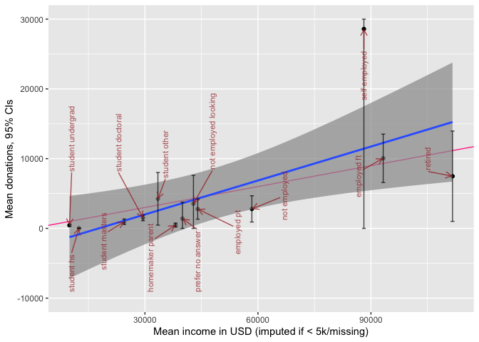

```r
# Todo (low): Plot regression line for full pop
# Todo: HIGH -- get this to look nicer, label it better, add better axis breaks (every 5k for donation, every 20k for income)
#Todo (Medium) -- add plots for the medians
#Todo
```

Donations generally track income by this aggregation, with some groups possibly 'under-performing' or 'over-performing'; we return to this in our [descriptive modeling](#descriptive).\*

::: {.marginnote}
\*Note that thus is reporting means and not medians. The 'self-employed' group clearly reflects outliers, and it's upper CI is truncated at 30000 to save space.
:::

### Donations by country {#don-by-country}

<!-- maybe we should skip ... 2018: by Region of Residence and by City of Residence -->

**Donations and income by country**

We report similar income and donation statistics for all countries with more than 50 respondents:

```{=html}
<!-- Note: I suspect there is 1+ (?inaccurate) donation and income outlier in France that skews the overall mean. I removed it in the data cleaning

Todo  (low): all figures in 1000Usd?


#TODO -- High Priority --  Do a grouped plot instead of just numbers ... average and disperson of income and donations by country, or?
-->
```

```r
(
  don_income_by_ctry <-
    eas_20 %>%
        dplyr::select(income_k_c, donation_2019_c, donation_2020_c, country_big) %>%
        tbl_summary( by = country_big,
                     sort = all_categorical() ~ "frequency", #reverse this ordering or maybe reverse sort by average income
                      type = c(all_continuous()) ~ "continuous2",
      statistic = list(all_continuous() ~ sumstatvec),
        label = doninclabs,
            missing = c("no")
        ) %>%
    bold_labels() %>%
    add_n() %>%
    add_overall()
)
```

```{=html}
<div id="osjccszidh" style="overflow-x:auto;overflow-y:auto;width:auto;height:auto;">
<style>html {
  font-family: -apple-system, BlinkMacSystemFont, 'Segoe UI', Roboto, Oxygen, Ubuntu, Cantarell, 'Helvetica Neue', 'Fira Sans', 'Droid Sans', Arial, sans-serif;
}

#osjccszidh .gt_table {
  display: table;
  border-collapse: collapse;
  margin-left: auto;
  margin-right: auto;
  color: #333333;
  font-size: 16px;
  font-weight: normal;
  font-style: normal;
  background-color: #FFFFFF;
  width: auto;
  border-top-style: solid;
  border-top-width: 2px;
  border-top-color: #A8A8A8;
  border-right-style: none;
  border-right-width: 2px;
  border-right-color: #D3D3D3;
  border-bottom-style: solid;
  border-bottom-width: 2px;
  border-bottom-color: #A8A8A8;
  border-left-style: none;
  border-left-width: 2px;
  border-left-color: #D3D3D3;
}

#osjccszidh .gt_heading {
  background-color: #FFFFFF;
  text-align: center;
  border-bottom-color: #FFFFFF;
  border-left-style: none;
  border-left-width: 1px;
  border-left-color: #D3D3D3;
  border-right-style: none;
  border-right-width: 1px;
  border-right-color: #D3D3D3;
}

#osjccszidh .gt_title {
  color: #333333;
  font-size: 125%;
  font-weight: initial;
  padding-top: 4px;
  padding-bottom: 4px;
  border-bottom-color: #FFFFFF;
  border-bottom-width: 0;
}

#osjccszidh .gt_subtitle {
  color: #333333;
  font-size: 85%;
  font-weight: initial;
  padding-top: 0;
  padding-bottom: 6px;
  border-top-color: #FFFFFF;
  border-top-width: 0;
}

#osjccszidh .gt_bottom_border {
  border-bottom-style: solid;
  border-bottom-width: 2px;
  border-bottom-color: #D3D3D3;
}

#osjccszidh .gt_col_headings {
  border-top-style: solid;
  border-top-width: 2px;
  border-top-color: #D3D3D3;
  border-bottom-style: solid;
  border-bottom-width: 2px;
  border-bottom-color: #D3D3D3;
  border-left-style: none;
  border-left-width: 1px;
  border-left-color: #D3D3D3;
  border-right-style: none;
  border-right-width: 1px;
  border-right-color: #D3D3D3;
}

#osjccszidh .gt_col_heading {
  color: #333333;
  background-color: #FFFFFF;
  font-size: 100%;
  font-weight: normal;
  text-transform: inherit;
  border-left-style: none;
  border-left-width: 1px;
  border-left-color: #D3D3D3;
  border-right-style: none;
  border-right-width: 1px;
  border-right-color: #D3D3D3;
  vertical-align: bottom;
  padding-top: 5px;
  padding-bottom: 6px;
  padding-left: 5px;
  padding-right: 5px;
  overflow-x: hidden;
}

#osjccszidh .gt_column_spanner_outer {
  color: #333333;
  background-color: #FFFFFF;
  font-size: 100%;
  font-weight: normal;
  text-transform: inherit;
  padding-top: 0;
  padding-bottom: 0;
  padding-left: 4px;
  padding-right: 4px;
}

#osjccszidh .gt_column_spanner_outer:first-child {
  padding-left: 0;
}

#osjccszidh .gt_column_spanner_outer:last-child {
  padding-right: 0;
}

#osjccszidh .gt_column_spanner {
  border-bottom-style: solid;
  border-bottom-width: 2px;
  border-bottom-color: #D3D3D3;
  vertical-align: bottom;
  padding-top: 5px;
  padding-bottom: 5px;
  overflow-x: hidden;
  display: inline-block;
  width: 100%;
}

#osjccszidh .gt_group_heading {
  padding: 8px;
  color: #333333;
  background-color: #FFFFFF;
  font-size: 100%;
  font-weight: initial;
  text-transform: inherit;
  border-top-style: solid;
  border-top-width: 2px;
  border-top-color: #D3D3D3;
  border-bottom-style: solid;
  border-bottom-width: 2px;
  border-bottom-color: #D3D3D3;
  border-left-style: none;
  border-left-width: 1px;
  border-left-color: #D3D3D3;
  border-right-style: none;
  border-right-width: 1px;
  border-right-color: #D3D3D3;
  vertical-align: middle;
}

#osjccszidh .gt_empty_group_heading {
  padding: 0.5px;
  color: #333333;
  background-color: #FFFFFF;
  font-size: 100%;
  font-weight: initial;
  border-top-style: solid;
  border-top-width: 2px;
  border-top-color: #D3D3D3;
  border-bottom-style: solid;
  border-bottom-width: 2px;
  border-bottom-color: #D3D3D3;
  vertical-align: middle;
}

#osjccszidh .gt_from_md > :first-child {
  margin-top: 0;
}

#osjccszidh .gt_from_md > :last-child {
  margin-bottom: 0;
}

#osjccszidh .gt_row {
  padding-top: 8px;
  padding-bottom: 8px;
  padding-left: 5px;
  padding-right: 5px;
  margin: 10px;
  border-top-style: solid;
  border-top-width: 1px;
  border-top-color: #D3D3D3;
  border-left-style: none;
  border-left-width: 1px;
  border-left-color: #D3D3D3;
  border-right-style: none;
  border-right-width: 1px;
  border-right-color: #D3D3D3;
  vertical-align: middle;
  overflow-x: hidden;
}

#osjccszidh .gt_stub {
  color: #333333;
  background-color: #FFFFFF;
  font-size: 100%;
  font-weight: initial;
  text-transform: inherit;
  border-right-style: solid;
  border-right-width: 2px;
  border-right-color: #D3D3D3;
  padding-left: 12px;
}

#osjccszidh .gt_summary_row {
  color: #333333;
  background-color: #FFFFFF;
  text-transform: inherit;
  padding-top: 8px;
  padding-bottom: 8px;
  padding-left: 5px;
  padding-right: 5px;
}

#osjccszidh .gt_first_summary_row {
  padding-top: 8px;
  padding-bottom: 8px;
  padding-left: 5px;
  padding-right: 5px;
  border-top-style: solid;
  border-top-width: 2px;
  border-top-color: #D3D3D3;
}

#osjccszidh .gt_grand_summary_row {
  color: #333333;
  background-color: #FFFFFF;
  text-transform: inherit;
  padding-top: 8px;
  padding-bottom: 8px;
  padding-left: 5px;
  padding-right: 5px;
}

#osjccszidh .gt_first_grand_summary_row {
  padding-top: 8px;
  padding-bottom: 8px;
  padding-left: 5px;
  padding-right: 5px;
  border-top-style: double;
  border-top-width: 6px;
  border-top-color: #D3D3D3;
}

#osjccszidh .gt_striped {
  background-color: rgba(128, 128, 128, 0.05);
}

#osjccszidh .gt_table_body {
  border-top-style: solid;
  border-top-width: 2px;
  border-top-color: #D3D3D3;
  border-bottom-style: solid;
  border-bottom-width: 2px;
  border-bottom-color: #D3D3D3;
}

#osjccszidh .gt_footnotes {
  color: #333333;
  background-color: #FFFFFF;
  border-bottom-style: none;
  border-bottom-width: 2px;
  border-bottom-color: #D3D3D3;
  border-left-style: none;
  border-left-width: 2px;
  border-left-color: #D3D3D3;
  border-right-style: none;
  border-right-width: 2px;
  border-right-color: #D3D3D3;
}

#osjccszidh .gt_footnote {
  margin: 0px;
  font-size: 90%;
  padding: 4px;
}

#osjccszidh .gt_sourcenotes {
  color: #333333;
  background-color: #FFFFFF;
  border-bottom-style: none;
  border-bottom-width: 2px;
  border-bottom-color: #D3D3D3;
  border-left-style: none;
  border-left-width: 2px;
  border-left-color: #D3D3D3;
  border-right-style: none;
  border-right-width: 2px;
  border-right-color: #D3D3D3;
}

#osjccszidh .gt_sourcenote {
  font-size: 90%;
  padding: 4px;
}

#osjccszidh .gt_left {
  text-align: left;
}

#osjccszidh .gt_center {
  text-align: center;
}

#osjccszidh .gt_right {
  text-align: right;
  font-variant-numeric: tabular-nums;
}

#osjccszidh .gt_font_normal {
  font-weight: normal;
}

#osjccszidh .gt_font_bold {
  font-weight: bold;
}

#osjccszidh .gt_font_italic {
  font-style: italic;
}

#osjccszidh .gt_super {
  font-size: 65%;
}

#osjccszidh .gt_footnote_marks {
  font-style: italic;
  font-weight: normal;
  font-size: 65%;
}
</style>
<table class="gt_table">
  
  <thead class="gt_col_headings">
    <tr>
      <th class="gt_col_heading gt_columns_bottom_border gt_left" rowspan="1" colspan="1"><strong>Characteristic</strong></th>
      <th class="gt_col_heading gt_columns_bottom_border gt_center" rowspan="1" colspan="1"><strong>N</strong></th>
      <th class="gt_col_heading gt_columns_bottom_border gt_center" rowspan="1" colspan="1"><strong>Overall</strong>, N = 1,607<sup class="gt_footnote_marks">1</sup></th>
      <th class="gt_col_heading gt_columns_bottom_border gt_center" rowspan="1" colspan="1"><strong>Australia</strong>, N = 82</th>
      <th class="gt_col_heading gt_columns_bottom_border gt_center" rowspan="1" colspan="1"><strong>Canada</strong>, N = 59</th>
      <th class="gt_col_heading gt_columns_bottom_border gt_center" rowspan="1" colspan="1"><strong>France</strong>, N = 51</th>
      <th class="gt_col_heading gt_columns_bottom_border gt_center" rowspan="1" colspan="1"><strong>Germany</strong>, N = 123</th>
      <th class="gt_col_heading gt_columns_bottom_border gt_center" rowspan="1" colspan="1"><strong>Netherlands</strong>, N = 51</th>
      <th class="gt_col_heading gt_columns_bottom_border gt_center" rowspan="1" colspan="1"><strong>Other</strong>, N = 402</th>
      <th class="gt_col_heading gt_columns_bottom_border gt_center" rowspan="1" colspan="1"><strong>United Kingdom</strong>, N = 218</th>
      <th class="gt_col_heading gt_columns_bottom_border gt_center" rowspan="1" colspan="1"><strong>USA</strong>, N = 621</th>
    </tr>
  </thead>
  <tbody class="gt_table_body">
    <tr><td class="gt_row gt_left" style="font-weight: bold;">Income in $1000 USD</td>
<td class="gt_row gt_center">1,384</td>
<td class="gt_row gt_center"></td>
<td class="gt_row gt_center"></td>
<td class="gt_row gt_center"></td>
<td class="gt_row gt_center"></td>
<td class="gt_row gt_center"></td>
<td class="gt_row gt_center"></td>
<td class="gt_row gt_center"></td>
<td class="gt_row gt_center"></td>
<td class="gt_row gt_center"></td></tr>
    <tr><td class="gt_row gt_left" style="text-align: left; text-indent: 10px;">Median</td>
<td class="gt_row gt_center"></td>
<td class="gt_row gt_center">33</td>
<td class="gt_row gt_center">36</td>
<td class="gt_row gt_center">27</td>
<td class="gt_row gt_center">13</td>
<td class="gt_row gt_center">17</td>
<td class="gt_row gt_center">15</td>
<td class="gt_row gt_center">22</td>
<td class="gt_row gt_center">36</td>
<td class="gt_row gt_center">50</td></tr>
    <tr><td class="gt_row gt_left" style="text-align: left; text-indent: 10px;">10%-90%</td>
<td class="gt_row gt_center"></td>
<td class="gt_row gt_center">1-130</td>
<td class="gt_row gt_center">7-109</td>
<td class="gt_row gt_center">3-86</td>
<td class="gt_row gt_center">0-42</td>
<td class="gt_row gt_center">2-70</td>
<td class="gt_row gt_center">0-64</td>
<td class="gt_row gt_center">0-83</td>
<td class="gt_row gt_center">3-82</td>
<td class="gt_row gt_center">2-192</td></tr>
    <tr><td class="gt_row gt_left" style="text-align: left; text-indent: 10px;">Mean [se] (SD)</td>
<td class="gt_row gt_center"></td>
<td class="gt_row gt_center">60 [4] (136)</td>
<td class="gt_row gt_center">49 [5] (46)</td>
<td class="gt_row gt_center">41 [6] (42)</td>
<td class="gt_row gt_center">18 [3] (17)</td>
<td class="gt_row gt_center">28 [3] (29)</td>
<td class="gt_row gt_center">31 [6] (38)</td>
<td class="gt_row gt_center">37 [3] (44)</td>
<td class="gt_row gt_center">69 [17] (243)</td>
<td class="gt_row gt_center">85 [6] (146)</td></tr>
    <tr><td class="gt_row gt_left" style="font-weight: bold;">2019 donation (in USD)</td>
<td class="gt_row gt_center">1,397</td>
<td class="gt_row gt_center"></td>
<td class="gt_row gt_center"></td>
<td class="gt_row gt_center"></td>
<td class="gt_row gt_center"></td>
<td class="gt_row gt_center"></td>
<td class="gt_row gt_center"></td>
<td class="gt_row gt_center"></td>
<td class="gt_row gt_center"></td>
<td class="gt_row gt_center"></td></tr>
    <tr><td class="gt_row gt_left" style="text-align: left; text-indent: 10px;">Median</td>
<td class="gt_row gt_center"></td>
<td class="gt_row gt_center">533</td>
<td class="gt_row gt_center">872</td>
<td class="gt_row gt_center">231</td>
<td class="gt_row gt_center">178</td>
<td class="gt_row gt_center">355</td>
<td class="gt_row gt_center">237</td>
<td class="gt_row gt_center">327</td>
<td class="gt_row gt_center">660</td>
<td class="gt_row gt_center">1,000</td></tr>
    <tr><td class="gt_row gt_left" style="text-align: left; text-indent: 10px;">10%-90%</td>
<td class="gt_row gt_center"></td>
<td class="gt_row gt_center">0-9,577</td>
<td class="gt_row gt_center">0-7,271</td>
<td class="gt_row gt_center">0-6,948</td>
<td class="gt_row gt_center">0-3,551</td>
<td class="gt_row gt_center">0-4,971</td>
<td class="gt_row gt_center">0-2,367</td>
<td class="gt_row gt_center">0-6,450</td>
<td class="gt_row gt_center">0-6,600</td>
<td class="gt_row gt_center">0-16,180</td></tr>
    <tr><td class="gt_row gt_left" style="text-align: left; text-indent: 10px;">Mean [se] (SD)</td>
<td class="gt_row gt_center"></td>
<td class="gt_row gt_center">7,348 [1,956] (73,113)</td>
<td class="gt_row gt_center">3,647 [971] (8,411)</td>
<td class="gt_row gt_center">2,753 [930] (6,769)</td>
<td class="gt_row gt_center">1,178 [283] (1,919)</td>
<td class="gt_row gt_center">1,582 [273] (2,850)</td>
<td class="gt_row gt_center">925 [226] (1,536)</td>
<td class="gt_row gt_center">4,069 [1,777] (31,444)</td>
<td class="gt_row gt_center">21,019 [12,693] (182,619)</td>
<td class="gt_row gt_center">7,211 [864] (20,215)</td></tr>
    <tr><td class="gt_row gt_left" style="font-weight: bold;">2020 planned donation</td>
<td class="gt_row gt_center">1,377</td>
<td class="gt_row gt_center"></td>
<td class="gt_row gt_center"></td>
<td class="gt_row gt_center"></td>
<td class="gt_row gt_center"></td>
<td class="gt_row gt_center"></td>
<td class="gt_row gt_center"></td>
<td class="gt_row gt_center"></td>
<td class="gt_row gt_center"></td>
<td class="gt_row gt_center"></td></tr>
    <tr><td class="gt_row gt_left" style="text-align: left; text-indent: 10px;">Median</td>
<td class="gt_row gt_center"></td>
<td class="gt_row gt_center">1,000</td>
<td class="gt_row gt_center">1,636</td>
<td class="gt_row gt_center">761</td>
<td class="gt_row gt_center">473</td>
<td class="gt_row gt_center">947</td>
<td class="gt_row gt_center">395</td>
<td class="gt_row gt_center">592</td>
<td class="gt_row gt_center">1,320</td>
<td class="gt_row gt_center">2,000</td></tr>
    <tr><td class="gt_row gt_left" style="text-align: left; text-indent: 10px;">10%-90%</td>
<td class="gt_row gt_center"></td>
<td class="gt_row gt_center">0-12,020</td>
<td class="gt_row gt_center">11-12,360</td>
<td class="gt_row gt_center">0-8,676</td>
<td class="gt_row gt_center">0-4,660</td>
<td class="gt_row gt_center">17-5,823</td>
<td class="gt_row gt_center">0-4,438</td>
<td class="gt_row gt_center">0-7,000</td>
<td class="gt_row gt_center">0-7,867</td>
<td class="gt_row gt_center">0-21,000</td></tr>
    <tr><td class="gt_row gt_left" style="text-align: left; text-indent: 10px;">Mean [se] (SD)</td>
<td class="gt_row gt_center"></td>
<td class="gt_row gt_center">9,831 [2,001] (74,249)</td>
<td class="gt_row gt_center">4,852 [964] (8,404)</td>
<td class="gt_row gt_center">2,909 [844] (6,142)</td>
<td class="gt_row gt_center">2,026 [514] (3,450)</td>
<td class="gt_row gt_center">2,216 [360] (3,692)</td>
<td class="gt_row gt_center">1,358 [280] (1,901)</td>
<td class="gt_row gt_center">3,515 [604] (10,654)</td>
<td class="gt_row gt_center">24,930 [11,970] (170,546)</td>
<td class="gt_row gt_center">12,033 [2,345] (54,382)</td></tr>
  </tbody>
  
  <tfoot>
    <tr class="gt_footnotes">
      <td colspan="11">
        <p class="gt_footnote">
          <sup class="gt_footnote_marks">
            <em>1</em>
          </sup>
           
          c(&quot;Median&quot;, &quot;10%-90%&quot;, &quot;Mean [se] (SD)&quot;)
          <br />
        </p>
      </td>
    </tr>
  </tfoot>
</table>
</div>
```

```r
#todo (medium?): make a stem-leaf thing here

#todo  (High): add *medians* to the above
```


```r
  # don_inc_status_plot <- eas_20 %>%
  # dplyr::select(status_, donation_2019_c, income_k_c) %>%
  # group_by(status_) %>%
  #     drop_na(status_, donation_2019_c, income_k_c) %>%
  #     summarise(across(c(donation_2019_c, income_k_c),
  #                     list(mean=mean,
  #                          median=median,
  #                          se = ~sd(.x)/sqrt(length(.x))))) %>%
  #   group_by(status_) %>%
p_load(ggimage)

country_codes <- tibble(country = c("Australia", "Canada", "France", "Germany", "Netherlands", "Other", "United Kingdom", "USA"),
                        code = c("ac", "ca", "fr", "de", "nl", "yt", "gb", "us"))

(
  don_inc_country_plot <-  eas_20 %>%
  grp_sum(income_c_imp_bc5k, donation_2019_c, country_big) %>%
  left_join(., country_codes, by = c("country_big" = "country")) %>%
  plot_grp(country_big) +
  xlab("Mean income in USD (imputed if <5k/missing)") +
  ylab("Mean donations, CIs") +
     scale_y_continuous(limits=c(-3000, 30000),  oob = scales::squish)
)
```

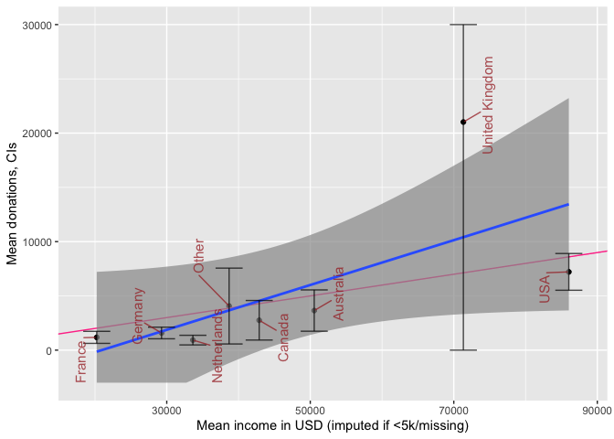

```r
  #+ggimage::geom_flag()
```

Above, we plot donations and income by country of residence for the countries with the largest number of EA respondents. We fit a simple best-fit (least-squares) line in blue, and add a red line depicting a 10% donation rate. Again, donations generally track income, with some under and over-performers (see later modeling). The UK clearly contains some notable donation outliers, leading to very large confidence intervals for the UK mean (truncated above at 30000 USD).


```r
plot_box_pt_viol <- function(df, yvar, groupvar, notch=TRUE) {
  df %>%
   dplyr::select({{yvar}}, {{groupvar}}) %>%
      ggplot() +
      aes({{groupvar}}, {{yvar}}) +
    geom_point(size = 0.30, colour = "grey", position = position_jitter(seed = 42,  width = 0.3, height = 0.01)) +
      geom_boxplot(alpha=0.7, notch=notch,  color="black") +
      geom_violin(alpha=0.4, color = "pink") +
scatter_theme +
  scale_y_log10()
}

(
  don_by_country_viol_20 <-  eas_20 %>%
       plot_box_pt_viol(donation_2019_c, country_big, notch=TRUE) +
  labs(title = "Donation amounts by country (2019)")
)

(
  don_by_country_viol_all <-  eas_all %>%
           plot_box_pt_viol(donation_usd, where_live_cat, notch=TRUE) +
  labs(title = "Donation amounts by country grouping (2013-2019)")
)


(
  don_by_yr_viol_all <-  eas_all %>%
    mutate(year=as.factor(year)) %>%
    plot_box_pt_viol(donation_usd, where_live_cat, year) +
      ggplot() +
  labs(title = "Donation amounts by year")
)
```

### Donations, age and years in EA {.unnumbered}

Next, we consider how donations may increase or decrease with 'time-in-EA' (i.e., 'tenure'). As discussed in [other posts](https://forum.effectivealtruism.org/posts/4xczoALF6adpQk3TN/ea-survey-2020-engagement#__Selection_and_differential_attrition__focus_on_recent__2017_2019__recruits___) and [bookdown chapters](https://rethinkpriorities.github.io/ea_data_public/eas-engagement.html#why-do-we-care-about-engagement), this may be reflecting differences in *who* stays in EA (and continues responding to the survey) as much as it reflects how people themselves change from year to year.

Below, we plot donations by tenure, breaking this down by age groups.

<!-- use or skip? Maybe all of this should simply be in a (regression-type) model? -->

<!-- todo (medium): try redoing the comparable faceted plots we did for engagement, swapping in a donation variable? done a bit, clean and improve?-->


```r
(
don_by_tenure_facet_age <-
  eas_all %>%
  filter(year==2020) %>%
  filter(!is.na(age_ranges)) %>%
  ggplot() +
  aes(x = tenure, y = donation_usd_min50) +
 geom_point(size = 0.15, colour = "#0c4c8a", position = position_jitter(seed = 42,  width = 0.1, height = 0.001)) +
  geom_smooth(span = 0.75) +
  scatter_theme +
  facet_grid(vars(), vars(age_ranges), scales = "free") +
labs(title = "2019 donation by time in EA",
     subtitle = "Faceted by Age ranges") +
    labs(x = get_label(eas_20$tenure)) +
  scale_y_don
) %>%
  ggplotly
```

```{=html}
<div id="htmlwidget-d47754679ae4d1e301df" style="width:80%;height:480px;" class="plotly html-widget"></div>
<script type="application/json" data-for="htmlwidget-d47754679ae4d1e301df">{"x":{"data":[{"x":[0.0829612086992711,1.04731766292825,1.04101295680739,0.951085764868185,1.08080627745949,1.08933364651166,2.98939392562024,3.04751912355423,0.0665832160506397,3.98715431699529,-0.0925137934274972,1.09151531932876,1.02376764146611,0.907787298224866,-0.062105212919414,3.0656316970475,0.948108947928995,1.93948206845671,1.01632080050185,1.02524906890467,5.02242661803029,0.971344399871305,0.946704705106095,-0.0839471066836268,4.99281391026452,4.04670559191145,2.0634460888803,0.0557618997059763,0.03571857358329,4.90581716378219,0.0360328356269747,0.996062025800347,1.08361128345132,2.96339504756033,0.0462630954571068,0.0770235374104232,0.931576020084321,2.98846492776647,0.0935467334464193,0.00840318817645311,-0.00973782995715737,2.96141088008881,1.90966935534962,0.949134829454124,3.0608786625322,0.914144378853962,0.942278387770057,0.93189397091046,0.0881129756104201,1.96684626531787,-0.0460567643400282,1.00614881562069,0.904290045704693,0.922067020041868,1.92704609981738,0.0773507196456194,0.927259165048599,2.99066068283282,-0.0192434370517731,0.973580364044756,3.96789701674134,1.96305215936154,1.05141112050042,1.96550120441243,-0.0215643086005002,1.9317693549674,-0.0386068759486079,0.918614934384823,2.95936928135343,3.01296444451436,2.04448184287176,3.958443904249,0.0908868476748466,1.04797815517522,0.03710419065319,-0.00589987467974425,6.02317420518957,1.09329547672532,-0.0783022691030055,0.0659447030164302,3.98375432486646,1.91685550464317,2.92918573813513,-0.06943224593997,0.0555772520136088,1.98529325993732,1.91200966723263,0.00283147441223264,3.96018123030663,1.96138404407538,0.0691472312435508,1.08225689074025,2.08121019145474,2.05717621534131,-0.00997253176756203,1.06907860678621,3.9230724025052,2.92931447885931,3.95060049388558,3.96107986560091,2.06677266750485,3.99569377740845,-0.0466958843171597,4.00486142318696,0.0518516339361668,2.0809796795249,1.92750355172902,4.07715877545998,-0.0302380335051566,1.05188894453458,0.949170669587329,0.941657090932131,1.04296975722536,-0.0392294476274401,1.00311023639515,2.99559015464038,0.0537704449146986,1.00492865755223,0.964764404762536,2.01721770041622,-0.0552099974825978,2.03951067337766,-0.0147070155479014,4.94841162380762,2.92161931958981,-0.0768365715164691,3.01500081350096,0.940918541327119,0.0647888492792845,1.95746411751024,1.9548239082098,3.99829049850814,-0.0750606292393059,1.00968416570686,2.07528693978675,2.0824059958104,1.04342774446122,1.05361539288424,-0.0404200397897512,0.0475544309709221,1.95963045652024,-0.0604016146156937,1.98078138725832,4.09415359273553,0.0829056046437472,3.97822169936262,3.04124211412854,6.03729910771362,-0.0603998844977468,4.04500484527089,0.0837715520057827,0.0381761700846255,0.978004799550399,-0.0957607395481318,2.06481634569354,0.928081976529211,1.02306881542318,3.00830569374375,0.909628099855036,3.94369512763806,3.91118751373142,-0.0194607459940016,2.02115874765441,5.06138662938029,2.93430826961994,2.00423241853714,3.03389015155844,1.08647664743476,1.98692449838854,1.08724652337842,0.0956605256069452,3.96377928578295,-0.0877880186308175,-0.00471513210795819,2.08506799275056,-0.0441460027359426,0.97418428324163,2.97646378967911,0.97805955093354,1.9140587518923,0.965502223372459,4.92671037968248,2.05841414364986,0.977023809123784,2.02388485562988,1.06048246622086,0.0801930584479123,null,2.98075290210545,1.91190135329962,-0.0247841827571392,4.04261918836273,0.906075407704338,1.99425529926084,0.0774070033337921,1.07649162942544,2.00965139949694,1.99910465823486,-0.0985164953861386,1.99980401978828,-0.0955545358359814,2.01298211016692,-0.0921153505798429,1.90932163777761,0.0958780293352902,-0.0659055572468787,-0.0278838316909969,1.99694930631667,2.91717924550176,0.0889826374128461,1.96934275436215,0.017743040015921,1.95459226388484,2.92619378729723,0.0390961566008627,2.97839327938855,4.08984104669653,2.94806626900099,1.9091163052246,-0.0272030697669834,0.0449802827090025,5.91737404731102,2.02546453555115,3.06199389742687,3.04894585921429,2.00714285303839,-0.0302921328693628,1.06665867553093,0.904466208070517,0.00604477617889643,-0.0342457902617753,2.07041045203805,1.99357044454664,0.0664443593472242,-0.0917665279470384,-0.0513271898496896,2.99981361753307,1.01207715230994,0.922622753679752,1.06955817150883,0.989363888371736,3.08347459500656,1.95089189941064,-0.0944808427244425,-0.0374777923803777,2.06578538781032,1.05983451413922,1.0275875180494,1.99758112113923,1.98049877495505,-0.0334771031048149,0.035843558749184,2.04342732420191,1.98175478801131,2.08362902915105,-0.0492023184895515,1.03125853925012,-0.0731414248235524,0.0356129119172692,2.01623575524427,2.07912125568837,1.98455709004775,0.0855385544709861,-0.0510904872324318,2.92233381988481,0.00932239778339863,4.00022118748166,3.95533116627485,3.92957708784379,1.95652526854537,-0.00249107060953975,-0.0279699333012104,5.07437847675756,-0.061182229872793,2.04603131627664,-0.0576831002254039,2.90283228275366,0.0471227664966136,0.991274022543803,2.09162907507271,3.05517879859544,2.09691394590773,0.0741445390507579,0.0830218981485814,-0.0516141008585691,2.02167165772989,0.0731745186727494,1.08450298337266,1.01375575824641,3.90444913590327,1.03254118855111,2.92311466182582,2.05415248479694,-0.00793434740044177,1.06760531435721,0.0985505262389779,6.03140867650509,0.0457615438383073,0.0138704693876207,0.0162391799967736,2.99847288085148,0.0256180809810758,3.04811959005892,0.981280656065792,0.991657871752977,0.0116490019019693,0.921748448582366,0.055624431045726,4.92942318301648,1.96590518173762,3.99521980439313,0.00388732692226768,-0.0772647512611002],"y":[2.34101726995292,null,null,1.6993536615726,1.6994842498573,null,2.47613731428735,null,null,null,null,2.24981390512538,2.87409853158514,1.6999498570925,null,1.69924276456288,2.32818531797921,2.07404267079797,null,null,null,2.07314094956027,2.07226431180811,null,1.69907620939803,2.54981073419596,null,null,1.69900789377097,1.69988517603469,2.47806499806546,3.39877994581367,null,2.69915438998355,2.34742639345989,2.0577368378894,1.69930882009542,2.42060701546425,null,1.69906953121633,1.6997647099798,2.30166184875365,null,2.30118204809395,2.69983090995349,1.69951533454055,1.77266862593959,2.3009677135618,null,null,null,null,null,2.37502024649247,2.77720758870599,1.6996374088284,null,null,null,1.83736266314131,1.99950725240447,null,null,null,1.99950938618742,2.07376458898926,null,1.69968795733856,1.69984020116697,2.15166857305189,2.07347295476584,2.39839137653735,2.00044766234234,null,null,1.69965746172009,2.85618495007345,null,null,null,null,2.00034648044594,1.89962954453159,2.19952053240835,null,2.11983738640632,2.6652574123932,2.03675960321757,null,null,1.69917716330015,2.00091739586741,null,null,1.69946077714445,2.6984195703031,1.69897940703718,2.30141007392523,2.3626313003242,2.55117027728245,2.30063830586332,1.69957659511133,null,null,3.59833344213914,2.81996051793626,2.75602741460563,2.77877911554027,2.69836453361441,3.17543848830918,1.69952636055373,2.37500122132502,1.69922499355166,1.6994217847465,2.81919807101494,null,null,1.69971040023262,1.69931735575576,1.69967408377588,null,2.36103832141023,null,2.30193576258277,2.95970576768768,null,null,2.96406407380523,null,3.11209641204238,3.00071235216223,3.47792942320621,2.51632195885912,null,2.07254764813039,2.29656836476896,1.69996155855669,1.6999307122203,2.00094324274082,null,null,1.69976009403592,3.17328067270973,null,null,1.69954726558509,2.54983087326758,1.69976249292637,null,2.0722272860398,null,1.6995654029651,1.69951233736849,1.69931066397349,4.1172081745669,3.07506997987492,2.8746296967179,2.25975547497439,null,2.5441371914584,null,null,2.91862114662591,3.30178649766646,null,3.64976757187894,2.77226219983255,2.94075662281553,2.69887988166003,1.69936984265088,null,2.90367207828431,2.33925086183781,null,null,null,2.69899585189302,3.30155278491271,null,2.60175787457676,2.67504623534782,null,3.39748681379258,2.6961669639421,2.37424929867708,null,null,2.88203498124734,1.9999425829188,2.0228281703174,null,2.94849996342368,null,2.89954388564791,1.69948620951925,2.12134721974872,null,null,2.47183968007457,1.69958512122095,null,3.39799975829999,2.4223025945545,null,null,1.69975285015446,1.83581037751616,2.07317946708849,2.65369901950485,null,1.69951326142256,null,null,2.66375827378277,2.29615442287151,null,null,null,2.07370744066447,2.3002654080479,2.00061009709118,null,null,null,1.69929329282003,2.02775500434969,null,2.17676381963855,2.46438681943921,null,2.73661698852879,3.12057853637386,2.0000371300187,null,1.86251637745474,2.37370011455496,null,null,null,3.40625984285862,null,2.69969702958087,1.77294219089714,2.00004729602765,2.84145621100666,2.3649912045741,1.69911556082456,null,3.39798357748621,3.30098352863775,1.69962531839315,1.69948750285948,null,null,1.85115823405586,null,1.99900947975367,null,1.69925318109947,2.19908300955509,2.00068630228285,2.30082676016861,null,3.17584064361537,1.69909016462606,2.6989863771764,2.60219392093915,3.17653783547896,null,2.07377582138911,1.69993963376856,2.43739938659023,1.69965392389665,1.69971568074128,3.00081243293406,1.69950375897441,1.69950232830089,1.69900263599683,2.30166974039744,2.00050021404913,null,2.91851661262342,null,null,2.11676771959469,null,null,null,null,3.4766874917409,1.69979058690839,2.07340062092379,2.47737241895903,null,null,null,1.69953487940928,1.69900598078225,null,2.11922081354393,3.072663344297,null,2.94019557185101,2.73581183718228,null,null,null,1.88177555347415,3.30158249435849,2.07294652989641,2.30063556600311,1.69920061450363,null],"text":["tenure:  0<br />donation_usd_min50:     219.08","tenure:  1<br />donation_usd_min50:         NA","tenure:  1<br />donation_usd_min50:         NA","tenure:  1<br />donation_usd_min50:      50.00","tenure:  1<br />donation_usd_min50:      50.00","tenure:  1<br />donation_usd_min50:         NA","tenure:  3<br />donation_usd_min50:     300.00","tenure:  3<br />donation_usd_min50:         NA","tenure:  0<br />donation_usd_min50:         NA","tenure:  4<br />donation_usd_min50:         NA","tenure:  0<br />donation_usd_min50:         NA","tenure:  1<br />donation_usd_min50:     177.53","tenure:  1<br />donation_usd_min50:     750.00","tenure:  1<br />donation_usd_min50:      50.00","tenure:  0<br />donation_usd_min50:         NA","tenure:  3<br />donation_usd_min50:      50.00","tenure:  1<br />donation_usd_min50:     213.04","tenure:  2<br />donation_usd_min50:     118.35","tenure:  1<br />donation_usd_min50:      50.00","tenure:  1<br />donation_usd_min50:         NA","tenure:  5<br />donation_usd_min50:         NA","tenure:  1<br />donation_usd_min50:     118.35","tenure:  1<br />donation_usd_min50:     118.35","tenure:  0<br />donation_usd_min50:      50.00","tenure:  5<br />donation_usd_min50:      50.00","tenure:  4<br />donation_usd_min50:     355.06","tenure:  2<br />donation_usd_min50:         NA","tenure:  0<br />donation_usd_min50:      50.00","tenure:  0<br />donation_usd_min50:      50.00","tenure:  5<br />donation_usd_min50:      50.00","tenure:  0<br />donation_usd_min50:     300.00","tenure:  1<br />donation_usd_min50:    2500.00","tenure:  1<br />donation_usd_min50:      50.00","tenure:  3<br />donation_usd_min50:     500.00","tenure:  0<br />donation_usd_min50:     222.51","tenure:  0<br />donation_usd_min50:     114.15","tenure:  1<br />donation_usd_min50:      50.00","tenure:  3<br />donation_usd_min50:     264.00","tenure:  0<br />donation_usd_min50:      50.00","tenure:  0<br />donation_usd_min50:      50.00","tenure:  0<br />donation_usd_min50:      50.00","tenure:  3<br />donation_usd_min50:     200.00","tenure:  2<br />donation_usd_min50:      50.00","tenure:  1<br />donation_usd_min50:     200.00","tenure:  3<br />donation_usd_min50:     500.00","tenure:  1<br />donation_usd_min50:      50.00","tenure:  1<br />donation_usd_min50:      59.18","tenure:  1<br />donation_usd_min50:     200.00","tenure:  0<br />donation_usd_min50:         NA","tenure:  2<br />donation_usd_min50:         NA","tenure:  0<br />donation_usd_min50:         NA","tenure:  1<br />donation_usd_min50:         NA","tenure:  1<br />donation_usd_min50:         NA","tenure:  1<br />donation_usd_min50:     236.71","tenure:  2<br />donation_usd_min50:     600.00","tenure:  0<br />donation_usd_min50:      50.00","tenure:  1<br />donation_usd_min50:      50.00","tenure:  3<br />donation_usd_min50:      50.00","tenure:  0<br />donation_usd_min50:         NA","tenure:  1<br />donation_usd_min50:      68.64","tenure:  4<br />donation_usd_min50:     100.00","tenure:  2<br />donation_usd_min50:      50.00","tenure:  1<br />donation_usd_min50:         NA","tenure:  2<br />donation_usd_min50:      50.00","tenure:  0<br />donation_usd_min50:     100.00","tenure:  2<br />donation_usd_min50:     118.35","tenure:  0<br />donation_usd_min50:         NA","tenure:  1<br />donation_usd_min50:      50.00","tenure:  3<br />donation_usd_min50:      50.00","tenure:  3<br />donation_usd_min50:     142.02","tenure:  2<br />donation_usd_min50:     118.35","tenure:  4<br />donation_usd_min50:     250.00","tenure:  0<br />donation_usd_min50:     100.00","tenure:  1<br />donation_usd_min50:         NA","tenure:  0<br />donation_usd_min50:         NA","tenure:  0<br />donation_usd_min50:      50.00","tenure:  6<br />donation_usd_min50:     719.00","tenure:  1<br />donation_usd_min50:         NA","tenure:  0<br />donation_usd_min50:      50.00","tenure:  0<br />donation_usd_min50:         NA","tenure:  4<br />donation_usd_min50:      50.00","tenure:  2<br />donation_usd_min50:     100.00","tenure:  3<br />donation_usd_min50:      79.20","tenure:  0<br />donation_usd_min50:     158.40","tenure:  0<br />donation_usd_min50:         NA","tenure:  2<br />donation_usd_min50:     132.00","tenure:  2<br />donation_usd_min50:     462.00","tenure:  0<br />donation_usd_min50:     109.06","tenure:  4<br />donation_usd_min50:         NA","tenure:  2<br />donation_usd_min50:         NA","tenure:  0<br />donation_usd_min50:      50.00","tenure:  1<br />donation_usd_min50:     100.00","tenure:  2<br />donation_usd_min50:      50.00","tenure:  2<br />donation_usd_min50:      50.00","tenure:  0<br />donation_usd_min50:      50.00","tenure:  1<br />donation_usd_min50:     500.00","tenure:  4<br />donation_usd_min50:      50.00","tenure:  3<br />donation_usd_min50:     200.00","tenure:  4<br />donation_usd_min50:     230.00","tenure:  4<br />donation_usd_min50:     355.06","tenure:  2<br />donation_usd_min50:     200.00","tenure:  4<br />donation_usd_min50:      50.00","tenure:  0<br />donation_usd_min50:      50.00","tenure:  4<br />donation_usd_min50:      50.00","tenure:  0<br />donation_usd_min50:    3960.00","tenure:  2<br />donation_usd_min50:     660.00","tenure:  2<br />donation_usd_min50:     571.00","tenure:  4<br />donation_usd_min50:     600.00","tenure:  0<br />donation_usd_min50:     500.00","tenure:  1<br />donation_usd_min50:    1500.00","tenure:  1<br />donation_usd_min50:      50.00","tenure:  1<br />donation_usd_min50:     236.71","tenure:  1<br />donation_usd_min50:      50.00","tenure:  0<br />donation_usd_min50:      50.00","tenure:  1<br />donation_usd_min50:     660.00","tenure:  3<br />donation_usd_min50:         NA","tenure:  0<br />donation_usd_min50:      50.00","tenure:  1<br />donation_usd_min50:      50.00","tenure:  1<br />donation_usd_min50:      50.00","tenure:  2<br />donation_usd_min50:      50.00","tenure:  0<br />donation_usd_min50:         NA","tenure:  2<br />donation_usd_min50:     230.03","tenure:  0<br />donation_usd_min50:         NA","tenure:  5<br />donation_usd_min50:     200.00","tenure:  3<br />donation_usd_min50:     913.21","tenure:  0<br />donation_usd_min50:      50.00","tenure:  3<br />donation_usd_min50:         NA","tenure:  1<br />donation_usd_min50:     920.46","tenure:  0<br />donation_usd_min50:      50.00","tenure:  2<br />donation_usd_min50:    1293.60","tenure:  2<br />donation_usd_min50:    1000.00","tenure:  4<br />donation_usd_min50:    2999.00","tenure:  0<br />donation_usd_min50:     328.62","tenure:  1<br />donation_usd_min50:         NA","tenure:  2<br />donation_usd_min50:     118.35","tenure:  2<br />donation_usd_min50:     198.00","tenure:  1<br />donation_usd_min50:      50.00","tenure:  1<br />donation_usd_min50:      50.00","tenure:  0<br />donation_usd_min50:     100.00","tenure:  0<br />donation_usd_min50:      50.00","tenure:  2<br />donation_usd_min50:      50.00","tenure:  0<br />donation_usd_min50:      50.00","tenure:  2<br />donation_usd_min50:    1491.60","tenure:  4<br />donation_usd_min50:      50.00","tenure:  0<br />donation_usd_min50:         NA","tenure:  4<br />donation_usd_min50:      50.00","tenure:  3<br />donation_usd_min50:     355.06","tenure:  6<br />donation_usd_min50:      50.00","tenure:  0<br />donation_usd_min50:      50.00","tenure:  4<br />donation_usd_min50:     118.35","tenure:  0<br />donation_usd_min50:         NA","tenure:  0<br />donation_usd_min50:      50.00","tenure:  1<br />donation_usd_min50:      50.00","tenure:  0<br />donation_usd_min50:      50.00","tenure:  2<br />donation_usd_min50:   13087.08","tenure:  1<br />donation_usd_min50:    1188.00","tenure:  1<br />donation_usd_min50:     750.00","tenure:  3<br />donation_usd_min50:     181.76","tenure:  1<br />donation_usd_min50:         NA","tenure:  4<br />donation_usd_min50:     350.00","tenure:  4<br />donation_usd_min50:      50.00","tenure:  0<br />donation_usd_min50:         NA","tenure:  2<br />donation_usd_min50:     828.48","tenure:  5<br />donation_usd_min50:    2000.00","tenure:  3<br />donation_usd_min50:         NA","tenure:  2<br />donation_usd_min50:    4473.78","tenure:  3<br />donation_usd_min50:     591.77","tenure:  1<br />donation_usd_min50:     872.47","tenure:  2<br />donation_usd_min50:     500.00","tenure:  1<br />donation_usd_min50:      50.00","tenure:  0<br />donation_usd_min50:      50.00","tenure:  4<br />donation_usd_min50:     800.00","tenure:  0<br />donation_usd_min50:     218.12","tenure:  0<br />donation_usd_min50:      50.00","tenure:  2<br />donation_usd_min50:      50.00","tenure:  0<br />donation_usd_min50:      50.00","tenure:  1<br />donation_usd_min50:     500.00","tenure:  3<br />donation_usd_min50:    2000.00","tenure:  1<br />donation_usd_min50:         NA","tenure:  2<br />donation_usd_min50:     400.00","tenure:  1<br />donation_usd_min50:     473.42","tenure:  5<br />donation_usd_min50:         NA","tenure:  2<br />donation_usd_min50:    2500.00","tenure:  1<br />donation_usd_min50:     496.59","tenure:  2<br />donation_usd_min50:     236.71","tenure:  1<br />donation_usd_min50:      50.00","tenure:  0<br />donation_usd_min50:      50.00","tenure: NA<br />donation_usd_min50:     761.01","tenure:  3<br />donation_usd_min50:     100.00","tenure:  2<br />donation_usd_min50:     105.60","tenure:  0<br />donation_usd_min50:      50.00","tenure:  4<br />donation_usd_min50:     887.66","tenure:  1<br />donation_usd_min50:         NA","tenure:  2<br />donation_usd_min50:     792.00","tenure:  0<br />donation_usd_min50:      50.00","tenure:  1<br />donation_usd_min50:     132.00","tenure:  2<br />donation_usd_min50:         NA","tenure:  2<br />donation_usd_min50:      50.00","tenure:  0<br />donation_usd_min50:     295.88","tenure:  2<br />donation_usd_min50:      50.00","tenure:  0<br />donation_usd_min50:         NA","tenure:  2<br />donation_usd_min50:    2500.00","tenure:  0<br />donation_usd_min50:     265.00","tenure:  2<br />donation_usd_min50:      50.00","tenure:  0<br />donation_usd_min50:         NA","tenure:  0<br />donation_usd_min50:      50.00","tenure:  0<br />donation_usd_min50:      68.43","tenure:  2<br />donation_usd_min50:     118.35","tenure:  3<br />donation_usd_min50:     451.44","tenure:  0<br />donation_usd_min50:         NA","tenure:  2<br />donation_usd_min50:      50.00","tenure:  0<br />donation_usd_min50:      50.00","tenure:  2<br />donation_usd_min50:         NA","tenure:  3<br />donation_usd_min50:     462.00","tenure:  0<br />donation_usd_min50:     198.00","tenure:  3<br />donation_usd_min50:      50.00","tenure:  4<br />donation_usd_min50:      50.00","tenure:  3<br />donation_usd_min50:         NA","tenure:  2<br />donation_usd_min50:     118.35","tenure:  0<br />donation_usd_min50:     200.00","tenure:  0<br />donation_usd_min50:     100.00","tenure:  6<br />donation_usd_min50:      50.00","tenure:  2<br />donation_usd_min50:      50.00","tenure:  3<br />donation_usd_min50:         NA","tenure:  3<br />donation_usd_min50:      50.00","tenure:  2<br />donation_usd_min50:     106.52","tenure:  0<br />donation_usd_min50:      50.00","tenure:  1<br />donation_usd_min50:     150.00","tenure:  1<br />donation_usd_min50:     290.82","tenure:  0<br />donation_usd_min50:      50.00","tenure:  0<br />donation_usd_min50:     545.29","tenure:  2<br />donation_usd_min50:    1320.00","tenure:  2<br />donation_usd_min50:     100.00","tenure:  0<br />donation_usd_min50:      50.00","tenure:  0<br />donation_usd_min50:      72.71","tenure:  0<br />donation_usd_min50:     236.71","tenure:  3<br />donation_usd_min50:      50.00","tenure:  1<br />donation_usd_min50:         NA","tenure:  1<br />donation_usd_min50:         NA","tenure:  1<br />donation_usd_min50:    2544.61","tenure:  1<br />donation_usd_min50:      50.00","tenure:  3<br />donation_usd_min50:     500.00","tenure:  2<br />donation_usd_min50:      59.18","tenure:  0<br />donation_usd_min50:     100.00","tenure:  0<br />donation_usd_min50:     694.49","tenure:  2<br />donation_usd_min50:     231.35","tenure:  1<br />donation_usd_min50:      50.00","tenure:  1<br />donation_usd_min50:      50.00","tenure:  2<br />donation_usd_min50:    2500.00","tenure:  2<br />donation_usd_min50:    2000.00","tenure:  0<br />donation_usd_min50:      50.00","tenure:  0<br />donation_usd_min50:      50.00","tenure:  2<br />donation_usd_min50:         NA","tenure:  2<br />donation_usd_min50:         NA","tenure:  2<br />donation_usd_min50:      71.01","tenure:  0<br />donation_usd_min50:      50.00","tenure:  1<br />donation_usd_min50:     100.00","tenure:  0<br />donation_usd_min50:         NA","tenure:  0<br />donation_usd_min50:      50.00","tenure:  2<br />donation_usd_min50:     158.40","tenure:  2<br />donation_usd_min50:     100.00","tenure:  2<br />donation_usd_min50:     200.00","tenure:  0<br />donation_usd_min50:      50.00","tenure:  0<br />donation_usd_min50:    1500.00","tenure:  3<br />donation_usd_min50:      50.00","tenure:  0<br />donation_usd_min50:     500.00","tenure:  4<br />donation_usd_min50:     400.00","tenure:  4<br />donation_usd_min50:    1499.00","tenure:  4<br />donation_usd_min50:      50.00","tenure:  2<br />donation_usd_min50:     118.35","tenure:  0<br />donation_usd_min50:      50.00","tenure:  0<br />donation_usd_min50:     273.85","tenure:  5<br />donation_usd_min50:      50.00","tenure:  0<br />donation_usd_min50:      50.00","tenure:  2<br />donation_usd_min50:    1000.00","tenure:  0<br />donation_usd_min50:      50.00","tenure:  3<br />donation_usd_min50:      50.00","tenure:  0<br />donation_usd_min50:      50.00","tenure:  1<br />donation_usd_min50:     200.00","tenure:  2<br />donation_usd_min50:     100.00","tenure:  3<br />donation_usd_min50:      50.00","tenure:  2<br />donation_usd_min50:     828.48","tenure:  0<br />donation_usd_min50:         NA","tenure:  0<br />donation_usd_min50:         NA","tenure:  0<br />donation_usd_min50:     130.87","tenure:  2<br />donation_usd_min50:      50.00","tenure:  0<br />donation_usd_min50:      50.00","tenure:  1<br />donation_usd_min50:         NA","tenure:  1<br />donation_usd_min50:         NA","tenure:  4<br />donation_usd_min50:    3000.00","tenure:  1<br />donation_usd_min50:      50.00","tenure:  3<br />donation_usd_min50:     118.35","tenure:  2<br />donation_usd_min50:     300.00","tenure:  0<br />donation_usd_min50:      50.00","tenure:  1<br />donation_usd_min50:         NA","tenure:  0<br />donation_usd_min50:      50.00","tenure:  6<br />donation_usd_min50:      50.00","tenure:  0<br />donation_usd_min50:      50.00","tenure:  0<br />donation_usd_min50:         NA","tenure:  0<br />donation_usd_min50:     131.45","tenure:  3<br />donation_usd_min50:    1183.54","tenure:  0<br />donation_usd_min50:         NA","tenure:  3<br />donation_usd_min50:     872.47","tenure:  1<br />donation_usd_min50:     545.30","tenure:  1<br />donation_usd_min50:      50.00","tenure:  0<br />donation_usd_min50:         NA","tenure:  1<br />donation_usd_min50:      50.00","tenure:  0<br />donation_usd_min50:      76.10","tenure:  5<br />donation_usd_min50:    2000.00","tenure:  2<br />donation_usd_min50:     118.35","tenure:  4<br />donation_usd_min50:     200.00","tenure:  0<br />donation_usd_min50:      50.00","tenure:  0<br />donation_usd_min50:         NA"],"type":"scatter","mode":"markers","marker":{"autocolorscale":false,"color":"rgba(12,76,138,1)","opacity":1,"size":0.566929133858268,"symbol":"circle","line":{"width":1.88976377952756,"color":"rgba(12,76,138,1)"}},"hoveron":"points","showlegend":false,"xaxis":"x","yaxis":"y","hoverinfo":"text","frame":null},{"x":[0.00381918982602655,3.03139845808037,0.991548355249688,4.99245856450871,4.9949994163122,4.00284235686995,-0.0219593065790832,1.90078966775909,4.9415317945648,0.0223557286895812,3.09470798275433,3.98635024977848,0.0941933220718056,1.96934964964166,-0.020302917715162,0.952217592764646,0.0965634395834059,1.04387116753496,4.90031411084346,2.91712241298519,0.966614396683872,6.00301266596653,0.0238318480085582,8.94331346219406,1.04797105584294,6.04664918114431,8.00715799876489,3.00747533906251,0.0838407858274877,3.04489951999858,1.02630145978183,4.92274372181855,5.05587363229133,3.08894406510517,1.96481719049625,1.93757380880415,2.08696459075436,2.93722043135203,0.0459460193291306,4.05380648514256,0.951852115197107,2.92577443234622,0.925817856704816,3.910625896696,4.99691758588888,2.9121899492573,2.01091717267409,0.984275684366003,3.00992408269085,0.0429707386996597,1.92466011573561,4.05706988843158,4.92714848387986,4.96734270802699,0.963854823028669,-0.00686188647523522,6.90997843057849,null,4.91795559423044,3.92907999451272,3.90650349669158,0.963989520212635,-0.0784377491101623,0.0861001492477954,1.98606664426625,-0.0716182209085673,1.97168002901599,4.06840143618174,4.03506391546689,3.97466824897565,2.03050202410668,-0.0597017547581345,2.97300282400101,1.9195664560888,2.09273790521547,2.93374728867784,5.08138849609531,3.07585318903439,2.09605573927984,4.97718143514358,2.94802992162295,2.91447341740131,2.96798112918623,5.00298460312188,1.08602673835121,3.91992811746895,-0.00341522498056293,3.9285461329855,null,3.97937101628631,1.97858037138358,-0.0854216350242496,1.92295253551565,3.93774990523234,2.09034468978643,1.9167390587274,-0.0902717850636691,0.996833548229188,3.93665756350383,1.00391209009103,-0.0467260862700641,5.06172035904601,3.08665406298824,0.0713021432515234,2.00622673379257,2.93490560445935,7.03339426750317,1.95691482597031,3.0986090564169,3.99015480731614,3.96331232250668,5.09919845163822,4.05528901647776,0.932785771135241,0.0370456494390964,4.06792625705712,1.08438273831271,1.94130578362383,4.99489434142597,3.94325193557888,2.03946896628477,1.99616330307908,3.92004587086849,4.9945177749265,5.9846911075525,3.05616890667006,4.97890351004899,0.926666647195816,-0.0250426454935223,3.96638404261321,7.06483255927451,0.924589340109378,5.06846976312809,1.93832482723519,3.96502625327557,0.0754206752870232,1.97717050742358,2.05926387282088,2.911494230479,1.03473859285004,7.02502157981507,1.92763656810857,3.91657474166714,3.99537192219868,5.08833888857625,2.0851922779344,3.95149258268066,2.00746401636861,3.08004574682564,3.03119010422379,3.9762751235161,3.91312112705782,0.958263703715056,5.00645805275999,2.94490070184693,2.00073751597665,1.97554735983722,4.94529335009865,0.902860887208954,3.91460767691024,1.00783816920593,2.97036870135926,-0.0422488705255091,1.98735566320829,-0.0926152435597032,-0.040346220927313,0.941650678915903,3.99676732020453,0.0344116576481611,4.08255031593144,3.0658218790777,0.061172791570425,9.02517574145459,8.08289617528208,2.96866043545306,2.0083353954833,5.05845646322705,6.02365702879615,1.92787750717252,2.97331610429101,1.93142604543827,2.99717491585761,2.05469864732586,3.96670191739686,-0.0855196242686361,4.05126498825848,1.03589062360115,4.93822467667051,-0.0634669830091298,4.05010396437719,-0.0725205675233156,1.0108186269179,4.0623759362381,2.9258907370735,3.99299312578514,0.928566472791135,3.9227609702386,0.907116705691442,4.02403098144569,10.0356283404399,-0.0799291533883661,0.909051500540227,4.08331428579986,2.00098721585236,3.00649905120954,1.02366262329742,1.91142140724696,0.0443277227226645,3.08054139893502,2.00628181206994,0.901141333999112,5.01923451260664,1.95679871849716,4.91104385810904,3.92175091113895,2.98671334926039,1.07344351056963,-0.0821836281102151,1.09465169012547,0.924607120268047,3.01273768194951,2.03819933529012,3.9864428404253,4.91045945477672,-0.0391070956829935,6.015417548595,3.05094151496887,4.04350926163606,3.07589002978057,4.01893560537137,1.97027674526908,2.94369409768842,2.03924253638834,1.0493559806142,3.95405750581995,0.0594160714652389,2.09740605507977,5.07483344832435,3.91335571710952,3.91971606290899,0.00426728436723352,4.05317259761505,3.01668770057149,5.00178729146719,2.92106342026964,0.98352560158819,0.0193051411304623,4.03612319682725,1.97213904620148,0.0965958312153816,0.95404958021827,3.94201256106608,0.078140517231077,2.00420512752607,-0.0899573525879532,3.9916398962494,1.96260756161064,5.08285300312564,5.06149968109094,3.97056740066037,-0.0354050897993147,1.02575724627823,null,4.02543009473011,0.951096045225859,0.970665919594467,0.951292506139725,1.05433342661709,1.9594149440527,3.96408690651879,0.928839330933988,1.91078219995834,3.08415262782946,1.03967850939371,5.90095107438974,1.92019975795411,2.99364644549787,7.05432284018025,3.06287864549085,5.07824891321361,1.09534151987173,6.08782264837064,-0.0708244805689901,2.05005501117557,-0.0490935990121216,4.97486660419963,3.06481851842254,-0.000981696927919981,4.90418432028964,3.92856840686873],"y":[2.24902912205541,1.92527219926799,1.69952958425558,3.42249606572071,2.63890119003249,null,null,2.25007821587416,3.69878348826388,3.41540115589437,3.32444364742529,1.99959953029314,2.90408859914622,2.39801471513797,2.07295119481295,1.69933901413907,1.6995322831171,2.30156087020874,null,null,null,3.37463564494286,null,null,1.69956777863767,3.37483417412207,3.00063221034966,1.69914378114934,null,1.69960619510668,2.04026756081571,null,3.39802041025934,null,3.77881488469831,2.30047855188088,2.25013319744765,null,1.77150152372564,3.17591661977852,2.0724696336388,2.25874839057959,2.5157803605713,4.54472181291578,4.77385098726037,2.51581326732053,1.69991671091322,null,1.69965321627729,2.3015919073233,4.6527560010783,3.33997795810729,3.54310072176883,3.4207317287198,1.69958089331774,2.46409196074234,1.69897278251969,1.69958050752389,2.00080825636489,3.60256218126719,null,2.06044642943018,1.73590857099685,null,1.69973700345917,2.69985865797107,1.99931061652023,3.53239090521028,2.59838587534262,1.69949827351379,3.47665193154789,null,2.69943972283652,2.53517052959446,3.85065804543972,2.69950236409301,1.69936981077124,3.29639260271632,3.70222781826994,null,null,2.99915492917737,2.50769547962606,1.99912175429659,2.33793696181877,null,2.69979418961335,null,3.81635224125647,2.07846149496247,2.92496199971577,null,null,1.69986480615804,null,1.95392785405295,null,null,2.77233218154493,2.29735279959787,null,2.88222340512492,3.17574525723923,1.699396726077,3.07339182926566,2.31254991037283,4.31174870182156,3.14555969958584,2.3843245111387,1.69986114025679,1.77134099688004,1.69996074882014,null,null,null,null,2.02313275092066,2.0210347903296,2.68437434336048,1.69914002117053,3.72248297317441,3.33948010297406,2.76458479820529,3.47138091595238,3.17666306417473,3.39653223418152,2.30147546736845,null,1.69932011638679,2.28031672164958,3.69803548825583,2.67622036928144,2.37550742233597,null,3.3256207692047,null,3.61189416991606,1.69994863421474,1.69960574517031,1.69900348362145,3.8665731617292,1.69950084272683,2.37914729708552,2.32883238238843,3.33011305991626,3.84441108233876,3.54456615023015,2.5499650498711,1.69951454906868,2.2634846085733,null,3.32485282923294,null,3.6125548974631,null,2.55121775943725,3.10806518487277,1.69991746583678,1.77303076722841,null,2.55970341383251,null,2.47752871972822,2.073645660493,null,null,3.12048351166055,1.69968218470695,2.37474257582636,3.30040237715696,2.02457176259364,1.69985996726905,null,3.55966101840934,3.02180822955364,2.99975914963381,3.00021251277858,3.5907521937188,null,3.4532198096364,2.81781064889327,1.69917990492195,2.77116889566737,null,1.69989996542693,3.39873331162249,3.9940369874841,4.00095458406257,1.69983174666161,null,null,3.07286125869155,3.09812044061862,null,null,3.39111680983036,2.29675577058897,null,2.42133440903041,null,null,2.30042099348032,3.95335856758404,1.99968574446952,3.24966275858815,2.28325636383113,3.35938996277254,null,2.34000204136758,1.69986588433855,null,3.4772472287173,null,4.00001241670642,2.81984366047882,null,null,1.69922152364305,null,null,3.58821524164431,2.6600988335139,2.76237150090411,2.77300534821064,1.69921879277196,2.8452966552174,null,3.12076392651193,null,3.53156808679457,3.20480185522821,2.72308307429797,2.99920092323236,2.54953806093181,null,1.69941890554507,null,2.81883313343149,1.69985121548925,1.69938212635652,null,3.61314657991418,2.63004535841053,null,3.00100825854313,2.46269924356576,3.47652377779396,1.69976081009306,1.69974300911747,1.7727966555119,1.69975355910747,3.65222912306177,null,2.32768727537666,1.69956455306713,3.81309508042099,2.8202786898472,1.69965351299294,null,null,3.07957166079177,1.69985931785176,null,1.69957009710702,2.56086343993902,null,1.69936858786274,2.07219099994697,1.9992309050695,null,null,3.4216570932253,2.89769064584556,2.69831074417619,3.37336886114102,2.67581495597838,null,4.17528361885427,3.37507392601144,3.12051360188361,3.07291320106984,1.69959503566897,1.69906315042921,2.19926935429553,2.19750421427348,1.69980837957006,null,2.33786380035226,2.20070210275994,1.69937619860381],"text":["tenure:  0<br />donation_usd_min50:     177.53","tenure:  3<br />donation_usd_min50:      84.00","tenure:  1<br />donation_usd_min50:      50.00","tenure:  5<br />donation_usd_min50:    2640.00","tenure:  5<br />donation_usd_min50:     436.24","tenure:  4<br />donation_usd_min50:         NA","tenure:  0<br />donation_usd_min50:      50.00","tenure:  2<br />donation_usd_min50:     177.53","tenure:  5<br />donation_usd_min50:    5000.00","tenure:  0<br />donation_usd_min50:    2603.79","tenure:  3<br />donation_usd_min50:    2112.00","tenure:  4<br />donation_usd_min50:     100.00","tenure:  0<br />donation_usd_min50:     800.00","tenure:  2<br />donation_usd_min50:     250.00","tenure:  0<br />donation_usd_min50:     118.35","tenure:  1<br />donation_usd_min50:      50.00","tenure:  0<br />donation_usd_min50:      50.00","tenure:  1<br />donation_usd_min50:     200.00","tenure:  5<br />donation_usd_min50:         NA","tenure:  3<br />donation_usd_min50:         NA","tenure:  1<br />donation_usd_min50:         NA","tenure:  6<br />donation_usd_min50:    2367.08","tenure:  0<br />donation_usd_min50:      50.00","tenure:  9<br />donation_usd_min50:      50.00","tenure:  1<br />donation_usd_min50:      50.00","tenure:  6<br />donation_usd_min50:    2367.08","tenure:  8<br />donation_usd_min50:    1000.00","tenure:  3<br />donation_usd_min50:      50.00","tenure:  0<br />donation_usd_min50:         NA","tenure:  3<br />donation_usd_min50:      50.00","tenure:  1<br />donation_usd_min50:     109.54","tenure:  5<br />donation_usd_min50:      50.00","tenure:  5<br />donation_usd_min50:    2500.00","tenure:  3<br />donation_usd_min50:      50.00","tenure:  2<br />donation_usd_min50:    6000.00","tenure:  2<br />donation_usd_min50:     200.00","tenure:  2<br />donation_usd_min50:     177.53","tenure:  3<br />donation_usd_min50:         NA","tenure:  0<br />donation_usd_min50:      59.18","tenure:  4<br />donation_usd_min50:    1500.00","tenure:  1<br />donation_usd_min50:     118.35","tenure:  3<br />donation_usd_min50:     181.76","tenure:  1<br />donation_usd_min50:     327.18","tenure:  4<br />donation_usd_min50:   35000.00","tenure:  5<br />donation_usd_min50:   59400.01","tenure:  3<br />donation_usd_min50:     328.62","tenure:  2<br />donation_usd_min50:      50.00","tenure:  1<br />donation_usd_min50:      50.00","tenure:  3<br />donation_usd_min50:      50.00","tenure:  0<br />donation_usd_min50:     200.00","tenure:  2<br />donation_usd_min50:   45000.00","tenure:  4<br />donation_usd_min50:    2190.77","tenure:  5<br />donation_usd_min50:    3500.00","tenure:  5<br />donation_usd_min50:    2640.00","tenure:  1<br />donation_usd_min50:      50.00","tenure:  0<br />donation_usd_min50:     290.82","tenure:  7<br />donation_usd_min50:      50.00","tenure: NA<br />donation_usd_min50:      50.00","tenure:  5<br />donation_usd_min50:     100.00","tenure:  4<br />donation_usd_min50:    4002.49","tenure:  4<br />donation_usd_min50:      50.00","tenure:  1<br />donation_usd_min50:     115.00","tenure:  0<br />donation_usd_min50:      54.53","tenure:  0<br />donation_usd_min50:         NA","tenure:  2<br />donation_usd_min50:      50.00","tenure:  0<br />donation_usd_min50:     500.00","tenure:  2<br />donation_usd_min50:     100.00","tenure:  4<br />donation_usd_min50:    3400.00","tenure:  4<br />donation_usd_min50:     396.49","tenure:  4<br />donation_usd_min50:      50.00","tenure:  2<br />donation_usd_min50:    3000.00","tenure:  0<br />donation_usd_min50:      50.00","tenure:  3<br />donation_usd_min50:     500.00","tenure:  2<br />donation_usd_min50:     342.14","tenure:  2<br />donation_usd_min50:    7101.24","tenure:  3<br />donation_usd_min50:     500.00","tenure:  5<br />donation_usd_min50:      50.00","tenure:  3<br />donation_usd_min50:    1980.00","tenure:  2<br />donation_usd_min50:    5046.36","tenure:  5<br />donation_usd_min50:      50.00","tenure:  3<br />donation_usd_min50:         NA","tenure:  3<br />donation_usd_min50:    1000.00","tenure:  3<br />donation_usd_min50:     322.46","tenure:  5<br />donation_usd_min50:     100.00","tenure:  1<br />donation_usd_min50:     218.12","tenure:  4<br />donation_usd_min50:         NA","tenure:  0<br />donation_usd_min50:     500.00","tenure:  4<br />donation_usd_min50:         NA","tenure: NA<br />donation_usd_min50:    6543.54","tenure:  4<br />donation_usd_min50:     120.00","tenure:  2<br />donation_usd_min50:     840.00","tenure:  0<br />donation_usd_min50:         NA","tenure:  2<br />donation_usd_min50:         NA","tenure:  4<br />donation_usd_min50:      50.00","tenure:  2<br />donation_usd_min50:      50.00","tenure:  2<br />donation_usd_min50:      90.00","tenure:  0<br />donation_usd_min50:      50.00","tenure:  1<br />donation_usd_min50:      50.00","tenure:  4<br />donation_usd_min50:     591.77","tenure:  1<br />donation_usd_min50:     198.00","tenure:  0<br />donation_usd_min50:      50.00","tenure:  5<br />donation_usd_min50:     761.01","tenure:  3<br />donation_usd_min50:    1500.00","tenure:  0<br />donation_usd_min50:      50.00","tenure:  2<br />donation_usd_min50:    1183.54","tenure:  3<br />donation_usd_min50:     205.28","tenure:  7<br />donation_usd_min50:   20485.00","tenure:  2<br />donation_usd_min50:    1400.00","tenure:  3<br />donation_usd_min50:     242.63","tenure:  4<br />donation_usd_min50:      50.00","tenure:  4<br />donation_usd_min50:      59.18","tenure:  5<br />donation_usd_min50:      50.00","tenure:  4<br />donation_usd_min50:      50.00","tenure:  1<br />donation_usd_min50:      50.00","tenure:  0<br />donation_usd_min50:         NA","tenure:  4<br />donation_usd_min50:         NA","tenure:  1<br />donation_usd_min50:     105.60","tenure:  2<br />donation_usd_min50:     104.84","tenure:  5<br />donation_usd_min50:     484.07","tenure:  4<br />donation_usd_min50:      50.00","tenure:  2<br />donation_usd_min50:    5280.00","tenure:  2<br />donation_usd_min50:    2185.72","tenure:  4<br />donation_usd_min50:     581.65","tenure:  5<br />donation_usd_min50:    2958.85","tenure:  6<br />donation_usd_min50:    1500.00","tenure:  3<br />donation_usd_min50:    2490.84","tenure:  5<br />donation_usd_min50:     200.00","tenure:  1<br />donation_usd_min50:      50.00","tenure:  0<br />donation_usd_min50:      50.00","tenure:  4<br />donation_usd_min50:     190.62","tenure:  7<br />donation_usd_min50:    5000.00","tenure:  1<br />donation_usd_min50:     473.42","tenure:  5<br />donation_usd_min50:     237.59","tenure:  2<br />donation_usd_min50:         NA","tenure:  4<br />donation_usd_min50:    2112.00","tenure:  0<br />donation_usd_min50:      50.00","tenure:  2<br />donation_usd_min50:    4093.35","tenure:  2<br />donation_usd_min50:      50.00","tenure:  3<br />donation_usd_min50:      50.00","tenure:  1<br />donation_usd_min50:      50.00","tenure:  7<br />donation_usd_min50:    7339.20","tenure:  2<br />donation_usd_min50:      50.00","tenure:  4<br />donation_usd_min50:     239.50","tenure:  4<br />donation_usd_min50:     213.04","tenure:  5<br />donation_usd_min50:    2138.40","tenure:  2<br />donation_usd_min50:    7000.00","tenure:  4<br />donation_usd_min50:    3500.00","tenure:  2<br />donation_usd_min50:     355.06","tenure:  3<br />donation_usd_min50:      50.00","tenure:  3<br />donation_usd_min50:     183.20","tenure:  4<br />donation_usd_min50:      50.00","tenure:  4<br />donation_usd_min50:    2112.00","tenure:  1<br />donation_usd_min50:      50.00","tenure:  5<br />donation_usd_min50:    4092.00","tenure:  3<br />donation_usd_min50:         NA","tenure:  2<br />donation_usd_min50:     355.06","tenure:  2<br />donation_usd_min50:    1280.00","tenure:  5<br />donation_usd_min50:      50.00","tenure:  1<br />donation_usd_min50:      59.18","tenure:  4<br />donation_usd_min50:      50.00","tenure:  1<br />donation_usd_min50:     363.53","tenure:  3<br />donation_usd_min50:         NA","tenure:  0<br />donation_usd_min50:     300.00","tenure:  2<br />donation_usd_min50:     118.35","tenure:  0<br />donation_usd_min50:      50.00","tenure:  0<br />donation_usd_min50:      50.00","tenure:  1<br />donation_usd_min50:    1320.00","tenure:  4<br />donation_usd_min50:      50.00","tenure:  0<br />donation_usd_min50:     236.71","tenure:  4<br />donation_usd_min50:    2000.00","tenure:  3<br />donation_usd_min50:     105.60","tenure:  0<br />donation_usd_min50:      50.00","tenure:  9<br />donation_usd_min50:      50.00","tenure:  8<br />donation_usd_min50:    3635.30","tenure:  3<br />donation_usd_min50:    1050.00","tenure:  2<br />donation_usd_min50:    1000.00","tenure:  5<br />donation_usd_min50:    1000.00","tenure:  6<br />donation_usd_min50:    3897.96","tenure:  2<br />donation_usd_min50:      50.00","tenure:  3<br />donation_usd_min50:    2840.50","tenure:  2<br />donation_usd_min50:     657.23","tenure:  3<br />donation_usd_min50:      50.00","tenure:  2<br />donation_usd_min50:     591.77","tenure:  4<br />donation_usd_min50:      50.00","tenure:  0<br />donation_usd_min50:      50.00","tenure:  4<br />donation_usd_min50:    2500.00","tenure:  1<br />donation_usd_min50:    9858.46","tenure:  5<br />donation_usd_min50:   10000.00","tenure:  0<br />donation_usd_min50:      50.00","tenure:  4<br />donation_usd_min50:         NA","tenure:  0<br />donation_usd_min50:         NA","tenure:  1<br />donation_usd_min50:    1183.54","tenure:  4<br />donation_usd_min50:    1254.00","tenure:  3<br />donation_usd_min50:         NA","tenure:  4<br />donation_usd_min50:      50.00","tenure:  1<br />donation_usd_min50:    2463.41","tenure:  4<br />donation_usd_min50:     198.00","tenure:  1<br />donation_usd_min50:         NA","tenure:  4<br />donation_usd_min50:     264.00","tenure: 10<br />donation_usd_min50:         NA","tenure:  0<br />donation_usd_min50:         NA","tenure:  1<br />donation_usd_min50:     200.00","tenure:  4<br />donation_usd_min50:    9000.00","tenure:  2<br />donation_usd_min50:     100.00","tenure:  3<br />donation_usd_min50:    1775.31","tenure:  1<br />donation_usd_min50:     191.60","tenure:  2<br />donation_usd_min50:    2283.03","tenure:  0<br />donation_usd_min50:      50.00","tenure:  3<br />donation_usd_min50:     219.08","tenure:  2<br />donation_usd_min50:      50.00","tenure:  1<br />donation_usd_min50:      50.00","tenure:  5<br />donation_usd_min50:    3000.00","tenure:  2<br />donation_usd_min50:      50.00","tenure:  5<br />donation_usd_min50:   10000.00","tenure:  4<br />donation_usd_min50:     660.00","tenure:  3<br />donation_usd_min50:         NA","tenure:  1<br />donation_usd_min50:      50.00","tenure:  0<br />donation_usd_min50:      50.00","tenure:  1<br />donation_usd_min50:         NA","tenure:  1<br />donation_usd_min50:         NA","tenure:  3<br />donation_usd_min50:    3877.41","tenure:  2<br />donation_usd_min50:     456.61","tenure:  4<br />donation_usd_min50:     579.00","tenure:  5<br />donation_usd_min50:     591.77","tenure:  0<br />donation_usd_min50:      50.00","tenure:  6<br />donation_usd_min50:     700.00","tenure:  3<br />donation_usd_min50:      50.00","tenure:  4<br />donation_usd_min50:    1320.00","tenure:  3<br />donation_usd_min50:         NA","tenure:  4<br />donation_usd_min50:    3400.00","tenure:  2<br />donation_usd_min50:    1600.00","tenure:  3<br />donation_usd_min50:     528.00","tenure:  2<br />donation_usd_min50:    1000.00","tenure:  1<br />donation_usd_min50:     355.06","tenure:  4<br />donation_usd_min50:      50.00","tenure:  0<br />donation_usd_min50:      50.00","tenure:  2<br />donation_usd_min50:      50.00","tenure:  5<br />donation_usd_min50:     660.00","tenure:  4<br />donation_usd_min50:      50.00","tenure:  4<br />donation_usd_min50:      50.00","tenure:  0<br />donation_usd_min50:      50.00","tenure:  4<br />donation_usd_min50:    4105.69","tenure:  3<br />donation_usd_min50:     426.07","tenure:  5<br />donation_usd_min50:      50.00","tenure:  3<br />donation_usd_min50:    1002.00","tenure:  1<br />donation_usd_min50:     290.82","tenure:  0<br />donation_usd_min50:    3000.00","tenure:  4<br />donation_usd_min50:      50.00","tenure:  2<br />donation_usd_min50:      50.00","tenure:  0<br />donation_usd_min50:      59.18","tenure:  1<br />donation_usd_min50:      50.00","tenure:  4<br />donation_usd_min50:    4500.00","tenure:  0<br />donation_usd_min50:         NA","tenure:  2<br />donation_usd_min50:     213.04","tenure:  0<br />donation_usd_min50:      50.00","tenure:  4<br />donation_usd_min50:    6500.00","tenure:  2<br />donation_usd_min50:     660.00","tenure:  5<br />donation_usd_min50:      50.00","tenure:  5<br />donation_usd_min50:      50.00","tenure:  4<br />donation_usd_min50:      50.00","tenure:  0<br />donation_usd_min50:    1200.00","tenure:  1<br />donation_usd_min50:      50.00","tenure: NA<br />donation_usd_min50:         NA","tenure:  4<br />donation_usd_min50:      50.00","tenure:  1<br />donation_usd_min50:     363.53","tenure:  1<br />donation_usd_min50:      50.00","tenure:  1<br />donation_usd_min50:      50.00","tenure:  1<br />donation_usd_min50:     118.35","tenure:  2<br />donation_usd_min50:     100.00","tenure:  4<br />donation_usd_min50:         NA","tenure:  1<br />donation_usd_min50:      50.00","tenure:  2<br />donation_usd_min50:    2640.00","tenure:  3<br />donation_usd_min50:     791.77","tenure:  1<br />donation_usd_min50:     500.00","tenure:  6<br />donation_usd_min50:    2367.08","tenure:  2<br />donation_usd_min50:     473.42","tenure:  3<br />donation_usd_min50:         NA","tenure:  7<br />donation_usd_min50:   15000.00","tenure:  3<br />donation_usd_min50:    2367.08","tenure:  5<br />donation_usd_min50:    1320.00","tenure:  1<br />donation_usd_min50:    1183.54","tenure:  6<br />donation_usd_min50:      50.00","tenure:  0<br />donation_usd_min50:      50.00","tenure:  2<br />donation_usd_min50:     158.40","tenure:  0<br />donation_usd_min50:     157.74","tenure:  5<br />donation_usd_min50:      50.00","tenure:  3<br />donation_usd_min50:         NA","tenure:  0<br />donation_usd_min50:     218.12","tenure:  5<br />donation_usd_min50:     158.40","tenure:  4<br />donation_usd_min50:      50.00"],"type":"scatter","mode":"markers","marker":{"autocolorscale":false,"color":"rgba(12,76,138,1)","opacity":1,"size":0.566929133858268,"symbol":"circle","line":{"width":1.88976377952756,"color":"rgba(12,76,138,1)"}},"hoveron":"points","showlegend":false,"xaxis":"x2","yaxis":"y","hoverinfo":"text","frame":null},{"x":[6.92693331944756,6.0880029045511,1.92349747233093,4.08114762618206,6.06720085199922,3.06221102825366,3.9015769477468,1.97180566117167,1.02912637568079,3.05516467252746,6.90004777931608,6.08512894972228,2.94343153964728,5.9777890057303,2.08849113839678,3.90027616871521,6.01793566071428,7.978994609043,8.02069481695071,0.0700965501368046,4.015964179812,4.93403249625117,0.929814410489053,2.05516500854865,4.99037729888223,-0.0767650659196079,1.06493588127196,2.07252595541067,7.05863824184053,-0.0855493777431548,1.92246164833195,1.07038619699888,1.9519379960373,2.00948521564715,2.99799811411649,3.00860619880259,6.06410290962085,3.93709071623161,1.96081959935837,1.90350966495462,9.09931053584442,1.9963962896727,7.99985457607545,4.00795965716243,1.96220992375165,1.07385156410746,1.94100992241874,2.93747134231962,4.09653188274242,0.0958668606821448,0.955961339268833,7.08702790108509,3.9818264182657,4.91818366153166,2.90809751534835,1.9147335590329,5.93292547888123,2.99949289751239,4.95591469975188,0.97800457905978,5.95758393700235,1.96440678080544,6.99401847505942,1.95602492545731,2.06371392258443,3.9172166811768,3.00495812040754,9.03136217505671,6.01025010556914,4.01631084433757,11.037983721029,2.00910287080333,6.03002573428676,5.07102699801326,1.03316152635962,3.98618511366658,3.98147014193237,4.07887868671678,8.06568461139686,5.02799685401842,4.07240520319901,3.9002867796924,2.98325872090645,5.9273010416422,7.07868435732089,5.00371392243542,9.96691993335262,-0.069113006349653,4.97015092335641,-0.0745994450990111,2.02989079030231,2.91901365360245,5.95541208717041,2.94113471861929,2.04749066508375,2.90008100867271,0.903458365052938,9.03444324033335,5.02909008786082,0.997248433483765,4.91040312089026,2.99174462263472,4.99963131807745,2.95655284505337,2.99538383772597,0.921261924272403,-0.00565721499733626,9.012980934605,4.04292638842016,8.96279633697122,3.03880220572464,4.96243592961691,3.05322474767454,2.99414414013736,4.91654336745851,1.07572052469477,5.09103720462881,8.04562194235623,6.01437524696812,6.97708771778271,0.96281796656549,0.0630369799677283,4.08965688496828,5.07847103043459,7.9820612677373,1.93651228505187,7.92672495692968,7.08890457577072,9.08350217649713,-0.0155121219810098,1.97605352806859,0.0508307728916407,1.09038436301053,3.92916308590211,0.0799849622882903,5.00442494810559,null,0.0925685384776443,5.01689994796179,5.03502973541617,1.92753503103741,2.95526652978733,null,1.9364092211239,1.06267253961414,0.0740864960011095,2.90383225576952,8.06494963644072,6.05888413009234,1.08470929246396,0.938576788874343,5.97498169103637,5.09969816687517,-0.0573431637138128,1.0963811674621,3.09640975850634,4.98956796685234,5.09004060807638,1.08803294035606,-0.0967513140756637,2.00277581806295,4.04368784604594,2.97766805677675,5.02470825356431,2.03081358745694,-0.0945764444768429,1.91500855581835,-0.085834553046152,0.94062670073472,0.959224332356825,4.05886162542738,2.0078720588237,1.06702191443183,2.05969619406387,5.96796470200643,null,2.09987580645829,6.06426637000404,1.02887928043492,1.07846182626672,2.99484869716689,5.04053630949929,2.90656884419732,6.95322437672876,5.08312028595246,2.01280165249482,4.91184610524215,3.03454513885081,4.98754101083614,0.912713598320261,0.0580657982267439,1.05574379451573,1.99162208526395,4.04114741710946,-0.00584935597144068,-0.064830421609804,3.94839496454224,2.90473663657904,2.90181198772043,2.09395270575769,5.06092933844775,2.93212991952896,3.00427230498754,3.9206339311786,4.03154840650968,4.91443851906806,4.03742823828943,1.04505010554567,3.05720547903329,1.08047510241158,5.96645484738983,3.91897282125428,4.03420381275937,6.03272088277154,0.936473865015432,5.06766775199212,3.00061125634238,5.00474244975485,4.01636771960184,2.09029157008044,2.03073221873492,2.03488308950327,1.02871260638349,3.08470085244626,6.01422279258259,0.0347008284181357,2.90538395526819,2.02622910155915,2.00545697291382,7.04130286960863,-0.028157262224704,5.06017731321044,1.91574029684998,5.99545999174006,4.96531606968492,0.00340083008632064,0.954905159166083,6.91306169424206,3.00298863374628,10.0375481820665,3.07218300881796,2.95771657810546,7.93944112574682,0.918410884402692,3.07698522405699,9.01650685062632,3.99438116992824,5.977109939605,8.98956518433988,6.03473760159686,4.97852209997363,1.97957577919588,3.99534362419508,0.0545109468512237,0.953779378673062,null,3.94858642695472,4.01125826006755,2.94568013665266,-0.0622665507718921,5.09101915392093,1.90227398374118,2.98427440384403,4.08045891602524,null,6.96174067943357,4.03975375718437,0.985053141135722,8.0331707556732,0.0636167445220053,0.993989553442225,4.98193798945285,3.09956406820565,1.00899801691994,null,2.92833270225674,2.90218496578746,0.0322683922946453],"y":[3.56019087512329,2.47638045279436,1.69987528212931,3.45334012307452,2.84565156562648,null,1.69961327070002,3.07247248720555,2.07320796402259,3.07367452108153,2.69966074337395,3.39495118659505,3.90235552721132,1.69929639341919,3.55089127684409,null,3.63907750164785,3.72256152238346,null,2.39710409161084,4.4669827502878,2.47757681687536,3.3018570876191,3.77751932162448,4.38291747389656,2.00040066343825,2.07232235440327,2.66502851918721,1.69974012438538,null,2.18548743965934,null,1.69905770424152,3.60173071646496,3.30016770050345,null,3.77748956420069,null,2.20738715233522,2.87454906196189,4.39884585683615,2.665296870845,2.30199591662917,2.73727465607728,3.00042916188948,null,1.69935500228456,null,3.03688128557974,1.69977622251496,null,1.69987773302714,2.32779744663557,2.07408516033361,null,null,null,3.16289848304163,4.50506097399278,2.11995602168499,3.64445220296454,2.32910127245357,3.67184287295717,1.69967862955718,2.94119059056372,2.19467237120937,4.30020167080402,3.47657910622457,3.81369151055409,null,4.2339611619091,3.50085243330947,2.89745576634024,4.11356682244606,null,3.6806514914209,4.39809576624966,2.47726420357531,3.37533766017621,4.32211570121636,3.59488851769032,3.77733859025297,3.47143286004057,3.42021191542258,3.87548463228294,3.21393132044044,3.15591470158549,3.03731232579276,4.30189201071249,2.13528719088462,null,3.59854749665705,2.67502237068182,3.03706366514587,3.4366217916658,3.69963051997502,null,3.33711304479067,1.69917461099852,2.698485512842,4.25490342005777,2.60165256240909,3.48851466948514,2.37412868603296,2.23269176539112,2.98241927392793,2.47634762850763,2.05829961304539,3.17691525486056,3.59703182112023,3.83518338065723,3.27744598866143,2.29609187343411,1.69911997547796,3.77833697716968,2.85054456873497,3.30057949019918,3.81899911818967,3.77835153727542,2.47172424345775,3.3550152815412,null,1.69931679133377,3.46207037807426,3.00021412739111,1.69982974000838,3.70064776561636,3.69875174818751,3.30085225984124,2.07302968355496,2.6741349681102,null,1.69954026797185,null,1.6992658184255,null,1.69968901071702,null,2.07325313138071,2.81996718736725,null,2.30137120365208,2.55711777230644,3.29644349562863,2.30032334821295,1.69909729193528,2.15166925237487,2.96528737106552,null,3.08472979971641,3.9546272590642,3.33838297107197,2.69802512821466,1.99960474054748,2.67491169199879,2.35862523521186,null,1.99974676958844,1.69967730717132,null,1.99919496998284,3.33871171977777,2.69949925416852,3.95591995906688,null,2.43773348843076,null,4.17571119343387,null,1.69960669175866,3.37412329141364,2.99989189509721,3.00092393839406,2.34004608740587,2.47140398046965,null,1.69983825479825,2.3020282668443,2.12755172384551,2.61708592439734,3.59777341508835,2.90405572828685,null,5.89969611904617,null,2.07369640864566,3.68179264628345,1.96151883593664,3.55650564145532,2.12040504812246,2.30039361640434,1.99989139388921,2.07278460666811,2.12084837164061,3.60187858986474,null,2.95195112754887,3.47675297859345,4.00027120110579,3.03739114815681,null,2.9181740070205,2.42808751843244,4.30163224298456,3.74340908762335,2.69917148849372,2.1198136156507,2.53344164634431,3.57998136271339,3.41843858476168,3.72187324689304,null,3.39855968205546,1.77146065767198,3.55020229949221,2.58808463349016,2.29215182273554,2.72677064542961,4.47772671088749,2.69830534020303,null,1.69955704243532,1.69898230122174,3.48270350922311,1.69934443191629,3.02805476688099,2.69833749521155,3.30103547153525,1.69906402119486,3.69951546774669,null,4.69984501220243,3.81337194429353,4.26956021611033,1.6993760444676,1.81771926918541,2.28629073141297,4.17600003055474,3.60164658498802,4.30007971877927,3.47800433361191,1.69990674951071,3.99966420951113,2.99917060394166,3.17660962189492,4.30126230847831,1.69910637892275,3.51940233327952,2.1817381613575,2.12118986565184,null,3.81514905761528,3.17545088512767,null,2.95470587158689,1.69956200642935,3.63768537003066,3.49154186140743,2.45389265008776,null,1.81923956697794,1.69966549576357,null,3.47632185384106,2.77299415101106,null,1.69961125376219,2.71602410099798,3.73813735448093,1.83467031399471,3.97812360787988,2.69973608956956,2.47039909897451,null,1.69947479694341,null,null,2.24912471047313],"text":["tenure:  7<br />donation_usd_min50:    3635.30","tenure:  6<br />donation_usd_min50:     300.00","tenure:  2<br />donation_usd_min50:      50.00","tenure:  4<br />donation_usd_min50:    2840.50","tenure:  6<br />donation_usd_min50:     700.00","tenure:  3<br />donation_usd_min50:      50.00","tenure:  4<br />donation_usd_min50:      50.00","tenure:  2<br />donation_usd_min50:    1183.54","tenure:  1<br />donation_usd_min50:     118.35","tenure:  3<br />donation_usd_min50:    1183.54","tenure:  7<br />donation_usd_min50:     500.00","tenure:  6<br />donation_usd_min50:    2485.43","tenure:  3<br />donation_usd_min50:    8000.00","tenure:  6<br />donation_usd_min50:      50.00","tenure:  2<br />donation_usd_min50:    3550.62","tenure:  4<br />donation_usd_min50:         NA","tenure:  6<br />donation_usd_min50:    4356.00","tenure:  8<br />donation_usd_min50:    5280.00","tenure:  8<br />donation_usd_min50:      50.00","tenure:  0<br />donation_usd_min50:     250.00","tenure:  4<br />donation_usd_min50:   29300.00","tenure:  5<br />donation_usd_min50:     300.00","tenure:  1<br />donation_usd_min50:    2000.00","tenure:  2<br />donation_usd_min50:    6000.00","tenure:  5<br />donation_usd_min50:   24142.00","tenure:  0<br />donation_usd_min50:     100.00","tenure:  1<br />donation_usd_min50:     118.35","tenure:  2<br />donation_usd_min50:     462.00","tenure:  7<br />donation_usd_min50:      50.00","tenure:  0<br />donation_usd_min50:      50.00","tenure:  2<br />donation_usd_min50:     153.35","tenure:  1<br />donation_usd_min50:      50.00","tenure:  2<br />donation_usd_min50:      50.00","tenure:  2<br />donation_usd_min50:    4000.00","tenure:  3<br />donation_usd_min50:    2000.00","tenure:  3<br />donation_usd_min50:      50.00","tenure:  6<br />donation_usd_min50:    6000.00","tenure:  4<br />donation_usd_min50:         NA","tenure:  2<br />donation_usd_min50:     161.08","tenure:  2<br />donation_usd_min50:     750.00","tenure:  9<br />donation_usd_min50:   25000.00","tenure:  2<br />donation_usd_min50:     462.00","tenure:  8<br />donation_usd_min50:     200.00","tenure:  4<br />donation_usd_min50:     545.30","tenure:  2<br />donation_usd_min50:    1000.00","tenure:  1<br />donation_usd_min50:         NA","tenure:  2<br />donation_usd_min50:      50.00","tenure:  3<br />donation_usd_min50:         NA","tenure:  4<br />donation_usd_min50:    1090.60","tenure:  0<br />donation_usd_min50:      50.00","tenure:  1<br />donation_usd_min50:         NA","tenure:  7<br />donation_usd_min50:      50.00","tenure:  4<br />donation_usd_min50:     213.04","tenure:  5<br />donation_usd_min50:     118.35","tenure:  3<br />donation_usd_min50:      50.00","tenure:  2<br />donation_usd_min50:         NA","tenure:  6<br />donation_usd_min50:         NA","tenure:  3<br />donation_usd_min50:    1454.12","tenure:  5<br />donation_usd_min50:   31962.47","tenure:  1<br />donation_usd_min50:     132.00","tenure:  6<br />donation_usd_min50:    4400.00","tenure:  2<br />donation_usd_min50:     213.04","tenure:  7<br />donation_usd_min50:    4689.56","tenure:  2<br />donation_usd_min50:      50.00","tenure:  2<br />donation_usd_min50:     872.47","tenure:  4<br />donation_usd_min50:     156.23","tenure:  3<br />donation_usd_min50:   20000.00","tenure:  9<br />donation_usd_min50:    3000.00","tenure:  6<br />donation_usd_min50:    6500.00","tenure:  4<br />donation_usd_min50:      50.00","tenure: 11<br />donation_usd_min50:   17160.00","tenure:  2<br />donation_usd_min50:    3168.00","tenure:  6<br />donation_usd_min50:     788.68","tenure:  5<br />donation_usd_min50:   13000.00","tenure:  1<br />donation_usd_min50:         NA","tenure:  4<br />donation_usd_min50:    4789.97","tenure:  4<br />donation_usd_min50:   25000.00","tenure:  4<br />donation_usd_min50:     300.00","tenure:  8<br />donation_usd_min50:    2376.00","tenure:  5<br />donation_usd_min50:   21000.00","tenure:  4<br />donation_usd_min50:    3934.62","tenure:  4<br />donation_usd_min50:    6000.00","tenure:  3<br />donation_usd_min50:    2958.85","tenure:  6<br />donation_usd_min50:    2634.00","tenure:  7<br />donation_usd_min50:    7500.00","tenure:  5<br />donation_usd_min50:    1636.71","tenure: 10<br />donation_usd_min50:    1432.77","tenure:  0<br />donation_usd_min50:    1090.59","tenure:  5<br />donation_usd_min50:   20000.00","tenure:  0<br />donation_usd_min50:     136.86","tenure:  2<br />donation_usd_min50:         NA","tenure:  3<br />donation_usd_min50:    3960.00","tenure:  6<br />donation_usd_min50:     473.42","tenure:  3<br />donation_usd_min50:    1090.60","tenure:  2<br />donation_usd_min50:    2738.46","tenure:  3<br />donation_usd_min50:    5000.00","tenure:  1<br />donation_usd_min50:         NA","tenure:  9<br />donation_usd_min50:    2176.00","tenure:  5<br />donation_usd_min50:      50.00","tenure:  1<br />donation_usd_min50:     500.00","tenure:  5<br />donation_usd_min50:   18000.00","tenure:  3<br />donation_usd_min50:     400.00","tenure:  5<br />donation_usd_min50:    3077.20","tenure:  3<br />donation_usd_min50:     236.71","tenure:  3<br />donation_usd_min50:     171.07","tenure:  1<br />donation_usd_min50:     960.00","tenure:  0<br />donation_usd_min50:     300.00","tenure:  9<br />donation_usd_min50:     114.15","tenure:  4<br />donation_usd_min50:    1500.00","tenure:  9<br />donation_usd_min50:    3960.00","tenure:  3<br />donation_usd_min50:    6850.00","tenure:  5<br />donation_usd_min50:    1893.66","tenure:  3<br />donation_usd_min50:     198.00","tenure:  3<br />donation_usd_min50:      50.00","tenure:  5<br />donation_usd_min50:    6000.00","tenure:  1<br />donation_usd_min50:     707.76","tenure:  5<br />donation_usd_min50:    2000.00","tenure:  8<br />donation_usd_min50:    6600.00","tenure:  6<br />donation_usd_min50:    6000.00","tenure:  7<br />donation_usd_min50:     295.88","tenure:  1<br />donation_usd_min50:    2260.00","tenure:  0<br />donation_usd_min50:         NA","tenure:  4<br />donation_usd_min50:      50.00","tenure:  5<br />donation_usd_min50:    2904.00","tenure:  8<br />donation_usd_min50:    1000.00","tenure:  2<br />donation_usd_min50:      50.00","tenure:  8<br />donation_usd_min50:    5016.00","tenure:  7<br />donation_usd_min50:    5000.00","tenure:  9<br />donation_usd_min50:    2000.00","tenure:  0<br />donation_usd_min50:     118.35","tenure:  2<br />donation_usd_min50:     472.23","tenure:  0<br />donation_usd_min50:         NA","tenure:  1<br />donation_usd_min50:      50.00","tenure:  4<br />donation_usd_min50:         NA","tenure:  0<br />donation_usd_min50:      50.00","tenure:  5<br />donation_usd_min50:         NA","tenure: NA<br />donation_usd_min50:      50.00","tenure:  0<br />donation_usd_min50:      50.00","tenure:  5<br />donation_usd_min50:     118.35","tenure:  5<br />donation_usd_min50:     660.00","tenure:  2<br />donation_usd_min50:      50.00","tenure:  3<br />donation_usd_min50:     200.00","tenure: NA<br />donation_usd_min50:     360.00","tenure:  2<br />donation_usd_min50:    1980.00","tenure:  1<br />donation_usd_min50:     200.00","tenure:  0<br />donation_usd_min50:      50.00","tenure:  3<br />donation_usd_min50:     142.02","tenure:  8<br />donation_usd_min50:     924.00","tenure:  6<br />donation_usd_min50:      50.00","tenure:  1<br />donation_usd_min50:    1217.62","tenure:  1<br />donation_usd_min50:    9000.00","tenure:  6<br />donation_usd_min50:    2181.18","tenure:  5<br />donation_usd_min50:     500.00","tenure:  0<br />donation_usd_min50:     100.00","tenure:  1<br />donation_usd_min50:     473.42","tenure:  3<br />donation_usd_min50:     228.30","tenure:  5<br />donation_usd_min50:      50.00","tenure:  5<br />donation_usd_min50:     100.00","tenure:  1<br />donation_usd_min50:      50.00","tenure:  0<br />donation_usd_min50:      50.00","tenure:  2<br />donation_usd_min50:     100.00","tenure:  4<br />donation_usd_min50:    2181.18","tenure:  3<br />donation_usd_min50:     500.00","tenure:  5<br />donation_usd_min50:    9043.00","tenure:  2<br />donation_usd_min50:      50.00","tenure:  0<br />donation_usd_min50:     273.71","tenure:  2<br />donation_usd_min50:      50.00","tenure:  0<br />donation_usd_min50:   15000.00","tenure:  1<br />donation_usd_min50:      50.00","tenure:  1<br />donation_usd_min50:      50.00","tenure:  4<br />donation_usd_min50:    2367.08","tenure:  2<br />donation_usd_min50:    1000.00","tenure:  1<br />donation_usd_min50:    1000.00","tenure:  2<br />donation_usd_min50:     219.08","tenure:  6<br />donation_usd_min50:     295.88","tenure: NA<br />donation_usd_min50:         NA","tenure:  2<br />donation_usd_min50:      50.00","tenure:  6<br />donation_usd_min50:     200.00","tenure:  1<br />donation_usd_min50:     134.35","tenure:  1<br />donation_usd_min50:     414.24","tenure:  3<br />donation_usd_min50:    3960.00","tenure:  5<br />donation_usd_min50:     800.00","tenure:  3<br />donation_usd_min50:         NA","tenure:  7<br />donation_usd_min50:  792000.19","tenure:  5<br />donation_usd_min50:         NA","tenure:  2<br />donation_usd_min50:     118.35","tenure:  5<br />donation_usd_min50:    4800.00","tenure:  3<br />donation_usd_min50:      91.60","tenure:  5<br />donation_usd_min50:    3597.96","tenure:  1<br />donation_usd_min50:     132.00","tenure:  0<br />donation_usd_min50:     200.00","tenure:  1<br />donation_usd_min50:     100.00","tenure:  2<br />donation_usd_min50:     118.35","tenure:  4<br />donation_usd_min50:     132.00","tenure:  0<br />donation_usd_min50:    4000.00","tenure:  0<br />donation_usd_min50:         NA","tenure:  4<br />donation_usd_min50:     895.64","tenure:  3<br />donation_usd_min50:    3000.00","tenure:  3<br />donation_usd_min50:   10000.00","tenure:  2<br />donation_usd_min50:    1090.60","tenure:  5<br />donation_usd_min50:      50.00","tenure:  3<br />donation_usd_min50:     828.48","tenure:  3<br />donation_usd_min50:     268.32","tenure:  4<br />donation_usd_min50:   20000.00","tenure:  4<br />donation_usd_min50:    5544.00","tenure:  5<br />donation_usd_min50:     500.00","tenure:  4<br />donation_usd_min50:     132.00","tenure:  1<br />donation_usd_min50:     342.14","tenure:  3<br />donation_usd_min50:    3805.06","tenure:  1<br />donation_usd_min50:    2617.43","tenure:  6<br />donation_usd_min50:    5280.00","tenure:  4<br />donation_usd_min50:      50.00","tenure:  4<br />donation_usd_min50:    2500.00","tenure:  6<br />donation_usd_min50:      59.18","tenure:  1<br />donation_usd_min50:    3550.62","tenure:  5<br />donation_usd_min50:     388.08","tenure:  3<br />donation_usd_min50:     196.31","tenure:  5<br />donation_usd_min50:     532.59","tenure:  4<br />donation_usd_min50:   30000.00","tenure:  2<br />donation_usd_min50:     500.00","tenure:  2<br />donation_usd_min50:         NA","tenure:  2<br />donation_usd_min50:      50.00","tenure:  1<br />donation_usd_min50:      50.00","tenure:  3<br />donation_usd_min50:    3036.00","tenure:  6<br />donation_usd_min50:      50.00","tenure:  0<br />donation_usd_min50:    1065.19","tenure:  3<br />donation_usd_min50:     500.00","tenure:  2<br />donation_usd_min50:    2000.00","tenure:  2<br />donation_usd_min50:      50.00","tenure:  7<br />donation_usd_min50:    5000.00","tenure:  0<br />donation_usd_min50:         NA","tenure:  5<br />donation_usd_min50:   50000.00","tenure:  2<br />donation_usd_min50:    6500.00","tenure:  6<br />donation_usd_min50:   18621.54","tenure:  5<br />donation_usd_min50:      50.00","tenure:  0<br />donation_usd_min50:      65.72","tenure:  1<br />donation_usd_min50:     193.47","tenure:  7<br />donation_usd_min50:   15000.00","tenure:  3<br />donation_usd_min50:    4000.00","tenure: 10<br />donation_usd_min50:   20000.00","tenure:  3<br />donation_usd_min50:    3000.00","tenure:  3<br />donation_usd_min50:      50.00","tenure:  8<br />donation_usd_min50:   10000.00","tenure:  1<br />donation_usd_min50:    1000.00","tenure:  3<br />donation_usd_min50:    1500.00","tenure:  9<br />donation_usd_min50:   20000.00","tenure:  4<br />donation_usd_min50:      50.00","tenure:  6<br />donation_usd_min50:    3300.00","tenure:  9<br />donation_usd_min50:     152.20","tenure:  6<br />donation_usd_min50:     132.00","tenure:  5<br />donation_usd_min50:         NA","tenure:  2<br />donation_usd_min50:    6543.54","tenure:  4<br />donation_usd_min50:    1500.00","tenure:  0<br />donation_usd_min50:         NA","tenure:  1<br />donation_usd_min50:     900.00","tenure: NA<br />donation_usd_min50:      50.00","tenure:  4<br />donation_usd_min50:    4333.00","tenure:  4<br />donation_usd_min50:    3104.64","tenure:  3<br />donation_usd_min50:     284.05","tenure:  0<br />donation_usd_min50:      50.00","tenure:  5<br />donation_usd_min50:      66.00","tenure:  2<br />donation_usd_min50:      50.00","tenure:  3<br />donation_usd_min50:         NA","tenure:  4<br />donation_usd_min50:    3000.00","tenure: NA<br />donation_usd_min50:     591.77","tenure:  7<br />donation_usd_min50:         NA","tenure:  4<br />donation_usd_min50:      50.00","tenure:  1<br />donation_usd_min50:     520.00","tenure:  8<br />donation_usd_min50:    5474.25","tenure:  0<br />donation_usd_min50:      68.43","tenure:  1<br />donation_usd_min50:    9504.00","tenure:  5<br />donation_usd_min50:     500.00","tenure:  3<br />donation_usd_min50:     295.88","tenure:  1<br />donation_usd_min50:      50.00","tenure: NA<br />donation_usd_min50:      50.00","tenure:  3<br />donation_usd_min50:         NA","tenure:  3<br />donation_usd_min50:      50.00","tenure:  0<br />donation_usd_min50:     177.53"],"type":"scatter","mode":"markers","marker":{"autocolorscale":false,"color":"rgba(12,76,138,1)","opacity":1,"size":0.566929133858268,"symbol":"circle","line":{"width":1.88976377952756,"color":"rgba(12,76,138,1)"}},"hoveron":"points","showlegend":false,"xaxis":"x3","yaxis":"y","hoverinfo":"text","frame":null},{"x":[5.08693444943056,1.92774203354493,0.916487511619925,5.90146682937629,-0.0240881518926472,3.07755098110065,6.96668544225395,1.05693855513819,1.93425286607817,0.00288258693180979,0.0519088535103947,10.0132976848166,10.0699379437137,2.95425732294098,8.9280958188232,3.93158104163595,null,3.94674067972228,7.91799610326998,2.96104367389344,3.08660682546906,5.04681886020117,4.04879492926411,2.09252160275355,5.900454593217,6.02178749050945,7.97113319076598,4.98212702516466,5.04393145847134,3.0807269050274,7.05290155173279,5.92968932134099,9.95872476827353,3.00704732211307,3.96341067035682,2.9823744142428,6.98280993634835,4.98549889312126,7.92729807202704,10.0184608485084,5.05887939552777,3.08358080680482,0.926665923651308,-0.0610647712368518,4.05682187653147,3.00637488728389,1.04863754394464,4.95049168788828,1.96728382646106,11.0677510066889,0.970221384428442,2.91731612035073,null,3.92991579901427,2.05975206149742,6.01424677949399,11.0237903093919,5.08914783252403,4.07704420736991,3.99581546140835,1.96565481391735,4.90593267511576,2.07344573261216,0.0463415199425072,2.02059369944036,3.99675362831913,null,9.07568580945954,2.99938068562187,-0.0576452683657408,7.03064364977181,3.08021409558132,4.09815915864892,-0.0212446155492216,3.05014719786122,5.93208598298952,4.00676575615071,4.97195704993792,6.90821726797149,6.08201180179603,3.98801524257287,11.0903029885609,6.01203839001246,9.08502805889584,2.04205557052046,4.01994317099452,4.07224213914014,5.04424520628527,6.90454000225291,4.0261452303268,0.921597414603457,6.92497916542925,11.0443775777239,null,1.99655137946829,2.09583471678197,3.0623033573851,3.99329704921693,5.9167769680731,9.90328963724896,null,1.94539521867409,1.99313248503022,3.03451363067143,8.97876592823304,3.99273034306243,8.01929440936074,1.93460023580119,2.94658687692136,4.01540964180604,0.0681754066608846,null,3.07882850756869,1.94970903610811,5.99786850856617,8.05183229357936,3.93313564942218,2.93542728228495,4.06222415701486,2.08056115927175,4.93011952005327,6.05370943197049,4.01569167575799,6.08409782997333,2.98486693813466,6.90069354078732,2.94263711092062,2.09226871524006,6.01250802697614,2.94497458464466,4.96916995248757,0.963966351980343,7.03619260331616,3.91857187915593,2.95033271624707,4.02721690558828,5.94078813707456,-0.0586859949864447,8.02156811901368,5.08390501728281,-0.00387645284645259,5.06673751212656,7.98679511630908,2.06116224266589,4.9883548299782,3.00468153394759,2.97035840442404,2.04680594401434,-0.0471784190274775,5.96771739218384,0.94811842776835,5.04251361778006,3.07043806891888,8.06627438440919,2.00406795158051,3.9708320797421,6.08445225083269,1.96704585682601,0.944006571965292,2.01214157021604,5.06771395765245,4.94422523560934,2.95981184993871,4.92653307667933,8.02170348255895,0.0414036657195538,8.00695821102709,2.99119570329785,2.00100891590118,3.04127540905029,0.076498305099085,3.04483229215257,2.98781160549261,11.0203656571452,1.07185562290251,8.00705381110311,2.91000614948571,8.05565385892987,-0.0245045584160835,3.92961385529488,9.09845715882257,10.9281556711532,2.98168424284086,10.0251174184494,1.92549677346833,7.02644417816773,1.07271458618343,7.03415202675387,6.01904575214721,4.08180950302631,1.00391340353526,9.95630239807069,8.99980589193292,9.02336364216171,9.08602820918895,2.94824051377363,8.94699442936107,3.97235263367183,2.95274372263812,5.0573942349758,10.0133998607285,4.06256104726344,1.05292456848547,-0.0323432851582766,8.01496786833741,4.05106038483791,5.04150132215582,9.03859936278313,2.91922945803963,5.98018802418374,5.0135782031808,4.08898998517543,4.9488996559754,1.92354087559506,6.08211498246528,3.05248894309625,9.05161498324014,2.01608028095216,null,2.07163736084476,4.08095077602193,5.91844219714403,2.94837061846629,2.96902781995013,6.01139386645518,3.98260111091658,1.96233103978448,0.0326506284996867,7.98923612562939,3.02125909375027,1.9250297171995,6.98584668701515,3.99083373388275,10.9472779221367,0.925190557027236,8.95386227979325,2.06311340318061,1.07167860576883,3.91180593003519,1.06396901751868,5.04397952058352,3.94714304585941,2.93033815692179,10.9333566072863,1.07351375049911,1.9619192190934,8.0088841099292,5.08747932370752,6.02482974859886,2.0454811650794,0.905730193620548,9.95743400785141,6.07957359072752,null,6.01289939545095,4.98193092299625,2.09398956904188,8.08919970807619,5.0052283551544,1.91457108398899,7.02830814919434,0.0546845612116158,0.971546836802736,11.0479778223205,3.08881729850546,4.98261828511022,5.00020794374868,5.08683582781814,1.00219535916112,1.96636361689307,4.9478585053701,5.99381598383188,4.98037200476974,0.0875807648524642,0.902998818317428,10.9803760778625,6.05966021264903,2.03344908715226,null,1.06123551735654,9.98046096530743,9.90620674053207,2.03045836631209,1.01936822095886,-0.0723774728365243,1.9056392412167,6.06585949966684,null,3.93723029093817,5.04718407369219,2.05035714972764,4.95992090138607,4.97868621610105,3.0428223093506,1.04634903529659,5.96531259650365,6.05779863665812,9.97290741386823,2.91090361988172,2.92689101132564,1.0788671195507,3.04270931663923,6.08075497415848,1.04397580926307,8.95438580536284,3.97700992538594,null,1.0512384166941,5.05334430439398,7.0718397420831,3.03176898732781,2.05273266881704,5.01154510867782,3.9861953211017,3.96326100849546,5.03632564381696,null,5.90907823164016,8.07618790245615,0.987145739141852,1.94828312429599,0.913830942381173,2.92251691641286,8.96115600042976,0.0132766951341182,8.03054894087836,0.964602519478649,4.94237485667691,2.97446308168583,7.93132870383561,0.980753311375156,2.96991986786015,5.92263400354423,-0.0413260255008936,3.91076983134262,4.09154606475495,2.01856029611081,2.97218334148638,3.0206268100068,-0.0216073696967214,3.92829772657715,9.08902373816818,6.94555886192247,1.94729355294257,4.02870801589452,9.94715095125139,4.99207487585954,6.96605395777151,5.00107681662776,1.93593865302391,7.0912676518783,5.00345683814958,2.01261122226715,null,4.98939733048901,3.97828865274787,0.90512018809095,-0.0266670510172844,10.9568022273015,4.02285849833861,4.09050474106334,2.04545576060191,8.0344280699268,7.95914840442128,6.04700512406416,2.93869498274289,6.05365924215876,5.06745869969018,-0.0696990548167378,7.03472365597263,7.9750953854993,3.07686719452031,4.01420654105023,5.09962390968576,2.93768979124725,2.04876297130249,2.92301542731002,3.95564666022547,6.03470568764024,-0.0610263300593942,null,4.93795671612024,2.05065615600906,2.9355923908297,0.00734060681425035,5.00908489590511,3.01126750470139],"y":[4.11490907547433,2.00017687012535,2.79687929151301,3.6613604669339,null,4.2738985572796,5.16206725655352,2.34060128024616,2.55079759476133,null,1.99969257982401,3.9769507810575,null,null,2.71246245508555,null,2.69818957072314,3.93025474363955,3.91852295609128,3.99921269756462,2.33922618542826,2.17539308430991,null,4.64134972443674,null,3.6012517356895,4.94477150902005,2.60222002959895,null,2.90226527664612,3.54968012354082,null,2.90326291804422,4.13106838361651,2.84527965987635,3.88859118531316,4.22010649578905,null,3.77799921017868,1.69982554712989,4.14575421477034,2.30154987435737,3.69944741382035,1.72167485843853,2.00080032424536,2.99971200472629,3.2242327812124,3.37432358152732,3.34919693778825,4.11411452944914,1.69933727095746,3.60245911169509,3.18196105119239,3.84444205558368,4.17636319110301,3.9139705802756,2.69942699893615,2.69911258332063,null,3.31559745724291,1.69966405690093,2.75625841858068,4.17604390309441,2.73926904156134,2.07409566015186,3.39879073716476,3.16271240684944,4.91846633304519,3.46315327165612,2.0000637955009,2.8514615209748,4.11373237996653,2.07254272847897,2.99946774007985,3.45244887717806,null,null,1.69991695321309,null,4.24346263295023,3.56435129136911,3.07887687560848,2.37335475482303,3.69911393302544,2.77852546192921,3.73710251589457,2.77331825935848,null,1.69943884725687,2.00068575653527,4.02073948408769,2.77275478710742,3.42217939548732,3.30140249504005,3.0954213049362,3.18226025719548,3.69944052644404,2.30059772417318,4.34391443121902,4.54491870577194,3.99901925903512,2.8450647124152,1.69927231320231,2.8987975390741,4.95438867991065,3.30030053782366,4.3796926541256,2.69929111782512,null,3.73564254813606,3.93646702663661,2.25432949701387,2.69921210619858,3.54387016740281,3.63971689201653,3.47698681308735,4.34267110017874,3.68170531041797,null,3.95523342231728,3.00912318011639,4.47641266421728,3.69903462722436,4.53558041526474,null,3.38049737183305,2.34950372890036,2.37434981147642,3.89149609252944,2.83894467462088,3.69824545361991,null,null,3.47745134017045,null,2.54931354130744,5.31007079530384,null,3.32534566960916,3.56324650033327,1.69926095599266,2.42149379796048,3.70729337768853,3.32845373555509,3.60222996175281,3.42746165581842,3.56670539243371,1.69908894703588,1.69964712633336,3.75790018569463,2.66504392729988,4.15152013554673,3.19908974903784,2.52536466149,4.07940688437481,3.68068478811436,null,1.95118166318687,3.00060933376336,2.12033021497221,3.69801385796726,3.55676080549893,3.64205138028588,4.07906877093228,2.42226975317372,null,3.4222958877797,2.11108834556078,3.73903549244427,3.81594668572521,2.72202603821012,3.07318975255348,2.7223119429182,2.9994233348188,2.77229598342716,2.04050615198006,4.0006332072895,3.43055078125664,3.00093239453807,null,2.33807186099776,null,null,3.47795682787323,1.69982799516902,null,2.2495248918686,2.374949842653,2.97696540250522,2.00094418227021,2.47723514097264,3.81947420380531,3.85564632952026,2.77741626178596,4.08524114264632,1.8608076305656,null,2.45369441789708,3.29940371666537,2.33829746455961,3.59670930274732,3.87008250723887,null,2.7721131482231,3.8513296878298,null,2.73645909347375,4.39886230162726,3.04102031921201,3.59795669539336,4.17688619639064,null,1.69975741946515,null,2.86193034633621,2.77156682737726,4.16066956442813,null,null,null,null,4.02751706585803,2.58062593109368,null,3.96657691418507,3.3744419564203,5.02537600316926,2.37448258856894,1.69982903169007,2.47641222505771,4.72258122709993,1.69923741893474,4.11535351703964,3.97513977094649,2.61711951212596,null,3.17516643193774,2.84560936616755,null,2.69860813619387,2.60260968243416,3.00095189918112,2.50126065452172,4.54314244933639,3.74186008043709,2.43134714009946,4.54388676545841,4.17584484353606,null,null,2.6996347410819,2.18053155455223,4.25571835011633,null,4.13645757832471,1.69949970279964,2.6505939110799,4.00198675068192,null,3.23353975139404,1.69940346368313,3.373428387232,null,3.7892761078953,3.81313078791617,3.74066054950244,2.8148991796753,4.50589990776617,null,3.39854463034923,2.02394036981617,3.55563950165233,3.81306517476793,2.47675707088118,3.00065052916529,3.91590684796311,4.1761728202872,3.67503356852598,null,null,4.84506529443733,1.69969147613649,3.56013407850316,null,null,1.69925828072945,3.85140859958457,null,2.24362367088492,3.56011100869769,2.27859639383204,3.07886623440801,2.23388239747132,2.8203105632261,3.00056340679806,2.33809955257765,null,3.81890738982136,3.47677510682899,2.47108909170921,3.04089777028332,3.07983683732736,2.89891427633738,2.97556259390837,3.70117941474582,3.27609776081947,3.48142240728617,3.44894615661263,3.3101590431188,3.54362767076332,2.43763594918142,3.02360672812088,1.69968323365463,2.5495813899374,3.51430557206793,4.7644059628268,3.4762848373124,3.86201557354815,3.85286751850913,2.79468580642579,2.6996060119267,3.07335245067059,2.12038714059565,3.82034272616484,2.89880875591248,5.23558549985273,3.45206388859788,3.54235336535899,2.82006595156329,1.89938302634855,null,2.07386190429837,2.59691216443216,2.28969275982856,3.03853090372393,1.6999612821816,4.17676356328689,3.53422830247428,3.07326426292901,1.69933335421192,null,3.77776026523236,5.23016632734615,1.69897303405827,null,3.59816587896243,3.99921155087743,4.29511096018841,3.62966963954362,null,null,4.42380810944553,2.99987228282774,2.72331105925257,2.99900895823818,1.69945248657236,3.88514758528075,3.07275222158051,4.69935814003976,2.77306002183347,3.42159085290392,null,3.47742829277586,4.47789874249358,null,3.67551466090541,2.42258225121282,3.47797938289573,1.73869968290611,3.47776550443644,2.99998332272563,3.37353550529095,2.24969153736894,4.02559528567748,4.69840040457253,3.62886179647221,3.07257952172394,4.01796234213685,3.51512496704213,3.3220821741322,3.45542335585458,null,4.07417595592179,null,null,1.72173585494815,3.15296249248783],"text":["tenure:  5<br />donation_usd_min50:   13018.94","tenure:  2<br />donation_usd_min50:     100.00","tenure:  1<br />donation_usd_min50:     626.95","tenure:  6<br />donation_usd_min50:    4580.50","tenure:  0<br />donation_usd_min50:         NA","tenure:  3<br />donation_usd_min50:   18830.85","tenure:  7<br />donation_usd_min50:  145088.00","tenure:  1<br />donation_usd_min50:     219.08","tenure:  2<br />donation_usd_min50:     355.06","tenure:  0<br />donation_usd_min50:         NA","tenure:  0<br />donation_usd_min50:     100.00","tenure: 10<br />donation_usd_min50:    9504.00","tenure: 10<br />donation_usd_min50:         NA","tenure:  3<br />donation_usd_min50:         NA","tenure:  9<br />donation_usd_min50:     515.00","tenure:  4<br />donation_usd_min50:         NA","tenure: NA<br />donation_usd_min50:     500.00","tenure:  4<br />donation_usd_min50:    8521.49","tenure:  8<br />donation_usd_min50:    8300.00","tenure:  3<br />donation_usd_min50:   10000.00","tenure:  3<br />donation_usd_min50:     218.12","tenure:  5<br />donation_usd_min50:     150.00","tenure:  4<br />donation_usd_min50:      50.00","tenure:  2<br />donation_usd_min50:   43813.00","tenure:  6<br />donation_usd_min50:         NA","tenure:  6<br />donation_usd_min50:    4000.00","tenure:  8<br />donation_usd_min50:   88000.00","tenure:  5<br />donation_usd_min50:     400.00","tenure:  5<br />donation_usd_min50:         NA","tenure:  3<br />donation_usd_min50:     800.00","tenure:  7<br />donation_usd_min50:    3550.62","tenure:  6<br />donation_usd_min50:      50.00","tenure: 10<br />donation_usd_min50:     800.00","tenure:  3<br />donation_usd_min50:   13500.00","tenure:  4<br />donation_usd_min50:     700.00","tenure:  3<br />donation_usd_min50:    7736.25","tenure:  7<br />donation_usd_min50:   16600.00","tenure:  5<br />donation_usd_min50:         NA","tenure:  8<br />donation_usd_min50:    6000.00","tenure: 10<br />donation_usd_min50:      50.00","tenure:  5<br />donation_usd_min50:   14000.00","tenure:  3<br />donation_usd_min50:     200.00","tenure:  1<br />donation_usd_min50:    5000.00","tenure:  0<br />donation_usd_min50:      52.80","tenure:  4<br />donation_usd_min50:     100.00","tenure:  3<br />donation_usd_min50:    1000.00","tenure:  1<br />donation_usd_min50:    1672.24","tenure:  5<br />donation_usd_min50:    2367.08","tenure:  2<br />donation_usd_min50:    2239.09","tenure: 11<br />donation_usd_min50:   13000.00","tenure:  1<br />donation_usd_min50:      50.00","tenure:  3<br />donation_usd_min50:    4000.00","tenure: NA<br />donation_usd_min50:    1522.02","tenure:  4<br />donation_usd_min50:    7000.00","tenure:  2<br />donation_usd_min50:   15000.00","tenure:  6<br />donation_usd_min50:    8203.00","tenure: 11<br />donation_usd_min50:     500.00","tenure:  5<br />donation_usd_min50:     500.00","tenure:  4<br />donation_usd_min50:      50.00","tenure:  4<br />donation_usd_min50:    2072.13","tenure:  2<br />donation_usd_min50:      50.00","tenure:  5<br />donation_usd_min50:     570.76","tenure:  2<br />donation_usd_min50:   15010.00","tenure:  0<br />donation_usd_min50:     547.69","tenure:  2<br />donation_usd_min50:     118.35","tenure:  4<br />donation_usd_min50:    2500.00","tenure: NA<br />donation_usd_min50:    1454.12","tenure:  9<br />donation_usd_min50:   82697.00","tenure:  3<br />donation_usd_min50:    2899.67","tenure:  0<br />donation_usd_min50:     100.00","tenure:  7<br />donation_usd_min50:     710.12","tenure:  3<br />donation_usd_min50:   13000.00","tenure:  4<br />donation_usd_min50:     118.35","tenure:  0<br />donation_usd_min50:    1000.00","tenure:  3<br />donation_usd_min50:    2840.50","tenure:  6<br />donation_usd_min50:         NA","tenure:  4<br />donation_usd_min50:         NA","tenure:  5<br />donation_usd_min50:      50.00","tenure:  7<br />donation_usd_min50:         NA","tenure:  6<br />donation_usd_min50:   17500.00","tenure:  4<br />donation_usd_min50:    3671.65","tenure: 11<br />donation_usd_min50:    1200.00","tenure:  6<br />donation_usd_min50:     236.71","tenure:  9<br />donation_usd_min50:    5000.00","tenure:  2<br />donation_usd_min50:     600.00","tenure:  4<br />donation_usd_min50:    5452.98","tenure:  4<br />donation_usd_min50:     594.00","tenure:  5<br />donation_usd_min50:         NA","tenure:  7<br />donation_usd_min50:      50.00","tenure:  4<br />donation_usd_min50:     100.00","tenure:  1<br />donation_usd_min50:   10500.00","tenure:  7<br />donation_usd_min50:     591.77","tenure: 11<br />donation_usd_min50:    2640.00","tenure: NA<br />donation_usd_min50:    2000.00","tenure:  2<br />donation_usd_min50:    1246.91","tenure:  2<br />donation_usd_min50:    1522.02","tenure:  3<br />donation_usd_min50:    5000.00","tenure:  4<br />donation_usd_min50:     200.00","tenure:  6<br />donation_usd_min50:   22084.00","tenure: 10<br />donation_usd_min50:   35000.00","tenure: NA<br />donation_usd_min50:   10000.00","tenure:  2<br />donation_usd_min50:     700.00","tenure:  2<br />donation_usd_min50:      50.00","tenure:  3<br />donation_usd_min50:     792.00","tenure:  9<br />donation_usd_min50:   90000.00","tenure:  4<br />donation_usd_min50:    2000.00","tenure:  8<br />donation_usd_min50:   24000.00","tenure:  2<br />donation_usd_min50:     500.00","tenure:  3<br />donation_usd_min50:         NA","tenure:  4<br />donation_usd_min50:    5452.98","tenure:  0<br />donation_usd_min50:    8650.00","tenure: NA<br />donation_usd_min50:     180.00","tenure:  3<br />donation_usd_min50:     500.00","tenure:  2<br />donation_usd_min50:    3500.00","tenure:  6<br />donation_usd_min50:    4362.38","tenure:  8<br />donation_usd_min50:    3000.00","tenure:  4<br />donation_usd_min50:   22000.00","tenure:  3<br />donation_usd_min50:    4800.00","tenure:  4<br />donation_usd_min50:         NA","tenure:  2<br />donation_usd_min50:    9000.00","tenure:  5<br />donation_usd_min50:    1020.00","tenure:  6<br />donation_usd_min50:   30000.00","tenure:  4<br />donation_usd_min50:    5000.00","tenure:  6<br />donation_usd_min50:   34320.01","tenure:  3<br />donation_usd_min50:         NA","tenure:  7<br />donation_usd_min50:    2400.00","tenure:  3<br />donation_usd_min50:     223.91","tenure:  2<br />donation_usd_min50:     236.71","tenure:  6<br />donation_usd_min50:    7800.00","tenure:  3<br />donation_usd_min50:     690.35","tenure:  5<br />donation_usd_min50:    5000.00","tenure:  1<br />donation_usd_min50:      50.00","tenure:  7<br />donation_usd_min50:         NA","tenure:  4<br />donation_usd_min50:    3000.00","tenure:  3<br />donation_usd_min50:         NA","tenure:  4<br />donation_usd_min50:     355.06","tenure:  6<br />donation_usd_min50:  204600.05","tenure:  0<br />donation_usd_min50:      50.00","tenure:  8<br />donation_usd_min50:    2112.00","tenure:  5<br />donation_usd_min50:    3664.01","tenure:  0<br />donation_usd_min50:      50.00","tenure:  5<br />donation_usd_min50:     264.00","tenure:  8<br />donation_usd_min50:    5100.00","tenure:  2<br />donation_usd_min50:    2130.37","tenure:  5<br />donation_usd_min50:    4000.00","tenure:  3<br />donation_usd_min50:    2679.60","tenure:  3<br />donation_usd_min50:    3681.84","tenure:  2<br />donation_usd_min50:      50.00","tenure:  0<br />donation_usd_min50:      50.00","tenure:  6<br />donation_usd_min50:    5714.69","tenure:  1<br />donation_usd_min50:     462.00","tenure:  5<br />donation_usd_min50:   14202.48","tenure:  3<br />donation_usd_min50:    1584.00","tenure:  8<br />donation_usd_min50:     335.40","tenure:  2<br />donation_usd_min50:   12000.00","tenure:  4<br />donation_usd_min50:    4798.62","tenure:  6<br />donation_usd_min50:         NA","tenure:  2<br />donation_usd_min50:      89.56","tenure:  1<br />donation_usd_min50:    1000.00","tenure:  2<br />donation_usd_min50:     131.99","tenure:  5<br />donation_usd_min50:    5000.00","tenure:  5<br />donation_usd_min50:    3600.00","tenure:  3<br />donation_usd_min50:    4381.54","tenure:  5<br />donation_usd_min50:   12000.00","tenure:  8<br />donation_usd_min50:     264.00","tenure:  0<br />donation_usd_min50:      50.00","tenure:  8<br />donation_usd_min50:    2640.00","tenure:  3<br />donation_usd_min50:     129.01","tenure:  2<br />donation_usd_min50:    5476.92","tenure:  3<br />donation_usd_min50:    6543.57","tenure:  0<br />donation_usd_min50:     528.00","tenure:  3<br />donation_usd_min50:    1182.24","tenure:  3<br />donation_usd_min50:     527.97","tenure: 11<br />donation_usd_min50:    1000.00","tenure:  1<br />donation_usd_min50:     591.77","tenure:  8<br />donation_usd_min50:     109.54","tenure:  3<br />donation_usd_min50:   10000.00","tenure:  8<br />donation_usd_min50:    2692.80","tenure:  0<br />donation_usd_min50:    1000.00","tenure:  4<br />donation_usd_min50:         NA","tenure:  9<br />donation_usd_min50:     218.12","tenure: 11<br />donation_usd_min50:      50.00","tenure:  3<br />donation_usd_min50:         NA","tenure: 10<br />donation_usd_min50:    3000.00","tenure:  2<br />donation_usd_min50:      50.00","tenure:  7<br />donation_usd_min50:      50.00","tenure:  1<br />donation_usd_min50:     177.53","tenure:  7<br />donation_usd_min50:     236.71","tenure:  6<br />donation_usd_min50:     946.83","tenure:  4<br />donation_usd_min50:     100.00","tenure:  1<br />donation_usd_min50:     300.00","tenure: 10<br />donation_usd_min50:    6600.00","tenure:  9<br />donation_usd_min50:    7161.00","tenure:  9<br />donation_usd_min50:     600.00","tenure:  9<br />donation_usd_min50:   12163.24","tenure:  3<br />donation_usd_min50:      72.71","tenure:  9<br />donation_usd_min50:         NA","tenure:  4<br />donation_usd_min50:     284.05","tenure:  3<br />donation_usd_min50:    1988.35","tenure:  5<br />donation_usd_min50:     218.12","tenure: 10<br />donation_usd_min50:    3960.00","tenure:  4<br />donation_usd_min50:    7416.97","tenure:  1<br />donation_usd_min50:         NA","tenure:  0<br />donation_usd_min50:     591.77","tenure:  8<br />donation_usd_min50:    7101.24","tenure:  4<br />donation_usd_min50:         NA","tenure:  5<br />donation_usd_min50:     545.30","tenure:  9<br />donation_usd_min50:   25000.00","tenure:  3<br />donation_usd_min50:    1098.90","tenure:  6<br />donation_usd_min50:    3960.00","tenure:  5<br />donation_usd_min50:   15000.00","tenure:  4<br />donation_usd_min50:         NA","tenure:  5<br />donation_usd_min50:      50.00","tenure:  2<br />donation_usd_min50:      50.00","tenure:  6<br />donation_usd_min50:     727.06","tenure:  3<br />donation_usd_min50:     591.77","tenure:  9<br />donation_usd_min50:   14445.00","tenure:  2<br />donation_usd_min50:         NA","tenure: NA<br />donation_usd_min50:         NA","tenure:  2<br />donation_usd_min50:         NA","tenure:  4<br />donation_usd_min50:         NA","tenure:  6<br />donation_usd_min50:   10650.42","tenure:  3<br />donation_usd_min50:     380.51","tenure:  3<br />donation_usd_min50:         NA","tenure:  6<br />donation_usd_min50:    9270.06","tenure:  4<br />donation_usd_min50:    2367.08","tenure:  2<br />donation_usd_min50:  106000.00","tenure:  0<br />donation_usd_min50:     236.71","tenure:  8<br />donation_usd_min50:      50.00","tenure:  3<br />donation_usd_min50:     300.00","tenure:  2<br />donation_usd_min50:   52800.01","tenure:  7<br />donation_usd_min50:      50.00","tenure:  4<br />donation_usd_min50:   13018.94","tenure: 11<br />donation_usd_min50:    9433.00","tenure:  1<br />donation_usd_min50:     414.24","tenure:  9<br />donation_usd_min50:      50.00","tenure:  2<br />donation_usd_min50:    1500.00","tenure:  1<br />donation_usd_min50:     700.00","tenure:  4<br />donation_usd_min50:         NA","tenure:  1<br />donation_usd_min50:     500.00","tenure:  5<br />donation_usd_min50:     400.00","tenure:  4<br />donation_usd_min50:    1000.00","tenure:  3<br />donation_usd_min50:     317.69","tenure: 11<br />donation_usd_min50:   35000.00","tenure:  1<br />donation_usd_min50:    5522.76","tenure:  2<br />donation_usd_min50:     270.00","tenure:  8<br />donation_usd_min50:   35000.00","tenure:  5<br />donation_usd_min50:   15000.00","tenure:  6<br />donation_usd_min50:      50.00","tenure:  2<br />donation_usd_min50:         NA","tenure:  1<br />donation_usd_min50:     500.00","tenure: 10<br />donation_usd_min50:     151.80","tenure:  6<br />donation_usd_min50:   18000.00","tenure: NA<br />donation_usd_min50:      50.00","tenure:  6<br />donation_usd_min50:   13685.64","tenure:  5<br />donation_usd_min50:      50.00","tenure:  2<br />donation_usd_min50:     447.82","tenure:  8<br />donation_usd_min50:   10065.00","tenure:  5<br />donation_usd_min50:      50.00","tenure:  2<br />donation_usd_min50:    1710.70","tenure:  7<br />donation_usd_min50:      50.00","tenure:  0<br />donation_usd_min50:    2367.08","tenure:  1<br />donation_usd_min50:      50.00","tenure: 11<br />donation_usd_min50:    6154.41","tenure:  3<br />donation_usd_min50:    6500.00","tenure:  5<br />donation_usd_min50:    5500.00","tenure:  5<br />donation_usd_min50:     654.36","tenure:  5<br />donation_usd_min50:   32000.00","tenure:  1<br />donation_usd_min50:      50.00","tenure:  2<br />donation_usd_min50:    2500.00","tenure:  5<br />donation_usd_min50:     105.59","tenure:  6<br />donation_usd_min50:    3600.00","tenure:  5<br />donation_usd_min50:    6504.00","tenure:  0<br />donation_usd_min50:     300.00","tenure:  1<br />donation_usd_min50:    1000.00","tenure: 11<br />donation_usd_min50:    8250.00","tenure:  6<br />donation_usd_min50:   15000.00","tenure:  2<br />donation_usd_min50:    4734.16","tenure: NA<br />donation_usd_min50:         NA","tenure:  1<br />donation_usd_min50:         NA","tenure: 10<br />donation_usd_min50:   70000.00","tenure: 10<br />donation_usd_min50:      50.00","tenure:  2<br />donation_usd_min50:    3635.30","tenure:  1<br />donation_usd_min50:         NA","tenure:  0<br />donation_usd_min50:         NA","tenure:  2<br />donation_usd_min50:      50.00","tenure:  6<br />donation_usd_min50:    7101.24","tenure: NA<br />donation_usd_min50:      50.00","tenure:  4<br />donation_usd_min50:     175.03","tenure:  5<br />donation_usd_min50:    3635.30","tenure:  2<br />donation_usd_min50:     190.25","tenure:  5<br />donation_usd_min50:    1200.00","tenure:  5<br />donation_usd_min50:     171.07","tenure:  3<br />donation_usd_min50:     660.00","tenure:  1<br />donation_usd_min50:    1000.00","tenure:  6<br />donation_usd_min50:     218.12","tenure:  6<br />donation_usd_min50:      50.00","tenure: 10<br />donation_usd_min50:    6600.00","tenure:  3<br />donation_usd_min50:    3000.00","tenure:  3<br />donation_usd_min50:     295.88","tenure:  1<br />donation_usd_min50:    1100.00","tenure:  3<br />donation_usd_min50:    1200.00","tenure:  6<br />donation_usd_min50:     792.00","tenure:  1<br />donation_usd_min50:     946.83","tenure:  9<br />donation_usd_min50:    5016.00","tenure:  4<br />donation_usd_min50:    1890.36","tenure: NA<br />donation_usd_min50:    3036.00","tenure:  1<br />donation_usd_min50:    2815.74","tenure:  5<br />donation_usd_min50:    2041.00","tenure:  7<br />donation_usd_min50:    3500.00","tenure:  3<br />donation_usd_min50:     273.71","tenure:  2<br />donation_usd_min50:    1056.00","tenure:  5<br />donation_usd_min50:      50.00","tenure:  4<br />donation_usd_min50:     355.06","tenure:  4<br />donation_usd_min50:    3271.79","tenure:  5<br />donation_usd_min50:   58164.79","tenure: NA<br />donation_usd_min50:    3000.00","tenure:  6<br />donation_usd_min50:    7270.60","tenure:  8<br />donation_usd_min50:    7128.00","tenure:  1<br />donation_usd_min50:     622.54","tenure:  2<br />donation_usd_min50:     500.00","tenure:  1<br />donation_usd_min50:    1183.54","tenure:  3<br />donation_usd_min50:     132.00","tenure:  9<br />donation_usd_min50:    6600.00","tenure:  0<br />donation_usd_min50:     792.00","tenure:  8<br />donation_usd_min50:  171806.00","tenure:  1<br />donation_usd_min50:    2835.55","tenure:  5<br />donation_usd_min50:    3484.07","tenure:  3<br />donation_usd_min50:     660.00","tenure:  8<br />donation_usd_min50:      79.20","tenure:  1<br />donation_usd_min50:      50.00","tenure:  3<br />donation_usd_min50:     118.35","tenure:  6<br />donation_usd_min50:     396.00","tenure:  0<br />donation_usd_min50:     195.28","tenure:  4<br />donation_usd_min50:    1090.59","tenure:  4<br />donation_usd_min50:      50.00","tenure:  2<br />donation_usd_min50:   15000.00","tenure:  3<br />donation_usd_min50:    3428.71","tenure:  3<br />donation_usd_min50:    1183.54","tenure:  0<br />donation_usd_min50:      50.00","tenure:  4<br />donation_usd_min50:      50.00","tenure:  9<br />donation_usd_min50:    6000.00","tenure:  7<br />donation_usd_min50:  170000.00","tenure:  2<br />donation_usd_min50:      50.00","tenure:  4<br />donation_usd_min50:      50.00","tenure: 10<br />donation_usd_min50:    3960.00","tenure:  5<br />donation_usd_min50:   10000.00","tenure:  7<br />donation_usd_min50:   19716.92","tenure:  5<br />donation_usd_min50:    4260.74","tenure:  2<br />donation_usd_min50:         NA","tenure:  7<br />donation_usd_min50:      50.00","tenure:  5<br />donation_usd_min50:   26537.23","tenure:  2<br />donation_usd_min50:    1000.00","tenure: NA<br />donation_usd_min50:     528.00","tenure:  5<br />donation_usd_min50:    1000.00","tenure:  4<br />donation_usd_min50:      50.00","tenure:  1<br />donation_usd_min50:    7667.69","tenure:  0<br />donation_usd_min50:    1183.54","tenure: 11<br />donation_usd_min50:   50000.00","tenure:  4<br />donation_usd_min50:     591.77","tenure:  4<br />donation_usd_min50:    2640.00","tenure:  2<br />donation_usd_min50:         NA","tenure:  8<br />donation_usd_min50:    3000.00","tenure:  8<br />donation_usd_min50:   30000.00","tenure:  6<br />donation_usd_min50:      50.00","tenure:  3<br />donation_usd_min50:    4734.16","tenure:  6<br />donation_usd_min50:     264.00","tenure:  5<br />donation_usd_min50:    3000.00","tenure:  0<br />donation_usd_min50:      54.77","tenure:  7<br />donation_usd_min50:    3000.00","tenure:  8<br />donation_usd_min50:    1000.00","tenure:  3<br />donation_usd_min50:    2367.08","tenure:  4<br />donation_usd_min50:     177.53","tenure:  5<br />donation_usd_min50:   10585.29","tenure:  3<br />donation_usd_min50:   50000.00","tenure:  2<br />donation_usd_min50:    4260.74","tenure:  3<br />donation_usd_min50:    1183.54","tenure:  4<br />donation_usd_min50:   10428.00","tenure:  6<br />donation_usd_min50:    3271.77","tenure:  0<br />donation_usd_min50:    2100.00","tenure: NA<br />donation_usd_min50:    2856.00","tenure:  5<br />donation_usd_min50:         NA","tenure:  2<br />donation_usd_min50:   11835.40","tenure:  3<br />donation_usd_min50:      50.00","tenure:  0<br />donation_usd_min50:         NA","tenure:  5<br />donation_usd_min50:      52.80","tenure:  3<br />donation_usd_min50:    1420.25"],"type":"scatter","mode":"markers","marker":{"autocolorscale":false,"color":"rgba(12,76,138,1)","opacity":1,"size":0.566929133858268,"symbol":"circle","line":{"width":1.88976377952756,"color":"rgba(12,76,138,1)"}},"hoveron":"points","showlegend":false,"xaxis":"x4","yaxis":"y","hoverinfo":"text","frame":null},{"x":[0.0874150826595724,1.95722790695727,null,1.0283491037786,0.0438224503304809,2.09564528567716,0.0120665492489934,2.09777834578417,1.97762165656313,0.0370339458808303,4.0813202815596,1.02799575389363,3.04975907723419,null,5.03512145490386,5.03864096407779,-0.0914022407960147,-0.0567229169886559,5.99587971284054,2.97509799292311,1.00288154166192,4.03348530293442,-0.0582860086113215,5.00715225799941,1.0673603118863,7.05030451253988,null,10.0657884261105,11.0146951797884,null,3.08747716993093,3.06428078478202,6.02472269143909,0.0438757182564586,4.97888820036314,-0.0728572405874729,3.01009881687351,null,10.9393988976255,null,7.04845329038799,2.04947222336195,3.95754995043389,7.00342221111059,4.98855925365351,6.02997516752221,6.01492746686563,6.97067007548176,2.07854371876456,4.9343264226336,0.0922935391776264,-0.0372632355894893,1.93180447635241,null,4.01228759130463,-0.0623131340835243,3.00000501847826,2.08500917819329,0.934199278103188,-0.0962625176645815,0.977290802355856,-0.0335108018945903,5.98891390557401,5.08612097725272,9.08479769043624,1.90047562136315,1.97985459025949,4.99607440326363,7.96339003145695,6.06295151803643,2.0597193276044,1.061283933511,0.0152673006057739,-0.0048577974550426,0.0959815178997815,0.0287728216033429,11.0165156871546,-0.0818528070580214,null,2.92088258592412,0.911080435756594,0.0162395513150841,10.9459038745612,-0.0018499210011214,8.09305111849681,0.915119819901884,2.00264790556394,2.95299332626164,2.95184453404509,2.0085825634189,0.989491466013715,0.084265955677256,10.9725203614216,3.06154379872605,2.03939135028049,8.03186393012293,7.9510214690119,null,4.96411324003711,3.96958228130825,2.99818379660137,2.926440755371,0.0959631734061986,1.96102866050787,7.90656182859093,9.01507057622075,4.94602466621436,2.03807033151388,0.906408964889124,1.94582929555327,2.05838937466033,2.02935497206636,11.0433864159975,6.00365331992507,7.93983967602253,3.92139893737622,11.0832897910383,null,4.05901024723426,7.90963866459206,1.90776318623684,0.00348740061745048,null,0.905347094265744,5.01410827054642,3.0973037166521,6.09862396954559,null,10.9682079816703,null,-0.0699031801894307,6.0442667146679,1.00381517470814,3.99998079789802,9.09296083180234,1.09098058654927,null,3.00251875696704,8.9403601846192,2.05447986102663,9.08021480026655,7.91913228146732,11.049745965749,3.90924756270833,1.08909144680947,11.0531040957198,2.94050969658419,3.97461570412852,1.97366361939348,9.98792882524431,4.09166365619749,-0.0321729468181729,0.0346871627960354,1.02729718904011,10.014793413179,1.94898419892415,2.91752718170173,4.01064940956421,3.09257936482318,4.90179652483202,0.036243638349697,4.98272929261439,0.919528931705281,4.90220180819742,6.91408513197675,3.9770380414091,3.95524823223241,8.97982538100332,0.938469850784168,2.93206714619882,-0.0682078702375293,4.08412614786066,4.04878617539071,0.916075693210587,-0.0943757617846131,0.909370737336576,3.90227871392854,3.08716124319471,1.90071828127839,8.01212926981971,1.07087499368936,4.98025369904935,3.92373444312252,3.02619998482987,null,5.91952853309922,9.98980591581203,6.90738064590842,1.9023074450437,0.0894411502406001,1.99927740753628,0.901384207978845,3.91401652530767,null,5.04751359364018,0.982150964671746,9.06318579292856,6.01528914854862,2.91953858830966,3.92343145995401,3.06965864449739,-0.0874507336411625,10.9842947794124,9.9389584871009,-0.077784320153296,5.95361402132548,1.95978588163853,1.97476689699106,7.09750323984772,5.081690466078,1.90854687481187,7.97386924466118,-0.0604143782053143,0.0685794333927333,2.90228764987551,3.94112476529554,3.03761713271961,0.0646339758299291,0.00558045618236065,null,2.94885523901321,1.9082803142257,1.08268643682823,1.92728542624973,2.90496292002499,null,2.03926183320582,3.05545944818296,0.978350594406947,null,0.08645133622922,-0.0783592984545976,0.0637555783148855,0.0586153876036406,2.08152412353083,1.91167178931646,2.97557485806756,2.95019561387599,2.9874976541847,null,3.98960475018248,1.97262618956156,10.9850079314318,0.0705572056118399,0.902607622649521,0.984651214024052,7.09893052089028,null,3.98995637712069,0.0961522058583796,null,9.00957753979601,5.0697987374384,0.0973820200655609,2.02154358602129,4.07418543244712,3.9512715480756,0.051353382691741,2.06598966098391,0.92007400454022,11.0683227937203,5.05452092275955,2.9530937963631,1.91150972484611,3.90831403462216,-0.0543655882123858,3.98867313070223,null,-0.0295150817371905,2.95663218693808,10.9521239188965,4.91755449497141,9.9002545056399,2.01982609583065,3.97318601417355,4.99665214070119,2.9889235550072,8.08425651513971,null,4.08814993803389,3.02094717780128,8.94403956457973,null,2.04819786036387,8.93594277626835,2.92176464051008,null,-0.00591819402761758,2.911426918488,1.96347629670054,0.984948422526941,10.9380125869066,2.91686802194454,0.00536331869661807,1.90030676973984,0.02317711035721,4.9316902381368,1.95251470487565,-0.0735776347573847,null,6.95912235551514,0.936267883004621,6.03511461890303,null,0.0857490771915764,4.02611139412038,10.9996850593016,8.96144093815237,3.06685335636139,-0.0757233972195536,2.90749065270647,8.09081514826976,null,7.0485034825746,4.02278983611613,0.0327198588754982,null,null,2.95028633461334,1.00923351440579,5.96662570778281,null,3.93408534321934,2.04683910710737,1.93326152670197,8.95605903081596,6.02721809837967,null,3.09133917442523,null,11.0938011993188,null,5.02047747876495,5.93014648966491,null,11.0531598903239,3.01720879403874],"y":[3.37405312106792,1.69995179868866,null,3.0377597418203,null,1.69987113755713,1.69965767814922,2.59357136224283,3.69835725523768,null,null,3.13564580125614,2.81953348303155,1.69992336169448,3.55541153536376,3.49437645024541,null,null,null,3.00037132371884,null,3.60273799050219,null,3.55103342765501,3.00076518825395,null,null,4.59791513395102,5.28898637149327,4.77897900720017,3.59853260306565,3.503632434636,3.30116483001593,3.37362686919175,null,null,3.39737708414541,2.95396101315014,2.23373540335663,null,3.77783609875693,null,3.67511313050596,3.94041583676009,3.59866582956834,4.00016902271286,1.88203453854094,2.59784404572489,null,3.35652471778378,3.50152051711506,null,3.65342705879292,2.00019742351584,3.58204393880265,3.64119522685044,null,3.39808208892968,null,2.55956928126704,2.47084820685847,2.78353736219341,2.99924920289684,3.24862156707038,6.39778577059842,null,1.69981414395342,3.77144022365981,3.30013661477198,3.90232111891719,2.59681610471306,4.42236294540871,3.29665075975817,3.07373610598725,3.69807214201153,1.95391347108895,1.69975696177599,null,2.81981813225044,2.86227584681101,3.77767209258099,2.35802777287253,3.95390736848509,3.00097993117059,4.69884699156139,4.91145030039247,null,3.77391769887934,3.86162300747865,2.59839482841657,null,3.30197824780266,4.20344414426323,3.00156423219277,1.69930654839011,3.94196144474654,3.77308789427307,3.30108527263436,4.178052473617,3.78447558017082,4.17615695242621,null,1.6994978141827,1.69929671914414,4.98227509314766,3.0009512871909,null,null,2.99927525509661,2.52075703827855,2.88218135307527,3.69852032900233,3.77879068289633,1.69977905930909,null,null,2.88236679209846,3.15190376976968,2.07312324651511,3.82003618306468,3.24939634912769,2.25551660873291,3.69815767692592,1.69902822140422,3.78321769328125,4.29279931559933,null,3.07963012458083,3.80113094104873,3.77135870269635,3.98556494651113,1.69929704751637,3.05836521594983,3.3000760518787,4.66526785492635,3.13563251686069,null,3.55042752589776,5.00086613632226,2.47148379855216,null,3.30153446744099,4.60295455422151,3.01124701263119,2.00071220830549,4.60241192432764,3.30194844332333,3.08122975903441,null,3.2295032037157,4.07274781376487,2.6655424033544,null,null,4.87483451578435,3.42245193052178,2.30029612361915,2.47103294887845,2.88555754728595,1.77750207011431,2.69809408071315,4.34353355489201,null,3.84543919079353,3.59691515712736,4.07344745498282,3.21511406483713,4.14539448012476,3.95382781653685,null,3.30155945739192,3.87916054427611,null,3.47292137513704,2.45774717149719,3.50073707724274,3.7731279459381,null,3.77193518062537,4.47726614804227,4.08007145865613,4.23102902470486,3.69965155900274,2.66110980358627,null,3.00070730122086,4.99979193651071,4.74003971338048,3.07842472357933,3.77836422882258,3.97751297508334,3.59802024674432,null,4.07332753850138,1.69954467971813,2.24957539077233,4.65262621781254,5.73896890860014,3.85525452230065,3.12132235380851,3.60188214338749,2.88177946134547,3.85168885606129,3.99909977307357,2.69866415142226,3.69952630894682,3.13685859589066,2.42128651503965,4.30192463024702,null,4.00098362606671,4.81371122670903,2.99990819874825,3.82561601925634,3.39866723409024,2.42086359849179,3.56120451290676,null,null,2.81888285162986,null,2.81406601058812,3.42234526835268,null,null,null,3.07306226157155,null,null,2.374167269998,null,3.30016147940788,1.9992078438215,2.58124231191,3.43314949558011,3.42232938545549,3.72276411890539,2.17650963592288,2.77145569291054,3.47716507851971,3.18780455074578,4.02225991129131,null,null,3.69921390533312,2.69893864163341,4.56101962068673,null,4.00024163364479,3.00098932931153,3.30016932146433,3.52385953283362,2.95229196410457,null,3.81939837928942,3.99981348411785,3.20478937817348,4.92707002518401,2.12066098960472,3.50026369966897,1.69991176710654,3.42061658889826,null,3.99977711825911,3.54958002508875,null,3.39710170546555,4.25451726091343,1.69962376792826,4.1316943524792,null,3.16302383292043,3.95431667115886,null,2.30187146580448,null,2.9769926679804,null,3.1832420820019,3.12117018089054,4.47639978221744,4.30063077001083,3.30080972373295,3.30010974772177,2.96188845446004,3.66521079127174,2.99465705702805,3.56046618763268,3.47399228238688,null,1.99933473017253,4.39842555797062,2.47703069338841,null,3.77804321702133,2.3014161027446,3.9536497182755,2.30059268187448,3.47694808394263,2.27974607032588,4.08118389840131,3.83596655377377,3.37383086964754,3.55184786863941,2.86198373752832,2.46291604030385,3.84445919154932,3.49830874769627,2.341146545185,3.0009664393058,null,3.56904813099426,3.77213759119292,4.00065209422447,2.69839629334076,1.69901521537364,1.69942027912107,null,2.94064340462305,3.15331586236131,3.42123660313131,null,1.99928147908254,3.00068346545333,3.85179305448404,null,null,1.99964685115358,4.0004943632572,null,4.34290362779238,null,3.0734518668064,2.90240607958088,2.37352765794867,2.69835397552005,4.30163141606977],"text":["tenure:  0<br />donation_usd_min50:    2367.08","tenure:  2<br />donation_usd_min50:      50.00","tenure: NA<br />donation_usd_min50:         NA","tenure:  1<br />donation_usd_min50:    1090.59","tenure:  0<br />donation_usd_min50:         NA","tenure:  2<br />donation_usd_min50:      50.00","tenure:  0<br />donation_usd_min50:      50.00","tenure:  2<br />donation_usd_min50:     392.61","tenure:  2<br />donation_usd_min50:    5000.00","tenure:  0<br />donation_usd_min50:         NA","tenure:  4<br />donation_usd_min50:      50.00","tenure:  1<br />donation_usd_min50:    1368.56","tenure:  3<br />donation_usd_min50:     660.00","tenure: NA<br />donation_usd_min50:      50.00","tenure:  5<br />donation_usd_min50:    3600.00","tenure:  5<br />donation_usd_min50:    3126.36","tenure:  0<br />donation_usd_min50:         NA","tenure:  0<br />donation_usd_min50:      50.00","tenure:  6<br />donation_usd_min50:         NA","tenure:  3<br />donation_usd_min50:    1002.00","tenure:  1<br />donation_usd_min50:         NA","tenure:  4<br />donation_usd_min50:    4000.00","tenure:  0<br />donation_usd_min50:      50.00","tenure:  5<br />donation_usd_min50:    3550.62","tenure:  1<br />donation_usd_min50:    1000.00","tenure:  7<br />donation_usd_min50:      50.00","tenure: NA<br />donation_usd_min50:         NA","tenure: 10<br />donation_usd_min50:   39600.01","tenure: 11<br />donation_usd_min50:  194250.00","tenure: NA<br />donation_usd_min50:   60000.00","tenure:  3<br />donation_usd_min50:    3960.00","tenure:  3<br />donation_usd_min50:    3195.56","tenure:  6<br />donation_usd_min50:    2000.00","tenure:  0<br />donation_usd_min50:    2367.08","tenure:  5<br />donation_usd_min50:      50.00","tenure:  0<br />donation_usd_min50:      50.00","tenure:  3<br />donation_usd_min50:    2500.00","tenure: NA<br />donation_usd_min50:     900.00","tenure: 11<br />donation_usd_min50:     171.61","tenure: NA<br />donation_usd_min50:         NA","tenure:  7<br />donation_usd_min50:    6000.00","tenure:  2<br />donation_usd_min50:         NA","tenure:  4<br />donation_usd_min50:    4734.16","tenure:  7<br />donation_usd_min50:    8724.72","tenure:  5<br />donation_usd_min50:    3960.00","tenure:  6<br />donation_usd_min50:   10000.00","tenure:  6<br />donation_usd_min50:      76.10","tenure:  7<br />donation_usd_min50:     396.00","tenure:  2<br />donation_usd_min50:         NA","tenure:  5<br />donation_usd_min50:    2270.52","tenure:  0<br />donation_usd_min50:    3168.00","tenure:  0<br />donation_usd_min50:         NA","tenure:  2<br />donation_usd_min50:    4500.00","tenure: NA<br />donation_usd_min50:     100.00","tenure:  4<br />donation_usd_min50:    3817.08","tenure:  0<br />donation_usd_min50:    4385.42","tenure:  3<br />donation_usd_min50:         NA","tenure:  2<br />donation_usd_min50:    2500.00","tenure:  1<br />donation_usd_min50:         NA","tenure:  0<br />donation_usd_min50:     363.53","tenure:  1<br />donation_usd_min50:     295.88","tenure:  0<br />donation_usd_min50:     608.81","tenure:  6<br />donation_usd_min50:    1000.00","tenure:  5<br />donation_usd_min50:    1771.00","tenure:  9<br />donation_usd_min50: 2500000.00","tenure:  2<br />donation_usd_min50:         NA","tenure:  2<br />donation_usd_min50:      50.00","tenure:  5<br />donation_usd_min50:    5917.70","tenure:  8<br />donation_usd_min50:    2000.00","tenure:  6<br />donation_usd_min50:    8000.00","tenure:  2<br />donation_usd_min50:     396.00","tenure:  1<br />donation_usd_min50:   26400.01","tenure:  0<br />donation_usd_min50:    1980.00","tenure:  0<br />donation_usd_min50:    1183.54","tenure:  0<br />donation_usd_min50:    5000.00","tenure:  0<br />donation_usd_min50:      90.00","tenure: 11<br />donation_usd_min50:      50.00","tenure:  0<br />donation_usd_min50:         NA","tenure: NA<br />donation_usd_min50:     660.00","tenure:  3<br />donation_usd_min50:     727.06","tenure:  1<br />donation_usd_min50:    6000.00","tenure:  0<br />donation_usd_min50:     228.30","tenure: 11<br />donation_usd_min50:    9000.00","tenure:  0<br />donation_usd_min50:    1000.00","tenure:  8<br />donation_usd_min50:   50000.00","tenure:  1<br />donation_usd_min50:   81429.54","tenure:  2<br />donation_usd_min50:         NA","tenure:  3<br />donation_usd_min50:    5940.00","tenure:  3<br />donation_usd_min50:    7270.60","tenure:  2<br />donation_usd_min50:     396.00","tenure:  1<br />donation_usd_min50:         NA","tenure:  0<br />donation_usd_min50:    2000.00","tenure: 11<br />donation_usd_min50:   16000.00","tenure:  3<br />donation_usd_min50:    1005.00","tenure:  2<br />donation_usd_min50:      50.00","tenure:  8<br />donation_usd_min50:    8763.08","tenure:  8<br />donation_usd_min50:    5940.00","tenure: NA<br />donation_usd_min50:    2000.00","tenure:  5<br />donation_usd_min50:   15054.20","tenure:  4<br />donation_usd_min50:    6088.09","tenure:  3<br />donation_usd_min50:   15000.00","tenure:  3<br />donation_usd_min50:         NA","tenure:  0<br />donation_usd_min50:      50.00","tenure:  2<br />donation_usd_min50:      50.00","tenure:  8<br />donation_usd_min50:   96000.00","tenure:  9<br />donation_usd_min50:    1000.00","tenure:  5<br />donation_usd_min50:         NA","tenure:  2<br />donation_usd_min50:      50.00","tenure:  1<br />donation_usd_min50:    1000.00","tenure:  2<br />donation_usd_min50:     331.39","tenure:  2<br />donation_usd_min50:     761.01","tenure:  2<br />donation_usd_min50:    5000.00","tenure: 11<br />donation_usd_min50:    6000.00","tenure:  6<br />donation_usd_min50:      50.00","tenure:  8<br />donation_usd_min50:      50.00","tenure:  4<br />donation_usd_min50:         NA","tenure: 11<br />donation_usd_min50:     761.01","tenure: NA<br />donation_usd_min50:    1420.25","tenure:  4<br />donation_usd_min50:     118.35","tenure:  8<br />donation_usd_min50:    6600.00","tenure:  2<br />donation_usd_min50:    1775.31","tenure:  0<br />donation_usd_min50:     180.00","tenure: NA<br />donation_usd_min50:    5000.00","tenure:  1<br />donation_usd_min50:      50.00","tenure:  5<br />donation_usd_min50:    6076.42","tenure:  3<br />donation_usd_min50:   19630.62","tenure:  6<br />donation_usd_min50:         NA","tenure: NA<br />donation_usd_min50:    1200.00","tenure: 11<br />donation_usd_min50:    6336.00","tenure: NA<br />donation_usd_min50:    5917.70","tenure:  0<br />donation_usd_min50:    9673.73","tenure:  6<br />donation_usd_min50:      50.00","tenure:  1<br />donation_usd_min50:    1141.52","tenure:  4<br />donation_usd_min50:    2000.00","tenure:  9<br />donation_usd_min50:   46200.01","tenure:  1<br />donation_usd_min50:    1368.56","tenure: NA<br />donation_usd_min50:         NA","tenure:  3<br />donation_usd_min50:    3550.62","tenure:  9<br />donation_usd_min50:  100000.00","tenure:  2<br />donation_usd_min50:     295.88","tenure:  9<br />donation_usd_min50:         NA","tenure:  8<br />donation_usd_min50:    2000.00","tenure: 11<br />donation_usd_min50:   40000.00","tenure:  4<br />donation_usd_min50:    1026.42","tenure:  1<br />donation_usd_min50:     100.00","tenure: 11<br />donation_usd_min50:   40000.00","tenure:  3<br />donation_usd_min50:    2000.00","tenure:  4<br />donation_usd_min50:    1204.92","tenure:  2<br />donation_usd_min50:         NA","tenure: 10<br />donation_usd_min50:    1700.00","tenure:  4<br />donation_usd_min50:   11835.40","tenure:  0<br />donation_usd_min50:     462.00","tenure:  0<br />donation_usd_min50:         NA","tenure:  1<br />donation_usd_min50:         NA","tenure: 10<br />donation_usd_min50:   75000.00","tenure:  2<br />donation_usd_min50:    2640.00","tenure:  3<br />donation_usd_min50:     200.00","tenure:  4<br />donation_usd_min50:     295.88","tenure:  3<br />donation_usd_min50:     770.00","tenure:  5<br />donation_usd_min50:      60.00","tenure:  0<br />donation_usd_min50:     500.00","tenure:  5<br />donation_usd_min50:   22082.95","tenure:  1<br />donation_usd_min50:      50.00","tenure:  5<br />donation_usd_min50:    7000.00","tenure:  7<br />donation_usd_min50:    3960.00","tenure:  4<br />donation_usd_min50:   11835.40","tenure:  4<br />donation_usd_min50:    1643.08","tenure:  9<br />donation_usd_min50:   14000.00","tenure:  1<br />donation_usd_min50:    9000.00","tenure:  3<br />donation_usd_min50:         NA","tenure:  0<br />donation_usd_min50:    2000.00","tenure:  4<br />donation_usd_min50:    7565.00","tenure:  4<br />donation_usd_min50:      50.00","tenure:  1<br />donation_usd_min50:    2966.79","tenure:  0<br />donation_usd_min50:     286.55","tenure:  1<br />donation_usd_min50:    3168.00","tenure:  4<br />donation_usd_min50:    5917.70","tenure:  3<br />donation_usd_min50:         NA","tenure:  2<br />donation_usd_min50:    5917.70","tenure:  8<br />donation_usd_min50:   30000.00","tenure:  1<br />donation_usd_min50:   12000.00","tenure:  5<br />donation_usd_min50:   17000.00","tenure:  4<br />donation_usd_min50:    5000.00","tenure:  3<br />donation_usd_min50:     458.00","tenure: NA<br />donation_usd_min50:         NA","tenure:  6<br />donation_usd_min50:    1000.00","tenure: 10<br />donation_usd_min50:  100000.00","tenure:  7<br />donation_usd_min50:   55000.00","tenure:  2<br />donation_usd_min50:    1200.00","tenure:  0<br />donation_usd_min50:    6000.00","tenure:  2<br />donation_usd_min50:    9512.64","tenure:  1<br />donation_usd_min50:    3960.00","tenure:  4<br />donation_usd_min50:         NA","tenure: NA<br />donation_usd_min50:   11835.40","tenure:  5<br />donation_usd_min50:      50.00","tenure:  1<br />donation_usd_min50:     177.53","tenure:  9<br />donation_usd_min50:   45000.00","tenure:  6<br />donation_usd_min50:  548464.52","tenure:  3<br />donation_usd_min50:    7163.40","tenure:  4<br />donation_usd_min50:    1320.00","tenure:  3<br />donation_usd_min50:    4000.00","tenure:  0<br />donation_usd_min50:     761.01","tenure: 11<br />donation_usd_min50:    7101.24","tenure: 10<br />donation_usd_min50:   10000.00","tenure:  0<br />donation_usd_min50:     500.00","tenure:  6<br />donation_usd_min50:    5000.00","tenure:  2<br />donation_usd_min50:    1368.56","tenure:  2<br />donation_usd_min50:     264.00","tenure:  7<br />donation_usd_min50:   20000.00","tenure:  5<br />donation_usd_min50:         NA","tenure:  2<br />donation_usd_min50:   10000.00","tenure:  8<br />donation_usd_min50:   65024.00","tenure:  0<br />donation_usd_min50:    1000.00","tenure:  0<br />donation_usd_min50:    6700.00","tenure:  3<br />donation_usd_min50:    2500.00","tenure:  4<br />donation_usd_min50:     264.00","tenure:  3<br />donation_usd_min50:    3635.30","tenure:  0<br />donation_usd_min50:         NA","tenure:  0<br />donation_usd_min50:      50.00","tenure: NA<br />donation_usd_min50:     660.00","tenure:  3<br />donation_usd_min50:      50.00","tenure:  2<br />donation_usd_min50:     650.95","tenure:  1<br />donation_usd_min50:    2640.00","tenure:  2<br />donation_usd_min50:         NA","tenure:  3<br />donation_usd_min50:         NA","tenure: NA<br />donation_usd_min50:         NA","tenure:  2<br />donation_usd_min50:    1183.54","tenure:  3<br />donation_usd_min50:         NA","tenure:  1<br />donation_usd_min50:      50.00","tenure: NA<br />donation_usd_min50:     236.71","tenure:  0<br />donation_usd_min50:         NA","tenure:  0<br />donation_usd_min50:    2000.00","tenure:  0<br />donation_usd_min50:     100.00","tenure:  0<br />donation_usd_min50:     380.51","tenure:  2<br />donation_usd_min50:    2706.00","tenure:  2<br />donation_usd_min50:    2640.00","tenure:  3<br />donation_usd_min50:    5280.00","tenure:  3<br />donation_usd_min50:     150.00","tenure:  3<br />donation_usd_min50:     591.77","tenure: NA<br />donation_usd_min50:    3000.00","tenure:  4<br />donation_usd_min50:    1538.60","tenure:  2<br />donation_usd_min50:   10542.37","tenure: 11<br />donation_usd_min50:         NA","tenure:  0<br />donation_usd_min50:         NA","tenure:  1<br />donation_usd_min50:    5000.00","tenure:  1<br />donation_usd_min50:     500.00","tenure:  7<br />donation_usd_min50:   36352.99","tenure: NA<br />donation_usd_min50:         NA","tenure:  4<br />donation_usd_min50:   10000.00","tenure:  0<br />donation_usd_min50:    1000.00","tenure: NA<br />donation_usd_min50:    2000.00","tenure:  9<br />donation_usd_min50:    3344.48","tenure:  5<br />donation_usd_min50:     895.64","tenure:  0<br />donation_usd_min50:      50.00","tenure:  2<br />donation_usd_min50:    6600.00","tenure:  4<br />donation_usd_min50:   10000.00","tenure:  4<br />donation_usd_min50:    1600.00","tenure:  0<br />donation_usd_min50:   84480.02","tenure:  2<br />donation_usd_min50:     132.00","tenure:  1<br />donation_usd_min50:    3168.00","tenure: 11<br />donation_usd_min50:      50.00","tenure:  5<br />donation_usd_min50:    2640.00","tenure:  3<br />donation_usd_min50:         NA","tenure:  2<br />donation_usd_min50:   10000.00","tenure:  4<br />donation_usd_min50:    3550.62","tenure:  0<br />donation_usd_min50:         NA","tenure:  4<br />donation_usd_min50:    2500.00","tenure: NA<br />donation_usd_min50:   18000.00","tenure:  0<br />donation_usd_min50:      50.00","tenure:  3<br />donation_usd_min50:   13543.20","tenure: 11<br />donation_usd_min50:         NA","tenure:  5<br />donation_usd_min50:    1454.12","tenure: 10<br />donation_usd_min50:    9000.00","tenure:  2<br />donation_usd_min50:         NA","tenure:  4<br />donation_usd_min50:     200.00","tenure:  5<br />donation_usd_min50:         NA","tenure:  3<br />donation_usd_min50:     950.40","tenure:  8<br />donation_usd_min50:         NA","tenure: NA<br />donation_usd_min50:    1522.02","tenure:  4<br />donation_usd_min50:    1320.00","tenure:  3<br />donation_usd_min50:   30000.00","tenure:  9<br />donation_usd_min50:   20000.00","tenure: NA<br />donation_usd_min50:    2000.00","tenure:  2<br />donation_usd_min50:    2000.00","tenure:  9<br />donation_usd_min50:     916.00","tenure:  3<br />donation_usd_min50:    4620.00","tenure: NA<br />donation_usd_min50:     990.00","tenure:  0<br />donation_usd_min50:    3635.30","tenure:  3<br />donation_usd_min50:    2982.78","tenure:  2<br />donation_usd_min50:         NA","tenure:  1<br />donation_usd_min50:     100.00","tenure: 11<br />donation_usd_min50:   25000.00","tenure:  3<br />donation_usd_min50:     300.00","tenure:  0<br />donation_usd_min50:      50.00","tenure:  2<br />donation_usd_min50:    6000.00","tenure:  0<br />donation_usd_min50:     200.00","tenure:  5<br />donation_usd_min50:    9000.00","tenure:  2<br />donation_usd_min50:     200.00","tenure:  0<br />donation_usd_min50:    3000.00","tenure: NA<br />donation_usd_min50:     190.25","tenure:  7<br />donation_usd_min50:   12049.23","tenure:  1<br />donation_usd_min50:    6842.82","tenure:  6<br />donation_usd_min50:    2367.08","tenure: NA<br />donation_usd_min50:    3564.00","tenure:  0<br />donation_usd_min50:     727.06","tenure:  4<br />donation_usd_min50:     290.82","tenure: 11<br />donation_usd_min50:    7000.00","tenure:  9<br />donation_usd_min50:    3149.40","tenure:  3<br />donation_usd_min50:     219.08","tenure:  0<br />donation_usd_min50:    1000.00","tenure:  3<br />donation_usd_min50:         NA","tenure:  8<br />donation_usd_min50:    3710.00","tenure: NA<br />donation_usd_min50:    5917.70","tenure:  7<br />donation_usd_min50:   10000.00","tenure:  4<br />donation_usd_min50:     500.00","tenure:  0<br />donation_usd_min50:      50.00","tenure: NA<br />donation_usd_min50:      50.00","tenure: NA<br />donation_usd_min50:      50.00","tenure:  3<br />donation_usd_min50:     872.47","tenure:  1<br />donation_usd_min50:    1420.25","tenure:  6<br />donation_usd_min50:    2640.00","tenure: NA<br />donation_usd_min50:      50.00","tenure:  4<br />donation_usd_min50:     100.00","tenure:  2<br />donation_usd_min50:    1000.00","tenure:  2<br />donation_usd_min50:    7101.24","tenure:  9<br />donation_usd_min50:         NA","tenure:  6<br />donation_usd_min50:         NA","tenure: NA<br />donation_usd_min50:     100.00","tenure:  3<br />donation_usd_min50:   10000.00","tenure: NA<br />donation_usd_min50:         NA","tenure: 11<br />donation_usd_min50:   22000.00","tenure: NA<br />donation_usd_min50:      50.00","tenure:  5<br />donation_usd_min50:    1183.54","tenure:  6<br />donation_usd_min50:     800.00","tenure: NA<br />donation_usd_min50:     236.71","tenure: 11<br />donation_usd_min50:     500.00","tenure:  3<br />donation_usd_min50:   20000.00"],"type":"scatter","mode":"markers","marker":{"autocolorscale":false,"color":"rgba(12,76,138,1)","opacity":1,"size":0.566929133858268,"symbol":"circle","line":{"width":1.88976377952756,"color":"rgba(12,76,138,1)"}},"hoveron":"points","showlegend":false,"xaxis":"x5","yaxis":"y","hoverinfo":"text","frame":null},{"x":[0,0.0759493670886076,0.151898734177215,0.227848101265823,0.30379746835443,0.379746835443038,0.455696202531646,0.531645569620253,0.607594936708861,0.683544303797468,0.759493670886076,0.835443037974684,0.911392405063291,0.987341772151899,1.06329113924051,1.13924050632911,1.21518987341772,1.29113924050633,1.36708860759494,1.44303797468354,1.51898734177215,1.59493670886076,1.67088607594937,1.74683544303797,1.82278481012658,1.89873417721519,1.9746835443038,2.05063291139241,2.12658227848101,2.20253164556962,2.27848101265823,2.35443037974684,2.43037974683544,2.50632911392405,2.58227848101266,2.65822784810127,2.73417721518987,2.81012658227848,2.88607594936709,2.9620253164557,3.0379746835443,3.11392405063291,3.18987341772152,3.26582278481013,3.34177215189873,3.41772151898734,3.49367088607595,3.56962025316456,3.64556962025316,3.72151898734177,3.79746835443038,3.87341772151899,3.9493670886076,4.0253164556962,4.10126582278481,4.17721518987342,4.25316455696203,4.32911392405063,4.40506329113924,4.48101265822785,4.55696202531646,4.63291139240506,4.70886075949367,4.78481012658228,4.86075949367089,4.93670886075949,5.0126582278481,5.08860759493671,5.16455696202532,5.24050632911392,5.31645569620253,5.39240506329114,5.46835443037975,5.54430379746835,5.62025316455696,5.69620253164557,5.77215189873418,5.84810126582278,5.92405063291139,6],"y":[1.95178436612377,1.96187932438682,1.97592727166207,1.99311346975617,2.01262318047577,2.03364166562751,2.05535418701803,2.07694600645399,2.09760238574201,2.11650858668875,2.13284987110086,2.14581150078497,2.15457873754773,2.15833684319579,2.16037508590616,2.1674177836669,2.17879247555501,2.19366243861138,2.21119094987687,2.23054128639235,2.25087672519869,2.27136054333676,2.29115601784744,2.30942642577159,2.32533504415009,2.33804515002381,2.34672002043361,2.3513420221493,2.35421834563922,2.35573860861047,2.35610693121026,2.35552743358581,2.35420423588433,2.35234145825302,2.3501432208391,2.34781364378978,2.34555684725227,2.34357695137379,2.34207807630153,2.34126434218272,2.3411664129127,2.34087129895684,2.34021449088549,2.33919644972414,2.33781763649828,2.3360785122334,2.33397953795498,2.3315211746885,2.32870388345946,2.32552812529334,2.32199436121562,2.3181030522518,2.31385465942736,2.30924964376779,2.30428846629857,2.29897158804518,2.29329947003313,2.28727257328789,2.28089135883494,2.27415628769978,2.2670678209079,2.25962641948477,2.25183254445589,2.24368665684674,2.23518921768281,2.22634068798958,2.21714152879254,2.20759220111718,2.19769316598899,2.18744488443345,2.17684781747604,2.16590242614225,2.15460917145758,2.1429685144475,2.13098091613751,2.11864683755309,2.10596673971972,2.09294108366289,2.0795703304081,2.06585494098081],"text":["tenure:  0.00000000<br />donation_usd_min50: 1.951784","tenure:  0.07594937<br />donation_usd_min50: 1.961879","tenure:  0.15189873<br />donation_usd_min50: 1.975927","tenure:  0.22784810<br />donation_usd_min50: 1.993113","tenure:  0.30379747<br />donation_usd_min50: 2.012623","tenure:  0.37974684<br />donation_usd_min50: 2.033642","tenure:  0.45569620<br />donation_usd_min50: 2.055354","tenure:  0.53164557<br />donation_usd_min50: 2.076946","tenure:  0.60759494<br />donation_usd_min50: 2.097602","tenure:  0.68354430<br />donation_usd_min50: 2.116509","tenure:  0.75949367<br />donation_usd_min50: 2.132850","tenure:  0.83544304<br />donation_usd_min50: 2.145812","tenure:  0.91139241<br />donation_usd_min50: 2.154579","tenure:  0.98734177<br />donation_usd_min50: 2.158337","tenure:  1.06329114<br />donation_usd_min50: 2.160375","tenure:  1.13924051<br />donation_usd_min50: 2.167418","tenure:  1.21518987<br />donation_usd_min50: 2.178792","tenure:  1.29113924<br />donation_usd_min50: 2.193662","tenure:  1.36708861<br />donation_usd_min50: 2.211191","tenure:  1.44303797<br />donation_usd_min50: 2.230541","tenure:  1.51898734<br />donation_usd_min50: 2.250877","tenure:  1.59493671<br />donation_usd_min50: 2.271361","tenure:  1.67088608<br />donation_usd_min50: 2.291156","tenure:  1.74683544<br />donation_usd_min50: 2.309426","tenure:  1.82278481<br />donation_usd_min50: 2.325335","tenure:  1.89873418<br />donation_usd_min50: 2.338045","tenure:  1.97468354<br />donation_usd_min50: 2.346720","tenure:  2.05063291<br />donation_usd_min50: 2.351342","tenure:  2.12658228<br />donation_usd_min50: 2.354218","tenure:  2.20253165<br />donation_usd_min50: 2.355739","tenure:  2.27848101<br />donation_usd_min50: 2.356107","tenure:  2.35443038<br />donation_usd_min50: 2.355527","tenure:  2.43037975<br />donation_usd_min50: 2.354204","tenure:  2.50632911<br />donation_usd_min50: 2.352341","tenure:  2.58227848<br />donation_usd_min50: 2.350143","tenure:  2.65822785<br />donation_usd_min50: 2.347814","tenure:  2.73417722<br />donation_usd_min50: 2.345557","tenure:  2.81012658<br />donation_usd_min50: 2.343577","tenure:  2.88607595<br />donation_usd_min50: 2.342078","tenure:  2.96202532<br />donation_usd_min50: 2.341264","tenure:  3.03797468<br />donation_usd_min50: 2.341166","tenure:  3.11392405<br />donation_usd_min50: 2.340871","tenure:  3.18987342<br />donation_usd_min50: 2.340214","tenure:  3.26582278<br />donation_usd_min50: 2.339196","tenure:  3.34177215<br />donation_usd_min50: 2.337818","tenure:  3.41772152<br />donation_usd_min50: 2.336079","tenure:  3.49367089<br />donation_usd_min50: 2.333980","tenure:  3.56962025<br />donation_usd_min50: 2.331521","tenure:  3.64556962<br />donation_usd_min50: 2.328704","tenure:  3.72151899<br />donation_usd_min50: 2.325528","tenure:  3.79746835<br />donation_usd_min50: 2.321994","tenure:  3.87341772<br />donation_usd_min50: 2.318103","tenure:  3.94936709<br />donation_usd_min50: 2.313855","tenure:  4.02531646<br />donation_usd_min50: 2.309250","tenure:  4.10126582<br />donation_usd_min50: 2.304288","tenure:  4.17721519<br />donation_usd_min50: 2.298972","tenure:  4.25316456<br />donation_usd_min50: 2.293299","tenure:  4.32911392<br />donation_usd_min50: 2.287273","tenure:  4.40506329<br />donation_usd_min50: 2.280891","tenure:  4.48101266<br />donation_usd_min50: 2.274156","tenure:  4.55696203<br />donation_usd_min50: 2.267068","tenure:  4.63291139<br />donation_usd_min50: 2.259626","tenure:  4.70886076<br />donation_usd_min50: 2.251833","tenure:  4.78481013<br />donation_usd_min50: 2.243687","tenure:  4.86075949<br />donation_usd_min50: 2.235189","tenure:  4.93670886<br />donation_usd_min50: 2.226341","tenure:  5.01265823<br />donation_usd_min50: 2.217142","tenure:  5.08860759<br />donation_usd_min50: 2.207592","tenure:  5.16455696<br />donation_usd_min50: 2.197693","tenure:  5.24050633<br />donation_usd_min50: 2.187445","tenure:  5.31645570<br />donation_usd_min50: 2.176848","tenure:  5.39240506<br />donation_usd_min50: 2.165902","tenure:  5.46835443<br />donation_usd_min50: 2.154609","tenure:  5.54430380<br />donation_usd_min50: 2.142969","tenure:  5.62025316<br />donation_usd_min50: 2.130981","tenure:  5.69620253<br />donation_usd_min50: 2.118647","tenure:  5.77215190<br />donation_usd_min50: 2.105967","tenure:  5.84810127<br />donation_usd_min50: 2.092941","tenure:  5.92405063<br />donation_usd_min50: 2.079570","tenure:  6.00000000<br />donation_usd_min50: 2.065855"],"type":"scatter","mode":"lines","name":"fitted values","line":{"width":3.77952755905512,"color":"rgba(51,102,255,1)","dash":"solid"},"hoveron":"points","showlegend":false,"xaxis":"x","yaxis":"y","hoverinfo":"text","frame":null},{"x":[0,0.113924050632911,0.227848101265823,0.341772151898734,0.455696202531646,0.569620253164557,0.683544303797468,0.79746835443038,0.911392405063291,1.0253164556962,1.13924050632911,1.25316455696203,1.36708860759494,1.48101265822785,1.59493670886076,1.70886075949367,1.82278481012658,1.93670886075949,2.0506329113924,2.16455696202532,2.27848101265823,2.39240506329114,2.50632911392405,2.62025316455696,2.73417721518987,2.84810126582278,2.9620253164557,3.07594936708861,3.18987341772152,3.30379746835443,3.41772151898734,3.53164556962025,3.64556962025316,3.75949367088608,3.87341772151899,3.9873417721519,4.10126582278481,4.21518987341772,4.32911392405063,4.44303797468354,4.55696202531646,4.67088607594937,4.78481012658228,4.89873417721519,5.0126582278481,5.12658227848101,5.24050632911392,5.35443037974684,5.46835443037975,5.58227848101266,5.69620253164557,5.81012658227848,5.92405063291139,6.0379746835443,6.15189873417722,6.26582278481013,6.37974683544304,6.49367088607595,6.60759493670886,6.72151898734177,6.83544303797468,6.94936708860759,7.06329113924051,7.17721518987342,7.29113924050633,7.40506329113924,7.51898734177215,7.63291139240506,7.74683544303797,7.86075949367089,7.9746835443038,8.08860759493671,8.20253164556962,8.31645569620253,8.43037974683544,8.54430379746835,8.65822784810127,8.77215189873418,8.88607594936709,9],"y":[2.01204772791848,2.04401742919906,2.07673608217593,2.10992588205594,2.14330902404592,2.17660770335268,2.20954411518306,2.24184045474388,2.27321891724198,2.30362890290111,2.33854248952278,2.37887079121753,2.42256288996314,2.46756786773737,2.511834806518,2.55331278828282,2.58995089500958,2.61969820867607,2.64003043384148,2.64703318079716,2.64259801637035,2.62961007159321,2.6109544774979,2.58951636511659,2.56818086548142,2.54983310962457,2.53735822857819,2.53150407760185,2.52701267468809,2.52369726235519,2.52185752339343,2.52179314059309,2.52380379674446,2.52818917463782,2.53524895706345,2.54528282681163,2.5581515739769,2.57322422240399,2.59034809833105,2.60937646714029,2.63016259421392,2.65255974493415,2.67642118468316,2.70160017884316,2.72793131619652,2.75349259067374,2.77709539912293,2.79876971037211,2.81854549324932,2.83645271658259,2.85252134919997,2.86678135992947,2.87926271759914,2.88999539103702,2.89900934907113,2.9063345605295,2.91200099424018,2.9160386190312,2.91847740373059,2.91934731716638,2.91867832816662,2.91650040555932,2.91284351817253,2.90773763483429,2.90121272437262,2.89329875561555,2.88402569739114,2.8734235185274,2.86152218785237,2.84835167419408,2.83394194638058,2.81832297323989,2.80152472360005,2.78357716628909,2.76451027013504,2.74435400396595,2.72313833660984,2.70089323689474,2.6776486736487,2.65343461569975],"text":["tenure:  0.00000000<br />donation_usd_min50: 2.012048","tenure:  0.11392405<br />donation_usd_min50: 2.044017","tenure:  0.22784810<br />donation_usd_min50: 2.076736","tenure:  0.34177215<br />donation_usd_min50: 2.109926","tenure:  0.45569620<br />donation_usd_min50: 2.143309","tenure:  0.56962025<br />donation_usd_min50: 2.176608","tenure:  0.68354430<br />donation_usd_min50: 2.209544","tenure:  0.79746835<br />donation_usd_min50: 2.241840","tenure:  0.91139241<br />donation_usd_min50: 2.273219","tenure:  1.02531646<br />donation_usd_min50: 2.303629","tenure:  1.13924051<br />donation_usd_min50: 2.338542","tenure:  1.25316456<br />donation_usd_min50: 2.378871","tenure:  1.36708861<br />donation_usd_min50: 2.422563","tenure:  1.48101266<br />donation_usd_min50: 2.467568","tenure:  1.59493671<br />donation_usd_min50: 2.511835","tenure:  1.70886076<br />donation_usd_min50: 2.553313","tenure:  1.82278481<br />donation_usd_min50: 2.589951","tenure:  1.93670886<br />donation_usd_min50: 2.619698","tenure:  2.05063291<br />donation_usd_min50: 2.640030","tenure:  2.16455696<br />donation_usd_min50: 2.647033","tenure:  2.27848101<br />donation_usd_min50: 2.642598","tenure:  2.39240506<br />donation_usd_min50: 2.629610","tenure:  2.50632911<br />donation_usd_min50: 2.610954","tenure:  2.62025316<br />donation_usd_min50: 2.589516","tenure:  2.73417722<br />donation_usd_min50: 2.568181","tenure:  2.84810127<br />donation_usd_min50: 2.549833","tenure:  2.96202532<br />donation_usd_min50: 2.537358","tenure:  3.07594937<br />donation_usd_min50: 2.531504","tenure:  3.18987342<br />donation_usd_min50: 2.527013","tenure:  3.30379747<br />donation_usd_min50: 2.523697","tenure:  3.41772152<br />donation_usd_min50: 2.521858","tenure:  3.53164557<br />donation_usd_min50: 2.521793","tenure:  3.64556962<br />donation_usd_min50: 2.523804","tenure:  3.75949367<br />donation_usd_min50: 2.528189","tenure:  3.87341772<br />donation_usd_min50: 2.535249","tenure:  3.98734177<br />donation_usd_min50: 2.545283","tenure:  4.10126582<br />donation_usd_min50: 2.558152","tenure:  4.21518987<br />donation_usd_min50: 2.573224","tenure:  4.32911392<br />donation_usd_min50: 2.590348","tenure:  4.44303797<br />donation_usd_min50: 2.609376","tenure:  4.55696203<br />donation_usd_min50: 2.630163","tenure:  4.67088608<br />donation_usd_min50: 2.652560","tenure:  4.78481013<br />donation_usd_min50: 2.676421","tenure:  4.89873418<br />donation_usd_min50: 2.701600","tenure:  5.01265823<br />donation_usd_min50: 2.727931","tenure:  5.12658228<br />donation_usd_min50: 2.753493","tenure:  5.24050633<br />donation_usd_min50: 2.777095","tenure:  5.35443038<br />donation_usd_min50: 2.798770","tenure:  5.46835443<br />donation_usd_min50: 2.818545","tenure:  5.58227848<br />donation_usd_min50: 2.836453","tenure:  5.69620253<br />donation_usd_min50: 2.852521","tenure:  5.81012658<br />donation_usd_min50: 2.866781","tenure:  5.92405063<br />donation_usd_min50: 2.879263","tenure:  6.03797468<br />donation_usd_min50: 2.889995","tenure:  6.15189873<br />donation_usd_min50: 2.899009","tenure:  6.26582278<br />donation_usd_min50: 2.906335","tenure:  6.37974684<br />donation_usd_min50: 2.912001","tenure:  6.49367089<br />donation_usd_min50: 2.916039","tenure:  6.60759494<br />donation_usd_min50: 2.918477","tenure:  6.72151899<br />donation_usd_min50: 2.919347","tenure:  6.83544304<br />donation_usd_min50: 2.918678","tenure:  6.94936709<br />donation_usd_min50: 2.916500","tenure:  7.06329114<br />donation_usd_min50: 2.912844","tenure:  7.17721519<br />donation_usd_min50: 2.907738","tenure:  7.29113924<br />donation_usd_min50: 2.901213","tenure:  7.40506329<br />donation_usd_min50: 2.893299","tenure:  7.51898734<br />donation_usd_min50: 2.884026","tenure:  7.63291139<br />donation_usd_min50: 2.873424","tenure:  7.74683544<br />donation_usd_min50: 2.861522","tenure:  7.86075949<br />donation_usd_min50: 2.848352","tenure:  7.97468354<br />donation_usd_min50: 2.833942","tenure:  8.08860759<br />donation_usd_min50: 2.818323","tenure:  8.20253165<br />donation_usd_min50: 2.801525","tenure:  8.31645570<br />donation_usd_min50: 2.783577","tenure:  8.43037975<br />donation_usd_min50: 2.764510","tenure:  8.54430380<br />donation_usd_min50: 2.744354","tenure:  8.65822785<br />donation_usd_min50: 2.723138","tenure:  8.77215190<br />donation_usd_min50: 2.700893","tenure:  8.88607595<br />donation_usd_min50: 2.677649","tenure:  9.00000000<br />donation_usd_min50: 2.653435"],"type":"scatter","mode":"lines","name":"fitted values","line":{"width":3.77952755905512,"color":"rgba(51,102,255,1)","dash":"solid"},"hoveron":"points","showlegend":false,"xaxis":"x2","yaxis":"y","hoverinfo":"text","frame":null},{"x":[0,0.139240506329114,0.278481012658228,0.417721518987342,0.556962025316456,0.69620253164557,0.835443037974684,0.974683544303797,1.11392405063291,1.25316455696203,1.39240506329114,1.53164556962025,1.67088607594937,1.81012658227848,1.94936708860759,2.08860759493671,2.22784810126582,2.36708860759494,2.50632911392405,2.64556962025316,2.78481012658228,2.92405063291139,3.06329113924051,3.20253164556962,3.34177215189873,3.48101265822785,3.62025316455696,3.75949367088608,3.89873417721519,4.0379746835443,4.17721518987342,4.31645569620253,4.45569620253165,4.59493670886076,4.73417721518987,4.87341772151899,5.0126582278481,5.15189873417722,5.29113924050633,5.43037974683544,5.56962025316456,5.70886075949367,5.84810126582278,5.9873417721519,6.12658227848101,6.26582278481013,6.40506329113924,6.54430379746835,6.68354430379747,6.82278481012658,6.9620253164557,7.10126582278481,7.24050632911392,7.37974683544304,7.51898734177215,7.65822784810127,7.79746835443038,7.93670886075949,8.07594936708861,8.21518987341772,8.35443037974684,8.49367088607595,8.63291139240506,8.77215189873418,8.91139240506329,9.05063291139241,9.18987341772152,9.32911392405063,9.46835443037975,9.60759493670886,9.74683544303797,9.88607594936709,10.0253164556962,10.1645569620253,10.3037974683544,10.4430379746835,10.5822784810127,10.7215189873418,10.8607594936709,11],"y":[2.29551261551741,2.31750694028394,2.33934873053619,2.36109461637579,2.38280122790436,2.40452519522352,2.42632314843489,2.4482517176401,2.47013695002927,2.49165795706739,2.51298527372588,2.53430151592334,2.55578929957839,2.57763124060962,2.60000995493564,2.62326093559738,2.64785535513187,2.6734479466029,2.69963050312567,2.7259948178154,2.75213268378729,2.77763589415656,2.80298658719242,2.83350005290555,2.86810254317695,2.90433659695681,2.93974475319532,2.97186955084268,2.99825352884909,3.01656128491925,3.02778289988176,3.03423181415551,3.03773081714841,3.04010269826833,3.04317024692319,3.04875625252086,3.05864263965367,3.06873051122488,3.07606171716792,3.08165365320469,3.0865237150571,3.09168929844708,3.09816779909651,3.10697661272733,3.11778724282307,3.12911040929767,3.14094891149007,3.15331762678235,3.16623143255661,3.17970520619492,3.19375382507936,3.20839216659201,3.22363510811495,3.23949752703028,3.25599430072006,3.27314030656638,3.29095042195133,3.30943952425697,3.3286224908654,3.3485141991587,3.36912952651894,3.39048335032821,3.41259054796859,3.43546599682216,3.459124574271,3.4835811576972,3.50885062448284,3.53494785200999,3.56188771766074,3.58968509881717,3.61835487286136,3.6479119171754,3.67837110914136,3.70974732614133,3.74205544555738,3.77531034477161,3.80952690116608,3.84471999212289,3.88090449502411,3.91809528725182],"text":["tenure:  0.00000000<br />donation_usd_min50: 2.295513","tenure:  0.13924051<br />donation_usd_min50: 2.317507","tenure:  0.27848101<br />donation_usd_min50: 2.339349","tenure:  0.41772152<br />donation_usd_min50: 2.361095","tenure:  0.55696203<br />donation_usd_min50: 2.382801","tenure:  0.69620253<br />donation_usd_min50: 2.404525","tenure:  0.83544304<br />donation_usd_min50: 2.426323","tenure:  0.97468354<br />donation_usd_min50: 2.448252","tenure:  1.11392405<br />donation_usd_min50: 2.470137","tenure:  1.25316456<br />donation_usd_min50: 2.491658","tenure:  1.39240506<br />donation_usd_min50: 2.512985","tenure:  1.53164557<br />donation_usd_min50: 2.534302","tenure:  1.67088608<br />donation_usd_min50: 2.555789","tenure:  1.81012658<br />donation_usd_min50: 2.577631","tenure:  1.94936709<br />donation_usd_min50: 2.600010","tenure:  2.08860759<br />donation_usd_min50: 2.623261","tenure:  2.22784810<br />donation_usd_min50: 2.647855","tenure:  2.36708861<br />donation_usd_min50: 2.673448","tenure:  2.50632911<br />donation_usd_min50: 2.699631","tenure:  2.64556962<br />donation_usd_min50: 2.725995","tenure:  2.78481013<br />donation_usd_min50: 2.752133","tenure:  2.92405063<br />donation_usd_min50: 2.777636","tenure:  3.06329114<br />donation_usd_min50: 2.802987","tenure:  3.20253165<br />donation_usd_min50: 2.833500","tenure:  3.34177215<br />donation_usd_min50: 2.868103","tenure:  3.48101266<br />donation_usd_min50: 2.904337","tenure:  3.62025316<br />donation_usd_min50: 2.939745","tenure:  3.75949367<br />donation_usd_min50: 2.971870","tenure:  3.89873418<br />donation_usd_min50: 2.998254","tenure:  4.03797468<br />donation_usd_min50: 3.016561","tenure:  4.17721519<br />donation_usd_min50: 3.027783","tenure:  4.31645570<br />donation_usd_min50: 3.034232","tenure:  4.45569620<br />donation_usd_min50: 3.037731","tenure:  4.59493671<br />donation_usd_min50: 3.040103","tenure:  4.73417722<br />donation_usd_min50: 3.043170","tenure:  4.87341772<br />donation_usd_min50: 3.048756","tenure:  5.01265823<br />donation_usd_min50: 3.058643","tenure:  5.15189873<br />donation_usd_min50: 3.068731","tenure:  5.29113924<br />donation_usd_min50: 3.076062","tenure:  5.43037975<br />donation_usd_min50: 3.081654","tenure:  5.56962025<br />donation_usd_min50: 3.086524","tenure:  5.70886076<br />donation_usd_min50: 3.091689","tenure:  5.84810127<br />donation_usd_min50: 3.098168","tenure:  5.98734177<br />donation_usd_min50: 3.106977","tenure:  6.12658228<br />donation_usd_min50: 3.117787","tenure:  6.26582278<br />donation_usd_min50: 3.129110","tenure:  6.40506329<br />donation_usd_min50: 3.140949","tenure:  6.54430380<br />donation_usd_min50: 3.153318","tenure:  6.68354430<br />donation_usd_min50: 3.166231","tenure:  6.82278481<br />donation_usd_min50: 3.179705","tenure:  6.96202532<br />donation_usd_min50: 3.193754","tenure:  7.10126582<br />donation_usd_min50: 3.208392","tenure:  7.24050633<br />donation_usd_min50: 3.223635","tenure:  7.37974684<br />donation_usd_min50: 3.239498","tenure:  7.51898734<br />donation_usd_min50: 3.255994","tenure:  7.65822785<br />donation_usd_min50: 3.273140","tenure:  7.79746835<br />donation_usd_min50: 3.290950","tenure:  7.93670886<br />donation_usd_min50: 3.309440","tenure:  8.07594937<br />donation_usd_min50: 3.328622","tenure:  8.21518987<br />donation_usd_min50: 3.348514","tenure:  8.35443038<br />donation_usd_min50: 3.369130","tenure:  8.49367089<br />donation_usd_min50: 3.390483","tenure:  8.63291139<br />donation_usd_min50: 3.412591","tenure:  8.77215190<br />donation_usd_min50: 3.435466","tenure:  8.91139241<br />donation_usd_min50: 3.459125","tenure:  9.05063291<br />donation_usd_min50: 3.483581","tenure:  9.18987342<br />donation_usd_min50: 3.508851","tenure:  9.32911392<br />donation_usd_min50: 3.534948","tenure:  9.46835443<br />donation_usd_min50: 3.561888","tenure:  9.60759494<br />donation_usd_min50: 3.589685","tenure:  9.74683544<br />donation_usd_min50: 3.618355","tenure:  9.88607595<br />donation_usd_min50: 3.647912","tenure: 10.02531646<br />donation_usd_min50: 3.678371","tenure: 10.16455696<br />donation_usd_min50: 3.709747","tenure: 10.30379747<br />donation_usd_min50: 3.742055","tenure: 10.44303797<br />donation_usd_min50: 3.775310","tenure: 10.58227848<br />donation_usd_min50: 3.809527","tenure: 10.72151899<br />donation_usd_min50: 3.844720","tenure: 10.86075949<br />donation_usd_min50: 3.880904","tenure: 11.00000000<br />donation_usd_min50: 3.918095"],"type":"scatter","mode":"lines","name":"fitted values","line":{"width":3.77952755905512,"color":"rgba(51,102,255,1)","dash":"solid"},"hoveron":"points","showlegend":false,"xaxis":"x3","yaxis":"y","hoverinfo":"text","frame":null},{"x":[0,0.139240506329114,0.278481012658228,0.417721518987342,0.556962025316456,0.69620253164557,0.835443037974684,0.974683544303797,1.11392405063291,1.25316455696203,1.39240506329114,1.53164556962025,1.67088607594937,1.81012658227848,1.94936708860759,2.08860759493671,2.22784810126582,2.36708860759494,2.50632911392405,2.64556962025316,2.78481012658228,2.92405063291139,3.06329113924051,3.20253164556962,3.34177215189873,3.48101265822785,3.62025316455696,3.75949367088608,3.89873417721519,4.0379746835443,4.17721518987342,4.31645569620253,4.45569620253165,4.59493670886076,4.73417721518987,4.87341772151899,5.0126582278481,5.15189873417722,5.29113924050633,5.43037974683544,5.56962025316456,5.70886075949367,5.84810126582278,5.9873417721519,6.12658227848101,6.26582278481013,6.40506329113924,6.54430379746835,6.68354430379747,6.82278481012658,6.9620253164557,7.10126582278481,7.24050632911392,7.37974683544304,7.51898734177215,7.65822784810127,7.79746835443038,7.93670886075949,8.07594936708861,8.21518987341772,8.35443037974684,8.49367088607595,8.63291139240506,8.77215189873418,8.91139240506329,9.05063291139241,9.18987341772152,9.32911392405063,9.46835443037975,9.60759493670886,9.74683544303797,9.88607594936709,10.0253164556962,10.1645569620253,10.3037974683544,10.4430379746835,10.5822784810127,10.7215189873418,10.8607594936709,11],"y":[2.46215724656253,2.51506359483407,2.56563713099469,2.61384557322856,2.65965663971987,2.70303804865278,2.74395751821148,2.78238276658013,2.81813033914324,2.85101239110993,2.88123727434179,2.90902218053357,2.93458430138001,2.95814082857584,2.97990895381581,2.99932021098513,3.01408509038249,3.0248902108424,3.03269509237765,3.03845925500107,3.04314221872545,3.04770350356359,3.05208680824777,3.05047486569558,3.04392165426548,3.03502518231593,3.02638345820537,3.02059449029223,3.02025628693495,3.02782994981939,3.0421586180102,3.06086749723666,3.08216871792102,3.10427441048554,3.12539670535247,3.14374773294404,3.15757548694773,3.17038842232599,3.18502660849061,3.20091018010101,3.21745927181659,3.23409401829676,3.25023455420094,3.26530101418854,3.27961811790055,3.29416459934886,3.30883510963941,3.32351589605672,3.33809320588529,3.35245328640966,3.36648238491432,3.3800667486838,3.39309262500262,3.40544626115529,3.41701390442633,3.42768180210026,3.43733620146158,3.44586334979483,3.45327664239054,3.4601458796913,3.46655301502633,3.4724955350554,3.47797092643833,3.4829766758349,3.48751026990491,3.49156919530816,3.49515093870443,3.49825298675354,3.50087282611527,3.50300794344941,3.50465582541577,3.50581395867414,3.50647982988431,3.50665092570609,3.50632473279926,3.50549873782362,3.50417042743897,3.5023372883051,3.4999968070818,3.49714647042889],"text":["tenure:  0.00000000<br />donation_usd_min50: 2.462157","tenure:  0.13924051<br />donation_usd_min50: 2.515064","tenure:  0.27848101<br />donation_usd_min50: 2.565637","tenure:  0.41772152<br />donation_usd_min50: 2.613846","tenure:  0.55696203<br />donation_usd_min50: 2.659657","tenure:  0.69620253<br />donation_usd_min50: 2.703038","tenure:  0.83544304<br />donation_usd_min50: 2.743958","tenure:  0.97468354<br />donation_usd_min50: 2.782383","tenure:  1.11392405<br />donation_usd_min50: 2.818130","tenure:  1.25316456<br />donation_usd_min50: 2.851012","tenure:  1.39240506<br />donation_usd_min50: 2.881237","tenure:  1.53164557<br />donation_usd_min50: 2.909022","tenure:  1.67088608<br />donation_usd_min50: 2.934584","tenure:  1.81012658<br />donation_usd_min50: 2.958141","tenure:  1.94936709<br />donation_usd_min50: 2.979909","tenure:  2.08860759<br />donation_usd_min50: 2.999320","tenure:  2.22784810<br />donation_usd_min50: 3.014085","tenure:  2.36708861<br />donation_usd_min50: 3.024890","tenure:  2.50632911<br />donation_usd_min50: 3.032695","tenure:  2.64556962<br />donation_usd_min50: 3.038459","tenure:  2.78481013<br />donation_usd_min50: 3.043142","tenure:  2.92405063<br />donation_usd_min50: 3.047704","tenure:  3.06329114<br />donation_usd_min50: 3.052087","tenure:  3.20253165<br />donation_usd_min50: 3.050475","tenure:  3.34177215<br />donation_usd_min50: 3.043922","tenure:  3.48101266<br />donation_usd_min50: 3.035025","tenure:  3.62025316<br />donation_usd_min50: 3.026383","tenure:  3.75949367<br />donation_usd_min50: 3.020594","tenure:  3.89873418<br />donation_usd_min50: 3.020256","tenure:  4.03797468<br />donation_usd_min50: 3.027830","tenure:  4.17721519<br />donation_usd_min50: 3.042159","tenure:  4.31645570<br />donation_usd_min50: 3.060867","tenure:  4.45569620<br />donation_usd_min50: 3.082169","tenure:  4.59493671<br />donation_usd_min50: 3.104274","tenure:  4.73417722<br />donation_usd_min50: 3.125397","tenure:  4.87341772<br />donation_usd_min50: 3.143748","tenure:  5.01265823<br />donation_usd_min50: 3.157575","tenure:  5.15189873<br />donation_usd_min50: 3.170388","tenure:  5.29113924<br />donation_usd_min50: 3.185027","tenure:  5.43037975<br />donation_usd_min50: 3.200910","tenure:  5.56962025<br />donation_usd_min50: 3.217459","tenure:  5.70886076<br />donation_usd_min50: 3.234094","tenure:  5.84810127<br />donation_usd_min50: 3.250235","tenure:  5.98734177<br />donation_usd_min50: 3.265301","tenure:  6.12658228<br />donation_usd_min50: 3.279618","tenure:  6.26582278<br />donation_usd_min50: 3.294165","tenure:  6.40506329<br />donation_usd_min50: 3.308835","tenure:  6.54430380<br />donation_usd_min50: 3.323516","tenure:  6.68354430<br />donation_usd_min50: 3.338093","tenure:  6.82278481<br />donation_usd_min50: 3.352453","tenure:  6.96202532<br />donation_usd_min50: 3.366482","tenure:  7.10126582<br />donation_usd_min50: 3.380067","tenure:  7.24050633<br />donation_usd_min50: 3.393093","tenure:  7.37974684<br />donation_usd_min50: 3.405446","tenure:  7.51898734<br />donation_usd_min50: 3.417014","tenure:  7.65822785<br />donation_usd_min50: 3.427682","tenure:  7.79746835<br />donation_usd_min50: 3.437336","tenure:  7.93670886<br />donation_usd_min50: 3.445863","tenure:  8.07594937<br />donation_usd_min50: 3.453277","tenure:  8.21518987<br />donation_usd_min50: 3.460146","tenure:  8.35443038<br />donation_usd_min50: 3.466553","tenure:  8.49367089<br />donation_usd_min50: 3.472496","tenure:  8.63291139<br />donation_usd_min50: 3.477971","tenure:  8.77215190<br />donation_usd_min50: 3.482977","tenure:  8.91139241<br />donation_usd_min50: 3.487510","tenure:  9.05063291<br />donation_usd_min50: 3.491569","tenure:  9.18987342<br />donation_usd_min50: 3.495151","tenure:  9.32911392<br />donation_usd_min50: 3.498253","tenure:  9.46835443<br />donation_usd_min50: 3.500873","tenure:  9.60759494<br />donation_usd_min50: 3.503008","tenure:  9.74683544<br />donation_usd_min50: 3.504656","tenure:  9.88607595<br />donation_usd_min50: 3.505814","tenure: 10.02531646<br />donation_usd_min50: 3.506480","tenure: 10.16455696<br />donation_usd_min50: 3.506651","tenure: 10.30379747<br />donation_usd_min50: 3.506325","tenure: 10.44303797<br />donation_usd_min50: 3.505499","tenure: 10.58227848<br />donation_usd_min50: 3.504170","tenure: 10.72151899<br />donation_usd_min50: 3.502337","tenure: 10.86075949<br />donation_usd_min50: 3.499997","tenure: 11.00000000<br />donation_usd_min50: 3.497146"],"type":"scatter","mode":"lines","name":"fitted values","line":{"width":3.77952755905512,"color":"rgba(51,102,255,1)","dash":"solid"},"hoveron":"points","showlegend":false,"xaxis":"x4","yaxis":"y","hoverinfo":"text","frame":null},{"x":[0,0.139240506329114,0.278481012658228,0.417721518987342,0.556962025316456,0.69620253164557,0.835443037974684,0.974683544303797,1.11392405063291,1.25316455696203,1.39240506329114,1.53164556962025,1.67088607594937,1.81012658227848,1.94936708860759,2.08860759493671,2.22784810126582,2.36708860759494,2.50632911392405,2.64556962025316,2.78481012658228,2.92405063291139,3.06329113924051,3.20253164556962,3.34177215189873,3.48101265822785,3.62025316455696,3.75949367088608,3.89873417721519,4.0379746835443,4.17721518987342,4.31645569620253,4.45569620253165,4.59493670886076,4.73417721518987,4.87341772151899,5.0126582278481,5.15189873417722,5.29113924050633,5.43037974683544,5.56962025316456,5.70886075949367,5.84810126582278,5.9873417721519,6.12658227848101,6.26582278481013,6.40506329113924,6.54430379746835,6.68354430379747,6.82278481012658,6.9620253164557,7.10126582278481,7.24050632911392,7.37974683544304,7.51898734177215,7.65822784810127,7.79746835443038,7.93670886075949,8.07594936708861,8.21518987341772,8.35443037974684,8.49367088607595,8.63291139240506,8.77215189873418,8.91139240506329,9.05063291139241,9.18987341772152,9.32911392405063,9.46835443037975,9.60759493670886,9.74683544303797,9.88607594936709,10.0253164556962,10.1645569620253,10.3037974683544,10.4430379746835,10.5822784810127,10.7215189873418,10.8607594936709,11],"y":[2.7867422899794,2.816789048477,2.84568672778964,2.87345781683177,2.90012480451784,2.92571017976231,2.95023643147963,2.97372604858426,2.99614377581894,3.01740465853142,3.03753642105273,3.05656968408115,3.07453506831496,3.09146319445245,3.10738468319188,3.12173787772172,3.13280860975601,3.14129894993561,3.14812385514194,3.1541982822564,3.16043718816043,3.16775552973544,3.17670157726085,3.18529347546972,3.1932658838122,3.20084745903359,3.20826685787918,3.21575273709427,3.22353375342417,3.23179176029608,3.23987424561197,3.24766925207457,3.25539689282678,3.26327728101151,3.27153052977167,3.28037675225016,3.29003606158989,3.30072857093375,3.31267439342467,3.32609364220553,3.34120643041925,3.35823287120873,3.37739307771688,3.3989071630866,3.4222074656948,3.44618080843356,3.47067359296279,3.49553959409178,3.52063258662984,3.54580634538627,3.57091464517035,3.5958112607914,3.62034996705872,3.6443845387816,3.66776875076934,3.69035637783125,3.71200119477662,3.73255697641476,3.75187749755495,3.76981653300651,3.78622785757874,3.80096524608093,3.81388247332238,3.82483331411239,3.83367154326026,3.84035356411923,3.8459065777363,3.8506132913966,3.85445040936085,3.85739463588974,3.85942267524399,3.86051123168429,3.86063700947135,3.85977671286587,3.85790704612856,3.85500471352012,3.85104641930126,3.84600886773267,3.83986876307507,3.83260280958916],"text":["tenure:  0.00000000<br />donation_usd_min50: 2.786742","tenure:  0.13924051<br />donation_usd_min50: 2.816789","tenure:  0.27848101<br />donation_usd_min50: 2.845687","tenure:  0.41772152<br />donation_usd_min50: 2.873458","tenure:  0.55696203<br />donation_usd_min50: 2.900125","tenure:  0.69620253<br />donation_usd_min50: 2.925710","tenure:  0.83544304<br />donation_usd_min50: 2.950236","tenure:  0.97468354<br />donation_usd_min50: 2.973726","tenure:  1.11392405<br />donation_usd_min50: 2.996144","tenure:  1.25316456<br />donation_usd_min50: 3.017405","tenure:  1.39240506<br />donation_usd_min50: 3.037536","tenure:  1.53164557<br />donation_usd_min50: 3.056570","tenure:  1.67088608<br />donation_usd_min50: 3.074535","tenure:  1.81012658<br />donation_usd_min50: 3.091463","tenure:  1.94936709<br />donation_usd_min50: 3.107385","tenure:  2.08860759<br />donation_usd_min50: 3.121738","tenure:  2.22784810<br />donation_usd_min50: 3.132809","tenure:  2.36708861<br />donation_usd_min50: 3.141299","tenure:  2.50632911<br />donation_usd_min50: 3.148124","tenure:  2.64556962<br />donation_usd_min50: 3.154198","tenure:  2.78481013<br />donation_usd_min50: 3.160437","tenure:  2.92405063<br />donation_usd_min50: 3.167756","tenure:  3.06329114<br />donation_usd_min50: 3.176702","tenure:  3.20253165<br />donation_usd_min50: 3.185293","tenure:  3.34177215<br />donation_usd_min50: 3.193266","tenure:  3.48101266<br />donation_usd_min50: 3.200847","tenure:  3.62025316<br />donation_usd_min50: 3.208267","tenure:  3.75949367<br />donation_usd_min50: 3.215753","tenure:  3.89873418<br />donation_usd_min50: 3.223534","tenure:  4.03797468<br />donation_usd_min50: 3.231792","tenure:  4.17721519<br />donation_usd_min50: 3.239874","tenure:  4.31645570<br />donation_usd_min50: 3.247669","tenure:  4.45569620<br />donation_usd_min50: 3.255397","tenure:  4.59493671<br />donation_usd_min50: 3.263277","tenure:  4.73417722<br />donation_usd_min50: 3.271531","tenure:  4.87341772<br />donation_usd_min50: 3.280377","tenure:  5.01265823<br />donation_usd_min50: 3.290036","tenure:  5.15189873<br />donation_usd_min50: 3.300729","tenure:  5.29113924<br />donation_usd_min50: 3.312674","tenure:  5.43037975<br />donation_usd_min50: 3.326094","tenure:  5.56962025<br />donation_usd_min50: 3.341206","tenure:  5.70886076<br />donation_usd_min50: 3.358233","tenure:  5.84810127<br />donation_usd_min50: 3.377393","tenure:  5.98734177<br />donation_usd_min50: 3.398907","tenure:  6.12658228<br />donation_usd_min50: 3.422207","tenure:  6.26582278<br />donation_usd_min50: 3.446181","tenure:  6.40506329<br />donation_usd_min50: 3.470674","tenure:  6.54430380<br />donation_usd_min50: 3.495540","tenure:  6.68354430<br />donation_usd_min50: 3.520633","tenure:  6.82278481<br />donation_usd_min50: 3.545806","tenure:  6.96202532<br />donation_usd_min50: 3.570915","tenure:  7.10126582<br />donation_usd_min50: 3.595811","tenure:  7.24050633<br />donation_usd_min50: 3.620350","tenure:  7.37974684<br />donation_usd_min50: 3.644385","tenure:  7.51898734<br />donation_usd_min50: 3.667769","tenure:  7.65822785<br />donation_usd_min50: 3.690356","tenure:  7.79746835<br />donation_usd_min50: 3.712001","tenure:  7.93670886<br />donation_usd_min50: 3.732557","tenure:  8.07594937<br />donation_usd_min50: 3.751877","tenure:  8.21518987<br />donation_usd_min50: 3.769817","tenure:  8.35443038<br />donation_usd_min50: 3.786228","tenure:  8.49367089<br />donation_usd_min50: 3.800965","tenure:  8.63291139<br />donation_usd_min50: 3.813882","tenure:  8.77215190<br />donation_usd_min50: 3.824833","tenure:  8.91139241<br />donation_usd_min50: 3.833672","tenure:  9.05063291<br />donation_usd_min50: 3.840354","tenure:  9.18987342<br />donation_usd_min50: 3.845907","tenure:  9.32911392<br />donation_usd_min50: 3.850613","tenure:  9.46835443<br />donation_usd_min50: 3.854450","tenure:  9.60759494<br />donation_usd_min50: 3.857395","tenure:  9.74683544<br />donation_usd_min50: 3.859423","tenure:  9.88607595<br />donation_usd_min50: 3.860511","tenure: 10.02531646<br />donation_usd_min50: 3.860637","tenure: 10.16455696<br />donation_usd_min50: 3.859777","tenure: 10.30379747<br />donation_usd_min50: 3.857907","tenure: 10.44303797<br />donation_usd_min50: 3.855005","tenure: 10.58227848<br />donation_usd_min50: 3.851046","tenure: 10.72151899<br />donation_usd_min50: 3.846009","tenure: 10.86075949<br />donation_usd_min50: 3.839869","tenure: 11.00000000<br />donation_usd_min50: 3.832603"],"type":"scatter","mode":"lines","name":"fitted values","line":{"width":3.77952755905512,"color":"rgba(51,102,255,1)","dash":"solid"},"hoveron":"points","showlegend":false,"xaxis":"x5","yaxis":"y","hoverinfo":"text","frame":null},{"x":[0,0.0759493670886076,0.151898734177215,0.227848101265823,0.30379746835443,0.379746835443038,0.455696202531646,0.531645569620253,0.607594936708861,0.683544303797468,0.759493670886076,0.835443037974684,0.911392405063291,0.987341772151899,1.06329113924051,1.13924050632911,1.21518987341772,1.29113924050633,1.36708860759494,1.44303797468354,1.51898734177215,1.59493670886076,1.67088607594937,1.74683544303797,1.82278481012658,1.89873417721519,1.9746835443038,2.05063291139241,2.12658227848101,2.20253164556962,2.27848101265823,2.35443037974684,2.43037974683544,2.50632911392405,2.58227848101266,2.65822784810127,2.73417721518987,2.81012658227848,2.88607594936709,2.9620253164557,3.0379746835443,3.11392405063291,3.18987341772152,3.26582278481013,3.34177215189873,3.41772151898734,3.49367088607595,3.56962025316456,3.64556962025316,3.72151898734177,3.79746835443038,3.87341772151899,3.9493670886076,4.0253164556962,4.10126582278481,4.17721518987342,4.25316455696203,4.32911392405063,4.40506329113924,4.48101265822785,4.55696202531646,4.63291139240506,4.70886075949367,4.78481012658228,4.86075949367089,4.93670886075949,5.0126582278481,5.08860759493671,5.16455696202532,5.24050632911392,5.31645569620253,5.39240506329114,5.46835443037975,5.54430379746835,5.62025316455696,5.69620253164557,5.77215189873418,5.84810126582278,5.92405063291139,6,6,5.92405063291139,5.84810126582278,5.77215189873418,5.69620253164557,5.62025316455696,5.54430379746835,5.46835443037975,5.39240506329114,5.31645569620253,5.24050632911392,5.16455696202532,5.08860759493671,5.0126582278481,4.93670886075949,4.86075949367089,4.78481012658228,4.70886075949367,4.63291139240506,4.55696202531646,4.48101265822785,4.40506329113924,4.32911392405063,4.25316455696203,4.17721518987342,4.10126582278481,4.0253164556962,3.9493670886076,3.87341772151899,3.79746835443038,3.72151898734177,3.64556962025316,3.56962025316456,3.49367088607595,3.41772151898734,3.34177215189873,3.26582278481013,3.18987341772152,3.11392405063291,3.0379746835443,2.9620253164557,2.88607594936709,2.81012658227848,2.73417721518987,2.65822784810127,2.58227848101266,2.50632911392405,2.43037974683544,2.35443037974684,2.27848101265823,2.20253164556962,2.12658227848101,2.05063291139241,1.9746835443038,1.89873417721519,1.82278481012658,1.74683544303797,1.67088607594937,1.59493670886076,1.51898734177215,1.44303797468354,1.36708860759494,1.29113924050633,1.21518987341772,1.13924050632911,1.06329113924051,0.987341772151899,0.911392405063291,0.835443037974684,0.759493670886076,0.683544303797468,0.607594936708861,0.531645569620253,0.455696202531646,0.379746835443038,0.30379746835443,0.227848101265823,0.151898734177215,0.0759493670886076,0,0],"y":[1.83324030750981,1.84891750157329,1.869952138541,1.89419590320851,1.9192937254239,1.94293365246509,1.96335045579104,1.97978144445638,1.99240552529116,2.0018494027281,2.00874823356453,2.01356032473537,2.01654099860789,2.01775894317652,2.02108709628696,2.03283409348397,2.05128026194017,2.07425392756209,2.09935881598939,2.12414203246426,2.14647989831145,2.16508896768543,2.17975819393243,2.19105557982556,2.19981166664682,2.20676129669089,2.21239742655333,2.21704457002578,2.22107930920031,2.22443624083671,2.22700198373679,2.22867354812718,2.22938582273774,2.22913853405822,2.22801860436711,2.22621216390457,2.22400150669461,2.22174580432907,2.21984822813697,2.218713701542,2.21847364861858,2.21796521164561,2.21699432448846,2.21557593596757,2.21371725058316,2.21141769389125,2.20866895462852,2.20545510312856,2.20175280030228,2.1975316237925,2.19275454616824,2.18737860220942,2.18135577636929,2.17463412580989,2.16715912884389,2.1588752154729,2.14972740127207,2.13966291592487,2.12863270171751,2.11659266152388,2.10350456159209,2.08933653704378,2.07406319784469,2.05766537895752,2.0401296114535,2.02144740719261,2.00161444896316,1.98062976498016,1.95849494707232,1.93521345094419,1.91078999822868,1.88523008551507,1.85853959557144,1.83072450008757,1.8017906405424,1.77174357327539,1.7405884656718,1.70833003191329,null,null,2.49119028997138,2.48416816226149,2.4775521354125,2.47134501376764,2.46555010183078,2.46017119173262,2.45521252880744,2.45067874734372,2.44657476676943,2.4429056367234,2.4396763179227,2.43689138490566,2.43455463725421,2.43266860862192,2.43123396878655,2.43024882391211,2.42970793473596,2.42960189106709,2.42991630192576,2.43063108022371,2.43171991387569,2.43315001595237,2.43488223065091,2.43687153879419,2.43906796061747,2.44141780375324,2.44386516172569,2.44635354248543,2.44882750229418,2.451234176263,2.45352462679417,2.45565496661664,2.45758724624844,2.45929012128143,2.46073933057555,2.4619180224134,2.46281696348072,2.46343465728252,2.46377738626807,2.46385917720683,2.46381498282345,2.4643079244661,2.4654080984185,2.46711218780994,2.469415123675,2.47226783731109,2.47554438244782,2.47902264903091,2.48238131904444,2.48521187868373,2.48704097638423,2.48735738207813,2.48563947427282,2.48104261431389,2.46932900335672,2.45085842165336,2.42779727171762,2.40255384176245,2.37763211898809,2.35527355208593,2.33694054032043,2.32302308376435,2.31307094966068,2.30630468916986,2.30200147384983,2.29966307552535,2.29891474321505,2.29261647648757,2.27806267683457,2.25695150863718,2.23116777064941,2.20279924619286,2.1741105684516,2.14735791824502,2.12434967878993,2.10595263552764,2.09203103630384,2.08190240478314,2.07484114720034,2.07032842473774,1.83324030750981],"text":["tenure:  0.00000000<br />donation_usd_min50: 1.951784","tenure:  0.07594937<br />donation_usd_min50: 1.961879","tenure:  0.15189873<br />donation_usd_min50: 1.975927","tenure:  0.22784810<br />donation_usd_min50: 1.993113","tenure:  0.30379747<br />donation_usd_min50: 2.012623","tenure:  0.37974684<br />donation_usd_min50: 2.033642","tenure:  0.45569620<br />donation_usd_min50: 2.055354","tenure:  0.53164557<br />donation_usd_min50: 2.076946","tenure:  0.60759494<br />donation_usd_min50: 2.097602","tenure:  0.68354430<br />donation_usd_min50: 2.116509","tenure:  0.75949367<br />donation_usd_min50: 2.132850","tenure:  0.83544304<br />donation_usd_min50: 2.145812","tenure:  0.91139241<br />donation_usd_min50: 2.154579","tenure:  0.98734177<br />donation_usd_min50: 2.158337","tenure:  1.06329114<br />donation_usd_min50: 2.160375","tenure:  1.13924051<br />donation_usd_min50: 2.167418","tenure:  1.21518987<br />donation_usd_min50: 2.178792","tenure:  1.29113924<br />donation_usd_min50: 2.193662","tenure:  1.36708861<br />donation_usd_min50: 2.211191","tenure:  1.44303797<br />donation_usd_min50: 2.230541","tenure:  1.51898734<br />donation_usd_min50: 2.250877","tenure:  1.59493671<br />donation_usd_min50: 2.271361","tenure:  1.67088608<br />donation_usd_min50: 2.291156","tenure:  1.74683544<br />donation_usd_min50: 2.309426","tenure:  1.82278481<br />donation_usd_min50: 2.325335","tenure:  1.89873418<br />donation_usd_min50: 2.338045","tenure:  1.97468354<br />donation_usd_min50: 2.346720","tenure:  2.05063291<br />donation_usd_min50: 2.351342","tenure:  2.12658228<br />donation_usd_min50: 2.354218","tenure:  2.20253165<br />donation_usd_min50: 2.355739","tenure:  2.27848101<br />donation_usd_min50: 2.356107","tenure:  2.35443038<br />donation_usd_min50: 2.355527","tenure:  2.43037975<br />donation_usd_min50: 2.354204","tenure:  2.50632911<br />donation_usd_min50: 2.352341","tenure:  2.58227848<br />donation_usd_min50: 2.350143","tenure:  2.65822785<br />donation_usd_min50: 2.347814","tenure:  2.73417722<br />donation_usd_min50: 2.345557","tenure:  2.81012658<br />donation_usd_min50: 2.343577","tenure:  2.88607595<br />donation_usd_min50: 2.342078","tenure:  2.96202532<br />donation_usd_min50: 2.341264","tenure:  3.03797468<br />donation_usd_min50: 2.341166","tenure:  3.11392405<br />donation_usd_min50: 2.340871","tenure:  3.18987342<br />donation_usd_min50: 2.340214","tenure:  3.26582278<br />donation_usd_min50: 2.339196","tenure:  3.34177215<br />donation_usd_min50: 2.337818","tenure:  3.41772152<br />donation_usd_min50: 2.336079","tenure:  3.49367089<br />donation_usd_min50: 2.333980","tenure:  3.56962025<br />donation_usd_min50: 2.331521","tenure:  3.64556962<br />donation_usd_min50: 2.328704","tenure:  3.72151899<br />donation_usd_min50: 2.325528","tenure:  3.79746835<br />donation_usd_min50: 2.321994","tenure:  3.87341772<br />donation_usd_min50: 2.318103","tenure:  3.94936709<br />donation_usd_min50: 2.313855","tenure:  4.02531646<br />donation_usd_min50: 2.309250","tenure:  4.10126582<br />donation_usd_min50: 2.304288","tenure:  4.17721519<br />donation_usd_min50: 2.298972","tenure:  4.25316456<br />donation_usd_min50: 2.293299","tenure:  4.32911392<br />donation_usd_min50: 2.287273","tenure:  4.40506329<br />donation_usd_min50: 2.280891","tenure:  4.48101266<br />donation_usd_min50: 2.274156","tenure:  4.55696203<br />donation_usd_min50: 2.267068","tenure:  4.63291139<br />donation_usd_min50: 2.259626","tenure:  4.70886076<br />donation_usd_min50: 2.251833","tenure:  4.78481013<br />donation_usd_min50: 2.243687","tenure:  4.86075949<br />donation_usd_min50: 2.235189","tenure:  4.93670886<br />donation_usd_min50: 2.226341","tenure:  5.01265823<br />donation_usd_min50: 2.217142","tenure:  5.08860759<br />donation_usd_min50: 2.207592","tenure:  5.16455696<br />donation_usd_min50: 2.197693","tenure:  5.24050633<br />donation_usd_min50: 2.187445","tenure:  5.31645570<br />donation_usd_min50: 2.176848","tenure:  5.39240506<br />donation_usd_min50: 2.165902","tenure:  5.46835443<br />donation_usd_min50: 2.154609","tenure:  5.54430380<br />donation_usd_min50: 2.142969","tenure:  5.62025316<br />donation_usd_min50: 2.130981","tenure:  5.69620253<br />donation_usd_min50: 2.118647","tenure:  5.77215190<br />donation_usd_min50: 2.105967","tenure:  5.84810127<br />donation_usd_min50: 2.092941","tenure:  5.92405063<br />donation_usd_min50: 2.079570","tenure:  6.00000000<br />donation_usd_min50: 2.065855","tenure:  6.00000000<br />donation_usd_min50: 2.065855","tenure:  5.92405063<br />donation_usd_min50: 2.079570","tenure:  5.84810127<br />donation_usd_min50: 2.092941","tenure:  5.77215190<br />donation_usd_min50: 2.105967","tenure:  5.69620253<br />donation_usd_min50: 2.118647","tenure:  5.62025316<br />donation_usd_min50: 2.130981","tenure:  5.54430380<br />donation_usd_min50: 2.142969","tenure:  5.46835443<br />donation_usd_min50: 2.154609","tenure:  5.39240506<br />donation_usd_min50: 2.165902","tenure:  5.31645570<br />donation_usd_min50: 2.176848","tenure:  5.24050633<br />donation_usd_min50: 2.187445","tenure:  5.16455696<br />donation_usd_min50: 2.197693","tenure:  5.08860759<br />donation_usd_min50: 2.207592","tenure:  5.01265823<br />donation_usd_min50: 2.217142","tenure:  4.93670886<br />donation_usd_min50: 2.226341","tenure:  4.86075949<br />donation_usd_min50: 2.235189","tenure:  4.78481013<br />donation_usd_min50: 2.243687","tenure:  4.70886076<br />donation_usd_min50: 2.251833","tenure:  4.63291139<br />donation_usd_min50: 2.259626","tenure:  4.55696203<br />donation_usd_min50: 2.267068","tenure:  4.48101266<br />donation_usd_min50: 2.274156","tenure:  4.40506329<br />donation_usd_min50: 2.280891","tenure:  4.32911392<br />donation_usd_min50: 2.287273","tenure:  4.25316456<br />donation_usd_min50: 2.293299","tenure:  4.17721519<br />donation_usd_min50: 2.298972","tenure:  4.10126582<br />donation_usd_min50: 2.304288","tenure:  4.02531646<br />donation_usd_min50: 2.309250","tenure:  3.94936709<br />donation_usd_min50: 2.313855","tenure:  3.87341772<br />donation_usd_min50: 2.318103","tenure:  3.79746835<br />donation_usd_min50: 2.321994","tenure:  3.72151899<br />donation_usd_min50: 2.325528","tenure:  3.64556962<br />donation_usd_min50: 2.328704","tenure:  3.56962025<br />donation_usd_min50: 2.331521","tenure:  3.49367089<br />donation_usd_min50: 2.333980","tenure:  3.41772152<br />donation_usd_min50: 2.336079","tenure:  3.34177215<br />donation_usd_min50: 2.337818","tenure:  3.26582278<br />donation_usd_min50: 2.339196","tenure:  3.18987342<br />donation_usd_min50: 2.340214","tenure:  3.11392405<br />donation_usd_min50: 2.340871","tenure:  3.03797468<br />donation_usd_min50: 2.341166","tenure:  2.96202532<br />donation_usd_min50: 2.341264","tenure:  2.88607595<br />donation_usd_min50: 2.342078","tenure:  2.81012658<br />donation_usd_min50: 2.343577","tenure:  2.73417722<br />donation_usd_min50: 2.345557","tenure:  2.65822785<br />donation_usd_min50: 2.347814","tenure:  2.58227848<br />donation_usd_min50: 2.350143","tenure:  2.50632911<br />donation_usd_min50: 2.352341","tenure:  2.43037975<br />donation_usd_min50: 2.354204","tenure:  2.35443038<br />donation_usd_min50: 2.355527","tenure:  2.27848101<br />donation_usd_min50: 2.356107","tenure:  2.20253165<br />donation_usd_min50: 2.355739","tenure:  2.12658228<br />donation_usd_min50: 2.354218","tenure:  2.05063291<br />donation_usd_min50: 2.351342","tenure:  1.97468354<br />donation_usd_min50: 2.346720","tenure:  1.89873418<br />donation_usd_min50: 2.338045","tenure:  1.82278481<br />donation_usd_min50: 2.325335","tenure:  1.74683544<br />donation_usd_min50: 2.309426","tenure:  1.67088608<br />donation_usd_min50: 2.291156","tenure:  1.59493671<br />donation_usd_min50: 2.271361","tenure:  1.51898734<br />donation_usd_min50: 2.250877","tenure:  1.44303797<br />donation_usd_min50: 2.230541","tenure:  1.36708861<br />donation_usd_min50: 2.211191","tenure:  1.29113924<br />donation_usd_min50: 2.193662","tenure:  1.21518987<br />donation_usd_min50: 2.178792","tenure:  1.13924051<br />donation_usd_min50: 2.167418","tenure:  1.06329114<br />donation_usd_min50: 2.160375","tenure:  0.98734177<br />donation_usd_min50: 2.158337","tenure:  0.91139241<br />donation_usd_min50: 2.154579","tenure:  0.83544304<br />donation_usd_min50: 2.145812","tenure:  0.75949367<br />donation_usd_min50: 2.132850","tenure:  0.68354430<br />donation_usd_min50: 2.116509","tenure:  0.60759494<br />donation_usd_min50: 2.097602","tenure:  0.53164557<br />donation_usd_min50: 2.076946","tenure:  0.45569620<br />donation_usd_min50: 2.055354","tenure:  0.37974684<br />donation_usd_min50: 2.033642","tenure:  0.30379747<br />donation_usd_min50: 2.012623","tenure:  0.22784810<br />donation_usd_min50: 1.993113","tenure:  0.15189873<br />donation_usd_min50: 1.975927","tenure:  0.07594937<br />donation_usd_min50: 1.961879","tenure:  0.00000000<br />donation_usd_min50: 1.951784","tenure:  0.00000000<br />donation_usd_min50: 1.951784"],"type":"scatter","mode":"lines","line":{"width":3.77952755905512,"color":"transparent","dash":"solid"},"fill":"toself","fillcolor":"rgba(153,153,153,0.4)","hoveron":"points","hoverinfo":"x+y","showlegend":false,"xaxis":"x","yaxis":"y","frame":null},{"x":[0,0.113924050632911,0.227848101265823,0.341772151898734,0.455696202531646,0.569620253164557,0.683544303797468,0.79746835443038,0.911392405063291,1.0253164556962,1.13924050632911,1.25316455696203,1.36708860759494,1.48101265822785,1.59493670886076,1.70886075949367,1.82278481012658,1.93670886075949,2.0506329113924,2.16455696202532,2.27848101265823,2.39240506329114,2.50632911392405,2.62025316455696,2.73417721518987,2.84810126582278,2.9620253164557,3.07594936708861,3.18987341772152,3.30379746835443,3.41772151898734,3.53164556962025,3.64556962025316,3.75949367088608,3.87341772151899,3.9873417721519,4.10126582278481,4.21518987341772,4.32911392405063,4.44303797468354,4.55696202531646,4.67088607594937,4.78481012658228,4.89873417721519,5.0126582278481,5.12658227848101,5.24050632911392,5.35443037974684,5.46835443037975,5.58227848101266,5.69620253164557,5.81012658227848,5.92405063291139,6.0379746835443,6.15189873417722,6.26582278481013,6.37974683544304,6.49367088607595,6.60759493670886,6.72151898734177,6.83544303797468,6.94936708860759,7.06329113924051,7.17721518987342,7.29113924050633,7.40506329113924,7.51898734177215,7.63291139240506,7.74683544303797,7.86075949367089,7.9746835443038,8.08860759493671,8.20253164556962,8.31645569620253,8.43037974683544,8.54430379746835,8.65822784810127,8.77215189873418,8.88607594936709,9,9,8.88607594936709,8.77215189873418,8.65822784810127,8.54430379746835,8.43037974683544,8.31645569620253,8.20253164556962,8.08860759493671,7.9746835443038,7.86075949367089,7.74683544303797,7.63291139240506,7.51898734177215,7.40506329113924,7.29113924050633,7.17721518987342,7.06329113924051,6.94936708860759,6.83544303797468,6.72151898734177,6.60759493670886,6.49367088607595,6.37974683544304,6.26582278481013,6.15189873417722,6.0379746835443,5.92405063291139,5.81012658227848,5.69620253164557,5.58227848101266,5.46835443037975,5.35443037974684,5.24050632911392,5.12658227848101,5.0126582278481,4.89873417721519,4.78481012658228,4.67088607594937,4.55696202531646,4.44303797468354,4.32911392405063,4.21518987341772,4.10126582278481,3.9873417721519,3.87341772151899,3.75949367088608,3.64556962025316,3.53164556962025,3.41772151898734,3.30379746835443,3.18987341772152,3.07594936708861,2.9620253164557,2.84810126582278,2.73417721518987,2.62025316455696,2.50632911392405,2.39240506329114,2.27848101265823,2.16455696202532,2.0506329113924,1.93670886075949,1.82278481012658,1.70886075949367,1.59493670886076,1.48101265822785,1.36708860759494,1.25316455696203,1.13924050632911,1.0253164556962,0.911392405063291,0.79746835443038,0.683544303797468,0.569620253164557,0.455696202531646,0.341772151898734,0.227848101265823,0.113924050632911,0,0],"y":[1.7856494903145,1.84364069803122,1.8962430996935,1.94322681605098,1.9847471162289,2.02140064459253,2.05409695523338,2.08381907491479,2.11141845394793,2.13778045894027,2.16976322669841,2.20788215711681,2.248642191214,2.28887447215819,2.32632601997565,2.3598143872161,2.38897846116677,2.41384696409095,2.43443553959636,2.44984777321152,2.45658931723334,2.45000315697885,2.42727854532427,2.39105267559631,2.34934260022062,2.31213051792137,2.28890848986262,2.28457285911304,2.29085069085918,2.30394717325613,2.3204356007304,2.33699970509609,2.35120047487344,2.36248318897508,2.37257487035221,2.38448576626792,2.39971278516467,2.41709574755325,2.43595326180172,2.45575714511091,2.47617605338757,2.49709124998637,2.51856417525439,2.54076140483255,2.5638308017833,2.58571255353697,2.6051440839553,2.62227796603598,2.63721978880318,2.65003344722192,2.66074683131122,2.66935741470114,2.67583759621509,2.68013982112025,2.6822015571628,2.6819501717457,2.67930768770451,2.6741953165751,2.66653760578434,2.65626600917243,2.64332170787601,2.62765756729949,2.60923920048439,2.58804519718544,2.5640666510641,2.5373061616064,2.50777649943868,2.47549910875695,2.4405025882847,2.40282125281015,2.36249383910127,2.31956238784417,2.27407130922395,2.22606662376265,2.1755953607757,2.1227050926123,2.06744358207303,2.00985852170375,1.94999734605306,1.88790710078078,3.41896213061872,3.40530000124435,3.39192795208574,3.37883309114665,3.3660029153196,3.35342517949438,3.34108770881552,3.32897813797614,3.31708355863561,3.30539005365989,3.29388209557801,3.28254178742004,3.27134792829784,3.26027489534359,3.2492913496247,3.23835879768113,3.22743007248313,3.21644783586068,3.20534324381915,3.19403494845722,3.18242862516033,3.17041720167684,3.1578819214873,3.14469430077586,3.13071894931331,3.11581714097946,3.09985096095379,3.08268783898319,3.0642053051578,3.04429586708871,3.02287198594326,2.99987119769545,2.97526145470823,2.94904671429055,2.92127262781051,2.89203183060974,2.86243895285378,2.83427819411192,2.80802823988192,2.78414913504028,2.76299578916968,2.74474293486037,2.72935269725472,2.71659036278914,2.70607988735534,2.69792304377469,2.69389516030056,2.69640711861548,2.70658657609009,2.72327944605646,2.74344735145425,2.763174658517,2.77843529609066,2.78580796729377,2.78753570132777,2.78701913074222,2.78798005463686,2.79463040967154,2.80921698620757,2.82860671550737,2.84421858838281,2.84562532808661,2.82554945326118,2.79092332885239,2.74681118934953,2.69734359306036,2.64626126331655,2.59648358871227,2.54985942531826,2.50732175234715,2.46947734686195,2.43501938053603,2.39986183457298,2.36499127513274,2.33181476211283,2.30187093186293,2.27662494806091,2.25722906465837,2.2443941603669,2.23844596552246,1.7856494903145],"text":["tenure:  0.00000000<br />donation_usd_min50: 2.012048","tenure:  0.11392405<br />donation_usd_min50: 2.044017","tenure:  0.22784810<br />donation_usd_min50: 2.076736","tenure:  0.34177215<br />donation_usd_min50: 2.109926","tenure:  0.45569620<br />donation_usd_min50: 2.143309","tenure:  0.56962025<br />donation_usd_min50: 2.176608","tenure:  0.68354430<br />donation_usd_min50: 2.209544","tenure:  0.79746835<br />donation_usd_min50: 2.241840","tenure:  0.91139241<br />donation_usd_min50: 2.273219","tenure:  1.02531646<br />donation_usd_min50: 2.303629","tenure:  1.13924051<br />donation_usd_min50: 2.338542","tenure:  1.25316456<br />donation_usd_min50: 2.378871","tenure:  1.36708861<br />donation_usd_min50: 2.422563","tenure:  1.48101266<br />donation_usd_min50: 2.467568","tenure:  1.59493671<br />donation_usd_min50: 2.511835","tenure:  1.70886076<br />donation_usd_min50: 2.553313","tenure:  1.82278481<br />donation_usd_min50: 2.589951","tenure:  1.93670886<br />donation_usd_min50: 2.619698","tenure:  2.05063291<br />donation_usd_min50: 2.640030","tenure:  2.16455696<br />donation_usd_min50: 2.647033","tenure:  2.27848101<br />donation_usd_min50: 2.642598","tenure:  2.39240506<br />donation_usd_min50: 2.629610","tenure:  2.50632911<br />donation_usd_min50: 2.610954","tenure:  2.62025316<br />donation_usd_min50: 2.589516","tenure:  2.73417722<br />donation_usd_min50: 2.568181","tenure:  2.84810127<br />donation_usd_min50: 2.549833","tenure:  2.96202532<br />donation_usd_min50: 2.537358","tenure:  3.07594937<br />donation_usd_min50: 2.531504","tenure:  3.18987342<br />donation_usd_min50: 2.527013","tenure:  3.30379747<br />donation_usd_min50: 2.523697","tenure:  3.41772152<br />donation_usd_min50: 2.521858","tenure:  3.53164557<br />donation_usd_min50: 2.521793","tenure:  3.64556962<br />donation_usd_min50: 2.523804","tenure:  3.75949367<br />donation_usd_min50: 2.528189","tenure:  3.87341772<br />donation_usd_min50: 2.535249","tenure:  3.98734177<br />donation_usd_min50: 2.545283","tenure:  4.10126582<br />donation_usd_min50: 2.558152","tenure:  4.21518987<br />donation_usd_min50: 2.573224","tenure:  4.32911392<br />donation_usd_min50: 2.590348","tenure:  4.44303797<br />donation_usd_min50: 2.609376","tenure:  4.55696203<br />donation_usd_min50: 2.630163","tenure:  4.67088608<br />donation_usd_min50: 2.652560","tenure:  4.78481013<br />donation_usd_min50: 2.676421","tenure:  4.89873418<br />donation_usd_min50: 2.701600","tenure:  5.01265823<br />donation_usd_min50: 2.727931","tenure:  5.12658228<br />donation_usd_min50: 2.753493","tenure:  5.24050633<br />donation_usd_min50: 2.777095","tenure:  5.35443038<br />donation_usd_min50: 2.798770","tenure:  5.46835443<br />donation_usd_min50: 2.818545","tenure:  5.58227848<br />donation_usd_min50: 2.836453","tenure:  5.69620253<br />donation_usd_min50: 2.852521","tenure:  5.81012658<br />donation_usd_min50: 2.866781","tenure:  5.92405063<br />donation_usd_min50: 2.879263","tenure:  6.03797468<br />donation_usd_min50: 2.889995","tenure:  6.15189873<br />donation_usd_min50: 2.899009","tenure:  6.26582278<br />donation_usd_min50: 2.906335","tenure:  6.37974684<br />donation_usd_min50: 2.912001","tenure:  6.49367089<br />donation_usd_min50: 2.916039","tenure:  6.60759494<br />donation_usd_min50: 2.918477","tenure:  6.72151899<br />donation_usd_min50: 2.919347","tenure:  6.83544304<br />donation_usd_min50: 2.918678","tenure:  6.94936709<br />donation_usd_min50: 2.916500","tenure:  7.06329114<br />donation_usd_min50: 2.912844","tenure:  7.17721519<br />donation_usd_min50: 2.907738","tenure:  7.29113924<br />donation_usd_min50: 2.901213","tenure:  7.40506329<br />donation_usd_min50: 2.893299","tenure:  7.51898734<br />donation_usd_min50: 2.884026","tenure:  7.63291139<br />donation_usd_min50: 2.873424","tenure:  7.74683544<br />donation_usd_min50: 2.861522","tenure:  7.86075949<br />donation_usd_min50: 2.848352","tenure:  7.97468354<br />donation_usd_min50: 2.833942","tenure:  8.08860759<br />donation_usd_min50: 2.818323","tenure:  8.20253165<br />donation_usd_min50: 2.801525","tenure:  8.31645570<br />donation_usd_min50: 2.783577","tenure:  8.43037975<br />donation_usd_min50: 2.764510","tenure:  8.54430380<br />donation_usd_min50: 2.744354","tenure:  8.65822785<br />donation_usd_min50: 2.723138","tenure:  8.77215190<br />donation_usd_min50: 2.700893","tenure:  8.88607595<br />donation_usd_min50: 2.677649","tenure:  9.00000000<br />donation_usd_min50: 2.653435","tenure:  9.00000000<br />donation_usd_min50: 2.653435","tenure:  8.88607595<br />donation_usd_min50: 2.677649","tenure:  8.77215190<br />donation_usd_min50: 2.700893","tenure:  8.65822785<br />donation_usd_min50: 2.723138","tenure:  8.54430380<br />donation_usd_min50: 2.744354","tenure:  8.43037975<br />donation_usd_min50: 2.764510","tenure:  8.31645570<br />donation_usd_min50: 2.783577","tenure:  8.20253165<br />donation_usd_min50: 2.801525","tenure:  8.08860759<br />donation_usd_min50: 2.818323","tenure:  7.97468354<br />donation_usd_min50: 2.833942","tenure:  7.86075949<br />donation_usd_min50: 2.848352","tenure:  7.74683544<br />donation_usd_min50: 2.861522","tenure:  7.63291139<br />donation_usd_min50: 2.873424","tenure:  7.51898734<br />donation_usd_min50: 2.884026","tenure:  7.40506329<br />donation_usd_min50: 2.893299","tenure:  7.29113924<br />donation_usd_min50: 2.901213","tenure:  7.17721519<br />donation_usd_min50: 2.907738","tenure:  7.06329114<br />donation_usd_min50: 2.912844","tenure:  6.94936709<br />donation_usd_min50: 2.916500","tenure:  6.83544304<br />donation_usd_min50: 2.918678","tenure:  6.72151899<br />donation_usd_min50: 2.919347","tenure:  6.60759494<br />donation_usd_min50: 2.918477","tenure:  6.49367089<br />donation_usd_min50: 2.916039","tenure:  6.37974684<br />donation_usd_min50: 2.912001","tenure:  6.26582278<br />donation_usd_min50: 2.906335","tenure:  6.15189873<br />donation_usd_min50: 2.899009","tenure:  6.03797468<br />donation_usd_min50: 2.889995","tenure:  5.92405063<br />donation_usd_min50: 2.879263","tenure:  5.81012658<br />donation_usd_min50: 2.866781","tenure:  5.69620253<br />donation_usd_min50: 2.852521","tenure:  5.58227848<br />donation_usd_min50: 2.836453","tenure:  5.46835443<br />donation_usd_min50: 2.818545","tenure:  5.35443038<br />donation_usd_min50: 2.798770","tenure:  5.24050633<br />donation_usd_min50: 2.777095","tenure:  5.12658228<br />donation_usd_min50: 2.753493","tenure:  5.01265823<br />donation_usd_min50: 2.727931","tenure:  4.89873418<br />donation_usd_min50: 2.701600","tenure:  4.78481013<br />donation_usd_min50: 2.676421","tenure:  4.67088608<br />donation_usd_min50: 2.652560","tenure:  4.55696203<br />donation_usd_min50: 2.630163","tenure:  4.44303797<br />donation_usd_min50: 2.609376","tenure:  4.32911392<br />donation_usd_min50: 2.590348","tenure:  4.21518987<br />donation_usd_min50: 2.573224","tenure:  4.10126582<br />donation_usd_min50: 2.558152","tenure:  3.98734177<br />donation_usd_min50: 2.545283","tenure:  3.87341772<br />donation_usd_min50: 2.535249","tenure:  3.75949367<br />donation_usd_min50: 2.528189","tenure:  3.64556962<br />donation_usd_min50: 2.523804","tenure:  3.53164557<br />donation_usd_min50: 2.521793","tenure:  3.41772152<br />donation_usd_min50: 2.521858","tenure:  3.30379747<br />donation_usd_min50: 2.523697","tenure:  3.18987342<br />donation_usd_min50: 2.527013","tenure:  3.07594937<br />donation_usd_min50: 2.531504","tenure:  2.96202532<br />donation_usd_min50: 2.537358","tenure:  2.84810127<br />donation_usd_min50: 2.549833","tenure:  2.73417722<br />donation_usd_min50: 2.568181","tenure:  2.62025316<br />donation_usd_min50: 2.589516","tenure:  2.50632911<br />donation_usd_min50: 2.610954","tenure:  2.39240506<br />donation_usd_min50: 2.629610","tenure:  2.27848101<br />donation_usd_min50: 2.642598","tenure:  2.16455696<br />donation_usd_min50: 2.647033","tenure:  2.05063291<br />donation_usd_min50: 2.640030","tenure:  1.93670886<br />donation_usd_min50: 2.619698","tenure:  1.82278481<br />donation_usd_min50: 2.589951","tenure:  1.70886076<br />donation_usd_min50: 2.553313","tenure:  1.59493671<br />donation_usd_min50: 2.511835","tenure:  1.48101266<br />donation_usd_min50: 2.467568","tenure:  1.36708861<br />donation_usd_min50: 2.422563","tenure:  1.25316456<br />donation_usd_min50: 2.378871","tenure:  1.13924051<br />donation_usd_min50: 2.338542","tenure:  1.02531646<br />donation_usd_min50: 2.303629","tenure:  0.91139241<br />donation_usd_min50: 2.273219","tenure:  0.79746835<br />donation_usd_min50: 2.241840","tenure:  0.68354430<br />donation_usd_min50: 2.209544","tenure:  0.56962025<br />donation_usd_min50: 2.176608","tenure:  0.45569620<br />donation_usd_min50: 2.143309","tenure:  0.34177215<br />donation_usd_min50: 2.109926","tenure:  0.22784810<br />donation_usd_min50: 2.076736","tenure:  0.11392405<br />donation_usd_min50: 2.044017","tenure:  0.00000000<br />donation_usd_min50: 2.012048","tenure:  0.00000000<br />donation_usd_min50: 2.012048"],"type":"scatter","mode":"lines","line":{"width":3.77952755905512,"color":"transparent","dash":"solid"},"fill":"toself","fillcolor":"rgba(153,153,153,0.4)","hoveron":"points","hoverinfo":"x+y","showlegend":false,"xaxis":"x2","yaxis":"y","frame":null},{"x":[0,0.139240506329114,0.278481012658228,0.417721518987342,0.556962025316456,0.69620253164557,0.835443037974684,0.974683544303797,1.11392405063291,1.25316455696203,1.39240506329114,1.53164556962025,1.67088607594937,1.81012658227848,1.94936708860759,2.08860759493671,2.22784810126582,2.36708860759494,2.50632911392405,2.64556962025316,2.78481012658228,2.92405063291139,3.06329113924051,3.20253164556962,3.34177215189873,3.48101265822785,3.62025316455696,3.75949367088608,3.89873417721519,4.0379746835443,4.17721518987342,4.31645569620253,4.45569620253165,4.59493670886076,4.73417721518987,4.87341772151899,5.0126582278481,5.15189873417722,5.29113924050633,5.43037974683544,5.56962025316456,5.70886075949367,5.84810126582278,5.9873417721519,6.12658227848101,6.26582278481013,6.40506329113924,6.54430379746835,6.68354430379747,6.82278481012658,6.9620253164557,7.10126582278481,7.24050632911392,7.37974683544304,7.51898734177215,7.65822784810127,7.79746835443038,7.93670886075949,8.07594936708861,8.21518987341772,8.35443037974684,8.49367088607595,8.63291139240506,8.77215189873418,8.91139240506329,9.05063291139241,9.18987341772152,9.32911392405063,9.46835443037975,9.60759493670886,9.74683544303797,9.88607594936709,10.0253164556962,10.1645569620253,10.3037974683544,10.4430379746835,10.5822784810127,10.7215189873418,10.8607594936709,11,11,10.8607594936709,10.7215189873418,10.5822784810127,10.4430379746835,10.3037974683544,10.1645569620253,10.0253164556962,9.88607594936709,9.74683544303797,9.60759493670886,9.46835443037975,9.32911392405063,9.18987341772152,9.05063291139241,8.91139240506329,8.77215189873418,8.63291139240506,8.49367088607595,8.35443037974684,8.21518987341772,8.07594936708861,7.93670886075949,7.79746835443038,7.65822784810127,7.51898734177215,7.37974683544304,7.24050632911392,7.10126582278481,6.9620253164557,6.82278481012658,6.68354430379747,6.54430379746835,6.40506329113924,6.26582278481013,6.12658227848101,5.9873417721519,5.84810126582278,5.70886075949367,5.56962025316456,5.43037974683544,5.29113924050633,5.15189873417722,5.0126582278481,4.87341772151899,4.73417721518987,4.59493670886076,4.45569620253165,4.31645569620253,4.17721518987342,4.0379746835443,3.89873417721519,3.75949367088608,3.62025316455696,3.48101265822785,3.34177215189873,3.20253164556962,3.06329113924051,2.92405063291139,2.78481012658228,2.64556962025316,2.50632911392405,2.36708860759494,2.22784810126582,2.08860759493671,1.94936708860759,1.81012658227848,1.67088607594937,1.53164556962025,1.39240506329114,1.25316455696203,1.11392405063291,0.974683544303797,0.835443037974684,0.69620253164557,0.556962025316456,0.417721518987342,0.278481012658228,0.139240506329114,0,0],"y":[1.97819578492868,2.0378409464242,2.09138687115375,2.13864413683591,2.17958027145334,2.21447095705208,2.24400673761038,2.26926504083593,2.29154319764358,2.31210518488354,2.33186217469717,2.35142785886666,2.37127247953161,2.39182822498345,2.41354067208679,2.43780109353164,2.466643412532,2.49673603047826,2.52487124876536,2.54952126139974,2.57137758025001,2.59280351080643,2.61741983390659,2.65053410422703,2.68792703608524,2.72438895764338,2.75645771821219,2.78292874883637,2.80426443756463,2.82148107138067,2.83598736717975,2.84762801129521,2.85590507398673,2.86107277555069,2.86460752358011,2.86922423792826,2.87827250323962,2.88794651523542,2.89392228317559,2.89632008376582,2.89608130087314,2.89508298778505,2.89589400515602,2.90134601984393,2.91086748072997,2.92092858155997,2.9315623023265,2.9427983555979,2.95463451905723,2.96703683926319,2.97993973219121,2.99324623605366,3.0068288176942,3.02053124879255,3.0341721105042,3.04755039395957,3.06045338164368,3.07266651139605,3.08398432861142,3.09422112162853,3.10321965178862,3.11085668014928,3.11704469211389,3.12173006248996,3.12488856840849,3.12651945177742,3.12663915777876,3.12527557117034,3.12246320626084,3.11823949743177,3.11264213240735,3.10570726590981,3.09746841941518,3.08795588332502,3.07719646774634,3.06521348268516,3.05202686029818,3.03765335796942,3.0221068009544,3.00539833788145,4.8307922366222,4.73970218909381,4.65178662627635,4.56702694203398,4.48540720685805,4.40691442336843,4.33153876895764,4.25927379886754,4.19011656844099,4.12406761331538,4.06113070020258,4.00131222906064,3.94462013284963,3.89106209118691,3.84064286361699,3.79336058013352,3.74920193115436,3.70813640382328,3.67011002050713,3.63503940124925,3.60280727668886,3.57326065311938,3.54621253711789,3.52144746225897,3.4987302191732,3.47781649093593,3.45846380526801,3.44044139853571,3.42353809713035,3.4075679179675,3.39237357312664,3.37782834605599,3.3638368979668,3.35033552065363,3.33729223703537,3.32470700491617,3.31260720561074,3.30044159303701,3.2882956091091,3.27696612924107,3.26698722264356,3.25820115116025,3.24951450721435,3.23901277606772,3.22828826711346,3.22173297026627,3.21913262098598,3.21955656031008,3.22083561701581,3.21957843258376,3.21164149845784,3.19224262013355,3.16081035284899,3.12303178817844,3.08428423627023,3.04827805026867,3.01646600158407,2.98855334047824,2.96246827750668,2.93288778732457,2.90246837423106,2.87438975748598,2.85015986272753,2.82906729773173,2.80872077766312,2.7864792377845,2.76343425623579,2.74030611962516,2.71717517298002,2.69410837275458,2.67121072925124,2.64873070241496,2.62723839444427,2.60863955925941,2.59457943339496,2.58602218435538,2.58354509591568,2.58731058991863,2.59717293414368,2.61282944610614,1.97819578492868],"text":["tenure:  0.00000000<br />donation_usd_min50: 2.295513","tenure:  0.13924051<br />donation_usd_min50: 2.317507","tenure:  0.27848101<br />donation_usd_min50: 2.339349","tenure:  0.41772152<br />donation_usd_min50: 2.361095","tenure:  0.55696203<br />donation_usd_min50: 2.382801","tenure:  0.69620253<br />donation_usd_min50: 2.404525","tenure:  0.83544304<br />donation_usd_min50: 2.426323","tenure:  0.97468354<br />donation_usd_min50: 2.448252","tenure:  1.11392405<br />donation_usd_min50: 2.470137","tenure:  1.25316456<br />donation_usd_min50: 2.491658","tenure:  1.39240506<br />donation_usd_min50: 2.512985","tenure:  1.53164557<br />donation_usd_min50: 2.534302","tenure:  1.67088608<br />donation_usd_min50: 2.555789","tenure:  1.81012658<br />donation_usd_min50: 2.577631","tenure:  1.94936709<br />donation_usd_min50: 2.600010","tenure:  2.08860759<br />donation_usd_min50: 2.623261","tenure:  2.22784810<br />donation_usd_min50: 2.647855","tenure:  2.36708861<br />donation_usd_min50: 2.673448","tenure:  2.50632911<br />donation_usd_min50: 2.699631","tenure:  2.64556962<br />donation_usd_min50: 2.725995","tenure:  2.78481013<br />donation_usd_min50: 2.752133","tenure:  2.92405063<br />donation_usd_min50: 2.777636","tenure:  3.06329114<br />donation_usd_min50: 2.802987","tenure:  3.20253165<br />donation_usd_min50: 2.833500","tenure:  3.34177215<br />donation_usd_min50: 2.868103","tenure:  3.48101266<br />donation_usd_min50: 2.904337","tenure:  3.62025316<br />donation_usd_min50: 2.939745","tenure:  3.75949367<br />donation_usd_min50: 2.971870","tenure:  3.89873418<br />donation_usd_min50: 2.998254","tenure:  4.03797468<br />donation_usd_min50: 3.016561","tenure:  4.17721519<br />donation_usd_min50: 3.027783","tenure:  4.31645570<br />donation_usd_min50: 3.034232","tenure:  4.45569620<br />donation_usd_min50: 3.037731","tenure:  4.59493671<br />donation_usd_min50: 3.040103","tenure:  4.73417722<br />donation_usd_min50: 3.043170","tenure:  4.87341772<br />donation_usd_min50: 3.048756","tenure:  5.01265823<br />donation_usd_min50: 3.058643","tenure:  5.15189873<br />donation_usd_min50: 3.068731","tenure:  5.29113924<br />donation_usd_min50: 3.076062","tenure:  5.43037975<br />donation_usd_min50: 3.081654","tenure:  5.56962025<br />donation_usd_min50: 3.086524","tenure:  5.70886076<br />donation_usd_min50: 3.091689","tenure:  5.84810127<br />donation_usd_min50: 3.098168","tenure:  5.98734177<br />donation_usd_min50: 3.106977","tenure:  6.12658228<br />donation_usd_min50: 3.117787","tenure:  6.26582278<br />donation_usd_min50: 3.129110","tenure:  6.40506329<br />donation_usd_min50: 3.140949","tenure:  6.54430380<br />donation_usd_min50: 3.153318","tenure:  6.68354430<br />donation_usd_min50: 3.166231","tenure:  6.82278481<br />donation_usd_min50: 3.179705","tenure:  6.96202532<br />donation_usd_min50: 3.193754","tenure:  7.10126582<br />donation_usd_min50: 3.208392","tenure:  7.24050633<br />donation_usd_min50: 3.223635","tenure:  7.37974684<br />donation_usd_min50: 3.239498","tenure:  7.51898734<br />donation_usd_min50: 3.255994","tenure:  7.65822785<br />donation_usd_min50: 3.273140","tenure:  7.79746835<br />donation_usd_min50: 3.290950","tenure:  7.93670886<br />donation_usd_min50: 3.309440","tenure:  8.07594937<br />donation_usd_min50: 3.328622","tenure:  8.21518987<br />donation_usd_min50: 3.348514","tenure:  8.35443038<br />donation_usd_min50: 3.369130","tenure:  8.49367089<br />donation_usd_min50: 3.390483","tenure:  8.63291139<br />donation_usd_min50: 3.412591","tenure:  8.77215190<br />donation_usd_min50: 3.435466","tenure:  8.91139241<br />donation_usd_min50: 3.459125","tenure:  9.05063291<br />donation_usd_min50: 3.483581","tenure:  9.18987342<br />donation_usd_min50: 3.508851","tenure:  9.32911392<br />donation_usd_min50: 3.534948","tenure:  9.46835443<br />donation_usd_min50: 3.561888","tenure:  9.60759494<br />donation_usd_min50: 3.589685","tenure:  9.74683544<br />donation_usd_min50: 3.618355","tenure:  9.88607595<br />donation_usd_min50: 3.647912","tenure: 10.02531646<br />donation_usd_min50: 3.678371","tenure: 10.16455696<br />donation_usd_min50: 3.709747","tenure: 10.30379747<br />donation_usd_min50: 3.742055","tenure: 10.44303797<br />donation_usd_min50: 3.775310","tenure: 10.58227848<br />donation_usd_min50: 3.809527","tenure: 10.72151899<br />donation_usd_min50: 3.844720","tenure: 10.86075949<br />donation_usd_min50: 3.880904","tenure: 11.00000000<br />donation_usd_min50: 3.918095","tenure: 11.00000000<br />donation_usd_min50: 3.918095","tenure: 10.86075949<br />donation_usd_min50: 3.880904","tenure: 10.72151899<br />donation_usd_min50: 3.844720","tenure: 10.58227848<br />donation_usd_min50: 3.809527","tenure: 10.44303797<br />donation_usd_min50: 3.775310","tenure: 10.30379747<br />donation_usd_min50: 3.742055","tenure: 10.16455696<br />donation_usd_min50: 3.709747","tenure: 10.02531646<br />donation_usd_min50: 3.678371","tenure:  9.88607595<br />donation_usd_min50: 3.647912","tenure:  9.74683544<br />donation_usd_min50: 3.618355","tenure:  9.60759494<br />donation_usd_min50: 3.589685","tenure:  9.46835443<br />donation_usd_min50: 3.561888","tenure:  9.32911392<br />donation_usd_min50: 3.534948","tenure:  9.18987342<br />donation_usd_min50: 3.508851","tenure:  9.05063291<br />donation_usd_min50: 3.483581","tenure:  8.91139241<br />donation_usd_min50: 3.459125","tenure:  8.77215190<br />donation_usd_min50: 3.435466","tenure:  8.63291139<br />donation_usd_min50: 3.412591","tenure:  8.49367089<br />donation_usd_min50: 3.390483","tenure:  8.35443038<br />donation_usd_min50: 3.369130","tenure:  8.21518987<br />donation_usd_min50: 3.348514","tenure:  8.07594937<br />donation_usd_min50: 3.328622","tenure:  7.93670886<br />donation_usd_min50: 3.309440","tenure:  7.79746835<br />donation_usd_min50: 3.290950","tenure:  7.65822785<br />donation_usd_min50: 3.273140","tenure:  7.51898734<br />donation_usd_min50: 3.255994","tenure:  7.37974684<br />donation_usd_min50: 3.239498","tenure:  7.24050633<br />donation_usd_min50: 3.223635","tenure:  7.10126582<br />donation_usd_min50: 3.208392","tenure:  6.96202532<br />donation_usd_min50: 3.193754","tenure:  6.82278481<br />donation_usd_min50: 3.179705","tenure:  6.68354430<br />donation_usd_min50: 3.166231","tenure:  6.54430380<br />donation_usd_min50: 3.153318","tenure:  6.40506329<br />donation_usd_min50: 3.140949","tenure:  6.26582278<br />donation_usd_min50: 3.129110","tenure:  6.12658228<br />donation_usd_min50: 3.117787","tenure:  5.98734177<br />donation_usd_min50: 3.106977","tenure:  5.84810127<br />donation_usd_min50: 3.098168","tenure:  5.70886076<br />donation_usd_min50: 3.091689","tenure:  5.56962025<br />donation_usd_min50: 3.086524","tenure:  5.43037975<br />donation_usd_min50: 3.081654","tenure:  5.29113924<br />donation_usd_min50: 3.076062","tenure:  5.15189873<br />donation_usd_min50: 3.068731","tenure:  5.01265823<br />donation_usd_min50: 3.058643","tenure:  4.87341772<br />donation_usd_min50: 3.048756","tenure:  4.73417722<br />donation_usd_min50: 3.043170","tenure:  4.59493671<br />donation_usd_min50: 3.040103","tenure:  4.45569620<br />donation_usd_min50: 3.037731","tenure:  4.31645570<br />donation_usd_min50: 3.034232","tenure:  4.17721519<br />donation_usd_min50: 3.027783","tenure:  4.03797468<br />donation_usd_min50: 3.016561","tenure:  3.89873418<br />donation_usd_min50: 2.998254","tenure:  3.75949367<br />donation_usd_min50: 2.971870","tenure:  3.62025316<br />donation_usd_min50: 2.939745","tenure:  3.48101266<br />donation_usd_min50: 2.904337","tenure:  3.34177215<br />donation_usd_min50: 2.868103","tenure:  3.20253165<br />donation_usd_min50: 2.833500","tenure:  3.06329114<br />donation_usd_min50: 2.802987","tenure:  2.92405063<br />donation_usd_min50: 2.777636","tenure:  2.78481013<br />donation_usd_min50: 2.752133","tenure:  2.64556962<br />donation_usd_min50: 2.725995","tenure:  2.50632911<br />donation_usd_min50: 2.699631","tenure:  2.36708861<br />donation_usd_min50: 2.673448","tenure:  2.22784810<br />donation_usd_min50: 2.647855","tenure:  2.08860759<br />donation_usd_min50: 2.623261","tenure:  1.94936709<br />donation_usd_min50: 2.600010","tenure:  1.81012658<br />donation_usd_min50: 2.577631","tenure:  1.67088608<br />donation_usd_min50: 2.555789","tenure:  1.53164557<br />donation_usd_min50: 2.534302","tenure:  1.39240506<br />donation_usd_min50: 2.512985","tenure:  1.25316456<br />donation_usd_min50: 2.491658","tenure:  1.11392405<br />donation_usd_min50: 2.470137","tenure:  0.97468354<br />donation_usd_min50: 2.448252","tenure:  0.83544304<br />donation_usd_min50: 2.426323","tenure:  0.69620253<br />donation_usd_min50: 2.404525","tenure:  0.55696203<br />donation_usd_min50: 2.382801","tenure:  0.41772152<br />donation_usd_min50: 2.361095","tenure:  0.27848101<br />donation_usd_min50: 2.339349","tenure:  0.13924051<br />donation_usd_min50: 2.317507","tenure:  0.00000000<br />donation_usd_min50: 2.295513","tenure:  0.00000000<br />donation_usd_min50: 2.295513"],"type":"scatter","mode":"lines","line":{"width":3.77952755905512,"color":"transparent","dash":"solid"},"fill":"toself","fillcolor":"rgba(153,153,153,0.4)","hoveron":"points","hoverinfo":"x+y","showlegend":false,"xaxis":"x3","yaxis":"y","frame":null},{"x":[0,0.139240506329114,0.278481012658228,0.417721518987342,0.556962025316456,0.69620253164557,0.835443037974684,0.974683544303797,1.11392405063291,1.25316455696203,1.39240506329114,1.53164556962025,1.67088607594937,1.81012658227848,1.94936708860759,2.08860759493671,2.22784810126582,2.36708860759494,2.50632911392405,2.64556962025316,2.78481012658228,2.92405063291139,3.06329113924051,3.20253164556962,3.34177215189873,3.48101265822785,3.62025316455696,3.75949367088608,3.89873417721519,4.0379746835443,4.17721518987342,4.31645569620253,4.45569620253165,4.59493670886076,4.73417721518987,4.87341772151899,5.0126582278481,5.15189873417722,5.29113924050633,5.43037974683544,5.56962025316456,5.70886075949367,5.84810126582278,5.9873417721519,6.12658227848101,6.26582278481013,6.40506329113924,6.54430379746835,6.68354430379747,6.82278481012658,6.9620253164557,7.10126582278481,7.24050632911392,7.37974683544304,7.51898734177215,7.65822784810127,7.79746835443038,7.93670886075949,8.07594936708861,8.21518987341772,8.35443037974684,8.49367088607595,8.63291139240506,8.77215189873418,8.91139240506329,9.05063291139241,9.18987341772152,9.32911392405063,9.46835443037975,9.60759493670886,9.74683544303797,9.88607594936709,10.0253164556962,10.1645569620253,10.3037974683544,10.4430379746835,10.5822784810127,10.7215189873418,10.8607594936709,11,11,10.8607594936709,10.7215189873418,10.5822784810127,10.4430379746835,10.3037974683544,10.1645569620253,10.0253164556962,9.88607594936709,9.74683544303797,9.60759493670886,9.46835443037975,9.32911392405063,9.18987341772152,9.05063291139241,8.91139240506329,8.77215189873418,8.63291139240506,8.49367088607595,8.35443037974684,8.21518987341772,8.07594936708861,7.93670886075949,7.79746835443038,7.65822784810127,7.51898734177215,7.37974683544304,7.24050632911392,7.10126582278481,6.9620253164557,6.82278481012658,6.68354430379747,6.54430379746835,6.40506329113924,6.26582278481013,6.12658227848101,5.9873417721519,5.84810126582278,5.70886075949367,5.56962025316456,5.43037974683544,5.29113924050633,5.15189873417722,5.0126582278481,4.87341772151899,4.73417721518987,4.59493670886076,4.45569620253165,4.31645569620253,4.17721518987342,4.0379746835443,3.89873417721519,3.75949367088608,3.62025316455696,3.48101265822785,3.34177215189873,3.20253164556962,3.06329113924051,2.92405063291139,2.78481012658228,2.64556962025316,2.50632911392405,2.36708860759494,2.22784810126582,2.08860759493671,1.94936708860759,1.81012658227848,1.67088607594937,1.53164556962025,1.39240506329114,1.25316455696203,1.11392405063291,0.974683544303797,0.835443037974684,0.69620253164557,0.556962025316456,0.417721518987342,0.278481012658228,0.139240506329114,0,0],"y":[2.14059384989575,2.22492877444725,2.30354829000546,2.37625744883625,2.44289172299109,2.50335587726161,2.55767110454417,2.60601594428524,2.6486388727504,2.68595872622238,2.71870286779166,2.74755970090769,2.77316178294877,2.79608422028496,2.81684771733379,2.83540392932544,2.85013153844163,2.8607103646963,2.86714794251255,2.87013810559762,2.87125816168537,2.87281076910649,2.87652868708965,2.87748256534844,2.87410976240403,2.8663712717139,2.85569347118731,2.84553404875074,2.84097031726011,2.84751635681661,2.86529742013647,2.88973148114081,2.91647895741235,2.94192217800838,2.96375785145447,2.98109122515023,2.99385710165655,3.00623677328799,3.0200080406061,3.03372085748811,3.04659185577496,3.05864999678693,3.07057431423792,3.08334467598094,3.09744371553358,3.11235503985955,3.1276904013756,3.14307868571994,3.15818637678815,3.17273753568169,3.18652859698013,3.19943560091321,3.21141230472238,3.22247918185837,3.23270481398322,3.24218183983952,3.2509991566803,3.25921070957306,3.26682549485328,3.27387606290164,3.28025436716659,3.28581701845638,3.29040444490039,3.29384409145809,3.29595543246981,3.29655670970011,3.29547287561957,3.29254378070668,3.28763137564245,3.28062476530141,3.27144238227929,3.26003119777903,3.24636350620319,3.23043219357918,3.21224545809456,3.19182176487837,3.16918552296806,3.14436368986211,3.11738330256614,3.08826981614165,3.90602312471612,3.88261031159747,3.86031088674808,3.83915533190987,3.81917571076887,3.80040400750395,3.782869657833,3.76659615356544,3.75159671956925,3.73786926855225,3.72539112159742,3.71411427658808,3.7039621928004,3.6948290017893,3.68658168091621,3.67906510734001,3.67210926021171,3.66553740797626,3.65917405165442,3.65285166288607,3.64641569648096,3.63972778992779,3.63251599001661,3.62367324624287,3.61318176436099,3.60132299486945,3.58841334045222,3.57477294528286,3.56069789645439,3.54643617284851,3.53216903713762,3.51800003498244,3.5039531063935,3.48997981790323,3.47597415883818,3.46179252026751,3.44725735239614,3.42989479416397,3.40953803980659,3.38832668785821,3.3680995027139,3.35004517637512,3.33454007136398,3.32129387223891,3.30640424073786,3.28703555925047,3.26662664296271,3.24785847842969,3.2320035133325,3.21901981588392,3.20814354282217,3.19954225660979,3.19565493183372,3.19707344522343,3.20367909291797,3.21373354612693,3.22346716604271,3.2276449294059,3.2225962380207,3.21502627576552,3.20678040440452,3.19824224224275,3.18907005698849,3.17803864232335,3.16323649264482,3.14297019029783,3.12019743686672,3.09600681981124,3.07048466015945,3.04377168089192,3.01606605599748,2.98762180553609,2.95874958887502,2.93024393187879,2.90272022004395,2.87642155644865,2.85143369762087,2.82772597198392,2.8051984152209,2.78372064322932,2.14059384989575],"text":["tenure:  0.00000000<br />donation_usd_min50: 2.462157","tenure:  0.13924051<br />donation_usd_min50: 2.515064","tenure:  0.27848101<br />donation_usd_min50: 2.565637","tenure:  0.41772152<br />donation_usd_min50: 2.613846","tenure:  0.55696203<br />donation_usd_min50: 2.659657","tenure:  0.69620253<br />donation_usd_min50: 2.703038","tenure:  0.83544304<br />donation_usd_min50: 2.743958","tenure:  0.97468354<br />donation_usd_min50: 2.782383","tenure:  1.11392405<br />donation_usd_min50: 2.818130","tenure:  1.25316456<br />donation_usd_min50: 2.851012","tenure:  1.39240506<br />donation_usd_min50: 2.881237","tenure:  1.53164557<br />donation_usd_min50: 2.909022","tenure:  1.67088608<br />donation_usd_min50: 2.934584","tenure:  1.81012658<br />donation_usd_min50: 2.958141","tenure:  1.94936709<br />donation_usd_min50: 2.979909","tenure:  2.08860759<br />donation_usd_min50: 2.999320","tenure:  2.22784810<br />donation_usd_min50: 3.014085","tenure:  2.36708861<br />donation_usd_min50: 3.024890","tenure:  2.50632911<br />donation_usd_min50: 3.032695","tenure:  2.64556962<br />donation_usd_min50: 3.038459","tenure:  2.78481013<br />donation_usd_min50: 3.043142","tenure:  2.92405063<br />donation_usd_min50: 3.047704","tenure:  3.06329114<br />donation_usd_min50: 3.052087","tenure:  3.20253165<br />donation_usd_min50: 3.050475","tenure:  3.34177215<br />donation_usd_min50: 3.043922","tenure:  3.48101266<br />donation_usd_min50: 3.035025","tenure:  3.62025316<br />donation_usd_min50: 3.026383","tenure:  3.75949367<br />donation_usd_min50: 3.020594","tenure:  3.89873418<br />donation_usd_min50: 3.020256","tenure:  4.03797468<br />donation_usd_min50: 3.027830","tenure:  4.17721519<br />donation_usd_min50: 3.042159","tenure:  4.31645570<br />donation_usd_min50: 3.060867","tenure:  4.45569620<br />donation_usd_min50: 3.082169","tenure:  4.59493671<br />donation_usd_min50: 3.104274","tenure:  4.73417722<br />donation_usd_min50: 3.125397","tenure:  4.87341772<br />donation_usd_min50: 3.143748","tenure:  5.01265823<br />donation_usd_min50: 3.157575","tenure:  5.15189873<br />donation_usd_min50: 3.170388","tenure:  5.29113924<br />donation_usd_min50: 3.185027","tenure:  5.43037975<br />donation_usd_min50: 3.200910","tenure:  5.56962025<br />donation_usd_min50: 3.217459","tenure:  5.70886076<br />donation_usd_min50: 3.234094","tenure:  5.84810127<br />donation_usd_min50: 3.250235","tenure:  5.98734177<br />donation_usd_min50: 3.265301","tenure:  6.12658228<br />donation_usd_min50: 3.279618","tenure:  6.26582278<br />donation_usd_min50: 3.294165","tenure:  6.40506329<br />donation_usd_min50: 3.308835","tenure:  6.54430380<br />donation_usd_min50: 3.323516","tenure:  6.68354430<br />donation_usd_min50: 3.338093","tenure:  6.82278481<br />donation_usd_min50: 3.352453","tenure:  6.96202532<br />donation_usd_min50: 3.366482","tenure:  7.10126582<br />donation_usd_min50: 3.380067","tenure:  7.24050633<br />donation_usd_min50: 3.393093","tenure:  7.37974684<br />donation_usd_min50: 3.405446","tenure:  7.51898734<br />donation_usd_min50: 3.417014","tenure:  7.65822785<br />donation_usd_min50: 3.427682","tenure:  7.79746835<br />donation_usd_min50: 3.437336","tenure:  7.93670886<br />donation_usd_min50: 3.445863","tenure:  8.07594937<br />donation_usd_min50: 3.453277","tenure:  8.21518987<br />donation_usd_min50: 3.460146","tenure:  8.35443038<br />donation_usd_min50: 3.466553","tenure:  8.49367089<br />donation_usd_min50: 3.472496","tenure:  8.63291139<br />donation_usd_min50: 3.477971","tenure:  8.77215190<br />donation_usd_min50: 3.482977","tenure:  8.91139241<br />donation_usd_min50: 3.487510","tenure:  9.05063291<br />donation_usd_min50: 3.491569","tenure:  9.18987342<br />donation_usd_min50: 3.495151","tenure:  9.32911392<br />donation_usd_min50: 3.498253","tenure:  9.46835443<br />donation_usd_min50: 3.500873","tenure:  9.60759494<br />donation_usd_min50: 3.503008","tenure:  9.74683544<br />donation_usd_min50: 3.504656","tenure:  9.88607595<br />donation_usd_min50: 3.505814","tenure: 10.02531646<br />donation_usd_min50: 3.506480","tenure: 10.16455696<br />donation_usd_min50: 3.506651","tenure: 10.30379747<br />donation_usd_min50: 3.506325","tenure: 10.44303797<br />donation_usd_min50: 3.505499","tenure: 10.58227848<br />donation_usd_min50: 3.504170","tenure: 10.72151899<br />donation_usd_min50: 3.502337","tenure: 10.86075949<br />donation_usd_min50: 3.499997","tenure: 11.00000000<br />donation_usd_min50: 3.497146","tenure: 11.00000000<br />donation_usd_min50: 3.497146","tenure: 10.86075949<br />donation_usd_min50: 3.499997","tenure: 10.72151899<br />donation_usd_min50: 3.502337","tenure: 10.58227848<br />donation_usd_min50: 3.504170","tenure: 10.44303797<br />donation_usd_min50: 3.505499","tenure: 10.30379747<br />donation_usd_min50: 3.506325","tenure: 10.16455696<br />donation_usd_min50: 3.506651","tenure: 10.02531646<br />donation_usd_min50: 3.506480","tenure:  9.88607595<br />donation_usd_min50: 3.505814","tenure:  9.74683544<br />donation_usd_min50: 3.504656","tenure:  9.60759494<br />donation_usd_min50: 3.503008","tenure:  9.46835443<br />donation_usd_min50: 3.500873","tenure:  9.32911392<br />donation_usd_min50: 3.498253","tenure:  9.18987342<br />donation_usd_min50: 3.495151","tenure:  9.05063291<br />donation_usd_min50: 3.491569","tenure:  8.91139241<br />donation_usd_min50: 3.487510","tenure:  8.77215190<br />donation_usd_min50: 3.482977","tenure:  8.63291139<br />donation_usd_min50: 3.477971","tenure:  8.49367089<br />donation_usd_min50: 3.472496","tenure:  8.35443038<br />donation_usd_min50: 3.466553","tenure:  8.21518987<br />donation_usd_min50: 3.460146","tenure:  8.07594937<br />donation_usd_min50: 3.453277","tenure:  7.93670886<br />donation_usd_min50: 3.445863","tenure:  7.79746835<br />donation_usd_min50: 3.437336","tenure:  7.65822785<br />donation_usd_min50: 3.427682","tenure:  7.51898734<br />donation_usd_min50: 3.417014","tenure:  7.37974684<br />donation_usd_min50: 3.405446","tenure:  7.24050633<br />donation_usd_min50: 3.393093","tenure:  7.10126582<br />donation_usd_min50: 3.380067","tenure:  6.96202532<br />donation_usd_min50: 3.366482","tenure:  6.82278481<br />donation_usd_min50: 3.352453","tenure:  6.68354430<br />donation_usd_min50: 3.338093","tenure:  6.54430380<br />donation_usd_min50: 3.323516","tenure:  6.40506329<br />donation_usd_min50: 3.308835","tenure:  6.26582278<br />donation_usd_min50: 3.294165","tenure:  6.12658228<br />donation_usd_min50: 3.279618","tenure:  5.98734177<br />donation_usd_min50: 3.265301","tenure:  5.84810127<br />donation_usd_min50: 3.250235","tenure:  5.70886076<br />donation_usd_min50: 3.234094","tenure:  5.56962025<br />donation_usd_min50: 3.217459","tenure:  5.43037975<br />donation_usd_min50: 3.200910","tenure:  5.29113924<br />donation_usd_min50: 3.185027","tenure:  5.15189873<br />donation_usd_min50: 3.170388","tenure:  5.01265823<br />donation_usd_min50: 3.157575","tenure:  4.87341772<br />donation_usd_min50: 3.143748","tenure:  4.73417722<br />donation_usd_min50: 3.125397","tenure:  4.59493671<br />donation_usd_min50: 3.104274","tenure:  4.45569620<br />donation_usd_min50: 3.082169","tenure:  4.31645570<br />donation_usd_min50: 3.060867","tenure:  4.17721519<br />donation_usd_min50: 3.042159","tenure:  4.03797468<br />donation_usd_min50: 3.027830","tenure:  3.89873418<br />donation_usd_min50: 3.020256","tenure:  3.75949367<br />donation_usd_min50: 3.020594","tenure:  3.62025316<br />donation_usd_min50: 3.026383","tenure:  3.48101266<br />donation_usd_min50: 3.035025","tenure:  3.34177215<br />donation_usd_min50: 3.043922","tenure:  3.20253165<br />donation_usd_min50: 3.050475","tenure:  3.06329114<br />donation_usd_min50: 3.052087","tenure:  2.92405063<br />donation_usd_min50: 3.047704","tenure:  2.78481013<br />donation_usd_min50: 3.043142","tenure:  2.64556962<br />donation_usd_min50: 3.038459","tenure:  2.50632911<br />donation_usd_min50: 3.032695","tenure:  2.36708861<br />donation_usd_min50: 3.024890","tenure:  2.22784810<br />donation_usd_min50: 3.014085","tenure:  2.08860759<br />donation_usd_min50: 2.999320","tenure:  1.94936709<br />donation_usd_min50: 2.979909","tenure:  1.81012658<br />donation_usd_min50: 2.958141","tenure:  1.67088608<br />donation_usd_min50: 2.934584","tenure:  1.53164557<br />donation_usd_min50: 2.909022","tenure:  1.39240506<br />donation_usd_min50: 2.881237","tenure:  1.25316456<br />donation_usd_min50: 2.851012","tenure:  1.11392405<br />donation_usd_min50: 2.818130","tenure:  0.97468354<br />donation_usd_min50: 2.782383","tenure:  0.83544304<br />donation_usd_min50: 2.743958","tenure:  0.69620253<br />donation_usd_min50: 2.703038","tenure:  0.55696203<br />donation_usd_min50: 2.659657","tenure:  0.41772152<br />donation_usd_min50: 2.613846","tenure:  0.27848101<br />donation_usd_min50: 2.565637","tenure:  0.13924051<br />donation_usd_min50: 2.515064","tenure:  0.00000000<br />donation_usd_min50: 2.462157","tenure:  0.00000000<br />donation_usd_min50: 2.462157"],"type":"scatter","mode":"lines","line":{"width":3.77952755905512,"color":"transparent","dash":"solid"},"fill":"toself","fillcolor":"rgba(153,153,153,0.4)","hoveron":"points","hoverinfo":"x+y","showlegend":false,"xaxis":"x4","yaxis":"y","frame":null},{"x":[0,0.139240506329114,0.278481012658228,0.417721518987342,0.556962025316456,0.69620253164557,0.835443037974684,0.974683544303797,1.11392405063291,1.25316455696203,1.39240506329114,1.53164556962025,1.67088607594937,1.81012658227848,1.94936708860759,2.08860759493671,2.22784810126582,2.36708860759494,2.50632911392405,2.64556962025316,2.78481012658228,2.92405063291139,3.06329113924051,3.20253164556962,3.34177215189873,3.48101265822785,3.62025316455696,3.75949367088608,3.89873417721519,4.0379746835443,4.17721518987342,4.31645569620253,4.45569620253165,4.59493670886076,4.73417721518987,4.87341772151899,5.0126582278481,5.15189873417722,5.29113924050633,5.43037974683544,5.56962025316456,5.70886075949367,5.84810126582278,5.9873417721519,6.12658227848101,6.26582278481013,6.40506329113924,6.54430379746835,6.68354430379747,6.82278481012658,6.9620253164557,7.10126582278481,7.24050632911392,7.37974683544304,7.51898734177215,7.65822784810127,7.79746835443038,7.93670886075949,8.07594936708861,8.21518987341772,8.35443037974684,8.49367088607595,8.63291139240506,8.77215189873418,8.91139240506329,9.05063291139241,9.18987341772152,9.32911392405063,9.46835443037975,9.60759493670886,9.74683544303797,9.88607594936709,10.0253164556962,10.1645569620253,10.3037974683544,10.4430379746835,10.5822784810127,10.7215189873418,10.8607594936709,11,11,11,10.8607594936709,10.7215189873418,10.5822784810127,10.4430379746835,10.3037974683544,10.1645569620253,10.0253164556962,9.88607594936709,9.74683544303797,9.60759493670886,9.46835443037975,9.32911392405063,9.18987341772152,9.05063291139241,8.91139240506329,8.77215189873418,8.63291139240506,8.49367088607595,8.35443037974684,8.21518987341772,8.07594936708861,7.93670886075949,7.79746835443038,7.65822784810127,7.51898734177215,7.37974683544304,7.24050632911392,7.10126582278481,6.9620253164557,6.82278481012658,6.68354430379747,6.54430379746835,6.40506329113924,6.26582278481013,6.12658227848101,5.9873417721519,5.84810126582278,5.70886075949367,5.56962025316456,5.43037974683544,5.29113924050633,5.15189873417722,5.0126582278481,4.87341772151899,4.73417721518987,4.59493670886076,4.45569620253165,4.31645569620253,4.17721518987342,4.0379746835443,3.89873417721519,3.75949367088608,3.62025316455696,3.48101265822785,3.34177215189873,3.20253164556962,3.06329113924051,2.92405063291139,2.78481012658228,2.64556962025316,2.50632911392405,2.36708860759494,2.22784810126582,2.08860759493671,1.94936708860759,1.81012658227848,1.67088607594937,1.53164556962025,1.39240506329114,1.25316455696203,1.11392405063291,0.974683544303797,0.835443037974684,0.69620253164557,0.556962025316456,0.417721518987342,0.278481012658228,0.139240506329114,0,0],"y":[2.55165339990381,2.60522238780662,2.65309058096583,2.69519943445189,2.73167920505867,2.76291691265254,2.78955229612861,2.81239109417362,2.83240035294185,2.85056154927862,2.86739717227182,2.88323488113314,2.89828872714445,2.91271175376873,2.92662558734635,2.93988578716522,2.95128030107598,2.95964193593199,2.96426232862266,2.96575977171676,2.96633067655595,2.96928867122614,2.977780495869,2.98976485426132,3.0025203625277,3.01400898123484,3.02310045324566,3.02999030214981,3.03607966343478,3.04321682999029,3.0512472303471,3.05954252538858,3.06781836849735,3.07583068497289,3.0834278640175,3.0905966882887,3.09749208458383,3.10444272027321,3.11193153698871,3.12055806178654,3.13099290386848,3.14393299187551,3.16006118800812,3.18000881908711,3.2028486879348,3.22657840469659,3.25098900954001,3.2758902894589,3.3010982563722,3.32643606945072,3.35173458013196,3.37683246674287,3.40157592933963,3.42581792311659,3.44941691773758,3.47223517736683,3.49413655973759,3.51498383115703,3.53463548847605,3.55294207155199,3.56974194621862,3.58485654745697,3.59808510901643,3.60919898778914,3.61793584081908,3.62407960310136,3.62828773261305,3.63062598935845,3.63091604664631,3.62899304698138,3.62471174518565,3.61795109975735,3.60861664430415,3.59664041718712,3.58197871307428,3.56460828134438,3.54452174120935,3.52172292045377,3.49622263221778,3.46803517589121,3.46803517589121,4.19717044328711,4.18351489393237,4.17029481501158,4.15757109739317,4.14540114569586,4.13383537918284,4.12291300854462,4.11265737463854,4.10307136361123,4.09413360530233,4.0857962247981,4.07798477207538,4.07060059343475,4.06352542285954,4.0566275251371,4.04940724570144,4.04046764043563,4.02967983762832,4.01707394470488,4.00271376893886,3.98669099446104,3.96911950663385,3.95013012167248,3.92986582981565,3.90847757829567,3.8861205838011,3.86295115444661,3.83912400477781,3.81479005483994,3.79009471020875,3.76517662132181,3.74016691688749,3.71518889872467,3.69035817638557,3.66578321217053,3.64156624345479,3.6178055070861,3.59472496742565,3.57253275054196,3.55141995697003,3.53162922262452,3.51341724986062,3.49701442159429,3.48258003859594,3.47015681621162,3.45963319552584,3.45072387705014,3.44297541715621,3.43579597876056,3.42850126087684,3.42036669060188,3.41098784341355,3.40151517203874,3.3934332625127,3.38768593683234,3.38401140509671,3.38082209667812,3.3756226586527,3.36622238824474,3.35454369976492,3.34263679279605,3.33198538166122,3.32295596393923,3.31433691843604,3.30358996827822,3.28814377903742,3.27021463513616,3.25078140948548,3.22990448702916,3.20767566983364,3.18424776778421,3.15988719869603,3.1350610029949,3.11092056683066,3.08850344687209,3.06857040397702,3.05171619921165,3.03828287461346,3.02835570914738,3.02183118005499,2.55165339990381],"text":["tenure:  0.00000000<br />donation_usd_min50: 2.786742","tenure:  0.13924051<br />donation_usd_min50: 2.816789","tenure:  0.27848101<br />donation_usd_min50: 2.845687","tenure:  0.41772152<br />donation_usd_min50: 2.873458","tenure:  0.55696203<br />donation_usd_min50: 2.900125","tenure:  0.69620253<br />donation_usd_min50: 2.925710","tenure:  0.83544304<br />donation_usd_min50: 2.950236","tenure:  0.97468354<br />donation_usd_min50: 2.973726","tenure:  1.11392405<br />donation_usd_min50: 2.996144","tenure:  1.25316456<br />donation_usd_min50: 3.017405","tenure:  1.39240506<br />donation_usd_min50: 3.037536","tenure:  1.53164557<br />donation_usd_min50: 3.056570","tenure:  1.67088608<br />donation_usd_min50: 3.074535","tenure:  1.81012658<br />donation_usd_min50: 3.091463","tenure:  1.94936709<br />donation_usd_min50: 3.107385","tenure:  2.08860759<br />donation_usd_min50: 3.121738","tenure:  2.22784810<br />donation_usd_min50: 3.132809","tenure:  2.36708861<br />donation_usd_min50: 3.141299","tenure:  2.50632911<br />donation_usd_min50: 3.148124","tenure:  2.64556962<br />donation_usd_min50: 3.154198","tenure:  2.78481013<br />donation_usd_min50: 3.160437","tenure:  2.92405063<br />donation_usd_min50: 3.167756","tenure:  3.06329114<br />donation_usd_min50: 3.176702","tenure:  3.20253165<br />donation_usd_min50: 3.185293","tenure:  3.34177215<br />donation_usd_min50: 3.193266","tenure:  3.48101266<br />donation_usd_min50: 3.200847","tenure:  3.62025316<br />donation_usd_min50: 3.208267","tenure:  3.75949367<br />donation_usd_min50: 3.215753","tenure:  3.89873418<br />donation_usd_min50: 3.223534","tenure:  4.03797468<br />donation_usd_min50: 3.231792","tenure:  4.17721519<br />donation_usd_min50: 3.239874","tenure:  4.31645570<br />donation_usd_min50: 3.247669","tenure:  4.45569620<br />donation_usd_min50: 3.255397","tenure:  4.59493671<br />donation_usd_min50: 3.263277","tenure:  4.73417722<br />donation_usd_min50: 3.271531","tenure:  4.87341772<br />donation_usd_min50: 3.280377","tenure:  5.01265823<br />donation_usd_min50: 3.290036","tenure:  5.15189873<br />donation_usd_min50: 3.300729","tenure:  5.29113924<br />donation_usd_min50: 3.312674","tenure:  5.43037975<br />donation_usd_min50: 3.326094","tenure:  5.56962025<br />donation_usd_min50: 3.341206","tenure:  5.70886076<br />donation_usd_min50: 3.358233","tenure:  5.84810127<br />donation_usd_min50: 3.377393","tenure:  5.98734177<br />donation_usd_min50: 3.398907","tenure:  6.12658228<br />donation_usd_min50: 3.422207","tenure:  6.26582278<br />donation_usd_min50: 3.446181","tenure:  6.40506329<br />donation_usd_min50: 3.470674","tenure:  6.54430380<br />donation_usd_min50: 3.495540","tenure:  6.68354430<br />donation_usd_min50: 3.520633","tenure:  6.82278481<br />donation_usd_min50: 3.545806","tenure:  6.96202532<br />donation_usd_min50: 3.570915","tenure:  7.10126582<br />donation_usd_min50: 3.595811","tenure:  7.24050633<br />donation_usd_min50: 3.620350","tenure:  7.37974684<br />donation_usd_min50: 3.644385","tenure:  7.51898734<br />donation_usd_min50: 3.667769","tenure:  7.65822785<br />donation_usd_min50: 3.690356","tenure:  7.79746835<br />donation_usd_min50: 3.712001","tenure:  7.93670886<br />donation_usd_min50: 3.732557","tenure:  8.07594937<br />donation_usd_min50: 3.751877","tenure:  8.21518987<br />donation_usd_min50: 3.769817","tenure:  8.35443038<br />donation_usd_min50: 3.786228","tenure:  8.49367089<br />donation_usd_min50: 3.800965","tenure:  8.63291139<br />donation_usd_min50: 3.813882","tenure:  8.77215190<br />donation_usd_min50: 3.824833","tenure:  8.91139241<br />donation_usd_min50: 3.833672","tenure:  9.05063291<br />donation_usd_min50: 3.840354","tenure:  9.18987342<br />donation_usd_min50: 3.845907","tenure:  9.32911392<br />donation_usd_min50: 3.850613","tenure:  9.46835443<br />donation_usd_min50: 3.854450","tenure:  9.60759494<br />donation_usd_min50: 3.857395","tenure:  9.74683544<br />donation_usd_min50: 3.859423","tenure:  9.88607595<br />donation_usd_min50: 3.860511","tenure: 10.02531646<br />donation_usd_min50: 3.860637","tenure: 10.16455696<br />donation_usd_min50: 3.859777","tenure: 10.30379747<br />donation_usd_min50: 3.857907","tenure: 10.44303797<br />donation_usd_min50: 3.855005","tenure: 10.58227848<br />donation_usd_min50: 3.851046","tenure: 10.72151899<br />donation_usd_min50: 3.846009","tenure: 10.86075949<br />donation_usd_min50: 3.839869","tenure: 11.00000000<br />donation_usd_min50: 3.832603","tenure: 11.00000000<br />donation_usd_min50: 3.832603","tenure: 11.00000000<br />donation_usd_min50: 3.832603","tenure: 10.86075949<br />donation_usd_min50: 3.839869","tenure: 10.72151899<br />donation_usd_min50: 3.846009","tenure: 10.58227848<br />donation_usd_min50: 3.851046","tenure: 10.44303797<br />donation_usd_min50: 3.855005","tenure: 10.30379747<br />donation_usd_min50: 3.857907","tenure: 10.16455696<br />donation_usd_min50: 3.859777","tenure: 10.02531646<br />donation_usd_min50: 3.860637","tenure:  9.88607595<br />donation_usd_min50: 3.860511","tenure:  9.74683544<br />donation_usd_min50: 3.859423","tenure:  9.60759494<br />donation_usd_min50: 3.857395","tenure:  9.46835443<br />donation_usd_min50: 3.854450","tenure:  9.32911392<br />donation_usd_min50: 3.850613","tenure:  9.18987342<br />donation_usd_min50: 3.845907","tenure:  9.05063291<br />donation_usd_min50: 3.840354","tenure:  8.91139241<br />donation_usd_min50: 3.833672","tenure:  8.77215190<br />donation_usd_min50: 3.824833","tenure:  8.63291139<br />donation_usd_min50: 3.813882","tenure:  8.49367089<br />donation_usd_min50: 3.800965","tenure:  8.35443038<br />donation_usd_min50: 3.786228","tenure:  8.21518987<br />donation_usd_min50: 3.769817","tenure:  8.07594937<br />donation_usd_min50: 3.751877","tenure:  7.93670886<br />donation_usd_min50: 3.732557","tenure:  7.79746835<br />donation_usd_min50: 3.712001","tenure:  7.65822785<br />donation_usd_min50: 3.690356","tenure:  7.51898734<br />donation_usd_min50: 3.667769","tenure:  7.37974684<br />donation_usd_min50: 3.644385","tenure:  7.24050633<br />donation_usd_min50: 3.620350","tenure:  7.10126582<br />donation_usd_min50: 3.595811","tenure:  6.96202532<br />donation_usd_min50: 3.570915","tenure:  6.82278481<br />donation_usd_min50: 3.545806","tenure:  6.68354430<br />donation_usd_min50: 3.520633","tenure:  6.54430380<br />donation_usd_min50: 3.495540","tenure:  6.40506329<br />donation_usd_min50: 3.470674","tenure:  6.26582278<br />donation_usd_min50: 3.446181","tenure:  6.12658228<br />donation_usd_min50: 3.422207","tenure:  5.98734177<br />donation_usd_min50: 3.398907","tenure:  5.84810127<br />donation_usd_min50: 3.377393","tenure:  5.70886076<br />donation_usd_min50: 3.358233","tenure:  5.56962025<br />donation_usd_min50: 3.341206","tenure:  5.43037975<br />donation_usd_min50: 3.326094","tenure:  5.29113924<br />donation_usd_min50: 3.312674","tenure:  5.15189873<br />donation_usd_min50: 3.300729","tenure:  5.01265823<br />donation_usd_min50: 3.290036","tenure:  4.87341772<br />donation_usd_min50: 3.280377","tenure:  4.73417722<br />donation_usd_min50: 3.271531","tenure:  4.59493671<br />donation_usd_min50: 3.263277","tenure:  4.45569620<br />donation_usd_min50: 3.255397","tenure:  4.31645570<br />donation_usd_min50: 3.247669","tenure:  4.17721519<br />donation_usd_min50: 3.239874","tenure:  4.03797468<br />donation_usd_min50: 3.231792","tenure:  3.89873418<br />donation_usd_min50: 3.223534","tenure:  3.75949367<br />donation_usd_min50: 3.215753","tenure:  3.62025316<br />donation_usd_min50: 3.208267","tenure:  3.48101266<br />donation_usd_min50: 3.200847","tenure:  3.34177215<br />donation_usd_min50: 3.193266","tenure:  3.20253165<br />donation_usd_min50: 3.185293","tenure:  3.06329114<br />donation_usd_min50: 3.176702","tenure:  2.92405063<br />donation_usd_min50: 3.167756","tenure:  2.78481013<br />donation_usd_min50: 3.160437","tenure:  2.64556962<br />donation_usd_min50: 3.154198","tenure:  2.50632911<br />donation_usd_min50: 3.148124","tenure:  2.36708861<br />donation_usd_min50: 3.141299","tenure:  2.22784810<br />donation_usd_min50: 3.132809","tenure:  2.08860759<br />donation_usd_min50: 3.121738","tenure:  1.94936709<br />donation_usd_min50: 3.107385","tenure:  1.81012658<br />donation_usd_min50: 3.091463","tenure:  1.67088608<br />donation_usd_min50: 3.074535","tenure:  1.53164557<br />donation_usd_min50: 3.056570","tenure:  1.39240506<br />donation_usd_min50: 3.037536","tenure:  1.25316456<br />donation_usd_min50: 3.017405","tenure:  1.11392405<br />donation_usd_min50: 2.996144","tenure:  0.97468354<br />donation_usd_min50: 2.973726","tenure:  0.83544304<br />donation_usd_min50: 2.950236","tenure:  0.69620253<br />donation_usd_min50: 2.925710","tenure:  0.55696203<br />donation_usd_min50: 2.900125","tenure:  0.41772152<br />donation_usd_min50: 2.873458","tenure:  0.27848101<br />donation_usd_min50: 2.845687","tenure:  0.13924051<br />donation_usd_min50: 2.816789","tenure:  0.00000000<br />donation_usd_min50: 2.786742","tenure:  0.00000000<br />donation_usd_min50: 2.786742"],"type":"scatter","mode":"lines","line":{"width":3.77952755905512,"color":"transparent","dash":"solid"},"fill":"toself","fillcolor":"rgba(153,153,153,0.4)","hoveron":"points","hoverinfo":"x+y","showlegend":false,"xaxis":"x5","yaxis":"y","frame":null}],"layout":{"margin":{"t":55.4520547945205,"r":18.9954337899543,"b":40.1826484018265,"l":54.7945205479452},"font":{"color":"rgba(0,0,0,1)","family":"","size":14.6118721461187},"title":{"text":"2019 donation by time in EA","font":{"color":"rgba(0,0,0,1)","family":"","size":17.5342465753425},"x":0,"xref":"paper"},"xaxis":{"domain":[0,0.189128071319852],"automargin":true,"type":"linear","autorange":false,"range":[-0.405307275541127,6.34408988786861],"tickmode":"array","ticktext":["0","2","4","6"],"tickvals":[0,2,4,6],"categoryorder":"array","categoryarray":["0","2","4","6"],"nticks":null,"ticks":"","tickcolor":null,"ticklen":3.65296803652968,"tickwidth":0,"showticklabels":true,"tickfont":{"color":"rgba(77,77,77,1)","family":"","size":11.689497716895},"tickangle":-0,"showline":false,"linecolor":null,"linewidth":0,"showgrid":true,"gridcolor":"rgba(235,235,235,1)","gridwidth":0.66417600664176,"zeroline":false,"anchor":"y","title":"","hoverformat":".2f"},"annotations":[{"text":"Time in EA","x":0.5,"y":-0.0471841704718417,"showarrow":false,"ax":0,"ay":0,"font":{"color":"rgba(0,0,0,1)","family":"","size":14.6118721461187},"xref":"paper","yref":"paper","textangle":-0,"xanchor":"center","yanchor":"top","annotationType":"axis"},{"text":"Donation amount (bottom-coded at $50)","x":-0.0597956077408132,"y":0.5,"showarrow":false,"ax":0,"ay":0,"font":{"color":"rgba(0,0,0,1)","family":"","size":14.6118721461187},"xref":"paper","yref":"paper","textangle":-90,"xanchor":"right","yanchor":"center","annotationType":"axis"},{"text":"[4, 23)","x":0.0945640356599261,"y":1,"showarrow":false,"ax":0,"ay":0,"font":{"color":"rgba(26,26,26,1)","family":"","size":11.689497716895},"xref":"paper","yref":"paper","textangle":-0,"xanchor":"center","yanchor":"bottom"},{"text":"[23, 26)","x":0.3,"y":1,"showarrow":false,"ax":0,"ay":0,"font":{"color":"rgba(26,26,26,1)","family":"","size":11.689497716895},"xref":"paper","yref":"paper","textangle":-0,"xanchor":"center","yanchor":"bottom"},{"text":"[26, 29)","x":0.5,"y":1,"showarrow":false,"ax":0,"ay":0,"font":{"color":"rgba(26,26,26,1)","family":"","size":11.689497716895},"xref":"paper","yref":"paper","textangle":-0,"xanchor":"center","yanchor":"bottom"},{"text":"[29, 34)","x":0.7,"y":1,"showarrow":false,"ax":0,"ay":0,"font":{"color":"rgba(26,26,26,1)","family":"","size":11.689497716895},"xref":"paper","yref":"paper","textangle":-0,"xanchor":"center","yanchor":"bottom"},{"text":"[34, 102]","x":0.905435964340074,"y":1,"showarrow":false,"ax":0,"ay":0,"font":{"color":"rgba(26,26,26,1)","family":"","size":11.689497716895},"xref":"paper","yref":"paper","textangle":-0,"xanchor":"center","yanchor":"bottom"}],"yaxis":{"domain":[0,1],"automargin":true,"type":"linear","autorange":false,"range":[1.4640292160229,6.63272655891154],"tickmode":"array","ticktext":["$30","$100","$300","$1K","$3K","$10K","$30K","$100K","$300K","$1M","$3M"],"tickvals":[1.47712125471966,2,2.47712125471966,3,3.47712125471966,4,4.47712125471966,5,5.47712125471966,6,6.47712125471966],"categoryorder":"array","categoryarray":["$30","$100","$300","$1K","$3K","$10K","$30K","$100K","$300K","$1M","$3M"],"nticks":null,"ticks":"","tickcolor":null,"ticklen":3.65296803652968,"tickwidth":0,"showticklabels":true,"tickfont":{"color":"rgba(77,77,77,1)","family":"","size":11.689497716895},"tickangle":-0,"showline":false,"linecolor":null,"linewidth":0,"showgrid":true,"gridcolor":"rgba(235,235,235,1)","gridwidth":0.66417600664176,"zeroline":false,"anchor":"x","title":"","hoverformat":".2f"},"shapes":[{"type":"rect","fillcolor":null,"line":{"color":null,"width":0,"linetype":[]},"yref":"paper","xref":"paper","x0":0,"x1":0.189128071319852,"y0":0,"y1":1},{"type":"rect","fillcolor":null,"line":{"color":null,"width":0,"linetype":[]},"yref":"paper","xref":"paper","x0":0,"x1":0.189128071319852,"y0":0,"y1":23.37899543379,"yanchor":1,"ysizemode":"pixel"},{"type":"rect","fillcolor":null,"line":{"color":null,"width":0,"linetype":[]},"yref":"paper","xref":"paper","x0":0.210871928680148,"x1":0.389128071319852,"y0":0,"y1":1},{"type":"rect","fillcolor":null,"line":{"color":null,"width":0,"linetype":[]},"yref":"paper","xref":"paper","x0":0.210871928680148,"x1":0.389128071319852,"y0":0,"y1":23.37899543379,"yanchor":1,"ysizemode":"pixel"},{"type":"rect","fillcolor":null,"line":{"color":null,"width":0,"linetype":[]},"yref":"paper","xref":"paper","x0":0.410871928680148,"x1":0.589128071319852,"y0":0,"y1":1},{"type":"rect","fillcolor":null,"line":{"color":null,"width":0,"linetype":[]},"yref":"paper","xref":"paper","x0":0.410871928680148,"x1":0.589128071319852,"y0":0,"y1":23.37899543379,"yanchor":1,"ysizemode":"pixel"},{"type":"rect","fillcolor":null,"line":{"color":null,"width":0,"linetype":[]},"yref":"paper","xref":"paper","x0":0.610871928680148,"x1":0.789128071319852,"y0":0,"y1":1},{"type":"rect","fillcolor":null,"line":{"color":null,"width":0,"linetype":[]},"yref":"paper","xref":"paper","x0":0.610871928680148,"x1":0.789128071319852,"y0":0,"y1":23.37899543379,"yanchor":1,"ysizemode":"pixel"},{"type":"rect","fillcolor":null,"line":{"color":null,"width":0,"linetype":[]},"yref":"paper","xref":"paper","x0":0.810871928680148,"x1":1,"y0":0,"y1":1},{"type":"rect","fillcolor":null,"line":{"color":null,"width":0,"linetype":[]},"yref":"paper","xref":"paper","x0":0.810871928680148,"x1":1,"y0":0,"y1":23.37899543379,"yanchor":1,"ysizemode":"pixel"}],"xaxis2":{"type":"linear","autorange":false,"range":[-0.599027422759682,10.5420405196398],"tickmode":"array","ticktext":["0.0","2.5","5.0","7.5","10.0"],"tickvals":[0,2.5,5,7.5,10],"categoryorder":"array","categoryarray":["0.0","2.5","5.0","7.5","10.0"],"nticks":null,"ticks":"","tickcolor":null,"ticklen":3.65296803652968,"tickwidth":0,"showticklabels":true,"tickfont":{"color":"rgba(77,77,77,1)","family":"","size":11.689497716895},"tickangle":-0,"showline":false,"linecolor":null,"linewidth":0,"showgrid":true,"domain":[0.210871928680148,0.389128071319852],"gridcolor":"rgba(235,235,235,1)","gridwidth":0.66417600664176,"zeroline":false,"anchor":"y","title":"","hoverformat":".2f"},"xaxis3":{"type":"linear","autorange":false,"range":[-0.653488065830898,11.5947204727842],"tickmode":"array","ticktext":["0","3","6","9"],"tickvals":[0,3,6,9],"categoryorder":"array","categoryarray":["0","3","6","9"],"nticks":null,"ticks":"","tickcolor":null,"ticklen":3.65296803652968,"tickwidth":0,"showticklabels":true,"tickfont":{"color":"rgba(77,77,77,1)","family":"","size":11.689497716895},"tickangle":-0,"showline":false,"linecolor":null,"linewidth":0,"showgrid":true,"domain":[0.410871928680148,0.589128071319852],"gridcolor":"rgba(235,235,235,1)","gridwidth":0.66417600664176,"zeroline":false,"anchor":"y","title":"","hoverformat":".2f"},"xaxis4":{"type":"linear","autorange":false,"range":[-0.630511495906394,11.6484370116307],"tickmode":"array","ticktext":["0","3","6","9"],"tickvals":[0,3,6,9],"categoryorder":"array","categoryarray":["0","3","6","9"],"nticks":null,"ticks":"","tickcolor":null,"ticklen":3.65296803652968,"tickwidth":0,"showticklabels":true,"tickfont":{"color":"rgba(77,77,77,1)","family":"","size":11.689497716895},"tickangle":-0,"showline":false,"linecolor":null,"linewidth":0,"showgrid":true,"domain":[0.610871928680148,0.789128071319852],"gridcolor":"rgba(235,235,235,1)","gridwidth":0.66417600664176,"zeroline":false,"anchor":"y","title":"","hoverformat":".2f"},"xaxis5":{"type":"linear","autorange":false,"range":[-0.655765703513753,11.653304385168],"tickmode":"array","ticktext":["0","3","6","9"],"tickvals":[0,3,6,9],"categoryorder":"array","categoryarray":["0","3","6","9"],"nticks":null,"ticks":"","tickcolor":null,"ticklen":3.65296803652968,"tickwidth":0,"showticklabels":true,"tickfont":{"color":"rgba(77,77,77,1)","family":"","size":11.689497716895},"tickangle":-0,"showline":false,"linecolor":null,"linewidth":0,"showgrid":true,"domain":[0.810871928680148,1],"gridcolor":"rgba(235,235,235,1)","gridwidth":0.66417600664176,"zeroline":false,"anchor":"y","title":"","hoverformat":".2f"},"showlegend":false,"legend":{"bgcolor":null,"bordercolor":null,"borderwidth":0,"font":{"color":"rgba(0,0,0,1)","family":"","size":11.689497716895}},"hovermode":"closest","barmode":"relative"},"config":{"doubleClick":"reset","showSendToCloud":false},"source":"A","attrs":{"cbdf147d4190":{"x":{},"y":{},"type":"scatter"},"cbdf2b5b5f72":{"x":{},"y":{}}},"cur_data":"cbdf147d4190","visdat":{"cbdf147d4190":["function (y) ","x"],"cbdf2b5b5f72":["function (y) ","x"]},"highlight":{"on":"plotly_click","persistent":false,"dynamic":false,"selectize":false,"opacityDim":0.2,"selected":{"opacity":1},"debounce":0},"shinyEvents":["plotly_hover","plotly_click","plotly_selected","plotly_relayout","plotly_brushed","plotly_brushing","plotly_clickannotation","plotly_doubleclick","plotly_deselect","plotly_afterplot","plotly_sunburstclick"],"base_url":"https://plot.ly"},"evals":[],"jsHooks":[]}</script>
```

Donations appear positively associated with tenure for nearly all age groups, with perhaps some flattening out after 5 or so years, for some age groups. Donations also appear positively associated with age for each level of tenure. We return to this in our [descriptive (and causally-suggestive) models](#descriptive).

We next report the comparable chart for *donation as share of income:*


```r
(
donshare_by_tenure_facet_age <- eas_20 %>%
  filter(!is.na(age_approx_ranges)) %>%
  ggplot() +
  aes(x = tenure, y = don_share_inc_19_imp_bc5k) +
 geom_point(size = 0.15, colour = "#0c4c8a", position = position_jitter(seed = 42,  width = 0.1, height = 0.001)) +
  geom_smooth(span = 0.75) +
  scatter_theme +
  facet_grid(vars(), vars(age_approx_ranges), scales = "free") +
labs(title = "2019 donation as share of (imputed) income by time in EA",
     subtitle = "Faceted by Age ranges") +
    labs(x = get_label(eas_20$tenure)) +
    ylab(element_blank()) +
  ylim(0, 0.3)
) %>%
  ggplotly
```

```{=html}
<div id="htmlwidget-1b9af0baeeadcfd12d92" style="width:80%;height:480px;" class="plotly html-widget"></div>
<script type="application/json" data-for="htmlwidget-1b9af0baeeadcfd12d92">{"x":{"data":[{"x":[5.08296120869927,2.92693331944756,3.04382245033048,3.99245856450871,1.09564528567716,4.08080627745949,2.92774203354493,1.06720085199922,2.09470798275433,1.07755098110065,-0.0306503503583372,2.03545536603779,2.00288258693181,0.0351214549038559,4.09656343958341,0.954257322940975,3.94327708301134,0.939482068456709,1.90031411084346,3.01632080050185,3.91712241298519,1.90004777931608,2.08512894972228,4.96661439668387,0.0217874905094504,3.98212702516466,1.0146951797884,2.01793566071428,3.978994609043,4.08384078582749,3.03603283562697,1.93591114785522,3.92729807202704,3.06493588127196,0.0588793955277652,4.04947222336195,1.95754995043389,3.07038619699888,-0.0114407463464886,1.09354673344642,5.06775100668892,2.97067007548176,0.962736764410511,0.961410880088806,2.97022138442844,2.93180447635241,0.01228759130463,0.914144378853962,3.05975206149742,0.0142467794939876,1.99066068283282,-0.0361451769713312,1.98075656294823,3.97358036404476,0.934199278103188,-0.00234902109950781,1.90373748233542,0.905932675115764,0.0734457326121628,-0.0369478406384587,3.9784356913995,0.0861001492477954,1.97875538445078,3.06840143618174,0.0067657561507076,-0.067074521118775,0.0903029885608703,4.05165402251296,-0.0269971759989858,-0.0662527113221586,3.00495812040754,-0.0540961254388094,2.08138849609531,0.0102501055691391,-0.0848801800981164,3.00264790556394,0.0758531890343875,0.921597414603457,-0.0470066737383604,-0.0228185648564249,0.0443775777239352,1.93056775406003,-0.0481554659549147,-0.0147067400626838,-0.0879903327673674,2.03798372102901,5.03002573428676,-0.0398187696933746,0.993132485030219,0.981470141932368,1.06568461139686,3.08121019145474,-0.0653997641988099,0.946586876921356,3.926440755371,1.99002746823244,1.07882850756869,1.05183229357935,4.06222415701486,-0.0389201343990862,0.00371392243541777,1.95327391372994,0.0866540629882366,0.995693777408451,2.05838937466033,-0.0573628890793771,3.04338641599752,0.00365331992506981,2.01250802697614,2.92139893737622,1.07715877545997,-0.058865281380713,2.96976196649484,1.05188894453458,0.903458365052938,6.0973037166521,1.96077055237256,2.01721770041622,0.944790002517402,2.95282158097252,2.94841162380762,1.00406795158051,3.03880220572464,-1.92021019756738e-05,1.00251875696704,0.996163303079084,0.944006571965292,3.05322474767454,-0.0808677185326815,-0.0451760917901993,-0.0250426454935223,2.99829049850814,2.96638404261321,0.926533076679334,0.924939370760694,1.00968416570686,0.924589340109378,2.07528693978675,-0.0907524372916669,1.04140366571955,1.08909144680947,2.99119570329785,0.0536153928842396,0.0412754090502858,-0.022912282217294,2.03473859285004,0.974615704128519,0.0630369799677283,0.987811605492607,1.07185562290251,2.08833888857625,0.982061267737299,1.91000614948571,2.05565385892987,-0.0732750430703163,1.92815567115322,1.98168424284086,3.91952893170528,2.09038436301053,1.91312112705782,0.92549677346833,4.02644417816773,0.0727145861834288,2.03415202675387,-0.0201746189966798,1.92916308590211,1.08180950302631,0.0799849622882903,-0.0550992981530726,1.02306881542318,1.02336364216171,1.90562423821539,0.0289675043895841,1.90962809985504,2.09256853847764,0.0350297354161739,-0.0992817187216133,1.09566052560695,-0.058349321084097,0.912211981369182,2.06267253961414,4.92373444312252,1.99528486789204,5.05888413009234,0.97418428324163,4.08289617528208,1.9140587518923,0.948899655975401,2.05845646322705,1.09640975850634,4.92508869501762,0.0880329403560609,0.966701917396858,0.0584141436498612,2.91448037573136,-0.0309721800498664,2.04368784604594,-0.0859834746923298,0.982601110916585,0.0631857929285616,3.97521581724286,2.04261918836273,1.95386227979325,0.0501039643771946,0.0716786057688296,0.923431459954008,3.92747943247668,-0.0874507336411625,null,2.07351375049911,-0.0252331030089408,-0.0906783622223884,3.09750323984772,4.0088841099292,1.00558045618236,0.920070846611634,1.08919970807619,-0.0909484994597733,1.0052283551544,-0.0467756232712418,1.00098721585236,0.987541010836139,2.08645133622922,1.91271359832026,1.06375557831489,1.04797782232054,0.0192345126066357,0.0704104520380497,2.00020794374868,0.00219535916112364,5.06644435934722,3.98960475018248,2.91443851906806,5.90260762264952,2.98465121402405,2.04505010554567,1.98037200476974,2.03819933529012,0.966454847389832,2.03420381275937,2.09615220585838,1.96252220761962,0.927622527163476,4.05135338269174,0.0902915700804442,0.9530937963631,3.05035714972764,-0.0334771031048149,3.08470085244626,2.04342732420191,6.08362902915105,1.97027674526908,3.94369409768842,3.96531259650365,1.00545697291382,0.954057505819947,-0.0997454943601042,1.05941607146524,-0.0731089886743575,0.078867119550705,0.0427093166392297,0.00340083008632064,1.05334430439398,-0.0154429099522531,2.01668770057149,3.95357030285522,-0.0776661801151931,3.04819786036387,1.04481082172133,-0.0605588742531836,-0.0885730815120041,-0.0365237032994628,1.98494842252694,0.916868021944538,2.9423168997746,-0.0228900603950024,-0.0996932302601636,1.96460251947865,-0.0683097618632019,-0.0576251433230937,-0.0255369183141738,0.0347376015968621,-0.0686712961643934,-0.019246688624844,5.95251470487565,0.0471227664966136,-0.0204242208041251,2.09691394590773,1.95912235551514,-0.0373924383893609,0.0830218981485814,0.0206268100067973,0.0261113941203803,1.02870801589452,1.96605395777151,1.09855052623898,-0.0925093472935259,2.09081514826976,1.9594149440527,2.04545576060191,2.98091453029774,0.99364644549787,2.04700512406416,1.07824891321361,-0.0613050172571093,0.0953415198717266,1.9750953854993,0.0481195900589228,0.0995640682056546,0.955646660225466,-0.070576816983521,-0.0340948182623834,3.00908489590511],"y":[0.00841453769616783,0.23635861867144,0.000809340132400394,0.100892138850875,0.0142342831674678,0.0759835695939532,null,0.0142815256122239,0.0197497335635126,null,0.0100747064659372,null,0.0111002295941275,0.0407749971607613,0.000562278781086206,0.0419676964310855,0.00567372683382624,0.0175412160200084,0.0392656911611557,0.0198387200483121,0.010793947941158,0.0131903165765054,0.0455556504786424,null,null,0.120160038270988,0.184717344020315,null,0.0440454954151917,0.000196743558626622,0.100943743345793,null,0.00777899427779404,null,0.110737259027261,0.000135362204164267,0.0141559100450203,0.0392058432265185,0.0152563579285384,0.0497317742486484,0.000171177142299712,0.070148782269777,null,null,null,0.00854759670995447,0.25031267662812,0.000545330204535276,0.000271932047326118,null,null,null,0.184450842857378,0.150685388300661,0.000421583436895162,0.000610503187868744,0.0690291937997586,null,null,0.0743492744350899,0.0595090482182759,null,null,null,null,null,null,0.000274196708574891,0.0838030518338395,0.020532359756995,0.0325050084733715,null,0.111510917546331,0.00477815391123295,0.0106683189463802,0.0102938066148199,null,0.00955018501775339,0.000131253898143768,null,0.00890880195082476,0.00976535515487194,5.27553628198803e-05,null,0.0339487701704105,0.0106940262579145,null,null,0.0940523088662885,0.0168224242442908,null,null,null,null,null,0.0782687383468493,0.00933301095347005,0.0498655583676882,0.000333629026543349,0.139766528545368,0.0136455845574513,0.0291148559992823,null,null,0.0579338465930362,0.0194302389486693,0.0370030688763257,0.000809054973069578,0.000457489838957787,0.0609706677300855,0.000627865156624466,0.00939817179506645,0.0327276748510882,null,0.000779693690128625,0.00819863265783836,0.0129517804104835,0.0807040794398636,null,0.000677121997345239,0.00423910025212293,null,0.0954925891004346,null,0.0101233308515511,0.237485576761793,0.000609333763364702,0.0994262999106191,null,null,0.0203502037438383,0.0176191656459185,null,null,null,0.0230344877974875,null,null,0.0142076772908886,0.0465188239069202,0.000712208305485547,0.0004649703274481,null,null,0.000608633427880704,null,null,0.016440704372401,null,0.00680970543126265,null,0.0402144653602545,0.000633207289502025,0.0003466826248914,0.00734905817746879,0.0127346000148294,0.00962089614839804,0.0361856372866657,0.000570263635832816,0.00837781757306103,0.000857990832999349,0.0243806416351952,0.00627901595855754,null,null,0.00347742523103456,null,0.000295814089477062,null,null,0.0292650114023127,0.000546758703421801,0.015718845918131,0.132690320622021,0.0998076035417616,0.000423251825384796,null,0.0198162536532618,null,0.0172214762077907,0.0592933525489643,null,0.0191783711221069,0.00180640437471069,0.0588493769687655,0.0391207619574852,0.0163646907359379,0.000787415129132569,0.0219270355565411,0.000119323721621186,null,0.00070730283530429,0.00191571912495419,null,0.0259291249690343,0.0240504168836014,0.0926431637619408,0.000827754233498126,null,null,0.0793991987011395,0.100253313410096,0.165736707245155,0.0014652174080589,null,null,null,0.000389097720384598,0.0990996416694237,null,null,0.01027965094648,0.100894634583034,null,0.0984186626500748,0.00745680121177187,0.0075063047905763,null,null,0.000970833269879222,null,0.0504493106491864,0.0235769669721648,null,0.0592077062812653,0.0167564902883041,0.00335195863616519,0.043820605168011,0.00408243467823203,null,0.0392620816500857,0.00067882264405489,0.0779792619354816,0.000243900997098535,0.00996863729739562,0.004483696938729,0.00988464218191802,0.100535904908866,0.0492393243592232,0.0106196733834222,0.157239329311531,0.00679021431831643,0.0331899006905345,0.011427128289464,0.00515133586701378,0.0363557113022022,0.00427185429754305,null,null,0.00903768043418626,0.143638721407112,0.000681872572284192,0.00044915176415816,0.0394040635628626,9.40168588422238e-05,0.0284524319815183,0.0600741617195308,0.150448901209049,null,null,0.00465559127973393,null,null,null,0.00723106889395664,0.0414463947356368,0.0501201602900401,null,0.00471941978924533,0.00886820951113105,0.0118708751829803,null,0.00189677923457888,null,null,0.00830439340163395,null,0.00609302023326077,null,0.00026649333210662,0.0171888235085661,0.000615934445988387,null,0.0192374217822045,null,null,null,0.0102342458995017,0.000224603974726051,0.00281889809013097,0.0262809816132858,8.13226024620234e-05,null,null,0.0118997928416465,null,0.000896093355491757,0.0233442213792168,0.0110669050695039,null,0.0175078730151678,0.010768521704711,null,0.00352167067776248,0.000271729250904173,0.0163969274099606,0.0666500237494929,null,0.00528348894463852,null,0.0450544986945093,null,null],"text":["tenure:  5<br />don_share_inc_19_imp_bc5k:  0.0080000000","tenure:  3<br />don_share_inc_19_imp_bc5k:  0.2367080000","tenure:  3<br />don_share_inc_19_imp_bc5k:  0.0000000000","tenure:  4<br />don_share_inc_19_imp_bc5k:  0.1000000000","tenure:  1<br />don_share_inc_19_imp_bc5k:  0.0133331499","tenure:  4<br />don_share_inc_19_imp_bc5k:  0.0754693241","tenure:  3<br />don_share_inc_19_imp_bc5k:  0.4000000000","tenure:  1<br />don_share_inc_19_imp_bc5k:  0.0137280000","tenure:  2<br />don_share_inc_19_imp_bc5k:  0.0200000000","tenure:  1<br />don_share_inc_19_imp_bc5k:  0.0000000000","tenure:  0<br />don_share_inc_19_imp_bc5k:  0.0100000000","tenure:  2<br />don_share_inc_19_imp_bc5k:  0.3149999155","tenure:  2<br />don_share_inc_19_imp_bc5k:  0.0111107356","tenure:  0<br />don_share_inc_19_imp_bc5k:  0.0416659626","tenure:  4<br />don_share_inc_19_imp_bc5k:  0.0000000000","tenure:  1<br />don_share_inc_19_imp_bc5k:  0.0426080000","tenure:  4<br />don_share_inc_19_imp_bc5k:  0.0066664414","tenure:  1<br />don_share_inc_19_imp_bc5k:  0.0166668075","tenure:  2<br />don_share_inc_19_imp_bc5k:  0.0400000000","tenure:  3<br />don_share_inc_19_imp_bc5k:  0.0200000000","tenure:  4<br />don_share_inc_19_imp_bc5k:  0.0100000000","tenure:  2<br />don_share_inc_19_imp_bc5k:  0.0124995775","tenure:  2<br />don_share_inc_19_imp_bc5k:  0.0460060000","tenure:  5<br />don_share_inc_19_imp_bc5k:            NA","tenure:  0<br />don_share_inc_19_imp_bc5k:  0.0000000000","tenure:  4<br />don_share_inc_19_imp_bc5k:  0.1200000000","tenure:  1<br />don_share_inc_19_imp_bc5k:  0.1840920000","tenure:  2<br />don_share_inc_19_imp_bc5k:            NA","tenure:  4<br />don_share_inc_19_imp_bc5k:  0.0441178956","tenure:  4<br />don_share_inc_19_imp_bc5k:  0.0000000000","tenure:  3<br />don_share_inc_19_imp_bc5k:  0.1000000000","tenure:  2<br />don_share_inc_19_imp_bc5k:  0.6666666667","tenure:  4<br />don_share_inc_19_imp_bc5k:  0.0079310345","tenure:  3<br />don_share_inc_19_imp_bc5k:            NA","tenure:  0<br />don_share_inc_19_imp_bc5k:  0.1111110799","tenure:  4<br />don_share_inc_19_imp_bc5k:  0.0000000000","tenure:  2<br />don_share_inc_19_imp_bc5k:  0.0142857112","tenure:  3<br />don_share_inc_19_imp_bc5k:  0.0400000000","tenure:  0<br />don_share_inc_19_imp_bc5k:  0.0142857143","tenure:  1<br />don_share_inc_19_imp_bc5k:  0.0500000000","tenure:  5<br />don_share_inc_19_imp_bc5k:  0.0000000000","tenure:  3<br />don_share_inc_19_imp_bc5k:  0.0699999225","tenure:  1<br />don_share_inc_19_imp_bc5k:            NA","tenure:  1<br />don_share_inc_19_imp_bc5k:            NA","tenure:  3<br />don_share_inc_19_imp_bc5k:            NA","tenure:  3<br />don_share_inc_19_imp_bc5k:  0.0083330517","tenure:  0<br />don_share_inc_19_imp_bc5k:  0.2500000000","tenure:  1<br />don_share_inc_19_imp_bc5k:  0.0000000000","tenure:  3<br />don_share_inc_19_imp_bc5k:  0.0000000000","tenure:  0<br />don_share_inc_19_imp_bc5k:  0.0000000000","tenure:  2<br />don_share_inc_19_imp_bc5k:  0.0000000000","tenure:  0<br />don_share_inc_19_imp_bc5k:            NA","tenure:  2<br />don_share_inc_19_imp_bc5k:  0.1851851852","tenure:  4<br />don_share_inc_19_imp_bc5k:  0.1499000000","tenure:  1<br />don_share_inc_19_imp_bc5k:  0.0000000000","tenure:  0<br />don_share_inc_19_imp_bc5k:  0.0000000000","tenure:  2<br />don_share_inc_19_imp_bc5k:  0.0700001690","tenure:  1<br />don_share_inc_19_imp_bc5k:  0.0000000000","tenure:  0<br />don_share_inc_19_imp_bc5k:  0.0000000000","tenure:  0<br />don_share_inc_19_imp_bc5k:  0.0749993123","tenure:  4<br />don_share_inc_19_imp_bc5k:  0.0599996620","tenure:  0<br />don_share_inc_19_imp_bc5k:            NA","tenure:  2<br />don_share_inc_19_imp_bc5k:  0.0000000000","tenure:  3<br />don_share_inc_19_imp_bc5k:            NA","tenure:  0<br />don_share_inc_19_imp_bc5k:  0.0000000000","tenure:  0<br />don_share_inc_19_imp_bc5k:            NA","tenure:  0<br />don_share_inc_19_imp_bc5k:  0.0000000000","tenure:  4<br />don_share_inc_19_imp_bc5k:  0.0000000000","tenure:  0<br />don_share_inc_19_imp_bc5k:  0.0833333333","tenure:  0<br />don_share_inc_19_imp_bc5k:  0.0200000000","tenure:  3<br />don_share_inc_19_imp_bc5k:  0.0333333333","tenure:  0<br />don_share_inc_19_imp_bc5k:  0.0000000000","tenure:  2<br />don_share_inc_19_imp_bc5k:  0.1111111111","tenure:  0<br />don_share_inc_19_imp_bc5k:  0.0040000000","tenure:  0<br />don_share_inc_19_imp_bc5k:  0.0100000000","tenure:  3<br />don_share_inc_19_imp_bc5k:  0.0100000000","tenure:  0<br />don_share_inc_19_imp_bc5k:  0.0000000000","tenure:  1<br />don_share_inc_19_imp_bc5k:  0.0100000000","tenure:  0<br />don_share_inc_19_imp_bc5k:  0.0000000000","tenure:  0<br />don_share_inc_19_imp_bc5k:            NA","tenure:  0<br />don_share_inc_19_imp_bc5k:  0.0083333333","tenure:  2<br />don_share_inc_19_imp_bc5k:  0.0100000000","tenure:  0<br />don_share_inc_19_imp_bc5k:  0.0000000000","tenure:  0<br />don_share_inc_19_imp_bc5k:            NA","tenure:  0<br />don_share_inc_19_imp_bc5k:  0.0333333333","tenure:  2<br />don_share_inc_19_imp_bc5k:  0.0112501479","tenure:  5<br />don_share_inc_19_imp_bc5k:            NA","tenure:  0<br />don_share_inc_19_imp_bc5k:  0.0000000000","tenure:  1<br />don_share_inc_19_imp_bc5k:  0.0937500000","tenure:  1<br />don_share_inc_19_imp_bc5k:  0.0166666667","tenure:  1<br />don_share_inc_19_imp_bc5k:            NA","tenure:  3<br />don_share_inc_19_imp_bc5k:  0.0000000000","tenure:  0<br />don_share_inc_19_imp_bc5k:            NA","tenure:  1<br />don_share_inc_19_imp_bc5k:            NA","tenure:  4<br />don_share_inc_19_imp_bc5k:            NA","tenure:  2<br />don_share_inc_19_imp_bc5k:  0.0777779655","tenure:  1<br />don_share_inc_19_imp_bc5k:  0.0090909091","tenure:  1<br />don_share_inc_19_imp_bc5k:  0.0500000000","tenure:  4<br />don_share_inc_19_imp_bc5k:  0.0000000000","tenure:  0<br />don_share_inc_19_imp_bc5k:  0.1388980000","tenure:  0<br />don_share_inc_19_imp_bc5k:  0.0136860000","tenure:  2<br />don_share_inc_19_imp_bc5k:  0.0291666667","tenure:  0<br />don_share_inc_19_imp_bc5k:            NA","tenure:  1<br />don_share_inc_19_imp_bc5k:            NA","tenure:  2<br />don_share_inc_19_imp_bc5k:  0.0571428571","tenure:  0<br />don_share_inc_19_imp_bc5k:  0.0200000000","tenure:  3<br />don_share_inc_19_imp_bc5k:  0.0363636364","tenure:  0<br />don_share_inc_19_imp_bc5k:  0.0000000000","tenure:  2<br />don_share_inc_19_imp_bc5k:  0.0010560000","tenure:  3<br />don_share_inc_19_imp_bc5k:  0.0600000000","tenure:  1<br />don_share_inc_19_imp_bc5k:  0.0000000000","tenure:  0<br />don_share_inc_19_imp_bc5k:  0.0100000000","tenure:  3<br />don_share_inc_19_imp_bc5k:  0.0333331456","tenure:  1<br />don_share_inc_19_imp_bc5k:  0.0000000000","tenure:  1<br />don_share_inc_19_imp_bc5k:  0.0000000000","tenure:  6<br />don_share_inc_19_imp_bc5k:  0.0083333333","tenure:  2<br />don_share_inc_19_imp_bc5k:  0.0125000000","tenure:  2<br />don_share_inc_19_imp_bc5k:  0.0800000000","tenure:  1<br />don_share_inc_19_imp_bc5k:            NA","tenure:  3<br />don_share_inc_19_imp_bc5k:  0.0000000000","tenure:  3<br />don_share_inc_19_imp_bc5k:  0.0033333333","tenure:  1<br />don_share_inc_19_imp_bc5k:            NA","tenure:  3<br />don_share_inc_19_imp_bc5k:  0.0959997799","tenure:  0<br />don_share_inc_19_imp_bc5k:  0.0000000000","tenure:  1<br />don_share_inc_19_imp_bc5k:  0.0100000000","tenure:  1<br />don_share_inc_19_imp_bc5k:  0.2376000000","tenure:  1<br />don_share_inc_19_imp_bc5k:  0.0000000000","tenure:  3<br />don_share_inc_19_imp_bc5k:  0.0999996167","tenure:  0<br />don_share_inc_19_imp_bc5k:            NA","tenure:  0<br />don_share_inc_19_imp_bc5k:            NA","tenure:  0<br />don_share_inc_19_imp_bc5k:  0.0200000917","tenure:  3<br />don_share_inc_19_imp_bc5k:  0.0166662082","tenure:  3<br />don_share_inc_19_imp_bc5k:            NA","tenure:  1<br />don_share_inc_19_imp_bc5k:            NA","tenure:  1<br />don_share_inc_19_imp_bc5k:  0.0000000000","tenure:  1<br />don_share_inc_19_imp_bc5k:  0.0236700000","tenure:  1<br />don_share_inc_19_imp_bc5k:            NA","tenure:  2<br />don_share_inc_19_imp_bc5k:            NA","tenure:  0<br />don_share_inc_19_imp_bc5k:  0.0142857704","tenure:  1<br />don_share_inc_19_imp_bc5k:  0.0466895819","tenure:  1<br />don_share_inc_19_imp_bc5k:  0.0000000000","tenure:  3<br />don_share_inc_19_imp_bc5k:  0.0000000000","tenure:  0<br />don_share_inc_19_imp_bc5k:            NA","tenure:  0<br />don_share_inc_19_imp_bc5k:            NA","tenure:  0<br />don_share_inc_19_imp_bc5k:  0.0000000000","tenure:  2<br />don_share_inc_19_imp_bc5k:            NA","tenure:  1<br />don_share_inc_19_imp_bc5k:            NA","tenure:  0<br />don_share_inc_19_imp_bc5k:  0.0166666667","tenure:  1<br />don_share_inc_19_imp_bc5k:            NA","tenure:  1<br />don_share_inc_19_imp_bc5k:  0.0066666667","tenure:  2<br />don_share_inc_19_imp_bc5k:            NA","tenure:  1<br />don_share_inc_19_imp_bc5k:  0.0400003380","tenure:  2<br />don_share_inc_19_imp_bc5k:  0.0000000000","tenure:  2<br />don_share_inc_19_imp_bc5k:  0.0000000000","tenure:  0<br />don_share_inc_19_imp_bc5k:  0.0070588204","tenure:  2<br />don_share_inc_19_imp_bc5k:  0.0133333333","tenure:  2<br />don_share_inc_19_imp_bc5k:  0.0099996620","tenure:  4<br />don_share_inc_19_imp_bc5k:  0.0364393545","tenure:  2<br />don_share_inc_19_imp_bc5k:  0.0000000000","tenure:  2<br />don_share_inc_19_imp_bc5k:  0.0082189022","tenure:  1<br />don_share_inc_19_imp_bc5k:  0.0000000000","tenure:  4<br />don_share_inc_19_imp_bc5k:  0.0249998592","tenure:  0<br />don_share_inc_19_imp_bc5k:  0.0060258772","tenure:  2<br />don_share_inc_19_imp_bc5k:  0.5000000000","tenure:  0<br />don_share_inc_19_imp_bc5k:  0.0000000000","tenure:  2<br />don_share_inc_19_imp_bc5k:  0.0034482243","tenure:  1<br />don_share_inc_19_imp_bc5k:            NA","tenure:  0<br />don_share_inc_19_imp_bc5k:  0.0000000000","tenure:  0<br />don_share_inc_19_imp_bc5k:            NA","tenure:  1<br />don_share_inc_19_imp_bc5k:  0.0000000000","tenure:  1<br />don_share_inc_19_imp_bc5k:  0.0300000000","tenure:  2<br />don_share_inc_19_imp_bc5k:  0.0000000000","tenure:  0<br />don_share_inc_19_imp_bc5k:  0.0149998395","tenure:  2<br />don_share_inc_19_imp_bc5k:  0.1333333333","tenure:  2<br />don_share_inc_19_imp_bc5k:  0.1000000000","tenure:  0<br />don_share_inc_19_imp_bc5k:  0.0000000000","tenure:  0<br />don_share_inc_19_imp_bc5k:  0.0000000000","tenure:  1<br />don_share_inc_19_imp_bc5k:  0.0200000000","tenure:  0<br />don_share_inc_19_imp_bc5k:  0.0000000000","tenure:  1<br />don_share_inc_19_imp_bc5k:  0.0166661034","tenure:  2<br />don_share_inc_19_imp_bc5k:  0.0600000000","tenure:  5<br />don_share_inc_19_imp_bc5k:  0.4000000000","tenure:  2<br />don_share_inc_19_imp_bc5k:  0.0200000000","tenure:  5<br />don_share_inc_19_imp_bc5k:  0.0022220763","tenure:  1<br />don_share_inc_19_imp_bc5k:  0.0588235294","tenure:  4<br />don_share_inc_19_imp_bc5k:  0.0400000000","tenure:  2<br />don_share_inc_19_imp_bc5k:  0.0166668075","tenure:  1<br />don_share_inc_19_imp_bc5k:  0.0000000000","tenure:  2<br />don_share_inc_19_imp_bc5k:  0.0217145228","tenure:  1<br />don_share_inc_19_imp_bc5k:  0.0000000000","tenure:  5<br />don_share_inc_19_imp_bc5k:  0.0000000000","tenure:  0<br />don_share_inc_19_imp_bc5k:  0.0000000000","tenure:  1<br />don_share_inc_19_imp_bc5k:  0.0020000000","tenure:  0<br />don_share_inc_19_imp_bc5k:            NA","tenure:  3<br />don_share_inc_19_imp_bc5k:  0.0249991639","tenure:  0<br />don_share_inc_19_imp_bc5k:  0.0250003423","tenure:  2<br />don_share_inc_19_imp_bc5k:  0.0926229508","tenure:  0<br />don_share_inc_19_imp_bc5k:  0.0000000000","tenure:  1<br />don_share_inc_19_imp_bc5k:            NA","tenure:  0<br />don_share_inc_19_imp_bc5k:            NA","tenure:  4<br />don_share_inc_19_imp_bc5k:  0.0800000000","tenure:  2<br />don_share_inc_19_imp_bc5k:  0.1000000000","tenure:  2<br />don_share_inc_19_imp_bc5k:  0.1666666667","tenure:  0<br />don_share_inc_19_imp_bc5k:  0.0017857143","tenure:  0<br />don_share_inc_19_imp_bc5k:            NA","tenure:  1<br />don_share_inc_19_imp_bc5k:  0.5089220000","tenure:  4<br />don_share_inc_19_imp_bc5k:  0.0000000000","tenure:  0<br />don_share_inc_19_imp_bc5k:  0.0000000000","tenure: NA<br />don_share_inc_19_imp_bc5k:  0.0999998686","tenure:  2<br />don_share_inc_19_imp_bc5k:            NA","tenure:  0<br />don_share_inc_19_imp_bc5k:            NA","tenure:  0<br />don_share_inc_19_imp_bc5k:  0.0111109489","tenure:  3<br />don_share_inc_19_imp_bc5k:  0.1000000000","tenure:  4<br />don_share_inc_19_imp_bc5k:            NA","tenure:  1<br />don_share_inc_19_imp_bc5k:  0.0993180000","tenure:  1<br />don_share_inc_19_imp_bc5k:  0.0083333333","tenure:  1<br />don_share_inc_19_imp_bc5k:  0.0083333333","tenure:  0<br />don_share_inc_19_imp_bc5k:            NA","tenure:  1<br />don_share_inc_19_imp_bc5k:            NA","tenure:  0<br />don_share_inc_19_imp_bc5k:  0.0000000000","tenure:  1<br />don_share_inc_19_imp_bc5k:            NA","tenure:  1<br />don_share_inc_19_imp_bc5k:  0.0500000000","tenure:  2<br />don_share_inc_19_imp_bc5k:  0.0236700000","tenure:  2<br />don_share_inc_19_imp_bc5k:  0.0000000000","tenure:  1<br />don_share_inc_19_imp_bc5k:  0.0599998625","tenure:  1<br />don_share_inc_19_imp_bc5k:  0.0166668075","tenure:  0<br />don_share_inc_19_imp_bc5k:  0.0032259846","tenure:  0<br />don_share_inc_19_imp_bc5k:  0.0438160000","tenure:  2<br />don_share_inc_19_imp_bc5k:  0.0049999987","tenure:  0<br />don_share_inc_19_imp_bc5k:            NA","tenure:  5<br />don_share_inc_19_imp_bc5k:  0.0400000000","tenure:  4<br />don_share_inc_19_imp_bc5k:  0.0000000000","tenure:  3<br />don_share_inc_19_imp_bc5k:  0.0777777778","tenure:  6<br />don_share_inc_19_imp_bc5k:  0.0000000000","tenure:  3<br />don_share_inc_19_imp_bc5k:  0.0100000000","tenure:  2<br />don_share_inc_19_imp_bc5k:  0.0052459016","tenure:  2<br />don_share_inc_19_imp_bc5k:  0.0100000000","tenure:  2<br />don_share_inc_19_imp_bc5k:  0.0999824899","tenure:  1<br />don_share_inc_19_imp_bc5k:  0.0500000000","tenure:  2<br />don_share_inc_19_imp_bc5k:  0.0100000000","tenure:  2<br />don_share_inc_19_imp_bc5k:  0.1562500000","tenure:  2<br />don_share_inc_19_imp_bc5k:  0.0070000000","tenure:  1<br />don_share_inc_19_imp_bc5k:  0.0333333333","tenure:  4<br />don_share_inc_19_imp_bc5k:  0.0111111111","tenure:  0<br />don_share_inc_19_imp_bc5k:  0.0058160000","tenure:  1<br />don_share_inc_19_imp_bc5k:  0.0355060000","tenure:  3<br />don_share_inc_19_imp_bc5k:  0.0050001259","tenure:  0<br />don_share_inc_19_imp_bc5k:            NA","tenure:  3<br />don_share_inc_19_imp_bc5k:            NA","tenure:  2<br />don_share_inc_19_imp_bc5k:  0.0090906018","tenure:  6<br />don_share_inc_19_imp_bc5k:  0.1438000000","tenure:  2<br />don_share_inc_19_imp_bc5k:  0.0000000000","tenure:  4<br />don_share_inc_19_imp_bc5k:  0.0000000000","tenure:  4<br />don_share_inc_19_imp_bc5k:  0.0400000000","tenure:  1<br />don_share_inc_19_imp_bc5k:  0.0000000000","tenure:  1<br />don_share_inc_19_imp_bc5k:  0.0285714286","tenure:  0<br />don_share_inc_19_imp_bc5k:  0.0600000000","tenure:  1<br />don_share_inc_19_imp_bc5k:  0.1500000000","tenure:  0<br />don_share_inc_19_imp_bc5k:  0.0000000000","tenure:  0<br />don_share_inc_19_imp_bc5k:            NA","tenure:  0<br />don_share_inc_19_imp_bc5k:  0.0040000000","tenure:  0<br />don_share_inc_19_imp_bc5k:            NA","tenure:  1<br />don_share_inc_19_imp_bc5k:            NA","tenure:  0<br />don_share_inc_19_imp_bc5k:  0.0000000000","tenure:  2<br />don_share_inc_19_imp_bc5k:  0.0066666667","tenure:  4<br />don_share_inc_19_imp_bc5k:  0.0416666667","tenure:  0<br />don_share_inc_19_imp_bc5k:  0.0500000000","tenure:  3<br />don_share_inc_19_imp_bc5k:  0.0000000000","tenure:  1<br />don_share_inc_19_imp_bc5k:  0.0055558372","tenure:  0<br />don_share_inc_19_imp_bc5k:  0.0092040000","tenure:  0<br />don_share_inc_19_imp_bc5k:  0.0124998152","tenure:  0<br />don_share_inc_19_imp_bc5k:  0.0000000000","tenure:  2<br />don_share_inc_19_imp_bc5k:  0.0025620491","tenure:  1<br />don_share_inc_19_imp_bc5k:            NA","tenure:  3<br />don_share_inc_19_imp_bc5k:            NA","tenure:  0<br />don_share_inc_19_imp_bc5k:  0.0074160000","tenure:  0<br />don_share_inc_19_imp_bc5k:  0.0000000000","tenure:  2<br />don_share_inc_19_imp_bc5k:  0.0066664414","tenure:  0<br />don_share_inc_19_imp_bc5k:            NA","tenure:  0<br />don_share_inc_19_imp_bc5k:  0.0000000000","tenure:  0<br />don_share_inc_19_imp_bc5k:  0.0166668075","tenure:  0<br />don_share_inc_19_imp_bc5k:  0.0000000000","tenure:  0<br />don_share_inc_19_imp_bc5k:            NA","tenure:  0<br />don_share_inc_19_imp_bc5k:  0.0200002800","tenure:  6<br />don_share_inc_19_imp_bc5k:  0.0000000000","tenure:  0<br />don_share_inc_19_imp_bc5k:            NA","tenure:  0<br />don_share_inc_19_imp_bc5k:  0.0000000000","tenure:  2<br />don_share_inc_19_imp_bc5k:  0.0099996620","tenure:  2<br />don_share_inc_19_imp_bc5k:  0.0000000000","tenure:  0<br />don_share_inc_19_imp_bc5k:  0.0020841438","tenure:  0<br />don_share_inc_19_imp_bc5k:  0.0262900000","tenure:  0<br />don_share_inc_19_imp_bc5k:  0.0000000000","tenure:  0<br />don_share_inc_19_imp_bc5k:  0.0000000000","tenure:  1<br />don_share_inc_19_imp_bc5k:  0.0000000000","tenure:  2<br />don_share_inc_19_imp_bc5k:  0.0116279070","tenure:  1<br />don_share_inc_19_imp_bc5k:  0.0000000000","tenure:  0<br />don_share_inc_19_imp_bc5k:  0.0000000000","tenure:  2<br />don_share_inc_19_imp_bc5k:  0.0236700000","tenure:  2<br />don_share_inc_19_imp_bc5k:  0.0118360000","tenure:  2<br />don_share_inc_19_imp_bc5k:            NA","tenure:  3<br />don_share_inc_19_imp_bc5k:  0.0166666667","tenure:  1<br />don_share_inc_19_imp_bc5k:  0.0100000000","tenure:  2<br />don_share_inc_19_imp_bc5k:            NA","tenure:  1<br />don_share_inc_19_imp_bc5k:  0.0035820000","tenure:  0<br />don_share_inc_19_imp_bc5k:  0.0000000000","tenure:  0<br />don_share_inc_19_imp_bc5k:  0.0166666667","tenure:  2<br />don_share_inc_19_imp_bc5k:  0.0666667010","tenure:  0<br />don_share_inc_19_imp_bc5k:  0.0000000000","tenure:  0<br />don_share_inc_19_imp_bc5k:  0.0060000000","tenure:  1<br />don_share_inc_19_imp_bc5k:            NA","tenure:  0<br />don_share_inc_19_imp_bc5k:  0.0445020000","tenure:  0<br />don_share_inc_19_imp_bc5k:            NA","tenure:  3<br />don_share_inc_19_imp_bc5k:  0.0000000000"],"type":"scatter","mode":"markers","marker":{"autocolorscale":false,"color":"rgba(12,76,138,1)","opacity":1,"size":0.566929133858268,"symbol":"circle","line":{"width":1.88976377952756,"color":"rgba(12,76,138,1)"}},"hoveron":"points","showlegend":false,"xaxis":"x","yaxis":"y","hoverinfo":"text","frame":null},{"x":[4.08741508265957,5.00381918982603,5.03139845808037,3.04101295680739,0.991548355249688,8.95108576486819,4.0880029045511,2.01206654924899,5.04751912355423,3.06221102825366,3.03703394588083,4.06658321605064,-0.0925137934274972,6.09151531932875,6.97969708228484,5.05693855513819,0.934252866078168,3.05190885351039,4.9280958188232,5.99587971284054,3.01272936831228,3.96104367389344,4.03348530293442,2.04681886020116,4.00747533906251,0.971133190765977,4.06578842611052,5.015964179812,4.05587363229133,4.04670559191145,1.95872476827353,4.05516500854865,5.02035324708559,1.92323493408039,0.963395047560334,1.08358080680482,5.04626309545711,4.9519379960373,3.96728382646106,4.00948521564715,4.99799811411649,-0.0629092837683856,2.96081959935837,5.0608786625322,4.93189397091046,0.99985457607545,4.04297073869966,2.07385156410746,2.94100992241874,3.92714848387986,8.99313811352476,4.04634151994251,1.97729080235586,3.92907999451272,null,4.92156225088984,0.999380685621873,-0.0813850656151772,-0.00392559673637152,2.96339003145695,3.958443904249,4.91818366153166,2.0597193276044,3.90821726797149,1.09088684767485,1.01203839001246,6.01651568715461,5.94029824524187,0.0162395513150841,2.04424520628527,2.09305111849681,0.929185738135129,4.92296650740318,1.0623033573851,2.91447341740131,4.00298460312188,-0.0171815201174468,2.97252036142163,0.071026998013258,0.912388195982203,4.07887868671678,2.91457836497575,1.96958228130825,2.9002867796924,1.09034468978643,2.99273034306243,3.90972821493633,2.0959631734062,-0.00316645177081228,3.93665756350383,0.906561828590929,0.00391209009103477,2.01507057622075,3.92931447885931,0.970150923356414,4.08409782997333,0.900693540787324,2.09226871524006,0.955412087170407,2.05457292990759,1.90963866459206,2.94131400501356,1.01410827054642,5.03444324033335,3.02909008786082,0.066737512126565,2.06116224266589,3.99724843348376,4.00775440018624,1.96820798167028,3.99963131807745,0.0843827383127063,0.99489434142597,2.94325193557888,3.06627438440919,1.94091854132712,-0.0596398153807968,1.92004587086849,3.08021480026655,0.0121415702160448,0.99414414013736,2.97890351004899,4.09103720462881,2.06846976312809,0.0824059958104044,1.05310409571975,5.9405096965842,0.0434277444612235,2.93832482723519,2.05926387282088,0.973663619393483,4.98792882524431,6.91752718170173,0.978221699362621,3.09257936482318,2.09845715882257,2.04124211412854,2.08350217649713,1.98448787801899,0.976275123516098,0.0381761700846255,4.9770380414091,1.90423926045187,-0.0719180234707892,5.00645805275999,1.00442494810559,3.08412614786066,2.08602820918895,-0.0839243067894131,-0.0244526401627809,2.94699442936108,9.90286088720895,3.01689994796179,1.08716124319471,2.91460767691024,2.00783816920593,3.97036870135926,7.05292456848547,3.98735566320829,3.9073847564403,1.01212926981971,3.07408649600111,1.93289376194589,6.0658218790777,1.95585399726406,3.9023074450437,2.0135782031808,5.08898998517543,4.96866043545306,1.97498169103637,4.05161498324014,0.0236570287961513,0.918442197144032,0.0113938664551824,0.0475135936401784,0.977668056776747,4.03081358745694,-0.0849914441816509,3.94727792213671,0.0774070033337921,1.07649162942544,3.06311340318061,0.999104658234864,2.90148350461386,2.0108186269179,3.94714304585941,-0.0666433927137405,3.06702191443183,1.99299312578514,2.90854687481187,-0.0278838316909969,0.0889826374128461,3.97386924466118,0.0248297485988587,null,0.0288792804349214,-0.0942698063794524,1.92728542624973,-0.0272030697669834,0.00669830180704593,0.0554594481829554,4.00649905120954,4.08312028595246,3.07467902502976,0.971546836802736,4.9216407015454,0.911421407246962,0.969707867130637,4.0060447761789,0.987497654184699,4.90473663657904,4.96575420973822,-0.0173817148897797,4.92175091113895,2.09395270575769,4.08683582781814,4.00427230498754,3.94867281015031,4.07055720561184,1.07344351056963,2.91781637188978,5.09465169012547,0.989363888371736,3.98037607786246,2.03272088277154,0.000611256342381239,4.98046096530743,4.0697987374384,4.03045836631209,-0.0487284519243985,2.0275875180494,1.99758112113923,3.05094151496887,2.91150972484611,0.908314034622163,5.02871260638349,1.95079768151045,1.97048491826281,0.0577986366581172,-0.0270925861317664,2.01982609583065,0.973186014173552,1.09740605507977,-0.0456141946371645,2.97700992538594,8.01623575524427,7.08425651513971,5.05317259761505,5.07218300881796,1.98352560158819,2.94828312429599,3.09659583121538,3.92251691641286,0.938817770127207,1.94201256106608,7.90283228275366,1.00536331869662,3.03054894087836,4.92263400354423,2.92642236524262,3.09162907507271,0.995343624195084,4.93626788300462,5.92427563308738,2.02575724627823,-0.0278166585136205,2.07317451867275,4.04932307112031,5.08902373816818,2.90444913590327,6.94555886192247,1.94729355294257,2.93773344922811,5.03140867650509,4.04576154383831,null,4.03967850939371,2.01387046938762,-0.0157255961559713,3.92019975795411,4.05432284018025,-0.0659146567806602,0.0142065410502255,1.04876297130249,-0.018363392027095,1.92402124069631,1.91384735889733,-0.0610263300593942,3.92952042752877,2.99521980439313],"y":[null,0.0122573689823039,0.000992913206107914,0.0505928161916323,0.000559579919558018,0.000383657236583531,null,0.100687498607747,0.128787970687382,0.0960122318666188,null,null,0.0008272895202972,0.10054215205228,0.0747829325478524,0.0624985479894094,null,0.138581436115576,null,0.0273150317561813,null,0.0206415420123769,0.00067799917422235,0.0564446700285003,0.00017377681331709,0.000288836869876832,null,0.10725798707655,0.1000804015873,0.0307589854588732,null,0.0472680712408386,0.0330518370441472,0.025400590368963,0.100184385647532,0.0171859820781516,0.0200768597284332,0.0400876877842951,0.186703115999102,0.125596651062921,0.0959517048394643,null,0.128820181926775,0.00086090561747551,0.0186878978821809,0.000965920965187252,0.0369256730595248,0.100365823834271,0.000384997948538512,0.107366010751886,0.000467690635938197,0.000734230127651244,0.0837325968286023,0.000774519208265546,0.074360494745282,0.0659397231416866,0.0208046962860972,0.000717953002545983,0.00928727899724618,null,0.001879939293888,0.000916898068506271,null,null,null,0.00449534268907464,0.0007869574399665,0.132626633781319,0.0395221993514379,0.00215359801752493,0.0012103205587094,0.00507102960875879,0.00437249937606975,0.0204708142430177,null,0.11676215674093,null,null,null,0.144539175733067,0.0668096155223126,0.0277340971397851,null,0.0384998336647045,null,0.0192705421596766,0.11324164526174,0.00624190243574152,null,0.0376792368823662,3.8601080887019e-06,0.00198631063504024,0.0342846205242289,null,0.0238620150485076,0.260902547137352,0.0712981301214434,0.262428288015262,0.00304776958946884,0.00953897182038054,0.0104922475228086,0.0149468218732292,0.000911908772129566,0.106350677563763,0.000204606662504375,null,0.0333320311758046,0.0995155085059814,0.0677565708408992,0.0173157724672928,0.000358945719432086,0.00106883272286505,0.00175188886333182,0.0201695686761995,0.0140873175056518,0.02266800273234,0.000866136322263628,null,0.0179732754577222,null,0.00129282828480271,0.000445471704471856,0.0995494945351966,0.0163458375851095,null,0.0403522709688214,0.167585114326018,0.000991554220672697,null,0.000978629878722131,0.00505394569898581,0.00405428233742714,0.118720400058367,0.00486297460713983,null,0.0113763581065684,null,0.124913046735791,null,null,0.000595398629084229,0.000264514656271786,0.000340659637469798,0.0315035392297432,0.113522498229428,0.000550675329286605,0.107494469059764,0.000191866501234472,0.000634568647947162,null,0.035563388810712,null,0.0298467255276527,0.0379997421891242,null,0.00370861192610623,null,null,0.0532773982279003,0.034922404711961,0.0112556289124463,0.000127287599258125,0.0324304509533755,0.0747328304138375,0.0416479898821488,0.00341035542909008,0.24370990047306,0.0831103080459605,0.0787439304837026,0.0451460096910173,null,0.088803704436765,0.125150331314653,null,null,null,0.0109959870839136,0.00644125999386112,0.000489936507772654,0.00051620518323034,0.00617869394827584,null,null,0.0507244576926847,0.0830116516983447,0.10095189918112,0.00324128288349089,0.0809239383940585,0.0162807222733631,0.0177836260667071,0.0114698375198469,0.023265100158751,0.0206375447772443,null,null,0.0902231439854103,0.020664461665418,0.0714106099767499,0.0142353278916319,null,0.0131309410538545,0.100388559205923,null,null,0.0245903664277866,null,0.0126428932572253,null,null,null,null,null,0.00363108068515096,0.0387612633984894,null,0.00708592944626138,null,null,0.000235344200860709,0.00907488028146327,0.00794382699933619,0.0298850278036517,0.0272364004109789,0.0494528994131833,0.00206347462514208,0.00198731827886122,0.0131251264098971,null,0.0995938220513053,0.000919718737099575,0.0121128188829693,0.0778213465919511,null,0.0569199599412411,null,1.22968857176602e-05,null,0.0126536959984145,null,null,0.00149391415016726,0.000841470140498132,null,0.00682194358975469,null,0.0993278323016129,null,null,0.0175497455589163,0.119074973459356,0.025636007590685,null,null,0.0107456791560676,null,0.0421990001829452,0.0495475849071518,0.0105471731782891,0.0992169785066508,0.0998269700434387,null,null,0.100731399840654,0.0499101732745767,0.107196038159159,null,0.0151151440807706,0.0152978811695565,0.0196090148487128,0.0145662370212376,0.0274951837456578,0.0100029733940642,0.0085437977453211,null,0.100035976446234,null,null,0.032883455856548,1.50121790356934e-05,0.0529671727686938,null,0.0992815558937049,null,null,null,0.0187054947141389,0.0796391570833512,null,0.00272693972535752,null],"text":["tenure:  4<br />don_share_inc_19_imp_bc5k:  0.0000000000","tenure:  5<br />don_share_inc_19_imp_bc5k:  0.0125000000","tenure:  5<br />don_share_inc_19_imp_bc5k:  0.0000000000","tenure:  3<br />don_share_inc_19_imp_bc5k:  0.0501000000","tenure:  1<br />don_share_inc_19_imp_bc5k:  0.0000000000","tenure:  9<br />don_share_inc_19_imp_bc5k:  0.0000000000","tenure:  4<br />don_share_inc_19_imp_bc5k:            NA","tenure:  2<br />don_share_inc_19_imp_bc5k:  0.0999998248","tenure:  5<br />don_share_inc_19_imp_bc5k:  0.1282051282","tenure:  3<br />don_share_inc_19_imp_bc5k:  0.0967741935","tenure:  3<br />don_share_inc_19_imp_bc5k:            NA","tenure:  4<br />don_share_inc_19_imp_bc5k:  0.0000000000","tenure:  0<br />don_share_inc_19_imp_bc5k:  0.0000000000","tenure:  6<br />don_share_inc_19_imp_bc5k:  0.1000000000","tenure:  7<br />don_share_inc_19_imp_bc5k:  0.0750000000","tenure:  5<br />don_share_inc_19_imp_bc5k:  0.0625000000","tenure:  1<br />don_share_inc_19_imp_bc5k:            NA","tenure:  3<br />don_share_inc_19_imp_bc5k:  0.1388888563","tenure:  5<br />don_share_inc_19_imp_bc5k:  1.2857142239","tenure:  6<br />don_share_inc_19_imp_bc5k:  0.0280000000","tenure:  3<br />don_share_inc_19_imp_bc5k:  0.0000000000","tenure:  4<br />don_share_inc_19_imp_bc5k:  0.0214288444","tenure:  4<br />don_share_inc_19_imp_bc5k:  0.0000000000","tenure:  2<br />don_share_inc_19_imp_bc5k:  0.0571428448","tenure:  4<br />don_share_inc_19_imp_bc5k:  0.0000000000","tenure:  1<br />don_share_inc_19_imp_bc5k:  0.0000000000","tenure:  4<br />don_share_inc_19_imp_bc5k:            NA","tenure:  5<br />don_share_inc_19_imp_bc5k:  0.1071428571","tenure:  4<br />don_share_inc_19_imp_bc5k:  0.1000000000","tenure:  4<br />don_share_inc_19_imp_bc5k:  0.0312500000","tenure:  2<br />don_share_inc_19_imp_bc5k:  0.6428571429","tenure:  4<br />don_share_inc_19_imp_bc5k:  0.0479000000","tenure:  5<br />don_share_inc_19_imp_bc5k:  0.0333333333","tenure:  2<br />don_share_inc_19_imp_bc5k:  0.0249999269","tenure:  1<br />don_share_inc_19_imp_bc5k:  0.1000000000","tenure:  1<br />don_share_inc_19_imp_bc5k:  0.0166661034","tenure:  5<br />don_share_inc_19_imp_bc5k:  0.0200000000","tenure:  5<br />don_share_inc_19_imp_bc5k:  0.0399999879","tenure:  4<br />don_share_inc_19_imp_bc5k:  0.1875777286","tenure:  4<br />don_share_inc_19_imp_bc5k:  0.1259259259","tenure:  5<br />don_share_inc_19_imp_bc5k:  0.0968140000","tenure:  0<br />don_share_inc_19_imp_bc5k:  0.0000000000","tenure:  3<br />don_share_inc_19_imp_bc5k:  0.1284746505","tenure:  5<br />don_share_inc_19_imp_bc5k:  0.0000000000","tenure:  5<br />don_share_inc_19_imp_bc5k:  0.0187501800","tenure:  1<br />don_share_inc_19_imp_bc5k:  0.0000000000","tenure:  4<br />don_share_inc_19_imp_bc5k:  0.0363637614","tenure:  2<br />don_share_inc_19_imp_bc5k:  0.1000078280","tenure:  3<br />don_share_inc_19_imp_bc5k:  0.0000000000","tenure:  4<br />don_share_inc_19_imp_bc5k:  0.1083333333","tenure:  9<br />don_share_inc_19_imp_bc5k:  0.0000000000","tenure:  4<br />don_share_inc_19_imp_bc5k:  0.0000000000","tenure:  2<br />don_share_inc_19_imp_bc5k:  0.0840000000","tenure:  4<br />don_share_inc_19_imp_bc5k:  0.0005425935","tenure: NA<br />don_share_inc_19_imp_bc5k:  0.0750000172","tenure:  5<br />don_share_inc_19_imp_bc5k:  0.0666666498","tenure:  1<br />don_share_inc_19_imp_bc5k:  0.0200000000","tenure:  0<br />don_share_inc_19_imp_bc5k:  0.0000000000","tenure:  0<br />don_share_inc_19_imp_bc5k:  0.0100000000","tenure:  3<br />don_share_inc_19_imp_bc5k:  0.0000000000","tenure:  4<br />don_share_inc_19_imp_bc5k:  0.0014285714","tenure:  5<br />don_share_inc_19_imp_bc5k:  0.0000000000","tenure:  2<br />don_share_inc_19_imp_bc5k:            NA","tenure:  4<br />don_share_inc_19_imp_bc5k:            NA","tenure:  1<br />don_share_inc_19_imp_bc5k:            NA","tenure:  1<br />don_share_inc_19_imp_bc5k:  0.0053571933","tenure:  6<br />don_share_inc_19_imp_bc5k:  0.0000000000","tenure:  6<br />don_share_inc_19_imp_bc5k:  0.1333333333","tenure:  0<br />don_share_inc_19_imp_bc5k:  0.0400003380","tenure:  2<br />don_share_inc_19_imp_bc5k:  0.0012500000","tenure:  2<br />don_share_inc_19_imp_bc5k:  0.0013333333","tenure:  1<br />don_share_inc_19_imp_bc5k:  0.0041666667","tenure:  5<br />don_share_inc_19_imp_bc5k:  0.0040000000","tenure:  1<br />don_share_inc_19_imp_bc5k:  0.0200002921","tenure:  3<br />don_share_inc_19_imp_bc5k:            NA","tenure:  4<br />don_share_inc_19_imp_bc5k:  0.1176404024","tenure:  0<br />don_share_inc_19_imp_bc5k:  0.0000000000","tenure:  3<br />don_share_inc_19_imp_bc5k:  0.0000000000","tenure:  0<br />don_share_inc_19_imp_bc5k:  0.0000000000","tenure:  1<br />don_share_inc_19_imp_bc5k:  0.1439996960","tenure:  4<br />don_share_inc_19_imp_bc5k:  0.0666666667","tenure:  3<br />don_share_inc_19_imp_bc5k:  0.0281370446","tenure:  2<br />don_share_inc_19_imp_bc5k:  0.0000000000","tenure:  3<br />don_share_inc_19_imp_bc5k:  0.0393124938","tenure:  1<br />don_share_inc_19_imp_bc5k:  0.0000000000","tenure:  3<br />don_share_inc_19_imp_bc5k:  0.0200000000","tenure:  4<br />don_share_inc_19_imp_bc5k:  0.1137724551","tenure:  2<br />don_share_inc_19_imp_bc5k:  0.0057140926","tenure:  0<br />don_share_inc_19_imp_bc5k:  0.0000000000","tenure:  4<br />don_share_inc_19_imp_bc5k:  0.0375000000","tenure:  1<br />don_share_inc_19_imp_bc5k:  0.0000000000","tenure:  0<br />don_share_inc_19_imp_bc5k:  0.0012987013","tenure:  2<br />don_share_inc_19_imp_bc5k:  0.0333333333","tenure:  4<br />don_share_inc_19_imp_bc5k:            NA","tenure:  1<br />don_share_inc_19_imp_bc5k:  0.0230000000","tenure:  4<br />don_share_inc_19_imp_bc5k:  0.2608695376","tenure:  1<br />don_share_inc_19_imp_bc5k:  0.0710120000","tenure:  2<br />don_share_inc_19_imp_bc5k:  0.2622950820","tenure:  1<br />don_share_inc_19_imp_bc5k:  0.0032720000","tenure:  2<br />don_share_inc_19_imp_bc5k:  0.0100000000","tenure:  2<br />don_share_inc_19_imp_bc5k:  0.0100000000","tenure:  3<br />don_share_inc_19_imp_bc5k:  0.0151517247","tenure:  1<br />don_share_inc_19_imp_bc5k:  0.0013420000","tenure:  5<br />don_share_inc_19_imp_bc5k:  0.1068965238","tenure:  3<br />don_share_inc_19_imp_bc5k:  0.0000000000","tenure:  0<br />don_share_inc_19_imp_bc5k:  0.0000000000","tenure:  2<br />don_share_inc_19_imp_bc5k:  0.0333333333","tenure:  4<br />don_share_inc_19_imp_bc5k:  0.1000000000","tenure:  4<br />don_share_inc_19_imp_bc5k:  0.0673076923","tenure:  2<br />don_share_inc_19_imp_bc5k:  0.0180000000","tenure:  4<br />don_share_inc_19_imp_bc5k:  0.0000000000","tenure:  0<br />don_share_inc_19_imp_bc5k:  0.0016000000","tenure:  1<br />don_share_inc_19_imp_bc5k:  0.0022857138","tenure:  3<br />don_share_inc_19_imp_bc5k:  0.0199995518","tenure:  3<br />don_share_inc_19_imp_bc5k:  0.0142857143","tenure:  2<br />don_share_inc_19_imp_bc5k:  0.0226088492","tenure:  0<br />don_share_inc_19_imp_bc5k:  0.0000000000","tenure:  2<br />don_share_inc_19_imp_bc5k:  0.0000000000","tenure:  3<br />don_share_inc_19_imp_bc5k:  0.0170836361","tenure:  0<br />don_share_inc_19_imp_bc5k:            NA","tenure:  1<br />don_share_inc_19_imp_bc5k:  0.0011428571","tenure:  3<br />don_share_inc_19_imp_bc5k:  0.0000000000","tenure:  4<br />don_share_inc_19_imp_bc5k:  0.1000000000","tenure:  2<br />don_share_inc_19_imp_bc5k:  0.0166665728","tenure:  0<br />don_share_inc_19_imp_bc5k:  0.0000000000","tenure:  1<br />don_share_inc_19_imp_bc5k:  0.0400003380","tenure:  6<br />don_share_inc_19_imp_bc5k:  0.1666666667","tenure:  0<br />don_share_inc_19_imp_bc5k:  0.0000000000","tenure:  3<br />don_share_inc_19_imp_bc5k:            NA","tenure:  2<br />don_share_inc_19_imp_bc5k:  0.0000000000","tenure:  1<br />don_share_inc_19_imp_bc5k:  0.0055558372","tenure:  5<br />don_share_inc_19_imp_bc5k:  0.0050000000","tenure:  7<br />don_share_inc_19_imp_bc5k:  0.1194542721","tenure:  1<br />don_share_inc_19_imp_bc5k:  0.0042857134","tenure:  3<br />don_share_inc_19_imp_bc5k:            NA","tenure:  2<br />don_share_inc_19_imp_bc5k:  0.0119999861","tenure:  2<br />don_share_inc_19_imp_bc5k:  0.0000000000","tenure:  2<br />don_share_inc_19_imp_bc5k:  0.1250907826","tenure:  2<br />don_share_inc_19_imp_bc5k:  0.0000000000","tenure:  1<br />don_share_inc_19_imp_bc5k:  0.0000000000","tenure:  0<br />don_share_inc_19_imp_bc5k:  0.0000000000","tenure:  5<br />don_share_inc_19_imp_bc5k:  0.0000000000","tenure:  2<br />don_share_inc_19_imp_bc5k:  0.0000000000","tenure:  0<br />don_share_inc_19_imp_bc5k:  0.0312500000","tenure:  5<br />don_share_inc_19_imp_bc5k:  0.1129032258","tenure:  1<br />don_share_inc_19_imp_bc5k:  0.0000000000","tenure:  3<br />don_share_inc_19_imp_bc5k:  0.1071428571","tenure:  2<br />don_share_inc_19_imp_bc5k:  0.0000000000","tenure:  0<br />don_share_inc_19_imp_bc5k:  0.0000000000","tenure:  0<br />don_share_inc_19_imp_bc5k:            NA","tenure:  3<br />don_share_inc_19_imp_bc5k:  0.0359996282","tenure: 10<br />don_share_inc_19_imp_bc5k:            NA","tenure:  3<br />don_share_inc_19_imp_bc5k:  0.0297618564","tenure:  1<br />don_share_inc_19_imp_bc5k:  0.0383200000","tenure:  3<br />don_share_inc_19_imp_bc5k:            NA","tenure:  2<br />don_share_inc_19_imp_bc5k:  0.0045454545","tenure:  4<br />don_share_inc_19_imp_bc5k:  0.0000000000","tenure:  7<br />don_share_inc_19_imp_bc5k:  0.3658035714","tenure:  4<br />don_share_inc_19_imp_bc5k:  0.0528000000","tenure:  4<br />don_share_inc_19_imp_bc5k:  0.0357909826","tenure:  1<br />don_share_inc_19_imp_bc5k:  0.0111107356","tenure:  3<br />don_share_inc_19_imp_bc5k:  0.0000000000","tenure:  2<br />don_share_inc_19_imp_bc5k:  0.0316800000","tenure:  6<br />don_share_inc_19_imp_bc5k:  0.0738249860","tenure:  2<br />don_share_inc_19_imp_bc5k:  0.0426080000","tenure:  4<br />don_share_inc_19_imp_bc5k:  0.0041668779","tenure:  2<br />don_share_inc_19_imp_bc5k:  0.2429149631","tenure:  5<br />don_share_inc_19_imp_bc5k:  0.0830768908","tenure:  5<br />don_share_inc_19_imp_bc5k:  0.0781250000","tenure:  2<br />don_share_inc_19_imp_bc5k:  0.0454545455","tenure:  4<br />don_share_inc_19_imp_bc5k:            NA","tenure:  0<br />don_share_inc_19_imp_bc5k:  0.0888888889","tenure:  1<br />don_share_inc_19_imp_bc5k:  0.1250000000","tenure:  0<br />don_share_inc_19_imp_bc5k:  0.0000000000","tenure:  0<br />don_share_inc_19_imp_bc5k:            NA","tenure:  1<br />don_share_inc_19_imp_bc5k:  0.5625000357","tenure:  4<br />don_share_inc_19_imp_bc5k:  0.0111113896","tenure:  0<br />don_share_inc_19_imp_bc5k:  0.0066666667","tenure:  4<br />don_share_inc_19_imp_bc5k:  0.0000000000","tenure:  0<br />don_share_inc_19_imp_bc5k:  0.0000000000","tenure:  1<br />don_share_inc_19_imp_bc5k:  0.0054054054","tenure:  3<br />don_share_inc_19_imp_bc5k:            NA","tenure:  1<br />don_share_inc_19_imp_bc5k:  0.0000000000","tenure:  3<br />don_share_inc_19_imp_bc5k:  0.0500003876","tenure:  2<br />don_share_inc_19_imp_bc5k:  0.0833333333","tenure:  4<br />don_share_inc_19_imp_bc5k:  0.1000000000","tenure:  0<br />don_share_inc_19_imp_bc5k:  0.0041668779","tenure:  3<br />don_share_inc_19_imp_bc5k:  0.0800000000","tenure:  2<br />don_share_inc_19_imp_bc5k:  0.0171429751","tenure:  3<br />don_share_inc_19_imp_bc5k:  0.0168000000","tenure:  0<br />don_share_inc_19_imp_bc5k:  0.0109060000","tenure:  0<br />don_share_inc_19_imp_bc5k:  0.0240000000","tenure:  4<br />don_share_inc_19_imp_bc5k:  0.0200000000","tenure:  0<br />don_share_inc_19_imp_bc5k:            NA","tenure: NA<br />don_share_inc_19_imp_bc5k:  0.0000000000","tenure:  0<br />don_share_inc_19_imp_bc5k:  0.0909090909","tenure:  0<br />don_share_inc_19_imp_bc5k:  0.0199997249","tenure:  2<br />don_share_inc_19_imp_bc5k:  0.0710120000","tenure:  0<br />don_share_inc_19_imp_bc5k:  0.0149999155","tenure:  0<br />don_share_inc_19_imp_bc5k:  0.0000000000","tenure:  0<br />don_share_inc_19_imp_bc5k:  0.0135059869","tenure:  4<br />don_share_inc_19_imp_bc5k:  0.1000000000","tenure:  4<br />don_share_inc_19_imp_bc5k:  0.0000000000","tenure:  3<br />don_share_inc_19_imp_bc5k:            NA","tenure:  1<br />don_share_inc_19_imp_bc5k:  0.0250000000","tenure:  5<br />don_share_inc_19_imp_bc5k:  0.0000000000","tenure:  1<br />don_share_inc_19_imp_bc5k:  0.0117645488","tenure:  1<br />don_share_inc_19_imp_bc5k:  0.0000000000","tenure:  4<br />don_share_inc_19_imp_bc5k:  0.5000000000","tenure:  1<br />don_share_inc_19_imp_bc5k:  0.0000000000","tenure:  5<br />don_share_inc_19_imp_bc5k:  0.0000000000","tenure:  5<br />don_share_inc_19_imp_bc5k:  0.0000000000","tenure:  0<br />don_share_inc_19_imp_bc5k:  0.0033332207","tenure:  5<br />don_share_inc_19_imp_bc5k:  0.0384615385","tenure:  2<br />don_share_inc_19_imp_bc5k:  0.0000000000","tenure:  4<br />don_share_inc_19_imp_bc5k:  0.0063360000","tenure:  4<br />don_share_inc_19_imp_bc5k:  0.0000000000","tenure:  4<br />don_share_inc_19_imp_bc5k:  0.0000000000","tenure:  4<br />don_share_inc_19_imp_bc5k:  0.0000000000","tenure:  1<br />don_share_inc_19_imp_bc5k:  0.0100000000","tenure:  3<br />don_share_inc_19_imp_bc5k:  0.0076923077","tenure:  5<br />don_share_inc_19_imp_bc5k:  0.0300004041","tenure:  1<br />don_share_inc_19_imp_bc5k:  0.0272728409","tenure:  4<br />don_share_inc_19_imp_bc5k:  0.0500000000","tenure:  2<br />don_share_inc_19_imp_bc5k:  0.0027777778","tenure:  0<br />don_share_inc_19_imp_bc5k:  0.0027779186","tenure:  5<br />don_share_inc_19_imp_bc5k:  0.0131578720","tenure:  4<br />don_share_inc_19_imp_bc5k:            NA","tenure:  4<br />don_share_inc_19_imp_bc5k:  0.1000000000","tenure:  0<br />don_share_inc_19_imp_bc5k:  0.0002503232","tenure:  2<br />don_share_inc_19_imp_bc5k:  0.0130179587","tenure:  2<br />don_share_inc_19_imp_bc5k:  0.0777777778","tenure:  3<br />don_share_inc_19_imp_bc5k:            NA","tenure:  3<br />don_share_inc_19_imp_bc5k:  0.0571428417","tenure:  1<br />don_share_inc_19_imp_bc5k:  0.0000000000","tenure:  5<br />don_share_inc_19_imp_bc5k:  0.0000000000","tenure:  2<br />don_share_inc_19_imp_bc5k:            NA","tenure:  2<br />don_share_inc_19_imp_bc5k:  0.0119999324","tenure:  0<br />don_share_inc_19_imp_bc5k:  0.0000000000","tenure:  0<br />don_share_inc_19_imp_bc5k:            NA","tenure:  2<br />don_share_inc_19_imp_bc5k:  0.0020000000","tenure:  1<br />don_share_inc_19_imp_bc5k:  0.0000000000","tenure:  1<br />don_share_inc_19_imp_bc5k:            NA","tenure:  0<br />don_share_inc_19_imp_bc5k:  0.0060000567","tenure:  3<br />don_share_inc_19_imp_bc5k:  0.3333124158","tenure:  8<br />don_share_inc_19_imp_bc5k:  0.1000000000","tenure:  7<br />don_share_inc_19_imp_bc5k:  0.0000000000","tenure:  5<br />don_share_inc_19_imp_bc5k:            NA","tenure:  5<br />don_share_inc_19_imp_bc5k:  0.0166666667","tenure:  2<br />don_share_inc_19_imp_bc5k:  0.1200000000","tenure:  3<br />don_share_inc_19_imp_bc5k:  0.0250000000","tenure:  3<br />don_share_inc_19_imp_bc5k:            NA","tenure:  4<br />don_share_inc_19_imp_bc5k:  0.0000000000","tenure:  1<br />don_share_inc_19_imp_bc5k:  0.0100000028","tenure:  2<br />don_share_inc_19_imp_bc5k:  0.0000000000","tenure:  8<br />don_share_inc_19_imp_bc5k:  0.0416666762","tenure:  1<br />don_share_inc_19_imp_bc5k:  0.0500000000","tenure:  3<br />don_share_inc_19_imp_bc5k:  0.0100000000","tenure:  5<br />don_share_inc_19_imp_bc5k:  0.1000000000","tenure:  3<br />don_share_inc_19_imp_bc5k:  0.1000001408","tenure:  3<br />don_share_inc_19_imp_bc5k:            NA","tenure:  1<br />don_share_inc_19_imp_bc5k:  0.0000000000","tenure:  5<br />don_share_inc_19_imp_bc5k:  0.0999999621","tenure:  6<br />don_share_inc_19_imp_bc5k:  0.0500000000","tenure:  2<br />don_share_inc_19_imp_bc5k:  0.1063067246","tenure:  0<br />don_share_inc_19_imp_bc5k:            NA","tenure:  2<br />don_share_inc_19_imp_bc5k:  0.0153847454","tenure:  4<br />don_share_inc_19_imp_bc5k:  0.0147058791","tenure:  5<br />don_share_inc_19_imp_bc5k:  0.0200000000","tenure:  3<br />don_share_inc_19_imp_bc5k:  0.0150000000","tenure:  7<br />don_share_inc_19_imp_bc5k:  0.0277777778","tenure:  2<br />don_share_inc_19_imp_bc5k:  0.0099999437","tenure:  3<br />don_share_inc_19_imp_bc5k:  0.0092590046","tenure:  5<br />don_share_inc_19_imp_bc5k:  0.5000000000","tenure:  4<br />don_share_inc_19_imp_bc5k:  0.1000000000","tenure: NA<br />don_share_inc_19_imp_bc5k:            NA","tenure:  4<br />don_share_inc_19_imp_bc5k:  0.0000000000","tenure:  2<br />don_share_inc_19_imp_bc5k:  0.0333333333","tenure:  0<br />don_share_inc_19_imp_bc5k:  0.0000000000","tenure:  4<br />don_share_inc_19_imp_bc5k:  0.0523988179","tenure:  4<br />don_share_inc_19_imp_bc5k:  0.0000000000","tenure:  0<br />don_share_inc_19_imp_bc5k:  0.1000000768","tenure:  0<br />don_share_inc_19_imp_bc5k:            NA","tenure:  1<br />don_share_inc_19_imp_bc5k:            NA","tenure:  0<br />don_share_inc_19_imp_bc5k:  0.0000000000","tenure:  2<br />don_share_inc_19_imp_bc5k:  0.0181818182","tenure:  2<br />don_share_inc_19_imp_bc5k:  0.0800000000","tenure:  0<br />don_share_inc_19_imp_bc5k:  0.0000000000","tenure:  4<br />don_share_inc_19_imp_bc5k:  0.0022221471","tenure:  3<br />don_share_inc_19_imp_bc5k:  0.0000000000"],"type":"scatter","mode":"markers","marker":{"autocolorscale":false,"color":"rgba(12,76,138,1)","opacity":1,"size":0.566929133858268,"symbol":"circle","line":{"width":1.88976377952756,"color":"rgba(12,76,138,1)"}},"hoveron":"points","showlegend":false,"xaxis":"x2","yaxis":"y","hoverinfo":"text","frame":null},{"x":[2.9949994163122,7.91648751161993,1.00284235686995,4.97804069342092,1.9014668293763,3.0813202815596,6.02235572868958,6.09419332207181,4.02376764146611,0.966685442253947,2.95221759276465,7.01329768481664,1.02912637568079,3.08660682546906,7.04879492926411,2.94331346219406,2.9777890057303,4.09252160275355,5.05030451253988,5.90027616871521,5.04393145847134,9.94670470510609,5.04489951999858,4.02069481695071,8.02630145978183,6.0700965501368,7.02472269143909,5.93403249625117,8.92981441048905,8.05576189970598,4.96341067035682,3.93722043135203,2.98549889312126,6.08361128345132,4.04845329038799,3.05863824184053,5.92581785670482,5.93157602008432,4.98846492776647,3.02997516752221,7.99026217004284,4.01492746686563,3.9343264226336,8.09229353917763,3.984275684366,0.996396289672703,4.08811297561042,6.96684626531787,4.00795965716243,1.92466011573561,1.96220992375165,4.07735071964562,4.9272591650486,7.07704420736991,1.93747134231962,5.09653188274242,4.98891390557401,2.9120771179907,5.07568580945954,3.08612097725272,0.963989520212635,1.96139312405139,8.95936928135343,7.98606664426625,4.04448184287176,-0.091902484651655,2.98801524257287,7.01526730060577,1.9147335590329,6.04797815517522,1.99514220254496,3.99949289751239,0.0305020241066813,3.02877282160334,2.02317420518957,4.97800457905978,3.91814719294198,4.95602492545731,6.01994317099452,7.90454000225291,2.99655137946829,5.09583471678197,0.9167769680731,1.99658477501944,4.9285461329855,4.06154379872605,2.03316152635962,1.03186393012293,5.9510214690119,4.92295253551565,2.07240520319901,2.01929440936074,8.07917823791504,4.93542728228495,2.95060049388558,4.93011952005327,3.94602466621436,0.0156916757579893,0.0667726675048471,-0.0745994450990111,3.03807033151388,4.95330411568284,4.94582929555327,1.00622673379257,null,5.94497458464466,8.96396635198034,6.93983967602253,1.08328979103826,8.90776318623684,1.95691482597031,6.00348740061745,4.02721690558828,5.0986090564169,1.08390501728281,2.09862396954559,0.0991984516382217,5.91040312089026,null,4.99559015464038,2.0537704449147,1.99538383772597,-0.0296415955759585,-0.0699031801894307,0.0129809346050024,2.04251361778006,4.92161931958981,3.07043806891888,3.92316342848353,2.01500081350096,2.9708320797421,0.0929608318023384,5.08445225083269,0.967045856826007,4.06771395765245,5.07572052469477,0.959579960210249,1.04755443097092,0.0448322921525687,2.95963045652024,3.93959838538431,0.0250215798150748,0.927636568108574,1.96281796656549,3.02036565714516,1.07847103043459,4.94898419892415,1.95149258268066,1.08890457577072,2.00746401636861,1.97605352806859,9.08377155200578,5.03119010422379,9.9780047995504,3.93846985078417,4.00391340353526,5.95630239807069,3.00073751597665,2.93179212976247,3.99980589193292,5.90227871392854,2.91118751373142,1.980539254006,0.927535031037405,3.99676732020453,8.08506799275056,5.05106038483791,8.93857678887434,5.06117279157043,null,3.97702380912378,1.90138420797884,1.06048246622086,2.90542355552316,2.98075290210545,null,0.00787205882370472,5.01298211016692,2.9222156798467,2.95361402132548,0.907884649420157,1.96796470200643,5.081690466078,2.02710977317765,2.0454811650794,0.939585621794686,2.01774304001592,9.09987580645829,11.0376171327196,0.926193787297234,0.0128993954509497,1.08268643682823,0.0405363094992936,1.03926183320582,1.01280165249482,2.05468456121162,1.04894585921429,1.00714285303839,-0.0955337919294834,1.90114133399911,4.99415064402856,5.95679871849716,6.93212991952896,1.90823347205296,3.9206339311786,2.03154840650968,1.05720547903329,3.91897282125428,0.902998818317428,1.06766775199212,9.00957753979601,4.90551915727556,null,8.06832279372029,7.05452092275955,4.93723029093817,3.03488308950327,2.94563441178761,2.01893560537137,6.04634903529659,3.95663218693808,3.03125853925012,3.02622910155915,1.92685857517645,3.06017731321044,3.99665214070119,2.96614191946574,5.95490515916608,1.00426728436723,3.08814993803389,6.08553855447099,2.03176898732781,-0.0869383057579398,0.00178729146718978,3.9861953211017,3.96326100849546,3.01930514113046,3.06494436697103,2.99408180597238,0.0761879024561495,3.07698522405699,5.92957708784379,2.07437847675756,2.01650685062632,2.02317711035721,3.91076983134262,5.06831061956473,-0.00872597745619715,4.05451094685122,1.08285300312564,null,3.08574907719158,1.92829772657715,3.01125826006755,5.03254118855111,2.02543009473011,6.94715095125139,0.992065652599558,6.00107681662776,0.048503482574597,6.98939733048901,0.90512018809095,2.90227398374118,2.90095107438974,6.92313062581234,1.05365924215876,-0.0149468588642776,-0.0696990548167378,3.03472365597263,-0.0187193439342082,0.055624431045726,1.09133917442523,1.00899801691994,0.0347056876402348,0.0128347706981003,2.05065615600906,3.93014648966491,6.01126750470139],"y":[null,0.099646384797059,null,null,0.0433047130372003,null,0.102745927357666,0.0609986121542752,0.0712539348601053,0.00757861958597121,0.0438472706726145,0.0104077977560945,3.97017574869096e-05,0.0671973630801464,0.103360711124999,0.00916113428901247,0.100326389083173,0.00108006620251884,0.0162440134573173,0.0021112804053296,0.00301022031265669,0.0990960495430045,0.0883838009912826,0.00254193588672206,0.143551936158631,0.10392598770071,0.000134834351949394,0.00437713078314475,0.100827091955114,0.15586781749269,0.00351495319542785,0.05399426425524,null,0.0692632559432746,0.17746272795017,0.00077012004936114,0.0817627132819376,0.0836721280489694,null,0.00552616412055637,0.113294705643784,0.0106498817703687,0.000399386023171246,0.0507353441976011,0.0546622569816203,0.0423215619555364,0.0623039112351835,null,0.0355228848996668,0.0995434507860979,0.000429161889478564,0.000667404492385686,0.00167294989081265,null,0.0421612168038189,0.249215792228933,null,0.0811932235493441,0.100976366881977,null,null,0.0371370261496526,0.0040959554246688,0.100766979186952,0.00630477136020336,0.00141294964442828,0.00504557153960276,null,0.0105152975097299,0.00229266624723042,0.000553165660705417,0.100298235261813,0.0129235372604765,0.0996709616496228,0.000348916833422014,0.111882090479136,null,0.120708625221159,null,0.0115799540319583,0.00231350889810095,0.0641252500823255,null,0.000824185277335346,0.227653925013517,0.00310187310077223,null,0.00652689049180804,0.0193015304404507,0.000692295799497515,0.00284290561314607,0.0449359578685412,0.0879458122405884,0.173659949331045,0.00725267065581792,0.103343961406811,0.0993509191902383,0.00163326130652684,0.00246531891295841,0.00240057557382738,0.128513730426315,null,0.0693065674082775,0.00243111078722695,0.000312733532395214,0.0998753224772263,0.0592689727797117,0.0116937155392952,0.0395572415290073,0.142979292602611,null,0.00612645657078418,0.0228213163798764,0.0869219816893282,0.102146970631242,0.00320234405460649,null,0.116872310764701,0.0246541354730725,0.0621781467238787,0.0181311698263416,0.0995179100101814,0.00064048078795895,0.00497098472667858,0.00390062029606018,0.0324892825058972,0.0900442000612701,null,0.108687924911818,0.0576136296967007,0.0995684283543378,0.0220543567956691,0.100437836770434,0.0428176838952363,0.0990438536312431,0.100658520036314,null,0.0115259306738153,0.00181743667212625,0.0501410140143881,0.072218941821354,0.00378158179843532,null,null,0.0549789390425352,0.0990739303013313,0.0147368925408357,0.00568896023923674,null,0.0746633011340164,0.0241221195173265,0.0173155202351372,null,0.0226010988273037,null,0.0677609425481564,0.0265971602428733,0.0152017277928245,0.0189910261871081,0.000672655793838203,0.000975001275539398,0.199041751067154,0.000304139526560903,0.0444204929783009,0.120712180370931,0.11393045347739,null,0.0793321023068254,0.013389540471597,0.00811457220185548,null,0.00979306081881002,0.00586317218262702,0.051579768511724,0.0155673188804034,null,null,0.00460505055106816,0.0338405709811497,0.00469409579598203,0.0151857528757574,0.0695191543198104,0.013033037644811,0.0286907819106968,0.049086640864145,null,0.0141916875530688,0.0190500686440448,0.210341624568946,0.0205443712506594,0.00269246660638601,0.0200650129804325,0.000965741294901818,0.00987932124501094,0.00648052733293956,null,0.000323288484010845,0.0208693011282435,0.000762549332808703,null,0.0948185562906316,0.0169272626280114,0.159151207337974,0.00365523165102874,0.0138024771395987,0.00958586385509372,0.0702081235849642,0.0873182632858482,0.00591350918152688,0.0146472428398988,0.124530929619446,0.00838062936098625,0.000377637636847794,0.000941762770526111,0.0141641771799433,0.0699556225412008,0.0805870380993001,0.0206311766345075,0.00393532359847226,0.109654315888966,0.0599731449898343,0.00150947975367308,5.47587126493456e-06,9.87122803926467e-05,0.000875007866416126,0.00963662235194753,0.0900297309718179,0.0825646320109844,0.00621282035904721,null,0.0140905244013605,0.0192132873948845,null,null,null,0.0745201513865031,0.0136882150803939,0.217141862430498,0.0124259311808273,0.00189975988648748,0.000518362839240581,null,0.000683919560629874,0.0724545350365548,0.0146713385532683,0.000869392552413046,0.260421404883265,0.094390129789586,0.000279432901181281,0.00757982729888906,null,0.000413485412485898,0.0023855256618311,0.0995306127974764,0.000820582572370768,null,0.0654057695709209,0.0117995018070191,0.0262258419375481,0.000652094224467874,0.099008958238177,0.0119117069703007,0.0034732619886111,0.049155925150495,0.0355345472074078,0.00597832434298471,0.0100206587196001,0.00229978704986014,0.100644216778708,null,null,null,null,0.0163422011509538,null,0.000993015595246107,0.0800852998240182,0.000597694538533688],"text":["tenure:  3<br />don_share_inc_19_imp_bc5k:            NA","tenure:  8<br />don_share_inc_19_imp_bc5k:  0.1000000000","tenure:  1<br />don_share_inc_19_imp_bc5k:  0.0000000000","tenure:  5<br />don_share_inc_19_imp_bc5k:  0.0000000000","tenure:  2<br />don_share_inc_19_imp_bc5k:  0.0428571336","tenure:  3<br />don_share_inc_19_imp_bc5k:  0.0000000000","tenure:  6<br />don_share_inc_19_imp_bc5k:  0.1029507262","tenure:  6<br />don_share_inc_19_imp_bc5k:  0.0600000000","tenure:  4<br />don_share_inc_19_imp_bc5k:  0.0722166667","tenure:  1<br />don_share_inc_19_imp_bc5k:  0.0071428571","tenure:  3<br />don_share_inc_19_imp_bc5k:  0.0434782609","tenure:  7<br />don_share_inc_19_imp_bc5k:  0.0113634443","tenure:  1<br />don_share_inc_19_imp_bc5k:  0.0000000000","tenure:  3<br />don_share_inc_19_imp_bc5k:  0.0666666667","tenure:  7<br />don_share_inc_19_imp_bc5k:  0.1034482759","tenure:  3<br />don_share_inc_19_imp_bc5k:  0.0099998511","tenure:  3<br />don_share_inc_19_imp_bc5k:  0.1000000000","tenure:  4<br />don_share_inc_19_imp_bc5k:  0.0013333333","tenure:  5<br />don_share_inc_19_imp_bc5k:  0.0166666738","tenure:  6<br />don_share_inc_19_imp_bc5k:  0.0017858048","tenure:  5<br />don_share_inc_19_imp_bc5k:  0.0038461538","tenure: 10<br />don_share_inc_19_imp_bc5k:  0.1000000000","tenure:  5<br />don_share_inc_19_imp_bc5k:  0.0877476102","tenure:  4<br />don_share_inc_19_imp_bc5k:  0.0030000000","tenure:  8<br />don_share_inc_19_imp_bc5k:  0.1428571119","tenure:  6<br />don_share_inc_19_imp_bc5k:  0.1047619048","tenure:  7<br />don_share_inc_19_imp_bc5k:  0.0000000000","tenure:  6<br />don_share_inc_19_imp_bc5k:  0.0039215686","tenure:  9<br />don_share_inc_19_imp_bc5k:  0.1000000000","tenure:  8<br />don_share_inc_19_imp_bc5k:  0.1562500000","tenure:  5<br />don_share_inc_19_imp_bc5k:  0.0033333333","tenure:  4<br />don_share_inc_19_imp_bc5k:  0.0538461210","tenure:  3<br />don_share_inc_19_imp_bc5k:            NA","tenure:  6<br />don_share_inc_19_imp_bc5k:  0.0694736842","tenure:  4<br />don_share_inc_19_imp_bc5k:  0.1777778796","tenure:  3<br />don_share_inc_19_imp_bc5k:  0.0000000000","tenure:  6<br />don_share_inc_19_imp_bc5k:  0.0807691008","tenure:  6<br />don_share_inc_19_imp_bc5k:  0.0833333123","tenure:  5<br />don_share_inc_19_imp_bc5k:  0.0000000000","tenure:  3<br />don_share_inc_19_imp_bc5k:  0.0053571414","tenure:  8<br />don_share_inc_19_imp_bc5k:  0.1125000000","tenure:  4<br />don_share_inc_19_imp_bc5k:  0.0100000000","tenure:  4<br />don_share_inc_19_imp_bc5k:  0.0000000000","tenure:  8<br />don_share_inc_19_imp_bc5k:  0.0500000000","tenure:  4<br />don_share_inc_19_imp_bc5k:  0.0555557968","tenure:  1<br />don_share_inc_19_imp_bc5k:  0.0416666667","tenure:  4<br />don_share_inc_19_imp_bc5k:  0.0625000000","tenure:  7<br />don_share_inc_19_imp_bc5k:            NA","tenure:  4<br />don_share_inc_19_imp_bc5k:  0.0348837265","tenure:  2<br />don_share_inc_19_imp_bc5k:  0.0999999635","tenure:  2<br />don_share_inc_19_imp_bc5k:  0.0000000000","tenure:  4<br />don_share_inc_19_imp_bc5k:  0.0000000000","tenure:  5<br />don_share_inc_19_imp_bc5k:  0.0020833327","tenure:  7<br />don_share_inc_19_imp_bc5k:  0.5000000032","tenure:  2<br />don_share_inc_19_imp_bc5k:  0.0426080000","tenure:  5<br />don_share_inc_19_imp_bc5k:  0.2500000000","tenure:  5<br />don_share_inc_19_imp_bc5k:            NA","tenure:  3<br />don_share_inc_19_imp_bc5k:  0.0810810645","tenure:  5<br />don_share_inc_19_imp_bc5k:  0.0999997888","tenure:  3<br />don_share_inc_19_imp_bc5k:  0.3750000000","tenure:  1<br />don_share_inc_19_imp_bc5k:  0.0000000000","tenure:  2<br />don_share_inc_19_imp_bc5k:  0.0363636364","tenure:  9<br />don_share_inc_19_imp_bc5k:  0.0032257586","tenure:  8<br />don_share_inc_19_imp_bc5k:  0.0999999801","tenure:  4<br />don_share_inc_19_imp_bc5k:  0.0060000789","tenure:  0<br />don_share_inc_19_imp_bc5k:  0.0014285714","tenure:  3<br />don_share_inc_19_imp_bc5k:  0.0055555556","tenure:  7<br />don_share_inc_19_imp_bc5k:  0.0000000000","tenure:  2<br />don_share_inc_19_imp_bc5k:  0.0100000000","tenure:  6<br />don_share_inc_19_imp_bc5k:  0.0031249993","tenure:  2<br />don_share_inc_19_imp_bc5k:  0.0000000000","tenure:  4<br />don_share_inc_19_imp_bc5k:  0.1000000000","tenure:  0<br />don_share_inc_19_imp_bc5k:  0.0133928604","tenure:  3<br />don_share_inc_19_imp_bc5k:  0.1000000000","tenure:  2<br />don_share_inc_19_imp_bc5k:  0.0008928571","tenure:  5<br />don_share_inc_19_imp_bc5k:  0.1125000000","tenure:  4<br />don_share_inc_19_imp_bc5k:  0.3255555556","tenure:  5<br />don_share_inc_19_imp_bc5k:  0.1200000000","tenure:  6<br />don_share_inc_19_imp_bc5k:            NA","tenure:  8<br />don_share_inc_19_imp_bc5k:  0.0111111111","tenure:  3<br />don_share_inc_19_imp_bc5k:  0.0027273119","tenure:  5<br />don_share_inc_19_imp_bc5k:  0.0642853522","tenure:  1<br />don_share_inc_19_imp_bc5k:  0.0000000000","tenure:  2<br />don_share_inc_19_imp_bc5k:  0.0000000000","tenure:  5<br />don_share_inc_19_imp_bc5k:  0.2272727273","tenure:  4<br />don_share_inc_19_imp_bc5k:  0.0037037027","tenure:  2<br />don_share_inc_19_imp_bc5k:            NA","tenure:  1<br />don_share_inc_19_imp_bc5k:  0.0072222222","tenure:  6<br />don_share_inc_19_imp_bc5k:  0.0200000811","tenure:  5<br />don_share_inc_19_imp_bc5k:  0.0000000000","tenure:  2<br />don_share_inc_19_imp_bc5k:  0.0028571831","tenure:  2<br />don_share_inc_19_imp_bc5k:  0.0454545455","tenure:  8<br />don_share_inc_19_imp_bc5k:  0.0888888203","tenure:  5<br />don_share_inc_19_imp_bc5k:  0.1731958763","tenure:  3<br />don_share_inc_19_imp_bc5k:  0.0063492063","tenure:  5<br />don_share_inc_19_imp_bc5k:  0.1028209531","tenure:  4<br />don_share_inc_19_imp_bc5k:  0.1000004585","tenure:  0<br />don_share_inc_19_imp_bc5k:  0.0015686384","tenure:  0<br />don_share_inc_19_imp_bc5k:  0.0028570087","tenure:  0<br />don_share_inc_19_imp_bc5k:  0.0033899203","tenure:  3<br />don_share_inc_19_imp_bc5k:  0.1287593985","tenure:  5<br />don_share_inc_19_imp_bc5k:            NA","tenure:  5<br />don_share_inc_19_imp_bc5k:  0.0688889282","tenure:  1<br />don_share_inc_19_imp_bc5k:  0.0022222218","tenure: NA<br />don_share_inc_19_imp_bc5k:  0.0000000000","tenure:  6<br />don_share_inc_19_imp_bc5k:  0.0999999770","tenure:  9<br />don_share_inc_19_imp_bc5k:  0.0602269582","tenure:  7<br />don_share_inc_19_imp_bc5k:  0.0125000000","tenure:  1<br />don_share_inc_19_imp_bc5k:  0.0385808131","tenure:  9<br />don_share_inc_19_imp_bc5k:  0.1428571429","tenure:  2<br />don_share_inc_19_imp_bc5k:  0.0000000000","tenure:  6<br />don_share_inc_19_imp_bc5k:  0.0058823529","tenure:  4<br />don_share_inc_19_imp_bc5k:  0.0238095238","tenure:  5<br />don_share_inc_19_imp_bc5k:  0.0875419688","tenure:  1<br />don_share_inc_19_imp_bc5k:  0.1028571206","tenure:  2<br />don_share_inc_19_imp_bc5k:  0.0024083349","tenure:  0<br />don_share_inc_19_imp_bc5k:            NA","tenure:  6<br />don_share_inc_19_imp_bc5k:  0.1172413958","tenure: NA<br />don_share_inc_19_imp_bc5k:  0.0250000000","tenure:  5<br />don_share_inc_19_imp_bc5k:  0.0618556701","tenure:  2<br />don_share_inc_19_imp_bc5k:  0.0184210453","tenure:  2<br />don_share_inc_19_imp_bc5k:  0.1000000000","tenure:  0<br />don_share_inc_19_imp_bc5k:  0.0000000000","tenure:  0<br />don_share_inc_19_imp_bc5k:  0.0050000000","tenure:  0<br />don_share_inc_19_imp_bc5k:  0.0030769231","tenure:  2<br />don_share_inc_19_imp_bc5k:  0.0333333333","tenure:  5<br />don_share_inc_19_imp_bc5k:  0.0909090909","tenure:  3<br />don_share_inc_19_imp_bc5k:            NA","tenure:  4<br />don_share_inc_19_imp_bc5k:  0.1090909091","tenure:  2<br />don_share_inc_19_imp_bc5k:  0.0585365745","tenure:  3<br />don_share_inc_19_imp_bc5k:  0.1000000000","tenure:  0<br />don_share_inc_19_imp_bc5k:  0.0214285714","tenure:  5<br />don_share_inc_19_imp_bc5k:  0.1000000000","tenure:  1<br />don_share_inc_19_imp_bc5k:  0.0437501056","tenure:  4<br />don_share_inc_19_imp_bc5k:  0.1000000000","tenure:  5<br />don_share_inc_19_imp_bc5k:  0.0999999656","tenure:  1<br />don_share_inc_19_imp_bc5k:  0.3750000000","tenure:  1<br />don_share_inc_19_imp_bc5k:  0.0125000000","tenure:  0<br />don_share_inc_19_imp_bc5k:  0.0013333333","tenure:  3<br />don_share_inc_19_imp_bc5k:  0.0508233403","tenure:  4<br />don_share_inc_19_imp_bc5k:  0.0714288521","tenure:  0<br />don_share_inc_19_imp_bc5k:  0.0028571429","tenure:  1<br />don_share_inc_19_imp_bc5k:            NA","tenure:  2<br />don_share_inc_19_imp_bc5k:            NA","tenure:  3<br />don_share_inc_19_imp_bc5k:  0.0555556042","tenure:  1<br />don_share_inc_19_imp_bc5k:  0.1000001643","tenure:  5<br />don_share_inc_19_imp_bc5k:  0.0138888889","tenure:  2<br />don_share_inc_19_imp_bc5k:  0.0051908544","tenure:  1<br />don_share_inc_19_imp_bc5k:  0.0000000000","tenure:  2<br />don_share_inc_19_imp_bc5k:  0.0750000000","tenure:  2<br />don_share_inc_19_imp_bc5k:  0.0241407250","tenure:  9<br />don_share_inc_19_imp_bc5k:  0.0166664233","tenure:  5<br />don_share_inc_19_imp_bc5k:  0.4772726899","tenure: 10<br />don_share_inc_19_imp_bc5k:  0.0220587658","tenure:  4<br />don_share_inc_19_imp_bc5k:            NA","tenure:  4<br />don_share_inc_19_imp_bc5k:  0.0676470563","tenure:  6<br />don_share_inc_19_imp_bc5k:  0.0266668920","tenure:  3<br />don_share_inc_19_imp_bc5k:  0.0142857171","tenure:  3<br />don_share_inc_19_imp_bc5k:  0.0184615645","tenure:  4<br />don_share_inc_19_imp_bc5k:  0.0000000000","tenure:  6<br />don_share_inc_19_imp_bc5k:  0.0000000000","tenure:  3<br />don_share_inc_19_imp_bc5k:  0.2000000000","tenure:  2<br />don_share_inc_19_imp_bc5k:  0.0000000000","tenure:  1<br />don_share_inc_19_imp_bc5k:  0.0450000000","tenure:  4<br />don_share_inc_19_imp_bc5k:  0.1200000000","tenure:  8<br />don_share_inc_19_imp_bc5k:  0.1142856895","tenure:  5<br />don_share_inc_19_imp_bc5k:            NA","tenure:  9<br />don_share_inc_19_imp_bc5k:  0.0789473527","tenure:  5<br />don_share_inc_19_imp_bc5k:  0.0124995775","tenure: NA<br />don_share_inc_19_imp_bc5k:  0.0090000000","tenure:  4<br />don_share_inc_19_imp_bc5k:            NA","tenure:  2<br />don_share_inc_19_imp_bc5k:  0.0094680000","tenure:  1<br />don_share_inc_19_imp_bc5k:  0.0064500000","tenure:  3<br />don_share_inc_19_imp_bc5k:  0.0511369447","tenure:  3<br />don_share_inc_19_imp_bc5k:  0.0156247360","tenure: NA<br />don_share_inc_19_imp_bc5k:  0.0000000000","tenure:  0<br />don_share_inc_19_imp_bc5k:  0.0000000000","tenure:  5<br />don_share_inc_19_imp_bc5k:  0.0045453009","tenure:  3<br />don_share_inc_19_imp_bc5k:  0.0341464239","tenure:  3<br />don_share_inc_19_imp_bc5k:  0.0041377912","tenure:  1<br />don_share_inc_19_imp_bc5k:  0.0161290323","tenure:  2<br />don_share_inc_19_imp_bc5k:  0.0692307839","tenure:  5<br />don_share_inc_19_imp_bc5k:  0.0125000000","tenure:  2<br />don_share_inc_19_imp_bc5k:  0.0277777778","tenure:  2<br />don_share_inc_19_imp_bc5k:  0.0500000000","tenure:  1<br />don_share_inc_19_imp_bc5k:            NA","tenure:  2<br />don_share_inc_19_imp_bc5k:  0.0149999682","tenure:  9<br />don_share_inc_19_imp_bc5k:  0.0181818182","tenure: 11<br />don_share_inc_19_imp_bc5k:  0.2096773681","tenure:  1<br />don_share_inc_19_imp_bc5k:  0.0214280730","tenure:  0<br />don_share_inc_19_imp_bc5k:  0.0025000000","tenure:  1<br />don_share_inc_19_imp_bc5k:  0.0193236715","tenure:  0<br />don_share_inc_19_imp_bc5k:  0.0000000000","tenure:  1<br />don_share_inc_19_imp_bc5k:  0.0100000000","tenure:  1<br />don_share_inc_19_imp_bc5k:  0.0059523810","tenure:  2<br />don_share_inc_19_imp_bc5k:  0.0000000000","tenure:  1<br />don_share_inc_19_imp_bc5k:  0.0000000000","tenure:  1<br />don_share_inc_19_imp_bc5k:  0.0205454545","tenure:  0<br />don_share_inc_19_imp_bc5k:  0.0000000000","tenure:  2<br />don_share_inc_19_imp_bc5k:  0.0000000000","tenure:  5<br />don_share_inc_19_imp_bc5k:  0.0949999578","tenure:  6<br />don_share_inc_19_imp_bc5k:  0.0176470631","tenure:  7<br />don_share_inc_19_imp_bc5k:  0.1592592291","tenure:  2<br />don_share_inc_19_imp_bc5k:  0.0027329988","tenure:  4<br />don_share_inc_19_imp_bc5k:  0.0132002298","tenure:  2<br />don_share_inc_19_imp_bc5k:  0.0099999978","tenure:  1<br />don_share_inc_19_imp_bc5k:  0.0705882702","tenure:  4<br />don_share_inc_19_imp_bc5k:  0.0882352941","tenure:  1<br />don_share_inc_19_imp_bc5k:  0.0052629800","tenure:  1<br />don_share_inc_19_imp_bc5k:  0.0154838710","tenure:  9<br />don_share_inc_19_imp_bc5k:  0.1250000000","tenure:  5<br />don_share_inc_19_imp_bc5k:  0.0083333333","tenure: NA<br />don_share_inc_19_imp_bc5k:  0.0000000000","tenure:  8<br />don_share_inc_19_imp_bc5k:  0.0000000000","tenure:  7<br />don_share_inc_19_imp_bc5k:  0.0151515152","tenure:  5<br />don_share_inc_19_imp_bc5k:  0.0694444444","tenure:  3<br />don_share_inc_19_imp_bc5k:  0.0800000000","tenure:  3<br />don_share_inc_19_imp_bc5k:  0.0200001690","tenure:  2<br />don_share_inc_19_imp_bc5k:  0.0038461538","tenure:  6<br />don_share_inc_19_imp_bc5k:  0.1090909091","tenure:  4<br />don_share_inc_19_imp_bc5k:  0.0600000845","tenure:  3<br />don_share_inc_19_imp_bc5k:  0.0025000000","tenure:  3<br />don_share_inc_19_imp_bc5k:  0.0000000000","tenure:  2<br />don_share_inc_19_imp_bc5k:  0.0000000000","tenure:  3<br />don_share_inc_19_imp_bc5k:  0.0000000000","tenure:  4<br />don_share_inc_19_imp_bc5k:  0.0103448276","tenure:  3<br />don_share_inc_19_imp_bc5k:  0.0909090909","tenure:  6<br />don_share_inc_19_imp_bc5k:  0.0828875323","tenure:  1<br />don_share_inc_19_imp_bc5k:  0.0062499829","tenure:  3<br />don_share_inc_19_imp_bc5k:            NA","tenure:  6<br />don_share_inc_19_imp_bc5k:  0.0145833333","tenure:  2<br />don_share_inc_19_imp_bc5k:  0.0188680029","tenure:  0<br />don_share_inc_19_imp_bc5k:            NA","tenure:  0<br />don_share_inc_19_imp_bc5k:            NA","tenure:  4<br />don_share_inc_19_imp_bc5k:            NA","tenure:  4<br />don_share_inc_19_imp_bc5k:  0.0750000000","tenure:  3<br />don_share_inc_19_imp_bc5k:  0.0142856920","tenure:  3<br />don_share_inc_19_imp_bc5k:  0.2181200000","tenure:  3<br />don_share_inc_19_imp_bc5k:  0.0125000000","tenure:  0<br />don_share_inc_19_imp_bc5k:  0.0019999324","tenure:  3<br />don_share_inc_19_imp_bc5k:  0.0000000000","tenure:  6<br />don_share_inc_19_imp_bc5k:  0.0000000000","tenure:  2<br />don_share_inc_19_imp_bc5k:  0.0000000000","tenure:  2<br />don_share_inc_19_imp_bc5k:  0.0722222222","tenure:  2<br />don_share_inc_19_imp_bc5k:  0.0142852315","tenure:  4<br />don_share_inc_19_imp_bc5k:  0.0000000000","tenure:  5<br />don_share_inc_19_imp_bc5k:  0.2600000000","tenure:  0<br />don_share_inc_19_imp_bc5k:  0.0937503851","tenure:  4<br />don_share_inc_19_imp_bc5k:  0.0000000000","tenure:  1<br />don_share_inc_19_imp_bc5k:  0.0068963186","tenure: NA<br />don_share_inc_19_imp_bc5k:            NA","tenure:  3<br />don_share_inc_19_imp_bc5k:  0.0000000000","tenure:  2<br />don_share_inc_19_imp_bc5k:  0.0033333333","tenure:  3<br />don_share_inc_19_imp_bc5k:  0.1000000000","tenure:  5<br />don_share_inc_19_imp_bc5k:  0.0000000000","tenure:  2<br />don_share_inc_19_imp_bc5k:            NA","tenure:  7<br />don_share_inc_19_imp_bc5k:  0.0649350765","tenure:  1<br />don_share_inc_19_imp_bc5k:  0.0125004303","tenure:  6<br />don_share_inc_19_imp_bc5k:  0.0260412358","tenure:  0<br />don_share_inc_19_imp_bc5k:  0.0000000000","tenure:  7<br />don_share_inc_19_imp_bc5k:  0.1000000000","tenure:  1<br />don_share_inc_19_imp_bc5k:  0.0114286680","tenure:  3<br />don_share_inc_19_imp_bc5k:  0.0027777706","tenure:  3<br />don_share_inc_19_imp_bc5k:  0.0500000000","tenure:  7<br />don_share_inc_19_imp_bc5k:  0.0350842724","tenure:  1<br />don_share_inc_19_imp_bc5k:  0.0050000000","tenure:  0<br />don_share_inc_19_imp_bc5k:  0.0099999014","tenure:  0<br />don_share_inc_19_imp_bc5k:  0.0021428451","tenure:  3<br />don_share_inc_19_imp_bc5k:  0.0999999671","tenure:  0<br />don_share_inc_19_imp_bc5k:            NA","tenure:  0<br />don_share_inc_19_imp_bc5k:            NA","tenure:  1<br />don_share_inc_19_imp_bc5k:            NA","tenure:  1<br />don_share_inc_19_imp_bc5k:            NA","tenure:  0<br />don_share_inc_19_imp_bc5k:  0.0160000000","tenure:  0<br />don_share_inc_19_imp_bc5k:  0.0000000000","tenure:  2<br />don_share_inc_19_imp_bc5k:  0.0000000000","tenure:  4<br />don_share_inc_19_imp_bc5k:  0.0807692072","tenure:  6<br />don_share_inc_19_imp_bc5k:  0.0000000000"],"type":"scatter","mode":"markers","marker":{"autocolorscale":false,"color":"rgba(12,76,138,1)","opacity":1,"size":0.566929133858268,"symbol":"circle","line":{"width":1.88976377952756,"color":"rgba(12,76,138,1)"}},"hoveron":"points","showlegend":false,"xaxis":"x3","yaxis":"y","hoverinfo":"text","frame":null},{"x":[3.95722790695727,3.06608952521347,6.04731766292825,5.08693444943056,7.92349747233093,8.08933364651166,6.08114762618206,3.97762165656313,7.90078966775909,0.975911848107353,5.98715431699529,6.02799575389363,null,11.0699379437137,-0.062105212919414,7.03864096407779,1.04387116753496,2.9015769477468,8.97509799292311,1.00288154166192,1.93158104163595,1.94171399138868,4.02383184800856,5.04797105584294,3.04664918114431,3.00715225799941,3.0673603118863,11.0925140587147,6.08747716993093,11.064280784782,2.92274372181855,7.91605289331637,6.90581716378219,4.92714275941253,6.01009881687351,9.93939889762551,4.99037729888223,5.9823744142428,4.98280993634835,8.99606202580035,3.05380648514256,9.07252595541067,6.92577443234623,3.91445062225685,5.00637488728389,9.04863754394464,null,4.95049168788828,10.9121899492573,10.0086061988026,7.94913482945412,5.09931053584442,7.91731612035073,3.01091717267409,6.91352736381814,0.942278387770057,2.00992408269085,2.93768686591648,4.95394323565997,null,7.92206702004187,11.0237903093919,5.08914783252403,2.00000501847826,2.05706988843158,4.96734270802699,2.99581546140835,4.90997843057849,3.96789701674134,0.96648919810541,2.91795559423044,4.05141112050042,1.02059369944036,2.99675362831913,-0.0682306450325996,0.942354731634259,7.09815915864892,5.92838177909143,4.95596133926883,2.01296444451436,4.08702790108509,7.05014719786122,5.03506391546689,8.06295151803642,8.9818264182657,9.97466824897565,7.061283933511,6.08201180179603,2.08502805889584,3.95758393700235,3.92088258592412,5.09329547672533,5.91108043575659,4.06594470301643,4.99401847505942,6.06371392258443,9.9195664560888,5.09273790521547,5.9172166811768,5.98375432486646,8.09605573927984,7.91685550464317,-0.0750208345707506,5.01631084433757,4.0085825634189,2.96798112918623,4.08602673835121,1.90328963724896,0.945395218674093,5.91992811746895,4.03939135028049,4.96138404407538,-0.0214196286164224,3.91581010799855,0.02799685401842,7.96411324003711,0.93774990523234,5.97876592823304,10.0822568907402,4.05717621534131,4.06817540666088,5.94970903610811,1.9167390587274,11.0690786067862,8.98325872090645,8.99786850856617,6.93313564942218,4.9273010416422,1.9230724025052,7.08056115927175,1.06172035904601,7.02989079030231,4.90640896488912,5.02935497206636,1.00486142318696,8.0809796795249,3.03619260331616,7.92750355172902,0.918571879155934,4.05901024723426,6.04749066508375,9.95033271624707,0.900081008672714,2.90534709426574,4.02156811901368,0.990154807316139,9.98679511630908,6.99174462263472,3.93278577113524,0.988354829978198,2.00492865755223,0.0679262570571154,3.96476440476254,5.99434278500266,6.04680594401434,null,4.94811842776835,3.00381517470814,0.962796336971223,0.0909805865492672,5.03946896628477,8.9945177749265,4.05447986102663,2.05616890667006,3.91654336745851,1.92666664719582,-0.0557747643906623,4.04974596574903,0.0648325592745096,2.04562194235623,3.02170348255895,7.00695821102709,null,2.07542067528702,2.911494230479,5.09166365619749,3.09415359273553,0.0829056046437472,2.91657474166714,3.96782705318183,5.03468716279604,2.02729718904011,0.0896568849682808,10.0851922779344,1.93651228505187,11.0372991077136,1.0362436383497,2.98272929261439,8.04500484527089,3.08004574682564,5.91408513197675,2.01904575214721,5.06481634569354,8.00830569374375,9.94824051377364,4.94369512763806,1.97235263367184,5.0573942349758,1.95526652978733,5.06256104726344,2.93430826961994,0.00423241853713989,2.03389015155844,7.08647664743476,5.98692449838854,null,10.9596537790727,1.96377928578295,3.9364092211239,5.90383225576952,4.06494963644072,5.01496786833741,3.02619998482987,3.91952853309922,2.98980591581203,4.97646378967911,-0.0807705419603735,3.90738064590842,3.98018802418374,6.0083353954833,2.96550222337246,3.0894411502406,6.05248894309625,0.0996981668751687,2.01608028095216,2.92671037968248,4.0963811674621,6.07163736084476,3.92787750717252,1.99717491585761,3.09004060807638,7.90324868592434,2.94837061846629,0.999277407536283,0.051264988258481,2.96956330621615,2.96233103978448,4.02388485562988,5.03265062849969,2.08019305844791,0.0553858496248722,10.0212590937503,2.93653301699087,8.99083373388276,null,3.92519055702724,2.06965864449739,0.984294779412448,0.930338156921789,3.95978588163853,1.9619192190934,null,5.08747932370752,2.91717924550176,1.96934275436215,3.06857943339273,2.90228764987551,11.064266370004,2.9227609702386,2.95459226388484,4.06463397582993,4.97278930456378,1.9082803142257,1.99484869716689,null,4.03562834043987,2.98193092299625,2.044980282709,8.90656884419732,2.91737404731102,null,5.03454513885081,7.02546453555115,8.91457108398899,9.06199389742687,9.05861538760364,0.0443277227226645,1.00628181206994,6.05574379451573,4.04114741710946,0.911043858109042,5.97557485806756,2.08881729850546,7.04021336152218,1.9351695783902,9.90181198772043,2.99357044454664,5.98671334926039,2.97262618956156,-0.0149920685682446,8.03742823828943,3.99897636435926,0.993815983831883,4.08047510241158,3.01273768194951,2.08758076485246,11.0695581715088,null,1.91045945477672,5.9764809042681,0.960892904317006,7.01936822095886,6.06578538781032,2.07418543244712,0.0154175485949963,null,1.01636771960184,2.92007400454022,1.04718407369219,5.95992090138607,4.97868621610105,9.03584355874918,0.0142227925825864,10.0347008284181,null,10.9521239188965,4.91755449497141,3.04130286960863,2.91574029684998,1.91335571710952,3.96531606968492,1.91971606290899,1.0512384166941,5.94890951276757,2.00298863374628,2.01154510867782,5.03632564381696,4.90907823164016,3.00022118748166,1.91841088440269,null,7.95533116627485,4.03612319682725,2.95652526854537,4.99750892939046,3.91383094238117,5.97213904620148,7.04603131627664,2.95404958021827,2.96115600042976,2.00420512752607,8.01327669513412,1.98956518433988,1.96991986786015,0.958673974499106,3.9916398962494,8.05517879859544,3.06149968109094,-0.0294325993396342,5.03511461890303,0.091546064754948,1.96459491020069,10.0185602961108,1.02167165772989,5.07620064280927,1.08450298337266,2.01375575824641,4.92311466182582,3.97066591959447,3.96144093815237,5.05415248479694,6.94568013665266,0.0676053143572062,2.95129250613973,1.06685335636139,2.93593865302391,5.0912676518783,3.01261122226715,4.01532673975453,0.978288652747869,6.01308309151791,-0.0497136653866619,2.01623917999677,2.95914840442128,6.00923351440579,5.06287864549085,7.93326152670197,4.06745869969018,2.99398955344222,7.97486660419963,0.0938011993188411,9.02047747876495,-0.0620432838797569,4.99901830307208,3.90218496578746,2.9355923908297,2.01720879403874],"y":[0.00421926743304436,null,0.125510912969929,0.0912425408986482,0.295831960687802,0.0990273500913754,0.0999453042087279,null,0.150806462801062,null,0.0865784424715228,null,null,0.0502455396163205,0.0037037257032784,0.256480292055518,0.0171975412114213,0.0339765996973341,0.019047576128983,0.0109017781132522,0.0717316774266577,0.0282204997084724,0.10726098585411,null,0.00895466636782733,0.100729232608806,0.0934418047851418,0.000827756816521287,0.150837417140137,0.249085458339192,0.107855111543865,0.0434648406847786,null,0.00295764754753065,0.136511124259912,null,0.0139373317581345,0.199377318313886,0.0291555506061363,0.158344262177112,0.0119368604984659,0.222104637480911,0.0125835225383765,null,null,0.0125372823670997,0.0133978024989677,null,0.011619276008103,null,0.00515205148300084,0.00636039361865683,0.0425043751308373,0.100946706577204,0.000197423515841365,0.0180269409935554,0.0284609931651151,0.0991840339493938,0.0622740101711692,0.0288301094592901,0.0248036410640925,0.100457027097161,null,null,0.00809085037765063,0.00922881195098256,0.0491804588185623,2.77818366885177e-06,0.109507252404466,0.025586091744395,0.100808256364893,0.0160667673969785,0.100927361672993,0.109983072575767,0.000596326724160463,0.0500637955009006,0.218124466213863,0.000888653635047376,0.0303164304476231,0.0293190647391602,null,null,0.0203165215082287,0.0407311319252476,null,0.0914373350430395,0.0132588540334255,0.00899601098007709,0.0178243758512659,0.145285179572673,0.100705806295528,0.060182967159694,0.072248084612879,0.0934611787807736,0.0292823170472348,0.000440087950788438,0.108109506703532,null,0.00662222292241454,null,0.0563924338193424,0.0683464632742235,null,0.0993964857314713,0.0721282551929054,0.0725529839875497,0.00340813947065423,0.000850661421660334,0.0138555612898328,0.0138478393843442,0.000336544054094702,0.0178743193134775,0.00168272771288124,0.0862622253106797,0.00915562660755367,0.0575096005609793,0.0268948197938598,0.100146176298834,0.195361840311852,null,null,0.110819058375979,0.0996852898383412,0.199449565967079,0.100309891105786,0.00791647534591791,0.000248419356532395,0.105478497737991,0.0307786245050053,0.000990912877954542,0.000833041499834508,0.0666317194273385,null,0.0773281024440916,null,0.0147022966801056,0.0277398348837825,null,0.0586635596045931,0.0567649842500128,0.123860668126561,0.00969068836420774,0.00899384897233297,0.0357725027824885,0.00407639412328149,0.0633910121527573,0.0206322924996811,0.141616571081128,null,0.00302707037453683,0.100740395896602,0.0134777016507772,0.0603473514197394,0.0992263737879694,null,null,0.0104019517437555,0.102450318790301,0.0470639079219916,0.0118686744878069,null,0.131836888090374,0.00980215078644138,0.00732925995359463,0.100185726786032,0.00540797050716355,0.0226805269538632,0.0208945628935471,null,0.0119547601863689,0.0895546722727618,0.229222706429052,null,0.113430273346869,0.0442597408342883,0.0933148734383285,0.00958799075977457,0.00721333190927239,0.0292535440408186,0.0309004277982749,0.100011140825227,null,0.03368012033108,0.0902221332335929,0.0982219578945844,0.200792488590349,0.0241244187225202,0.0456303769128334,null,0.00208299096548273,null,0.0215262984091587,0.0814464984288364,0.233266869681331,0.0617134740846141,0.131497669581598,0.00529966652994097,0.0129347869636377,0.100341207988095,null,0.00475928144712277,0.000204059316880173,0.00313943619251103,null,0.0856241630382969,0.0972663842280367,0.0114630565722473,0.000582091292366386,null,0.230088974831375,null,0.249995497119613,0.0627537176315272,0.0212955365149743,0.0340776433752738,0.0614364948324873,0.0150621429868952,0.00467702388623729,0.000261509467847645,0.124759183885053,0.0107585383650579,0.0557685339944955,null,0.0221884144220747,null,0.100871343585663,0.00421054545188831,null,0.0531772351186672,0.0656643845915448,null,0.0993074948178346,0.0615097929838338,0.0148369136326946,0.0243227042296822,0.0501445981748402,null,0.0020326932487078,0.0809111444308843,0.187477064528503,0.0376816546592896,0.0782383230199901,null,0.111893276170254,null,null,0.00436753927395428,null,0.0216148334423163,0.0410202638480632,null,0.00541448148057851,0.0397535844803788,0.00243249896317471,null,0.0795412165555172,0.076747522270532,0.261312314837352,null,0.0165618137210814,0.0675070634574718,0.0914308065941247,0.0193153717331413,0.025078229162842,0.0182632523947001,0.100071177378359,null,0.0714119838836322,0.250585514963604,0.0998841035738587,0.000551408907864243,0.000289974041609253,0.299520852669142,0.0003658960130997,null,0.0158763747096043,null,0.0152709009022017,0.0498914015303325,0.0152743559424755,0.0355184167064205,0.120130196371581,null,4.38238000497221e-05,0.000586624967399985,0.225271147838755,null,0.147206863403248,0.00598832360717158,0.00133227754913753,0.0492396844448522,0.110424860384565,0.00433660217602486,0.031813508936204,0.124673467855007,0.0196357819964565,0.145083057733201,0.01008156123152,0.00551907021474714,null,0.00224878843594342,0.151782074333099,0.104888397253,null,0.100198615203146,0.0238870583988726,0.0115429535784624,0.110590353195916,0.00385646653155397,0.0696849715499985,0.109768542090375,0.0862317842377483,0.00275551310273351,0.000627686250023544,0.0706733272386981,0.110633094330786,null,0.0043915522627596,0.0226807818129773,0.100748055360955,null,0.0254120562581176,0.199353606205899,0.00974946905197681,null,0.00671319552170071,0.0886346872741253,0.0718739485599132,0.0026339296111837,0.0991706039416604,0.00718521006500437,0.0257362212651603,0.00704059452633111,0.0672742562213893,0.0065251838189978,0.0626695461616352,0.0189548275100586,0.0436313446200591,0.0462381002259949,0.000798790622968227,0.0518577161330599,0.00484554532860548,0.0136092232086563,0.0173603831349318,0.0177018030012925,0.00120822718842889,0.0865365135994456,0.00783934195832379,null,0.0221441033406708,null,0.000390414744149894,0.156227859786763,0.0998073790138587,0.00408237085950701,0.00237330738951763,0.0290185115104541,0.0131634263440215,0.174087015392724,null,0.100251070359048,null,0.010528288247252,0.0483986511205518,0.100543786844787,0.00237332665625339,null,0.018385098433424,0.028454914496539,0.000482482236344367,0.0532331450702298,null,0.000460223101545125,0.0341106112603935,0.126825190286142,0.0675276566875788,null,0.0108580718478802,0.0129831376895705,0.00255266057727337,0.000480946970172227,null,null,0.0491683250915016,0.0325851055675497,0.00575585118929545,0.000601420405786485],"text":["tenure:  4<br />don_share_inc_19_imp_bc5k:  0.0032374731","tenure:  3<br />don_share_inc_19_imp_bc5k:  0.5000000000","tenure:  6<br />don_share_inc_19_imp_bc5k:  0.1257354719","tenure:  5<br />don_share_inc_19_imp_bc5k:  0.0909090909","tenure:  8<br />don_share_inc_19_imp_bc5k:  0.2949266829","tenure:  8<br />don_share_inc_19_imp_bc5k:  0.1000000000","tenure:  6<br />don_share_inc_19_imp_bc5k:  0.0999999747","tenure:  4<br />don_share_inc_19_imp_bc5k:  0.0000000000","tenure:  8<br />don_share_inc_19_imp_bc5k:  0.1500000000","tenure:  1<br />don_share_inc_19_imp_bc5k:            NA","tenure:  6<br />don_share_inc_19_imp_bc5k:  0.0870713469","tenure:  6<br />don_share_inc_19_imp_bc5k:  0.0000000000","tenure: NA<br />don_share_inc_19_imp_bc5k:  0.6000000000","tenure: 11<br />don_share_inc_19_imp_bc5k:  0.0499999905","tenure:  0<br />don_share_inc_19_imp_bc5k:  0.0044444820","tenure:  7<br />don_share_inc_19_imp_bc5k:  0.2571428273","tenure:  1<br />don_share_inc_19_imp_bc5k:  0.0166666667","tenure:  3<br />don_share_inc_19_imp_bc5k:  0.0333333333","tenure:  9<br />don_share_inc_19_imp_bc5k:  0.0195439739","tenure:  1<br />don_share_inc_19_imp_bc5k:  0.0116666667","tenure:  2<br />don_share_inc_19_imp_bc5k:  0.0719999324","tenure:  2<br />don_share_inc_19_imp_bc5k:  0.0291666667","tenure:  4<br />don_share_inc_19_imp_bc5k:  0.1074627118","tenure:  5<br />don_share_inc_19_imp_bc5k:            NA","tenure:  3<br />don_share_inc_19_imp_bc5k:  0.0083334282","tenure:  3<br />don_share_inc_19_imp_bc5k:  0.1000000000","tenure:  3<br />don_share_inc_19_imp_bc5k:  0.0926766165","tenure: 11<br />don_share_inc_19_imp_bc5k:  0.0000000000","tenure:  6<br />don_share_inc_19_imp_bc5k:  0.1500000000","tenure: 11<br />don_share_inc_19_imp_bc5k:  0.2500000000","tenure:  3<br />don_share_inc_19_imp_bc5k:  0.1083333333","tenure:  8<br />don_share_inc_19_imp_bc5k:  0.0435897436","tenure:  7<br />don_share_inc_19_imp_bc5k:            NA","tenure:  5<br />don_share_inc_19_imp_bc5k:  0.0035714189","tenure:  6<br />don_share_inc_19_imp_bc5k:  0.1370740488","tenure: 10<br />don_share_inc_19_imp_bc5k:            NA","tenure:  5<br />don_share_inc_19_imp_bc5k:  0.0137931034","tenure:  6<br />don_share_inc_19_imp_bc5k:  0.1993166287","tenure:  5<br />don_share_inc_19_imp_bc5k:  0.0291571429","tenure:  9<br />don_share_inc_19_imp_bc5k:  0.1575043250","tenure:  3<br />don_share_inc_19_imp_bc5k:  0.0121114998","tenure:  9<br />don_share_inc_19_imp_bc5k:  0.2217180938","tenure:  7<br />don_share_inc_19_imp_bc5k:  0.0133334460","tenure:  4<br />don_share_inc_19_imp_bc5k:            NA","tenure:  5<br />don_share_inc_19_imp_bc5k:  0.0000000000","tenure:  9<br />don_share_inc_19_imp_bc5k:  0.0116031087","tenure: NA<br />don_share_inc_19_imp_bc5k:  0.0133333333","tenure:  5<br />don_share_inc_19_imp_bc5k:  0.4109675362","tenure: 11<br />don_share_inc_19_imp_bc5k:  0.0125000000","tenure: 10<br />don_share_inc_19_imp_bc5k:  0.0000000000","tenure:  8<br />don_share_inc_19_imp_bc5k:  0.0049999991","tenure:  5<br />don_share_inc_19_imp_bc5k:  0.0054545455","tenure:  8<br />don_share_inc_19_imp_bc5k:  0.0421052548","tenure:  3<br />don_share_inc_19_imp_bc5k:  0.1000000000","tenure:  7<br />don_share_inc_19_imp_bc5k:  0.0000000000","tenure:  1<br />don_share_inc_19_imp_bc5k:  0.0175332759","tenure:  2<br />don_share_inc_19_imp_bc5k:  0.0277777812","tenure:  3<br />don_share_inc_19_imp_bc5k:  0.1000000000","tenure:  5<br />don_share_inc_19_imp_bc5k:  0.0614831971","tenure: NA<br />don_share_inc_19_imp_bc5k:  0.0285714342","tenure:  8<br />don_share_inc_19_imp_bc5k:  0.0240000000","tenure: 11<br />don_share_inc_19_imp_bc5k:  0.1000000325","tenure:  5<br />don_share_inc_19_imp_bc5k:            NA","tenure:  2<br />don_share_inc_19_imp_bc5k:  0.3076922942","tenure:  2<br />don_share_inc_19_imp_bc5k:  0.0087096774","tenure:  5<br />don_share_inc_19_imp_bc5k:  0.0101010101","tenure:  3<br />don_share_inc_19_imp_bc5k:  0.0500000000","tenure:  5<br />don_share_inc_19_imp_bc5k:  0.0000000000","tenure:  4<br />don_share_inc_19_imp_bc5k:  0.1100000000","tenure:  1<br />don_share_inc_19_imp_bc5k:  0.0265305069","tenure:  3<br />don_share_inc_19_imp_bc5k:  0.1000000000","tenure:  4<br />don_share_inc_19_imp_bc5k:  0.0153846154","tenure:  1<br />don_share_inc_19_imp_bc5k:  0.0999999638","tenure:  3<br />don_share_inc_19_imp_bc5k:  0.1091323441","tenure:  0<br />don_share_inc_19_imp_bc5k:  0.0000000000","tenure:  1<br />don_share_inc_19_imp_bc5k:  0.0500000000","tenure:  7<br />don_share_inc_19_imp_bc5k:  0.2187500000","tenure:  6<br />don_share_inc_19_imp_bc5k:  0.0000000000","tenure:  5<br />don_share_inc_19_imp_bc5k:  0.0300000000","tenure:  2<br />don_share_inc_19_imp_bc5k:  0.0300000000","tenure:  4<br />don_share_inc_19_imp_bc5k:            NA","tenure:  7<br />don_share_inc_19_imp_bc5k:  0.0000000000","tenure:  5<br />don_share_inc_19_imp_bc5k:  0.0201628845","tenure:  8<br />don_share_inc_19_imp_bc5k:  0.0415000000","tenure:  9<br />don_share_inc_19_imp_bc5k:  0.5335290323","tenure: 10<br />don_share_inc_19_imp_bc5k:  0.0909090659","tenure:  7<br />don_share_inc_19_imp_bc5k:  0.0125000000","tenure:  6<br />don_share_inc_19_imp_bc5k:  0.0085714267","tenure:  2<br />don_share_inc_19_imp_bc5k:  0.0176804472","tenure:  4<br />don_share_inc_19_imp_bc5k:  0.1442856531","tenure:  4<br />don_share_inc_19_imp_bc5k:  0.1000002116","tenure:  5<br />don_share_inc_19_imp_bc5k:  0.0596279387","tenure:  6<br />don_share_inc_19_imp_bc5k:  0.0727272424","tenure:  4<br />don_share_inc_19_imp_bc5k:  0.0937501164","tenure:  5<br />don_share_inc_19_imp_bc5k:  0.0285715408","tenure:  6<br />don_share_inc_19_imp_bc5k:  0.0000000000","tenure: 10<br />don_share_inc_19_imp_bc5k:  0.1071428282","tenure:  5<br />don_share_inc_19_imp_bc5k:  0.0000000000","tenure:  6<br />don_share_inc_19_imp_bc5k:  0.0057142845","tenure:  6<br />don_share_inc_19_imp_bc5k:            NA","tenure:  8<br />don_share_inc_19_imp_bc5k:  0.0571428448","tenure:  8<br />don_share_inc_19_imp_bc5k:  0.0679999828","tenure:  0<br />don_share_inc_19_imp_bc5k:            NA","tenure:  5<br />don_share_inc_19_imp_bc5k:  0.1000000000","tenure:  4<br />don_share_inc_19_imp_bc5k:  0.0714286127","tenure:  3<br />don_share_inc_19_imp_bc5k:  0.0733333540","tenure:  4<br />don_share_inc_19_imp_bc5k:  0.0041666667","tenure:  2<br />don_share_inc_19_imp_bc5k:  0.0000000000","tenure:  1<br />don_share_inc_19_imp_bc5k:  0.0138888889","tenure:  6<br />don_share_inc_19_imp_bc5k:  0.0133333904","tenure:  4<br />don_share_inc_19_imp_bc5k:  0.0000000000","tenure:  5<br />don_share_inc_19_imp_bc5k:  0.0176470588","tenure:  0<br />don_share_inc_19_imp_bc5k:  0.0010000141","tenure:  4<br />don_share_inc_19_imp_bc5k:  0.0862069483","tenure:  0<br />don_share_inc_19_imp_bc5k:  0.0092592201","tenure:  8<br />don_share_inc_19_imp_bc5k:  0.0571148084","tenure:  1<br />don_share_inc_19_imp_bc5k:  0.0260000180","tenure:  6<br />don_share_inc_19_imp_bc5k:  0.1000000058","tenure: 10<br />don_share_inc_19_imp_bc5k:  0.1944444444","tenure:  4<br />don_share_inc_19_imp_bc5k:            NA","tenure:  4<br />don_share_inc_19_imp_bc5k:  0.0000000000","tenure:  6<br />don_share_inc_19_imp_bc5k:  0.1110169353","tenure:  2<br />don_share_inc_19_imp_bc5k:  0.0999999452","tenure: 11<br />don_share_inc_19_imp_bc5k:  0.2000000000","tenure:  9<br />don_share_inc_19_imp_bc5k:  0.0999999801","tenure:  9<br />don_share_inc_19_imp_bc5k:  0.0079230769","tenure:  7<br />don_share_inc_19_imp_bc5k:  0.0000000000","tenure:  5<br />don_share_inc_19_imp_bc5k:  0.1058823529","tenure:  2<br />don_share_inc_19_imp_bc5k:  0.0307692218","tenure:  7<br />don_share_inc_19_imp_bc5k:  0.0000000000","tenure:  1<br />don_share_inc_19_imp_bc5k:  0.0000000000","tenure:  7<br />don_share_inc_19_imp_bc5k:  0.0666666667","tenure:  5<br />don_share_inc_19_imp_bc5k:  0.0000000000","tenure:  5<br />don_share_inc_19_imp_bc5k:  0.0777777778","tenure:  1<br />don_share_inc_19_imp_bc5k:            NA","tenure:  8<br />don_share_inc_19_imp_bc5k:  0.0142857143","tenure:  3<br />don_share_inc_19_imp_bc5k:  0.0285714286","tenure:  8<br />don_share_inc_19_imp_bc5k:  0.0000000000","tenure:  1<br />don_share_inc_19_imp_bc5k:  0.0583334742","tenure:  4<br />don_share_inc_19_imp_bc5k:  0.0568100000","tenure:  6<br />don_share_inc_19_imp_bc5k:  0.1247452781","tenure: 10<br />don_share_inc_19_imp_bc5k:  0.0100000000","tenure:  1<br />don_share_inc_19_imp_bc5k:  0.0083333333","tenure:  3<br />don_share_inc_19_imp_bc5k:  0.0357142857","tenure:  4<br />don_share_inc_19_imp_bc5k:  0.0034246384","tenure:  1<br />don_share_inc_19_imp_bc5k:  0.0624998762","tenure: 10<br />don_share_inc_19_imp_bc5k:  0.0209090909","tenure:  7<br />don_share_inc_19_imp_bc5k:  0.1420240000","tenure:  4<br />don_share_inc_19_imp_bc5k:            NA","tenure:  1<br />don_share_inc_19_imp_bc5k:  0.0028570999","tenure:  2<br />don_share_inc_19_imp_bc5k:  0.1000000000","tenure:  0<br />don_share_inc_19_imp_bc5k:  0.0133333333","tenure:  4<br />don_share_inc_19_imp_bc5k:  0.0600000000","tenure:  6<br />don_share_inc_19_imp_bc5k:  0.1000000000","tenure:  6<br />don_share_inc_19_imp_bc5k:            NA","tenure: NA<br />don_share_inc_19_imp_bc5k:            NA","tenure:  5<br />don_share_inc_19_imp_bc5k:  0.0100000000","tenure:  3<br />don_share_inc_19_imp_bc5k:  0.1015686278","tenure:  1<br />don_share_inc_19_imp_bc5k:  0.0477272727","tenure:  0<br />don_share_inc_19_imp_bc5k:  0.0125000000","tenure:  5<br />don_share_inc_19_imp_bc5k:  1.6000001650","tenure:  9<br />don_share_inc_19_imp_bc5k:  0.1315789211","tenure:  4<br />don_share_inc_19_imp_bc5k:  0.0094339623","tenure:  2<br />don_share_inc_19_imp_bc5k:  0.0071428571","tenure:  4<br />don_share_inc_19_imp_bc5k:  0.1000000000","tenure:  2<br />don_share_inc_19_imp_bc5k:  0.0062500000","tenure:  0<br />don_share_inc_19_imp_bc5k:  0.0222222222","tenure:  4<br />don_share_inc_19_imp_bc5k:  0.0200000000","tenure:  0<br />don_share_inc_19_imp_bc5k:  0.0005000000","tenure:  2<br />don_share_inc_19_imp_bc5k:  0.0124995775","tenure:  3<br />don_share_inc_19_imp_bc5k:  0.0888888460","tenure:  7<br />don_share_inc_19_imp_bc5k:  0.2285307455","tenure: NA<br />don_share_inc_19_imp_bc5k:            NA","tenure:  2<br />don_share_inc_19_imp_bc5k:  0.1142857143","tenure:  3<br />don_share_inc_19_imp_bc5k:  0.0436240000","tenure:  5<br />don_share_inc_19_imp_bc5k:  0.0937500000","tenure:  3<br />don_share_inc_19_imp_bc5k:  0.0099996620","tenure:  0<br />don_share_inc_19_imp_bc5k:  0.0067071772","tenure:  3<br />don_share_inc_19_imp_bc5k:  0.0294117647","tenure:  4<br />don_share_inc_19_imp_bc5k:  0.0300000000","tenure:  5<br />don_share_inc_19_imp_bc5k:  0.1000000000","tenure:  2<br />don_share_inc_19_imp_bc5k:            NA","tenure:  0<br />don_share_inc_19_imp_bc5k:  0.0333333333","tenure: 10<br />don_share_inc_19_imp_bc5k:  0.0909090909","tenure:  2<br />don_share_inc_19_imp_bc5k:  0.0973622222","tenure: 11<br />don_share_inc_19_imp_bc5k:  0.2000000000","tenure:  1<br />don_share_inc_19_imp_bc5k:  0.0250003423","tenure:  3<br />don_share_inc_19_imp_bc5k:  0.0461539111","tenure:  8<br />don_share_inc_19_imp_bc5k:  0.3659043659","tenure:  3<br />don_share_inc_19_imp_bc5k:  0.0015384462","tenure:  6<br />don_share_inc_19_imp_bc5k:  0.7750000133","tenure:  2<br />don_share_inc_19_imp_bc5k:  0.0208329059","tenure:  5<br />don_share_inc_19_imp_bc5k:  0.0810810811","tenure:  8<br />don_share_inc_19_imp_bc5k:  0.2330097087","tenure: 10<br />don_share_inc_19_imp_bc5k:  0.0624999882","tenure:  5<br />don_share_inc_19_imp_bc5k:  0.1314285225","tenure:  2<br />don_share_inc_19_imp_bc5k:  0.0050000422","tenure:  5<br />don_share_inc_19_imp_bc5k:  0.0133328114","tenure:  2<br />don_share_inc_19_imp_bc5k:  0.1000000000","tenure:  5<br />don_share_inc_19_imp_bc5k:            NA","tenure:  3<br />don_share_inc_19_imp_bc5k:  0.0046296296","tenure:  0<br />don_share_inc_19_imp_bc5k:  0.0011111111","tenure:  2<br />don_share_inc_19_imp_bc5k:  0.0030301810","tenure:  7<br />don_share_inc_19_imp_bc5k:  0.3400000000","tenure:  6<br />don_share_inc_19_imp_bc5k:  0.0857142857","tenure: NA<br />don_share_inc_19_imp_bc5k:  0.0968665459","tenure: 11<br />don_share_inc_19_imp_bc5k:  0.0120000000","tenure:  2<br />don_share_inc_19_imp_bc5k:  0.0000000000","tenure:  4<br />don_share_inc_19_imp_bc5k:            NA","tenure:  6<br />don_share_inc_19_imp_bc5k:  0.2307692308","tenure:  4<br />don_share_inc_19_imp_bc5k:            NA","tenure:  5<br />don_share_inc_19_imp_bc5k:  0.2500000000","tenure:  3<br />don_share_inc_19_imp_bc5k:  0.0625093920","tenure:  4<br />don_share_inc_19_imp_bc5k:  0.0205882353","tenure:  3<br />don_share_inc_19_imp_bc5k:  0.0342857069","tenure:  5<br />don_share_inc_19_imp_bc5k:  0.0609137056","tenure:  0<br />don_share_inc_19_imp_bc5k:  0.0149999972","tenure:  4<br />don_share_inc_19_imp_bc5k:  0.0050000000","tenure:  4<br />don_share_inc_19_imp_bc5k:  0.0000000000","tenure:  6<br />don_share_inc_19_imp_bc5k:  0.1250000343","tenure:  3<br />don_share_inc_19_imp_bc5k:  0.0109589041","tenure:  3<br />don_share_inc_19_imp_bc5k:  0.0555555556","tenure:  6<br />don_share_inc_19_imp_bc5k:            NA","tenure:  0<br />don_share_inc_19_imp_bc5k:  0.0231332905","tenure:  2<br />don_share_inc_19_imp_bc5k:            NA","tenure:  3<br />don_share_inc_19_imp_bc5k:  0.1000000000","tenure:  4<br />don_share_inc_19_imp_bc5k:  0.0045454545","tenure:  6<br />don_share_inc_19_imp_bc5k:  0.5000000000","tenure:  4<br />don_share_inc_19_imp_bc5k:  0.0540540541","tenure:  2<br />don_share_inc_19_imp_bc5k:  0.0654544840","tenure:  3<br />don_share_inc_19_imp_bc5k:            NA","tenure:  8<br />don_share_inc_19_imp_bc5k:  0.0999999719","tenure:  3<br />don_share_inc_19_imp_bc5k:  0.0612499366","tenure:  1<br />don_share_inc_19_imp_bc5k:  0.0156250000","tenure:  0<br />don_share_inc_19_imp_bc5k:  0.0235294013","tenure:  3<br />don_share_inc_19_imp_bc5k:  0.0500000000","tenure:  3<br />don_share_inc_19_imp_bc5k:            NA","tenure:  4<br />don_share_inc_19_imp_bc5k:  0.0020000000","tenure:  5<br />don_share_inc_19_imp_bc5k:  0.0806451613","tenure:  2<br />don_share_inc_19_imp_bc5k:  0.1875000000","tenure:  0<br />don_share_inc_19_imp_bc5k:  0.0370370370","tenure: 10<br />don_share_inc_19_imp_bc5k:  0.0789473527","tenure:  3<br />don_share_inc_19_imp_bc5k:            NA","tenure:  9<br />don_share_inc_19_imp_bc5k:  0.1111153846","tenure: NA<br />don_share_inc_19_imp_bc5k:  0.0000000000","tenure:  4<br />don_share_inc_19_imp_bc5k:  0.0000000000","tenure:  2<br />don_share_inc_19_imp_bc5k:  0.0045453872","tenure:  1<br />don_share_inc_19_imp_bc5k:            NA","tenure:  1<br />don_share_inc_19_imp_bc5k:  0.0223577236","tenure:  4<br />don_share_inc_19_imp_bc5k:  0.0404255103","tenure:  2<br />don_share_inc_19_imp_bc5k:            NA","tenure: NA<br />don_share_inc_19_imp_bc5k:  0.0058823529","tenure:  5<br />don_share_inc_19_imp_bc5k:  0.0400000000","tenure:  3<br />don_share_inc_19_imp_bc5k:  0.0033335167","tenure:  2<br />don_share_inc_19_imp_bc5k:            NA","tenure:  3<br />don_share_inc_19_imp_bc5k:  0.0800000000","tenure:  3<br />don_share_inc_19_imp_bc5k:  0.0760202969","tenure: 11<br />don_share_inc_19_imp_bc5k:  0.2603140437","tenure:  3<br />don_share_inc_19_imp_bc5k:            NA","tenure:  3<br />don_share_inc_19_imp_bc5k:  0.0156249963","tenure:  4<br />don_share_inc_19_imp_bc5k:  0.0666666498","tenure:  5<br />don_share_inc_19_imp_bc5k:  0.0916666667","tenure:  2<br />don_share_inc_19_imp_bc5k:  0.0187969925","tenure:  2<br />don_share_inc_19_imp_bc5k:  0.0250000000","tenure: NA<br />don_share_inc_19_imp_bc5k:  0.0173912745","tenure:  4<br />don_share_inc_19_imp_bc5k:  0.0999999808","tenure:  3<br />don_share_inc_19_imp_bc5k:            NA","tenure:  2<br />don_share_inc_19_imp_bc5k:  0.0708018868","tenure:  9<br />don_share_inc_19_imp_bc5k:  0.2500000000","tenure:  3<br />don_share_inc_19_imp_bc5k:  0.1000000000","tenure: NA<br />don_share_inc_19_imp_bc5k:  0.0000000000","tenure:  5<br />don_share_inc_19_imp_bc5k:  0.0006666118","tenure:  7<br />don_share_inc_19_imp_bc5k:  0.3000000000","tenure:  9<br />don_share_inc_19_imp_bc5k:  0.0000000000","tenure:  9<br />don_share_inc_19_imp_bc5k:            NA","tenure:  9<br />don_share_inc_19_imp_bc5k:  0.0150001375","tenure:  0<br />don_share_inc_19_imp_bc5k:            NA","tenure:  1<br />don_share_inc_19_imp_bc5k:  0.0143750209","tenure:  6<br />don_share_inc_19_imp_bc5k:  0.0500000076","tenure:  4<br />don_share_inc_19_imp_bc5k:  0.0149999155","tenure:  1<br />don_share_inc_19_imp_bc5k:  0.0355060000","tenure:  6<br />don_share_inc_19_imp_bc5k:  0.1200000000","tenure:  2<br />don_share_inc_19_imp_bc5k:            NA","tenure:  7<br />don_share_inc_19_imp_bc5k:  0.0000000000","tenure:  2<br />don_share_inc_19_imp_bc5k:  0.0000000000","tenure: 10<br />don_share_inc_19_imp_bc5k:  0.2249999467","tenure:  3<br />don_share_inc_19_imp_bc5k:            NA","tenure:  6<br />don_share_inc_19_imp_bc5k:  0.1465517173","tenure:  3<br />don_share_inc_19_imp_bc5k:  0.0066666667","tenure:  0<br />don_share_inc_19_imp_bc5k:  0.0018518519","tenure:  8<br />don_share_inc_19_imp_bc5k:  0.0500000000","tenure:  4<br />don_share_inc_19_imp_bc5k:  0.1099999954","tenure:  1<br />don_share_inc_19_imp_bc5k:  0.0049996013","tenure:  4<br />don_share_inc_19_imp_bc5k:  0.0312500000","tenure:  3<br />don_share_inc_19_imp_bc5k:  0.1249999522","tenure:  2<br />don_share_inc_19_imp_bc5k:  0.0199999658","tenure: 11<br />don_share_inc_19_imp_bc5k:  0.1444444444","tenure: NA<br />don_share_inc_19_imp_bc5k:  0.0100000000","tenure:  2<br />don_share_inc_19_imp_bc5k:  0.0046666667","tenure:  6<br />don_share_inc_19_imp_bc5k:  0.0000000000","tenure:  1<br />don_share_inc_19_imp_bc5k:  0.0020000000","tenure:  7<br />don_share_inc_19_imp_bc5k:  0.1522014193","tenure:  6<br />don_share_inc_19_imp_bc5k:  0.1041666965","tenure:  2<br />don_share_inc_19_imp_bc5k:  0.0000000000","tenure:  0<br />don_share_inc_19_imp_bc5k:  0.1000000000","tenure: NA<br />don_share_inc_19_imp_bc5k:  0.0238000000","tenure:  1<br />don_share_inc_19_imp_bc5k:  0.0109374974","tenure:  3<br />don_share_inc_19_imp_bc5k:  0.1111118264","tenure:  1<br />don_share_inc_19_imp_bc5k:  0.0042857143","tenure:  6<br />don_share_inc_19_imp_bc5k:  0.0699999832","tenure:  5<br />don_share_inc_19_imp_bc5k:  0.1090600000","tenure:  9<br />don_share_inc_19_imp_bc5k:  0.0857142857","tenure:  0<br />don_share_inc_19_imp_bc5k:  0.0023810855","tenure: 10<br />don_share_inc_19_imp_bc5k:  0.0000000000","tenure: NA<br />don_share_inc_19_imp_bc5k:  0.0714285714","tenure: 11<br />don_share_inc_19_imp_bc5k:  0.1096490937","tenure:  5<br />don_share_inc_19_imp_bc5k:            NA","tenure:  3<br />don_share_inc_19_imp_bc5k:  0.0038460889","tenure:  3<br />don_share_inc_19_imp_bc5k:  0.0222221942","tenure:  2<br />don_share_inc_19_imp_bc5k:  0.0998668442","tenure:  4<br />don_share_inc_19_imp_bc5k:            NA","tenure:  2<br />don_share_inc_19_imp_bc5k:  0.0249999342","tenure:  1<br />don_share_inc_19_imp_bc5k:  0.2000000000","tenure:  6<br />don_share_inc_19_imp_bc5k:  0.0100000845","tenure:  2<br />don_share_inc_19_imp_bc5k:  1.3250000000","tenure:  2<br />don_share_inc_19_imp_bc5k:  0.0059999662","tenure:  5<br />don_share_inc_19_imp_bc5k:  0.0888888889","tenure:  5<br />don_share_inc_19_imp_bc5k:  0.0714286271","tenure:  3<br />don_share_inc_19_imp_bc5k:  0.0025000000","tenure:  2<br />don_share_inc_19_imp_bc5k:  0.1000000000","tenure: NA<br />don_share_inc_19_imp_bc5k:  0.0066666650","tenure:  8<br />don_share_inc_19_imp_bc5k:  0.0250000186","tenure:  4<br />don_share_inc_19_imp_bc5k:  0.0062497888","tenure:  3<br />don_share_inc_19_imp_bc5k:  0.0666666971","tenure:  5<br />don_share_inc_19_imp_bc5k:  0.0055555544","tenure:  4<br />don_share_inc_19_imp_bc5k:  0.0625000358","tenure:  6<br />don_share_inc_19_imp_bc5k:  0.0181818227","tenure:  7<br />don_share_inc_19_imp_bc5k:  0.0428189117","tenure:  3<br />don_share_inc_19_imp_bc5k:  0.0454545455","tenure:  3<br />don_share_inc_19_imp_bc5k:  0.0000000000","tenure:  2<br />don_share_inc_19_imp_bc5k:  0.0526315942","tenure:  8<br />don_share_inc_19_imp_bc5k:  0.0047619710","tenure:  2<br />don_share_inc_19_imp_bc5k:  0.0142857143","tenure:  2<br />don_share_inc_19_imp_bc5k:  0.0166667411","tenure:  1<br />don_share_inc_19_imp_bc5k:  0.0186668096","tenure:  4<br />don_share_inc_19_imp_bc5k:  0.0010265034","tenure:  8<br />don_share_inc_19_imp_bc5k:  0.0869565217","tenure:  3<br />don_share_inc_19_imp_bc5k:  0.0086805966","tenure:  0<br />don_share_inc_19_imp_bc5k:  0.0000000000","tenure:  5<br />don_share_inc_19_imp_bc5k:  0.0225261697","tenure:  0<br />don_share_inc_19_imp_bc5k:            NA","tenure:  2<br />don_share_inc_19_imp_bc5k:  0.0000000000","tenure: 10<br />don_share_inc_19_imp_bc5k:  0.1555555556","tenure:  1<br />don_share_inc_19_imp_bc5k:  0.1000000000","tenure:  5<br />don_share_inc_19_imp_bc5k:  0.0036164384","tenure:  1<br />don_share_inc_19_imp_bc5k:  0.0033333333","tenure:  2<br />don_share_inc_19_imp_bc5k:  0.0300000000","tenure:  5<br />don_share_inc_19_imp_bc5k:  0.0129310677","tenure:  4<br />don_share_inc_19_imp_bc5k:  0.1750000000","tenure:  4<br />don_share_inc_19_imp_bc5k:            NA","tenure:  5<br />don_share_inc_19_imp_bc5k:  0.0999999061","tenure:  7<br />don_share_inc_19_imp_bc5k:            NA","tenure:  0<br />don_share_inc_19_imp_bc5k:  0.0106382979","tenure:  3<br />don_share_inc_19_imp_bc5k:  0.0480000676","tenure:  1<br />don_share_inc_19_imp_bc5k:  0.0999999739","tenure:  3<br />don_share_inc_19_imp_bc5k:  0.0033333333","tenure:  5<br />don_share_inc_19_imp_bc5k:  0.3428571429","tenure:  3<br />don_share_inc_19_imp_bc5k:  0.0185128156","tenure:  4<br />don_share_inc_19_imp_bc5k:  0.0277777778","tenure:  1<br />don_share_inc_19_imp_bc5k:  0.0000000000","tenure:  6<br />don_share_inc_19_imp_bc5k:  0.0533332207","tenure:  0<br />don_share_inc_19_imp_bc5k:            NA","tenure:  2<br />don_share_inc_19_imp_bc5k:  0.0000000000","tenure:  3<br />don_share_inc_19_imp_bc5k:  0.0333331235","tenure:  6<br />don_share_inc_19_imp_bc5k:  0.1258741259","tenure:  5<br />don_share_inc_19_imp_bc5k:  0.0666666667","tenure:  8<br />don_share_inc_19_imp_bc5k:  0.3500000000","tenure:  4<br />don_share_inc_19_imp_bc5k:  0.0099999437","tenure:  3<br />don_share_inc_19_imp_bc5k:  0.0127659574","tenure:  8<br />don_share_inc_19_imp_bc5k:  0.0017142853","tenure:  0<br />don_share_inc_19_imp_bc5k:  0.0000000000","tenure:  9<br />don_share_inc_19_imp_bc5k:  0.6000000000","tenure:  0<br />don_share_inc_19_imp_bc5k:  0.0000000000","tenure:  5<br />don_share_inc_19_imp_bc5k:  0.0500000138","tenure:  4<br />don_share_inc_19_imp_bc5k:  0.0333333333","tenure:  3<br />don_share_inc_19_imp_bc5k:  0.0066666667","tenure:  2<br />don_share_inc_19_imp_bc5k:  0.0000000000"],"type":"scatter","mode":"markers","marker":{"autocolorscale":false,"color":"rgba(12,76,138,1)","opacity":1,"size":0.566929133858268,"symbol":"circle","line":{"width":1.88976377952756,"color":"rgba(12,76,138,1)"}},"hoveron":"points","showlegend":false,"xaxis":"x4","yaxis":"y","hoverinfo":"text","frame":null},{"x":[4.0283491037786,3.09777834578417,8.98939392562024,0.941531794564799,8.98635024977848,7.04975907723419,5.0656316970475,8.948108947929,4.90859775920399,10.9718056611717,11.0551646725275,2.94674067972228,4.91799610326998,10.0030126659665,2.02524906890467,6.94343153964728,4.08849113839679,2.900454593217,8.99054631451145,2.00715799876489,3.02242661803029,1.9713443998713,2.0807269050274,null,3.92968932134099,10.9928139102645,2.0634460888803,3.08894406510517,7.04387571825646,6.96481719049625,5.97888820036314,6.03571857358329,2.93757380880415,1.08696459075436,1.00704732211307,0.0459460193291306,7.0184608485084,-0.0481478848028928,5.92666592365131,7.93893522876315,3.05682187653147,1.910625896696,5.92246164833196,3.07702353741042,0.00342221111059189,4.00840318817645,3.07854371876456,null,2.90966935534962,-0.0964903350453824,null,5.92991579901427,2.00614881562069,0.92704609981738,11.0850091781933,6.96565481391735,7.90650349669158,11.0958668606821,2.03064364977181,null,2.97168002901599,2.08479769043624,null,1.93208598298952,3.97985459025949,4.97195704993792,8.03710419065319,1.99410012532026,0.955914699751884,0.0959815178997815,2.96440678080544,3.04205557052046,1.92169773089699,null,0.0313621750567109,-0.0018499210011214,2.0261452303268,2.94802992162295,3.05557725201361,0.993297049216926,4.00283147441223,9.00910287080333,9.98949146601371,9.08426595567726,8.98618511366658,2.97937101628631,4.03451363067143,8.06914723124355,-0.00181620339863002,10.015409641806,10.9610286605079,7.07868435732089,3.05370943197049,0.966919933352619,0.930886993650347,2.07130214325152,null,1.91901365360245,-0.0650943955406547,2.05185163393617,0.969169952487573,0.94078813707456,7.02680561812595,-0.050829330412671,null,3.99612354715355,6.04296975722536,-0.0366876774933189,2.95655284505337,4.05528901647776,0.00468153394758701,null,3.9212619242724,-0.0586942163761705,10.9973285823595,7.03951067337766,3.9852929844521,4.0442667146679,4.04292638842016,1.07479856647551,-0.0375640703830868,1.06478884927928,4.9846911075525,-0.0425358824897558,7.95981184993871,1.96502625327557,1.01437524696812,4.07649830509908,3.97717050742358,null,4.99537192219868,2.014793413179,2.00705381110311,1.97549544158392,5.01064940956421,2.92961385529488,10.901796524832,2.93960011550225,0.902201808197424,0.0508307728916407,null,6.95826370371506,2.95524823223241,4.93206714619882,6.04878617539071,10.9093707373366,3.94529335009865,11.0211587476544,4.95274372263812,8.06138662938029,3.01339986072853,-0.0422488705255091,4.03535245773382,10.0708749936894,-0.0323432851582766,0.980253699049354,3.03441165764816,1.08255031593144,5.08470929246396,5.02517574145459,null,11.0415013221558,3.03859936278313,3.08211498246528,null,null,1.93142604543827,2.98956796685234,4.08095077602193,1.05469864732586,8.00277581806295,1.02470825356431,0.0358906236011535,null,-0.085834553046152,null,-0.0593732992652804,1.9892361256294,0.015289148548618,-0.0880986467003822,-0.0407756676431745,2.9250297171995,-0.014153312984854,10.9060754077043,8.99425529926084,4.91953858830966,3.00965139949694,2.06396901751868,null,1.90444546416402,null,null,0.0596961940638721,0.0958780293352902,0.934094442753121,3.92856647279114,null,2.95743400785141,-0.0928832943085581,5.07957359072752,5.91028881776147,8.03909615660086,2.07846182626672,null,4.97839327938855,11.0240309814457,null,8.9091163052246,3.09398956904188,0.904962920024991,2.08331428579986,null,null,0.0236626232974231,0.0815241235308349,4.08054139893502,4.06665867553093,4.05806579822674,-0.0883282106835395,-0.00837791473604739,0.950195613875985,1.94839496454224,4.06092933844775,10.9663636168931,8.99981361753307,0.0989305208902806,1.92460712026805,11.0120771523099,2.9478585053701,-0.0100436228793114,1.92262275367975,1.9864428404253,5.93647386501543,4.08347459500655,9.95089189941064,8.03344908715226,3.08821987495758,1.06123551735654,null,8.09738202006556,5.02154358602129,null,3.9056392412167,4.98049877495505,2.06585949966684,5.03073221873492,0.0597030162811279,3.04350926163606,2.98175478801131,2.07589002978057,4.0428223093506,2.98867313070223,3.03924253638834,1.90538395526819,5.0493559806142,4.91090361988172,1.9718427377753,2.03561291191727,6.07483344832435,11.0807549741585,null,5.04397580926307,null,1.07912125568837,0.0676459397189319,1.02094717780128,3.94403956457973,1.0718397420831,0.0527326688170433,null,3.0093223977834,-0.0640572237316519,3.92106342026964,-0.0422834218945354,1.92176464051008,-0.0279699333012104,0.938012586906552,7.99438116992824,2.07814051723108,5.91004264741205,5.97852209997363,8.07414453905076,3.95377937867306,9.97839263030328,5.94858642695472,4.99968505930156,1.95109604522586,10.9920748758595,1.05433342661709,0.00345683814957738,null,1.90242507909425,2.02278983611613,null,1.91078219995834,1.09101915392093,0.0841526278294623,-0.0266670510172844,2.95680222730152,5.02285849833861,2.0327198588755,3.08045891602524,6.09050474106334,1.99847288085148,3.0344280699268,-0.033374292217195,-0.0382593205664307,0.0397537571843714,5.93381851622835,1.02561808098108,4.04683910710737,0.0878226483706385,3.95605903081596,0.0331707556731999,1.06361674452201,null,4.02721809837967,null,-0.00834212824702263,0.0116490019019693,null,11.0996239096858,0.0500550111755729,4.93768979124725,1.92174844858237,-0.0769845726899803,2.95090640098788,0.064818518422544,2.00388732692227,8.92833270225674,-0.0772647512611002,3.00734060681425,5.90418432028964,9.05090557406657,null,null,0.928568406868726],"y":[0.185283415833971,null,null,0.0298135261740075,null,0.199989547489677,0.000272760226856917,0.00972416454833001,0.0455956951634457,0.0336115468790084,0.137746482715769,0.0450725866414338,0.0194448586647053,null,null,0.0592655402193777,0.0132307278756931,0.0698454785176228,0.249610216444358,0.0206321577397598,0.0689008786696985,0.0110837937298919,0.0518068686015414,0.0993759284946136,0.0991313629988581,0.115768834550394,null,null,0.199413922198006,0.0631636343146674,null,0.0800378651925391,0.0994485309643804,0.0208614699914918,null,0.00985287869050118,0.0138990167584701,0.0026347053183252,null,null,0.129371724987477,0.0244632923750296,0.0553592148963879,0.0558164903539071,null,0.100099526880309,0.0539524423949559,0.0129746736968372,0.0643844690244983,0.000391712517581833,0.0888264061890409,0.088232904458315,0.1321806936861,0.0404356486671765,0.000142080257646739,0.06191852342933,0.105909585334762,null,0.0101297740484881,0.00312238915711676,null,0.108936671017288,null,0.000240095095243305,0.00584413961740211,0.0191287716056739,0.233723831528768,0.00809486479148338,0.100420655738853,0.0276735662469374,null,null,0.0195462464688872,0.00953181134698715,0.024457851504907,null,0.109776665626178,null,0.0179585264117288,0.0457215612149548,0.000575571273786628,0.10006726039201,0.0991965991822071,null,null,0.0232802005006708,0.0375724316594725,0.0202071589641273,null,0.106151500459428,0.0971009083565084,null,0.00431343645444725,0.133071165738209,null,0.00626003395124157,0.0258182828679631,0.0633523107315414,0.0456578167965212,0.00980496512643735,0.0017754492838867,0.00416505979513749,0.125503498639396,null,0.103641758753785,0.0891798308118961,null,0.00249936369457927,0.0999120616651927,0.0206603952370005,0.0160583533660198,0.134238485567987,0.100148040888365,0.0105077944805473,0.165872424700453,null,0.00747428577870679,0.033660368096181,0.000823995804879814,0.045797781885734,null,0.0853660176258721,0.104738471785715,null,null,0.0750009086330368,0.021628737617083,0.0473372686761729,0.0998152895341627,0.0662949646871226,0.1225934484735,null,0.143790558244434,null,0.0822702800250503,0.0250774158241919,null,0.100452815574377,0.0103411526131472,0.0529891000022687,0.10083557315357,0.156369480071734,0.00945535550266504,null,0.0240113080023879,0.0999519043252803,0.206231461500764,null,null,0.11082592584393,0.0245269112978463,0.0504074650085531,0.100815271539148,0.100890212608501,0.152232930833262,0.0805801033265889,0.0134879511749254,0.0193723814929836,null,0.119529075901955,0.00286600873665884,0.0831569291202662,null,null,0.239604740547482,0.0398250160231255,null,null,null,0.0374775931382202,0.0547505115092185,0.00729973591799633,0.189116630211316,0.0253036376992241,0.0031913629496204,null,0.00925878344279155,null,null,0.00610869656404894,0.0839700207559702,0.0332805556467113,0.000267414598725736,null,0.0166916869246056,0.0558730246371238,0.0932431292426772,null,0.0184719915705008,0.00884179536974801,null,0.133156003849991,null,0.00390293549851223,null,0.0232501097578369,0.0300112470695288,0.116651115420649,0.00929100822612998,0.182264026831201,0.0193389160879888,0.0603000309697672,0.0541817173934947,0.00215606484562159,null,null,null,0.0697699476301384,0.0494904254642315,0.0215247078598574,null,null,0.0135939808349311,null,0.0108217060693118,0.026482607239042,0.095910655820964,0.0193636207403615,0.0721540300142286,null,0.0129183768671937,0.0510676365627833,0.0562697964723591,0.100604621677194,0.114252430514935,0.150479514712652,0.0399986760197207,0.151754955282852,null,0.000241633644793183,0.00407616717135534,null,null,0.100727025244851,0.029338658643953,0.0109017479825868,0.00319644231760972,0.000748827391304076,0.000721471800468862,0.0308664500471205,0.0109655548586614,0.000145556488540024,0.00528827639343217,0.233637637438266,0.00364583647951456,0.0403835939159964,0.0585514533584597,0.0056445407606238,0.0151265073392716,0.000425724810454995,0.0632666276842356,0.0991616967935115,0.0136009188687266,0.016034150527614,null,0.000903852109331638,null,0.000283176763448864,0.199289197889622,null,null,0.111790583954193,null,0.000686302282847464,0.000821722712833434,0.0682440655912813,null,0.114175907151411,null,null,0.0333497061737192,0.0166596474588538,0.00639043139654546,0.0109367451746948,0.020568815715611,null,null,0.150136374586727,0.0173392708379231,null,null,null,null,null,0.0104204905200971,0.00689732174782994,0.0123713552763264,null,null,0.0277302987061234,0.0276331059724713,0.0399846465303563,null,0.00509774927363924,null,0.0309455458079823,null,null,0.0373287561191118,0.0425736673745655,0.1000451807346,0.0325339324547288,0.124986926034093,0.00614707063712801,0.00381580998602307,0.00333642214427076,0.0251121079698205,0.00689124942617491,0.00138879316775923,0.105358930062475,0.0192019787758575,0.000625031332951039,0.0219667387932746,0.0185627238876159,0.00109041250096599,null,0.144701475810976,null,null,0.000487547955941409,0.0632660852335393,0.00267823929179992,0.00182183100397248,null,null,null,0.0995623777834699,0.0412951588314682,0.0211608427257472,null,0.00474501675563042,0.200023387955036,0.0634469255064614,0.21552942112682,null,0.0132301250301803,null],"text":["tenure:  4<br />don_share_inc_19_imp_bc5k:  0.1851851852","tenure:  3<br />don_share_inc_19_imp_bc5k:  0.0000000000","tenure:  9<br />don_share_inc_19_imp_bc5k:            NA","tenure:  1<br />don_share_inc_19_imp_bc5k:  0.0300000422","tenure:  9<br />don_share_inc_19_imp_bc5k:  0.8333333333","tenure:  7<br />don_share_inc_19_imp_bc5k:  0.2000000000","tenure:  5<br />don_share_inc_19_imp_bc5k:  0.0000000000","tenure:  9<br />don_share_inc_19_imp_bc5k:  0.0100000000","tenure:  5<br />don_share_inc_19_imp_bc5k:  0.0461538462","tenure: 11<br />don_share_inc_19_imp_bc5k:  0.0343220000","tenure: 11<br />don_share_inc_19_imp_bc5k:  0.1372549020","tenure:  3<br />don_share_inc_19_imp_bc5k:  0.0453333817","tenure:  5<br />don_share_inc_19_imp_bc5k:  0.0199999949","tenure: 10<br />don_share_inc_19_imp_bc5k:  0.4000000000","tenure:  2<br />don_share_inc_19_imp_bc5k:            NA","tenure:  7<br />don_share_inc_19_imp_bc5k:  0.0600000000","tenure:  4<br />don_share_inc_19_imp_bc5k:  0.0126436461","tenure:  3<br />don_share_inc_19_imp_bc5k:  0.0699999788","tenure:  9<br />don_share_inc_19_imp_bc5k:  0.2500000000","tenure:  2<br />don_share_inc_19_imp_bc5k:  0.0199999474","tenure:  3<br />don_share_inc_19_imp_bc5k:  0.0694443391","tenure:  2<br />don_share_inc_19_imp_bc5k:  0.0111111064","tenure:  2<br />don_share_inc_19_imp_bc5k:  0.0526315789","tenure: NA<br />don_share_inc_19_imp_bc5k:  0.1000000000","tenure:  4<br />don_share_inc_19_imp_bc5k:  0.1000000000","tenure: 11<br />don_share_inc_19_imp_bc5k:  0.1156626295","tenure:  2<br />don_share_inc_19_imp_bc5k:  0.3020834199","tenure:  3<br />don_share_inc_19_imp_bc5k:            NA","tenure:  7<br />don_share_inc_19_imp_bc5k:  0.1999999890","tenure:  7<br />don_share_inc_19_imp_bc5k:  0.0625000000","tenure:  6<br />don_share_inc_19_imp_bc5k:            NA","tenure:  6<br />don_share_inc_19_imp_bc5k:  0.0799999758","tenure:  3<br />don_share_inc_19_imp_bc5k:  0.0999999747","tenure:  1<br />don_share_inc_19_imp_bc5k:  0.0200000256","tenure:  1<br />don_share_inc_19_imp_bc5k:  0.5950000424","tenure:  0<br />don_share_inc_19_imp_bc5k:  0.0105263158","tenure:  7<br />don_share_inc_19_imp_bc5k:  0.0130434740","tenure:  0<br />don_share_inc_19_imp_bc5k:  0.0033333339","tenure:  6<br />don_share_inc_19_imp_bc5k:            NA","tenure:  8<br />don_share_inc_19_imp_bc5k:            NA","tenure:  3<br />don_share_inc_19_imp_bc5k:  0.1285714007","tenure:  2<br />don_share_inc_19_imp_bc5k:  0.0238095238","tenure:  6<br />don_share_inc_19_imp_bc5k:  0.0555555556","tenure:  3<br />don_share_inc_19_imp_bc5k:  0.0555555683","tenure:  0<br />don_share_inc_19_imp_bc5k:  0.0000000000","tenure:  4<br />don_share_inc_19_imp_bc5k:  0.1000000000","tenure:  3<br />don_share_inc_19_imp_bc5k:  0.0531606092","tenure: NA<br />don_share_inc_19_imp_bc5k:  0.0136363599","tenure:  3<br />don_share_inc_19_imp_bc5k:  0.0648804885","tenure:  0<br />don_share_inc_19_imp_bc5k:  0.0009039139","tenure: NA<br />don_share_inc_19_imp_bc5k:  0.0892857143","tenure:  6<br />don_share_inc_19_imp_bc5k:  0.0888888889","tenure:  2<br />don_share_inc_19_imp_bc5k:  0.1315789364","tenure:  1<br />don_share_inc_19_imp_bc5k:  0.0413793103","tenure: 11<br />don_share_inc_19_imp_bc5k:  0.0000000000","tenure:  7<br />don_share_inc_19_imp_bc5k:  0.0612244709","tenure:  8<br />don_share_inc_19_imp_bc5k:  0.1066667121","tenure: 11<br />don_share_inc_19_imp_bc5k:  0.5000000000","tenure:  2<br />don_share_inc_19_imp_bc5k:  0.0099999975","tenure: NA<br />don_share_inc_19_imp_bc5k:  0.0033333615","tenure:  3<br />don_share_inc_19_imp_bc5k:            NA","tenure:  2<br />don_share_inc_19_imp_bc5k:  0.1090909091","tenure: NA<br />don_share_inc_19_imp_bc5k:  0.0000000000","tenure:  2<br />don_share_inc_19_imp_bc5k:  0.0000000000","tenure:  4<br />don_share_inc_19_imp_bc5k:  0.0050000000","tenure:  5<br />don_share_inc_19_imp_bc5k:  0.0181818227","tenure:  8<br />don_share_inc_19_imp_bc5k:  0.2341367862","tenure:  2<br />don_share_inc_19_imp_bc5k:  0.0074074074","tenure:  1<br />don_share_inc_19_imp_bc5k:  0.1000000152","tenure:  0<br />don_share_inc_19_imp_bc5k:  0.0285714286","tenure:  3<br />don_share_inc_19_imp_bc5k:            NA","tenure:  3<br />don_share_inc_19_imp_bc5k:            NA","tenure:  2<br />don_share_inc_19_imp_bc5k:  0.0199999955","tenure: NA<br />don_share_inc_19_imp_bc5k:  0.0099999970","tenure:  0<br />don_share_inc_19_imp_bc5k:  0.0250000000","tenure:  0<br />don_share_inc_19_imp_bc5k:            NA","tenure:  2<br />don_share_inc_19_imp_bc5k:  0.1090909091","tenure:  3<br />don_share_inc_19_imp_bc5k:            NA","tenure:  3<br />don_share_inc_19_imp_bc5k:  0.0181818182","tenure:  1<br />don_share_inc_19_imp_bc5k:  0.0461538327","tenure:  4<br />don_share_inc_19_imp_bc5k:  0.0014814614","tenure:  9<br />don_share_inc_19_imp_bc5k:  0.1000000000","tenure: 10<br />don_share_inc_19_imp_bc5k:  0.1000000000","tenure:  9<br />don_share_inc_19_imp_bc5k:            NA","tenure:  9<br />don_share_inc_19_imp_bc5k:  0.5932203150","tenure:  3<br />don_share_inc_19_imp_bc5k:  0.0239999516","tenure:  4<br />don_share_inc_19_imp_bc5k:  0.0375000742","tenure:  8<br />don_share_inc_19_imp_bc5k:  0.0200000000","tenure:  0<br />don_share_inc_19_imp_bc5k:            NA","tenure: 10<br />don_share_inc_19_imp_bc5k:  0.1071428571","tenure: 11<br />don_share_inc_19_imp_bc5k:  0.0967741935","tenure:  7<br />don_share_inc_19_imp_bc5k:  0.3666666667","tenure:  3<br />don_share_inc_19_imp_bc5k:  0.0050220270","tenure:  1<br />don_share_inc_19_imp_bc5k:  0.1333329436","tenure:  1<br />don_share_inc_19_imp_bc5k:            NA","tenure:  2<br />don_share_inc_19_imp_bc5k:  0.0058333122","tenure: NA<br />don_share_inc_19_imp_bc5k:  0.0265486726","tenure:  2<br />don_share_inc_19_imp_bc5k:  0.0625000000","tenure:  0<br />don_share_inc_19_imp_bc5k:  0.0454545455","tenure:  2<br />don_share_inc_19_imp_bc5k:  0.0091667089","tenure:  1<br />don_share_inc_19_imp_bc5k:  0.0025000000","tenure:  1<br />don_share_inc_19_imp_bc5k:  0.0050000000","tenure:  7<br />don_share_inc_19_imp_bc5k:  0.1263158260","tenure:  0<br />don_share_inc_19_imp_bc5k:            NA","tenure: NA<br />don_share_inc_19_imp_bc5k:  0.1028571429","tenure:  4<br />don_share_inc_19_imp_bc5k:  0.0888888792","tenure:  6<br />don_share_inc_19_imp_bc5k:            NA","tenure:  0<br />don_share_inc_19_imp_bc5k:  0.0033333276","tenure:  3<br />don_share_inc_19_imp_bc5k:  0.0999999811","tenure:  4<br />don_share_inc_19_imp_bc5k:  0.0216216216","tenure:  0<br />don_share_inc_19_imp_bc5k:  0.0166666667","tenure: NA<br />don_share_inc_19_imp_bc5k:  0.1349999489","tenure:  4<br />don_share_inc_19_imp_bc5k:  0.1000000000","tenure:  0<br />don_share_inc_19_imp_bc5k:  0.0100000164","tenure: 11<br />don_share_inc_19_imp_bc5k:  0.1666666667","tenure:  7<br />don_share_inc_19_imp_bc5k:  0.0000000000","tenure:  4<br />don_share_inc_19_imp_bc5k:  0.0068965499","tenure:  4<br />don_share_inc_19_imp_bc5k:  0.0333333249","tenure:  4<br />don_share_inc_19_imp_bc5k:  0.0000000000","tenure:  1<br />don_share_inc_19_imp_bc5k:  0.0454545376","tenure:  0<br />don_share_inc_19_imp_bc5k:  1.2799999152","tenure:  1<br />don_share_inc_19_imp_bc5k:  0.0857142672","tenure:  5<br />don_share_inc_19_imp_bc5k:  0.1041666667","tenure:  0<br />don_share_inc_19_imp_bc5k:            NA","tenure:  8<br />don_share_inc_19_imp_bc5k:  0.4974093264","tenure:  2<br />don_share_inc_19_imp_bc5k:  0.0740740533","tenure:  1<br />don_share_inc_19_imp_bc5k:  0.0214284507","tenure:  4<br />don_share_inc_19_imp_bc5k:  0.0479451530","tenure:  4<br />don_share_inc_19_imp_bc5k:  0.1000000000","tenure: NA<br />don_share_inc_19_imp_bc5k:  0.0666666667","tenure:  5<br />don_share_inc_19_imp_bc5k:  0.1222222195","tenure:  2<br />don_share_inc_19_imp_bc5k:  0.0000000000","tenure:  2<br />don_share_inc_19_imp_bc5k:  0.1428571429","tenure:  2<br />don_share_inc_19_imp_bc5k:            NA","tenure:  5<br />don_share_inc_19_imp_bc5k:  0.0823529412","tenure:  3<br />don_share_inc_19_imp_bc5k:  0.0259551490","tenure: 11<br />don_share_inc_19_imp_bc5k:  0.0000000000","tenure:  3<br />don_share_inc_19_imp_bc5k:  0.1014135234","tenure:  1<br />don_share_inc_19_imp_bc5k:  0.0100000018","tenure:  0<br />don_share_inc_19_imp_bc5k:  0.0524555680","tenure: NA<br />don_share_inc_19_imp_bc5k:  0.1000000000","tenure:  7<br />don_share_inc_19_imp_bc5k:  0.1571428534","tenure:  3<br />don_share_inc_19_imp_bc5k:  0.0100000000","tenure:  5<br />don_share_inc_19_imp_bc5k:            NA","tenure:  6<br />don_share_inc_19_imp_bc5k:  0.0243902439","tenure: 11<br />don_share_inc_19_imp_bc5k:  0.1000000000","tenure:  4<br />don_share_inc_19_imp_bc5k:  0.2052840000","tenure: 11<br />don_share_inc_19_imp_bc5k:  0.4999987130","tenure:  5<br />don_share_inc_19_imp_bc5k:  0.6142861073","tenure:  8<br />don_share_inc_19_imp_bc5k:  0.1100694238","tenure:  3<br />don_share_inc_19_imp_bc5k:  0.0255127945","tenure:  0<br />don_share_inc_19_imp_bc5k:  0.0500000000","tenure:  4<br />don_share_inc_19_imp_bc5k:  0.1000000000","tenure: 10<br />don_share_inc_19_imp_bc5k:  0.1000000000","tenure:  0<br />don_share_inc_19_imp_bc5k:  0.1522727273","tenure:  1<br />don_share_inc_19_imp_bc5k:  0.0800000000","tenure:  3<br />don_share_inc_19_imp_bc5k:  0.0129619808","tenure:  1<br />don_share_inc_19_imp_bc5k:  0.0200000000","tenure:  5<br />don_share_inc_19_imp_bc5k:            NA","tenure:  5<br />don_share_inc_19_imp_bc5k:  0.1200000000","tenure: NA<br />don_share_inc_19_imp_bc5k:  0.0020000000","tenure: 11<br />don_share_inc_19_imp_bc5k:  0.0833333333","tenure:  3<br />don_share_inc_19_imp_bc5k:            NA","tenure:  3<br />don_share_inc_19_imp_bc5k:            NA","tenure: NA<br />don_share_inc_19_imp_bc5k:  0.2400000000","tenure: NA<br />don_share_inc_19_imp_bc5k:  0.0400000000","tenure:  2<br />don_share_inc_19_imp_bc5k:            NA","tenure:  3<br />don_share_inc_19_imp_bc5k:            NA","tenure:  4<br />don_share_inc_19_imp_bc5k:            NA","tenure:  1<br />don_share_inc_19_imp_bc5k:  0.0384616421","tenure:  8<br />don_share_inc_19_imp_bc5k:  0.0555555415","tenure:  1<br />don_share_inc_19_imp_bc5k:  0.0076923077","tenure:  0<br />don_share_inc_19_imp_bc5k:  0.1888887214","tenure: NA<br />don_share_inc_19_imp_bc5k:  0.0250000000","tenure:  0<br />don_share_inc_19_imp_bc5k:  0.0035714286","tenure: NA<br />don_share_inc_19_imp_bc5k:            NA","tenure:  0<br />don_share_inc_19_imp_bc5k:  0.0099999978","tenure:  2<br />don_share_inc_19_imp_bc5k:            NA","tenure:  0<br />don_share_inc_19_imp_bc5k:  0.0000000000","tenure:  0<br />don_share_inc_19_imp_bc5k:  0.0069444444","tenure:  0<br />don_share_inc_19_imp_bc5k:  0.0833333333","tenure:  3<br />don_share_inc_19_imp_bc5k:  0.0333333333","tenure:  0<br />don_share_inc_19_imp_bc5k:  0.0000000000","tenure: 11<br />don_share_inc_19_imp_bc5k:            NA","tenure:  9<br />don_share_inc_19_imp_bc5k:  0.0158729829","tenure:  5<br />don_share_inc_19_imp_bc5k:  0.0557377049","tenure:  3<br />don_share_inc_19_imp_bc5k:  0.0937500000","tenure:  2<br />don_share_inc_19_imp_bc5k:            NA","tenure: NA<br />don_share_inc_19_imp_bc5k:  0.0178568747","tenure:  2<br />don_share_inc_19_imp_bc5k:  0.0089284205","tenure: NA<br />don_share_inc_19_imp_bc5k:            NA","tenure: NA<br />don_share_inc_19_imp_bc5k:  0.1333330997","tenure:  0<br />don_share_inc_19_imp_bc5k:  0.0000000000","tenure:  0<br />don_share_inc_19_imp_bc5k:  0.0029850746","tenure:  1<br />don_share_inc_19_imp_bc5k:            NA","tenure:  4<br />don_share_inc_19_imp_bc5k:  0.0236700000","tenure: NA<br />don_share_inc_19_imp_bc5k:  0.0300000422","tenure:  3<br />don_share_inc_19_imp_bc5k:  0.1173913324","tenure:  0<br />don_share_inc_19_imp_bc5k:  0.0095238095","tenure:  5<br />don_share_inc_19_imp_bc5k:  0.1818181818","tenure:  6<br />don_share_inc_19_imp_bc5k:  0.0200000000","tenure:  8<br />don_share_inc_19_imp_bc5k:  0.0608107984","tenure:  2<br />don_share_inc_19_imp_bc5k:  0.0543478261","tenure: NA<br />don_share_inc_19_imp_bc5k:  0.0025000000","tenure:  5<br />don_share_inc_19_imp_bc5k:  1.6800003956","tenure: 11<br />don_share_inc_19_imp_bc5k:  1.0000000000","tenure: NA<br />don_share_inc_19_imp_bc5k:            NA","tenure:  9<br />don_share_inc_19_imp_bc5k:  0.0692307692","tenure:  3<br />don_share_inc_19_imp_bc5k:  0.0500000000","tenure:  1<br />don_share_inc_19_imp_bc5k:  0.0218181773","tenure:  2<br />don_share_inc_19_imp_bc5k:            NA","tenure: NA<br />don_share_inc_19_imp_bc5k:            NA","tenure: NA<br />don_share_inc_19_imp_bc5k:  0.0142857112","tenure:  0<br />don_share_inc_19_imp_bc5k:            NA","tenure:  0<br />don_share_inc_19_imp_bc5k:  0.0100000028","tenure:  4<br />don_share_inc_19_imp_bc5k:  0.0270832981","tenure:  4<br />don_share_inc_19_imp_bc5k:  0.0952380952","tenure:  4<br />don_share_inc_19_imp_bc5k:  0.0200000000","tenure:  0<br />don_share_inc_19_imp_bc5k:  0.0714285714","tenure:  0<br />don_share_inc_19_imp_bc5k:            NA","tenure:  1<br />don_share_inc_19_imp_bc5k:  0.0125000000","tenure:  2<br />don_share_inc_19_imp_bc5k:  0.0512499903","tenure:  4<br />don_share_inc_19_imp_bc5k:  0.0566037736","tenure: 11<br />don_share_inc_19_imp_bc5k:  0.1000000000","tenure:  9<br />don_share_inc_19_imp_bc5k:  0.1150001771","tenure:  0<br />don_share_inc_19_imp_bc5k:  0.1500000310","tenure:  2<br />don_share_inc_19_imp_bc5k:  0.0400000000","tenure: 11<br />don_share_inc_19_imp_bc5k:  0.1522020000","tenure:  3<br />don_share_inc_19_imp_bc5k:  0.7270600000","tenure:  0<br />don_share_inc_19_imp_bc5k:  0.0000000000","tenure:  2<br />don_share_inc_19_imp_bc5k:  0.0050000000","tenure:  2<br />don_share_inc_19_imp_bc5k:  0.0000000000","tenure:  6<br />don_share_inc_19_imp_bc5k:  0.0000000000","tenure:  4<br />don_share_inc_19_imp_bc5k:  0.1000000000","tenure: 10<br />don_share_inc_19_imp_bc5k:  0.0285714286","tenure:  8<br />don_share_inc_19_imp_bc5k:  0.0111111111","tenure:  3<br />don_share_inc_19_imp_bc5k:  0.0039473684","tenure:  1<br />don_share_inc_19_imp_bc5k:  0.0000000000","tenure: NA<br />don_share_inc_19_imp_bc5k:  0.0000000000","tenure:  8<br />don_share_inc_19_imp_bc5k:  0.0312500000","tenure:  5<br />don_share_inc_19_imp_bc5k:  0.0111111111","tenure: NA<br />don_share_inc_19_imp_bc5k:  0.0000000000","tenure:  4<br />don_share_inc_19_imp_bc5k:  0.0050000000","tenure:  5<br />don_share_inc_19_imp_bc5k:  0.2336841045","tenure:  2<br />don_share_inc_19_imp_bc5k:  0.0035714276","tenure:  5<br />don_share_inc_19_imp_bc5k:  0.0400001786","tenure:  0<br />don_share_inc_19_imp_bc5k:  0.0588235389","tenure:  3<br />don_share_inc_19_imp_bc5k:  0.0054545455","tenure:  3<br />don_share_inc_19_imp_bc5k:  0.0142857171","tenure:  2<br />don_share_inc_19_imp_bc5k:  0.0000000000","tenure:  4<br />don_share_inc_19_imp_bc5k:  0.0625000000","tenure:  3<br />don_share_inc_19_imp_bc5k:  0.1000000000","tenure:  3<br />don_share_inc_19_imp_bc5k:  0.0143999956","tenure:  2<br />don_share_inc_19_imp_bc5k:  0.0166666597","tenure:  5<br />don_share_inc_19_imp_bc5k:            NA","tenure:  5<br />don_share_inc_19_imp_bc5k:  0.0012500000","tenure:  2<br />don_share_inc_19_imp_bc5k:            NA","tenure:  2<br />don_share_inc_19_imp_bc5k:  0.0000000000","tenure:  6<br />don_share_inc_19_imp_bc5k:  0.2000000000","tenure: 11<br />don_share_inc_19_imp_bc5k:            NA","tenure: NA<br />don_share_inc_19_imp_bc5k:            NA","tenure:  5<br />don_share_inc_19_imp_bc5k:  0.1125000000","tenure: NA<br />don_share_inc_19_imp_bc5k:            NA","tenure:  1<br />don_share_inc_19_imp_bc5k:  0.0000000000","tenure:  0<br />don_share_inc_19_imp_bc5k:  0.0000000000","tenure:  1<br />don_share_inc_19_imp_bc5k:  0.0689655381","tenure:  4<br />don_share_inc_19_imp_bc5k:  0.0000000000","tenure:  1<br />don_share_inc_19_imp_bc5k:  0.1146162807","tenure:  0<br />don_share_inc_19_imp_bc5k:  0.0000000000","tenure: NA<br />don_share_inc_19_imp_bc5k:  0.0000000000","tenure:  3<br />don_share_inc_19_imp_bc5k:  0.0333333333","tenure:  0<br />don_share_inc_19_imp_bc5k:  0.0166666667","tenure:  4<br />don_share_inc_19_imp_bc5k:  0.0062498944","tenure:  0<br />don_share_inc_19_imp_bc5k:  0.0100000000","tenure:  2<br />don_share_inc_19_imp_bc5k:  0.0200000000","tenure:  0<br />don_share_inc_19_imp_bc5k:            NA","tenure:  1<br />don_share_inc_19_imp_bc5k:            NA","tenure:  8<br />don_share_inc_19_imp_bc5k:  0.1500000000","tenure:  2<br />don_share_inc_19_imp_bc5k:  0.0179998900","tenure:  6<br />don_share_inc_19_imp_bc5k: 66.7607000528","tenure:  6<br />don_share_inc_19_imp_bc5k:  0.0000000000","tenure:  8<br />don_share_inc_19_imp_bc5k:  0.0000000000","tenure:  4<br />don_share_inc_19_imp_bc5k:            NA","tenure: 10<br />don_share_inc_19_imp_bc5k:  0.3000000076","tenure:  6<br />don_share_inc_19_imp_bc5k:  0.0095238095","tenure:  5<br />don_share_inc_19_imp_bc5k:  0.0075361702","tenure:  2<br />don_share_inc_19_imp_bc5k:  0.0120481718","tenure: 11<br />don_share_inc_19_imp_bc5k:  0.5714285714","tenure:  1<br />don_share_inc_19_imp_bc5k:  0.0000000000","tenure:  0<br />don_share_inc_19_imp_bc5k:  0.0277777778","tenure: NA<br />don_share_inc_19_imp_bc5k:  0.0266666667","tenure:  2<br />don_share_inc_19_imp_bc5k:  0.0400000000","tenure:  2<br />don_share_inc_19_imp_bc5k:  0.0000000000","tenure: NA<br />don_share_inc_19_imp_bc5k:  0.0057143340","tenure:  2<br />don_share_inc_19_imp_bc5k:            NA","tenure:  1<br />don_share_inc_19_imp_bc5k:  0.0312499144","tenure:  0<br />don_share_inc_19_imp_bc5k:            NA","tenure:  0<br />don_share_inc_19_imp_bc5k:            NA","tenure:  3<br />don_share_inc_19_imp_bc5k:  0.0369406204","tenure:  5<br />don_share_inc_19_imp_bc5k:  0.0416665902","tenure:  2<br />don_share_inc_19_imp_bc5k:  0.0999999697","tenure:  3<br />don_share_inc_19_imp_bc5k:  0.0333333333","tenure:  6<br />don_share_inc_19_imp_bc5k:  0.1250000000","tenure:  2<br />don_share_inc_19_imp_bc5k:  0.0066666667","tenure:  3<br />don_share_inc_19_imp_bc5k:  0.0035087719","tenure:  0<br />don_share_inc_19_imp_bc5k:  0.0037037459","tenure:  0<br />don_share_inc_19_imp_bc5k:  0.0250000000","tenure:  0<br />don_share_inc_19_imp_bc5k:  0.0062500000","tenure:  6<br />don_share_inc_19_imp_bc5k:  0.0014285502","tenure:  1<br />don_share_inc_19_imp_bc5k:  0.1058823529","tenure:  4<br />don_share_inc_19_imp_bc5k:  0.0185185133","tenure:  0<br />don_share_inc_19_imp_bc5k:  0.0000000000","tenure:  4<br />don_share_inc_19_imp_bc5k:  0.0222222222","tenure:  0<br />don_share_inc_19_imp_bc5k:  0.0187499964","tenure:  1<br />don_share_inc_19_imp_bc5k:  0.0016666385","tenure: NA<br />don_share_inc_19_imp_bc5k:            NA","tenure:  4<br />don_share_inc_19_imp_bc5k:  0.1454807692","tenure: NA<br />don_share_inc_19_imp_bc5k:            NA","tenure:  0<br />don_share_inc_19_imp_bc5k:  0.0000000000","tenure:  0<br />don_share_inc_19_imp_bc5k:  0.0000000000","tenure: NA<br />don_share_inc_19_imp_bc5k:  0.0625000000","tenure: 11<br />don_share_inc_19_imp_bc5k:  0.0017857143","tenure:  0<br />don_share_inc_19_imp_bc5k:  0.0023076540","tenure:  5<br />don_share_inc_19_imp_bc5k:  0.0000000000","tenure:  2<br />don_share_inc_19_imp_bc5k:            NA","tenure:  0<br />don_share_inc_19_imp_bc5k:            NA","tenure:  3<br />don_share_inc_19_imp_bc5k:  0.1000000000","tenure:  0<br />don_share_inc_19_imp_bc5k:  0.0422535211","tenure:  2<br />don_share_inc_19_imp_bc5k:  0.0209302326","tenure:  9<br />don_share_inc_19_imp_bc5k:  0.4000000000","tenure:  0<br />don_share_inc_19_imp_bc5k:  0.0039473097","tenure:  3<br />don_share_inc_19_imp_bc5k:  0.2000000000","tenure:  6<br />don_share_inc_19_imp_bc5k:  0.0625000000","tenure:  9<br />don_share_inc_19_imp_bc5k:  0.2162183686","tenure: NA<br />don_share_inc_19_imp_bc5k:  0.0000000000","tenure: NA<br />don_share_inc_19_imp_bc5k:  0.0138461538","tenure:  1<br />don_share_inc_19_imp_bc5k:            NA"],"type":"scatter","mode":"markers","marker":{"autocolorscale":false,"color":"rgba(12,76,138,1)","opacity":1,"size":0.566929133858268,"symbol":"circle","line":{"width":1.88976377952756,"color":"rgba(12,76,138,1)"}},"hoveron":"points","showlegend":false,"xaxis":"x5","yaxis":"y","hoverinfo":"text","frame":null},{"x":[0,0.0759493670886076,0.151898734177215,0.227848101265823,0.30379746835443,0.379746835443038,0.455696202531646,0.531645569620253,0.607594936708861,0.683544303797468,0.759493670886076,0.835443037974684,0.911392405063291,0.987341772151899,1.06329113924051,1.13924050632911,1.21518987341772,1.29113924050633,1.36708860759494,1.44303797468354,1.51898734177215,1.59493670886076,1.67088607594937,1.74683544303797,1.82278481012658,1.89873417721519,1.9746835443038,2.05063291139241,2.12658227848101,2.20253164556962,2.27848101265823,2.35443037974684,2.43037974683544,2.50632911392405,2.58227848101266,2.65822784810127,2.73417721518987,2.81012658227848,2.88607594936709,2.9620253164557,3.0379746835443,3.11392405063291,3.18987341772152,3.26582278481013,3.34177215189873,3.41772151898734,3.49367088607595,3.56962025316456,3.64556962025316,3.72151898734177,3.79746835443038,3.87341772151899,3.9493670886076,4.0253164556962,4.10126582278481,4.17721518987342,4.25316455696203,4.32911392405063,4.40506329113924,4.48101265822785,4.55696202531646,4.63291139240506,4.70886075949367,4.78481012658228,4.86075949367089,4.93670886075949,5.0126582278481,5.08860759493671,5.16455696202532,5.24050632911392,5.31645569620253,5.39240506329114,5.46835443037975,5.54430379746835,5.62025316455696,5.69620253164557,5.77215189873418,5.84810126582278,5.92405063291139,6],"y":[0.0169574715555203,0.0175589358851303,0.0183959219300589,0.0194198870466909,0.020582288591411,0.0218345839206039,0.0231282303906542,0.0244146853579468,0.0256454061788662,0.0267718502097971,0.0277454748071244,0.0285177373272326,0.0290400951265065,0.0292640055613308,0.029324606500151,0.0295268202313043,0.0298569798423895,0.0302941992401075,0.0308175923311597,0.0314062730222469,0.0320393552200704,0.0326959528313311,0.0333551797627303,0.0339961499209689,0.0345979772127482,0.0351397755447691,0.0356006588237328,0.0359861890029653,0.0363679461730328,0.0367454575208407,0.0371118986229318,0.0374604450558486,0.0377842723961338,0.03807655622033,0.0383304721049798,0.0385391956266259,0.0386959023618108,0.0387937678870772,0.0388259677789678,0.0387856776140251,0.038674817490998,0.0385416623456418,0.0383948590764196,0.0382346025291408,0.038061087549615,0.0378745089836518,0.0376750616770606,0.037462940475651,0.0372383402252324,0.0370014557716146,0.0367524819606069,0.0364916136380189,0.0362190456496601,0.0359349728413401,0.0356395900588683,0.0353330921480544,0.0350156739547078,0.0346875303246381,0.0343488561036548,0.0339998461375674,0.0336406952721855,0.0332715983533186,0.0328927502267762,0.0325043457383678,0.032106579733903,0.0316996470591914,0.0312837425600423,0.0308590610822655,0.0304257974716703,0.0299841465740663,0.0295343032352632,0.0290764623010702,0.0286108186172971,0.0281375670297534,0.0276569023842485,0.027169019526592,0.0266741133025935,0.0261723785580623,0.0256640101388082,0.0251492028906407],"text":["tenure:  0.00000000<br />don_share_inc_19_imp_bc5k: 0.01695747","tenure:  0.07594937<br />don_share_inc_19_imp_bc5k: 0.01755894","tenure:  0.15189873<br />don_share_inc_19_imp_bc5k: 0.01839592","tenure:  0.22784810<br />don_share_inc_19_imp_bc5k: 0.01941989","tenure:  0.30379747<br />don_share_inc_19_imp_bc5k: 0.02058229","tenure:  0.37974684<br />don_share_inc_19_imp_bc5k: 0.02183458","tenure:  0.45569620<br />don_share_inc_19_imp_bc5k: 0.02312823","tenure:  0.53164557<br />don_share_inc_19_imp_bc5k: 0.02441469","tenure:  0.60759494<br />don_share_inc_19_imp_bc5k: 0.02564541","tenure:  0.68354430<br />don_share_inc_19_imp_bc5k: 0.02677185","tenure:  0.75949367<br />don_share_inc_19_imp_bc5k: 0.02774547","tenure:  0.83544304<br />don_share_inc_19_imp_bc5k: 0.02851774","tenure:  0.91139241<br />don_share_inc_19_imp_bc5k: 0.02904010","tenure:  0.98734177<br />don_share_inc_19_imp_bc5k: 0.02926401","tenure:  1.06329114<br />don_share_inc_19_imp_bc5k: 0.02932461","tenure:  1.13924051<br />don_share_inc_19_imp_bc5k: 0.02952682","tenure:  1.21518987<br />don_share_inc_19_imp_bc5k: 0.02985698","tenure:  1.29113924<br />don_share_inc_19_imp_bc5k: 0.03029420","tenure:  1.36708861<br />don_share_inc_19_imp_bc5k: 0.03081759","tenure:  1.44303797<br />don_share_inc_19_imp_bc5k: 0.03140627","tenure:  1.51898734<br />don_share_inc_19_imp_bc5k: 0.03203936","tenure:  1.59493671<br />don_share_inc_19_imp_bc5k: 0.03269595","tenure:  1.67088608<br />don_share_inc_19_imp_bc5k: 0.03335518","tenure:  1.74683544<br />don_share_inc_19_imp_bc5k: 0.03399615","tenure:  1.82278481<br />don_share_inc_19_imp_bc5k: 0.03459798","tenure:  1.89873418<br />don_share_inc_19_imp_bc5k: 0.03513978","tenure:  1.97468354<br />don_share_inc_19_imp_bc5k: 0.03560066","tenure:  2.05063291<br />don_share_inc_19_imp_bc5k: 0.03598619","tenure:  2.12658228<br />don_share_inc_19_imp_bc5k: 0.03636795","tenure:  2.20253165<br />don_share_inc_19_imp_bc5k: 0.03674546","tenure:  2.27848101<br />don_share_inc_19_imp_bc5k: 0.03711190","tenure:  2.35443038<br />don_share_inc_19_imp_bc5k: 0.03746045","tenure:  2.43037975<br />don_share_inc_19_imp_bc5k: 0.03778427","tenure:  2.50632911<br />don_share_inc_19_imp_bc5k: 0.03807656","tenure:  2.58227848<br />don_share_inc_19_imp_bc5k: 0.03833047","tenure:  2.65822785<br />don_share_inc_19_imp_bc5k: 0.03853920","tenure:  2.73417722<br />don_share_inc_19_imp_bc5k: 0.03869590","tenure:  2.81012658<br />don_share_inc_19_imp_bc5k: 0.03879377","tenure:  2.88607595<br />don_share_inc_19_imp_bc5k: 0.03882597","tenure:  2.96202532<br />don_share_inc_19_imp_bc5k: 0.03878568","tenure:  3.03797468<br />don_share_inc_19_imp_bc5k: 0.03867482","tenure:  3.11392405<br />don_share_inc_19_imp_bc5k: 0.03854166","tenure:  3.18987342<br />don_share_inc_19_imp_bc5k: 0.03839486","tenure:  3.26582278<br />don_share_inc_19_imp_bc5k: 0.03823460","tenure:  3.34177215<br />don_share_inc_19_imp_bc5k: 0.03806109","tenure:  3.41772152<br />don_share_inc_19_imp_bc5k: 0.03787451","tenure:  3.49367089<br />don_share_inc_19_imp_bc5k: 0.03767506","tenure:  3.56962025<br />don_share_inc_19_imp_bc5k: 0.03746294","tenure:  3.64556962<br />don_share_inc_19_imp_bc5k: 0.03723834","tenure:  3.72151899<br />don_share_inc_19_imp_bc5k: 0.03700146","tenure:  3.79746835<br />don_share_inc_19_imp_bc5k: 0.03675248","tenure:  3.87341772<br />don_share_inc_19_imp_bc5k: 0.03649161","tenure:  3.94936709<br />don_share_inc_19_imp_bc5k: 0.03621905","tenure:  4.02531646<br />don_share_inc_19_imp_bc5k: 0.03593497","tenure:  4.10126582<br />don_share_inc_19_imp_bc5k: 0.03563959","tenure:  4.17721519<br />don_share_inc_19_imp_bc5k: 0.03533309","tenure:  4.25316456<br />don_share_inc_19_imp_bc5k: 0.03501567","tenure:  4.32911392<br />don_share_inc_19_imp_bc5k: 0.03468753","tenure:  4.40506329<br />don_share_inc_19_imp_bc5k: 0.03434886","tenure:  4.48101266<br />don_share_inc_19_imp_bc5k: 0.03399985","tenure:  4.55696203<br />don_share_inc_19_imp_bc5k: 0.03364070","tenure:  4.63291139<br />don_share_inc_19_imp_bc5k: 0.03327160","tenure:  4.70886076<br />don_share_inc_19_imp_bc5k: 0.03289275","tenure:  4.78481013<br />don_share_inc_19_imp_bc5k: 0.03250435","tenure:  4.86075949<br />don_share_inc_19_imp_bc5k: 0.03210658","tenure:  4.93670886<br />don_share_inc_19_imp_bc5k: 0.03169965","tenure:  5.01265823<br />don_share_inc_19_imp_bc5k: 0.03128374","tenure:  5.08860759<br />don_share_inc_19_imp_bc5k: 0.03085906","tenure:  5.16455696<br />don_share_inc_19_imp_bc5k: 0.03042580","tenure:  5.24050633<br />don_share_inc_19_imp_bc5k: 0.02998415","tenure:  5.31645570<br />don_share_inc_19_imp_bc5k: 0.02953430","tenure:  5.39240506<br />don_share_inc_19_imp_bc5k: 0.02907646","tenure:  5.46835443<br />don_share_inc_19_imp_bc5k: 0.02861082","tenure:  5.54430380<br />don_share_inc_19_imp_bc5k: 0.02813757","tenure:  5.62025316<br />don_share_inc_19_imp_bc5k: 0.02765690","tenure:  5.69620253<br />don_share_inc_19_imp_bc5k: 0.02716902","tenure:  5.77215190<br />don_share_inc_19_imp_bc5k: 0.02667411","tenure:  5.84810127<br />don_share_inc_19_imp_bc5k: 0.02617238","tenure:  5.92405063<br />don_share_inc_19_imp_bc5k: 0.02566401","tenure:  6.00000000<br />don_share_inc_19_imp_bc5k: 0.02514920"],"type":"scatter","mode":"lines","name":"fitted values","line":{"width":3.77952755905512,"color":"rgba(51,102,255,1)","dash":"solid"},"hoveron":"points","showlegend":false,"xaxis":"x","yaxis":"y","hoverinfo":"text","frame":null},{"x":[0,0.113924050632911,0.227848101265823,0.341772151898734,0.455696202531646,0.569620253164557,0.683544303797468,0.79746835443038,0.911392405063291,1.0253164556962,1.13924050632911,1.25316455696203,1.36708860759494,1.48101265822785,1.59493670886076,1.70886075949367,1.82278481012658,1.93670886075949,2.0506329113924,2.16455696202532,2.27848101265823,2.39240506329114,2.50632911392405,2.62025316455696,2.73417721518987,2.84810126582278,2.9620253164557,3.07594936708861,3.18987341772152,3.30379746835443,3.41772151898734,3.53164556962025,3.64556962025316,3.75949367088608,3.87341772151899,3.9873417721519,4.10126582278481,4.21518987341772,4.32911392405063,4.44303797468354,4.55696202531646,4.67088607594937,4.78481012658228,4.89873417721519,5.0126582278481,5.12658227848101,5.24050632911392,5.35443037974684,5.46835443037975,5.58227848101266,5.69620253164557,5.81012658227848,5.92405063291139,6.0379746835443,6.15189873417722,6.26582278481013,6.37974683544304,6.49367088607595,6.60759493670886,6.72151898734177,6.83544303797468,6.94936708860759,7.06329113924051,7.17721518987342,7.29113924050633,7.40506329113924,7.51898734177215,7.63291139240506,7.74683544303797,7.86075949367089,7.9746835443038,8.08860759493671,8.20253164556962,8.31645569620253,8.43037974683544,8.54430379746835,8.65822784810127,8.77215189873418,8.88607594936709,9],"y":[0.0108302598529285,0.0125705840516345,0.0143283845141369,0.0160900490206635,0.017841965351442,0.0195705212867,0.0212621046066653,0.0229031030915656,0.0244799045216285,0.025989897118455,0.0276979339008206,0.0296482432067024,0.0317416736477935,0.0338790738357872,0.0359612923823767,0.0378891778992551,0.0395635789981158,0.0408853442906518,0.0417141993905459,0.0417460518878048,0.0411067845322424,0.0400022228720832,0.0386381924555516,0.0372205188308723,0.0359550275462696,0.0350475441499683,0.0347038941901927,0.0349946838291887,0.0355634575076028,0.0363218615484933,0.0372104343972868,0.0381697144994105,0.0391402403002911,0.0400625502453555,0.0408771827800306,0.0415246763497434,0.0420858612248636,0.042739364082992,0.0434706397925471,0.0442630392536532,0.0450999133664347,0.0459646130310157,0.0468404891475206,0.0477108926160737,0.0485588632218726,0.0493412355287738,0.0500369019265918,0.0506470097198719,0.051172706213159,0.0516151387109985,0.0519754545179352,0.0522548009385144,0.0524543252772812,0.0525751748387807,0.0526184969275579,0.052585438848158,0.0524771479051261,0.0522947714030073,0.0520394566463467,0.0517123509396893,0.0513146015875805,0.0508473558945651,0.0503117611651884,0.0497089647039955,0.0490401138155313,0.0483063558043412,0.0475088379749701,0.0466487076319632,0.0457271120798656,0.0447451986232223,0.0437041145665786,0.0426050072144794,0.04144902387147,0.0402373118420954,0.0389710184309007,0.0376512909424311,0.0362792766812316,0.0348561229518473,0.0333829770588235,0.031860986306705],"text":["tenure:  0.00000000<br />don_share_inc_19_imp_bc5k: 0.01083026","tenure:  0.11392405<br />don_share_inc_19_imp_bc5k: 0.01257058","tenure:  0.22784810<br />don_share_inc_19_imp_bc5k: 0.01432838","tenure:  0.34177215<br />don_share_inc_19_imp_bc5k: 0.01609005","tenure:  0.45569620<br />don_share_inc_19_imp_bc5k: 0.01784197","tenure:  0.56962025<br />don_share_inc_19_imp_bc5k: 0.01957052","tenure:  0.68354430<br />don_share_inc_19_imp_bc5k: 0.02126210","tenure:  0.79746835<br />don_share_inc_19_imp_bc5k: 0.02290310","tenure:  0.91139241<br />don_share_inc_19_imp_bc5k: 0.02447990","tenure:  1.02531646<br />don_share_inc_19_imp_bc5k: 0.02598990","tenure:  1.13924051<br />don_share_inc_19_imp_bc5k: 0.02769793","tenure:  1.25316456<br />don_share_inc_19_imp_bc5k: 0.02964824","tenure:  1.36708861<br />don_share_inc_19_imp_bc5k: 0.03174167","tenure:  1.48101266<br />don_share_inc_19_imp_bc5k: 0.03387907","tenure:  1.59493671<br />don_share_inc_19_imp_bc5k: 0.03596129","tenure:  1.70886076<br />don_share_inc_19_imp_bc5k: 0.03788918","tenure:  1.82278481<br />don_share_inc_19_imp_bc5k: 0.03956358","tenure:  1.93670886<br />don_share_inc_19_imp_bc5k: 0.04088534","tenure:  2.05063291<br />don_share_inc_19_imp_bc5k: 0.04171420","tenure:  2.16455696<br />don_share_inc_19_imp_bc5k: 0.04174605","tenure:  2.27848101<br />don_share_inc_19_imp_bc5k: 0.04110678","tenure:  2.39240506<br />don_share_inc_19_imp_bc5k: 0.04000222","tenure:  2.50632911<br />don_share_inc_19_imp_bc5k: 0.03863819","tenure:  2.62025316<br />don_share_inc_19_imp_bc5k: 0.03722052","tenure:  2.73417722<br />don_share_inc_19_imp_bc5k: 0.03595503","tenure:  2.84810127<br />don_share_inc_19_imp_bc5k: 0.03504754","tenure:  2.96202532<br />don_share_inc_19_imp_bc5k: 0.03470389","tenure:  3.07594937<br />don_share_inc_19_imp_bc5k: 0.03499468","tenure:  3.18987342<br />don_share_inc_19_imp_bc5k: 0.03556346","tenure:  3.30379747<br />don_share_inc_19_imp_bc5k: 0.03632186","tenure:  3.41772152<br />don_share_inc_19_imp_bc5k: 0.03721043","tenure:  3.53164557<br />don_share_inc_19_imp_bc5k: 0.03816971","tenure:  3.64556962<br />don_share_inc_19_imp_bc5k: 0.03914024","tenure:  3.75949367<br />don_share_inc_19_imp_bc5k: 0.04006255","tenure:  3.87341772<br />don_share_inc_19_imp_bc5k: 0.04087718","tenure:  3.98734177<br />don_share_inc_19_imp_bc5k: 0.04152468","tenure:  4.10126582<br />don_share_inc_19_imp_bc5k: 0.04208586","tenure:  4.21518987<br />don_share_inc_19_imp_bc5k: 0.04273936","tenure:  4.32911392<br />don_share_inc_19_imp_bc5k: 0.04347064","tenure:  4.44303797<br />don_share_inc_19_imp_bc5k: 0.04426304","tenure:  4.55696203<br />don_share_inc_19_imp_bc5k: 0.04509991","tenure:  4.67088608<br />don_share_inc_19_imp_bc5k: 0.04596461","tenure:  4.78481013<br />don_share_inc_19_imp_bc5k: 0.04684049","tenure:  4.89873418<br />don_share_inc_19_imp_bc5k: 0.04771089","tenure:  5.01265823<br />don_share_inc_19_imp_bc5k: 0.04855886","tenure:  5.12658228<br />don_share_inc_19_imp_bc5k: 0.04934124","tenure:  5.24050633<br />don_share_inc_19_imp_bc5k: 0.05003690","tenure:  5.35443038<br />don_share_inc_19_imp_bc5k: 0.05064701","tenure:  5.46835443<br />don_share_inc_19_imp_bc5k: 0.05117271","tenure:  5.58227848<br />don_share_inc_19_imp_bc5k: 0.05161514","tenure:  5.69620253<br />don_share_inc_19_imp_bc5k: 0.05197545","tenure:  5.81012658<br />don_share_inc_19_imp_bc5k: 0.05225480","tenure:  5.92405063<br />don_share_inc_19_imp_bc5k: 0.05245433","tenure:  6.03797468<br />don_share_inc_19_imp_bc5k: 0.05257517","tenure:  6.15189873<br />don_share_inc_19_imp_bc5k: 0.05261850","tenure:  6.26582278<br />don_share_inc_19_imp_bc5k: 0.05258544","tenure:  6.37974684<br />don_share_inc_19_imp_bc5k: 0.05247715","tenure:  6.49367089<br />don_share_inc_19_imp_bc5k: 0.05229477","tenure:  6.60759494<br />don_share_inc_19_imp_bc5k: 0.05203946","tenure:  6.72151899<br />don_share_inc_19_imp_bc5k: 0.05171235","tenure:  6.83544304<br />don_share_inc_19_imp_bc5k: 0.05131460","tenure:  6.94936709<br />don_share_inc_19_imp_bc5k: 0.05084736","tenure:  7.06329114<br />don_share_inc_19_imp_bc5k: 0.05031176","tenure:  7.17721519<br />don_share_inc_19_imp_bc5k: 0.04970896","tenure:  7.29113924<br />don_share_inc_19_imp_bc5k: 0.04904011","tenure:  7.40506329<br />don_share_inc_19_imp_bc5k: 0.04830636","tenure:  7.51898734<br />don_share_inc_19_imp_bc5k: 0.04750884","tenure:  7.63291139<br />don_share_inc_19_imp_bc5k: 0.04664871","tenure:  7.74683544<br />don_share_inc_19_imp_bc5k: 0.04572711","tenure:  7.86075949<br />don_share_inc_19_imp_bc5k: 0.04474520","tenure:  7.97468354<br />don_share_inc_19_imp_bc5k: 0.04370411","tenure:  8.08860759<br />don_share_inc_19_imp_bc5k: 0.04260501","tenure:  8.20253165<br />don_share_inc_19_imp_bc5k: 0.04144902","tenure:  8.31645570<br />don_share_inc_19_imp_bc5k: 0.04023731","tenure:  8.43037975<br />don_share_inc_19_imp_bc5k: 0.03897102","tenure:  8.54430380<br />don_share_inc_19_imp_bc5k: 0.03765129","tenure:  8.65822785<br />don_share_inc_19_imp_bc5k: 0.03627928","tenure:  8.77215190<br />don_share_inc_19_imp_bc5k: 0.03485612","tenure:  8.88607595<br />don_share_inc_19_imp_bc5k: 0.03338298","tenure:  9.00000000<br />don_share_inc_19_imp_bc5k: 0.03186099"],"type":"scatter","mode":"lines","name":"fitted values","line":{"width":3.77952755905512,"color":"rgba(51,102,255,1)","dash":"solid"},"hoveron":"points","showlegend":false,"xaxis":"x2","yaxis":"y","hoverinfo":"text","frame":null},{"x":[0,0.139240506329114,0.278481012658228,0.417721518987342,0.556962025316456,0.69620253164557,0.835443037974684,0.974683544303797,1.11392405063291,1.25316455696203,1.39240506329114,1.53164556962025,1.67088607594937,1.81012658227848,1.94936708860759,2.08860759493671,2.22784810126582,2.36708860759494,2.50632911392405,2.64556962025316,2.78481012658228,2.92405063291139,3.06329113924051,3.20253164556962,3.34177215189873,3.48101265822785,3.62025316455696,3.75949367088608,3.89873417721519,4.0379746835443,4.17721518987342,4.31645569620253,4.45569620253165,4.59493670886076,4.73417721518987,4.87341772151899,5.0126582278481,5.15189873417722,5.29113924050633,5.43037974683544,5.56962025316456,5.70886075949367,5.84810126582278,5.9873417721519,6.12658227848101,6.26582278481013,6.40506329113924,6.54430379746835,6.68354430379747,6.82278481012658,6.9620253164557,7.10126582278481,7.24050632911392,7.37974683544304,7.51898734177215,7.65822784810127,7.79746835443038,7.93670886075949,8.07594936708861,8.21518987341772,8.35443037974684,8.49367088607595,8.63291139240506,8.77215189873418,8.91139240506329,9.05063291139241,9.18987341772152,9.32911392405063,9.46835443037975,9.60759493670886,9.74683544303797,9.88607594936709,10.0253164556962,10.1645569620253,10.3037974683544,10.4430379746835,10.5822784810127,10.7215189873418,10.8607594936709,11],"y":[0.00930113956366108,0.0102777488348416,0.0113088773571024,0.0123943617787843,0.0135340387482281,0.0147277449137747,0.0159753169237648,0.0172765914265393,0.0186454900370546,0.0201003911004178,0.0216260171955602,0.0232063077595656,0.0248252022295173,0.0264666400424992,0.0281145606355947,0.0297602784800198,0.0314232080624349,0.0331090568101178,0.0348215602534745,0.0365644539229111,0.0383414733488336,0.040156354061648,0.0420688521549394,0.0444181290686846,0.0470994788199936,0.0499176591476451,0.0526774277904176,0.05518354248709,0.0572407609764407,0.0586631024247813,0.0595157269442471,0.0599613870003267,0.0601252187432521,0.0601323583232552,0.0601079418905682,0.0601771055954228,0.0604631503444024,0.0608109805163693,0.0610689060010555,0.0612538565969078,0.0613827621023734,0.0614725523158993,0.0615401570359325,0.06160250606092,0.061676529189309,0.0617791562195463,0.0619273169500792,0.0621379411793546,0.0624279587058195,0.062814299327921,0.0633138928441062,0.0639384042926336,0.0646823186142494,0.0655448583684061,0.0665257734980421,0.0676248139460961,0.0688417296555065,0.070176270569212,0.0716281866301511,0.0731972277812623,0.0748831439654841,0.0766856851257553,0.0786046012050142,0.0806396421461995,0.0827905578922496,0.0850570983861033,0.0874390135706988,0.089936053388975,0.0925479677838703,0.0952745066983232,0.0981154200752723,0.101070457857656,0.104139369988413,0.107321906410482,0.110617817066802,0.11402685190031,0.117548760853946,0.121183293870648,0.124930200893355,0.128789231865005],"text":["tenure:  0.00000000<br />don_share_inc_19_imp_bc5k: 0.00930114","tenure:  0.13924051<br />don_share_inc_19_imp_bc5k: 0.01027775","tenure:  0.27848101<br />don_share_inc_19_imp_bc5k: 0.01130888","tenure:  0.41772152<br />don_share_inc_19_imp_bc5k: 0.01239436","tenure:  0.55696203<br />don_share_inc_19_imp_bc5k: 0.01353404","tenure:  0.69620253<br />don_share_inc_19_imp_bc5k: 0.01472774","tenure:  0.83544304<br />don_share_inc_19_imp_bc5k: 0.01597532","tenure:  0.97468354<br />don_share_inc_19_imp_bc5k: 0.01727659","tenure:  1.11392405<br />don_share_inc_19_imp_bc5k: 0.01864549","tenure:  1.25316456<br />don_share_inc_19_imp_bc5k: 0.02010039","tenure:  1.39240506<br />don_share_inc_19_imp_bc5k: 0.02162602","tenure:  1.53164557<br />don_share_inc_19_imp_bc5k: 0.02320631","tenure:  1.67088608<br />don_share_inc_19_imp_bc5k: 0.02482520","tenure:  1.81012658<br />don_share_inc_19_imp_bc5k: 0.02646664","tenure:  1.94936709<br />don_share_inc_19_imp_bc5k: 0.02811456","tenure:  2.08860759<br />don_share_inc_19_imp_bc5k: 0.02976028","tenure:  2.22784810<br />don_share_inc_19_imp_bc5k: 0.03142321","tenure:  2.36708861<br />don_share_inc_19_imp_bc5k: 0.03310906","tenure:  2.50632911<br />don_share_inc_19_imp_bc5k: 0.03482156","tenure:  2.64556962<br />don_share_inc_19_imp_bc5k: 0.03656445","tenure:  2.78481013<br />don_share_inc_19_imp_bc5k: 0.03834147","tenure:  2.92405063<br />don_share_inc_19_imp_bc5k: 0.04015635","tenure:  3.06329114<br />don_share_inc_19_imp_bc5k: 0.04206885","tenure:  3.20253165<br />don_share_inc_19_imp_bc5k: 0.04441813","tenure:  3.34177215<br />don_share_inc_19_imp_bc5k: 0.04709948","tenure:  3.48101266<br />don_share_inc_19_imp_bc5k: 0.04991766","tenure:  3.62025316<br />don_share_inc_19_imp_bc5k: 0.05267743","tenure:  3.75949367<br />don_share_inc_19_imp_bc5k: 0.05518354","tenure:  3.89873418<br />don_share_inc_19_imp_bc5k: 0.05724076","tenure:  4.03797468<br />don_share_inc_19_imp_bc5k: 0.05866310","tenure:  4.17721519<br />don_share_inc_19_imp_bc5k: 0.05951573","tenure:  4.31645570<br />don_share_inc_19_imp_bc5k: 0.05996139","tenure:  4.45569620<br />don_share_inc_19_imp_bc5k: 0.06012522","tenure:  4.59493671<br />don_share_inc_19_imp_bc5k: 0.06013236","tenure:  4.73417722<br />don_share_inc_19_imp_bc5k: 0.06010794","tenure:  4.87341772<br />don_share_inc_19_imp_bc5k: 0.06017711","tenure:  5.01265823<br />don_share_inc_19_imp_bc5k: 0.06046315","tenure:  5.15189873<br />don_share_inc_19_imp_bc5k: 0.06081098","tenure:  5.29113924<br />don_share_inc_19_imp_bc5k: 0.06106891","tenure:  5.43037975<br />don_share_inc_19_imp_bc5k: 0.06125386","tenure:  5.56962025<br />don_share_inc_19_imp_bc5k: 0.06138276","tenure:  5.70886076<br />don_share_inc_19_imp_bc5k: 0.06147255","tenure:  5.84810127<br />don_share_inc_19_imp_bc5k: 0.06154016","tenure:  5.98734177<br />don_share_inc_19_imp_bc5k: 0.06160251","tenure:  6.12658228<br />don_share_inc_19_imp_bc5k: 0.06167653","tenure:  6.26582278<br />don_share_inc_19_imp_bc5k: 0.06177916","tenure:  6.40506329<br />don_share_inc_19_imp_bc5k: 0.06192732","tenure:  6.54430380<br />don_share_inc_19_imp_bc5k: 0.06213794","tenure:  6.68354430<br />don_share_inc_19_imp_bc5k: 0.06242796","tenure:  6.82278481<br />don_share_inc_19_imp_bc5k: 0.06281430","tenure:  6.96202532<br />don_share_inc_19_imp_bc5k: 0.06331389","tenure:  7.10126582<br />don_share_inc_19_imp_bc5k: 0.06393840","tenure:  7.24050633<br />don_share_inc_19_imp_bc5k: 0.06468232","tenure:  7.37974684<br />don_share_inc_19_imp_bc5k: 0.06554486","tenure:  7.51898734<br />don_share_inc_19_imp_bc5k: 0.06652577","tenure:  7.65822785<br />don_share_inc_19_imp_bc5k: 0.06762481","tenure:  7.79746835<br />don_share_inc_19_imp_bc5k: 0.06884173","tenure:  7.93670886<br />don_share_inc_19_imp_bc5k: 0.07017627","tenure:  8.07594937<br />don_share_inc_19_imp_bc5k: 0.07162819","tenure:  8.21518987<br />don_share_inc_19_imp_bc5k: 0.07319723","tenure:  8.35443038<br />don_share_inc_19_imp_bc5k: 0.07488314","tenure:  8.49367089<br />don_share_inc_19_imp_bc5k: 0.07668569","tenure:  8.63291139<br />don_share_inc_19_imp_bc5k: 0.07860460","tenure:  8.77215190<br />don_share_inc_19_imp_bc5k: 0.08063964","tenure:  8.91139241<br />don_share_inc_19_imp_bc5k: 0.08279056","tenure:  9.05063291<br />don_share_inc_19_imp_bc5k: 0.08505710","tenure:  9.18987342<br />don_share_inc_19_imp_bc5k: 0.08743901","tenure:  9.32911392<br />don_share_inc_19_imp_bc5k: 0.08993605","tenure:  9.46835443<br />don_share_inc_19_imp_bc5k: 0.09254797","tenure:  9.60759494<br />don_share_inc_19_imp_bc5k: 0.09527451","tenure:  9.74683544<br />don_share_inc_19_imp_bc5k: 0.09811542","tenure:  9.88607595<br />don_share_inc_19_imp_bc5k: 0.10107046","tenure: 10.02531646<br />don_share_inc_19_imp_bc5k: 0.10413937","tenure: 10.16455696<br />don_share_inc_19_imp_bc5k: 0.10732191","tenure: 10.30379747<br />don_share_inc_19_imp_bc5k: 0.11061782","tenure: 10.44303797<br />don_share_inc_19_imp_bc5k: 0.11402685","tenure: 10.58227848<br />don_share_inc_19_imp_bc5k: 0.11754876","tenure: 10.72151899<br />don_share_inc_19_imp_bc5k: 0.12118329","tenure: 10.86075949<br />don_share_inc_19_imp_bc5k: 0.12493020","tenure: 11.00000000<br />don_share_inc_19_imp_bc5k: 0.12878923"],"type":"scatter","mode":"lines","name":"fitted values","line":{"width":3.77952755905512,"color":"rgba(51,102,255,1)","dash":"solid"},"hoveron":"points","showlegend":false,"xaxis":"x3","yaxis":"y","hoverinfo":"text","frame":null},{"x":[0,0.139240506329114,0.278481012658228,0.417721518987342,0.556962025316456,0.69620253164557,0.835443037974684,0.974683544303797,1.11392405063291,1.25316455696203,1.39240506329114,1.53164556962025,1.67088607594937,1.81012658227848,1.94936708860759,2.08860759493671,2.22784810126582,2.36708860759494,2.50632911392405,2.64556962025316,2.78481012658228,2.92405063291139,3.06329113924051,3.20253164556962,3.34177215189873,3.48101265822785,3.62025316455696,3.75949367088608,3.89873417721519,4.0379746835443,4.17721518987342,4.31645569620253,4.45569620253165,4.59493670886076,4.73417721518987,4.87341772151899,5.0126582278481,5.15189873417722,5.29113924050633,5.43037974683544,5.56962025316456,5.70886075949367,5.84810126582278,5.9873417721519,6.12658227848101,6.26582278481013,6.40506329113924,6.54430379746835,6.68354430379747,6.82278481012658,6.9620253164557,7.10126582278481,7.24050632911392,7.37974683544304,7.51898734177215,7.65822784810127,7.79746835443038,7.93670886075949,8.07594936708861,8.21518987341772,8.35443037974684,8.49367088607595,8.63291139240506,8.77215189873418,8.91139240506329,9.05063291139241,9.18987341772152,9.32911392405063,9.46835443037975,9.60759493670886,9.74683544303797,9.88607594936709,10.0253164556962,10.1645569620253,10.3037974683544,10.4430379746835,10.5822784810127,10.7215189873418,10.8607594936709,11],"y":[0.0162735635749591,0.0184938846821767,0.0206323843634617,0.0226888680721896,0.0246631412617363,0.0265550093854774,0.0283642778967886,0.0300907522490456,0.0317317510538605,0.0332840342040321,0.0347504875245659,0.03613413739361,0.0374380101893124,0.0386651322898213,0.0398185300732849,0.0408784505846251,0.0417790349976217,0.0425452342610391,0.0432100991683702,0.043806680513108,0.0443680290887457,0.0449271956887761,0.0454669335979041,0.0456942049667968,0.045672230111264,0.0455420106955082,0.045444548383732,0.045520844840138,0.0459119017289288,0.0467558286112249,0.0480687957165514,0.0497330396749436,0.0516283348837944,0.0536344557404968,0.0556311766424438,0.0574982719870282,0.0591184261976414,0.060784888828843,0.0626821805835689,0.0647060150450742,0.066752105796614,0.0687161664214434,0.0704939105028176,0.0719810516239917,0.0732202497488799,0.0743831880629331,0.0754801154271889,0.076519967191725,0.0775116787066191,0.0784641853219489,0.0793864223877923,0.0802873252542268,0.0811758292713302,0.0820608697891804,0.0829513821578549,0.0838563017274316,0.0847845638479881,0.0857451038696022,0.0867394021864512,0.0877356329112652,0.088729599869472,0.0897220002561855,0.09071353126652,0.0917048900955895,0.0926967739385082,0.0936898799903903,0.0946849054463497,0.0956825475015007,0.0966835033509574,0.0976884701898339,0.0986981452132442,0.0997132256163027,0.100734408594123,0.10176239134182,0.102797871054507,0.103841544927299,0.10489411015531,0.105956263933653,0.107028703457443,0.108112125921794],"text":["tenure:  0.00000000<br />don_share_inc_19_imp_bc5k: 0.01627356","tenure:  0.13924051<br />don_share_inc_19_imp_bc5k: 0.01849388","tenure:  0.27848101<br />don_share_inc_19_imp_bc5k: 0.02063238","tenure:  0.41772152<br />don_share_inc_19_imp_bc5k: 0.02268887","tenure:  0.55696203<br />don_share_inc_19_imp_bc5k: 0.02466314","tenure:  0.69620253<br />don_share_inc_19_imp_bc5k: 0.02655501","tenure:  0.83544304<br />don_share_inc_19_imp_bc5k: 0.02836428","tenure:  0.97468354<br />don_share_inc_19_imp_bc5k: 0.03009075","tenure:  1.11392405<br />don_share_inc_19_imp_bc5k: 0.03173175","tenure:  1.25316456<br />don_share_inc_19_imp_bc5k: 0.03328403","tenure:  1.39240506<br />don_share_inc_19_imp_bc5k: 0.03475049","tenure:  1.53164557<br />don_share_inc_19_imp_bc5k: 0.03613414","tenure:  1.67088608<br />don_share_inc_19_imp_bc5k: 0.03743801","tenure:  1.81012658<br />don_share_inc_19_imp_bc5k: 0.03866513","tenure:  1.94936709<br />don_share_inc_19_imp_bc5k: 0.03981853","tenure:  2.08860759<br />don_share_inc_19_imp_bc5k: 0.04087845","tenure:  2.22784810<br />don_share_inc_19_imp_bc5k: 0.04177903","tenure:  2.36708861<br />don_share_inc_19_imp_bc5k: 0.04254523","tenure:  2.50632911<br />don_share_inc_19_imp_bc5k: 0.04321010","tenure:  2.64556962<br />don_share_inc_19_imp_bc5k: 0.04380668","tenure:  2.78481013<br />don_share_inc_19_imp_bc5k: 0.04436803","tenure:  2.92405063<br />don_share_inc_19_imp_bc5k: 0.04492720","tenure:  3.06329114<br />don_share_inc_19_imp_bc5k: 0.04546693","tenure:  3.20253165<br />don_share_inc_19_imp_bc5k: 0.04569420","tenure:  3.34177215<br />don_share_inc_19_imp_bc5k: 0.04567223","tenure:  3.48101266<br />don_share_inc_19_imp_bc5k: 0.04554201","tenure:  3.62025316<br />don_share_inc_19_imp_bc5k: 0.04544455","tenure:  3.75949367<br />don_share_inc_19_imp_bc5k: 0.04552084","tenure:  3.89873418<br />don_share_inc_19_imp_bc5k: 0.04591190","tenure:  4.03797468<br />don_share_inc_19_imp_bc5k: 0.04675583","tenure:  4.17721519<br />don_share_inc_19_imp_bc5k: 0.04806880","tenure:  4.31645570<br />don_share_inc_19_imp_bc5k: 0.04973304","tenure:  4.45569620<br />don_share_inc_19_imp_bc5k: 0.05162833","tenure:  4.59493671<br />don_share_inc_19_imp_bc5k: 0.05363446","tenure:  4.73417722<br />don_share_inc_19_imp_bc5k: 0.05563118","tenure:  4.87341772<br />don_share_inc_19_imp_bc5k: 0.05749827","tenure:  5.01265823<br />don_share_inc_19_imp_bc5k: 0.05911843","tenure:  5.15189873<br />don_share_inc_19_imp_bc5k: 0.06078489","tenure:  5.29113924<br />don_share_inc_19_imp_bc5k: 0.06268218","tenure:  5.43037975<br />don_share_inc_19_imp_bc5k: 0.06470602","tenure:  5.56962025<br />don_share_inc_19_imp_bc5k: 0.06675211","tenure:  5.70886076<br />don_share_inc_19_imp_bc5k: 0.06871617","tenure:  5.84810127<br />don_share_inc_19_imp_bc5k: 0.07049391","tenure:  5.98734177<br />don_share_inc_19_imp_bc5k: 0.07198105","tenure:  6.12658228<br />don_share_inc_19_imp_bc5k: 0.07322025","tenure:  6.26582278<br />don_share_inc_19_imp_bc5k: 0.07438319","tenure:  6.40506329<br />don_share_inc_19_imp_bc5k: 0.07548012","tenure:  6.54430380<br />don_share_inc_19_imp_bc5k: 0.07651997","tenure:  6.68354430<br />don_share_inc_19_imp_bc5k: 0.07751168","tenure:  6.82278481<br />don_share_inc_19_imp_bc5k: 0.07846419","tenure:  6.96202532<br />don_share_inc_19_imp_bc5k: 0.07938642","tenure:  7.10126582<br />don_share_inc_19_imp_bc5k: 0.08028733","tenure:  7.24050633<br />don_share_inc_19_imp_bc5k: 0.08117583","tenure:  7.37974684<br />don_share_inc_19_imp_bc5k: 0.08206087","tenure:  7.51898734<br />don_share_inc_19_imp_bc5k: 0.08295138","tenure:  7.65822785<br />don_share_inc_19_imp_bc5k: 0.08385630","tenure:  7.79746835<br />don_share_inc_19_imp_bc5k: 0.08478456","tenure:  7.93670886<br />don_share_inc_19_imp_bc5k: 0.08574510","tenure:  8.07594937<br />don_share_inc_19_imp_bc5k: 0.08673940","tenure:  8.21518987<br />don_share_inc_19_imp_bc5k: 0.08773563","tenure:  8.35443038<br />don_share_inc_19_imp_bc5k: 0.08872960","tenure:  8.49367089<br />don_share_inc_19_imp_bc5k: 0.08972200","tenure:  8.63291139<br />don_share_inc_19_imp_bc5k: 0.09071353","tenure:  8.77215190<br />don_share_inc_19_imp_bc5k: 0.09170489","tenure:  8.91139241<br />don_share_inc_19_imp_bc5k: 0.09269677","tenure:  9.05063291<br />don_share_inc_19_imp_bc5k: 0.09368988","tenure:  9.18987342<br />don_share_inc_19_imp_bc5k: 0.09468491","tenure:  9.32911392<br />don_share_inc_19_imp_bc5k: 0.09568255","tenure:  9.46835443<br />don_share_inc_19_imp_bc5k: 0.09668350","tenure:  9.60759494<br />don_share_inc_19_imp_bc5k: 0.09768847","tenure:  9.74683544<br />don_share_inc_19_imp_bc5k: 0.09869815","tenure:  9.88607595<br />don_share_inc_19_imp_bc5k: 0.09971323","tenure: 10.02531646<br />don_share_inc_19_imp_bc5k: 0.10073441","tenure: 10.16455696<br />don_share_inc_19_imp_bc5k: 0.10176239","tenure: 10.30379747<br />don_share_inc_19_imp_bc5k: 0.10279787","tenure: 10.44303797<br />don_share_inc_19_imp_bc5k: 0.10384154","tenure: 10.58227848<br />don_share_inc_19_imp_bc5k: 0.10489411","tenure: 10.72151899<br />don_share_inc_19_imp_bc5k: 0.10595626","tenure: 10.86075949<br />don_share_inc_19_imp_bc5k: 0.10702870","tenure: 11.00000000<br />don_share_inc_19_imp_bc5k: 0.10811213"],"type":"scatter","mode":"lines","name":"fitted values","line":{"width":3.77952755905512,"color":"rgba(51,102,255,1)","dash":"solid"},"hoveron":"points","showlegend":false,"xaxis":"x4","yaxis":"y","hoverinfo":"text","frame":null},{"x":[0,0.139240506329114,0.278481012658228,0.417721518987342,0.556962025316456,0.69620253164557,0.835443037974684,0.974683544303797,1.11392405063291,1.25316455696203,1.39240506329114,1.53164556962025,1.67088607594937,1.81012658227848,1.94936708860759,2.08860759493671,2.22784810126582,2.36708860759494,2.50632911392405,2.64556962025316,2.78481012658228,2.92405063291139,3.06329113924051,3.20253164556962,3.34177215189873,3.48101265822785,3.62025316455696,3.75949367088608,3.89873417721519,4.0379746835443,4.17721518987342,4.31645569620253,4.45569620253165,4.59493670886076,4.73417721518987,4.87341772151899,5.0126582278481,5.15189873417722,5.29113924050633,5.43037974683544,5.56962025316456,5.70886075949367,5.84810126582278,5.9873417721519,6.12658227848101,6.26582278481013,6.40506329113924,6.54430379746835,6.68354430379747,6.82278481012658,6.9620253164557,7.10126582278481,7.24050632911392,7.37974683544304,7.51898734177215,7.65822784810127,7.79746835443038,7.93670886075949,8.07594936708861,8.21518987341772,8.35443037974684,8.49367088607595,8.63291139240506,8.77215189873418,8.91139240506329,9.05063291139241,9.18987341772152,9.32911392405063,9.46835443037975,9.60759493670886,9.74683544303797,9.88607594936709,10.0253164556962,10.1645569620253,10.3037974683544,10.4430379746835,10.5822784810127,10.7215189873418,10.8607594936709,11],"y":[0.0280678165187766,0.0286966101582328,0.0293430684559616,0.0300115250549596,0.0307063135982232,0.0314317677287487,0.0321922210895327,0.0329920073235715,0.0338289532593321,0.0346935307805612,0.0355874963434194,0.0365129152303872,0.0374718527239452,0.0384663741065738,0.0394985446607537,0.0405704542738797,0.0416817917887365,0.0428292281262085,0.0440093044287901,0.0452185618389759,0.0464535414992605,0.0477107845521386,0.0489911720740663,0.0503138532880441,0.0516578649408841,0.0529947549405497,0.0542960711950044,0.0555333616122116,0.0566781741001347,0.0577064327493454,0.0586817287490026,0.0596400602033074,0.0605895279966431,0.0615382330133933,0.0624942761379414,0.0634657582546706,0.0644608962540927,0.0655004707781828,0.0665881981251672,0.0677136404343001,0.0688663598448356,0.0700359184960278,0.0712118785271308,0.0723838020773988,0.0735412512860858,0.074673788292446,0.0757709752357335,0.0768223742552023,0.0778175474901067,0.0787460570797008,0.0795974651632386,0.0803772549220803,0.0811219163727317,0.0818329556235435,0.0825097617073148,0.0831517236568446,0.0837582305049318,0.0843286712843753,0.0848624350279743,0.0853589107685277,0.0858174875388344,0.0862375543716935,0.0866185002999039,0.0869597143562647,0.0872605855735748,0.0875205029846332,0.0877388556222389,0.0879150325191908,0.0880484227082881,0.0881384152223296,0.0881843990941143,0.0881857633564412,0.0881418970421093,0.0880521891839177,0.0879160288146652,0.0877328049671509,0.0875019066741738,0.0872227229685328,0.0868946428830269,0.0865170554504552],"text":["tenure:  0.00000000<br />don_share_inc_19_imp_bc5k: 0.02806782","tenure:  0.13924051<br />don_share_inc_19_imp_bc5k: 0.02869661","tenure:  0.27848101<br />don_share_inc_19_imp_bc5k: 0.02934307","tenure:  0.41772152<br />don_share_inc_19_imp_bc5k: 0.03001153","tenure:  0.55696203<br />don_share_inc_19_imp_bc5k: 0.03070631","tenure:  0.69620253<br />don_share_inc_19_imp_bc5k: 0.03143177","tenure:  0.83544304<br />don_share_inc_19_imp_bc5k: 0.03219222","tenure:  0.97468354<br />don_share_inc_19_imp_bc5k: 0.03299201","tenure:  1.11392405<br />don_share_inc_19_imp_bc5k: 0.03382895","tenure:  1.25316456<br />don_share_inc_19_imp_bc5k: 0.03469353","tenure:  1.39240506<br />don_share_inc_19_imp_bc5k: 0.03558750","tenure:  1.53164557<br />don_share_inc_19_imp_bc5k: 0.03651292","tenure:  1.67088608<br />don_share_inc_19_imp_bc5k: 0.03747185","tenure:  1.81012658<br />don_share_inc_19_imp_bc5k: 0.03846637","tenure:  1.94936709<br />don_share_inc_19_imp_bc5k: 0.03949854","tenure:  2.08860759<br />don_share_inc_19_imp_bc5k: 0.04057045","tenure:  2.22784810<br />don_share_inc_19_imp_bc5k: 0.04168179","tenure:  2.36708861<br />don_share_inc_19_imp_bc5k: 0.04282923","tenure:  2.50632911<br />don_share_inc_19_imp_bc5k: 0.04400930","tenure:  2.64556962<br />don_share_inc_19_imp_bc5k: 0.04521856","tenure:  2.78481013<br />don_share_inc_19_imp_bc5k: 0.04645354","tenure:  2.92405063<br />don_share_inc_19_imp_bc5k: 0.04771078","tenure:  3.06329114<br />don_share_inc_19_imp_bc5k: 0.04899117","tenure:  3.20253165<br />don_share_inc_19_imp_bc5k: 0.05031385","tenure:  3.34177215<br />don_share_inc_19_imp_bc5k: 0.05165786","tenure:  3.48101266<br />don_share_inc_19_imp_bc5k: 0.05299475","tenure:  3.62025316<br />don_share_inc_19_imp_bc5k: 0.05429607","tenure:  3.75949367<br />don_share_inc_19_imp_bc5k: 0.05553336","tenure:  3.89873418<br />don_share_inc_19_imp_bc5k: 0.05667817","tenure:  4.03797468<br />don_share_inc_19_imp_bc5k: 0.05770643","tenure:  4.17721519<br />don_share_inc_19_imp_bc5k: 0.05868173","tenure:  4.31645570<br />don_share_inc_19_imp_bc5k: 0.05964006","tenure:  4.45569620<br />don_share_inc_19_imp_bc5k: 0.06058953","tenure:  4.59493671<br />don_share_inc_19_imp_bc5k: 0.06153823","tenure:  4.73417722<br />don_share_inc_19_imp_bc5k: 0.06249428","tenure:  4.87341772<br />don_share_inc_19_imp_bc5k: 0.06346576","tenure:  5.01265823<br />don_share_inc_19_imp_bc5k: 0.06446090","tenure:  5.15189873<br />don_share_inc_19_imp_bc5k: 0.06550047","tenure:  5.29113924<br />don_share_inc_19_imp_bc5k: 0.06658820","tenure:  5.43037975<br />don_share_inc_19_imp_bc5k: 0.06771364","tenure:  5.56962025<br />don_share_inc_19_imp_bc5k: 0.06886636","tenure:  5.70886076<br />don_share_inc_19_imp_bc5k: 0.07003592","tenure:  5.84810127<br />don_share_inc_19_imp_bc5k: 0.07121188","tenure:  5.98734177<br />don_share_inc_19_imp_bc5k: 0.07238380","tenure:  6.12658228<br />don_share_inc_19_imp_bc5k: 0.07354125","tenure:  6.26582278<br />don_share_inc_19_imp_bc5k: 0.07467379","tenure:  6.40506329<br />don_share_inc_19_imp_bc5k: 0.07577098","tenure:  6.54430380<br />don_share_inc_19_imp_bc5k: 0.07682237","tenure:  6.68354430<br />don_share_inc_19_imp_bc5k: 0.07781755","tenure:  6.82278481<br />don_share_inc_19_imp_bc5k: 0.07874606","tenure:  6.96202532<br />don_share_inc_19_imp_bc5k: 0.07959747","tenure:  7.10126582<br />don_share_inc_19_imp_bc5k: 0.08037725","tenure:  7.24050633<br />don_share_inc_19_imp_bc5k: 0.08112192","tenure:  7.37974684<br />don_share_inc_19_imp_bc5k: 0.08183296","tenure:  7.51898734<br />don_share_inc_19_imp_bc5k: 0.08250976","tenure:  7.65822785<br />don_share_inc_19_imp_bc5k: 0.08315172","tenure:  7.79746835<br />don_share_inc_19_imp_bc5k: 0.08375823","tenure:  7.93670886<br />don_share_inc_19_imp_bc5k: 0.08432867","tenure:  8.07594937<br />don_share_inc_19_imp_bc5k: 0.08486244","tenure:  8.21518987<br />don_share_inc_19_imp_bc5k: 0.08535891","tenure:  8.35443038<br />don_share_inc_19_imp_bc5k: 0.08581749","tenure:  8.49367089<br />don_share_inc_19_imp_bc5k: 0.08623755","tenure:  8.63291139<br />don_share_inc_19_imp_bc5k: 0.08661850","tenure:  8.77215190<br />don_share_inc_19_imp_bc5k: 0.08695971","tenure:  8.91139241<br />don_share_inc_19_imp_bc5k: 0.08726059","tenure:  9.05063291<br />don_share_inc_19_imp_bc5k: 0.08752050","tenure:  9.18987342<br />don_share_inc_19_imp_bc5k: 0.08773886","tenure:  9.32911392<br />don_share_inc_19_imp_bc5k: 0.08791503","tenure:  9.46835443<br />don_share_inc_19_imp_bc5k: 0.08804842","tenure:  9.60759494<br />don_share_inc_19_imp_bc5k: 0.08813842","tenure:  9.74683544<br />don_share_inc_19_imp_bc5k: 0.08818440","tenure:  9.88607595<br />don_share_inc_19_imp_bc5k: 0.08818576","tenure: 10.02531646<br />don_share_inc_19_imp_bc5k: 0.08814190","tenure: 10.16455696<br />don_share_inc_19_imp_bc5k: 0.08805219","tenure: 10.30379747<br />don_share_inc_19_imp_bc5k: 0.08791603","tenure: 10.44303797<br />don_share_inc_19_imp_bc5k: 0.08773280","tenure: 10.58227848<br />don_share_inc_19_imp_bc5k: 0.08750191","tenure: 10.72151899<br />don_share_inc_19_imp_bc5k: 0.08722272","tenure: 10.86075949<br />don_share_inc_19_imp_bc5k: 0.08689464","tenure: 11.00000000<br />don_share_inc_19_imp_bc5k: 0.08651706"],"type":"scatter","mode":"lines","name":"fitted values","line":{"width":3.77952755905512,"color":"rgba(51,102,255,1)","dash":"solid"},"hoveron":"points","showlegend":false,"xaxis":"x5","yaxis":"y","hoverinfo":"text","frame":null},{"x":[0,0.0759493670886076,0.151898734177215,0.227848101265823,0.30379746835443,0.379746835443038,0.455696202531646,0.531645569620253,0.607594936708861,0.683544303797468,0.759493670886076,0.835443037974684,0.911392405063291,0.987341772151899,1.06329113924051,1.13924050632911,1.21518987341772,1.29113924050633,1.36708860759494,1.44303797468354,1.51898734177215,1.59493670886076,1.67088607594937,1.74683544303797,1.82278481012658,1.89873417721519,1.9746835443038,2.05063291139241,2.12658227848101,2.20253164556962,2.27848101265823,2.35443037974684,2.43037974683544,2.50632911392405,2.58227848101266,2.65822784810127,2.73417721518987,2.81012658227848,2.88607594936709,2.9620253164557,3.0379746835443,3.11392405063291,3.18987341772152,3.26582278481013,3.34177215189873,3.41772151898734,3.49367088607595,3.56962025316456,3.64556962025316,3.72151898734177,3.79746835443038,3.87341772151899,3.9493670886076,4.0253164556962,4.10126582278481,4.17721518987342,4.25316455696203,4.32911392405063,4.40506329113924,4.48101265822785,4.55696202531646,4.63291139240506,4.70886075949367,4.78481012658228,4.86075949367089,4.93670886075949,5.0126582278481,5.08860759493671,5.16455696202532,5.24050632911392,5.31645569620253,5.39240506329114,5.46835443037975,5.54430379746835,5.62025316455696,5.69620253164557,5.77215189873418,5.84810126582278,5.92405063291139,6,6,5.92405063291139,5.84810126582278,5.77215189873418,5.69620253164557,5.62025316455696,5.54430379746835,5.46835443037975,5.39240506329114,5.31645569620253,5.24050632911392,5.16455696202532,5.08860759493671,5.0126582278481,4.93670886075949,4.86075949367089,4.78481012658228,4.70886075949367,4.63291139240506,4.55696202531646,4.48101265822785,4.40506329113924,4.32911392405063,4.25316455696203,4.17721518987342,4.10126582278481,4.0253164556962,3.9493670886076,3.87341772151899,3.79746835443038,3.72151898734177,3.64556962025316,3.56962025316456,3.49367088607595,3.41772151898734,3.34177215189873,3.26582278481013,3.18987341772152,3.11392405063291,3.0379746835443,2.9620253164557,2.88607594936709,2.81012658227848,2.73417721518987,2.65822784810127,2.58227848101266,2.50632911392405,2.43037974683544,2.35443037974684,2.27848101265823,2.20253164556962,2.12658227848101,2.05063291139241,1.9746835443038,1.89873417721519,1.82278481012658,1.74683544303797,1.67088607594937,1.59493670886076,1.51898734177215,1.44303797468354,1.36708860759494,1.29113924050633,1.21518987341772,1.13924050632911,1.06329113924051,0.987341772151899,0.911392405063291,0.835443037974684,0.759493670886076,0.683544303797468,0.607594936708861,0.531645569620253,0.455696202531646,0.379746835443038,0.30379746835443,0.227848101265823,0.151898734177215,0.0759493670886076,0,0],"y":[0.00691634688718422,0.00799031352749382,0.00941739659518979,0.0110348104369617,0.0126622691071629,0.0141239822263315,0.0152921344595317,0.0161250220683447,0.0166603353850417,0.0169725860942074,0.0171362699397212,0.0172106947606827,0.0172380213608554,0.0172447225011739,0.0174155838695719,0.0180194779584384,0.0189518074007154,0.0200754171891057,0.0212336767176661,0.0222659558529845,0.0230422482614231,0.0235073383269846,0.0236986020123434,0.0237184903295591,0.0236899970561022,0.0237269554157395,0.0239223212591075,0.0243099063202654,0.024792072043469,0.0253289164215639,0.0258864700287774,0.0264318059183713,0.0269353168429491,0.0273729362991624,0.027727965356839,0.0279920352337978,0.0281648200086159,0.02825239587846,0.02826444995601,0.0282106675006976,0.0281005378089803,0.0279592956519586,0.0277930998010999,0.0276036586036079,0.0273919987843826,0.0271584588434744,0.0269026915655411,0.0266236750522212,0.0263197329848013,0.0259885659230243,0.0256272961796298,0.0252325290036086,0.0248004322902593,0.0243268357009017,0.0238073479371602,0.0232374881961311,0.022612824993619,0.0219291132278784,0.0211824192360656,0.0203692241355512,0.0194864979979527,0.0185317409493209,0.0175029913369787,0.0163988047673104,0.0152182104073238,0.0139606521399113,0.0126259220454392,0.01121409260206,0.00972545240784535,0.0081604485393378,0.00651963715879603,0.00480364281190591,0.00301312605161176,0.00114875854320725,null,null,null,null,null,null,0.0618513733278414,0.0605864960984197,0.0593790492331899,0.0582291439486197,0.0571369311672832,0.0561026001889958,0.0551263755162995,0.0542085111829825,0.0533492817902346,0.0525489693117303,0.0518078446087949,0.0511261425354952,0.0505040295624709,0.0499415630746455,0.0494386419784714,0.0489949490604823,0.0486098867094253,0.0482825091165737,0.0480114557573162,0.0477948925464183,0.0476304681395836,0.047515292971244,0.0474459474213978,0.0474185229157966,0.0474286960999777,0.0474718321805764,0.0475431099817784,0.0476376590090609,0.0477506982724291,0.0478776677415839,0.0480143456202048,0.0481569474656636,0.0483022058990807,0.0484474317885801,0.0485905591238291,0.0487301763148475,0.0488655464546737,0.0489966183517393,0.049124029039325,0.0492490971730156,0.0493606877273525,0.0493874856019255,0.0493351398956944,0.0492269847150057,0.0490863560194541,0.0489329788531207,0.0487801761414977,0.0486332279493186,0.048489084193326,0.0483373272170862,0.0481619986201176,0.0479438203025965,0.0476624716856651,0.0472789963883581,0.0465525956737987,0.0455059573693941,0.0442738095123787,0.0430117575131172,0.0418845673356776,0.0410364621787176,0.0405465901915093,0.0404015079446532,0.0405129812911094,0.0407621522840636,0.0410341625041703,0.0412336291307301,0.0412832886214877,0.0408421688921577,0.0398247798937826,0.0383546796745276,0.0365711143253869,0.0346304769726906,0.0327043486475488,0.0309643263217767,0.0295451856148762,0.0285023080756591,0.0278049636564201,0.027374447264928,0.0271275582427667,0.0269985962238564,0.00691634688718422],"text":["tenure:  0.00000000<br />don_share_inc_19_imp_bc5k: 0.01695747","tenure:  0.07594937<br />don_share_inc_19_imp_bc5k: 0.01755894","tenure:  0.15189873<br />don_share_inc_19_imp_bc5k: 0.01839592","tenure:  0.22784810<br />don_share_inc_19_imp_bc5k: 0.01941989","tenure:  0.30379747<br />don_share_inc_19_imp_bc5k: 0.02058229","tenure:  0.37974684<br />don_share_inc_19_imp_bc5k: 0.02183458","tenure:  0.45569620<br />don_share_inc_19_imp_bc5k: 0.02312823","tenure:  0.53164557<br />don_share_inc_19_imp_bc5k: 0.02441469","tenure:  0.60759494<br />don_share_inc_19_imp_bc5k: 0.02564541","tenure:  0.68354430<br />don_share_inc_19_imp_bc5k: 0.02677185","tenure:  0.75949367<br />don_share_inc_19_imp_bc5k: 0.02774547","tenure:  0.83544304<br />don_share_inc_19_imp_bc5k: 0.02851774","tenure:  0.91139241<br />don_share_inc_19_imp_bc5k: 0.02904010","tenure:  0.98734177<br />don_share_inc_19_imp_bc5k: 0.02926401","tenure:  1.06329114<br />don_share_inc_19_imp_bc5k: 0.02932461","tenure:  1.13924051<br />don_share_inc_19_imp_bc5k: 0.02952682","tenure:  1.21518987<br />don_share_inc_19_imp_bc5k: 0.02985698","tenure:  1.29113924<br />don_share_inc_19_imp_bc5k: 0.03029420","tenure:  1.36708861<br />don_share_inc_19_imp_bc5k: 0.03081759","tenure:  1.44303797<br />don_share_inc_19_imp_bc5k: 0.03140627","tenure:  1.51898734<br />don_share_inc_19_imp_bc5k: 0.03203936","tenure:  1.59493671<br />don_share_inc_19_imp_bc5k: 0.03269595","tenure:  1.67088608<br />don_share_inc_19_imp_bc5k: 0.03335518","tenure:  1.74683544<br />don_share_inc_19_imp_bc5k: 0.03399615","tenure:  1.82278481<br />don_share_inc_19_imp_bc5k: 0.03459798","tenure:  1.89873418<br />don_share_inc_19_imp_bc5k: 0.03513978","tenure:  1.97468354<br />don_share_inc_19_imp_bc5k: 0.03560066","tenure:  2.05063291<br />don_share_inc_19_imp_bc5k: 0.03598619","tenure:  2.12658228<br />don_share_inc_19_imp_bc5k: 0.03636795","tenure:  2.20253165<br />don_share_inc_19_imp_bc5k: 0.03674546","tenure:  2.27848101<br />don_share_inc_19_imp_bc5k: 0.03711190","tenure:  2.35443038<br />don_share_inc_19_imp_bc5k: 0.03746045","tenure:  2.43037975<br />don_share_inc_19_imp_bc5k: 0.03778427","tenure:  2.50632911<br />don_share_inc_19_imp_bc5k: 0.03807656","tenure:  2.58227848<br />don_share_inc_19_imp_bc5k: 0.03833047","tenure:  2.65822785<br />don_share_inc_19_imp_bc5k: 0.03853920","tenure:  2.73417722<br />don_share_inc_19_imp_bc5k: 0.03869590","tenure:  2.81012658<br />don_share_inc_19_imp_bc5k: 0.03879377","tenure:  2.88607595<br />don_share_inc_19_imp_bc5k: 0.03882597","tenure:  2.96202532<br />don_share_inc_19_imp_bc5k: 0.03878568","tenure:  3.03797468<br />don_share_inc_19_imp_bc5k: 0.03867482","tenure:  3.11392405<br />don_share_inc_19_imp_bc5k: 0.03854166","tenure:  3.18987342<br />don_share_inc_19_imp_bc5k: 0.03839486","tenure:  3.26582278<br />don_share_inc_19_imp_bc5k: 0.03823460","tenure:  3.34177215<br />don_share_inc_19_imp_bc5k: 0.03806109","tenure:  3.41772152<br />don_share_inc_19_imp_bc5k: 0.03787451","tenure:  3.49367089<br />don_share_inc_19_imp_bc5k: 0.03767506","tenure:  3.56962025<br />don_share_inc_19_imp_bc5k: 0.03746294","tenure:  3.64556962<br />don_share_inc_19_imp_bc5k: 0.03723834","tenure:  3.72151899<br />don_share_inc_19_imp_bc5k: 0.03700146","tenure:  3.79746835<br />don_share_inc_19_imp_bc5k: 0.03675248","tenure:  3.87341772<br />don_share_inc_19_imp_bc5k: 0.03649161","tenure:  3.94936709<br />don_share_inc_19_imp_bc5k: 0.03621905","tenure:  4.02531646<br />don_share_inc_19_imp_bc5k: 0.03593497","tenure:  4.10126582<br />don_share_inc_19_imp_bc5k: 0.03563959","tenure:  4.17721519<br />don_share_inc_19_imp_bc5k: 0.03533309","tenure:  4.25316456<br />don_share_inc_19_imp_bc5k: 0.03501567","tenure:  4.32911392<br />don_share_inc_19_imp_bc5k: 0.03468753","tenure:  4.40506329<br />don_share_inc_19_imp_bc5k: 0.03434886","tenure:  4.48101266<br />don_share_inc_19_imp_bc5k: 0.03399985","tenure:  4.55696203<br />don_share_inc_19_imp_bc5k: 0.03364070","tenure:  4.63291139<br />don_share_inc_19_imp_bc5k: 0.03327160","tenure:  4.70886076<br />don_share_inc_19_imp_bc5k: 0.03289275","tenure:  4.78481013<br />don_share_inc_19_imp_bc5k: 0.03250435","tenure:  4.86075949<br />don_share_inc_19_imp_bc5k: 0.03210658","tenure:  4.93670886<br />don_share_inc_19_imp_bc5k: 0.03169965","tenure:  5.01265823<br />don_share_inc_19_imp_bc5k: 0.03128374","tenure:  5.08860759<br />don_share_inc_19_imp_bc5k: 0.03085906","tenure:  5.16455696<br />don_share_inc_19_imp_bc5k: 0.03042580","tenure:  5.24050633<br />don_share_inc_19_imp_bc5k: 0.02998415","tenure:  5.31645570<br />don_share_inc_19_imp_bc5k: 0.02953430","tenure:  5.39240506<br />don_share_inc_19_imp_bc5k: 0.02907646","tenure:  5.46835443<br />don_share_inc_19_imp_bc5k: 0.02861082","tenure:  5.54430380<br />don_share_inc_19_imp_bc5k: 0.02813757","tenure:  5.62025316<br />don_share_inc_19_imp_bc5k: 0.02765690","tenure:  5.69620253<br />don_share_inc_19_imp_bc5k: 0.02716902","tenure:  5.77215190<br />don_share_inc_19_imp_bc5k: 0.02667411","tenure:  5.84810127<br />don_share_inc_19_imp_bc5k: 0.02617238","tenure:  5.92405063<br />don_share_inc_19_imp_bc5k: 0.02566401","tenure:  6.00000000<br />don_share_inc_19_imp_bc5k: 0.02514920","tenure:  6.00000000<br />don_share_inc_19_imp_bc5k: 0.02514920","tenure:  5.92405063<br />don_share_inc_19_imp_bc5k: 0.02566401","tenure:  5.84810127<br />don_share_inc_19_imp_bc5k: 0.02617238","tenure:  5.77215190<br />don_share_inc_19_imp_bc5k: 0.02667411","tenure:  5.69620253<br />don_share_inc_19_imp_bc5k: 0.02716902","tenure:  5.62025316<br />don_share_inc_19_imp_bc5k: 0.02765690","tenure:  5.54430380<br />don_share_inc_19_imp_bc5k: 0.02813757","tenure:  5.46835443<br />don_share_inc_19_imp_bc5k: 0.02861082","tenure:  5.39240506<br />don_share_inc_19_imp_bc5k: 0.02907646","tenure:  5.31645570<br />don_share_inc_19_imp_bc5k: 0.02953430","tenure:  5.24050633<br />don_share_inc_19_imp_bc5k: 0.02998415","tenure:  5.16455696<br />don_share_inc_19_imp_bc5k: 0.03042580","tenure:  5.08860759<br />don_share_inc_19_imp_bc5k: 0.03085906","tenure:  5.01265823<br />don_share_inc_19_imp_bc5k: 0.03128374","tenure:  4.93670886<br />don_share_inc_19_imp_bc5k: 0.03169965","tenure:  4.86075949<br />don_share_inc_19_imp_bc5k: 0.03210658","tenure:  4.78481013<br />don_share_inc_19_imp_bc5k: 0.03250435","tenure:  4.70886076<br />don_share_inc_19_imp_bc5k: 0.03289275","tenure:  4.63291139<br />don_share_inc_19_imp_bc5k: 0.03327160","tenure:  4.55696203<br />don_share_inc_19_imp_bc5k: 0.03364070","tenure:  4.48101266<br />don_share_inc_19_imp_bc5k: 0.03399985","tenure:  4.40506329<br />don_share_inc_19_imp_bc5k: 0.03434886","tenure:  4.32911392<br />don_share_inc_19_imp_bc5k: 0.03468753","tenure:  4.25316456<br />don_share_inc_19_imp_bc5k: 0.03501567","tenure:  4.17721519<br />don_share_inc_19_imp_bc5k: 0.03533309","tenure:  4.10126582<br />don_share_inc_19_imp_bc5k: 0.03563959","tenure:  4.02531646<br />don_share_inc_19_imp_bc5k: 0.03593497","tenure:  3.94936709<br />don_share_inc_19_imp_bc5k: 0.03621905","tenure:  3.87341772<br />don_share_inc_19_imp_bc5k: 0.03649161","tenure:  3.79746835<br />don_share_inc_19_imp_bc5k: 0.03675248","tenure:  3.72151899<br />don_share_inc_19_imp_bc5k: 0.03700146","tenure:  3.64556962<br />don_share_inc_19_imp_bc5k: 0.03723834","tenure:  3.56962025<br />don_share_inc_19_imp_bc5k: 0.03746294","tenure:  3.49367089<br />don_share_inc_19_imp_bc5k: 0.03767506","tenure:  3.41772152<br />don_share_inc_19_imp_bc5k: 0.03787451","tenure:  3.34177215<br />don_share_inc_19_imp_bc5k: 0.03806109","tenure:  3.26582278<br />don_share_inc_19_imp_bc5k: 0.03823460","tenure:  3.18987342<br />don_share_inc_19_imp_bc5k: 0.03839486","tenure:  3.11392405<br />don_share_inc_19_imp_bc5k: 0.03854166","tenure:  3.03797468<br />don_share_inc_19_imp_bc5k: 0.03867482","tenure:  2.96202532<br />don_share_inc_19_imp_bc5k: 0.03878568","tenure:  2.88607595<br />don_share_inc_19_imp_bc5k: 0.03882597","tenure:  2.81012658<br />don_share_inc_19_imp_bc5k: 0.03879377","tenure:  2.73417722<br />don_share_inc_19_imp_bc5k: 0.03869590","tenure:  2.65822785<br />don_share_inc_19_imp_bc5k: 0.03853920","tenure:  2.58227848<br />don_share_inc_19_imp_bc5k: 0.03833047","tenure:  2.50632911<br />don_share_inc_19_imp_bc5k: 0.03807656","tenure:  2.43037975<br />don_share_inc_19_imp_bc5k: 0.03778427","tenure:  2.35443038<br />don_share_inc_19_imp_bc5k: 0.03746045","tenure:  2.27848101<br />don_share_inc_19_imp_bc5k: 0.03711190","tenure:  2.20253165<br />don_share_inc_19_imp_bc5k: 0.03674546","tenure:  2.12658228<br />don_share_inc_19_imp_bc5k: 0.03636795","tenure:  2.05063291<br />don_share_inc_19_imp_bc5k: 0.03598619","tenure:  1.97468354<br />don_share_inc_19_imp_bc5k: 0.03560066","tenure:  1.89873418<br />don_share_inc_19_imp_bc5k: 0.03513978","tenure:  1.82278481<br />don_share_inc_19_imp_bc5k: 0.03459798","tenure:  1.74683544<br />don_share_inc_19_imp_bc5k: 0.03399615","tenure:  1.67088608<br />don_share_inc_19_imp_bc5k: 0.03335518","tenure:  1.59493671<br />don_share_inc_19_imp_bc5k: 0.03269595","tenure:  1.51898734<br />don_share_inc_19_imp_bc5k: 0.03203936","tenure:  1.44303797<br />don_share_inc_19_imp_bc5k: 0.03140627","tenure:  1.36708861<br />don_share_inc_19_imp_bc5k: 0.03081759","tenure:  1.29113924<br />don_share_inc_19_imp_bc5k: 0.03029420","tenure:  1.21518987<br />don_share_inc_19_imp_bc5k: 0.02985698","tenure:  1.13924051<br />don_share_inc_19_imp_bc5k: 0.02952682","tenure:  1.06329114<br />don_share_inc_19_imp_bc5k: 0.02932461","tenure:  0.98734177<br />don_share_inc_19_imp_bc5k: 0.02926401","tenure:  0.91139241<br />don_share_inc_19_imp_bc5k: 0.02904010","tenure:  0.83544304<br />don_share_inc_19_imp_bc5k: 0.02851774","tenure:  0.75949367<br />don_share_inc_19_imp_bc5k: 0.02774547","tenure:  0.68354430<br />don_share_inc_19_imp_bc5k: 0.02677185","tenure:  0.60759494<br />don_share_inc_19_imp_bc5k: 0.02564541","tenure:  0.53164557<br />don_share_inc_19_imp_bc5k: 0.02441469","tenure:  0.45569620<br />don_share_inc_19_imp_bc5k: 0.02312823","tenure:  0.37974684<br />don_share_inc_19_imp_bc5k: 0.02183458","tenure:  0.30379747<br />don_share_inc_19_imp_bc5k: 0.02058229","tenure:  0.22784810<br />don_share_inc_19_imp_bc5k: 0.01941989","tenure:  0.15189873<br />don_share_inc_19_imp_bc5k: 0.01839592","tenure:  0.07594937<br />don_share_inc_19_imp_bc5k: 0.01755894","tenure:  0.00000000<br />don_share_inc_19_imp_bc5k: 0.01695747","tenure:  0.00000000<br />don_share_inc_19_imp_bc5k: 0.01695747"],"type":"scatter","mode":"lines","line":{"width":3.77952755905512,"color":"transparent","dash":"solid"},"fill":"toself","fillcolor":"rgba(153,153,153,0.4)","hoveron":"points","hoverinfo":"x+y","showlegend":false,"xaxis":"x","yaxis":"y","frame":null},{"x":[0,0.113924050632911,0.227848101265823,0.341772151898734,0.455696202531646,0.569620253164557,0.683544303797468,0.79746835443038,0.911392405063291,1.0253164556962,1.13924050632911,1.25316455696203,1.36708860759494,1.48101265822785,1.59493670886076,1.70886075949367,1.82278481012658,1.93670886075949,2.0506329113924,2.16455696202532,2.27848101265823,2.39240506329114,2.50632911392405,2.62025316455696,2.73417721518987,2.84810126582278,2.9620253164557,3.07594936708861,3.18987341772152,3.30379746835443,3.41772151898734,3.53164556962025,3.64556962025316,3.75949367088608,3.87341772151899,3.9873417721519,4.10126582278481,4.21518987341772,4.32911392405063,4.44303797468354,4.55696202531646,4.67088607594937,4.78481012658228,4.89873417721519,5.0126582278481,5.12658227848101,5.24050632911392,5.35443037974684,5.46835443037975,5.58227848101266,5.69620253164557,5.81012658227848,5.92405063291139,6.0379746835443,6.15189873417722,6.26582278481013,6.37974683544304,6.49367088607595,6.60759493670886,6.72151898734177,6.83544303797468,6.94936708860759,7.06329113924051,7.17721518987342,7.29113924050633,7.40506329113924,7.51898734177215,7.63291139240506,7.74683544303797,7.86075949367089,7.9746835443038,8.08860759493671,8.20253164556962,8.31645569620253,8.43037974683544,8.54430379746835,8.65822784810127,8.77215189873418,8.88607594936709,9,9,8.88607594936709,8.77215189873418,8.65822784810127,8.54430379746835,8.43037974683544,8.31645569620253,8.20253164556962,8.08860759493671,7.9746835443038,7.86075949367089,7.74683544303797,7.63291139240506,7.51898734177215,7.40506329113924,7.29113924050633,7.17721518987342,7.06329113924051,6.94936708860759,6.83544303797468,6.72151898734177,6.60759493670886,6.49367088607595,6.37974683544304,6.26582278481013,6.15189873417722,6.0379746835443,5.92405063291139,5.81012658227848,5.69620253164557,5.58227848101266,5.46835443037975,5.35443037974684,5.24050632911392,5.12658227848101,5.0126582278481,4.89873417721519,4.78481012658228,4.67088607594937,4.55696202531646,4.44303797468354,4.32911392405063,4.21518987341772,4.10126582278481,3.9873417721519,3.87341772151899,3.75949367088608,3.64556962025316,3.53164556962025,3.41772151898734,3.30379746835443,3.18987341772152,3.07594936708861,2.9620253164557,2.84810126582278,2.73417721518987,2.62025316455696,2.50632911392405,2.39240506329114,2.27848101265823,2.16455696202532,2.0506329113924,1.93670886075949,1.82278481012658,1.70886075949367,1.59493670886076,1.48101265822785,1.36708860759494,1.25316455696203,1.13924050632911,1.0253164556962,0.911392405063291,0.79746835443038,0.683544303797468,0.569620253164557,0.455696202531646,0.341772151898734,0.227848101265823,0.113924050632911,0,0],"y":[null,null,0.00274354524511306,0.00537403514386569,0.00762893968315208,0.00955341247220001,0.0112122153512508,0.0126738168401543,0.0139973350717975,0.0152400030438158,0.0167560361918833,0.0185634041230959,0.0204687493779253,0.02229985506233,0.0239438010063031,0.0253570908106151,0.0265496047988088,0.0275566230530995,0.0284021529493058,0.0289768160651133,0.0290555741781056,0.0283540676965859,0.0267104822904672,0.024318803298805,0.0217206425902092,0.0195826570477662,0.0185388551742354,0.0189293371526512,0.0202032649594158,0.0220366726153536,0.0241261856704248,0.0261749952493523,0.0279429962854773,0.0293134589785775,0.0303200422919445,0.0310813662953444,0.0317860699887883,0.0325793372600483,0.0334134540284814,0.0342473963395749,0.0350519733000238,0.0358109091159961,0.0365190567095997,0.0371780266084266,0.0377896569207812,0.0383043914432139,0.0386997199239842,0.0389862439390842,0.0391711173420479,0.0392584729053363,0.0392498643633333,0.0391446849963603,0.0389405533662648,0.0386336709243262,0.0382191603628442,0.0376913918542494,0.0370442995354577,0.0362716848228593,0.0353674980656218,0.034326086996829,0.0331424002291199,0.0318121367259144,0.030331837038718,0.0286989178604946,0.0269116567109911,0.0249691372729854,0.0228711675577207,0.0206181828082473,0.0182111433715889,0.0156514353509304,0.0129407792852049,0.0100811498105088,0.00707470744828957,0.00392374238903057,0.000630629344377326,null,null,null,null,null,0.0816039194309777,0.0806805688630253,0.0797895163335897,0.078930876906966,0.07810478975998,0.0773114075174241,0.0765508812951602,0.0758233402946504,0.0751288646184501,0.0744674498479522,0.0738389618955142,0.0732430807881422,0.0726792324556791,0.0721465083922194,0.071643574335697,0.0711685709200716,0.0707190115474963,0.0702916852916588,0.0698825750632159,0.0694868029460411,0.0690986148825496,0.0687114152270715,0.0683178579831552,0.0679099962747944,0.0674794858420666,0.0670178334922715,0.0665166787532351,0.0659680971882976,0.0653649168806686,0.0647010446725371,0.0639718045166606,0.0631742950842701,0.0623077755006595,0.0613740839291994,0.0603780796143336,0.0593280695229641,0.0582437586237207,0.0571619215854415,0.0561183169460353,0.0551478534328455,0.0542786821677315,0.0535278255566128,0.0528993909059356,0.0523856524609388,0.0519679864041425,0.0514343232681168,0.0508116415121335,0.0503374843151049,0.0501644337494686,0.0502946831241489,0.0506070504816329,0.0509236500557899,0.0510600305057262,0.05086893320615,0.0505124312521704,0.0501894125023301,0.0501222343629395,0.050565902620636,0.0516503780475804,0.0531579948863792,0.0545152877104964,0.055026245831786,0.0542140655282042,0.0525775531974227,0.0504212649878951,0.0479787837584502,0.0454582926092444,0.0430145979176617,0.0407330822903088,0.038639831609758,0.0367397911930942,0.0349624739714595,0.0331323893429768,0.0313119938620798,0.0295876301012,0.0280549910197319,0.0268060628974613,0.0259132237831608,0.0254200693290112,0.0253444500210418,null],"text":["tenure:  0.00000000<br />don_share_inc_19_imp_bc5k: 0.01083026","tenure:  0.11392405<br />don_share_inc_19_imp_bc5k: 0.01257058","tenure:  0.22784810<br />don_share_inc_19_imp_bc5k: 0.01432838","tenure:  0.34177215<br />don_share_inc_19_imp_bc5k: 0.01609005","tenure:  0.45569620<br />don_share_inc_19_imp_bc5k: 0.01784197","tenure:  0.56962025<br />don_share_inc_19_imp_bc5k: 0.01957052","tenure:  0.68354430<br />don_share_inc_19_imp_bc5k: 0.02126210","tenure:  0.79746835<br />don_share_inc_19_imp_bc5k: 0.02290310","tenure:  0.91139241<br />don_share_inc_19_imp_bc5k: 0.02447990","tenure:  1.02531646<br />don_share_inc_19_imp_bc5k: 0.02598990","tenure:  1.13924051<br />don_share_inc_19_imp_bc5k: 0.02769793","tenure:  1.25316456<br />don_share_inc_19_imp_bc5k: 0.02964824","tenure:  1.36708861<br />don_share_inc_19_imp_bc5k: 0.03174167","tenure:  1.48101266<br />don_share_inc_19_imp_bc5k: 0.03387907","tenure:  1.59493671<br />don_share_inc_19_imp_bc5k: 0.03596129","tenure:  1.70886076<br />don_share_inc_19_imp_bc5k: 0.03788918","tenure:  1.82278481<br />don_share_inc_19_imp_bc5k: 0.03956358","tenure:  1.93670886<br />don_share_inc_19_imp_bc5k: 0.04088534","tenure:  2.05063291<br />don_share_inc_19_imp_bc5k: 0.04171420","tenure:  2.16455696<br />don_share_inc_19_imp_bc5k: 0.04174605","tenure:  2.27848101<br />don_share_inc_19_imp_bc5k: 0.04110678","tenure:  2.39240506<br />don_share_inc_19_imp_bc5k: 0.04000222","tenure:  2.50632911<br />don_share_inc_19_imp_bc5k: 0.03863819","tenure:  2.62025316<br />don_share_inc_19_imp_bc5k: 0.03722052","tenure:  2.73417722<br />don_share_inc_19_imp_bc5k: 0.03595503","tenure:  2.84810127<br />don_share_inc_19_imp_bc5k: 0.03504754","tenure:  2.96202532<br />don_share_inc_19_imp_bc5k: 0.03470389","tenure:  3.07594937<br />don_share_inc_19_imp_bc5k: 0.03499468","tenure:  3.18987342<br />don_share_inc_19_imp_bc5k: 0.03556346","tenure:  3.30379747<br />don_share_inc_19_imp_bc5k: 0.03632186","tenure:  3.41772152<br />don_share_inc_19_imp_bc5k: 0.03721043","tenure:  3.53164557<br />don_share_inc_19_imp_bc5k: 0.03816971","tenure:  3.64556962<br />don_share_inc_19_imp_bc5k: 0.03914024","tenure:  3.75949367<br />don_share_inc_19_imp_bc5k: 0.04006255","tenure:  3.87341772<br />don_share_inc_19_imp_bc5k: 0.04087718","tenure:  3.98734177<br />don_share_inc_19_imp_bc5k: 0.04152468","tenure:  4.10126582<br />don_share_inc_19_imp_bc5k: 0.04208586","tenure:  4.21518987<br />don_share_inc_19_imp_bc5k: 0.04273936","tenure:  4.32911392<br />don_share_inc_19_imp_bc5k: 0.04347064","tenure:  4.44303797<br />don_share_inc_19_imp_bc5k: 0.04426304","tenure:  4.55696203<br />don_share_inc_19_imp_bc5k: 0.04509991","tenure:  4.67088608<br />don_share_inc_19_imp_bc5k: 0.04596461","tenure:  4.78481013<br />don_share_inc_19_imp_bc5k: 0.04684049","tenure:  4.89873418<br />don_share_inc_19_imp_bc5k: 0.04771089","tenure:  5.01265823<br />don_share_inc_19_imp_bc5k: 0.04855886","tenure:  5.12658228<br />don_share_inc_19_imp_bc5k: 0.04934124","tenure:  5.24050633<br />don_share_inc_19_imp_bc5k: 0.05003690","tenure:  5.35443038<br />don_share_inc_19_imp_bc5k: 0.05064701","tenure:  5.46835443<br />don_share_inc_19_imp_bc5k: 0.05117271","tenure:  5.58227848<br />don_share_inc_19_imp_bc5k: 0.05161514","tenure:  5.69620253<br />don_share_inc_19_imp_bc5k: 0.05197545","tenure:  5.81012658<br />don_share_inc_19_imp_bc5k: 0.05225480","tenure:  5.92405063<br />don_share_inc_19_imp_bc5k: 0.05245433","tenure:  6.03797468<br />don_share_inc_19_imp_bc5k: 0.05257517","tenure:  6.15189873<br />don_share_inc_19_imp_bc5k: 0.05261850","tenure:  6.26582278<br />don_share_inc_19_imp_bc5k: 0.05258544","tenure:  6.37974684<br />don_share_inc_19_imp_bc5k: 0.05247715","tenure:  6.49367089<br />don_share_inc_19_imp_bc5k: 0.05229477","tenure:  6.60759494<br />don_share_inc_19_imp_bc5k: 0.05203946","tenure:  6.72151899<br />don_share_inc_19_imp_bc5k: 0.05171235","tenure:  6.83544304<br />don_share_inc_19_imp_bc5k: 0.05131460","tenure:  6.94936709<br />don_share_inc_19_imp_bc5k: 0.05084736","tenure:  7.06329114<br />don_share_inc_19_imp_bc5k: 0.05031176","tenure:  7.17721519<br />don_share_inc_19_imp_bc5k: 0.04970896","tenure:  7.29113924<br />don_share_inc_19_imp_bc5k: 0.04904011","tenure:  7.40506329<br />don_share_inc_19_imp_bc5k: 0.04830636","tenure:  7.51898734<br />don_share_inc_19_imp_bc5k: 0.04750884","tenure:  7.63291139<br />don_share_inc_19_imp_bc5k: 0.04664871","tenure:  7.74683544<br />don_share_inc_19_imp_bc5k: 0.04572711","tenure:  7.86075949<br />don_share_inc_19_imp_bc5k: 0.04474520","tenure:  7.97468354<br />don_share_inc_19_imp_bc5k: 0.04370411","tenure:  8.08860759<br />don_share_inc_19_imp_bc5k: 0.04260501","tenure:  8.20253165<br />don_share_inc_19_imp_bc5k: 0.04144902","tenure:  8.31645570<br />don_share_inc_19_imp_bc5k: 0.04023731","tenure:  8.43037975<br />don_share_inc_19_imp_bc5k: 0.03897102","tenure:  8.54430380<br />don_share_inc_19_imp_bc5k: 0.03765129","tenure:  8.65822785<br />don_share_inc_19_imp_bc5k: 0.03627928","tenure:  8.77215190<br />don_share_inc_19_imp_bc5k: 0.03485612","tenure:  8.88607595<br />don_share_inc_19_imp_bc5k: 0.03338298","tenure:  9.00000000<br />don_share_inc_19_imp_bc5k: 0.03186099","tenure:  9.00000000<br />don_share_inc_19_imp_bc5k: 0.03186099","tenure:  8.88607595<br />don_share_inc_19_imp_bc5k: 0.03338298","tenure:  8.77215190<br />don_share_inc_19_imp_bc5k: 0.03485612","tenure:  8.65822785<br />don_share_inc_19_imp_bc5k: 0.03627928","tenure:  8.54430380<br />don_share_inc_19_imp_bc5k: 0.03765129","tenure:  8.43037975<br />don_share_inc_19_imp_bc5k: 0.03897102","tenure:  8.31645570<br />don_share_inc_19_imp_bc5k: 0.04023731","tenure:  8.20253165<br />don_share_inc_19_imp_bc5k: 0.04144902","tenure:  8.08860759<br />don_share_inc_19_imp_bc5k: 0.04260501","tenure:  7.97468354<br />don_share_inc_19_imp_bc5k: 0.04370411","tenure:  7.86075949<br />don_share_inc_19_imp_bc5k: 0.04474520","tenure:  7.74683544<br />don_share_inc_19_imp_bc5k: 0.04572711","tenure:  7.63291139<br />don_share_inc_19_imp_bc5k: 0.04664871","tenure:  7.51898734<br />don_share_inc_19_imp_bc5k: 0.04750884","tenure:  7.40506329<br />don_share_inc_19_imp_bc5k: 0.04830636","tenure:  7.29113924<br />don_share_inc_19_imp_bc5k: 0.04904011","tenure:  7.17721519<br />don_share_inc_19_imp_bc5k: 0.04970896","tenure:  7.06329114<br />don_share_inc_19_imp_bc5k: 0.05031176","tenure:  6.94936709<br />don_share_inc_19_imp_bc5k: 0.05084736","tenure:  6.83544304<br />don_share_inc_19_imp_bc5k: 0.05131460","tenure:  6.72151899<br />don_share_inc_19_imp_bc5k: 0.05171235","tenure:  6.60759494<br />don_share_inc_19_imp_bc5k: 0.05203946","tenure:  6.49367089<br />don_share_inc_19_imp_bc5k: 0.05229477","tenure:  6.37974684<br />don_share_inc_19_imp_bc5k: 0.05247715","tenure:  6.26582278<br />don_share_inc_19_imp_bc5k: 0.05258544","tenure:  6.15189873<br />don_share_inc_19_imp_bc5k: 0.05261850","tenure:  6.03797468<br />don_share_inc_19_imp_bc5k: 0.05257517","tenure:  5.92405063<br />don_share_inc_19_imp_bc5k: 0.05245433","tenure:  5.81012658<br />don_share_inc_19_imp_bc5k: 0.05225480","tenure:  5.69620253<br />don_share_inc_19_imp_bc5k: 0.05197545","tenure:  5.58227848<br />don_share_inc_19_imp_bc5k: 0.05161514","tenure:  5.46835443<br />don_share_inc_19_imp_bc5k: 0.05117271","tenure:  5.35443038<br />don_share_inc_19_imp_bc5k: 0.05064701","tenure:  5.24050633<br />don_share_inc_19_imp_bc5k: 0.05003690","tenure:  5.12658228<br />don_share_inc_19_imp_bc5k: 0.04934124","tenure:  5.01265823<br />don_share_inc_19_imp_bc5k: 0.04855886","tenure:  4.89873418<br />don_share_inc_19_imp_bc5k: 0.04771089","tenure:  4.78481013<br />don_share_inc_19_imp_bc5k: 0.04684049","tenure:  4.67088608<br />don_share_inc_19_imp_bc5k: 0.04596461","tenure:  4.55696203<br />don_share_inc_19_imp_bc5k: 0.04509991","tenure:  4.44303797<br />don_share_inc_19_imp_bc5k: 0.04426304","tenure:  4.32911392<br />don_share_inc_19_imp_bc5k: 0.04347064","tenure:  4.21518987<br />don_share_inc_19_imp_bc5k: 0.04273936","tenure:  4.10126582<br />don_share_inc_19_imp_bc5k: 0.04208586","tenure:  3.98734177<br />don_share_inc_19_imp_bc5k: 0.04152468","tenure:  3.87341772<br />don_share_inc_19_imp_bc5k: 0.04087718","tenure:  3.75949367<br />don_share_inc_19_imp_bc5k: 0.04006255","tenure:  3.64556962<br />don_share_inc_19_imp_bc5k: 0.03914024","tenure:  3.53164557<br />don_share_inc_19_imp_bc5k: 0.03816971","tenure:  3.41772152<br />don_share_inc_19_imp_bc5k: 0.03721043","tenure:  3.30379747<br />don_share_inc_19_imp_bc5k: 0.03632186","tenure:  3.18987342<br />don_share_inc_19_imp_bc5k: 0.03556346","tenure:  3.07594937<br />don_share_inc_19_imp_bc5k: 0.03499468","tenure:  2.96202532<br />don_share_inc_19_imp_bc5k: 0.03470389","tenure:  2.84810127<br />don_share_inc_19_imp_bc5k: 0.03504754","tenure:  2.73417722<br />don_share_inc_19_imp_bc5k: 0.03595503","tenure:  2.62025316<br />don_share_inc_19_imp_bc5k: 0.03722052","tenure:  2.50632911<br />don_share_inc_19_imp_bc5k: 0.03863819","tenure:  2.39240506<br />don_share_inc_19_imp_bc5k: 0.04000222","tenure:  2.27848101<br />don_share_inc_19_imp_bc5k: 0.04110678","tenure:  2.16455696<br />don_share_inc_19_imp_bc5k: 0.04174605","tenure:  2.05063291<br />don_share_inc_19_imp_bc5k: 0.04171420","tenure:  1.93670886<br />don_share_inc_19_imp_bc5k: 0.04088534","tenure:  1.82278481<br />don_share_inc_19_imp_bc5k: 0.03956358","tenure:  1.70886076<br />don_share_inc_19_imp_bc5k: 0.03788918","tenure:  1.59493671<br />don_share_inc_19_imp_bc5k: 0.03596129","tenure:  1.48101266<br />don_share_inc_19_imp_bc5k: 0.03387907","tenure:  1.36708861<br />don_share_inc_19_imp_bc5k: 0.03174167","tenure:  1.25316456<br />don_share_inc_19_imp_bc5k: 0.02964824","tenure:  1.13924051<br />don_share_inc_19_imp_bc5k: 0.02769793","tenure:  1.02531646<br />don_share_inc_19_imp_bc5k: 0.02598990","tenure:  0.91139241<br />don_share_inc_19_imp_bc5k: 0.02447990","tenure:  0.79746835<br />don_share_inc_19_imp_bc5k: 0.02290310","tenure:  0.68354430<br />don_share_inc_19_imp_bc5k: 0.02126210","tenure:  0.56962025<br />don_share_inc_19_imp_bc5k: 0.01957052","tenure:  0.45569620<br />don_share_inc_19_imp_bc5k: 0.01784197","tenure:  0.34177215<br />don_share_inc_19_imp_bc5k: 0.01609005","tenure:  0.22784810<br />don_share_inc_19_imp_bc5k: 0.01432838","tenure:  0.11392405<br />don_share_inc_19_imp_bc5k: 0.01257058","tenure:  0.00000000<br />don_share_inc_19_imp_bc5k: 0.01083026","tenure:  0.00000000<br />don_share_inc_19_imp_bc5k: 0.01083026"],"type":"scatter","mode":"lines","line":{"width":3.77952755905512,"color":"transparent","dash":"solid"},"fill":"toself","fillcolor":"rgba(153,153,153,0.4)","hoveron":"points","hoverinfo":"x+y","showlegend":false,"xaxis":"x2","yaxis":"y","frame":null},{"x":[0,0.139240506329114,0.278481012658228,0.417721518987342,0.556962025316456,0.69620253164557,0.835443037974684,0.974683544303797,1.11392405063291,1.25316455696203,1.39240506329114,1.53164556962025,1.67088607594937,1.81012658227848,1.94936708860759,2.08860759493671,2.22784810126582,2.36708860759494,2.50632911392405,2.64556962025316,2.78481012658228,2.92405063291139,3.06329113924051,3.20253164556962,3.34177215189873,3.48101265822785,3.62025316455696,3.75949367088608,3.89873417721519,4.0379746835443,4.17721518987342,4.31645569620253,4.45569620253165,4.59493670886076,4.73417721518987,4.87341772151899,5.0126582278481,5.15189873417722,5.29113924050633,5.43037974683544,5.56962025316456,5.70886075949367,5.84810126582278,5.9873417721519,6.12658227848101,6.26582278481013,6.40506329113924,6.54430379746835,6.68354430379747,6.82278481012658,6.9620253164557,7.10126582278481,7.24050632911392,7.37974683544304,7.51898734177215,7.65822784810127,7.79746835443038,7.93670886075949,8.07594936708861,8.21518987341772,8.35443037974684,8.49367088607595,8.63291139240506,8.77215189873418,8.91139240506329,9.05063291139241,9.18987341772152,9.32911392405063,9.46835443037975,9.60759493670886,9.74683544303797,9.88607594936709,10.0253164556962,10.1645569620253,10.3037974683544,10.4430379746835,10.5822784810127,10.7215189873418,10.8607594936709,11,11,10.8607594936709,10.7215189873418,10.5822784810127,10.4430379746835,10.3037974683544,10.1645569620253,10.0253164556962,9.88607594936709,9.74683544303797,9.60759493670886,9.46835443037975,9.32911392405063,9.18987341772152,9.05063291139241,8.91139240506329,8.77215189873418,8.63291139240506,8.49367088607595,8.35443037974684,8.21518987341772,8.07594936708861,7.93670886075949,7.79746835443038,7.65822784810127,7.51898734177215,7.37974683544304,7.24050632911392,7.10126582278481,6.9620253164557,6.82278481012658,6.68354430379747,6.54430379746835,6.40506329113924,6.26582278481013,6.12658227848101,5.9873417721519,5.84810126582278,5.70886075949367,5.56962025316456,5.43037974683544,5.29113924050633,5.15189873417722,5.0126582278481,4.87341772151899,4.73417721518987,4.59493670886076,4.45569620253165,4.31645569620253,4.17721518987342,4.0379746835443,3.89873417721519,3.75949367088608,3.62025316455696,3.48101265822785,3.34177215189873,3.20253164556962,3.06329113924051,2.92405063291139,2.78481012658228,2.64556962025316,2.50632911392405,2.36708860759494,2.22784810126582,2.08860759493671,1.94936708860759,1.81012658227848,1.67088607594937,1.53164556962025,1.39240506329114,1.25316455696203,1.11392405063291,0.974683544303797,0.835443037974684,0.69620253164557,0.556962025316456,0.417721518987342,0.278481012658228,0.139240506329114,0,0],"y":[null,null,null,null,0.00146428527476251,0.00342733032792308,0.00512428842103936,0.0066161272983892,0.00800411096746535,0.009400366046991,0.01083308864201,0.0123113852102927,0.0138358505277545,0.0154047720071819,0.017017170624343,0.0187260903210171,0.0206414449570149,0.0225905155906137,0.0244108127998898,0.026041064033752,0.0275526936025361,0.0291162465503533,0.0309792214405387,0.0334781581648553,0.0363194367094333,0.039143426809761,0.0416957515117046,0.0438572862679817,0.0456082624500638,0.0469636183869968,0.0480146936506089,0.0487762843328442,0.0492333934965925,0.0494155112810268,0.0494251924699797,0.0494397219561501,0.0496759995381812,0.0500145932681462,0.0502710929350387,0.0504394773117954,0.0505175226392316,0.0505089435259274,0.0504248628202226,0.050284281922627,0.0501134491030939,0.0499443160315591,0.0498124562775756,0.0497548092452376,0.0498074549268461,0.05000342164405,0.0503703547973335,0.050902907917112,0.0515396924209638,0.0522709686344524,0.0530877453701789,0.0539787730995657,0.0549309981800414,0.0559301624795492,0.0569615333038043,0.0580107077860217,0.0590643987605972,0.060111093134712,0.0611414906025066,0.0621486771495211,0.0631280461811722,0.064077027621667,0.0649947074599592,0.0658814163133167,0.0667383451321867,0.0675672210119552,0.0683700546131214,0.069148956359407,0.0699060111604999,0.0706431990139727,0.071362349402895,0.0720651193186586,0.0727529870010079,0.0734272555820039,0.0740890625438602,0.0747393922202147,0.182839071509795,0.17577133924285,0.168939332159293,0.162344534706885,0.155988584481962,0.149873284730709,0.144000613806992,0.138372728816327,0.132991959355905,0.127860785537423,0.122981792384691,0.118357590435554,0.113990690464633,0.109883319681438,0.106037169150539,0.102453069603327,0.0991306071428779,0.0960677118075218,0.0932602771167986,0.090701889170371,0.0883837477765028,0.0862948399564979,0.0844223786588748,0.0827524611309717,0.0812708547926265,0.0799638016259054,0.0788187481023598,0.0778249448075351,0.0769739006681552,0.0762574308908789,0.075625177011792,0.0750484624847929,0.0745210731134716,0.0740421776225829,0.0736139964075336,0.073239609275524,0.072920730199213,0.0726554512516423,0.0724361611058711,0.0722480015655152,0.0720682358820202,0.0718667190670722,0.0716073677645924,0.0712503011506235,0.0709144892346955,0.0707906913111567,0.0708492053654837,0.0710170439899116,0.0711464896678092,0.0710167602378853,0.0703625864625658,0.0688732595028177,0.0665097987061983,0.0636591040691307,0.0606918914855291,0.0578795209305539,0.0553580999725139,0.0531584828693401,0.0511964615729426,0.0491302530951312,0.0470878438120703,0.0452323077070593,0.0436275980296218,0.0422049711678548,0.0407944666390224,0.0392119506468464,0.0375285080778164,0.0358145539312801,0.0341012303088384,0.0324189457491105,0.0308004161538446,0.0292868691066439,0.0279370555546895,0.0268263454264903,0.0260281594996263,0.0256037922216937,0.0255920464130809,0.0260071990123265,0.0268450166273576,0.0280916368442308,null],"text":["tenure:  0.00000000<br />don_share_inc_19_imp_bc5k: 0.00930114","tenure:  0.13924051<br />don_share_inc_19_imp_bc5k: 0.01027775","tenure:  0.27848101<br />don_share_inc_19_imp_bc5k: 0.01130888","tenure:  0.41772152<br />don_share_inc_19_imp_bc5k: 0.01239436","tenure:  0.55696203<br />don_share_inc_19_imp_bc5k: 0.01353404","tenure:  0.69620253<br />don_share_inc_19_imp_bc5k: 0.01472774","tenure:  0.83544304<br />don_share_inc_19_imp_bc5k: 0.01597532","tenure:  0.97468354<br />don_share_inc_19_imp_bc5k: 0.01727659","tenure:  1.11392405<br />don_share_inc_19_imp_bc5k: 0.01864549","tenure:  1.25316456<br />don_share_inc_19_imp_bc5k: 0.02010039","tenure:  1.39240506<br />don_share_inc_19_imp_bc5k: 0.02162602","tenure:  1.53164557<br />don_share_inc_19_imp_bc5k: 0.02320631","tenure:  1.67088608<br />don_share_inc_19_imp_bc5k: 0.02482520","tenure:  1.81012658<br />don_share_inc_19_imp_bc5k: 0.02646664","tenure:  1.94936709<br />don_share_inc_19_imp_bc5k: 0.02811456","tenure:  2.08860759<br />don_share_inc_19_imp_bc5k: 0.02976028","tenure:  2.22784810<br />don_share_inc_19_imp_bc5k: 0.03142321","tenure:  2.36708861<br />don_share_inc_19_imp_bc5k: 0.03310906","tenure:  2.50632911<br />don_share_inc_19_imp_bc5k: 0.03482156","tenure:  2.64556962<br />don_share_inc_19_imp_bc5k: 0.03656445","tenure:  2.78481013<br />don_share_inc_19_imp_bc5k: 0.03834147","tenure:  2.92405063<br />don_share_inc_19_imp_bc5k: 0.04015635","tenure:  3.06329114<br />don_share_inc_19_imp_bc5k: 0.04206885","tenure:  3.20253165<br />don_share_inc_19_imp_bc5k: 0.04441813","tenure:  3.34177215<br />don_share_inc_19_imp_bc5k: 0.04709948","tenure:  3.48101266<br />don_share_inc_19_imp_bc5k: 0.04991766","tenure:  3.62025316<br />don_share_inc_19_imp_bc5k: 0.05267743","tenure:  3.75949367<br />don_share_inc_19_imp_bc5k: 0.05518354","tenure:  3.89873418<br />don_share_inc_19_imp_bc5k: 0.05724076","tenure:  4.03797468<br />don_share_inc_19_imp_bc5k: 0.05866310","tenure:  4.17721519<br />don_share_inc_19_imp_bc5k: 0.05951573","tenure:  4.31645570<br />don_share_inc_19_imp_bc5k: 0.05996139","tenure:  4.45569620<br />don_share_inc_19_imp_bc5k: 0.06012522","tenure:  4.59493671<br />don_share_inc_19_imp_bc5k: 0.06013236","tenure:  4.73417722<br />don_share_inc_19_imp_bc5k: 0.06010794","tenure:  4.87341772<br />don_share_inc_19_imp_bc5k: 0.06017711","tenure:  5.01265823<br />don_share_inc_19_imp_bc5k: 0.06046315","tenure:  5.15189873<br />don_share_inc_19_imp_bc5k: 0.06081098","tenure:  5.29113924<br />don_share_inc_19_imp_bc5k: 0.06106891","tenure:  5.43037975<br />don_share_inc_19_imp_bc5k: 0.06125386","tenure:  5.56962025<br />don_share_inc_19_imp_bc5k: 0.06138276","tenure:  5.70886076<br />don_share_inc_19_imp_bc5k: 0.06147255","tenure:  5.84810127<br />don_share_inc_19_imp_bc5k: 0.06154016","tenure:  5.98734177<br />don_share_inc_19_imp_bc5k: 0.06160251","tenure:  6.12658228<br />don_share_inc_19_imp_bc5k: 0.06167653","tenure:  6.26582278<br />don_share_inc_19_imp_bc5k: 0.06177916","tenure:  6.40506329<br />don_share_inc_19_imp_bc5k: 0.06192732","tenure:  6.54430380<br />don_share_inc_19_imp_bc5k: 0.06213794","tenure:  6.68354430<br />don_share_inc_19_imp_bc5k: 0.06242796","tenure:  6.82278481<br />don_share_inc_19_imp_bc5k: 0.06281430","tenure:  6.96202532<br />don_share_inc_19_imp_bc5k: 0.06331389","tenure:  7.10126582<br />don_share_inc_19_imp_bc5k: 0.06393840","tenure:  7.24050633<br />don_share_inc_19_imp_bc5k: 0.06468232","tenure:  7.37974684<br />don_share_inc_19_imp_bc5k: 0.06554486","tenure:  7.51898734<br />don_share_inc_19_imp_bc5k: 0.06652577","tenure:  7.65822785<br />don_share_inc_19_imp_bc5k: 0.06762481","tenure:  7.79746835<br />don_share_inc_19_imp_bc5k: 0.06884173","tenure:  7.93670886<br />don_share_inc_19_imp_bc5k: 0.07017627","tenure:  8.07594937<br />don_share_inc_19_imp_bc5k: 0.07162819","tenure:  8.21518987<br />don_share_inc_19_imp_bc5k: 0.07319723","tenure:  8.35443038<br />don_share_inc_19_imp_bc5k: 0.07488314","tenure:  8.49367089<br />don_share_inc_19_imp_bc5k: 0.07668569","tenure:  8.63291139<br />don_share_inc_19_imp_bc5k: 0.07860460","tenure:  8.77215190<br />don_share_inc_19_imp_bc5k: 0.08063964","tenure:  8.91139241<br />don_share_inc_19_imp_bc5k: 0.08279056","tenure:  9.05063291<br />don_share_inc_19_imp_bc5k: 0.08505710","tenure:  9.18987342<br />don_share_inc_19_imp_bc5k: 0.08743901","tenure:  9.32911392<br />don_share_inc_19_imp_bc5k: 0.08993605","tenure:  9.46835443<br />don_share_inc_19_imp_bc5k: 0.09254797","tenure:  9.60759494<br />don_share_inc_19_imp_bc5k: 0.09527451","tenure:  9.74683544<br />don_share_inc_19_imp_bc5k: 0.09811542","tenure:  9.88607595<br />don_share_inc_19_imp_bc5k: 0.10107046","tenure: 10.02531646<br />don_share_inc_19_imp_bc5k: 0.10413937","tenure: 10.16455696<br />don_share_inc_19_imp_bc5k: 0.10732191","tenure: 10.30379747<br />don_share_inc_19_imp_bc5k: 0.11061782","tenure: 10.44303797<br />don_share_inc_19_imp_bc5k: 0.11402685","tenure: 10.58227848<br />don_share_inc_19_imp_bc5k: 0.11754876","tenure: 10.72151899<br />don_share_inc_19_imp_bc5k: 0.12118329","tenure: 10.86075949<br />don_share_inc_19_imp_bc5k: 0.12493020","tenure: 11.00000000<br />don_share_inc_19_imp_bc5k: 0.12878923","tenure: 11.00000000<br />don_share_inc_19_imp_bc5k: 0.12878923","tenure: 10.86075949<br />don_share_inc_19_imp_bc5k: 0.12493020","tenure: 10.72151899<br />don_share_inc_19_imp_bc5k: 0.12118329","tenure: 10.58227848<br />don_share_inc_19_imp_bc5k: 0.11754876","tenure: 10.44303797<br />don_share_inc_19_imp_bc5k: 0.11402685","tenure: 10.30379747<br />don_share_inc_19_imp_bc5k: 0.11061782","tenure: 10.16455696<br />don_share_inc_19_imp_bc5k: 0.10732191","tenure: 10.02531646<br />don_share_inc_19_imp_bc5k: 0.10413937","tenure:  9.88607595<br />don_share_inc_19_imp_bc5k: 0.10107046","tenure:  9.74683544<br />don_share_inc_19_imp_bc5k: 0.09811542","tenure:  9.60759494<br />don_share_inc_19_imp_bc5k: 0.09527451","tenure:  9.46835443<br />don_share_inc_19_imp_bc5k: 0.09254797","tenure:  9.32911392<br />don_share_inc_19_imp_bc5k: 0.08993605","tenure:  9.18987342<br />don_share_inc_19_imp_bc5k: 0.08743901","tenure:  9.05063291<br />don_share_inc_19_imp_bc5k: 0.08505710","tenure:  8.91139241<br />don_share_inc_19_imp_bc5k: 0.08279056","tenure:  8.77215190<br />don_share_inc_19_imp_bc5k: 0.08063964","tenure:  8.63291139<br />don_share_inc_19_imp_bc5k: 0.07860460","tenure:  8.49367089<br />don_share_inc_19_imp_bc5k: 0.07668569","tenure:  8.35443038<br />don_share_inc_19_imp_bc5k: 0.07488314","tenure:  8.21518987<br />don_share_inc_19_imp_bc5k: 0.07319723","tenure:  8.07594937<br />don_share_inc_19_imp_bc5k: 0.07162819","tenure:  7.93670886<br />don_share_inc_19_imp_bc5k: 0.07017627","tenure:  7.79746835<br />don_share_inc_19_imp_bc5k: 0.06884173","tenure:  7.65822785<br />don_share_inc_19_imp_bc5k: 0.06762481","tenure:  7.51898734<br />don_share_inc_19_imp_bc5k: 0.06652577","tenure:  7.37974684<br />don_share_inc_19_imp_bc5k: 0.06554486","tenure:  7.24050633<br />don_share_inc_19_imp_bc5k: 0.06468232","tenure:  7.10126582<br />don_share_inc_19_imp_bc5k: 0.06393840","tenure:  6.96202532<br />don_share_inc_19_imp_bc5k: 0.06331389","tenure:  6.82278481<br />don_share_inc_19_imp_bc5k: 0.06281430","tenure:  6.68354430<br />don_share_inc_19_imp_bc5k: 0.06242796","tenure:  6.54430380<br />don_share_inc_19_imp_bc5k: 0.06213794","tenure:  6.40506329<br />don_share_inc_19_imp_bc5k: 0.06192732","tenure:  6.26582278<br />don_share_inc_19_imp_bc5k: 0.06177916","tenure:  6.12658228<br />don_share_inc_19_imp_bc5k: 0.06167653","tenure:  5.98734177<br />don_share_inc_19_imp_bc5k: 0.06160251","tenure:  5.84810127<br />don_share_inc_19_imp_bc5k: 0.06154016","tenure:  5.70886076<br />don_share_inc_19_imp_bc5k: 0.06147255","tenure:  5.56962025<br />don_share_inc_19_imp_bc5k: 0.06138276","tenure:  5.43037975<br />don_share_inc_19_imp_bc5k: 0.06125386","tenure:  5.29113924<br />don_share_inc_19_imp_bc5k: 0.06106891","tenure:  5.15189873<br />don_share_inc_19_imp_bc5k: 0.06081098","tenure:  5.01265823<br />don_share_inc_19_imp_bc5k: 0.06046315","tenure:  4.87341772<br />don_share_inc_19_imp_bc5k: 0.06017711","tenure:  4.73417722<br />don_share_inc_19_imp_bc5k: 0.06010794","tenure:  4.59493671<br />don_share_inc_19_imp_bc5k: 0.06013236","tenure:  4.45569620<br />don_share_inc_19_imp_bc5k: 0.06012522","tenure:  4.31645570<br />don_share_inc_19_imp_bc5k: 0.05996139","tenure:  4.17721519<br />don_share_inc_19_imp_bc5k: 0.05951573","tenure:  4.03797468<br />don_share_inc_19_imp_bc5k: 0.05866310","tenure:  3.89873418<br />don_share_inc_19_imp_bc5k: 0.05724076","tenure:  3.75949367<br />don_share_inc_19_imp_bc5k: 0.05518354","tenure:  3.62025316<br />don_share_inc_19_imp_bc5k: 0.05267743","tenure:  3.48101266<br />don_share_inc_19_imp_bc5k: 0.04991766","tenure:  3.34177215<br />don_share_inc_19_imp_bc5k: 0.04709948","tenure:  3.20253165<br />don_share_inc_19_imp_bc5k: 0.04441813","tenure:  3.06329114<br />don_share_inc_19_imp_bc5k: 0.04206885","tenure:  2.92405063<br />don_share_inc_19_imp_bc5k: 0.04015635","tenure:  2.78481013<br />don_share_inc_19_imp_bc5k: 0.03834147","tenure:  2.64556962<br />don_share_inc_19_imp_bc5k: 0.03656445","tenure:  2.50632911<br />don_share_inc_19_imp_bc5k: 0.03482156","tenure:  2.36708861<br />don_share_inc_19_imp_bc5k: 0.03310906","tenure:  2.22784810<br />don_share_inc_19_imp_bc5k: 0.03142321","tenure:  2.08860759<br />don_share_inc_19_imp_bc5k: 0.02976028","tenure:  1.94936709<br />don_share_inc_19_imp_bc5k: 0.02811456","tenure:  1.81012658<br />don_share_inc_19_imp_bc5k: 0.02646664","tenure:  1.67088608<br />don_share_inc_19_imp_bc5k: 0.02482520","tenure:  1.53164557<br />don_share_inc_19_imp_bc5k: 0.02320631","tenure:  1.39240506<br />don_share_inc_19_imp_bc5k: 0.02162602","tenure:  1.25316456<br />don_share_inc_19_imp_bc5k: 0.02010039","tenure:  1.11392405<br />don_share_inc_19_imp_bc5k: 0.01864549","tenure:  0.97468354<br />don_share_inc_19_imp_bc5k: 0.01727659","tenure:  0.83544304<br />don_share_inc_19_imp_bc5k: 0.01597532","tenure:  0.69620253<br />don_share_inc_19_imp_bc5k: 0.01472774","tenure:  0.55696203<br />don_share_inc_19_imp_bc5k: 0.01353404","tenure:  0.41772152<br />don_share_inc_19_imp_bc5k: 0.01239436","tenure:  0.27848101<br />don_share_inc_19_imp_bc5k: 0.01130888","tenure:  0.13924051<br />don_share_inc_19_imp_bc5k: 0.01027775","tenure:  0.00000000<br />don_share_inc_19_imp_bc5k: 0.00930114","tenure:  0.00000000<br />don_share_inc_19_imp_bc5k: 0.00930114"],"type":"scatter","mode":"lines","line":{"width":3.77952755905512,"color":"transparent","dash":"solid"},"fill":"toself","fillcolor":"rgba(153,153,153,0.4)","hoveron":"points","hoverinfo":"x+y","showlegend":false,"xaxis":"x3","yaxis":"y","frame":null},{"x":[0,0.139240506329114,0.278481012658228,0.417721518987342,0.556962025316456,0.69620253164557,0.835443037974684,0.974683544303797,1.11392405063291,1.25316455696203,1.39240506329114,1.53164556962025,1.67088607594937,1.81012658227848,1.94936708860759,2.08860759493671,2.22784810126582,2.36708860759494,2.50632911392405,2.64556962025316,2.78481012658228,2.92405063291139,3.06329113924051,3.20253164556962,3.34177215189873,3.48101265822785,3.62025316455696,3.75949367088608,3.89873417721519,4.0379746835443,4.17721518987342,4.31645569620253,4.45569620253165,4.59493670886076,4.73417721518987,4.87341772151899,5.0126582278481,5.15189873417722,5.29113924050633,5.43037974683544,5.56962025316456,5.70886075949367,5.84810126582278,5.9873417721519,6.12658227848101,6.26582278481013,6.40506329113924,6.54430379746835,6.68354430379747,6.82278481012658,6.9620253164557,7.10126582278481,7.24050632911392,7.37974683544304,7.51898734177215,7.65822784810127,7.79746835443038,7.93670886075949,8.07594936708861,8.21518987341772,8.35443037974684,8.49367088607595,8.63291139240506,8.77215189873418,8.91139240506329,9.05063291139241,9.18987341772152,9.32911392405063,9.46835443037975,9.60759493670886,9.74683544303797,9.88607594936709,10.0253164556962,10.1645569620253,10.3037974683544,10.4430379746835,10.5822784810127,10.7215189873418,10.8607594936709,11,11,10.8607594936709,10.7215189873418,10.5822784810127,10.4430379746835,10.3037974683544,10.1645569620253,10.0253164556962,9.88607594936709,9.74683544303797,9.60759493670886,9.46835443037975,9.32911392405063,9.18987341772152,9.05063291139241,8.91139240506329,8.77215189873418,8.63291139240506,8.49367088607595,8.35443037974684,8.21518987341772,8.07594936708861,7.93670886075949,7.79746835443038,7.65822784810127,7.51898734177215,7.37974683544304,7.24050632911392,7.10126582278481,6.9620253164557,6.82278481012658,6.68354430379747,6.54430379746835,6.40506329113924,6.26582278481013,6.12658227848101,5.9873417721519,5.84810126582278,5.70886075949367,5.56962025316456,5.43037974683544,5.29113924050633,5.15189873417722,5.0126582278481,4.87341772151899,4.73417721518987,4.59493670886076,4.45569620253165,4.31645569620253,4.17721518987342,4.0379746835443,3.89873417721519,3.75949367088608,3.62025316455696,3.48101265822785,3.34177215189873,3.20253164556962,3.06329113924051,2.92405063291139,2.78481012658228,2.64556962025316,2.50632911392405,2.36708860759494,2.22784810126582,2.08860759493671,1.94936708860759,1.81012658227848,1.67088607594937,1.53164556962025,1.39240506329114,1.25316455696203,1.11392405063291,0.974683544303797,0.835443037974684,0.69620253164557,0.556962025316456,0.417721518987342,0.278481012658228,0.139240506329114,0,0],"y":[null,null,0.00311618444946571,0.00680822562246759,0.0101657855217738,0.013184912454032,0.01587000842291,0.0182365837153778,0.0203132632727448,0.0221402498029563,0.0237565584954886,0.0251973261929281,0.026493365762753,0.0276713041504503,0.0287539833945684,0.0297565624220107,0.0306589566541174,0.0314167699010293,0.0319974978129505,0.0324156236981444,0.032746098024095,0.0331134293301602,0.0336210688724689,0.034029817571624,0.0342246839909599,0.0341693127191637,0.0339273396753016,0.0336999299680851,0.033797003646875,0.034562931671722,0.036091730031066,0.03811684643075,0.0403513511834708,0.0425573205464707,0.0445835528402307,0.0463702482187581,0.0479114584843736,0.0495388233568086,0.0513619153653305,0.0532194028795778,0.0549961562828158,0.0566324863930327,0.0581122956386842,0.0594388519598203,0.0606612307072506,0.0618432736990453,0.0629766993994643,0.0640538471451911,0.0650697031855894,0.0660231776796354,0.0669180160203753,0.067763201929979,0.0685727694736642,0.0693650403175966,0.0701613904094198,0.0709846829154703,0.0718574681242018,0.0727999624536992,0.0738133298732802,0.0748292115555241,0.0758307844429096,0.0768095151951735,0.0777557619333926,0.0786589515185932,0.0795078741102441,0.0802910962679961,0.0809974676121576,0.0816166663786772,0.0821397068583851,0.0825593282542441,0.0828702052592008,0.0830689599012195,0.0831539971223978,0.0831252175678515,0.0829836720287413,0.082731214660151,0.0823701944321563,0.0819032048407081,0.0813328962809167,0.0806618456108223,0.135562406232766,0.132724510633969,0.130009323026598,0.127418025878463,0.124951875194447,0.122612070080273,0.120399565115789,0.118314820065849,0.116357491331386,0.114526085167288,0.112817612125424,0.11122729984353,0.109748428624324,0.108372343280542,0.107088663712784,0.105885673766772,0.104750828672586,0.103671300599647,0.102634485317197,0.101628415296034,0.100642054267006,0.0996654744996221,0.0986902452855053,0.0977116595717744,0.0967279205393929,0.0957413739062899,0.0947566992607641,0.0937788890689963,0.0928114485784745,0.0918548287552092,0.0909051929642625,0.0899536542276488,0.088986087238259,0.0879835314549136,0.086923102426821,0.0857792687905093,0.0845232512881632,0.0828755253669511,0.0807998464498541,0.0785080553104121,0.0761926272105706,0.0740024458018073,0.0720309543008774,0.0703253939109092,0.0686262957552983,0.0666788004446569,0.064711590934523,0.0629053185841181,0.0613492329191372,0.0600458614020369,0.0589487255507278,0.0580267998109825,0.057341759712191,0.0569617570921625,0.0569147086718527,0.0571197762315681,0.0573585923619697,0.0573127983233394,0.056740962047392,0.0559899601533963,0.0551977373280716,0.0544227005237899,0.0536736986210489,0.0528991133411261,0.0520003387472394,0.0508830767520013,0.0496589604291924,0.0483826546158718,0.0470709485942919,0.0457444165536432,0.0444278186051079,0.0431502388349763,0.0419449207827135,0.0408585473706672,0.0399251063169228,0.0391604970016988,0.0385695105219117,0.0381485842774577,0.0378891179100189,0.0377802637273266,null],"text":["tenure:  0.00000000<br />don_share_inc_19_imp_bc5k: 0.01627356","tenure:  0.13924051<br />don_share_inc_19_imp_bc5k: 0.01849388","tenure:  0.27848101<br />don_share_inc_19_imp_bc5k: 0.02063238","tenure:  0.41772152<br />don_share_inc_19_imp_bc5k: 0.02268887","tenure:  0.55696203<br />don_share_inc_19_imp_bc5k: 0.02466314","tenure:  0.69620253<br />don_share_inc_19_imp_bc5k: 0.02655501","tenure:  0.83544304<br />don_share_inc_19_imp_bc5k: 0.02836428","tenure:  0.97468354<br />don_share_inc_19_imp_bc5k: 0.03009075","tenure:  1.11392405<br />don_share_inc_19_imp_bc5k: 0.03173175","tenure:  1.25316456<br />don_share_inc_19_imp_bc5k: 0.03328403","tenure:  1.39240506<br />don_share_inc_19_imp_bc5k: 0.03475049","tenure:  1.53164557<br />don_share_inc_19_imp_bc5k: 0.03613414","tenure:  1.67088608<br />don_share_inc_19_imp_bc5k: 0.03743801","tenure:  1.81012658<br />don_share_inc_19_imp_bc5k: 0.03866513","tenure:  1.94936709<br />don_share_inc_19_imp_bc5k: 0.03981853","tenure:  2.08860759<br />don_share_inc_19_imp_bc5k: 0.04087845","tenure:  2.22784810<br />don_share_inc_19_imp_bc5k: 0.04177903","tenure:  2.36708861<br />don_share_inc_19_imp_bc5k: 0.04254523","tenure:  2.50632911<br />don_share_inc_19_imp_bc5k: 0.04321010","tenure:  2.64556962<br />don_share_inc_19_imp_bc5k: 0.04380668","tenure:  2.78481013<br />don_share_inc_19_imp_bc5k: 0.04436803","tenure:  2.92405063<br />don_share_inc_19_imp_bc5k: 0.04492720","tenure:  3.06329114<br />don_share_inc_19_imp_bc5k: 0.04546693","tenure:  3.20253165<br />don_share_inc_19_imp_bc5k: 0.04569420","tenure:  3.34177215<br />don_share_inc_19_imp_bc5k: 0.04567223","tenure:  3.48101266<br />don_share_inc_19_imp_bc5k: 0.04554201","tenure:  3.62025316<br />don_share_inc_19_imp_bc5k: 0.04544455","tenure:  3.75949367<br />don_share_inc_19_imp_bc5k: 0.04552084","tenure:  3.89873418<br />don_share_inc_19_imp_bc5k: 0.04591190","tenure:  4.03797468<br />don_share_inc_19_imp_bc5k: 0.04675583","tenure:  4.17721519<br />don_share_inc_19_imp_bc5k: 0.04806880","tenure:  4.31645570<br />don_share_inc_19_imp_bc5k: 0.04973304","tenure:  4.45569620<br />don_share_inc_19_imp_bc5k: 0.05162833","tenure:  4.59493671<br />don_share_inc_19_imp_bc5k: 0.05363446","tenure:  4.73417722<br />don_share_inc_19_imp_bc5k: 0.05563118","tenure:  4.87341772<br />don_share_inc_19_imp_bc5k: 0.05749827","tenure:  5.01265823<br />don_share_inc_19_imp_bc5k: 0.05911843","tenure:  5.15189873<br />don_share_inc_19_imp_bc5k: 0.06078489","tenure:  5.29113924<br />don_share_inc_19_imp_bc5k: 0.06268218","tenure:  5.43037975<br />don_share_inc_19_imp_bc5k: 0.06470602","tenure:  5.56962025<br />don_share_inc_19_imp_bc5k: 0.06675211","tenure:  5.70886076<br />don_share_inc_19_imp_bc5k: 0.06871617","tenure:  5.84810127<br />don_share_inc_19_imp_bc5k: 0.07049391","tenure:  5.98734177<br />don_share_inc_19_imp_bc5k: 0.07198105","tenure:  6.12658228<br />don_share_inc_19_imp_bc5k: 0.07322025","tenure:  6.26582278<br />don_share_inc_19_imp_bc5k: 0.07438319","tenure:  6.40506329<br />don_share_inc_19_imp_bc5k: 0.07548012","tenure:  6.54430380<br />don_share_inc_19_imp_bc5k: 0.07651997","tenure:  6.68354430<br />don_share_inc_19_imp_bc5k: 0.07751168","tenure:  6.82278481<br />don_share_inc_19_imp_bc5k: 0.07846419","tenure:  6.96202532<br />don_share_inc_19_imp_bc5k: 0.07938642","tenure:  7.10126582<br />don_share_inc_19_imp_bc5k: 0.08028733","tenure:  7.24050633<br />don_share_inc_19_imp_bc5k: 0.08117583","tenure:  7.37974684<br />don_share_inc_19_imp_bc5k: 0.08206087","tenure:  7.51898734<br />don_share_inc_19_imp_bc5k: 0.08295138","tenure:  7.65822785<br />don_share_inc_19_imp_bc5k: 0.08385630","tenure:  7.79746835<br />don_share_inc_19_imp_bc5k: 0.08478456","tenure:  7.93670886<br />don_share_inc_19_imp_bc5k: 0.08574510","tenure:  8.07594937<br />don_share_inc_19_imp_bc5k: 0.08673940","tenure:  8.21518987<br />don_share_inc_19_imp_bc5k: 0.08773563","tenure:  8.35443038<br />don_share_inc_19_imp_bc5k: 0.08872960","tenure:  8.49367089<br />don_share_inc_19_imp_bc5k: 0.08972200","tenure:  8.63291139<br />don_share_inc_19_imp_bc5k: 0.09071353","tenure:  8.77215190<br />don_share_inc_19_imp_bc5k: 0.09170489","tenure:  8.91139241<br />don_share_inc_19_imp_bc5k: 0.09269677","tenure:  9.05063291<br />don_share_inc_19_imp_bc5k: 0.09368988","tenure:  9.18987342<br />don_share_inc_19_imp_bc5k: 0.09468491","tenure:  9.32911392<br />don_share_inc_19_imp_bc5k: 0.09568255","tenure:  9.46835443<br />don_share_inc_19_imp_bc5k: 0.09668350","tenure:  9.60759494<br />don_share_inc_19_imp_bc5k: 0.09768847","tenure:  9.74683544<br />don_share_inc_19_imp_bc5k: 0.09869815","tenure:  9.88607595<br />don_share_inc_19_imp_bc5k: 0.09971323","tenure: 10.02531646<br />don_share_inc_19_imp_bc5k: 0.10073441","tenure: 10.16455696<br />don_share_inc_19_imp_bc5k: 0.10176239","tenure: 10.30379747<br />don_share_inc_19_imp_bc5k: 0.10279787","tenure: 10.44303797<br />don_share_inc_19_imp_bc5k: 0.10384154","tenure: 10.58227848<br />don_share_inc_19_imp_bc5k: 0.10489411","tenure: 10.72151899<br />don_share_inc_19_imp_bc5k: 0.10595626","tenure: 10.86075949<br />don_share_inc_19_imp_bc5k: 0.10702870","tenure: 11.00000000<br />don_share_inc_19_imp_bc5k: 0.10811213","tenure: 11.00000000<br />don_share_inc_19_imp_bc5k: 0.10811213","tenure: 10.86075949<br />don_share_inc_19_imp_bc5k: 0.10702870","tenure: 10.72151899<br />don_share_inc_19_imp_bc5k: 0.10595626","tenure: 10.58227848<br />don_share_inc_19_imp_bc5k: 0.10489411","tenure: 10.44303797<br />don_share_inc_19_imp_bc5k: 0.10384154","tenure: 10.30379747<br />don_share_inc_19_imp_bc5k: 0.10279787","tenure: 10.16455696<br />don_share_inc_19_imp_bc5k: 0.10176239","tenure: 10.02531646<br />don_share_inc_19_imp_bc5k: 0.10073441","tenure:  9.88607595<br />don_share_inc_19_imp_bc5k: 0.09971323","tenure:  9.74683544<br />don_share_inc_19_imp_bc5k: 0.09869815","tenure:  9.60759494<br />don_share_inc_19_imp_bc5k: 0.09768847","tenure:  9.46835443<br />don_share_inc_19_imp_bc5k: 0.09668350","tenure:  9.32911392<br />don_share_inc_19_imp_bc5k: 0.09568255","tenure:  9.18987342<br />don_share_inc_19_imp_bc5k: 0.09468491","tenure:  9.05063291<br />don_share_inc_19_imp_bc5k: 0.09368988","tenure:  8.91139241<br />don_share_inc_19_imp_bc5k: 0.09269677","tenure:  8.77215190<br />don_share_inc_19_imp_bc5k: 0.09170489","tenure:  8.63291139<br />don_share_inc_19_imp_bc5k: 0.09071353","tenure:  8.49367089<br />don_share_inc_19_imp_bc5k: 0.08972200","tenure:  8.35443038<br />don_share_inc_19_imp_bc5k: 0.08872960","tenure:  8.21518987<br />don_share_inc_19_imp_bc5k: 0.08773563","tenure:  8.07594937<br />don_share_inc_19_imp_bc5k: 0.08673940","tenure:  7.93670886<br />don_share_inc_19_imp_bc5k: 0.08574510","tenure:  7.79746835<br />don_share_inc_19_imp_bc5k: 0.08478456","tenure:  7.65822785<br />don_share_inc_19_imp_bc5k: 0.08385630","tenure:  7.51898734<br />don_share_inc_19_imp_bc5k: 0.08295138","tenure:  7.37974684<br />don_share_inc_19_imp_bc5k: 0.08206087","tenure:  7.24050633<br />don_share_inc_19_imp_bc5k: 0.08117583","tenure:  7.10126582<br />don_share_inc_19_imp_bc5k: 0.08028733","tenure:  6.96202532<br />don_share_inc_19_imp_bc5k: 0.07938642","tenure:  6.82278481<br />don_share_inc_19_imp_bc5k: 0.07846419","tenure:  6.68354430<br />don_share_inc_19_imp_bc5k: 0.07751168","tenure:  6.54430380<br />don_share_inc_19_imp_bc5k: 0.07651997","tenure:  6.40506329<br />don_share_inc_19_imp_bc5k: 0.07548012","tenure:  6.26582278<br />don_share_inc_19_imp_bc5k: 0.07438319","tenure:  6.12658228<br />don_share_inc_19_imp_bc5k: 0.07322025","tenure:  5.98734177<br />don_share_inc_19_imp_bc5k: 0.07198105","tenure:  5.84810127<br />don_share_inc_19_imp_bc5k: 0.07049391","tenure:  5.70886076<br />don_share_inc_19_imp_bc5k: 0.06871617","tenure:  5.56962025<br />don_share_inc_19_imp_bc5k: 0.06675211","tenure:  5.43037975<br />don_share_inc_19_imp_bc5k: 0.06470602","tenure:  5.29113924<br />don_share_inc_19_imp_bc5k: 0.06268218","tenure:  5.15189873<br />don_share_inc_19_imp_bc5k: 0.06078489","tenure:  5.01265823<br />don_share_inc_19_imp_bc5k: 0.05911843","tenure:  4.87341772<br />don_share_inc_19_imp_bc5k: 0.05749827","tenure:  4.73417722<br />don_share_inc_19_imp_bc5k: 0.05563118","tenure:  4.59493671<br />don_share_inc_19_imp_bc5k: 0.05363446","tenure:  4.45569620<br />don_share_inc_19_imp_bc5k: 0.05162833","tenure:  4.31645570<br />don_share_inc_19_imp_bc5k: 0.04973304","tenure:  4.17721519<br />don_share_inc_19_imp_bc5k: 0.04806880","tenure:  4.03797468<br />don_share_inc_19_imp_bc5k: 0.04675583","tenure:  3.89873418<br />don_share_inc_19_imp_bc5k: 0.04591190","tenure:  3.75949367<br />don_share_inc_19_imp_bc5k: 0.04552084","tenure:  3.62025316<br />don_share_inc_19_imp_bc5k: 0.04544455","tenure:  3.48101266<br />don_share_inc_19_imp_bc5k: 0.04554201","tenure:  3.34177215<br />don_share_inc_19_imp_bc5k: 0.04567223","tenure:  3.20253165<br />don_share_inc_19_imp_bc5k: 0.04569420","tenure:  3.06329114<br />don_share_inc_19_imp_bc5k: 0.04546693","tenure:  2.92405063<br />don_share_inc_19_imp_bc5k: 0.04492720","tenure:  2.78481013<br />don_share_inc_19_imp_bc5k: 0.04436803","tenure:  2.64556962<br />don_share_inc_19_imp_bc5k: 0.04380668","tenure:  2.50632911<br />don_share_inc_19_imp_bc5k: 0.04321010","tenure:  2.36708861<br />don_share_inc_19_imp_bc5k: 0.04254523","tenure:  2.22784810<br />don_share_inc_19_imp_bc5k: 0.04177903","tenure:  2.08860759<br />don_share_inc_19_imp_bc5k: 0.04087845","tenure:  1.94936709<br />don_share_inc_19_imp_bc5k: 0.03981853","tenure:  1.81012658<br />don_share_inc_19_imp_bc5k: 0.03866513","tenure:  1.67088608<br />don_share_inc_19_imp_bc5k: 0.03743801","tenure:  1.53164557<br />don_share_inc_19_imp_bc5k: 0.03613414","tenure:  1.39240506<br />don_share_inc_19_imp_bc5k: 0.03475049","tenure:  1.25316456<br />don_share_inc_19_imp_bc5k: 0.03328403","tenure:  1.11392405<br />don_share_inc_19_imp_bc5k: 0.03173175","tenure:  0.97468354<br />don_share_inc_19_imp_bc5k: 0.03009075","tenure:  0.83544304<br />don_share_inc_19_imp_bc5k: 0.02836428","tenure:  0.69620253<br />don_share_inc_19_imp_bc5k: 0.02655501","tenure:  0.55696203<br />don_share_inc_19_imp_bc5k: 0.02466314","tenure:  0.41772152<br />don_share_inc_19_imp_bc5k: 0.02268887","tenure:  0.27848101<br />don_share_inc_19_imp_bc5k: 0.02063238","tenure:  0.13924051<br />don_share_inc_19_imp_bc5k: 0.01849388","tenure:  0.00000000<br />don_share_inc_19_imp_bc5k: 0.01627356","tenure:  0.00000000<br />don_share_inc_19_imp_bc5k: 0.01627356"],"type":"scatter","mode":"lines","line":{"width":3.77952755905512,"color":"transparent","dash":"solid"},"fill":"toself","fillcolor":"rgba(153,153,153,0.4)","hoveron":"points","hoverinfo":"x+y","showlegend":false,"xaxis":"x4","yaxis":"y","frame":null},{"x":[0,0.139240506329114,0.278481012658228,0.417721518987342,0.556962025316456,0.69620253164557,0.835443037974684,0.974683544303797,1.11392405063291,1.25316455696203,1.39240506329114,1.53164556962025,1.67088607594937,1.81012658227848,1.94936708860759,2.08860759493671,2.22784810126582,2.36708860759494,2.50632911392405,2.64556962025316,2.78481012658228,2.92405063291139,3.06329113924051,3.20253164556962,3.34177215189873,3.48101265822785,3.62025316455696,3.75949367088608,3.89873417721519,4.0379746835443,4.17721518987342,4.31645569620253,4.45569620253165,4.59493670886076,4.73417721518987,4.87341772151899,5.0126582278481,5.15189873417722,5.29113924050633,5.43037974683544,5.56962025316456,5.70886075949367,5.84810126582278,5.9873417721519,6.12658227848101,6.26582278481013,6.40506329113924,6.54430379746835,6.68354430379747,6.82278481012658,6.9620253164557,7.10126582278481,7.24050632911392,7.37974683544304,7.51898734177215,7.65822784810127,7.79746835443038,7.93670886075949,8.07594936708861,8.21518987341772,8.35443037974684,8.49367088607595,8.63291139240506,8.77215189873418,8.91139240506329,9.05063291139241,9.18987341772152,9.32911392405063,9.46835443037975,9.60759493670886,9.74683544303797,9.88607594936709,10.0253164556962,10.1645569620253,10.3037974683544,10.4430379746835,10.5822784810127,10.7215189873418,10.8607594936709,11,11,11,10.8607594936709,10.7215189873418,10.5822784810127,10.4430379746835,10.3037974683544,10.1645569620253,10.0253164556962,9.88607594936709,9.74683544303797,9.60759493670886,9.46835443037975,9.32911392405063,9.18987341772152,9.05063291139241,8.91139240506329,8.77215189873418,8.63291139240506,8.49367088607595,8.35443037974684,8.21518987341772,8.07594936708861,7.93670886075949,7.79746835443038,7.65822784810127,7.51898734177215,7.37974683544304,7.24050632911392,7.10126582278481,6.9620253164557,6.82278481012658,6.68354430379747,6.54430379746835,6.40506329113924,6.26582278481013,6.12658227848101,5.9873417721519,5.84810126582278,5.70886075949367,5.56962025316456,5.43037974683544,5.29113924050633,5.15189873417722,5.0126582278481,4.87341772151899,4.73417721518987,4.59493670886076,4.45569620253165,4.31645569620253,4.17721518987342,4.0379746835443,3.89873417721519,3.75949367088608,3.62025316455696,3.48101265822785,3.34177215189873,3.20253164556962,3.06329113924051,2.92405063291139,2.78481012658228,2.64556962025316,2.50632911392405,2.36708860759494,2.22784810126582,2.08860759493671,1.94936708860759,1.81012658227848,1.67088607594937,1.53164556962025,1.39240506329114,1.25316455696203,1.11392405063291,0.974683544303797,0.835443037974684,0.69620253164557,0.556962025316456,0.417721518987342,0.278481012658228,0.139240506329114,0,0],"y":[0.0126727435826778,0.0150105775367295,0.0169190432995739,0.0184097313932926,0.0195257335958385,0.0203422013798898,0.0209528684246166,0.0214514333675106,0.0219336736809495,0.0224812114345071,0.023115065643143,0.0238409785132816,0.0246610197538773,0.0255793752900149,0.026604211738692,0.027793283859641,0.0292216477281625,0.0306727062039104,0.0319525036973006,0.0329954056449356,0.0338968375551571,0.0348658420259604,0.0361276691764432,0.037677529984544,0.039329482913838,0.0409121772304345,0.0423130446086461,0.0435040124506814,0.0445329787535922,0.0454817282616075,0.0464085142564996,0.0472541337960012,0.0479652448831901,0.048549216266483,0.0490787592735407,0.0496727048151909,0.0504648253596739,0.051448564519144,0.0525398619984106,0.0537033264447495,0.0549035206901885,0.0561074007180828,0.0572865612443378,0.0584190978499834,0.0594907953831465,0.060495399747317,0.0614339082522063,0.0623130273234615,0.0631430780611376,0.0639356189218287,0.0647009215054782,0.0654467203973344,0.0661770643162206,0.0668896827447232,0.0675815768484538,0.0682492120740014,0.0688884681274489,0.0694945881407444,0.0700621315125707,0.070584936673724,0.0710561019644299,0.0714679945806964,0.0718122985642958,0.072080112258094,0.0722621026173721,0.0723487176007232,0.072330448663699,0.0721981244961137,0.0719432072801244,0.0715580573063181,0.0710361334978561,0.0703721068021788,0.0695618782160399,0.068602509072751,0.0674920836665303,0.0662295305710219,0.0648144288784693,0.0632468207736895,0.0615270448739354,0.0596555978115264,0.0596555978115264,0.113378513089384,0.112262240892118,0.111198625163376,0.110189384469878,0.10923607936328,0.1083399739628,0.107501869295084,0.106721915868179,0.105999419910704,0.105332664690372,0.104718773138341,0.104153638136452,0.103631940542268,0.103147262580779,0.102692288368543,0.102259068529778,0.101839316454436,0.101424702035512,0.101007114162691,0.100578873113239,0.100132884863331,0.0996627385433779,0.0991627544280063,0.0986279928824146,0.0980542352396878,0.0974379465661759,0.0967762285023639,0.0960667684292427,0.0953077894468262,0.0944940088209989,0.0935564952375729,0.0924920169190759,0.0913317211869432,0.0901080422192606,0.0888521768375749,0.0875917071890251,0.0863485063048141,0.0851371958099238,0.0839644362739727,0.0828291989994826,0.0817239544238507,0.0806365342519238,0.0795523770372216,0.0784569671485114,0.0772588116941504,0.075909793002342,0.0745272497603037,0.0732138111100961,0.0720259866106135,0.0709549432415056,0.0699311372370832,0.0688233694466773,0.0675627107737418,0.0662790977813628,0.065077332650665,0.0639862469679302,0.0629501765915442,0.0618546749716893,0.0605557270783168,0.059010245443364,0.0574417180330162,0.0560661051602796,0.0549857500485066,0.0541419358493105,0.0533476246881183,0.0523928775828155,0.0513533729231327,0.0502826856940131,0.0491848519474929,0.0480599270436959,0.0469058501266154,0.0457242328377146,0.0445325812796325,0.0434315737544488,0.0425213340776077,0.0418868936006079,0.0416133187166266,0.0417670936123493,0.042382642779736,0.0434628894548755,0.0126727435826778],"text":["tenure:  0.00000000<br />don_share_inc_19_imp_bc5k: 0.02806782","tenure:  0.13924051<br />don_share_inc_19_imp_bc5k: 0.02869661","tenure:  0.27848101<br />don_share_inc_19_imp_bc5k: 0.02934307","tenure:  0.41772152<br />don_share_inc_19_imp_bc5k: 0.03001153","tenure:  0.55696203<br />don_share_inc_19_imp_bc5k: 0.03070631","tenure:  0.69620253<br />don_share_inc_19_imp_bc5k: 0.03143177","tenure:  0.83544304<br />don_share_inc_19_imp_bc5k: 0.03219222","tenure:  0.97468354<br />don_share_inc_19_imp_bc5k: 0.03299201","tenure:  1.11392405<br />don_share_inc_19_imp_bc5k: 0.03382895","tenure:  1.25316456<br />don_share_inc_19_imp_bc5k: 0.03469353","tenure:  1.39240506<br />don_share_inc_19_imp_bc5k: 0.03558750","tenure:  1.53164557<br />don_share_inc_19_imp_bc5k: 0.03651292","tenure:  1.67088608<br />don_share_inc_19_imp_bc5k: 0.03747185","tenure:  1.81012658<br />don_share_inc_19_imp_bc5k: 0.03846637","tenure:  1.94936709<br />don_share_inc_19_imp_bc5k: 0.03949854","tenure:  2.08860759<br />don_share_inc_19_imp_bc5k: 0.04057045","tenure:  2.22784810<br />don_share_inc_19_imp_bc5k: 0.04168179","tenure:  2.36708861<br />don_share_inc_19_imp_bc5k: 0.04282923","tenure:  2.50632911<br />don_share_inc_19_imp_bc5k: 0.04400930","tenure:  2.64556962<br />don_share_inc_19_imp_bc5k: 0.04521856","tenure:  2.78481013<br />don_share_inc_19_imp_bc5k: 0.04645354","tenure:  2.92405063<br />don_share_inc_19_imp_bc5k: 0.04771078","tenure:  3.06329114<br />don_share_inc_19_imp_bc5k: 0.04899117","tenure:  3.20253165<br />don_share_inc_19_imp_bc5k: 0.05031385","tenure:  3.34177215<br />don_share_inc_19_imp_bc5k: 0.05165786","tenure:  3.48101266<br />don_share_inc_19_imp_bc5k: 0.05299475","tenure:  3.62025316<br />don_share_inc_19_imp_bc5k: 0.05429607","tenure:  3.75949367<br />don_share_inc_19_imp_bc5k: 0.05553336","tenure:  3.89873418<br />don_share_inc_19_imp_bc5k: 0.05667817","tenure:  4.03797468<br />don_share_inc_19_imp_bc5k: 0.05770643","tenure:  4.17721519<br />don_share_inc_19_imp_bc5k: 0.05868173","tenure:  4.31645570<br />don_share_inc_19_imp_bc5k: 0.05964006","tenure:  4.45569620<br />don_share_inc_19_imp_bc5k: 0.06058953","tenure:  4.59493671<br />don_share_inc_19_imp_bc5k: 0.06153823","tenure:  4.73417722<br />don_share_inc_19_imp_bc5k: 0.06249428","tenure:  4.87341772<br />don_share_inc_19_imp_bc5k: 0.06346576","tenure:  5.01265823<br />don_share_inc_19_imp_bc5k: 0.06446090","tenure:  5.15189873<br />don_share_inc_19_imp_bc5k: 0.06550047","tenure:  5.29113924<br />don_share_inc_19_imp_bc5k: 0.06658820","tenure:  5.43037975<br />don_share_inc_19_imp_bc5k: 0.06771364","tenure:  5.56962025<br />don_share_inc_19_imp_bc5k: 0.06886636","tenure:  5.70886076<br />don_share_inc_19_imp_bc5k: 0.07003592","tenure:  5.84810127<br />don_share_inc_19_imp_bc5k: 0.07121188","tenure:  5.98734177<br />don_share_inc_19_imp_bc5k: 0.07238380","tenure:  6.12658228<br />don_share_inc_19_imp_bc5k: 0.07354125","tenure:  6.26582278<br />don_share_inc_19_imp_bc5k: 0.07467379","tenure:  6.40506329<br />don_share_inc_19_imp_bc5k: 0.07577098","tenure:  6.54430380<br />don_share_inc_19_imp_bc5k: 0.07682237","tenure:  6.68354430<br />don_share_inc_19_imp_bc5k: 0.07781755","tenure:  6.82278481<br />don_share_inc_19_imp_bc5k: 0.07874606","tenure:  6.96202532<br />don_share_inc_19_imp_bc5k: 0.07959747","tenure:  7.10126582<br />don_share_inc_19_imp_bc5k: 0.08037725","tenure:  7.24050633<br />don_share_inc_19_imp_bc5k: 0.08112192","tenure:  7.37974684<br />don_share_inc_19_imp_bc5k: 0.08183296","tenure:  7.51898734<br />don_share_inc_19_imp_bc5k: 0.08250976","tenure:  7.65822785<br />don_share_inc_19_imp_bc5k: 0.08315172","tenure:  7.79746835<br />don_share_inc_19_imp_bc5k: 0.08375823","tenure:  7.93670886<br />don_share_inc_19_imp_bc5k: 0.08432867","tenure:  8.07594937<br />don_share_inc_19_imp_bc5k: 0.08486244","tenure:  8.21518987<br />don_share_inc_19_imp_bc5k: 0.08535891","tenure:  8.35443038<br />don_share_inc_19_imp_bc5k: 0.08581749","tenure:  8.49367089<br />don_share_inc_19_imp_bc5k: 0.08623755","tenure:  8.63291139<br />don_share_inc_19_imp_bc5k: 0.08661850","tenure:  8.77215190<br />don_share_inc_19_imp_bc5k: 0.08695971","tenure:  8.91139241<br />don_share_inc_19_imp_bc5k: 0.08726059","tenure:  9.05063291<br />don_share_inc_19_imp_bc5k: 0.08752050","tenure:  9.18987342<br />don_share_inc_19_imp_bc5k: 0.08773886","tenure:  9.32911392<br />don_share_inc_19_imp_bc5k: 0.08791503","tenure:  9.46835443<br />don_share_inc_19_imp_bc5k: 0.08804842","tenure:  9.60759494<br />don_share_inc_19_imp_bc5k: 0.08813842","tenure:  9.74683544<br />don_share_inc_19_imp_bc5k: 0.08818440","tenure:  9.88607595<br />don_share_inc_19_imp_bc5k: 0.08818576","tenure: 10.02531646<br />don_share_inc_19_imp_bc5k: 0.08814190","tenure: 10.16455696<br />don_share_inc_19_imp_bc5k: 0.08805219","tenure: 10.30379747<br />don_share_inc_19_imp_bc5k: 0.08791603","tenure: 10.44303797<br />don_share_inc_19_imp_bc5k: 0.08773280","tenure: 10.58227848<br />don_share_inc_19_imp_bc5k: 0.08750191","tenure: 10.72151899<br />don_share_inc_19_imp_bc5k: 0.08722272","tenure: 10.86075949<br />don_share_inc_19_imp_bc5k: 0.08689464","tenure: 11.00000000<br />don_share_inc_19_imp_bc5k: 0.08651706","tenure: 11.00000000<br />don_share_inc_19_imp_bc5k: 0.08651706","tenure: 11.00000000<br />don_share_inc_19_imp_bc5k: 0.08651706","tenure: 10.86075949<br />don_share_inc_19_imp_bc5k: 0.08689464","tenure: 10.72151899<br />don_share_inc_19_imp_bc5k: 0.08722272","tenure: 10.58227848<br />don_share_inc_19_imp_bc5k: 0.08750191","tenure: 10.44303797<br />don_share_inc_19_imp_bc5k: 0.08773280","tenure: 10.30379747<br />don_share_inc_19_imp_bc5k: 0.08791603","tenure: 10.16455696<br />don_share_inc_19_imp_bc5k: 0.08805219","tenure: 10.02531646<br />don_share_inc_19_imp_bc5k: 0.08814190","tenure:  9.88607595<br />don_share_inc_19_imp_bc5k: 0.08818576","tenure:  9.74683544<br />don_share_inc_19_imp_bc5k: 0.08818440","tenure:  9.60759494<br />don_share_inc_19_imp_bc5k: 0.08813842","tenure:  9.46835443<br />don_share_inc_19_imp_bc5k: 0.08804842","tenure:  9.32911392<br />don_share_inc_19_imp_bc5k: 0.08791503","tenure:  9.18987342<br />don_share_inc_19_imp_bc5k: 0.08773886","tenure:  9.05063291<br />don_share_inc_19_imp_bc5k: 0.08752050","tenure:  8.91139241<br />don_share_inc_19_imp_bc5k: 0.08726059","tenure:  8.77215190<br />don_share_inc_19_imp_bc5k: 0.08695971","tenure:  8.63291139<br />don_share_inc_19_imp_bc5k: 0.08661850","tenure:  8.49367089<br />don_share_inc_19_imp_bc5k: 0.08623755","tenure:  8.35443038<br />don_share_inc_19_imp_bc5k: 0.08581749","tenure:  8.21518987<br />don_share_inc_19_imp_bc5k: 0.08535891","tenure:  8.07594937<br />don_share_inc_19_imp_bc5k: 0.08486244","tenure:  7.93670886<br />don_share_inc_19_imp_bc5k: 0.08432867","tenure:  7.79746835<br />don_share_inc_19_imp_bc5k: 0.08375823","tenure:  7.65822785<br />don_share_inc_19_imp_bc5k: 0.08315172","tenure:  7.51898734<br />don_share_inc_19_imp_bc5k: 0.08250976","tenure:  7.37974684<br />don_share_inc_19_imp_bc5k: 0.08183296","tenure:  7.24050633<br />don_share_inc_19_imp_bc5k: 0.08112192","tenure:  7.10126582<br />don_share_inc_19_imp_bc5k: 0.08037725","tenure:  6.96202532<br />don_share_inc_19_imp_bc5k: 0.07959747","tenure:  6.82278481<br />don_share_inc_19_imp_bc5k: 0.07874606","tenure:  6.68354430<br />don_share_inc_19_imp_bc5k: 0.07781755","tenure:  6.54430380<br />don_share_inc_19_imp_bc5k: 0.07682237","tenure:  6.40506329<br />don_share_inc_19_imp_bc5k: 0.07577098","tenure:  6.26582278<br />don_share_inc_19_imp_bc5k: 0.07467379","tenure:  6.12658228<br />don_share_inc_19_imp_bc5k: 0.07354125","tenure:  5.98734177<br />don_share_inc_19_imp_bc5k: 0.07238380","tenure:  5.84810127<br />don_share_inc_19_imp_bc5k: 0.07121188","tenure:  5.70886076<br />don_share_inc_19_imp_bc5k: 0.07003592","tenure:  5.56962025<br />don_share_inc_19_imp_bc5k: 0.06886636","tenure:  5.43037975<br />don_share_inc_19_imp_bc5k: 0.06771364","tenure:  5.29113924<br />don_share_inc_19_imp_bc5k: 0.06658820","tenure:  5.15189873<br />don_share_inc_19_imp_bc5k: 0.06550047","tenure:  5.01265823<br />don_share_inc_19_imp_bc5k: 0.06446090","tenure:  4.87341772<br />don_share_inc_19_imp_bc5k: 0.06346576","tenure:  4.73417722<br />don_share_inc_19_imp_bc5k: 0.06249428","tenure:  4.59493671<br />don_share_inc_19_imp_bc5k: 0.06153823","tenure:  4.45569620<br />don_share_inc_19_imp_bc5k: 0.06058953","tenure:  4.31645570<br />don_share_inc_19_imp_bc5k: 0.05964006","tenure:  4.17721519<br />don_share_inc_19_imp_bc5k: 0.05868173","tenure:  4.03797468<br />don_share_inc_19_imp_bc5k: 0.05770643","tenure:  3.89873418<br />don_share_inc_19_imp_bc5k: 0.05667817","tenure:  3.75949367<br />don_share_inc_19_imp_bc5k: 0.05553336","tenure:  3.62025316<br />don_share_inc_19_imp_bc5k: 0.05429607","tenure:  3.48101266<br />don_share_inc_19_imp_bc5k: 0.05299475","tenure:  3.34177215<br />don_share_inc_19_imp_bc5k: 0.05165786","tenure:  3.20253165<br />don_share_inc_19_imp_bc5k: 0.05031385","tenure:  3.06329114<br />don_share_inc_19_imp_bc5k: 0.04899117","tenure:  2.92405063<br />don_share_inc_19_imp_bc5k: 0.04771078","tenure:  2.78481013<br />don_share_inc_19_imp_bc5k: 0.04645354","tenure:  2.64556962<br />don_share_inc_19_imp_bc5k: 0.04521856","tenure:  2.50632911<br />don_share_inc_19_imp_bc5k: 0.04400930","tenure:  2.36708861<br />don_share_inc_19_imp_bc5k: 0.04282923","tenure:  2.22784810<br />don_share_inc_19_imp_bc5k: 0.04168179","tenure:  2.08860759<br />don_share_inc_19_imp_bc5k: 0.04057045","tenure:  1.94936709<br />don_share_inc_19_imp_bc5k: 0.03949854","tenure:  1.81012658<br />don_share_inc_19_imp_bc5k: 0.03846637","tenure:  1.67088608<br />don_share_inc_19_imp_bc5k: 0.03747185","tenure:  1.53164557<br />don_share_inc_19_imp_bc5k: 0.03651292","tenure:  1.39240506<br />don_share_inc_19_imp_bc5k: 0.03558750","tenure:  1.25316456<br />don_share_inc_19_imp_bc5k: 0.03469353","tenure:  1.11392405<br />don_share_inc_19_imp_bc5k: 0.03382895","tenure:  0.97468354<br />don_share_inc_19_imp_bc5k: 0.03299201","tenure:  0.83544304<br />don_share_inc_19_imp_bc5k: 0.03219222","tenure:  0.69620253<br />don_share_inc_19_imp_bc5k: 0.03143177","tenure:  0.55696203<br />don_share_inc_19_imp_bc5k: 0.03070631","tenure:  0.41772152<br />don_share_inc_19_imp_bc5k: 0.03001153","tenure:  0.27848101<br />don_share_inc_19_imp_bc5k: 0.02934307","tenure:  0.13924051<br />don_share_inc_19_imp_bc5k: 0.02869661","tenure:  0.00000000<br />don_share_inc_19_imp_bc5k: 0.02806782","tenure:  0.00000000<br />don_share_inc_19_imp_bc5k: 0.02806782"],"type":"scatter","mode":"lines","line":{"width":3.77952755905512,"color":"transparent","dash":"solid"},"fill":"toself","fillcolor":"rgba(153,153,153,0.4)","hoveron":"points","hoverinfo":"x+y","showlegend":false,"xaxis":"x5","yaxis":"y","frame":null}],"layout":{"margin":{"t":55.4520547945205,"r":18.9954337899543,"b":40.1826484018265,"l":28.4931506849315},"font":{"color":"rgba(0,0,0,1)","family":"","size":14.6118721461187},"title":{"text":"2019 donation as share of (imputed) income by time in EA","font":{"color":"rgba(0,0,0,1)","family":"","size":17.5342465753425},"x":0,"xref":"paper"},"xaxis":{"domain":[0,0.189128071319852],"automargin":true,"type":"linear","autorange":false,"range":[-0.409597954910714,6.40715617720271],"tickmode":"array","ticktext":["0","2","4","6"],"tickvals":[0,2,4,6],"categoryorder":"array","categoryarray":["0","2","4","6"],"nticks":null,"ticks":"","tickcolor":null,"ticklen":3.65296803652968,"tickwidth":0,"showticklabels":true,"tickfont":{"color":"rgba(77,77,77,1)","family":"","size":11.689497716895},"tickangle":-0,"showline":false,"linecolor":null,"linewidth":0,"showgrid":true,"gridcolor":"rgba(235,235,235,1)","gridwidth":0.66417600664176,"zeroline":false,"anchor":"y","title":"","hoverformat":".2f"},"annotations":[{"text":"Time in EA","x":0.5,"y":-0.0471841704718417,"showarrow":false,"ax":0,"ay":0,"font":{"color":"rgba(0,0,0,1)","family":"","size":14.6118721461187},"xref":"paper","yref":"paper","textangle":-0,"xanchor":"center","yanchor":"top","annotationType":"axis"},{"text":"[4, 23)","x":0.0945640356599261,"y":1,"showarrow":false,"ax":0,"ay":0,"font":{"color":"rgba(26,26,26,1)","family":"","size":11.689497716895},"xref":"paper","yref":"paper","textangle":-0,"xanchor":"center","yanchor":"bottom"},{"text":"[23, 26)","x":0.3,"y":1,"showarrow":false,"ax":0,"ay":0,"font":{"color":"rgba(26,26,26,1)","family":"","size":11.689497716895},"xref":"paper","yref":"paper","textangle":-0,"xanchor":"center","yanchor":"bottom"},{"text":"[26, 29)","x":0.5,"y":1,"showarrow":false,"ax":0,"ay":0,"font":{"color":"rgba(26,26,26,1)","family":"","size":11.689497716895},"xref":"paper","yref":"paper","textangle":-0,"xanchor":"center","yanchor":"bottom"},{"text":"[29, 34)","x":0.7,"y":1,"showarrow":false,"ax":0,"ay":0,"font":{"color":"rgba(26,26,26,1)","family":"","size":11.689497716895},"xref":"paper","yref":"paper","textangle":-0,"xanchor":"center","yanchor":"bottom"},{"text":"[34, 120]","x":0.905435964340074,"y":1,"showarrow":false,"ax":0,"ay":0,"font":{"color":"rgba(26,26,26,1)","family":"","size":11.689497716895},"xref":"paper","yref":"paper","textangle":-0,"xanchor":"center","yanchor":"bottom"}],"yaxis":{"domain":[0,1],"automargin":true,"type":"linear","autorange":false,"range":[-0.015,0.315],"tickmode":"array","ticktext":["0.0","0.1","0.2","0.3"],"tickvals":[0,0.1,0.2,0.3],"categoryorder":"array","categoryarray":["0.0","0.1","0.2","0.3"],"nticks":null,"ticks":"","tickcolor":null,"ticklen":3.65296803652968,"tickwidth":0,"showticklabels":true,"tickfont":{"color":"rgba(77,77,77,1)","family":"","size":11.689497716895},"tickangle":-0,"showline":false,"linecolor":null,"linewidth":0,"showgrid":true,"gridcolor":"rgba(235,235,235,1)","gridwidth":0.66417600664176,"zeroline":false,"anchor":"x","title":"","hoverformat":".2f"},"shapes":[{"type":"rect","fillcolor":null,"line":{"color":null,"width":0,"linetype":[]},"yref":"paper","xref":"paper","x0":0,"x1":0.189128071319852,"y0":0,"y1":1},{"type":"rect","fillcolor":null,"line":{"color":null,"width":0,"linetype":[]},"yref":"paper","xref":"paper","x0":0,"x1":0.189128071319852,"y0":0,"y1":23.37899543379,"yanchor":1,"ysizemode":"pixel"},{"type":"rect","fillcolor":null,"line":{"color":null,"width":0,"linetype":[]},"yref":"paper","xref":"paper","x0":0.210871928680148,"x1":0.389128071319852,"y0":0,"y1":1},{"type":"rect","fillcolor":null,"line":{"color":null,"width":0,"linetype":[]},"yref":"paper","xref":"paper","x0":0.210871928680148,"x1":0.389128071319852,"y0":0,"y1":23.37899543379,"yanchor":1,"ysizemode":"pixel"},{"type":"rect","fillcolor":null,"line":{"color":null,"width":0,"linetype":[]},"yref":"paper","xref":"paper","x0":0.410871928680148,"x1":0.589128071319852,"y0":0,"y1":1},{"type":"rect","fillcolor":null,"line":{"color":null,"width":0,"linetype":[]},"yref":"paper","xref":"paper","x0":0.410871928680148,"x1":0.589128071319852,"y0":0,"y1":23.37899543379,"yanchor":1,"ysizemode":"pixel"},{"type":"rect","fillcolor":null,"line":{"color":null,"width":0,"linetype":[]},"yref":"paper","xref":"paper","x0":0.610871928680148,"x1":0.789128071319852,"y0":0,"y1":1},{"type":"rect","fillcolor":null,"line":{"color":null,"width":0,"linetype":[]},"yref":"paper","xref":"paper","x0":0.610871928680148,"x1":0.789128071319852,"y0":0,"y1":23.37899543379,"yanchor":1,"ysizemode":"pixel"},{"type":"rect","fillcolor":null,"line":{"color":null,"width":0,"linetype":[]},"yref":"paper","xref":"paper","x0":0.810871928680148,"x1":1,"y0":0,"y1":1},{"type":"rect","fillcolor":null,"line":{"color":null,"width":0,"linetype":[]},"yref":"paper","xref":"paper","x0":0.810871928680148,"x1":1,"y0":0,"y1":23.37899543379,"yanchor":1,"ysizemode":"pixel"}],"xaxis2":{"type":"linear","autorange":false,"range":[-0.594126341058873,10.4027174218884],"tickmode":"array","ticktext":["0.0","2.5","5.0","7.5","10.0"],"tickvals":[0,2.5,5,7.5,10],"categoryorder":"array","categoryarray":["0.0","2.5","5.0","7.5","10.0"],"nticks":null,"ticks":"","tickcolor":null,"ticklen":3.65296803652968,"tickwidth":0,"showticklabels":true,"tickfont":{"color":"rgba(77,77,77,1)","family":"","size":11.689497716895},"tickangle":-0,"showline":false,"linecolor":null,"linewidth":0,"showgrid":true,"domain":[0.210871928680148,0.389128071319852],"gridcolor":"rgba(235,235,235,1)","gridwidth":0.66417600664176,"zeroline":false,"anchor":"y","title":"","hoverformat":".2f"},"xaxis3":{"type":"linear","autorange":false,"range":[-0.652191338161938,11.5942746789521],"tickmode":"array","ticktext":["0","3","6","9"],"tickvals":[0,3,6,9],"categoryorder":"array","categoryarray":["0","3","6","9"],"nticks":null,"ticks":"","tickcolor":null,"ticklen":3.65296803652968,"tickwidth":0,"showticklabels":true,"tickfont":{"color":"rgba(77,77,77,1)","family":"","size":11.689497716895},"tickangle":-0,"showline":false,"linecolor":null,"linewidth":0,"showgrid":true,"domain":[0.410871928680148,0.589128071319852],"gridcolor":"rgba(235,235,235,1)","gridwidth":0.66417600664176,"zeroline":false,"anchor":"y","title":"","hoverformat":".2f"},"xaxis4":{"type":"linear","autorange":false,"range":[-0.639434771994129,11.6511782887485],"tickmode":"array","ticktext":["0","3","6","9"],"tickvals":[0,3,6,9],"categoryorder":"array","categoryarray":["0","3","6","9"],"nticks":null,"ticks":"","tickcolor":null,"ticklen":3.65296803652968,"tickwidth":0,"showticklabels":true,"tickfont":{"color":"rgba(77,77,77,1)","family":"","size":11.689497716895},"tickangle":-0,"showline":false,"linecolor":null,"linewidth":0,"showgrid":true,"domain":[0.610871928680148,0.789128071319852],"gridcolor":"rgba(235,235,235,1)","gridwidth":0.66417600664176,"zeroline":false,"anchor":"y","title":"","hoverformat":".2f"},"xaxis5":{"type":"linear","autorange":false,"range":[-0.65629604728194,11.6594296219223],"tickmode":"array","ticktext":["0","3","6","9"],"tickvals":[0,3,6,9],"categoryorder":"array","categoryarray":["0","3","6","9"],"nticks":null,"ticks":"","tickcolor":null,"ticklen":3.65296803652968,"tickwidth":0,"showticklabels":true,"tickfont":{"color":"rgba(77,77,77,1)","family":"","size":11.689497716895},"tickangle":-0,"showline":false,"linecolor":null,"linewidth":0,"showgrid":true,"domain":[0.810871928680148,1],"gridcolor":"rgba(235,235,235,1)","gridwidth":0.66417600664176,"zeroline":false,"anchor":"y","title":"","hoverformat":".2f"},"showlegend":false,"legend":{"bgcolor":null,"bordercolor":null,"borderwidth":0,"font":{"color":"rgba(0,0,0,1)","family":"","size":11.689497716895}},"hovermode":"closest","barmode":"relative"},"config":{"doubleClick":"reset","showSendToCloud":false},"source":"A","attrs":{"cbdf6cd3f454":{"x":{},"y":{},"type":"scatter"},"cbdf4f4dee9d":{"x":{},"y":{}}},"cur_data":"cbdf6cd3f454","visdat":{"cbdf6cd3f454":["function (y) ","x"],"cbdf4f4dee9d":["function (y) ","x"]},"highlight":{"on":"plotly_click","persistent":false,"dynamic":false,"selectize":false,"opacityDim":0.2,"selected":{"opacity":1},"debounce":0},"shinyEvents":["plotly_hover","plotly_click","plotly_selected","plotly_relayout","plotly_brushed","plotly_brushing","plotly_clickannotation","plotly_doubleclick","plotly_deselect","plotly_afterplot","plotly_sunburstclick"],"base_url":"https://plot.ly"},"evals":[],"jsHooks":[]}</script>
```

As a share of income, we again see donations positively associated with time in EA, at least for the older age groups.\*

::: {.marginnote}
\* This also holds when we look within groups of 'referrers' (which link took a respondent to the survey.) We report a graph on this [in the online appendix as a robustness check](#don_share_by_tenure_facet_referrer). This suggests that the association with tenure is not entirely driven by differences in the composition of those referred to the survey.
:::

### By referrer {.unnumbered}

Next, we consider how donations vary by 'which referrer' (i.e., which link) took an individual to the EA survey.

Again, the blue line gives linear fit (for group means), and the red line the slope for donating 10% of income.


```r
(
  don_inc_referrer_plot <-  eas_20 %>%
  grp_sum(income_c_imp_bc5k, donation_2019_c, referrer_cat) %>%
  plot_grp(referrer_cat) +
    scale_y_continuous(limits=c(0, 15000), oob = scales::squish) +
  xlab("Mean income by group in USD (imputed if <5k/missing)") +
    ylab("Mean donations by group, CIs") +
    ggtitle("Donation by income and referrer")
)
```

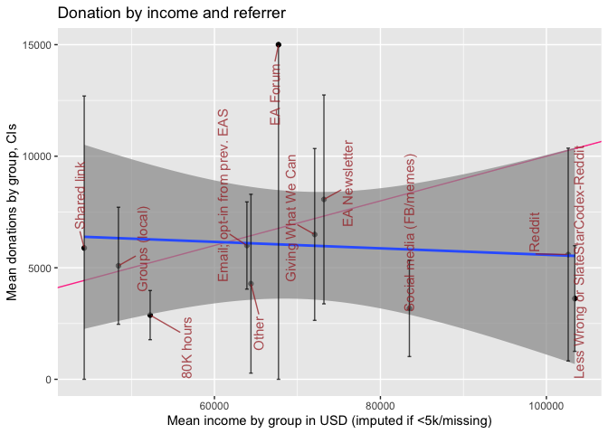

```r
# (Todo?) I wonder if we should get rid of the blue line and gray line for this … or replace it with one from an individual-based regression
```

At the referrer level we see no strong association of income and donation, however, these confidence intervals are very wide. While 80000 Hours and social media appear to be 'under-performers', for most groups of referrers the confidence intervals are too wide to make very strong inferences.

## Donation and income for recent years {#donation-and-income-trends-in-ea}

<!-- we will revisit this in tables coming out of multi-variable modeling below -->

We can consider the reported amounts donated in each year of the EA survey (EAS), as well as the average reported. However, neither of these can be easily interpreted to tell us whether EAs (as individual or in total) have been donating more or less in recent years; neither as individuals nor in total. The year-to-year change in survey responses, and differential representativeness makes this challenging.\* 


::: {.marginnote}
\* As discussed in other posts and the [online bookdown supplement](https://rethinkpriorities.github.io/ea_data_public/sensitivity.html), the EAS may also not be representative of the EA population cross-sectionally, i.e., it may over or under-represent certain demographic or interest-oriented subpopulations. Still, if this unrepresentativeness is 'constant from year to year', the total reported donations in each year will at least provide a reliable measure of how the donations of this (somewhat nonrepresentative) weighted average is changing from year to year. Note that the issue of cross-sectional representativeness (and changes in this) is equally relevant to questions of 'average donations' as it is to questions of 'total donations'.
:::

(Further discussion of this can be found in the [Bookdown](https://rethinkpriorities.github.io/ea_data_public/eas-donations.html#donation-and-income-trends-in-ea) at this point).

<!-- bookdown_start -->

<!-- link the bookdown only here -->

\BeginKnitrBlock{fold}<div class="fold">
1.  If the EAS response rates (and the response rates to the donation question in particular) vary year-to-year in proportion to the total size of the EA population representative, we may want to simply focus on the totals, which should move in proportion to the *true* totals.\*


2.  On the other hand, suppose the number of responses to the EAS fluctuates from year to year *not* in proportion to the size of EA, but its composition *is* representative of the EA movement as a whole. In this case it may be more reliable to report mean or median donations of EAS respondents, and combine this with extrapolations and 'guesstimates' based on separate estimates of changes in the size of EA (themselves in informed by data including the EA survey).

3.  To the extent that the EAS response total is both fluctuating (independently of the size of EA) and nonrepresentative, we may be only able make statements about changes in donations among particular subgroups, and even then the within-subgroup composition may change.
</div>\EndKnitrBlock{fold}
<!-- bookdown_end -->

Because of these limitations:

-   we report both totals and averages below,
-   we advise caution in interpreting the amounts and changes
-   we [return to this in a controlled model](#descriptive), which is also subject to similar limitations,
-   we defer more detailed analysis of this question for future work.

```{=html}
<!--
-   Total, per-capita, per-income
-   Per-capita, focusing on the largest `referrer` only (do we have this variable in previous years?)
-   Changes in causes supported
-   Adjusted and unadjusted (for differential sample composition)
-->
```
The plot and tests below depict and consider the year-to-year changes in donations as reported in the EA surveys for each year.\*

::: {.marginnote}
\*We exclude the year 2014, because of the very low response rate to the donation question in this survey.
:::

We first consider donation rates in each year for those who answer the donation question (reporting 0 or positive amounts). We give the share of positive responses, the mean, median, and 80th percentile donation, and the standard deviation for each year:


```r
library(ggstatsplot)
library(pairwiseComparisons)

(
  don_by_year_tab <- eas_all %>%
    filter (year>=2015) %>%
    sumtab(donation_usd, year, caption="Donations by year", digits=c(0, 0, 2, 0, 0, 0,0))
)
```

<table class="table" style="margin-left: auto; margin-right: auto;">
<caption>(\#tab:TRUE)Donations by year</caption>
 <thead>
  <tr>
   <th style="text-align:right;"> year </th>
   <th style="text-align:right;"> N </th>
   <th style="text-align:right;"> share &gt; 0 </th>
   <th style="text-align:right;"> Mean </th>
   <th style="text-align:right;"> Median </th>
   <th style="text-align:right;"> P80 </th>
   <th style="text-align:left;"> Std.dev. </th>
  </tr>
 </thead>
<tbody>
  <tr>
   <td style="text-align:right;"> 2015 </td>
   <td style="text-align:right;"> 1171 </td>
   <td style="text-align:right;"> 0.76 </td>
   <td style="text-align:right;"> 5775 </td>
   <td style="text-align:right;"> 333 </td>
   <td style="text-align:right;"> 3759 </td>
   <td style="text-align:left;"> (39271.5) </td>
  </tr>
  <tr>
   <td style="text-align:right;"> 2017 </td>
   <td style="text-align:right;"> 1028 </td>
   <td style="text-align:right;"> 0.84 </td>
   <td style="text-align:right;"> 9505 </td>
   <td style="text-align:right;"> 657 </td>
   <td style="text-align:right;"> 5790 </td>
   <td style="text-align:left;"> (75452.24) </td>
  </tr>
  <tr>
   <td style="text-align:right;"> 2018 </td>
   <td style="text-align:right;"> 1889 </td>
   <td style="text-align:right;"> 0.85 </td>
   <td style="text-align:right;"> 9763 </td>
   <td style="text-align:right;"> 740 </td>
   <td style="text-align:right;"> 5201 </td>
   <td style="text-align:left;"> (137804) </td>
  </tr>
  <tr>
   <td style="text-align:right;"> 2019 </td>
   <td style="text-align:right;"> 1704 </td>
   <td style="text-align:right;"> 0.82 </td>
   <td style="text-align:right;"> 9370 </td>
   <td style="text-align:right;"> 684 </td>
   <td style="text-align:right;"> 5000 </td>
   <td style="text-align:left;"> (87598.4) </td>
  </tr>
  <tr>
   <td style="text-align:right;"> 2020 </td>
   <td style="text-align:right;"> 1423 </td>
   <td style="text-align:right;"> 0.80 </td>
   <td style="text-align:right;"> 7516 </td>
   <td style="text-align:right;"> 528 </td>
   <td style="text-align:right;"> 4347 </td>
   <td style="text-align:left;"> (72810.66) </td>
  </tr>
</tbody>
</table>

The above only considers people who *did* answer donation questions. At an extreme we could consider all non-responses as reflect people who made (little or) no donations, for a lower bound on on donation rates. As a compromise measure, probably a tighter lower bound, we might assume that people willing to report their incomes are generally willing to answer financial questions. Thus if they do not report their donations it seems *more* reasonable to suspect that they did not donate in a big way. We thus consider the subset of the above who reported their income, considering similar statistics as above for a modified donation variable, coded as '0' where the donation was not reported.


```r
(
don0_by_year_tab <- eas_all %>%
  filter(!is.na(income_c) & year>2014) %>%
  #rowwise() %>%
  #mutate(donation_usd_0 = if_else(is.na(donation_usd), 0, donation_usd)) %>%
  #ungroup() %>%
  sumtab(donation_usd_0, year, caption="Donations by year for those reporting income (missings coded as 0)", digits=c(0, 0, 2, 0, 0, 0, -1, 0))
)
```

<table class="table" style="margin-left: auto; margin-right: auto;">
<caption>(\#tab:TRUE)Donations by year for those reporting income (missings coded as 0)</caption>
 <thead>
  <tr>
   <th style="text-align:right;"> year </th>
   <th style="text-align:right;"> N </th>
   <th style="text-align:right;"> share &gt; 0 </th>
   <th style="text-align:right;"> Mean </th>
   <th style="text-align:right;"> Median </th>
   <th style="text-align:right;"> P80 </th>
   <th style="text-align:left;"> Std.dev. </th>
  </tr>
 </thead>
<tbody>
  <tr>
   <td style="text-align:right;"> 2015 </td>
   <td style="text-align:right;"> 1033 </td>
   <td style="text-align:right;"> 0.69 </td>
   <td style="text-align:right;"> 4746 </td>
   <td style="text-align:right;"> 250 </td>
   <td style="text-align:right;"> 3094 </td>
   <td style="text-align:left;"> (35095.05) </td>
  </tr>
  <tr>
   <td style="text-align:right;"> 2017 </td>
   <td style="text-align:right;"> 1008 </td>
   <td style="text-align:right;"> 0.82 </td>
   <td style="text-align:right;"> 8905 </td>
   <td style="text-align:right;"> 615 </td>
   <td style="text-align:right;"> 5118 </td>
   <td style="text-align:left;"> (75243.94) </td>
  </tr>
  <tr>
   <td style="text-align:right;"> 2018 </td>
   <td style="text-align:right;"> 1835 </td>
   <td style="text-align:right;"> 0.83 </td>
   <td style="text-align:right;"> 9952 </td>
   <td style="text-align:right;"> 740 </td>
   <td style="text-align:right;"> 5201 </td>
   <td style="text-align:left;"> (139809.56) </td>
  </tr>
  <tr>
   <td style="text-align:right;"> 2019 </td>
   <td style="text-align:right;"> 1682 </td>
   <td style="text-align:right;"> 0.82 </td>
   <td style="text-align:right;"> 9443 </td>
   <td style="text-align:right;"> 684 </td>
   <td style="text-align:right;"> 5000 </td>
   <td style="text-align:left;"> (88165.41) </td>
  </tr>
  <tr>
   <td style="text-align:right;"> 2020 </td>
   <td style="text-align:right;"> 1409 </td>
   <td style="text-align:right;"> 0.80 </td>
   <td style="text-align:right;"> 7452 </td>
   <td style="text-align:right;"> 528 </td>
   <td style="text-align:right;"> 4098 </td>
   <td style="text-align:left;"> (73109.73) </td>
  </tr>
</tbody>
</table>

```r
#todo  same for GWWC people (member_gwwc needs reconciling)

#todo -- include a 'total donations row'. maybe plot/graph this stuff;
```

Next, we present a combined scatterplot, violin plot, and stem and leaf plot, depicting the densities of donation amounts in each year. We present this first with level outcomes (but log scales) and then for the 'log (donation+1)' outcome.


```r
(
don_by_year_viol_test <- eas_all %>%
  #select(donation_usd_min50, year) %>%
  #select(donation_usd, year) %>%
  mutate(year = year-1) %>%
  filter(year>2014) %>%
  ggbetweenstats(y = donation_usd,
                           x = year,
                          ylab = "Donations (USD)",
                 # plot.type = "violin", # type of plot
                  type="parametric",
                  conf.level = 0.95,
                # pairwise.display = "significant",
                 #p.adjust.method = "hol",
                 #results.subtitle = "false",
    title = "Donations by year, 2016-2020"
                    ) +
    theme(legend.position="none") +
                     ylim(50, NA) +
  scale_y_continuous(trans = "pseudo_log",
                     breaks = breaks,
                     labels = scales::dollar_format())
)
```


```r
(
don_by_year_viol_test_ldon <- eas_all %>%
  #select(donation_usd_min50, year) %>%
  #select(donation_usd, year) %>%
  mutate(year = year-1,
         ldon1 = log(donation_usd+1)) %>%
  filter(year>2014) %>%
  ggbetweenstats(y = ldon1,
                           x = year,
                          ylab = "Log (Donations +1)",
                 # plot.type = "violin", # type of plot
                  type="parametric",
                  conf.level = 0.95,
                # pairwise.display = "significant",
                 #p.adjust.method = "hol",
                 #results.subtitle = "false",
    title = "(Log) donations by donation year, 2016-2019"
                    ) +
    theme(legend.position="none")
)
```


```r
#  +  geom_signif(comparisons = list(c("2018", "2019"),  c("2014", "2019")),   step_increase = 0.05, test = "wilcox.test")

#%>%  ggplotly()

#Below: replaced this with 'wilcox, the nonparametric test' ... but note that is on top of the tests given by the ggbetweenstats command
#+ geom_signif(comparisons = list(c("2018", "2019"), c("2017", "2019"), c("2013", "2019")),   step_increase = 0.1, test = "wilcox.test")
```

While the linear plots and tests of donation amounts suggest no substantial or significant differences in overall donations between these years, the log specification does suggest some year-to-year differences, with (log) 2019 donations being significantly lower than 2017 donations, even after accounting for multiple comparisons. We return to this, to some extent, in our descriptive modeling.\*

::: {.marginnote}
\*While this may merit further investigation, the differences in response composition across years make statistical inference challenging, and we thus do not make this our main focus. Cross-year differences could be inflated or masked by these changes.
:::

<!--Note that the results are similar whether or not we bottom-code at 50 USD.-->

## Which charities (causes and categories) are EAs donating to? {#which-charities}

As noted in the introduction, only a small share of respondents report *where* they are donating. We group this into several categories summarized below, reporting for only those 429 respondents who indicated at least one category of donations.


```r
#TODO - HIGH: add better cause labels to this, visualise it in a way that conveys the aggregate shares of donations counts and amounts
 #created near the top of this file

don_stats
```

<table class="table" style="margin-left: auto; margin-right: auto;">
<caption>(\#tab:don_stats)Donations by category (where indicated)</caption>
 <thead>
  <tr>
   <th style="text-align:left;"> Variable </th>
   <th style="text-align:left;"> Number of Responses </th>
   <th style="text-align:left;"> Number reporting donation to cause </th>
   <th style="text-align:left;"> Share of reporters donating to cause </th>
   <th style="text-align:left;"> Mean donation of reporters (including 0's) </th>
   <th style="text-align:left;"> Sd </th>
   <th style="text-align:left;"> Median </th>
   <th style="text-align:left;"> 90th pct </th>
  </tr>
 </thead>
<tbody>
  <tr>
   <td style="text-align:left;"> Global health + development </td>
   <td style="text-align:left;"> 429 </td>
   <td style="text-align:left;"> 266 </td>
   <td style="text-align:left;"> 0.62 </td>
   <td style="text-align:left;"> 3971.7 </td>
   <td style="text-align:left;"> 21405.3 </td>
   <td style="text-align:left;"> 153.9 </td>
   <td style="text-align:left;"> 6017.6 </td>
  </tr>
  <tr>
   <td style="text-align:left;"> Animal welfare </td>
   <td style="text-align:left;"> 429 </td>
   <td style="text-align:left;"> 117 </td>
   <td style="text-align:left;"> 0.27 </td>
   <td style="text-align:left;"> 1503.7 </td>
   <td style="text-align:left;"> 11025.4 </td>
   <td style="text-align:left;"> 0 </td>
   <td style="text-align:left;"> 964.5 </td>
  </tr>
  <tr>
   <td style="text-align:left;"> EA meta and organization </td>
   <td style="text-align:left;"> 429 </td>
   <td style="text-align:left;"> 74 </td>
   <td style="text-align:left;"> 0.17 </td>
   <td style="text-align:left;"> 771.4 </td>
   <td style="text-align:left;"> 7106.9 </td>
   <td style="text-align:left;"> 0 </td>
   <td style="text-align:left;"> 261.7 </td>
  </tr>
  <tr>
   <td style="text-align:left;"> Long term &amp; AI </td>
   <td style="text-align:left;"> 429 </td>
   <td style="text-align:left;"> 78 </td>
   <td style="text-align:left;"> 0.18 </td>
   <td style="text-align:left;"> 975.3 </td>
   <td style="text-align:left;"> 9963.9 </td>
   <td style="text-align:left;"> 0 </td>
   <td style="text-align:left;"> 345.6 </td>
  </tr>
  <tr>
   <td style="text-align:left;"> Other </td>
   <td style="text-align:left;"> 429 </td>
   <td style="text-align:left;"> 47 </td>
   <td style="text-align:left;"> 0.11 </td>
   <td style="text-align:left;"> 874.4 </td>
   <td style="text-align:left;"> 12863.9 </td>
   <td style="text-align:left;"> 0 </td>
   <td style="text-align:left;"> 25.3 </td>
  </tr>
</tbody>
</table>

As in previous years, 'Global health and development' is the largest category, both in terms of number of reported donations, and in terms of mean (and median, and 90th percentile) donations (we give the mean including zeroes, for those who reported *any* specific category of donation).

Below, we depict the amounts and density of donations for each category, with the vertical axis on a logarithmic scale. The width of the violin plot depicts the smoothed density. In the box, the horizontal lines represent medians for each, lower and upper margins of the box 25th and 75th percentiles, "whisker" lines extends from the box to to the largest (smallest) value no further than 1.5 $\times$ the inter-quartile range, and large dots represent outlying points beyond the edge of the whiskers.


```r
##TODO --
#sort by reverse frequency of donations to a cause

#TODO: bottom code and change the scale on this, time permitted

(
  don_by_cause_viol <-  eas_20 %>%
      filter(num_named_dons>0) %>%
      select(where_don_vars, action_gwwc_f) %>%
      gather(cause, don, -action_gwwc_f) %>%
      ggplot() +
      aes(cause, don) +
      geom_violin() +
      geom_boxplot() +
    ylab("Donation amount") +
    geom_point(size = 0.30, colour = "#0c4c8a", position = position_jitter(seed = 42,  width = 0.3, height = 0.01)) +
scatter_theme +
  scale_y_log10(labels = scales::label_number_si(prefix = "$"),
    n.breaks = 10) +
      scale_x_discrete(labels = function(x) str_wrap(all_char_labels, width = 10)) +
  labs(title = "Donation amounts by category: see description above")
)
```


```r
#Todo (Low to medium) ... @oska: if it's easy-ish, maybe gganimate this one across years?
#@David: Kinda difficult to do this as the variables in where_don_vars don't seem to align with eas_all

#@oska -- it is there, in variables like `donate_[charity]_year` but it would require considerable data cleaning work. Will ask/see if it's worth it.
```

\

We can also check whether donations to each cause (incidence and amounts) vary by whether the person (ever) took a GWWC pledge. Below, we present scatterplots + violin + box plots for donation (USD amounts) to each category, split by GWWC pledge status.


```r
#TODO -- High Priority (@oska): clean up the below to be more readable, add the mean and a CI for the mean

(
  don_by_cause_viol_gwwc <-  eas_20 %>%
      filter(num_named_dons>0 & !is.na(action_gwwc_f)) %>%
      select(where_don_vars, action_gwwc_f) %>%
      gather(cause, don, -action_gwwc_f) %>%
      ggplot() +
      aes(cause, don, color=action_gwwc_f) +
      scale_color_discrete(name="GWWC pledge",
                         labels=c("No", "Yes")) +
      geom_violin() +
      geom_boxplot(notch=TRUE) +
    geom_point(size = 0.30, colour = "#0c4c8a", position = position_jitter(seed = 42,  width = 0.3, height = 0.01)) +
scatter_theme +
  scale_y_log10() +
      scale_x_discrete(labels = function(x) str_wrap(all_char_labels, width = 10))
)
```

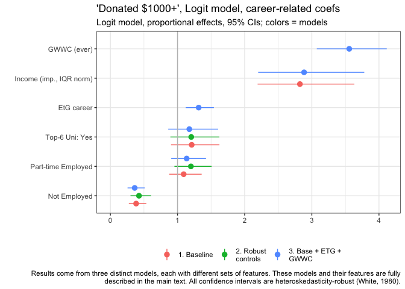

The details of these plots are similar to the previous plot ("Donation amounts by category...", see description above). However, here the lower and upper margins of the (now 'notched') box present an estimate of 95% confidence interval for medians (for those reporting at least one category of donations and reporting GWWC status). We see that these mainly overlap, but perhaps less so for "EA meta and organization", which GWWC pledgers seem to give more to.

Below, we tabulate donations to each cause, for each of these groups. The final column in each table presents a statistical test for significant differences in means each donation category by GWWC status.


```r
don_stats_by_gwwc
```

<table class="table" style="margin-left: auto; margin-right: auto;">
<caption>(\#tab:unnamed-chunk-83)Donations by category (where indicated), by GWWC</caption>
 <thead>
  <tr>
   <th style="text-align:left;"> Variable </th>
   <th style="text-align:left;"> N Responses </th>
   <th style="text-align:left;"> Share positive </th>
   <th style="text-align:left;"> Mean </th>
   <th style="text-align:left;"> Median </th>
   <th style="text-align:left;"> N Responses </th>
   <th style="text-align:left;"> Share positive </th>
   <th style="text-align:left;"> Mean </th>
   <th style="text-align:left;"> Median </th>
   <th style="text-align:left;"> Test </th>
  </tr>
 </thead>
<tbody>
  <tr>
   <td style="text-align:left;font-weight: bold;"> GWWC Pledge </td>
   <td style="text-align:left;font-weight: bold;"> No </td>
   <td style="text-align:left;font-weight: bold;">  </td>
   <td style="text-align:left;font-weight: bold;">  </td>
   <td style="text-align:left;font-weight: bold;">  </td>
   <td style="text-align:left;font-weight: bold;"> Yes </td>
   <td style="text-align:left;font-weight: bold;">  </td>
   <td style="text-align:left;font-weight: bold;">  </td>
   <td style="text-align:left;font-weight: bold;">  </td>
   <td style="text-align:left;font-weight: bold;">  </td>
  </tr>
  <tr>
   <td style="text-align:left;"> Global health + development </td>
   <td style="text-align:left;"> 241 </td>
   <td style="text-align:left;"> 0.59 </td>
   <td style="text-align:left;"> 2832.7 </td>
   <td style="text-align:left;"> 1144.1 </td>
   <td style="text-align:left;"> 187 </td>
   <td style="text-align:left;"> 0.66 </td>
   <td style="text-align:left;"> 5450.2 </td>
   <td style="text-align:left;"> 1854.9 </td>
   <td style="text-align:left;"> F=1.573 </td>
  </tr>
  <tr>
   <td style="text-align:left;"> Animal welfare </td>
   <td style="text-align:left;"> 241 </td>
   <td style="text-align:left;"> 0.22 </td>
   <td style="text-align:left;"> 1480.4 </td>
   <td style="text-align:left;"> 867.1 </td>
   <td style="text-align:left;"> 187 </td>
   <td style="text-align:left;"> 0.34 </td>
   <td style="text-align:left;"> 1531 </td>
   <td style="text-align:left;"> 495.5 </td>
   <td style="text-align:left;"> F=0.002 </td>
  </tr>
  <tr>
   <td style="text-align:left;"> EA meta and organization </td>
   <td style="text-align:left;"> 241 </td>
   <td style="text-align:left;"> 0.12 </td>
   <td style="text-align:left;"> 696.4 </td>
   <td style="text-align:left;"> 553.1 </td>
   <td style="text-align:left;"> 187 </td>
   <td style="text-align:left;"> 0.24 </td>
   <td style="text-align:left;"> 872.1 </td>
   <td style="text-align:left;"> 335.7 </td>
   <td style="text-align:left;"> F=0.064 </td>
  </tr>
  <tr>
   <td style="text-align:left;"> Long term &amp; AI </td>
   <td style="text-align:left;"> 241 </td>
   <td style="text-align:left;"> 0.13 </td>
   <td style="text-align:left;"> 1144.7 </td>
   <td style="text-align:left;"> 830 </td>
   <td style="text-align:left;"> 187 </td>
   <td style="text-align:left;"> 0.25 </td>
   <td style="text-align:left;"> 762.1 </td>
   <td style="text-align:left;"> 274.8 </td>
   <td style="text-align:left;"> F=0.155 </td>
  </tr>
  <tr>
   <td style="text-align:left;"> Other </td>
   <td style="text-align:left;"> 241 </td>
   <td style="text-align:left;"> 0.06 </td>
   <td style="text-align:left;"> 1289.5 </td>
   <td style="text-align:left;"> 1103.3 </td>
   <td style="text-align:left;"> 187 </td>
   <td style="text-align:left;"> 0.17 </td>
   <td style="text-align:left;"> 344.1 </td>
   <td style="text-align:left;"> 96.8 </td>
   <td style="text-align:left;"> F=0.567 </td>
  </tr>
</tbody>
</table>

Next, as above, but for donation *incidence* (i.e., for 'whether someone reports a donation in a particular cause category'):


```r
ddon_stats_by_gwwc
```

<table class="table" style="margin-left: auto; margin-right: auto;">
<caption>(\#tab:unnamed-chunk-84)Binary: Indicated donating to category, by GWWC</caption>
 <thead>
  <tr>
   <th style="text-align:left;"> Variable </th>
   <th style="text-align:left;"> N Responses </th>
   <th style="text-align:left;"> Donated to... ? </th>
   <th style="text-align:left;"> N Responses </th>
   <th style="text-align:left;"> Donated to... ? </th>
   <th style="text-align:left;"> Test </th>
  </tr>
 </thead>
<tbody>
  <tr>
   <td style="text-align:left;font-weight: bold;"> GWWC Pledge </td>
   <td style="text-align:left;font-weight: bold;"> No </td>
   <td style="text-align:left;font-weight: bold;">  </td>
   <td style="text-align:left;font-weight: bold;"> Yes </td>
   <td style="text-align:left;font-weight: bold;">  </td>
   <td style="text-align:left;font-weight: bold;">  </td>
  </tr>
  <tr>
   <td style="text-align:left;"> Global health + development </td>
   <td style="text-align:left;"> 241 </td>
   <td style="text-align:left;">  </td>
   <td style="text-align:left;"> 187 </td>
   <td style="text-align:left;">  </td>
   <td style="text-align:left;"> X2=2.399 </td>
  </tr>
  <tr>
   <td style="text-align:left;"> ... No </td>
   <td style="text-align:left;"> 100 </td>
   <td style="text-align:left;"> 41% </td>
   <td style="text-align:left;"> 63 </td>
   <td style="text-align:left;"> 34% </td>
   <td style="text-align:left;">  </td>
  </tr>
  <tr>
   <td style="text-align:left;"> ... Yes </td>
   <td style="text-align:left;"> 141 </td>
   <td style="text-align:left;"> 59% </td>
   <td style="text-align:left;"> 124 </td>
   <td style="text-align:left;"> 66% </td>
   <td style="text-align:left;">  </td>
  </tr>
  <tr>
   <td style="text-align:left;"> Animal welfare </td>
   <td style="text-align:left;"> 241 </td>
   <td style="text-align:left;">  </td>
   <td style="text-align:left;"> 187 </td>
   <td style="text-align:left;">  </td>
   <td style="text-align:left;"> X2=7.897*** </td>
  </tr>
  <tr>
   <td style="text-align:left;"> ... No </td>
   <td style="text-align:left;"> 189 </td>
   <td style="text-align:left;"> 78% </td>
   <td style="text-align:left;"> 123 </td>
   <td style="text-align:left;"> 66% </td>
   <td style="text-align:left;">  </td>
  </tr>
  <tr>
   <td style="text-align:left;"> ... Yes </td>
   <td style="text-align:left;"> 52 </td>
   <td style="text-align:left;"> 22% </td>
   <td style="text-align:left;"> 64 </td>
   <td style="text-align:left;"> 34% </td>
   <td style="text-align:left;">  </td>
  </tr>
  <tr>
   <td style="text-align:left;"> EA meta and organization </td>
   <td style="text-align:left;"> 241 </td>
   <td style="text-align:left;">  </td>
   <td style="text-align:left;"> 187 </td>
   <td style="text-align:left;">  </td>
   <td style="text-align:left;"> X2=8.283*** </td>
  </tr>
  <tr>
   <td style="text-align:left;"> ... No </td>
   <td style="text-align:left;"> 211 </td>
   <td style="text-align:left;"> 88% </td>
   <td style="text-align:left;"> 143 </td>
   <td style="text-align:left;"> 76% </td>
   <td style="text-align:left;">  </td>
  </tr>
  <tr>
   <td style="text-align:left;"> ... Yes </td>
   <td style="text-align:left;"> 30 </td>
   <td style="text-align:left;"> 12% </td>
   <td style="text-align:left;"> 44 </td>
   <td style="text-align:left;"> 24% </td>
   <td style="text-align:left;">  </td>
  </tr>
  <tr>
   <td style="text-align:left;"> Long term &amp; AI </td>
   <td style="text-align:left;"> 241 </td>
   <td style="text-align:left;">  </td>
   <td style="text-align:left;"> 187 </td>
   <td style="text-align:left;">  </td>
   <td style="text-align:left;"> X2=9.831*** </td>
  </tr>
  <tr>
   <td style="text-align:left;"> ... No </td>
   <td style="text-align:left;"> 210 </td>
   <td style="text-align:left;"> 87% </td>
   <td style="text-align:left;"> 140 </td>
   <td style="text-align:left;"> 75% </td>
   <td style="text-align:left;">  </td>
  </tr>
  <tr>
   <td style="text-align:left;"> ... Yes </td>
   <td style="text-align:left;"> 31 </td>
   <td style="text-align:left;"> 13% </td>
   <td style="text-align:left;"> 47 </td>
   <td style="text-align:left;"> 25% </td>
   <td style="text-align:left;">  </td>
  </tr>
  <tr>
   <td style="text-align:left;"> Other </td>
   <td style="text-align:left;"> 241 </td>
   <td style="text-align:left;">  </td>
   <td style="text-align:left;"> 187 </td>
   <td style="text-align:left;">  </td>
   <td style="text-align:left;"> X2=11.681*** </td>
  </tr>
  <tr>
   <td style="text-align:left;"> ... No </td>
   <td style="text-align:left;"> 226 </td>
   <td style="text-align:left;"> 94% </td>
   <td style="text-align:left;"> 155 </td>
   <td style="text-align:left;"> 83% </td>
   <td style="text-align:left;">  </td>
  </tr>
  <tr>
   <td style="text-align:left;"> ... Yes </td>
   <td style="text-align:left;"> 15 </td>
   <td style="text-align:left;"> 6% </td>
   <td style="text-align:left;"> 32 </td>
   <td style="text-align:left;"> 17% </td>
   <td style="text-align:left;">  </td>
  </tr>
</tbody>
</table>

Here, the differences are substantial, and in some cases, statistically significant.


```r
# #TODO -- High Priority (@oska): -- the below is a mess... we want both the frequency table and test for each of these ... but how to do it. I feel like I've done this before. maybe the function in rstuff `fisherme` would help?

# TODO (high-medium):  Once we get it to work, do similar plots and tests for different 'which cause' comparisons ...

fisher_cats <- eas_20 %>% filter(num_named_dons>0) %>%
  dplyr::select(all_of(where_don_vars)) %>%
  lapply(janitor::fisher.test, y = eas_20$action_gwwc_f[eas_20$num_named_dons>0], simulate.p.value=TRUE)
```

```{=html}
<!-- Todo (High to medium... some work done above in fisher tests): What justifies the above statement? Need numbers and tests; the scatterplot isn't informative. Simple (Fisher?) test for differences in counts of donations, GWWC vs no-pledge, separately for each charity group, perhaps?

@Oska: make a table, for those reporting at least 1 charity `filter(num_named_dons>0)`,
... of the shares indicating a donation for each charity category, separately for action_gwwc_f=0 and action_gwwc_f=1.
... and do simple tests for significant differences (perhaps Fisher test or something adjusted for multiple comparisons)
-->
```
```{=html}
<!-- todo: how it differs between groups ?
how it relates to cause prioritisation -->
```
As suggested in the two tables above, among those who report a charity category, those who took the GWWC pledge tend to give as much or more on average to each category (other than perhaps Long Term & AI), although none of these individual differences meet conventional statistical significance in simple F-tests (note that these tests are fairly low-powered due to small sample sizes). GWWC pledgers are more likely to have *donated* to each of these categories, and *this* difference *is* statistically significant in standard chi-sq tests for all categories except 'Global Health and Development'. This can be seen seen in the $\chi^2$ tests in the "Donated to category" table, as well as in uncorrected Fisher's exact tests: $p=$ 0.108 for 'Global Health and Development', $p<0.01$ for all other categories.

## Donations: plans and aspirations versus actual (reported) donations {#plan-actual}

<!-- **CODING NOTE**: All testing and setup for the sections below is done in the following chunks or the sourced code -->


```r
#filtering and shaping functions

f_don_plan_by_year <- function(df=eas_all) {
  #adjusting for comparing planned and actual donation for same year in question (but not always for 'same individuals')
  {df} %>%
  select(year, donation_usd, donation_plan_usd) %>%
  gather(donation_type, value, -year) %>%
  mutate(year = if_else(donation_type == "donation_plan_usd", year, year-1)) %>%
  mutate(year = fct_rev(as.factor(year)),
         donation_type = fct_recode(donation_type,
                                    "Planned Donation" = "donation_plan_usd",
                                    "Donation" = "donation_usd")) %>%
  filter(year %in% c(2016, 2017, 2018, 2019, 2020))
}

f_don_18_20 <- function(df=eas_all) {
  #this is for comparing to 'planned donation' (next year)
  df %>%
 dplyr::filter(year %in% c("2018", "2019","2020")) %>%
  group_by(year) %>%
  select(year, donation_usd, donation_plan_usd) %>%
  gather(donation_type, value, -year)
}

f_next_d_don <- function(df=eas_all) {
  #same as f_don_18_20, but instead of gather it constructs a differenced variable `next_d_don`
  df %>%
 dplyr::filter(year %in% c("2018", "2019","2020")) %>%
  select(year, donation_usd, donation_plan_usd) %>%
  transmute(next_d_don = donation_plan_usd - donation_usd)
}
```


```r
#Construct key tibbles to use in comparing planned and actual for 2019

demographics <- c('age', 'gender', 'country', 'employ_status')

# Filtering for those present in both datasets
planned_actual_2019 <- eas_all %>%
  filter(year %in% c(2019, 2020) & !is.na(ea_id)) %>%
  select(ea_id, donation_usd, donation_plan_usd, year) %>%
  distinct() %>%
  group_by(ea_id) %>% filter(n() == 2) %>% # Filter for those appearing in both years
  pivot_wider(names_from = "year",
              values_from = c("donation_usd", "donation_plan_usd")) %>%
  # Remove unnecessary columns
  select(-donation_plan_usd_2020, -donation_usd_2019) %>%
#  drop_na() %>% # Ensure that each participant had planned donation from 2019 and actual donation from 2020 # TODO - fix, this is dropping everything
  rename(donation_2019 = donation_usd_2020,
         planned_donation_2019 = donation_plan_usd_2019) %>%
  # Add demographic information
  left_join(., select(eas_20_cy, all_of(demographics), ea_id, action_gwwc, start_date, end_date, income_c), by = "ea_id")

#Convert to long format for ggplot
planned_actual_2019_l <- planned_actual_2019 %>%
  group_by(ea_id) %>%
  gather(donation_type, value, donation_2019, planned_donation_2019)
```


```r
## helper functions

f_19_hyp <- function(df) { #2019 data for donation difference
  df %>%
     filter(donation_2019>0 & planned_donation_2019>0) %>% #positive don in each year
  transmute(don_diff = donation_2019 - planned_donation_2019) #only the difference is used; this adds an 'attribute' to this object
}
```


```r
#test_rep_don_diff_mn_19
#point hypothesis of 0 mean (+attribute)
  #1000 replications of the relevant 'data'
#test_rep_don_diff_med_19: as above but for median

#test_rep_next_d_don_mn_18_20
#for actual vs *next* year's plan (means)
#test_rep_next_d_don_med_18_20 ... (medians)

#### Linked tests: New Purr testing framework #####
# ...Alternate between testing mean and median = 0 ####
mean_zero_hyp <- list(null = "point", mu = 0)
med_zero_hyp <- list(null = "point", med = 0)
hyps <- list(mean_zero_hyp, med_zero_hyp)

# ...Stats to calculate #####
stat_mean <- list(list(stat = "mean"))
stat_median <- list(list(stat = "median"))

bs_1000 <- list(reps = 1000, type = "bootstrap")

#dataframes for testing 'current less next donation' and 'actual less planned donation'
df_next_don <- eas_all %>% f_next_d_don
df_don_diff <- planned_actual_2019 %>% f_19_hyp

n <- 4 # Total number of tests ... mean and median for each dataframe (better to softcode this?)

responses <- c( rep("don_diff", n/2), rep("next_d_don", n/2))
p_value_directions <- rep("two_sided", n)

# ...  Functionalize ####
dfs <- list( rep(list(df_don_diff), n/2),
             rep(list(df_next_don), n/2))

linked_df_labels <- c(rep("2019-20 linked responses", 2),
                      rep("2018-2020 all responses", 2))
linked_test_var_type <- c(rep("Actual vs Planned", 2), rep("'Next year' vs Current", 2))
```


```r
linked_tests_df <- tibble(df = do.call(c, dfs), # Dataframes (needs tidying)

                          # Stats to calculate
                          stat = rep(c(stat_mean, stat_median), n/2),

                          # Hypotheses to test
                          hypothesis = rep(hyps, n/2),

                          # Samples to generate
                          gen = rep(list(bs_1000), n),

                          # Outcome variables
                          response = responses,

                          # Direction for p-value calculation
                          p_val_dir = rep("two_sided", n))

# .... actually run tests and collect pvalues etc ####
linked_tests_df <- linked_tests_df %>%
  mutate(results = pmap(., test_hypothesis))
  #test_hypothesis was defined in `hypothesis_test.R`; it runs the steps in the Infer testing package with options selected based on the content of the arguments.

linked_tests_results <- extract_hyp_results(linked_tests_df) %>% #extract and label key results for reporting and plotting
  mutate(data_label = linked_df_labels,
         data_type = linked_test_var_type)
```


```r
# ... make a tibble of the relevant dataframes and 'test formula elements'  ####
unlinked_tests_df <- tibble(df = do.call(c, unlinked_data),

                            formula = rep(list(unlinked_formula), n),

                            hypothesis = rep(hyp_unlinked, n),

                            gen = rep(list(perm_200), n),

                            stat = c(rep(d_order_diff_means, n-1),
                                     d_order_next_diff_means),

                            p_val_dir = rep("two_sided", n))
```


```r
# Column labels
rename_test_results <- c("Statistic" = "stat",
                         "Null type" = "null",
                         "Null value" = "null_value",
                         "Point estimate" = "point_estimate",
                         "CI Lower" = "lower_ci",
                         "CI Upper" = "upper_ci",
                         "P-value" = "p_value",
                         "Sample" = "data_label")

# This can be used for plotting
full_test_results <- dplyr::bind_rows(linked_tests_results, unlinked_diff_in_means_results, unlinked_diff_in_medians_results) %>%
  select(-c(order)) %>%
  mutate(across(c(stat, null, p_val_dir), ~ snakecase::to_sentence_case(.x)))

# This forms the basis for tables/displaying stats
full_test_results_clean <- full_test_results %>%
  select(-c(reps, type, formula, p_val_dir, response)) %>%
  rename(!!rename_test_results) %>%
  mutate(Statistic = str_replace_all(Statistic, c("means" = "Mean",
                                                  "medians" = "Median",
                                                  "Diff" = "Difference")))
```


```r
#making tables

#For linked tests:
current_next_test_results_clean <- full_test_results_clean %>%
  filter(data_type == "'Next year' vs Current") %>%
  select(-c(data_type, null_dist))

planned_v_actual_test_results_clean <- full_test_results_clean %>%
  filter(data_type == "Actual vs Planned") %>%
  select(-c(data_type, null_dist))

planned_v_actual_test_table <- planned_v_actual_test_results_clean %>%
      select(-c(`Null value`, `Null type`, `Sample`)) %>%
  kable(caption = "Actual minus planned donations for 2019, linked participants (2019-20)",
        digits=c(0,0,0,3)) %>%
  kable_styling()

current_next_test_table <- current_next_test_results_clean %>%
      select(-c(`Null value`, `Null type`, `Sample`)) %>%
  kable(digits=c(0,0,0,0,3), caption = "Planned minus last year's donation, 2018-20, all participants who report donations") %>%
  kable_styling()
```


```r
#making tables for UNLINKED tests:

planned_actual_unlinked_results_table <- full_test_results_clean %>%
  arrange(match(Sample,
                c("Full sample (2018-19 donation years)", "Involved before 2019 (2018-19 don)", "GwwC only (2018-19 don)", "'Matched individuals'"))) %>%
  filter(`Null type` == "Independence" & data_type == "Actual - Planned"
) %>%
      select(-c(data_type, null_dist, `Null value`, `Null type`)) %>%
    select(Sample, Statistic, everything()) %>%
  kable(caption = "Actual versus Planned donation distributions: permutation tests",
        digits=c(0,0,0,0,0,3)) %>%
  kable_styling()


next_current_unlinked_results_table <- full_test_results_clean %>%
  filter(`Null type` == "Independence" & data_type == "'Next year' - 'this year'"
) %>%
      select(-c(data_type, null_dist, `Null value`, `Null type`)) %>%
    select(Sample, Statistic, everything()) %>%
  kable(caption = "'Next year (plan)' - 'this year' donation distributions: permutation tests",
        digits=c(1,1,1,3)) %>%
  kable_styling()
```

<!-- Note: Actual vs Planned also provides a check on the data and the year-to-year trend, to see if it is driven response -->

Do people meet or exceed the amount they intended or planned to donate for the next year? What factors relate to this? Our surveys provide some evidence.

In recent surveys, we have asked "In [current year] how much do you currently plan to donate?". We also ask "in [previous year], roughly how much money did you donate?".

The EA surveys have been released at various points in the year:

-   In 2017, the survey was released in April; thus the 'plan' was reported only about 1/3 of the way through the year (or slightly later, depending on response time).

-   In 2018, the survey was released in May.

-   In 2019, it was released in August, about 3/4 of the way throughout the year.

Thus, for each of these years, the year-to-year comparison may tell us something about whether people lived up to their plans. This could be particularly relevant for the 2017 and 2018 surveys, but also relevant for 2019-20, particularly if donations tend to be clustered at years' end (e.g., Christmas giving, Giving Tuesday in November).\*

<!--Oska -- you could report justgiving seasonal statistics here too if you like -->

::: {.marginote}
\* This clustering seems to hold true for giving in the USA overall. E.g., Charity Navigator (citing the 'Digital giving index') states that [31% of annual giving occurred in the month of December](https://www.charitynavigator.org/index.cfm?bay=content.view&cpid=360).
:::


In our [2019 post](https://forum.effectivealtruism.org/posts/29xPsh2MKkYGCuJhS/ea-survey-2019-series-donation-data) we wrote:

> We also asked respondents how much they planned to donate in 2019. ... The median planned donation for 2019 was 1,074.98 USD among all EAs, and 3,000 USD among full-time employed non-student EAs.

Below, we compare this 2019 report of planned-2019 donation to reports from the 2020 EAS of *actual* 2019 donations. We report this for several different groupings below, as well as for other pairings of surveys.

### 2019 Planned vs. actual: Individuals present in both surveys {.unnumbered}

We first consider those 441 respondents who can be matched across the 2019 and 2020 surveys (through an anonymized email).

The plots below cover only respondents who appear in both samples *and* provide planned and actual donation values. These individuals make up 22.9% of the total respondents that appear in the 2020 sample and 15% of the total respondents across 2019 and 2020.\*

::: {.marginnote}
\* These EAs, who happened to respond to the survey in both years and give a matchable email, may not be typical EAs; we discuss this further below
:::


```r
# Create plots for planned and actual donations matched across 2019

scales_point_density_min50 <- list(limits = c(50, 500000), trans = scales::pseudo_log_trans(base=10),
                     breaks = breaks,
                     labels = scales::dollar_format())

planned_actual_2019_density <- planned_actual_2019_l %>%
  rowwise() %>%
  mutate(value = max(value, 50)) %>%
  ungroup() %>%
  ggplot() + geom_density(aes(x = value, fill = donation_type), alpha = 0.5) +
  do.call(scale_x_continuous, scales_point_density_min50) +
  scale_y_continuous(breaks = density_breaks,
                     expand = c(0,0)) +
  ggtitle("Actual vs Planned 2019 donations", subtitle = "Donations bottom-coded at $50; subset: those who can be matched across surveys)") +
  theme(legend.position = "bottom",
        legend.margin=margin(t = -0.6, unit='cm')) + # Shift legend position up
  xlab("") + ylab("Density") +
  scale_fill_discrete(name = "",
                      labels = to_title_case(unique(planned_actual_2019_l$donation_type)))

# Define same parameters for x and y axis
scales_point_density <- list(limits = c(0, max_lim), trans = scales::pseudo_log_trans(base=10),
                     breaks = breaks,
                     labels = scales::dollar_format())


planned_actual_2019_pointdensity <- planned_actual_2019 %>%
  # ggplot(aes(y = donation_2019, x = planned_donation_2019)) +
  rowwise() %>%
  mutate(planned_donation_2019 = max(planned_donation_2019, 50),
  donation_2019 = max(donation_2019, 50)) %>%
  ungroup() %>%
  ggplot(aes(y = donation_2019, x = planned_donation_2019)) +
  ggpointdensity::geom_pointdensity(adjust = 0.25) +
  geom_abline(slope = 1,
              intercept=0,
              linetype = "dotted") +
   geom_smooth() +
  do.call(scale_x_continuous, scales_point_density_min50) +
  do.call(scale_y_continuous, scales_point_density_min50) +
  scale_color_viridis_c("Neighbours") +
  #scale_size_continuous("Income", labels = scales::label_number_si()) +
  ylab("Actual 2019 Donation (bottom-coded @ $50)") +
  xlab("Planned 2019 donation (bottom-coded @ $50)") +
  ggtitle("Planned & actual donations 2019 (cross-survey matches)")

#@oska I added a geom_smooth. If you can get it to work with the income-size and legends looking good, let's put that back (TODO)
#We can also trim the right horizontal  axis perhaps (maybe that can be set more generally above?)
```

Below, we plot planned and actual 2019 donations for these respondents.\*

::: {.marginnote}
\* As the distribution of values is highly negatively skewed, we present this on a logarithmic scale, with values from 0-50 USD 'bottom-coded' as 50 USD.
:::


```r
planned_actual_2019_density
```


Reassuringly, these distributions largely overlap. We separate the above graph by whether the individual made a GWWC pledge:


```r
(
  planned_actual_gwwc <- planned_actual_2019_l %>%
      rowwise() %>%
  mutate(value = max(value, 50)) %>%
  ungroup() %>%
  filter(!is.na(action_gwwc)) %>%
  mutate(action_gwwc = as.factor( if_else(action_gwwc == 1, "GWWC Pledge", "No GWWC Pledge") ) )%>%
  # mutate(value = value + 1) %>%
  ggplot() + geom_density(aes(x = value, fill = donation_type), alpha = 0.5)
  + scale_x_log10(labels = scales::label_number_si(prefix = "$"))
  + ggtitle("Actual vs Planned 2019 donations by 'made GWWC pledge'", subtitle="Linked individuals, log scale") +
    xlab("Donation value, bottom-coded at $50") +
    ylab("Density") + facet_grid(action_gwwc ~ . ) +
  scale_fill_discrete(name = "",
                      labels = to_title_case(unique(planned_actual_2019_l$donation_type)))
)
```


```r
#TODO (\@oska)  -- maybe do this specifically for a year in which there is a  large gap in timing -- perhaps 2018 is the best as it was <ay (1/2 the year) and we think it's a reliable data year

#TODO: Med-high -- test for difference in planned and actual (a 'shift') and ideally test for a difference in difference between GWWC and non-GWWC
```

The above graphs do not suggest large differences in these distributions.\*

::: {.marginnote}
However, 'visual inspection' risks reading patterns into noise, and vice-versa; this speaks for formal statistical testing. In future modeling we may also wish to consider whether this could also reflect 'regression to the mean'; those who report planning an unusually high (low) amount may tend to actually donate a more typical amount, i.e., a lower (higher) amount.

We ran a series of simulation-based 'permutation tests' to consider compare the medians and means of the *distributions* of planned and actual donations for these linked individuals. Results are included in the table "Actual minus planned donations for 2019, linked participants (2019-20)" in the section [Planned vs. actual: All respondents](#plan-actual-all). These tests are inconclusive (not statistically significant, with wide confidence intervals),

However, note that we are currently considering these *distributions* rather than the individual differences for linked individuals'; we present the latter in the next subsection.
:::

```{=html}
<!--
\*\* The overlap appears stronger for those who made a GWWC pledge. For the non-GWWC responses, we see:

-   for smaller donations (about 10-600 USD) 'actual donation' mass somewhat the exceeds 'planned donation' mass

-   for medium-large donations (about 600-5000 USD), the reverse, as 'planned donations' somewhat exceed 'actual donations', especially for non-GWWC people

-   for the largest donations, above about 8000 or so, the 'actual' again has a somewhat greater mass than planned

We do not present statistical tests on these small intervals, nor on the differences between GWWC and non-GWWC.
-->
```
#### Donations versus plans (same individuals, linked) {#don_v_plan .unnumbered}

While the graphs and figures above help us understand whether the *distribution* of planned and actual gifts differ, it does not tell us whether any *individual's* donation meets or exceeds his or her plan. As we are considering individuals present in *both* surveys, we can connect their donation responses across years.

The graph below shows the distribution over the *difference* in planned and actual 2019 donations for those matched across the years. Here a negative value corresponds to an actual donation being lower than planned.

<!-- Here we do not split by GWWC pledge, as the graphs are, once again, similar for both groups (this also allows us to reinclude those who did not answer the GWWC question). -->


```r
#TODO [Medium-High] -- incorporate it in so it will work for split plots, for 'same year', etc.

m_dd <- planned_actual_2019 %>%
  transmute(don_diff = donation_2019 - planned_donation_2019) %>%
  ungroup() %>%
  dplyr::summarize(mn_dd=mean(don_diff, na.rm=TRUE),
                   med_dd = median(don_diff, na.rm=TRUE)
  )

(
  actual_planned_2019 <- planned_actual_2019 %>%
  mutate(don_diff = donation_2019 - planned_donation_2019) %>%
  ggplot(aes(x = don_diff)) +
  geom_density(alpha=0.5,
               fill="blue") +
  scale_x_continuous(trans = pseudo_log_trans(base=10),
                     breaks = c((-1)*breaks*2, breaks*2),
                     labels = label_number_si(prefix = "$")) +
  geom_vline(xintercept=m_dd$mn_dd, size=1.5, color="green") + # this code is lame, we can improve it
  geom_vline(xintercept=m_dd$med_dd, size=1.5, color="red") + # this code is lame, we can improve it
  geom_vline(xintercept=0) +
#  coord_flip() +
  labs(title = "2019 donations: actual minus planned",
      caption = "Red line: Median, Green line: Mean" ) +
  xlab("Actual - planned for same year") +
  ylab("")
)
```


```r
# TODO: keep improving this guy
```

Planned and actual donations are highly correlated ($\rho =$ 0.948).

While substantial shares report substantially less or more than their plan, this more or less balances out, with some tendency towards donating *more* than planned. In fact, the mean difference between donation and plan is 1,139 USD in excess of plan (the green line), while the median of the differences is 67.9 USD.

Considering that the zeroes might have been quick and uncareful mis-responses, we repeat the same plot for those who report *positive* planned and actual donations in the consecutive years, and we also compare these for GWWC pledgers versus non-pledgers:


```r
(
  actual_planned_2019 <- planned_actual_2019 %>%
  mutate(don_diff = donation_2019 - planned_donation_2019) %>%
  ggplot(aes(x = don_diff)) +
  geom_density(alpha=0.5,
               fill="blue") +
  scale_x_continuous(trans = pseudo_log_trans(base=10),
                     breaks = c((-1)*breaks*2, breaks*2),
                     labels = label_number_si(prefix = "$")) +
  geom_vline(xintercept=m_dd$mn_dd, size=1.5, color="green") + # this code is lame, we can improve it
  geom_vline(xintercept=m_dd$med_dd, size=1.5, color="red") + # this code is lame, we can improve it
  geom_vline(xintercept=0) +
#  coord_flip() +
  labs(title = "2019 donations: actual minus planned",
      caption = "Red line: Median, Green line: Mean" ) +
  xlab("Actual - planned for same year") +
  ylab("")
)
```

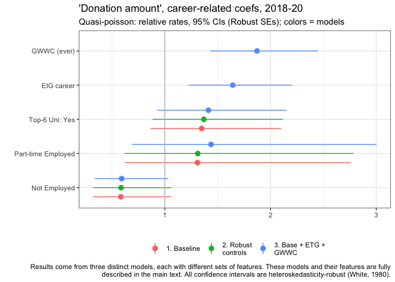

```r
(
  actual_planned_2019_no_0_bygwwc <- planned_actual_2019 %>%
    filter(!is.na(action_gwwc)) %>%
     filter(donation_2019>0 & planned_donation_2019>0) %>%
  mutate(don_diff = donation_2019 - planned_donation_2019 )
         %>%
ggplot(aes(x = don_diff, y = as.factor(action_gwwc), fill = factor(stat(quantile)))) +
  stat_density_ridges(
    geom = "density_ridges_gradient",
    calc_ecdf = TRUE,
    quantiles = 4, quantile_lines = TRUE
  ) +
  scale_fill_viridis_d(name = "Quartiles") +
    scale_x_continuous(trans = pseudo_log_trans(base=10),
                     breaks = c((-1)*breaks*2, breaks*2),
                     labels = label_number_si(prefix = "$")) +
  geom_vline(xintercept=0) +
    ggtitle("2019 donations (no zeroes): actual minus planned, by GWWC-pledge") +
  xlab("") +
  ylab("")
)
```


The results are similar -- substantial shares outperformed their plans, and substantial shares underperformed, but the positives seem to outweigh the negatives. For both GWWC and non-GWWC pledgers the median donation exceeds the plan (by around 200 USD).

We do not see striking differences between the GWWC pledgers and non-pledgers by this measure.\*

::: {.marginnote}
\* Although the plot loosely suggests that the distribution for GWWC pledgers is shifted slightly to the right as for non-pledgers, the shift appears small. We do not pursue further testing here for several reasons. 1. There are many other differences between these groups. 2. The cross-survey tracked sample is a small share of the total sample. 3. As seen earlier, the base distribution of the *levels* of donations (planned or actual) differs between GWWC and non-GWWC; thus there is no single measure of 'which group comes closer to their plan on average'.
:::

<!-- Repeat for another year -->

We next present a scatterplot of planned versus actual donations for 2019, for those who can be matched across surveys. In the figure below, the brightness of a color indicates the density of respondents (number of 'neighbors') with a particular combination of planned and actual donations.

```{=html}
<!--
To do, future work

4.  Do across years (not 'for people present in every year' because there are few like that)

-   graph 'mean (and spread?) of p75 actual donations for year XX' versus 'planned donations for year XX'

Later, perhaps it's worth 'modeling' this a bit more formally.

Future work could involve: modeling donation and planned donation more carefully across all years

And further tests
- https://stats.stackexchange.com/questions/315601/chi-square-test-alternatives-to-test-for-shift-in-distributions
- Kolmogorov-Smirnov test (for shift in distribution)
- Mann-Whitney test (rank-sum)
- quantile regression or permutation test for difference in
   - medians
   - 75th percentiles of distribution

-->
```


```r
planned_actual_2019_pointdensity
```

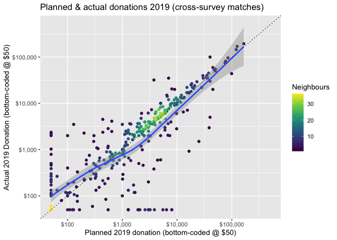

```{=html}
<!--
Todo (low to medium) -- do something else with income or get rid of because width=size or number of obs in most people's heads.

Todo (medium) -- @Oska either animate or do separately for different years?

 add a regression line (perhaps outlier-insensitive) ...

 modeling question: what affects the 'slope of planned in actual' = function of (planned amount, time to realization, season, gwwc, cause prioritization, student status)
 -- alt -- model across years as 'percentage gap, actual-planned/planned, or  (actual-planned/planned)/(share of year remaining)

-->
```
Overall, the plot is more or less centered around the 45 degree line of 'plans=actual'. There are noticeable departures in each direction, but these seem to balance out. Thus, we might loosely conclude that 'on average 441 individuals who can be matched across years tend to donate an amount close to what they planned'. However, there may nonetheless be important differences, so we test further.

Below, we plot donations for these linked individuals -- actual donations are on the left, and planned donations are on the right. We overlay  a 'violin' density plot (widths depicts the frequencies). Medians are depicted in red dots, and the boxes depict 25th and 75th percentiles. The lines show each individual's donation (on the left) connected to her plan (on the right). The plot also reports on a Wilcoxon signed-rank test (for paired data).


```r
(
matched_dons_wilcoxon <- planned_actual_2019_l %>%
  mutate(donation_type = to_title_case(donation_type)) %>%
ggstatsplot::ggwithinstats(
  x = donation_type,
  y = value,
  type = "nonparametric",
  paired = TRUE,
    point.path.args = list(alpha = 0.1,
                           linetype = "solid"),
) +
  do.call(scale_y_continuous, scales) +
  xlab("") + ylab("") +
  scale_fill_discrete(name = "")
)
```


```r
w_signed_test_planned_actual <- wilcox.test(x = planned_actual_2019$donation_2019, y = planned_actual_2019$planned_donation_2019,
              alternative = c("greater"),
            mu = 0, paired = TRUE, exact = NULL, correct = TRUE,
            conf.int = TRUE, conf.level = 0.95,
            tol.root = 1e-4, digits.rank = Inf)

#a Wilcoxon signed rank test of the null that the distribution of ... x - y (in the paired two sample case) is symmetric about mu is performed.

#Here the CI estimates 'the median of the difference between a sample from x and a sample from y.'
```

The nonparametric tests reported above find a statistically significant difference: actual donations tend to exceed planned donations in this sample, and this difference is unlikely to be due to chance. The 'pseudo-median' of this difference is estimated as 281 USD with 95% lower CI bound 162. The "matched-pairs rank-biserial correlation" is also bounded between about 0.17 and 0.41, suggesting that "actual donation exceeds planned donation" is more likely than "planned exceeds actual" (in the population that this is drawn from).

The results are similar if we focus on the subset of these who report a donation in both years (see bookdown [robustness appendix](https://rethinkpriorities.github.io/ea_data_public/eas-donations.html#robust-appendix)).


```r
planned_actual_2019_no_0 <- planned_actual_2019 %>%
  filter(donation_2019>0 & planned_donation_2019>0)

w_signed_test_planned_actual_no0s <- wilcox.test(x = planned_actual_2019$donation_2019, y = planned_actual_2019$planned_donation_2019,
              alternative = c("greater"),
            mu = 0, paired = TRUE, exact = NULL, correct = TRUE,
            conf.int = TRUE, conf.level = 0.95,
            tol.root = 1e-4, digits.rank = Inf)

#a Wilcoxon signed rank test of the null that the distribution of ... x - y (in the paired two sample case) is symmetric about mu is performed.

#Here the CI estimates 'the median of the difference between a sample from x and a sample from y.'
```

```{=html}
<!--

Todo (for above): clean up the dashed lines on this plot

Todo: @oska Make this a paired test, reverse the ordering so that 'planned' comes first

Has been changed to a Wilcoxon signed-rank (paired)

@Oska (todo)-- can you summarise the result, i.e., 'which ranks are higher, actual or planned'? Do we have a metric for the size of this difference?

-->
```
We also present simulation-based tests for whether the mean and median of the individual 'actual minus planned' donations exceeds or falls below zero. These are given in the table below.


```r
planned_v_actual_test_table
```

<table class="table" style="margin-left: auto; margin-right: auto;">
<caption>(\#tab:hyp-test-results-tables-linked)Actual minus planned donations for 2019, linked participants (2019-20)</caption>
 <thead>
  <tr>
   <th style="text-align:left;"> Statistic </th>
   <th style="text-align:right;"> Point estimate </th>
   <th style="text-align:right;"> CI Lower </th>
   <th style="text-align:right;"> CI Upper </th>
   <th style="text-align:right;"> P-value </th>
  </tr>
 </thead>
<tbody>
  <tr>
   <td style="text-align:left;"> Mean </td>
   <td style="text-align:right;"> 1587 </td>
   <td style="text-align:right;"> -279 </td>
   <td style="text-align:right;"> 3453.648 </td>
   <td style="text-align:right;"> 0 </td>
  </tr>
  <tr>
   <td style="text-align:left;"> Median </td>
   <td style="text-align:right;"> 141 </td>
   <td style="text-align:right;"> 23 </td>
   <td style="text-align:right;"> 259.456 </td>
   <td style="text-align:right;"> 0 </td>
  </tr>
</tbody>
</table>

<!-- Todo (@oska, medium-priority): add the graph of the simulated distribution for the median here, and then we can explain it a bit -->


```r
linked_ddmn <- linked_tests_results %>% filter(response=="don_diff" & stat=="mean")
linked_ddmed <- linked_tests_results %>% filter(response=="don_diff" & stat=="median")
```

The mean of 'actual minus planned' donations is 1,587 USD, with simulation-based (bootstrapped) confidence intervals [-279, 3,454], with corresponding p-value 0.138. For the median of this difference we have point estimate 141 USD, with simulation-based (bootstrapped) confidence intervals [22.5, 259], with corresponding p-value 0.102. Thus, the evidence points towards 'actual donations exceeding planned donations for those EAs who can be linked across 2019-20'. However, (unlike in the Wilcoxon signed-rank tests) the differences are not strongly statistically significant in these simulation-based tests.

### Planned vs. actual: All respondents (across relevant years) {#plan-actual-all .unnumbered}

Those who responded to both 2019 and 2020 surveys (and left emails both times) might tend to be the more engaged EAs. In particular, having fulfilled one's planned donation might make one more likely to want to complete the follow-up survey, and perhaps more keen to provide one's *donation* data in particular. This suggest the above figures may be biased towards more 'fulfilled plans'.

Thus, we next overlay the planned and actual donations for *all respondents* across both surveys. Here we compare the 'amounts planned for the year of a survey' to the 'amounts reported for the previous year, in the following year's survey'. We do this separately for each available year.

While this offers us a larger sample, and may be less vulnerable to the bias just-mentioned, it brings up other sample selection issues, and these comparisons should also be treated with some caution (discussion in fold).

\BeginKnitrBlock{fold}<div class="fold">
Indeed, '2019 respondents who entered a planned donation amount' (call these '2019-planners') may not be precisely representative of the population of interest. Still, we might at least seek an 'internally-valid' measure of the 'distribution of actual 2019 donations for the 2019-planners', and compare their actual to their planned 2019 donations. This will still be imperfect: the composition of the 2019 and 2020 respondents may differ, as discussed elsewhere.

Thus, the distribution of 'reported 2019 donations for those who completed the survey in 2020' (call these '2020-reporters') may be different from the distribution of the actual 2019 donations made by 2019-planners. The direction and nature of this bias is unclear; we might get some hints at this by comparing the reported donations in 2018 and 2019 respectively by 2019-reporters and 2020-reporters. If the distribution of donations changes little from year to year, we might worry less about this bias. We defer this for future work.

Below, we  also report these measures for those who joined EA only before 2019 (plausibly a more stable group).</div>\EndKnitrBlock{fold}

<!-- If we have time/later,  ...  do the same for only those 'referrers' with similar numbers in each year. -->

<!-- @Oska; see above let's plot the distribution of reported donations for each year, or some statistics on this that gives us a sense of whether it's changing much. -->


```r
scales_set <- list(scale_y_discrete(expand = c(0,0)),
                   scale_x_continuous(limits = c(50, max_lim),
                     trans = scales::pseudo_log_trans(base=10),
                     breaks = breaks,
                     expand = c(0,0),
                     labels = scales::dollar_format())
               )

ridge_bottom_opts <- list(
  theme(legend.position = "bottom",
  legend.margin=margin(t = -0.6, unit='cm')),
  ylab(""),
  scale_fill_discrete(""))


(
  dons_planned_across_all <-  eas_all %>%
  f_don_plan_by_year %>%
  ggplot(aes(x = value, y = as.factor(year), fill = donation_type)) +
  geom_density_ridges(alpha=.6,
                      color = "black",
                      quantile_fun = median,
                      quantile_lines = TRUE,
                      rel_min_height = 0.005)  +
  # geom_vline_med(x) +
  scales_set +
  ridge_bottom_opts +
  xlab("") +
  guides(fill = guide_legend(override.aes = list(linetype = 0))) +
    labs(title= "Density of planned and actual donations for each year",  subtitle = "Vertical lines: medians for the year and donation type",
         caption = "Donations bottom-coded at $50")
)
```


```{=html}
<!--

(above)
TODO @oska -- can you move these lists of 'display format parameters' elsewhere, to a list, or a set of lists, as I've done for other things, and then "call these" in the command? otherwise it's hard to read the code
-->
```
For 2019 (2020 survey 'actual' and 2019 survey 'planned') and 2018 (2019 survey 'actual' and 2018 survey 'planned'), the histograms of planned and actual donations line up approximately (although planned donations tend to be a bit higher). However, for 2017 (2018 survey 'actual' and 2017 survey 'planned'), the planned donation distribution appears *far* lower. This seems likely to result from a different response and a different composition between the 2017 and 2018 responses.\*

::: {.marginnote}
\* There was a increase in the sample size and the response rate to the donation questions from 2017 to 2018 below. We report this in the [bookdown 'robustness' appendix](https://rethinkpriorities.github.io/ea_data_public/eas-donations.html#robust-appendix).

Note that the number of EA survey respondents also declined in 2020, from 2,509 to 2,056. If the EA survey tends to select only the more engaged EAs, this would suggest that the extent 2019 donations under-performed plans may be even *higher*.
:::

(Thus we will *not* include 2017 in our "planned versus actual" comparisons.)

As noted, for the remaining relevant donation years (2018 and 2019) the median donation is somewhat *lower than* the median planned donation, suggesting *under-performance* relative to plans. We investigate this further below.

```{=html}
<!--
# Tidy this up

# todo:

# add lines for mean, median, 75th percentile for each (both planned and actual in each year ... or whatever can be done without too much clutter)

# todo ? consider cumulative depiction
-->
```
```{=html}
<!--
2017 seems to be an unusual year 'How much do I donate as a function of the amount planned, and other factors/interactors' -->
```
**Over 2018-19, how does the distributions of planned versus actual donations differ?**\*

In spite of the caveats above, we consider and test whether the distribution of planned donations for a year exceeds or falls short of actual donations, pooling the 2018-2019 and 2019-2020 data (to consider donations vs plans in 2018 and 2019).

We do this separately both

-   overall, and

-   excluding those who joined EA only before 2019 (plausibly a more stable group).

<!-- Todo: I want to also do this for a large/consistent set of 'referrers' or 'first heard' group but this will take a lot of cleaning ... see eas_all %>% tabyl(first_hear_ea, year) -->


```r
 #TODO -- medium-high priority: some depiction of quantiles/cutoffs within each smoothed histogram (for all the ones below, even the faceted ones). See, e.g., https://stackoverflow.com/questions/57563692/combining-facet-wrap-and-95-area-of-density-plots-using-ggplot2/57566951#57566951


dons_plan_hist_opts <- function(df) {
  df %>%
      ggplot(aes(x = value, fill = donation_type)) +
      geom_density(alpha=.35) +
  scales_set +
  #geom_vline_med(x) +
  ridge_bottom_opts +
    xlab("")
}


#crappy workaround here:
x <- eas_all %>%
  filter(year %in% c(2018, 2019, 2020)) %>% f_don_plan_by_year

xo <- eas_all %>% filter(year_involved<2019) %>%  filter(year %in% c(2018, 2019, 2020)) %>% f_don_plan_by_year

x_med_don <- median(x$value[x$donation_type== "Donation"], na.rm=TRUE)
x_med_don_plan <-  median(x$value[x$donation_type== "Planned Donation"], na.rm=TRUE)
xo_med_don <- median(x$value[xo$donation_type== "Donation"], na.rm=TRUE)
xo_med_don_plan <-  median(xo$value[x$donation_type== "Planned Donation"], na.rm=TRUE)


dons_planned_18_20 <- eas_all %>%
      filter(year %in% c(2018, 2019, 2020)) %>%
    f_don_plan_by_year %>%
  rowwise() %>%
  mutate(value = max(value, 50)) %>%
  ungroup() %>%
  dons_plan_hist_opts +
  geom_vline(xintercept=x_med_don, size=.5, color="green") +
  geom_vline(xintercept=x_med_don_plan, size=.75, color="pink") +
ggtitle("2018-19")


dons_planned_18_20_no_new <- eas_all %>%
          filter(year_involved<2019) %>%
      filter(year %in% c(2018, 2019, 2020)) %>%
        f_don_plan_by_year %>%
  dons_plan_hist_opts +
  geom_vline(xintercept=xo_med_don, size=.5, color="green") +
  geom_vline(xintercept=xo_med_don_plan, size=.75, color="pink") +
  ggtitle("2018-19")

(
dons_planned_18_20_arr_new <- ggarrange(dons_planned_18_20, dons_planned_18_20_no_new,
                                        ncol = 2, nrow=1,
                                        labels=c("All", "Involved pre-2019"),
                                        label.x=0.0,
   label.y=0.85,
   legend="bottom",
 common.legend=TRUE                                 ) +
     labs(title= "Density of planned and actual donations, split by year-invo",  subtitle = "Vertical lines: medians for the group and donation type",
         caption = "Donations bottom-coded at $50")
)
```


```r
 #todo (@oska) -- finish this; separate aligned plots for
 # - is it doing what I think? I think we want to use 2020 for the sums in  'actual' but not in 'planned'
 # - align the above, fix labels
 # - report some more stats within each as 'bars' or shading (geom lines could also be good)
 # - stat tests for each
```

Again, for both groups (where the survey entries are *linked*) the *planned* donation distribution appears to be somewhat higher than the actual distribution, although the difference is not dramatic.

We present the results of simulation-based permutation tests below. (Explanation in fold).

<!-- TODO (@oska, medium-highpriority): add the graph of the simulated distribution for the difference in median here for the full sample, with the CI's and point estimates overlaid, and then we can explain it a bit -->

\BeginKnitrBlock{fold}<div class="fold">
We use *permutation tests* for testing whether the median (and mean) of planned donations exceeded/fell short of the mean for actual donations, but using the data from different years’ surveys (without connected individuals).

The null hypothesis (for 2019 donations) is that:

'there is no difference in the median donation, in our survey sample, between actual 2019 donations (reported in 2020) and planned 2019 donations (reported in 2019).'

Suppose we maintain the hypothesis that

'individuals appeared in the 2019 survey versus the 2020 survey ‘as if randomly drawn’',

and we consider that under the null hypothesis "the distribution of planned and actual donations is identical" (this may be a stronger assumption than needed).

The permutation procedure repeatedly simulates a distribution of planned and actual donations that is consistent with this null, by using our original donation amount data and randomly re-assigning each observation to either 'planned' or 'actual'.  For each 'simulated null distribution' we can then compute the targeted statistic (difference between mean/median donation between the two groups). We can plot this 'simulated nll distribution of differences' and consider 'how often do we observe a difference as extreme as the 'point estimate' from our *actual* data'? This yields the p-values reported below.

The confidence intervals for the differences come from simply using the 95% interval range from the simulated distribution, shifted to be centered around our point estimate.
</div>\EndKnitrBlock{fold}

The figure below presents the simulated null distribution of differences in medians arising from this procedure, for the full sample (2018-19 donation years).

<!-- TODO (@oska), put this graph in -->

\BeginKnitrBlock{fold}<div class="fold">

[Graph to to be incorporated ... like this one](https://files.slack.com/files-pri/T017UKD8KU1-F02B2HLQT63/image.png)

The red line gives the point estimate of 'differences in median between planned and actual' from our data.  The grey bins present the ‘(simulated) distribution of differences between planned and actual, under the null hypothesis that planned and actual are drawn from the same distribution’.

The 'pink areas' depict the area of the simulated null distribution that is 'more extreme' than our point estimate; this iis the area represented by the 'p-value' of a two-tailed hypothesis test.

Finally the turquoise should represent a 95% CI for the actual median; essentially this comes from a simulated distribution under the hypothesis that the true difference between the medians is exactly equal to our point estimate.

Note that this turquoise region just crosses the 0, again confirming that we ‘just barely cannot reject the null’, but that a Bayesian analysis would probably put a lot of probability mass on fairly substantial differences.
</div>\EndKnitrBlock{fold}

In the table below we summarize the results of this test for means and medians, and for four distinct subsamples.


```r
planned_actual_unlinked_results_table
```

<table class="table" style="margin-left: auto; margin-right: auto;">
<caption>(\#tab:hyp-test-results-tables-unlinked)Actual versus Planned donation distributions: permutation tests</caption>
 <thead>
  <tr>
   <th style="text-align:left;"> Sample </th>
   <th style="text-align:left;"> Statistic </th>
   <th style="text-align:right;"> Point estimate </th>
   <th style="text-align:right;"> CI Lower </th>
   <th style="text-align:right;"> CI Upper </th>
   <th style="text-align:right;"> P-value </th>
  </tr>
 </thead>
<tbody>
  <tr>
   <td style="text-align:left;"> Full sample (2018-19 donation years) </td>
   <td style="text-align:left;"> Difference in Mean </td>
   <td style="text-align:right;"> -2354 </td>
   <td style="text-align:right;"> -7160 </td>
   <td style="text-align:right;"> 2451 </td>
   <td style="text-align:right;"> 0.376 </td>
  </tr>
  <tr>
   <td style="text-align:left;"> Full sample (2018-19 donation years) </td>
   <td style="text-align:left;"> Difference in Median </td>
   <td style="text-align:right;"> -458 </td>
   <td style="text-align:right;"> -609 </td>
   <td style="text-align:right;"> -308 </td>
   <td style="text-align:right;"> 0.000 </td>
  </tr>
  <tr>
   <td style="text-align:left;"> Involved before 2019 (2018-19 don) </td>
   <td style="text-align:left;"> Difference in Mean </td>
   <td style="text-align:right;"> -1293 </td>
   <td style="text-align:right;"> -6724 </td>
   <td style="text-align:right;"> 4138 </td>
   <td style="text-align:right;"> 0.694 </td>
  </tr>
  <tr>
   <td style="text-align:left;"> Involved before 2019 (2018-19 don) </td>
   <td style="text-align:left;"> Difference in Median </td>
   <td style="text-align:right;"> -157 </td>
   <td style="text-align:right;"> -337 </td>
   <td style="text-align:right;"> 23 </td>
   <td style="text-align:right;"> 0.006 </td>
  </tr>
  <tr>
   <td style="text-align:left;"> GwwC only (2018-19 don) </td>
   <td style="text-align:left;"> Difference in Mean </td>
   <td style="text-align:right;"> -235 </td>
   <td style="text-align:right;"> -11168 </td>
   <td style="text-align:right;"> 10698 </td>
   <td style="text-align:right;"> 0.942 </td>
  </tr>
  <tr>
   <td style="text-align:left;"> GwwC only (2018-19 don) </td>
   <td style="text-align:left;"> Difference in Median </td>
   <td style="text-align:right;"> -1027 </td>
   <td style="text-align:right;"> -1477 </td>
   <td style="text-align:right;"> -578 </td>
   <td style="text-align:right;"> 0.000 </td>
  </tr>
  <tr>
   <td style="text-align:left;"> 'Matched individuals' </td>
   <td style="text-align:left;"> Difference in Mean </td>
   <td style="text-align:right;"> 1449 </td>
   <td style="text-align:right;"> -2599 </td>
   <td style="text-align:right;"> 5496 </td>
   <td style="text-align:right;"> 0.504 </td>
  </tr>
  <tr>
   <td style="text-align:left;"> 'Matched individuals' </td>
   <td style="text-align:left;"> Difference in Median </td>
   <td style="text-align:right;"> 94 </td>
   <td style="text-align:right;"> -757 </td>
   <td style="text-align:right;"> 945 </td>
   <td style="text-align:right;"> 0.868 </td>
  </tr>
</tbody>
</table>

```r
# report on

#test_rep_mean_don_19_20
#test_rep_med_don_19_20

#test_rep_mean_don_19_20_gwwc
#test_rep_med_don_19_20_gwwc

#test_rep_mean_don_19_20_nonew
#test_rep_med_don_19_20_nonew
```

For the full sample, for the subset who have been in EA since before 2019, and for GWWC pledgers, both the mean and median donations fall short of the planned donations. Overall, the difference in medians is bounded between about  300 and 600 USD. Each of these differences (for the medians) are strongly statistically significant. Perhaps because of the large outliers, the differences in means are much more widely bounded, and thus this comparison is largely uninformative.

This contrasts with our results for individuals that can be *matched* across 2019 and 2020 surveys, for whom actual donations tend to *exceed* the reported plans in the prior year.\* As noted earlier, this contrast might be because people who *have* met or exceeded their donation plans are more likely to respond to surveys in subsequent years, and report donations in each.

::: {.marginnote}
\*As discussed earlier, for the 'matched individuals' (those who can be linked from 2019 and 2020 surveys) the mean and median of the distribution of actual donations exceeds that of planned, but these differences are not statistical significant in the permutation tests. However, for the matched individuals, these differences are positive and significant (or close to significant) in tests that take advantage of the linked nature of this data and look at the individual differences themselves.
:::

Given these contrasting findings, further work might be warranted. If donations *do* tend to underperform plans, we might look for patterns of underperformance that might suggest ways of improving this.

## Donations versus *next year's* plans {#next-year}

As noted, we can only match a subset of individuals across years. However, in each of the years where it was asked, most respondents who answered the retrospective donation question also answered the 'planned for this year' question. We can see how these tend to relate; we may particularly consider whether 2020 donations are expected to be higher or lower than 2019, in light of the pandemic (cf the [Giving Tuesday](https://www.givingtuesday.org/blog/givingtuesday-data-commons-report-donors-shifted-and-boosted-giving-in-response-to-crisis-in-2020/) report suggesting growth in overall US charitable giving in 2020). Below we overlay the distribution of 'last year's donations' and 'planned current year' donations for 2018-2020 surveys.

```{=html}
<!--
Todo @Oska: let's redo something like `planned_actual_2019_pointdensity` and `actual_planned_2019_no_0`

But
- across years (eas_all)
- for 'plans for this year' (y axis) vs 'actual last year' (x axis), but featured/overlaid or faceted by year (for the relevant years)

-->
```

```r
next_don_lab <- c(donation_usd = "Don: Last year", donation_plan_usd  = "Don: This year (plan)")

(
  dons_v_next_18_20 <- eas_all %>%
    f_don_18_20 %>% ggplot(aes(x = value, y = as.factor(year), fill = donation_type)) +
  geom_density_ridges(alpha=.6,
                      color = "black",
                      quantile_fun = median,
                      quantile_lines = TRUE)  +
  # geom_vline_med(x) +
  scales_set +
  ridge_bottom_opts +
  guides(fill = guide_legend(override.aes = list(linetype = 0))) +
    labs(title= "Density of last year vs current year planned donations",  subtitle = "Vertical lines: medians for the year and type of report") +
    scale_color_brewer(labels=next_don_lab) +
  scale_fill_brewer(labels=next_don_lab) +
  xlab("") +
    theme(legend.title=element_blank()) +
          guides(fill = guide_legend(reverse = TRUE))
)
```


```r
  #dons_plan_hist_opts  +
 #   facet_wrap(~factor(year, levels=c('2018','2019','2020')), nrow=3, ncol = 1)
#)


  # Todo -  medium: It's still not clear what is going on from year to year... maybe try animated?

  #  Todo -- medium/high: get bars or color separation for quantiles (probability mass) within each histogram


  #p_load("")
  #devtools::install_github('thomasp85/gganimate')
  #devtools::install_github('thomasp85/transformr')
  #dons_v_next_18_20_anim <- dons_v_next_18_20 + transition_states(year, state_length = 3) +  ggtitle("Donations and plans: {closest_state}")
```

In each year, the median of planned donations exceeds that of actual donations. The distribution of each of these appears fairly constant across years, with no obvious substantial drop for 2020.

Next we plot this in two dimensions: for each individual we plot their planned current year's donation against their reported donation for the year prior to the survey.


```r
current_planned_eas <- eas_all %>%
  select(ea_id, donation_usd, donation_plan_usd, year) %>%
  # Add demographic information -- cut because it was crap
  #left_join(., select(eas_20_cy, all_of(demographics), ea_id, action_gwwc, start_date, end_date, income_c), by = "ea_id") %>% #remove likely duplicate entries (do that elsewhere too?) ; this also removes entries from years without any responses to these I guess
  distinct()
```


```r
(
current_planned_pointdensity <- current_planned_eas %>%
  # ggplot(aes(y = donation_2019, x = planned_donation_2019)) +
  filter(year>=2018) %>%
  rowwise() %>%
  mutate(donation_usd = max(50, donation_usd),
         donation_plan_usd = max(50, donation_plan_usd)) %>%
  ungroup() %>%
  ggplot(aes(x = donation_usd, y = donation_plan_usd)) +
  ggpointdensity::geom_pointdensity(adjust = 0.25) +
   geom_smooth() +
  do.call(scale_x_continuous, scales_point_density_min50) +
  do.call(scale_y_continuous, scales_point_density_min50) +
  scale_color_viridis_c("Neighbours") +
  #scale_size_continuous("Income", labels = scales::label_number_si()) +
  ylab("Planned (next year's) Donation") +
  xlab("Actual (this year's) donation") +
   labs(title= "Last year's donation vs this year's (planned) donation",
       subtitle = "2018-2020; donations 'bottom-coded' at 50 USD")
)
```


```r
#TODO: --medium  importance -- facet or animate this across years'
```

The graph's implications are not obvious. There is a large mass *exactly* along the 45 degree line, where the donation amount planned for the current year equals the amount reported for last year. There seems to be some substantial mass where planned donations exceed actual donations (above the 45 degree line), the smoothed curve is largely positioned at or below this line, perhaps because of the very small and zero entries for planned donations.

We repeat the above plot but only for those who report positive values for both 'the previous year' and for 'planned for this year':

<!-- TODO: Move this one to the appendix because it looks almost identical to above -->


```r
(
current_planned_pointdensity_no0 <- current_planned_eas %>%
  # ggplot(aes(y = donation_2019, x = planned_donation_2019)) +
  filter(donation_usd >0 & donation_plan_usd>0) %>%
    filter(year>=2018) %>%
 rowwise() %>%
  mutate(donation_usd = max(50, donation_usd),
         donation_plan_usd = max(50, donation_plan_usd)) %>%
  ungroup() %>%
  ggplot(aes(x = donation_usd, y = donation_plan_usd)) +
  ggpointdensity::geom_pointdensity(adjust = 0.25) +
   geom_smooth() +
  do.call(scale_x_continuous, scales_point_density_min50) +
  do.call(scale_y_continuous, scales_point_density_min50) +
  scale_color_viridis_c("Neighbours") +
  #scale_size_continuous("Income", labels = scales::label_number_si()) +
  ylab("Planned (next year's) Donation") +
  xlab("Actual (this year's) donation") +
labs(title= "Last year's vs this year's (planned) donation",  subtitle = "For EAs reporting a positive amount for each",
     caption="2018-20, donations 'bottom-coded' at 50 USD" )
)
```

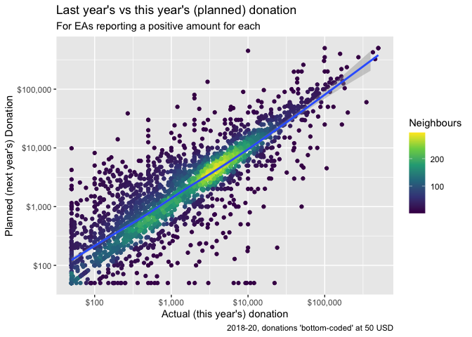

```r
#TODO: --medium  importance -- facet or animate this across years'
```

As in previous sections, we conduct replication-based tests. Here we can separately consider both (i) the (unpaired) differences in the medians and means of distributions and (ii) the medians and means of the differences themselves.\

First, considering the differences in these distributions:


```r
next_current_unlinked_results_table
```

<table class="table" style="margin-left: auto; margin-right: auto;">
<caption>(\#tab:hyp-test-results-tables-unlinked)'Next year (plan)' - 'this year' donation distributions: permutation tests</caption>
 <thead>
  <tr>
   <th style="text-align:left;"> Sample </th>
   <th style="text-align:left;"> Statistic </th>
   <th style="text-align:right;"> Point estimate </th>
   <th style="text-align:right;"> CI Lower </th>
   <th style="text-align:right;"> CI Upper </th>
   <th style="text-align:right;"> P-value </th>
  </tr>
 </thead>
<tbody>
  <tr>
   <td style="text-align:left;"> 2018-2020, all responses </td>
   <td style="text-align:left;"> Difference in Mean </td>
   <td style="text-align:right;"> 1632.8 </td>
   <td style="text-align:right;"> -2506.269 </td>
   <td style="text-align:right;"> 5771.8 </td>
   <td style="text-align:right;"> 0.5 </td>
  </tr>
  <tr>
   <td style="text-align:left;"> 2018-2020, all responses </td>
   <td style="text-align:left;"> Difference in Median </td>
   <td style="text-align:right;"> 437.7 </td>
   <td style="text-align:right;"> 306.781 </td>
   <td style="text-align:right;"> 568.6 </td>
   <td style="text-align:right;"> 0.0 </td>
  </tr>
</tbody>
</table>

The mean of the distribution of the current-years' planned donations is higher than the mean for the previousc year's, but we cannot reject equality (the p value is far above the conventional statistical threshold). However, the median is statistically significantly higher (by 438 USD point estimate).

Next, considering the differences by individual:


```r
current_next_test_table
```

<table class="table" style="margin-left: auto; margin-right: auto;">
<caption>(\#tab:hyp-test-results-tables-linked)Planned minus last year's donation, 2018-20, all participants who report donations</caption>
 <thead>
  <tr>
   <th style="text-align:left;"> Statistic </th>
   <th style="text-align:right;"> Point estimate </th>
   <th style="text-align:right;"> CI Lower </th>
   <th style="text-align:right;"> CI Upper </th>
   <th style="text-align:right;"> P-value </th>
  </tr>
 </thead>
<tbody>
  <tr>
   <td style="text-align:left;"> Mean </td>
   <td style="text-align:right;"> 1452 </td>
   <td style="text-align:right;"> 349 </td>
   <td style="text-align:right;"> 2555 </td>
   <td style="text-align:right;"> 0.016 </td>
  </tr>
  <tr>
   <td style="text-align:left;"> Median </td>
   <td style="text-align:right;"> 0 </td>
   <td style="text-align:right;"> 0 </td>
   <td style="text-align:right;"> 0 </td>
   <td style="text-align:right;"> 1.000 </td>
  </tr>
</tbody>
</table>

The median difference is clearly 0 -- the great middle mass of participants report the same donation planned for the current year as for the previous one, and this is the case in all resampling simulations. However, the mean difference is strongly and significantly positive: if we consider the magnitude of the differences, people tend to report a greater planned donation for this year than they reported last year. However, this does *not* necessarily indicate over-optimism and underperformance: it is possible that the individuals responding to individual survey in this period in fact *did and do* increase their donations from year to year.

## Model of EA donation behavior {#modeling}

### Modeling 'questions' and approaches: {.unnumbered}

As discussed in other posts [and linked material](https://rethinkpriorities.github.io/ea_data_public/eas-engagement.html#modeling-engagement), we broadly imagine three categories of modeling: (See discussion in the fold.)

1.  Descriptive ('what relates to donation behavior'),

2.  Predictive ('what will people with particular characteristics donate in the future'), and

3.  Causal ('what factors actually *determine* the amount donated'; so if we changed these factors, donations would change).

\BeginKnitrBlock{fold}<div class="fold">1. Descriptive modeling: Essentially, offering a "dimension reduction" of the data, presenting 'which features relate to donation behavior'?
2. Predictive modeling: Training a model to produce the best out-of-sample (or out-of-time) fit for current (or future) donations based on individual characteristics. This model should not include 'leaks', i.e., it should excluding individual characteristics and outcomes that occur after the time we would be 'doing the prediction'.
3. Causal: Consider identification of 'causal paths', i.e., 'what actually determines amounts donated'.

However causal inference  requires strong assumptions and/or exogenous and random shifts in potential determinants of donation behavior. We don't have any obvious candidates for this in the current setting. At best, we can interpret our descriptive and predictive models as suggestive of causal relationships.
</div>\EndKnitrBlock{fold}

We may care about causality

i.  because we see potential to intervene and boost those variables that cause greater giving, and/or because

ii. a better understanding of what actually *drives* donation behavior may yield additional insights, helping us understand the world better.

*However*, we see little potential for very credible and convincing *causal* inference here. We thus first focus on description (and less so, prediction), while informally considering 'plausible causation'. We discuss (and implement) this in the [next section](#descriptive). (Discussion in bookdown/fold [HERE](https://rethinkpriorities.github.io/ea_data_public/eas-donations.html#modeling-questions-and-approaches)).\*

<!-- bookdown_start -->

\BeginKnitrBlock{fold}<div class="fold">
\* Consider factors of potential interest, including those we could influence as a movement (e.g., 'recommended career paths') and those of fundamental interest (perhaps income, age or initial cause prioritization). Simply looking at differences in donation by these measures will not tell us their actual *impact* on donation; nor will a 'controlled regression': each of these are likely to be related to, and influenced by (observable and) unobserved components which may also drive donations.

E.g., suppose people who first went to an elite university tended to donate more. This would *not* this mean that attending an elite university causes greater donations. Individuals who attend elite university may have greater exposure to EA charitable appeals, or greater (unobserved wealth) or lifetime income, which may independently cause greater giving. Even age cannot be given an obvious causal interpretation, given our sample selection; e.g., in any sample we look at the older people will tend to have joined EA at a younger age, and people may have been driven to join at a younger age *because* they were more altruistic, or because they had a stronger EA peer network, etc.

For these reasons, we general look for sources of experimental or quasi-experimental variation in the factors of interest to justify causal inference. However, these are not present in our data.</div>\EndKnitrBlock{fold}
<!-- bookdown_end -->

As mentioned in the introduction, being able to *predict* donations could be useful for several reasons. Thus, we follow our descriptive models with ["predictive models"](#predictive-models), with different goals and approaches, including elements of machine learning (see further discussion [below](#predictive-models)).

### Descriptive (and causally-suggestive) models {#descriptive}

[2019 post:](https://forum.effectivealtruism.org/posts/29xPsh2MKkYGCuJhS/ea-survey-2019-series-donation-data)

> The results of a regression analysis are again suggestive ... that those with higher incomes and GWWC members tend to donate more than those with lower incomes or who are students. ...

In this year's post we begin with a set of pre-specified models aimed at describing and providing suggestive inference about causal factors driving donations. (Further discussion in the [Bookdown at this point](https://rethinkpriorities.github.io/ea_data_public/eas-donations.html#descriptive)) .

<!-- bookdown_start -->


\BeginKnitrBlock{fold}<div class="fold">
In our *descriptive* modeling we do *not* remove 'insignificant' features from the model (as in stepwise regression), nor do we shrink the coefficients towards zero (as in Ridge and Lasso models). Under the assumptions of the  classical linear model and its simple extensions the coefficients we present here would be unbiased or consistent. (However, we admit that the strong assumptions of this model, particularly those embodying exogeneity, are likely to fail in important ways in the current non-experimental setting.)</div>\EndKnitrBlock{fold}

We retain those features of most direct interest (such as 'how introduced to EA') and/or theoretical importance (such as income),\*\* 'controls' (especially time-in-EA and survey-year) that might allow us to better interpret the features of interest.

::: {.marginnote}
\*\* Classical economic theory suggests that most goods are 'normal', with the amount consumed increasing in income. Empirical evidence supports this for charitable giving; [recent work](https://econofact.org/are-rich-people-really-less-generous) suggests that *share of income* is relatively constant across the income distribution, implying that wealthier people give more in absolute terms.
:::

As discussed in [other posts](https://forum.effectivealtruism.org/posts/tzFcqGmCA6ePeD5wm/ea-survey-2020-how-people-get-involved-in-ea) 'how people were introduced to EA' has changed over the years. We also expect those who have been involved in EA for a longer period of time to be more engaged, and perhaps donate more (possibly due to differential attrition). Thus, it seems reasonable that in tracking the association between donation and introducer, we might want to 'control for' (difference out or hold constant) the differences in 'time-in-EA' between these groups. Still, we admit that these specifications are not based on an explicit causal model or identification strategy.

<!-- bookdown_end -->


#### Choosing features and modeling targets {.unnumbered}

We construct several 'feature sets':

-   "Key demographics, student status, and geography", used in all models <!-- key_demog -->
-   "Career/Economics": (Income, employment status, top-6 university)\* <!-- feat_income_employ -- -->
-   "Pledges/commitments:" Whether ever taken a 'Giving What We Can Pledge', whether 'Earning to Give' <!-- feat_gwwc_etg -->
-   "Controls" for age, time-in-EA, and survey-year (used in all models)\*\* <!-- controls -->

::: {.marginnote}
\* "Top-6 university" refers to whether the individual lists any of the six universities (Oxford, Stanford, Harvard, CalTech, MIT, Cambridge) appearing in the top-10 of all of USNWR, QS, and THE rankings. However, university was not asked in the 2018 survey; we will check whether this has an impact on the coefficient for year 2018.
:::

::: {.marginnote}
\*\* We refer to the latter as "controls" because they aid our interpretation of other features of interest, as noted above. However, these are *also* of independent interest.
:::

**We focus on three key outcomes:**

1.  Amount donated (converted to US dollars)\*\*\*

::: {.marginnote}
\*\*\*Here we focus on the average of last-year's and next year's donation for each individual, where both are present, and otherwise we use whichever one is present. In the presence of recall and reporting error, we expect this will improve the reliability of our estimates. The [plots and figures above](#plan-actual) also suggest that planned and actual donations are closely related. We report a set of related results for the simpler donation outcome in the robustness appendix.
:::

2.  Donation as a share of income\*\*\*\*

::: {.marginnote}
\*\*\*\* Where income is missing or where income was reported as 0 we impute it based on student status and country.
:::

3.  Whether donated more than 1000 USD


```r
# Define vector for renaming terms in regression output
#"new_names'" moved to `build/labeling_eas.R'
```


```r
#TODO - medium -- try to move all this to build side

#We impute variables where missing and normalizing all variables to be mean-zero and to be on the same scale.

diqr <- function(x) {
  (x - mean(x, na.rm=TRUE))/IQR(x, na.rm=TRUE)
}

gtmed <- function(x) {
  x*(x>med(x))
}

#TODO -- HIGH importance -- why 43 missing values for donation_usd?

eas_all_s <- eas_all %>%
  filter(!is.na(don_av2_yr) & year_f %in% c("2018", "2019", "2020")) %>%
  mutate(
    #(re) code scaling and 2-part splits for the modeling sample (2018-20, reporting donations)
    age_d2sd = arm::rescale(age), #Todo (automate this with `mutate(across)` thing)
    age_if_older = gtmed(age),

    ln_age_if_older = gtmed(ln_age),
    ln_years_involved_post_med = gtmed(ln_years_involved),
    years_involved_d2sd = arm::rescale(year - as.numeric(year_involved)),
    years_inv_d2sd_post_med = gtmed(years_involved_d2sd),
    income_c_imp_diqr = diqr(income_c_imp_bc5k),
    age_d2sd_post_med = arm::rescale(age_if_older),
    income_c_imp_diqr_if_richer = gtmed(income_c_imp_diqr),
    ln_income_c_imp_if_richer= gtmed(ln_income_c_imp_bc5k)
  ) %>%
  rowwise() %>%
  mutate(don_share_inc_imp_bc5k = min(don_share_inc_imp_bc5k, 1)) %>%  #recode about 84 values so the range is between 0-1 for frac. logit to work
  ungroup() %>%
  dplyr::select(all_of(c(num_out, bin_out, controls, key_demog, feat_income_employ, feat_gwwc_etg, robust_controls)),
                income_c, income_c_imp_bc5k, income_c_imp_diqr, income_c_imp_diqr_if_richer, first_hear_ea_lump, years_involved, age,
                contains("d2sd"), contains("iqr")) %>% #I have added first_hear_ea_lump back even though we don't use it here because we want to use it in ML; I hope it doesn't mess anything up
  # years_involved included to put in sumstats
  labelled::set_variable_labels(.labels = as.list(key_eas_all_labels), .strict=FALSE)

#eas_all_s_rl <- eas_all_s %>%
  #filter_all(any_vars(is.na(.), negate = TRUE)) %>% #(Alt: drop all rows with any missings)
  #mutate(
    #re-leveling should now be done on build side only because it removes labels
  #Hopefully everything above preserves levels
  #where_live_cat = relevel(where_live_cat, ref="USA"),
      #city_cat = relevel(city_cat, ref="Other"),
        #year_f = relevel(as.factor(year_f), ref="2017"),
      #student_cat = relevel(student_cat, ref="Non-student"),
      #not_male_cat = relevel(not_male_cat, ref="Male")
     # race_cat = relevel(race_cat, ref="Just white")
    #) %>%
  #gdata::drop.levels()  #drops unused factor levels

  #Recode missing as 0 for all dummies, as a 'NA category' for categoricals
  #also for normalized variables; i.e., set missings to the mean
eas_all_s_rl <- eas_all_s %>%
    mutate(across(matches("d_|not_just_white"), missing_to_zero))

eas_all_s_rl_imp <- eas_all_s_rl %>%
      mutate(across(matches("d2sd|diqr"), missing_to_zero)) %>%
    labelled::set_variable_labels(.labels = as.list(key_eas_all_labels), .strict=FALSE)
#TODO: (future) -- check for sensitivity to this imputation vs dropping these obs

# Write imp dataset to csv and RDS for ML/predictive modeling in donation_pred.R etc.

saveRDS(eas_all_s_rl_imp, file = here("data","edited_data","eas_all_s_rl_imp.Rdata"))

eas_all_s_rl_imp %>% write_csv(here("data", "edited_data/eas_all_s_rl_imp.csv"))
```


```r
count_uniq <- eas_all_s_rl %>% #counts of unique values for each feature in each year
  grp_uniq(year_f)

recover_cols <- count_uniq %>%  #any columns *without* unique features in each year?
  select_if(~ any(.==1))%>%
  names()
```

\BeginKnitrBlock{technote}<div class="technote">
In the more extensive 'bookdown' version we report the summary statistics for the data used in the models. See [HERE](https://rethinkpriorities.github.io/ea_data_public/eas-donations.html#descriptive).
</div>\EndKnitrBlock{technote}

<!-- bookdown_start -->

We report summary statistics on a selection of these features and target outcomes below, limited to the subset who report a zero or positive previous or current-year donation (as in our modeling).

```{=html}
<!--
Todo: medium priority...
- mostly OK, still needs some labeling tweaks etc
-->
```

```r
#don_inc_career_tab

(
  don_inc_career_tab <- eas_all_s_rl_imp %>%
            filter(!is.na(don_av2_yr)) %>%
      mutate(`Earn-to-give` = as.factor(d_career_etg),
           `GwwC` = as.factor(d_gwwc_ever_0)) %>%
  ungroup() %>%
  filter(year_f %in% c("2018", "2019", "2020")) %>%
 dplyr::select(starts_with("don"), starts_with("d_don"), starts_with("inc"), -income_c_imp_diqr,
               d_pt_employment, d_not_employed,
               `Earn-to-give`, `GwwC`) %>%
  dplyr::select(-starts_with("l_"), -d_don_10pct, -ends_with("d2sd"),
                -matches("_if_|_post_")) %>%
    .summ(title = "Donations, income, career, 2018-2020,  (subset: reporting 0+ donation)",
          digits = c(0,0,1,1,2,1),
          labels=TRUE,
          logical.labels = c("No", "Yes"),
              factor.counts = FALSE)
)
```

<table>
<caption>(\#tab:unnamed-chunk-115)Donations, income, career, 2018-2020,  (subset: reporting 0+ donation)</caption>
 <thead>
  <tr>
   <th style="text-align:left;"> Variable </th>
   <th style="text-align:left;"> N Responses </th>
   <th style="text-align:left;"> N positive </th>
   <th style="text-align:left;"> Mean </th>
   <th style="text-align:left;"> Sd </th>
   <th style="text-align:left;"> Median </th>
   <th style="text-align:left;"> 90th pct </th>
  </tr>
 </thead>
<tbody>
  <tr>
   <td style="text-align:left;"> Donation (USD) </td>
   <td style="text-align:left;"> 5016 </td>
   <td style="text-align:left;"> 4157 </td>
   <td style="text-align:left;"> 8992.3 </td>
   <td style="text-align:left;"> 106108.5 </td>
   <td style="text-align:left;"> 660 </td>
   <td style="text-align:left;"> 10059.9 </td>
  </tr>
  <tr>
   <td style="text-align:left;"> Don. 'avg' </td>
   <td style="text-align:left;"> 5059 </td>
   <td style="text-align:left;"> 4528 </td>
   <td style="text-align:left;"> 9633.8 </td>
   <td style="text-align:left;"> 103967.3 </td>
   <td style="text-align:left;"> 1000 </td>
   <td style="text-align:left;"> 12000 </td>
  </tr>
  <tr>
   <td style="text-align:left;"> Don./Income (imp, bc) </td>
   <td style="text-align:left;"> 5016 </td>
   <td style="text-align:left;"> 4157 </td>
   <td style="text-align:left;"> 0.1 </td>
   <td style="text-align:left;"> 0.1 </td>
   <td style="text-align:left;"> 0.02 </td>
   <td style="text-align:left;"> 0.1 </td>
  </tr>
  <tr>
   <td style="text-align:left;"> Don. plan (USD) </td>
   <td style="text-align:left;"> 4870 </td>
   <td style="text-align:left;"> 4201 </td>
   <td style="text-align:left;"> 10625.1 </td>
   <td style="text-align:left;"> 107729.9 </td>
   <td style="text-align:left;"> 1097.69 </td>
   <td style="text-align:left;"> 13000 </td>
  </tr>
  <tr>
   <td style="text-align:left;"> Don. &gt; 1k USD </td>
   <td style="text-align:left;"> 5016 </td>
   <td style="text-align:left;">  </td>
   <td style="text-align:left;">  </td>
   <td style="text-align:left;">  </td>
   <td style="text-align:left;">  </td>
   <td style="text-align:left;">  </td>
  </tr>
  <tr>
   <td style="text-align:left;"> ... FALSE </td>
   <td style="text-align:left;">  </td>
   <td style="text-align:left;"> 54% </td>
   <td style="text-align:left;">  </td>
   <td style="text-align:left;">  </td>
   <td style="text-align:left;">  </td>
   <td style="text-align:left;">  </td>
  </tr>
  <tr>
   <td style="text-align:left;"> ... TRUE </td>
   <td style="text-align:left;">  </td>
   <td style="text-align:left;"> 46% </td>
   <td style="text-align:left;">  </td>
   <td style="text-align:left;">  </td>
   <td style="text-align:left;">  </td>
   <td style="text-align:left;">  </td>
  </tr>
  <tr>
   <td style="text-align:left;"> Income (not imp.) </td>
   <td style="text-align:left;"> 4887 </td>
   <td style="text-align:left;"> 4518 </td>
   <td style="text-align:left;"> 83066.8 </td>
   <td style="text-align:left;"> 1314897.6 </td>
   <td style="text-align:left;"> 33956.11 </td>
   <td style="text-align:left;"> 130075.8 </td>
  </tr>
  <tr>
   <td style="text-align:left;"> Income (imp. bc) </td>
   <td style="text-align:left;"> 5059 </td>
   <td style="text-align:left;"> 5059 </td>
   <td style="text-align:left;"> 83590.1 </td>
   <td style="text-align:left;"> 1292280.1 </td>
   <td style="text-align:left;"> 35506.2 </td>
   <td style="text-align:left;"> 130000 </td>
  </tr>
  <tr>
   <td style="text-align:left;"> Employed PT </td>
   <td style="text-align:left;"> 5059 </td>
   <td style="text-align:left;"> 474 </td>
   <td style="text-align:left;"> 0.1 </td>
   <td style="text-align:left;"> 0.3 </td>
   <td style="text-align:left;"> 0 </td>
   <td style="text-align:left;"> 0 </td>
  </tr>
  <tr>
   <td style="text-align:left;"> Not Employed </td>
   <td style="text-align:left;"> 5059 </td>
   <td style="text-align:left;"> 260 </td>
   <td style="text-align:left;"> 0.1 </td>
   <td style="text-align:left;"> 0.2 </td>
   <td style="text-align:left;"> 0 </td>
   <td style="text-align:left;"> 0 </td>
  </tr>
  <tr>
   <td style="text-align:left;"> Earn-to-give </td>
   <td style="text-align:left;"> 5059 </td>
   <td style="text-align:left;">  </td>
   <td style="text-align:left;">  </td>
   <td style="text-align:left;">  </td>
   <td style="text-align:left;">  </td>
   <td style="text-align:left;">  </td>
  </tr>
  <tr>
   <td style="text-align:left;"> ... 0 </td>
   <td style="text-align:left;">  </td>
   <td style="text-align:left;"> 70% </td>
   <td style="text-align:left;">  </td>
   <td style="text-align:left;">  </td>
   <td style="text-align:left;">  </td>
   <td style="text-align:left;">  </td>
  </tr>
  <tr>
   <td style="text-align:left;"> ... 1 </td>
   <td style="text-align:left;">  </td>
   <td style="text-align:left;"> 30% </td>
   <td style="text-align:left;">  </td>
   <td style="text-align:left;">  </td>
   <td style="text-align:left;">  </td>
   <td style="text-align:left;">  </td>
  </tr>
  <tr>
   <td style="text-align:left;"> GWWC (ever) </td>
   <td style="text-align:left;"> 5059 </td>
   <td style="text-align:left;">  </td>
   <td style="text-align:left;">  </td>
   <td style="text-align:left;">  </td>
   <td style="text-align:left;">  </td>
   <td style="text-align:left;">  </td>
  </tr>
  <tr>
   <td style="text-align:left;"> ... No/NA </td>
   <td style="text-align:left;">  </td>
   <td style="text-align:left;"> 66% </td>
   <td style="text-align:left;">  </td>
   <td style="text-align:left;">  </td>
   <td style="text-align:left;">  </td>
   <td style="text-align:left;">  </td>
  </tr>
  <tr>
   <td style="text-align:left;"> ... Yes </td>
   <td style="text-align:left;">  </td>
   <td style="text-align:left;"> 34% </td>
   <td style="text-align:left;">  </td>
   <td style="text-align:left;">  </td>
   <td style="text-align:left;">  </td>
   <td style="text-align:left;">  </td>
  </tr>
</tbody>
</table>

Above, we report donations, income, career, and GWWC pledge rates. Note that the 'Don. avg.', the average of the current year and planned donation, is close, but slightly above the 'Donation' variable, and has somewhat more positive values. Note also that income imputation (where missing or stated as below 5000 USD) recodes about 10% of these values, and leads to a fairly similar average income figure (compare 'Income (not imp.)' and 'Income (imp. bc.)', where the latter refers to the income imputation and bottom-coding at 5000 USD). Note that, perhaps unsurprisingly, the rates of self-reported 'earning-to-give' careers and 'having ever made a Giving What We Can pledge' is higher among those in this sample (those who report a donation) than in the overall EAS sample.


```r
#TODO for future posts/time permitting: split by 'whether reported donation', test for differences

(
  demog_etc_tab <- eas_all_s_rl_imp %>% ungroup() %>%
    filter(year_f %in% c("2018", "2019", "2020")) %>%
    droplevels() %>%
        filter(!is.na(don_av2_yr)) %>%
 dplyr::select(-contains("don"), -starts_with("d_don"), -starts_with("inc"), -starts_with("ln_"), -d_don_10pct, -ln_income_c_imp_bc5k,  -matches("d2sd|_if_|_post_")) %>%
    select(-d_pt_employment, -d_not_employed, -d_career_etg, -d_gwwc_ever_0, -first_hear_ea_lump, -year_f, -years_involved, -age) %>%
  select(everything()) %>%
     labelled::set_variable_labels(.labels = as.list(key_eas_all_labels), .strict=FALSE) %>%
    sumtable(
    labels = TRUE, #uses assigned in Hmisc or sjlabelled
                simple.kable = TRUE, title = "Demography etc., 2018-2020 (subset: reporting 0+ donation)",
    digits = 1,
    factor.counts = FALSE,
    out="kable"
) %>%
  kable_styling()
)
```

<table class="table" style="margin-left: auto; margin-right: auto;">
<caption>(\#tab:unnamed-chunk-116)Demography etc., 2018-2020 (subset: reporting 0+ donation)</caption>
 <thead>
  <tr>
   <th style="text-align:left;"> Variable </th>
   <th style="text-align:left;"> N </th>
   <th style="text-align:left;"> Percent </th>
  </tr>
 </thead>
<tbody>
  <tr>
   <td style="text-align:left;"> Gender </td>
   <td style="text-align:left;"> 5059 </td>
   <td style="text-align:left;">  </td>
  </tr>
  <tr>
   <td style="text-align:left;"> ... Male </td>
   <td style="text-align:left;">  </td>
   <td style="text-align:left;"> 69% </td>
  </tr>
  <tr>
   <td style="text-align:left;"> ... Not-male </td>
   <td style="text-align:left;">  </td>
   <td style="text-align:left;"> 28% </td>
  </tr>
  <tr>
   <td style="text-align:left;"> ... Gender: No response </td>
   <td style="text-align:left;">  </td>
   <td style="text-align:left;"> 3% </td>
  </tr>
  <tr>
   <td style="text-align:left;"> Student </td>
   <td style="text-align:left;"> 5059 </td>
   <td style="text-align:left;">  </td>
  </tr>
  <tr>
   <td style="text-align:left;"> ... Non-student </td>
   <td style="text-align:left;">  </td>
   <td style="text-align:left;"> 67% </td>
  </tr>
  <tr>
   <td style="text-align:left;"> ... Student </td>
   <td style="text-align:left;">  </td>
   <td style="text-align:left;"> 33% </td>
  </tr>
  <tr>
   <td style="text-align:left;"> ... Student: No response </td>
   <td style="text-align:left;">  </td>
   <td style="text-align:left;"> 0% </td>
  </tr>
  <tr>
   <td style="text-align:left;"> Race/ethnicity </td>
   <td style="text-align:left;"> 5059 </td>
   <td style="text-align:left;">  </td>
  </tr>
  <tr>
   <td style="text-align:left;"> ... Just white </td>
   <td style="text-align:left;">  </td>
   <td style="text-align:left;"> 80% </td>
  </tr>
  <tr>
   <td style="text-align:left;"> ... Not just white </td>
   <td style="text-align:left;">  </td>
   <td style="text-align:left;"> 18% </td>
  </tr>
  <tr>
   <td style="text-align:left;"> ... Race: No response </td>
   <td style="text-align:left;">  </td>
   <td style="text-align:left;"> 2% </td>
  </tr>
  <tr>
   <td style="text-align:left;"> Where live </td>
   <td style="text-align:left;"> 5059 </td>
   <td style="text-align:left;">  </td>
  </tr>
  <tr>
   <td style="text-align:left;"> ... USA </td>
   <td style="text-align:left;">  </td>
   <td style="text-align:left;"> 40% </td>
  </tr>
  <tr>
   <td style="text-align:left;"> ... Can/Aus/NZ </td>
   <td style="text-align:left;">  </td>
   <td style="text-align:left;"> 13% </td>
  </tr>
  <tr>
   <td style="text-align:left;"> ... Country: No response </td>
   <td style="text-align:left;">  </td>
   <td style="text-align:left;"> 7% </td>
  </tr>
  <tr>
   <td style="text-align:left;"> ... EEA not Anglo </td>
   <td style="text-align:left;">  </td>
   <td style="text-align:left;"> 21% </td>
  </tr>
  <tr>
   <td style="text-align:left;"> ... Other </td>
   <td style="text-align:left;">  </td>
   <td style="text-align:left;"> 3% </td>
  </tr>
  <tr>
   <td style="text-align:left;"> ... UK/IR </td>
   <td style="text-align:left;">  </td>
   <td style="text-align:left;"> 16% </td>
  </tr>
  <tr>
   <td style="text-align:left;"> City </td>
   <td style="text-align:left;"> 5059 </td>
   <td style="text-align:left;">  </td>
  </tr>
  <tr>
   <td style="text-align:left;"> ... Other </td>
   <td style="text-align:left;">  </td>
   <td style="text-align:left;"> 39% </td>
  </tr>
  <tr>
   <td style="text-align:left;"> ... City: No response </td>
   <td style="text-align:left;">  </td>
   <td style="text-align:left;"> 18% </td>
  </tr>
  <tr>
   <td style="text-align:left;"> ... Named big city </td>
   <td style="text-align:left;">  </td>
   <td style="text-align:left;"> 43% </td>
  </tr>
  <tr>
   <td style="text-align:left;"> Top-6 Uni. </td>
   <td style="text-align:left;"> 5059 </td>
   <td style="text-align:left;">  </td>
  </tr>
  <tr>
   <td style="text-align:left;"> ... No </td>
   <td style="text-align:left;">  </td>
   <td style="text-align:left;"> 46% </td>
  </tr>
  <tr>
   <td style="text-align:left;"> ... NA </td>
   <td style="text-align:left;">  </td>
   <td style="text-align:left;"> 47% </td>
  </tr>
  <tr>
   <td style="text-align:left;"> ... Yes </td>
   <td style="text-align:left;">  </td>
   <td style="text-align:left;"> 7% </td>
  </tr>
</tbody>
</table>

```r
(
  year_etc_tab <- eas_all_s_rl_imp %>% ungroup() %>%
    filter(year_f %in% c("2018", "2019", "2020")) %>%
    droplevels() %>%
        filter(!is.na(don_av2_yr)) %>%
 dplyr::select(year_f, years_involved, age) %>%
     labelled::set_variable_labels(.labels = as.list(key_eas_all_labels), .strict=FALSE) %>%
    sumtable(
    labels = TRUE, #uses assigned in Hmisc or sjlabelled
                simple.kable = TRUE, title = "Year, years-involved, age; 2018-2020 (subset: reporting 0+ donation)",
    digits = 1,
    factor.counts = FALSE,
    out="kable") %>% 
  kable_styling()
)
```

<table class="table" style="margin-left: auto; margin-right: auto;">
<caption>(\#tab:unnamed-chunk-116)Year, years-involved, age; 2018-2020 (subset: reporting 0+ donation)</caption>
 <thead>
  <tr>
   <th style="text-align:left;"> Variable </th>
   <th style="text-align:left;"> N </th>
   <th style="text-align:left;"> Mean </th>
   <th style="text-align:left;"> Std. Dev. </th>
   <th style="text-align:left;"> Min </th>
   <th style="text-align:left;"> Pctl. 25 </th>
   <th style="text-align:left;"> Pctl. 75 </th>
   <th style="text-align:left;"> Max </th>
  </tr>
 </thead>
<tbody>
  <tr>
   <td style="text-align:left;"> Year of survey </td>
   <td style="text-align:left;"> 5059 </td>
   <td style="text-align:left;">  </td>
   <td style="text-align:left;">  </td>
   <td style="text-align:left;">  </td>
   <td style="text-align:left;">  </td>
   <td style="text-align:left;">  </td>
   <td style="text-align:left;">  </td>
  </tr>
  <tr>
   <td style="text-align:left;"> ... 2018 </td>
   <td style="text-align:left;">  </td>
   <td style="text-align:left;"> 38% </td>
   <td style="text-align:left;">  </td>
   <td style="text-align:left;">  </td>
   <td style="text-align:left;">  </td>
   <td style="text-align:left;">  </td>
   <td style="text-align:left;">  </td>
  </tr>
  <tr>
   <td style="text-align:left;"> ... 2019 </td>
   <td style="text-align:left;">  </td>
   <td style="text-align:left;"> 34% </td>
   <td style="text-align:left;">  </td>
   <td style="text-align:left;">  </td>
   <td style="text-align:left;">  </td>
   <td style="text-align:left;">  </td>
   <td style="text-align:left;">  </td>
  </tr>
  <tr>
   <td style="text-align:left;"> ... 2020 </td>
   <td style="text-align:left;">  </td>
   <td style="text-align:left;"> 28% </td>
   <td style="text-align:left;">  </td>
   <td style="text-align:left;">  </td>
   <td style="text-align:left;">  </td>
   <td style="text-align:left;">  </td>
   <td style="text-align:left;">  </td>
  </tr>
  <tr>
   <td style="text-align:left;"> Years in EA </td>
   <td style="text-align:left;"> 4871 </td>
   <td style="text-align:left;"> 3.7 </td>
   <td style="text-align:left;"> 2.4 </td>
   <td style="text-align:left;"> 0.5 </td>
   <td style="text-align:left;"> 1.5 </td>
   <td style="text-align:left;"> 5.5 </td>
   <td style="text-align:left;"> 11.5 </td>
  </tr>
  <tr>
   <td style="text-align:left;"> age </td>
   <td style="text-align:left;"> 4209 </td>
   <td style="text-align:left;"> 30.1 </td>
   <td style="text-align:left;"> 9.8 </td>
   <td style="text-align:left;"> 4 </td>
   <td style="text-align:left;"> 24 </td>
   <td style="text-align:left;"> 33 </td>
   <td style="text-align:left;"> 102 </td>
  </tr>
</tbody>
</table>

As the table above suggests, we are modeling EA survey years 2018-2020 only, with roughly equal shares of each year (although somewhat fewer in each subsequent year). The largest (or plurality) demographic groups (as in the sample overall, see other posts) are male, non-students, of 'white' ethnicity, and from the US. At least 43% come from one of cities named in the EA survey (over 50% of those responding), and 13% (where we have data) have some education at a 'top-6' global university.

<!-- bookdown_end -->

#### Constructing models {.unnumbered}

**We focus on the following modeling specifications:** \*

::: {.marginnote}
\* We report log-linear models in the robustness appendix. <!-- Todo -->
:::

1.  Proportional-effects 'Quasi-Poisson' model for 'amount donated' outcomes (allowing the expected donation to be an exponential function of the features). \*\*

::: {.marginnote}
\*\*We focus on the 'average of planned and actual, where present, otherwise the non-missing value'. Although this outcome variable is continuous (and this cannot strictly follow a Poisson distribution, the quasi-poisson model is still able to obtain consistent parameter estimates, provided that the conditional mean is correctly specified [@silvaLOGGRAVITY2006].
:::

2.  Fractional logit (@papkePanelDataMethods2008) 'donation as a share of income'

3.  Logit regression for the binary 'donated over 1000 USD' outcome


```r
# Define models (For LINEAR models ... used only in appendix, but some of these are reused in other models)
#-----------------------------------------------------

feat_list = list(
  #better to make this a 'named list'? (TODO -- @oska would that improve the code?)
  c(key_demog, feat_income_employ, controls),
  c(key_demog, feat_income_employ, controls, robust_controls),
 # c(key_demog, feat_income_employ, feat_fh, controls, robust_controls), #robust controls here because 'first heard' is likely entangled with tenure and age
  c(key_demog, feat_income_employ, feat_gwwc_etg, controls) )

feat_list_n = list(
  #better to make this a 'named list'? (TODO -- @oska would that improve the code?)
  c(key_demog_n, feat_income_employ_n, controls_n),
  c(key_demog_n, feat_income_employ_n, controls_n, robust_controls_n),
  c(key_demog_n, feat_income_employ_n, feat_gwwc_etg, controls_n) )

feat_names = c("Baseline", "Robust controls",  "Base + EtG & GWWC")

rhs_vars_list <- rep(feat_list, length(targets_short))
#rhs_vars_list_iqr <- rep(feat_list_iqr, length(targets_short))

outcome_vars_list <- rep(as.list(targets_short), each=length(feat_list))

dfs <- rep(list(eas_all_s_rl_imp), length(outcome_vars_list))
```


```r
## Create dataframe for modeling
linear_models <- make_model_df(rhs_vars_list, outcome_vars_list, dfs)

# Fit linear models
linear_models <- linear_models %>%
  mutate(
    lm_fit = fit_models(
      linear_models, "formulas", "dfs", fun = fit_lm)
    )
#warning `using type = "numeric" with a factor response will be ignored‘-’ not meaningful for factor`
# @DR: Why are these models being fit on binary outcomes? DR, @OM: It is fit on all the outcomes including the binary ones, no? However, we haven't reported it yet. Anyways, I think there is still a norm of considering 'linear probability models' in Economics, and arguments on its behalf, at least as a robustness check.

# Extract coefficients, fitted and residuals
model_feat_names <- rep(c(feat_names), times= length(targets_short))
model_oc_names <- rep(c(targets_short_names), each= length(feat_names))
model_names <- paste(model_oc_names, model_feat_names, sep = ": ")
```


```r
linear_models <- linear_models %>%
mutate(lm_coefficients = map(lm_fit,
                             extract_coefficients,
                             replacement_names = new_names,
                             robust_SE = TRUE),
#TODO -fix -- Medium importance (as linear is just for robustness checks...) error/warning: `'^’ not meaningful for factors`

       lm_resids = map(lm_fit, residuals),
       lm_fitted = map(lm_fit, fitted))

#note: in modeling_df, lm_fit and qp_fit are the 'model output' objects
# `lm_resids` are a list of vectors of residuals from each linear model
# `lm_fitted` are a list of vectors of predicted outcomes from each linear model

# Error: Problem with `mutate()` column `lm_coefficients`.
## ℹ `lm_coefficients = map(...)`.
## x only 0's may be mixed with negative subscripts
```


```r
#trying out some simple models just as a place to test what is going on

test_qp <- eas_all_s_rl_imp %>%
  glm(don_av2_yr ~ ln_income_c_imp_bc5k  + ln_age + not_male_cat + student_cat + race_cat + where_live_cat + city_cat + d_pt_employment +    d_not_employed + d_top6_uni + ln_years_involved + year_f, family=quasipoisson, data =.)


test_fl <- eas_all_s_rl_imp %>%  glm(don_share_inc_imp ~ ln_income_c_imp_bc5k + ln_age + not_male_cat + student_cat + race_cat +
    where_live_cat + city_cat  + d_pt_employment +
    d_not_employed + d_top6_uni + ln_years_involved + year_f, family = quasibinomial('logit'), data = .)


test_logit <- eas_all_s_rl_imp %>%  glm(d_don_1k ~ age_d2sd + not_male_cat + student_cat + race_cat +
    where_live_cat + city_cat + income_c_imp_diqr + d_pt_employment +
    d_not_employed + d_top6_uni + years_involved_d2sd + year_f,
    family = binomial, data = .)
```


```r
qp_targets_short <- c("don_av2_yr")
qp_outcome_vars <- rep(as.list(qp_targets_short), each=length(feat_list)) # List of outcome variables for quasi-poisson
qp_rhs_vars <- rep(feat_list, length(qp_targets_short)) # List of independent variables
qp_dfs <- rep(list(eas_all_s_rl_imp), length(qp_outcome_vars)) # List of dataframes to fit models to

qp_models <- make_model_df(qp_rhs_vars, qp_outcome_vars, qp_dfs) # Create dataframe for models

# Add model names
feat_group_names <- c("1. Baseline", "2. Robust controls",
                    "3. Base + ETG + GWWC")

qp_model_names <- feat_group_names

qp_models <- qp_models %>%
  mutate(model_name = rep(qp_model_names, length(qp_targets_short)))

# Fit quasi-poisson models
qp_models <- qp_models %>%
  mutate(
    qp_fit = fit_models(
      qp_models, "formulas", "dfs", fun = fit_glm)
    )

# Extract coefficients
## Takes a little while, consider parallels package?
qp_models_noexp <- qp_models %>%
  mutate(qp_coefficients = map(qp_fit,
                               extract_coefficients,
                               replacement_names = new_names,
                               exponentiate = FALSE,
                               robust_SE = TRUE),
         qp_resids = map(qp_fit, residuals),
         qp_fitted = map(qp_fit, fitted))

qp_models <- qp_models %>%
  mutate(qp_coefficients = map(qp_fit,
                               extract_coefficients,
                               replacement_names = new_names,
                               exponentiate = TRUE,
                               robust_SE = TRUE),
         qp_resids = map(qp_fit, residuals),
         qp_fitted = map(qp_fit, fitted))
```


```r
#Note: redone/redoing  - fractional logit instead of Quasi-poisson with offset
#Discussion:

fl_targets_short <- c("don_share_inc_imp_bc5k")
fl_outcome_vars <- rep(as.list(fl_targets_short), each=length(feat_list)) # List of outcome variables for quasi-poisson
fl_rhs_vars <- rep(feat_list, length(fl_targets_short)) # List of independent variables
fl_dfs <- rep(list(eas_all_s_rl_imp), length(fl_outcome_vars)) # List of dataframes to fit models to

#----------

# Function to remove a particular string from a list
#remove_str_list (moved to rstuff functions)

# Create dataframe for models
fl_models <- make_model_df(fl_rhs_vars, fl_outcome_vars, fl_dfs)

fl_models <- fl_models %>% mutate(model_name = rep(feat_group_names, length(fl_targets_short)))
```


```r
# Fit fractional logit models

fl_models <- fl_models %>%
  mutate(
    fl_fit = fit_models(
      fl_models, "formulas", "dfs", fun = fit_glm,
          family = quasibinomial('logit'))
    )

# Extract coefficients
## Takes a little while, consider parallels package?
fl_models_noexp <- fl_models %>%
  mutate(fl_coefficients = map(fl_fit,
                               extract_coefficients,
                               replacement_names = new_names,
                               exponentiate = FALSE,
                               robust_SE = TRUE),
         fl_resids = map(fl_fit, residuals),
         fl_fitted = map(fl_fit, fitted))

fl_models_noexp_nonrobust <- fl_models %>%
  mutate(fl_coefficients = map(fl_fit,
                               extract_coefficients,
                               replacement_names = new_names,
                               exponentiate = FALSE,
                               robust_SE = FALSE),
         fl_resids = map(fl_fit, residuals),
         fl_fitted = map(fl_fit, fitted))

fl_models <- fl_models %>%
  mutate(fl_coefficients = map(fl_fit,
                               extract_coefficients,
                               replacement_names = new_names,
                               exponentiate = TRUE,
                               robust_SE = TRUE),
         fl_resids = map(fl_fit, residuals),
         fl_fitted = map(fl_fit, fitted))
```


```{=html}
<!-- ## misc notes

# TODO --------------------------------------------------------------------
# Consider imputation (especially for income variable) #DR: the ad-hoc imputation we've used so far is probably good enough for now
## Should this be done before normalizing? #DR: it shouldn't matter, but yeah, it seems like better practice to impute before normalizing
-->
```
#### Models (Tables and plots of results; years 2018-20 combined) {.unnumbered}

We put together forest plots of (normalized) coefficients from the distinct set of models outlined above, where these can be compared on the same scales. Specifically, we consider,

-   for each of the three key outcomes ('amount donated (averaged)', 'donation as a share of income', 'donated over 1000 USD'),
-   models with three specific sets of features, yielding nine models in total (plus robustness checks in the appendix).

The feature sets, which we will refer to in the forest plots below, are:


```r
lab_list_to_text <- function(df) {
  df %>%
    var_label %>% unname %>% unlist() %>% paste(collapse = ', ')
}
```

**1. "Base"** (baseline model)

Demographics: Log age, Gender, Student, Race/ethnicity, Where live, City

Career-related: Employed PT, Not Employed, Top-6 Uni.

Controls: Years in EA (log), Year of survey

Where "imp" denotes that income is imputed where missing, "log" notes that the natural log was taken (allowing a proportional 'elasticity' relationship).

Note that for the Logit models we use standardizations instead of logged continuous variables.\*

::: {.marginnote}
\* We divide age and tenure by two sample standard deviations for each, following @gelmanScalingRegressionInputs2008. This allows the coefficients of continuous features like income to be compared to those for binary features like "whether employed". We divide income by the sample inter-quartile range (NA USD). As the distribution appears highly skewed, normalizing income by 2sd would yield extremely large and hard-to-interpret coefficients.
:::

**2. "Robust controls":** Including all of the features in *Base* as well as a second term for each of "Years in EA (log), Log age" that takes a positive value only where these exceed their respective sample medians, and is otherwise set to zero. These represent 'adjustment terms' allowing us to see whether and how time-in-EA, age, and income may have a different relationship with donations at higher values of each of these.\*

::: {.marginnote}
\* This simple 'two part' specification is partially related to the DataColada discussion [here](http://datacolada.org/62).
:::

```{=html}
<!--
**3. "Base + Robust + First heard":** Including all of the features in *Robust controls* as well as binary variables for "where first heard of EA".\*\*

::: {.marginnote}
\*\* Here we use the robust controls to 'robustly control' for nonlinear background effects that might be entangled with 'where first heard of EA'.
:::
-->
```
**3. "Base + ETG + GWWC":** Including all of the features in *Base* as well as the binary variables "GWWC (ever), EtG", i.e., whether reported ever having taken the Giving What We Can Pledge, and whether they report their career as 'earning-to-give'.

\

Note that we report models with *each of the three feature sets* in each of the forest plots below. However, each forest plot reports on a single outcome and a single 'theme', e.g., focusing reporting just the coefficients on demographics from across *each of the above three model feature sets* (with some repeated coefficients across plots).

**These themes are**

-   Demographics (including age and time-in-EA)\*
-   Employment/career, GWWC, EtG, Income\*\*
-   "Non-response" to particular questions (in the appendix)\*\*\*

However, it is important to remember that the reported estimates in each forest plot come from models that 'control for' other features (as reported).

Note that we exclude the 'two-part' coefficients (in the 'Robust controls' models) from the forest plots. We present the coefficients on 'Age, Time in EA, Income, and nonlinear adjustments for each of these' [in a separate set of tables](#nonlin).\*

::: {.marginnote}
\* In the 'Robust controls' model there are two coefficients for each of age, income and 'time in EA' for below-median values, and a second one representing the adjustment to this coefficient for above-median values of each of these. We leave these coefficients out of the forest plots to avoid confusion, reporting them in tables under "[Age, time-in-EA, Income, year; possible nonlinearity](#nonlin)" instead.
:::

::: {.marginnote}
\*\* We use the natural log of income in our models of donation amounts and 'donation/income' outcome. Here the (untransformed) coefficients have an elasticity interpretation --- percent increase in donations (or donation share) for a given percentage increase in income. As this scale is not comparable to our other coefficients, we do not report it in these forest plots. We report this in tables under "[Age, time-in-EA, Income; possible nonlinearity](#nonlin)" instead.
:::

::: {.marginnote}
\*\*\* To avoid clutter we present the results for nonresponse feature set in a [bookdown appendix table only](https://rethinkpriorities.github.io/ea_data_public/eas-donations.html#nonresponse).
:::


```r
# Create variable groupings for displaying coefficients
## Can't think of a tidier way to do this...
### Check that this extracts all necessary

demog_coefs <- c("Age", "Where live:", "Student", "city", "Gender:", "white", "race")
emp_gw_etg_coefs <- c("top-6 uni", "employ", "etg", "gwwc")
#fh_coefs <- c("hear")
nr_coefs <- c("response", "NA")

nonlin_coefs <- c("income", "age", "year") #coefficients of interest not (always) reported elsewhere, allowing us to consider nonlinearity

# Filter the coefficients returned from using broom::tidy
## Keep only those specified in character vector keep
extract_coefs <- function(df, keep, term_col = term,
                          ignore.case = TRUE,
                          exclude = NULL){

  # Add assertion statements in/doc string

  if (ignore.case == TRUE){
    keep <- tolower(keep)
  }

  keep <- paste(keep, collapse="|")

  coef_df <- df %>% filter(str_detect(tolower({{term_col}}), keep))

  if (!is.null(exclude)){
  exclude <- paste(exclude, collapse="|")
    coef_df <- coef_df %>% filter(!str_detect(tolower({{term_col}}), exclude))
  }

  return(coef_df)
}
```


```r
# Extract coefficients for each feature set, for making forest plots (and tables)

# forms <- list("qp", "fl", "logit")
#--> pmap (todo @oska)
qp_coefs <- qp_models %>%
  select(qp_coefficients, model_name, outcome) %>%
  tidyr::unnest(., cols = c(qp_coefficients))

qp_coefs_noexp <- qp_models_noexp %>%
  select(qp_coefficients, model_name, outcome) %>%
  tidyr::unnest(., cols = c(qp_coefficients))

fl_coefs <- fl_models %>%
  select(fl_coefficients, model_name, outcome) %>%
  tidyr::unnest(., cols = c(fl_coefficients))

fl_coefs_noexp <- fl_models_noexp %>%
  select(fl_coefficients, model_name, outcome) %>%
  tidyr::unnest(., cols = c(fl_coefficients))

fl_coefs_noexp_nonrobust <- fl_models_noexp_nonrobust %>%   select(fl_coefficients, model_name, outcome) %>%
  tidyr::unnest(., cols = c(fl_coefficients))

logit_coefs <- logit_models %>%
  select(logit_coefficients, model_name, outcome) %>%
  tidyr::unnest(., cols = c(logit_coefficients))

# feature_sets <- list("demog", "inc_emp_gw_etg", "fh", "nr")
#--> pmap2 feature_sets, forms (todo @oska) .. or maybe map across forms but not feature sets here, as we need bespoke exclusions

exclude_demog_coefs <- c("response","older", "post_med", "ln_" )

exclude_inc_coefs <- c("response", "if above", "older", "na")

#exclude_fh_coefs <- c("response", "if above", "older") #will prob need to add coefs for all the small fh categories if we put these all in

demog_coefs_qp <- extract_coefs(qp_coefs, demog_coefs, exclude = c(exclude_demog_coefs))
emp_gw_etg_coefs_qp <- extract_coefs(qp_coefs, emp_gw_etg_coefs, exclude = exclude_inc_coefs)
nr_coefs_qp <- extract_coefs(qp_coefs, nr_coefs)
nonlin_coefs_qp <- extract_coefs(qp_coefs, nonlin_coefs)
nonlin_coefs_qp_noexp <- extract_coefs(qp_coefs_noexp, nonlin_coefs)

nonlin_coefs_qp_combo  <- bind_rows(nonlin_coefs_qp_noexp %>% filter(str_detect(term, "Year of")==FALSE), nonlin_coefs_qp %>% filter(str_detect(term, "Year of")==TRUE))

demog_coefs_fl  <- extract_coefs(fl_coefs, demog_coefs,  exclude = exclude_demog_coefs)

emp_gw_etg_coefs_fl <- extract_coefs(fl_coefs, emp_gw_etg_coefs, exclude = exclude_inc_coefs)

#TODO: doublecheck the income coefficients:

nr_coefs_fl <- extract_coefs(fl_coefs, nr_coefs)
nonlin_coefs_fl <- extract_coefs(fl_coefs, nonlin_coefs)
nonlin_coefs_fl_noexp <- extract_coefs(fl_coefs_noexp, nonlin_coefs)
nonlin_coefs_fl_noexp_nonrobust <- extract_coefs(fl_coefs_noexp_nonrobust, nonlin_coefs)

nonlin_coefs_fl_combo  <- bind_rows(nonlin_coefs_fl_noexp %>% filter(str_detect(term, "Year of")==FALSE), nonlin_coefs_fl %>% filter(str_detect(term, "Year of")==TRUE))


demog_coefs_logit <- extract_coefs(logit_coefs, demog_coefs, exclude = exclude_demog_coefs)
emp_gw_etg_coefs_logit <- extract_coefs(logit_coefs, c("income", emp_gw_etg_coefs), exclude = exclude_inc_coefs)
nr_coefs_logit <- extract_coefs(logit_coefs, nr_coefs)
nonlin_coefs_logit <- extract_coefs(logit_coefs, nonlin_coefs)
```


```r
group_fp_do <- function(df, groups=model_name, xlims=c(NA,NA), vl=1){
  df %>%
    grouped_forest_plot(., groups = {{groups}}, vline = {{vl}}) +
    coord_cartesian(xlim = {{xlims}}) +
    scale_colour_discrete(name = "",
                        labels = function(x) str_wrap(x, width = 15)) +
  theme_bw() +
  theme(legend.position = "bottom") +
  guides(fill=guide_legend(nrow=2,byrow=TRUE))
}
#TODO: Add to caption at bottom, automate, specify the exact models (or at least explain the control variables)
# Legend on top or bottom?
# Todo -- gray line in background
# add more grid lines


fp_qp_subtitle <- "Quasi-poisson: relative rates, 95% CIs (Robust SEs); colors = models"

fp_logit_subtitle <- "Logit model, proportional effects, 95% CIs; colors = models"

fp_fl_subtitle <- "Frac. Logit model, prop. effects, 95% CIs; colors = models"

fp_caption = str_wrap("Results come from three distinct models, each with different sets of features. These models and their features are fully described in the main text. All confidence intervals are heteroskedasticity-robust (White, 1980).", 120)

#todo (@oska) purr::map these too
fp_demog_coefs_qp <- demog_coefs_qp %>%
  group_fp_do(vl=1) +
  labs(title= "'Donation amount', demog. coefficients",
       subtitle = fp_logit_subtitle,
       caption = fp_caption ) +
  theme(plot.caption = element_text(size = 8, hjust = 0))

fp_demog_coefs_fl <- demog_coefs_fl %>%
  group_fp_do(vl=1) +
  labs(title= "'Donation/income', demog. coefficients, 2018-20",  subtitle = fp_fl_subtitle,   caption = fp_caption) #TODO -- get me my ticks for 0.25, 0.5 etc

fp_demog_coefs_logit <- demog_coefs_logit  %>%
  group_fp_do(vl=1) +
  labs(title= "'Donated $1000+', demog. coef., 2018-20",  subtitle = fp_logit_subtitle,   caption = fp_caption)


#todo (@oska) purr::map these too
fp_emp_gw_etg_coefs_qp <- emp_gw_etg_coefs_qp %>%
  filter(!(str_detect(model_name, "Robust") & str_detect(term, "Income"))) %>%  #Don't show income in models with nonlinear income terms
  group_fp_do(vl=1) +
  labs(title= "'Donation amount', career-related coefs, 2018-20",  subtitle = fp_qp_subtitle,
         caption = fp_caption)

#TODO -- NA STILL HERE!


fp_emp_gw_etg_coefs_fl <- emp_gw_etg_coefs_fl %>%
  filter(!(str_detect(model_name, "Robust") & str_detect(term, "Income"))) %>%
  group_fp_do(vl=1) +
  labs(title= "'Donation as share of income', proportional model, career-related coefs",  subtitle = fp_qp_subtitle,   caption = fp_caption)

fp_emp_gw_etg_coefs_logit <- emp_gw_etg_coefs_logit %>%
  filter(!(str_detect(model_name, "Robust") & str_detect(term, "Income"))) %>%
  filter(!(str_detect(term, "NA"))) %>%
  group_fp_do(vl=1, xlims=c(0,NA)) +
  labs(title= "'Donated $1000+', Logit model, career-related coefs",  subtitle = fp_logit_subtitle,
         caption = c(fp_caption)
       )

###
##TODO -- get NA out of here!
```

#### Model theme: Demographics {#demog_mod .unnumbered}

Below, we plot the estimates and ([heteroskedasticity-robust](https://en.wikipedia.org/wiki/Heteroscedasticity-consistent_standard_errors)) 95% confidence intervals for key demographic coefficients for each of the three models. Again, we want to emphasize that each these are from models which also 'control' for a wide set of characteristics (e.g., income, age, and time-in-EA), as cataloged above.

We first present the results from our Quasi-Poisson model of donation amount (expressed as the average of current and planned donation in a year, or whichever is noted). This model allows effects to be "proportional", as described and interpreted below.\*

::: {.marginnote}
\* The exponentiated coefficients presented here can be interpreted as 'in considering average donations for each group, by what amount should we multiply this if we look at an individual with the variable 'switched on' versus switched off', all else equal'? For continuous variables, it expresses 'how much do we multiply this if we increase our the variable by one (normalized) measure?
:::


```r
fp_demog_coefs_qp
```


In the figure above, the vertical bar at "1" represents the coefficient of "no difference in donation between these groups, all else equal". As all of the 95% confidence intervals cross this line (for City, just barely), we cannot rule out 'no difference' by conventional frequentist null-hypothesis testing.

Still, the evidence suggests that (all else equal), individuals from big cities named in the EA survey donate substantially more.\*\*

::: {.marginnote}
\*\* We did not run a Bayesian analysis here. However, in our experience such approaches, under a flat prior belief, put most of the posterior probability mass within similar ranges as do the frequentist confidence intervals. This would suggest we could be fairly confident that (e.g.) those from big EA cities tend to donate more, all else equal. However, further, explicit Bayesian analysis might be merited.
:::

Point estimates imply they donate about 18-19% more on average (considering our baseline model and our model with robust controls), or about 25% more on average, when we also adjust for earning-to-give and GWWC status.\*\*

::: {.marginnote}
\*\*\* However, GWWC and EtG can be seen as very closely related to the outcome we are looking for; thus, even in a descriptive sense, this coefficient is hard to interpret in model 3.
:::

Ethnicity seems to have very little relationship to donation here, or at least we have little evidence to suggest a relationship. The coefficients on "Not just white" are close to zero, with wide 95% confidence intervals.

The gender coefficients weakly suggest that women and nonbinary people donate somewhat less, all else equal. Students seem to donate substantially less, perhaps only 70-80% as much as nonstudents. Still, in a conventional sense (95% confidence interval), we cannot rule out that any of these differences observed in our sample are due to chance, and that in fact, the differences in the relevant *population* are zero, or in the opposite direction. (Also, see caveats in other post about potential non-representativeness, recall bias and measurement error, etc.)


```r
fp_demog_coefs_fl
```


Above we plot the estimates, for the same features, for our (Fractional Logit) models of the 'share of income donated' (where income is imputed where 0 or below 5000, as explained above).\*

::: {.marginnote}
\* Here, we topcode the (relatively few) responses that report donations in excess of income to have a value of 1 (donated 100% of income.) As in all of these plots, these are from models containing the three broad sets of features outlined above, including (the log of) reported income; thus we do not impose an exact proportional relationship between income and donations.
:::

We find generally similar results as in the models of donation amounts, with perhaps a slightly more important role for gender (non-males donating a lower share all else equal), and a slightly less important role for student status. However, none of these coefficients are statistically significant in a conventional sense.


```r
rpct <- function(x){ (round(x, 3) -1)*100}
```

EAs living in named cities donate a substantially higher share of their income, all else equal -- a roughly 6.8% greater share in our baseline model.\*

::: {.marginnote}
\* Note -- this *doesn't* mean they donate 20 more percentage points of their income; the share of the income they donate, on average, is 20% larger. E.g., if a group of non-big-EA-city-people donated 10% of their income on average, we might expect a comparable big-EA-city group of people to donate 12% of their income on average.
:::

Again, we have little evidence that ethnicity is related to this outcome. Non-males seem to be donating a somewhat lower share of income, 89.2% as high a share in our baseline model. Students also seem to donate lower shares, 94.4% as high in our baseline model.


```r
fp_demog_coefs_logit
```


The final outcome variable is 'whether an individual donated \$1000 or more'. Here we also present the normalized age coefficient.\*

::: {.marginnote}
\* Recall, for the models of *other outcomes* we present age in a later table, in elasticity terms)
:::

Age has a strong relationship with this outcome: a two standard deviation increase in age (about 19.6 years older) is associated with a near-doubling of the probability of donating 1000 USD or more in our model. (1.78 times as high in our baseline model.)

*Again, in our baseline model...*

-   EAs living in named big cities are more likely -- roughly 18.4% more likely,

-   Non-males are about 80.9% as likely as males,

-   'Not-just-white' people about 82.3% as likely as white people,

-   and students 62.9% as likely as nonstudents...

...to donate at least 1000 dollars, all else equal.

The graph suggests that each of these results are similar across the three models. Most of these coefficients are statistically significant in a conventional sense

#### Model theme: Employment/career, GwwC, EtG, (income) {#mod_emp .unnumbered}

Next we consider employment and career-related features.\*

::: {.marginnote}
\* We consider the relationship between income and donations and donations as a share of income [in the next](#nonlin) section. For these models we express income in natural logs, so the interpretation of the 'raw coefficients' are approximately *income elasticities*; these are not on the same scale as the standardized coefficients below.
:::


```r
fp_emp_gw_etg_coefs_qp
```


Unsurprisingly, those who report ever having taken the GWWC pledge, and those who report being in an Earning-to-Give career also report donating substantially more, all else equal. However, the magnitudes are strikingly large: they donate nearly twice as much, and over 50% more, respectively.

Those who attended global top-6 universities (defined above) also donate substantially more, about 34.8% more in our baseline model point estimate.

Those part-time-employed seem to donate somewhat more, all else equal, although confidence intervals are very wide. Those who are not employed tend to donate less.


```r
fp_emp_gw_etg_coefs_fl
```


Similarly to above, those who report ever having taken the GWWC pledge, and those who report being in an Earning-to-Give career tend to donate a much larger *share of income* than the rest, all else equal. Specifically, over *twice as large a share* for GWWC, and over 50% more for EtG.

We see similar patterns as above for top-6 university and for those who are not employed. However the results for part-time employer contrast to the previous plot. While the part-time employed tend to donate somewhat more overall, they tend to donate a lower *share of their income* than the base group (the full-time employed), all else equal. (Again, recall that this already controls for income and other factors.)


```r
fp_emp_gw_etg_coefs_logit
```


We see similar patterns for our logit models of "whether donated at least 1000 USD", with some notable exceptions. Similarly, GWWC pledgers are *much more likely* to donate at least this amount. EtG people show a less dramatic difference, only being about 31.5% more likely than the base group, all else equal.

Here (for models without the two-part controls) we also present the relationship to income. Unsurprisingly, income has a strong positive association with the probability of donating 1k or more: An income that is NA USD greater (the 25-75 'interquartile range') is associated with a 2.82 times greater probability of this.

Those from top-6 universities and the part-time employed appear slightly (but not 'significantly') more likely to donate 1k or more, all else equal. The not-employed are substantially *less* likely to donate 1k or more.

#### Age, time-in-EA, Income, Year; possible nonlinearity {#nonlin .unnumbered}

<!-- Todo: make table here including age, time-in-ea, income and 'nonlinear' coefficients where present, for all three models. -->


```r
#Making table of *raw coefficients* for logged income variables here, as these have elasticity interpretations

nonlin_tables <- bind_rows(nonlin_coefs_qp_combo, nonlin_coefs_fl_combo, nonlin_coefs_logit) %>%
    select(outcome, term, model_name, estimate, std.error, p.value, conf.low, conf.high) %>%
  mutate(
  term = str_replace_all(term, c("ln_" = "log ", "EApost_med"  = "EA (post median)")),
  term =  str_replace_all(term, key_eas_all_labels),
  term =  str_replace_all(term, c("Involved" = "in")),
  term =  str_replace_all(term, c("_bc5k" = "")),
  term =  str_replace_all(term, c("imp." = "imp., bc")),
  term =  str_replace_all(term, c("years_inv_d2spost_med" = "Years in EA (2sd norm) post-median"))
  ) %>%
    filter(!str_detect(model_name, "GWWC")) %>%
  mutate(
    outcome = str_replace_all(outcome,            key_eas_all_labels
    )
    ) %>%
    arrange(term) %>%
    group_by(outcome) %>%
    group_split


nonlin_don_avg_tab <- nonlin_tables[[1]] %>% select(-outcome) %>%
  .kable(caption = nonlin_tables[[1]][[1,"outcome"]],
          col.names = NA, digits=3) %>%
    .kable_styling("striped")


nonlin_don_gt1k_tab <- nonlin_tables[[2]] %>% select(-outcome) %>%
  .kable(caption = nonlin_tables[[2]][[1,"outcome"]],
          col.names = NA, digits=3) %>%
    .kable_styling("striped")

nonlin_donshare_tab <- nonlin_tables[[3]] %>% select(-outcome) %>%
  .kable(caption = nonlin_tables[[3]][[1,"outcome"]],
          col.names = NA, digits=3) %>%
    .kable_styling("striped")
```

We next present the estimates, from six of the nine models (excluding models involving GWWC and earning-to-give), for the continuous-valued features (age, income, and years-in-EA) as well for the survey-year categorical feature. We present these for both the baseline and the 'Robust control' models; the latter allow us to consider distinct patterns where values are above-median. We present these in tables rather than forest plots, as the interpretation is subtle.

We first consider the models of amount donated, using the proportional (Quasi-Poisson) specification. Below, we do not exponentiate the coefficients on income, age, or years-in-EA, allowing these to be considered as elasticities (discussed below). The coefficient on the survey year dummies *are* exponentiated, and thus they have the 'proportional change' interpretation, as presented in previous plots.


```r
nonlin_don_avg_tab
```

<table class="table table-striped" style="width: auto !important; margin-left: auto; margin-right: auto;">
<caption>(\#tab:unnamed-chunk-123)Don. 'avg'</caption>
 <thead>
  <tr>
   <th style="text-align:left;"> term </th>
   <th style="text-align:left;"> model_name </th>
   <th style="text-align:right;"> estimate </th>
   <th style="text-align:right;"> std.error </th>
   <th style="text-align:right;"> p.value </th>
   <th style="text-align:right;"> conf.low </th>
   <th style="text-align:right;"> conf.high </th>
  </tr>
 </thead>
<tbody>
  <tr>
   <td style="text-align:left;"> log age </td>
   <td style="text-align:left;"> 1. Baseline </td>
   <td style="text-align:right;"> 0.538 </td>
   <td style="text-align:right;"> 0.334 </td>
   <td style="text-align:right;"> 0.107 </td>
   <td style="text-align:right;"> -0.116 </td>
   <td style="text-align:right;"> 1.193 </td>
  </tr>
  <tr>
   <td style="text-align:left;"> log age </td>
   <td style="text-align:left;"> 2. Robust controls </td>
   <td style="text-align:right;"> 0.386 </td>
   <td style="text-align:right;"> 0.399 </td>
   <td style="text-align:right;"> 0.333 </td>
   <td style="text-align:right;"> -0.395 </td>
   <td style="text-align:right;"> 1.168 </td>
  </tr>
  <tr>
   <td style="text-align:left;"> log Age (if age &gt; med.) </td>
   <td style="text-align:left;"> 2. Robust controls </td>
   <td style="text-align:right;"> 0.037 </td>
   <td style="text-align:right;"> 0.049 </td>
   <td style="text-align:right;"> 0.451 </td>
   <td style="text-align:right;"> -0.060 </td>
   <td style="text-align:right;"> 0.134 </td>
  </tr>
  <tr>
   <td style="text-align:left;"> Log income (imp., bc) </td>
   <td style="text-align:left;"> 1. Baseline </td>
   <td style="text-align:right;"> 0.948 </td>
   <td style="text-align:right;"> 0.095 </td>
   <td style="text-align:right;"> 0.000 </td>
   <td style="text-align:right;"> 0.761 </td>
   <td style="text-align:right;"> 1.135 </td>
  </tr>
  <tr>
   <td style="text-align:left;"> Log income (imp., bc) </td>
   <td style="text-align:left;"> 2. Robust controls </td>
   <td style="text-align:right;"> 0.929 </td>
   <td style="text-align:right;"> 0.113 </td>
   <td style="text-align:right;"> 0.000 </td>
   <td style="text-align:right;"> 0.707 </td>
   <td style="text-align:right;"> 1.152 </td>
  </tr>
  <tr>
   <td style="text-align:left;"> Log Income (imp., bc) (if above med.) </td>
   <td style="text-align:left;"> 2. Robust controls </td>
   <td style="text-align:right;"> 0.012 </td>
   <td style="text-align:right;"> 0.020 </td>
   <td style="text-align:right;"> 0.571 </td>
   <td style="text-align:right;"> -0.028 </td>
   <td style="text-align:right;"> 0.052 </td>
  </tr>
  <tr>
   <td style="text-align:left;"> log Years in EA </td>
   <td style="text-align:left;"> 1. Baseline </td>
   <td style="text-align:right;"> 0.628 </td>
   <td style="text-align:right;"> 0.100 </td>
   <td style="text-align:right;"> 0.000 </td>
   <td style="text-align:right;"> 0.431 </td>
   <td style="text-align:right;"> 0.825 </td>
  </tr>
  <tr>
   <td style="text-align:left;"> log Years in EA </td>
   <td style="text-align:left;"> 2. Robust controls </td>
   <td style="text-align:right;"> 0.533 </td>
   <td style="text-align:right;"> 0.143 </td>
   <td style="text-align:right;"> 0.000 </td>
   <td style="text-align:right;"> 0.253 </td>
   <td style="text-align:right;"> 0.813 </td>
  </tr>
  <tr>
   <td style="text-align:left;"> log Years in EA (post median) </td>
   <td style="text-align:left;"> 2. Robust controls </td>
   <td style="text-align:right;"> 0.070 </td>
   <td style="text-align:right;"> 0.117 </td>
   <td style="text-align:right;"> 0.550 </td>
   <td style="text-align:right;"> -0.159 </td>
   <td style="text-align:right;"> 0.298 </td>
  </tr>
  <tr>
   <td style="text-align:left;"> Year of survey: 2019 </td>
   <td style="text-align:left;"> 1. Baseline </td>
   <td style="text-align:right;"> 1.218 </td>
   <td style="text-align:right;"> 0.362 </td>
   <td style="text-align:right;"> 0.586 </td>
   <td style="text-align:right;"> 0.599 </td>
   <td style="text-align:right;"> 2.476 </td>
  </tr>
  <tr>
   <td style="text-align:left;"> Year of survey: 2019 </td>
   <td style="text-align:left;"> 2. Robust controls </td>
   <td style="text-align:right;"> 1.194 </td>
   <td style="text-align:right;"> 0.356 </td>
   <td style="text-align:right;"> 0.618 </td>
   <td style="text-align:right;"> 0.594 </td>
   <td style="text-align:right;"> 2.399 </td>
  </tr>
  <tr>
   <td style="text-align:left;"> Year of survey: 2020 </td>
   <td style="text-align:left;"> 1. Baseline </td>
   <td style="text-align:right;"> 1.220 </td>
   <td style="text-align:right;"> 0.387 </td>
   <td style="text-align:right;"> 0.607 </td>
   <td style="text-align:right;"> 0.571 </td>
   <td style="text-align:right;"> 2.606 </td>
  </tr>
  <tr>
   <td style="text-align:left;"> Year of survey: 2020 </td>
   <td style="text-align:left;"> 2. Robust controls </td>
   <td style="text-align:right;"> 1.187 </td>
   <td style="text-align:right;"> 0.385 </td>
   <td style="text-align:right;"> 0.656 </td>
   <td style="text-align:right;"> 0.558 </td>
   <td style="text-align:right;"> 2.526 </td>
  </tr>
</tbody>
</table>

In the Baseline model, we see that, unsurprisingly, donations clearly and strongly increase in income, all else equal; in the parlance of Economics, donation seems to be a 'Normal good.' The estimated income elasticity is 0.948, suggesting that, all else equal, on average, as income increases in our data by some share 'X', donations increase by slightly less than this share. I.e. donations increase slightly less than proportionally with income, suggesting that donation are not a 'luxury good' in the strict Econ-1 sense. However, the upper confidence interval is still somewhat above 1 (and the usual caveats about sample selection, unobservable factors, and causality apply).

In model 2 we include an adjustment coefficient to allow nonlinearity, allowing the elasticity of donations in income to be distinct for income levels above the median. This coefficient is positive (very loosely suggesting that, for above-average levels of income, greater income leads to proportionally greater donations) but it is very small, and we cannot rule out zero difference. Arguably, the fact that even the upper confidence interval for this adjustment is rather small speaks against a very strong nonlinearity, and in favor of a 'proportional donations' model as a starting point.

Age has a positive relationship to donation; the baseline coefficient suggests that as age doubles, contributions increase by of 53.8% on average, all else equal. Model 2 suggests that this 'age relationship' is approximately proportional in this way, with only a small (and statistically insignificant) positive adjustment for ages above the median (age 28).

Time-in-EA is strongly related to donations, even 'controlling for age, etc.' (and vice versa). A doubling of years in EA is associated with a 62.8% greater donation. The nonlinear adjustment term is again fairly small and statistically insignificant.

Each of the 'survey year difference' estimates (for 2019 and 2020, with 2018 as the base year) are fairly close to 1 (representing 'no difference'). However, 95% confidence intervals are rather wide, suggesting a lack of statistical power to discern a difference.\*

::: {.marginnote}
\* This suggests that we may have little power to discern whether (all else equal) there are strong differences between donations among respondents to each survey, all else equal. Still, our best guess might be something close to a zero difference, and we might reasonably put substantial probability that any differences are not extremely large. (Strictly speaking, we would need to estimate Bayesian credible intervals to make statements like this; we use the standard frequentist confidence intervals somewhat imprecisely.)
:::

We next present the corresponding coefficients for our fractional logit models of 'donations as a share of income'.


```r
nonlin_donshare_tab
```

<table class="table table-striped" style="width: auto !important; margin-left: auto; margin-right: auto;">
<caption>(\#tab:unnamed-chunk-123)Don./Income (imp, bc)</caption>
 <thead>
  <tr>
   <th style="text-align:left;"> term </th>
   <th style="text-align:left;"> model_name </th>
   <th style="text-align:right;"> estimate </th>
   <th style="text-align:right;"> std.error </th>
   <th style="text-align:right;"> p.value </th>
   <th style="text-align:right;"> conf.low </th>
   <th style="text-align:right;"> conf.high </th>
  </tr>
 </thead>
<tbody>
  <tr>
   <td style="text-align:left;"> log age </td>
   <td style="text-align:left;"> 1. Baseline </td>
   <td style="text-align:right;"> 0.853 </td>
   <td style="text-align:right;"> 0.150 </td>
   <td style="text-align:right;"> 0.000 </td>
   <td style="text-align:right;"> 0.559 </td>
   <td style="text-align:right;"> 1.147 </td>
  </tr>
  <tr>
   <td style="text-align:left;"> log age </td>
   <td style="text-align:left;"> 2. Robust controls </td>
   <td style="text-align:right;"> 0.928 </td>
   <td style="text-align:right;"> 0.197 </td>
   <td style="text-align:right;"> 0.000 </td>
   <td style="text-align:right;"> 0.540 </td>
   <td style="text-align:right;"> 1.315 </td>
  </tr>
  <tr>
   <td style="text-align:left;"> log Age (if age &gt; med.) </td>
   <td style="text-align:left;"> 2. Robust controls </td>
   <td style="text-align:right;"> -0.016 </td>
   <td style="text-align:right;"> 0.026 </td>
   <td style="text-align:right;"> 0.530 </td>
   <td style="text-align:right;"> -0.066 </td>
   <td style="text-align:right;"> 0.034 </td>
  </tr>
  <tr>
   <td style="text-align:left;"> Log income (imp., bc) </td>
   <td style="text-align:left;"> 1. Baseline </td>
   <td style="text-align:right;"> 0.043 </td>
   <td style="text-align:right;"> 0.044 </td>
   <td style="text-align:right;"> 0.331 </td>
   <td style="text-align:right;"> -0.043 </td>
   <td style="text-align:right;"> 0.128 </td>
  </tr>
  <tr>
   <td style="text-align:left;"> Log income (imp., bc) </td>
   <td style="text-align:left;"> 2. Robust controls </td>
   <td style="text-align:right;"> 0.025 </td>
   <td style="text-align:right;"> 0.059 </td>
   <td style="text-align:right;"> 0.674 </td>
   <td style="text-align:right;"> -0.091 </td>
   <td style="text-align:right;"> 0.140 </td>
  </tr>
  <tr>
   <td style="text-align:left;"> Log Income (imp., bc) (if above med.) </td>
   <td style="text-align:left;"> 2. Robust controls </td>
   <td style="text-align:right;"> 0.006 </td>
   <td style="text-align:right;"> 0.010 </td>
   <td style="text-align:right;"> 0.554 </td>
   <td style="text-align:right;"> -0.013 </td>
   <td style="text-align:right;"> 0.024 </td>
  </tr>
  <tr>
   <td style="text-align:left;"> log Years in EA </td>
   <td style="text-align:left;"> 1. Baseline </td>
   <td style="text-align:right;"> 0.614 </td>
   <td style="text-align:right;"> 0.050 </td>
   <td style="text-align:right;"> 0.000 </td>
   <td style="text-align:right;"> 0.517 </td>
   <td style="text-align:right;"> 0.711 </td>
  </tr>
  <tr>
   <td style="text-align:left;"> log Years in EA </td>
   <td style="text-align:left;"> 2. Robust controls </td>
   <td style="text-align:right;"> 0.673 </td>
   <td style="text-align:right;"> 0.085 </td>
   <td style="text-align:right;"> 0.000 </td>
   <td style="text-align:right;"> 0.506 </td>
   <td style="text-align:right;"> 0.840 </td>
  </tr>
  <tr>
   <td style="text-align:left;"> log Years in EA (post median) </td>
   <td style="text-align:left;"> 2. Robust controls </td>
   <td style="text-align:right;"> -0.046 </td>
   <td style="text-align:right;"> 0.058 </td>
   <td style="text-align:right;"> 0.424 </td>
   <td style="text-align:right;"> -0.159 </td>
   <td style="text-align:right;"> 0.067 </td>
  </tr>
  <tr>
   <td style="text-align:left;"> Year of survey: 2019 </td>
   <td style="text-align:left;"> 1. Baseline </td>
   <td style="text-align:right;"> 0.690 </td>
   <td style="text-align:right;"> 0.131 </td>
   <td style="text-align:right;"> 0.005 </td>
   <td style="text-align:right;"> 0.534 </td>
   <td style="text-align:right;"> 0.893 </td>
  </tr>
  <tr>
   <td style="text-align:left;"> Year of survey: 2019 </td>
   <td style="text-align:left;"> 2. Robust controls </td>
   <td style="text-align:right;"> 0.696 </td>
   <td style="text-align:right;"> 0.132 </td>
   <td style="text-align:right;"> 0.006 </td>
   <td style="text-align:right;"> 0.537 </td>
   <td style="text-align:right;"> 0.901 </td>
  </tr>
  <tr>
   <td style="text-align:left;"> Year of survey: 2020 </td>
   <td style="text-align:left;"> 1. Baseline </td>
   <td style="text-align:right;"> 0.674 </td>
   <td style="text-align:right;"> 0.141 </td>
   <td style="text-align:right;"> 0.005 </td>
   <td style="text-align:right;"> 0.511 </td>
   <td style="text-align:right;"> 0.889 </td>
  </tr>
  <tr>
   <td style="text-align:left;"> Year of survey: 2020 </td>
   <td style="text-align:left;"> 2. Robust controls </td>
   <td style="text-align:right;"> 0.682 </td>
   <td style="text-align:right;"> 0.141 </td>
   <td style="text-align:right;"> 0.007 </td>
   <td style="text-align:right;"> 0.517 </td>
   <td style="text-align:right;"> 0.900 </td>
  </tr>
</tbody>
</table>

The baseline models suggest that donation as a share of income is roughly constant, or slightly increasing in income. For every doubling of income, the *share of income* donated is seen to increase by 4.26%. While the 95% confidence intervals include small decreases or increases in this share as income doubles (from about -5% to +13%), the evidence suggests approximate proportionality. Model 2 suggests this pattern continues at larger incomes, with little apparent nonlinearity above median income (and fairly tight bounds on this).

Age is very strongly positively associated with 'donation as a share of income', with a doubling of age approximately relating to a 85.3% increase in share of income donated (i.e., more than a doubling of this share, on average, all other observables held constant).\*

::: {.marginnote}
\* We want to emphasize each of these coefficients 'hold other observable things constant'. E.g., age has the mentioned very strong relationship to share of income donated---even holding time-in-EA constant and vice versa.
:::

Years-in-EA also shows a very strong association to share of income donated, with a doubling of this 'tenure' approximately relating to a 61.4% increase in share of income donated.

The adjustment coefficients for each of these are small and fairly-tightly bounded, suggesting perhaps only small differences in the above relationships for values of age and tenure above the medians.

In these models we *do* find some statistically significant associations between survey year and share-of-income donated, all else equal, with 2019 and 2020 generally having lower values than 2018. However, we do not want to read too much into this, given possible differences in survey response composition, as discussed in other posts.

Finally, we consider the models of 'donated 1k or more':


```r
nonlin_don_gt1k_tab
```

<table class="table table-striped" style="width: auto !important; margin-left: auto; margin-right: auto;">
<caption>(\#tab:unnamed-chunk-123)Don. &gt; 1k USD</caption>
 <thead>
  <tr>
   <th style="text-align:left;"> term </th>
   <th style="text-align:left;"> model_name </th>
   <th style="text-align:right;"> estimate </th>
   <th style="text-align:right;"> std.error </th>
   <th style="text-align:right;"> p.value </th>
   <th style="text-align:right;"> conf.low </th>
   <th style="text-align:right;"> conf.high </th>
  </tr>
 </thead>
<tbody>
  <tr>
   <td style="text-align:left;"> Age (2sd norm.) </td>
   <td style="text-align:left;"> 1. Baseline </td>
   <td style="text-align:right;"> 1.776 </td>
   <td style="text-align:right;"> 0.089 </td>
   <td style="text-align:right;"> 0.000 </td>
   <td style="text-align:right;"> 1.493 </td>
   <td style="text-align:right;"> 2.113 </td>
  </tr>
  <tr>
   <td style="text-align:left;"> Age (2sd norm.) </td>
   <td style="text-align:left;"> 2. Robust controls </td>
   <td style="text-align:right;"> 1.816 </td>
   <td style="text-align:right;"> 0.157 </td>
   <td style="text-align:right;"> 0.000 </td>
   <td style="text-align:right;"> 1.334 </td>
   <td style="text-align:right;"> 2.473 </td>
  </tr>
  <tr>
   <td style="text-align:left;"> Age if older (norm.) </td>
   <td style="text-align:left;"> 2. Robust controls </td>
   <td style="text-align:right;"> 0.971 </td>
   <td style="text-align:right;"> 0.158 </td>
   <td style="text-align:right;"> 0.853 </td>
   <td style="text-align:right;"> 0.712 </td>
   <td style="text-align:right;"> 1.324 </td>
  </tr>
  <tr>
   <td style="text-align:left;"> Income (imp., bc, IQR norm) </td>
   <td style="text-align:left;"> 1. Baseline </td>
   <td style="text-align:right;"> 2.823 </td>
   <td style="text-align:right;"> 0.129 </td>
   <td style="text-align:right;"> 0.000 </td>
   <td style="text-align:right;"> 2.193 </td>
   <td style="text-align:right;"> 3.634 </td>
  </tr>
  <tr>
   <td style="text-align:left;"> Income (imp., bc, IQR norm) </td>
   <td style="text-align:left;"> 2. Robust controls </td>
   <td style="text-align:right;"> 4.575 </td>
   <td style="text-align:right;"> 0.074 </td>
   <td style="text-align:right;"> 0.000 </td>
   <td style="text-align:right;"> 3.956 </td>
   <td style="text-align:right;"> 5.290 </td>
  </tr>
  <tr>
   <td style="text-align:left;"> Income (imp., bc, IQR norm)_if_richer </td>
   <td style="text-align:left;"> 2. Robust controls </td>
   <td style="text-align:right;"> 0.363 </td>
   <td style="text-align:right;"> 0.121 </td>
   <td style="text-align:right;"> 0.000 </td>
   <td style="text-align:right;"> 0.287 </td>
   <td style="text-align:right;"> 0.460 </td>
  </tr>
  <tr>
   <td style="text-align:left;"> Year of survey: 2019 </td>
   <td style="text-align:left;"> 1. Baseline </td>
   <td style="text-align:right;"> 0.721 </td>
   <td style="text-align:right;"> 0.138 </td>
   <td style="text-align:right;"> 0.017 </td>
   <td style="text-align:right;"> 0.551 </td>
   <td style="text-align:right;"> 0.944 </td>
  </tr>
  <tr>
   <td style="text-align:left;"> Year of survey: 2019 </td>
   <td style="text-align:left;"> 2. Robust controls </td>
   <td style="text-align:right;"> 0.720 </td>
   <td style="text-align:right;"> 0.142 </td>
   <td style="text-align:right;"> 0.020 </td>
   <td style="text-align:right;"> 0.546 </td>
   <td style="text-align:right;"> 0.950 </td>
  </tr>
  <tr>
   <td style="text-align:left;"> Year of survey: 2020 </td>
   <td style="text-align:left;"> 1. Baseline </td>
   <td style="text-align:right;"> 0.611 </td>
   <td style="text-align:right;"> 0.144 </td>
   <td style="text-align:right;"> 0.001 </td>
   <td style="text-align:right;"> 0.461 </td>
   <td style="text-align:right;"> 0.810 </td>
  </tr>
  <tr>
   <td style="text-align:left;"> Year of survey: 2020 </td>
   <td style="text-align:left;"> 2. Robust controls </td>
   <td style="text-align:right;"> 0.627 </td>
   <td style="text-align:right;"> 0.149 </td>
   <td style="text-align:right;"> 0.002 </td>
   <td style="text-align:right;"> 0.468 </td>
   <td style="text-align:right;"> 0.839 </td>
  </tr>
  <tr>
   <td style="text-align:left;"> Years in EA (2 sd norm.) </td>
   <td style="text-align:left;"> 1. Baseline </td>
   <td style="text-align:right;"> 2.447 </td>
   <td style="text-align:right;"> 0.077 </td>
   <td style="text-align:right;"> 0.000 </td>
   <td style="text-align:right;"> 2.105 </td>
   <td style="text-align:right;"> 2.846 </td>
  </tr>
  <tr>
   <td style="text-align:left;"> Years in EA (2 sd norm.) </td>
   <td style="text-align:left;"> 2. Robust controls </td>
   <td style="text-align:right;"> 8.011 </td>
   <td style="text-align:right;"> 0.184 </td>
   <td style="text-align:right;"> 0.000 </td>
   <td style="text-align:right;"> 5.587 </td>
   <td style="text-align:right;"> 11.486 </td>
  </tr>
  <tr>
   <td style="text-align:left;"> Years in EA (2sd norm) post-median </td>
   <td style="text-align:left;"> 2. Robust controls </td>
   <td style="text-align:right;"> 0.156 </td>
   <td style="text-align:right;"> 0.266 </td>
   <td style="text-align:right;"> 0.000 </td>
   <td style="text-align:right;"> 0.092 </td>
   <td style="text-align:right;"> 0.262 </td>
  </tr>
</tbody>
</table>

Here we present exponentiated coefficients, representing relative proportional rates of this outcome for the distinct groups.

Age is strongly positively associated with this outcome (as for the other donation outcomes), with a 2 sd difference in age (about 20.1) years associated with a near doubling of the probability of making a 1k donation. Unsurprisingly, income is also strongly associated with donating 1k or more.

The coefficients for the 2019 and (especially) 2020 EA survey year dummies are substantially below 1, suggesting donating 1k or more is becoming less prevalent among otherwise-similar individuals. However, as noted above, we are cautious about these 'year coefficients' because of potential changes in EA survey promotion and response that may not reflect actual changes in the EA population.

The 'years in EA' coefficients are also extremely strong. These suggest that a 2 sd increase in tenure in EA (4.89 years) is associated with a 2.45 times greater relative chance of donating 1k or more relative to the base group), all else equal.

### Predictive models {#predictive-models}

We use elastic-net and random-forest modeling approaches with validation (these are standard in the modern 'machine learning' tooklit), to derive a model that 'predicts well'.\*

We discuss what these models may or may not be useful for in the bookdown (see margin note and fold [HERE](https://rethinkpriorities.github.io/ea_data_public/eas-donations.html#predictive-models)).

<!-- bookdown_start -->
::: {.marginnote}
\* In previous-years' posts we used a backwards-selection procedure. The approaches we are using in the current post are more common in modern applied statistics and data science (at least [according to Andrew Gelman](https://statmodeling.stat.columbia.edu/2014/06/02/hate-stepwise-regression/)). The elastic net models 'penalize' the magnitude of (the square or level) coefficients in a way that improves out-of-sample prediction. The penalization parameters are 'tuned' on 'cross-fold' data, and these models are trained and tested on separate partitions of the data.
:::

\BeginKnitrBlock{fold}<div class="fold">

We focus on predicting the individual's donation in a year, focusing on the same set of outcomes used in the previous section. For this model to be useful for an *actual* prediction problem going forward, it would need to rely on 'ex-ante' characteristic that were already observable at the time of a career/EtG/pledge decision.\*

::: {.marginnote}
\*An alternate project might try to predict future total EA donations in total in subsequent years and decades. This could embody both a prediction problem for individuals and uncertainties at the aggregate level. This is even further from what we are doing here, but seems worthwhile for future work, combining the EA survey with other measures and assessments.
:::

These might include immutable demographics, career plans, and pledges previously taken, and consider year and trend effects.

Although we have these models in mind, this is not what we are doing here. We are not posing a specific 'prediction problem' per se. Instead we are using machine learning tools built for prediction problems to generate 'data-driven insights' about factors related to EA donation behavior. Here, we do not than directly specifying all of the included components of the model (features, interaction terms, etc.). Instead we provide a large set of possible 'inputs' and use ML techniques to train models that should predict well *outside of the data they are trained on*. These models should do a good job of accomplishing the task: 'if you gave me a set of features of an EA, I should have a fairly accurate guess at what they will donate.'

The insights from these models should also be treated with caution. Again, they may not be deriving causal relationships. Furthermore, the parameters derived from model-fitting ML procedures are not in general unbiased or consistent, and it is difficult to derive proper confidence intervals for these parameters.

Still, the benefit of this exercise may be considered 'the derivation of robust and predictive relationships in the data that are mainly driven by the data itself, rather than our preconcieved ideas.' These models may also be useful building blocks towards future predictive work.</div>\EndKnitrBlock{fold}

<!-- not sure this is worth doing -->

<!-- ## (TODO?) Model of 'planned versus actual' -->

\BeginKnitrBlock{technote}<div class="technote">
*Note: The content in the present note will be part of the 'Bookdown' version only and not in the EA forum post.*

*In the post we will note:*

"In the more extensive hosted version of this report we explain our use and choices of machine-learning approaches in more detail. See link [HERE]."

...


In brief, the *elastic net* models involve linear models (log-linear in our case), i.e., '*regressions*', that carefully 'penalize' the (squared) magnitude of coefficients, in effect shrinking these towards zero. The penalties are specifically 'tuned' and 'validated' to maximize the predictive power of the model. As these are essentially regression approaches, we can report the sign and magnitude of the coefficients used in the 'optimally tuned' predictive model. (However, we should be careful about interpreting these parameters, and statistical inference is challenging. See e.g., @Mullainathan2017 for a detailed discussion.)

*Decision tree* models (which we do not report on here) take a different approach, attempting to discern optimal ways to split the data into conditional groups (e.g., 'income over 20k') and subgroups (e.g., 'students versus nonstudents with income below 20k'), and finally making a prediction for each subgroup at the 'bottom of the tree'. The *random forest* approach extends the above to allow a sort of averaging across an ensemble of trees that are derived independently, each selecting a random subset of the features.
</div>\EndKnitrBlock{technote}

<!-- bookdown_end -->

We fit these models/approaches, starting with a wide set of potential features, to explain each of the three main outcomes considered above. The features include (nearly) all of those considered above, as well as 'where first heard of EA' responses.\* Below, we plot the seven most 'important' features (aka variables) for predicting the log of donation amount (average of planned and actual, where available) according to the random forest and elastic net ('regression') models.\*

::: {.marginnote}
\* 'Giving What we Can' pledge was not included here, because this seems to be too close to the outcome of interest (i.e., it seems to be a very strong collider). We do not include the decision-tree model in this plot: while such models are useful for interpretation, they are relatively unstable.
:::

```{=html}
<!-- DR, @Oska -- surprisingly, I don't see d_gwwc_ever_0. Was this dropped? I actually think it *should* be dropped (as well as  perhaps d_career_etg), as these seem way too leaky/collidery. But I'm wondering what actually went on and how and why it might have been dropped.
Also, should/could we allow interactions and quadratic terms at all?
-->
```
```{=html}
<!-- Work is in `donation_pred.R`

Consider sensitivity to outliers -- possibly do prediction for those below 500k income -->
```

```r
#Case insensitive string_detect
str_det <- function(string, pattern, negate = FALSE) {
  str_detect(string, regex(pattern, ignore_case = T))
}


# Need to see each of these variables for all models
tuning_folder <- here("analysis", "intermed_results", "donation_prediction", "tuning_results")
final_models <- here("analysis", "intermed_results", "donation_prediction", "final_models")

l_don_av_2yr_best_params <- readRDS(here(final_models, "l_don_av_2yr.Rdata")) %>%
  filter(!str_det(model, "decision"))

don_share_inc_imp_best_params <- readRDS(here(final_models, "don_share_inc_imp.Rdata")) %>%
  filter(!str_det(model, "decision"))

d_don_1k_best_params <- readRDS(here(final_models, "d_don_1k.Rdata")) %>%
  filter(!str_det(model, "decision"))

l_don_av_2yr_best_params_filter <- readRDS(here(final_models, "l_don_av_2yr_filter.Rdata"))  %>%
  filter(!str_det(model, "decision"))

# don_share_inc_imp_best_params_filter <- readRDS(here(final_models, "don_share_inc_imp_filter.Rdata"))
# d_don_1k_best_params_filter <- readRDS(here(final_models, "d_don_1k_filter.Rdata"))

l_don_av_2yr_best_params <- l_don_av_2yr_best_params %>%
  bind_rows(l_don_av_2yr_best_params_filter)

#don_share_inc_imp_best_params <- don_share_inc_imp_best_params %>% bind_rows(don_share_inc_imp_best_params_filter)

#d_don_1k_best_params <- d_don_1k_best_params %>%  bind_rows(d_don_1k_best_params_filter)
```


```r
recode_params <- function(df){
    # Shortcut function to tidy up variable names in parameter df
    df <- df %>% dplyr::select(model, vi) %>%
    tidyr::unnest(vi) %>%
    mutate(model = str_replace_all(model,
                                   c("preprocess_" = "", "_"  = " ")),
           Variable =  str_replace_all(Variable, key_eas_all_labels),
           Variable =  str_replace_all(Variable,
                                       c("_"  = " ", "_Student" ="", "ln" = "log")),
           Sign = if_else(is.na(Sign), "NA", Sign))
}


norm_vi <- function(df, slice_top = 7){
  # Shortcut function for calculating normalized variable importance
  # Not reproducible...
  df %>% group_by(model) %>%
    mutate(Norm = scale_var(Importance)) %>%
    group_by(Variable) %>%
    mutate(Total_Norm = sum(Norm)) %>%
    group_by(model) %>%
    slice_max(Total_Norm, n = slice_top) %>%
    mutate(Variable = fct_reorder(Variable, Norm))
}

plot_vi <- function(df, shapes = shape_colours){
  # Shortcut function for plotting normalized variable importance (output of norm_vi)
  df %>% ggplot(aes(y = Variable, x = Norm, colour = model, shape = Sign)) +
    scale_shape_manual(values = shapes) +
    geom_point(size = 4, stroke = 5) +
    xlab("Normalised feature importance") + ylab("")
}


#specific changing of variable  and signs for the below.
mutate_labels_sign_snip <- function(df) {
  df %>%
     mutate(
  Variable = str_replace_all(Variable,
    c("First-heard EA"="Heard EA:",
      "response" = "resp.",
      "Gender Gender" = "Gender",
      "unknown" = "No resp.",
      "Student Student" = "Student",
      "X80000" = "80000")),
  Sign = if_else(is.na(Sign), "NA", Sign)
    )
}

# Set colors for shapes as a named vector
shape_colours <- c("NA" = 120, "NEG" = 95, "POS" = 43)
```


```r
# Tidy up parameters
l_don_av_2yr_best_params_recode <- l_don_av_2yr_best_params %>% filter(is.na(filter_name)) %>% recode_params
l_don_av_2yr_best_params_recode_filter <- l_don_av_2yr_best_params %>% filter(!is.na(filter_name)) %>% recode_params

don_share_inc_imp_best_params_recode <- don_share_inc_imp_best_params %>% recode_params

d_don_1k_best_params_recode <- d_don_1k_best_params %>% recode_params
```


```r
#NOT RUN
# Starting to plot decision trees (early stages)

l_don_av_2yr_tree <- l_don_av_2yr_best_params %>%
  mutate(
    model = str_replace_all(
      model, c("preprocess_" = "", "_"  = " "))
  ) %>%
           filter(str_det(model, "decision")) %$%
  workflowsets::extract_fit_parsnip(fit[[1]])

# l_don_av_2yr_treeX <- l_don_av_2yr_best_params %>%
#    mutate(
#     model = str_replace_all(
#       model, c("preprocess_" = "", "_"  = " "))
#   ) %>%
#   filter(str_det(model, "decision tree")) %$%
#   workflowsets::extract_fit_parsnip(fit[[1]])
```


```r
#, fig.dim = c(10, 10)

(
iplot_l_don_av_2yr_best_params <-
  l_don_av_2yr_best_params_recode %>%
      filter(!str_det(model, "tree")) %>%
      filter(!str_det(model, "Tree")) %>% #why didn't the case-insensitive str_det work here?
    norm_vi(slice_top = 10) %>%
    mutate_labels_sign_snip %>%
  slice_max(Total_Norm, n = 10) %>%
  mutate(Variable = fct_reorder(Variable, Norm)) %>%
  ggplot(aes(y = Variable, x = Norm, colour = model, shape = Sign)) +
    scale_shape_manual(values = c(120, 95, 43)) +
  geom_point(
    position = position_jitter(seed = 42,  width = 0.1, height = 0.1),
    size = 4, stroke = 5) +
  xlab("Normalised feature importance") +
  ylab(element_blank()) +
  ggtitle("Normalized importance scores: predicting log(don.)")
)
```


Above, we report the 'importance scores' for the ten most important features ('variables') for two distinct approaches to predicting log (average) donation.\*

::: {.marginnote}
\* Note that (as is common in machine learning modeling) all features have been normalized to be on the same scale; for continuous features such as age and income we take the natural log of each, and divide each by two standard deviations of the logged feature, following @gelmanScalingRegressionInputs2008.
:::

These importance scores are technically defined [here](https://topepo.github.io/caret/variable-importance.html#model-specific-metrics). For the elastic net ("linear reg") approach, we depict the coefficients' signs with a "+" or "-"; for tree/forest-based modeling this is less straightforward.

Income (normalized, bottom-coded at 5000 USD, and logged) is the most important predictor in for each model, by a wide margin. After this, the relative importances vary. E.g., the random forest model deems age and student status to be particularly important, while linear model does not; in turn the linear model puts substantial importance on non-response to the student status question, but the random forest modeling does not. Both put substantial importance on years involved and 'not employed' statuses. Considering 'where one first-heard of EA', the linear model finds nonresponse and (to a lesser extent) GiveWell to be positively related and important, and 80000 hours to be negatively related to the predicted donation. It also finds Earning to Give to be somewhat important (and positively related), but perhaps to a lesser extent than we might have expected.

As they are difficult to interpret, and probably not useful for future predictions, we will basically *not discuss the non-response features* further.\*

<div class="marginnote">
\* We might expect non-response to be associated with lower engagement, and perhaps lower donation rates. However, we are considering non-responses to particular questions *among* those who did report a donation amount. We could speculate about why non-response to the 'where heard of EA' question seems to be associated with donating more. E.g., perhaps people  who donate more tend to come from a group that don’t feel as connected to any of the EA organizations/sources listed, but didn’t want to put “other/don’t remember” so skip the question. Or perhaps this nonresponse is picking up something about the value of time or income that was not fully captured in the income question (which not everyone answers) We hope to investigate this in future work. However, we don't expect that this nonresponse will be useful in models aimed at predicting *future* donations, as the nonresponse here is basically occurring contemporaneously with donations. Note also that statisticians and economists caution against drawing inferences from machine-learning predictive models  (@mullainathan2017).
</div>
 

As our data exhibited some large donation amount outliers, (which is naturally tied to high income), we re-trained models on a subset of the data with only respondents who earned less than \$500,000, with importance scores reported below.


```r
(
iplot_l_don_av_2yr_best_params_filter <-
  l_don_av_2yr_best_params_recode_filter %>%
      filter(!str_det(model, "tree")) %>%
      filter(!str_det(model, "Tree")) %>%
    norm_vi(slice_top = 10) %>%
    mutate_labels_sign_snip %>%
  slice_max(Total_Norm, n = 10) %>%
  mutate(Variable = fct_reorder(Variable, Norm)) %>%
  ggplot(aes(y = Variable, x = Norm, colour = model, shape = Sign)) +
    scale_shape_manual(values = c(120, 95, 43)) +
  geom_point(
    position = position_jitter(seed = 42,  width = 0.1, height = 0.1),
    size = 4, stroke = 5) +
  xlab("Normalised feature importance") +
  ggtitle("Importance: predict log(don.) (filter: income < 500k)")
)
```

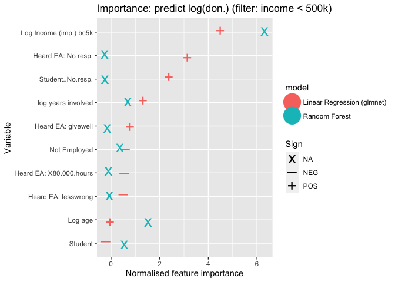

The results are very similar. Again income is still the most important predictor for both models. The ranking of variables, and the importance scores are generally similar to the 'unfiltered' model above.\*

::: {.marginnote}
\* Earning to give is no longer one of the 'top 10 most important' features, while having heard of EA through LessWrong shows up as fairly important and negative in the linear model. However, this may tell us more about the variance and sensitivity of the importance scores in these prediction model approaches than about any real differences in the correlates of donations.
:::

\BeginKnitrBlock{technote}<div class="technote">
In the more extensive hosted 'bookdown' version we present further details and results from the elastic-net regression-based models (for this and other feature sets). See [HERE](https://rethinkpriorities.github.io/ea_data_public/eas-donations.html#predictive-models).
</div>\EndKnitrBlock{technote}

<!-- bookdown_start -->

We next focus specifically on the elastic-net regression-based model.


```r
# TODO -- important -- what are the base groups here, especially for 'first-heard'? I thought in previous work we made "don't remember" the base group! This is important for interpreting the coefficient signs!

# Plot all coefficients for elastic net model
#TODO (DR @ OF -- plot the coefficients rather than the importance weights? (the latter are absolute value t-values anyways))

#TODO/check DR @ OF -- why is 'year of survey 2015' (and 2017) in here? those years should have been removed from the dataset; I think they have been, but still it somehow reports an importance score? -- OK I am removing '0' importance scores for now

(
enet_coefs_ldon <- l_don_av_2yr_best_params_recode %>%
  filter(str_det(model, "regression") & Importance!=0) %>%
  mutate_labels_sign_snip %>%
  #mutate(Norm = scale_var(Importance)) %>%
    mutate(Variable = fct_reorder(Variable, Importance)) %>%

  ggplot(aes(y = Variable, x = Importance, shape = Sign)) +
      scale_shape_manual(values = c(95, 43)) +
  geom_point(size = 2, stroke = 4) +
  xlab("Feature importance") +
  ggtitle("Importance scores: predicting log(don.)")
)
```


The graph above presents the overall ranking of importance scores within the elastic-net linear regression model, with symbols depicting whether these features take on a positive or negative sign. In addition to those mentioned above, substantial importance is assigned to other 'first heard' sources, e.g., GWWC and several related sources, as well as Ted Talks positively predict log donation, while 80000 Hours, Facebook, and Educational course negatively predict log donation.

<!-- bookdown_end -->


#### Predictive model: Shares of income donated {.unnumbered}

Next we consider the shares of income donated, with income imputed and bottom-coded as mentioned in previous sections.


```r
(
  iplot_don_share_inc_imp_best_params <- don_share_inc_imp_best_params_recode %>%
    filter(!str_det(model, "tree")) %>%
    mutate_labels_sign_snip %>%
    norm_vi(slice_top = 10) %>%
  plot_vi() +
  ggtitle("Importance scores: predicting share of income donated ")
)
```


(Log) Income is deemed highly important as a predictor of *share* of income donated, in the random forest models but not in the regression models.\*

::: {.marginnote}
\* We speculate that this might be due to mechanical differences in the models: while a linear model allows predicted donations shares to 'continuously scale with income', the random forest modeling needs to use discrete 'branches'. Also note that we explored the relationship between donations and income and income shares in more detail above, particularly in the final section of our [descriptive modeling](#nonlin).
:::

Both types of models assign some importance to age and years involved; but this is much stronger in the random forest (in the linear models these have positive signs but only middling importance). On the other hand, while both also assign importance to reporting that one 'could not remember or determine where they first heard of EA'; this is much stronger in the linear model (where it is deemed the most important feature, and it has a positive sign). Overall, the importance scores are rather divergent. The linear models assign some importance (and positive sign) to people indicating that they first heard of EA through 'Raising for Effective Giving, EA Funds, the Foundational Research Institute or the "Swiss group"', through GWWC and related 'pledge/charity orgs', and, to a much lesser extent, through GiveWell or through a Ted Talk.\*

::: {.marginnote}
\* We recognize that these 'first-heard' groupings are somewhat ad-hoc and only moderately homogeneous. This may merit future work. Note also that the random forest models also put some importance on the nonlinear 'years involved term'.
:::

\BeginKnitrBlock{technote}<div class="technote">
Further details and figures can be found in the 'Bookdown' version about [HERE](https://rethinkpriorities.github.io/ea_data_public/eas-donations.html#predictive-models).
</div>\EndKnitrBlock{technote}

<!-- bookdown_start -->

We present the remaining signed non-zero importance scores from the linear model in the figure below.


```r
(
plot_enet_coefs_don_share <- don_share_inc_imp_best_params_recode %>%
      filter(str_det(model, "regression") & Importance!=0) %>%
    mutate_labels_sign_snip %>%
  #mutate(Norm = scale_var(Importance)) %>%
    mutate(Variable = fct_reorder(Variable, Importance)) %>%

  ggplot(aes(y = Variable, x = Importance, shape = Sign)) +
      scale_shape_manual(values = c(95, 43)) +
  geom_point(size = 2, stroke = 4) +
  xlab("Feature importance") +
  ggtitle("Importance scores: predicting log(don.)")
)
```


<!-- bookdown_end -->

#### Predictive model: Donated 1k USD or more {.unnumbered}


```r
(
  iplot_don_1k_best_params <- d_don_1k_best_params_recode %>%
  filter(!str_det(model, "tree")) %>%
    mutate_labels_sign_snip %>%
    norm_vi(slice_top = 10) %>%
  plot_vi() +
  ggtitle("Importance scores: predicting donation > 1k USD ")
)
```


Both approaches deem (logged, imputed, bottom-coded) income to be the most important predictor of donating 1k USD or more. Both also consider (log) years involved and age to be substantially important. The logistic regression elastic-net model assigns importance to several sources of 'learning about EA', with 'Ted Talks', 'GWWC and related', and (less so) Givewell (as well as nonresponse) deemed particularly important, with positive signs . The random forest (but not the linear model) also deems student status to be a somewhat important associated feature.

\BeginKnitrBlock{technote}<div class="technote">
Further details and figures can be found in the 'Bookdown' version about [HERE](https://rethinkpriorities.github.io/ea_data_public/eas-donations.html#predictive-models).
</div>\EndKnitrBlock{technote}

<!-- bookdown_start -->

Next, we plot the (nonzero) importance scores for all of the coefficients in the elastic-net logistic model of donating 1k or more.


```r
(
plot_enet_coefs_don_1k <- d_don_1k_best_params_recode %>%
    filter(str_det(model, "logistic") & Importance!=0) %>%
    mutate_labels_sign_snip %>%
  #mutate(Norm = scale_var(Importance)) %>%
    mutate(Variable = fct_reorder(Variable, Importance)) %>%

  ggplot(aes(y = Variable, x = Importance, shape = Sign)) +
      scale_shape_manual(values = c(95, 43)) +
  geom_point(size = 2, stroke = 4) +
  xlab("Feature importance") +
  ggtitle("Importance scores: predicting donation > 1000k USD")
)
```


<!-- bookdown_end -->

#### Model Performance {#model-perf}

**Note:** In the [hosted 'bookdown'](https://rethinkpriorities.github.io/ea_data_public/eas-donations.html#predictive-models) we further discuss 'how well these models predict' (see final subsection of linked section). Overall, these models offer some predictive power. E.g., note that about  46% of the relevant sample reports over 1k in donations. Our logistic regression model can correctly predict 75% of these outcomes with a false-positive rate of around 25%.\*
<div class="marginnote">
\* In comparison, a predictor that did not condition on observables could only correctly 'catch' 75% of these outcomes if it (randomly) predicted this outcome over 75% of the time, leading to a false-positive rate over 75%. 
</div>
 
<!-- bookdown_start -->

We may want to consider 'how successful' our predictive models are at making practically useful predictions. In other words, 'how far off' are the predictions and classifications on average, from the actual outcomes. This procedure considers the fit on randomly-drawn *set-aside* 'testing data', data that has not been used in 'training' (or 'fitting') the model. Below, we consider some commonly-used metrics.

##### Regression Model Performance {.unnumbered}

\BeginKnitrBlock{technote}<div class="technote">
Reminder: this section (discussing performance) is only very briefly summarized/linked in the EA Forum post.
</div>\EndKnitrBlock{technote}

In order to assess the usefulness of each predictive regression model we consider both root-mean-square-error (RMSE) and mean-absolute-error (MAE). RMSE (aka [RMSD](https://en.wikipedia.org/wiki/Root-mean-square_deviation)) can be interpreted as the average 'Euclidean distance' between the actual values and the model's prediction. For each observation (in the set-aside 'testing sample'), to construct RMSE we:

1.  Measure the differences between the actual and predicted outcome (e.g., donation)
2.  Square these differences
3.  Take the average of these squared differences across all observations
4.  Take the square root of this

To construct mean-absolute-error (MAE) we simply

1.  Measure the *absolute-value* differences between the actual and predicted outcome (e.g., donation) for each observation
2.  Take the average of these across all observations

MAE has a much more straightforward interpretation: it simply asks 'how far off are we, on average?'

While the RMSE is used in the model *fitting* for various reasons, it is arguably less-interpretable and less-relevant than MAE in *judging* the model's fit in cases like this one. RMSE error negatively assesses the model fit based on *squared* deviations, and is thus very sensitive to 'large mistakes'. This may be relevant where 'large errors are much much worse than small ones' -- here, this is not so clearly the case. In the presence of data with large outlying observations, prediction will tend to be poor by this measure.

To address this we:

1.  Present both RMSE and MAE
2.  Re-run the models of (log average) *donations* for the subset of individuals with incomes at or below 500,000 USD. For this subset, there are fewer influential donation outliers.

The latter also allows us to consider how sensitive the *model fit* is to outliers.

Note that when considering models where the outcome is transformed (e.g., log(donations)) we construct the RMSE and MAE by exponentiating to generate predictions for the *level* outcomes, and then measure the deviations on the level scale.\*

::: {.marginnote}
\* When considering predicted outcomes on the *logarithmic* scale, both RMSE and MAE indicate roughly 'how many exponential orders of magnitude our predictions for the *non-logged outcomes* are off. E.g., a MSE of 1.5 for 'log donation' suggests an we are off by about $exp(1.5) =$ 4.48 times in terms of donations, getting them off by a factor of about 5. This conversion avoid such complications.
:::

<!-- Talk about filter for income, didn't make much different for non donation_amount models -->


**DR NOTE, 15 Oct 2021: there seems to be a bug in the table below. The MAE seems much higher than could plausibly be the case.**


```r
l_don_av_2yr_best_params <- l_don_av_2yr_best_params %>% mutate(dv = "Donation amount*")

don_share_inc_imp_best_params <- don_share_inc_imp_best_params %>%
  mutate(dv = "Donation as a share of income")


(
  reg_model_performance <- purrr::map(list(l_don_av_2yr_best_params, don_share_inc_imp_best_params), ~.x %>%
      dplyr::select(dv, rmse, mae, model, matches("filter_name"))
      ) %>%
  bind_rows() %>%
    mutate(filter_name = if_else(is.na(filter_name), "None", filter_name)) %>%
  rename("Dependent variable" = dv,
         "RMSE" = rmse,
         "MAE" = mae,
         "Model" = model,
         "Filter" = filter_name) %>%
  kable(caption = "Regression model performance",
        digits = 2) %>%
  kable_styling() %>%
  add_footnote("Note: While the model was trained using logs of the dependent variable, RMSE and MAE were calculated in levels", notation = "symbol")
)
```

<table class="table" style="margin-left: auto; margin-right: auto;">
<caption>(\#tab:regression-model-performance)Regression model performance</caption>
 <thead>
  <tr>
   <th style="text-align:left;"> Dependent variable </th>
   <th style="text-align:right;"> RMSE </th>
   <th style="text-align:right;"> MAE </th>
   <th style="text-align:left;"> Model </th>
   <th style="text-align:left;"> Filter </th>
  </tr>
 </thead>
<tbody>
  <tr>
   <td style="text-align:left;"> Donation amount* </td>
   <td style="text-align:right;"> 66980.31 </td>
   <td style="text-align:right;"> 7259.41 </td>
   <td style="text-align:left;"> Random Forest </td>
   <td style="text-align:left;"> None </td>
  </tr>
  <tr>
   <td style="text-align:left;"> Donation amount* </td>
   <td style="text-align:right;"> 65011.02 </td>
   <td style="text-align:right;"> 7287.65 </td>
   <td style="text-align:left;"> Linear Regression (glmnet) </td>
   <td style="text-align:left;"> None </td>
  </tr>
  <tr>
   <td style="text-align:left;"> Donation amount* </td>
   <td style="text-align:right;"> 25944.63 </td>
   <td style="text-align:right;"> 4706.42 </td>
   <td style="text-align:left;"> Random Forest </td>
   <td style="text-align:left;"> Income (imp.)_bc5k &lt; 500000 </td>
  </tr>
  <tr>
   <td style="text-align:left;"> Donation amount* </td>
   <td style="text-align:right;"> 26010.45 </td>
   <td style="text-align:right;"> 4757.24 </td>
   <td style="text-align:left;"> Linear Regression (glmnet) </td>
   <td style="text-align:left;"> Income (imp.)_bc5k &lt; 500000 </td>
  </tr>
  <tr>
   <td style="text-align:left;"> Donation as a share of income </td>
   <td style="text-align:right;"> 0.10 </td>
   <td style="text-align:right;"> 0.06 </td>
   <td style="text-align:left;"> Random Forest </td>
   <td style="text-align:left;"> None </td>
  </tr>
  <tr>
   <td style="text-align:left;"> Donation as a share of income </td>
   <td style="text-align:right;"> 0.11 </td>
   <td style="text-align:right;"> 0.06 </td>
   <td style="text-align:left;"> Linear Regression (glmnet) </td>
   <td style="text-align:left;"> None </td>
  </tr>
</tbody>
<tfoot>
<tr>
<td style = 'padding: 0; border:0;' colspan='100%'><sup>*</sup> Note: While the model was trained using logs of the dependent variable, RMSE and MAE were calculated in levels</td>
</tr>
</tfoot>
</table>

How does this compare to a 'naive model' in which we predict the average donation for everyone? Note that for the comparable unfiltered data, the mean absolute deviation is 979 and the standard deviation is 106109. The predictive model reduces this 


##### Classification Model Performance

\BeginKnitrBlock{technote}<div class="technote">
Reminder: this section (discussing performance) will be only very briefly summarized/linked in the EA Forum post.
</div>\EndKnitrBlock{technote}

In evaluating classification model performance there are a variety of metrics which can be used. Firstly we show a ROC curve to consider the differences in the predictive power of the various models. We can also compare it to an uninformed classifier, which would simply predict a positive outcome with some random probability $p$ (this maps out the  45 degree line).

<!-- DR @Oska -- maybe you can explain and label the ROC curve a bit more? Also, they look almost identical -- are you sure these are from the 3 distinct models? -->


```r
# Add column for ROC curve

roc_curve <- yardstick::roc_curve
unnest <- tidyr::unnest
pr_curve <- yardstick::pr_curve

# Calculate ROC curve
d_don_1k_best_params$roc_curve <- d_don_1k_best_params %>% select(true_y, preds, pred_prob, model) %>%
  unnest(cols = everything()) %>%
  group_by(model) %>%
  group_map(~ roc_curve(., true_y, .pred_FALSE))

# Calculate AUC
d_don_1k_best_params$auc <- d_don_1k_best_params %>% select(true_y, preds, pred_prob, model) %>%
  unnest(cols = everything()) %>%
  group_by(model) %>%
  group_map(~ yardstick::roc_auc(., truth = true_y, estimate = .pred_FALSE))

# Extract AUC
d_don_1k_best_params <- d_don_1k_best_params %>%
  unnest_wider(., col = auc) %>%
  select(-c(.metric, .estimator)) %>%
  rename(auc = .estimate)

# Plot ROC curve
(roc_curve_d_don_1k <- d_don_1k_best_params %>% select(roc_curve, model) %>%
  unnest(cols = everything()) %>%
  rename_with(snakecase::to_title_case) %>%
  ggplot(aes(x = 1-Specificity, y = Sensitivity, colour = Model)) +
  geom_line() +
  geom_abline(slope=1, intercept = 0, linetype = "dotted") +
  theme_bw()
)
```


An ROC curve plots the true positive rate (sensitivity) as a function of the false positive rate (1-specificity). Here the true positive rate gives the rate at which our model correctly predicts a respondent to donate over \$1000, with the false positive rate giving the rate at which these predictions are incorrect.

Better classifiers will have an ROC curve that is further North-West, with the perfect classifier being an L-shaped curve passing through $(0,0) \rightarrow(0,1) \rightarrow(1,1)$. Where classifiers ROC curves do not cross, it is clear that one will be performing better than another. That is not the case here. Both models seem to be performing relatively similarly, with the ROC curves overlapping somewhat. It is difficult to discern which model is performing the best, and this will depend on our criterion.

However, both models yield curves substantially above the 45 degree line, thus substantially outperforming an uninformed classifier. For example, if we are willing to accept about a 25% rate of false positives (falsely predicting a 1k+ donation), the logistic regression model correctly predicts about 75% of true positives (and the random forest model about 73%). 

We can use the area under the curve (AUC) measure to compare classifiers for all costs of misclassification. This measure quantifies how close the ROC curve is to the optimal L-shaped curve.


```r
calculate_metrics <- function(df, metrics, preds = preds, true_y = true_y){
  df %>% mutate(purrr::map2_dfr({{true_y}}, {{preds}}, ~ purrr::map_dfc(metrics,
                                                                        do.call,
                                                                        list(.x, .y))))
}

class_metrics <- list(accuracy = yardstick::accuracy_vec,
                      recall = yardstick::recall_vec,
                      precision = yardstick::precision_vec,
                      f1_score = yardstick::f_meas_vec)

# Adding a no skill classifier to d_don_1k
## Messy code
truth <- d_don_1k_best_params$true_y[[1]]
majority <- tail(names(sort(table(truth))), 1)

pred_majority <- as.logical(rep(majority, length(truth)))

.pred_FALSE <- 1 - pred_majority
.pred_TRUE <- 1 - .pred_FALSE

pred_prob <- tibble(.pred_FALSE, .pred_TRUE, truth)

no_skill <- tibble(model = "No Skill",
                   true_y = list(truth),
                   pred_prob = list(pred_prob),
                   preds = list(factor(pred_majority, levels = levels(truth)))) %>%
  calculate_metrics(class_metrics)

no_skill$auc <- yardstick::roc_auc_vec(truth, .pred_TRUE)

purrr::map_df(list(no_skill, d_don_1k_best_params), ~.x %>%
             select(model, auc, accuracy)) %>%
  rename_with(snakecase::to_title_case) %>%
  rename(AUC = Auc) %>%
  kable(digits = 3) %>%
  kable_styling()
```

<table class="table" style="margin-left: auto; margin-right: auto;">
 <thead>
  <tr>
   <th style="text-align:left;"> Model </th>
   <th style="text-align:right;"> AUC </th>
   <th style="text-align:right;"> Accuracy </th>
  </tr>
 </thead>
<tbody>
  <tr>
   <td style="text-align:left;"> No Skill </td>
   <td style="text-align:right;"> 0.500 </td>
   <td style="text-align:right;"> 0.537 </td>
  </tr>
  <tr>
   <td style="text-align:left;"> Random Forest </td>
   <td style="text-align:right;"> 0.817 </td>
   <td style="text-align:right;"> 0.739 </td>
  </tr>
  <tr>
   <td style="text-align:left;"> Logistic Regression (glmnet) </td>
   <td style="text-align:right;"> 0.824 </td>
   <td style="text-align:right;"> 0.735 </td>
  </tr>
</tbody>
</table>

Here we see that the random forest performs best in terms of AUC. All models perform much better than a no-skill classifier which simply predicts the majority class. This would suggest that there is predictive power in the explanatory variables included in these models.

<!-- Classes aren't perfectly balanced, but I believe that ROC random classifier curve is correct as the baseline should be fixed in ROC (see https://machinelearningmastery.com/roc-curves-and-precision-recall-curves-for-classification-in-python/) -->


```r
# Calculate precision recall curve
# d_don_1k_best_params$pr_curve <- d_don_1k_best_params %>% select(true_y, preds, pred_prob, model) %>%
#   unnest(cols = everything()) %>%
#   group_by(model) %>%
#   group_map(~ pr_curve(., true_y, .pred_FALSE))
#
# d_don_1k_best_params %>% select(pr_curve, model) %>%
#   unnest(cols = everything()) %>%
#   ggplot(aes(x = recall, y = precision, colour = model)) +
#   geom_path() +
#   coord_equal() +
#   theme_bw() +
#   geom_hline(aes(yintercept = 0.46))
```


```r
best_d_don_1k_preds <- d_don_1k_best_params %>%
  filter(f1_score == max(f1_score)) %$% preds[[1]]

d_don_1k_true <- d_don_1k_best_params %>%
  filter(f1_score == max(f1_score)) %$% true_y[[1]]
#DR: @Oska, I'm just guessing this is what you wanted

d_don_1k_preds_df <- tibble(preds = best_d_don_1k_preds,
                            truth = d_don_1k_true)

cm <- yardstick::conf_mat(d_don_1k_preds_df, truth, preds)

autoplot(cm, type = "heatmap") +
  scale_fill_gradient(low="#D6EAF8",high = "#2E86C1") +
  ggtitle("Predicting Donations over $1k")
```


<!-- Todo: add a discussion and explanation of this. I will explain or link an explanation of the concepts ... such as the one in the [scratch notes below](#classification_model_disc). -->


<!-- bookdown_end -->


### Summary of modeling results -- see [the introduction](#sum-results)

At the end of the introduction ['summary' section](#sum-results) (bullet points)  we give an overall characteristization of our modeling results; we do not repeat it here,


## Appendix: Extra analysis and robustness checks {#robust-appendix}

See bookdown appendix for further analysis and robustness checks.

<!-- bookdown_start -->

This appendix contains further and analysis and robustness checks, as mentioned or alluded to in the above 'main text'.

\BeginKnitrBlock{technote}<div class="technote">
This section will be part of the 'Bookdown' version only and not in the EA forum post.

We will link this in the post. (With a section header and then a link).</div>\EndKnitrBlock{technote}

### Donations by engagement level {#don_eng .unnumbered}


```r
don_share_income_by_engage_sp
```


### Donations and income by student/employment status {#don_inc_by_student .unnumbered}

low, we tabulate income and donations, split by student and employment status.


```r
don_inc_by_student
```

```{=html}
<div id="swirghxfwt" style="overflow-x:auto;overflow-y:auto;width:auto;height:auto;">
<style>html {
  font-family: -apple-system, BlinkMacSystemFont, 'Segoe UI', Roboto, Oxygen, Ubuntu, Cantarell, 'Helvetica Neue', 'Fira Sans', 'Droid Sans', Arial, sans-serif;
}

#swirghxfwt .gt_table {
  display: table;
  border-collapse: collapse;
  margin-left: auto;
  margin-right: auto;
  color: #333333;
  font-size: 16px;
  font-weight: normal;
  font-style: normal;
  background-color: #FFFFFF;
  width: auto;
  border-top-style: solid;
  border-top-width: 2px;
  border-top-color: #A8A8A8;
  border-right-style: none;
  border-right-width: 2px;
  border-right-color: #D3D3D3;
  border-bottom-style: solid;
  border-bottom-width: 2px;
  border-bottom-color: #A8A8A8;
  border-left-style: none;
  border-left-width: 2px;
  border-left-color: #D3D3D3;
}

#swirghxfwt .gt_heading {
  background-color: #FFFFFF;
  text-align: center;
  border-bottom-color: #FFFFFF;
  border-left-style: none;
  border-left-width: 1px;
  border-left-color: #D3D3D3;
  border-right-style: none;
  border-right-width: 1px;
  border-right-color: #D3D3D3;
}

#swirghxfwt .gt_title {
  color: #333333;
  font-size: 125%;
  font-weight: initial;
  padding-top: 4px;
  padding-bottom: 4px;
  border-bottom-color: #FFFFFF;
  border-bottom-width: 0;
}

#swirghxfwt .gt_subtitle {
  color: #333333;
  font-size: 85%;
  font-weight: initial;
  padding-top: 0;
  padding-bottom: 6px;
  border-top-color: #FFFFFF;
  border-top-width: 0;
}

#swirghxfwt .gt_bottom_border {
  border-bottom-style: solid;
  border-bottom-width: 2px;
  border-bottom-color: #D3D3D3;
}

#swirghxfwt .gt_col_headings {
  border-top-style: solid;
  border-top-width: 2px;
  border-top-color: #D3D3D3;
  border-bottom-style: solid;
  border-bottom-width: 2px;
  border-bottom-color: #D3D3D3;
  border-left-style: none;
  border-left-width: 1px;
  border-left-color: #D3D3D3;
  border-right-style: none;
  border-right-width: 1px;
  border-right-color: #D3D3D3;
}

#swirghxfwt .gt_col_heading {
  color: #333333;
  background-color: #FFFFFF;
  font-size: 100%;
  font-weight: normal;
  text-transform: inherit;
  border-left-style: none;
  border-left-width: 1px;
  border-left-color: #D3D3D3;
  border-right-style: none;
  border-right-width: 1px;
  border-right-color: #D3D3D3;
  vertical-align: bottom;
  padding-top: 5px;
  padding-bottom: 6px;
  padding-left: 5px;
  padding-right: 5px;
  overflow-x: hidden;
}

#swirghxfwt .gt_column_spanner_outer {
  color: #333333;
  background-color: #FFFFFF;
  font-size: 100%;
  font-weight: normal;
  text-transform: inherit;
  padding-top: 0;
  padding-bottom: 0;
  padding-left: 4px;
  padding-right: 4px;
}

#swirghxfwt .gt_column_spanner_outer:first-child {
  padding-left: 0;
}

#swirghxfwt .gt_column_spanner_outer:last-child {
  padding-right: 0;
}

#swirghxfwt .gt_column_spanner {
  border-bottom-style: solid;
  border-bottom-width: 2px;
  border-bottom-color: #D3D3D3;
  vertical-align: bottom;
  padding-top: 5px;
  padding-bottom: 5px;
  overflow-x: hidden;
  display: inline-block;
  width: 100%;
}

#swirghxfwt .gt_group_heading {
  padding: 8px;
  color: #333333;
  background-color: #FFFFFF;
  font-size: 100%;
  font-weight: initial;
  text-transform: inherit;
  border-top-style: solid;
  border-top-width: 2px;
  border-top-color: #D3D3D3;
  border-bottom-style: solid;
  border-bottom-width: 2px;
  border-bottom-color: #D3D3D3;
  border-left-style: none;
  border-left-width: 1px;
  border-left-color: #D3D3D3;
  border-right-style: none;
  border-right-width: 1px;
  border-right-color: #D3D3D3;
  vertical-align: middle;
}

#swirghxfwt .gt_empty_group_heading {
  padding: 0.5px;
  color: #333333;
  background-color: #FFFFFF;
  font-size: 100%;
  font-weight: initial;
  border-top-style: solid;
  border-top-width: 2px;
  border-top-color: #D3D3D3;
  border-bottom-style: solid;
  border-bottom-width: 2px;
  border-bottom-color: #D3D3D3;
  vertical-align: middle;
}

#swirghxfwt .gt_from_md > :first-child {
  margin-top: 0;
}

#swirghxfwt .gt_from_md > :last-child {
  margin-bottom: 0;
}

#swirghxfwt .gt_row {
  padding-top: 8px;
  padding-bottom: 8px;
  padding-left: 5px;
  padding-right: 5px;
  margin: 10px;
  border-top-style: solid;
  border-top-width: 1px;
  border-top-color: #D3D3D3;
  border-left-style: none;
  border-left-width: 1px;
  border-left-color: #D3D3D3;
  border-right-style: none;
  border-right-width: 1px;
  border-right-color: #D3D3D3;
  vertical-align: middle;
  overflow-x: hidden;
}

#swirghxfwt .gt_stub {
  color: #333333;
  background-color: #FFFFFF;
  font-size: 100%;
  font-weight: initial;
  text-transform: inherit;
  border-right-style: solid;
  border-right-width: 2px;
  border-right-color: #D3D3D3;
  padding-left: 12px;
}

#swirghxfwt .gt_summary_row {
  color: #333333;
  background-color: #FFFFFF;
  text-transform: inherit;
  padding-top: 8px;
  padding-bottom: 8px;
  padding-left: 5px;
  padding-right: 5px;
}

#swirghxfwt .gt_first_summary_row {
  padding-top: 8px;
  padding-bottom: 8px;
  padding-left: 5px;
  padding-right: 5px;
  border-top-style: solid;
  border-top-width: 2px;
  border-top-color: #D3D3D3;
}

#swirghxfwt .gt_grand_summary_row {
  color: #333333;
  background-color: #FFFFFF;
  text-transform: inherit;
  padding-top: 8px;
  padding-bottom: 8px;
  padding-left: 5px;
  padding-right: 5px;
}

#swirghxfwt .gt_first_grand_summary_row {
  padding-top: 8px;
  padding-bottom: 8px;
  padding-left: 5px;
  padding-right: 5px;
  border-top-style: double;
  border-top-width: 6px;
  border-top-color: #D3D3D3;
}

#swirghxfwt .gt_striped {
  background-color: rgba(128, 128, 128, 0.05);
}

#swirghxfwt .gt_table_body {
  border-top-style: solid;
  border-top-width: 2px;
  border-top-color: #D3D3D3;
  border-bottom-style: solid;
  border-bottom-width: 2px;
  border-bottom-color: #D3D3D3;
}

#swirghxfwt .gt_footnotes {
  color: #333333;
  background-color: #FFFFFF;
  border-bottom-style: none;
  border-bottom-width: 2px;
  border-bottom-color: #D3D3D3;
  border-left-style: none;
  border-left-width: 2px;
  border-left-color: #D3D3D3;
  border-right-style: none;
  border-right-width: 2px;
  border-right-color: #D3D3D3;
}

#swirghxfwt .gt_footnote {
  margin: 0px;
  font-size: 90%;
  padding: 4px;
}

#swirghxfwt .gt_sourcenotes {
  color: #333333;
  background-color: #FFFFFF;
  border-bottom-style: none;
  border-bottom-width: 2px;
  border-bottom-color: #D3D3D3;
  border-left-style: none;
  border-left-width: 2px;
  border-left-color: #D3D3D3;
  border-right-style: none;
  border-right-width: 2px;
  border-right-color: #D3D3D3;
}

#swirghxfwt .gt_sourcenote {
  font-size: 90%;
  padding: 4px;
}

#swirghxfwt .gt_left {
  text-align: left;
}

#swirghxfwt .gt_center {
  text-align: center;
}

#swirghxfwt .gt_right {
  text-align: right;
  font-variant-numeric: tabular-nums;
}

#swirghxfwt .gt_font_normal {
  font-weight: normal;
}

#swirghxfwt .gt_font_bold {
  font-weight: bold;
}

#swirghxfwt .gt_font_italic {
  font-style: italic;
}

#swirghxfwt .gt_super {
  font-size: 65%;
}

#swirghxfwt .gt_footnote_marks {
  font-style: italic;
  font-weight: normal;
  font-size: 65%;
}
</style>
<table class="gt_table">
  
  <thead class="gt_col_headings">
    <tr>
      <th class="gt_col_heading gt_columns_bottom_border gt_left" rowspan="1" colspan="1"><strong>Characteristic</strong></th>
      <th class="gt_col_heading gt_columns_bottom_border gt_center" rowspan="1" colspan="1"><strong>N</strong></th>
      <th class="gt_col_heading gt_columns_bottom_border gt_center" rowspan="1" colspan="1"><strong>Overall</strong>, N = 1,636<sup class="gt_footnote_marks">1</sup></th>
      <th class="gt_col_heading gt_columns_bottom_border gt_center" rowspan="1" colspan="1"><strong>employed_ft</strong>, N = 707</th>
      <th class="gt_col_heading gt_columns_bottom_border gt_center" rowspan="1" colspan="1"><strong>employed_pt</strong>, N = 70</th>
      <th class="gt_col_heading gt_columns_bottom_border gt_center" rowspan="1" colspan="1"><strong>not_employed_looking</strong>, N = 57</th>
      <th class="gt_col_heading gt_columns_bottom_border gt_center" rowspan="1" colspan="1"><strong>Other</strong>, N = 120</th>
      <th class="gt_col_heading gt_columns_bottom_border gt_center" rowspan="1" colspan="1"><strong>self_employed</strong>, N = 127</th>
      <th class="gt_col_heading gt_columns_bottom_border gt_center" rowspan="1" colspan="1"><strong>student_doctoral</strong>, N = 119</th>
      <th class="gt_col_heading gt_columns_bottom_border gt_center" rowspan="1" colspan="1"><strong>student_masters</strong>, N = 155</th>
      <th class="gt_col_heading gt_columns_bottom_border gt_center" rowspan="1" colspan="1"><strong>student_undergrad</strong>, N = 281</th>
    </tr>
  </thead>
  <tbody class="gt_table_body">
    <tr><td class="gt_row gt_left" style="font-weight: bold;">Income in $1000 USD</td>
<td class="gt_row gt_center">1,400</td>
<td class="gt_row gt_center"></td>
<td class="gt_row gt_center"></td>
<td class="gt_row gt_center"></td>
<td class="gt_row gt_center"></td>
<td class="gt_row gt_center"></td>
<td class="gt_row gt_center"></td>
<td class="gt_row gt_center"></td>
<td class="gt_row gt_center"></td>
<td class="gt_row gt_center"></td></tr>
    <tr><td class="gt_row gt_left" style="text-align: left; text-indent: 10px;">Median</td>
<td class="gt_row gt_center"></td>
<td class="gt_row gt_center">33</td>
<td class="gt_row gt_center">60</td>
<td class="gt_row gt_center">33</td>
<td class="gt_row gt_center">15</td>
<td class="gt_row gt_center">24</td>
<td class="gt_row gt_center">42</td>
<td class="gt_row gt_center">26</td>
<td class="gt_row gt_center">12</td>
<td class="gt_row gt_center">4</td></tr>
    <tr><td class="gt_row gt_left" style="text-align: left; text-indent: 10px;">10%-90%</td>
<td class="gt_row gt_center"></td>
<td class="gt_row gt_center">1-130</td>
<td class="gt_row gt_center">14-182</td>
<td class="gt_row gt_center">6-70</td>
<td class="gt_row gt_center">1-92</td>
<td class="gt_row gt_center">0-107</td>
<td class="gt_row gt_center">10-126</td>
<td class="gt_row gt_center">6-55</td>
<td class="gt_row gt_center">0-56</td>
<td class="gt_row gt_center">0-17</td></tr>
    <tr><td class="gt_row gt_left" style="text-align: left; text-indent: 10px;">Mean [se] (SD)</td>
<td class="gt_row gt_center"></td>
<td class="gt_row gt_center">61 [4] (138)</td>
<td class="gt_row gt_center">93 [6] (144)</td>
<td class="gt_row gt_center">43 [6] (48)</td>
<td class="gt_row gt_center">37 [8] (54)</td>
<td class="gt_row gt_center">52 [17] (160)</td>
<td class="gt_row gt_center">87 [28] (290)</td>
<td class="gt_row gt_center">28 [2] (18)</td>
<td class="gt_row gt_center">22 [3] (34)</td>
<td class="gt_row gt_center">8 [1] (9)</td></tr>
    <tr><td class="gt_row gt_left" style="font-weight: bold;">2019 donation (in USD)</td>
<td class="gt_row gt_center">1,413</td>
<td class="gt_row gt_center"></td>
<td class="gt_row gt_center"></td>
<td class="gt_row gt_center"></td>
<td class="gt_row gt_center"></td>
<td class="gt_row gt_center"></td>
<td class="gt_row gt_center"></td>
<td class="gt_row gt_center"></td>
<td class="gt_row gt_center"></td>
<td class="gt_row gt_center"></td></tr>
    <tr><td class="gt_row gt_left" style="text-align: left; text-indent: 10px;">Median</td>
<td class="gt_row gt_center"></td>
<td class="gt_row gt_center">528</td>
<td class="gt_row gt_center">1,420</td>
<td class="gt_row gt_center">679</td>
<td class="gt_row gt_center">284</td>
<td class="gt_row gt_center">500</td>
<td class="gt_row gt_center">1,247</td>
<td class="gt_row gt_center">548</td>
<td class="gt_row gt_center">178</td>
<td class="gt_row gt_center">110</td></tr>
    <tr><td class="gt_row gt_left" style="text-align: left; text-indent: 10px;">10%-90%</td>
<td class="gt_row gt_center"></td>
<td class="gt_row gt_center">0-9,822</td>
<td class="gt_row gt_center">0-17,048</td>
<td class="gt_row gt_center">0-5,975</td>
<td class="gt_row gt_center">0-4,200</td>
<td class="gt_row gt_center">0-9,000</td>
<td class="gt_row gt_center">0-15,249</td>
<td class="gt_row gt_center">0-3,793</td>
<td class="gt_row gt_center">0-2,367</td>
<td class="gt_row gt_center">0-1,000</td></tr>
    <tr><td class="gt_row gt_left" style="text-align: left; text-indent: 10px;">Mean [se] (SD)</td>
<td class="gt_row gt_center"></td>
<td class="gt_row gt_center">7,516 [1,944] (73,062)</td>
<td class="gt_row gt_center">10,048 [1,769] (44,507)</td>
<td class="gt_row gt_center">2,779 [743] (5,944)</td>
<td class="gt_row gt_center">3,541 [2,072] (14,503)</td>
<td class="gt_row gt_center">4,085 [1,158] (11,048)</td>
<td class="gt_row gt_center">28,589 [22,709] (238,179)</td>
<td class="gt_row gt_center">1,505 [209] (2,165)</td>
<td class="gt_row gt_center">953 [199] (2,329)</td>
<td class="gt_row gt_center">450 [77] (1,141)</td></tr>
    <tr><td class="gt_row gt_left" style="font-weight: bold;">2020 planned donation</td>
<td class="gt_row gt_center">1,393</td>
<td class="gt_row gt_center"></td>
<td class="gt_row gt_center"></td>
<td class="gt_row gt_center"></td>
<td class="gt_row gt_center"></td>
<td class="gt_row gt_center"></td>
<td class="gt_row gt_center"></td>
<td class="gt_row gt_center"></td>
<td class="gt_row gt_center"></td>
<td class="gt_row gt_center"></td></tr>
    <tr><td class="gt_row gt_left" style="text-align: left; text-indent: 10px;">Median</td>
<td class="gt_row gt_center"></td>
<td class="gt_row gt_center">1,000</td>
<td class="gt_row gt_center">3,052</td>
<td class="gt_row gt_center">1,319</td>
<td class="gt_row gt_center">349</td>
<td class="gt_row gt_center">578</td>
<td class="gt_row gt_center">1,751</td>
<td class="gt_row gt_center">1,500</td>
<td class="gt_row gt_center">327</td>
<td class="gt_row gt_center">200</td></tr>
    <tr><td class="gt_row gt_left" style="text-align: left; text-indent: 10px;">10%-90%</td>
<td class="gt_row gt_center"></td>
<td class="gt_row gt_center">0-12,039</td>
<td class="gt_row gt_center">0-21,500</td>
<td class="gt_row gt_center">0-7,167</td>
<td class="gt_row gt_center">0-5,114</td>
<td class="gt_row gt_center">0-8,085</td>
<td class="gt_row gt_center">0-12,534</td>
<td class="gt_row gt_center">0-5,678</td>
<td class="gt_row gt_center">0-2,869</td>
<td class="gt_row gt_center">0-2,000</td></tr>
    <tr><td class="gt_row gt_left" style="text-align: left; text-indent: 10px;">Mean [se] (SD)</td>
<td class="gt_row gt_center"></td>
<td class="gt_row gt_center">10,002 [1,993] (74,389)</td>
<td class="gt_row gt_center">14,473 [2,895] (72,421)</td>
<td class="gt_row gt_center">3,352 [789] (6,314)</td>
<td class="gt_row gt_center">5,990 [4,166] (28,864)</td>
<td class="gt_row gt_center">10,903 [5,619] (52,712)</td>
<td class="gt_row gt_center">26,841 [19,090] (196,545)</td>
<td class="gt_row gt_center">2,655 [480] (4,919)</td>
<td class="gt_row gt_center">990 [163] (1,906)</td>
<td class="gt_row gt_center">691 [93] (1,372)</td></tr>
  </tbody>
  
  <tfoot>
    <tr class="gt_footnotes">
      <td colspan="11">
        <p class="gt_footnote">
          <sup class="gt_footnote_marks">
            <em>1</em>
          </sup>
           
          c(&quot;Median&quot;, &quot;10%-90%&quot;, &quot;Mean [se] (SD)&quot;)
          <br />
        </p>
      </td>
    </tr>
  </tfoot>
</table>
</div>
```

### Donation as share of income by tenure, 'faceted' by referrer to survey\* {#don_share_by_tenure_facet_referrer .unnumbered}


```r
(
don_share_by_tenure_facet_referrer <-
  eas_20 %>%
  filter(!is.na(age_approx_ranges)) %>%
  ggplot() +
  aes(x = tenure, y = don_share_inc_19_imp) +
 geom_point(size = 0.15, colour = "#0c4c8a", position = position_jitter(seed = 42,  width = 0.1, height = 0.001)) +
  geom_smooth(span = 0.75) +
  scatter_theme +
  facet_grid(vars(), vars(referrer_cat2), scales = "free") +
labs(title = "2019 donation as share of (imputed) income by time in EA faceted by referrer category") +
    labs(x = get_label(eas_20$referrer_cat2)) +
  ylim(0, 0.3)
) %>%
  ggplotly
```

```{=html}
<div id="htmlwidget-515b60897080e0c45050" style="width:80%;height:480px;" class="plotly html-widget"></div>
<script type="application/json" data-for="htmlwidget-515b60897080e0c45050">{"x":{"data":[{"x":[0.966685442253947,6.97969708228484,null,0.954257322940975,8.948108947929,2.9015769477468,6.03571857358329,-0.0481478848028928,0.00342221111059189,4.98846492776647,5.06775100668892,8.09229353917763,0.961410880088806,-0.0629092837683856,2.90966935534962,0.914144378853962,0.996396289672703,3.05975206149742,1.99066068283282,1.90373748233542,0.905932675115764,0.0734457326121628,-0.0682306450325996,1.97875538445078,2.96339003145695,5.09329547672533,1.99658477501944,0.981470141932368,-0.00181620339863002,0.906561828590929,3.07043806891888,0.987811605492607,-0.0719180234707892,-0.0422488705255091,4.03535245773382,10.9596537790727,null,1.97498169103637,2.96550222337246,3.0894411502406,3.08211498246528,6.05248894309625,4.05161498324014,2.01608028095216,null,2.92671037968248,2.05845646322705,4.92508869501762,0.0236570287961513,6.07163736084476,3.92787750717252,null,2.98956796685234,1.99717491585761,0.0880329403560609,1.05469864732586,0.918442197144032,7.90324868592434,0.999277407536283,8.00277581806295,2.91448037573136,0.051264988258481,3.97702380912378,1.90138420797884,2.04368784604594,0.0113938664551824,2.96956330621615,0.982601110916585,2.96233103978448,0.0475135936401784,0.977668056776747,4.02388485562988,1.02470825356431,1.06048246622086,4.03081358745694,0.0358906236011535,null,5.03265062849969,2.90542355552316,0.0631857929285616,-0.0849914441816509,2.08019305844791,-0.085834553046152,null,0.0553858496248722,-0.0593732992652804,2.98075290210545,1.9892361256294,10.0212590937503,0.015289148548618,-0.0880986467003822,2.93653301699087,-0.0407756676431745,3.97521581724286,2.9250297171995,-0.014153312984854,10.9060754077043,8.99083373388276,null,8.99425529926084,0.0774070033337921,3.92519055702724,1.95386227979325,1.07649162942544,0.0501039643771946,4.91953858830966,3.06311340318061,0.0716786057688296,0.923431459954008,3.92747943247668,3.00965139949694,null,0.999104658234864,2.90148350461386,2.06965864449739,-0.0874507336411625,2.06396901751868,0.00787205882370472,null,1.90444546416402,null,null,0.984294779412448,0.930338156921789,null,3.06702191443183,2.9222156798467,0.0596961940638721,3.95978588163853,0.907884649420157,1.9619192190934,null,-0.0252331030089408,1.99299312578514,-0.0906783622223884,3.09750323984772,0.0958780293352902,0.934094442753121,3.92856647279114,4.0088841099292,2.02710977317765,null,2.91717924550176,0.0889826374128461,1.96934275436215,3.97386924466118,0.0248297485988587,2.0454811650794,0.939585621794686,2.01774304001592,null,2.9227609702386,11.0376171327196,2.95459226388484,4.06463397582993,0.0288792804349214,1.00558045618236,2.95743400785141,-0.0928832943085581,5.07957359072752,0.926193787297234,5.91028881776147,4.97278930456378,8.03909615660086,2.07846182626672,null,-0.0272030697669834,0.0405363094992936,-0.0467756232712418,null,0.987541010836139,null,2.05468456121162,0.0236626232974231,0.971546836802736,4.06665867553093,4.05806579822674,0.950195613875985,2.08881729850546,1.9351695783902,1.94839496454224,2.09395270575769,4.08683582781814,4.00427230498754,3.98960475018248,1.90823347205296,3.94867281015031,2.03154840650968,-0.0149920685682446,2.91443851906806,0.0989305208902806,11.0120771523099,2.04505010554567,-0.0100436228793114,0.902998818317428,2.03272088277154,null,0.960892904317006,1.01636771960184,2.06585949966684,1.04718407369219,9.03584355874918,2.94563441178761,4.0428223093506,3.03924253638834,10.9521239188965,1.90538395526819,3.03125853925012,3.02622910155915,4.91755449497141,-0.0997454943601042,1.05941607146524,1.9718427377753,3.99665214070119,6.07483344832435,1.91335571710952,-0.0456141946371645,3.96531606968492,2.96614191946574,0.00340083008632064,null,-0.0869383057579398,5.94890951276757,0.00178729146718978,2.00298863374628,0.0527326688170433,3.95357030285522,null,3.9861953211017,5.07218300881796,-0.0776661801151931,3.96326100849546,3.0093223977834,-0.0640572237316519,5.03632564381696,3.92106342026964,-0.0422834218945354,4.90907823164016,1.92176464051008,3.01930514113046,-0.0605588742531836,3.00022118748166,3.06494436697103,2.99408180597238,0.0761879024561495,null,-0.0885730815120041,2.95652526854537,1.98494842252694,4.99750892939046,3.91383094238117,5.97213904620148,0.938012586906552,3.92251691641286,7.04603131627664,2.95404958021827,2.01650685062632,2.02317711035721,3.03054894087836,0.0347376015968621,5.95251470487565,4.92263400354423,5.06831061956473,1.95912235551514,-0.0294325993396342,null,0.0261113941203803,2.07317451867275,1.08450298337266,2.01375575824641,4.04932307112031,1.92829772657715,5.08902373816818,5.03254118855111,4.99968505930156,2.02543009473011,1.95109604522586,5.05415248479694,6.94568013665266,0.0676053143572062,2.95129250613973,1.05433342661709,2.93593865302391,0.00345683814957738,null,3.01261122226715,1.90242507909425,2.93773344922811,0.978288652747869,5.03140867650509,-0.0266670510172844,5.02285849833861,6.01308309151791,0.99364644549787,6.00923351440579,0.0397537571843714,2.95090640098788,1.92402124069631,6.01126750470139],"y":[0.00757861958597121,0.0747829325478524,null,null,0.00972416454833001,0.0339765996973341,0.0800378651925391,0.0026347053183252,null,null,0.000171177142299712,0.0507353441976011,null,null,0.0643844690244983,0.000545330204535276,0.0423215619555364,0.000271932047326118,null,0.0690291937997586,null,null,0.000596326724160463,null,null,0.060182967159694,0.000824185277335346,0.0168224242442908,null,3.8601080887019e-06,null,null,0.0315035392297432,0.0504074650085531,0.100815271539148,0.0114630565722473,0.00811457220185548,0.0451460096910173,0.0107585383650579,0.0557685339944955,null,null,null,null,0.239604740547482,0.100871343585663,0.0219270355565411,null,0.088803704436765,null,0.0531772351186672,0.0398250160231255,null,0.0656643845915448,0.00070730283530429,0.0374775931382202,0.125150331314653,0.0993074948178346,0.0148369136326946,0.0547505115092185,0.0259291249690343,0.0243227042296822,null,0.0103247228496666,0.0926431637619408,null,0.0501445981748402,null,null,null,null,0.0020326932487078,0.00729973591799633,0.00635852891553121,0.0109959870839136,0.189116630211316,0.0253036376992241,0.0809111444308843,0.051579768511724,null,0.00644125999386112,0.187477064528503,0.0031913629496204,null,0.0376816546592896,0.00925878344279155,0.0155673188804034,null,0.0782383230199901,null,0.00610869656404894,null,0.0839700207559702,0.0793991987011395,0.0332805556467113,0.000267414598725736,null,0.111893276170254,null,0.0166916869246056,0.00051620518323034,null,0.165736707245155,0.00617869394827584,0.0014652174080589,0.0558730246371238,null,null,null,null,0.0932431292426772,null,null,0.0507244576926847,0.00436753927395428,0.000389097720384598,null,null,0.0184719915705008,0.00884179536974801,null,0.133156003849991,null,0.0216148334423163,0.0990996416694237,0.0809239383940585,0.0338405709811497,null,0.0410202638480632,0.0151857528757574,null,0.00541448148057851,null,0.0162807222733631,0.01027965094648,0.1675613012497,0.00390293549851223,null,0.0329123165273588,null,0.0286907819106968,0.0300112470695288,0.00243249896317471,0.023265100158751,null,0.0506375447772443,null,0.049086640864145,null,0.0141916875530688,null,null,0.210341624568946,0.0165618137210814,0.0675070634574718,0.0902231439854103,0.0991008640238467,0.116651115420649,0.00929100822612998,0.182264026831201,0.0205443712506594,0.0193389160879888,0.0914308065941247,0.0603000309697672,0.0541817173934947,null,0.0142353278916319,0.000965741294901818,0.000970833269879222,0.000551408907864243,0.0504493106491864,0.0135939808349311,null,null,0.0245903664277866,0.095910655820964,0.0193636207403615,0.0129183768671937,null,0.000586624967399985,0.0510676365627833,null,0.0114833820401791,null,0.00067882264405489,0.00365523165102874,null,0.00958586385509372,0.00133227754913753,0.0779792619354816,0.150479514712652,0.199552429666962,0.004483696938729,0.000241633644793183,0.00591350918152688,0.00206347462514208,0.01008156123152,0.00224878843594342,0.0115429535784624,0.00364583647951456,0.00385646653155397,0.0862317842377483,0.0206311766345075,0.0632666276842356,0.0136009188687266,0.110633094330786,0.016034150527614,0.00150947975367308,5.47587126493456e-06,null,0.0750741617195308,0.150448901209049,null,0.00963662235194753,null,0.100748055360955,0.00682194358975469,null,0.0900297309718179,null,null,null,0.00974946905197681,null,null,null,0.0414463947356368,null,null,0.0175497455589163,0.0501201602900401,0.0745201513865031,0.0333497061737192,0.0166596474588538,0.0886346872741253,0.00639043139654546,0.0109367451746948,0.0718739485599132,0.020568815715611,0.0136882150803939,0.0263291765420606,0.0026339296111837,null,0.0124259311808273,0.00189975988648748,0.00718521006500437,0.0118708751829803,0.0672742562213893,0.00189677923457888,0.0065251838189978,0.0626695461616352,0.0189548275100586,null,null,0.0436313446200591,0.0462381002259949,0.0724545350365548,0.0146713385532683,0.0105471731782891,0.000615934445988387,null,0.0992169785066508,0.260421404883265,0.000224603974726051,null,null,null,0.0151151440807706,0.00237330738951763,0.0290185115104541,0.0152978811695565,0.0023855256618311,0.0196090148487128,0.000820582572370768,0.00689732174782994,null,0.0123713552763264,0.100251070359048,null,0.010528288247252,0.0483986511205518,null,0.00237332665625339,0.0277302987061234,0.0276331059724713,0.018385098433424,0.0399846465303563,0.0085437977453211,0.000482482236344367,null,null,0.0425736673745655,0.0532331450702298,0.025768521704711,0.126825190286142,0.00689124942617491,0.0995623777834699,0.0187054947141389,0.000597694538533688],"text":["tenure:  1<br />don_share_inc_19_imp:  0.0071428571","tenure:  7<br />don_share_inc_19_imp:  0.0750000000","tenure: NA<br />don_share_inc_19_imp:  0.8571428571","tenure:  1<br />don_share_inc_19_imp:  0.3000056329","tenure:  9<br />don_share_inc_19_imp:  0.0100000000","tenure:  3<br />don_share_inc_19_imp:  0.0333333333","tenure:  6<br />don_share_inc_19_imp:  0.0799999758","tenure:  0<br />don_share_inc_19_imp:  0.0033333339","tenure:  0<br />don_share_inc_19_imp:  0.0000000000","tenure:  5<br />don_share_inc_19_imp:  0.0000000000","tenure:  5<br />don_share_inc_19_imp:  0.0000000000","tenure:  8<br />don_share_inc_19_imp:  0.0500000000","tenure:  1<br />don_share_inc_19_imp:            NA","tenure:  0<br />don_share_inc_19_imp:  0.0000000000","tenure:  3<br />don_share_inc_19_imp:  0.0648804885","tenure:  1<br />don_share_inc_19_imp:  0.0000000000","tenure:  1<br />don_share_inc_19_imp:  0.0416666667","tenure:  3<br />don_share_inc_19_imp:  0.0000000000","tenure:  2<br />don_share_inc_19_imp:  0.0000000000","tenure:  2<br />don_share_inc_19_imp:  0.0700001690","tenure:  1<br />don_share_inc_19_imp:  0.0000000000","tenure:  0<br />don_share_inc_19_imp:  0.0000000000","tenure:  0<br />don_share_inc_19_imp:  0.0000000000","tenure:  2<br />don_share_inc_19_imp:  0.0000000000","tenure:  3<br />don_share_inc_19_imp:  0.0000000000","tenure:  5<br />don_share_inc_19_imp:  0.0596279387","tenure:  2<br />don_share_inc_19_imp:  0.0000000000","tenure:  1<br />don_share_inc_19_imp:  0.0166666667","tenure:  0<br />don_share_inc_19_imp:            NA","tenure:  1<br />don_share_inc_19_imp:  0.0000000000","tenure:  3<br />don_share_inc_19_imp:            NA","tenure:  1<br />don_share_inc_19_imp:            NA","tenure:  0<br />don_share_inc_19_imp:  0.0312500000","tenure:  0<br />don_share_inc_19_imp:  0.0500000000","tenure:  4<br />don_share_inc_19_imp:  0.1000000000","tenure: 11<br />don_share_inc_19_imp:  0.0120000000","tenure: NA<br />don_share_inc_19_imp:  0.0090000000","tenure:  2<br />don_share_inc_19_imp:  0.0454545455","tenure:  3<br />don_share_inc_19_imp:  0.0109589041","tenure:  3<br />don_share_inc_19_imp:  0.0555555556","tenure:  3<br />don_share_inc_19_imp:            NA","tenure:  6<br />don_share_inc_19_imp:            NA","tenure:  4<br />don_share_inc_19_imp:            NA","tenure:  2<br />don_share_inc_19_imp:            NA","tenure: NA<br />don_share_inc_19_imp:  0.2400000000","tenure:  3<br />don_share_inc_19_imp:  0.1000000000","tenure:  2<br />don_share_inc_19_imp:  0.0217145228","tenure:  5<br />don_share_inc_19_imp:  0.0000000000","tenure:  0<br />don_share_inc_19_imp:  0.0888888889","tenure:  6<br />don_share_inc_19_imp:  0.5000000000","tenure:  4<br />don_share_inc_19_imp:  0.0540540541","tenure: NA<br />don_share_inc_19_imp:  0.0400000000","tenure:  3<br />don_share_inc_19_imp:            NA","tenure:  2<br />don_share_inc_19_imp:  0.0654544840","tenure:  0<br />don_share_inc_19_imp:  0.0000000000","tenure:  1<br />don_share_inc_19_imp:  0.0384616421","tenure:  1<br />don_share_inc_19_imp:  0.1250000000","tenure:  8<br />don_share_inc_19_imp:  0.0999999719","tenure:  1<br />don_share_inc_19_imp:  0.0156250000","tenure:  8<br />don_share_inc_19_imp:  0.0555555415","tenure:  3<br />don_share_inc_19_imp:  0.0249991639","tenure:  0<br />don_share_inc_19_imp:  0.0235294013","tenure:  4<br />don_share_inc_19_imp:            NA","tenure:  2<br />don_share_inc_19_imp:  0.0099996620","tenure:  2<br />don_share_inc_19_imp:  0.0926229508","tenure:  0<br />don_share_inc_19_imp:  0.0000000000","tenure:  3<br />don_share_inc_19_imp:  0.0500000000","tenure:  1<br />don_share_inc_19_imp:            NA","tenure:  3<br />don_share_inc_19_imp:            NA","tenure:  0<br />don_share_inc_19_imp:            NA","tenure:  1<br />don_share_inc_19_imp:  0.5625000357","tenure:  4<br />don_share_inc_19_imp:  0.0020000000","tenure:  1<br />don_share_inc_19_imp:  0.0076923077","tenure:  1<br />don_share_inc_19_imp:  0.0069453567","tenure:  4<br />don_share_inc_19_imp:  0.0111113896","tenure:  0<br />don_share_inc_19_imp:  0.1888887214","tenure: NA<br />don_share_inc_19_imp:  0.0250000000","tenure:  5<br />don_share_inc_19_imp:  0.0806451613","tenure:  3<br />don_share_inc_19_imp:  0.0511369447","tenure:  0<br />don_share_inc_19_imp:            NA","tenure:  0<br />don_share_inc_19_imp:  0.0066666667","tenure:  2<br />don_share_inc_19_imp:  0.1875000000","tenure:  0<br />don_share_inc_19_imp:  0.0035714286","tenure: NA<br />don_share_inc_19_imp:            NA","tenure:  0<br />don_share_inc_19_imp:  0.0370370370","tenure:  0<br />don_share_inc_19_imp:  0.0099999978","tenure:  3<br />don_share_inc_19_imp:  0.0156247360","tenure:  2<br />don_share_inc_19_imp:            NA","tenure: 10<br />don_share_inc_19_imp:  0.0789473527","tenure:  0<br />don_share_inc_19_imp:  0.0000000000","tenure:  0<br />don_share_inc_19_imp:  0.0069444444","tenure:  3<br />don_share_inc_19_imp:            NA","tenure:  0<br />don_share_inc_19_imp:  0.0833333333","tenure:  4<br />don_share_inc_19_imp:  0.0800000000","tenure:  3<br />don_share_inc_19_imp:  0.0333333333","tenure:  0<br />don_share_inc_19_imp:  0.0000000000","tenure: 11<br />don_share_inc_19_imp:            NA","tenure:  9<br />don_share_inc_19_imp:  0.1111153846","tenure: NA<br />don_share_inc_19_imp:  0.0000000000","tenure:  9<br />don_share_inc_19_imp:  0.0158729829","tenure:  0<br />don_share_inc_19_imp:  0.0000000000","tenure:  4<br />don_share_inc_19_imp:  0.0000000000","tenure:  2<br />don_share_inc_19_imp:  0.1666666667","tenure:  1<br />don_share_inc_19_imp:  0.0054054054","tenure:  0<br />don_share_inc_19_imp:  0.0017857143","tenure:  5<br />don_share_inc_19_imp:  0.0557377049","tenure:  3<br />don_share_inc_19_imp:            NA","tenure:  0<br />don_share_inc_19_imp:            NA","tenure:  1<br />don_share_inc_19_imp:  1.7916634395","tenure:  4<br />don_share_inc_19_imp:  0.0000000000","tenure:  3<br />don_share_inc_19_imp:  0.0937500000","tenure: NA<br />don_share_inc_19_imp:  0.0000000000","tenure:  1<br />don_share_inc_19_imp:  0.0000000000","tenure:  3<br />don_share_inc_19_imp:  0.0500003876","tenure:  2<br />don_share_inc_19_imp:  0.0045453872","tenure:  0<br />don_share_inc_19_imp:  0.0000000000","tenure:  2<br />don_share_inc_19_imp:            NA","tenure:  0<br />don_share_inc_19_imp:  0.0000000000","tenure: NA<br />don_share_inc_19_imp:  0.0178568747","tenure:  2<br />don_share_inc_19_imp:  0.0089284205","tenure: NA<br />don_share_inc_19_imp:            NA","tenure: NA<br />don_share_inc_19_imp:  0.1333330997","tenure:  1<br />don_share_inc_19_imp:            NA","tenure:  1<br />don_share_inc_19_imp:  0.0223577236","tenure: NA<br />don_share_inc_19_imp:  0.0999998686","tenure:  3<br />don_share_inc_19_imp:  0.0800000000","tenure:  3<br />don_share_inc_19_imp:  0.0341464239","tenure:  0<br />don_share_inc_19_imp:  0.0000000000","tenure:  4<br />don_share_inc_19_imp:  0.0404255103","tenure:  1<br />don_share_inc_19_imp:  0.0161290323","tenure:  2<br />don_share_inc_19_imp:            NA","tenure: NA<br />don_share_inc_19_imp:  0.0058823529","tenure:  0<br />don_share_inc_19_imp:            NA","tenure:  2<br />don_share_inc_19_imp:  0.0171429751","tenure:  0<br />don_share_inc_19_imp:  0.0111109489","tenure:  3<br />don_share_inc_19_imp:  0.1666666667","tenure:  0<br />don_share_inc_19_imp:  0.0029850746","tenure:  1<br />don_share_inc_19_imp:            NA","tenure:  4<br />don_share_inc_19_imp:  0.0333322068","tenure:  4<br />don_share_inc_19_imp:            NA","tenure:  2<br />don_share_inc_19_imp:  0.0277777778","tenure: NA<br />don_share_inc_19_imp:  0.0300000422","tenure:  3<br />don_share_inc_19_imp:  0.0033335167","tenure:  0<br />don_share_inc_19_imp:  0.0240000000","tenure:  2<br />don_share_inc_19_imp:            NA","tenure:  4<br />don_share_inc_19_imp:  0.0500000000","tenure:  0<br />don_share_inc_19_imp:            NA","tenure:  2<br />don_share_inc_19_imp:  0.0500000000","tenure:  1<br />don_share_inc_19_imp:            NA","tenure:  2<br />don_share_inc_19_imp:  0.0149999682","tenure: NA<br />don_share_inc_19_imp:  0.0000000000","tenure:  3<br />don_share_inc_19_imp:            NA","tenure: 11<br />don_share_inc_19_imp:  0.2096773681","tenure:  3<br />don_share_inc_19_imp:  0.0156249963","tenure:  4<br />don_share_inc_19_imp:  0.0666666498","tenure:  0<br />don_share_inc_19_imp:  0.0909090909","tenure:  1<br />don_share_inc_19_imp:  0.1000002014","tenure:  3<br />don_share_inc_19_imp:  0.1173913324","tenure:  0<br />don_share_inc_19_imp:  0.0095238095","tenure:  5<br />don_share_inc_19_imp:  0.1818181818","tenure:  1<br />don_share_inc_19_imp:  0.0214280730","tenure:  6<br />don_share_inc_19_imp:  0.0200000000","tenure:  5<br />don_share_inc_19_imp:  0.0916666667","tenure:  8<br />don_share_inc_19_imp:  0.0608107984","tenure:  2<br />don_share_inc_19_imp:  0.0543478261","tenure: NA<br />don_share_inc_19_imp:            NA","tenure:  0<br />don_share_inc_19_imp:  0.0149999155","tenure:  0<br />don_share_inc_19_imp:  0.0000000000","tenure:  0<br />don_share_inc_19_imp:  0.0000000000","tenure: NA<br />don_share_inc_19_imp:  0.0000000000","tenure:  1<br />don_share_inc_19_imp:  0.0500000000","tenure: NA<br />don_share_inc_19_imp:  0.0142857112","tenure:  2<br />don_share_inc_19_imp:  0.0000000000","tenure:  0<br />don_share_inc_19_imp:            NA","tenure:  1<br />don_share_inc_19_imp:  0.0250000000","tenure:  4<br />don_share_inc_19_imp:  0.0952380952","tenure:  4<br />don_share_inc_19_imp:  0.0200000000","tenure:  1<br />don_share_inc_19_imp:  0.0125000000","tenure:  2<br />don_share_inc_19_imp:            NA","tenure:  2<br />don_share_inc_19_imp:  0.0000000000","tenure:  2<br />don_share_inc_19_imp:  0.0512499903","tenure:  2<br />don_share_inc_19_imp:  0.0000000000","tenure:  4<br />don_share_inc_19_imp:  0.0107334526","tenure:  4<br />don_share_inc_19_imp:  0.0000000000","tenure:  4<br />don_share_inc_19_imp:  0.0000000000","tenure:  2<br />don_share_inc_19_imp:  0.0027329988","tenure:  4<br />don_share_inc_19_imp:  0.0000000000","tenure:  2<br />don_share_inc_19_imp:  0.0099999978","tenure:  0<br />don_share_inc_19_imp:  0.0018518519","tenure:  3<br />don_share_inc_19_imp:  0.0777777778","tenure:  0<br />don_share_inc_19_imp:  0.1500000310","tenure: 11<br />don_share_inc_19_imp:  0.1999994744","tenure:  2<br />don_share_inc_19_imp:  0.0052459016","tenure:  0<br />don_share_inc_19_imp:  0.0000000000","tenure:  1<br />don_share_inc_19_imp:  0.0052629800","tenure:  2<br />don_share_inc_19_imp:  0.0027777778","tenure: NA<br />don_share_inc_19_imp:  0.0100000000","tenure:  1<br />don_share_inc_19_imp:  0.0020000000","tenure:  1<br />don_share_inc_19_imp:  0.0109374974","tenure:  2<br />don_share_inc_19_imp:  0.0035714276","tenure:  1<br />don_share_inc_19_imp:  0.0042857143","tenure:  9<br />don_share_inc_19_imp:  0.0857142857","tenure:  3<br />don_share_inc_19_imp:  0.0200001690","tenure:  4<br />don_share_inc_19_imp:  0.0625000000","tenure:  3<br />don_share_inc_19_imp:  0.0143999956","tenure: 11<br />don_share_inc_19_imp:  0.1096490937","tenure:  2<br />don_share_inc_19_imp:  0.0166666597","tenure:  3<br />don_share_inc_19_imp:  0.0025000000","tenure:  3<br />don_share_inc_19_imp:  0.0000000000","tenure:  5<br />don_share_inc_19_imp:            NA","tenure:  0<br />don_share_inc_19_imp:  0.0750000000","tenure:  1<br />don_share_inc_19_imp:  0.1500000000","tenure:  2<br />don_share_inc_19_imp:            NA","tenure:  4<br />don_share_inc_19_imp:  0.0103448276","tenure:  6<br />don_share_inc_19_imp:  7.1428571429","tenure:  2<br />don_share_inc_19_imp:  0.0998668442","tenure:  0<br />don_share_inc_19_imp:  0.0060000567","tenure:  4<br />don_share_inc_19_imp:            NA","tenure:  3<br />don_share_inc_19_imp:  0.0909090909","tenure:  0<br />don_share_inc_19_imp:            NA","tenure: NA<br />don_share_inc_19_imp:            NA","tenure:  0<br />don_share_inc_19_imp:            NA","tenure:  6<br />don_share_inc_19_imp:  0.0100000845","tenure:  0<br />don_share_inc_19_imp:            NA","tenure:  2<br />don_share_inc_19_imp:  1.3250000000","tenure:  0<br />don_share_inc_19_imp:  0.0000000000","tenure:  4<br />don_share_inc_19_imp:  0.0416666667","tenure: NA<br />don_share_inc_19_imp:  0.0000000000","tenure:  4<br />don_share_inc_19_imp:            NA","tenure:  5<br />don_share_inc_19_imp:  0.0166666667","tenure:  0<br />don_share_inc_19_imp:  0.0500000000","tenure:  4<br />don_share_inc_19_imp:  0.0750000000","tenure:  3<br />don_share_inc_19_imp:  0.0333333333","tenure:  0<br />don_share_inc_19_imp:  0.0166666667","tenure:  5<br />don_share_inc_19_imp:  0.0888888889","tenure:  4<br />don_share_inc_19_imp:  0.0062498944","tenure:  0<br />don_share_inc_19_imp:  0.0100000000","tenure:  5<br />don_share_inc_19_imp:  0.0714286271","tenure:  2<br />don_share_inc_19_imp:  0.0200000000","tenure:  3<br />don_share_inc_19_imp:  0.0142856920","tenure:  0<br />don_share_inc_19_imp:  0.0266649670","tenure:  3<br />don_share_inc_19_imp:  0.0025000000","tenure:  3<br />don_share_inc_19_imp:  1.0000000000","tenure:  3<br />don_share_inc_19_imp:  0.0125000000","tenure:  0<br />don_share_inc_19_imp:  0.0019999324","tenure: NA<br />don_share_inc_19_imp:  0.0066666650","tenure:  0<br />don_share_inc_19_imp:  0.0124998152","tenure:  3<br />don_share_inc_19_imp:  0.0666666971","tenure:  2<br />don_share_inc_19_imp:  0.0025620491","tenure:  5<br />don_share_inc_19_imp:  0.0055555544","tenure:  4<br />don_share_inc_19_imp:  0.0625000358","tenure:  6<br />don_share_inc_19_imp:  0.0181818227","tenure:  1<br />don_share_inc_19_imp:            NA","tenure:  4<br />don_share_inc_19_imp:  0.0000000000","tenure:  7<br />don_share_inc_19_imp:  0.0428189117","tenure:  3<br />don_share_inc_19_imp:  0.0454545455","tenure:  2<br />don_share_inc_19_imp:  0.0722222222","tenure:  2<br />don_share_inc_19_imp:  0.0142852315","tenure:  3<br />don_share_inc_19_imp:  0.0100000000","tenure:  0<br />don_share_inc_19_imp:  0.0000000000","tenure:  6<br />don_share_inc_19_imp:  0.0000000000","tenure:  5<br />don_share_inc_19_imp:  0.1000000000","tenure:  5<br />don_share_inc_19_imp:  0.2600000000","tenure:  2<br />don_share_inc_19_imp:  0.0000000000","tenure:  0<br />don_share_inc_19_imp:  0.0000000000","tenure: NA<br />don_share_inc_19_imp:            NA","tenure:  0<br />don_share_inc_19_imp:  0.0000000000","tenure:  2<br />don_share_inc_19_imp:  0.0153847454","tenure:  1<br />don_share_inc_19_imp:  0.0033333333","tenure:  2<br />don_share_inc_19_imp:  0.0300000000","tenure:  4<br />don_share_inc_19_imp:  0.0147058791","tenure:  2<br />don_share_inc_19_imp:  0.0033333333","tenure:  5<br />don_share_inc_19_imp:  0.0200000000","tenure:  5<br />don_share_inc_19_imp:  0.0000000000","tenure:  5<br />don_share_inc_19_imp:  0.0075361702","tenure:  2<br />don_share_inc_19_imp:            NA","tenure:  2<br />don_share_inc_19_imp:  0.0120481718","tenure:  5<br />don_share_inc_19_imp:  0.0999999061","tenure:  7<br />don_share_inc_19_imp:            NA","tenure:  0<br />don_share_inc_19_imp:  0.0106382979","tenure:  3<br />don_share_inc_19_imp:  0.0480000676","tenure:  1<br />don_share_inc_19_imp:  0.0000000000","tenure:  3<br />don_share_inc_19_imp:  0.0033333333","tenure:  0<br />don_share_inc_19_imp:  0.0277777778","tenure: NA<br />don_share_inc_19_imp:  0.0266666667","tenure:  3<br />don_share_inc_19_imp:  0.0185128156","tenure:  2<br />don_share_inc_19_imp:  0.0400000000","tenure:  3<br />don_share_inc_19_imp:  0.0092590046","tenure:  1<br />don_share_inc_19_imp:  0.0000000000","tenure:  5<br />don_share_inc_19_imp:  0.8064516129","tenure:  0<br />don_share_inc_19_imp:            NA","tenure:  5<br />don_share_inc_19_imp:  0.0416665902","tenure:  6<br />don_share_inc_19_imp:  0.0533332207","tenure:  1<br />don_share_inc_19_imp:  0.0250000000","tenure:  6<br />don_share_inc_19_imp:  0.1258741259","tenure:  0<br />don_share_inc_19_imp:  0.0062500000","tenure:  3<br />don_share_inc_19_imp:  0.1000000000","tenure:  2<br />don_share_inc_19_imp:  0.0181818182","tenure:  6<br />don_share_inc_19_imp:  0.0000000000"],"type":"scatter","mode":"markers","marker":{"autocolorscale":false,"color":"rgba(12,76,138,1)","opacity":1,"size":0.566929133858268,"symbol":"circle","line":{"width":1.88976377952756,"color":"rgba(12,76,138,1)"}},"hoveron":"points","showlegend":false,"xaxis":"x","yaxis":"y","hoverinfo":"text","frame":null},{"x":[5.08296120869927,4.08741508265957,3.95722790695727,3.06608952521347,4.0283491037786,5.00381918982603,6.04731766292825,2.92693331944756,5.03139845808037,3.04101295680739,0.991548355249688,3.04382245033048,5.08693444943056,8.95108576486819,4.0880029045511,1.09564528567716,7.92349747233093,2.9949994163122,4.08080627745949,2.92774203354493,3.09777834578417,8.08933364651166,7.91648751161993,1.00284235686995,4.97804069342092,6.08114762618206,8.98939392562024,1.06720085199922,5.04751912355423,3.06221102825366,3.97762165656313,3.03703394588083,7.90078966775909,4.06658321605064,1.9014668293763,0.941531794564799,3.0813202815596,6.02235572868958,0.975911848107353,5.98715431699529,-0.0925137934274972,2.09470798275433,8.98635024977848,6.09151531932875,1.07755098110065,6.02799575389363,6.09419332207181,4.02376764146611,-0.0306503503583372,5.05693855513819,7.04975907723419,0.934252866078168,2.95221759276465,2.00288258693181,0.0351214549038559,4.09656343958341,3.05190885351039,7.01329768481664,11.0699379437137,-0.062105212919414,5.0656316970475,7.03864096407779,4.90859775920399,4.9280958188232,5.99587971284054,0.939482068456709,8.97509799292311,3.01272936831228,3.96104367389344,0.0217874905094504,3.02242661803029,2.01793566071428,11.0925140587147,5.04489951999858,10.9928139102645,4.05587363229133,4.04670559191145,6.96481719049625,4.92714275941253,3.93722043135203,5.9823744142428,2.98549889312126,3.92729807202704,3.06493588127196,0.0588793955277652,3.05380648514256,6.08361128345132,9.07252595541067,4.04947222336195,5.92666592365131,3.05682187653147,6.92577443234623,5.92581785670482,-0.0114407463464886,5.93157602008432,null,4.9519379960373,2.93180447635241,2.96081959935837,5.09931053584442,5.0608786625322,7.91731612035073,3.01091717267409,0.01228759130463,0.942278387770057,2.00992408269085,5.92991579901427,0.99985457607545,6.96684626531787,2.93768686591648,0.0142467794939876,0.92704609981738,2.94100992241874,4.07735071964562,4.9272591650486,2.05706988843158,7.07704420736991,-0.0361451769713312,1.98075656294823,2.99581546140835,8.99313811352476,1.93747134231962,0.934199278103188,-0.00234902109950781,-0.0369478406384587,4.98891390557401,3.08612097725272,0.963989520212635,1.96139312405139,4.92156225088984,0.999380685621873,-0.0813850656151772,0.0861001492477954,4.08702790108509,-0.00392559673637152,3.958443904249,8.9818264182657,2.0597193276044,-0.091902484651655,9.97466824897565,7.061283933511,6.08201180179603,-0.067074521118775,1.99514220254496,8.03710419065319,2.02317420518957,4.05165402251296,5.94029824524187,1.92169773089699,0.0162395513150841,-0.0269971759989858,4.95602492545731,6.01994317099452,6.06371392258443,5.09273790521547,-0.0662527113221586,3.00495812040754,2.09305111849681,2.08138849609531,0.0102501055691391,-0.0848801800981164,3.00264790556394,2.0261452303268,0.0758531890343875,8.09605573927984,-0.0470066737383604,-0.0228185648564249,0.0443775777239352,0.929185738135129,1.93056775406003,-0.0147067400626838,-0.0879903327673674,5.09583471678197,1.0623033573851,9.00910287080333,9.08426595567726,2.97252036142163,0.071026998013258,-0.0398187696933746,0.993132485030219,4.9285461329855,4.06154379872605,2.03316152635962,5.9510214690119,1.06568461139686,7.96411324003711,1.96958228130825,2.9002867796924,2.99273034306243,2.01929440936074,3.08121019145474,-0.0653997641988099,4.05717621534131,8.98325872090645,1.05183229357935,10.9610286605079,6.93313564942218,4.9273010416422,3.92931447885931,2.95060049388558,4.93011952005327,3.03807033151388,0.995693777408451,-0.0573628890793771,0.00365331992506981,0.955412087170407,-0.058865281380713,8.90776318623684,2.96976196649484,6.04749066508375,1.05188894453458,5.03444324033335,2.09862396954559,3.93278577113524,0.0843827383127063,0.944790002517402,-0.0699031801894307,4.94811842776835,2.94325193557888,2.94841162380762,2.04251361778006,3.06627438440919,1.00406795158051,2.9708320797421,1.00251875696704,-0.0596398153807968,8.9945177749265,3.05322474767454,4.06771395765245,2.97890351004899,-0.0250426454935223,5.07572052469477,4.04974596574903,5.03468716279604,1.97549544158392,6.91752718170173,3.09257936482318,1.98448787801899,5.03119010422379,1.90423926045187,1.08180950302631,3.00073751597665,2.93179212976247,1.02306881542318,2.08602820918895,2.91118751373142,11.0211587476544,2.00783816920593,0.927535031037405,2.93430826961994,7.05292456848547,3.98735566320829,2.03389015155844,7.08647664743476,5.98692449838854,-0.058349321084097,0.912211981369182,3.07408649600111,5.90383225576952,1.99528486789204,8.08506799275056,3.02619998482987,6.0658218790777,11.0415013221558,3.90738064590842,3.09004060807638,0.966701917396858,2.04261918836273,2.0108186269179,1.96796470200643,2.90854687481187,5.08747932370752,3.06857943339273,9.09987580645829,1.99484869716689,1.08268643682823,3.09398956904188,1.08919970807619,1.03926183320582,-0.0909484994597733,8.90656884419732,1.0052283551544,1.00098721585236,5.03454513885081,8.91457108398899,9.06199389742687,4.0060447761789,4.96575420973822,8.03742823828943,4.07055720561184,1.07344351056963,2.91781637188978,5.90260762264952,1.92460712026805,1.98037200476974,2.08758076485246,3.98037607786246,0.9530937963631,5.03073221873492,3.05094151496887,3.05035714972764,-0.0334771031048149,5.95992090138607,3.04350926163606,1.97027674526908,6.04634903529659,0.973186014173552,1.09740605507977,5.95490515916608,2.01668770057149,1.98352560158819,2.94828312429599,3.09659583121538,2.07437847675756,1.94201256106608,7.99438116992824,0.958673974499106,2.92642236524262,3.9916398962494,3.91076983134262,8.05517879859544,2.09691394590773,8.07414453905076,3.06149968109094,5.03511461890303,3.95377937867306,0.091546064754948,1.96459491020069,3.08574907719158,5.94858642695472,2.90444913590327,1.02870801589452,6.00107681662776,1.09855052623898,4.01532673975453,0.048503482574597,1.9594149440527,6.98939733048901,null,0.90512018809095,4.03967850939371,2.01387046938762,2.04700512406416,1.07824891321361,0.055624431045726,-0.0610263300593942,2.99521980439313,2.9355923908297,3.00908489590511,3.93014648966491,9.05090557406657],"y":[0.00841453769616783,null,0.00421926743304436,null,0.185283415833971,0.0122573689823039,0.125510912969929,null,0.000992913206107914,0.0505928161916323,0.000559579919558018,0.000809340132400394,0.0912425408986482,0.000383657236583531,null,0.0142342831674678,0.295831960687802,null,0.0759835695939532,null,null,0.0990273500913754,0.099646384797059,null,null,0.0999453042087279,null,0.0178868589455572,0.128787970687382,0.0960122318666188,null,null,0.150806462801062,null,0.0433047130372003,0.0298135261740075,null,0.102745927357666,null,0.0865784424715228,0.0008272895202972,0.0330830668968459,null,0.10054215205228,null,null,0.0609986121542752,0.0712539348601053,0.0334080397992705,0.0624985479894094,0.199989547489677,null,0.0438472706726145,0.0111002295941275,0.0407749971607613,0.000562278781086206,0.138581436115576,0.0104077977560945,0.0502455396163205,0.0037037257032784,0.000272760226856917,0.256480292055518,0.0455956951634457,null,0.0273150317561813,0.0175412160200084,0.019047576128983,null,0.0206415420123769,null,0.0689008786696985,null,0.000827756816521287,0.0883838009912826,0.115768834550394,0.1000804015873,0.0307589854588732,0.0631636343146674,0.00295764754753065,0.05399426425524,0.199377318313886,null,0.00777899427779404,null,0.110737259027261,0.0119368604984659,0.0692632559432746,0.222104637480911,0.000135362204164267,null,0.129371724987477,0.0125835225383765,0.0817627132819376,0.0152563579285384,0.0836721280489694,0.0133978024989677,0.0400876877842951,0.00854759670995447,0.128820181926775,0.00636039361865683,0.00086090561747551,0.0425043751308373,0.100946706577204,0.25031267662812,0.0180269409935554,0.0284609931651151,0.088232904458315,0.000965920965187252,null,0.0991840339493938,null,0.0404356486671765,0.000384997948538512,0.000667404492385686,0.00167294989081265,0.00809085037765063,null,null,0.184450842857378,0.0491804588185623,0.000467690635938197,0.0595540053984869,0.000421583436895162,0.000610503187868744,0.0743492744350899,null,null,null,0.0371370261496526,0.0659397231416866,0.0208046962860972,0.000717953002545983,null,null,0.00928727899724618,0.001879939293888,null,null,0.00141294964442828,0.0914373350430395,0.0132588540334255,0.00899601098007709,null,0.000553165660705417,0.233723831528768,0.000348916833422014,0.000274196708574891,0.132626633781319,0.0195462464688872,0.0395221993514379,0.0838030518338395,0.120708625221159,null,0.000440087950788438,null,0.020532359756995,0.0325050084733715,0.0012103205587094,0.111510917546331,0.0207781539112329,0.0506683189463802,0.0102938066148199,0.109776665626178,null,0.0563924338193424,0.000131253898143768,null,0.00890880195082476,0.00507102960875879,0.0122653551548719,null,0.0339487701704105,0.0641252500823255,0.0204708142430177,0.10006726039201,null,null,null,null,0.0940523088662885,0.227653925013517,0.00310187310077223,null,0.0193015304404507,null,0.0575096005609793,null,0.0384998336647045,0.0192705421596766,0.0449359578685412,null,null,null,0.100309891105786,0.0498655583676882,0.0971009083565084,0.000248419356532395,0.105478497737991,null,0.00725267065581792,0.103343961406811,0.128513730426315,null,0.0244302389486693,0.000809054973069578,0.00977644200631838,0.00939817179506645,0.142979292602611,0.0327276748510882,0.123860668126561,null,0.106350677563763,0.00320234405460649,null,0.00106883272286505,null,0.00497098472667858,0.0104019517437555,0.0201695686761995,0.00423910025212293,0.0324892825058972,0.0140873175056518,null,0.0995684283543378,0.0126233308515511,0.000866136322263628,0.131836888090374,0.0994262999106191,0.0990438536312431,0.000445471704471856,0.0203502037438383,0.100658520036314,0.167561229560214,0.100011140825227,null,0.118720400058367,null,null,null,0.000340659637469798,null,0.0152017277928245,0.0189910261871081,null,0.000191866501234472,0.199041751067154,null,0.00370861192610623,0.0444204929783009,0.00475928144712277,null,0.286191683942186,0.00313943619251103,null,0.0856241630382969,null,0.0172214762077907,0.000127287599258125,0.230088974831375,0.0214005933443291,0.11393045347739,0.0627537176315272,0.0747328304138375,0.0831569291202662,0.00467702388623729,null,0.00191571912495419,0.100253313410096,0.0830116516983447,0.0695191543198104,0.210983626066707,0.0397535844803788,0.0795412165555172,0.0190500686440448,0.025078229162842,0.0200650129804325,0.0494904254642315,0.0075063047905763,0.00987932124501094,null,0.250585514963604,null,null,0.000289974041609253,0.0003658960130997,null,null,null,0.0492396844448522,0.000235344200860709,0.00907488028146327,0.00794382699933619,0.000243900997098535,0.0399986760197207,0.00988464218191802,0.0196357819964565,0.0494528994131833,0.047724422510362,0.0403835939159964,null,0.00427185429754305,null,0.0696849715499985,0.0056445407606238,0.000681872572284192,0.109654315888966,0.000841470140498132,null,0.0825646320109844,0.00723106889395664,0.119074973459356,0.025636007590685,null,0.000683919560629874,null,0.150136374586727,0.0177018030012925,0.0998269700434387,0.00120822718842889,0.000869392552413046,0.0865365135994456,0.0102342458995017,null,0.00783934195832379,0.0221441033406708,null,null,0.000390414744149894,0.000413485412485898,0.0104204905200971,0.0145662370212376,null,0.0262258419375481,null,0.028454914496539,0.000652094224467874,0.0617342055563918,0.099008958238177,null,0.0119117069703007,null,0.032883455856548,null,0.0073459447140371,null,null,null,0.00575585118929545,null,0.0800852998240182,0.21552942112682],"text":["tenure:  5<br />don_share_inc_19_imp:  0.0080000000","tenure:  4<br />don_share_inc_19_imp:  0.0000000000","tenure:  4<br />don_share_inc_19_imp:  0.0032374731","tenure:  3<br />don_share_inc_19_imp:  0.5000000000","tenure:  4<br />don_share_inc_19_imp:  0.1851851852","tenure:  5<br />don_share_inc_19_imp:  0.0125000000","tenure:  6<br />don_share_inc_19_imp:  0.1257354719","tenure:  3<br />don_share_inc_19_imp:  0.7692317691","tenure:  5<br />don_share_inc_19_imp:  0.0000000000","tenure:  3<br />don_share_inc_19_imp:  0.0501000000","tenure:  1<br />don_share_inc_19_imp:  0.0000000000","tenure:  3<br />don_share_inc_19_imp:  0.0000000000","tenure:  5<br />don_share_inc_19_imp:  0.0909090909","tenure:  9<br />don_share_inc_19_imp:  0.0000000000","tenure:  4<br />don_share_inc_19_imp:            NA","tenure:  1<br />don_share_inc_19_imp:  0.0133331499","tenure:  8<br />don_share_inc_19_imp:  0.2949266829","tenure:  3<br />don_share_inc_19_imp:            NA","tenure:  4<br />don_share_inc_19_imp:  0.0754693241","tenure:  3<br />don_share_inc_19_imp:  1.0000000000","tenure:  3<br />don_share_inc_19_imp:  0.0000000000","tenure:  8<br />don_share_inc_19_imp:  0.1000000000","tenure:  8<br />don_share_inc_19_imp:  0.1000000000","tenure:  1<br />don_share_inc_19_imp:  0.0000000000","tenure:  5<br />don_share_inc_19_imp:  0.0000000000","tenure:  6<br />don_share_inc_19_imp:  0.0999999747","tenure:  9<br />don_share_inc_19_imp:            NA","tenure:  1<br />don_share_inc_19_imp:  0.0173333333","tenure:  5<br />don_share_inc_19_imp:  0.1282051282","tenure:  3<br />don_share_inc_19_imp:  0.0967741935","tenure:  4<br />don_share_inc_19_imp:  0.0000000000","tenure:  3<br />don_share_inc_19_imp:            NA","tenure:  8<br />don_share_inc_19_imp:  0.1500000000","tenure:  4<br />don_share_inc_19_imp:  0.0000000000","tenure:  2<br />don_share_inc_19_imp:  0.0428571336","tenure:  1<br />don_share_inc_19_imp:  0.0300000422","tenure:  3<br />don_share_inc_19_imp:  0.0000000000","tenure:  6<br />don_share_inc_19_imp:  0.1029507262","tenure:  1<br />don_share_inc_19_imp:            NA","tenure:  6<br />don_share_inc_19_imp:  0.0870713469","tenure:  0<br />don_share_inc_19_imp:  0.0000000000","tenure:  2<br />don_share_inc_19_imp:  0.0333333333","tenure:  9<br />don_share_inc_19_imp:  0.8333333333","tenure:  6<br />don_share_inc_19_imp:  0.1000000000","tenure:  1<br />don_share_inc_19_imp:  0.0000000000","tenure:  6<br />don_share_inc_19_imp:  0.0000000000","tenure:  6<br />don_share_inc_19_imp:  0.0600000000","tenure:  4<br />don_share_inc_19_imp:  0.0722166667","tenure:  0<br />don_share_inc_19_imp:  0.0333333333","tenure:  5<br />don_share_inc_19_imp:  0.0625000000","tenure:  7<br />don_share_inc_19_imp:  0.2000000000","tenure:  1<br />don_share_inc_19_imp:            NA","tenure:  3<br />don_share_inc_19_imp:  0.0434782609","tenure:  2<br />don_share_inc_19_imp:  0.0111107356","tenure:  0<br />don_share_inc_19_imp:  0.0416659626","tenure:  4<br />don_share_inc_19_imp:  0.0000000000","tenure:  3<br />don_share_inc_19_imp:  0.1388888563","tenure:  7<br />don_share_inc_19_imp:  0.0113634443","tenure: 11<br />don_share_inc_19_imp:  0.0499999905","tenure:  0<br />don_share_inc_19_imp:  0.0044444820","tenure:  5<br />don_share_inc_19_imp:  0.0000000000","tenure:  7<br />don_share_inc_19_imp:  0.2571428273","tenure:  5<br />don_share_inc_19_imp:  0.0461538462","tenure:  5<br />don_share_inc_19_imp:  1.2857142239","tenure:  6<br />don_share_inc_19_imp:  0.0280000000","tenure:  1<br />don_share_inc_19_imp:  0.0166668075","tenure:  9<br />don_share_inc_19_imp:  0.0195439739","tenure:  3<br />don_share_inc_19_imp:  0.0000000000","tenure:  4<br />don_share_inc_19_imp:  0.0214288444","tenure:  0<br />don_share_inc_19_imp:  0.0000000000","tenure:  3<br />don_share_inc_19_imp:  0.0694443391","tenure:  2<br />don_share_inc_19_imp:            NA","tenure: 11<br />don_share_inc_19_imp:  0.0000000000","tenure:  5<br />don_share_inc_19_imp:  0.0877476102","tenure: 11<br />don_share_inc_19_imp:  0.1156626295","tenure:  4<br />don_share_inc_19_imp:  0.1000000000","tenure:  4<br />don_share_inc_19_imp:  0.0312500000","tenure:  7<br />don_share_inc_19_imp:  0.0625000000","tenure:  5<br />don_share_inc_19_imp:  0.0035714189","tenure:  4<br />don_share_inc_19_imp:  0.0538461210","tenure:  6<br />don_share_inc_19_imp:  0.1993166287","tenure:  3<br />don_share_inc_19_imp:            NA","tenure:  4<br />don_share_inc_19_imp:  0.0079310345","tenure:  3<br />don_share_inc_19_imp:            NA","tenure:  0<br />don_share_inc_19_imp:  0.1111110799","tenure:  3<br />don_share_inc_19_imp:  0.0121114998","tenure:  6<br />don_share_inc_19_imp:  0.0694736842","tenure:  9<br />don_share_inc_19_imp:  0.2217180938","tenure:  4<br />don_share_inc_19_imp:  0.0000000000","tenure:  6<br />don_share_inc_19_imp:            NA","tenure:  3<br />don_share_inc_19_imp:  0.1285714007","tenure:  7<br />don_share_inc_19_imp:  0.0133334460","tenure:  6<br />don_share_inc_19_imp:  0.0807691008","tenure:  0<br />don_share_inc_19_imp:  0.0142857143","tenure:  6<br />don_share_inc_19_imp:  0.0833333123","tenure: NA<br />don_share_inc_19_imp:  0.0133333333","tenure:  5<br />don_share_inc_19_imp:  0.0399999879","tenure:  3<br />don_share_inc_19_imp:  0.0083330517","tenure:  3<br />don_share_inc_19_imp:  0.1284746505","tenure:  5<br />don_share_inc_19_imp:  0.0054545455","tenure:  5<br />don_share_inc_19_imp:  0.0000000000","tenure:  8<br />don_share_inc_19_imp:  0.0421052548","tenure:  3<br />don_share_inc_19_imp:  0.1000000000","tenure:  0<br />don_share_inc_19_imp:  0.2500000000","tenure:  1<br />don_share_inc_19_imp:  0.0175332759","tenure:  2<br />don_share_inc_19_imp:  0.0277777812","tenure:  6<br />don_share_inc_19_imp:  0.0888888889","tenure:  1<br />don_share_inc_19_imp:  0.0000000000","tenure:  7<br />don_share_inc_19_imp:            NA","tenure:  3<br />don_share_inc_19_imp:  0.1000000000","tenure:  0<br />don_share_inc_19_imp:  0.0000000000","tenure:  1<br />don_share_inc_19_imp:  0.0413793103","tenure:  3<br />don_share_inc_19_imp:  0.0000000000","tenure:  4<br />don_share_inc_19_imp:  0.0000000000","tenure:  5<br />don_share_inc_19_imp:  0.0020833327","tenure:  2<br />don_share_inc_19_imp:  0.0087096774","tenure:  7<br />don_share_inc_19_imp:  0.5000000032","tenure:  0<br />don_share_inc_19_imp:            NA","tenure:  2<br />don_share_inc_19_imp:  0.1851851852","tenure:  3<br />don_share_inc_19_imp:  0.0500000000","tenure:  9<br />don_share_inc_19_imp:  0.0000000000","tenure:  2<br />don_share_inc_19_imp:  0.0600007886","tenure:  1<br />don_share_inc_19_imp:  0.0000000000","tenure:  0<br />don_share_inc_19_imp:  0.0000000000","tenure:  0<br />don_share_inc_19_imp:  0.0749993123","tenure:  5<br />don_share_inc_19_imp:            NA","tenure:  3<br />don_share_inc_19_imp:  0.3750000000","tenure:  1<br />don_share_inc_19_imp:  0.0000000000","tenure:  2<br />don_share_inc_19_imp:  0.0363636364","tenure:  5<br />don_share_inc_19_imp:  0.0666666498","tenure:  1<br />don_share_inc_19_imp:  0.0200000000","tenure:  0<br />don_share_inc_19_imp:  0.0000000000","tenure:  0<br />don_share_inc_19_imp:            NA","tenure:  4<br />don_share_inc_19_imp:            NA","tenure:  0<br />don_share_inc_19_imp:  0.0100000000","tenure:  4<br />don_share_inc_19_imp:  0.0014285714","tenure:  9<br />don_share_inc_19_imp:  0.5335290323","tenure:  2<br />don_share_inc_19_imp:            NA","tenure:  0<br />don_share_inc_19_imp:  0.0014285714","tenure: 10<br />don_share_inc_19_imp:  0.0909090659","tenure:  7<br />don_share_inc_19_imp:  0.0125000000","tenure:  6<br />don_share_inc_19_imp:  0.0085714267","tenure:  0<br />don_share_inc_19_imp:            NA","tenure:  2<br />don_share_inc_19_imp:  0.0000000000","tenure:  8<br />don_share_inc_19_imp:  0.2341367862","tenure:  2<br />don_share_inc_19_imp:  0.0008928571","tenure:  4<br />don_share_inc_19_imp:  0.0000000000","tenure:  6<br />don_share_inc_19_imp:  0.1333333333","tenure:  2<br />don_share_inc_19_imp:  0.0199999955","tenure:  0<br />don_share_inc_19_imp:  0.0400003380","tenure:  0<br />don_share_inc_19_imp:  0.0833333333","tenure:  5<br />don_share_inc_19_imp:  0.1200000000","tenure:  6<br />don_share_inc_19_imp:            NA","tenure:  6<br />don_share_inc_19_imp:  0.0000000000","tenure:  5<br />don_share_inc_19_imp:  0.0000000000","tenure:  0<br />don_share_inc_19_imp:  0.0200000000","tenure:  3<br />don_share_inc_19_imp:  0.0333333333","tenure:  2<br />don_share_inc_19_imp:  0.0013333333","tenure:  2<br />don_share_inc_19_imp:  0.1111111111","tenure:  0<br />don_share_inc_19_imp:  0.0200000000","tenure:  0<br />don_share_inc_19_imp:  0.0500000000","tenure:  3<br />don_share_inc_19_imp:  0.0100000000","tenure:  2<br />don_share_inc_19_imp:  0.1090909091","tenure:  0<br />don_share_inc_19_imp:  0.0000000000","tenure:  8<br />don_share_inc_19_imp:  0.0571428448","tenure:  0<br />don_share_inc_19_imp:  0.0000000000","tenure:  0<br />don_share_inc_19_imp:            NA","tenure:  0<br />don_share_inc_19_imp:  0.0083333333","tenure:  1<br />don_share_inc_19_imp:  0.0041666667","tenure:  2<br />don_share_inc_19_imp:  0.0125000000","tenure:  0<br />don_share_inc_19_imp:            NA","tenure:  0<br />don_share_inc_19_imp:  0.0333333333","tenure:  5<br />don_share_inc_19_imp:  0.0642853522","tenure:  1<br />don_share_inc_19_imp:  0.0200002921","tenure:  9<br />don_share_inc_19_imp:  0.1000000000","tenure:  9<br />don_share_inc_19_imp:            NA","tenure:  3<br />don_share_inc_19_imp:  0.0000000000","tenure:  0<br />don_share_inc_19_imp:  0.0000000000","tenure:  0<br />don_share_inc_19_imp:  0.0000000000","tenure:  1<br />don_share_inc_19_imp:  0.0937500000","tenure:  5<br />don_share_inc_19_imp:  0.2272727273","tenure:  4<br />don_share_inc_19_imp:  0.0037037027","tenure:  2<br />don_share_inc_19_imp:            NA","tenure:  6<br />don_share_inc_19_imp:  0.0200000811","tenure:  1<br />don_share_inc_19_imp:            NA","tenure:  8<br />don_share_inc_19_imp:  0.0571148084","tenure:  2<br />don_share_inc_19_imp:  0.0000000000","tenure:  3<br />don_share_inc_19_imp:  0.0393124938","tenure:  3<br />don_share_inc_19_imp:  0.0200000000","tenure:  2<br />don_share_inc_19_imp:  0.0454545455","tenure:  3<br />don_share_inc_19_imp:  0.0000000000","tenure:  0<br />don_share_inc_19_imp:            NA","tenure:  4<br />don_share_inc_19_imp:            NA","tenure:  9<br />don_share_inc_19_imp:  0.0999999801","tenure:  1<br />don_share_inc_19_imp:  0.0500000000","tenure: 11<br />don_share_inc_19_imp:  0.0967741935","tenure:  7<br />don_share_inc_19_imp:  0.0000000000","tenure:  5<br />don_share_inc_19_imp:  0.1058823529","tenure:  4<br />don_share_inc_19_imp:            NA","tenure:  3<br />don_share_inc_19_imp:  0.0063492063","tenure:  5<br />don_share_inc_19_imp:  0.1028209531","tenure:  3<br />don_share_inc_19_imp:  0.1287593985","tenure:  1<br />don_share_inc_19_imp:            NA","tenure:  0<br />don_share_inc_19_imp:  0.0250000000","tenure:  0<br />don_share_inc_19_imp:  0.0000000000","tenure:  1<br />don_share_inc_19_imp:  0.0100006724","tenure:  0<br />don_share_inc_19_imp:  0.0100000000","tenure:  9<br />don_share_inc_19_imp:  0.1428571429","tenure:  3<br />don_share_inc_19_imp:  0.0333331456","tenure:  6<br />don_share_inc_19_imp:  0.1247452781","tenure:  1<br />don_share_inc_19_imp:  0.0000000000","tenure:  5<br />don_share_inc_19_imp:  0.1068965238","tenure:  2<br />don_share_inc_19_imp:  0.0024083349","tenure:  4<br />don_share_inc_19_imp:            NA","tenure:  0<br />don_share_inc_19_imp:  0.0016000000","tenure:  1<br />don_share_inc_19_imp:            NA","tenure:  0<br />don_share_inc_19_imp:  0.0050000000","tenure:  5<br />don_share_inc_19_imp:  0.0100000000","tenure:  3<br />don_share_inc_19_imp:  0.0199995518","tenure:  3<br />don_share_inc_19_imp:  0.0033333333","tenure:  2<br />don_share_inc_19_imp:  0.0333333333","tenure:  3<br />don_share_inc_19_imp:  0.0142857143","tenure:  1<br />don_share_inc_19_imp:            NA","tenure:  3<br />don_share_inc_19_imp:  0.1000000000","tenure:  1<br />don_share_inc_19_imp:  0.0125000000","tenure:  0<br />don_share_inc_19_imp:  0.0000000000","tenure:  9<br />don_share_inc_19_imp:  0.1315789211","tenure:  3<br />don_share_inc_19_imp:  0.0999996167","tenure:  4<br />don_share_inc_19_imp:  0.1000000000","tenure:  3<br />don_share_inc_19_imp:  0.0000000000","tenure:  0<br />don_share_inc_19_imp:  0.0200000917","tenure:  5<br />don_share_inc_19_imp:  0.0999999656","tenure:  4<br />don_share_inc_19_imp:  0.1666666667","tenure:  5<br />don_share_inc_19_imp:  0.1000000000","tenure:  2<br />don_share_inc_19_imp:            NA","tenure:  7<br />don_share_inc_19_imp:  0.1194542721","tenure:  3<br />don_share_inc_19_imp:            NA","tenure:  2<br />don_share_inc_19_imp:  0.0000000000","tenure:  5<br />don_share_inc_19_imp:  0.4772726899","tenure:  2<br />don_share_inc_19_imp:  0.0000000000","tenure:  1<br />don_share_inc_19_imp:            NA","tenure:  3<br />don_share_inc_19_imp:  0.0142857171","tenure:  3<br />don_share_inc_19_imp:  0.0184615645","tenure:  1<br />don_share_inc_19_imp:  0.0000000000","tenure:  2<br />don_share_inc_19_imp:  0.0000000000","tenure:  3<br />don_share_inc_19_imp:  0.2000000000","tenure: 11<br />don_share_inc_19_imp:  0.4999987130","tenure:  2<br />don_share_inc_19_imp:  0.0045454545","tenure:  1<br />don_share_inc_19_imp:  0.0450000000","tenure:  3<br />don_share_inc_19_imp:  0.0046296296","tenure:  7<br />don_share_inc_19_imp:  0.3658035714","tenure:  4<br />don_share_inc_19_imp:  0.2857142857","tenure:  2<br />don_share_inc_19_imp:  0.0030301810","tenure:  7<br />don_share_inc_19_imp:  0.3400000000","tenure:  6<br />don_share_inc_19_imp:  0.0857142857","tenure:  0<br />don_share_inc_19_imp:  0.0000000000","tenure:  1<br />don_share_inc_19_imp:  0.0166661034","tenure:  3<br />don_share_inc_19_imp:  0.0000000000","tenure:  6<br />don_share_inc_19_imp:  0.2307692308","tenure:  2<br />don_share_inc_19_imp:  0.0222222222","tenure:  8<br />don_share_inc_19_imp:  0.1142856895","tenure:  3<br />don_share_inc_19_imp:  0.0625093920","tenure:  6<br />don_share_inc_19_imp:  0.0738249860","tenure: 11<br />don_share_inc_19_imp:  0.0833333333","tenure:  4<br />don_share_inc_19_imp:  0.0050000000","tenure:  3<br />don_share_inc_19_imp:            NA","tenure:  1<br />don_share_inc_19_imp:  0.0020000000","tenure:  2<br />don_share_inc_19_imp:  0.1000000000","tenure:  2<br />don_share_inc_19_imp:  0.0833333333","tenure:  2<br />don_share_inc_19_imp:  0.0692307839","tenure:  3<br />don_share_inc_19_imp:  0.2100000000","tenure:  5<br />don_share_inc_19_imp:  0.0400000000","tenure:  3<br />don_share_inc_19_imp:  0.0800000000","tenure:  9<br />don_share_inc_19_imp:  0.0181818182","tenure:  2<br />don_share_inc_19_imp:  0.0250000000","tenure:  1<br />don_share_inc_19_imp:  0.0193236715","tenure:  3<br />don_share_inc_19_imp:  0.0500000000","tenure:  1<br />don_share_inc_19_imp:  0.0083333333","tenure:  1<br />don_share_inc_19_imp:  0.0100000000","tenure:  0<br />don_share_inc_19_imp:            NA","tenure:  9<br />don_share_inc_19_imp:  0.2500000000","tenure:  1<br />don_share_inc_19_imp:            NA","tenure:  1<br />don_share_inc_19_imp:            NA","tenure:  5<br />don_share_inc_19_imp:  0.0006666118","tenure:  9<br />don_share_inc_19_imp:  0.0000000000","tenure:  9<br />don_share_inc_19_imp:            NA","tenure:  4<br />don_share_inc_19_imp:  0.5000000000","tenure:  5<br />don_share_inc_19_imp:  0.0000000000","tenure:  8<br />don_share_inc_19_imp:  0.0500000000","tenure:  4<br />don_share_inc_19_imp:  0.0000000000","tenure:  1<br />don_share_inc_19_imp:  0.0100000000","tenure:  3<br />don_share_inc_19_imp:  0.0076923077","tenure:  6<br />don_share_inc_19_imp:  0.0000000000","tenure:  2<br />don_share_inc_19_imp:  0.0400000000","tenure:  2<br />don_share_inc_19_imp:  0.0100000000","tenure:  2<br />don_share_inc_19_imp:  0.0199999658","tenure:  4<br />don_share_inc_19_imp:  0.0500000000","tenure:  1<br />don_share_inc_19_imp:  0.0468747112","tenure:  5<br />don_share_inc_19_imp:  0.0400001786","tenure:  3<br />don_share_inc_19_imp:            NA","tenure:  3<br />don_share_inc_19_imp:  0.0050001259","tenure:  0<br />don_share_inc_19_imp:            NA","tenure:  6<br />don_share_inc_19_imp:  0.0699999832","tenure:  3<br />don_share_inc_19_imp:  0.0054545455","tenure:  2<br />don_share_inc_19_imp:  0.0000000000","tenure:  6<br />don_share_inc_19_imp:  0.1090909091","tenure:  1<br />don_share_inc_19_imp:  0.0000000000","tenure:  1<br />don_share_inc_19_imp:            NA","tenure:  6<br />don_share_inc_19_imp:  0.0828875323","tenure:  2<br />don_share_inc_19_imp:  0.0066666667","tenure:  2<br />don_share_inc_19_imp:  0.1200000000","tenure:  3<br />don_share_inc_19_imp:  0.0250000000","tenure:  3<br />don_share_inc_19_imp:            NA","tenure:  2<br />don_share_inc_19_imp:  0.0000000000","tenure:  2<br />don_share_inc_19_imp:  0.0000000000","tenure:  8<br />don_share_inc_19_imp:  0.1500000000","tenure:  1<br />don_share_inc_19_imp:  0.0186668096","tenure:  3<br />don_share_inc_19_imp:  0.1000001408","tenure:  4<br />don_share_inc_19_imp:  0.0010265034","tenure:  4<br />don_share_inc_19_imp:  0.0000000000","tenure:  8<br />don_share_inc_19_imp:  0.0869565217","tenure:  2<br />don_share_inc_19_imp:  0.0099996620","tenure:  8<br />don_share_inc_19_imp:  0.0000000000","tenure:  3<br />don_share_inc_19_imp:  0.0086805966","tenure:  5<br />don_share_inc_19_imp:  0.0225261697","tenure:  4<br />don_share_inc_19_imp:            NA","tenure:  0<br />don_share_inc_19_imp:            NA","tenure:  2<br />don_share_inc_19_imp:  0.0000000000","tenure:  3<br />don_share_inc_19_imp:  0.0000000000","tenure:  6<br />don_share_inc_19_imp:  0.0095238095","tenure:  3<br />don_share_inc_19_imp:  0.0150000000","tenure:  1<br />don_share_inc_19_imp:  0.0000000000","tenure:  6<br />don_share_inc_19_imp:  0.0260412358","tenure:  1<br />don_share_inc_19_imp:  0.0000000000","tenure:  4<br />don_share_inc_19_imp:  0.0277777778","tenure:  0<br />don_share_inc_19_imp:  0.0000000000","tenure:  2<br />don_share_inc_19_imp:  0.0625033005","tenure:  7<br />don_share_inc_19_imp:  0.1000000000","tenure: NA<br />don_share_inc_19_imp:            NA","tenure:  1<br />don_share_inc_19_imp:  0.0114286680","tenure:  4<br />don_share_inc_19_imp:  0.0000000000","tenure:  2<br />don_share_inc_19_imp:  0.0333333333","tenure:  2<br />don_share_inc_19_imp:            NA","tenure:  1<br />don_share_inc_19_imp:  0.0074062740","tenure:  0<br />don_share_inc_19_imp:            NA","tenure:  0<br />don_share_inc_19_imp:  0.0000000000","tenure:  3<br />don_share_inc_19_imp:  0.0000000000","tenure:  3<br />don_share_inc_19_imp:  0.0066666667","tenure:  3<br />don_share_inc_19_imp:  0.0000000000","tenure:  4<br />don_share_inc_19_imp:  0.0807692072","tenure:  9<br />don_share_inc_19_imp:  0.2162183686"],"type":"scatter","mode":"markers","marker":{"autocolorscale":false,"color":"rgba(12,76,138,1)","opacity":1,"size":0.566929133858268,"symbol":"circle","line":{"width":1.88976377952756,"color":"rgba(12,76,138,1)"}},"hoveron":"points","showlegend":false,"xaxis":"x2","yaxis":"y","hoverinfo":"text","frame":null},{"x":[8.07917823791504,1.99002746823244,1.07882850756869,2.0959631734062,-0.00316645177081228,11.0690786067862,0.00391209009103477,7.07868435732089,0.00371392243541777,0.966919933352619,0.930886993650347,0.0156916757579893,1.06172035904601,0.0866540629882366,-0.0745994450990111,4.08409782997333,4.95330411568284,2.01250802697614,4.02156811901368,1.01410827054642,-0.050829330412671,0.0929608318023384,4.9846911075525,-0.0425358824897558,0.926533076679334,0.924939370760694,2.04562194235623,1.00968416570686,3.02170348255895,0.924589340109378,2.07528693978675,2.06846976312809,-0.0907524372916669,1.04140366571955,7.00695821102709,1.08909144680947,0.0824059958104044,1.05310409571975,null,5.9405096965842,0.0434277444612235,0.0536153928842396,0.0412754090502858,2.93832482723519,0.959579960210249,1.01437524696812,3.97717050742358,1.04755443097092,2.05926387282088,-0.022912282217294,2.911494230479,2.03473859285004,3.93959838538431,0.0250215798150748,0.927636568108574,0.974615704128519,0.0630369799677283,0.973663619393483,3.02036565714516,null,0.0829056046437472,2.91657474166714,3.96782705318183,2.02729718904011,0.0896568849682808,2.014793413179,2.00705381110311,1.07847103043459,0.982061267737299,1.91000614948571,2.05565385892987,2.92961385529488,1.08890457577072,2.09845715882257,2.04124211412854,1.92815567115322,11.0372991077136,2.08350217649713,1.98168424284086,1.97605352806859,8.04500484527089,0.0508307728916407,0.976275123516098,1.91312112705782,0.0381761700846255,0.92549677346833,4.02644417816773,0.0727145861834288,4.9770380414091,2.03415202675387,-0.0201746189966798,0.0799849622882903,4.93206714619882,4.00391340353526,-0.0550992981530726,5.95630239807069,3.08412614786066,1.02336364216171,1.90562423821539,8.00830569374375,0.0289675043895841,-0.0244526401627809,10.9093707373366,1.90962809985504,2.09256853847764,3.94529335009865,5.90227871392854,2.94699442936108,1.97235263367184,4.95274372263812,0.0350297354161739,-0.0992817187216133,5.0573942349758,8.06138662938029,3.01339986072853,1.95526652978733,3.97036870135926,5.06256104726344,1.01212926981971,1.09566052560695,1.96377928578295,3.9364092211239,2.06267253961414,3.03441165764816,5.01496786833741,1.08255031593144,5.08470929246396,5.06117279157043,2.98980591581203,0.97418428324163,3.03859936278313,3.9023074450437,4.96866043545306,0.0996981668751687,1.09640975850634,1.93142604543827,2.94837061846629,3.94714304585941,-0.0278838316909969,1.92728542624973,2.98193092299625,2.08331428579986,4.00649905120954,4.08312028595246,1.06375557831489,9.05861538760364,-0.00837791473604739,4.04114741710946,0.911043858109042,5.97557485806756,0.987497654184699,7.04021336152218,4.90473663657904,-0.0173817148897797,9.90181198772043,2.00020794374868,2.99357044454664,2.98465121402405,3.99897636435926,0.993815983831883,4.08047510241158,0.966454847389832,3.91897282125428,2.03420381275937,1.92262275367975,11.0695581715088,1.9864428404253,1.96252220761962,2.0275875180494,4.98049877495505,0.0902915700804442,2.91150972484611,3.08470085244626,2.98175478801131,0.0142227925825864,1.95079768151045,3.95663218693808,5.0493559806142,1.00545697291382,2.91574029684998,0.078867119550705,0.0427093166392297,2.97700992538594,1.91971606290899,1.07912125568837,1.00426728436723,1.05334430439398,3.08814993803389,-0.0154429099522531,1.02094717780128,3.94403956457973,1.0718397420831,2.01154510867782,3.04819786036387,1.04481082172133,1.91841088440269,5.92957708784379,-0.0365237032994628,4.03612319682725,-0.0279699333012104,0.916868021944538,2.9423168997746,-0.0228900603950024,1.98956518433988,1.96460251947865,-0.019246688624844,0.0471227664966136,5.97852209997363,-0.0204242208041251,-0.00872597745619715,3.09162907507271,0.995343624195084,4.05451094685122,1.08285300312564,0.0830218981485814,5.92427563308738,10.0185602961108,-0.0278166585136205,1.02167165772989,0.0206268100067973,9.97839263030328,4.92311466182582,3.96144093815237,-0.0925093472935259,2.09081514826976,1.91078219995834,1.09101915392093,2.95680222730152,2.90227398374118,3.0344280699268,0.955646660225466],"y":[0.0879458122405884,0.0782687383468493,0.00933301095347005,0.00624190243574152,null,null,0.00198631063504024,null,0.0137395917666323,0.133071165738209,null,0.00163326130652684,0.000833041499834508,null,0.00240057557382738,0.260902547137352,null,0.00393173436920232,0.00407639412328149,0.0765194500565332,null,0.0220543567956691,0.104738471785715,null,null,null,0.0119547601863689,0.0826948873750267,0.0895546722727618,null,null,0.0163458375851095,0.0142076772908886,0.0465188239069202,0.229222706429052,0.000712208305485547,null,0.0403522709688214,null,0.167585114326018,0.000991554220672697,null,null,null,null,0.021628737617083,0.0998152895341627,0.0115259306738153,0.000978629878722131,0.000608633427880704,0.167303681019662,null,0.072218941821354,0.00378158179843532,null,null,0.016440704372401,0.00505394569898581,0.0549789390425352,0.0662949646871226,0.00721333190927239,0.0292535440408186,0.0309004277982749,null,0.03368012033108,null,0.143790558244434,0.0990739303013313,0.0402144653602545,0.000633207289502025,0.0003466826248914,0.0250774158241919,null,0.0113763581065684,null,0.0127346000148294,0.200792488590349,0.124913046735791,0.00962089614839804,0.0241221195173265,null,0.0529891000022687,null,0.00837781757306103,0.000595398629084229,0.000857990832999349,0.0243806416351952,0.00627901595855754,0.000264514656271786,null,null,0.000295814089477062,null,0.0677609425481564,null,0.0265971602428733,0.107494469059764,0.0742650114023127,0.000546758703421801,0.233266869681331,0.015718845918131,null,0.0999519043252803,0.132690320622021,0.0998076035417616,null,0.000975001275539398,0.035563388810712,0.00529966652994097,null,0.000423251825384796,null,0.0129347869636377,0.11082592584393,0.0245269112978463,0.100341207988095,null,null,0.0112556289124463,0.0331495869865951,0.000582091292366386,null,0.0992933525489643,0.0134879511749254,0.249995497119613,0.0202057148263169,null,0.013389540471597,0.0340776433752738,0.0588493769687655,null,0.00341035542909008,0.0787439304837026,0.0221884144220747,0.000119323721621186,null,0.0615097929838338,0.10095189918112,0.0172305551270282,0.150397765053891,null,null,0.100388559205923,null,0.0592077062812653,0.0158763747096043,null,0.0152743559424755,0.125011536579682,0.120130196371581,null,4.38238000497221e-05,null,0.00363108068515096,0.225271147838755,0.00408243467823203,null,0.00996863729739562,0.110424860384565,0.00433660217602486,0.031813508936204,0.0492393243592232,0.0873182632858482,0.0106196733834222,0.00407616717135534,0.145083057733201,null,0.0347902143183164,0.0121128188829693,0.233637637438266,0.0073346756739073,0.0569199599412411,null,0.0151265073392716,0.00275551310273351,null,0.0599731449898343,null,9.40168588422238e-05,0.0226807818129773,null,0.0206555912797339,null,0.0254120562581176,0.000686302282847464,0.00621282035904721,null,null,null,0.0682440655912813,null,0.114175907151411,0.00671319552170071,null,0.00471941978924533,0.0991706039416604,null,null,0.00704059452633111,null,null,null,0.010887099070803,0.0136092232086563,0.00609302023326077,0.0192374217822045,null,null,null,0.094390129789586,null,null,0.000279432901181281,0.00757982729888906,0.026461563925822,0.0499101732745767,0.156227859786763,null,0.0998073790138587,8.13226024620234e-05,null,0.0131634263440215,null,0.000896093355491757,0.0496725315334997,null,0.0309455458079823,0.0373287561191118,0.0034732619886111,0.00381580998602307,null],"text":["tenure:  8<br />don_share_inc_19_imp:  0.0888888203","tenure:  2<br />don_share_inc_19_imp:  0.0777779655","tenure:  1<br />don_share_inc_19_imp:  0.0090909091","tenure:  2<br />don_share_inc_19_imp:  0.0057140926","tenure:  0<br />don_share_inc_19_imp:  0.0000000000","tenure: 11<br />don_share_inc_19_imp:  1.0000000000","tenure:  0<br />don_share_inc_19_imp:  0.0012987013","tenure:  7<br />don_share_inc_19_imp:  0.3666666667","tenure:  0<br />don_share_inc_19_imp:  0.0137800072","tenure:  1<br />don_share_inc_19_imp:  0.1333329436","tenure:  1<br />don_share_inc_19_imp:            NA","tenure:  0<br />don_share_inc_19_imp:  0.0015686384","tenure:  1<br />don_share_inc_19_imp:  0.0000000000","tenure:  0<br />don_share_inc_19_imp:            NA","tenure:  0<br />don_share_inc_19_imp:  0.0033899203","tenure:  4<br />don_share_inc_19_imp:  0.2608695376","tenure:  5<br />don_share_inc_19_imp:            NA","tenure:  2<br />don_share_inc_19_imp:  0.0045302445","tenure:  4<br />don_share_inc_19_imp:  0.0034246384","tenure:  1<br />don_share_inc_19_imp:  0.0769495413","tenure:  0<br />don_share_inc_19_imp:            NA","tenure:  0<br />don_share_inc_19_imp:  0.0214285714","tenure:  5<br />don_share_inc_19_imp:  0.1041666667","tenure:  0<br />don_share_inc_19_imp:            NA","tenure:  1<br />don_share_inc_19_imp:            NA","tenure:  1<br />don_share_inc_19_imp:  0.0000000000","tenure:  2<br />don_share_inc_19_imp:  0.0124995775","tenure:  1<br />don_share_inc_19_imp:  0.0833303996","tenure:  3<br />don_share_inc_19_imp:  0.0888888460","tenure:  1<br />don_share_inc_19_imp:            NA","tenure:  2<br />don_share_inc_19_imp:            NA","tenure:  2<br />don_share_inc_19_imp:  0.0166665728","tenure:  0<br />don_share_inc_19_imp:  0.0142857704","tenure:  1<br />don_share_inc_19_imp:  0.0466895819","tenure:  7<br />don_share_inc_19_imp:  0.2285307455","tenure:  1<br />don_share_inc_19_imp:  0.0000000000","tenure:  0<br />don_share_inc_19_imp:  0.0000000000","tenure:  1<br />don_share_inc_19_imp:  0.0400003380","tenure: NA<br />don_share_inc_19_imp:            NA","tenure:  6<br />don_share_inc_19_imp:  0.1666666667","tenure:  0<br />don_share_inc_19_imp:  0.0000000000","tenure:  0<br />don_share_inc_19_imp:            NA","tenure:  0<br />don_share_inc_19_imp:            NA","tenure:  3<br />don_share_inc_19_imp:            NA","tenure:  1<br />don_share_inc_19_imp:  0.3750000000","tenure:  1<br />don_share_inc_19_imp:  0.0214284507","tenure:  4<br />don_share_inc_19_imp:  0.1000000000","tenure:  1<br />don_share_inc_19_imp:  0.0125000000","tenure:  2<br />don_share_inc_19_imp:  0.0000000000","tenure:  0<br />don_share_inc_19_imp:  0.0000000000","tenure:  3<br />don_share_inc_19_imp:  0.1666679402","tenure:  2<br />don_share_inc_19_imp:            NA","tenure:  4<br />don_share_inc_19_imp:  0.0714288521","tenure:  0<br />don_share_inc_19_imp:  0.0028571429","tenure:  1<br />don_share_inc_19_imp:            NA","tenure:  1<br />don_share_inc_19_imp:            NA","tenure:  0<br />don_share_inc_19_imp:  0.0166666667","tenure:  1<br />don_share_inc_19_imp:  0.0055558372","tenure:  3<br />don_share_inc_19_imp:  0.0555556042","tenure: NA<br />don_share_inc_19_imp:  0.0666666667","tenure:  0<br />don_share_inc_19_imp:  0.0067071772","tenure:  3<br />don_share_inc_19_imp:  0.0294117647","tenure:  4<br />don_share_inc_19_imp:  0.0300000000","tenure:  2<br />don_share_inc_19_imp:            NA","tenure:  0<br />don_share_inc_19_imp:  0.0333333333","tenure:  2<br />don_share_inc_19_imp:  0.0000000000","tenure:  2<br />don_share_inc_19_imp:  0.1428571429","tenure:  1<br />don_share_inc_19_imp:  0.1000001643","tenure:  1<br />don_share_inc_19_imp:  0.0400003380","tenure:  2<br />don_share_inc_19_imp:  0.0000000000","tenure:  2<br />don_share_inc_19_imp:  0.0000000000","tenure:  3<br />don_share_inc_19_imp:  0.0259551490","tenure:  1<br />don_share_inc_19_imp:  0.0000000000","tenure:  2<br />don_share_inc_19_imp:  0.0119999861","tenure:  2<br />don_share_inc_19_imp:  0.0000000000","tenure:  2<br />don_share_inc_19_imp:  0.0133333333","tenure: 11<br />don_share_inc_19_imp:  0.2000000000","tenure:  2<br />don_share_inc_19_imp:  0.1250907826","tenure:  2<br />don_share_inc_19_imp:  0.0099996620","tenure:  2<br />don_share_inc_19_imp:  0.0241407250","tenure:  8<br />don_share_inc_19_imp:  0.3659043659","tenure:  0<br />don_share_inc_19_imp:  0.0524555680","tenure:  1<br />don_share_inc_19_imp:  0.0000000000","tenure:  2<br />don_share_inc_19_imp:  0.0082189022","tenure:  0<br />don_share_inc_19_imp:  0.0000000000","tenure:  1<br />don_share_inc_19_imp:  0.0000000000","tenure:  4<br />don_share_inc_19_imp:  0.0249998592","tenure:  0<br />don_share_inc_19_imp:  0.0060258772","tenure:  5<br />don_share_inc_19_imp:  0.0000000000","tenure:  2<br />don_share_inc_19_imp:  0.5000000000","tenure:  0<br />don_share_inc_19_imp:  0.0000000000","tenure:  0<br />don_share_inc_19_imp:  0.0000000000","tenure:  5<br />don_share_inc_19_imp:            NA","tenure:  4<br />don_share_inc_19_imp:  0.0676470563","tenure:  0<br />don_share_inc_19_imp:            NA","tenure:  6<br />don_share_inc_19_imp:  0.0266668920","tenure:  3<br />don_share_inc_19_imp:  0.1071428571","tenure:  1<br />don_share_inc_19_imp:  0.0750000000","tenure:  2<br />don_share_inc_19_imp:  0.0000000000","tenure:  8<br />don_share_inc_19_imp:  0.2330097087","tenure:  0<br />don_share_inc_19_imp:  0.0149998395","tenure:  0<br />don_share_inc_19_imp:            NA","tenure: 11<br />don_share_inc_19_imp:  0.1000000000","tenure:  2<br />don_share_inc_19_imp:  0.1333333333","tenure:  2<br />don_share_inc_19_imp:  0.1000000000","tenure:  4<br />don_share_inc_19_imp:  1.5000000000","tenure:  6<br />don_share_inc_19_imp:  0.0000000000","tenure:  3<br />don_share_inc_19_imp:  0.0359996282","tenure:  2<br />don_share_inc_19_imp:  0.0050000422","tenure:  5<br />don_share_inc_19_imp:  0.6142861073","tenure:  0<br />don_share_inc_19_imp:  0.0000000000","tenure:  0<br />don_share_inc_19_imp:  0.0000000000","tenure:  5<br />don_share_inc_19_imp:  0.0133328114","tenure:  8<br />don_share_inc_19_imp:  0.1100694238","tenure:  3<br />don_share_inc_19_imp:  0.0255127945","tenure:  2<br />don_share_inc_19_imp:  0.1000000000","tenure:  4<br />don_share_inc_19_imp:  0.0000000000","tenure:  5<br />don_share_inc_19_imp:            NA","tenure:  1<br />don_share_inc_19_imp:  0.0111107356","tenure:  1<br />don_share_inc_19_imp:  0.0333333333","tenure:  2<br />don_share_inc_19_imp:  0.0000000000","tenure:  4<br />don_share_inc_19_imp:            NA","tenure:  2<br />don_share_inc_19_imp:  0.1000000000","tenure:  3<br />don_share_inc_19_imp:  0.0129619808","tenure:  5<br />don_share_inc_19_imp:  0.2500000000","tenure:  1<br />don_share_inc_19_imp:  0.0208333333","tenure:  5<br />don_share_inc_19_imp:            NA","tenure:  5<br />don_share_inc_19_imp:  0.0124995775","tenure:  3<br />don_share_inc_19_imp:  0.0342857069","tenure:  1<br />don_share_inc_19_imp:  0.0588235294","tenure:  3<br />don_share_inc_19_imp:            NA","tenure:  4<br />don_share_inc_19_imp:  0.0041668779","tenure:  5<br />don_share_inc_19_imp:  0.0781250000","tenure:  0<br />don_share_inc_19_imp:  0.0231332905","tenure:  1<br />don_share_inc_19_imp:  0.0000000000","tenure:  2<br />don_share_inc_19_imp:            NA","tenure:  3<br />don_share_inc_19_imp:  0.0612499366","tenure:  4<br />don_share_inc_19_imp:  0.1000000000","tenure:  0<br />don_share_inc_19_imp:  0.0166667176","tenure:  2<br />don_share_inc_19_imp:  0.1499991551","tenure:  3<br />don_share_inc_19_imp:            NA","tenure:  2<br />don_share_inc_19_imp:            NA","tenure:  4<br />don_share_inc_19_imp:  0.1000000000","tenure:  4<br />don_share_inc_19_imp:  0.0000000000","tenure:  1<br />don_share_inc_19_imp:  0.0599998625","tenure:  9<br />don_share_inc_19_imp:  0.0150001375","tenure:  0<br />don_share_inc_19_imp:            NA","tenure:  4<br />don_share_inc_19_imp:  0.0149999155","tenure:  1<br />don_share_inc_19_imp:  0.1249991199","tenure:  6<br />don_share_inc_19_imp:  0.1200000000","tenure:  1<br />don_share_inc_19_imp:  0.0000000000","tenure:  7<br />don_share_inc_19_imp:  0.0000000000","tenure:  5<br />don_share_inc_19_imp:  0.0000000000","tenure:  0<br />don_share_inc_19_imp:  0.0033332207","tenure: 10<br />don_share_inc_19_imp:  0.2249999467","tenure:  2<br />don_share_inc_19_imp:  0.0049999987","tenure:  3<br />don_share_inc_19_imp:            NA","tenure:  3<br />don_share_inc_19_imp:  0.0100000000","tenure:  4<br />don_share_inc_19_imp:  0.1099999954","tenure:  1<br />don_share_inc_19_imp:  0.0049996013","tenure:  4<br />don_share_inc_19_imp:  0.0312500000","tenure:  1<br />don_share_inc_19_imp:  0.0500000000","tenure:  4<br />don_share_inc_19_imp:  0.0882352941","tenure:  2<br />don_share_inc_19_imp:  0.0100000000","tenure:  2<br />don_share_inc_19_imp:  0.0050000000","tenure: 11<br />don_share_inc_19_imp:  0.1444444444","tenure:  2<br />don_share_inc_19_imp:  0.0000000000","tenure:  2<br />don_share_inc_19_imp:  0.0350000000","tenure:  2<br />don_share_inc_19_imp:  0.0130179587","tenure:  5<br />don_share_inc_19_imp:  0.2336841045","tenure:  0<br />don_share_inc_19_imp:  0.0079993398","tenure:  3<br />don_share_inc_19_imp:  0.0571428417","tenure:  3<br />don_share_inc_19_imp:            NA","tenure:  3<br />don_share_inc_19_imp:  0.0142857171","tenure:  0<br />don_share_inc_19_imp:  0.0023810855","tenure:  2<br />don_share_inc_19_imp:            NA","tenure:  4<br />don_share_inc_19_imp:  0.0600000845","tenure:  5<br />don_share_inc_19_imp:            NA","tenure:  1<br />don_share_inc_19_imp:  0.0000000000","tenure:  3<br />don_share_inc_19_imp:  0.0222221942","tenure:  0<br />don_share_inc_19_imp:            NA","tenure:  0<br />don_share_inc_19_imp:  0.0200000000","tenure:  3<br />don_share_inc_19_imp:  0.3333124158","tenure:  2<br />don_share_inc_19_imp:  0.0249999342","tenure:  1<br />don_share_inc_19_imp:  0.0000000000","tenure:  1<br />don_share_inc_19_imp:  0.0062499829","tenure:  1<br />don_share_inc_19_imp:            NA","tenure:  3<br />don_share_inc_19_imp:            NA","tenure:  0<br />don_share_inc_19_imp:  0.0000000000","tenure:  1<br />don_share_inc_19_imp:  0.0689655381","tenure:  4<br />don_share_inc_19_imp:  0.0000000000","tenure:  1<br />don_share_inc_19_imp:  0.1146162807","tenure:  2<br />don_share_inc_19_imp:  0.0059999662","tenure:  3<br />don_share_inc_19_imp:  0.0000000000","tenure:  1<br />don_share_inc_19_imp:  0.0055558372","tenure:  2<br />don_share_inc_19_imp:  0.1000000000","tenure:  6<br />don_share_inc_19_imp:  0.0000000000","tenure:  0<br />don_share_inc_19_imp:  0.0000000000","tenure:  4<br />don_share_inc_19_imp:  0.0062497888","tenure:  0<br />don_share_inc_19_imp:            NA","tenure:  1<br />don_share_inc_19_imp:            NA","tenure:  3<br />don_share_inc_19_imp:            NA","tenure:  0<br />don_share_inc_19_imp:  0.0099987057","tenure:  2<br />don_share_inc_19_imp:  0.0142857143","tenure:  2<br />don_share_inc_19_imp:  0.0066664414","tenure:  0<br />don_share_inc_19_imp:  0.0200002800","tenure:  0<br />don_share_inc_19_imp:            NA","tenure:  6<br />don_share_inc_19_imp:  0.0000000000","tenure:  0<br />don_share_inc_19_imp:  0.0000000000","tenure:  0<br />don_share_inc_19_imp:  0.0937503851","tenure:  3<br />don_share_inc_19_imp:            NA","tenure:  1<br />don_share_inc_19_imp:  0.0000000000","tenure:  4<br />don_share_inc_19_imp:  0.0000000000","tenure:  1<br />don_share_inc_19_imp:  0.0068963186","tenure:  0<br />don_share_inc_19_imp:  0.0264705823","tenure:  6<br />don_share_inc_19_imp:  0.0500000000","tenure: 10<br />don_share_inc_19_imp:  0.1555555556","tenure:  0<br />don_share_inc_19_imp:            NA","tenure:  1<br />don_share_inc_19_imp:  0.1000000000","tenure:  0<br />don_share_inc_19_imp:  0.0000000000","tenure: 10<br />don_share_inc_19_imp:  0.3000000076","tenure:  5<br />don_share_inc_19_imp:  0.0129310677","tenure:  4<br />don_share_inc_19_imp:            NA","tenure:  0<br />don_share_inc_19_imp:  0.0000000000","tenure:  2<br />don_share_inc_19_imp:  0.0499983102","tenure:  2<br />don_share_inc_19_imp:            NA","tenure:  1<br />don_share_inc_19_imp:  0.0312499144","tenure:  3<br />don_share_inc_19_imp:  0.0369406204","tenure:  3<br />don_share_inc_19_imp:  0.0027777706","tenure:  3<br />don_share_inc_19_imp:  0.0035087719","tenure:  1<br />don_share_inc_19_imp:            NA"],"type":"scatter","mode":"markers","marker":{"autocolorscale":false,"color":"rgba(12,76,138,1)","opacity":1,"size":0.566929133858268,"symbol":"circle","line":{"width":1.88976377952756,"color":"rgba(12,76,138,1)"}},"hoveron":"points","showlegend":false,"xaxis":"x3","yaxis":"y","hoverinfo":"text","frame":null},{"x":[3.99245856450871,2.01206654924899,2.03545536603779,3.94327708301134,1.04387116753496,0.971133190765977,9.94670470510609,6.0700965501368,5.015964179812,7.02472269143909,8.92981441048905,4.96341067035682,5.04626309545711,4.00948521564715,4.95394323565997,7.92206702004187,1.96220992375165,3.97358036404476,0.942354731634259,5.92838177909143,4.95596133926883,2.01296444451436,2.97168002901599,4.04448184287176,7.05014719786122,2.08479769043624,null,1.93208598298952,3.97985459025949,0.0067657561507076,2.98801524257287,1.9147335590329,5.91108043575659,4.06594470301643,4.99401847505942,9.9195664560888,0.0313621750567109,-0.0018499210011214,5.98375432486646,0.921597414603457,5.01631084433757,-0.0481554659549147,4.92296650740318,2.99655137946829,4.00298460312188,9.98949146601371,0.9167769680731,4.08602673835121,1.90328963724896,-0.0171815201174468,0.945395218674093,5.91992811746895,4.96138404407538,4.03451363067143,4.07887868671678,-0.0214196286164224,3.91581010799855,2.91457836497575,4.92295253551565,0.02799685401842,0.93774990523234,2.07240520319901,1.09034468978643,0.946586876921356,5.94970903610811,1.9167390587274,8.99786850856617,3.93665756350383,4.93542728228495,3.05370943197049,0.0667726675048471,7.02989079030231,2.05838937466033,5.02935497206636,null,1.91901365360245,1.00622673379257,1.00486142318696,3.04338641599752,2.09226871524006,-0.0650943955406547,2.05185163393617,null,5.94497458464466,0.969169952487573,8.96396635198034,8.0809796795249,6.93983967602253,3.03619260331616,7.92750355172902,2.92139893737622,0.918571879155934,1.08328979103826,1.07715877545997,2.05457292990759,4.05901024723426,1.90963866459206,1.95691482597031,9.95033271624707,6.00348740061745,4.02721690558828,0.94078813707456,5.0986090564169,0.900081008672714,0.903458365052938,2.90534709426574,1.08390501728281,null,6.0973037166521,0.990154807316139,6.04296975722536,-0.0366876774933189,0.066737512126565,9.98679511630908,0.0991984516382217,2.06116224266589,3.99724843348376,4.00775440018624,1.96820798167028,5.91040312089026,3.99963131807745,2.95655284505337,4.05528901647776,1.96077055237256,null,4.99559015464038,2.0537704449147,0.988354829978198,0.00468153394758701,1.99538383772597,2.00492865755223,null,-0.0296415955759585,0.0679262570571154,3.9212619242724,-0.0586942163761705,10.9973285823595,3.96476440476254,2.01721770041622,6.04680594401434,2.95282158097252,3.9852929844521,4.0442667146679,0.99489434142597,null,0.0129809346050024,4.92161931958981,3.00381517470814,4.04292638842016,0.962796336971223,2.01500081350096,-1.92021019756738e-05,5.08445225083269,0.0909805865492672,1.07479856647551,0.996163303079084,1.92004587086849,-0.0375640703830868,3.08021480026655,0.967045856826007,1.06478884927928,0.944006571965292,0.0121415702160448,0.99414414013736,2.05616890667006,3.91654336745851,-0.0808677185326815,1.92666664719582,-0.0557747643906623,-0.0451760917901993,7.95981184993871,2.99829049850814,4.09103720462881,2.96638404261321,0.0648325592745096,1.96502625327557,4.07649830509908,0.0448322921525687,2.95963045652024,1.96281796656549,4.98792882524431,5.09166365619749,4.99537192219868,1.07185562290251,2.08833888857625,1.95149258268066,2.93960011550225,null,9.9780047995504,5.91408513197675,2.95524823223241,3.93846985078417,1.00442494810559,6.04878617539071,-0.0839243067894131,9.94824051377364,4.94369512763806,2.91460767691024,0.00423241853713989,3.9073847564403,3.99676732020453,-0.0323432851582766,4.06494963644072,0.980253699049354,-0.0807705419603735,2.0135782031808,0.0584141436498612,-0.0309721800498664,-0.0859834746923298,3.94727792213671,5.01298211016692,-0.0666433927137405,2.95361402132548,2.07351375049911,5.081690466078,-0.0942698063794524,4.03562834043987,0.920070846611634,0.0554594481829554,3.07467902502976,2.08645133622922,1.91271359832026,0.911421407246962,0.0815241235308349,0.0443277227226645,1.00628181206994,6.05574379451573,-0.0883282106835395,1.90114133399911,4.99415064402856,0.0192345126066357,5.95679871849716,0.0704104520380497,4.06092933844775,6.93212991952896,5.98671334926039,3.9206339311786,2.97262618956156,5.09465169012547,8.99981361753307,2.9478585053701,1.05720547903329,3.01273768194951,0.989363888371736,5.93647386501543,8.06832279372029,0.908314034622163,4.97868621610105,2.98867313070223,1.97048491826281,4.91090361988172,3.04130286960863,1.0512384166941,2.03176898732781,3.07698522405699,0.938817770127207,2.96115600042976,2.07814051723108,2.00420512752607,7.90283228275366,1.00536331869662,8.01327669513412,5.91004264741205,-0.0683097618632019,-0.0576251433230937,-0.0255369183141738,-0.0686712961643934,1.96991986786015,4.93626788300462,-0.0373924383893609,2.02575724627823,6.94555886192247,1.94729355294257,3.01125826006755,3.97066591959447,0.992065652599558,10.9920748758595,1.06685335636139,1.96605395777151,2.02278983611613,0.0841526278294623,-0.0157255961559713,2.90095107438974,2.0327198588755,6.92313062581234,3.08045891602524,3.92019975795411,2.98091453029774,5.06287864549085,-0.033374292217195,-0.0382593205664307,-0.0613050172571093,0.0953415198717266,5.93381851622835,-0.0659146567806602,1.02561808098108,4.04683910710737,0.0878226483706385,1.05365924215876,7.93326152670197,3.95605903081596,-0.0149468588642776,4.06745869969018,-0.0696990548167378,0.0331707556731999,1.06361674452201,3.03472365597263,1.9750953854993,null,0.0142065410502255,2.99398955344222,4.02721809837967,0.0481195900589228,null,-0.0187193439342082,-0.00834212824702263,0.0116490019019693,null,11.0996239096858,0.0500550111755729,4.93768979124725,1.92174844858237,1.04876297130249,-0.0769845726899803,0.0995640682056546,-0.018363392027095,1.09133917442523,1.00899801691994,0.0347056876402348,7.97486660419963,-0.070576816983521,0.0938011993188411,1.91384735889733,9.02047747876495,0.0128347706981003,3.92952042752877,0.064818518422544,-0.0340948182623834,-0.0620432838797569,2.00388732692227,8.92833270225674,3.90218496578746,-0.0772647512611002,3.00734060681425,5.90418432028964,null,null,0.928568406868726],"y":[0.100892138850875,0.100687498607747,null,0.00567372683382624,0.0171975412114213,0.000288836869876832,0.0990960495430045,0.10392598770071,0.10725798707655,0.000134834351949394,0.100827091955114,0.00351495319542785,0.0200768597284332,0.125596651062921,0.0622740101711692,0.0248036410640925,0.000429161889478564,0.150685388300661,0.0500637955009006,0.000888653635047376,0.0303164304476231,0.0293190647391602,null,0.00630477136020336,null,0.108936671017288,null,0.000240095095243305,0.00584413961740211,null,0.00504557153960276,0.0105152975097299,0.072248084612879,0.0934611787807736,0.0292823170472348,0.108109506703532,0.024457851504907,null,null,0.0245501850177534,0.0993964857314713,5.27553628198803e-05,0.00437249937606975,0.00231350889810095,0.11676215674093,0.0991965991822071,null,0.00340813947065423,0.000850661421660334,null,0.0138555612898328,0.0138478393843442,0.0178743193134775,0.0375724316594725,0.0668096155223126,0.00168272771288124,0.0862622253106797,0.0277340971397851,0.000692295799497515,0.00915562660755367,0.0268948197938598,0.00284290561314607,null,null,0.110819058375979,0.0996852898383412,0.00791647534591791,0.0376792368823662,0.173659949331045,0.00431343645444725,0.00246531891295841,0.0666317194273385,0.0579338465930362,0.0773281024440916,0.0258182828679631,0.0633523107315414,0.00243111078722695,null,0.0370030688763257,0.262428288015262,0.0456578167965212,0.00980496512643735,0.000312733532395214,0.0998753224772263,0.0017754492838867,0.0592689727797117,0.0147022966801056,0.0116937155392952,0.0277398348837825,null,0.100970667730086,0.0586635596045931,0.0395572415290073,0.000627865156624466,0.00953897182038054,0.119955153234584,0.0104922475228086,null,0.00969068836420774,0.00612645657078418,0.0228213163798764,0.00416505979513749,0.0869219816893282,0.00899384897233297,0.000779693690128625,0.0357725027824885,0.102146970631242,0.103641758753785,0.00819863265783836,0.0633910121527573,null,0.00249936369457927,null,0.0206322924996811,null,0.0333320311758046,0.0995155085059814,0.0677565708408992,0.127887201038721,0.116872310764701,0.000358945719432086,0.0999120616651927,0.0206603952370005,0.0129517804104835,0.0246541354730725,0.0621781467238787,0.0181311698263416,0.00302707037453683,0.0160583533660198,0.0995179100101814,0.100740395896602,0.134238485567987,0.00064048078795895,0.0134777016507772,0.100148040888365,0.0105077944805473,0.165872424700453,0.0603473514197394,0.0807040794398636,null,0.000677121997345239,0.00747428577870679,0.033660368096181,0.00175188886333182,null,0.00390062029606018,0.0900442000612701,0.102450318790301,0.000823995804879814,0.0470639079219916,0.0576136296967007,null,0.100437836770434,0.0118686744878069,0.045797781885734,0.239117617745383,null,null,0.0179732754577222,0.0428176838952363,0.0853660176258721,0.000609333763364702,null,0.00129282828480271,0.00732925995359463,0.100185726786032,null,0.00540797050716355,0.0226805269538632,null,null,0.0176191656459185,0.0995494945351966,null,null,0.0750009086330368,0.0473372686761729,0.00181743667212625,0.0501410140143881,null,0.00405428233742714,0.0933148734383285,0.1225934484735,0.00680970543126265,null,0.00568896023923674,0.100452815574377,0.10083557315357,0.0226010988273037,null,0.00945535550266504,null,0.000550675329286605,0.0240113080023879,0.000634568647947162,0.0617134740846141,0.131497669581598,null,0.000204059316880173,0.034922404711961,0.120712180370931,0.152232930833262,null,0.0805801033265889,0.0150621429868952,0.24370990047306,null,0.0240504168836014,0.000827754233498126,0.000489936507772654,0.00460505055106816,0.00324128288349089,0.00469409579598203,null,0.013033037644811,0.020664461665418,0.100071177378359,0.00745680121177187,0.0131309410538545,null,0.124903006387899,null,0.0126428932572253,0.0108217060693118,null,0.0152709009022017,0.0498914015303325,0.0721540300142286,null,0.0948185562906316,0.00335195863616519,0.0169272626280114,0.044121571109665,0.0562697964723591,0.159151207337974,0.147206863403248,0.0138024771395987,0.00598832360717158,0.0298850278036517,0.114252430514935,null,0.0702081235849642,0.124673467855007,0.0272364004109789,null,0.000941762770526111,null,0.167375718162189,0.0991616967935115,0.0126536959984145,0.000903852109331638,0.0043915522627596,0.199353606205899,0.0192132873948845,0.000518362839240581,0.0107456791560676,0.000798790622968227,0.0173392708379231,0.0518577161330599,0.0421990001829452,0.0495475849071518,0.00484554532860548,null,null,0.00026649333210662,0.0171888235085661,null,0.0173603831349318,0.100731399840654,0.00281889809013097,0.107196038159159,0.0274951837456578,0.0100029733940642,0.0995306127974764,0.174087015392724,0.0117995018070191,null,0.100543786844787,0.0118997928416465,null,null,1.50121790356934e-05,0.049155925150495,0.1000451807346,0.0355345472074078,0.0325339324547288,0.0529671727686938,0.0175078730151678,0.0675276566875788,0.00333642214427076,0.0251121079698205,0.000271729250904173,0.0163969274099606,0.00138879316775923,0.0992815558937049,0.105358930062475,0.0192019787758575,0.000625031332951039,0.00597832434298471,null,0.0219667387932746,0.0100206587196001,0.0108580718478802,0.00229978704986014,0.0185627238876159,0.00109041250096599,0.100644216778708,0.0666500237494929,null,null,0.0129831376895705,0.144701475810976,null,null,null,null,0.000487547955941409,0.0632660852335393,0.00267823929179992,0.00182183100397248,null,null,null,null,0.00660056211537023,null,null,null,0.0163422011509538,0.00255266057727337,0.133886231511709,0.000480946970172227,0.0796391570833512,null,null,0.00272693972535752,0.0412951588314682,null,null,0.0211608427257472,null,0.0325851055675497,0.00474501675563042,0.200023387955036,0.0634469255064614,null,0.0132301250301803,null],"text":["tenure:  4<br />don_share_inc_19_imp:  0.1000000000","tenure:  2<br />don_share_inc_19_imp:  0.0999998248","tenure:  2<br />don_share_inc_19_imp:  0.3149999155","tenure:  4<br />don_share_inc_19_imp:  0.0066664414","tenure:  1<br />don_share_inc_19_imp:  0.0166666667","tenure:  1<br />don_share_inc_19_imp:  0.0000000000","tenure: 10<br />don_share_inc_19_imp:  0.1000000000","tenure:  6<br />don_share_inc_19_imp:  0.1047619048","tenure:  5<br />don_share_inc_19_imp:  0.1071428571","tenure:  7<br />don_share_inc_19_imp:  0.0000000000","tenure:  9<br />don_share_inc_19_imp:  0.1000000000","tenure:  5<br />don_share_inc_19_imp:  0.0033333333","tenure:  5<br />don_share_inc_19_imp:  0.0200000000","tenure:  4<br />don_share_inc_19_imp:  0.1259259259","tenure:  5<br />don_share_inc_19_imp:  0.0614831971","tenure:  8<br />don_share_inc_19_imp:  0.0240000000","tenure:  2<br />don_share_inc_19_imp:  0.0000000000","tenure:  4<br />don_share_inc_19_imp:  0.1499000000","tenure:  1<br />don_share_inc_19_imp:  0.0500000000","tenure:  6<br />don_share_inc_19_imp:  0.0000000000","tenure:  5<br />don_share_inc_19_imp:  0.0300000000","tenure:  2<br />don_share_inc_19_imp:  0.0300000000","tenure:  3<br />don_share_inc_19_imp:            NA","tenure:  4<br />don_share_inc_19_imp:  0.0060000789","tenure:  7<br />don_share_inc_19_imp:  0.0000000000","tenure:  2<br />don_share_inc_19_imp:  0.1090909091","tenure: NA<br />don_share_inc_19_imp:  0.0000000000","tenure:  2<br />don_share_inc_19_imp:  0.0000000000","tenure:  4<br />don_share_inc_19_imp:  0.0050000000","tenure:  0<br />don_share_inc_19_imp:  0.0000000000","tenure:  3<br />don_share_inc_19_imp:  0.0055555556","tenure:  2<br />don_share_inc_19_imp:  0.0100000000","tenure:  6<br />don_share_inc_19_imp:  0.0727272424","tenure:  4<br />don_share_inc_19_imp:  0.0937501164","tenure:  5<br />don_share_inc_19_imp:  0.0285715408","tenure: 10<br />don_share_inc_19_imp:  0.1071428282","tenure:  0<br />don_share_inc_19_imp:  0.0250000000","tenure:  0<br />don_share_inc_19_imp:            NA","tenure:  6<br />don_share_inc_19_imp:            NA","tenure:  1<br />don_share_inc_19_imp:  0.0250000000","tenure:  5<br />don_share_inc_19_imp:  0.1000000000","tenure:  0<br />don_share_inc_19_imp:  0.0000000000","tenure:  5<br />don_share_inc_19_imp:  0.0040000000","tenure:  3<br />don_share_inc_19_imp:  0.0027273119","tenure:  4<br />don_share_inc_19_imp:  0.1176404024","tenure: 10<br />don_share_inc_19_imp:  0.1000000000","tenure:  1<br />don_share_inc_19_imp:  0.0000000000","tenure:  4<br />don_share_inc_19_imp:  0.0041666667","tenure:  2<br />don_share_inc_19_imp:  0.0000000000","tenure:  0<br />don_share_inc_19_imp:  0.0000000000","tenure:  1<br />don_share_inc_19_imp:  0.0138888889","tenure:  6<br />don_share_inc_19_imp:  0.0133333904","tenure:  5<br />don_share_inc_19_imp:  0.0176470588","tenure:  4<br />don_share_inc_19_imp:  0.0375000742","tenure:  4<br />don_share_inc_19_imp:  0.0666666667","tenure:  0<br />don_share_inc_19_imp:  0.0010000141","tenure:  4<br />don_share_inc_19_imp:  0.0862069483","tenure:  3<br />don_share_inc_19_imp:  0.0281370446","tenure:  5<br />don_share_inc_19_imp:  0.0000000000","tenure:  0<br />don_share_inc_19_imp:  0.0092592201","tenure:  1<br />don_share_inc_19_imp:  0.0260000180","tenure:  2<br />don_share_inc_19_imp:  0.0028571831","tenure:  1<br />don_share_inc_19_imp:  0.0000000000","tenure:  1<br />don_share_inc_19_imp:            NA","tenure:  6<br />don_share_inc_19_imp:  0.1110169353","tenure:  2<br />don_share_inc_19_imp:  0.0999999452","tenure:  9<br />don_share_inc_19_imp:  0.0079230769","tenure:  4<br />don_share_inc_19_imp:  0.0375000000","tenure:  5<br />don_share_inc_19_imp:  0.1731958763","tenure:  3<br />don_share_inc_19_imp:  0.0050220270","tenure:  0<br />don_share_inc_19_imp:  0.0028570087","tenure:  7<br />don_share_inc_19_imp:  0.0666666667","tenure:  2<br />don_share_inc_19_imp:  0.0571428571","tenure:  5<br />don_share_inc_19_imp:  0.0777777778","tenure: NA<br />don_share_inc_19_imp:  0.0265486726","tenure:  2<br />don_share_inc_19_imp:  0.0625000000","tenure:  1<br />don_share_inc_19_imp:  0.0022222218","tenure:  1<br />don_share_inc_19_imp:            NA","tenure:  3<br />don_share_inc_19_imp:  0.0363636364","tenure:  2<br />don_share_inc_19_imp:  0.2622950820","tenure:  0<br />don_share_inc_19_imp:  0.0454545455","tenure:  2<br />don_share_inc_19_imp:  0.0091667089","tenure: NA<br />don_share_inc_19_imp:  0.0000000000","tenure:  6<br />don_share_inc_19_imp:  0.0999999770","tenure:  1<br />don_share_inc_19_imp:  0.0025000000","tenure:  9<br />don_share_inc_19_imp:  0.0602269582","tenure:  8<br />don_share_inc_19_imp:  0.0142857143","tenure:  7<br />don_share_inc_19_imp:  0.0125000000","tenure:  3<br />don_share_inc_19_imp:  0.0285714286","tenure:  8<br />don_share_inc_19_imp:  0.0000000000","tenure:  3<br />don_share_inc_19_imp:  0.1000000000","tenure:  1<br />don_share_inc_19_imp:  0.0583334742","tenure:  1<br />don_share_inc_19_imp:  0.0385808131","tenure:  1<br />don_share_inc_19_imp:  0.0000000000","tenure:  2<br />don_share_inc_19_imp:  0.0100000000","tenure:  4<br />don_share_inc_19_imp:  0.1200001690","tenure:  2<br />don_share_inc_19_imp:  0.0100000000","tenure:  2<br />don_share_inc_19_imp:  0.0000000000","tenure: 10<br />don_share_inc_19_imp:  0.0100000000","tenure:  6<br />don_share_inc_19_imp:  0.0058823529","tenure:  4<br />don_share_inc_19_imp:  0.0238095238","tenure:  1<br />don_share_inc_19_imp:  0.0050000000","tenure:  5<br />don_share_inc_19_imp:  0.0875419688","tenure:  1<br />don_share_inc_19_imp:  0.0083333333","tenure:  1<br />don_share_inc_19_imp:  0.0000000000","tenure:  3<br />don_share_inc_19_imp:  0.0357142857","tenure:  1<br />don_share_inc_19_imp:  0.1028571206","tenure: NA<br />don_share_inc_19_imp:  0.1028571429","tenure:  6<br />don_share_inc_19_imp:  0.0083333333","tenure:  1<br />don_share_inc_19_imp:  0.0624998762","tenure:  6<br />don_share_inc_19_imp:            NA","tenure:  0<br />don_share_inc_19_imp:  0.0033333276","tenure:  0<br />don_share_inc_19_imp:  0.0000000000","tenure: 10<br />don_share_inc_19_imp:  0.0209090909","tenure:  0<br />don_share_inc_19_imp:            NA","tenure:  2<br />don_share_inc_19_imp:  0.0333333333","tenure:  4<br />don_share_inc_19_imp:  0.1000000000","tenure:  4<br />don_share_inc_19_imp:  0.0673076923","tenure:  2<br />don_share_inc_19_imp:  0.1285714286","tenure:  6<br />don_share_inc_19_imp:  0.1172413958","tenure:  4<br />don_share_inc_19_imp:  0.0000000000","tenure:  3<br />don_share_inc_19_imp:  0.0999999811","tenure:  4<br />don_share_inc_19_imp:  0.0216216216","tenure:  2<br />don_share_inc_19_imp:  0.0125000000","tenure: NA<br />don_share_inc_19_imp:  0.0250000000","tenure:  5<br />don_share_inc_19_imp:  0.0618556701","tenure:  2<br />don_share_inc_19_imp:  0.0184210453","tenure:  1<br />don_share_inc_19_imp:  0.0028570999","tenure:  0<br />don_share_inc_19_imp:  0.0166666667","tenure:  2<br />don_share_inc_19_imp:  0.1000000000","tenure:  2<br />don_share_inc_19_imp:  0.1000000000","tenure: NA<br />don_share_inc_19_imp:  0.1349999489","tenure:  0<br />don_share_inc_19_imp:  0.0000000000","tenure:  0<br />don_share_inc_19_imp:  0.0133333333","tenure:  4<br />don_share_inc_19_imp:  0.1000000000","tenure:  0<br />don_share_inc_19_imp:  0.0100000164","tenure: 11<br />don_share_inc_19_imp:  0.1666666667","tenure:  4<br />don_share_inc_19_imp:  0.0600000000","tenure:  2<br />don_share_inc_19_imp:  0.0800000000","tenure:  6<br />don_share_inc_19_imp:            NA","tenure:  3<br />don_share_inc_19_imp:  0.0000000000","tenure:  4<br />don_share_inc_19_imp:  0.0068965499","tenure:  4<br />don_share_inc_19_imp:  0.0333333249","tenure:  1<br />don_share_inc_19_imp:  0.0022857138","tenure: NA<br />don_share_inc_19_imp:            NA","tenure:  0<br />don_share_inc_19_imp:  0.0030769231","tenure:  5<br />don_share_inc_19_imp:  0.0909090909","tenure:  3<br />don_share_inc_19_imp:  0.1015686278","tenure:  4<br />don_share_inc_19_imp:  0.0000000000","tenure:  1<br />don_share_inc_19_imp:  0.0477272727","tenure:  2<br />don_share_inc_19_imp:  0.0585365745","tenure:  0<br />don_share_inc_19_imp:  0.0000000000","tenure:  5<br />don_share_inc_19_imp:  0.1000000000","tenure:  0<br />don_share_inc_19_imp:  0.0125000000","tenure:  1<br />don_share_inc_19_imp:  0.0454545376","tenure:  1<br />don_share_inc_19_imp:  0.2392320410","tenure:  2<br />don_share_inc_19_imp:  0.0000000000","tenure:  0<br />don_share_inc_19_imp:  1.2799999152","tenure:  3<br />don_share_inc_19_imp:  0.0170836361","tenure:  1<br />don_share_inc_19_imp:  0.0437501056","tenure:  1<br />don_share_inc_19_imp:  0.0857142672","tenure:  1<br />don_share_inc_19_imp:  0.0000000000","tenure:  0<br />don_share_inc_19_imp:            NA","tenure:  1<br />don_share_inc_19_imp:  0.0011428571","tenure:  2<br />don_share_inc_19_imp:  0.0071428571","tenure:  4<br />don_share_inc_19_imp:  0.1000000000","tenure:  0<br />don_share_inc_19_imp:            NA","tenure:  2<br />don_share_inc_19_imp:  0.0062500000","tenure:  0<br />don_share_inc_19_imp:  0.0222222222","tenure:  0<br />don_share_inc_19_imp:            NA","tenure:  8<br />don_share_inc_19_imp:  0.4974093264","tenure:  3<br />don_share_inc_19_imp:  0.0166662082","tenure:  4<br />don_share_inc_19_imp:  0.1000000000","tenure:  3<br />don_share_inc_19_imp:            NA","tenure:  0<br />don_share_inc_19_imp:  0.0005000000","tenure:  2<br />don_share_inc_19_imp:  0.0740740533","tenure:  4<br />don_share_inc_19_imp:  0.0479451530","tenure:  0<br />don_share_inc_19_imp:  0.0013333333","tenure:  3<br />don_share_inc_19_imp:  0.0508233403","tenure:  2<br />don_share_inc_19_imp:            NA","tenure:  5<br />don_share_inc_19_imp:  0.0050000000","tenure:  5<br />don_share_inc_19_imp:  0.0937500000","tenure:  5<br />don_share_inc_19_imp:  0.1222222195","tenure:  1<br />don_share_inc_19_imp:  0.0066666667","tenure:  2<br />don_share_inc_19_imp:            NA","tenure:  2<br />don_share_inc_19_imp:  0.0051908544","tenure:  3<br />don_share_inc_19_imp:  0.1014135234","tenure: NA<br />don_share_inc_19_imp:  0.1000000000","tenure: 10<br />don_share_inc_19_imp:  0.0220587658","tenure:  6<br />don_share_inc_19_imp:  0.7750000133","tenure:  3<br />don_share_inc_19_imp:  0.0100000000","tenure:  4<br />don_share_inc_19_imp:            NA","tenure:  1<br />don_share_inc_19_imp:  0.0000000000","tenure:  6<br />don_share_inc_19_imp:  0.0243902439","tenure:  0<br />don_share_inc_19_imp:  0.0000000000","tenure: 10<br />don_share_inc_19_imp:  0.0624999882","tenure:  5<br />don_share_inc_19_imp:  0.1314285225","tenure:  3<br />don_share_inc_19_imp:            NA","tenure:  0<br />don_share_inc_19_imp:  0.0011111111","tenure:  4<br />don_share_inc_19_imp:  0.0357909826","tenure:  4<br />don_share_inc_19_imp:  0.1200000000","tenure:  0<br />don_share_inc_19_imp:  0.1522727273","tenure:  4<br />don_share_inc_19_imp:            NA","tenure:  1<br />don_share_inc_19_imp:  0.0800000000","tenure:  0<br />don_share_inc_19_imp:  0.0149999972","tenure:  2<br />don_share_inc_19_imp:  0.2429149631","tenure:  0<br />don_share_inc_19_imp:            NA","tenure:  0<br />don_share_inc_19_imp:  0.0250003423","tenure:  0<br />don_share_inc_19_imp:  0.0000000000","tenure:  4<br />don_share_inc_19_imp:  0.0000000000","tenure:  5<br />don_share_inc_19_imp:  0.0045453009","tenure:  0<br />don_share_inc_19_imp:  0.0041668779","tenure:  3<br />don_share_inc_19_imp:  0.0041377912","tenure:  2<br />don_share_inc_19_imp:            NA","tenure:  5<br />don_share_inc_19_imp:  0.0125000000","tenure:  0<br />don_share_inc_19_imp:  0.0199997249","tenure:  4<br />don_share_inc_19_imp:  0.0999999808","tenure:  1<br />don_share_inc_19_imp:  0.0083333333","tenure:  0<br />don_share_inc_19_imp:  0.0135059869","tenure:  3<br />don_share_inc_19_imp:            NA","tenure:  2<br />don_share_inc_19_imp:  0.1249960394","tenure:  2<br />don_share_inc_19_imp:  0.0000000000","tenure:  1<br />don_share_inc_19_imp:  0.0117645488","tenure:  0<br />don_share_inc_19_imp:  0.0100000028","tenure:  0<br />don_share_inc_19_imp:            NA","tenure:  1<br />don_share_inc_19_imp:  0.0143750209","tenure:  6<br />don_share_inc_19_imp:  0.0500000076","tenure:  0<br />don_share_inc_19_imp:  0.0714285714","tenure:  2<br />don_share_inc_19_imp:  0.0000000000","tenure:  5<br />don_share_inc_19_imp:  0.0949999578","tenure:  0<br />don_share_inc_19_imp:  0.0032259846","tenure:  6<br />don_share_inc_19_imp:  0.0176470631","tenure:  0<br />don_share_inc_19_imp:  0.0441169659","tenure:  4<br />don_share_inc_19_imp:  0.0566037736","tenure:  7<br />don_share_inc_19_imp:  0.1592592291","tenure:  6<br />don_share_inc_19_imp:  0.1465517173","tenure:  4<br />don_share_inc_19_imp:  0.0132002298","tenure:  3<br />don_share_inc_19_imp:  0.0066666667","tenure:  5<br />don_share_inc_19_imp:  0.0300004041","tenure:  9<br />don_share_inc_19_imp:  0.1150001771","tenure:  3<br />don_share_inc_19_imp:  1.0000000000","tenure:  1<br />don_share_inc_19_imp:  0.0705882702","tenure:  3<br />don_share_inc_19_imp:  0.1249999522","tenure:  1<br />don_share_inc_19_imp:  0.0272728409","tenure:  6<br />don_share_inc_19_imp:  0.0000000000","tenure:  8<br />don_share_inc_19_imp:  0.0000000000","tenure:  1<br />don_share_inc_19_imp:  0.0000000000","tenure:  5<br />don_share_inc_19_imp:  0.1666671761","tenure:  3<br />don_share_inc_19_imp:  0.1000000000","tenure:  2<br />don_share_inc_19_imp:  0.0119999324","tenure:  5<br />don_share_inc_19_imp:  0.0012500000","tenure:  3<br />don_share_inc_19_imp:  0.0038460889","tenure:  1<br />don_share_inc_19_imp:  0.2000000000","tenure:  2<br />don_share_inc_19_imp:  0.0188680029","tenure:  3<br />don_share_inc_19_imp:  0.0000000000","tenure:  1<br />don_share_inc_19_imp:  0.0100000028","tenure:  3<br />don_share_inc_19_imp:  0.0000000000","tenure:  2<br />don_share_inc_19_imp:  0.0179998900","tenure:  2<br />don_share_inc_19_imp:  0.0526315942","tenure:  8<br />don_share_inc_19_imp:  0.0416666762","tenure:  1<br />don_share_inc_19_imp:  0.0500000000","tenure:  8<br />don_share_inc_19_imp:  0.0047619710","tenure:  6<br />don_share_inc_19_imp: 66.7607000528","tenure:  0<br />don_share_inc_19_imp:            NA","tenure:  0<br />don_share_inc_19_imp:  0.0000000000","tenure:  0<br />don_share_inc_19_imp:  0.0166668075","tenure:  0<br />don_share_inc_19_imp:            NA","tenure:  2<br />don_share_inc_19_imp:  0.0166667411","tenure:  5<br />don_share_inc_19_imp:  0.0999999621","tenure:  0<br />don_share_inc_19_imp:  0.0020841438","tenure:  2<br />don_share_inc_19_imp:  0.1063067246","tenure:  7<br />don_share_inc_19_imp:  0.0277777778","tenure:  2<br />don_share_inc_19_imp:  0.0099999437","tenure:  3<br />don_share_inc_19_imp:  0.1000000000","tenure:  4<br />don_share_inc_19_imp:  0.1750000000","tenure:  1<br />don_share_inc_19_imp:  0.0125004303","tenure: 11<br />don_share_inc_19_imp:  0.5714285714","tenure:  1<br />don_share_inc_19_imp:  0.0999999739","tenure:  2<br />don_share_inc_19_imp:  0.0116279070","tenure:  2<br />don_share_inc_19_imp:  0.0000000000","tenure:  0<br />don_share_inc_19_imp:            NA","tenure:  0<br />don_share_inc_19_imp:  0.0000000000","tenure:  3<br />don_share_inc_19_imp:  0.0500000000","tenure:  2<br />don_share_inc_19_imp:  0.0999999697","tenure:  7<br />don_share_inc_19_imp:  0.0350842724","tenure:  3<br />don_share_inc_19_imp:  0.0333333333","tenure:  4<br />don_share_inc_19_imp:  0.0523988179","tenure:  3<br />don_share_inc_19_imp:  0.0166666667","tenure:  5<br />don_share_inc_19_imp:  0.0666666667","tenure:  0<br />don_share_inc_19_imp:  0.0037037459","tenure:  0<br />don_share_inc_19_imp:  0.0250000000","tenure:  0<br />don_share_inc_19_imp:  0.0000000000","tenure:  0<br />don_share_inc_19_imp:  0.0166666667","tenure:  6<br />don_share_inc_19_imp:  0.0014285502","tenure:  0<br />don_share_inc_19_imp:  0.1000000768","tenure:  1<br />don_share_inc_19_imp:  0.1058823529","tenure:  4<br />don_share_inc_19_imp:  0.0185185133","tenure:  0<br />don_share_inc_19_imp:  0.0000000000","tenure:  1<br />don_share_inc_19_imp:  0.0050000000","tenure:  8<br />don_share_inc_19_imp:  0.3500000000","tenure:  4<br />don_share_inc_19_imp:  0.0222222222","tenure:  0<br />don_share_inc_19_imp:  0.0099999014","tenure:  4<br />don_share_inc_19_imp:  0.0099999437","tenure:  0<br />don_share_inc_19_imp:  0.0021428451","tenure:  0<br />don_share_inc_19_imp:  0.0187499964","tenure:  1<br />don_share_inc_19_imp:  0.0016666385","tenure:  3<br />don_share_inc_19_imp:  0.0999999671","tenure:  2<br />don_share_inc_19_imp:  0.0666667010","tenure: NA<br />don_share_inc_19_imp:            NA","tenure:  0<br />don_share_inc_19_imp:            NA","tenure:  3<br />don_share_inc_19_imp:  0.0127659574","tenure:  4<br />don_share_inc_19_imp:  0.1454807692","tenure:  0<br />don_share_inc_19_imp:  0.0000000000","tenure: NA<br />don_share_inc_19_imp:            NA","tenure:  0<br />don_share_inc_19_imp:            NA","tenure:  0<br />don_share_inc_19_imp:  0.0000000000","tenure:  0<br />don_share_inc_19_imp:  0.0000000000","tenure: NA<br />don_share_inc_19_imp:  0.0625000000","tenure: 11<br />don_share_inc_19_imp:  0.0017857143","tenure:  0<br />don_share_inc_19_imp:  0.0023076540","tenure:  5<br />don_share_inc_19_imp:  0.0000000000","tenure:  2<br />don_share_inc_19_imp:            NA","tenure:  1<br />don_share_inc_19_imp:            NA","tenure:  0<br />don_share_inc_19_imp:            NA","tenure:  0<br />don_share_inc_19_imp:  0.0073170732","tenure:  0<br />don_share_inc_19_imp:  0.0000000000","tenure:  1<br />don_share_inc_19_imp:            NA","tenure:  1<br />don_share_inc_19_imp:            NA","tenure:  0<br />don_share_inc_19_imp:  0.0160000000","tenure:  8<br />don_share_inc_19_imp:  0.0017142853","tenure:  0<br />don_share_inc_19_imp:  0.1333337328","tenure:  0<br />don_share_inc_19_imp:  0.0000000000","tenure:  2<br />don_share_inc_19_imp:  0.0800000000","tenure:  9<br />don_share_inc_19_imp:  0.6000000000","tenure:  0<br />don_share_inc_19_imp:  0.0000000000","tenure:  4<br />don_share_inc_19_imp:  0.0022221471","tenure:  0<br />don_share_inc_19_imp:  0.0422535211","tenure:  0<br />don_share_inc_19_imp:            NA","tenure:  0<br />don_share_inc_19_imp:  0.0000000000","tenure:  2<br />don_share_inc_19_imp:  0.0209302326","tenure:  9<br />don_share_inc_19_imp:  0.4000000000","tenure:  4<br />don_share_inc_19_imp:  0.0333333333","tenure:  0<br />don_share_inc_19_imp:  0.0039473097","tenure:  3<br />don_share_inc_19_imp:  0.2000000000","tenure:  6<br />don_share_inc_19_imp:  0.0625000000","tenure: NA<br />don_share_inc_19_imp:  0.0000000000","tenure: NA<br />don_share_inc_19_imp:  0.0138461538","tenure:  1<br />don_share_inc_19_imp:            NA"],"type":"scatter","mode":"markers","marker":{"autocolorscale":false,"color":"rgba(12,76,138,1)","opacity":1,"size":0.566929133858268,"symbol":"circle","line":{"width":1.88976377952756,"color":"rgba(12,76,138,1)"}},"hoveron":"points","showlegend":false,"xaxis":"x4","yaxis":"y","hoverinfo":"text","frame":null},{"x":[1.00288154166192,1.90031411084346,3.01632080050185,1.93158104163595,10.9718056611717,1.02912637568079,11.0551646725275,2.94674067972228,4.91799610326998,3.91712241298519,4.03348530293442,1.90004777931608,1.94171399138868,3.08660682546906,2.08512894972228,2.04681886020116,4.96661439668387,10.0030126659665,7.04879492926411,4.02383184800856,2.02524906890467,6.94343153964728,2.94331346219406,2.9777890057303,4.08849113839679,4.09252160275355,5.04797105584294,3.04664918114431,3.00715225799941,2.900454593217,3.0673603118863,5.05030451253988,8.99054631451145,2.00715799876489,4.00747533906251,5.90027616871521,4.06578842611052,1.9713443998713,3.98212702516466,1.0146951797884,5.04393145847134,3.978994609043,4.08384078582749,2.0807269050274,4.02069481695071,8.02630145978183,6.08747716993093,11.064280784782,2.92274372181855,null,3.92968932134099,7.91605289331637,2.0634460888803,5.93403249625117,3.08894406510517,1.95872476827353,7.04387571825646,8.05576189970598,5.97888820036314,4.05516500854865,2.93757380880415,6.90581716378219,3.03603283562697,1.08696459075436,6.01009881687351,5.02035324708559,9.93939889762551,1.00704732211307,1.93591114785522,4.99037729888223,1.92323493408039,0.0459460193291306,4.98280993634835,8.99606202580035,7.0184608485084,0.963395047560334,4.04845329038799,1.08358080680482,3.05863824184053,1.95754995043389,7.93893522876315,3.91445062225685,1.910625896696,5.00637488728389,5.92246164833196,9.04863754394464,3.07702353741042,3.07038619699888,1.09354673344642,4.95049168788828,4.00840318817645,3.02997516752221,3.96728382646106,10.9121899492573,7.99026217004284,4.01492746686563,2.97067007548176,3.07854371876456,4.99799811411649,3.9343264226336,10.0086061988026,0.962736764410511,null,7.94913482945412,2.97022138442844,-0.0964903350453824,null,3.984275684366,6.91352736381814,4.93189397091046,4.08811297561042,2.00614881562069,null,4.00795965716243,11.0237903093919,4.04297073869966,1.92466011573561,5.08914783252403,2.00000501847826,2.07385156410746,11.0850091781933,3.92714848387986,4.96734270802699,4.90997843057849,5.09653188274242,6.96565481391735,3.96789701674134,4.04634151994251,1.97729080235586,0.96648919810541,2.91795559423044,4.05141112050042,1.02059369944036,3.92907999451272,7.90650349669158,2.99675362831913,2.9120771179907,null,5.07568580945954,3.9784356913995,11.0958668606821,8.95936928135343,2.03064364977181,null,7.09815915864892,7.98606664426625,3.06840143618174,5.03506391546689,8.06295151803642,4.91818366153166,4.97195704993792,3.90821726797149,1.09088684767485,7.01526730060577,6.04797815517522,0.0903029885608703,3.99949289751239,1.99410012532026,1.01203839001246,0.0305020241066813,0.955914699751884,0.0959815178997815,3.02877282160334,6.01651568715461,2.08502805889584,4.97800457905978,3.95758393700235,3.91814719294198,2.96440678080544,3.92088258592412,3.04205557052046,5.9172166811768,null,-0.0540961254388094,2.04424520628527,7.90454000225291,7.91685550464317,-0.0750208345707506,2.94802992162295,3.05557725201361,4.0085825634189,2.91447341740131,0.993297049216926,2.96798112918623,2.03798372102901,4.00283147441223,5.03002573428676,0.912388195982203,8.98618511366658,2.97937101628631,4.03939135028049,1.03186393012293,8.06914723124355,5.97876592823304,10.0822568907402,10.015409641806,4.06817540666088,3.926440755371,3.90972821493633,4.06222415701486,1.9230724025052,2.01507057622075,7.08056115927175,3.94602466621436,-0.0389201343990862,1.95327391372994,0.970150923356414,4.90640896488912,2.07130214325152,4.94582929555327,0.900693540787324,2.94131400501356,7.02680561812595,3.02909008786082,3.99612354715355,6.99174462263472,5.99434278500266,7.03951067337766,3.92316342848353,3.03880220572464,1.94091854132712,5.03946896628477,4.05447986102663,2.99119570329785,2.07542067528702,3.09415359273553,10.0851922779344,4.94898419892415,0.978221699362621,1.93651228505187,-0.0732750430703163,5.01064940956421,10.901796524832,1.0362436383497,2.00746401636861,2.98272929261439,3.91952893170528,0.902201808197424,9.08377155200578,3.08004574682564,2.09038436301053,6.95826370371506,2.01904575214721,1.92916308590211,5.06481634569354,5.00645805275999,3.99980589193292,1.980539254006,9.90286088720895,3.01689994796179,1.08716124319471,null,10.0708749936894,4.92373444312252,5.05106038483791,5.05888413009234,1.93289376194589,8.93857678887434,3.91952853309922,1.95585399726406,5.02517574145459,4.97646378967911,4.08289617528208,null,1.9140587518923,3.98018802418374,5.08898998517543,0.948899655975401,6.0083353954833,4.0963811674621,4.08095077602193,2.90228764987551,11.064266370004,null,4.97839327938855,11.0240309814457,0.0128993954509497,1.9082803142257,null,8.9091163052246,2.044980282709,0.904962920024991,0.00669830180704593,2.91737404731102,1.01280165249482,7.02546453555115,null,1.04894585921429,4.9216407015454,4.08054139893502,1.00714285303839,0.969707867130637,-0.0955337919294834,1.04797782232054,4.92175091113895,0.00219535916112364,5.06644435934722,10.9663636168931,2.03819933529012,1.06766775199212,4.08347459500655,0.000611256342381239,9.95089189941064,8.03344908715226,3.08821987495758,2.09615220585838,1.91045945477672,5.9764809042681,1.06123551735654,9.00957753979601,4.98046096530743,4.90551915727556,4.0697987374384,null,4.03045836631209,7.01936822095886,8.09738202006556,6.06578538781032,5.02154358602129,0.927622527163476,2.07418543244712,0.0154175485949963,null,3.9056392412167,-0.0487284519243985,4.05135338269174,null,null,1.99758112113923,2.92007400454022,7.05452092275955,0.0597030162811279,4.93723029093817,3.03488308950327,5.02871260638349,2.04342732420191,2.07589002978057,2.01893560537137,6.08362902915105,3.94369409768842,10.0347008284181,null,3.96531259650365,0.0577986366581172,-0.0270925861317664,0.954057505819947,1.92685857517645,2.01982609583065,2.03561291191727,3.06017731321044,-0.0731089886743575,11.0807549741585,null,5.04397580926307,8.01623575524427,7.08425651513971,5.05317259761505,0.0676459397189319,6.08553855447099,7.95533116627485,-0.0996932302601636,5.07620064280927,6.94715095125139,5.0912676518783,4.04576154383831,null,-0.0497136653866619,2.01623917999677,6.09050474106334,2.04545576060191,1.99847288085148,2.95914840442128,4.05432284018025,4.99901830307208,2.05065615600906,2.01720879403874],"y":[0.0109017781132522,0.15311184500731,0.0198387200483121,0.0717316774266577,0.289283970388142,3.97017574869096e-05,0.137746482715769,0.0450725866414338,0.0194448586647053,0.0341272812744913,0.00067799917422235,0.0131903165765054,0.0282204997084724,0.0671973630801464,0.0695494983249063,0.0564446700285003,null,null,0.103360711124999,0.10726098585411,null,0.0592655402193777,0.00916113428901247,0.100326389083173,0.0132307278756931,0.00108006620251884,null,0.00895466636782733,0.100729232608806,0.0698454785176228,0.0934418047851418,0.0162440134573173,0.249610216444358,0.0206321577397598,0.00017377681331709,0.0021112804053296,null,0.0110837937298919,0.120160038270988,null,0.00301022031265669,0.0440454954151917,0.000196743558626622,0.0518068686015414,0.00254193588672206,0.143551936158631,0.150837417140137,0.249085458339192,0.107855111543865,0.0993759284946136,0.0991313629988581,0.0434648406847786,null,0.00437713078314475,null,null,0.199413922198006,0.15586781749269,null,0.113935060640402,0.0994485309643804,null,null,0.0208614699914918,0.136511124259912,0.0330518370441472,null,null,null,0.0139373317581345,0.025400590368963,0.00985287869050118,0.0291555506061363,0.158344262177112,0.0138990167584701,0.100184385647532,0.17746272795017,0.0171859820781516,0.00077012004936114,0.0141559100450203,null,null,0.0244632923750296,null,0.0553592148963879,0.0125372823670997,0.0558164903539071,0.0392058432265185,0.0497317742486484,null,0.100099526880309,0.00552616412055637,0.186703115999102,0.011619276008103,0.113294705643784,0.0106498817703687,0.070148782269777,0.0539524423949559,0.101388156873194,0.000399386023171246,null,null,0.0129746736968372,0.00515205148300084,null,0.000391712517581833,0.0888264061890409,0.0546622569816203,0.000197423515841365,0.0186878978821809,0.0623039112351835,0.1321806936861,0.0288301094592901,0.0355228848996668,0.100457027097161,0.0369256730595248,0.0995434507860979,null,null,0.100365823834271,0.000142080257646739,0.107366010751886,0.00922881195098256,2.77818366885177e-06,0.249215792228933,0.06191852342933,0.109507252404466,0.000734230127651244,0.0837325968286023,0.025586091744395,0.100808256364893,0.0160667673969785,0.100927361672993,0.000774519208265546,0.105909585334762,0.109983072575767,0.0811932235493441,0.074360494745282,0.100976366881977,0.0595090482182759,null,0.0040959554246688,0.0101297740484881,0.00312238915711676,0.218124466213863,0.100766979186952,null,0.0203165215082287,0.0407311319252476,0.000916898068506271,0.0191287716056739,null,null,null,0.00229266624723042,null,0.100298235261813,0.00809486479148338,0.00449534268907464,0.0129235372604765,0.100420655738853,0.0276735662469374,0.0996709616496228,0.0007869574399665,0.0178243758512659,0.111882090479136,0.145285179572673,null,null,0.100705806295528,null,0.00662222292241454,0.00953181134698715,null,0.00215359801752493,0.0115799540319583,0.0683464632742235,null,null,0.0179585264117288,0.0721282551929054,null,0.0457215612149548,0.0725529839875497,0.0106940262579145,0.000575571273786628,null,0.144539175733067,null,0.0232802005006708,0.000336544054094702,0.00652689049180804,0.0202071589641273,0.100146176298834,0.195361840311852,0.106151500459428,null,null,0.11324164526174,0.000333629026543349,0.0307786245050053,0.0342846205242289,0.000990912877954542,0.0993509191902383,0.239790902597578,0.0291148559992823,0.0337191579056505,null,0.00626003395124157,0.0693065674082775,null,0.0149468218732292,0.125503498639396,0.000204606662504375,0.0891798308118961,0.299590881235411,0.0992263737879694,null,0.108687924911818,0.0954925891004346,0.02266800273234,null,0.00980215078644138,0.0004649703274481,0.113430273346869,0.00958799075977457,0.0902221332335929,0.0147368925408357,0.00486297460713983,0.0982219578945844,0.00734905817746879,0.0822702800250503,null,0.0241244187225202,0.0746633011340164,0.0456303769128334,0.0361856372866657,0.0103411526131472,0.0173155202351372,0.00208299096548273,0.000570263635832816,0.156369480071734,0.0215262984091587,0.00347742523103456,0.0814464984288364,0.113522498229428,0.000672655793838203,0.000304139526560903,null,0.0298467255276527,0.0993597879711912,0.0972663842280367,0.100890212608501,null,null,0.00180640437471069,0.0607504509533755,0.0793321023068254,0.0212955365149743,0.0990413980882351,0.119529075901955,0.0614364948324873,0.0391207619574852,0.00286600873665884,0.0163646907359379,0.000261509467847645,0.0831103080459605,0.000787415129132569,0.124759183885053,0.00421054545188831,null,0.076747522270532,0.261312314837352,0.00215606484562159,null,null,0.00269246660638601,0.0193153717331413,0.0182632523947001,0.0697699476301384,0.0714119838836322,0.0215247078598574,null,0.0998841035738587,0.00648052733293956,0.299520852669142,null,0.000323288484010845,null,0.026482607239042,0.0208693011282435,null,0.000762549332808703,0.0167564902883041,0.0387612633984894,null,0.0392620816500857,0.100604621677194,0.100535904908866,0.0146472428398988,0.100727025244851,0.00198731827886122,0.029338658643953,0.0109017479825868,0.00319644231760972,0.157239329311531,0.00551907021474714,null,0.000748827391304076,0.124530929619446,0.0131251264098971,0.00838062936098625,null,0.000721471800468862,0.0995938220513053,0.151782074333099,0.0308664500471205,0.104888397253,0.0109655548586614,0.0331899006905345,null,0.100198615203146,0.000145556488540024,0.00528827639343217,0.000919718737099575,0.011427128289464,0.0238870583988726,0.000377637636847794,0.0778213465919511,0.110590353195916,0.0141641771799433,0.0585514533584597,0.0699556225412008,0.0805870380993001,1.22968857176602e-05,0.00903768043418626,0.000425724810454995,0.00393532359847226,null,0.00044915176415816,0.000627686250023544,0.0706733272386981,0.166070730229529,null,null,0.0284524319815183,9.87122803926467e-05,0.00149391415016726,0.000283176763448864,0.000875007866416126,null,null,null,0.111790583954193,0.0993278323016129,null,null,0.000821722712833434,0.0140905244013605,0.0257362212651603,null,0.00408237085950701,0.0654057695709209,null,0.100035976446234,0.00509774927363924,null,0.000460223101545125,0.124986926034093,null,0.00614707063712801,0.0341106112603935,null,0.0491683250915016,0.000993015595246107,0.000601420405786485],"text":["tenure:  1<br />don_share_inc_19_imp:  0.0116666667","tenure:  2<br />don_share_inc_19_imp:  0.1538461538","tenure:  3<br />don_share_inc_19_imp:  0.0200000000","tenure:  2<br />don_share_inc_19_imp:  0.0719999324","tenure: 11<br />don_share_inc_19_imp:  0.2899944235","tenure:  1<br />don_share_inc_19_imp:  0.0000000000","tenure: 11<br />don_share_inc_19_imp:  0.1372549020","tenure:  3<br />don_share_inc_19_imp:  0.0453333817","tenure:  5<br />don_share_inc_19_imp:  0.0199999949","tenure:  4<br />don_share_inc_19_imp:  0.0333333333","tenure:  4<br />don_share_inc_19_imp:  0.0000000000","tenure:  2<br />don_share_inc_19_imp:  0.0124995775","tenure:  2<br />don_share_inc_19_imp:  0.0291666667","tenure:  3<br />don_share_inc_19_imp:  0.0666666667","tenure:  2<br />don_share_inc_19_imp:  0.0699998478","tenure:  2<br />don_share_inc_19_imp:  0.0571428448","tenure:  5<br />don_share_inc_19_imp:            NA","tenure: 10<br />don_share_inc_19_imp:  0.4000000000","tenure:  7<br />don_share_inc_19_imp:  0.1034482759","tenure:  4<br />don_share_inc_19_imp:  0.1074627118","tenure:  2<br />don_share_inc_19_imp:            NA","tenure:  7<br />don_share_inc_19_imp:  0.0600000000","tenure:  3<br />don_share_inc_19_imp:  0.0099998511","tenure:  3<br />don_share_inc_19_imp:  0.1000000000","tenure:  4<br />don_share_inc_19_imp:  0.0126436461","tenure:  4<br />don_share_inc_19_imp:  0.0013333333","tenure:  5<br />don_share_inc_19_imp:            NA","tenure:  3<br />don_share_inc_19_imp:  0.0083334282","tenure:  3<br />don_share_inc_19_imp:  0.1000000000","tenure:  3<br />don_share_inc_19_imp:  0.0699999788","tenure:  3<br />don_share_inc_19_imp:  0.0926766165","tenure:  5<br />don_share_inc_19_imp:  0.0166666738","tenure:  9<br />don_share_inc_19_imp:  0.2500000000","tenure:  2<br />don_share_inc_19_imp:  0.0199999474","tenure:  4<br />don_share_inc_19_imp:  0.0000000000","tenure:  6<br />don_share_inc_19_imp:  0.0017858048","tenure:  4<br />don_share_inc_19_imp:            NA","tenure:  2<br />don_share_inc_19_imp:  0.0111111064","tenure:  4<br />don_share_inc_19_imp:  0.1200000000","tenure:  1<br />don_share_inc_19_imp:  0.4000000000","tenure:  5<br />don_share_inc_19_imp:  0.0038461538","tenure:  4<br />don_share_inc_19_imp:  0.0441178956","tenure:  4<br />don_share_inc_19_imp:  0.0000000000","tenure:  2<br />don_share_inc_19_imp:  0.0526315789","tenure:  4<br />don_share_inc_19_imp:  0.0030000000","tenure:  8<br />don_share_inc_19_imp:  0.1428571119","tenure:  6<br />don_share_inc_19_imp:  0.1500000000","tenure: 11<br />don_share_inc_19_imp:  0.2500000000","tenure:  3<br />don_share_inc_19_imp:  0.1083333333","tenure: NA<br />don_share_inc_19_imp:  0.1000000000","tenure:  4<br />don_share_inc_19_imp:  0.1000000000","tenure:  8<br />don_share_inc_19_imp:  0.0435897436","tenure:  2<br />don_share_inc_19_imp:  0.3020834199","tenure:  6<br />don_share_inc_19_imp:  0.0039215686","tenure:  3<br />don_share_inc_19_imp:            NA","tenure:  2<br />don_share_inc_19_imp:  0.6428571429","tenure:  7<br />don_share_inc_19_imp:  0.1999999890","tenure:  8<br />don_share_inc_19_imp:  0.1562500000","tenure:  6<br />don_share_inc_19_imp:            NA","tenure:  4<br />don_share_inc_19_imp:  0.1145669894","tenure:  3<br />don_share_inc_19_imp:  0.0999999747","tenure:  7<br />don_share_inc_19_imp:            NA","tenure:  3<br />don_share_inc_19_imp:  0.5000000000","tenure:  1<br />don_share_inc_19_imp:  0.0200000256","tenure:  6<br />don_share_inc_19_imp:  0.1370740488","tenure:  5<br />don_share_inc_19_imp:  0.0333333333","tenure: 10<br />don_share_inc_19_imp:            NA","tenure:  1<br />don_share_inc_19_imp:  0.5950000424","tenure:  2<br />don_share_inc_19_imp:  0.6666666667","tenure:  5<br />don_share_inc_19_imp:  0.0137931034","tenure:  2<br />don_share_inc_19_imp:  0.0249999269","tenure:  0<br />don_share_inc_19_imp:  0.0105263158","tenure:  5<br />don_share_inc_19_imp:  0.0291571429","tenure:  9<br />don_share_inc_19_imp:  0.1575043250","tenure:  7<br />don_share_inc_19_imp:  0.0130434740","tenure:  1<br />don_share_inc_19_imp:  0.1000000000","tenure:  4<br />don_share_inc_19_imp:  0.1777778796","tenure:  1<br />don_share_inc_19_imp:  0.0166661034","tenure:  3<br />don_share_inc_19_imp:  0.0000000000","tenure:  2<br />don_share_inc_19_imp:  0.0142857112","tenure:  8<br />don_share_inc_19_imp:            NA","tenure:  4<br />don_share_inc_19_imp:            NA","tenure:  2<br />don_share_inc_19_imp:  0.0238095238","tenure:  5<br />don_share_inc_19_imp:  0.0000000000","tenure:  6<br />don_share_inc_19_imp:  0.0555555556","tenure:  9<br />don_share_inc_19_imp:  0.0116031087","tenure:  3<br />don_share_inc_19_imp:  0.0555555683","tenure:  3<br />don_share_inc_19_imp:  0.0400000000","tenure:  1<br />don_share_inc_19_imp:  0.0500000000","tenure:  5<br />don_share_inc_19_imp:  0.4109675362","tenure:  4<br />don_share_inc_19_imp:  0.1000000000","tenure:  3<br />don_share_inc_19_imp:  0.0053571414","tenure:  4<br />don_share_inc_19_imp:  0.1875777286","tenure: 11<br />don_share_inc_19_imp:  0.0125000000","tenure:  8<br />don_share_inc_19_imp:  0.1125000000","tenure:  4<br />don_share_inc_19_imp:  0.0100000000","tenure:  3<br />don_share_inc_19_imp:  0.0699999225","tenure:  3<br />don_share_inc_19_imp:  0.0531606092","tenure:  5<br />don_share_inc_19_imp:  0.1022504520","tenure:  4<br />don_share_inc_19_imp:  0.0000000000","tenure: 10<br />don_share_inc_19_imp:  0.0000000000","tenure:  1<br />don_share_inc_19_imp:            NA","tenure: NA<br />don_share_inc_19_imp:  0.0136363599","tenure:  8<br />don_share_inc_19_imp:  0.0049999991","tenure:  3<br />don_share_inc_19_imp:            NA","tenure:  0<br />don_share_inc_19_imp:  0.0009039139","tenure: NA<br />don_share_inc_19_imp:  0.0892857143","tenure:  4<br />don_share_inc_19_imp:  0.0555557968","tenure:  7<br />don_share_inc_19_imp:  0.0000000000","tenure:  5<br />don_share_inc_19_imp:  0.0187501800","tenure:  4<br />don_share_inc_19_imp:  0.0625000000","tenure:  2<br />don_share_inc_19_imp:  0.1315789364","tenure: NA<br />don_share_inc_19_imp:  0.0285714342","tenure:  4<br />don_share_inc_19_imp:  0.0348837265","tenure: 11<br />don_share_inc_19_imp:  0.1000000325","tenure:  4<br />don_share_inc_19_imp:  0.0363637614","tenure:  2<br />don_share_inc_19_imp:  0.0999999635","tenure:  5<br />don_share_inc_19_imp:            NA","tenure:  2<br />don_share_inc_19_imp:  0.3076922942","tenure:  2<br />don_share_inc_19_imp:  0.1000078280","tenure: 11<br />don_share_inc_19_imp:  0.0000000000","tenure:  4<br />don_share_inc_19_imp:  0.1083333333","tenure:  5<br />don_share_inc_19_imp:  0.0101010101","tenure:  5<br />don_share_inc_19_imp:  0.0000000000","tenure:  5<br />don_share_inc_19_imp:  0.2500000000","tenure:  7<br />don_share_inc_19_imp:  0.0612244709","tenure:  4<br />don_share_inc_19_imp:  0.1100000000","tenure:  4<br />don_share_inc_19_imp:  0.0000000000","tenure:  2<br />don_share_inc_19_imp:  0.0840000000","tenure:  1<br />don_share_inc_19_imp:  0.0265305069","tenure:  3<br />don_share_inc_19_imp:  0.1000000000","tenure:  4<br />don_share_inc_19_imp:  0.0153846154","tenure:  1<br />don_share_inc_19_imp:  0.0999999638","tenure:  4<br />don_share_inc_19_imp:  0.0005425935","tenure:  8<br />don_share_inc_19_imp:  0.1066667121","tenure:  3<br />don_share_inc_19_imp:  0.1091323441","tenure:  3<br />don_share_inc_19_imp:  0.0810810645","tenure: NA<br />don_share_inc_19_imp:  0.0750000172","tenure:  5<br />don_share_inc_19_imp:  0.0999997888","tenure:  4<br />don_share_inc_19_imp:  0.0599996620","tenure: 11<br />don_share_inc_19_imp:  0.5000000000","tenure:  9<br />don_share_inc_19_imp:  0.0032257586","tenure:  2<br />don_share_inc_19_imp:  0.0099999975","tenure: NA<br />don_share_inc_19_imp:  0.0033333615","tenure:  7<br />don_share_inc_19_imp:  0.2187500000","tenure:  8<br />don_share_inc_19_imp:  0.0999999801","tenure:  3<br />don_share_inc_19_imp:            NA","tenure:  5<br />don_share_inc_19_imp:  0.0201628845","tenure:  8<br />don_share_inc_19_imp:  0.0415000000","tenure:  5<br />don_share_inc_19_imp:  0.0000000000","tenure:  5<br />don_share_inc_19_imp:  0.0181818227","tenure:  4<br />don_share_inc_19_imp:            NA","tenure:  1<br />don_share_inc_19_imp:            NA","tenure:  7<br />don_share_inc_19_imp:  0.0000000000","tenure:  6<br />don_share_inc_19_imp:  0.0031249993","tenure:  0<br />don_share_inc_19_imp:  0.0000000000","tenure:  4<br />don_share_inc_19_imp:  0.1000000000","tenure:  2<br />don_share_inc_19_imp:  0.0074074074","tenure:  1<br />don_share_inc_19_imp:  0.0053571933","tenure:  0<br />don_share_inc_19_imp:  0.0133928604","tenure:  1<br />don_share_inc_19_imp:  0.1000000152","tenure:  0<br />don_share_inc_19_imp:  0.0285714286","tenure:  3<br />don_share_inc_19_imp:  0.1000000000","tenure:  6<br />don_share_inc_19_imp:  0.0000000000","tenure:  2<br />don_share_inc_19_imp:  0.0176804472","tenure:  5<br />don_share_inc_19_imp:  0.1125000000","tenure:  4<br />don_share_inc_19_imp:  0.1442856531","tenure:  4<br />don_share_inc_19_imp:  0.3255555556","tenure:  3<br />don_share_inc_19_imp:            NA","tenure:  4<br />don_share_inc_19_imp:  0.1000002116","tenure:  3<br />don_share_inc_19_imp:            NA","tenure:  6<br />don_share_inc_19_imp:  0.0057142845","tenure: NA<br />don_share_inc_19_imp:  0.0099999970","tenure:  0<br />don_share_inc_19_imp:  0.0000000000","tenure:  2<br />don_share_inc_19_imp:  0.0012500000","tenure:  8<br />don_share_inc_19_imp:  0.0111111111","tenure:  8<br />don_share_inc_19_imp:  0.0679999828","tenure:  0<br />don_share_inc_19_imp:            NA","tenure:  3<br />don_share_inc_19_imp:            NA","tenure:  3<br />don_share_inc_19_imp:  0.0181818182","tenure:  4<br />don_share_inc_19_imp:  0.0714286127","tenure:  3<br />don_share_inc_19_imp:            NA","tenure:  1<br />don_share_inc_19_imp:  0.0461538327","tenure:  3<br />don_share_inc_19_imp:  0.0733333540","tenure:  2<br />don_share_inc_19_imp:  0.0112501479","tenure:  4<br />don_share_inc_19_imp:  0.0014814614","tenure:  5<br />don_share_inc_19_imp:            NA","tenure:  1<br />don_share_inc_19_imp:  0.1439996960","tenure:  9<br />don_share_inc_19_imp:  0.5932203150","tenure:  3<br />don_share_inc_19_imp:  0.0239999516","tenure:  4<br />don_share_inc_19_imp:  0.0000000000","tenure:  1<br />don_share_inc_19_imp:  0.0072222222","tenure:  8<br />don_share_inc_19_imp:  0.0200000000","tenure:  6<br />don_share_inc_19_imp:  0.1000000058","tenure: 10<br />don_share_inc_19_imp:  0.1944444444","tenure: 10<br />don_share_inc_19_imp:  0.1071428571","tenure:  4<br />don_share_inc_19_imp:  0.0000000000","tenure:  4<br />don_share_inc_19_imp:            NA","tenure:  4<br />don_share_inc_19_imp:  0.1137724551","tenure:  4<br />don_share_inc_19_imp:  0.0000000000","tenure:  2<br />don_share_inc_19_imp:  0.0307692218","tenure:  2<br />don_share_inc_19_imp:  0.0333333333","tenure:  7<br />don_share_inc_19_imp:  0.0000000000","tenure:  4<br />don_share_inc_19_imp:  0.1000004585","tenure:  0<br />don_share_inc_19_imp:  0.2389223741","tenure:  2<br />don_share_inc_19_imp:  0.0291666667","tenure:  1<br />don_share_inc_19_imp:  0.0328571429","tenure:  5<br />don_share_inc_19_imp:  0.0000000000","tenure:  2<br />don_share_inc_19_imp:  0.0058333122","tenure:  5<br />don_share_inc_19_imp:  0.0688889282","tenure:  1<br />don_share_inc_19_imp:  0.3999954938","tenure:  3<br />don_share_inc_19_imp:  0.0151517247","tenure:  7<br />don_share_inc_19_imp:  0.1263158260","tenure:  3<br />don_share_inc_19_imp:  0.0000000000","tenure:  4<br />don_share_inc_19_imp:  0.0888888792","tenure:  7<br />don_share_inc_19_imp:  0.2999983102","tenure:  6<br />don_share_inc_19_imp:  0.1000000000","tenure:  7<br />don_share_inc_19_imp:  0.0000000000","tenure:  4<br />don_share_inc_19_imp:  0.1090909091","tenure:  3<br />don_share_inc_19_imp:  0.0959997799","tenure:  2<br />don_share_inc_19_imp:  0.0226088492","tenure:  5<br />don_share_inc_19_imp:  1.6000001650","tenure:  4<br />don_share_inc_19_imp:  0.0094339623","tenure:  3<br />don_share_inc_19_imp:  0.0000000000","tenure:  2<br />don_share_inc_19_imp:  0.1142857143","tenure:  3<br />don_share_inc_19_imp:  0.0099996620","tenure: 10<br />don_share_inc_19_imp:  0.0909090909","tenure:  5<br />don_share_inc_19_imp:  0.0138888889","tenure:  1<br />don_share_inc_19_imp:  0.0042857134","tenure:  2<br />don_share_inc_19_imp:  0.0973622222","tenure:  0<br />don_share_inc_19_imp:  0.0070588204","tenure:  5<br />don_share_inc_19_imp:  0.0823529412","tenure: 11<br />don_share_inc_19_imp:  0.0000000000","tenure:  1<br />don_share_inc_19_imp:  0.0250003423","tenure:  2<br />don_share_inc_19_imp:  0.0750000000","tenure:  3<br />don_share_inc_19_imp:  0.0461539111","tenure:  4<br />don_share_inc_19_imp:  0.0364393545","tenure:  1<br />don_share_inc_19_imp:  0.0100000018","tenure:  9<br />don_share_inc_19_imp:  0.0166664233","tenure:  3<br />don_share_inc_19_imp:  0.0015384462","tenure:  2<br />don_share_inc_19_imp:  0.0000000000","tenure:  7<br />don_share_inc_19_imp:  0.1571428534","tenure:  2<br />don_share_inc_19_imp:  0.0208329059","tenure:  2<br />don_share_inc_19_imp:  0.0034482243","tenure:  5<br />don_share_inc_19_imp:  0.0810810811","tenure:  5<br />don_share_inc_19_imp:  0.1129032258","tenure:  4<br />don_share_inc_19_imp:  0.0000000000","tenure:  2<br />don_share_inc_19_imp:  0.0000000000","tenure: 10<br />don_share_inc_19_imp:            NA","tenure:  3<br />don_share_inc_19_imp:  0.0297618564","tenure:  1<br />don_share_inc_19_imp:  0.0996800458","tenure: NA<br />don_share_inc_19_imp:  0.0968665459","tenure: 10<br />don_share_inc_19_imp:  0.1000000000","tenure:  5<br />don_share_inc_19_imp:  0.5000000000","tenure:  5<br />don_share_inc_19_imp:            NA","tenure:  5<br />don_share_inc_19_imp:  0.0022220763","tenure:  2<br />don_share_inc_19_imp:  0.0600000000","tenure:  9<br />don_share_inc_19_imp:  0.0789473527","tenure:  4<br />don_share_inc_19_imp:  0.0205882353","tenure:  2<br />don_share_inc_19_imp:  0.1000014082","tenure:  5<br />don_share_inc_19_imp:  0.1200000000","tenure:  5<br />don_share_inc_19_imp:  0.0609137056","tenure:  4<br />don_share_inc_19_imp:  0.0400000000","tenure: NA<br />don_share_inc_19_imp:  0.0020000000","tenure:  2<br />don_share_inc_19_imp:  0.0166668075","tenure:  4<br />don_share_inc_19_imp:  0.0000000000","tenure:  5<br />don_share_inc_19_imp:  0.0830768908","tenure:  1<br />don_share_inc_19_imp:  0.0000000000","tenure:  6<br />don_share_inc_19_imp:  0.1250000343","tenure:  4<br />don_share_inc_19_imp:  0.0045454545","tenure:  4<br />don_share_inc_19_imp:            NA","tenure:  3<br />don_share_inc_19_imp:  0.0760202969","tenure: 11<br />don_share_inc_19_imp:  0.2603140437","tenure: NA<br />don_share_inc_19_imp:  0.0025000000","tenure:  5<br />don_share_inc_19_imp:  1.6800003956","tenure: 11<br />don_share_inc_19_imp:  1.0000000000","tenure:  0<br />don_share_inc_19_imp:  0.0025000000","tenure:  2<br />don_share_inc_19_imp:  0.0187969925","tenure: NA<br />don_share_inc_19_imp:  0.0173912745","tenure:  9<br />don_share_inc_19_imp:  0.0692307692","tenure:  2<br />don_share_inc_19_imp:  0.0708018868","tenure:  1<br />don_share_inc_19_imp:  0.0218181773","tenure:  0<br />don_share_inc_19_imp:  0.0000000000","tenure:  3<br />don_share_inc_19_imp:  0.1000000000","tenure:  1<br />don_share_inc_19_imp:  0.0059523810","tenure:  7<br />don_share_inc_19_imp:  0.3000000000","tenure: NA<br />don_share_inc_19_imp:            NA","tenure:  1<br />don_share_inc_19_imp:  0.0000000000","tenure:  5<br />don_share_inc_19_imp:  0.0000000000","tenure:  4<br />don_share_inc_19_imp:  0.0270832981","tenure:  1<br />don_share_inc_19_imp:  0.0205454545","tenure:  1<br />don_share_inc_19_imp:  0.0000000000","tenure:  0<br />don_share_inc_19_imp:  0.0000000000","tenure:  1<br />don_share_inc_19_imp:  0.0166668075","tenure:  5<br />don_share_inc_19_imp:  0.0384615385","tenure:  0<br />don_share_inc_19_imp:            NA","tenure:  5<br />don_share_inc_19_imp:  0.0400000000","tenure: 11<br />don_share_inc_19_imp:  0.1000000000","tenure:  2<br />don_share_inc_19_imp:  0.0999824899","tenure:  1<br />don_share_inc_19_imp:  0.0154838710","tenure:  4<br />don_share_inc_19_imp:  0.1000000000","tenure:  0<br />don_share_inc_19_imp:  0.0027779186","tenure: 10<br />don_share_inc_19_imp:  0.0285714286","tenure:  8<br />don_share_inc_19_imp:  0.0111111111","tenure:  3<br />don_share_inc_19_imp:  0.0039473684","tenure:  2<br />don_share_inc_19_imp:  0.1562500000","tenure:  2<br />don_share_inc_19_imp:  0.0046666667","tenure:  6<br />don_share_inc_19_imp:  0.0000000000","tenure:  1<br />don_share_inc_19_imp:  0.0000000000","tenure:  9<br />don_share_inc_19_imp:  0.1250000000","tenure:  5<br />don_share_inc_19_imp:  0.0131578720","tenure:  5<br />don_share_inc_19_imp:  0.0083333333","tenure:  4<br />don_share_inc_19_imp:            NA","tenure: NA<br />don_share_inc_19_imp:  0.0000000000","tenure:  4<br />don_share_inc_19_imp:  0.1000000000","tenure:  7<br />don_share_inc_19_imp:  0.1522014193","tenure:  8<br />don_share_inc_19_imp:  0.0312500000","tenure:  6<br />don_share_inc_19_imp:  0.1041666965","tenure:  5<br />don_share_inc_19_imp:  0.0111111111","tenure:  1<br />don_share_inc_19_imp:  0.0333333333","tenure:  2<br />don_share_inc_19_imp:  0.0000000000","tenure:  0<br />don_share_inc_19_imp:  0.1000000000","tenure: NA<br />don_share_inc_19_imp:  0.0000000000","tenure:  4<br />don_share_inc_19_imp:  0.0050000000","tenure:  0<br />don_share_inc_19_imp:  0.0002503232","tenure:  4<br />don_share_inc_19_imp:  0.0111111111","tenure: NA<br />don_share_inc_19_imp:  0.0238000000","tenure: NA<br />don_share_inc_19_imp:  0.0000000000","tenure:  2<br />don_share_inc_19_imp:  0.0777777778","tenure:  3<br />don_share_inc_19_imp:  0.1111118264","tenure:  7<br />don_share_inc_19_imp:  0.0151515152","tenure:  0<br />don_share_inc_19_imp:  0.0588235389","tenure:  5<br />don_share_inc_19_imp:  0.0694444444","tenure:  3<br />don_share_inc_19_imp:  0.0800000000","tenure:  5<br />don_share_inc_19_imp:  0.0000000000","tenure:  2<br />don_share_inc_19_imp:  0.0090906018","tenure:  2<br />don_share_inc_19_imp:  0.0000000000","tenure:  2<br />don_share_inc_19_imp:  0.0038461538","tenure:  6<br />don_share_inc_19_imp:  0.3595000000","tenure:  4<br />don_share_inc_19_imp:  0.0000000000","tenure: 10<br />don_share_inc_19_imp:  0.0000000000","tenure: NA<br />don_share_inc_19_imp:  0.0714285714","tenure:  4<br />don_share_inc_19_imp:  0.1666666667","tenure:  0<br />don_share_inc_19_imp:  0.0000000000","tenure:  0<br />don_share_inc_19_imp:            NA","tenure:  1<br />don_share_inc_19_imp:  0.0285714286","tenure:  2<br />don_share_inc_19_imp:  0.0000000000","tenure:  2<br />don_share_inc_19_imp:  0.0020000000","tenure:  2<br />don_share_inc_19_imp:  0.0000000000","tenure:  3<br />don_share_inc_19_imp:  0.0000000000","tenure:  0<br />don_share_inc_19_imp:  0.0000000000","tenure: 11<br />don_share_inc_19_imp:            NA","tenure: NA<br />don_share_inc_19_imp:            NA","tenure:  5<br />don_share_inc_19_imp:  0.1125000000","tenure:  8<br />don_share_inc_19_imp:  0.1000000000","tenure:  7<br />don_share_inc_19_imp:  0.0000000000","tenure:  5<br />don_share_inc_19_imp:            NA","tenure:  0<br />don_share_inc_19_imp:  0.0000000000","tenure:  6<br />don_share_inc_19_imp:  0.0145833333","tenure:  8<br />don_share_inc_19_imp:  0.0250000186","tenure:  0<br />don_share_inc_19_imp:  0.0000000000","tenure:  5<br />don_share_inc_19_imp:  0.0036164384","tenure:  7<br />don_share_inc_19_imp:  0.0649350765","tenure:  5<br />don_share_inc_19_imp:  0.3428571429","tenure:  4<br />don_share_inc_19_imp:  0.1000000000","tenure: NA<br />don_share_inc_19_imp:  0.0057143340","tenure:  0<br />don_share_inc_19_imp:            NA","tenure:  2<br />don_share_inc_19_imp:  0.0000000000","tenure:  6<br />don_share_inc_19_imp:  0.1250000000","tenure:  2<br />don_share_inc_19_imp:            NA","tenure:  2<br />don_share_inc_19_imp:  0.0066666667","tenure:  3<br />don_share_inc_19_imp:  0.0333331235","tenure:  4<br />don_share_inc_19_imp:  0.0000000000","tenure:  5<br />don_share_inc_19_imp:  0.0500000138","tenure:  2<br />don_share_inc_19_imp:  0.0000000000","tenure:  2<br />don_share_inc_19_imp:  0.0000000000"],"type":"scatter","mode":"markers","marker":{"autocolorscale":false,"color":"rgba(12,76,138,1)","opacity":1,"size":0.566929133858268,"symbol":"circle","line":{"width":1.88976377952756,"color":"rgba(12,76,138,1)"}},"hoveron":"points","showlegend":false,"xaxis":"x5","yaxis":"y","hoverinfo":"text","frame":null},{"x":[0,0.139240506329114,0.278481012658228,0.417721518987342,0.556962025316456,0.69620253164557,0.835443037974684,0.974683544303797,1.11392405063291,1.25316455696203,1.39240506329114,1.53164556962025,1.67088607594937,1.81012658227848,1.94936708860759,2.08860759493671,2.22784810126582,2.36708860759494,2.50632911392405,2.64556962025316,2.78481012658228,2.92405063291139,3.06329113924051,3.20253164556962,3.34177215189873,3.48101265822785,3.62025316455696,3.75949367088608,3.89873417721519,4.0379746835443,4.17721518987342,4.31645569620253,4.45569620253165,4.59493670886076,4.73417721518987,4.87341772151899,5.0126582278481,5.15189873417722,5.29113924050633,5.43037974683544,5.56962025316456,5.70886075949367,5.84810126582278,5.9873417721519,6.12658227848101,6.26582278481013,6.40506329113924,6.54430379746835,6.68354430379747,6.82278481012658,6.9620253164557,7.10126582278481,7.24050632911392,7.37974683544304,7.51898734177215,7.65822784810127,7.79746835443038,7.93670886075949,8.07594936708861,8.21518987341772,8.35443037974684,8.49367088607595,8.63291139240506,8.77215189873418,8.91139240506329,9.05063291139241,9.18987341772152,9.32911392405063,9.46835443037975,9.60759493670886,9.74683544303797,9.88607594936709,10.0253164556962,10.1645569620253,10.3037974683544,10.4430379746835,10.5822784810127,10.7215189873418,10.8607594936709,11],"y":[0.0212452201533453,0.021520422714191,0.0218608455567598,0.0222661817833596,0.0227361244962981,0.0232703667978831,0.0238686017904224,0.0245305225762237,0.0252581663704162,0.0260549160244603,0.0269190393297283,0.027848679781153,0.0288419808736671,0.0298970861022035,0.0310121389616949,0.032129284275792,0.033067528932882,0.0338574486127297,0.0345490472043128,0.035192328596609,0.035837296678596,0.0365339553392517,0.0373342884799024,0.0382681178103013,0.0392952630725441,0.0403678387719187,0.0414379594137127,0.042457739503214,0.0433792935457104,0.0441589040160809,0.0448445267142381,0.0454772791738159,0.0460743791643059,0.0466530444551996,0.0472304928159887,0.0478239420161646,0.0484504928029176,0.0491077750555773,0.0497878811969916,0.0504924616123509,0.0512231666868458,0.0519816468056665,0.0527695523540038,0.0535885337170479,0.0544402412799893,0.0553263254280185,0.056248436546326,0.0572082250201022,0.0582073412345376,0.0592474355748226,0.0603301584261477,0.0614571601737034,0.06263009120268,0.0638506018982682,0.0651203426456582,0.0664409638300407,0.067814115836606,0.0692414490505446,0.070724613857047,0.0722652606413036,0.0738650397885049,0.0755256016838414,0.0772485967125034,0.0790356752596815,0.0808884877105662,0.0828086844503478,0.0847979158642168,0.0868578323373638,0.0889900842549791,0.0911963220022532,0.0934781959643766,0.0958373565265398,0.0982754540739331,0.100794138991747,0.103395061665172,0.106079872479399,0.108850221819618,0.111707760071019,0.114654137618793,0.117691004848131],"text":["tenure:  0.0000000<br />don_share_inc_19_imp: 0.02124522","tenure:  0.1392405<br />don_share_inc_19_imp: 0.02152042","tenure:  0.2784810<br />don_share_inc_19_imp: 0.02186085","tenure:  0.4177215<br />don_share_inc_19_imp: 0.02226618","tenure:  0.5569620<br />don_share_inc_19_imp: 0.02273612","tenure:  0.6962025<br />don_share_inc_19_imp: 0.02327037","tenure:  0.8354430<br />don_share_inc_19_imp: 0.02386860","tenure:  0.9746835<br />don_share_inc_19_imp: 0.02453052","tenure:  1.1139241<br />don_share_inc_19_imp: 0.02525817","tenure:  1.2531646<br />don_share_inc_19_imp: 0.02605492","tenure:  1.3924051<br />don_share_inc_19_imp: 0.02691904","tenure:  1.5316456<br />don_share_inc_19_imp: 0.02784868","tenure:  1.6708861<br />don_share_inc_19_imp: 0.02884198","tenure:  1.8101266<br />don_share_inc_19_imp: 0.02989709","tenure:  1.9493671<br />don_share_inc_19_imp: 0.03101214","tenure:  2.0886076<br />don_share_inc_19_imp: 0.03212928","tenure:  2.2278481<br />don_share_inc_19_imp: 0.03306753","tenure:  2.3670886<br />don_share_inc_19_imp: 0.03385745","tenure:  2.5063291<br />don_share_inc_19_imp: 0.03454905","tenure:  2.6455696<br />don_share_inc_19_imp: 0.03519233","tenure:  2.7848101<br />don_share_inc_19_imp: 0.03583730","tenure:  2.9240506<br />don_share_inc_19_imp: 0.03653396","tenure:  3.0632911<br />don_share_inc_19_imp: 0.03733429","tenure:  3.2025316<br />don_share_inc_19_imp: 0.03826812","tenure:  3.3417722<br />don_share_inc_19_imp: 0.03929526","tenure:  3.4810127<br />don_share_inc_19_imp: 0.04036784","tenure:  3.6202532<br />don_share_inc_19_imp: 0.04143796","tenure:  3.7594937<br />don_share_inc_19_imp: 0.04245774","tenure:  3.8987342<br />don_share_inc_19_imp: 0.04337929","tenure:  4.0379747<br />don_share_inc_19_imp: 0.04415890","tenure:  4.1772152<br />don_share_inc_19_imp: 0.04484453","tenure:  4.3164557<br />don_share_inc_19_imp: 0.04547728","tenure:  4.4556962<br />don_share_inc_19_imp: 0.04607438","tenure:  4.5949367<br />don_share_inc_19_imp: 0.04665304","tenure:  4.7341772<br />don_share_inc_19_imp: 0.04723049","tenure:  4.8734177<br />don_share_inc_19_imp: 0.04782394","tenure:  5.0126582<br />don_share_inc_19_imp: 0.04845049","tenure:  5.1518987<br />don_share_inc_19_imp: 0.04910778","tenure:  5.2911392<br />don_share_inc_19_imp: 0.04978788","tenure:  5.4303797<br />don_share_inc_19_imp: 0.05049246","tenure:  5.5696203<br />don_share_inc_19_imp: 0.05122317","tenure:  5.7088608<br />don_share_inc_19_imp: 0.05198165","tenure:  5.8481013<br />don_share_inc_19_imp: 0.05276955","tenure:  5.9873418<br />don_share_inc_19_imp: 0.05358853","tenure:  6.1265823<br />don_share_inc_19_imp: 0.05444024","tenure:  6.2658228<br />don_share_inc_19_imp: 0.05532633","tenure:  6.4050633<br />don_share_inc_19_imp: 0.05624844","tenure:  6.5443038<br />don_share_inc_19_imp: 0.05720823","tenure:  6.6835443<br />don_share_inc_19_imp: 0.05820734","tenure:  6.8227848<br />don_share_inc_19_imp: 0.05924744","tenure:  6.9620253<br />don_share_inc_19_imp: 0.06033016","tenure:  7.1012658<br />don_share_inc_19_imp: 0.06145716","tenure:  7.2405063<br />don_share_inc_19_imp: 0.06263009","tenure:  7.3797468<br />don_share_inc_19_imp: 0.06385060","tenure:  7.5189873<br />don_share_inc_19_imp: 0.06512034","tenure:  7.6582278<br />don_share_inc_19_imp: 0.06644096","tenure:  7.7974684<br />don_share_inc_19_imp: 0.06781412","tenure:  7.9367089<br />don_share_inc_19_imp: 0.06924145","tenure:  8.0759494<br />don_share_inc_19_imp: 0.07072461","tenure:  8.2151899<br />don_share_inc_19_imp: 0.07226526","tenure:  8.3544304<br />don_share_inc_19_imp: 0.07386504","tenure:  8.4936709<br />don_share_inc_19_imp: 0.07552560","tenure:  8.6329114<br />don_share_inc_19_imp: 0.07724860","tenure:  8.7721519<br />don_share_inc_19_imp: 0.07903568","tenure:  8.9113924<br />don_share_inc_19_imp: 0.08088849","tenure:  9.0506329<br />don_share_inc_19_imp: 0.08280868","tenure:  9.1898734<br />don_share_inc_19_imp: 0.08479792","tenure:  9.3291139<br />don_share_inc_19_imp: 0.08685783","tenure:  9.4683544<br />don_share_inc_19_imp: 0.08899008","tenure:  9.6075949<br />don_share_inc_19_imp: 0.09119632","tenure:  9.7468354<br />don_share_inc_19_imp: 0.09347820","tenure:  9.8860759<br />don_share_inc_19_imp: 0.09583736","tenure: 10.0253165<br />don_share_inc_19_imp: 0.09827545","tenure: 10.1645570<br />don_share_inc_19_imp: 0.10079414","tenure: 10.3037975<br />don_share_inc_19_imp: 0.10339506","tenure: 10.4430380<br />don_share_inc_19_imp: 0.10607987","tenure: 10.5822785<br />don_share_inc_19_imp: 0.10885022","tenure: 10.7215190<br />don_share_inc_19_imp: 0.11170776","tenure: 10.8607595<br />don_share_inc_19_imp: 0.11465414","tenure: 11.0000000<br />don_share_inc_19_imp: 0.11769100"],"type":"scatter","mode":"lines","name":"fitted values","line":{"width":3.77952755905512,"color":"rgba(51,102,255,1)","dash":"solid"},"hoveron":"points","showlegend":false,"xaxis":"x","yaxis":"y","hoverinfo":"text","frame":null},{"x":[0,0.139240506329114,0.278481012658228,0.417721518987342,0.556962025316456,0.69620253164557,0.835443037974684,0.974683544303797,1.11392405063291,1.25316455696203,1.39240506329114,1.53164556962025,1.67088607594937,1.81012658227848,1.94936708860759,2.08860759493671,2.22784810126582,2.36708860759494,2.50632911392405,2.64556962025316,2.78481012658228,2.92405063291139,3.06329113924051,3.20253164556962,3.34177215189873,3.48101265822785,3.62025316455696,3.75949367088608,3.89873417721519,4.0379746835443,4.17721518987342,4.31645569620253,4.45569620253165,4.59493670886076,4.73417721518987,4.87341772151899,5.0126582278481,5.15189873417722,5.29113924050633,5.43037974683544,5.56962025316456,5.70886075949367,5.84810126582278,5.9873417721519,6.12658227848101,6.26582278481013,6.40506329113924,6.54430379746835,6.68354430379747,6.82278481012658,6.9620253164557,7.10126582278481,7.24050632911392,7.37974683544304,7.51898734177215,7.65822784810127,7.79746835443038,7.93670886075949,8.07594936708861,8.21518987341772,8.35443037974684,8.49367088607595,8.63291139240506,8.77215189873418,8.91139240506329,9.05063291139241,9.18987341772152,9.32911392405063,9.46835443037975,9.60759493670886,9.74683544303797,9.88607594936709,10.0253164556962,10.1645569620253,10.3037974683544,10.4430379746835,10.5822784810127,10.7215189873418,10.8607594936709,11],"y":[0.0217618114582164,0.0215412710886374,0.0214729802965949,0.0215459213312478,0.021749076441755,0.0220714278772755,0.0225019578869683,0.0230296487199923,0.0236954873434401,0.0245708550532651,0.025614089833401,0.0267807775313495,0.0280265039946121,0.0293068550706905,0.0305774166070865,0.0318722530817766,0.0334065790238389,0.0351093303412837,0.0368826392248418,0.038628637865244,0.040249458453221,0.0416472331795036,0.0427091228138448,0.0433189886988506,0.0436003117783838,0.0437108052824807,0.0438081824411776,0.0440501564845109,0.0445944406425168,0.0455827291432944,0.0468242831236479,0.0482019597858109,0.0496969697784751,0.0512905237503324,0.0529638323500745,0.0546981062263931,0.056475182386743,0.0583629369759954,0.0603980388666047,0.0625533744648647,0.0648018301770696,0.0671162924095131,0.0694696475684893,0.071834782060292,0.0741845822912153,0.076491934667553,0.0787297255955992,0.0808708414816476,0.0828881687319925,0.0847545937529275,0.0864430029507468,0.0879521490996186,0.0893364069064181,0.0905984874645856,0.0917377931195685,0.0927537262168144,0.0936456891017707,0.0944130841198851,0.0950553136166049,0.0955717799373776,0.0959618854276509,0.0962250324328721,0.0963606232984889,0.0963680603699485,0.0962467459926988,0.0959960825121869,0.0956154722738606,0.0951043176231672,0.0944620209055544,0.0936879844664695,0.0927816106513602,0.0917423018056738,0.090569460274858,0.0892624884043601,0.0878207885396278,0.0862437630261085,0.0845308142092496,0.0826813444344988,0.0806947560473036,0.0785704513931113],"text":["tenure:  0.0000000<br />don_share_inc_19_imp: 0.02176181","tenure:  0.1392405<br />don_share_inc_19_imp: 0.02154127","tenure:  0.2784810<br />don_share_inc_19_imp: 0.02147298","tenure:  0.4177215<br />don_share_inc_19_imp: 0.02154592","tenure:  0.5569620<br />don_share_inc_19_imp: 0.02174908","tenure:  0.6962025<br />don_share_inc_19_imp: 0.02207143","tenure:  0.8354430<br />don_share_inc_19_imp: 0.02250196","tenure:  0.9746835<br />don_share_inc_19_imp: 0.02302965","tenure:  1.1139241<br />don_share_inc_19_imp: 0.02369549","tenure:  1.2531646<br />don_share_inc_19_imp: 0.02457086","tenure:  1.3924051<br />don_share_inc_19_imp: 0.02561409","tenure:  1.5316456<br />don_share_inc_19_imp: 0.02678078","tenure:  1.6708861<br />don_share_inc_19_imp: 0.02802650","tenure:  1.8101266<br />don_share_inc_19_imp: 0.02930686","tenure:  1.9493671<br />don_share_inc_19_imp: 0.03057742","tenure:  2.0886076<br />don_share_inc_19_imp: 0.03187225","tenure:  2.2278481<br />don_share_inc_19_imp: 0.03340658","tenure:  2.3670886<br />don_share_inc_19_imp: 0.03510933","tenure:  2.5063291<br />don_share_inc_19_imp: 0.03688264","tenure:  2.6455696<br />don_share_inc_19_imp: 0.03862864","tenure:  2.7848101<br />don_share_inc_19_imp: 0.04024946","tenure:  2.9240506<br />don_share_inc_19_imp: 0.04164723","tenure:  3.0632911<br />don_share_inc_19_imp: 0.04270912","tenure:  3.2025316<br />don_share_inc_19_imp: 0.04331899","tenure:  3.3417722<br />don_share_inc_19_imp: 0.04360031","tenure:  3.4810127<br />don_share_inc_19_imp: 0.04371081","tenure:  3.6202532<br />don_share_inc_19_imp: 0.04380818","tenure:  3.7594937<br />don_share_inc_19_imp: 0.04405016","tenure:  3.8987342<br />don_share_inc_19_imp: 0.04459444","tenure:  4.0379747<br />don_share_inc_19_imp: 0.04558273","tenure:  4.1772152<br />don_share_inc_19_imp: 0.04682428","tenure:  4.3164557<br />don_share_inc_19_imp: 0.04820196","tenure:  4.4556962<br />don_share_inc_19_imp: 0.04969697","tenure:  4.5949367<br />don_share_inc_19_imp: 0.05129052","tenure:  4.7341772<br />don_share_inc_19_imp: 0.05296383","tenure:  4.8734177<br />don_share_inc_19_imp: 0.05469811","tenure:  5.0126582<br />don_share_inc_19_imp: 0.05647518","tenure:  5.1518987<br />don_share_inc_19_imp: 0.05836294","tenure:  5.2911392<br />don_share_inc_19_imp: 0.06039804","tenure:  5.4303797<br />don_share_inc_19_imp: 0.06255337","tenure:  5.5696203<br />don_share_inc_19_imp: 0.06480183","tenure:  5.7088608<br />don_share_inc_19_imp: 0.06711629","tenure:  5.8481013<br />don_share_inc_19_imp: 0.06946965","tenure:  5.9873418<br />don_share_inc_19_imp: 0.07183478","tenure:  6.1265823<br />don_share_inc_19_imp: 0.07418458","tenure:  6.2658228<br />don_share_inc_19_imp: 0.07649193","tenure:  6.4050633<br />don_share_inc_19_imp: 0.07872973","tenure:  6.5443038<br />don_share_inc_19_imp: 0.08087084","tenure:  6.6835443<br />don_share_inc_19_imp: 0.08288817","tenure:  6.8227848<br />don_share_inc_19_imp: 0.08475459","tenure:  6.9620253<br />don_share_inc_19_imp: 0.08644300","tenure:  7.1012658<br />don_share_inc_19_imp: 0.08795215","tenure:  7.2405063<br />don_share_inc_19_imp: 0.08933641","tenure:  7.3797468<br />don_share_inc_19_imp: 0.09059849","tenure:  7.5189873<br />don_share_inc_19_imp: 0.09173779","tenure:  7.6582278<br />don_share_inc_19_imp: 0.09275373","tenure:  7.7974684<br />don_share_inc_19_imp: 0.09364569","tenure:  7.9367089<br />don_share_inc_19_imp: 0.09441308","tenure:  8.0759494<br />don_share_inc_19_imp: 0.09505531","tenure:  8.2151899<br />don_share_inc_19_imp: 0.09557178","tenure:  8.3544304<br />don_share_inc_19_imp: 0.09596189","tenure:  8.4936709<br />don_share_inc_19_imp: 0.09622503","tenure:  8.6329114<br />don_share_inc_19_imp: 0.09636062","tenure:  8.7721519<br />don_share_inc_19_imp: 0.09636806","tenure:  8.9113924<br />don_share_inc_19_imp: 0.09624675","tenure:  9.0506329<br />don_share_inc_19_imp: 0.09599608","tenure:  9.1898734<br />don_share_inc_19_imp: 0.09561547","tenure:  9.3291139<br />don_share_inc_19_imp: 0.09510432","tenure:  9.4683544<br />don_share_inc_19_imp: 0.09446202","tenure:  9.6075949<br />don_share_inc_19_imp: 0.09368798","tenure:  9.7468354<br />don_share_inc_19_imp: 0.09278161","tenure:  9.8860759<br />don_share_inc_19_imp: 0.09174230","tenure: 10.0253165<br />don_share_inc_19_imp: 0.09056946","tenure: 10.1645570<br />don_share_inc_19_imp: 0.08926249","tenure: 10.3037975<br />don_share_inc_19_imp: 0.08782079","tenure: 10.4430380<br />don_share_inc_19_imp: 0.08624376","tenure: 10.5822785<br />don_share_inc_19_imp: 0.08453081","tenure: 10.7215190<br />don_share_inc_19_imp: 0.08268134","tenure: 10.8607595<br />don_share_inc_19_imp: 0.08069476","tenure: 11.0000000<br />don_share_inc_19_imp: 0.07857045"],"type":"scatter","mode":"lines","name":"fitted values","line":{"width":3.77952755905512,"color":"rgba(51,102,255,1)","dash":"solid"},"hoveron":"points","showlegend":false,"xaxis":"x2","yaxis":"y","hoverinfo":"text","frame":null},{"x":[0,0.139240506329114,0.278481012658228,0.417721518987342,0.556962025316456,0.69620253164557,0.835443037974684,0.974683544303797,1.11392405063291,1.25316455696203,1.39240506329114,1.53164556962025,1.67088607594937,1.81012658227848,1.94936708860759,2.08860759493671,2.22784810126582,2.36708860759494,2.50632911392405,2.64556962025316,2.78481012658228,2.92405063291139,3.06329113924051,3.20253164556962,3.34177215189873,3.48101265822785,3.62025316455696,3.75949367088608,3.89873417721519,4.0379746835443,4.17721518987342,4.31645569620253,4.45569620253165,4.59493670886076,4.73417721518987,4.87341772151899,5.0126582278481,5.15189873417722,5.29113924050633,5.43037974683544,5.56962025316456,5.70886075949367,5.84810126582278,5.9873417721519,6.12658227848101,6.26582278481013,6.40506329113924,6.54430379746835,6.68354430379747,6.82278481012658,6.9620253164557,7.10126582278481,7.24050632911392,7.37974683544304,7.51898734177215,7.65822784810127,7.79746835443038,7.93670886075949,8.07594936708861,8.21518987341772,8.35443037974684,8.49367088607595,8.63291139240506,8.77215189873418,8.91139240506329,9.05063291139241,9.18987341772152,9.32911392405063,9.46835443037975,9.60759493670886,9.74683544303797,9.88607594936709,10.0253164556962,10.1645569620253,10.3037974683544,10.4430379746835,10.5822784810127,10.7215189873418,10.8607594936709,11],"y":[0.0120413980172881,0.0156860249411553,0.0190116942770049,0.0220374579628672,0.0247823679367725,0.0272654761367511,0.0295058345008332,0.0315224949670492,0.0331627861364151,0.0341869597428635,0.03473924106605,0.0349730760130604,0.0350419104909804,0.035099190406896,0.0352983616678928,0.0357280455438053,0.0362478763884348,0.0368594203724779,0.0375824652611409,0.0384367988196299,0.0394422088131511,0.0406184830069106,0.0419925187002229,0.0435984922059121,0.0453664747576205,0.0472110848549696,0.0490469409975807,0.0507886616850754,0.0523508654170751,0.0536644733041695,0.0549713661849564,0.0563734785781623,0.0578637167230535,0.0594349868588962,0.0610801952249568,0.0627922480605013,0.0645640516047962,0.0663885120971076,0.0682585357767018,0.070167028882845,0.0721068976548036,0.0740710483318437,0.0760523871532316,0.0780438203582335,0.0800464971207469,0.0820691808339627,0.0841118218369442,0.0861742976417124,0.0882564857602885,0.0903582637046935,0.0924795089869485,0.0946200991190744,0.0967799116130924,0.0989588239810234,0.101156713734889,0.103373458386709,0.105608935448506,0.1078630224323,0.110135596850112,0.112426536213964,0.114735718035877,0.117063019827871,0.119408319101967,0.121771493370188,0.124152420144553,0.126550976937084,0.128967041259801,0.131400490624727,0.133851202543881,0.136319054529286,0.138803924092961,0.141305688746929,0.14382422600321,0.146359413373825,0.148911128370795,0.151479248506142,0.154063651291886,0.156664214240049,0.159280814862651,0.161913330671714],"text":["tenure:  0.0000000<br />don_share_inc_19_imp: 0.01204140","tenure:  0.1392405<br />don_share_inc_19_imp: 0.01568602","tenure:  0.2784810<br />don_share_inc_19_imp: 0.01901169","tenure:  0.4177215<br />don_share_inc_19_imp: 0.02203746","tenure:  0.5569620<br />don_share_inc_19_imp: 0.02478237","tenure:  0.6962025<br />don_share_inc_19_imp: 0.02726548","tenure:  0.8354430<br />don_share_inc_19_imp: 0.02950583","tenure:  0.9746835<br />don_share_inc_19_imp: 0.03152249","tenure:  1.1139241<br />don_share_inc_19_imp: 0.03316279","tenure:  1.2531646<br />don_share_inc_19_imp: 0.03418696","tenure:  1.3924051<br />don_share_inc_19_imp: 0.03473924","tenure:  1.5316456<br />don_share_inc_19_imp: 0.03497308","tenure:  1.6708861<br />don_share_inc_19_imp: 0.03504191","tenure:  1.8101266<br />don_share_inc_19_imp: 0.03509919","tenure:  1.9493671<br />don_share_inc_19_imp: 0.03529836","tenure:  2.0886076<br />don_share_inc_19_imp: 0.03572805","tenure:  2.2278481<br />don_share_inc_19_imp: 0.03624788","tenure:  2.3670886<br />don_share_inc_19_imp: 0.03685942","tenure:  2.5063291<br />don_share_inc_19_imp: 0.03758247","tenure:  2.6455696<br />don_share_inc_19_imp: 0.03843680","tenure:  2.7848101<br />don_share_inc_19_imp: 0.03944221","tenure:  2.9240506<br />don_share_inc_19_imp: 0.04061848","tenure:  3.0632911<br />don_share_inc_19_imp: 0.04199252","tenure:  3.2025316<br />don_share_inc_19_imp: 0.04359849","tenure:  3.3417722<br />don_share_inc_19_imp: 0.04536647","tenure:  3.4810127<br />don_share_inc_19_imp: 0.04721108","tenure:  3.6202532<br />don_share_inc_19_imp: 0.04904694","tenure:  3.7594937<br />don_share_inc_19_imp: 0.05078866","tenure:  3.8987342<br />don_share_inc_19_imp: 0.05235087","tenure:  4.0379747<br />don_share_inc_19_imp: 0.05366447","tenure:  4.1772152<br />don_share_inc_19_imp: 0.05497137","tenure:  4.3164557<br />don_share_inc_19_imp: 0.05637348","tenure:  4.4556962<br />don_share_inc_19_imp: 0.05786372","tenure:  4.5949367<br />don_share_inc_19_imp: 0.05943499","tenure:  4.7341772<br />don_share_inc_19_imp: 0.06108020","tenure:  4.8734177<br />don_share_inc_19_imp: 0.06279225","tenure:  5.0126582<br />don_share_inc_19_imp: 0.06456405","tenure:  5.1518987<br />don_share_inc_19_imp: 0.06638851","tenure:  5.2911392<br />don_share_inc_19_imp: 0.06825854","tenure:  5.4303797<br />don_share_inc_19_imp: 0.07016703","tenure:  5.5696203<br />don_share_inc_19_imp: 0.07210690","tenure:  5.7088608<br />don_share_inc_19_imp: 0.07407105","tenure:  5.8481013<br />don_share_inc_19_imp: 0.07605239","tenure:  5.9873418<br />don_share_inc_19_imp: 0.07804382","tenure:  6.1265823<br />don_share_inc_19_imp: 0.08004650","tenure:  6.2658228<br />don_share_inc_19_imp: 0.08206918","tenure:  6.4050633<br />don_share_inc_19_imp: 0.08411182","tenure:  6.5443038<br />don_share_inc_19_imp: 0.08617430","tenure:  6.6835443<br />don_share_inc_19_imp: 0.08825649","tenure:  6.8227848<br />don_share_inc_19_imp: 0.09035826","tenure:  6.9620253<br />don_share_inc_19_imp: 0.09247951","tenure:  7.1012658<br />don_share_inc_19_imp: 0.09462010","tenure:  7.2405063<br />don_share_inc_19_imp: 0.09677991","tenure:  7.3797468<br />don_share_inc_19_imp: 0.09895882","tenure:  7.5189873<br />don_share_inc_19_imp: 0.10115671","tenure:  7.6582278<br />don_share_inc_19_imp: 0.10337346","tenure:  7.7974684<br />don_share_inc_19_imp: 0.10560894","tenure:  7.9367089<br />don_share_inc_19_imp: 0.10786302","tenure:  8.0759494<br />don_share_inc_19_imp: 0.11013560","tenure:  8.2151899<br />don_share_inc_19_imp: 0.11242654","tenure:  8.3544304<br />don_share_inc_19_imp: 0.11473572","tenure:  8.4936709<br />don_share_inc_19_imp: 0.11706302","tenure:  8.6329114<br />don_share_inc_19_imp: 0.11940832","tenure:  8.7721519<br />don_share_inc_19_imp: 0.12177149","tenure:  8.9113924<br />don_share_inc_19_imp: 0.12415242","tenure:  9.0506329<br />don_share_inc_19_imp: 0.12655098","tenure:  9.1898734<br />don_share_inc_19_imp: 0.12896704","tenure:  9.3291139<br />don_share_inc_19_imp: 0.13140049","tenure:  9.4683544<br />don_share_inc_19_imp: 0.13385120","tenure:  9.6075949<br />don_share_inc_19_imp: 0.13631905","tenure:  9.7468354<br />don_share_inc_19_imp: 0.13880392","tenure:  9.8860759<br />don_share_inc_19_imp: 0.14130569","tenure: 10.0253165<br />don_share_inc_19_imp: 0.14382423","tenure: 10.1645570<br />don_share_inc_19_imp: 0.14635941","tenure: 10.3037975<br />don_share_inc_19_imp: 0.14891113","tenure: 10.4430380<br />don_share_inc_19_imp: 0.15147925","tenure: 10.5822785<br />don_share_inc_19_imp: 0.15406365","tenure: 10.7215190<br />don_share_inc_19_imp: 0.15666421","tenure: 10.8607595<br />don_share_inc_19_imp: 0.15928081","tenure: 11.0000000<br />don_share_inc_19_imp: 0.16191333"],"type":"scatter","mode":"lines","name":"fitted values","line":{"width":3.77952755905512,"color":"rgba(51,102,255,1)","dash":"solid"},"hoveron":"points","showlegend":false,"xaxis":"x3","yaxis":"y","hoverinfo":"text","frame":null},{"x":[0,0.139240506329114,0.278481012658228,0.417721518987342,0.556962025316456,0.69620253164557,0.835443037974684,0.974683544303797,1.11392405063291,1.25316455696203,1.39240506329114,1.53164556962025,1.67088607594937,1.81012658227848,1.94936708860759,2.08860759493671,2.22784810126582,2.36708860759494,2.50632911392405,2.64556962025316,2.78481012658228,2.92405063291139,3.06329113924051,3.20253164556962,3.34177215189873,3.48101265822785,3.62025316455696,3.75949367088608,3.89873417721519,4.0379746835443,4.17721518987342,4.31645569620253,4.45569620253165,4.59493670886076,4.73417721518987,4.87341772151899,5.0126582278481,5.15189873417722,5.29113924050633,5.43037974683544,5.56962025316456,5.70886075949367,5.84810126582278,5.9873417721519,6.12658227848101,6.26582278481013,6.40506329113924,6.54430379746835,6.68354430379747,6.82278481012658,6.9620253164557,7.10126582278481,7.24050632911392,7.37974683544304,7.51898734177215,7.65822784810127,7.79746835443038,7.93670886075949,8.07594936708861,8.21518987341772,8.35443037974684,8.49367088607595,8.63291139240506,8.77215189873418,8.91139240506329,9.05063291139241,9.18987341772152,9.32911392405063,9.46835443037975,9.60759493670886,9.74683544303797,9.88607594936709,10.0253164556962,10.1645569620253,10.3037974683544,10.4430379746835,10.5822784810127,10.7215189873418,10.8607594936709,11],"y":[0.0154786974486088,0.0191025796491079,0.0225418238856273,0.0257903818022391,0.0288422050430152,0.0316912452520273,0.0343314540733476,0.0367567831510478,0.0390131574303101,0.0411740844703021,0.0431978481599841,0.0450399539809591,0.0466559074148297,0.0480012139431989,0.0490313790476695,0.0497113545065389,0.05009663852467,0.0502901666881418,0.0503950429365689,0.0505143712095661,0.050751255446748,0.0512087995877293,0.0519607684744453,0.0528435967190661,0.0537719077747274,0.0546949438898755,0.0555619473129572,0.0563221602924189,0.0569248250767074,0.0573322537267226,0.0577370795276257,0.0581746258199723,0.058586611873021,0.0589147569560304,0.059100780338259,0.0590864012889653,0.0588146407968872,0.0584226839455982,0.0580342554815727,0.0576511883198791,0.0572753153755855,0.0569084695637604,0.056552483799472,0.0562091909977886,0.0558804240737785,0.0555680159425101,0.0552737995190515,0.0549996077184712,0.0547472734558374,0.0545186296462184,0.0543155092046825,0.054139745046298,0.0539931700861333,0.0538776172392566,0.0537949194207362,0.0537469095456404,0.0537354205290375,0.0537622852859959,0.0538293367315837,0.0539384077808694,0.0540913313489212,0.0542899403508075,0.0545360677015964,0.0548315463163564,0.0551782091101557,0.0555778889980626,0.0560324188951455,0.0565436317164725,0.0571133603771121,0.0577434377921326,0.0584356968766021,0.0591919705455891,0.0600140917141618,0.0609038932973885,0.0618632082103375,0.0628938693680772,0.0639977096856758,0.0651765620782016,0.066432259460723,0.0677666347483082],"text":["tenure:  0.0000000<br />don_share_inc_19_imp: 0.01547870","tenure:  0.1392405<br />don_share_inc_19_imp: 0.01910258","tenure:  0.2784810<br />don_share_inc_19_imp: 0.02254182","tenure:  0.4177215<br />don_share_inc_19_imp: 0.02579038","tenure:  0.5569620<br />don_share_inc_19_imp: 0.02884221","tenure:  0.6962025<br />don_share_inc_19_imp: 0.03169125","tenure:  0.8354430<br />don_share_inc_19_imp: 0.03433145","tenure:  0.9746835<br />don_share_inc_19_imp: 0.03675678","tenure:  1.1139241<br />don_share_inc_19_imp: 0.03901316","tenure:  1.2531646<br />don_share_inc_19_imp: 0.04117408","tenure:  1.3924051<br />don_share_inc_19_imp: 0.04319785","tenure:  1.5316456<br />don_share_inc_19_imp: 0.04503995","tenure:  1.6708861<br />don_share_inc_19_imp: 0.04665591","tenure:  1.8101266<br />don_share_inc_19_imp: 0.04800121","tenure:  1.9493671<br />don_share_inc_19_imp: 0.04903138","tenure:  2.0886076<br />don_share_inc_19_imp: 0.04971135","tenure:  2.2278481<br />don_share_inc_19_imp: 0.05009664","tenure:  2.3670886<br />don_share_inc_19_imp: 0.05029017","tenure:  2.5063291<br />don_share_inc_19_imp: 0.05039504","tenure:  2.6455696<br />don_share_inc_19_imp: 0.05051437","tenure:  2.7848101<br />don_share_inc_19_imp: 0.05075126","tenure:  2.9240506<br />don_share_inc_19_imp: 0.05120880","tenure:  3.0632911<br />don_share_inc_19_imp: 0.05196077","tenure:  3.2025316<br />don_share_inc_19_imp: 0.05284360","tenure:  3.3417722<br />don_share_inc_19_imp: 0.05377191","tenure:  3.4810127<br />don_share_inc_19_imp: 0.05469494","tenure:  3.6202532<br />don_share_inc_19_imp: 0.05556195","tenure:  3.7594937<br />don_share_inc_19_imp: 0.05632216","tenure:  3.8987342<br />don_share_inc_19_imp: 0.05692483","tenure:  4.0379747<br />don_share_inc_19_imp: 0.05733225","tenure:  4.1772152<br />don_share_inc_19_imp: 0.05773708","tenure:  4.3164557<br />don_share_inc_19_imp: 0.05817463","tenure:  4.4556962<br />don_share_inc_19_imp: 0.05858661","tenure:  4.5949367<br />don_share_inc_19_imp: 0.05891476","tenure:  4.7341772<br />don_share_inc_19_imp: 0.05910078","tenure:  4.8734177<br />don_share_inc_19_imp: 0.05908640","tenure:  5.0126582<br />don_share_inc_19_imp: 0.05881464","tenure:  5.1518987<br />don_share_inc_19_imp: 0.05842268","tenure:  5.2911392<br />don_share_inc_19_imp: 0.05803426","tenure:  5.4303797<br />don_share_inc_19_imp: 0.05765119","tenure:  5.5696203<br />don_share_inc_19_imp: 0.05727532","tenure:  5.7088608<br />don_share_inc_19_imp: 0.05690847","tenure:  5.8481013<br />don_share_inc_19_imp: 0.05655248","tenure:  5.9873418<br />don_share_inc_19_imp: 0.05620919","tenure:  6.1265823<br />don_share_inc_19_imp: 0.05588042","tenure:  6.2658228<br />don_share_inc_19_imp: 0.05556802","tenure:  6.4050633<br />don_share_inc_19_imp: 0.05527380","tenure:  6.5443038<br />don_share_inc_19_imp: 0.05499961","tenure:  6.6835443<br />don_share_inc_19_imp: 0.05474727","tenure:  6.8227848<br />don_share_inc_19_imp: 0.05451863","tenure:  6.9620253<br />don_share_inc_19_imp: 0.05431551","tenure:  7.1012658<br />don_share_inc_19_imp: 0.05413975","tenure:  7.2405063<br />don_share_inc_19_imp: 0.05399317","tenure:  7.3797468<br />don_share_inc_19_imp: 0.05387762","tenure:  7.5189873<br />don_share_inc_19_imp: 0.05379492","tenure:  7.6582278<br />don_share_inc_19_imp: 0.05374691","tenure:  7.7974684<br />don_share_inc_19_imp: 0.05373542","tenure:  7.9367089<br />don_share_inc_19_imp: 0.05376229","tenure:  8.0759494<br />don_share_inc_19_imp: 0.05382934","tenure:  8.2151899<br />don_share_inc_19_imp: 0.05393841","tenure:  8.3544304<br />don_share_inc_19_imp: 0.05409133","tenure:  8.4936709<br />don_share_inc_19_imp: 0.05428994","tenure:  8.6329114<br />don_share_inc_19_imp: 0.05453607","tenure:  8.7721519<br />don_share_inc_19_imp: 0.05483155","tenure:  8.9113924<br />don_share_inc_19_imp: 0.05517821","tenure:  9.0506329<br />don_share_inc_19_imp: 0.05557789","tenure:  9.1898734<br />don_share_inc_19_imp: 0.05603242","tenure:  9.3291139<br />don_share_inc_19_imp: 0.05654363","tenure:  9.4683544<br />don_share_inc_19_imp: 0.05711336","tenure:  9.6075949<br />don_share_inc_19_imp: 0.05774344","tenure:  9.7468354<br />don_share_inc_19_imp: 0.05843570","tenure:  9.8860759<br />don_share_inc_19_imp: 0.05919197","tenure: 10.0253165<br />don_share_inc_19_imp: 0.06001409","tenure: 10.1645570<br />don_share_inc_19_imp: 0.06090389","tenure: 10.3037975<br />don_share_inc_19_imp: 0.06186321","tenure: 10.4430380<br />don_share_inc_19_imp: 0.06289387","tenure: 10.5822785<br />don_share_inc_19_imp: 0.06399771","tenure: 10.7215190<br />don_share_inc_19_imp: 0.06517656","tenure: 10.8607595<br />don_share_inc_19_imp: 0.06643226","tenure: 11.0000000<br />don_share_inc_19_imp: 0.06776663"],"type":"scatter","mode":"lines","name":"fitted values","line":{"width":3.77952755905512,"color":"rgba(51,102,255,1)","dash":"solid"},"hoveron":"points","showlegend":false,"xaxis":"x4","yaxis":"y","hoverinfo":"text","frame":null},{"x":[0,0.139240506329114,0.278481012658228,0.417721518987342,0.556962025316456,0.69620253164557,0.835443037974684,0.974683544303797,1.11392405063291,1.25316455696203,1.39240506329114,1.53164556962025,1.67088607594937,1.81012658227848,1.94936708860759,2.08860759493671,2.22784810126582,2.36708860759494,2.50632911392405,2.64556962025316,2.78481012658228,2.92405063291139,3.06329113924051,3.20253164556962,3.34177215189873,3.48101265822785,3.62025316455696,3.75949367088608,3.89873417721519,4.0379746835443,4.17721518987342,4.31645569620253,4.45569620253165,4.59493670886076,4.73417721518987,4.87341772151899,5.0126582278481,5.15189873417722,5.29113924050633,5.43037974683544,5.56962025316456,5.70886075949367,5.84810126582278,5.9873417721519,6.12658227848101,6.26582278481013,6.40506329113924,6.54430379746835,6.68354430379747,6.82278481012658,6.9620253164557,7.10126582278481,7.24050632911392,7.37974683544304,7.51898734177215,7.65822784810127,7.79746835443038,7.93670886075949,8.07594936708861,8.21518987341772,8.35443037974684,8.49367088607595,8.63291139240506,8.77215189873418,8.91139240506329,9.05063291139241,9.18987341772152,9.32911392405063,9.46835443037975,9.60759493670886,9.74683544303797,9.88607594936709,10.0253164556962,10.1645569620253,10.3037974683544,10.4430379746835,10.5822784810127,10.7215189873418,10.8607594936709,11],"y":[0.0241319090111567,0.0252311141765963,0.0263389690842883,0.0274557146228808,0.0285815916810225,0.0297168411473615,0.0308617039105463,0.0320164208592252,0.0331900799182241,0.0343940308793469,0.0356180510261001,0.0368514203607557,0.0380834188855859,0.0393033266028631,0.0405004235148593,0.0417247044478074,0.0431473351678273,0.0446953960957198,0.0462742939567695,0.0477894354762614,0.0491462273794801,0.0502500763917104,0.0510244751447238,0.0515543803778788,0.0519022564095604,0.0521113593600004,0.0522249453494306,0.0522862704980829,0.052338590926189,0.0523982996731212,0.0520535966500384,0.0513234706191566,0.050434058410977,0.049611496856001,0.0490819227847301,0.0490714730276656,0.0498031481216682,0.0510103593163873,0.0523860438066376,0.0539016930280587,0.0555287984162904,0.0572388514069722,0.0590033434357439,0.0607937659382451,0.0625816103501155,0.0643383681069948,0.0660355306445225,0.0676445893983384,0.0691370358040821,0.0704843612973934,0.0716580573139117,0.0726952696536558,0.0737548498629064,0.0748453113428549,0.075966283669625,0.0771173964193407,0.0782982791681256,0.0795085614921036,0.0807478729673985,0.082015843170134,0.0833121016764341,0.0846362780624225,0.0859880019042231,0.0873669027779596,0.0887726102597559,0.0902047539257357,0.0916629633520228,0.0931468681147412,0.0946560977900145,0.0961902819539667,0.0977490501827214,0.0993320320524026,0.100938857139134,0.102569155019039,0.104222555268243,0.105898687462868,0.107597181179038,0.109317665992878,0.11105977148051,0.11282312721806],"text":["tenure:  0.0000000<br />don_share_inc_19_imp: 0.02413191","tenure:  0.1392405<br />don_share_inc_19_imp: 0.02523111","tenure:  0.2784810<br />don_share_inc_19_imp: 0.02633897","tenure:  0.4177215<br />don_share_inc_19_imp: 0.02745571","tenure:  0.5569620<br />don_share_inc_19_imp: 0.02858159","tenure:  0.6962025<br />don_share_inc_19_imp: 0.02971684","tenure:  0.8354430<br />don_share_inc_19_imp: 0.03086170","tenure:  0.9746835<br />don_share_inc_19_imp: 0.03201642","tenure:  1.1139241<br />don_share_inc_19_imp: 0.03319008","tenure:  1.2531646<br />don_share_inc_19_imp: 0.03439403","tenure:  1.3924051<br />don_share_inc_19_imp: 0.03561805","tenure:  1.5316456<br />don_share_inc_19_imp: 0.03685142","tenure:  1.6708861<br />don_share_inc_19_imp: 0.03808342","tenure:  1.8101266<br />don_share_inc_19_imp: 0.03930333","tenure:  1.9493671<br />don_share_inc_19_imp: 0.04050042","tenure:  2.0886076<br />don_share_inc_19_imp: 0.04172470","tenure:  2.2278481<br />don_share_inc_19_imp: 0.04314734","tenure:  2.3670886<br />don_share_inc_19_imp: 0.04469540","tenure:  2.5063291<br />don_share_inc_19_imp: 0.04627429","tenure:  2.6455696<br />don_share_inc_19_imp: 0.04778944","tenure:  2.7848101<br />don_share_inc_19_imp: 0.04914623","tenure:  2.9240506<br />don_share_inc_19_imp: 0.05025008","tenure:  3.0632911<br />don_share_inc_19_imp: 0.05102448","tenure:  3.2025316<br />don_share_inc_19_imp: 0.05155438","tenure:  3.3417722<br />don_share_inc_19_imp: 0.05190226","tenure:  3.4810127<br />don_share_inc_19_imp: 0.05211136","tenure:  3.6202532<br />don_share_inc_19_imp: 0.05222495","tenure:  3.7594937<br />don_share_inc_19_imp: 0.05228627","tenure:  3.8987342<br />don_share_inc_19_imp: 0.05233859","tenure:  4.0379747<br />don_share_inc_19_imp: 0.05239830","tenure:  4.1772152<br />don_share_inc_19_imp: 0.05205360","tenure:  4.3164557<br />don_share_inc_19_imp: 0.05132347","tenure:  4.4556962<br />don_share_inc_19_imp: 0.05043406","tenure:  4.5949367<br />don_share_inc_19_imp: 0.04961150","tenure:  4.7341772<br />don_share_inc_19_imp: 0.04908192","tenure:  4.8734177<br />don_share_inc_19_imp: 0.04907147","tenure:  5.0126582<br />don_share_inc_19_imp: 0.04980315","tenure:  5.1518987<br />don_share_inc_19_imp: 0.05101036","tenure:  5.2911392<br />don_share_inc_19_imp: 0.05238604","tenure:  5.4303797<br />don_share_inc_19_imp: 0.05390169","tenure:  5.5696203<br />don_share_inc_19_imp: 0.05552880","tenure:  5.7088608<br />don_share_inc_19_imp: 0.05723885","tenure:  5.8481013<br />don_share_inc_19_imp: 0.05900334","tenure:  5.9873418<br />don_share_inc_19_imp: 0.06079377","tenure:  6.1265823<br />don_share_inc_19_imp: 0.06258161","tenure:  6.2658228<br />don_share_inc_19_imp: 0.06433837","tenure:  6.4050633<br />don_share_inc_19_imp: 0.06603553","tenure:  6.5443038<br />don_share_inc_19_imp: 0.06764459","tenure:  6.6835443<br />don_share_inc_19_imp: 0.06913704","tenure:  6.8227848<br />don_share_inc_19_imp: 0.07048436","tenure:  6.9620253<br />don_share_inc_19_imp: 0.07165806","tenure:  7.1012658<br />don_share_inc_19_imp: 0.07269527","tenure:  7.2405063<br />don_share_inc_19_imp: 0.07375485","tenure:  7.3797468<br />don_share_inc_19_imp: 0.07484531","tenure:  7.5189873<br />don_share_inc_19_imp: 0.07596628","tenure:  7.6582278<br />don_share_inc_19_imp: 0.07711740","tenure:  7.7974684<br />don_share_inc_19_imp: 0.07829828","tenure:  7.9367089<br />don_share_inc_19_imp: 0.07950856","tenure:  8.0759494<br />don_share_inc_19_imp: 0.08074787","tenure:  8.2151899<br />don_share_inc_19_imp: 0.08201584","tenure:  8.3544304<br />don_share_inc_19_imp: 0.08331210","tenure:  8.4936709<br />don_share_inc_19_imp: 0.08463628","tenure:  8.6329114<br />don_share_inc_19_imp: 0.08598800","tenure:  8.7721519<br />don_share_inc_19_imp: 0.08736690","tenure:  8.9113924<br />don_share_inc_19_imp: 0.08877261","tenure:  9.0506329<br />don_share_inc_19_imp: 0.09020475","tenure:  9.1898734<br />don_share_inc_19_imp: 0.09166296","tenure:  9.3291139<br />don_share_inc_19_imp: 0.09314687","tenure:  9.4683544<br />don_share_inc_19_imp: 0.09465610","tenure:  9.6075949<br />don_share_inc_19_imp: 0.09619028","tenure:  9.7468354<br />don_share_inc_19_imp: 0.09774905","tenure:  9.8860759<br />don_share_inc_19_imp: 0.09933203","tenure: 10.0253165<br />don_share_inc_19_imp: 0.10093886","tenure: 10.1645570<br />don_share_inc_19_imp: 0.10256916","tenure: 10.3037975<br />don_share_inc_19_imp: 0.10422256","tenure: 10.4430380<br />don_share_inc_19_imp: 0.10589869","tenure: 10.5822785<br />don_share_inc_19_imp: 0.10759718","tenure: 10.7215190<br />don_share_inc_19_imp: 0.10931767","tenure: 10.8607595<br />don_share_inc_19_imp: 0.11105977","tenure: 11.0000000<br />don_share_inc_19_imp: 0.11282313"],"type":"scatter","mode":"lines","name":"fitted values","line":{"width":3.77952755905512,"color":"rgba(51,102,255,1)","dash":"solid"},"hoveron":"points","showlegend":false,"xaxis":"x5","yaxis":"y","hoverinfo":"text","frame":null},{"x":[0,0.139240506329114,0.278481012658228,0.417721518987342,0.556962025316456,0.69620253164557,0.835443037974684,0.974683544303797,1.11392405063291,1.25316455696203,1.39240506329114,1.53164556962025,1.67088607594937,1.81012658227848,1.94936708860759,2.08860759493671,2.22784810126582,2.36708860759494,2.50632911392405,2.64556962025316,2.78481012658228,2.92405063291139,3.06329113924051,3.20253164556962,3.34177215189873,3.48101265822785,3.62025316455696,3.75949367088608,3.89873417721519,4.0379746835443,4.17721518987342,4.31645569620253,4.45569620253165,4.59493670886076,4.73417721518987,4.87341772151899,5.0126582278481,5.15189873417722,5.29113924050633,5.43037974683544,5.56962025316456,5.70886075949367,5.84810126582278,5.9873417721519,6.12658227848101,6.26582278481013,6.40506329113924,6.54430379746835,6.68354430379747,6.82278481012658,6.9620253164557,7.10126582278481,7.24050632911392,7.37974683544304,7.51898734177215,7.65822784810127,7.79746835443038,7.93670886075949,8.07594936708861,8.21518987341772,8.35443037974684,8.49367088607595,8.63291139240506,8.77215189873418,8.91139240506329,9.05063291139241,9.18987341772152,9.32911392405063,9.46835443037975,9.60759493670886,9.74683544303797,9.88607594936709,10.0253164556962,10.1645569620253,10.3037974683544,10.4430379746835,10.5822784810127,10.7215189873418,10.8607594936709,11,11,10.8607594936709,10.7215189873418,10.5822784810127,10.4430379746835,10.3037974683544,10.1645569620253,10.0253164556962,9.88607594936709,9.74683544303797,9.60759493670886,9.46835443037975,9.32911392405063,9.18987341772152,9.05063291139241,8.91139240506329,8.77215189873418,8.63291139240506,8.49367088607595,8.35443037974684,8.21518987341772,8.07594936708861,7.93670886075949,7.79746835443038,7.65822784810127,7.51898734177215,7.37974683544304,7.24050632911392,7.10126582278481,6.9620253164557,6.82278481012658,6.68354430379747,6.54430379746835,6.40506329113924,6.26582278481013,6.12658227848101,5.9873417721519,5.84810126582278,5.70886075949367,5.56962025316456,5.43037974683544,5.29113924050633,5.15189873417722,5.0126582278481,4.87341772151899,4.73417721518987,4.59493670886076,4.45569620253165,4.31645569620253,4.17721518987342,4.0379746835443,3.89873417721519,3.75949367088608,3.62025316455696,3.48101265822785,3.34177215189873,3.20253164556962,3.06329113924051,2.92405063291139,2.78481012658228,2.64556962025316,2.50632911392405,2.36708860759494,2.22784810126582,2.08860759493671,1.94936708860759,1.81012658227848,1.67088607594937,1.53164556962025,1.39240506329114,1.25316455696203,1.11392405063291,0.974683544303797,0.835443037974684,0.69620253164557,0.556962025316456,0.417721518987342,0.278481012658228,0.139240506329114,0,0],"y":[0.00937771943566214,0.0111304634844419,0.0123002205679268,0.0129594501455723,0.0132591161236503,0.0133754286078472,0.0134580819082718,0.0136132346079486,0.0139456368849991,0.0144869252887391,0.0150893808359082,0.0156349151043486,0.0161161064101773,0.0166487883201456,0.017430394952577,0.0186654017778716,0.0203127230703698,0.0220988872588558,0.0237142583220764,0.0249262241619198,0.0257201894096571,0.0263330385760398,0.027086944807635,0.0280896055789557,0.0292221553909745,0.0303667887813694,0.0314402540214827,0.0324018171768785,0.0332453996709509,0.0339772438985984,0.0345866262427719,0.0350381276643748,0.0353225879784341,0.0354784824149649,0.0355871201601826,0.035752888972039,0.0360772425753571,0.0364779302072809,0.0368717833198871,0.0372742019060233,0.0376978930373402,0.038153146569436,0.0386481565783035,0.039189333047632,0.0397815768435221,0.0404285085237567,0.0411326510022926,0.0418955705453173,0.0427179822459879,0.0435998264346487,0.0445403222562688,0.0455380043294683,0.0465907482025094,0.0476957903107506,0.0488497482915628,0.0500486477229793,0.0512879614450177,0.0525626673567795,0.0538673296796656,0.0551962068814023,0.0565433866306781,0.0579029443999736,0.0592691180903045,0.0606364870918219,0.0620001414933155,0.0633558265961193,0.064700049919964,0.0660301422724673,0.0673442702735886,0.068641403671374,0.0699212455959446,0.0711841367592066,0.0724309453229582,0.0736629530776015,0.0748817463541459,0.07608911743359,0.0772869796763404,0.0784772975061363,0.0796620308766668,0.0808430929052608,0.154538916791,0.149646244360919,0.144938222635902,0.140413463962895,0.136070627525208,0.131908376976199,0.127925324905893,0.124119962824908,0.120490576293873,0.117035146332809,0.113751240333132,0.11063589823637,0.10768552240226,0.10489578180847,0.102261542304576,0.0997768339278168,0.0974348634275411,0.0952280753347024,0.0931482589677091,0.0911866929463318,0.089334314401205,0.0875818980344285,0.0859202307443098,0.0843402702281943,0.0828332799371022,0.0813909369997536,0.0800054134857858,0.0786694342028506,0.0773763160179384,0.0761199945960266,0.0748950447149965,0.0736967002230872,0.0725208794948871,0.0713642220903594,0.0702241423322803,0.0690989057164565,0.0679877343864638,0.0668909481297041,0.0658101470418971,0.0647484403363514,0.0637107213186786,0.0627039790740961,0.0617376199038737,0.0608237430304781,0.0598949950602902,0.0588738654717947,0.0578276064954344,0.0568261703501778,0.0559164306832571,0.0551024271857043,0.0543405641335633,0.0535131874204699,0.0525136618295496,0.0514356648059428,0.050368888762468,0.0493683707541138,0.0484466300416469,0.0475816321521699,0.0467348721024637,0.0459544039475349,0.0454584330312981,0.0453838360865492,0.0456160099666036,0.0458223347953943,0.0455931667737125,0.0445938829708129,0.0431453838842614,0.0415678553371569,0.0400624444579573,0.0387486978235484,0.0376229067601815,0.0365706958558333,0.0354478105444987,0.034279121672573,0.033165304987919,0.0322131328689459,0.0315729134211469,0.0314214705455928,0.03191038194394,0.0331127208710284,0.00937771943566214],"text":["tenure:  0.0000000<br />don_share_inc_19_imp: 0.02124522","tenure:  0.1392405<br />don_share_inc_19_imp: 0.02152042","tenure:  0.2784810<br />don_share_inc_19_imp: 0.02186085","tenure:  0.4177215<br />don_share_inc_19_imp: 0.02226618","tenure:  0.5569620<br />don_share_inc_19_imp: 0.02273612","tenure:  0.6962025<br />don_share_inc_19_imp: 0.02327037","tenure:  0.8354430<br />don_share_inc_19_imp: 0.02386860","tenure:  0.9746835<br />don_share_inc_19_imp: 0.02453052","tenure:  1.1139241<br />don_share_inc_19_imp: 0.02525817","tenure:  1.2531646<br />don_share_inc_19_imp: 0.02605492","tenure:  1.3924051<br />don_share_inc_19_imp: 0.02691904","tenure:  1.5316456<br />don_share_inc_19_imp: 0.02784868","tenure:  1.6708861<br />don_share_inc_19_imp: 0.02884198","tenure:  1.8101266<br />don_share_inc_19_imp: 0.02989709","tenure:  1.9493671<br />don_share_inc_19_imp: 0.03101214","tenure:  2.0886076<br />don_share_inc_19_imp: 0.03212928","tenure:  2.2278481<br />don_share_inc_19_imp: 0.03306753","tenure:  2.3670886<br />don_share_inc_19_imp: 0.03385745","tenure:  2.5063291<br />don_share_inc_19_imp: 0.03454905","tenure:  2.6455696<br />don_share_inc_19_imp: 0.03519233","tenure:  2.7848101<br />don_share_inc_19_imp: 0.03583730","tenure:  2.9240506<br />don_share_inc_19_imp: 0.03653396","tenure:  3.0632911<br />don_share_inc_19_imp: 0.03733429","tenure:  3.2025316<br />don_share_inc_19_imp: 0.03826812","tenure:  3.3417722<br />don_share_inc_19_imp: 0.03929526","tenure:  3.4810127<br />don_share_inc_19_imp: 0.04036784","tenure:  3.6202532<br />don_share_inc_19_imp: 0.04143796","tenure:  3.7594937<br />don_share_inc_19_imp: 0.04245774","tenure:  3.8987342<br />don_share_inc_19_imp: 0.04337929","tenure:  4.0379747<br />don_share_inc_19_imp: 0.04415890","tenure:  4.1772152<br />don_share_inc_19_imp: 0.04484453","tenure:  4.3164557<br />don_share_inc_19_imp: 0.04547728","tenure:  4.4556962<br />don_share_inc_19_imp: 0.04607438","tenure:  4.5949367<br />don_share_inc_19_imp: 0.04665304","tenure:  4.7341772<br />don_share_inc_19_imp: 0.04723049","tenure:  4.8734177<br />don_share_inc_19_imp: 0.04782394","tenure:  5.0126582<br />don_share_inc_19_imp: 0.04845049","tenure:  5.1518987<br />don_share_inc_19_imp: 0.04910778","tenure:  5.2911392<br />don_share_inc_19_imp: 0.04978788","tenure:  5.4303797<br />don_share_inc_19_imp: 0.05049246","tenure:  5.5696203<br />don_share_inc_19_imp: 0.05122317","tenure:  5.7088608<br />don_share_inc_19_imp: 0.05198165","tenure:  5.8481013<br />don_share_inc_19_imp: 0.05276955","tenure:  5.9873418<br />don_share_inc_19_imp: 0.05358853","tenure:  6.1265823<br />don_share_inc_19_imp: 0.05444024","tenure:  6.2658228<br />don_share_inc_19_imp: 0.05532633","tenure:  6.4050633<br />don_share_inc_19_imp: 0.05624844","tenure:  6.5443038<br />don_share_inc_19_imp: 0.05720823","tenure:  6.6835443<br />don_share_inc_19_imp: 0.05820734","tenure:  6.8227848<br />don_share_inc_19_imp: 0.05924744","tenure:  6.9620253<br />don_share_inc_19_imp: 0.06033016","tenure:  7.1012658<br />don_share_inc_19_imp: 0.06145716","tenure:  7.2405063<br />don_share_inc_19_imp: 0.06263009","tenure:  7.3797468<br />don_share_inc_19_imp: 0.06385060","tenure:  7.5189873<br />don_share_inc_19_imp: 0.06512034","tenure:  7.6582278<br />don_share_inc_19_imp: 0.06644096","tenure:  7.7974684<br />don_share_inc_19_imp: 0.06781412","tenure:  7.9367089<br />don_share_inc_19_imp: 0.06924145","tenure:  8.0759494<br />don_share_inc_19_imp: 0.07072461","tenure:  8.2151899<br />don_share_inc_19_imp: 0.07226526","tenure:  8.3544304<br />don_share_inc_19_imp: 0.07386504","tenure:  8.4936709<br />don_share_inc_19_imp: 0.07552560","tenure:  8.6329114<br />don_share_inc_19_imp: 0.07724860","tenure:  8.7721519<br />don_share_inc_19_imp: 0.07903568","tenure:  8.9113924<br />don_share_inc_19_imp: 0.08088849","tenure:  9.0506329<br />don_share_inc_19_imp: 0.08280868","tenure:  9.1898734<br />don_share_inc_19_imp: 0.08479792","tenure:  9.3291139<br />don_share_inc_19_imp: 0.08685783","tenure:  9.4683544<br />don_share_inc_19_imp: 0.08899008","tenure:  9.6075949<br />don_share_inc_19_imp: 0.09119632","tenure:  9.7468354<br />don_share_inc_19_imp: 0.09347820","tenure:  9.8860759<br />don_share_inc_19_imp: 0.09583736","tenure: 10.0253165<br />don_share_inc_19_imp: 0.09827545","tenure: 10.1645570<br />don_share_inc_19_imp: 0.10079414","tenure: 10.3037975<br />don_share_inc_19_imp: 0.10339506","tenure: 10.4430380<br />don_share_inc_19_imp: 0.10607987","tenure: 10.5822785<br />don_share_inc_19_imp: 0.10885022","tenure: 10.7215190<br />don_share_inc_19_imp: 0.11170776","tenure: 10.8607595<br />don_share_inc_19_imp: 0.11465414","tenure: 11.0000000<br />don_share_inc_19_imp: 0.11769100","tenure: 11.0000000<br />don_share_inc_19_imp: 0.11769100","tenure: 10.8607595<br />don_share_inc_19_imp: 0.11465414","tenure: 10.7215190<br />don_share_inc_19_imp: 0.11170776","tenure: 10.5822785<br />don_share_inc_19_imp: 0.10885022","tenure: 10.4430380<br />don_share_inc_19_imp: 0.10607987","tenure: 10.3037975<br />don_share_inc_19_imp: 0.10339506","tenure: 10.1645570<br />don_share_inc_19_imp: 0.10079414","tenure: 10.0253165<br />don_share_inc_19_imp: 0.09827545","tenure:  9.8860759<br />don_share_inc_19_imp: 0.09583736","tenure:  9.7468354<br />don_share_inc_19_imp: 0.09347820","tenure:  9.6075949<br />don_share_inc_19_imp: 0.09119632","tenure:  9.4683544<br />don_share_inc_19_imp: 0.08899008","tenure:  9.3291139<br />don_share_inc_19_imp: 0.08685783","tenure:  9.1898734<br />don_share_inc_19_imp: 0.08479792","tenure:  9.0506329<br />don_share_inc_19_imp: 0.08280868","tenure:  8.9113924<br />don_share_inc_19_imp: 0.08088849","tenure:  8.7721519<br />don_share_inc_19_imp: 0.07903568","tenure:  8.6329114<br />don_share_inc_19_imp: 0.07724860","tenure:  8.4936709<br />don_share_inc_19_imp: 0.07552560","tenure:  8.3544304<br />don_share_inc_19_imp: 0.07386504","tenure:  8.2151899<br />don_share_inc_19_imp: 0.07226526","tenure:  8.0759494<br />don_share_inc_19_imp: 0.07072461","tenure:  7.9367089<br />don_share_inc_19_imp: 0.06924145","tenure:  7.7974684<br />don_share_inc_19_imp: 0.06781412","tenure:  7.6582278<br />don_share_inc_19_imp: 0.06644096","tenure:  7.5189873<br />don_share_inc_19_imp: 0.06512034","tenure:  7.3797468<br />don_share_inc_19_imp: 0.06385060","tenure:  7.2405063<br />don_share_inc_19_imp: 0.06263009","tenure:  7.1012658<br />don_share_inc_19_imp: 0.06145716","tenure:  6.9620253<br />don_share_inc_19_imp: 0.06033016","tenure:  6.8227848<br />don_share_inc_19_imp: 0.05924744","tenure:  6.6835443<br />don_share_inc_19_imp: 0.05820734","tenure:  6.5443038<br />don_share_inc_19_imp: 0.05720823","tenure:  6.4050633<br />don_share_inc_19_imp: 0.05624844","tenure:  6.2658228<br />don_share_inc_19_imp: 0.05532633","tenure:  6.1265823<br />don_share_inc_19_imp: 0.05444024","tenure:  5.9873418<br />don_share_inc_19_imp: 0.05358853","tenure:  5.8481013<br />don_share_inc_19_imp: 0.05276955","tenure:  5.7088608<br />don_share_inc_19_imp: 0.05198165","tenure:  5.5696203<br />don_share_inc_19_imp: 0.05122317","tenure:  5.4303797<br />don_share_inc_19_imp: 0.05049246","tenure:  5.2911392<br />don_share_inc_19_imp: 0.04978788","tenure:  5.1518987<br />don_share_inc_19_imp: 0.04910778","tenure:  5.0126582<br />don_share_inc_19_imp: 0.04845049","tenure:  4.8734177<br />don_share_inc_19_imp: 0.04782394","tenure:  4.7341772<br />don_share_inc_19_imp: 0.04723049","tenure:  4.5949367<br />don_share_inc_19_imp: 0.04665304","tenure:  4.4556962<br />don_share_inc_19_imp: 0.04607438","tenure:  4.3164557<br />don_share_inc_19_imp: 0.04547728","tenure:  4.1772152<br />don_share_inc_19_imp: 0.04484453","tenure:  4.0379747<br />don_share_inc_19_imp: 0.04415890","tenure:  3.8987342<br />don_share_inc_19_imp: 0.04337929","tenure:  3.7594937<br />don_share_inc_19_imp: 0.04245774","tenure:  3.6202532<br />don_share_inc_19_imp: 0.04143796","tenure:  3.4810127<br />don_share_inc_19_imp: 0.04036784","tenure:  3.3417722<br />don_share_inc_19_imp: 0.03929526","tenure:  3.2025316<br />don_share_inc_19_imp: 0.03826812","tenure:  3.0632911<br />don_share_inc_19_imp: 0.03733429","tenure:  2.9240506<br />don_share_inc_19_imp: 0.03653396","tenure:  2.7848101<br />don_share_inc_19_imp: 0.03583730","tenure:  2.6455696<br />don_share_inc_19_imp: 0.03519233","tenure:  2.5063291<br />don_share_inc_19_imp: 0.03454905","tenure:  2.3670886<br />don_share_inc_19_imp: 0.03385745","tenure:  2.2278481<br />don_share_inc_19_imp: 0.03306753","tenure:  2.0886076<br />don_share_inc_19_imp: 0.03212928","tenure:  1.9493671<br />don_share_inc_19_imp: 0.03101214","tenure:  1.8101266<br />don_share_inc_19_imp: 0.02989709","tenure:  1.6708861<br />don_share_inc_19_imp: 0.02884198","tenure:  1.5316456<br />don_share_inc_19_imp: 0.02784868","tenure:  1.3924051<br />don_share_inc_19_imp: 0.02691904","tenure:  1.2531646<br />don_share_inc_19_imp: 0.02605492","tenure:  1.1139241<br />don_share_inc_19_imp: 0.02525817","tenure:  0.9746835<br />don_share_inc_19_imp: 0.02453052","tenure:  0.8354430<br />don_share_inc_19_imp: 0.02386860","tenure:  0.6962025<br />don_share_inc_19_imp: 0.02327037","tenure:  0.5569620<br />don_share_inc_19_imp: 0.02273612","tenure:  0.4177215<br />don_share_inc_19_imp: 0.02226618","tenure:  0.2784810<br />don_share_inc_19_imp: 0.02186085","tenure:  0.1392405<br />don_share_inc_19_imp: 0.02152042","tenure:  0.0000000<br />don_share_inc_19_imp: 0.02124522","tenure:  0.0000000<br />don_share_inc_19_imp: 0.02124522"],"type":"scatter","mode":"lines","line":{"width":3.77952755905512,"color":"transparent","dash":"solid"},"fill":"toself","fillcolor":"rgba(153,153,153,0.4)","hoveron":"points","hoverinfo":"x+y","showlegend":false,"xaxis":"x","yaxis":"y","frame":null},{"x":[0,0.139240506329114,0.278481012658228,0.417721518987342,0.556962025316456,0.69620253164557,0.835443037974684,0.974683544303797,1.11392405063291,1.25316455696203,1.39240506329114,1.53164556962025,1.67088607594937,1.81012658227848,1.94936708860759,2.08860759493671,2.22784810126582,2.36708860759494,2.50632911392405,2.64556962025316,2.78481012658228,2.92405063291139,3.06329113924051,3.20253164556962,3.34177215189873,3.48101265822785,3.62025316455696,3.75949367088608,3.89873417721519,4.0379746835443,4.17721518987342,4.31645569620253,4.45569620253165,4.59493670886076,4.73417721518987,4.87341772151899,5.0126582278481,5.15189873417722,5.29113924050633,5.43037974683544,5.56962025316456,5.70886075949367,5.84810126582278,5.9873417721519,6.12658227848101,6.26582278481013,6.40506329113924,6.54430379746835,6.68354430379747,6.82278481012658,6.9620253164557,7.10126582278481,7.24050632911392,7.37974683544304,7.51898734177215,7.65822784810127,7.79746835443038,7.93670886075949,8.07594936708861,8.21518987341772,8.35443037974684,8.49367088607595,8.63291139240506,8.77215189873418,8.91139240506329,9.05063291139241,9.18987341772152,9.32911392405063,9.46835443037975,9.60759493670886,9.74683544303797,9.88607594936709,10.0253164556962,10.1645569620253,10.3037974683544,10.4430379746835,10.5822784810127,10.7215189873418,10.8607594936709,11,11,10.8607594936709,10.7215189873418,10.5822784810127,10.4430379746835,10.3037974683544,10.1645569620253,10.0253164556962,9.88607594936709,9.74683544303797,9.60759493670886,9.46835443037975,9.32911392405063,9.18987341772152,9.05063291139241,8.91139240506329,8.77215189873418,8.63291139240506,8.49367088607595,8.35443037974684,8.21518987341772,8.07594936708861,7.93670886075949,7.79746835443038,7.65822784810127,7.51898734177215,7.37974683544304,7.24050632911392,7.10126582278481,6.9620253164557,6.82278481012658,6.68354430379747,6.54430379746835,6.40506329113924,6.26582278481013,6.12658227848101,5.9873417721519,5.84810126582278,5.70886075949367,5.56962025316456,5.43037974683544,5.29113924050633,5.15189873417722,5.0126582278481,4.87341772151899,4.73417721518987,4.59493670886076,4.45569620253165,4.31645569620253,4.17721518987342,4.0379746835443,3.89873417721519,3.75949367088608,3.62025316455696,3.48101265822785,3.34177215189873,3.20253164556962,3.06329113924051,2.92405063291139,2.78481012658228,2.64556962025316,2.50632911392405,2.36708860759494,2.22784810126582,2.08860759493671,1.94936708860759,1.81012658227848,1.67088607594937,1.53164556962025,1.39240506329114,1.25316455696203,1.11392405063291,0.974683544303797,0.835443037974684,0.69620253164557,0.556962025316456,0.417721518987342,0.278481012658228,0.139240506329114,0,0],"y":[0.00421060299113585,0.00605307049965769,0.00762592592002124,0.00891262547037629,0.00991800650848954,0.010676233396949,0.0112482621094533,0.0117086280603459,0.0122034549144551,0.0129080631126752,0.0138103434526119,0.014875280451264,0.0160611822239269,0.017327020253423,0.0186354355484246,0.0200791748437953,0.0219608888455647,0.0240092380919231,0.0259416047528193,0.0275886202831391,0.0289297286695425,0.0300540640259601,0.0310531451671496,0.0317820246537638,0.0321555498387553,0.0321629507915023,0.0319157504212041,0.0316717962750218,0.0317886064959873,0.0326295453765391,0.034046765312453,0.035755148907268,0.0375665913006871,0.0393440555016822,0.0410378230523845,0.0426891858019878,0.0443914248246225,0.0462608842201662,0.0483021337933451,0.0504640288820205,0.0526983292591931,0.0549617116191938,0.0572173811179739,0.0594359724487163,0.061595531287691,0.0636805829718452,0.0656805071525253,0.067587531787588,0.069394607322278,0.07109327337349,0.0726714576906607,0.0741158883823755,0.075428362070415,0.0766090733800737,0.0776559603455476,0.0785650998133185,0.0793307831831416,0.079945629015225,0.0804007484479674,0.0806859794868444,0.0807902009250814,0.0807017252313314,0.0804087532178957,0.0798998552397553,0.0791644298041891,0.0781930867132256,0.076977911308907,0.0755125871116073,0.0737923795884152,0.0718140058853042,0.0695754282748881,0.0670756113174746,0.0643142766648257,0.0612916791745077,0.0580084173442679,0.0544652823868033,0.0506631444005312,0.0466028708700336,0.0422852714944787,0.0377110633662235,0.119429839419999,0.119104240600128,0.118759817998964,0.118398484017968,0.118022243665414,0.117633159734988,0.117233297634213,0.11682464388489,0.116408992293873,0.115987793027832,0.115561963047635,0.115131662222694,0.114696048134727,0.114253033238814,0.113799078311148,0.113329062181208,0.112836265500142,0.112312493379082,0.111748339634413,0.11113356993022,0.110457580387911,0.109709878785242,0.108880539224545,0.1079605950204,0.10694235262031,0.105819625893589,0.104587901549097,0.103244451742421,0.101788409816862,0.100214548210833,0.0984159141323651,0.0963817301417069,0.0941541511757073,0.091778944038673,0.0893032863632608,0.0867736332947396,0.0842335916718677,0.0817219140190046,0.0792708731998324,0.0769053310949461,0.074642720047709,0.0724939439398642,0.0704649897318246,0.0685589399488634,0.0667070266507983,0.0648898416477645,0.0632369919989827,0.0618273482562632,0.0606487706643538,0.0596018009348428,0.0585359129100497,0.0574002747890462,0.056428516694,0.0557006144611512,0.0552586597734592,0.0550450737180124,0.0548559527439374,0.0543651004605399,0.0532404023330472,0.0515691882368995,0.0496686554473489,0.0478236736968643,0.0462094225906443,0.044852269202113,0.0436653313197579,0.0425193976657485,0.0412866898879581,0.0399918257652972,0.0386862746114349,0.0374178362141902,0.0362336469938551,0.0351875197724251,0.0343506693796388,0.0337556536644834,0.033466622357602,0.0335801463750204,0.0341792171921193,0.0353200346731686,0.0370294716776172,0.0393130199252969,0.00421060299113585],"text":["tenure:  0.0000000<br />don_share_inc_19_imp: 0.02176181","tenure:  0.1392405<br />don_share_inc_19_imp: 0.02154127","tenure:  0.2784810<br />don_share_inc_19_imp: 0.02147298","tenure:  0.4177215<br />don_share_inc_19_imp: 0.02154592","tenure:  0.5569620<br />don_share_inc_19_imp: 0.02174908","tenure:  0.6962025<br />don_share_inc_19_imp: 0.02207143","tenure:  0.8354430<br />don_share_inc_19_imp: 0.02250196","tenure:  0.9746835<br />don_share_inc_19_imp: 0.02302965","tenure:  1.1139241<br />don_share_inc_19_imp: 0.02369549","tenure:  1.2531646<br />don_share_inc_19_imp: 0.02457086","tenure:  1.3924051<br />don_share_inc_19_imp: 0.02561409","tenure:  1.5316456<br />don_share_inc_19_imp: 0.02678078","tenure:  1.6708861<br />don_share_inc_19_imp: 0.02802650","tenure:  1.8101266<br />don_share_inc_19_imp: 0.02930686","tenure:  1.9493671<br />don_share_inc_19_imp: 0.03057742","tenure:  2.0886076<br />don_share_inc_19_imp: 0.03187225","tenure:  2.2278481<br />don_share_inc_19_imp: 0.03340658","tenure:  2.3670886<br />don_share_inc_19_imp: 0.03510933","tenure:  2.5063291<br />don_share_inc_19_imp: 0.03688264","tenure:  2.6455696<br />don_share_inc_19_imp: 0.03862864","tenure:  2.7848101<br />don_share_inc_19_imp: 0.04024946","tenure:  2.9240506<br />don_share_inc_19_imp: 0.04164723","tenure:  3.0632911<br />don_share_inc_19_imp: 0.04270912","tenure:  3.2025316<br />don_share_inc_19_imp: 0.04331899","tenure:  3.3417722<br />don_share_inc_19_imp: 0.04360031","tenure:  3.4810127<br />don_share_inc_19_imp: 0.04371081","tenure:  3.6202532<br />don_share_inc_19_imp: 0.04380818","tenure:  3.7594937<br />don_share_inc_19_imp: 0.04405016","tenure:  3.8987342<br />don_share_inc_19_imp: 0.04459444","tenure:  4.0379747<br />don_share_inc_19_imp: 0.04558273","tenure:  4.1772152<br />don_share_inc_19_imp: 0.04682428","tenure:  4.3164557<br />don_share_inc_19_imp: 0.04820196","tenure:  4.4556962<br />don_share_inc_19_imp: 0.04969697","tenure:  4.5949367<br />don_share_inc_19_imp: 0.05129052","tenure:  4.7341772<br />don_share_inc_19_imp: 0.05296383","tenure:  4.8734177<br />don_share_inc_19_imp: 0.05469811","tenure:  5.0126582<br />don_share_inc_19_imp: 0.05647518","tenure:  5.1518987<br />don_share_inc_19_imp: 0.05836294","tenure:  5.2911392<br />don_share_inc_19_imp: 0.06039804","tenure:  5.4303797<br />don_share_inc_19_imp: 0.06255337","tenure:  5.5696203<br />don_share_inc_19_imp: 0.06480183","tenure:  5.7088608<br />don_share_inc_19_imp: 0.06711629","tenure:  5.8481013<br />don_share_inc_19_imp: 0.06946965","tenure:  5.9873418<br />don_share_inc_19_imp: 0.07183478","tenure:  6.1265823<br />don_share_inc_19_imp: 0.07418458","tenure:  6.2658228<br />don_share_inc_19_imp: 0.07649193","tenure:  6.4050633<br />don_share_inc_19_imp: 0.07872973","tenure:  6.5443038<br />don_share_inc_19_imp: 0.08087084","tenure:  6.6835443<br />don_share_inc_19_imp: 0.08288817","tenure:  6.8227848<br />don_share_inc_19_imp: 0.08475459","tenure:  6.9620253<br />don_share_inc_19_imp: 0.08644300","tenure:  7.1012658<br />don_share_inc_19_imp: 0.08795215","tenure:  7.2405063<br />don_share_inc_19_imp: 0.08933641","tenure:  7.3797468<br />don_share_inc_19_imp: 0.09059849","tenure:  7.5189873<br />don_share_inc_19_imp: 0.09173779","tenure:  7.6582278<br />don_share_inc_19_imp: 0.09275373","tenure:  7.7974684<br />don_share_inc_19_imp: 0.09364569","tenure:  7.9367089<br />don_share_inc_19_imp: 0.09441308","tenure:  8.0759494<br />don_share_inc_19_imp: 0.09505531","tenure:  8.2151899<br />don_share_inc_19_imp: 0.09557178","tenure:  8.3544304<br />don_share_inc_19_imp: 0.09596189","tenure:  8.4936709<br />don_share_inc_19_imp: 0.09622503","tenure:  8.6329114<br />don_share_inc_19_imp: 0.09636062","tenure:  8.7721519<br />don_share_inc_19_imp: 0.09636806","tenure:  8.9113924<br />don_share_inc_19_imp: 0.09624675","tenure:  9.0506329<br />don_share_inc_19_imp: 0.09599608","tenure:  9.1898734<br />don_share_inc_19_imp: 0.09561547","tenure:  9.3291139<br />don_share_inc_19_imp: 0.09510432","tenure:  9.4683544<br />don_share_inc_19_imp: 0.09446202","tenure:  9.6075949<br />don_share_inc_19_imp: 0.09368798","tenure:  9.7468354<br />don_share_inc_19_imp: 0.09278161","tenure:  9.8860759<br />don_share_inc_19_imp: 0.09174230","tenure: 10.0253165<br />don_share_inc_19_imp: 0.09056946","tenure: 10.1645570<br />don_share_inc_19_imp: 0.08926249","tenure: 10.3037975<br />don_share_inc_19_imp: 0.08782079","tenure: 10.4430380<br />don_share_inc_19_imp: 0.08624376","tenure: 10.5822785<br />don_share_inc_19_imp: 0.08453081","tenure: 10.7215190<br />don_share_inc_19_imp: 0.08268134","tenure: 10.8607595<br />don_share_inc_19_imp: 0.08069476","tenure: 11.0000000<br />don_share_inc_19_imp: 0.07857045","tenure: 11.0000000<br />don_share_inc_19_imp: 0.07857045","tenure: 10.8607595<br />don_share_inc_19_imp: 0.08069476","tenure: 10.7215190<br />don_share_inc_19_imp: 0.08268134","tenure: 10.5822785<br />don_share_inc_19_imp: 0.08453081","tenure: 10.4430380<br />don_share_inc_19_imp: 0.08624376","tenure: 10.3037975<br />don_share_inc_19_imp: 0.08782079","tenure: 10.1645570<br />don_share_inc_19_imp: 0.08926249","tenure: 10.0253165<br />don_share_inc_19_imp: 0.09056946","tenure:  9.8860759<br />don_share_inc_19_imp: 0.09174230","tenure:  9.7468354<br />don_share_inc_19_imp: 0.09278161","tenure:  9.6075949<br />don_share_inc_19_imp: 0.09368798","tenure:  9.4683544<br />don_share_inc_19_imp: 0.09446202","tenure:  9.3291139<br />don_share_inc_19_imp: 0.09510432","tenure:  9.1898734<br />don_share_inc_19_imp: 0.09561547","tenure:  9.0506329<br />don_share_inc_19_imp: 0.09599608","tenure:  8.9113924<br />don_share_inc_19_imp: 0.09624675","tenure:  8.7721519<br />don_share_inc_19_imp: 0.09636806","tenure:  8.6329114<br />don_share_inc_19_imp: 0.09636062","tenure:  8.4936709<br />don_share_inc_19_imp: 0.09622503","tenure:  8.3544304<br />don_share_inc_19_imp: 0.09596189","tenure:  8.2151899<br />don_share_inc_19_imp: 0.09557178","tenure:  8.0759494<br />don_share_inc_19_imp: 0.09505531","tenure:  7.9367089<br />don_share_inc_19_imp: 0.09441308","tenure:  7.7974684<br />don_share_inc_19_imp: 0.09364569","tenure:  7.6582278<br />don_share_inc_19_imp: 0.09275373","tenure:  7.5189873<br />don_share_inc_19_imp: 0.09173779","tenure:  7.3797468<br />don_share_inc_19_imp: 0.09059849","tenure:  7.2405063<br />don_share_inc_19_imp: 0.08933641","tenure:  7.1012658<br />don_share_inc_19_imp: 0.08795215","tenure:  6.9620253<br />don_share_inc_19_imp: 0.08644300","tenure:  6.8227848<br />don_share_inc_19_imp: 0.08475459","tenure:  6.6835443<br />don_share_inc_19_imp: 0.08288817","tenure:  6.5443038<br />don_share_inc_19_imp: 0.08087084","tenure:  6.4050633<br />don_share_inc_19_imp: 0.07872973","tenure:  6.2658228<br />don_share_inc_19_imp: 0.07649193","tenure:  6.1265823<br />don_share_inc_19_imp: 0.07418458","tenure:  5.9873418<br />don_share_inc_19_imp: 0.07183478","tenure:  5.8481013<br />don_share_inc_19_imp: 0.06946965","tenure:  5.7088608<br />don_share_inc_19_imp: 0.06711629","tenure:  5.5696203<br />don_share_inc_19_imp: 0.06480183","tenure:  5.4303797<br />don_share_inc_19_imp: 0.06255337","tenure:  5.2911392<br />don_share_inc_19_imp: 0.06039804","tenure:  5.1518987<br />don_share_inc_19_imp: 0.05836294","tenure:  5.0126582<br />don_share_inc_19_imp: 0.05647518","tenure:  4.8734177<br />don_share_inc_19_imp: 0.05469811","tenure:  4.7341772<br />don_share_inc_19_imp: 0.05296383","tenure:  4.5949367<br />don_share_inc_19_imp: 0.05129052","tenure:  4.4556962<br />don_share_inc_19_imp: 0.04969697","tenure:  4.3164557<br />don_share_inc_19_imp: 0.04820196","tenure:  4.1772152<br />don_share_inc_19_imp: 0.04682428","tenure:  4.0379747<br />don_share_inc_19_imp: 0.04558273","tenure:  3.8987342<br />don_share_inc_19_imp: 0.04459444","tenure:  3.7594937<br />don_share_inc_19_imp: 0.04405016","tenure:  3.6202532<br />don_share_inc_19_imp: 0.04380818","tenure:  3.4810127<br />don_share_inc_19_imp: 0.04371081","tenure:  3.3417722<br />don_share_inc_19_imp: 0.04360031","tenure:  3.2025316<br />don_share_inc_19_imp: 0.04331899","tenure:  3.0632911<br />don_share_inc_19_imp: 0.04270912","tenure:  2.9240506<br />don_share_inc_19_imp: 0.04164723","tenure:  2.7848101<br />don_share_inc_19_imp: 0.04024946","tenure:  2.6455696<br />don_share_inc_19_imp: 0.03862864","tenure:  2.5063291<br />don_share_inc_19_imp: 0.03688264","tenure:  2.3670886<br />don_share_inc_19_imp: 0.03510933","tenure:  2.2278481<br />don_share_inc_19_imp: 0.03340658","tenure:  2.0886076<br />don_share_inc_19_imp: 0.03187225","tenure:  1.9493671<br />don_share_inc_19_imp: 0.03057742","tenure:  1.8101266<br />don_share_inc_19_imp: 0.02930686","tenure:  1.6708861<br />don_share_inc_19_imp: 0.02802650","tenure:  1.5316456<br />don_share_inc_19_imp: 0.02678078","tenure:  1.3924051<br />don_share_inc_19_imp: 0.02561409","tenure:  1.2531646<br />don_share_inc_19_imp: 0.02457086","tenure:  1.1139241<br />don_share_inc_19_imp: 0.02369549","tenure:  0.9746835<br />don_share_inc_19_imp: 0.02302965","tenure:  0.8354430<br />don_share_inc_19_imp: 0.02250196","tenure:  0.6962025<br />don_share_inc_19_imp: 0.02207143","tenure:  0.5569620<br />don_share_inc_19_imp: 0.02174908","tenure:  0.4177215<br />don_share_inc_19_imp: 0.02154592","tenure:  0.2784810<br />don_share_inc_19_imp: 0.02147298","tenure:  0.1392405<br />don_share_inc_19_imp: 0.02154127","tenure:  0.0000000<br />don_share_inc_19_imp: 0.02176181","tenure:  0.0000000<br />don_share_inc_19_imp: 0.02176181"],"type":"scatter","mode":"lines","line":{"width":3.77952755905512,"color":"transparent","dash":"solid"},"fill":"toself","fillcolor":"rgba(153,153,153,0.4)","hoveron":"points","hoverinfo":"x+y","showlegend":false,"xaxis":"x2","yaxis":"y","frame":null},{"x":[0,0.139240506329114,0.278481012658228,0.417721518987342,0.556962025316456,0.69620253164557,0.835443037974684,0.974683544303797,1.11392405063291,1.25316455696203,1.39240506329114,1.53164556962025,1.67088607594937,1.81012658227848,1.94936708860759,2.08860759493671,2.22784810126582,2.36708860759494,2.50632911392405,2.64556962025316,2.78481012658228,2.92405063291139,3.06329113924051,3.20253164556962,3.34177215189873,3.48101265822785,3.62025316455696,3.75949367088608,3.89873417721519,4.0379746835443,4.17721518987342,4.31645569620253,4.45569620253165,4.59493670886076,4.73417721518987,4.87341772151899,5.0126582278481,5.15189873417722,5.29113924050633,5.43037974683544,5.56962025316456,5.70886075949367,5.84810126582278,5.9873417721519,6.12658227848101,6.26582278481013,6.40506329113924,6.54430379746835,6.68354430379747,6.82278481012658,6.9620253164557,7.10126582278481,7.24050632911392,7.37974683544304,7.51898734177215,7.65822784810127,7.79746835443038,7.93670886075949,8.07594936708861,8.21518987341772,8.35443037974684,8.49367088607595,8.63291139240506,8.77215189873418,8.91139240506329,9.05063291139241,9.18987341772152,9.32911392405063,9.46835443037975,9.60759493670886,9.74683544303797,9.88607594936709,10.0253164556962,10.1645569620253,10.3037974683544,10.4430379746835,10.5822784810127,10.7215189873418,10.8607594936709,11,11,10.8607594936709,10.7215189873418,10.5822784810127,10.4430379746835,10.3037974683544,10.1645569620253,10.0253164556962,9.88607594936709,9.74683544303797,9.60759493670886,9.46835443037975,9.32911392405063,9.18987341772152,9.05063291139241,8.91139240506329,8.77215189873418,8.63291139240506,8.49367088607595,8.35443037974684,8.21518987341772,8.07594936708861,7.93670886075949,7.79746835443038,7.65822784810127,7.51898734177215,7.37974683544304,7.24050632911392,7.10126582278481,6.9620253164557,6.82278481012658,6.68354430379747,6.54430379746835,6.40506329113924,6.26582278481013,6.12658227848101,5.9873417721519,5.84810126582278,5.70886075949367,5.56962025316456,5.43037974683544,5.29113924050633,5.15189873417722,5.0126582278481,4.87341772151899,4.73417721518987,4.59493670886076,4.45569620253165,4.31645569620253,4.17721518987342,4.0379746835443,3.89873417721519,3.75949367088608,3.62025316455696,3.48101265822785,3.34177215189873,3.20253164556962,3.06329113924051,2.92405063291139,2.78481012658228,2.64556962025316,2.50632911392405,2.36708860759494,2.22784810126582,2.08860759493671,1.94936708860759,1.81012658227848,1.67088607594937,1.53164556962025,1.39240506329114,1.25316455696203,1.11392405063291,0.974683544303797,0.835443037974684,0.69620253164557,0.556962025316456,0.417721518987342,0.278481012658228,0.139240506329114,0,0],"y":[null,0.00180672186072317,0.00662469367564407,0.0104270933567906,0.0133686738311738,0.0156610958170057,0.017512499267995,0.0190889716508221,0.0203950186373708,0.0212151621011772,0.0214211606827363,0.0209853279475277,0.0201178747497563,0.0192422458358633,0.0188713496184658,0.0193595346916999,0.0203774880904568,0.0216422809389484,0.0229155623068266,0.0240602588445939,0.0251007948397917,0.0262040886585767,0.0275825574469694,0.0293188295990492,0.0312318634145364,0.0331448460209369,0.0349366236007816,0.0365479081606835,0.0379652352795655,0.0391984011440553,0.0404410241101907,0.0417427917859752,0.04307565153567,0.0444182739473087,0.0457574590248176,0.0470884824621571,0.0484143541421159,0.0497442285821812,0.0510913536206414,0.0524709193369269,0.0538980281769982,0.055385839529925,0.0569438088164823,0.0585758593776365,0.0602508546266158,0.0619344642013094,0.0636372079575852,0.065367351987399,0.0671308473398515,0.0689315686137305,0.0707715243081389,0.0726510317879954,0.0745688569011195,0.0765223225547285,0.078507393125635,0.0805187432494585,0.082549820762461,0.084592914509361,0.0866392382846374,0.0886790420384388,0.0907017602033104,0.0926962041111344,0.0946508006608212,0.0965538727605708,0.0983939493179962,0.100160085078971,0.10184216526178,0.103431168441329,0.104919364461711,0.106300431935447,0.107569490426358,0.108723053223124,0.109758915296757,0.110675996074875,0.11147415774358,0.112154017623963,0.112716769034276,0.113164020245921,0.113497656667891,0.113719727815789,0.210106933527638,0.205063973057411,0.200164408234177,0.195410533549496,0.190804479388321,0.186348098998011,0.182042830672774,0.177889536709662,0.173888324270734,0.170038357759564,0.166337677123125,0.162783040626051,0.159369812808125,0.156091917257823,0.152941868795196,0.149910890971109,0.146989113979805,0.144165837543114,0.141429835544607,0.138769675868443,0.13617403038949,0.133631955415588,0.131133130355239,0.128668050134551,0.12622817352396,0.123806034344142,0.121395325407318,0.118990966325065,0.116589166450153,0.114187493665758,0.111784958795657,0.109382124180726,0.106981243296026,0.104586435716303,0.102203897466616,0.0998421396148779,0.0975117813388305,0.0951609654899808,0.0927562571337624,0.090315767132609,0.0878631384287632,0.0854257179327622,0.083032795612034,0.0807137490674765,0.0784960136588456,0.076402931425096,0.0744516997704838,0.072651781910437,0.0710041653703494,0.0695017082597221,0.0681305454642836,0.0667364955545847,0.0650294152094673,0.0631572583943799,0.0612773236890023,0.0595010861007046,0.057878154812775,0.0564024799534763,0.0550328773552446,0.0537836227865104,0.0528133387946658,0.0522493682154551,0.0520765598060074,0.0521182646864127,0.0520965563959107,0.0517253737173197,0.0509561349779287,0.0499659462322046,0.0489608240785931,0.0480573214493637,0.0471587573845498,0.0459305536354593,0.0439560182832763,0.0414991697336714,0.0388698564564964,0.0361960620423712,0.0336478225689438,0.0313986948783658,0.0295653280215874,0.0281765659150732,null],"text":["tenure:  0.0000000<br />don_share_inc_19_imp: 0.01204140","tenure:  0.1392405<br />don_share_inc_19_imp: 0.01568602","tenure:  0.2784810<br />don_share_inc_19_imp: 0.01901169","tenure:  0.4177215<br />don_share_inc_19_imp: 0.02203746","tenure:  0.5569620<br />don_share_inc_19_imp: 0.02478237","tenure:  0.6962025<br />don_share_inc_19_imp: 0.02726548","tenure:  0.8354430<br />don_share_inc_19_imp: 0.02950583","tenure:  0.9746835<br />don_share_inc_19_imp: 0.03152249","tenure:  1.1139241<br />don_share_inc_19_imp: 0.03316279","tenure:  1.2531646<br />don_share_inc_19_imp: 0.03418696","tenure:  1.3924051<br />don_share_inc_19_imp: 0.03473924","tenure:  1.5316456<br />don_share_inc_19_imp: 0.03497308","tenure:  1.6708861<br />don_share_inc_19_imp: 0.03504191","tenure:  1.8101266<br />don_share_inc_19_imp: 0.03509919","tenure:  1.9493671<br />don_share_inc_19_imp: 0.03529836","tenure:  2.0886076<br />don_share_inc_19_imp: 0.03572805","tenure:  2.2278481<br />don_share_inc_19_imp: 0.03624788","tenure:  2.3670886<br />don_share_inc_19_imp: 0.03685942","tenure:  2.5063291<br />don_share_inc_19_imp: 0.03758247","tenure:  2.6455696<br />don_share_inc_19_imp: 0.03843680","tenure:  2.7848101<br />don_share_inc_19_imp: 0.03944221","tenure:  2.9240506<br />don_share_inc_19_imp: 0.04061848","tenure:  3.0632911<br />don_share_inc_19_imp: 0.04199252","tenure:  3.2025316<br />don_share_inc_19_imp: 0.04359849","tenure:  3.3417722<br />don_share_inc_19_imp: 0.04536647","tenure:  3.4810127<br />don_share_inc_19_imp: 0.04721108","tenure:  3.6202532<br />don_share_inc_19_imp: 0.04904694","tenure:  3.7594937<br />don_share_inc_19_imp: 0.05078866","tenure:  3.8987342<br />don_share_inc_19_imp: 0.05235087","tenure:  4.0379747<br />don_share_inc_19_imp: 0.05366447","tenure:  4.1772152<br />don_share_inc_19_imp: 0.05497137","tenure:  4.3164557<br />don_share_inc_19_imp: 0.05637348","tenure:  4.4556962<br />don_share_inc_19_imp: 0.05786372","tenure:  4.5949367<br />don_share_inc_19_imp: 0.05943499","tenure:  4.7341772<br />don_share_inc_19_imp: 0.06108020","tenure:  4.8734177<br />don_share_inc_19_imp: 0.06279225","tenure:  5.0126582<br />don_share_inc_19_imp: 0.06456405","tenure:  5.1518987<br />don_share_inc_19_imp: 0.06638851","tenure:  5.2911392<br />don_share_inc_19_imp: 0.06825854","tenure:  5.4303797<br />don_share_inc_19_imp: 0.07016703","tenure:  5.5696203<br />don_share_inc_19_imp: 0.07210690","tenure:  5.7088608<br />don_share_inc_19_imp: 0.07407105","tenure:  5.8481013<br />don_share_inc_19_imp: 0.07605239","tenure:  5.9873418<br />don_share_inc_19_imp: 0.07804382","tenure:  6.1265823<br />don_share_inc_19_imp: 0.08004650","tenure:  6.2658228<br />don_share_inc_19_imp: 0.08206918","tenure:  6.4050633<br />don_share_inc_19_imp: 0.08411182","tenure:  6.5443038<br />don_share_inc_19_imp: 0.08617430","tenure:  6.6835443<br />don_share_inc_19_imp: 0.08825649","tenure:  6.8227848<br />don_share_inc_19_imp: 0.09035826","tenure:  6.9620253<br />don_share_inc_19_imp: 0.09247951","tenure:  7.1012658<br />don_share_inc_19_imp: 0.09462010","tenure:  7.2405063<br />don_share_inc_19_imp: 0.09677991","tenure:  7.3797468<br />don_share_inc_19_imp: 0.09895882","tenure:  7.5189873<br />don_share_inc_19_imp: 0.10115671","tenure:  7.6582278<br />don_share_inc_19_imp: 0.10337346","tenure:  7.7974684<br />don_share_inc_19_imp: 0.10560894","tenure:  7.9367089<br />don_share_inc_19_imp: 0.10786302","tenure:  8.0759494<br />don_share_inc_19_imp: 0.11013560","tenure:  8.2151899<br />don_share_inc_19_imp: 0.11242654","tenure:  8.3544304<br />don_share_inc_19_imp: 0.11473572","tenure:  8.4936709<br />don_share_inc_19_imp: 0.11706302","tenure:  8.6329114<br />don_share_inc_19_imp: 0.11940832","tenure:  8.7721519<br />don_share_inc_19_imp: 0.12177149","tenure:  8.9113924<br />don_share_inc_19_imp: 0.12415242","tenure:  9.0506329<br />don_share_inc_19_imp: 0.12655098","tenure:  9.1898734<br />don_share_inc_19_imp: 0.12896704","tenure:  9.3291139<br />don_share_inc_19_imp: 0.13140049","tenure:  9.4683544<br />don_share_inc_19_imp: 0.13385120","tenure:  9.6075949<br />don_share_inc_19_imp: 0.13631905","tenure:  9.7468354<br />don_share_inc_19_imp: 0.13880392","tenure:  9.8860759<br />don_share_inc_19_imp: 0.14130569","tenure: 10.0253165<br />don_share_inc_19_imp: 0.14382423","tenure: 10.1645570<br />don_share_inc_19_imp: 0.14635941","tenure: 10.3037975<br />don_share_inc_19_imp: 0.14891113","tenure: 10.4430380<br />don_share_inc_19_imp: 0.15147925","tenure: 10.5822785<br />don_share_inc_19_imp: 0.15406365","tenure: 10.7215190<br />don_share_inc_19_imp: 0.15666421","tenure: 10.8607595<br />don_share_inc_19_imp: 0.15928081","tenure: 11.0000000<br />don_share_inc_19_imp: 0.16191333","tenure: 11.0000000<br />don_share_inc_19_imp: 0.16191333","tenure: 10.8607595<br />don_share_inc_19_imp: 0.15928081","tenure: 10.7215190<br />don_share_inc_19_imp: 0.15666421","tenure: 10.5822785<br />don_share_inc_19_imp: 0.15406365","tenure: 10.4430380<br />don_share_inc_19_imp: 0.15147925","tenure: 10.3037975<br />don_share_inc_19_imp: 0.14891113","tenure: 10.1645570<br />don_share_inc_19_imp: 0.14635941","tenure: 10.0253165<br />don_share_inc_19_imp: 0.14382423","tenure:  9.8860759<br />don_share_inc_19_imp: 0.14130569","tenure:  9.7468354<br />don_share_inc_19_imp: 0.13880392","tenure:  9.6075949<br />don_share_inc_19_imp: 0.13631905","tenure:  9.4683544<br />don_share_inc_19_imp: 0.13385120","tenure:  9.3291139<br />don_share_inc_19_imp: 0.13140049","tenure:  9.1898734<br />don_share_inc_19_imp: 0.12896704","tenure:  9.0506329<br />don_share_inc_19_imp: 0.12655098","tenure:  8.9113924<br />don_share_inc_19_imp: 0.12415242","tenure:  8.7721519<br />don_share_inc_19_imp: 0.12177149","tenure:  8.6329114<br />don_share_inc_19_imp: 0.11940832","tenure:  8.4936709<br />don_share_inc_19_imp: 0.11706302","tenure:  8.3544304<br />don_share_inc_19_imp: 0.11473572","tenure:  8.2151899<br />don_share_inc_19_imp: 0.11242654","tenure:  8.0759494<br />don_share_inc_19_imp: 0.11013560","tenure:  7.9367089<br />don_share_inc_19_imp: 0.10786302","tenure:  7.7974684<br />don_share_inc_19_imp: 0.10560894","tenure:  7.6582278<br />don_share_inc_19_imp: 0.10337346","tenure:  7.5189873<br />don_share_inc_19_imp: 0.10115671","tenure:  7.3797468<br />don_share_inc_19_imp: 0.09895882","tenure:  7.2405063<br />don_share_inc_19_imp: 0.09677991","tenure:  7.1012658<br />don_share_inc_19_imp: 0.09462010","tenure:  6.9620253<br />don_share_inc_19_imp: 0.09247951","tenure:  6.8227848<br />don_share_inc_19_imp: 0.09035826","tenure:  6.6835443<br />don_share_inc_19_imp: 0.08825649","tenure:  6.5443038<br />don_share_inc_19_imp: 0.08617430","tenure:  6.4050633<br />don_share_inc_19_imp: 0.08411182","tenure:  6.2658228<br />don_share_inc_19_imp: 0.08206918","tenure:  6.1265823<br />don_share_inc_19_imp: 0.08004650","tenure:  5.9873418<br />don_share_inc_19_imp: 0.07804382","tenure:  5.8481013<br />don_share_inc_19_imp: 0.07605239","tenure:  5.7088608<br />don_share_inc_19_imp: 0.07407105","tenure:  5.5696203<br />don_share_inc_19_imp: 0.07210690","tenure:  5.4303797<br />don_share_inc_19_imp: 0.07016703","tenure:  5.2911392<br />don_share_inc_19_imp: 0.06825854","tenure:  5.1518987<br />don_share_inc_19_imp: 0.06638851","tenure:  5.0126582<br />don_share_inc_19_imp: 0.06456405","tenure:  4.8734177<br />don_share_inc_19_imp: 0.06279225","tenure:  4.7341772<br />don_share_inc_19_imp: 0.06108020","tenure:  4.5949367<br />don_share_inc_19_imp: 0.05943499","tenure:  4.4556962<br />don_share_inc_19_imp: 0.05786372","tenure:  4.3164557<br />don_share_inc_19_imp: 0.05637348","tenure:  4.1772152<br />don_share_inc_19_imp: 0.05497137","tenure:  4.0379747<br />don_share_inc_19_imp: 0.05366447","tenure:  3.8987342<br />don_share_inc_19_imp: 0.05235087","tenure:  3.7594937<br />don_share_inc_19_imp: 0.05078866","tenure:  3.6202532<br />don_share_inc_19_imp: 0.04904694","tenure:  3.4810127<br />don_share_inc_19_imp: 0.04721108","tenure:  3.3417722<br />don_share_inc_19_imp: 0.04536647","tenure:  3.2025316<br />don_share_inc_19_imp: 0.04359849","tenure:  3.0632911<br />don_share_inc_19_imp: 0.04199252","tenure:  2.9240506<br />don_share_inc_19_imp: 0.04061848","tenure:  2.7848101<br />don_share_inc_19_imp: 0.03944221","tenure:  2.6455696<br />don_share_inc_19_imp: 0.03843680","tenure:  2.5063291<br />don_share_inc_19_imp: 0.03758247","tenure:  2.3670886<br />don_share_inc_19_imp: 0.03685942","tenure:  2.2278481<br />don_share_inc_19_imp: 0.03624788","tenure:  2.0886076<br />don_share_inc_19_imp: 0.03572805","tenure:  1.9493671<br />don_share_inc_19_imp: 0.03529836","tenure:  1.8101266<br />don_share_inc_19_imp: 0.03509919","tenure:  1.6708861<br />don_share_inc_19_imp: 0.03504191","tenure:  1.5316456<br />don_share_inc_19_imp: 0.03497308","tenure:  1.3924051<br />don_share_inc_19_imp: 0.03473924","tenure:  1.2531646<br />don_share_inc_19_imp: 0.03418696","tenure:  1.1139241<br />don_share_inc_19_imp: 0.03316279","tenure:  0.9746835<br />don_share_inc_19_imp: 0.03152249","tenure:  0.8354430<br />don_share_inc_19_imp: 0.02950583","tenure:  0.6962025<br />don_share_inc_19_imp: 0.02726548","tenure:  0.5569620<br />don_share_inc_19_imp: 0.02478237","tenure:  0.4177215<br />don_share_inc_19_imp: 0.02203746","tenure:  0.2784810<br />don_share_inc_19_imp: 0.01901169","tenure:  0.1392405<br />don_share_inc_19_imp: 0.01568602","tenure:  0.0000000<br />don_share_inc_19_imp: 0.01204140","tenure:  0.0000000<br />don_share_inc_19_imp: 0.01204140"],"type":"scatter","mode":"lines","line":{"width":3.77952755905512,"color":"transparent","dash":"solid"},"fill":"toself","fillcolor":"rgba(153,153,153,0.4)","hoveron":"points","hoverinfo":"x+y","showlegend":false,"xaxis":"x3","yaxis":"y","frame":null},{"x":[0,0.139240506329114,0.278481012658228,0.417721518987342,0.556962025316456,0.69620253164557,0.835443037974684,0.974683544303797,1.11392405063291,1.25316455696203,1.39240506329114,1.53164556962025,1.67088607594937,1.81012658227848,1.94936708860759,2.08860759493671,2.22784810126582,2.36708860759494,2.50632911392405,2.64556962025316,2.78481012658228,2.92405063291139,3.06329113924051,3.20253164556962,3.34177215189873,3.48101265822785,3.62025316455696,3.75949367088608,3.89873417721519,4.0379746835443,4.17721518987342,4.31645569620253,4.45569620253165,4.59493670886076,4.73417721518987,4.87341772151899,5.0126582278481,5.15189873417722,5.29113924050633,5.43037974683544,5.56962025316456,5.70886075949367,5.84810126582278,5.9873417721519,6.12658227848101,6.26582278481013,6.40506329113924,6.54430379746835,6.68354430379747,6.82278481012658,6.9620253164557,7.10126582278481,7.24050632911392,7.37974683544304,7.51898734177215,7.65822784810127,7.79746835443038,7.93670886075949,8.07594936708861,8.21518987341772,8.35443037974684,8.49367088607595,8.63291139240506,8.77215189873418,8.91139240506329,9.05063291139241,9.18987341772152,9.32911392405063,9.46835443037975,9.60759493670886,9.74683544303797,9.88607594936709,10.0253164556962,10.1645569620253,10.3037974683544,10.4430379746835,10.5822784810127,10.7215189873418,10.8607594936709,11,11,10.8607594936709,10.7215189873418,10.5822784810127,10.4430379746835,10.3037974683544,10.1645569620253,10.0253164556962,9.88607594936709,9.74683544303797,9.60759493670886,9.46835443037975,9.32911392405063,9.18987341772152,9.05063291139241,8.91139240506329,8.77215189873418,8.63291139240506,8.49367088607595,8.35443037974684,8.21518987341772,8.07594936708861,7.93670886075949,7.79746835443038,7.65822784810127,7.51898734177215,7.37974683544304,7.24050632911392,7.10126582278481,6.9620253164557,6.82278481012658,6.68354430379747,6.54430379746835,6.40506329113924,6.26582278481013,6.12658227848101,5.9873417721519,5.84810126582278,5.70886075949367,5.56962025316456,5.43037974683544,5.29113924050633,5.15189873417722,5.0126582278481,4.87341772151899,4.73417721518987,4.59493670886076,4.45569620253165,4.31645569620253,4.17721518987342,4.0379746835443,3.89873417721519,3.75949367088608,3.62025316455696,3.48101265822785,3.34177215189873,3.20253164556962,3.06329113924051,2.92405063291139,2.78481012658228,2.64556962025316,2.50632911392405,2.36708860759494,2.22784810126582,2.08860759493671,1.94936708860759,1.81012658227848,1.67088607594937,1.53164556962025,1.39240506329114,1.25316455696203,1.11392405063291,0.974683544303797,0.835443037974684,0.69620253164557,0.556962025316456,0.417721518987342,0.278481012658228,0.139240506329114,0,0],"y":[0.00317749010062477,0.008432445997426,0.0128334342603151,0.0164422633045981,0.0194032308716954,0.021892328538904,0.0240611368974559,0.0260157125442925,0.0279183713438056,0.0298564561377894,0.0315719334335263,0.0328709036917606,0.0337402957942289,0.0343381794311994,0.0349060690254979,0.0356772342892575,0.0366901586747409,0.0377548123911933,0.0386593361868917,0.0392763574197765,0.0396681284969091,0.0400972952217798,0.040876339677649,0.0419959877996292,0.0432582360460244,0.0444813716686054,0.0455327427074463,0.046353739435982,0.046955155530571,0.0473884929809865,0.0478388350069839,0.0482669123688087,0.0485675886158574,0.0486800303940218,0.0485913500010951,0.0483221334257098,0.047902572926843,0.0474075376882424,0.0468892960576289,0.046358527769145,0.0458245182943232,0.0452951745495167,0.0447770947371198,0.0442756626213775,0.0437951460648414,0.0433387877125372,0.0429088817028629,0.0425068344181973,0.0421332100548242,0.0417877636840304,0.041469465876625,0.0411765241105006,0.0409064071651691,0.0406558794700628,0.040421052713989,0.0401974616238495,0.0399801693149454,0.039763904715374,0.0395432302469359,0.0393127326230664,0.039067224245735,0.0388019385859054,0.0385127014539898,0.0381960620052344,0.0378493725066891,0.0374708131210894,0.0370593654284826,0.0366147443630728,0.0361373016060538,0.0356279140631884,0.0350878694349907,0.0345187579917769,0.0339223764154593,0.0333006466327939,0.0326555502905578,0.0319890779952677,0.0313031915747024,0.0305997972580948,0.0298807276501064,0.0291477305498636,0.106385538946753,0.10298379127134,0.0997533268983085,0.0966922277966492,0.0937986607408867,0.0910708661301172,0.0885071399619831,0.0861058070128643,0.0838651830994012,0.0817835243182135,0.0798589615210767,0.0780894191481705,0.0764725190698723,0.0750054723618083,0.0736849648750359,0.0725070457136223,0.0714670306274784,0.070559433949203,0.0697779421157096,0.0691154384521074,0.0685640829386724,0.0681154432162316,0.0677606658566178,0.0674906717431296,0.0672963574674312,0.0671687861274833,0.0670993550084503,0.0670799330070975,0.0671029659820955,0.0671615525327399,0.0672494956084063,0.0673613368568506,0.067492381018745,0.0676387173352401,0.0677972441724829,0.0679657020827156,0.0681427193741997,0.0683278728618242,0.0685217645780041,0.0687261124568479,0.0689438488706131,0.0691792149055165,0.069437830202954,0.0697267086669314,0.0698506691522209,0.0696102106754229,0.069149483518039,0.0686056351301847,0.068082339271136,0.0676353240482676,0.0672760144724587,0.0668944946228438,0.0662905811488558,0.0655911519184681,0.0649085161111456,0.0642855795034303,0.0636912056385031,0.0630451972712416,0.0623203039536787,0.0618343823965869,0.0617523849993557,0.0621307496862461,0.0628255209850903,0.0635031183745991,0.0637454747238203,0.0631566890698412,0.0616642484551985,0.0595715190354306,0.0572090042701576,0.054823762886442,0.0524917128028148,0.0501079435168146,0.0474978537578032,0.0446017712492393,0.0414901619651506,0.0382811792143349,0.0351385002998802,0.0322502135109396,0.0297727133007897,0.0277799047965927,0.00317749010062477],"text":["tenure:  0.0000000<br />don_share_inc_19_imp: 0.01547870","tenure:  0.1392405<br />don_share_inc_19_imp: 0.01910258","tenure:  0.2784810<br />don_share_inc_19_imp: 0.02254182","tenure:  0.4177215<br />don_share_inc_19_imp: 0.02579038","tenure:  0.5569620<br />don_share_inc_19_imp: 0.02884221","tenure:  0.6962025<br />don_share_inc_19_imp: 0.03169125","tenure:  0.8354430<br />don_share_inc_19_imp: 0.03433145","tenure:  0.9746835<br />don_share_inc_19_imp: 0.03675678","tenure:  1.1139241<br />don_share_inc_19_imp: 0.03901316","tenure:  1.2531646<br />don_share_inc_19_imp: 0.04117408","tenure:  1.3924051<br />don_share_inc_19_imp: 0.04319785","tenure:  1.5316456<br />don_share_inc_19_imp: 0.04503995","tenure:  1.6708861<br />don_share_inc_19_imp: 0.04665591","tenure:  1.8101266<br />don_share_inc_19_imp: 0.04800121","tenure:  1.9493671<br />don_share_inc_19_imp: 0.04903138","tenure:  2.0886076<br />don_share_inc_19_imp: 0.04971135","tenure:  2.2278481<br />don_share_inc_19_imp: 0.05009664","tenure:  2.3670886<br />don_share_inc_19_imp: 0.05029017","tenure:  2.5063291<br />don_share_inc_19_imp: 0.05039504","tenure:  2.6455696<br />don_share_inc_19_imp: 0.05051437","tenure:  2.7848101<br />don_share_inc_19_imp: 0.05075126","tenure:  2.9240506<br />don_share_inc_19_imp: 0.05120880","tenure:  3.0632911<br />don_share_inc_19_imp: 0.05196077","tenure:  3.2025316<br />don_share_inc_19_imp: 0.05284360","tenure:  3.3417722<br />don_share_inc_19_imp: 0.05377191","tenure:  3.4810127<br />don_share_inc_19_imp: 0.05469494","tenure:  3.6202532<br />don_share_inc_19_imp: 0.05556195","tenure:  3.7594937<br />don_share_inc_19_imp: 0.05632216","tenure:  3.8987342<br />don_share_inc_19_imp: 0.05692483","tenure:  4.0379747<br />don_share_inc_19_imp: 0.05733225","tenure:  4.1772152<br />don_share_inc_19_imp: 0.05773708","tenure:  4.3164557<br />don_share_inc_19_imp: 0.05817463","tenure:  4.4556962<br />don_share_inc_19_imp: 0.05858661","tenure:  4.5949367<br />don_share_inc_19_imp: 0.05891476","tenure:  4.7341772<br />don_share_inc_19_imp: 0.05910078","tenure:  4.8734177<br />don_share_inc_19_imp: 0.05908640","tenure:  5.0126582<br />don_share_inc_19_imp: 0.05881464","tenure:  5.1518987<br />don_share_inc_19_imp: 0.05842268","tenure:  5.2911392<br />don_share_inc_19_imp: 0.05803426","tenure:  5.4303797<br />don_share_inc_19_imp: 0.05765119","tenure:  5.5696203<br />don_share_inc_19_imp: 0.05727532","tenure:  5.7088608<br />don_share_inc_19_imp: 0.05690847","tenure:  5.8481013<br />don_share_inc_19_imp: 0.05655248","tenure:  5.9873418<br />don_share_inc_19_imp: 0.05620919","tenure:  6.1265823<br />don_share_inc_19_imp: 0.05588042","tenure:  6.2658228<br />don_share_inc_19_imp: 0.05556802","tenure:  6.4050633<br />don_share_inc_19_imp: 0.05527380","tenure:  6.5443038<br />don_share_inc_19_imp: 0.05499961","tenure:  6.6835443<br />don_share_inc_19_imp: 0.05474727","tenure:  6.8227848<br />don_share_inc_19_imp: 0.05451863","tenure:  6.9620253<br />don_share_inc_19_imp: 0.05431551","tenure:  7.1012658<br />don_share_inc_19_imp: 0.05413975","tenure:  7.2405063<br />don_share_inc_19_imp: 0.05399317","tenure:  7.3797468<br />don_share_inc_19_imp: 0.05387762","tenure:  7.5189873<br />don_share_inc_19_imp: 0.05379492","tenure:  7.6582278<br />don_share_inc_19_imp: 0.05374691","tenure:  7.7974684<br />don_share_inc_19_imp: 0.05373542","tenure:  7.9367089<br />don_share_inc_19_imp: 0.05376229","tenure:  8.0759494<br />don_share_inc_19_imp: 0.05382934","tenure:  8.2151899<br />don_share_inc_19_imp: 0.05393841","tenure:  8.3544304<br />don_share_inc_19_imp: 0.05409133","tenure:  8.4936709<br />don_share_inc_19_imp: 0.05428994","tenure:  8.6329114<br />don_share_inc_19_imp: 0.05453607","tenure:  8.7721519<br />don_share_inc_19_imp: 0.05483155","tenure:  8.9113924<br />don_share_inc_19_imp: 0.05517821","tenure:  9.0506329<br />don_share_inc_19_imp: 0.05557789","tenure:  9.1898734<br />don_share_inc_19_imp: 0.05603242","tenure:  9.3291139<br />don_share_inc_19_imp: 0.05654363","tenure:  9.4683544<br />don_share_inc_19_imp: 0.05711336","tenure:  9.6075949<br />don_share_inc_19_imp: 0.05774344","tenure:  9.7468354<br />don_share_inc_19_imp: 0.05843570","tenure:  9.8860759<br />don_share_inc_19_imp: 0.05919197","tenure: 10.0253165<br />don_share_inc_19_imp: 0.06001409","tenure: 10.1645570<br />don_share_inc_19_imp: 0.06090389","tenure: 10.3037975<br />don_share_inc_19_imp: 0.06186321","tenure: 10.4430380<br />don_share_inc_19_imp: 0.06289387","tenure: 10.5822785<br />don_share_inc_19_imp: 0.06399771","tenure: 10.7215190<br />don_share_inc_19_imp: 0.06517656","tenure: 10.8607595<br />don_share_inc_19_imp: 0.06643226","tenure: 11.0000000<br />don_share_inc_19_imp: 0.06776663","tenure: 11.0000000<br />don_share_inc_19_imp: 0.06776663","tenure: 10.8607595<br />don_share_inc_19_imp: 0.06643226","tenure: 10.7215190<br />don_share_inc_19_imp: 0.06517656","tenure: 10.5822785<br />don_share_inc_19_imp: 0.06399771","tenure: 10.4430380<br />don_share_inc_19_imp: 0.06289387","tenure: 10.3037975<br />don_share_inc_19_imp: 0.06186321","tenure: 10.1645570<br />don_share_inc_19_imp: 0.06090389","tenure: 10.0253165<br />don_share_inc_19_imp: 0.06001409","tenure:  9.8860759<br />don_share_inc_19_imp: 0.05919197","tenure:  9.7468354<br />don_share_inc_19_imp: 0.05843570","tenure:  9.6075949<br />don_share_inc_19_imp: 0.05774344","tenure:  9.4683544<br />don_share_inc_19_imp: 0.05711336","tenure:  9.3291139<br />don_share_inc_19_imp: 0.05654363","tenure:  9.1898734<br />don_share_inc_19_imp: 0.05603242","tenure:  9.0506329<br />don_share_inc_19_imp: 0.05557789","tenure:  8.9113924<br />don_share_inc_19_imp: 0.05517821","tenure:  8.7721519<br />don_share_inc_19_imp: 0.05483155","tenure:  8.6329114<br />don_share_inc_19_imp: 0.05453607","tenure:  8.4936709<br />don_share_inc_19_imp: 0.05428994","tenure:  8.3544304<br />don_share_inc_19_imp: 0.05409133","tenure:  8.2151899<br />don_share_inc_19_imp: 0.05393841","tenure:  8.0759494<br />don_share_inc_19_imp: 0.05382934","tenure:  7.9367089<br />don_share_inc_19_imp: 0.05376229","tenure:  7.7974684<br />don_share_inc_19_imp: 0.05373542","tenure:  7.6582278<br />don_share_inc_19_imp: 0.05374691","tenure:  7.5189873<br />don_share_inc_19_imp: 0.05379492","tenure:  7.3797468<br />don_share_inc_19_imp: 0.05387762","tenure:  7.2405063<br />don_share_inc_19_imp: 0.05399317","tenure:  7.1012658<br />don_share_inc_19_imp: 0.05413975","tenure:  6.9620253<br />don_share_inc_19_imp: 0.05431551","tenure:  6.8227848<br />don_share_inc_19_imp: 0.05451863","tenure:  6.6835443<br />don_share_inc_19_imp: 0.05474727","tenure:  6.5443038<br />don_share_inc_19_imp: 0.05499961","tenure:  6.4050633<br />don_share_inc_19_imp: 0.05527380","tenure:  6.2658228<br />don_share_inc_19_imp: 0.05556802","tenure:  6.1265823<br />don_share_inc_19_imp: 0.05588042","tenure:  5.9873418<br />don_share_inc_19_imp: 0.05620919","tenure:  5.8481013<br />don_share_inc_19_imp: 0.05655248","tenure:  5.7088608<br />don_share_inc_19_imp: 0.05690847","tenure:  5.5696203<br />don_share_inc_19_imp: 0.05727532","tenure:  5.4303797<br />don_share_inc_19_imp: 0.05765119","tenure:  5.2911392<br />don_share_inc_19_imp: 0.05803426","tenure:  5.1518987<br />don_share_inc_19_imp: 0.05842268","tenure:  5.0126582<br />don_share_inc_19_imp: 0.05881464","tenure:  4.8734177<br />don_share_inc_19_imp: 0.05908640","tenure:  4.7341772<br />don_share_inc_19_imp: 0.05910078","tenure:  4.5949367<br />don_share_inc_19_imp: 0.05891476","tenure:  4.4556962<br />don_share_inc_19_imp: 0.05858661","tenure:  4.3164557<br />don_share_inc_19_imp: 0.05817463","tenure:  4.1772152<br />don_share_inc_19_imp: 0.05773708","tenure:  4.0379747<br />don_share_inc_19_imp: 0.05733225","tenure:  3.8987342<br />don_share_inc_19_imp: 0.05692483","tenure:  3.7594937<br />don_share_inc_19_imp: 0.05632216","tenure:  3.6202532<br />don_share_inc_19_imp: 0.05556195","tenure:  3.4810127<br />don_share_inc_19_imp: 0.05469494","tenure:  3.3417722<br />don_share_inc_19_imp: 0.05377191","tenure:  3.2025316<br />don_share_inc_19_imp: 0.05284360","tenure:  3.0632911<br />don_share_inc_19_imp: 0.05196077","tenure:  2.9240506<br />don_share_inc_19_imp: 0.05120880","tenure:  2.7848101<br />don_share_inc_19_imp: 0.05075126","tenure:  2.6455696<br />don_share_inc_19_imp: 0.05051437","tenure:  2.5063291<br />don_share_inc_19_imp: 0.05039504","tenure:  2.3670886<br />don_share_inc_19_imp: 0.05029017","tenure:  2.2278481<br />don_share_inc_19_imp: 0.05009664","tenure:  2.0886076<br />don_share_inc_19_imp: 0.04971135","tenure:  1.9493671<br />don_share_inc_19_imp: 0.04903138","tenure:  1.8101266<br />don_share_inc_19_imp: 0.04800121","tenure:  1.6708861<br />don_share_inc_19_imp: 0.04665591","tenure:  1.5316456<br />don_share_inc_19_imp: 0.04503995","tenure:  1.3924051<br />don_share_inc_19_imp: 0.04319785","tenure:  1.2531646<br />don_share_inc_19_imp: 0.04117408","tenure:  1.1139241<br />don_share_inc_19_imp: 0.03901316","tenure:  0.9746835<br />don_share_inc_19_imp: 0.03675678","tenure:  0.8354430<br />don_share_inc_19_imp: 0.03433145","tenure:  0.6962025<br />don_share_inc_19_imp: 0.03169125","tenure:  0.5569620<br />don_share_inc_19_imp: 0.02884221","tenure:  0.4177215<br />don_share_inc_19_imp: 0.02579038","tenure:  0.2784810<br />don_share_inc_19_imp: 0.02254182","tenure:  0.1392405<br />don_share_inc_19_imp: 0.01910258","tenure:  0.0000000<br />don_share_inc_19_imp: 0.01547870","tenure:  0.0000000<br />don_share_inc_19_imp: 0.01547870"],"type":"scatter","mode":"lines","line":{"width":3.77952755905512,"color":"transparent","dash":"solid"},"fill":"toself","fillcolor":"rgba(153,153,153,0.4)","hoveron":"points","hoverinfo":"x+y","showlegend":false,"xaxis":"x4","yaxis":"y","frame":null},{"x":[0,0.139240506329114,0.278481012658228,0.417721518987342,0.556962025316456,0.69620253164557,0.835443037974684,0.974683544303797,1.11392405063291,1.25316455696203,1.39240506329114,1.53164556962025,1.67088607594937,1.81012658227848,1.94936708860759,2.08860759493671,2.22784810126582,2.36708860759494,2.50632911392405,2.64556962025316,2.78481012658228,2.92405063291139,3.06329113924051,3.20253164556962,3.34177215189873,3.48101265822785,3.62025316455696,3.75949367088608,3.89873417721519,4.0379746835443,4.17721518987342,4.31645569620253,4.45569620253165,4.59493670886076,4.73417721518987,4.87341772151899,5.0126582278481,5.15189873417722,5.29113924050633,5.43037974683544,5.56962025316456,5.70886075949367,5.84810126582278,5.9873417721519,6.12658227848101,6.26582278481013,6.40506329113924,6.54430379746835,6.68354430379747,6.82278481012658,6.9620253164557,7.10126582278481,7.24050632911392,7.37974683544304,7.51898734177215,7.65822784810127,7.79746835443038,7.93670886075949,8.07594936708861,8.21518987341772,8.35443037974684,8.49367088607595,8.63291139240506,8.77215189873418,8.91139240506329,9.05063291139241,9.18987341772152,9.32911392405063,9.46835443037975,9.60759493670886,9.74683544303797,9.88607594936709,10.0253164556962,10.1645569620253,10.3037974683544,10.4430379746835,10.5822784810127,10.7215189873418,10.8607594936709,11,11,11,10.8607594936709,10.7215189873418,10.5822784810127,10.4430379746835,10.3037974683544,10.1645569620253,10.0253164556962,9.88607594936709,9.74683544303797,9.60759493670886,9.46835443037975,9.32911392405063,9.18987341772152,9.05063291139241,8.91139240506329,8.77215189873418,8.63291139240506,8.49367088607595,8.35443037974684,8.21518987341772,8.07594936708861,7.93670886075949,7.79746835443038,7.65822784810127,7.51898734177215,7.37974683544304,7.24050632911392,7.10126582278481,6.9620253164557,6.82278481012658,6.68354430379747,6.54430379746835,6.40506329113924,6.26582278481013,6.12658227848101,5.9873417721519,5.84810126582278,5.70886075949367,5.56962025316456,5.43037974683544,5.29113924050633,5.15189873417722,5.0126582278481,4.87341772151899,4.73417721518987,4.59493670886076,4.45569620253165,4.31645569620253,4.17721518987342,4.0379746835443,3.89873417721519,3.75949367088608,3.62025316455696,3.48101265822785,3.34177215189873,3.20253164556962,3.06329113924051,2.92405063291139,2.78481012658228,2.64556962025316,2.50632911392405,2.36708860759494,2.22784810126582,2.08860759493671,1.94936708860759,1.81012658227848,1.67088607594937,1.53164556962025,1.39240506329114,1.25316455696203,1.11392405063291,0.974683544303797,0.835443037974684,0.69620253164557,0.556962025316456,0.417721518987342,0.278481012658228,0.139240506329114,0,0],"y":[0.000278037285945831,0.00406516568386013,0.00752822562324665,0.010650902883482,0.0134202297176362,0.0158324921859278,0.0179003141198059,0.0196576870324584,0.0211748617871678,0.0225407078462655,0.0238029407382503,0.0249979211271035,0.026152795758243,0.0272877080745084,0.0284177745823053,0.0296715324370344,0.0313545599695317,0.0332157810821537,0.0349781139406404,0.036457965883742,0.0376081029570723,0.0384944858355557,0.0392360660136314,0.0399334778027184,0.0404828809293163,0.0407810499047803,0.0408133250804901,0.0406807911024549,0.0405736835061651,0.0406772552998049,0.0405400613244785,0.0399489481596842,0.0389471509479437,0.0377112355062186,0.0365759886496194,0.0359792938010457,0.0363761762136661,0.0374749551289355,0.0388436481201021,0.0404236500714168,0.0421512742900995,0.0439622691045132,0.0457961232787208,0.0476001458376441,0.0493327758152961,0.0509653511071288,0.052481813201408,0.0538764247577698,0.0551501207648742,0.0563062472174182,0.0573461432971082,0.0583105991333697,0.0593154236197618,0.060366115363169,0.0614608125167682,0.0625965529028932,0.063769230891946,0.064973548499476,0.0662029707344524,0.0674496993451353,0.0687046833609007,0.0699576881358653,0.0711974451533298,0.0724119003250006,0.0735885668730577,0.0747149697961803,0.0757791453780705,0.0767701379981361,0.0776784263801606,0.078496218767146,0.0792175810788074,0.0798383959795201,0.0803561821496335,0.0807698223044449,0.0810792524095036,0.0812851561595791,0.081388694289863,0.0813912834514403,0.0812944277083029,0.0810995983017725,0.0810995983017725,0.144546656134347,0.140825115252718,0.137244048534315,0.133805668068213,0.130512218766156,0.127365858126982,0.124368487733634,0.121521532128634,0.118825668125285,0.116280519286635,0.113884345140787,0.111633769199868,0.109523598231346,0.107546781325975,0.105694538055291,0.103956653646454,0.102321905230919,0.100778558655116,0.0993148679889798,0.0979195199919675,0.0965819869951327,0.0952927752003445,0.0940435744847311,0.0928273274443051,0.0916382399357882,0.0904717548224819,0.0893245073225407,0.088194276106051,0.0870799401739418,0.0859699713307153,0.0846624753773685,0.08312395084329,0.081412754038907,0.0795892480876369,0.0777113851068607,0.075830444884935,0.0739873860388462,0.0722105635927671,0.0705154337094312,0.0689063225424813,0.0673797359847007,0.065928439493173,0.0645457635038391,0.0632301200296703,0.0621636522542856,0.0615878569198408,0.0615117582057833,0.0619209658740102,0.0626979930786289,0.0635671319755984,0.0641193440464374,0.064103498346213,0.0638917498937109,0.0636365656183711,0.0634416688152205,0.0633216318898044,0.0631752829530392,0.0628128842758162,0.0620056669478652,0.0606843518018879,0.0591209050687808,0.0575704739728987,0.0561750111092859,0.0549401103661229,0.0537778764585804,0.0525830724474134,0.0513189451312177,0.0500140420129289,0.0487049195944078,0.0474331613139498,0.0462473539124284,0.0452052980492803,0.044375154685992,0.0438230937012867,0.0436011901087951,0.0437429536444087,0.0442605263622796,0.0451497125453299,0.0463970626693326,0.0479857807363677,0.000278037285945831],"text":["tenure:  0.0000000<br />don_share_inc_19_imp: 0.02413191","tenure:  0.1392405<br />don_share_inc_19_imp: 0.02523111","tenure:  0.2784810<br />don_share_inc_19_imp: 0.02633897","tenure:  0.4177215<br />don_share_inc_19_imp: 0.02745571","tenure:  0.5569620<br />don_share_inc_19_imp: 0.02858159","tenure:  0.6962025<br />don_share_inc_19_imp: 0.02971684","tenure:  0.8354430<br />don_share_inc_19_imp: 0.03086170","tenure:  0.9746835<br />don_share_inc_19_imp: 0.03201642","tenure:  1.1139241<br />don_share_inc_19_imp: 0.03319008","tenure:  1.2531646<br />don_share_inc_19_imp: 0.03439403","tenure:  1.3924051<br />don_share_inc_19_imp: 0.03561805","tenure:  1.5316456<br />don_share_inc_19_imp: 0.03685142","tenure:  1.6708861<br />don_share_inc_19_imp: 0.03808342","tenure:  1.8101266<br />don_share_inc_19_imp: 0.03930333","tenure:  1.9493671<br />don_share_inc_19_imp: 0.04050042","tenure:  2.0886076<br />don_share_inc_19_imp: 0.04172470","tenure:  2.2278481<br />don_share_inc_19_imp: 0.04314734","tenure:  2.3670886<br />don_share_inc_19_imp: 0.04469540","tenure:  2.5063291<br />don_share_inc_19_imp: 0.04627429","tenure:  2.6455696<br />don_share_inc_19_imp: 0.04778944","tenure:  2.7848101<br />don_share_inc_19_imp: 0.04914623","tenure:  2.9240506<br />don_share_inc_19_imp: 0.05025008","tenure:  3.0632911<br />don_share_inc_19_imp: 0.05102448","tenure:  3.2025316<br />don_share_inc_19_imp: 0.05155438","tenure:  3.3417722<br />don_share_inc_19_imp: 0.05190226","tenure:  3.4810127<br />don_share_inc_19_imp: 0.05211136","tenure:  3.6202532<br />don_share_inc_19_imp: 0.05222495","tenure:  3.7594937<br />don_share_inc_19_imp: 0.05228627","tenure:  3.8987342<br />don_share_inc_19_imp: 0.05233859","tenure:  4.0379747<br />don_share_inc_19_imp: 0.05239830","tenure:  4.1772152<br />don_share_inc_19_imp: 0.05205360","tenure:  4.3164557<br />don_share_inc_19_imp: 0.05132347","tenure:  4.4556962<br />don_share_inc_19_imp: 0.05043406","tenure:  4.5949367<br />don_share_inc_19_imp: 0.04961150","tenure:  4.7341772<br />don_share_inc_19_imp: 0.04908192","tenure:  4.8734177<br />don_share_inc_19_imp: 0.04907147","tenure:  5.0126582<br />don_share_inc_19_imp: 0.04980315","tenure:  5.1518987<br />don_share_inc_19_imp: 0.05101036","tenure:  5.2911392<br />don_share_inc_19_imp: 0.05238604","tenure:  5.4303797<br />don_share_inc_19_imp: 0.05390169","tenure:  5.5696203<br />don_share_inc_19_imp: 0.05552880","tenure:  5.7088608<br />don_share_inc_19_imp: 0.05723885","tenure:  5.8481013<br />don_share_inc_19_imp: 0.05900334","tenure:  5.9873418<br />don_share_inc_19_imp: 0.06079377","tenure:  6.1265823<br />don_share_inc_19_imp: 0.06258161","tenure:  6.2658228<br />don_share_inc_19_imp: 0.06433837","tenure:  6.4050633<br />don_share_inc_19_imp: 0.06603553","tenure:  6.5443038<br />don_share_inc_19_imp: 0.06764459","tenure:  6.6835443<br />don_share_inc_19_imp: 0.06913704","tenure:  6.8227848<br />don_share_inc_19_imp: 0.07048436","tenure:  6.9620253<br />don_share_inc_19_imp: 0.07165806","tenure:  7.1012658<br />don_share_inc_19_imp: 0.07269527","tenure:  7.2405063<br />don_share_inc_19_imp: 0.07375485","tenure:  7.3797468<br />don_share_inc_19_imp: 0.07484531","tenure:  7.5189873<br />don_share_inc_19_imp: 0.07596628","tenure:  7.6582278<br />don_share_inc_19_imp: 0.07711740","tenure:  7.7974684<br />don_share_inc_19_imp: 0.07829828","tenure:  7.9367089<br />don_share_inc_19_imp: 0.07950856","tenure:  8.0759494<br />don_share_inc_19_imp: 0.08074787","tenure:  8.2151899<br />don_share_inc_19_imp: 0.08201584","tenure:  8.3544304<br />don_share_inc_19_imp: 0.08331210","tenure:  8.4936709<br />don_share_inc_19_imp: 0.08463628","tenure:  8.6329114<br />don_share_inc_19_imp: 0.08598800","tenure:  8.7721519<br />don_share_inc_19_imp: 0.08736690","tenure:  8.9113924<br />don_share_inc_19_imp: 0.08877261","tenure:  9.0506329<br />don_share_inc_19_imp: 0.09020475","tenure:  9.1898734<br />don_share_inc_19_imp: 0.09166296","tenure:  9.3291139<br />don_share_inc_19_imp: 0.09314687","tenure:  9.4683544<br />don_share_inc_19_imp: 0.09465610","tenure:  9.6075949<br />don_share_inc_19_imp: 0.09619028","tenure:  9.7468354<br />don_share_inc_19_imp: 0.09774905","tenure:  9.8860759<br />don_share_inc_19_imp: 0.09933203","tenure: 10.0253165<br />don_share_inc_19_imp: 0.10093886","tenure: 10.1645570<br />don_share_inc_19_imp: 0.10256916","tenure: 10.3037975<br />don_share_inc_19_imp: 0.10422256","tenure: 10.4430380<br />don_share_inc_19_imp: 0.10589869","tenure: 10.5822785<br />don_share_inc_19_imp: 0.10759718","tenure: 10.7215190<br />don_share_inc_19_imp: 0.10931767","tenure: 10.8607595<br />don_share_inc_19_imp: 0.11105977","tenure: 11.0000000<br />don_share_inc_19_imp: 0.11282313","tenure: 11.0000000<br />don_share_inc_19_imp: 0.11282313","tenure: 11.0000000<br />don_share_inc_19_imp: 0.11282313","tenure: 10.8607595<br />don_share_inc_19_imp: 0.11105977","tenure: 10.7215190<br />don_share_inc_19_imp: 0.10931767","tenure: 10.5822785<br />don_share_inc_19_imp: 0.10759718","tenure: 10.4430380<br />don_share_inc_19_imp: 0.10589869","tenure: 10.3037975<br />don_share_inc_19_imp: 0.10422256","tenure: 10.1645570<br />don_share_inc_19_imp: 0.10256916","tenure: 10.0253165<br />don_share_inc_19_imp: 0.10093886","tenure:  9.8860759<br />don_share_inc_19_imp: 0.09933203","tenure:  9.7468354<br />don_share_inc_19_imp: 0.09774905","tenure:  9.6075949<br />don_share_inc_19_imp: 0.09619028","tenure:  9.4683544<br />don_share_inc_19_imp: 0.09465610","tenure:  9.3291139<br />don_share_inc_19_imp: 0.09314687","tenure:  9.1898734<br />don_share_inc_19_imp: 0.09166296","tenure:  9.0506329<br />don_share_inc_19_imp: 0.09020475","tenure:  8.9113924<br />don_share_inc_19_imp: 0.08877261","tenure:  8.7721519<br />don_share_inc_19_imp: 0.08736690","tenure:  8.6329114<br />don_share_inc_19_imp: 0.08598800","tenure:  8.4936709<br />don_share_inc_19_imp: 0.08463628","tenure:  8.3544304<br />don_share_inc_19_imp: 0.08331210","tenure:  8.2151899<br />don_share_inc_19_imp: 0.08201584","tenure:  8.0759494<br />don_share_inc_19_imp: 0.08074787","tenure:  7.9367089<br />don_share_inc_19_imp: 0.07950856","tenure:  7.7974684<br />don_share_inc_19_imp: 0.07829828","tenure:  7.6582278<br />don_share_inc_19_imp: 0.07711740","tenure:  7.5189873<br />don_share_inc_19_imp: 0.07596628","tenure:  7.3797468<br />don_share_inc_19_imp: 0.07484531","tenure:  7.2405063<br />don_share_inc_19_imp: 0.07375485","tenure:  7.1012658<br />don_share_inc_19_imp: 0.07269527","tenure:  6.9620253<br />don_share_inc_19_imp: 0.07165806","tenure:  6.8227848<br />don_share_inc_19_imp: 0.07048436","tenure:  6.6835443<br />don_share_inc_19_imp: 0.06913704","tenure:  6.5443038<br />don_share_inc_19_imp: 0.06764459","tenure:  6.4050633<br />don_share_inc_19_imp: 0.06603553","tenure:  6.2658228<br />don_share_inc_19_imp: 0.06433837","tenure:  6.1265823<br />don_share_inc_19_imp: 0.06258161","tenure:  5.9873418<br />don_share_inc_19_imp: 0.06079377","tenure:  5.8481013<br />don_share_inc_19_imp: 0.05900334","tenure:  5.7088608<br />don_share_inc_19_imp: 0.05723885","tenure:  5.5696203<br />don_share_inc_19_imp: 0.05552880","tenure:  5.4303797<br />don_share_inc_19_imp: 0.05390169","tenure:  5.2911392<br />don_share_inc_19_imp: 0.05238604","tenure:  5.1518987<br />don_share_inc_19_imp: 0.05101036","tenure:  5.0126582<br />don_share_inc_19_imp: 0.04980315","tenure:  4.8734177<br />don_share_inc_19_imp: 0.04907147","tenure:  4.7341772<br />don_share_inc_19_imp: 0.04908192","tenure:  4.5949367<br />don_share_inc_19_imp: 0.04961150","tenure:  4.4556962<br />don_share_inc_19_imp: 0.05043406","tenure:  4.3164557<br />don_share_inc_19_imp: 0.05132347","tenure:  4.1772152<br />don_share_inc_19_imp: 0.05205360","tenure:  4.0379747<br />don_share_inc_19_imp: 0.05239830","tenure:  3.8987342<br />don_share_inc_19_imp: 0.05233859","tenure:  3.7594937<br />don_share_inc_19_imp: 0.05228627","tenure:  3.6202532<br />don_share_inc_19_imp: 0.05222495","tenure:  3.4810127<br />don_share_inc_19_imp: 0.05211136","tenure:  3.3417722<br />don_share_inc_19_imp: 0.05190226","tenure:  3.2025316<br />don_share_inc_19_imp: 0.05155438","tenure:  3.0632911<br />don_share_inc_19_imp: 0.05102448","tenure:  2.9240506<br />don_share_inc_19_imp: 0.05025008","tenure:  2.7848101<br />don_share_inc_19_imp: 0.04914623","tenure:  2.6455696<br />don_share_inc_19_imp: 0.04778944","tenure:  2.5063291<br />don_share_inc_19_imp: 0.04627429","tenure:  2.3670886<br />don_share_inc_19_imp: 0.04469540","tenure:  2.2278481<br />don_share_inc_19_imp: 0.04314734","tenure:  2.0886076<br />don_share_inc_19_imp: 0.04172470","tenure:  1.9493671<br />don_share_inc_19_imp: 0.04050042","tenure:  1.8101266<br />don_share_inc_19_imp: 0.03930333","tenure:  1.6708861<br />don_share_inc_19_imp: 0.03808342","tenure:  1.5316456<br />don_share_inc_19_imp: 0.03685142","tenure:  1.3924051<br />don_share_inc_19_imp: 0.03561805","tenure:  1.2531646<br />don_share_inc_19_imp: 0.03439403","tenure:  1.1139241<br />don_share_inc_19_imp: 0.03319008","tenure:  0.9746835<br />don_share_inc_19_imp: 0.03201642","tenure:  0.8354430<br />don_share_inc_19_imp: 0.03086170","tenure:  0.6962025<br />don_share_inc_19_imp: 0.02971684","tenure:  0.5569620<br />don_share_inc_19_imp: 0.02858159","tenure:  0.4177215<br />don_share_inc_19_imp: 0.02745571","tenure:  0.2784810<br />don_share_inc_19_imp: 0.02633897","tenure:  0.1392405<br />don_share_inc_19_imp: 0.02523111","tenure:  0.0000000<br />don_share_inc_19_imp: 0.02413191","tenure:  0.0000000<br />don_share_inc_19_imp: 0.02413191"],"type":"scatter","mode":"lines","line":{"width":3.77952755905512,"color":"transparent","dash":"solid"},"fill":"toself","fillcolor":"rgba(153,153,153,0.4)","hoveron":"points","hoverinfo":"x+y","showlegend":false,"xaxis":"x5","yaxis":"y","frame":null}],"layout":{"margin":{"t":55.4520547945205,"r":18.9954337899543,"b":25.5707762557078,"l":43.1050228310502},"font":{"color":"rgba(0,0,0,1)","family":"","size":14.6118721461187},"title":{"text":"2019 donation as share of (imputed) income by time in EA faceted by referrer category","font":{"color":"rgba(0,0,0,1)","family":"","size":17.5342465753425},"x":0,"xref":"paper"},"xaxis":{"domain":[0,0.189128071319852],"automargin":true,"type":"linear","autorange":false,"range":[-0.65661362571409,11.5944852640736],"tickmode":"array","ticktext":["0","3","6","9"],"tickvals":[0,3,6,9],"categoryorder":"array","categoryarray":["0","3","6","9"],"nticks":null,"ticks":"","tickcolor":null,"ticklen":3.65296803652968,"tickwidth":0,"showticklabels":true,"tickfont":{"color":"rgba(77,77,77,1)","family":"","size":11.689497716895},"tickangle":-0,"showline":false,"linecolor":null,"linewidth":0,"showgrid":true,"gridcolor":"rgba(235,235,235,1)","gridwidth":0.66417600664176,"zeroline":false,"anchor":"y","title":"","hoverformat":".2f"},"yaxis":{"domain":[0,1],"automargin":true,"type":"linear","autorange":false,"range":[-0.015,0.315],"tickmode":"array","ticktext":["0.0","0.1","0.2","0.3"],"tickvals":[0,0.1,0.2,0.3],"categoryorder":"array","categoryarray":["0.0","0.1","0.2","0.3"],"nticks":null,"ticks":"","tickcolor":null,"ticklen":3.65296803652968,"tickwidth":0,"showticklabels":true,"tickfont":{"color":"rgba(77,77,77,1)","family":"","size":11.689497716895},"tickangle":-0,"showline":false,"linecolor":null,"linewidth":0,"showgrid":true,"gridcolor":"rgba(235,235,235,1)","gridwidth":0.66417600664176,"zeroline":false,"anchor":"x","title":"","hoverformat":".2f"},"annotations":[{"text":"don_share_inc_19_imp","x":-0.0424005218525767,"y":0.5,"showarrow":false,"ax":0,"ay":0,"font":{"color":"rgba(0,0,0,1)","family":"","size":14.6118721461187},"xref":"paper","yref":"paper","textangle":-90,"xanchor":"right","yanchor":"center","annotationType":"axis"},{"text":"80K hours","x":0.0945640356599261,"y":1,"showarrow":false,"ax":0,"ay":0,"font":{"color":"rgba(26,26,26,1)","family":"","size":11.689497716895},"xref":"paper","yref":"paper","textangle":-0,"xanchor":"center","yanchor":"bottom"},{"text":"EA Forum","x":0.3,"y":1,"showarrow":false,"ax":0,"ay":0,"font":{"color":"rgba(26,26,26,1)","family":"","size":11.689497716895},"xref":"paper","yref":"paper","textangle":-0,"xanchor":"center","yanchor":"bottom"},{"text":"Groups: FB, email, slack","x":0.5,"y":1,"showarrow":false,"ax":0,"ay":0,"font":{"color":"rgba(26,26,26,1)","family":"","size":11.689497716895},"xref":"paper","yref":"paper","textangle":-0,"xanchor":"center","yanchor":"bottom"},{"text":"Opt-in/Shared/Newsletter","x":0.7,"y":1,"showarrow":false,"ax":0,"ay":0,"font":{"color":"rgba(26,26,26,1)","family":"","size":11.689497716895},"xref":"paper","yref":"paper","textangle":-0,"xanchor":"center","yanchor":"bottom"},{"text":"Other","x":0.905435964340074,"y":1,"showarrow":false,"ax":0,"ay":0,"font":{"color":"rgba(26,26,26,1)","family":"","size":11.689497716895},"xref":"paper","yref":"paper","textangle":-0,"xanchor":"center","yanchor":"bottom"}],"shapes":[{"type":"rect","fillcolor":null,"line":{"color":null,"width":0,"linetype":[]},"yref":"paper","xref":"paper","x0":0,"x1":0.189128071319852,"y0":0,"y1":1},{"type":"rect","fillcolor":null,"line":{"color":null,"width":0,"linetype":[]},"yref":"paper","xref":"paper","x0":0,"x1":0.189128071319852,"y0":0,"y1":23.37899543379,"yanchor":1,"ysizemode":"pixel"},{"type":"rect","fillcolor":null,"line":{"color":null,"width":0,"linetype":[]},"yref":"paper","xref":"paper","x0":0.210871928680148,"x1":0.389128071319852,"y0":0,"y1":1},{"type":"rect","fillcolor":null,"line":{"color":null,"width":0,"linetype":[]},"yref":"paper","xref":"paper","x0":0.210871928680148,"x1":0.389128071319852,"y0":0,"y1":23.37899543379,"yanchor":1,"ysizemode":"pixel"},{"type":"rect","fillcolor":null,"line":{"color":null,"width":0,"linetype":[]},"yref":"paper","xref":"paper","x0":0.410871928680148,"x1":0.589128071319852,"y0":0,"y1":1},{"type":"rect","fillcolor":null,"line":{"color":null,"width":0,"linetype":[]},"yref":"paper","xref":"paper","x0":0.410871928680148,"x1":0.589128071319852,"y0":0,"y1":23.37899543379,"yanchor":1,"ysizemode":"pixel"},{"type":"rect","fillcolor":null,"line":{"color":null,"width":0,"linetype":[]},"yref":"paper","xref":"paper","x0":0.610871928680148,"x1":0.789128071319852,"y0":0,"y1":1},{"type":"rect","fillcolor":null,"line":{"color":null,"width":0,"linetype":[]},"yref":"paper","xref":"paper","x0":0.610871928680148,"x1":0.789128071319852,"y0":0,"y1":23.37899543379,"yanchor":1,"ysizemode":"pixel"},{"type":"rect","fillcolor":null,"line":{"color":null,"width":0,"linetype":[]},"yref":"paper","xref":"paper","x0":0.810871928680148,"x1":1,"y0":0,"y1":1},{"type":"rect","fillcolor":null,"line":{"color":null,"width":0,"linetype":[]},"yref":"paper","xref":"paper","x0":0.810871928680148,"x1":1,"y0":0,"y1":23.37899543379,"yanchor":1,"ysizemode":"pixel"}],"xaxis2":{"type":"linear","autorange":false,"range":[-0.651765186034609,11.6517654513218],"tickmode":"array","ticktext":["0","3","6","9"],"tickvals":[0,3,6,9],"categoryorder":"array","categoryarray":["0","3","6","9"],"nticks":null,"ticks":"","tickcolor":null,"ticklen":3.65296803652968,"tickwidth":0,"showticklabels":true,"tickfont":{"color":"rgba(77,77,77,1)","family":"","size":11.689497716895},"tickangle":-0,"showline":false,"linecolor":null,"linewidth":0,"showgrid":true,"domain":[0.210871928680148,0.389128071319852],"gridcolor":"rgba(235,235,235,1)","gridwidth":0.66417600664176,"zeroline":false,"anchor":"y","title":"","hoverformat":".2f"},"xaxis3":{"type":"linear","autorange":false,"range":[-0.657723713233136,11.6280001660204],"tickmode":"array","ticktext":["0","3","6","9"],"tickvals":[0,3,6,9],"categoryorder":"array","categoryarray":["0","3","6","9"],"nticks":null,"ticks":"","tickcolor":null,"ticklen":3.65296803652968,"tickwidth":0,"showticklabels":true,"tickfont":{"color":"rgba(77,77,77,1)","family":"","size":11.689497716895},"tickangle":-0,"showline":false,"linecolor":null,"linewidth":0,"showgrid":true,"domain":[0.410871928680148,0.589128071319852],"gridcolor":"rgba(235,235,235,1)","gridwidth":0.66417600664176,"zeroline":false,"anchor":"y","title":"","hoverformat":".2f"},"xaxis4":{"type":"linear","autorange":false,"range":[-0.653964492182713,11.659318595489],"tickmode":"array","ticktext":["0","3","6","9"],"tickvals":[0,3,6,9],"categoryorder":"array","categoryarray":["0","3","6","9"],"nticks":null,"ticks":"","tickcolor":null,"ticklen":3.65296803652968,"tickwidth":0,"showticklabels":true,"tickfont":{"color":"rgba(77,77,77,1)","family":"","size":11.689497716895},"tickangle":-0,"showline":false,"linecolor":null,"linewidth":0,"showgrid":true,"domain":[0.610871928680148,0.789128071319852],"gridcolor":"rgba(235,235,235,1)","gridwidth":0.66417600664176,"zeroline":false,"anchor":"y","title":"","hoverformat":".2f"},"xaxis5":{"type":"linear","autorange":false,"range":[-0.659471234807279,11.6556448652293],"tickmode":"array","ticktext":["0","3","6","9"],"tickvals":[0,3,6,9],"categoryorder":"array","categoryarray":["0","3","6","9"],"nticks":null,"ticks":"","tickcolor":null,"ticklen":3.65296803652968,"tickwidth":0,"showticklabels":true,"tickfont":{"color":"rgba(77,77,77,1)","family":"","size":11.689497716895},"tickangle":-0,"showline":false,"linecolor":null,"linewidth":0,"showgrid":true,"domain":[0.810871928680148,1],"gridcolor":"rgba(235,235,235,1)","gridwidth":0.66417600664176,"zeroline":false,"anchor":"y","title":"","hoverformat":".2f"},"showlegend":false,"legend":{"bgcolor":null,"bordercolor":null,"borderwidth":0,"font":{"color":"rgba(0,0,0,1)","family":"","size":11.689497716895}},"hovermode":"closest","barmode":"relative"},"config":{"doubleClick":"reset","showSendToCloud":false},"source":"A","attrs":{"cbdf60b9411d":{"x":{},"y":{},"type":"scatter"},"cbdf22620887":{"x":{},"y":{}}},"cur_data":"cbdf60b9411d","visdat":{"cbdf60b9411d":["function (y) ","x"],"cbdf22620887":["function (y) ","x"]},"highlight":{"on":"plotly_click","persistent":false,"dynamic":false,"selectize":false,"opacityDim":0.2,"selected":{"opacity":1},"debounce":0},"shinyEvents":["plotly_hover","plotly_click","plotly_selected","plotly_relayout","plotly_brushed","plotly_brushing","plotly_clickannotation","plotly_doubleclick","plotly_deselect","plotly_afterplot","plotly_sunburstclick"],"base_url":"https://plot.ly"},"evals":[],"jsHooks":[]}</script>
```

For several major groups of referrers, we (again) see a strong positive association between time-in-EA and donations as a share of income.

### Additional: Donations and income by whether a Longtermist cause is top priority {.unnumbered}

We were asked to compare the donations of those who prioritize longtermist causes to the remainder of EAs. Below, we tabulate this by whether a respondent gives *some* longtermist cause as high a priority rating as any other cause.


```r
#eas_20 %>% tabyl(lt_above_mn_priority)

  #lt_4plus_priority = case_when(

(
  don_income_by_priority <-
    eas_20 %>%
        dplyr::select(income_k_c, donation_2019_c, donation_2020_c, don_share_inc_19_imp,  lt_top_priority) %>%
        tbl_summary( by = lt_top_priority,
                      type = c(all_continuous()) ~ "continuous2",
      statistic = list(all_continuous() ~ sumstatvec),
        label = list(income_k_c ~ "Income in $1000 USD",
                   donation_2019_c ~ "2019 donation (in USD)",
                   donation_2020_c ~ "2020 planned donation",
                  don_share_inc_19_imp ~ "2019 donation as share of (imputed) income"  ),
            missing = c("no")
        ) %>%
    bold_labels() %>%
    add_n() %>%
    add_overall()
)
```

```{=html}
<div id="agrbfqbnoo" style="overflow-x:auto;overflow-y:auto;width:auto;height:auto;">
<style>html {
  font-family: -apple-system, BlinkMacSystemFont, 'Segoe UI', Roboto, Oxygen, Ubuntu, Cantarell, 'Helvetica Neue', 'Fira Sans', 'Droid Sans', Arial, sans-serif;
}

#agrbfqbnoo .gt_table {
  display: table;
  border-collapse: collapse;
  margin-left: auto;
  margin-right: auto;
  color: #333333;
  font-size: 16px;
  font-weight: normal;
  font-style: normal;
  background-color: #FFFFFF;
  width: auto;
  border-top-style: solid;
  border-top-width: 2px;
  border-top-color: #A8A8A8;
  border-right-style: none;
  border-right-width: 2px;
  border-right-color: #D3D3D3;
  border-bottom-style: solid;
  border-bottom-width: 2px;
  border-bottom-color: #A8A8A8;
  border-left-style: none;
  border-left-width: 2px;
  border-left-color: #D3D3D3;
}

#agrbfqbnoo .gt_heading {
  background-color: #FFFFFF;
  text-align: center;
  border-bottom-color: #FFFFFF;
  border-left-style: none;
  border-left-width: 1px;
  border-left-color: #D3D3D3;
  border-right-style: none;
  border-right-width: 1px;
  border-right-color: #D3D3D3;
}

#agrbfqbnoo .gt_title {
  color: #333333;
  font-size: 125%;
  font-weight: initial;
  padding-top: 4px;
  padding-bottom: 4px;
  border-bottom-color: #FFFFFF;
  border-bottom-width: 0;
}

#agrbfqbnoo .gt_subtitle {
  color: #333333;
  font-size: 85%;
  font-weight: initial;
  padding-top: 0;
  padding-bottom: 6px;
  border-top-color: #FFFFFF;
  border-top-width: 0;
}

#agrbfqbnoo .gt_bottom_border {
  border-bottom-style: solid;
  border-bottom-width: 2px;
  border-bottom-color: #D3D3D3;
}

#agrbfqbnoo .gt_col_headings {
  border-top-style: solid;
  border-top-width: 2px;
  border-top-color: #D3D3D3;
  border-bottom-style: solid;
  border-bottom-width: 2px;
  border-bottom-color: #D3D3D3;
  border-left-style: none;
  border-left-width: 1px;
  border-left-color: #D3D3D3;
  border-right-style: none;
  border-right-width: 1px;
  border-right-color: #D3D3D3;
}

#agrbfqbnoo .gt_col_heading {
  color: #333333;
  background-color: #FFFFFF;
  font-size: 100%;
  font-weight: normal;
  text-transform: inherit;
  border-left-style: none;
  border-left-width: 1px;
  border-left-color: #D3D3D3;
  border-right-style: none;
  border-right-width: 1px;
  border-right-color: #D3D3D3;
  vertical-align: bottom;
  padding-top: 5px;
  padding-bottom: 6px;
  padding-left: 5px;
  padding-right: 5px;
  overflow-x: hidden;
}

#agrbfqbnoo .gt_column_spanner_outer {
  color: #333333;
  background-color: #FFFFFF;
  font-size: 100%;
  font-weight: normal;
  text-transform: inherit;
  padding-top: 0;
  padding-bottom: 0;
  padding-left: 4px;
  padding-right: 4px;
}

#agrbfqbnoo .gt_column_spanner_outer:first-child {
  padding-left: 0;
}

#agrbfqbnoo .gt_column_spanner_outer:last-child {
  padding-right: 0;
}

#agrbfqbnoo .gt_column_spanner {
  border-bottom-style: solid;
  border-bottom-width: 2px;
  border-bottom-color: #D3D3D3;
  vertical-align: bottom;
  padding-top: 5px;
  padding-bottom: 5px;
  overflow-x: hidden;
  display: inline-block;
  width: 100%;
}

#agrbfqbnoo .gt_group_heading {
  padding: 8px;
  color: #333333;
  background-color: #FFFFFF;
  font-size: 100%;
  font-weight: initial;
  text-transform: inherit;
  border-top-style: solid;
  border-top-width: 2px;
  border-top-color: #D3D3D3;
  border-bottom-style: solid;
  border-bottom-width: 2px;
  border-bottom-color: #D3D3D3;
  border-left-style: none;
  border-left-width: 1px;
  border-left-color: #D3D3D3;
  border-right-style: none;
  border-right-width: 1px;
  border-right-color: #D3D3D3;
  vertical-align: middle;
}

#agrbfqbnoo .gt_empty_group_heading {
  padding: 0.5px;
  color: #333333;
  background-color: #FFFFFF;
  font-size: 100%;
  font-weight: initial;
  border-top-style: solid;
  border-top-width: 2px;
  border-top-color: #D3D3D3;
  border-bottom-style: solid;
  border-bottom-width: 2px;
  border-bottom-color: #D3D3D3;
  vertical-align: middle;
}

#agrbfqbnoo .gt_from_md > :first-child {
  margin-top: 0;
}

#agrbfqbnoo .gt_from_md > :last-child {
  margin-bottom: 0;
}

#agrbfqbnoo .gt_row {
  padding-top: 8px;
  padding-bottom: 8px;
  padding-left: 5px;
  padding-right: 5px;
  margin: 10px;
  border-top-style: solid;
  border-top-width: 1px;
  border-top-color: #D3D3D3;
  border-left-style: none;
  border-left-width: 1px;
  border-left-color: #D3D3D3;
  border-right-style: none;
  border-right-width: 1px;
  border-right-color: #D3D3D3;
  vertical-align: middle;
  overflow-x: hidden;
}

#agrbfqbnoo .gt_stub {
  color: #333333;
  background-color: #FFFFFF;
  font-size: 100%;
  font-weight: initial;
  text-transform: inherit;
  border-right-style: solid;
  border-right-width: 2px;
  border-right-color: #D3D3D3;
  padding-left: 12px;
}

#agrbfqbnoo .gt_summary_row {
  color: #333333;
  background-color: #FFFFFF;
  text-transform: inherit;
  padding-top: 8px;
  padding-bottom: 8px;
  padding-left: 5px;
  padding-right: 5px;
}

#agrbfqbnoo .gt_first_summary_row {
  padding-top: 8px;
  padding-bottom: 8px;
  padding-left: 5px;
  padding-right: 5px;
  border-top-style: solid;
  border-top-width: 2px;
  border-top-color: #D3D3D3;
}

#agrbfqbnoo .gt_grand_summary_row {
  color: #333333;
  background-color: #FFFFFF;
  text-transform: inherit;
  padding-top: 8px;
  padding-bottom: 8px;
  padding-left: 5px;
  padding-right: 5px;
}

#agrbfqbnoo .gt_first_grand_summary_row {
  padding-top: 8px;
  padding-bottom: 8px;
  padding-left: 5px;
  padding-right: 5px;
  border-top-style: double;
  border-top-width: 6px;
  border-top-color: #D3D3D3;
}

#agrbfqbnoo .gt_striped {
  background-color: rgba(128, 128, 128, 0.05);
}

#agrbfqbnoo .gt_table_body {
  border-top-style: solid;
  border-top-width: 2px;
  border-top-color: #D3D3D3;
  border-bottom-style: solid;
  border-bottom-width: 2px;
  border-bottom-color: #D3D3D3;
}

#agrbfqbnoo .gt_footnotes {
  color: #333333;
  background-color: #FFFFFF;
  border-bottom-style: none;
  border-bottom-width: 2px;
  border-bottom-color: #D3D3D3;
  border-left-style: none;
  border-left-width: 2px;
  border-left-color: #D3D3D3;
  border-right-style: none;
  border-right-width: 2px;
  border-right-color: #D3D3D3;
}

#agrbfqbnoo .gt_footnote {
  margin: 0px;
  font-size: 90%;
  padding: 4px;
}

#agrbfqbnoo .gt_sourcenotes {
  color: #333333;
  background-color: #FFFFFF;
  border-bottom-style: none;
  border-bottom-width: 2px;
  border-bottom-color: #D3D3D3;
  border-left-style: none;
  border-left-width: 2px;
  border-left-color: #D3D3D3;
  border-right-style: none;
  border-right-width: 2px;
  border-right-color: #D3D3D3;
}

#agrbfqbnoo .gt_sourcenote {
  font-size: 90%;
  padding: 4px;
}

#agrbfqbnoo .gt_left {
  text-align: left;
}

#agrbfqbnoo .gt_center {
  text-align: center;
}

#agrbfqbnoo .gt_right {
  text-align: right;
  font-variant-numeric: tabular-nums;
}

#agrbfqbnoo .gt_font_normal {
  font-weight: normal;
}

#agrbfqbnoo .gt_font_bold {
  font-weight: bold;
}

#agrbfqbnoo .gt_font_italic {
  font-style: italic;
}

#agrbfqbnoo .gt_super {
  font-size: 65%;
}

#agrbfqbnoo .gt_footnote_marks {
  font-style: italic;
  font-weight: normal;
  font-size: 65%;
}
</style>
<table class="gt_table">
  
  <thead class="gt_col_headings">
    <tr>
      <th class="gt_col_heading gt_columns_bottom_border gt_left" rowspan="1" colspan="1"><strong>Characteristic</strong></th>
      <th class="gt_col_heading gt_columns_bottom_border gt_center" rowspan="1" colspan="1"><strong>N</strong></th>
      <th class="gt_col_heading gt_columns_bottom_border gt_center" rowspan="1" colspan="1"><strong>Overall</strong>, N = 1,616<sup class="gt_footnote_marks">1</sup></th>
      <th class="gt_col_heading gt_columns_bottom_border gt_center" rowspan="1" colspan="1"><strong>FALSE</strong>, N = 796</th>
      <th class="gt_col_heading gt_columns_bottom_border gt_center" rowspan="1" colspan="1"><strong>TRUE</strong>, N = 820</th>
    </tr>
  </thead>
  <tbody class="gt_table_body">
    <tr><td class="gt_row gt_left" style="font-weight: bold;">Income in $1000 USD</td>
<td class="gt_row gt_center">1,361</td>
<td class="gt_row gt_center"></td>
<td class="gt_row gt_center"></td>
<td class="gt_row gt_center"></td></tr>
    <tr><td class="gt_row gt_left" style="text-align: left; text-indent: 10px;">Median</td>
<td class="gt_row gt_center"></td>
<td class="gt_row gt_center">34</td>
<td class="gt_row gt_center">38</td>
<td class="gt_row gt_center">29</td></tr>
    <tr><td class="gt_row gt_left" style="text-align: left; text-indent: 10px;">10%-90%</td>
<td class="gt_row gt_center"></td>
<td class="gt_row gt_center">1-130</td>
<td class="gt_row gt_center">2-129</td>
<td class="gt_row gt_center">0-130</td></tr>
    <tr><td class="gt_row gt_left" style="text-align: left; text-indent: 10px;">Mean [se] (SD)</td>
<td class="gt_row gt_center"></td>
<td class="gt_row gt_center">61 [4] (138)</td>
<td class="gt_row gt_center">59 [4] (111)</td>
<td class="gt_row gt_center">62 [6] (161)</td></tr>
    <tr><td class="gt_row gt_left" style="font-weight: bold;">2019 donation (in USD)</td>
<td class="gt_row gt_center">1,374</td>
<td class="gt_row gt_center"></td>
<td class="gt_row gt_center"></td>
<td class="gt_row gt_center"></td></tr>
    <tr><td class="gt_row gt_left" style="text-align: left; text-indent: 10px;">Median</td>
<td class="gt_row gt_center"></td>
<td class="gt_row gt_center">559</td>
<td class="gt_row gt_center">700</td>
<td class="gt_row gt_center">500</td></tr>
    <tr><td class="gt_row gt_left" style="text-align: left; text-indent: 10px;">10%-90%</td>
<td class="gt_row gt_center"></td>
<td class="gt_row gt_center">0-10,000</td>
<td class="gt_row gt_center">0-10,000</td>
<td class="gt_row gt_center">0-10,000</td></tr>
    <tr><td class="gt_row gt_left" style="text-align: left; text-indent: 10px;">Mean [se] (SD)</td>
<td class="gt_row gt_center"></td>
<td class="gt_row gt_center">7,688 [1,998] (74,077)</td>
<td class="gt_row gt_center">6,212 [1,289] (33,823)</td>
<td class="gt_row gt_center">9,172 [3,794] (99,297)</td></tr>
    <tr><td class="gt_row gt_left" style="font-weight: bold;">2020 planned donation</td>
<td class="gt_row gt_center">1,354</td>
<td class="gt_row gt_center"></td>
<td class="gt_row gt_center"></td>
<td class="gt_row gt_center"></td></tr>
    <tr><td class="gt_row gt_left" style="text-align: left; text-indent: 10px;">Median</td>
<td class="gt_row gt_center"></td>
<td class="gt_row gt_center">1,053</td>
<td class="gt_row gt_center">1,320</td>
<td class="gt_row gt_center">939</td></tr>
    <tr><td class="gt_row gt_left" style="text-align: left; text-indent: 10px;">10%-90%</td>
<td class="gt_row gt_center"></td>
<td class="gt_row gt_center">0-12,759</td>
<td class="gt_row gt_center">0-12,049</td>
<td class="gt_row gt_center">0-12,796</td></tr>
    <tr><td class="gt_row gt_left" style="text-align: left; text-indent: 10px;">Mean [se] (SD)</td>
<td class="gt_row gt_center"></td>
<td class="gt_row gt_center">10,186 [2,050] (75,431)</td>
<td class="gt_row gt_center">9,446 [2,188] (57,095)</td>
<td class="gt_row gt_center">10,935 [3,481] (90,311)</td></tr>
    <tr><td class="gt_row gt_left" style="font-weight: bold;">2019 donation as share of (imputed) income</td>
<td class="gt_row gt_center">1,373</td>
<td class="gt_row gt_center"></td>
<td class="gt_row gt_center"></td>
<td class="gt_row gt_center"></td></tr>
    <tr><td class="gt_row gt_left" style="text-align: left; text-indent: 10px;">Median</td>
<td class="gt_row gt_center"></td>
<td class="gt_row gt_center">0.02</td>
<td class="gt_row gt_center">0.03</td>
<td class="gt_row gt_center">0.02</td></tr>
    <tr><td class="gt_row gt_left" style="text-align: left; text-indent: 10px;">10%-90%</td>
<td class="gt_row gt_center"></td>
<td class="gt_row gt_center">0.00-0.15</td>
<td class="gt_row gt_center">0.00-0.15</td>
<td class="gt_row gt_center">0.00-0.14</td></tr>
    <tr><td class="gt_row gt_left" style="text-align: left; text-indent: 10px;">Mean [se] (SD)</td>
<td class="gt_row gt_center"></td>
<td class="gt_row gt_center">0.13 [0.05] (1.82)</td>
<td class="gt_row gt_center">0.09 [0.01] (0.33)</td>
<td class="gt_row gt_center">0.16 [0.10] (2.55)</td></tr>
  </tbody>
  
  <tfoot>
    <tr class="gt_footnotes">
      <td colspan="5">
        <p class="gt_footnote">
          <sup class="gt_footnote_marks">
            <em>1</em>
          </sup>
           
          c(&quot;Median&quot;, &quot;10%-90%&quot;, &quot;Mean [se] (SD)&quot;)
          <br />
        </p>
      </td>
    </tr>
  </tfoot>
</table>
</div>
```

```r
# Todo (medium): fix labeling and titles above
# Todo (High): add standard error and perhaps tests, perhaps  Bayes factors

# Todo (Medium-high): visualization of donations by top-priority category (poverty, animals, LT, meta/other)
```

```{=html}
<!--
  Considering this across major 'highest priority' categories (need to first create a categorical variable for this ... "Poverty highest", "Animals highest", "LT or AI highest", "Meta-highest", "Tie for highest")
-->
```

```r
don_inc_priority_plot <-  eas_20 %>%
  grp_sum(income_c_imp_bc5k, donation_2019_c, XXX) %>%
  plot_grp(country_big) +
  xlab("Mean income in USD (imputed if <5k/missing") +
  ylab("Mean donations, CIs")
```

The above presentation is meant to be broadly descriptive. Overall, it appears that those who prioritize long-term causes tend to donate a bit less at median but more at mean, and there is a lot of overlap between the two groups.

### Planned donation by year, comparison tests {#plan-don-by-year}

We report the amount people say they expect to donate in the current (survey) year below. Note the high share of missing values for 2017, and the substantially-larger sample in 2018. As noted above, this suggests that comparing the planned donations for 2018 (in EA survey 2018) to actual donations for 2018 (reported in 2019 EA survey) may not be informative.


```r
(
plan_don_per_year <- eas_all %>%
 filter(year>=2017) %>%
 group_by(year) %>%
 summarise("Number reported" = sum(!is.na(donation_plan_usd)), N = n(),
            "Number missing" = sum(is.na(donation_plan_usd)),
           "Proportion missing (%)" = sum(is.na(donation_plan_usd))/n()*100,
            "Mean planned donation" = mean(donation_plan_usd, na.rm=TRUE),
           "Median planned donation" = median(donation_plan_usd, na.rm=TRUE)) %>%
 kable(caption = "Planned donation per year") %>%
 kable_styling()
)
```

<table class="table" style="margin-left: auto; margin-right: auto;">
<caption>(\#tab:plan_don_per_year)Planned donation per year</caption>
 <thead>
  <tr>
   <th style="text-align:right;"> year </th>
   <th style="text-align:right;"> Number reported </th>
   <th style="text-align:right;"> N </th>
   <th style="text-align:right;"> Number missing </th>
   <th style="text-align:right;"> Proportion missing (%) </th>
   <th style="text-align:right;"> Mean planned donation </th>
   <th style="text-align:right;"> Median planned donation </th>
  </tr>
 </thead>
<tbody>
  <tr>
   <td style="text-align:right;"> 2017 </td>
   <td style="text-align:right;"> 831 </td>
   <td style="text-align:right;"> 1845 </td>
   <td style="text-align:right;"> 1014 </td>
   <td style="text-align:right;"> 54.95935 </td>
   <td style="text-align:right;"> 1806.744 </td>
   <td style="text-align:right;"> 10.00 </td>
  </tr>
  <tr>
   <td style="text-align:right;"> 2018 </td>
   <td style="text-align:right;"> 1790 </td>
   <td style="text-align:right;"> 2599 </td>
   <td style="text-align:right;"> 809 </td>
   <td style="text-align:right;"> 31.12736 </td>
   <td style="text-align:right;"> 11045.812 </td>
   <td style="text-align:right;"> 1156.22 </td>
  </tr>
  <tr>
   <td style="text-align:right;"> 2019 </td>
   <td style="text-align:right;"> 1678 </td>
   <td style="text-align:right;"> 2509 </td>
   <td style="text-align:right;"> 831 </td>
   <td style="text-align:right;"> 33.12077 </td>
   <td style="text-align:right;"> 10704.457 </td>
   <td style="text-align:right;"> 1088.80 </td>
  </tr>
  <tr>
   <td style="text-align:right;"> 2020 </td>
   <td style="text-align:right;"> 1402 </td>
   <td style="text-align:right;"> 2056 </td>
   <td style="text-align:right;"> 654 </td>
   <td style="text-align:right;"> 31.80934 </td>
   <td style="text-align:right;"> 9992.946 </td>
   <td style="text-align:right;"> 1000.00 </td>
  </tr>
</tbody>
</table>

Below, the results of the signed rank test for plan versus actual donation, excluding 0 donations.


```r
w_signed_test_planned_actual_no0s
```

```
## 
## 	Wilcoxon signed rank test with continuity correction
## 
## data:  planned_actual_2019$donation_2019 and planned_actual_2019$planned_donation_2019
## V = 30124, p-value = 0.000009109
## alternative hypothesis: true location shift is greater than 0
## 95 percent confidence interval:
##  162.205     Inf
## sample estimates:
## (pseudo)median 
##            281
```

### Donations by income 'earning-to-give' career status


```r
(
  don_income_etg <- eas_all %>%
  filter(year_n>=2018) %>%
  ggplot(aes(x = income_c_imp_bc_k, y = donation_2019, color = d_career_etg)) +
  geom_point(size = 1, alpha = 0.7) + # draw the points
  geom_smooth(aes(method = 'loess',
                  fill = d_career_etg)) + # @Oska -- note I am using  local smoothing here.
  scale_x_log10(name = "Income in $1K USD (imputed if <5k/missing)", n.breaks = 5, limits = c(5, 5000)) +
  scale_y_log10(
    name = "Donation amount",
    # labels = scales::dollar,
    labels = scales::label_number_si(prefix = "$"),
    n.breaks = 10
  ) +
  scale_color_discrete(name = "Earning to give") +
  scale_fill_discrete(guide = "none") +
  theme(axis.text.x = element_text( angle = 90, vjust = 0.5, hjust = 1 ),
        legend.position = c(.87,.15),
        legend.background = element_rect(fill=alpha('blue', 0.01)))
)
```


```r
#don_income_etg + facet_wrap(~d_gwwc_ever)
```

### Donation shares by income (by US-residence, 2019) {#usa-don}

By request, we consider median and mean shares of income donated, separately tallying for US residents and others. This allows us to compare donation rates to those reported for the US overall. In particular, @meer2020 reports a roughly 1.6-2.1% percent share of income donated throughout all of the US income quantiles (except or the lowest 5%). The statistics below suggest that EAs who fill out the donation questions in the survey to donate a greater share of their income, perhaps at least twice as much.

Recall that the *mean* share of *total* (imputed) income donated (for 2019) was 9.44% (imputing income where below 5k or missing).

If we focus on US-resident nonstudents across all years, the mean share is 7.94%.


```r
mean_don_sharenonstud_usa_w20 <-  eas_all %>%
  filter(d_live_usa==1 & d_student==0) %>%
  rowwise() %>%
  mutate(don_share_inc_imp_bc5k = min(don_share_inc_imp_bc5k, 0.2)) %>%
  ungroup() %>%
  summarize(mean_share_nonstud_usa_w20 = mean(don_share_inc_imp_bc5k, na.rm=TRUE) )
```

We could also 'average the individual shares donated'; as this is highly sensitive to outliers (e.g., people with the lowest incomes reporting donating many times this share), we 'Winsorise', capping each individual's 'share of income donate' at some percent. Following this procedure and capping at 20%, the mean share of income donated, across all years, for US-resident non-students in the EA survey, is 5.67%.

We plot donation shares on a log scale, for US and non-US residents separately (across all years). Below, the blue dash gives us the median for USA (vs non-USA), and the smoothed curve tries to best fit the mean. The left graph is 'Winsorised' at 20%, and right one at 40%


```r
don_share_income_by_usa  <- eas_all %>%
  filter(!is.na(d_live_usa)) %>%
  rowwise() %>%
  mutate(don_share_inc_imp_bc5k = min(don_share_inc_imp_bc5k, 0.4)) %>%
  ungroup() %>%
   group_by(d_live_usa) %>%
  mutate(med_usa = median(don_share_inc_imp_bc5k, na.rm=TRUE)) %>%
  ungroup() %>%
  ggplot(aes(x = income_c_imp_bc_k, y = don_share_inc_imp_bc5k)) +
  ggpointdensity::geom_pointdensity(adjust = 0.25) +
  geom_smooth(method = "loess") +
geom_hline(aes(yintercept=med_usa), linetype="dashed", size=0.5, color = "blue") +
  geom_hline(yintercept=0.1, linetype="dashed", size=0.5, color = "red") +
  scale_y_continuous(labels = scales::label_percent(accuracy = 1L)) +
  scale_x_log10(breaks = scales::log_breaks(n=7)) +
  scale_color_viridis_c("Neighbours") +
  xlab("Income in $1K USD (imputed if missing, bottom-code at 5k)") +
  theme(axis.title.x = element_text(size = 10)) +
   ylim(NA,.21) +
  ylab("Donations/Income (top-code at 40%)") +
  facet_wrap(~d_live_usa)  +
  labs(title="By US residence: 2019 'Don. share of income' by income (w/ imputing)")


don_share_income_by_usa_w20  <- eas_all %>%
  filter(!is.na(d_live_usa)) %>%
  rowwise() %>%
  mutate(don_share_inc_imp_bc5k = min(don_share_inc_imp_bc5k, 0.2)) %>%
  ungroup() %>%
   group_by(d_live_usa) %>%
  mutate(med_usa = median(don_share_inc_imp_bc5k, na.rm=TRUE)) %>%
  ungroup() %>%
  ggplot(aes(x = income_c_imp_bc_k, y = don_share_inc_imp_bc5k)) +
  ggpointdensity::geom_pointdensity(adjust = 0.25) +
  geom_smooth(method = "loess") +
geom_hline(aes(yintercept=med_usa), linetype="dashed", size=0.5, color = "blue") +
  geom_hline(yintercept=0.1, linetype="dashed", size=0.5, color = "red") +
  scale_y_continuous(labels = scales::label_percent(accuracy = 1L)) +
  scale_x_log10(breaks = scales::log_breaks(n=7)) +
  scale_color_viridis_c("Neighbours") +
  xlab("Income in $1K USD (imputed if missing, bottom-code at 5k)") +
  theme(axis.title.x = element_text(size = 10)) +
  ylab("Donations/Income ('Windsorised' (top-coded) at 40%)") +
  ylim(NA,.21) +
  facet_wrap(~d_live_usa)  +
  labs(title="By US residence: 2019 'Don. share of income' by income (w/ imputing)")

mean_don_share_income_usa_nonstudent_w20  <- eas_all %>%
  filter(d_live_usa==1 & d_student==0) %>%
  rowwise() %>%
  mutate(don_share_inc_imp_bc5k = min(don_share_inc_imp_bc5k, 0.2)) %>%
  ungroup() %>%
  dplyr::summarise(mean_don_share= mean(don_share_inc_imp_bc5k, na.rm=TRUE)
  )


#don_income_etg + facet_wrap(~d_gwwc_ever)
```

### Models: nonresponse coefficients {#nonresponse}

Below we report the 'no response' coefficients for all of the models presented above (recall that these are 'controls' included in each specification). These are exponentiated, as in the presentations above. We report these only here because we suspect they are of less direct interest.


```r
# make nice table (and/or forest plot?) of nonreseponses

(
  nr_coefs_table <-  bind_rows(nr_coefs_qp, nr_coefs_fl,nr_coefs_logit) %>%
    select(outcome, term, model_name, estimate, std.error, p.value, conf.low, conf.high) %>%
  filter(!str_detect(model_name, "GWWC"))  %>%
  filter(str_detect(term, "response|na|NA"))  %>%
     mutate(
    outcome = str_replace_all(outcome,  key_eas_all_labels)
    ) %>%
    arrange(term) %>%
  .kable(digits=3) %>%
    .kable_styling()
)
```

<table class="table" style="width: auto !important; margin-left: auto; margin-right: auto;">
 <thead>
  <tr>
   <th style="text-align:left;"> outcome </th>
   <th style="text-align:left;"> term </th>
   <th style="text-align:left;"> model_name </th>
   <th style="text-align:right;"> estimate </th>
   <th style="text-align:right;"> std.error </th>
   <th style="text-align:right;"> p.value </th>
   <th style="text-align:right;"> conf.low </th>
   <th style="text-align:right;"> conf.high </th>
  </tr>
 </thead>
<tbody>
  <tr>
   <td style="text-align:left;"> Don. 'avg' </td>
   <td style="text-align:left;"> City: No response </td>
   <td style="text-align:left;"> 1. Baseline </td>
   <td style="text-align:right;"> 0.661 </td>
   <td style="text-align:right;"> 0.198 </td>
   <td style="text-align:right;"> 0.037 </td>
   <td style="text-align:right;"> 0.449 </td>
   <td style="text-align:right;"> 0.975 </td>
  </tr>
  <tr>
   <td style="text-align:left;"> Don. 'avg' </td>
   <td style="text-align:left;"> City: No response </td>
   <td style="text-align:left;"> 2. Robust controls </td>
   <td style="text-align:right;"> 0.651 </td>
   <td style="text-align:right;"> 0.197 </td>
   <td style="text-align:right;"> 0.029 </td>
   <td style="text-align:right;"> 0.442 </td>
   <td style="text-align:right;"> 0.957 </td>
  </tr>
  <tr>
   <td style="text-align:left;"> Don./Income (imp, bc) </td>
   <td style="text-align:left;"> City: No response </td>
   <td style="text-align:left;"> 1. Baseline </td>
   <td style="text-align:right;"> 0.877 </td>
   <td style="text-align:right;"> 0.210 </td>
   <td style="text-align:right;"> 0.532 </td>
   <td style="text-align:right;"> 0.581 </td>
   <td style="text-align:right;"> 1.324 </td>
  </tr>
  <tr>
   <td style="text-align:left;"> Don./Income (imp, bc) </td>
   <td style="text-align:left;"> City: No response </td>
   <td style="text-align:left;"> 2. Robust controls </td>
   <td style="text-align:right;"> 0.873 </td>
   <td style="text-align:right;"> 0.211 </td>
   <td style="text-align:right;"> 0.520 </td>
   <td style="text-align:right;"> 0.577 </td>
   <td style="text-align:right;"> 1.320 </td>
  </tr>
  <tr>
   <td style="text-align:left;"> Don. &gt; 1k USD </td>
   <td style="text-align:left;"> City: No response </td>
   <td style="text-align:left;"> 1. Baseline </td>
   <td style="text-align:right;"> 1.132 </td>
   <td style="text-align:right;"> 0.116 </td>
   <td style="text-align:right;"> 0.283 </td>
   <td style="text-align:right;"> 0.903 </td>
   <td style="text-align:right;"> 1.420 </td>
  </tr>
  <tr>
   <td style="text-align:left;"> Don. &gt; 1k USD </td>
   <td style="text-align:left;"> City: No response </td>
   <td style="text-align:left;"> 2. Robust controls </td>
   <td style="text-align:right;"> 1.124 </td>
   <td style="text-align:right;"> 0.121 </td>
   <td style="text-align:right;"> 0.332 </td>
   <td style="text-align:right;"> 0.887 </td>
   <td style="text-align:right;"> 1.425 </td>
  </tr>
  <tr>
   <td style="text-align:left;"> Don. 'avg' </td>
   <td style="text-align:left;"> Gender: No response </td>
   <td style="text-align:left;"> 1. Baseline </td>
   <td style="text-align:right;"> 0.786 </td>
   <td style="text-align:right;"> 0.236 </td>
   <td style="text-align:right;"> 0.308 </td>
   <td style="text-align:right;"> 0.494 </td>
   <td style="text-align:right;"> 1.249 </td>
  </tr>
  <tr>
   <td style="text-align:left;"> Don. 'avg' </td>
   <td style="text-align:left;"> Gender: No response </td>
   <td style="text-align:left;"> 2. Robust controls </td>
   <td style="text-align:right;"> 0.803 </td>
   <td style="text-align:right;"> 0.240 </td>
   <td style="text-align:right;"> 0.361 </td>
   <td style="text-align:right;"> 0.502 </td>
   <td style="text-align:right;"> 1.285 </td>
  </tr>
  <tr>
   <td style="text-align:left;"> Don./Income (imp, bc) </td>
   <td style="text-align:left;"> Gender: No response </td>
   <td style="text-align:left;"> 1. Baseline </td>
   <td style="text-align:right;"> 0.945 </td>
   <td style="text-align:right;"> 0.238 </td>
   <td style="text-align:right;"> 0.811 </td>
   <td style="text-align:right;"> 0.593 </td>
   <td style="text-align:right;"> 1.505 </td>
  </tr>
  <tr>
   <td style="text-align:left;"> Don./Income (imp, bc) </td>
   <td style="text-align:left;"> Gender: No response </td>
   <td style="text-align:left;"> 2. Robust controls </td>
   <td style="text-align:right;"> 0.942 </td>
   <td style="text-align:right;"> 0.238 </td>
   <td style="text-align:right;"> 0.802 </td>
   <td style="text-align:right;"> 0.591 </td>
   <td style="text-align:right;"> 1.502 </td>
  </tr>
  <tr>
   <td style="text-align:left;"> Don. &gt; 1k USD </td>
   <td style="text-align:left;"> Gender: No response </td>
   <td style="text-align:left;"> 1. Baseline </td>
   <td style="text-align:right;"> 0.985 </td>
   <td style="text-align:right;"> 0.236 </td>
   <td style="text-align:right;"> 0.949 </td>
   <td style="text-align:right;"> 0.621 </td>
   <td style="text-align:right;"> 1.563 </td>
  </tr>
  <tr>
   <td style="text-align:left;"> Don. &gt; 1k USD </td>
   <td style="text-align:left;"> Gender: No response </td>
   <td style="text-align:left;"> 2. Robust controls </td>
   <td style="text-align:right;"> 1.068 </td>
   <td style="text-align:right;"> 0.243 </td>
   <td style="text-align:right;"> 0.787 </td>
   <td style="text-align:right;"> 0.663 </td>
   <td style="text-align:right;"> 1.719 </td>
  </tr>
  <tr>
   <td style="text-align:left;"> Don. 'avg' </td>
   <td style="text-align:left;"> Live: Country: No response </td>
   <td style="text-align:left;"> 1. Baseline </td>
   <td style="text-align:right;"> 1.347 </td>
   <td style="text-align:right;"> 0.340 </td>
   <td style="text-align:right;"> 0.381 </td>
   <td style="text-align:right;"> 0.692 </td>
   <td style="text-align:right;"> 2.624 </td>
  </tr>
  <tr>
   <td style="text-align:left;"> Don. 'avg' </td>
   <td style="text-align:left;"> Live: Country: No response </td>
   <td style="text-align:left;"> 2. Robust controls </td>
   <td style="text-align:right;"> 1.353 </td>
   <td style="text-align:right;"> 0.346 </td>
   <td style="text-align:right;"> 0.382 </td>
   <td style="text-align:right;"> 0.687 </td>
   <td style="text-align:right;"> 2.664 </td>
  </tr>
  <tr>
   <td style="text-align:left;"> Don./Income (imp, bc) </td>
   <td style="text-align:left;"> Live: Country: No response </td>
   <td style="text-align:left;"> 1. Baseline </td>
   <td style="text-align:right;"> 1.630 </td>
   <td style="text-align:right;"> 0.339 </td>
   <td style="text-align:right;"> 0.150 </td>
   <td style="text-align:right;"> 0.838 </td>
   <td style="text-align:right;"> 3.168 </td>
  </tr>
  <tr>
   <td style="text-align:left;"> Don./Income (imp, bc) </td>
   <td style="text-align:left;"> Live: Country: No response </td>
   <td style="text-align:left;"> 2. Robust controls </td>
   <td style="text-align:right;"> 1.634 </td>
   <td style="text-align:right;"> 0.340 </td>
   <td style="text-align:right;"> 0.149 </td>
   <td style="text-align:right;"> 0.839 </td>
   <td style="text-align:right;"> 3.181 </td>
  </tr>
  <tr>
   <td style="text-align:left;"> Don. &gt; 1k USD </td>
   <td style="text-align:left;"> Live: Country: No response </td>
   <td style="text-align:left;"> 1. Baseline </td>
   <td style="text-align:right;"> 0.795 </td>
   <td style="text-align:right;"> 0.156 </td>
   <td style="text-align:right;"> 0.142 </td>
   <td style="text-align:right;"> 0.585 </td>
   <td style="text-align:right;"> 1.080 </td>
  </tr>
  <tr>
   <td style="text-align:left;"> Don. &gt; 1k USD </td>
   <td style="text-align:left;"> Live: Country: No response </td>
   <td style="text-align:left;"> 2. Robust controls </td>
   <td style="text-align:right;"> 0.874 </td>
   <td style="text-align:right;"> 0.161 </td>
   <td style="text-align:right;"> 0.405 </td>
   <td style="text-align:right;"> 0.637 </td>
   <td style="text-align:right;"> 1.200 </td>
  </tr>
  <tr>
   <td style="text-align:left;"> Don. 'avg' </td>
   <td style="text-align:left;"> Race: No response </td>
   <td style="text-align:left;"> 1. Baseline </td>
   <td style="text-align:right;"> 0.567 </td>
   <td style="text-align:right;"> 0.308 </td>
   <td style="text-align:right;"> 0.066 </td>
   <td style="text-align:right;"> 0.310 </td>
   <td style="text-align:right;"> 1.037 </td>
  </tr>
  <tr>
   <td style="text-align:left;"> Don. 'avg' </td>
   <td style="text-align:left;"> Race: No response </td>
   <td style="text-align:left;"> 2. Robust controls </td>
   <td style="text-align:right;"> 0.562 </td>
   <td style="text-align:right;"> 0.308 </td>
   <td style="text-align:right;"> 0.061 </td>
   <td style="text-align:right;"> 0.308 </td>
   <td style="text-align:right;"> 1.028 </td>
  </tr>
  <tr>
   <td style="text-align:left;"> Don./Income (imp, bc) </td>
   <td style="text-align:left;"> Race: No response </td>
   <td style="text-align:left;"> 1. Baseline </td>
   <td style="text-align:right;"> 0.938 </td>
   <td style="text-align:right;"> 0.262 </td>
   <td style="text-align:right;"> 0.808 </td>
   <td style="text-align:right;"> 0.562 </td>
   <td style="text-align:right;"> 1.567 </td>
  </tr>
  <tr>
   <td style="text-align:left;"> Don./Income (imp, bc) </td>
   <td style="text-align:left;"> Race: No response </td>
   <td style="text-align:left;"> 2. Robust controls </td>
   <td style="text-align:right;"> 0.941 </td>
   <td style="text-align:right;"> 0.261 </td>
   <td style="text-align:right;"> 0.817 </td>
   <td style="text-align:right;"> 0.565 </td>
   <td style="text-align:right;"> 1.570 </td>
  </tr>
  <tr>
   <td style="text-align:left;"> Don. &gt; 1k USD </td>
   <td style="text-align:left;"> Race: No response </td>
   <td style="text-align:left;"> 1. Baseline </td>
   <td style="text-align:right;"> 0.697 </td>
   <td style="text-align:right;"> 0.296 </td>
   <td style="text-align:right;"> 0.222 </td>
   <td style="text-align:right;"> 0.390 </td>
   <td style="text-align:right;"> 1.245 </td>
  </tr>
  <tr>
   <td style="text-align:left;"> Don. &gt; 1k USD </td>
   <td style="text-align:left;"> Race: No response </td>
   <td style="text-align:left;"> 2. Robust controls </td>
   <td style="text-align:right;"> 0.666 </td>
   <td style="text-align:right;"> 0.299 </td>
   <td style="text-align:right;"> 0.174 </td>
   <td style="text-align:right;"> 0.370 </td>
   <td style="text-align:right;"> 1.197 </td>
  </tr>
  <tr>
   <td style="text-align:left;"> Don. 'avg' </td>
   <td style="text-align:left;"> Student: No response </td>
   <td style="text-align:left;"> 1. Baseline </td>
   <td style="text-align:right;"> 1.607 </td>
   <td style="text-align:right;"> 1.895 </td>
   <td style="text-align:right;"> 0.802 </td>
   <td style="text-align:right;"> 0.039 </td>
   <td style="text-align:right;"> 65.955 </td>
  </tr>
  <tr>
   <td style="text-align:left;"> Don. 'avg' </td>
   <td style="text-align:left;"> Student: No response </td>
   <td style="text-align:left;"> 2. Robust controls </td>
   <td style="text-align:right;"> 1.610 </td>
   <td style="text-align:right;"> 2.231 </td>
   <td style="text-align:right;"> 0.831 </td>
   <td style="text-align:right;"> 0.020 </td>
   <td style="text-align:right;"> 127.555 </td>
  </tr>
  <tr>
   <td style="text-align:left;"> Don./Income (imp, bc) </td>
   <td style="text-align:left;"> Student: No response </td>
   <td style="text-align:left;"> 1. Baseline </td>
   <td style="text-align:right;"> 1.134 </td>
   <td style="text-align:right;"> 1.009 </td>
   <td style="text-align:right;"> 0.901 </td>
   <td style="text-align:right;"> 0.157 </td>
   <td style="text-align:right;"> 8.193 </td>
  </tr>
  <tr>
   <td style="text-align:left;"> Don./Income (imp, bc) </td>
   <td style="text-align:left;"> Student: No response </td>
   <td style="text-align:left;"> 2. Robust controls </td>
   <td style="text-align:right;"> 1.144 </td>
   <td style="text-align:right;"> 1.008 </td>
   <td style="text-align:right;"> 0.894 </td>
   <td style="text-align:right;"> 0.159 </td>
   <td style="text-align:right;"> 8.251 </td>
  </tr>
  <tr>
   <td style="text-align:left;"> Don. &gt; 1k USD </td>
   <td style="text-align:left;"> Student: No response </td>
   <td style="text-align:left;"> 1. Baseline </td>
   <td style="text-align:right;"> 1.759 </td>
   <td style="text-align:right;"> 0.727 </td>
   <td style="text-align:right;"> 0.437 </td>
   <td style="text-align:right;"> 0.423 </td>
   <td style="text-align:right;"> 7.306 </td>
  </tr>
  <tr>
   <td style="text-align:left;"> Don. &gt; 1k USD </td>
   <td style="text-align:left;"> Student: No response </td>
   <td style="text-align:left;"> 2. Robust controls </td>
   <td style="text-align:right;"> 1.826 </td>
   <td style="text-align:right;"> 0.733 </td>
   <td style="text-align:right;"> 0.411 </td>
   <td style="text-align:right;"> 0.434 </td>
   <td style="text-align:right;"> 7.678 </td>
  </tr>
  <tr>
   <td style="text-align:left;"> Don. 'avg' </td>
   <td style="text-align:left;"> Top-6 Uni: NA </td>
   <td style="text-align:left;"> 1. Baseline </td>
   <td style="text-align:right;"> 1.098 </td>
   <td style="text-align:right;"> 0.337 </td>
   <td style="text-align:right;"> 0.782 </td>
   <td style="text-align:right;"> 0.567 </td>
   <td style="text-align:right;"> 2.125 </td>
  </tr>
  <tr>
   <td style="text-align:left;"> Don. 'avg' </td>
   <td style="text-align:left;"> Top-6 Uni: NA </td>
   <td style="text-align:left;"> 2. Robust controls </td>
   <td style="text-align:right;"> 1.092 </td>
   <td style="text-align:right;"> 0.336 </td>
   <td style="text-align:right;"> 0.794 </td>
   <td style="text-align:right;"> 0.565 </td>
   <td style="text-align:right;"> 2.110 </td>
  </tr>
  <tr>
   <td style="text-align:left;"> Don./Income (imp, bc) </td>
   <td style="text-align:left;"> Top-6 Uni: NA </td>
   <td style="text-align:left;"> 1. Baseline </td>
   <td style="text-align:right;"> 0.770 </td>
   <td style="text-align:right;"> 0.121 </td>
   <td style="text-align:right;"> 0.031 </td>
   <td style="text-align:right;"> 0.607 </td>
   <td style="text-align:right;"> 0.976 </td>
  </tr>
  <tr>
   <td style="text-align:left;"> Don./Income (imp, bc) </td>
   <td style="text-align:left;"> Top-6 Uni: NA </td>
   <td style="text-align:left;"> 2. Robust controls </td>
   <td style="text-align:right;"> 0.773 </td>
   <td style="text-align:right;"> 0.121 </td>
   <td style="text-align:right;"> 0.034 </td>
   <td style="text-align:right;"> 0.609 </td>
   <td style="text-align:right;"> 0.981 </td>
  </tr>
  <tr>
   <td style="text-align:left;"> Don. &gt; 1k USD </td>
   <td style="text-align:left;"> Top-6 Uni: NA </td>
   <td style="text-align:left;"> 1. Baseline </td>
   <td style="text-align:right;"> 0.782 </td>
   <td style="text-align:right;"> 0.126 </td>
   <td style="text-align:right;"> 0.052 </td>
   <td style="text-align:right;"> 0.611 </td>
   <td style="text-align:right;"> 1.002 </td>
  </tr>
  <tr>
   <td style="text-align:left;"> Don. &gt; 1k USD </td>
   <td style="text-align:left;"> Top-6 Uni: NA </td>
   <td style="text-align:left;"> 2. Robust controls </td>
   <td style="text-align:right;"> 0.813 </td>
   <td style="text-align:right;"> 0.130 </td>
   <td style="text-align:right;"> 0.112 </td>
   <td style="text-align:right;"> 0.630 </td>
   <td style="text-align:right;"> 1.050 </td>
  </tr>
</tbody>
</table>

<!-- Todo (maybe): ADD a forest plot and some tables here? -->

## Discussion workspace

\BeginKnitrBlock{note}<div class="note">
INTERNAL REVIEWERS: please ignore any content below ... these are simply notes to ourselves
</div>\EndKnitrBlock{note}

<!-- (or see Gdoc?) -->

```{=html}
<!--  Notes on modeling in general and specific approaches (moved from above) {#modeling-notes .unnumbered}

Todo/considerations: Try to predict using earlier year data how much some people will donate in a later year.

Donation in year $t$ as a function of characteristics in year $t-T$. Could be a super-useful model - could also have models predicting future donations from past ... but we can only do this with 'pseudo panel' ... attrition is also a big issue.

Or perhaps a time trend?

Could also do out-of-time validation (e.g., leave one year out of the model)?

-->
```
#### Dimensions of modeling choices: {.unnumbered}

0.  Purpose and interpretation of model: **Descriptive** (in what way?)? Predictive (future projections?) Plausibly causal?

1.  Outcome variable (or transformation of it) (donations, log (don+1), don\>1000, **(don + plan)/2**, log(... +1), **don/income**)

2.  "Right-hand-side" variable choices

-   "Identification-ish": **'focal'**, ex-ante-only?, plausibly causal?,
-   **controls for suspected selection** (mainly year and tenure) helping to interpret focal variables
-   Power/inference: **select a single representative variable,**, 'principal components', many related variables (for power/avoid multi-colinearity), 'multi-level' modeling to capture aggregations of variables as well as individual components
-   Transformations/forms: (e.g,. time-trend vs **dummies**)

3.  Model type/procedure/functional form: Linear, **Quasi-poisson**, Logit, proportional, etc.

4.  **No-selection ('unbiased')** and/or variable selection and shrinkage (Random forest, Lasso/Ridge) (**later**)

#### Discussion of forest plots moved from above {.unnumbered}

In each plot we carefully explain the differences between the models.

<!-- (or REFER TO a prominent table explaining this). -->

I. Specification and outcome (and offset)

1.  Quasipoisson: (planned + actual)/2 <!-- ('just actual as robustness check') -->

2.  Quasipoisson with income offset

3.  Logit (for $don > 1000$)

Further robustness checks in bookdown appendix: log linear model

II. feature sets

-- use all three feature sets in all of the above

```{=html}
<!--  Discussion: Tests for shifts in distributions etc {#discussion-tests .unnumbered}

<https://stats.stackexchange.com/questions/315601/chi-square-test-alternatives-to-test-for-shift-in-distributions>

<https://bookdown.org/thomas_pernet/Tuto/non-parametric-tests.html#wilcoxon-whitney-wilcoxon-test>

<https://bookdown.org/egarpor/NP-UC3M/nptests-comp.html>

Some suggestions given by friends: `coin` package for permutation tests

[tidymodels/infer](https://infer.tidymodels.org) -- used above


Nik Vetr writes:

> for arbitrary sample statistics like differences at specific quantities I'd personally less look for named tests like "Mood's median test" or whatever and more just do a permutation test / bootstrap to approximate the sampling distribution under the null and then see where the observed values fall within that distribution (edited)

> gets the general idea across:

<https://uoftcoders.github.io/studyGroup/lessons/r/resampling/lesson/>

> or maybe this, focusing more on comparing quantiles: <https://rcompanion.org/handbook/F_15.html>

> For a nonparametric bootstrap, I was thinking more: combine the data from both groups into one big population, which represents samples from the distribution of the "one group" null model sample w/ replacement two groups of equal size to your original group. Calculate your desired quantile of interest in each group and substract one from the other to generate your sample statistic of interest repeat 2. some large number of times to approximate the distribution of this sample statistic examine where in this distribution your empirical difference lies. "Reject the null" if it's sufficiently far out into the tail(s), per your desired alpha

-->
```
```{=html}
<!--  Modeling -- other nice things todo in future years {.unnumbered}

Supplements: GWWC, top-cause priority (esp LT vs Animal vs Global Pov), introducer (who introduced into EA), career path

Robustness checks:

-   further outlier-sensitive procedure (e.g., 'quantile regression')

-   have donations increased YoY:

    -   average donations of a respondent -- 'year' coefficient (trend/and or dummies) ... the 'residual'

-   construct and interpret 'predictions for future' from the model ... (at least discuss these as a function of unknowns like population size)

-->
```
```{=html}
<!-- todo: (Low-priority) can we find US or UK statistics on the shares of the overall population giving 10pct or more of income? We may need to access the PSID or some extract. I used this so long ago that I don't know if I can recover it.

Mark's extracts HERE https://www.openicpsr.org/openicpsr/project/100915/version/V5/view may help .. I just downloaded a version into `data/supplemental/

@David: Can't seem to find any **recent** PSID data?
@Oska: Not sure if the 'copps' donation module continued past 2011. Or it might be that the more recent data has not yet been made into a handy extract and may need more work. Still, if you can get some quick summary statistics on percent of income donated/share donating over 10%, even in these earlier years, it could be a d benchmark. I doubt there has been a huge chance since 2011 in shares given in the US

-->
```
```{=html}
<!--

Moss models

- how relevant is it to report models without income
- think about a nonlinear term in income ... Oska -- look at 'gams'

For "Predicting and describing typical donation rates can inform decisions like “which EA’s seem likely to have more impact if they choose to go into direct work versus earning-to-give.”*"
... might leave out income...

Moss -- level of practical significance will be dominated by personal information... asked about career goal only in earlier years

... mainly argue in favor of controlling for income

Save the ETG thing for later ... involving a model of lifetime donations

Likes the 'mixed-effects route' with a cross-year model ... or maybe just 3 years of data


More worried about 'detecting differences between years' ... so maybe not focus on the year dummies ... or even mixed

Consider nonlinearity in age -- (moderately interested) .. evidence against value drift .. unless its differential attrition

GWWC status -- a confounder, but consider it as a confounder ... (do we know which year they joined GWWC ... not highest)

-->
```
## Loose discussion: classification models and precision/recall stuff {#classification_model_disc}

THREAD trying to explain "Classification problems", "Precision and Recall", and ROC and ROC-AUC (machine learning validation) by analogy ...

I will probably add this to my 'metrics tools' rough bookdown and link it in the EA Survey bookdown stuff. (edited)

**Spy-detection** We have been asked to come up with a method for classifying spies based on observable characteristics of a suspect population ('population' in the statistical sense). For example, some of them have mustaches, some wear pointed hats, some have sinister cackles and lapdogs to a greater or less or degree, and some appear to be more wealthy than others... Let us suppose that: We have previous similar suspect populations that we know to be the same in nature ('drawn from an identical pool') to the future suspect populations that we will need to make these predictions for We ultimately learned with certainty which of the previous suspect populations turned out to be spies (To keep intuition and calculation simple) suppose that in these populations know that half of all of these people are spies, and half are completely innocent. (This is called 'balanced classes').

We are asked to come up with a method to use the observable characteristics to classify each individual as more or less likely to be a spy. If we are given a group of individuals' characteristics our method needs to assign a number to each one that might be interpreted as the "likelihood this person is a spy". For example our 'model' we might say "anyone with a mustache is 75% likely to be a spy, and anyone without a mustache is 25% likely to be a spy." (If half of the population wears mustaches, this would also give us an average prediction in line with the known overall 50% spy rate.) Or, let's make the 'model' a bit more complicated (but to allow 'ordering' predictions) ... we might say ... we give the probability of being a spy as

$0.75 - 0.25*wtdev$

if they wear a moustache and

$0.25 - 0.25*wtdev$ otherwise.

where $wtdev$ represents some "normalized" measure of the person's weight relative to the average weight in the sample, We predict skinnier people are slightly more likely to be spies.

Note that, since everyone's weight is slightly different, this will yield a slightly different projected probability for any observed individual. Thus, our model could also be seen as a "ranking" where, for any group of individuals we are given we can order them from least likely to be a spy (the fattest clean-shaven people) to most likely to be a spy (the skinniest moustache-wearer).

How should we evaluate a model, in absolute terms, or against other models? This depends on how the models predictions will be used and on the cost of getting it right or wrong in either direction.

Our model might be applied by a very soft judge (think Mr. Van Driessen from B&B) who thinks it is much worse to convict an innocent person then to set free many spies. On the other hand it might be applied by a very tight-ass judge (think the gym coach) who puts almost no cost on convicting the innocent ... he just wants to cath spies. How can we conceive of the 'success' of our model? (edited)


We could compare across different models to see if one does 'universally better or worse' in a sense to be defined. Suppose each model both gives a probability of being a spy for each person. As noted, this implies that each model "rank-orders" a population of individuals in terms of most to least likely being a spy.

{width="20%"}

{width="20%"}

In a given (test) set of data, we might see something like the number line dots thing above. The person our model claims is most likely to be a spy is on the right and the one predicted least likely is on the left. In application the liberal judge ("vDriessen") might convict only the "top 1/3" of the distribution, while the tight-ass ("Coach") might put 2/3 of these 'dots' in prison. Each have made different types of mistakes in practice. vDriessen let a bunch of spies free (and falsely convicted only a few), while the Coach put a lot of innocent people in prison (and, in practice, but not in the dots example above, also let a few spies free). (edited)

We might consider that our model has some probability of being applied by various types of judges. It might be that our model performs "better" than an alternative model when applied by the liberal vDriessen but "worse" when applied by the strict Coach. On the other hand, we can imagine that some models might perform better for nearly all types of judge! How could we measure this? The ROC curve can be helpful:


Above we see models that are strictly ordered from best to worse ... the lines do not cross (this need not always be the case). The blue line to picks or model that is strictly better than the orange line, which is itself strictly better than a "random classifier". A 'random classifier' give us no information. If we use this we can only choose some probability to convict everyone. Using this, if we increase the rate we can convict people by 2 per 100, then on average we are convicting one more spy and one more innocent person, in our example. So, by what measure is the blue classifier 'better' than the orange one (and both are better than the random classifier)? (edited)

Remember, each classifier gives a 'ranked ordering' of the population. Suppose that we consider going down the list from the most guilty looking to the most innocent looking, and increasing the number of people that we choose to convict.

As we go down the ranking in general and decide to convict a larger share of the population we are adding some possibility of convicting and innocent person (the 'cost') to gain the 'benefit' of convicting some true spies. As depicted in the ROC curves above, as we do this the blue curve (classifier) is achieving a better tradeoff than the orange, green or red curve ... (this is because it gives us a 'better ordered list of who us more likely to be guilty')...

As the judge using the blue curve decides to go further down the 'blue curve list' (paying the cost of convicting more innocent people) he also catches more spies than if he had used the 'orange, green, or red curve list' . The benefit to cost ratio is higher at all 'rates of conviction' here. (edited)

This is fine in a relative sense ... we know blue is better here (better than all the others except for the purple 'perfect classifier' ... which is equivalent to a tool that always 'perfectly orders' guilt so there is no tradeoff)

But:

-   What if the curves cross? and
-   How do we consider the "overall" success of these classifier models? Maybe they are all doing a terrible job.

(gotta run now, will try to get back to this ... for question 2 the 'area under the curve' seems like a decent measure that somehow 'averages' the gain in insight over the random classifier for all possible types of judge, if I understand correctly)

I have been told that the following is the case:

> Given randomly chosen examples from class 1 and 2, the AUC is the probability that our classifier gives a larger probability of assigning the class 1 example to class 1 (true positive) than the class 2 example (false positive)

I am reinterpreting this more simply as...

> Compare a randomly chosen spy (case $i$ where $y_i=1$) to a randomly chosen innocent person (case $i$ where $y_i=0$) ... (in the testing data). Recall that a 'classifier' (at least typically, e.g., as in a logistic regression) assigns to each case $i$ some probability $\hat(p_i)$ of being a spy, based on its features. The AUC tells me "the *probability* that my classifier assigns a larger probability of guilt $\hat(p_i)$ to the randomly-chosen spy than to the randomly-chosen innocent person."

An analogy has also been made to the Wilcoxon Rank-sum measure.

<!-- bookdown_end -->


<!--chapter:end:analysis/donations_20.Rmd-->

